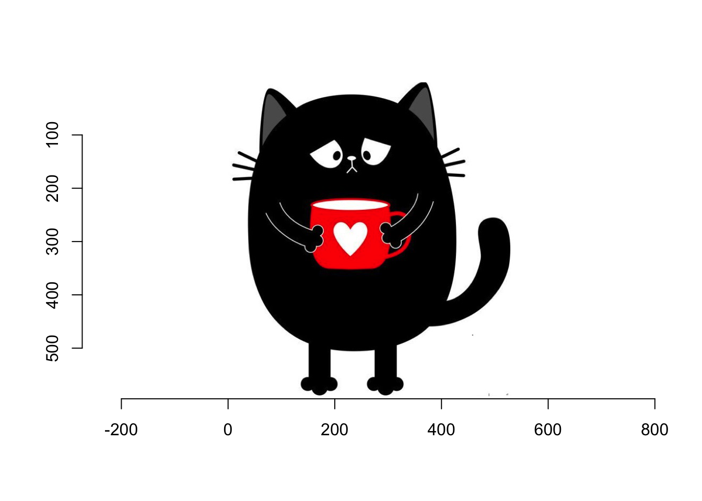
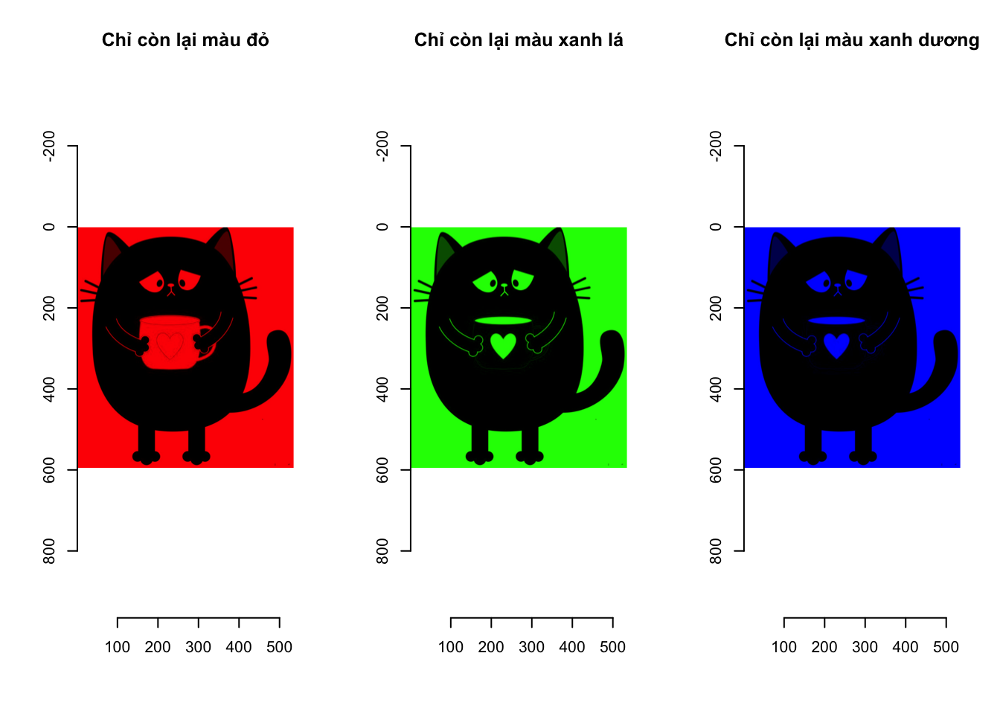
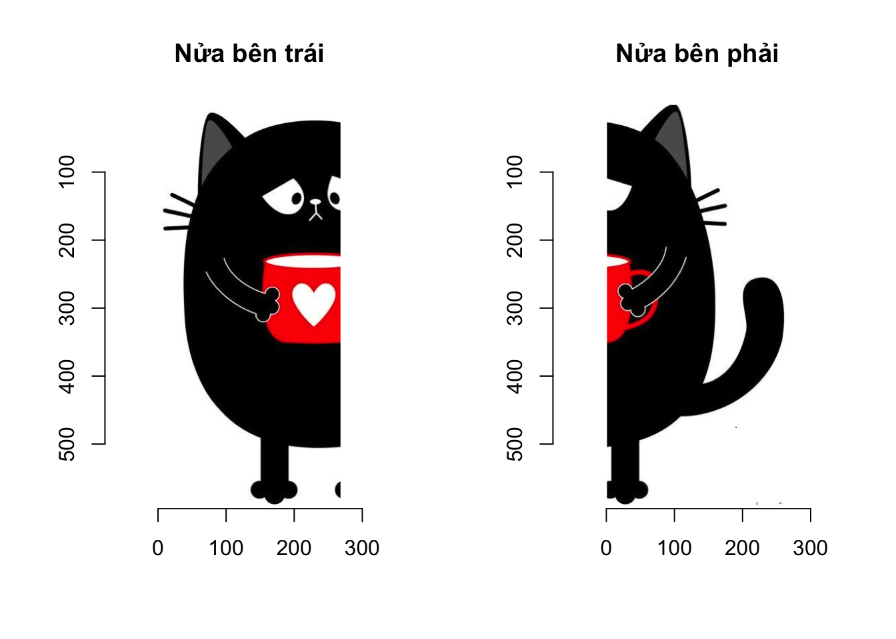
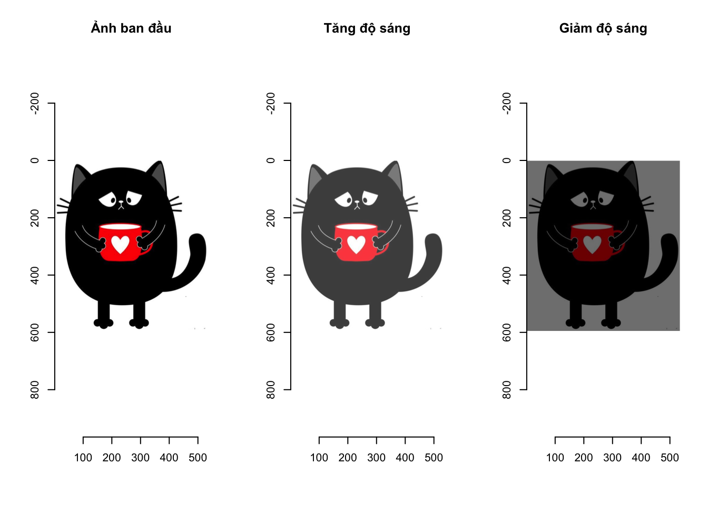
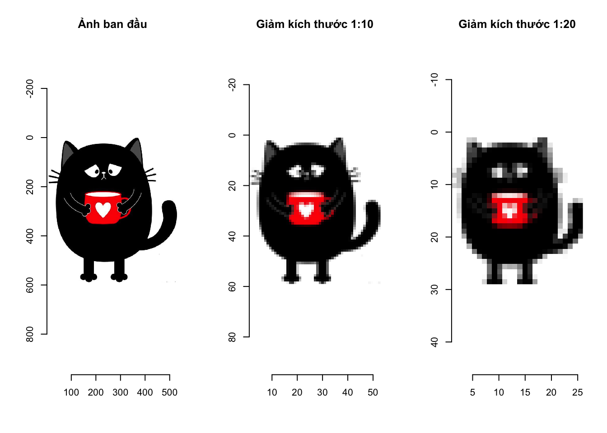
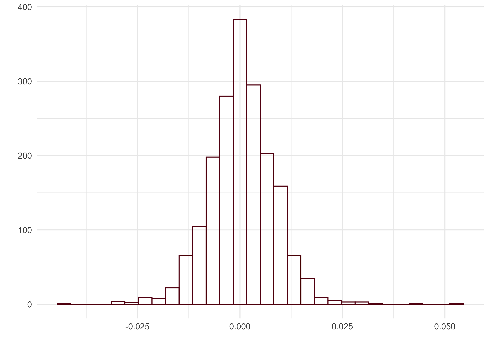
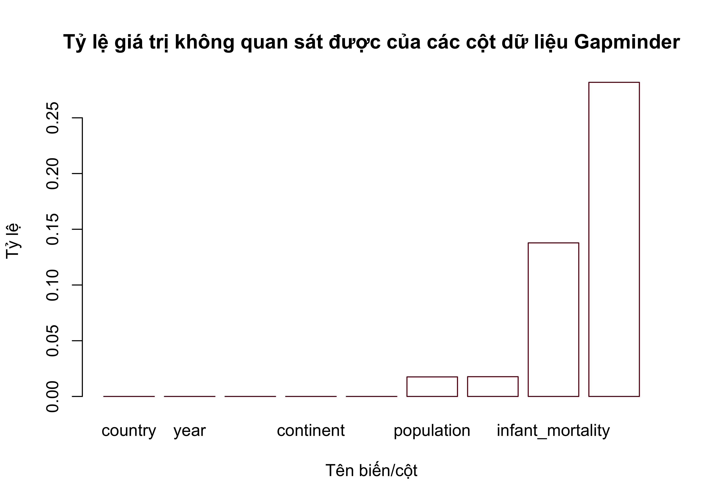
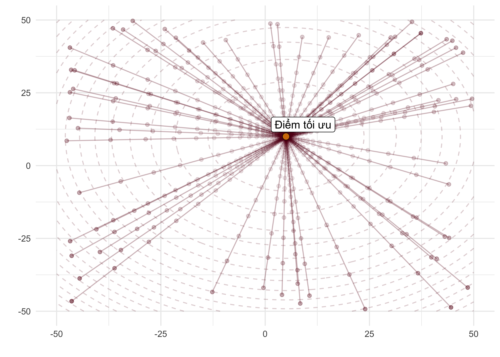

---
output:
  pdf_document: default
  html_document: default
  
header-includes:
- \usepackage{tikz}
- \usepackage{pgfplots}
- \usetikzlibrary{arrows,automata,positioning}
- \usepackage[utf8]{inputenc}
- \usepackage[utf8]{vietnam}
- \usepackage{etoolbox}
- \usepackage{xcolor}
- \usepackage{hyperref}
- \usepackage{mathtools}
- \usepackage{fontawesome5}
- \makeatletter
- \preto{\@verbatim}{\topsep=0pt \partopsep=-0pt}
- \makeatother
- \DeclareMathOperator*{\argmax}{arg\,max}
- \newcommand\tstrut{\rule{0pt}{3ex}}
- \newcommand\bstrut{\rule[-2.5ex]{0pt}{0pt}}
---


# Kiến thức R cơ bản


# Kiến thức R nâng cao

Trong cuốn sách này chúng tôi cố gắng tránh nhắc đến các khái niệm toán học phức tạp bởi đối tượng chúng tôi hướng đến là những người làm việc với dữ liệu nhưng không có một nền tảng chuyên sâu về toán học. Tuy nhiên để làm việc được với dữ liệu thì các kiến thức về ma trận nói riêng và kiến thức về đại số tuyến tính nói chung là bắt buộc phải nắm vững. Điều đáng tiếc là tại thời điểm chúng tôi viết cuốn sách này, đa số các chương trình đào tạo dành cho sinh viên các ngành kinh tế đang cắt giảm dần kiến thức về toán học và đặc biệt là kiến thức đại số tuyến tính.

## Ma trận

Ma trận có ý nghĩa đặc biệt quan trọng trong phân tích dữ liệu bởi đa số các dữ liệu đều được chuyển thành kiểu ma trận để dễ dàng phân tích và tính toán. Cũng giống như véc-tơ, ma trận là một đối tượng dùng để lưu các biến có cùng kiểu. Khác với véc-tơ, ma trận lưu phần tử theo hàng và cột, nghĩa là trong không gian hai chiều trong khi véc-tơ lưu phần tử trong không gian một chiều. Bạn đọc cũng có thể hiểu véc-tơ là một cột trong khi ma trận là tập hợp của các cột có cùng độ dài. Kích thước của một véc-tơ là chiều dài của véc-tơ đó trong khi kích thước của một ma trận là số hàng và số cột của ma trận đó.

### Khởi tạo ma trận
Hàm số dùng để tạo ra ma trận trong R là hàm <span style='color: #640514; font-family: Source Code Pro;'>matrix()</span>. Khi tạo ma trận, bạn đọc sẽ luôn luôn phải khởi tạo giá trị cho ma trận đó. Đoạn lệnh sau sẽ khởi tạo một ma trận có tên <span style='color: #640514; font-family: Source Code Pro;'>M</span>, có 3 hàng, 4 cột, và giá trị trong ma trận là các số tự nhiên từ 1 đến 12 được sắp xếp theo thứ tự

``` r
M<-matrix(1:12, nrow = 3, ncol = 4) # nrow: số hàng, ncol: số cột
M # In M
```

```
##      [,1] [,2] [,3] [,4]
## [1,]    1    4    7   10
## [2,]    2    5    8   11
## [3,]    3    6    9   12
```

Các giá trị dùng để khởi tạo cho ma trận là các số từ 1 đến 12 và được điền vào ma trận <span style='color: #640514; font-family: Source Code Pro;'>M</span> theo nguyên tắc từ trên xuống dưới rồi từ trái sang phải, nghĩa là

* Cột thứ nhất sẽ được ưu tiên cho giá trị trước; phần tử hàng thứ nhất của cột thứ nhất sẽ được điền giá trị trước tiên, sau đó đến phần tử ở hàng thứ hai của cột thứ nhất, ...
* Sau khi điền hết cột thứ nhất R sẽ tiếp tục điền vào giá trị ở hàng thứ nhất của cột thứ hai, rồi phần tử hàng hai ở cột thứ hai,... cho đến hết cột thứ hai.
* Quá trình điền số vào ma trận sẽ tiếp tục như thế sau khi tất cả các phần tử trong ma trận đều có giá trị. Véc-tơ dùng để khởi tạo giá trị cho ma trận có độ dài 12 vừa đúng với số phần tử trong ma trận nên câu lệnh tạo ma trận <span style='color: #640514; font-family: Source Code Pro;'>M</span> ở trên hoạt động bình thường. Trong trường hợp bạn đọc sử dụng véc-tơ có độ dài khác 12 để khởi tạo giá trị cho ma trận, câu lệnh vẫn sẽ chạy nhưng có kèm theo cảnh báo:


``` r
M<-matrix(1:13, nrow = 3, ncol = 4) # Sẽ có cảnh báo;
M<-matrix(1:5, nrow = 3, ncol = 4) # Sẽ có cảnh báo;
```

Bạn đọc có thể thấy rằng:

* Nếu véc-tơ dùng để khởi tạo giá trị cho ma trận <span style='color: #640514; font-family: Source Code Pro;'>M</span> có độ dài lớn hơn 12, R sẽ dùng 12 giá trị đầu tiên để khởi tạo giá trị cho ma trận.
* Nếu véc-tơ dùng để khởi tạo giá trị cho ma trận <span style='color: #640514; font-family: Source Code Pro;'>M</span> có độ dài nhỏ hơn 12, R sẽ lặp lại véc-tơ đó cho đến khi có độ dài lớn hơn hoặc bằng 12 rồi sau đó dùng 12 giá trị đầu tiên để khởi tạo giá trị cho ma trận.

Khi khởi tạo ma trận, bạn đọc có thể yêu cầu giá trị được khởi tạo theo hàng thay vì theo cột bằng tham số <span style='color: #640514; font-family: Source Code Pro;'>byrow = TRUE</span> trong hàm <span style='color: #640514; font-family: Source Code Pro;'>matrix()</span>.


``` r
M<-matrix(1:12, nrow = 3, ncol = 4, byrow = TRUE)
M # in M ra của sổ console
```

```
##      [,1] [,2] [,3] [,4]
## [1,]    1    2    3    4
## [2,]    5    6    7    8
## [3,]    9   10   11   12
```

Để biết kích cỡ của ma trận, chúng ta sử dụng hàm <span style='color: #640514; font-family: Source Code Pro;'>dim()</span>. Hàm <span style='color: #640514; font-family: Source Code Pro;'>dim()</span> trả lại giá trị là một véc-tơ kiểu số có độ dài là hai, phần tử thứ nhất là số hàng, phần tử thứ hai là số cột của ma trận:

``` r
dim(M) # ma trận 3 hàng 4 cột
```

```
## [1] 3 4
```

Ma trận cũng có thể được khởi tạo bằng cách ghép các véc-tơ hoặc các ma trận khác theo hàng hay theo cột bằng các hàm <span style='color: #640514; font-family: Source Code Pro;'>cbind()</span> hoặc <span style='color: #640514; font-family: Source Code Pro;'>rbind()</span>:

* Hàm <span style='color: #640514; font-family: Source Code Pro;'>cbind()</span> nối các ma trận có cùng số hàng hoặc ma trận với véc-tơ có độ dài bằng số hàng của ma trận.
* Tương tự, <span style='color: #640514; font-family: Source Code Pro;'>rbind()</span> nối các ma trận có cùng số cột hoặc ma trận với véc-tơ có độ dài bằng số cột của ma trận.


``` r
cbind(M,rep(1,3)) # ghép THEO CỘT, ma trận M (3 hàng, 4 cột) với véc-tơ độ dài 3
```

```
##      [,1] [,2] [,3] [,4] [,5]
## [1,]    1    2    3    4    1
## [2,]    5    6    7    8    1
## [3,]    9   10   11   12    1
```

``` r
rbind(M,rep(1,4)) # ghép THEO HÀNG, ma trận M (3 hàng, 4 cột) với véc-tơ độ dài 4
```

```
##      [,1] [,2] [,3] [,4]
## [1,]    1    2    3    4
## [2,]    5    6    7    8
## [3,]    9   10   11   12
## [4,]    1    1    1    1
```

Các phép tính toán thông thường trên ma trận cũng có nguyên tắc giống như đối với véc-tơ. Các phép toán như cộng, trừ, nhân, chia, lũy thừa, ..., sẽ tác động lên tất cả các phần tử trong ma trận theo thứ tự của các phần tử xuất hiện trên ma trận. Ví dụ khi nhân ma trận <span style='color: #640514; font-family: Source Code Pro;'>M</span> kích thước 3 $\times$ 4 với một số ta sẽ có kết quả như sau:

``` r
M<-matrix(1:12, nrow = 3, ncol = 4)
M * 2 # in M*2 ra của sổ console
```

```
##      [,1] [,2] [,3] [,4]
## [1,]    2    8   14   20
## [2,]    4   10   16   22
## [3,]    6   12   18   24
```
Bạn đọc có thể thấy rằng kết quả nhận được là một ma trận có kích thước bằng với kích thước của ma trận M và mỗi phần tử bằng phần tử ở vị trí tương ứng của ma trận <span style='color: #640514; font-family: Source Code Pro;'>M</span> nhân với 2.

Khi thực hiện phép nhân thông thường ma trận <span style='color: #640514; font-family: Source Code Pro;'>M</span> với một ma trận <span style='color: #640514; font-family: Source Code Pro;'>M1</span> có cùng kích thước thì kết quả nhận được là một ma trận mà mỗi phần tử bằng tích của 2 phần tử ở vị trí tương ứng của <span style='color: #640514; font-family: Source Code Pro;'>M</span> và <span style='color: #640514; font-family: Source Code Pro;'>M1</span>. R sẽ báo lỗi nếu thực hiện phép nhân thông thường giữa hai ma trận không có cùng kích thước:

``` r
M<-matrix(1:12, nrow = 3, ncol = 4)
M1<-matrix(rep(c(0,1),6), nrow = 3, ncol = 4)
M * M1# in M * M1 ra của sổ console
```

```
##      [,1] [,2] [,3] [,4]
## [1,]    0    4    0   10
## [2,]    2    0    8    0
## [3,]    0    6    0   12
```

Phép nhân thông thường cũng có thể được thực hiện giữa ma trận <span style='color: #640514; font-family: Source Code Pro;'>M</span> với một véc-tơ có độ dài nhỏ hơn hoặc bằng số phần tử của <span style='color: #640514; font-family: Source Code Pro;'>M</span>. Trước khi thực hiệp phép nhân, R sẽ chuyển các phần tử trong véc-tơ vào một ma trận có kích thước tương ứng với <span style='color: #640514; font-family: Source Code Pro;'>M</span> sau đó thực hiện phép nhân giống như nhân hai ma trận có cùng kích thước:


``` r
M<-matrix(1:12, nrow = 3, ncol = 4)
x<-c(-2,-1,0,1,2) # véc-tơ độ dài 5
M * x # phép nhân được thực hiện mà không báo lỗi
```

```
##      [,1] [,2] [,3] [,4]
## [1,]   -2    4   -7   20
## [2,]   -2   10    0  -22
## [3,]    0  -12    9  -12
```

Khi thực hiện tính toán như trên, R đã tự động lặp lại véc-tơ <span style='color: #640514; font-family: Source Code Pro;'>x</span> cho đến khi số lượng phần tử bằng với số phần tử của <span style='color: #640514; font-family: Source Code Pro;'>M</span>, điền các giá trị này vào một ma trận có kích thước bằng với kích thước của <span style='color: #640514; font-family: Source Code Pro;'>M</span> rồi sau đó thực hiện phép nhân. Thật vậy, chúng ta có thể kiểm tra như sau:

``` r
y<-rep(x,3)
# Lặp lại x cho đến khi số phần tử của véc-tơ thu được lớn hơn 12

M1<-matrix(y[1:12],nrow = 3, ncol = 4)
# Dùng 12 giá trị ban đầu để tạo thành ma trận có cùng kích thước 3*4

M * M1 # Kết quả giống như M * x
```

```
##      [,1] [,2] [,3] [,4]
## [1,]   -2    4   -7   20
## [2,]   -2   10    0  -22
## [3,]    0  -12    9  -12
```

### Lấy phần tử con và ma trận con của ma trận.
Tương tự như với véc-tơ, chúng ta sử dụng dấu ngoặc vuông <span style='color: #640514; font-family: Source Code Pro;'>[]</span> để lấy phần tử con trong ma trận. Khác với véc-tơ, ma trận có chỉ số hàng và chỉ số cột nên chúng ta cần cho biết phần tử được lấy ra ở hàng thứ bao nhiêu và cột thứ bao nhiêu:


``` r
M[2,3] # Phần tử ở hàng thứ hai, cột thứ ba của ma trận M
```

```
## [1] 8
```

Chúng ta cũng có thể lấy ra véc-tơ hàng hoặc véc-tơ cột của ma trận bằng cách sau

``` r
M[,3] # Lấy ra véc-tơ cột thứ 3 của ma trận M
```

```
## [1] 7 8 9
```

``` r
M[2,] # Lấy ra véc-tơ hàng thứ 2 của ma trận M
```

```
## [1]  2  5  8 11
```

Để lấy ra một ma trận con của một ma trận, chúng ta cũng tạo véc-tơ chỉ số giống như cách tạo chỉ số với véc-tơ. Thay vì chỉ tạo một véc-tơ chỉ số duy nhất như khi làm với véc-tơ, chúng ta cần tạo một véc-tơ chỉ số theo hàng và một véc-tơ chỉ số theo cột. Bạn đọc có thể tạo chỉ số bằng một véc-tơ kiểu số hoặc véc-tơ kiểu logical hoặc kết hợp cả hai phương pháp này


``` r
chi_so_hang<-c(TRUE,FALSE,TRUE) # Chỉ số theo hàng kiểu logical
chi_so_cot<-c(2,4) # Chỉ số cột theo kiểu số
M[chi_so_hang,chi_so_cot] # Ma trận con của ma trận M
```

```
##      [,1] [,2]
## [1,]    4   10
## [2,]    6   12
```

### Các phép toán trên ma trận
Các phép toán trên ma trận có ý nghĩa đặc biệt quan trọng trong phân tích dữ liệu. Ở các chương tiếp theo bạn đọc sẽ thấy rằng tất cả các tính toán nhằm biến đổi dữ liệu, hoặc ước lượng tham số cho các mô hình trên dữ liệu đều dựa trên các phép tính toán trên ma trận. Chúng tôi sẽ giải thích các phép toán này một cách đơn giản nhất để những bạn đọc không có nền tảng chuyên sâu về toán cũng có thể hiểu được. Tuy nhiên, để có kỹ năng thành thạo trong biến đổi dữ liệu, phân tích dữ liệu, và xây dựng các mô hình trên dữ liệu, chúng tôi khuyên bạn đọc nên tự trang bị cho mình các kiến thức về ma trận nói riêng và đại số tuyến tính nói chung.

#### Phép chuyển vị
Phép toán chuyển vị (transpose) là một phép toán biến đổi một ma trận $M$ kích thước $n \times p$ thành một ma trận mới, ký hiệu là $M^T$, có kích thước $p \times n$. Phần tử hàng thứ $j$ và cột thứ $i$ của ma trận $M^T$ bằng phần tử ở hàng thứ $i$ và cột thứ $j$ của ma trận $M$.

\begin{align}
\begin{bmatrix}
m_{11} & m_{12} & m_{13}\\
m_{21} & m_{22} & m_{23}
\end{bmatrix}

\xrightarrow[\text{(transpose)}]{\text{chuyển vị}}

\begin{bmatrix}
m_{11} & m_{21} \\
m_{12} & m_{22} \\
m_{13} & m_{23}
\end{bmatrix}
(#eq:mat01)
\end{align}

Hàm số để thực hiện phép chuyển vị ma trận trong R là hàm <span style='color: #640514; font-family: Source Code Pro;'>t()</span>

``` r
M<-matrix(1:12, nrow = 3, ncol = 4, byrow = TRUE) # nrow: số hàng, ncol: số cột
M # in M ra của sổ console
```

```
##      [,1] [,2] [,3] [,4]
## [1,]    1    2    3    4
## [2,]    5    6    7    8
## [3,]    9   10   11   12
```

``` r
t(M) # ma trận chuyển vị của ma trận
```

```
##      [,1] [,2] [,3]
## [1,]    1    5    9
## [2,]    2    6   10
## [3,]    3    7   11
## [4,]    4    8   12
```

Bạn đọc có thể thấy rằng nếu thực hiện phép chuyển vị hai lần liên tiếp ta sẽ thu được ma trận ban đầu

``` r
t(t(M)) # ma trận chuyển vị của ma trận chuyển vị là ma trận ban đầu
```

```
##      [,1] [,2] [,3] [,4]
## [1,]    1    2    3    4
## [2,]    5    6    7    8
## [3,]    9   10   11   12
```

### Phép nhân ma trận
Phép nhân ma trận (matrix multiplication) của ma trận $A$ với ma trận $B$ chỉ thực hiện được nếu số cột của ma trận $A$ bằng với số hàng của ma trận $B$. Giả sử rằng $A$ có kích thước là $n \times p$ và $B$ có kích thước là $p \times k$ thì kết quả của phép nhân ma trận của ma trận $A$ với ma trận $B$ là một ma trận $M$ có kích thước $n \times k$, phần tử ở hàng thứ $i$ và cột thứ $j$ của ma trận $M$ là tích vô hướng giữa véc-tơ hàng $i$ của ma trận $A$ và véc-tơ cột $j$ của ma trận $B$. Nhắc lại với bạn đọc rằng tích vô hướng của hai véc-tơ $x$ và $y$ (phải) có cùng độ dài $n$ được ký hiệu là $<x,y>$ và được tính như sau

\begin{align}
<x,y> = \sum\limits_{i = 1}^n \ x_i y_i
\end{align}

trong đó $x_i$, $y_i$ lần lượt là phần tử thứ $i$ của véc-tơ $x$ và véc-tơ $y$.

Để phân biệt phép nhân ma trận với phép nhân thông thường, chúng tôi sử dụng ký hiệu <span style='color: #640514; font-family: Source Code Pro;'>*</span> cho phép nhân ma trận mà chỉ đơn giản ký hiệu phép nhân ma trận giữa ma trận $A$ và ma trận $B$ là $AB$. Công thức dưới đây mô tả phép nhân ma trận giữa một ma trận có 2 hàng và 3 cột với một ma trận có 3 hàng và 4 cột để được một ma trận có kích thước là 2 hàng và 4 cột

\begin{align}
& AB = M \\

& \begin{bmatrix}
a_{11} & a_{12} & a_{13}\\
a_{21} & a_{22} & a_{23}
\end{bmatrix}

\% * \%

\begin{bmatrix}
b_{11} & b_{12} & b_{13} & b_{14} \\
b_{21} & b_{22} & b_{23} & b_{24} \\
b_{31} & b_{32} & b_{33} & b_{34}
\end{bmatrix}

=

\begin{bmatrix}
m_{11} & m_{12} & m_{13} & m_{14} \\
m_{21} & m_{22} & m_{23} & m_{24} \\
\end{bmatrix} \\

& m_{ij} = <A[i,],B[,j]>
(#eq:mat02)
\end{align}

trong đó $A[i,]$ là véc-tơ hàng $i$ của ma trận $A$ và $B[,j]$ là véc-tơ cột $j$ của ma trận $B$.

Toán tử dùng để thực hiện phép nhân ma trận trong R là <span style='color: #640514; font-family: Source Code Pro;'>%*%</span>. Bạn đọc có thể thực hiện phép nhân hai ma trận <span style='color: #640514; font-family: Source Code Pro;'>A</span> và <span style='color: #640514; font-family: Source Code Pro;'>B</span> như sau

``` r
A<-matrix(1:6, nrow = 2, ncol = 3) # ma trận kích thước 2 * 3
print(A)
```

```
##      [,1] [,2] [,3]
## [1,]    1    3    5
## [2,]    2    4    6
```

``` r
B<-matrix(1:12, nrow = 3, ncol = 4) # ma trận kích thước 3 * 4
print(B)
```

```
##      [,1] [,2] [,3] [,4]
## [1,]    1    4    7   10
## [2,]    2    5    8   11
## [3,]    3    6    9   12
```

``` r
M <- A %*% B # kết quả là ma trận M có kich thước 2 * 4
print(M)
```

```
##      [,1] [,2] [,3] [,4]
## [1,]   22   49   76  103
## [2,]   28   64  100  136
```

Chúng ta có thể kiểm tra giá trị của phần tử ở hàng thứ 2 và cột thứ 3 của ma trận kết quả (số 100) chính là tích vô hướng giữa véc-tơ hàng thứ hai của ma trận <span style='color: #640514; font-family: Source Code Pro;'>A</span> và véc-tơ cột thứ ba của ma trận <span style='color: #640514; font-family: Source Code Pro;'>B</span>.

\begin{align}
<(2,4,6),(7,8,9)> = 2 \times 7 + 4 \times 8 + 6 \times 9 = 100
\end{align}

Bạn đọc cần phân biệt giữa phép nhân ma trận (ký hiệu <span style='color: #640514; font-family: Source Code Pro;'>%*%</span>) và phép nhân thông thường (ký hiệu <span style='color: #640514; font-family: Source Code Pro;'>\*</span>) như đã trình bày ở trên. Để tránh gây nhầm lẫn, chúng tôi luôn sử dụng cụm từ nhân ma trận cho phép nhân <span style='color: #640514; font-family: Source Code Pro;'>%\*%</span>.

### Ma trận đường chéo và ma trận đơn vị
Các khái niệm và phép toán trên ma trận được trình bày bắt đầu từ phần này sẽ chỉ áp dụng trên ma trận vuông, nghĩa là ma trận có số hàng bằng với số cột. Trong một ma trận vuông, các phần tử nằm trên đường chéo chính là các phần tử có chỉ số hàng bằng với chỉ số cột, các phần tử nằm trên đường chéo phụ là các phần tử có chỉ số hàng cộng với chỉ số cột bằng $n+1$ trong đó $n$ là số hàng (hay cột) của ma trận vuông. Với ma trận vuông <span style='color: #640514; font-family: Source Code Pro;'>M</span> có kích thước $n \times n$ đường chéo chính của ma trận được ký hiệu là <span style='color: #640514; font-family: Source Code Pro;'>diag(M)</span> xác định như sau

\begin{align}
& M
=
\begin{bmatrix}
m_{11} & m_{12} & m_{13} & m_{14} \\
m_{21} & m_{22} & m_{23} & m_{24} \\
m_{31} & m_{32} & m_{33} & m_{34}\\
m_{41} & m_{42} & m_{43} & m_{44}
\end{bmatrix} \\
& \\
& diag(M) = (m_{11}, m_{22}, m_{33},  m_{44})
(#eq:mat03)
\end{align}

Ma trận có tất cả các phần tử nằm ngoài đường chéo chính bằng 0 được gọi là ma trận đường chéo. Hàm <span style='color: #640514; font-family: Source Code Pro;'>diag()</span> trong R được sử dụng để lấy ra véc-tơ đường chéo chính của một ma trận vuông, hoặc để tạo ra một ma trận đường chéo, hoặc cũng có thể dùng để khai báo một ma trận đường chéo:

``` r
M<-matrix(1:9, nrow = 3, ncol = 3)
diag(M) # Lấy ra véc-tơ đường chéo chính của M
```

```
## [1] 1 5 9
```

``` r
# Tạo ra ma trận đường chéo có đường chéo chính là (1,10,100)
M1<-diag(c(1,10,100))
print(M1)
```

```
##      [,1] [,2] [,3]
## [1,]    1    0    0
## [2,]    0   10    0
## [3,]    0    0  100
```

Ma trận đơn vị kích thước $n \times n$, thường được ký hiệu $I_n$, là một ma trận đường chéo mà tất cả các phần tử trên đường chéo chính bằng 1. Ma trận đơn vị $I_n$ có tính chất quan trọng là mọi ma trận <span style='color: #640514; font-family: Source Code Pro;'>M</span> kích thước $k \times n$ khi thực hiện phép nhân ma trận với ma trận $I_n$ sẽ có kết quả đúng bằng ma trận <span style='color: #640514; font-family: Source Code Pro;'>M</span>. Bạn đọc có thể quan sát ví dụ sau:


``` r
In<-diag(rep(1,4)) # ma trận đơn vị kích thước 4*4
print(In)
```

```
##      [,1] [,2] [,3] [,4]
## [1,]    1    0    0    0
## [2,]    0    1    0    0
## [3,]    0    0    1    0
## [4,]    0    0    0    1
```

``` r
M<-matrix(1:20, nrow = 5, ncol = 4) # ma trận vuông 5 * 4
print(M %*% In) # kết quả vẫn là ma trận M
```

```
##      [,1] [,2] [,3] [,4]
## [1,]    1    6   11   16
## [2,]    2    7   12   17
## [3,]    3    8   13   18
## [4,]    4    9   14   19
## [5,]    5   10   15   20
```

### Định thức của ma trận
Định thức của ma trận là một khái niệm toán học phức tạp. Phần lớn bạn đọc khi làm quen với khái niệm định thức trong môn học đại số tuyến tính sẽ được giới thiệu về công thức tính định thức của một ma trận, hoặc sử dụng định thức của ma trận để thực hiện tính toán như giải hệ phương trình thay vì thực sự hiểu khái niệm định thức được bắt đầu từ đâu. Định thức là *một giá trị số thực đặc trưng của một ma trận vuông*. Định thức cho biết nhiều tính chất quan trọng của ma trận đó, đồng thời định thức xuất hiện trong rất nhiều tính toán liên quan đến ma trận.

Hãy bắt đầu với một ma trận vuông $M$ kích thước $2 \times 2$ như sau:
\begin{align}
M
=
\begin{bmatrix}
m_{11} & m_{12}\\
m_{21} & m_{22}
\end{bmatrix}
\end{align}

Định thức của ma trận $M$ được ký hiệu là $|M|$ hoặc $det(M)$ được xác định bởi công thức
\begin{align}
det(M) = m_{11} \times m_{22} - m_{12} \times m_{21}
(#eq:mat04)
\end{align}

Định thức của ma trận <span style='color: #640514; font-family: Source Code Pro;'>M</span> có thể biểu diễn dưới dạng diện tích của hình bình hành tạo thành từ 4 điểm có tọa độ $(0,0)$, $(m_{11},m_{12})$, $(m_{21},m_{22})$, và $(m_{11}+m_{21}, m_{12}+m_{22})$. Thật vậy, giả sử hai ma trận $M$ và $M_1$ có kích thước $2 \times 2$; ma trận $M_1$ nhận được bằng cách đổi vị trí 2 dòng của ma trận $M$,

\begin{align}
& M
=
\begin{bmatrix}
2 & 1 \\
1 & 3
\end{bmatrix}  \text{  và  } M_1
=
\begin{bmatrix}
1 & 3 \\
2 & 1
\end{bmatrix} \\
& \\

& det(M) = 5  \text{  và  } det(M_1) = -5

\end{align}

Hiểu một cách đơn giản, chúng ta có thể coi định thức của $M$ và $M_1$ qua diện tích của các hình bình hành tạo bởi hai véc-tơ (2,1) và véc-tơ (1,3) giống như hình \@ref(fig:fgadvr01). Sự khác nhau của hai định thức chỉ ở thứ tự véc-tơ: đối với định thức của $M$ thì véc-tơ $(2,1)$ được đặt trước trong khi đối với định thức của $M_1$ thì véc-tơ $(1,3)$ được tính đến trước.

<div class="figure" style="text-align: center">

<p class="caption">(\#fig:fgadvr01 )Định thức của ma trận kích thước 2 * 2 có thể được biểu diễn dưới dạng diện tích. Hình bên trái: Định thức là số dương vì véc-tơ hàng thứ nhất (2,1) nằm phía bên phải véc-tơ hàng thứ hai (1,3). Hình bên phải: Định thức là số âm vì véc-tơ hàng thứ nhất (1,3) nằm phía bên trái véc-tơ hàng thứ hai (2,1)</p>
</div>

Giá trị của định thức sẽ cho ta biết thông tin về các véc-tơ tạo nên ma trận:

* Định thức bằng 0 chỉ xảy ra khi hai véc-tơ (hai mũi tên màu xanh và màu cam xuất phát từ điểm $(0,0)$) trùng nhau hoặc đối đỉnh nhau. Điều này chỉ xảy ra khi véc-tơ thứ nhất bằng véc-tơ thứ hai nhân với một số. Trong trường hợp tổng quát với ma trận vuông kích thước $n \times n$, định thức bằng 0 khi một véc-tơ nào đó là tổ hợp tuyến tính của các véc-tơ còn lại.
* Định thức gần bằng 0 nghĩa là góc tạo bởi 2 véc-tơ rất gần 0 hoặc tạo với nhau một góc xấp xỉ 180 độ. Ma trận vuông kích thước $n \times n$ có định thức xấp xỉ bằng 0 nghĩa là mối liên hệ tuyến tính giữa các véc-tơ của ma trận là rất chặt chẽ.
* Dấu của định thức cho ta biết vị trí của các véc-tơ. Véc-tơ hàng thứ nhất tương ứng với màu xanh trong khi véc-tơ hàng thứ hai tương ứng với màu cam. Dấu của định thức dương chỉ khi véc-tơ màu xanh nằm phía trên (bên trái) véc-tơ màu cam, và dấu của định thức là âm chỉ khi véc-tơ màu xanh nằm phía dưới (bên phải) véc-tơ màu cam.

Với các ma trận vuông kích thước $n \times n$; $n \geq 3$ định thức của ma trận được tính bằng cách lựa chọn một dòng (hoặc cột) thứ $i$ bất kỳ và sau đó thực hiện phép khai triển
\begin{align}
det(M) = \sum\limits_{j = 1}^n (-1)^{i+j} \times m_{ij} \times det(M_{-i,-j})
(#eq:mat05)
\end{align}
trong đó $M_{\{-i,-j\}}$ mà ma trận vuông kích thước $(n-1) \times (n-1)$ nhận được sau khi bỏ đi hàng thứ $i$ và cột thứ $j$ của ma trận $M$.

Định thức của ma trận $M$ kích thước $3 \times 3$ có thể tính toán dựa trên định thức của các ma trận con và lựa chọn hàng $i=2$ như sau

\begin{align}
& M
=
\begin{bmatrix}
m_{11} & m_{12} & m_{13}  \\
m_{21} & m_{22} & m_{23} \\
m_{31} & m_{32} & m_{33}
\end{bmatrix} \\
& \\
& det(M) = - m_{21} \times \begin{vmatrix}
m_{12} & m_{13}  \\
m_{32} & m_{33}
\end{vmatrix} + m_{22} \times \begin{vmatrix}
m_{11} & m_{13}  \\
m_{31} & m_{33}
\end{vmatrix} - m_{23} \times \begin{vmatrix}
m_{11} & m_{12}  \\
m_{31} & m_{32}
\end{vmatrix}
(#eq:mat06)
\end{align}

Hàm <span style='color: #640514; font-family: Source Code Pro;'>det()</span> trong R được sử dụng để tính định thức của ma trận.

``` r
M<-matrix(c(2,1,1,3),nrow = 2,ncol = 2,byrow = TRUE)
det(M)
```

```
## [1] 5
```

Một vài tính chất quan trọng của định thức:

* Định thức của một ma trận đường chéo bằng tích các phần tử nằm trên đường chéo chính của ma trận đó. Ma trận đường chéo là một trường hợp đặc biệt của ma trận tam giác. Ma trận tam giác trên là ma trận có tất cả các phần tử nằm phía dưới đường chéo chính nhận giá trị bằng 0. Tương tự, ma trận tam giác dưới là ma trận có tất cả các phần tử nằm phía trên đường chéo chính nhận giá trị bằng 0. Các ma trận tam giác có tính chất như đã phát biểu ở trên: định thức của các ma trận này bằng tích các phần tử nằm trên đường chéo chính.

``` r
M<-matrix(1:16,nrow = 4,ncol = 4)
M[lower.tri(M)]<-0 # cho các phần tử phía dưới đường chéo chính bằng 0
print(M) # ma trận M là ma trận tam giác trên
```

```
##      [,1] [,2] [,3] [,4]
## [1,]    1    5    9   13
## [2,]    0    6   10   14
## [3,]    0    0   11   15
## [4,]    0    0    0   16
```

``` r
print(c(det(M), prod(diag(M)))) # định thức của M bằng tích các số trên đường chéo chính
```

```
## [1] 1056 1056
```

* Định thức của ma trận chuyển vị của một ma trận bằng định thức của ma trận đó. Bạn đọc có thể kiểm tra bằng câu lệnh trên R như sau
\begin{align}
det(M) = det(M^T)
\end{align}

``` r
M<-matrix(rnorm(16),nrow = 4,ncol = 4)
print(c(det(M),det(t(M))))
```

```
## [1] -6.01071 -6.01071
```

* Định thức của tích hai ma trận bằng tích của các định thức. Lưu ý rằng phép nhân hai ma trận vuông chỉ có ý nghĩa khi đây là hai ma trận vuông có cùng kích thước:
\begin{align}
det(A \% * \% B) = det(A) \times det(B)
\end{align}

``` r
M<-matrix(rnorm(16),nrow = 4,ncol = 4)
M1<-matrix(rnorm(16),nrow = 4,ncol = 4)
print(c(det(M%*%M1),det(M)*det(M1)))
```

```
## [1] -0.01820125 -0.01820125
```

### Ma trận nghịch đảo
Ma trận nghịch đảo của một ma trận vuông $M$, thường được ký hiệu $M^{-1}$, là ma trận vuông có cùng kích thước với ma trận $M$ và thỏa mãn tính chất: phép nhân ma trận giữa ma trận $M$ với ma trận nghịch đảo $M^{-1}$ sẽ cho kết quả là một ma trận đơn vị. Không phải ma trận vuông nào cũng có ma trận nghịch đảo; chỉ có các ma trận có định thức khác 0 là có ma trận nghịch đảo. Các ma trận có ma trận nghịch đảo được còn được gọi là các ma trận khả nghịch. Các ma trận khả nghịch luôn có một ma trận nghịch đảo duy nhất.

\begin{align}
M \ \% * \% \ M^{-1} = I_n
(#eq:mat07)
\end{align}

Hai lần lấy nghịch đảo liên tiếp với một ma trận khả nghịch sẽ quay trở lại ma trận ban đầu, hay nói một cách khác ma trận nghịch đảo của ma trận $M^{-1}$ chính là ma trận $M$
\begin{align}
M^{-1} \ \% * \% \ M = I_n
\end{align}

Phương pháp chung để tính toán ma trận nghịch đảo là dựa trên các ma trận liên hợp (adjugate matrix). Ma trận liên hợp của ma trận $M$ được ký hiệu là $adj(M)$ là ma trận vuông kích thước $n \times n$ mà phần tử ở hàng thứ $i$, cột thứ $j$ được tính bằng
\begin{align}
adj(M)_{ij} = (-1)^{j+i} det(M_{\{-j,-i\}})
(#eq:mat08)
\end{align}

Khi tính toán định thức của ma trận $M$, chúng tôi đã sử dụng ký hiệu $M_{\{-j,-i\}}$ cho ma trận vuông kích thước $(n-1) \times (n-1)$ nhận được sau khi bỏ đi hàng thứ $j$ và cột thứ $i$ của ma trận $M$. Bạn đọc lưu ý rằng có sự thay đổi vị trí của $i$ và $j$ trong vế phải của phương trình \@ref(eq:mat08). Ma trận nghịch đảo $M^{-1}$ được tính từ ma trận liên hợp như sau
\begin{align}
M^{-1} = \cfrac{1}{det(M)} adj(M)_{ij}
(#eq:mat09)
\end{align}

Nhìn chung, để tính toán ma trận nghịch đảo của một ma trận kích thước $n \times n$, chúng ta sẽ phải tính toán định thức của ma trận ban đầu và định thức của $n^2$ ma trận vuông có kích thước $(n-1) \times (n-1)$. Với các ma trận vuông có kích thước lớn, việc tính toán sử dụng công thức như trên sẽ tốn nhiều thời gian và bộ nhớ. Có nhiều thuật toán để tính xấp xỉ ma trận nghịch đảo của một ma trận. Nội dung của các thuật toán này vượt quá phạm vi của cuốn sách. Bạn đọc có thể sử dụng hàm <span style='color: #640514; font-family: Source Code Pro;'>solve()</span> có sẵn trong để tính toán ma trận nghịch đảo như sau

``` r
set.seed(10)

# Tạo ma trận gồm toàn các số ngẫu nhiên
M<-matrix(rnorm(16),nrow = 4,ncol = 4)
M1<-solve(M) # Ma trận M1 là ma trận nghịch đảo của ma trận M

# Kiểm tra:
M1 %*% M # Tích của M1 với M là ma trận đơn vị
```

```
##               [,1]         [,2]          [,3]          [,4]
## [1,]  1.000000e+00 1.110223e-16 -4.440892e-16  2.220446e-16
## [2,]  2.220446e-16 1.000000e+00  0.000000e+00 -2.220446e-16
## [3,] -5.551115e-17 0.000000e+00  1.000000e+00 -1.387779e-17
## [4,]  1.110223e-16 1.110223e-16  0.000000e+00  1.000000e+00
```

``` r
M %*% M1 # Tích của M với M1 là ma trận đơn vị
```

```
##               [,1]          [,2]          [,3]          [,4]
## [1,]  1.000000e+00 -2.775558e-17 -2.775558e-17 -5.551115e-17
## [2,]  0.000000e+00  1.000000e+00  0.000000e+00 -2.220446e-16
## [3,] -5.551115e-17  0.000000e+00  1.000000e+00  4.440892e-16
## [4,]  2.775558e-17 -4.163336e-17 -8.326673e-17  1.000000e+00
```

Các tính toán liên quan đến định thức cần nhớ

1. Định thức của ma trận sau khi nhân tất cả các phần tử với một số
\begin{align}
det(\lambda M) = \lambda^n \times det(M)
(#eq:mat10)
\end{align}

2. Định thức của ma trận chuyển vị $M^{-T}$ bằng định thức của ma trận $M$
\begin{align}
det(M^T) = det(M)
(#eq:mat11)
\end{align}

3. Tích của định thức của ma trận $M^{-1}$ với định thức của ma trận $M$ bằng 1.
\begin{align}
det(M^{-1}) \times det(M) = det(I_n) = 1
(#eq:mat12)
\end{align}

## Mảng nhiều chiều
Ma trận lưu phần tử trong hai chiều mà chúng ta gọi là hàng và cột. Đa số dữ liệu kiểu bảng biểu truyền thống đều có thể biểu diễn dưới dạng ma trận. Tuy nhiên có những kiểu dữ liệu mà khi biểu diễn dưới dạng ma trận hai chiều là không dễ dàng và có thể gây nhầm lẫn cho người sử dụng. Có thể kể đến dữ liệu kiểu hình ảnh. Khi bạn đọc lưu một bức ảnh màu lên trên máy tính điện tử, bức ảnh sẽ được số hóa thành một mảng ba chiều, bao gồm có chiều cao, chiều rộng của ảnh và một chiều thứ ba là màu sắc của điểm ảnh. Phức tạp hơn nữa nếu dữ liệu là một đoạn phim, hay một hình động, bạn đọc sẽ cần phải sử dụng thêm chiều thứ tư để mô tả thời gian xuất hiện của mỗi hình ảnh trong đoạn phim.

Thông thường thì người làm việc với dữ liệu sẽ đổi các mảng nhiều chiều về mảng hai chiều hoặc một chiều (véc-tơ) để dễ dàng xử lý. Tuy nhiên, bạn đọc cũng cần nằm được các thao tác cơ bản khi làm việc với mảng nhiều chiều để xử lý được các dữ liệu như đề cập ở trên.

### Khởi tạo mảng nhiều chiều
Để tạo mảng nhiều chiều bạn đọc sử dụng hàm <span style='color: #640514; font-family: Source Code Pro;'>array()</span>.

``` r
Ar<-array(1:24,dim=c(2,3,4)) # mảng 3 chiều
Ar # hiển thị mảng 3 chiều Ar
```

```
## , , 1
## 
##      [,1] [,2] [,3]
## [1,]    1    3    5
## [2,]    2    4    6
## 
## , , 2
## 
##      [,1] [,2] [,3]
## [1,]    7    9   11
## [2,]    8   10   12
## 
## , , 3
## 
##      [,1] [,2] [,3]
## [1,]   13   15   17
## [2,]   14   16   18
## 
## , , 4
## 
##      [,1] [,2] [,3]
## [1,]   19   21   23
## [2,]   20   22   24
```
Bạn đọc có thể thấy R hiển thị mảng ba chiều <span style='color: #640514; font-family: Source Code Pro;'>Ar</span> kích thước $2 \times 3 \times 4$ như là sự kết hợp của 4 ma trận kích thước $2 \times 3$. Tương tự như khi khởi tạo giá trị cho ma trận, số lượng phần tử đưa vào trong mảng phải bằng với số phần tử của mảng, trong trường hợp mảng <span style='color: #640514; font-family: Source Code Pro;'>Ar</span> ở trên là véc-tơ có độ dài 24 tương ứng với $2 \times 3 \times 4 = 24$ phần tử của mảng.

Để lấy ra các phần tử con (một biến, một ma trận, hay 1 mảng nhiều chiều) từ một nhiều mảng, bạn đọc sử dụng dấu ngoặc vuông <span style='color: #640514; font-family: Source Code Pro;'>[]</span> giống như khi làm với ma trận. Lưu ý rằng khi lấy phần tử con từ một mảng, bạn đọc cần phải sử dụng chỉ số cho tất cả các chiều.

``` r
Ar[1,2,1] # phần tử có các chỉ số 1 - 2 - 1
```

```
## [1] 3
```

``` r
Ar[,,1] # ma trận 2 * 3
```

```
##      [,1] [,2] [,3]
## [1,]    1    3    5
## [2,]    2    4    6
```

``` r
Ar[,c(1,3),c(1,4)] # mảng trận 2 * 2 * 2
```

```
## , , 1
## 
##      [,1] [,2]
## [1,]    1    5
## [2,]    2    6
## 
## , , 2
## 
##      [,1] [,2]
## [1,]   19   23
## [2,]   20   24
```

Thứ tự các phần tử khi điền vào mảng khi sử dụng hàm trong hàm <span style='color: #640514; font-family: Source Code Pro;'>array()</span> sẽ là ưu tiên ma trận kích thước $2 \times 3$ tương ứng với chỉ số <span style='color: #640514; font-family: Source Code Pro;'>[,,1]</span> trước, rồi đến ma trận kích thước $2 \times 3$ tương ứng với chỉ số <span style='color: #640514; font-family: Source Code Pro;'>[,,2]</span>, ..., và tiếp tục như thế cho đến khi tất cả các phần tử của mảng được gán giá trị.

### Sử dụng mảng nhiều chiều để biến đổi dữ liệu kiểu hình ảnh
Để bạn đọc có cái nhìn trực quan hơn về mảng nhiều chiều, chúng ta sẽ thực hiện các phép biến đổi, tính toán trên một dữ liệu cụ thể. Như chúng tôi đã nói ở trên, mảng nhiều chiều là một đối tượng thích hợp dùng để lưu dữ liệu kiểu hình ảnh. Thư viện <span style='color: #640514; font-family: Source Code Pro;'>imager</span> có thể được cài đặt bổ sung vào R có các hàm thích hợp để làm việc với dữ liệu kiểu hình ảnh. Chúng ta sẽ sử dụng một mảng nhiều chiều để lưu một bức ảnh và thực hiện các phép biến đổi bức ảnh đó sử dụng tính toán trên mảng nhiều chiều.


``` r
#install.packages("imager")
library(imager)
```

Hàm <span style='color: #640514; font-family: Source Code Pro;'>load.image()</span> trong thư viện <span style='color: #640514; font-family: Source Code Pro;'>imager</span> có thể đọc các file hình ảnh có định dạng *.png*, *.jpeg*, hoặc *.bmp*. Bạn đọc có thể đọc một hình ảnh có một trong các định dạng kể trên


``` r
setwd("../KHDL_KTKD Final/Image")
img<-load.image("cat.jpg") # đọc hình ảnh tên "cat" vào
plot(img)
```



Để biết <span style='color: #640514; font-family: Source Code Pro;'>img</span> được đọc bằng hàm <span style='color: #640514; font-family: Source Code Pro;'>load.image()</span> là kiểu đối tượng nào, bạn đọc dùng hàm <span style='color: #640514; font-family: Source Code Pro;'>class()</span>

``` r
class(img)
```

```
## [1] "cimg"         "imager_array" "numeric"
```

R cho biết đây là một đối tượng kiểu <span style='color: #640514; font-family: Source Code Pro;'>cimg</span>. Kiểu đối tượng này về bản chất là một mảng bốn chiều. Chiều thứ nhất là cho biết chiều rộng của bức ảnh, chiều thứ hai cho biết chiều cao của bức ảnh, chiều thứ ba là chiều thời gian nên luôn bằng 1 đối với dữ liệu kiểu ảnh, và chiều thứ tư bằng 3 nếu bức ảnh là ảnh màu.

Đối tượng kiểu <span style='color: #640514; font-family: Source Code Pro;'>cimg</span> cho phép bạn đọc thực hiện các biến đổi, tính toán giống như trên một mảng nhiều chiều mà không cần phải chuyển đổi sang kiểu mảng. Chẳng hạn như để biết bức ảnh được lưu bởi đối tượng tên <span style='color: #640514; font-family: Source Code Pro;'>img</span> có bao nhiêu chiều, chúng ta sử dụng hàm <span style='color: #640514; font-family: Source Code Pro;'>dim()</span> giống như với mảng

``` r
dim(img) # mảng bốn chiều: chiều rộng * chiều cao * chiều thời gian * chiều màu sắc
```

```
## [1] 535 595   1   3
```

Bức ảnh được lưu bởi đối tượng <span style='color: #640514; font-family: Source Code Pro;'>img</span> ở trên là một bức ảnh màu có chiều rộng 535 và chiều cao 595. Chiều thứ ba bằng 1 nghĩa là đây là một bức ảnh (chiều thứ ba lớn hơn 1 khi đối tượng là hình ảnh động hoặc video). Chiều thứ tư bằng 3 đại diện cho 3 sắc màu: màu đỏ (Red), màu xanh lá cây (Green), và màu xanh da trời (Blue). Bạn đọc có thể hình dung một bức ảnh màu ở trên như là sự kết hợp của ba ma trận cùng kích thước 535 $\times$ 595, ma trận thứ nhất đại diện cho màu đỏ, ma trận thứ hai đại diện cho màu xanh lá cây và ma trận thứ ba đại diện cho màu xanh da trời. Mỗi giá trị trong ma trận là một số trong khoảng từ 0 đến 1. Giá trị 0 tương ứng với màu đen và giá trị càng gần 1 thì màu sắc của điểm đó càng gần màu mà ma trận đại diện. Để quan sát ma trận tương ứng với mỗi màu, bạn đọc cần gán giá trị của 2 ma trận còn lại bằng 0 trước khi hiển thị.

``` r
img_red<-img
img_red[,,1,2:3]<-0 # cho 2 ma trận màu xanh lá và xanh dương bằng 0

img_green<-img
img_green[,,1,c(1,3)]<-0 # cho 2 ma trận màu đỏ và xanh dương bằng 0

img_blue<-img
img_blue[,,1,1:2]<-0 # cho 2 ma trận màu xanh lá và đỏ bằng 0

par(mfrow = c(1,3))
plot(img_red, main = "Chỉ còn lại màu đỏ")
plot(img_green, main = "Chỉ còn lại màu xanh lá")
plot(img_blue, main = "Chỉ còn lại màu xanh dương")
```




Hàm <span style='color: #640514; font-family: Source Code Pro;'>as.cimg()</span> được dùng để đổi một mảng bốn chiều sang kiểu <span style='color: #640514; font-family: Source Code Pro;'>cimg</span> để có thể hiển thị khi sử dụng hàm <span style='color: #640514; font-family: Source Code Pro;'>plot()</span>. Lưu ý rằng hãy luôn sử dụng chiều thứ ba bằng 1 và chiều thứ tư bằng 3 nếu bạn muốn tạo ảnh màu. Các câu lệnh dưới đây tạo ra các bức ảnh mà các giá trị trong các ma trận màu sắc hoàn toàn là các giá trị ngẫu nhiên phân phối đều (uniform) trong khoảng (0,1).


``` r
img1<-array(runif(5*5*1*3),dim=c(5,5,1,3)) # bức ảnh màu kích thước 5*5
img1<-as.cimg(img1)

img2<-array(runif(1000*1000*1*3),dim=c(1000,1000,1,3)) # bức ảnh màu kích thước 1000*1000
img2<-as.cimg(img2)

par(mfrow = c(1,2))
plot(img1, interpolate = FALSE, main = "Ảnh nhiễu 5 * 5")
plot(img2, interpolate = FALSE, main = "Ảnh nhiễu 1000 * 1000")
```


Tham số <span style='color: #640514; font-family: Source Code Pro;'>interpolate</span> nhận giá trị bằng <span style='color: #640514; font-family: Source Code Pro;'>FALSE</span> có nghĩa là các điểm ảnh giữ nguyên giá trị. Tham số này có giá trị là mặc định là <span style='color: #640514; font-family: Source Code Pro;'>TRUE</span>. Khi <span style='color: #640514; font-family: Source Code Pro;'>interpolate</span> nhận giá trị bằng mặc định, hình ảnh hiển thị sẽ có sự giao thoa về màu sắc tại viền các điểm ảnh và làm cho ảnh nhìn mượt mà hơn.

Về bản chất, xử lý ảnh trên máy tính điện tử chính là xử lý các con số nằm trong mảng nhiều chiều. Chúng tôi sẽ giới thiệu một vài kỹ thuật xử lý đơn giản trên ảnh để bạn đọc có thể hiểu hơn về xử lý mảng nhiều chiều.

- Trước hết là thao tác cắt ảnh. Cắt ảnh chính là một phép lấy mảng con từ một mảng ban đầu. Thật vậy, trong ví dụ dưới đây chúng tôi cắt bức ảnh được lưu trong đối tượng tên là <span style='color: #640514; font-family: Source Code Pro;'>img</span> thành hai nửa, bức ảnh được chia theo chiều rộng:

``` r
n<-dim(img)[1] # Chiều rộng của ảnh
k<-round(n/2) # Điểm giữa để chia ảnh làm hai nửa
img1<-img[1:k,,,] # img1 là nửa bên trái của ảnh
img2<-img[(k+1):n,,,] # img2 là nửa bên phải của ảnh
par(mfrow = c(1,2))
plot(as.cimg(img1), main = "Nửa bên trái")
plot(as.cimg(img2), main = "Nửa bên phải")
```



- Tiếp theo, chúng ta sẽ thực hiện tăng hoặc giảm độ sáng của ảnh. Tăng hoặc giảm độ sáng của ảnh tương đương với việc điều chỉnh đồng thời các số trong mảng nhiều chiều gần hơn đến giá trị 1 hoặc gần hơn đến giá trị 0 theo cùng một tỷ lệ. Chúng ta thực hiện như sau


``` r
img1<-img + (1 - img) * 0.3 # img1 là bức ảnh sau khi tăng độ sáng lên 30%
img2<-img - img * 0.5 # img2 là bức ảnh sau khi giảm độ sáng đi 50%
par(mfrow = c(1,3))
plot(img, rescale = FALSE, main= "Ảnh ban đầu")
plot(as.cimg(img1), rescale = FALSE, main = "Tăng độ sáng")
plot(as.cimg(img2),rescale = FALSE, main = "Giảm độ sáng")
```



- Một kỹ thuật xử lý ảnh khác là giảm kích thước của ảnh. Giả sử bạn đọc muốn giảm kích thước ảnh mỗi chiều 50%. Để làm được việc này, mỗi ma trận kích thước $n \times m$ sẽ được đổi thành ma trận kích thước $[n/2] \times [m/2]$ trong đó $[n/2]$ là phần nguyên của số $n/2$. Nguyên tắc chuyển từ ma trận ban đầu sang ma trận có kích thước nhỏ hơn là mỗi ô $2 \times 2$ của ma trận ban đầu được chuyển thành 1 số (ô) trong ma trận mới. Giá trị mới này thường là giá trị trung bình, hoặc max, min của 4 phần tử của ma trận ban $2 \times 2$


``` r
giamchieu<-function(M,k){
  n<-dim(M)[1]; m<-dim(M)[2]
  n1<-round(n/k)-1; m1<-round(m/k)-1
  M1<-matrix(0,n1,m1)
  for (i in 1:n1){
    for (j in 1:m1){
      i1<-(k*(i-1)+1):(k*i)
      j1<-(k*(j-1)+1):(k*j)
      M1[i,j]<-mean(M[i1,j1],na.rm=TRUE)
    }
  }
  return(M1)
}

n<-dim(img)[1]; m<-dim(img)[2]
k1<-10; k2<-20
n1<-round(n/k1)-1; m1<-round(m/k1)-1
n2<-round(n/k2)-1; m2<-round(m/k2)-1

img1<-array(0,dim=c(n1,m1,1,3));
img2<-array(0,dim=c(n2,m2,1,3));

for (i in 1:3){
  img1[,,1,i]<-giamchieu(img[,,1,i],k1)
  img2[,,1,i]<-giamchieu(img[,,1,i],k2)
}

par(mfrow = c(1,3))
plot(img, interpolate = FALSE, main= "Ảnh ban đầu")
plot(as.cimg(img1), interpolate = FALSE, main = "Giảm kích thước 1:10")
plot(as.cimg(img2), interpolate = FALSE, main = "Giảm kích thước 1:20")
```



Bạn đọc có thể thấy rằng giảm kích thước của ảnh cũng là giảm kích thước của các mảng nhiều chiều. Khi kích thước ảnh giảm, khả năng hiển thị của ảnh cũng bị ảnh hưởng. Chúng ta sẽ quay trở lại với dữ liệu kiểu hình ảnh khi thảo luận về Mô hình mạng nơ-ron tích chập.

## <span style='color: #640514; font-family: Source Code Pro;'>List</span> trong R
Không giống như véc-tơ, ma trận, hay mảng nhiều chiều, <span style='color: #640514; font-family: Source Code Pro;'>list</span> là một cấu trúc trong R mà có thể chứa nhiều kiểu đối tượng khác nhau bao gồm biến, véc-tơ, ma trận, và cả các <span style='color: #640514; font-family: Source Code Pro;'>list</span> khác. Với những bạn đọc đã học qua Python, list cũng giống như một dictionary. Đối với các bạn đọc đã học qua ngôn ngữ lập trình C++, <span style='color: #640514; font-family: Source Code Pro;'>list</span> tương tự như một struct. <span style='color: #640514; font-family: Source Code Pro;'>list</span> đóng vai trò quan trọng trong R, đặc biệt là trong viết hàm số và lập trình hướng đối tượng.

Trong phần này của cuốn sách, chúng ta sẽ tìm hiểu cách tạo ra <span style='color: #640514; font-family: Source Code Pro;'>list</span> và ứng dụng cấu trúc của <span style='color: #640514; font-family: Source Code Pro;'>list</span> để phục vụ công việc phân tích dữ liệu một cách hiệu quả nhất.

### Khởi tạo <span style='color: #640514; font-family: Source Code Pro;'>list</span> và chỉ số của <span style='color: #640514; font-family: Source Code Pro;'>list</span>.

Hàm số để tạo ra một <span style='color: #640514; font-family: Source Code Pro;'>list</span> trong R là hàm <span style='color: #640514; font-family: Source Code Pro;'>list()</span>. Giả sử chúng ta muốn tạo thành một đối tượng có tên <span style='color: #640514; font-family: Source Code Pro;'>Sv1</span> chứa các thông tin về một sinh viên

* 1. Tên của sinh viên: được lưu trong một biến kiểu chuỗi ký tự.
* 2. Ngày sinh của sinh viên: được lưu trong một biến kiểu thời gian.
* 3. Giới tính của sinh viên: được lưu trong một biến kiểu logic, giá trị <span style='color: #640514; font-family: Source Code Pro;'>TRUE</span> tương ứng với giới tính Nam, và <span style='color: #640514; font-family: Source Code Pro;'>FALSE</span> tương ứng với giới tính nữ.
* 4. Bảng điểm của sinh viên: là một data.frame có 2 cột, 1 cột là tên môn học và một cột là điểm của môn học tương ứng.

Chúng ta sử dụng hàm <span style='color: #640514; font-family: Source Code Pro;'>list()</span> để tạo ra một <span style='color: #640514; font-family: Source Code Pro;'>list</span> có tên <span style='color: #640514; font-family: Source Code Pro;'>SV1</span> như sau

``` r
SV1<-list(Ten = "Nguyễn Đức Nam",
          Ngay_sinh = as.Date("2000-06-20"),
          Gioi_tinh = TRUE,
          Bang_diem = data.frame(Mon_hoc = c("Giải tích", "Đại số", "Xác suất"),
                                 Diem = c(6.5, 8.5, 7.0)))
str(SV1) # xem cấu trúc của list SV1
```

```
## List of 4
##  $ Ten      : chr "Nguyễn Đức Nam"
##  $ Ngay_sinh: Date[1:1], format: "2000-06-20"
##  $ Gioi_tinh: logi TRUE
##  $ Bang_diem:'data.frame':	3 obs. of  2 variables:
##   ..$ Mon_hoc: chr [1:3] "Giải tích" "Đại số" "Xác suất"
##   ..$ Diem   : num [1:3] 6.5 8.5 7
```

Bạn đọc có thể thấy <span style='color: #640514; font-family: Source Code Pro;'>SV1</span> có bốn đối tượng con có tên là <span style='color: #640514; font-family: Source Code Pro;'>Ten</span>, <span style='color: #640514; font-family: Source Code Pro;'>Ngay_sinh</span>, <span style='color: #640514; font-family: Source Code Pro;'>Gioi_tinh</span>, và <span style='color: #640514; font-family: Source Code Pro;'>Bang_diem</span>. Mỗi đối tượng con có một kiểu giá trị khác nhau, riêng đối tượng con <span style='color: #640514; font-family: Source Code Pro;'>Bang_diem</span> là một dữ liệu hay còn được gọi là một <span style='color: #640514; font-family: Source Code Pro;'>data.frame</span>.

Để lấy ra một đối tượng con của <span style='color: #640514; font-family: Source Code Pro;'>list</span> bạn đọc sử dụng ký hiệu <span style='color: #640514; font-family: Source Code Pro;'>$</span>. Ví dụ bạn muốn hiển thị bảng điểm của sinh viên có thông tin được lưu trong <span style='color: #640514; font-family: Source Code Pro;'>SV1</span>, hãy sử dụng câu lệnh sau:

``` r
SV1$Bang_diem # Hiển thị bảng điểm
```

```
##     Mon_hoc Diem
## 1 Giải tích  6.5
## 2    Đại số  8.5
## 3  Xác suất  7.0
```

Để biết tên các đối tượng trong một <span style='color: #640514; font-family: Source Code Pro;'>list</span> bạn đọc sử dụng hàm <span style='color: #640514; font-family: Source Code Pro;'>names()</span>:

``` r
names(SV1)
```

```
## [1] "Ten"       "Ngay_sinh" "Gioi_tinh" "Bang_diem"
```

Một cách khác để lấy ra một đối tượng con của <span style='color: #640514; font-family: Source Code Pro;'>list</span> là sử dụng chỉ số của đối tượng. Do bảng điểm nằm ở vị trí thứ 4 trong <span style='color: #640514; font-family: Source Code Pro;'>list</span> nên bạn đọc sử dụng câu lệnh sau

``` r
SV1[[4]] # Sử dụng 2 lần dấu ngoặc vuông
```

```
##     Mon_hoc Diem
## 1 Giải tích  6.5
## 2    Đại số  8.5
## 3  Xác suất  7.0
```

Bạn đọc có thể thấy rằng để lấy ra phần tử con, chúng ta cần phải sử dụng hai lần dấu ngoặc vuông <span style='color: #640514; font-family: Source Code Pro;'>[[]]</span>. Nếu chỉ sử dụng một dấu ngoặc vuông <span style='color: #640514; font-family: Source Code Pro;'>[]</span>, phần tử được lấy ra sẽ là một <span style='color: #640514; font-family: Source Code Pro;'>list</span> có 1 phần tử và phần tử duy nhất đó là bảng điểm.

``` r
SV1[4] # Là một list có 1 phần tử
```

```
## $Bang_diem
##     Mon_hoc Diem
## 1 Giải tích  6.5
## 2    Đại số  8.5
## 3  Xác suất  7.0
```

Để thêm một đối tượng vào <span style='color: #640514; font-family: Source Code Pro;'>list</span>, chúng ta có thể đặt tên trực tiếp cho đối tượng mới và gán giá trị cho đối tượng. Ví dụ như chúng ta muốn thêm thông tin về quê quán của sinh viên vào một đối tượng có tên là $que\_quan$

``` r
SV1$que_quan<-"Hà Nội" # Thêm vào một phần tử có tên que_quan là một biến
str(SV1) # list SV1 đã có thêm phần tử thứ năm
```

```
## List of 5
##  $ Ten      : chr "Nguyễn Đức Nam"
##  $ Ngay_sinh: Date[1:1], format: "2000-06-20"
##  $ Gioi_tinh: logi TRUE
##  $ Bang_diem:'data.frame':	3 obs. of  2 variables:
##   ..$ Mon_hoc: chr [1:3] "Giải tích" "Đại số" "Xác suất"
##   ..$ Diem   : num [1:3] 6.5 8.5 7
##  $ que_quan : chr "Hà Nội"
```

Để xóa đi một đối tượng khỏi list, chúng ta gán cho đối tượng đó giá trị bằng <span style='color: #640514; font-family: Source Code Pro;'>NULL</span>

``` r
SV1$que_quan<-NULL # xóa phần tử có tên que_quan khỏi SV1
str(SV1) # list SV1 chỉ còn 4 phần tử
```

```
## List of 4
##  $ Ten      : chr "Nguyễn Đức Nam"
##  $ Ngay_sinh: Date[1:1], format: "2000-06-20"
##  $ Gioi_tinh: logi TRUE
##  $ Bang_diem:'data.frame':	3 obs. of  2 variables:
##   ..$ Mon_hoc: chr [1:3] "Giải tích" "Đại số" "Xác suất"
##   ..$ Diem   : num [1:3] 6.5 8.5 7
```

Như chúng ta đã thảo luận trong phần giới thiệu, <span style='color: #640514; font-family: Source Code Pro;'>list</span> là một cấu trúc nhiều lớp, nghĩa là một <span style='color: #640514; font-family: Source Code Pro;'>list</span> có thể chứa các đối tượng có kiểu <span style='color: #640514; font-family: Source Code Pro;'>list</span>. Thật vậy, giả sử chúng ta có <span style='color: #640514; font-family: Source Code Pro;'>list</span> có tên là <span style='color: #640514; font-family: Source Code Pro;'>SV2</span> chứa các thông tin tương ứng của một sinh viên khác


``` r
SV2<-list(Ten = "Nguyễn Thị Loan",
          Ngay_sinh = as.Date("2000-05-13"),
          Gioi_tinh = FALSE,
          Bang_diem = data.frame(Mon_hoc = c("Xác suất", "Thống kê", "Học máy","AI"),
                                 Diem = c(7.0, 9.5, 10.0, 9.0)),
          Que_quan = "Hà Nội")
```
Chúng ta có thể tạo một <span style='color: #640514; font-family: Source Code Pro;'>list</span> có tên là <span style='color: #640514; font-family: Source Code Pro;'>DS</span> chứa thông tin của cả 2 sinh viên

``` r
DS<-list(SV1 = SV1,SV2 = SV2) # DS là một list có 2 phần tử, mỗi phần tử là 1 list
str(DS) # xem cấu trúc của list DS
```

```
## List of 2
##  $ SV1:List of 4
##   ..$ Ten      : chr "Nguyễn Đức Nam"
##   ..$ Ngay_sinh: Date[1:1], format: "2000-06-20"
##   ..$ Gioi_tinh: logi TRUE
##   ..$ Bang_diem:'data.frame':	3 obs. of  2 variables:
##   .. ..$ Mon_hoc: chr [1:3] "Giải tích" "Đại số" "Xác suất"
##   .. ..$ Diem   : num [1:3] 6.5 8.5 7
##  $ SV2:List of 5
##   ..$ Ten      : chr "Nguyễn Thị Loan"
##   ..$ Ngay_sinh: Date[1:1], format: "2000-05-13"
##   ..$ Gioi_tinh: logi FALSE
##   ..$ Bang_diem:'data.frame':	4 obs. of  2 variables:
##   .. ..$ Mon_hoc: chr [1:4] "Xác suất" "Thống kê" "Học máy" "AI"
##   .. ..$ Diem   : num [1:4] 7 9.5 10 9
##   ..$ Que_quan : chr "Hà Nội"
```

Để xem bảng điểm của sinh viên thứ hai, chúng ta cần sử dụng 2 lần ký hiệu <span style='color: #640514; font-family: Source Code Pro;'>$</span>:

``` r
DS$SV2$Bang_diem # Xem bảng điểm của sinh viên thứ hai
```

```
##    Mon_hoc Diem
## 1 Xác suất  7.0
## 2 Thống kê  9.5
## 3  Học máy 10.0
## 4       AI  9.0
```

### Sử dụng <span style='color: #640514; font-family: Source Code Pro;'>list</span> trong viết hàm số
Hầu như tất cả các hàm số được xây dựng sẵn trong R đều cho kết quả đầu ra dưới dạng <span style='color: #640514; font-family: Source Code Pro;'>list</span>. Ví dụ, bạn đọc quan sát giá trị đầu ra của hàm có tên là <span style='color: #640514; font-family: Source Code Pro;'>uniroot()</span> như sau

``` r
f<-function(x) x^2 - 1/4
result<-uniroot(f,c(0,1))
class(result) # Đối tượng result có kiểu list
```

```
## [1] "list"
```

``` r
str(result) # Xem cấu trúc của đối tượng result
```

```
## List of 5
##  $ root      : num 0.5
##  $ f.root    : num -2.85e-05
##  $ iter      : int 6
##  $ init.it   : int NA
##  $ estim.prec: num 6.1e-05
```

Hàm <span style='color: #640514; font-family: Source Code Pro;'>uniroot()</span> được sử dụng để tìm nghiệm duy nhất của một hàm số trên một khoảng. Đoạn câu lệnh ở trên sử dụng hàm <span style='color: #640514; font-family: Source Code Pro;'>uniroot()</span> để tìm nghiệm duy nhất của phương trình $x^2 - 1/4 = 0$ trên khoảng $(0,1)$. Kết quả của hàm <span style='color: #640514; font-family: Source Code Pro;'>uniroot()</span> là một <span style='color: #640514; font-family: Source Code Pro;'>list</span> có 5 phần tử đều là các biến kiểu số với tên tương ứng là <span style='color: #640514; font-family: Source Code Pro;'>root</span>, <span style='color: #640514; font-family: Source Code Pro;'>f.root</span>, <span style='color: #640514; font-family: Source Code Pro;'>iter</span>, <span style='color: #640514; font-family: Source Code Pro;'>init.it</span>, và <span style='color: #640514; font-family: Source Code Pro;'>estim.prec</span>. Các hàm số phức tạp hơn sẽ có kết quả đầu ra phức tạp hơn rất nhiều. Bạn đọc cần đọc kỹ hướng dẫn của các hàm để hiểu mỗi đối tượng con của kết quả đầu ra có ý nghĩa như thế nào.

Bạn đọc cũng nên sử dụng đối tượng <span style='color: #640514; font-family: Source Code Pro;'>list</span> để làm đầu ra cho các hàm số tự xây dựng. Chúng ta sẽ quay trở lại ví dụ về xây dựng hàm số <span style='color: #640514; font-family: Source Code Pro;'>PV()</span> để tính giá trị hiện tại của một dòng tiền. Đối với một dòng tiền tương lai, ngoài giá trị hiện tại, bạn đọc có thể quan tâm đến các giá trị khác như Macaulay Duration, Modified Duration, Dollar Duration. Ý nghĩa và cách tính các giá trị này ở trong phần phụ lục \@ref(#advrappen3).


``` r
summaryCF<-function(i,CF){
  n<-length(CF)
  PV<-sum(CF/((1+i)^(1:n)))
  Mac_D<-sum(CF*(1:n)/((1+i)^(1:n)))/PV
  Mod_D<-Mac_D/(1+i)
  Dollar_D<-PV*Mod_D*0.01
  ket_qua<-list(PV = PV, Mac_D = Mac_D, Mod_D = Mod_D,
               Dollar_D = Dollar_D)
  return(ket_qua)
}
```

Chúng ta có thể sử dụng hàm <span style='color: #640514; font-family: Source Code Pro;'>summary_CF()</span> để tính toán các đặc trưng của một trái phiếu với các thông số như sau:


<table class="table" style="margin-left: auto; margin-right: auto;">
<caption>(\#tab:unnamed-chunk-50)(\#tab:unnamed-chunk-50)Các thông số của một trái phiếu</caption>
 <thead>
  <tr>
   <th style="text-align:left;"> Thông số trái phiếu </th>
   <th style="text-align:left;"> Giá trị </th>
  </tr>
 </thead>
<tbody>
  <tr>
   <td style="text-align:left;"> Ngày hiện tại </td>
   <td style="text-align:left;"> Ngày 01 tháng 10 năm 2023 </td>
  </tr>
  <tr>
   <td style="text-align:left;"> Ngày đáo hạn </td>
   <td style="text-align:left;"> Ngày 30 tháng 09 năm 2035 </td>
  </tr>
  <tr>
   <td style="text-align:left;"> Mệnh giá </td>
   <td style="text-align:left;"> 10 tỷ Vnd </td>
  </tr>
  <tr>
   <td style="text-align:left;"> Lãi suất Coupon </td>
   <td style="text-align:left;"> 9,25% </td>
  </tr>
  <tr>
   <td style="text-align:left;"> Số lần trả coupon trong năm </td>
   <td style="text-align:left;"> 1 lần/năm </td>
  </tr>
  <tr>
   <td style="text-align:left;"> Lãi suất chiết khấu </td>
   <td style="text-align:left;"> 5,00% </td>
  </tr>
</tbody>
</table>

Chúng ta tạo ra dòng tiền tương lai của trái phiếu với các thông số như trên và sau đó sử dụng hàm <span style='color: #640514; font-family: Source Code Pro;'>summary_CF()</span>

``` r
# Nhập liệu
F<-10 # Mệnh giá trái phiếu, đơn vị tỷ đồng
T<-12 # 12 năm cho đến ngày đáo hạn
c<-9.25/100 # Lãi suất coupon
i<-5/100 # Lãi suất dùng để chiết khấu
CF<-c(rep(c*F,(T-2)),c*F+F) # Dòng tiền tương lai của trái phiếu
summaryCF(i,CF)
```

```
## $PV
## [1] 13.53023
## 
## $Mac_D
## [1] 7.884908
## 
## $Mod_D
## [1] 7.509436
## 
## $Dollar_D
## [1] 1.016044
```

Chúng ta chuyển sang một ví dụ khác khi sử dụng <span style='color: #640514; font-family: Source Code Pro;'>list</span> làm đầu ra cho một hàm số tự xây dựng. Khi bạn đọc tìm hiểu về giá trị của một véc-tơ kiểu số, chúng ta thường tính toán các giá trị đặc trưng như giá trị trung bình, giá trị lớn nhất, nhỏ nhất, các phân vị, và muốn xem phân phối các giá trị trong véc-tơ đó như thế nào. Chúng ta có thể tự viết một hàm số để thực hiện việc này với đầu ra là một <span style='color: #640514; font-family: Source Code Pro;'>list</span>:


``` r
summary_vec<-function(x){
  do_dai<-length(x) # Độ dài của véc-tơ
  ty_le_na<-paste(round(sum(is.na(x))/do_dai*100,2),"%")
  # % giá trị không quan sát được
  gioi_han<-c(min(x,na.rm=TRUE),max(x,na.rm=TRUE))
  trung_binh<-mean(x,na.rm=TRUE)
  do_lech_chuan<-sd(x,na.rm=TRUE)
  phan_vi<-quantile(x,c(0.01,0.1,0.25,0.5,0.75,0.9,0.99),na.rm=TRUE)
  do_thi<-ggplot(data=data.frame(x=x), aes(x=x))+
    geom_histogram(color = "#640514",
                   fill = "white",alpha = 0.3)+
    xlab("")+ylab("")+theme_minimal()
  result<-list(do_dai = do_dai, ty_le_na = ty_le_na, gioi_han = gioi_han,
               trung_binh = trung_binh, do_lech_chuan = do_lech_chuan,
               phan_vi = phan_vi, do_thi = do_thi)
  return(result)
}
```

Chúng ta có thể sử dụng hàm <span style='color: #640514; font-family: Source Code Pro;'>summary_vec()</span> để tổng hợp thông tin về lợi suất tính theo ngày của chỉ số FTSE (chỉ số cổ phiếu của 100 công ty có giá trị vốn hóa thị trường lớn nhất niêm yết trên Sở giao dịch chứng khoán London) trong năm 1991 đến năm 1999. Chỉ số này được lưu trong dữ liệu <span style='color: #640514; font-family: Source Code Pro;'>EuStockMarkets</span> có sẵn trong R.


``` r
chi_so<-EuStockMarkets[,4] # lấy chỉ số FTSE ra từ cột thứ 4 của EuStockMarkets
n<-length(chi_so) # độ dài của chuỗi chỉ số chứng khoán
loi_suat<-log(chi_so[2:n]/chi_so[1:(n-1)]) # lợi suất của chỉ số
summary_vec(loi_suat)
```

```
## $do_dai
## [1] 1859
## 
## $ty_le_na
## [1] "0 %"
## 
## $gioi_han
## [1] -0.04139903  0.05439552
## 
## $trung_binh
## [1] 0.0004319851
## 
## $do_lech_chuan
## [1] 0.007957728
## 
## $phan_vi
##            1%           10%           25%           50%           75% 
## -2.060655e-02 -9.139666e-03 -4.318778e-03  8.021069e-05  5.253592e-03 
##           90%           99% 
##  9.714781e-03  1.931723e-02 
## 
## $do_thi
```



Một lợi thế khác của đối tượng kiểu <span style='color: #640514; font-family: Source Code Pro;'>list</span> là có thể đẩy nhanh tốc độ tính toán khi dùng các hàm họ <span style='color: #640514; font-family: Source Code Pro;'>apply()</span>. Chúng ta sẽ thảo luận vấn đề này trong phần tiếp theo của cuốn sách.

## Các hàm họ <span style='color: #640514; font-family: Source Code Pro;'>apply()</span>
Nhóm hàm <span style='color: #640514; font-family: Source Code Pro;'>apply()</span> là nhóm hàm có sẵn trong R cho phép bạn đọc thực hiện lặp đi lặp lại một hàm số trên nhiều đối tượng. Về cơ bản nhóm hàm này hoạt động giống như một vòng lặp nhưng câu lệnh viết bằng nhóm hàm này sẽ chạy nhanh hơn và đơn giản hơn viết vòng lặp rất nhiểu.

Các hàm mà chúng tôi sẽ giới thiệu đến bạn đọc trong phần này bao gồm <span style='color: #640514; font-family: Source Code Pro;'>apply()</span>, <span style='color: #640514; font-family: Source Code Pro;'>lapply()</span> và <span style='color: #640514; font-family: Source Code Pro;'>sapply()</span>. Còn nhiều hàm khác thuộc nhóm hàm này như <span style='color: #640514; font-family: Source Code Pro;'>vapply()</span>, <span style='color: #640514; font-family: Source Code Pro;'>tapply()</span>, <span style='color: #640514; font-family: Source Code Pro;'>mapply()</span>, ..., nhưng về nguyên tắc hoạt động của các hàm này là tương tự và chỉ khác ở chỗ chúng áp dụng trên các loại đối tượng khác nhau nên bạn đọc có thể tự tìm hiểu mà không gặp khó khăn nào.

### Hàm <span style='color: #640514; font-family: Source Code Pro;'>apply()</span>
Cho một véc-tơ $x$ kiểu số và một hàm $f$, chẳng hạn như $f(x) = x^2$. Khi bạn đọc viết <span style='color: #640514; font-family: Source Code Pro;'>f(x)</span>, R sẽ hiểu rằng bạn đang thực hiện hàm số $f$ cho từng phần tử của véc-tơ $x$ và sẽ trả lại giá trị là một véc-tơ mà từng phần tử tương ứng là bình phương của các phần tử trong $x$. Việc thực hiện hàm $f$ trên véc-tơ $x$ diễn ra một cách đồng thời và hiệu quả hơn so với việc viết một vòng lặp để tính hàm $f$ trên từng phần tử của $x$.


``` r
x<-1:5; f<-function(x) x^2
f(x) # f được áp dụng trên từng phần tử của x
```

```
## [1]  1  4  9 16 25
```

Điều gì xảy ra khi <span style='color: #640514; font-family: Source Code Pro;'>x</span> không phải là một véc-tơ đồng các phần tử con của <span style='color: #640514; font-family: Source Code Pro;'>x</span> không phải là một biến, chẳng hạn như

* 1. <span style='color: #640514; font-family: Source Code Pro;'>x</span> là một ma trận và bạn muốn tính toán một hàm $f$ trên các phần tử con của <span style='color: #640514; font-family: Source Code Pro;'>x</span> là một véc-tơ hàng hoặc một véc-tơ cột.
* 2. <span style='color: #640514; font-family: Source Code Pro;'>x</span> là một dữ liệu và bạn muốn thực hiện một hàm $f$ trên tất cả các cột dữ liệu.
* 3. <span style='color: #640514; font-family: Source Code Pro;'>x</span> là một <span style='color: #640514; font-family: Source Code Pro;'>list</span> và bạn muốn thực hiện một hàm $f$ trên tất cả các đối tượng con của <span style='color: #640514; font-family: Source Code Pro;'>x</span>.

Các hàm thuộc họ <span style='color: #640514; font-family: Source Code Pro;'>apply()</span> sẽ giúp bạn đọc thực hiện tác tính toán như vậy. Cách viết hàm <span style='color: #640514; font-family: Source Code Pro;'>apply()</span> như sau:


``` r
apply(x, MARGIN, FUN, ...)
```
trong đó <span style='color: #640514; font-family: Source Code Pro;'>x</span> là một ma trận, một mảng nhiều chiều, hoặc một dữ liệu; tham số <span style='color: #640514; font-family: Source Code Pro;'>MARGIN</span> là một số, hoặc véc-tơ chỉ số cho biết hàm sẽ áp dụng trên chiều (hoặc các chiều) nào, và <span style='color: #640514; font-family: Source Code Pro;'>FUN</span> là hàm số mà bạn muốn thực hiện. Ví dụ như bạn đọc muốn tính giá trị trung bình của mỗi cột của một ma trận <span style='color: #640514; font-family: Source Code Pro;'>M</span>, hãy sử dụng câu lệnh như sau


``` r
M<-matrix(1:100,20,5) # Ma trận kích thước 20 * 5
apply(M, MARGIN = 2, FUN = mean)
```

```
## [1] 10.5 30.5 50.5 70.5 90.5
```

``` r
# MARGIN = 2 nghĩa là tính theo cột (1 theo hàng)
```
Do ma trận <span style='color: #640514; font-family: Source Code Pro;'>M</span> có 5 cột nên giá trị trả lại là một véc-tơ kiểu số có độ dài bằng 5. Véc-tơ này chứa giá trị là trung bình của các cột thứ 1, 2, 3, 4, và 5 của ma trận <span style='color: #640514; font-family: Source Code Pro;'>M</span>.

Về nguyên tắc đối tượng sử dụng trong hàm <span style='color: #640514; font-family: Source Code Pro;'>apply()</span> là ma trận hoặc mảng nhiều chiều. Bạn đọc cũng có thể sử dụng hàm <span style='color: #640514; font-family: Source Code Pro;'>apply()</span> trên đối tượng là dữ liệu kiểu bảng. Khi đối tượng của hàm <span style='color: #640514; font-family: Source Code Pro;'>apply()</span> có từ 3 chiều trở lên, giá trị của tham số <span style='color: #640514; font-family: Source Code Pro;'>MARGIN</span> có thể là một số hoặc một véc-tơ. Thật vậy,

``` r
Ar<-array(1:20,dim=c(5,2,2)) # Mảng kích thước 5 * 2 * 2
apply(Ar, MARGIN = 3, FUN = mean)
```

```
## [1]  5.5 15.5
```

``` r
# MARGIN = 3 nghĩa là áp dụng hàm mean theo chiều thứ 3
```
Giá trị trả lại sẽ là một véc-tơ có độ dài là 2, phần tử thứ nhất là giá trị trung bình của các phần tử thuộc ma trận kích thước $5 \times 2$ thứ nhất, nghĩa là ma trận <span style='color: #640514; font-family: Source Code Pro;'>Ar[,,1]</span>, và phần tử thứ hai là giá trị trung bình của các phần tử thuộc ma trận kích thước $5 \times 2$ thứ hai (ma trận <span style='color: #640514; font-family: Source Code Pro;'>Ar[,,2]</span>). Chúng ta có thể kiểm tra kết quả như sau:

``` r
mean(Ar[,,1]) # bằng phần tử thứ nhất khi dùng apply
```

```
## [1] 5.5
```

``` r
mean(Ar[,,2]) # bằng phần tử thứ hai khi dùng apply
```

```
## [1] 15.5
```

Chúng ta có thể áp dụng đồng thời hàm <span style='color: #640514; font-family: Source Code Pro;'>mean()</span> theo chiều thứ 2 và chiều thứ 3 trên mảng $Ar$ như sau

``` r
apply(Ar, MARGIN = c(2,3), mean) # MARGIN = c(2,3) nghĩa là áp dụng hàm mean theo chiều thứ 2 và 3
```

```
##      [,1] [,2]
## [1,]    3   13
## [2,]    8   18
```
Kết quả thu được sẽ là một ma trận kích thước $2 \times 2$ mà các phần tử sẽ tương ứng với giá trị trung bình:

* Phần tử ở vị trí [1,1] của ma trận kết quả là giá trị trung bình của véc-tơ <span style='color: #640514; font-family: Source Code Pro;'>Ar[,1,1]</span>

- Phần tử ở vị trí [1,2] của ma trận kết quả là giá trị trung bình của véc-tơ <span style='color: #640514; font-family: Source Code Pro;'>Ar[,1,2]</span>

- Phần tử ở vị trí [2,1] của ma trận kết quả là giá trị trung bình của véc-tơ <span style='color: #640514; font-family: Source Code Pro;'>Ar[,2,1]</span>

- Phần tử ở vị trí [2,2] của ma trận kết quả là giá trị trung bình của véc-tơ <span style='color: #640514; font-family: Source Code Pro;'>Ar[,2,2]</span>

Chúng ta có thể so sánh giá trị trung bình của các véc-tơ với ma trận kết quả của hàm <span style='color: #640514; font-family: Source Code Pro;'>apply()</span>:

``` r
mean(Ar[,1,1]) # bằng phần tử ở vị trí [1,1] của ma trận kết quả
```

```
## [1] 3
```

``` r
mean(Ar[,1,2]) # bằng phần tử ở vị trí [1,2] của ma trận kết quả
```

```
## [1] 13
```

``` r
mean(Ar[,2,1]) # bằng phần tử ở vị trí [1,2] của ma trận kết quả
```

```
## [1] 8
```

``` r
mean(Ar[,2,2]) # bằng phần tử ở vị trí [1,2] của ma trận kết quả
```

```
## [1] 18
```

Hàm số sử dụng với tham số <span style='color: #640514; font-family: Source Code Pro;'>FUN</span> có thể là hàm số có sẵn trong R, hoặc trong các thư viện cài đặt bổ sung, hoặc cũng có thể là một hàm số mà bạn đọc tự xây dựng. Khi các câu lệnh của hàm số tự xây dựng ngắn gọn, bạn đọc có thể định nghĩa hàm số đó bên trong hàm <span style='color: #640514; font-family: Source Code Pro;'>apply()</span>. Giá trị đầu ra của hàm số được tự định nghĩa cũng có thể là một véc-tơ, thậm chí là một ma trận hay là một mảng nhiều chiều, thậm chí là một list. Nếu kết quả đầu ra của hàm sử dụng trong <span style='color: #640514; font-family: Source Code Pro;'>apply()</span> là một ma trận hoặc mảng nhiều chiều, R sẽ chuyển ma trận hoặc mảng nhiều chiều về dạng véc-tơ. Trong trường hợp đầu ra của hàm tự định nghĩa là một list, giá trị đầu ra sẽ là một ma trận hoặc mảng nhiều chiều mà mỗi phần tử con là một list. Dưới đây là một ví dụ mà giá trị đầu ra là một véc-tơ ba chiều.

``` r
apply(M, 2, function(x) c(min(x),mean(x),max(x)))
```

```
##      [,1] [,2] [,3] [,4]  [,5]
## [1,]  1.0 21.0 41.0 61.0  81.0
## [2,] 10.5 30.5 50.5 70.5  90.5
## [3,] 20.0 40.0 60.0 80.0 100.0
```
Kết quả nhận được sẽ là một ma trận kích thước $3 \times 5$. Cột thứ nhất của ma trận kết quả nhận giá trị (1, 10.5, 20) tương ứng với các giá trị <span style='color: #640514; font-family: Source Code Pro;'>min</span>, <span style='color: #640514; font-family: Source Code Pro;'>mean</span>, và <span style='color: #640514; font-family: Source Code Pro;'>max</span> của véc-tơ <span style='color: #640514; font-family: Source Code Pro;'>M[,1]</span>.

``` r
M[,1]
```

```
##  [1]  1  2  3  4  5  6  7  8  9 10 11 12 13 14 15 16 17 18 19 20
```

``` r
c(min(M[,1]), mean(M[,1]), max(M[,1]))
```

```
## [1]  1.0 10.5 20.0
```

Bạn đọc cũng có thể tự xây dựng hàm số trên môi trường chung sau đó gọi tên hàm số này trong hàm <span style='color: #640514; font-family: Source Code Pro;'>apply()</span>. Nếu hàm số tự xây dựng là hàm số có tham số khác ngoài <span style='color: #640514; font-family: Source Code Pro;'>x</span>, bạn đọc cần phải khai báo giá trị cho tham số đó trong môi trường cục bộ của hàm <span style='color: #640514; font-family: Source Code Pro;'>apply()</span>:


``` r
my_range<-function(x, a) (max(x^a) - min(x^a)) # hàm số có tham số khác là a
apply(M, 2, my_range, a = 2)
```

```
## [1]  399 1159 1919 2679 3439
```

``` r
# Cần khai báo giá trị tham số a của my_range trong hàm apply
```

Khi tham số của hàm số mà bạn đọc muốn áp dụng trên ma trận là không cố định mà thay đổi theo một chiều của <span style='color: #640514; font-family: Source Code Pro;'>x</span> thì không nên khai báo giá trị của tham số theo dạng véc-tơ trong hàm <span style='color: #640514; font-family: Source Code Pro;'>apply()</span>. Thật vậy, giả sử bạn đọc muốn tính các giá trị phân vị ở mức xác suất 10% và 90% lần lượt của véc-tơ hàng thứ nhất và véc-tơ hàng thứ hai của một ma trận M kích thước $2 \times 10$. Hàm số <span style='color: #640514; font-family: Source Code Pro;'>quantile(x, probs = p)</span> là hàm số có sẵn trong R được sử dụng để tính giá trị phân vị tại mức xác suất $p$ của véc-tơ số <span style='color: #640514; font-family: Source Code Pro;'>x</span>. Hãy quan sát kết quả của hàm <span style='color: #640514; font-family: Source Code Pro;'>apply()</span> khi sử dụng tham số <span style='color: #640514; font-family: Source Code Pro;'>probs</span> của hàm <span style='color: #640514; font-family: Source Code Pro;'>quantile()</span> dưới dạng véc-tơ:

``` r
M<-matrix(1:20,2,10) # ma trận 2 * 10
apply(M, 1, quantile, probs = c(0.1,0.9))
```

```
##     [,1] [,2]
## 10%  2.8  3.8
## 90% 17.2 18.2
```

``` r
quantile(M[1,],0.1) # giá trị mong muốn
```

```
## 10% 
## 2.8
```

``` r
quantile(M[2,],0.9) # giá trị mong muốn
```

```
##  90% 
## 18.2
```

Bạn đọc có thể thấy rằng kết quả của hàm <span style='color: #640514; font-family: Source Code Pro;'>apply()</span> khi tham số <span style='color: #640514; font-family: Source Code Pro;'>probs</span> là một véc-tơ là một ma trận, trong đó cột thứ nhất là giá trị phân vị tại các mức xác suất 10% và 90% của véc-tơ <span style='color: #640514; font-family: Source Code Pro;'>M[1,]</span> và cột thứ hai giá trị phân vị tại các mức xác suất 10% và 90% của véc-tơ <span style='color: #640514; font-family: Source Code Pro;'>M[2,]</span>. Giá trị chúng ta mong muốn lấy ra chính là các số nằm trên đường chéo chính của ma trận kết quả. Sẽ không có khó khăn gì nếu số lượng hàng của ma trận <span style='color: #640514; font-family: Source Code Pro;'>M</span> nhỏ. Bạn đọc sẽ gặp vấn đề khi số lượng véc-tơ được áp dụng là lớn bởi kích thước của ma trận kết quả sẽ tăng lên theo cấp số nhân. Thật vậy, nếu <span style='color: #640514; font-family: Source Code Pro;'>M</span> có $n$ hàng và hàm số được áp dụng có 1 tham số, ma trận kết quả sẽ có kích thước sẽ là $n \times n$ nếu bạn đọc sử dụng trực tiếp hàm <span style='color: #640514; font-family: Source Code Pro;'>apply()</span>. Chẳng hạn như bạn muốn tính giá trị phân vị ở các mức xác suất 10%, 30%, 50%, 70%, và 90% của lần lượt các véc-tơ hàng thứ 1, 2, 3, 4, và 5 của một ma trận <span style='color: #640514; font-family: Source Code Pro;'>M</span> kích thước $5 \times 10$.

``` r
M<-matrix(1:50,5,10) # ma trận 5 * 10
apply(M, 1, quantile, probs = c(0.1,0.3,0.5,0.7,0.9)) # ma trận kết quả kích thước 5 * 5
```

```
##     [,1] [,2] [,3] [,4] [,5]
## 10%  5.5  6.5  7.5  8.5  9.5
## 30% 14.5 15.5 16.5 17.5 18.5
## 50% 23.5 24.5 25.5 26.5 27.5
## 70% 32.5 33.5 34.5 35.5 36.5
## 90% 41.5 42.5 43.5 44.5 45.5
```

``` r
diag(apply(M, 1, quantile, probs = c(0.1,0.3,0.5,0.7,0.9))) # lấy ra đường chéo chính
```

```
## [1]  5.5 15.5 25.5 35.5 45.5
```

Điều gì xảy ra khi ma trận <span style='color: #640514; font-family: Source Code Pro;'>M</span> có $10^4$ véc-tơ hàng? Ma trận kết quả sẽ có kích thước là $10^4 \times 10^4$. Khi ma trận <span style='color: #640514; font-family: Source Code Pro;'>M</span> có $10^5$ véc-tơ hàng? Ma trận kết quả sẽ có kích thước là $10^5 \times 10^5$ và R sẽ báo lỗi vì bộ nhớ không đủ để lưu một ma trận có kích thước như vậy.

Một cách đơn giản để tiết kiệm thời gian và bộ nhớ khi áp dụng hàm số có tham số là hãy thêm tham số vào như là một phần của ma trận <span style='color: #640514; font-family: Source Code Pro;'>M</span> và điều chỉnh lại hàm <span style='color: #640514; font-family: Source Code Pro;'>quantile()</span> trước khi sử dụng hàm <span style='color: #640514; font-family: Source Code Pro;'>apply()</span>


``` r
M1<-cbind(M,c(0.1,0.3,0.5,0.7,0.9)) # Thêm tham số vào cột cuối của ma trận M
my_quantile<-function(x){
  # Định nghĩa lại hàm quantile có tham số p là giá trị cuối của véc-tơ
  n<-length(x)
  quantile(x[1:(n-1)], x[n])
}
apply(M1, 1, my_quantile)
```

```
## [1]  5.5 15.5 25.5 35.5 45.5
```

### Hàm <span style='color: #640514; font-family: Source Code Pro;'>lapply()</span> và <span style='color: #640514; font-family: Source Code Pro;'>sapply()</span>.
Cơ chế hoạt động của <span style='color: #640514; font-family: Source Code Pro;'>lapply()</span> tương tự như <span style='color: #640514; font-family: Source Code Pro;'>apply()</span> và chỉ khác ở đối tượng áp dụng và cấu trúc của kết quả đầu ra. <span style='color: #640514; font-family: Source Code Pro;'>lapply()</span> thường áp dụng trên các đối tượng kiểu list hoặc các kiểu đối tượng mà có thể sử dụng ký hiệu <span style='color: #640514; font-family: Source Code Pro;'>$</span> để gọi phần tử con như data.frame và tibble. Chúng ta sẽ thảo luận về các đối tượng này ở phần sau của cuốn sách.  Khi bạn đọc sử dụng hàm <span style='color: #640514; font-family: Source Code Pro;'>lapply()</span>, bạn không cần phải sử dụng tham số <span style='color: #640514; font-family: Source Code Pro;'>MARGIN</span> bởi vì <span style='color: #640514; font-family: Source Code Pro;'>lapply()</span> sẽ luôn luôn hiểu các đối tượng được tác động đến là tất cả các đối tượng con của list.

``` r
x <- list(x1 = 1:10,
          x2 = c(TRUE,FALSE,TRUE,TRUE),
          x3 = matrix(1:6,2,3),
          x4 = list(x41 = c(1,2), x42 = c(3,4)) )
lapply(x, mean) # áp dụng hàm mean trên tất cả các phần tử con của x
```

```
## $x1
## [1] 5.5
## 
## $x2
## [1] 0.75
## 
## $x3
## [1] 3.5
## 
## $x4
## [1] NA
```
Kết quả của <span style='color: #640514; font-family: Source Code Pro;'>lapply()</span> là một list có số lượng phần tử và tên các phần tử con giống với véc-tơ <span style='color: #640514; font-family: Source Code Pro;'>x</span>. Trong trường hợp áp dụng hàm <span style='color: #640514; font-family: Source Code Pro;'>mean()</span>, mỗi giá trị nằm trong list kết quả là giá trị trung bình của phần tử có tên tương ứng nằm trong list ban đầu. Do hàm <span style='color: #640514; font-family: Source Code Pro;'>mean()</span> không thể sử dụng với đối tượng là một list nên phần tử <span style='color: #640514; font-family: Source Code Pro;'>x4</span> của kết quả có giá trị <span style='color: #640514; font-family: Source Code Pro;'>NA</span>.

Hàm <span style='color: #640514; font-family: Source Code Pro;'>sapply()</span> có cơ chế hoạt động hoàn toàn tương tự như <span style='color: #640514; font-family: Source Code Pro;'>lapply()</span> và chỉ khác ở chỗ kết quả đầu ra là dưới dạng véc-tơ, ma trận, hoặc mảng. Thật vậy, vẫn với đối tượng <span style='color: #640514; font-family: Source Code Pro;'>x</span> kiểu list ở trên, chúng ta sử dụng <span style='color: #640514; font-family: Source Code Pro;'>sapply()</span> thay vì <span style='color: #640514; font-family: Source Code Pro;'>lapply()</span> sẽ cho kết quả dưới dạng véc-tơ thay vì dưới dạng list

``` r
sapply(x, mean) # áp dụng hàm mean trên tất cả các phần tử con của x
```

```
##   x1   x2   x3   x4 
## 5.50 0.75 3.50   NA
```

Các hàm <span style='color: #640514; font-family: Source Code Pro;'>lapply()</span> và <span style='color: #640514; font-family: Source Code Pro;'>sapply()</span> thường xuyên được sử dụng khi làm việc với dữ liệu vì R lưu dữ liệu dưới dạng các data.frame hoặc tibbles. Khi sử dụng các hàm <span style='color: #640514; font-family: Source Code Pro;'>lapply()</span> và <span style='color: #640514; font-family: Source Code Pro;'>sapply()</span> với dữ liệu, các đối tượng được tác động đến sẽ luôn luôn là các véc-tơ cột. Hãy quan sát ví dụ dưới đây khi sử dụng <span style='color: #640514; font-family: Source Code Pro;'>sapply()</span> để tính tỷ lệ giá trị không quan sát được của mỗi véc-tơ cột của một dữ liệu có tên là <span style='color: #640514; font-family: Source Code Pro;'>gapminder</span> nằm trong thư viện <span style='color: #640514; font-family: Source Code Pro;'>dslabs</span>.


``` r
s1<-sapply(gapminder, function(x) sum(is.na(x))/length(x))
# s1 là tỷ lệ không quan sát được của mỗi cột trong dữ liệu
s1<-sort(s1) # sắp xếp s1 theo thứ tự tăng dần
print(s1) # hiển thị s1
```

```
##          country             year  life_expectancy        continent 
##       0.00000000       0.00000000       0.00000000       0.00000000 
##           region       population        fertility infant_mortality 
##       0.00000000       0.01754386       0.01773352       0.13779042 
##              gdp 
##       0.28183973
```

``` r
barplot(s1,border = "#640514", col = "white",
        ylab = "Tỷ lệ",
        xlab = "Tên biến/cột",
        main = "Tỷ lệ giá trị không quan sát được của các cột dữ liệu Gapminder")
```



## Phụ lục

### Kiến thức nâng cao liên quan đến ma trận {#advrappen1}
Các kiến thức liên quan đến ma trận trong phần này đòi hỏi bạn đọc cần có kiến thức nâng cao hơn. Nếu bạn đọc cảm thấy không cần thiết có thể bỏ qua.

#### Giá trị riêng và véc-tơ riêng của ma trận
Cho A là một ma trận kích thước $n \times n$. Nếu $\lambda$ và véc-tơ $\textbf{v}$ thỏa mãn
\begin{align}
A \ \textbf{v} = \lambda \ \textbf{v}
\end{align}
thì $\lambda$ là một giá trị riêng và $\textbf{v}$ là một véc-tơ riêng của ma trận vuông A. Giá trị riêng $\lambda$ là nghiệm của phương trình
\begin{align}
det(A - \lambda I_n) = 0
\end{align}
trong đó $det$ là định thức của ma trận và $I_n$ là ma trận đơn vị kích thước $n \times n$. Vế bên trái của phương trình ở trên là một đa thức bậc $n$ và giá trị riêng $\lambda$ là nghiệm của đa thức đó. Véc-tơ $\textbf{v}$ là véc-tơ riêng tương ứng với giá trị riêng $\lambda$.

Nếu ma trận $A$ là một ma trận đối xứng thì tất cả các giá trị riêng của ma trận đều là số thực và ma trận đó có $n$ véc-tơ riêng tương ứng với $n$ giá trị riêng. Giả sử $\lambda_1$, $\lambda_2$, $\cdots$, $\lambda_n$ là $n$ giá trị riêng của ma trận A. Các véc-tơ riêng tương ứng là $\textbf{v}_1$, $\textbf{v}_2$, $\cdots$, $\textbf{v}_n$ và chúng ta giả sử rằng các véc-tơ $\textbf{v}_i$ đều đã được chuẩn hóa sao cho
\begin{align}
& \textbf{v}_i^T \textbf{v}_j = 0 \ \ \forall i \neq j, 1 \leq i,j \leq n \\
& \textbf{v}_i^T \textbf{v}_i = 1 \ \ \forall i, 1 \leq i \leq n
\end{align}
Khi đó, ma trận A có thể được khai triển dưới dạng
\begin{align}
A = V \Gamma V^T
\end{align}
trong đó V là ma trận có các cột là các véc-tơ riêng của ma trận A và $\Gamma$ là ma trận đường chéo có các phần tử nằm trên đường chéo chính là các giá trị riêng của ma trận A
\begin{align}
& V[,i] = \textbf{v}_i \forall i, 1 \leq i \leq n \\
& \Gamma = diag(\lambda_1, \lambda_2, \cdots, \lambda_n)
\end{align}
Khai triển trên của ma trận vuông A được gọi là spectral decomposition. 

Hàm <span style='color: #640514; font-family: Source Code Pro;'>eigen()</span> được sử dụng để tính toán các giá trị riêng và véc-tơ riêng của ma trận. Bạn đọc quan sát ví dụ dưới đây: hàm <span style='color: #640514; font-family: Source Code Pro;'>eigen()</span> được sử dụng để tính toán các giá trị riêng và véc-tơ riêng của ma trận tương quan của ba biến <span style='color: #640514; font-family: Source Code Pro;'>medv</span>, <span style='color: #640514; font-family: Source Code Pro;'>lstat</span>, và <span style='color: #640514; font-family: Source Code Pro;'>rm</span> (ma trận $3 \times 3$) trong dữ liệu <span style='color: #640514; font-family: Source Code Pro;'>Boston</span> của thư viện <span style='color: #640514; font-family: Source Code Pro;'>MASS</span>.


``` r
dat<-dplyr::select(Boston, medv, lstat, rm) # Lựa chọn 3 cột
M<-cor(dat) # Tính ma trận tương quan
result<-eigen(M) # Hàm eigen tính giá trị riêng và véc-tơ riêng
result$values # Giá trị riêng
```

```
## [1] 2.3658220 0.3900962 0.2440818
```

``` r
result$vectors # Véc-tơ riêng theo cột
```

```
##            [,1]       [,2]       [,3]
## [1,]  0.5959303 -0.1286943 -0.7926568
## [2,] -0.5741638  0.6218127 -0.5326207
## [3,]  0.5614294  0.7725197  0.2966654
```

#### Khai triển trực giao của ma trận
Mọi ma trận A kích thước $m \times n$ đều có thể viết dưới dạng
\begin{align}
A = Q U
\end{align}
trong đó $Q$ là một ma trận trực giao kích thước, nghĩa là $Q^T Q = I$ và $U$ là một ma trận đường tam giác trên. Nếu $m \geq n$ thì có hai cách để chọn kích thước cho các ma trận

- Cách thứ nhất: $Q$ là một ma trận kích thước $m \times n$ và $R$ là một ma trận kích thước $n \times n$.

- Cách thứ hai: $Q$ là một ma trận kích thước $m \times m$ và $R$ là một ma trận kích thước $n \times n$.

#### Ma trận xác định dương
Ma trận đối xứng A được gọi là xác định dương khi và chỉ khi
\begin{align}
\textbf{x}^T \ A \ \textbf{x} > 0
\end{align}
với mọi véc-tơ $\textbf{x}$ khác véc-tơ $\textbf{0}$. Định nghĩa này của ma trận xác định dương rất khó được xác thực, do đó có các định nghĩa tương đương khác sẽ có ý nghĩa thực tiễn hơn. Chẳng hạn như nếu một ma trận đối xứng có tất cả các giá trị riêng là số dương thì đó là một ma trận xác định dương.

Tương tự như khai niệm ma trận xác định dương, ta có các khái niệm

- Ma trận xác định không âm là ma trận đối xứng thỏa mãn $\textbf{x}^T \ A \ \textbf{x} \geq 0$ với mọi véc-tơ $\textbf{x}$ khác véc-tơ $\textbf{0}$. Ma trận xác định không âm là ma trận có tất cả các giá trị riêng không âm.

- Ma trận xác định âm là ma trận đối xứng thỏa mãn $\textbf{x}^T \ A \ \textbf{x} < 0$ với mọi véc-tơ $\textbf{x}$ khác véc-tơ $\textbf{0}$. Ma trận xác định âm là ma trận có tất cả các giá trị riêng là số âm.

- Ma trận xác định không dương là ma trận đối xứng thỏa mãn $\textbf{x}^T \ A \ \textbf{x} \leq 0$ với mọi véc-tơ $\textbf{x}$ khác véc-tơ $\textbf{0}$. Ma trận xác định không dương là ma trận có tất cả các giá trị riêng không dương.

Ma trận xác định dương A kích thước $n \times n$ có thể được viết dưới dạng
\begin{align}
A = L D L^T
\end{align}
với $L$ là ma trận tam giác dưới có tất cả các phần tử nằm trên đường chéo chính bằng 1, ma trận $D$ là ma trận đường chéo có tất cả các phần tử nằm trên đường chéo chính là số dương.

Do $D$ là ma trận có tất cả các phần tử nằm trên đường chéo chính là số dương nên $D$ có thể được viết dưới dạng
\begin{align}
D = \hat{D} \ \hat{D}
\end{align}
trong đó $\hat{D}$ là ma trận đường chéo có phần tử thứ $i$ trên đường chéo chính bằng căn bậc 2 của phần $D_{i,i}$.

Khi đó, ma trận $A$ có thể được viết dưới dạng
\begin{align}
A = L D L^T = L \hat{D} \ \hat{D} L^T = \hat{L} \ \hat{L}^T
\end{align}
trong đó $\hat{L}$ là ma trận tam giác dưới. Khai triển này thường được gọi là Cholesky decomposion của một ma trận xác định dương.

### Gradient, Hessian và Jacobian {#advrappen2}
Trong tính toán và tối ưu hàm nhiều biến, grandient, hessian và jacobian là các khái niệm vô cùng quan trọng.

#### Định nghĩa
Cho hàm số $f: \mathbb{R}^n \rightarrow \mathbb{R}$
\begin{align}
f(\textbf{x}) = f(x_1, x_2, \cdots, x_n)
\end{align}

Véc-tơ của các đạo hàm bậc nhất của hàm $f$ theo các thành phần của véc-tơ $\textbf{x}$ được gọi là $gradien$ của hàm số $f$ tại điểm $\textbf{x}$. Gradient của hàm $f$ được ký hiệu như sau

\begin{align}
\nabla f(\textbf{x}) = \left(\cfrac{\partial f(\textbf{x})}{\partial x_1}, \cfrac{\partial f(\textbf{x})}{\partial x_2}, \cdots, \cfrac{\partial f(\textbf{x})}{\partial x_n}\right)
\end{align}

Ma trận chứa đạo hàm bậc hai của hàm $f$ theo các thành phần của véc-tơ $\textbf{x}$, mà phần tử ở hàng thứ $i$ cột $j$ là đạo hàm của hàm $f$ lần lượt theo $x_i$, $x_j$, được gọi là ma trận $hessian$ của hàm $f$ tại điểm $\textbf{x}$. Ma trận hessian thường được ký hiệu là $\nabla^2 f(\textbf{x})$. Phần tử ở hàng thứ $i$ và cột $j$ của ma trận hessian được xác định như sau
\begin{align}
\left[\nabla^2 f(\textbf{x})\right]_{i,j} = \cfrac{\partial^2 f(\textbf{x})}{\partial x_i \partial x_j}
\end{align}

Lưu ý rằng hessian là ma trận đối xứng bởi vì
\begin{align}
\cfrac{\partial^2 f(\textbf{x})}{\partial x_i \partial x_j} = \cfrac{\partial^2 f(\textbf{x})}{\partial x_j \partial x_i}
\end{align}

Khái niệm Jacobian được dùng thay thế cho gradient khi hàm số $f$ nhận giá trị trong không gian $\mathbb{R}^m$, với
\begin{align}
f(\textbf{x}) = f(x_1, x_2, \cdots, x_n) =
\begin{bmatrix}
f_1(x_1, x_2, \cdots, x_n) \\
f_2(x_1, x_2, \cdots, x_n) \\
\cdots \\
f_m(x_1, x_2, \cdots, x_n) \\
\end{bmatrix}
\end{align}
ta có ma trận Jacobian của hàm $f$ tại điểm $x$ là ma trận kích thước $n \times m$, ký hiệu $[\nabla f(\textbf{x})]^T$ trong đó cột thứ $j$ của ma trận Jacobian là gradient của hàm $f_j$ tại điểm $\textbf{x}$. Trong nhiều trường hợp, khái niệm $grandient$ và $Jacobian$ có thể được sử dụng thay thế cho nhau.

Ví dụ, với $\textbf{x}$ là véc-tơ có độ dài $n$. Nếu $\textbf{a}$ là véc-tơ độ dài $n$ và $A$ là ma trận kích thước $m \times n$ thì chúng ta có
\begin{align}
\nabla \textbf{a}^T \textbf{x}) = \textbf{a} \\
\nabla A \textbf{x} = A^T
\end{align}

#### Gradient và hessian của dạng toàn phương
Cho
\begin{align}
f(\textbf{x}) = \cfrac{1}{2} \ \textbf{x}^T A \textbf{x} + \textbf{a}^T \textbf{x}
\end{align}
với $A$ là một ma trận đối xứng và $\textbf{a}$ là véc-tơ độ dài $n$ thì ta có
\begin{align}
& \nabla f(\textbf{x}) = A \textbf{x} + \textbf{a} \\
& \nabla^2 f(\textbf{x}) = A
\end{align}

#### Gradient và hessian của tích các hàm số
Cho hàm $f$ là tích của hai hàm $g$ và $h$ đều là các hàm số có đạo hàm có tập xác định trên tập $\mathbb{R}^n$ và nhận giá trị trên tập các số thực
\begin{align}
f(\textbf{x}) = h(\textbf{x}) g(\textbf{x})
\end{align}

Gradient và hessian của hàm số $f$ được tính toán thông qua gradient và hessian của các hàm $g$ và $h$ như sau
\begin{align}
& \nabla f(\textbf{x}) = \nabla h(\textbf{x}) \ g(\textbf{x}) + h(\textbf{x}) \  \nabla g(\textbf{x}) \\
& \nabla^2 f(\textbf{x}) = \left[\nabla^2 h(\textbf{x})\right] g(\textbf{x}) + \left[\nabla^2 g(\textbf{x})\right] h(\textbf{x}) + \nabla h(\textbf{x}) \nabla g(\textbf{x})^T + \nabla g(\textbf{x}) \nabla h(\textbf{x})^T
\end{align}

#### Quy tắc Chain rule
The chain rule là quy tắc tính toán đạo hàm của một hàm số trên một hàm số khác. Cho $g$ là hàm số $\mathbb{R}^m \rightarrow \mathbb{R}$ và với mỗi $i$, $1 \leq i \leq m$, ta có hàm $f_i$ nhận có tập xác định trên $\mathbb{R}^n$ và nhận giá trị trên tập các số thực:
\begin{align}
f_i(\textbf{x}) = f_i(x_1, x_2, \cdots, x_n)
\end{align}

Hàm số $f$ được xác định bởi
\begin{align}
f(\textbf{x}) = g(f_1(\textbf{x}), f_2(\textbf{x}), \cdots, f_m(\textbf{x}))
\end{align}
sẽ có gradient được xác định theo the chain rule như sau
\begin{align}
\nabla f(\textbf{x}) = \left[ \nabla f_1, \nabla f_2, \cdots, \nabla f_m \right] \cdot \nabla g(f_1(\textbf{x}), f_2(\textbf{x}), \cdots, f_m(\textbf{x}))
\end{align}

Trong công thức tính gradient ở trên, thành phần thứ nhất là một ma trận kích thước $n \times m$ trong đó cột thứ $j$ là gradient của hàm $f_j$ theo $\textbf{x}$, thành phần thứ hai là gradient (véc-tơ) của hàm $g$ tính tại điểm $\left(f_1(\textbf{x}), f_2(\textbf{x}), \cdots, f_m(\textbf{x})\right)$.

### Thuật toán gradient descent {#sgd}
Gradient descent là một phương pháp giải số các bài toán tối ưu không bị ràng buộc. Đây là thuật toán sử dụng vòng lặp để tìm kiếm điểm cực tiểu địa phương của một hàm nhiều biến khả vi. Ý tưởng của thuật toán là từ một điểm ban đầu chúng ta sẽ thực hiện các vòng lặp để thay đổi giá trị đó theo hướng ngược lại với độ dốc (gradient) của hàm số tính tại điểm hiện tại. Gradient descent là phương pháp chủ yếu trong quá trình ước lượng tham số của các mô hình học máy phức tạp.

Giả sử hàm số chúng ta muốn tối thiểu hóa là hàm $f$ và điểm khởi đầu là điểm $x_0$, chúng ta sẽ di chuyển đến điểm $x_1$ được tính toán bởi công thức sau
\begin{align}
x_1 = x_0 - \lambda \cdot \nabla f(x_0)
\end{align}

Một cách tổng quát, chúng ta có thể viết công thức để di chuyển từ điểm $x_n$ đến $x_{n+1}$ như sau
\begin{align}
x_{n+1} = x_n - \lambda \cdot \nabla f(x_n)
\end{align}
với $\lambda$ là một số dương nhỏ. Thuật toán gradient descent sẽ dừng lại cho đến khi đạt được tiêu chí là hàm $f$ không còn giảm một cách đáng kể sau mỗi lần thay đổi $x$. Một vài lưu ý khi thực hiện thuật toán này là

- Thuật toán gradient descent luôn hiểu với mục tiêu là tìm cực tiểu của hàm $f$, do đó trong bài toán tìm cực đại, chúng ta áp dụng gradient descent trên hàm $-f$.

- Gradient descent chỉ hội tụ đến một điểm cực tiểu địa phương chứ không hội tụ đến điểm cực tiểu tổng thể, do đó lựa chọn điểm $x_0$ bạn đầu là khá quan trọng nếu hàm $f$ có một (vài) điểm cực tiểu địa phương khác với điểm cực tiểu tổng thể.

- Lựa chọn giá trị của $\lambda$ cũng là rất quan trọng. Nếu $\lambda$ quá nhỏ, thuật toán sẽ hội tụ chậm, nghĩa là cần rất nhiều bước để tìm được điểm tối ưu. Nếu $\lambda$ lớn, thuật toán sẽ không tìm được điểm cực tiểu. Lưu ý rằng, tại mỗi bước lựa chọn giá trị của $\lambda$ không nhất thiết phải là hằng số. Kinh nghiệm lựa chọn $\lambda$ là cho $\lambda$ giảm dần sau một số bước.

Ví dụ 1: Hàm số $f(x) = (x-2)^2$ có điểm cực tiểu là 2. Chúng ta có thể kiểm tra sự hội tụ của thuật toán gradient descent như sau: có thể dễ dàng thấy rằng đạo hàm của hàm $f$ là $2 \times (x-2)$; giá trị $x_0$ được lựa chọn ngẫu nhiên trong khoảng từ -100 đến 100; $\lambda$ được cho cố định là 0.1; thuật toán sẽ dừng lại khi giá trị hàm $f$ tại 2 bước kế tiếp nhau nhỏ hơn $10^{-8}$.


``` r
lambda<-0.1
vong_lap_toi_da = 40
sai_so_nho_nhat<-10^(-8)

# Hàm số cần tìm cực tiểu
f<-function(x) (x-2)^2

# Gradient tại điểm x
grad.f<-function(x) 2*(x-2)

# Cho x0 bat ky
set.seed(20)
v_x0<-runif(20,-100,100)

# dat: du lieu luu ket qua
dat<-data.frame(so_vong_lap = 1:vong_lap_toi_da)

for (j in 1:length(v_x0)){
  x0<-v_x0[j]
  # Bước 1
  x<-rep(0,vong_lap_toi_da)
  x[1]<- x0 - lambda * grad.f(x0)
  sai_so<-abs(f(x[i])-f(x0))

  # Từ bước 2 trở đi
  i <- 2
  while (i< vong_lap_toi_da & sai_so > sai_so_nho_nhat){
    x[i]<-x[i-1] - lambda * grad.f(x[i-1])
    sai_so = abs(f(x[i])-f(x[i-1]))
    i<-i+1
  }
  x[i:vong_lap_toi_da]<-x[i-1]
  dat<-mutate(dat,x)
  names(dat)[j+1]<-paste("Vong_lap",j)
}

dat%>%gather("loop", "value", -so_vong_lap)%>%
  ggplot(aes(so_vong_lap, value, col = loop))+
  geom_line(alpha = 0.5)+theme_minimal()+
  ylab("Giá trị hàm f")+xlab("Số vòng lặp")+
  geom_hline(yintercept = 2, color = "red")+
  theme(legend.position = "none")
```
Bạn đọc có thể thấy rằng sau khoảng 20 đến 30 vòng lặp thuật toán đã hội tụ. Hình \@ref(fig:gradientdescent02) mô tả quá trình hội tụ của 50 điểm ngẫu nhiên trong hình vuông $[-50,50] \times [-50,50]$ hội tụ về điểm tối ưu $(x_1 = 5, x_2 = 10)$ của hàm $f(x_1, x_2) = (x_1 - 5)^2 + (x_2 - 10)^2$.

<div class="figure" style="text-align: center">

<p class="caption">(\#fig:gradientdescent02)Quá trình hội tụ các điểm ngẫu nhiên đến điểm cực tiểu của hàm f sử dụng thuật toán gradient descent</p>
</div>

### Các giá trị đặc trưng của một dòng tiền tương lai {#advrappen3}

#### Giá trị hiện tại và tỷ suất sinh lời nội bộ
Một dòng tiền $CF_{t_1}$, $CF_{t_2}$, $\cdots$, $CF_{t_n}$ xảy ra tại các thời điểm $t_k$ với $1 \leq k \leq n$. Giá trị hiện tại của dòng tiền với lãi suất $i$ được tính theo phương pháp lãi gộp như sau:
\begin{align}
PV = \sum\limits_{k=1}^n \cfrac{CF_{t_k}}{(1+i)^{t_k}}
\end{align}
Giá trị hiện tại của một dòng tiền là một thước đo cho giá trị của tài sản tạo ra dòng tiền đó. Nhìn chung, tài sản nào có giá trị hiện tại lớn hơn thì có giá trị cao hơn.

Tỷ suất sinh lời nội bộ (Internal rate of return hay IRR) là mức lãi suất $i_0$ mà tính theo mức lãi suất này giá trị hiện tại của một dòng tiền bằng 0. Tỷ suất sinh lời nội bộ không tồn tại nếu dòng tiền tương lai của một tài sản chỉ có giá trị dương (hoặc âm).

#### Durations
Duration không phải là thước đo thời gian từ lúc bắt đầu đến lúc đáo hạn của dòng tiền mà là một thước đo cho sự nhạy cảm của giá trị hiện tại của dòng tiền theo sự thay đổi của lãi suất.

- Macaulay Duration là thước đo, tính bằng đơn vị thời gian, là giá trị trung bình có trọng số của khoảng thời gian tính từ lúc bắt đầu đến thời điểm mà các dòng tiền xuất hiện. Macaulay Duration được ký hiệu là $Mac\_D$ được tính bằng công thức sau:
\begin{align}
Mac_D = w_1 \times t_1 + w_2 \times t_2 + \cdots + w_n \times t_n
\end{align}
với tỷ trọng $w_k$ được tính bằng tỷ trọng của giá trị hiện tại của $CF_{t_k}$ trong giá trị hiện tại của toàn bộ dòng tiền
\begin{align}
w_k = \cfrac{1}{PV} \times \cfrac{CF_{t_k}}{(1+i)^{t_k}}
\end{align}

- Modified duration đo lường sự thay đổi (theo %) sự thay đổi của giá trị hiện tại của dòng tiền khi có sự thay đổi nhỏ trong lãi suất:
\begin{align}
Mod_D & = - \lim\limits_{i \rightarrow 0} \cfrac{1}{PV} \ \cfrac{\Delta PV}{\Delta i} \\
& = \cfrac{1}{PV} \ \sum\limits_{k=1}^n \cfrac{t_k CF_{t_k}}{(1+i)^{t_k+1}} \\
& = \cfrac{1}{1+i} \ \cfrac{1}{PV} \ \cfrac{t_k CF_{t_k}}{(1+i)^{t_k}}
\end{align}
Bạn đọc có thể thấy rằng mặc dù ý nghĩa khác nhau, nhưng $Mod_D$ có thể được tính từ $Mac_D$ như sau
\begin{align}
Mod_D = \cfrac{1}{1+i} \times Mac_D
\end{align}

- Dollar duration là khoản tăng lên (theo số tiền tuyệt đối) của giá trị hiện tại của một dòng tiền khi lãi suất giảm 1% trong lãi suất
\begin{align}
Dollar_D = Mod_D \times PV \times 0.01
\end{align}

## Bài tập


$\textbf{Câu hỏi }$ Bạn cố gắng xấp xỉ hàm $sin(x)$ trên khoảng $[0,2*\pi]$ bằng một đa thức bậc 5
\begin{align}
P(x) = a_0 + a_1 \cdot x + a_2 \cdot x^2 + a_3 \cdot x^3 + a_4 \cdot x^4 + a_5 \cdot x^5
\end{align}
bằng cách tìm các hệ số $\textbf{a} =  (a_0, a_1, a_2, a_3, a_4, a_5)$ sao cho hàm số $g(\textbf{a})$ được xác định bằng
\begin{align}
g(\textbf{a}) = \int\limits_0^{2 \pi} (P(x) - sin(x))^2 \ dx
\end{align}
đạt giá trị nhỏ nhất. Hãy sử dụng thuật toán gradient descent để tìm $\textbf{a}$.


<!-- # REFERENCE -->

<!-- ### Source from thesis -->

<!-- **1.** Chen, Chun-houh, Wolfgang Karl Härdle, and Antony Unwin, eds (2007). *Handbook of data visualization.* \ -->
<!-- **2.** Aparicio, Manuela, and Carlos J. Costa. (2015). *Data visualization - Communication design quarterly review.* \ -->
<!-- **3.** Hadley Wickham. (2010). *A Layered Grammar of Graphics.* \ -->

<!-- ### Souce from website -->

<!-- **4.** [https://www.tableau.com/learn/articles/data-visualization](https://www.tableau.com/learn/articles/data-visualization) \ -->
<!-- **5.** [https://www.r-graph-gallery.com/ggplot2-package.html](https://www.r-graph-gallery.com/ggplot2-package.html) \ -->
<!-- **6.** [http://r-statistics.co/ggplot2-Tutorial-With-R.html](http://r-statistics.co/ggplot2-Tutorial-With-R.html) \ -->
<!-- **7.** [https://www.maths.usyd.edu.au/u/UG/SM/STAT3022/r/current/Misc/data-visualization-2.1.pdf](https://www.maths.usyd.edu.au/u/UG/SM/STAT3022/r/current/Misc/data-visualization-2.1.pdf) \ -->
<!-- **8.** [https://www.kaggle.com/](https://www.kaggle.com/) \ -->


