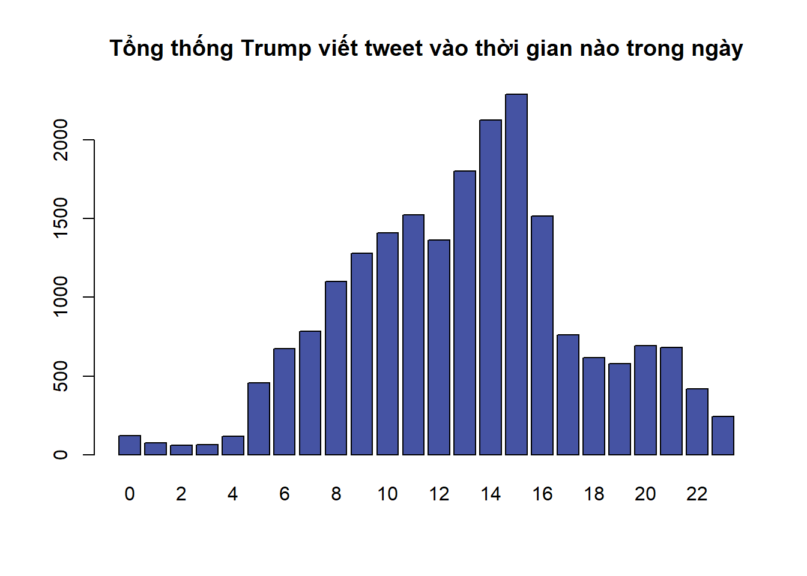
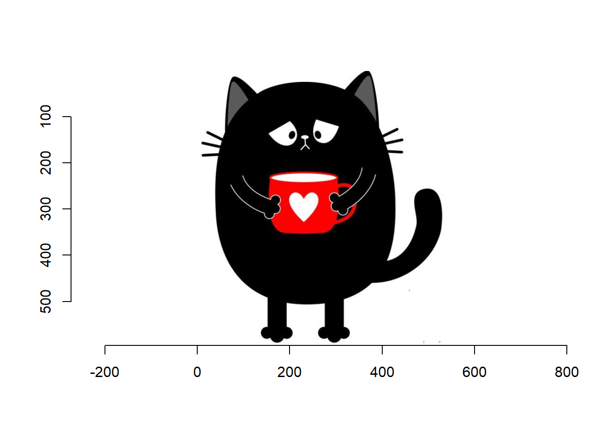
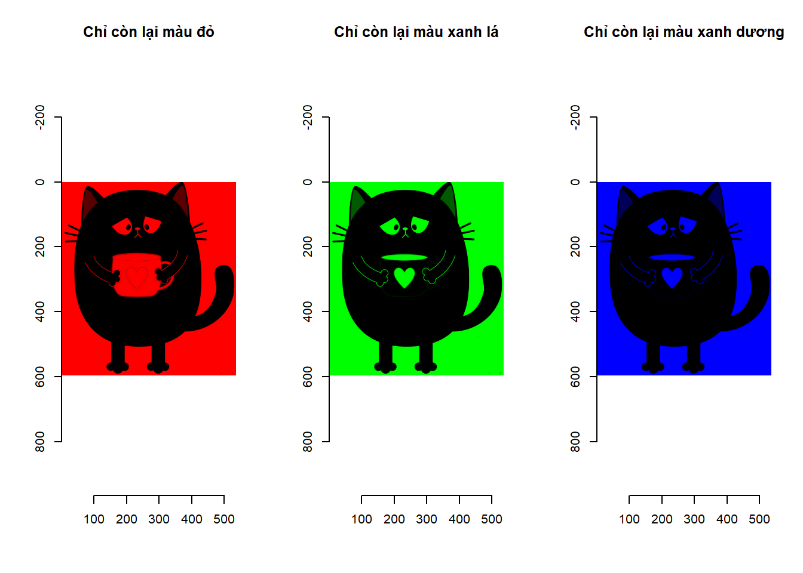
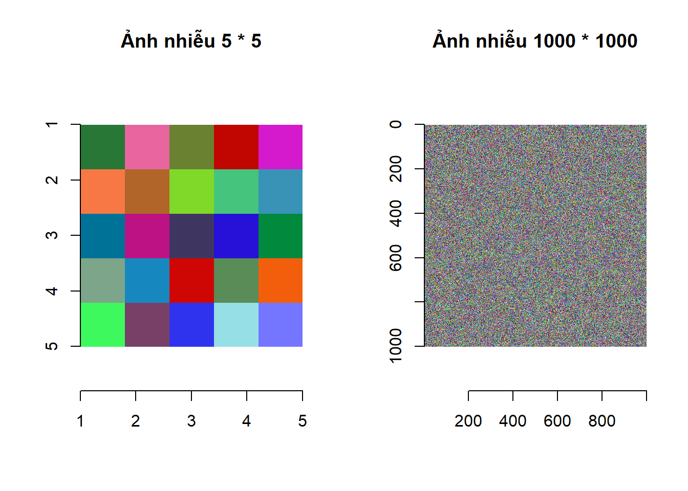
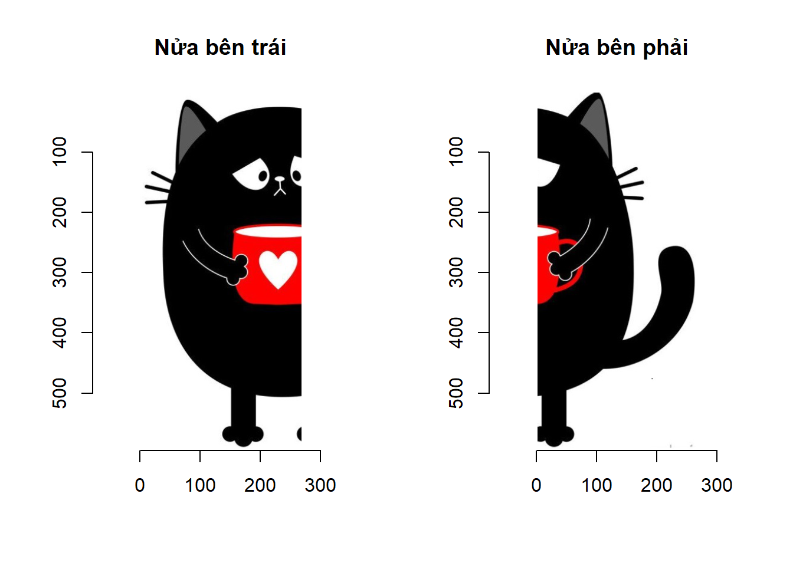
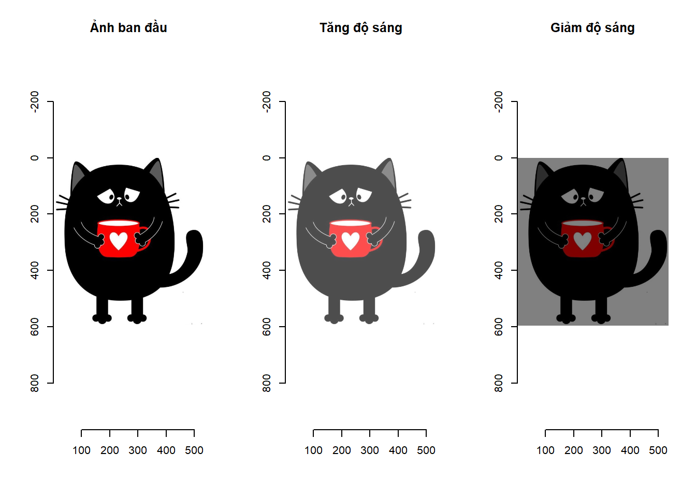
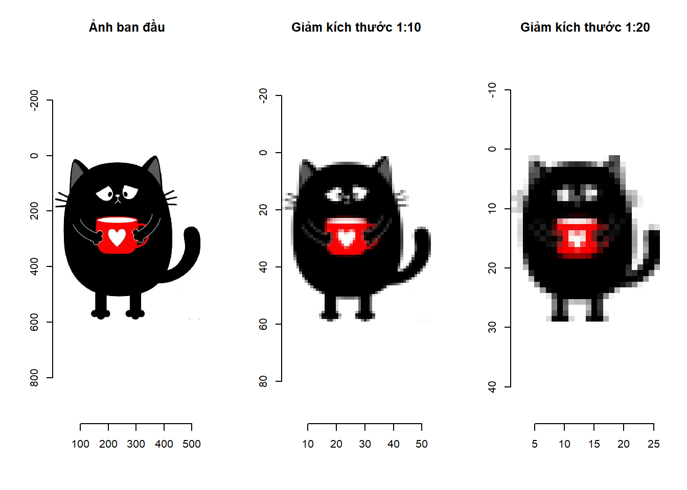
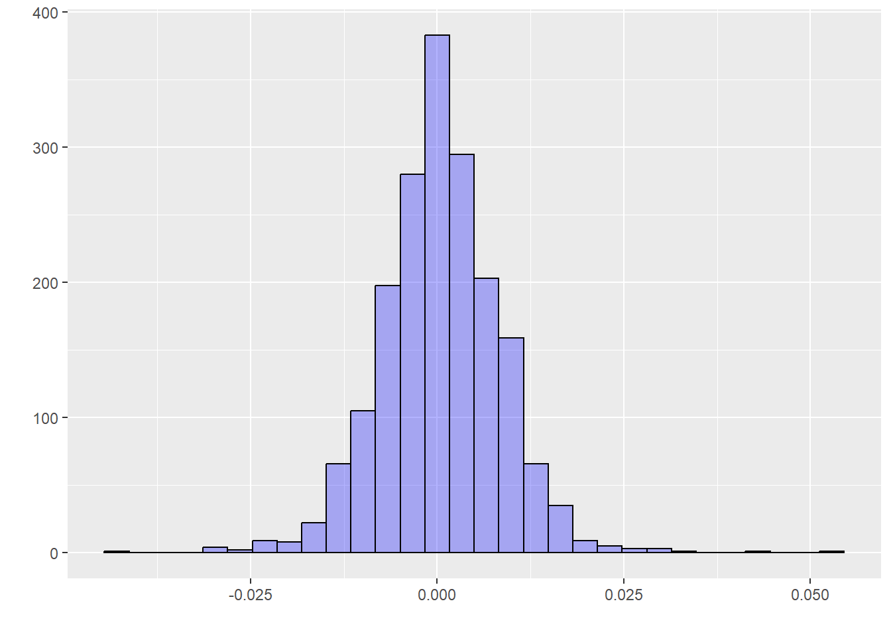
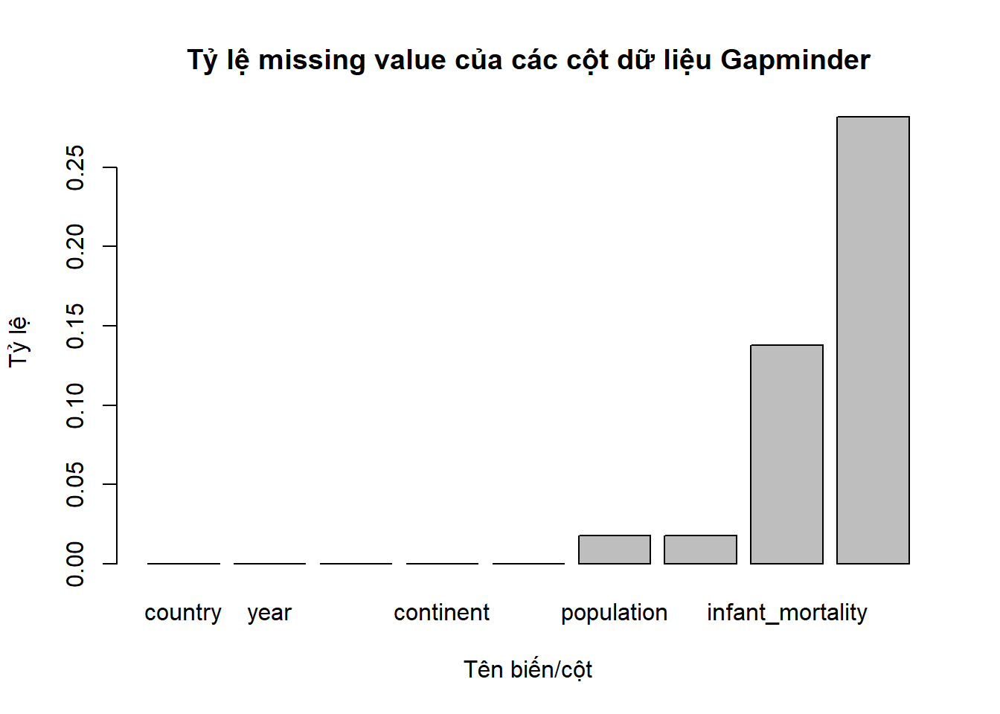
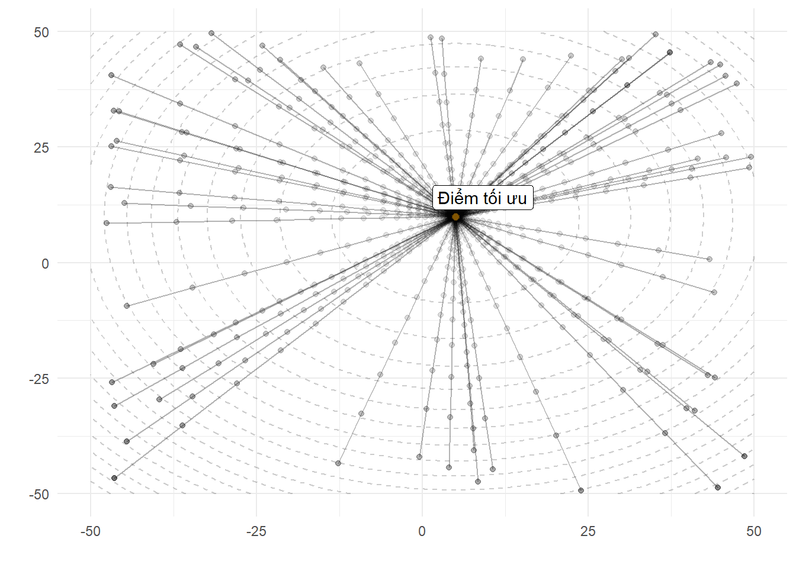

---
output:
  pdf_document: default
  html_document: default
  
header-includes:
- \usepackage{tikz}
- \usepackage{pgfplots}
- \usetikzlibrary{arrows,automata,positioning}
- \usepackage[utf8]{inputenc}
- \usepackage[utf8]{vietnam}
- \usepackage{etoolbox}
- \usepackage{xcolor}
- \usepackage{hyperref}
- \usepackage{mathtools}
- \usepackage{fontawesome5}
- \makeatletter
- \preto{\@verbatim}{\topsep=0pt \partopsep=-0pt}
- \makeatother
- \DeclareMathOperator*{\argmax}{arg\,max}
- \newcommand\tstrut{\rule{0pt}{3ex}}
- \newcommand\bstrut{\rule[-2.5ex]{0pt}{0pt}}
---


# Kiến thức R cơ bản


Đây là cuốn sách dành cho sinh viên và học viên các ngành kinh tế, quản lý, và quản trị kinh doanh muốn tìm hiểu sang lĩnh vực khoa học dữ liệu. Những bạn đọc đã có nền tảng kiến thức cơ bản về toán học, xác suất thống kê, và lập trình sẽ cảm thấy dễ dàng hơn khi bắt đầu. Cuốn sách sử dụng R làm ngôn ngữ và công cụ chính để thực hiện các thao tác trên dữ liệu.

Nếu bạn đọc đã có nền tảng cơ bản về lập trình thì cuốn sách này không giúp bạn lập trình tốt hơn. Mục đích chính của cuốn sách là giúp bạn có thể sử dụng được R và thực hiện được các thao tác trên dữ liệu trong môi trường R một cách nhanh nhất. Theo quan điểm của chúng tôi, R không phải là một ngôn ngữ thích hợp để bắt đầu cho học lập trình. Muốn trở thành một lập trình viên giỏi, bạn đọc nên bắt đầu với các ngôn ngữ lập trình cơ bản như Pascal, C++, Java, hay cũng có thể bắt đầu với ngôn ngữ Python.

Cách viết các dòng lệnh của R có thể nói là khá tùy tiện, thậm chí có thể làm cho những người có chuyên môn về lập trình cảm thấy khó chịu. Tuy nhiên, như đã đề cập trong phần giới thiệu của cuốn sách, R có các thế mạnh riêng mà các ngôn ngữ khác không có được và chúng tôi tin rằng R có thể giải quyết được tất cả những yêu cầu của bạn đọc từ những yêu cầu đơn giản đến những yêu cầu phức tạp nhất.

Cuốn sách hướng đến cả các bạn đọc chưa từng làm quen với lập trình. Những bạn đọc đã có kinh nghiệm với lập trình có thể bỏ qua các phần không cần thiết như biến, vòng lặp, viết hàm số và có thể bắt đầu ngay kể từ phần phân tích dữ liệu.

## Làm quen với các dòng lệnh cơ bản

### Sử dụng R như một máy tính cầm tay

Để R hiểu và thực hiện được các yêu cầu của mình, bạn đọc cần phải viết các câu lệnh dưới ngôn ngữ của phần mềm. Hãy bắt đầu với câu lệnh đầu tiên và đơn giản nhất: hiển thị một giá trị lên màn hình Console. Bạn đọc hãy nhấp chuột vào cửa sổ Console, gõ trực tiếp đoạn câu lệnh như ở dưới và kết thúc câu lệnh bằng cách sử dụng phím Enter:

```r
print("I am MFEer")
```

Bạn đọc có thể bắt đầu làm quen với các dòng lệnh của R bằng cách viết lên cửa sổ Console các công thức để thực hiện tính toán các phép toán dưới đây. R có thể được sử dụng đơn giản như một máy tính cầm tay:

```r
1+0.001
2*pi - 3 # Số pi trong R được viết là pi
exp(1)-exp(-1) # Hàm lũy thừa cơ số tự nhiên.
log(3.2) # Hàm logarit cơ số tự nhiên.
log(1000,10) # Hàm logarit cơ số 10.
```

Một vài lưu ý bạn đọc có thể nhận thấy khi gõ các dòng lệnh ở trên: các phép tính cộng trừ nhân chia, dấu thập phân, dấu lũy thừa, ... hoàn toàn giống như khi sử dụng máy tính cầm tay. Các hàm số quen thuộc như hàm logarit, hàm lũy thừa cơ số tự nhiên cũng không có gì đặc biệt. Bạn đọc có thể tiếp tục thực hành các câu lệnh cơ bản bằng cách sử dụng R để tính toán kết quả của các biểu thức dưới đây:

\begin{align}
a) \ \cfrac{1}{4^{1/6}} \ \ \ b) \ \cfrac{7 - 4}{12 - 7} \ \ \ c) \ \sqrt{\cfrac{4}{22}} \ \ \ d) (12-5)^{4/3} \ \ \ e) \ \log\left( \cfrac{2 + 4}{2^5 -1} \right)
\end{align}

Khi viết câu lệnh trên cửa sổ Console, R luôn thực hiện câu lệnh mỗi khi bạn đọc sử dụng phím Enter. Khi muốn viết hai hay nhiều câu lệnh trên một dòng trên cửa sổ Console, bạn đọc hãy ngăn cách các câu lệnh bằng dấu ";". Hãy thử câu lệnh ở dưới và quan sát R cách trả kết quả:

```r
2*pi - 3; exp(1)-exp(-1) # Một dòng lệnh thực hiện hai câu lệnh.
```

```
## [1] 3.283185
```

```
## [1] 2.350402
```

Khi bạn đọc viết các câu lệnh đơn giản thì sử dụng nhiều phép tính trên một dòng lệnh có thể hạn chế việc dùng phím Enter nhiều lần. Tuy nhiên chúng tôi khuyên bạn đọc khi muốn thực hiện nhiều câu lệnh khác nhau hãy sử dụng cửa sổ Script thay vì viết câu lệnh trực tiếp lên cửa sổ Console. Phần tiếp theo của chương chúng tôi sẽ thảo luận về cách viết và thực thi câu lệnh trên cửa sổ Script.


### Sử dụng cửa sổ Script để viết câu lệnh
Cách tốt nhất để bạn đọc viết, quản lý, và thực thi câu lệnh đó là sử dụng cửa sổ Script. Để mở cửa sổ Script trên Rstudio, bạn đọc có thể tìm trên thanh công cụ theo trình tự $File$ $\rightarrow$ $New$ $file$ $\rightarrow$ $R$ $Script$, hoặc bạn đọc sử dụng tổ hợp phím tắt $"Ctrl + Shift + N"$. Khi viết câu lệnh trên cửa sổ Script, R chỉ thực hiện câu lệnh khi bạn đọc thực hiện yêu cầu. Do đó, bạn đọc có thể sử dụng cửa sổ Script để viết các chương trình lớn với nhiều dòng lệnh kế tiếp nhau.

Sau khi mở của sổ Script, bạn có thể viết các dòng lệnh và sử dụng Enter để xuống dòng và không cần quan tâm đến việc R có thực thi câu lệnh đó hay không. Trong một dòng lệnh trên cửa sổ Script mỗi khi bạn đọc sử dụng dấu ngắt câu lệnh ";" R vẫn hiểu rằng bạn đọc đang viết hai câu lệnh khác nhau trên một dòng. Bạn đọc có thể bắt đầu mở cửa sổ Script và gõ các dòng lệnh dưới đây:

```r
1+0.001 ; 2*pi - 3 ; exp(1)-exp(-1)
log(3.2)
log(1000,10)
```

Phím Enter cho phép xuống dòng chứ không thực thi câu lệnh khi bạn đọc viết trên cửa sổ Script. Thay vào đó, để thực thi các dòng lệnh, bạn đọc có hai lựa chọn: thứ nhất, sử dụng con trỏ bấm vào nút Run nằm ở phía góc trên bên phải của cửa sổ này, và thứ hai các bạn sử dụng tổ hợp phím tắt $Ctrl + Enter$ (trên hệ điều hành Windows) và $Cmd + Enter$ trên hệ điều hành MacOS. Để thực thi một dòng lệnh riêng lẻ trên cửa sổ Script, bạn đọc di chuyển con trỏ đến dòng lệnh đó và thực hiện thao tác như ở trên. Để thực thi nhiều dòng lệnh bạn đọc sử dụng chuột trái lựa chọn (quét) các dòng lệnh và sau đó thực hiện thao tác chạy. Khi lựa chọn nhiều dòng lệnh một lúc để thực thi, R sẽ thực hiện các câu lệnh lần lượt theo thứ tự từ trên xuống dưới và từ bên trái qua bên phải nếu một dòng có nhiều câu lệnh.

Lưu ý, khi bạn đọc viết một chương trình bao gồm nhiều dòng lệnh, bạn thường phải sử dụng ngôn ngữ thông thường và dễ hiểu bằng tiếng Việt, hoặc tiếng Anh, để ghi chú lại các dòng lệnh hoặc nhóm các dòng lệnh đó có ý nghĩa là gì. Việc này giúp cho chính bản thân bạn khi xem lại các dòng lệnh R của mình và cho những người khác khi đọc các dòng lệnh hiểu được ý nghĩa của các câu lệnh. Các câu ghi chú đó theo ngôn ngữ lập trình được gọi là các câu comment. Viết ghi chú trong R, bạn đọc sử dụng dấu "#" trước câu ghi chú:

```r
# Đây là cách tính xấp xỉ số e
n<-1000
cat("e = ", (1+1/n)^n) # Khi n càng lớn thì kết quả càng chính xác
```

Phần tiếp theo của chương sẽ thảo luận về các khái niệm cơ bản nhất trong lập trình, đó là khái niệm về biến.

## Biến trong ngôn ngữ R
Biến là khái niệm cơ bản nhất trong mọi ngôn ngữ lập trình. Có bốn loại biến cơ bản trong R bao gồm

1. Biến kiểu số, được gọi trong R là kiểu $numeric$;

2. Biến kiểu ký tự (chuỗi ký tự), được gọi là kiểu $character$;

3. Biến kiểu logic, được gọi trong R là kiểu $logical$;

4. Biến kiểu thời gian, được gọi trong R là kiểu $Date$ và kiểu $POSIXct$.

Nhiều tài liệu khác khi viết về biến trong ngôn ngữ lập trình R phân loại biến thành nhiều kiểu hơn, chẳng hạn như có thêm kiểu số nguyên ($integer$), kiểu $factor$, ... Tuy nhiên theo quan điểm của chúng tôi, phân loại biến quá chi tiết sẽ gây khó khăn cho bạn đọc, nhất là với bạn đọc mới làm quen với lập trình. Do đó, chúng tôi phân chia các biến trong R thành bốn nhóm như ở trên. Trong các phần tiếp theo của chương chúng tôi sẽ thảo luận chi tiết về từng kiểu biến cụ thể và các kiểu biến khác có thể có liên quan.

Để tạo một biến trong R và gán giá trị cho biến đó, bạn đọc sử dụng một trong ba cách như sau:

```r
# Cách thứ nhất
tenbien <- giatri # dấu "<-" là dấu gán giá trị

# Cách thứ hai
giatri -> tenbien

# Cách thứ ba
tenbien = giatri # dấu "=" cũng được sử dụng để gán giá trị
```

Trong các dòng lệnh ở trên, `tenbien` là tên của biến mà bạn muốn đặt, `giatri` là giá trị mà bạn muốn gán cho biến. Ký tự `<-` là ký tự gán giá trị được sử dụng trong các phiên bản R đầu tiên. Gán giá trị cho biến sử dụng ký tự `->` sử dụng khi bạn viết tên biến sang phía bên phải của biểu thức gán. Cách viết này hiếm khi được dùng. Từ các phiên bản 3.0 của phần mềm R trở đi, dấu `=` cũng có thể được sử dụng để gán giá trị cho biến. Tuy nhiên dấu `=` có thể gây nhầm lẫn sau này khi bạn đọc sử dụng cùng lúc với ký hiệu `==`. Đồng thời ký hiệu `=` cũng được sử dụng trong truyền giá trị cho tham số khi viết hàm số. Do đó, trong cuốn sách này, chúng tôi luôn sử dụng `<-` để gán giá trị cho biến.

Dưới đây là một vài ví dụ về tạo biến và gán giá trị cho biến:

```r
# Cách thứ nhất:
x <- 3  # Tạo một biến tên là x có giá trị 3.

# Cách thứ hai:
"MFE" -> y # Tạo một biến tên y có giá trị bằng ký tự "MFE".

# Cách thứ ba:
z = 1 + 2
# Tạo một biến tên z và nhận giá trị bằng kết quả của phép cộng.
```

Trong các câu lệnh ở trên, $x$, $y$ hay $z$ là tên biến. Quy tắc đặt tên biến hay rộng hơn là tên một đối tượng trong R cần tuân theo các quy tắc sau:

1. Tên biến có thể là tổ hợp của tất cả các chữ cái viết hoa, chữ cái viết thường và các chữ số.

2. Trong tên biến có thể chứa hai ký tự đặc biệt là "." và "_".

3. Tên biến không được phép bắt đầu bằng số hoặc ký tự "_".

4. Không được dùng từ khóa của R để đặt tên biến.

Để kiểm tra các quy tắc ở trên, bạn đọc có thể thử thực thi các câu lệnh tạo biến dưới đây và xem dòng lệnh nào báo lỗi và dòng lệnh nào không báo lỗi:

```r
x1 <- 3 # Biến tên x1 sẽ được tạo với giá trị bằng 3.
1x <- 3 # Sẽ có lỗi, tên biến không được phép bắt đầu bằng số.
.x <- 3 # Biến tên .x hợp lệ.
_x <- 3 # Sẽ báo lỗi, tên biến không được phép bắt đầu bằng _
```

Lưu ý rằng R có phân biệt chữ viết hoa với chữ viết thường trong tên biến. Ví dụ như khi bạn đọc sử dụng $x$ để đặt tên và sau đó dùng $X$ để đặt tên thì R sẽ hiểu đây là hai biến khác nhau:

```r
x<-3 # Tạo một biến tên x, giá trị bằng 3.
X<-5 # Tạo một biến tên X, giá trị bằng 5.
X-x # Hiệu số cho kết quả bằng 2 do x và X là khác nhau.
```

Để biết danh sách các tên biến đang tồn tại trên môi trường làm việc và giá trị của các biến đó, ngoài cách in giá trị biến lên cửa sổ Console bạn đọc có thể sử dụng cửa sổ Environment ở góc phía trên, bên phải, của Rstudio. Để xóa một biến hoặc một đối tượng đang tồn tại trong môi trường làm việc hiện tại, bạn đọc sử dụng lệnh `rm()`:


```r
x # R trả lại giá trị bằng 3.
rm(x) # Xóa biến x khỏi môi trường làm việc.
x # Sẽ báo lỗi vì biến x không còn tồn tại.
```

Một điều cũng cần lưu ý khi đặt tên biến hay khi đặt tên các đối tượng khác trong R là tên biến không được phép trùng với các từ khóa. Danh sách các từ khóa thường sử dụng trong R nằm trong bảng \@ref(tab:tbbasic01)

<table class="table" style="margin-left: auto; margin-right: auto;">
<caption>(\#tab:tbbasic01)Danh sách các từ khóa không được dùng để đặt tên.</caption>
 <thead>
  <tr>
   <th style="text-align:left;"> Từ khóa </th>
   <th style="text-align:left;"> Sử dụng trong ngữ cảnh </th>
  </tr>
 </thead>
<tbody>
  <tr>
   <td style="text-align:left;"> If, else </td>
   <td style="text-align:left;"> Câu lệnh điều kiện </td>
  </tr>
  <tr>
   <td style="text-align:left;"> for, while, in , repeat </td>
   <td style="text-align:left;"> Vòng lặp </td>
  </tr>
  <tr>
   <td style="text-align:left;"> function </td>
   <td style="text-align:left;"> Khai báo hàm số </td>
  </tr>
  <tr>
   <td style="text-align:left;"> break, next </td>
   <td style="text-align:left;"> Điều khiển vòng lặp </td>
  </tr>
  <tr>
   <td style="text-align:left;"> TRUE, FALSE </td>
   <td style="text-align:left;"> Tên các biến logic </td>
  </tr>
  <tr>
   <td style="text-align:left;"> Inf, -Inf, NaN, NA </td>
   <td style="text-align:left;"> Các biến kiểu số dạng đặc biệt </td>
  </tr>
</tbody>
</table>

Trong phần tiếp theo, chúng ta sẽ thảo luận chi tiết về từng kiểu biến.

### Biến kiểu số
Biến kiếu số, được gọi trong R là kiểu $numeric$, là các biến nhận giá trị kiểu số thập phân. Để tạo một biến kiểu số, bạn đọc gán một giá trị kiểu số bất kỳ cho tên biến mà bạn muốn đặt. Đây cũng là cách tạo biến chung trong R. Câu lệnh dưới đây khởi tạo một biến tên $x$ kiểu số và nhận giá trị bằng 5:

```r
x <- 5 # 5 là giá trị kiểu số nên R tự hiểu x là biến kiểu số.
```

Để kiểm tra một biến tên $x$ có phải là biến kiểu số không, bạn đọc sử dụng hàm `is.numeric()`. Hàm số này trả lại giá trị là kiểu logic. Giá trị $TRUE$ cho biết biến được hỏi đúng là kiểu số trong khi giá trị $FALSE$ cho biết biến được hỏi không phải là kiểu số. Ngoài sử dụng hàm `is.numeric()`, bạn đọc cũng có thể sử dụng hàm `class()`. Hàm `class()` cho biết kiểu giá trị của một đối tượng bất kỳ trong R. Cách sử dụng hai hàm này như sau:

```r
is.numeric(x) # 5 là giá trị kiểu số nên R trả lại TRUE.
```

```
## [1] TRUE
```

```r
class(x) # Cho biết kiểu giá trị của đối tượng x.
```

```
## [1] "numeric"
```

```r
y<-"abc" # Khởi tạo một biến y kiểu ký tự.
is.numeric(y) # kết quả là FALSE vì y không phải số.
```

```
## [1] FALSE
```

Trong phép gán cho giá trị của biến $x$ ở trên, mặc dù giá trị khởi tạo 5 là số nguyên nhưng R vẫn cho rằng $x$ là số thập phân. Để tạo một biến kiểu số nguyên, bạn đọc cần phải sử dụng thêm chữ "L" phía sau số nguyên đó. Chữ L là viết tắt cho "Long" nghĩa là số nguyên kiểu $Long$ trong các ngôn ngữ lập trình cơ bản như Pascal hay C. Số nguyên kiểu $Long$ là các số nguyên cần 32 bytes để lưu và nhận $2^{32}$ giá trị từ −2,147,483,648 ($-2^{31}$) đến 2,147,483,647 ($2^{31}-1$). Để tạo biến $x$ nhận giá trị là số nguyên 5 chúng ta viết như sau:

```r
x<-5L # 5L nghĩa là số nguyên 5, L là viết tắt của Long.
class(x) # x là số tự nhiên.
```

```
## [1] "integer"
```

```r
is.numeric(x) # x không còn là số thập phân, nhưng vẫn là kiểu số.
```

```
## [1] TRUE
```

Phân biệt số nguyên (integer) và số thập phân (numeric) trong các ngôn ngữ lập trình có ý nghĩa khi bạn đọc cần tiết kiệm bộ nhớ cho chương trình. Trong R, khi sử dụng số thập phân thay cho số nguyên, dung lượng bộ nhớ máy tính sẽ tăng gấp 2 lần. Hình vẽ dưới đây mô tả dung lượng bộ nhớ cần sử dụng cho các véc-tơ chứa các số nguyên và các véc-tơ chứa các số thập phân với số lượng phần tử chạy từ 1 đến 100. Từ hình \@ref(fig:fgbasic01) bạn đọc có thể thấy rằng không có sự khác biệt về bộ nhớ với các véc-tơ có độ dài dưới 10 nhưng khi véc-tơ có độ dài từ 10 trở lên, véc-tơ kiểu số thập phân cần trung bình khoảng 2 lần bộ nhớ so với véc-tơ kiểu số nguyên.

<div class="figure">

<p class="caption">(\#fig:fgbasic01)Sự khác nhau về dung lượng bộ nhớ cần sử dụng để lưu véc-tơ kiểu số nguyên và véc-tơ kiểu số thập phân.</p>
</div>

Biến kiểu số được sử dụng chủ yếu để thực hiện trong các phép tính toán. Các phép tính toán thông thường được liệt kê trong bảng \@ref(tab:tbbasic02)
<table class="table" style="margin-left: auto; margin-right: auto;">
<caption>(\#tab:tbbasic02)Các phép toán cơ bản thường được sử dụng với biến kiểu số.</caption>
 <thead>
  <tr>
   <th style="text-align:left;"> Ký hiệu </th>
   <th style="text-align:left;"> Phép tính </th>
  </tr>
 </thead>
<tbody>
  <tr>
   <td style="text-align:left;"> \+ </td>
   <td style="text-align:left;"> Phép tính cộng </td>
  </tr>
  <tr>
   <td style="text-align:left;"> \- </td>
   <td style="text-align:left;"> Phép tính trừ </td>
  </tr>
  <tr>
   <td style="text-align:left;"> \* </td>
   <td style="text-align:left;"> Phép tính nhân </td>
  </tr>
  <tr>
   <td style="text-align:left;"> / </td>
   <td style="text-align:left;"> Phép tính chia </td>
  </tr>
  <tr>
   <td style="text-align:left;"> ^ </td>
   <td style="text-align:left;"> Phép tính lũy thừa </td>
  </tr>
  <tr>
   <td style="text-align:left;"> exp(x) </td>
   <td style="text-align:left;"> Phép tính lũy thừa cơ số e của số x </td>
  </tr>
  <tr>
   <td style="text-align:left;"> log() </td>
   <td style="text-align:left;"> Phép lấy loga cơ số tự nhiên của số x </td>
  </tr>
  <tr>
   <td style="text-align:left;"> log(.,a) </td>
   <td style="text-align:left;"> Phép lấy loga cơ số a của số x </td>
  </tr>
  <tr>
   <td style="text-align:left;"> %% </td>
   <td style="text-align:left;"> Phép lấy phần dư trong phép chia </td>
  </tr>
  <tr>
   <td style="text-align:left;"> %/% </td>
   <td style="text-align:left;"> Phép lấy phần nguyên của kết quả trong phép chia </td>
  </tr>
</tbody>
</table>

Lưu ý rằng các phép toán lấy phần dư (\%\%) và lấy thương số trong phép chia (\% \ \%) cũng có thể thực hiện được với cả số kiểu thập phân. Bạn đọc quan sát kết quả của các phép toán này trong ví dụ dưới đây:

```r
6.5 %% 2 # Phần dư của phép chia 6.5 cho 2
```

```
## [1] 0.5
```

```r
6.5 %/% 2 # Phần nguyên của phép chia 6.5 cho 2
```

```
## [1] 3
```

Một cách viết số kiểu khoa học và các giá trị kiểu số đặc biệt được liệt kê trong bảng \@ref(tab:tbbasic03).
<table class="table" style="margin-left: auto; margin-right: auto;">
<caption>(\#tab:tbbasic03)Các giá trị số được viết kiểu khoa học và các giá trị số đặc biệt</caption>
 <thead>
  <tr>
   <th style="text-align:left;"> Loại số </th>
   <th style="text-align:left;"> Ý nghĩa </th>
  </tr>
 </thead>
<tbody>
  <tr>
   <td style="text-align:left;"> 1.2e+08 </td>
   <td style="text-align:left;"> nghĩa là nhân số 1.2 với 10 lũy thừa 8 </td>
  </tr>
  <tr>
   <td style="text-align:left;"> 1.2e-15 </td>
   <td style="text-align:left;"> nghĩa là nhân số 1.2 với 10 lũy thừa -15 </td>
  </tr>
  <tr>
   <td style="text-align:left;"> Inf </td>
   <td style="text-align:left;"> Số dương vô cùng </td>
  </tr>
  <tr>
   <td style="text-align:left;"> -Inf </td>
   <td style="text-align:left;"> Số âm vô cùng </td>
  </tr>
  <tr>
   <td style="text-align:left;"> NaN </td>
   <td style="text-align:left;"> là kết quả của các phép tính không có nghĩa, viết tắt của Not a Number </td>
  </tr>
</tbody>
</table>

Bạn đọc cần đặc biệt lưu ý khi thực hiện các phép tính toán có kết quả là các giá trị đặc biệt. Dưới đây là các ví dụ:

```r
1/0 # Kết quả của 1/0 là dương vô cùng.
(-1)/0 # Kết quả của -1/0 là âm vô cùng.
Inf - 10^10 # Trong các phép tính có Inf sẽ có kết quả Inf.
1/0 + (-1)/0 # Inf + (-Inf) là không thể xác định được.
log(-2) # Kết quả của các phép tính vô nghĩa là NaN.
```

### Biến kiểu logic
Biến kiểu logic, được gọi là kiểu $logical$, là kiểu biến đơn giản nhất nhưng lại quan trọng nhất trong R nói riêng và trong đa số các ngôn ngữ lập trình nói chung. Biến kiểu logic chỉ nhận một trong hai giá trị là TRUE hoặc FALSE. Do R phân biệt chữ viết hoa và chữ viết thường nên khi viết giá trị cho biến kiểu logic bạn đọc cần viết bao gồm toàn bộ các chữ cái viết hoa. Để tạo một biến kiểu logic, chúng ta chọn tên biến và gán một trong hai giá trị logic. Việc này hoàn toàn giống như khi tạo một biến kiểu số:

```r
x<-TRUE
```

Biến kiểu logic có thể đặt trong các phép tính toán giống như biến kiểu số. Khi gặp một công thức có bao gồm cả biến kiểu số và biến kiểu logic, R sẽ đổi biến kiểu logic có giá trị TRUE thành giá trị 1 và biến kiểu logic có giá trị FALSE thành giá trị 0 rồi thực hiện phép tính toán:

```r
FALSE + TRUE * 10 # Sẽ cho kết quả giống như 0 + 1 * 10
```

```
## [1] 10
```

Trong thực tế, ít khi chúng ta khởi tạo giá trị cho biến kiểu logic như trên. Biến kiểu logic thường nhận được từ kết quả các phép so sánh. Các phép toán so sánh thường được sử dụng trong R được liệt kê trong bảng \@ref(tab:tbbasic04)

<table class="table" style="margin-left: auto; margin-right: auto;">
<caption>(\#tab:tbbasic04)Các phép so sánh cơ bản cho kết quả là một biến logic</caption>
 <thead>
  <tr>
   <th style="text-align:left;"> Phép so sánh </th>
   <th style="text-align:left;"> Ý nghĩa </th>
  </tr>
 </thead>
<tbody>
  <tr>
   <td style="text-align:left;"> &lt; </td>
   <td style="text-align:left;"> Có nhỏ hơn không? </td>
  </tr>
  <tr>
   <td style="text-align:left;"> &gt; </td>
   <td style="text-align:left;"> Có lớn hơn không? </td>
  </tr>
  <tr>
   <td style="text-align:left;"> &lt;= </td>
   <td style="text-align:left;"> Có nhỏ hơn hoặc bằng không? </td>
  </tr>
  <tr>
   <td style="text-align:left;"> &gt;= </td>
   <td style="text-align:left;"> Có lớn hơn hoặc bằng không? </td>
  </tr>
  <tr>
   <td style="text-align:left;"> == </td>
   <td style="text-align:left;"> Có bằng nhau không? </td>
  </tr>
  <tr>
   <td style="text-align:left;"> != </td>
   <td style="text-align:left;"> Có khác nhau không? </td>
  </tr>
</tbody>
</table>

Ngoài ra, các biến kiểu logic còn là kết quả của việc kết hợp nhiều biến kiểu logic khác bằng các toán tử logic. Các toán tử logic bao gồm có toán tử "và", toán tử "hoặc", và toán tử "phủ định". Các toán tử này được liệt kê trong bảng \@ref(tab:tbbasic05)

<table class="table" style="margin-left: auto; margin-right: auto;">
<caption>(\#tab:tbbasic05)Các toán tử sử dụng cùng với biến kiểu logic</caption>
 <thead>
  <tr>
   <th style="text-align:left;"> Toán tử logic </th>
   <th style="text-align:left;"> Ý nghĩa </th>
  </tr>
 </thead>
<tbody>
  <tr>
   <td style="text-align:left;"> &amp; </td>
   <td style="text-align:left;"> Toán tử Và; A&amp;B đọc là A và B </td>
  </tr>
  <tr>
   <td style="text-align:left;"> $|$ </td>
   <td style="text-align:left;"> Toán tử Hoặc; A|B đọc là A hoặc B </td>
  </tr>
  <tr>
   <td style="text-align:left;"> $!$ </td>
   <td style="text-align:left;"> Toán tử Phủ định; Toán tử này phủ định lại biến logic đứng sau </td>
  </tr>
</tbody>
</table>

Bạn đọc cần lưu ý rằng các biến logic khi kết hợp với nhau bằng các toán tử trong bảng \@ref(tab:tbbasic05) sẽ cho kết quả là một biến kiểu logic. Quy tắc kết hợp các biến kiểu logic bằng các toán tử logic được tổng hợp trong bảng \@ref(tab:tbbasic06)

<table class="table" style="margin-left: auto; margin-right: auto;">
<caption>(\#tab:tbbasic06)Các biến logic được kết hợp bằng các toán tử logic</caption>
 <thead>
  <tr>
   <th style="text-align:left;"> Kết hợp </th>
   <th style="text-align:left;"> Kết quả </th>
  </tr>
 </thead>
<tbody>
  <tr>
   <td style="text-align:left;"> !TRUE </td>
   <td style="text-align:left;"> FALSE </td>
  </tr>
  <tr>
   <td style="text-align:left;"> !FASLE </td>
   <td style="text-align:left;"> TRUE </td>
  </tr>
  <tr>
   <td style="text-align:left;"> TRUE &amp; TRUE </td>
   <td style="text-align:left;"> TRUE </td>
  </tr>
  <tr>
   <td style="text-align:left;"> TRUE &amp; FALSE </td>
   <td style="text-align:left;"> FALSE </td>
  </tr>
  <tr>
   <td style="text-align:left;"> FALSE &amp; TRUE </td>
   <td style="text-align:left;"> FALSE </td>
  </tr>
  <tr>
   <td style="text-align:left;"> TRUE | TRUE </td>
   <td style="text-align:left;"> TRUE </td>
  </tr>
  <tr>
   <td style="text-align:left;"> TRUE | FALSE </td>
   <td style="text-align:left;"> TRUE </td>
  </tr>
  <tr>
   <td style="text-align:left;"> FALSE | TRUE </td>
   <td style="text-align:left;"> TRUE </td>
  </tr>
</tbody>
</table>

Như chúng tôi đã đề cập ở trên, các biến kiểu logic khi đặt trong các biểu thức tính toán sẽ được tự động đổi sang biến kiểu số trước khi thực hiện phép tính. Ngược lại, khi biến kiểu số xuất hiện trong các biểu thức có toán tử logic, biến kiểu số cũng sẽ được chuyển sang kiểu logic. R sẽ mặc định quy tắc đổi từ số sang kiểu logic như sau: chỉ có số 0 khi đặt trong biểu thức có toán tử logic mới được chuyển thành FALSE, mọi số khác 0 khi đổi sang kiểu logic đều được chuyển thành TRUE. Bạn đọc hãy quan sát nguyên tắc đổi từ biến kiểu số sang logic trong các phép toán dưới đây


```r
10 & -0.1 # Tương đương với TRUE & TRUE
```

```
## [1] TRUE
```

```r
0 & -0.1 # Tương đương với FALSE & TRUE
```

```
## [1] FALSE
```

```r
0 | 0.2 # Tương đương với FALSE | TRUE
```

```
## [1] TRUE
```

Bạn đọc có thể thực hành việc tính toán trên các toán tử logic như ở dưới đây. Trước khi sử dụng R để xem kết quả, hãy thử suy nghĩ xem các biểu thức từ 1. đến 4. dưới đây cho kết quả như thế nào?

```r
# 1.
(1<=2) | (2<=3)
# 2.
(1<=2) + (2<=3)
# 3.
((1<=2) * (2^2 == 4)) | (2!=3) #
# 4.
!((1<=2) * (2^2 == 4)) & !(2!=3) #
# 5.
((2 + 2) | (2 - 2)) & !(2 ^ 2) #
```

### Biến kiểu chuỗi ký tự
Biến kiểu ký tự hay chuỗi ký tự được định nghĩa là kiểu $character$. Biến kiểu chuỗi ký tự tương tự như biến kiểu xâu ký tự hay kiểu $string$ trong các ngôn ngữ lập trình cơ bản. Biến kiểu chuỗi ký tự có thể chỉ ngắn gọn là một ký tự trống, một chữ cái, nhưng đôi khi có thể là một câu văn, hoặc cũng có thể là cả một đoạn văn bản. Khi làm việc với biến kiểu chuỗi ký tự, bạn đọc hãy luôn ghi nhớ rằng R phân biệt chữ viết hoa và chữ viết thường.

Để tạo một biến có kiểu ký tự trong R, bạn đọc chọn tên cho biến và gán giá trị kiểu chuỗi ký tự. R sẽ hiểu một biến là chuỗi ký tự khi chuỗi ký tự đó nằm trong dấu ngoặc kép \" \" hoặc trong dấu ngoặc đơn (\' \').


```r
x<-"Ice cream" # "Ice cream" với chữ I viết hoa.
x == "ice cream" # Kết quả trả lại là FALSE
```

```
## [1] FALSE
```

Để biết một biến có phải kiểu chuỗi ký tự không, bạn đọc sử dụng hàm `is.character()` hoặc hàm `class()`. Hàm `is.character()` trả lại giá trị TRUE nếu một biến có kiểu chuỗi ký tự và trả lại giá trị FALSE trong các trường hợp còn lại. Hàm `class()`, như chúng tôi đã giới thiệu ở trên, cho biết một đối tượng bất kỳ là đối tượng có kiểu như thế nào:

```r
is.character(x)
class(x)
```

Khi xử lý biến kiểu chuỗi ký tự, bạn đọc nên sử dụng các hàm số đã được xây dựng sẵn. Bảng \@ref(tab:tbbasic07) liệt kê các hàm thường được sử dụng khi xử lý biến kiểu chuỗi ký tự và kết quả của các hàm này.
<table class="table" style="margin-left: auto; margin-right: auto;">
<caption>(\#tab:tbbasic07)Các hàm thường sử dụng để xử lý biến kiểu chuỗi ký tự</caption>
 <thead>
  <tr>
   <th style="text-align:left;"> Hàm số </th>
   <th style="text-align:left;"> Ý nghĩa </th>
  </tr>
 </thead>
<tbody>
  <tr>
   <td style="text-align:left;"> nchar(x) </td>
   <td style="text-align:left;"> Cho biêt biến x dạng chuỗi ký tự có bao nhiêu ký tự </td>
  </tr>
  <tr>
   <td style="text-align:left;"> paste(x1,x2,sep = a) </td>
   <td style="text-align:left;"> Ghép hai chuỗi ký tự x1 và x2 thành một chuỗi ký tự cách nhau chuỗi ký tự a </td>
  </tr>
  <tr>
   <td style="text-align:left;"> toupper(x) </td>
   <td style="text-align:left;"> Chuyển tất cả các chữ viêt thường trong x thành chữ viết hoa </td>
  </tr>
  <tr>
   <td style="text-align:left;"> tolower(x) </td>
   <td style="text-align:left;"> Chuyển tất cả các chữ viết hoa trong x thành chữ viết thường </td>
  </tr>
  <tr>
   <td style="text-align:left;"> chartr(a,b,x) </td>
   <td style="text-align:left;"> Thay thế trong x: từng ký tự trong chuỗi a tương ứng bằng từng ký tự trong chuỗi b, a và b phải có độ dài bằng nhau </td>
  </tr>
  <tr>
   <td style="text-align:left;"> substr(x,k,n) </td>
   <td style="text-align:left;"> Lấy ra chuỗi ký tự con từ x, lấy từ ký tự thứ k đến ký tự thứ n </td>
  </tr>
  <tr>
   <td style="text-align:left;"> sub(a, b, x) </td>
   <td style="text-align:left;"> Đoạn ký tự a đầu tiên trong x sẽ được thay thế bằng đoạn ký tự b </td>
  </tr>
  <tr>
   <td style="text-align:left;"> gsub(a, b, x) </td>
   <td style="text-align:left;"> Tất cả các đoạn ký tự giống a trong x sẽ được thay thế bằng b </td>
  </tr>
  <tr>
   <td style="text-align:left;"> grepl(a,x) </td>
   <td style="text-align:left;"> Trả lại giá trị là biến TRUE nếu đoạn ký tự a nằm trong biến x </td>
  </tr>
</tbody>
</table>

Bạn đọc có thể thử các hàm liệt kê trong bảng \@ref(tab:tbbasic07) và quan sát giá trị trả ra của các hàm đó trong các câu lệnh dưới đây để hiểu cách sử dụng của các hàm này:

```r
# Khởi tạo hai biến kiểu chuỗi ký tự x1 và x2
x1<-"I am an Actuary"; x2<-"I am Vietnamese"
nchar(x1) # Cho biết x1 có bao nhiêu ký tự.
paste(x1, x2, sep = " and ") # Ghép x1 và x2 lại và thêm " and " vào giữa.
toupper(x1); tolower(x1) # Chuyển tất cả các ký tụ sang viết hoa/viết thường
chartr("an","bm",x1) # Thay tất cả các chữ "a" trong x1 bằng "b" và "n" bằng "m"
substr(x1, 9, 15) # Lấy ra đoạn ký tự từ ký tự thứ 9 (chữ A) đến ký tự thứ 15 (chữ "y")
sub("a", "XYZ", x1) # Thay chữ "a" đầu tiên trong x1 bằng đoạn "XYZ"
gsub("a", "XYZ", x1) # Thay tất cả chữ "a" trong x1 bằng đoạn "XYZ"
grepl("Vietnam", x2) # Cho biết đoạn ký tự "Vietnam" có nằm trong x2 hay không
```

Nhìn chung, trong bất kỳ ngôn ngữ lập trình nào, xử lý biến kiểu chuỗi ký tự sẽ luôn khó khăn hơn so với xử lý biến kiểu số. Để thực hiện được các yêu cầu phức tạp hơn, bạn đọc có thể kết hợp các hàm số ở trên để có hiệu quả tốt hơn. Có các thư viện được phát triển dành riêng cho việc xử lý các biến kiểu chuỗi ký tự mà tiêu biểu là thư viện $stringr$. Các hàm hữu ích trong thư viện stringr sẽ được thảo luận chi tiết trong phần phân tích dữ liệu.

### Biến kiểu thời gian
Trong ngôn ngữ R có hai kiểu biến thời gian là biến kiểu ngày tháng ($Date$) và biến kiểu thời gian chi tiết ($POSIXct$). Thời gian POSIX hay còn được biết đến với tên gọi là thời gian Unix là một cách quy ước về thời gian của một thời điểm cụ thể được tính bằng số giây từ cột mốc thời gian Unix đến thời điểm đó. Cột mốc thời gian Unix được các kỹ sư xây dựng hệ điều hành Unix lựa chọn là thời điểm 0 giờ, 0 phút, 0 giây, ngày 01 tháng 01 năm 1970 theo giờ phối hợp quốc tế (giờ UTC). Chữ "ct" là viết tắt của canlendar time. Bạn đọc cũng có thể gặp biến kiểu thời gian chi tiết trong R dưới dạng $POSIXlt$ trong đó "lt" là chữ viết tắt của local time. Sự khác biệt của biến kiểu POSIXct và POSIXlt chỉ là cách R lưu trữ các biến này dưới dạng số nguyên hay dưới dạng véc-tơ. Trong cuốn sách này khi nói đến biến kiểu thời gian chúng tôi luôn sử dụng biến kiểu POSIXct.

Để tạo biến kiểu thời gian trong R, bạn đọc sử dụng hàm `as.Date()` cho biến kiểu ngày tháng và hàm `as.POSIXct()` cho biến kiểu thời gian chi tiết:


```r
# Tạo biến date1 nhận giá trị là ngày 31/08/2023
date1<-as.Date("2023-08-31")

# Biến time1 là 16 giờ, 41 phút, 30 giây ngày 31/08/2023
time1<-as.POSIXct("2023-08-31 16:41:30")
```

Khi xử lý biến kiểu thời gian, bạn đọc nên đổi sang dạng số hoặc lưu biến kiểu thời gian dưới dạng một véc-tơ số lưu lại các thành phần của thời gian theo một thứ tự nhất định. Hàm `as.numeric()` sẽ đổi các biến kiểu ngày tháng hoặc thời gian chi tiết ra thành số ngày (đối với biến kiểu ngày tháng) hoặc số giây (đối với biến kiểu thời gian chi tiết) tính từ mốc thời gian Unix.


```r
# Cho biết số ngày tính từ 01/01/1970 đến date1
as.numeric(date1)
```

```
## [1] 19600
```

```r
# Cho biết số giây tính từ 7 giờ, 0 phút, 0 giây ngày 01/01/1970 đến time1
as.numeric(time1)
```

```
## [1] 1693474890
```

Do múi giờ UTC của Việt Nam là $UTC + 7$ nên thời điểm tính làm mốc sẽ là 7 giờ, 0 phút, 0 giây, ngày 01 tháng 01 năm 1970. Điều này giải thích tại sao khi đổi biến $time2$ dưới đây thành dạng số ta sẽ thu được kết quả là 30 giây.

```r
# Cho biết số giây tính từ 7 giờ, 0 phút, 0 giây ngày 01/01/1970 đến time2
time2<-as.POSIXct("1970-01-01 07:00:30")
as.numeric(time2)
```

```
## [1] -3570
```

Khi sử dụng các hàm `as.Date()` hoặc `as.POSIXct()` giá trị được đưa vào phải là biến dạng chuỗi ký tự được viết theo đúng quy tắc "YYYY-MM-DD" và "YYYY-MM-DD hh:mm:ss". Trong trường hợp chuỗi ký tự được đưa vào không đúng định dạng, bạn đọc cần phải thông báo cho R biết định dạng của biến chuỗi ký tự đó bằng cách sử dụng thêm tùy biến $format$. Bạn đọc có thể tham khảo cách khai báo định dạng của biến chuỗi ký tự trong các hàm `as.Date` hoặc `as.POSIXct()` như sau:

```r
# date1 là ngày 27 tháng 02 năm 1992
date1<-as.Date("02/27/92", format = "%m/%d/%y")

# date2 là ngày 02 tháng 01 năm 2010
date2<-as.Date("02 Jan 2010", format = "%d %b %Y")
```

Trong rất nhiều trường hợp, biến kiểu thời gian sẽ được lấy từ các nguồn khác nhau vào R và được lưu dưới dạng số tự nhiên. Điển hình là khi bạn đọc lấy dữ liệu từ các file được lưu từ phần mềm Microsoft Excel. Các hàm `as.Date()` và `as.POSIXct()` cũng có thể chuyển giá trị số biến kiểu ngày tháng và biến kiểu thời gian chi tiết. Bạn đọc cần sử dụng thêm tùy biến $origin$ trong các hàm này để quy định mốc thời gian.

```r
date1<-as.Date(19000, origin = "1970-01-01")
time1<-as.POSIXct(10^9, origin = "1970-01-01 07:00:00")
```

Sau khi thực thi các câu lệnh ở trên, biến $date1$ tương ứng với ngày thứ 19000 tính từ mốc ngày 1 tháng 1 năm 1970 và biến $time1$ tương ứng với thời điểm giây thứ 1 tỷ tính từ 07 giờ 00 phút 00 giây ngày 1 tháng 1 năm 1970.

Vấn đề thường gặp phải khi lấy dữ liệu từ các nguồn ngoài là cách chuyển đổi từ thời gian thành số của phần mềm lưu dữ liệu gốc có mốc thời gian khác với R. Chẳng hạn như biến kiểu thời gian từ Microsoft Excel khi chuyển đổi thành số sử dụng mốc thời gian là ngày 30 tháng 12 năm 1899. Giả sử khi bạn đọc lấy một biến thời gian từ Microsoft Excel vào R và thấy giá trị là 45678. Nếu không sử dụng mốc thời gian của Microsoft Excel để chuyển đổi, giá trị thời gian nhận được sẽ không đúng. Để biến ngày tháng nhận giá trị đúng, chúng ta cần khai báo tùy chọn $origin$ như sau:

```r
# 45678 là giá trị của biến lấy từ nguồn Microsoft Excel
date1<-as.Date(45678, origin = "1970-01-01")
date1 # date1 sai do sử dụng mốc thời gian ngày 01 tháng 01 năm 1970.
```

```
## [1] "2095-01-23"
```

```r
date2<-as.Date(45678, origin = "1899-12-30")
date2 # date2 có giá trị ĐÚNG do dùng đúng mốc thời gian của Excel.
```

```
## [1] "2025-01-21"
```

Nguyên tắc cơ bản khi xử lý và tính toán với biến kiểu thời gian trong R là luôn luôn đổi biến sang kiểu số nguyên hoặc đổi một biến kiểu thời gian thành một véc-tơ chứa các thành phần ngày, tháng, năm, giờ, phút, giây dưới dạng số. Để tách biến kiểu ngày tháng ra thành ngày, tháng, năm bạn đọc có thể sử dụng hàm `sub.str()` để lấy ra các đoạn ký tự chứa giá trị ngày, tháng, và năm rồi sau đó sử dụng hàm `as.numeric()` để đổi các biến thành biến kiểu số:


```r
# Lấy ra giá trị năm trong biến date2
year<-as.numeric(substr(date2,1,4))

# Lấy ra giá trị tháng trong biến date2
month<-as.numeric(substr(date2,6,7))

# Lấy ra giá trị ngày trong biến date2
day<-as.numeric(substr(date2,9,10))
```

Xử lý biến kiểu ngày tháng và biến kiểu thời gian phức tạp hơn so với xử lý biến kiểu số và thường cần thêm các thư viện bổ sung. Thư viện chúng tôi thường sử dụng khi làm việc với biến kiểu thời gian là thư viện $lubridate$ hoặc thư viện $hms$. Bạn đọc sẽ sử dụng các thư viện này để thực hành với biến kiểu thời gian trong chương phân tích dữ liệu.

## Véc-tơ
Trong phần này của cuốn sách chúng tôi giới thiệu các khái niệm cơ bản về véc-tơ và giải thích tại sao xử lý véc-tơ lại là thế mạnh của R. Chúng tôi sẽ không đi quá chi tiết vào các kỹ thuật xử lý véc-tơ mà chỉ tập trung vào các công cụ cơ bản. Các yêu cầu về xử lý véc-tơ sẽ được lặp lại trong tất cả các chương tiếp sau của cuốn sách, do đó đi quá sâu vào chi tiết trong phần này là không cần thiết.

### Tại sao xử lý véc-tơ là thế mạnh của R?

Véc-tơ là một tập hợp các phần tử có cùng kiểu được sắp xếp theo một thứ tự nhất định. Thứ tự của một phần tử trong véc-tơ được gọi là chỉ số của phần tử đó. Phần tử đầu tiên trong một véc-tơ của R có chỉ số là 1. Bạn đọc lưu ý điều này bởi trong một vài ngôn ngữ khác chỉ số của phần tử đầu tiên trong véc-tơ sẽ là 0. Véc-tơ là đối tượng quan trọng nhất trong R và xử lý vec-tơ chính là một thế mạnh của R, giúp cho R có thể thực hiện được những phân tích mà nhiều ngôn ngữ khác không đáp ứng được.

Khi bạn đọc làm việc với dữ liệu, các thao tác biến đổi hay phân tích dữ liệu thường sẽ là được thực hiện đồng thời trên các giá trị trên cùng một hàng hoặc một cột dữ liệu. Hiếm khi các thao tác này được thực hiện với một giá trị riêng lẻ. Đối tượng véc-tơ là một công cụ hiệu quả để thực hiện các công việc này. Hiệu quả ở đây không chỉ bao gồm sự tiện lợi khi viết các câu lệnh, mà còn hiệu quả ở cả thời gian thực hiện tính toán. Trong phần Lập trình với R chúng tôi sẽ thảo luận kỹ hơn về hiệu quả về thời gian tính toán. Hãy nói về sự tiện lợi khi sử dụng véc-tơ trước. Chúng ta hãy lấy ví dụ khi thực hiện một phân tích trên dữ liệu có tên là $trump\_tweets$ bằng cách thực thi một đoạn lệnh sau


```r
library(dslabs) # cần gọi thư viện dslabs chứa dữ liệu trump_tweets
barplot(table(as.factor(as.numeric(substr(trump_tweets$created_at,12,13)))),
        main = "Tổng thống Trump viết tweet vào thời gian nào trong ngày",
        col = "#4553A3", xlabs = "Giờ trong ngày")
```



Dữ liệu $trump\_tweets$ trong thư viện $dslabs$ là dữ liệu chứa 20.761 câu trạng thái trên các nền tảng mạng xã hội của cựu tổng thống Mỹ Donald Trump trong khoảng thời gian từ năm 2009 đến năm 2017. Đoạn câu lệnh trên thực hiện một phân tích cho biết cựu tổng thống Donald Trump có thói quen viết các câu trạng thái trên các nền tảng mạng xã hội vào các khoảng thời gian nào trong ngày. Kết quả này thu được bằng việc thực hiện 1 chuỗi các phép biến đổi và tính toán trên cột dữ liệu có tên là $created\_at$. Các biến đổi và tính toán được liệt kê như sau:

1. Lấy ra đoạn ký tự chứa giá trị là giờ của cột $created\_at$. Được thực hiện bằng cách dùng hàm `substr()`);
2. Chuyển đổi dữ liệu kiểu chuỗi ký sang kiểu số sử dụng hàm `as.numeric()`;
3. Chuyển đổi dữ liệu kiểu số sang kiểu factor sử dụng hàm `as.factor()`;
4. Tổng hợp lại dữ liệu kiểu factor theo các nhóm bằng hàm `table()`;
5. Vẽ đồ thị kiểu $barplot$ để người đọc hiểu về dữ liệu một cách nhanh chóng và trực quan hơn.

Để biến đổi từ cột dữ liệu $created\_at$ có kiểu POSIXct đến kết quả là đồ thị barplot mà chỉ cần một dòng lệnh là việc gần như không thể đối với đa số các ngôn ngữ lập trình. Các ngôn ngữ lập trình cơ bản chỉ cho phép người sử dụng tác động đển từng phần tử của véc-tơ một cách lần lượt và riêng lẻ. Điều thú vị là khi bạn đọc thực hiện một phép biến đổi hay tính toán trên đối tượng là véc-tơ trong R, các phép tính toán hay biến đổi này sẽ được thực hiện một cách đồng thời cho tất cả các phần tử trong véc-tơ. Ngoài việc giúp cho các câu lệnh trở nên đơn giản, dể hiểu, R cũng được phát triển để những tính toán trên véc-tơ được thực hiện theo cơ chế song song. Cơ chế song song hiểu một cách đơn giản là việc thực hiện các phép toán trên các phần tử của một véc-tơ sẽ diễn ra cùng một lúc chứ không thực hiện một cách lần lượt. Việc này cho phép rút ngắn được thời gian tính toán.

Hầu hết các hàm số trên R đều được phát triển theo cơ chế lập trình véc-tơ, nghĩa là các hàm số được dùng cho một biến kiểu số đều có thể áp dụng được cho một véc-tơ kiểu số, các hàm số được dùng cho một biến kiểu chuỗi ký tự đều có thể áp dụng được cho một véc-tơ kiểu chuỗi ký tự, tương tự với các véc-tơ kiểu logic hay kiểu ngày tháng. Trong ví dụ trên, cột (véc-tơ) $created\_at$ của dữ liệu $trump\_tweets$ là một véc-tơ kiểu thời gian chi tiết đã liên tục được biến đổi bằng các hàm số như `substr()`, `as.numeric()`,... Các hàm này đều cho phép đầu vào là một véc-tơ và trả lại giá trị cũng là một véc-tơ có độ dài tương ứng.

Ngoài việc thực hiện tính toán trên các véc-tơ riêng lẻ, cơ chế hoạt động của R cũng cho phép thực hiện tính toán tương tác giữa các véc-tơ với nhau. Tương tác giữa hai hay nhiều véc-tơ với nhau luôn được thực hiện trên nguyên tắc các phần tử có cùng chỉ số của các véc-tơ sẽ tương tác với nhau. Thậm chí các véc-tơ tương tác với nhau có thể không có cùng kích thước mà vẫn cho kết quả. Chi tiết sẽ được thảo luận trong các phần tiếp theo.

### Khởi tạo véc-tơ và các phép toán trên véc-tơ

#### Khởi tạo véc-tơ bằng các hàm có sẵn
Để khởi tạo một véc-tơ trong R, bạn đọc có thể sử dụng bất kỳ một hàm số có sẵn miễn là có đầu ra là một véc-tơ với kiểu giá trị phù hợp. Hàm số thông dụng nhất được dùng để tạo véc-tơ trong R là hàm `c()`; $c$ là viết tắt của concatenate, hoặc một vài tài liệu cho rằng $c$ là viết tắt của combine. Về mặt ý nghĩa, hàm `c()` tập hợp các đối tượng được liệt kê trong dấu ngoặc $()$ lại để tạo thành một véc-tơ duy nhất. Nếu các phần tử được liệt kê ra có cùng kiểu dữ liệu, đối tượng tượng tạo thành sẽ là một véc-tơ


```r
# Khởi tạo x là một vec-tơ kiểu số
x<-c(1,1,2,3,5,8,13,21)

# Khởi tạo "qua" là vec-tơ chứa tên các loại quả
qua = c("chuối", "táo", "cam", "chanh")
```

Khi các biến được liệt kê bên trong hàm `c()` không cùng kiểu, R sẽ cố gắng phân tích các giá trị đó để đưa ra kết quả phù hợp. Nguyên tắc chung là nếu các giá trị được liệt kê bên trong hàm `c()` bao gồm kiểu số, kiểu logic, và kiểu thời gian thì véc-tơ được tạo thành sẽ là véc-tơ kiểu số. Trong trường hợp có 1 biến được liệt kê ra là kiểu chuỗi ký tự, véc-tơ được tạo thành sẽ là véc-tơ kiểu chuỗi ký tự. Bạn đọc có thể kiểm tra giá trị của các véc-tơ sau:

```r
# Véc-tơ bao gồm kiểu số và logic
x<-c(1,TRUE, FALSE)
class(x)
```

```
## [1] "numeric"
```

```r
# Véc-tơ bao gồm kiểu logic và ngày tháng
x<-c(TRUE, as.Date("2023-12-31"))

# Véc-tơ bao gồm kiểu số,logic,ngày tháng, và chuỗi ký tự
x<-c(1, TRUE, as.Date("2023-12-31"),"MFE")
class(x)
```

```
## [1] "character"
```

Các giá trị bên trong hàm `c()` cũng có thể là một véc-tơ khác, thậm chí có thể là một ma trận ($matrix$), hoặc là một đối tượng kiểu mảng ($array$). Giá trị đầu ra của hàm `c()` luôn luôn là một véc-tơ. Nếu là ma trận hoặc mảng hàm `c()` sẽ chuyển hóa các phần tử ra thành 1 véc-tơ theo thứ tự các cột bắt đầu từ cột có chỉ số 1. Chúng ta sẽ quay lại vấn đề này khi thảo luận về ma trận và mảng trong phần kiến thức R nâng cao.


```r
# Khai báo véc-tơ x
x<-c(1, TRUE, as.Date("2023-12-31"),"MFE")

# Khai báo véc-tơ y chứa x
y<-c(x,"Actuary",x) # dùng véc-tơ x trong khai báo véc-tơ y
```

Như chúng tôi đã nói ở trên, bất kỳ hàm số sẵn có nào có đầu ra là một véc-tơ đều có thể dùng để tạo thành véc-tơ. Các hàm mà chúng tôi hay sử dụng để khởi tạo véc-tơ, ngoài hàm `c()`, còn có các hàm `rep()` và hàm `seq()`.

- Hàm số `rep()` có thể được sử dụng để lặp đi lặp lại một biến, một véc-tơ nào đó nhiều lần. Cụ thể `rep(x,n)` với $n$ là một số nguyên dương và $x$ là một biến hoặc một véc-tơ sẽ cho kết quả là một véc-tơ được tạo thành bằng cách lặp lại giá trị $x$ theo thứ tự từ trái sang phải $n$ lần.

- Hàm số `sep()` được dành riêng cho véc-tơ kiểu số. Câu lệnh `seq(from = a, to = b,length = n)` tạo thành một dãy số tăng dần (hoặc giảm dần) bắt đầu từ $a$ kết thúc tại $b$ và véc-tơ có độ dài là $n$.

Các hàm `rep()` và `sep()` được sử dụng như sau:

```r
# Véc-tơ x kiểu số, các giá trị đều là 1, độ dài 1000
x<-rep(1,10^3)

# Véc-tơ y kiểu chuỗi ký tự, lặp lại véc-tơ ("a","b") 100 lần
y<-rep(c("a","b"),100) #

# z là cấp số cộng từ 0 đến 1, độ dài là 101
z<-seq(from = 0,to = 1,length = 101)
```

Đầu ra của `seq()` luôn là một véc-tơ kiểu số. Nếu không sử dụng tùy biến `length = n`, bạn đọc có thể sử dụng tùy biến là khoảng cách giữa hai số liên tiếp trong dãy số như ví dụ dưới đây

```r
# z1 là cấp số cộng từ 0 đến 1, tăng dần 0.01
z1<-seq(from = 0,to = 1, 0.01)

# z2 là cấp số trừ từ 1 về 0, giảm dần 0.01
z2<-seq(from = 1,to = 0, -0.01)
```

Khi thực hiện các phép tính toán tổng hợp các véc-tơ kiểu số, chúng ta thường quan tâm đến các giá trị như tổng, giá trị trung bình, tích, độ lệch tiêu chuẩn, hoặc quan tâm đến việc sắp xếp các giá trị trong véc-tơ đó. Các hàm số được liệt kê trong bảng \@ref(tab:tbbasic08) là các hàm số thường sử dụng để thực hiện các tính toán như vậy.

<table class="table" style="margin-left: auto; margin-right: auto;">
<caption>(\#tab:tbbasic08)Các hàm thường sử dụng trên véc-tơ</caption>
 <thead>
  <tr>
   <th style="text-align:left;"> Hàm số </th>
   <th style="text-align:left;"> Ý nghĩa </th>
   <th style="text-align:left;"> Áp dụng trên </th>
  </tr>
 </thead>
<tbody>
  <tr>
   <td style="text-align:left;"> length(x) </td>
   <td style="text-align:left;"> Số lượng phần tử trong véc-tơ $x$ </td>
   <td style="text-align:left;"> Mọi kiểu véc-tơ </td>
  </tr>
  <tr>
   <td style="text-align:left;"> sum(x) </td>
   <td style="text-align:left;"> Tổng các số trong véc-tơ $x$ </td>
   <td style="text-align:left;"> Kiểu số, logic, thời gian </td>
  </tr>
  <tr>
   <td style="text-align:left;"> prod(x) </td>
   <td style="text-align:left;"> Tích các số trong véc-tơ $x$ </td>
   <td style="text-align:left;"> Kiểu số, logic, thời gian </td>
  </tr>
  <tr>
   <td style="text-align:left;"> mean() </td>
   <td style="text-align:left;"> Giá trị trung bình của các số trong véc-tơ $x$ </td>
   <td style="text-align:left;"> Kiểu số, logic, thời gian </td>
  </tr>
  <tr>
   <td style="text-align:left;"> var(x) </td>
   <td style="text-align:left;"> Phương sai của các số trong véc-tơ $x$ </td>
   <td style="text-align:left;"> Kiểu số, logic, thời gian </td>
  </tr>
  <tr>
   <td style="text-align:left;"> sd(x) </td>
   <td style="text-align:left;"> Độ lệch chuẩn của các số trong véc-tơ $x$ </td>
   <td style="text-align:left;"> Kiểu số, logic, thời gian </td>
  </tr>
  <tr>
   <td style="text-align:left;"> min(x) </td>
   <td style="text-align:left;"> Giá trị nhỏ nhất trong $x$ </td>
   <td style="text-align:left;"> Mọi kiểu véc-tơ </td>
  </tr>
  <tr>
   <td style="text-align:left;"> max(x) </td>
   <td style="text-align:left;"> Giá trị lớn nhất trong $x$ </td>
   <td style="text-align:left;"> Mọi kiểu véc-tơ </td>
  </tr>
  <tr>
   <td style="text-align:left;"> quantile(x,p) </td>
   <td style="text-align:left;"> Giá trị tại mức xác suất $p$ của véc-tơ $x$ </td>
   <td style="text-align:left;"> Kiểu số, logic, thời gian </td>
  </tr>
  <tr>
   <td style="text-align:left;"> sort(x) </td>
   <td style="text-align:left;"> Sắp xếp các phần tử của $x$ theo thứ tự TĂNG dần </td>
   <td style="text-align:left;"> Mọi kiểu véc-tơ </td>
  </tr>
  <tr>
   <td style="text-align:left;"> table(x) </td>
   <td style="text-align:left;"> Cho biết tần suất xuất hiện của mỗi phần tử </td>
   <td style="text-align:left;"> Mọi kiểu véc-tơ </td>
  </tr>
</tbody>
</table>

Bạn đọc lưu ý rằng còn nhiều hàm số hữu ích khác được xây dựng sẵn khi tính toán với véc-tơ mà chúng tôi không liệt kê ở đây. Đồng thời, mỗi hàm số trong bảng kể trên còn có các tùy biến đề sử dụng trong các hoàn cảnh khác nhau. Chẳng hạn khi trong véc-tơ $x$ có giá trị NaN hoặc NA thì các hàm như `sum(x)`, `mean(x)`, ... sẽ trả lại giá trị là NA. Trong trường hợp này, bạn đọc cần sử dụng thêm tùy biến `na.rm=TRUE` để R hiểu rằng các phép tính toán chỉ thực hiện trên các giá trị có ý nghĩa.

```r
# Khởi tạo véc-tơ x có chứa NA
x<-c(rep(1,10),2,3,NA)

# Hàm sum trả lại giá trị NA
sum(x)
```

```
## [1] NA
```

```r
# Tùy biến na.rm = TRUE loại NA ra khỏi tổng
sum(x,na.rm=TRUE)
```

```
## [1] 15
```

Cách tốt nhất để hiểu và sử dụng hiệu quả, đúng mục đích các hàm số liệt kê ở trên là đọc hướng dẫn của hàm số đó. Trong cuốn sách này chúng tôi chỉ nhấn mạnh những hàm số và tùy biến của nó mà chúng tôi cho rằng quan trọng khi ứng dụng các hàm số trong thực tế.

Các hàm số sử dụng trên các véc-tơ kiểu số như `sum()`, `mean()`, hay thậm chí cả `var()` hay `sd()` đều có thể hoạt động trên véc-tơ kiểu thời gian hoặc kiểu logic. Nếu phép toán thực hiện không thể giữ nguyên kiểu dữ liệu của véc-tơ thì R sẽ đổi véc-tơ kiểu thời gian và véc-tơ kiểu logic sang kiểu số để thực hiện tính toán như ví dụ dưới đây:

```r
# Khởi tạo x là véc-tơ kiểu thời gian
x<-c(as.Date("2023-01-01"),as.Date("2023-12-31"))

# Hàm mean trên véc-tơ kiểu thời gian
mean(x)
```

```
## [1] "2023-07-02"
```

```r
# Hàm sd trên véc-tơ kiểu thời gian
sd(x)
```

```
## [1] 257.3869
```

Ngoài các nguyên tắc tính toán thông thường, bạn đọc thấy rằng R có thể sắp xếp thứ tự các phần tử trong một véc-tơ bất kỳ tăng dần hoặc giảm dần bằng hàm `sort()`. Hoặc R cũng có thể lấy ra giá trị "lớn nhất" hoặc "nhỏ nhất" của một véc-tơ bằng hàm `max()` hoặc hàm `min()`. Điều này là khá hiển nhiên với các véc-tơ kiểu số. Trong trường hợp véc-tơ là véc-tơ kiểu logic hay kiểu ngày tháng, R sẽ đổi giá trị của véc-tơ đó sang kiểu số để tiến hành sắp xếp hay tìm ra giá trị lớn nhất, giá trị nhỏ nhất. Điều gì sẽ xảy ra nếu véc-tơ cần được sắp xếp, hay tìm giá trị lớn nhất-nhỏ nhất là véc-tơ kiểu chuỗi ký tự. Đây là một vấn đề phức tạp liên quan đến việc mã hóa các ký tự trên máy tính và vượt quá phạm vi của cuốn sách. Bạn đọc chỉ cần ghi nhớ các nguyên tắc sau khi sắp xếp một véc-tơ kiểu chuỗi ký tự:

1. Nếu véc-tơ kiểu chuỗi ký tự được biến đổi thành kiểu factor thì thứ tự sắp xếp tăng dần sẽ phụ thuộc vào cách định nghĩa các mức độ (level) của véc-tơ kiểu factor.

2. Khi so sánh hai chuỗi ký tự, phép so sánh sẽ được thực hiện ở ký tự thứ nhất trước, nếu hai ký tự đầu tiên giống nhau thì sẽ so sánh ký tự tiếp theo, và tiếp tục như thế đến khi có sự khác biệt.

3. Các ký tự đặc biệt luôn được xếp trước (nhỏ hơn), sau đó đến các ký tự là các số, rồi đến chữ cái. Thứ tự sắp xếp của các ký tự số theo đúng thứ tự tăng dần từ 0 đến 9 trong khi thứ tự sắp xếp của các chữ cái là tăng dần theo bảng chữ cái. Chữ viết thường được viết trước (nhỏ hơn) chữ viết hoa của chữ cái đó. Chữ viết hoa của chữ cái đứng trước lại "nhỏ hơn" chữ viết thường của chữ đứng sau trong bảng chữ cái.

Trước khi sử dụng R để in ra kết quả, bạn đọc hãy thử đoán xem R sẽ cho kết quả như thế nào khi chạy các câu sắp xếp các véc-tơ sau theo thứ tự tăng dần:


```r
# Xếp véc-tơ kiểu ký tự tăng dần
sort(c("a","az","z")) # chữ cái đầu tiên để so sánh

# Xếp chữ cái đứng trước trong bảng chữ cái nhỏ hơn
sort(c("a","az","z","A","Z"))

# Xếp số đứng trước chữ cái
sort(c("a","az","z","A","Z","1a"))

# Xếp ký tự đặc biệt trước ký tự số
sort(c("a","az","z","A","Z","1a","@a"))

# ký tự đặc biệt trước số, số trước chữ cái
sort(c("a","az","z","A","Z","1a","@a", "0123"))
```

Hàm `sort()` nếu không sử dụng thêm tham số sẽ luôn sắp xếp véc-tơ theo thứ tự tăng dần. Để sắp xếp véc-tơ theo thứ tự giảm dần, bạn đọc có thể sử dụng thêm tùy biến `decreasing = TRUE` hoặc ngắn gọn hơn là `decreasing = T` trong hàm `sort()`.


```r
# Xếp véc-tơ theo thứ tự giảm dần
sort(c(1,1,2,3,5,8,13,21), decreasing = TRUE)
```

```
## [1] 21 13  8  5  3  2  1  1
```

```r
# Viết ngắn gọn TRUE bằng T
sort(c("a","az","z","A","Z","1a","@a", "0123"),decreasing = T)
```

```
## [1] "Z"    "z"    "az"   "A"    "a"    "1a"   "0123" "@a"
```

#### Tính toán trên véc-tơ
Như chúng tôi đã đề cập ở trên, R là ngôn ngữ lập trình véc-tơ, nghĩa là bạn đọc có thể sử dụng véc-tơ như một đối tượng trong các phép tính toán hoặc so sánh mà không cần phải tác động đến từng phần tử riêng lẻ của véc-tơ đó. Đây chính là thế mạnh của R mà nhiều ngôn ngữ lập trình khác không thực hiện được.

Trước hết, chúng ta có thể cho một véc-tơ $x$ kiểu số vào trong các phép tính toán thông thường như cộng, trừ, nhân, chia, lũy thừa, ... với các số thực. Kết quả thu được sẽ là một véc-tơ có độ dài bằng với véc-tơ ban đầu:

```r
# Khởi tạo véc-tơ kiểu số x
x<-1:5

# Nhân véc-tơ x với một số
x * 2
```

```
## [1]  2  4  6  8 10
```

```r
# Phép lũy thừa trên đối tượng véc-tơ
x ^ 2
```

```
## [1]  1  4  9 16 25
```

```r
# Phép lấy phần dư trên đối tượng véc-tơ
x %% 2
```

```
## [1] 1 0 1 0 1
```

Quan sát kết quả được in ra, bạn đọc có thể nhận thấy rằng nguyên tắc R thực hiện phép tính véc-tơ $x$ nhân với số 2, hay bất kỳ phép tính nào khác giữa véc-tơ $x$ với một số, là lấy lần lượt các phần tử riêng lẻ trong véc-tơ $x$ nhân lên 2 và tạo thành một véc-tơ mới theo đúng thự tự như trong $x$. Tương tự như phép tính toán, phép so sánh cũng có thể thực hiện giữa một véc-tơ với một biến để cho kết quả là một véc-tơ kiểu logic:

```r
# Khởi tạo véc-tơ kiểu số x
x<-c(1,1,2,3,5,8,13,21)

# So sánh véc-tơ x với một số, kết quả là véc-tơ logic
x == 1
```

```
## [1]  TRUE  TRUE FALSE FALSE FALSE FALSE FALSE FALSE
```

```r
# Kết hợp các véc-tơ logic bằng toán tử logic
(x > 10) | (x < 3)
```

```
## [1]  TRUE  TRUE  TRUE FALSE FALSE FALSE  TRUE  TRUE
```

```r
# Khởi tạo véc-tơ s kiểu chuỗi kỹ tự
s<-c("a","az","z","A","Z","1a","@a", "0123")

# So sánh s với một biến kiểu chuỗi ký tự
s == "a"
```

```
## [1]  TRUE FALSE FALSE FALSE FALSE FALSE FALSE FALSE
```

Hầu hết các hàm số sẵn có trong R, hoặc các hàm số được phát triển trong các thư viện của R, đều có thể áp dụng trên đối tượng là véc-tơ và nguyên tắc áp dụng hàm số trên véc-tơ cũng tương tự như nguyên tắc tính toán giữa véc-tơ với một số. Việc thực hiện tính toán sẽ được thực hiện trên các phần tử riêng lẻ của véc-tơ và sau đó lưu lại trong một véc-tơ mới có độ dài bằng với véc-tơ ban đầu. Ví dụ như hàm `nchar()` cho biết một biến kiểu chuỗi ký tự có bao nhiêu ký tự. Khi sử dụng hàm `nchar()` với một véc-tơ kiểu chuỗi ký tự sẽ cho kết quả là một véc-tơ kiểu số mà mỗi phần tử là số ký tự của phần tử tương ứng trong véc-tơ kiểu chuỗi ký tự


```r
# Khởi tạo véc-tơ s kiểu chuỗi kỹ tự
s<-c("a","az","z","A","Z","1a","@a", "0123")

# Áp dụng hàm nchar trên véc-tơ s
nchar(s)
```

```
## [1] 1 2 1 1 1 2 2 4
```

Bằng cách kết hợp các hàm số trên véc-tơ và tương tác giữa véc-tơ với một biến, bạn đọc có thể tự tạo ra các hàm số, các phương pháp của riêng mình để giải quyết các vấn đề phức tạp hơn. Chẳng hạn như chúng ta muốn biết có bao nhiêu phần tử trong véc-tơ thỏa mãn một điều kiện nào đó, chúng ta có thể kết hợp hàm `sum()` với một biểu thức so sánh giữa véc-tơ với một số:


```r
# Khởi tạo véc-tơ x kiểu số
x<-c(1,1,2,3,5,8,13,21)

# Đếm xem có phần tử trong x lớn hơn 10
sum(x>10)
```

```
## [1] 2
```

```r
# Tính tỷ lệ số phần tử lớn hơn 10
sum(x>10)/length(x)
```

```
## [1] 0.25
```

Khi thực hiện phép so sánh $(x > 10)$, do $x$ là một véc-tơ kiểu số nên phép so sánh sẽ trả lại giá trị TRUE tại các vị trí mà kết quả so sánh là đúng và trả lại giá trị FALSE tại các vị trí còn lại. Khi kết hợp với hàm `sum()`, các giá trị TRUE sẽ được đổi thành số 1 và FALSE được đổi thành 0. Kết quả thu được sẽ là số lượng các giá trị TRUE trong phép so sánh, hay nói một cách khác, là số các phần tử trong $x$ thỏa mãn điều kiện lớn hơn 10. Tất nhiên với véc-tơ $x$ có độ dài 10 như ở trên, bạn đọc có thể nhìn được một cách trực quan mà không cần hỗ trợ của máy tính. Nhưng thực tế thì các véc-tơ mà chúng ta cần thực hiện tính toán trên thực tế sẽ có độ dài lớn hơn rất nhiều và bạn đọc không thể tính toán trực quan như với véc-tơ $x$ kể trên. Chẳng hạn như bạn muốn biết có bao nhiêu câu đăng trạng thái của cựu tổng thống Donald Trump mà có nhiều hơn 10.000 lượt yêu thích. Bạn có thể kết hợp `sum()` với biểu thức so sánh để trả lời câu hỏi này. Lưu ý rằng véc-tơ chứa số lượt yêu thích với mỗi câu đăng trạng thái là cột $favorite\_count$ trong dữ liệu:


```r
# Khởi tạo véc-tơ x chứa số lượt yêu thích
x<-trump_tweets$favorite_count

# Đếm xem có bao nhiêu phần tử trong x lớn hơn 10^4
sum(x>10^4)
```

```
## [1] 4958
```

Thay vì tính số tổng, bạn đọc cũng có thể tính tỷ lệ số câu đăng trạng thái có số lượt yêu thích nhiều hơn 10.000 bằng cách kết hợp thêm với hàm `length()`:

```r
# Tính tỷ lệ phần tử trong x lớn hơn 10^4
sum(x>10^4)/length(x)
```

```
## [1] 0.2388132
```

Có rất nhiều cách kết hợp các hàm số trong bảng \@ref(tab:tbbasic08) lại để đạt được kết quả mong muốn. Một kết quả phân tích có thể đạt được bằng các cách kết hợp khác nhau. Để sử dụng thành thạo các hàm này chỉ có một cách duy nhất là hãy thực hành nhiều trên R và tự đúc kết kinh nghiệm cho chính mình!

### Lấy các thành phần con từ một véc-tơ
Khi làm việc với véc-tơ, chúng ta thường phải lấy các phần tử của véc-tơ ra theo một thứ tự hoặc lấy các phần tử con thỏa mãn các điều kiện nào đó và lưu kết quả vào một véc-tơ mới. Các kỹ thuật này liên quan đến chỉ số của các phần tử trong véc-tơ và sẽ được thảo luận trong phần dưới đây.

#### Hai cách lấy véc-tơ con từ một véc-tơ
Để lấy một phần tử con của một véc-tơ $x$ chúng ta sử dụng dấu ngoặc vuông $[]$. Chẳng hạn như để lấy ra phần tử thứ nhất của véc-tơ, chúng ta sử dụng `x[1]`. Số 1 nằm trong dấu ngoặc vuông được gọi là chỉ số. Nhắc lại với bạn đọc rằng chỉ số của các phần tử của một véc-tơ trong R bắt đầu từ 1 và phần tử cuối cùng trong véc-tơ có chỉ số bằng với độ dài của véc-tơ đó. Nếu chúng ta sử dụng chỉ số lớn hơn độ dài của véc-tơ, R sẽ trả lại giá trị là NA.


```r
# Khởi tạo véc-tơ x kiểu số
x<-c(1,1,2,3,5,8,13,21)

# Lấy ra phần tử thứ nhất trong x
x[1]
```

```
## [1] 1
```

```r
# Lấy ra phần tử có chỉ số lớn hơn độ dài
x[length(x)+1]
```

```
## [1] NA
```

Bạn đọc có thể đặt câu hỏi là điều gì xảy ra nều sử dụng chỉ số 0 hoặc chỉ số là số âm. Hãy nói về chỉ số 0 trước: khi gọi phần tử ở vị trí thứ 0 trong một véc-tơ bất kỳ bạn sẽ nhận được một phần tử rỗng. Khái niệm rỗng có thể hiểu giống như khái niệm rỗng khi nói về một tập hợp không có phần tử. Tùy theo kiểu giá trị của véc-tơ ta sẽ có một phần tử rỗng với kiểu giá trị tương ứng như bảng \@ref(tab:tbbasic09)

<table class="table" style="margin-left: auto; margin-right: auto;">
<caption>(\#tab:tbbasic09)Giá trị tại chỉ số 0 của các kiểu véc-tơ</caption>
 <thead>
  <tr>
   <th style="text-align:left;"> Kiểu véc-tơ </th>
   <th style="text-align:left;"> Giá trị tại chỉ số 0 </th>
  </tr>
 </thead>
<tbody>
  <tr>
   <td style="text-align:left;"> Kiểu số nguyên </td>
   <td style="text-align:left;"> integer(0) </td>
  </tr>
  <tr>
   <td style="text-align:left;"> Kiểu số thực </td>
   <td style="text-align:left;"> numeric(0) </td>
  </tr>
  <tr>
   <td style="text-align:left;"> Kiểu logical </td>
   <td style="text-align:left;"> logical(0) </td>
  </tr>
  <tr>
   <td style="text-align:left;"> Kiểu chuỗi ký tự </td>
   <td style="text-align:left;"> character(0) </td>
  </tr>
  <tr>
   <td style="text-align:left;"> Kiểu ngày tháng </td>
   <td style="text-align:left;"> Date of length 0 </td>
  </tr>
  <tr>
   <td style="text-align:left;"> Kiểu thời gian chính xác </td>
   <td style="text-align:left;"> POSIXct of length 0 </td>
  </tr>
</tbody>
</table>

Khi sử dụng chỉ số âm đối với véc-tơ, R hiểu rằng chúng ta đang loại đi các phần tử. Thật vậy, `x[-1]` sẽ trả lại kết quả là một véc-tơ giống với véc-tơ $x$ sau khi loại đi phần tử thứ nhất. Với số tự nhiên $k, (k \in \mathbb{N}),$ $x[-k]$ sẽ trả lại kết quả là véc-tơ $x$ sau khi loại đi phần tử thứ $k$. Nếu $k$ lớn hơn độ dài của véc-tơ $x$, véc-tơ nhận được sẽ vẫn là $x$. Sử dụng chỉ số âm cũng có thể hiểu là một cách để lấy một véc-tơ con từ một véc-tơ ban đầu bằng cách sử dụng véc-tơ chỉ số kiểu số nguyên. Ngoài cách lấy một véc-tơ con từ một véc-tơ bằng chỉ số kiểu số nguyên, chúng ta cũng có thể lấy một véc-tơ con từ một véc-tơ bằng cách sử dụng chỉ số là một véc-tơ kiểu logic. Hai cách lấy véc-tơ con sẽ được thảo luận ngay dưới đây.

Trước hết, từ véc-tơ $x$ ban đầu, để lấy ra một véc-tơ con, trong trường hợp chúng ta đã biết chính xác các vị trí và thứ tự của các phần tử con mà chúng ta muốn lấy ra, chúng ta có thể lưu vị trí, hay chỉ số của các phần tử con này vào một véc-tơ tạm gọi là véc-tơ $y$. Véc-tơ $y$ còn được gọi là véc-tơ chỉ số. Sau đó, chúng ta chỉ cần sử dụng câu lệnh `x[y]` để lấy ra các phần tử của $x$ tại các vị trí được lưu ở véc-tơ $y$. Thật vậy, hãy thử quan sát ví dụ sau


```r
# Khởi tạo véc-tơ kiểu chuỗi ký tự
x<-c("cam","táo","kiwi","chuối","nho")

# Tạo véc-tơ chỉ số y tại các vị trí muốn lấy
y<-c(3,5,2,3,1)

# Lấy ra các phần tử con của x theo chỉ số y
x[y] # thứ thự là x[3] -> x[5] -> x[2] -> x[3] -> x[1]
```

```
## [1] "kiwi" "nho"  "táo"  "kiwi" "cam"
```

Nếu trong véc-tơ chỉ số có giá trị lớn hơn độ dài của véc-tơ ban đầu, R sẽ trả lại giá trị là NA tại vị trí đó

```r
# Khởi tạo véc-tơ kiểu chuỗi ký tự
x<-c("cam","táo","kiwi","chuối","nho")

# Tạo véc-tơ chỉ số y tại các vị trí muốn lấy
y<-c(3,5,2,10,3,1) # Có chỉ số 10 lớn hơn độ dài của x

# Lấy ra các phần tử con của x theo chỉ số y
x[y] # Vị trí thứ tư (chỉ số 10) là NA
```

```
## [1] "kiwi" "nho"  "táo"  NA     "kiwi" "cam"
```

Nếu chúng ta sử dụng véc-tơ chỉ số là số âm, R sẽ hiểu rằng chúng ta đang muốn loại đi một hay một số phần tử nào đó.

```r
# Khởi tạo véc-tơ kiểu chuỗi ký tự
x<-c("cam","táo","kiwi","chuối","nho")

# Tạo véc-tơ chỉ số y gồm các chỉ số âm
y<-c(-3,-5,-2,-3)

# Lọc ra các phần tử con của x theo chỉ số y
x[y] # loại đi phần tử thứ 2, 3, 5 của x (chỉ còn x[1] rồi x[4])
```

```
## [1] "cam"   "chuối"
```

Bạn đọc cần lưu ý là R sẽ báo lỗi nếu véc-tơ chỉ số $y$ chứa cả số âm và số dương. Trong thực tế thì hiếm khi chúng ta biết chính xác vị trí mà chúng ta muốn lấy ra, hay nói cách khác chúng ta không thể trực tiếp khai báo giá trị cho véc-tơ chỉ số $y$ giống như ví dụ trên. Thông thường véc-tơ chỉ số $y$ sẽ là kết quả của các hàm số tạo chỉ số. Các hàm `which()` và hàm `match()` được thảo luận ở phần tiếp theo của chương là các phương pháp tuyệt vời để tạo ra các véc-tơ chỉ số kiểu số kiểu như vậy.

Phương pháp thứ hai để lấy một véc-tơ con từ véc-tơ $x$ đó là sử dụng véc-tơ chỉ số kiểu logic. Cách lấy này sẽ rất thuận tiện khi bạn đọc muốn lấy ra một véc-tơ con của $x$ bao gồm các phần tử thỏa mãn một điều kiện nào đó. Véc-tơ chỉ số, tạm gọi là véc-tơ $y$, được tạo ra từ một phép so sánh, sau đó câu lệnh `x[y]` sẽ trả lại giá trị là một véc-tơ con của $x$ bao gồm các phần tử mà vị trí tương ứng của nó trong véc-tơ $y$ là TRUE. Lấy véc-tơ con bằng cách này, bạn đọc hãy luôn để độ dài của véc-tơ $y$ bằng độ dài của véc-tơ $x$. Khi độ dài của $y$ không bằng độ dài của $x$, câu lệnh $x[y]$ vẫn trả lại kết quả, tuy nhiên hiểu được kết quả là khá phức tạp. Do đó chúng tôi khuyên bạn đọc hãy luôn đảm bảo rằng véc-tơ chỉ số kiểu logic và véc-tơ ban đầu luôn có cùng độ dài.

Giả sử với véc-tơ $x$ chứa tên các loại quả, chúng ta muốn lấy ra tên các loại quả có tên dài hơn 3 ký tự. Chúng ta không biết chính xác các quả này nằm ở vị trí nào trong $x$ nên không thể tạo véc-tơ chỉ số kiểu số. Trong trường hợp này, chúng ta sẽ tạo một véc-tơ chỉ số $y$ kiểu logic như sau


```r
# Khởi tạo véc-tơ kiểu chuỗi ký tự
x<-c("cam","táo","kiwi","chuối","nho")

# Tạo véc-tơ chỉ số y kiểu logic
y<-(nchar(x)>3) # y có giá trị TRUE tại vị trí phần tử có độ dài > 3

# Hiển thị giá trị của y
print(y)
```

```
## [1] FALSE FALSE  TRUE  TRUE FALSE
```

```r
# Lấy phần tử con của x theo chỉ số y
x[y] # Trả lại phần tử trong x có độ dài > 3
```

```
## [1] "kiwi"  "chuối"
```

Đây là cách lấy ra véc-tơ con rất hiệu quả khi làm việc với dữ liệu. Các cột dữ liệu là các véc-tơ có cùng độ dài, do đó chỉ số $y$ có thể được tạo thành từ phép so sánh một cột dữ liệu trong khi véc-tơ $x$ cần lọc lại là một cột dữ liệu khác. Chẳng hạn như chúng ta muốn lấy ra các câu đăng trạng thái của cựu tổng thống Donald Trump có nhiều hơn 10.000 lần like và sau đó lưu vào một véc-tơ mới có tên là $z$, chúng ta chỉ cần thực hiện như sau:


```r
# Khởi tạo véc-tơ x chứa các câu status
x<-trump_tweets$text

# Tạo véc-tơ chỉ số kiểu logic y
y<-trump_tweets$favorite_count > 10^4

# Lấy ra các câu status có nhiều hơn 10.000 like
z<-x[y]
```

Điều gì xảy ra nếu độ dài của $y$ không giống như độ dài của $x$. Trong trường hợp $y$ có độ dài nhỏ hơn độ dài của $x$, R sẽ tạo ra một véc-tơ $y1$ có độ dài bằng với độ dài của $y$ bằng cách lặp lại giá trị của $y$ cho đến khi véc-tơ thu được có độ dài bằng $x$. Hãy quan sát ví dụ sau


```r
# Khởi tạo véc-tơ kiểu chuỗi ký tự độ dài 5
x<-c("cam","táo","kiwi","chuối","nho")

# Khởi tạo véc-tơ chỉ số độ dài 2
y<-c(TRUE,FALSE) # y có độ dài là 2

# Lấy chỉ số của x theo y
x[y] # Là véc-tơ có độ dài 5
```

```
## [1] "cam"  "kiwi" "nho"
```

Kết quả thu được tương tự như khi chúng ta thực hiện phép lấy véc-tơ con thông qua một véc-tơ chỉ số $y1$ có độ dài bằng 5 như sau

```r
# Tạo véc-tơ chỉ số độ dài 6
y1<-rep(y,3) # lặp lại y cho đến khi có độ dài lớn hơn x

# Cho độ dài của chỉ số bằng độ dài của x
y1<-y1[1:length(x)]

# Lấy véc-tơ con theo chỉ số y1
x[y1] # cho kết quả giống như x[y]
```

```
## [1] "cam"  "kiwi" "nho"
```

Nếu độ dài của véc-tơ chỉ số $y$ lớn hơn độ dài của $x$, tại các vị trí của $y$ mà chỉ số vẫn nhỏ hơn hoặc bằng chiều dài của $x$, việc lấy ra phần tử con vẫn theo quy tắc thông thường, nghĩa là lấy ra các phần tử tương ứng với giá trị TRUE và bỏ qua các phần tử tương ứng với giá trị FALSE. Tại các vị trí của $y$ mà chỉ số lớn hơn chiều dài của $x$, R sẽ bỏ qua các phần tử có giá trị là FALSE và sẽ trả lại giá trị là NA mỗi khi gặp giá trị TRUE. Bạn đọc có thể quan sát ví dụ sau


```r
# Khởi tạo véc-tơ kiểu chuỗi ký tự độ dài 5
x<-c("cam","táo","kiwi","chuối","nho")

# Khởi tạo véc-tơ chỉ số độ dài 7
y<-c(nchar(x)>3,FALSE,TRUE) # chỉ số thứ 6 là FALSE, thứ 7 là TRUE

# Lấy véc-tơ con của x theo chỉ số y
x[y]
```

```
## [1] "kiwi"  "chuối" NA
```

Do sự phức tạp khi tương tác giữa các véc-tơ có không cùng độ dài nên chúng tôi khuyên bạn đọc hãy luôn luôn thực hiện các phép tính toán với các véc-tơ có cùng độ dài để kiểm soát được kết quả khi làm việc với R. Trong phần tiếp theo chúng ta sẽ thảo luận về các hàm số để tạo ra véc-tơ chỉ số.

### Các hàm tạo chỉ số
Có một nhóm các hàm số thường được sử dụng khi làm việc với chỉ số của các phần tử trong véc-tơ. Các hàm số này có thể được phỏng theo bằng cách kết hợp một vài kỹ thuật chỉ số đã đề cập đến ở chương trước. Tuy nhiên chúng tôi khuyên bạn đọc nên sử dụng các hàm có sẵn được trình bày trong phần này bởi sự tiện lợi và sự dễ hiểu của các dòng lệnh. Các hàm số liên quan đến chỉ số của véc-tơ được liệt kê trong bảng \@ref(tab:tbbasic10)

<table class="table" style="margin-left: auto; margin-right: auto;">
<caption>(\#tab:tbbasic10)Các hàm số liên quan đến chỉ số của véc-tơ</caption>
 <thead>
  <tr>
   <th style="text-align:left;"> Hàm số </th>
   <th style="text-align:left;"> Ý nghĩa </th>
  </tr>
 </thead>
<tbody>
  <tr>
   <td style="text-align:left;"> which() </td>
   <td style="text-align:left;"> Chỉ số của các phần tử nhận giá trị là TRUE của một véc-tơ kiểu logical </td>
  </tr>
  <tr>
   <td style="text-align:left;"> match() </td>
   <td style="text-align:left;"> Cho biết chỉ số của một phần tử nằm trong một véc-tơ khác </td>
  </tr>
  <tr>
   <td style="text-align:left;"> %in% </td>
   <td style="text-align:left;"> Trả lại giá trị là TRUE nếu một phần tử của một véc-tơ có nằm trong một véc-tơ khác </td>
  </tr>
  <tr>
   <td style="text-align:left;"> rank </td>
   <td style="text-align:left;"> Trả lại giá trị là thứ tự của phần tử khi xếp véc-tơ theo thứ tự TĂNG dần </td>
  </tr>
  <tr>
   <td style="text-align:left;"> order() </td>
   <td style="text-align:left;"> Trả lại giá trị là chỉ số của các phần tử sau khi xếp theo thứ tự TĂNG dần </td>
  </tr>
</tbody>
</table>

#### Hàm `which()`
Hàm `which()` áp dụng trên một véc-tơ kiểu logic và cho biết các vị trí nào trong véc-tơ có giá trị là TRUE. Có hai biến thể của hàm `which()` thường được sử dụng là `which.min()` và `which.max()` cho biết chỉ số của giá trị lớn nhất và chỉ số của giá trị nhỏ nhất.

```r
# Khởi tạo véc-tơ x kiểu số
x<-c(20,40,60,50,30,10)

# Các chỉ số trong véc-tơ x có giá trị > 40
which(x>40)
```

```
## [1] 3 4
```

```r
# Chỉ số của số nhỏ nhất
which.min(x)
```

```
## [1] 6
```

```r
# Chỉ số của số lớn nhất
which.max(x)
```

```
## [1] 3
```

Trong trường hợp $x$ có nhiều giá trị bằng với giá trị lớn nhất, hoặc có nhiều giá trị bằng với giá trị nhỏ nhất, các hàm `which.min()` và `which.max()` luôn luôn trả lại giá trị là chỉ số nhỏ hơn.

```r
# Khởi tạo véc-tơ x kiểu số
x<-c(20,40,60,50,30,10,60,10)

# Số nhỏ nhất nằm ở vị trí nào đầu tiên
which.min(x)
```

```
## [1] 6
```

```r
# Số lớn nhất nằm ở vị trí nào đầu tiên
which.max(x)
```

```
## [1] 3
```

Bạn đọc sử dụng hàm `which()` để tạo ra véc-tơ chỉ số khi muốn lấy ra các phần tử của một véc-tơ thỏa mãn một điều kiện nào đó. Ví dụ như chúng ta muốn lấy ra các các câu đăng trạng thái của cựu tổng thống Donald Trum có nhiểu hơn 10.000 lượt yêu thích bằng một véc-tơ chỉ số:

```r
# Tạo véc-tơ chứa tất cả các câu tweet
x<-trump_tweets$text

# Tạo chỉ số kiểu số cho các câu nhiều hơn 10.000 like
y<-which(trump_tweets$favorite_count>10^4)

# Lấy ra véc-tơ con của x theo chỉ số y
z<-x[y] # z chứa các câu tweet nhiều hơn 10.000 like
```

#### Hàm `match()` và toán tử `%in\%`

Hàm `match()` là hàm số cho phép tương tác giữa hai véc-tơ có độ dài khác nhau. Với $x$ và $y$ là hai véc-tơ có cùng kiểu biến, câu lệnh `match(y,x)` sẽ trả lại giá trị là một véc-tơ, tạm gọi là $z$, có độ dài bằng với độ dài của véc-tơ $y$, đồng thời `z[1]` cho biết `y[1]` có chỉ số (nằm ở vị trí) nào trong véc-tơ $x$; `z[2]` cho biết `y[2]` có chỉ số (nằm ở vị trí) nào trong véc-tơ $x$, ... Các phần tử của $y$ không xuất hiện trong $x$ sẽ cho giá trị tương ứng trong $z$ là NA.


```r
# Khởi tạo véc-tơ x và véc-tơ y kiểu số
x<-c(20,40,60,50,30,10)
y<-c(60,10,70)

# Chỉ số của các phần tử của y trong véc-tơ x
match(y,x)
```

```
## [1]  3  6 NA
```

Chúng ta có thể thấy rằng giá trị 70 không xuất hiện trong $x$ nên giá trị thứ 3 trong véc-tơ kết quả là NA. Lưu ý rằng hàm `match()` luôn luôn tìm đến chỉ số đầu tiên trong véc-tơ $x$ có giá trị khớp với giá trị của véc-tơ $y$, nghĩa là trong $x$ có nhiều hơn một giá trị khớp với giá trị của $y$, hàm `match()` cho kết quả là chỉ số nhỏ hơn. Bạn đọc quán sát ví dụ dưới đây khi véc-tơ $y$ có các phần tử xuất hiện nhiều hơn một lần trong $x$:

```r
# Khởi tạo véc-tơ x và véc-tơ y kiểu số
x<-c(20,40,60,50,30,10,20,10) # 10 và 20 xuất hiện nhiều lần
y<-c(10,20) # các phần tử của y xuất hiện nhiều lần trong x

# Chỉ số của các phần tử của y trong véc-tơ x
match(y,x)
```

```
## [1] 6 1
```

Các giá trị 10 và 20 của $y$ xuất hiện hai lần trong $x$, tuy nhiên hàm `match()` sẽ trả lại giá trị là 6 và 1 bởi vì số 10 xuất hiện lần đầu tiên ở vị trí thứ 6 trong $x$ và số 20 xuất hiện lần đầu tiên ở vị trí thứ 1 trong $x$.

Hàm `match()` trả lại kết quả là véc-tơ chỉ số nên sẽ phù hợp với việc lấy véc-tơ con theo chỉ số kiểu số. Một phương pháp khác để tạo chỉ số của véc-tơ là toán tử `%in%`. Toán tử `%in%` được sử dụng để cho biết mỗi phần tử của một véc-tơ có nằm trong một véc-tơ khác hay không. Câu lệnh `y %in% x` sẽ trả lại giá trị là một véc-tơ kiểu logic $z$ có độ dài bằng với độ dài của $y$, $z[i]$ nhận giá trị là TRUE nếu y[i] có xuất hiện trong $x$ và nhận giá trị là FALSE nếu y[i] không xuất hiện trong $x$. Bạn đọc hãy quan sát ví dụ dưới đây:


```r
# Khởi tạo véc-tơ x và véc-tơ y kiểu số
x<-c(20,40,60,50,30,10)
y<-c(60,10,70)

# Cho biết các phần tử của y có nằm trong x hay không
y %in% x
```

```
## [1]  TRUE  TRUE FALSE
```

Những bạn đọc mới làm quen với R thường dễ nhầm lẫn cách sử dụng hàm `match()` và toán tử `%in%`. Cách duy nhất để hiểu và thực hiện thành thạo đó là thực hành trên dữ liệu thực tế nhiều lần. Hình vẽ dưới đây minh họa kết quả được trả ra của hàm `match()` và toán tử `\%in\%`


Hàm `match()` và toán tử `\%in\%` cho phép tương tác giữa các véc-tơ có độ dài khác nhau nên rất hiệu quả khi bạn đọc muốn kết nối nhiều dữ liệu khác nhau. Bạn đọc hãy đọc ví dụ dưới đây để hình dung cách sử dụng hàm `match()` khi kết nối hai dữ liệu.

Giả sử chúng ta có danh sách điểm học tại trường đại học của ba sinh viên ngành actuary có mã sinh viên lần lượt là "MSV001", "MSV002", "MSV003" khi học các môn học "Xác suất", "Toán tài chính", và "Đầu tư và thị trường tài chính". Thông tin được lưu trong một dữ liệu tên là "diem_hoc_DH". Sinh viên ngành actuary ngoài các môn học ở trường đại học có thể thi các môn học tại các hiệp hội nghề nghiệp actuary để lấy chứng chỉ hành nghề. Thông tin về điểm thi chứng chỉ được lưu trong dữ liệu có tên là "diem_chung_chi_Actuary". Khi xét tốt nghiệp, sinh viên có quyền lấy điểm thi chứng chỉ tại các hiệp hội để thay thế cho điểm học tại trường đại học của môn học tương ứng nếu điểm thi chứng chỉ cao hơn. Dữ liệu về điểm thi tại trường đại học và thi chứng chỉ hành nghề như sau:


<table class="table" style="margin-left: auto; margin-right: auto;">
<caption>(\#tab:unnamed-chunk-55)Điểm thi tại trường đại học (diem_hoc_DH)</caption>
 <thead>
  <tr>
   <th style="text-align:left;"> Mã sinh viên </th>
   <th style="text-align:left;"> Môn học </th>
   <th style="text-align:right;"> Điểm thi </th>
  </tr>
 </thead>
<tbody>
  <tr>
   <td style="text-align:left;"> MSV001 </td>
   <td style="text-align:left;"> Xác suất </td>
   <td style="text-align:right;"> 5 </td>
  </tr>
  <tr>
   <td style="text-align:left;"> MSV002 </td>
   <td style="text-align:left;"> Xác suất </td>
   <td style="text-align:right;"> 7 </td>
  </tr>
  <tr>
   <td style="text-align:left;"> MSV003 </td>
   <td style="text-align:left;"> Xác suất </td>
   <td style="text-align:right;"> 9 </td>
  </tr>
  <tr>
   <td style="text-align:left;"> MSV001 </td>
   <td style="text-align:left;"> Toán tài chính </td>
   <td style="text-align:right;"> 10 </td>
  </tr>
  <tr>
   <td style="text-align:left;"> MSV002 </td>
   <td style="text-align:left;"> Toán tài chính </td>
   <td style="text-align:right;"> 6 </td>
  </tr>
  <tr>
   <td style="text-align:left;"> MSV003 </td>
   <td style="text-align:left;"> Toán tài chính </td>
   <td style="text-align:right;"> 8 </td>
  </tr>
  <tr>
   <td style="text-align:left;"> MSV001 </td>
   <td style="text-align:left;"> Đầu tư và thị trường tài chính </td>
   <td style="text-align:right;"> 9 </td>
  </tr>
  <tr>
   <td style="text-align:left;"> MSV002 </td>
   <td style="text-align:left;"> Đầu tư và thị trường tài chính </td>
   <td style="text-align:right;"> 5 </td>
  </tr>
  <tr>
   <td style="text-align:left;"> MSV003 </td>
   <td style="text-align:left;"> Đầu tư và thị trường tài chính </td>
   <td style="text-align:right;"> 10 </td>
  </tr>
</tbody>
</table>


<table class="table" style="margin-left: auto; margin-right: auto;">
<caption>(\#tab:unnamed-chunk-57)Điểm thi chứng chỉ (diem_chung_chi_Actuary)</caption>
 <thead>
  <tr>
   <th style="text-align:left;"> Mã sinh viên </th>
   <th style="text-align:left;"> Môn học </th>
   <th style="text-align:right;"> Điểm thi </th>
  </tr>
 </thead>
<tbody>
  <tr>
   <td style="text-align:left;"> MSV005 </td>
   <td style="text-align:left;"> Xác suất </td>
   <td style="text-align:right;"> 8 </td>
  </tr>
  <tr>
   <td style="text-align:left;"> MSV002 </td>
   <td style="text-align:left;"> Xác suất </td>
   <td style="text-align:right;"> 9 </td>
  </tr>
  <tr>
   <td style="text-align:left;"> MSV004 </td>
   <td style="text-align:left;"> Xác suất </td>
   <td style="text-align:right;"> 10 </td>
  </tr>
  <tr>
   <td style="text-align:left;"> MSV003 </td>
   <td style="text-align:left;"> Toán tài chính </td>
   <td style="text-align:right;"> 10 </td>
  </tr>
  <tr>
   <td style="text-align:left;"> MSV002 </td>
   <td style="text-align:left;"> Toán tài chính </td>
   <td style="text-align:right;"> 9 </td>
  </tr>
  <tr>
   <td style="text-align:left;"> MSV001 </td>
   <td style="text-align:left;"> Đầu tư và thị trường tài chính </td>
   <td style="text-align:right;"> 8 </td>
  </tr>
</tbody>
</table>

Để tìm được điểm thi chứng chỉ của sinh viên trong bảng "diem_hoc_DH" chúng ta phải kết nối (sử dụng hàm `match()`) bảng này với bảng "diem_chung_chi_Actuary" thông qua mã sinh viên và tên môn học. Việc kết nối sẽ được thực hiện bằng cách tạo ra trên mỗi bảng một véc-tơ có gọi tên là $key$ là tổ hợp của mã sinh viên và tên môn học.

Trước hết bạn đọc có thể tạo hai dữ liệu dựa trên thông tin của hai bảng bằng đoạn lệnh như dưới đây:


```r
# du lieu diem_hoc_DH
MSV <- rep(c( "MSV001", "MSV002", "MSV003"),3)
Mon_hoc <- c(rep("Xác suất",3),rep("Toán tài chính",3),rep("Đầu tư và thị trường tài chính",3))
Diem <- c(5,7,9,10,6,8,9,5,10)
diem_hoc_DH <- data.frame(MSV, Mon_hoc, Diem)

# du lieu diem_chung_chi_Actuary
MSV <- c("MSV005", "MSV002", "MSV004", "MSV003", "MSV002", "MSV001")
Mon_hoc <- c("Xác suất", "Xác suất", "Xác suất", "Toán tài chính", "Toán tài chính", "Đầu tư và thị trường tài chính")
Diem <- c(8,9,10,10,9,8)
diem_chung_chi_Actuary <- data.frame(MSV, Mon_hoc, Diem)
```

Chúng ta tạo ra hai véc-tơ để kết nối hai bảng; véc-tơ tạo ra bằng cách kết hợp từ véc-tơ chứa mã sinh viên và véc-tơ tên môn học


```r
diem_hoc_DH_key<- paste(diem_hoc_DH$MSV, diem_hoc_DH$Mon_hoc)
diem_chung_chi_Actuary_key<-paste(diem_chung_chi_Actuary$MSV, diem_chung_chi_Actuary$Mon_hoc)
```

Toán tử `\%in\%` sẽ cho chúng ta biết những phần tử nào trong $diem\_hoc\_DH\_key$ nằm trong $diem\_chung\_chi\_Actuary\_key$, hay nói một cách khác, sinh viên nào trong bảng "diem_hoc_DH" có thi chứng chỉ tương ứng với môn học ở trường đại học:


```r
y<-diem_hoc_DH_key %in% diem_chung_chi_Actuary_key
```

Chỉ số $y$ là kết quả của toán tử `\%in\%` nên sẽ là véc-tơ kiểu logic. $y$ có độ dài là 9 bằng với số dòng của dữ liệu $diem\_hoc\_DH$ và cho biết tương ứng mỗi sinh viên có thi chứng chỉ môn học tương ứng hay không. Chẳng hạn như muốn tạo ra danh sách thi chứng chỉ của sinh viên lớp Actuary 60 chúng ta sử dụng cách lấy véc-tơ con với chỉ số $y$ như sau


```r
# Lọc véc-tơ cột MSV bằng véc-tơ kiểu logic y
# Lọc véc-tơ cột tên môn học bằng véc-tơ kiểu logic y
data.frame(MSV = diem_hoc_DH$MSV[y],
           Diem = diem_hoc_DH$Mon_hoc[y])
```

```
##      MSV                           Diem
## 1 MSV002                       Xác suất
## 2 MSV002                 Toán tài chính
## 3 MSV003                 Toán tài chính
## 4 MSV001 Đầu tư và thị trường tài chính
```

Để tìm được điểm thi chứng chỉ của các sinh viên lớp Actuary 60 chúng ta cần biết kết nối mã sinh viên và môn học từ bảng $diem\_hoc\_DH$ đến bảng $diem\_chung\_chi\_Actuary$ bằng cách sử dụng hàm `match()`


```r
y<-match(diem_hoc_DH_key,diem_chung_chi_Actuary_key)
```

Véc-tơ $y$ có độ dài bằng 9, cho biết mỗi dòng của dữ liệu $diem\_hoc\_DH$ tương ứng với dòng thứ bao nhiêu (chỉ số) của dữ liệu $diem\_chung\_chi\_Actuary$. Giá trị $NA$ trong $y$ có ý nghĩa là dòng tương ứng của dữ liệu $diem\_hoc\_DH$ không xuất hiện trong $diem\_chung\_chi\_Actuary$ (sinh viên không thi chứng chỉ môn học tương ứng). Chúng ta có thể thêm một cột (véc-tơ) gọi là $diem\_CT$ cho bảng $diem\_hoc\_DH$


```r
# Lọc véc-tơ con bằng véc-tơ chỉ số y kiểu số
diem_hoc_DH$diem_CT<-diem_chung_chi_Actuary$Diem[y]
```

Như vậy chúng ta đã có một dữ liệu với điểm học trên lớp và điểm thi chứng chỉ của các sinh viên

<table class="table" style="margin-left: auto; margin-right: auto;">
<caption>(\#tab:unnamed-chunk-64)Điểm thi và điêm chứng chỉ</caption>
 <thead>
  <tr>
   <th style="text-align:left;"> Mã sinh viên </th>
   <th style="text-align:left;"> Môn học </th>
   <th style="text-align:right;"> Điểm thi </th>
   <th style="text-align:right;"> Điểm chứng chỉ </th>
  </tr>
 </thead>
<tbody>
  <tr>
   <td style="text-align:left;"> MSV001 </td>
   <td style="text-align:left;"> Xác suất </td>
   <td style="text-align:right;"> 5 </td>
   <td style="text-align:right;"> NA </td>
  </tr>
  <tr>
   <td style="text-align:left;"> MSV002 </td>
   <td style="text-align:left;"> Xác suất </td>
   <td style="text-align:right;"> 7 </td>
   <td style="text-align:right;"> 9 </td>
  </tr>
  <tr>
   <td style="text-align:left;"> MSV003 </td>
   <td style="text-align:left;"> Xác suất </td>
   <td style="text-align:right;"> 9 </td>
   <td style="text-align:right;"> NA </td>
  </tr>
  <tr>
   <td style="text-align:left;"> MSV001 </td>
   <td style="text-align:left;"> Toán tài chính </td>
   <td style="text-align:right;"> 10 </td>
   <td style="text-align:right;"> NA </td>
  </tr>
  <tr>
   <td style="text-align:left;"> MSV002 </td>
   <td style="text-align:left;"> Toán tài chính </td>
   <td style="text-align:right;"> 6 </td>
   <td style="text-align:right;"> 9 </td>
  </tr>
  <tr>
   <td style="text-align:left;"> MSV003 </td>
   <td style="text-align:left;"> Toán tài chính </td>
   <td style="text-align:right;"> 8 </td>
   <td style="text-align:right;"> 10 </td>
  </tr>
  <tr>
   <td style="text-align:left;"> MSV001 </td>
   <td style="text-align:left;"> Đầu tư và thị trường tài chính </td>
   <td style="text-align:right;"> 9 </td>
   <td style="text-align:right;"> 8 </td>
  </tr>
  <tr>
   <td style="text-align:left;"> MSV002 </td>
   <td style="text-align:left;"> Đầu tư và thị trường tài chính </td>
   <td style="text-align:right;"> 5 </td>
   <td style="text-align:right;"> NA </td>
  </tr>
  <tr>
   <td style="text-align:left;"> MSV003 </td>
   <td style="text-align:left;"> Đầu tư và thị trường tài chính </td>
   <td style="text-align:right;"> 10 </td>
   <td style="text-align:right;"> NA </td>
  </tr>
</tbody>
</table>

#### Hàm `rank()` và hàm `order()`
Hàm `rank(x)` trả lại giá trị là thứ tự (rank) của một phần tử trong véc-tơ $x$ khi sắp xếp $x$ theo thứ tự tăng dần. Thứ tự tăng dần ở đây được hiểu đối với cả các véc-tơ kiểu chuỗi ký tự. Bạn đọc có thể quan sát kết quả của hàm `rank()` trong ví dụ dưới đây:

```r
# Khởi tạo véc-tơ x kiểu số
x<-c(20,40,60,50,30,10)

# Áp dụng hàm rank trên véc-tơ x
rank(x) # số lớn nhất (60) có chỉ số 6, số nhỏ nhất (10) có chỉ số 1
```

```
## [1] 2 4 6 5 3 1
```

Lưu ý rằng hàm `rank()` có một tùy chọn quan trọng là `ties.method`. Khi bạn đọc không sử dụng tùy chọn này, giá trị mặc định là $"average"$. Tùy chọn `ties.method` chỉ có ý nghĩa khi trong véc-tơ $x$ có các giá trị giống nhau. Nếu các phần tử trong $x$ là đôi một khác nhau, bất kỳ tùy chọn nào đối với `ties.method` cũng trả lại một kết quả duy nhất.

Khi $x$ có các giá trị bị lặp lại, các tùy chọn khác nhau của `ties.method` sẽ cho kết quả khác nhau. Bạn đọc hãy quan sát ví dụ sau để thấy sự khác biệt:


```r
# Khởi tạo véc-tơ x kiểu số
x<-c(10,10,10,20,20)

# ties.method = "first" -> giá trị xuất hiện TRƯỚC có rank NHỎ hơn
rank(x,ties.method = "first")
```

```
## [1] 1 2 3 4 5
```

```r
# ties.method = "last" -> giá trị xuất hiện TRƯỚC có rank LỚN hơn
rank(x,ties.method = "last")
```

```
## [1] 3 2 1 5 4
```

```r
# ties.method = "min" -> các số bằng nhau có rank bằng nhau và bằng min
rank(x,ties.method = "min")
```

```
## [1] 1 1 1 4 4
```

```r
# ties.method = "max" -> các số bằng nhau có rank bằng nhau và bằng max
rank(x,ties.method = "max")
```

```
## [1] 3 3 3 5 5
```

```r
# ties.method = "average" -> các số bằng nhau có rank bằng nhau và bằng mean
rank(x,ties.method = "average")
```

```
## [1] 2.0 2.0 2.0 4.5 4.5
```

```r
# ties.method = "average" -> các số bằng nhau có rank là hoán vị ngẫu nhiên
rank(x,ties.method = "random")
```

```
## [1] 1 2 3 5 4
```

- Khi $ties.method$ nhận giá trị là $'first'$, giá trị trả lại là $1, 2, 3, 4, 5$. Ba số 10 liền nhau ở phần đầu của véc-tơ $x$ được xếp thứ tự theo nguyên tắc số nào xuất hiện trước là có thứ tự NHỎ hơn, do đó thứ tự của ba số 10 này trong véc-tơ $x$ khi xếp $x$ theo thứ tự tăng dần là $1 \rightarrow 2 \rightarrow 3$. Tương tự với hai số 20 ở cuối vec-tớ $x$, số 20 xuất hiện trước được hiểu là có thứ tự trước số 20 xuất hiện sau, do đó thứ tự của hai số 20 sẽ là $4 \rightarrow 5$

- Khi $ties.method$ nhận giá trị là $'last'$, giá trị trả lại là $3, 2, 1, 5, 4$. Ba số 10 liền nhau ở phần đầu của véc-tơ $x$ được xếp thứ tự theo nguyên tắc số nào xuất hiện trước là có thử tự LỚN hơn, do đó thứ tự của ba số 10 này trong véc-tơ $x$ khi xếp $x$ theo thứ tự tăng dần là $3 \rightarrow 2 \rightarrow 1$. Tương tự với hai số 20 ở cuối vec-tớ $x$, số 20 xuất hiện trước được hiểu là có thứ tự LỚN hơn số 20 xuất hiện sau, do đó thứ tự của hai số 20 sẽ là $5 \rightarrow 4$

- Khi $ties.method$ nhận giá trị là $'min'$, giá trị trả lại là $1, 1, 1, 4, 4$. Ba số 10 liền nhau ở phần đầu của véc-tơ $x$ có thứ tự bằng nhau là 1. Đây chính là thứ tự nhỏ nhất của ba số khi xếp các số này theo tùy chọn `ties.method = "first"` (thứ tự của 3 số khi `ties.method = "first"` là 1, 2, 3). Tương tự ta có thứ tự của hai số 20 tiếp theo bằng nhau và bằng 4 (là giá trị nhỏ nhất trong (4,5)).

- Tùy chọn $'max'$ ngược lại với $'min'$. Thứ tự của ba số 10 đầu tiên trong $x$ đều bằng 3 - là số lớn nhất trong (1, 2, 3) đồng thời thứ tự của hai số 20 tiếp theo đều là 5 - là số lớn nhất trong (4,5).

- Khi $ties.method$ nhận giá trị là $'average'$, cũng là giá trị mặc định khi sử dụng hàm $rank()$, thứ tự của ba số 10 ở đầu véc-tơ $x$ được tính là trung bình của thứ tự khi xếp theo tùy chọn $"first"$. Thật vậy, thứ tư của ba số khi $ties.method$ nhận giá trị là $'first'$ là $1 \rightarrow 2 \rightarrow 3$. Thứ tự khi $ties.method$ nhận giá trị là $'average'$ là
\begin{align}
\cfrac{1 + 2 + 3}{3} = 2
\end{align}
và thứ tự của hai số 20 ở cuối véc-tơ là

\begin{align}
\cfrac{4 + 5}{2} = 4.5
\end{align}

- Cuối cùng, khi `ties.method` nhận giá trị là $'random'$, thứ tự của ba số 10 ở đầu véc-tơ $x$ là một hoán vị ngẫu nhiên của (1,2,3) - thứ tự của ba số khi `ties.method` nhận giá trị là $`first`$. Bạn đọc có thể thấy rằng hai lần gọi hàm `rank()` với tùy chọn `ties.method = "random"` có thể cho kết quả là khác nhau.

Một hàm số khác trả lại giá trị là chỉ số của véc-tơ là hàm `order()`. Câu lệnh `y<-order(x)` trả lại giá trị véc-tơ $y$ là các chỉ số của $x$ sao cho:

- $y[1]$ là chỉ số của số nhỏ nhất trong véc-tơ $x$;

- $y[2]$ là chỉ số của số nhỏ thứ hai trong véc-tơ $x$; ...

- Số cuối cùng trong véc-tơ $y$ là chỉ số của số lớn nhất trong véc-tơ $x$.

Khi muốn lấy chỉ số của véc-tơ $x$ nhưng theo thứ tự giảm dần bạn đọc sử dụng tùy biến `decreasing = TRUE` trong hàm `order()`. Khái niệm tăng dần và giảm dần cũng có thể hiểu cho các véc-tơ kiểu thời gian, kiểu factor hay kiểu chuỗi ký tự.


```r
# Khởi tạo véc-tơ x kiểu số
x<-c(20,40,60,50,30,10)

# Áp dụng hàm order trên x
order(x) # chỉ số khi xếp x theo thứ tự TĂNG dần
```

```
## [1] 6 1 5 2 4 3
```

```r
# Áp dụng hàm order trên x, với tùy biến decreasing = TRUE
order(x, decreasing = TRUE) # chỉ số khi xếp x theo thứ tự GIẢM dần
```

```
## [1] 3 4 2 5 1 6
```

Hàm `order(x)` cho kết quả là 6 tại vị trí thứ nhất có nghĩa là số nhỏ nhất trong $x$ nằm ở vị trí thứ sáu trong véc-tơ này (số 10). Vị trí thứ hai trong `order(x)` nhận giá trị là 1 có nghĩa là số nhỏ thứ hai trong $x$ nằm ở vị trí thứ nhất trong véc-tơ này, và cứ tiếp tục như thế. Vị trí cuối cùng trong `order(x)` có giá trị là 3 có nghĩa là số lớn nhất trong véc-tơ $x$ nằm ở vị trí thứ 3 trong véc-tơ này.

Hàm `order(x)` có thể được phỏng theo được bằng cách khớp chỉ số của véc-tơ $x$ với hàm `rank(x, ties.method = "first")`, thật vậy:


```r
# Khởi tạo véc-tơ x kiểu số
x<-c(20,20,10,10,10) # véc-tơ x kiểu số có các giá trị lặp lại

# Khởi tạo chỉ số tăng dần
chiso<-1:length(x)

# match véc-tơ chiso với rank của x để được order của x
match(chiso,rank(x, ties.method = "first"))
```

```
## [1] 3 4 5 1 2
```

```r
# Áp dụng order trên x cho kết quả tương tự
order(x)
```

```
## [1] 3 4 5 1 2
```

Sử dụng hàm `order()` bạn đọc có thể dễ dàng lấy ra các giá trị nhỏ (hoặc lớn) thứ $k$ trong một véc-tơ. Chẳng hạn như bạn đọc muốn lấy ra câu status có số lượt yêu thích nhiều thứ hai của cựu tổng thống Donald Trump trong dữ liệu $trump\_tweet$, bạn có thể sử dụng hàm `order()` như sau:

```r
# Chỉ số của câu status được like nhiều thứ hai
y<-order(trump_tweets$favorite_count, decreasing = T)[2]

# Lấy ra câu status tại vị trí y
trump_tweets$text[y] # là câu tweet được like nhiều thứ hai
```

```
## [1] "Why would Kim Jong-un insult me by calling me \"old,\" when I would NEVER call him \"short and fat?\" Oh well, I try so hard to be his friend - and maybe someday that will happen!"
```

Như vậy, chúng tôi đã giới thiệu với bạn đọc những khái niệm cơ bản nhất của R, bao gồm có biến, véc-tơ và các phép tính toán trên các đối tượng này. Trong phần tiếp theo, chúng tôi sẽ nói về lập trình trong R. Mặc dù R được phát triển để các câu lệnh được viết dưới dạng đơn giản nhất có thể, nhưng trong đa số các dự án liên quan đến dữ liệu, yêu cầu về viết các vòng lặp, hay viết hàm số là không thể tránh khỏi. Phần tiếp theo của cuốn sách sẽ thảo luận về lập trình với ngôn ngữ R.

## Ngôn ngữ lập trình R
Để viết các chương trình phức tạp hơn, bạn đọc sẽ cần kiểm soát tốt trình tự mà các dòng lệnh. Một cách cơ bản để làm được việc này là thực hiện một số câu lệnh nhất định phụ thuộc vào một hoặc một số điều kiện hay còn gọi là viết các câu lệnh rẽ nhánh. Một cách kiểm soát khác là sử dụng vòng lặp nhằm lặp lại một nhóm các câu lệnh một số lần nhất định. Trong phần này, chúng ta sẽ khám phá những kiến thức lập trình cơ bản này trong ngôn ngữ lập trình R. Các kiến thức về lập trình bao gồm có cách sử dụng câu lệnh rẽ nhánh (if-else), cách sử dụng vòng lặp (for, while, và repeat) và một vài cấu trúc khác giúp bạn đọc điều khiển được cách thực hiện các dòng lệnh của mình. Bạn đọc đã có kiến thức về lập trình trong bất kỳ ngôn ngữ nào khác có thể chỉ cần xem qua để nắm được cách viết ngôn ngữ lập trình của R. Với các bạn đọc mới làm quen với lập trình, hãy cố gắng đọc kỹ từng phần dưới đây để có thể tự viết được các chương trình phức tạp.

### Câu lệnh điều kiện

#### Câu lệnh `if` và `if`-`else`

Bạn đọc sử dụng câu lệnh điều kiệu để thông báo cho R biết một câu lệnh, hay một nhóm câu lệnh chỉ thực hiện khi một điều kiện nào đó được thực thi. Dưới đây là cách viết của câu lệnh `if` trong ngôn ngữ R

```r
if ("Biểu thức điều kiện"){
  "Nhóm các câu lệnh thực hiện khi biểu thức điều kiện là ĐÚNG"
}
```

Bạn đọc có thể thực hiện một đoạn lệnh có biểu thức điều kiện cụ thể như sau

```r
x<-1; y<-2 # Dòng lệnh 1: tạo biến x = 1 và biến y = 2
if (x<10){ # Dòng lệnh 2: Nếu x < 10 thì thực hiện các câu lệnh nằm trong {}
  y<-4 # Dòng lệnh 3: Gán giá trị y bằng 4
} # Dòng lệnh 4: kết thúc câu lệnh if
```

Khi thực hiện nhóm các câu lệnh ở trên, dòng lệnh thứ 3 chỉ được thực hiện nếu biểu thức điều kiện được viết trong dấu ngoặc `()` ở dòng lệnh thứ 2 nhận giá trị là TRUE. Nếu biểu thức điều kiện đó nhận giá trị là FALSE, R sẽ không thực hiện các dòng lệnh thứ 3. Sau khi R thực thi các dòng lệnh 1, biến $x$ nhận giá trị là 1 nên phép so sánh `(x<10)` sẽ cho kết quả là TRUE. Do đó, dòng lệnh 3 gán giá trị mới bằng 4 cho biến $y$ sẽ được thực hiện. Bạn đọc có thể kiểm tra được rằng sau khi thực hiện đoạn lệnh ở trên, giá trị của biến $y$ sẽ bằng 4 chứ không phải là 2 như khởi tạo ở dòng lệnh số 1.

Khi sử dụng câu lệnh điều kiện `if`, sẽ không có câu lệnh nào được thực hiện trong trường hợp biểu thức điều kiện nhận giá trị là sai. Trong thực tế, đa phần các đoạn lệnh rẽ nhánh sẽ có các câu lệnh phải thực thi khi biểu thức điều kiện nhận giá trị là sai. Để thực hiện được việc này, bạn đọc sử dụng câu lệnh `if` kết hợp với `else` như sau


```r
if ("Biểu thức điều kiện"){
  "Nhóm các câu lệnh thực hiện khi biểu thức điều kiện là ĐÚNG"
} else {
  "Nhóm các câu lệnh thực hiện khi biểu thức điều kiện là SAI"
}
```

Bạn đọc có thể quan sát sự thay đổi giá trị của biến $y$ sau khi thực hiện đoạn lệnh như sau


```r
x<-1; y<-2 # Dòng lệnh 1: tạo biến x = 1 và biến y = 2
if (x==10){ # Dòng 2: Nếu x bằng 10 thì thực hiện các câu lệnh của if
  y<-4 # Dòng 3: Gán giá trị y bằng 4
} else { # Dòng 4: Nếu x KHÁC 10 thì thực hiện các câu lệnh của else
  y<-8 # Dòng 5: gán giá trị y bằng 4
} # Dòng lệnh 6: kết thúc câu lệnh if-else
```

Do biểu thức điều kiện `(x==10)` nhận giá trị là FALSE nên R sẽ không thực hiện dòng lệnh số 3 mà chuyển qua thực hiện dòng lệnh số 5. Giá trị của $y$ sau khi thực hiện dòng lệnh thứ 5 ở trên sẽ là 8. Nếu trong dòng lệnh 1, bạn đọc sửa giá trị của $x$ thành 10 thay vì 1, dòng lệnh 3 sẽ được thực hiện và dòng lệnh số 5 không được thực hiện do đó giá trị của $y$ sau khi thực hiện đoạn lệnh lúc này sẽ là 4.

Biểu thức điều kiện trong dấu ngoặc `()` đứng sau `if` phải là một biến kiểu logic. Nếu do sơ ý, biểu thức điều kiện là một véc-tơ của các biến kiểu logic, câu lệnh `if` sẽ chỉ tính đến giá trị đầu tiên trong véc-tơ.


```r
dieukien<-c(TRUE,FALSE,FALSE)
if (dieukien){ # dieukien là một véc-tơ kiểu logic
  print("Xin chào") #R CÓ chạy dòng lệnh này
} # kết thúc câu lệnh if
```

Bạn đọc có thể sẽ gặp câu lệnh `ifelse()` trong các đoạn câu lệnh của R. Tuy nhiên đây không phải là cách viết của câu lệnh rẽ nhánh. Hàm `ifelse()` được sử dụng khi muốn tạo ra một véc-tơ từ hai véc-tơ dựa trên giá trị của một véc-tơ kiểu logic. Cách sử dụng `ifelse()` được minh họa thông qua ví dụ dưới đây


```r
# Khởi tạo véc-tơ x là số tự nhiên từ 1 đến 10
x<-1:10

# Áp dụng hàm ifelse trên véc-tơ x
ifelse(x%%2==0,"chẵn","lẻ")
```

```
##  [1] "lẻ"   "chẵn" "lẻ"   "chẵn" "lẻ"   "chẵn" "lẻ"   "chẵn" "lẻ"   "chẵn"
```
Hàm `ifelse()` ở trên sẽ tạo ra một véc-tơ có độ dài bằng với véc-tơ $x$ và tương ứng với các vị trí $x$ chia hết cho 2 sẽ cho kết quả là "chẵn" và tương ứng với các vị trí mà $x$ không chia hết cho 2 sẽ cho kết quả là "lẻ".

Khi sử dụng câu lệnh rẽ nhánh để thực hiện các yêu cầu phức tạp hơn, bạn đọc thường phải sử dụng các câu lệnh `if` và `else` lồng vào nhau để có được kết quả. Hãy lấy một ví dụ như sau: để viết một đoạn câu lệnh để trả ra màn hình giá vé vào rạp chiếu phim của một khách hàng dựa trên hai yếu tố là độ tuổi và việc có thẻ thành viên hay không, bạn đọc không thể chỉ dùng một câu lệnh điều kiện duy nhất.


<table class="table" style="margin-left: auto; margin-right: auto;">
<caption>(\#tab:unnamed-chunk-72)Ví dụ về câu lệnh điều kiện</caption>
 <thead>
  <tr>
   <th style="text-align:left;"> Độ tuổi </th>
   <th style="text-align:left;"> Có phải thành viên </th>
   <th style="text-align:left;"> Giá vé </th>
  </tr>
 </thead>
<tbody>
  <tr>
   <td style="text-align:left;"> Trẻ em (dưới 6 tuổi) </td>
   <td style="text-align:left;"> Thành viên </td>
   <td style="text-align:left;"> 70.000 đồng </td>
  </tr>
  <tr>
   <td style="text-align:left;"> Người lớn </td>
   <td style="text-align:left;"> Thành vien </td>
   <td style="text-align:left;"> 120.000 đồng </td>
  </tr>
  <tr>
   <td style="text-align:left;"> Trẻ em (dưới 6 tuổi) </td>
   <td style="text-align:left;"> Không phải thành viên </td>
   <td style="text-align:left;"> 100.000 đồng </td>
  </tr>
  <tr>
   <td style="text-align:left;"> Người lớn </td>
   <td style="text-align:left;"> Không phải thành viên </td>
   <td style="text-align:left;"> 150.000 đồng </td>
  </tr>
</tbody>
</table>

Giả sử biến Age là biến kiểu số cho biết độ tuổi của khách hàng và biến Member là biến kiểu logic nhận giá trị TRUE nếu khách hàng là thành viên và FALSE nếu khách hàng không phải là thành viên. Bạn đọc có thể sử dụng câu lệnh điều kiện để in ra màn hình giá vé của khách hàng đó bằng một trong hai cách như sau


```r
# Cách thứ nhất: sử dụng bốn câu lệnh if
Age<-50; Member<-TRUE # tạo giá trị cho các biến Age, Member
if ((Age < 6) & Member){ # nếu khách hàng dưới 6 tuổi và là thành viên
  print("70.000 đồng")
}
if ((Age < 6) & Member){ # nếu khách hàng trên 6 tuổi và là thành viên
  print("100.000 đồng")
}
if ((Age < 6) & Member){ # nếu khách hàng dưới 6 tuổi và không phải thành viên
  print("120.000 đồng")
}
if ((Age < 6) & Member){ # nếu khách hàng trên 6 tuổi và không phải thành viên
  print("150.000 đồng")
}
```


```r
# Cách thứ hai: câu lệnh if-else
Age<-50; Member<-TRUE # tạo giá trị cho các biến Age, Member
if (Age<6){
  if(Member){
    print("70.000 đồng")
  } else {
    print("100.000 đồng")
  }
} else {
  if(Member){
    print("120.000 đồng")
  } else {
    print("150.000 đồng")
  }
}
```

### Viết vòng lặp
Vòng lặp là một cơ chế lập trình với mục đích để R lặp lại việc chạy một dòng lệnh hay một đoạn lệnh cụ thể. Có hai kiểu viết lặp đó là vòng lặp `for` hoạt động theo cách cho một phần tử nhận lần lượt từng giá trị trong một véc-tơ và vòng lặp `while` hoạt động theo cách lặp lại một đoạn mã cho đến khi một điều kiện cụ thể nhận giá trị là FALSE. Cách thức hoạt động kiểu vòng lặp cũng có thể được áp dụng khi sử dụng nhóm các hàm `apply()` trong R và sẽ được thảo luận ở một phần riêng của cuốn sách.

#### Vòng lặp `for`
Những câu lệnh sau dùng để in ra màn hình tất cả các giá trị nằm trong véc-tơ $qua$ bằng cách sử dụng một vòng lặp `for`

```r
# Khởi tạo véc-tơ qua chứa tên các loại quả
qua = c("chuối", "táo", "cam", "chanh")

# Viết vòng lặp for
# Cho một biến ten nhận lần lượt các giá trị trong qua
for (ten in qua){
  print(ten) # in ten ra màn hình
} # kết thúc vòng lặp for
```

```
## [1] "chuối"
## [1] "táo"
## [1] "cam"
## [1] "chanh"
```
Các dòng lệnh bắt đầu từ `for` đến kết thúc dấu ngoặc `{}` của vòng lặp có ý nghĩa như sau: cho một biến $ten$ nhận lần lượt các giá trị trong véc-tơ $qua$ từ giá trị ở vị trí thứ nhất đến giá trị ở vị trí cuối cùng; với mỗi giá trị mà biến $ten$ nhận được, đoạn lệnh thực hiện nhóm các câu lệnh nằm trong dấu ngoặc `{}` của vòng lặp `for` một lần. Trong đoạn lệnh ở trên các câu lệnh được lặp lại là câu lệnh `print()` với tham số là biến $ten$.

Bạn đọc hãy thử một ví dụ khó hơn một chút, chẳng hạn như bạn muốn tính tổng các số trong một véc-tơ $x$ và không sử dụng hàm `sum()`. Bạn có thể thực hiện việc này bẳng một vòng lặp `for` như sau:

1. Cho biến tên $tong$ nhận giá trị bằng 0. $tong$ sẽ là giá trị của tổng sau khi kết thúc vòng lặp

```r
tong<-0
```
2. Cho một biến tên là $gia_tri$ nhận lần lượt các giá trị trong véc-tơ bắt đầu từ vị trí thứ nhất, tại mỗi lần lặp tăng giá trị biến $tong$ lên đúng bằng giá trị của $gia_tri$


```r
for (gia_tri in x){
  tong<-tong + gia_tri
}
```

3. Sau khi vòng lặp `for` chạy qua tất cả các giá trị trong véc-tơ cần tính tổng, biến $tong$ sẽ chứa giá trị của tổng các số trong véc-tơ.


```r
print(tong)
```

Giả sử $x$ là véc-tơ $Airpassengers$ có sẵn trong R. Đây là một véc-tơ kiểu số, ở dạng chuỗi thời gian chứa thông tin về số lượng khách hàng đi máy bay hàng tháng, đơn vị là nghìn người, tính từ tháng 1 năm 1949 đến tháng 12 năm 1960. Chúng ta sử dụng vòng lặp `for` để tính tổng các số trong véc-tơ sau đó so sánh kết quả với hàm `sum()` có sẵn.

```r
# Tạo biến có tên tong nhận giá trị 0
tong<-0
# Dùng vòng lặp for
# Cho biến gia_tri nhận lần lượt các giá trị trong Airpassengers
for (gia_tri in AirPassengers){
  tong<-tong + gia_tri # tăng tong thêm giá trị bằng gia_tri
} # kết thúc vòng lặp
tong # in tong ra màn hình
```

```
## [1] 40363
```

```r
# So sánh kết quả ở trên với hàm sum()
sum(AirPassengers) # cho kết quả tương tự
```

```
## [1] 40363
```

Mặc dù đây là chương giới thiệu về viết vòng lặp, nhưng lời khuyên của chúng tôi là bạn đọc hãy luôn cố gắng viết câu lệnh trên các đối tượng vec-tơ nếu có thể thay vì viết vòng lặp. Sử dụng véc-tơ trong R hiệu quả hơn nhiều cả về thời gian chạy lẫn sự đơn giản của các dòng lệnh. Để đánh giá về hiệu quả thời gian, bạn đọc có thể xem ví dụ dưới đây khi sử dụng vòng lặp `for` cho những véc-tơ có độ dài lớn và so sánh với thời gian tính toán nếu viết dưới dạng đối tượng véc-tơ. Véc-tơ được sử dụng để kiểm tra tính hiệu quả là véc-tơ có độ dài $10^8$:


```r
# Khời tạo véc-tơ my_vector có độ dài 10^8
my_vector<-rep(1,10^8)

## Tính tổng véc-tơ có độ dài 10^8 bằng vòng lặp
start<-proc.time()
tong<-0
for (value in my_vector){
  tong<-tong+value
}
proc.time()-start
```

```
##    user  system elapsed 
##   1.036   0.036   1.071
```

```r
## Tính tổng véc-tơ có độ dài 10^8 bằng véc-tơ
start<-proc.time()
tong<-sum(my_vector)
proc.time()-start
```

```
##    user  system elapsed 
##   0.157   0.000   0.158
```


Bạn đọc có thể thấy rằng trên máy tính của chúng tôi, sử dụng vòng lặp `for` để tính tổng các số trong véc-tơ có độ dài $10^8$ mất khoảng 2 giây trong khi dùng hàm `sum()` trực tiếp trên véc-tơ chỉ mất  0.1 giây. Nghĩa là thời gian để thực hiện tính toán trên véc-tơ nhanh hơn gấp 20 lần nếu bạn đọc viết dưới dạng đối tượng véc-tơ. Ngoài ra, sử bạn đọc cũng có thể thấy rằng câu lệnh gọi hàm `sum()` là đơn giản hơn nhiều so với viết vòng lặp.

Trong các ví dụ ở trên, chúng tôi sử dụng trực tiếp giá trị trong véc-tơ để thực hiện vòng lặp. Bạn đọc cũng có thể sử dụng vòng lặp theo chỉ số của véc-tơ và cho kết quả tương tự. Chẳng hạn như đối với véc-tơ $qua$, bạn đọc có thể cho một chỉ số nhận giá trị lần lượt từ 1 đến độ dài của véc-tơ $qua$ để lấy từng phần tử của véc-tơ $qua$:

```r
for (i in 1:length(qua)){ # i sẽ nhận giá trị lần lượt 1,2,3,4
  print(qua[i]) # in ra giá trị thứ i trong véc-tơ qua
} # kết thúc vòng lặp
```

```
## [1] "chuối"
## [1] "táo"
## [1] "cam"
## [1] "chanh"
```

Trong nhiều trường hợp, bạn đọc cần phải sử dụng một vòng lặp `for` nằm trong một vòng lặp `for` khác để giải quyết được vấn đề của mình. Ví dụ như bạn cần in ra tất cả các cách kết hợp giữa hai cách pha chế là $'Nước ép'$ và $'Sinh tố'$ với bốn loại quả ở trên. Bạn đọc cần sử dụng 2 vòng lặp `for` lồng nhau để làm được việc này:

```r
pha_che<-c("Nước ép", "Sinh tố") # 2 cách pha chế
for (i in 1:length(pha_che)){ # i sẽ nhận giá trị lần lượt 1,2
  for (j in 1:length(qua)){ # VỚI MỐI i, j sẽ nhận giá trị lần lượt 1,2,3,4
    print(paste(pha_che[i],qua[j],sep=" ")) # in ra màn hình pha chế và quả
  } # kết thúc vòng lặp của j với mỗi i
} # kết thúc vòng lặp của i
```

```
## [1] "Nước ép chuối"
## [1] "Nước ép táo"
## [1] "Nước ép cam"
## [1] "Nước ép chanh"
## [1] "Sinh tố chuối"
## [1] "Sinh tố táo"
## [1] "Sinh tố cam"
## [1] "Sinh tố chanh"
```

Trong ví dụ ở trên, tổng số lần câu lệnh `print()` được lặp là $4 \times 2 = 8 (\text{lần})$. Mỗi khi viết vòng lặp `for`, đặc biệt là khi viết các vòng lặp lồng vào nhau, bạn đọc hãy luôn cân nhắc thời gian R chạy vòng lặp. Một cách để kiểm tra thời gian vòng lặp chạy là thay vì cho chỉ số chạy qua độ dài của cả véc-tơ thì hãy cho vòng lặp thực hiện với một số lượng nhỏ chỉ số ban đầu để ước tính ra tổng thời gian. Nói một cách đơn giản, vòng lặp `for` chạy qua 100 giá trị ban đầu của véc-tơ sẽ mất thời gian bằng khoản $\cfrac{1}{100}$ thời gian để chạy vòng lặp qua 10.000 giá trị của toàn bộ véc-tơ. Thời gian để thực hiện các vòng lặp `for` lồng nhau sẽ tăng lên theo cấp số nhân.

#### Vòng lặp while
Vòng lặp `for` được gọi là vòng lặp xác định vì nếu không có thêm các câu lệnh đặc biệt, người viết câu lệnh sẽ biết trước được số lần vòng lặp thực hiện. Một cách khác để thực hiện vòng lặp là sử dụng vòng lặp `while`. Đây là kiểu vòng lặp không xác định, nghĩa là trong nhiều trường hợp người viết câu lệnh sẽ không biết trước được sẽ vòng lặp sẽ được thực hiện bao nhiêu lần. Trước khi nói kỹ hơn về khái niệm không xác định, bạn đọc hãy làm quen với cấu trúc của vòng lặp `while` trước. Cách viết một vòng lặp `while` như sau

```r
# y là một biến kiểu logic
while (y){
  "Đoạn câu lệnh"
}
```
Nguyên tắc hoạt động của vòng lặp `while` là tiếp tục thực hiện "Đoạn câu lệnh" nằm giữa dấu ${}$ nếu giá trị của $y$ là TRUE và bỏ qua vòng lặp nếu giá trị của $y$ là FALSE. Nếu $y$ nhận giá trị là TRUE và trong "Đoạn câu lệnh" không có các dòng lệnh tác động làm thay đổi giá trị của $y$ thì $y$ sẽ luôn luôn nhận giá trị là TRUE và khi đó vòng lặp sẽ lặp vô hạn, nghĩa là không bao giờ dừng lại được.

Vòng lặp `while` dưới đây sẽ in ra tên các phần tử của véc-tơ $qua$ bằng cách sử dụng một chỉ số tăng dần và chỉ thoát ra khỏi vòng lặp nếu chỉ số đó vượt qua độ dài của véc-tơ:


```r
qua = c("chuối", "táo", "cam", "chanh") # Véc-tơ chứa tên các loại quả
i<-1
while (i <= length(qua)){ # TRUE cho đến khi i = 5
  print(qua[i]) # In ra màn hình phần tử thứ i
  i<-i+1 # Tăng i lên dần để thoát ra khỏi vòng lặp
} # Kết thúc vòng lặp while
```

```
## [1] "chuối"
## [1] "táo"
## [1] "cam"
## [1] "chanh"
```

```r
print(i) # Kiểm tra giá trị của i khi thoát ra khỏi vòng lặp
```

```
## [1] 5
```

Trong ví dụ ở trên chúng ta đã biết chính xác khi nào chúng ta sẽ dừng lại vòng lặp nên việc sử dụng vòng lặp `while` sẽ phức tạp hơn vòng lặp `for`. Vòng lặp `while` sẽ phát huy hiệu quả khi bạn đọc không biết chính xác khi nào chúng ta nên dừng việc thực hiện lặp các câu lệnh.

Hãy lấy ví dụ khi bạn đọc muốn kiểm tra xem một số tự nhiên $n$ bất kỳ có phải là số nguyên tố hay không. Xin được nhắc lại rằng số nguyên tố là các số tự nhiên chỉ có hai ước số là số 1 và chính nó. Để kiểm tra xem số $n$ có phải là số nguyên tố hay không, bạn đọc cần kiểm tra xem $n$ có chia hết cho số nguyên dương nào từ 2 đến số tự nhiên là phần nguyên của $\sqrt{n}$ hay không. Phần nguyên của $\sqrt{n}$ ký hiệu là $[\sqrt{n}]$. Nếu $n$ chia hết cho một số bất kỳ từ 2 đến $[\sqrt{n}]$, $n$ không phải là số nguyên tố. Theo nguyên tắc này bạn đọc có thể viết một vòng lặp `for` bắt đầu từ $2$ đến $[\sqrt{n}]$ và kiểm tra xem $n$ có chia hết cho số nào trong dãy này không. Tuy nhiên vòng lặp `for` như vậy sẽ luôn luôn phải lặp lại chính xác $[\sqrt{n}] - 1$ lần. Viết vòng lặp `while` trong trường hợp này sẽ hiệu quả hơn rất nhiều bởi chỉ cần $n$ chia hết cho 1 số nào đó chúng ta có thể kết thúc ngay vòng lặp và kết luận $n$ không phải là số nguyên tố.


```r
# Nhập số n để kiểm tra
n<-123454321

# Biến điều kiện ket_qua
ket_qua<-TRUE # ket_qua sẽ đổi thành FALSE khi n chia hết cho 1 số
uoc_so<-2 # Ước số đầu tiên cần kiểm tra

# Vòng lặp ko xác định, lặp lại nếu ket_qua = TRUE VÀ ước số < n^0.5
while( ket_qua & (uoc_so < n^0.5) ){
  if(n %% uoc_so == 0){
    ket_qua<-FALSE # Thay đổi ket_qua nếu n chia hết cho uoc_so
  }
  uoc_so<-uoc_so + 1 # Tăng ước số thêm 1
}

# In ra kết quả cuối cùng
ket_qua # TRUE nến n nguyên tố
```

```
## [1] FALSE
```

Hãy thử áp dụng vòng lặp `while` trên một ví dụ khác liên quan đến dữ liệu $trump\_tweet$. Chẳng hạn như bạn đọc muốn tìm ra thời điểm đầu tiên mà một câu đăng trạng thái được yêu thích nhiều hơn 10.000 lượt. Câu hỏi này khá dễ nếu chúng ta sử dụng đối tượng véc-tơ. Tuy nhiên chúng tôi muốn bạn đọc suy nghĩ theo hướng sử dụng vòng lặp. Chúng ta sẽ sử dụng một chỉ số tăng dần từ 1 và kiểm tra xem câu đăng trạng thái đó có nhiều hơn 10.000 lượt yêu thích hay không và chỉ dừng lại việc kiểm tra nếu gặp câu có nhiều hơn 10.000 yêu thích. Chúng ta không biết chính xác khi nào sẽ dừng lại, do đó sử dụng vòng lặp `while` sẽ hợp lý trong trường hợp này


```r
# Biến điều kiện của vòng lặp while
kiem_tra<-TRUE

# Chỉ số dòng
i<-0

# Thực hiện vòng lặp, dừng lại khi kiem_tra là FALSE
while(kiem_tra){
  i<-i+1 # tăng chỉ số i
  kiem_tra<-trump_tweets$favorite_count[i] <= 10^4
}

# In ra kết quả
trump_tweets$favorite_count[i]
```

```
## [1] 15457
```

```r
trump_tweets$created_at[i]
```

```
## [1] "2011-12-21 15:36:36 EST"
```

Mặc dù phần này của cuốn sách đang viết về vòng lặp nhưng chúng tôi muốn nhắc lại rằng bạn đọc hãy cố gắng sử dụng véc-tơ để tìm lời giải thay vì sử dụng vòng lặp khi có thể. Cùng câu hỏi như trên, chúng ta có thể cho lời giải đơn giản hơn bằng cách sử dụng hàm `match()`.


```r
# Sử dụng hàm match trên véc-tơ logic
# vitri là chỉ số nhỏ nhất mà số like nhiều hơn 10.000
vitri<-match(TRUE,trump_tweets$favorite_count>10^4)

# In ra kết quả
trump_tweets$favorite_count[i]
```

```
## [1] 15457
```

```r
trump_tweets$created_at[vitri]
```

```
## [1] "2011-12-21 15:36:36 EST"
```

Khi làm việc với vòng lặp `while` những người mới làm quen với lập trình rất dễ rơi vào trạng thái vòng lặp vô hạn. Dưới đây là một ví dụ về một vòng lặp như vậy. Biến $kiem\_tra$ nhận giá trị ban đầu là TRUE và trong các câu lệnh nằm trong vòng lặp không có câu lệnh nào tác động đến giá trị của biến đó. Bạn đọc sẽ thấy giá trị $i$ được in ra tăng dần và không bao giờ dừng lại. Bạn đọc chỉ có thể dừng chương trình chạy bằng cách nhấn vào biểu tưởng "STOP" màu đỏ phía trên - bên phải cửa sổ Console.


```r
# HÃY CẨN THẬN VÌ ĐÂY LÀ VÒNG LẶP VÔ HẠN

# Biến điều kiện trong vòng lặp không xác định
kiem_tra<-TRUE

# Bắt đầu lặp
while (kiem_tra){
  # In ra màn hình phần tử thứ i
  print(paste0("Giá trị của i hiện tại: ", i))
}
```

Kinh nghiệm của chúng tôi khi sử dụng vòng lặp không xác định là luôn luôn sử dụng một biến, tạm gọi là $i$, không liên quan đến chương trình chạy và được gán cho giá trị tăng dần trong vòng lặp. Trong biển thức điều kiện luôn luôn kèm thêm một điều kiện là $i$ nhỏ hơn số lần lặp tối đa mà người lập trình quy định. Bạn đọc có thể quan sát đoạn lệnh sau:


```r
# Quy định số lần lặp tối đa, biến i tăng dần sau mỗi lần lặp
loop_max<-10^4
i<-1

# Biến điều kiện trong vòng lặp
kiem_tra<-TRUE

# Thực thi vòng lặp
while (kiem_tra & (i<= loop_max)){
  i<-i+1 # luôn luôn tăng i
  print(paste0("Giá trị của i hiện tại: ", i))
}
```
Các đoạn câu lệnh kiểu trên sẽ lặp tối đa là 10.000 lần do chúng ta sử dụng thêm điều kiện `(i<= loop_max)`

#### Điều khiển vòng lặp

Khi bạn đọc viết các vòng lặp `for` hoặc `while`, R cung cấp các từ khóa để bạn đọc có thể điều khiển vòng lặp. Các từ khóa đó bao gồm `break` và `next`. Ý nghĩa của các từ khóa này như sau

<table class="table" style="margin-left: auto; margin-right: auto;">
<caption>(\#tab:tbbasic11)Các từ khóa điều khiển vòng lặp</caption>
 <thead>
  <tr>
   <th style="text-align:left;"> Từ khóa </th>
   <th style="text-align:left;"> Ý nghĩa </th>
  </tr>
 </thead>
<tbody>
  <tr>
   <td style="text-align:left;"> next </td>
   <td style="text-align:left;"> Bỏ qua các câu lệnh còn lại trong vòng lặp hiện tại và chuyển tới vòng lặp tiếp theo </td>
  </tr>
  <tr>
   <td style="text-align:left;"> break </td>
   <td style="text-align:left;"> Dừng vòng lặp ngay lập tức </td>
  </tr>
</tbody>
</table>

Bạn đọc quan sát giá trị trả ra màn hình của đoạn câu lệnh sau đề hiểu cách sử dụng `next` trong vòng lặp `for` dưới đây

```r
qua = c("chuối", "táo", "cam", "chanh") # Vec-tơ chứa tên các loại quả
for (ten in qua){ # cho biến ten nhận lần lượt các giá trị trong vec-tơ qua
  if (ten == "cam"){
    next # nếu ten là "cam" thì chuyển qua vòng lặp tiếp theo
  }
  print(ten) # in ten ra màn hình
} # kết thúc vòng lặp for
```

```
## [1] "chuối"
## [1] "táo"
## [1] "chanh"
```
Có thể thấy rằng trong các loại quả được in ra màn hình không có giá trị $cam$ bởi vì khi biến $ten$ bằng giá trị này từ khóa `next` đã kết thúc vòng lặp hiện tại, bỏ qua dòng lệnh `print()` và đi đến vòng lặp tiếp theo. Vẫn các câu lệnh như trên nhưng thay `next` bằng `break`, chúng ta có thể quan sát R trả ra kết quả như sau:


```r
qua = c("chuối", "táo", "cam", "chanh") # Vec-tơ chứa tên các loại quả
for (ten in qua){ # cho biến ten nhận lần lượt các giá trị trong vec-tơ qua
  if (ten == "cam"){
    break # nếu ten là "cam" thì kết thúc vòng lặp ngay lập tức
  }
  print(ten) # in ten ra màn hình
} # kết thúc vòng lặp for
```

```
## [1] "chuối"
## [1] "táo"
```

R chỉ trả ra tên hai loại quả là $chuối$ và $táo$ bởi vì khi gặp giá trị $cam$ từ khóa `break` đã kết thúc vòng lặp `for`.

Trong R còn có một kiểu viết vòng lặp không xác định khác với vòng lặp `while` đó là viết vòng lặp sử dụng câu lệnh `repeat`. Khi sử dụng vòng lặp `repeat` bạn đọc luôn luôn phải sử dụng từ khóa `break` để kết thúc vòng lặp và tránh bị lặp vô hạn. Cách sử dụng `repeat` trong R như sau


```r
qua = c("chuối", "táo", "cam", "chanh") # Vec-tơ chứa tên các loại quả
i<-0
repeat{
  i<-i+1 # luôn luôn tăng i
  print(qua[i]) # in tên ra màn hình
  if (i== length(qua)){break}
} # kết thúc vòng lặp repeat
```

```
## [1] "chuối"
## [1] "táo"
## [1] "cam"
## [1] "chanh"
```

Trong vòng lặp `repeat` ở trên, chúng tôi sử dụng điều kiện là $i$ bằng độ dài của véc-tơ để kết thúc vòng lặp. Những bạn đọc mới làm quen với lập trình sẽ dễ bị nhầm lẫn về cách kết thúc vòng lặp của `while` và `repeat`. Cách hoạt động của hai vòng lặp này là tương đương nhau nên chúng tôi cho rằng những bạn đọc chưa quen với lập trình nên chỉ chọn một trong hai cách viết trong quá trình viết câu lệnh.

### Hàm số
Hàm số có vai trò quan trọng trong R trong tất cả các ngôn ngữ lập trình nào khác. Trước hết, hàm số công cụ hữu hiệu đảm bảo sự chính xác và tiện lợi khi lập trình. Thứ hai hàm số là phương pháp chuyển giao kiến thức và kinh nghiệm hiệu quả từ người dùng này đến người dùng khác rất hiệu quả.

1. Hàm số đặc biệt có ý nghĩa khi bạn phải thực hiện một đoạn câu lệnh một cách lặp đi lặp lại và do sự thay đổi của một số yếu tố đầu vào. Thay vì phải làm đi làm lại công việc đó một cách thủ công, bạn hãy viết quy trình đó thành một hàm số.

2. Khi chúng ta muốn chuyển giao kinh nghiệm, kiến thức của mình cho một người khác, hãy viết chương trình của bạn dưới dạng hàm số và chuyển giao. Người dùng có thể không hiểu được ý nghĩa của chương trình của bạn ngay thì ít nhất cũng có thể sử dụng được kiến thức của bạn. Nếu bạn đọc để ý các thư viện cài đặt thêm trên R đều là tập hợp của các hàm số.

Hàm số trên R ngoài các hàm sẵn có còn có các hàm số nằm trong các thư viện mà bạn đọc cài đặt bổ sung và các hàm số mà bạn đọc tự định nghĩa.

#### Hàm số do người dùng tự định nghĩa.
Từ khóa để khai báo một hàm số là `function()`. Để tự tạo một hàm số tên là $f$ nhận giá trị bằng $x^2$ thì bạn đọc sử dụng đoạn câu lệnh như sau:

```r
f<-function(x){ # Là một hàm số của biến x
  return(x^2) # Trả lại giá trị của hàm số là x^2
}
```

Thay vì sử dụng từ khóa `return`, bạn đọc cũng có thể sử dụng tên hàm số đển gán cho giá trị trả lại:

```r
f<-function(x){ # Là một hàm số của biến x
  f<-x^2 # Trả lại giá trị của hàm số là x^2
}
```

Đôi khi bạn đọc sẽ gặp các đoạn lệnh khai báo hàm số không có từ khóa `return` và cũng không có phần gán giá trị cho hàm số. Khi đó R sẽ luôn luôn lấy giá trị được trả ra cuối cùng để gán giá trị cho hàm số đó.

```r
f<-function(x) x^2
```

Cách viết này chỉ phù hợp cho các hàm số ngắn gọn và chúng tôi khuyên bạn đọc hãy luôn sử dụng từ khóa `return` khi trả lại giá trị cho hàm số để tránh sự nhầm lẫn.

Sau khi đã chạy các đoạn lệnh khai báo hàm số $f(x) = x^2$, R sẽ lưu đối tượng có tên $f$ là kiểu hàm số lên môi trường làm việc chung. Để gọi hàm số và thực hiện tính toán, bạn đọc cần viết đúng tên hàm và cho tham số $x$ giá trị phù hợp.


```r
class(f) # Kiểu của đối tượng f là function
```

```
## [1] "function"
```

```r
f(10) # Cho tham số x giá trị bằng 10
```

```
## [1] 100
```

Từ khóa `return()` được sử dụng để trả lại giá trị cho hàm số $f$ và R sẽ gán giá trị cho hàm số $f$ ngay lập tức khi gặp hàm câu lệnh $return()$. Nếu trong đoạn câu lệnh của hàm số $f$ có nhiều từ khóa `return`, giá trị của $f$ sẽ được gán bằng từ khóa `return` đầu tiên. Hãy quan sát ví dụ sau:


```r
f<-function(x){ # là một hàm số của biến x
  return(x^2) # Trả lại giá trị của hàm số là x^2 khi gặp return
  return(x^3) # R sẽ không chạy câu lệnh này
}
f(10) # trả lại gái trị là 100
```

Cách đặt tên hàm số cũng giống như đặt tên biến trong R, bạn đọc cần lựa chọn tên hợp lệ và tránh các từ khóa. Biến $x$ trong phần khai báo hàm số ở trên được gọi là biến, tham số, hoặc tùy biến. Hàm số trong R có thể không có tham số nào hoặc có thể có rất nhiều tham số, mỗi tham số là một kiểu đối tượng khác nhau, việc này hoàn toàn tùy thuộc vào người lập trình. Bên trong dấu ngoặc nhọn `{}` của từ khóa `function()` được gọi là môi trường cục bộ, R sẽ luôn ưu tiên biến nằm trong môi trường này trước tất cả các môi trường khác. Vấn đề sẽ được thảo luận ở phần tiếp theo. Một điểu cần lưu ý là khi viết hàm số hãy luôn luôn có tài liệu hoặc mô tả đi kèm rõ ràng để người sử dụng khác, hoặc chính mình khi sử dụng có thể hiểu hay nhớ được hàm số được sử dụng như thế nào và với mục đích gì.

Tham số hay biến số là phần thiết yếu của các hàm trong R. Trong phần tiếp theo, chúng ta sẽ xem xét cách tham số trong hàm số hoạt động như thế nào, chẳng hạn như cách tạo giá trị mặc định cho tham số, cách xử lý các giá trị tham số bị thiếu, cách bổ sung vào tham số bằng cách sử dụng dấu ba chấm $ \cdots $.

Để tạo giá trị mặc định cho tham số bạn đọc cần gán giá trị phù hợp khi khai báo hàm số. Tạo giá trị mặc định cho tham số là quan trọng khi bạn đọc viết các hàm số có nhiều tham số bởi vì khi bạn gọi hàm số và quên gán giá trị cho một vài tham số nào đó, R sẽ sử dụng giá trị mặc định để tính toán và không báo lỗi. Hãy xem xét ví dụ sau: bạn muốn viết một hàm số để tính giá trị hiện tại (present value) của một dòng tiền được quan sát theo năm và được lưu trong một véc-tơ tên là $CF$. Lãi suất tính theo kiểu lãi gộp là $i$. Chúng ta sẽ sử dụng giá trị mặc định $5\%$ để gán cho $i$

```r
PV<-function(i = 0.05, CF){  # Hàm PV có hai tham số là i và CF
  n<-length(CF)
  discount_factor<-(1+i)^(-(1:n))
  return (sum(discount_factor * CF))
}
```

Giả sử dòng tiền có giá trị là 1 nghìn USD tại thời điểm cuối năm thứ nhất và tăng thêm 1 nghìn USD mỗi năm và lên đến 10 nghìn USD tại cuối năm thứ 10. Mức lãi suất gộp $i = 10\%/năm$. Giá trị hiện tại của dòng tiền được tính bằng hàm $PV$ như sau

```r
MyCF<-seq(1000,10000,length=10)
PV(i = 0.1, MyCF) # Giá trị hiện tại của MyCF tại i = 10%
```

```
## [1] 29035.91
```

Khi chúng ta quên không gán giá trị cho tham số $i$ khi gọi hàm $PV$, R sẽ cho $i$ nhận giá trị mặc định là $5\%$

```r
PV(CF = MyCF) # Giá trị hiện tại của MyCF tại i = 5%
```

```
## [1] 39373.78
```

Sử dụng dấu ba chấm $\cdots$ khi khai báo tham số của một hàm số là phương pháp để người lập trình sử dụng tham số có sẵn của một hàm số khác. Nguyên tắc hoạt động của cách khai báo tham số này thể hiện qua ví dụ sau: hàm $PV$ được xây dựng ở trên chỉ tính được dòng tiền tại các thời điểm cuối các năm. Bạn đọc muốn hàm $PV$ có thể tính được giá trị hiện tại của dòng tiền trong cả hai trường hợp: dòng tiền bắt đầu từ thời điểm đầu năm hoặc dòng tiền bắt đầu từ cuối năm. Chúng ta thực hiện việc đó bằng cách thêm vào một tham số tên là $bat\_dau$: khi $bat\_dau = 0$ thì thời điểm bắt đầu là đầu năm thứ nhất và khi `bat_dau = 1` thì thời điểm bắt đầu là cuối năm thứ nhất. Thay vì sửa lại làm $PV$ chúng ta có thể viết một hàm mới, tạm gọi là $PV1$, và sử dụng tham số của hàm $PV$:

```r
PV1<-function(bat_dau,i,...){ # chúng ta chỉ sử dụng tham số i của PV, các tham số khác khai báo bằng ...
  if (bat_dau==1) {
    return (PV(i,...)) # PV1 sử dụng các tham số còn lại của PV
  } else {
    return ((1+i)*PV(i,...)) # PV1 sử dụng các tham số còn lại của PV
  }
}
```

Khi gọi hàm $PV1$ chúng ta cần gọi đầy đủ tham số:

```r
PV1(bat_dau = 0,i = 0.1, CF = MyCF) # dòng tiền bắt đầu từ đầu năm thứ 1
```

```
## [1] 31939.5
```

```r
PV1(bat_dau = 1,i = 0.1, CF = MyCF) # dòng tiền bắt đầu từ cuối năm thứ 1
```

```
## [1] 29035.91
```

Bạn đọc cũng có thể sử dụng cách mượn tham số này để sử dụng các hàm số có sẵn trong R. Trong ví dụ dưới đây, chúng tôi tự xây dựng một hàm có tên là `myplot()` để vẽ đồ thị phân tán của một véc-tơ kiểu số $x$ theo chỉ số của véc-tơ đó đồng thời và mượn các tham số $main$, $xlab$, $ylab$ của hàm `plot()`:


```r
myplot<-function(x,...){ # hàm myplot vẽ đồ thị phân tán
  n<-length(x) # độ dài của véc-tơ x
  plot(1:n,x,...)
}
```

Chúng ta sẽ sử dụng hàm `myplot()` để vẽ đồ thị phân tán của véc-tơ $x$ nhận giá trị bằng véc-tơ kiểu chuỗi thời gian $AirPassengers$.

```r
myplot(AirPassengers,main="Số lượng hành khách các tháng",
       ylab = "Số lượng hành khách", # tùy biến ylab của hàm plot()
       xlab = "", # tùy biến xlab của hàm plot()
       type = "l", color = "red") # tùy biến type và color của hàm plot
```


Bạn đọc có thể tham khảo cách sử dụng hàm `plot()` trong phần đồ thị cơ bản trong cuốn sách này.

#### Hàm số được xây dựng sẵn
Hàm số được xây dựng sẵn là các hàm số được phát triển sẵn trong R và các hàm số trong các thư viện mà bạn đọc cài đặt thêm. Để biết R hiện đang có các thư viện nào đang sẵn sàng để sử dụng, bạn đọc sử dụng câu lệnh

```r
search()
```

```
##  [1] ".GlobalEnv"         "package:dslabs"     "package:stringr"   
##  [4] "package:ggrepel"    "package:pryr"       "package:gridExtra" 
##  [7] "package:grid"       "package:forcats"    "package:ggplot2"   
## [10] "package:kableExtra" "package:knitr"      "package:dplyr"     
## [13] "package:readxl"     "package:stats"      "package:graphics"  
## [16] "package:grDevices"  "package:utils"      "package:datasets"  
## [19] "package:methods"    "Autoloads"          "package:base"
```

Ngoài việc liệt kê danh sách các đối tượng, thư viện đang sẵn trên môi trường đang làm việc, bạn đọc còn biết được thứ tự ưu tiên của các thư viện này. Chúng tôi sẽ giải thích về thứ tự ưu tiên ở phía dưới. Đa số các phiên bản R đều có sẵn các thư viện như $\textbf{stats}$, $\textbf{graphics}$, $\textbf{utils}$, ... Để biết cụ thể hơn trong một thư viện cụ thể có những đối tượng (hàm số, nhóm các hàm số) nào khác, chúng ta sử dụng câu lệnh

```r
library(help = "stats") # liệt kê các đối tượng trong thư viện stats
```

Bạn đọc sẽ thấy cửa sổ Script liệt kê ra danh sách các hàm số hoặc tên các đối tượng lưu chứa nhóm các hàm số đã được phát triển sẵn trong thư viện $\textbf{stats}$. Một vài đối tượng được liệt kê ra trong danh sách là các hàm số: hàm `AIC()`, hàm `ARMAacf()`,... Một số đối tượng là nhóm các hàm số, chẳng hạn như `Beta` hay `Binomal`. Khi bạn đọc thử gọi `Beta` trên cửa sổ Console sẽ gặp lỗi vì đó không phải là tên chính xác của hàm số. Thay vì thế hãy chạy câu lệnh `? Beta` để thấy rằng trong đối tượng $Beta$ của thư viện $\textbf{stats}$ có một nhóm các hàm số liên quan đến phân phối xác suất $Beta$: hàm `dbeta()`, hàm `pbeta()`, hàm `qbeta()`, và hàm `rbeta()`.

Chúng tôi không bàn đến việc làm thế nào để biết sử dụng hàm số nào trong một trường hợp cụ thể bởi vì đương nhiên không có câu trả lời chung cho câu hỏi này. Việc này tùy thuộc vào chuyên môn, hiểu biết, khả năng tìm kiếm của bạn đọc. Chúng tôi muốn tập trung vào việc đảm bảo bạn đọc gọi đúng hàm số mà bạn mong muốn. Sẽ không có vấn đề lớn nếu tên hàm số bạn cần gọi là duy nhất trên cửa số R bạn đang làm việc. Tuy nhiên, khi có một vài đối tượng khác có tên giống như tên hàm số bạn đang sử dụng, bạn sẽ gặp vấn đề.

Để làm được việc này bạn đọc nên hiểu một chút về môi trường làm việc và thứ tự ưu tiên khi gọi tên một đối tượng trong R. Khi bạn làm việc trên R, có ba môi trường mà R sử dụng để lưu trữ các đối tượng. Môi trường thứ nhất tạm gọi là môi trường chung (thuật ngữ công nghệ thông tin gọi là toàn cục), thứ hai là môi trường các thư viện, và cuối cùng là môi trường trong một hàm số cụ thể (thuật ngữ CNTT gọi là cục bộ). Khi bạn gọi tên một đối hay một hàm số, R sẽ luôn luôn ưu tiên theo thứ tự là: môi trường cục bộ $\rightarrow$ môi trường chung (toàn cục) $\rightarrow$ môi trường các thư viện. Do có nhiều thư viện cùng mở trên R nên để biết thứ tự ưu tiên của các thư viện bạn đọc sử dụng hàm `search()`. Các thư viện được ưu tiên hơn sẽ có chỉ số nhỏ hơn trong danh sánh được liệt kê bằng hàm `search()`.

Nhìn chung các thư viện cài đặt thêm sẽ thường được ưu tiên hơn các thư viện có sẵn. Nếu một hàm trong thư viện cài đặt thêm trùng tên với một hàm trong thư viện có sẵn, R ưu tiên thư viện cài đặt thêm. Thật vậy, hàm số tên `filter()` là một hàm được xây dựng sẵn trong thư viện $\textbf{stats}$. Tuy nhiên trong thư viện $\textbf{dplyr}$ cũng có một hàm tên là `filter()`. Trước khi gọi thư viện $\textbf{dplyr}$, mỗi khi bạn đọc gọi hàm `filter()`, R sẽ luôn hiểu đây là hàm `filter()` của thư viện $\textbf{stats}$.


```r
? filter # nếu chưa gọi thư viện dplyr, filter là hàm của thư viện stats
```

Sau khi chúng ta gọi thư viện $\textbf{dplyr}$, chúng ta sẽ thấy thư viện này xuất hiện trước thư viện $\textbf{stats}$ theo thứ tự ưu tiên.


```r
library(dplyr) # gọi thư viện dplyr
search() # sau khi gọi thư viện dplyr, thư viện này được ưu tiên trước stats
```

Trong thư viện $\textbf{dplyr}$ cũng có một hàm tên là `filter()`. Theo thứ tự ưu tiên nếu bạn đọc gọi hàm `filter()` thì R sẽ hiểu đây là hàm filter của thư viện $\textbf{dplyr}$. Lúc này muốn sử dụng hàm `filter()` của thư viện $\textbf{stats}$ bạn đọc cần phải sử dụng tên thư viện viết trước hàm này `stats::filter()`.

Như đã nói ở phần trước, môi trường chung cũng là môi trường được ưu tiên trước môi trường các thư viện. Bạn đọc có thể thấy từ kết quả hàm `search()`, môi trường chung, ký hiệu $.GlobalEnv$, luôn xuất hiện trước tiên. Môi trường chung chính là nơi lưu trữ tất cả các hàm số hay đối tượng mà bạn đọc tự định nghĩa. Môi trường chung luôn được ưu tiên trước môi trường thư viện. Điều này có nghĩa là nếu bạn đọc tự định nghĩa một biến, một véc-tơ, hay hàm số có tên là filter, R sẽ ưu tiên tên filter cho đối tượng mà bạn đọc tự định nghĩa. Như vậy, nếu bạn đọc sử dụng tên filter cho một hàm bạn tự định nghĩa, bạn sẽ cần phải sử dụng thêm tên thư viện để gọi hàm `filter()` từ các thư viện như $\textbf{dplyr}$ hoặc $\textbf{stats}$.

Còn một môi trường khác, tạm gọi là môi trường cục bộ, sẽ được ưu tiên hơn môi trường chung. Môi trường cục bộ mô tả môi trường bên trong một hàm số mà bạn đọc tự định nghĩa. Giả sử sau khi bạn đọc tự định nghĩa một hàm `filter()` trên môi trường chung và sau đó tự định nghĩa một hàm số $f$ có sử dụng một tham số (có thể là biến hoặc hàm số) có tên là filter thì mỗi khi bạn đọc gọi hàm số $f$, đối tượng tên filter sẽ luôn được hiểu là tham số của hàm số $f$. Môi trường bên trong hàm $f$ được gọi là môi trường cục bộ. Bạn đọc hãy quan sát ví dụ dưới đây để hiểu hơn về môi trường chung và môi trường cục bộ


```r
filter<-function(){return(pi)} #Tự định nghĩa hàm filter trong môi trường chung
filter() # hàm filter trong .GlobalEnv luôn bằng pi
```

```
## [1] 3.141593
```

Trước hết chúng ta định nghĩa một hàm tên là `filter()` trong môi trường chung luôn nhận giá trị bằng hằng số $\pi$. Lúc này khi chúng ta gọi `filter()`, R sẽ hiểu rằng đây là hàm `filter()` do chúng ta tự định nghĩa. Sau đó chúng ta định nghĩa một hàm số tên là $f$ đồng thời bên trong hàm $f$ chúng ta định nghĩa một hàm `filter()` khác nhận giá trị là 10. Hàm `filter()` bên trong hàm `f` được gọi là hàm số trong môi trường cục bộ.


```r
f<-function(){
  filter<-function(){return(10)}
  # bên trong hàm f, định nghĩa lại hàm filter bằng 10

  return(filter())
}
```

Khi chúng ta gọi hàm số `f`, hàm số này lại gọi một hàm số tên là `filter` được định nghĩa bên trong hàm số nó. Bởi vì R ưu tiên môi trường cục bộ trước môi trường hàm $filter$ bên trong `f` có giá trị bằng 10. Bên ngoài hàm số `f`, chúng ta lại gọi `filter()` thì giá trị trả lại là $\pi$ vì đây là môi trường chung.


```r
f() # trả lại giá trị là 10 vì hàm filter bên trong f nhận giá trị 10
```

```
## [1] 10
```

```r
filter() # trả lại giá trị pi
```

```
## [1] 3.141593
```

Tất cả các hàm số mà bạn đọc thường xuyên sử dụng hãy lưu trong các file và mỗi khi cần sử dụng bạn đọc chỉ cần gọi tên file đó thay vì copy toàn bộ các câu lệnh của các hàm số vào cửa sổ Script. Hàm số để gọi một file lên cửa sổ R bạn đang sử dụng là hàm `source()`. Chẳng hạn như tất cả các hàm số bạn đọc tự định nghía được lưu ở một file có tên là "myfunctions.R", bạn chỉ cần sử dụng câu lệnh sau để gọi tất cả các hàm số lên cửa sổ đang làm việc:


```r
source("Đường dẫn đến file/myfunction.R")
```

## Đồ thị cơ bản
Có nhiều hàm trong R để tạo ra các đồ thị từ cơ bản đến phức tạp. Trong phần này chúng tôi sẽ giới thiệu về các hàm cơ bản để tạo đồ thị trong R. Mục đích là để bạn đọc làm quen với các phương pháp vẽ đồ thị phổ biến và hiểu cách tùy chỉnh tham số đồ thị cơ bản. Hiểu về cách vẽ các đồ thị cơ bản sẽ giúp ích rất nhiều khi bạn đọc tìm hiểu về các kỹ thuật trực quan hóa dữ liệu được giới thiệu trong các chương tiếp theo.

### Đồ thị phân tán
Đồ thị phân tán, được gọi là Scatter plot, là đồ thị được sử dụng để mô tả sự phân tán của các điểm trên một mặt phẳng. Đồ thị phân tán có thể sử dụng để mô tả mối liên hệ của một véc-tơ kiểu số theo chỉ số của nó, hoặc để mô tả mối liên hệ giữa hai véc-tơ kiểu số. Hàm số dùng để vẽ đồ thị phân tán là hàm `plot()`. Một vài tham số thường được sử dụng trong hàm này là

- Tham số `type` cho biết hình dạng sẽ xuất hiện, chẳng hạn như `type = "p"` cho biết sẽ sử dụng các điểm, `type = "l"` cho biết sẽ sử dụng các đường.

- Tham số `main` được sử dụng để viết tiêu đề của đồ thị, `xlab` là tiêu đề của trục $x$, `ylab` là tiêu đề của trục $y$.

- Tham số `col` cho biết màu sắc của các điểm, đường sử dụng trong đồ thị, chẳng hạn như `col = "red"` cho biết sẽ sử dụng màu đỏ để vẽ hình.

Khi đối tượng trong hàm `plot()` là một véc-tơ duy nhất, R sẽ vẽ đồ thị phân tán với trục $x$ là chỉ số của các phần tử trong véc-tơ và trục $y$ là giá trị của số trong véc-tơ. Câu lệnh dưới đây sử dụng hàm `plot()` để vẽ véc-tơ cột $Temp$ từ dữ liệu $\textbf{airquality}$:


```r
plot(airquality$Temp,
     type = "p",
     main = "Cột nhiệt độ (temp) - dữ liệu airquality",
     xlab = "Chỉ số véc-tơ",
     ylab = "Nhiệt độ",
     col = "blue")
```


Ngoài vẽ đồ thị một véc-tơ, đồ thị phân tán còn được sử dụng để mô tả mối liên hệ giữa hai biến liên tục. Đồ thị dưới đây mô tả mối liên hệ giữa hai cột $Temp$ và $Ozone$ trong của dữ liệu $\textbf{airquality}$:


```r
plot(airquality$Ozone,airquality$Temp,
     type = "p",
     main = "Mối liên hệ giữa Ozone và Temp trong dữ liệu airquality",
     xlab = "Chỉ số Ozone",
     ylab = "Nhiệt độ",
     col = "blue")
```


Hàm `plot()` còn có thể được sử dụng để mô tả sự biến động của một véc-tơ theo thời gian. Bạn đọc chỉ cần sử dụng tùy biến `type = "l"` trong hàm `plot()`. Hình vẽ dưới đây mô tả sự biến động của véc-tơ dữ liệu AirPassengers theo thời gian:


```r
plot(AirPassengers,
     type = "l",
     main = "Số lượng hành khách trung bình theo tháng",
     xlab = "Thời gian",
     ylab = "Số lượng hành khách",
     col = "blue")
```


Hàm `line()` được sử dụng để vẽ thêm các đường vào trong một đồ thị có sẵn. Bạn đọc quan sát các sử dụng hàm `lines()` trong đoạn câu lệnh dưới đây. Lưu ý rằng khi chúng ta mô tả nhiều biến trên cùng một đồ thị thì cần có thêm chú giải và điều chỉnh cá giá trị giới hạn trên trục $y$ để đồ thị hiển thị đầy đủ:


```r
# Vẽ đồ thị chỉ số chứng khoán DAX bằng plot()
plot(EuStockMarkets[,1],type = "l",
     main = "Chỉ số chứng khoán DAX và SMI",
     col = "blue",
     ylab = (""), xlab = ("Năm"),
     ylim = c(1500,8500))

# Vẽ (thêm) chỉ số chứng khoán SMI bằng lines()
lines(EuStockMarkets[,2], col = "red")

# Dùng hàm legend để thêm chú giải vào vị trí
# (x,y) == (1992,8000)
legend(1992, 8000, legend=c("Chỉ số DAX", "Chỉ số SMI"),
       fill = c("blue","red")
)
```


Bạn đọc có thể nhận thấy rằng chúng tôi sử dụng tùy biến `ylim = c(1500,8500)` để cho biết giới hạn trên và giới hạn dưới của giá trị trục $y$ trong đồ thị. Hàm `lines()` được sử dụng để vẽ (thêm) chỉ số chứng khoán SMI vào trong đồ thị đã được tạo bàng hàm `plot()` trước đó. Sau cùng chúng ta sử dụng hàm `legend()` để thêm chú giải cho biết đâu là chỉ số chứng khoáng DAX, đâu là chỉ số chứng khoán SMI.

### Đồ thị cột
Đồ thị cột hay còn gọi là biểu đồ tần số được sử dụng để mô tả phân phối của một véc-tơ. Hàm số để vẽ đồ thị cột là hàm `hist()`. Chúng ta sử dụng đồ thị dạng cột để mô tả véc-tơ lợi suất của chỉ số DAX như sau


```r
# Tính return trên chỉ số DAX
DAX<-EuStockMarkets[,1]
n<-length(DAX)
r_DAX<-log(DAX[2:n]/DAX[1:(n-1)])

# Dùng hàm hist để vẽ đồ thị tần số
hist(r_DAX, main = "Tần suất lợi suất của chỉ số DAX",
     xlab = "", ylab = "")
```


Ngoài các tham số thường được sử dụng như `main`, `xlab`, `ylab`, hay `col`, hàm `hist()` có một tham số rất quan trọng là `breaks`. Tham số này cho biết vị trí các điểm đầu mút mà chúng ta sẽ tính toán tần suất. Véc-tơ có độ dài càng lớn thì cần càng nhiều điểm đầu mút để mô tả phân phối dữ liệu chính xác hơn. Bạn đọc có thể thấy rằng đồ thị tần xuất mô tả lợi suất của chỉ số DAX ở trên không có nhiều thông tin do các điểm breaks quá nhỏ so với độ dài véc-tơ. Chúng ta điều chỉnh lại đồ thị tần suất và sử dụng 50 điểm breaks cách đều từ -0.1 đến 0.1 để có hiển thị tốt hơn:

```r
# Dùng hàm hist để vẽ đồ thị tần số
hist(r_DAX, main = "Tần suất lợi suất của chỉ số DAX",
     xlab = "", ylab = "",
     breaks = seq(-0.1,0.1,length=100))
```


Biểu đồ tần suất thường được chuẩn hóa về đồ thị xác suất và sử dụng với đồ thị hàm mật độ (density) để mô tả tốt hơn phân phối xác suất của véc-tơ kiểu số. Để chuyển đồ thị tần số thành đồ thị xác suất, bạn đọc sử dụng tham số `freq` và cho giá trị bằng FALSE. Đoạn câu lệnh dưới đây mô tả cách sử dụng biểu đồ xác suất kết hợp với đồ thị hàm mật độ của lợi suất của chỉ số DAX


```r
# Dùng hàm hist để vẽ đồ thị tần số
hist(r_DAX, main = "Phân phối xác suất lợi suất của chỉ số DAX",
     xlab = "", ylab = "", freq = FALSE,
     breaks = seq(-0.1,0.1,length=50))

# Kết hợp thêm với đồ thị hàm mật độ
lines(density(r_DAX), col = 2)
```


### Đồ thị hình hộp
Đồ thị hình hộp, hay còn được gọi là box-and-whisker, hoặc boxplot, dùng để mô tả phân phối xác suất của một biến liên tục hoặc để mô tả mối liên hệ giữa một biến liên tục với một biến rời rạc. Đồ thị hình hộp sử dụng 5 giá trị đặc trưng của một véc-tơ để mô tả hình dạng phân phối xác suất và các điểm có nhiều khả năng là giá trị ngoại lai trong một véc-tơ. Chúng tôi sẽ thảo luận kỹ hơn về cách sử dụng boxplot trong chương Trực quan hóa dữ liệu. Trong phần này, chúng tôi chỉ mô tả cách vẽ một đồ thị hình hộp cơ bản.

Hàm `boxplot()` được sử dụng để vẽ đồ thị hình hộp. Đồ thị dưới đây mô tả phân phối xác suất của véc-tơ nhiệt độ (biến Temp) trong dữ liệu $\textbf{airquality}$ bằng đồ thị kiểu hình hộp:

```r
boxplot(airquality$Temp)
```


Để mô tả phân phối xác suất của nhiệt độ theo tháng (cột Month) trong dữ liệu $\textbf{airquality}$ chúng ta sử dụng đồ thị hình hộp như sau

```r
boxplot(Temp~Month, data = airquality)
```


Còn nhiều hàm vẽ đồ thị hữu ích trong R bạn đọc có thể tự tìm hiểu như `barplot()`, `dotchart()`, hay `coplot()`. Như chúng tôi đã đề cập, trọng tâm của phần vẽ đồ thị sẽ ở trong chương Trực quan hóa dữ liệu, do đó các đồ thị được liệt kê trong phần này chỉ mang tính tham khảo.

## Phụ lục

### Biểu thức chính quy và thư viện $\textbf{stringr}$
Biểu thức chính quy (Regular Expression hay Regex) là công cụ hiệu quả khi chúng phải xử lý một đoạn văn bản dài hoặc một véc-tơ kiểu chuỗi ký tự. Sử dụng biểu thức chính quy giúp cho các câu lệnh phân tích cú pháp, tìm kiếm, và thay thế trong các chuỗi ký tự hay đoạn văn bản trở nên đơn giản hơn rất nhiều. Khái niệm biểu thức chính quy xuất hiện trong hầu hết các ngôn ngữ lập trình nhưng mỗi ngôn ngữ lập trình lại có thể có một cách viết biểu thức chính quy khác nhau. Trong phần này, chúng tôi chỉ thảo luận về biểu thức chính quy trong R và cách sử dụng các biểu thức này trong thư viện chuyên xử lý biến kiểu chuỗi ký tự là thư viện $\textbf{stringr}$.

Biểu thức chính quy là nhóm các quy tắc và cú pháp viết hoặc miêu tả các chuỗi ký tự khác, thường là phức tạp và tổng quát hơn, bằng cách sử dụng các chuỗi ký tự đơn giản. Ví dụ, biểu thức chính quy đơn giản nhất là `.` đại diện cho tất cả các ký tự có thể xuất hiện trong một chuỗi ký tự. Giả sử chúng ta có biến kiểu chuỗi ký tự là câu trạng thái thứ 20.000 của cựu tổng thống Donald Trump và chúng ta muốn xem trong chuỗi ký tự đó, có những đoạn ký tự nào được bắt đầu bằng chữ "A" và theo sau đó là một ký tự bất kỳ, chúng ta sử dụng biểu thức chính quy `"A."`. Hàm số sử dụng để hiển thị tất cả đoạn ký tự là hàm `str_view_all()` của thư viện `stringr`

```r
str0<-trump_tweets$text[20000]
str_view_all(str0,"A.")
```

```
## [1] │ M<AK>E <AM>ERIC<A >GRE<AT> <AG><AI>N!
```
Có thể thấy rằng có sáu đoạn ký tự trong biến $str0$ được bắt đầu bằng "A" và theo sau là một ký tự bất kỳ. Để miêu tả ký tự `.` trong chuỗi ký tự và phân biệt với biểu thức chính quy, chúng ta sử dụng `\\.` để mô tả dấu `.`. Thật vậy, hãy quan sát ví dụ sau:

```r
str0<-"I am an actuary. What is your profession?"
str_view_all(str0,"\\.")
```

```
## [1] │ I am an actuary<.> What is your profession?
```


## Bài tập

$\textbf{Câu hỏi }$ Bạn có biết R thực sự có rất nhiều bộ dữ liệu tích hợp mà chúng ta có thể sử dụng để thực hành không? Ví dụ: dữ liệu $\textbf{rivers}$ cung cấp chiều dài (tính bằng dặm) của 141 con sông ở Bắc Mỹ do Cơ quan Khảo sát Địa chất Hoa Kỳ thu thập. Hãy xem dữ liệu về chiều dài của các con sông và sau đó thực hiện các yêu cầu sau

a. Có bao nhiêu con sông có độ dài hơn 1000 dặm ?

b. Có bao nhiêu con sông có độ dài từ 1500 đến 2000 dặm?

c. Con sông dài nhất và con sông ngắn nhất có chiều dài là bao nhiêu ? Các con sông này nằm ở vị trí nào trong véc-tơ chứa chiều dài các con sông ?

d. Con sông có chiều dài thứ 3 ở Bắc Mỹ có chiều dài bao nhiêu ? Con sông này nằm ở vị trí thứ bao nhiêu trong dữ liệu ?

e. Tạo một véc-tơ $v$ có 7 phần tử, chứa số phần tử , sô tổng, giá trị trung bình, trung vị, phương sai, độ lệch chuẩn, giá trị nhỏ nhất, và giá trị lớn nhất của véc-tơ chứa chiều dài các con sông.


$\textbf{Câu hỏi }$ Nhiều hàm số có sẵn có thể điều chỉnh kết quả thông qua thay đổi các tham số. Ví dụ: hàm `mean()` có một tham số `trim`.

a. Hãy sử dụng `?` để tìm hiểu xem tham số `trim` có ý nghĩa gì trong hàm `mean()`, tham số này có thể nhận các giá trị nào ?

b. Tính kết quả của giá trị trung bình của véc-tơ (-100, 0, 1, 2, 3, 6, 50, 73) với `trim=0,25` mà không sử dụng R để xem bạn có thực sự hiểu tham số `trim` ? Sau đó kiểm tra câu trả lời của bạn bằng cách sử dụng câu lệnh R.

c. Tính giá trị trung bình chiều dài các con sông sau khi lược bỏ 10 quan sát cao nhất và thấp nhất.

$\textbf{Câu hỏi }$
Hãy đọc mô tả để hiểu cách sử dụng một hàm có sẵn là hàm `cumsum()`. Hàm này trả về một véc-tơ có cùng độ dài với véc-tơ đầu vào. Nhưng trái ngược với các hàm trước, giá trị của một phần tử trong vectơ đầu ra không chỉ phụ thuộc vào phần tử tương ứng của nó trong vectơ đầu vào mà còn phụ thuộc vào tất cả các phần tử trước đó. Ngoài ra, các hàm trong R có cách hoạt động tương tự như `cumsum()` là: `cumprod()`, `cummax()` và `cummin()`. Hãy tìm hiểu về các hàm này và thực hiện các yêu cầu sau:

a. Dữ liệu $\textbf{nhtemp}$ chứa “nhiệt độ trung bình hàng năm tính bằng độ F ở New Haven, Connecticut, từ năm 1912 đến năm 1971. Sử dụng một trong bốn hàm trên để tính giá trị trung bình tối đa nhiệt độ hàng năm ở New Haven được quan sát từ năm 1912, cho mỗi năm 1912-1971 ?

b. Giả sử bạn đầu tư 1.000 USD vào một quỹ đầu tư sẽ mang lại lợi nhuận hàng năm như sau trong 10 năm tới: 9%, 18%, 10%, 7%, 2%, 17%, -8%, 5%, 9%, 33%. Sử dụng một trong bốn hàm trên, hãy cho biết khoản đầu tư của bạn sẽ có giá trị bao nhiêu vào cuối mỗi năm trong 10 năm tiếp theo, giả sử lợi nhuận được tái đầu tư hàng năm. Lưu ý: Nếu một khoản đầu tư mang lại lợi nhuận, ví dụ: 4% mỗi năm, nó sẽ có giá trị gấp 1,04 lần sau một năm, gấp 1,04 * 1,04 sau hai năm, gấp 1,04 * 1,04 * 1,04 sau ba năm, v.v.

# Kiến thức R nâng cao

Trong cuốn sách này chúng tôi cố gắng tránh nhắc đến các khái niệm toán học phức tạp bởi đối tượng chúng tôi hướng đến là những người làm việc với dữ liệu nhưng không có một nền tảng chuyên sâu về toán học. Tuy nhiên để làm việc được với dữ liệu thì các kiến thức về ma trận nói riêng và kiến thức về đại số tuyến tính nói chung là bắt buộc phải nắm vững. Điều đáng tiếc là tại thời điểm chúng tôi viết cuốn sách này, đa số các chương trình đào tạo dành cho sinh viên các ngành kinh tế đang cắt giảm dần kiến thức về toán học và đặc biệt là kiến thức đại số tuyến tính.

## Ma trận

Ma trận có ý nghĩa đặc biệt quan trọng trong phân tích dữ liệu bởi đa số các dữ liệu đều được chuyển thành kiểu ma trận để dễ dàng phân tích và tính toán. Cũng giống như véc-tơ, ma trận là một đối tượng dùng để lưu các biến có cùng kiểu. Khác với véc-tơ, ma trận lưu phần tử theo hàng và cột, nghĩa là trong không gian hai chiều trong khi véc-tơ lưu phần tử trong không gian một chiều. Bạn đọc cũng có thể hiểu véc-tơ là một cột trong khi ma trận là tập hợp của các cột có cùng độ dài. Kích thước của một véc-tơ là chiều dài của véc-tơ đó trong khi kích thước của một ma trận là số hàng và số cột của ma trận đó. 

### Khởi tạo ma trận
Hàm số dùng để tạo ra ma trận trong R là hàm `matrix()`. Khi tạo ma trận, bạn đọc sẽ luôn luôn phải khởi tạo giá trị cho ma trận đó. Đoạn lệnh sau sẽ khởi tạo một ma trận có tên $M$, có 3 hàng, 4 cột, và giá trị trong ma trận là các số tự nhiên từ 1 đến 12 được sắp xếp theo thứ tự

```r
M<-matrix(1:12, nrow = 3, ncol = 4) # nrow: số hàng, ncol: số cột
M # In M
```

```
##      [,1] [,2] [,3] [,4]
## [1,]    1    4    7   10
## [2,]    2    5    8   11
## [3,]    3    6    9   12
```

Các giá trị dùng để khởi tạo cho ma trận là các số từ 1 đến 12 và được điền vào ma trận $M$ theo nguyên tắc từ trên xuống dưới rồi từ trái sang phải, nghĩa là 

- Cột thứ nhất sẽ được ưu tiên cho giá trị trước; phần tử hàng thứ nhất của cột thứ nhất sẽ được điền giá trị trước tiên, sau đó đến phần tử ở hàng thứ hai của cột thứ nhất, ... Sau khi điền hết cột thứ nhất R sẽ tiếp tục điền vào giá trị ở hàng thứ nhất của cột thứ hai, rồi phần tử hàng hai ở cột thứ hai,... cho đến hết cột thứ hai. Quá trình điền số vào ma trận sẽ tiếp tục như thế sau khi tất cả các phần tử trong ma trận đều có giá trị. Véc-tơ dùng đề khởi tạo giá trị cho ma trận có độ dài 12 vừa đúng với số phần tử trong ma trận nên câu lệnh tạo ma trận $M$ ở trên hoạt động bình thường. Trong trường hợp bạn đọc sử dụng véc-tơ có độ dài khác 12 để khởi tạo giá trị cho ma trận, câu lệnh vẫn sẽ chạy nhưng có kèm theo cảnh báo:


```r
M<-matrix(1:13, nrow = 3, ncol = 4) # Sẽ có cảnh báo; 
M<-matrix(1:5, nrow = 3, ncol = 4) # Sẽ có cảnh báo;  
```

Bạn đọc có thể thấy rằng:

- Nếu véc-tơ dùng để khởi tạo giá trị cho ma trận $M$ có độ dài lớn hơn 12, R sẽ dùng 12 giá trị đầu tiên để khởi tạo giá trị cho ma trận.

- Nếu véc-tơ dùng để khởi tạo giá trị cho ma trận $M$ có độ dài nhỏ hơn 12, R sẽ lặp lại véc-tơ đó cho đến khi có độ dài lớn hơn hoặc bằng 12 rồi sau đó dùng 12 giá trị đầu tiên để khởi tạo giá trị cho ma trận.

Khi khởi tạo ma trận, bạn đọc có thể yêu cầu giá trị được khởi tạo theo hàng thay vì theo cột bằng tùy biến `byrow = TRUE` trong hàm `matrix()`.


```r
M<-matrix(1:12, nrow = 3, ncol = 4, byrow = TRUE)
M # in M ra của sổ console
```

```
##      [,1] [,2] [,3] [,4]
## [1,]    1    2    3    4
## [2,]    5    6    7    8
## [3,]    9   10   11   12
```

Để biết kích cỡ của ma trận, chúng ta sử dụng hàm `dim()`. Hàm `dim()` trả lại giá trị là một véc-tơ kiểu số có độ dài là hai, phần tử thứ nhất là số hàng, phần tử thứ hai là số cột của ma trận:

```r
dim(M) # ma trận 3 hàng 4 cột
```

```
## [1] 3 4
```

Ma trận cũng có thể được khởi tạo bằng cách ghép các véc-tơ hoặc các ma trận khác theo hàng hay theo cột bằng các hàm `cbind()` hoặc `rbind()`:

- Hàm `cbind()` nối các ma trận có cùng số hàng hoặc ma trận với véc-tơ có độ dài bằng số hàng của ma trận.

- Tương tự, `rbind()` nối các ma trận có cùng số cột hoặc ma trận với véc-tơ có độ dài bằng số cột của ma trận. 


```r
cbind(M,rep(1,3)) # ghép THEO CỘT, ma trận M (3 hàng, 4 cột) với véc-tơ độ dài 3
```

```
##      [,1] [,2] [,3] [,4] [,5]
## [1,]    1    2    3    4    1
## [2,]    5    6    7    8    1
## [3,]    9   10   11   12    1
```

```r
rbind(M,rep(1,4)) # ghép THEO HÀNG, ma trận M (3 hàng, 4 cột) với véc-tơ độ dài 4
```

```
##      [,1] [,2] [,3] [,4]
## [1,]    1    2    3    4
## [2,]    5    6    7    8
## [3,]    9   10   11   12
## [4,]    1    1    1    1
```

Các phép tính toán thông thường trên ma trận cũng có nguyên tắc giống như đối với véc-tơ. Các phép toán như cộng, trừ, nhân, chia, lũy thừa, ..., sẽ tác động lên tất cả các phần tử trong ma trận theo thứ tự của các phần tử xuất hiện trên ma trận. Ví dụ khi nhân ma trận $M$ kích thước $(3 \times 4)$ với một số ta sẽ có kết quả như sau:

```r
M<-matrix(1:12, nrow = 3, ncol = 4) 
M * 2 # in M*2 ra của sổ console
```

```
##      [,1] [,2] [,3] [,4]
## [1,]    2    8   14   20
## [2,]    4   10   16   22
## [3,]    6   12   18   24
```
Bạn đọc có thể thấy rằng kết quả nhận được là một ma trận có kích thước bằng với kích thước của ma trận M và mỗi phần tử bằng phần tử ở vị trí tương ứng của ma trận $M$ nhân với 2.

Khi thực hiện phép nhân thông thường ma trận $M$ với một ma trận $M_1$ có cùng kích thước thì kết quả nhận được là một ma trận mà mỗi phần tử bằng tích của 2 phần tử ở vị trí tương ứng của M và $M_1$. R sẽ báo lỗi nếu thực hiện phép nhân thông thường giữa hai ma trận không có cùng kích thước:

```r
M<-matrix(1:12, nrow = 3, ncol = 4) 
M1<-matrix(rep(c(0,1),6), nrow = 3, ncol = 4) 
M * M1# in M * M1 ra của sổ console
```

```
##      [,1] [,2] [,3] [,4]
## [1,]    0    4    0   10
## [2,]    2    0    8    0
## [3,]    0    6    0   12
```

Phép nhân thông thường cũng có thể được thực hiện giữa ma trận $M$ với một véc-tơ có độ dài nhỏ hơn hoặc bằng số phần tử của $M$. Trước khi thực hiệp phép nhân, R sẽ chuyển các phần tử trong véc-tơ vào một ma trận có kích thước tương ứng với $M$ sau đó thực hiện phép nhân giống như nhân hai ma trận có cùng kích thước:


```r
M<-matrix(1:12, nrow = 3, ncol = 4) 
x<-c(-2,-1,0,1,2) # véc-tơ độ dài 5
M * x # phép nhân được thực hiện mà không báo lỗi
```

```
##      [,1] [,2] [,3] [,4]
## [1,]   -2    4   -7   20
## [2,]   -2   10    0  -22
## [3,]    0  -12    9  -12
```

Khi thực hiện tính toán như trên, R đã tự động lặp lại véc-tơ $x$ cho đến khi số lượng phần tử bằng với số phần tử của $M$, điền các giá trị này vào một ma trận có kích thước bằng với kích thước của $M$ rồi sau đó thực hiện phép nhân. Thật vậy, chúng ta có thể kiểm tra như sau:

```r
y<-rep(x,3) 
# Lặp lại x cho đến khi số phần tử của véc-tơ thu được lớn hơn 12

M1<-matrix(y[1:12],nrow = 3, ncol = 4) 
# Dùng 12 giá trị ban đầu để tạo thành ma trận có cùng kích thước 3*4

M * M1 # Kết quả giống như M * x
```

```
##      [,1] [,2] [,3] [,4]
## [1,]   -2    4   -7   20
## [2,]   -2   10    0  -22
## [3,]    0  -12    9  -12
```

### Lấy phần tử con và ma trận con của ma trận.
Tương tự như với véc-tơ, chúng ta sử dụng dấu ngoặc vuông `[]` để lấy phần tử con trong ma trận. Khác với véc-tơ, ma trận có chỉ số hàng và chỉ số cột nên chúng ta cần cho biết phần tử được lấy ra ở hàng thứ bao nhiêu và cột thứ bao nhiêu:


```r
M[2,3] # Phần tử ở hàng thứ hai, cột thứ ba của ma trận M
```

```
## [1] 8
```

Chúng ta cũng có thể lấy ra véc-tơ hàng hoặc véc-tơ cột của ma trận bằng cách sau

```r
M[,3] # Lấy ra véc-tơ cột thứ 3 của ma trận M
```

```
## [1] 7 8 9
```

```r
M[2,] # Lấy ra véc-tơ hàng thứ 2 của ma trận M
```

```
## [1]  2  5  8 11
```

Để lấy ra một ma trận con của một ma trận, chúng ta cũng tạo véc-tơ chỉ số giống như cách tạo chỉ số với véc-tơ. Thay vì chỉ tạo một véc-tơ chỉ số duy nhất như khi làm với véc-tơ, chúng ta cần tạo một véc-tơ chỉ số theo hàng và một véc-tơ chỉ số theo cột. Bạn đọc có thể tạo chỉ số bằng một véc-tơ kiểu số hoặc véc-tơ kiểu logical hoặc kết hợp cả hai phương pháp này


```r
chi_so_hang<-c(TRUE,FALSE,TRUE) # Chỉ số theo hàng kiểu logical
chi_so_cot<-c(2,4) # Chỉ số cột theo kiểu số
M[chi_so_hang,chi_so_cot] # Ma trận con của ma trận M
```

```
##      [,1] [,2]
## [1,]    4   10
## [2,]    6   12
```

### Các phép toán trên ma trận
Các phép toán trên ma trận có ý nghĩa đặc biệt quan trọng trong phân tích dữ liệu. Ở các chương tiếp theo bạn đọc sẽ thấy rằng tất cả các tính toán nhằm biến đổi dữ liệu, hoặc ước lượng tham số cho các mô hình trên dữ liệu đều dựa trên các phép tính toán trên ma trận. Chúng tôi sẽ giải thích các phép toán này một cách đơn giản nhất để những bạn đọc không có nền tảng chuyên sâu về toán cũng có thể hiểu được. Tuy nhiên, để có kỹ năng thành thạo trong biến đổi dữ liệu, phân tích dữ liệu, và xây dựng các mô hình trên dữ liệu, chúng tôi khuyên bạn đọc nên tự trang bị cho mình các kiến thức về ma trận nói riêng và đại số tuyến tính nói chung. 

#### Phép chuyển vị
Phép toán chuyển vị (transpose) là một phép toán biến đổi một ma trận $M$ kích thước $n \times p$ ($n$ hàng và $p$ cột) thành một ma trận mới, ký hiệu là $M^T$, có kích thước $p \times n$ ($p$ hàng và $n$ cột), đồng thời phần tử hàng thứ $j$ và cột thứ $i$ của ma trận $M^T$ bằng phần tử ở hàng thứ $i$ và cột thứ $j$ của ma trận $M$.

\begin{align}
\begin{bmatrix}
m_{11} & m_{12} & m_{13}\\
m_{21} & m_{22} & m_{23}
\end{bmatrix}

\xrightarrow[\text{(transpose)}]{\text{chuyển vị}}

\begin{bmatrix}
m_{11} & m_{21} \\
m_{12} & m_{22} \\
m_{13} & m_{23}
\end{bmatrix}
(#eq:mat01)
\end{align}

Hàm số để thực hiện phép chuyển vị ma trận trong R là hàm `t()` 

```r
M<-matrix(1:12, nrow = 3, ncol = 4, byrow = TRUE) # nrow: số hàng, ncol: số cột
M # in M ra của sổ console
```

```
##      [,1] [,2] [,3] [,4]
## [1,]    1    2    3    4
## [2,]    5    6    7    8
## [3,]    9   10   11   12
```

```r
t(M) # ma trận chuyển vị của ma trận 
```

```
##      [,1] [,2] [,3]
## [1,]    1    5    9
## [2,]    2    6   10
## [3,]    3    7   11
## [4,]    4    8   12
```

Bạn đọc có thể thấy rằng nếu thực hiện phép chuyển vị hai lần liên tiếp ta sẽ thu được ma trận ban đầu

```r
t(t(M)) # ma trận chuyển vị của ma trận chuyển vị là ma trận ban đầu 
```

```
##      [,1] [,2] [,3] [,4]
## [1,]    1    2    3    4
## [2,]    5    6    7    8
## [3,]    9   10   11   12
```

### Phép nhân ma trận
Phép nhân ma trận (matrix multiplication) của ma trận $A$ với ma trận $B$ chỉ thực hiện được nếu số cột của ma trận $A$ bằng với số hàng của ma trận $B$. Giả sử rằng $A$ có kích thước là $n \times p$ và $B$ có kích thước là $p \times k$ thì kết quả của phép nhân ma trận của ma trận $A$ với ma trận $B$ là một ma trận $M$ có kích thước $n \times k$, phần tử ở hàng thứ $i$ và cột thứ $j$ của ma trận $M$ là tích vô hướng giữa véc-tơ hàng $i$ của ma trận $A$ và véc-tơ cột $j$ của ma trận $B$. Nhắc lại với bạn đọc rằng tích vô hướng của hai véc-tơ $x$ và $y$ (phải) có cùng độ dài $n$ được ký hiệu là $<x,y>$ và được tính như sau

\begin{align}
<x,y> = \sum\limits_{i = 1}^n \ x_i y_i
\end{align}

trong đó $x_i$, $y_i$ lần lượt là phần tử thứ $i$ của véc-tơ $x$ và véc-tơ $y$. Để phân biệt với phép nhân thông thường, chúng tôi sử dụng ký hiệu $*$ cho phép nhân ma trận mà chỉ đơn giản ký hiệu phép nhân ma trận giữa ma trận $A$ và ma trận $B$ là $AB$. Công thức dưới đây mô tả phép nhân ma trận giữa một ma trận có 2 hàng và 3 cột với một ma trận có 3 hàng và 4 cột để được một ma trận có kích thước là 2 hàng và 4 cột

\begin{align}
& AB = M \\

& \begin{bmatrix}
a_{11} & a_{12} & a_{13}\\
a_{21} & a_{22} & a_{23}
\end{bmatrix}

\% * \%

\begin{bmatrix}
b_{11} & b_{12} & b_{13} & b_{14} \\
b_{21} & b_{22} & b_{23} & b_{24} \\
b_{31} & b_{32} & b_{33} & b_{34}
\end{bmatrix}

=

\begin{bmatrix}
m_{11} & m_{12} & m_{13} & m_{14} \\
m_{21} & m_{22} & m_{23} & m_{24} \\
\end{bmatrix} \\

& m_{ij} = <A[i,],B[,j]>
(#eq:mat02)
\end{align}

trong đó $A[i,]$ là véc-tơ hàng $i$ của ma trận $A$ và $B[,j]$ là véc-tơ cột $j$ của ma trận $B$.

Toán tử dùng để thực hiện phép nhân ma trận trong R là $\% * \%$. Bạn đọc có thể thực hiện phép nhân hai ma trận $A$ và $B$ như sau

```r
A<-matrix(1:6, nrow = 2, ncol = 3) # ma trận kích thước 2 * 3
print(A)
```

```
##      [,1] [,2] [,3]
## [1,]    1    3    5
## [2,]    2    4    6
```

```r
B<-matrix(1:12, nrow = 3, ncol = 4) # ma trận kích thước 3 * 4
print(B)
```

```
##      [,1] [,2] [,3] [,4]
## [1,]    1    4    7   10
## [2,]    2    5    8   11
## [3,]    3    6    9   12
```

```r
M <- A %*% B # kết quả là ma trận M có kich thước 2 * 4
print(M)
```

```
##      [,1] [,2] [,3] [,4]
## [1,]   22   49   76  103
## [2,]   28   64  100  136
```

Chúng ta có thể kiểm tra giá trị của phần tử ở hàng thứ 2 và cột thứ 3 của ma trận kết quả (số 100) chính là tích vô hướng giữa véc-tơ hàng thứ hai của ma trận $A$ và véc-tơ cột thứ ba của ma trận $B$.

\begin{align}
<(2,4,6),(7,8,9)> = 2 \times 7 + 4 \times 8 + 6 \times 9 = 100
\end{align}

Bạn đọc cần phân biệt giữa phép nhân ma trận (ký hiệu $\% * \%$) và phép nhân thông thường (ký hiệu $*$) như đã trình bày ở trên. Để tránh gây nhầm lẫn, chúng tôi luôn sử dụng cụm từ nhân ma trận cho phép nhân $\% * \%$.

### Ma trận đường chéo và ma trận đơn vị
Các khái niệm và phép toán trên ma trận được trình bày bắt đầu từ phần này sẽ chỉ áp dụng trên ma trận vuông, nghĩa là ma trận có số hàng bằng với số cột. Trong một ma trận vuông, các phần tử nằm trên đường chéo chính là các phần tử có chỉ số hàng bằng với chỉ số cột, các phần tử nằm trên đường chéo phụ là các phần tử có chỉ số hàng cộng với chỉ số cột bằng $n+1$ trong đó $n$ là số hàng (hay cột) của ma trận vuông. Với ma trận vuông $M$ có kích thước $n \times n$ đường chéo chính của ma trận được ký hiệu là $diag(M)$ xác định như sau

\begin{align}
& M
=
\begin{bmatrix}
m_{11} & m_{12} & m_{13} & m_{14} \\
m_{21} & m_{22} & m_{23} & m_{24} \\
m_{31} & m_{32} & m_{33} & m_{34}\\
m_{41} & m_{42} & m_{43} & m_{44}
\end{bmatrix} \\
& \\
& diag(M) = (m_{11}, m_{22}, m_{33},  m_{44})
(#eq:mat03)
\end{align}

Ma trận có tất cả các phần tử nằm ngoài đường chéo chính bằng 0 được gọi là ma trận đường chéo. Hàm `diag()` trong R được sử dụng để lấy ra véc-tơ đường chéo chính của một ma trận vuông, hoặc để tạo ra một ma trận đường chéo, hoặc cũng có thể dùng để khai báo một ma trận đường chéo:

```r
M<-matrix(1:9, nrow = 3, ncol = 3)
diag(M) # Lấy ra véc-tơ đường chéo chính của M
```

```
## [1] 1 5 9
```

```r
# Tạo ra ma trận đường chéo có đường chéo chính là (1,10,100)
M1<-diag(c(1,10,100)) 
print(M1)
```

```
##      [,1] [,2] [,3]
## [1,]    1    0    0
## [2,]    0   10    0
## [3,]    0    0  100
```

Ma trận đơn vị kích thước $n \times n$, thường được ký hiệu $I_n$, là một ma trận đường chéo mà tất cả các phần tử trên đường chéo chính bằng 1. Ma trận đơn vị $I_n$ có tính chất quan trọng là mọi ma trận $M$ kích thước $k \times n$ khi thực hiện phép nhân ma trận với ma trận $I_n$ sẽ có kết quả đúng bằng ma trận $M$. Bạn đọc có thể quan sát ví dụ sau:


```r
In<-diag(rep(1,4)) # ma trận đơn vị kích thước 4*4
print(In)
```

```
##      [,1] [,2] [,3] [,4]
## [1,]    1    0    0    0
## [2,]    0    1    0    0
## [3,]    0    0    1    0
## [4,]    0    0    0    1
```

```r
M<-matrix(1:20, nrow = 5, ncol = 4) # ma trận vuông 5 * 4
print(M %*% In) # kết quả vẫn là ma trận M
```

```
##      [,1] [,2] [,3] [,4]
## [1,]    1    6   11   16
## [2,]    2    7   12   17
## [3,]    3    8   13   18
## [4,]    4    9   14   19
## [5,]    5   10   15   20
```

### Định thức của ma trận
Định thức của ma trận là một khái niệm toán học phức tạp. Phần lớn bạn đọc khi làm quen với khái niệm định thức trong môn học đại số tuyến tính sẽ được giới thiệu về công thức tính định thức của một ma trận, hoặc sử dụng định thức của ma trận để thực hiện tính toán như giải hệ phương trình thay vì thực sự hiểu khái niệm định thức được bắt đầu từ đâu. Định thức là một giá trị số thực đặc trưng của một ma trận vuông. Định thức cho biết nhiều tính chất quan trọng của ma trận đó, đồng thời định thức xuất hiện trong rất nhiều tính toán liên quan đến ma trận. 

Hãy bắt đầu với một ma trận vuông $M$ kích thước $2 \times 2$ như sau:
\begin{align}
M
=
\begin{bmatrix}
m_{11} & m_{12}\\
m_{21} & m_{22} 
\end{bmatrix}
\end{align}

Định thức của ma trận $M$ được ký hiệu là $|M|$ hoặc $det(M)$ được xác định bởi công thức
\begin{align}
det(M) = m_{11} \times m_{22} - m_{12} \times m_{21} 
(#eq:mat04)
\end{align}

Định thức của ma trận $M$ có thể biểu diễn dưới dạng diện tích của hình bình hành tạo thành từ 4 điểm có tọa độ $(0,0)$, $(m_{11},m_{12})$, $(m_{21},m_{22})$, và $(m_{11}+m_{21}, m_{12}+m_{22})$. Thật vậy, giả sử hai ma trận $M$ và $M_1$ có kích thước $2 \times 2$; ma trận $M_1$ nhận được bằng cách đổi vị trí 2 dòng của ma trận $M$

\begin{align}
& M
=
\begin{bmatrix}
2 & 1 \\
1 & 3 
\end{bmatrix}  \text{  và  } M_1
=
\begin{bmatrix}
1 & 3 \\
2 & 1 
\end{bmatrix} \\
& \\

& det(M) = 5  \text{  và  } det(M_1) = -5

\end{align}

Hiểu một cách đơn giản, chúng ta có thể coi định thức của $M$ và $M_1$ qua diện tích của các hình bình hành tạo bởi hai véc-tơ (2,1) và véc-tơ (1,3) giống như hình \@ref(fig:fgadvr01). Sự khác nhau của hai định thức chỉ ở thứ tự véc-tơ: đối với định thức của $M$ thì véc-tơ (2,1) được đặt trước trong khi đối với định thức của $M_1$ thì véc-tơ (1,3) được tính đến trước.

<div class="figure">

<p class="caption">(\#fig:fgadvr01 )Định thức của ma trận kích thước 2 * 2 có thể được biểu diễn dưới dạng diện tích. Hình bên trái: Định thức là số dương vì véc-tơ hàng thứ nhất (2,1) nằm phía bên phải véc-tơ hàng thứ hai (1,3). Hình bên phải: Định thức là số âm vì véc-tơ hàng thứ nhất (1,3) nằm phía bên trái véc-tơ hàng thứ hai (2,1)</p>
</div>

Giá trị của định thức sẽ cho ta biết thông tin về các véc-tơ tạo nên ma trận:

- Định thức bằng 0 chỉ xảy ra khi hai véc-tơ (hai mũi tên màu xanh và màu cam xuất phát từ điểm $(0,0)$) trùng nhau hoặc đối đỉnh nhau. Điều này chỉ xảy ra khi véc-tơ thứ nhất bằng véc-tơ thứ hai nhân với một số. Trong trường hợp tổng quát với ma trận vuông kích thước $n \times n$, định thức bằng 0 khi một véc-tơ nào đó là tổ hợp tuyến tính của các véc-tơ còn lại.

- Định thức gần bằng 0 nghĩa là góc tạo bởi 2 véc-tơ rất gần 0 hoặc tạo với nhau một góc xấp xỉ 180 độ. Ma trận vuông kích thước $n \times n$ có định thức xấp xỉ bằng 0 nghĩa là mối liên hệ tuyến tính giữa các véc-tơ của ma trận là rất chặt chẽ.

- Dấu của định thức cho ta biết vị trí của các véc-tơ. Véc-tơ hàng thứ nhất tương ứng với màu xanh trong khi véc-tơ hàng thứ hai tương ứng với màu cam. Dấu của định thức dương chỉ khi véc-tơ màu xanh nằm phía trên (bên trái) véc-tơ màu cam, và dấu của định thức là âm chỉ khi véc-tơ màu xanh nằm phía dưới (bên phải) véc-tơ màu cam.

Với các ma trận vuông kích thước $n \times n$; $n \geq 3$ định thức của ma trận được tính bằng cách lựa chọn một dòng (hoặc cột) thứ $i$ bất kỳ và sau đó thực hiện phép khai triển
\begin{align}
det(M) = \sum\limits_{j = 1}^n (-1)^{i+j} \times m_{ij} \times det(M_{-i,-j}) 
(#eq:mat05)
\end{align}
trong đó $M_{\{-i,-j\}}$ mà ma trận vuông kích thước $(n-1) \times (n-1)$ nhận được sau khi bỏ đi hàng thứ $i$ và cột thứ $j$ của ma trận $M$. 

Định thức của ma trận $M$ kích thước $3 \times 3$ có thể tính toán dựa trên định thức của các ma trận con và lựa chọn hàng $i=2$ như sau

\begin{align}
& M
=
\begin{bmatrix}
m_{11} & m_{12} & m_{13}  \\
m_{21} & m_{22} & m_{23} \\
m_{31} & m_{32} & m_{33} 
\end{bmatrix} \\
& \\
& det(M) = - m_{21} \times \begin{vmatrix}
m_{12} & m_{13}  \\
m_{32} & m_{33} 
\end{vmatrix} + m_{22} \times \begin{vmatrix}
m_{11} & m_{13}  \\
m_{31} & m_{33}  
\end{vmatrix} - m_{23} \times \begin{vmatrix}
m_{11} & m_{12}  \\
m_{31} & m_{32}  
\end{vmatrix}
(#eq:mat06)
\end{align}

Hàm `det()` trong R được sử dụng để tính định thức của ma trận. 

```r
M<-matrix(c(2,1,1,3),nrow = 2,ncol = 2,byrow = TRUE)
det(M)
```

```
## [1] 5
```

Một vài tính chất quan trọng của định thức:

- Định thức của một ma trận đường chéo bằng tích các phần tử nằm trên đường chéo chính của ma trận đó. Ma trận đường chéo là một trường hợp đặc biệt của ma trận tam giác. Ma trận tam giác trên là ma trận có tất cả các phần tử nằm phía dưới đường chéo chính nhận giá trị bằng 0. Tương tự, ma trận tam giác dưới là ma trận có tất cả các phần tử nằm phía trên đường chéo chính nhận giá trị bằng 0. Các ma trận tam giác có tính chất như đã phát biểu ở trên: định thức của các ma trận này bằng tích các phần tử nằm trên đường chéo chính.

```r
M<-matrix(1:16,nrow = 4,ncol = 4) 
M[lower.tri(M)]<-0 # cho các phần tử phía dưới đường chéo chính bằng 0
print(M) # ma trận M là ma trận tam giác trên
```

```
##      [,1] [,2] [,3] [,4]
## [1,]    1    5    9   13
## [2,]    0    6   10   14
## [3,]    0    0   11   15
## [4,]    0    0    0   16
```

```r
print(c(det(M), prod(diag(M)))) # định thức của M bằng tích các số trên đường chéo chính
```

```
## [1] 1056 1056
```

- Định thức của ma trận chuyển vị của một ma trận bằng định thức của ma trận đó:
\begin{align}
det(M) = det(M^T)
\end{align}

```r
M<-matrix(rnorm(16),nrow = 4,ncol = 4) 
print(c(det(M),det(t(M))))
```

```
## [1] -0.3983026 -0.3983026
```

- Định thức của tích hai ma trận bằng tích của các định thức. Lưu ý rằng điều này chỉ đúng với hai ma trận vuông có cùng kích thước:
\begin{align}
det(A \% * \% B) = det(A) \times det(B)
\end{align}

```r
M<-matrix(rnorm(16),nrow = 4,ncol = 4) 
M1<-matrix(rnorm(16),nrow = 4,ncol = 4) 
print(c(det(M%*%M1),det(M)*det(M1))) 
```

```
## [1] -0.2311235 -0.2311235
```

### Ma trận nghịch đảo
Ma trận nghịch đảo của một ma trận vuông $M$, thường được ký hiệu $M^{-1}$, là ma trận vuông có cùng kích thước với ma trận $M$ và thỏa mãn tính chất: phép nhân ma trận giữa ma trận $M$ với ma trận nghịch đảo $M^{-1}$ sẽ cho kết quả là một ma trận đơn vị. Không phải ma trận vuông nào cũng có ma trận nghịch đảo; chỉ có các ma trận có định thức khác 0 là có ma trận nghịch đảo. Các ma trận có ma trận nghịch đảo được còn được gọi là các ma trận khả nghịch. Các ma trận khả nghịch luôn có một ma trận nghịch đảo duy nhất.

\begin{align}
M \ \% * \% \ M^{-1} = I_n
(#eq:mat07)
\end{align}

Hai lần lấy nghịch đảo liên tiếp với một ma trận khả nghịch sẽ quay trở lại ma trận ban đầu, hay nói một cách khác ma trận nghịch đảo của ma trận $M^{-1}$ chính là ma trận $M$
\begin{align}
M^{-1} \ \% * \% \ M = I_n
\end{align}

Phương pháp chung để tính toán ma trận nghịch đảo là dựa trên các ma trận liên hợp (adjugate matrix). Ma trận liên hợp của ma trận $M$ được ký hiệu là $adj(M)$ là ma trận vuông kích thước $n \times n$ mà phần tử ở hàng thứ $i$, cột thứ $j$ được tính bằng
\begin{align}
adj(M)_{ij} = (-1)^{j+i} det(M_{\{-j,-i\}})
(#eq:mat08)
\end{align}
Khi tính toán định thức của ma trận $M$, chúng tôi đã sử dụng ký hiệu $M_{\{-j,-i\}}$ cho ma trận vuông kích thước $(n-1) \times (n-1)$ nhận được sau khi bỏ đi hàng thứ $j$ và cột thứ $i$ của ma trận $M$. Bạn đọc lưu ý rằng có sự thay đổi vị trí của $i$ và $j$ trong vế phải của phương trình \@ref(eq:mat08). Ma trận nghịch đảo $M^{-1}$ được tính từ ma trận liên hợp như sau
\begin{align}
M^{-1} = \cfrac{1}{det(M)} adj(M)_{ij}
(#eq:mat09)
\end{align}

Nhìn chung, để tính toán ma trận nghịch đảo của một ma trận kích thước $n \times n$, chúng ta sẽ phải tính toán định thức của ma trận ban đầu và định thức của $n^2$ ma trận vuông có kích thước $(n-1) \times (n-1)$. Với các ma trận vuông có kích thước lớn, việc tính toán sử dụng công thức như trên sẽ tốn nhiều thời gian và bộ nhớ. Có nhiều thuật toán để tính xấp xỉ ma trận nghịch đảo của một ma trận. Nội dung của các thuật toán này vượt quá phạm vi của cuốn sách. Bạn đọc có thể sử dụng hàm `solve()` có sẵn trong để tính toán ma trận nghịch đảo như sau 

```r
set.seed(10)

# Tạo ma trận gồm toàn các số ngẫu nhiên
M<-matrix(rnorm(16),nrow = 4,ncol = 4) 
M1<-solve(M) # Ma trận M1 là ma trận nghịch đảo của ma trận M

# Kiểm tra:
M1 %*% M # Tích của M1 với M là ma trận đơn vị
```

```
##               [,1]         [,2]          [,3]          [,4]
## [1,]  1.000000e+00 1.371264e-16 -2.640509e-16 -2.563393e-16
## [2,]  2.593928e-18 1.000000e+00  4.325543e-17  2.018082e-16
## [3,] -1.526477e-17 2.711603e-17  1.000000e+00  3.759516e-17
## [4,]  2.101255e-16 1.072900e-16 -6.432270e-17  1.000000e+00
```

```r
M %*% M1 # Tích của M với M1 là ma trận đơn vị
```

```
##               [,1]          [,2]         [,3]          [,4]
## [1,]  1.000000e+00 -2.732291e-17 2.528256e-17 -1.023377e-16
## [2,] -8.333103e-17  1.000000e+00 6.305725e-17 -3.129494e-16
## [3,] -4.952797e-17 -5.792706e-18 1.000000e+00  1.667626e-17
## [4,]  3.116926e-18  1.904906e-17 8.713393e-17  1.000000e+00
```

Các tính toán liên quan đến định thức cần nhớ

1. Định thức của ma trận sau khi nhân tất cả các phần tử với một số
\begin{align}
det(\lambda M) = \lambda^n \times det(M)
(#eq:mat10)
\end{align}

2. Định thức của ma trận chuyển vị $M^{-T}$ bằng định thức của ma trận $M$
\begin{align}
det(M^T) = det(M)
(#eq:mat11)
\end{align}

3. Tích của định thức của ma trận $M^{-1}$ với định thức của ma trận $M$ bằng 1.
\begin{align}
det(M^{-1}) \times det(M) = det(I_n) = 1
(#eq:mat12)
\end{align}

## Mảng nhiều chiều
Ma trận lưu phần tử trong hai chiều mà chúng ta gọi là hàng và cột. Đa số dữ liệu kiểu bảng biểu truyền thống đều có thể biểu diễn dưới dạng ma trận. Tuy nhiên có những kiểu dữ liệu mà khi biểu diễn dưới dạng ma trận hai chiều là không dễ dàng và có thể gây nhầm lẫn cho người sử dụng. Có thể kể đến dữ liệu kiểu hình ảnh. Khi bạn đọc lưu một bức ảnh màu lên trên máy tính điện tử, bức ảnh sẽ được số hóa thành một mảng ba chiều, bao gồm có chiều cao, chiều rộng của ảnh và một chiều thứ ba là màu sắc của điểm ảnh. Phức tạp hơn nữa nếu dữ liệu là một đoạn phim, hay một hình động, bạn đọc sẽ cần phải sử dụng thêm chiều thứ tư để mô tả thời gian xuất hiện của mỗi hình ảnh trong đoạn phim.

Thông thường thì người làm việc với dữ liệu sẽ đổi các mảng nhiều chiều về mảng hai chiều hoặc một chiều (véc-tơ) để dễ dàng xử lý. Tuy nhiên, bạn đọc cũng cần nằm được các thao tác cơ bản khi làm việc với mảng nhiều chiều để xử lý được các dữ liệu như đề cập ở trên. 

### Khởi tạo mảng nhiều chiều
Để tạo mảng nhiều chiều bạn đọc sử dụng hàm $array()$. 

```r
Ar<-array(1:24,dim=c(2,3,4)) # mảng 3 chiều
Ar # hiển thị mảng 3 chiều Ar
```

```
## , , 1
## 
##      [,1] [,2] [,3]
## [1,]    1    3    5
## [2,]    2    4    6
## 
## , , 2
## 
##      [,1] [,2] [,3]
## [1,]    7    9   11
## [2,]    8   10   12
## 
## , , 3
## 
##      [,1] [,2] [,3]
## [1,]   13   15   17
## [2,]   14   16   18
## 
## , , 4
## 
##      [,1] [,2] [,3]
## [1,]   19   21   23
## [2,]   20   22   24
```
Bạn đọc có thể thấy R hiển thị mảng ba chiều $Ar$ kích thước $2 \times 3 \times 4$ như là sự kết hợp của 4 ma trận kích thước $2 \times 3$. Tương tự như khi khởi tạo giá trị cho ma trận, số lượng phần tử đưa vào trong mảng phải bằng với số phần tử của mảng, trong trường hợp mảng $Ar$ ở trên là véc-tơ có độ dài 24 tương ứng với $2 \times 3 \times 4 = 24$ phần tử của mảng. 

Để lấy ra các phần tử con (một biến, một ma trận, hay 1 mảng nhiều chiều) từ một nhiều mảng, bạn đọc sử dụng dấu ngoặc vuông `[]` giống như khi làm với ma trận. Lưu ý rằng khi lấy phần tử con từ một mảng, bạn đọc cần phải sử dụng chỉ số cho tất cả các chiều.

```r
Ar[1,2,1] # phần tử có các chỉ số 1 - 2 - 1 
```

```
## [1] 3
```

```r
Ar[,,1] # ma trận 2 * 3
```

```
##      [,1] [,2] [,3]
## [1,]    1    3    5
## [2,]    2    4    6
```

```r
Ar[,c(1,3),c(1,4)] # mảng trận 2 * 2 * 2
```

```
## , , 1
## 
##      [,1] [,2]
## [1,]    1    5
## [2,]    2    6
## 
## , , 2
## 
##      [,1] [,2]
## [1,]   19   23
## [2,]   20   24
```

Thứ tự các phần tử khi điền vào mảng khi sử dụng hàm trong hàm `array()` sẽ là ưu tiên ma trận kích thước $2 \times 3$ tương ứng với chỉ số $[,,1]$ trước, rồi đến ma trận kích thước $2 \times 3$ tương ứng với chỉ số $[,,2]$,..., và tiếp tục như thế cho đến khi tất cả các phần tử của mảng được gán giá trị.

### Sử dụng mảng nhiều chiều để biến đổi dữ liệu kiểu hình ảnh
Để bạn đọc có cái nhìn trực quan hơn về mảng nhiều chiều, chúng ta sẽ thực hiện các phép biến đổi, tính toán trên một dữ liệu cụ thể. Như chúng tôi đã nói ở trên, mảng nhiều chiều là một đối tượng thích hợp dùng để lưu dữ liệu kiểu hình ảnh. Thư viện $\textbf{imager}$ có thể được cài đặt thêm vào R có các hàm thích hợp để làm việc với dữ liệu kiểu hình ảnh. Chúng ta sẽ sử dụng một mảng nhiều chiều để lưu một bức ảnh và thực hiện các phép biến đổi bức ảnh đó sử dụng tính toán trên mảng nhiều chiều.

```r
#install.packages("imager")
library(imager)
```

Hàm `load.image()` trong thư viện $\textbf{imager}$ có thể đọc các file hình ảnh có định dạng $png$, $jpeg$, hoặc $bmp$. Bạn đọc có thể đọc một hình ảnh có một trong các định dạng kể trên


```r
setwd("../KHDL_KTKD Final/Image")
img<-load.image("cat.jpg") # đọc hình ảnh tên "cat" vào 
plot(img)
```



Để biết $img$ được đọc bằng hàm `load.image()` là kiểu đối tượng nào, bạn đọc dùng hàm `class()`

```r
class(img)
```

```
## [1] "cimg"         "imager_array" "numeric"
```

R cho biết đây là một đối tượng kiểu $cimg$. Kiểu đối tượng này về bản chất là một mảng bốn chiều. Chiều thứ nhất là cho biết chiều rộng của bức ảnh, chiều thứ hai cho biết chiều cao của bức ảnh, chiều thứ ba luôn bằng 1 đối với dữ liệu kiểu ảnh và chiều thứ tư bằng 3 nếu bức ảnh là ảnh màu.

Đối tượng kiểu $cimg$ cho phép bạn đọc thực hiện các biến đổi, tính toán giống như trên một mảng nhiều chiều mà không cần phải chuyển đổi sang kiểu mảng. Chẳng hạn như để biết bức ảnh được lưu bởi đối tượng tên $img$ có bao nhiêu chiều, chúng ta sử dụng hàm `dim()` giống như với mảng

```r
dim(img) # mảng bốn chiều: chiều rộng * chiều cao * chiều thời gian * chiều màu sắc
```

```
## [1] 535 595   1   3
```

Bức ảnh được lưu bởi đối tượng $img$ ở trên là một bức ảnh màu có chiều rộng 535 và chiều cao 595. Chiều thứ ba bằng 1 nghĩa là đây là một bức ảnh (chiều thứ ba lớn hơn 1 khi đối tượng là hình ảnh động). Chiều thứ tư bằng 3 đại diện cho 3 sắc màu: màu đỏ (Red), màu xanh lá cây (Green), và màu xanh da trời (Blue). Bạn đọc có thể hình dung một bức ảnh màu ở trên như là sự kết hợp của ba ma trận cùng kích thước 535 $\times$ 595, ma trận thứ nhất đại diện cho màu đỏ, ma trận thứ hai đại diện cho màu xanh lá cây và ma trận thứ ba đại diện cho màu xanh da trời. Mỗi giá trị trong ma trận là một số trong khoảng từ 0 đến 1. Giá trị 0 tương ứng với màu đen và giá trị càng gần 1 thì màu sắc của điểm đó càng gần màu mà ma trận đại diện. Để quan sát ma trận tương ứng với mỗi màu, bạn đọc cần gán giá trị của 2 ma trận còn lại bằng 0 trước khi hiển thị.

```r
img_red<-img
img_red[,,1,2:3]<-0 # cho 2 ma trận màu xanh lá và xanh dương bằng 0

img_green<-img
img_green[,,1,c(1,3)]<-0 # cho 2 ma trận màu đỏ và xanh dương bằng 0

img_blue<-img
img_blue[,,1,1:2]<-0 # cho 2 ma trận màu xanh lá và đỏ bằng 0

par(mfrow = c(1,3))
plot(img_red, main = "Chỉ còn lại màu đỏ")
plot(img_green, main = "Chỉ còn lại màu xanh lá")
plot(img_blue, main = "Chỉ còn lại màu xanh dương")
```




Hàm `as.cimg()` được dùng để đổi một mảng bốn chiều sang kiểu $cimg$ để có thể hiển thị khi sử dụng hàm `plot()`. Lưu ý rằng hãy luôn sử dụng chiều thứ ba bằng 1 và chiều thứ tư bằng 3 nếu bạn muốn tạo ảnh màu. Các câu lệnh dưới đây tạo ra các bức ảnh mà các giá trị trong các ma trận màu sắc hoàn toàn là các giá trị ngẫu nhiên phân phối đều (uniform) trong khoảng (0,1).


```r
img1<-array(runif(5*5*1*3),dim=c(5,5,1,3)) # bức ảnh màu kích thước 5*5
img1<-as.cimg(img1)

img2<-array(runif(1000*1000*1*3),dim=c(1000,1000,1,3)) # bức ảnh màu kích thước 1000*1000
img2<-as.cimg(img2)

par(mfrow = c(1,2))
plot(img1, interpolate = FALSE, main = "Ảnh nhiễu 5 * 5") 
plot(img2, interpolate = FALSE, main = "Ảnh nhiễu 1000 * 1000")
```



Tham số $interpolate$ nhận giá trị bằng FALSE có nghĩa là các điểm ảnh giữ nguyên giá trị. Tham số này có giá trị là mặc định là TRUE. Khi $interpolate$ nhận giá trị bằng TRUE hình ảnh hiển thị sẽ có sự giao thoa về màu sắc tại viền các điểm ảnh và làm cho ảnh nhìn mượt mà hơn.

Về bản chất, xử lý ảnh trên máy tính điện tử chính là xử lý các con số nằm trong mảng nhiều chiều. Chúng tôi sẽ giới thiệu một vài kỹ thuật xử lý đơn giản trên ảnh để bạn đọc có thể hiểu hơn về xử lý mảng nhiều chiều. 

- Trước hết là thao tác cắt ảnh. Cắt ảnh chính là một phép lấy mảng con từ một mảng ban đầu. Thật vậy, trong ví dụ dưới đây chúng tôi cắt bức ảnh được lưu trong đối tượng tên là $img$ thành hai nửa, bức ảnh được chia theo chiều rộng:

```r
n<-dim(img)[1] # Chiều rộng của ảnh
k<-round(n/2) # Điểm giữa để chia ảnh làm hai nửa
img1<-img[1:k,,,] # img1 là nửa bên trái của ảnh
img2<-img[(k+1):n,,,] # img2 là nửa bên phải của ảnh
par(mfrow = c(1,2))
plot(as.cimg(img1), main = "Nửa bên trái") 
plot(as.cimg(img2), main = "Nửa bên phải")
```



- Tiếp theo, chúng ta sẽ thực hiện tăng hoặc giảm độ sáng của ảnh. Tăng hoặc giảm độ sáng của ảnh tương đương với việc điều chỉnh đồng thời các số trong mảng nhiều chiều gần hơn đến giá trị 1 hoặc gần hơn đến giá trị 0 theo cùng một tỷ lệ. Chúng ta thực hiện như sau


```r
img1<-img + (1 - img) * 0.3 # img1 là bức ảnh sau khi tăng độ sáng lên 30% 
img2<-img - img * 0.5 # img2 là bức ảnh sau khi giảm độ sáng đi 50%
par(mfrow = c(1,3))
plot(img, rescale = FALSE, main= "Ảnh ban đầu") 
plot(as.cimg(img1), rescale = FALSE, main = "Tăng độ sáng") 
plot(as.cimg(img2),rescale = FALSE, main = "Giảm độ sáng")
```



- Một kỹ thuật xử lý ảnh khác là giảm kích thước của ảnh. Giả sử bạn đọc muốn giảm kích thước ảnh mỗi chiều 50%. Để làm được việc này, mỗi ma trận kích thước $n \times m$ sẽ được đổi thành ma trận kích thước $[n/2] \times [m/2]$ trong đó $[n/2]$ là phần nguyên của số $n/2$. Nguyên tắc chuyển từ ma trận ban đầu sang ma trận có kích thước nhỏ hơn là mỗi ô $2 \times 2$ của ma trận ban đầu được chuyển thành 1 số (ô) trong ma trận mới. Giá trị mới này thường là giá trị trung bình, hoặc max, min của 4 phần tử của ma trận ban $2 \times 2$ 


```r
giamchieu<-function(M,k){
  n<-dim(M)[1]; m<-dim(M)[2]
  n1<-round(n/k)-1; m1<-round(m/k)-1
  M1<-matrix(0,n1,m1)
  for (i in 1:n1){
    for (j in 1:m1){
      i1<-(k*(i-1)+1):(k*i)
      j1<-(k*(j-1)+1):(k*j)
      M1[i,j]<-mean(M[i1,j1],na.rm=TRUE)
    }
  }
  return(M1)
}

n<-dim(img)[1]; m<-dim(img)[2]
k1<-10; k2<-20
n1<-round(n/k1)-1; m1<-round(m/k1)-1
n2<-round(n/k2)-1; m2<-round(m/k2)-1

img1<-array(0,dim=c(n1,m1,1,3));
img2<-array(0,dim=c(n2,m2,1,3));

for (i in 1:3){ 
  img1[,,1,i]<-giamchieu(img[,,1,i],k1)
  img2[,,1,i]<-giamchieu(img[,,1,i],k2)
}

par(mfrow = c(1,3))
plot(img, interpolate = FALSE, main= "Ảnh ban đầu") 
plot(as.cimg(img1), interpolate = FALSE, main = "Giảm kích thước 1:10") 
plot(as.cimg(img2), interpolate = FALSE, main = "Giảm kích thước 1:20")
```


Bạn đọc có thể thấy rằng giảm kích thước của ảnh cũng là giảm kích thước của các mảng nhiều chiều. Khi kích thước ảnh giảm, khả năng hiển thị của ảnh cũng bị ảnh hưởng. Chúng ta sẽ quay trở lại với dữ liệu kiểu hình ảnh khi thảo luận về mô hình mạng thần kinh nhân tạo.

## List trong R
Không giống như véc-tơ, ma trận, hay mảng nhiều chiều, list là một cấu trúc trong R mà có thể chứa nhiều kiểu đối tượng khác nhau bao gồm biến, véc-tơ, ma trận, và cả các list khác. Với những bạn đọc đã học qua Python, list cũng giống như một dictionary. Đối với các bạn đọc đã học qua ngôn ngữ lập trình C++, list tương tự như một struct. List đóng vai trò quan trọng trong R, đặc biệt là trong viết hàm số và lập trình hướng đối tượng.

Trong phần này của cuốn sách, chúng ta sẽ tìm hiểu cách tạo ra list và ứng dụng cấu trúc của list để phục vụ công việc phân tích dữ liệu một cách hiệu quả nhất.

### Khởi tạo list và chỉ số của list.

Hàm số để tạo ra một list trong R là hàm `list()`. Giả sử chúng ta muốn tạo thành một đối tượng có tên $SV1$ chứa các thông tin về một sinh viên

1. Tên của sinh viên: được lưu trong một biến kiểu chuỗi ký tự.

2. Ngày sinh của sinh viên: được lưu trong một biến kiểu thời gian.

3. Giới tính của sinh viên: được lưu trong một biến kiểu logic, giá trị TRUE tương ứng với giới tính Nam, và FALSE tương ứng với giới tính nữ.

4. Bảng điểm của sinh viên: là một data.frame có 2 cột, 1 cột là tên môn học và một cột là điểm của môn học tương ứng.

Chúng ta sử dụng hàm `list()` để tạo ra một $list$ có tên $SV1$ như sau

```r
SV1<-list(Ten = "Nguyễn Đức Nam",
          Ngay_sinh = as.Date("2000-06-20"),
          Gioi_tinh = TRUE,
          Bang_diem = data.frame(Mon_hoc = c("Giải tích", "Đại số", "Xác suất"),
                                 Diem = c(6.5, 8.5, 7.0)))
str(SV1) # xem cấu trúc của list SV1
```

```
## List of 4
##  $ Ten      : chr "Nguyễn Đức Nam"
##  $ Ngay_sinh: Date[1:1], format: "2000-06-20"
##  $ Gioi_tinh: logi TRUE
##  $ Bang_diem:'data.frame':	3 obs. of  2 variables:
##   ..$ Mon_hoc: chr [1:3] "Giải tích" "Đại số" "Xác suất"
##   ..$ Diem   : num [1:3] 6.5 8.5 7
```

Bạn đọc có thể thấy $SV1$ có bốn đối tượng con có tên là $Ten$, $Ngay\_sinh$, $Gioi\_tinh$, và $Bang\_diem$. Mỗi đối tượng con có một kiểu giá trị khác nhau, riêng đối tượng con $Bang\_diem$ là một dữ liệu hay còn được gọi là một data.frame.

Để lấy ra một đối tượng con của list bạn đọc sử dụng ký hiệu $\$$. Ví dụ bạn muốn hiển thị bảng điểm của sinh viên có thông tin được lưu trong list $SV1$, hãy sử dụng câu lệnh sau:

```r
SV1$Bang_diem # Hiển thị bảng điểm
```

```
##     Mon_hoc Diem
## 1 Giải tích  6.5
## 2    Đại số  8.5
## 3  Xác suất  7.0
```

Để biết tên các đối tượng trong một list, bạn đọc sử dụng hàm `names()`:

```r
names(SV1)
```

```
## [1] "Ten"       "Ngay_sinh" "Gioi_tinh" "Bang_diem"
```

Một cách khác để lấy ra một đối tượng con của list là sử dụng chỉ số của đối tượng. Do bảng điểm nằm ở vị trí thứ 4 trong list nên bạn đọc sử dụng câu lệnh sau

```r
SV1[[4]] # Sử dụng 2 lần dấu ngoặc vuông
```

```
##     Mon_hoc Diem
## 1 Giải tích  6.5
## 2    Đại số  8.5
## 3  Xác suất  7.0
```

Bạn đọc có thể thấy rằng để lấy ra phần tử con, chúng ta cần phải sử dụng hai lần dấu ngoặc vuông. Nếu chỉ sử dụng một dấu ngoặc vuông, phần tử được lấy ra sẽ là một list có 1 phần tử và phần tử duy nhất đó là bảng điểm.

```r
SV1[4] # Là một list có 1 phần tử
```

```
## $Bang_diem
##     Mon_hoc Diem
## 1 Giải tích  6.5
## 2    Đại số  8.5
## 3  Xác suất  7.0
```

Để thêm một đối tượng vào list, chúng ta có thể đặt tên trực tiếp cho đối tượng mới và gán giá trị cho đối tượng. Ví dụ như chúng ta muốn thêm thông tin về quê quán của sinh viên vào một đối tượng có tên là $que\_quan$

```r
SV1$que_quan<-"Hà Nội" # Thêm vào một phần tử có tên que_quan là một biến
str(SV1) # list SV1 đã có thêm phần tử thứ năm
```

```
## List of 5
##  $ Ten      : chr "Nguyễn Đức Nam"
##  $ Ngay_sinh: Date[1:1], format: "2000-06-20"
##  $ Gioi_tinh: logi TRUE
##  $ Bang_diem:'data.frame':	3 obs. of  2 variables:
##   ..$ Mon_hoc: chr [1:3] "Giải tích" "Đại số" "Xác suất"
##   ..$ Diem   : num [1:3] 6.5 8.5 7
##  $ que_quan : chr "Hà Nội"
```

Để xóa đi một đối tượng khỏi list, chúng ta gán cho đối tượng đó giá trị bằng NULL

```r
SV1$que_quan<-NULL # xóa phần tử có tên que_quan khỏi SV1
str(SV1) # list SV1 chỉ còn 4 phần tử
```

```
## List of 4
##  $ Ten      : chr "Nguyễn Đức Nam"
##  $ Ngay_sinh: Date[1:1], format: "2000-06-20"
##  $ Gioi_tinh: logi TRUE
##  $ Bang_diem:'data.frame':	3 obs. of  2 variables:
##   ..$ Mon_hoc: chr [1:3] "Giải tích" "Đại số" "Xác suất"
##   ..$ Diem   : num [1:3] 6.5 8.5 7
```

Như chúng ta đã thảo luận trong phần giới thiệu, list là một cấu trúc nhiều lớp, nghĩa là một list có thể chứa các đối tượng có kiểu list. Thật vậy, giả sử chúng ta có list có tên là $SV2$ chứa các thông tin tương ứng của một sinh viên khác


```r
SV2<-list(Ten = "Nguyễn Thị Loan",
          Ngay_sinh = as.Date("2000-05-13"),
          Gioi_tinh = FALSE,
          Bang_diem = data.frame(Mon_hoc = c("Xác suất", "Thống kê", "Học máy","AI"),
                                 Diem = c(7.0, 9.5, 10.0, 9.0)),
          Que_quan = "Hà Nội")
```
Chúng ta có thể tạo một list có tên là $DS$ chứa thông tin của cả 2 sinh viên

```r
DS<-list(SV1 = SV1,SV2 = SV2) # DS là một list có 2 phần tử, mỗi phần tử là 1 list
str(DS) # xem cấu trúc của list DS
```

```
## List of 2
##  $ SV1:List of 4
##   ..$ Ten      : chr "Nguyễn Đức Nam"
##   ..$ Ngay_sinh: Date[1:1], format: "2000-06-20"
##   ..$ Gioi_tinh: logi TRUE
##   ..$ Bang_diem:'data.frame':	3 obs. of  2 variables:
##   .. ..$ Mon_hoc: chr [1:3] "Giải tích" "Đại số" "Xác suất"
##   .. ..$ Diem   : num [1:3] 6.5 8.5 7
##  $ SV2:List of 5
##   ..$ Ten      : chr "Nguyễn Thị Loan"
##   ..$ Ngay_sinh: Date[1:1], format: "2000-05-13"
##   ..$ Gioi_tinh: logi FALSE
##   ..$ Bang_diem:'data.frame':	4 obs. of  2 variables:
##   .. ..$ Mon_hoc: chr [1:4] "Xác suất" "Thống kê" "Học máy" "AI"
##   .. ..$ Diem   : num [1:4] 7 9.5 10 9
##   ..$ Que_quan : chr "Hà Nội"
```

Để xem bảng điểm của sinh viên thứ hai, chúng ta cần sử dụng 2 lần ký hiệu $\$$:

```r
DS$SV2$Bang_diem # Xem bảng điểm của sinh viên thứ hai
```

```
##    Mon_hoc Diem
## 1 Xác suất  7.0
## 2 Thống kê  9.5
## 3  Học máy 10.0
## 4       AI  9.0
```

### Sử dụng list trong viết hàm số
Hầu như tất cả các hàm số được xây dựng sẵn trong R đều cho kết quả đầu ra dưới dạng list. Ví dụ, bạn đọc quan sát giá trị đầu ra của hàm có tên là `uniroot()` như sau

```r
f<-function(x) x^2 - 1/4
result<-uniroot(f,c(0,1))
class(result) # Đối tượng result có kiểu list
```

```
## [1] "list"
```

```r
str(result) # Xem cấu trúc của đối tượng result
```

```
## List of 5
##  $ root      : num 0.5
##  $ f.root    : num -2.85e-05
##  $ iter      : int 6
##  $ init.it   : int NA
##  $ estim.prec: num 6.1e-05
```

Hàm `uniroot()` được sử dụng để tìm nghiệm duy nhất của một hàm số trên một khoảng. Đoạn câu lệnh ở trên sử dụng hàm `uniroot()` để tìm nghiệm duy nhất của phương trình $x^2 - 1/4 = 0$ trên khoảng $(0,1)$. Kết quả của hàm `uniroot()` là một list có 5 phần tử đều là các biến kiểu số với tên tương ứng là $root$, $f.root$, $iter$, $init.it$, và $estim.prec$. Các hàm số phức tạp hơn sẽ có kết quả đầu ra phức tạp hơn rất nhiều. Bạn đọc cần đọc kỹ hướng dẫn của các hàm để hiểu mỗi đối tượng con của kết quả đầu ra có ý nghĩa như thế nào.

Bạn đọc cũng nên sử dụng đối tượng list để làm đầu ra cho các hàm số tự xây dựng. Chúng ta sẽ quay trở lại ví dụ về xây dựng hàm số $PV$ để tính giá trị hiện tại của một dòng tiền. Đối với một dòng tiền tương lai, ngoài giá trị hiện tại, bạn đọc có thể quan tâm đến các giá trị khác như Macaulay Duration, Modified Duration, Dollar Duration. Ý nghĩa và cách tính các giá trị này ở trong phần phụ lục \@ref(#advrappen3).

```r
summaryCF<-function(i,CF){
  n<-length(CF)
  PV<-sum(CF/((1+i)^(1:n)))
  Mac_D<-sum(CF*(1:n)/((1+i)^(1:n)))/PV
  Mod_D<-Mac_D/(1+i)
  Dollar_D<-PV*Mod_D*0.01
  ket_qua<-list(PV = PV, Mac_D = Mac_D, Mod_D = Mod_D, 
               Dollar_D = Dollar_D)
  return(ket_qua)
}
```

Chúng ta có thể sử dụng hàm `summary_CF()` để tính toán các đặc trưng của một trái phiếu với các thông số như sau: 


<table class="table" style="margin-left: auto; margin-right: auto;">
<caption>(\#tab:unnamed-chunk-171)Các thông số của một trái phiếu</caption>
 <thead>
  <tr>
   <th style="text-align:left;"> Thông số trái phiếu </th>
   <th style="text-align:left;"> Giá trị </th>
  </tr>
 </thead>
<tbody>
  <tr>
   <td style="text-align:left;"> Ngày hiện tại </td>
   <td style="text-align:left;"> Ngày 01 tháng 10 năm 2023 </td>
  </tr>
  <tr>
   <td style="text-align:left;"> Ngày đáo hạn </td>
   <td style="text-align:left;"> Ngày 30 tháng 09 năm 2035 </td>
  </tr>
  <tr>
   <td style="text-align:left;"> Mệnh giá </td>
   <td style="text-align:left;"> 10 tỷ Vnd </td>
  </tr>
  <tr>
   <td style="text-align:left;"> Lãi suất Coupon </td>
   <td style="text-align:left;"> 9,25% </td>
  </tr>
  <tr>
   <td style="text-align:left;"> Số lần trả coupon trong năm </td>
   <td style="text-align:left;"> 1 lần/năm </td>
  </tr>
  <tr>
   <td style="text-align:left;"> Lãi suất chiết khấu </td>
   <td style="text-align:left;"> 5,00% </td>
  </tr>
</tbody>
</table>

Chúng ta tạo ra dòng tiền tương lai của trái phiếu với các thông số như trên và sau đó sử dụng hàm `summary_CF()` 

```r
# Nhập liệu
F<-10 # Mệnh giá trái phiếu, đơn vị tỷ đồng 
T<-12 # 12 năm cho đến ngày đáo hạn
c<-9.25/100 # Lãi suất coupon
i<-5/100 # Lãi suất dùng để chiết khấu
CF<-c(rep(c*F,(T-2)),c*F+F) # Dòng tiền tương lai của trái phiếu
summaryCF(i,CF)
```

```
## $PV
## [1] 13.53023
## 
## $Mac_D
## [1] 7.884908
## 
## $Mod_D
## [1] 7.509436
## 
## $Dollar_D
## [1] 1.016044
```

Chúng ta chuyển sang một ví dụ khác khi sử dụng list làm đầu ra cho một hàm số tự xây dựng. Khi bạn đọc tìm hiểu về giá trị của một véc-tơ kiểu số, chúng ta thường tính toán các giá trị đặc trưng như giá trị trung bình, giá trị lớn nhất, nhỏ nhất, các phân vị, và muốn xem phân phối các giá trị trong véc-tơ đó như thế nào. Chúng ta có thể tự viết một hàm số để thực hiện việc này với đầu ra là một list:


```r
summary_vec<-function(x){
  do_dai<-length(x) # Độ dài của véc-tơ
  ty_le_na<-paste(round(sum(is.na(x))/do_dai*100,2),"%") 
  # % giá trị không quan sát được
  gioi_han<-c(min(x,na.rm=TRUE),max(x,na.rm=TRUE))
  trung_binh<-mean(x,na.rm=TRUE)
  do_lech_chuan<-sd(x,na.rm=TRUE)
  phan_vi<-quantile(x,c(0.01,0.1,0.25,0.5,0.75,0.9,0.99),na.rm=TRUE)
  do_thi<-ggplot(data=data.frame(x=x), aes(x=x))+
    geom_histogram(color = "black", 
                   fill = "blue",alpha = 0.3)+
    xlab("")+ylab("")
  result<-list(do_dai = do_dai, ty_le_na = ty_le_na, gioi_han = gioi_han,
               trung_binh = trung_binh, do_lech_chuan = do_lech_chuan, 
               phan_vi = phan_vi, do_thi = do_thi)
  return(result)
}
```

Chúng ta có thể sử dụng hàm `summary_vec()` để tổng hợp thông tin về lợi suất tính theo ngày của chỉ số FTSE (chỉ số cổ phiếu của 100 công ty có giá trị vốn hóa thị trường lớn nhất niêm yết trên Sở giao dịch chứng khoán London) trong năm 1991 đến năm 1999. Chỉ số này được lưu trong dữ liệu $\textbf{EuStockMarkets}$ có sẵn trong R.


```r
chi_so<-EuStockMarkets[,4] # lấy chỉ số FTSE ra từ cột thứ 4 của EuStockMarkets
n<-length(chi_so) # độ dài của chuỗi chỉ số chứng khoán
loi_suat<-log(chi_so[2:n]/chi_so[1:(n-1)]) # lợi suất của chỉ số
summary_vec(loi_suat)
```

```
## $do_dai
## [1] 1859
## 
## $ty_le_na
## [1] "0 %"
## 
## $gioi_han
## [1] -0.04139903  0.05439552
## 
## $trung_binh
## [1] 0.0004319851
## 
## $do_lech_chuan
## [1] 0.007957728
## 
## $phan_vi
##            1%           10%           25%           50%           75% 
## -2.060655e-02 -9.139666e-03 -4.318778e-03  8.021069e-05  5.253592e-03 
##           90%           99% 
##  9.714781e-03  1.931723e-02 
## 
## $do_thi
```



Một lợi thế khác của đối tượng kiểu list là có thể đẩy nhanh tốc độ tính toán khi dùng các hàm họ `apply()`. Chúng ta sẽ thảo luận vấn đề này trong phần tiếp theo của cuốn sách.

## Các hàm họ `apply()`
Nhóm hàm `apply()` là nhóm hàm có sẵn trong R cho phép bạn đọc thực hiện lặp đi lặp lại một hàm số trên nhiều đối tượng. Về cơ bản nhóm hàm này hoạt động giống như một vòng lặp nhưng câu lệnh viết bằng nhóm hàm này sẽ chạy nhanh hơn và đơn giản hơn viết vòng lặp rất nhiểu.

Các hàm mà chúng tôi sẽ giới thiệu đến bạn đọc trong phần này bao gồm `apply()`, `lapply()` và `sapply`. Còn nhiều hàm khác thuộc nhóm hàm này như `vapply()`, `tapply()`, `mapply()`, ..., nhưng về nguyên tắc hoạt động của các hàm này là tương tự và chỉ khác ở chỗ chúng áp dụng trên các loại đối tượng khác nhau nên bạn đọc có thể tự tìm hiểu mà không gặp khó khăn nào.

### Hàm `apply()`
Cho một véc-tơ $x$ kiểu số và một hàm $f$, chẳng hạn như $f(x) = x^2$. Khi bạn đọc viết `f(x)`, R sẽ hiểu rằng bạn đang thực hiện hàm số $f$ cho từng phần tử của véc-tơ $x$ và sẽ trả lại giá trị là một véc-tơ mà từng phần tử tương ứng là bình phương của các phần tử trong $x$. Việc thực hiện hàm $f$ trên véc-tơ $x$ diễn ra một cách đồng thời và hiệu quả hơn so với việc viết một vòng lặp để tính hàm $f$ trên từng phần tử của $x$. 


```r
x<-1:5; f<-function(x) x^2
f(x) # f được áp dụng trên từng phần tử của x
```

```
## [1]  1  4  9 16 25
```
Điều gì xảy ra khi $x$ không phải là một véc-tơ đồng các phần tử con của $x$ không phải là một biến, chẳng hạn như

1. $x$ là một ma trận và bạn muốn tính toán một hàm $f$ trên các phần tử con của $x$ là một véc-tơ hàng hoặc một véc-tơ cột.

2. $x$ là một dữ liệu và bạn muốn thực hiện một hàm $f$ trên tất cả các cột dữ liệu.

3. $x$ là một list và bạn muốn thực hiện một hàm $f$ trên tất cả các đối tượng con của $x$.

Các hàm thuộc họ `apply()` sẽ giúp bạn đọc thực hiện tác tính toán như vậy. Cách viết hàm `apply()` như sau:


```r
apply(x, MARGIN, FUN, ...)
```
trong đó $x$ là một ma trận, một mảng nhiều chiều, hoặc một dữ liệu; `MARGIN` là một số, hoặc véc-tơ chỉ số cho biết hàm sẽ áp dụng trên chiều (hoặc các chiều) nào, và `FUN` là hàm số mà bạn muốn thực hiện. Ví dụ như bạn đọc muốn tính giá trị trung bình của mỗi cột của một ma trận $M$, hãy sử dụng câu lệnh như sau


```r
M<-matrix(1:100,20,5) # Ma trận kích thước 20 * 5
apply(M, MARGIN = 2, FUN = mean) 
```

```
## [1] 10.5 30.5 50.5 70.5 90.5
```

```r
# MARGIN = 2 nghĩa là tính theo cột (1 theo hàng)  
```
Do ma trận $M$ có 5 cột nên giá trị trả lại là một véc-tơ kiểu số có độ dài bằng 5. Véc-tơ này chứa giá trị là trung bình của các cột thứ 1, 2, 3, 4, và 5 của ma trận $M$.

Về nguyên tắc đối tượng sử dụng trong hàm `apply()` là ma trận hoặc mảng nhiều chiều. Bạn đọc cũng có thể sử dụng hàm `apply()` trên đối tượng là dữ liệu (data.frame). Khi đối tượng của hàm `apply()` có từ 3 chiều trở lên, giá trị của tùy biến `MARGIN` có thể là một số hoặc một véc-tơ. Thật vậy, 

```r
Ar<-array(1:20,dim=c(5,2,2)) # Mảng kích thước 5 * 2 * 2
apply(Ar, MARGIN = 3, FUN = mean) 
```

```
## [1]  5.5 15.5
```

```r
# MARGIN = 3 nghĩa là áp dụng hàm mean theo chiều thứ 3  
```
Giá trị trả lại sẽ là một véc-tơ có độ dài là 2, phần tử thứ nhất là giá trị trung bình của các phần tử thuộc ma trận kích thước $5 \times 2$ thứ nhất (ma trận $Ar[,,1]$) và phần tử thứ hai là giá trị trung bình của các phần tử thuộc ma trận kích thước $5 \times 2$ thứ hai (ma trận $Ar[,,2]$). Chúng ta có thể kiểm tra kết quả như sau:

```r
mean(Ar[,,1]) # bằng phần tử thứ nhất khi dùng apply
```

```
## [1] 5.5
```

```r
mean(Ar[,,2]) # bằng phần tử thứ hai khi dùng apply
```

```
## [1] 15.5
```

Chúng ta có thể áp dụng đồng thời hàm `mean()` theo chiều thứ 2 và chiều thứ 3 trên mảng $Ar$ như sau

```r
apply(Ar, MARGIN = c(2,3), mean) # MARGIN = c(2,3) nghĩa là áp dụng hàm mean theo chiều thứ 2 và 3  
```

```
##      [,1] [,2]
## [1,]    3   13
## [2,]    8   18
```
Kết quả thu được sẽ là một ma trận kích thước $2 \times 2$ mà các phần tử sẽ tương ứng với giá trị trung bình:

- Phần tử ở vị trí [1,1] của ma trận kết quả là giá trị trung bình của véc-tơ $Ar[,1,1]$

- Phần tử ở vị trí [1,2] của ma trận kết quả là giá trị trung bình của véc-tơ $Ar[,1,2]$

- Phần tử ở vị trí [2,1] của ma trận kết quả là giá trị trung bình của véc-tơ $Ar[,2,1]$

- Phần tử ở vị trí [2,2] của ma trận kết quả là giá trị trung bình của véc-tơ $Ar[,2,2]$

Chúng ta có thể so sánh giá trị trung bình của các véc-tơ với ma trận kết quả của hàm `apply()`:

```r
mean(Ar[,1,1]) # bằng phần tử ở vị trí [1,1] của ma trận kết quả
```

```
## [1] 3
```

```r
mean(Ar[,1,2]) # bằng phần tử ở vị trí [1,2] của ma trận kết quả
```

```
## [1] 13
```

```r
mean(Ar[,2,1]) # bằng phần tử ở vị trí [1,2] của ma trận kết quả
```

```
## [1] 8
```

```r
mean(Ar[,2,2]) # bằng phần tử ở vị trí [1,2] của ma trận kết quả
```

```
## [1] 18
```

Hàm số sử dụng với tùy biến `FUN` có thể là hàm số có sẵn trong R, hoặc trong các thư viện cài đặt bổ sung, hoặc cũng có thể là một hàm số mà bạn đọc tự xây dựng. Khi các câu lệnh của hàm số tự xây dựng ngắn gọn, bạn đọc có thể định nghĩa hàm số đó bên trong hàm `apply()`. Giá trị đầu ra của hàm số được tự định nghĩa cũng có thể là một véc-tơ, thậm chí là một ma trận hay là một mảng nhiều chiều, thậm chí là một list. Nếu kết quả đầu ra của hàm sử dụng trong `apply()` là một ma trận hoặc mảng nhiều chiều, R sẽ chuyển ma trận hoặc mảng nhiều chiều về dạng véc-tơ. Trong trường hợp đầu ra của hàm tự định nghĩa là một list, giá trị đầu ra sẽ là một ma trận hoặc mảng nhiều chiều mà mỗi phần tử con là một list. Dưới đây là một ví dụ mà giá trị đầu ra là một véc-tơ ba chiều.

```r
apply(M, 2, function(x) c(min(x),mean(x),max(x))) 
```

```
##      [,1] [,2] [,3] [,4]  [,5]
## [1,]  1.0 21.0 41.0 61.0  81.0
## [2,] 10.5 30.5 50.5 70.5  90.5
## [3,] 20.0 40.0 60.0 80.0 100.0
```
Kết quả nhận được sẽ là một ma trận kích thước $3 \times 5$. Cột thứ nhất của ma trận kết quả nhận giá trị (1, 10.5, 20) tương ứng với các giá trị $min$, $mean$, và $max$ của véc-tơ $M[,1]$.

```r
M[,1]
```

```
##  [1]  1  2  3  4  5  6  7  8  9 10 11 12 13 14 15 16 17 18 19 20
```

```r
c(min(M[,1]), mean(M[,1]), max(M[,1]))
```

```
## [1]  1.0 10.5 20.0
```

Bạn đọc cũng có thể tự xây dựng hàm số trên môi trường chung sau đó gọi tên hàm số này trong hàm `apply()`. Nếu hàm số tự xây dựng là hàm số có tham số khác ngoài $x$, bạn đọc cần phải khai báo giá trị cho tham số đó trong môi trường cục bộ của hàm `apply()`:


```r
my_range<-function(x, a) (max(x^a) - min(x^a)) # hàm số có tham số khác là a
apply(M, 2, my_range, a = 2) 
```

```
## [1]  399 1159 1919 2679 3439
```

```r
# Cần khai báo giá trị tham số a của my_range trong hàm apply
```

Khi tham số của hàm số mà bạn đọc muốn áp dụng trên ma trận là không cố định mà thay đổi theo một chiều của $x$ thì không nên khai báo giá trị của tham số theo dạng véc-tơ trong hàm `apply()`. Thật vậy, giả sử bạn đọc muốn tính các giá trị phân vị ở mức xác suất 10% và 90% lần lượt của véc-tơ hàng thứ nhất và véc-tơ hàng thứ hai của một ma trận M kích thước $2 \times 10$. Hàm số `quantile(x, probs = p)` là hàm số có sẵn trong R được sử dụng để tính giá trị phân vị tại mức xác suất $p$ của véc-tơ số $x$. Hãy quan sát kết quả của hàm `apply()` khi sử dụng tham số `probs` của hàm `quantile()` dưới dạng véc-tơ:

```r
M<-matrix(1:20,2,10) # ma trận 2 * 10
apply(M, 1, quantile, probs = c(0.1,0.9))
```

```
##     [,1] [,2]
## 10%  2.8  3.8
## 90% 17.2 18.2
```

```r
quantile(M[1,],0.1) # giá trị mong muốn
```

```
## 10% 
## 2.8
```

```r
quantile(M[2,],0.9) # giá trị mong muốn
```

```
##  90% 
## 18.2
```

Bạn đọc có thể thấy rằng kết quả của hàm `apply()` khi tham số $probs$ là một véc-tơ là một ma trận, trong đó cột thứ nhất là giá trị phân vị tại các mức xác suất 10% và 90% của véc-tơ $M[1,]$ và cột thứ hai giá trị phân vị tại các mức xác suất 10% và 90% của véc-tơ $M[2,]$. Giá trị chúng ta mong muốn lấy ra chính là các số nằm trên đường chéo chính của ma trận kết quả. Sẽ không có khó khăn gì nếu số lượng hàng của ma trận $M$ nhỏ. Bạn đọc sẽ gặp vấn đề khi số lượng véc-tơ được áp dụng là lớn bởi kích thước của ma trận kết quả sẽ tăng lên theo cấp số nhân. Thật vậy, nếu $M$ có $n$ hàng và hàm số được áp dụng có 1 tham số, ma trận kết quả sẽ có kích thước sẽ là $n \times n$ nếu bạn đọc sử dụng trực tiếp hàm `apply()`. Chẳng hạn như bạn muốn tính giá trị phân vị ở các mức xác suất 10%, 30%, 50%, 70%, và 90% của lần lượt các véc-tơ hàng thứ 1, 2, 3, 4, và 5 của một ma trận $M$ kích thước $5 \times 10$.

```r
M<-matrix(1:50,5,10) # ma trận 5 * 10
apply(M, 1, quantile, probs = c(0.1,0.3,0.5,0.7,0.9)) # ma trận kết quả kích thước 5 * 5
```

```
##     [,1] [,2] [,3] [,4] [,5]
## 10%  5.5  6.5  7.5  8.5  9.5
## 30% 14.5 15.5 16.5 17.5 18.5
## 50% 23.5 24.5 25.5 26.5 27.5
## 70% 32.5 33.5 34.5 35.5 36.5
## 90% 41.5 42.5 43.5 44.5 45.5
```

```r
diag(apply(M, 1, quantile, probs = c(0.1,0.3,0.5,0.7,0.9))) # lấy ra đường chéo chính
```

```
## [1]  5.5 15.5 25.5 35.5 45.5
```

Điều gì xảy ra khi ma trận $M$ có $10^4$ véc-tơ hàng? Ma trận kết quả sẽ có kích thước là $10^4 \times 10^4$. Khi ma trận $M$ có $10^5$ véc-tơ hàng? Ma trận kết quả sẽ có kích thước là $10^5 \times 10^5$ và R sẽ báo lỗi vì bộ nhớ không đủ để lưu một ma trận có kích thước như vậy. 

Một cách đơn giản để tiết kiệm thời gian và bộ nhớ khi áp dụng hàm số có tham số là hãy thêm tham số vào như là một phần của ma trận $M$ và điều chỉnh lại hàm `quantile()` trước khi sử dụng hàm `apply()`

```r
M1<-cbind(M,c(0.1,0.3,0.5,0.7,0.9)) # Thêm tham số vào cột cuối của ma trận M
my_quantile<-function(x){ 
  # Định nghĩa lại hàm quantile có tham số p là giá trị cuối của véc-tơ
  n<-length(x)
  quantile(x[1:(n-1)], x[n])
}
apply(M1, 1, my_quantile)
```

```
## [1]  5.5 15.5 25.5 35.5 45.5
```

### Hàm `lapply()` và `sapply()`.
Cơ chế hoạt động của `lapply()` tương tự như `apply()` và chỉ khác ở đối tượng áp dụng và cấu trúc của kết quả đầu ra. `lapply()` thường áp dụng trên các đối tượng kiểu list hoặc các kiểu đối tượng mà có thể sử dụng ký hiệu $\$$ để gọi phần tử con như data.frame và tibble. Chúng ta sẽ thảo luận về các đối tượng này ở phần sau của cuốn sách.  Khi bạn đọc sử dụng hàm `lapply()`, bạn không cần phải sử dụng tùy biến `MARGIN` bởi vì `lapply()` sẽ luôn luôn hiểu các đối tượng được tác động đến là tất cả các đối tượng con của list.

```r
x <- list(x1 = 1:10, 
          x2 = c(TRUE,FALSE,TRUE,TRUE), 
          x3 = matrix(1:6,2,3), 
          x4 = list(x41 = c(1,2), x42 = c(3,4)) )
lapply(x, mean) # áp dụng hàm mean trên tất cả các phần tử con của x
```

```
## $x1
## [1] 5.5
## 
## $x2
## [1] 0.75
## 
## $x3
## [1] 3.5
## 
## $x4
## [1] NA
```
Kết quả của `lapply()` là một list có số lượng phần tử và tên các phần tử con giống với véc-tơ $x$. Trong trường hợp áp dụng hàm `mean()`, mỗi giá trị nằm trong list kết quả là giá trị trung bình của phần tử có tên tương ứng nằm trong list ban đầu. Do hàm `mean()` không thể sử dụng với đối tượng là một list nên phần tử $x4$ của kết quả có giá trị NA.

Hàm `sapply()` có cơ chế hoạt động hoàn toàn tương tự như `lapply()` và chỉ khác ở chỗ kết quả đầu ra là dưới dạng véc-tơ, ma trận, hoặc mảng. Thật vậy, vẫn với đối tượng $x$ kiểu list ở trên, chúng ta sử dụng `sapply()` thay vì `lapply()` sẽ cho kết quả dưới dạng véc-tơ thay vì dưới dạng list

```r
sapply(x, mean) # áp dụng hàm mean trên tất cả các phần tử con của x
```

```
##   x1   x2   x3   x4 
## 5.50 0.75 3.50   NA
```

Các hàm `lapply()` và `sapply()` thường xuyên được sử dụng khi làm việc với dữ liệu vì R lưu dữ liệu dưới dạng các data.frame hoặc tibbles. Khi sử dụng các hàm `lapply()` và `sapply()` với dữ liệu, các đối tượng được tác động đến sẽ luôn luôn là các véc-tơ cột. Hãy quan sát ví dụ dưới đây khi sử dụng `sapply()` để tính tỷ lệ giá trị không quan sát được của mỗi véc-tơ cột của một dữ liệu có tên là $\textbf{gapminder}$ nằm trong thư viện $\textbf{dslabs}$.


```r
library(dslabs)
s1<-sapply(gapminder, function(x) sum(is.na(x))/length(x)) 
# s1 là tỷ lệ không quan sát được của mỗi cột trong dữ liệu
s1<-sort(s1) # sắp xếp s1 theo thứ tự tăng dần
print(s1) # hiển thị s1
```

```
##          country             year  life_expectancy        continent 
##       0.00000000       0.00000000       0.00000000       0.00000000 
##           region       population        fertility infant_mortality 
##       0.00000000       0.01754386       0.01773352       0.13779042 
##              gdp 
##       0.28183973
```

```r
barplot(s1,color = "#4553A3", 
        ylab = "Tỷ lệ",
        xlab = "Tên biến/cột",
        main = "Tỷ lệ missing value của các cột dữ liệu Gapminder")
```



## Phụ lục

### Kiến thức nâng cao liên quan đến ma trận {#advrappen1}
Các kiến thức liên quan đến ma trận trong phần này đòi hỏi bạn đọc cần có kiến thức nâng cao hơn. Nếu bạn đọc cảm thấy không cần thiết có thể bỏ qua vì các kiến thức được sử dụng trong phần này sẽ được nhắc lại khi có ứng dụng cụ thể.

#### Giá trị riêng và véc-tơ riêng của ma trận 
Cho A là một ma trận kích thước $n \times n$. Nếu $\lambda$ và véc-tơ $\textbf{v}$ thỏa mãn 
\begin{align}
A \ \textbf{v} = \lambda \ \textbf{v}
\end{align}
thì $\lambda$ là một giá trị riêng và $\textbf{v}$ là một véc-tơ riêng của ma trận vuông A. Giá trị riêng $\lambda$ là nghiệm của phương trình
\begin{align}
det(A - \lambda I_n) = 0
\end{align}
trong đó $det$ là định thức của ma trận và $I_n$ là ma trận đơn vị kích thước $n \times n$. Vế bên trái của phương trình ở trên là một đa thức bậc $n$ và giá trị riêng $\lambda$ là nghiệm của đa thức đó. Véc-tơ $\textbf{v}$ là véc-tơ riêng tương ứng với giá trị riêng $\lambda$.

Nếu ma trận $A$ là một ma trận đối xứng thì tất cả các giá trị riêng của ma trận đều là số thực và ma trận đó có $n$ véc-tơ riêng tương ứng với $n$ giá trị riêng. Giả sử $\lambda_1$, $\lambda_2$, $\cdots$, $\lambda_n$ là $n$ giá trị riêng của ma trận A. Các véc-tơ riêng tương ứng là $\textbf{v}_1$, $\textbf{v}_2$, $\cdots$, $\textbf{v}_n$ và chúng ta giả sử rằng các véc-tơ $\textbf{v}_i$ đều đã được chuẩn hóa sao cho
\begin{align}
& \textbf{v}_i^T \textbf{v}_j = 0 \ \ \forall i \neq j, 1 \leq i,j \leq n \\
& \textbf{v}_i^T \textbf{v}_i = 1 \ \ \forall i, 1 \leq i \leq n
\end{align}
Khi đó, ma trận A có thể được khai triển dưới dạng
\begin{align}
A = V \Gamma V^T
\end{align}
trong đó V là ma trận có các cột là các véc-tơ riêng của ma trận A và $\Gamma$ là ma trận đường chéo có các phần tử nằm trên đường chéo chính là các giá trị riêng của ma trận A
\begin{align}
& V[,i] = \textbf{v}_i \forall i, 1 \leq i \leq n \\
& \Gamma = diag(\lambda_1, \lambda_2, \cdots, \lambda_n)
\end{align}
Khai triển trên của ma trận vuông A được gọi là spectral decomposition. Hàm `eigen()` được sử dụng để tính toán các giá trị riêng và véc-tơ riêng của ma trận. Bạn đọc quan sát ví dụ dưới đây: hàm `eigen()` được sử dụng để tính toán các giá trị riêng và véc-tơ riêng của ma trận tương quan của ba biến $\textit{medv}$, $lstat$, và $rm$ (ma trận $3 \times 3$) trong dữ liệu $\textbf{Boston}$ của thư viện $\textbf{MASS}$.

```r
library(MASS)
dat<-dplyr::select(Boston, medv, lstat, rm) # Lựa chọn 3 cột
M<-cor(dat) # Tính ma trận tương quan
result<-eigen(M) # Hàm eigen tính giá trị riêng và véc-tơ riêng
result$values # Giá trị riêng
```

```
## [1] 2.3658220 0.3900962 0.2440818
```

```r
result$vectors # Véc-tơ riêng theo cột
```

```
##            [,1]       [,2]       [,3]
## [1,]  0.5959303 -0.1286943  0.7926568
## [2,] -0.5741638  0.6218127  0.5326207
## [3,]  0.5614294  0.7725197 -0.2966654
```

#### Khai triển trực giao của ma trận
Mọi ma trận A kích thước $m \times n$ đều có thể viết dưới dạng
\begin{align}
A = Q U
\end{align}
trong đó $Q$ là một ma trận trực giao kích thước, nghĩa là $Q^T Q = I$ và $U$ là một ma trận đường tam giác trên. Nếu $m \geq n$ thì có hai cách để chọn kích thước cho các ma trận

- Cách thứ nhất: $Q$ là một ma trận kích thước $m \times n$ và $R$ là một ma trận kích thước $n \times n$.

- Cách thứ hai: $Q$ là một ma trận kích thước $m \times m$ và $R$ là một ma trận kích thước $n \times n$.

#### Ma trận xác định dương
Ma trận đối xứng A được gọi là xác định dương khi và chỉ khi
\begin{align}
\textbf{x}^T \ A \ \textbf{x} > 0 
\end{align}
với mọi véc-tơ $\textbf{x}$ khác véc-tơ $\textbf{0}$. Định nghĩa này của ma trận xác định dương rất khó được xác thực, do đó có các định nghĩa tương đương khác sẽ có ý nghĩa thực tiễn hơn. Chẳng hạn như nếu một ma trận đối xứng có tất cả các giá trị riêng là số dương thì đó là một ma trận xác định dương. 

Tương tự như khai niệm ma trận xác định dương, ta có các khái niệm 

- Ma trận xác định không âm là ma trận đối xứng thỏa mãn $\textbf{x}^T \ A \ \textbf{x} \geq 0$ với mọi véc-tơ $\textbf{x}$ khác véc-tơ $\textbf{0}$. Ma trận xác định không âm là ma trận có tất cả các giá trị riêng không âm.

- Ma trận xác định âm là ma trận đối xứng thỏa mãn $\textbf{x}^T \ A \ \textbf{x} < 0$ với mọi véc-tơ $\textbf{x}$ khác véc-tơ $\textbf{0}$. Ma trận xác định âm là ma trận có tất cả các giá trị riêng là số âm.

- Ma trận xác định không dương là ma trận đối xứng thỏa mãn $\textbf{x}^T \ A \ \textbf{x} \leq 0$ với mọi véc-tơ $\textbf{x}$ khác véc-tơ $\textbf{0}$. Ma trận xác định không dương là ma trận có tất cả các giá trị riêng không dương.

Ma trận xác định dương A kích thước $n \times n$ có thể được viết dưới dạng
\begin{align}
A = L D L^T
\end{align}
với $L$ là ma trận tam giác dưới có tất cả các phần tử nằm trên đường chéo chính bằng 1, ma trận $D$ là ma trận đường chéo có tất cả các phần tử nằm trên đường chéo chính là số dương.

Do $D$ là ma trận có tất cả các phần tử nằm trên đường chéo chính là số dương nên $D$ có thể được viết dưới dạng
\begin{align}
D = \hat{D} \ \hat{D} 
\end{align}
trong đó $\hat{D}$ là ma trận đường chéo có phần tử thứ $i$ trên đường chéo chính bằng căn bậc 2 của phần $D_{i,i}$.

Khi đó, ma trận $A$ có thể được viết dưới dạng
\begin{align}
A = L D L^T = L \hat{D} \ \hat{D} L^T = \hat{L} \ \hat{L}^T
\end{align}
trong đó $\hat{L}$ là ma trận tam giác dưới. Khai triển này thường được gọi là Cholesky decomposion của một ma trận xác định dương.

### Gradient, Hessian và Jacobian {#advrappen2}
Trong tính toán và tối ưu hàm nhiều biến, grandient, hessian và jacobian là các khái niệm vô cùng quan trọng.

#### Định nghĩa
Cho hàm số $f: \mathbb{R}^n \rightarrow \mathbb{R}$
\begin{align}
f(\textbf{x}) = f(x_1, x_2, \cdots, x_n)
\end{align}

Véc-tơ của các đạo hàm bậc nhất của hàm $f$ theo các thành phần của véc-tơ $\textbf{x}$ được gọi là $gradien$ của hàm số $f$ tại điểm $\textbf{x}$. Gradient của hàm $f$ được ký hiệu như sau
\begin{align}
\nabla f(\textbf{x}) = \left(\cfrac{\partial f(\textbf{x})}{\partial x_1}, \cfrac{\partial f(\textbf{x})}{\partial x_2}, \cdots, \cfrac{\partial f(\textbf{x})}{\partial x_n})
\end{align}

Ma trận chứa đạo hàm bậc hai của hàm $f$ theo các thành phần của véc-tơ $\textbf{x}$, mà phần tử ở hàng thứ $i$ cột $j$ là đạo hàm của hàm $f$ lần lượt theo $x_i$, $x_j$, được gọi là ma trận $hessian$ của hàm $f$ tại điểm $\textbf{x}$. Ma trận hessian thường được ký hiệu là $\nabla^2 f(\textbf{x})$. Phần tử ở hàng thứ $i$ và cột $j$ của ma trận hessian được xác định như sau
\begin{align}
\left[\nabla^2 f(\textbf{x})\right]_{i,j} = \cfrac{\partial^2 f(\textbf{x})}{\partial x_i \partial x_j}
\end{align}

Lưu ý rằng hessian là ma trận đối xứng bởi vì
\begin{align}
\cfrac{\partial^2 f(\textbf{x})}{\partial x_i \partial x_j} = \cfrac{\partial^2 f(\textbf{x})}{\partial x_j \partial x_i}
\end{align}

Khái niệm Jacobian được dùng thay thế cho gradient khi hàm số $f$ nhận giá trị trong không gian $\mathbb{R}^m$, với
\begin{align}
f(\textbf{x}) = f(x_1, x_2, \cdots, x_n) = 
\begin{bmatrix} 
f_1(x_1, x_2, \cdots, x_n) \\
f_2(x_1, x_2, \cdots, x_n) \\
\cdots \\
f_m(x_1, x_2, \cdots, x_n) \\
\end{bmatrix}
\end{align}
ta có ma trận Jacobian của hàm $f$ tại điểm $x$ là ma trận kích thước $n \times m$, ký hiệu $[\nabla f(\textbf{x})]^T$ trong đó cột thứ $j$ của ma trận Jacobian là gradient của hàm $f_j$ tại điểm $\textbf{x}$. Trong nhiều trường hợp, khái niệm $grandient$ và $Jacobian$ có thể được sử dụng thay thế cho nhau.

Ví dụ, với $\textbf{x}$ là véc-tơ có độ dài $n$. Nếu $\textbf{a}$ là véc-tơ độ dài $n$ và $A$ là ma trận kích thước $m \times n$ thì chúng ta có
\begin{align}
\nabla \textbf{a}^T \textbf{x}) = \textbf{a} \\
\nabla A \textbf{x} = A^T
\end{align}

#### Gradient và hessian của dạng toàn phương
Cho
\begin{align}
f(\textbf{x}) = \cfrac{1}{2} \ \textbf{x}^T A \textbf{x} + \textbf{a}^T \textbf{x}
\end{align}
với $A$ là một ma trận đối xứng và $\textbf{a}$ là véc-tơ độ dài $n$ thì ta có
\begin{align}
& \nabla f(\textbf{x}) = A \textbf{x} + \textbf{a} \\
& \nabla^2 f(\textbf{x}) = A
\end{align}

#### Gradient và hessian của tích các hàm số
Cho hàm $f$ là tích của hai hàm $g$ và $h$ đều là các hàm số có đạo hàm có tập xác định trên tập $\mathbb{R}^n$ và nhận giá trị trên tập các số thực
\begin{align}
f(\textbf{x}) = h(\textbf{x}) g(\textbf{x})
\end{align}

Gradient và hessian của hàm số $f$ được tính toán thông qua gradient và hessian của các hàm $g$ và $h$ như sau
\begin{align}
& \nabla f(\textbf{x}) = \nabla h(\textbf{x}) \ g(\textbf{x}) + h(\textbf{x}) \  \nabla g(\textbf{x}) \\
& \nabla^2 f(\textbf{x}) = \left[\nabla^2 h(\textbf{x})\right] g(\textbf{x}) + \left[\nabla^2 g(\textbf{x})\right] h(\textbf{x}) + \nabla h(\textbf{x}) \nabla g(\textbf{x})^T + \nabla g(\textbf{x}) \nabla h(\textbf{x})^T
\end{align}

#### Quy tắc Chain rule
The chain rule là quy tắc tính toán đạo hàm của một hàm số trên một hàm số khác. Cho $g$ là hàm số $\mathbb{R}^m \rightarrow \mathbb{R}$ và với mỗi $i$, $1 \leq i \leq m$, ta có hàm $f_i$ nhận có tập xác định trên $\mathbb{R}^n$ và nhận giá trị trên tập các số thực:
\begin{align}
f_i(\textbf{x}) = f_i(x_1, x_2, \cdots, x_n)
\end{align}

Hàm số $f$ được xác định bởi
\begin{align}
f(\textbf{x}) = g(f_1(\textbf{x}), f_2(\textbf{x}), \cdots, f_m(\textbf{x}))
\end{align}
sẽ có gradient được xác định theo the chain rule như sau
\begin{align}
\nabla f(\textbf{x}) = \left[ \nabla f_1, \nabla f_2, \cdots, \nabla f_m \right] \cdot \nabla g(f_1(\textbf{x}), f_2(\textbf{x}), \cdots, f_m(\textbf{x}))
\end{align}

Trong công thức tính gradient ở trên, thành phần thứ nhất là một ma trận kích thước $n \times m$ trong đó cột thứ $j$ là gradient của hàm $f_j$ theo $\textbf{x}$, thành phần thứ hai là gradient (véc-tơ) của hàm $g$ tính tại điểm $\left(f_1(\textbf{x}), f_2(\textbf{x}), \cdots, f_m(\textbf{x})\right)$.

### Thuật toán gradient descent {#sgd}
Gradient descent là một phương pháp giải số các bài toán tối ưu không bị ràng buộc. Đây là thuật toán sử dụng vòng lặp để tìm kiếm điểm cực tiểu địa phương của một hàm nhiều biến khả vi. Ý tưởng của thuật toán là từ một điểm ban đầu chúng ta sẽ thực hiện các vòng lặp để thay đổi giá trị đó theo hướng ngược lại với độ dốc (gradient) của hàm số tính tại điểm hiện tại. Gradient descent là phương pháp chủ yếu trong quá trình ước lượng tham số của các mô hình học máy phức tạp.

Giả sử hàm số chúng ta muốn tối thiểu hóa là hàm $f$ và điểm khởi đầu là điểm $x_0$, chúng ta sẽ di chuyển đến điểm $x_1$ được tính toán bởi công thức sau
\begin{align}
x_1 = x_0 - \lambda \cdot \nabla f(x_0) 
\end{align}

Một cách tổng quát, chúng ta có thể viết công thức để di chuyển từ điểm $x_n$ đến $x_{n+1}$ như sau
\begin{align}
x_{n+1} = x_n - \lambda \cdot \nabla f(x_n) 
\end{align}
với $\lambda$ là một số dương nhỏ. Thuật toán gradient descent sẽ dừng lại cho đến khi đạt được tiêu chí là hàm $f$ không còn giảm một cách đáng kể sau mỗi lần thay đổi $x$. Một vài lưu ý khi thực hiện thuật toán này là

- Thuật toán gradient descent luôn hiểu với mục tiêu là tìm cực tiểu của hàm $f$, do đó trong bài toán tìm cực đại, chúng ta áp dụng gradient descent trên hàm $-f$.

- Gradient descent chỉ hội tụ đến một điểm cực tiểu địa phương chứ không hội tụ đến điểm cực tiểu tổng thể, do đó lựa chọn điểm $x_0$ bạn đầu là khá quan trọng nếu hàm $f$ có một (vài) điểm cực tiểu địa phương khác với điểm cực tiểu tổng thể.

- Lựa chọn giá trị của $\lambda$ cũng là rất quan trọng. Nếu $\lambda$ quá nhỏ, thuật toán sẽ hội tụ chậm, nghĩa là cần rất nhiều bước để tìm được điểm tối ưu. Nếu $\lambda$ lớn, thuật toán sẽ không tìm được điểm cực tiểu. Lưu ý rằng, tại mỗi bước lựa chọn giá trị của $\lambda$ không nhất thiết phải là hằng số. Kinh nghiệm lựa chọn $\lambda$ là cho $\lambda$ giảm dần sau một số bước.

Ví dụ 1: Hàm số $f(x) = (x-2)^2$ có điểm cực tiểu là 2. Chúng ta có thể kiểm tra sự hội tụ của thuật toán gradient descent như sau: có thể dễ dàng thấy rằng đạo hàm của hàm $f$ là $2 \times (x-2)$; giá trị $x_0$ được lựa chọn ngẫu nhiên trong khoảng từ -100 đến 100; $\lambda$ được cho cố định là 0.1; thuật toán sẽ dừng lại khi giá trị hàm $f$ tại 2 bước kế tiếp nhau nhỏ hơn $10^{-8}$.


```r
lambda<-0.1
vong_lap_toi_da = 40
sai_so_nho_nhat<-10^(-8)

# Hàm số cần tìm cực tiểu
f<-function(x) (x-2)^2

# Gradient tại điểm x
grad.f<-function(x) 2*(x-2)

# Cho x0 bat ky
set.seed(20)
v_x0<-runif(20,-100,100)

# dat: du lieu luu ket qua
dat<-data.frame(so_vong_lap = 1:vong_lap_toi_da)

for (j in 1:length(v_x0)){
  x0<-v_x0[j]
  # Bước 1
  x<-rep(0,vong_lap_toi_da)
  x[1]<- x0 - lambda * grad.f(x0)
  sai_so<-abs(f(x[i])-f(x0))
            
  # Từ bước 2 trở đi
  i <- 2
  while (i< vong_lap_toi_da & sai_so > sai_so_nho_nhat){
    x[i]<-x[i-1] - lambda * grad.f(x[i-1])
    sai_so = abs(f(x[i])-f(x[i-1]))
    i<-i+1
  }
  x[i:vong_lap_toi_da]<-x[i-1]
  dat<-mutate(dat,x)
  names(dat)[j+1]<-paste("Vong_lap",j)
}

dat%>%gather("loop", "value", -so_vong_lap)%>%
  ggplot(aes(so_vong_lap, value, col = loop))+
  geom_line(alpha = 0.5)+theme_minimal()+
  ylab("Giá trị hàm f")+xlab("Số vòng lặp")+
  geom_hline(yintercept = 2, color = "red")+
  theme(legend.position = "none")
```
Bạn đọc có thể thấy rằng sau khoảng 20 đến 30 vòng lặp thuật toán đã hội tụ. Hình \@ref(fig:gradientdescent02) mô tả quá trình hội tụ của 50 điểm ngẫu nhiên trong hình vuông $[-50,50] \times [-50,50]$ hội tụ về điểm tối ưu $(x_1 = 5, x_2 = 10)$ của hàm $f(x_1, x_2) = (x_1 - 5)^2 + (x_2 - 10)^2$.

<div class="figure">

<p class="caption">(\#fig:gradientdescent02)Quá trình hội tụ các điểm ngẫu nhiên đến điểm cực tiểu của hàm f sử dụng thuật toán gradient descent</p>
</div>

### Các giá trị đặc trưng của một dòng tiền tương lai {#advrappen3}

#### Giá trị hiện tại và tỷ suất sinh lời nội bộ
Một dòng tiền $CF_{t_1}$, $CF_{t_2}$, $\cdots$, $CF_{t_n}$ xảy ra tại các thời điểm $t_k$ với $1 \leq k \leq n$. Giá trị hiện tại của dòng tiền với lãi suất $i$ được tính theo phương pháp lãi gộp như sau:
\begin{align}
PV = \sum\limits_{k=1}^n \cfrac{CF_{t_k}}{(1+i)^{t_k}}
\end{align}
Giá trị hiện tại của một dòng tiền là một thước đo cho giá trị của tài sản tạo ra dòng tiền đó. Nhìn chung, tài sản nào có giá trị hiện tại lớn hơn thì có giá trị cao hơn.

Tỷ suất sinh lời nội bộ (Internal rate of return hay IRR) là mức lãi suất $i_0$ mà tính theo mức lãi suất này giá trị hiện tại của một dòng tiền bằng 0. Tỷ suất sinh lời nội bộ không tồn tại nếu dòng tiền tương lai của một tài sản chỉ có giá trị dương (hoặc âm).

#### Durations 
Duration không phải là thước đo thời gian từ lúc bắt đầu đến lúc đáo hạn của dòng tiền mà là một thước đo cho sự nhạy cảm của giá trị hiện tại của dòng tiền theo sự thay đổi của lãi suất. 

- Macaulay Duration là thước đo, tính bằng đơn vị thời gian, là giá trị trung bình có trọng số của khoảng thời gian tính từ lúc bắt đầu đến thời điểm mà các dòng tiền xuất hiện. Macaulay Duration được ký hiệu là $Mac\_D$ được tính bằng công thức sau:
\begin{align}
Mac_D = w_1 \times t_1 + w_2 \times t_2 + \cdots + w_n \times t_n
\end{align}
với tỷ trọng $w_k$ được tính bằng tỷ trọng của giá trị hiện tại của $CF_{t_k}$ trong giá trị hiện tại của toàn bộ dòng tiền 
\begin{align}
w_k = \cfrac{1}{PV} \times \cfrac{CF_{t_k}}{(1+i)^{t_k}}
\end{align}

- Modified duration đo lường sự thay đổi (theo %) sự thay đổi của giá trị hiện tại của dòng tiền khi có sự thay đổi nhỏ trong lãi suất:
\begin{align}
Mod_D & = - \lim\limits_{i \rightarrow 0} \cfrac{1}{PV} \ \cfrac{\Delta PV}{\Delta i} \\
& = \cfrac{1}{PV} \ \sum\limits_{k=1}^n \cfrac{t_k CF_{t_k}}{(1+i)^{t_k+1}} \\
& = \cfrac{1}{1+i} \ \cfrac{1}{PV} \ \cfrac{t_k CF_{t_k}}{(1+i)^{t_k}} 
\end{align}
Bạn đọc có thể thấy rằng mặc dù ý nghĩa khác nhau, nhưng $Mod_D$ có thể được tính từ $Mac_D$ như sau
\begin{align}
Mod_D = \cfrac{1}{1+i} \times Mac_D
\end{align}

- Dollar duration là khoản tăng lên (theo số tiền tuyệt đối) của giá trị hiện tại của một dòng tiền khi lãi suất giảm 1% trong lãi suất
\begin{align}
Dollar_D = Mod_D \times PV \times 0.01
\end{align}

## Bài tập


$\textbf{Câu hỏi }$ Bạn cố gắng xấp xỉ hàm $sin(x)$ trên khoảng $[0,2*\pi]$ bằng một đa thức bậc 5 
\begin{align}
P(x) = a_0 + a_1 \cdot x + a_2 \cdot x^2 + a_3 \cdot x^3 + a_4 \cdot x^4 + a_5 \cdot x^5
\end{align}
bằng cách tìm các hệ số $\textbf{a} =  (a_0, a_1, a_2, a_3, a_4, a_5)$ sao cho hàm số $g(\textbf{a})$ được xác định bằng
\begin{align}
g(\textbf{a}) = \int\limits_0^{2 \pi} (P(x) - sin(x))^2 \ dx 
\end{align}
đạt giá trị nhỏ nhất. Hãy sử dụng thuật toán gradient descent để tìm $\textbf{a}$.


```r
# Simple formula to success
while (outcome != success) {
  try <- try * 10 }  
```


```r
print("Hello")%>%
  print("We are actuaries")%>%
    print("What is your talent ?")
```


<!-- # REFERENCE -->

<!-- ### Source from thesis -->

<!-- **1.** Chen, Chun-houh, Wolfgang Karl Härdle, and Antony Unwin, eds (2007). *Handbook of data visualization.* \ -->
<!-- **2.** Aparicio, Manuela, and Carlos J. Costa. (2015). *Data visualization - Communication design quarterly review.* \ -->
<!-- **3.** Hadley Wickham. (2010). *A Layered Grammar of Graphics.* \ -->

<!-- ### Souce from website -->

<!-- **4.** [https://www.tableau.com/learn/articles/data-visualization](https://www.tableau.com/learn/articles/data-visualization) \ -->
<!-- **5.** [https://www.r-graph-gallery.com/ggplot2-package.html](https://www.r-graph-gallery.com/ggplot2-package.html) \ -->
<!-- **6.** [http://r-statistics.co/ggplot2-Tutorial-With-R.html](http://r-statistics.co/ggplot2-Tutorial-With-R.html) \ -->
<!-- **7.** [https://www.maths.usyd.edu.au/u/UG/SM/STAT3022/r/current/Misc/data-visualization-2.1.pdf](https://www.maths.usyd.edu.au/u/UG/SM/STAT3022/r/current/Misc/data-visualization-2.1.pdf) \ -->
<!-- **8.** [https://www.kaggle.com/](https://www.kaggle.com/) \ -->


