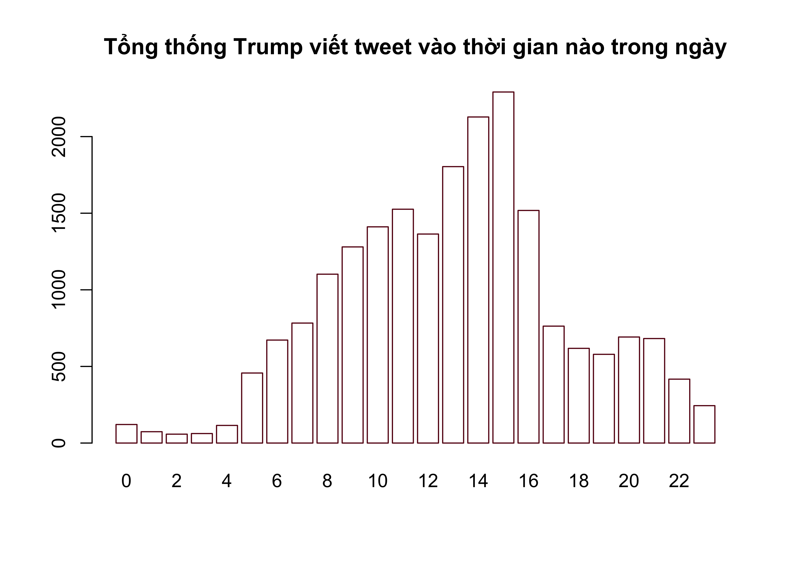
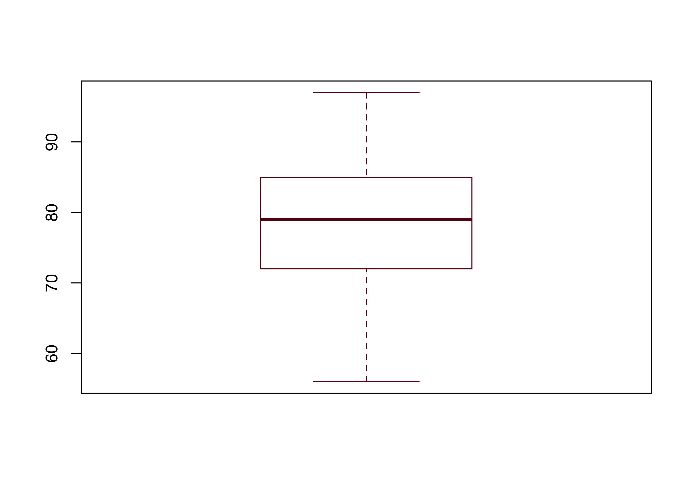

---
output:
  pdf_document: default
  html_document: default
  
header-includes:
- \usepackage{tikz}
- \usepackage{pgfplots}
- \usetikzlibrary{arrows,automata,positioning}
- \usepackage[utf8]{inputenc}
- \usepackage[utf8]{vietnam}
- \usepackage{etoolbox}
- \usepackage{xcolor}
- \usepackage{hyperref}
- \usepackage{mathtools}
- \usepackage{fontawesome5}
- \makeatletter
- \preto{\@verbatim}{\topsep=0pt \partopsep=-0pt}
- \makeatother
---

# (PART) PHẦN II: GIỚI THIỆU VỀ R {-}

# Kiến thức R cơ bản


## Làm quen với các dòng lệnh cơ bản
Đây là cuốn sách dành cho sinh viên và học viên các ngành kinh tế, quản lý, và quản trị kinh doanh muốn tìm hiểu sang lĩnh vực khoa học dữ liệu. Những bạn đọc đã có nền tảng kiến thức cơ bản về toán học, xác suất thống kê, và lập trình sẽ cảm thấy dễ dàng hơn khi bắt đầu. Cuốn sách sử dụng R làm ngôn ngữ và công cụ chính để thực hiện các thao tác trên dữ liệu.

Nếu bạn đọc đã có nền tảng cơ bản về lập trình thì cuốn sách này không giúp bạn lập trình tốt hơn. Mục đích chính của cuốn sách là giúp bạn có thể sử dụng được R và thực hiện được các thao tác trên dữ liệu trong môi trường R một cách nhanh nhất. Theo quan điểm của chúng tôi, R không phải là một ngôn ngữ thích hợp để bắt đầu cho học lập trình. Muốn trở thành một lập trình viên giỏi, bạn đọc nên bắt đầu với các ngôn ngữ lập trình cơ bản như Pascal, C++, Java, hay cũng có thể bắt đầu với ngôn ngữ Python.

Cách viết các dòng lệnh của R có thể nói là khá tùy tiện, thậm chí có thể làm cho những người có chuyên môn về lập trình cảm thấy khó chịu. Tuy nhiên, như đã đề cập trong phần giới thiệu của cuốn sách, R có các thế mạnh riêng mà các ngôn ngữ khác không có được và chúng tôi tin rằng R có thể giải quyết được tất cả những yêu cầu của bạn đọc từ những yêu cầu đơn giản đến những yêu cầu phức tạp nhất.

Cuốn sách hướng đến cả các bạn đọc chưa từng làm quen với lập trình. Với những ai đã có kinh nghiệm với lập trình có thể bỏ qua các phần không cần thiết như biến, vòng lặp, viết hàm số và có thể bắt đầu ngay kể từ phần phân tích dữ liệu.

### Sử dụng R như một máy tính cầm tay

Để R hiểu và thực hiện được các yêu cầu của mình, bạn đọc cần phải viết các câu lệnh dưới ngôn ngữ của phần mềm. Hãy bắt đầu với câu lệnh đầu tiên và đơn giản nhất: hiển thị một giá trị lên cửa sổ <span style='color: #640514; font-family: Source Code Pro;'>Console</span>. Trước hết bạn đọc hãy nhấp chuột vào cửa sổ <span style='color: #640514; font-family: Source Code Pro;'>Console</span>, sau đó gõ trực tiếp đoạn câu lệnh như ở dưới và kết thúc câu lệnh bằng cách sử dụng phím Enter:


``` r
print("I am MFEer")
```

Bạn đọc có thể bắt đầu làm quen với các dòng lệnh của R bằng cách viết lên cửa sổ <span style='color: #640514; font-family: Source Code Pro;'>Console</span> các công thức để thực hiện tính toán các phép toán dưới đây. R có thể được sử dụng đơn giản như một máy tính cầm tay:


``` r
1+0.001
2*pi - 3 # Số pi trong R được viết là pi
exp(1)-exp(-1) # Hàm lũy thừa cơ số tự nhiên.
log(3.2) # Hàm logarit cơ số tự nhiên.
log(1000,10) # Hàm logarit cơ số 10.
```

Một vài lưu ý bạn đọc có thể nhận thấy khi gõ các dòng lệnh ở trên: các phép tính cộng trừ nhân chia, dấu thập phân, dấu lũy thừa,..., hoàn toàn giống như khi sử dụng máy tính cầm tay. Các hàm số quen thuộc như hàm logarit, hàm lũy thừa cơ số tự nhiên cũng không có gì đặc biệt.

Bạn đọc có thể tiếp tục thực hành các câu lệnh cơ bản bằng cách sử dụng R để tính toán kết quả của các biểu thức dưới đây:

\begin{align}
a) \ \cfrac{1}{4^{1/6}} \ \ \ b) \ \cfrac{7 - 4}{12 - 7} \ \ \ c) \ \sqrt{\cfrac{4}{22}} \ \ \ d) (12-5)^{4/3} \ \ \ e) \ \log\left( \cfrac{2 + 4}{2^5 -1} \right)
\end{align}

Khi viết câu lệnh trên cửa sổ <span style='color: #640514; font-family: Source Code Pro;'>Console</span>, R luôn thực hiện câu lệnh mỗi khi bạn đọc sử dụng phím Enter. Khi muốn viết hai hay nhiều câu lệnh trên một dòng trên cửa sổ <span style='color: #640514; font-family: Source Code Pro;'>Console</span>, bạn đọc hãy ngăn cách các câu lệnh bằng dấu <span style='color: #640514; font-family: Source Code Pro;'> '' ; " </span>. Hãy thử câu lệnh ở dưới và quan sát R cách trả kết quả:


``` r
2*pi - 3; exp(1)-exp(-1) # Một dòng lệnh thực hiện hai câu lệnh.
```

```
## [1] 3.283185
```

```
## [1] 2.350402
```

Khi bạn đọc viết các câu lệnh đơn giản thì sử dụng nhiều phép tính trên một dòng lệnh có thể hạn chế việc dùng phím Enter nhiều lần. Tuy nhiên chúng tôi khuyên bạn đọc khi muốn thực hiện nhiều câu lệnh khác nhau hãy sử dụng cửa sổ <span style='color: #640514; font-family: Source Code Pro;'>Script</span> thay vì viết câu lệnh trực tiếp lên cửa sổ <span style='color: #640514; font-family: Source Code Pro;'>Console</span>. Phần tiếp theo của chương chúng tôi sẽ thảo luận về cách viết và thực thi câu lệnh trên cửa sổ <span style='color: #640514; font-family: Source Code Pro;'>Script</span>.


### Sử dụng cửa sổ <span style='color: #640514; font-family: Source Code Pro;'>Script</span> để viết câu lệnh
Cách tốt nhất để bạn đọc viết, quản lý, và thực thi câu lệnh đó là sử dụng cửa sổ <span style='color: #640514; font-family: Source Code Pro;'>Script</span>. Để mở cửa sổ <span style='color: #640514; font-family: Source Code Pro;'>Script</span> trên Rstudio, bạn đọc có thể tìm trên thanh công cụ theo trình tự *File* $\rightarrow$ *New file* $\rightarrow$ *R Script*, hoặc bạn đọc sử dụng tổ hợp phím tắt *Ctrl + Shift + N*. Khi viết câu lệnh trên cửa sổ <span style='color: #640514; font-family: Source Code Pro;'>Script</span>, R chỉ thực hiện câu lệnh khi bạn đọc yêu cầu. Do đó, bạn đọc có thể sử dụng cửa sổ <span style='color: #640514; font-family: Source Code Pro;'>Script</span> để viết các chương trình lớn với nhiều dòng lệnh kế tiếp nhau.

Sau khi mở của sổ <span style='color: #640514; font-family: Source Code Pro;'>Script</span>, bạn có thể viết các dòng lệnh và sử dụng Enter để xuống dòng và không cần quan tâm đến việc R có thực thi câu lệnh đó hay không. Trong một dòng lệnh trên cửa sổ <span style='color: #640514; font-family: Source Code Pro;'>Script</span> mỗi khi bạn đọc sử dụng dấu ngắt câu lệnh ";" R vẫn hiểu rằng bạn đọc đang viết hai câu lệnh khác nhau trên một dòng. Bạn đọc có thể bắt đầu mở cửa sổ <span style='color: #640514; font-family: Source Code Pro;'>Script</span> và gõ các dòng lệnh dưới đây:


``` r
1+0.001 ; 2*pi - 3 ; exp(1)-exp(-1)
log(3.2)
log(1000,10)
```

Phím Enter cho phép xuống dòng và không thực thi câu lệnh khi bạn đọc viết trên cửa sổ <span style='color: #640514; font-family: Source Code Pro;'>Script</span>. Thay vào đó, để thực thi các dòng lệnh, bạn đọc có hai lựa chọn: thứ nhất, sử dụng con trỏ bấm vào nút *Run* nằm ở phía góc trên bên phải của cửa sổ này, và thứ hai các bạn sử dụng tổ hợp phím tắt *Ctrl + Enter* nếu bạn sử dụng R trên hệ điều hành Windows và *Cmd + Enter* nếu bạn sử dụng R trên hệ điều hành MacOS. Để thực thi một dòng lệnh riêng lẻ trên cửa sổ <span style='color: #640514; font-family: Source Code Pro;'>Script</span>, bạn đọc di chuyển con trỏ đến dòng lệnh đó và thực hiện thao tác như ở trên. Để thực thi nhiều dòng lệnh bạn đọc sử dụng chuột trái lựa chọn các dòng lệnh và sau đó thực hiện thao tác chạy. Khi lựa chọn nhiều dòng lệnh một lúc để thực thi, R sẽ thực hiện các câu lệnh lần lượt theo thứ tự từ trên xuống dưới và từ bên trái qua bên phải nếu một dòng có nhiều câu lệnh.

Lưu ý, khi bạn đọc viết một chương trình bao gồm nhiều dòng lệnh, bạn thường phải sử dụng ngôn ngữ thông thường và dễ hiểu bằng tiếng Việt, hoặc tiếng Anh, để ghi chú lại các dòng lệnh hoặc nhóm các dòng lệnh đó có ý nghĩa là gì. Việc này giúp cho bản thân bạn khi xem lại các dòng lệnh của mình và cho những người tiếp nhận khi đọc các dòng lệnh hiểu được ý nghĩa của các câu lệnh. Các câu ghi chú đó theo ngôn ngữ lập trình được gọi là các câu ghi chú, hay *comment*. Bạn đọc sử dụng dấu <span style='color: #640514; font-family: Source Code Pro;'>Script</span> bắt đầu trước câu ghi chú:

``` r
# Đây là cách tính xấp xỉ số e
n<-1000
cat("e = ", (1+1/n)^n) # Khi n càng lớn thì kết quả càng chính xác
```

Phần tiếp theo của chương sẽ thảo luận về các khái niệm cơ bản nhất trong lập trình, đó là khái niệm về các kiểu biến.

## Biến trong ngôn ngữ R
Biến là khái niệm cơ bản nhất trong mọi ngôn ngữ lập trình. Có bốn loại biến cơ bản trong R bao gồm

* 1. Biến kiểu số, được gọi trong ngôn ngữ R là kiểu <span style='color: #640514; font-family: Source Code Pro;'>numeric</span>;
* 2. Biến kiểu ký tự, hay chuỗi ký tự, được gọi trong ngôn ngữ R là kiểu <span style='color: #640514; font-family: Source Code Pro;'>character</span>;
* 3. Biến kiểu logic, được gọi trong ngôn ngữ R là kiểu <span style='color: #640514; font-family: Source Code Pro;'>logical</span>;
* 4. Biến kiểu thời gian, được gọi trong ngôn ngữ R là kiểu <span style='color: #640514; font-family: Source Code Pro;'>Date</span> và kiểu <span style='color: #640514; font-family: Source Code Pro;'>POSIXct</span>.

Nhiều sách tham khảo khi viết về kiểu biến trong ngôn ngữ lập trình R phân loại biến thành nhiều kiểu hơn, chẳng hạn như có thêm kiểu số nguyên (<span style='color: #640514; font-family: Source Code Pro;'>integer</span>), kiểu <span style='color: #640514; font-family: Source Code Pro;'>factor</span>,... Tuy nhiên theo quan điểm của chúng tôi, phân loại biến quá chi tiết sẽ gây khó khăn cho bạn đọc, nhất là với bạn đọc mới làm quen với lập trình. Do đó, chúng tôi phân chia kiểu biến trong ngôn ngữ R thành bốn kiểu như ở trên. Trong các phần tiếp theo của chương chúng tôi sẽ thảo luận chi tiết về từng kiểu biến cụ thể và các kiểu biến khác có thể có liên quan.

Để tạo một biến trong R và gán giá trị cho biến đó, bạn đọc sử dụng một trong ba cách như sau:


``` r
# Cách thứ nhất
tenbien <- giatri # dấu "<-" là dấu gán giá trị

# Cách thứ hai
giatri -> tenbien

# Cách thứ ba
tenbien = giatri # dấu "=" cũng được sử dụng để gán giá trị
```

Trong các dòng lệnh ở trên, <span style='color: #640514; font-family: Source Code Pro;'>tenbien</span> là tên của biến mà bạn muốn đặt, <span style='color: #640514; font-family: Source Code Pro;'>giatri</span> là giá trị mà bạn muốn gán cho biến. Ký tự <span style='color: #640514; font-family: Source Code Pro;'><-</span> là ký tự gán giá trị được sử dụng trong các phiên bản R đầu tiên. Gán giá trị cho biến sử dụng ký tự <span style='color: #640514; font-family: Source Code Pro;'>-></span> khi bạn đọc viết tên biến sang phía bên phải. Cách viết này hiếm khi được dùng. Từ các phiên bản 3.0 của phần mềm R trở đi, dấu <span style='color: #640514; font-family: Source Code Pro;'>=</span> cũng có thể được sử dụng để gán giá trị cho biến. Tuy nhiên dấu <span style='color: #640514; font-family: Source Code Pro;'>=</span> có thể gây nhầm lẫn khi sau này bạn đọc sử dụng cùng lúc với ký hiệu so sánh <span style='color: #640514; font-family: Source Code Pro;'>==</span>. Đồng thời ký hiệu <span style='color: #640514; font-family: Source Code Pro;'>=</span> cũng được sử dụng trong truyền giá trị cho tham số khi viết hàm số. Do đó, trong cuốn sách này, chúng tôi luôn sử dụng <span style='color: #640514; font-family: Source Code Pro;'><-</span> để gán giá trị cho biến.

Dưới đây là một vài ví dụ về tạo biến và gán giá trị cho biến:

``` r
# Cách thứ nhất:
x <- 3  # Tạo một biến tên là x có giá trị 3.

# Cách thứ hai:
"MFE" -> y # Tạo một biến tên y có giá trị bằng ký tự "MFE".

# Cách thứ ba:
z = 1 + 2
# Tạo một biến tên z và nhận giá trị bằng kết quả của phép cộng.
```

Trong các câu lệnh ở trên, <span style='color: #640514; font-family: Source Code Pro;'>x</span>, <span style='color: #640514; font-family: Source Code Pro;'>y</span> hay <span style='color: #640514; font-family: Source Code Pro;'>z</span> là tên biến. Quy tắc đặt tên biến hay tên một đối tượng trong R cần tuân theo các quy tắc sau:

* 1. Tên biến có thể là tổ hợp của tất cả các chữ cái viết hoa, chữ cái viết thường và các chữ số.
* 2. Trong tên biến có thể chứa hai ký tự đặc biệt là "." và "_".
* 3. Tên biến không được phép bắt đầu bằng số hoặc ký tự "_".
* 4. Không được dùng từ khóa của R để đặt tên biến.

Để kiểm tra các quy tắc ở trên, bạn đọc có thể thử thực thi các câu lệnh tạo biến dưới đây và xem dòng lệnh nào báo lỗi và dòng lệnh nào không báo lỗi:


``` r
x1 <- 3 # Biến tên x1 sẽ được tạo với giá trị bằng 3.
1x <- 3 # Sẽ có lỗi, tên biến không được phép bắt đầu bằng số.
.x <- 3 # Biến tên .x hợp lệ.
_x <- 3 # Sẽ báo lỗi, tên biến không được phép bắt đầu bằng _
```

Lưu ý rằng R có phân biệt chữ viết hoa với chữ viết thường trong tên biến. Ví dụ như khi bạn đọc sử dụng <span style='color: #640514; font-family: Source Code Pro;'>x</span> để đặt tên và sau đó dùng <span style='color: #640514; font-family: Source Code Pro;'>X</span> để đặt tên thì R sẽ hiểu đây là hai biến khác nhau:


``` r
x<-3 # Tạo một biến tên x, giá trị bằng 3.
X<-5 # Tạo một biến tên X, giá trị bằng 5.
X-x # Hiệu số cho kết quả bằng 2 do x và X là khác nhau.
```

Để biết danh sách các tên biến đang tồn tại trên môi trường làm việc và giá trị của các biến đó, ngoài cách in giá trị biến lên cửa sổ <span style='color: #640514; font-family: Source Code Pro;'>Console</span>, bạn đọc có thể sử dụng cửa sổ <span style='color: #640514; font-family: Source Code Pro;'>Environment</span> ở góc phía trên bên phải, của Rstudio. Để xóa một biến hoặc một đối tượng đang tồn tại trong môi trường làm việc hiện tại, bạn đọc sử dụng câu lệnh <span style='color: #640514; font-family: Source Code Pro;'>rm()</span>:


``` r
x # R trả lại giá trị bằng 3.
rm(x) # Xóa biến x khỏi môi trường làm việc.
x # Sẽ báo lỗi vì biến x không còn tồn tại.
```

Một điều cũng cần lưu ý khi đặt tên biến hay khi đặt tên các đối tượng khác trong R là tên biến không được phép trùng với các từ khóa. Danh sách các từ khóa thường sử dụng trong R nằm trong bảng \@ref(tab:tbbasic01)


<table class="table table-bordered table-hover" style="width: auto !important; margin-left: auto; margin-right: auto;">
<caption>(\#tab:tbbasic01)Danh sách các từ khóa không được dùng để đặt tên</caption>
 <thead>
  <tr>
   <th style="text-align:left;"> Từ khóa </th>
   <th style="text-align:left;"> Sử dụng trong ngữ cảnh </th>
  </tr>
 </thead>
<tbody>
  <tr>
   <td style="text-align:left;"> If, else </td>
   <td style="text-align:left;"> Câu lệnh điều kiện </td>
  </tr>
  <tr>
   <td style="text-align:left;"> for, while, in , repeat </td>
   <td style="text-align:left;"> Vòng lặp </td>
  </tr>
  <tr>
   <td style="text-align:left;"> function </td>
   <td style="text-align:left;"> Khai báo hàm số </td>
  </tr>
  <tr>
   <td style="text-align:left;"> break, next </td>
   <td style="text-align:left;"> Điều khiển vòng lặp </td>
  </tr>
  <tr>
   <td style="text-align:left;"> TRUE, FALSE </td>
   <td style="text-align:left;"> Tên các biến logic </td>
  </tr>
  <tr>
   <td style="text-align:left;"> Inf, -Inf, NaN, NA </td>
   <td style="text-align:left;"> Các biến kiểu số dạng đặc biệt </td>
  </tr>
</tbody>
</table>

Trong phần tiếp theo, chúng ta sẽ thảo luận chi tiết về từng kiểu biến.

### Biến kiểu số
Biến kiếu số, được gọi trong R là kiểu <span style='color: #640514; font-family: Source Code Pro;'>numeric</span>, là các biến nhận giá trị kiểu số thập phân. Để tạo một biến kiểu số, bạn đọc gán một giá trị kiểu số bất kỳ cho tên biến mà bạn muốn đặt. Đây cũng là cách tạo biến chung trong R. Câu lệnh dưới đây khởi tạo một biến tên <span style='color: #640514; font-family: Source Code Pro;'>x</span> kiểu số và nhận giá trị bằng 5:

``` r
x <- 5 # 5 là giá trị kiểu số nên R tự hiểu x là biến kiểu số.
```

Để kiểm tra một biến tên <span style='color: #640514; font-family: Source Code Pro;'>x</span> có phải là biến kiểu số không, bạn đọc sử dụng hàm <span style='color: #640514; font-family: Source Code Pro;'>is.numeric()</span>. Hàm số này trả lại giá trị là kiểu logic. Giá trị <span style='color: #640514; font-family: Source Code Pro;'>TRUE</span> cho biết biến được hỏi đúng là kiểu số trong khi giá trị <span style='color: #640514; font-family: Source Code Pro;'>FALSE</span> cho biết biến được hỏi không phải là kiểu số. Ngoài sử dụng hàm <span style='color: #640514; font-family: Source Code Pro;'>is.numeric()</span>, bạn đọc cũng có thể sử dụng hàm <span style='color: #640514; font-family: Source Code Pro;'>class()</span>. Hàm <span style='color: #640514; font-family: Source Code Pro;'>class()</span> cho biết kiểu giá trị của một đối tượng bất kỳ trong R. Cách sử dụng hai hàm này như sau:


``` r
is.numeric(x) # 5 là giá trị kiểu số nên R trả lại TRUE.
```

```
## [1] TRUE
```

``` r
class(x) # Cho biết kiểu giá trị của đối tượng x.
```

```
## [1] "numeric"
```

``` r
y<-"abc" # Khởi tạo một biến y kiểu ký tự.
is.numeric(y) # Kết quả là FALSE vì y không phải số.
```

```
## [1] FALSE
```

Trong phép gán cho giá trị của biến <span style='color: #640514; font-family: Source Code Pro;'>x</span> ở trên, mặc dù giá trị khởi tạo 5 là số nguyên nhưng R vẫn cho rằng <span style='color: #640514; font-family: Source Code Pro;'>x</span> là kiểu số thập phân. Để tạo một biến kiểu số nguyên, bạn đọc cần phải sử dụng thêm chữ <span style='color: #640514; font-family: Source Code Pro;'>L</span> phía sau số nguyên đó. Chữ <span style='color: #640514; font-family: Source Code Pro;'>L</span> là viết tắt cho *Long* nghĩa là số nguyên kiểu *Long* trong các ngôn ngữ lập trình cơ bản như Pascal hay C. Số nguyên kiểu *Long* là các số nguyên cần 32 bytes để lưu và nhận $2^{32}$ giá trị từ −2,147,483,648 ($-2^{31}$) đến 2,147,483,647 ($2^{31}-1$). Để tạo biến <span style='color: #640514; font-family: Source Code Pro;'>x</span> nhận giá trị là số nguyên bằng 5 chúng ta viết như sau:


``` r
x <- 5L # 5L nghĩa là số nguyên 5, L là viết tắt của Long.
class(x) # x là số tự nguyên (integer)
```

```
## [1] "integer"
```

``` r
is.numeric(x) # x không còn là số thập phân, nhưng vẫn là kiểu số.
```

```
## [1] TRUE
```

Phân biệt số nguyên và số thập phân trong các ngôn ngữ lập trình có ý nghĩa khi bạn đọc cần tiết kiệm bộ nhớ cho chương trình. Trong R, khi sử dụng số thập phân thay cho số nguyên, dung lượng bộ nhớ máy tính sẽ tăng gấp 2 lần. Hình vẽ dưới đây mô tả dung lượng bộ nhớ cần sử dụng cho các véc-tơ chứa các số nguyên và các véc-tơ chứa các số thập phân với số lượng phần tử chạy từ 1 đến 100. Từ hình \@ref(fig:fgbasic01) bạn đọc có thể thấy rằng không có sự khác biệt về bộ nhớ với các véc-tơ có độ dài dưới 10 nhưng khi véc-tơ có độ dài từ 10 trở lên, véc-tơ kiểu số thập phân cần trung bình khoảng 2 lần bộ nhớ so với véc-tơ kiểu số nguyên.

<div class="figure" style="text-align: center">

<p class="caption">(\#fig:fgbasic01)Sự khác nhau về dung lượng bộ nhớ cần sử dụng để lưu véc-tơ kiểu số nguyên và véc-tơ kiểu số thập phân.</p>
</div>

Biến kiểu số được sử dụng chủ yếu để thực hiện trong các phép tính toán. Các phép tính toán thông thường được liệt kê trong bảng \@ref(tab:tbbasic02)


<table class="table table-bordered table-hover" style="width: auto !important; margin-left: auto; margin-right: auto;">
<caption>(\#tab:tbbasic02)Các phép toán cơ bản thường được sử dụng với biến kiểu số</caption>
 <thead>
  <tr>
   <th style="text-align:left;"> Ký hiệu </th>
   <th style="text-align:left;"> Phép tính </th>
  </tr>
 </thead>
<tbody>
  <tr>
   <td style="text-align:left;"> \+ </td>
   <td style="text-align:left;"> Phép tính cộng </td>
  </tr>
  <tr>
   <td style="text-align:left;"> \- </td>
   <td style="text-align:left;"> Phép tính trừ </td>
  </tr>
  <tr>
   <td style="text-align:left;"> \* </td>
   <td style="text-align:left;"> Phép tính nhân </td>
  </tr>
  <tr>
   <td style="text-align:left;"> / </td>
   <td style="text-align:left;"> Phép tính chia </td>
  </tr>
  <tr>
   <td style="text-align:left;"> ^ </td>
   <td style="text-align:left;"> Phép tính lũy thừa </td>
  </tr>
  <tr>
   <td style="text-align:left;"> exp(x) </td>
   <td style="text-align:left;"> Phép tính lũy thừa cơ số e của số x </td>
  </tr>
  <tr>
   <td style="text-align:left;"> log() </td>
   <td style="text-align:left;"> Phép lấy loga cơ số tự nhiên của số x </td>
  </tr>
  <tr>
   <td style="text-align:left;"> log(.,a) </td>
   <td style="text-align:left;"> Phép lấy loga cơ số a của số x </td>
  </tr>
  <tr>
   <td style="text-align:left;"> %% </td>
   <td style="text-align:left;"> Phép lấy phần dư trong phép chia </td>
  </tr>
  <tr>
   <td style="text-align:left;"> %/% </td>
   <td style="text-align:left;"> Phép lấy phần nguyên của kết quả trong phép chia </td>
  </tr>
</tbody>
</table>

Lưu ý rằng các phép toán lấy phần dư <span style='color: #640514; font-family: Source Code Pro;'>%%</span>, và phép lấy thương số trong phép chia <span style='color: #640514; font-family: Source Code Pro;'>%/%</span>, cũng có thể thực hiện được với cả số kiểu thập phân. Bạn đọc quan sát kết quả của các phép toán này trong ví dụ dưới đây:


``` r
6.5 %% 2 # Phần dư của phép chia 6.5 cho 2
```

```
## [1] 0.5
```

``` r
6.5 %/% 2 # Phần nguyên của phép chia 6.5 cho 2
```

```
## [1] 3
```

Một cách viết số kiểu khoa học và các giá trị kiểu số đặc biệt được liệt kê trong bảng \@ref(tab:tbbasic03).


<table class="table table-bordered table-hover" style="width: auto !important; margin-left: auto; margin-right: auto;">
<caption>(\#tab:tbbasic03)Các giá trị số được viết kiểu khoa học và các giá trị số đặc biệt</caption>
 <thead>
  <tr>
   <th style="text-align:left;"> Loại số </th>
   <th style="text-align:left;"> Ý nghĩa </th>
  </tr>
 </thead>
<tbody>
  <tr>
   <td style="text-align:left;"> 1.2e+08 </td>
   <td style="text-align:left;"> nghĩa là nhân số 1.2 với 10 lũy thừa 8 </td>
  </tr>
  <tr>
   <td style="text-align:left;"> 1.2e-15 </td>
   <td style="text-align:left;"> nghĩa là nhân số 1.2 với 10 lũy thừa -15 </td>
  </tr>
  <tr>
   <td style="text-align:left;"> Inf </td>
   <td style="text-align:left;"> Số dương vô cùng </td>
  </tr>
  <tr>
   <td style="text-align:left;"> -Inf </td>
   <td style="text-align:left;"> Số âm vô cùng </td>
  </tr>
  <tr>
   <td style="text-align:left;"> NaN </td>
   <td style="text-align:left;"> là kết quả của các phép tính không có nghĩa, viết tắt của Not a Number </td>
  </tr>
</tbody>
</table>

Bạn đọc cần đặc biệt lưu ý khi thực hiện các phép tính toán có kết quả là các giá trị đặc biệt. Dưới đây là các ví dụ:


``` r
1/0 # Kết quả của 1/0 là dương vô cùng.
(-1)/0 # Kết quả của -1/0 là âm vô cùng.
Inf - 10^10 # Trong các phép tính có Inf sẽ có kết quả Inf.
1/0 + (-1)/0 # Inf + (-Inf) là không thể xác định được.
log(-2) # Kết quả của các phép tính vô nghĩa là NaN.
```

### Biến kiểu <span style='color: #640514; font-family: Source Code Pro;'>logical</span>
Biến kiểu logic, được gọi là kiểu <span style='color: #640514; font-family: Source Code Pro;'>logical</span>, là kiểu biến đơn giản nhất nhưng lại quan trọng nhất trong R nói riêng và trong đa số các ngôn ngữ lập trình nói chung. Biến kiểu <span style='color: #640514; font-family: Source Code Pro;'>logical</span> chỉ nhận một trong hai giá trị là <span style='color: #640514; font-family: Source Code Pro;'>TRUE</span> hoặc <span style='color: #640514; font-family: Source Code Pro;'>FALSE</span>. Do R phân biệt chữ viết hoa và chữ viết thường nên khi viết giá trị cho biến kiểu logic bạn đọc cần viết bao gồm toàn bộ các chữ cái viết hoa. Để tạo một biến kiểu logic, chúng ta chọn tên biến và gán một trong hai giá trị logic. Việc này hoàn toàn giống như khi tạo một biến kiểu số:

``` r
x <- TRUE
```

Biến kiểu logic có thể đặt trong các phép tính toán giống như biến kiểu số. Khi gặp một công thức có bao gồm cả biến kiểu số và biến kiểu logic, R sẽ đổi biến kiểu logic có giá trị <span style='color: #640514; font-family: Source Code Pro;'>TRUE</span> thành giá trị 1 và biến kiểu logic có giá trị <span style='color: #640514; font-family: Source Code Pro;'>FALSE</span> thành giá trị 0 rồi thực hiện phép tính toán:

``` r
FALSE + TRUE * 10 # Sẽ cho kết quả giống như 0 + 1 * 10
```

```
## [1] 10
```

Trong thực tế, ít khi chúng ta khởi tạo giá trị cho biến kiểu logic như trên. Biến kiểu logic thường nhận được từ kết quả các phép so sánh. Các phép toán so sánh thường được sử dụng trong R được liệt kê trong bảng \@ref(tab:tbbasic04)


<table class="table table-bordered table-hover" style="width: auto !important; margin-left: auto; margin-right: auto;">
<caption>(\#tab:tbbasic04)Các phép so sánh cơ bản cho kết quả là một biến logic</caption>
 <thead>
  <tr>
   <th style="text-align:left;"> Phép so sánh </th>
   <th style="text-align:left;"> Ý nghĩa </th>
  </tr>
 </thead>
<tbody>
  <tr>
   <td style="text-align:left;"> &lt; </td>
   <td style="text-align:left;"> Có nhỏ hơn không? </td>
  </tr>
  <tr>
   <td style="text-align:left;"> &gt; </td>
   <td style="text-align:left;"> Có lớn hơn không? </td>
  </tr>
  <tr>
   <td style="text-align:left;"> &lt;= </td>
   <td style="text-align:left;"> Có nhỏ hơn hoặc bằng không? </td>
  </tr>
  <tr>
   <td style="text-align:left;"> &gt;= </td>
   <td style="text-align:left;"> Có lớn hơn hoặc bằng không? </td>
  </tr>
  <tr>
   <td style="text-align:left;"> == </td>
   <td style="text-align:left;"> Có bằng nhau không? </td>
  </tr>
  <tr>
   <td style="text-align:left;"> != </td>
   <td style="text-align:left;"> Có khác nhau không? </td>
  </tr>
</tbody>
</table>

Ngoài ra, các biến kiểu logic còn là kết quả của việc kết hợp $|$ nhiều biến kiểu logic khác bằng các toán tử logic. Các toán tử logic bao gồm có toán tử "và", toán tử "hoặc", và toán tử "phủ định". Các toán tử này được liệt kê trong bảng \@ref(tab:tbbasic05)


<table class="table table-bordered table-hover" style="width: auto !important; margin-left: auto; margin-right: auto;">
<caption>(\#tab:tbbasic05)(\#tab:tbbasic05)Các toán tử sử dụng cùng với biến kiểu logic</caption>
 <thead>
  <tr>
   <th style="text-align:left;"> Toán tử logic </th>
   <th style="text-align:left;"> Ý nghĩa </th>
  </tr>
 </thead>
<tbody>
  <tr>
   <td style="text-align:left;"> &amp; </td>
   <td style="text-align:left;"> Toán tử Và; ký hiệu A&amp;B đọc là A và B </td>
  </tr>
  <tr>
   <td style="text-align:left;"> $&amp;#124;$ </td>
   <td style="text-align:left;"> Toán tử Hoặc; ký hiệuA&amp;#124;Bđọc là A hoặc B </td>
  </tr>
  <tr>
   <td style="text-align:left;"> $!$ </td>
   <td style="text-align:left;"> Toán tử Phủ định; Toán tử này phủ định lại biến logic đứng sau </td>
  </tr>
</tbody>
</table>

Bạn đọc cần lưu ý rằng các biến logic khi kết hợp với nhau bằng các toán tử trong bảng \@ref(tab:tbbasic05) sẽ cho kết quả là một biến kiểu logic. Quy tắc kết hợp các biến kiểu logic bằng các toán tử logic được tổng hợp trong bảng \@ref(tab:tbbasic06)


<table class="table table-bordered table-hover" style="width: auto !important; margin-left: auto; margin-right: auto;">
<caption>(\#tab:tbbasic06)Các biến logic được kết hợp bằng các toán tử logic</caption>
 <thead>
  <tr>
   <th style="text-align:left;"> Kết hợp </th>
   <th style="text-align:left;"> Kết quả </th>
  </tr>
 </thead>
<tbody>
  <tr>
   <td style="text-align:left;"> !TRUE </td>
   <td style="text-align:left;"> FALSE </td>
  </tr>
  <tr>
   <td style="text-align:left;"> !FASLE </td>
   <td style="text-align:left;"> TRUE </td>
  </tr>
  <tr>
   <td style="text-align:left;"> TRUE &amp; TRUE </td>
   <td style="text-align:left;"> TRUE </td>
  </tr>
  <tr>
   <td style="text-align:left;"> TRUE &amp; FALSE </td>
   <td style="text-align:left;"> FALSE </td>
  </tr>
  <tr>
   <td style="text-align:left;"> FALSE &amp; TRUE </td>
   <td style="text-align:left;"> FALSE </td>
  </tr>
  <tr>
   <td style="text-align:left;"> TRUE | TRUE </td>
   <td style="text-align:left;"> TRUE </td>
  </tr>
  <tr>
   <td style="text-align:left;"> TRUE | FALSE </td>
   <td style="text-align:left;"> TRUE </td>
  </tr>
  <tr>
   <td style="text-align:left;"> FALSE | TRUE </td>
   <td style="text-align:left;"> TRUE </td>
  </tr>
</tbody>
</table>

Như chúng tôi đã đề cập ở trên, các biến kiểu logic khi đặt trong các biểu thức tính toán sẽ được tự động đổi sang biến kiểu số trước khi thực hiện phép tính. Ngược lại, khi biến kiểu số xuất hiện trong các biểu thức có toán tử logic, biến kiểu số cũng sẽ được chuyển sang kiểu logic. R sẽ mặc định quy tắc đổi từ số sang kiểu logic như sau: chỉ có số 0 khi đặt trong biểu thức có toán tử logic mới được chuyển thành <span style='color: #640514; font-family: Source Code Pro;'>FALSE</span>, mọi số khác 0 khi đổi sang kiểu logic đều được chuyển thành <span style='color: #640514; font-family: Source Code Pro;'>TRUE</span>. Bạn đọc hãy quan sát nguyên tắc đổi từ biến kiểu số sang logic trong các phép toán dưới đây


``` r
10 & -0.1 # Tương đương với TRUE & TRUE
```

```
## [1] TRUE
```

``` r
0 & -0.1 # Tương đương với FALSE & TRUE
```

```
## [1] FALSE
```

``` r
0 | 0.2 # Tương đương với FALSE | TRUE
```

```
## [1] TRUE
```

Bạn đọc có thể thực hành việc tính toán trên các toán tử logic như ở dưới đây. Trước khi sử dụng R để xem kết quả, hãy thử suy nghĩ xem các biểu thức từ 1. đến 4. dưới đây cho kết quả như thế nào?


``` r
# 1.
(1<=2) | (2<=3)
# 2.
(1<=2) + (2<=3)
# 3.
((1<=2) * (2^2 == 4)) | (2!=3) #
# 4.
!((1<=2) * (2^2 == 4)) & !(2!=3) #
# 5.
((2 + 2) | (2 - 2)) & !(2 ^ 2) #
```

### Biến kiểu chuỗi ký tự
Biến kiểu ký tự hay chuỗi ký tự còn được gọi trong ngôn ngữ R là kiểu <span style='color: #640514; font-family: Source Code Pro;'>character</span>. Biến kiểu chuỗi ký tự tương tự như biến kiểu xâu ký tự hay kiểu *string* trong các ngôn ngữ lập trình cơ bản. Biến kiểu chuỗi ký tự có thể chỉ ngắn gọn là một ký tự trống, một chữ cái, nhưng đôi khi có thể là một câu, hoặc cũng có thể là cả một đoạn văn bản. Khi làm việc với biến kiểu chuỗi ký tự, bạn đọc hãy luôn ghi nhớ rằng R phân biệt chữ viết hoa và chữ viết thường.

Để tạo một biến có kiểu ký tự trong R, bạn đọc chọn tên cho biến và gán giá trị kiểu chuỗi ký tự. R sẽ hiểu một biến là chuỗi ký tự khi chuỗi ký tự đó nằm trong dấu ngoặc kép \" \" hoặc trong dấu ngoặc đơn \' \'.


``` r
x <- "Ice cream" # "Ice cream" với chữ I viết hoa.
x == "ice cream" # Kết quả trả lại là FALSE
```

```
## [1] FALSE
```

Để biết một biến có phải kiểu chuỗi ký tự không, bạn đọc sử dụng hàm <span style='color: #640514; font-family: Source Code Pro;'>is.character()</span> hoặc hàm <span style='color: #640514; font-family: Source Code Pro;'>class()</span>. Hàm <span style='color: #640514; font-family: Source Code Pro;'>is.character()</span> trả lại giá trị <span style='color: #640514; font-family: Source Code Pro;'>TRUE</span> nếu một biến có kiểu chuỗi ký tự và trả lại giá trị <span style='color: #640514; font-family: Source Code Pro;'>FALSE</span> trong các trường hợp còn lại. Hàm <span style='color: #640514; font-family: Source Code Pro;'>class()</span>, như chúng tôi đã giới thiệu ở trên, cho biết một đối tượng bất kỳ là đối tượng có kiểu như thế nào:

``` r
is.character(x)
class(x)
```

Khi xử lý biến kiểu chuỗi ký tự, bạn đọc nên sử dụng các hàm số đã được xây dựng sẵn. Bảng \@ref(tab:tbbasic07) liệt kê các hàm thường được sử dụng khi xử lý biến kiểu chuỗi ký tự và kết quả của các hàm này.


<table class="table table-bordered table-hover" style="width: auto !important; margin-left: auto; margin-right: auto;">
<caption>(\#tab:tbbasic07)Các hàm thường sử dụng để xử lý biến kiểu chuỗi ký tự</caption>
 <thead>
  <tr>
   <th style="text-align:left;"> Hàm số </th>
   <th style="text-align:left;"> Ý nghĩa </th>
  </tr>
 </thead>
<tbody>
  <tr>
   <td style="text-align:left;"> nchar(x) </td>
   <td style="text-align:left;"> Cho biêt biến x dạng chuỗi ký tự có bao nhiêu ký tự </td>
  </tr>
  <tr>
   <td style="text-align:left;"> paste(x1,x2,sep = a) </td>
   <td style="text-align:left;"> Ghép hai chuỗi ký tự x1 và x2 thành một chuỗi ký tự cách nhau chuỗi ký tự a </td>
  </tr>
  <tr>
   <td style="text-align:left;"> toupper(x) </td>
   <td style="text-align:left;"> Chuyển tất cả các chữ viêt thường trong x thành chữ viết hoa </td>
  </tr>
  <tr>
   <td style="text-align:left;"> tolower(x) </td>
   <td style="text-align:left;"> Chuyển tất cả các chữ viết hoa trong x thành chữ viết thường </td>
  </tr>
  <tr>
   <td style="text-align:left;"> chartr(a,b,x) </td>
   <td style="text-align:left;"> Thay thế trong x: từng ký tự trong chuỗi a tương ứng bằng từng ký tự trong chuỗi b, a và b phải có độ dài bằng nhau </td>
  </tr>
  <tr>
   <td style="text-align:left;"> substr(x,k,n) </td>
   <td style="text-align:left;"> Lấy ra chuỗi ký tự con từ x, lấy từ ký tự thứ k đến ký tự thứ n </td>
  </tr>
  <tr>
   <td style="text-align:left;"> sub(a, b, x) </td>
   <td style="text-align:left;"> Đoạn ký tự a đầu tiên trong x sẽ được thay thế bằng đoạn ký tự b </td>
  </tr>
  <tr>
   <td style="text-align:left;"> gsub(a, b, x) </td>
   <td style="text-align:left;"> Tất cả các đoạn ký tự giống a trong x sẽ được thay thế bằng b </td>
  </tr>
  <tr>
   <td style="text-align:left;"> grepl(a,x) </td>
   <td style="text-align:left;"> Trả lại giá trị là biến TRUE nếu đoạn ký tự a nằm trong biến x </td>
  </tr>
</tbody>
</table>

Bạn đọc có thể thực thi các hàm liệt kê trong bảng \@ref(tab:tbbasic07) và quan sát giá trị trả ra của các hàm đó trong các câu lệnh dưới đây để hiểu cách sử dụng của các hàm này:


``` r
# Khởi tạo hai biến kiểu chuỗi ký tự x1 và x2
x1 <- "I am an Actuary"; x2<-"I am Vietnamese"
nchar(x1) # Cho biết x1 có bao nhiêu ký tự.
paste(x1, x2, sep = " and ") # Ghép x1 và x2 lại và thêm " and " vào giữa.
toupper(x1); tolower(x1) # Chuyển tất cả các ký tụ sang viết hoa/viết thường
chartr("an","bm",x1) # Thay tất cả các chữ "a" trong x1 bằng "b" và "n" bằng "m"
substr(x1, 9, 15) # Lấy ra đoạn ký tự từ ký tự thứ 9 (chữ A) đến ký tự thứ 15 (chữ "y")
sub("a", "XYZ", x1) # Thay chữ "a" đầu tiên trong x1 bằng đoạn "XYZ"
gsub("a", "XYZ", x1) # Thay tất cả chữ "a" trong x1 bằng đoạn "XYZ"
grepl("Vietnam", x2) # Cho biết đoạn ký tự "Vietnam" có nằm trong x2 hay không
```

Nhìn chung, trong bất kỳ ngôn ngữ lập trình nào, xử lý biến kiểu chuỗi ký tự sẽ luôn khó khăn hơn so với xử lý biến kiểu số. Để thực hiện được các yêu cầu phức tạp hơn, bạn đọc có thể kết hợp các hàm số ở trên để có hiệu quả tốt hơn. Có các thư viện được phát triển dành riêng cho việc xử lý các biến kiểu chuỗi ký tự mà tiêu biểu là thư viện <span style='color: #640514; font-family: Source Code Pro;'>stringr</span>. Các hàm hữu ích trong thư viện <span style='color: #640514; font-family: Source Code Pro;'>stringr</span> sẽ được thảo luận chi tiết trong phần phân tích dữ liệu.

### Biến kiểu thời gian
Trong ngôn ngữ R có hai kiểu biến thời gian là biến kiểu ngày tháng, được gọi trong ngôn ngữ R là kiểu <span style='color: #640514; font-family: Source Code Pro;'>Date</span>) và biến kiểu thời gian chi tiết, được gọi trong ngôn ngữ R là kiểu <span style='color: #640514; font-family: Source Code Pro;'>POSIXct</span>. Thời gian *POSIX* hay còn được biết đến với tên gọi là thời gian *Unix* là một cách quy ước về thời gian của một thời điểm cụ thể được tính bằng số giây từ cột mốc thời gian Unix đến thời điểm đó. Cột mốc thời gian Unix được các kỹ sư xây dựng hệ điều hành Unix lựa chọn là thời điểm 0 giờ, 0 phút, 0 giây, ngày 01 tháng 01 năm 1970 theo giờ phối hợp quốc tế (giờ UTC). Chữ "ct" là viết tắt của canlendar time. Bạn đọc cũng có thể gặp biến kiểu thời gian chi tiết trong R dưới dạng <span style='color: #640514; font-family: Source Code Pro;'>POSIXlt</span> trong đó <span style='color: #640514; font-family: Source Code Pro;'>lt</span> là chữ viết tắt của local time. Sự khác biệt của biến kiểu <span style='color: #640514; font-family: Source Code Pro;'>POSIct</span> và <span style='color: #640514; font-family: Source Code Pro;'>POSIXlt</span> chỉ là cách R lưu trữ các biến này dưới dạng số nguyên hay dưới dạng véc-tơ. Trong cuốn sách này khi nói đến biến kiểu thời gian chúng tôi luôn sử dụng biến kiểu <span style='color: #640514; font-family: Source Code Pro;'>POSIXct</span>.

Để tạo biến kiểu thời gian trong R, bạn đọc sử dụng hàm <span style='color: #640514; font-family: Source Code Pro;'>as.Date()</span> cho biến kiểu ngày tháng và hàm <span style='color: #640514; font-family: Source Code Pro;'>as.POSIXct()</span> cho biến kiểu thời gian chi tiết:


``` r
# Tạo biến date1 nhận giá trị là ngày 31/08/2023
date1 <- as.Date("2023-08-31")

# Biến time1 là 16 giờ, 41 phút, 30 giây ngày 31/08/2023
time1 <- as.POSIXct("2023-08-31 16:41:30")
```

Khi xử lý biến kiểu thời gian, bạn đọc nên đổi sang dạng số hoặc lưu biến kiểu thời gian dưới dạng một véc-tơ số lưu lại các thành phần của thời gian theo một thứ tự nhất định. Hàm <span style='color: #640514; font-family: Source Code Pro;'>as.numeric()</span> sẽ đổi các biến kiểu ngày tháng hoặc thời gian chi tiết ra thành số ngày đối với biến kiểu ngày tháng, hoặc số giây đối với biến kiểu thời gian chi tiết, tính từ mốc thời gian Unix.


``` r
# Cho biết số ngày tính từ 01/01/1970 đến date1
as.numeric(date1)
```

```
## [1] 19600
```

``` r
# Cho biết số giây tính từ 7 giờ, 0 phút, 0 giây ngày 01/01/1970 đến time1
as.numeric(time1)
```

```
## [1] 1693474890
```

Do múi giờ UTC của Việt Nam là *UTC + 7* nên thời điểm tính làm mốc sẽ là 7 giờ, 0 phút, 0 giây, ngày 01 tháng 01 năm 1970. Điều này giải thích tại sao khi đổi biến <span style='color: #640514; font-family: Source Code Pro;'>time2</span> dưới đây thành dạng số ta sẽ thu được kết quả là 30 giây.

``` r
# Cho biết số giây tính từ 7 giờ, 0 phút, 0 giây ngày 01/01/1970 đến time2
time2 <- as.POSIXct("1970-01-01 07:00:30")
as.numeric(time2)
```

```
## [1] -3570
```

Khi sử dụng các hàm <span style='color: #640514; font-family: Source Code Pro;'>as.Date()</span> hoặc <span style='color: #640514; font-family: Source Code Pro;'>as.POSIXct()</span> giá trị được đưa vào phải là biến dạng chuỗi ký tự được viết theo đúng quy tắc <span style='color: #640514; font-family: Source Code Pro;'>YYYY-MM-DD</span> và <span style='color: #640514; font-family: Source Code Pro;'>YYYY-MM-DD hh:mm:ss</span>. Trong trường hợp chuỗi ký tự được đưa vào không đúng định dạng, bạn đọc cần phải thông báo cho R biết định dạng của biến chuỗi ký tự đó bằng cách sử dụng thêm tham số <span style='color: #640514; font-family: Source Code Pro;'>format</span>. Bạn đọc có thể tham khảo cách khai báo định dạng của biến chuỗi ký tự trong các hàm <span style='color: #640514; font-family: Source Code Pro;'>as.Date()</span> hoặc <span style='color: #640514; font-family: Source Code Pro;'>as.POSIXct()</span> như sau:

``` r
# date1 là ngày 27 tháng 02 năm 1992
date1 <- as.Date("02/27/92", format = "%m/%d/%y")

# date2 là ngày 02 tháng 01 năm 2010
date2 <- as.Date("02 Jan 2010", format = "%d %b %Y")
```

Trong rất nhiều trường hợp, biến kiểu thời gian sẽ được lấy từ các nguồn khác nhau vào R và được lưu dưới dạng số tự nhiên. Điển hình là khi bạn đọc lấy dữ liệu từ các file được lưu từ phần mềm Microsoft Excel. Các hàm <span style='color: #640514; font-family: Source Code Pro;'>as.Date()</span> và <span style='color: #640514; font-family: Source Code Pro;'>as.POSIXct()</span> cũng có thể chuyển giá trị số biến kiểu ngày tháng và biến kiểu thời gian chi tiết. Bạn đọc cần sử dụng thêm tham số biến <span style='color: #640514; font-family: Source Code Pro;'>origin</span> trong các hàm này để quy định mốc thời gian.

``` r
date1 <- as.Date(19000, origin = "1970-01-01")
time1 <- as.POSIXct(10^9, origin = "1970-01-01 07:00:00")
```

Sau khi thực thi các câu lệnh ở trên, biến <span style='color: #640514; font-family: Source Code Pro;'>date1</span> tương ứng với ngày thứ 19,000 tính từ mốc ngày 1 tháng 1 năm 1970 và biến <span style='color: #640514; font-family: Source Code Pro;'>time1</span> tương ứng với thời điểm giây thứ 1 tỷ tính từ 07 giờ 00 phút 00 giây ngày 1 tháng 1 năm 1970.

Vấn đề thường gặp phải khi lấy dữ liệu từ các nguồn ngoài là cách chuyển đổi từ thời gian thành số của phần mềm lưu dữ liệu gốc có mốc thời gian khác với R. Chẳng hạn như biến kiểu thời gian từ Microsoft Excel khi chuyển đổi thành số sử dụng mốc thời gian là ngày 30 tháng 12 năm 1899. Giả sử khi bạn đọc lấy một biến thời gian từ Microsoft Excel vào R và thấy giá trị là 45678. Nếu không sử dụng mốc thời gian của Microsoft Excel để chuyển đổi, giá trị thời gian nhận được sẽ không đúng. Để biến ngày tháng nhận giá trị đúng, chúng ta cần khai báo tham số <span style='color: #640514; font-family: Source Code Pro;'>origin</span> như sau:


``` r
# 45678 là giá trị của biến lấy từ nguồn Microsoft Excel
date1 <- as.Date(45678, origin = "1970-01-01")
date1 # date1 sai do sử dụng mốc thời gian ngày 01 tháng 01 năm 1970.
```

```
## [1] "2095-01-23"
```

``` r
date2 <- as.Date(45678, origin = "1899-12-30")
date2 # date2 có giá trị ĐÚNG do dùng đúng mốc thời gian của Excel.
```

```
## [1] "2025-01-21"
```

Nguyên tắc cơ bản khi xử lý và tính toán với biến kiểu thời gian trong R là luôn luôn đổi biến sang kiểu số nguyên hoặc đổi một biến kiểu thời gian thành một véc-tơ chứa các thành phần ngày, tháng, năm, giờ, phút, giây dưới dạng số. Để tách biến kiểu ngày tháng ra thành ngày, tháng, năm bạn đọc có thể sử dụng hàm <span style='color: #640514; font-family: Source Code Pro;'>sub.str()</span> để lấy ra các đoạn ký tự chứa giá trị ngày, tháng, và năm rồi sau đó sử dụng hàm <span style='color: #640514; font-family: Source Code Pro;'>as.numeric()</span> để đổi các biến thành biến kiểu số:


``` r
# Lấy ra giá trị năm trong biến date2
year <- as.numeric(substr(date2,1,4))

# Lấy ra giá trị tháng trong biến date2
month <- as.numeric(substr(date2,6,7))

# Lấy ra giá trị ngày trong biến date2
day <- as.numeric(substr(date2,9,10))
```

Xử lý biến kiểu ngày tháng và biến kiểu thời gian phức tạp hơn so với xử lý biến kiểu số và thường cần thêm các thư viện bổ sung. Thư viện chúng tôi thường sử dụng khi làm việc với biến kiểu thời gian là thư viện <span style='color: #640514; font-family: Source Code Pro;'>lubridate</span> hoặc thư viện <span style='color: #640514; font-family: Source Code Pro;'>hms</span>. Bạn đọc sẽ sử dụng các thư viện này để thực hành với biến kiểu thời gian trong chương phân tích dữ liệu.

## Véc-tơ
Trong phần này của cuốn sách chúng tôi giới thiệu các khái niệm cơ bản về véc-tơ và giải thích tại sao xử lý véc-tơ lại là thế mạnh của ngôn ngữ R. Chúng tôi sẽ không đi quá chi tiết vào các kỹ thuật xử lý véc-tơ mà chỉ tập trung vào các công cụ cơ bản. Các yêu cầu về xử lý véc-tơ sẽ được lặp lại trong tất cả các chương tiếp sau của cuốn sách, do đó đi quá sâu vào chi tiết trong phần này là không cần thiết.

### Tại sao xử lý véc-tơ là thế mạnh của R?

Véc-tơ là một tập hợp các phần tử có cùng kiểu được sắp xếp theo một thứ tự nhất định. Thứ tự của một phần tử trong véc-tơ được gọi là chỉ số của phần tử đó. Phần tử đầu tiên trong một véc-tơ của R có chỉ số là 1. Bạn đọc lưu ý điều này bởi trong một vài ngôn ngữ khác chỉ số của phần tử đầu tiên trong véc-tơ sẽ là 0. Véc-tơ là đối tượng quan trọng nhất trong R và xử lý vec-tơ chính là một thế mạnh của R, giúp cho R có thể thực hiện được những phân tích mà nhiều ngôn ngữ khác không đáp ứng được.

Khi bạn đọc làm việc với dữ liệu, các thao tác biến đổi hay phân tích dữ liệu thường sẽ là được thực hiện đồng thời trên các giá trị trên cùng một hàng hoặc một cột dữ liệu. Hiếm khi các thao tác này được thực hiện với một giá trị riêng lẻ. Đối tượng véc-tơ là một công cụ hiệu quả để thực hiện các công việc này. Hiệu quả ở đây không chỉ bao gồm sự tiện lợi khi viết các câu lệnh, mà còn hiệu quả ở cả thời gian thực hiện tính toán. Trong phần Lập trình với R, chúng tôi sẽ thảo luận kỹ hơn về hiệu quả về thời gian tính toán. Hãy nói về sự tiện lợi khi sử dụng véc-tơ trước. Chúng ta hãy lấy ví dụ khi thực hiện một phân tích trên dữ liệu có tên là <span style='color: #640514; font-family: Source Code Pro;'>trump_tweets</span> bằng cách thực thi một đoạn lệnh sau


``` r
library(dslabs) # cần gọi thư viện dslabs chứa dữ liệu trump_tweets
barplot(table(as.factor(as.numeric(substr(trump_tweets$created_at,12,13)))),
        main = "Tổng thống Trump viết tweet vào thời gian nào trong ngày",
        col = "white", border = "#640514", xlabs = "Giờ trong ngày")
```



Dữ liệu <span style='color: #640514; font-family: Source Code Pro;'>trump_tweets</span> trong thư viện <span style='color: #640514; font-family: Source Code Pro;'>dslabs</span> là dữ liệu chứa 20.761 câu trạng thái trên các nền tảng mạng xã hội của cựu tổng thống Mỹ Donald Trump trong khoảng thời gian từ năm 2009 đến năm 2017. Đoạn câu lệnh trên thực hiện một phân tích cho biết cựu tổng thống Donald Trump có thói quen viết các câu trạng thái trên các nền tảng mạng xã hội vào các khoảng thời gian nào trong ngày. Kết quả này thu được bằng việc thực hiện 1 chuỗi các phép biến đổi và tính toán trên cột dữ liệu có tên là <span style='color: #640514; font-family: Source Code Pro;'>created_at</span>. Các biến đổi và tính toán được liệt kê như sau:

1. Lấy ra đoạn ký tự chứa giá trị là giờ của cột <span style='color: #640514; font-family: Source Code Pro;'>created_at</span>. Được thực hiện bằng cách dùng hàm <span style='color: #640514; font-family: Source Code Pro;'>substr()</span>;
2. Chuyển đổi dữ liệu kiểu chuỗi ký sang kiểu số sử dụng hàm <span style='color: #640514; font-family: Source Code Pro;'>as.numeric()</span>;
3. Chuyển đổi dữ liệu kiểu số sang kiểu <span style='color: #640514; font-family: Source Code Pro;'>factor</span> sử dụng hàm <span style='color: #640514; font-family: Source Code Pro;'>as.factor()</span>;
4. Tổng hợp lại dữ liệu kiểu <span style='color: #640514; font-family: Source Code Pro;'>factor</span> theo các nhóm bằng hàm <span style='color: #640514; font-family: Source Code Pro;'>table()</span>;
5. Vẽ đồ thị kiểu *Barplot* để người đọc hiểu về dữ liệu một cách nhanh chóng và trực quan hơn.

Để biến đổi từ cột dữ liệu <span style='color: #640514; font-family: Source Code Pro;'>created_at</span> có kiểu <span style='color: #640514; font-family: Source Code Pro;'>as.POSIXct()</span> đến kết quả là đồ thị Barplot mà chỉ cần một dòng lệnh là việc gần như không thể đối với đa số các ngôn ngữ lập trình. Các ngôn ngữ lập trình cơ bản chỉ cho phép người sử dụng tác động đển từng phần tử của véc-tơ một cách lần lượt và riêng lẻ. Điều thú vị là khi bạn đọc thực hiện một phép biến đổi hay tính toán trên đối tượng là véc-tơ trong R, các phép tính toán hay biến đổi này sẽ được thực hiện một cách đồng thời cho tất cả các phần tử trong véc-tơ. Ngoài việc giúp cho các câu lệnh trở nên đơn giản, dể hiểu, R cũng được phát triển để những tính toán trên véc-tơ được thực hiện theo cơ chế song song. Cơ chế song song hiểu một cách đơn giản là việc thực hiện các phép toán trên các phần tử của một véc-tơ sẽ diễn ra cùng một lúc chứ không thực hiện một cách lần lượt. Việc này cho phép rút ngắn được thời gian tính toán.

Hầu hết các hàm số trên R đều được phát triển theo cơ chế lập trình véc-tơ, nghĩa là các hàm số được dùng cho một biến kiểu số đều có thể áp dụng được cho một véc-tơ kiểu số, các hàm số được dùng cho một biến kiểu chuỗi ký tự đều có thể áp dụng được cho một véc-tơ kiểu chuỗi ký tự, tương tự với các véc-tơ kiểu logic hay kiểu ngày tháng. Trong ví dụ trên, cột (véc-tơ) <span style='color: #640514; font-family: Source Code Pro;'>created_at</span> của dữ liệu <span style='color: #640514; font-family: Source Code Pro;'>trump_tweets</span> là một véc-tơ kiểu thời gian chi tiết đã liên tục được biến đổi bằng các hàm số như <span style='color: #640514; font-family: Source Code Pro;'>substr()</span>, <span style='color: #640514; font-family: Source Code Pro;'>as.numeric()</span>,... Các hàm này đều cho phép đầu vào là một véc-tơ và trả lại giá trị cũng là một véc-tơ có độ dài tương ứng.

Ngoài việc thực hiện tính toán trên các véc-tơ riêng lẻ, cơ chế hoạt động của ngôn ngữ R cũng cho phép thực hiện tính toán tương tác giữa các véc-tơ với nhau. Tương tác giữa hai hay nhiều véc-tơ với nhau luôn được thực hiện trên nguyên tắc các phần tử có cùng chỉ số của các véc-tơ sẽ tương tác với nhau. Thậm chí các véc-tơ tương tác với nhau có thể không có cùng kích thước mà vẫn cho kết quả. Chi tiết sẽ được thảo luận trong các phần tiếp theo.

### Khởi tạo véc-tơ và các phép toán trên véc-tơ

#### Khởi tạo véc-tơ bằng các hàm có sẵn
Để khởi tạo một véc-tơ trong R, bạn đọc có thể sử dụng bất kỳ một hàm số có sẵn miễn là có đầu ra là một véc-tơ với kiểu giá trị phù hợp. Hàm số thông dụng nhất được dùng để tạo véc-tơ trong R là hàm <span style='color: #640514; font-family: Source Code Pro;'>c()</span>; <span style='color: #640514; font-family: Source Code Pro;'>c</span> là viết tắt của concatenate, hoặc một vài tài liệu cho rằng <span style='color: #640514; font-family: Source Code Pro;'>c</span> là viết tắt của combine. Về mặt ý nghĩa, hàm <span style='color: #640514; font-family: Source Code Pro;'>c()</span> tập hợp các đối tượng được liệt kê trong dấu ngoặc $()$ lại để tạo thành một véc-tơ duy nhất. Nếu các phần tử được liệt kê ra có cùng kiểu dữ liệu, đối tượng tượng tạo thành sẽ là một véc-tơ


``` r
# Khởi tạo x là một vec-tơ kiểu số
x <- c(1,1,2,3,5,8,13,21)

# Khởi tạo "qua" là vec-tơ chứa tên các loại quả
qua = c("chuối", "táo", "cam", "chanh")
```

Khi các biến được liệt kê bên trong hàm <span style='color: #640514; font-family: Source Code Pro;'>c()</span> không cùng kiểu, R sẽ cố gắng phân tích các giá trị đó để đưa ra kết quả phù hợp. Nguyên tắc chung là nếu các giá trị được liệt kê bên trong hàm <span style='color: #640514; font-family: Source Code Pro;'>c()</span> bao gồm kiểu số, kiểu logic, và kiểu thời gian thì véc-tơ được tạo thành sẽ là véc-tơ kiểu số. Trong trường hợp có 1 biến được liệt kê ra là kiểu chuỗi ký tự, véc-tơ được tạo thành sẽ là véc-tơ kiểu chuỗi ký tự. Bạn đọc có thể kiểm tra giá trị của các véc-tơ sau:

``` r
# Véc-tơ bao gồm kiểu số và logic
x <- c(1,TRUE, FALSE)
class(x)
```

```
## [1] "numeric"
```

``` r
# Véc-tơ bao gồm kiểu logic và ngày tháng
x <- c(TRUE, as.Date("2023-12-31"))

# Véc-tơ bao gồm kiểu số,logic,ngày tháng, và chuỗi ký tự
x <- c(1, TRUE, as.Date("2023-12-31"),"MFE")
class(x)
```

```
## [1] "character"
```

Các giá trị bên trong hàm <span style='color: #640514; font-family: Source Code Pro;'>c()</span> cũng có thể là một véc-tơ khác, thậm chí có thể là một ma trận (<span style='color: #640514; font-family: Source Code Pro;'>matrix</span>), hoặc là một đối tượng kiểu mảng (<span style='color: #640514; font-family: Source Code Pro;'>array</span>). Giá trị đầu ra của hàm <span style='color: #640514; font-family: Source Code Pro;'>c()</span> luôn luôn là một véc-tơ. Nếu là ma trận hoặc mảng hàm <span style='color: #640514; font-family: Source Code Pro;'>c()</span> sẽ chuyển hóa các phần tử ra thành 1 véc-tơ theo thứ tự các cột bắt đầu từ cột có chỉ số 1. Chúng ta sẽ quay lại vấn đề này khi thảo luận về ma trận và mảng trong phần kiến thức R nâng cao.


``` r
# Khai báo véc-tơ x
x <- c(1, TRUE, as.Date("2023-12-31"),"MFE")

# Khai báo véc-tơ y chứa x
y <- c(x,"Actuary",x) # dùng véc-tơ x trong khai báo véc-tơ y
```

Như chúng tôi đã nói ở trên, bất kỳ hàm số sẵn có nào có đầu ra là một véc-tơ đều có thể dùng để tạo thành véc-tơ. Các hàm mà chúng tôi hay sử dụng để khởi tạo véc-tơ, ngoài hàm <span style='color: #640514; font-family: Source Code Pro;'>c()</span>, còn có các hàm <span style='color: #640514; font-family: Source Code Pro;'>rep()</span> và hàm <span style='color: #640514; font-family: Source Code Pro;'>seq()</span>.

* Hàm số <span style='color: #640514; font-family: Source Code Pro;'>rep()</span> có thể được sử dụng để lặp đi lặp lại một biến, một véc-tơ nào đó nhiều lần. Cụ thể <span style='color: #640514; font-family: Source Code Pro;'>rep(x,n)</span> với *n* là một số nguyên dương và <span style='color: #640514; font-family: Source Code Pro;'>x</span> là một biến hoặc một véc-tơ sẽ cho kết quả là một véc-tơ được tạo thành bằng cách lặp lại giá trị <span style='color: #640514; font-family: Source Code Pro;'>x</span> theo thứ tự từ trái sang phải *n* lần.
* Hàm số <span style='color: #640514; font-family: Source Code Pro;'>seq()</span> được dành riêng cho véc-tơ kiểu số. Câu lệnh <span style='color: #640514; font-family: Source Code Pro;'>seq(from = a, to = b,length = n)</span> tạo thành một dãy số tăng dần (hoặc giảm dần) bắt đầu từ *a* kết thúc tại *b* và véc-tơ có độ dài là *n*.

Các hàm <span style='color: #640514; font-family: Source Code Pro;'>rep()</span> và <span style='color: #640514; font-family: Source Code Pro;'>seq()</span> được sử dụng như sau:

``` r
# Véc-tơ x kiểu số, các giá trị đều là 1, độ dài 1000
x <- rep(1,10^3)

# Véc-tơ y kiểu chuỗi ký tự, độ dài 200 vì lặp lại véc-tơ ("a","b") 100 lần
y <- rep(c("a","b"),100) #

# z là cấp số cộng từ 0 đến 1, độ dài là 101
z <- seq(from = 0,to = 1,length = 101)
```

Đầu ra của hàm <span style='color: #640514; font-family: Source Code Pro;'>seq()</span> luôn là một véc-tơ kiểu số. Nếu không sử dụng tham số <span style='color: #640514; font-family: Source Code Pro;'>length</span>, bạn đọc có thể sử dụng tham số là khoảng cách giữa hai số liên tiếp trong dãy số như ví dụ dưới đây

``` r
# z1 là cấp số cộng từ 0 đến 1, tăng dần 0.01
z1 <- seq(from = 0,to = 1, 0.01)

# z2 là cấp số trừ từ 1 về 0, giảm dần 0.01
z2 <- seq(from = 1,to = 0, -0.01)
```

Khi thực hiện các phép tính toán tổng hợp các véc-tơ kiểu số, chúng ta thường quan tâm đến các giá trị như tổng, giá trị trung bình, tích, độ lệch chuẩn, hoặc quan tâm đến việc sắp xếp các giá trị trong véc-tơ đó. Các hàm số được liệt kê trong bảng \@ref(tab:tbbasic08) là các hàm số thường sử dụng để thực hiện các tính toán như vậy,


<table class="table table-bordered table-hover" style="width: auto !important; margin-left: auto; margin-right: auto;">
<caption>(\#tab:tbbasic08)Các hàm thường sử dụng trên véc-tơ</caption>
 <thead>
  <tr>
   <th style="text-align:left;"> Hàm số </th>
   <th style="text-align:left;"> Ý nghĩa </th>
   <th style="text-align:left;"> Áp dụng trên </th>
  </tr>
 </thead>
<tbody>
  <tr>
   <td style="text-align:left;"> length(x) </td>
   <td style="text-align:left;"> Số lượng phần tử trong véc-tơ $x$ </td>
   <td style="text-align:left;"> Mọi kiểu véc-tơ </td>
  </tr>
  <tr>
   <td style="text-align:left;"> sum(x) </td>
   <td style="text-align:left;"> Tổng các số trong véc-tơ $x$ </td>
   <td style="text-align:left;"> Kiểu số, logic, thời gian </td>
  </tr>
  <tr>
   <td style="text-align:left;"> prod(x) </td>
   <td style="text-align:left;"> Tích các số trong véc-tơ $x$ </td>
   <td style="text-align:left;"> Kiểu số, logic, thời gian </td>
  </tr>
  <tr>
   <td style="text-align:left;"> mean() </td>
   <td style="text-align:left;"> Giá trị trung bình của các số trong véc-tơ $x$ </td>
   <td style="text-align:left;"> Kiểu số, logic, thời gian </td>
  </tr>
  <tr>
   <td style="text-align:left;"> var(x) </td>
   <td style="text-align:left;"> Phương sai của các số trong véc-tơ $x$ </td>
   <td style="text-align:left;"> Kiểu số, logic, thời gian </td>
  </tr>
  <tr>
   <td style="text-align:left;"> sd(x) </td>
   <td style="text-align:left;"> Độ lệch chuẩn của các số trong véc-tơ $x$ </td>
   <td style="text-align:left;"> Kiểu số, logic, thời gian </td>
  </tr>
  <tr>
   <td style="text-align:left;"> min(x) </td>
   <td style="text-align:left;"> Giá trị nhỏ nhất trong $x$ </td>
   <td style="text-align:left;"> Mọi kiểu véc-tơ </td>
  </tr>
  <tr>
   <td style="text-align:left;"> max(x) </td>
   <td style="text-align:left;"> Giá trị lớn nhất trong $x$ </td>
   <td style="text-align:left;"> Mọi kiểu véc-tơ </td>
  </tr>
  <tr>
   <td style="text-align:left;"> quantile(x,p) </td>
   <td style="text-align:left;"> Giá trị tại mức xác suất $p$ của véc-tơ $x$ </td>
   <td style="text-align:left;"> Kiểu số, logic, thời gian </td>
  </tr>
  <tr>
   <td style="text-align:left;"> sort(x) </td>
   <td style="text-align:left;"> Sắp xếp các phần tử của $x$ theo thứ tự TĂNG dần </td>
   <td style="text-align:left;"> Mọi kiểu véc-tơ </td>
  </tr>
  <tr>
   <td style="text-align:left;"> table(x) </td>
   <td style="text-align:left;"> Cho biết tần suất xuất hiện của mỗi phần tử </td>
   <td style="text-align:left;"> Mọi kiểu véc-tơ </td>
  </tr>
</tbody>
</table>

Bạn đọc lưu ý rằng còn nhiều hàm số hữu ích khác được xây dựng sẵn khi tính toán với véc-tơ mà chúng tôi không liệt kê ở đây. Đồng thời, mỗi hàm số trong bảng kể trên còn có các tham số để có thể sử dụng trong các hoàn cảnh khác nhau. Chẳng hạn khi trong véc-tơ $x$ có các giá trị không có ý nghĩa <span style='color: #640514; font-family: Source Code Pro;'>NaN</span> hoặc không quan sát được <span style='color: #640514; font-family: Source Code Pro;'>NA</span> thì các hàm như <span style='color: #640514; font-family: Source Code Pro;'>sum(x)</span>, <span style='color: #640514; font-family: Source Code Pro;'>mean(x)</span>, ... sẽ không thực hiện tính toán được. Trong trường hợp này, bạn đọc cần sử dụng thêm tham số <span style='color: #640514; font-family: Source Code Pro;'>na.rm=TRUE</span> để R hiểu rằng các phép tính toán chỉ thực hiện trên các giá trị có ý nghĩa.

``` r
# Khởi tạo véc-tơ x có chứa NA
x <- c(rep(1,10),2,3,NA)

# Hàm sum trả lại giá trị NA
sum(x)
```

```
## [1] NA
```

``` r
# tham số na.rm = TRUE loại NA ra khỏi tổng
sum(x,na.rm=TRUE)
```

```
## [1] 15
```

Cách tốt nhất để hiểu và sử dụng hiệu quả và đúng mục đích các hàm số liệt kê ở trên là đọc hướng dẫn của hàm số đó. Trong cuốn sách này chúng tôi chỉ nhấn mạnh những hàm số và tham số của nó mà chúng tôi cho rằng quan trọng khi ứng dụng các hàm số trong thực tế.

Các hàm số sử dụng trên các véc-tơ kiểu số như <span style='color: #640514; font-family: Source Code Pro;'>sum()</span>, <span style='color: #640514; font-family: Source Code Pro;'>mean()</span>, hay thậm chí cả <span style='color: #640514; font-family: Source Code Pro;'>var()</span> hay <span style='color: #640514; font-family: Source Code Pro;'>sd()</span> đều có thể hoạt động trên véc-tơ kiểu thời gian hoặc kiểu logic. Nếu phép toán thực hiện không thể giữ nguyên kiểu dữ liệu của véc-tơ, R sẽ đổi véc-tơ kiểu thời gian và véc-tơ kiểu logic sang kiểu số để thực hiện tính toán như ví dụ dưới đây:

``` r
# Khởi tạo x là véc-tơ kiểu thời gian
x <- c(as.Date("2023-01-01"),as.Date("2023-12-31"))

# Hàm mean trên véc-tơ kiểu thời gian
mean(x)
```

```
## [1] "2023-07-02"
```

``` r
# Hàm sd trên véc-tơ kiểu thời gian
sd(x)
```

```
## [1] 257.3869
```

Ngoài các nguyên tắc tính toán thông thường, bạn đọc thấy rằng R có thể sắp xếp thứ tự các phần tử trong một véc-tơ bất kỳ tăng dần hoặc giảm dần bằng hàm <span style='color: #640514; font-family: Source Code Pro;'>sort()</span>. Hoặc R cũng có thể lấy ra giá trị lớn nhất hoặc nhỏ nhất của một véc-tơ bằng hàm <span style='color: #640514; font-family: Source Code Pro;'>max()</span> hoặc hàm <span style='color: #640514; font-family: Source Code Pro;'>min()</span>. Điều này là khá hiển nhiên với các véc-tơ kiểu số. Trong trường hợp véc-tơ là véc-tơ kiểu logic hay kiểu ngày tháng, R sẽ đổi giá trị của véc-tơ đó sang kiểu số để tiến hành sắp xếp hay tìm ra giá trị lớn nhất hoặc giá trị nhỏ nhất. Điều gì sẽ xảy ra nếu véc-tơ cần được sắp xếp, hay tìm giá trị lớn nhất và nhỏ nhất là véc-tơ kiểu chuỗi ký tự. Đây là một vấn đề phức tạp liên quan đến việc mã hóa các ký tự trên máy tính và vượt quá phạm vi của cuốn sách. Bạn đọc chỉ cần ghi nhớ các nguyên tắc sau khi sắp xếp một véc-tơ kiểu chuỗi ký tự:

* 1. Nếu véc-tơ kiểu chuỗi ký tự được biến đổi thành kiểu <span style='color: #640514; font-family: Source Code Pro;'>factor</span> thì thứ tự sắp xếp tăng dần sẽ phụ thuộc vào cách định nghĩa các mức độ (level) của véc-tơ kiểu <span style='color: #640514; font-family: Source Code Pro;'>factor</span>.
* 2. Khi so sánh hai chuỗi ký tự, phép so sánh sẽ được thực hiện ở ký tự thứ nhất trước, nếu hai ký tự đầu tiên giống nhau thì sẽ so sánh ký tự tiếp theo, và tiếp tục như thế đến khi có sự khác biệt.
* 3. Các ký tự đặc biệt luôn được xếp trước (nhỏ hơn), sau đó đến các ký tự là các số, rồi đến chữ cái. Thứ tự sắp xếp của các ký tự số theo đúng thứ tự tăng dần từ 0 đến 9 trong khi thứ tự sắp xếp của các chữ cái là tăng dần theo bảng chữ cái. Chữ viết thường được viết trước (nhỏ hơn) chữ viết hoa của chữ cái đó. Chữ viết hoa của chữ cái đứng trước lại "nhỏ hơn" chữ viết thường của chữ đứng sau trong bảng chữ cái.

Trước khi sử dụng R để in ra kết quả, bạn đọc hãy thử đoán xem R sẽ cho kết quả như thế nào khi chạy các câu sắp xếp các véc-tơ sau theo thứ tự tăng dần:


``` r
# Xếp véc-tơ kiểu ký tự tăng dần
sort(c("a","az","z")) # chữ cái đầu tiên để so sánh

# Xếp chữ cái đứng trước trong bảng chữ cái nhỏ hơn
sort(c("a","az","z","A","Z"))

# Xếp số đứng trước chữ cái
sort(c("a","az","z","A","Z","1a"))

# Xếp ký tự đặc biệt trước ký tự số
sort(c("a","az","z","A","Z","1a","@a"))

# ký tự đặc biệt trước số, số trước chữ cái
sort(c("a","az","z","A","Z","1a","@a", "0123"))
```

Hàm <span style='color: #640514; font-family: Source Code Pro;'>sort()</span> nếu không sử dụng thêm tham số sẽ luôn sắp xếp véc-tơ theo thứ tự tăng dần. Để sắp xếp véc-tơ theo thứ tự giảm dần, bạn đọc có thể sử dụng thêm tham số  <span style='color: #640514; font-family: Source Code Pro;'>decreasing = TRUE</span>  hoặc ngắn gọn hơn là <span style='color: #640514; font-family: Source Code Pro;'>decreasing = T</span> trong hàm <span style='color: #640514; font-family: Source Code Pro;'>sort()</span>.


``` r
# Xếp véc-tơ theo thứ tự giảm dần
sort(c(1,1,2,3,5,8,13,21), decreasing = TRUE)
```

```
## [1] 21 13  8  5  3  2  1  1
```

``` r
# Viết ngắn gọn TRUE bằng T
sort(c("a","az","z","A","Z","1a","@a", "0123"),decreasing = T)
```

```
## [1] "Z"    "z"    "az"   "A"    "a"    "1a"   "0123" "@a"
```

#### Tính toán trên véc-tơ
Như chúng tôi đã đề cập ở trên, R là ngôn ngữ lập trình véc-tơ, nghĩa là bạn đọc có thể sử dụng véc-tơ như một đối tượng trong các phép tính toán hoặc so sánh mà không cần phải tác động đến từng phần tử riêng lẻ của véc-tơ đó. Đây chính là thế mạnh của R mà nhiều ngôn ngữ lập trình khác không thực hiện được.

Trước hết, chúng ta có thể cho một véc-tơ <span style='color: #640514; font-family: Source Code Pro;'>x</span> kiểu số vào trong các phép tính toán thông thường như cộng, trừ, nhân, chia, lũy thừa với các số thực. Kết quả thu được sẽ là một véc-tơ có độ dài bằng với véc-tơ ban đầu:

``` r
# Khởi tạo véc-tơ kiểu số x
x <- 1:5

# Nhân véc-tơ x với một số
x * 2
```

```
## [1]  2  4  6  8 10
```

``` r
# Phép lũy thừa trên đối tượng véc-tơ
x ^ 2
```

```
## [1]  1  4  9 16 25
```

``` r
# Phép lấy phần dư trên đối tượng véc-tơ
x %% 2
```

```
## [1] 1 0 1 0 1
```

Quan sát kết quả được in ra, bạn đọc có thể nhận thấy rằng nguyên tắc R thực hiện phép tính nhân véc-tơ <span style='color: #640514; font-family: Source Code Pro;'>x</span> với số 2, hay bất kỳ phép tính nào khác giữa véc-tơ <span style='color: #640514; font-family: Source Code Pro;'>x</span> với một số, là lấy lần lượt các phần tử riêng lẻ trong véc-tơ <span style='color: #640514; font-family: Source Code Pro;'>x</span> nhân lên 2 và tạo thành một véc-tơ mới theo đúng thứ tự như trong <span style='color: #640514; font-family: Source Code Pro;'>x</span>. Tương tự như phép tính toán, phép so sánh cũng có thể thực hiện giữa một véc-tơ với một biến để cho kết quả là một véc-tơ kiểu logic:

``` r
# Khởi tạo véc-tơ kiểu số x
x <- c(1,1,2,3,5,8,13,21)

# So sánh véc-tơ x với một số, kết quả là véc-tơ logic
x == 1
```

```
## [1]  TRUE  TRUE FALSE FALSE FALSE FALSE FALSE FALSE
```

``` r
# Kết hợp các véc-tơ logic bằng toán tử logic
(x > 10) | (x < 3)
```

```
## [1]  TRUE  TRUE  TRUE FALSE FALSE FALSE  TRUE  TRUE
```

``` r
# Khởi tạo véc-tơ s kiểu chuỗi kỹ tự
s <- c("a","az","z","A","Z","1a","@a", "0123")

# So sánh s với một biến kiểu chuỗi ký tự
s == "a"
```

```
## [1]  TRUE FALSE FALSE FALSE FALSE FALSE FALSE FALSE
```

Hầu hết các hàm số sẵn có trong R, hoặc các hàm số được phát triển trong các thư viện của R, đều có thể áp dụng trên đối tượng là véc-tơ và nguyên tắc áp dụng hàm số trên véc-tơ cũng tương tự như nguyên tắc tính toán giữa véc-tơ với một số. Việc thực hiện tính toán sẽ được thực hiện trên các phần tử riêng lẻ của véc-tơ và sau đó lưu lại trong một véc-tơ mới có độ dài bằng với véc-tơ ban đầu. Ví dụ như hàm  <span style='color: #640514; font-family: Source Code Pro;'>nchar()</span>  cho biết một biến kiểu chuỗi ký tự có bao nhiêu ký tự. Khi sử dụng hàm  <span style='color: #640514; font-family: Source Code Pro;'>nchar()</span>  với một véc-tơ kiểu chuỗi ký tự sẽ cho kết quả là một véc-tơ kiểu số mà mỗi phần tử là số ký tự của phần tử tương ứng trong véc-tơ kiểu chuỗi ký tự


``` r
# Khởi tạo véc-tơ s kiểu chuỗi kỹ tự
s <- c("a","az","z","A","Z","1a","@a", "0123")

# Áp dụng hàm nchar trên véc-tơ s
nchar(s)
```

```
## [1] 1 2 1 1 1 2 2 4
```

Bằng cách kết hợp các hàm số trên véc-tơ và tương tác giữa véc-tơ với một biến, bạn đọc có thể tự tạo ra các hàm số, các phương pháp của riêng mình để giải quyết các vấn đề phức tạp hơn. Chẳng hạn như chúng ta muốn biết có bao nhiêu phần tử trong véc-tơ thỏa mãn một điều kiện nào đó, chúng ta có thể kết hợp hàm <span style='color: #640514; font-family: Source Code Pro;'>sum()</span> với một biểu thức so sánh giữa véc-tơ với một số:


``` r
# Khởi tạo véc-tơ x kiểu số
x <- c(1,1,2,3,5,8,13,21)

# Đếm xem có phần tử trong x lớn hơn 10
sum(x > 10)
```

```
## [1] 2
```

``` r
# Tính tỷ lệ số phần tử lớn hơn 10
sum(x > 10)/length(x)
```

```
## [1] 0.25
```

Khi thực hiện phép so sánh  <span style='color: #640514; font-family: Source Code Pro;'>x > 10</span> , do <span style='color: #640514; font-family: Source Code Pro;'>x</span> là một véc-tơ kiểu số nên phép so sánh sẽ trả lại giá trị <span style='color: #640514; font-family: Source Code Pro;'>TRUE</span> tại các vị trí mà kết quả so sánh là đúng và trả lại giá trị <span style='color: #640514; font-family: Source Code Pro;'>FALSE</span> tại các vị trí còn lại. Khi kết hợp với hàm <span style='color: #640514; font-family: Source Code Pro;'>sum()</span>, các giá trị <span style='color: #640514; font-family: Source Code Pro;'>TRUE</span> sẽ được đổi thành số 1 và <span style='color: #640514; font-family: Source Code Pro;'>FALSE</span> được đổi thành 0. Kết quả thu được sẽ là số lượng các giá trị <span style='color: #640514; font-family: Source Code Pro;'>TRUE</span> trong phép so sánh, hay nói một cách khác, là số các phần tử trong <span style='color: #640514; font-family: Source Code Pro;'>x</span> thỏa mãn điều kiện lớn hơn 10.

Tất nhiên với véc-tơ <span style='color: #640514; font-family: Source Code Pro;'>x</span> có độ dài nhỏ như ở trên, bạn đọc có thể nhìn được một cách trực quan mà không cần hỗ trợ của máy tính. Nhưng thực tế thì các véc-tơ mà chúng ta cần thực hiện tính toán trên thực tế sẽ có độ dài lớn hơn rất nhiều và bạn đọc không thể tính toán trực quan như với véc-tơ <span style='color: #640514; font-family: Source Code Pro;'>x</span> kể trên. Chẳng hạn như bạn muốn biết có bao nhiêu câu đăng trạng thái của cựu tổng thống Donald Trump mà có nhiều hơn 10.000 lượt yêu thích. Bạn có thể kết hợp <span style='color: #640514; font-family: Source Code Pro;'>sum()</span> với biểu thức so sánh để trả lời câu hỏi này. Lưu ý rằng véc-tơ chứa số lượt yêu thích với mỗi câu đăng trạng thái là cột  <span style='color: #640514; font-family: Source Code Pro;'>favorite_count</span>  trong dữ liệu:


``` r
# Khởi tạo véc-tơ x chứa số lượt yêu thích
x <- trump_tweets$favorite_count

# Đếm xem có bao nhiêu phần tử trong x lớn hơn 10^4
sum(x>10^4)
```

```
## [1] 4958
```

Thay vì tính số tổng, bạn đọc cũng có thể tính tỷ lệ số câu đăng trạng thái có số lượt yêu thích nhiều hơn 10.000 bằng cách kết hợp thêm với hàm  <span style='color: #640514; font-family: Source Code Pro;'>length()</span> :

``` r
# Tính tỷ lệ phần tử trong x lớn hơn 10^4
sum(x>10^4)/length(x)
```

```
## [1] 0.2388132
```

Có rất nhiều cách kết hợp các hàm số trong bảng \@ref(tab:tbbasic08) lại để đạt được kết quả mong muốn. Một kết quả phân tích có thể đạt được bằng các cách kết hợp khác nhau. Để sử dụng thành thạo các hàm này chỉ có một cách duy nhất là hãy thực hành nhiều trên R và tự đúc kết kinh nghiệm cho chính mình!

### Lấy các thành phần con từ một véc-tơ
Khi làm việc với véc-tơ, chúng ta thường phải lấy các phần tử của véc-tơ ra theo một thứ tự hoặc lấy các phần tử con thỏa mãn các điều kiện nào đó và lưu kết quả vào một véc-tơ mới. Các kỹ thuật này liên quan đến chỉ số của các phần tử trong véc-tơ và sẽ được thảo luận trong phần dưới đây.

#### Hai cách lấy véc-tơ con từ một véc-tơ
Để lấy một phần tử con của một véc-tơ <span style='color: #640514; font-family: Source Code Pro;'>x</span> chúng ta sử dụng dấu ngoặc vuông  <span style='color: #640514; font-family: Source Code Pro;'>[]</span> . Chẳng hạn như để lấy ra phần tử thứ nhất của véc-tơ, chúng ta sử dụng  <span style='color: #640514; font-family: Source Code Pro;'>x[1]</span> . Số 1 nằm trong dấu ngoặc vuông được gọi là chỉ số. Nhắc lại với bạn đọc rằng chỉ số của các phần tử của một véc-tơ trong R bắt đầu từ 1 và phần tử cuối cùng trong véc-tơ có chỉ số bằng với độ dài của véc-tơ đó. Nếu chúng ta sử dụng chỉ số lớn hơn độ dài của véc-tơ, R sẽ trả lại giá trị là <span style='color: #640514; font-family: Source Code Pro;'>NA</span>.


``` r
# Khởi tạo véc-tơ x kiểu số
x <- c(1,1,2,3,5,8,13,21)

# Lấy ra phần tử thứ nhất trong x
x[1]
```

```
## [1] 1
```

``` r
# Lấy ra phần tử có chỉ số lớn hơn độ dài
x[length(x)+1]
```

```
## [1] NA
```

Bạn đọc có thể đặt câu hỏi là điều gì xảy ra nều sử dụng chỉ số 0 hoặc chỉ số là số âm. Hãy nói về chỉ số 0 trước; khi gọi phần tử ở vị trí thứ 0 trong một véc-tơ bất kỳ bạn sẽ nhận được một phần tử rỗng. Khái niệm rỗng có thể hiểu giống như khái niệm rỗng khi nói về một tập hợp không có phần tử. Tùy theo kiểu giá trị của véc-tơ ta sẽ có một phần tử rỗng với kiểu giá trị tương ứng như bảng \@ref(tab:tbbasic09)


<table class="table table-bordered table-hover" style="width: auto !important; margin-left: auto; margin-right: auto;">
<caption>(\#tab:tbbasic09)Giá trị tại chỉ số 0 của các kiểu véc-tơ</caption>
 <thead>
  <tr>
   <th style="text-align:left;"> Kiểu véc-tơ </th>
   <th style="text-align:left;"> Giá trị tại chỉ số 0 </th>
  </tr>
 </thead>
<tbody>
  <tr>
   <td style="text-align:left;"> Kiểu số nguyên </td>
   <td style="text-align:left;"> integer(0) </td>
  </tr>
  <tr>
   <td style="text-align:left;"> Kiểu số thực </td>
   <td style="text-align:left;"> numeric(0) </td>
  </tr>
  <tr>
   <td style="text-align:left;"> Kiểu logical </td>
   <td style="text-align:left;"> logical(0) </td>
  </tr>
  <tr>
   <td style="text-align:left;"> Kiểu chuỗi ký tự </td>
   <td style="text-align:left;"> character(0) </td>
  </tr>
  <tr>
   <td style="text-align:left;"> Kiểu ngày tháng </td>
   <td style="text-align:left;"> Date of length 0 </td>
  </tr>
  <tr>
   <td style="text-align:left;"> Kiểu thời gian chính xác </td>
   <td style="text-align:left;"> POSIXct of length 0 </td>
  </tr>
</tbody>
</table>

Khi sử dụng chỉ số âm đối với véc-tơ, R hiểu rằng chúng ta đang loại đi các phần tử. Thật vậy, <span style='color: #640514; font-family: Source Code Pro;'>x[-1]</span> sẽ trả lại kết quả là một véc-tơ giống với véc-tơ <span style='color: #640514; font-family: Source Code Pro;'>x</span> sau khi loại đi phần tử thứ nhất. Với số tự nhiên $k, (k \in \mathbb{N}),$, câu lệnh <span style='color: #640514; font-family: Source Code Pro;'>x[-k]</span> sẽ trả lại kết quả là véc-tơ <span style='color: #640514; font-family: Source Code Pro;'>x</span> sau khi loại đi phần tử thứ $k$. Nếu $k$ lớn hơn độ dài của véc-tơ <span style='color: #640514; font-family: Source Code Pro;'>x</span>, véc-tơ nhận được sẽ vẫn là <span style='color: #640514; font-family: Source Code Pro;'>x</span>. Sử dụng chỉ số âm cũng có thể hiểu là một cách để lấy một véc-tơ con từ một véc-tơ ban đầu bằng cách sử dụng véc-tơ chỉ số kiểu số nguyên.

Ngoài cách lấy một véc-tơ con từ một véc-tơ bằng chỉ số kiểu số nguyên, chúng ta cũng có thể lấy một véc-tơ con từ một véc-tơ bằng cách sử dụng chỉ số là một véc-tơ kiểu logic. Hai cách lấy véc-tơ con sẽ được thảo luận ngay dưới đây.

Trước hết, từ véc-tơ <span style='color: #640514; font-family: Source Code Pro;'>x</span> ban đầu, để lấy ra một véc-tơ con, trong trường hợp chúng ta đã biết chính xác các vị trí và thứ tự của các phần tử con mà chúng ta muốn lấy ra, chúng ta có thể lưu vị trí, hay chỉ số của các phần tử con này vào một véc-tơ tạm gọi là véc-tơ <span style='color: #640514; font-family: Source Code Pro;'>y</span>. Véc-tơ <span style='color: #640514; font-family: Source Code Pro;'>y</span> còn được gọi là véc-tơ chỉ số. Sau đó, chúng ta chỉ cần sử dụng câu lệnh <span style='color: #640514; font-family: Source Code Pro;'>x[y]</span> để lấy ra các phần tử của <span style='color: #640514; font-family: Source Code Pro;'>x</span> tại các vị trí được lưu ở véc-tơ <span style='color: #640514; font-family: Source Code Pro;'>y</span>. Thật vậy, hãy thử quan sát ví dụ sau


``` r
# Khởi tạo véc-tơ kiểu chuỗi ký tự
x <- c("cam","táo","kiwi","chuối","nho")

# Tạo véc-tơ chỉ số y tại các vị trí muốn lấy
y <- c(3,5,2,3,1)

# Lấy ra các phần tử con của x theo chỉ số y
x[y] # thứ thự là x[3] -> x[5] -> x[2] -> x[3] -> x[1]
```

```
## [1] "kiwi" "nho"  "táo"  "kiwi" "cam"
```

Nếu trong véc-tơ chỉ số có giá trị lớn hơn độ dài của véc-tơ ban đầu, R sẽ trả lại giá trị là <span style='color: #640514; font-family: Source Code Pro;'>NA</span> tại vị trí đó

``` r
# Khởi tạo véc-tơ kiểu chuỗi ký tự
x <- c("cam","táo","kiwi","chuối","nho")

# Tạo véc-tơ chỉ số y tại các vị trí muốn lấy
y <- c(3,5,2,10,3,1) # Có chỉ số 10 lớn hơn độ dài của x

# Lấy ra các phần tử con của x theo chỉ số y
x[y] # Vị trí thứ tư (chỉ số 10) là NA
```

```
## [1] "kiwi" "nho"  "táo"  NA     "kiwi" "cam"
```

Nếu chúng ta sử dụng véc-tơ chỉ số là số âm, R sẽ hiểu rằng chúng ta đang muốn loại đi một hay một số phần tử nào đó.

``` r
# Khởi tạo véc-tơ kiểu chuỗi ký tự
x <- c("cam","táo","kiwi","chuối","nho")

# Tạo véc-tơ chỉ số y gồm các chỉ số âm
y <- c(-3,-5,-2,-3)

# Lọc ra các phần tử con của x theo chỉ số y
x[y] # loại đi phần tử thứ 2, 3, 5 của x (chỉ còn x[1] rồi x[4])
```

```
## [1] "cam"   "chuối"
```

Bạn đọc cần lưu ý là R sẽ báo lỗi nếu véc-tơ chỉ số <span style='color: #640514; font-family: Source Code Pro;'>y</span> chứa cả số âm và số dương. Trong thực tế thì hiếm khi chúng ta biết chính xác vị trí mà chúng ta muốn lấy ra, hay nói cách khác chúng ta không thể trực tiếp khai báo giá trị cho véc-tơ chỉ số <span style='color: #640514; font-family: Source Code Pro;'>y</span> giống như ví dụ trên. Thông thường véc-tơ chỉ số <span style='color: #640514; font-family: Source Code Pro;'>y</span> sẽ là kết quả của các hàm số tạo chỉ số. Các hàm <span style='color: #640514; font-family: Source Code Pro;'>which()</span> và hàm <span style='color: #640514; font-family: Source Code Pro;'>match()</span> được thảo luận ở phần tiếp theo của chương là các phương pháp tuyệt vời để tạo ra các véc-tơ chỉ số kiểu số như vậy.

Phương pháp thứ hai để lấy một véc-tơ con từ véc-tơ <span style='color: #640514; font-family: Source Code Pro;'>x</span> đó là sử dụng véc-tơ chỉ số kiểu logic. Cách lấy này sẽ rất thuận tiện khi bạn đọc muốn lấy ra một véc-tơ con của <span style='color: #640514; font-family: Source Code Pro;'>x</span> bao gồm các phần tử thỏa mãn một điều kiện nào đó. Véc-tơ chỉ số, tạm gọi tên là véc-tơ <span style='color: #640514; font-family: Source Code Pro;'>y</span>, được tạo ra từ một phép so sánh, sau đó câu lệnh <span style='color: #640514; font-family: Source Code Pro;'>x[y]</span> sẽ trả lại giá trị là một véc-tơ con của <span style='color: #640514; font-family: Source Code Pro;'>x</span> bao gồm các phần tử mà vị trí tương ứng của nó trong véc-tơ <span style='color: #640514; font-family: Source Code Pro;'>y</span> là <span style='color: #640514; font-family: Source Code Pro;'>TRUE</span>. Lấy véc-tơ con bằng cách này, bạn đọc hãy luôn để độ dài của véc-tơ <span style='color: #640514; font-family: Source Code Pro;'>y</span> bằng độ dài của véc-tơ <span style='color: #640514; font-family: Source Code Pro;'>x</span>. Khi độ dài của <span style='color: #640514; font-family: Source Code Pro;'>y</span> không bằng độ dài của <span style='color: #640514; font-family: Source Code Pro;'>x</span>, câu lệnh <span style='color: #640514; font-family: Source Code Pro;'>x[y]</span> vẫn trả lại kết quả, tuy nhiên hiểu được kết quả là khá phức tạp. Do đó chúng tôi khuyên bạn đọc hãy luôn đảm bảo rằng véc-tơ chỉ số kiểu logic và véc-tơ ban đầu luôn có cùng độ dài.

Giả sử với véc-tơ <span style='color: #640514; font-family: Source Code Pro;'>x[y]</span> chứa tên các loại quả, chúng ta muốn lấy ra tên các loại quả có tên dài hơn 3 ký tự. Chúng ta không biết chính xác các quả này nằm ở vị trí nào trong <span style='color: #640514; font-family: Source Code Pro;'>x[y]</span> nên không thể tạo véc-tơ chỉ số kiểu số. Trong trường hợp này, chúng ta sẽ tạo một véc-tơ chỉ số <span style='color: #640514; font-family: Source Code Pro;'>y</span> kiểu logic như sau


``` r
# Khởi tạo véc-tơ kiểu chuỗi ký tự
x <- c("cam","táo","kiwi","chuối","nho")

# Tạo véc-tơ chỉ số y kiểu logic
y <- (nchar(x)>3) # y có giá trị TRUE tại vị trí phần tử có độ dài > 3

# Hiển thị giá trị của y
print(y)
```

```
## [1] FALSE FALSE  TRUE  TRUE FALSE
```

``` r
# Lấy phần tử con của x theo chỉ số y
x[y] # Trả lại phần tử trong x có độ dài > 3
```

```
## [1] "kiwi"  "chuối"
```

Đây là cách lấy ra véc-tơ con rất hiệu quả khi làm việc với dữ liệu. Các cột dữ liệu là các véc-tơ có cùng độ dài, do đó chỉ số <span style='color: #640514; font-family: Source Code Pro;'>y</span> có thể được tạo thành từ phép so sánh một cột dữ liệu trong khi véc-tơ <span style='color: #640514; font-family: Source Code Pro;'>x</span> cần lấy các phần tử con lại là một cột dữ liệu khác. Chẳng hạn như chúng ta muốn lấy ra các câu đăng trạng thái của cựu tổng thống Donald Trump có nhiều hơn 10.000 lần like và sau đó lưu vào một véc-tơ mới có tên là <span style='color: #640514; font-family: Source Code Pro;'>z</span>, chúng ta chỉ cần thực hiện như sau:


``` r
# Khởi tạo véc-tơ x chứa các câu status
x <- trump_tweets$text

# Tạo véc-tơ chỉ số kiểu logic y
y <- trump_tweets$favorite_count > 10^4

# Lấy ra các câu status có nhiều hơn 10.000 like
z <- x[y]
```

Điều gì xảy ra nếu độ dài của <span style='color: #640514; font-family: Source Code Pro;'>y</span> không giống như độ dài của <span style='color: #640514; font-family: Source Code Pro;'>x</span>. Trong trường hợp <span style='color: #640514; font-family: Source Code Pro;'>y</span> có độ dài nhỏ hơn độ dài của <span style='color: #640514; font-family: Source Code Pro;'>x</span>, R sẽ tạo ra một véc-tơ, tạm gọi là <span style='color: #640514; font-family: Source Code Pro;'>y1</span> có độ dài bằng với độ dài của <span style='color: #640514; font-family: Source Code Pro;'>x</span> bằng cách lặp lại giá trị của <span style='color: #640514; font-family: Source Code Pro;'>y</span> cho đến khi véc-tơ thu được có độ dài bằng <span style='color: #640514; font-family: Source Code Pro;'>x</span>. Khi chúng ta gọi câu lệnh <span style='color: #640514; font-family: Source Code Pro;'>x[y]</span>, R sẽ lấy chỉ số là véc-tơ <span style='color: #640514; font-family: Source Code Pro;'>y1</span>. Hãy quan sát ví dụ sau


``` r
# Khởi tạo véc-tơ kiểu chuỗi ký tự độ dài 5
x <- c("cam","táo","kiwi","chuối","nho")

# Khởi tạo véc-tơ chỉ số độ dài 2
y <- c(TRUE,FALSE) # y có độ dài là 2

# Lấy chỉ số của x theo y
x[y] # Là véc-tơ có độ dài 5
```

```
## [1] "cam"  "kiwi" "nho"
```

Kết quả thu được tương tự như khi chúng ta thực hiện phép lấy véc-tơ con thông qua một véc-tơ chỉ số <span style='color: #640514; font-family: Source Code Pro;'>y1</span> có độ dài bằng 5 như sau

``` r
# Tạo véc-tơ chỉ số độ dài 6
y1<-rep(y,3) # lặp lại y cho đến khi có độ dài lớn hơn x

# Cho độ dài của chỉ số bằng độ dài của x
y1<-y1[1:length(x)]

# Lấy véc-tơ con theo chỉ số y1
x[y1] # cho kết quả giống như x[y]
```

```
## [1] "cam"  "kiwi" "nho"
```

Nếu độ dài của véc-tơ chỉ số <span style='color: #640514; font-family: Source Code Pro;'>y</span> lớn hơn độ dài của <span style='color: #640514; font-family: Source Code Pro;'>x</span>, tại các vị trí của <span style='color: #640514; font-family: Source Code Pro;'>y</span> mà chỉ số vẫn nhỏ hơn hoặc bằng chiều dài của <span style='color: #640514; font-family: Source Code Pro;'>x</span>, việc lấy ra phần tử con vẫn theo quy tắc thông thường, nghĩa là lấy ra các phần tử tương ứng với giá trị <span style='color: #640514; font-family: Source Code Pro;'>TRUE</span> và bỏ qua các phần tử tương ứng với giá trị <span style='color: #640514; font-family: Source Code Pro;'>FALSE</span>. Tại các vị trí của <span style='color: #640514; font-family: Source Code Pro;'>y</span> mà chỉ số lớn hơn chiều dài của <span style='color: #640514; font-family: Source Code Pro;'>x</span>, R sẽ bỏ qua các phần tử có giá trị là <span style='color: #640514; font-family: Source Code Pro;'>FALSE</span> và sẽ trả lại giá trị là <span style='color: #640514; font-family: Source Code Pro;'>NA</span> mỗi khi gặp giá trị <span style='color: #640514; font-family: Source Code Pro;'>TRUE</span>. Bạn đọc có thể quan sát ví dụ sau


``` r
# Khởi tạo véc-tơ kiểu chuỗi ký tự độ dài 5
x <- c("cam","táo","kiwi","chuối","nho")

# Khởi tạo véc-tơ chỉ số độ dài 7
y <- c(nchar(x)>3,FALSE,TRUE) # chỉ số thứ 6 là FALSE, thứ 7 là TRUE

# Lấy véc-tơ con của x theo chỉ số y
x[y]
```

```
## [1] "kiwi"  "chuối" NA
```

Do sự phức tạp khi tương tác giữa các véc-tơ có không cùng độ dài nên chúng tôi khuyên bạn đọc hãy luôn luôn thực hiện các phép tính toán với các véc-tơ có cùng độ dài để kiểm soát được kết quả khi làm việc với R. Trong phần tiếp theo chúng ta sẽ thảo luận về các hàm số để tạo ra véc-tơ chỉ số.

### Các hàm tạo chỉ số
Có một nhóm các hàm số thường được sử dụng khi làm việc với chỉ số của các phần tử trong véc-tơ. Các hàm số này có thể được phỏng theo bằng cách kết hợp một vài kỹ thuật chỉ số đã đề cập đến ở chương trước. Tuy nhiên chúng tôi khuyên bạn đọc nên sử dụng các hàm có sẵn được trình bày trong phần này bởi sự tiện lợi và sự dễ hiểu của các dòng lệnh. Các hàm số liên quan đến chỉ số của véc-tơ được liệt kê trong bảng \@ref(tab:tbbasic10)


<table class="table table-bordered table-hover" style="width: auto !important; margin-left: auto; margin-right: auto;">
<caption>(\#tab:tbbasic10)(\#tab:tbbasic10)Các hàm số liên quan đến chỉ số của véc-tơ</caption>
 <thead>
  <tr>
   <th style="text-align:left;"> Hàm số </th>
   <th style="text-align:left;"> Ý nghĩa </th>
  </tr>
 </thead>
<tbody>
  <tr>
   <td style="text-align:left;"> which() </td>
   <td style="text-align:left;"> Chỉ số của các phần tử nhận giá trị là TRUE của một véc-tơ kiểu logical </td>
  </tr>
  <tr>
   <td style="text-align:left;"> match() </td>
   <td style="text-align:left;"> Cho biết chỉ số của một phần tử nằm trong một véc-tơ khác </td>
  </tr>
  <tr>
   <td style="text-align:left;"> %in% </td>
   <td style="text-align:left;"> Trả lại giá trị là TRUE nếu một phần tử của một véc-tơ có nằm trong một véc-tơ khác </td>
  </tr>
  <tr>
   <td style="text-align:left;"> rank() </td>
   <td style="text-align:left;"> Trả lại giá trị là thứ tự của phần tử khi xếp véc-tơ theo thứ tự TĂNG dần </td>
  </tr>
  <tr>
   <td style="text-align:left;"> order() </td>
   <td style="text-align:left;"> Trả lại giá trị là chỉ số của các phần tử sau khi xếp theo thứ tự TĂNG dần </td>
  </tr>
</tbody>
</table>

#### Hàm  <span style='color: #640514; font-family: Source Code Pro;'>which()</span>
Hàm <span style='color: #640514; font-family: Source Code Pro;'>which()</span> áp dụng trên một véc-tơ kiểu logic và cho biết các vị trí nào trong véc-tơ có giá trị là <span style='color: #640514; font-family: Source Code Pro;'>TRUE</span>. Có hai biến thể của hàm <span style='color: #640514; font-family: Source Code Pro;'>which()</span> thường được sử dụng là  <span style='color: #640514; font-family: Source Code Pro;'>which.min()</span>  và  <span style='color: #640514; font-family: Source Code Pro;'>which.max()</span>  cho biết chỉ số của giá trị lớn nhất và chỉ số của giá trị nhỏ nhất.


``` r
# Khởi tạo véc-tơ x kiểu số
x <- c(20,40,60,50,30,10)

# Các chỉ số trong véc-tơ x có giá trị > 40
which(x>40)
```

```
## [1] 3 4
```

``` r
# Chỉ số của số nhỏ nhất
which.min(x)
```

```
## [1] 6
```

``` r
# Chỉ số của số lớn nhất
which.max(x)
```

```
## [1] 3
```

Trong trường hợp <span style='color: #640514; font-family: Source Code Pro;'>x</span> có nhiều giá trị bằng với giá trị lớn nhất, hoặc có nhiều giá trị bằng với giá trị nhỏ nhất, các hàm <span style='color: #640514; font-family: Source Code Pro;'>which.min()</span> và <span style='color: #640514; font-family: Source Code Pro;'>which.max()</span> luôn luôn trả lại giá trị là chỉ số nhỏ hơn.


``` r
# Khởi tạo véc-tơ x kiểu số
x <- c(20,40,60,50,30,10,60,10)

# Số nhỏ nhất nằm ở vị trí nào đầu tiên
which.min(x)
```

```
## [1] 6
```

``` r
# Số lớn nhất nằm ở vị trí nào đầu tiên
which.max(x)
```

```
## [1] 3
```

Bạn đọc sử dụng hàm <span style='color: #640514; font-family: Source Code Pro;'>which()</span> để tạo ra véc-tơ chỉ số khi muốn lấy ra các phần tử của một véc-tơ thỏa mãn một điều kiện nào đó. Ví dụ như chúng ta muốn lấy ra các các câu đăng trạng thái của cựu tổng thống Donald Trum có nhiểu hơn 10.000 lượt yêu thích bằng một véc-tơ chỉ số:

``` r
# Tạo véc-tơ chứa tất cả các câu tweet
x <- trump_tweets$text

# Tạo chỉ số kiểu số cho các câu nhiều hơn 10.000 like
y <- which(trump_tweets$favorite_count>10^4)

# Lấy ra véc-tơ con của x theo chỉ số y
z <- x[y] # z chứa các câu tweet nhiều hơn 10.000 like
```

#### Hàm <span style='color: #640514; font-family: Source Code Pro;'>match()</span> và toán tử  <span style='color: #640514; font-family: Source Code Pro;'>%in%</span>

Hàm <span style='color: #640514; font-family: Source Code Pro;'>match()</span> là hàm số cho phép tương tác giữa hai véc-tơ có độ dài khác nhau. Với <span style='color: #640514; font-family: Source Code Pro;'>x</span> và <span style='color: #640514; font-family: Source Code Pro;'>y</span> là hai véc-tơ có cùng kiểu biến, câu lệnh <span style='color: #640514; font-family: Source Code Pro;'>z <- match(y,x)</span> sẽ trả lại giá trị là một véc-tơ, tạm gọi là <span style='color: #640514; font-family: Source Code Pro;'>z</span> có các tính chất sau đây

* Có độ dài bằng với độ dài của véc-tơ <span style='color: #640514; font-family: Source Code Pro;'>y</span>
* Giá trị <span style='color: #640514; font-family: Source Code Pro;'>z[i]</span> cho biết <span style='color: #640514; font-family: Source Code Pro;'>y[i]</span> có chỉ số, hay nằm ở vị trí nào, trong véc-tơ <span style='color: #640514; font-family: Source Code Pro;'>x</span>; ví dụ, <span style='color: #640514; font-family: Source Code Pro;'>z[1]</span> bằng 3 nghĩa là <span style='color: #640514; font-family: Source Code Pro;'>y[1]</span> nằm ở vị trí, hay chỉ số thứ 3, trong véc-tơ <span style='color: #640514; font-family: Source Code Pro;'>x</span>
* Giá trị <span style='color: #640514; font-family: Source Code Pro;'>z[i]</span> bằng <span style='color: #640514; font-family: Source Code Pro;'>NA</span> có nghĩa là <span style='color: #640514; font-family: Source Code Pro;'>y[i]</span> không xuất hiện trong <span style='color: #640514; font-family: Source Code Pro;'>x</span>.

Bạn đọc quan sát ví dụ về hàm <span style='color: #640514; font-family: Source Code Pro;'>match()</span> như sau:


``` r
# Khởi tạo véc-tơ x và véc-tơ y kiểu số
x <- c(20,40,60,50,30,10)
y <- c(60,10,70)

# Chỉ số của các phần tử của y trong véc-tơ x
match(y,x)
```

```
## [1]  3  6 NA
```

Chúng ta có thể thấy rằng giá trị 70 không xuất hiện trong <span style='color: #640514; font-family: Source Code Pro;'>x</span> nên giá trị thứ 3 trong véc-tơ kết quả là <span style='color: #640514; font-family: Source Code Pro;'>NA</span>. Lưu ý rằng hàm <span style='color: #640514; font-family: Source Code Pro;'>match()</span> luôn luôn tìm đến chỉ số đầu tiên trong véc-tơ <span style='color: #640514; font-family: Source Code Pro;'>x</span> có giá trị khớp với giá trị của véc-tơ <span style='color: #640514; font-family: Source Code Pro;'>y</span>, nghĩa là nếu trong <span style='color: #640514; font-family: Source Code Pro;'>x</span> có nhiều hơn một giá trị khớp với giá trị của <span style='color: #640514; font-family: Source Code Pro;'>y</span>, hàm<span style='color: #640514; font-family: Source Code Pro;'>match()</span>cho kết quả là chỉ số nhỏ hơn. Bạn đọc quan sát ví dụ dưới đây khi véc-tơ <span style='color: #640514; font-family: Source Code Pro;'>y</span> có các phần tử xuất hiện nhiều hơn một lần trong <span style='color: #640514; font-family: Source Code Pro;'>x</span>:


``` r
# Khởi tạo véc-tơ x và véc-tơ y kiểu số
x<-c(20,40,60,50,30,10,20,10) # 10 và 20 xuất hiện nhiều lần
y<-c(10,20) # các phần tử của y xuất hiện nhiều lần trong x

# Chỉ số của các phần tử của y trong véc-tơ x
match(y,x)
```

```
## [1] 6 1
```

Các giá trị 10 và 20 của <span style='color: #640514; font-family: Source Code Pro;'>y</span> xuất hiện hai lần trong <span style='color: #640514; font-family: Source Code Pro;'>x</span>, tuy nhiên hàm<span style='color: #640514; font-family: Source Code Pro;'>match()</span>sẽ trả lại giá trị là 6 và 1 bởi vì số 10 xuất hiện lần đầu tiên ở vị trí thứ 6 trong <span style='color: #640514; font-family: Source Code Pro;'>x</span> và số 20 xuất hiện lần đầu tiên ở vị trí thứ 1 trong <span style='color: #640514; font-family: Source Code Pro;'>x</span>.

Hàm <span style='color: #640514; font-family: Source Code Pro;'>match()</span> trả lại kết quả là véc-tơ chỉ số nên sẽ phù hợp với việc lấy véc-tơ con theo chỉ số kiểu số. Một phương pháp khác để tạo chỉ số của véc-tơ là toán tử <span style='color: #640514; font-family: Source Code Pro;'>%in%</span>. Toán tử <span style='color: #640514; font-family: Source Code Pro;'>%in%</span> được sử dụng để cho biết mỗi phần tử của một véc-tơ có nằm trong một véc-tơ khác hay không. Câu lệnh <span style='color: #640514; font-family: Source Code Pro;'>y %in% x</span> sẽ trả lại giá trị là một véc-tơ kiểu logic, tạm gọi là <span style='color: #640514; font-family: Source Code Pro;'>z</span>, có độ dài bằng với độ dài của <span style='color: #640514; font-family: Source Code Pro;'>y</span>, đồng thời <span style='color: #640514; font-family: Source Code Pro;'>z[i]</span> nhận giá trị là <span style='color: #640514; font-family: Source Code Pro;'>TRUE</span> nếu <span style='color: #640514; font-family: Source Code Pro;'>y[i]</span> có xuất hiện trong <span style='color: #640514; font-family: Source Code Pro;'>x</span>, và nhận giá trị là <span style='color: #640514; font-family: Source Code Pro;'>FALSE</span> nếu <span style='color: #640514; font-family: Source Code Pro;'>y[i]</span> không xuất hiện trong <span style='color: #640514; font-family: Source Code Pro;'>x</span>. Bạn đọc hãy quan sát ví dụ dưới đây:


``` r
# Khởi tạo véc-tơ x và véc-tơ y kiểu số
x <- c(20,40,60,50,30,10)
y <- c(60,10,70)

# Cho biết các phần tử của y có nằm trong x hay không
y %in% x
```

```
## [1]  TRUE  TRUE FALSE
```

Những bạn đọc mới làm quen với R thường dễ nhầm lẫn cách sử dụng hàm <span style='color: #640514; font-family: Source Code Pro;'>match()</span> và toán tử <span style='color: #640514; font-family: Source Code Pro;'>%in%</span>. Cách duy nhất để hiểu và thực hiện thành thạo đó là thực hành trên dữ liệu thực tế nhiều lần. Hình \@ref(fig:fgbasic1) dưới đây minh họa sự khác nhau trong kết quả được trả ra của hàm <span style='color: #640514; font-family: Source Code Pro;'>match()</span>và toán tử <span style='color: #640514; font-family: Source Code Pro;'>%in%</span>

<div class="figure" style="text-align: center">

<p class="caption">(\#fig:fgbasic1)Sự khác nhau giữa hàm match() và toán tử %in%</p>
</div>

Hàm <span style='color: #640514; font-family: Source Code Pro;'>match()</span> và toán tử <span style='color: #640514; font-family: Source Code Pro;'>%in%</span> cho phép tương tác giữa các véc-tơ có độ dài khác nhau nên rất hiệu quả khi bạn đọc muốn kết nối nhiều dữ liệu khác nhau. Bạn đọc hãy đọc ví dụ dưới đây để hình dung cách sử dụng hàm<span style='color: #640514; font-family: Source Code Pro;'>match()</span>khi kết nối hai dữ liệu.

Giả sử chúng ta có danh sách điểm học tại trường đại học của ba sinh viên ngành actuary có mã sinh viên lần lượt là <span style='color: #640514; font-family: Source Code Pro;'>MSV001</span>, <span style='color: #640514; font-family: Source Code Pro;'>MSV002</span>, <span style='color: #640514; font-family: Source Code Pro;'>MSV003</span> khi học các môn học <span style='color: #640514; font-family: Source Code Pro;'>Xác suất</span>, <span style='color: #640514; font-family: Source Code Pro;'>Toán tài chính</span>, và <span style='color: #640514; font-family: Source Code Pro;'>Đầu tư và thị trường tài chính</span>. Thông tin được lưu trong một dữ liệu tên là <span style='color: #640514; font-family: Source Code Pro;'>diem_hoc_DH</span>. Sinh viên ngành actuary ngoài các môn học ở trường đại học có thể thi các môn học tại các hiệp hội nghề nghiệp actuary để lấy chứng chỉ hành nghề. Thông tin về điểm thi chứng chỉ được lưu trong dữ liệu có tên là <span style='color: #640514; font-family: Source Code Pro;'>diem_chung_chi_Actuary</span>. Khi xét tốt nghiệp, sinh viên có quyền lấy điểm thi chứng chỉ tại các hiệp hội để thay thế cho điểm học tại trường đại học của môn học tương ứng nếu điểm thi chứng chỉ cao hơn. Dữ liệu về điểm thi tại trường đại học và thi chứng chỉ hành nghề như sau:


<table class="table table-bordered table-hover" style="width: auto !important; margin-left: auto; margin-right: auto;">
<caption>(\#tab:unnamed-chunk-64)Điểm thi tại trường đại học (diem_hoc_DH)</caption>
 <thead>
  <tr>
   <th style="text-align:left;"> Mã sinh viên </th>
   <th style="text-align:left;"> Môn học </th>
   <th style="text-align:right;"> Điểm thi </th>
  </tr>
 </thead>
<tbody>
  <tr>
   <td style="text-align:left;"> MSV001 </td>
   <td style="text-align:left;"> Xác suất </td>
   <td style="text-align:right;"> 5 </td>
  </tr>
  <tr>
   <td style="text-align:left;"> MSV002 </td>
   <td style="text-align:left;"> Xác suất </td>
   <td style="text-align:right;"> 7 </td>
  </tr>
  <tr>
   <td style="text-align:left;"> MSV003 </td>
   <td style="text-align:left;"> Xác suất </td>
   <td style="text-align:right;"> 9 </td>
  </tr>
  <tr>
   <td style="text-align:left;"> MSV001 </td>
   <td style="text-align:left;"> Toán tài chính </td>
   <td style="text-align:right;"> 10 </td>
  </tr>
  <tr>
   <td style="text-align:left;"> MSV002 </td>
   <td style="text-align:left;"> Toán tài chính </td>
   <td style="text-align:right;"> 6 </td>
  </tr>
  <tr>
   <td style="text-align:left;"> MSV003 </td>
   <td style="text-align:left;"> Toán tài chính </td>
   <td style="text-align:right;"> 8 </td>
  </tr>
  <tr>
   <td style="text-align:left;"> MSV001 </td>
   <td style="text-align:left;"> Đầu tư và thị trường tài chính </td>
   <td style="text-align:right;"> 9 </td>
  </tr>
  <tr>
   <td style="text-align:left;"> MSV002 </td>
   <td style="text-align:left;"> Đầu tư và thị trường tài chính </td>
   <td style="text-align:right;"> 5 </td>
  </tr>
  <tr>
   <td style="text-align:left;"> MSV003 </td>
   <td style="text-align:left;"> Đầu tư và thị trường tài chính </td>
   <td style="text-align:right;"> 10 </td>
  </tr>
</tbody>
</table>


<table class="table table-bordered table-hover" style="width: auto !important; margin-left: auto; margin-right: auto;">
<caption>(\#tab:unnamed-chunk-66)Điểm thi chứng chỉ (diem_chung_chi_Actuary)</caption>
 <thead>
  <tr>
   <th style="text-align:left;"> Mã sinh viên </th>
   <th style="text-align:left;"> Môn học </th>
   <th style="text-align:right;"> Điểm thi </th>
  </tr>
 </thead>
<tbody>
  <tr>
   <td style="text-align:left;"> MSV005 </td>
   <td style="text-align:left;"> Xác suất </td>
   <td style="text-align:right;"> 8 </td>
  </tr>
  <tr>
   <td style="text-align:left;"> MSV002 </td>
   <td style="text-align:left;"> Xác suất </td>
   <td style="text-align:right;"> 9 </td>
  </tr>
  <tr>
   <td style="text-align:left;"> MSV004 </td>
   <td style="text-align:left;"> Xác suất </td>
   <td style="text-align:right;"> 10 </td>
  </tr>
  <tr>
   <td style="text-align:left;"> MSV003 </td>
   <td style="text-align:left;"> Toán tài chính </td>
   <td style="text-align:right;"> 10 </td>
  </tr>
  <tr>
   <td style="text-align:left;"> MSV002 </td>
   <td style="text-align:left;"> Toán tài chính </td>
   <td style="text-align:right;"> 9 </td>
  </tr>
  <tr>
   <td style="text-align:left;"> MSV001 </td>
   <td style="text-align:left;"> Đầu tư và thị trường tài chính </td>
   <td style="text-align:right;"> 8 </td>
  </tr>
</tbody>
</table>

Để tìm được điểm thi chứng chỉ của sinh viên trong bảng <span style='color: #640514; font-family: Source Code Pro;'>diem_hoc_DH</span> chúng ta phải kết nối bảng này với bảng "diem_chung_chi_Actuary" thông qua mã sinh viên và tên môn học bằng cách sử dụng hàm <span style='color: #640514; font-family: Source Code Pro;'>match()</span>. Việc kết nối sẽ được thực hiện bằng cách tạo ra trên mỗi bảng một biến có tên là <span style='color: #640514; font-family: Source Code Pro;'>key</span> là tổ hợp của mã sinh viên và tên môn học.

Trước hết bạn đọc có thể tạo hai dữ liệu dựa trên thông tin của hai bảng bằng đoạn lệnh như dưới đây:


``` r
# du lieu diem_hoc_DH
MSV <- rep(c( "MSV001", "MSV002", "MSV003"),3)
Mon_hoc <- c(rep("Xác suất",3),rep("Toán tài chính",3),rep("Đầu tư và thị trường tài chính",3))
Diem <- c(5,7,9,10,6,8,9,5,10)
diem_hoc_DH <- data.frame(MSV, Mon_hoc, Diem)

# du lieu diem_chung_chi_Actuary
MSV <- c("MSV005", "MSV002", "MSV004", "MSV003", "MSV002", "MSV001")
Mon_hoc <- c("Xác suất", "Xác suất", "Xác suất", "Toán tài chính", "Toán tài chính", "Đầu tư và thị trường tài chính")
Diem <- c(8,9,10,10,9,8)
diem_chung_chi_Actuary <- data.frame(MSV, Mon_hoc, Diem)
```

Chúng ta tạo ra biến <span style='color: #640514; font-family: Source Code Pro;'>key</span> trêm hai bảng để kết nối hai bảng; véc-tơ tạo ra bằng cách kết hợp từ véc-tơ chứa mã sinh viên và véc-tơ tên môn học


``` r
diem_hoc_DH_key<- paste(diem_hoc_DH$MSV, diem_hoc_DH$Mon_hoc)
diem_chung_chi_Actuary_key<-paste(diem_chung_chi_Actuary$MSV, diem_chung_chi_Actuary$Mon_hoc)
```

Toán tử <span style='color: #640514; font-family: Source Code Pro;'>%in%</span> sẽ cho chúng ta biết những phần tử nào trong véc-tơ <span style='color: #640514; font-family: Source Code Pro;'>diem_hoc_DH_key</span> nằm trong véc-tơ <span style='color: #640514; font-family: Source Code Pro;'>diem_chung_chi_Actuary_key</span> hay nói một cách khác, sinh viên nào trong bảng <span style='color: #640514; font-family: Source Code Pro;'>diem_hoc_DH</span> có thi chứng chỉ tương ứng với môn học ở trường đại học:


``` r
y<-diem_hoc_DH_key %in% diem_chung_chi_Actuary_key
```

Chỉ số <span style='color: #640514; font-family: Source Code Pro;'>y</span> là kết quả của toán tử <span style='color: #640514; font-family: Source Code Pro;'>%in%</span> nên sẽ là véc-tơ kiểu logic. <span style='color: #640514; font-family: Source Code Pro;'>y</span> có độ dài là 9 bằng với số quan sát của dữ liệu <span style='color: #640514; font-family: Source Code Pro;'>diem_hoc_DH</span> và cho biết tương ứng mỗi sinh viên có thi chứng chỉ môn học tương ứng hay không. Chẳng hạn như muốn tạo ra danh sách thi chứng chỉ của sinh viên lớp Actuary chúng ta sử dụng cách lấy véc-tơ con với chỉ số <span style='color: #640514; font-family: Source Code Pro;'>y</span> như sau


``` r
# Lọc véc-tơ cột MSV bằng véc-tơ kiểu logic y
# Lọc véc-tơ cột tên môn học bằng véc-tơ kiểu logic y
data.frame(MSV = diem_hoc_DH$MSV[y],
           Diem = diem_hoc_DH$Mon_hoc[y])
```

```
##      MSV                           Diem
## 1 MSV002                       Xác suất
## 2 MSV002                 Toán tài chính
## 3 MSV003                 Toán tài chính
## 4 MSV001 Đầu tư và thị trường tài chính
```

Để tìm được điểm thi chứng chỉ của các sinh viên lớp Actuary chúng ta cần biết kết nối mã sinh viên và môn học từ bảng <span style='color: #640514; font-family: Source Code Pro;'>diem_hoc_DH</span> đến bảng <span style='color: #640514; font-family: Source Code Pro;'>diem_chung_chi_Actuary</span> bằng cách sử dụng hàm <span style='color: #640514; font-family: Source Code Pro;'>match()</span>


``` r
y<-match(diem_hoc_DH_key,diem_chung_chi_Actuary_key)
```

Véc-tơ <span style='color: #640514; font-family: Source Code Pro;'>y</span> có độ dài bằng 9, cho biết mỗi quan sát của dữ liệu <span style='color: #640514; font-family: Source Code Pro;'>diem_hoc_DH</span> tương ứng với dòng thứ bao nhiêu (chỉ số) của dữ liệu <span style='color: #640514; font-family: Source Code Pro;'>diem_chung_chi_Actuary</span>. Giá trị <span style='color: #640514; font-family: Source Code Pro;'>NA</span> trong <span style='color: #640514; font-family: Source Code Pro;'>y</span> có ý nghĩa là quan sát đó của dữ liệu <span style='color: #640514; font-family: Source Code Pro;'>diem_hoc_DH</span> không xuất hiện trong <span style='color: #640514; font-family: Source Code Pro;'>diem_chung_chi_Actuary</span>, hay nói cách khác sinh viên không thi chứng chỉ môn học tương ứng. Chúng ta có thể thêm một cột (véc-tơ) gọi là <span style='color: #640514; font-family: Source Code Pro;'>diem_CT</span> cho bảng <span style='color: #640514; font-family: Source Code Pro;'>diem_hoc_DH</span>


``` r
# Lọc véc-tơ con bằng véc-tơ chỉ số y kiểu số
diem_hoc_DH$diem_CT<-diem_chung_chi_Actuary$Diem[y]
```

Như vậy chúng ta đã có một dữ liệu với điểm học trên lớp và điểm thi chứng chỉ của các sinh viên

<table class="table table-bordered table-hover" style="width: auto !important; margin-left: auto; margin-right: auto;">
<caption>(\#tab:unnamed-chunk-73)Điểm thi tại trường đại học và điểm thi chứng chỉ</caption>
 <thead>
  <tr>
   <th style="text-align:left;"> Mã sinh viên </th>
   <th style="text-align:left;"> Môn học </th>
   <th style="text-align:right;"> Điểm thi </th>
   <th style="text-align:right;"> Điểm chứng chỉ </th>
  </tr>
 </thead>
<tbody>
  <tr>
   <td style="text-align:left;"> MSV001 </td>
   <td style="text-align:left;"> Xác suất </td>
   <td style="text-align:right;"> 5 </td>
   <td style="text-align:right;"> NA </td>
  </tr>
  <tr>
   <td style="text-align:left;"> MSV002 </td>
   <td style="text-align:left;"> Xác suất </td>
   <td style="text-align:right;"> 7 </td>
   <td style="text-align:right;"> 9 </td>
  </tr>
  <tr>
   <td style="text-align:left;"> MSV003 </td>
   <td style="text-align:left;"> Xác suất </td>
   <td style="text-align:right;"> 9 </td>
   <td style="text-align:right;"> NA </td>
  </tr>
  <tr>
   <td style="text-align:left;"> MSV001 </td>
   <td style="text-align:left;"> Toán tài chính </td>
   <td style="text-align:right;"> 10 </td>
   <td style="text-align:right;"> NA </td>
  </tr>
  <tr>
   <td style="text-align:left;"> MSV002 </td>
   <td style="text-align:left;"> Toán tài chính </td>
   <td style="text-align:right;"> 6 </td>
   <td style="text-align:right;"> 9 </td>
  </tr>
  <tr>
   <td style="text-align:left;"> MSV003 </td>
   <td style="text-align:left;"> Toán tài chính </td>
   <td style="text-align:right;"> 8 </td>
   <td style="text-align:right;"> 10 </td>
  </tr>
  <tr>
   <td style="text-align:left;"> MSV001 </td>
   <td style="text-align:left;"> Đầu tư và thị trường tài chính </td>
   <td style="text-align:right;"> 9 </td>
   <td style="text-align:right;"> 8 </td>
  </tr>
  <tr>
   <td style="text-align:left;"> MSV002 </td>
   <td style="text-align:left;"> Đầu tư và thị trường tài chính </td>
   <td style="text-align:right;"> 5 </td>
   <td style="text-align:right;"> NA </td>
  </tr>
  <tr>
   <td style="text-align:left;"> MSV003 </td>
   <td style="text-align:left;"> Đầu tư và thị trường tài chính </td>
   <td style="text-align:right;"> 10 </td>
   <td style="text-align:right;"> NA </td>
  </tr>
</tbody>
</table>

#### Hàm <span style='color: #640514; font-family: Source Code Pro;'>rank()</span> và hàm <span style='color: #640514; font-family: Source Code Pro;'>order()</span>
Hàm <span style='color: #640514; font-family: Source Code Pro;'>rank()</span> trả lại giá trị là thứ tự (rank) của một phần tử trong véc-tơ <span style='color: #640514; font-family: Source Code Pro;'>x</span> khi sắp xếp <span style='color: #640514; font-family: Source Code Pro;'>x</span> theo thứ tự tăng dần. Thứ tự tăng dần ở đây được hiểu đối với cả các véc-tơ kiểu chuỗi ký tự. Bạn đọc có thể quan sát kết quả của hàm <span style='color: #640514; font-family: Source Code Pro;'>rank()</span> trong ví dụ dưới đây:

``` r
# Khởi tạo véc-tơ x kiểu số
x<-c(20,40,60,50,30,10)

# Áp dụng hàm rank trên véc-tơ x
rank(x) # số lớn nhất (60) có chỉ số 6, số nhỏ nhất (10) có chỉ số 1
```

```
## [1] 2 4 6 5 3 1
```

Lưu ý rằng hàm <span style='color: #640514; font-family: Source Code Pro;'>rank()</span> có một tham số quan trọng là <span style='color: #640514; font-family: Source Code Pro;'>ties.method</span>. Khi bạn đọc không sử dụng tùy chọn này, giá trị mặc định là <span style='color: #640514; font-family: Source Code Pro;'>average</span>. Tham số <span style='color: #640514; font-family: Source Code Pro;'>ties.method</span> chỉ có ý nghĩa khi trong véc-tơ <span style='color: #640514; font-family: Source Code Pro;'>x</span> có các giá trị giống nhau. Nếu các phần tử trong <span style='color: #640514; font-family: Source Code Pro;'>x</span> là đôi một khác nhau, bất kỳ tùy chọn nào đối với <span style='color: #640514; font-family: Source Code Pro;'>ties.method</span> cũng trả lại một kết quả duy nhất.

Khi <span style='color: #640514; font-family: Source Code Pro;'>x</span> có các giá trị bị lặp lại, các giá trị khác nhau của <span style='color: #640514; font-family: Source Code Pro;'>ties.method</span> sẽ cho kết quả khác nhau. Bạn đọc hãy quan sát ví dụ sau để thấy sự khác biệt:


``` r
# Khởi tạo véc-tơ x kiểu số
x<-c(10,10,10,20,20)

# ties.method = "first" -> giá trị xuất hiện TRƯỚC có rank NHỎ hơn
rank(x,ties.method = "first")
```

```
## [1] 1 2 3 4 5
```

``` r
# ties.method = "last" -> giá trị xuất hiện TRƯỚC có rank LỚN hơn
rank(x,ties.method = "last")
```

```
## [1] 3 2 1 5 4
```

``` r
# ties.method = "min" -> các số bằng nhau có rank bằng nhau và bằng min
rank(x,ties.method = "min")
```

```
## [1] 1 1 1 4 4
```

``` r
# ties.method = "max" -> các số bằng nhau có rank bằng nhau và bằng max
rank(x,ties.method = "max")
```

```
## [1] 3 3 3 5 5
```

``` r
# ties.method = "average" -> các số bằng nhau có rank bằng nhau và bằng mean
rank(x,ties.method = "average")
```

```
## [1] 2.0 2.0 2.0 4.5 4.5
```

``` r
# ties.method = "average" -> các số bằng nhau có rank là hoán vị ngẫu nhiên
rank(x,ties.method = "random")
```

```
## [1] 1 2 3 4 5
```

* Khi <span style='color: #640514; font-family: Source Code Pro;'>ties.method</span> nhận giá trị là <span style='color: #640514; font-family: Source Code Pro;'>first</span>, giá trị trả lại là <span style='color: #640514; font-family: Source Code Pro;'>1, 2, 3, 4, 5</span>. Ba giá trị 10 liền nhau ở phần đầu của véc-tơ <span style='color: #640514; font-family: Source Code Pro;'>x</span> được xếp thứ tự theo nguyên tắc số nào xuất hiện trước là có thứ tự nhỏ hơn, do đó thứ tự của ba giá trị trong véc-tơ <span style='color: #640514; font-family: Source Code Pro;'>x</span> khi xếp <span style='color: #640514; font-family: Source Code Pro;'>x</span> theo thứ tự tăng dần là <span style='color: #640514; font-family: Source Code Pro;'>1, 2, 3</span>. Tương tự với hai giá trị 20 ở cuối vec-tơ <span style='color: #640514; font-family: Source Code Pro;'>x</span>, số 20 xuất hiện trước được hiểu là có thứ tự trước số 20 xuất hiện sau, do đó thứ tự của hai giá trị 20 sẽ là <span style='color: #640514; font-family: Source Code Pro;'>4, 5</span>
* Khi <span style='color: #640514; font-family: Source Code Pro;'>ties.method</span> nhận giá trị là <span style='color: #640514; font-family: Source Code Pro;'>last</span> giá trị trả lại là <span style='color: #640514; font-family: Source Code Pro;'>3, 2, 1, 5, 4</span>. Ba giá trị 10 liền nhau ở phần đầu của véc-tơ <span style='color: #640514; font-family: Source Code Pro;'>x</span> được xếp thứ tự theo nguyên tắc số nào xuất hiện trước là có thử tự lớn hơn, do đó thứ tự của ba số 10 này trong véc-tơ <span style='color: #640514; font-family: Source Code Pro;'>x</span> khi xếp <span style='color: #640514; font-family: Source Code Pro;'>x</span> theo thứ tự tăng dần là <span style='color: #640514; font-family: Source Code Pro;'>3, 2, 1</span>. Tương tự với hai số 20 ở cuối vec-tơ <span style='color: #640514; font-family: Source Code Pro;'>x</span>, số 20 xuất hiện trước được hiểu là có thứ tự lớn hơn số 20 xuất hiện sau, do đó thứ tự của hai số 20 sẽ là <span style='color: #640514; font-family: Source Code Pro;'>5, 4</span>
* Khi <span style='color: #640514; font-family: Source Code Pro;'>ties.method</span> nhận giá trị là <span style='color: #640514; font-family: Source Code Pro;'>min</span>, giá trị trả lại là <span style='color: #640514; font-family: Source Code Pro;'>1, 1, 1, 4, 4</span>. Ba số 10 liền nhau ở phần đầu của véc-tơ <span style='color: #640514; font-family: Source Code Pro;'>x</span> có thứ tự bằng nhau là 1. Đây chính là thứ tự nhỏ nhất của ba số khi xếp các số này theo tùy chọn <span style='color: #640514; font-family: Source Code Pro;'>ties.method</span> nhận giá trị là <span style='color: #640514; font-family: Source Code Pro;'>first</span>. Tương tự ta có thứ tự của hai số 20 tiếp theo bằng nhau và bằng <span style='color: #640514; font-family: Source Code Pro;'>4</span>.
* Tham số <span style='color: #640514; font-family: Source Code Pro;'>ties.method</span> nhận giá trị <span style='color: #640514; font-family: Source Code Pro;'>max</span> sẽ cho kết quả ngược lại với <span style='color: #640514; font-family: Source Code Pro;'>min</span>. Thứ tự của ba số 10 đầu tiên trong <span style='color: #640514; font-family: Source Code Pro;'>x</span> đều bằng <span style='color: #640514; font-family: Source Code Pro;'>3</span> - là số lớn nhất trong (1, 2, 3) đồng thời thứ tự của hai số 20 tiếp theo đều là <span style='color: #640514; font-family: Source Code Pro;'>5</span> - là số lớn nhất trong (4,5).
* Khi <span style='color: #640514; font-family: Source Code Pro;'>ties.method</span> nhận giá trị là <span style='color: #640514; font-family: Source Code Pro;'>average</span>, cũng là giá trị mặc định khi sử dụng hàm <span style='color: #640514; font-family: Source Code Pro;'>rank()</span>, thứ tự của ba số 10 ở đầu véc-tơ <span style='color: #640514; font-family: Source Code Pro;'>x</span> được tính là trung bình của thứ tự khi xếp theo giá trị <span style='color: #640514; font-family: Source Code Pro;'>first</span>. Thứ tự của ba giá trị 10 khi <span style='color: #640514; font-family: Source Code Pro;'>ties.method</span> nhận giá trị là <span style='color: #640514; font-family: Source Code Pro;'>first</span> là <span style='color: #640514; font-family: Source Code Pro;'>1, 2, 3</span>. Thứ tự khi <span style='color: #640514; font-family: Source Code Pro;'>ties.method</span> nhận giá trị là <span style='color: #640514; font-family: Source Code Pro;'>average</span> là
\begin{align}
\cfrac{1 + 2 + 3}{3} = 2
\end{align}
và thứ tự của hai số 20 ở cuối véc-tơ là

\begin{align}
\cfrac{4 + 5}{2} = 4.5
\end{align}

* Cuối cùng, khi <span style='color: #640514; font-family: Source Code Pro;'>ties.method</span> nhận giá trị là <span style='color: #640514; font-family: Source Code Pro;'>random</span>, thứ tự của ba số 10 ở đầu véc-tơ <span style='color: #640514; font-family: Source Code Pro;'>x</span> là một hoán vị ngẫu nhiên của (1,2,3) cũng là thứ tự của ba số khi <span style='color: #640514; font-family: Source Code Pro;'>ties.method</span> nhận giá trị là <span style='color: #640514; font-family: Source Code Pro;'>first</span>. Bạn đọc có thể thấy rằng hai lần gọi hàm <span style='color: #640514; font-family: Source Code Pro;'>rank()</span> với tham số <span style='color: #640514; font-family: Source Code Pro;'>ties.method = random</span> có thể cho kết quả là khác nhau.

Một hàm số khác trả lại giá trị là chỉ số của véc-tơ là hàm <span style='color: #640514; font-family: Source Code Pro;'>order()</span>. Câu lệnh <span style='color: #640514; font-family: Source Code Pro;'>y <- order(x)</span> trả lại giá trị là một véc-tơ <span style='color: #640514; font-family: Source Code Pro;'>y</span> là các chỉ số của <span style='color: #640514; font-family: Source Code Pro;'>x</span> sao cho:

- <span style='color: #640514; font-family: Source Code Pro;'>y[1]</span> là chỉ số của số nhỏ nhất trong véc-tơ <span style='color: #640514; font-family: Source Code Pro;'>x</span>;

- <span style='color: #640514; font-family: Source Code Pro;'>y[2]</span> là chỉ số của số nhỏ thứ hai trong véc-tơ <span style='color: #640514; font-family: Source Code Pro;'>x</span>; ...

- Số cuối cùng trong véc-tơ <span style='color: #640514; font-family: Source Code Pro;'>y</span> là chỉ số của số lớn nhất trong véc-tơ <span style='color: #640514; font-family: Source Code Pro;'>x</span>.

Khi muốn lấy chỉ số của véc-tơ <span style='color: #640514; font-family: Source Code Pro;'>x</span> nhưng theo thứ tự giảm dần, bạn đọc sử dụng tham số  <span style='color: #640514; font-family: Source Code Pro;'>decreasing = TRUE</span>  trong hàm <span style='color: #640514; font-family: Source Code Pro;'>order()</span>. Khái niệm tăng dần và giảm dần cũng có thể hiểu cho các véc-tơ kiểu thời gian, kiểu <span style='color: #640514; font-family: Source Code Pro;'>factor</span> hay kiểu chuỗi ký tự.


``` r
# Khởi tạo véc-tơ x kiểu số
x<-c(20,40,60,50,30,10)

# Áp dụng hàm order trên x
order(x) # chỉ số khi xếp x theo thứ tự TĂNG dần
```

```
## [1] 6 1 5 2 4 3
```

``` r
# Áp dụng hàm order trên x, với tham số decreasing = TRUE
order(x, decreasing = TRUE) # chỉ số khi xếp x theo thứ tự GIẢM dần
```

```
## [1] 3 4 2 5 1 6
```

Câu lệnh <span style='color: #640514; font-family: Source Code Pro;'>order(x)</span> cho kết quả là 6 tại vị trí thứ nhất có nghĩa là số nhỏ nhất trong <span style='color: #640514; font-family: Source Code Pro;'>x</span> nằm ở vị trí thứ sáu trong véc-tơ này (số 10). Vị trí thứ hai trong <span style='color: #640514; font-family: Source Code Pro;'>order(x)</span> nhận giá trị là 1 có nghĩa là số nhỏ thứ hai trong <span style='color: #640514; font-family: Source Code Pro;'>x</span> nằm ở vị trí thứ nhất trong véc-tơ này, và cứ tiếp tục như thế. Vị trí cuối cùng trong <span style='color: #640514; font-family: Source Code Pro;'>order(x)</span> có giá trị là 3 có nghĩa là số lớn nhất trong véc-tơ <span style='color: #640514; font-family: Source Code Pro;'>x</span> nằm ở vị trí thứ 3 trong véc-tơ này.

Câu lệnh <span style='color: #640514; font-family: Source Code Pro;'>order(x)</span> có thể được phỏng theo được bằng cách khớp chỉ số của véc-tơ <span style='color: #640514; font-family: Source Code Pro;'>x</span> với véc-tơ được tạo thành từ câu lệnh <span style='color: #640514; font-family: Source Code Pro;'>rank(x, ties.method = 'first')</span>, thật vậy:


``` r
# Khởi tạo véc-tơ x kiểu số
x<-c(20,20,10,10,10) # véc-tơ x kiểu số có các giá trị lặp lại

# Khởi tạo chỉ số tăng dần
chiso<-1:length(x)

# match véc-tơ chiso với rank của x để được order của x
match(chiso,rank(x, ties.method = "first"))
```

```
## [1] 3 4 5 1 2
```

``` r
# Áp dụng order trên x cho kết quả tương tự
order(x)
```

```
## [1] 3 4 5 1 2
```

Sử dụng hàm <span style='color: #640514; font-family: Source Code Pro;'>order()</span> bạn đọc có thể dễ dàng lấy ra các giá trị nhỏ (hoặc lớn) thứ *k* trong một véc-tơ. Chẳng hạn như bạn đọc muốn lấy ra câu status có số lượt yêu thích nhiều thứ hai của cựu tổng thống Donald Trump trong dữ liệu <span style='color: #640514; font-family: Source Code Pro;'>trump_tweet</span>, bạn có thể sử dụng hàm <span style='color: #640514; font-family: Source Code Pro;'>order()</span> như sau:

``` r
# Cột chứa số lượng like là cột favorite_count
# Chỉ số của câu status được like nhiều thứ hai
y<-order(trump_tweets$favorite_count, decreasing = T)[2]

# Lấy ra câu status tại vị trí y
trump_tweets$text[y] # là câu tweet được like nhiều thứ hai
```

```
## [1] "Why would Kim Jong-un insult me by calling me \"old,\" when I would NEVER call him \"short and fat?\" Oh well, I try so hard to be his friend - and maybe someday that will happen!"
```

Như vậy, chúng tôi đã giới thiệu với bạn đọc những khái niệm cơ bản nhất của R, bao gồm có biến, véc-tơ và các phép tính toán trên các đối tượng này. Trong phần tiếp theo, chúng tôi sẽ nói về lập trình với ngôn ngữ R. Mặc dù R được phát triển để các câu lệnh được viết dưới dạng đơn giản nhất có thể, nhưng trong đa số các dự án liên quan đến dữ liệu, yêu cầu về viết các vòng lặp, hay viết hàm số là không thể tránh khỏi. Phần tiếp theo của cuốn sách sẽ thảo luận về các khái niệm cơ bản về cách lập trình trong ngôn ngữ R.

## Ngôn ngữ lập trình R
Để viết các chương trình phức tạp, bạn đọc sẽ cần kiểm soát tốt trình tự mà các dòng lệnh thực thi. Một cách cơ bản để làm được việc này là thực hiện một số câu lệnh nhất định phụ thuộc vào một hoặc một số điều kiện hay còn gọi là viết các câu lệnh rẽ nhánh. Một cách kiểm soát khác là sử dụng vòng lặp nhằm lặp lại một nhóm các câu lệnh một số lần nhất định. Trong phần này, chúng ta sẽ khám phá những kiến thức lập trình cơ bản này trong ngôn ngữ lập trình R. Các kiến thức về lập trình bao gồm có cách sử dụng câu lệnh rẽ nhánh (if-else), cách sử dụng vòng lặp (for, while, và repeat) và một vài cấu trúc khác giúp bạn đọc điều khiển được cách thực hiện các dòng lệnh của mình. Bạn đọc đã có kiến thức về lập trình trong bất kỳ ngôn ngữ nào khác có thể chỉ cần xem qua để nắm được cách viết ngôn ngữ lập trình của R. Với các bạn đọc mới làm quen với lập trình, hãy cố gắng đọc kỹ từng phần dưới đây để có thể tự viết được các chương trình phức tạp.

### Câu lệnh điều kiện

#### Câu lệnh <span style='color: #640514; font-family: Source Code Pro;'>if</span> và <span style='color: #640514; font-family: Source Code Pro;'>if</span>-<span style='color: #640514; font-family: Source Code Pro;'>else</span>

Bạn đọc sử dụng câu lệnh điều kiệu để thông báo cho R biết một câu lệnh, hay một nhóm câu lệnh chỉ thực hiện khi một điều kiện nào đó được thực thi. Dưới đây là cách viết của câu lệnh <span style='color: #640514; font-family: Source Code Pro;'>if</span> trong ngôn ngữ R

``` r
if ("Biểu thức điều kiện"){
  "Nhóm các câu lệnh thực hiện khi biểu thức điều kiện là ĐÚNG"
}
```

Bạn đọc có thể thực hiện một đoạn lệnh có biểu thức điều kiện cụ thể như sau trên cửa sổ <span style='color: #640514; font-family: Source Code Pro;'>Console</span>

``` r
x<-1; y<-2 # Dòng lệnh 1: tạo biến x = 1 và biến y = 2
if (x<10){ # Dòng lệnh 2: Nếu x < 10 thì thực hiện các câu lệnh nằm trong {}
  y<-4 # Dòng lệnh 3: Gán giá trị y bằng 4
} # Dòng lệnh 4: kết thúc câu lệnh if
```

Khi thực hiện nhóm các câu lệnh ở trên, dòng lệnh thứ 3 chỉ được thực hiện nếu biểu thức điều kiện được viết trong dấu ngoặc <span style='color: #640514; font-family: Source Code Pro;'>()</span> sau từ khóa <span style='color: #640514; font-family: Source Code Pro;'>if</span> ở dòng lệnh thứ 2 nhận giá trị là <span style='color: #640514; font-family: Source Code Pro;'>TRUE</span>. Nếu biểu thức điều kiện đó nhận giá trị là <span style='color: #640514; font-family: Source Code Pro;'>FALSE</span>, R sẽ không thực hiện các dòng lệnh thứ 3. Sau khi R thực thi các dòng lệnh 1, biến <span style='color: #640514; font-family: Source Code Pro;'>x</span> nhận giá trị là 1 nên phép so sánh <span style='color: #640514; font-family: Source Code Pro;'>(x<10)</span> sẽ cho kết quả là <span style='color: #640514; font-family: Source Code Pro;'>TRUE</span>. Do đó, dòng lệnh 3 gán giá trị mới bằng 4 cho biến <span style='color: #640514; font-family: Source Code Pro;'>y</span> sẽ được thực hiện. Bạn đọc có thể kiểm tra được rằng sau khi thực hiện đoạn lệnh ở trên, giá trị của biến <span style='color: #640514; font-family: Source Code Pro;'>y</span> sẽ bằng 4 chứ không phải là 2 như khởi tạo ở dòng lệnh số 1.

Khi sử dụng câu lệnh điều kiện <span style='color: #640514; font-family: Source Code Pro;'>if</span>, sẽ không có câu lệnh nào được thực hiện trong trường hợp biểu thức điều kiện nhận giá trị là sai. Trong thực tế, đa phần các đoạn lệnh rẽ nhánh sẽ có các câu lệnh phải thực thi khi biểu thức điều kiện nhận giá trị là sai. Để thực hiện được việc này, bạn đọc sử dụng câu lệnh <span style='color: #640514; font-family: Source Code Pro;'>if</span> kết hợp với <span style='color: #640514; font-family: Source Code Pro;'>else</span> như sau


``` r
if ("Biểu thức điều kiện"){
  "Nhóm các câu lệnh thực hiện khi biểu thức điều kiện là ĐÚNG"
} else {
  "Nhóm các câu lệnh thực hiện khi biểu thức điều kiện là SAI"
}
```

Bạn đọc có thể quan sát sự thay đổi giá trị của biến <span style='color: #640514; font-family: Source Code Pro;'>y</span> sau khi thực hiện đoạn lệnh như sau


``` r
x<-1; y<-2 # Dòng lệnh 1: tạo biến x = 1 và biến y = 2
if (x==10){ # Dòng 2: Nếu x bằng 10 thì thực hiện các câu lệnh của if
  y<-4 # Dòng 3: Gán giá trị y bằng 4
} else { # Dòng 4: Nếu x KHÁC 10 thì thực hiện các câu lệnh của else
  y<-8 # Dòng 5: gán giá trị y bằng 4
} # Dòng lệnh 6: kết thúc câu lệnh if-else
```

Do biểu thức điều kiện <span style='color: #640514; font-family: Source Code Pro;'>(x==10)</span> nhận giá trị là <span style='color: #640514; font-family: Source Code Pro;'>FALSE</span> nên R sẽ không thực hiện dòng lệnh số 3 mà chuyển qua thực hiện dòng lệnh số 5. Giá trị của <span style='color: #640514; font-family: Source Code Pro;'>y</span> sau khi thực hiện dòng lệnh thứ 5 ở trên sẽ là 8. Nếu trong dòng lệnh 1, bạn đọc sửa giá trị của <span style='color: #640514; font-family: Source Code Pro;'>x</span> thành 10 thay vì 1, dòng lệnh 3 sẽ được thực hiện và dòng lệnh số 5 không được thực hiện do đó giá trị của <span style='color: #640514; font-family: Source Code Pro;'>y</span> sau khi thực hiện đoạn lệnh lúc này sẽ là 4.

Biểu thức điều kiện trong dấu ngoặc <span style='color: #640514; font-family: Source Code Pro;'>()</span> đứng sau <span style='color: #640514; font-family: Source Code Pro;'>if</span> phải là một biến kiểu logic. Nếu do sơ ý, biểu thức điều kiện là một véc-tơ của các biến kiểu logic, câu lệnh <span style='color: #640514; font-family: Source Code Pro;'>if</span> sẽ chỉ tính đến giá trị đầu tiên trong véc-tơ.


``` r
dieukien<-c(TRUE,FALSE,FALSE)
if (dieukien){ # dieukien là một véc-tơ kiểu logic
  print("Xin chào") #R CÓ chạy dòng lệnh này
} # kết thúc câu lệnh if
```

Bạn đọc có thể sẽ gặp câu lệnh <span style='color: #640514; font-family: Source Code Pro;'>ifelse()</span> trong các đoạn câu lệnh của R. Tuy nhiên đây không phải là cách viết của câu lệnh rẽ nhánh. Hàm <span style='color: #640514; font-family: Source Code Pro;'>ifelse()</span> được sử dụng khi muốn tạo ra một véc-tơ từ hai véc-tơ dựa trên giá trị của một véc-tơ kiểu logic. Cách sử dụng <span style='color: #640514; font-family: Source Code Pro;'>ifelse()</span> được minh họa thông qua ví dụ dưới đây


``` r
# Khởi tạo véc-tơ x là số tự nhiên từ 1 đến 10
x<-1:10

# Áp dụng hàm ifelse trên véc-tơ x
ifelse(x%%2==0,"chẵn","lẻ")
```

```
##  [1] "lẻ"   "chẵn" "lẻ"   "chẵn" "lẻ"   "chẵn" "lẻ"   "chẵn" "lẻ"   "chẵn"
```

Hàm <span style='color: #640514; font-family: Source Code Pro;'>ifelse()</span> ở trên sẽ tạo ra một véc-tơ có độ dài bằng với véc-tơ <span style='color: #640514; font-family: Source Code Pro;'>x</span> và tương ứng với các vị trí <span style='color: #640514; font-family: Source Code Pro;'>x</span> chia hết cho 2 sẽ cho kết quả là "chẵn" và tương ứng với các vị trí mà <span style='color: #640514; font-family: Source Code Pro;'>x</span> không chia hết cho 2 sẽ cho kết quả là "lẻ".

Khi sử dụng câu lệnh rẽ nhánh để thực hiện các yêu cầu phức tạp hơn, bạn đọc thường phải sử dụng các câu lệnh <span style='color: #640514; font-family: Source Code Pro;'>if</span> và <span style='color: #640514; font-family: Source Code Pro;'>else</span> lồng vào nhau để có được kết quả. Hãy lấy một ví dụ như sau: để viết một đoạn câu lệnh để trả lại giá trị giá vé vào rạp chiếu phim của một khách hàng dựa trên hai yếu tố là độ tuổi và việc có thẻ thành viên hay không, bạn đọc không thể chỉ dùng một câu lệnh điều kiện duy nhất.


<table class="table table-bordered table-hover" style="width: auto !important; margin-left: auto; margin-right: auto;">
<caption>(\#tab:table777 input)Ví dụ về câu lệnh điều kiện</caption>
 <thead>
  <tr>
   <th style="text-align:left;"> Độ tuổi </th>
   <th style="text-align:left;"> Có phải thành viên </th>
   <th style="text-align:left;"> Giá vé </th>
  </tr>
 </thead>
<tbody>
  <tr>
   <td style="text-align:left;"> Trẻ em (dưới 6 tuổi) </td>
   <td style="text-align:left;"> Thành viên </td>
   <td style="text-align:left;"> 70.000 đồng </td>
  </tr>
  <tr>
   <td style="text-align:left;"> Người lớn </td>
   <td style="text-align:left;"> Thành vien </td>
   <td style="text-align:left;"> 120.000 đồng </td>
  </tr>
  <tr>
   <td style="text-align:left;"> Trẻ em (dưới 6 tuổi) </td>
   <td style="text-align:left;"> Không phải thành viên </td>
   <td style="text-align:left;"> 100.000 đồng </td>
  </tr>
  <tr>
   <td style="text-align:left;"> Người lớn </td>
   <td style="text-align:left;"> Không phải thành viên </td>
   <td style="text-align:left;"> 150.000 đồng </td>
  </tr>
</tbody>
</table>

Giả sử biến Age là biến kiểu số cho biết độ tuổi của khách hàng và biến Member là biến kiểu logic nhận giá trị <span style='color: #640514; font-family: Source Code Pro;'>TRUE</span> nếu khách hàng là thành viên và <span style='color: #640514; font-family: Source Code Pro;'>FALSE</span> nếu khách hàng không phải là thành viên. Bạn đọc có thể sử dụng câu lệnh điều kiện để in ra màn hình giá vé của khách hàng đó bằng một trong hai cách như sau


``` r
# Cách thứ nhất: sử dụng bốn câu lệnh if
Age<-50; Member<-TRUE # tạo giá trị cho các biến Age, Member
if ((Age < 6) & Member){ # nếu khách hàng dưới 6 tuổi và là thành viên
  print("70.000 đồng")
}
if ((Age < 6) & Member){ # nếu khách hàng trên 6 tuổi và là thành viên
  print("100.000 đồng")
}
if ((Age < 6) & Member){ # nếu khách hàng dưới 6 tuổi và không phải thành viên
  print("120.000 đồng")
}
if ((Age < 6) & Member){ # nếu khách hàng trên 6 tuổi và không phải thành viên
  print("150.000 đồng")
}
```


``` r
# Cách thứ hai: câu lệnh if-else
Age<-50; Member<-TRUE # tạo giá trị cho các biến Age, Member
if (Age<6){
  if(Member){
    print("70.000 đồng")
  } else {
    print("100.000 đồng")
  }
} else {
  if(Member){
    print("120.000 đồng")
  } else {
    print("150.000 đồng")
  }
}
```

### Viết vòng lặp
Vòng lặp là một cơ chế lập trình với mục đích để R lặp lại việc chạy một dòng lệnh hay một đoạn lệnh cụ thể. Có hai kiểu viết lặp đó là vòng lặp <span style='color: #640514; font-family: Source Code Pro;'>for</span> hoạt động theo cách cho một phần tử nhận lần lượt từng giá trị trong một véc-tơ và vòng lặp <span style='color: #640514; font-family: Source Code Pro;'>while</span> hoạt động theo cách lặp lại một đoạn mã cho đến khi một điều kiện cụ thể nhận giá trị là <span style='color: #640514; font-family: Source Code Pro;'>FALSE</span>. Cách thức hoạt động kiểu vòng lặp cũng có thể được áp dụng khi sử dụng nhóm các hàm  <span style='color: #640514; font-family: Source Code Pro;'>apply()</span> trong R và sẽ được thảo luận ở một phần riêng của cuốn sách.

#### Vòng lặp <span style='color: #640514; font-family: Source Code Pro;'>for</span>
Những câu lệnh sau dùng để in ra màn hình tất cả các giá trị nằm trong véc-tơ  <span style='color: #640514; font-family: Source Code Pro;'>qua</span> bằng cách sử dụng một vòng lặp <span style='color: #640514; font-family: Source Code Pro;'>for</span>

``` r
# Khởi tạo véc-tơ qua chứa tên các loại quả
qua = c("chuối", "táo", "cam", "chanh")

# Viết vòng lặp for
# Cho một biến ten nhận lần lượt các giá trị trong qua
for (ten in qua){
  print(ten) # in ten ra màn hình
} # kết thúc vòng lặp for
```

```
## [1] "chuối"
## [1] "táo"
## [1] "cam"
## [1] "chanh"
```
Các dòng lệnh bắt đầu từ <span style='color: #640514; font-family: Source Code Pro;'>for</span> đến kết thúc dấu ngoặc  <span style='color: #640514; font-family: Source Code Pro;'>{}</span> của vòng lặp có ý nghĩa như sau: cho một biến  <span style='color: #640514; font-family: Source Code Pro;'>ten</span> nhận lần lượt các giá trị trong véc-tơ  <span style='color: #640514; font-family: Source Code Pro;'>qua</span> từ giá trị ở vị trí thứ nhất đến giá trị ở vị trí cuối cùng; với mỗi giá trị mà biến  <span style='color: #640514; font-family: Source Code Pro;'>ten</span> nhận được, đoạn lệnh thực hiện nhóm các câu lệnh nằm trong dấu ngoặc  <span style='color: #640514; font-family: Source Code Pro;'>{}</span> của vòng lặp <span style='color: #640514; font-family: Source Code Pro;'>for</span> một lần. Trong đoạn lệnh ở trên các câu lệnh được lặp lại là câu lệnh  <span style='color: #640514; font-family: Source Code Pro;'>print()</span> với tham số là biến  <span style='color: #640514; font-family: Source Code Pro;'>ten</span>.

Bạn đọc hãy thử một ví dụ khó hơn một chút, chẳng hạn như bạn muốn tính tổng các số trong một véc-tơ <span style='color: #640514; font-family: Source Code Pro;'>x</span> và không sử dụng hàm <span style='color: #640514; font-family: Source Code Pro;'>sum()</span>. Bạn có thể thực hiện việc này bẳng một vòng lặp <span style='color: #640514; font-family: Source Code Pro;'>for</span> như sau:

1. Cho biến tên  <span style='color: #640514; font-family: Source Code Pro;'>tong</span> nhận giá trị bằng 0.  <span style='color: #640514; font-family: Source Code Pro;'>tong</span> sẽ là giá trị của tổng sau khi kết thúc vòng lặp

``` r
tong<-0
```
2. Cho một biến tên là  <span style='color: #640514; font-family: Source Code Pro;'>gia_tri</span> nhận lần lượt các giá trị trong véc-tơ bắt đầu từ vị trí thứ nhất, tại mỗi lần lặp tăng giá trị biến <span style='color: #640514; font-family: Source Code Pro;'>tong</span> lên đúng bằng giá trị của  <span style='color: #640514; font-family: Source Code Pro;'>gia_tri</span>


``` r
for (gia_tri in x){
  tong<-tong + gia_tri
}
```

3. Sau khi vòng lặp <span style='color: #640514; font-family: Source Code Pro;'>for</span> chạy qua tất cả các giá trị trong véc-tơ cần tính tổng, biến  <span style='color: #640514; font-family: Source Code Pro;'>tong</span> sẽ chứa giá trị của tổng các số trong véc-tơ.


``` r
print(tong)
```

Giả sử <span style='color: #640514; font-family: Source Code Pro;'>x</span> là véc-tơ  <span style='color: #640514; font-family: Source Code Pro;'>Airpassengers</span> là một dữ liệu có sẵn trong R. Đây là một véc-tơ kiểu số, ở dạng chuỗi thời gian chứa thông tin về số lượng khách hàng đi máy bay hàng tháng, đơn vị là nghìn người, tính từ tháng 1 năm 1949 đến tháng 12 năm 1960. Chúng ta sử dụng vòng lặp <span style='color: #640514; font-family: Source Code Pro;'>for</span> để tính tổng các số trong véc-tơ sau đó so sánh kết quả với hàm <span style='color: #640514; font-family: Source Code Pro;'>sum()</span> có sẵn.

``` r
# Tạo biến có tên tong nhận giá trị 0
tong<-0
# Dùng vòng lặp for
# Cho biến gia_tri nhận lần lượt các giá trị trong Airpassengers
for (gia_tri in AirPassengers){
  tong<-tong + gia_tri # tăng tong thêm giá trị bằng gia_tri
} # kết thúc vòng lặp
tong # in tong ra màn hình
```

```
## [1] 40363
```

``` r
# So sánh kết quả ở trên với hàm sum()
sum(AirPassengers) # cho kết quả tương tự
```

```
## [1] 40363
```

Mặc dù đây là chương giới thiệu về viết vòng lặp, nhưng lời khuyên của chúng tôi là bạn đọc hãy luôn cố gắng viết câu lệnh trên các đối tượng vec-tơ nếu có thể thay vì viết vòng lặp. Sử dụng véc-tơ trong R hiệu quả hơn nhiều cả về thời gian chạy lẫn sự đơn giản của các dòng lệnh. Để đánh giá về hiệu quả thời gian, bạn đọc có thể xem ví dụ dưới đây khi sử dụng vòng lặp <span style='color: #640514; font-family: Source Code Pro;'>for</span> cho những véc-tơ có độ dài lớn và so sánh với thời gian tính toán nếu viết dưới dạng đối tượng véc-tơ. Véc-tơ được sử dụng để kiểm tra tính hiệu quả là véc-tơ có độ dài $10^8$:


``` r
# Khời tạo véc-tơ my_vector có độ dài 10^8
my_vector<-rep(1,10^8)

## Tính tổng véc-tơ có độ dài 10^8 bằng vòng lặp
start<-proc.time()
tong<-0
for (value in my_vector){
  tong<-tong+value
}
proc.time()-start
```

```
##    user  system elapsed 
##   1.101   0.016   1.117
```

``` r
## Tính tổng véc-tơ có độ dài 10^8 bằng véc-tơ
start<-proc.time()
tong<-sum(my_vector)
proc.time()-start
```

```
##    user  system elapsed 
##   0.157   0.001   0.158
```


Bạn đọc có thể thấy rằng trên máy tính của chúng tôi, sử dụng vòng lặp <span style='color: #640514; font-family: Source Code Pro;'>for</span> để tính tổng các số trong véc-tơ có độ dài $10^8$ mất khoảng 2 giây trong khi dùng hàm <span style='color: #640514; font-family: Source Code Pro;'>sum()</span> trực tiếp trên véc-tơ chỉ mất  0.1 giây. Nghĩa là thời gian để thực hiện tính toán trên véc-tơ nhanh hơn gấp 20 lần nếu bạn đọc viết dưới dạng đối tượng véc-tơ. Ngoài ra, sử bạn đọc cũng có thể thấy rằng câu lệnh gọi hàm <span style='color: #640514; font-family: Source Code Pro;'>sum()</span> là đơn giản hơn nhiều so với viết vòng lặp.

Trong các ví dụ ở trên, chúng tôi sử dụng trực tiếp giá trị trong véc-tơ để thực hiện vòng lặp. Bạn đọc cũng có thể sử dụng vòng lặp theo chỉ số của véc-tơ và cho kết quả tương tự. Chẳng hạn như đối với véc-tơ  <span style='color: #640514; font-family: Source Code Pro;'>qua</span>, bạn đọc có thể cho một chỉ số nhận giá trị lần lượt từ 1 đến độ dài của véc-tơ <span style='color: #640514; font-family: Source Code Pro;'>qua</span> để lấy từng phần tử của véc-tơ  <span style='color: #640514; font-family: Source Code Pro;'>qua</span>:

``` r
for (i in 1:length(qua)){ # i sẽ nhận giá trị lần lượt 1,2,3,4
  print(qua[i]) # in ra giá trị thứ i trong véc-tơ qua
} # kết thúc vòng lặp
```

```
## [1] "chuối"
## [1] "táo"
## [1] "cam"
## [1] "chanh"
```

Trong nhiều trường hợp, bạn đọc cần phải sử dụng một vòng lặp <span style='color: #640514; font-family: Source Code Pro;'>for</span> nằm trong một vòng lặp <span style='color: #640514; font-family: Source Code Pro;'>for</span> khác để giải quyết được vấn đề của mình. Ví dụ như bạn cần in ra tất cả các cách kết hợp giữa hai cách pha chế là  <span style='color: #640514; font-family: Source Code Pro;'>Nước ép</span> và  <span style='color: #640514; font-family: Source Code Pro;'>Sinh tố</span> với bốn loại quả ở trên. Bạn đọc cần sử dụng 2 vòng lặp <span style='color: #640514; font-family: Source Code Pro;'>for</span> lồng nhau để làm được việc này:

``` r
pha_che<-c("Nước ép", "Sinh tố") # 2 cách pha chế
for (i in 1:length(pha_che)){ # i sẽ nhận giá trị lần lượt 1,2
  for (j in 1:length(qua)){ # VỚI MỐI i, j sẽ nhận giá trị lần lượt 1,2,3,4
    print(paste(pha_che[i],qua[j],sep=" ")) # in ra màn hình pha chế và quả
  } # kết thúc vòng lặp của j với mỗi i
} # kết thúc vòng lặp của i
```

```
## [1] "Nước ép chuối"
## [1] "Nước ép táo"
## [1] "Nước ép cam"
## [1] "Nước ép chanh"
## [1] "Sinh tố chuối"
## [1] "Sinh tố táo"
## [1] "Sinh tố cam"
## [1] "Sinh tố chanh"
```

Trong ví dụ ở trên, tổng số lần câu lệnh  <span style='color: #640514; font-family: Source Code Pro;'>print()</span> được lặp là $4 \times 2 = 8 (\text{lần})$. Mỗi khi viết vòng lặp <span style='color: #640514; font-family: Source Code Pro;'>for</span>, đặc biệt là khi viết các vòng lặp lồng vào nhau, bạn đọc hãy luôn cân nhắc thời gian R chạy vòng lặp. Một cách để kiểm tra thời gian vòng lặp chạy là thay vì cho chỉ số chạy qua độ dài của cả véc-tơ thì hãy cho vòng lặp thực hiện với một số lượng nhỏ chỉ số ban đầu để ước tính ra tổng thời gian. Nói một cách đơn giản, vòng lặp <span style='color: #640514; font-family: Source Code Pro;'>for</span> chạy qua 100 giá trị ban đầu của véc-tơ sẽ mất thời gian bằng khoảng $\cfrac{1}{100}$ thời gian để chạy vòng lặp qua 10.000 giá trị của toàn bộ véc-tơ. Thời gian để thực hiện các vòng lặp <span style='color: #640514; font-family: Source Code Pro;'>for</span> lồng nhau sẽ tăng lên theo cấp số nhân.

#### Vòng lặp <span style='color: #640514; font-family: Source Code Pro;'>while</span>
Vòng lặp <span style='color: #640514; font-family: Source Code Pro;'>for</span> được gọi là vòng lặp xác định vì nếu không có thêm các câu lệnh đặc biệt, người viết câu lệnh sẽ biết trước được số lần vòng lặp thực hiện. Một cách khác để thực hiện vòng lặp là sử dụng vòng lặp <span style='color: #640514; font-family: Source Code Pro;'>while</span>. Đây là kiểu vòng lặp không xác định, nghĩa là trong nhiều trường hợp người viết câu lệnh sẽ không biết trước được sẽ vòng lặp sẽ được thực hiện bao nhiêu lần. Trước khi nói kỹ hơn về khái niệm không xác định, bạn đọc hãy làm quen với cấu trúc của vòng lặp <span style='color: #640514; font-family: Source Code Pro;'>while</span> trước. Cách viết một vòng lặp <span style='color: #640514; font-family: Source Code Pro;'>while</span> như sau

``` r
# y là một biến kiểu logic
while (y){
  "Đoạn câu lệnh"
}
```
Nguyên tắc hoạt động của vòng lặp <span style='color: #640514; font-family: Source Code Pro;'>while</span> là tiếp tục thực hiện <span style='color: #640514; font-family: Source Code Pro;'>Đoạn câu lệnh</span> nằm giữa dấu ngoặc  <span style='color: #640514; font-family: Source Code Pro;'>{}</span> nếu giá trị của <span style='color: #640514; font-family: Source Code Pro;'>y</span> là <span style='color: #640514; font-family: Source Code Pro;'>TRUE</span> và bỏ qua vòng lặp nếu giá trị của <span style='color: #640514; font-family: Source Code Pro;'>y</span> là <span style='color: #640514; font-family: Source Code Pro;'>FALSE</span>. Nếu <span style='color: #640514; font-family: Source Code Pro;'>y</span> nhận giá trị là <span style='color: #640514; font-family: Source Code Pro;'>TRUE</span> và trong <span style='color: #640514; font-family: Source Code Pro;'>Đoạn câu lệnh</span> không có các dòng lệnh tác động làm thay đổi giá trị của <span style='color: #640514; font-family: Source Code Pro;'>y</span>, thì <span style='color: #640514; font-family: Source Code Pro;'>y</span> sẽ luôn luôn nhận giá trị là <span style='color: #640514; font-family: Source Code Pro;'>TRUE</span> và khi đó vòng lặp sẽ lặp vô hạn, nghĩa là không bao giờ dừng lại được.

Vòng lặp <span style='color: #640514; font-family: Source Code Pro;'>while</span> dưới đây sẽ in ra tên các phần tử của véc-tơ  <span style='color: #640514; font-family: Source Code Pro;'>qua</span> bằng cách sử dụng một chỉ số tăng dần và chỉ thoát ra khỏi vòng lặp nếu chỉ số đó vượt qua độ dài của véc-tơ:


``` r
qua = c("chuối", "táo", "cam", "chanh") # Véc-tơ chứa tên các loại quả
i<-1
while (i <= length(qua)){ # TRUE cho đến khi i = 5
  print(qua[i]) # In ra màn hình phần tử thứ i
  i<-i+1 # Tăng i lên dần để thoát ra khỏi vòng lặp
} # Kết thúc vòng lặp while
```

```
## [1] "chuối"
## [1] "táo"
## [1] "cam"
## [1] "chanh"
```

``` r
print(i) # Kiểm tra giá trị của i khi thoát ra khỏi vòng lặp
```

```
## [1] 5
```

Trong ví dụ ở trên chúng ta đã biết chính xác khi nào chúng ta sẽ dừng lại vòng lặp nên việc sử dụng vòng lặp <span style='color: #640514; font-family: Source Code Pro;'>while</span> sẽ phức tạp hơn vòng lặp <span style='color: #640514; font-family: Source Code Pro;'>for</span>. Vòng lặp <span style='color: #640514; font-family: Source Code Pro;'>while</span> sẽ phát huy hiệu quả khi bạn đọc không biết chính xác khi nào chúng ta nên dừng việc thực hiện lặp các câu lệnh.

Hãy lấy ví dụ khi bạn đọc muốn kiểm tra xem một số tự nhiên $n$ bất kỳ có phải là số nguyên tố hay không. Xin được nhắc lại rằng số nguyên tố là các số tự nhiên chỉ có hai ước số là số 1 và chính nó. Để kiểm tra xem số $n$ có phải là số nguyên tố hay không, bạn đọc cần kiểm tra xem $n$ có chia hết cho số nguyên dương nào từ 2 đến số tự nhiên là phần nguyên của $\sqrt{n}$ hay không. Phần nguyên của $\sqrt{n}$ được ký hiệu là $[\sqrt{n}]$. Nếu $n$ chia hết cho một số bất kỳ từ 2 đến $[\sqrt{n}]$, $n$ không phải là số nguyên tố. Theo nguyên tắc này bạn đọc có thể viết một vòng lặp <span style='color: #640514; font-family: Source Code Pro;'>for</span> bắt đầu từ $2$ đến $[\sqrt{n}]$ và kiểm tra xem $n$ có chia hết cho số nào trong dãy này không. Tuy nhiên vòng lặp <span style='color: #640514; font-family: Source Code Pro;'>for</span> như vậy sẽ luôn luôn phải lặp lại chính xác $[\sqrt{n}] - 1$ lần. Viết vòng lặp <span style='color: #640514; font-family: Source Code Pro;'>while</span> trong trường hợp này sẽ hiệu quả hơn rất nhiều bởi chỉ cần $n$ chia hết cho 1 số nào đó chúng ta có thể kết thúc ngay vòng lặp và kết luận $n$ không phải là số nguyên tố.


``` r
# Nhập số n để kiểm tra
n<-123454321

# Biến điều kiện ket_qua
ket_qua<-TRUE # ket_qua sẽ đổi thành FALSE khi n chia hết cho 1 số
uoc_so<-2 # Ước số đầu tiên cần kiểm tra

# Vòng lặp ko xác định, lặp lại nếu ket_qua = TRUE VÀ ước số < n^0.5
while( ket_qua & (uoc_so < n^0.5) ){
  if(n %% uoc_so == 0){
    ket_qua<-FALSE # Thay đổi ket_qua nếu n chia hết cho uoc_so
  }
  uoc_so<-uoc_so + 1 # Tăng ước số thêm 1
}

# In ra kết quả cuối cùng
ket_qua # TRUE nến n nguyên tố
```

```
## [1] FALSE
```

Hãy thử áp dụng vòng lặp <span style='color: #640514; font-family: Source Code Pro;'>while</span> trên một ví dụ khác liên quan đến dữ liệu <span style='color: #640514; font-family: Source Code Pro;'>trump_tweet</span>. Chẳng hạn như bạn đọc muốn tìm ra thời điểm đầu tiên mà một câu đăng trạng thái được yêu thích nhiều hơn 10.000 lượt. Câu hỏi này khá dễ nếu chúng ta sử dụng đối tượng véc-tơ. Tuy nhiên chúng tôi muốn bạn đọc suy nghĩ theo hướng sử dụng vòng lặp. Chúng ta sẽ sử dụng một chỉ số tăng dần từ 1 và kiểm tra xem câu đăng trạng thái đó có nhiều hơn 10.000 lượt yêu thích hay không và chỉ dừng lại việc kiểm tra nếu gặp câu có nhiều hơn 10.000 yêu thích. Chúng ta không biết chính xác khi nào sẽ dừng lại, do đó sử dụng vòng lặp <span style='color: #640514; font-family: Source Code Pro;'>while</span> sẽ hợp lý trong trường hợp này


``` r
# Biến điều kiện của vòng lặp while
kiem_tra<-TRUE

# Chỉ số dòng
i<-0

# Thực hiện vòng lặp, dừng lại khi kiem_tra là FALSE
while(kiem_tra){
  i<-i+1 # tăng chỉ số i
  kiem_tra<-trump_tweets$favorite_count[i] <= 10^4
}

# In ra kết quả
trump_tweets$favorite_count[i]
```

```
## [1] 15457
```

``` r
trump_tweets$created_at[i]
```

```
## [1] "2011-12-21 15:36:36 EST"
```

Mặc dù phần này của cuốn sách đang viết về vòng lặp nhưng chúng tôi muốn nhắc lại rằng bạn đọc hãy cố gắng sử dụng véc-tơ để tìm lời giải thay vì sử dụng vòng lặp khi có thể. Cùng câu hỏi như trên, chúng ta có thể cho lời giải đơn giản hơn bằng cách sử dụng hàm <span style='color: #640514; font-family: Source Code Pro;'>match()</span>.


``` r
# Sử dụng hàm match trên véc-tơ logic
# vitri là chỉ số nhỏ nhất mà số like nhiều hơn 10.000
vitri<-match(TRUE,trump_tweets$favorite_count>10^4)

# In ra kết quả
trump_tweets$favorite_count[i]
```

```
## [1] 15457
```

``` r
trump_tweets$created_at[vitri]
```

```
## [1] "2011-12-21 15:36:36 EST"
```

Khi làm việc với vòng lặp <span style='color: #640514; font-family: Source Code Pro;'>while</span> những người mới làm quen với lập trình rất dễ rơi vào trạng thái vòng lặp vô hạn. Dưới đây là một ví dụ về một vòng lặp như vậy. Biến  <span style='color: #640514; font-family: Source Code Pro;'>kiem_tra</span> nhận giá trị ban đầu là <span style='color: #640514; font-family: Source Code Pro;'>TRUE</span> và trong các câu lệnh nằm trong vòng lặp không có câu lệnh nào tác động đến giá trị của biến đó. Bạn đọc sẽ thấy giá trị  <span style='color: #640514; font-family: Source Code Pro;'>i</span> được in ra tăng dần và không bao giờ dừng lại. Bạn đọc chỉ có thể dừng chương trình chạy bằng cách nhấn vào biểu tượng <span style='color: #640514; font-family: Source Code Pro;'>STOP</span> màu đỏ phía trên - bên phải cửa sổ <span style='color: #640514; font-family: Source Code Pro;'>Console</span>.


``` r
# HÃY CẨN THẬN VÌ ĐÂY LÀ VÒNG LẶP VÔ HẠN

# Biến điều kiện trong vòng lặp không xác định
kiem_tra<-TRUE

# Bắt đầu lặp
while (kiem_tra){
  # In ra màn hình phần tử thứ i
  print(paste0("Giá trị của i hiện tại: ", i))
}
```

Kinh nghiệm của chúng tôi khi sử dụng vòng lặp không xác định là luôn luôn sử dụng một biến, tạm gọi là  <span style='color: #640514; font-family: Source Code Pro;'>i</span>, không liên quan đến chương trình chạy và được gán cho giá trị tăng dần trong vòng lặp. Trong biển thức điều kiện luôn luôn kèm thêm một điều kiện là  <span style='color: #640514; font-family: Source Code Pro;'>i</span> nhỏ hơn số lần lặp tối đa mà người lập trình quy định. Bạn đọc có thể quan sát đoạn lệnh sau:


``` r
# Quy định số lần lặp tối đa, biến i tăng dần sau mỗi lần lặp
loop_max<-10^4
i<-1

# Biến điều kiện trong vòng lặp
kiem_tra<-TRUE

# Thực thi vòng lặp
while (kiem_tra & (i<= loop_max)){
  i<-i+1 # luôn luôn tăng i
  print(paste0("Giá trị của i hiện tại: ", i))
}
```
Các đoạn câu lệnh kiểu trên sẽ lặp tối đa là 10.000 lần do chúng ta sử dụng thêm điều kiện  <span style='color: #640514; font-family: Source Code Pro;'>(i<= loop_max)</span>

#### Điều khiển vòng lặp

Khi bạn đọc viết các vòng lặp <span style='color: #640514; font-family: Source Code Pro;'>for</span> hoặc <span style='color: #640514; font-family: Source Code Pro;'>while</span>, R cung cấp các từ khóa để bạn đọc có thể điều khiển vòng lặp. Các từ khóa đó bao gồm <span style='color: #640514; font-family: Source Code Pro;'>break</span> và  <span style='color: #640514; font-family: Source Code Pro;'>next</span>. Ý nghĩa của các từ khóa này như sau


<table class="table table-bordered table-hover" style="width: auto !important; margin-left: auto; margin-right: auto;">
<caption>(\#tab:tbbasic11)Các từ khóa điều khiển vòng lặp</caption>
 <thead>
  <tr>
   <th style="text-align:left;"> Từ khóa </th>
   <th style="text-align:left;"> Ý nghĩa </th>
  </tr>
 </thead>
<tbody>
  <tr>
   <td style="text-align:left;"> next </td>
   <td style="text-align:left;"> Bỏ qua các câu lệnh còn lại trong vòng lặp hiện tại và chuyển tới vòng lặp tiếp theo </td>
  </tr>
  <tr>
   <td style="text-align:left;"> break </td>
   <td style="text-align:left;"> Dừng vòng lặp ngay lập tức </td>
  </tr>
</tbody>
</table>

Bạn đọc quan sát giá trị trả ra màn hình của đoạn câu lệnh sau đề hiểu cách sử dụng  <span style='color: #640514; font-family: Source Code Pro;'>next</span> trong vòng lặp <span style='color: #640514; font-family: Source Code Pro;'>for</span> dưới đây

``` r
qua = c("chuối", "táo", "cam", "chanh") # Vec-tơ chứa tên các loại quả
for (ten in qua){ # cho biến ten nhận lần lượt các giá trị trong vec-tơ qua
  if (ten == "cam"){
    next # nếu ten là "cam" thì chuyển qua vòng lặp tiếp theo
  }
  print(ten) # in ten ra màn hình
} # kết thúc vòng lặp for
```

```
## [1] "chuối"
## [1] "táo"
## [1] "chanh"
```
Có thể thấy rằng trong các loại quả được in ra màn hình không có giá trị  <span style='color: #640514; font-family: Source Code Pro;'>cam</span> bởi vì khi biến <span style='color: #640514; font-family: Source Code Pro;'>ten</span> bằng giá trị này từ khóa <span style='color: #640514; font-family: Source Code Pro;'>next</span> đã kết thúc vòng lặp hiện tại, bỏ qua dòng lệnh  <span style='color: #640514; font-family: Source Code Pro;'>print()</span> và đi đến vòng lặp tiếp theo. Vẫn các câu lệnh như trên nhưng thay <span style='color: #640514; font-family: Source Code Pro;'>next</span> bằng <span style='color: #640514; font-family: Source Code Pro;'>break</span>, chúng ta có thể quan sát R trả ra kết quả như sau:


``` r
qua = c("chuối", "táo", "cam", "chanh") # Vec-tơ chứa tên các loại quả
for (ten in qua){ # cho biến ten nhận lần lượt các giá trị trong vec-tơ qua
  if (ten == "cam"){
    break # nếu ten là "cam" thì kết thúc vòng lặp ngay lập tức
  }
  print(ten) # in ten ra màn hình
} # kết thúc vòng lặp for
```

```
## [1] "chuối"
## [1] "táo"
```

R chỉ trả ra tên hai loại quả là <span style='color: #640514; font-family: Source Code Pro;'>chuối</span> và <span style='color: #640514; font-family: Source Code Pro;'>táo</span> bởi vì khi gặp giá trị  <span style='color: #640514; font-family: Source Code Pro;'>cam</span> từ khóa <span style='color: #640514; font-family: Source Code Pro;'>break</span> đã kết thúc vòng lặp <span style='color: #640514; font-family: Source Code Pro;'>for</span>.

Trong R còn có một kiểu viết vòng lặp không xác định khác với vòng lặp <span style='color: #640514; font-family: Source Code Pro;'>while</span> đó là viết vòng lặp sử dụng câu lệnh <span style='color: #640514; font-family: Source Code Pro;'>repeat</span>. Khi sử dụng vòng lặp <span style='color: #640514; font-family: Source Code Pro;'>repeat</span> bạn đọc luôn luôn phải sử dụng từ khóa <span style='color: #640514; font-family: Source Code Pro;'>break</span> để kết thúc vòng lặp và tránh bị lặp vô hạn. Cách sử dụng <span style='color: #640514; font-family: Source Code Pro;'>repeat</span> trong R như sau


``` r
qua = c("chuối", "táo", "cam", "chanh") # Vec-tơ chứa tên các loại quả
i<-0
repeat{
  i<-i+1 # luôn luôn tăng i
  print(qua[i]) # in tên ra màn hình
  if (i== length(qua)){break}
} # kết thúc vòng lặp repeat
```

```
## [1] "chuối"
## [1] "táo"
## [1] "cam"
## [1] "chanh"
```

Trong vòng lặp <span style='color: #640514; font-family: Source Code Pro;'>repeat</span> ở trên, chúng tôi sử dụng điều kiện là  <span style='color: #640514; font-family: Source Code Pro;'>i</span> bằng độ dài của véc-tơ để kết thúc vòng lặp. Những bạn đọc mới làm quen với lập trình sẽ dễ bị nhầm lẫn về cách kết thúc vòng lặp của <span style='color: #640514; font-family: Source Code Pro;'>while</span> và <span style='color: #640514; font-family: Source Code Pro;'>repeat</span>. Cách hoạt động của hai vòng lặp này là tương đương nhau nên chúng tôi cho rằng những bạn đọc chưa quen với lập trình nên chỉ chọn một trong hai cách viết trong quá trình viết câu lệnh.

### Hàm số
Hàm số có vai trò quan trọng trong bất kỳ ngôn ngữ lập trình nào. Trước hết, hàm số công cụ hữu hiệu đảm bảo sự chính xác và tiện lợi khi lập trình. Thứ hai hàm số là phương pháp chuyển giao kiến thức và kinh nghiệm từ người dùng này đến người dùng khác một cách vô cùng hiệu quả.

1. Hàm số đặc biệt có ý nghĩa khi bạn phải thực hiện một đoạn câu lệnh một cách lặp đi lặp lại và do sự thay đổi của một số yếu tố đầu vào. Thay vì phải làm đi làm lại công việc đó một cách thủ công, bạn hãy viết quy trình đó thành một hàm số.

2. Khi chúng ta muốn chuyển giao kinh nghiệm, kiến thức của mình cho một người khác, hãy viết chương trình của bạn dưới dạng hàm số và chuyển giao. Người dùng có thể không hiểu được ý nghĩa của chương trình của bạn ngay thì ít nhất cũng có thể sử dụng được kiến thức của bạn. Nếu bạn đọc để ý, các thư viện cài đặt thêm trên R đều là tập hợp của các hàm số.

Hàm số trên R ngoài các hàm sẵn có còn có các hàm số nằm trong các thư viện mà bạn đọc cài đặt bổ sung và các hàm số mà bạn đọc tự định nghĩa.

#### Hàm số do người dùng tự định nghĩa.
Từ khóa để khai báo một hàm số là  <span style='color: #640514; font-family: Source Code Pro;'>function()</span>. Để tự tạo một hàm số tên là  <span style='color: #640514; font-family: Source Code Pro;'>f</span> nhận giá trị bằng $x^2$ thì bạn đọc sử dụng đoạn câu lệnh như sau:

``` r
f<-function(x){ # Là một hàm số của biến x
  return(x^2) # Trả lại giá trị của hàm số là x^2
}
```

Thay vì sử dụng từ khóa  <span style='color: #640514; font-family: Source Code Pro;'>return</span>, bạn đọc cũng có thể sử dụng tên hàm số đển gán cho giá trị trả lại:

``` r
f<-function(x){ # Là một hàm số của biến x
  f<-x^2 # Trả lại giá trị của hàm số là x^2
}
```

Đôi khi bạn đọc sẽ gặp các đoạn lệnh khai báo hàm số không có từ khóa  <span style='color: #640514; font-family: Source Code Pro;'>return</span> và cũng không có phần gán giá trị cho hàm số. Khi đó R sẽ luôn luôn lấy giá trị được trả ra cuối cùng để gán giá trị cho hàm số đó.

``` r
f<-function(x) x^2
```

Cách viết này chỉ phù hợp cho các hàm số ngắn gọn và chúng tôi khuyên bạn đọc hãy luôn sử dụng từ khóa  <span style='color: #640514; font-family: Source Code Pro;'>return</span> khi trả lại giá trị cho hàm số để tránh sự nhầm lẫn.

Sau khi đã chạy các đoạn lệnh khai báo hàm số $f(x) = x^2$, R sẽ lưu đối tượng có tên  <span style='color: #640514; font-family: Source Code Pro;'>f</span> là kiểu hàm số lên môi trường làm việc chung. Để gọi hàm số và thực hiện tính toán, bạn đọc cần viết đúng tên hàm và cho tham số <span style='color: #640514; font-family: Source Code Pro;'>x</span> giá trị phù hợp.


``` r
class(f) # Kiểu của đối tượng f là function
```

```
## [1] "function"
```

``` r
f(10) # Cho tham số x giá trị bằng 10
```

```
## [1] 100
```

Từ khóa  <span style='color: #640514; font-family: Source Code Pro;'>return</span> được sử dụng để trả lại giá trị cho hàm số  <span style='color: #640514; font-family: Source Code Pro;'>f</span> và R sẽ gán giá trị cho hàm số <span style='color: #640514; font-family: Source Code Pro;'>f</span> ngay lập tức khi gặp hàm câu lệnh  <span style='color: #640514; font-family: Source Code Pro;'>return</span>. Nếu trong đoạn câu lệnh của hàm số  <span style='color: #640514; font-family: Source Code Pro;'>f</span> có nhiều từ khóa  <span style='color: #640514; font-family: Source Code Pro;'>return</span>, giá trị của  <span style='color: #640514; font-family: Source Code Pro;'>f</span> sẽ được gán bằng từ khóa  <span style='color: #640514; font-family: Source Code Pro;'>return</span> đầu tiên. Hãy quan sát ví dụ sau:


``` r
f<-function(x){ # là một hàm số của biến x
  return(x^2) # Trả lại giá trị của hàm số là x^2 khi gặp return
  return(x^3) # R sẽ không chạy câu lệnh này
}
f(10) # trả lại gái trị là 100
```

Cách đặt tên hàm số cũng giống như đặt tên biến trong R, bạn đọc cần lựa chọn tên hợp lệ và tránh các từ khóa. Biến <span style='color: #640514; font-family: Source Code Pro;'>x</span> trong phần khai báo hàm số ở trên được gọi là tham số. Hàm số trong R có thể không có tham số nào hoặc có thể có rất nhiều tham số, mỗi tham số là một kiểu đối tượng khác nhau, việc này hoàn toàn tùy thuộc vào người lập trình. Bên trong dấu ngoặc <span style='color: #640514; font-family: Source Code Pro;'>{}</span> của từ khóa  <span style='color: #640514; font-family: Source Code Pro;'>function()</span> được gọi là môi trường cục bộ, R sẽ luôn ưu tiên biến nằm trong môi trường này trước tất cả các môi trường khác. Vấn đề sẽ được thảo luận ở phần tiếp theo. Một điểu cần lưu ý là khi viết hàm số hãy luôn luôn có tài liệu hoặc mô tả đi kèm rõ ràng để người sử dụng khác, hoặc chính mình khi sử dụng có thể hiểu hay nhớ được hàm số được sử dụng như thế nào và với mục đích gì.

Tham số hay biến số là phần thiết yếu của các hàm trong R. Trong phần tiếp theo, chúng ta sẽ xem xét cách tham số trong hàm số hoạt động như thế nào, chẳng hạn như cách tạo giá trị mặc định cho tham số, cách xử lý các giá trị tham số bị thiếu, cách bổ sung vào tham số bằng cách sử dụng dấu ba chấm  <span style='color: #640514; font-family: Source Code Pro;'>(...)</span>

Để tạo giá trị mặc định cho tham số bạn đọc cần gán giá trị phù hợp khi khai báo hàm số. Tạo giá trị mặc định cho tham số là quan trọng khi bạn đọc viết các hàm số có nhiều tham số bởi vì khi bạn gọi hàm số và quên gán giá trị cho một vài tham số nào đó, R sẽ sử dụng giá trị mặc định để tính toán và không báo lỗi. Hãy xem xét ví dụ sau: bạn muốn viết một hàm số để tính giá trị hiện tại (present value) của một dòng tiền được quan sát theo năm và được lưu trong một véc-tơ tên là  <span style='color: #640514; font-family: Source Code Pro;'>CF</span>. Lãi suất tính theo kiểu lãi gộp là biến  <span style='color: #640514; font-family: Source Code Pro;'>i</span>. Chúng ta sẽ sử dụng giá trị mặc định 5% để gán cho  <span style='color: #640514; font-family: Source Code Pro;'>i</span>

``` r
PV<-function(i = 0.05, CF){  # Hàm PV có hai tham số là i và CF
  n<-length(CF)
  discount_factor<-(1+i)^(-(1:n))
  return (sum(discount_factor * CF))
}
```

Giả sử dòng tiền có giá trị là 1 nghìn USD tại thời điểm cuối năm thứ nhất và tăng thêm 1 nghìn USD mỗi năm và lên đến 10 nghìn USD tại cuối năm thứ 10. Mức lãi suất gộp i = 10%/năm. Giá trị hiện tại của dòng tiền được tính bằng hàm  <span style='color: #640514; font-family: Source Code Pro;'>PV</span> như sau

``` r
MyCF<-seq(1000,10000,length=10)
PV(i = 0.1, MyCF) # Giá trị hiện tại của MyCF tại i = 10%
```

```
## [1] 29035.91
```

Khi chúng ta quên không gán giá trị cho tham số  <span style='color: #640514; font-family: Source Code Pro;'>i</span> khi gọi hàm  <span style='color: #640514; font-family: Source Code Pro;'>PV</span>, R sẽ cho  <span style='color: #640514; font-family: Source Code Pro;'>i</span> nhận giá trị mặc định là 5%

``` r
PV(CF = MyCF) # Giá trị hiện tại của MyCF tại i = 5%
```

```
## [1] 39373.78
```

Sử dụng dấu ba chấm <span style='color: #640514; font-family: Source Code Pro;'>(...)</span> khi khai báo tham số của một hàm số là phương pháp để người lập trình sử dụng tham số có sẵn của một hàm số khác. Nguyên tắc hoạt động của cách khai báo tham số này thể hiện qua ví dụ sau: hàm  <span style='color: #640514; font-family: Source Code Pro;'>PV</span> được xây dựng ở trên chỉ tính được dòng tiền tại các thời điểm cuối các năm. Bạn đọc muốn hàm  <span style='color: #640514; font-family: Source Code Pro;'>PV</span> có thể tính được giá trị hiện tại của dòng tiền trong cả hai trường hợp: dòng tiền bắt đầu từ thời điểm đầu năm hoặc dòng tiền bắt đầu từ cuối năm. Chúng ta thực hiện việc đó bằng cách thêm vào một tham số tên là  <span style='color: #640514; font-family: Source Code Pro;'>bat_dau</span>: khi <span style='color: #640514; font-family: Source Code Pro;'>bat_dau</span> nhận giá trị bằng 0 thì thời điểm bắt đầu là đầu năm thứ nhất và khi <span style='color: #640514; font-family: Source Code Pro;'>bat_dau</span> nhận giá trị bằng 1 thì thời điểm bắt đầu là cuối năm thứ nhất. Thay vì sửa lại hàm số <span style='color: #640514; font-family: Source Code Pro;'>PV</span> chúng ta có thể viết một hàm mới, tạm gọi là  <span style='color: #640514; font-family: Source Code Pro;'>PV1</span>, và sử dụng tham số của hàm <span style='color: #640514; font-family: Source Code Pro;'>PV</span>:

``` r
PV1<-function(bat_dau,i,...){ # chúng ta chỉ sử dụng tham số i của PV, các tham số khác khai báo bằng ...
  if (bat_dau==1) {
    return (PV(i,...)) # PV1 sử dụng các tham số còn lại của PV
  } else {
    return ((1+i)*PV(i,...)) # PV1 sử dụng các tham số còn lại của PV
  }
}
```

Khi gọi hàm  <span style='color: #640514; font-family: Source Code Pro;'>PV1</span> chúng ta cần gọi đầy đủ tham số:

``` r
PV1(bat_dau = 0,i = 0.1, CF = MyCF) # dòng tiền bắt đầu từ đầu năm thứ 1
```

```
## [1] 31939.5
```

``` r
PV1(bat_dau = 1,i = 0.1, CF = MyCF) # dòng tiền bắt đầu từ cuối năm thứ 1
```

```
## [1] 29035.91
```

Bạn đọc cũng có thể sử dụng cách mượn tham số này để sử dụng các hàm số có sẵn trong R. Trong ví dụ dưới đây, chúng tôi tự xây dựng một hàm có tên là  <span style='color: #640514; font-family: Source Code Pro;'>myplot()</span> để vẽ đồ thị phân tán của một véc-tơ kiểu số <span style='color: #640514; font-family: Source Code Pro;'>x</span> theo chỉ số của véc-tơ đó đồng thời và mượn các tham số  <span style='color: #640514; font-family: Source Code Pro;'>main</span>, <span style='color: #640514; font-family: Source Code Pro;'>xlab</span>, <span style='color: #640514; font-family: Source Code Pro;'>ylab</span>, của hàm <span style='color: #640514; font-family: Source Code Pro;'>plot()</span>:


``` r
myplot<-function(x,...){ # hàm myplot vẽ đồ thị phân tán
  n<-length(x) # độ dài của véc-tơ x
  plot(1:n,x,...)
}
```

Chúng ta sẽ sử dụng hàm  <span style='color: #640514; font-family: Source Code Pro;'>myplot()</span> để vẽ đồ thị phân tán của véc-tơ <span style='color: #640514; font-family: Source Code Pro;'>x</span> nhận giá trị bằng véc-tơ kiểu chuỗi thời gian  <span style='color: #640514; font-family: Source Code Pro;'>Airpassengers</span>.

``` r
myplot(AirPassengers,main="Số lượng hành khách các tháng",
       ylab = "Số lượng hành khách", # tham số ylab của hàm plot()
       xlab = "", # tham số xlab của hàm plot()
       type = "l", color = "red") # tham số type và color của hàm plot
```


Bạn đọc có thể tham khảo cách sử dụng hàm <span style='color: #640514; font-family: Source Code Pro;'>plot()</span> trong phần đồ thị cơ bản trong cuốn sách này.

#### Hàm số được xây dựng sẵn
Hàm số được xây dựng sẵn là các hàm số được phát triển sẵn trong R và các hàm số trong các thư viện mà bạn đọc cài đặt thêm. Để biết R hiện đang có các thư viện nào đang sẵn sàng để sử dụng, bạn đọc sử dụng câu lệnh

``` r
search()
```

```
##  [1] ".GlobalEnv"         "package:dslabs"     "package:stringr"   
##  [4] "package:ggrepel"    "package:pryr"       "package:gridExtra" 
##  [7] "package:grid"       "package:forcats"    "package:ggplot2"   
## [10] "package:kableExtra" "package:knitr"      "package:dplyr"     
## [13] "package:readxl"     "package:stats"      "package:graphics"  
## [16] "package:grDevices"  "package:utils"      "package:datasets"  
## [19] "package:methods"    "Autoloads"          "package:base"
```

Ngoài việc liệt kê danh sách các đối tượng, thư viện đang sẵn trên môi trường đang làm việc, bạn đọc còn biết được thứ tự ưu tiên của các thư viện này. Chúng tôi sẽ giải thích về thứ tự ưu tiên ở phía dưới. Đa số các phiên bản R đều có sẵn các thư viện như  <span style='color: #640514; font-family: Source Code Pro;'>stats</span>,  <span style='color: #640514; font-family: Source Code Pro;'>graphics</span>,  <span style='color: #640514; font-family: Source Code Pro;'>utils</span>, ... Để biết cụ thể hơn trong một thư viện cụ thể có những đối tượng (hàm số, nhóm các hàm số) nào khác, chúng ta sử dụng câu lệnh

``` r
library(help = "stats") # liệt kê các đối tượng trong thư viện stats
```

Bạn đọc sẽ thấy cửa sổ <span style='color: #640514; font-family: Source Code Pro;'>Script</span> liệt kê ra danh sách các hàm số hoặc tên các đối tượng lưu chứa nhóm các hàm số đã được phát triển sẵn trong thư viện <span style='color: #640514; font-family: Source Code Pro;'>stats</span>. Một vài đối tượng được liệt kê ra trong danh sách là các hàm số: hàm <span style='color: #640514; font-family: Source Code Pro;'>AIC()</span>, hàm  <span style='color: #640514; font-family: Source Code Pro;'>ARMAacf()</span>,... Một số đối tượng là nhóm các hàm số, chẳng hạn như  <span style='color: #640514; font-family: Source Code Pro;'>Beta</span> hay <span style='color: #640514; font-family: Source Code Pro;'>Binomal</span>. Khi bạn đọc gọi <span style='color: #640514; font-family: Source Code Pro;'>Beta</span> trên cửa sổ <span style='color: #640514; font-family: Source Code Pro;'>Console</span> sẽ gặp lỗi vì đó không phải là tên chính xác của hàm số. Thay vì thế hãy chạy câu lệnh  <span style='color: #640514; font-family: Source Code Pro;'>? Beta</span> để thấy rằng trong đối tượng  <span style='color: #640514; font-family: Source Code Pro;'>Beta</span> của thư viện <span style='color: #640514; font-family: Source Code Pro;'>stats</span> có một nhóm các hàm số liên quan đến phân phối xác suất $Beta$: hàm  <span style='color: #640514; font-family: Source Code Pro;'>dbeta()</span>, hàm  <span style='color: #640514; font-family: Source Code Pro;'>pbeta()</span>, hàm  <span style='color: #640514; font-family: Source Code Pro;'>qbeta()</span>, và hàm  <span style='color: #640514; font-family: Source Code Pro;'>rbeta()</span>.

Chúng tôi không bàn đến việc làm thế nào để biết sử dụng hàm số nào trong một trường hợp cụ thể bởi vì đương nhiên không có câu trả lời chung cho câu hỏi này. Việc này tùy thuộc vào chuyên môn, hiểu biết, khả năng tìm kiếm của bạn đọc. Chúng tôi muốn tập trung vào việc đảm bảo bạn đọc gọi đúng hàm số mà bạn mong muốn. Sẽ không có vấn đề lớn nếu tên hàm số bạn cần gọi là duy nhất trên cửa số R bạn đang làm việc. Tuy nhiên, khi có một vài đối tượng khác có tên giống như tên hàm số bạn đang sử dụng, bạn sẽ gặp vấn đề.

Để làm được việc này bạn đọc nên hiểu một chút về môi trường làm việc và thứ tự ưu tiên khi gọi tên một đối tượng trong R. Khi bạn làm việc trên R, có ba môi trường mà R sử dụng để lưu trữ các đối tượng. Môi trường thứ nhất tạm gọi là môi trường chung (thuật ngữ công nghệ thông tin gọi là toàn cục), thứ hai là môi trường các thư viện, và cuối cùng là môi trường trong một hàm số cụ thể (thuật ngữ CNTT gọi là cục bộ). Khi bạn gọi tên một đối hay một hàm số, R sẽ luôn luôn ưu tiên theo thứ tự là: môi trường cục bộ $\rightarrow$ môi trường chung (toàn cục) $\rightarrow$ môi trường các thư viện. Do có nhiều thư viện cùng mở trên R nên để biết thứ tự ưu tiên của các thư viện bạn đọc sử dụng hàm <span style='color: #640514; font-family: Source Code Pro;'>search()</span>. Các thư viện được ưu tiên hơn sẽ có chỉ số nhỏ hơn trong danh sánh được liệt kê bằng hàm <span style='color: #640514; font-family: Source Code Pro;'>search()</span>.

Nhìn chung các thư viện cài đặt thêm sẽ thường được ưu tiên hơn các thư viện có sẵn. Nếu một hàm trong thư viện cài đặt thêm trùng tên với một hàm trong thư viện có sẵn, R ưu tiên thư viện cài đặt thêm. Thật vậy, hàm số tên <span style='color: #640514; font-family: Source Code Pro;'>filter()</span> là một hàm được xây dựng sẵn trong thư viện  <span style='color: #640514; font-family: Source Code Pro;'>stats</span>. Tuy nhiên trong thư viện <span style='color: #640514; font-family: Source Code Pro;'>dplyr</span> cũng có một hàm tên là <span style='color: #640514; font-family: Source Code Pro;'>filter()</span>. Trước khi gọi thư viện <span style='color: #640514; font-family: Source Code Pro;'>dplyr</span>, mỗi khi bạn đọc gọi hàm <span style='color: #640514; font-family: Source Code Pro;'>filter()</span>, R sẽ luôn hiểu đây là hàm <span style='color: #640514; font-family: Source Code Pro;'>filter()</span> của thư viện <span style='color: #640514; font-family: Source Code Pro;'>stats</span>.


``` r
? filter # nếu chưa gọi thư viện dplyr, filter là hàm của thư viện stats
```

Sau khi chúng ta gọi thư viện <span style='color: #640514; font-family: Source Code Pro;'>dplyr</span>, chúng ta sẽ thấy thư viện này xuất hiện trước thư viện <span style='color: #640514; font-family: Source Code Pro;'>stats</span> theo thứ tự ưu tiên.


``` r
library(dplyr) # gọi thư viện dplyr
search() # sau khi gọi thư viện dplyr, thư viện này được ưu tiên trước stats
```

Trong thư viện <span style='color: #640514; font-family: Source Code Pro;'>dplyr</span> cũng có một hàm tên là <span style='color: #640514; font-family: Source Code Pro;'>filter()</span>. Theo thứ tự ưu tiên nếu bạn đọc gọi hàm <span style='color: #640514; font-family: Source Code Pro;'>filter()</span> thì R sẽ hiểu đây là hàm của thư viện <span style='color: #640514; font-family: Source Code Pro;'>dplyr</span>. Lúc này muốn sử dụng hàm <span style='color: #640514; font-family: Source Code Pro;'>filter()</span> của thư viện  <span style='color: #640514; font-family: Source Code Pro;'>stats</span> bạn đọc cần phải sử dụng tên thư viện viết trước hàm này <span style='color: #640514; font-family: Source Code Pro;'>stats::filter()</span>.

Như đã nói ở phần trước, môi trường chung cũng là môi trường được ưu tiên trước môi trường các thư viện. Bạn đọc có thể thấy từ kết quả hàm <span style='color: #640514; font-family: Source Code Pro;'>search()</span>, môi trường chung, ký hiệu <span style='color: #640514; font-family: Source Code Pro;'>.GlobalEnv</span>, luôn xuất hiện trước tiên. Môi trường chung chính là nơi lưu trữ tất cả các hàm số hay đối tượng mà bạn đọc tự định nghĩa. Môi trường chung luôn được ưu tiên trước môi trường thư viện. Điều này có nghĩa là nếu bạn đọc tự định nghĩa một biến, một véc-tơ, hay hàm số có tên là filter, R sẽ ưu tiên tên filter cho đối tượng mà bạn đọc tự định nghĩa. Như vậy, nếu bạn đọc sử dụng tên <span style='color: #640514; font-family: Source Code Pro;'>filter</span> cho một hàm bạn tự định nghĩa, bạn sẽ cần phải sử dụng thêm tên thư viện để gọi hàm <span style='color: #640514; font-family: Source Code Pro;'>filter()</span> từ các thư viện như <span style='color: #640514; font-family: Source Code Pro;'>dplyr</span> hoặc <span style='color: #640514; font-family: Source Code Pro;'>stats</span>.

Còn một môi trường khác, tạm gọi là môi trường cục bộ, sẽ được ưu tiên hơn môi trường chung. Môi trường cục bộ mô tả môi trường bên trong một hàm số mà bạn đọc tự định nghĩa. Giả sử sau khi bạn đọc tự định nghĩa một hàm <span style='color: #640514; font-family: Source Code Pro;'>filter()</span> trên môi trường chung và sau đó tự định nghĩa một hàm số  <span style='color: #640514; font-family: Source Code Pro;'>f</span> có sử dụng một tham số, có thể là biến hoặc hàm số, có tên là <span style='color: #640514; font-family: Source Code Pro;'>filter</span> thì mỗi khi bạn đọc gọi hàm số  <span style='color: #640514; font-family: Source Code Pro;'>f</span>, đối tượng tên filter sẽ luôn được hiểu là tham số của hàm số <span style='color: #640514; font-family: Source Code Pro;'>f</span>. Môi trường bên trong hàm <span style='color: #640514; font-family: Source Code Pro;'>f</span> được gọi là môi trường cục bộ. Bạn đọc hãy quan sát ví dụ dưới đây để hiểu hơn về môi trường chung và môi trường cục bộ


``` r
filter<-function(){return(pi)} #Tự định nghĩa hàm filter trong môi trường chung
filter() # hàm filter trong .GlobalEnv luôn bằng pi
```

```
## [1] 3.141593
```

Trước hết chúng ta định nghĩa một hàm tên là <span style='color: #640514; font-family: Source Code Pro;'>filter()</span> trong môi trường chung luôn nhận giá trị bằng hằng số $\pi$. Lúc này khi chúng ta gọi <span style='color: #640514; font-family: Source Code Pro;'>filter()</span>, R sẽ hiểu rằng đây là hàm <span style='color: #640514; font-family: Source Code Pro;'>filter()</span> do chúng ta tự định nghĩa. Sau đó chúng ta định nghĩa một hàm số tên <span style='color: #640514; font-family: Source Code Pro;'>f</span> đồng thời bên trong hàm <span style='color: #640514; font-family: Source Code Pro;'>f</span> chúng ta định nghĩa một hàm <span style='color: #640514; font-family: Source Code Pro;'>filter()</span> khác nhận giá trị là 10. Hàm <span style='color: #640514; font-family: Source Code Pro;'>filter()</span> bên trong hàm <span style='color: #640514; font-family: Source Code Pro;'>f()</span> được gọi là hàm số trong môi trường cục bộ.


``` r
f<-function(){
  filter<-function(){return(10)}
  # bên trong hàm f, định nghĩa lại hàm filter bằng 10

  return(filter())
}
```

Khi chúng ta gọi hàm số <span style='color: #640514; font-family: Source Code Pro;'>f</span>, hàm số này lại gọi một hàm số tên là <span style='color: #640514; font-family: Source Code Pro;'>filter()</span> được định nghĩa bên trong hàm số nó. Bởi vì R ưu tiên môi trường cục bộ trước nên hàm <span style='color: #640514; font-family: Source Code Pro;'>filter()</span> bên trong <span style='color: #640514; font-family: Source Code Pro;'>f()</span> có giá trị bằng 10. Bên ngoài hàm số `f()`, chúng ta lại gọi <span style='color: #640514; font-family: Source Code Pro;'>filter()</span> thì giá trị trả lại là $\pi$ vì đây là môi trường chung.


``` r
f() # trả lại giá trị là 10 vì hàm filter bên trong f nhận giá trị 10
```

```
## [1] 10
```

``` r
filter() # trả lại giá trị pi
```

```
## [1] 3.141593
```

Tất cả các hàm số mà bạn đọc thường xuyên sử dụng hãy lưu trong các file và mỗi khi cần sử dụng bạn đọc chỉ cần gọi tên file đó thay vì copy toàn bộ các câu lệnh của các hàm số vào cửa sổ <span style='color: #640514; font-family: Source Code Pro;'>Script</span>. Hàm số để gọi một file lên cửa sổ R bạn đang sử dụng là hàm <span style='color: #640514; font-family: Source Code Pro;'>source()</span>. Chẳng hạn như tất cả các hàm số bạn đọc tự định nghía được lưu ở một file có tên <span style='color: #640514; font-family: Source Code Pro;'>myfunction.R</span>, bạn chỉ cần sử dụng câu lệnh sau để gọi tất cả các hàm số lên cửa sổ đang làm việc:


``` r
source("Đường dẫn đến file/myfunction.R")
```

## Đồ thị cơ bản
Có nhiều hàm trong R để tạo ra các đồ thị từ cơ bản đến phức tạp. Trong phần này chúng tôi sẽ giới thiệu về các hàm cơ bản để tạo đồ thị trong R. Mục đích là để bạn đọc làm quen với các phương pháp vẽ đồ thị phổ biến và hiểu cách tùy chỉnh tham số đồ thị cơ bản. Hiểu về cách vẽ các đồ thị cơ bản sẽ giúp ích rất nhiều khi bạn đọc tìm hiểu về các kỹ thuật trực quan hóa dữ liệu được giới thiệu trong các chương tiếp theo.

### Đồ thị phân tán
Đồ thị phân tán, được gọi là Scatter plot, là đồ thị được sử dụng để mô tả sự phân tán của các điểm trên một mặt phẳng. Đồ thị phân tán có thể sử dụng để mô tả mối liên hệ của một véc-tơ kiểu số theo chỉ số của nó, hoặc để mô tả mối liên hệ giữa hai véc-tơ kiểu số. Hàm số dùng để vẽ đồ thị phân tán là hàm <span style='color: #640514; font-family: Source Code Pro;'>plot()</span>. Một số tham số thường được sử dụng trong hàm này là

- Tham số <span style='color: #640514; font-family: Source Code Pro;'>type</span> cho biết hình dạng sẽ xuất hiện, chẳng hạn như <span style='color: #640514; font-family: Source Code Pro;'>type = 'p'</span> cho biết sẽ sử dụng các điểm, <span style='color: #640514; font-family: Source Code Pro;'>type = 'l'</span> cho biết sẽ sử dụng các đường.

- Tham số <span style='color: #640514; font-family: Source Code Pro;'>main</span> được sử dụng để viết tiêu đề của đồ thị, <span style='color: #640514; font-family: Source Code Pro;'>xlab</span> là tiêu đề của trục <span style='color: #640514; font-family: Source Code Pro;'>x</span>, <span style='color: #640514; font-family: Source Code Pro;'>ylab</span> là tiêu đề của trục <span style='color: #640514; font-family: Source Code Pro;'>y</span>.

- Tham số <span style='color: #640514; font-family: Source Code Pro;'>col</span> cho biết màu sắc của các điểm, đường sử dụng trong đồ thị, chẳng hạn như <span style='color: #640514; font-family: Source Code Pro;'>col = 'red'</span> cho biết sẽ sử dụng màu đỏ để vẽ hình.

Khi đối tượng trong hàm <span style='color: #640514; font-family: Source Code Pro;'>plot()</span> là một véc-tơ duy nhất, R sẽ vẽ đồ thị phân tán với trục <span style='color: #640514; font-family: Source Code Pro;'>x</span> là chỉ số của các phần tử trong véc-tơ và trục <span style='color: #640514; font-family: Source Code Pro;'>y</span> là giá trị của số trong véc-tơ. Câu lệnh dưới đây sử dụng hàm <span style='color: #640514; font-family: Source Code Pro;'>plot()</span> để vẽ véc-tơ cột <span style='color: #640514; font-family: Source Code Pro;'>Temp</span> từ dữ liệu <span style='color: #640514; font-family: Source Code Pro;'>airquality</span>:


``` r
plot(airquality$Temp,
     type = "p",
     main = "Biến nhiệt độ (temp) - dữ liệu airquality",
     xlab = "Chỉ số véc-tơ",
     ylab = "Nhiệt độ",
     col = "#640514")
```

<div class="figure" style="text-align: center">

<p class="caption">(\#fig:unnamed-chunk-122)Vẽ đồ thị phân tán sử dụng hàm plot()</p>
</div>

Ngoài vẽ đồ thị một véc-tơ, đồ thị phân tán còn được sử dụng để mô tả mối liên hệ giữa hai biến liên tục. Đồ thị dưới đây mô tả mối liên hệ giữa hai cột <span style='color: #640514; font-family: Source Code Pro;'>Temp</span> và <span style='color: #640514; font-family: Source Code Pro;'>Ozone</span> trong của dữ liệu <span style='color: #640514; font-family: Source Code Pro;'>airquality</span>:


``` r
plot(airquality$Ozone,airquality$Temp,
     type = "p",
     main = "Mối liên hệ giữa Ozone và Temp trong dữ liệu airquality",
     xlab = "Chỉ số Ozone",
     ylab = "Nhiệt độ",
     col = "#640514")
```

<div class="figure" style="text-align: center">

<p class="caption">(\#fig:unnamed-chunk-123)Mô tả mối liên hệ giữa hai biến liên tục sử dụng hàm plot()</p>
</div>

Hàm <span style='color: #640514; font-family: Source Code Pro;'>plot()</span> còn có thể được sử dụng để mô tả sự biến động của một véc-tơ theo thời gian. Bạn đọc chỉ cần sử dụng tham số <span style='color: #640514; font-family: Source Code Pro;'>type = 'l'</span> trong hàm <span style='color: #640514; font-family: Source Code Pro;'>plot()</span>. Hình vẽ dưới đây mô tả sự biến động của véc-tơ dữ liệu <span style='color: #640514; font-family: Source Code Pro;'>AirPassengers</span> theo thời gian:


``` r
plot(AirPassengers,
     type = "l",
     main = "Số lượng hành khách trung bình theo tháng",
     xlab = "Thời gian",
     ylab = "Số lượng hành khách",
     col = "#640514")
```

<div class="figure" style="text-align: center">

<p class="caption">(\#fig:unnamed-chunk-124)Mô tả một biến liên tục theo thời gian sử dụng hàm plot()</p>
</div>

Hàm <span style='color: #640514; font-family: Source Code Pro;'>lines()</span> được sử dụng để vẽ thêm các đường vào trong một đồ thị có sẵn. Bạn đọc quan sát các sử dụng hàm <span style='color: #640514; font-family: Source Code Pro;'>lines()</span> trong đoạn câu lệnh dưới đây. Lưu ý rằng khi chúng ta mô tả nhiều biến trên cùng một đồ thị thì cần có thêm chú giải và điều chỉnh cá giá trị giới hạn trên trục <span style='color: #640514; font-family: Source Code Pro;'>y</span> để đồ thị hiển thị đầy đủ:


``` r
# Vẽ đồ thị chỉ số chứng khoán DAX bằng plot()
plot(EuStockMarkets[,1],type = "l",
     main = "Chỉ số chứng khoán DAX và SMI",
     col = "#640514",
     ylab = (""), xlab = ("Năm"),
     ylim = c(1500,8500))

# Vẽ (thêm) chỉ số chứng khoán SMI bằng lines()
lines(EuStockMarkets[,2], col = "#005478")

# Dùng hàm legend để thêm chú giải vào vị trí
# (x,y) == (1992,8000)
legend(1992, 8000, legend=c("Chỉ số DAX", "Chỉ số SMI"),
       fill = c("#005478","#640514")
)
```

<div class="figure" style="text-align: center">

<p class="caption">(\#fig:unnamed-chunk-125)Mô tả nhiều biến liên tục theo thời gian sử dụng hàm plot() và lines()</p>
</div>

Bạn đọc có thể nhận thấy rằng chúng tôi sử dụng tham số <span style='color: #640514; font-family: Source Code Pro;'>ylim = c(1500,8500)</span> để cho biết giới hạn trên và giới hạn dưới của giá trị trục <span style='color: #640514; font-family: Source Code Pro;'>y</span> trong đồ thị. Hàm <span style='color: #640514; font-family: Source Code Pro;'>lines()</span> được sử dụng để vẽ (thêm) chỉ số chứng khoán SMI vào trong đồ thị đã được tạo bàng hàm <span style='color: #640514; font-family: Source Code Pro;'>plot()</span> trước đó. Sau cùng chúng ta sử dụng hàm <span style='color: #640514; font-family: Source Code Pro;'>legend()</span> để thêm chú giải cho biết đâu là chỉ số chứng khoáng DAX, đâu là chỉ số chứng khoán SMI.

### Đồ thị cột
Đồ thị cột hay còn gọi là biểu đồ tần số được sử dụng để mô tả phân phối của một véc-tơ. Hàm số để vẽ đồ thị cột là hàm <span style='color: #640514; font-family: Source Code Pro;'>hist()</span>. Chúng ta sử dụng đồ thị dạng cột để mô tả véc-tơ lợi suất của chỉ số DAX như sau


``` r
# Tính return trên chỉ số DAX
DAX<-EuStockMarkets[,1]
n<-length(DAX)
r_DAX<-log(DAX[2:n]/DAX[1:(n-1)])

# Dùng hàm hist để vẽ đồ thị tần số
hist(r_DAX, main = "Tần suất lợi suất của chỉ số DAX",
     xlab = "", ylab = "",
     border = "#640514", col = "white")
```

<div class="figure" style="text-align: center">

<p class="caption">(\#fig:unnamed-chunk-126)Mô tả phân phối của một biến bằng hàm hist()</p>
</div>
Ngoài các tham số thường được sử dụng như <span style='color: #640514; font-family: Source Code Pro;'>main</span>, <span style='color: #640514; font-family: Source Code Pro;'>xlab</span>, <span style='color: #640514; font-family: Source Code Pro;'>ylab</span>, hay <span style='color: #640514; font-family: Source Code Pro;'>col</span>, hàm <span style='color: #640514; font-family: Source Code Pro;'>hist()</span> có một tham số quan trọng là <span style='color: #640514; font-family: Source Code Pro;'>breaks</span>. Tham số này cho biết vị trí các điểm mà ở đó chúng ta sẽ tính toán các cột tần suất. Véc-tơ có độ dài càng lớn thì cần càng nhiều điểm được sử dụng để mô tả phân phối dữ liệu. Bạn đọc có thể thấy rằng đồ thị tần xuất mô tả lợi suất của chỉ số DAX ở trên không có nhiều thông tin do các điểm <span style='color: #640514; font-family: Source Code Pro;'>breaks</span> quá nhỏ so với độ dài véc-tơ. Chúng ta điều chỉnh lại đồ thị tần suất và sử dụng 50 điểm breaks cách đều từ -0.1 đến 0.1 để có hiển thị tốt hơn

``` r
# Dùng hàm hist để vẽ đồ thị tần số
hist(r_DAX, main = "Tần suất lợi suất của chỉ số DAX",
     xlab = "", ylab = "",
     breaks = seq(-0.1,0.1,length=100),
     border = "#640514", col = "white")
```

<div class="figure" style="text-align: center">

<p class="caption">(\#fig:unnamed-chunk-127)Sử dụng tham số break trong hàm hist()</p>
</div>

Biểu đồ tần suất thường được chuẩn hóa về đồ thị xác suất và sử dụng với đồ thị hàm mật độ (density) để mô tả tốt hơn phân phối xác suất của véc-tơ kiểu số. Để chuyển đồ thị tần số thành đồ thị xác suất, bạn đọc sử dụng tham số <span style='color: #640514; font-family: Source Code Pro;'>freq</span> và cho giá trị bằng <span style='color: #640514; font-family: Source Code Pro;'>FALSE</span>. Đoạn câu lệnh dưới đây mô tả cách sử dụng biểu đồ xác suất kết hợp với đồ thị hàm mật độ của lợi suất của chỉ số DAX


``` r
# Dùng hàm hist để vẽ đồ thị tần số
hist(r_DAX, main = "Phân phối xác suất lợi suất của chỉ số DAX",
     xlab = "", ylab = "", freq = FALSE,
     breaks = seq(-0.1,0.1,length=50),
     border = "#640514", col = "white")

# Kết hợp thêm với đồ thị hàm mật độ
lines(density(r_DAX), col = "darkblue")
```

<div class="figure" style="text-align: center">

<p class="caption">(\#fig:unnamed-chunk-128)Sử dụng đồng thời đồ thị tần suất và hàm mật độ để mô tả phân phối xác suất</p>
</div>

### Đồ thị hình hộp
Đồ thị hình hộp, hay còn được gọi là box-and-whisker, hoặc boxplot, dùng để mô tả phân phối xác suất của một biến liên tục hoặc để mô tả mối liên hệ giữa một biến liên tục với một biến rời rạc. Đồ thị hình hộp sử dụng 5 giá trị đặc trưng của một véc-tơ để mô tả hình dạng phân phối xác suất và các điểm có nhiều khả năng là giá trị ngoại lai trong một véc-tơ. Chúng tôi sẽ thảo luận kỹ hơn về cách sử dụng boxplot trong chương Trực quan hóa dữ liệu. Trong phần này, chúng tôi chỉ mô tả cách vẽ một đồ thị hình hộp cơ bản.

Hàm <span style='color: #640514; font-family: Source Code Pro;'>boxplot()</span> được sử dụng để vẽ đồ thị hình hộp. Đồ thị dưới đây mô tả phân phối xác suất của véc-tơ nhiệt độ (biến <span style='color: #640514; font-family: Source Code Pro;'>Temp</span>) trong dữ liệu <span style='color: #640514; font-family: Source Code Pro;'>airquality</span> bằng đồ thị kiểu hình hộp:

``` r
boxplot(airquality$Temp,
        border = "#640514",col = "white")
```

<div class="figure" style="text-align: center">

<p class="caption">(\#fig:unnamed-chunk-129)Đồ thị dạng hộp mô tả phân phối của biến Temp</p>
</div>

Để mô tả phân phối xác suất của nhiệt độ theo tháng (cột Month) trong dữ liệu <span style='color: #640514; font-family: Source Code Pro;'>airquality</span> chúng ta sử dụng đồ thị hình hộp như sau

``` r
boxplot(Temp~Month, data = airquality, border = "#640514",col = "white")
```

<div class="figure" style="text-align: center">

<p class="caption">(\#fig:unnamed-chunk-130)Đồ thị dạng hộp mô tả phân phối của biến Temp theo tháng (Month)</p>
</div>

Còn nhiều hàm vẽ đồ thị hữu ích trong R bạn đọc có thể tự tìm hiểu như <span style='color: #640514; font-family: Source Code Pro;'>barplot()</span>, <span style='color: #640514; font-family: Source Code Pro;'>dotchart()</span>, hay <span style='color: #640514; font-family: Source Code Pro;'>coplot()</span>. Như chúng tôi đã đề cập, trọng tâm của phần vẽ đồ thị sẽ ở trong chương Trực quan hóa dữ liệu, do đó các đồ thị được liệt kê trong phần này chỉ mang tính tham khảo.

## Phụ lục

### Biểu thức chính quy và thư viện <span style='color: #640514; font-family: Source Code Pro;'>stringr</span>
Biểu thức chính quy (Regular Expression hay Regex) là công cụ hiệu quả khi chúng phải xử lý một đoạn văn bản dài hoặc một véc-tơ kiểu chuỗi ký tự. Sử dụng biểu thức chính quy giúp cho các câu lệnh phân tích cú pháp, tìm kiếm, và thay thế trong các chuỗi ký tự hay đoạn văn bản trở nên đơn giản hơn rất nhiều. Khái niệm biểu thức chính quy xuất hiện trong hầu hết các ngôn ngữ lập trình nhưng mỗi ngôn ngữ lập trình lại có thể có một cách viết biểu thức chính quy khác nhau. Trong phần này, chúng tôi chỉ thảo luận về biểu thức chính quy trong R và cách sử dụng các biểu thức này trong thư viện chuyên xử lý biến kiểu chuỗi ký tự là thư viện <span style='color: #640514; font-family: Source Code Pro;'>stringr</span>.

Biểu thức chính quy là nhóm các quy tắc và cú pháp viết hoặc miêu tả các chuỗi ký tự khác, thường là phức tạp và tổng quát hơn, bằng cách sử dụng các chuỗi ký tự đơn giản. Ví dụ, biểu thức chính quy đơn giản nhất là `.` đại diện cho tất cả các ký tự có thể xuất hiện trong một chuỗi ký tự. Giả sử chúng ta có biến kiểu chuỗi ký tự là câu trạng thái thứ 20.000 của cựu tổng thống Donald Trump và chúng ta muốn xem trong chuỗi ký tự đó, có những đoạn ký tự nào được bắt đầu bằng chữ "A" và theo sau đó là một ký tự bất kỳ, chúng ta sử dụng biểu thức chính quy `"A."`. Hàm số sử dụng để hiển thị tất cả đoạn ký tự là hàm <span style='color: #640514; font-family: Source Code Pro;'>str_view_all()</span> của thư viện <span style='color: #640514; font-family: Source Code Pro;'>stringr</span>

``` r
str0<-trump_tweets$text[20000]
str_view_all(str0,"A.")
```

```
## [1] │ M<AK>E <AM>ERIC<A >GRE<AT> <AG><AI>N!
```
Có thể thấy rằng có sáu đoạn ký tự trong biến <span style='color: #640514; font-family: Source Code Pro;'>str0</span> được bắt đầu bằng "A" và theo sau là một ký tự bất kỳ. Để miêu tả ký tự `.` trong chuỗi ký tự và phân biệt với biểu thức chính quy, chúng ta sử dụng `\\.` để mô tả dấu `.`. Thật vậy, hãy quan sát ví dụ sau:

``` r
str0<-"I am an actuary. What is your profession?"
str_view_all(str0,"\\.")
```

```
## [1] │ I am an actuary<.> What is your profession?
```


<!-- ## Bài tập -->

<!-- $\textbf{Câu hỏi }$ Bạn có biết R thực sự có rất nhiều bộ dữ liệu tích hợp mà chúng ta có thể sử dụng để thực hành không? Ví dụ: dữ liệu $\textbf{rivers}$ cung cấp chiều dài (tính bằng dặm) của 141 con sông ở Bắc Mỹ do Cơ quan Khảo sát Địa chất Hoa Kỳ thu thập. Hãy xem dữ liệu về chiều dài của các con sông và sau đó thực hiện các yêu cầu sau -->

<!-- a. Có bao nhiêu con sông có độ dài hơn 1000 dặm ? -->

<!-- b. Có bao nhiêu con sông có độ dài từ 1500 đến 2000 dặm? -->

<!-- c. Con sông dài nhất và con sông ngắn nhất có chiều dài là bao nhiêu ? Các con sông này nằm ở vị trí nào trong véc-tơ chứa chiều dài các con sông ? -->

<!-- d. Con sông có chiều dài thứ 3 ở Bắc Mỹ có chiều dài bao nhiêu ? Con sông này nằm ở vị trí thứ bao nhiêu trong dữ liệu ? -->

<!-- e. Tạo một véc-tơ $v$ có 7 phần tử, chứa số phần tử , sô tổng, giá trị trung bình, trung vị, phương sai, độ lệch chuẩn, giá trị nhỏ nhất, và giá trị lớn nhất của véc-tơ chứa chiều dài các con sông. -->


<!-- $\textbf{Câu hỏi }$ Nhiều hàm số có sẵn có thể điều chỉnh kết quả thông qua thay đổi các tham số. Ví dụ: hàm <span style='color: #640514; font-family: Source Code Pro;'>mean()</span> có một tham số `trim`. -->

<!-- a. Hãy sử dụng `?` để tìm hiểu xem tham số `trim` có ý nghĩa gì trong hàm <span style='color: #640514; font-family: Source Code Pro;'>mean()</span>, tham số này có thể nhận các giá trị nào ? -->

<!-- b. Tính kết quả của giá trị trung bình của véc-tơ (-100, 0, 1, 2, 3, 6, 50, 73) với `trim=0,25` mà không sử dụng R để xem bạn có thực sự hiểu tham số `trim` ? Sau đó kiểm tra câu trả lời của bạn bằng cách sử dụng câu lệnh R. -->

<!-- c. Tính giá trị trung bình chiều dài các con sông sau khi lược bỏ 10 quan sát cao nhất và thấp nhất. -->

<!-- $\textbf{Câu hỏi }$ -->
<!-- Hãy đọc mô tả để hiểu cách sử dụng một hàm có sẵn là hàm `cumsum()`. Hàm này trả về một véc-tơ có cùng độ dài với véc-tơ đầu vào. Nhưng trái ngược với các hàm trước, giá trị của một phần tử trong vectơ đầu ra không chỉ phụ thuộc vào phần tử tương ứng của nó trong vectơ đầu vào mà còn phụ thuộc vào tất cả các phần tử trước đó. Ngoài ra, các hàm trong R có cách hoạt động tương tự như `cumsum()` là: `cumprod()`, `cummax()` và `cummin()`. Hãy tìm hiểu về các hàm này và thực hiện các yêu cầu sau: -->

<!-- a. Dữ liệu $\textbf{nhtemp}$ chứa “nhiệt độ trung bình hàng năm tính bằng độ F ở New Haven, Connecticut, từ năm 1912 đến năm 1971. Sử dụng một trong bốn hàm trên để tính giá trị trung bình tối đa nhiệt độ hàng năm ở New Haven được quan sát từ năm 1912, cho mỗi năm 1912-1971 ? -->

<!-- b. Giả sử bạn đầu tư 1.000 USD vào một quỹ đầu tư sẽ mang lại lợi nhuận hàng năm như sau trong 10 năm tới: 9%, 18%, 10%, 7%, 2%, 17%, -8%, 5%, 9%, 33%. Sử dụng một trong bốn hàm trên, hãy cho biết khoản đầu tư của bạn sẽ có giá trị bao nhiêu vào cuối mỗi năm trong 10 năm tiếp theo, giả sử lợi nhuận được tái đầu tư hàng năm. Lưu ý: Nếu một khoản đầu tư mang lại lợi nhuận, ví dụ: 4% mỗi năm, nó sẽ có giá trị gấp 1,04 lần sau một năm, gấp 1,04 * 1,04 sau hai năm, gấp 1,04 * 1,04 * 1,04 sau ba năm, v.v. -->


<!-- # REFERENCE -->

<!-- ### Source from thesis -->

<!-- **1.** Chen, Chun-houh, Wolfgang Karl Härdle, and Antony Unwin, eds (2007). *Handbook of data visualization.* \ -->
<!-- **2.** Aparicio, Manuela, and Carlos J. Costa. (2015). *Data visualization - Communication design quarterly review.* \ -->
<!-- **3.** Hadley Wickham. (2010). *A Layered Grammar of Graphics.* \ -->

<!-- ### Souce from website -->

<!-- **4.** [https://www.tableau.com/learn/articles/data-visualization](https://www.tableau.com/learn/articles/data-visualization) \ -->
<!-- **5.** [https://www.r-graph-gallery.com/ggplot2-package.html](https://www.r-graph-gallery.com/ggplot2-package.html) \ -->
<!-- **6.** [http://r-statistics.co/ggplot2-Tutorial-With-R.html](http://r-statistics.co/ggplot2-Tutorial-With-R.html) \ -->
<!-- **7.** [https://www.maths.usyd.edu.au/u/UG/SM/STAT3022/r/current/Misc/data-visualization-2.1.pdf](https://www.maths.usyd.edu.au/u/UG/SM/STAT3022/r/current/Misc/data-visualization-2.1.pdf) \ -->
<!-- **8.** [https://www.kaggle.com/](https://www.kaggle.com/) \ -->


