---
output:
  pdf_document: default
  html_document: default
---

```
## 
## Attaching package: 'dplyr'
```

```
## The following object is masked from 'package:pryr':
## 
##     where
```

```
## The following object is masked from 'package:gridExtra':
## 
##     combine
```

```
## The following object is masked from 'package:kableExtra':
## 
##     group_rows
```

```
## The following objects are masked from 'package:stats':
## 
##     filter, lag
```

```
## The following objects are masked from 'package:base':
## 
##     intersect, setdiff, setequal, union
```

```
## 
## Attaching package: 'lubridate'
```

```
## The following objects are masked from 'package:base':
## 
##     date, intersect, setdiff, union
```

```
## 
## Attaching package: 'plotly'
```

```
## The following object is masked from 'package:ggplot2':
## 
##     last_plot
```

```
## The following object is masked from 'package:stats':
## 
##     filter
```

```
## The following object is masked from 'package:graphics':
## 
##     layout
```

```
## ── Attaching core tidyverse packages ──────────────────────── tidyverse 2.0.0 ──
## ✔ purrr   1.0.2     ✔ stringr 1.5.1
## ✔ readr   2.1.4     
## ── Conflicts ────────────────────────────────────────── tidyverse_conflicts() ──
## ✖ dplyr::combine()    masks gridExtra::combine()
## ✖ purrr::compose()    masks pryr::compose()
## ✖ plotly::filter()    masks dplyr::filter(), stats::filter()
## ✖ dplyr::group_rows() masks kableExtra::group_rows()
## ✖ dplyr::lag()        masks stats::lag()
## ✖ purrr::partial()    masks pryr::partial()
## ✖ dplyr::where()      masks pryr::where()
## ℹ Use the conflicted package (<http://conflicted.r-lib.org/>) to force all conflicts to become errors
```


# Trực quan hóa dữ liệu

Trực quan hóa dữ liệu là nghệ thuật mô tả dữ liệu thông qua việc sử dụng đồ họa và hình ảnh như các biểu đồ, sơ đồ, hình vẽ, bao gồm cả hình ảnh động hoặc hình ảnh tương tác. Đây là phương pháp truyền đạt thông tin một cách trực quan và dễ hiểu từ người quản lý dữ liệu đến người tiếp nhận. Trực quan hóa giúp mô tả một cách hiệu quả các mối quan hệ dữ liệu phức tạp, các thông tin chuyên sâu, và các vấn đề bất thường ẩn chứa trong dữ liệu.

Tại sao lại cần trực quan hóa dữ liệu ? Thứ nhất là do não bộ của con người sẽ cho phản ứng đối với hình ảnh, màu sắc, kích thước, hay khoảng cách, tốt hơn nhiều so với các ký hiệu, chuỗi ký tự, hay các con số. Thứ hai là do dữ liệu đang ngày càng trở nên lớn hơn và phức tạp hơn. Trực quan hóa là phương pháp hiệu quả nhất để tìm ra các giá trị ẩn chứa bên trong dữ liệu. Đây chính là nguyên nhân khiến kỹ năng trực quan hóa dữ liệu được đánh giá là kỹ năng quan trọng nhất đối với những người phân tích dữ liệu.

Có nhiều công cụ để trực quan hóa dữ liệu một cách chuyên nghiệp. Tiêu biểu phải kể đến hai công cụ quen thuộc là Power BI và Tableau. Đây là hai công cụ thân thiện với người dùng, cho phép người dùng tạo bảng điều khiển và báo cáo tương tác một cách nhanh chóng và dễ dàng. Cả hai đều có giao diện kiểu kéo và thả con trỏ giúp dễ dàng tạo hình ảnh trực quan mà không cần bất kỳ kỹ năng lập trình nào.

Khác với Power BI hay Tableau, R sử dụng thư viện $\textbf{ggplot2}$ để trực quan hóa dữ liệu. Sẽ là không dễ dàng cho người mới bắt đầu vẽ được đồ thị bằng các câu lệnh của $\textbf{ggplot2}$. Điểm mạnh của thư viện $\textbf{ggplot2}$ so với các công cụ như Power BI hay Tableau là cho phép người dùng tạo các hình ảnh có khả năng tùy biến cao. $\textbf{ggplot2}$ là lựa chọn phù hợp dành cho các nhà phân tích dữ liệu, những người cảm thấy hứng thú với việc viết các câu lệnh để tạo ra các hình ảnh trực quan phức tạp, và quan trọng nhất là đúng theo ý muốn của mình. Với một chút kinh nghiệm về Power BI và Tableau, cùng với nhiều hơn một chút kinh nghiệm về $\textbf{ggplot2}$, chúng tôi cho rằng bạn đọc nên làm quen với cả hai cách trực quan hóa dữ liệu. Khi bạn phải tạo các báo cáo trực quan trong một thời gian ngắn, Power BI hay Tableau sẽ là lựa chọn tối ưu. Khi bạn muốn vẽ những hình ảnh phức tạp, có tính cá nhân cao, và bạn có thời gian để làm việc đó, hãy sử dụng R và thư viện $\textbf{ggplot2}$.

## Tổng quan về $\textbf{ggplot2}$ {#ggplot_intro}

Như chúng tôi đã giới thiệu, $\textbf{ggplot2}$ là một thư viện để trực quan hóa dữ liệu trong R. Ngoài $\textbf{ggplot2}$, bạn đọc cũng có thể sử dụng các đồ thị cơ bản của R, hoặc sử dụng các thư viện khác như $\textbf{lattice}$ để vẽ đồ thị. Tuy nhiên, không giống như hầu hết các công cụ khác, $\textbf{ggplot2}$ trực quan hóa dữ liệu dựa trên Ngữ pháp của đồ thị (Wilkinson 2005). Hai chữ $\textbf{gg}$ bắt đầu có nghĩa là "Grammar of Graphic" hay Ngữ pháp của đồ thị. Ngữ pháp cho phép bạn đọc vẽ đồ thị bằng cách kết hợp các cấu phần độc lập lại với nhau. Đây chính là điểm mạnh của $\textbf{ggplot2}$. Thay vì bị giới hạn ở các bộ đồ thị đã được xác định trước, bạn đọc có thể tạo đồ thị mới phù hợp với mục tiêu của mình. Ý tưởng phải học ngữ pháp để vẽ đồ thị có thể làm cho bạn đọc cảm thấy nản chí, nhưng sự thật là ngữ pháp của $\textbf{ggplot2}$ thực sự dễ học. Chỉ có một số nguyên tắc cốt lõi đơn giản và có rất ít trường hợp đặc biệt. Khi đã thông thạo Ngữ pháp của đồ thị, ngoài tạo ra những đồ thị quen thuộc, bạn đọc còn có thể tạo ra những đồ thị mới hơn, đẹp hơn và mang tính cách riêng. Bạn đọc có thể gặp khó khăn một chút thời gian ban đầu nhưng chúng tôi tin rằng khi đã quen với thư viện $\textbf{ggplot2}$ thì sẽ rất ít bạn đọc muốn quay lại với các công cụ trực quan hóa dữ liệu khác.

Chúng ta hãy thử xem một ví dụ để hình dung về cách thư viện $\textbf{ggplot2}$ trực quan hóa dữ liệu. Chúng ta sẽ bắt đầu với một dữ liệu có tên là $\textbf{murders}$ trong thư viện $\textbf{dslabs}$. Đây là dữ liệu do FBI cung cấp về số vụ sát nhân bằng súng tại các bang của nước Mỹ vào năm 2010. Giả sử bạn muốn du lịch đến Mỹ nhưng bạn lo ngại về việc cho phép sử dụng súng ở quốc gia này và bạn muốn biết ở những bang nào có tỷ lệ số vụ sát nhân bằng súng cao. Chúng ta sẽ bắt đầu bằng việc tìm hiểu thông tin sơ bộ về dữ liệu này. Bạn đọc đã có kiến thức về data.frame, nên bạn đọc cũng đã quen với các câu lệnh giúp tìm hiểu về dữ liệu bằng như `head()`, `str()`, `view()`:


```r
library(dslabs)
head(murders)
```

```
##        state abb region population total
## 1    Alabama  AL  South    4779736   135
## 2     Alaska  AK   West     710231    19
## 3    Arizona  AZ   West    6392017   232
## 4   Arkansas  AR  South    2915918    93
## 5 California  CA   West   37253956  1257
## 6   Colorado  CO   West    5029196    65
```

```r
# str(murders)
# View(murders)
```

Dù dữ liệu chỉ có hơn 51 dòng và 5 cột nhưng thật khó để có thể có được cái nhìn tổng thể về dữ liệu nếu chỉ nhìn vào các bảng, các con số, các véc-tơ kiểu chuỗi ký tự như trên. Nếu thay vì nhìn vào các con số, ký tự, bạn đọc có thể trình bày dữ liệu $\textbf{murders}$ dưới dạng một đồ thị phân tán như Hình \@ref(fig:fgggplot01)

<div class="figure">

<p class="caption">(\#fig:fgggplot01)Đồ thị phân tán mô tả số vụ sát nhân bằng súng tại 51 bang của Mỹ vào năm 2010. Có mối liên hệ cùng chiều giữa dân số của các bang và số vụ sát nhân bằng súng tại mỗi bang.</p>
</div>

Chúng tôi đã sử dụng một vài kỹ thuật biến đổi dữ liệu để vẽ đồ thị ở trên:

- Do biến $total$ (tổng số vụ sát nhân) và biến $population$ (dân số của mỗi bang) đều có đuôi dài, nghĩa là có nhiều điểm tập trung ở khu vực trung tâm, và một số ít điểm tập trung ở phía đuôi bên phải, do đó thay vì sử dụng chính xác giá trị của các biến trên đồ thị, các điểm của đồ thị rải điểm sẽ phân bố không đồng đều. Giá trị hiển thị trên đồ thị đã được điều chính lại theo hàm `log()` cơ số 10. Bạn đọc có thể thấy rằng trên trục y khoảng cách từ 10 đến 100 sẽ bằng khoảng cách từ 100 đến 1000.

- Chúng tôi thêm vào một đường thẳng tuyến tính (đường kẻ màu xám đi qua trung tâm) để mô tả mối quan hệ chung giữa hai biến $total$ và $population$. Đây có thể hiểu là đường thẳng mô tả mối quan hệ cùng chiều giữa biến $population$ và biến $total$. Điều này có nghĩa là ở các bang có dân số càng đông thì tổng số vụ sát nhân bằng súng càng cao.

Dựa trên đồ thị rải điểm ở trên, bạn đọc có thể đưa ra được các nhận xét như sau

- Bang nào có dân số càng cao thì số vụ sát nhân bằng súng càng nhiều. 

- Hầu hết các bang nằm phía trên đường trung bình là các bang ở miền Nam.

- Các vùng còn lại không có sự phân biệt rõ ràng về tỷ lệ số vụ sát nhân bằng súng.

- Bang "District of Columbia" là bang nằm cao hơn hẳn so với đường trung bình, và cũng là bang có tỷ lệ số vụ sát nhân bằng súng cao nhất.

- Bang California có tổng số vụ sát nhân bằng súng lớn nhất, nhưng tỷ lệ số vụ sát nhân bằng súng trên đầu người chỉ bằng mức trung bình chung.

Không dễ dàng để đưa ra được các nhận xét như trên nếu chỉ dựa trên quan sát con số và dữ liệu. Thay vào đó chúng ta có thể đưa ra nhiều phân tích có ý nghĩa về dữ liệu khi sử dụng đồ thị như trên.

Wilkinson (2005) giới thiệu khái niệm Ngữ pháp đồ thị để mô tả các thành phần cơ bản làm nền tảng cho tất cả các đồ thị sử dụng và cách các thành phần tương tác trong mô tả dữ liệu. Ngữ pháp đồ thị là mô tả chính xác nhất cho câu hỏi đồ thị trực quan hóa dữ liệu là gì? Thư viện $\textbf{ggplot2}$ được Wickham giới thiệu vào 2009 và xây dựng dựa trên Ngữ pháp đồ thị mà Wilkinson đã đề cập bằng cách tập trung vào việc xây dựng các đồ thị trực quan dựa trên nhiều lớp (layer). Nhìn chung, ngữ pháp đồ thị cho chúng ta biết quy tắc cho tương ứng các biến của dữ liệu đến các thuộc tính thẩm mỹ (các aesthetic attributions) của đối tượng hình ảnh xuất hiện (các geometries). Đồ thị được vẽ bằng thư viện $\textbf{ggplot2}$ cũng có thể bao gồm các mô hình thống kê của dữ liệu và hệ tọa độ mà đồ thị sử dụng. Bạn đọc cũng có thể chia dữ liệu thành các tập hợp con dựa trên các biến rời rạc và mô tả dữ liệu thông qua một nhóm các đồ thị con thông qua kỹ thuật facetting. Sự kết hợp của các thành phần độc lập kể trên tạo nên một đồ thị mô tả dữ liệu.

Bạn đọc không cần phải lo lắng nếu khái niệm Ngữ pháp đồ thị chúng tôi vừa giải thích ở trên không có ý nghĩa ngay lập tức. Trong phần sau của cuốn sách, chúng tôi sẽ nói về ngữ pháp đồ thị một cách chi tiết hơn. Bạn sẽ có nhiều cơ hội hơn để tìm hiểu về Ngữ pháp và các sử dụng ngữ pháp để các cấu phần độc lập của một đồ thị hoạt động cùng nhau. Trong phần giới thiệu này, chúng tôi muốn bạn đọc hãy ghi nhớ $\textbf{bảy}$ thành phần độc lập tạo nên một đồ thị cơ bản trong thư viện $\textbf{ggplot2}$:

1. Dữ liệu ($Data$) là dữ liệu hay tập hợp các dữ liệu mà bạn đọc muốn trực quan hóa. Thông thường thì chỉ có một dữ liệu chính mà bạn đọc muốn minh họa cho người tiếp nhận dữ liệu, trong khi các dữ liệu khác được sử dụng với mục đích để mô tả và minh họa cho dữ liệu chính. Một ví dụ điển hình của dữ liệu phụ là dữ liệu kiểu bản đồ. Chẳng hạn như khi bạn đọc muốn mô tả về dữ liệu $\textbf{murders}$ ở trên, bạn đọc có thể sử dụng dữ liệu về bản đồ nước Mỹ để có mô tả tốt hơn.

2. Hình dạng đồ họa (được gọi là các $geometries$ hay viết tắt là các $geoms$) là những hình dạng đồ họa mà chúng ta muốn nhìn thấy trên đồ thị. Các hình dạng này có thể là các điểm, các thanh, các đường.

3. Các ánh xạ thẩm mỹ (được gọi là $Aesthetic$ $mapping$) là các quy tắc cho tương ứng từ các biến (cột của dữ liệu) đến các thuộc tính thẩm mỹ (aesthetic attribution) của các hình dạng đồ họa. Các thuộc tính thẩm mỹ có thể là hình dạng, màu sắc, độ đậm nhạt, ...

4. Các mô hình hay biến đổi thống kê (các $statistics$ hay viết tắt là $stats$) là các quy tắc tóm tắt dữ liệu, các mô hình xây dựng trên dữ liệu được mô tả dưới dạng một hình dạng đồ họa nhằm tăng tính dễ hiểu cho đồ thị hoặc làm nổi bật một xu thế nào đó. Ví dụ như trong đồ thị phân tán mô tả dữ liệu $\textbf{murders}$, chúng tôi đã sử dụng một mô hình tuyến tính mô tả mối quan hệ giữa biến $total$ và biến $population$ với mục đích phân loại ra các bang có tỷ lệ số vụ sát nhân bằng súng thấp hơn trung bình và các bang có tỷ lệ số vụ sát nhân bằng súng cao hơn so với mức trung bình.

5. Hệ tọa độ ($Cordinate$) mô tả cách dữ liệu được trực quan hóa trên mặt phẳng của đồ họa. Đa số các trường hợp chúng ta sẽ sử dụng hệ tọa độ Descartes, nhưng cũng có một số hệ tọa độ khác có thể sử dụng bao gồm tọa độ cực và bản đồ.

6. Một thành phần mô tả cách dữ liệu được hiển thị là chia nhỏ dữ liệu để mô tả bằng một nhóm các đồ thị thay vì một đồ thị duy nhất được gọi là $facetting$. Thành phần này thường được sử dụng để mô tả dữ liệu có kích thước lớn và hoặc chúng ta muốn so sánh trực quan dữ liệu ở các nhóm khác nhau.

7. Thành phần cuối cùng của đồ thị là ngữ cảnh của đồ thị, còn được gọi là các $themes$. Theme quy định khung hoặc nền mà đồ thị được hiển thị chẳng hạn như kích thước phông chữ hoặc màu nền. Mặc dù các giá trị mặc định trong thư viện $\textbf{ggplot2}$ đã được lựa chọn hợp lý nhưng bạn đọc cũng có thể cần tham khảo các tài liệu tham khảo khác để tạo ra một ngữ cảnh phù hợp hơn cho đồ thị của mình.

Mỗi khi vẽ một đồ thị sử dụng $\textbf{ggplot2}$, bạn đọc cần tự định nghĩa ít nhất ba thành phần: 1. Dữ liệu; 2. Các hình dạng đồ họa; và 3. Các ánh xạ thẩm mỹ. Các thành phần 5. Hệ tọa độ; và 7. Ngữ cảnh; sẽ được tự động gán cho các giá trị mặc định nếu bạn đọc không quy định trong câu lệnh. Và các thành phần 4. Mô hình; và 6. Facetting; chỉ xuất hiện khi bạn đọc gọi lên trong câu lệnh của mình. 

Trước khi đi vào giới thiệu chi tiết các cách tạo nên một đồ thị trực quan hóa, bạn đọc cũng cần biết được các hạn chế khi trực quan hóa dữ liệu bằng $\textbf{ggplot2}$:

- $\textbf{ggplot2}$ là một thư viện của R nên bạn đọc cần có kỹ năng viết câu lệnh R tương đối thành thạo.

- Thư viện $\textbf{ggplot2}$ không gợi ý bạn đọc nên sử dụng đồ thị nào khi gặp một dữ liệu cụ thể. Điều đó cũng có nghĩa là bạn đọc cần có một chút kinh nghiệm về trực quan hóa dữ liệu trước khi sử dụng thư viện này.

- Thư viện $ggplot2$ không được phát triển để vẽ các đồ thị động hay đồ thị tương tác mà chỉ tập trung vào vẽ các đồ thị tĩnh. Muốn vẽ các đồ thị tương tác hay đồ thị động, bạn đọc phải sử dụng các thư viện đi kèm như $\textbf{gganimate}$ hay $\textbf{ggplotly}$. 

Để kết thúc phần giới thiệu, chúng tôi sẽ sử dụng thư viện $\textbf{ggplot2}$ kết hợp với thư viện vẽ hình ảnh động $\textbf{gganimate}$ để kể một câu chuyện về sự phát triển về sự tiến bộ y tế của các quốc gia trên thế giới từ năm 1960 đến năm 2010 thông qua hai khía cạnh là tuổi thọ trung bình và tỷ lệ tử . Dữ liệu chính được sử dụng là dữ liệu $\textbf{gapminder}$ trong thư viện $\textbf{dslabs}$ mà bạn đọc đã làm quen trong phần phân tích dữ liệu. Sự thay đổi của tuối thọ trung bình và thu nhập bình quân đầu người của các quốc gia được mô tả lại một cách sinh động qua Hình \@ref(fig:fgggplot02)


<div class="figure">

<p class="caption">(\#fig:fgggplot02)Sự thay đổi trong tỷ lệ tử vong trẻ sơ sinh, tính trên 1000 trẻ, và tuổi thọ trung bình của cá quốc gia trên thế giới từ năm 1960 đến năm 2010</p>
</div>

Dựa trên đồ thị ở trên, bạn đọc hãy quan sát và trả lời các câu hỏi dưới đây:

1. Xu hướng di chuyển chung của các điểm dữ liệu là như thế nào ? Điều này cho biết tỷ lệ tử vong của trẻ sơ sinh và tuổi thọ bình quân của các quốc gia trên thế giới từ năm 1960 đến năm 2010 thay đổi như thế nào ? Điều này cho thấy việc phát triển về y tế nhìn chung là như thế nào ?

2. Trong xu thế phát triển chung đó, sự khác biệt của các Châu lục là như thế nào ?

3. Kích thước của các điểm trong đồ thị phân tán cho biết dân số quốc gia đó, bạn có nhận thấy sự thay đổi của kích thước của các điểm theo thời gian là như thế nào không ? Bạn có nhận ra các quốc gia đông dân như Trung Quốc, Ấn Độ, Mỹ, Nhật Bản từ đồ thị trên hay không ?

4. Một vài quốc gia Châu Phi có quỹ đạo di chuyển bất thường khi điểm dữ liệu bị "rơi" xuống theo trục $y$ trong một vài năm, theo bạn đó là do nguyên nhân gì ?

## Tạo một đồ thị cơ bản
Trước khi giới thiệu chi tiết về các thành phần độc lập của đồ thị và cách sử dụng ngữ pháp của đồ thị, chúng tôi nghĩ rằng sẽ tốt hơn nếu bạn đọc bắt đầu vẽ các đồ thị đơn giản bằng cách sao chép và dán các câu lệnh vẽ đồ thị. Sau khi thực thi một vài lần, bạn đọc sẽ có cảm nhận được phần nào cách mà một đồ thị của thư viện $\textbf{ggplot2}$ được xây dựng. Dữ liệu chúng tôi sử dụng để trực quan hóa trong suốt chương sách này là dữ liệu $\textbf{gapminder}$, dữ liệu về sức khỏe và thu nhập của tất cả các quốc gia trên thế giới bắt đầu từ năm 1960 đến năm 2016. Trong phần giới thiệu chúng ta đã làm quen với dữ liệu này. Hình \@ref(fig:fgggplot03) mô tả tỷ lệ biến không dữ liệu không quan sát được của các biến qua các năm

<div class="figure">
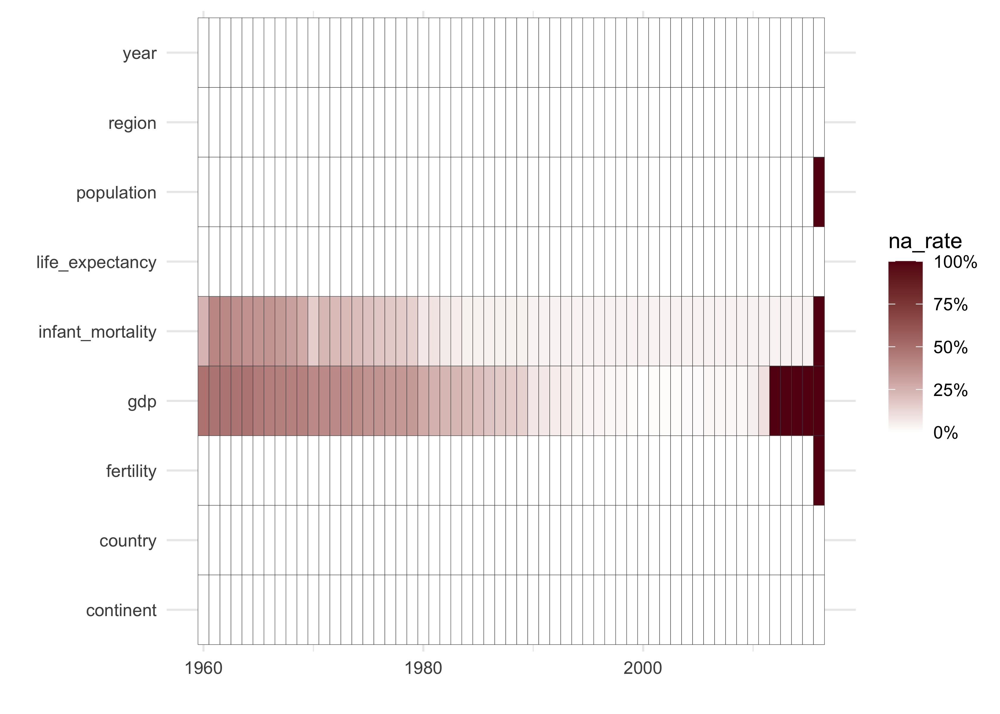
<p class="caption">(\#fig:fgggplot03)Tỷ lệ giá trị không quan sát được của các biến trong dữ liệu gapminder theo năm bắt đầu từ 1960 đến 2016</p>
</div>

Bạn đọc có thể thấy rằng dữ liệu $gapminder$ có nhiều giá trị không quan sát được trong năm 2016. Hai cột có tỷ lệ không quan sát được qua các năm lớn là $infant\_mortality$ và $gdp$. Riêng biến $gdp$ là gần như không quan sát được từ năm 2012 đến 2016. Do chỉ sử dụng dữ liệu với mục đích trực quan hóa nên chúng tôi sẽ xử lý dữ liệu một cách đơn giản là xóa các quan sát của các năm 2012 đến 2016. Giá trị không quan sát được từ năm 1960 đến 2011 sẽ được thay thế bằng cách nội suy tuyến tính theo chuỗi thời gian. Thư viện để nội suy tuyến tính các giá trị không quan sát được theo chuỗi thời gian là thư viện $\textbf{imputeTS}$.


```r
library(imputeTS) # Thư viện dùng để nội suy tuyến tính
mydat<-gapminder%>%filter(year<=2011)
list_country<-unique(mydat$country)
for (ct in list_country){
  ind<-(mydat$country == ct)
  if (sum(!is.na(mydat$infant_mortality[ind]))>=2){
    mydat$infant_mortality[ind]<-na.interpolation(mydat$infant_mortality[ind])
  }
  if (sum(!is.na(mydat$gdp[ind]))>=2){
    mydat$gdp[ind] <- na.interpolation(mydat$gdp[ind])
  }
}
```

Hàm số sử dụng vẽ đồ thị thư viện $\textbf{ggplot2}$ là hàm `ggplot()`. Ba thành phần bắt buộc phải có của một đồ thị là 1. Dữ liệu; 2. Ít nhất một hình dạng đồ họa; và 3. Ánh xạ thẩm mỹ. Đồ thị dưới đây mô tả hai biến gdp bình quân đầu người và tuổi thọ trung bình của các quốc gia trên thế giới vào năm 2011. Bạn đọc có thể sao chép các câu lệnh ở dưới vào cửa sổ Script và thực thi giống như các câu lệnh thông thường

```r
# Biến đổi dữ liệu
dat<-mydat%>%filter(year==2011)%>%
  mutate(gdp_per_capita = gdp/population)

# Trực quan hóa
ggplot(dat, aes(x = life_expectancy, y = gdp_per_capita)) +
  geom_point()
```

<div class="figure">

<p class="caption">(\#fig:fgggplot04)Thu nhập bình quân đầu người và tuổi thọ trung bình của các quốc gia trên thế giới năm 2011</p>
</div>

Trong câu lệnh `ggplot()` ở trên, dữ liệu được đưa vào là $\textbf{dat}$ - dữ liệu được biến đổi từ dữ liệu $\textbf{gapminder}$ sau khi thêm cột thu nhâp bình quân đầu người và lọc theo năm 2011. Hình dạng đồ họa là các điểm trên trục tọa độ Descartes. Hình dạng đồ họa này được gọi bằng hàm `geom_point()`. Ánh xạ thẩm mỹ được khai báo thông qua hàm `aes()` nằm trong hàm `ggplot()`. Trong ánh xạ thẩm mỹ ở trên, chúng ta đã cho tương ứng (ánh xạ) biến $life\_expectancy$ với giá trị trên trục $x$ của các điểm và biến $gdp\_per\_capita$ tương ứng (ánh xạ) với giá trị trên trục $y$ của các điểm.

Mặc dù đồ thị trên Hình \@ref(fig:fgggplot04) còn đơn giản, nhưng chúng ta đã có thể nhận thấy được một vài thông tin về thu nhập bin

- Có mối liên hệ đồng biến giữa tuổi thọ trung bình và thu nhập bình quân đầu người. Quốc gia nào có thu nhập bình quân đầu người cao thì tuổi thọ trung bình cũng sẽ cao. Điều này khá hợp lý bởi các quốc gia có thu nhập trung bình cao thường là các nước phát triển có hệ thống chăm sóc sức khỏe tốt, do đó tuổi thọ trung bình cũng sẽ cao.

- Mối liên hệ đồng biến nhưng không tuyến tính, thu nhập bình quân đầu người tăng nhanh hơn rất nhiều ro với tuổi thọ trung bình.

- Có một vài điểm có khả năng là ngoại lai trong mối liên hệ tuyến tính này. Đây là các quốc gia có mức thu nhập bình quân khá cao (từ 10 nghìn USD - 20 nghìn USD/1 người) nhưng lại có tuổi thọ trung bình không cao. Tuy nhiên chỉ với các thông tin như trên chúng ta không thể đưa ra giải thích cho các giá trị này.

Hình dạng đồ họa là những hình dạng cụ thể mà bạn đọc nhìn thấy trên đồ thị, chẳng hạn như các điểm, các đường, thanh, hay các khối hình khác. Khi gọi các hình dạng đồ họa, thư viện $\textbf{ggplot2}$ luôn luôn sử dụng các hàm số bắt đầu bởi `geom` - viết tắt của geometries. Bạn đọc có thể thử các câu lệnh để vẽ các khối hình khác như dưới đây:

```r
## geom_histogram() sử dụng các thanh 
## mô tả phân phối của một biến liên tục
ggplot(dat,aes(x = gdp_per_capita))+
  geom_histogram()

## geom_bar() sử dụng các thanh 
## mô tả phân phối của một biến rời rạc
ggplot(dat,aes(x = continent))+
  geom_bar()

## geom_boxplot() sử dụng các hình hộp 
## mô tả phân phối của biến liên tục
ggplot(dat,aes(x = continent, y = life_expectancy))+
  geom_boxplot()

## geom_line() sử dụng đường nối các điểm 
## mô tả các điểm theo thứ tự xuất hiện
dat1<-filter(gapminder, year<=2011, country == "United States")%>%
  select(year,gdp)
ggplot(dat1,aes(x = year, y = gdp))+
  geom_line()
```

Còn nhiều hàm `geom_*()` khác có thể được sử dụng để trực quan hóa dữ liệu từ thư viện $\textbf{ggplot2}$. Bạn đọc có thể tham khảo danh sách các geom thường sử dụng trong link dưới đây.

https://www.maths.usyd.edu.au/u/UG/SM/STAT3022/r/current/Misc/data-visualization-2.1.pdf

Bạn đọc có thể thấy rằng trong danh sách các geom có thể sử dụng bao gồm gợi ý cho người sử dụng nên dùng hàm `geom_*()` nào trong từng trường hợp. Chẳng hạn như `geom_point()` được gợi ý khi mô tả hai biến liên tục. Hoặc `geom_boxplot()` được gợi ý khi mô tả một biến liên tục và một biến rời rạc. Ngoài ra, mỗi hàm `geom_*()` sẽ có một danh sách các thuộc tính thẩm mỹ đi kèm. Ví dụ, khi sử dụng `geom_point()` sẽ có các thuộc tính thẩm mỹ bao gồm `x`, `y`, `alpha`, `color`, `fill`, `shape`, `size`, và `stroke`. Chúng ta có thể tham khảo hướng dẫn sử dụng của hàm `geom_point()` để biết các thuộc tính thẩm mỹ này có ý nghĩa như thế nào. Trong các thuộc tính thẩm mỹ được sử dụng với `geom_point()`, các thuộc tính thẩm mỹ `color`, `fill`, `shape`, và `size` là các thuộc tính thẩm mỹ xuất hiện ở nhiều hàm `geom_*()` khác. Đây là các thuộc tính thẩm mỹ thường xuyên được sử dụng để tăng khả năng mô tả dữ liệu của các đồ thị $\textbf{ggplot2}$.

Chúng ta tiếp tục với ví dụ về mô tả trực quan mối liên hệ giữa thu nhập bình quân đầu người và tuổi thọ trung bình của các quốc gia trên thế giới năm 2011. Để đồ thị giải thích tốt hơn, chúng ta cần thêm thông tin vào đồ thị trong Hình \@ref(fig:fgggplot04). Một phương pháp đơn giản để thêm biến khác vào một đồ thị là ánh xạ biến đó đến một trong các thuộc tính thẩm mỹ của đồ thị được vẽ bởi hàm `geom_point()`. Biến được thêm vào đồ thị trong Hình \@ref(fig:fgggplot05) là biến $continent$. Chúng ta sẽ ánh xạ biến này đến thuộc tính thẩm mỹ `color` như sau


```r
# Vẽ đồ thị phân tán, ánh xạ biến continent đến màu sắc
ggplot(dat, aes(x=life_expectancy, y=gdp_per_capita,
                color=continent))+
  geom_point()
```

<div class="figure">
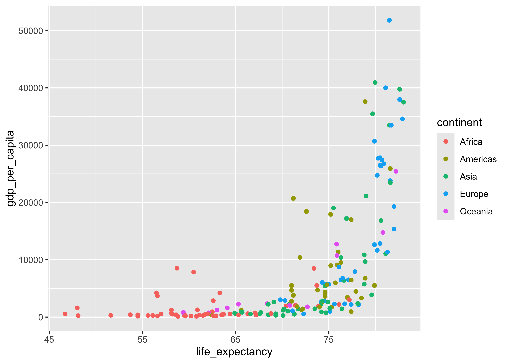
<p class="caption">(\#fig:fgggplot05)Thu nhập bình quân đầu người và tuổi thọ trung bình của các quốc gia trên thế giới năm 2011. Biến continent được ánh xạ đến thuộc tính thẩm mỹ màu sắc của các điểm</p>
</div>

Bằng cách thêm biến $continent$ vào đồ thị sử dụng thuộc tính thẩm mỹ màu sắc, chúng ta đã có thể đưa ra thêm các phân tích về mối liên hệ giữa tuổi thọ trung bình và thu nhập bình quân đầu người của các quốc gia trên thế giới vào năm 2011: 

- có sự phân bố không đồng đều về thu nhập bình quân và tuổi thọ trung bình của các quốc gia trên thế giới. Đa số các quốc gia Châu Phi có thu nhập bình quân đầu người thấp và tuổi thọ trung bình thấp trong khi các quốc gia Châu Âu có thu nhập bình quân đầu người cao và tuổi thọ trung bình cao. Có sự phân hóa rõ ràng ở Châu Đại Dương và Châu Mỹ, một vài quốc gia nằm trong nhóm các nước có thu nhập cao, tuổi thọ trung bình cao trong khi đa số các quốc gia còn lại nằm trong nhóm thu nhập thấp và tuổi thọ trung bình thấp. Sự phân hóa ở các nước Châu Á không quá rõ ràng. 

- các nước có mối liên hệ giữa thu nhập bình quân và tuổi thọ trung bình ít giống như các nước khác là các quốc gia ở Châu Phi và Châu Mỹ. 

Có một vài nguyên tắc khi sử dụng các thuộc tính thẩm mỹ là thuộc tính thẩm mỹ `color` thường được sử dụng với biến rời rạc trong khi thuộc tính thẩm mỹ `size` thường được sử dụng với biến liên tục. Thuộc tính thẩm mỹ `shape` chỉ có thể được sử dụng với biến rời rạc, R sẽ báo lỗi nếu bạn ánh xạ một biến liên tục vào thuộc tính thẩm mỹ `shape`. Ngoài ra có 21 giá trị khác nhau cho thuộc tính thẩm mỹ `shape` và R sẽ đưa ra cảnh báo nếu bạn đọc ánh xạ một biến rời rạc có nhiều hơn 21 giá trị vào cấu phần thẩm mỹ này.

Đồ thị dưới đây thêm biến $population$ vào đồ thị bằng cách sử dụng thuộc tính thẩm mỹ `size`. Bạn đọc hãy luôn nhớ rằng khai báo ánh xạ thẩm mỹ từ một biến dữ liệu đến một thuộc tính thẩm mỹ luôn luôn phải thực hiện bên trong hàm `aes()`:


```r
# Vẽ đồ thị phân tán, ánh xạ biến continent đến màu sắc
# ánh xạ population đến kích thước
ggplot(dat, aes(x = life_expectancy, y = gdp_per_capita, 
                color = continent, size = population)) + 
  geom_point(alpha = 0.5)
```

<div class="figure">

<p class="caption">(\#fig:fgggplot06)Thu nhập bình quân đầu người và tuổi thọ trung bình của các quốc gia trên thế giới năm 2011. Biến continent ánh xạ đến thuộc tính thẩm mỹ màu sắc của các điểm và biến population ánh xạ đến thuộc tính thẩm mỹ kích thước</p>
</div>

Tham số `alpha` sử dụng trong hàm `geom_point()` trong trường hợp dữ liệu có nhiều điểm bị trùng lên nhau. `alpha` nhận giá trị từ 0 đến 1 cho biết độ trong suốt của các điểm tăng dần. Cho `alpha` nhận giá trị nhỏ hơn 1 cho phép chúng ta quan sát được tất cả các điểm trên đồ thị phân tán. `alpha` cũng có thể được sử dụng như một thuộc tính thẩm mỹ và chúng ta sẽ thảo luận chi tiết hơn về thuộc tính này trong phần sau của chương sách. 

Bạn đọc có thể thấy rằng khi thêm biến $population$ bằng cách ánh xạ vào thuộc tính kích thước các điểm như Hình \@ref(fig:fgggplot06) giúp cho đồ thị có thêm thông tin: chúng ta có thể nhận ra vị trí của các quốc gia đông dân tiêu biểu như Trung Quốc và Ấn Độ vào năm 2011, có thể nhận thấy hai quốc gia này vẫn nằm trong nhóm các nước có thu nhập bình quân đầu người thấp; hoặc cũng có thể nhận ra Mỹ và Nhật Bản là các quốc gia nằm ở góc trên bên phải là các nước cũng có dân số tương đối lớn so với các quốc gia khác. Tất nhiên, so với thuộc tính thẩm mỹ màu sắc thì thuộc tính thẩm mỹ kích thước không hiệu quả bằng. Ngoài ra, bạn đọc cũng có thể nhận ra rằng khi cùng sử dụng nhiều thuộc tính thẩm mỹ trên một đồ thị, hiệu quả sẽ không được như mong muốn. Chính vì thế, để tạo các đồ thị rõ ràng hơn, đặc biệt với các dữ liệu có nhiều quan sát, bạn đọc có thể chia nhỏ dữ liệu thành các nhóm và mô tả dữ liệu trong mỗi nhóm bằng một đồ thị khác nhau. Kỹ thuật này được gọi là $facetting$ và được mô tả trong Hình \@ref(fig:fgggplot07)


```r
# Dùng facet_wrap để chia dữ liệu ra thành các nhóm
ggplot(dat, aes(x = life_expectancy, y = gdp_per_capita,
                size = population)) +
  geom_point(alpha = 0.3)+
  facet_wrap(~continent)
```

<div class="figure">

<p class="caption">(\#fig:fgggplot07)Chia dữ liệu thành năm nhóm tương ứng với năm lục địa và sử dụng năm đồ thị phân tán để mô tả phân bố của các điểm dữ liệu</p>
</div>

Có thể nhận thấy rằng sử dụng năm đồ thị phân tán có cùng khoảng giá trị của trục tọa độ $x$ và $y$ để mô tả mối quan hệ giữa thu nhập bình quân đầu người và tuổi thọ trung bình của các quốc gia thuộc năm châu lục là rõ ràng hơn rất nhiều so với sử dụng một đồ thị duy nhất và phân biệt các lục địa khác nhau bằng màu sắc. 

Một thành phần tuy không bắt buộc nhưng bạn đọc có thể thêm vào đồ thị của $\textbf{ggplot2}$ để tăng tính thẩm mỹ và sự rành mạch là ngữ cảnh hay còn gọi là các $themes$. Có một số $theme$ có sẵn khi chúng ta cài đặt thư viện và cũng có các ngữ cảnh nằm trong các thư viện cài đặt bổ sung như thư viện $\textbf{ggthemes}$. Chúng ta sẽ thảo luận chi tiết về cách tùy chỉnh ngữ cảnh và tự tạo ngữ cảnh cho đồ thị ở phần sau của chương. Để thay đổi ngữ cảnh mặc định của các đồ thị ggplot2, chúng ta sử dụng các hàm `theme_*()`. Ví dụ, trong Hình \@ref(fig:fgggplot08) chúng tôi thay đổi ngữ cảnh mặc định của Hình \@ref(fig:fgggplot07) thành ngữ cảnh khác bằng cách sử dụng hàm `theme_minimal()`:


```r
ggplot(dat, aes(x = life_expectancy, y = gdp_per_capita, size = population)) +
  geom_point(shape = 21, alpha = 0.5, fill = "blue")+
  facet_wrap(~continent, ncol = 2)+
  # thêm title
  labs( title = "Thu nhập bình quân và tuổi thọ trung bình")+
  xlab("Tuổi thọ trung bình (năm)")+
  ylab("Gdp bình quân đầu người (USD)")+
  theme_minimal()# thêm ngữ cảnh
```

<div class="figure">
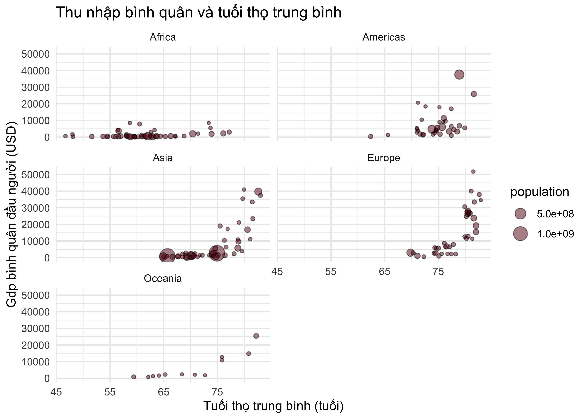
<p class="caption">(\#fig:fgggplot08)Thay đổi ngữ cảnh mặc định của ggplot sang ngữ cảnh khác giúp đồ thị rõ ràng hơn</p>
</div>

Thành phần chưa được nhắc đến khi tạo đồ thị trực quan hóa dữ liệu là các $statistics$ hay các $stats$. Do đây là thành phần phức tạp và liên quan đến các kiến thức về xây dựng mô hình trên dữ liệu nên chúng tôi không đề cập đến trong phần này. Mục tiêu của chúng tôi trong phần giới thiệu là để bạn đọc làm quen với cách sử dụng các câu lệnh vẽ đồ thị trong $\textbf{ggplot2}$. Trong các phần tiếp theo, từng thành phần của đồ thị và các cấu phần thẩm mỹ quan trọng sẽ được thảo luận chi tiết cùng với ngữ pháp của đồ thị.

## Cấu trúc nhiều lớp và ngữ pháp của đồ thị

Cấu trúc theo lớp (layer) của đồ thị $\textbf{ggplot2}$ giúp cho người phân tích dữ liệu xây dựng đồ thị của mình theo một đối tượng có cấu trúc. Đồ thị được tạo thành từ $\textbf{ggplot2}$ từ đơn giản đến phức tạp đều được tạo thành từ (ít nhất) một đến nhiều lớp. Mỗi lớp trong đồ thị có mục tiêu hiển thị khác nhau:

- Mục tiêu hiện thị đầu tiên và cũng là mục tiêu chính, đó là để hiển thị dữ liệu. Luôn luôn có một hoặc một vài lớp chính với mục tiêu mô tả dữ liệu thô, mô tả cấu trúc tổng thể, và các giá trị ngoại lai của dữ liệu. Lớp này xuất hiện trên tất cả các đồ thị. Trong giai đoạn đầu của quá trình mô tả dữ liệu bằng trực quan hóa, lớp này thường xuất hiện duy nhất. Đơn giản như khi mô tả mỗi quan hệ giữa thu nhập bình quân đầu người và tuổi thọ trung bình của các quốc gia trên thế giới năm 2011, lớp được hiển thị bằng hàm `geom_point()` là lớp hiển thị dữ liệu chính.

- Các lớp có mục tiêu tóm tắt và mô tả ý nghĩa thống kê của dữ liệu. Bằng cách thêm vào đồ thị các mô hình hoặc bằng cách hiển thị các dự đoán dựa trên mô hình mà người tiếp nhận dữ liệu hoặc người phân tích dữ liệu sẽ nhận biết được những giá trị bên trong dữ liệu và những chi tiết mà khi xây dựng mô hình có thể bỏ sót.

- Các lớp có mục tiêu thêm vào ngữ cảnh của dữ liệu. Các lớp này hiển thị bối cảnh nền, thêm vào các chú thích giúp mang lại ý nghĩa cho dữ liệu thô hoặc các giá trị tham chiếu nhằm hỗ trợ việc so sánh hoặc đánh giá. Đây thường là lớp cuối cùng được thêm vào trong đồ thị.

Lớp chính của đồ thị có thể bao gồm bảy thành phần độc lập giống như chúng ta đã giới thiệu ở phần đầu. Cấu trúc của các lớp còn lại của đồ thị $\textbf{ggplot2}$ có thể bao gồm các thành phần sau:

1. Dữ liệu: nếu bạn không khai báo dữ liệu trong mỗi lớp, $\textbf{ggplot2}$ sẽ sử dụng dữ liệu ban đầu là dữ liệu mặc định.

2. Ánh xạ thẩm mỹ: được khai báo trong hàm `aes()` trong mỗi lớp, nếu không có khai báo riêng về ánh xạ thẩm mỹ, $\textbf{ggplot2}$ sẽ sử dụng ánh xạ thẩm mỹ được khai báo trong hàm `ggplot()`.

3. Một hình dạng đồ họa được gọi bằng các hàm `geom_*()`.

4. Một biến đổi thống kê hoặc một tóm tắt của dữ liệu được gọi bằng hàm $stat_*()$.

5. Vị trí xuất hiện của lớp đó trong bố cục chung.

Khi đồ thị chỉ có một lớp với mục tiêu hiển thị dữ liệu chính, bạn không cần phải am hiểu về ngữ pháp của đồ thị. Bạn đọc chỉ cần khai báo chính xác ánh xạ thẩm mỹ trong hàm `aes()` để có được kết quả mong muốn. Tuy nhiên khi xây dựng đồ thị có nhiều lớp, bạn đọc cần phải nắm được ngữ pháp để kết hợp các lớp lại với nhau theo ý muốn của mình.

### Ánh xạ thẩm mỹ trong đồ thị có nhiều lớp

Hãy quan sát đồ thị trong Hình \@ref(fig:fgggplot09), khi bạn muốn thêm vào một đường mô tả mối liên hệ giữa thu nhập bình quân đầu người và tuổi thọ trung bình của các quốc gia trên thế giới vào năm 2011. Hàm số dùng để thêm vào một đường mô tả mối liên hệ là `geom_smooth()`


```r
## Hình bên trái, khai báo color trong ggplot()
p1<-dat%>%ggplot(aes(x = life_expectancy, y = gdp_per_capita,
                color = continent)) +
  geom_point(alpha = 0.5)+
  geom_smooth(se=FALSE)+
  theme(legend.position = "none")+
  theme_minimal()

## Hình bên phải, khai báo color trong geom_point()
p2<-dat%>%ggplot(aes(x = life_expectancy, y = gdp_per_capita))+
  geom_point(aes(color = continent), alpha = 0.5) +
  geom_smooth(se=FALSE)+
  theme(legend.position = "none")+
  theme_minimal()

## Vẽ p1 và p2 trên cùng một đồ thị
grid.arrange(p1,p2,nrow= 1 , ncol = 2)
```

<div class="figure">

<p class="caption">(\#fig:fgggplot09)Đồ thị có hai lớp bao gồm một đồ thị phân tán và một đường mô tả mối liên hệ giữa các điểm. Hình bên trái: ánh xạ thẩm mỹ màu sắc được khai báo trong hàm ggplot(). Hình bên phải: ánh xạ thẩm mỹ màu sắc được khai báo trong hàm geom_point()</p>
</div>

Bạn đọc có thể thấy sự khác nhau giữa hai đồ thị là các đường mô tả mối liên hệ giữa tuổi thọ trung bình và thu nhập bình quân đầu người được xây dựng theo từng lục địa cho hình bên trái Hình \@ref(fig:fgggplot09) và chỉ có duy nhất một đường được xây dựng cho tất cả các quốc gia trong hình bên phải của Hình \@ref(fig:fgggplot09). Sự khác biệt là do trong hình bên phải chúng ta đã khai báo ánh xạ thẩm mỹ đến thuộc tính `color` bên trong hàm `geom_point()` trong khi trong hình bên trái chúng ta khai báo ánh xạ thẩm mỹ đến thuộc tính `color` bên trong hàm `ggplot()`

Nếu như hàm `geom_point()` là lớp chính mô tả dữ liệu thô thì hàm `geom_smooth()` là lớp phụ được thêm vào nhằm tăng khả năng mô tả của dữ liệu. Các ánh xạ thẩm mỹ được khai báo trong hàm `ggplot()` cũng giống như các biến toàn cục trong một đồ thị, còn các ánh xạ thẩm mỹ được khai báo trong các hàm `geom_*()` giống như khai báo giá trị cho các biến cục bộ trong môi trường của hàm số đó. Các biến cục bộ nếu không được khai báo trong các hàm `geom_*()` sẽ được tìm trên môi trường toàn cục của hàm `ggplot()`. Trong trường hợp trong các hàm `geom_*()` và `ggplot()` đều không được khai báo giá trị các thuộc tính thẩm mỹ của lớp phụ sẽ nhận giá trị mặc định.

Trong hình bên trái của Hình \@ref(fig:fgggplot09), các thuộc tính thẩm mỹ `x`, `y`, và `color` được khai báo trong hàm `ggplot()`; đồng thời trong các hàm `geom_point()` và `geom_smooth()` không khai báo các ánh xạ thẩm mỹ; do đó cả hai hàm này đều hiểu các thuộc tính thẩm mỹ `x`, `y`, và `color` giống như khai báo ban đầu. Trong hình bên phải của Hình \@ref(fig:fgggplot09), hai thuộc tính thẩm mỹ `x` và `y` được khai báo trong hàm `ggplot()` trong khi thuộc tính thẩm mỹ `color` được khai báo bên trong hàm `geom_point()`. Do đó, hàm `geom_smooth()` chỉ hiểu hai thuộc tính thẩm mỹ `x` và `y` như được khai báo trong `ggplot()`. Thuộc tính thẩm mỹ `color` của hàm `geom_smooth()` trong hình bên phải của Hình \@ref(fig:fgggplot09) sẽ được gán giá trị mặc định. Cách ghi nhận các thuộc tính thẩm mỹ của hai lớp của các đồ thị trong Hình \@ref(fig:fgggplot09) được tổng kết lại như sau:
<table class="table" style="margin-left: auto; margin-right: auto;">
 <thead>
  <tr>
   <th style="text-align:left;">   </th>
   <th style="text-align:left;"> geom_point() </th>
   <th style="text-align:left;"> geom_smooth() </th>
  </tr>
 </thead>
<tbody>
  <tr>
   <td style="text-align:left;"> Hình bên trái </td>
   <td style="text-align:left;"> x, y và color </td>
   <td style="text-align:left;"> x, y và color </td>
  </tr>
  <tr>
   <td style="text-align:left;"> Hình bên phải </td>
   <td style="text-align:left;"> x, y, và color </td>
   <td style="text-align:left;"> x, y </td>
  </tr>
</tbody>
</table>

Đường mô tả mối liên hệ giữa hai biến thu nhập bình quân và tuổi thọ trung bình được xây dựng bằng hàm `geom_smooth()` dựa trên phương pháp được gọi là hồi quy cục bộ (locally estimated scatterplot smoothing hay loess) mà chúng ta sẽ thảo luận trong phần mô hình cộng tính tổng quát. Khi thuộc tính thẩm mỹ `color` được sử dụng và ánh xạ đến một biến rời rạc, hàm `geom_smooth()` sẽ chia dữ liệu thành các nhóm, mỗi nhóm tương ứng với một giá trị của biến ánh xạ đến `color`, sau đó trước xây dựng mô hình hồi quy cục bộ mà thu nhập bình quân phụ thuộc vào tuổi thọ trung bình cho mỗi nhóm. Điều này giải thích tại sao trong hình bên trái có năm mô hình được xây dựng tương ứng với năm Châu lục, trong khi trong hình bên phải chỉ có một mô hình duy nhất được xây dựng cho tất cả các quốc gia trên thế giới.

Vậy khi nào bạn nên khai báo ánh xạ thẩm mỹ trong hàm `ggplot()` và khi nào bạn nên khai báo ánh xạ thẩm mỹ bên trong hàm `geom_*()`? Câu trả lời là nếu đa số các lớp bạn đọc sử dụng chung một dữ liệu và chung các ánh xạ thẩm mỹ, bạn nên khai báo ánh xạ thẩm mỹ bên trong hàm `ggplot()`. Còn trong trường hợp các lớp sử dụng dữ liệu khác nhau, hoặc có ánh xạ thẩm mỹ khác nhau, bạn hãy khai báo ánh xạ thẩm mỹ bên trong mỗi hàm `geom_*()`. Trong trường hợp bạn dùng một hàm thuộc nhóm hàm `geom_()*` và không muốn sử dụng ánh xạ thẩm mỹ đã khai báo trong `ggplot()`, bạn có thể khai báo lại hoặc khai báo thuộc tính thẩm mỹ đó bằng `NULL` nếu không muốn sử dụng ánh xạ thẩm mỹ đó.

Một lưu ý quan trọng cần được thảo luận trong ngữ pháp của đồ thị đó là sự khác nhau giữa sử dụng ánh xạ thẩm mỹ và thiết lập tham số. Trước hết, bạn đọc hãy quan sát ba đồ thị trong Hình \@ref(fig:fgggplot10)


```r
## Hình góc trên bên trái, geom_smooth có aes(color = NULL)
p1<-dat%>%ggplot(aes(x = life_expectancy, y = gdp_per_capita,
                color = continent)) +
  geom_point(alpha = 0.5)+
  geom_smooth(aes(color=NULL), se = FALSE)+
  theme(legend.position = "right")+
  theme_minimal()

## Hình góc trên bên phải, geom_smooth có thiết lập (color = back)
p2<-dat%>%ggplot(aes(x = life_expectancy, y = gdp_per_capita,
                color = continent)) +
  geom_point(alpha = 0.5)+
  geom_smooth(color="black", se = FALSE)+
  theme(legend.position = "right")+
  theme_minimal()

## Hình góc dưới bên trái, geom_smooth có aes(color = "black")
p3<-dat%>%ggplot(aes(x = life_expectancy, y = gdp_per_capita,
                color = continent)) +
  geom_point(alpha = 0.5)+
  geom_smooth(aes(color="black") , se = FALSE)+
  theme(legend.position = "right")+
  theme_minimal()


## Hình góc dưới bên phải, geom_smooth có aes(color = newcol)
p4<-dat%>%mutate(newcol = "black")%>%ggplot(aes(x = life_expectancy, y = gdp_per_capita)) +
  geom_point(aes(color = continent))+
  geom_smooth(aes(color = newcol) , se = FALSE)+
  theme(legend.position = "right")+
  theme_minimal()

## Vẽ các đồ thị trên cùng một hình
grid.arrange(p1,p2,p3,p4, nrow= 2 , ncol = 2)
```

<div class="figure">
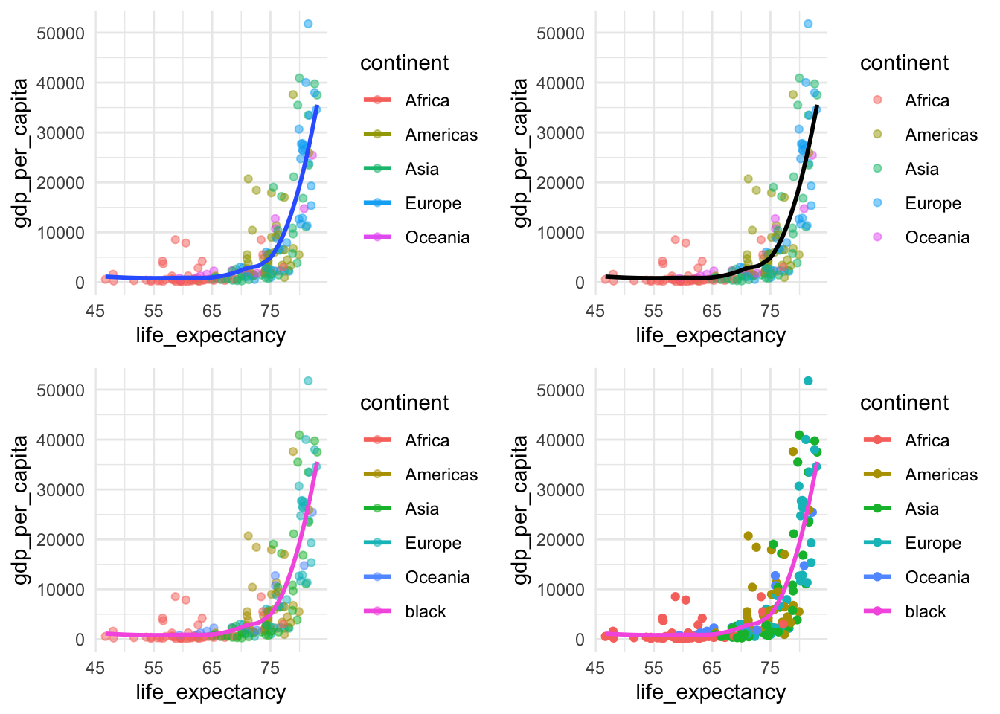
<p class="caption">(\#fig:fgggplot10)Sự khác nhau giữa ánh xạ thẩm mỹ và thiết lập tham số. Hình bên trái: có hàm geom_smooth() sử dụng ánh xạ thẩm mỹ color mặc định. Hình ở giữa: hàm geom_smooth() được thiết lập tham số color (màu đen). Hình bên phải: hàm geom_smooth() sử dụng ánh xạ thẩm mỹ, thuộc tính color ánh xạ đến một biến kiểu chuỗi ký tự</p>
</div>

Có hai cách để chúng ta tác động đến các thuộc tính thẩm mỹ của đồ thị được vẽ bằng các hàm `geom_*()`, đó là dùng ánh xạ thẩm mỹ hoặc thiết lập tham số. Sự khác nhau giữa hai cách này là việc bạn khai báo giá trị của thuộc tính thẩm mỹ bên trong hay bên ngoài hàm `aes()`. Hình \@ref(fig:fgggplot10) cho thấy rằng:

- Hình góc trên bên trái có đường hồi quy liên tục mô tả mối liên hệ giữa hai biến có màu mặc định. Nguyên nhân là do khi gọi hàm `geom_smooth()` chúng ta đã cho thuộc tính thẩm mỹ `color` nhận giá trị mặc định. Thật vậy, trong hàm `aes()` của `geom_smooth()` thuộc tính `color` được ánh xạ đến giá trị NULL.

- Hình góc trên bên phải đã thực hiện thiết lập cấu phần thẩm mỹ `color` bằng một giá trị cố định là "black" (màu đen). Do đó đường hồi quy được tạo từ `geom_smooth()` sẽ có màu đen đúng như yêu cầu từ thiết lập. Bạn đọc chỉ cần sử dụng giá trị màu sắc có ý nghĩa với R để thiết lập cho thuộc tính thẩm mỹ màu sắc. Nếu trong một hàm `geom_*()` vừa có ánh xạ thẩm mỹ được khai báo trong hàm `aes()` và vừa có thiết lập thuộc tính thẩm mỹ, đồ thị $\textbf{ggplot2}$ sẽ ưu tiên giá trị nằm ngoài `aes()`, nghĩa là ưu tiên thiết lập tham số.

- Hình góc dưới bên trái phức tạp hơn một chút. Khác với hình ở giữa, thuộc tính `color` được gán cho giá trị $"black"$ bên trong hàm `aes()`. Bạn đọc có thể thấy rằng đường hồi quy được tạo từ hàm `geom_smooth()` không có màu đen như hình ở giữa. Nguyên nhân là do khi khai báo thuộc tính thẩm mỹ trong hàm `aes()`, chúng ta đã ánh xạ thuộc tính `color` của hàm `geom_smooth()` đến một giá trị kiểu ký tự là $"black"$ chứ không phải cho màu sắc của đường cong nhận giá trị màu đen tương ứng! Trong hàm `geom_point()` trước đó đã ánh xạ biến $continent$ tới thuộc tính thẩm mỹ `color`, khi chúng ta tiếp tục ánh xạ một biến $"black"$ tới thuộc tính `color` trong `geom_smooth()` thì $\textbf{ggplot2}$ sẽ hiểu rằng có thêm một giá trị mới cho thuộc tính `color`  là $"black"$ thêm vào cùng với các giá trị hiện có là tên của 5 châu lục. Điều này giải thích tại sao trong chú giải của hình bên tay phải có 6 loại thay vì 5 loại như hình ở giữa. Đường hồi quy tạo bởi `geom_smooth()` có màu xanh lá cây vì giá trị $"black"$ có thứ hạng là 4 khi sắp xếp 6 giá trị ánh xạ tới thuộc tính `color` theo thứ tự tăng dần.

- Hình góc dưới bên phải được vẽ trên dữ liệu sau khi được thêm vào cột mới có tất cả các giá trị là chuỗi ký tự $"black"$. Đồ thị vẫn bao gồm hai lớp là `geom_point()` và `geom_smooth()`. Cả hai lớp đều sử dụng chung thuộc tính thẩm mỹ `x` và `y`. Thuộc tính thẩm mỹ `color` của `geom_point()` được ánh xạ đến biến $continent$ trong khi thuộc tính thẩm my `color` của `geom_smooth()` ánh xạ đến cột mới được tạo thành. Bạn đọc có thể thấy rằng đồ thị được tạo ra hoàn toàn giống như đồ thị được tạo ra trong bước trước khi chúng ta gán trực tiếp thuộc tính `color` của `geom_smooth()` với giá trị $"black"$.

Khi cân nhắc sử dụng ánh xạ hay thiết lập giá trị cho các thuộc tính thẩm mỹ, bạn đọc cần cân nhắc về việc có muốn tác động lên thuộc tính thẩm mỹ nữa hay không. Nếu bạn muốn cố định giá trị cho thuộc tính thẩm mỹ, hãy sử dụng thiết lập giá trị. Còn nếu bạn muốn tác động lên thuộc tính thẩm mỹ sau đó, hãy sử dụng ánh xạ thẩm mỹ. Chúng ta sẽ thảo luận thêm về vấn đề này khi nói về các hàm `scale_*()`.

Bạn đọc hãy lưu ý về cách chú giải ghi nhận giá trị mới của một thuộc tính thẩm mỹ. Trong đồ thị góc dưới bên trái của Hình \@ref(fig:fgggplot10), khi chúng ta khai báo giá trị $"black"$ cho thuộc tính `color`, đồ thị $\textbf{ggplot2}$ ghi nhận $"black"$ như một giá trị mới tương đương với tên các Châu lục đã sử dụng trong khai báo trước đó. Cách ghi nhận tên biến mới trong chú giải sẽ rất hữu ích khi chúng ta muốn tạo một đồ thị nhiều lớp và đặt tên cho từng lớp trong phần chú giải của đồ thị. Ví dụ, khi chúng ta muốn so sánh ba phương pháp xây dựng mô hình mô tả mối liên hệ giữa biến tuổi thọ trung bình và biến thu nhập bình quân đầu người bao gồm: phương pháp hồi quy tuyến tính thông thường (`method = "lm"`); phương pháp hồi quy loess (`method = "loess"`), và phương pháp hồi quy cộng tính tổng quát (`method = "gam"`), chúng ta có thể sử dụng ánh xạ thẩm mỹ `color` như sau:


```r
# So sánh ba phương pháp xây dựng mô hình khác nhau của hàm geom_smooth
dat%>%ggplot(aes(x = life_expectancy, y = gdp_per_capita)) +
  #Layer 1: đồ thị rải điểm
  geom_point(alpha = 0.4)+

  # Layer 2: Đường hồi quy tuyến tính
  geom_smooth(aes(color="Hồi quy tuyến tính"), method = "lm" , se = FALSE)+

  # Layer 3: Đường hồi quy loess
  geom_smooth(aes(color="Hồi quy loess"), method = "loess", span = 0.3 , se = FALSE)+

  # Layer 4: Mô hình GAM (generalized additive model)
  geom_smooth(aes(color="Mô hình cộng tính tổng quát"), method = "gam" , se = FALSE)+
  theme_minimal()
```

<div class="figure">
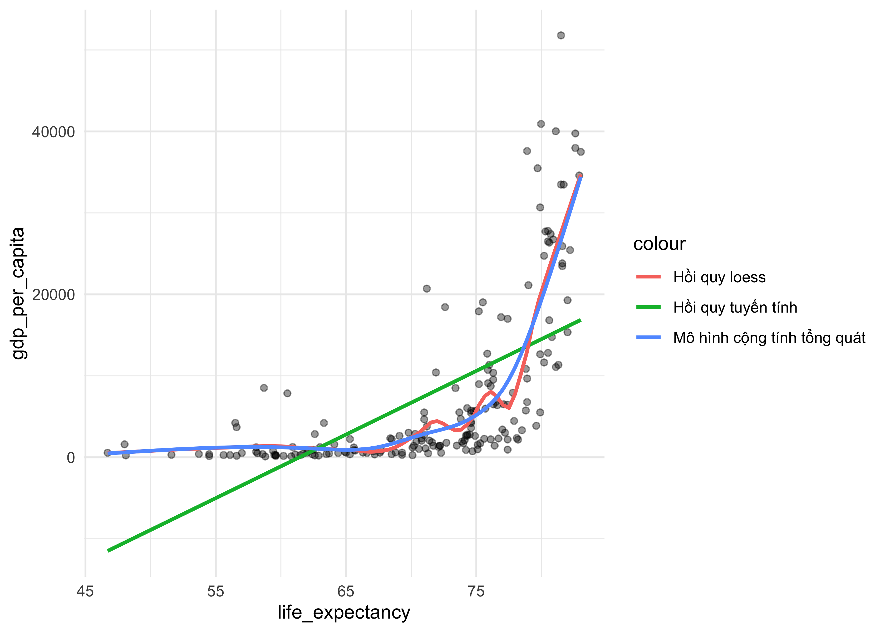
<p class="caption">(\#fig:fgggplot11)Sử dụng trực quan hóa để so sánh ba phương pháp xây dựng mô hình mô tả mối liên hệ giữa tuổi thọ trung binh và thu nhập bình quân đầu người của các quốc gia trên thế giới năm 2011</p>
</div>

Đồ thị trong Hình \@ref(fig:fgggplot11) có bốn lớp. Khi chúng ta khai báo thuộc tính thẩm mỹ `x` và `y` trong hàm `ggplot()`, cả bốn lớp đều sử dụng chung các ánh xạ thẩm mỹ này. Hàm `geom_point()` không sử dụng thêm ánh xạ thẩm mỹ nào. Mỗi hàm `geom_smooth()` thêm một đường hồi quy vào trong đồ thị, và thêm một giá trị vào thuộc tính thẩm mỹ `color`. Đồ thị `ggplot()` sẽ sử dụng ba màu sắc mặc định để mô tả ba đường hồi quy tương ứng, với chú giải là tên của phương pháp xây dựng đường hổi quy.

### Các hàm `geom_*()` cơ bản
Các hình dạng đồ họa, gọi tắt là các geoms, là một cách phổ biến để hiển thị một lớp của một đồ thị mô tả dữ liệu. Ví dụ như sử dụng `geom_point()` sẽ tạo ra một đồ thị phân tán hay còn gọi là đồ thị rải điểm; khi sử dụng `geom_line()` sẽ tạo ra các đồ thị theo đường,... Danh sách các geoms và các thuộc tính thẩm mỹ bạn đọc có thể tìm trong danh sách được liệt kê trong link ở phần \@ref(sec:ggplot_intro). Trong phần này, chúng tôi phân loại và giải thích cách sử dụng các geoms chi tiết hơn.

#### Mô tả một biến
Khi sử dụng đồ thị của $\textbf{ggplot2}$ để mô tả một biến rời rạc, hàm thường được sử dụng là `geom_bar()`. Tần suất xuất hiện của các giá trị trong các biến rời rạc được mô tả dưới dạng các thanh. Các thuộc tính thẩm mỹ quan trọng của `geom_bar()` bao gồm:

- Thuộc tính thẩm mỹ `x` được ánh xạ đến tên biến (rời rạc).

- Thuộc tính thẩm mỹ `color` là màu sắc của đường viền xung quanh các thanh.

- Thuộc tính thẩm mỹ `fill` là màu sắc của các thanh. `fill` ngoài ý nghĩa tăng tính thẩm mỹ cho đồ thị dạng thanh còn có ý nghĩa khi mô tả mối liên hệ giữa biến rời rạc được mô tả bởi thuộc tính thẩm mỹ `x` với một biến khác.

Hình \@ref(fig:fgggplot12) sử dụng đồ thị dạng thanh mô tả phân phối xác suất của biến $continent$ trong dữ liệu $\textbf{gapminder}$ trong năm 2011.


```r
p1<-dat%>%ggplot() + 
  geom_bar(aes(x = continent), color = "orange", fill = "blue", alpha = 0.5)+
  theme_minimal()
p2<-dat%>%ggplot() + 
  geom_bar(aes(x = continent), color = "orange", fill = "blue", alpha = 0.5)+
  scale_x_discrete(limits = names(sort(table(dat$continent))))+
  theme_minimal()
grid.arrange(p1,p2, nrow= 1 , ncol = 2)
```

<div class="figure">

<p class="caption">(\#fig:fgggplot12)Phân phối xác suất của biến continent trong dữ liệu gapminder trong năm 2011. Hình bên trái: phân phối xác suất của biến continent mô tả theo thứ tự của giá trị xuất hiện. Hình bên phải: phân phối xác suất của biến continent mô tả theo thứ tự của tần suất xuất hiện của các biến tăng dần.</p>
</div>
Khi mô tả biến rời rạc, `geom_bar()` luôn mặc định sắp xếp các thanh theo thứ tự các giá trị xuất hiện trong biến rời rạc tăng dần. Tuy nhiên, để đồ thị dạng thanh mô tả hiệu quả hơn, chúng ta thường để các thanh xuất hiện theo thứ tự có chiều cao tăng dần hoặc giảm dần giống như hình bên trái của Hình \@ref(fig:fgggplot12). Để thực hiện việc này, chúng ta cần thay đổi thứ tự xuất hiện của các giá trị trên trục $x$ theo thứ tự tần suất tăng dần hay giảm dần bằng hàm `scale_x_discrete()`. Chúng ta sẽ thảo luận về các hàm này trong phần sau.

Hàm `geom_bar()` cũng thường được sử dụng để mô tả các giá trị liên tục được lưu trong một biến tương ứng với các giá trị rời rạc được lưu trong biến khác. Ví dụ, khi chúng ta muốn mô tả thu nhập bình quân của 10 nước có thu nhập bình quân đầu người lớn nhất thế giới năm 2011, chúng ta có thể sử dụng geom_bar() với đầy đủ hai thuộc tính thẩm mỹ `x` và `y` như sau:

```r
p1<-dat%>%arrange(desc(gdp_per_capita))%>%head(10)%>%
  ggplot() + 
  geom_bar(aes(x = gdp_per_capita, y = country), 
           stat = "identity",
           color = "orange", fill = "blue", alpha = 0.5)+
  theme_minimal()
p2<-dat%>%arrange(desc(gdp_per_capita))%>%head(10)%>%
  ggplot() + 
  geom_bar(aes(x = gdp_per_capita, y = reorder(country,gdp_per_capita)), 
           stat = "identity",
           color = "orange", fill = "blue", alpha = 0.5)+
  ylab("country")+
  theme_minimal()
grid.arrange(p1,p2, nrow= 1 , ncol = 2)
```

<div class="figure">

<p class="caption">(\#fig:fgggplot13)10 nước có thu nhập bình quân đầu người cao nhất thế giới năm 2011. Hình bên trái: Thứ tự các nước không được sắp xếp theo thu nhập bình quân đầu người. Hình bên phải: các nước xuất hiện theo thứ tụ thu nhập bình quân đâu người giảm dần.</p>
</div>
Khi sử dụng `geom_bar()` để mô tả hai biến như Hình \@ref(fig:fgggplot13) chúng ta cần cho tham số `stat` nhận giá trị bằng $"identity"$ để phân biệt với khi sử dụng `geom_bar()` khi mô tả một biến liên tục. Chúng tôi sẽ giải thích tham số `stat` trong phần lập trình trong ggplot2 ở phần sau. Để biễn cách cột theo thứ tự tăng dần hay giảm dần, bạn đọc sử dụng hàm `reorder()`. Trong đồ thị bên phải của Hình \@ref(fig:fgggplot13), chúng tôi ánh xạ cấu phần thẩm mỹ `y` của `geom_bar()` đến biến $country$ nhưng được sắp xếp theo thứ tự $gdp_per_capita$ của giảm dần. 

Để mô tả một biến liên tục chúng ta sử dụng `geom_histogram()`. Hình dạng đồ họa của `geom_histogram()` giống với `geom_bar()` là sử dụng các thanh hoặc các cột để mô tả tần suất xuất hiện của các giá trị trong biến. Nguyên tắc vẽ đồ thị dạng cột của hàm này là chia khoảng được xác định bởi giá trị nhỏ nhất và giá trị lớn nhất của biến lien tục thành $k$ khoảng bằng nhau, sau đó đếm trong mỗi khoảng có bao nhiêu giá trị của biến liên tục xuất hiện. Độ rộng của các cột chính là độ rộng của các khoảng còn chiều cao của các cột là số lần (hoặc tần suất) xuất hiện của các giá của biến liên tục trong khoảng đó. Tham số `bins` cho biết chúng ta sử dụng bao nhiêu khoảng để chia miền giá trị của biến liên tục. Các cấu phần thẩm mỹ của `geom_histogram()` tương đối giống với `geom_bar()` nên chúng tôi sẽ không nhắc lại.

Hình \@ref(fig:fgggplot14) mô tả biến thu nhập bình quân đầu người trong năm 2011 của tất cả các quốc gia trên thế giới.

```r
p1<-dat%>%ggplot() + 
  geom_histogram(aes(x = gdp_per_capita), bins = 10,
           color = "orange", fill = "blue", alpha = 0.5)+
  theme_minimal()
p2<-dat%>%ggplot() + 
  geom_histogram(aes(x = gdp_per_capita), bins = 40,
           color = "orange", fill = "blue", alpha = 0.5)+
  theme_minimal()
grid.arrange(p1,p2, nrow= 1 , ncol = 2)
```

<div class="figure">

<p class="caption">(\#fig:fgggplot14)Phân phối của biến thu nhập bình quân đầu người của các quốc gia trên thế giới năm 2011. Hình bên trái: Sử dụng 10 bins để mô tả. Hình bên phải: Sử dụng 30 bins để mô tả.</p>
</div>

Lựa chọn số `bins` để hiển thị là rất quan trọng trong mô tả phân phối xác suất của một biết liên tục. Trong trường hợp biến có ít quan sát như Hình \@ref(fig:fgggplot13) lựa chọn giữa 10 bins hoặc 30 bins không dẫn đến sự khác biệt nhiều. Tuy nhiên, khi biến liên tục có nhiều quan sát, lựa chọn số `bins` quá ít sẽ làm cho chúng ta hiểu sai về phân phối của biến. Hãy quan sát ví dụ khi chúng ta mô tả biến $price$ trong dữ liệu có tên là $\textbf{diamond}$ là biến chứa giá của hơn 50 nghìn viên kim cương như Hình \@ref(fig:fgggplot15)

```r
p1<-diamonds%>%ggplot() + 
  geom_histogram(aes(x = price), bins = 10,
           color = "orange", fill = "blue", alpha = 0.5)+
  theme_minimal()
p2<-diamonds%>%ggplot() + 
  geom_histogram(aes(x = price), bins = 60,
           color = "orange", fill = "blue", alpha = 0.5)+
  theme_minimal()
grid.arrange(p1,p2, nrow= 1 , ncol = 2)
```

<div class="figure">

<p class="caption">(\#fig:fgggplot15)Phân phối của biến price trong dữ liệu diamonds với hơn 50 nghìn quan sát. Hình bên trái: Sử dụng 10 bins để mô tả. Hình bên phải: Sử dụng 60 bins để mô tả.</p>
</div>

Bạn đọc có thể nhận thấy rằng nếu chúng ta sử dụng quá ít `bins` để mô tả một số lượng quan sát lớn có thể dẫn đến kết luận sai về phân phối của biến liên tục. Hình bên trái của Hình \@ref(fig:fgggplot15) là phân phối của một biến ngẫu nhiên chỉ có một giá trị mode (một đỉnh) tại giá trị 2500 và sau đó có tần suất xuất hiện giảm dần. Hình bên phải của Hình \@ref(fig:fgggplot15) cho biết đây là một phân phối liên tục có hai đỉnh tại các giá trị 1000 và 4500.  

Cũng để mô tả phân phối xác suất của biến liên tục, `geom_density()` có thể được sử dụng một cách độc lập hoặc bổ sung với histogram để mô tả phân phối của các biến một cách tốt hơn. Hình \@ref(fig:fgggplot16) mô tả cách sử dụng `geom_density()` cùng với `geom_histogram()` để mô tả phân phối của các biến liên tục.


```r
p1<-dat%>%ggplot() + 
  geom_histogram(aes(x = gdp_per_capita, after_stat(density)), bins = 30,
          fill = "blue", alpha = 0.2)+
  geom_density(aes(x = gdp_per_capita), color = "orange")+
  theme_classic()
p2<-diamonds%>%ggplot() + 
  geom_histogram(aes(x = price, after_stat(density)), bins = 60,
           fill = "blue", alpha = 0.2)+
  geom_density(aes(x = price),color = "orange")+
  theme_classic()
grid.arrange(p1,p2, nrow= 1 , ncol = 2)
```

<div class="figure">
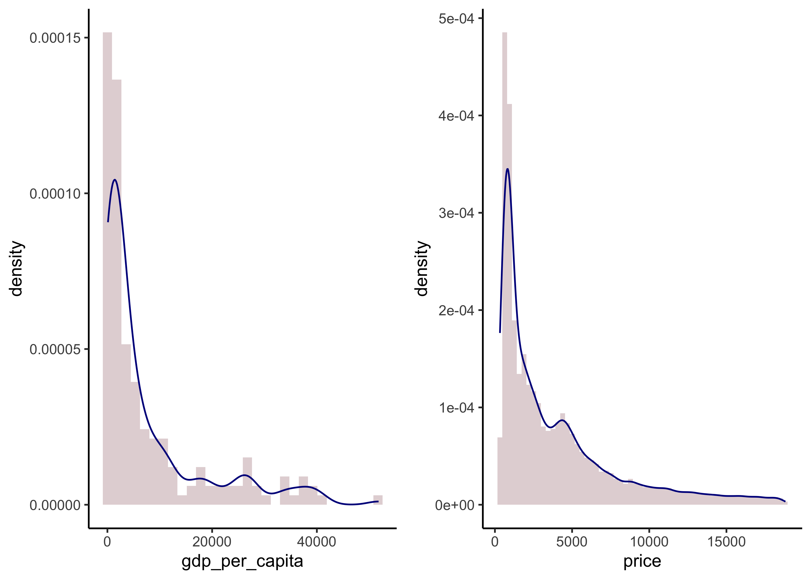
<p class="caption">(\#fig:fgggplot16)Kết hợp geom_density và geom_histogram để mô tả phân phối xác suất của biến liên tục. Hình bên trái: phân phối của biến thu nhập bình quân đầu người của các quốc gia trên thế giới năm 2011. Hình bên phải: phân phối của giá của các viên kim cương trong dữ liệu diamonds</p>
</div>

Để hiển thị đồng thời đồ thị histogram và đồ thị density trên cùng một đồ thị, chúng ta cần phải biến đổi đồ thị histogram từ mô tả số lần xuất hiện của biến liên tục thành tần suất xuất hiện. Bạn đọc thực hiện phép biến đổi này bằng cách thêm vào sau phần khai báo ánh xạ thẩm mỹ câu lệnh `after_stat(density)` để tổng diện tích của các hình được tạo bởi các thanh được quy đổi về 1.

Phương pháp vẽ đồ thị của `geom_density()` cũng giống như hàm `density()` có sẵn trong R xây dựng một đường liên tục là ước lượng cho hàm mật độ xác suất của một biến ngẫu nhiên liên lục. Hàm mật độ này được ước lượng bằng phương pháp kernel. Giá trị hàm mật độ tại một điểm $x$ bất kỳ nằm trong miền giá trị của một biến liên tục được tính bằng trung bình giá trị hàm $K$, được gọi là hàm kernel, tính trên khoảng cách từ điểm $x$ tới tất cả các quan sát. Ký hiệu $\hat{f}(x)$ là giá trị hàm mật độ tính tại $x$ bằng phương pháp kernel thì ta có
\begin{align}
\hat{f}(x) = \cfrac{1}{nh} \times \sum\limits_{i = 1}^{n} \ K\left( \cfrac{x - x_i}{h} \right)
(#eq:ggplot1)
\end{align}
trong đó $x_i$ là giá trị quan sát thứ $i$ và $h$ là được gọi là tham số làm mịn. $h$ càng lớn thì hàm $\hat{f}$ sẽ càng mịn. Hàm $K$ được sử dụng làm hàm kernel mặc định cho `geom_density()` là hàm mật độ của biến ngẫu nhiên phân phối chuẩn.

Một hàm số khác cũng có thể được sử dụng để mô tả phân phối của một biến liên tục là `geom_boxplot()` nhưng hàm số này có thể được sử dụng để mô tả mối liên hệ giữa biến rời rạc và biến liên tục nên chúng tôi sẽ thảo luận ở phần sau.

#### Mô tả hai biến liên tục
Đồ thị phân tán được vẽ bằng hàm `geom_point()` là cách hiệu quả nhất để mô tả trực quan hai biến liên tục. Bạn đọc đã làm quen với `geom_point()` cùng với các thuộc tính thẩm mỹ như `x`, `y`, `color`, `shape`, `size`, ... để mô tả mối liên hệ giữa các biến thu nhập bình quân đầu người và tuổi thọ bình quân của các quốc gia trên thế giới nên chúng tôi sẽ không nhắc lại cách sử dụng các cấu phần thẩm mỹ này của `geom_point()`

Đồ thị phân tán thường được sử dụng cùng với `geom_smooth()` để mô tả mối liên hệ giữa hai biến. Phương pháp xây dựng mô hình trong hàm `geom_smooth()` bao gồm:

- Phương pháp $"loess"$ là phương pháp mặc định để xây dựng hàm liên tục hay còn gọi là đường hồi quy mô tả mối liên hệ giữa biến được ánh xạ tới `y` theo biến được ánh xạ tới `x`. Phương pháp này được sử dụng khi số lượng quan sát nhỏ hơn 1000. Nguyên nhân là do thời gian xây dựng mô hình tăng lên tỷ lệ với bình phương của số lượng quan sát, do đó sẽ mất nhiều thời gian để vẽ đường hồi quy mô tả mối liên hệ giữa hai biến.

- Phương pháp $"lm"$ sẽ ước lượng đường thẳng (tuyến tính) mô tả mối liên hệ giữa biến ánh xạ đến `x` và biến ánh xạ đến `y`.

- Phương pháp $"gam"$ sẽ ước lượng một hàm liên tục được gọi là smoothing spline mô tả mối liên hệ giữa hai biến. Đây là phương pháp mặc định để xây dựng mô hình khi dữ liệu có kích thước lớn hơn 1000. Chúng ta sẽ thảo luận về smoothing spline trong phần Mô hình cộng tính tổng quát.

Trong trường hợp mô tả trực quan hai biến liên tục nhưng có nhiều điểm bị trùng nhau lên nhau thì `geom_point()` có thể sẽ gây nhầm lẫn về mật độ xuất hiện của các điểm. Hãy quan sát ví dụ dưới đây, chúng tôi sử dụng `geom_point()` để mô tả trực quan hai biến $cty$ và $hwy$ của dữ liệu $\textbf{mpg}$. Đây là hai biến liên tục mô tả mức độ tiêu hao nhiên liệu của 234 loại xe ô tô khác nhau được sản xuất vào các năm 1998 và 2008. Đơn vị của hai biến này đều là miles per gallon, nghĩa là cho biết số dặm mà xe đi được trên mỗi gallon nhiên liệu.

```r
p1<-mpg%>%ggplot(aes(x = cty,y = hwy)) + 
  geom_point()+
  geom_smooth(se = FALSE, linetype = 2, size = 0.7, color = "orange")+
  theme_minimal()
p2<-mpg%>%ggplot(aes(x = cty,y = hwy)) + 
  geom_point(alpha = 0.2)+
  geom_smooth(se = FALSE, linetype = 2, size = 0.7, color = "orange")+
  theme_minimal()
grid.arrange(p1,p2, nrow= 1 , ncol = 2)
```

<div class="figure">
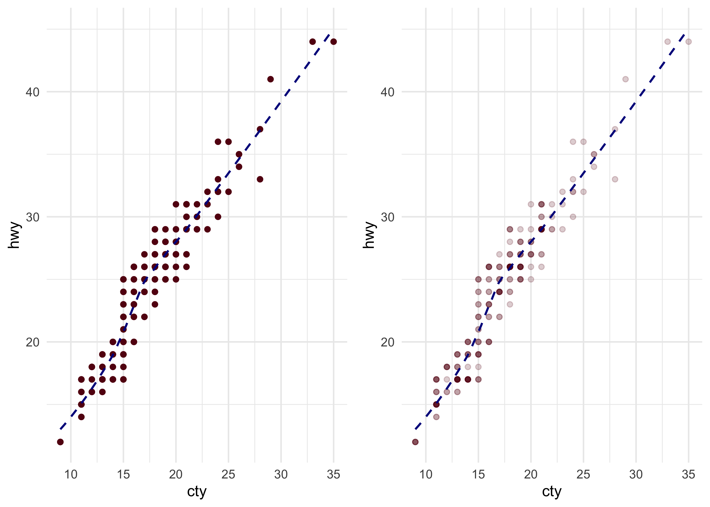
<p class="caption">(\#fig:fgggplot17)Sử dụng đồ thị phân tán để mô tả trực quan hai biến liên tục là hwy và cty trong dữ liệu mpg. Hình bên trái: không sử dụng tham số alpha. Hình bên phải sử dụng tham số alpha bằng 0.2 để biết mật độ xuất hiện của các điểm</p>
</div>

Bạn đọc có thể nhận thấy rằng số lượng điểm xuất hiện trên đồ thị bên trái của Hình \@ref(fig:fgggplot17) không tương ứng với số quan sát của dữ liệu. Nhận xét này được khẳng định thêm từ đồ thị bên phải của Hình \@ref(fig:fgggplot17). Khi chúng ta cho tham số `alpha` nhận giá trị 0.2, độ đậm nhạt của các điểm là rất khác nhau. Điều này cho thấy sự xuất hiện trùng lặp của của các điểm tại một số giá trị nhất định. Để có hiển thị tốt hơn với dữ liệu như vậy, bạn đọc có thể sử dụng `geom_jitter()` thay cho `geom_point()`. Hàm cũng hiển thị các điểm trên hai trục tọa độ giống như `geom_point()`, tuy nhiên khác biệt của `geom_jitter()` đó là mỗi điểm sẽ được di chuyển các một cách ngẫu nhiên xung quanh điểm ban đầu để tránh việc hiển thị điểm bị trùng nhau.

```r
p1<-mpg%>%ggplot(aes(x = cty,y = hwy)) + 
  geom_jitter(width = 1, height = 1, alpha = 0.5)+
  geom_smooth(se = FALSE, linetype = 2, size = 0.7, color = "orange")+
  theme_minimal()
p2<-mpg%>%ggplot(aes(x = cty,y = hwy)) + 
  geom_jitter(width = 3, height = 3,alpha = 0.5)+
  geom_smooth(se = FALSE, linetype = 2, size = 0.7, color = "orange")+
  theme_minimal()
grid.arrange(p1,p2, nrow= 1 , ncol = 2)
```

<div class="figure">
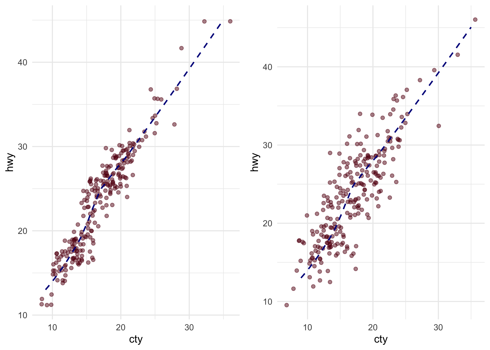
<p class="caption">(\#fig:fgggplot18)Sử dụng đồ thị phân tán kết hợp với di chuyển ngẫu nhiên bằng geom_jitter để mô tả trực quan hai biến liên tục là hwy và cty trong dữ liệu mpg. Hình bên trái: các điểm được di chuyển một cách ngẫu nhiên với trung bình bằng 1 đơn vị. Hình bên phải: các điểm được di chuyển một cách ngẫu nhiên với trung bình bằng 3 đơn vị.</p>
</div>

Có thể thấy rằng các điểm dữ liệu đã được hiển thị đầy đủ hơn trong Hình \@ref(fig:fgggplot18). Hai tham số quan trọng trong `geom_jitter()` là `width` và `height` cho biết các điểm được di chuyển theo chiều ngang và chiều dọc với giá trị trung bình là bao nhiêu. Nếu lựa chọn giá trị cho hai tham số này quá nhỏ, mục tiêu hiển thị đầy đủ các điểm sẽ không được đảm bảo, trong khi lựa chọn giá trị cho hai tham số này quá lớn sẽ làm cho dữ liệu bị thay đổi về bản chất. 

Một phương pháp khác được sử dụng để mô tả trực quan hai biến liên tục là `geom_text()` hoặc `geom_label()`. Thay vì hiển thị điểm như `geom_point()`, `geom_text()` hiển thị một biến kiểu chuỗi ký tự thay vì hiển thị điểm. `geom_text()` thường được sử dụng kết hợp với `geom_point()` hoặc cũng có thể sử dụng độc lập trên những dữ liệu nhỏ. Khi dữ liệu có kích thước trung bình hoặc lớn, `geom_text()` nên được sử dụng để nhấn mạnh hoặc chú thích cho một vài điểm quan trọng hơn là được sử dụng cho tất cả các điểm. Khi hiển thị biến kiểu ký tự và các điểm trên cùng một đồ thị, rất dễ dẫn đến hiện tượng ký tự và điểm bị trùng nhau hiển thị chồng lên nhau. Để điều chỉnh ký tự xuất hiện về các phía, bạn đọc cần phải sử dụng thêm các tham số như $hjust$, $vjust$.

Theo kinh nghiệm của chúng tôi, để hiện thị biến kiểu ký tự tốt hơn, nên sử dụng các hàm `geom_text_repel()` và `geom_label_repel()` thay thế cho `geom_text()` và `geom_label()`. Để sử dụng hai hàm này cần cài đặt thêm thư viện bổ sung là thư viện $\textbf{ggrepel}$.
 

```r
p1<-dat%>%filter(region == "South-Eastern Asia")%>%
  ggplot(aes(fertility, infant_mortality))+
  geom_point()+geom_text(aes(label = country), vjust=  - 1.1)+
  ggtitle("Sử dụng geom_text()")+
  theme_minimal()
p2<-dat%>%filter(region == "South-Eastern Asia")%>%
  ggplot(aes(fertility, infant_mortality))+
  geom_point()+geom_label(aes(label = country), vjust= - 1.1)+
  ggtitle("Sử dụng geom_label()")+
  theme_minimal()

p3<-dat%>%filter(region == "South-Eastern Asia")%>%
  ggplot(aes(fertility, infant_mortality))+
  geom_point()+geom_text_repel(aes(label = country),vjust=  1.1)+
  ggtitle("Sử dụng geom_text_repel()")+
  theme_minimal()
p4<-dat%>%filter(region == "South-Eastern Asia")%>%
  ggplot(aes(fertility, infant_mortality))+
  geom_point()+geom_label_repel(aes(label = country),vjust=  1.1)+
  ggtitle("Sử dụng geom_label_repel()")+
  theme_minimal()
grid.arrange(p1,p2,p3,p4,nrow=2,ncol=2)
```

<div class="figure">
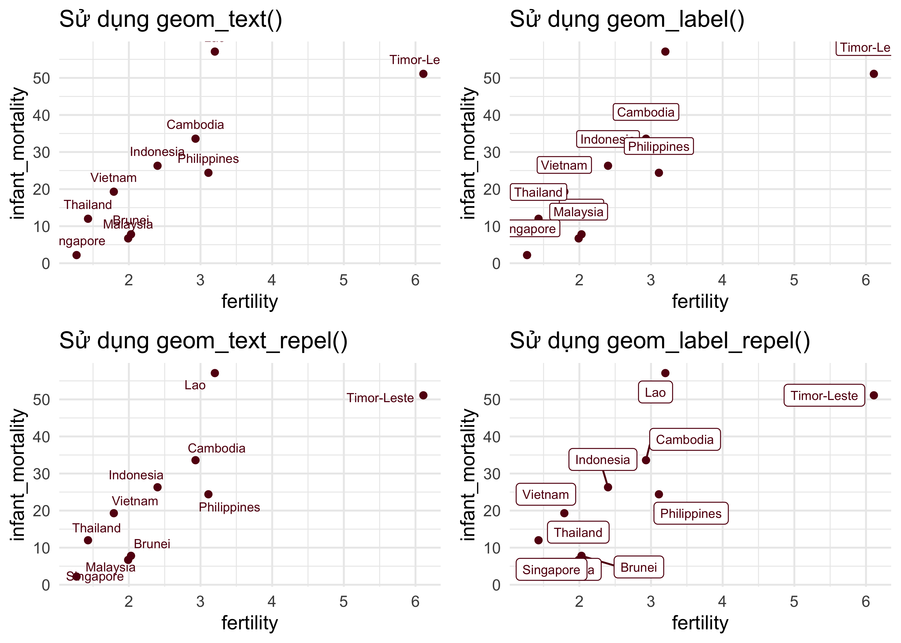
<p class="caption">(\#fig:fgggplot19)Tỷ lệ sinh trung bình mỗi phụ nữ và tỷ lệ tử vong trên 1000 trẻ sơ sinh cả các quốc gia Đông Nam Á năm 2011. Hình phía trên bên phải: Sử dụng geom_text. Hình phía trên bên trái: Sử dụng geom_label. Hình phía dưới bên trái: Sử dụng geom_text_rebel. Hình phía dưới bên phải: Sử dụng geom_label_rebel</p>
</div>

Khi một trong hai biến liên tục là biến dạng thời gian thì chúng ta sẽ sử dụng `geom_line()`. `geom_point()` cũng có thể sử dụng cùng với `geom_line()` nếu số lượng điểm dữ liệu không quá lớn. Nguyên tắc vẽ hình của `geom_line()` là sử dụng các đường thẳng để nối các điểm xuất hiện trong dữ liệu theo thứ tự tăng dần của biến được ánh xạ tới cấu phần thẩm mỹ `x`. Khi vẽ đồ thị của một biến liên tục theo thời gian, biến thời gian luôn luôn được ánh xạ đến thuộc tính `x` của `geom_line()`.


```r
gapminder%>%
  filter(country %in% c("United States","Japan","France","United Kingdom"))%>%
  ggplot(aes(x = year, y = gdp/population,color = country))+
  geom_line()+
  geom_point(size = 0.5, alpha = 0.5)+
  theme_minimal()
```

<div class="figure">

<p class="caption">(\#fig:fgggplot20)Thu nhập bình quân đầu người thay đổi theo thời gian của bốn quốc gia là Pháp, Nhật Bản, Mỹ, và Vương quốc Anh từ năm 1960 đến năm 2016</p>
</div>

Hình \@ref(fig:fgggplot20) mô tả sự thay đổi của thu nhập bình quân đầu người của các quốc gia phát triển trên thế giới từ năm 1960 đến 2016. Biến thu nhập bình quân đầu người được ánh xạ đến thuộc tính `y` trong khi biến thời gian ($year$) được ánh xạ đến thuộc tính thẩm mỹ $x$. Để mô tả mỗi quốc gia bằng một đường khác nhau, bạn đọc cần
ánh xạ biến $country$ đến thuộc tính thẩm mỹ như `group`, `linetype`, hoặc `color`.

Khi số lượng quan sát cần hiển thị lớn thì hiển thị trực quan các điểm trên trục tọa độ sẽ không hiệu quả. Thay vào đó, chúng ta nên hiển thị tần xuất và mật độ xuất hiện của các điểm để đồ thị được rõ ràng hơn. `geom_bin2d()` và `geom_density2d()` là các hàm để trực quan hóa phân phối của hai biến liên tục.

- `geom_bin2d()` chia miền giá trị của từng biến thành các khoảng bằng nhau sau đó đếm trong mỗi miền tương ứng với một hình chữ nhật có kích thước bằng một đơn vị khi chia miền giá trị của từng biến có bao nhiêu điểm. Nguyên tắc trực quan hóa của `geom_bin2d()` là sử dụng màu sắc từ đậm nhạt để mô tả số lượng điểm trong từng hình chữ nhật từ lớn đến nhỏ.

- `geom_density2d()` sử dụng phương pháp kernel để tính giá trị hàm mật độ trong không gian hai chiều giống như cách tính toán của `geom_density()` trong công thức \@ref(eq:ggplot1). Khoảng cách từ quan sát $x_i$ đến điểm $x$ được sử dụng là khoảng cách Euclide thay vì $|x_i-x|$ trong không gian một chiều. Hàm kernel được sử dụng là hàm mật độ của biến ngẫu nhiên phân phối chuẩn hai chiều. Hàm `geom_density2d()` vẽ các đường nối các điểm có giá trị hàm mật độ bằng nhau lại với nhau được gọi là các đường bàng quang (hay contour). Hình vẽ dưới đây mô tả phân phối đồng của hai biến $price$ và $carat$ trong dữ liệu $diamonds$.


```r
p1<-diamonds%>%
  ggplot(aes(price, carat))+geom_bin2d(bins = 40)+
  scale_x_log10()+scale_y_log10()+
  theme_minimal()+scale_fill_viridis_c()+
  ggtitle("geom_bind2d")

p2<-diamonds%>%
  ggplot(aes(price, carat))+geom_density2d(color = "blue",alpha = 0.5)+
  scale_x_log10()+scale_y_log10()+
  theme_minimal()+
  ggtitle("geom_density2d")

grid.arrange(p1,p2,nrow=1, ncol = 2)
```

<div class="figure">

<p class="caption">(\#fig:fgggplot21)Biểu diễn phân phối của hai biến liên tục là price và carat trong dữ liệu diamonds.  và geom_density2d. Hình bên trái: sử dụng geom_bin2d để chia miền giá trị của các biến ra thành các ô vuông nhỏ và sử dụng màu sắc để mô tả mật độ xuất hiện. Hình bên phải: sử dụng geom_density2d kết nối các điểm có cùng ước lượng của hàm mật độ.</p>
</div>

Hình \@ref(fig:fgggplot21) cho thấy phân phối đồng thời của hai biến $carat$ và $price$ trong dữ liệu $\textbf{diamonds}$ là phân phối có nhiều mode. Các điểm có tập trung mật độ đặc biệt cao là các điểm có ($price$, $carat$) bằng (1000, 0.3), (2200,0.7), và (4700, 1.0).

#### Mô tả một biến liên tục và một biến rời rạc
Đồ thị boxplot là phương pháp thông dụng nhất để mô tả mối liên hệ giữa một biến liên tục với một biến rời rạc. Đồ thị boxplot được vẽ bằng hàm `geom_boxplot()` với thuộc tính thẩm mỹ `x` được ánh xạ đến biến rời rạc và thuộc tính thẩm mỹ `y` được ánh xạ đên biến liên tục. Các thuộc tính thẩm mỹ như `color` và `fill` được sử dụng giống như `geom_histogram()`. Hình \@ref(fig:fgggplot22) mô tả mối liên hệ giữa biến thu nhập bình quân đầu người và biến Châu lục của tất cả các quốc gia trên thế giới vào năm 2011.


```r
p1<-dat%>%ggplot(aes(x = continent, y = log(gdp_per_capita)))+
  geom_boxplot()+
  theme_minimal()
p2<-dat%>%ggplot(aes(x = reorder(continent, gdp_per_capita), 
                     y = log(gdp_per_capita)))+
  geom_boxplot()+
  theme_minimal()
grid.arrange(p1,p2,nrow=1, ncol = 2)
```

<div class="figure">

<p class="caption">(\#fig:fgggplot22)Logarit của thu nhập bình quân đầu người của các quốc gia trên thế giới theo Châu lục năm 2011. Hình bên trái: Các châu lục được sắp xếp theo thứ tự tên Châu lục tăng dần. Hình bên phải: các châu lục được sắp xếp theo thứ tự giá trị trung bình của biến thu nhập bình quân đầu người tăng dần</p>
</div>

Khi mô tả mối liên hệ giữa một biến liên tục với một biến rời rạc, các đồ thị hộp nên được sắp xếp theo thứ tự mà giá trị trung bình của biến liên tục tương ứng với mỗi giá trị tăng dần giống như đồ thị bên phải của Hình \@ref(fig:fgggplot22). Chúng ta có thể thấy rằng thu nhập bình quân đầu người của Châu Mỹ thấp hơn Châu Á mặc dù các giá trị trung vị và tứ phân vị thứ nhất cao hơn. Nguyên nhân là do phân phối của biến thu nhập bình quân đầu người của châu Á lệch phải mạnh hơn so với phân phối của biến này tại các nước châu Mỹ.

Do `geom_boxplot()` chỉ thể hiện các giá trị phân vị của phân phối xác suất, nên đôi khi sẽ không cung cấp đầy đủ thông tin về phân phối của biến liên tục. Do đó, người phân tích dữ liệu thường sử dụng `geom_violin()` kết hợp cùng với `geom_boxplot()` để cho mô tả tốt hơn về phân phối xác suất của biến liên tục trong từng nhóm. `geom_violin()` đơn giản là vẽ hàm mật độ của biến liên tục trong từng nhóm được định nghĩa bởi biến rời rạc.

```r
p1<-dat%>%ggplot(aes(x = reorder(continent, gdp_per_capita), 
                     y = log(gdp_per_capita)))+
  geom_boxplot()+
  theme_minimal()
p2<-dat%>%ggplot(aes(x = reorder(continent, gdp_per_capita), 
                     y = log(gdp_per_capita)))+
  geom_violin(draw_quantiles = c(0.25,0.5,0.75), 
              alpha = 0.3)+
  theme_minimal()
grid.arrange(p1,p2,nrow=1, ncol = 2)
```

<div class="figure">
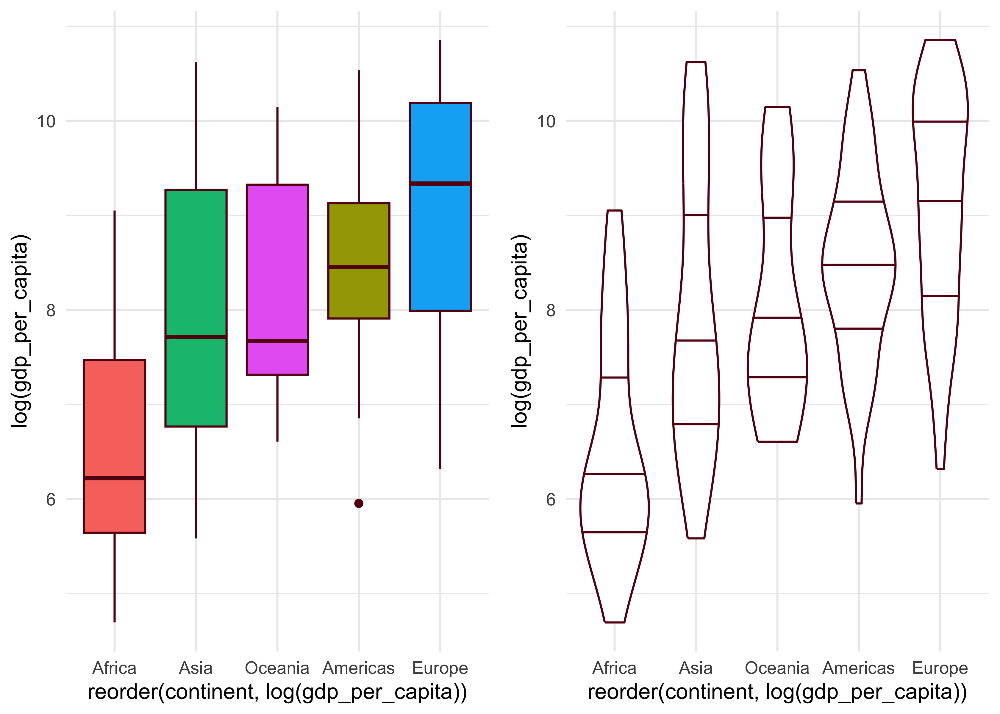
<p class="caption">(\#fig:fgggplot23)Logarit thu nhập bình quân đầu người của các quốc gia trên thế giới theo Châu lục năm 2011 kết hợp geom_boxplot và geom_violin</p>
</div>
Tham số `draw_quantiles` cho biết các giá ngưỡng phân vị mà chúng ta muốn vẽ cùng với các hàm mật độ. Trong Hình \@ref(fig:fgggplot23) sử dụng các ngưỡng phân vị 25%, 50% và 75% tương tự như `geom_boxplot()`.

#### Mô tả hai biến rời rạc
Đồ thị thường được sử dụng để mô tả trực quan phân phối của hai biến rời rạc là đồ thị kiểu bong bóng. Hàm số được sử dụng để vẽ đồ thị này là `geom_count()`. Tương ứng với mỗi cặp giá trị của hai biến rời rạc, hàm `geom_count()` tính toán số lượng điểm dữ liệu tương ứng với hai giá trị này và phản ánh số lượng điểm dữ liệu lên trên đồ thị thông qua kích thước của mỗi bong bóng. Chúng ta mô tả phân phối của hai biến rời rạc là $cut$ và $color$ trong dữ liệu $\textbf{diamonds}$ như sau:

```r
p1<-diamonds%>%ggplot(aes(cut,color))+
  geom_count(fill="blue",alpha = 0.5,shape = 21)+
  theme_minimal()+scale_size(range = c(1,12))+
  theme(legend.position = "top")

p2<-diamonds%>%ggplot(aes(cut,color))+
  geom_count(fill="blue",alpha = 0.5,shape = 22)+
  theme_minimal()+scale_size(range = c(1,12))+
  theme(legend.position = "top")
grid.arrange(p1,p2,nrow=1, ncol = 2)
```

<div class="figure">

<p class="caption">(\#fig:fgggplot24)Đồ thị bong bóng mô tả phân phối của hai biến rời rạc là cut và color trong dữ liệu diamonds. Hình bên trái sử dụng hình dạng tròn (shape = 21) để mô tả số điểm dữ liệu. Hình bên phải sử dụng hình vuông (shape = 22) để dễ phân biệt kích thước hơn</p>
</div>

Các thuộc tính thẩm mỹ của `geom_count()` hoàn toàn giống với `geom_point()` nên chúng ta có thể lựa chọn các hình dạng cho phép phân biệt kích thước tốt hơn thay vì sử dụng hình tròn như mặc định. Đồ thị trong Hình \@ref(fig:fgggplot24) còn sử dụng hàm `scale_size()` để giúp cho hiển thị được tốt hơn. Chúng ta sẽ thảo luận về các hàm `scale_*()` trong các phần tiếp theo. Từ Hình \@ref(fig:fgggplot24) để nhận ra tỷ lệ lớn các viên kim cương có biến $cut$ nhận giá trị $'ideal'$ và tỷ lệ lớn các viên kim cương có màu sắc nhận giá trị $'G'$. Các viên kim cương có biến $cut$ nhận giá trị $'ideal'$ và biến $color$ nhận giá trị $'G'$ cũng xuất hiện nhiều nhất trong dữ liệu với số lượng hơn 4000 viên.

Một phương pháp khác để trực quan hai biến rời rạc là trực quan một biến bằng `geom_bar()` sau đó ánh xạ thuộc tính `fill` đến biến rời rạc còn lại. 


#### Mô tả ba biến
Thư viện $\textbf{ggplot2}$ có hỗ trợ vẽ các hình ảnh trong không gian ba chiều, nhưng sử dụng các hình ảnh kiểu 3 chiều không phải là một phương pháp tốt để hiển thị ba biến trên cùng một đồ thị. Khi mô tả mối liên hệ giữa ba biến, phương pháp đơn giản và hiệu quả nhất là sử dụng ba đồ thị để mô tả mối liên hệ giữa ba cặp biến với nhau. Chỉ khi nào gặp trường hợp bắt buộc, chúng ta mới sử dụng cả ba biến trên cùng một đồ thị. Để mô tả ba biến, nguyên tắc là lựa chọn đồ thị cho hai biến trước sau đó ánh xạ biến còn lại vào một thuộc tính thẩm mỹ.

- Khi hai trong ba biến là biến liên tục và biến còn lại là biến rời rạc, hãy luôn luôn sử dụng đồ thị phân tán để mô tả hai biến liên tục và sử dụng màu sắc để ánh xạ tới biến rời rạc còn lại. 

- Khi hai trong ba biến là các biến rời rạc trong khi biến còn lại là biến liên tục, chúng ta có thể sử dụng `geom_tile()`. Hàm `geom_tile()` đặc biệt hiệu quả khi mô tả mối liên hệ giữa hai biến rời rạc với một biến liên tục bằng cách ánh xạ hai biến rời rạc vào các thuộc tính thẩm mỹ `x` và `y` trong khi giá trị của biến liên tục được mô tả thông qua màu sắc. Do tương ứng với màu sắc chỉ có một giá trị duy nhất của biến liên tục nên nếu tương ứng với một giá trị của biến rời rạc ánh xạ đến trục `x` và một giá trị của biến liên tục ánh xạ tới trục `y` có nhiều giá trị của biến liên tục thì màu sắc sẽ tương ứng với giá trị trung bình của biến liên tục. Ví dụ, khi chúng ta muốn mô tả ba biến $region$, $year$, và $life\_expectancy$ của dữ liệu $\textbf{gapminder}$ trên cùng một đồ thị, chúng ta sẽ cần tính $life\_expectancy$ trung bình của mỗi vùng trong mỗi năm trước khi thực hiện trực quan hóa.


```r
# Tạo danh sách các vùng có tuổi thọ trung bình tăng dần
dat1<-gapminder%>%group_by(region)%>%
     summarise(life_expectancy = mean(life_expectancy,na.rm = TRUE))%>%
    arrange(desc(life_expectancy))
region_list<-dat1$region

# Tạo dải màu rời rạc từ cam tới xanh
mycol<-colorRampPalette(c("orange", "blue"),space = "Lab")(10)

# Trực quan hóa 3 biến region, year, và life_expectancy
gapminder%>%group_by(year,region)%>%
     summarise(life_expectancy = mean(life_expectancy,na.rm = TRUE))%>%
     ggplot()+
     geom_tile(aes(x = year, y = region , fill = life_expectancy), color= "grey")+
     scale_fill_gradientn(colours = mycol)+
     scale_x_continuous(breaks = seq(1960,2015,5))+
     scale_y_discrete(limits = region_list)+
     theme_minimal()+
    xlab("")+ylab("")+
    theme(legend.position = "top")
```

<div class="figure">

<p class="caption">(\#fig:fgggplot25)Tuổi thọ trung bình của các vùng trên thế giới thay đổi qua các năm từ năm 1960 đến năm 2015</p>
</div>

Trong đồ thị của Hình \@ref(fig:fgggplot25) chúng tôi đã sử dụng thêm các hàm `scale_*()` để kiểm soát ánh xạ thẩm mỹ. Chẳng hạn giá trị năm (trục x) sẽ là cách đều 5 năm, các vùng trên trục $y$ được sắp xếp theo thứ tự có tuổi thọ trung bình trên toàn bộ dữ liệu tăng dần. Dải màu sắc cũng được gán giá trị cho dải màu liên tục từ cam sang xanh. Chúng ta sẽ thảo luận về `scale_*()` trong phần sau của chương sách.

### Các hàm `stat_*()`+--
Bạn đọc cũng có thể xây dựng các lớp cho đồ thị $\textbf{ggplot2}$ bằng các hàm `stat_*()`. Các hàm số này không hiển thị dữ liệu ở trạng thái ban đầu mà thường hiển thị dữ liệu dưới một phép biến đổi thống kê hoặc một phương pháp tóm tắt dữ liệu. Có sự tương đương giữa các hàm `stat_*()` với các hàm `geom_*()`, nghĩa là chúng ta có thể gọi hàm `geom_*()` bằng một hàm `stat_*()` và ngược lại. Ví dụ `stat_bin()` tương đương với `geom_histogram()` và `geom_bar()`; `stat_smooth()` tương đương với `geom_smooth()`, ... Về bản chất, các geom và các stat đều có nguồn gốc từ chung một hàm tạo một lớp mới cho đồ thị là hàm `layer()`. Chúng ta sẽ thảo luận về các hàm này trong phần Kiến thức nâng cao về $\textbf{ggplot2}$.

Thay vì sử dụng `geom_*()`, chúng ta có thể sử dụng `stat_*()` để mô tả phân phối của các biến liên tục:


```r
p1<-dat%>%ggplot(aes(fertility, after_stat(density)))+
  stat_bin(color = "blue",alpha = 0.5)+
  stat_density(color = "orange",alpha = 0.1)+
  theme_minimal()
p2<-dat%>%ggplot(aes(x = reorder(continent,fertility), y = fertility))+
  stat_boxplot(color = "blue", alpha = 0.5, fill = "grey40")+
  theme_minimal()
grid.arrange(p1,p2,nrow=1,ncol=2)
```

<div class="figure">
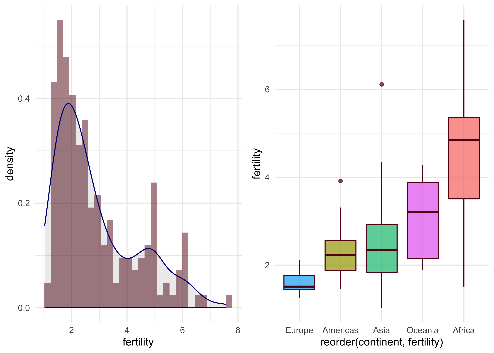
<p class="caption">(\#fig:fgggplot26)Phân phối của biến tỷ lệ sinh trung bình một phụ nữ (fertility) năm 2011. Hình bên trái: histogram và mật độ của biến fertility. Hình bên phải: phân phối của biến fertility theo các lục địa</p>
</div>

Bạn đọc có thể thấy rằng các đồ thị trong Hình \@ref(fig:fgggplot26) được tạo bằng các hàm `stat_()` và cho kết quả hoàn toàn giống với các hàm `geom_()` tương ứng.

## Hàm `scale_*()`
Các hàm `scale_*()` trong thư viện $\textbf{ggplot2}$ kiểm soát ánh xạ từ các biến của dữ liệu đến thuộc tính thẩm mỹ của đồ thị. Các hàm này lấy dữ liệu ban đầu và biến đổi giá trị trong dữ liệu thành các đối tượng trực quan mà chúng ta có thể nhìn thấy, như kích thước, màu sắc, vị trí, hoặc hình dạng. Bạn đọc có thể tạo đồ thị bằng thư viện $\textbf{ggplot2}$ mà không cần biết chính xác các ánh xạ thẩm mỹ hoạt động như thế nào. Tuy nhiên, hiểu về scales và cách thao tác các hàm `scale_*()` sẽ giúp bạn kiểm soát hoàn toàn những đối tượng trực quan trên đồ thị.

### Vị trí xuất hiện trên trục tọa độ
Đa số các đồ thị trong thư viện $\textbf{ggplot2}$ hiển thị dữ liệu trên trục tọa độ Descartes nên chúng tôi sẽ tập trung vào cách dữ liệu hiển thị trên hai trục tọa độ $x$ và $y$. Khi ánh xạ các biến của dữ liệu tới các trục tọa độ $x$ và $y$, nếu chúng ta không sử dụng các hàm `scale_*()`, các điểm sẽ được hiển thị đúng như giá trị của điểm đó trên các trục tọa độ. Trong nhiều trường hợp, hiển thị tại vị trí đúng như dữ liệu ban đầu sẽ không mang lại hiệu quả. Ví dụ như khi mô tả hai biến $total$ và $population$ của dữ liệu $\textbf{murders}$, bạn đọc có thể so sánh cách hiển thị giữa việc không kiểm soát và có kiểm soát ánh xạ thẩm mỹ như Hình \@ref(fig:fgggplot27)

```r
p1<-murders%>%ggplot(aes(x = population,y = total))+
  geom_point(size = 2, shape = 21, fill = "grey40", alpha = 0.5,color = "blue")+
  theme_minimal()+ggtitle("Không sử dụng scale")
p2<-murders%>%ggplot(aes(x = population,y = total))+
  geom_point(size = 2, shape = 21, fill = "grey40", alpha = 0.5,color = "blue")+
  theme_minimal()+
  scale_x_continuous(trans = "log10")+
  scale_y_continuous(trans = "log10")+
  ggtitle("Có sử dụng scale (log10)")
grid.arrange(p1,p2,nrow=1,ncol=2)
```

<div class="figure">

<p class="caption">(\#fig:fgggplot27)Hiển thị biến số vụ sát nhân bằng súng (total) và biến dân số của các bang trong dữ liệu murder. Hình bên trái: vị trí các điểm trên trục tọa độ là giá trị dữ liệu thô. Hình bên phải: vị trí trên các trục tọa độ đã được biến đổi bằng cách lấy logarit cơ số 10</p>
</div>
Có thể thấy rằng đồ thị bên phải của Hình \@ref(fig:fgggplot27) hiển thị rõ ràng hơn hình bên trái sau khi chúng ta có tác động đến ánh xạ từ biến $population$ đến thuộc tính `x` và ánh xạ từ biến $total$ đến thuộc tính `y` bằng các hàm `scale_x_continuous()` và `scale_y_continuous()`. Đây là hai hàm số được dùng để kiểm soát vị trí xuất hiện của các điểm trên trục tọa độ khi các biến trong ánh xạ là các biến kiểu số liên tục. Các tham số có thể được sử dụng trong các hàm này bao gồm có:

- Tham số `trans`, là viết tắt của transformation, nhận giá trị mặc định là $'identity'$ nghĩa là lấy chính xác giá trị của biến ánh xạ vào thuộc tính `x` hoặc `y` tương ứng. Để biết các giá trị mà tham số này có thể nhận được bạn đọc có thể tham khảo trong tài liệu đi kèm với hàm `scale_x_continuous()` và `scale_y_continuous()`. Khi sử dụng scale trên các biến, chẳng hạn như $x_1$ và $x_2$, là các biến ánh xạ tới `x` và `y` trong ánh xạ thẩm mỹ bằng một hàm $f$ được khai báo bằng tham số `trans`, giá trị xuất hiện trên trục tọa độ $x$ và $y$ sẽ tương ứng là $f(x_1)$ và $f(x_2)$. Chẳng hạn như trong đồ thị phía bên phải ở trên, khi chúng ta thực hiện scale, sử dụng hàm $log10$, tọa độ của các điểm (các quốc gia) sẽ là $log10(population)$ và $log10(total)$. Việc chuyển đổi này sẽ hữu ích bởi rất đa số các quốc gia có dân số nhỏ, trong khi có một vài quốc gia có dân số rất lớn. Thực hiện chuyển đổi dữ liệu bằng các hàm $log$ sẽ giúp cho khoảng cách của các điểm cách đều nhau hơn và dễ dàng phân biệt hơn.

- Tham số `limits` giới hạn giá trị trên các thuộc tính thẩm mỹ `x` và `y` của đồ thị. Mỗi khi chúng ta vẽ đồ thị sử dụng thư viện $\textbf{ggplot2}$, tham số `limits` mặc định sẽ đảm bảo việc hiển thị được đầy đủ nhất. Tuy nhiên nhiều khi chúng ta cần phải thay đổi các giá trị giới hạn của các trục tọa độ, chẳng hạn như khi muốn so sánh hai dữ liệu trên cùng một miền giá trị của $x$ và $y$. Các đồ thị trong Hình \@ref(fig:fgggplot28) mô tả hai biến $fertility$ và $life\_expectancy$ trong các năm 1960 và 2011 và không sử dụng scale.


```r
p1<-gapminder%>%filter(year==1960)%>%
  ggplot(aes(fertility,life_expectancy))+
  geom_point(size = 2, shape = 21, fill = "grey40", alpha = 0.5,color = "blue")+
  ggtitle("Năm 1960")+
  theme_minimal()
p2<-gapminder%>%filter(year==2011)%>%
  ggplot(aes(fertility,life_expectancy))+
  geom_point(size = 2, shape = 21, fill = "grey40", alpha = 0.5,color = "blue")+
  ggtitle("Năm 2011")+
  theme_minimal()
grid.arrange(p1,p2,nrow=1,ncol=2)
```

<div class="figure">

<p class="caption">(\#fig:fgggplot28)Mối liên hệ giữa hai biến tỷ lệ sinh trung bình của mỗi phụ nữ và tuổi thọ trung bình trong hai năm 1960 và 2010 sử dụng miền giá trị trên trục tọa độ khác nhau. Hình bên trái: dữ liệu của năm 1960. Hình bên phải: dữ liệu của năm 2011</p>
</div>

Không thể nhận biết được sự khác biệt trong mối liên hệ giữa hai biến tỷ lệ sinh trung bình của mỗi phụ nữ và tuổi thọ trung bình trong các năm 1960 và 2010  do chúng ta không biểu diễn các biến trên cùng một miền giá trị của $x$ và $y$. Để khắc phục vấn đề này, Hình \@ref(fig:fgggplot29) sử dụng tham số $limits$ trong các hàm `scale_x_continuous()` và `scale_y_continuous()`. Để khai báo tham số cho tham số này, chúng ta sử dụng một véc-tơ hai chiều chứa giá trị nhỏ nhất và giá trị lớn nhất trên trục tọa độ mà bạn muốn hiển thị. 

```r
p1<-gapminder%>%filter(year==1960)%>%
  ggplot(aes(fertility,life_expectancy))+
  geom_point(size = 2, shape = 21, fill = "grey40", alpha = 0.5,color = "blue")+
  ggtitle("Năm 1960")+
  scale_x_continuous(limits = c(1,9))+
  scale_y_continuous(limits = c(25,85))+
  theme_minimal()
p2<-gapminder%>%filter(year==2010)%>%
  ggplot(aes(fertility,life_expectancy))+
  geom_point(size = 2, shape = 21, fill = "grey40", alpha = 0.5,color = "blue")+
  ggtitle("Năm 2010")+
   scale_x_continuous(limits = c(1,9))+
  scale_y_continuous(limits = c(25,85))+
  theme_minimal()
grid.arrange(p1,p2,nrow=1,ncol=2)
```

<div class="figure">

<p class="caption">(\#fig:fgggplot29)Mối liên hệ giữa hai biến tỷ lệ sinh trung bình của mỗi phụ nữ và tuổi thọ trung bình trên cùng một miền giá trị của trục tọa độ. Hình bên trái: dữ liệu của năm 1960. Hình bên phải: dữ liệu của năm 2011</p>
</div>

 - Tham số `breaks` kiểm soát vị trí các điểm được đánh dấu xuất hiện trên các trục tọa độ $x$ và trục tọa độ $y$. Chúng tôi thường kết hợp `breaks` với tham số `labels` để kiểm soát đồng thời vị trí và cách hiển thị trên các trục số. Ví dụ như trong hình so sánh đồ thị mô tả hai biến $fertility$ và $life\_expectancy$ của các năm 1960 và 2010, chúng ta muốn giá trị xuất hiện trên trục $x$ là các số 2, 4, 6, 8 và các số trên trục $y$ xuất hiện tại các vị trí 10, 30, 50, 70, và 90, chúng ta chỉ cần khai báo giá trị cho tham số `breaks` bằng véc-tơ chứa các giá trị mà chúng ta muốn hiển thị. Lưu ý rằng `breaks` có chữ $s$ ở cuối để phân biệt với từ khóa `break`. 


```r
p1<-gapminder%>%filter(year==1960)%>%
  ggplot(aes(fertility,life_expectancy))+
  geom_point(size = 2, shape = 21, fill = "grey40", alpha = 0.5,color = "blue")+
  ggtitle("Năm 1960")+
  scale_x_continuous(limits = c(1,9),
                     breaks = c(2,4,6,8),
                     labels = paste(c(2,4,6,8),"trẻ em"))+
  scale_y_continuous(limits = c(25,85),
                     breaks = c(10,30,50,70,90),
                     labels = paste(c(10,30,50,70,90),"tuổi"))+
  theme_minimal()
p2<-gapminder%>%filter(year==2010)%>%
  ggplot(aes(fertility,life_expectancy))+
  geom_point(size = 2, shape = 21, fill = "grey40", alpha = 0.5,color = "blue")+
  ggtitle("Năm 2010")+
  scale_x_continuous(limits = c(1,9),
                     breaks = c(2,4,6,8),
                     labels = paste(c(2,4,6,8),"trẻ em"))+
  scale_y_continuous(limits = c(25,85),
                     breaks = c(10,30,50,70,90),
                     labels = paste(c(10,30,50,70,90),"tuổi"))+
  theme_minimal()
grid.arrange(p1,p2,nrow=1,ncol=2)
```

<div class="figure">
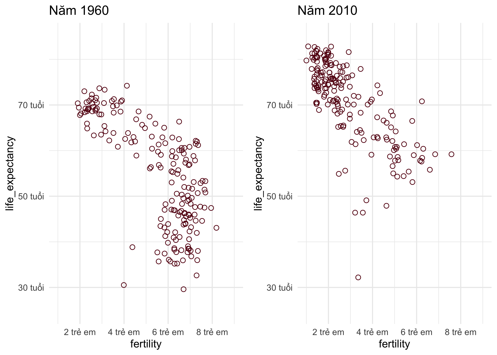
<p class="caption">(\#fig:fgggplot30)Mối liên hệ giữa hai biến tỷ lệ sinh trung bình của mỗi phụ nữ và tuổi thọ trung bình trên cùng một miền giá trị của trục tọa độ. Giá trị trên trục tọa độ được định nghĩa lại bằng các tham số breaks và labels. Hình bên trái: dữ liệu của năm 1960. Hình bên phải: dữ liệu của năm 2011</p>
</div>

Khi một trong hai biến liên tục là biến kiểu thời gian thì hàm số sử dụng để kiểm soát giá trị hiển thị là `scale_x_date()` với hai tham số thường được sử dụng là $date\_break$ và $date\_labels$. Cách sử dụng của các tham số này tương tựng như các tham số `breaks` và `labels`. Chúng ta sẽ mô tả biến số lượng hành khách trung bình từng tháng được lưu trong dữ liệu $\textbf{AirPassengers}$ theo một biến thời gian bắt đầu từ tháng 01 năm 1949.


```r
dat0<-data.frame(Number_Passengers = AirPassengers,
                Month = seq(as.Date("1949-01-01"), by = "month", length.out = 144))
p1<-dat0%>%ggplot(aes(x = Month, y = Number_Passengers))+
  geom_line() + ggtitle("Không sử dụng scale")+
  theme_minimal()
p2<-dat0%>%ggplot(aes(x = Month, y = Number_Passengers))+
  geom_line()+ ggtitle("Sử dụng scale_x_date()")+
  scale_x_date(date_break = "2 years", date_labels = "%b\n%Y" )+
  scale_y_continuous(breaks = seq(100,600,length=6))+
  theme_minimal()

grid.arrange(p1,p2,nrow=1,ncol=2)
```

<div class="figure">

<p class="caption">(\#fig:fgggplot31)Số lượng hành khách trung bình theo tháng dữ liệu AirPassenger. Hình bên trái: không sử dụng scale_x_date. Hình bên phải: sử dụng scale_x_date để hiển thị tốt hơn giá trị ngày tháng trên trục x</p>
</div>

Khi giá trị trên trục $x$ hoặc trục $y$ là các giá trị rời rạc, các hàm số sử dụng để kiểm soát ánh xạ thẩm mỹ từ các biến đến các trục tọa độ là các hàm `scale_x_discrete()` và `scale_y_discrete()`. Các tham số thường sử dụng bao gồm `limits` và `labels`. Tham số `limits` được sử dụng để cho biết các giá trị nào của biến rời rạc xuất hiện trên đồ thị, trong khi tham số `labels` cho biết từng giá trị của biến rời rạc xuất hiện như thế nào


```r
# Không sử dụng scale
p1<-murders%>%mutate(rate = total/population*10^6)%>%
  ggplot(aes(reorder(region,rate),rate))+
  geom_boxplot(fill = "grey40", color = "blue", alpha = 0.5)+
  ggtitle("Không sử dụng scale")+
  theme_minimal()+xlab("")

# Sử dụng tham số labels cho trục x
# và sử dụng limits cho trục y
p2<-murders%>%mutate(rate = total/population*10^6)%>%
  ggplot(aes(reorder(region,rate),rate))+
  geom_boxplot(fill = "grey40", color = "blue",alpha = 0.5)+
  scale_y_continuous(limits = c(0,50))+
  # Thay thế giá trị hiển thị trên trục số bằng labels
  scale_x_discrete(labels = c("Northeast" = "Đông Bắc",
                              "West" = "Miền Tây",
                              "South" = "Miền Nam",
                              "North Central" = "Miền Bắc"))+
  ggtitle("Sử dụng limits và labels")+
  theme_minimal()+xlab("")
grid.arrange(p1,p2,nrow=1,ncol=2)
```

<div class="figure">
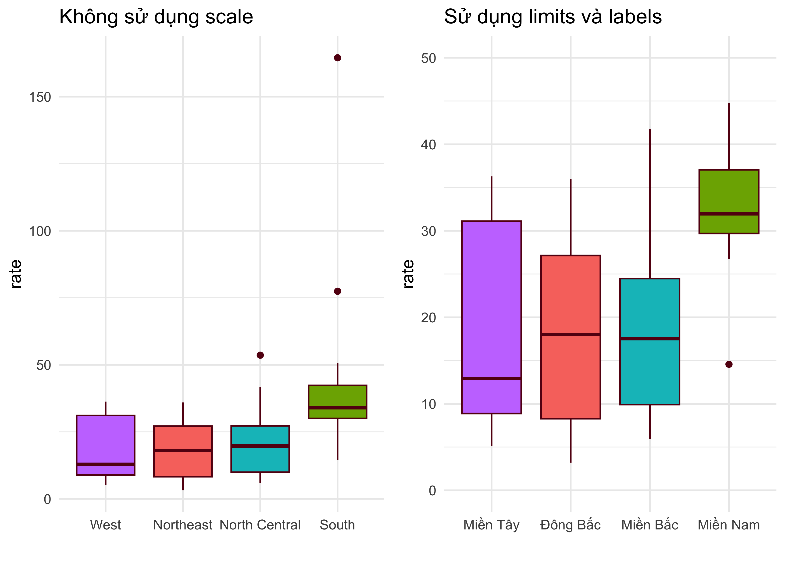
<p class="caption">(\#fig:fgggplot32)Phân phối của biến tỷ lệ số vụ xả súng trên một triệu người dân theo vùng vào năm 2010 tại Mỹ. Hình bên trái: không sử dụng scale. Hình bên phải: sử dụng limits trên trục y và labels trên trục x cho hiển thị tốt hơn</p>
</div>


### Màu sắc hiển thị
Thuộc tính thẩm mỹ được sử dụng phổ biến nhất là màu sắc. Có nhiều cách để ánh xạ giá trị của biến tới màu sắc trong thư viện $\textbf{ggplot2}$. Vì màu sắc là một chủ đề phức tạp nên chúng tôi sẽ bắt đầu bằng thảo luận sơ lược về lý thuyết màu sắc. Sau đó chúng tôi sẽ giới thiệu đến bạn đọc về thang màu liên tục, thang màu rời rạc và thang màu tổng hợp được sử dụng để ánh xạ đến các biến rời rạc, biến liên tục trong trực quan hóa dữ liệu. Chúng tôi cũng sẽ đề cập đến cả các thang màu dành cho biến kiểu thời gian, kiểu ngày tháng, độ trong của các màu sắc hiển thị và nguyên tắc chú giải cho màu sắc được thiết lập trong các đồ thị $\textbf{ggplot2}$.

#### Cảm nhận của con người về màu sắc
Trong vật lý, màu sắc được tạo ra bởi hỗn hợp các bước sóng ánh sáng. Để mô tả đầy đủ về một màu sắc, chúng ta cần biết sự kết hợp chính xác của các bước sóng. Sự thật thì mắt con người chỉ có ba cơ quan cảm nhận màu sắc khác nhau, và vì vậy chúng ta có thể tóm tắt khả năng cảm nhận về bất kỳ màu nào chỉ bằng ba con số. Một không gian màu quen thuộc với bạn đọc là không gian màu RGB, không gian mà mọi màu sắc được xác định theo cường độ ánh sáng đỏ, xanh da trời và xanh lá cây để tạo ra màu đó. Ưu điểm của không gian màu này là sự đơn giản do mỗi màu sắc đều được mô tả bằng ba con số từ 0 đến 255 hoàn toàn độc lập với nhau. Một vấn đề với không gian này là các dải màu liên tục nhận được bằng cách tăng giảm các cường độ màu đỏ, xanh lá cây, xanh dương lại không giống như cách nhận thức về màu sắc của còn người. Khi nhìn vào một màu cụ thể, chúng ta không thể ước tính được cường độ mỗi màu là bao nhiêu, điều này có thể gây khó khăn cho việc tạo ánh xạ từ một biến liên tục sang một dải màu.

Mỗi khi hiển thị một giá trị màu sắc trong không gian RGB, R thường sử dụng ký tự có 6 chữ số trong hệ 16 (từ 0 đến F) và bắt đầu bằng một dấu '#' thay vì một véc-tơ ba chiều đại diện cho 3 sắc đỏ, xanh lá cây, và  xanh dương. Hai chữ số đầu đại diện cho sắc đỏ, 2 chữ số tiếp theo đại diện cho màu xanh lá cây và 2 chữ số cuối đại diện cho màu xanh dương. Chẳng hạn như "#FF0000" sẽ là màu đỏ, "#00FF00" là màu xanh lá cây và "#0000FF" là màu xanh dương.

Một không gian màu được chuyển đổi từ không gian RGB là không gian Lab trong đó L đại diện cho độ tương phản sáng-tối của màu sắc, trục tọa độ a và b cho biết các vị trí của màu trên hai trục: trục từ đỏ đến xanh dương và trục từ vàng đến xanh lá. Cải tiến từ không gian RGB sang không gian Lab giúp cho các dải màu sắc tương ứng hơn với khả năng nhận biết màu sắc của con người, tuy nhiên vẫn còn khoảng cách giữa không gian Lab với nhận thức màu sắc. Không gian Lab cũng có các ưu điểm riêng, do đó $\textbf{ggplot2}$ mặc định sử dụng không gian Lab khi nội suy tuyến tính các màu sắc nằm giữa hai màu bất kỳ khi chúng ta ánh xạ một biến liên tục lên thuộc tính thẩm mỹ màu sắc.

Một không gian màu khác có thể hạn chế vấn đề của không gian RGB là không gian màu HCL với ba thành phần màu: màu sắc (Hue), sắc độ (Chroma) và độ chói (Luminance):

- Màu sắc (Hue) nằm trong khoảng từ 0 đến 360 (một góc) và cho biết màu muốn hiển thị.

- Sắc độ là “độ tinh khiết” của một màu, nằm trong khoảng từ 0 (xám) đến mức tối đa thay đổi theo độ sáng.

- Độ sáng là độ sáng của màu, dao động từ 0 (đen) đến 1 (trắng).

Ba chiều có những đặc tính khác nhau. Tương tự như không gian màu Lab, màu sắc trong HCL được sắp xếp xung quanh một hình tròn và không được coi là có trật tự; ví dụ: màu xanh lá dường như không lớn hơn hay nhỏ hơn màu đỏ và màu xanh dương dường như không lớn hơn hay nhỏ hơn màu xanh lá. Ngược lại, cả sắc độ và độ sáng đều được coi là có trật tự: màu hồng được coi là nằm giữa màu đỏ và trắng, và màu xám được coi là nằm giữa màu đen và trắng. Tạo các thang màu sắc từ không gian HCL thường được dựa trên nguyên tắc cố định 2 tham số và thay đổi tham số còn lại. Do không gian màu HCL gần với nhận thức màu sắc của con người hơn nên các dải màu được tạo ra sẽ "cách đều" nhau hơn theo cách mà chúng ta nhận thức.

Xin được nhắc lại rằng màu sắc là một chủ để phức tạp mà phạm vi của nó vượt rất xa những gì mà chúng tôi đề cập ở trên. Bạn đọc nên tham khảo thêm các tài liệu chuyên ngành khoa học máy tính để có thể sử dụng màu sắc một cách hiệu quả nhất.

#### Dải màu liên tục
Dải màu liên tục được sử dụng để hiển thị giá trị của một biến liên tục trên bề mặt phẳng. Để kiểm soát màu sắc trong thư viện $\textbf{ggplot2}$, chúng ta sử dụng các hàm `scale_color_*()`. Lưu ý rằng các thuộc tính thẩm mỹ `color` và `fill` có thể được sử dụng song song với đa số các hình dạng đồ họa, do đó bất kỳ hàm `scale_color_*()` cũng có hàm `scale_fill_*()` tương ứng.

Dải màu liên tục thường được sử dụng cùng với các geom có hình dạng đồ họa cần màu sắc để phân biệt trên trên mặt phẳng như `geom_polygon()`, `geom_tile()` (hoặc `geom_raster()`), và `geom_bin2d()`. Mỗi khi chúng ta cho một biến liên tục ánh xạ đến thuộc tính thẩm mỹ màu sắc, thư viện $\textbf{ggplot2}$ sẽ tự động hiểu rằng chúng ta sử dụng dải màu liên tục để mô tả biến đó. 

Chúng ta sẽ làm quen với các dải màu liên tục thông qua trực quan hóa hàm mật độ của biến ngẫu nhiên phân phối chuẩn hai chiều với trung bình 0, phương sai 1 và hệ số tương quan $\rho = 0.8$. Lưu ý rằng hàm mật độ của hai biến ngẫu nhiên phân phối chuẩn $\mathcal{N}(0,1)$ với hệ số tương quan $\rho = 0.8$ được tính như sau
\begin{align}
f(x,y) = \cfrac{1}{2 \pi \sqrt{1-\rho^2}} \ \exp \left(- \cfrac{x^2 + y^2 - 2\rho x y}{1-\rho^2}  \right)
\end{align}

Đồ thị hàm mật độ của biến ngẫu nhiên phân phối chuẩn hai chiều được lưu trong đối tượng có tên `p` như dưới đây:

```r
# tạo lưới điểm trên hình vuông [-2,2] * [2-,2]
n<-100
x<-rep(1:n,n)/n*4-2
y<-sort(x, decreasing = FALSE)
rho<-0.8
dat0<-data.frame(x=x,y=y,
                dens = 1/(2*pi*sqrt(1-rho^2)) * 
                  exp(-(x^2+y^2-2*rho*x*y)/(1-rho^2)))
p<-dat0%>%ggplot(aes(x,y,fill=dens))+geom_raster()+
  theme_minimal()
```

Phương pháp đơn giản nhất để kiểm soát ánh xạ thẩm mỹ từ một biến liên tục đến màu sắc là lựa chọn các dải màu liên tục có sẵn trong của thư viện $\textbf{ggplot2}$ hoặc có trong các thư viện bổ sung. Các dải màu có sẵn này đều được xây dựng để ngay cả những người gặp khó khăn trong phân biệt màu sắc cũng có thể cảm nhận được. Trong Hình \@ref(fig:fgggplot32) vẽ chúng tôi lựa chọn các dải màu sau: 1. Dải màu liên tục mặc định của thư viện $\textbf{ggplot2}$, 2. Dải màu liên tục viridis, 3. Dải màu liên tục distiller; và 4. Dải màu liên tục fermenter. Mỗi dải màu đều có tham số `palette` để lựa chọn dải các dải màu sắc phù hơpj


```r
# tạo lưới điểm trên hình vuông [-2,2] * [2-,2]
p1<-p + scale_fill_continuous()+
  ggtitle("Màu mặc định") # sử dụng dải màu mặc định
p2<-p + scale_fill_viridis_c(option = "A")+ # Dải màu viridis liên tục
  ggtitle("Dải màu viridis")
p3<-p + scale_fill_distiller(palette = 3)+ # Dải màu distiller
  ggtitle("Dải màu distiller")
p4<-p + scale_fill_fermenter(palette = 2)+ # Dải màu fermenter
  ggtitle("Dải màu fermenter")
grid.arrange(p1,p2,p3,p4,nrow=2,ncol=2)
```

<div class="figure">

<p class="caption">(\#fig:fgggplot33)Hàm mật độ của biến ngẫu nhiên phân phối chuẩn hai chiều với hệ số tương quan bằng 0.8. Hình góc trên bên trái: dải màu liên tục mặc định của ggplot2. Hình góc trên bên phải: dải màu viridis với option = 'A'. Hình góc dưới bên trái: dải màu liên tục distiller với dải màu số 3. Hình góc dưới bên phải: dải màu liên tục fermenter với dải màu liên tục số 2</p>
</div>

Để dải màu sắc liên tục có tính cá nhân hóa cao hơn, bạn đọc cần chỉ định thang màu sắc thay vì sử dụng các thang màu có sẵn như Hình \@ref(fig:fgggplot33). Các hàm `scale_*_gradient()` là một công cụ mạnh mẽ giúp bạn đọc thực hiện việc này. Bạn cần cung cấp các giá trị màu sắc tương ứng với giá trị bắt đầu của dải màu, giá trị kết thúc của dải màu, và có thể thêm một vài giá trị trung gian, thư viện $\textbf{ggplot2}$ sẽ nội suy tuyến tính ra các màu sắc thành một dải màu tương ứng với các giá trị mà bạn khai báo. Các hàm số có thể sử dụng để tạo dải màu liên tục bao gồm:

- `scale_fill_gradient()` tạo một thang màu liên tục giữa hai màu sắc mà bạn khai báo. Hai tham số được sử dụng để khai báo là giá trị bắt đầu và giá trị kết thúc của dải màu là tham số `low` và tham số `high`. Đây cũng chính là cách tạo dải màu liên tục mặc định của thư viện $\textbf{ggplot2}$: mỗi khi chúng ta sử dụng ánh xạ thẩm mỹ từ một biến liên tục đến thuộc tính màu sắc, thư viện $\textbf{ggplot2}$ sử dụng dải màu liên tục theo hàm số `scale_fill_gradient()` với giá trị tham số `low` là $"#132B43"$ và giá trị tham số `high` là $"#56B1F7"$. Không gian nội suy tuyến tính dải màu là không gian màu Lab.

- Một hàm số khác cũng được dùng để tạo một dải màu liên tục là `scale_fill_gradient2()`. Ngoài hai tham số `low` và `high` tương ứng với là hai điểm bắt đầu và kết thúc của thang màu, chúng ta cần khai báo thêm một màu ở giữa bằng tham số `mid`. Ngoài ra, chúng ta cần khai báo tham số `midpoint` để cho biết giá trị nào của biến liên tục tương ứng với màu được khai báo với tham số $mid$. Nếu không khai báo, tham số `midpoint` sẽ nhận giá trị mặc định là 0.

- Sau cùng, hàm `scale_fill_gradientn()` tạo một thang màu liên tục từ một véc-tơ chứa các màu sắc mà bạn đọc khai báo. Dải màu này bắt đầu từ màu sắc có vị trí đầu tiên trong véc-tơ, đi qua lần lượt các màu sắc được khai báo, và kết thúc ở màu sắc tương ứng với giá trị cuối cùng của véc-tơ.


```r
p1<-p + ggtitle("Màu mặc định") # sử dụng dải màu mặc định
p2<-p + scale_fill_gradient(low = "blue", high = "red")+
  ggtitle("Dải màu từ xanh lam đến đỏ") # sử dụng dải màu từ xanh lam đến đỏ
p3<-p + scale_fill_gradient2(low = "blue", high = "red", mid = "white", midpoint = 0.12)+
  ggtitle("Dải màu từ xanh lam đến đỏ điểm giữa là trắng")
p4<-p +  scale_fill_gradientn(colours = c("#00FF00","#FFFFFF","#0000FF", "#FFFF00"))+
  ggtitle("Dải màu đi qua nhiều điểm màu")
grid.arrange(p1,p2,p3,p4,nrow=2,ncol=2)
```

<div class="figure">
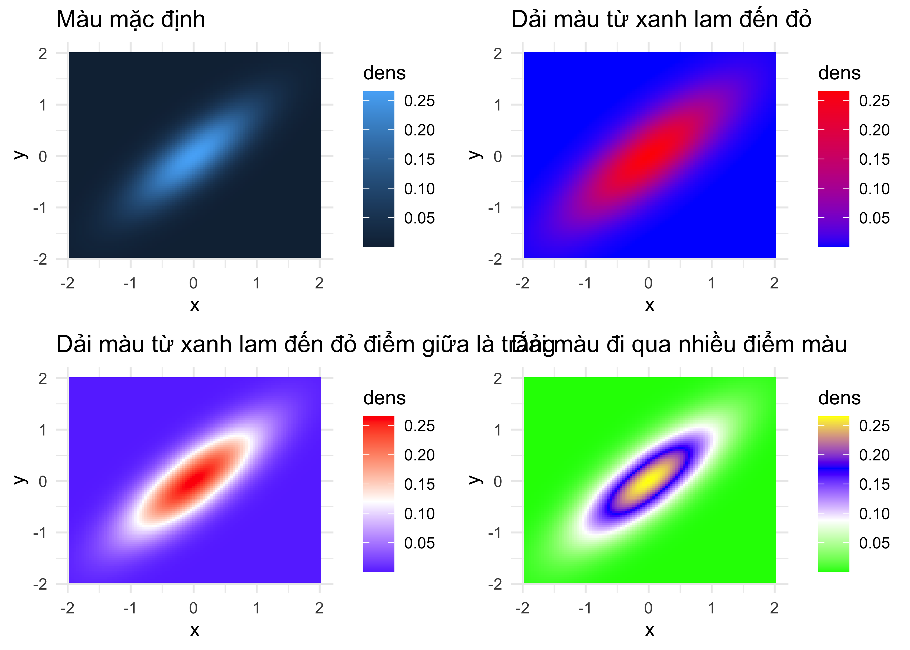
<p class="caption">(\#fig:fgggplot34)Hàm mật độ của biến ngẫu nhiên phân phối chuẩn hai chiều với hệ số tương quan bằng 0.8. Hình góc trên bên trái: dải màu liên tục mặc định của ggplot2. Hình góc trên bên phải: dải màu liên tục bắt đầu từ xanh dương kết thúc ở đỏ. Hình góc dưới bên trái: dải màu liên tục bắt đầu tư xanh dương đi qua màu trắng và kết thúc ở màu đỏ. Hình góc dưới bên phải: dải màu liên tục bắt đầu từ xanh lá cây đi qua trắng, xanh dương và kết thúc ở màu vàng</p>
</div>

Cả ba hàm số kể trên đều nội suy tuyến tính trong không gian màu Lab để tạo ra các giải màu liên tục. Khi nói đến nội suy tuyến tính giữa hai màu sắc, sẽ dễ hiểu nếu chúng ta sử dụng không gian RGB mà tất cả các màu đều nằm trong một hình lập phương với điểm (0,0,0) là màu đen, (1,1,1) là màu trắng... Bạn đọc có thể hiểu như sau: trong mỗi không gian mỗi màu sắc hiển thị có ba thành phần là cường độ màu đỏ (r), cường độ màu xanh lá (g) cường độ màu xanh lam (b) ... Một dải màu bao gồm $n$ màu, bắt đầu từ màu $m_1$ bao gồm các thành phần $(r_1, g_1, b_1)$, đến màu $m_n$ với thành phần $(r_n, g_n, b_n)$ sẽ là các màu $m_i$ có các thành phần tương ứng
\begin{align}
r_i = \left[r_1 + (i-1) * \cfrac{r_n - r_1}{(n-1)} \right] \\
g_i = \left[g_1 + (i-1) * \cfrac{g_n - g_1}{(n-1)} \right] \\
b_i = \left[b_1 + (i-1) * \cfrac{b_n - b_1}{(n-1)} \right]
\end{align}

Đáng tiếc là trong không gian Lab việc nội suy màu sắc không đơn giản như vậy. Việc nội suy dựa trên các tính toán phức tạp và kết quả cuối cùng là các công thức gần đúng. Ưu điểm của nội suy màu sắc trong không gian Lab so với không gian RGB sự chuyển đổi màu sắc giữa các điểm mượt mà hơn rất nhiều trong cách nhận biết màu sắc của con người.

Hàm số để nội suy một véc-tơ màu rời rạc từ hai màu sắc bất kỳ trên không gian RGB hoặc không gian Lab là hàm `colorRampPalette()` của thư viện $\textbf{grDevices}$. Ví dụ, chúng ta nội suy một véc-tơ màu bắt đầu từ màu xanh dương và kết thúc ở màu cam như sau

```r
n<-200
my_rgb_palette<-colorRampPalette(c("blue", "orange"),space = "rgb")(n+1)
my_lab_palette<-colorRampPalette(c("blue", "orange"),space = "Lab")(n+1)
```

Để so sánh cách nội suy dải màu trên không gian RGB và không gian Lab, chúng ta sẽ sử dụng hai dải màu kể trên mô tả hàm mật độ xác suất của biến phân phối chuẩn hai chiều. Do các hàm `scale_fill_gradient()` luôn nội suy trên không gian Lab nên để hiển thị dải màu RGB, chúng tôi rời rạc hóa giá trị mật độ hàm mật độ trước khi ánh xạ đến dải màu rời rạc được tạo ra từ hàm `colorRampPalette()`


```r
x<-rep(1:n,n)/n*4-2
y<-sort(x, decreasing = FALSE)
rho<-0.8
dat0<-data.frame(x=x,y=y,dens = 1/(2*pi*sqrt(1-rho^2)) * exp(-(x^2+y^2-2*rho*x*y)/(1-rho^2)))
h<-(max(dat0$dens)-min(dat0$dens))/n
dat0<-mutate(dat0,dens.d = round((dens - min(dat0$dens))/h))
dat0$dens.d<-as.factor(dat0$dens.d)

mycol<-colorRampPalette(c("blue", "orange"),space = "rgb")(n+1)
p1<-dat0%>%ggplot(aes(x,y,fill=dens.d))+geom_raster()+theme_minimal()+
  scale_fill_manual(values= mycol)+
  theme(legend.position = "none")+
  ggtitle("Nội suy trên RGB")

mycol<-colorRampPalette(c("blue", "orange"),space = "Lab")(n+1)
p2<-dat0%>%ggplot(aes(x,y,fill=dens.d))+geom_raster()+theme_minimal()+
  scale_fill_manual(values= mycol)+
  theme(legend.position = "none")+
  ggtitle("Nội suy trên Lab")
grid.arrange(p1,p2,ncol=2,nrow=1)
```

<div class="figure">
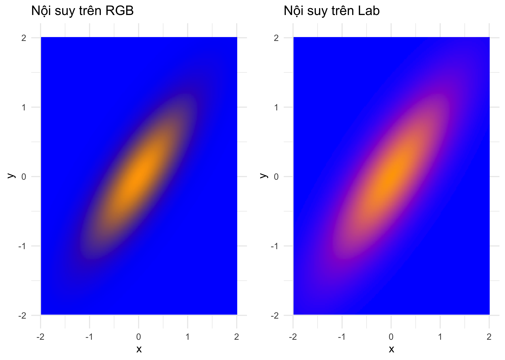
<p class="caption">(\#fig:fgggplot35)Hàm mật độ của biến ngẫu nhiên phân phối chuẩn hai chiều với hệ số tương quan bằng 0.8. Hình bên trái: dải màu nội suy trên không gian RGB. Hình bên phải: dải màu nội suy trên không gian Lab</p>
</div>

Cả hai hình đều sử dụng dải màu liên tục từ xanh dương đến cam để mô tả mật độ của phân phối chuẩn hai chiều có hệ số tương quan $\rho=0.8$. Bạn đọc có thể thấy rằng việc chuyển hóa màu sắc trên không gian màu Lab tự nhiên với mắt quan sát hơn so với không gian RGB. Đây là lý do tại sao các dải màu liên tục của thư viện $\textbf{ggplot2}$ luôn sử dụng không gian Lab để nội suy màu sắc.

Các tham số `limits`, `breaks`, và `label` cũng có thể được sử dụng trong các hàm `scale_fill_*()` và `scale_color_*()` để kiểm soát các thang màu liên tục. Tham số `limits` nhận giá trị là một véc-tơ hai phần tử, phần tử thứ nhất cho biết màu sắc bắt đầu trong thang màu tương ứng với giá trị nào trong biến liên tục và phần tử thứ hai cho biết màu sắc kết thúc của thang màu ứng với giá trị nào của biến liên tục. Trong khi các tham số `breaks` và `labels` được sử dụng để thay đổi giá trị trên thang màu của chú giải.


```r
# limits cho biết hai giá trị tương ứng với điểm đầu và cuối của dải màu
p1<-p + scale_fill_gradient(low = "blue", high = "orange",
                            limits = c(0,0.8))+
  ggtitle("Tham số limits")
# breaks cho biết các giá trị nào xuất hiện trên chú giải
# labels cho biết giá trị hiển thị trong chú giải
p2<-p + scale_fill_gradient(low = "blue", high = "orange",
                            limits = c(0,0.3),
                            breaks = c(0.1,0.15,0.25),
                            labels = paste("Density at", c(0.1,0.15,0.25)))+
  ggtitle("Tham số breaks và labels")
grid.arrange(p1,p2,nrow=1,ncol=2)
```

<div class="figure">

<p class="caption">(\#fig:fgggplot36)Hàm mật độ của biến ngẫu nhiên phân phối chuẩn hai chiều với hệ số tương quan bằng 0.8. Hình bên trái: sử dụng tham số limits trong scale_fill_gradient. Hình bên phải: sử dụng limits, breaks và labels trong scale_fill_gradient</p>
</div>

Đồ thị bên trái của Hình \@ref(fig:fgggplot36) sử dụng giá trị của tham số `limits` là từ 0 đến 0.8 trong khi giá trị lớn nhất của các hàm mật độ chỉ khoảng 0.3. Màu bắt đầu của dải màu là màu xanh dương tương ứng với giá trị thứ nhất của tham số `limits` là 0 và màu kết thúc của dải màu là màu cam tương ứng với giá trị thứ hai của tham số limit là 0.8. Điều này giải thích tại sao cả các giá trị nằm trong tâm của hình ellipse màu sắc cũng chưa chuyển thành màu cam. Đồ thị bên phải của Hình \@ref(fig:fgggplot36) sử dụng tham số `limits` từ 0 đến 0.3 nên các giá trị càng nằm gần tâm đường ellipse càng chuyển sang màu cam. Tham số `breaks` thay đổi các vị trí giải thích thang màu trên chú giải của thuộc tính màu sắc, trong khi tham số `labels` kiểm soát cách hiển thị tại các vị trí trên thang màu.

#### Dải màu rời rạc
Dải màu rời rạc dùng để mô tả thuộc tính thẩm mỹ màu sắc khi ánh xạ đến các biến rời rạc. Hàm số dùng để kiểm soát màu sắc rời rạc của thư viện $\textbf{ggplot2}$ là các hàm `scale_fill_discrete()` và `scale_color_discrete()`. Mỗi khi sử dụng các hàm số kể trên, thư viện $\textbf{ggplot2}$ sẽ mặc định sử dụng dải màu rời rạc cách đều nhau trong không gian màu HCL. Dải màu mặc định này có cùng sắc độ (Chromes hay còn gọi là tham số $c$), độ sáng (Luminance hay còn gọi là tham số $l$) và giá trị $h$ cách đều nhau từ góc 15 độ ($h$ nhận giá trị từ 0 đến 360 độ). Bạn đọc muốn sử dụng các dải màu rời rạc trong không gian HCL để ánh xạ tới biến rời rạc thì có thể sử dụng các hàm `scale_fill_hue()` và `scale_color_hue()` thay thể cho `scale_fill_discrete()` và `scale_color_discrete()`.


```r
p1<-gapminder%>%filter(year==2011)%>%
  ggplot(aes(continent,fill=continent))+
  geom_bar()+ggtitle("Màu rời rạc mặc định")+
  theme_minimal()
p2<-gapminder%>%filter(year==2011)%>%
  ggplot(aes(continent,fill=continent))+geom_bar()+
  scale_fill_hue(h=c(0,360)+15+360/5)+
  ggtitle("Thay đổi tham số h")+theme_minimal()
p3<-gapminder%>%filter(year==2011)%>%
  ggplot(aes(continent,fill=continent))+geom_bar()+
  scale_fill_hue(c=30)+ggtitle("Thay đổi tham số c")+theme_minimal()
grid.arrange(p1,p2,p3,nrow=1,ncol=3)
```

<div class="figure">

<p class="caption">(\#fig:fgggplot37)Mô tả phân phối của biến continent trong dữ liệu Gapminder năm 2011. Hình bên trái: Sử dụng dải màu rời rạc mặc định. Hình ở giữa: sử dụng dải màu rời rạc trong không gian HCL với tham số h thay đổi. Hình bên phải: sử dụng dải màu rời rạc trong không gian HCL với tham số c thay đổi</p>
</div>

Dải màu mặc định đối với biến rời rạc sử dụng tham số $c$ bằng 100 và tham số $l$ bằng 65 trong khi tham số $h$ nhận các giá trị cách đều nhau, bắt đầu từ $h = 15$ (độ). Lưu ý rằng $h$ nhận giá trị từ 0 độ đến 360 độ nên trong trường hợp biến rời rạc có năm giá trị, các màu sắc sẽ lần lượt nhận các giá trị $h = 15$, $15 + 360/5$, $15 + 2 \times 360/5$, $15 + 3 \times 360/5$ và $15 + 4 \times 360/5$. Đó là màu sắc của các thanh trong đồ thị bên trái của Hình \@ref(fig:fgggplot37) theo thứ tự từ trái qua phải. Trong đồ thị ở giữa, khi chúng ta sử dụng tịnh tiến giá trị $h$ thêm 360/5 (độ), chúng ta có thể thấy các màu sắc bắt đầu từ $h = 15 + 360/5$ và kết thúc ở $h = 15$. Nghĩa là màu sắc thứ nhất trong đồ thị bên trái đã trở thành màu thứ năm trong đồ thi ở giữa. Trong đồ thị bên phải, chúng tôi giảm độ chói (tham số $c$) xuống còn 40. Chúng ta có thể thấy dải màu vẫn tương tự như hai đồ thị còn lại nhưng không đạt được độ sáng như vậy.

Bạn đọc cũng có thể sử dụng các dải màu rời rạc được thiết kế sẵn cho mục đích trực quan hóa các biến rời rạc. Dải màu rời rạc mà chúng tôi thường sử dụng là dải màu brewer. Những dải màu này được thiết kế để hoạt động tốt trong nhiều tình huống khác nhau kể cả đối với những người khó khăn khi nhận biết màu sắc hay khi sử dụng để hiển thị trên những bề mặt lớn. Hàm số để kiểm soát ánh xạ thẩm mỹ màu sắc sử dụng dải màu brewer là `scale_color_brewer()` và `scale_fill_brewer()`. Bạn đọc cần cài đặt thư viện $\textbf{RColorBrewer}$ để sử dụng được các hàm này. Để xem các dải màu có sẵn trong thư viện này, bạn đọc sử dụng câu lệnh sau

```r
display.brewer.all()
```

Tham số `palette` trong hàm `scale_color_brewer()` được sử dụng để lựa chọn dải màu:

```r
p1<-gapminder%>%filter(year==2011)%>%
  ggplot(aes(continent,fill=continent))+geom_bar()+
  scale_fill_brewer(palette = "Dark2")+
  ggtitle("Sử dụng dải màu Dark2")+
  theme_minimal()
p2<-gapminder%>%filter(year==2011)%>%
  ggplot(aes(continent,fill=continent))+geom_bar()+
  scale_fill_brewer(palette = "Set1")+
  ggtitle("Sử dụng dải màu Set1")+
  theme_minimal()
p3<-gapminder%>%filter(year==2011)%>%
  ggplot(aes(continent,fill=continent))+geom_bar()+
  scale_fill_brewer(palette = "Spectral")+
  ggtitle("Sử dụng dải màu Spectral")+
  theme_minimal()
grid.arrange(p1,p2,p3,nrow=1,ncol=3)
```

<div class="figure">

<p class="caption">(\#fig:fgggplot38)Mô tả phân phối của biến continent trong dữ liệu Gapminder năm 2011 sử dụng dải màu brewer. Hình bên trái: sử dụng dải màu Dark2. Hình ở giữa: sử dụng dải màu Set1. Hình bên phải: sử dụng dải màu Spectral</p>
</div>

Để tạo ra dải màu rời rạc theo ý muốn bạn đọc sử dụng các hàm `scale_fill_manual()` và `scale_color_manual()`. Tham số `values` được sử dụng để nhận giá trị là véc-tơ chứa màu sắc mà bạn đọc tự tạo. Số lượng phần tử trong véc-tơ phải tương ứng với số lượng phần tử trong biến rời rạc.

Như chúng tôi đã giới thiệu trong phần dải màu sắc liên tục, hàm số `colorRampPalette()` của thư viện $\textbf{grDevices}$ có thể được sử dụng để nội suy ra một véc-tơ màu rời rạc giữa hai giá trị màu cho trước. Ví dụ, để tạo ra một véc-tơ có độ dài 5, mỗi giá trị là một màu sắc được nội suy tuyến tính từ màu xanh dương đến màu cam chúng ta sử dụng `colorRampPalette()` như sau:

```r
# nội suy trong RGB
mypalette1<-colorRampPalette(c("blue","orange"), space = "rgb")(5)
# nội suy trong Lab
mypalette2<-colorRampPalette(c("blue","orange"), space = "Lab")(5)
```

Các đồ thị trong Hình sử dụng các véc-tơ màu sắc rời rạc tự định nghĩa bằng cách liệt kê các màu sắc trong `scale_fill_manual()` và bằng nội suy tuyến tính trong không gian RGB và không gian Lab.

```r
p1<-gapminder%>%filter(year==2011)%>%
  ggplot(aes(continent,fill=continent))+geom_bar()+
  scale_fill_manual(values = c("blue","green","grey","yellow","orange"))+
  ggtitle("Màu tự định nghĩa")+
  theme_minimal()
p2<-gapminder%>%filter(year==2011)%>%
  ggplot(aes(continent,fill=continent))+geom_bar()+
  scale_fill_manual(values = mypalette1)+
  ggtitle("Màu nội suy trong RGB")+
  theme_minimal()
p3<-gapminder%>%filter(year==2011)%>%
  ggplot(aes(continent,fill=continent))+geom_bar()+
  scale_fill_manual(values = mypalette2)+
  ggtitle("Màu nội suy trong Lab")+
  theme_minimal()
grid.arrange(p1,p2,p3,nrow=1,ncol=3)
```

<div class="figure">

<p class="caption">(\#fig:fgggplot39)Mô tả phân phối của biến continent trong dữ liệu Gapminder năm 2011 sử dụng dải màu tự định nghĩa. Hình bên trái: dải màu tự định nghĩa bằng cách liệt kê tên các màu sắc. Hình ở giữa: nội suy trong không gian RGB giữa xanh dương và cam. Hình bên phải: nội suy trong không gian Lab giữa xanh dương và cam</p>
</div>

Cách sử dụng tham số `limits`, `breaks`, và `label` trong các hàm `scale_fill_manual()` và `scale_color_manual()` cũng tương tự như đối với dải màu liên tục.

- Tham số `limits` cho biết các giá trị nào trong biến rời rạc được ánh xạ tới dải màu sắc. 

- Tham số `breaks` cho biết các giá trị nào không được sử dụng trong ánh xạ thẩm mỹ. 

- Tham số `label` cho biết cách các màu sắc hiển thị trong phần chú giải. 

Theo kinh nghiệm của chúng tôi thì tham số `breaks` không có nhiều ý nghĩa khi sử dụng đối với dải màu sắc rời rạc, trong khi tham số `limits` có ý nghĩa quan trọng khi bạn đọc cần cố định ánh xạ màu sắc lên biến rời rạc khi vẽ nhiều biểu đồ khác nhau và để kiểm soát thứ tự xuất hiện của biến liên tục trên đồ thị. 


```r
p1<-gapminder%>%filter(year==1960, continent == "Asia")%>%
  arrange(-population)%>%head(10)%>%
  ggplot(aes(fill=country))+
  geom_bar(aes(x = population, y = reorder(country,population)),
           stat="identity",col="blue", alpha = 0.7)+
  ylab("")+ggtitle("Năm 1960")+theme_minimal()+
  theme(legend.position = "top")+
  scale_x_continuous(labels = scales::comma)+
  scale_fill_manual(values = c("blue","red","yellow"), limits = c("Philippines","Vietnam", "Indonesia"))
p2<-gapminder%>%filter(year==2011, continent == "Asia")%>%
  arrange(-population)%>%head(10)%>%
  ggplot(aes(fill=country))+
  geom_bar(aes(x = population, y = reorder(country,population)),
           stat="identity",col="blue", alpha = 0.7)+
  ylab("")+ggtitle("Năm 2010")+theme_minimal()+theme(legend.position = "top")+
  scale_x_continuous(labels = scales::comma)+
  scale_fill_manual(values = c("blue","red","yellow"), limits = c("Philippines","Vietnam", "Indonesia"))

grid.arrange(p1,p2,nrow=1,ncol=2)
```

<div class="figure">
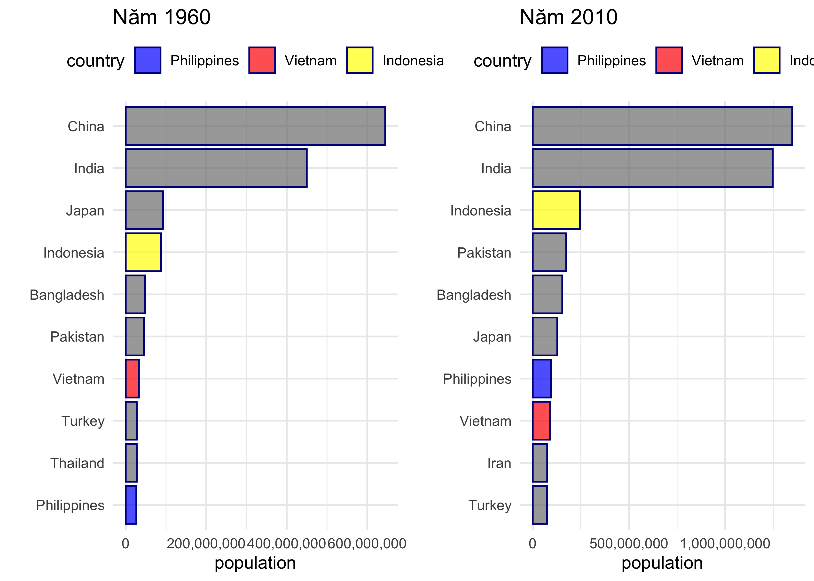
<p class="caption">(\#fig:fgggplot40)Dân số của ba nước Philippines, Việt Nam, và Indonesia trong top 10 nước đông dân nhất châu Á. Hình bên trái: Dữ liệu năm 1960. Hình bên phải: Dữ liệu năm 2011</p>
</div>

Chúng ta sử dụng tham số `limits` để cố định màu sắc tương ứng với các giá trị của biến rời rạc như trong Hình \@ref(fig:fgggplot40). Bạn đọc có thể dễ dàng nhận ra sự thay đổi về thứ hạng về quy mô dân số của ba 3 quốc gia Philippines, Việt Nam, và Indonesia trong nhóm 10 nước có dân số lớn nhất châu Á trong các năm 1960 và 2010.

### Các thuộc tính thẩm mỹ khác
Ngoài vị trí trên các trục tọa độ và màu sắc, còn có một số thuộc tính thẩm mỹ khác mà thư viện $\textbf{ggplot2}$ có thể sử dụng để mô tả dữ liệu. Trong phần này, chúng ta sẽ xem xét thuộc tính kích thước (size), hình dạng (shape), chiều rộng của line và kiểu line, sử dụng cùng với các thuộc tính vị trí và màu sắc để thể hiện tốt nhất các biến trong dữ liệu. Ngoài đề cập đến các giá trị mặc định, chúng tôi cũng sẽ thảo luận về các hàm số để bạn đọc có thể sử dụng để kiểm soát tốt các thuộc tính này.

#### Thuộc tính thẩm mỹ kích thước
Thuộc tính thẩm mỹ kích thước thường được sử dụng để mô tả hình dạng đồ họa kiểu điểm hoặc ký tự. Như chúng tôi đã đề cập trong phần giới thiệu, thuộc tính kích thước thường được sử dụng với biến liên tục. Nếu không có hàm kiểm soát ánh xạ thẩm mỹ, bán kính của điểm tương ứng với giá trị nhỏ nhất luôn là 1 và bán kính của điểm có giá trị lớn nhất luôn là 6, nghĩa là có bán kính gấp 6 lần bán kính của điểm nhỏ nhất. Khi nội suy ra kích thước của các điểm khác, thư viện $\textbf{ggplot2}$ mặc định cho kích thước của điểm là diện tích của hình tròn mô tả điểm đó chứ không phải đường kính của hình tròn. Kích thước của điểm sẽ phụ thuộc vào thứ hạng (rank) của giá trị đó trong biến liên tục chứ không được tính bằng giá trị thực của điểm đó. Nếu $area_m$ là diện tích của hình tròn tương ứng với giá trị nhỏ nhất và $area_M$ tương ứng với diện tích của hình tròn tương ứng với giá trị lớn nhất thì diện tích của hình tròn tương ứng với giá trị có thứ hạng $k$ trong tổng số $n$ giá trị của biến liên tục là
\begin{align}
area = area_m + (k-1) \times \cfrac{area_M - area_m}{n - 1}
\end{align}

Để hiểu về cách thư viện $\textbf{ggplot2}$ ánh xạ kích thước đến giá trị các biến, bạn đọc có thể quan sát kích thước của các hình tròn trong Hình \@ref(fig:fgggplot41)

```r
dat0<-data.frame(x=1:3,y=1:3,z=1:3)
# Hình bên trái
p1<-dat0%>%ggplot(aes(x,y,size=z))+geom_point(shape=21,fill= "blue",alpha = 0.5)+
  theme(legend.position = "none")
# Hình ở giữa
p2<-dat0%>%ggplot(aes(x,y,size=z^2))+geom_point(shape=21,fill= "blue",alpha = 0.5)+
  theme(legend.position = "none")
# Hình bên phải
p3<-dat0%>%filter(z>1)%>%ggplot(aes(x,y,size=z))+geom_point(shape=21,fill= "blue",alpha = 0.5)+
  theme(legend.position = "none")
grid.arrange(p1,p2,p3,ncol=3,nrow=1)
```

<div class="figure">

<p class="caption">(\#fig:fgggplot41)Ánh xạ các số tự nhiên đến thuộc tính thẩm mỹ kích thước. Hình bên trái: ánh xạ các số 1, 2, 3 đến kích thước ba hình tròn. Hình ở giữa: ánh xạ bình phương của 1, 2, 3 đến kích thước các hình tròn. Hình bên phải: ánh xạ hai số 2 và 3 đến kích thước của hai hình tròn.</p>
</div>

Từ Hình \@ref(fig:fgggplot41) có thể thấy rằng:

- Đồ thị bên trái: kích thước của các hình tròn ở các tọa độ (1,1), (2,2), và (3,3) được ánh xạ đến các giá trị số 1, 2, và 3. Tham số mặc định của hàm `scale_size_*()` là `range = c(1,6)` nên hình tròn tại vị trí (1,1) có bán kính là 1 trong khi hình tròn ở vị trí (3,3) có bán kính là 6.  Diện tích của hình tròn nằm ở tọa độ (2,2) bằng trung bình cộng diện tích của hình tròn nằm ở vị trí (1,1) và (3,3). Do diện tích của hình tròn nằm ở vị trí (3,3) bằng $6^2 = 36$ lần diện tích của hình tròn tại vị trí $(1,1)$ nên diện tích của hình tròn tại (2,2) bằng $\cfrac{36+1}{2} = 18,5 \textit{(lần)}$ diện tích hình tròn tại tọa độ (1,1), hay nói cách khác đường kính của hình tròn tại vị trí (2,2) bằng $\sqrt{18,5} \sim 4,3 \text{ (lần)}$ đường kính của hình tròn tại vị trí (1,1). 

- Đồ thị ở giữa: chúng ta ánh xạ thuộc tính thẩm mỹ kích thước với $z^2$, nghĩa là $1^2$, $2^2$, và $3^2$ thì kích thước các hình tròn xuất hiện vẫn không hề thay đổi so với hình bên trái. Nguyên nhân là thư viện $\textbf{ggplot2}$ sử dụng thứ hạng của các giá trị trong véc-tơ số chứ không sử dụng giá trị thực. Thứ hạng của $1^2$, $2^2$, và $3^2$ vẫn là 1, 2, và 3 nên kích thước của các hình xuất hiện vẫn không thay đổi

- Đồ thị bên phải: khi chúng ta chỉ vẽ hai điểm tại vị trí (2,2) và (3,3) với kích thước được ánh xạ vào hai số là 2 và 3 thì diện tích hình tròn nhỏ nhất và hình tròn lớn nhất vẫn không thay đổi.

Hàm số dùng để kiểm soát giá trị của ánh xạ thẩm mỹ kích thước là hàm `scale_size()`. Để thay đổi miền giá trị của thuộc tính kích thước, chúng ta sử dụng tham số `range`.


```r
dat0<-data.frame(x=1:3,y=1:3,z=1:3)
# Hình bên trái
p1<-dat0%>%ggplot(aes(x,y,size=z))+
  geom_point(shape=21,fill= "blue",alpha = 0.5)+
  theme(legend.position = "none")+
  theme_minimal()+ggtitle("Không sử dụng scale_size")
# Hình bên phải
p2<-dat0%>%ggplot(aes(x,y,size=z))+
  geom_point(shape=21,fill= "blue",alpha = 0.5)+
  scale_size(range=c(6,24))+
  theme(legend.position = "none")+
  theme_minimal()+ggtitle("Sử dụng scale_size với range = (6,24)")
grid.arrange(p1,p2,ncol=2,nrow=1)
```

<div class="figure">

<p class="caption">(\#fig:fgggplot42)Ánh xạ các số tự nhiên đến thuộc tính thẩm mỹ kích thước. Hình bên trái: ánh xạ các số 1, 2, 3 đến kích thước ba hình tròn. Hình bên phải: sử dụng scale_size để hình nhỏ nhất có bán kính bằng 6 và hình lớn nhất có bán kính bằng 24.</p>
</div>

Hình \@ref(fig:fgggplot42) mô tả cách sử dụng tham số `range` trong hàm `scale_size()`. 

- Đồ thị bên trái: bán kính của hình nhỏ nhất là 1, của hình lớn nhất là 6. 

- Đồ thị bên phải: bán kính của hình nhỏ nhất là 6 bằng với kích thước của hình lớn nhất của đồ thị bên trái. Và bán kính của hình lớn nhất là 24. Mặc dù tham số khai báo với `range` là bán kính của các hình, nhưng khi nội suy kích thước các hình có kích thước nằm giữa hình nhỏ nhất và hình lớn nhất, `scale_size()` lại luôn nội suy theo diện tích của các hình.

Trong trường hợp bạn đọc muốn sử dụng nội suy theo bán kính của điểm thay vì diện tích, hãy sử dụng hàm `scale_radius()` thay thế cho `scale_size()`. Hình \@ref(fig:fgggplot43) mô tả sự khác nhau khi sử dụng `scale_size()` và `scale_radius()`:


```r
dat0<-data.frame(x=1:3,y=1:3,z=1:3)
# Hình bên trái
p1<-dat0%>%ggplot(aes(x,y,size=z))+
  geom_point(shape=21,fill= "blue",alpha = 0.5)+
  theme(legend.position = "none")+
  scale_size(range = c(1,7))

p2<-dat0%>%ggplot(aes(x,y,size=z))+
  geom_point(shape=21,fill= "blue",alpha = 0.5)+
  scale_radius(range=c(1,7))+
  theme(legend.position = "none")
# Hình bên phải
p3<-dat0%>%ggplot(aes(x,y,size=z))+
  geom_point(shape=21,fill= "blue",alpha = 0.5)+
  scale_radius(range=c(4,10))+
  theme(legend.position = "none")
grid.arrange(p1,p2,p3,ncol=3,nrow=1)
```

<div class="figure">

<p class="caption">(\#fig:fgggplot43)Sự khác nhau giữa ánh xạ kích thước bằng scale_size và scale_radius. Hình bên trái: sử dụng scale_size với range = c(1,7). Hình ở giữa: sử dụng scale_radius với range = c(1,7). Hình bên phải: sử dụng scale_size với range = c(4,10)</p>
</div>

- Đồ thị bên trái sử dụng scale theo diện tích và bán kính hình tròn lớn nhất bằng 7 lần đường tròn nhỏ; hình tròn ở giữa có bán kính bằng $\sqrt{\cfrac{7^2+1^2}{2}} = 5 \text{ (lần)}$ bán kính hình tròn nhỏ nhất. 

- Đồ thị ở giữa, do scale theo bán kính hình tròn nên hình ở giữa có bán kính bằng $\cfrac{7+1}{2} = 4 \textit{ (lần)}$ bán kính hình tròn nhỏ. Bạn đọc có thể thấy rằng kích thước của hình tròn ở vị trí (2,2) trong đồ thị ở giữa nhỏ hơn hình tròn ở vị trí tương ứng trong hình bên trái.

- Trong đồ thị bên phải, bán kính của hình nhỏ nhất là 4, của hình tròn lớn nhất là 10, nên bán kính hình ở giữa là $\cfrac{4+10}{2} = 7$ do nội suy bằng hàm `scale_radius()`. Bạn đọc có thể thấy rằng kích thước của hình ở vị trí (2,2) của đồ thị này bằng với kích thước của hình tròn ở vị trí (3,3) của hình ở giữa.

Các tham số `limits`, `breaks`, và `label` được sử dụng tương tự như thuộc tính thẩm mỹ màu sắc:

- Tham số `limits` cho biết miền giá trị nào của biến được ánh xạ đến thuộc tính thẩm mỹ size. 

- Tham số `breaks` cho biết các giá trị nào của kích thước nào xuất hiện trên chú giải.

- Tham số `labels` mô tả thuộc tính thẩm mỹ kích thước trên chú giải của đồ thị.


```r
dat%>%
  ggplot(aes(infant_mortality,life_expectancy, size = population))+
  geom_point(shape = 21, fill = "blue",alpha = 0.5)+
  scale_size(range = c(1,12),
             limits = c(10^7,max(gapminder$population)),
             breaks = c(10^8,2*10^8,5*10^8,10^9),
             labels = c(paste(c(10^8,2*10^8,5*10^8)/10^6,"triệu"), "Một tỷ"))
```

<div class="figure">

<p class="caption">(\#fig:fgggplot44)Tuổi thọ trung bình và tỷ lệ trẻ sơ sinh tử vong của các quốc gia trên thế giới năm 2011</p>
</div>
Hình \@ref(fig:fgggplot44) mô tả ba biến liên tục là tuổi thọ trung bình, tỷ lệ trẻ sơ sinh tử vong và dân số của các quốc gia trên thế giới vào năm 2011. Biến dân số được ánh xạ đến thuộc tính thẩm mỹ kích thước của các điểm. Ánh xạ này được điều chỉnh bằng hàm `scale_size()` như sau

- Tham số `range = c(1,12)` cho biết bán kính của hình tròn tương ứng với nước có dân số nhỏ nhất bằng 1 và bán kính của hình tròn tương ứng với nước có dân số lớn nhất là 12.

- Tham số `limits` cho biết chỉ các nước có dân số 10 triệu trở lên được đưa vào trong đồ thị.

- Tham số `breaks` cho biết các giá trị xuất hiện trên chú giải là các giá trị 100 triệu, 200 triệu, 500 triệu và 1 tỷ.

- Tham số `labels` cho biết các số viết trên chú giải sử dụng cách viết giá trị lên chú giải là theo đơn vị triệu.


#### Thuộc tính thẩm mỹ hình dạng
Hình dạng thường được sử dụng để mô tả một biến rời rạc có không quá nhiều giá trị riêng biệt. Theo kinh nghiệm của chúng tôi thì hình dạng chỉ nên sử dụng với các biến có nhỏ hơn năm giá trị riêng biệt. Mặc dù thư viện $\textbf{ggplot2}$ cho phép sử dụng lên đến hơn 20 hình dạng khác nhau, nhưng sử dụng nhiều hơn hoặc bằng năm hình dạng trong một đồ thị sẽ làm cho đồ thị trở nên rắc rối và khó khăn khi nhận diện. Tại phiên bản $\textbf{ggplot2}$ mà chúng tôi đang sử dụng, có 25 hình dạng khác nhau có thể dùng để mô tả biến rời rạc. Các hình dạng này được hiển thị bằng cách thiết lập tham số tương ứng với 25 số tự nhiên từ 1 đến 25 được mô tả trong Hình \@ref(fig:fgggplot45)


```r
dat0<-data.frame(x=c(rep(1:10,2),1:5),y = c(rep(3,10),rep(2,10),rep(1,5)), z = 1:25)
dat0%>%ggplot(aes(x,y,shape=as.factor(z)))+geom_point(size=3)+
  scale_shape_manual(values = 1:25)+theme_classic()+geom_text(aes(label=z),vjust=-1)+
  theme(legend.position = "none")+
  theme_void()
```

<div class="figure">
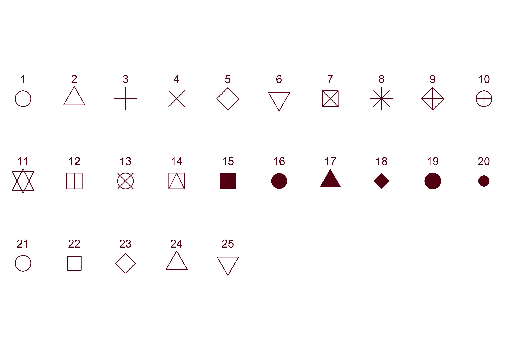
<p class="caption">(\#fig:fgggplot45)Các hình dạng có thể được sử dụng trong trực quan hóa dữ liệu của thư viện ggplot2</p>
</div>

Bạn đọc cần lưu ý rằng có một số hình dạng trông giống nhau nhưng lại có thuộc tính thẩm mỹ khác nhau. Chẳng hạn như hình dạng tương ứng với số 1 là một điểm hình tròn với thuộc tính thẩm mỹ `color` là màu sắc của toàn bộ hình tròn đó, trong khi hình dạng tương ứng với số 21 có thuộc tính thẩm mỹ `color` là màu viền bên ngoài của hình tròn và thuộc tính thẩm mỹ `fill` mới là màu sắc bên trong hình tròn.

Để kiểm soát ánh xạ thẩm mỹ đến thuộc tính hình dạng, bạn đọc sử dụng hàm `scale_shape_manual()`. Cách sử dụng hàm này như sau:

```r
gapminder%>%filter(year==2011, continent == "Asia")%>%
  ggplot(aes(gdp/population,life_expectancy, shape = region))+
  geom_point()+
  scale_x_continuous(trans="log10")+
  scale_shape_manual(values=c(21:24,8) )+
  theme_minimal()
```

<div class="figure">

<p class="caption">(\#fig:fgggplot46)Thu nhập bình quân đầu người và tuổi thọ trung bình của các quốc gia châu Á vào năm 2011</p>
</div>

Tham số được sử dụng để gán giá trị cho biến rời rạc đến hình dạng cụ thể là tham số `values` trong hàm  `scale_shape_manual()`. Nhìn chung, ánh xạ biến rời rạc đến thuộc tính thẩm mỹ hình dạng chỉ cho hiệu quả tốt khi dữ liệu không có quá nhiều quan sát và số lượng nhóm nhỏ. Trong trường hợp dữ liệu có nhiều quan sát và biến rời rạc nhận nhiều hơn năm giá trị khác nhau, bạn đọc nên thận trọng khi sử dụng thuộc tính thẩm mỹ này.

#### Kích thước và hình dạng của các đường
Đối với hình dạng đồ họa là các đường được vẽ bằng các hàm như `geom_line()`, `geom_path()` hay `geom_segment()`, chúng ta có thể ánh xạ các biến rời rạc vào độ rộng hoặc hình dạng của đường. Hình dạng và kích thước của các đường được sử dụng tương đương như hình dạng và kích thước của các điểm nên không có nhiều kiến thức để thảo luận trong phần này.

Hình \@ref(fig:fgggplot47) mô tả sự thay đổi của biến tổng thu nhập quốc dân ($gdp$) của ba quốc gia bao gồm Mỹ, Trung Quốc và Nhật Bản theo thời gian từ năm 1960 đến năm 2011 từ dữ liệu $\textbf{gapminder}$ bằng cách sử dụng ba kiểu vẽ đường khác nhau:


```r
gapminder%>%filter(country %in% c("United States", "China", "Japan"), year <= 2011)%>%
  ggplot(aes(x = year,y = gdp/10^9))+
  geom_line(aes(linetype = country))+
  theme_minimal()+
  ylab("GDP in Billion USD")+
  scale_x_continuous(breaks = seq(1960,2010,10))+
  scale_y_continuous(labels = scales::label_comma())
```

<div class="figure">

<p class="caption">(\#fig:fgggplot47)Tổng thu nhập quốc dân của Mỹ, Trung Quốc, và Nhật Bản từ năm 1960 đến 2011</p>
</div>

Hàm số dùng để kiểm soát ánh xạ thẩm mỹ vào hình dạng của các đường là `scale_linetype_manual()`. Thư viện $\textbf{ggplot2}$ có 13 hình dạng cho các đường được đánh số từ 1 đến 13 như Hình \@ref(fig:fgggplot48) dưới đây

<div class="figure">

<p class="caption">(\#fig:fgggplot48)Hình dạng của các đường có thể sử dụng để trực quan hóa dữ liệu trong thư viện ggplot2</p>
</div>

Để các đường có hình dạng như mong muốn, chúng ta gán giá trị tham số `values` trong hàm `scale_linetype_manual()` cho một véc-tơ chứa các số nhận giá trị từ 1 đến 13 tương ứng với hình dạng mà bạn lựa chọn.


```r
gapminder%>%filter(country %in% c("United States", "China", "Japan"), year <= 2011)%>%
  ggplot(aes(x = year,y = gdp/10^9))+
  geom_line(aes(linetype = country))+
  theme_minimal()+
  ylab("GDP in $B")+
  scale_x_continuous(breaks = seq(1960,2010,10))+
  scale_y_continuous(labels = scales::label_comma())+
  scale_linetype_manual(values = c(4,7,12))
```

<div class="figure">

<p class="caption">(\#fig:fgggplot49)Tổng thu nhập quốc dân của Mỹ, Trung Quốc, và Nhật Bản từ năm 1960 đến 2011</p>
</div>

## Tùy chỉnh chú giải của ánh xạ thẩm mỹ
Về mặt hình thức, nếu coi các hàm `scale_*()` như các ánh xạ từ tập hợp các giá trị của biến đến tập hợp các giá trị của thuộc tính thẩm mỹ thì chú giải là ánh xạ ngược từ thuộc tính thẩm mỹ đến miền giá trị của biến. Chú giải cho phép bạn chuyển đổi các thuộc tính trực quan trở lại giá trị của dữ liệu. Giá trị xuất hiện trên các trục tọa độ và các chú giải có cách hiển thị khác nhau nhưng về bản chất lại có cùng một mục đích là cho phép người tiếp nhận quan sát các hình ảnh đồ họa trực quan và ánh xạ chúng trở lại giá trị của dữ liệu. Các cấu phần khác nhau của chú giải được mô tả trong Hình \@ref(fig:fgggplot50)

<div class="figure">

<p class="caption">(\#fig:fgggplot50)Các thành phần và tên gọi của chú giải</p>
</div>

Chú giải có khả năng giải thích tốt hơn giá trị xuất hiện trên các trục tọa độ bởi các nguyên nhân sau

- Chú giải có thể giải thích nhiều biến cùng lúc trong khi giá trị trên trục tọa độ chỉ cho phép một biến.

- Chú giải có thể tùy biến dễ hơn: có thể xuất hiện ở các vị trí theo ý muốn của người xây dựng đồ thị, có thể xuất hiện theo bất kỳ hướng nào.

Bạn đọc hãy lưu ý rằng dù chúng ta không gọi bất kỳ hàm `scale_*()` nào trong các câu lệnh thì mỗi khi vẽ đồ thị, thư viện $\textbf{ggplot2}$ vẫn luôn luôn sử dụng một nhóm hàm `scale_*()` mặc định để ánh xạ từ giá trị của biến đến giá trị của thuộc tính thẩm mỹ. Mỗi khi bạn gọi hàm `scale_*()` để kiểm soát ánh xạ thẩm mỹ, các giá trị mà bạn khai báo sẽ thay thế cho các giá trị mặc định. Trong trường hợp bạn gọi nhiều hàm `scale_*()` tác động đến một thuộc tính thẩm mỹ thì chỉ có hàm `scale_*()` bạn gọi ra sau cùng được sử dụng.


```r
p<-gapminder%>%filter(year==2011,region=="South-Eastern Asia")%>%
  mutate(gdp_per_capita = gdp/population)%>%
  ggplot(aes(reorder(country,gdp_per_capita),gdp_per_capita,fill = country))+
  geom_bar(stat="identity")+
  theme_minimal()
p+scale_y_continuous(name = "Thu nhập bình quân đầu người", labels = scales::label_comma())+
  scale_x_discrete(name = "Country")+
  scale_y_continuous(trans = "sqrt")+
  scale_x_discrete(name = "Quốc gia", labels = c(
    "Vietnam" = "VN",
    "Thailand" = "TL",
    "Timor-Leste" = "Đông Timor"))+
  scale_y_continuous(name = "Thu nhập bình quân đầu người", labels = scales::label_dollar())
```

<div class="figure">

<p class="caption">(\#fig:fgggplot51)Thu nhập bình quân đầu người của các quốc gia Đông Nam Á năm 2011</p>
</div>

Đồ thị trong Hình \@ref(fig:fgggplot51) được vẽ bằng các câu lệnh có các hàm `scale_x_continuous()` được lặp lại 2 lần và `scale_y_continuous()` được lặp lại 3 lần. Quan sát kết quả, bạn đọc có thể thấy rằng chỉ có câu lệnh sau cùng được chấp nhận. Ngoài ra, khi thực thi đoạn lệnh ở trên, thư viện $\textbf{ggplot2}$ đưa ra các cảnh báo về các hàm `scale_*()` đã xuất hiện và sẽ bị thay thế bằng các hàm cùng tên.

Để kiểm soát chú giải của các ánh xạ thẩm mỹ, bạn đọc sử dụng tham số `guide` trong các hàm `scale_*()` tương ứng. Giá trị gán cho tham số `guide` là một trong các hàm số sau đây:

- Hàm `guide_axis()` là hàm số dùng để gán cho tham số `guide` khi chúng ta sử dụng các hàm `scale_*()` nhằm kiểm soát ánh xạ thẩm mỹ đến các trục tọa độ.


```r
gapminder%>%filter(year==2011,region=="Western Europe")%>%
  mutate(gdp_per_capita = gdp/population)%>%
  filter(!is.na(gdp_per_capita))%>%
  ggplot(aes(reorder(country,gdp_per_capita),gdp_per_capita,fill = country))+
  geom_bar(stat="identity")+
  theme_minimal()+
  scale_x_discrete(name = "Country",
                   guide = guide_axis(title = "Quốc gia",
                                      angle = 90))+
  scale_y_continuous(name = "GDP per capita", labels = scales::label_dollar(),
                     guide = guide_axis(title = "Thu nhập bình quân đầu người"))
```

<div class="figure">
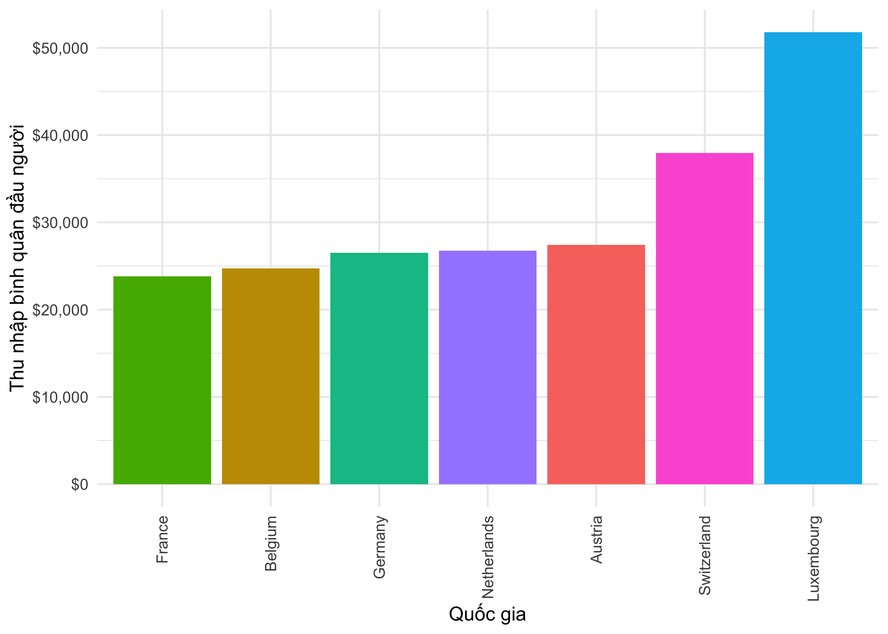
<p class="caption">(\#fig:fgggplot52)Thu nhập bình quân đầu người của các quốc gia Tây Âu năm 2011. Hàm guide_axis được sử dụng để kiểm soát chú giải cho các trục tọa độ x và y</p>
</div>

Bạn đọc có thể thấy rằng tham số `title` trong hàm `guide_axis()` đã thay thế cho tham số `name` trong các hàm `scale_()`. Tham số `angle` cho biết hướng các giá trị xuất hiện trên trục tọa độ. Trong Hình \@ref(fig:fgggplot52), tên các quốc gia trên trục tọa độ x đã được xoay một góc 90 độ. Bạn đọc tham khảo hướng dẫn sử dụng hàm `guide_axis()` để hiểu về các tham số khác như `n.dodge`, `order`, hay `position`.

- Hàm `guide_legend()` là hàm số dùng để gán cho tham số `guide` khi gọi các hàm `scale_*()` kiểm soát ánh xạ từ các biến rời rạc đến màu sắc. Có rất nhiều tham số có thể sử dụng trong hàm số này. Bạn đọc tham khảo hướng dẫn sử dụng hàm để biết đầy đủ các tham số.


```r
gapminder%>%filter(year==2011,region=="South America")%>%
  mutate(gdp_per_capita = gdp/population)%>%
  filter(!is.na(gdp_per_capita))%>%
  ggplot(aes(reorder(country,gdp_per_capita),gdp_per_capita,fill = country))+
  geom_bar(stat="identity")+
  theme_minimal()+
  scale_x_discrete(guide = guide_axis(title = "Quốc gia",angle = 90))+
  scale_y_continuous(labels = scales::label_dollar(),
                     guide = guide_axis(title = "Thu nhập bình quân đầu người"))+
  scale_fill_brewer(palette = "Paired",
                    guide = guide_legend(title = "Quốc gia",title.position = "top",ncol = 2))
```

<div class="figure">

<p class="caption">(\#fig:fgggplot53)Thu nhập bình quân đầu người của các quốc gia Nam Mỹ năm 2011. Hàm guide_legend được sử dụng để kiểm soát chú giải cho ánh xạ thẩm mỹ màu sắc</p>
</div>

- `guide_colorbar()` được dùng khi chú giải cho các ánh xạ từ biến liên tục đến dải màu liên tục

- `guide_bin()` được dùng khi chú giải cho các ánh xạ từ biến liên tục đến thuộc tính thẩm mỹ kích thước (size).

<!-- ## Các kiểu trục tọa độ -->

## Chủ đề và ngữ cảnh của đồ thị
Ngữ cảnh cho phép bạn đọc kiểm soát tốt các cấu phần không ánh xạ đến dữ liệu trong đồ thị như phông chữ, hình nền, vị trí chú giải, ... Sự phân tách giữa các thành các phần có ánh xạ đến dữ liệu và thành phần không ánh xạ đến dữ liệu trong thư viện $\textbf{ggplot2}$ là điểm khác biệt so với đồ họa cơ sở. Trong đồ họa cơ sở hầu hết các hàm đều có một số lượng lớn các tham số số chỉ định cả hình thức dữ liệu và phần không liên quan đến dữ liệu, điều này làm cho các hàm trong đồ thị cơ sở trở nên phức tạp. Thư viện $\textbf{ggplot2}$ tiếp cận theo cách khác: khi tạo đồ thị, bạn xác định cách hiển thị dữ liệu trước, sau đó bạn có thể chỉnh sửa mọi chi tiết không liên quan đến dữ liệu bằng các hàm kiểm soát chủ đề và ngữ cảnh. Để kiểm soát chủ đề và ngữ cảnh của đồ thị, bạn đọc cần nắm vững các nội dung sau:

- Các chủ đề và ngữ cảnh đã được hoàn chỉnh và sẵn có trong thư viện $\textbf{ggplot2}$ và trong các thư viện cài đặt bổ sung, chẳng hạn như $\textbf{ggthemes}$.

- Cách kiểm soát các thành phần của chủ đề và ngữ cảnh như: tiêu đề của đồ thị (kiểu chữ, kích thước, vị trí), cách hiển thị các số trên các trục, cách hiển thị các hình dạng đồ họa trên chú giải, kiểu chữ, kích thước hay vị trí của chú giải...

- Kiểm soát các tùy biến của các hàm dùng để gán giá trị cho các thành phần của chủ đề. Ví dụ như hàm `element_text()` có thể dùng để chỉnh kích thước phông chữ, màu sắc và giao diện của các thành phần văn bản.

- Cách sử dụng hàm `theme()` với một danh sách dài các tùy biến cho phép bạn sao chép lên các thành phần của chủ đề và ngữ cảnh mặc định.

## Tạo đồ thị tương tác

Các đồ thị được vẽ bằng thư viện $\textbf{ggplot2}$ đều là các đồ thị tĩnh. Các đồ thị động hay đồ thị tương tác có lợi thế hơn đồ thị tĩnh ở việc thu hút thị giác của người tiếp nhận và có khả năng mô tả dữ liệu một cách đầy đủ thông tin hơn:

- Các đồ thị dạng động đặc biệt hiệu quả trong việc mô tả sự thay đổi dữ liệu theo thời gian.

- Các đồ thị tương tác cho phép hiển thị thông tin bằng con trỏ, hoặc phóng to, thu nhỏ từng phần của đồ thị. Bạn đọc tránh phải hiển thị quá nhiều thông tin lên đồ thị cùng lúc.

Khuyết điểm lớn nhất của các đồ thị tương tác và các đồ thị động đó là không thể biểu diễn trên các bản in cứng!

Trong phần này của chương sách, chúng tôi sẽ thảo luận về hai thư viện dùng để tạo đồ thị tương tác và đồ thị dạng động là $\textbf{ggiraph}$ và $\textbf{plotly}$. Nếu như $\textbf{ggiraph}$ là thư viện bổ sung cho $\textbf{ggplot2}$ và được xây dựng dựa trên cấu trúc ngữ pháp đồ thị thì $plotly$ là một thư viện độc lập với $\textbf{ggplot2}$ và chuyên được sử dụng để tạo đồ thị dạng động và tương tác.

### Tạo đồ thị tương tác với $\textbf{ggiraph}$
Ưu điểm lớn nhất của thư viện $\textbf{ggiraph}$ đó là các câu lệnh tạo đồ thị cũng được dựa trên ngữ pháp của đồ thị, nghĩa là hoàn toàn tương đồng với các câu lệnh trong thư viện $\textbf{ggplot2}$. Để tạo một đồ thị trong $\textbf{ggiraph}$, bạn đọc chỉ cần thêm các thuộc tính thẩm mỹ của đồ thị tương tác và đồ thị động cùng với các thuộc tính của đồ thị tĩnh mà chúng ta đã làm quen trong thư viện $\textbf{ggplot2}$. Tại thời điểm chúng tôi viết chương sách này, thư viện $\textbf{ggiraph}$ đang ở phiên bản 0.8.7 và hướng dẫn sử dụng ở trong link dưới đây

https://cloud.r-project.org/web/packages/ggiraph/ggiraph.pdf

Trong danh sách các hàm số trong thư viện $\textbf{ggiraph}$, bạn đọc có thể thấy rằng đa số các hàm `geom_*()` của thư viện $\textbf{ggplot2}$ đều có một hàm tương ứng để tạo đồ thị tương tác là `geom_*_interactive()`. Chẳng hạn như hàm `geom_point()` của thư viện $\textbf{ggplot2}$ sẽ có hàm tương ứng trong thư viện $\textbf{ggiraph}$ là `geom_point_interactive()`. Hai cấu phần thẩm mỹ để tạo đồ thị tương tác là $tooltip$ và $data_id$. Tuy nhiên, hàm `geom_point_interactive()` không trực tiếp tạo ra đồ thị tương tác, mà bạn đọc cần lưu đối tượng được tạo bằng hàm số này sau đó thực hiện câu lệnh tạo đồ thị tương tác bằng hàm `girafe()`.

Hình \@ref(fig:fgggplot54) là đồ thị tương tác được vẽ bằng thư viện $\textbf{ggiraph}$ mô tả số vụ sát nhân bằng súng tại Mỹ năm 2010 từ dữ liệu $\textbf{murders}$.


```r
p<-murders %>% ggplot(aes(y = total, x = population)) +
  geom_point_interactive(aes(fill=region,
                             tooltip = paste0("Bang: ", state, "\n Vùng: ", region, "\n Dân số: ", round(population/1000,0)*1000 ),
                             data_id = region),
                         size = 4, shape=21, alpha = 0.8, color = "black") +
  geom_smooth(method = "lm", se = FALSE, linetype = 2, color="grey")+
  scale_x_continuous(trans = "log10", labels = scales::label_comma()) +
  scale_y_log10() +
  scale_fill_brewer(palette = "Dark2",
                    guide = guide_legend(title = "Vùng"))+
  theme_minimal()+
  ggtitle("Số vụ sát nhân bằng súng tại các bang năm 2010")+
  xlab("Dân số")+ylab("Số vụ sát nhân bằng súng")
girafe(ggobj = p)
```

<div class="figure">

```{=html}
<div class="girafe html-widget html-fill-item" id="htmlwidget-1723d7ed00ed02f4c966" style="width:672px;height:480px;"></div>
<script type="application/json" data-for="htmlwidget-1723d7ed00ed02f4c966">{"x":{"html":"<?xml version=\"1.0\" encoding=\"UTF-8\"?>\n<svg xmlns='http://www.w3.org/2000/svg' xmlns:xlink='http://www.w3.org/1999/xlink' class='ggiraph-svg' role='img' id='svg_aed6b87f_a2e4_4dd6_a66f_99c078d79771' viewBox='0 0 504 360'>\n <defs id='svg_aed6b87f_a2e4_4dd6_a66f_99c078d79771_defs'>\n  <clipPath id='svg_aed6b87f_a2e4_4dd6_a66f_99c078d79771_c1'>\n   <rect x='0' y='0' width='504' height='360'/>\n  <\/clipPath>\n  <clipPath id='svg_aed6b87f_a2e4_4dd6_a66f_99c078d79771_c2'>\n   <rect x='43.06' y='23.34' width='358.47' height='304.93'/>\n  <\/clipPath>\n <\/defs>\n <g id='svg_aed6b87f_a2e4_4dd6_a66f_99c078d79771_rootg' class='ggiraph-svg-rootg'>\n  <g clip-path='url(#svg_aed6b87f_a2e4_4dd6_a66f_99c078d79771_c1)'>\n   <rect x='0' y='0' width='504' height='360' fill='#FFFFFF' fill-opacity='1' stroke='#FFFFFF' stroke-opacity='1' stroke-width='0.75' stroke-linejoin='round' stroke-linecap='round' class='ggiraph-svg-bg'/>\n  <\/g>\n  <g clip-path='url(#svg_aed6b87f_a2e4_4dd6_a66f_99c078d79771_c2)'>\n   <polyline points='43.06,295.45 401.53,295.45' fill='none' stroke='#EBEBEB' stroke-opacity='1' stroke-width='0.53' stroke-linejoin='round' stroke-linecap='butt'/>\n   <polyline points='43.06,200.15 401.53,200.15' fill='none' stroke='#EBEBEB' stroke-opacity='1' stroke-width='0.53' stroke-linejoin='round' stroke-linecap='butt'/>\n   <polyline points='43.06,104.86 401.53,104.86' fill='none' stroke='#EBEBEB' stroke-opacity='1' stroke-width='0.53' stroke-linejoin='round' stroke-linecap='butt'/>\n   <polyline points='61.22,328.27 61.22,23.34' fill='none' stroke='#EBEBEB' stroke-opacity='1' stroke-width='0.53' stroke-linejoin='round' stroke-linecap='butt'/>\n   <polyline points='146.65,328.27 146.65,23.34' fill='none' stroke='#EBEBEB' stroke-opacity='1' stroke-width='0.53' stroke-linejoin='round' stroke-linecap='butt'/>\n   <polyline points='236.17,328.27 236.17,23.34' fill='none' stroke='#EBEBEB' stroke-opacity='1' stroke-width='0.53' stroke-linejoin='round' stroke-linecap='butt'/>\n   <polyline points='325.68,328.27 325.68,23.34' fill='none' stroke='#EBEBEB' stroke-opacity='1' stroke-width='0.53' stroke-linejoin='round' stroke-linecap='butt'/>\n   <polyline points='43.06,247.80 401.53,247.80' fill='none' stroke='#EBEBEB' stroke-opacity='1' stroke-width='1.07' stroke-linejoin='round' stroke-linecap='butt'/>\n   <polyline points='43.06,152.51 401.53,152.51' fill='none' stroke='#EBEBEB' stroke-opacity='1' stroke-width='1.07' stroke-linejoin='round' stroke-linecap='butt'/>\n   <polyline points='43.06,57.21 401.53,57.21' fill='none' stroke='#EBEBEB' stroke-opacity='1' stroke-width='1.07' stroke-linejoin='round' stroke-linecap='butt'/>\n   <polyline points='103.94,328.27 103.94,23.34' fill='none' stroke='#EBEBEB' stroke-opacity='1' stroke-width='1.07' stroke-linejoin='round' stroke-linecap='butt'/>\n   <polyline points='189.36,328.27 189.36,23.34' fill='none' stroke='#EBEBEB' stroke-opacity='1' stroke-width='1.07' stroke-linejoin='round' stroke-linecap='butt'/>\n   <polyline points='282.97,328.27 282.97,23.34' fill='none' stroke='#EBEBEB' stroke-opacity='1' stroke-width='1.07' stroke-linejoin='round' stroke-linecap='butt'/>\n   <polyline points='368.40,328.27 368.40,23.34' fill='none' stroke='#EBEBEB' stroke-opacity='1' stroke-width='1.07' stroke-linejoin='round' stroke-linecap='butt'/>\n   <circle id='svg_aed6b87f_a2e4_4dd6_a66f_99c078d79771_e1' cx='225.57' cy='140.09' r='3.47pt' fill='#D95F02' fill-opacity='0.8' stroke='#000000' stroke-opacity='0.8' stroke-width='0.71' stroke-linejoin='round' stroke-linecap='round' title='Bang: Alabama&amp;lt;br/&amp;gt; Vùng: South&amp;lt;br/&amp;gt; Dân số: 4780000' data-id='South'/>\n   <circle id='svg_aed6b87f_a2e4_4dd6_a66f_99c078d79771_e2' cx='77.33' cy='221.24' r='3.47pt' fill='#E7298A' fill-opacity='0.8' stroke='#000000' stroke-opacity='0.8' stroke-width='0.71' stroke-linejoin='round' stroke-linecap='round' title='Bang: Alaska&amp;lt;br/&amp;gt; Vùng: West&amp;lt;br/&amp;gt; Dân số: 710000' data-id='West'/>\n   <circle id='svg_aed6b87f_a2e4_4dd6_a66f_99c078d79771_e3' cx='248.17' cy='117.68' r='3.47pt' fill='#E7298A' fill-opacity='0.8' stroke='#000000' stroke-opacity='0.8' stroke-width='0.71' stroke-linejoin='round' stroke-linecap='round' title='Bang: Arizona&amp;lt;br/&amp;gt; Vùng: West&amp;lt;br/&amp;gt; Dân số: 6392000' data-id='West'/>\n   <circle id='svg_aed6b87f_a2e4_4dd6_a66f_99c078d79771_e4' cx='187.15' cy='155.51' r='3.47pt' fill='#D95F02' fill-opacity='0.8' stroke='#000000' stroke-opacity='0.8' stroke-width='0.71' stroke-linejoin='round' stroke-linecap='round' title='Bang: Arkansas&amp;lt;br/&amp;gt; Vùng: South&amp;lt;br/&amp;gt; Dân số: 2916000' data-id='South'/>\n   <circle id='svg_aed6b87f_a2e4_4dd6_a66f_99c078d79771_e5' cx='385.23' cy='47.75' r='3.47pt' fill='#E7298A' fill-opacity='0.8' stroke='#000000' stroke-opacity='0.8' stroke-width='0.71' stroke-linejoin='round' stroke-linecap='round' title='Bang: California&amp;lt;br/&amp;gt; Vùng: West&amp;lt;br/&amp;gt; Dân số: 37254000' data-id='West'/>\n   <circle id='svg_aed6b87f_a2e4_4dd6_a66f_99c078d79771_e6' cx='229.53' cy='170.33' r='3.47pt' fill='#E7298A' fill-opacity='0.8' stroke='#000000' stroke-opacity='0.8' stroke-width='0.71' stroke-linejoin='round' stroke-linecap='round' title='Bang: Colorado&amp;lt;br/&amp;gt; Vùng: West&amp;lt;br/&amp;gt; Dân số: 5029000' data-id='West'/>\n   <circle id='svg_aed6b87f_a2e4_4dd6_a66f_99c078d79771_e7' cx='202.97' cy='153.77' r='3.47pt' fill='#1B9E77' fill-opacity='0.8' stroke='#000000' stroke-opacity='0.8' stroke-width='0.71' stroke-linejoin='round' stroke-linecap='round' title='Bang: Connecticut&amp;lt;br/&amp;gt; Vùng: Northeast&amp;lt;br/&amp;gt; Dân số: 3574000' data-id='Northeast'/>\n   <circle id='svg_aed6b87f_a2e4_4dd6_a66f_99c078d79771_e8' cx='95.56' cy='192.55' r='3.47pt' fill='#D95F02' fill-opacity='0.8' stroke='#000000' stroke-opacity='0.8' stroke-width='0.71' stroke-linejoin='round' stroke-linecap='round' title='Bang: Delaware&amp;lt;br/&amp;gt; Vùng: South&amp;lt;br/&amp;gt; Dân số: 898000' data-id='South'/>\n   <circle id='svg_aed6b87f_a2e4_4dd6_a66f_99c078d79771_e9' cx='64.44' cy='152.92' r='3.47pt' fill='#D95F02' fill-opacity='0.8' stroke='#000000' stroke-opacity='0.8' stroke-width='0.71' stroke-linejoin='round' stroke-linecap='round' title='Bang: District of Columbia&amp;lt;br/&amp;gt; Vùng: South&amp;lt;br/&amp;gt; Dân số: 602000' data-id='South'/>\n   <circle id='svg_aed6b87f_a2e4_4dd6_a66f_99c078d79771_e10' cx='335.64' cy='73.85' r='3.47pt' fill='#D95F02' fill-opacity='0.8' stroke='#000000' stroke-opacity='0.8' stroke-width='0.71' stroke-linejoin='round' stroke-linecap='round' title='Bang: Florida&amp;lt;br/&amp;gt; Vùng: South&amp;lt;br/&amp;gt; Dân số: 19688000' data-id='South'/>\n   <circle id='svg_aed6b87f_a2e4_4dd6_a66f_99c078d79771_e11' cx='282.35' cy='97.7' r='3.47pt' fill='#D95F02' fill-opacity='0.8' stroke='#000000' stroke-opacity='0.8' stroke-width='0.71' stroke-linejoin='round' stroke-linecap='round' title='Bang: Georgia&amp;lt;br/&amp;gt; Vùng: South&amp;lt;br/&amp;gt; Dân số: 9920000' data-id='South'/>\n   <circle id='svg_aed6b87f_a2e4_4dd6_a66f_99c078d79771_e12' cx='127.86' cy='262.56' r='3.47pt' fill='#E7298A' fill-opacity='0.8' stroke='#000000' stroke-opacity='0.8' stroke-width='0.71' stroke-linejoin='round' stroke-linecap='round' title='Bang: Hawaii&amp;lt;br/&amp;gt; Vùng: West&amp;lt;br/&amp;gt; Dân số: 1360000' data-id='West'/>\n   <circle id='svg_aed6b87f_a2e4_4dd6_a66f_99c078d79771_e13' cx='138.89' cy='240.25' r='3.47pt' fill='#E7298A' fill-opacity='0.8' stroke='#000000' stroke-opacity='0.8' stroke-width='0.71' stroke-linejoin='round' stroke-linecap='round' title='Bang: Idaho&amp;lt;br/&amp;gt; Vùng: West&amp;lt;br/&amp;gt; Dân số: 1568000' data-id='West'/>\n   <circle id='svg_aed6b87f_a2e4_4dd6_a66f_99c078d79771_e14' cx='302.35' cy='99.04' r='3.47pt' fill='#7570B3' fill-opacity='0.8' stroke='#000000' stroke-opacity='0.8' stroke-width='0.71' stroke-linejoin='round' stroke-linecap='round' title='Bang: Illinois&amp;lt;br/&amp;gt; Vùng: North Central&amp;lt;br/&amp;gt; Dân số: 12831000' data-id='North Central'/>\n   <circle id='svg_aed6b87f_a2e4_4dd6_a66f_99c078d79771_e15' cx='249.28' cy='138' r='3.47pt' fill='#7570B3' fill-opacity='0.8' stroke='#000000' stroke-opacity='0.8' stroke-width='0.71' stroke-linejoin='round' stroke-linecap='round' title='Bang: Indiana&amp;lt;br/&amp;gt; Vùng: North Central&amp;lt;br/&amp;gt; Dân số: 6484000' data-id='North Central'/>\n   <circle id='svg_aed6b87f_a2e4_4dd6_a66f_99c078d79771_e16' cx='190.55' cy='217.09' r='3.47pt' fill='#7570B3' fill-opacity='0.8' stroke='#000000' stroke-opacity='0.8' stroke-width='0.71' stroke-linejoin='round' stroke-linecap='round' title='Bang: Iowa&amp;lt;br/&amp;gt; Vùng: North Central&amp;lt;br/&amp;gt; Dân số: 3046000' data-id='North Central'/>\n   <circle id='svg_aed6b87f_a2e4_4dd6_a66f_99c078d79771_e17' cx='185.45' cy='171.63' r='3.47pt' fill='#7570B3' fill-opacity='0.8' stroke='#000000' stroke-opacity='0.8' stroke-width='0.71' stroke-linejoin='round' stroke-linecap='round' title='Bang: Kansas&amp;lt;br/&amp;gt; Vùng: North Central&amp;lt;br/&amp;gt; Dân số: 2853000' data-id='North Central'/>\n   <circle id='svg_aed6b87f_a2e4_4dd6_a66f_99c078d79771_e18' cx='218.06' cy='146.36' r='3.47pt' fill='#D95F02' fill-opacity='0.8' stroke='#000000' stroke-opacity='0.8' stroke-width='0.71' stroke-linejoin='round' stroke-linecap='round' title='Bang: Kentucky&amp;lt;br/&amp;gt; Vùng: South&amp;lt;br/&amp;gt; Dân số: 4339000' data-id='South'/>\n   <circle id='svg_aed6b87f_a2e4_4dd6_a66f_99c078d79771_e19' cx='221.46' cy='100.54' r='3.47pt' fill='#D95F02' fill-opacity='0.8' stroke='#000000' stroke-opacity='0.8' stroke-width='0.71' stroke-linejoin='round' stroke-linecap='round' title='Bang: Louisiana&amp;lt;br/&amp;gt; Vùng: South&amp;lt;br/&amp;gt; Dân số: 4533000' data-id='South'/>\n   <circle id='svg_aed6b87f_a2e4_4dd6_a66f_99c078d79771_e20' cx='126.01' cy='243.85' r='3.47pt' fill='#1B9E77' fill-opacity='0.8' stroke='#000000' stroke-opacity='0.8' stroke-width='0.71' stroke-linejoin='round' stroke-linecap='round' title='Bang: Maine&amp;lt;br/&amp;gt; Vùng: Northeast&amp;lt;br/&amp;gt; Dân số: 1328000' data-id='Northeast'/>\n   <circle id='svg_aed6b87f_a2e4_4dd6_a66f_99c078d79771_e21' cx='240.26' cy='108.02' r='3.47pt' fill='#D95F02' fill-opacity='0.8' stroke='#000000' stroke-opacity='0.8' stroke-width='0.71' stroke-linejoin='round' stroke-linecap='round' title='Bang: Maryland&amp;lt;br/&amp;gt; Vùng: South&amp;lt;br/&amp;gt; Dân số: 5774000' data-id='South'/>\n   <circle id='svg_aed6b87f_a2e4_4dd6_a66f_99c078d79771_e22' cx='250.05' cy='145.66' r='3.47pt' fill='#1B9E77' fill-opacity='0.8' stroke='#000000' stroke-opacity='0.8' stroke-width='0.71' stroke-linejoin='round' stroke-linecap='round' title='Bang: Massachusetts&amp;lt;br/&amp;gt; Vùng: Northeast&amp;lt;br/&amp;gt; Dân số: 6548000' data-id='Northeast'/>\n   <circle id='svg_aed6b87f_a2e4_4dd6_a66f_99c078d79771_e23' cx='282.06' cy='93.81' r='3.47pt' fill='#7570B3' fill-opacity='0.8' stroke='#000000' stroke-opacity='0.8' stroke-width='0.71' stroke-linejoin='round' stroke-linecap='round' title='Bang: Michigan&amp;lt;br/&amp;gt; Vùng: North Central&amp;lt;br/&amp;gt; Dân số: 9884000' data-id='North Central'/>\n   <circle id='svg_aed6b87f_a2e4_4dd6_a66f_99c078d79771_e24' cx='233.67' cy='178.78' r='3.47pt' fill='#7570B3' fill-opacity='0.8' stroke='#000000' stroke-opacity='0.8' stroke-width='0.71' stroke-linejoin='round' stroke-linecap='round' title='Bang: Minnesota&amp;lt;br/&amp;gt; Vùng: North Central&amp;lt;br/&amp;gt; Dân số: 5304000' data-id='North Central'/>\n   <circle id='svg_aed6b87f_a2e4_4dd6_a66f_99c078d79771_e25' cx='188.51' cy='144.96' r='3.47pt' fill='#D95F02' fill-opacity='0.8' stroke='#000000' stroke-opacity='0.8' stroke-width='0.71' stroke-linejoin='round' stroke-linecap='round' title='Bang: Mississippi&amp;lt;br/&amp;gt; Vùng: South&amp;lt;br/&amp;gt; Dân số: 2967000' data-id='South'/>\n   <circle id='svg_aed6b87f_a2e4_4dd6_a66f_99c078d79771_e26' cx='243.11' cy='104.24' r='3.47pt' fill='#7570B3' fill-opacity='0.8' stroke='#000000' stroke-opacity='0.8' stroke-width='0.71' stroke-linejoin='round' stroke-linecap='round' title='Bang: Missouri&amp;lt;br/&amp;gt; Vùng: North Central&amp;lt;br/&amp;gt; Dân số: 5989000' data-id='North Central'/>\n   <circle id='svg_aed6b87f_a2e4_4dd6_a66f_99c078d79771_e27' cx='103.11' cy='240.25' r='3.47pt' fill='#E7298A' fill-opacity='0.8' stroke='#000000' stroke-opacity='0.8' stroke-width='0.71' stroke-linejoin='round' stroke-linecap='round' title='Bang: Montana&amp;lt;br/&amp;gt; Vùng: West&amp;lt;br/&amp;gt; Dân số: 989000' data-id='West'/>\n   <circle id='svg_aed6b87f_a2e4_4dd6_a66f_99c078d79771_e28' cx='150.77' cy='199.66' r='3.47pt' fill='#7570B3' fill-opacity='0.8' stroke='#000000' stroke-opacity='0.8' stroke-width='0.71' stroke-linejoin='round' stroke-linecap='round' title='Bang: Nebraska&amp;lt;br/&amp;gt; Vùng: North Central&amp;lt;br/&amp;gt; Dân số: 1826000' data-id='North Central'/>\n   <circle id='svg_aed6b87f_a2e4_4dd6_a66f_99c078d79771_e29' cx='181.18' cy='159.72' r='3.47pt' fill='#E7298A' fill-opacity='0.8' stroke='#000000' stroke-opacity='0.8' stroke-width='0.71' stroke-linejoin='round' stroke-linecap='round' title='Bang: Nevada&amp;lt;br/&amp;gt; Vùng: West&amp;lt;br/&amp;gt; Dân số: 2701000' data-id='West'/>\n   <circle id='svg_aed6b87f_a2e4_4dd6_a66f_99c078d79771_e30' cx='125.31' cy='276.49' r='3.47pt' fill='#1B9E77' fill-opacity='0.8' stroke='#000000' stroke-opacity='0.8' stroke-width='0.71' stroke-linejoin='round' stroke-linecap='round' title='Bang: New Hampshire&amp;lt;br/&amp;gt; Vùng: Northeast&amp;lt;br/&amp;gt; Dân số: 1316000' data-id='Northeast'/>\n   <circle id='svg_aed6b87f_a2e4_4dd6_a66f_99c078d79771_e31' cx='272.96' cy='115.25' r='3.47pt' fill='#1B9E77' fill-opacity='0.8' stroke='#000000' stroke-opacity='0.8' stroke-width='0.71' stroke-linejoin='round' stroke-linecap='round' title='Bang: New Jersey&amp;lt;br/&amp;gt; Vùng: Northeast&amp;lt;br/&amp;gt; Dân số: 8792000' data-id='Northeast'/>\n   <circle id='svg_aed6b87f_a2e4_4dd6_a66f_99c078d79771_e32' cx='160.1' cy='169.08' r='3.47pt' fill='#E7298A' fill-opacity='0.8' stroke='#000000' stroke-opacity='0.8' stroke-width='0.71' stroke-linejoin='round' stroke-linecap='round' title='Bang: New Mexico&amp;lt;br/&amp;gt; Vùng: West&amp;lt;br/&amp;gt; Dân số: 2059000' data-id='West'/>\n   <circle id='svg_aed6b87f_a2e4_4dd6_a66f_99c078d79771_e33' cx='334.41' cy='84.52' r='3.47pt' fill='#1B9E77' fill-opacity='0.8' stroke='#000000' stroke-opacity='0.8' stroke-width='0.71' stroke-linejoin='round' stroke-linecap='round' title='Bang: New York&amp;lt;br/&amp;gt; Vùng: Northeast&amp;lt;br/&amp;gt; Dân số: 19378000' data-id='Northeast'/>\n   <circle id='svg_aed6b87f_a2e4_4dd6_a66f_99c078d79771_e34' cx='279.27' cy='109.02' r='3.47pt' fill='#D95F02' fill-opacity='0.8' stroke='#000000' stroke-opacity='0.8' stroke-width='0.71' stroke-linejoin='round' stroke-linecap='round' title='Bang: North Carolina&amp;lt;br/&amp;gt; Vùng: South&amp;lt;br/&amp;gt; Dân số: 9535000' data-id='South'/>\n   <circle id='svg_aed6b87f_a2e4_4dd6_a66f_99c078d79771_e35' cx='73.1' cy='285.72' r='3.47pt' fill='#7570B3' fill-opacity='0.8' stroke='#000000' stroke-opacity='0.8' stroke-width='0.71' stroke-linejoin='round' stroke-linecap='round' title='Bang: North Dakota&amp;lt;br/&amp;gt; Vùng: North Central&amp;lt;br/&amp;gt; Dân số: 673000' data-id='North Central'/>\n   <circle id='svg_aed6b87f_a2e4_4dd6_a66f_99c078d79771_e36' cx='294.09' cy='105.68' r='3.47pt' fill='#7570B3' fill-opacity='0.8' stroke='#000000' stroke-opacity='0.8' stroke-width='0.71' stroke-linejoin='round' stroke-linecap='round' title='Bang: Ohio&amp;lt;br/&amp;gt; Vùng: North Central&amp;lt;br/&amp;gt; Dân số: 11537000' data-id='North Central'/>\n   <circle id='svg_aed6b87f_a2e4_4dd6_a66f_99c078d79771_e37' cx='206.74' cy='148.19' r='3.47pt' fill='#D95F02' fill-opacity='0.8' stroke='#000000' stroke-opacity='0.8' stroke-width='0.71' stroke-linejoin='round' stroke-linecap='round' title='Bang: Oklahoma&amp;lt;br/&amp;gt; Vùng: South&amp;lt;br/&amp;gt; Dân số: 3751000' data-id='South'/>\n   <circle id='svg_aed6b87f_a2e4_4dd6_a66f_99c078d79771_e38' cx='208.37' cy='194.79' r='3.47pt' fill='#E7298A' fill-opacity='0.8' stroke='#000000' stroke-opacity='0.8' stroke-width='0.71' stroke-linejoin='round' stroke-linecap='round' title='Bang: Oregon&amp;lt;br/&amp;gt; Vùng: West&amp;lt;br/&amp;gt; Dân số: 3831000' data-id='West'/>\n   <circle id='svg_aed6b87f_a2e4_4dd6_a66f_99c078d79771_e39' cx='301.57' cy='89.62' r='3.47pt' fill='#1B9E77' fill-opacity='0.8' stroke='#000000' stroke-opacity='0.8' stroke-width='0.71' stroke-linejoin='round' stroke-linecap='round' title='Bang: Pennsylvania&amp;lt;br/&amp;gt; Vùng: Northeast&amp;lt;br/&amp;gt; Dân số: 12702000' data-id='Northeast'/>\n   <circle id='svg_aed6b87f_a2e4_4dd6_a66f_99c078d79771_e40' cx='107.92' cy='228.35' r='3.47pt' fill='#1B9E77' fill-opacity='0.8' stroke='#000000' stroke-opacity='0.8' stroke-width='0.71' stroke-linejoin='round' stroke-linecap='round' title='Bang: Rhode Island&amp;lt;br/&amp;gt; Vùng: Northeast&amp;lt;br/&amp;gt; Dân số: 1053000' data-id='Northeast'/>\n   <circle id='svg_aed6b87f_a2e4_4dd6_a66f_99c078d79771_e41' cx='223.02' cy='122.4' r='3.47pt' fill='#D95F02' fill-opacity='0.8' stroke='#000000' stroke-opacity='0.8' stroke-width='0.71' stroke-linejoin='round' stroke-linecap='round' title='Bang: South Carolina&amp;lt;br/&amp;gt; Vùng: South&amp;lt;br/&amp;gt; Dân số: 4625000' data-id='South'/>\n   <circle id='svg_aed6b87f_a2e4_4dd6_a66f_99c078d79771_e42' cx='87.95' cy='257.03' r='3.47pt' fill='#7570B3' fill-opacity='0.8' stroke='#000000' stroke-opacity='0.8' stroke-width='0.71' stroke-linejoin='round' stroke-linecap='round' title='Bang: South Dakota&amp;lt;br/&amp;gt; Vùng: North Central&amp;lt;br/&amp;gt; Dân số: 814000' data-id='North Central'/>\n   <circle id='svg_aed6b87f_a2e4_4dd6_a66f_99c078d79771_e43' cx='247.61' cy='120.07' r='3.47pt' fill='#D95F02' fill-opacity='0.8' stroke='#000000' stroke-opacity='0.8' stroke-width='0.71' stroke-linejoin='round' stroke-linecap='round' title='Bang: Tennessee&amp;lt;br/&amp;gt; Vùng: South&amp;lt;br/&amp;gt; Dân số: 6346000' data-id='South'/>\n   <circle id='svg_aed6b87f_a2e4_4dd6_a66f_99c078d79771_e44' cx='354.67' cy='66.19' r='3.47pt' fill='#D95F02' fill-opacity='0.8' stroke='#000000' stroke-opacity='0.8' stroke-width='0.71' stroke-linejoin='round' stroke-linecap='round' title='Bang: Texas&amp;lt;br/&amp;gt; Vùng: South&amp;lt;br/&amp;gt; Dân số: 25146000' data-id='South'/>\n   <circle id='svg_aed6b87f_a2e4_4dd6_a66f_99c078d79771_e45' cx='182.98' cy='215.17' r='3.47pt' fill='#E7298A' fill-opacity='0.8' stroke='#000000' stroke-opacity='0.8' stroke-width='0.71' stroke-linejoin='round' stroke-linecap='round' title='Bang: Utah&amp;lt;br/&amp;gt; Vùng: West&amp;lt;br/&amp;gt; Dân số: 2764000' data-id='West'/>\n   <circle id='svg_aed6b87f_a2e4_4dd6_a66f_99c078d79771_e46' cx='67.48' cy='314.41' r='3.47pt' fill='#1B9E77' fill-opacity='0.8' stroke='#000000' stroke-opacity='0.8' stroke-width='0.71' stroke-linejoin='round' stroke-linecap='round' title='Bang: Vermont&amp;lt;br/&amp;gt; Vùng: Northeast&amp;lt;br/&amp;gt; Dân số: 626000' data-id='Northeast'/>\n   <circle id='svg_aed6b87f_a2e4_4dd6_a66f_99c078d79771_e47' cx='265.63' cy='114.59' r='3.47pt' fill='#D95F02' fill-opacity='0.8' stroke='#000000' stroke-opacity='0.8' stroke-width='0.71' stroke-linejoin='round' stroke-linecap='round' title='Bang: Virginia&amp;lt;br/&amp;gt; Vùng: South&amp;lt;br/&amp;gt; Dân số: 8001000' data-id='South'/>\n   <circle id='svg_aed6b87f_a2e4_4dd6_a66f_99c078d79771_e48' cx='252.12' cy='155.51' r='3.47pt' fill='#E7298A' fill-opacity='0.8' stroke='#000000' stroke-opacity='0.8' stroke-width='0.71' stroke-linejoin='round' stroke-linecap='round' title='Bang: Washington&amp;lt;br/&amp;gt; Vùng: West&amp;lt;br/&amp;gt; Dân số: 6725000' data-id='West'/>\n   <circle id='svg_aed6b87f_a2e4_4dd6_a66f_99c078d79771_e49' cx='151.89' cy='206.69' r='3.47pt' fill='#D95F02' fill-opacity='0.8' stroke='#000000' stroke-opacity='0.8' stroke-width='0.71' stroke-linejoin='round' stroke-linecap='round' title='Bang: West Virginia&amp;lt;br/&amp;gt; Vùng: South&amp;lt;br/&amp;gt; Dân số: 1853000' data-id='South'/>\n   <circle id='svg_aed6b87f_a2e4_4dd6_a66f_99c078d79771_e50' cx='239.09' cy='153.77' r='3.47pt' fill='#7570B3' fill-opacity='0.8' stroke='#000000' stroke-opacity='0.8' stroke-width='0.71' stroke-linejoin='round' stroke-linecap='round' title='Bang: Wisconsin&amp;lt;br/&amp;gt; Vùng: North Central&amp;lt;br/&amp;gt; Dân số: 5687000' data-id='North Central'/>\n   <circle id='svg_aed6b87f_a2e4_4dd6_a66f_99c078d79771_e51' cx='59.35' cy='276.49' r='3.47pt' fill='#E7298A' fill-opacity='0.8' stroke='#000000' stroke-opacity='0.8' stroke-width='0.71' stroke-linejoin='round' stroke-linecap='round' title='Bang: Wyoming&amp;lt;br/&amp;gt; Vùng: West&amp;lt;br/&amp;gt; Dân số: 564000' data-id='West'/>\n   <polyline points='59.35,265.33 63.48,262.44 67.60,259.56 71.73,256.67 75.85,253.78 79.98,250.89 84.10,248.01 88.23,245.12 92.35,242.23 96.48,239.34 100.60,236.45 104.73,233.57 108.85,230.68 112.98,227.79 117.10,224.90 121.23,222.02 125.35,219.13 129.48,216.24 133.60,213.35 137.73,210.46 141.85,207.58 145.98,204.69 150.11,201.80 154.23,198.91 158.36,196.02 162.48,193.14 166.61,190.25 170.73,187.36 174.86,184.47 178.98,181.59 183.11,178.70 187.23,175.81 191.36,172.92 195.48,170.03 199.61,167.15 203.73,164.26 207.86,161.37 211.98,158.48 216.11,155.60 220.23,152.71 224.36,149.82 228.48,146.93 232.61,144.04 236.73,141.16 240.86,138.27 244.98,135.38 249.11,132.49 253.23,129.61 257.36,126.72 261.48,123.83 265.61,120.94 269.73,118.05 273.86,115.17 277.98,112.28 282.11,109.39 286.23,106.50 290.36,103.62 294.48,100.73 298.61,97.84 302.73,94.95 306.86,92.06 310.98,89.18 315.11,86.29 319.23,83.40 323.36,80.51 327.48,77.63 331.61,74.74 335.73,71.85 339.86,68.96 343.98,66.07 348.11,63.19 352.23,60.30 356.36,57.41 360.48,54.52 364.61,51.64 368.73,48.75 372.86,45.86 376.98,42.97 381.11,40.08 385.23,37.20' fill='none' stroke='#BEBEBE' stroke-opacity='1' stroke-width='2.13' stroke-dasharray='8,8' stroke-linejoin='round' stroke-linecap='butt'/>\n  <\/g>\n  <g clip-path='url(#svg_aed6b87f_a2e4_4dd6_a66f_99c078d79771_c1)'>\n   <text x='28.34' y='250.95' font-size='6.6pt' font-family='Helvetica' fill='#4D4D4D' fill-opacity='1'>10<\/text>\n   <text x='23.44' y='155.66' font-size='6.6pt' font-family='Helvetica' fill='#4D4D4D' fill-opacity='1'>100<\/text>\n   <text x='18.54' y='60.37' font-size='6.6pt' font-family='Helvetica' fill='#4D4D4D' fill-opacity='1'>1000<\/text>\n   <text x='84.36' y='339.5' font-size='6.6pt' font-family='Helvetica' fill='#4D4D4D' fill-opacity='1'>1,000,000<\/text>\n   <text x='169.78' y='339.5' font-size='6.6pt' font-family='Helvetica' fill='#4D4D4D' fill-opacity='1'>3,000,000<\/text>\n   <text x='260.95' y='339.5' font-size='6.6pt' font-family='Helvetica' fill='#4D4D4D' fill-opacity='1'>10,000,000<\/text>\n   <text x='346.37' y='339.5' font-size='6.6pt' font-family='Helvetica' fill='#4D4D4D' fill-opacity='1'>30,000,000<\/text>\n   <text x='204.87' y='352.09' font-size='8.25pt' font-family='Helvetica'>Dân số<\/text>\n   <text transform='translate(13.37,239.72) rotate(-90.00)' font-size='8.25pt' font-family='Helvetica'>Số vụ sát nhân bằng súng<\/text>\n   <text x='417.97' y='142.45' font-size='8.25pt' font-family='Helvetica'>Vùng<\/text>\n   <circle cx='426.61' cy='157.78' r='3.47pt' fill='#1B9E77' fill-opacity='0.8' stroke='#000000' stroke-opacity='0.8' stroke-width='0.71' stroke-linejoin='round' stroke-linecap='round'/>\n   <circle cx='426.61' cy='175.06' r='3.47pt' fill='#D95F02' fill-opacity='0.8' stroke='#000000' stroke-opacity='0.8' stroke-width='0.71' stroke-linejoin='round' stroke-linecap='round'/>\n   <circle cx='426.61' cy='192.34' r='3.47pt' fill='#7570B3' fill-opacity='0.8' stroke='#000000' stroke-opacity='0.8' stroke-width='0.71' stroke-linejoin='round' stroke-linecap='round'/>\n   <circle cx='426.61' cy='209.62' r='3.47pt' fill='#E7298A' fill-opacity='0.8' stroke='#000000' stroke-opacity='0.8' stroke-width='0.71' stroke-linejoin='round' stroke-linecap='round'/>\n   <text x='440.73' y='160.94' font-size='6.6pt' font-family='Helvetica'>Northeast<\/text>\n   <text x='440.73' y='178.22' font-size='6.6pt' font-family='Helvetica'>South<\/text>\n   <text x='440.73' y='195.5' font-size='6.6pt' font-family='Helvetica'>North Central<\/text>\n   <text x='440.73' y='212.78' font-size='6.6pt' font-family='Helvetica'>West<\/text>\n   <text x='43.06' y='14.94' font-size='9.9pt' font-family='Helvetica'>Số vụ sát nhân bằng súng tại các bang năm 2010<\/text>\n  <\/g>\n <\/g>\n<\/svg>","js":null,"uid":"svg_aed6b87f_a2e4_4dd6_a66f_99c078d79771","ratio":1.4,"settings":{"tooltip":{"css":".tooltip_SVGID_ { padding:5px;background:black;color:white;border-radius:2px;text-align:left; ; position:absolute;pointer-events:none;z-index:999;}","placement":"doc","opacity":0.9,"offx":10,"offy":10,"use_cursor_pos":true,"use_fill":false,"use_stroke":false,"delay_over":200,"delay_out":500},"hover":{"css":".hover_data_SVGID_ { fill:orange;stroke:black;cursor:pointer; }\ntext.hover_data_SVGID_ { stroke:none;fill:orange; }\ncircle.hover_data_SVGID_ { fill:orange;stroke:black; }\nline.hover_data_SVGID_, polyline.hover_data_SVGID_ { fill:none;stroke:orange; }\nrect.hover_data_SVGID_, polygon.hover_data_SVGID_, path.hover_data_SVGID_ { fill:orange;stroke:none; }\nimage.hover_data_SVGID_ { stroke:orange; }","reactive":true,"nearest_distance":null},"hover_inv":{"css":""},"hover_key":{"css":".hover_key_SVGID_ { fill:orange;stroke:black;cursor:pointer; }\ntext.hover_key_SVGID_ { stroke:none;fill:orange; }\ncircle.hover_key_SVGID_ { fill:orange;stroke:black; }\nline.hover_key_SVGID_, polyline.hover_key_SVGID_ { fill:none;stroke:orange; }\nrect.hover_key_SVGID_, polygon.hover_key_SVGID_, path.hover_key_SVGID_ { fill:orange;stroke:none; }\nimage.hover_key_SVGID_ { stroke:orange; }","reactive":true},"hover_theme":{"css":".hover_theme_SVGID_ { fill:orange;stroke:black;cursor:pointer; }\ntext.hover_theme_SVGID_ { stroke:none;fill:orange; }\ncircle.hover_theme_SVGID_ { fill:orange;stroke:black; }\nline.hover_theme_SVGID_, polyline.hover_theme_SVGID_ { fill:none;stroke:orange; }\nrect.hover_theme_SVGID_, polygon.hover_theme_SVGID_, path.hover_theme_SVGID_ { fill:orange;stroke:none; }\nimage.hover_theme_SVGID_ { stroke:orange; }","reactive":true},"select":{"css":".select_data_SVGID_ { fill:red;stroke:black;cursor:pointer; }\ntext.select_data_SVGID_ { stroke:none;fill:red; }\ncircle.select_data_SVGID_ { fill:red;stroke:black; }\nline.select_data_SVGID_, polyline.select_data_SVGID_ { fill:none;stroke:red; }\nrect.select_data_SVGID_, polygon.select_data_SVGID_, path.select_data_SVGID_ { fill:red;stroke:none; }\nimage.select_data_SVGID_ { stroke:red; }","type":"multiple","only_shiny":true,"selected":[]},"select_inv":{"css":""},"select_key":{"css":".select_key_SVGID_ { fill:red;stroke:black;cursor:pointer; }\ntext.select_key_SVGID_ { stroke:none;fill:red; }\ncircle.select_key_SVGID_ { fill:red;stroke:black; }\nline.select_key_SVGID_, polyline.select_key_SVGID_ { fill:none;stroke:red; }\nrect.select_key_SVGID_, polygon.select_key_SVGID_, path.select_key_SVGID_ { fill:red;stroke:none; }\nimage.select_key_SVGID_ { stroke:red; }","type":"single","only_shiny":true,"selected":[]},"select_theme":{"css":".select_theme_SVGID_ { fill:red;stroke:black;cursor:pointer; }\ntext.select_theme_SVGID_ { stroke:none;fill:red; }\ncircle.select_theme_SVGID_ { fill:red;stroke:black; }\nline.select_theme_SVGID_, polyline.select_theme_SVGID_ { fill:none;stroke:red; }\nrect.select_theme_SVGID_, polygon.select_theme_SVGID_, path.select_theme_SVGID_ { fill:red;stroke:none; }\nimage.select_theme_SVGID_ { stroke:red; }","type":"single","only_shiny":true,"selected":[]},"zoom":{"min":1,"max":1,"duration":300},"toolbar":{"position":"topright","pngname":"diagram","tooltips":null,"hidden":[],"delay_over":200,"delay_out":500},"sizing":{"rescale":true,"width":1}}},"evals":[],"jsHooks":[]}</script>
```

<p class="caption">(\#fig:fgggplot54)Đồ thị tương tác mô tả số vụ sát nhân bằng súng tại 51 bang của Mỹ vào năm 2010</p>
</div>

- Thuộc tính thẩm mỹ `tooltip` cho biết thông tin hiển thị của các điểm trên đồ thị khi sử dụng con trỏ. Trong Hình \@ref(fig:fgggplot54) chúng tôi ánh xạ thuộc tính này đến các biến $state$, $region$ và $population$. Các biến này chỉ hiển thị khi bạn đọc sử dụng con trỏ di chuyển đến một điểm trên đồ thị.

- Thuộc tính thẩm mỹ `data_id` khi được ánh xạ đến một biến sẽ cho biết các quan sát có cùng giá trị trên biến đó. Bạn đọc có thể sử dụng con trỏ di chuyển đến từng các điểm trên đồ thị trong Hình \@ref(fig:fgggplot54) để xem kết quả của ánh xạ đến thuộc tính `tooltip` và `data_id`.

Cách sử dụng các thuộc tính thẩm mỹ `tooltip` và `data_id` hoàn toàn tương tự trong các đồ thị cơ bản khác.

1. Hình \@ref(fig:fgggplot55) mô tả đồ thị bong bóng dạng tương tác. Do mắt quan sát không dễ dàng đánh giá được kích thước của các hình tròn, kể cả khi sử dụng chú giải cho kích thước, việc sử dụng đồ thị tương tác để hiển thị số lượng điểm tại mỗi hình tròn giúp cho dữ liệu càng trở nên sinh động và trực quan hơn. 

```r
p<-diamonds%>%group_by(cut,color)%>%mutate(ave_price = mean(price))%>%ungroup()%>%
  as.data.frame()%>%
  ggplot(aes(cut,color))+
  geom_count_interactive(aes(tooltip = paste0("Số lượng: ", after_stat(n))), 
                         alpha = 0.5, color = "blue",shape = 21, fill = "grey40")+
  scale_size(range=c(1,12))+
  theme_minimal()+
  theme(legend.position = "none")+xlab("Giác cắt")+ylab("Màu sắc")
girafe(ggobj = p)
```

<div class="figure">

```{=html}
<div class="girafe html-widget html-fill-item" id="htmlwidget-ed4df36a8fcad2b52378" style="width:672px;height:480px;"></div>
<script type="application/json" data-for="htmlwidget-ed4df36a8fcad2b52378">{"x":{"html":"<?xml version=\"1.0\" encoding=\"UTF-8\"?>\n<svg xmlns='http://www.w3.org/2000/svg' xmlns:xlink='http://www.w3.org/1999/xlink' class='ggiraph-svg' role='img' id='svg_ceae9c2f_f925_4a6e_a34e_76ed36989f45' viewBox='0 0 504 360'>\n <defs id='svg_ceae9c2f_f925_4a6e_a34e_76ed36989f45_defs'>\n  <clipPath id='svg_ceae9c2f_f925_4a6e_a34e_76ed36989f45_c1'>\n   <rect x='0' y='0' width='504' height='360'/>\n  <\/clipPath>\n  <clipPath id='svg_ceae9c2f_f925_4a6e_a34e_76ed36989f45_c2'>\n   <rect x='30.32' y='5.48' width='468.21' height='322.79'/>\n  <\/clipPath>\n <\/defs>\n <g id='svg_ceae9c2f_f925_4a6e_a34e_76ed36989f45_rootg' class='ggiraph-svg-rootg'>\n  <g clip-path='url(#svg_ceae9c2f_f925_4a6e_a34e_76ed36989f45_c1)'>\n   <rect x='0' y='0' width='504' height='360' fill='#FFFFFF' fill-opacity='1' stroke='#FFFFFF' stroke-opacity='1' stroke-width='0.75' stroke-linejoin='round' stroke-linecap='round' class='ggiraph-svg-bg'/>\n  <\/g>\n  <g clip-path='url(#svg_ceae9c2f_f925_4a6e_a34e_76ed36989f45_c2)'>\n   <polyline points='30.32,301.37 498.52,301.37' fill='none' stroke='#EBEBEB' stroke-opacity='1' stroke-width='1.07' stroke-linejoin='round' stroke-linecap='butt'/>\n   <polyline points='30.32,256.54 498.52,256.54' fill='none' stroke='#EBEBEB' stroke-opacity='1' stroke-width='1.07' stroke-linejoin='round' stroke-linecap='butt'/>\n   <polyline points='30.32,211.70 498.52,211.70' fill='none' stroke='#EBEBEB' stroke-opacity='1' stroke-width='1.07' stroke-linejoin='round' stroke-linecap='butt'/>\n   <polyline points='30.32,166.87 498.52,166.87' fill='none' stroke='#EBEBEB' stroke-opacity='1' stroke-width='1.07' stroke-linejoin='round' stroke-linecap='butt'/>\n   <polyline points='30.32,122.04 498.52,122.04' fill='none' stroke='#EBEBEB' stroke-opacity='1' stroke-width='1.07' stroke-linejoin='round' stroke-linecap='butt'/>\n   <polyline points='30.32,77.21 498.52,77.21' fill='none' stroke='#EBEBEB' stroke-opacity='1' stroke-width='1.07' stroke-linejoin='round' stroke-linecap='butt'/>\n   <polyline points='30.32,32.38 498.52,32.38' fill='none' stroke='#EBEBEB' stroke-opacity='1' stroke-width='1.07' stroke-linejoin='round' stroke-linecap='butt'/>\n   <polyline points='84.34,328.27 84.34,5.48' fill='none' stroke='#EBEBEB' stroke-opacity='1' stroke-width='1.07' stroke-linejoin='round' stroke-linecap='butt'/>\n   <polyline points='174.38,328.27 174.38,5.48' fill='none' stroke='#EBEBEB' stroke-opacity='1' stroke-width='1.07' stroke-linejoin='round' stroke-linecap='butt'/>\n   <polyline points='264.42,328.27 264.42,5.48' fill='none' stroke='#EBEBEB' stroke-opacity='1' stroke-width='1.07' stroke-linejoin='round' stroke-linecap='butt'/>\n   <polyline points='354.46,328.27 354.46,5.48' fill='none' stroke='#EBEBEB' stroke-opacity='1' stroke-width='1.07' stroke-linejoin='round' stroke-linecap='butt'/>\n   <polyline points='444.50,328.27 444.50,5.48' fill='none' stroke='#EBEBEB' stroke-opacity='1' stroke-width='1.07' stroke-linejoin='round' stroke-linecap='butt'/>\n   <circle id='svg_ceae9c2f_f925_4a6e_a34e_76ed36989f45_e1' cx='84.34' cy='301.37' r='1.91pt' fill='#666666' fill-opacity='0.5' stroke='#0000FF' stroke-opacity='0.5' stroke-width='0.71' stroke-linejoin='round' stroke-linecap='round' title='Số lượng: 163'/>\n   <circle id='svg_ceae9c2f_f925_4a6e_a34e_76ed36989f45_e2' cx='84.34' cy='256.54' r='2.37pt' fill='#666666' fill-opacity='0.5' stroke='#0000FF' stroke-opacity='0.5' stroke-width='0.71' stroke-linejoin='round' stroke-linecap='round' title='Số lượng: 224'/>\n   <circle id='svg_ceae9c2f_f925_4a6e_a34e_76ed36989f45_e3' cx='84.34' cy='211.7' r='2.84pt' fill='#666666' fill-opacity='0.5' stroke='#0000FF' stroke-opacity='0.5' stroke-width='0.71' stroke-linejoin='round' stroke-linecap='round' title='Số lượng: 312'/>\n   <circle id='svg_ceae9c2f_f925_4a6e_a34e_76ed36989f45_e4' cx='84.34' cy='166.87' r='2.85pt' fill='#666666' fill-opacity='0.5' stroke='#0000FF' stroke-opacity='0.5' stroke-width='0.71' stroke-linejoin='round' stroke-linecap='round' title='Số lượng: 314'/>\n   <circle id='svg_ceae9c2f_f925_4a6e_a34e_76ed36989f45_e5' cx='84.34' cy='122.04' r='2.8pt' fill='#666666' fill-opacity='0.5' stroke='#0000FF' stroke-opacity='0.5' stroke-width='0.71' stroke-linejoin='round' stroke-linecap='round' title='Số lượng: 303'/>\n   <circle id='svg_ceae9c2f_f925_4a6e_a34e_76ed36989f45_e6' cx='84.34' cy='77.21' r='2.02pt' fill='#666666' fill-opacity='0.5' stroke='#0000FF' stroke-opacity='0.5' stroke-width='0.71' stroke-linejoin='round' stroke-linecap='round' title='Số lượng: 175'/>\n   <circle id='svg_ceae9c2f_f925_4a6e_a34e_76ed36989f45_e7' cx='84.34' cy='32.38' r='1.07pt' fill='#666666' fill-opacity='0.5' stroke='#0000FF' stroke-opacity='0.5' stroke-width='0.71' stroke-linejoin='round' stroke-linecap='round' title='Số lượng: 119'/>\n   <circle id='svg_ceae9c2f_f925_4a6e_a34e_76ed36989f45_e8' cx='174.38' cy='301.37' r='4.04pt' fill='#666666' fill-opacity='0.5' stroke='#0000FF' stroke-opacity='0.5' stroke-width='0.71' stroke-linejoin='round' stroke-linecap='round' title='Số lượng: 662'/>\n   <circle id='svg_ceae9c2f_f925_4a6e_a34e_76ed36989f45_e9' cx='174.38' cy='256.54' r='4.7pt' fill='#666666' fill-opacity='0.5' stroke='#0000FF' stroke-opacity='0.5' stroke-width='0.71' stroke-linejoin='round' stroke-linecap='round' title='Số lượng: 933'/>\n   <circle id='svg_ceae9c2f_f925_4a6e_a34e_76ed36989f45_e10' cx='174.38' cy='211.7' r='4.65pt' fill='#666666' fill-opacity='0.5' stroke='#0000FF' stroke-opacity='0.5' stroke-width='0.71' stroke-linejoin='round' stroke-linecap='round' title='Số lượng: 909'/>\n   <circle id='svg_ceae9c2f_f925_4a6e_a34e_76ed36989f45_e11' cx='174.38' cy='166.87' r='4.56pt' fill='#666666' fill-opacity='0.5' stroke='#0000FF' stroke-opacity='0.5' stroke-width='0.71' stroke-linejoin='round' stroke-linecap='round' title='Số lượng: 871'/>\n   <circle id='svg_ceae9c2f_f925_4a6e_a34e_76ed36989f45_e12' cx='174.38' cy='122.04' r='4.15pt' fill='#666666' fill-opacity='0.5' stroke='#0000FF' stroke-opacity='0.5' stroke-width='0.71' stroke-linejoin='round' stroke-linecap='round' title='Số lượng: 702'/>\n   <circle id='svg_ceae9c2f_f925_4a6e_a34e_76ed36989f45_e13' cx='174.38' cy='77.21' r='3.63pt' fill='#666666' fill-opacity='0.5' stroke='#0000FF' stroke-opacity='0.5' stroke-width='0.71' stroke-linejoin='round' stroke-linecap='round' title='Số lượng: 522'/>\n   <circle id='svg_ceae9c2f_f925_4a6e_a34e_76ed36989f45_e14' cx='174.38' cy='32.38' r='2.81pt' fill='#666666' fill-opacity='0.5' stroke='#0000FF' stroke-opacity='0.5' stroke-width='0.71' stroke-linejoin='round' stroke-linecap='round' title='Số lượng: 307'/>\n   <circle id='svg_ceae9c2f_f925_4a6e_a34e_76ed36989f45_e15' cx='264.42' cy='301.37' r='5.83pt' fill='#666666' fill-opacity='0.5' stroke='#0000FF' stroke-opacity='0.5' stroke-width='0.71' stroke-linejoin='round' stroke-linecap='round' title='Số lượng: 1513'/>\n   <circle id='svg_ceae9c2f_f925_4a6e_a34e_76ed36989f45_e16' cx='264.42' cy='256.54' r='7.16pt' fill='#666666' fill-opacity='0.5' stroke='#0000FF' stroke-opacity='0.5' stroke-width='0.71' stroke-linejoin='round' stroke-linecap='round' title='Số lượng: 2400'/>\n   <circle id='svg_ceae9c2f_f925_4a6e_a34e_76ed36989f45_e17' cx='264.42' cy='211.7' r='6.83pt' fill='#666666' fill-opacity='0.5' stroke='#0000FF' stroke-opacity='0.5' stroke-width='0.71' stroke-linejoin='round' stroke-linecap='round' title='Số lượng: 2164'/>\n   <circle id='svg_ceae9c2f_f925_4a6e_a34e_76ed36989f45_e18' cx='264.42' cy='166.87' r='7.02pt' fill='#666666' fill-opacity='0.5' stroke='#0000FF' stroke-opacity='0.5' stroke-width='0.71' stroke-linejoin='round' stroke-linecap='round' title='Số lượng: 2299'/>\n   <circle id='svg_ceae9c2f_f925_4a6e_a34e_76ed36989f45_e19' cx='264.42' cy='122.04' r='6.33pt' fill='#666666' fill-opacity='0.5' stroke='#0000FF' stroke-opacity='0.5' stroke-width='0.71' stroke-linejoin='round' stroke-linecap='round' title='Số lượng: 1824'/>\n   <circle id='svg_ceae9c2f_f925_4a6e_a34e_76ed36989f45_e20' cx='264.42' cy='77.21' r='5.27pt' fill='#666666' fill-opacity='0.5' stroke='#0000FF' stroke-opacity='0.5' stroke-width='0.71' stroke-linejoin='round' stroke-linecap='round' title='Số lượng: 1204'/>\n   <circle id='svg_ceae9c2f_f925_4a6e_a34e_76ed36989f45_e21' cx='264.42' cy='32.38' r='4.08pt' fill='#666666' fill-opacity='0.5' stroke='#0000FF' stroke-opacity='0.5' stroke-width='0.71' stroke-linejoin='round' stroke-linecap='round' title='Số lượng: 678'/>\n   <circle id='svg_ceae9c2f_f925_4a6e_a34e_76ed36989f45_e22' cx='354.46' cy='301.37' r='5.98pt' fill='#666666' fill-opacity='0.5' stroke='#0000FF' stroke-opacity='0.5' stroke-width='0.71' stroke-linejoin='round' stroke-linecap='round' title='Số lượng: 1603'/>\n   <circle id='svg_ceae9c2f_f925_4a6e_a34e_76ed36989f45_e23' cx='354.46' cy='256.54' r='7.07pt' fill='#666666' fill-opacity='0.5' stroke='#0000FF' stroke-opacity='0.5' stroke-width='0.71' stroke-linejoin='round' stroke-linecap='round' title='Số lượng: 2337'/>\n   <circle id='svg_ceae9c2f_f925_4a6e_a34e_76ed36989f45_e24' cx='354.46' cy='211.7' r='7.06pt' fill='#666666' fill-opacity='0.5' stroke='#0000FF' stroke-opacity='0.5' stroke-width='0.71' stroke-linejoin='round' stroke-linecap='round' title='Số lượng: 2331'/>\n   <circle id='svg_ceae9c2f_f925_4a6e_a34e_76ed36989f45_e25' cx='354.46' cy='166.87' r='7.82pt' fill='#666666' fill-opacity='0.5' stroke='#0000FF' stroke-opacity='0.5' stroke-width='0.71' stroke-linejoin='round' stroke-linecap='round' title='Số lượng: 2924'/>\n   <circle id='svg_ceae9c2f_f925_4a6e_a34e_76ed36989f45_e26' cx='354.46' cy='122.04' r='7.1pt' fill='#666666' fill-opacity='0.5' stroke='#0000FF' stroke-opacity='0.5' stroke-width='0.71' stroke-linejoin='round' stroke-linecap='round' title='Số lượng: 2360'/>\n   <circle id='svg_ceae9c2f_f925_4a6e_a34e_76ed36989f45_e27' cx='354.46' cy='77.21' r='5.68pt' fill='#666666' fill-opacity='0.5' stroke='#0000FF' stroke-opacity='0.5' stroke-width='0.71' stroke-linejoin='round' stroke-linecap='round' title='Số lượng: 1428'/>\n   <circle id='svg_ceae9c2f_f925_4a6e_a34e_76ed36989f45_e28' cx='354.46' cy='32.38' r='4.41pt' fill='#666666' fill-opacity='0.5' stroke='#0000FF' stroke-opacity='0.5' stroke-width='0.71' stroke-linejoin='round' stroke-linecap='round' title='Số lượng: 808'/>\n   <circle id='svg_ceae9c2f_f925_4a6e_a34e_76ed36989f45_e29' cx='444.5' cy='301.37' r='7.71pt' fill='#666666' fill-opacity='0.5' stroke='#0000FF' stroke-opacity='0.5' stroke-width='0.71' stroke-linejoin='round' stroke-linecap='round' title='Số lượng: 2834'/>\n   <circle id='svg_ceae9c2f_f925_4a6e_a34e_76ed36989f45_e30' cx='444.5' cy='256.54' r='8.91pt' fill='#666666' fill-opacity='0.5' stroke='#0000FF' stroke-opacity='0.5' stroke-width='0.71' stroke-linejoin='round' stroke-linecap='round' title='Số lượng: 3903'/>\n   <circle id='svg_ceae9c2f_f925_4a6e_a34e_76ed36989f45_e31' cx='444.5' cy='211.7' r='8.83pt' fill='#666666' fill-opacity='0.5' stroke='#0000FF' stroke-opacity='0.5' stroke-width='0.71' stroke-linejoin='round' stroke-linecap='round' title='Số lượng: 3826'/>\n   <circle id='svg_ceae9c2f_f925_4a6e_a34e_76ed36989f45_e32' cx='444.5' cy='166.87' r='9.87pt' fill='#666666' fill-opacity='0.5' stroke='#0000FF' stroke-opacity='0.5' stroke-width='0.71' stroke-linejoin='round' stroke-linecap='round' title='Số lượng: 4884'/>\n   <circle id='svg_ceae9c2f_f925_4a6e_a34e_76ed36989f45_e33' cx='444.5' cy='122.04' r='8.05pt' fill='#666666' fill-opacity='0.5' stroke='#0000FF' stroke-opacity='0.5' stroke-width='0.71' stroke-linejoin='round' stroke-linecap='round' title='Số lượng: 3115'/>\n   <circle id='svg_ceae9c2f_f925_4a6e_a34e_76ed36989f45_e34' cx='444.5' cy='77.21' r='6.73pt' fill='#666666' fill-opacity='0.5' stroke='#0000FF' stroke-opacity='0.5' stroke-width='0.71' stroke-linejoin='round' stroke-linecap='round' title='Số lượng: 2093'/>\n   <circle id='svg_ceae9c2f_f925_4a6e_a34e_76ed36989f45_e35' cx='444.5' cy='32.38' r='4.62pt' fill='#666666' fill-opacity='0.5' stroke='#0000FF' stroke-opacity='0.5' stroke-width='0.71' stroke-linejoin='round' stroke-linecap='round' title='Số lượng: 896'/>\n  <\/g>\n  <g clip-path='url(#svg_ceae9c2f_f925_4a6e_a34e_76ed36989f45_c1)'>\n   <text x='19.03' y='304.52' font-size='6.6pt' font-family='Helvetica' fill='#4D4D4D' fill-opacity='1'>D<\/text>\n   <text x='19.52' y='259.69' font-size='6.6pt' font-family='Helvetica' fill='#4D4D4D' fill-opacity='1'>E<\/text>\n   <text x='20.01' y='214.86' font-size='6.6pt' font-family='Helvetica' fill='#4D4D4D' fill-opacity='1'>F<\/text>\n   <text x='18.54' y='170.03' font-size='6.6pt' font-family='Helvetica' fill='#4D4D4D' fill-opacity='1'>G<\/text>\n   <text x='19.03' y='125.19' font-size='6.6pt' font-family='Helvetica' fill='#4D4D4D' fill-opacity='1'>H<\/text>\n   <text x='22.94' y='80.36' font-size='6.6pt' font-family='Helvetica' fill='#4D4D4D' fill-opacity='1'>I<\/text>\n   <text x='20.98' y='35.53' font-size='6.6pt' font-family='Helvetica' fill='#4D4D4D' fill-opacity='1'>J<\/text>\n   <text x='76.76' y='339.5' font-size='6.6pt' font-family='Helvetica' fill='#4D4D4D' fill-opacity='1'>Fair<\/text>\n   <text x='163.61' y='339.5' font-size='6.6pt' font-family='Helvetica' fill='#4D4D4D' fill-opacity='1'>Good<\/text>\n   <text x='243.39' y='339.5' font-size='6.6pt' font-family='Helvetica' fill='#4D4D4D' fill-opacity='1'>Very Good<\/text>\n   <text x='336.86' y='339.5' font-size='6.6pt' font-family='Helvetica' fill='#4D4D4D' fill-opacity='1'>Premium<\/text>\n   <text x='434.96' y='339.5' font-size='6.6pt' font-family='Helvetica' fill='#4D4D4D' fill-opacity='1'>Ideal<\/text>\n   <text x='244.25' y='352.09' font-size='8.25pt' font-family='Helvetica'>Giác cắt<\/text>\n   <text transform='translate(13.37,187.66) rotate(-90.00)' font-size='8.25pt' font-family='Helvetica'>Màu sắc<\/text>\n  <\/g>\n <\/g>\n<\/svg>","js":null,"uid":"svg_ceae9c2f_f925_4a6e_a34e_76ed36989f45","ratio":1.4,"settings":{"tooltip":{"css":".tooltip_SVGID_ { padding:5px;background:black;color:white;border-radius:2px;text-align:left; ; position:absolute;pointer-events:none;z-index:999;}","placement":"doc","opacity":0.9,"offx":10,"offy":10,"use_cursor_pos":true,"use_fill":false,"use_stroke":false,"delay_over":200,"delay_out":500},"hover":{"css":".hover_data_SVGID_ { fill:orange;stroke:black;cursor:pointer; }\ntext.hover_data_SVGID_ { stroke:none;fill:orange; }\ncircle.hover_data_SVGID_ { fill:orange;stroke:black; }\nline.hover_data_SVGID_, polyline.hover_data_SVGID_ { fill:none;stroke:orange; }\nrect.hover_data_SVGID_, polygon.hover_data_SVGID_, path.hover_data_SVGID_ { fill:orange;stroke:none; }\nimage.hover_data_SVGID_ { stroke:orange; }","reactive":true,"nearest_distance":null},"hover_inv":{"css":""},"hover_key":{"css":".hover_key_SVGID_ { fill:orange;stroke:black;cursor:pointer; }\ntext.hover_key_SVGID_ { stroke:none;fill:orange; }\ncircle.hover_key_SVGID_ { fill:orange;stroke:black; }\nline.hover_key_SVGID_, polyline.hover_key_SVGID_ { fill:none;stroke:orange; }\nrect.hover_key_SVGID_, polygon.hover_key_SVGID_, path.hover_key_SVGID_ { fill:orange;stroke:none; }\nimage.hover_key_SVGID_ { stroke:orange; }","reactive":true},"hover_theme":{"css":".hover_theme_SVGID_ { fill:orange;stroke:black;cursor:pointer; }\ntext.hover_theme_SVGID_ { stroke:none;fill:orange; }\ncircle.hover_theme_SVGID_ { fill:orange;stroke:black; }\nline.hover_theme_SVGID_, polyline.hover_theme_SVGID_ { fill:none;stroke:orange; }\nrect.hover_theme_SVGID_, polygon.hover_theme_SVGID_, path.hover_theme_SVGID_ { fill:orange;stroke:none; }\nimage.hover_theme_SVGID_ { stroke:orange; }","reactive":true},"select":{"css":".select_data_SVGID_ { fill:red;stroke:black;cursor:pointer; }\ntext.select_data_SVGID_ { stroke:none;fill:red; }\ncircle.select_data_SVGID_ { fill:red;stroke:black; }\nline.select_data_SVGID_, polyline.select_data_SVGID_ { fill:none;stroke:red; }\nrect.select_data_SVGID_, polygon.select_data_SVGID_, path.select_data_SVGID_ { fill:red;stroke:none; }\nimage.select_data_SVGID_ { stroke:red; }","type":"multiple","only_shiny":true,"selected":[]},"select_inv":{"css":""},"select_key":{"css":".select_key_SVGID_ { fill:red;stroke:black;cursor:pointer; }\ntext.select_key_SVGID_ { stroke:none;fill:red; }\ncircle.select_key_SVGID_ { fill:red;stroke:black; }\nline.select_key_SVGID_, polyline.select_key_SVGID_ { fill:none;stroke:red; }\nrect.select_key_SVGID_, polygon.select_key_SVGID_, path.select_key_SVGID_ { fill:red;stroke:none; }\nimage.select_key_SVGID_ { stroke:red; }","type":"single","only_shiny":true,"selected":[]},"select_theme":{"css":".select_theme_SVGID_ { fill:red;stroke:black;cursor:pointer; }\ntext.select_theme_SVGID_ { stroke:none;fill:red; }\ncircle.select_theme_SVGID_ { fill:red;stroke:black; }\nline.select_theme_SVGID_, polyline.select_theme_SVGID_ { fill:none;stroke:red; }\nrect.select_theme_SVGID_, polygon.select_theme_SVGID_, path.select_theme_SVGID_ { fill:red;stroke:none; }\nimage.select_theme_SVGID_ { stroke:red; }","type":"single","only_shiny":true,"selected":[]},"zoom":{"min":1,"max":1,"duration":300},"toolbar":{"position":"topright","pngname":"diagram","tooltips":null,"hidden":[],"delay_over":200,"delay_out":500},"sizing":{"rescale":true,"width":1}}},"evals":[],"jsHooks":[]}</script>
```

<p class="caption">(\#fig:fgggplot55)Đồ thị tương tác dạng bong bóng mô tả số lượng viên kim cương theo màu sắc (color) và giác cắt (cut)</p>
</div>

2. Hình \@ref(fig:fgggplot56) sử dụng đồ thị dạng đường và đồ thị dạng hình hộp chữ nhật có tương tác

```r
dat1<-presidential[3:11,]
p<-economics%>%mutate(unemploy_rate = unemploy/pop)%>%
  ggplot()+
  geom_rect_interactive(data=dat1,
            aes(xmin = start, xmax = end,
                ymin = 0.01, ymax = 0.052,
                tooltip = paste("Tổng thống: ", name),
                data_id = name,
                fill = party),color = "grey40",size=0.1,alpha=0.5)+
  scale_fill_manual(values=c("blue","red"),labels = c("Democratic" = "Dân chủ","Republican" = "Cộng hòa"),
                    guide = guide_legend(title = "Đảng cầm quyền"))+
  geom_line(aes(x = date, y = unemploy_rate),size = 0.5)+
  geom_point_interactive(aes(x = date, y = unemploy_rate, 
                             tooltip = paste(round(unemploy_rate*100,2),"%")), size = 0.5, alpha = 0.5)+
  scale_y_continuous(limits = c(0.01,0.052),labels = scales::label_percent())+
  theme_minimal()+
  xlab("Năm") + ylab("Tỷ lệ thất nghiệp")
girafe(ggobj = p)
```

<div class="figure">

```{=html}
<div class="girafe html-widget html-fill-item" id="htmlwidget-061c3986fa37d379d474" style="width:672px;height:480px;"></div>
<script type="application/json" data-for="htmlwidget-061c3986fa37d379d474">{"x":{"html":"<?xml version=\"1.0\" encoding=\"UTF-8\"?>\n<svg xmlns='http://www.w3.org/2000/svg' xmlns:xlink='http://www.w3.org/1999/xlink' class='ggiraph-svg' role='img' id='svg_a72e45fb_3ee9_4f7c_bf9c_6ab12506a98f' viewBox='0 0 504 360'>\n <defs id='svg_a72e45fb_3ee9_4f7c_bf9c_6ab12506a98f_defs'>\n  <clipPath id='svg_a72e45fb_3ee9_4f7c_bf9c_6ab12506a98f_c1'>\n   <rect x='0' y='0' width='504' height='360'/>\n  <\/clipPath>\n  <clipPath id='svg_a72e45fb_3ee9_4f7c_bf9c_6ab12506a98f_c2'>\n   <rect x='36.19' y='5.48' width='357.24' height='322.79'/>\n  <\/clipPath>\n <\/defs>\n <g id='svg_a72e45fb_3ee9_4f7c_bf9c_6ab12506a98f_rootg' class='ggiraph-svg-rootg'>\n  <g clip-path='url(#svg_a72e45fb_3ee9_4f7c_bf9c_6ab12506a98f_c1)'>\n   <rect x='0' y='0' width='504' height='360' fill='#FFFFFF' fill-opacity='1' stroke='#FFFFFF' stroke-opacity='1' stroke-width='0.75' stroke-linejoin='round' stroke-linecap='round' class='ggiraph-svg-bg'/>\n  <\/g>\n  <g clip-path='url(#svg_a72e45fb_3ee9_4f7c_bf9c_6ab12506a98f_c2)'>\n   <polyline points='36.19,278.66 393.43,278.66' fill='none' stroke='#EBEBEB' stroke-opacity='1' stroke-width='0.53' stroke-linejoin='round' stroke-linecap='butt'/>\n   <polyline points='36.19,208.79 393.43,208.79' fill='none' stroke='#EBEBEB' stroke-opacity='1' stroke-width='0.53' stroke-linejoin='round' stroke-linecap='butt'/>\n   <polyline points='36.19,138.93 393.43,138.93' fill='none' stroke='#EBEBEB' stroke-opacity='1' stroke-width='0.53' stroke-linejoin='round' stroke-linecap='butt'/>\n   <polyline points='36.19,69.06 393.43,69.06' fill='none' stroke='#EBEBEB' stroke-opacity='1' stroke-width='0.53' stroke-linejoin='round' stroke-linecap='butt'/>\n   <polyline points='59.22,328.27 59.22,5.48' fill='none' stroke='#EBEBEB' stroke-opacity='1' stroke-width='0.53' stroke-linejoin='round' stroke-linecap='butt'/>\n   <polyline points='120.30,328.27 120.30,5.48' fill='none' stroke='#EBEBEB' stroke-opacity='1' stroke-width='0.53' stroke-linejoin='round' stroke-linecap='butt'/>\n   <polyline points='181.39,328.27 181.39,5.48' fill='none' stroke='#EBEBEB' stroke-opacity='1' stroke-width='0.53' stroke-linejoin='round' stroke-linecap='butt'/>\n   <polyline points='242.47,328.27 242.47,5.48' fill='none' stroke='#EBEBEB' stroke-opacity='1' stroke-width='0.53' stroke-linejoin='round' stroke-linecap='butt'/>\n   <polyline points='303.56,328.27 303.56,5.48' fill='none' stroke='#EBEBEB' stroke-opacity='1' stroke-width='0.53' stroke-linejoin='round' stroke-linecap='butt'/>\n   <polyline points='364.65,328.27 364.65,5.48' fill='none' stroke='#EBEBEB' stroke-opacity='1' stroke-width='0.53' stroke-linejoin='round' stroke-linecap='butt'/>\n   <polyline points='36.19,313.59 393.43,313.59' fill='none' stroke='#EBEBEB' stroke-opacity='1' stroke-width='1.07' stroke-linejoin='round' stroke-linecap='butt'/>\n   <polyline points='36.19,243.73 393.43,243.73' fill='none' stroke='#EBEBEB' stroke-opacity='1' stroke-width='1.07' stroke-linejoin='round' stroke-linecap='butt'/>\n   <polyline points='36.19,173.86 393.43,173.86' fill='none' stroke='#EBEBEB' stroke-opacity='1' stroke-width='1.07' stroke-linejoin='round' stroke-linecap='butt'/>\n   <polyline points='36.19,103.99 393.43,103.99' fill='none' stroke='#EBEBEB' stroke-opacity='1' stroke-width='1.07' stroke-linejoin='round' stroke-linecap='butt'/>\n   <polyline points='36.19,34.13 393.43,34.13' fill='none' stroke='#EBEBEB' stroke-opacity='1' stroke-width='1.07' stroke-linejoin='round' stroke-linecap='butt'/>\n   <polyline points='89.76,328.27 89.76,5.48' fill='none' stroke='#EBEBEB' stroke-opacity='1' stroke-width='1.07' stroke-linejoin='round' stroke-linecap='butt'/>\n   <polyline points='150.84,328.27 150.84,5.48' fill='none' stroke='#EBEBEB' stroke-opacity='1' stroke-width='1.07' stroke-linejoin='round' stroke-linecap='butt'/>\n   <polyline points='211.93,328.27 211.93,5.48' fill='none' stroke='#EBEBEB' stroke-opacity='1' stroke-width='1.07' stroke-linejoin='round' stroke-linecap='butt'/>\n   <polyline points='273.01,328.27 273.01,5.48' fill='none' stroke='#EBEBEB' stroke-opacity='1' stroke-width='1.07' stroke-linejoin='round' stroke-linecap='butt'/>\n   <polyline points='334.11,328.27 334.11,5.48' fill='none' stroke='#EBEBEB' stroke-opacity='1' stroke-width='1.07' stroke-linejoin='round' stroke-linecap='butt'/>\n   <rect id='svg_a72e45fb_3ee9_4f7c_bf9c_6ab12506a98f_e1' x='52.43' y='20.15' width='31.54' height='293.44' fill='#0000FF' fill-opacity='0.5' stroke='#666666' stroke-opacity='1' stroke-width='0.21' stroke-linejoin='miter' stroke-linecap='butt' title='Tổng thống:  Johnson' data-id='Johnson'/>\n   <rect id='svg_a72e45fb_3ee9_4f7c_bf9c_6ab12506a98f_e2' x='83.97' y='20.15' width='33.9' height='293.44' fill='#FF0000' fill-opacity='0.5' stroke='#666666' stroke-opacity='1' stroke-width='0.21' stroke-linejoin='miter' stroke-linecap='butt' title='Tổng thống:  Nixon' data-id='Nixon'/>\n   <rect id='svg_a72e45fb_3ee9_4f7c_bf9c_6ab12506a98f_e3' x='117.87' y='20.15' width='14.97' height='293.44' fill='#FF0000' fill-opacity='0.5' stroke='#666666' stroke-opacity='1' stroke-width='0.21' stroke-linejoin='miter' stroke-linecap='butt' title='Tổng thống:  Ford' data-id='Ford'/>\n   <rect id='svg_a72e45fb_3ee9_4f7c_bf9c_6ab12506a98f_e4' x='132.84' y='20.15' width='24.43' height='293.44' fill='#0000FF' fill-opacity='0.5' stroke='#666666' stroke-opacity='1' stroke-width='0.21' stroke-linejoin='miter' stroke-linecap='butt' title='Tổng thống:  Carter' data-id='Carter'/>\n   <rect id='svg_a72e45fb_3ee9_4f7c_bf9c_6ab12506a98f_e5' x='157.28' y='20.15' width='48.87' height='293.44' fill='#FF0000' fill-opacity='0.5' stroke='#666666' stroke-opacity='1' stroke-width='0.21' stroke-linejoin='miter' stroke-linecap='butt' title='Tổng thống:  Reagan' data-id='Reagan'/>\n   <rect id='svg_a72e45fb_3ee9_4f7c_bf9c_6ab12506a98f_e6' x='206.15' y='20.15' width='24.43' height='293.44' fill='#FF0000' fill-opacity='0.5' stroke='#666666' stroke-opacity='1' stroke-width='0.21' stroke-linejoin='miter' stroke-linecap='butt' title='Tổng thống:  Bush' data-id='Bush'/>\n   <rect id='svg_a72e45fb_3ee9_4f7c_bf9c_6ab12506a98f_e7' x='230.58' y='20.15' width='48.87' height='293.44' fill='#0000FF' fill-opacity='0.5' stroke='#666666' stroke-opacity='1' stroke-width='0.21' stroke-linejoin='miter' stroke-linecap='butt' title='Tổng thống:  Clinton' data-id='Clinton'/>\n   <rect id='svg_a72e45fb_3ee9_4f7c_bf9c_6ab12506a98f_e8' x='279.45' y='20.15' width='48.87' height='293.44' fill='#FF0000' fill-opacity='0.5' stroke='#666666' stroke-opacity='1' stroke-width='0.21' stroke-linejoin='miter' stroke-linecap='butt' title='Tổng thống:  Bush' data-id='Bush'/>\n   <rect id='svg_a72e45fb_3ee9_4f7c_bf9c_6ab12506a98f_e9' x='328.32' y='20.15' width='48.87' height='293.44' fill='#0000FF' fill-opacity='0.5' stroke='#666666' stroke-opacity='1' stroke-width='0.21' stroke-linejoin='miter' stroke-linecap='butt' title='Tổng thống:  Obama' data-id='Obama'/>\n   <polyline points='74.46,279.95 74.97,280.02 75.49,279.67 75.99,273.29 76.51,276.09 77.01,277.85 77.53,282.83 78.05,278.58 78.54,282.99 79.05,288.92 79.56,287.92 80.07,281.10 80.58,283.10 81.10,287.20 81.61,290.14 82.12,290.13 82.63,289.31 83.14,290.42 83.65,289.34 84.17,290.30 84.64,289.67 85.16,288.14 85.66,289.78 86.18,286.31 86.68,284.59 87.20,285.11 87.72,278.88 88.22,278.68 88.74,285.41 89.24,284.53 89.76,273.75 90.28,265.21 90.75,259.06 91.26,253.67 91.77,249.64 92.28,244.60 92.79,241.21 93.30,238.62 93.82,231.99 94.32,227.59 94.84,217.36 95.34,211.50 95.86,214.74 96.38,217.71 96.85,215.02 97.37,216.14 97.87,215.05 98.39,216.79 98.89,214.06 99.41,210.91 99.93,214.19 100.43,217.33 100.95,210.56 101.45,210.95 101.97,215.61 102.49,218.77 102.97,215.22 103.49,217.99 103.99,219.35 104.51,219.46 105.01,219.92 105.53,219.20 106.05,222.35 106.55,221.64 107.07,230.83 107.57,232.90 108.09,240.21 108.61,236.13 109.08,238.14 109.59,236.11 110.10,240.51 110.61,239.50 111.12,241.52 111.63,241.65 112.15,240.30 112.65,247.20 113.17,239.02 113.67,236.07 114.19,231.08 114.71,228.33 115.18,231.61 115.70,232.24 116.20,229.50 116.72,222.37 117.22,218.05 117.74,219.53 118.26,206.16 118.76,203.52 119.28,183.58 119.78,167.60 120.30,139.63 120.82,139.16 121.28,124.44 121.80,117.10 122.30,110.08 122.82,117.29 123.33,120.55 123.84,127.25 124.36,127.65 124.86,128.72 125.38,132.25 125.88,134.05 126.40,141.00 126.92,147.86 127.41,151.09 127.92,148.03 128.43,157.09 128.94,148.65 129.45,143.45 129.96,142.77 130.48,147.41 130.98,146.04 131.50,140.18 132.01,142.76 132.52,151.40 133.04,146.38 133.51,150.88 134.03,158.96 134.53,163.84 135.05,156.95 135.55,166.82 136.07,164.00 136.59,169.73 137.09,169.56 137.61,168.12 138.11,181.85 138.63,178.76 139.15,184.29 139.61,183.84 140.13,188.96 140.64,190.79 141.15,194.07 141.66,185.43 142.17,192.80 142.69,191.61 143.19,197.36 143.71,193.47 144.21,188.92 144.73,192.80 145.25,190.97 145.72,193.12 146.24,194.53 146.74,201.82 147.26,198.29 147.76,197.32 148.28,187.47 148.80,191.71 149.30,188.65 149.82,190.64 150.32,188.14 150.84,177.27 151.36,176.87 151.84,176.21 152.36,157.05 152.86,138.00 153.38,134.79 153.88,126.88 154.40,129.65 154.92,137.87 155.42,136.07 155.94,138.27 156.44,147.76 156.96,137.15 157.48,137.90 157.95,140.17 158.46,143.80 158.97,134.70 159.48,137.21 159.99,144.57 160.50,139.55 161.02,133.91 161.52,121.55 162.04,110.16 162.54,103.16 163.06,99.44 163.58,90.33 164.05,84.79 164.57,74.49 165.07,71.96 165.59,66.10 166.09,57.01 166.61,56.33 167.13,46.53 167.63,37.48 168.15,25.48 168.65,22.35 169.17,38.08 169.69,37.97 170.15,42.28 170.67,46.71 171.17,50.32 171.69,47.85 172.19,68.93 172.71,66.96 173.23,77.38 173.73,89.40 174.25,101.14 174.75,106.32 175.27,116.08 175.79,122.68 176.28,124.18 176.79,123.89 177.30,133.12 177.81,140.10 178.32,131.10 178.83,131.84 179.35,136.55 179.85,136.37 180.37,141.95 180.87,137.40 181.39,135.64 181.91,138.78 182.38,138.39 182.90,136.91 183.40,139.82 183.92,135.39 184.42,134.04 184.94,143.54 185.46,142.24 185.96,141.00 186.48,146.16 186.98,146.04 187.50,156.20 188.02,138.65 188.48,139.35 189.00,140.07 189.50,138.07 190.02,136.25 190.53,141.94 191.04,147.48 191.56,142.62 192.06,144.76 192.58,147.38 193.08,155.52 193.60,155.41 194.12,156.33 194.59,156.55 195.11,165.94 195.61,165.18 196.13,170.41 196.63,174.32 197.15,174.70 197.67,179.45 198.17,176.05 198.69,181.72 199.19,184.70 199.71,184.35 200.23,185.16 200.71,186.80 201.23,194.79 201.73,189.83 202.25,196.64 202.75,195.12 203.27,188.51 203.79,195.49 204.29,196.69 204.81,197.71 205.31,198.38 205.83,193.86 206.35,203.13 206.82,207.61 207.33,200.30 207.84,203.07 208.35,197.51 208.86,200.00 209.37,199.72 209.89,197.67 210.39,196.73 210.91,194.22 211.41,196.00 211.93,193.75 212.45,196.71 212.92,198.34 213.44,192.98 213.94,194.71 214.46,199.18 214.96,190.11 215.48,182.93 216.00,178.17 216.50,175.88 217.02,167.64 217.52,164.08 218.04,161.15 218.56,154.44 219.02,145.76 219.54,150.08 220.04,142.13 220.56,143.62 221.06,146.82 221.58,144.91 222.10,143.67 222.60,140.66 223.12,138.49 223.62,131.41 224.14,129.33 224.66,124.89 225.15,124.98 225.66,126.50 226.17,117.82 226.68,110.08 227.19,115.57 227.70,117.63 228.22,118.12 228.72,128.82 229.24,124.59 229.74,125.07 230.26,131.60 230.78,135.67 231.25,139.31 231.77,138.10 232.27,137.31 232.79,138.33 233.29,143.73 233.81,148.49 234.33,150.08 234.83,149.38 235.35,155.17 235.85,157.12 236.37,153.25 236.89,154.69 237.35,157.90 237.87,161.83 238.37,173.10 238.89,173.00 239.39,172.72 239.91,173.30 240.43,178.80 240.93,181.71 241.45,188.70 241.95,192.70 242.47,189.05 242.99,194.17 243.46,195.22 243.98,182.47 244.48,188.30 245.00,188.58 245.50,186.17 246.02,187.51 246.54,187.89 247.04,192.03 247.56,189.66 248.06,189.90 248.58,188.28 249.10,193.07 249.58,193.10 250.10,190.77 250.60,190.74 251.12,199.45 251.62,193.37 252.14,205.36 252.66,203.06 253.16,201.91 253.68,196.82 254.18,196.56 254.70,199.16 255.22,200.76 255.68,203.54 256.20,206.97 256.71,212.73 257.22,209.22 257.73,213.09 258.24,214.49 258.76,213.46 259.26,218.80 259.78,222.69 260.28,218.55 260.80,221.45 261.32,223.15 261.79,220.33 262.31,232.69 262.81,230.14 263.33,226.12 263.83,225.09 264.35,227.28 264.87,224.39 265.37,225.06 265.89,229.76 266.39,231.61 266.91,233.16 267.43,229.87 267.89,238.23 268.41,232.81 268.91,238.17 269.43,234.44 269.93,232.74 270.45,237.58 270.97,235.82 271.47,239.39 271.99,241.07 272.49,242.76 273.01,241.53 273.53,237.91 274.02,241.12 274.53,247.50 275.04,240.74 275.55,243.52 276.06,241.27 276.57,238.78 277.09,244.56 277.59,246.93 278.11,244.47 278.61,244.71 279.13,235.25 279.65,233.74 280.12,232.57 280.64,229.50 281.14,230.73 281.66,224.54 282.16,222.25 282.68,211.17 283.20,208.89 283.70,195.57 284.22,188.19 284.72,182.13 285.24,184.13 285.76,183.47 286.22,181.44 286.74,174.42 287.24,179.44 287.76,179.76 288.26,180.00 288.78,182.26 289.30,183.73 289.80,182.54 290.32,177.56 290.82,174.81 291.34,177.85 291.86,175.63 292.33,176.49 292.85,170.53 293.35,167.92 293.87,160.67 294.37,166.98 294.89,169.93 295.41,169.51 295.91,174.22 296.43,178.13 296.93,184.46 297.45,183.32 297.97,188.29 298.45,180.69 298.97,188.50 299.47,187.64 299.99,186.03 300.49,189.76 301.01,193.40 301.53,195.06 302.03,192.05 302.55,195.26 303.05,195.36 303.57,199.05 304.09,194.53 304.55,200.40 305.07,202.06 305.57,202.69 306.09,205.83 306.60,208.76 307.11,210.35 307.63,205.61 308.13,208.12 308.65,205.60 309.15,212.48 309.67,217.65 310.19,214.95 310.66,217.69 311.18,216.69 311.68,220.08 312.20,219.73 312.70,215.80 313.22,217.91 313.74,223.76 314.24,226.71 314.76,223.47 315.26,226.16 315.78,218.05 316.30,222.57 316.76,227.23 317.28,224.60 317.78,226.66 318.30,221.86 318.80,218.07 319.32,220.11 319.84,217.88 320.34,216.48 320.86,216.55 321.36,207.35 321.88,206.55 322.40,211.00 322.88,203.64 323.40,208.01 323.91,190.73 324.42,186.74 324.93,178.60 325.44,167.29 325.96,166.20 326.46,153.11 326.98,142.68 327.48,125.78 328.00,108.33 328.52,89.35 328.99,77.50 329.51,67.97 330.01,53.47 330.53,48.98 331.03,51.65 331.55,47.07 332.07,42.93 332.57,35.43 333.09,38.70 333.59,41.68 334.11,43.08 334.63,41.77 335.09,39.97 335.61,37.17 336.11,48.11 336.63,56.77 337.13,56.12 337.65,53.28 338.17,55.07 338.67,56.72 339.19,44.22 339.69,60.90 340.21,68.61 340.73,73.10 341.20,75.12 341.72,70.35 342.22,72.81 342.74,70.60 343.24,75.26 343.76,74.23 344.28,71.55 344.78,79.67 345.30,86.37 345.80,91.21 346.32,97.98 346.83,97.76 347.32,100.14 347.84,101.78 348.34,101.62 348.86,101.07 349.36,102.05 349.88,106.35 350.40,114.45 350.90,114.43 351.42,117.23 351.92,110.89 352.44,107.20 352.96,118.85 353.42,124.74 353.94,123.30 354.44,125.78 354.96,123.79 355.46,133.13 355.98,134.54 356.50,134.92 357.00,138.04 357.52,145.89 358.02,154.45 358.54,159.03 359.06,155.91 359.53,155.34 360.05,170.36 360.55,167.03 361.07,175.92 361.57,172.80 362.09,173.15 362.61,180.68 363.11,186.78 363.63,184.72 364.13,192.99 364.65,189.03 365.17,195.52 365.63,197.92 366.15,197.54' fill='none' stroke='#000000' stroke-opacity='1' stroke-width='1.07' stroke-linejoin='round' stroke-linecap='butt'/>\n   <circle id='svg_a72e45fb_3ee9_4f7c_bf9c_6ab12506a98f_e10' cx='74.46' cy='279.95' r='0.67pt' fill='#000000' fill-opacity='0.5' stroke='#000000' stroke-opacity='0.5' stroke-width='0.71' stroke-linejoin='round' stroke-linecap='round' title='1.48 %'/>\n   <circle id='svg_a72e45fb_3ee9_4f7c_bf9c_6ab12506a98f_e11' cx='74.97' cy='280.02' r='0.67pt' fill='#000000' fill-opacity='0.5' stroke='#000000' stroke-opacity='0.5' stroke-width='0.71' stroke-linejoin='round' stroke-linecap='round' title='1.48 %'/>\n   <circle id='svg_a72e45fb_3ee9_4f7c_bf9c_6ab12506a98f_e12' cx='75.49' cy='279.67' r='0.67pt' fill='#000000' fill-opacity='0.5' stroke='#000000' stroke-opacity='0.5' stroke-width='0.71' stroke-linejoin='round' stroke-linecap='round' title='1.49 %'/>\n   <circle id='svg_a72e45fb_3ee9_4f7c_bf9c_6ab12506a98f_e13' cx='75.99' cy='273.29' r='0.67pt' fill='#000000' fill-opacity='0.5' stroke='#000000' stroke-opacity='0.5' stroke-width='0.71' stroke-linejoin='round' stroke-linecap='round' title='1.58 %'/>\n   <circle id='svg_a72e45fb_3ee9_4f7c_bf9c_6ab12506a98f_e14' cx='76.51' cy='276.09' r='0.67pt' fill='#000000' fill-opacity='0.5' stroke='#000000' stroke-opacity='0.5' stroke-width='0.71' stroke-linejoin='round' stroke-linecap='round' title='1.54 %'/>\n   <circle id='svg_a72e45fb_3ee9_4f7c_bf9c_6ab12506a98f_e15' cx='77.01' cy='277.85' r='0.67pt' fill='#000000' fill-opacity='0.5' stroke='#000000' stroke-opacity='0.5' stroke-width='0.71' stroke-linejoin='round' stroke-linecap='round' title='1.51 %'/>\n   <circle id='svg_a72e45fb_3ee9_4f7c_bf9c_6ab12506a98f_e16' cx='77.53' cy='282.83' r='0.67pt' fill='#000000' fill-opacity='0.5' stroke='#000000' stroke-opacity='0.5' stroke-width='0.71' stroke-linejoin='round' stroke-linecap='round' title='1.44 %'/>\n   <circle id='svg_a72e45fb_3ee9_4f7c_bf9c_6ab12506a98f_e17' cx='78.05' cy='278.58' r='0.67pt' fill='#000000' fill-opacity='0.5' stroke='#000000' stroke-opacity='0.5' stroke-width='0.71' stroke-linejoin='round' stroke-linecap='round' title='1.5 %'/>\n   <circle id='svg_a72e45fb_3ee9_4f7c_bf9c_6ab12506a98f_e18' cx='78.54' cy='282.99' r='0.67pt' fill='#000000' fill-opacity='0.5' stroke='#000000' stroke-opacity='0.5' stroke-width='0.71' stroke-linejoin='round' stroke-linecap='round' title='1.44 %'/>\n   <circle id='svg_a72e45fb_3ee9_4f7c_bf9c_6ab12506a98f_e19' cx='79.05' cy='288.92' r='0.67pt' fill='#000000' fill-opacity='0.5' stroke='#000000' stroke-opacity='0.5' stroke-width='0.71' stroke-linejoin='round' stroke-linecap='round' title='1.35 %'/>\n   <circle id='svg_a72e45fb_3ee9_4f7c_bf9c_6ab12506a98f_e20' cx='79.56' cy='287.92' r='0.67pt' fill='#000000' fill-opacity='0.5' stroke='#000000' stroke-opacity='0.5' stroke-width='0.71' stroke-linejoin='round' stroke-linecap='round' title='1.37 %'/>\n   <circle id='svg_a72e45fb_3ee9_4f7c_bf9c_6ab12506a98f_e21' cx='80.07' cy='281.1' r='0.67pt' fill='#000000' fill-opacity='0.5' stroke='#000000' stroke-opacity='0.5' stroke-width='0.71' stroke-linejoin='round' stroke-linecap='round' title='1.47 %'/>\n   <circle id='svg_a72e45fb_3ee9_4f7c_bf9c_6ab12506a98f_e22' cx='80.58' cy='283.1' r='0.67pt' fill='#000000' fill-opacity='0.5' stroke='#000000' stroke-opacity='0.5' stroke-width='0.71' stroke-linejoin='round' stroke-linecap='round' title='1.44 %'/>\n   <circle id='svg_a72e45fb_3ee9_4f7c_bf9c_6ab12506a98f_e23' cx='81.1' cy='287.2' r='0.67pt' fill='#000000' fill-opacity='0.5' stroke='#000000' stroke-opacity='0.5' stroke-width='0.71' stroke-linejoin='round' stroke-linecap='round' title='1.38 %'/>\n   <circle id='svg_a72e45fb_3ee9_4f7c_bf9c_6ab12506a98f_e24' cx='81.61' cy='290.14' r='0.67pt' fill='#000000' fill-opacity='0.5' stroke='#000000' stroke-opacity='0.5' stroke-width='0.71' stroke-linejoin='round' stroke-linecap='round' title='1.34 %'/>\n   <circle id='svg_a72e45fb_3ee9_4f7c_bf9c_6ab12506a98f_e25' cx='82.12' cy='290.13' r='0.67pt' fill='#000000' fill-opacity='0.5' stroke='#000000' stroke-opacity='0.5' stroke-width='0.71' stroke-linejoin='round' stroke-linecap='round' title='1.34 %'/>\n   <circle id='svg_a72e45fb_3ee9_4f7c_bf9c_6ab12506a98f_e26' cx='82.63' cy='289.31' r='0.67pt' fill='#000000' fill-opacity='0.5' stroke='#000000' stroke-opacity='0.5' stroke-width='0.71' stroke-linejoin='round' stroke-linecap='round' title='1.35 %'/>\n   <circle id='svg_a72e45fb_3ee9_4f7c_bf9c_6ab12506a98f_e27' cx='83.14' cy='290.42' r='0.67pt' fill='#000000' fill-opacity='0.5' stroke='#000000' stroke-opacity='0.5' stroke-width='0.71' stroke-linejoin='round' stroke-linecap='round' title='1.33 %'/>\n   <circle id='svg_a72e45fb_3ee9_4f7c_bf9c_6ab12506a98f_e28' cx='83.65' cy='289.34' r='0.67pt' fill='#000000' fill-opacity='0.5' stroke='#000000' stroke-opacity='0.5' stroke-width='0.71' stroke-linejoin='round' stroke-linecap='round' title='1.35 %'/>\n   <circle id='svg_a72e45fb_3ee9_4f7c_bf9c_6ab12506a98f_e29' cx='84.17' cy='290.3' r='0.67pt' fill='#000000' fill-opacity='0.5' stroke='#000000' stroke-opacity='0.5' stroke-width='0.71' stroke-linejoin='round' stroke-linecap='round' title='1.33 %'/>\n   <circle id='svg_a72e45fb_3ee9_4f7c_bf9c_6ab12506a98f_e30' cx='84.64' cy='289.67' r='0.67pt' fill='#000000' fill-opacity='0.5' stroke='#000000' stroke-opacity='0.5' stroke-width='0.71' stroke-linejoin='round' stroke-linecap='round' title='1.34 %'/>\n   <circle id='svg_a72e45fb_3ee9_4f7c_bf9c_6ab12506a98f_e31' cx='85.16' cy='288.14' r='0.67pt' fill='#000000' fill-opacity='0.5' stroke='#000000' stroke-opacity='0.5' stroke-width='0.71' stroke-linejoin='round' stroke-linecap='round' title='1.36 %'/>\n   <circle id='svg_a72e45fb_3ee9_4f7c_bf9c_6ab12506a98f_e32' cx='85.66' cy='289.78' r='0.67pt' fill='#000000' fill-opacity='0.5' stroke='#000000' stroke-opacity='0.5' stroke-width='0.71' stroke-linejoin='round' stroke-linecap='round' title='1.34 %'/>\n   <circle id='svg_a72e45fb_3ee9_4f7c_bf9c_6ab12506a98f_e33' cx='86.18' cy='286.31' r='0.67pt' fill='#000000' fill-opacity='0.5' stroke='#000000' stroke-opacity='0.5' stroke-width='0.71' stroke-linejoin='round' stroke-linecap='round' title='1.39 %'/>\n   <circle id='svg_a72e45fb_3ee9_4f7c_bf9c_6ab12506a98f_e34' cx='86.68' cy='284.59' r='0.67pt' fill='#000000' fill-opacity='0.5' stroke='#000000' stroke-opacity='0.5' stroke-width='0.71' stroke-linejoin='round' stroke-linecap='round' title='1.42 %'/>\n   <circle id='svg_a72e45fb_3ee9_4f7c_bf9c_6ab12506a98f_e35' cx='87.2' cy='285.11' r='0.67pt' fill='#000000' fill-opacity='0.5' stroke='#000000' stroke-opacity='0.5' stroke-width='0.71' stroke-linejoin='round' stroke-linecap='round' title='1.41 %'/>\n   <circle id='svg_a72e45fb_3ee9_4f7c_bf9c_6ab12506a98f_e36' cx='87.72' cy='278.88' r='0.67pt' fill='#000000' fill-opacity='0.5' stroke='#000000' stroke-opacity='0.5' stroke-width='0.71' stroke-linejoin='round' stroke-linecap='round' title='1.5 %'/>\n   <circle id='svg_a72e45fb_3ee9_4f7c_bf9c_6ab12506a98f_e37' cx='88.22' cy='278.68' r='0.67pt' fill='#000000' fill-opacity='0.5' stroke='#000000' stroke-opacity='0.5' stroke-width='0.71' stroke-linejoin='round' stroke-linecap='round' title='1.5 %'/>\n   <circle id='svg_a72e45fb_3ee9_4f7c_bf9c_6ab12506a98f_e38' cx='88.74' cy='285.41' r='0.67pt' fill='#000000' fill-opacity='0.5' stroke='#000000' stroke-opacity='0.5' stroke-width='0.71' stroke-linejoin='round' stroke-linecap='round' title='1.4 %'/>\n   <circle id='svg_a72e45fb_3ee9_4f7c_bf9c_6ab12506a98f_e39' cx='89.24' cy='284.53' r='0.67pt' fill='#000000' fill-opacity='0.5' stroke='#000000' stroke-opacity='0.5' stroke-width='0.71' stroke-linejoin='round' stroke-linecap='round' title='1.42 %'/>\n   <circle id='svg_a72e45fb_3ee9_4f7c_bf9c_6ab12506a98f_e40' cx='89.76' cy='273.75' r='0.67pt' fill='#000000' fill-opacity='0.5' stroke='#000000' stroke-opacity='0.5' stroke-width='0.71' stroke-linejoin='round' stroke-linecap='round' title='1.57 %'/>\n   <circle id='svg_a72e45fb_3ee9_4f7c_bf9c_6ab12506a98f_e41' cx='90.28' cy='265.21' r='0.67pt' fill='#000000' fill-opacity='0.5' stroke='#000000' stroke-opacity='0.5' stroke-width='0.71' stroke-linejoin='round' stroke-linecap='round' title='1.69 %'/>\n   <circle id='svg_a72e45fb_3ee9_4f7c_bf9c_6ab12506a98f_e42' cx='90.75' cy='259.06' r='0.67pt' fill='#000000' fill-opacity='0.5' stroke='#000000' stroke-opacity='0.5' stroke-width='0.71' stroke-linejoin='round' stroke-linecap='round' title='1.78 %'/>\n   <circle id='svg_a72e45fb_3ee9_4f7c_bf9c_6ab12506a98f_e43' cx='91.26' cy='253.67' r='0.67pt' fill='#000000' fill-opacity='0.5' stroke='#000000' stroke-opacity='0.5' stroke-width='0.71' stroke-linejoin='round' stroke-linecap='round' title='1.86 %'/>\n   <circle id='svg_a72e45fb_3ee9_4f7c_bf9c_6ab12506a98f_e44' cx='91.77' cy='249.64' r='0.67pt' fill='#000000' fill-opacity='0.5' stroke='#000000' stroke-opacity='0.5' stroke-width='0.71' stroke-linejoin='round' stroke-linecap='round' title='1.92 %'/>\n   <circle id='svg_a72e45fb_3ee9_4f7c_bf9c_6ab12506a98f_e45' cx='92.28' cy='244.6' r='0.67pt' fill='#000000' fill-opacity='0.5' stroke='#000000' stroke-opacity='0.5' stroke-width='0.71' stroke-linejoin='round' stroke-linecap='round' title='1.99 %'/>\n   <circle id='svg_a72e45fb_3ee9_4f7c_bf9c_6ab12506a98f_e46' cx='92.79' cy='241.21' r='0.67pt' fill='#000000' fill-opacity='0.5' stroke='#000000' stroke-opacity='0.5' stroke-width='0.71' stroke-linejoin='round' stroke-linecap='round' title='2.04 %'/>\n   <circle id='svg_a72e45fb_3ee9_4f7c_bf9c_6ab12506a98f_e47' cx='93.3' cy='238.62' r='0.67pt' fill='#000000' fill-opacity='0.5' stroke='#000000' stroke-opacity='0.5' stroke-width='0.71' stroke-linejoin='round' stroke-linecap='round' title='2.07 %'/>\n   <circle id='svg_a72e45fb_3ee9_4f7c_bf9c_6ab12506a98f_e48' cx='93.82' cy='231.99' r='0.67pt' fill='#000000' fill-opacity='0.5' stroke='#000000' stroke-opacity='0.5' stroke-width='0.71' stroke-linejoin='round' stroke-linecap='round' title='2.17 %'/>\n   <circle id='svg_a72e45fb_3ee9_4f7c_bf9c_6ab12506a98f_e49' cx='94.32' cy='227.59' r='0.67pt' fill='#000000' fill-opacity='0.5' stroke='#000000' stroke-opacity='0.5' stroke-width='0.71' stroke-linejoin='round' stroke-linecap='round' title='2.23 %'/>\n   <circle id='svg_a72e45fb_3ee9_4f7c_bf9c_6ab12506a98f_e50' cx='94.84' cy='217.36' r='0.67pt' fill='#000000' fill-opacity='0.5' stroke='#000000' stroke-opacity='0.5' stroke-width='0.71' stroke-linejoin='round' stroke-linecap='round' title='2.38 %'/>\n   <circle id='svg_a72e45fb_3ee9_4f7c_bf9c_6ab12506a98f_e51' cx='95.34' cy='211.5' r='0.67pt' fill='#000000' fill-opacity='0.5' stroke='#000000' stroke-opacity='0.5' stroke-width='0.71' stroke-linejoin='round' stroke-linecap='round' title='2.46 %'/>\n   <circle id='svg_a72e45fb_3ee9_4f7c_bf9c_6ab12506a98f_e52' cx='95.86' cy='214.74' r='0.67pt' fill='#000000' fill-opacity='0.5' stroke='#000000' stroke-opacity='0.5' stroke-width='0.71' stroke-linejoin='round' stroke-linecap='round' title='2.41 %'/>\n   <circle id='svg_a72e45fb_3ee9_4f7c_bf9c_6ab12506a98f_e53' cx='96.38' cy='217.71' r='0.67pt' fill='#000000' fill-opacity='0.5' stroke='#000000' stroke-opacity='0.5' stroke-width='0.71' stroke-linejoin='round' stroke-linecap='round' title='2.37 %'/>\n   <circle id='svg_a72e45fb_3ee9_4f7c_bf9c_6ab12506a98f_e54' cx='96.85' cy='215.02' r='0.67pt' fill='#000000' fill-opacity='0.5' stroke='#000000' stroke-opacity='0.5' stroke-width='0.71' stroke-linejoin='round' stroke-linecap='round' title='2.41 %'/>\n   <circle id='svg_a72e45fb_3ee9_4f7c_bf9c_6ab12506a98f_e55' cx='97.37' cy='216.14' r='0.67pt' fill='#000000' fill-opacity='0.5' stroke='#000000' stroke-opacity='0.5' stroke-width='0.71' stroke-linejoin='round' stroke-linecap='round' title='2.39 %'/>\n   <circle id='svg_a72e45fb_3ee9_4f7c_bf9c_6ab12506a98f_e56' cx='97.87' cy='215.05' r='0.67pt' fill='#000000' fill-opacity='0.5' stroke='#000000' stroke-opacity='0.5' stroke-width='0.71' stroke-linejoin='round' stroke-linecap='round' title='2.41 %'/>\n   <circle id='svg_a72e45fb_3ee9_4f7c_bf9c_6ab12506a98f_e57' cx='98.39' cy='216.79' r='0.67pt' fill='#000000' fill-opacity='0.5' stroke='#000000' stroke-opacity='0.5' stroke-width='0.71' stroke-linejoin='round' stroke-linecap='round' title='2.39 %'/>\n   <circle id='svg_a72e45fb_3ee9_4f7c_bf9c_6ab12506a98f_e58' cx='98.89' cy='214.06' r='0.67pt' fill='#000000' fill-opacity='0.5' stroke='#000000' stroke-opacity='0.5' stroke-width='0.71' stroke-linejoin='round' stroke-linecap='round' title='2.42 %'/>\n   <circle id='svg_a72e45fb_3ee9_4f7c_bf9c_6ab12506a98f_e59' cx='99.41' cy='210.91' r='0.67pt' fill='#000000' fill-opacity='0.5' stroke='#000000' stroke-opacity='0.5' stroke-width='0.71' stroke-linejoin='round' stroke-linecap='round' title='2.47 %'/>\n   <circle id='svg_a72e45fb_3ee9_4f7c_bf9c_6ab12506a98f_e60' cx='99.93' cy='214.19' r='0.67pt' fill='#000000' fill-opacity='0.5' stroke='#000000' stroke-opacity='0.5' stroke-width='0.71' stroke-linejoin='round' stroke-linecap='round' title='2.42 %'/>\n   <circle id='svg_a72e45fb_3ee9_4f7c_bf9c_6ab12506a98f_e61' cx='100.43' cy='217.33' r='0.67pt' fill='#000000' fill-opacity='0.5' stroke='#000000' stroke-opacity='0.5' stroke-width='0.71' stroke-linejoin='round' stroke-linecap='round' title='2.38 %'/>\n   <circle id='svg_a72e45fb_3ee9_4f7c_bf9c_6ab12506a98f_e62' cx='100.95' cy='210.56' r='0.67pt' fill='#000000' fill-opacity='0.5' stroke='#000000' stroke-opacity='0.5' stroke-width='0.71' stroke-linejoin='round' stroke-linecap='round' title='2.47 %'/>\n   <circle id='svg_a72e45fb_3ee9_4f7c_bf9c_6ab12506a98f_e63' cx='101.45' cy='210.95' r='0.67pt' fill='#000000' fill-opacity='0.5' stroke='#000000' stroke-opacity='0.5' stroke-width='0.71' stroke-linejoin='round' stroke-linecap='round' title='2.47 %'/>\n   <circle id='svg_a72e45fb_3ee9_4f7c_bf9c_6ab12506a98f_e64' cx='101.97' cy='215.61' r='0.67pt' fill='#000000' fill-opacity='0.5' stroke='#000000' stroke-opacity='0.5' stroke-width='0.71' stroke-linejoin='round' stroke-linecap='round' title='2.4 %'/>\n   <circle id='svg_a72e45fb_3ee9_4f7c_bf9c_6ab12506a98f_e65' cx='102.49' cy='218.77' r='0.67pt' fill='#000000' fill-opacity='0.5' stroke='#000000' stroke-opacity='0.5' stroke-width='0.71' stroke-linejoin='round' stroke-linecap='round' title='2.36 %'/>\n   <circle id='svg_a72e45fb_3ee9_4f7c_bf9c_6ab12506a98f_e66' cx='102.97' cy='215.22' r='0.67pt' fill='#000000' fill-opacity='0.5' stroke='#000000' stroke-opacity='0.5' stroke-width='0.71' stroke-linejoin='round' stroke-linecap='round' title='2.41 %'/>\n   <circle id='svg_a72e45fb_3ee9_4f7c_bf9c_6ab12506a98f_e67' cx='103.49' cy='217.99' r='0.67pt' fill='#000000' fill-opacity='0.5' stroke='#000000' stroke-opacity='0.5' stroke-width='0.71' stroke-linejoin='round' stroke-linecap='round' title='2.37 %'/>\n   <circle id='svg_a72e45fb_3ee9_4f7c_bf9c_6ab12506a98f_e68' cx='103.99' cy='219.35' r='0.67pt' fill='#000000' fill-opacity='0.5' stroke='#000000' stroke-opacity='0.5' stroke-width='0.71' stroke-linejoin='round' stroke-linecap='round' title='2.35 %'/>\n   <circle id='svg_a72e45fb_3ee9_4f7c_bf9c_6ab12506a98f_e69' cx='104.51' cy='219.46' r='0.67pt' fill='#000000' fill-opacity='0.5' stroke='#000000' stroke-opacity='0.5' stroke-width='0.71' stroke-linejoin='round' stroke-linecap='round' title='2.35 %'/>\n   <circle id='svg_a72e45fb_3ee9_4f7c_bf9c_6ab12506a98f_e70' cx='105.01' cy='219.92' r='0.67pt' fill='#000000' fill-opacity='0.5' stroke='#000000' stroke-opacity='0.5' stroke-width='0.71' stroke-linejoin='round' stroke-linecap='round' title='2.34 %'/>\n   <circle id='svg_a72e45fb_3ee9_4f7c_bf9c_6ab12506a98f_e71' cx='105.53' cy='219.2' r='0.67pt' fill='#000000' fill-opacity='0.5' stroke='#000000' stroke-opacity='0.5' stroke-width='0.71' stroke-linejoin='round' stroke-linecap='round' title='2.35 %'/>\n   <circle id='svg_a72e45fb_3ee9_4f7c_bf9c_6ab12506a98f_e72' cx='106.05' cy='222.35' r='0.67pt' fill='#000000' fill-opacity='0.5' stroke='#000000' stroke-opacity='0.5' stroke-width='0.71' stroke-linejoin='round' stroke-linecap='round' title='2.31 %'/>\n   <circle id='svg_a72e45fb_3ee9_4f7c_bf9c_6ab12506a98f_e73' cx='106.55' cy='221.64' r='0.67pt' fill='#000000' fill-opacity='0.5' stroke='#000000' stroke-opacity='0.5' stroke-width='0.71' stroke-linejoin='round' stroke-linecap='round' title='2.32 %'/>\n   <circle id='svg_a72e45fb_3ee9_4f7c_bf9c_6ab12506a98f_e74' cx='107.07' cy='230.83' r='0.67pt' fill='#000000' fill-opacity='0.5' stroke='#000000' stroke-opacity='0.5' stroke-width='0.71' stroke-linejoin='round' stroke-linecap='round' title='2.18 %'/>\n   <circle id='svg_a72e45fb_3ee9_4f7c_bf9c_6ab12506a98f_e75' cx='107.57' cy='232.9' r='0.67pt' fill='#000000' fill-opacity='0.5' stroke='#000000' stroke-opacity='0.5' stroke-width='0.71' stroke-linejoin='round' stroke-linecap='round' title='2.15 %'/>\n   <circle id='svg_a72e45fb_3ee9_4f7c_bf9c_6ab12506a98f_e76' cx='108.09' cy='240.21' r='0.67pt' fill='#000000' fill-opacity='0.5' stroke='#000000' stroke-opacity='0.5' stroke-width='0.71' stroke-linejoin='round' stroke-linecap='round' title='2.05 %'/>\n   <circle id='svg_a72e45fb_3ee9_4f7c_bf9c_6ab12506a98f_e77' cx='108.61' cy='236.13' r='0.67pt' fill='#000000' fill-opacity='0.5' stroke='#000000' stroke-opacity='0.5' stroke-width='0.71' stroke-linejoin='round' stroke-linecap='round' title='2.11 %'/>\n   <circle id='svg_a72e45fb_3ee9_4f7c_bf9c_6ab12506a98f_e78' cx='109.08' cy='238.14' r='0.67pt' fill='#000000' fill-opacity='0.5' stroke='#000000' stroke-opacity='0.5' stroke-width='0.71' stroke-linejoin='round' stroke-linecap='round' title='2.08 %'/>\n   <circle id='svg_a72e45fb_3ee9_4f7c_bf9c_6ab12506a98f_e79' cx='109.59' cy='236.11' r='0.67pt' fill='#000000' fill-opacity='0.5' stroke='#000000' stroke-opacity='0.5' stroke-width='0.71' stroke-linejoin='round' stroke-linecap='round' title='2.11 %'/>\n   <circle id='svg_a72e45fb_3ee9_4f7c_bf9c_6ab12506a98f_e80' cx='110.1' cy='240.51' r='0.67pt' fill='#000000' fill-opacity='0.5' stroke='#000000' stroke-opacity='0.5' stroke-width='0.71' stroke-linejoin='round' stroke-linecap='round' title='2.05 %'/>\n   <circle id='svg_a72e45fb_3ee9_4f7c_bf9c_6ab12506a98f_e81' cx='110.61' cy='239.5' r='0.67pt' fill='#000000' fill-opacity='0.5' stroke='#000000' stroke-opacity='0.5' stroke-width='0.71' stroke-linejoin='round' stroke-linecap='round' title='2.06 %'/>\n   <circle id='svg_a72e45fb_3ee9_4f7c_bf9c_6ab12506a98f_e82' cx='111.12' cy='241.52' r='0.67pt' fill='#000000' fill-opacity='0.5' stroke='#000000' stroke-opacity='0.5' stroke-width='0.71' stroke-linejoin='round' stroke-linecap='round' title='2.03 %'/>\n   <circle id='svg_a72e45fb_3ee9_4f7c_bf9c_6ab12506a98f_e83' cx='111.63' cy='241.65' r='0.67pt' fill='#000000' fill-opacity='0.5' stroke='#000000' stroke-opacity='0.5' stroke-width='0.71' stroke-linejoin='round' stroke-linecap='round' title='2.03 %'/>\n   <circle id='svg_a72e45fb_3ee9_4f7c_bf9c_6ab12506a98f_e84' cx='112.15' cy='240.3' r='0.67pt' fill='#000000' fill-opacity='0.5' stroke='#000000' stroke-opacity='0.5' stroke-width='0.71' stroke-linejoin='round' stroke-linecap='round' title='2.05 %'/>\n   <circle id='svg_a72e45fb_3ee9_4f7c_bf9c_6ab12506a98f_e85' cx='112.65' cy='247.2' r='0.67pt' fill='#000000' fill-opacity='0.5' stroke='#000000' stroke-opacity='0.5' stroke-width='0.71' stroke-linejoin='round' stroke-linecap='round' title='1.95 %'/>\n   <circle id='svg_a72e45fb_3ee9_4f7c_bf9c_6ab12506a98f_e86' cx='113.17' cy='239.02' r='0.67pt' fill='#000000' fill-opacity='0.5' stroke='#000000' stroke-opacity='0.5' stroke-width='0.71' stroke-linejoin='round' stroke-linecap='round' title='2.07 %'/>\n   <circle id='svg_a72e45fb_3ee9_4f7c_bf9c_6ab12506a98f_e87' cx='113.67' cy='236.07' r='0.67pt' fill='#000000' fill-opacity='0.5' stroke='#000000' stroke-opacity='0.5' stroke-width='0.71' stroke-linejoin='round' stroke-linecap='round' title='2.11 %'/>\n   <circle id='svg_a72e45fb_3ee9_4f7c_bf9c_6ab12506a98f_e88' cx='114.19' cy='231.08' r='0.67pt' fill='#000000' fill-opacity='0.5' stroke='#000000' stroke-opacity='0.5' stroke-width='0.71' stroke-linejoin='round' stroke-linecap='round' title='2.18 %'/>\n   <circle id='svg_a72e45fb_3ee9_4f7c_bf9c_6ab12506a98f_e89' cx='114.71' cy='228.33' r='0.67pt' fill='#000000' fill-opacity='0.5' stroke='#000000' stroke-opacity='0.5' stroke-width='0.71' stroke-linejoin='round' stroke-linecap='round' title='2.22 %'/>\n   <circle id='svg_a72e45fb_3ee9_4f7c_bf9c_6ab12506a98f_e90' cx='115.18' cy='231.61' r='0.67pt' fill='#000000' fill-opacity='0.5' stroke='#000000' stroke-opacity='0.5' stroke-width='0.71' stroke-linejoin='round' stroke-linecap='round' title='2.17 %'/>\n   <circle id='svg_a72e45fb_3ee9_4f7c_bf9c_6ab12506a98f_e91' cx='115.7' cy='232.24' r='0.67pt' fill='#000000' fill-opacity='0.5' stroke='#000000' stroke-opacity='0.5' stroke-width='0.71' stroke-linejoin='round' stroke-linecap='round' title='2.16 %'/>\n   <circle id='svg_a72e45fb_3ee9_4f7c_bf9c_6ab12506a98f_e92' cx='116.2' cy='229.5' r='0.67pt' fill='#000000' fill-opacity='0.5' stroke='#000000' stroke-opacity='0.5' stroke-width='0.71' stroke-linejoin='round' stroke-linecap='round' title='2.2 %'/>\n   <circle id='svg_a72e45fb_3ee9_4f7c_bf9c_6ab12506a98f_e93' cx='116.72' cy='222.37' r='0.67pt' fill='#000000' fill-opacity='0.5' stroke='#000000' stroke-opacity='0.5' stroke-width='0.71' stroke-linejoin='round' stroke-linecap='round' title='2.31 %'/>\n   <circle id='svg_a72e45fb_3ee9_4f7c_bf9c_6ab12506a98f_e94' cx='117.22' cy='218.05' r='0.67pt' fill='#000000' fill-opacity='0.5' stroke='#000000' stroke-opacity='0.5' stroke-width='0.71' stroke-linejoin='round' stroke-linecap='round' title='2.37 %'/>\n   <circle id='svg_a72e45fb_3ee9_4f7c_bf9c_6ab12506a98f_e95' cx='117.74' cy='219.53' r='0.67pt' fill='#000000' fill-opacity='0.5' stroke='#000000' stroke-opacity='0.5' stroke-width='0.71' stroke-linejoin='round' stroke-linecap='round' title='2.35 %'/>\n   <circle id='svg_a72e45fb_3ee9_4f7c_bf9c_6ab12506a98f_e96' cx='118.26' cy='206.16' r='0.67pt' fill='#000000' fill-opacity='0.5' stroke='#000000' stroke-opacity='0.5' stroke-width='0.71' stroke-linejoin='round' stroke-linecap='round' title='2.54 %'/>\n   <circle id='svg_a72e45fb_3ee9_4f7c_bf9c_6ab12506a98f_e97' cx='118.76' cy='203.52' r='0.67pt' fill='#000000' fill-opacity='0.5' stroke='#000000' stroke-opacity='0.5' stroke-width='0.71' stroke-linejoin='round' stroke-linecap='round' title='2.58 %'/>\n   <circle id='svg_a72e45fb_3ee9_4f7c_bf9c_6ab12506a98f_e98' cx='119.28' cy='183.58' r='0.67pt' fill='#000000' fill-opacity='0.5' stroke='#000000' stroke-opacity='0.5' stroke-width='0.71' stroke-linejoin='round' stroke-linecap='round' title='2.86 %'/>\n   <circle id='svg_a72e45fb_3ee9_4f7c_bf9c_6ab12506a98f_e99' cx='119.78' cy='167.6' r='0.67pt' fill='#000000' fill-opacity='0.5' stroke='#000000' stroke-opacity='0.5' stroke-width='0.71' stroke-linejoin='round' stroke-linecap='round' title='3.09 %'/>\n   <circle id='svg_a72e45fb_3ee9_4f7c_bf9c_6ab12506a98f_e100' cx='120.3' cy='139.63' r='0.67pt' fill='#000000' fill-opacity='0.5' stroke='#000000' stroke-opacity='0.5' stroke-width='0.71' stroke-linejoin='round' stroke-linecap='round' title='3.49 %'/>\n   <circle id='svg_a72e45fb_3ee9_4f7c_bf9c_6ab12506a98f_e101' cx='120.82' cy='139.16' r='0.67pt' fill='#000000' fill-opacity='0.5' stroke='#000000' stroke-opacity='0.5' stroke-width='0.71' stroke-linejoin='round' stroke-linecap='round' title='3.5 %'/>\n   <circle id='svg_a72e45fb_3ee9_4f7c_bf9c_6ab12506a98f_e102' cx='121.28' cy='124.44' r='0.67pt' fill='#000000' fill-opacity='0.5' stroke='#000000' stroke-opacity='0.5' stroke-width='0.71' stroke-linejoin='round' stroke-linecap='round' title='3.71 %'/>\n   <circle id='svg_a72e45fb_3ee9_4f7c_bf9c_6ab12506a98f_e103' cx='121.8' cy='117.1' r='0.67pt' fill='#000000' fill-opacity='0.5' stroke='#000000' stroke-opacity='0.5' stroke-width='0.71' stroke-linejoin='round' stroke-linecap='round' title='3.81 %'/>\n   <circle id='svg_a72e45fb_3ee9_4f7c_bf9c_6ab12506a98f_e104' cx='122.3' cy='110.08' r='0.67pt' fill='#000000' fill-opacity='0.5' stroke='#000000' stroke-opacity='0.5' stroke-width='0.71' stroke-linejoin='round' stroke-linecap='round' title='3.91 %'/>\n   <circle id='svg_a72e45fb_3ee9_4f7c_bf9c_6ab12506a98f_e105' cx='122.82' cy='117.29' r='0.67pt' fill='#000000' fill-opacity='0.5' stroke='#000000' stroke-opacity='0.5' stroke-width='0.71' stroke-linejoin='round' stroke-linecap='round' title='3.81 %'/>\n   <circle id='svg_a72e45fb_3ee9_4f7c_bf9c_6ab12506a98f_e106' cx='123.33' cy='120.55' r='0.67pt' fill='#000000' fill-opacity='0.5' stroke='#000000' stroke-opacity='0.5' stroke-width='0.71' stroke-linejoin='round' stroke-linecap='round' title='3.76 %'/>\n   <circle id='svg_a72e45fb_3ee9_4f7c_bf9c_6ab12506a98f_e107' cx='123.84' cy='127.25' r='0.67pt' fill='#000000' fill-opacity='0.5' stroke='#000000' stroke-opacity='0.5' stroke-width='0.71' stroke-linejoin='round' stroke-linecap='round' title='3.67 %'/>\n   <circle id='svg_a72e45fb_3ee9_4f7c_bf9c_6ab12506a98f_e108' cx='124.36' cy='127.65' r='0.67pt' fill='#000000' fill-opacity='0.5' stroke='#000000' stroke-opacity='0.5' stroke-width='0.71' stroke-linejoin='round' stroke-linecap='round' title='3.66 %'/>\n   <circle id='svg_a72e45fb_3ee9_4f7c_bf9c_6ab12506a98f_e109' cx='124.86' cy='128.72' r='0.67pt' fill='#000000' fill-opacity='0.5' stroke='#000000' stroke-opacity='0.5' stroke-width='0.71' stroke-linejoin='round' stroke-linecap='round' title='3.65 %'/>\n   <circle id='svg_a72e45fb_3ee9_4f7c_bf9c_6ab12506a98f_e110' cx='125.38' cy='132.25' r='0.67pt' fill='#000000' fill-opacity='0.5' stroke='#000000' stroke-opacity='0.5' stroke-width='0.71' stroke-linejoin='round' stroke-linecap='round' title='3.6 %'/>\n   <circle id='svg_a72e45fb_3ee9_4f7c_bf9c_6ab12506a98f_e111' cx='125.88' cy='134.05' r='0.67pt' fill='#000000' fill-opacity='0.5' stroke='#000000' stroke-opacity='0.5' stroke-width='0.71' stroke-linejoin='round' stroke-linecap='round' title='3.57 %'/>\n   <circle id='svg_a72e45fb_3ee9_4f7c_bf9c_6ab12506a98f_e112' cx='126.4' cy='141' r='0.67pt' fill='#000000' fill-opacity='0.5' stroke='#000000' stroke-opacity='0.5' stroke-width='0.71' stroke-linejoin='round' stroke-linecap='round' title='3.47 %'/>\n   <circle id='svg_a72e45fb_3ee9_4f7c_bf9c_6ab12506a98f_e113' cx='126.92' cy='147.86' r='0.67pt' fill='#000000' fill-opacity='0.5' stroke='#000000' stroke-opacity='0.5' stroke-width='0.71' stroke-linejoin='round' stroke-linecap='round' title='3.37 %'/>\n   <circle id='svg_a72e45fb_3ee9_4f7c_bf9c_6ab12506a98f_e114' cx='127.41' cy='151.09' r='0.67pt' fill='#000000' fill-opacity='0.5' stroke='#000000' stroke-opacity='0.5' stroke-width='0.71' stroke-linejoin='round' stroke-linecap='round' title='3.33 %'/>\n   <circle id='svg_a72e45fb_3ee9_4f7c_bf9c_6ab12506a98f_e115' cx='127.92' cy='148.03' r='0.67pt' fill='#000000' fill-opacity='0.5' stroke='#000000' stroke-opacity='0.5' stroke-width='0.71' stroke-linejoin='round' stroke-linecap='round' title='3.37 %'/>\n   <circle id='svg_a72e45fb_3ee9_4f7c_bf9c_6ab12506a98f_e116' cx='128.43' cy='157.09' r='0.67pt' fill='#000000' fill-opacity='0.5' stroke='#000000' stroke-opacity='0.5' stroke-width='0.71' stroke-linejoin='round' stroke-linecap='round' title='3.24 %'/>\n   <circle id='svg_a72e45fb_3ee9_4f7c_bf9c_6ab12506a98f_e117' cx='128.94' cy='148.65' r='0.67pt' fill='#000000' fill-opacity='0.5' stroke='#000000' stroke-opacity='0.5' stroke-width='0.71' stroke-linejoin='round' stroke-linecap='round' title='3.36 %'/>\n   <circle id='svg_a72e45fb_3ee9_4f7c_bf9c_6ab12506a98f_e118' cx='129.45' cy='143.45' r='0.67pt' fill='#000000' fill-opacity='0.5' stroke='#000000' stroke-opacity='0.5' stroke-width='0.71' stroke-linejoin='round' stroke-linecap='round' title='3.44 %'/>\n   <circle id='svg_a72e45fb_3ee9_4f7c_bf9c_6ab12506a98f_e119' cx='129.96' cy='142.77' r='0.67pt' fill='#000000' fill-opacity='0.5' stroke='#000000' stroke-opacity='0.5' stroke-width='0.71' stroke-linejoin='round' stroke-linecap='round' title='3.44 %'/>\n   <circle id='svg_a72e45fb_3ee9_4f7c_bf9c_6ab12506a98f_e120' cx='130.48' cy='147.41' r='0.67pt' fill='#000000' fill-opacity='0.5' stroke='#000000' stroke-opacity='0.5' stroke-width='0.71' stroke-linejoin='round' stroke-linecap='round' title='3.38 %'/>\n   <circle id='svg_a72e45fb_3ee9_4f7c_bf9c_6ab12506a98f_e121' cx='130.98' cy='146.04' r='0.67pt' fill='#000000' fill-opacity='0.5' stroke='#000000' stroke-opacity='0.5' stroke-width='0.71' stroke-linejoin='round' stroke-linecap='round' title='3.4 %'/>\n   <circle id='svg_a72e45fb_3ee9_4f7c_bf9c_6ab12506a98f_e122' cx='131.5' cy='140.18' r='0.67pt' fill='#000000' fill-opacity='0.5' stroke='#000000' stroke-opacity='0.5' stroke-width='0.71' stroke-linejoin='round' stroke-linecap='round' title='3.48 %'/>\n   <circle id='svg_a72e45fb_3ee9_4f7c_bf9c_6ab12506a98f_e123' cx='132.01' cy='142.76' r='0.67pt' fill='#000000' fill-opacity='0.5' stroke='#000000' stroke-opacity='0.5' stroke-width='0.71' stroke-linejoin='round' stroke-linecap='round' title='3.45 %'/>\n   <circle id='svg_a72e45fb_3ee9_4f7c_bf9c_6ab12506a98f_e124' cx='132.52' cy='151.4' r='0.67pt' fill='#000000' fill-opacity='0.5' stroke='#000000' stroke-opacity='0.5' stroke-width='0.71' stroke-linejoin='round' stroke-linecap='round' title='3.32 %'/>\n   <circle id='svg_a72e45fb_3ee9_4f7c_bf9c_6ab12506a98f_e125' cx='133.04' cy='146.38' r='0.67pt' fill='#000000' fill-opacity='0.5' stroke='#000000' stroke-opacity='0.5' stroke-width='0.71' stroke-linejoin='round' stroke-linecap='round' title='3.39 %'/>\n   <circle id='svg_a72e45fb_3ee9_4f7c_bf9c_6ab12506a98f_e126' cx='133.51' cy='150.88' r='0.67pt' fill='#000000' fill-opacity='0.5' stroke='#000000' stroke-opacity='0.5' stroke-width='0.71' stroke-linejoin='round' stroke-linecap='round' title='3.33 %'/>\n   <circle id='svg_a72e45fb_3ee9_4f7c_bf9c_6ab12506a98f_e127' cx='134.03' cy='158.96' r='0.67pt' fill='#000000' fill-opacity='0.5' stroke='#000000' stroke-opacity='0.5' stroke-width='0.71' stroke-linejoin='round' stroke-linecap='round' title='3.21 %'/>\n   <circle id='svg_a72e45fb_3ee9_4f7c_bf9c_6ab12506a98f_e128' cx='134.53' cy='163.84' r='0.67pt' fill='#000000' fill-opacity='0.5' stroke='#000000' stroke-opacity='0.5' stroke-width='0.71' stroke-linejoin='round' stroke-linecap='round' title='3.14 %'/>\n   <circle id='svg_a72e45fb_3ee9_4f7c_bf9c_6ab12506a98f_e129' cx='135.05' cy='156.95' r='0.67pt' fill='#000000' fill-opacity='0.5' stroke='#000000' stroke-opacity='0.5' stroke-width='0.71' stroke-linejoin='round' stroke-linecap='round' title='3.24 %'/>\n   <circle id='svg_a72e45fb_3ee9_4f7c_bf9c_6ab12506a98f_e130' cx='135.55' cy='166.82' r='0.67pt' fill='#000000' fill-opacity='0.5' stroke='#000000' stroke-opacity='0.5' stroke-width='0.71' stroke-linejoin='round' stroke-linecap='round' title='3.1 %'/>\n   <circle id='svg_a72e45fb_3ee9_4f7c_bf9c_6ab12506a98f_e131' cx='136.07' cy='164' r='0.67pt' fill='#000000' fill-opacity='0.5' stroke='#000000' stroke-opacity='0.5' stroke-width='0.71' stroke-linejoin='round' stroke-linecap='round' title='3.14 %'/>\n   <circle id='svg_a72e45fb_3ee9_4f7c_bf9c_6ab12506a98f_e132' cx='136.59' cy='169.73' r='0.67pt' fill='#000000' fill-opacity='0.5' stroke='#000000' stroke-opacity='0.5' stroke-width='0.71' stroke-linejoin='round' stroke-linecap='round' title='3.06 %'/>\n   <circle id='svg_a72e45fb_3ee9_4f7c_bf9c_6ab12506a98f_e133' cx='137.09' cy='169.56' r='0.67pt' fill='#000000' fill-opacity='0.5' stroke='#000000' stroke-opacity='0.5' stroke-width='0.71' stroke-linejoin='round' stroke-linecap='round' title='3.06 %'/>\n   <circle id='svg_a72e45fb_3ee9_4f7c_bf9c_6ab12506a98f_e134' cx='137.61' cy='168.12' r='0.67pt' fill='#000000' fill-opacity='0.5' stroke='#000000' stroke-opacity='0.5' stroke-width='0.71' stroke-linejoin='round' stroke-linecap='round' title='3.08 %'/>\n   <circle id='svg_a72e45fb_3ee9_4f7c_bf9c_6ab12506a98f_e135' cx='138.11' cy='181.85' r='0.67pt' fill='#000000' fill-opacity='0.5' stroke='#000000' stroke-opacity='0.5' stroke-width='0.71' stroke-linejoin='round' stroke-linecap='round' title='2.89 %'/>\n   <circle id='svg_a72e45fb_3ee9_4f7c_bf9c_6ab12506a98f_e136' cx='138.63' cy='178.76' r='0.67pt' fill='#000000' fill-opacity='0.5' stroke='#000000' stroke-opacity='0.5' stroke-width='0.71' stroke-linejoin='round' stroke-linecap='round' title='2.93 %'/>\n   <circle id='svg_a72e45fb_3ee9_4f7c_bf9c_6ab12506a98f_e137' cx='139.15' cy='184.29' r='0.67pt' fill='#000000' fill-opacity='0.5' stroke='#000000' stroke-opacity='0.5' stroke-width='0.71' stroke-linejoin='round' stroke-linecap='round' title='2.85 %'/>\n   <circle id='svg_a72e45fb_3ee9_4f7c_bf9c_6ab12506a98f_e138' cx='139.61' cy='183.84' r='0.67pt' fill='#000000' fill-opacity='0.5' stroke='#000000' stroke-opacity='0.5' stroke-width='0.71' stroke-linejoin='round' stroke-linecap='round' title='2.86 %'/>\n   <circle id='svg_a72e45fb_3ee9_4f7c_bf9c_6ab12506a98f_e139' cx='140.13' cy='188.96' r='0.67pt' fill='#000000' fill-opacity='0.5' stroke='#000000' stroke-opacity='0.5' stroke-width='0.71' stroke-linejoin='round' stroke-linecap='round' title='2.78 %'/>\n   <circle id='svg_a72e45fb_3ee9_4f7c_bf9c_6ab12506a98f_e140' cx='140.64' cy='190.79' r='0.67pt' fill='#000000' fill-opacity='0.5' stroke='#000000' stroke-opacity='0.5' stroke-width='0.71' stroke-linejoin='round' stroke-linecap='round' title='2.76 %'/>\n   <circle id='svg_a72e45fb_3ee9_4f7c_bf9c_6ab12506a98f_e141' cx='141.15' cy='194.07' r='0.67pt' fill='#000000' fill-opacity='0.5' stroke='#000000' stroke-opacity='0.5' stroke-width='0.71' stroke-linejoin='round' stroke-linecap='round' title='2.71 %'/>\n   <circle id='svg_a72e45fb_3ee9_4f7c_bf9c_6ab12506a98f_e142' cx='141.66' cy='185.43' r='0.67pt' fill='#000000' fill-opacity='0.5' stroke='#000000' stroke-opacity='0.5' stroke-width='0.71' stroke-linejoin='round' stroke-linecap='round' title='2.83 %'/>\n   <circle id='svg_a72e45fb_3ee9_4f7c_bf9c_6ab12506a98f_e143' cx='142.17' cy='192.8' r='0.67pt' fill='#000000' fill-opacity='0.5' stroke='#000000' stroke-opacity='0.5' stroke-width='0.71' stroke-linejoin='round' stroke-linecap='round' title='2.73 %'/>\n   <circle id='svg_a72e45fb_3ee9_4f7c_bf9c_6ab12506a98f_e144' cx='142.69' cy='191.61' r='0.67pt' fill='#000000' fill-opacity='0.5' stroke='#000000' stroke-opacity='0.5' stroke-width='0.71' stroke-linejoin='round' stroke-linecap='round' title='2.75 %'/>\n   <circle id='svg_a72e45fb_3ee9_4f7c_bf9c_6ab12506a98f_e145' cx='143.19' cy='197.36' r='0.67pt' fill='#000000' fill-opacity='0.5' stroke='#000000' stroke-opacity='0.5' stroke-width='0.71' stroke-linejoin='round' stroke-linecap='round' title='2.66 %'/>\n   <circle id='svg_a72e45fb_3ee9_4f7c_bf9c_6ab12506a98f_e146' cx='143.71' cy='193.47' r='0.67pt' fill='#000000' fill-opacity='0.5' stroke='#000000' stroke-opacity='0.5' stroke-width='0.71' stroke-linejoin='round' stroke-linecap='round' title='2.72 %'/>\n   <circle id='svg_a72e45fb_3ee9_4f7c_bf9c_6ab12506a98f_e147' cx='144.21' cy='188.92' r='0.67pt' fill='#000000' fill-opacity='0.5' stroke='#000000' stroke-opacity='0.5' stroke-width='0.71' stroke-linejoin='round' stroke-linecap='round' title='2.78 %'/>\n   <circle id='svg_a72e45fb_3ee9_4f7c_bf9c_6ab12506a98f_e148' cx='144.73' cy='192.8' r='0.67pt' fill='#000000' fill-opacity='0.5' stroke='#000000' stroke-opacity='0.5' stroke-width='0.71' stroke-linejoin='round' stroke-linecap='round' title='2.73 %'/>\n   <circle id='svg_a72e45fb_3ee9_4f7c_bf9c_6ab12506a98f_e149' cx='145.25' cy='190.97' r='0.67pt' fill='#000000' fill-opacity='0.5' stroke='#000000' stroke-opacity='0.5' stroke-width='0.71' stroke-linejoin='round' stroke-linecap='round' title='2.76 %'/>\n   <circle id='svg_a72e45fb_3ee9_4f7c_bf9c_6ab12506a98f_e150' cx='145.72' cy='193.12' r='0.67pt' fill='#000000' fill-opacity='0.5' stroke='#000000' stroke-opacity='0.5' stroke-width='0.71' stroke-linejoin='round' stroke-linecap='round' title='2.72 %'/>\n   <circle id='svg_a72e45fb_3ee9_4f7c_bf9c_6ab12506a98f_e151' cx='146.24' cy='194.53' r='0.67pt' fill='#000000' fill-opacity='0.5' stroke='#000000' stroke-opacity='0.5' stroke-width='0.71' stroke-linejoin='round' stroke-linecap='round' title='2.7 %'/>\n   <circle id='svg_a72e45fb_3ee9_4f7c_bf9c_6ab12506a98f_e152' cx='146.74' cy='201.82' r='0.67pt' fill='#000000' fill-opacity='0.5' stroke='#000000' stroke-opacity='0.5' stroke-width='0.71' stroke-linejoin='round' stroke-linecap='round' title='2.6 %'/>\n   <circle id='svg_a72e45fb_3ee9_4f7c_bf9c_6ab12506a98f_e153' cx='147.26' cy='198.29' r='0.67pt' fill='#000000' fill-opacity='0.5' stroke='#000000' stroke-opacity='0.5' stroke-width='0.71' stroke-linejoin='round' stroke-linecap='round' title='2.65 %'/>\n   <circle id='svg_a72e45fb_3ee9_4f7c_bf9c_6ab12506a98f_e154' cx='147.76' cy='197.32' r='0.67pt' fill='#000000' fill-opacity='0.5' stroke='#000000' stroke-opacity='0.5' stroke-width='0.71' stroke-linejoin='round' stroke-linecap='round' title='2.66 %'/>\n   <circle id='svg_a72e45fb_3ee9_4f7c_bf9c_6ab12506a98f_e155' cx='148.28' cy='187.47' r='0.67pt' fill='#000000' fill-opacity='0.5' stroke='#000000' stroke-opacity='0.5' stroke-width='0.71' stroke-linejoin='round' stroke-linecap='round' title='2.81 %'/>\n   <circle id='svg_a72e45fb_3ee9_4f7c_bf9c_6ab12506a98f_e156' cx='148.8' cy='191.71' r='0.67pt' fill='#000000' fill-opacity='0.5' stroke='#000000' stroke-opacity='0.5' stroke-width='0.71' stroke-linejoin='round' stroke-linecap='round' title='2.74 %'/>\n   <circle id='svg_a72e45fb_3ee9_4f7c_bf9c_6ab12506a98f_e157' cx='149.3' cy='188.65' r='0.67pt' fill='#000000' fill-opacity='0.5' stroke='#000000' stroke-opacity='0.5' stroke-width='0.71' stroke-linejoin='round' stroke-linecap='round' title='2.79 %'/>\n   <circle id='svg_a72e45fb_3ee9_4f7c_bf9c_6ab12506a98f_e158' cx='149.82' cy='190.64' r='0.67pt' fill='#000000' fill-opacity='0.5' stroke='#000000' stroke-opacity='0.5' stroke-width='0.71' stroke-linejoin='round' stroke-linecap='round' title='2.76 %'/>\n   <circle id='svg_a72e45fb_3ee9_4f7c_bf9c_6ab12506a98f_e159' cx='150.32' cy='188.14' r='0.67pt' fill='#000000' fill-opacity='0.5' stroke='#000000' stroke-opacity='0.5' stroke-width='0.71' stroke-linejoin='round' stroke-linecap='round' title='2.8 %'/>\n   <circle id='svg_a72e45fb_3ee9_4f7c_bf9c_6ab12506a98f_e160' cx='150.84' cy='177.27' r='0.67pt' fill='#000000' fill-opacity='0.5' stroke='#000000' stroke-opacity='0.5' stroke-width='0.71' stroke-linejoin='round' stroke-linecap='round' title='2.95 %'/>\n   <circle id='svg_a72e45fb_3ee9_4f7c_bf9c_6ab12506a98f_e161' cx='151.36' cy='176.87' r='0.67pt' fill='#000000' fill-opacity='0.5' stroke='#000000' stroke-opacity='0.5' stroke-width='0.71' stroke-linejoin='round' stroke-linecap='round' title='2.96 %'/>\n   <circle id='svg_a72e45fb_3ee9_4f7c_bf9c_6ab12506a98f_e162' cx='151.84' cy='176.21' r='0.67pt' fill='#000000' fill-opacity='0.5' stroke='#000000' stroke-opacity='0.5' stroke-width='0.71' stroke-linejoin='round' stroke-linecap='round' title='2.97 %'/>\n   <circle id='svg_a72e45fb_3ee9_4f7c_bf9c_6ab12506a98f_e163' cx='152.36' cy='157.05' r='0.67pt' fill='#000000' fill-opacity='0.5' stroke='#000000' stroke-opacity='0.5' stroke-width='0.71' stroke-linejoin='round' stroke-linecap='round' title='3.24 %'/>\n   <circle id='svg_a72e45fb_3ee9_4f7c_bf9c_6ab12506a98f_e164' cx='152.86' cy='138' r='0.67pt' fill='#000000' fill-opacity='0.5' stroke='#000000' stroke-opacity='0.5' stroke-width='0.71' stroke-linejoin='round' stroke-linecap='round' title='3.51 %'/>\n   <circle id='svg_a72e45fb_3ee9_4f7c_bf9c_6ab12506a98f_e165' cx='153.38' cy='134.79' r='0.67pt' fill='#000000' fill-opacity='0.5' stroke='#000000' stroke-opacity='0.5' stroke-width='0.71' stroke-linejoin='round' stroke-linecap='round' title='3.56 %'/>\n   <circle id='svg_a72e45fb_3ee9_4f7c_bf9c_6ab12506a98f_e166' cx='153.88' cy='126.88' r='0.67pt' fill='#000000' fill-opacity='0.5' stroke='#000000' stroke-opacity='0.5' stroke-width='0.71' stroke-linejoin='round' stroke-linecap='round' title='3.67 %'/>\n   <circle id='svg_a72e45fb_3ee9_4f7c_bf9c_6ab12506a98f_e167' cx='154.4' cy='129.65' r='0.67pt' fill='#000000' fill-opacity='0.5' stroke='#000000' stroke-opacity='0.5' stroke-width='0.71' stroke-linejoin='round' stroke-linecap='round' title='3.63 %'/>\n   <circle id='svg_a72e45fb_3ee9_4f7c_bf9c_6ab12506a98f_e168' cx='154.92' cy='137.87' r='0.67pt' fill='#000000' fill-opacity='0.5' stroke='#000000' stroke-opacity='0.5' stroke-width='0.71' stroke-linejoin='round' stroke-linecap='round' title='3.52 %'/>\n   <circle id='svg_a72e45fb_3ee9_4f7c_bf9c_6ab12506a98f_e169' cx='155.42' cy='136.07' r='0.67pt' fill='#000000' fill-opacity='0.5' stroke='#000000' stroke-opacity='0.5' stroke-width='0.71' stroke-linejoin='round' stroke-linecap='round' title='3.54 %'/>\n   <circle id='svg_a72e45fb_3ee9_4f7c_bf9c_6ab12506a98f_e170' cx='155.94' cy='138.27' r='0.67pt' fill='#000000' fill-opacity='0.5' stroke='#000000' stroke-opacity='0.5' stroke-width='0.71' stroke-linejoin='round' stroke-linecap='round' title='3.51 %'/>\n   <circle id='svg_a72e45fb_3ee9_4f7c_bf9c_6ab12506a98f_e171' cx='156.44' cy='147.76' r='0.67pt' fill='#000000' fill-opacity='0.5' stroke='#000000' stroke-opacity='0.5' stroke-width='0.71' stroke-linejoin='round' stroke-linecap='round' title='3.37 %'/>\n   <circle id='svg_a72e45fb_3ee9_4f7c_bf9c_6ab12506a98f_e172' cx='156.96' cy='137.15' r='0.67pt' fill='#000000' fill-opacity='0.5' stroke='#000000' stroke-opacity='0.5' stroke-width='0.71' stroke-linejoin='round' stroke-linecap='round' title='3.53 %'/>\n   <circle id='svg_a72e45fb_3ee9_4f7c_bf9c_6ab12506a98f_e173' cx='157.48' cy='137.9' r='0.67pt' fill='#000000' fill-opacity='0.5' stroke='#000000' stroke-opacity='0.5' stroke-width='0.71' stroke-linejoin='round' stroke-linecap='round' title='3.51 %'/>\n   <circle id='svg_a72e45fb_3ee9_4f7c_bf9c_6ab12506a98f_e174' cx='157.95' cy='140.17' r='0.67pt' fill='#000000' fill-opacity='0.5' stroke='#000000' stroke-opacity='0.5' stroke-width='0.71' stroke-linejoin='round' stroke-linecap='round' title='3.48 %'/>\n   <circle id='svg_a72e45fb_3ee9_4f7c_bf9c_6ab12506a98f_e175' cx='158.46' cy='143.8' r='0.67pt' fill='#000000' fill-opacity='0.5' stroke='#000000' stroke-opacity='0.5' stroke-width='0.71' stroke-linejoin='round' stroke-linecap='round' title='3.43 %'/>\n   <circle id='svg_a72e45fb_3ee9_4f7c_bf9c_6ab12506a98f_e176' cx='158.97' cy='134.7' r='0.67pt' fill='#000000' fill-opacity='0.5' stroke='#000000' stroke-opacity='0.5' stroke-width='0.71' stroke-linejoin='round' stroke-linecap='round' title='3.56 %'/>\n   <circle id='svg_a72e45fb_3ee9_4f7c_bf9c_6ab12506a98f_e177' cx='159.48' cy='137.21' r='0.67pt' fill='#000000' fill-opacity='0.5' stroke='#000000' stroke-opacity='0.5' stroke-width='0.71' stroke-linejoin='round' stroke-linecap='round' title='3.52 %'/>\n   <circle id='svg_a72e45fb_3ee9_4f7c_bf9c_6ab12506a98f_e178' cx='159.99' cy='144.57' r='0.67pt' fill='#000000' fill-opacity='0.5' stroke='#000000' stroke-opacity='0.5' stroke-width='0.71' stroke-linejoin='round' stroke-linecap='round' title='3.42 %'/>\n   <circle id='svg_a72e45fb_3ee9_4f7c_bf9c_6ab12506a98f_e179' cx='160.5' cy='139.55' r='0.67pt' fill='#000000' fill-opacity='0.5' stroke='#000000' stroke-opacity='0.5' stroke-width='0.71' stroke-linejoin='round' stroke-linecap='round' title='3.49 %'/>\n   <circle id='svg_a72e45fb_3ee9_4f7c_bf9c_6ab12506a98f_e180' cx='161.02' cy='133.91' r='0.67pt' fill='#000000' fill-opacity='0.5' stroke='#000000' stroke-opacity='0.5' stroke-width='0.71' stroke-linejoin='round' stroke-linecap='round' title='3.57 %'/>\n   <circle id='svg_a72e45fb_3ee9_4f7c_bf9c_6ab12506a98f_e181' cx='161.52' cy='121.55' r='0.67pt' fill='#000000' fill-opacity='0.5' stroke='#000000' stroke-opacity='0.5' stroke-width='0.71' stroke-linejoin='round' stroke-linecap='round' title='3.75 %'/>\n   <circle id='svg_a72e45fb_3ee9_4f7c_bf9c_6ab12506a98f_e182' cx='162.04' cy='110.16' r='0.67pt' fill='#000000' fill-opacity='0.5' stroke='#000000' stroke-opacity='0.5' stroke-width='0.71' stroke-linejoin='round' stroke-linecap='round' title='3.91 %'/>\n   <circle id='svg_a72e45fb_3ee9_4f7c_bf9c_6ab12506a98f_e183' cx='162.54' cy='103.16' r='0.67pt' fill='#000000' fill-opacity='0.5' stroke='#000000' stroke-opacity='0.5' stroke-width='0.71' stroke-linejoin='round' stroke-linecap='round' title='4.01 %'/>\n   <circle id='svg_a72e45fb_3ee9_4f7c_bf9c_6ab12506a98f_e184' cx='163.06' cy='99.44' r='0.67pt' fill='#000000' fill-opacity='0.5' stroke='#000000' stroke-opacity='0.5' stroke-width='0.71' stroke-linejoin='round' stroke-linecap='round' title='4.07 %'/>\n   <circle id='svg_a72e45fb_3ee9_4f7c_bf9c_6ab12506a98f_e185' cx='163.58' cy='90.33' r='0.67pt' fill='#000000' fill-opacity='0.5' stroke='#000000' stroke-opacity='0.5' stroke-width='0.71' stroke-linejoin='round' stroke-linecap='round' title='4.2 %'/>\n   <circle id='svg_a72e45fb_3ee9_4f7c_bf9c_6ab12506a98f_e186' cx='164.05' cy='84.79' r='0.67pt' fill='#000000' fill-opacity='0.5' stroke='#000000' stroke-opacity='0.5' stroke-width='0.71' stroke-linejoin='round' stroke-linecap='round' title='4.27 %'/>\n   <circle id='svg_a72e45fb_3ee9_4f7c_bf9c_6ab12506a98f_e187' cx='164.57' cy='74.49' r='0.67pt' fill='#000000' fill-opacity='0.5' stroke='#000000' stroke-opacity='0.5' stroke-width='0.71' stroke-linejoin='round' stroke-linecap='round' title='4.42 %'/>\n   <circle id='svg_a72e45fb_3ee9_4f7c_bf9c_6ab12506a98f_e188' cx='165.07' cy='71.96' r='0.67pt' fill='#000000' fill-opacity='0.5' stroke='#000000' stroke-opacity='0.5' stroke-width='0.71' stroke-linejoin='round' stroke-linecap='round' title='4.46 %'/>\n   <circle id='svg_a72e45fb_3ee9_4f7c_bf9c_6ab12506a98f_e189' cx='165.59' cy='66.1' r='0.67pt' fill='#000000' fill-opacity='0.5' stroke='#000000' stroke-opacity='0.5' stroke-width='0.71' stroke-linejoin='round' stroke-linecap='round' title='4.54 %'/>\n   <circle id='svg_a72e45fb_3ee9_4f7c_bf9c_6ab12506a98f_e190' cx='166.09' cy='57.01' r='0.67pt' fill='#000000' fill-opacity='0.5' stroke='#000000' stroke-opacity='0.5' stroke-width='0.71' stroke-linejoin='round' stroke-linecap='round' title='4.67 %'/>\n   <circle id='svg_a72e45fb_3ee9_4f7c_bf9c_6ab12506a98f_e191' cx='166.61' cy='56.33' r='0.67pt' fill='#000000' fill-opacity='0.5' stroke='#000000' stroke-opacity='0.5' stroke-width='0.71' stroke-linejoin='round' stroke-linecap='round' title='4.68 %'/>\n   <circle id='svg_a72e45fb_3ee9_4f7c_bf9c_6ab12506a98f_e192' cx='167.13' cy='46.53' r='0.67pt' fill='#000000' fill-opacity='0.5' stroke='#000000' stroke-opacity='0.5' stroke-width='0.71' stroke-linejoin='round' stroke-linecap='round' title='4.82 %'/>\n   <circle id='svg_a72e45fb_3ee9_4f7c_bf9c_6ab12506a98f_e193' cx='167.63' cy='37.48' r='0.67pt' fill='#000000' fill-opacity='0.5' stroke='#000000' stroke-opacity='0.5' stroke-width='0.71' stroke-linejoin='round' stroke-linecap='round' title='4.95 %'/>\n   <circle id='svg_a72e45fb_3ee9_4f7c_bf9c_6ab12506a98f_e194' cx='168.15' cy='25.48' r='0.67pt' fill='#000000' fill-opacity='0.5' stroke='#000000' stroke-opacity='0.5' stroke-width='0.71' stroke-linejoin='round' stroke-linecap='round' title='5.12 %'/>\n   <circle id='svg_a72e45fb_3ee9_4f7c_bf9c_6ab12506a98f_e195' cx='168.65' cy='22.35' r='0.67pt' fill='#000000' fill-opacity='0.5' stroke='#000000' stroke-opacity='0.5' stroke-width='0.71' stroke-linejoin='round' stroke-linecap='round' title='5.17 %'/>\n   <circle id='svg_a72e45fb_3ee9_4f7c_bf9c_6ab12506a98f_e196' cx='169.17' cy='38.08' r='0.67pt' fill='#000000' fill-opacity='0.5' stroke='#000000' stroke-opacity='0.5' stroke-width='0.71' stroke-linejoin='round' stroke-linecap='round' title='4.94 %'/>\n   <circle id='svg_a72e45fb_3ee9_4f7c_bf9c_6ab12506a98f_e197' cx='169.69' cy='37.97' r='0.67pt' fill='#000000' fill-opacity='0.5' stroke='#000000' stroke-opacity='0.5' stroke-width='0.71' stroke-linejoin='round' stroke-linecap='round' title='4.94 %'/>\n   <circle id='svg_a72e45fb_3ee9_4f7c_bf9c_6ab12506a98f_e198' cx='170.15' cy='42.28' r='0.67pt' fill='#000000' fill-opacity='0.5' stroke='#000000' stroke-opacity='0.5' stroke-width='0.71' stroke-linejoin='round' stroke-linecap='round' title='4.88 %'/>\n   <circle id='svg_a72e45fb_3ee9_4f7c_bf9c_6ab12506a98f_e199' cx='170.67' cy='46.71' r='0.67pt' fill='#000000' fill-opacity='0.5' stroke='#000000' stroke-opacity='0.5' stroke-width='0.71' stroke-linejoin='round' stroke-linecap='round' title='4.82 %'/>\n   <circle id='svg_a72e45fb_3ee9_4f7c_bf9c_6ab12506a98f_e200' cx='171.17' cy='50.32' r='0.67pt' fill='#000000' fill-opacity='0.5' stroke='#000000' stroke-opacity='0.5' stroke-width='0.71' stroke-linejoin='round' stroke-linecap='round' title='4.77 %'/>\n   <circle id='svg_a72e45fb_3ee9_4f7c_bf9c_6ab12506a98f_e201' cx='171.69' cy='47.85' r='0.67pt' fill='#000000' fill-opacity='0.5' stroke='#000000' stroke-opacity='0.5' stroke-width='0.71' stroke-linejoin='round' stroke-linecap='round' title='4.8 %'/>\n   <circle id='svg_a72e45fb_3ee9_4f7c_bf9c_6ab12506a98f_e202' cx='172.19' cy='68.93' r='0.67pt' fill='#000000' fill-opacity='0.5' stroke='#000000' stroke-opacity='0.5' stroke-width='0.71' stroke-linejoin='round' stroke-linecap='round' title='4.5 %'/>\n   <circle id='svg_a72e45fb_3ee9_4f7c_bf9c_6ab12506a98f_e203' cx='172.71' cy='66.96' r='0.67pt' fill='#000000' fill-opacity='0.5' stroke='#000000' stroke-opacity='0.5' stroke-width='0.71' stroke-linejoin='round' stroke-linecap='round' title='4.53 %'/>\n   <circle id='svg_a72e45fb_3ee9_4f7c_bf9c_6ab12506a98f_e204' cx='173.23' cy='77.38' r='0.67pt' fill='#000000' fill-opacity='0.5' stroke='#000000' stroke-opacity='0.5' stroke-width='0.71' stroke-linejoin='round' stroke-linecap='round' title='4.38 %'/>\n   <circle id='svg_a72e45fb_3ee9_4f7c_bf9c_6ab12506a98f_e205' cx='173.73' cy='89.4' r='0.67pt' fill='#000000' fill-opacity='0.5' stroke='#000000' stroke-opacity='0.5' stroke-width='0.71' stroke-linejoin='round' stroke-linecap='round' title='4.21 %'/>\n   <circle id='svg_a72e45fb_3ee9_4f7c_bf9c_6ab12506a98f_e206' cx='174.25' cy='101.14' r='0.67pt' fill='#000000' fill-opacity='0.5' stroke='#000000' stroke-opacity='0.5' stroke-width='0.71' stroke-linejoin='round' stroke-linecap='round' title='4.04 %'/>\n   <circle id='svg_a72e45fb_3ee9_4f7c_bf9c_6ab12506a98f_e207' cx='174.75' cy='106.32' r='0.67pt' fill='#000000' fill-opacity='0.5' stroke='#000000' stroke-opacity='0.5' stroke-width='0.71' stroke-linejoin='round' stroke-linecap='round' title='3.97 %'/>\n   <circle id='svg_a72e45fb_3ee9_4f7c_bf9c_6ab12506a98f_e208' cx='175.27' cy='116.08' r='0.67pt' fill='#000000' fill-opacity='0.5' stroke='#000000' stroke-opacity='0.5' stroke-width='0.71' stroke-linejoin='round' stroke-linecap='round' title='3.83 %'/>\n   <circle id='svg_a72e45fb_3ee9_4f7c_bf9c_6ab12506a98f_e209' cx='175.79' cy='122.68' r='0.67pt' fill='#000000' fill-opacity='0.5' stroke='#000000' stroke-opacity='0.5' stroke-width='0.71' stroke-linejoin='round' stroke-linecap='round' title='3.73 %'/>\n   <circle id='svg_a72e45fb_3ee9_4f7c_bf9c_6ab12506a98f_e210' cx='176.28' cy='124.18' r='0.67pt' fill='#000000' fill-opacity='0.5' stroke='#000000' stroke-opacity='0.5' stroke-width='0.71' stroke-linejoin='round' stroke-linecap='round' title='3.71 %'/>\n   <circle id='svg_a72e45fb_3ee9_4f7c_bf9c_6ab12506a98f_e211' cx='176.79' cy='123.89' r='0.67pt' fill='#000000' fill-opacity='0.5' stroke='#000000' stroke-opacity='0.5' stroke-width='0.71' stroke-linejoin='round' stroke-linecap='round' title='3.72 %'/>\n   <circle id='svg_a72e45fb_3ee9_4f7c_bf9c_6ab12506a98f_e212' cx='177.3' cy='133.12' r='0.67pt' fill='#000000' fill-opacity='0.5' stroke='#000000' stroke-opacity='0.5' stroke-width='0.71' stroke-linejoin='round' stroke-linecap='round' title='3.58 %'/>\n   <circle id='svg_a72e45fb_3ee9_4f7c_bf9c_6ab12506a98f_e213' cx='177.81' cy='140.1' r='0.67pt' fill='#000000' fill-opacity='0.5' stroke='#000000' stroke-opacity='0.5' stroke-width='0.71' stroke-linejoin='round' stroke-linecap='round' title='3.48 %'/>\n   <circle id='svg_a72e45fb_3ee9_4f7c_bf9c_6ab12506a98f_e214' cx='178.32' cy='131.1' r='0.67pt' fill='#000000' fill-opacity='0.5' stroke='#000000' stroke-opacity='0.5' stroke-width='0.71' stroke-linejoin='round' stroke-linecap='round' title='3.61 %'/>\n   <circle id='svg_a72e45fb_3ee9_4f7c_bf9c_6ab12506a98f_e215' cx='178.83' cy='131.84' r='0.67pt' fill='#000000' fill-opacity='0.5' stroke='#000000' stroke-opacity='0.5' stroke-width='0.71' stroke-linejoin='round' stroke-linecap='round' title='3.6 %'/>\n   <circle id='svg_a72e45fb_3ee9_4f7c_bf9c_6ab12506a98f_e216' cx='179.35' cy='136.55' r='0.67pt' fill='#000000' fill-opacity='0.5' stroke='#000000' stroke-opacity='0.5' stroke-width='0.71' stroke-linejoin='round' stroke-linecap='round' title='3.53 %'/>\n   <circle id='svg_a72e45fb_3ee9_4f7c_bf9c_6ab12506a98f_e217' cx='179.85' cy='136.37' r='0.67pt' fill='#000000' fill-opacity='0.5' stroke='#000000' stroke-opacity='0.5' stroke-width='0.71' stroke-linejoin='round' stroke-linecap='round' title='3.54 %'/>\n   <circle id='svg_a72e45fb_3ee9_4f7c_bf9c_6ab12506a98f_e218' cx='180.37' cy='141.95' r='0.67pt' fill='#000000' fill-opacity='0.5' stroke='#000000' stroke-opacity='0.5' stroke-width='0.71' stroke-linejoin='round' stroke-linecap='round' title='3.46 %'/>\n   <circle id='svg_a72e45fb_3ee9_4f7c_bf9c_6ab12506a98f_e219' cx='180.87' cy='137.4' r='0.67pt' fill='#000000' fill-opacity='0.5' stroke='#000000' stroke-opacity='0.5' stroke-width='0.71' stroke-linejoin='round' stroke-linecap='round' title='3.52 %'/>\n   <circle id='svg_a72e45fb_3ee9_4f7c_bf9c_6ab12506a98f_e220' cx='181.39' cy='135.64' r='0.67pt' fill='#000000' fill-opacity='0.5' stroke='#000000' stroke-opacity='0.5' stroke-width='0.71' stroke-linejoin='round' stroke-linecap='round' title='3.55 %'/>\n   <circle id='svg_a72e45fb_3ee9_4f7c_bf9c_6ab12506a98f_e221' cx='181.91' cy='138.78' r='0.67pt' fill='#000000' fill-opacity='0.5' stroke='#000000' stroke-opacity='0.5' stroke-width='0.71' stroke-linejoin='round' stroke-linecap='round' title='3.5 %'/>\n   <circle id='svg_a72e45fb_3ee9_4f7c_bf9c_6ab12506a98f_e222' cx='182.38' cy='138.39' r='0.67pt' fill='#000000' fill-opacity='0.5' stroke='#000000' stroke-opacity='0.5' stroke-width='0.71' stroke-linejoin='round' stroke-linecap='round' title='3.51 %'/>\n   <circle id='svg_a72e45fb_3ee9_4f7c_bf9c_6ab12506a98f_e223' cx='182.9' cy='136.91' r='0.67pt' fill='#000000' fill-opacity='0.5' stroke='#000000' stroke-opacity='0.5' stroke-width='0.71' stroke-linejoin='round' stroke-linecap='round' title='3.53 %'/>\n   <circle id='svg_a72e45fb_3ee9_4f7c_bf9c_6ab12506a98f_e224' cx='183.4' cy='139.82' r='0.67pt' fill='#000000' fill-opacity='0.5' stroke='#000000' stroke-opacity='0.5' stroke-width='0.71' stroke-linejoin='round' stroke-linecap='round' title='3.49 %'/>\n   <circle id='svg_a72e45fb_3ee9_4f7c_bf9c_6ab12506a98f_e225' cx='183.92' cy='135.39' r='0.67pt' fill='#000000' fill-opacity='0.5' stroke='#000000' stroke-opacity='0.5' stroke-width='0.71' stroke-linejoin='round' stroke-linecap='round' title='3.55 %'/>\n   <circle id='svg_a72e45fb_3ee9_4f7c_bf9c_6ab12506a98f_e226' cx='184.42' cy='134.04' r='0.67pt' fill='#000000' fill-opacity='0.5' stroke='#000000' stroke-opacity='0.5' stroke-width='0.71' stroke-linejoin='round' stroke-linecap='round' title='3.57 %'/>\n   <circle id='svg_a72e45fb_3ee9_4f7c_bf9c_6ab12506a98f_e227' cx='184.94' cy='143.54' r='0.67pt' fill='#000000' fill-opacity='0.5' stroke='#000000' stroke-opacity='0.5' stroke-width='0.71' stroke-linejoin='round' stroke-linecap='round' title='3.43 %'/>\n   <circle id='svg_a72e45fb_3ee9_4f7c_bf9c_6ab12506a98f_e228' cx='185.46' cy='142.24' r='0.67pt' fill='#000000' fill-opacity='0.5' stroke='#000000' stroke-opacity='0.5' stroke-width='0.71' stroke-linejoin='round' stroke-linecap='round' title='3.45 %'/>\n   <circle id='svg_a72e45fb_3ee9_4f7c_bf9c_6ab12506a98f_e229' cx='185.96' cy='141' r='0.67pt' fill='#000000' fill-opacity='0.5' stroke='#000000' stroke-opacity='0.5' stroke-width='0.71' stroke-linejoin='round' stroke-linecap='round' title='3.47 %'/>\n   <circle id='svg_a72e45fb_3ee9_4f7c_bf9c_6ab12506a98f_e230' cx='186.48' cy='146.16' r='0.67pt' fill='#000000' fill-opacity='0.5' stroke='#000000' stroke-opacity='0.5' stroke-width='0.71' stroke-linejoin='round' stroke-linecap='round' title='3.4 %'/>\n   <circle id='svg_a72e45fb_3ee9_4f7c_bf9c_6ab12506a98f_e231' cx='186.98' cy='146.04' r='0.67pt' fill='#000000' fill-opacity='0.5' stroke='#000000' stroke-opacity='0.5' stroke-width='0.71' stroke-linejoin='round' stroke-linecap='round' title='3.4 %'/>\n   <circle id='svg_a72e45fb_3ee9_4f7c_bf9c_6ab12506a98f_e232' cx='187.5' cy='156.2' r='0.67pt' fill='#000000' fill-opacity='0.5' stroke='#000000' stroke-opacity='0.5' stroke-width='0.71' stroke-linejoin='round' stroke-linecap='round' title='3.25 %'/>\n   <circle id='svg_a72e45fb_3ee9_4f7c_bf9c_6ab12506a98f_e233' cx='188.02' cy='138.65' r='0.67pt' fill='#000000' fill-opacity='0.5' stroke='#000000' stroke-opacity='0.5' stroke-width='0.71' stroke-linejoin='round' stroke-linecap='round' title='3.5 %'/>\n   <circle id='svg_a72e45fb_3ee9_4f7c_bf9c_6ab12506a98f_e234' cx='188.48' cy='139.35' r='0.67pt' fill='#000000' fill-opacity='0.5' stroke='#000000' stroke-opacity='0.5' stroke-width='0.71' stroke-linejoin='round' stroke-linecap='round' title='3.49 %'/>\n   <circle id='svg_a72e45fb_3ee9_4f7c_bf9c_6ab12506a98f_e235' cx='189' cy='140.07' r='0.67pt' fill='#000000' fill-opacity='0.5' stroke='#000000' stroke-opacity='0.5' stroke-width='0.71' stroke-linejoin='round' stroke-linecap='round' title='3.48 %'/>\n   <circle id='svg_a72e45fb_3ee9_4f7c_bf9c_6ab12506a98f_e236' cx='189.5' cy='138.07' r='0.67pt' fill='#000000' fill-opacity='0.5' stroke='#000000' stroke-opacity='0.5' stroke-width='0.71' stroke-linejoin='round' stroke-linecap='round' title='3.51 %'/>\n   <circle id='svg_a72e45fb_3ee9_4f7c_bf9c_6ab12506a98f_e237' cx='190.02' cy='136.25' r='0.67pt' fill='#000000' fill-opacity='0.5' stroke='#000000' stroke-opacity='0.5' stroke-width='0.71' stroke-linejoin='round' stroke-linecap='round' title='3.54 %'/>\n   <circle id='svg_a72e45fb_3ee9_4f7c_bf9c_6ab12506a98f_e238' cx='190.53' cy='141.94' r='0.67pt' fill='#000000' fill-opacity='0.5' stroke='#000000' stroke-opacity='0.5' stroke-width='0.71' stroke-linejoin='round' stroke-linecap='round' title='3.46 %'/>\n   <circle id='svg_a72e45fb_3ee9_4f7c_bf9c_6ab12506a98f_e239' cx='191.04' cy='147.48' r='0.67pt' fill='#000000' fill-opacity='0.5' stroke='#000000' stroke-opacity='0.5' stroke-width='0.71' stroke-linejoin='round' stroke-linecap='round' title='3.38 %'/>\n   <circle id='svg_a72e45fb_3ee9_4f7c_bf9c_6ab12506a98f_e240' cx='191.56' cy='142.62' r='0.67pt' fill='#000000' fill-opacity='0.5' stroke='#000000' stroke-opacity='0.5' stroke-width='0.71' stroke-linejoin='round' stroke-linecap='round' title='3.45 %'/>\n   <circle id='svg_a72e45fb_3ee9_4f7c_bf9c_6ab12506a98f_e241' cx='192.06' cy='144.76' r='0.67pt' fill='#000000' fill-opacity='0.5' stroke='#000000' stroke-opacity='0.5' stroke-width='0.71' stroke-linejoin='round' stroke-linecap='round' title='3.42 %'/>\n   <circle id='svg_a72e45fb_3ee9_4f7c_bf9c_6ab12506a98f_e242' cx='192.58' cy='147.38' r='0.67pt' fill='#000000' fill-opacity='0.5' stroke='#000000' stroke-opacity='0.5' stroke-width='0.71' stroke-linejoin='round' stroke-linecap='round' title='3.38 %'/>\n   <circle id='svg_a72e45fb_3ee9_4f7c_bf9c_6ab12506a98f_e243' cx='193.08' cy='155.52' r='0.67pt' fill='#000000' fill-opacity='0.5' stroke='#000000' stroke-opacity='0.5' stroke-width='0.71' stroke-linejoin='round' stroke-linecap='round' title='3.26 %'/>\n   <circle id='svg_a72e45fb_3ee9_4f7c_bf9c_6ab12506a98f_e244' cx='193.6' cy='155.41' r='0.67pt' fill='#000000' fill-opacity='0.5' stroke='#000000' stroke-opacity='0.5' stroke-width='0.71' stroke-linejoin='round' stroke-linecap='round' title='3.26 %'/>\n   <circle id='svg_a72e45fb_3ee9_4f7c_bf9c_6ab12506a98f_e245' cx='194.12' cy='156.33' r='0.67pt' fill='#000000' fill-opacity='0.5' stroke='#000000' stroke-opacity='0.5' stroke-width='0.71' stroke-linejoin='round' stroke-linecap='round' title='3.25 %'/>\n   <circle id='svg_a72e45fb_3ee9_4f7c_bf9c_6ab12506a98f_e246' cx='194.59' cy='156.55' r='0.67pt' fill='#000000' fill-opacity='0.5' stroke='#000000' stroke-opacity='0.5' stroke-width='0.71' stroke-linejoin='round' stroke-linecap='round' title='3.25 %'/>\n   <circle id='svg_a72e45fb_3ee9_4f7c_bf9c_6ab12506a98f_e247' cx='195.11' cy='165.94' r='0.67pt' fill='#000000' fill-opacity='0.5' stroke='#000000' stroke-opacity='0.5' stroke-width='0.71' stroke-linejoin='round' stroke-linecap='round' title='3.11 %'/>\n   <circle id='svg_a72e45fb_3ee9_4f7c_bf9c_6ab12506a98f_e248' cx='195.61' cy='165.18' r='0.67pt' fill='#000000' fill-opacity='0.5' stroke='#000000' stroke-opacity='0.5' stroke-width='0.71' stroke-linejoin='round' stroke-linecap='round' title='3.12 %'/>\n   <circle id='svg_a72e45fb_3ee9_4f7c_bf9c_6ab12506a98f_e249' cx='196.13' cy='170.41' r='0.67pt' fill='#000000' fill-opacity='0.5' stroke='#000000' stroke-opacity='0.5' stroke-width='0.71' stroke-linejoin='round' stroke-linecap='round' title='3.05 %'/>\n   <circle id='svg_a72e45fb_3ee9_4f7c_bf9c_6ab12506a98f_e250' cx='196.63' cy='174.32' r='0.67pt' fill='#000000' fill-opacity='0.5' stroke='#000000' stroke-opacity='0.5' stroke-width='0.71' stroke-linejoin='round' stroke-linecap='round' title='2.99 %'/>\n   <circle id='svg_a72e45fb_3ee9_4f7c_bf9c_6ab12506a98f_e251' cx='197.15' cy='174.7' r='0.67pt' fill='#000000' fill-opacity='0.5' stroke='#000000' stroke-opacity='0.5' stroke-width='0.71' stroke-linejoin='round' stroke-linecap='round' title='2.99 %'/>\n   <circle id='svg_a72e45fb_3ee9_4f7c_bf9c_6ab12506a98f_e252' cx='197.67' cy='179.45' r='0.67pt' fill='#000000' fill-opacity='0.5' stroke='#000000' stroke-opacity='0.5' stroke-width='0.71' stroke-linejoin='round' stroke-linecap='round' title='2.92 %'/>\n   <circle id='svg_a72e45fb_3ee9_4f7c_bf9c_6ab12506a98f_e253' cx='198.17' cy='176.05' r='0.67pt' fill='#000000' fill-opacity='0.5' stroke='#000000' stroke-opacity='0.5' stroke-width='0.71' stroke-linejoin='round' stroke-linecap='round' title='2.97 %'/>\n   <circle id='svg_a72e45fb_3ee9_4f7c_bf9c_6ab12506a98f_e254' cx='198.69' cy='181.72' r='0.67pt' fill='#000000' fill-opacity='0.5' stroke='#000000' stroke-opacity='0.5' stroke-width='0.71' stroke-linejoin='round' stroke-linecap='round' title='2.89 %'/>\n   <circle id='svg_a72e45fb_3ee9_4f7c_bf9c_6ab12506a98f_e255' cx='199.19' cy='184.7' r='0.67pt' fill='#000000' fill-opacity='0.5' stroke='#000000' stroke-opacity='0.5' stroke-width='0.71' stroke-linejoin='round' stroke-linecap='round' title='2.84 %'/>\n   <circle id='svg_a72e45fb_3ee9_4f7c_bf9c_6ab12506a98f_e256' cx='199.71' cy='184.35' r='0.67pt' fill='#000000' fill-opacity='0.5' stroke='#000000' stroke-opacity='0.5' stroke-width='0.71' stroke-linejoin='round' stroke-linecap='round' title='2.85 %'/>\n   <circle id='svg_a72e45fb_3ee9_4f7c_bf9c_6ab12506a98f_e257' cx='200.23' cy='185.16' r='0.67pt' fill='#000000' fill-opacity='0.5' stroke='#000000' stroke-opacity='0.5' stroke-width='0.71' stroke-linejoin='round' stroke-linecap='round' title='2.84 %'/>\n   <circle id='svg_a72e45fb_3ee9_4f7c_bf9c_6ab12506a98f_e258' cx='200.71' cy='186.8' r='0.67pt' fill='#000000' fill-opacity='0.5' stroke='#000000' stroke-opacity='0.5' stroke-width='0.71' stroke-linejoin='round' stroke-linecap='round' title='2.81 %'/>\n   <circle id='svg_a72e45fb_3ee9_4f7c_bf9c_6ab12506a98f_e259' cx='201.23' cy='194.79' r='0.67pt' fill='#000000' fill-opacity='0.5' stroke='#000000' stroke-opacity='0.5' stroke-width='0.71' stroke-linejoin='round' stroke-linecap='round' title='2.7 %'/>\n   <circle id='svg_a72e45fb_3ee9_4f7c_bf9c_6ab12506a98f_e260' cx='201.73' cy='189.83' r='0.67pt' fill='#000000' fill-opacity='0.5' stroke='#000000' stroke-opacity='0.5' stroke-width='0.71' stroke-linejoin='round' stroke-linecap='round' title='2.77 %'/>\n   <circle id='svg_a72e45fb_3ee9_4f7c_bf9c_6ab12506a98f_e261' cx='202.25' cy='196.64' r='0.67pt' fill='#000000' fill-opacity='0.5' stroke='#000000' stroke-opacity='0.5' stroke-width='0.71' stroke-linejoin='round' stroke-linecap='round' title='2.67 %'/>\n   <circle id='svg_a72e45fb_3ee9_4f7c_bf9c_6ab12506a98f_e262' cx='202.75' cy='195.12' r='0.67pt' fill='#000000' fill-opacity='0.5' stroke='#000000' stroke-opacity='0.5' stroke-width='0.71' stroke-linejoin='round' stroke-linecap='round' title='2.7 %'/>\n   <circle id='svg_a72e45fb_3ee9_4f7c_bf9c_6ab12506a98f_e263' cx='203.27' cy='188.51' r='0.67pt' fill='#000000' fill-opacity='0.5' stroke='#000000' stroke-opacity='0.5' stroke-width='0.71' stroke-linejoin='round' stroke-linecap='round' title='2.79 %'/>\n   <circle id='svg_a72e45fb_3ee9_4f7c_bf9c_6ab12506a98f_e264' cx='203.79' cy='195.49' r='0.67pt' fill='#000000' fill-opacity='0.5' stroke='#000000' stroke-opacity='0.5' stroke-width='0.71' stroke-linejoin='round' stroke-linecap='round' title='2.69 %'/>\n   <circle id='svg_a72e45fb_3ee9_4f7c_bf9c_6ab12506a98f_e265' cx='204.29' cy='196.69' r='0.67pt' fill='#000000' fill-opacity='0.5' stroke='#000000' stroke-opacity='0.5' stroke-width='0.71' stroke-linejoin='round' stroke-linecap='round' title='2.67 %'/>\n   <circle id='svg_a72e45fb_3ee9_4f7c_bf9c_6ab12506a98f_e266' cx='204.81' cy='197.71' r='0.67pt' fill='#000000' fill-opacity='0.5' stroke='#000000' stroke-opacity='0.5' stroke-width='0.71' stroke-linejoin='round' stroke-linecap='round' title='2.66 %'/>\n   <circle id='svg_a72e45fb_3ee9_4f7c_bf9c_6ab12506a98f_e267' cx='205.31' cy='198.38' r='0.67pt' fill='#000000' fill-opacity='0.5' stroke='#000000' stroke-opacity='0.5' stroke-width='0.71' stroke-linejoin='round' stroke-linecap='round' title='2.65 %'/>\n   <circle id='svg_a72e45fb_3ee9_4f7c_bf9c_6ab12506a98f_e268' cx='205.83' cy='193.86' r='0.67pt' fill='#000000' fill-opacity='0.5' stroke='#000000' stroke-opacity='0.5' stroke-width='0.71' stroke-linejoin='round' stroke-linecap='round' title='2.71 %'/>\n   <circle id='svg_a72e45fb_3ee9_4f7c_bf9c_6ab12506a98f_e269' cx='206.35' cy='203.13' r='0.67pt' fill='#000000' fill-opacity='0.5' stroke='#000000' stroke-opacity='0.5' stroke-width='0.71' stroke-linejoin='round' stroke-linecap='round' title='2.58 %'/>\n   <circle id='svg_a72e45fb_3ee9_4f7c_bf9c_6ab12506a98f_e270' cx='206.82' cy='207.61' r='0.67pt' fill='#000000' fill-opacity='0.5' stroke='#000000' stroke-opacity='0.5' stroke-width='0.71' stroke-linejoin='round' stroke-linecap='round' title='2.52 %'/>\n   <circle id='svg_a72e45fb_3ee9_4f7c_bf9c_6ab12506a98f_e271' cx='207.33' cy='200.3' r='0.67pt' fill='#000000' fill-opacity='0.5' stroke='#000000' stroke-opacity='0.5' stroke-width='0.71' stroke-linejoin='round' stroke-linecap='round' title='2.62 %'/>\n   <circle id='svg_a72e45fb_3ee9_4f7c_bf9c_6ab12506a98f_e272' cx='207.84' cy='203.07' r='0.67pt' fill='#000000' fill-opacity='0.5' stroke='#000000' stroke-opacity='0.5' stroke-width='0.71' stroke-linejoin='round' stroke-linecap='round' title='2.58 %'/>\n   <circle id='svg_a72e45fb_3ee9_4f7c_bf9c_6ab12506a98f_e273' cx='208.35' cy='197.51' r='0.67pt' fill='#000000' fill-opacity='0.5' stroke='#000000' stroke-opacity='0.5' stroke-width='0.71' stroke-linejoin='round' stroke-linecap='round' title='2.66 %'/>\n   <circle id='svg_a72e45fb_3ee9_4f7c_bf9c_6ab12506a98f_e274' cx='208.86' cy='200' r='0.67pt' fill='#000000' fill-opacity='0.5' stroke='#000000' stroke-opacity='0.5' stroke-width='0.71' stroke-linejoin='round' stroke-linecap='round' title='2.63 %'/>\n   <circle id='svg_a72e45fb_3ee9_4f7c_bf9c_6ab12506a98f_e275' cx='209.37' cy='199.72' r='0.67pt' fill='#000000' fill-opacity='0.5' stroke='#000000' stroke-opacity='0.5' stroke-width='0.71' stroke-linejoin='round' stroke-linecap='round' title='2.63 %'/>\n   <circle id='svg_a72e45fb_3ee9_4f7c_bf9c_6ab12506a98f_e276' cx='209.89' cy='197.67' r='0.67pt' fill='#000000' fill-opacity='0.5' stroke='#000000' stroke-opacity='0.5' stroke-width='0.71' stroke-linejoin='round' stroke-linecap='round' title='2.66 %'/>\n   <circle id='svg_a72e45fb_3ee9_4f7c_bf9c_6ab12506a98f_e277' cx='210.39' cy='196.73' r='0.67pt' fill='#000000' fill-opacity='0.5' stroke='#000000' stroke-opacity='0.5' stroke-width='0.71' stroke-linejoin='round' stroke-linecap='round' title='2.67 %'/>\n   <circle id='svg_a72e45fb_3ee9_4f7c_bf9c_6ab12506a98f_e278' cx='210.91' cy='194.22' r='0.67pt' fill='#000000' fill-opacity='0.5' stroke='#000000' stroke-opacity='0.5' stroke-width='0.71' stroke-linejoin='round' stroke-linecap='round' title='2.71 %'/>\n   <circle id='svg_a72e45fb_3ee9_4f7c_bf9c_6ab12506a98f_e279' cx='211.41' cy='196' r='0.67pt' fill='#000000' fill-opacity='0.5' stroke='#000000' stroke-opacity='0.5' stroke-width='0.71' stroke-linejoin='round' stroke-linecap='round' title='2.68 %'/>\n   <circle id='svg_a72e45fb_3ee9_4f7c_bf9c_6ab12506a98f_e280' cx='211.93' cy='193.75' r='0.67pt' fill='#000000' fill-opacity='0.5' stroke='#000000' stroke-opacity='0.5' stroke-width='0.71' stroke-linejoin='round' stroke-linecap='round' title='2.72 %'/>\n   <circle id='svg_a72e45fb_3ee9_4f7c_bf9c_6ab12506a98f_e281' cx='212.45' cy='196.71' r='0.67pt' fill='#000000' fill-opacity='0.5' stroke='#000000' stroke-opacity='0.5' stroke-width='0.71' stroke-linejoin='round' stroke-linecap='round' title='2.67 %'/>\n   <circle id='svg_a72e45fb_3ee9_4f7c_bf9c_6ab12506a98f_e282' cx='212.92' cy='198.34' r='0.67pt' fill='#000000' fill-opacity='0.5' stroke='#000000' stroke-opacity='0.5' stroke-width='0.71' stroke-linejoin='round' stroke-linecap='round' title='2.65 %'/>\n   <circle id='svg_a72e45fb_3ee9_4f7c_bf9c_6ab12506a98f_e283' cx='213.44' cy='192.98' r='0.67pt' fill='#000000' fill-opacity='0.5' stroke='#000000' stroke-opacity='0.5' stroke-width='0.71' stroke-linejoin='round' stroke-linecap='round' title='2.73 %'/>\n   <circle id='svg_a72e45fb_3ee9_4f7c_bf9c_6ab12506a98f_e284' cx='213.94' cy='194.71' r='0.67pt' fill='#000000' fill-opacity='0.5' stroke='#000000' stroke-opacity='0.5' stroke-width='0.71' stroke-linejoin='round' stroke-linecap='round' title='2.7 %'/>\n   <circle id='svg_a72e45fb_3ee9_4f7c_bf9c_6ab12506a98f_e285' cx='214.46' cy='199.18' r='0.67pt' fill='#000000' fill-opacity='0.5' stroke='#000000' stroke-opacity='0.5' stroke-width='0.71' stroke-linejoin='round' stroke-linecap='round' title='2.64 %'/>\n   <circle id='svg_a72e45fb_3ee9_4f7c_bf9c_6ab12506a98f_e286' cx='214.96' cy='190.11' r='0.67pt' fill='#000000' fill-opacity='0.5' stroke='#000000' stroke-opacity='0.5' stroke-width='0.71' stroke-linejoin='round' stroke-linecap='round' title='2.77 %'/>\n   <circle id='svg_a72e45fb_3ee9_4f7c_bf9c_6ab12506a98f_e287' cx='215.48' cy='182.93' r='0.67pt' fill='#000000' fill-opacity='0.5' stroke='#000000' stroke-opacity='0.5' stroke-width='0.71' stroke-linejoin='round' stroke-linecap='round' title='2.87 %'/>\n   <circle id='svg_a72e45fb_3ee9_4f7c_bf9c_6ab12506a98f_e288' cx='216' cy='178.17' r='0.67pt' fill='#000000' fill-opacity='0.5' stroke='#000000' stroke-opacity='0.5' stroke-width='0.71' stroke-linejoin='round' stroke-linecap='round' title='2.94 %'/>\n   <circle id='svg_a72e45fb_3ee9_4f7c_bf9c_6ab12506a98f_e289' cx='216.5' cy='175.88' r='0.67pt' fill='#000000' fill-opacity='0.5' stroke='#000000' stroke-opacity='0.5' stroke-width='0.71' stroke-linejoin='round' stroke-linecap='round' title='2.97 %'/>\n   <circle id='svg_a72e45fb_3ee9_4f7c_bf9c_6ab12506a98f_e290' cx='217.02' cy='167.64' r='0.67pt' fill='#000000' fill-opacity='0.5' stroke='#000000' stroke-opacity='0.5' stroke-width='0.71' stroke-linejoin='round' stroke-linecap='round' title='3.09 %'/>\n   <circle id='svg_a72e45fb_3ee9_4f7c_bf9c_6ab12506a98f_e291' cx='217.52' cy='164.08' r='0.67pt' fill='#000000' fill-opacity='0.5' stroke='#000000' stroke-opacity='0.5' stroke-width='0.71' stroke-linejoin='round' stroke-linecap='round' title='3.14 %'/>\n   <circle id='svg_a72e45fb_3ee9_4f7c_bf9c_6ab12506a98f_e292' cx='218.04' cy='161.15' r='0.67pt' fill='#000000' fill-opacity='0.5' stroke='#000000' stroke-opacity='0.5' stroke-width='0.71' stroke-linejoin='round' stroke-linecap='round' title='3.18 %'/>\n   <circle id='svg_a72e45fb_3ee9_4f7c_bf9c_6ab12506a98f_e293' cx='218.56' cy='154.44' r='0.67pt' fill='#000000' fill-opacity='0.5' stroke='#000000' stroke-opacity='0.5' stroke-width='0.71' stroke-linejoin='round' stroke-linecap='round' title='3.28 %'/>\n   <circle id='svg_a72e45fb_3ee9_4f7c_bf9c_6ab12506a98f_e294' cx='219.02' cy='145.76' r='0.67pt' fill='#000000' fill-opacity='0.5' stroke='#000000' stroke-opacity='0.5' stroke-width='0.71' stroke-linejoin='round' stroke-linecap='round' title='3.4 %'/>\n   <circle id='svg_a72e45fb_3ee9_4f7c_bf9c_6ab12506a98f_e295' cx='219.54' cy='150.08' r='0.67pt' fill='#000000' fill-opacity='0.5' stroke='#000000' stroke-opacity='0.5' stroke-width='0.71' stroke-linejoin='round' stroke-linecap='round' title='3.34 %'/>\n   <circle id='svg_a72e45fb_3ee9_4f7c_bf9c_6ab12506a98f_e296' cx='220.04' cy='142.13' r='0.67pt' fill='#000000' fill-opacity='0.5' stroke='#000000' stroke-opacity='0.5' stroke-width='0.71' stroke-linejoin='round' stroke-linecap='round' title='3.45 %'/>\n   <circle id='svg_a72e45fb_3ee9_4f7c_bf9c_6ab12506a98f_e297' cx='220.56' cy='143.62' r='0.67pt' fill='#000000' fill-opacity='0.5' stroke='#000000' stroke-opacity='0.5' stroke-width='0.71' stroke-linejoin='round' stroke-linecap='round' title='3.43 %'/>\n   <circle id='svg_a72e45fb_3ee9_4f7c_bf9c_6ab12506a98f_e298' cx='221.06' cy='146.82' r='0.67pt' fill='#000000' fill-opacity='0.5' stroke='#000000' stroke-opacity='0.5' stroke-width='0.71' stroke-linejoin='round' stroke-linecap='round' title='3.39 %'/>\n   <circle id='svg_a72e45fb_3ee9_4f7c_bf9c_6ab12506a98f_e299' cx='221.58' cy='144.91' r='0.67pt' fill='#000000' fill-opacity='0.5' stroke='#000000' stroke-opacity='0.5' stroke-width='0.71' stroke-linejoin='round' stroke-linecap='round' title='3.41 %'/>\n   <circle id='svg_a72e45fb_3ee9_4f7c_bf9c_6ab12506a98f_e300' cx='222.1' cy='143.67' r='0.67pt' fill='#000000' fill-opacity='0.5' stroke='#000000' stroke-opacity='0.5' stroke-width='0.71' stroke-linejoin='round' stroke-linecap='round' title='3.43 %'/>\n   <circle id='svg_a72e45fb_3ee9_4f7c_bf9c_6ab12506a98f_e301' cx='222.6' cy='140.66' r='0.67pt' fill='#000000' fill-opacity='0.5' stroke='#000000' stroke-opacity='0.5' stroke-width='0.71' stroke-linejoin='round' stroke-linecap='round' title='3.48 %'/>\n   <circle id='svg_a72e45fb_3ee9_4f7c_bf9c_6ab12506a98f_e302' cx='223.12' cy='138.49' r='0.67pt' fill='#000000' fill-opacity='0.5' stroke='#000000' stroke-opacity='0.5' stroke-width='0.71' stroke-linejoin='round' stroke-linecap='round' title='3.51 %'/>\n   <circle id='svg_a72e45fb_3ee9_4f7c_bf9c_6ab12506a98f_e303' cx='223.62' cy='131.41' r='0.67pt' fill='#000000' fill-opacity='0.5' stroke='#000000' stroke-opacity='0.5' stroke-width='0.71' stroke-linejoin='round' stroke-linecap='round' title='3.61 %'/>\n   <circle id='svg_a72e45fb_3ee9_4f7c_bf9c_6ab12506a98f_e304' cx='224.14' cy='129.33' r='0.67pt' fill='#000000' fill-opacity='0.5' stroke='#000000' stroke-opacity='0.5' stroke-width='0.71' stroke-linejoin='round' stroke-linecap='round' title='3.64 %'/>\n   <circle id='svg_a72e45fb_3ee9_4f7c_bf9c_6ab12506a98f_e305' cx='224.66' cy='124.89' r='0.67pt' fill='#000000' fill-opacity='0.5' stroke='#000000' stroke-opacity='0.5' stroke-width='0.71' stroke-linejoin='round' stroke-linecap='round' title='3.7 %'/>\n   <circle id='svg_a72e45fb_3ee9_4f7c_bf9c_6ab12506a98f_e306' cx='225.15' cy='124.98' r='0.67pt' fill='#000000' fill-opacity='0.5' stroke='#000000' stroke-opacity='0.5' stroke-width='0.71' stroke-linejoin='round' stroke-linecap='round' title='3.7 %'/>\n   <circle id='svg_a72e45fb_3ee9_4f7c_bf9c_6ab12506a98f_e307' cx='225.66' cy='126.5' r='0.67pt' fill='#000000' fill-opacity='0.5' stroke='#000000' stroke-opacity='0.5' stroke-width='0.71' stroke-linejoin='round' stroke-linecap='round' title='3.68 %'/>\n   <circle id='svg_a72e45fb_3ee9_4f7c_bf9c_6ab12506a98f_e308' cx='226.17' cy='117.82' r='0.67pt' fill='#000000' fill-opacity='0.5' stroke='#000000' stroke-opacity='0.5' stroke-width='0.71' stroke-linejoin='round' stroke-linecap='round' title='3.8 %'/>\n   <circle id='svg_a72e45fb_3ee9_4f7c_bf9c_6ab12506a98f_e309' cx='226.68' cy='110.08' r='0.67pt' fill='#000000' fill-opacity='0.5' stroke='#000000' stroke-opacity='0.5' stroke-width='0.71' stroke-linejoin='round' stroke-linecap='round' title='3.91 %'/>\n   <circle id='svg_a72e45fb_3ee9_4f7c_bf9c_6ab12506a98f_e310' cx='227.19' cy='115.57' r='0.67pt' fill='#000000' fill-opacity='0.5' stroke='#000000' stroke-opacity='0.5' stroke-width='0.71' stroke-linejoin='round' stroke-linecap='round' title='3.83 %'/>\n   <circle id='svg_a72e45fb_3ee9_4f7c_bf9c_6ab12506a98f_e311' cx='227.7' cy='117.63' r='0.67pt' fill='#000000' fill-opacity='0.5' stroke='#000000' stroke-opacity='0.5' stroke-width='0.71' stroke-linejoin='round' stroke-linecap='round' title='3.8 %'/>\n   <circle id='svg_a72e45fb_3ee9_4f7c_bf9c_6ab12506a98f_e312' cx='228.22' cy='118.12' r='0.67pt' fill='#000000' fill-opacity='0.5' stroke='#000000' stroke-opacity='0.5' stroke-width='0.71' stroke-linejoin='round' stroke-linecap='round' title='3.8 %'/>\n   <circle id='svg_a72e45fb_3ee9_4f7c_bf9c_6ab12506a98f_e313' cx='228.72' cy='128.82' r='0.67pt' fill='#000000' fill-opacity='0.5' stroke='#000000' stroke-opacity='0.5' stroke-width='0.71' stroke-linejoin='round' stroke-linecap='round' title='3.64 %'/>\n   <circle id='svg_a72e45fb_3ee9_4f7c_bf9c_6ab12506a98f_e314' cx='229.24' cy='124.59' r='0.67pt' fill='#000000' fill-opacity='0.5' stroke='#000000' stroke-opacity='0.5' stroke-width='0.71' stroke-linejoin='round' stroke-linecap='round' title='3.71 %'/>\n   <circle id='svg_a72e45fb_3ee9_4f7c_bf9c_6ab12506a98f_e315' cx='229.74' cy='125.07' r='0.67pt' fill='#000000' fill-opacity='0.5' stroke='#000000' stroke-opacity='0.5' stroke-width='0.71' stroke-linejoin='round' stroke-linecap='round' title='3.7 %'/>\n   <circle id='svg_a72e45fb_3ee9_4f7c_bf9c_6ab12506a98f_e316' cx='230.26' cy='131.6' r='0.67pt' fill='#000000' fill-opacity='0.5' stroke='#000000' stroke-opacity='0.5' stroke-width='0.71' stroke-linejoin='round' stroke-linecap='round' title='3.6 %'/>\n   <circle id='svg_a72e45fb_3ee9_4f7c_bf9c_6ab12506a98f_e317' cx='230.78' cy='135.67' r='0.67pt' fill='#000000' fill-opacity='0.5' stroke='#000000' stroke-opacity='0.5' stroke-width='0.71' stroke-linejoin='round' stroke-linecap='round' title='3.55 %'/>\n   <circle id='svg_a72e45fb_3ee9_4f7c_bf9c_6ab12506a98f_e318' cx='231.25' cy='139.31' r='0.67pt' fill='#000000' fill-opacity='0.5' stroke='#000000' stroke-opacity='0.5' stroke-width='0.71' stroke-linejoin='round' stroke-linecap='round' title='3.49 %'/>\n   <circle id='svg_a72e45fb_3ee9_4f7c_bf9c_6ab12506a98f_e319' cx='231.77' cy='138.1' r='0.67pt' fill='#000000' fill-opacity='0.5' stroke='#000000' stroke-opacity='0.5' stroke-width='0.71' stroke-linejoin='round' stroke-linecap='round' title='3.51 %'/>\n   <circle id='svg_a72e45fb_3ee9_4f7c_bf9c_6ab12506a98f_e320' cx='232.27' cy='137.31' r='0.67pt' fill='#000000' fill-opacity='0.5' stroke='#000000' stroke-opacity='0.5' stroke-width='0.71' stroke-linejoin='round' stroke-linecap='round' title='3.52 %'/>\n   <circle id='svg_a72e45fb_3ee9_4f7c_bf9c_6ab12506a98f_e321' cx='232.79' cy='138.33' r='0.67pt' fill='#000000' fill-opacity='0.5' stroke='#000000' stroke-opacity='0.5' stroke-width='0.71' stroke-linejoin='round' stroke-linecap='round' title='3.51 %'/>\n   <circle id='svg_a72e45fb_3ee9_4f7c_bf9c_6ab12506a98f_e322' cx='233.29' cy='143.73' r='0.67pt' fill='#000000' fill-opacity='0.5' stroke='#000000' stroke-opacity='0.5' stroke-width='0.71' stroke-linejoin='round' stroke-linecap='round' title='3.43 %'/>\n   <circle id='svg_a72e45fb_3ee9_4f7c_bf9c_6ab12506a98f_e323' cx='233.81' cy='148.49' r='0.67pt' fill='#000000' fill-opacity='0.5' stroke='#000000' stroke-opacity='0.5' stroke-width='0.71' stroke-linejoin='round' stroke-linecap='round' title='3.36 %'/>\n   <circle id='svg_a72e45fb_3ee9_4f7c_bf9c_6ab12506a98f_e324' cx='234.33' cy='150.08' r='0.67pt' fill='#000000' fill-opacity='0.5' stroke='#000000' stroke-opacity='0.5' stroke-width='0.71' stroke-linejoin='round' stroke-linecap='round' title='3.34 %'/>\n   <circle id='svg_a72e45fb_3ee9_4f7c_bf9c_6ab12506a98f_e325' cx='234.83' cy='149.38' r='0.67pt' fill='#000000' fill-opacity='0.5' stroke='#000000' stroke-opacity='0.5' stroke-width='0.71' stroke-linejoin='round' stroke-linecap='round' title='3.35 %'/>\n   <circle id='svg_a72e45fb_3ee9_4f7c_bf9c_6ab12506a98f_e326' cx='235.35' cy='155.17' r='0.67pt' fill='#000000' fill-opacity='0.5' stroke='#000000' stroke-opacity='0.5' stroke-width='0.71' stroke-linejoin='round' stroke-linecap='round' title='3.27 %'/>\n   <circle id='svg_a72e45fb_3ee9_4f7c_bf9c_6ab12506a98f_e327' cx='235.85' cy='157.12' r='0.67pt' fill='#000000' fill-opacity='0.5' stroke='#000000' stroke-opacity='0.5' stroke-width='0.71' stroke-linejoin='round' stroke-linecap='round' title='3.24 %'/>\n   <circle id='svg_a72e45fb_3ee9_4f7c_bf9c_6ab12506a98f_e328' cx='236.37' cy='153.25' r='0.67pt' fill='#000000' fill-opacity='0.5' stroke='#000000' stroke-opacity='0.5' stroke-width='0.71' stroke-linejoin='round' stroke-linecap='round' title='3.29 %'/>\n   <circle id='svg_a72e45fb_3ee9_4f7c_bf9c_6ab12506a98f_e329' cx='236.89' cy='154.69' r='0.67pt' fill='#000000' fill-opacity='0.5' stroke='#000000' stroke-opacity='0.5' stroke-width='0.71' stroke-linejoin='round' stroke-linecap='round' title='3.27 %'/>\n   <circle id='svg_a72e45fb_3ee9_4f7c_bf9c_6ab12506a98f_e330' cx='237.35' cy='157.9' r='0.67pt' fill='#000000' fill-opacity='0.5' stroke='#000000' stroke-opacity='0.5' stroke-width='0.71' stroke-linejoin='round' stroke-linecap='round' title='3.23 %'/>\n   <circle id='svg_a72e45fb_3ee9_4f7c_bf9c_6ab12506a98f_e331' cx='237.87' cy='161.83' r='0.67pt' fill='#000000' fill-opacity='0.5' stroke='#000000' stroke-opacity='0.5' stroke-width='0.71' stroke-linejoin='round' stroke-linecap='round' title='3.17 %'/>\n   <circle id='svg_a72e45fb_3ee9_4f7c_bf9c_6ab12506a98f_e332' cx='238.37' cy='173.1' r='0.67pt' fill='#000000' fill-opacity='0.5' stroke='#000000' stroke-opacity='0.5' stroke-width='0.71' stroke-linejoin='round' stroke-linecap='round' title='3.01 %'/>\n   <circle id='svg_a72e45fb_3ee9_4f7c_bf9c_6ab12506a98f_e333' cx='238.89' cy='173' r='0.67pt' fill='#000000' fill-opacity='0.5' stroke='#000000' stroke-opacity='0.5' stroke-width='0.71' stroke-linejoin='round' stroke-linecap='round' title='3.01 %'/>\n   <circle id='svg_a72e45fb_3ee9_4f7c_bf9c_6ab12506a98f_e334' cx='239.39' cy='172.72' r='0.67pt' fill='#000000' fill-opacity='0.5' stroke='#000000' stroke-opacity='0.5' stroke-width='0.71' stroke-linejoin='round' stroke-linecap='round' title='3.02 %'/>\n   <circle id='svg_a72e45fb_3ee9_4f7c_bf9c_6ab12506a98f_e335' cx='239.91' cy='173.3' r='0.67pt' fill='#000000' fill-opacity='0.5' stroke='#000000' stroke-opacity='0.5' stroke-width='0.71' stroke-linejoin='round' stroke-linecap='round' title='3.01 %'/>\n   <circle id='svg_a72e45fb_3ee9_4f7c_bf9c_6ab12506a98f_e336' cx='240.43' cy='178.8' r='0.67pt' fill='#000000' fill-opacity='0.5' stroke='#000000' stroke-opacity='0.5' stroke-width='0.71' stroke-linejoin='round' stroke-linecap='round' title='2.93 %'/>\n   <circle id='svg_a72e45fb_3ee9_4f7c_bf9c_6ab12506a98f_e337' cx='240.93' cy='181.71' r='0.67pt' fill='#000000' fill-opacity='0.5' stroke='#000000' stroke-opacity='0.5' stroke-width='0.71' stroke-linejoin='round' stroke-linecap='round' title='2.89 %'/>\n   <circle id='svg_a72e45fb_3ee9_4f7c_bf9c_6ab12506a98f_e338' cx='241.45' cy='188.7' r='0.67pt' fill='#000000' fill-opacity='0.5' stroke='#000000' stroke-opacity='0.5' stroke-width='0.71' stroke-linejoin='round' stroke-linecap='round' title='2.79 %'/>\n   <circle id='svg_a72e45fb_3ee9_4f7c_bf9c_6ab12506a98f_e339' cx='241.95' cy='192.7' r='0.67pt' fill='#000000' fill-opacity='0.5' stroke='#000000' stroke-opacity='0.5' stroke-width='0.71' stroke-linejoin='round' stroke-linecap='round' title='2.73 %'/>\n   <circle id='svg_a72e45fb_3ee9_4f7c_bf9c_6ab12506a98f_e340' cx='242.47' cy='189.05' r='0.67pt' fill='#000000' fill-opacity='0.5' stroke='#000000' stroke-opacity='0.5' stroke-width='0.71' stroke-linejoin='round' stroke-linecap='round' title='2.78 %'/>\n   <circle id='svg_a72e45fb_3ee9_4f7c_bf9c_6ab12506a98f_e341' cx='242.99' cy='194.17' r='0.67pt' fill='#000000' fill-opacity='0.5' stroke='#000000' stroke-opacity='0.5' stroke-width='0.71' stroke-linejoin='round' stroke-linecap='round' title='2.71 %'/>\n   <circle id='svg_a72e45fb_3ee9_4f7c_bf9c_6ab12506a98f_e342' cx='243.46' cy='195.22' r='0.67pt' fill='#000000' fill-opacity='0.5' stroke='#000000' stroke-opacity='0.5' stroke-width='0.71' stroke-linejoin='round' stroke-linecap='round' title='2.69 %'/>\n   <circle id='svg_a72e45fb_3ee9_4f7c_bf9c_6ab12506a98f_e343' cx='243.98' cy='182.47' r='0.67pt' fill='#000000' fill-opacity='0.5' stroke='#000000' stroke-opacity='0.5' stroke-width='0.71' stroke-linejoin='round' stroke-linecap='round' title='2.88 %'/>\n   <circle id='svg_a72e45fb_3ee9_4f7c_bf9c_6ab12506a98f_e344' cx='244.48' cy='188.3' r='0.67pt' fill='#000000' fill-opacity='0.5' stroke='#000000' stroke-opacity='0.5' stroke-width='0.71' stroke-linejoin='round' stroke-linecap='round' title='2.79 %'/>\n   <circle id='svg_a72e45fb_3ee9_4f7c_bf9c_6ab12506a98f_e345' cx='245' cy='188.58' r='0.67pt' fill='#000000' fill-opacity='0.5' stroke='#000000' stroke-opacity='0.5' stroke-width='0.71' stroke-linejoin='round' stroke-linecap='round' title='2.79 %'/>\n   <circle id='svg_a72e45fb_3ee9_4f7c_bf9c_6ab12506a98f_e346' cx='245.5' cy='186.17' r='0.67pt' fill='#000000' fill-opacity='0.5' stroke='#000000' stroke-opacity='0.5' stroke-width='0.71' stroke-linejoin='round' stroke-linecap='round' title='2.82 %'/>\n   <circle id='svg_a72e45fb_3ee9_4f7c_bf9c_6ab12506a98f_e347' cx='246.02' cy='187.51' r='0.67pt' fill='#000000' fill-opacity='0.5' stroke='#000000' stroke-opacity='0.5' stroke-width='0.71' stroke-linejoin='round' stroke-linecap='round' title='2.8 %'/>\n   <circle id='svg_a72e45fb_3ee9_4f7c_bf9c_6ab12506a98f_e348' cx='246.54' cy='187.89' r='0.67pt' fill='#000000' fill-opacity='0.5' stroke='#000000' stroke-opacity='0.5' stroke-width='0.71' stroke-linejoin='round' stroke-linecap='round' title='2.8 %'/>\n   <circle id='svg_a72e45fb_3ee9_4f7c_bf9c_6ab12506a98f_e349' cx='247.04' cy='192.03' r='0.67pt' fill='#000000' fill-opacity='0.5' stroke='#000000' stroke-opacity='0.5' stroke-width='0.71' stroke-linejoin='round' stroke-linecap='round' title='2.74 %'/>\n   <circle id='svg_a72e45fb_3ee9_4f7c_bf9c_6ab12506a98f_e350' cx='247.56' cy='189.66' r='0.67pt' fill='#000000' fill-opacity='0.5' stroke='#000000' stroke-opacity='0.5' stroke-width='0.71' stroke-linejoin='round' stroke-linecap='round' title='2.77 %'/>\n   <circle id='svg_a72e45fb_3ee9_4f7c_bf9c_6ab12506a98f_e351' cx='248.06' cy='189.9' r='0.67pt' fill='#000000' fill-opacity='0.5' stroke='#000000' stroke-opacity='0.5' stroke-width='0.71' stroke-linejoin='round' stroke-linecap='round' title='2.77 %'/>\n   <circle id='svg_a72e45fb_3ee9_4f7c_bf9c_6ab12506a98f_e352' cx='248.58' cy='188.28' r='0.67pt' fill='#000000' fill-opacity='0.5' stroke='#000000' stroke-opacity='0.5' stroke-width='0.71' stroke-linejoin='round' stroke-linecap='round' title='2.79 %'/>\n   <circle id='svg_a72e45fb_3ee9_4f7c_bf9c_6ab12506a98f_e353' cx='249.1' cy='193.07' r='0.67pt' fill='#000000' fill-opacity='0.5' stroke='#000000' stroke-opacity='0.5' stroke-width='0.71' stroke-linejoin='round' stroke-linecap='round' title='2.73 %'/>\n   <circle id='svg_a72e45fb_3ee9_4f7c_bf9c_6ab12506a98f_e354' cx='249.58' cy='193.1' r='0.67pt' fill='#000000' fill-opacity='0.5' stroke='#000000' stroke-opacity='0.5' stroke-width='0.71' stroke-linejoin='round' stroke-linecap='round' title='2.72 %'/>\n   <circle id='svg_a72e45fb_3ee9_4f7c_bf9c_6ab12506a98f_e355' cx='250.1' cy='190.77' r='0.67pt' fill='#000000' fill-opacity='0.5' stroke='#000000' stroke-opacity='0.5' stroke-width='0.71' stroke-linejoin='round' stroke-linecap='round' title='2.76 %'/>\n   <circle id='svg_a72e45fb_3ee9_4f7c_bf9c_6ab12506a98f_e356' cx='250.6' cy='190.74' r='0.67pt' fill='#000000' fill-opacity='0.5' stroke='#000000' stroke-opacity='0.5' stroke-width='0.71' stroke-linejoin='round' stroke-linecap='round' title='2.76 %'/>\n   <circle id='svg_a72e45fb_3ee9_4f7c_bf9c_6ab12506a98f_e357' cx='251.12' cy='199.45' r='0.67pt' fill='#000000' fill-opacity='0.5' stroke='#000000' stroke-opacity='0.5' stroke-width='0.71' stroke-linejoin='round' stroke-linecap='round' title='2.63 %'/>\n   <circle id='svg_a72e45fb_3ee9_4f7c_bf9c_6ab12506a98f_e358' cx='251.62' cy='193.37' r='0.67pt' fill='#000000' fill-opacity='0.5' stroke='#000000' stroke-opacity='0.5' stroke-width='0.71' stroke-linejoin='round' stroke-linecap='round' title='2.72 %'/>\n   <circle id='svg_a72e45fb_3ee9_4f7c_bf9c_6ab12506a98f_e359' cx='252.14' cy='205.36' r='0.67pt' fill='#000000' fill-opacity='0.5' stroke='#000000' stroke-opacity='0.5' stroke-width='0.71' stroke-linejoin='round' stroke-linecap='round' title='2.55 %'/>\n   <circle id='svg_a72e45fb_3ee9_4f7c_bf9c_6ab12506a98f_e360' cx='252.66' cy='203.06' r='0.67pt' fill='#000000' fill-opacity='0.5' stroke='#000000' stroke-opacity='0.5' stroke-width='0.71' stroke-linejoin='round' stroke-linecap='round' title='2.58 %'/>\n   <circle id='svg_a72e45fb_3ee9_4f7c_bf9c_6ab12506a98f_e361' cx='253.16' cy='201.91' r='0.67pt' fill='#000000' fill-opacity='0.5' stroke='#000000' stroke-opacity='0.5' stroke-width='0.71' stroke-linejoin='round' stroke-linecap='round' title='2.6 %'/>\n   <circle id='svg_a72e45fb_3ee9_4f7c_bf9c_6ab12506a98f_e362' cx='253.68' cy='196.82' r='0.67pt' fill='#000000' fill-opacity='0.5' stroke='#000000' stroke-opacity='0.5' stroke-width='0.71' stroke-linejoin='round' stroke-linecap='round' title='2.67 %'/>\n   <circle id='svg_a72e45fb_3ee9_4f7c_bf9c_6ab12506a98f_e363' cx='254.18' cy='196.56' r='0.67pt' fill='#000000' fill-opacity='0.5' stroke='#000000' stroke-opacity='0.5' stroke-width='0.71' stroke-linejoin='round' stroke-linecap='round' title='2.68 %'/>\n   <circle id='svg_a72e45fb_3ee9_4f7c_bf9c_6ab12506a98f_e364' cx='254.7' cy='199.16' r='0.67pt' fill='#000000' fill-opacity='0.5' stroke='#000000' stroke-opacity='0.5' stroke-width='0.71' stroke-linejoin='round' stroke-linecap='round' title='2.64 %'/>\n   <circle id='svg_a72e45fb_3ee9_4f7c_bf9c_6ab12506a98f_e365' cx='255.22' cy='200.76' r='0.67pt' fill='#000000' fill-opacity='0.5' stroke='#000000' stroke-opacity='0.5' stroke-width='0.71' stroke-linejoin='round' stroke-linecap='round' title='2.62 %'/>\n   <circle id='svg_a72e45fb_3ee9_4f7c_bf9c_6ab12506a98f_e366' cx='255.68' cy='203.54' r='0.67pt' fill='#000000' fill-opacity='0.5' stroke='#000000' stroke-opacity='0.5' stroke-width='0.71' stroke-linejoin='round' stroke-linecap='round' title='2.58 %'/>\n   <circle id='svg_a72e45fb_3ee9_4f7c_bf9c_6ab12506a98f_e367' cx='256.2' cy='206.97' r='0.67pt' fill='#000000' fill-opacity='0.5' stroke='#000000' stroke-opacity='0.5' stroke-width='0.71' stroke-linejoin='round' stroke-linecap='round' title='2.53 %'/>\n   <circle id='svg_a72e45fb_3ee9_4f7c_bf9c_6ab12506a98f_e368' cx='256.71' cy='212.73' r='0.67pt' fill='#000000' fill-opacity='0.5' stroke='#000000' stroke-opacity='0.5' stroke-width='0.71' stroke-linejoin='round' stroke-linecap='round' title='2.44 %'/>\n   <circle id='svg_a72e45fb_3ee9_4f7c_bf9c_6ab12506a98f_e369' cx='257.22' cy='209.22' r='0.67pt' fill='#000000' fill-opacity='0.5' stroke='#000000' stroke-opacity='0.5' stroke-width='0.71' stroke-linejoin='round' stroke-linecap='round' title='2.49 %'/>\n   <circle id='svg_a72e45fb_3ee9_4f7c_bf9c_6ab12506a98f_e370' cx='257.73' cy='213.09' r='0.67pt' fill='#000000' fill-opacity='0.5' stroke='#000000' stroke-opacity='0.5' stroke-width='0.71' stroke-linejoin='round' stroke-linecap='round' title='2.44 %'/>\n   <circle id='svg_a72e45fb_3ee9_4f7c_bf9c_6ab12506a98f_e371' cx='258.24' cy='214.49' r='0.67pt' fill='#000000' fill-opacity='0.5' stroke='#000000' stroke-opacity='0.5' stroke-width='0.71' stroke-linejoin='round' stroke-linecap='round' title='2.42 %'/>\n   <circle id='svg_a72e45fb_3ee9_4f7c_bf9c_6ab12506a98f_e372' cx='258.76' cy='213.46' r='0.67pt' fill='#000000' fill-opacity='0.5' stroke='#000000' stroke-opacity='0.5' stroke-width='0.71' stroke-linejoin='round' stroke-linecap='round' title='2.43 %'/>\n   <circle id='svg_a72e45fb_3ee9_4f7c_bf9c_6ab12506a98f_e373' cx='259.26' cy='218.8' r='0.67pt' fill='#000000' fill-opacity='0.5' stroke='#000000' stroke-opacity='0.5' stroke-width='0.71' stroke-linejoin='round' stroke-linecap='round' title='2.36 %'/>\n   <circle id='svg_a72e45fb_3ee9_4f7c_bf9c_6ab12506a98f_e374' cx='259.78' cy='222.69' r='0.67pt' fill='#000000' fill-opacity='0.5' stroke='#000000' stroke-opacity='0.5' stroke-width='0.71' stroke-linejoin='round' stroke-linecap='round' title='2.3 %'/>\n   <circle id='svg_a72e45fb_3ee9_4f7c_bf9c_6ab12506a98f_e375' cx='260.28' cy='218.55' r='0.67pt' fill='#000000' fill-opacity='0.5' stroke='#000000' stroke-opacity='0.5' stroke-width='0.71' stroke-linejoin='round' stroke-linecap='round' title='2.36 %'/>\n   <circle id='svg_a72e45fb_3ee9_4f7c_bf9c_6ab12506a98f_e376' cx='260.8' cy='221.45' r='0.67pt' fill='#000000' fill-opacity='0.5' stroke='#000000' stroke-opacity='0.5' stroke-width='0.71' stroke-linejoin='round' stroke-linecap='round' title='2.32 %'/>\n   <circle id='svg_a72e45fb_3ee9_4f7c_bf9c_6ab12506a98f_e377' cx='261.32' cy='223.15' r='0.67pt' fill='#000000' fill-opacity='0.5' stroke='#000000' stroke-opacity='0.5' stroke-width='0.71' stroke-linejoin='round' stroke-linecap='round' title='2.29 %'/>\n   <circle id='svg_a72e45fb_3ee9_4f7c_bf9c_6ab12506a98f_e378' cx='261.79' cy='220.33' r='0.67pt' fill='#000000' fill-opacity='0.5' stroke='#000000' stroke-opacity='0.5' stroke-width='0.71' stroke-linejoin='round' stroke-linecap='round' title='2.33 %'/>\n   <circle id='svg_a72e45fb_3ee9_4f7c_bf9c_6ab12506a98f_e379' cx='262.31' cy='232.69' r='0.67pt' fill='#000000' fill-opacity='0.5' stroke='#000000' stroke-opacity='0.5' stroke-width='0.71' stroke-linejoin='round' stroke-linecap='round' title='2.16 %'/>\n   <circle id='svg_a72e45fb_3ee9_4f7c_bf9c_6ab12506a98f_e380' cx='262.81' cy='230.14' r='0.67pt' fill='#000000' fill-opacity='0.5' stroke='#000000' stroke-opacity='0.5' stroke-width='0.71' stroke-linejoin='round' stroke-linecap='round' title='2.19 %'/>\n   <circle id='svg_a72e45fb_3ee9_4f7c_bf9c_6ab12506a98f_e381' cx='263.33' cy='226.12' r='0.67pt' fill='#000000' fill-opacity='0.5' stroke='#000000' stroke-opacity='0.5' stroke-width='0.71' stroke-linejoin='round' stroke-linecap='round' title='2.25 %'/>\n   <circle id='svg_a72e45fb_3ee9_4f7c_bf9c_6ab12506a98f_e382' cx='263.83' cy='225.09' r='0.67pt' fill='#000000' fill-opacity='0.5' stroke='#000000' stroke-opacity='0.5' stroke-width='0.71' stroke-linejoin='round' stroke-linecap='round' title='2.27 %'/>\n   <circle id='svg_a72e45fb_3ee9_4f7c_bf9c_6ab12506a98f_e383' cx='264.35' cy='227.28' r='0.67pt' fill='#000000' fill-opacity='0.5' stroke='#000000' stroke-opacity='0.5' stroke-width='0.71' stroke-linejoin='round' stroke-linecap='round' title='2.24 %'/>\n   <circle id='svg_a72e45fb_3ee9_4f7c_bf9c_6ab12506a98f_e384' cx='264.87' cy='224.39' r='0.67pt' fill='#000000' fill-opacity='0.5' stroke='#000000' stroke-opacity='0.5' stroke-width='0.71' stroke-linejoin='round' stroke-linecap='round' title='2.28 %'/>\n   <circle id='svg_a72e45fb_3ee9_4f7c_bf9c_6ab12506a98f_e385' cx='265.37' cy='225.06' r='0.67pt' fill='#000000' fill-opacity='0.5' stroke='#000000' stroke-opacity='0.5' stroke-width='0.71' stroke-linejoin='round' stroke-linecap='round' title='2.27 %'/>\n   <circle id='svg_a72e45fb_3ee9_4f7c_bf9c_6ab12506a98f_e386' cx='265.89' cy='229.76' r='0.67pt' fill='#000000' fill-opacity='0.5' stroke='#000000' stroke-opacity='0.5' stroke-width='0.71' stroke-linejoin='round' stroke-linecap='round' title='2.2 %'/>\n   <circle id='svg_a72e45fb_3ee9_4f7c_bf9c_6ab12506a98f_e387' cx='266.39' cy='231.61' r='0.67pt' fill='#000000' fill-opacity='0.5' stroke='#000000' stroke-opacity='0.5' stroke-width='0.71' stroke-linejoin='round' stroke-linecap='round' title='2.17 %'/>\n   <circle id='svg_a72e45fb_3ee9_4f7c_bf9c_6ab12506a98f_e388' cx='266.91' cy='233.16' r='0.67pt' fill='#000000' fill-opacity='0.5' stroke='#000000' stroke-opacity='0.5' stroke-width='0.71' stroke-linejoin='round' stroke-linecap='round' title='2.15 %'/>\n   <circle id='svg_a72e45fb_3ee9_4f7c_bf9c_6ab12506a98f_e389' cx='267.43' cy='229.87' r='0.67pt' fill='#000000' fill-opacity='0.5' stroke='#000000' stroke-opacity='0.5' stroke-width='0.71' stroke-linejoin='round' stroke-linecap='round' title='2.2 %'/>\n   <circle id='svg_a72e45fb_3ee9_4f7c_bf9c_6ab12506a98f_e390' cx='267.89' cy='238.23' r='0.67pt' fill='#000000' fill-opacity='0.5' stroke='#000000' stroke-opacity='0.5' stroke-width='0.71' stroke-linejoin='round' stroke-linecap='round' title='2.08 %'/>\n   <circle id='svg_a72e45fb_3ee9_4f7c_bf9c_6ab12506a98f_e391' cx='268.41' cy='232.81' r='0.67pt' fill='#000000' fill-opacity='0.5' stroke='#000000' stroke-opacity='0.5' stroke-width='0.71' stroke-linejoin='round' stroke-linecap='round' title='2.16 %'/>\n   <circle id='svg_a72e45fb_3ee9_4f7c_bf9c_6ab12506a98f_e392' cx='268.91' cy='238.17' r='0.67pt' fill='#000000' fill-opacity='0.5' stroke='#000000' stroke-opacity='0.5' stroke-width='0.71' stroke-linejoin='round' stroke-linecap='round' title='2.08 %'/>\n   <circle id='svg_a72e45fb_3ee9_4f7c_bf9c_6ab12506a98f_e393' cx='269.43' cy='234.44' r='0.67pt' fill='#000000' fill-opacity='0.5' stroke='#000000' stroke-opacity='0.5' stroke-width='0.71' stroke-linejoin='round' stroke-linecap='round' title='2.13 %'/>\n   <circle id='svg_a72e45fb_3ee9_4f7c_bf9c_6ab12506a98f_e394' cx='269.93' cy='232.74' r='0.67pt' fill='#000000' fill-opacity='0.5' stroke='#000000' stroke-opacity='0.5' stroke-width='0.71' stroke-linejoin='round' stroke-linecap='round' title='2.16 %'/>\n   <circle id='svg_a72e45fb_3ee9_4f7c_bf9c_6ab12506a98f_e395' cx='270.45' cy='237.58' r='0.67pt' fill='#000000' fill-opacity='0.5' stroke='#000000' stroke-opacity='0.5' stroke-width='0.71' stroke-linejoin='round' stroke-linecap='round' title='2.09 %'/>\n   <circle id='svg_a72e45fb_3ee9_4f7c_bf9c_6ab12506a98f_e396' cx='270.97' cy='235.82' r='0.67pt' fill='#000000' fill-opacity='0.5' stroke='#000000' stroke-opacity='0.5' stroke-width='0.71' stroke-linejoin='round' stroke-linecap='round' title='2.11 %'/>\n   <circle id='svg_a72e45fb_3ee9_4f7c_bf9c_6ab12506a98f_e397' cx='271.47' cy='239.39' r='0.67pt' fill='#000000' fill-opacity='0.5' stroke='#000000' stroke-opacity='0.5' stroke-width='0.71' stroke-linejoin='round' stroke-linecap='round' title='2.06 %'/>\n   <circle id='svg_a72e45fb_3ee9_4f7c_bf9c_6ab12506a98f_e398' cx='271.99' cy='241.07' r='0.67pt' fill='#000000' fill-opacity='0.5' stroke='#000000' stroke-opacity='0.5' stroke-width='0.71' stroke-linejoin='round' stroke-linecap='round' title='2.04 %'/>\n   <circle id='svg_a72e45fb_3ee9_4f7c_bf9c_6ab12506a98f_e399' cx='272.49' cy='242.76' r='0.67pt' fill='#000000' fill-opacity='0.5' stroke='#000000' stroke-opacity='0.5' stroke-width='0.71' stroke-linejoin='round' stroke-linecap='round' title='2.01 %'/>\n   <circle id='svg_a72e45fb_3ee9_4f7c_bf9c_6ab12506a98f_e400' cx='273.01' cy='241.53' r='0.67pt' fill='#000000' fill-opacity='0.5' stroke='#000000' stroke-opacity='0.5' stroke-width='0.71' stroke-linejoin='round' stroke-linecap='round' title='2.03 %'/>\n   <circle id='svg_a72e45fb_3ee9_4f7c_bf9c_6ab12506a98f_e401' cx='273.53' cy='237.91' r='0.67pt' fill='#000000' fill-opacity='0.5' stroke='#000000' stroke-opacity='0.5' stroke-width='0.71' stroke-linejoin='round' stroke-linecap='round' title='2.08 %'/>\n   <circle id='svg_a72e45fb_3ee9_4f7c_bf9c_6ab12506a98f_e402' cx='274.02' cy='241.12' r='0.67pt' fill='#000000' fill-opacity='0.5' stroke='#000000' stroke-opacity='0.5' stroke-width='0.71' stroke-linejoin='round' stroke-linecap='round' title='2.04 %'/>\n   <circle id='svg_a72e45fb_3ee9_4f7c_bf9c_6ab12506a98f_e403' cx='274.53' cy='247.5' r='0.67pt' fill='#000000' fill-opacity='0.5' stroke='#000000' stroke-opacity='0.5' stroke-width='0.71' stroke-linejoin='round' stroke-linecap='round' title='1.95 %'/>\n   <circle id='svg_a72e45fb_3ee9_4f7c_bf9c_6ab12506a98f_e404' cx='275.04' cy='240.74' r='0.67pt' fill='#000000' fill-opacity='0.5' stroke='#000000' stroke-opacity='0.5' stroke-width='0.71' stroke-linejoin='round' stroke-linecap='round' title='2.04 %'/>\n   <circle id='svg_a72e45fb_3ee9_4f7c_bf9c_6ab12506a98f_e405' cx='275.55' cy='243.52' r='0.67pt' fill='#000000' fill-opacity='0.5' stroke='#000000' stroke-opacity='0.5' stroke-width='0.71' stroke-linejoin='round' stroke-linecap='round' title='2 %'/>\n   <circle id='svg_a72e45fb_3ee9_4f7c_bf9c_6ab12506a98f_e406' cx='276.06' cy='241.27' r='0.67pt' fill='#000000' fill-opacity='0.5' stroke='#000000' stroke-opacity='0.5' stroke-width='0.71' stroke-linejoin='round' stroke-linecap='round' title='2.04 %'/>\n   <circle id='svg_a72e45fb_3ee9_4f7c_bf9c_6ab12506a98f_e407' cx='276.57' cy='238.78' r='0.67pt' fill='#000000' fill-opacity='0.5' stroke='#000000' stroke-opacity='0.5' stroke-width='0.71' stroke-linejoin='round' stroke-linecap='round' title='2.07 %'/>\n   <circle id='svg_a72e45fb_3ee9_4f7c_bf9c_6ab12506a98f_e408' cx='277.09' cy='244.56' r='0.67pt' fill='#000000' fill-opacity='0.5' stroke='#000000' stroke-opacity='0.5' stroke-width='0.71' stroke-linejoin='round' stroke-linecap='round' title='1.99 %'/>\n   <circle id='svg_a72e45fb_3ee9_4f7c_bf9c_6ab12506a98f_e409' cx='277.59' cy='246.93' r='0.67pt' fill='#000000' fill-opacity='0.5' stroke='#000000' stroke-opacity='0.5' stroke-width='0.71' stroke-linejoin='round' stroke-linecap='round' title='1.95 %'/>\n   <circle id='svg_a72e45fb_3ee9_4f7c_bf9c_6ab12506a98f_e410' cx='278.11' cy='244.47' r='0.67pt' fill='#000000' fill-opacity='0.5' stroke='#000000' stroke-opacity='0.5' stroke-width='0.71' stroke-linejoin='round' stroke-linecap='round' title='1.99 %'/>\n   <circle id='svg_a72e45fb_3ee9_4f7c_bf9c_6ab12506a98f_e411' cx='278.61' cy='244.71' r='0.67pt' fill='#000000' fill-opacity='0.5' stroke='#000000' stroke-opacity='0.5' stroke-width='0.71' stroke-linejoin='round' stroke-linecap='round' title='1.99 %'/>\n   <circle id='svg_a72e45fb_3ee9_4f7c_bf9c_6ab12506a98f_e412' cx='279.13' cy='235.25' r='0.67pt' fill='#000000' fill-opacity='0.5' stroke='#000000' stroke-opacity='0.5' stroke-width='0.71' stroke-linejoin='round' stroke-linecap='round' title='2.12 %'/>\n   <circle id='svg_a72e45fb_3ee9_4f7c_bf9c_6ab12506a98f_e413' cx='279.65' cy='233.74' r='0.67pt' fill='#000000' fill-opacity='0.5' stroke='#000000' stroke-opacity='0.5' stroke-width='0.71' stroke-linejoin='round' stroke-linecap='round' title='2.14 %'/>\n   <circle id='svg_a72e45fb_3ee9_4f7c_bf9c_6ab12506a98f_e414' cx='280.12' cy='232.57' r='0.67pt' fill='#000000' fill-opacity='0.5' stroke='#000000' stroke-opacity='0.5' stroke-width='0.71' stroke-linejoin='round' stroke-linecap='round' title='2.16 %'/>\n   <circle id='svg_a72e45fb_3ee9_4f7c_bf9c_6ab12506a98f_e415' cx='280.64' cy='229.5' r='0.67pt' fill='#000000' fill-opacity='0.5' stroke='#000000' stroke-opacity='0.5' stroke-width='0.71' stroke-linejoin='round' stroke-linecap='round' title='2.2 %'/>\n   <circle id='svg_a72e45fb_3ee9_4f7c_bf9c_6ab12506a98f_e416' cx='281.14' cy='230.73' r='0.67pt' fill='#000000' fill-opacity='0.5' stroke='#000000' stroke-opacity='0.5' stroke-width='0.71' stroke-linejoin='round' stroke-linecap='round' title='2.19 %'/>\n   <circle id='svg_a72e45fb_3ee9_4f7c_bf9c_6ab12506a98f_e417' cx='281.66' cy='224.54' r='0.67pt' fill='#000000' fill-opacity='0.5' stroke='#000000' stroke-opacity='0.5' stroke-width='0.71' stroke-linejoin='round' stroke-linecap='round' title='2.27 %'/>\n   <circle id='svg_a72e45fb_3ee9_4f7c_bf9c_6ab12506a98f_e418' cx='282.16' cy='222.25' r='0.67pt' fill='#000000' fill-opacity='0.5' stroke='#000000' stroke-opacity='0.5' stroke-width='0.71' stroke-linejoin='round' stroke-linecap='round' title='2.31 %'/>\n   <circle id='svg_a72e45fb_3ee9_4f7c_bf9c_6ab12506a98f_e419' cx='282.68' cy='211.17' r='0.67pt' fill='#000000' fill-opacity='0.5' stroke='#000000' stroke-opacity='0.5' stroke-width='0.71' stroke-linejoin='round' stroke-linecap='round' title='2.47 %'/>\n   <circle id='svg_a72e45fb_3ee9_4f7c_bf9c_6ab12506a98f_e420' cx='283.2' cy='208.89' r='0.67pt' fill='#000000' fill-opacity='0.5' stroke='#000000' stroke-opacity='0.5' stroke-width='0.71' stroke-linejoin='round' stroke-linecap='round' title='2.5 %'/>\n   <circle id='svg_a72e45fb_3ee9_4f7c_bf9c_6ab12506a98f_e421' cx='283.7' cy='195.57' r='0.67pt' fill='#000000' fill-opacity='0.5' stroke='#000000' stroke-opacity='0.5' stroke-width='0.71' stroke-linejoin='round' stroke-linecap='round' title='2.69 %'/>\n   <circle id='svg_a72e45fb_3ee9_4f7c_bf9c_6ab12506a98f_e422' cx='284.22' cy='188.19' r='0.67pt' fill='#000000' fill-opacity='0.5' stroke='#000000' stroke-opacity='0.5' stroke-width='0.71' stroke-linejoin='round' stroke-linecap='round' title='2.79 %'/>\n   <circle id='svg_a72e45fb_3ee9_4f7c_bf9c_6ab12506a98f_e423' cx='284.72' cy='182.13' r='0.67pt' fill='#000000' fill-opacity='0.5' stroke='#000000' stroke-opacity='0.5' stroke-width='0.71' stroke-linejoin='round' stroke-linecap='round' title='2.88 %'/>\n   <circle id='svg_a72e45fb_3ee9_4f7c_bf9c_6ab12506a98f_e424' cx='285.24' cy='184.13' r='0.67pt' fill='#000000' fill-opacity='0.5' stroke='#000000' stroke-opacity='0.5' stroke-width='0.71' stroke-linejoin='round' stroke-linecap='round' title='2.85 %'/>\n   <circle id='svg_a72e45fb_3ee9_4f7c_bf9c_6ab12506a98f_e425' cx='285.76' cy='183.47' r='0.67pt' fill='#000000' fill-opacity='0.5' stroke='#000000' stroke-opacity='0.5' stroke-width='0.71' stroke-linejoin='round' stroke-linecap='round' title='2.86 %'/>\n   <circle id='svg_a72e45fb_3ee9_4f7c_bf9c_6ab12506a98f_e426' cx='286.22' cy='181.44' r='0.67pt' fill='#000000' fill-opacity='0.5' stroke='#000000' stroke-opacity='0.5' stroke-width='0.71' stroke-linejoin='round' stroke-linecap='round' title='2.89 %'/>\n   <circle id='svg_a72e45fb_3ee9_4f7c_bf9c_6ab12506a98f_e427' cx='286.74' cy='174.42' r='0.67pt' fill='#000000' fill-opacity='0.5' stroke='#000000' stroke-opacity='0.5' stroke-width='0.71' stroke-linejoin='round' stroke-linecap='round' title='2.99 %'/>\n   <circle id='svg_a72e45fb_3ee9_4f7c_bf9c_6ab12506a98f_e428' cx='287.24' cy='179.44' r='0.67pt' fill='#000000' fill-opacity='0.5' stroke='#000000' stroke-opacity='0.5' stroke-width='0.71' stroke-linejoin='round' stroke-linecap='round' title='2.92 %'/>\n   <circle id='svg_a72e45fb_3ee9_4f7c_bf9c_6ab12506a98f_e429' cx='287.76' cy='179.76' r='0.67pt' fill='#000000' fill-opacity='0.5' stroke='#000000' stroke-opacity='0.5' stroke-width='0.71' stroke-linejoin='round' stroke-linecap='round' title='2.92 %'/>\n   <circle id='svg_a72e45fb_3ee9_4f7c_bf9c_6ab12506a98f_e430' cx='288.26' cy='180' r='0.67pt' fill='#000000' fill-opacity='0.5' stroke='#000000' stroke-opacity='0.5' stroke-width='0.71' stroke-linejoin='round' stroke-linecap='round' title='2.91 %'/>\n   <circle id='svg_a72e45fb_3ee9_4f7c_bf9c_6ab12506a98f_e431' cx='288.78' cy='182.26' r='0.67pt' fill='#000000' fill-opacity='0.5' stroke='#000000' stroke-opacity='0.5' stroke-width='0.71' stroke-linejoin='round' stroke-linecap='round' title='2.88 %'/>\n   <circle id='svg_a72e45fb_3ee9_4f7c_bf9c_6ab12506a98f_e432' cx='289.3' cy='183.73' r='0.67pt' fill='#000000' fill-opacity='0.5' stroke='#000000' stroke-opacity='0.5' stroke-width='0.71' stroke-linejoin='round' stroke-linecap='round' title='2.86 %'/>\n   <circle id='svg_a72e45fb_3ee9_4f7c_bf9c_6ab12506a98f_e433' cx='289.8' cy='182.54' r='0.67pt' fill='#000000' fill-opacity='0.5' stroke='#000000' stroke-opacity='0.5' stroke-width='0.71' stroke-linejoin='round' stroke-linecap='round' title='2.88 %'/>\n   <circle id='svg_a72e45fb_3ee9_4f7c_bf9c_6ab12506a98f_e434' cx='290.32' cy='177.56' r='0.67pt' fill='#000000' fill-opacity='0.5' stroke='#000000' stroke-opacity='0.5' stroke-width='0.71' stroke-linejoin='round' stroke-linecap='round' title='2.95 %'/>\n   <circle id='svg_a72e45fb_3ee9_4f7c_bf9c_6ab12506a98f_e435' cx='290.82' cy='174.81' r='0.67pt' fill='#000000' fill-opacity='0.5' stroke='#000000' stroke-opacity='0.5' stroke-width='0.71' stroke-linejoin='round' stroke-linecap='round' title='2.99 %'/>\n   <circle id='svg_a72e45fb_3ee9_4f7c_bf9c_6ab12506a98f_e436' cx='291.34' cy='177.85' r='0.67pt' fill='#000000' fill-opacity='0.5' stroke='#000000' stroke-opacity='0.5' stroke-width='0.71' stroke-linejoin='round' stroke-linecap='round' title='2.94 %'/>\n   <circle id='svg_a72e45fb_3ee9_4f7c_bf9c_6ab12506a98f_e437' cx='291.86' cy='175.63' r='0.67pt' fill='#000000' fill-opacity='0.5' stroke='#000000' stroke-opacity='0.5' stroke-width='0.71' stroke-linejoin='round' stroke-linecap='round' title='2.97 %'/>\n   <circle id='svg_a72e45fb_3ee9_4f7c_bf9c_6ab12506a98f_e438' cx='292.33' cy='176.49' r='0.67pt' fill='#000000' fill-opacity='0.5' stroke='#000000' stroke-opacity='0.5' stroke-width='0.71' stroke-linejoin='round' stroke-linecap='round' title='2.96 %'/>\n   <circle id='svg_a72e45fb_3ee9_4f7c_bf9c_6ab12506a98f_e439' cx='292.85' cy='170.53' r='0.67pt' fill='#000000' fill-opacity='0.5' stroke='#000000' stroke-opacity='0.5' stroke-width='0.71' stroke-linejoin='round' stroke-linecap='round' title='3.05 %'/>\n   <circle id='svg_a72e45fb_3ee9_4f7c_bf9c_6ab12506a98f_e440' cx='293.35' cy='167.92' r='0.67pt' fill='#000000' fill-opacity='0.5' stroke='#000000' stroke-opacity='0.5' stroke-width='0.71' stroke-linejoin='round' stroke-linecap='round' title='3.08 %'/>\n   <circle id='svg_a72e45fb_3ee9_4f7c_bf9c_6ab12506a98f_e441' cx='293.87' cy='160.67' r='0.67pt' fill='#000000' fill-opacity='0.5' stroke='#000000' stroke-opacity='0.5' stroke-width='0.71' stroke-linejoin='round' stroke-linecap='round' title='3.19 %'/>\n   <circle id='svg_a72e45fb_3ee9_4f7c_bf9c_6ab12506a98f_e442' cx='294.37' cy='166.98' r='0.67pt' fill='#000000' fill-opacity='0.5' stroke='#000000' stroke-opacity='0.5' stroke-width='0.71' stroke-linejoin='round' stroke-linecap='round' title='3.1 %'/>\n   <circle id='svg_a72e45fb_3ee9_4f7c_bf9c_6ab12506a98f_e443' cx='294.89' cy='169.93' r='0.67pt' fill='#000000' fill-opacity='0.5' stroke='#000000' stroke-opacity='0.5' stroke-width='0.71' stroke-linejoin='round' stroke-linecap='round' title='3.06 %'/>\n   <circle id='svg_a72e45fb_3ee9_4f7c_bf9c_6ab12506a98f_e444' cx='295.41' cy='169.51' r='0.67pt' fill='#000000' fill-opacity='0.5' stroke='#000000' stroke-opacity='0.5' stroke-width='0.71' stroke-linejoin='round' stroke-linecap='round' title='3.06 %'/>\n   <circle id='svg_a72e45fb_3ee9_4f7c_bf9c_6ab12506a98f_e445' cx='295.91' cy='174.22' r='0.67pt' fill='#000000' fill-opacity='0.5' stroke='#000000' stroke-opacity='0.5' stroke-width='0.71' stroke-linejoin='round' stroke-linecap='round' title='2.99 %'/>\n   <circle id='svg_a72e45fb_3ee9_4f7c_bf9c_6ab12506a98f_e446' cx='296.43' cy='178.13' r='0.67pt' fill='#000000' fill-opacity='0.5' stroke='#000000' stroke-opacity='0.5' stroke-width='0.71' stroke-linejoin='round' stroke-linecap='round' title='2.94 %'/>\n   <circle id='svg_a72e45fb_3ee9_4f7c_bf9c_6ab12506a98f_e447' cx='296.93' cy='184.46' r='0.67pt' fill='#000000' fill-opacity='0.5' stroke='#000000' stroke-opacity='0.5' stroke-width='0.71' stroke-linejoin='round' stroke-linecap='round' title='2.85 %'/>\n   <circle id='svg_a72e45fb_3ee9_4f7c_bf9c_6ab12506a98f_e448' cx='297.45' cy='183.32' r='0.67pt' fill='#000000' fill-opacity='0.5' stroke='#000000' stroke-opacity='0.5' stroke-width='0.71' stroke-linejoin='round' stroke-linecap='round' title='2.86 %'/>\n   <circle id='svg_a72e45fb_3ee9_4f7c_bf9c_6ab12506a98f_e449' cx='297.97' cy='188.29' r='0.67pt' fill='#000000' fill-opacity='0.5' stroke='#000000' stroke-opacity='0.5' stroke-width='0.71' stroke-linejoin='round' stroke-linecap='round' title='2.79 %'/>\n   <circle id='svg_a72e45fb_3ee9_4f7c_bf9c_6ab12506a98f_e450' cx='298.45' cy='180.69' r='0.67pt' fill='#000000' fill-opacity='0.5' stroke='#000000' stroke-opacity='0.5' stroke-width='0.71' stroke-linejoin='round' stroke-linecap='round' title='2.9 %'/>\n   <circle id='svg_a72e45fb_3ee9_4f7c_bf9c_6ab12506a98f_e451' cx='298.97' cy='188.5' r='0.67pt' fill='#000000' fill-opacity='0.5' stroke='#000000' stroke-opacity='0.5' stroke-width='0.71' stroke-linejoin='round' stroke-linecap='round' title='2.79 %'/>\n   <circle id='svg_a72e45fb_3ee9_4f7c_bf9c_6ab12506a98f_e452' cx='299.47' cy='187.64' r='0.67pt' fill='#000000' fill-opacity='0.5' stroke='#000000' stroke-opacity='0.5' stroke-width='0.71' stroke-linejoin='round' stroke-linecap='round' title='2.8 %'/>\n   <circle id='svg_a72e45fb_3ee9_4f7c_bf9c_6ab12506a98f_e453' cx='299.99' cy='186.03' r='0.67pt' fill='#000000' fill-opacity='0.5' stroke='#000000' stroke-opacity='0.5' stroke-width='0.71' stroke-linejoin='round' stroke-linecap='round' title='2.83 %'/>\n   <circle id='svg_a72e45fb_3ee9_4f7c_bf9c_6ab12506a98f_e454' cx='300.49' cy='189.76' r='0.67pt' fill='#000000' fill-opacity='0.5' stroke='#000000' stroke-opacity='0.5' stroke-width='0.71' stroke-linejoin='round' stroke-linecap='round' title='2.77 %'/>\n   <circle id='svg_a72e45fb_3ee9_4f7c_bf9c_6ab12506a98f_e455' cx='301.01' cy='193.4' r='0.67pt' fill='#000000' fill-opacity='0.5' stroke='#000000' stroke-opacity='0.5' stroke-width='0.71' stroke-linejoin='round' stroke-linecap='round' title='2.72 %'/>\n   <circle id='svg_a72e45fb_3ee9_4f7c_bf9c_6ab12506a98f_e456' cx='301.53' cy='195.06' r='0.67pt' fill='#000000' fill-opacity='0.5' stroke='#000000' stroke-opacity='0.5' stroke-width='0.71' stroke-linejoin='round' stroke-linecap='round' title='2.7 %'/>\n   <circle id='svg_a72e45fb_3ee9_4f7c_bf9c_6ab12506a98f_e457' cx='302.03' cy='192.05' r='0.67pt' fill='#000000' fill-opacity='0.5' stroke='#000000' stroke-opacity='0.5' stroke-width='0.71' stroke-linejoin='round' stroke-linecap='round' title='2.74 %'/>\n   <circle id='svg_a72e45fb_3ee9_4f7c_bf9c_6ab12506a98f_e458' cx='302.55' cy='195.26' r='0.67pt' fill='#000000' fill-opacity='0.5' stroke='#000000' stroke-opacity='0.5' stroke-width='0.71' stroke-linejoin='round' stroke-linecap='round' title='2.69 %'/>\n   <circle id='svg_a72e45fb_3ee9_4f7c_bf9c_6ab12506a98f_e459' cx='303.05' cy='195.36' r='0.67pt' fill='#000000' fill-opacity='0.5' stroke='#000000' stroke-opacity='0.5' stroke-width='0.71' stroke-linejoin='round' stroke-linecap='round' title='2.69 %'/>\n   <circle id='svg_a72e45fb_3ee9_4f7c_bf9c_6ab12506a98f_e460' cx='303.57' cy='199.05' r='0.67pt' fill='#000000' fill-opacity='0.5' stroke='#000000' stroke-opacity='0.5' stroke-width='0.71' stroke-linejoin='round' stroke-linecap='round' title='2.64 %'/>\n   <circle id='svg_a72e45fb_3ee9_4f7c_bf9c_6ab12506a98f_e461' cx='304.09' cy='194.53' r='0.67pt' fill='#000000' fill-opacity='0.5' stroke='#000000' stroke-opacity='0.5' stroke-width='0.71' stroke-linejoin='round' stroke-linecap='round' title='2.7 %'/>\n   <circle id='svg_a72e45fb_3ee9_4f7c_bf9c_6ab12506a98f_e462' cx='304.55' cy='200.4' r='0.67pt' fill='#000000' fill-opacity='0.5' stroke='#000000' stroke-opacity='0.5' stroke-width='0.71' stroke-linejoin='round' stroke-linecap='round' title='2.62 %'/>\n   <circle id='svg_a72e45fb_3ee9_4f7c_bf9c_6ab12506a98f_e463' cx='305.07' cy='202.06' r='0.67pt' fill='#000000' fill-opacity='0.5' stroke='#000000' stroke-opacity='0.5' stroke-width='0.71' stroke-linejoin='round' stroke-linecap='round' title='2.6 %'/>\n   <circle id='svg_a72e45fb_3ee9_4f7c_bf9c_6ab12506a98f_e464' cx='305.57' cy='202.69' r='0.67pt' fill='#000000' fill-opacity='0.5' stroke='#000000' stroke-opacity='0.5' stroke-width='0.71' stroke-linejoin='round' stroke-linecap='round' title='2.59 %'/>\n   <circle id='svg_a72e45fb_3ee9_4f7c_bf9c_6ab12506a98f_e465' cx='306.09' cy='205.83' r='0.67pt' fill='#000000' fill-opacity='0.5' stroke='#000000' stroke-opacity='0.5' stroke-width='0.71' stroke-linejoin='round' stroke-linecap='round' title='2.54 %'/>\n   <circle id='svg_a72e45fb_3ee9_4f7c_bf9c_6ab12506a98f_e466' cx='306.6' cy='208.76' r='0.67pt' fill='#000000' fill-opacity='0.5' stroke='#000000' stroke-opacity='0.5' stroke-width='0.71' stroke-linejoin='round' stroke-linecap='round' title='2.5 %'/>\n   <circle id='svg_a72e45fb_3ee9_4f7c_bf9c_6ab12506a98f_e467' cx='307.11' cy='210.35' r='0.67pt' fill='#000000' fill-opacity='0.5' stroke='#000000' stroke-opacity='0.5' stroke-width='0.71' stroke-linejoin='round' stroke-linecap='round' title='2.48 %'/>\n   <circle id='svg_a72e45fb_3ee9_4f7c_bf9c_6ab12506a98f_e468' cx='307.63' cy='205.61' r='0.67pt' fill='#000000' fill-opacity='0.5' stroke='#000000' stroke-opacity='0.5' stroke-width='0.71' stroke-linejoin='round' stroke-linecap='round' title='2.55 %'/>\n   <circle id='svg_a72e45fb_3ee9_4f7c_bf9c_6ab12506a98f_e469' cx='308.13' cy='208.12' r='0.67pt' fill='#000000' fill-opacity='0.5' stroke='#000000' stroke-opacity='0.5' stroke-width='0.71' stroke-linejoin='round' stroke-linecap='round' title='2.51 %'/>\n   <circle id='svg_a72e45fb_3ee9_4f7c_bf9c_6ab12506a98f_e470' cx='308.65' cy='205.6' r='0.67pt' fill='#000000' fill-opacity='0.5' stroke='#000000' stroke-opacity='0.5' stroke-width='0.71' stroke-linejoin='round' stroke-linecap='round' title='2.55 %'/>\n   <circle id='svg_a72e45fb_3ee9_4f7c_bf9c_6ab12506a98f_e471' cx='309.15' cy='212.48' r='0.67pt' fill='#000000' fill-opacity='0.5' stroke='#000000' stroke-opacity='0.5' stroke-width='0.71' stroke-linejoin='round' stroke-linecap='round' title='2.45 %'/>\n   <circle id='svg_a72e45fb_3ee9_4f7c_bf9c_6ab12506a98f_e472' cx='309.67' cy='217.65' r='0.67pt' fill='#000000' fill-opacity='0.5' stroke='#000000' stroke-opacity='0.5' stroke-width='0.71' stroke-linejoin='round' stroke-linecap='round' title='2.37 %'/>\n   <circle id='svg_a72e45fb_3ee9_4f7c_bf9c_6ab12506a98f_e473' cx='310.19' cy='214.95' r='0.67pt' fill='#000000' fill-opacity='0.5' stroke='#000000' stroke-opacity='0.5' stroke-width='0.71' stroke-linejoin='round' stroke-linecap='round' title='2.41 %'/>\n   <circle id='svg_a72e45fb_3ee9_4f7c_bf9c_6ab12506a98f_e474' cx='310.66' cy='217.69' r='0.67pt' fill='#000000' fill-opacity='0.5' stroke='#000000' stroke-opacity='0.5' stroke-width='0.71' stroke-linejoin='round' stroke-linecap='round' title='2.37 %'/>\n   <circle id='svg_a72e45fb_3ee9_4f7c_bf9c_6ab12506a98f_e475' cx='311.18' cy='216.69' r='0.67pt' fill='#000000' fill-opacity='0.5' stroke='#000000' stroke-opacity='0.5' stroke-width='0.71' stroke-linejoin='round' stroke-linecap='round' title='2.39 %'/>\n   <circle id='svg_a72e45fb_3ee9_4f7c_bf9c_6ab12506a98f_e476' cx='311.68' cy='220.08' r='0.67pt' fill='#000000' fill-opacity='0.5' stroke='#000000' stroke-opacity='0.5' stroke-width='0.71' stroke-linejoin='round' stroke-linecap='round' title='2.34 %'/>\n   <circle id='svg_a72e45fb_3ee9_4f7c_bf9c_6ab12506a98f_e477' cx='312.2' cy='219.73' r='0.67pt' fill='#000000' fill-opacity='0.5' stroke='#000000' stroke-opacity='0.5' stroke-width='0.71' stroke-linejoin='round' stroke-linecap='round' title='2.34 %'/>\n   <circle id='svg_a72e45fb_3ee9_4f7c_bf9c_6ab12506a98f_e478' cx='312.7' cy='215.8' r='0.67pt' fill='#000000' fill-opacity='0.5' stroke='#000000' stroke-opacity='0.5' stroke-width='0.71' stroke-linejoin='round' stroke-linecap='round' title='2.4 %'/>\n   <circle id='svg_a72e45fb_3ee9_4f7c_bf9c_6ab12506a98f_e479' cx='313.22' cy='217.91' r='0.67pt' fill='#000000' fill-opacity='0.5' stroke='#000000' stroke-opacity='0.5' stroke-width='0.71' stroke-linejoin='round' stroke-linecap='round' title='2.37 %'/>\n   <circle id='svg_a72e45fb_3ee9_4f7c_bf9c_6ab12506a98f_e480' cx='313.74' cy='223.76' r='0.67pt' fill='#000000' fill-opacity='0.5' stroke='#000000' stroke-opacity='0.5' stroke-width='0.71' stroke-linejoin='round' stroke-linecap='round' title='2.29 %'/>\n   <circle id='svg_a72e45fb_3ee9_4f7c_bf9c_6ab12506a98f_e481' cx='314.24' cy='226.71' r='0.67pt' fill='#000000' fill-opacity='0.5' stroke='#000000' stroke-opacity='0.5' stroke-width='0.71' stroke-linejoin='round' stroke-linecap='round' title='2.24 %'/>\n   <circle id='svg_a72e45fb_3ee9_4f7c_bf9c_6ab12506a98f_e482' cx='314.76' cy='223.47' r='0.67pt' fill='#000000' fill-opacity='0.5' stroke='#000000' stroke-opacity='0.5' stroke-width='0.71' stroke-linejoin='round' stroke-linecap='round' title='2.29 %'/>\n   <circle id='svg_a72e45fb_3ee9_4f7c_bf9c_6ab12506a98f_e483' cx='315.26' cy='226.16' r='0.67pt' fill='#000000' fill-opacity='0.5' stroke='#000000' stroke-opacity='0.5' stroke-width='0.71' stroke-linejoin='round' stroke-linecap='round' title='2.25 %'/>\n   <circle id='svg_a72e45fb_3ee9_4f7c_bf9c_6ab12506a98f_e484' cx='315.78' cy='218.05' r='0.67pt' fill='#000000' fill-opacity='0.5' stroke='#000000' stroke-opacity='0.5' stroke-width='0.71' stroke-linejoin='round' stroke-linecap='round' title='2.37 %'/>\n   <circle id='svg_a72e45fb_3ee9_4f7c_bf9c_6ab12506a98f_e485' cx='316.3' cy='222.57' r='0.67pt' fill='#000000' fill-opacity='0.5' stroke='#000000' stroke-opacity='0.5' stroke-width='0.71' stroke-linejoin='round' stroke-linecap='round' title='2.3 %'/>\n   <circle id='svg_a72e45fb_3ee9_4f7c_bf9c_6ab12506a98f_e486' cx='316.76' cy='227.23' r='0.67pt' fill='#000000' fill-opacity='0.5' stroke='#000000' stroke-opacity='0.5' stroke-width='0.71' stroke-linejoin='round' stroke-linecap='round' title='2.24 %'/>\n   <circle id='svg_a72e45fb_3ee9_4f7c_bf9c_6ab12506a98f_e487' cx='317.28' cy='224.6' r='0.67pt' fill='#000000' fill-opacity='0.5' stroke='#000000' stroke-opacity='0.5' stroke-width='0.71' stroke-linejoin='round' stroke-linecap='round' title='2.27 %'/>\n   <circle id='svg_a72e45fb_3ee9_4f7c_bf9c_6ab12506a98f_e488' cx='317.78' cy='226.66' r='0.67pt' fill='#000000' fill-opacity='0.5' stroke='#000000' stroke-opacity='0.5' stroke-width='0.71' stroke-linejoin='round' stroke-linecap='round' title='2.24 %'/>\n   <circle id='svg_a72e45fb_3ee9_4f7c_bf9c_6ab12506a98f_e489' cx='318.3' cy='221.86' r='0.67pt' fill='#000000' fill-opacity='0.5' stroke='#000000' stroke-opacity='0.5' stroke-width='0.71' stroke-linejoin='round' stroke-linecap='round' title='2.31 %'/>\n   <circle id='svg_a72e45fb_3ee9_4f7c_bf9c_6ab12506a98f_e490' cx='318.8' cy='218.07' r='0.67pt' fill='#000000' fill-opacity='0.5' stroke='#000000' stroke-opacity='0.5' stroke-width='0.71' stroke-linejoin='round' stroke-linecap='round' title='2.37 %'/>\n   <circle id='svg_a72e45fb_3ee9_4f7c_bf9c_6ab12506a98f_e491' cx='319.32' cy='220.11' r='0.67pt' fill='#000000' fill-opacity='0.5' stroke='#000000' stroke-opacity='0.5' stroke-width='0.71' stroke-linejoin='round' stroke-linecap='round' title='2.34 %'/>\n   <circle id='svg_a72e45fb_3ee9_4f7c_bf9c_6ab12506a98f_e492' cx='319.84' cy='217.88' r='0.67pt' fill='#000000' fill-opacity='0.5' stroke='#000000' stroke-opacity='0.5' stroke-width='0.71' stroke-linejoin='round' stroke-linecap='round' title='2.37 %'/>\n   <circle id='svg_a72e45fb_3ee9_4f7c_bf9c_6ab12506a98f_e493' cx='320.34' cy='216.48' r='0.67pt' fill='#000000' fill-opacity='0.5' stroke='#000000' stroke-opacity='0.5' stroke-width='0.71' stroke-linejoin='round' stroke-linecap='round' title='2.39 %'/>\n   <circle id='svg_a72e45fb_3ee9_4f7c_bf9c_6ab12506a98f_e494' cx='320.86' cy='216.55' r='0.67pt' fill='#000000' fill-opacity='0.5' stroke='#000000' stroke-opacity='0.5' stroke-width='0.71' stroke-linejoin='round' stroke-linecap='round' title='2.39 %'/>\n   <circle id='svg_a72e45fb_3ee9_4f7c_bf9c_6ab12506a98f_e495' cx='321.36' cy='207.35' r='0.67pt' fill='#000000' fill-opacity='0.5' stroke='#000000' stroke-opacity='0.5' stroke-width='0.71' stroke-linejoin='round' stroke-linecap='round' title='2.52 %'/>\n   <circle id='svg_a72e45fb_3ee9_4f7c_bf9c_6ab12506a98f_e496' cx='321.88' cy='206.55' r='0.67pt' fill='#000000' fill-opacity='0.5' stroke='#000000' stroke-opacity='0.5' stroke-width='0.71' stroke-linejoin='round' stroke-linecap='round' title='2.53 %'/>\n   <circle id='svg_a72e45fb_3ee9_4f7c_bf9c_6ab12506a98f_e497' cx='322.4' cy='211' r='0.67pt' fill='#000000' fill-opacity='0.5' stroke='#000000' stroke-opacity='0.5' stroke-width='0.71' stroke-linejoin='round' stroke-linecap='round' title='2.47 %'/>\n   <circle id='svg_a72e45fb_3ee9_4f7c_bf9c_6ab12506a98f_e498' cx='322.88' cy='203.64' r='0.67pt' fill='#000000' fill-opacity='0.5' stroke='#000000' stroke-opacity='0.5' stroke-width='0.71' stroke-linejoin='round' stroke-linecap='round' title='2.57 %'/>\n   <circle id='svg_a72e45fb_3ee9_4f7c_bf9c_6ab12506a98f_e499' cx='323.4' cy='208.01' r='0.67pt' fill='#000000' fill-opacity='0.5' stroke='#000000' stroke-opacity='0.5' stroke-width='0.71' stroke-linejoin='round' stroke-linecap='round' title='2.51 %'/>\n   <circle id='svg_a72e45fb_3ee9_4f7c_bf9c_6ab12506a98f_e500' cx='323.91' cy='190.73' r='0.67pt' fill='#000000' fill-opacity='0.5' stroke='#000000' stroke-opacity='0.5' stroke-width='0.71' stroke-linejoin='round' stroke-linecap='round' title='2.76 %'/>\n   <circle id='svg_a72e45fb_3ee9_4f7c_bf9c_6ab12506a98f_e501' cx='324.42' cy='186.74' r='0.67pt' fill='#000000' fill-opacity='0.5' stroke='#000000' stroke-opacity='0.5' stroke-width='0.71' stroke-linejoin='round' stroke-linecap='round' title='2.82 %'/>\n   <circle id='svg_a72e45fb_3ee9_4f7c_bf9c_6ab12506a98f_e502' cx='324.93' cy='178.6' r='0.67pt' fill='#000000' fill-opacity='0.5' stroke='#000000' stroke-opacity='0.5' stroke-width='0.71' stroke-linejoin='round' stroke-linecap='round' title='2.93 %'/>\n   <circle id='svg_a72e45fb_3ee9_4f7c_bf9c_6ab12506a98f_e503' cx='325.44' cy='167.29' r='0.67pt' fill='#000000' fill-opacity='0.5' stroke='#000000' stroke-opacity='0.5' stroke-width='0.71' stroke-linejoin='round' stroke-linecap='round' title='3.09 %'/>\n   <circle id='svg_a72e45fb_3ee9_4f7c_bf9c_6ab12506a98f_e504' cx='325.96' cy='166.2' r='0.67pt' fill='#000000' fill-opacity='0.5' stroke='#000000' stroke-opacity='0.5' stroke-width='0.71' stroke-linejoin='round' stroke-linecap='round' title='3.11 %'/>\n   <circle id='svg_a72e45fb_3ee9_4f7c_bf9c_6ab12506a98f_e505' cx='326.46' cy='153.11' r='0.67pt' fill='#000000' fill-opacity='0.5' stroke='#000000' stroke-opacity='0.5' stroke-width='0.71' stroke-linejoin='round' stroke-linecap='round' title='3.3 %'/>\n   <circle id='svg_a72e45fb_3ee9_4f7c_bf9c_6ab12506a98f_e506' cx='326.98' cy='142.68' r='0.67pt' fill='#000000' fill-opacity='0.5' stroke='#000000' stroke-opacity='0.5' stroke-width='0.71' stroke-linejoin='round' stroke-linecap='round' title='3.45 %'/>\n   <circle id='svg_a72e45fb_3ee9_4f7c_bf9c_6ab12506a98f_e507' cx='327.48' cy='125.78' r='0.67pt' fill='#000000' fill-opacity='0.5' stroke='#000000' stroke-opacity='0.5' stroke-width='0.71' stroke-linejoin='round' stroke-linecap='round' title='3.69 %'/>\n   <circle id='svg_a72e45fb_3ee9_4f7c_bf9c_6ab12506a98f_e508' cx='328' cy='108.33' r='0.67pt' fill='#000000' fill-opacity='0.5' stroke='#000000' stroke-opacity='0.5' stroke-width='0.71' stroke-linejoin='round' stroke-linecap='round' title='3.94 %'/>\n   <circle id='svg_a72e45fb_3ee9_4f7c_bf9c_6ab12506a98f_e509' cx='328.52' cy='89.35' r='0.67pt' fill='#000000' fill-opacity='0.5' stroke='#000000' stroke-opacity='0.5' stroke-width='0.71' stroke-linejoin='round' stroke-linecap='round' title='4.21 %'/>\n   <circle id='svg_a72e45fb_3ee9_4f7c_bf9c_6ab12506a98f_e510' cx='328.99' cy='77.5' r='0.67pt' fill='#000000' fill-opacity='0.5' stroke='#000000' stroke-opacity='0.5' stroke-width='0.71' stroke-linejoin='round' stroke-linecap='round' title='4.38 %'/>\n   <circle id='svg_a72e45fb_3ee9_4f7c_bf9c_6ab12506a98f_e511' cx='329.51' cy='67.97' r='0.67pt' fill='#000000' fill-opacity='0.5' stroke='#000000' stroke-opacity='0.5' stroke-width='0.71' stroke-linejoin='round' stroke-linecap='round' title='4.52 %'/>\n   <circle id='svg_a72e45fb_3ee9_4f7c_bf9c_6ab12506a98f_e512' cx='330.01' cy='53.47' r='0.67pt' fill='#000000' fill-opacity='0.5' stroke='#000000' stroke-opacity='0.5' stroke-width='0.71' stroke-linejoin='round' stroke-linecap='round' title='4.72 %'/>\n   <circle id='svg_a72e45fb_3ee9_4f7c_bf9c_6ab12506a98f_e513' cx='330.53' cy='48.98' r='0.67pt' fill='#000000' fill-opacity='0.5' stroke='#000000' stroke-opacity='0.5' stroke-width='0.71' stroke-linejoin='round' stroke-linecap='round' title='4.79 %'/>\n   <circle id='svg_a72e45fb_3ee9_4f7c_bf9c_6ab12506a98f_e514' cx='331.03' cy='51.65' r='0.67pt' fill='#000000' fill-opacity='0.5' stroke='#000000' stroke-opacity='0.5' stroke-width='0.71' stroke-linejoin='round' stroke-linecap='round' title='4.75 %'/>\n   <circle id='svg_a72e45fb_3ee9_4f7c_bf9c_6ab12506a98f_e515' cx='331.55' cy='47.07' r='0.67pt' fill='#000000' fill-opacity='0.5' stroke='#000000' stroke-opacity='0.5' stroke-width='0.71' stroke-linejoin='round' stroke-linecap='round' title='4.81 %'/>\n   <circle id='svg_a72e45fb_3ee9_4f7c_bf9c_6ab12506a98f_e516' cx='332.07' cy='42.93' r='0.67pt' fill='#000000' fill-opacity='0.5' stroke='#000000' stroke-opacity='0.5' stroke-width='0.71' stroke-linejoin='round' stroke-linecap='round' title='4.87 %'/>\n   <circle id='svg_a72e45fb_3ee9_4f7c_bf9c_6ab12506a98f_e517' cx='332.57' cy='35.43' r='0.67pt' fill='#000000' fill-opacity='0.5' stroke='#000000' stroke-opacity='0.5' stroke-width='0.71' stroke-linejoin='round' stroke-linecap='round' title='4.98 %'/>\n   <circle id='svg_a72e45fb_3ee9_4f7c_bf9c_6ab12506a98f_e518' cx='333.09' cy='38.7' r='0.67pt' fill='#000000' fill-opacity='0.5' stroke='#000000' stroke-opacity='0.5' stroke-width='0.71' stroke-linejoin='round' stroke-linecap='round' title='4.93 %'/>\n   <circle id='svg_a72e45fb_3ee9_4f7c_bf9c_6ab12506a98f_e519' cx='333.59' cy='41.68' r='0.67pt' fill='#000000' fill-opacity='0.5' stroke='#000000' stroke-opacity='0.5' stroke-width='0.71' stroke-linejoin='round' stroke-linecap='round' title='4.89 %'/>\n   <circle id='svg_a72e45fb_3ee9_4f7c_bf9c_6ab12506a98f_e520' cx='334.11' cy='43.08' r='0.67pt' fill='#000000' fill-opacity='0.5' stroke='#000000' stroke-opacity='0.5' stroke-width='0.71' stroke-linejoin='round' stroke-linecap='round' title='4.87 %'/>\n   <circle id='svg_a72e45fb_3ee9_4f7c_bf9c_6ab12506a98f_e521' cx='334.63' cy='41.77' r='0.67pt' fill='#000000' fill-opacity='0.5' stroke='#000000' stroke-opacity='0.5' stroke-width='0.71' stroke-linejoin='round' stroke-linecap='round' title='4.89 %'/>\n   <circle id='svg_a72e45fb_3ee9_4f7c_bf9c_6ab12506a98f_e522' cx='335.09' cy='39.97' r='0.67pt' fill='#000000' fill-opacity='0.5' stroke='#000000' stroke-opacity='0.5' stroke-width='0.71' stroke-linejoin='round' stroke-linecap='round' title='4.92 %'/>\n   <circle id='svg_a72e45fb_3ee9_4f7c_bf9c_6ab12506a98f_e523' cx='335.61' cy='37.17' r='0.67pt' fill='#000000' fill-opacity='0.5' stroke='#000000' stroke-opacity='0.5' stroke-width='0.71' stroke-linejoin='round' stroke-linecap='round' title='4.96 %'/>\n   <circle id='svg_a72e45fb_3ee9_4f7c_bf9c_6ab12506a98f_e524' cx='336.11' cy='48.11' r='0.67pt' fill='#000000' fill-opacity='0.5' stroke='#000000' stroke-opacity='0.5' stroke-width='0.71' stroke-linejoin='round' stroke-linecap='round' title='4.8 %'/>\n   <circle id='svg_a72e45fb_3ee9_4f7c_bf9c_6ab12506a98f_e525' cx='336.63' cy='56.77' r='0.67pt' fill='#000000' fill-opacity='0.5' stroke='#000000' stroke-opacity='0.5' stroke-width='0.71' stroke-linejoin='round' stroke-linecap='round' title='4.68 %'/>\n   <circle id='svg_a72e45fb_3ee9_4f7c_bf9c_6ab12506a98f_e526' cx='337.13' cy='56.12' r='0.67pt' fill='#000000' fill-opacity='0.5' stroke='#000000' stroke-opacity='0.5' stroke-width='0.71' stroke-linejoin='round' stroke-linecap='round' title='4.69 %'/>\n   <circle id='svg_a72e45fb_3ee9_4f7c_bf9c_6ab12506a98f_e527' cx='337.65' cy='53.28' r='0.67pt' fill='#000000' fill-opacity='0.5' stroke='#000000' stroke-opacity='0.5' stroke-width='0.71' stroke-linejoin='round' stroke-linecap='round' title='4.73 %'/>\n   <circle id='svg_a72e45fb_3ee9_4f7c_bf9c_6ab12506a98f_e528' cx='338.17' cy='55.07' r='0.67pt' fill='#000000' fill-opacity='0.5' stroke='#000000' stroke-opacity='0.5' stroke-width='0.71' stroke-linejoin='round' stroke-linecap='round' title='4.7 %'/>\n   <circle id='svg_a72e45fb_3ee9_4f7c_bf9c_6ab12506a98f_e529' cx='338.67' cy='56.72' r='0.67pt' fill='#000000' fill-opacity='0.5' stroke='#000000' stroke-opacity='0.5' stroke-width='0.71' stroke-linejoin='round' stroke-linecap='round' title='4.68 %'/>\n   <circle id='svg_a72e45fb_3ee9_4f7c_bf9c_6ab12506a98f_e530' cx='339.19' cy='44.22' r='0.67pt' fill='#000000' fill-opacity='0.5' stroke='#000000' stroke-opacity='0.5' stroke-width='0.71' stroke-linejoin='round' stroke-linecap='round' title='4.86 %'/>\n   <circle id='svg_a72e45fb_3ee9_4f7c_bf9c_6ab12506a98f_e531' cx='339.69' cy='60.9' r='0.67pt' fill='#000000' fill-opacity='0.5' stroke='#000000' stroke-opacity='0.5' stroke-width='0.71' stroke-linejoin='round' stroke-linecap='round' title='4.62 %'/>\n   <circle id='svg_a72e45fb_3ee9_4f7c_bf9c_6ab12506a98f_e532' cx='340.21' cy='68.61' r='0.67pt' fill='#000000' fill-opacity='0.5' stroke='#000000' stroke-opacity='0.5' stroke-width='0.71' stroke-linejoin='round' stroke-linecap='round' title='4.51 %'/>\n   <circle id='svg_a72e45fb_3ee9_4f7c_bf9c_6ab12506a98f_e533' cx='340.73' cy='73.1' r='0.67pt' fill='#000000' fill-opacity='0.5' stroke='#000000' stroke-opacity='0.5' stroke-width='0.71' stroke-linejoin='round' stroke-linecap='round' title='4.44 %'/>\n   <circle id='svg_a72e45fb_3ee9_4f7c_bf9c_6ab12506a98f_e534' cx='341.2' cy='75.12' r='0.67pt' fill='#000000' fill-opacity='0.5' stroke='#000000' stroke-opacity='0.5' stroke-width='0.71' stroke-linejoin='round' stroke-linecap='round' title='4.41 %'/>\n   <circle id='svg_a72e45fb_3ee9_4f7c_bf9c_6ab12506a98f_e535' cx='341.72' cy='70.35' r='0.67pt' fill='#000000' fill-opacity='0.5' stroke='#000000' stroke-opacity='0.5' stroke-width='0.71' stroke-linejoin='round' stroke-linecap='round' title='4.48 %'/>\n   <circle id='svg_a72e45fb_3ee9_4f7c_bf9c_6ab12506a98f_e536' cx='342.22' cy='72.81' r='0.67pt' fill='#000000' fill-opacity='0.5' stroke='#000000' stroke-opacity='0.5' stroke-width='0.71' stroke-linejoin='round' stroke-linecap='round' title='4.45 %'/>\n   <circle id='svg_a72e45fb_3ee9_4f7c_bf9c_6ab12506a98f_e537' cx='342.74' cy='70.6' r='0.67pt' fill='#000000' fill-opacity='0.5' stroke='#000000' stroke-opacity='0.5' stroke-width='0.71' stroke-linejoin='round' stroke-linecap='round' title='4.48 %'/>\n   <circle id='svg_a72e45fb_3ee9_4f7c_bf9c_6ab12506a98f_e538' cx='343.24' cy='75.26' r='0.67pt' fill='#000000' fill-opacity='0.5' stroke='#000000' stroke-opacity='0.5' stroke-width='0.71' stroke-linejoin='round' stroke-linecap='round' title='4.41 %'/>\n   <circle id='svg_a72e45fb_3ee9_4f7c_bf9c_6ab12506a98f_e539' cx='343.76' cy='74.23' r='0.67pt' fill='#000000' fill-opacity='0.5' stroke='#000000' stroke-opacity='0.5' stroke-width='0.71' stroke-linejoin='round' stroke-linecap='round' title='4.43 %'/>\n   <circle id='svg_a72e45fb_3ee9_4f7c_bf9c_6ab12506a98f_e540' cx='344.28' cy='71.55' r='0.67pt' fill='#000000' fill-opacity='0.5' stroke='#000000' stroke-opacity='0.5' stroke-width='0.71' stroke-linejoin='round' stroke-linecap='round' title='4.46 %'/>\n   <circle id='svg_a72e45fb_3ee9_4f7c_bf9c_6ab12506a98f_e541' cx='344.78' cy='79.67' r='0.67pt' fill='#000000' fill-opacity='0.5' stroke='#000000' stroke-opacity='0.5' stroke-width='0.71' stroke-linejoin='round' stroke-linecap='round' title='4.35 %'/>\n   <circle id='svg_a72e45fb_3ee9_4f7c_bf9c_6ab12506a98f_e542' cx='345.3' cy='86.37' r='0.67pt' fill='#000000' fill-opacity='0.5' stroke='#000000' stroke-opacity='0.5' stroke-width='0.71' stroke-linejoin='round' stroke-linecap='round' title='4.25 %'/>\n   <circle id='svg_a72e45fb_3ee9_4f7c_bf9c_6ab12506a98f_e543' cx='345.8' cy='91.21' r='0.67pt' fill='#000000' fill-opacity='0.5' stroke='#000000' stroke-opacity='0.5' stroke-width='0.71' stroke-linejoin='round' stroke-linecap='round' title='4.18 %'/>\n   <circle id='svg_a72e45fb_3ee9_4f7c_bf9c_6ab12506a98f_e544' cx='346.32' cy='97.98' r='0.67pt' fill='#000000' fill-opacity='0.5' stroke='#000000' stroke-opacity='0.5' stroke-width='0.71' stroke-linejoin='round' stroke-linecap='round' title='4.09 %'/>\n   <circle id='svg_a72e45fb_3ee9_4f7c_bf9c_6ab12506a98f_e545' cx='346.83' cy='97.76' r='0.67pt' fill='#000000' fill-opacity='0.5' stroke='#000000' stroke-opacity='0.5' stroke-width='0.71' stroke-linejoin='round' stroke-linecap='round' title='4.09 %'/>\n   <circle id='svg_a72e45fb_3ee9_4f7c_bf9c_6ab12506a98f_e546' cx='347.32' cy='100.14' r='0.67pt' fill='#000000' fill-opacity='0.5' stroke='#000000' stroke-opacity='0.5' stroke-width='0.71' stroke-linejoin='round' stroke-linecap='round' title='4.06 %'/>\n   <circle id='svg_a72e45fb_3ee9_4f7c_bf9c_6ab12506a98f_e547' cx='347.84' cy='101.78' r='0.67pt' fill='#000000' fill-opacity='0.5' stroke='#000000' stroke-opacity='0.5' stroke-width='0.71' stroke-linejoin='round' stroke-linecap='round' title='4.03 %'/>\n   <circle id='svg_a72e45fb_3ee9_4f7c_bf9c_6ab12506a98f_e548' cx='348.34' cy='101.62' r='0.67pt' fill='#000000' fill-opacity='0.5' stroke='#000000' stroke-opacity='0.5' stroke-width='0.71' stroke-linejoin='round' stroke-linecap='round' title='4.03 %'/>\n   <circle id='svg_a72e45fb_3ee9_4f7c_bf9c_6ab12506a98f_e549' cx='348.86' cy='101.07' r='0.67pt' fill='#000000' fill-opacity='0.5' stroke='#000000' stroke-opacity='0.5' stroke-width='0.71' stroke-linejoin='round' stroke-linecap='round' title='4.04 %'/>\n   <circle id='svg_a72e45fb_3ee9_4f7c_bf9c_6ab12506a98f_e550' cx='349.36' cy='102.05' r='0.67pt' fill='#000000' fill-opacity='0.5' stroke='#000000' stroke-opacity='0.5' stroke-width='0.71' stroke-linejoin='round' stroke-linecap='round' title='4.03 %'/>\n   <circle id='svg_a72e45fb_3ee9_4f7c_bf9c_6ab12506a98f_e551' cx='349.88' cy='106.35' r='0.67pt' fill='#000000' fill-opacity='0.5' stroke='#000000' stroke-opacity='0.5' stroke-width='0.71' stroke-linejoin='round' stroke-linecap='round' title='3.97 %'/>\n   <circle id='svg_a72e45fb_3ee9_4f7c_bf9c_6ab12506a98f_e552' cx='350.4' cy='114.45' r='0.67pt' fill='#000000' fill-opacity='0.5' stroke='#000000' stroke-opacity='0.5' stroke-width='0.71' stroke-linejoin='round' stroke-linecap='round' title='3.85 %'/>\n   <circle id='svg_a72e45fb_3ee9_4f7c_bf9c_6ab12506a98f_e553' cx='350.9' cy='114.43' r='0.67pt' fill='#000000' fill-opacity='0.5' stroke='#000000' stroke-opacity='0.5' stroke-width='0.71' stroke-linejoin='round' stroke-linecap='round' title='3.85 %'/>\n   <circle id='svg_a72e45fb_3ee9_4f7c_bf9c_6ab12506a98f_e554' cx='351.42' cy='117.23' r='0.67pt' fill='#000000' fill-opacity='0.5' stroke='#000000' stroke-opacity='0.5' stroke-width='0.71' stroke-linejoin='round' stroke-linecap='round' title='3.81 %'/>\n   <circle id='svg_a72e45fb_3ee9_4f7c_bf9c_6ab12506a98f_e555' cx='351.92' cy='110.89' r='0.67pt' fill='#000000' fill-opacity='0.5' stroke='#000000' stroke-opacity='0.5' stroke-width='0.71' stroke-linejoin='round' stroke-linecap='round' title='3.9 %'/>\n   <circle id='svg_a72e45fb_3ee9_4f7c_bf9c_6ab12506a98f_e556' cx='352.44' cy='107.2' r='0.67pt' fill='#000000' fill-opacity='0.5' stroke='#000000' stroke-opacity='0.5' stroke-width='0.71' stroke-linejoin='round' stroke-linecap='round' title='3.95 %'/>\n   <circle id='svg_a72e45fb_3ee9_4f7c_bf9c_6ab12506a98f_e557' cx='352.96' cy='118.85' r='0.67pt' fill='#000000' fill-opacity='0.5' stroke='#000000' stroke-opacity='0.5' stroke-width='0.71' stroke-linejoin='round' stroke-linecap='round' title='3.79 %'/>\n   <circle id='svg_a72e45fb_3ee9_4f7c_bf9c_6ab12506a98f_e558' cx='353.42' cy='124.74' r='0.67pt' fill='#000000' fill-opacity='0.5' stroke='#000000' stroke-opacity='0.5' stroke-width='0.71' stroke-linejoin='round' stroke-linecap='round' title='3.7 %'/>\n   <circle id='svg_a72e45fb_3ee9_4f7c_bf9c_6ab12506a98f_e559' cx='353.94' cy='123.3' r='0.67pt' fill='#000000' fill-opacity='0.5' stroke='#000000' stroke-opacity='0.5' stroke-width='0.71' stroke-linejoin='round' stroke-linecap='round' title='3.72 %'/>\n   <circle id='svg_a72e45fb_3ee9_4f7c_bf9c_6ab12506a98f_e560' cx='354.44' cy='125.78' r='0.67pt' fill='#000000' fill-opacity='0.5' stroke='#000000' stroke-opacity='0.5' stroke-width='0.71' stroke-linejoin='round' stroke-linecap='round' title='3.69 %'/>\n   <circle id='svg_a72e45fb_3ee9_4f7c_bf9c_6ab12506a98f_e561' cx='354.96' cy='123.79' r='0.67pt' fill='#000000' fill-opacity='0.5' stroke='#000000' stroke-opacity='0.5' stroke-width='0.71' stroke-linejoin='round' stroke-linecap='round' title='3.72 %'/>\n   <circle id='svg_a72e45fb_3ee9_4f7c_bf9c_6ab12506a98f_e562' cx='355.46' cy='133.13' r='0.67pt' fill='#000000' fill-opacity='0.5' stroke='#000000' stroke-opacity='0.5' stroke-width='0.71' stroke-linejoin='round' stroke-linecap='round' title='3.58 %'/>\n   <circle id='svg_a72e45fb_3ee9_4f7c_bf9c_6ab12506a98f_e563' cx='355.98' cy='134.54' r='0.67pt' fill='#000000' fill-opacity='0.5' stroke='#000000' stroke-opacity='0.5' stroke-width='0.71' stroke-linejoin='round' stroke-linecap='round' title='3.56 %'/>\n   <circle id='svg_a72e45fb_3ee9_4f7c_bf9c_6ab12506a98f_e564' cx='356.5' cy='134.92' r='0.67pt' fill='#000000' fill-opacity='0.5' stroke='#000000' stroke-opacity='0.5' stroke-width='0.71' stroke-linejoin='round' stroke-linecap='round' title='3.56 %'/>\n   <circle id='svg_a72e45fb_3ee9_4f7c_bf9c_6ab12506a98f_e565' cx='357' cy='138.04' r='0.67pt' fill='#000000' fill-opacity='0.5' stroke='#000000' stroke-opacity='0.5' stroke-width='0.71' stroke-linejoin='round' stroke-linecap='round' title='3.51 %'/>\n   <circle id='svg_a72e45fb_3ee9_4f7c_bf9c_6ab12506a98f_e566' cx='357.52' cy='145.89' r='0.67pt' fill='#000000' fill-opacity='0.5' stroke='#000000' stroke-opacity='0.5' stroke-width='0.71' stroke-linejoin='round' stroke-linecap='round' title='3.4 %'/>\n   <circle id='svg_a72e45fb_3ee9_4f7c_bf9c_6ab12506a98f_e567' cx='358.02' cy='154.45' r='0.67pt' fill='#000000' fill-opacity='0.5' stroke='#000000' stroke-opacity='0.5' stroke-width='0.71' stroke-linejoin='round' stroke-linecap='round' title='3.28 %'/>\n   <circle id='svg_a72e45fb_3ee9_4f7c_bf9c_6ab12506a98f_e568' cx='358.54' cy='159.03' r='0.67pt' fill='#000000' fill-opacity='0.5' stroke='#000000' stroke-opacity='0.5' stroke-width='0.71' stroke-linejoin='round' stroke-linecap='round' title='3.21 %'/>\n   <circle id='svg_a72e45fb_3ee9_4f7c_bf9c_6ab12506a98f_e569' cx='359.06' cy='155.91' r='0.67pt' fill='#000000' fill-opacity='0.5' stroke='#000000' stroke-opacity='0.5' stroke-width='0.71' stroke-linejoin='round' stroke-linecap='round' title='3.26 %'/>\n   <circle id='svg_a72e45fb_3ee9_4f7c_bf9c_6ab12506a98f_e570' cx='359.53' cy='155.34' r='0.67pt' fill='#000000' fill-opacity='0.5' stroke='#000000' stroke-opacity='0.5' stroke-width='0.71' stroke-linejoin='round' stroke-linecap='round' title='3.27 %'/>\n   <circle id='svg_a72e45fb_3ee9_4f7c_bf9c_6ab12506a98f_e571' cx='360.05' cy='170.36' r='0.67pt' fill='#000000' fill-opacity='0.5' stroke='#000000' stroke-opacity='0.5' stroke-width='0.71' stroke-linejoin='round' stroke-linecap='round' title='3.05 %'/>\n   <circle id='svg_a72e45fb_3ee9_4f7c_bf9c_6ab12506a98f_e572' cx='360.55' cy='167.03' r='0.67pt' fill='#000000' fill-opacity='0.5' stroke='#000000' stroke-opacity='0.5' stroke-width='0.71' stroke-linejoin='round' stroke-linecap='round' title='3.1 %'/>\n   <circle id='svg_a72e45fb_3ee9_4f7c_bf9c_6ab12506a98f_e573' cx='361.07' cy='175.92' r='0.67pt' fill='#000000' fill-opacity='0.5' stroke='#000000' stroke-opacity='0.5' stroke-width='0.71' stroke-linejoin='round' stroke-linecap='round' title='2.97 %'/>\n   <circle id='svg_a72e45fb_3ee9_4f7c_bf9c_6ab12506a98f_e574' cx='361.57' cy='172.8' r='0.67pt' fill='#000000' fill-opacity='0.5' stroke='#000000' stroke-opacity='0.5' stroke-width='0.71' stroke-linejoin='round' stroke-linecap='round' title='3.02 %'/>\n   <circle id='svg_a72e45fb_3ee9_4f7c_bf9c_6ab12506a98f_e575' cx='362.09' cy='173.15' r='0.67pt' fill='#000000' fill-opacity='0.5' stroke='#000000' stroke-opacity='0.5' stroke-width='0.71' stroke-linejoin='round' stroke-linecap='round' title='3.01 %'/>\n   <circle id='svg_a72e45fb_3ee9_4f7c_bf9c_6ab12506a98f_e576' cx='362.61' cy='180.68' r='0.67pt' fill='#000000' fill-opacity='0.5' stroke='#000000' stroke-opacity='0.5' stroke-width='0.71' stroke-linejoin='round' stroke-linecap='round' title='2.9 %'/>\n   <circle id='svg_a72e45fb_3ee9_4f7c_bf9c_6ab12506a98f_e577' cx='363.11' cy='186.78' r='0.67pt' fill='#000000' fill-opacity='0.5' stroke='#000000' stroke-opacity='0.5' stroke-width='0.71' stroke-linejoin='round' stroke-linecap='round' title='2.82 %'/>\n   <circle id='svg_a72e45fb_3ee9_4f7c_bf9c_6ab12506a98f_e578' cx='363.63' cy='184.72' r='0.67pt' fill='#000000' fill-opacity='0.5' stroke='#000000' stroke-opacity='0.5' stroke-width='0.71' stroke-linejoin='round' stroke-linecap='round' title='2.84 %'/>\n   <circle id='svg_a72e45fb_3ee9_4f7c_bf9c_6ab12506a98f_e579' cx='364.13' cy='192.99' r='0.67pt' fill='#000000' fill-opacity='0.5' stroke='#000000' stroke-opacity='0.5' stroke-width='0.71' stroke-linejoin='round' stroke-linecap='round' title='2.73 %'/>\n   <circle id='svg_a72e45fb_3ee9_4f7c_bf9c_6ab12506a98f_e580' cx='364.65' cy='189.03' r='0.67pt' fill='#000000' fill-opacity='0.5' stroke='#000000' stroke-opacity='0.5' stroke-width='0.71' stroke-linejoin='round' stroke-linecap='round' title='2.78 %'/>\n   <circle id='svg_a72e45fb_3ee9_4f7c_bf9c_6ab12506a98f_e581' cx='365.17' cy='195.52' r='0.67pt' fill='#000000' fill-opacity='0.5' stroke='#000000' stroke-opacity='0.5' stroke-width='0.71' stroke-linejoin='round' stroke-linecap='round' title='2.69 %'/>\n   <circle id='svg_a72e45fb_3ee9_4f7c_bf9c_6ab12506a98f_e582' cx='365.63' cy='197.92' r='0.67pt' fill='#000000' fill-opacity='0.5' stroke='#000000' stroke-opacity='0.5' stroke-width='0.71' stroke-linejoin='round' stroke-linecap='round' title='2.66 %'/>\n   <circle id='svg_a72e45fb_3ee9_4f7c_bf9c_6ab12506a98f_e583' cx='366.15' cy='197.54' r='0.67pt' fill='#000000' fill-opacity='0.5' stroke='#000000' stroke-opacity='0.5' stroke-width='0.71' stroke-linejoin='round' stroke-linecap='round' title='2.66 %'/>\n  <\/g>\n  <g clip-path='url(#svg_a72e45fb_3ee9_4f7c_bf9c_6ab12506a98f_c1)'>\n   <text x='18.54' y='316.75' font-size='6.6pt' font-family='Helvetica' fill='#4D4D4D' fill-opacity='1'>1%<\/text>\n   <text x='18.54' y='246.88' font-size='6.6pt' font-family='Helvetica' fill='#4D4D4D' fill-opacity='1'>2%<\/text>\n   <text x='18.54' y='177.01' font-size='6.6pt' font-family='Helvetica' fill='#4D4D4D' fill-opacity='1'>3%<\/text>\n   <text x='18.54' y='107.15' font-size='6.6pt' font-family='Helvetica' fill='#4D4D4D' fill-opacity='1'>4%<\/text>\n   <text x='18.54' y='37.28' font-size='6.6pt' font-family='Helvetica' fill='#4D4D4D' fill-opacity='1'>5%<\/text>\n   <text x='79.97' y='339.5' font-size='6.6pt' font-family='Helvetica' fill='#4D4D4D' fill-opacity='1'>1970<\/text>\n   <text x='141.05' y='339.5' font-size='6.6pt' font-family='Helvetica' fill='#4D4D4D' fill-opacity='1'>1980<\/text>\n   <text x='202.14' y='339.5' font-size='6.6pt' font-family='Helvetica' fill='#4D4D4D' fill-opacity='1'>1990<\/text>\n   <text x='263.22' y='339.5' font-size='6.6pt' font-family='Helvetica' fill='#4D4D4D' fill-opacity='1'>2000<\/text>\n   <text x='324.32' y='339.5' font-size='6.6pt' font-family='Helvetica' fill='#4D4D4D' fill-opacity='1'>2010<\/text>\n   <text x='203.2' y='352.09' font-size='8.25pt' font-family='Helvetica'>Năm<\/text>\n   <text transform='translate(13.37,207.53) rotate(-90.00)' font-size='8.25pt' font-family='Helvetica'>Tỷ lệ thất nghiệp<\/text>\n   <text x='409.87' y='150.8' font-size='8.25pt' font-family='Helvetica'>Đảng cầm quyền<\/text>\n   <rect x='410.01' y='157.64' width='17' height='17' fill='#0000FF' fill-opacity='0.5' stroke='#666666' stroke-opacity='1' stroke-width='0.21' stroke-linejoin='miter' stroke-linecap='butt'/>\n   <rect x='410.01' y='174.92' width='17' height='17' fill='#FF0000' fill-opacity='0.5' stroke='#666666' stroke-opacity='1' stroke-width='0.21' stroke-linejoin='miter' stroke-linecap='butt'/>\n   <text x='432.63' y='169.29' font-size='6.6pt' font-family='Helvetica'>Dân chủ<\/text>\n   <text x='432.63' y='186.57' font-size='6.6pt' font-family='Helvetica'>Cộng hòa<\/text>\n  <\/g>\n <\/g>\n<\/svg>","js":null,"uid":"svg_a72e45fb_3ee9_4f7c_bf9c_6ab12506a98f","ratio":1.4,"settings":{"tooltip":{"css":".tooltip_SVGID_ { padding:5px;background:black;color:white;border-radius:2px;text-align:left; ; position:absolute;pointer-events:none;z-index:999;}","placement":"doc","opacity":0.9,"offx":10,"offy":10,"use_cursor_pos":true,"use_fill":false,"use_stroke":false,"delay_over":200,"delay_out":500},"hover":{"css":".hover_data_SVGID_ { fill:orange;stroke:black;cursor:pointer; }\ntext.hover_data_SVGID_ { stroke:none;fill:orange; }\ncircle.hover_data_SVGID_ { fill:orange;stroke:black; }\nline.hover_data_SVGID_, polyline.hover_data_SVGID_ { fill:none;stroke:orange; }\nrect.hover_data_SVGID_, polygon.hover_data_SVGID_, path.hover_data_SVGID_ { fill:orange;stroke:none; }\nimage.hover_data_SVGID_ { stroke:orange; }","reactive":true,"nearest_distance":null},"hover_inv":{"css":""},"hover_key":{"css":".hover_key_SVGID_ { fill:orange;stroke:black;cursor:pointer; }\ntext.hover_key_SVGID_ { stroke:none;fill:orange; }\ncircle.hover_key_SVGID_ { fill:orange;stroke:black; }\nline.hover_key_SVGID_, polyline.hover_key_SVGID_ { fill:none;stroke:orange; }\nrect.hover_key_SVGID_, polygon.hover_key_SVGID_, path.hover_key_SVGID_ { fill:orange;stroke:none; }\nimage.hover_key_SVGID_ { stroke:orange; }","reactive":true},"hover_theme":{"css":".hover_theme_SVGID_ { fill:orange;stroke:black;cursor:pointer; }\ntext.hover_theme_SVGID_ { stroke:none;fill:orange; }\ncircle.hover_theme_SVGID_ { fill:orange;stroke:black; }\nline.hover_theme_SVGID_, polyline.hover_theme_SVGID_ { fill:none;stroke:orange; }\nrect.hover_theme_SVGID_, polygon.hover_theme_SVGID_, path.hover_theme_SVGID_ { fill:orange;stroke:none; }\nimage.hover_theme_SVGID_ { stroke:orange; }","reactive":true},"select":{"css":".select_data_SVGID_ { fill:red;stroke:black;cursor:pointer; }\ntext.select_data_SVGID_ { stroke:none;fill:red; }\ncircle.select_data_SVGID_ { fill:red;stroke:black; }\nline.select_data_SVGID_, polyline.select_data_SVGID_ { fill:none;stroke:red; }\nrect.select_data_SVGID_, polygon.select_data_SVGID_, path.select_data_SVGID_ { fill:red;stroke:none; }\nimage.select_data_SVGID_ { stroke:red; }","type":"multiple","only_shiny":true,"selected":[]},"select_inv":{"css":""},"select_key":{"css":".select_key_SVGID_ { fill:red;stroke:black;cursor:pointer; }\ntext.select_key_SVGID_ { stroke:none;fill:red; }\ncircle.select_key_SVGID_ { fill:red;stroke:black; }\nline.select_key_SVGID_, polyline.select_key_SVGID_ { fill:none;stroke:red; }\nrect.select_key_SVGID_, polygon.select_key_SVGID_, path.select_key_SVGID_ { fill:red;stroke:none; }\nimage.select_key_SVGID_ { stroke:red; }","type":"single","only_shiny":true,"selected":[]},"select_theme":{"css":".select_theme_SVGID_ { fill:red;stroke:black;cursor:pointer; }\ntext.select_theme_SVGID_ { stroke:none;fill:red; }\ncircle.select_theme_SVGID_ { fill:red;stroke:black; }\nline.select_theme_SVGID_, polyline.select_theme_SVGID_ { fill:none;stroke:red; }\nrect.select_theme_SVGID_, polygon.select_theme_SVGID_, path.select_theme_SVGID_ { fill:red;stroke:none; }\nimage.select_theme_SVGID_ { stroke:red; }","type":"single","only_shiny":true,"selected":[]},"zoom":{"min":1,"max":1,"duration":300},"toolbar":{"position":"topright","pngname":"diagram","tooltips":null,"hidden":[],"delay_over":200,"delay_out":500},"sizing":{"rescale":true,"width":1}}},"evals":[],"jsHooks":[]}</script>
```

<p class="caption">(\#fig:fgggplot56)Đồ thị tương tác mô tả tỷ lệ thất nghiệp của nước Mỹ qua các thời kỳ Tổng thống và các Đảng cầm quyền</p>
</div>

ĐỒ thị trong Hình \@ref(fig:fgggplot56) được tạo từ hai dữ liệu, trong đó dữ liệu chính là dữ liệu $\textbf{economics}$ với biến $unemploy$ cho biết số lượng người thất nghiệp tại Mỹ quan sát theo tháng từ năm 1967 đến năm 2015, dữ liệu thứ hai là dữ liệu về các nhiệm kỳ của các tổng thống Mỹ trong các khoảng thời gian tương ứng. Bạn đọc có thể nhận thấy sự khác biệt về sự biến động của tỷ lệ thất nghiệp qua các thời kỳ cầm quyền của các đảng cầm quyền: tỷ lệ thất nghiệp luôn có xu thế giảm trong giai đoạn đảng Dân chủ nắm quyền, trong khi lại có xu thế tăng trong giai đoạn đảng Cộng hòa nắm chính quyền.

3. Hình \@ref(fig:fgggplot57) sử dụng các đồ thị dạng thanh tương tác để mô tả thu nhập bình quân đầu người của các quốc gia vùng Đông Á

```r
p<-gapminder%>%filter(year==2011,region=="Eastern Asia")%>%
  mutate(gdp_per_capita = gdp/population)%>%
  filter(!is.na(gdp_per_capita))%>%
  ggplot(aes(reorder(country,gdp_per_capita),gdp_per_capita,fill = country))+
  geom_bar_interactive(aes(tooltip = paste0("GDP: ", round(gdp/10^9,2), " tỷ USD \n Dân số: ", round(population/10^6,2), 
                                            " triệu \n Tuổi thọ bình quân: ", life_expectancy)), 
                       stat="identity")+
  theme_minimal()+
  scale_x_discrete(guide = guide_axis(title = "", angle = 90))+
  scale_y_continuous(labels = scales::label_dollar(),
                     guide = guide_axis(title = "Thu nhập bình quân đầu người"))+
  scale_fill_brewer(palette = "Paired",
                    guide = guide_legend(title = "Quốc gia",title.position = "top"))+
  ggtitle("Các nước Đông Á năm 2011")
girafe(ggobj = p)
```

<div class="figure">

```{=html}
<div class="girafe html-widget html-fill-item" id="htmlwidget-366ed29f980c057f4a6e" style="width:672px;height:480px;"></div>
<script type="application/json" data-for="htmlwidget-366ed29f980c057f4a6e">{"x":{"html":"<?xml version=\"1.0\" encoding=\"UTF-8\"?>\n<svg xmlns='http://www.w3.org/2000/svg' xmlns:xlink='http://www.w3.org/1999/xlink' class='ggiraph-svg' role='img' id='svg_57188d59_1369_4b57_84a9_10bed35f9d8e' viewBox='0 0 504 360'>\n <defs id='svg_57188d59_1369_4b57_84a9_10bed35f9d8e_defs'>\n  <clipPath id='svg_57188d59_1369_4b57_84a9_10bed35f9d8e_c1'>\n   <rect x='0' y='0' width='504' height='360'/>\n  <\/clipPath>\n  <clipPath id='svg_57188d59_1369_4b57_84a9_10bed35f9d8e_c2'>\n   <rect x='55.29' y='23.34' width='326.64' height='241.28'/>\n  <\/clipPath>\n <\/defs>\n <g id='svg_57188d59_1369_4b57_84a9_10bed35f9d8e_rootg' class='ggiraph-svg-rootg'>\n  <g clip-path='url(#svg_57188d59_1369_4b57_84a9_10bed35f9d8e_c1)'>\n   <rect x='0' y='0' width='504' height='360' fill='#FFFFFF' fill-opacity='1' stroke='#FFFFFF' stroke-opacity='1' stroke-width='0.75' stroke-linejoin='round' stroke-linecap='round' class='ggiraph-svg-bg'/>\n  <\/g>\n  <g clip-path='url(#svg_57188d59_1369_4b57_84a9_10bed35f9d8e_c2)'>\n   <polyline points='55.29,226.85 381.94,226.85' fill='none' stroke='#EBEBEB' stroke-opacity='1' stroke-width='0.53' stroke-linejoin='round' stroke-linecap='butt'/>\n   <polyline points='55.29,173.25 381.94,173.25' fill='none' stroke='#EBEBEB' stroke-opacity='1' stroke-width='0.53' stroke-linejoin='round' stroke-linecap='butt'/>\n   <polyline points='55.29,119.66 381.94,119.66' fill='none' stroke='#EBEBEB' stroke-opacity='1' stroke-width='0.53' stroke-linejoin='round' stroke-linecap='butt'/>\n   <polyline points='55.29,66.06 381.94,66.06' fill='none' stroke='#EBEBEB' stroke-opacity='1' stroke-width='0.53' stroke-linejoin='round' stroke-linecap='butt'/>\n   <polyline points='55.29,253.65 381.94,253.65' fill='none' stroke='#EBEBEB' stroke-opacity='1' stroke-width='1.07' stroke-linejoin='round' stroke-linecap='butt'/>\n   <polyline points='55.29,200.05 381.94,200.05' fill='none' stroke='#EBEBEB' stroke-opacity='1' stroke-width='1.07' stroke-linejoin='round' stroke-linecap='butt'/>\n   <polyline points='55.29,146.46 381.94,146.46' fill='none' stroke='#EBEBEB' stroke-opacity='1' stroke-width='1.07' stroke-linejoin='round' stroke-linecap='butt'/>\n   <polyline points='55.29,92.86 381.94,92.86' fill='none' stroke='#EBEBEB' stroke-opacity='1' stroke-width='1.07' stroke-linejoin='round' stroke-linecap='butt'/>\n   <polyline points='55.29,39.26 381.94,39.26' fill='none' stroke='#EBEBEB' stroke-opacity='1' stroke-width='1.07' stroke-linejoin='round' stroke-linecap='butt'/>\n   <polyline points='86.90,264.62 86.90,23.34' fill='none' stroke='#EBEBEB' stroke-opacity='1' stroke-width='1.07' stroke-linejoin='round' stroke-linecap='butt'/>\n   <polyline points='139.59,264.62 139.59,23.34' fill='none' stroke='#EBEBEB' stroke-opacity='1' stroke-width='1.07' stroke-linejoin='round' stroke-linecap='butt'/>\n   <polyline points='192.27,264.62 192.27,23.34' fill='none' stroke='#EBEBEB' stroke-opacity='1' stroke-width='1.07' stroke-linejoin='round' stroke-linecap='butt'/>\n   <polyline points='244.96,264.62 244.96,23.34' fill='none' stroke='#EBEBEB' stroke-opacity='1' stroke-width='1.07' stroke-linejoin='round' stroke-linecap='butt'/>\n   <polyline points='297.64,264.62 297.64,23.34' fill='none' stroke='#EBEBEB' stroke-opacity='1' stroke-width='1.07' stroke-linejoin='round' stroke-linecap='butt'/>\n   <polyline points='350.33,264.62 350.33,23.34' fill='none' stroke='#EBEBEB' stroke-opacity='1' stroke-width='1.07' stroke-linejoin='round' stroke-linecap='butt'/>\n   <rect id='svg_57188d59_1369_4b57_84a9_10bed35f9d8e_e1' x='115.88' y='239.55' width='47.42' height='14.1' fill='#A6CEE3' fill-opacity='1' stroke='none' title='GDP: 3547.89 tỷ USD &amp;lt;br/&amp;gt; Dân số: 1348.17 triệu &amp;lt;br/&amp;gt; Tuổi thọ bình quân: 74.9'/>\n   <rect id='svg_57188d59_1369_4b57_84a9_10bed35f9d8e_e2' x='221.25' y='52.68' width='47.42' height='200.97' fill='#1F78B4' fill-opacity='1' stroke='none' title='GDP: 264.14 tỷ USD &amp;lt;br/&amp;gt; Dân số: 7.04 triệu &amp;lt;br/&amp;gt; Tuổi thọ bình quân: 83.02'/>\n   <rect id='svg_57188d59_1369_4b57_84a9_10bed35f9d8e_e3' x='273.93' y='40.58' width='47.42' height='213.07' fill='#B2DF8A' fill-opacity='1' stroke='none' title='GDP: 5058.76 tỷ USD &amp;lt;br/&amp;gt; Dân số: 127.25 triệu &amp;lt;br/&amp;gt; Tuổi thọ bình quân: 82.6'/>\n   <rect id='svg_57188d59_1369_4b57_84a9_10bed35f9d8e_e4' x='168.56' y='163.46' width='47.42' height='90.19' fill='#E31A1C' fill-opacity='1' stroke='none' title='GDP: 830.52 tỷ USD &amp;lt;br/&amp;gt; Dân số: 49.36 triệu &amp;lt;br/&amp;gt; Tuổi thọ bình quân: 80.6'/>\n   <rect id='svg_57188d59_1369_4b57_84a9_10bed35f9d8e_e5' x='326.62' y='34.3' width='47.42' height='219.35' fill='#33A02C' fill-opacity='1' stroke='none' title='GDP: 22.37 tỷ USD &amp;lt;br/&amp;gt; Dân số: 0.55 triệu &amp;lt;br/&amp;gt; Tuổi thọ bình quân: 79.97'/>\n   <rect id='svg_57188d59_1369_4b57_84a9_10bed35f9d8e_e6' x='63.19' y='248.8' width='47.42' height='4.85' fill='#FB9A99' fill-opacity='1' stroke='none' title='GDP: 2.5 tỷ USD &amp;lt;br/&amp;gt; Dân số: 2.76 triệu &amp;lt;br/&amp;gt; Tuổi thọ bình quân: 65.6'/>\n  <\/g>\n  <g clip-path='url(#svg_57188d59_1369_4b57_84a9_10bed35f9d8e_c1)'>\n   <text x='40.57' y='256.8' font-size='6.6pt' font-family='Helvetica' fill='#4D4D4D' fill-opacity='1'>$0<\/text>\n   <text x='18.54' y='203.21' font-size='6.6pt' font-family='Helvetica' fill='#4D4D4D' fill-opacity='1'>$10,000<\/text>\n   <text x='18.54' y='149.61' font-size='6.6pt' font-family='Helvetica' fill='#4D4D4D' fill-opacity='1'>$20,000<\/text>\n   <text x='18.54' y='96.01' font-size='6.6pt' font-family='Helvetica' fill='#4D4D4D' fill-opacity='1'>$30,000<\/text>\n   <text x='18.54' y='42.42' font-size='6.6pt' font-family='Helvetica' fill='#4D4D4D' fill-opacity='1'>$40,000<\/text>\n   <text transform='translate(90.06,305.26) rotate(-90.00)' font-size='6.6pt' font-family='Helvetica' fill='#4D4D4D' fill-opacity='1'>Mongolia<\/text>\n   <text transform='translate(142.74,292.54) rotate(-90.00)' font-size='6.6pt' font-family='Helvetica' fill='#4D4D4D' fill-opacity='1'>China<\/text>\n   <text transform='translate(195.43,318.47) rotate(-90.00)' font-size='6.6pt' font-family='Helvetica' fill='#4D4D4D' fill-opacity='1'>South Korea<\/text>\n   <text transform='translate(248.11,341.46) rotate(-90.00)' font-size='6.6pt' font-family='Helvetica' fill='#4D4D4D' fill-opacity='1'>Hong Kong, China<\/text>\n   <text transform='translate(300.80,293.53) rotate(-90.00)' font-size='6.6pt' font-family='Helvetica' fill='#4D4D4D' fill-opacity='1'>Japan<\/text>\n   <text transform='translate(353.48,323.84) rotate(-90.00)' font-size='6.6pt' font-family='Helvetica' fill='#4D4D4D' fill-opacity='1'>Macao, China<\/text>\n   <text transform='translate(13.37,220.35) rotate(-90.00)' font-size='8.25pt' font-family='Helvetica'>Thu nhập bình quân đầu người<\/text>\n   <text x='398.38' y='93.34' font-size='8.25pt' font-family='Helvetica'>Quốc gia<\/text>\n   <rect x='399.08' y='100.75' width='15.86' height='15.86' fill='#A6CEE3' fill-opacity='1' stroke='none'/>\n   <rect x='399.08' y='118.03' width='15.86' height='15.86' fill='#1F78B4' fill-opacity='1' stroke='none'/>\n   <rect x='399.08' y='135.31' width='15.86' height='15.86' fill='#B2DF8A' fill-opacity='1' stroke='none'/>\n   <rect x='399.08' y='152.59' width='15.86' height='15.86' fill='#33A02C' fill-opacity='1' stroke='none'/>\n   <rect x='399.08' y='169.87' width='15.86' height='15.86' fill='#FB9A99' fill-opacity='1' stroke='none'/>\n   <rect x='399.08' y='187.15' width='15.86' height='15.86' fill='#E31A1C' fill-opacity='1' stroke='none'/>\n   <text x='421.13' y='111.83' font-size='6.6pt' font-family='Helvetica'>China<\/text>\n   <text x='421.13' y='129.11' font-size='6.6pt' font-family='Helvetica'>Hong Kong, China<\/text>\n   <text x='421.13' y='146.39' font-size='6.6pt' font-family='Helvetica'>Japan<\/text>\n   <text x='421.13' y='163.67' font-size='6.6pt' font-family='Helvetica'>Macao, China<\/text>\n   <text x='421.13' y='180.95' font-size='6.6pt' font-family='Helvetica'>Mongolia<\/text>\n   <text x='421.13' y='198.23' font-size='6.6pt' font-family='Helvetica'>South Korea<\/text>\n   <text x='55.29' y='14.94' font-size='9.9pt' font-family='Helvetica'>Các nước Đông Á năm 2011<\/text>\n  <\/g>\n <\/g>\n<\/svg>","js":null,"uid":"svg_57188d59_1369_4b57_84a9_10bed35f9d8e","ratio":1.4,"settings":{"tooltip":{"css":".tooltip_SVGID_ { padding:5px;background:black;color:white;border-radius:2px;text-align:left; ; position:absolute;pointer-events:none;z-index:999;}","placement":"doc","opacity":0.9,"offx":10,"offy":10,"use_cursor_pos":true,"use_fill":false,"use_stroke":false,"delay_over":200,"delay_out":500},"hover":{"css":".hover_data_SVGID_ { fill:orange;stroke:black;cursor:pointer; }\ntext.hover_data_SVGID_ { stroke:none;fill:orange; }\ncircle.hover_data_SVGID_ { fill:orange;stroke:black; }\nline.hover_data_SVGID_, polyline.hover_data_SVGID_ { fill:none;stroke:orange; }\nrect.hover_data_SVGID_, polygon.hover_data_SVGID_, path.hover_data_SVGID_ { fill:orange;stroke:none; }\nimage.hover_data_SVGID_ { stroke:orange; }","reactive":true,"nearest_distance":null},"hover_inv":{"css":""},"hover_key":{"css":".hover_key_SVGID_ { fill:orange;stroke:black;cursor:pointer; }\ntext.hover_key_SVGID_ { stroke:none;fill:orange; }\ncircle.hover_key_SVGID_ { fill:orange;stroke:black; }\nline.hover_key_SVGID_, polyline.hover_key_SVGID_ { fill:none;stroke:orange; }\nrect.hover_key_SVGID_, polygon.hover_key_SVGID_, path.hover_key_SVGID_ { fill:orange;stroke:none; }\nimage.hover_key_SVGID_ { stroke:orange; }","reactive":true},"hover_theme":{"css":".hover_theme_SVGID_ { fill:orange;stroke:black;cursor:pointer; }\ntext.hover_theme_SVGID_ { stroke:none;fill:orange; }\ncircle.hover_theme_SVGID_ { fill:orange;stroke:black; }\nline.hover_theme_SVGID_, polyline.hover_theme_SVGID_ { fill:none;stroke:orange; }\nrect.hover_theme_SVGID_, polygon.hover_theme_SVGID_, path.hover_theme_SVGID_ { fill:orange;stroke:none; }\nimage.hover_theme_SVGID_ { stroke:orange; }","reactive":true},"select":{"css":".select_data_SVGID_ { fill:red;stroke:black;cursor:pointer; }\ntext.select_data_SVGID_ { stroke:none;fill:red; }\ncircle.select_data_SVGID_ { fill:red;stroke:black; }\nline.select_data_SVGID_, polyline.select_data_SVGID_ { fill:none;stroke:red; }\nrect.select_data_SVGID_, polygon.select_data_SVGID_, path.select_data_SVGID_ { fill:red;stroke:none; }\nimage.select_data_SVGID_ { stroke:red; }","type":"multiple","only_shiny":true,"selected":[]},"select_inv":{"css":""},"select_key":{"css":".select_key_SVGID_ { fill:red;stroke:black;cursor:pointer; }\ntext.select_key_SVGID_ { stroke:none;fill:red; }\ncircle.select_key_SVGID_ { fill:red;stroke:black; }\nline.select_key_SVGID_, polyline.select_key_SVGID_ { fill:none;stroke:red; }\nrect.select_key_SVGID_, polygon.select_key_SVGID_, path.select_key_SVGID_ { fill:red;stroke:none; }\nimage.select_key_SVGID_ { stroke:red; }","type":"single","only_shiny":true,"selected":[]},"select_theme":{"css":".select_theme_SVGID_ { fill:red;stroke:black;cursor:pointer; }\ntext.select_theme_SVGID_ { stroke:none;fill:red; }\ncircle.select_theme_SVGID_ { fill:red;stroke:black; }\nline.select_theme_SVGID_, polyline.select_theme_SVGID_ { fill:none;stroke:red; }\nrect.select_theme_SVGID_, polygon.select_theme_SVGID_, path.select_theme_SVGID_ { fill:red;stroke:none; }\nimage.select_theme_SVGID_ { stroke:red; }","type":"single","only_shiny":true,"selected":[]},"zoom":{"min":1,"max":1,"duration":300},"toolbar":{"position":"topright","pngname":"diagram","tooltips":null,"hidden":[],"delay_over":200,"delay_out":500},"sizing":{"rescale":true,"width":1}}},"evals":[],"jsHooks":[]}</script>
```

<p class="caption">(\#fig:fgggplot57)Thu nhập bình quân đầu người của các quốc gia vùng Đông Á năm 2011</p>
</div>

4. Hình \@ref(fig:fgggplot58) sử dụng bản đồ tương tác để mô tả biến tỷ lệ trẻ sơ sinh tử vong của dữ liệu $\textbf{gapminder}$

```r
dat_map<-map_data("world")
dat<-filter(gapminder,year == 2011)
dat$country<-as.character(dat$country)
dat$country[dat$country == "Congo, Dem. Rep."]<-"Democratic Republic of the Congo"
dat$country[dat$country == "Congo, Rep."]<-"Republic of Congo"
dat$country[dat$country == "Dominican Republic"]<-"Dominica"
dat$country[dat$country == "Kyrgyz Republic"]<-"Kyrgyzstan"
dat$country[dat$country == "Lao"]<-"Laos"
dat$country[dat$country == "St. Lucia"]<-"Saint Lucia"
dat$country[dat$country == "United States"]<-"USA"
dat$country[dat$country == "United Kingdom"]<-"UK"
dat$country[dat$country == "Trinidad and Tobago"]<-"Trinidad"
dat$country<-as.factor(dat$country)

ind<-match(dat_map$region,dat$country)
dat_map<-dat_map%>%mutate(gdp = dat$gdp[ind],
                 population = dat$population[ind],
                 infant_mortality = dat$infant_mortality[ind])
ind<-is.na(dat_map$infant_mortality)
dat_map$infant_mortality[ind]<-round(mean(dat_map$infant_mortality,na.rm=TRUE),2)

p<-dat_map%>%
  ggplot(aes(x=long,y=lat,group=group,label = region, fill = infant_mortality))+
  geom_polygon_interactive(aes(tooltip = paste0(region, "\n Dân số: ", round(population/10^6,2),
                                                " triệu \n Tỷ lệ tử vong trẻ sơ sinh: ", infant_mortality,"/1000")), 
                           color="black",size = 0.1)+
  scale_x_continuous(expand=c(0,0))+
  scale_fill_gradientn(colors = colorRampPalette(c("lightgreen","red"), space = "Lab")(10))+
  theme_minimal()+xlab("")+ylab("")+ggtitle("Tỷ lệ trẻ sơ sinh tử vong năm 2011")+
  theme(legend.position = "none")
girafe(ggobj = p)
```

<div class="figure">

```{=html}
<div class="girafe html-widget html-fill-item" id="htmlwidget-50cf4ef1d3f0e9942f6b" style="width:672px;height:480px;"></div>
<script type="application/json" data-for="htmlwidget-50cf4ef1d3f0e9942f6b">{"x":{"html":"<?xml version=\"1.0\" encoding=\"UTF-8\"?>\n<svg xmlns='http://www.w3.org/2000/svg' xmlns:xlink='http://www.w3.org/1999/xlink' class='ggiraph-svg' role='img' id='svg_863edf61_9668_4ba4_9f24_21de5fa923ed' viewBox='0 0 504 360'>\n <defs id='svg_863edf61_9668_4ba4_9f24_21de5fa923ed_defs'>\n  <clipPath id='svg_863edf61_9668_4ba4_9f24_21de5fa923ed_c1'>\n   <rect x='0' y='0' width='504' height='360'/>\n  <\/clipPath>\n  <clipPath id='svg_863edf61_9668_4ba4_9f24_21de5fa923ed_c2'>\n   <rect x='36.2' y='23.34' width='462.32' height='304.93'/>\n  <\/clipPath>\n <\/defs>\n <g id='svg_863edf61_9668_4ba4_9f24_21de5fa923ed_rootg' class='ggiraph-svg-rootg'>\n  <g clip-path='url(#svg_863edf61_9668_4ba4_9f24_21de5fa923ed_c1)'>\n   <rect x='0' y='0' width='504' height='360' fill='#FFFFFF' fill-opacity='1' stroke='#FFFFFF' stroke-opacity='1' stroke-width='0.75' stroke-linejoin='round' stroke-linecap='round' class='ggiraph-svg-bg'/>\n  <\/g>\n  <g clip-path='url(#svg_863edf61_9668_4ba4_9f24_21de5fa923ed_c2)'>\n   <polyline points='36.20,297.67 498.52,297.67' fill='none' stroke='#EBEBEB' stroke-opacity='1' stroke-width='0.53' stroke-linejoin='round' stroke-linecap='butt'/>\n   <polyline points='36.20,215.55 498.52,215.55' fill='none' stroke='#EBEBEB' stroke-opacity='1' stroke-width='0.53' stroke-linejoin='round' stroke-linecap='butt'/>\n   <polyline points='36.20,133.44 498.52,133.44' fill='none' stroke='#EBEBEB' stroke-opacity='1' stroke-width='0.53' stroke-linejoin='round' stroke-linecap='butt'/>\n   <polyline points='36.20,51.32 498.52,51.32' fill='none' stroke='#EBEBEB' stroke-opacity='1' stroke-width='0.53' stroke-linejoin='round' stroke-linecap='butt'/>\n   <polyline points='73.66,328.27 73.66,23.34' fill='none' stroke='#EBEBEB' stroke-opacity='1' stroke-width='0.53' stroke-linejoin='round' stroke-linecap='butt'/>\n   <polyline points='198.52,328.27 198.52,23.34' fill='none' stroke='#EBEBEB' stroke-opacity='1' stroke-width='0.53' stroke-linejoin='round' stroke-linecap='butt'/>\n   <polyline points='323.38,328.27 323.38,23.34' fill='none' stroke='#EBEBEB' stroke-opacity='1' stroke-width='0.53' stroke-linejoin='round' stroke-linecap='butt'/>\n   <polyline points='448.24,328.27 448.24,23.34' fill='none' stroke='#EBEBEB' stroke-opacity='1' stroke-width='0.53' stroke-linejoin='round' stroke-linecap='butt'/>\n   <polyline points='36.20,256.61 498.52,256.61' fill='none' stroke='#EBEBEB' stroke-opacity='1' stroke-width='1.07' stroke-linejoin='round' stroke-linecap='butt'/>\n   <polyline points='36.20,174.49 498.52,174.49' fill='none' stroke='#EBEBEB' stroke-opacity='1' stroke-width='1.07' stroke-linejoin='round' stroke-linecap='butt'/>\n   <polyline points='36.20,92.38 498.52,92.38' fill='none' stroke='#EBEBEB' stroke-opacity='1' stroke-width='1.07' stroke-linejoin='round' stroke-linecap='butt'/>\n   <polyline points='136.09,328.27 136.09,23.34' fill='none' stroke='#EBEBEB' stroke-opacity='1' stroke-width='1.07' stroke-linejoin='round' stroke-linecap='butt'/>\n   <polyline points='260.95,328.27 260.95,23.34' fill='none' stroke='#EBEBEB' stroke-opacity='1' stroke-width='1.07' stroke-linejoin='round' stroke-linecap='butt'/>\n   <polyline points='385.81,328.27 385.81,23.34' fill='none' stroke='#EBEBEB' stroke-opacity='1' stroke-width='1.07' stroke-linejoin='round' stroke-linecap='butt'/>\n   <polygon id='svg_863edf61_9668_4ba4_9f24_21de5fa923ed_e1' points='173.67,154.04 173.67,154.09 173.62,154.07 173.54,153.96 173.46,153.89 173.48,153.80 173.50,153.78 173.58,153.85 173.65,154.00 173.67,154.04' fill='#B4D478' fill-opacity='1' stroke='#000000' stroke-opacity='1' stroke-width='0.21' stroke-linejoin='round' stroke-linecap='butt' title='Aruba&amp;lt;br/&amp;gt; Dân số: 0.1 triệu &amp;lt;br/&amp;gt; Tỷ lệ tử vong trẻ sơ sinh: 19.02/1000'/>\n   <polygon id='svg_863edf61_9668_4ba4_9f24_21de5fa923ed_e2' points='354.46,113.35 354.39,113.36 354.30,113.32 354.27,113.26 354.25,113.25 354.18,113.29 354.04,113.34 353.81,113.47 353.81,113.50 353.97,113.63 354.00,113.68 354.02,113.69 353.88,113.75 353.59,113.90 353.39,114.01 353.35,114.02 353.23,113.97 353.06,113.91 353.01,113.91 352.61,113.92 352.24,113.94 352.09,113.97 351.80,114.00 351.62,114.01 351.51,114.05 351.39,114.11 351.26,114.15 351.16,114.16 351.04,114.22 350.97,114.33 350.75,114.49 350.62,114.57 350.56,114.66 350.49,114.67 350.37,114.65 350.28,114.75 350.18,114.89 349.99,115.09 349.89,115.17 349.83,115.30 349.87,115.37 350.03,115.47 350.09,115.57 350.13,115.64 350.20,115.84 350.25,116.03 350.31,116.11 350.33,116.26 350.35,116.34 350.31,116.40 350.28,116.47 350.28,116.54 350.32,116.60 350.35,116.66 350.37,116.71 350.35,116.76 350.28,116.85 350.24,116.93 350.17,117.07 350.05,117.16 349.97,117.23 349.88,117.37 349.74,117.54 349.68,117.67 349.62,117.74 349.56,117.78 349.57,117.86 349.63,117.95 349.72,118.05 349.71,118.21 349.71,118.32 349.71,118.46 349.66,118.57 349.41,118.68 349.17,118.73 348.87,118.74 348.76,118.72 348.67,118.69 348.34,118.57 348.21,118.64 348.18,118.82 348.42,119.11 348.52,119.28 348.62,119.55 348.70,119.69 348.68,119.82 348.46,119.97 348.25,120.11 347.98,120.14 347.81,120.19 347.73,120.26 347.67,120.57 347.61,120.68 347.61,120.82 347.55,120.97 347.46,121.07 347.40,121.23 347.42,121.53 347.45,122.04 347.33,122.20 347.20,122.37 347.07,122.49 346.94,122.54 346.83,122.52 346.74,122.42 346.69,122.33 346.60,122.26 346.50,122.28 346.41,122.34 346.25,122.32 346.12,122.26 346.05,122.26 346.01,122.33 345.87,122.47 345.53,122.68 345.39,122.70 345.33,122.75 345.35,122.84 345.41,122.91 345.52,122.96 345.53,123.02 345.43,123.07 345.35,123.13 345.17,123.20 344.96,123.22 344.75,123.18 344.64,123.09 344.51,123.08 344.39,123.15 344.27,123.26 344.13,123.51 344.10,123.55 344.06,123.59 343.98,123.64 343.85,123.73 343.79,123.91 343.71,124.23 343.73,124.40 343.74,124.70 343.71,124.91 343.65,125.04 343.66,125.15 343.75,125.28 343.71,125.36 343.64,125.44 343.58,125.49 343.31,125.59 342.94,125.71 342.69,125.80 342.33,125.92 342.23,125.95 342.01,125.96 341.89,125.94 341.74,125.93 341.51,125.94 341.35,125.97 341.19,126.03 341.07,126.11 341.01,126.19 340.98,126.22 340.82,126.16 340.32,126.05 338.96,126.20 338.83,126.17 338.36,125.99 337.76,125.77 337.39,125.64 336.92,125.46 337.24,125.01 337.53,124.63 337.81,124.24 338.09,123.86 338.12,123.72 338.13,123.46 338.05,123.11 337.94,122.95 337.54,122.89 337.25,122.84 336.93,122.79 336.89,122.77 336.85,122.50 336.87,122.38 336.85,122.14 336.85,121.96 336.90,121.66 336.90,121.53 336.75,120.95 336.67,120.63 336.58,120.31 336.57,120.20 336.56,120.07 336.76,119.77 336.82,119.70 336.94,119.55 337.01,119.47 337.00,119.41 336.87,119.38 336.68,119.38 336.58,119.33 336.50,119.25 336.47,119.13 336.52,118.91 336.47,118.50 336.58,118.29 336.67,118.15 336.97,118.13 336.87,117.97 336.82,117.87 336.78,117.85 336.77,117.80 336.79,117.76 336.87,117.74 336.92,117.69 337.01,117.61 337.05,117.58 337.06,117.49 337.10,117.42 337.16,117.34 337.21,117.25 337.20,117.14 337.25,117.01 337.27,116.93 337.30,116.86 337.27,116.75 337.25,116.67 337.24,116.56 337.29,116.54 337.35,116.50 337.36,116.42 337.39,116.31 337.42,116.23 337.46,116.17 337.46,116.10 337.44,115.99 337.54,115.98 337.58,116.04 337.64,116.12 337.79,116.26 337.89,116.30 338.01,116.32 338.16,116.30 338.28,116.28 338.34,116.28 338.47,116.39 338.63,116.54 338.68,116.60 338.70,116.70 338.75,116.73 338.84,116.63 338.94,116.60 339.03,116.62 339.12,116.63 339.22,116.59 339.26,116.57 339.43,116.44 339.58,116.34 339.68,116.28 339.71,116.08 339.76,115.97 339.82,115.90 339.80,115.82 339.77,115.75 339.74,115.67 339.77,115.62 339.83,115.60 339.99,115.60 340.25,115.51 340.48,115.42 340.69,115.35 340.78,115.34 340.87,115.35 340.91,115.33 340.92,115.26 340.97,115.18 341.09,115.13 341.30,115.00 341.50,114.81 341.56,114.67 341.61,114.46 341.70,114.14 341.80,113.79 341.83,113.63 341.88,113.51 342.05,113.41 342.22,113.34 342.49,113.32 342.80,113.31 342.87,113.12 342.91,112.96 342.96,112.87 343.04,112.81 343.06,112.79 343.23,112.89 343.49,113.05 343.79,113.12 343.94,113.16 344.01,113.16 344.39,113.12 344.69,113.18 344.85,113.34 345.00,113.38 345.16,113.30 345.25,113.29 345.29,113.34 345.36,113.36 345.48,113.35 345.54,113.40 345.55,113.44 345.56,113.50 345.65,113.62 345.80,113.77 345.94,113.81 346.12,113.69 346.18,113.71 346.21,113.67 346.23,113.58 346.34,113.50 346.53,113.43 346.65,113.36 346.69,113.30 346.76,113.29 346.83,113.30 346.88,113.28 346.90,113.23 346.92,113.21 346.96,113.19 346.99,113.18 347.05,113.19 347.16,113.29 347.33,113.47 347.43,113.55 347.48,113.54 347.54,113.48 347.62,113.39 347.64,113.25 347.60,113.07 347.63,112.93 347.72,112.82 347.88,112.75 348.13,112.73 348.28,112.74 348.33,112.80 348.41,112.83 348.50,112.83 348.59,112.77 348.66,112.64 348.67,112.47 348.60,112.27 348.62,112.21 348.65,112.18 348.74,112.11 348.87,111.96 349.00,111.77 349.12,111.54 349.27,111.39 349.45,111.34 349.66,111.40 349.92,111.58 350.01,111.81 349.95,112.07 349.95,112.22 350.00,112.25 350.08,112.24 350.21,112.20 350.29,112.19 350.33,112.23 350.32,112.31 350.28,112.42 350.23,112.74 350.20,113.01 350.17,113.28 350.14,113.52 350.19,113.70 350.26,113.98 350.34,114.17 350.43,114.23 350.51,114.25 350.60,114.23 350.77,114.11 351.04,113.89 351.29,113.76 351.67,113.68 351.79,113.44 351.96,113.29 352.36,113.06 352.57,112.97 352.70,112.95 352.85,112.99 352.89,113.01 352.92,113.02 353.00,113.04 353.01,113.11 352.99,113.19 352.91,113.25 352.88,113.30 352.91,113.33 353.03,113.35 353.28,113.26 353.44,113.21 353.55,113.19 353.60,113.12 353.67,113.05 353.78,113.04 353.90,113.08 354.00,113.10 354.17,113.08 354.26,113.14 354.38,113.26 354.44,113.33 354.46,113.35' fill='#B4D478' fill-opacity='1' stroke='#000000' stroke-opacity='1' stroke-width='0.21' stroke-linejoin='round' stroke-linecap='butt' title='Afghanistan&amp;lt;br/&amp;gt; Dân số: NA triệu &amp;lt;br/&amp;gt; Tỷ lệ tử vong trẻ sơ sinh: 19.02/1000'/>\n   <polygon id='svg_863edf61_9668_4ba4_9f24_21de5fa923ed_e3' points='290.87,192.35 290.90,192.56 290.93,192.86 290.95,193.08 290.97,193.17 290.97,193.22 290.95,193.28 290.93,193.41 290.90,193.52 290.88,193.60 290.89,193.75 290.88,193.96 290.87,194.18 290.86,194.39 290.91,194.78 290.90,194.89 290.84,195.09 290.80,195.25 290.77,195.42 290.77,195.51 290.87,195.77 290.87,195.82 290.79,195.84 290.72,195.84 290.46,195.84 290.09,195.84 289.72,195.84 289.35,195.84 289.00,195.84 288.68,195.84 288.39,195.84 288.39,196.10 288.39,196.63 288.39,197.16 288.39,197.68 288.39,198.21 288.39,198.74 288.39,199.26 288.39,199.79 288.39,200.32 288.39,200.70 288.47,201.20 288.60,201.75 288.66,201.80 288.80,201.90 288.99,202.11 289.10,202.27 289.32,202.54 289.61,202.88 289.89,203.19 290.14,203.46 289.75,203.56 289.20,203.70 288.82,203.79 288.37,203.90 288.06,203.97 287.69,204.06 287.63,204.05 287.53,203.99 287.31,203.98 287.05,204.06 286.85,204.09 286.70,204.05 286.55,203.98 286.41,203.87 286.16,203.83 285.81,203.86 285.47,203.84 285.14,203.77 284.91,203.74 284.77,203.76 284.61,203.73 284.45,203.67 284.32,203.57 284.16,203.35 284.03,203.14 284.00,203.11 283.96,203.08 283.92,203.07 283.56,203.06 283.22,203.06 283.02,203.06 282.54,203.06 282.07,203.06 281.59,203.05 281.11,203.05 280.63,203.05 280.15,203.05 279.68,203.05 279.20,203.05 278.95,203.05 278.71,203.07 278.45,203.08 278.41,203.08 278.35,203.05 278.31,203.00 278.17,202.89 278.05,202.80 277.88,202.64 277.77,202.48 277.68,202.43 277.52,202.40 277.40,202.37 277.31,202.36 277.13,202.44 277.00,202.52 276.91,202.59 276.75,202.68 276.61,202.76 276.38,202.75 276.33,202.76 276.20,202.76 276.07,202.68 275.95,202.69 275.81,202.78 275.61,202.82 275.66,202.20 275.70,201.93 275.71,201.60 275.68,200.75 275.64,200.63 275.62,200.49 275.74,200.39 275.81,200.31 275.89,200.17 275.95,199.97 276.02,199.54 276.28,198.53 276.40,197.55 276.56,197.08 276.62,196.56 277.05,195.89 277.16,195.47 277.38,195.27 277.70,195.06 277.93,194.67 278.03,194.40 278.16,193.89 278.16,193.36 278.24,192.65 278.22,192.44 278.10,192.16 278.08,191.96 277.97,191.76 277.85,191.61 277.80,191.34 277.59,190.91 277.54,190.63 277.44,190.43 277.42,190.18 277.37,189.91 277.27,189.65 277.18,189.35 277.18,189.26 277.24,189.15 277.29,189.11 277.28,189.17 277.24,189.23 277.25,189.29 277.63,188.76 277.65,188.66 277.64,188.54 277.64,188.40 277.65,188.24 277.29,187.27 277.01,186.37 276.96,185.92 276.58,185.32 276.43,184.93 276.35,184.65 276.28,184.55 276.31,184.50 276.41,184.49 276.62,184.42 276.92,184.35 277.19,184.20 277.26,184.13 277.41,184.11 277.56,184.15 277.61,184.12 277.64,184.12 277.99,184.12 278.13,184.11 278.40,184.11 278.57,184.13 278.67,184.14 278.93,184.17 279.25,184.16 279.36,184.15 279.79,184.14 280.21,184.13 280.58,184.12 281.00,184.13 281.32,184.13 281.46,184.18 281.60,184.29 281.66,184.39 281.68,184.43 281.72,184.54 281.80,184.62 281.82,184.74 281.80,184.92 281.81,185.12 281.85,185.36 281.94,185.62 282.07,185.88 282.13,186.09 282.11,186.25 282.15,186.41 282.25,186.59 282.33,186.68 282.37,186.75 282.48,187.01 282.69,187.44 282.84,187.76 282.90,187.79 282.98,187.78 283.15,187.75 283.31,187.74 283.43,187.81 283.48,187.80 283.66,187.67 283.84,187.63 284.03,187.58 284.12,187.53 284.24,187.53 284.54,187.63 284.60,187.63 284.85,187.63 285.10,187.58 285.13,187.15 285.13,187.07 285.19,186.90 285.27,186.76 285.28,186.63 285.27,186.45 285.33,186.23 285.50,186.05 285.76,185.97 285.92,185.95 286.16,185.90 286.52,185.85 286.66,185.86 286.67,185.88 286.59,186.19 286.59,186.29 286.62,186.39 286.68,186.45 287.06,186.45 287.41,186.46 287.81,186.48 288.11,186.49 288.14,186.51 288.17,186.53 288.22,186.68 288.21,186.98 288.14,187.41 288.17,187.82 288.29,188.19 288.30,188.77 288.26,189.12 288.20,189.55 288.18,190.04 288.24,190.25 288.35,190.47 288.53,190.69 288.66,190.98 288.76,191.34 288.79,191.57 288.77,191.66 288.77,191.82 288.80,192.05 288.77,192.20 288.67,192.28 288.64,192.38 288.69,192.58 288.70,192.76 288.74,192.83 288.76,192.88 288.81,192.88 288.91,192.82 289.02,192.70 289.12,192.65 289.25,192.66 289.43,192.69 289.76,192.70 289.86,192.68 290.16,192.52 290.24,192.51 290.36,192.52 290.53,192.57 290.71,192.58 290.79,192.53 290.80,192.47 290.82,192.38 290.87,192.35' fill='#FF0000' fill-opacity='1' stroke='#000000' stroke-opacity='1' stroke-width='0.21' stroke-linejoin='round' stroke-linecap='butt' title='Angola&amp;lt;br/&amp;gt; Dân số: 21.94 triệu &amp;lt;br/&amp;gt; Tỷ lệ tử vong trẻ sơ sinh: 106.8/1000'/>\n   <polygon id='svg_863edf61_9668_4ba4_9f24_21de5fa923ed_e4' points='276.20,183.95 276.18,183.91 276.12,183.74 276.16,183.59 276.19,183.47 276.15,183.24 276.07,183.03 275.98,182.76 275.95,182.71 276.03,182.63 276.14,182.44 276.19,182.34 276.31,182.32 276.36,182.25 276.40,182.14 276.41,182.08 276.56,182.03 276.73,181.93 276.83,181.83 276.93,181.77 276.99,181.77 277.03,181.79 277.14,181.97 277.24,182.08 277.27,182.10 277.25,182.13 277.11,182.20 276.97,182.27 276.77,182.55 276.67,182.67 276.65,182.70 276.56,182.77 276.49,182.82 276.50,182.85 276.54,182.89 276.58,182.95 276.58,183.40 276.56,183.85 276.54,183.89 276.41,183.90 276.25,183.93 276.20,183.95' fill='#FF0000' fill-opacity='1' stroke='#000000' stroke-opacity='1' stroke-width='0.21' stroke-linejoin='round' stroke-linecap='butt' title='Angola&amp;lt;br/&amp;gt; Dân số: 21.94 triệu &amp;lt;br/&amp;gt; Tỷ lệ tử vong trẻ sơ sinh: 106.8/1000'/>\n   <polygon id='svg_863edf61_9668_4ba4_9f24_21de5fa923ed_e5' points='182.28,144.57 182.09,144.65 182.09,144.60 182.25,144.49 182.31,144.50 182.28,144.57' fill='#B4D478' fill-opacity='1' stroke='#000000' stroke-opacity='1' stroke-width='0.21' stroke-linejoin='round' stroke-linecap='butt' title='Anguilla&amp;lt;br/&amp;gt; Dân số: NA triệu &amp;lt;br/&amp;gt; Tỷ lệ tử vong trẻ sơ sinh: 19.02/1000'/>\n   <polygon id='svg_863edf61_9668_4ba4_9f24_21de5fa923ed_e6' points='286.00,104.62 286.05,104.65 286.15,104.82 286.22,104.96 286.35,105.01 286.43,105.06 286.53,105.15 286.57,105.23 286.64,105.49 286.65,105.65 286.63,105.72 286.61,105.74 286.55,106.00 286.56,106.13 286.56,106.21 286.51,106.25 286.48,106.30 286.53,106.52 286.53,106.61 286.53,106.71 286.63,106.95 286.69,107.02 286.74,107.06 286.80,107.28 286.84,107.31 287.01,107.29 287.08,107.32 287.12,107.37 287.12,107.40 287.11,107.53 287.15,107.62 287.21,107.72 287.21,107.78 287.17,107.88 287.11,107.99 287.02,108.03 286.93,108.07 286.88,108.16 286.86,108.25 286.82,108.32 286.79,108.40 286.75,108.55 286.74,108.61 286.68,108.66 286.58,108.69 286.49,108.69 286.43,108.72 286.40,108.77 286.34,108.82 286.31,108.83 286.31,108.88 286.35,108.98 286.40,109.06 286.40,109.12 286.37,109.14 286.30,109.13 286.29,109.16 286.28,109.23 286.26,109.29 286.23,109.33 286.18,109.37 286.08,109.36 285.99,109.29 285.95,109.28 285.92,109.28 285.91,109.13 285.88,109.01 285.73,108.73 285.28,108.46 285.17,108.33 285.12,108.23 285.07,108.13 285.12,108.13 285.16,108.15 285.22,108.18 285.24,108.13 285.22,108.03 285.10,107.78 285.09,107.71 285.15,107.50 285.25,107.27 285.24,106.98 285.27,106.77 285.24,106.63 285.22,106.46 285.29,106.23 285.35,106.18 285.39,106.11 285.39,105.86 285.26,105.75 285.10,105.73 285.10,105.65 285.12,105.52 285.11,105.48 285.12,105.40 285.08,105.30 285.02,105.23 285.08,105.11 285.17,104.95 285.25,104.83 285.35,104.71 285.42,104.59 285.49,104.48 285.55,104.45 285.58,104.47 285.60,104.52 285.59,104.65 285.61,104.70 285.65,104.73 285.74,104.72 285.84,104.68 285.98,104.61 286.00,104.62' fill='#ACDC7F' fill-opacity='1' stroke='#000000' stroke-opacity='1' stroke-width='0.21' stroke-linejoin='round' stroke-linecap='butt' title='Albania&amp;lt;br/&amp;gt; Dân số: 2.89 triệu &amp;lt;br/&amp;gt; Tỷ lệ tử vong trẻ sơ sinh: 14.3/1000'/>\n   <polygon id='svg_863edf61_9668_4ba4_9f24_21de5fa923ed_e7' points='286.68,75.89 286.67,75.93 286.57,75.94 286.53,75.90 286.43,75.90 286.42,75.89 286.46,75.85 286.53,75.83 286.63,75.84 286.68,75.89' fill='#92EC8F' fill-opacity='1' stroke='#000000' stroke-opacity='1' stroke-width='0.21' stroke-linejoin='round' stroke-linecap='butt' title='Finland&amp;lt;br/&amp;gt; Dân số: 5.4 triệu &amp;lt;br/&amp;gt; Tỷ lệ tử vong trẻ sơ sinh: 2.4/1000'/>\n   <polygon id='svg_863edf61_9668_4ba4_9f24_21de5fa923ed_e8' points='285.50,75.65 285.50,75.68 285.46,75.67 285.42,75.69 285.39,75.73 285.34,75.72 285.32,75.65 285.36,75.55 285.46,75.55 285.50,75.65' fill='#92EC8F' fill-opacity='1' stroke='#000000' stroke-opacity='1' stroke-width='0.21' stroke-linejoin='round' stroke-linecap='butt' title='Finland&amp;lt;br/&amp;gt; Dân số: 5.4 triệu &amp;lt;br/&amp;gt; Tỷ lệ tử vong trẻ sơ sinh: 2.4/1000'/>\n   <polygon id='svg_863edf61_9668_4ba4_9f24_21de5fa923ed_e9' points='285.91,75.38 285.94,75.38 285.96,75.36 286.03,75.37 286.13,75.44 286.15,75.47 286.22,75.49 286.24,75.53 286.16,75.64 286.11,75.64 286.08,75.62 286.01,75.64 285.97,75.66 285.96,75.70 285.96,75.80 285.67,75.82 285.60,75.79 285.51,75.57 285.53,75.51 285.59,75.49 285.64,75.49 285.65,75.60 285.73,75.59 285.75,75.51 285.76,75.46 285.74,75.43 285.68,75.41 285.65,75.37 285.70,75.31 285.78,75.29 285.85,75.37 285.91,75.38' fill='#92EC8F' fill-opacity='1' stroke='#000000' stroke-opacity='1' stroke-width='0.21' stroke-linejoin='round' stroke-linecap='butt' title='Finland&amp;lt;br/&amp;gt; Dân số: 5.4 triệu &amp;lt;br/&amp;gt; Tỷ lệ tử vong trẻ sơ sinh: 2.4/1000'/>\n   <polygon id='svg_863edf61_9668_4ba4_9f24_21de5fa923ed_e10' points='263.08,104.69 263.04,104.70 262.93,104.77 262.86,104.79 262.80,104.80 262.76,104.80 262.73,104.76 262.73,104.70 262.72,104.64 262.71,104.62 262.73,104.54 262.77,104.49 262.82,104.46 262.91,104.47 263.08,104.52 263.12,104.57 263.12,104.60 263.09,104.65 263.08,104.69' fill='#B4D478' fill-opacity='1' stroke='#000000' stroke-opacity='1' stroke-width='0.21' stroke-linejoin='round' stroke-linecap='butt' title='Andorra&amp;lt;br/&amp;gt; Dân số: NA triệu &amp;lt;br/&amp;gt; Tỷ lệ tử vong trẻ sơ sinh: 19.02/1000'/>\n   <polygon id='svg_863edf61_9668_4ba4_9f24_21de5fa923ed_e11' points='328.28,134.79 328.28,134.84 328.16,134.83 328.12,134.85 328.02,134.84 327.92,134.80 327.98,134.73 328.16,134.65 328.24,134.72 328.28,134.79' fill='#9DE689' fill-opacity='1' stroke='#000000' stroke-opacity='1' stroke-width='0.21' stroke-linejoin='round' stroke-linecap='butt' title='United Arab Emirates&amp;lt;br/&amp;gt; Dân số: 8.73 triệu &amp;lt;br/&amp;gt; Tỷ lệ tử vong trẻ sơ sinh: 7/1000'/>\n   <polygon id='svg_863edf61_9668_4ba4_9f24_21de5fa923ed_e12' points='326.64,134.60 326.62,134.62 326.60,134.53 326.60,134.50 326.66,134.46 326.70,134.53 326.64,134.60' fill='#9DE689' fill-opacity='1' stroke='#000000' stroke-opacity='1' stroke-width='0.21' stroke-linejoin='round' stroke-linecap='butt' title='United Arab Emirates&amp;lt;br/&amp;gt; Dân số: 8.73 triệu &amp;lt;br/&amp;gt; Tỷ lệ tử vong trẻ sơ sinh: 7/1000'/>\n   <polygon id='svg_863edf61_9668_4ba4_9f24_21de5fa923ed_e13' points='327.54,134.65 327.45,134.66 327.36,134.60 327.54,134.52 327.59,134.48 327.64,134.40 327.68,134.47 327.63,134.57 327.60,134.62 327.54,134.65' fill='#9DE689' fill-opacity='1' stroke='#000000' stroke-opacity='1' stroke-width='0.21' stroke-linejoin='round' stroke-linecap='butt' title='United Arab Emirates&amp;lt;br/&amp;gt; Dân số: 8.73 triệu &amp;lt;br/&amp;gt; Tỷ lệ tử vong trẻ sơ sinh: 7/1000'/>\n   <polygon id='svg_863edf61_9668_4ba4_9f24_21de5fa923ed_e14' points='328.95,134.35 328.94,134.38 328.91,134.38 328.82,134.35 328.79,134.30 328.84,134.25 328.87,134.25 328.90,134.30 328.95,134.35' fill='#9DE689' fill-opacity='1' stroke='#000000' stroke-opacity='1' stroke-width='0.21' stroke-linejoin='round' stroke-linecap='butt' title='United Arab Emirates&amp;lt;br/&amp;gt; Dân số: 8.73 triệu &amp;lt;br/&amp;gt; Tỷ lệ tử vong trẻ sơ sinh: 7/1000'/>\n   <polygon id='svg_863edf61_9668_4ba4_9f24_21de5fa923ed_e15' points='331.24,132.37 331.32,132.50 331.33,133.41 331.35,133.47 331.31,133.48 331.26,133.55 331.20,133.65 331.12,133.71 331.06,133.77 331.00,133.85 330.95,133.86 330.88,133.77 330.83,133.67 330.84,133.65 330.88,133.64 330.89,133.59 330.87,133.51 330.82,133.48 330.76,133.48 330.71,133.52 330.65,133.58 330.61,133.65 330.61,133.79 330.62,133.95 330.62,134.03 330.59,134.13 330.58,134.27 330.60,134.38 330.62,134.45 330.63,134.50 330.57,134.68 330.62,134.71 330.78,134.72 330.83,134.84 330.86,134.92 330.85,134.97 330.74,135.01 330.59,135.05 330.49,135.04 330.30,135.09 330.21,135.17 330.23,135.23 330.27,135.27 330.28,135.37 330.26,135.53 330.20,135.68 330.14,135.87 330.06,136.08 329.96,136.41 329.87,136.66 329.86,136.85 329.86,136.97 329.85,137.21 329.77,137.34 329.75,137.34 329.65,137.33 329.62,137.32 329.52,137.31 329.38,137.28 329.19,137.25 328.96,137.21 328.71,137.17 328.44,137.13 328.16,137.09 327.88,137.04 327.62,137.00 327.36,136.96 327.14,136.92 326.95,136.89 326.80,136.87 326.71,136.85 326.67,136.85 326.57,136.83 326.51,136.74 326.44,136.63 326.37,136.53 326.30,136.42 326.24,136.31 326.17,136.20 326.10,136.10 326.03,135.99 325.96,135.88 325.89,135.77 325.82,135.67 325.76,135.56 325.69,135.45 325.62,135.34 325.55,135.24 325.48,135.13 325.41,135.02 325.37,134.95 325.34,134.87 325.34,134.65 325.34,134.61 325.38,134.52 325.40,134.58 325.46,134.67 325.54,134.65 325.58,134.66 325.61,134.95 325.68,135.06 325.76,135.10 326.02,135.13 326.19,135.09 326.51,134.89 326.68,134.82 327.16,134.84 327.53,134.92 328.12,134.96 328.24,134.95 328.56,134.80 328.75,134.66 328.87,134.62 328.94,134.49 328.99,134.32 329.04,134.21 329.10,134.15 329.15,134.06 329.19,133.90 329.30,133.75 329.74,133.37 330.00,133.05 330.02,132.94 330.16,132.79 330.27,132.62 330.80,132.13 330.90,131.93 330.96,131.71 330.97,131.69 331.01,131.68 331.08,131.71 331.08,131.88 331.06,132.04 331.06,132.21 331.05,132.30 331.10,132.38 331.18,132.41 331.22,132.40 331.24,132.37' fill='#9DE689' fill-opacity='1' stroke='#000000' stroke-opacity='1' stroke-width='0.21' stroke-linejoin='round' stroke-linecap='butt' title='United Arab Emirates&amp;lt;br/&amp;gt; Dân số: 8.73 triệu &amp;lt;br/&amp;gt; Tỷ lệ tử vong trẻ sơ sinh: 7/1000'/>\n   <polygon id='svg_863edf61_9668_4ba4_9f24_21de5fa923ed_e16' points='331.13,133.08 331.17,133.09 331.22,133.05 331.23,132.98 331.22,132.94 331.16,132.94 331.14,133.00 331.13,133.08' fill='#9DE689' fill-opacity='1' stroke='#000000' stroke-opacity='1' stroke-width='0.21' stroke-linejoin='round' stroke-linecap='butt' title='United Arab Emirates&amp;lt;br/&amp;gt; Dân số: 8.73 triệu &amp;lt;br/&amp;gt; Tỷ lệ tử vong trẻ sơ sinh: 7/1000'/>\n   <polygon id='svg_863edf61_9668_4ba4_9f24_21de5fa923ed_e17' points='180.35,264.35 180.49,264.39 180.76,264.36 180.90,264.36 180.97,264.38 181.00,264.40 181.18,264.37 181.27,264.37 181.25,264.44 181.07,264.51 181.00,264.48 180.63,264.49 180.47,264.56 180.40,264.56 180.24,264.66 180.12,264.60 180.09,264.54 180.18,264.45 180.26,264.45 180.31,264.41 180.35,264.35' fill='#A9DE81' fill-opacity='1' stroke='#000000' stroke-opacity='1' stroke-width='0.21' stroke-linejoin='round' stroke-linecap='butt' title='Argentina&amp;lt;br/&amp;gt; Dân số: 41.66 triệu &amp;lt;br/&amp;gt; Tỷ lệ tử vong trẻ sơ sinh: 12.7/1000'/>\n   <polygon id='svg_863edf61_9668_4ba4_9f24_21de5fa923ed_e18' points='175.23,264.58 175.23,264.21 175.24,263.71 175.24,263.27 175.25,262.83 175.25,262.38 175.25,261.93 175.25,261.45 175.26,260.97 175.33,261.03 175.62,261.37 175.69,261.51 175.74,261.67 175.63,261.57 175.50,261.63 175.44,261.72 175.39,261.83 175.39,261.90 175.43,261.96 175.55,262.02 175.84,262.04 175.86,262.06 176.03,262.46 176.12,262.55 176.22,262.62 176.44,262.83 176.66,263.05 176.92,263.26 177.20,263.42 177.46,263.54 177.70,263.69 177.96,263.90 178.24,264.05 178.55,264.16 178.85,264.25 179.33,264.22 179.47,264.23 179.56,264.29 179.47,264.47 179.36,264.62 179.20,264.68 179.03,264.70 178.89,264.70 178.74,264.67 178.60,264.69 178.46,264.75 178.32,264.78 178.18,264.78 178.04,264.84 177.90,264.87 177.76,264.84 177.38,264.70 177.13,264.66 176.30,264.60 176.03,264.57 175.77,264.52 175.63,264.52 175.43,264.55 175.27,264.55 175.23,264.58' fill='#A9DE81' fill-opacity='1' stroke='#000000' stroke-opacity='1' stroke-width='0.21' stroke-linejoin='round' stroke-linecap='butt' title='Argentina&amp;lt;br/&amp;gt; Dân số: 41.66 triệu &amp;lt;br/&amp;gt; Tỷ lệ tử vong trẻ sơ sinh: 12.7/1000'/>\n   <polygon id='svg_863edf61_9668_4ba4_9f24_21de5fa923ed_e19' points='183.69,238.83 183.70,238.93 183.64,238.92 183.48,238.82 183.43,238.72 183.42,238.69 183.58,238.73 183.65,238.77 183.69,238.83' fill='#A9DE81' fill-opacity='1' stroke='#000000' stroke-opacity='1' stroke-width='0.21' stroke-linejoin='round' stroke-linecap='butt' title='Argentina&amp;lt;br/&amp;gt; Dân số: 41.66 triệu &amp;lt;br/&amp;gt; Tỷ lệ tử vong trẻ sơ sinh: 12.7/1000'/>\n   <polygon id='svg_863edf61_9668_4ba4_9f24_21de5fa923ed_e20' points='182.72,211.01 182.75,211.05 182.75,211.10 182.86,211.20 183.07,211.35 183.27,211.63 183.45,212.05 183.62,212.36 183.79,212.57 183.93,212.71 184.07,212.79 184.14,212.86 184.15,212.91 184.28,213.02 184.52,213.18 184.68,213.34 184.74,213.51 184.98,213.68 185.40,213.85 185.70,213.93 185.89,213.92 186.16,214.06 186.52,214.35 186.74,214.54 186.81,214.65 187.05,214.83 187.62,215.20 187.88,215.29 188.00,215.38 188.07,215.48 188.14,215.52 188.21,215.48 188.36,215.51 188.58,215.63 188.75,215.78 188.97,216.09 189.04,216.22 189.07,216.33 189.06,216.43 189.00,216.53 188.87,216.65 188.83,216.70 188.83,216.74 188.80,216.84 188.70,217.04 188.67,217.13 188.66,217.20 188.60,217.28 188.42,217.42 188.39,217.49 188.38,217.56 188.36,217.61 188.33,217.62 188.30,217.70 188.27,217.82 188.27,217.98 188.29,218.17 188.29,218.23 188.25,218.26 188.23,218.30 188.22,218.39 188.19,218.46 188.13,218.50 188.11,218.55 188.13,218.60 188.08,218.66 187.98,218.71 187.92,218.78 187.90,218.88 187.84,218.97 187.76,219.05 187.73,219.16 187.77,219.35 188.32,219.28 188.76,219.36 189.29,219.54 189.64,219.61 189.81,219.55 189.94,219.56 190.02,219.63 190.13,219.65 190.27,219.60 190.39,219.64 190.48,219.75 190.56,219.72 190.64,219.56 190.72,219.44 190.82,219.36 190.94,219.34 191.09,219.37 191.20,219.43 191.29,219.52 191.38,219.52 191.48,219.42 191.53,219.31 191.53,219.18 191.57,219.08 191.65,219.03 191.71,218.95 191.74,218.85 191.84,218.79 192.01,218.77 192.10,218.72 192.11,218.65 192.16,218.58 192.26,218.52 192.32,218.44 192.36,218.35 192.41,218.29 192.49,218.26 192.58,218.07 192.68,217.70 192.73,217.20 192.75,216.50 192.85,216.50 192.90,216.55 192.97,216.58 193.04,216.52 193.11,216.49 193.21,216.49 193.26,216.42 193.33,216.41 193.37,216.45 193.42,216.49 193.51,216.50 193.58,216.61 193.66,216.65 193.69,216.78 193.74,217.13 193.84,217.33 193.93,217.56 193.94,217.67 193.88,217.77 193.87,217.92 193.84,218.29 193.83,218.42 193.86,218.51 193.88,218.64 193.82,218.80 193.72,219.03 193.63,219.10 193.60,219.10 193.47,219.24 193.38,219.29 193.33,219.25 193.27,219.31 193.20,219.46 193.11,219.53 192.96,219.57 192.92,219.59 192.83,219.58 192.75,219.62 192.69,219.70 192.62,219.73 192.55,219.71 192.49,219.74 192.43,219.82 192.40,219.91 192.39,220.00 192.33,220.06 192.22,220.10 192.19,220.14 192.19,220.21 192.15,220.26 191.97,220.31 191.84,220.41 191.76,220.54 191.68,220.62 191.55,220.68 191.37,220.81 191.34,220.90 191.41,220.98 191.43,221.04 191.42,221.10 191.36,221.11 191.27,221.07 191.20,221.06 191.16,221.09 191.14,221.13 191.15,221.21 191.11,221.25 191.04,221.28 191.00,221.34 190.98,221.43 190.90,221.55 190.74,221.69 190.62,221.88 190.53,222.12 190.43,222.27 190.31,222.35 190.23,222.45 190.19,222.59 190.06,222.81 189.85,223.10 189.66,223.30 189.50,223.40 189.40,223.53 189.38,223.66 189.27,223.82 189.07,223.99 189.02,224.07 188.97,224.14 188.96,224.25 188.89,224.39 188.74,224.58 188.69,224.73 188.75,224.93 188.76,225.17 188.74,225.27 188.67,225.30 188.65,225.36 188.69,225.46 188.69,225.58 188.66,225.73 188.59,225.90 188.49,226.09 188.46,226.22 188.52,226.28 188.54,226.35 188.54,226.42 188.52,226.53 188.48,226.67 188.41,226.77 188.32,226.84 188.29,226.92 188.33,227.03 188.33,227.13 188.31,227.24 188.32,227.35 188.38,227.46 188.37,227.58 188.28,227.82 188.25,227.97 188.31,228.62 188.28,228.71 188.22,228.82 188.14,228.83 188.06,228.81 188.00,228.87 187.96,229.16 187.84,229.78 187.87,229.93 187.96,230.16 187.99,230.32 188.02,230.43 188.04,230.65 187.98,230.75 187.93,230.76 187.87,230.82 187.95,231.08 188.00,231.21 188.17,231.45 188.82,231.80 189.09,232.01 189.40,232.28 189.56,232.57 189.58,232.81 189.33,233.16 189.31,233.45 189.36,233.66 189.45,233.85 189.68,234.10 189.85,234.20 190.09,234.19 190.13,234.26 190.15,234.32 190.19,234.82 190.19,235.01 190.12,235.19 189.67,235.99 189.28,236.48 189.14,236.75 189.09,237.04 188.97,237.18 188.30,237.62 187.27,238.01 186.43,238.21 186.25,238.28 184.90,238.50 184.64,238.53 184.30,238.51 184.03,238.54 183.72,238.48 183.45,238.41 183.30,238.24 183.12,238.22 183.07,238.30 183.15,238.52 183.11,238.79 183.17,238.94 183.27,238.97 183.38,239.05 183.47,239.16 183.31,239.17 183.37,239.25 183.44,239.30 183.43,239.48 183.37,239.90 183.22,239.99 183.18,240.01 183.13,240.10 183.03,240.51 183.00,240.77 183.04,240.94 183.23,241.29 183.16,241.52 183.04,241.65 182.54,241.91 182.34,242.01 182.02,242.08 181.51,242.09 181.32,242.07 180.88,241.84 180.56,241.70 180.26,241.59 179.97,241.52 180.01,241.49 180.03,241.43 179.95,241.39 179.89,241.39 179.70,241.51 179.62,241.63 179.60,241.74 179.59,242.00 179.63,242.22 179.76,242.76 179.78,243.05 179.71,243.42 179.80,243.64 179.91,243.74 180.16,243.83 180.26,243.90 180.36,243.89 180.40,243.91 180.38,243.96 180.32,244.06 180.32,244.15 180.51,244.18 180.71,244.16 180.91,244.12 180.96,244.05 180.96,243.91 180.72,243.88 180.75,243.83 180.93,243.77 181.17,243.68 181.29,243.66 181.37,243.72 181.43,243.78 181.50,243.93 181.54,244.14 181.54,244.38 181.51,244.61 181.48,244.70 181.42,244.79 180.99,244.92 180.87,244.89 180.76,244.71 180.73,244.53 180.63,244.41 180.43,244.31 180.22,244.34 180.02,244.51 179.82,244.56 179.75,244.72 180.25,244.96 180.48,245.03 180.56,245.03 180.64,245.06 180.57,245.15 180.50,245.21 180.14,245.34 179.99,245.42 179.81,245.59 179.55,245.97 179.47,246.05 179.43,246.15 179.41,246.41 179.49,246.84 179.40,247.01 179.46,247.21 179.43,247.35 179.34,247.54 178.98,247.84 178.92,248.06 179.04,248.19 179.03,248.31 178.99,248.41 178.84,248.41 178.30,248.34 178.10,248.45 177.92,248.59 177.87,248.66 177.81,248.70 177.44,248.77 177.36,248.82 176.97,249.35 176.80,249.67 176.60,249.99 176.54,250.13 176.53,250.31 176.56,250.48 176.59,250.61 176.66,250.77 176.81,250.95 177.57,251.69 177.73,251.76 178.54,251.84 178.72,251.94 178.83,252.10 178.87,252.25 178.82,252.62 178.77,252.73 178.68,252.83 178.49,252.97 178.26,253.04 178.32,253.09 178.42,253.08 178.62,253.04 178.71,253.08 178.78,253.23 178.65,253.29 178.61,253.36 178.52,253.46 178.05,253.89 177.79,254.01 177.56,254.18 177.25,254.36 177.13,254.45 176.96,254.66 176.71,254.89 176.44,255.37 176.42,255.47 176.46,255.53 176.31,256.38 176.26,256.48 176.15,256.58 175.86,256.76 175.72,256.78 175.54,256.68 175.43,256.57 175.33,256.39 175.21,256.20 175.20,256.27 175.24,256.38 175.22,256.50 174.90,256.56 174.82,256.61 175.10,256.59 175.30,256.62 175.38,256.67 175.45,256.76 175.52,256.87 175.46,256.93 175.31,256.98 175.11,257.07 174.87,257.24 174.74,257.43 174.68,257.57 174.62,257.84 174.60,258.03 174.50,258.17 174.35,258.30 174.35,258.33 174.46,258.26 174.54,258.24 174.61,258.41 174.71,258.75 174.76,258.98 174.75,259.05 174.72,259.15 174.52,259.17 174.34,259.17 174.21,259.21 174.28,259.25 174.40,259.24 174.57,259.34 174.75,259.30 174.84,259.36 174.90,259.42 175.18,259.92 175.43,260.22 175.55,260.40 175.49,260.48 175.47,260.37 175.31,260.34 175.15,260.31 174.89,260.24 174.54,260.12 174.18,260.12 173.90,260.02 173.59,259.91 172.94,259.90 172.37,259.89 171.78,259.88 171.40,259.88 171.15,259.88 171.08,259.83 171.11,259.70 171.01,259.60 170.88,259.47 170.71,259.39 170.63,259.27 170.54,259.14 170.59,259.02 170.67,258.74 170.67,258.62 170.60,258.53 170.58,258.41 170.60,258.35 170.66,258.31 170.70,258.10 170.67,257.91 170.62,257.73 170.56,257.65 170.47,257.61 170.41,257.61 170.27,257.67 170.04,257.66 169.97,257.68 169.85,257.75 169.70,257.86 169.61,257.82 169.58,257.71 169.52,257.61 169.48,257.53 169.46,257.39 169.41,257.20 169.32,256.99 169.17,256.81 169.16,256.66 169.14,256.46 169.21,256.27 169.17,256.11 169.08,255.92 169.11,255.73 169.19,255.62 169.22,255.48 169.63,255.46 169.61,255.28 169.68,255.13 169.76,254.99 169.82,254.93 169.97,254.87 170.14,254.80 170.23,254.71 170.28,254.63 170.31,254.52 170.32,254.41 170.29,254.18 170.32,254.11 170.43,254.01 170.60,253.93 170.68,253.70 170.64,253.51 170.54,253.35 170.41,253.28 170.40,253.12 170.46,252.97 170.53,252.81 170.62,252.62 170.62,252.49 170.69,252.41 170.92,252.24 171.00,252.08 171.07,252.03 171.17,252.01 171.17,251.92 171.10,251.83 171.09,251.71 171.10,251.58 171.12,251.40 171.23,251.34 171.38,251.20 171.42,251.11 171.43,250.99 171.38,250.74 171.34,250.56 171.33,250.50 171.25,250.38 171.20,250.30 171.29,250.21 171.44,250.11 171.51,249.96 171.45,249.84 171.36,249.78 171.33,249.59 171.36,249.35 171.43,249.28 171.66,249.24 171.68,249.12 171.86,248.94 171.85,248.78 171.74,248.67 171.63,248.51 171.55,248.36 171.28,248.28 171.00,248.24 170.96,248.10 170.97,248.02 171.10,248.05 171.32,248.03 171.48,248.02 171.60,248.01 171.73,247.99 171.85,248.04 171.97,248.01 172.02,247.79 172.10,247.68 172.11,247.57 172.03,247.48 171.89,247.45 171.27,247.38 171.25,247.30 171.26,247.15 171.28,247.00 171.28,246.93 171.34,246.86 171.40,246.73 171.45,246.64 171.40,246.52 171.30,246.35 171.38,246.27 171.38,246.17 171.36,246.08 171.26,245.98 171.17,245.84 171.17,245.68 171.27,245.64 171.34,245.60 171.36,245.50 171.32,245.39 171.17,245.35 170.98,245.28 170.92,245.22 170.86,245.10 170.91,244.75 170.89,244.54 170.87,244.42 170.92,244.33 170.98,244.25 170.95,244.06 170.89,243.96 170.91,243.88 170.97,243.81 171.01,243.71 171.06,243.69 171.12,243.74 171.22,243.71 171.35,243.64 171.36,243.55 171.33,243.42 171.24,243.10 171.16,242.90 171.18,242.82 171.21,242.75 171.18,242.47 171.19,242.31 171.20,241.82 171.21,241.65 171.12,241.48 171.13,241.32 171.19,241.21 171.25,241.05 171.29,240.91 171.34,240.84 171.41,240.81 171.43,240.74 171.39,240.68 171.30,240.59 171.27,240.48 171.29,240.39 171.34,240.34 171.42,240.34 171.47,240.22 171.49,240.07 171.50,240.00 171.46,239.91 171.43,239.70 171.40,239.59 171.43,239.54 171.48,239.52 171.56,239.55 171.62,239.53 171.63,239.47 171.64,239.40 171.66,239.36 171.71,239.20 171.77,239.02 171.78,238.88 171.76,238.52 171.79,238.44 171.86,238.36 171.94,238.29 172.05,238.23 172.19,238.15 172.36,238.11 172.42,238.02 172.47,237.89 172.49,237.79 172.42,237.72 172.34,237.63 172.30,237.42 172.27,237.22 172.26,236.97 172.18,236.75 172.09,236.51 172.06,236.30 172.09,236.18 172.13,235.99 172.09,235.90 172.05,235.75 172.09,235.63 172.15,235.45 172.14,235.35 172.10,235.13 172.06,235.00 172.10,234.87 172.16,234.74 172.21,234.67 172.20,234.57 172.23,234.48 172.32,234.42 172.41,234.31 172.48,234.29 172.56,234.29 172.61,234.26 172.63,234.18 172.64,234.08 172.77,233.96 172.84,233.86 172.97,233.83 173.04,233.72 173.04,233.57 173.03,233.42 173.07,233.24 173.02,232.97 173.03,232.83 172.97,232.72 172.98,232.59 172.96,232.51 172.88,232.48 172.85,232.38 172.89,232.33 172.96,232.29 173.05,232.22 173.12,231.85 173.15,231.74 173.19,231.60 173.18,231.54 173.23,231.44 173.28,231.29 173.37,231.14 173.42,231.04 173.47,230.91 173.48,230.83 173.54,230.79 173.61,230.78 173.69,230.75 173.73,230.70 173.72,230.63 173.72,230.47 173.69,230.22 173.68,229.89 173.69,229.68 173.75,229.46 173.80,229.34 173.78,229.25 173.77,229.16 173.67,229.10 173.58,229.15 173.52,229.14 173.44,229.02 173.41,228.90 173.43,228.73 173.49,228.63 173.52,228.50 173.48,228.46 173.40,228.37 173.32,228.08 173.33,227.82 173.26,227.75 173.22,227.56 173.15,227.49 173.11,227.34 173.09,227.18 173.10,227.12 173.18,227.10 173.23,226.98 173.19,226.91 173.13,226.85 173.05,226.86 172.98,226.79 172.89,226.50 172.81,226.34 172.84,226.11 172.85,225.93 172.88,225.77 172.90,225.65 172.95,225.59 173.01,225.62 173.06,225.60 173.11,225.50 173.16,225.44 173.16,225.39 173.12,225.34 173.11,225.24 173.15,225.13 173.21,224.87 173.30,224.59 173.34,224.49 173.33,224.40 173.35,224.36 173.42,224.40 173.60,224.35 173.66,224.23 173.68,224.11 173.74,224.05 173.72,223.96 173.64,223.93 173.59,223.89 173.61,223.79 173.64,223.56 173.63,223.38 173.57,223.02 173.51,222.65 173.55,222.53 173.67,222.36 173.76,222.29 173.78,222.20 173.87,221.77 173.88,221.53 173.93,221.40 173.97,221.16 174.14,220.95 174.18,220.81 174.25,220.79 174.28,220.75 174.37,220.59 174.48,220.43 174.58,220.35 174.60,220.23 174.65,220.06 174.74,219.77 174.79,219.57 174.87,219.50 174.95,219.24 174.99,219.09 175.08,219.03 175.16,219.01 175.23,219.08 175.30,219.07 175.37,218.98 175.54,218.91 175.61,218.88 175.64,218.79 175.64,218.63 175.58,218.52 175.44,218.29 175.32,218.04 175.30,217.97 175.30,217.88 175.32,217.77 175.38,217.65 175.52,217.45 175.51,217.30 175.40,216.77 175.37,216.62 175.29,216.35 175.30,216.24 175.37,215.94 175.42,215.82 175.50,215.80 175.55,215.76 175.56,215.70 175.51,215.63 175.48,215.55 175.46,215.43 175.38,215.39 175.34,215.28 175.34,215.14 175.41,214.94 175.48,214.89 175.51,214.80 175.59,214.73 175.67,214.66 175.73,214.55 175.98,214.42 176.18,214.31 176.58,214.10 176.85,213.96 176.87,213.87 176.89,213.80 177.02,213.31 177.18,212.67 177.28,212.27 177.05,211.97 177.09,211.89 177.22,211.69 177.25,211.53 177.30,211.46 177.54,211.30 177.58,211.19 177.60,211.07 177.65,210.98 177.74,210.96 177.91,210.88 178.08,210.81 178.14,210.71 178.19,210.54 178.23,210.35 178.26,210.30 178.32,210.30 178.42,210.35 178.47,210.43 178.71,210.66 178.82,210.79 178.93,210.81 179.14,210.78 179.18,210.79 179.72,210.79 179.80,210.80 179.98,210.86 180.09,210.91 180.16,210.93 180.28,211.00 180.38,211.23 180.44,211.42 180.48,211.59 180.57,211.87 180.63,211.98 180.65,211.93 180.70,211.61 180.78,211.43 180.87,211.22 181.07,210.74 181.13,210.67 181.21,210.64 181.26,210.63 181.32,210.67 181.39,210.67 181.44,210.63 181.95,210.63 182.48,210.62 182.49,210.62 182.52,210.71 182.60,210.89 182.70,210.98 182.72,211.01' fill='#A9DE81' fill-opacity='1' stroke='#000000' stroke-opacity='1' stroke-width='0.21' stroke-linejoin='round' stroke-linecap='butt' title='Argentina&amp;lt;br/&amp;gt; Dân số: 41.66 triệu &amp;lt;br/&amp;gt; Tỷ lệ tử vong trẻ sơ sinh: 12.7/1000'/>\n   <polygon id='svg_863edf61_9668_4ba4_9f24_21de5fa923ed_e21' points='317.82,107.79 317.78,107.82 317.73,107.80 317.73,107.74 317.76,107.71 317.80,107.71 317.84,107.73 317.82,107.79' fill='#ADDA7D' fill-opacity='1' stroke='#000000' stroke-opacity='1' stroke-width='0.21' stroke-linejoin='round' stroke-linecap='butt' title='Armenia&amp;lt;br/&amp;gt; Dân số: 2.97 triệu &amp;lt;br/&amp;gt; Tỷ lệ tử vong trẻ sơ sinh: 15.3/1000'/>\n   <polygon id='svg_863edf61_9668_4ba4_9f24_21de5fa923ed_e22' points='319.00,110.60 318.78,110.59 318.60,110.66 318.53,110.64 318.48,110.52 318.44,110.41 318.32,110.15 318.35,110.04 318.29,109.98 318.13,109.87 318.09,109.82 318.11,109.76 318.13,109.64 318.11,109.55 318.07,109.52 317.99,109.52 317.90,109.54 317.70,109.63 317.57,109.57 317.49,109.51 317.45,109.46 317.35,109.51 317.33,109.49 317.32,109.36 317.29,109.30 317.23,109.22 317.17,109.19 316.97,109.26 316.85,109.29 316.80,109.22 316.59,108.99 316.38,108.81 316.25,108.73 316.11,108.74 315.89,108.78 315.81,108.76 315.63,108.69 315.47,108.59 315.49,108.55 315.52,108.53 315.48,108.41 315.40,108.21 315.41,108.15 315.38,108.07 315.35,108.01 315.47,107.86 315.53,107.74 315.54,107.62 315.51,107.50 315.43,107.27 315.38,107.21 315.28,107.15 315.21,107.05 315.19,106.98 315.25,106.97 315.44,106.97 315.63,106.94 315.77,106.90 315.98,106.86 316.07,106.82 316.17,106.81 316.48,106.84 316.59,106.82 316.94,106.81 316.95,106.80 316.90,106.75 316.90,106.73 317.10,106.70 317.14,106.68 317.16,106.75 317.24,106.84 317.32,106.87 317.37,106.92 317.37,106.95 317.22,106.99 317.21,107.01 317.22,107.03 317.27,107.04 317.48,107.15 317.60,107.15 317.66,107.18 317.69,107.24 317.79,107.33 317.87,107.41 317.87,107.44 317.86,107.48 317.64,107.64 317.61,107.69 317.60,107.75 317.70,107.93 317.85,108.12 318.05,108.26 318.34,108.42 318.34,108.51 318.30,108.63 318.26,108.71 318.24,108.76 318.21,108.78 317.92,108.78 317.88,108.80 317.86,108.82 317.86,108.84 317.96,108.87 318.12,109.00 318.21,109.12 318.31,109.17 318.42,109.26 318.50,109.35 318.64,109.47 318.78,109.43 318.98,109.53 318.99,109.60 318.98,109.66 318.85,109.73 318.84,109.76 318.84,109.78 318.86,109.82 318.93,109.87 319.02,109.95 319.11,110.08 319.07,110.11 318.98,110.12 318.91,110.10 318.88,110.13 318.88,110.17 318.98,110.26 318.99,110.33 318.99,110.45 319.00,110.60' fill='#ADDA7D' fill-opacity='1' stroke='#000000' stroke-opacity='1' stroke-width='0.21' stroke-linejoin='round' stroke-linecap='butt' title='Armenia&amp;lt;br/&amp;gt; Dân số: 2.97 triệu &amp;lt;br/&amp;gt; Tỷ lệ tử vong trẻ sơ sinh: 15.3/1000'/>\n   <polygon id='svg_863edf61_9668_4ba4_9f24_21de5fa923ed_e23' points='317.10,107.11 317.14,107.13 317.16,107.11 317.17,107.07 317.16,107.03 317.13,107.02 317.09,107.03 317.08,107.07 317.10,107.11' fill='#ADDA7D' fill-opacity='1' stroke='#000000' stroke-opacity='1' stroke-width='0.21' stroke-linejoin='round' stroke-linecap='butt' title='Armenia&amp;lt;br/&amp;gt; Dân số: 2.97 triệu &amp;lt;br/&amp;gt; Tỷ lệ tử vong trẻ sơ sinh: 15.3/1000'/>\n   <polygon id='svg_863edf61_9668_4ba4_9f24_21de5fa923ed_e24' points='47.78,198.06 47.72,198.08 47.66,198.00 47.78,197.94 47.82,197.91 47.97,197.92 47.88,197.95 47.78,198.06' fill='#B4D478' fill-opacity='1' stroke='#000000' stroke-opacity='1' stroke-width='0.21' stroke-linejoin='round' stroke-linecap='butt' title='American Samoa&amp;lt;br/&amp;gt; Dân số: NA triệu &amp;lt;br/&amp;gt; Tỷ lệ tử vong trẻ sơ sinh: 19.02/1000'/>\n   <polygon id='svg_863edf61_9668_4ba4_9f24_21de5fa923ed_e25' points='58.68,311.00 58.29,311.04 57.37,310.96 57.12,310.90 56.99,310.84 56.73,310.79 56.67,310.75 56.67,310.69 56.63,310.64 56.55,310.61 56.51,310.57 56.43,310.55 57.68,310.58 58.16,310.64 58.25,310.68 59.13,310.85 58.89,310.88 58.68,311.00' fill='#B4D478' fill-opacity='1' stroke='#000000' stroke-opacity='1' stroke-width='0.21' stroke-linejoin='round' stroke-linecap='butt' title='Antarctica&amp;lt;br/&amp;gt; Dân số: NA triệu &amp;lt;br/&amp;gt; Tỷ lệ tử vong trẻ sơ sinh: 19.02/1000'/>\n   <polygon id='svg_863edf61_9668_4ba4_9f24_21de5fa923ed_e26' points='63.68,309.34 63.57,309.35 63.47,309.26 62.99,309.08 62.70,308.96 62.51,308.87 62.43,308.80 62.53,308.80 63.23,309.00 63.34,309.08 63.87,309.21 63.68,309.34' fill='#B4D478' fill-opacity='1' stroke='#000000' stroke-opacity='1' stroke-width='0.21' stroke-linejoin='round' stroke-linecap='butt' title='Antarctica&amp;lt;br/&amp;gt; Dân số: NA triệu &amp;lt;br/&amp;gt; Tỷ lệ tử vong trẻ sơ sinh: 19.02/1000'/>\n   <polygon id='svg_863edf61_9668_4ba4_9f24_21de5fa923ed_e27' points='60.59,308.49 60.46,308.50 57.11,308.31 56.47,308.25 56.31,308.22 56.25,308.18 56.24,308.16 56.26,308.10 56.34,308.05 57.17,307.98 58.10,308.04 59.22,308.17 60.00,308.28 60.40,308.38 60.56,308.45 60.59,308.49' fill='#B4D478' fill-opacity='1' stroke='#000000' stroke-opacity='1' stroke-width='0.21' stroke-linejoin='round' stroke-linecap='butt' title='Antarctica&amp;lt;br/&amp;gt; Dân số: NA triệu &amp;lt;br/&amp;gt; Tỷ lệ tử vong trẻ sơ sinh: 19.02/1000'/>\n   <polygon id='svg_863edf61_9668_4ba4_9f24_21de5fa923ed_e28' points='68.75,305.93 68.52,305.94 68.23,305.92 68.00,305.88 67.49,305.82 67.36,305.71 66.76,305.63 66.48,305.60 66.57,305.49 67.21,305.63 67.99,305.77 68.63,305.86 68.75,305.93' fill='#B4D478' fill-opacity='1' stroke='#000000' stroke-opacity='1' stroke-width='0.21' stroke-linejoin='round' stroke-linecap='butt' title='Antarctica&amp;lt;br/&amp;gt; Dân số: NA triệu &amp;lt;br/&amp;gt; Tỷ lệ tử vong trẻ sơ sinh: 19.02/1000'/>\n   <polygon id='svg_863edf61_9668_4ba4_9f24_21de5fa923ed_e29' points='186.36,306.44 186.31,306.80 186.32,306.96 186.25,307.08 186.12,307.15 185.88,307.26 185.70,307.33 185.30,307.44 183.50,307.34 182.70,307.25 182.36,307.14 182.30,307.08 182.20,306.91 182.11,306.86 181.39,306.89 180.96,306.95 180.88,306.98 180.76,307.08 180.70,307.11 179.53,306.88 178.31,306.60 177.80,306.47 177.62,306.40 177.58,306.36 177.69,306.31 177.80,306.27 177.94,306.25 178.07,306.24 178.17,306.26 178.27,306.30 178.33,306.45 178.39,306.47 178.56,306.51 182.89,306.49 183.24,306.48 183.99,306.44 184.39,306.38 184.54,306.30 184.18,306.28 184.04,306.22 183.92,306.10 183.89,305.99 183.93,305.91 184.40,305.87 184.47,305.84 184.35,305.80 184.35,305.69 184.64,305.65 184.75,305.56 185.31,305.45 186.19,305.51 186.40,305.67 186.34,305.78 186.30,305.88 186.30,306.04 186.66,306.07 186.77,306.13 186.88,306.20 186.75,306.20 186.62,306.22 186.51,306.30 186.43,306.40 186.36,306.44' fill='#B4D478' fill-opacity='1' stroke='#000000' stroke-opacity='1' stroke-width='0.21' stroke-linejoin='round' stroke-linecap='butt' title='Antarctica&amp;lt;br/&amp;gt; Dân số: NA triệu &amp;lt;br/&amp;gt; Tỷ lệ tử vong trẻ sơ sinh: 19.02/1000'/>\n   <polygon id='svg_863edf61_9668_4ba4_9f24_21de5fa923ed_e30' points='222.09,305.55 222.26,305.58 222.44,305.50 222.41,305.43 222.52,305.30 222.66,305.44 223.65,305.59 223.97,305.73 223.84,305.76 223.74,305.76 223.45,305.77 222.96,305.90 222.43,305.78 221.50,305.69 221.21,305.63 220.99,305.44 221.39,305.28 221.49,305.29 222.09,305.55' fill='#B4D478' fill-opacity='1' stroke='#000000' stroke-opacity='1' stroke-width='0.21' stroke-linejoin='round' stroke-linecap='butt' title='Antarctica&amp;lt;br/&amp;gt; Dân số: NA triệu &amp;lt;br/&amp;gt; Tỷ lệ tử vong trẻ sơ sinh: 19.02/1000'/>\n   <polygon id='svg_863edf61_9668_4ba4_9f24_21de5fa923ed_e31' points='220.56,305.34 220.35,305.36 220.26,305.32 220.37,305.21 220.52,305.11 220.80,305.11 221.07,305.17 221.05,305.23 220.99,305.23 220.56,305.34' fill='#B4D478' fill-opacity='1' stroke='#000000' stroke-opacity='1' stroke-width='0.21' stroke-linejoin='round' stroke-linecap='butt' title='Antarctica&amp;lt;br/&amp;gt; Dân số: NA triệu &amp;lt;br/&amp;gt; Tỷ lệ tử vong trẻ sơ sinh: 19.02/1000'/>\n   <polygon id='svg_863edf61_9668_4ba4_9f24_21de5fa923ed_e32' points='178.32,306.01 178.21,306.01 178.14,306.00 178.08,305.97 178.03,305.83 177.41,305.73 177.34,305.67 177.30,305.54 177.19,305.49 176.39,305.25 176.33,305.20 176.28,305.13 176.43,305.10 176.74,305.16 177.32,305.17 177.44,305.19 177.56,305.23 178.20,305.24 178.52,305.26 178.70,305.45 179.06,305.50 179.11,305.61 179.16,305.80 178.67,305.94 178.55,305.97 178.32,306.01' fill='#B4D478' fill-opacity='1' stroke='#000000' stroke-opacity='1' stroke-width='0.21' stroke-linejoin='round' stroke-linecap='butt' title='Antarctica&amp;lt;br/&amp;gt; Dân số: NA triệu &amp;lt;br/&amp;gt; Tỷ lệ tử vong trẻ sơ sinh: 19.02/1000'/>\n   <polygon id='svg_863edf61_9668_4ba4_9f24_21de5fa923ed_e33' points='176.96,304.98 176.75,305.06 175.84,305.02 175.53,305.00 175.36,304.95 175.51,304.78 175.64,304.73 175.75,304.70 176.00,304.61 176.40,304.59 176.70,304.60 177.20,304.68 177.07,304.75 176.99,304.77 176.91,304.88 176.96,304.98' fill='#B4D478' fill-opacity='1' stroke='#000000' stroke-opacity='1' stroke-width='0.21' stroke-linejoin='round' stroke-linecap='butt' title='Antarctica&amp;lt;br/&amp;gt; Dân số: NA triệu &amp;lt;br/&amp;gt; Tỷ lệ tử vong trẻ sơ sinh: 19.02/1000'/>\n   <polygon id='svg_863edf61_9668_4ba4_9f24_21de5fa923ed_e34' points='218.58,304.76 218.43,304.82 215.40,304.72 215.25,304.70 215.29,304.58 215.70,304.56 215.94,304.53 216.26,304.48 216.50,304.39 216.58,304.38 218.01,304.60 218.50,304.69 218.56,304.74 218.58,304.76' fill='#B4D478' fill-opacity='1' stroke='#000000' stroke-opacity='1' stroke-width='0.21' stroke-linejoin='round' stroke-linecap='butt' title='Antarctica&amp;lt;br/&amp;gt; Dân số: NA triệu &amp;lt;br/&amp;gt; Tỷ lệ tử vong trẻ sơ sinh: 19.02/1000'/>\n   <polygon id='svg_863edf61_9668_4ba4_9f24_21de5fa923ed_e35' points='62.35,305.56 60.79,305.62 60.16,305.57 58.84,305.39 57.03,305.07 56.53,304.96 56.21,304.87 55.89,304.76 55.82,304.64 55.87,304.46 55.93,304.32 56.02,304.23 56.41,304.12 56.60,304.00 56.99,303.87 57.10,303.78 57.27,303.77 57.58,303.78 57.90,303.81 58.19,303.84 58.47,303.90 59.12,304.07 59.57,304.25 60.22,304.45 60.86,304.68 61.22,304.77 61.56,304.90 61.90,305.07 61.96,305.13 62.10,305.21 62.18,305.28 62.27,305.34 62.35,305.38 62.42,305.44 62.41,305.52 62.35,305.56' fill='#B4D478' fill-opacity='1' stroke='#000000' stroke-opacity='1' stroke-width='0.21' stroke-linejoin='round' stroke-linecap='butt' title='Antarctica&amp;lt;br/&amp;gt; Dân số: NA triệu &amp;lt;br/&amp;gt; Tỷ lệ tử vong trẻ sơ sinh: 19.02/1000'/>\n   <polygon id='svg_863edf61_9668_4ba4_9f24_21de5fa923ed_e36' points='173.13,305.35 172.85,305.36 172.32,305.34 171.78,305.29 171.64,305.26 171.44,305.17 171.38,305.12 171.32,305.06 171.32,304.97 171.46,304.64 171.73,304.45 171.98,304.33 172.76,304.07 172.87,304.05 173.58,303.92 173.86,303.86 174.30,303.72 176.69,303.19 177.24,303.11 177.49,303.17 177.63,303.22 177.56,303.29 177.23,303.44 177.08,303.53 176.69,303.71 175.85,304.02 175.25,304.26 174.48,304.58 174.30,304.70 173.94,304.96 174.00,305.09 173.88,305.25 173.40,305.33 173.13,305.35' fill='#B4D478' fill-opacity='1' stroke='#000000' stroke-opacity='1' stroke-width='0.21' stroke-linejoin='round' stroke-linecap='butt' title='Antarctica&amp;lt;br/&amp;gt; Dân số: NA triệu &amp;lt;br/&amp;gt; Tỷ lệ tử vong trẻ sơ sinh: 19.02/1000'/>\n   <polygon id='svg_863edf61_9668_4ba4_9f24_21de5fa923ed_e37' points='470.27,302.83 470.11,302.95 469.94,303.00 469.38,302.96 469.00,303.06 468.57,303.10 468.37,303.04 468.28,302.94 468.23,302.81 468.23,302.76 468.35,302.74 468.92,302.84 469.16,302.92 469.29,302.92 469.64,302.81 469.92,302.67 469.99,302.60 470.09,302.58 470.21,302.63 470.26,302.78 470.27,302.83' fill='#B4D478' fill-opacity='1' stroke='#000000' stroke-opacity='1' stroke-width='0.21' stroke-linejoin='round' stroke-linecap='butt' title='Antarctica&amp;lt;br/&amp;gt; Dân số: NA triệu &amp;lt;br/&amp;gt; Tỷ lệ tử vong trẻ sơ sinh: 19.02/1000'/>\n   <polygon id='svg_863edf61_9668_4ba4_9f24_21de5fa923ed_e38' points='204.48,303.93 204.65,303.93 205.30,303.91 205.96,303.92 206.36,303.94 206.47,303.98 206.58,304.08 206.69,304.22 206.80,304.38 206.92,304.50 206.99,304.73 207.11,304.81 207.30,305.02 207.33,305.19 207.27,305.55 207.17,305.70 206.92,305.84 206.64,305.83 206.51,305.84 206.38,305.86 206.33,305.88 206.31,305.91 206.65,306.04 206.68,306.08 206.69,306.13 206.65,306.17 206.60,306.19 199.53,306.93 199.25,306.97 198.98,307.05 198.89,307.12 198.80,307.17 193.32,307.31 193.27,307.30 193.22,307.27 193.08,307.13 193.06,306.90 193.09,306.81 193.36,306.73 193.47,306.68 193.93,306.34 194.17,306.19 194.28,306.06 194.34,306.07 194.55,306.14 194.70,306.17 195.01,306.13 195.31,306.04 195.44,305.99 195.57,306.01 195.60,306.09 195.65,306.11 196.38,305.86 197.04,305.58 197.69,305.27 198.02,305.08 198.09,305.02 198.15,304.94 198.10,304.86 198.04,304.79 197.99,304.76 197.94,304.75 197.60,304.70 197.71,304.62 197.80,304.52 197.87,304.41 197.89,304.27 197.88,304.20 197.89,304.15 198.04,304.11 198.14,304.04 198.21,303.96 198.10,303.94 198.05,303.88 198.15,303.74 198.24,303.59 198.34,303.51 198.59,303.35 199.32,302.96 199.59,302.75 199.66,302.67 201.40,302.33 201.68,302.30 202.23,302.25 202.48,302.24 203.19,302.27 203.52,302.31 204.10,302.40 204.94,302.57 205.27,302.65 205.58,302.75 205.89,302.87 206.19,303.02 206.25,303.06 206.28,303.15 206.29,303.23 206.27,303.30 206.19,303.46 206.07,303.58 204.68,303.68 204.49,303.72 204.39,303.81 204.32,303.89 204.48,303.93' fill='#B4D478' fill-opacity='1' stroke='#000000' stroke-opacity='1' stroke-width='0.21' stroke-linejoin='round' stroke-linecap='butt' title='Antarctica&amp;lt;br/&amp;gt; Dân số: NA triệu &amp;lt;br/&amp;gt; Tỷ lệ tử vong trẻ sơ sinh: 19.02/1000'/>\n   <polygon id='svg_863edf61_9668_4ba4_9f24_21de5fa923ed_e39' points='74.63,301.50 74.99,301.59 74.36,301.56 74.08,301.45 74.26,301.40 74.44,301.41 74.59,301.47 74.63,301.50' fill='#B4D478' fill-opacity='1' stroke='#000000' stroke-opacity='1' stroke-width='0.21' stroke-linejoin='round' stroke-linecap='butt' title='Antarctica&amp;lt;br/&amp;gt; Dân số: NA triệu &amp;lt;br/&amp;gt; Tỷ lệ tử vong trẻ sơ sinh: 19.02/1000'/>\n   <polygon id='svg_863edf61_9668_4ba4_9f24_21de5fa923ed_e40' points='73.16,301.56 73.06,301.57 71.98,301.44 71.77,301.40 72.14,301.32 72.38,301.31 73.03,301.50 73.21,301.52 73.16,301.56' fill='#B4D478' fill-opacity='1' stroke='#000000' stroke-opacity='1' stroke-width='0.21' stroke-linejoin='round' stroke-linecap='butt' title='Antarctica&amp;lt;br/&amp;gt; Dân số: NA triệu &amp;lt;br/&amp;gt; Tỷ lệ tử vong trẻ sơ sinh: 19.02/1000'/>\n   <polygon id='svg_863edf61_9668_4ba4_9f24_21de5fa923ed_e41' points='469.57,301.48 470.04,301.60 471.28,301.59 472.31,301.70 472.40,301.81 472.11,301.87 471.66,302.02 471.36,302.07 471.12,302.07 470.61,302.01 469.95,302.02 469.81,302.11 469.50,302.19 469.13,302.35 469.03,302.22 468.88,302.10 468.51,301.85 468.49,301.81 468.69,301.76 468.79,301.68 469.00,301.57 468.97,301.50 468.80,301.43 468.73,301.37 468.85,301.26 469.11,301.22 469.45,301.26 469.60,301.40 469.57,301.46 469.57,301.48' fill='#B4D478' fill-opacity='1' stroke='#000000' stroke-opacity='1' stroke-width='0.21' stroke-linejoin='round' stroke-linecap='butt' title='Antarctica&amp;lt;br/&amp;gt; Dân số: NA triệu &amp;lt;br/&amp;gt; Tỷ lệ tử vong trẻ sơ sinh: 19.02/1000'/>\n   <polygon id='svg_863edf61_9668_4ba4_9f24_21de5fa923ed_e42' points='75.41,300.96 74.89,300.98 74.60,300.94 74.53,300.81 74.61,300.79 75.27,300.85 75.52,300.88 75.60,300.91 75.56,300.95 75.41,300.96' fill='#B4D478' fill-opacity='1' stroke='#000000' stroke-opacity='1' stroke-width='0.21' stroke-linejoin='round' stroke-linecap='butt' title='Antarctica&amp;lt;br/&amp;gt; Dân số: NA triệu &amp;lt;br/&amp;gt; Tỷ lệ tử vong trẻ sơ sinh: 19.02/1000'/>\n   <polygon id='svg_863edf61_9668_4ba4_9f24_21de5fa923ed_e43' points='74.62,301.15 74.54,301.18 73.99,301.16 73.88,301.14 73.84,301.11 73.08,301.08 72.74,300.96 72.67,300.92 72.81,300.87 73.06,300.83 73.16,300.79 73.82,300.75 73.92,300.77 73.98,300.83 74.27,300.95 74.35,301.03 74.38,301.08 74.54,301.10 74.62,301.15' fill='#B4D478' fill-opacity='1' stroke='#000000' stroke-opacity='1' stroke-width='0.21' stroke-linejoin='round' stroke-linecap='butt' title='Antarctica&amp;lt;br/&amp;gt; Dân số: NA triệu &amp;lt;br/&amp;gt; Tỷ lệ tử vong trẻ sơ sinh: 19.02/1000'/>\n   <polygon id='svg_863edf61_9668_4ba4_9f24_21de5fa923ed_e44' points='77.89,300.89 77.43,300.96 77.30,300.94 77.35,300.84 77.28,300.77 77.26,300.73 77.29,300.68 77.57,300.68 78.35,300.76 78.45,300.87 77.89,300.89' fill='#B4D478' fill-opacity='1' stroke='#000000' stroke-opacity='1' stroke-width='0.21' stroke-linejoin='round' stroke-linecap='butt' title='Antarctica&amp;lt;br/&amp;gt; Dân số: NA triệu &amp;lt;br/&amp;gt; Tỷ lệ tử vong trẻ sơ sinh: 19.02/1000'/>\n   <polygon id='svg_863edf61_9668_4ba4_9f24_21de5fa923ed_e45' points='74.49,300.49 74.99,300.51 75.33,300.49 75.67,300.53 75.75,300.58 75.69,300.61 75.32,300.63 75.14,300.69 74.92,300.70 74.61,300.65 74.32,300.55 74.49,300.49' fill='#B4D478' fill-opacity='1' stroke='#000000' stroke-opacity='1' stroke-width='0.21' stroke-linejoin='round' stroke-linecap='butt' title='Antarctica&amp;lt;br/&amp;gt; Dân số: NA triệu &amp;lt;br/&amp;gt; Tỷ lệ tử vong trẻ sơ sinh: 19.02/1000'/>\n   <polygon id='svg_863edf61_9668_4ba4_9f24_21de5fa923ed_e46' points='73.37,300.58 72.84,300.60 72.62,300.56 72.57,300.52 72.61,300.48 73.43,300.44 73.53,300.49 73.55,300.52 73.37,300.58' fill='#B4D478' fill-opacity='1' stroke='#000000' stroke-opacity='1' stroke-width='0.21' stroke-linejoin='round' stroke-linecap='butt' title='Antarctica&amp;lt;br/&amp;gt; Dân số: NA triệu &amp;lt;br/&amp;gt; Tỷ lệ tử vong trẻ sơ sinh: 19.02/1000'/>\n   <polygon id='svg_863edf61_9668_4ba4_9f24_21de5fa923ed_e47' points='76.67,300.38 76.68,300.40 76.49,300.38 76.21,300.29 76.15,300.26 76.28,300.23 76.44,300.26 76.59,300.31 76.67,300.38' fill='#B4D478' fill-opacity='1' stroke='#000000' stroke-opacity='1' stroke-width='0.21' stroke-linejoin='round' stroke-linecap='butt' title='Antarctica&amp;lt;br/&amp;gt; Dân số: NA triệu &amp;lt;br/&amp;gt; Tỷ lệ tử vong trẻ sơ sinh: 19.02/1000'/>\n   <polygon id='svg_863edf61_9668_4ba4_9f24_21de5fa923ed_e48' points='77.66,300.35 77.52,300.48 77.13,300.41 76.96,300.33 77.05,300.22 77.23,300.18 77.47,300.22 77.55,300.23 77.66,300.35' fill='#B4D478' fill-opacity='1' stroke='#000000' stroke-opacity='1' stroke-width='0.21' stroke-linejoin='round' stroke-linecap='butt' title='Antarctica&amp;lt;br/&amp;gt; Dân số: NA triệu &amp;lt;br/&amp;gt; Tỷ lệ tử vong trẻ sơ sinh: 19.02/1000'/>\n   <polygon id='svg_863edf61_9668_4ba4_9f24_21de5fa923ed_e49' points='77.79,299.71 77.53,299.74 77.21,299.63 76.97,299.55 76.89,299.48 76.88,299.46 76.88,299.43 76.95,299.41 77.47,299.47 77.79,299.71' fill='#B4D478' fill-opacity='1' stroke='#000000' stroke-opacity='1' stroke-width='0.21' stroke-linejoin='round' stroke-linecap='butt' title='Antarctica&amp;lt;br/&amp;gt; Dân số: NA triệu &amp;lt;br/&amp;gt; Tỷ lệ tử vong trẻ sơ sinh: 19.02/1000'/>\n   <polygon id='svg_863edf61_9668_4ba4_9f24_21de5fa923ed_e50' points='464.43,298.60 464.21,298.81 464.05,298.80 463.96,298.76 464.12,298.65 464.27,298.60 464.37,298.58 464.43,298.60' fill='#B4D478' fill-opacity='1' stroke='#000000' stroke-opacity='1' stroke-width='0.21' stroke-linejoin='round' stroke-linecap='butt' title='Antarctica&amp;lt;br/&amp;gt; Dân số: NA triệu &amp;lt;br/&amp;gt; Tỷ lệ tử vong trẻ sơ sinh: 19.02/1000'/>\n   <polygon id='svg_863edf61_9668_4ba4_9f24_21de5fa923ed_e51' points='79.60,298.83 79.46,298.84 79.22,298.80 78.60,298.67 78.46,298.61 78.56,298.54 78.78,298.50 78.95,298.51 79.38,298.63 79.51,298.72 79.58,298.79 79.60,298.83' fill='#B4D478' fill-opacity='1' stroke='#000000' stroke-opacity='1' stroke-width='0.21' stroke-linejoin='round' stroke-linecap='butt' title='Antarctica&amp;lt;br/&amp;gt; Dân số: NA triệu &amp;lt;br/&amp;gt; Tỷ lệ tử vong trẻ sơ sinh: 19.02/1000'/>\n   <polygon id='svg_863edf61_9668_4ba4_9f24_21de5fa923ed_e52' points='465.69,297.39 465.52,297.39 465.42,297.34 465.39,297.23 465.40,297.19 465.72,297.06 465.98,297.02 465.84,297.23 465.79,297.26 465.69,297.39' fill='#B4D478' fill-opacity='1' stroke='#000000' stroke-opacity='1' stroke-width='0.21' stroke-linejoin='round' stroke-linecap='butt' title='Antarctica&amp;lt;br/&amp;gt; Dân số: NA triệu &amp;lt;br/&amp;gt; Tỷ lệ tử vong trẻ sơ sinh: 19.02/1000'/>\n   <polygon id='svg_863edf61_9668_4ba4_9f24_21de5fa923ed_e53' points='95.64,296.75 95.45,296.84 95.06,296.78 95.09,296.72 95.44,296.66 95.68,296.70 95.64,296.75' fill='#B4D478' fill-opacity='1' stroke='#000000' stroke-opacity='1' stroke-width='0.21' stroke-linejoin='round' stroke-linecap='butt' title='Antarctica&amp;lt;br/&amp;gt; Dân số: NA triệu &amp;lt;br/&amp;gt; Tỷ lệ tử vong trẻ sơ sinh: 19.02/1000'/>\n   <polygon id='svg_863edf61_9668_4ba4_9f24_21de5fa923ed_e54' points='97.30,296.98 97.16,297.02 96.63,296.93 96.33,296.92 96.19,296.87 96.10,296.83 96.07,296.79 95.93,296.72 96.21,296.60 96.43,296.56 96.64,296.57 96.68,296.63 97.09,296.70 97.40,296.70 97.43,296.77 97.42,296.87 97.30,296.98' fill='#B4D478' fill-opacity='1' stroke='#000000' stroke-opacity='1' stroke-width='0.21' stroke-linejoin='round' stroke-linecap='butt' title='Antarctica&amp;lt;br/&amp;gt; Dân số: NA triệu &amp;lt;br/&amp;gt; Tỷ lệ tử vong trẻ sơ sinh: 19.02/1000'/>\n   <polygon id='svg_863edf61_9668_4ba4_9f24_21de5fa923ed_e55' points='101.92,297.05 101.73,297.08 101.35,296.97 101.23,296.92 101.13,296.83 101.04,296.81 101.01,296.79 100.96,296.56 101.07,296.54 101.31,296.57 101.77,296.69 102.09,296.72 102.19,296.81 102.08,296.97 101.92,297.05' fill='#B4D478' fill-opacity='1' stroke='#000000' stroke-opacity='1' stroke-width='0.21' stroke-linejoin='round' stroke-linecap='butt' title='Antarctica&amp;lt;br/&amp;gt; Dân số: NA triệu &amp;lt;br/&amp;gt; Tỷ lệ tử vong trẻ sơ sinh: 19.02/1000'/>\n   <polygon id='svg_863edf61_9668_4ba4_9f24_21de5fa923ed_e56' points='115.19,296.30 114.57,296.34 114.41,296.29 114.36,296.23 114.39,296.16 115.63,295.80 115.86,295.85 115.92,295.88 115.55,296.05 115.38,296.12 115.35,296.14 115.44,296.16 115.47,296.18 115.40,296.23 115.19,296.30' fill='#B4D478' fill-opacity='1' stroke='#000000' stroke-opacity='1' stroke-width='0.21' stroke-linejoin='round' stroke-linecap='butt' title='Antarctica&amp;lt;br/&amp;gt; Dân số: NA triệu &amp;lt;br/&amp;gt; Tỷ lệ tử vong trẻ sơ sinh: 19.02/1000'/>\n   <polygon id='svg_863edf61_9668_4ba4_9f24_21de5fa923ed_e57' points='111.68,296.21 111.42,296.23 111.34,296.22 111.26,296.18 111.23,296.16 111.37,296.07 111.50,296.03 111.54,296.01 111.36,295.72 111.53,295.71 111.72,295.65 112.09,295.66 112.41,295.71 112.48,295.75 112.52,295.82 112.38,295.97 112.29,296.02 111.80,296.15 111.68,296.21' fill='#B4D478' fill-opacity='1' stroke='#000000' stroke-opacity='1' stroke-width='0.21' stroke-linejoin='round' stroke-linecap='butt' title='Antarctica&amp;lt;br/&amp;gt; Dân số: NA triệu &amp;lt;br/&amp;gt; Tỷ lệ tử vong trẻ sơ sinh: 19.02/1000'/>\n   <polygon id='svg_863edf61_9668_4ba4_9f24_21de5fa923ed_e58' points='110.42,295.62 110.64,295.79 110.72,295.90 110.77,296.01 109.88,296.28 109.84,296.31 109.80,296.45 109.82,296.48 109.86,296.51 109.86,296.56 109.79,296.58 108.26,296.69 107.54,296.59 107.45,296.52 107.42,296.42 107.51,296.40 107.66,296.38 107.63,296.34 107.52,296.26 107.52,296.19 107.73,296.01 107.84,295.97 107.43,295.81 107.38,295.77 107.33,295.76 107.13,295.78 106.94,295.77 107.00,295.70 107.06,295.60 107.23,295.50 107.35,295.49 107.48,295.50 108.07,295.50 108.66,295.55 109.24,295.59 110.21,295.62 110.42,295.62' fill='#B4D478' fill-opacity='1' stroke='#000000' stroke-opacity='1' stroke-width='0.21' stroke-linejoin='round' stroke-linecap='butt' title='Antarctica&amp;lt;br/&amp;gt; Dân số: NA triệu &amp;lt;br/&amp;gt; Tỷ lệ tử vong trẻ sơ sinh: 19.02/1000'/>\n   <polygon id='svg_863edf61_9668_4ba4_9f24_21de5fa923ed_e59' points='235.22,295.84 235.16,296.20 235.17,296.27 235.23,296.35 235.45,296.55 235.46,296.70 235.45,296.75 235.36,296.83 235.05,296.81 234.95,296.77 234.92,296.74 234.76,296.39 234.66,296.31 234.52,296.24 233.96,296.18 233.43,296.20 233.56,296.12 234.37,296.01 234.57,295.93 234.70,295.83 234.75,295.68 234.89,295.49 235.11,295.41 235.25,295.40 235.32,295.55 235.32,295.69 235.22,295.84' fill='#B4D478' fill-opacity='1' stroke='#000000' stroke-opacity='1' stroke-width='0.21' stroke-linejoin='round' stroke-linecap='butt' title='Antarctica&amp;lt;br/&amp;gt; Dân số: NA triệu &amp;lt;br/&amp;gt; Tỷ lệ tử vong trẻ sơ sinh: 19.02/1000'/>\n   <polygon id='svg_863edf61_9668_4ba4_9f24_21de5fa923ed_e60' points='473.02,295.38 472.85,295.41 472.61,295.30 472.56,295.27 472.78,295.07 472.77,295.00 472.80,294.95 472.89,294.91 472.94,294.91 473.07,295.14 473.16,295.23 473.03,295.32 473.02,295.38' fill='#B4D478' fill-opacity='1' stroke='#000000' stroke-opacity='1' stroke-width='0.21' stroke-linejoin='round' stroke-linecap='butt' title='Antarctica&amp;lt;br/&amp;gt; Dân số: NA triệu &amp;lt;br/&amp;gt; Tỷ lệ tử vong trẻ sơ sinh: 19.02/1000'/>\n   <polygon id='svg_863edf61_9668_4ba4_9f24_21de5fa923ed_e61' points='103.21,294.85 103.54,294.90 103.65,294.97 103.80,295.02 103.95,295.05 104.09,295.13 104.17,295.26 104.24,295.31 104.46,295.40 104.54,295.48 104.53,295.52 104.11,295.55 103.97,295.54 103.84,295.56 103.80,295.61 103.80,295.66 103.87,295.70 104.03,295.73 104.18,295.73 104.46,295.69 104.59,295.70 104.74,295.74 104.88,295.74 105.25,295.61 105.35,295.59 105.45,295.60 105.96,295.75 106.07,295.83 105.99,295.87 105.93,295.93 105.96,295.98 106.20,296.04 106.31,296.12 106.37,296.15 106.36,296.22 106.32,296.30 106.32,296.40 106.20,296.45 106.14,296.45 105.87,296.40 105.03,296.37 104.76,296.32 104.35,296.14 104.19,296.13 104.02,296.08 103.76,295.95 103.32,295.85 103.03,295.72 103.04,295.61 103.00,295.53 102.95,295.50 102.90,295.48 102.73,295.46 102.58,295.46 102.50,295.49 102.37,295.57 102.22,295.59 102.11,295.57 102.08,295.55 102.08,295.34 101.96,295.31 101.86,295.23 101.84,295.12 101.88,295.01 102.04,294.88 102.22,294.87 102.40,294.89 102.59,294.86 102.88,294.84 103.21,294.85' fill='#B4D478' fill-opacity='1' stroke='#000000' stroke-opacity='1' stroke-width='0.21' stroke-linejoin='round' stroke-linecap='butt' title='Antarctica&amp;lt;br/&amp;gt; Dân số: NA triệu &amp;lt;br/&amp;gt; Tỷ lệ tử vong trẻ sơ sinh: 19.02/1000'/>\n   <polygon id='svg_863edf61_9668_4ba4_9f24_21de5fa923ed_e62' points='168.70,294.97 168.58,295.00 168.50,294.98 168.37,294.90 168.38,294.84 168.44,294.79 168.49,294.74 168.76,294.57 168.96,294.55 169.12,294.59 168.95,294.75 168.90,294.87 168.70,294.97' fill='#B4D478' fill-opacity='1' stroke='#000000' stroke-opacity='1' stroke-width='0.21' stroke-linejoin='round' stroke-linecap='butt' title='Antarctica&amp;lt;br/&amp;gt; Dân số: NA triệu &amp;lt;br/&amp;gt; Tỷ lệ tử vong trẻ sơ sinh: 19.02/1000'/>\n   <polygon id='svg_863edf61_9668_4ba4_9f24_21de5fa923ed_e63' points='130.42,294.66 130.27,294.73 129.99,294.71 129.78,294.59 129.69,294.43 129.68,294.37 129.74,294.33 129.88,294.29 130.42,294.66' fill='#B4D478' fill-opacity='1' stroke='#000000' stroke-opacity='1' stroke-width='0.21' stroke-linejoin='round' stroke-linecap='butt' title='Antarctica&amp;lt;br/&amp;gt; Dân số: NA triệu &amp;lt;br/&amp;gt; Tỷ lệ tử vong trẻ sơ sinh: 19.02/1000'/>\n   <polygon id='svg_863edf61_9668_4ba4_9f24_21de5fa923ed_e64' points='168.11,294.54 167.93,294.76 167.90,294.78 167.72,294.83 167.78,294.89 167.83,294.92 167.86,294.99 167.97,295.08 168.09,295.14 167.99,295.31 167.83,295.39 166.18,294.93 166.05,294.86 165.99,294.80 165.94,294.72 165.93,294.63 165.98,294.56 166.03,294.52 166.18,294.47 166.33,294.47 166.67,294.56 166.72,294.55 166.78,294.47 166.96,294.46 167.00,294.40 166.75,294.37 166.55,294.30 166.43,294.24 166.39,294.18 166.83,294.09 167.96,294.21 168.13,294.25 168.21,294.30 168.27,294.38 168.11,294.54' fill='#B4D478' fill-opacity='1' stroke='#000000' stroke-opacity='1' stroke-width='0.21' stroke-linejoin='round' stroke-linecap='butt' title='Antarctica&amp;lt;br/&amp;gt; Dân số: NA triệu &amp;lt;br/&amp;gt; Tỷ lệ tử vong trẻ sơ sinh: 19.02/1000'/>\n   <polygon id='svg_863edf61_9668_4ba4_9f24_21de5fa923ed_e65' points='143.83,294.25 143.62,294.25 143.48,294.19 143.44,294.15 143.52,294.09 143.57,294.09 143.83,294.19 143.88,294.23 143.83,294.25' fill='#B4D478' fill-opacity='1' stroke='#000000' stroke-opacity='1' stroke-width='0.21' stroke-linejoin='round' stroke-linecap='butt' title='Antarctica&amp;lt;br/&amp;gt; Dân số: NA triệu &amp;lt;br/&amp;gt; Tỷ lệ tử vong trẻ sơ sinh: 19.02/1000'/>\n   <polygon id='svg_863edf61_9668_4ba4_9f24_21de5fa923ed_e66' points='147.12,294.68 146.89,294.72 146.69,294.70 146.76,294.33 146.88,294.23 146.85,294.17 146.64,293.98 146.49,293.76 146.56,293.72 146.94,293.64 147.39,293.65 147.56,293.74 147.62,293.86 147.60,293.94 147.45,294.09 147.60,294.14 147.63,294.25 147.60,294.37 147.46,294.52 147.33,294.61 147.12,294.68' fill='#B4D478' fill-opacity='1' stroke='#000000' stroke-opacity='1' stroke-width='0.21' stroke-linejoin='round' stroke-linecap='butt' title='Antarctica&amp;lt;br/&amp;gt; Dân số: NA triệu &amp;lt;br/&amp;gt; Tỷ lệ tử vong trẻ sơ sinh: 19.02/1000'/>\n   <polygon id='svg_863edf61_9668_4ba4_9f24_21de5fa923ed_e67' points='142.30,293.83 142.06,293.84 141.99,293.80 142.06,293.72 142.64,293.59 142.87,293.51 142.91,293.52 142.94,293.55 143.04,293.71 143.05,293.75 142.30,293.83' fill='#B4D478' fill-opacity='1' stroke='#000000' stroke-opacity='1' stroke-width='0.21' stroke-linejoin='round' stroke-linecap='butt' title='Antarctica&amp;lt;br/&amp;gt; Dân số: NA triệu &amp;lt;br/&amp;gt; Tỷ lệ tử vong trẻ sơ sinh: 19.02/1000'/>\n   <polygon id='svg_863edf61_9668_4ba4_9f24_21de5fa923ed_e68' points='240.84,293.86 240.75,293.89 240.57,293.89 240.40,293.81 240.33,293.70 240.32,293.61 240.40,293.52 240.53,293.49 240.59,293.52 240.75,293.73 240.84,293.86' fill='#B4D478' fill-opacity='1' stroke='#000000' stroke-opacity='1' stroke-width='0.21' stroke-linejoin='round' stroke-linecap='butt' title='Antarctica&amp;lt;br/&amp;gt; Dân số: NA triệu &amp;lt;br/&amp;gt; Tỷ lệ tử vong trẻ sơ sinh: 19.02/1000'/>\n   <polygon id='svg_863edf61_9668_4ba4_9f24_21de5fa923ed_e69' points='346.43,293.23 346.36,293.23 346.40,293.17 346.56,293.05 346.69,292.91 346.76,292.89 346.90,293.01 346.87,293.12 346.69,293.19 346.43,293.23' fill='#B4D478' fill-opacity='1' stroke='#000000' stroke-opacity='1' stroke-width='0.21' stroke-linejoin='round' stroke-linecap='butt' title='Antarctica&amp;lt;br/&amp;gt; Dân số: NA triệu &amp;lt;br/&amp;gt; Tỷ lệ tử vong trẻ sơ sinh: 19.02/1000'/>\n   <polygon id='svg_863edf61_9668_4ba4_9f24_21de5fa923ed_e70' points='245.33,293.02 245.23,293.06 245.06,293.05 244.85,292.97 244.79,292.90 244.76,292.85 244.82,292.76 244.87,292.74 244.98,292.75 245.17,292.86 245.30,292.97 245.33,293.02' fill='#B4D478' fill-opacity='1' stroke='#000000' stroke-opacity='1' stroke-width='0.21' stroke-linejoin='round' stroke-linecap='butt' title='Antarctica&amp;lt;br/&amp;gt; Dân số: NA triệu &amp;lt;br/&amp;gt; Tỷ lệ tử vong trẻ sơ sinh: 19.02/1000'/>\n   <polygon id='svg_863edf61_9668_4ba4_9f24_21de5fa923ed_e71' points='348.25,292.60 348.09,292.82 348.03,292.81 347.97,292.69 348.02,292.61 348.09,292.57 348.22,292.59 348.25,292.60' fill='#B4D478' fill-opacity='1' stroke='#000000' stroke-opacity='1' stroke-width='0.21' stroke-linejoin='round' stroke-linecap='butt' title='Antarctica&amp;lt;br/&amp;gt; Dân số: NA triệu &amp;lt;br/&amp;gt; Tỷ lệ tử vong trẻ sơ sinh: 19.02/1000'/>\n   <polygon id='svg_863edf61_9668_4ba4_9f24_21de5fa923ed_e72' points='138.47,292.60 138.36,292.77 138.37,292.94 138.68,292.93 138.81,292.61 139.10,292.55 139.24,292.74 139.11,292.90 139.18,292.98 139.26,293.05 139.40,293.05 139.53,292.96 139.59,292.89 139.64,292.81 139.72,292.65 140.00,292.50 140.60,292.47 140.92,292.57 140.71,292.81 140.19,292.96 139.86,293.10 139.97,293.15 140.08,293.17 140.18,293.16 140.48,293.08 141.20,292.94 141.47,292.83 141.57,292.85 141.57,293.03 141.67,293.15 141.61,293.41 141.30,293.46 140.98,293.49 141.06,293.60 141.04,293.65 141.02,293.69 140.22,293.64 140.08,293.66 139.94,293.69 139.80,293.68 139.52,293.60 139.38,293.60 139.09,293.64 138.80,293.65 138.38,293.65 138.07,293.64 137.78,293.54 137.48,293.52 137.15,293.52 136.79,293.41 136.50,293.36 136.07,293.25 135.96,293.21 135.84,293.19 135.64,293.20 134.09,293.03 133.86,293.03 133.71,293.05 133.56,293.04 133.26,292.96 133.20,292.87 133.23,292.79 133.29,292.76 133.43,292.72 135.59,292.52 135.81,292.47 135.98,292.47 136.10,292.64 136.29,292.82 136.36,292.81 136.42,292.79 136.63,292.65 137.02,292.69 137.23,292.63 137.38,292.50 137.82,292.35 138.09,292.38 138.35,292.44 138.47,292.60' fill='#B4D478' fill-opacity='1' stroke='#000000' stroke-opacity='1' stroke-width='0.21' stroke-linejoin='round' stroke-linecap='butt' title='Antarctica&amp;lt;br/&amp;gt; Dân số: NA triệu &amp;lt;br/&amp;gt; Tỷ lệ tử vong trẻ sơ sinh: 19.02/1000'/>\n   <polygon id='svg_863edf61_9668_4ba4_9f24_21de5fa923ed_e73' points='257.26,291.45 257.13,291.49 256.95,291.48 256.81,291.43 256.72,291.33 256.70,291.29 256.71,291.23 256.70,291.20 256.87,291.18 256.94,291.22 256.96,291.25 257.26,291.45' fill='#B4D478' fill-opacity='1' stroke='#000000' stroke-opacity='1' stroke-width='0.21' stroke-linejoin='round' stroke-linecap='butt' title='Antarctica&amp;lt;br/&amp;gt; Dân số: NA triệu &amp;lt;br/&amp;gt; Tỷ lệ tử vong trẻ sơ sinh: 19.02/1000'/>\n   <polygon id='svg_863edf61_9668_4ba4_9f24_21de5fa923ed_e74' points='185.34,291.18 185.22,291.19 185.04,291.17 184.90,291.11 184.85,291.04 184.92,290.99 185.05,290.96 185.27,290.97 185.36,291.04 185.39,291.10 185.36,291.16 185.34,291.18' fill='#B4D478' fill-opacity='1' stroke='#000000' stroke-opacity='1' stroke-width='0.21' stroke-linejoin='round' stroke-linecap='butt' title='Antarctica&amp;lt;br/&amp;gt; Dân số: NA triệu &amp;lt;br/&amp;gt; Tỷ lệ tử vong trẻ sơ sinh: 19.02/1000'/>\n   <polygon id='svg_863edf61_9668_4ba4_9f24_21de5fa923ed_e75' points='257.78,290.72 257.92,290.77 258.13,290.76 258.33,290.80 258.30,290.86 258.18,290.94 258.08,291.09 257.99,291.17 257.69,291.33 257.47,291.37 257.42,291.28 257.42,291.19 257.44,291.12 257.45,291.07 257.25,291.00 257.23,290.91 257.19,290.85 256.59,290.66 256.48,290.61 256.53,290.58 257.15,290.56 257.51,290.60 257.78,290.72' fill='#B4D478' fill-opacity='1' stroke='#000000' stroke-opacity='1' stroke-width='0.21' stroke-linejoin='round' stroke-linecap='butt' title='Antarctica&amp;lt;br/&amp;gt; Dân số: NA triệu &amp;lt;br/&amp;gt; Tỷ lệ tử vong trẻ sơ sinh: 19.02/1000'/>\n   <polygon id='svg_863edf61_9668_4ba4_9f24_21de5fa923ed_e76' points='168.92,290.50 169.11,290.64 168.93,290.76 168.29,290.97 167.92,291.05 167.54,291.12 165.83,291.32 165.71,291.32 165.60,291.29 165.53,291.25 165.41,291.08 165.43,291.00 165.58,290.92 165.74,290.87 166.01,290.83 167.04,290.72 167.14,290.69 167.23,290.61 167.25,290.52 167.29,290.46 167.36,290.42 167.43,290.43 167.56,290.49 167.81,290.76 167.89,290.72 167.97,290.65 167.98,290.42 168.05,290.40 168.27,290.46 168.41,290.53 168.41,290.40 168.50,290.36 168.60,290.38 168.70,290.40 168.92,290.50' fill='#B4D478' fill-opacity='1' stroke='#000000' stroke-opacity='1' stroke-width='0.21' stroke-linejoin='round' stroke-linecap='butt' title='Antarctica&amp;lt;br/&amp;gt; Dân số: NA triệu &amp;lt;br/&amp;gt; Tỷ lệ tử vong trẻ sơ sinh: 19.02/1000'/>\n   <polygon id='svg_863edf61_9668_4ba4_9f24_21de5fa923ed_e77' points='185.11,290.62 185.00,290.62 184.91,290.59 184.83,290.49 184.81,290.44 184.85,290.33 184.93,290.31 185.34,290.29 185.47,290.35 185.47,290.45 185.42,290.52 185.11,290.62' fill='#B4D478' fill-opacity='1' stroke='#000000' stroke-opacity='1' stroke-width='0.21' stroke-linejoin='round' stroke-linecap='butt' title='Antarctica&amp;lt;br/&amp;gt; Dân số: NA triệu &amp;lt;br/&amp;gt; Tỷ lệ tử vong trẻ sơ sinh: 19.02/1000'/>\n   <polygon id='svg_863edf61_9668_4ba4_9f24_21de5fa923ed_e78' points='253.59,290.36 253.26,290.46 253.23,290.42 253.12,290.36 252.91,290.20 253.15,290.19 253.37,290.12 253.49,290.15 253.52,290.17 253.59,290.36' fill='#B4D478' fill-opacity='1' stroke='#000000' stroke-opacity='1' stroke-width='0.21' stroke-linejoin='round' stroke-linecap='butt' title='Antarctica&amp;lt;br/&amp;gt; Dân số: NA triệu &amp;lt;br/&amp;gt; Tỷ lệ tử vong trẻ sơ sinh: 19.02/1000'/>\n   <polygon id='svg_863edf61_9668_4ba4_9f24_21de5fa923ed_e79' points='264.74,290.44 264.32,290.48 264.22,290.43 264.17,290.33 264.23,290.28 264.78,290.08 264.93,290.10 264.98,290.12 265.02,290.19 264.97,290.31 264.91,290.36 264.74,290.44' fill='#B4D478' fill-opacity='1' stroke='#000000' stroke-opacity='1' stroke-width='0.21' stroke-linejoin='round' stroke-linecap='butt' title='Antarctica&amp;lt;br/&amp;gt; Dân số: NA triệu &amp;lt;br/&amp;gt; Tỷ lệ tử vong trẻ sơ sinh: 19.02/1000'/>\n   <polygon id='svg_863edf61_9668_4ba4_9f24_21de5fa923ed_e80' points='256.85,290.33 256.65,290.33 256.59,290.29 256.58,290.26 256.84,290.02 256.98,289.96 257.26,289.91 257.44,289.93 257.56,289.98 257.60,290.07 257.60,290.21 257.53,290.29 256.85,290.33' fill='#B4D478' fill-opacity='1' stroke='#000000' stroke-opacity='1' stroke-width='0.21' stroke-linejoin='round' stroke-linecap='butt' title='Antarctica&amp;lt;br/&amp;gt; Dân số: NA triệu &amp;lt;br/&amp;gt; Tỷ lệ tử vong trẻ sơ sinh: 19.02/1000'/>\n   <polygon id='svg_863edf61_9668_4ba4_9f24_21de5fa923ed_e81' points='171.43,289.89 171.49,289.94 171.76,289.89 171.85,289.94 171.87,289.98 171.75,290.10 171.61,290.18 171.44,290.18 171.32,289.98 171.30,289.93 171.43,289.89' fill='#B4D478' fill-opacity='1' stroke='#000000' stroke-opacity='1' stroke-width='0.21' stroke-linejoin='round' stroke-linecap='butt' title='Antarctica&amp;lt;br/&amp;gt; Dân số: NA triệu &amp;lt;br/&amp;gt; Tỷ lệ tử vong trẻ sơ sinh: 19.02/1000'/>\n   <polygon id='svg_863edf61_9668_4ba4_9f24_21de5fa923ed_e82' points='350.85,290.49 350.76,290.49 350.65,290.48 350.50,290.36 350.42,290.27 350.39,290.18 350.41,290.01 350.48,289.92 350.59,289.89 350.64,289.97 350.66,290.06 350.70,290.12 350.85,290.21 350.92,290.28 350.94,290.32 350.97,290.40 350.94,290.46 350.85,290.49' fill='#B4D478' fill-opacity='1' stroke='#000000' stroke-opacity='1' stroke-width='0.21' stroke-linejoin='round' stroke-linecap='butt' title='Antarctica&amp;lt;br/&amp;gt; Dân số: NA triệu &amp;lt;br/&amp;gt; Tỷ lệ tử vong trẻ sơ sinh: 19.02/1000'/>\n   <polygon id='svg_863edf61_9668_4ba4_9f24_21de5fa923ed_e83' points='266.60,290.24 266.40,290.28 266.17,290.20 266.10,290.14 266.04,289.99 266.03,289.93 266.08,289.89 266.26,289.85 266.56,289.87 266.67,289.94 266.71,290.06 266.68,290.17 266.60,290.24' fill='#B4D478' fill-opacity='1' stroke='#000000' stroke-opacity='1' stroke-width='0.21' stroke-linejoin='round' stroke-linecap='butt' title='Antarctica&amp;lt;br/&amp;gt; Dân số: NA triệu &amp;lt;br/&amp;gt; Tỷ lệ tử vong trẻ sơ sinh: 19.02/1000'/>\n   <polygon id='svg_863edf61_9668_4ba4_9f24_21de5fa923ed_e84' points='294.48,290.08 294.40,290.14 294.17,290.13 294.00,290.19 293.86,290.17 293.42,290.07 293.37,289.94 293.35,289.88 293.39,289.78 293.79,289.57 293.94,289.55 294.17,289.58 294.27,289.64 294.33,289.76 294.50,290.00 294.48,290.08' fill='#B4D478' fill-opacity='1' stroke='#000000' stroke-opacity='1' stroke-width='0.21' stroke-linejoin='round' stroke-linecap='butt' title='Antarctica&amp;lt;br/&amp;gt; Dân số: NA triệu &amp;lt;br/&amp;gt; Tỷ lệ tử vong trẻ sơ sinh: 19.02/1000'/>\n   <polygon id='svg_863edf61_9668_4ba4_9f24_21de5fa923ed_e85' points='262.57,289.87 262.46,290.08 262.39,290.08 262.33,289.95 262.18,289.82 262.14,289.73 262.13,289.61 262.23,289.54 262.59,289.49 262.71,289.52 262.77,289.68 262.57,289.87' fill='#B4D478' fill-opacity='1' stroke='#000000' stroke-opacity='1' stroke-width='0.21' stroke-linejoin='round' stroke-linecap='butt' title='Antarctica&amp;lt;br/&amp;gt; Dân số: NA triệu &amp;lt;br/&amp;gt; Tỷ lệ tử vong trẻ sơ sinh: 19.02/1000'/>\n   <polygon id='svg_863edf61_9668_4ba4_9f24_21de5fa923ed_e86' points='184.58,289.42 184.40,289.42 184.31,289.37 184.28,289.34 184.30,289.28 184.37,289.22 184.59,289.26 184.65,289.38 184.58,289.42' fill='#B4D478' fill-opacity='1' stroke='#000000' stroke-opacity='1' stroke-width='0.21' stroke-linejoin='round' stroke-linecap='butt' title='Antarctica&amp;lt;br/&amp;gt; Dân số: NA triệu &amp;lt;br/&amp;gt; Tỷ lệ tử vong trẻ sơ sinh: 19.02/1000'/>\n   <polygon id='svg_863edf61_9668_4ba4_9f24_21de5fa923ed_e87' points='167.32,289.01 167.54,289.05 167.86,289.23 167.97,289.32 168.00,289.37 167.98,289.41 167.83,289.45 167.71,289.67 167.49,289.75 166.97,289.70 166.39,289.61 166.35,289.59 166.30,289.52 166.29,289.43 166.35,289.32 166.45,289.26 166.88,289.19 166.91,289.15 166.97,289.04 167.08,289.02 167.13,289.03 167.32,289.01' fill='#B4D478' fill-opacity='1' stroke='#000000' stroke-opacity='1' stroke-width='0.21' stroke-linejoin='round' stroke-linecap='butt' title='Antarctica&amp;lt;br/&amp;gt; Dân số: NA triệu &amp;lt;br/&amp;gt; Tỷ lệ tử vong trẻ sơ sinh: 19.02/1000'/>\n   <polygon id='svg_863edf61_9668_4ba4_9f24_21de5fa923ed_e88' points='281.20,289.47 281.12,289.57 280.73,289.43 280.50,289.38 280.44,289.36 280.39,289.27 280.38,289.23 280.42,289.17 280.55,289.08 280.81,289.01 281.23,288.97 281.64,289.00 281.71,289.05 281.32,289.20 281.20,289.47' fill='#B4D478' fill-opacity='1' stroke='#000000' stroke-opacity='1' stroke-width='0.21' stroke-linejoin='round' stroke-linecap='butt' title='Antarctica&amp;lt;br/&amp;gt; Dân số: NA triệu &amp;lt;br/&amp;gt; Tỷ lệ tử vong trẻ sơ sinh: 19.02/1000'/>\n   <polygon id='svg_863edf61_9668_4ba4_9f24_21de5fa923ed_e89' points='171.07,288.96 170.80,289.03 170.62,288.97 170.08,288.87 169.85,288.68 169.88,288.58 169.98,288.52 170.14,288.49 170.47,288.56 170.63,288.62 171.07,288.96' fill='#B4D478' fill-opacity='1' stroke='#000000' stroke-opacity='1' stroke-width='0.21' stroke-linejoin='round' stroke-linecap='butt' title='Antarctica&amp;lt;br/&amp;gt; Dân số: NA triệu &amp;lt;br/&amp;gt; Tỷ lệ tử vong trẻ sơ sinh: 19.02/1000'/>\n   <polygon id='svg_863edf61_9668_4ba4_9f24_21de5fa923ed_e90' points='183.54,289.00 183.43,289.01 183.32,288.86 183.26,288.63 182.91,288.29 182.82,288.11 182.89,288.07 182.98,288.05 183.24,288.10 183.39,288.17 183.56,288.31 183.76,288.43 183.80,288.54 183.77,288.66 183.64,288.69 183.65,288.78 183.57,288.95 183.54,289.00' fill='#B4D478' fill-opacity='1' stroke='#000000' stroke-opacity='1' stroke-width='0.21' stroke-linejoin='round' stroke-linecap='butt' title='Antarctica&amp;lt;br/&amp;gt; Dân số: NA triệu &amp;lt;br/&amp;gt; Tỷ lệ tử vong trẻ sơ sinh: 19.02/1000'/>\n   <polygon id='svg_863edf61_9668_4ba4_9f24_21de5fa923ed_e91' points='173.48,288.12 173.45,288.32 173.65,288.25 173.73,288.27 173.91,288.34 174.27,288.77 174.35,288.91 174.50,289.31 174.68,289.60 175.13,290.13 175.35,290.41 175.47,290.58 175.48,290.80 175.62,290.86 175.65,290.95 175.69,291.26 175.73,291.61 175.76,292.29 175.74,292.45 175.55,292.70 175.47,292.88 175.36,293.00 175.24,293.08 174.61,293.44 174.53,293.62 173.47,293.77 172.87,293.83 172.63,293.76 172.39,293.75 172.10,293.77 171.24,293.79 170.59,293.84 170.51,293.82 170.45,293.75 170.38,293.71 170.21,293.72 170.07,293.69 169.94,293.64 169.79,293.53 169.73,293.47 169.69,293.41 169.98,293.24 170.13,293.20 170.28,293.19 170.58,293.23 170.88,293.28 171.54,293.33 172.46,293.34 172.71,293.33 173.01,293.27 173.29,293.11 173.15,293.05 173.02,293.02 172.88,293.01 172.74,293.02 172.36,293.12 172.07,293.17 171.78,293.21 171.47,293.15 171.18,292.99 171.18,292.94 172.16,292.82 172.25,292.80 172.43,292.72 172.49,292.65 172.52,292.59 171.85,292.47 171.72,292.47 171.58,292.49 171.28,292.45 170.99,292.31 170.72,292.15 170.63,292.14 170.53,292.19 169.89,292.61 169.83,292.61 169.59,292.58 169.29,292.50 169.01,292.47 168.83,292.49 168.76,292.53 168.94,292.62 169.08,292.71 169.13,292.78 168.68,292.99 168.56,293.02 168.36,293.00 168.29,292.97 168.15,292.86 168.01,292.83 167.72,292.85 167.57,292.84 167.42,292.79 167.27,292.72 167.14,292.68 166.98,292.60 166.86,292.54 166.82,292.46 166.84,292.38 166.89,292.33 166.90,292.29 166.86,292.21 166.88,292.16 166.94,292.11 167.18,292.01 167.47,291.99 167.76,292.11 167.94,292.15 168.03,292.15 168.06,292.15 168.08,292.11 168.08,292.05 168.03,291.93 168.02,291.85 168.08,291.78 168.17,291.75 168.26,291.74 168.32,291.73 168.50,291.77 168.63,291.82 168.89,291.95 169.12,292.04 169.20,292.05 169.27,292.02 169.32,291.96 169.06,291.83 169.03,291.75 169.04,291.67 169.21,291.63 169.30,291.63 169.77,291.70 170.02,291.73 170.27,291.74 170.78,291.65 170.51,291.55 169.92,291.46 169.81,291.40 169.72,291.31 170.16,291.22 170.60,291.22 171.40,291.34 171.67,291.28 171.91,291.12 172.05,291.07 172.62,291.09 173.07,291.01 173.14,291.02 173.21,291.04 173.65,291.32 173.71,291.30 173.75,291.25 173.77,291.15 173.77,291.05 173.76,290.96 173.70,290.89 173.63,290.90 173.55,290.93 173.43,290.90 173.30,290.85 173.17,290.83 172.72,290.80 172.40,290.75 172.23,290.71 172.08,290.63 172.06,290.54 172.22,290.34 172.84,290.12 173.13,290.05 173.43,290.03 173.58,290.05 173.92,290.14 173.97,290.13 174.02,290.11 173.69,289.96 173.40,289.84 173.25,289.75 173.14,289.72 172.65,289.68 172.39,289.77 172.27,289.79 172.15,289.78 171.43,289.57 171.39,289.54 171.28,289.46 171.23,289.40 171.20,289.31 171.21,289.20 171.23,289.14 171.34,288.88 171.40,288.67 171.37,288.51 171.26,288.42 171.09,288.35 170.95,288.25 170.90,288.18 170.88,288.10 170.88,288.00 170.91,287.91 170.98,287.81 171.06,287.77 171.21,287.72 171.81,287.61 173.02,287.47 173.16,287.54 173.35,287.69 173.41,287.75 173.48,288.04 173.48,288.12' fill='#B4D478' fill-opacity='1' stroke='#000000' stroke-opacity='1' stroke-width='0.21' stroke-linejoin='round' stroke-linecap='butt' title='Antarctica&amp;lt;br/&amp;gt; Dân số: NA triệu &amp;lt;br/&amp;gt; Tỷ lệ tử vong trẻ sơ sinh: 19.02/1000'/>\n   <polygon id='svg_863edf61_9668_4ba4_9f24_21de5fa923ed_e92' points='147.90,287.48 147.89,287.48 147.86,287.48 147.85,287.48 147.83,287.48 147.81,287.49 147.80,287.49 147.80,287.49 147.79,287.49 147.79,287.48 147.78,287.47 147.76,287.45 147.76,287.44 147.76,287.42 147.78,287.41 147.78,287.40 147.78,287.38 147.78,287.37 147.79,287.36 147.79,287.35 147.79,287.34 147.80,287.34 147.82,287.34 147.84,287.34 147.86,287.34 147.87,287.34 147.89,287.35 147.90,287.37 147.92,287.38 147.92,287.39 147.92,287.40 147.92,287.41 147.92,287.43 147.93,287.44 147.93,287.46 147.92,287.48 147.91,287.48 147.90,287.48' fill='#B4D478' fill-opacity='1' stroke='#000000' stroke-opacity='1' stroke-width='0.21' stroke-linejoin='round' stroke-linecap='butt' title='Antarctica&amp;lt;br/&amp;gt; Dân số: NA triệu &amp;lt;br/&amp;gt; Tỷ lệ tử vong trẻ sơ sinh: 19.02/1000'/>\n   <polygon id='svg_863edf61_9668_4ba4_9f24_21de5fa923ed_e93' points='185.21,287.43 185.16,287.48 185.01,287.45 184.91,287.42 184.76,287.34 184.85,287.29 185.01,287.30 185.15,287.36 185.21,287.43' fill='#B4D478' fill-opacity='1' stroke='#000000' stroke-opacity='1' stroke-width='0.21' stroke-linejoin='round' stroke-linecap='butt' title='Antarctica&amp;lt;br/&amp;gt; Dân số: NA triệu &amp;lt;br/&amp;gt; Tỷ lệ tử vong trẻ sơ sinh: 19.02/1000'/>\n   <polygon id='svg_863edf61_9668_4ba4_9f24_21de5fa923ed_e94' points='176.85,285.79 176.61,285.82 176.42,285.78 176.43,285.66 176.38,285.64 176.36,285.61 176.60,285.52 176.77,285.50 176.98,285.51 177.07,285.55 177.10,285.60 176.94,285.70 176.92,285.74 176.85,285.79' fill='#B4D478' fill-opacity='1' stroke='#000000' stroke-opacity='1' stroke-width='0.21' stroke-linejoin='round' stroke-linecap='butt' title='Antarctica&amp;lt;br/&amp;gt; Dân số: NA triệu &amp;lt;br/&amp;gt; Tỷ lệ tử vong trẻ sơ sinh: 19.02/1000'/>\n   <polygon id='svg_863edf61_9668_4ba4_9f24_21de5fa923ed_e95' points='466.76,285.42 466.65,285.46 466.58,285.45 466.52,285.35 466.59,285.20 466.56,285.00 466.57,284.95 466.75,285.06 466.78,285.13 466.85,285.22 466.87,285.26 466.79,285.36 466.76,285.42' fill='#B4D478' fill-opacity='1' stroke='#000000' stroke-opacity='1' stroke-width='0.21' stroke-linejoin='round' stroke-linecap='butt' title='Antarctica&amp;lt;br/&amp;gt; Dân số: NA triệu &amp;lt;br/&amp;gt; Tỷ lệ tử vong trẻ sơ sinh: 19.02/1000'/>\n   <polygon id='svg_863edf61_9668_4ba4_9f24_21de5fa923ed_e96' points='176.84,284.36 176.78,284.37 176.64,284.36 176.55,284.32 176.67,284.21 176.65,284.13 176.76,284.10 176.88,284.12 176.95,284.22 176.97,284.27 176.84,284.36' fill='#B4D478' fill-opacity='1' stroke='#000000' stroke-opacity='1' stroke-width='0.21' stroke-linejoin='round' stroke-linecap='butt' title='Antarctica&amp;lt;br/&amp;gt; Dân số: NA triệu &amp;lt;br/&amp;gt; Tỷ lệ tử vong trẻ sơ sinh: 19.02/1000'/>\n   <polygon id='svg_863edf61_9668_4ba4_9f24_21de5fa923ed_e97' points='368.11,284.45 367.89,284.49 367.86,284.47 367.85,284.45 367.53,284.29 367.47,284.16 367.50,284.07 367.77,284.08 368.09,284.16 368.25,284.35 368.11,284.45' fill='#B4D478' fill-opacity='1' stroke='#000000' stroke-opacity='1' stroke-width='0.21' stroke-linejoin='round' stroke-linecap='butt' title='Antarctica&amp;lt;br/&amp;gt; Dân số: NA triệu &amp;lt;br/&amp;gt; Tỷ lệ tử vong trẻ sơ sinh: 19.02/1000'/>\n   <polygon id='svg_863edf61_9668_4ba4_9f24_21de5fa923ed_e98' points='321.56,284.17 321.35,284.21 321.26,284.20 321.25,284.16 321.25,284.12 321.26,284.08 321.33,284.04 321.68,284.04 321.82,284.07 321.86,284.09 321.86,284.15 321.85,284.16 321.56,284.17' fill='#B4D478' fill-opacity='1' stroke='#000000' stroke-opacity='1' stroke-width='0.21' stroke-linejoin='round' stroke-linecap='butt' title='Antarctica&amp;lt;br/&amp;gt; Dân số: NA triệu &amp;lt;br/&amp;gt; Tỷ lệ tử vong trẻ sơ sinh: 19.02/1000'/>\n   <polygon id='svg_863edf61_9668_4ba4_9f24_21de5fa923ed_e99' points='464.85,284.23 464.82,284.33 464.76,284.31 464.67,284.23 464.58,284.04 464.66,284.02 464.77,284.05 464.81,284.15 464.84,284.20 464.85,284.23' fill='#B4D478' fill-opacity='1' stroke='#000000' stroke-opacity='1' stroke-width='0.21' stroke-linejoin='round' stroke-linecap='butt' title='Antarctica&amp;lt;br/&amp;gt; Dân số: NA triệu &amp;lt;br/&amp;gt; Tỷ lệ tử vong trẻ sơ sinh: 19.02/1000'/>\n   <polygon id='svg_863edf61_9668_4ba4_9f24_21de5fa923ed_e100' points='369.00,284.15 368.86,284.19 368.75,284.18 368.62,284.09 368.67,284.03 368.81,283.99 368.98,284.01 369.02,284.05 369.14,284.07 369.00,284.15' fill='#B4D478' fill-opacity='1' stroke='#000000' stroke-opacity='1' stroke-width='0.21' stroke-linejoin='round' stroke-linecap='butt' title='Antarctica&amp;lt;br/&amp;gt; Dân số: NA triệu &amp;lt;br/&amp;gt; Tỷ lệ tử vong trẻ sơ sinh: 19.02/1000'/>\n   <polygon id='svg_863edf61_9668_4ba4_9f24_21de5fa923ed_e101' points='176.06,285.31 175.93,285.41 175.82,285.45 175.73,285.41 175.64,285.40 175.57,285.44 175.49,285.61 175.41,285.69 175.32,285.73 175.26,285.72 175.21,285.72 175.13,285.75 175.02,285.77 174.92,285.75 174.82,285.65 174.67,285.52 174.64,285.48 174.62,285.37 174.63,285.27 174.69,285.19 175.02,284.91 175.13,284.79 175.22,284.64 175.32,284.52 175.52,284.29 175.62,284.20 176.12,283.96 176.25,283.91 176.40,283.93 176.44,284.05 176.37,284.11 176.13,284.27 176.08,284.50 176.08,284.58 176.11,284.60 176.20,284.63 176.26,284.66 176.34,284.73 176.43,284.77 176.23,284.89 176.10,284.95 176.00,285.02 175.82,285.09 175.75,285.14 175.86,285.16 176.03,285.21 176.08,285.27 176.06,285.31' fill='#B4D478' fill-opacity='1' stroke='#000000' stroke-opacity='1' stroke-width='0.21' stroke-linejoin='round' stroke-linecap='butt' title='Antarctica&amp;lt;br/&amp;gt; Dân số: NA triệu &amp;lt;br/&amp;gt; Tỷ lệ tử vong trẻ sơ sinh: 19.02/1000'/>\n   <polygon id='svg_863edf61_9668_4ba4_9f24_21de5fa923ed_e102' points='367.49,283.89 367.36,283.94 367.25,283.93 367.18,283.88 367.16,283.84 367.23,283.74 367.28,283.74 367.32,283.80 367.49,283.89' fill='#B4D478' fill-opacity='1' stroke='#000000' stroke-opacity='1' stroke-width='0.21' stroke-linejoin='round' stroke-linecap='butt' title='Antarctica&amp;lt;br/&amp;gt; Dân số: NA triệu &amp;lt;br/&amp;gt; Tỷ lệ tử vong trẻ sơ sinh: 19.02/1000'/>\n   <polygon id='svg_863edf61_9668_4ba4_9f24_21de5fa923ed_e103' points='384.37,283.66 384.25,283.68 384.13,283.63 384.07,283.54 384.06,283.51 384.25,283.49 384.50,283.58 384.37,283.66' fill='#B4D478' fill-opacity='1' stroke='#000000' stroke-opacity='1' stroke-width='0.21' stroke-linejoin='round' stroke-linecap='butt' title='Antarctica&amp;lt;br/&amp;gt; Dân số: NA triệu &amp;lt;br/&amp;gt; Tỷ lệ tử vong trẻ sơ sinh: 19.02/1000'/>\n   <polygon id='svg_863edf61_9668_4ba4_9f24_21de5fa923ed_e104' points='463.98,283.67 463.92,283.75 463.86,283.74 463.60,283.54 463.63,283.46 463.59,283.38 463.60,283.32 463.61,283.30 463.92,283.60 463.98,283.67' fill='#B4D478' fill-opacity='1' stroke='#000000' stroke-opacity='1' stroke-width='0.21' stroke-linejoin='round' stroke-linecap='butt' title='Antarctica&amp;lt;br/&amp;gt; Dân số: NA triệu &amp;lt;br/&amp;gt; Tỷ lệ tử vong trẻ sơ sinh: 19.02/1000'/>\n   <polygon id='svg_863edf61_9668_4ba4_9f24_21de5fa923ed_e105' points='386.14,283.24 385.97,283.26 385.91,283.22 385.90,283.19 386.03,283.10 386.17,283.07 386.16,283.18 386.14,283.24' fill='#B4D478' fill-opacity='1' stroke='#000000' stroke-opacity='1' stroke-width='0.21' stroke-linejoin='round' stroke-linecap='butt' title='Antarctica&amp;lt;br/&amp;gt; Dân số: NA triệu &amp;lt;br/&amp;gt; Tỷ lệ tử vong trẻ sơ sinh: 19.02/1000'/>\n   <polygon id='svg_863edf61_9668_4ba4_9f24_21de5fa923ed_e106' points='177.80,283.22 177.52,283.40 177.48,283.39 177.46,283.37 177.46,283.34 177.55,283.27 177.57,283.07 177.75,283.00 177.82,283.02 177.76,283.11 177.80,283.18 177.80,283.22' fill='#B4D478' fill-opacity='1' stroke='#000000' stroke-opacity='1' stroke-width='0.21' stroke-linejoin='round' stroke-linecap='butt' title='Antarctica&amp;lt;br/&amp;gt; Dân số: NA triệu &amp;lt;br/&amp;gt; Tỷ lệ tử vong trẻ sơ sinh: 19.02/1000'/>\n   <polygon id='svg_863edf61_9668_4ba4_9f24_21de5fa923ed_e107' points='381.58,282.94 381.72,282.99 381.98,282.98 382.07,283.04 382.09,283.12 382.08,283.16 381.98,283.22 381.31,283.26 381.20,283.19 381.31,283.02 381.44,282.96 381.58,282.94' fill='#B4D478' fill-opacity='1' stroke='#000000' stroke-opacity='1' stroke-width='0.21' stroke-linejoin='round' stroke-linecap='butt' title='Antarctica&amp;lt;br/&amp;gt; Dân số: NA triệu &amp;lt;br/&amp;gt; Tỷ lệ tử vong trẻ sơ sinh: 19.02/1000'/>\n   <polygon id='svg_863edf61_9668_4ba4_9f24_21de5fa923ed_e108' points='376.57,282.57 376.41,282.59 376.23,282.57 376.15,282.49 376.13,282.46 376.20,282.40 376.44,282.40 376.61,282.44 376.65,282.49 376.66,282.52 376.57,282.57' fill='#B4D478' fill-opacity='1' stroke='#000000' stroke-opacity='1' stroke-width='0.21' stroke-linejoin='round' stroke-linecap='butt' title='Antarctica&amp;lt;br/&amp;gt; Dân số: NA triệu &amp;lt;br/&amp;gt; Tỷ lệ tử vong trẻ sơ sinh: 19.02/1000'/>\n   <polygon id='svg_863edf61_9668_4ba4_9f24_21de5fa923ed_e109' points='178.73,282.63 178.46,282.69 178.32,282.67 178.31,282.60 178.35,282.51 178.48,282.47 178.46,282.34 178.54,282.28 178.58,282.18 178.75,282.11 178.99,282.14 178.95,282.27 178.95,282.32 178.81,282.35 178.77,282.37 178.74,282.46 178.74,282.58 178.73,282.63' fill='#B4D478' fill-opacity='1' stroke='#000000' stroke-opacity='1' stroke-width='0.21' stroke-linejoin='round' stroke-linecap='butt' title='Antarctica&amp;lt;br/&amp;gt; Dân số: NA triệu &amp;lt;br/&amp;gt; Tỷ lệ tử vong trẻ sơ sinh: 19.02/1000'/>\n   <polygon id='svg_863edf61_9668_4ba4_9f24_21de5fa923ed_e110' points='387.03,282.36 386.49,282.40 386.45,282.35 386.25,282.35 386.17,282.31 386.15,282.23 386.21,282.10 386.32,282.01 386.49,281.92 386.57,281.89 386.91,281.86 387.15,281.90 387.33,282.02 387.38,282.11 387.35,282.17 387.03,282.36' fill='#B4D478' fill-opacity='1' stroke='#000000' stroke-opacity='1' stroke-width='0.21' stroke-linejoin='round' stroke-linecap='butt' title='Antarctica&amp;lt;br/&amp;gt; Dân số: NA triệu &amp;lt;br/&amp;gt; Tỷ lệ tử vong trẻ sơ sinh: 19.02/1000'/>\n   <polygon id='svg_863edf61_9668_4ba4_9f24_21de5fa923ed_e111' points='390.05,281.98 389.97,282.01 389.77,281.99 389.73,281.96 389.71,281.80 389.69,281.76 389.62,281.71 389.29,281.63 389.25,281.52 389.30,281.47 389.42,281.46 389.72,281.56 389.79,281.63 389.78,281.75 389.79,281.79 389.88,281.86 390.03,281.94 390.05,281.98' fill='#B4D478' fill-opacity='1' stroke='#000000' stroke-opacity='1' stroke-width='0.21' stroke-linejoin='round' stroke-linecap='butt' title='Antarctica&amp;lt;br/&amp;gt; Dân số: NA triệu &amp;lt;br/&amp;gt; Tỷ lệ tử vong trẻ sơ sinh: 19.02/1000'/>\n   <polygon id='svg_863edf61_9668_4ba4_9f24_21de5fa923ed_e112' points='181.89,281.02 181.69,281.09 181.59,281.09 181.71,280.91 181.83,280.90 182.01,280.80 182.06,280.81 181.96,280.90 181.89,281.02' fill='#B4D478' fill-opacity='1' stroke='#000000' stroke-opacity='1' stroke-width='0.21' stroke-linejoin='round' stroke-linecap='butt' title='Antarctica&amp;lt;br/&amp;gt; Dân số: NA triệu &amp;lt;br/&amp;gt; Tỷ lệ tử vong trẻ sơ sinh: 19.02/1000'/>\n   <polygon id='svg_863edf61_9668_4ba4_9f24_21de5fa923ed_e113' points='189.48,280.53 189.37,280.54 189.24,280.49 189.22,280.40 189.22,280.36 189.32,280.32 189.38,280.32 189.75,280.18 189.91,280.15 189.84,280.23 189.84,280.30 189.79,280.37 189.48,280.53' fill='#B4D478' fill-opacity='1' stroke='#000000' stroke-opacity='1' stroke-width='0.21' stroke-linejoin='round' stroke-linecap='butt' title='Antarctica&amp;lt;br/&amp;gt; Dân số: NA triệu &amp;lt;br/&amp;gt; Tỷ lệ tử vong trẻ sơ sinh: 19.02/1000'/>\n   <polygon id='svg_863edf61_9668_4ba4_9f24_21de5fa923ed_e114' points='182.06,280.37 181.94,280.54 182.12,280.54 182.24,280.48 182.37,280.45 182.49,280.54 182.25,280.60 182.03,280.72 181.94,280.78 181.84,280.81 181.71,280.80 181.59,280.81 181.48,280.92 181.36,280.97 181.32,280.93 181.28,280.90 181.03,280.86 180.91,280.80 180.81,280.77 180.70,280.75 180.75,280.64 180.82,280.56 181.20,280.44 181.16,280.40 181.14,280.35 181.44,280.29 181.45,280.23 181.43,280.16 181.53,280.12 181.62,280.05 181.68,280.03 181.87,280.04 182.00,280.13 181.95,280.23 182.06,280.37' fill='#B4D478' fill-opacity='1' stroke='#000000' stroke-opacity='1' stroke-width='0.21' stroke-linejoin='round' stroke-linecap='butt' title='Antarctica&amp;lt;br/&amp;gt; Dân số: NA triệu &amp;lt;br/&amp;gt; Tỷ lệ tử vong trẻ sơ sinh: 19.02/1000'/>\n   <polygon id='svg_863edf61_9668_4ba4_9f24_21de5fa923ed_e115' points='183.13,280.30 183.04,280.36 182.97,280.38 182.90,280.35 182.81,280.45 182.63,280.42 182.56,280.39 182.60,280.38 182.63,280.33 182.73,280.24 182.90,280.02 182.93,279.95 182.80,279.83 182.77,279.79 182.80,279.73 182.85,279.68 182.97,279.62 183.12,279.62 183.20,279.67 183.20,279.75 183.46,279.83 183.42,279.99 183.32,280.09 183.30,280.21 183.15,280.26 183.13,280.30' fill='#B4D478' fill-opacity='1' stroke='#000000' stroke-opacity='1' stroke-width='0.21' stroke-linejoin='round' stroke-linecap='butt' title='Antarctica&amp;lt;br/&amp;gt; Dân số: NA triệu &amp;lt;br/&amp;gt; Tỷ lệ tử vong trẻ sơ sinh: 19.02/1000'/>\n   <polygon id='svg_863edf61_9668_4ba4_9f24_21de5fa923ed_e116' points='183.59,279.73 183.48,279.73 183.51,279.65 183.61,279.59 183.79,279.55 183.68,279.65 183.64,279.69 183.59,279.73' fill='#B4D478' fill-opacity='1' stroke='#000000' stroke-opacity='1' stroke-width='0.21' stroke-linejoin='round' stroke-linecap='butt' title='Antarctica&amp;lt;br/&amp;gt; Dân số: NA triệu &amp;lt;br/&amp;gt; Tỷ lệ tử vong trẻ sơ sinh: 19.02/1000'/>\n   <polygon id='svg_863edf61_9668_4ba4_9f24_21de5fa923ed_e117' points='188.72,279.69 188.77,279.71 188.81,279.70 188.85,279.68 188.89,279.63 189.04,279.55 189.18,279.54 189.13,279.62 189.47,279.76 189.44,279.87 189.50,279.96 189.37,279.99 189.26,280.09 189.35,280.12 189.41,280.20 189.29,280.22 189.05,280.18 188.92,280.19 188.94,280.11 188.90,280.08 188.75,280.10 188.69,280.26 188.64,280.27 188.59,280.25 188.63,280.15 188.56,280.13 188.50,280.13 188.32,280.21 188.26,280.21 188.15,280.12 188.50,280.00 188.36,279.94 188.33,279.87 188.34,279.76 188.22,279.78 188.09,279.82 188.03,279.82 187.98,279.79 188.00,279.71 188.10,279.59 188.18,279.46 188.35,279.40 188.44,279.35 188.56,279.33 188.62,279.28 188.74,279.28 188.80,279.39 188.80,279.45 188.74,279.52 188.72,279.69' fill='#B4D478' fill-opacity='1' stroke='#000000' stroke-opacity='1' stroke-width='0.21' stroke-linejoin='round' stroke-linecap='butt' title='Antarctica&amp;lt;br/&amp;gt; Dân số: NA triệu &amp;lt;br/&amp;gt; Tỷ lệ tử vong trẻ sơ sinh: 19.02/1000'/>\n   <polygon id='svg_863edf61_9668_4ba4_9f24_21de5fa923ed_e118' points='189.31,279.28 189.33,279.31 189.58,279.30 189.65,279.34 189.50,279.40 189.47,279.39 189.35,279.40 189.01,279.36 188.92,279.29 189.23,279.26 189.31,279.28' fill='#B4D478' fill-opacity='1' stroke='#000000' stroke-opacity='1' stroke-width='0.21' stroke-linejoin='round' stroke-linecap='butt' title='Antarctica&amp;lt;br/&amp;gt; Dân số: NA triệu &amp;lt;br/&amp;gt; Tỷ lệ tử vong trẻ sơ sinh: 19.02/1000'/>\n   <polygon id='svg_863edf61_9668_4ba4_9f24_21de5fa923ed_e119' points='185.22,279.38 185.06,279.44 184.97,279.42 184.82,279.35 185.02,279.33 185.04,279.14 185.14,279.06 185.33,279.10 185.21,279.21 185.17,279.29 185.21,279.36 185.22,279.38' fill='#B4D478' fill-opacity='1' stroke='#000000' stroke-opacity='1' stroke-width='0.21' stroke-linejoin='round' stroke-linecap='butt' title='Antarctica&amp;lt;br/&amp;gt; Dân số: NA triệu &amp;lt;br/&amp;gt; Tỷ lệ tử vong trẻ sơ sinh: 19.02/1000'/>\n   <polygon id='svg_863edf61_9668_4ba4_9f24_21de5fa923ed_e120' points='191.18,278.84 191.08,278.91 190.80,278.80 190.73,278.73 190.76,278.68 191.20,278.63 191.32,278.65 191.38,278.77 191.18,278.84' fill='#B4D478' fill-opacity='1' stroke='#000000' stroke-opacity='1' stroke-width='0.21' stroke-linejoin='round' stroke-linecap='butt' title='Antarctica&amp;lt;br/&amp;gt; Dân số: NA triệu &amp;lt;br/&amp;gt; Tỷ lệ tử vong trẻ sơ sinh: 19.02/1000'/>\n   <polygon id='svg_863edf61_9668_4ba4_9f24_21de5fa923ed_e121' points='36.20,313.03 38.21,313.00 38.61,313.03 39.03,313.10 39.96,313.10 40.83,313.13 41.06,313.23 41.35,313.29 41.97,313.24 42.46,313.21 42.86,313.21 46.56,313.34 50.35,313.57 51.12,313.64 51.82,313.82 52.54,313.79 56.85,313.93 57.51,313.93 60.15,314.07 64.76,314.39 65.15,314.41 65.59,314.40 65.36,314.22 64.93,314.06 64.35,313.95 64.73,313.91 65.55,313.91 65.39,313.83 64.93,313.78 63.29,313.73 56.71,313.32 56.57,313.29 56.48,313.26 56.30,313.22 56.03,313.18 55.03,313.16 54.76,313.12 54.63,313.07 54.70,313.05 54.77,313.06 56.30,313.03 56.47,312.98 56.48,312.95 56.40,312.92 56.14,312.90 55.52,312.76 55.32,312.70 55.42,312.61 55.55,312.57 56.02,312.54 56.16,312.47 56.07,312.36 54.99,312.13 54.26,312.05 53.78,312.10 52.87,312.11 51.74,312.14 51.43,312.10 51.12,312.01 50.75,311.85 50.56,311.81 50.20,311.67 49.72,311.54 47.20,311.23 46.76,311.14 43.61,310.64 43.47,310.56 43.39,310.47 44.85,310.67 45.12,310.67 45.45,310.62 45.70,310.63 46.03,310.58 46.41,310.55 47.40,310.71 49.38,310.96 49.91,311.05 50.19,311.11 50.43,311.14 50.66,311.18 50.94,311.16 51.11,311.18 51.53,311.16 53.41,311.14 54.15,311.16 55.03,311.28 55.37,311.48 55.62,311.57 56.10,311.50 56.51,311.42 57.29,311.35 57.53,311.38 57.96,311.48 58.43,311.66 60.43,311.61 61.27,311.62 61.86,311.70 64.04,311.43 64.38,311.37 64.88,311.19 64.47,311.13 64.18,311.11 64.07,311.02 64.26,310.98 64.89,310.93 66.12,310.85 66.84,310.77 67.23,310.57 68.88,310.26 69.41,310.13 69.90,309.90 68.81,309.45 67.77,309.07 68.10,308.95 68.43,308.85 68.59,308.78 68.72,308.67 68.37,308.54 68.06,308.45 67.53,308.36 65.55,308.14 64.88,308.04 65.15,307.90 65.50,307.79 66.26,307.74 71.12,307.57 76.00,307.36 76.12,307.25 75.48,307.13 74.92,307.10 74.72,307.06 74.65,306.98 74.64,306.87 74.57,306.85 74.37,306.84 73.49,306.72 73.30,306.67 73.01,306.55 72.94,306.46 73.11,306.23 73.38,306.12 73.85,306.07 74.18,306.05 75.20,306.06 75.59,306.03 75.76,306.00 75.73,305.88 75.62,305.83 75.61,305.76 75.78,305.72 75.99,305.73 76.05,305.64 75.93,305.51 75.63,305.44 74.84,305.32 73.04,305.13 72.35,304.99 71.95,304.88 71.61,304.76 71.28,304.70 71.04,304.63 71.09,304.55 70.99,304.43 70.85,304.40 70.28,304.46 69.26,304.43 68.02,304.31 67.15,304.18 66.02,303.82 65.58,303.64 65.90,303.51 66.26,303.43 67.77,303.25 67.99,303.18 68.30,303.02 67.79,302.95 67.37,302.96 66.99,302.91 65.45,302.90 64.58,302.92 63.86,302.72 63.31,302.51 63.16,302.41 63.04,302.23 63.23,301.96 63.38,301.77 63.36,301.53 63.40,301.21 63.66,301.10 63.86,301.08 64.33,301.33 64.74,301.35 65.33,301.30 65.70,301.17 65.90,301.13 66.26,301.11 66.97,301.17 67.29,301.15 67.64,301.16 68.77,301.32 69.02,301.40 69.15,301.46 69.19,301.55 69.34,301.63 69.81,301.68 71.16,301.63 71.51,301.65 72.46,301.89 73.27,302.15 73.55,302.22 74.01,302.26 74.17,302.22 74.31,302.13 74.75,302.01 75.73,301.86 75.96,301.71 75.83,301.63 75.45,301.54 75.22,301.52 75.10,301.42 75.11,301.28 75.18,301.16 75.44,301.12 75.91,301.30 76.49,301.46 76.69,301.49 76.85,301.48 77.14,301.42 77.49,301.38 78.16,301.73 78.56,301.75 79.05,301.75 79.15,301.70 79.09,301.61 79.01,301.51 78.91,301.49 78.89,301.40 79.11,301.31 79.26,301.28 79.20,301.22 78.96,301.12 78.82,301.11 78.69,301.06 78.73,301.00 78.89,300.97 79.11,300.88 79.04,300.76 79.06,300.62 78.96,300.54 78.44,300.39 77.68,300.14 76.98,300.03 75.40,300.12 74.85,300.06 74.48,300.00 74.09,299.91 74.55,299.82 75.04,299.76 75.18,299.70 75.36,299.59 75.58,299.50 75.75,299.48 76.33,299.52 77.63,299.83 77.90,299.86 78.79,300.01 79.04,300.01 79.35,299.98 79.10,299.84 78.82,299.75 78.17,299.47 78.25,299.34 78.67,299.13 79.77,299.11 80.25,299.03 80.87,298.87 81.68,298.59 82.37,298.56 83.23,298.47 83.53,298.54 84.26,298.80 84.73,298.89 84.88,298.90 85.05,298.89 84.61,298.56 84.90,298.52 85.26,298.48 85.55,298.40 85.78,298.33 86.53,298.02 87.20,297.93 89.12,297.79 89.78,297.92 90.33,297.93 90.45,297.90 90.56,297.73 90.85,297.40 91.10,297.28 91.93,297.16 92.58,297.16 93.05,297.30 93.49,297.39 93.89,297.43 94.29,297.42 94.89,297.35 95.69,297.32 96.07,297.28 96.50,297.36 97.56,297.38 98.38,297.49 98.89,297.49 99.58,297.39 99.95,297.37 101.30,297.21 102.35,297.17 103.14,297.24 104.43,297.20 105.73,297.23 106.26,297.29 109.19,297.26 111.52,297.10 111.84,297.05 112.33,296.88 112.61,296.72 112.79,296.67 113.18,296.65 113.85,296.69 114.77,296.80 115.57,296.76 117.08,296.82 117.23,296.77 117.37,296.48 117.62,296.01 117.83,295.87 118.17,295.90 119.22,296.17 119.24,296.28 119.14,296.37 118.96,296.40 118.91,296.63 119.05,296.69 119.29,296.67 119.44,296.77 119.11,296.94 118.88,297.04 118.73,297.08 118.62,297.41 118.48,297.52 118.47,297.64 118.69,297.64 118.91,297.59 119.11,297.57 119.74,297.49 120.89,297.39 121.27,297.34 121.48,297.33 121.62,297.26 121.43,297.10 121.37,296.96 121.48,296.85 121.45,296.66 121.34,296.47 121.57,296.32 121.77,296.35 122.13,296.33 122.33,296.40 122.64,296.47 122.93,296.50 123.22,296.63 123.31,296.91 123.23,297.19 122.94,297.40 122.39,297.59 121.77,297.89 121.90,298.03 122.22,297.98 123.61,297.99 124.51,297.97 125.07,298.01 125.78,298.08 126.34,298.20 127.01,298.22 127.43,298.17 127.82,298.23 129.34,297.99 129.97,297.86 130.32,297.92 130.89,297.87 131.22,297.92 131.81,297.83 132.19,297.82 132.63,297.86 133.95,297.88 134.05,298.03 134.46,298.27 134.79,298.36 135.20,298.32 135.51,298.25 135.98,298.28 136.67,298.17 137.36,298.20 137.64,298.19 137.78,298.12 137.89,297.98 137.68,297.90 137.08,297.80 136.52,297.58 136.28,297.54 135.88,297.56 135.70,297.53 135.50,297.46 135.76,297.38 136.07,297.11 135.94,296.87 135.79,296.82 135.42,296.83 134.99,296.91 134.81,296.85 134.52,296.82 134.41,296.60 134.11,296.18 133.94,296.06 133.46,295.96 133.04,295.90 132.63,295.83 132.51,295.67 132.59,295.44 133.08,295.39 133.54,295.42 133.80,295.46 134.10,295.48 134.45,295.52 134.68,295.59 134.86,295.63 135.19,295.63 136.36,295.56 136.52,295.52 136.66,295.44 136.91,295.42 137.13,295.43 137.46,295.39 137.08,295.32 136.68,295.20 136.06,295.04 135.54,294.96 134.60,294.90 134.12,294.92 133.82,294.89 132.75,294.91 132.45,294.85 132.25,294.69 131.96,294.29 131.87,294.08 132.07,294.01 132.20,293.92 132.52,293.92 132.98,293.95 133.14,293.99 133.25,294.11 133.14,294.24 132.99,294.30 133.08,294.36 133.55,294.38 133.79,294.42 133.99,294.43 134.42,294.37 135.06,294.35 135.38,294.41 135.76,294.45 136.32,294.38 138.32,294.42 138.57,294.44 138.81,294.55 139.02,294.62 139.24,294.59 139.89,294.72 140.24,294.82 140.59,294.88 140.89,294.89 141.23,294.86 141.67,294.78 142.03,294.74 142.29,294.77 142.85,294.79 143.27,294.90 143.60,294.85 143.95,294.74 145.04,294.65 145.77,294.68 147.11,294.89 147.42,294.91 148.03,294.78 148.23,294.58 148.20,294.35 148.38,294.29 148.53,294.32 148.80,294.16 149.17,294.17 149.40,294.20 149.53,294.10 149.66,293.88 150.10,293.86 150.41,293.89 150.83,294.03 150.83,294.15 150.66,294.27 150.37,294.58 150.55,294.76 150.81,294.74 151.15,294.78 151.56,294.70 151.82,294.70 152.27,294.96 152.58,294.98 152.82,294.96 153.59,294.72 153.81,294.70 154.09,294.81 154.49,295.06 154.84,295.21 155.35,295.30 155.80,295.32 156.32,295.44 156.61,295.54 157.26,295.54 157.54,295.58 158.33,295.79 159.05,295.69 159.42,295.59 159.61,295.42 159.52,295.16 159.48,294.90 159.59,294.79 159.78,294.77 160.64,295.06 160.58,294.89 160.51,294.75 160.29,294.52 160.32,294.35 160.51,294.29 160.87,294.38 161.30,294.43 161.66,294.53 162.35,294.90 162.57,295.21 163.05,295.29 163.38,295.28 163.75,295.23 164.25,295.18 164.64,295.20 164.99,295.14 165.10,295.31 164.76,295.56 164.64,295.73 164.74,295.77 164.94,295.73 165.11,295.68 165.69,295.70 166.16,295.59 166.56,295.55 166.94,295.43 167.25,295.44 167.48,295.46 167.81,295.56 168.12,295.51 168.30,295.52 168.56,295.53 169.89,295.12 170.19,295.13 170.57,295.10 171.05,295.00 171.43,294.96 171.73,294.96 172.27,294.81 173.14,294.83 173.58,294.75 174.44,294.66 175.02,294.56 176.04,294.28 176.46,294.11 176.91,293.74 177.19,293.38 177.51,292.89 177.35,292.57 177.19,292.43 177.05,292.28 176.72,291.96 176.63,291.56 176.66,291.19 176.54,290.84 176.43,290.58 176.18,290.15 175.88,289.87 175.54,289.49 175.54,289.14 175.46,288.87 175.25,288.68 175.16,288.52 175.32,288.49 175.47,288.44 175.87,288.38 176.83,288.49 176.91,288.33 177.15,288.22 177.32,288.08 177.26,287.86 177.06,287.77 176.80,287.59 176.92,287.44 177.12,287.44 177.22,287.27 177.14,287.11 177.24,286.91 177.42,286.66 177.55,286.57 177.32,286.41 177.10,286.21 177.16,286.06 177.26,285.89 177.40,285.67 177.58,285.50 177.69,285.45 177.66,285.39 177.39,285.34 177.14,285.32 176.68,285.43 176.61,285.41 176.59,285.35 176.56,285.24 176.60,284.97 176.67,284.71 176.74,284.68 176.92,284.64 177.09,284.45 177.25,284.44 177.35,284.50 177.38,284.76 177.43,284.82 177.41,284.95 177.50,284.99 177.59,284.91 177.78,284.87 177.85,284.96 177.92,285.00 177.95,284.93 177.93,284.72 177.90,284.63 177.87,284.49 177.91,284.43 177.96,284.32 177.88,284.10 177.91,284.02 178.08,283.89 178.16,283.86 178.31,283.86 178.60,283.95 178.73,283.95 178.83,283.91 178.89,283.83 178.94,283.55 178.82,283.45 178.82,283.36 178.89,283.30 179.02,283.11 179.21,283.10 179.39,283.12 179.57,283.08 179.51,283.00 179.45,282.88 179.66,282.82 179.79,282.80 180.14,282.87 180.27,282.92 180.39,282.82 180.35,282.72 180.22,282.67 180.20,282.58 180.23,282.47 180.44,282.53 180.49,282.51 180.55,282.41 180.52,282.36 180.49,282.30 180.77,282.28 180.81,282.26 180.87,282.18 180.95,282.15 181.21,282.16 181.26,282.12 181.29,282.03 181.15,282.01 180.97,281.93 180.95,281.70 180.99,281.54 181.15,281.40 181.34,281.30 181.68,281.38 181.96,281.36 182.06,281.45 182.21,281.47 182.24,281.37 182.18,281.29 182.14,281.15 182.57,280.98 182.70,281.01 182.87,280.97 182.81,280.84 182.90,280.68 183.03,280.66 183.11,280.80 183.23,280.83 183.36,280.79 183.68,280.63 183.84,280.60 183.99,280.59 184.16,280.50 184.20,280.38 184.29,280.30 184.57,280.20 184.68,280.12 184.92,279.85 184.88,279.78 184.95,279.72 185.68,279.48 186.04,279.45 186.64,279.31 187.01,279.13 187.23,279.06 187.44,278.87 187.69,278.84 188.26,278.70 188.69,278.48 189.29,278.33 189.57,278.34 189.68,278.39 189.75,278.57 189.87,278.79 190.05,278.90 189.98,279.00 189.81,278.98 189.63,279.01 189.59,278.90 189.65,278.82 189.59,278.75 189.42,278.76 189.20,278.80 189.05,278.86 188.86,278.97 188.71,279.04 188.20,279.21 187.86,279.46 187.63,279.73 187.48,279.91 187.27,279.92 187.22,279.99 187.31,280.04 187.38,280.06 187.53,280.08 187.51,280.16 187.40,280.18 187.41,280.24 187.52,280.33 187.55,280.46 187.41,280.48 187.22,280.34 186.99,280.33 186.82,280.26 186.70,280.17 186.60,280.19 186.51,280.32 186.56,280.47 186.47,280.56 186.36,280.52 186.32,280.34 186.22,280.31 186.08,280.31 185.73,280.50 185.61,280.51 185.54,280.60 185.34,280.71 185.21,280.80 184.89,281.09 184.71,281.21 184.37,281.28 184.23,281.27 184.15,281.24 184.03,281.22 183.90,281.22 183.86,281.30 184.06,281.55 183.95,281.64 183.71,281.63 183.60,281.56 183.50,281.63 183.43,281.69 183.35,281.79 183.47,281.99 183.65,282.09 183.79,282.10 183.84,282.18 183.54,282.21 183.35,282.39 183.26,282.52 183.15,282.62 183.17,282.75 183.32,282.94 183.53,283.07 183.73,283.08 184.00,283.04 184.06,283.00 184.33,282.98 184.45,282.85 184.53,282.84 184.61,282.87 184.73,282.87 184.80,282.79 184.89,282.76 185.02,282.78 185.26,282.78 185.32,282.85 185.25,282.94 185.10,283.06 184.96,282.99 184.84,283.00 184.77,283.07 184.90,283.20 184.85,283.32 184.75,283.44 184.61,283.36 184.60,283.23 184.42,283.16 184.24,283.12 184.13,283.26 183.94,283.30 183.91,283.45 183.84,283.59 183.73,283.55 183.69,283.37 183.39,283.23 183.23,283.21 182.92,283.25 182.81,283.24 182.68,283.28 182.59,283.40 182.72,283.48 182.77,283.60 182.76,283.69 182.74,283.73 182.72,283.80 182.86,283.91 182.86,284.05 182.75,284.05 182.65,284.00 182.29,283.63 182.06,283.46 181.96,283.32 181.72,283.29 181.55,283.28 181.35,283.34 181.43,283.41 181.47,283.51 181.34,283.56 181.19,283.72 181.08,283.85 181.02,283.88 180.94,283.96 181.28,284.14 181.32,284.21 181.34,284.32 181.24,284.38 180.98,284.41 180.54,284.29 180.34,284.28 180.28,284.20 180.18,284.21 180.12,284.35 180.05,284.48 179.94,284.57 179.97,284.70 180.06,284.73 179.99,284.78 179.85,284.83 179.75,284.88 179.96,284.93 180.00,284.97 180.01,285.03 179.69,285.08 179.48,285.09 179.35,285.04 179.23,285.06 179.16,285.15 179.13,285.26 179.16,285.40 179.20,285.49 179.23,285.53 179.27,285.61 179.07,285.82 179.05,285.87 179.04,285.97 179.13,286.06 179.20,286.19 179.10,286.25 178.99,286.39 179.11,286.41 179.30,286.42 179.52,286.40 179.84,286.28 179.93,286.26 179.97,286.31 180.00,286.38 179.92,286.45 179.33,286.64 179.22,286.72 179.37,286.77 179.68,286.78 179.79,286.84 179.72,286.91 179.61,286.97 179.49,287.13 179.59,287.19 179.91,287.28 180.50,287.40 180.94,287.44 180.84,287.30 180.82,287.13 181.13,286.99 181.29,286.94 182.01,286.86 182.21,286.86 182.37,286.90 182.31,286.97 182.14,286.94 181.85,286.99 181.40,287.14 181.32,287.21 181.35,287.33 181.73,287.43 181.86,287.50 181.69,287.73 181.72,287.88 181.91,288.04 182.17,288.23 182.29,288.35 182.48,288.42 182.80,288.60 182.97,288.77 183.03,289.17 183.28,289.50 183.58,289.65 183.62,289.78 183.52,289.91 183.26,289.84 183.12,289.91 183.06,290.05 183.24,290.15 183.53,290.27 184.15,290.26 184.17,290.39 184.03,290.47 183.91,290.57 183.77,290.62 183.54,290.65 183.48,290.77 183.58,290.93 183.91,290.86 184.14,290.85 184.39,290.88 184.47,291.10 184.76,291.37 184.83,291.50 184.78,291.62 184.60,291.66 184.49,291.76 184.32,291.84 184.14,291.88 183.80,292.11 183.65,292.13 183.58,292.18 183.88,292.20 184.08,292.21 184.52,292.02 184.68,292.06 184.79,292.18 184.85,292.32 184.74,292.44 183.98,292.51 183.61,292.58 183.21,292.77 183.67,292.86 184.00,292.83 184.17,292.86 184.39,292.92 184.65,292.89 184.84,292.82 184.99,292.82 185.13,292.86 185.15,292.98 185.17,293.18 185.20,293.34 185.12,293.44 184.72,293.51 184.43,293.51 184.42,293.73 184.86,293.89 185.13,293.80 185.37,293.85 185.37,294.11 185.55,294.39 185.71,294.41 185.85,294.28 186.02,294.28 186.08,294.43 186.01,294.69 185.88,294.83 185.53,294.78 185.33,294.73 185.17,294.83 184.91,294.91 184.68,294.92 184.48,294.79 184.25,294.70 183.88,294.65 183.52,294.62 183.64,294.74 183.80,294.80 183.86,295.00 183.99,295.20 184.28,295.15 184.68,295.27 184.93,295.39 185.04,295.55 184.90,295.81 184.67,295.91 184.53,295.95 184.28,295.85 184.10,295.85 183.92,295.90 183.86,296.02 183.74,296.08 184.38,296.08 184.58,296.12 184.73,296.22 184.50,296.37 184.07,296.34 183.89,296.40 183.73,296.50 184.37,296.56 184.63,296.53 185.05,296.42 185.15,296.53 184.98,296.64 184.77,296.81 184.32,296.87 183.98,296.87 183.54,296.81 183.42,296.77 183.24,296.75 183.25,296.85 183.37,296.93 183.67,297.20 183.71,297.30 183.62,297.44 183.36,297.55 183.07,297.59 182.83,297.50 182.65,297.24 182.43,297.16 182.19,297.14 182.06,297.15 182.08,297.28 182.13,297.42 182.04,297.52 181.84,297.47 181.59,297.51 181.35,297.59 181.13,297.67 181.57,297.72 181.86,297.72 182.07,297.86 182.00,297.92 181.60,297.95 181.21,298.01 180.69,298.15 181.07,298.21 181.44,298.21 181.69,298.22 181.91,298.25 181.96,298.32 181.83,298.41 180.97,298.62 180.06,298.88 179.73,298.96 179.39,299.01 178.58,299.23 178.08,299.33 176.64,299.49 174.41,299.89 173.65,300.17 173.43,300.38 173.28,300.42 172.86,300.49 172.43,300.52 171.30,300.55 170.15,300.44 169.21,300.42 168.70,300.45 166.97,300.26 166.75,300.27 166.48,300.31 166.26,300.31 166.10,300.28 165.75,300.27 164.57,300.34 164.45,300.46 164.59,300.68 165.02,300.94 165.74,301.40 166.13,301.50 166.37,301.61 166.82,301.73 167.83,301.74 169.20,301.83 169.98,301.92 169.95,302.09 169.48,302.42 169.19,302.55 168.50,302.77 167.54,302.89 166.80,302.85 165.51,302.67 163.88,302.50 161.46,302.34 160.93,302.26 160.31,302.19 159.95,302.26 159.68,302.33 159.08,302.34 159.26,302.41 161.67,302.85 163.73,303.17 163.97,303.25 164.26,303.31 164.24,303.51 164.12,303.68 163.72,303.82 162.67,303.83 161.35,303.94 160.69,303.95 160.04,303.83 158.65,303.51 157.80,303.27 157.21,303.00 156.80,302.78 156.34,302.57 156.37,302.70 156.45,302.84 156.68,303.00 157.01,303.18 157.03,303.25 156.87,303.26 156.63,303.18 156.43,303.26 156.36,303.35 156.44,303.48 156.57,303.60 156.99,303.87 157.35,303.94 157.83,304.10 158.98,304.40 159.18,304.50 159.53,304.73 159.61,304.89 159.94,305.06 160.18,305.09 160.39,305.08 160.46,304.94 160.45,304.76 160.54,304.72 160.87,304.68 161.74,304.74 165.43,304.77 165.78,304.87 165.92,305.00 166.01,305.27 165.62,305.58 165.36,305.72 164.92,305.80 164.53,305.87 163.93,305.89 162.69,305.87 161.48,305.87 162.42,306.03 163.34,306.15 164.60,306.13 165.11,306.09 165.54,306.03 165.73,306.14 166.07,306.36 166.27,306.43 166.42,306.51 166.61,306.75 166.68,306.89 166.87,307.06 167.01,307.20 167.21,307.29 167.54,307.33 167.91,307.25 168.63,307.22 169.32,307.35 169.76,307.38 170.36,307.28 170.83,307.13 171.82,307.00 172.01,306.94 172.27,306.90 172.69,306.91 172.85,306.94 173.05,307.09 173.25,307.29 173.53,307.39 173.83,307.46 174.00,307.46 174.57,307.53 175.31,307.47 175.63,307.53 175.69,307.64 175.86,307.73 176.09,307.76 179.07,308.28 180.10,308.38 181.69,308.43 182.92,308.44 183.09,308.47 183.33,308.57 182.86,308.63 182.35,308.64 181.59,308.62 181.33,308.63 180.75,308.60 180.44,308.62 180.17,308.59 179.76,308.66 179.01,308.72 179.18,308.79 179.46,308.81 180.02,308.84 180.80,308.83 180.87,308.95 180.15,308.98 178.64,309.00 178.49,309.02 178.37,309.09 178.60,309.12 178.73,309.15 178.81,309.24 178.65,309.46 178.90,309.62 179.07,309.65 179.26,309.62 179.58,309.69 179.89,309.77 180.54,309.78 181.32,309.66 181.70,309.67 182.73,309.60 183.66,309.61 184.96,309.47 185.17,309.47 185.37,309.49 185.01,309.62 183.42,309.93 182.84,309.99 182.61,310.03 182.75,310.18 182.95,310.34 183.37,310.51 183.64,310.77 183.90,310.82 184.39,310.71 184.51,310.79 184.53,310.97 184.40,311.11 184.24,311.19 184.12,311.26 184.05,311.37 184.25,311.46 184.80,311.51 185.53,311.53 186.21,311.53 186.63,311.56 188.17,311.00 188.78,310.74 189.08,310.63 189.33,310.54 190.63,310.20 190.93,310.10 191.27,309.95 191.91,309.93 192.77,309.68 193.54,309.49 193.85,309.46 194.07,309.44 194.35,309.40 195.02,309.42 195.50,309.38 196.36,309.26 197.01,309.19 197.70,309.12 198.48,309.11 200.56,308.99 201.16,309.04 201.81,309.17 202.24,309.17 202.80,309.13 203.19,309.08 203.36,309.23 203.45,309.42 203.26,309.61 202.95,309.72 202.87,309.91 203.29,310.00 203.78,309.98 204.71,309.88 205.44,309.76 205.64,309.68 205.93,309.71 206.42,309.61 207.03,309.19 207.80,308.77 208.45,308.50 208.87,308.19 209.21,308.01 209.60,307.87 209.86,307.80 210.45,307.79 211.30,307.57 212.54,307.33 213.49,307.45 214.49,307.63 214.98,307.48 215.37,307.45 215.71,307.39 216.04,307.34 216.28,307.21 216.60,307.10 216.84,306.95 218.06,306.87 219.33,306.77 219.50,306.73 219.67,306.75 220.11,306.72 220.67,306.64 221.45,306.61 221.85,306.62 222.22,306.38 222.96,306.34 223.74,306.25 224.07,306.18 224.33,306.16 230.68,305.98 230.96,305.89 231.51,305.82 231.72,305.65 230.87,305.57 230.61,305.50 230.31,305.48 230.14,305.51 229.41,305.49 223.55,305.22 223.43,305.20 223.23,305.03 223.27,304.74 223.09,304.50 222.68,304.44 222.26,304.45 221.72,304.47 220.32,304.60 219.75,304.61 218.25,304.42 217.25,304.20 216.60,304.13 216.13,303.98 215.70,303.87 215.67,303.60 215.77,303.36 216.61,302.66 217.14,302.33 217.49,302.30 217.81,302.15 218.13,301.81 218.40,301.65 219.00,301.46 219.27,301.41 220.22,301.18 220.49,301.18 220.91,301.21 221.40,301.01 222.88,300.56 223.21,300.39 223.62,300.29 224.82,299.92 225.89,299.73 226.42,299.68 227.07,299.57 227.78,299.40 228.41,299.24 230.64,298.93 231.98,298.85 232.90,298.75 233.54,298.81 234.18,298.79 234.74,298.71 235.00,298.64 235.37,298.47 236.61,298.55 237.41,298.44 237.74,298.43 238.09,298.38 237.95,298.32 237.83,298.31 237.70,298.23 237.54,298.06 237.70,297.86 237.83,297.75 238.20,297.62 238.39,297.44 238.57,297.17 239.18,296.65 239.35,296.57 239.73,296.55 240.06,296.56 240.43,296.56 241.38,296.69 241.55,296.64 241.86,296.49 242.11,296.29 242.64,296.01 242.75,295.92 242.70,295.78 241.89,295.84 241.28,295.94 240.69,295.89 240.62,295.81 240.74,295.75 240.97,295.72 241.05,295.63 240.85,295.55 240.49,295.50 240.32,295.44 240.34,295.30 240.43,295.08 240.62,295.02 240.78,294.93 241.22,294.63 241.47,294.54 242.21,294.46 243.07,294.58 243.26,294.55 243.47,294.38 243.26,294.12 243.09,294.03 243.09,293.94 243.54,293.98 243.96,294.04 244.45,294.03 245.03,293.77 245.85,293.56 246.24,293.47 246.59,293.42 246.78,293.20 247.06,292.79 247.26,292.58 247.26,292.45 247.20,292.34 246.99,292.37 246.80,292.39 246.34,292.28 245.78,292.11 245.61,291.91 245.53,291.74 245.70,291.64 245.87,291.59 246.06,291.57 246.38,291.64 246.80,291.82 247.01,291.89 247.25,292.02 247.43,292.01 247.64,291.82 247.81,291.58 247.95,291.51 248.17,291.43 248.42,291.31 248.31,291.20 248.05,291.14 248.01,291.07 248.12,290.99 248.34,290.98 248.60,291.14 248.96,291.25 249.21,291.29 249.42,291.38 249.75,291.69 250.15,292.20 250.34,292.21 250.69,292.16 251.06,292.14 251.32,292.00 251.37,291.63 251.47,291.47 251.44,291.30 251.26,291.13 251.12,291.00 251.14,290.91 251.27,290.84 251.43,290.82 251.72,290.75 252.17,290.83 252.41,290.84 252.77,290.80 253.15,290.70 253.53,290.63 253.84,290.68 253.97,290.86 253.82,291.05 253.58,291.18 253.36,291.35 253.30,291.53 253.31,291.63 253.52,291.66 255.39,291.64 255.64,291.65 255.96,291.65 256.31,291.71 256.90,291.69 257.44,291.62 257.69,291.62 258.12,291.68 258.43,291.81 259.07,291.77 259.26,291.73 259.43,291.56 259.61,291.53 259.83,291.67 259.90,291.98 260.00,292.13 260.27,292.27 260.54,292.15 260.72,292.02 260.95,291.87 261.14,291.75 261.62,291.55 261.99,291.43 262.89,291.23 263.33,291.10 264.21,290.93 265.33,290.84 267.33,290.53 267.99,290.50 269.07,290.42 269.63,290.33 270.19,290.27 270.53,290.04 271.32,290.21 271.59,290.23 271.96,290.10 272.36,289.76 272.95,289.90 273.29,290.12 273.70,290.29 274.64,290.58 274.94,290.65 275.56,290.71 275.72,290.66 276.02,290.47 276.32,290.18 276.51,290.06 276.78,289.96 277.09,289.81 277.01,289.72 276.83,289.69 276.67,289.65 276.71,289.56 277.26,289.54 277.55,289.83 277.84,289.93 278.21,290.02 279.04,289.95 279.76,289.94 280.38,290.00 280.68,289.99 280.96,289.77 281.40,289.69 281.66,289.79 281.81,290.11 282.38,290.20 283.58,290.34 283.71,290.31 283.86,290.14 283.96,289.93 284.21,289.90 284.52,289.79 284.68,289.80 284.92,289.94 284.84,290.26 284.70,290.56 284.86,290.80 285.00,290.94 285.18,290.96 285.48,290.97 285.85,290.95 286.08,290.96 287.26,290.84 287.40,290.57 287.59,290.27 288.05,289.88 288.23,289.91 288.37,289.95 288.69,290.14 288.87,290.24 288.91,290.38 288.71,290.51 288.76,290.60 288.97,290.67 289.64,290.79 289.85,290.76 290.17,290.64 290.50,290.40 290.67,290.12 290.94,290.13 291.21,290.19 291.40,290.34 291.40,290.61 291.65,290.80 291.86,290.92 292.40,291.05 292.97,291.08 293.38,291.16 294.03,291.13 294.35,291.04 294.56,291.02 294.92,290.95 295.29,290.79 295.53,290.72 296.39,290.58 297.05,290.41 297.74,290.12 298.41,289.95 299.45,289.86 299.73,289.82 300.13,289.83 301.10,289.62 301.47,289.50 301.68,289.46 301.91,289.31 302.04,289.02 302.14,288.84 302.12,288.66 302.03,288.43 301.82,288.23 301.61,287.93 301.70,287.60 301.87,287.46 302.30,287.30 302.73,287.27 303.22,287.29 303.64,287.32 303.67,287.47 303.49,287.62 303.26,287.78 303.12,287.85 303.17,287.98 303.47,287.99 304.14,287.97 304.34,288.09 304.81,288.61 304.93,288.86 305.09,288.93 305.36,288.90 305.92,288.90 306.31,288.86 306.63,288.86 306.79,288.88 306.97,289.00 307.29,289.14 307.61,289.04 307.84,288.99 308.13,289.00 308.57,289.17 309.02,289.55 309.50,289.74 309.53,289.62 309.47,289.47 309.67,289.33 309.91,289.10 310.25,288.81 310.52,288.51 310.59,288.10 310.72,287.76 310.94,287.60 311.16,287.49 311.50,287.38 311.91,287.36 312.31,287.12 312.58,287.02 313.17,286.88 313.90,286.75 314.41,286.37 314.59,286.33 314.85,286.27 315.33,286.25 316.11,286.13 316.35,286.11 316.76,286.01 317.12,285.79 317.38,285.73 317.85,285.74 318.24,285.61 318.58,285.61 318.88,285.54 318.93,285.40 318.78,285.31 318.78,285.19 318.95,285.03 319.08,284.97 319.49,284.98 319.82,285.12 320.07,285.12 320.13,285.20 319.92,285.30 319.78,285.47 320.02,285.62 320.24,285.72 320.51,285.70 320.83,285.61 321.14,285.68 321.28,285.82 321.28,286.04 321.35,286.15 321.57,286.05 321.69,285.83 321.65,285.56 321.67,285.38 322.19,285.11 322.40,284.90 322.03,284.86 321.77,284.88 321.63,284.81 321.46,284.60 321.92,284.43 322.44,284.43 322.74,284.58 323.39,284.82 323.74,284.81 324.07,284.85 324.13,284.77 324.01,284.43 324.03,284.23 323.76,284.12 323.68,283.88 323.79,283.62 324.11,283.47 324.55,283.40 325.48,283.00 325.73,282.92 326.35,282.84 327.07,282.80 327.96,282.65 329.56,282.75 329.98,282.81 330.25,282.89 330.51,283.02 330.84,283.23 331.32,283.50 331.94,283.58 332.12,283.67 332.35,283.89 332.10,284.04 331.90,284.06 331.51,283.97 331.24,283.88 331.05,283.91 331.23,284.07 331.43,284.17 331.47,284.30 331.36,284.49 330.62,284.86 331.06,284.96 331.33,284.88 331.57,284.72 331.82,284.65 331.98,284.62 332.57,284.61 332.90,284.55 333.15,284.60 333.40,284.70 333.76,284.80 334.29,284.91 334.93,285.32 335.43,285.28 335.70,285.19 336.47,285.16 337.13,285.35 337.50,285.42 338.58,285.47 339.22,285.59 339.63,285.45 339.91,285.39 340.48,285.36 340.77,285.39 341.57,285.55 342.99,285.70 343.96,285.79 344.82,285.79 345.23,285.86 345.98,285.93 346.26,285.99 346.98,285.94 347.31,285.88 347.62,285.75 347.80,285.78 347.92,285.95 347.85,286.24 347.98,286.43 348.09,286.63 348.23,286.79 348.33,286.93 348.26,287.05 348.05,287.15 347.77,287.38 347.78,287.58 347.91,287.70 347.76,287.85 347.87,288.07 347.89,288.19 347.79,288.30 347.57,288.36 347.18,288.37 346.98,288.43 346.95,288.58 347.05,288.70 347.27,288.76 347.34,288.89 347.30,289.08 347.20,289.24 347.00,289.31 346.78,289.33 346.37,289.29 346.07,289.19 345.89,289.28 345.75,289.38 345.32,289.60 345.12,289.75 344.94,289.90 345.43,289.99 345.78,290.15 346.55,290.13 346.80,290.06 347.13,289.99 347.30,290.00 347.41,290.16 347.35,290.42 347.34,290.61 346.94,291.16 346.81,291.25 346.63,291.40 346.41,291.51 346.24,291.57 345.90,291.74 345.69,292.05 345.47,292.31 345.14,292.74 344.95,293.22 344.87,293.50 344.75,293.79 344.47,294.30 344.29,294.38 343.98,294.59 344.07,294.73 344.31,294.74 344.61,294.77 345.01,294.88 345.54,294.66 345.82,294.52 345.87,294.25 345.82,293.97 345.99,293.81 346.38,293.59 347.30,293.43 347.49,293.41 347.79,293.35 348.06,293.16 348.30,292.96 348.72,292.83 349.06,292.63 349.12,292.48 349.26,292.45 349.70,292.31 349.81,292.20 349.94,292.12 350.03,291.94 350.07,291.61 350.18,291.35 350.39,291.01 350.56,290.77 350.73,290.62 351.17,290.53 351.37,290.44 351.62,290.23 351.80,290.11 351.78,289.85 351.87,289.61 352.15,289.47 352.50,289.21 352.94,289.17 353.27,289.03 353.63,289.13 354.06,289.26 354.78,289.22 355.12,289.28 355.39,289.21 355.62,289.00 355.71,288.76 355.98,288.61 356.29,288.62 356.80,288.37 357.33,288.15 357.77,288.10 358.11,287.93 358.36,287.64 358.62,287.41 358.95,287.20 359.04,286.82 359.25,286.63 359.63,286.46 359.95,286.37 361.29,286.08 362.32,285.89 363.35,285.66 363.67,285.66 364.09,285.54 364.78,285.53 364.96,285.52 365.20,285.25 365.71,285.01 366.03,284.93 366.44,284.72 366.76,284.70 367.22,284.73 367.61,284.79 367.97,284.79 368.48,284.62 369.26,284.59 369.51,284.50 369.68,284.43 370.80,284.18 371.22,284.23 371.81,284.19 372.17,284.20 372.51,284.23 372.95,284.24 373.69,284.15 374.01,284.09 374.60,283.88 375.25,283.83 375.54,283.77 375.91,283.72 376.21,283.80 376.43,283.88 376.56,283.90 376.73,283.91 377.16,283.82 377.51,283.85 377.97,283.94 378.27,284.02 378.43,284.02 378.71,283.95 379.05,283.78 379.36,283.71 379.67,283.75 379.87,283.82 380.24,283.92 380.80,283.91 381.34,283.87 381.80,283.79 382.19,283.71 382.55,283.84 382.96,283.88 383.63,283.65 383.89,283.70 384.06,283.76 384.21,283.79 384.38,283.99 385.02,283.95 385.59,283.79 386.07,283.66 386.55,283.58 386.92,283.47 387.46,283.05 387.46,282.92 387.53,282.84 387.65,282.81 388.52,282.81 388.79,282.78 389.15,282.66 389.76,282.75 390.35,282.88 390.51,282.87 390.74,282.87 391.16,282.95 391.64,283.11 392.05,283.16 393.78,283.56 394.76,283.66 395.25,283.79 395.38,283.84 395.53,283.98 395.79,283.99 395.99,283.94 396.27,284.14 396.93,284.30 397.62,284.38 398.07,284.26 398.84,283.91 399.07,283.75 399.03,283.40 399.43,283.01 400.11,282.82 400.95,282.72 401.48,282.64 402.16,282.56 402.50,282.64 402.67,282.70 402.93,282.77 403.23,282.99 403.71,283.48 404.06,283.65 404.37,283.67 404.64,283.70 404.92,283.81 405.33,284.15 405.09,284.46 404.88,284.57 404.00,284.71 403.61,284.81 403.28,284.88 403.18,285.13 403.32,285.25 403.69,285.19 404.11,285.17 404.44,285.11 404.75,285.03 405.02,284.92 405.64,284.86 406.05,284.76 406.42,284.71 406.68,284.61 406.94,284.62 407.20,284.72 407.41,284.71 407.96,284.74 408.22,284.67 408.46,284.66 408.69,284.72 408.93,284.79 409.17,284.81 409.49,284.77 409.93,284.64 410.49,284.51 411.01,284.47 411.14,284.47 411.25,284.50 410.72,284.65 409.88,284.86 409.43,285.05 409.70,285.14 411.28,284.92 412.00,284.75 412.64,284.68 412.79,284.62 413.32,284.37 413.51,284.30 414.07,284.21 414.80,284.11 415.36,284.00 415.74,283.88 416.02,283.87 416.24,283.96 416.52,284.05 416.80,284.03 417.14,283.94 417.38,283.73 417.52,283.58 417.78,283.53 418.10,283.48 418.37,283.54 418.80,283.65 419.10,283.70 419.36,284.13 419.98,284.51 420.20,284.61 420.73,284.57 421.31,284.72 421.55,284.70 421.79,284.66 422.00,284.69 422.31,284.60 422.64,284.12 422.94,283.66 423.24,283.45 423.42,283.36 423.64,283.33 423.99,283.23 424.45,283.20 424.80,283.24 425.55,283.27 426.16,283.16 426.85,283.18 427.20,283.04 427.57,283.02 428.06,283.14 428.21,283.22 428.48,283.34 428.55,283.46 428.62,283.67 428.76,283.67 429.22,283.47 429.47,283.43 429.95,283.09 430.20,283.18 430.77,283.32 431.00,283.37 431.45,283.61 431.68,283.56 431.87,283.44 432.43,283.46 432.95,283.55 433.16,283.64 433.43,283.78 433.59,283.81 433.72,283.77 434.81,283.83 435.27,283.93 435.63,284.06 436.88,284.12 437.36,284.25 437.65,284.19 438.22,284.21 438.45,284.32 438.66,284.44 439.11,284.55 439.36,284.53 439.71,284.44 440.06,284.33 440.41,284.33 440.58,284.43 440.64,284.68 440.89,284.67 441.18,284.56 441.43,284.59 441.52,284.76 441.39,284.99 441.07,285.31 440.94,285.59 440.67,285.83 440.72,285.95 440.98,286.01 441.25,285.83 441.84,285.71 442.15,285.56 442.69,285.50 443.21,285.55 443.59,285.76 444.28,286.11 444.31,286.24 444.36,286.37 444.34,286.48 444.24,286.62 444.61,286.78 444.93,286.80 445.20,286.79 446.31,286.94 446.84,286.88 447.32,286.88 447.88,286.86 448.32,286.86 448.67,286.89 449.08,286.83 449.41,286.76 449.57,286.80 449.64,287.19 449.66,287.43 449.85,287.51 450.05,287.43 450.19,287.31 451.07,287.36 451.42,287.37 451.75,287.43 452.09,287.58 452.41,287.51 452.60,287.43 452.86,287.37 452.94,287.22 452.97,286.98 452.96,286.74 453.12,286.70 453.27,286.74 453.48,286.86 453.95,287.21 454.31,287.44 454.47,287.55 454.69,287.64 455.13,287.85 455.74,287.94 456.34,288.11 457.04,288.10 457.58,288.32 457.95,288.15 458.14,288.11 458.42,288.16 458.77,288.30 459.04,288.34 459.96,288.58 460.45,288.67 460.64,288.85 460.88,289.02 460.88,289.19 460.99,289.41 461.54,289.59 461.76,289.75 462.02,289.98 462.50,290.81 462.75,290.96 463.12,290.95 463.46,291.16 463.57,291.13 463.58,291.05 463.27,290.48 463.25,290.18 463.49,290.00 464.06,289.96 464.50,290.28 464.91,290.47 465.18,290.51 465.72,290.50 466.22,290.29 466.61,290.37 467.23,290.39 468.03,290.52 468.38,290.49 469.00,290.55 469.75,290.72 470.18,290.79 470.26,290.86 470.46,290.97 470.56,291.12 470.67,291.25 470.93,291.40 471.19,291.42 471.71,291.55 472.79,291.94 473.18,292.05 473.41,292.13 473.52,292.03 473.56,291.83 473.75,291.79 473.96,292.09 474.18,292.32 474.28,292.52 474.05,292.69 473.72,292.65 473.49,292.65 473.25,292.93 473.15,293.40 473.37,293.39 473.53,293.35 473.57,293.52 473.47,293.67 473.27,293.73 472.93,293.62 472.51,293.54 472.05,293.51 471.61,293.37 471.43,293.36 471.25,293.37 471.49,293.52 471.74,293.65 472.30,293.76 473.00,293.94 473.02,294.04 472.85,294.18 472.64,294.46 472.00,294.71 471.63,294.53 471.19,294.49 470.97,294.60 470.53,294.58 469.66,294.62 469.32,294.40 468.78,294.28 468.80,294.38 469.26,294.75 469.75,294.84 470.23,294.94 470.35,295.03 470.13,295.12 469.83,295.10 469.46,295.28 468.75,295.25 468.41,295.26 468.22,295.33 468.04,295.36 468.18,295.42 468.35,295.59 468.11,295.73 467.88,295.81 467.65,295.77 467.40,295.83 467.28,295.67 467.27,295.32 467.13,295.01 466.97,295.00 466.73,295.03 466.65,295.30 466.83,295.76 466.94,295.90 466.85,296.03 466.69,296.07 467.01,296.46 467.30,296.72 467.47,296.81 467.48,296.94 467.35,297.00 466.97,296.95 466.78,296.97 466.58,296.96 466.23,296.90 465.94,296.88 465.64,296.96 465.39,296.95 465.16,296.71 464.97,296.65 464.80,296.72 464.68,297.01 464.42,297.10 464.16,297.23 463.98,297.38 463.89,297.94 463.73,298.06 463.50,298.05 463.33,298.10 463.11,298.05 462.82,298.02 461.86,298.22 462.01,298.32 462.26,298.30 463.10,298.33 463.46,298.43 463.52,298.69 463.66,298.79 463.94,298.91 464.16,298.97 464.24,299.06 464.15,299.23 464.03,299.39 463.77,299.56 463.84,299.65 464.13,299.68 464.25,300.07 464.06,300.24 464.15,300.39 464.17,300.53 463.98,300.67 463.83,300.74 463.78,300.88 464.07,300.96 464.28,300.99 464.58,301.00 464.78,301.16 465.04,301.39 465.23,301.59 465.24,301.91 465.43,302.10 465.78,302.22 465.76,302.35 466.01,302.39 466.24,302.40 466.33,302.52 466.26,302.66 465.85,302.83 465.69,302.96 466.09,302.98 466.50,303.11 467.03,302.97 467.31,302.81 467.49,302.66 467.62,302.70 467.63,302.85 467.80,303.10 468.48,303.34 468.85,303.41 469.22,303.45 469.54,303.45 469.63,303.59 469.53,303.72 469.28,303.71 468.87,303.74 468.57,303.62 468.36,303.53 466.51,303.58 466.09,303.63 465.60,303.77 465.10,303.84 464.34,303.98 464.02,304.07 463.19,303.73 462.92,303.49 462.81,303.47 462.61,303.53 462.60,303.71 462.99,304.08 463.16,304.18 463.16,304.29 463.05,304.34 462.89,304.33 462.65,304.26 462.21,304.20 461.81,304.32 461.33,304.57 461.43,304.73 461.56,304.83 461.53,304.94 460.99,305.15 460.81,305.16 460.69,305.20 460.83,305.27 461.13,305.28 461.16,305.37 461.05,305.45 460.56,305.53 460.59,305.65 460.86,305.70 461.21,305.68 461.42,305.76 461.42,305.90 461.20,305.97 460.95,306.02 459.19,306.36 458.93,306.45 458.94,306.57 459.56,306.61 461.40,306.58 461.52,306.62 461.48,306.71 461.38,306.84 461.48,306.92 461.75,306.99 461.76,307.08 461.62,307.12 461.35,307.16 461.05,307.17 461.07,307.27 461.48,307.36 461.62,307.37 461.63,307.71 461.62,307.85 461.40,307.92 461.32,307.96 461.31,308.08 461.86,308.16 462.70,308.52 462.88,308.52 463.22,308.59 463.75,308.78 463.94,308.89 464.25,308.94 464.29,309.03 464.48,309.11 465.22,309.36 465.32,309.47 463.75,309.68 462.18,309.83 462.33,309.97 464.03,309.95 464.48,310.04 464.69,310.02 464.81,309.92 465.72,309.81 466.65,309.75 466.94,309.80 468.19,310.20 468.77,310.35 469.14,310.41 469.41,310.42 469.61,310.48 469.80,310.61 469.75,310.73 469.84,310.78 469.97,310.80 470.22,310.88 470.50,310.86 470.83,310.76 471.06,310.78 471.47,310.91 471.31,311.01 471.22,311.06 471.11,311.15 471.01,311.18 470.68,311.20 470.49,311.20 470.31,311.19 470.29,311.25 470.52,311.32 470.85,311.40 473.01,311.46 473.62,311.59 474.23,311.52 474.50,311.54 474.73,311.59 474.82,311.72 475.13,311.76 475.60,311.86 476.27,311.91 476.80,311.91 477.45,312.05 477.78,312.06 477.98,312.14 479.47,312.18 479.69,312.25 479.86,312.35 480.21,312.39 480.59,312.40 482.68,312.57 483.46,312.66 483.64,312.66 483.82,312.67 484.38,312.75 484.95,312.79 485.22,312.89 36.20,313.03' fill='#B4D478' fill-opacity='1' stroke='#000000' stroke-opacity='1' stroke-width='0.21' stroke-linejoin='round' stroke-linecap='butt' title='Antarctica&amp;lt;br/&amp;gt; Dân số: NA triệu &amp;lt;br/&amp;gt; Tỷ lệ tử vong trẻ sơ sinh: 19.02/1000'/>\n   <polygon id='svg_863edf61_9668_4ba4_9f24_21de5fa923ed_e122' points='191.61,278.24 191.69,278.29 192.00,278.29 192.08,278.30 192.14,278.37 192.18,278.49 192.08,278.54 191.53,278.51 191.34,278.45 191.24,278.45 191.01,278.52 190.92,278.59 190.55,278.68 190.45,278.65 190.40,278.55 190.39,278.51 190.43,278.48 190.45,278.45 190.44,278.42 190.54,278.34 190.97,278.22 191.54,278.17 191.61,278.22 191.61,278.24' fill='#B4D478' fill-opacity='1' stroke='#000000' stroke-opacity='1' stroke-width='0.21' stroke-linejoin='round' stroke-linecap='butt' title='Antarctica&amp;lt;br/&amp;gt; Dân số: NA triệu &amp;lt;br/&amp;gt; Tỷ lệ tử vong trẻ sơ sinh: 19.02/1000'/>\n   <polygon id='svg_863edf61_9668_4ba4_9f24_21de5fa923ed_e123' points='190.95,278.09 190.70,278.24 190.58,278.24 190.34,278.12 190.28,278.06 190.26,278.03 190.42,277.93 190.85,277.97 190.95,277.98 190.95,277.99 190.96,278.05 190.95,278.09' fill='#B4D478' fill-opacity='1' stroke='#000000' stroke-opacity='1' stroke-width='0.21' stroke-linejoin='round' stroke-linecap='butt' title='Antarctica&amp;lt;br/&amp;gt; Dân số: NA triệu &amp;lt;br/&amp;gt; Tỷ lệ tử vong trẻ sơ sinh: 19.02/1000'/>\n   <polygon id='svg_863edf61_9668_4ba4_9f24_21de5fa923ed_e124' points='185.40,277.91 185.34,277.92 185.26,277.91 185.26,277.94 185.33,277.97 185.25,277.99 185.17,277.95 185.11,277.87 185.15,277.80 185.23,277.79 185.40,277.91' fill='#B4D478' fill-opacity='1' stroke='#000000' stroke-opacity='1' stroke-width='0.21' stroke-linejoin='round' stroke-linecap='butt' title='Antarctica&amp;lt;br/&amp;gt; Dân số: NA triệu &amp;lt;br/&amp;gt; Tỷ lệ tử vong trẻ sơ sinh: 19.02/1000'/>\n   <polygon id='svg_863edf61_9668_4ba4_9f24_21de5fa923ed_e125' points='182.77,278.07 182.72,278.08 182.74,278.01 182.88,277.83 183.14,277.75 183.10,277.82 183.02,277.91 182.77,278.07' fill='#B4D478' fill-opacity='1' stroke='#000000' stroke-opacity='1' stroke-width='0.21' stroke-linejoin='round' stroke-linecap='butt' title='Antarctica&amp;lt;br/&amp;gt; Dân số: NA triệu &amp;lt;br/&amp;gt; Tỷ lệ tử vong trẻ sơ sinh: 19.02/1000'/>\n   <polygon id='svg_863edf61_9668_4ba4_9f24_21de5fa923ed_e126' points='185.25,277.24 185.31,277.26 185.86,277.22 186.03,277.33 186.22,277.33 185.75,277.54 185.63,277.48 185.59,277.43 185.56,277.33 185.26,277.36 185.16,277.34 185.04,277.40 184.79,277.43 184.70,277.43 184.60,277.36 184.59,277.28 184.81,277.29 184.98,277.19 185.03,277.10 185.12,277.12 185.25,277.24' fill='#B4D478' fill-opacity='1' stroke='#000000' stroke-opacity='1' stroke-width='0.21' stroke-linejoin='round' stroke-linecap='butt' title='Antarctica&amp;lt;br/&amp;gt; Dân số: NA triệu &amp;lt;br/&amp;gt; Tỷ lệ tử vong trẻ sơ sinh: 19.02/1000'/>\n   <polygon id='svg_863edf61_9668_4ba4_9f24_21de5fa923ed_e127' points='186.79,277.05 186.62,277.06 186.51,276.97 186.45,276.90 186.68,276.90 186.79,276.92 186.84,276.99 186.79,277.05' fill='#B4D478' fill-opacity='1' stroke='#000000' stroke-opacity='1' stroke-width='0.21' stroke-linejoin='round' stroke-linecap='butt' title='Antarctica&amp;lt;br/&amp;gt; Dân số: NA triệu &amp;lt;br/&amp;gt; Tỷ lệ tử vong trẻ sơ sinh: 19.02/1000'/>\n   <polygon id='svg_863edf61_9668_4ba4_9f24_21de5fa923ed_e128' points='187.48,276.81 187.21,276.89 187.06,276.81 187.03,276.78 187.20,276.71 187.29,276.73 187.33,276.75 187.43,276.76 187.48,276.81' fill='#B4D478' fill-opacity='1' stroke='#000000' stroke-opacity='1' stroke-width='0.21' stroke-linejoin='round' stroke-linecap='butt' title='Antarctica&amp;lt;br/&amp;gt; Dân số: NA triệu &amp;lt;br/&amp;gt; Tỷ lệ tử vong trẻ sơ sinh: 19.02/1000'/>\n   <polygon id='svg_863edf61_9668_4ba4_9f24_21de5fa923ed_e129' points='188.55,276.17 188.72,276.22 188.86,276.19 188.93,276.22 188.98,276.31 188.98,276.35 188.77,276.34 188.57,276.44 188.34,276.42 188.31,276.51 188.36,276.56 188.30,276.60 188.10,276.51 187.95,276.54 187.89,276.69 187.83,276.72 187.79,276.72 187.72,276.69 187.60,276.67 187.58,276.66 187.51,276.60 187.27,276.66 187.34,276.59 187.64,276.39 187.67,276.33 188.03,276.22 188.20,276.24 188.55,276.17' fill='#B4D478' fill-opacity='1' stroke='#000000' stroke-opacity='1' stroke-width='0.21' stroke-linejoin='round' stroke-linecap='butt' title='Antarctica&amp;lt;br/&amp;gt; Dân số: NA triệu &amp;lt;br/&amp;gt; Tỷ lệ tử vong trẻ sơ sinh: 19.02/1000'/>\n   <polygon id='svg_863edf61_9668_4ba4_9f24_21de5fa923ed_e130' points='193.43,275.17 193.38,275.18 193.29,275.12 193.28,275.08 193.37,275.01 193.46,274.91 193.49,274.90 193.47,275.09 193.43,275.17' fill='#B4D478' fill-opacity='1' stroke='#000000' stroke-opacity='1' stroke-width='0.21' stroke-linejoin='round' stroke-linecap='butt' title='Antarctica&amp;lt;br/&amp;gt; Dân số: NA triệu &amp;lt;br/&amp;gt; Tỷ lệ tử vong trẻ sơ sinh: 19.02/1000'/>\n   <polygon id='svg_863edf61_9668_4ba4_9f24_21de5fa923ed_e131' points='192.07,275.04 191.90,275.08 191.84,275.02 191.81,274.91 191.72,274.85 191.79,274.79 192.68,274.87 192.64,274.90 192.20,274.95 192.07,275.04' fill='#B4D478' fill-opacity='1' stroke='#000000' stroke-opacity='1' stroke-width='0.21' stroke-linejoin='round' stroke-linecap='butt' title='Antarctica&amp;lt;br/&amp;gt; Dân số: NA triệu &amp;lt;br/&amp;gt; Tỷ lệ tử vong trẻ sơ sinh: 19.02/1000'/>\n   <polygon id='svg_863edf61_9668_4ba4_9f24_21de5fa923ed_e132' points='203.86,273.89 204.14,273.93 204.28,273.99 204.31,274.06 204.47,274.08 204.50,274.10 204.53,274.14 204.54,274.18 204.54,274.24 204.26,274.10 203.87,274.09 203.79,273.99 203.59,274.05 203.57,274.01 203.57,273.97 203.59,273.90 203.72,273.92 203.86,273.89' fill='#B4D478' fill-opacity='1' stroke='#000000' stroke-opacity='1' stroke-width='0.21' stroke-linejoin='round' stroke-linecap='butt' title='Antarctica&amp;lt;br/&amp;gt; Dân số: NA triệu &amp;lt;br/&amp;gt; Tỷ lệ tử vong trẻ sơ sinh: 19.02/1000'/>\n   <polygon id='svg_863edf61_9668_4ba4_9f24_21de5fa923ed_e133' points='415.27,194.90 415.27,194.92 415.24,194.91 415.24,194.90 415.27,194.90' fill='#95EA8D' fill-opacity='1' stroke='#000000' stroke-opacity='1' stroke-width='0.21' stroke-linejoin='round' stroke-linecap='butt' title='Australia&amp;lt;br/&amp;gt; Dân số: 22.54 triệu &amp;lt;br/&amp;gt; Tỷ lệ tử vong trẻ sơ sinh: 3.8/1000'/>\n   <polygon id='svg_863edf61_9668_4ba4_9f24_21de5fa923ed_e134' points='347.45,255.06 347.38,255.08 347.35,255.02 347.36,254.95 347.31,254.90 347.29,254.83 347.31,254.77 347.43,254.77 347.56,254.79 347.59,254.89 347.50,255.02 347.45,255.06' fill='#B4D478' fill-opacity='1' stroke='#000000' stroke-opacity='1' stroke-width='0.21' stroke-linejoin='round' stroke-linecap='butt' title='French Southern and Antarctic Lands&amp;lt;br/&amp;gt; Dân số: NA triệu &amp;lt;br/&amp;gt; Tỷ lệ tử vong trẻ sơ sinh: 19.02/1000'/>\n   <polygon id='svg_863edf61_9668_4ba4_9f24_21de5fa923ed_e135' points='347.33,255.15 347.43,255.16 347.49,255.14 347.77,254.92 347.84,254.92 347.83,255.08 347.91,255.16 347.82,255.18 347.65,255.17 347.61,255.27 347.78,255.39 347.86,255.40 347.93,255.40 348.06,255.37 348.17,255.33 348.33,255.23 348.43,255.19 348.61,255.19 348.71,255.09 348.75,255.06 348.86,255.07 348.95,255.10 349.01,255.19 349.04,255.30 349.02,255.40 348.96,255.50 348.84,255.57 348.86,255.64 348.83,255.68 348.77,255.68 348.72,255.66 348.65,255.58 348.56,255.53 348.34,255.53 348.24,255.54 348.23,255.61 348.18,255.66 348.12,255.69 348.05,255.67 348.04,255.70 348.08,255.77 348.17,255.86 348.33,255.92 348.43,255.93 348.44,255.82 348.56,255.80 348.66,255.84 348.73,255.92 348.67,255.95 348.62,256.00 348.61,256.06 348.50,256.12 348.44,256.13 348.25,256.10 348.13,256.03 348.10,255.97 348.03,255.95 347.95,256.02 347.87,256.04 347.70,255.98 347.54,255.89 347.44,255.86 347.29,255.84 347.21,256.04 347.09,256.12 346.94,256.13 346.87,256.12 346.83,256.04 346.84,255.95 346.86,255.87 346.91,255.79 346.94,255.70 346.93,255.61 346.87,255.55 346.90,255.44 346.85,255.35 346.87,255.28 346.96,255.24 346.92,255.20 346.87,255.19 346.84,255.14 346.81,255.07 346.85,254.96 346.90,254.85 346.89,254.72 346.98,254.60 347.05,254.46 347.10,254.41 347.17,254.40 347.20,254.44 347.22,254.51 347.19,254.56 347.25,254.58 347.27,254.74 347.23,254.80 347.23,254.86 347.14,255.00 347.17,255.10 347.33,255.15' fill='#B4D478' fill-opacity='1' stroke='#000000' stroke-opacity='1' stroke-width='0.21' stroke-linejoin='round' stroke-linecap='butt' title='French Southern and Antarctic Lands&amp;lt;br/&amp;gt; Dân số: NA triệu &amp;lt;br/&amp;gt; Tỷ lệ tử vong trẻ sơ sinh: 19.02/1000'/>\n   <polygon id='svg_863edf61_9668_4ba4_9f24_21de5fa923ed_e136' points='325.67,250.76 325.58,250.78 325.50,250.74 325.45,250.65 325.55,250.58 325.61,250.63 325.64,250.69 325.67,250.76' fill='#B4D478' fill-opacity='1' stroke='#000000' stroke-opacity='1' stroke-width='0.21' stroke-linejoin='round' stroke-linecap='butt' title='French Southern and Antarctic Lands&amp;lt;br/&amp;gt; Dân số: NA triệu &amp;lt;br/&amp;gt; Tỷ lệ tử vong trẻ sơ sinh: 19.02/1000'/>\n   <polygon id='svg_863edf61_9668_4ba4_9f24_21de5fa923ed_e137' points='183.89,146.51 183.85,146.58 183.71,146.55 183.68,146.47 183.67,146.41 183.76,146.30 183.86,146.35 183.90,146.40 183.93,146.41 183.92,146.46 183.91,146.49 183.89,146.51' fill='#B4D478' fill-opacity='1' stroke='#000000' stroke-opacity='1' stroke-width='0.21' stroke-linejoin='round' stroke-linecap='butt' title='Antigua&amp;lt;br/&amp;gt; Dân số: NA triệu &amp;lt;br/&amp;gt; Tỷ lệ tử vong trẻ sơ sinh: 19.02/1000'/>\n   <polygon id='svg_863edf61_9668_4ba4_9f24_21de5fa923ed_e138' points='183.85,145.63 183.83,145.67 183.73,145.59 183.70,145.45 183.70,145.42 183.72,145.40 183.76,145.43 183.81,145.44 183.85,145.49 183.85,145.63' fill='#B4D478' fill-opacity='1' stroke='#000000' stroke-opacity='1' stroke-width='0.21' stroke-linejoin='round' stroke-linecap='butt' title='Barbuda&amp;lt;br/&amp;gt; Dân số: NA triệu &amp;lt;br/&amp;gt; Tỷ lệ tử vong trẻ sơ sinh: 19.02/1000'/>\n   <polygon id='svg_863edf61_9668_4ba4_9f24_21de5fa923ed_e139' points='459.32,264.34 459.28,264.41 459.27,264.33 459.35,264.01 459.42,263.95 459.41,264.12 459.32,264.34' fill='#95EA8D' fill-opacity='1' stroke='#000000' stroke-opacity='1' stroke-width='0.21' stroke-linejoin='round' stroke-linecap='butt' title='Australia&amp;lt;br/&amp;gt; Dân số: 22.54 triệu &amp;lt;br/&amp;gt; Tỷ lệ tử vong trẻ sơ sinh: 3.8/1000'/>\n   <polygon id='svg_863edf61_9668_4ba4_9f24_21de5fa923ed_e140' points='444.94,245.76 444.88,245.94 444.78,245.91 444.68,245.93 444.62,245.82 444.62,245.79 444.70,245.82 444.72,245.78 444.74,245.74 444.77,245.72 444.78,245.66 444.85,245.57 444.88,245.57 444.92,245.68 444.94,245.76' fill='#95EA8D' fill-opacity='1' stroke='#000000' stroke-opacity='1' stroke-width='0.21' stroke-linejoin='round' stroke-linecap='butt' title='Australia&amp;lt;br/&amp;gt; Dân số: 22.54 triệu &amp;lt;br/&amp;gt; Tỷ lệ tử vong trẻ sơ sinh: 3.8/1000'/>\n   <polygon id='svg_863edf61_9668_4ba4_9f24_21de5fa923ed_e141' points='445.03,245.51 444.96,245.51 444.93,245.49 444.91,245.41 444.86,245.38 444.89,245.35 444.90,245.30 444.93,245.24 444.99,245.31 445.03,245.51' fill='#95EA8D' fill-opacity='1' stroke='#000000' stroke-opacity='1' stroke-width='0.21' stroke-linejoin='round' stroke-linecap='butt' title='Australia&amp;lt;br/&amp;gt; Dân số: 22.54 triệu &amp;lt;br/&amp;gt; Tỷ lệ tử vong trẻ sơ sinh: 3.8/1000'/>\n   <polygon id='svg_863edf61_9668_4ba4_9f24_21de5fa923ed_e142' points='445.87,244.64 445.80,244.65 445.78,244.64 445.78,244.56 445.77,244.52 445.83,244.44 445.92,244.48 445.95,244.54 445.87,244.59 445.87,244.64' fill='#95EA8D' fill-opacity='1' stroke='#000000' stroke-opacity='1' stroke-width='0.21' stroke-linejoin='round' stroke-linecap='butt' title='Australia&amp;lt;br/&amp;gt; Dân số: 22.54 triệu &amp;lt;br/&amp;gt; Tỷ lệ tử vong trẻ sơ sinh: 3.8/1000'/>\n   <polygon id='svg_863edf61_9668_4ba4_9f24_21de5fa923ed_e143' points='442.05,241.48 442.19,241.48 442.28,241.44 442.35,241.45 442.43,241.54 442.53,241.60 442.60,241.59 442.66,241.60 442.71,241.67 442.85,241.73 442.91,241.77 442.96,241.82 443.02,241.87 443.38,242.02 443.64,242.10 443.96,242.06 444.06,242.02 444.15,241.96 444.23,242.01 444.30,242.10 444.29,242.01 444.31,241.92 444.39,241.86 444.48,241.82 444.62,241.82 444.77,241.80 444.83,241.76 444.89,241.76 444.98,241.80 445.06,241.83 445.12,241.77 445.22,241.62 445.27,241.57 445.51,241.62 445.58,241.62 445.70,241.47 445.78,241.47 446.01,241.59 446.11,241.74 446.10,242.02 446.10,242.11 446.12,242.21 446.13,242.40 446.10,242.59 446.10,242.74 446.11,242.89 446.10,243.17 446.14,243.35 446.12,243.48 446.12,243.54 446.15,243.59 446.17,243.65 446.15,243.73 446.17,243.82 446.15,243.90 446.10,243.89 446.09,243.83 446.10,243.76 446.09,243.69 446.06,243.64 445.97,243.58 446.00,243.54 446.04,243.51 446.01,243.42 445.95,243.49 445.92,243.59 445.94,243.62 445.90,243.64 445.82,243.75 445.77,243.90 445.75,244.04 445.75,244.19 445.71,244.30 445.65,244.41 445.63,244.55 445.63,244.81 445.69,245.05 445.72,245.37 445.67,245.41 445.54,245.43 445.47,245.47 445.36,245.31 445.30,245.15 445.35,245.08 445.46,245.12 445.49,245.08 445.50,245.04 445.49,244.99 445.36,244.90 445.21,244.86 445.16,244.91 445.18,245.07 445.16,245.11 445.06,245.17 445.00,244.94 444.86,244.77 444.87,244.85 444.93,244.99 444.92,245.05 444.90,245.13 444.84,245.16 444.82,245.23 444.82,245.32 444.80,245.47 444.71,245.53 444.49,245.37 444.47,245.42 444.48,245.47 444.59,245.57 444.54,245.64 444.50,245.72 444.44,245.94 444.33,246.12 444.29,246.13 444.12,246.10 443.93,245.95 443.76,245.97 443.48,245.95 443.30,246.01 443.26,245.84 443.22,245.78 443.24,245.73 443.38,245.69 443.53,245.70 443.50,245.63 443.46,245.61 443.40,245.62 443.21,245.57 443.09,245.59 443.00,245.51 442.85,245.24 442.76,245.11 442.70,245.06 442.64,245.03 442.60,244.99 442.33,244.36 442.29,244.22 442.24,243.85 442.46,244.03 442.54,244.14 442.58,244.28 442.65,244.11 442.64,244.05 442.45,243.84 442.42,243.78 442.41,243.71 442.36,243.78 442.29,243.79 442.32,243.65 442.29,243.50 442.06,243.19 441.89,242.89 441.72,242.52 441.70,242.47 441.70,242.39 441.62,242.14 441.57,241.96 441.55,241.80 441.63,241.47 441.64,241.29 441.77,241.37 442.05,241.48' fill='#95EA8D' fill-opacity='1' stroke='#000000' stroke-opacity='1' stroke-width='0.21' stroke-linejoin='round' stroke-linecap='butt' title='Australia&amp;lt;br/&amp;gt; Dân số: 22.54 triệu &amp;lt;br/&amp;gt; Tỷ lệ tử vong trẻ sơ sinh: 3.8/1000'/>\n   <polygon id='svg_863edf61_9668_4ba4_9f24_21de5fa923ed_e144' points='446.04,241.03 445.98,241.16 445.90,241.08 445.89,241.04 445.98,241.01 446.01,241.02 446.04,241.03' fill='#95EA8D' fill-opacity='1' stroke='#000000' stroke-opacity='1' stroke-width='0.21' stroke-linejoin='round' stroke-linecap='butt' title='Australia&amp;lt;br/&amp;gt; Dân số: 22.54 triệu &amp;lt;br/&amp;gt; Tỷ lệ tử vong trẻ sơ sinh: 3.8/1000'/>\n   <polygon id='svg_863edf61_9668_4ba4_9f24_21de5fa923ed_e145' points='441.73,241.02 441.68,241.15 441.63,240.98 441.68,240.96 441.72,240.90 441.73,240.91 441.73,241.02' fill='#95EA8D' fill-opacity='1' stroke='#000000' stroke-opacity='1' stroke-width='0.21' stroke-linejoin='round' stroke-linecap='butt' title='Australia&amp;lt;br/&amp;gt; Dân số: 22.54 triệu &amp;lt;br/&amp;gt; Tỷ lệ tử vong trẻ sơ sinh: 3.8/1000'/>\n   <polygon id='svg_863edf61_9668_4ba4_9f24_21de5fa923ed_e146' points='446.15,240.69 446.27,240.79 446.33,240.90 446.25,240.98 446.18,241.00 446.14,240.90 446.01,240.94 445.87,240.93 445.77,240.85 445.75,240.81 445.81,240.77 445.99,240.77 446.15,240.69' fill='#95EA8D' fill-opacity='1' stroke='#000000' stroke-opacity='1' stroke-width='0.21' stroke-linejoin='round' stroke-linecap='butt' title='Australia&amp;lt;br/&amp;gt; Dân số: 22.54 triệu &amp;lt;br/&amp;gt; Tỷ lệ tử vong trẻ sơ sinh: 3.8/1000'/>\n   <polygon id='svg_863edf61_9668_4ba4_9f24_21de5fa923ed_e147' points='445.74,239.79 445.96,240.08 446.08,240.13 446.11,240.16 446.10,240.29 446.05,240.35 446.14,240.42 446.13,240.47 446.11,240.47 446.00,240.57 445.87,240.62 445.83,240.58 445.80,240.54 445.77,240.47 445.60,240.21 445.62,240.14 445.59,240.03 445.51,240.04 445.45,239.97 445.54,239.91 445.66,239.74 445.74,239.79' fill='#95EA8D' fill-opacity='1' stroke='#000000' stroke-opacity='1' stroke-width='0.21' stroke-linejoin='round' stroke-linecap='butt' title='Australia&amp;lt;br/&amp;gt; Dân số: 22.54 triệu &amp;lt;br/&amp;gt; Tỷ lệ tử vong trẻ sơ sinh: 3.8/1000'/>\n   <polygon id='svg_863edf61_9668_4ba4_9f24_21de5fa923ed_e148' points='440.66,240.38 440.62,240.38 440.59,240.29 440.61,240.16 440.54,240.03 440.58,239.90 440.57,239.76 440.60,239.69 440.67,239.62 440.68,239.50 440.75,239.50 440.86,239.59 440.90,239.83 440.88,239.98 440.92,240.11 440.89,240.22 440.79,240.31 440.66,240.38' fill='#95EA8D' fill-opacity='1' stroke='#000000' stroke-opacity='1' stroke-width='0.21' stroke-linejoin='round' stroke-linecap='butt' title='Australia&amp;lt;br/&amp;gt; Dân số: 22.54 triệu &amp;lt;br/&amp;gt; Tỷ lệ tử vong trẻ sơ sinh: 3.8/1000'/>\n   <polygon id='svg_863edf61_9668_4ba4_9f24_21de5fa923ed_e149' points='442.39,237.71 442.43,237.79 442.44,237.82 442.33,237.75 442.16,237.77 442.27,237.65 442.35,237.68 442.39,237.71' fill='#95EA8D' fill-opacity='1' stroke='#000000' stroke-opacity='1' stroke-width='0.21' stroke-linejoin='round' stroke-linecap='butt' title='Australia&amp;lt;br/&amp;gt; Dân số: 22.54 triệu &amp;lt;br/&amp;gt; Tỷ lệ tử vong trẻ sơ sinh: 3.8/1000'/>\n   <polygon id='svg_863edf61_9668_4ba4_9f24_21de5fa923ed_e150' points='442.60,237.48 442.41,237.59 442.35,237.54 442.35,237.46 442.36,237.42 442.53,237.42 442.60,237.48' fill='#95EA8D' fill-opacity='1' stroke='#000000' stroke-opacity='1' stroke-width='0.21' stroke-linejoin='round' stroke-linecap='butt' title='Australia&amp;lt;br/&amp;gt; Dân số: 22.54 triệu &amp;lt;br/&amp;gt; Tỷ lệ tử vong trẻ sơ sinh: 3.8/1000'/>\n   <polygon id='svg_863edf61_9668_4ba4_9f24_21de5fa923ed_e151' points='432.75,233.19 433.05,233.23 433.17,233.17 433.31,233.21 433.41,233.37 433.34,233.45 433.27,233.46 433.05,233.40 432.84,233.45 432.78,233.51 432.74,233.66 432.57,233.74 432.48,233.65 432.27,233.59 432.19,233.68 432.04,233.66 431.90,233.69 431.70,233.67 431.49,233.51 431.43,233.44 431.48,233.30 431.56,233.20 432.12,233.06 432.42,232.95 432.67,232.97 432.74,232.99 432.80,233.05 432.75,233.16 432.75,233.19' fill='#95EA8D' fill-opacity='1' stroke='#000000' stroke-opacity='1' stroke-width='0.21' stroke-linejoin='round' stroke-linecap='butt' title='Australia&amp;lt;br/&amp;gt; Dân số: 22.54 triệu &amp;lt;br/&amp;gt; Tỷ lệ tử vong trẻ sơ sinh: 3.8/1000'/>\n   <polygon id='svg_863edf61_9668_4ba4_9f24_21de5fa923ed_e152' points='452.66,219.55 452.55,220.00 452.52,220.00 452.48,219.93 452.48,219.67 452.53,219.50 452.64,219.53 452.66,219.55' fill='#95EA8D' fill-opacity='1' stroke='#000000' stroke-opacity='1' stroke-width='0.21' stroke-linejoin='round' stroke-linecap='butt' title='Australia&amp;lt;br/&amp;gt; Dân số: 22.54 triệu &amp;lt;br/&amp;gt; Tỷ lệ tử vong trẻ sơ sinh: 3.8/1000'/>\n   <polygon id='svg_863edf61_9668_4ba4_9f24_21de5fa923ed_e153' points='452.54,219.35 452.51,219.38 452.45,219.22 452.44,219.06 452.46,218.92 452.52,218.88 452.57,218.90 452.52,219.17 452.54,219.35' fill='#95EA8D' fill-opacity='1' stroke='#000000' stroke-opacity='1' stroke-width='0.21' stroke-linejoin='round' stroke-linecap='butt' title='Australia&amp;lt;br/&amp;gt; Dân số: 22.54 triệu &amp;lt;br/&amp;gt; Tỷ lệ tử vong trẻ sơ sinh: 3.8/1000'/>\n   <polygon id='svg_863edf61_9668_4ba4_9f24_21de5fa923ed_e154' points='402.27,217.28 402.23,217.35 402.00,216.84 401.93,216.49 401.97,216.42 402.02,216.41 402.16,216.89 402.20,217.00 402.20,217.11 402.22,217.15 402.27,217.28' fill='#95EA8D' fill-opacity='1' stroke='#000000' stroke-opacity='1' stroke-width='0.21' stroke-linejoin='round' stroke-linecap='butt' title='Australia&amp;lt;br/&amp;gt; Dân số: 22.54 triệu &amp;lt;br/&amp;gt; Tỷ lệ tử vong trẻ sơ sinh: 3.8/1000'/>\n   <polygon id='svg_863edf61_9668_4ba4_9f24_21de5fa923ed_e155' points='452.08,216.78 452.05,216.83 451.99,216.75 451.95,216.46 451.98,216.29 452.05,216.13 452.06,216.05 452.03,215.87 452.22,215.67 452.27,215.56 452.29,215.42 452.22,215.28 452.16,215.25 452.21,215.16 452.26,215.12 452.30,215.11 452.34,215.12 452.36,215.41 452.43,215.51 452.42,215.65 452.16,216.39 452.09,216.67 452.08,216.78' fill='#95EA8D' fill-opacity='1' stroke='#000000' stroke-opacity='1' stroke-width='0.21' stroke-linejoin='round' stroke-linecap='butt' title='Australia&amp;lt;br/&amp;gt; Dân số: 22.54 triệu &amp;lt;br/&amp;gt; Tỷ lệ tử vong trẻ sơ sinh: 3.8/1000'/>\n   <polygon id='svg_863edf61_9668_4ba4_9f24_21de5fa923ed_e156' points='449.67,213.07 449.71,213.11 449.75,213.11 449.79,213.14 449.77,213.24 449.83,213.36 449.86,213.45 449.81,213.52 449.78,213.54 449.72,213.48 449.53,213.14 449.56,213.02 449.67,213.07' fill='#95EA8D' fill-opacity='1' stroke='#000000' stroke-opacity='1' stroke-width='0.21' stroke-linejoin='round' stroke-linecap='butt' title='Australia&amp;lt;br/&amp;gt; Dân số: 22.54 triệu &amp;lt;br/&amp;gt; Tỷ lệ tử vong trẻ sơ sinh: 3.8/1000'/>\n   <polygon id='svg_863edf61_9668_4ba4_9f24_21de5fa923ed_e157' points='448.88,211.15 448.85,211.16 448.82,211.13 448.84,211.06 448.85,210.97 448.89,211.00 448.92,211.13 448.88,211.15' fill='#95EA8D' fill-opacity='1' stroke='#000000' stroke-opacity='1' stroke-width='0.21' stroke-linejoin='round' stroke-linecap='butt' title='Australia&amp;lt;br/&amp;gt; Dân số: 22.54 triệu &amp;lt;br/&amp;gt; Tỷ lệ tử vong trẻ sơ sinh: 3.8/1000'/>\n   <polygon id='svg_863edf61_9668_4ba4_9f24_21de5fa923ed_e158' points='448.15,210.94 448.11,210.99 448.08,210.87 448.08,210.75 448.13,210.70 448.15,210.87 448.15,210.94' fill='#95EA8D' fill-opacity='1' stroke='#000000' stroke-opacity='1' stroke-width='0.21' stroke-linejoin='round' stroke-linecap='butt' title='Australia&amp;lt;br/&amp;gt; Dân số: 22.54 triệu &amp;lt;br/&amp;gt; Tỷ lệ tử vong trẻ sơ sinh: 3.8/1000'/>\n   <polygon id='svg_863edf61_9668_4ba4_9f24_21de5fa923ed_e159' points='405.09,208.63 405.02,208.76 404.93,208.74 404.92,208.67 404.98,208.57 405.08,208.44 405.11,208.52 405.09,208.63' fill='#95EA8D' fill-opacity='1' stroke='#000000' stroke-opacity='1' stroke-width='0.21' stroke-linejoin='round' stroke-linecap='butt' title='Australia&amp;lt;br/&amp;gt; Dân số: 22.54 triệu &amp;lt;br/&amp;gt; Tỷ lệ tử vong trẻ sơ sinh: 3.8/1000'/>\n   <polygon id='svg_863edf61_9668_4ba4_9f24_21de5fa923ed_e160' points='447.04,207.82 447.01,207.84 446.97,207.84 446.91,207.81 446.97,207.59 446.99,207.70 447.05,207.80 447.04,207.82' fill='#95EA8D' fill-opacity='1' stroke='#000000' stroke-opacity='1' stroke-width='0.21' stroke-linejoin='round' stroke-linecap='butt' title='Australia&amp;lt;br/&amp;gt; Dân số: 22.54 triệu &amp;lt;br/&amp;gt; Tỷ lệ tử vong trẻ sơ sinh: 3.8/1000'/>\n   <polygon id='svg_863edf61_9668_4ba4_9f24_21de5fa923ed_e161' points='446.91,207.59 446.88,207.59 446.85,207.58 446.87,207.51 446.90,207.45 446.95,207.41 446.93,207.56 446.91,207.59' fill='#95EA8D' fill-opacity='1' stroke='#000000' stroke-opacity='1' stroke-width='0.21' stroke-linejoin='round' stroke-linecap='butt' title='Australia&amp;lt;br/&amp;gt; Dân số: 22.54 triệu &amp;lt;br/&amp;gt; Tỷ lệ tử vong trẻ sơ sinh: 3.8/1000'/>\n   <polygon id='svg_863edf61_9668_4ba4_9f24_21de5fa923ed_e162' points='443.59,204.43 443.62,204.59 443.67,204.71 443.65,204.79 443.62,204.85 443.54,204.80 443.48,204.65 443.39,204.54 443.37,204.47 443.48,204.47 443.53,204.45 443.55,204.43 443.59,204.43' fill='#95EA8D' fill-opacity='1' stroke='#000000' stroke-opacity='1' stroke-width='0.21' stroke-linejoin='round' stroke-linecap='butt' title='Australia&amp;lt;br/&amp;gt; Dân số: 22.54 triệu &amp;lt;br/&amp;gt; Tỷ lệ tử vong trẻ sơ sinh: 3.8/1000'/>\n   <polygon id='svg_863edf61_9668_4ba4_9f24_21de5fa923ed_e163' points='435.08,202.60 435.03,202.63 435.01,202.56 435.08,202.49 435.12,202.40 435.20,202.48 435.22,202.57 435.08,202.60' fill='#95EA8D' fill-opacity='1' stroke='#000000' stroke-opacity='1' stroke-width='0.21' stroke-linejoin='round' stroke-linecap='butt' title='Australia&amp;lt;br/&amp;gt; Dân số: 22.54 triệu &amp;lt;br/&amp;gt; Tỷ lệ tử vong trẻ sơ sinh: 3.8/1000'/>\n   <polygon id='svg_863edf61_9668_4ba4_9f24_21de5fa923ed_e164' points='435.14,201.71 435.04,201.86 434.99,201.84 434.95,201.91 434.86,201.95 434.80,201.95 434.70,201.99 434.69,201.94 434.71,201.80 434.79,201.64 434.87,201.54 435.08,201.49 435.24,201.42 435.26,201.43 435.37,201.62 435.20,201.64 435.14,201.71' fill='#95EA8D' fill-opacity='1' stroke='#000000' stroke-opacity='1' stroke-width='0.21' stroke-linejoin='round' stroke-linecap='butt' title='Australia&amp;lt;br/&amp;gt; Dân số: 22.54 triệu &amp;lt;br/&amp;gt; Tỷ lệ tử vong trẻ sơ sinh: 3.8/1000'/>\n   <polygon id='svg_863edf61_9668_4ba4_9f24_21de5fa923ed_e165' points='432.12,200.41 432.07,200.48 432.00,200.40 431.99,200.32 431.93,200.30 431.96,200.22 431.99,200.20 432.02,200.10 432.09,200.22 432.09,200.34 432.12,200.41' fill='#95EA8D' fill-opacity='1' stroke='#000000' stroke-opacity='1' stroke-width='0.21' stroke-linejoin='round' stroke-linecap='butt' title='Australia&amp;lt;br/&amp;gt; Dân số: 22.54 triệu &amp;lt;br/&amp;gt; Tỷ lệ tử vong trẻ sơ sinh: 3.8/1000'/>\n   <polygon id='svg_863edf61_9668_4ba4_9f24_21de5fa923ed_e166' points='431.50,200.16 431.42,200.17 431.40,200.16 431.39,200.09 431.41,200.02 431.49,200.00 431.52,200.02 431.50,200.16' fill='#95EA8D' fill-opacity='1' stroke='#000000' stroke-opacity='1' stroke-width='0.21' stroke-linejoin='round' stroke-linecap='butt' title='Australia&amp;lt;br/&amp;gt; Dân số: 22.54 triệu &amp;lt;br/&amp;gt; Tỷ lệ tử vong trẻ sơ sinh: 3.8/1000'/>\n   <polygon id='svg_863edf61_9668_4ba4_9f24_21de5fa923ed_e167' points='431.83,200.15 431.81,200.16 431.81,200.02 431.85,199.95 431.87,200.09 431.83,200.15' fill='#95EA8D' fill-opacity='1' stroke='#000000' stroke-opacity='1' stroke-width='0.21' stroke-linejoin='round' stroke-linecap='butt' title='Australia&amp;lt;br/&amp;gt; Dân số: 22.54 triệu &amp;lt;br/&amp;gt; Tỷ lệ tử vong trẻ sơ sinh: 3.8/1000'/>\n   <polygon id='svg_863edf61_9668_4ba4_9f24_21de5fa923ed_e168' points='416.52,199.79 416.47,199.83 416.43,199.82 416.43,199.76 416.38,199.69 416.40,199.61 416.42,199.57 416.46,199.57 416.48,199.64 416.53,199.71 416.52,199.79' fill='#95EA8D' fill-opacity='1' stroke='#000000' stroke-opacity='1' stroke-width='0.21' stroke-linejoin='round' stroke-linecap='butt' title='Australia&amp;lt;br/&amp;gt; Dân số: 22.54 triệu &amp;lt;br/&amp;gt; Tỷ lệ tử vong trẻ sơ sinh: 3.8/1000'/>\n   <polygon id='svg_863edf61_9668_4ba4_9f24_21de5fa923ed_e169' points='417.27,198.44 417.19,198.54 417.14,198.46 417.17,198.29 417.22,198.23 417.27,198.27 417.26,198.39 417.27,198.44' fill='#95EA8D' fill-opacity='1' stroke='#000000' stroke-opacity='1' stroke-width='0.21' stroke-linejoin='round' stroke-linecap='butt' title='Australia&amp;lt;br/&amp;gt; Dân số: 22.54 triệu &amp;lt;br/&amp;gt; Tỷ lệ tử vong trẻ sơ sinh: 3.8/1000'/>\n   <polygon id='svg_863edf61_9668_4ba4_9f24_21de5fa923ed_e170' points='431.65,197.16 431.70,197.23 431.76,197.23 431.81,197.08 431.84,197.10 431.87,197.14 431.89,197.20 431.81,197.32 431.78,197.33 431.74,197.40 431.69,197.60 431.69,197.67 431.74,197.74 431.86,197.81 431.92,197.78 431.94,197.79 431.92,197.89 431.87,197.97 431.71,197.93 431.57,197.95 431.33,197.87 431.21,197.86 431.18,197.83 431.25,197.77 431.29,197.69 431.27,197.50 431.29,197.26 431.42,197.15 431.49,197.03 431.58,196.95 431.63,196.96 431.63,197.04 431.65,197.16' fill='#95EA8D' fill-opacity='1' stroke='#000000' stroke-opacity='1' stroke-width='0.21' stroke-linejoin='round' stroke-linecap='butt' title='Australia&amp;lt;br/&amp;gt; Dân số: 22.54 triệu &amp;lt;br/&amp;gt; Tỷ lệ tử vong trẻ sơ sinh: 3.8/1000'/>\n   <polygon id='svg_863edf61_9668_4ba4_9f24_21de5fa923ed_e171' points='431.05,197.20 431.02,197.22 430.91,197.18 430.91,197.13 430.93,197.08 430.96,197.05 431.03,196.93 431.08,197.00 431.10,197.14 431.05,197.20' fill='#95EA8D' fill-opacity='1' stroke='#000000' stroke-opacity='1' stroke-width='0.21' stroke-linejoin='round' stroke-linecap='butt' title='Australia&amp;lt;br/&amp;gt; Dân số: 22.54 triệu &amp;lt;br/&amp;gt; Tỷ lệ tử vong trẻ sơ sinh: 3.8/1000'/>\n   <polygon id='svg_863edf61_9668_4ba4_9f24_21de5fa923ed_e172' points='431.18,193.55 430.98,193.67 431.09,193.51 431.32,193.36 431.36,193.32 431.35,193.40 431.23,193.52 431.18,193.55' fill='#95EA8D' fill-opacity='1' stroke='#000000' stroke-opacity='1' stroke-width='0.21' stroke-linejoin='round' stroke-linecap='butt' title='Australia&amp;lt;br/&amp;gt; Dân số: 22.54 triệu &amp;lt;br/&amp;gt; Tỷ lệ tử vong trẻ sơ sinh: 3.8/1000'/>\n   <polygon id='svg_863edf61_9668_4ba4_9f24_21de5fa923ed_e173' points='423.84,193.67 423.94,193.71 423.99,193.77 424.02,193.83 424.02,193.90 423.89,193.93 423.66,193.83 423.43,193.91 423.36,193.91 423.32,193.85 423.36,193.68 423.44,193.70 423.51,193.64 423.50,193.45 423.46,193.34 423.58,193.15 423.63,193.11 423.69,193.11 423.74,193.25 423.75,193.40 423.81,193.53 423.84,193.67' fill='#95EA8D' fill-opacity='1' stroke='#000000' stroke-opacity='1' stroke-width='0.21' stroke-linejoin='round' stroke-linecap='butt' title='Australia&amp;lt;br/&amp;gt; Dân số: 22.54 triệu &amp;lt;br/&amp;gt; Tỷ lệ tử vong trẻ sơ sinh: 3.8/1000'/>\n   <polygon id='svg_863edf61_9668_4ba4_9f24_21de5fa923ed_e174' points='424.04,193.18 424.21,193.19 424.41,193.07 424.50,193.12 424.54,193.11 424.69,192.99 424.79,192.96 424.85,192.87 424.91,192.96 425.06,193.07 425.11,193.19 425.17,193.24 425.19,193.28 425.10,193.40 425.09,193.52 424.99,193.52 424.88,193.73 424.45,194.08 424.07,193.78 423.91,193.57 423.79,193.29 423.77,193.06 423.73,192.91 423.75,192.87 423.77,192.86 423.80,192.86 423.91,193.02 423.96,193.06 424.04,193.18' fill='#95EA8D' fill-opacity='1' stroke='#000000' stroke-opacity='1' stroke-width='0.21' stroke-linejoin='round' stroke-linecap='butt' title='Australia&amp;lt;br/&amp;gt; Dân số: 22.54 triệu &amp;lt;br/&amp;gt; Tỷ lệ tử vong trẻ sơ sinh: 3.8/1000'/>\n   <polygon id='svg_863edf61_9668_4ba4_9f24_21de5fa923ed_e175' points='431.50,193.18 431.42,193.28 431.41,193.21 431.46,193.15 431.57,192.91 431.62,192.85 431.64,192.82 431.67,192.73 431.67,192.60 431.73,192.58 431.68,192.88 431.50,193.18' fill='#95EA8D' fill-opacity='1' stroke='#000000' stroke-opacity='1' stroke-width='0.21' stroke-linejoin='round' stroke-linecap='butt' title='Australia&amp;lt;br/&amp;gt; Dân số: 22.54 triệu &amp;lt;br/&amp;gt; Tỷ lệ tử vong trẻ sơ sinh: 3.8/1000'/>\n   <polygon id='svg_863edf61_9668_4ba4_9f24_21de5fa923ed_e176' points='426.50,193.06 426.48,193.08 426.38,192.83 426.41,192.75 426.37,192.62 426.43,192.61 426.49,192.51 426.50,192.55 426.51,192.73 426.55,192.84 426.50,193.06' fill='#95EA8D' fill-opacity='1' stroke='#000000' stroke-opacity='1' stroke-width='0.21' stroke-linejoin='round' stroke-linecap='butt' title='Australia&amp;lt;br/&amp;gt; Dân số: 22.54 triệu &amp;lt;br/&amp;gt; Tỷ lệ tử vong trẻ sơ sinh: 3.8/1000'/>\n   <polygon id='svg_863edf61_9668_4ba4_9f24_21de5fa923ed_e177' points='439.72,194.13 439.69,194.33 439.63,194.48 439.62,194.57 439.64,194.70 439.74,194.79 439.82,194.85 439.86,195.02 440.00,195.25 439.99,195.41 440.07,195.61 440.14,196.00 440.16,196.34 440.23,196.57 440.18,197.06 440.23,197.26 440.30,197.43 440.38,197.76 440.44,198.06 440.52,198.14 440.70,198.25 440.88,198.13 441.01,197.98 441.15,197.94 441.34,197.87 441.48,198.07 441.56,198.29 441.89,198.59 442.08,198.78 442.22,198.89 442.35,199.03 442.34,199.18 442.31,199.29 442.34,199.46 442.36,199.67 442.33,199.91 442.43,200.28 442.46,200.57 442.57,200.86 442.56,201.16 442.54,201.27 442.53,201.44 442.61,201.64 442.68,201.80 442.79,201.96 442.94,202.21 443.04,202.27 443.13,202.27 443.12,202.53 443.31,203.04 443.40,203.46 443.34,204.02 443.27,204.34 443.28,204.50 443.52,204.89 443.66,204.96 443.63,205.15 443.61,205.44 443.72,205.66 443.84,205.83 443.98,205.93 444.11,206.00 444.28,206.08 444.50,206.12 444.61,206.24 444.67,206.34 444.84,206.38 444.92,206.36 445.01,206.32 445.08,206.39 445.13,206.48 445.22,206.72 445.42,206.96 445.56,207.00 445.64,207.12 445.75,207.16 445.84,207.17 445.98,207.27 446.20,207.48 446.40,207.52 446.49,207.58 446.69,207.82 446.77,207.94 446.85,208.13 446.75,208.15 446.65,208.11 446.59,208.29 446.73,208.55 446.88,208.73 447.07,208.92 447.25,209.19 447.29,209.39 447.34,209.47 447.40,209.76 447.56,209.93 447.56,210.24 447.64,210.66 447.73,211.05 447.80,211.16 447.87,211.35 447.95,211.32 448.02,211.26 448.14,211.45 448.21,211.53 448.25,211.48 448.17,211.13 448.21,210.93 448.26,210.90 448.33,210.89 448.42,211.06 448.53,211.24 448.74,211.39 448.91,211.54 448.96,211.54 448.94,211.42 448.95,211.25 449.02,211.23 449.08,211.31 449.19,211.57 449.22,212.11 449.22,212.56 449.29,213.02 449.40,213.14 449.47,213.25 449.60,213.41 449.68,213.55 449.78,213.62 450.11,213.93 450.21,213.96 450.35,213.97 450.53,214.11 450.61,214.24 450.80,214.72 450.90,214.89 451.09,215.06 451.18,215.11 451.31,215.23 451.35,215.39 451.36,215.49 451.44,215.67 451.55,215.88 451.72,216.00 451.88,216.26 451.88,216.68 451.97,216.89 452.02,216.98 452.14,217.07 452.19,217.13 452.09,217.69 452.19,218.81 452.13,219.16 452.23,219.50 452.47,220.10 452.52,220.31 452.55,220.56 452.70,220.87 452.69,221.35 452.75,221.58 452.74,221.88 452.56,222.20 452.42,222.60 452.42,222.94 452.32,223.59 452.26,223.76 452.22,224.03 452.02,224.69 452.01,224.95 452.04,225.25 452.01,225.55 451.96,225.75 451.91,226.12 451.72,226.70 451.43,227.12 451.42,227.45 451.38,227.59 451.32,227.77 451.15,227.96 451.04,228.05 451.00,228.16 450.91,228.16 450.90,228.20 450.97,228.23 450.94,228.29 450.68,228.39 450.50,228.53 450.32,228.85 450.25,229.02 450.15,229.18 450.09,229.26 450.07,229.34 450.03,229.55 449.93,229.58 449.85,229.64 449.89,229.84 449.85,230.06 449.84,230.21 449.79,230.31 449.74,230.27 449.70,230.29 449.64,230.34 449.73,230.36 449.78,230.38 449.60,230.60 449.44,230.82 449.40,230.97 449.33,231.15 449.26,231.56 449.21,231.80 449.25,231.96 449.24,232.00 449.21,232.01 449.18,231.99 449.11,232.04 449.09,232.10 449.12,232.17 449.14,232.20 449.13,232.23 449.10,232.27 449.03,232.27 448.95,232.33 448.71,232.93 448.60,233.09 448.48,233.34 448.44,233.57 448.40,233.81 448.36,234.23 448.32,234.52 448.22,234.80 448.19,235.01 448.18,235.39 448.22,235.68 448.19,235.84 448.19,235.99 448.15,236.13 448.00,236.16 447.87,236.27 447.70,236.46 447.59,236.53 447.36,236.58 446.92,236.55 446.07,236.62 445.90,236.66 445.59,236.79 445.28,236.99 444.99,237.26 444.31,237.99 443.79,238.07 443.69,238.07 443.61,238.05 443.52,238.10 443.51,238.19 443.60,238.28 443.66,238.37 443.78,238.25 443.83,238.28 443.85,238.51 443.85,238.65 443.81,238.73 443.74,238.78 443.67,238.75 443.66,238.67 443.56,238.49 443.44,238.32 443.33,238.27 443.27,238.33 443.16,238.38 443.08,238.18 442.98,238.00 442.86,237.98 442.75,237.98 442.66,237.90 442.49,237.78 442.52,237.69 442.57,237.58 442.67,237.55 442.64,237.41 442.59,237.30 442.45,237.27 442.36,237.29 442.31,237.38 442.23,237.53 441.94,237.72 441.80,237.62 441.64,237.46 441.72,237.47 441.88,237.47 442.02,237.33 442.08,237.24 442.14,237.05 442.06,236.92 441.98,236.82 441.86,236.74 441.42,237.03 441.33,237.07 441.24,237.13 441.39,237.17 441.48,237.16 441.58,237.25 441.43,237.37 441.31,237.40 441.16,237.47 440.87,237.66 440.51,238.05 440.36,238.16 440.17,238.25 439.92,238.15 439.78,238.12 439.60,237.96 439.30,237.86 439.01,237.64 438.82,237.54 438.68,237.51 438.48,237.56 438.16,237.37 437.91,237.35 437.74,237.54 437.61,237.52 437.53,237.50 437.27,237.18 437.01,237.03 436.54,236.95 436.24,236.73 436.02,236.31 435.60,235.84 435.48,235.66 435.43,235.49 435.43,235.36 435.48,235.10 435.56,234.85 435.57,234.70 435.41,234.23 435.19,233.78 435.09,233.63 434.81,233.33 434.55,233.11 434.48,232.99 434.46,232.93 434.59,232.96 434.64,232.86 434.73,232.83 434.79,232.96 434.86,232.98 434.87,232.77 434.91,232.67 434.88,232.63 434.86,232.59 434.74,232.54 434.62,232.61 434.53,232.70 434.40,232.78 434.35,232.86 434.22,232.86 434.17,232.88 433.91,233.03 433.74,233.03 433.49,232.98 433.57,232.77 433.67,232.65 433.75,232.51 433.89,232.01 433.87,231.59 433.80,231.41 433.58,231.06 433.49,230.84 433.37,230.61 433.31,230.74 433.27,230.88 433.15,231.08 433.10,231.53 432.87,232.21 432.71,232.22 432.58,232.19 432.35,232.27 432.19,232.36 432.04,232.36 431.96,232.39 431.86,232.37 432.02,231.84 432.17,231.85 432.32,231.83 432.39,231.84 432.49,231.83 432.57,231.59 432.62,231.31 432.59,231.14 432.58,230.95 432.61,230.75 432.62,230.60 432.82,230.10 432.98,229.84 433.17,229.64 433.15,229.45 433.09,229.21 433.07,229.02 433.16,228.96 433.25,228.84 433.15,228.31 433.08,228.15 432.98,228.00 432.98,228.20 432.99,228.40 432.86,228.65 432.68,228.84 432.56,229.01 432.45,229.40 432.30,229.72 432.17,229.84 432.05,229.87 431.93,229.92 431.74,230.05 431.55,230.16 431.41,230.31 431.30,230.38 430.91,231.04 430.73,231.25 430.70,231.34 430.62,231.42 430.64,231.52 430.70,231.59 430.76,231.88 430.72,231.94 430.66,231.91 430.50,231.75 430.40,231.81 430.32,231.88 430.11,231.58 430.02,231.51 429.91,231.39 429.80,231.28 429.75,231.27 429.66,231.29 429.67,231.21 429.73,231.15 429.78,231.13 429.87,231.23 429.98,231.31 430.04,231.32 430.07,231.29 429.97,230.95 429.90,230.65 429.87,230.57 429.78,230.27 429.74,230.18 429.56,229.97 429.37,229.72 429.32,229.42 429.25,229.23 429.16,229.11 429.02,229.00 428.64,228.96 428.48,228.66 428.39,228.28 428.46,228.25 428.54,228.25 428.57,228.13 428.55,227.95 428.17,227.72 427.99,227.49 427.84,227.39 427.70,227.35 427.51,227.36 427.28,227.35 426.71,226.98 426.57,226.96 426.17,227.08 426.03,227.06 425.42,226.55 425.01,226.31 424.87,226.26 424.69,226.22 424.55,226.28 424.45,226.33 424.24,226.40 423.43,226.36 422.73,226.44 422.25,226.49 421.95,226.56 421.45,226.86 420.85,227.16 420.37,227.30 419.92,227.48 419.63,227.53 419.24,227.56 418.44,227.47 418.17,227.53 417.73,227.88 417.60,227.96 417.36,228.06 416.72,228.50 416.43,228.59 416.24,228.62 416.08,228.71 415.93,228.90 415.73,229.42 415.61,229.67 415.34,230.06 415.16,230.19 414.98,230.18 414.78,230.31 414.61,230.17 414.47,230.14 414.25,230.15 413.47,230.32 413.35,230.13 413.21,230.10 412.94,230.11 412.53,230.05 411.80,230.12 411.44,230.20 411.30,230.27 411.04,230.23 410.60,230.29 410.44,230.40 410.32,230.50 410.09,230.94 409.84,231.08 409.63,231.09 409.40,231.12 408.93,231.54 408.45,231.95 408.29,232.00 408.11,232.06 407.88,232.10 407.76,232.13 407.21,232.03 406.87,232.02 406.43,231.95 406.06,231.75 405.77,231.64 405.44,231.20 405.24,231.03 404.88,230.83 404.78,230.84 404.70,230.89 404.55,230.75 404.54,230.57 404.50,230.42 404.51,230.01 404.53,229.54 404.66,229.64 404.76,229.75 404.98,229.74 405.18,229.56 405.29,229.30 405.39,229.01 405.37,228.69 405.31,228.14 405.35,228.03 405.42,227.98 405.44,227.71 405.46,226.86 405.41,226.55 405.10,225.90 404.90,225.34 404.76,225.09 404.63,224.68 404.53,224.12 404.50,223.83 404.46,223.31 404.50,223.01 404.49,222.83 404.36,222.36 404.07,221.91 404.03,221.75 404.03,221.57 403.96,221.37 403.73,220.96 403.49,220.61 403.45,220.44 403.41,219.73 403.32,219.41 402.93,218.59 402.46,217.88 402.33,217.59 402.27,217.49 402.30,217.48 402.36,217.52 402.41,217.59 402.44,217.59 402.47,217.54 402.47,217.40 402.48,217.33 402.53,217.37 402.57,217.52 402.72,217.91 402.77,218.11 402.96,218.17 403.01,218.12 403.08,218.02 403.10,217.74 403.01,217.61 402.92,217.56 402.78,217.36 402.68,217.03 402.53,216.72 402.54,216.61 402.60,216.54 402.71,216.58 402.82,216.75 402.93,216.92 402.91,217.20 402.89,217.28 402.90,217.34 402.94,217.41 403.00,217.46 403.05,217.38 403.11,217.22 403.14,217.24 403.22,217.62 403.28,217.72 403.40,217.84 403.51,217.75 403.56,217.67 403.54,217.40 403.57,217.14 403.56,216.95 403.28,216.45 403.03,215.82 402.88,215.51 402.75,215.05 402.67,214.89 402.56,214.62 402.56,214.33 402.57,214.13 402.65,213.69 402.73,213.47 402.98,212.95 403.00,212.73 402.99,212.56 403.03,212.31 403.03,212.13 403.00,211.96 402.89,211.67 403.03,211.17 403.24,210.52 403.32,210.43 403.44,210.34 403.47,210.48 403.40,210.92 403.49,211.16 403.47,211.42 403.54,211.37 403.67,211.32 403.76,211.18 403.81,211.05 404.04,210.53 404.17,210.33 404.36,210.19 404.74,210.02 405.11,209.79 405.28,209.57 405.50,209.38 405.65,209.17 405.80,209.03 406.54,208.51 406.67,208.41 406.83,208.40 407.03,208.42 407.21,208.39 407.40,208.51 407.54,208.52 407.89,208.40 408.07,208.28 408.39,208.03 408.53,207.96 408.85,207.88 409.22,207.77 409.66,207.33 409.98,207.36 410.26,207.40 410.49,207.27 411.02,207.19 411.32,207.08 411.88,206.79 412.03,206.69 412.25,206.48 412.45,206.22 412.64,205.87 412.76,205.56 412.82,205.40 412.93,205.14 413.01,204.94 413.07,204.84 413.28,204.70 413.60,204.32 413.71,204.24 413.73,204.12 413.66,204.05 413.57,204.00 413.52,203.60 413.46,203.31 413.46,203.12 413.48,202.93 413.60,202.64 413.69,202.51 413.82,202.36 413.93,202.32 414.02,202.19 414.18,202.06 414.24,201.94 414.34,201.68 414.42,201.48 414.49,201.49 414.62,201.95 414.70,202.19 414.86,202.47 415.00,202.89 415.12,203.09 415.18,203.21 415.23,203.27 415.24,203.19 415.23,203.09 415.28,202.77 415.26,202.55 415.27,202.46 415.30,202.43 415.35,202.45 415.47,202.58 415.52,202.62 415.56,202.61 415.56,202.41 415.62,202.28 415.59,202.19 415.50,202.20 415.46,202.09 415.38,201.96 415.28,201.87 415.17,201.66 415.14,201.58 415.18,201.54 415.25,201.54 415.31,201.45 415.33,201.33 415.28,201.14 415.33,201.07 415.44,201.09 415.60,201.40 415.67,201.37 415.73,201.24 415.83,201.21 415.94,201.23 416.01,201.32 416.15,201.41 416.34,201.40 416.44,201.42 416.64,201.40 416.74,201.43 416.72,201.38 416.61,201.33 416.49,201.32 416.34,201.32 416.28,201.26 416.26,201.10 416.29,200.99 416.32,200.94 416.41,200.96 416.49,200.96 416.50,200.80 416.53,200.67 416.58,200.56 416.58,200.45 416.53,200.48 416.40,200.72 416.34,200.52 416.25,200.37 416.27,200.16 416.32,199.94 416.41,199.91 416.48,199.94 416.58,199.82 416.64,199.72 416.62,199.64 416.64,199.58 416.71,199.60 416.99,199.79 417.04,199.89 417.10,199.85 417.12,199.74 417.11,199.63 417.05,199.65 416.91,199.64 416.88,199.57 416.89,199.52 416.82,199.39 416.92,199.31 417.00,199.30 417.05,199.25 417.05,199.17 417.07,199.13 417.11,199.18 417.26,199.20 417.40,199.30 417.47,199.32 417.49,199.27 417.50,199.15 417.33,199.04 417.32,198.92 417.25,198.79 417.25,198.66 417.36,198.55 417.38,198.44 417.44,198.40 417.57,198.40 417.65,198.31 417.75,198.28 417.77,198.08 417.77,197.94 417.81,197.91 417.90,197.96 417.87,198.12 417.87,198.27 417.85,198.36 417.89,198.35 417.91,198.31 417.95,198.22 418.05,198.26 418.07,198.36 418.08,198.47 418.13,198.50 418.20,198.34 418.30,198.30 418.29,198.10 418.33,197.95 418.34,197.84 418.40,197.79 418.41,197.67 418.36,197.59 418.34,197.45 418.42,197.42 418.50,197.49 418.56,197.67 418.59,197.75 418.64,197.71 418.67,197.59 418.77,197.52 418.87,197.62 418.98,197.75 419.12,197.63 419.25,197.41 419.23,197.28 419.24,197.14 419.40,197.07 419.53,197.12 419.64,197.27 419.89,197.38 420.09,197.54 420.18,197.64 420.36,197.81 420.47,197.98 420.63,198.28 420.99,198.65 421.02,198.72 420.97,198.84 420.92,199.00 420.87,199.27 420.86,199.67 420.91,199.64 420.96,199.50 421.02,199.53 421.09,199.62 421.09,199.53 421.05,199.48 420.98,199.30 420.99,199.20 421.04,199.12 421.12,199.03 421.22,198.97 421.27,198.91 421.28,198.85 421.36,198.78 421.49,198.76 421.56,198.77 422.09,198.94 422.22,199.11 422.24,199.32 422.29,199.39 422.31,199.26 422.31,198.97 422.35,198.92 422.49,198.96 422.59,199.02 422.73,199.21 422.75,199.30 422.81,199.36 422.83,199.27 422.80,199.15 422.78,199.01 422.81,198.88 422.97,198.87 423.08,198.85 423.03,198.80 422.96,198.78 422.85,198.67 422.77,198.55 422.89,198.43 422.89,198.40 422.78,198.40 422.62,198.29 422.49,198.13 422.59,197.84 422.79,197.55 422.90,197.45 422.91,197.36 422.97,197.18 423.00,197.03 423.01,196.91 423.06,196.78 423.19,196.67 423.36,196.63 423.44,196.58 423.51,196.47 423.59,196.34 423.43,196.08 423.45,195.94 423.48,195.77 423.66,195.65 423.77,195.33 423.83,195.28 423.98,195.29 424.04,195.26 424.03,195.01 424.04,194.91 424.11,194.87 424.19,194.90 424.24,195.01 424.35,195.12 424.39,195.06 424.37,194.95 424.36,194.80 424.46,194.77 424.54,194.76 424.55,194.65 424.54,194.55 424.57,194.51 424.79,194.49 424.85,194.40 424.88,194.31 424.91,194.36 424.94,194.55 425.06,194.66 425.42,194.66 425.62,194.58 425.71,194.63 425.84,194.66 425.99,194.57 426.08,194.51 426.23,194.59 426.28,194.69 426.31,194.49 426.40,194.42 426.49,194.38 426.61,194.41 426.65,194.40 426.55,194.26 426.56,194.13 426.55,193.93 426.57,193.75 426.61,193.62 426.36,193.37 426.11,193.33 425.93,193.38 425.85,193.34 425.69,193.13 425.54,193.06 425.53,193.00 425.72,192.86 425.79,192.88 425.90,193.02 425.96,193.07 426.01,193.06 426.04,192.95 426.09,192.89 426.18,192.93 426.46,193.16 426.62,193.39 426.70,193.33 426.83,193.20 426.96,193.23 427.04,193.30 427.15,193.58 427.24,193.72 427.46,193.75 427.57,193.81 427.68,193.90 427.83,193.89 428.14,193.93 428.43,194.10 428.56,194.21 428.70,194.24 428.78,194.29 428.93,194.30 429.17,194.18 429.28,194.29 429.33,194.37 429.55,194.52 429.78,194.57 429.95,194.41 430.19,194.30 430.36,194.13 430.49,194.05 430.61,193.91 430.66,193.91 430.56,194.05 430.55,194.12 430.63,194.15 430.62,194.19 430.51,194.29 430.39,194.45 430.39,194.55 430.44,194.60 430.50,194.57 430.58,194.49 430.68,194.45 430.77,194.52 430.80,194.74 430.86,194.89 431.00,194.92 431.08,194.91 431.17,194.70 431.12,194.52 431.07,194.49 431.09,194.42 431.31,194.12 431.43,194.13 431.52,194.42 431.66,194.57 431.80,194.56 431.88,194.60 431.94,194.78 431.43,195.49 431.40,195.57 431.47,195.70 431.50,195.85 431.33,196.21 431.27,196.23 431.21,196.13 431.12,196.07 431.05,196.11 430.97,196.14 430.67,196.34 430.67,196.86 430.74,197.17 430.70,197.38 430.61,197.74 430.52,197.87 430.44,197.96 430.18,198.45 430.10,198.56 430.01,198.73 430.04,198.89 430.08,199.00 430.17,199.13 430.55,199.39 430.72,199.57 431.01,199.79 431.08,199.94 431.12,200.06 431.33,200.20 431.49,200.29 431.53,200.27 431.56,200.24 431.60,200.24 431.64,200.25 431.63,200.36 431.62,200.42 431.63,200.50 431.74,200.60 431.91,200.59 432.01,200.57 432.12,200.67 432.22,200.74 432.38,200.88 432.66,201.04 432.88,201.15 433.15,201.55 433.34,201.78 433.56,201.95 433.89,202.07 434.04,202.05 434.28,202.18 434.52,202.25 434.64,202.44 434.68,202.58 434.70,202.69 434.81,202.95 435.05,203.04 435.36,203.30 435.62,203.42 435.68,203.49 435.80,203.57 436.01,203.57 436.39,203.44 436.56,203.31 436.79,203.09 436.90,202.73 436.96,202.44 437.27,201.83 437.36,201.53 437.44,201.13 437.51,200.88 437.49,200.61 437.56,200.12 437.73,199.45 437.78,199.22 437.75,198.89 437.65,198.26 437.70,198.04 437.74,197.74 437.67,197.52 437.60,197.37 437.59,197.15 437.67,196.75 437.74,196.54 437.81,196.27 437.77,195.75 437.92,195.57 437.98,195.48 438.09,195.48 438.15,195.52 438.16,195.42 438.12,195.32 438.10,195.21 438.06,195.15 437.99,195.13 437.93,195.07 437.85,195.01 437.86,194.78 438.01,194.33 438.09,194.16 438.14,194.23 438.20,194.29 438.21,194.16 438.19,194.03 438.30,193.60 438.42,193.01 438.46,192.47 438.66,192.37 438.76,192.23 438.82,192.08 438.93,192.08 439.00,192.15 438.96,192.26 438.94,192.35 439.15,192.58 439.22,192.75 439.25,192.91 439.29,193.06 439.31,193.27 439.31,193.60 439.34,193.91 439.42,194.01 439.48,194.07 439.58,194.08 439.72,194.13' fill='#95EA8D' fill-opacity='1' stroke='#000000' stroke-opacity='1' stroke-width='0.21' stroke-linejoin='round' stroke-linecap='butt' title='Australia&amp;lt;br/&amp;gt; Dân số: 22.54 triệu &amp;lt;br/&amp;gt; Tỷ lệ tử vong trẻ sơ sinh: 3.8/1000'/>\n   <polygon id='svg_863edf61_9668_4ba4_9f24_21de5fa923ed_e178' points='438.59,192.07 438.49,192.17 438.42,192.12 438.41,192.01 438.41,191.97 438.50,191.89 438.59,192.07' fill='#95EA8D' fill-opacity='1' stroke='#000000' stroke-opacity='1' stroke-width='0.21' stroke-linejoin='round' stroke-linecap='butt' title='Australia&amp;lt;br/&amp;gt; Dân số: 22.54 triệu &amp;lt;br/&amp;gt; Tỷ lệ tử vong trẻ sơ sinh: 3.8/1000'/>\n   <polygon id='svg_863edf61_9668_4ba4_9f24_21de5fa923ed_e179' points='438.67,191.23 438.60,191.33 438.52,191.30 438.49,191.24 438.52,191.16 438.62,191.15 438.67,191.23' fill='#95EA8D' fill-opacity='1' stroke='#000000' stroke-opacity='1' stroke-width='0.21' stroke-linejoin='round' stroke-linecap='butt' title='Australia&amp;lt;br/&amp;gt; Dân số: 22.54 triệu &amp;lt;br/&amp;gt; Tỷ lệ tử vong trẻ sơ sinh: 3.8/1000'/>\n   <polygon id='svg_863edf61_9668_4ba4_9f24_21de5fa923ed_e180' points='438.46,191.17 438.43,191.21 438.37,191.12 438.44,191.00 438.49,191.06 438.46,191.17' fill='#95EA8D' fill-opacity='1' stroke='#000000' stroke-opacity='1' stroke-width='0.21' stroke-linejoin='round' stroke-linecap='butt' title='Australia&amp;lt;br/&amp;gt; Dân số: 22.54 triệu &amp;lt;br/&amp;gt; Tỷ lệ tử vong trẻ sơ sinh: 3.8/1000'/>\n   <polygon id='svg_863edf61_9668_4ba4_9f24_21de5fa923ed_e181' points='282.11,94.68 282.11,94.70 282.10,94.76 282.05,94.84 282.00,94.94 282.01,95.03 282.14,95.34 282.26,95.53 282.28,95.60 282.36,95.65 282.28,95.72 282.27,95.82 282.22,95.87 282.21,95.93 282.23,95.98 282.23,96.05 282.26,96.14 282.14,96.16 282.00,96.16 281.95,96.16 281.91,96.19 281.86,96.18 281.73,96.09 281.66,96.07 281.61,96.08 281.58,96.11 281.51,96.16 281.45,96.20 281.46,96.23 281.72,96.30 281.77,96.42 281.72,96.52 281.70,96.57 281.64,96.61 281.57,96.64 281.48,96.65 281.47,96.70 281.50,96.86 281.47,96.89 281.45,96.94 281.47,97.06 281.53,97.07 281.54,97.10 281.53,97.15 281.52,97.21 281.50,97.27 281.49,97.29 281.45,97.31 281.34,97.30 281.24,97.35 281.04,97.53 280.97,97.56 280.90,97.63 280.90,97.79 280.89,97.80 280.87,97.83 280.63,97.78 280.63,97.78 280.47,97.80 280.36,97.87 280.22,97.91 279.95,97.89 279.68,97.92 279.61,97.94 279.54,97.95 279.48,97.99 279.44,98.05 279.37,98.13 279.28,98.19 279.17,98.23 279.15,98.27 279.11,98.29 279.06,98.26 279.01,98.26 278.95,98.24 278.76,98.22 278.55,98.19 278.45,98.15 278.34,98.13 278.22,98.11 278.11,98.10 278.05,98.09 277.79,98.03 277.62,98.03 277.39,98.01 276.94,97.92 276.80,97.88 276.68,97.87 276.53,97.84 276.42,97.79 276.34,97.70 276.26,97.57 276.12,97.41 276.09,97.33 276.14,97.26 276.18,97.20 276.18,97.18 276.14,97.17 275.89,97.24 275.65,97.33 275.56,97.33 275.46,97.31 275.34,97.31 275.22,97.33 274.99,97.34 274.85,97.41 274.76,97.54 274.71,97.64 274.67,97.67 274.59,97.68 274.47,97.67 274.38,97.64 274.29,97.56 274.16,97.54 274.03,97.54 274.00,97.53 274.00,97.47 273.95,97.36 273.87,97.33 273.66,97.53 273.60,97.55 273.43,97.49 273.28,97.41 273.26,97.34 273.24,97.29 273.11,97.24 272.96,97.21 272.91,97.21 272.93,97.18 272.95,97.13 272.94,97.09 272.90,97.04 272.88,97.00 272.87,96.96 272.86,96.92 272.85,96.89 272.84,96.86 272.95,96.66 272.97,96.54 272.88,96.46 272.84,96.44 272.87,96.43 273.00,96.44 273.08,96.40 273.12,96.36 273.23,96.40 273.40,96.47 273.48,96.53 273.51,96.57 273.53,96.60 273.52,96.66 273.55,96.68 273.63,96.69 273.68,96.71 273.67,96.78 273.66,96.85 273.73,96.84 273.82,96.79 273.89,96.70 273.94,96.62 273.97,96.42 273.98,96.40 274.04,96.41 274.26,96.41 274.36,96.44 274.52,96.45 274.52,96.48 274.55,96.53 274.62,96.60 274.66,96.65 274.73,96.66 274.85,96.63 274.92,96.61 274.95,96.63 275.05,96.61 275.15,96.55 275.17,96.50 275.27,96.47 275.40,96.40 275.58,96.35 276.16,96.29 276.18,96.24 276.18,96.14 276.19,96.12 276.27,96.15 276.38,96.17 276.47,96.21 276.53,96.26 276.59,96.26 276.67,96.23 276.79,96.21 276.89,96.25 276.92,96.31 276.91,96.33 276.91,96.38 276.94,96.41 277.03,96.47 277.14,96.52 277.20,96.52 277.22,96.47 277.24,96.35 277.25,96.23 277.22,96.16 277.16,96.14 277.09,96.13 277.05,96.12 277.06,96.08 277.12,95.98 277.12,95.84 276.99,95.69 276.88,95.54 276.88,95.49 276.95,95.40 277.05,95.33 277.28,95.21 277.35,95.19 277.45,95.17 277.58,95.12 277.65,95.07 277.69,95.01 277.75,94.73 277.77,94.72 277.79,94.71 278.02,94.80 278.04,94.79 278.08,94.77 278.16,94.70 278.18,94.64 278.17,94.53 278.18,94.43 278.20,94.40 278.23,94.41 278.33,94.47 278.41,94.52 278.49,94.67 278.66,94.71 278.89,94.72 278.97,94.65 279.04,94.63 279.12,94.65 279.29,94.68 279.31,94.56 279.41,94.43 279.45,94.39 279.58,94.40 279.61,94.30 279.64,94.05 279.67,94.02 279.76,94.02 279.85,94.07 279.88,94.11 279.93,94.10 279.99,94.08 280.06,94.06 280.18,94.09 280.42,94.21 280.55,94.25 280.63,94.24 280.71,94.24 281.00,94.42 281.20,94.45 281.38,94.45 281.44,94.39 281.52,94.35 281.60,94.35 281.68,94.38 281.81,94.46 281.88,94.48 281.97,94.49 282.03,94.51 282.08,94.64 282.11,94.68' fill='#94EB8E' fill-opacity='1' stroke='#000000' stroke-opacity='1' stroke-width='0.21' stroke-linejoin='round' stroke-linecap='butt' title='Austria&amp;lt;br/&amp;gt; Dân số: 8.42 triệu &amp;lt;br/&amp;gt; Tỷ lệ tử vong trẻ sơ sinh: 3.4/1000'/>\n   <polygon id='svg_863edf61_9668_4ba4_9f24_21de5fa923ed_e182' points='318.53,110.64 318.29,110.59 317.85,110.49 317.73,110.43 317.62,110.29 317.55,110.21 317.45,110.12 317.37,110.09 317.31,110.03 317.28,109.93 317.22,109.85 317.13,109.75 316.93,109.41 316.91,109.37 316.86,109.32 316.85,109.29 316.97,109.26 317.17,109.19 317.23,109.22 317.29,109.30 317.32,109.36 317.33,109.49 317.35,109.51 317.45,109.46 317.49,109.51 317.57,109.57 317.70,109.63 317.90,109.54 317.99,109.52 318.07,109.52 318.11,109.55 318.13,109.64 318.11,109.76 318.09,109.82 318.13,109.87 318.29,109.98 318.35,110.04 318.32,110.15 318.44,110.41 318.48,110.52 318.53,110.64' fill='#C8C067' fill-opacity='1' stroke='#000000' stroke-opacity='1' stroke-width='0.21' stroke-linejoin='round' stroke-linecap='butt' title='Azerbaijan&amp;lt;br/&amp;gt; Dân số: 9.23 triệu &amp;lt;br/&amp;gt; Tỷ lệ tử vong trẻ sơ sinh: 32.5/1000'/>\n   <polygon id='svg_863edf61_9668_4ba4_9f24_21de5fa923ed_e183' points='317.10,107.11 317.08,107.07 317.09,107.03 317.13,107.02 317.16,107.03 317.17,107.07 317.16,107.11 317.14,107.13 317.10,107.11' fill='#C8C067' fill-opacity='1' stroke='#000000' stroke-opacity='1' stroke-width='0.21' stroke-linejoin='round' stroke-linecap='butt' title='Azerbaijan&amp;lt;br/&amp;gt; Dân số: 9.23 triệu &amp;lt;br/&amp;gt; Tỷ lệ tử vong trẻ sơ sinh: 32.5/1000'/>\n   <polygon id='svg_863edf61_9668_4ba4_9f24_21de5fa923ed_e184' points='321.60,105.77 321.71,105.87 321.91,106.12 322.19,106.54 322.26,106.66 322.31,106.80 322.35,106.97 322.41,107.12 322.70,107.49 322.82,107.62 323.03,107.80 323.10,107.84 323.19,107.85 323.37,107.85 323.53,107.92 323.61,107.97 323.69,108.04 323.76,108.12 323.83,108.34 323.56,108.27 323.28,108.28 323.12,108.33 322.96,108.39 322.82,108.48 322.72,108.66 322.65,109.06 322.53,109.44 322.54,109.62 322.59,109.79 322.58,109.87 322.53,109.90 322.47,109.97 322.38,110.32 322.34,110.39 322.28,110.44 322.26,110.40 322.27,110.30 322.15,110.22 322.08,110.31 322.04,110.51 321.95,110.71 321.94,110.75 321.96,111.37 321.93,111.37 321.67,111.43 321.62,111.41 321.40,111.12 321.36,111.09 321.26,111.08 321.21,111.03 321.16,110.95 321.14,110.90 320.91,110.74 320.88,110.68 320.87,110.63 320.90,110.59 320.94,110.55 321.05,110.51 321.18,110.48 321.22,110.45 321.24,110.41 321.24,110.35 321.22,110.28 321.04,110.16 321.02,110.11 321.01,110.05 321.02,109.98 321.05,109.93 321.20,109.86 321.28,109.79 321.23,109.71 321.07,109.52 320.88,109.32 320.75,109.32 320.60,109.38 320.36,109.55 320.23,109.62 320.05,109.75 319.87,109.88 319.71,110.03 319.62,110.15 319.45,110.20 319.36,110.30 319.08,110.60 319.00,110.60 318.99,110.45 318.99,110.33 318.98,110.26 318.88,110.17 318.88,110.13 318.91,110.10 318.98,110.12 319.07,110.11 319.11,110.08 319.02,109.95 318.93,109.87 318.86,109.82 318.84,109.78 318.84,109.76 318.85,109.73 318.98,109.66 318.99,109.60 318.98,109.53 318.78,109.43 318.64,109.47 318.50,109.35 318.42,109.26 318.31,109.17 318.21,109.12 318.12,109.00 317.96,108.87 317.86,108.84 317.86,108.82 317.88,108.80 317.92,108.78 318.21,108.78 318.24,108.76 318.26,108.71 318.30,108.63 318.34,108.51 318.34,108.42 318.05,108.26 317.85,108.12 317.70,107.93 317.60,107.75 317.61,107.69 317.64,107.64 317.86,107.48 317.87,107.44 317.87,107.41 317.79,107.33 317.69,107.24 317.66,107.18 317.60,107.15 317.48,107.15 317.27,107.04 317.22,107.03 317.21,107.01 317.22,106.99 317.37,106.95 317.37,106.92 317.32,106.87 317.24,106.84 317.16,106.75 317.14,106.68 317.41,106.46 317.49,106.42 317.66,106.46 318.03,106.60 318.00,106.68 318.04,106.73 318.12,106.79 318.29,106.85 318.42,106.88 318.49,106.86 318.60,106.83 318.73,106.90 318.86,107.00 318.92,107.03 318.95,107.04 319.05,107.01 319.17,106.90 319.21,106.75 319.22,106.69 319.16,106.59 319.02,106.49 318.86,106.40 318.76,106.32 318.70,106.17 318.64,106.15 318.62,106.13 318.61,106.08 318.61,106.01 318.64,105.95 318.70,105.92 318.76,105.91 318.82,105.86 318.89,105.75 318.92,105.69 319.05,105.73 319.07,105.82 319.10,105.84 319.15,105.83 319.24,105.79 319.32,105.82 319.41,105.94 319.55,106.06 319.62,106.14 319.64,106.19 319.71,106.25 319.81,106.31 319.89,106.41 319.96,106.64 320.03,106.69 320.28,106.78 320.37,106.80 320.62,106.83 320.71,106.81 320.83,106.61 320.95,106.40 321.06,106.36 321.25,106.26 321.37,106.17 321.42,106.07 321.53,105.88 321.60,105.77' fill='#C8C067' fill-opacity='1' stroke='#000000' stroke-opacity='1' stroke-width='0.21' stroke-linejoin='round' stroke-linecap='butt' title='Azerbaijan&amp;lt;br/&amp;gt; Dân số: 9.23 triệu &amp;lt;br/&amp;gt; Tỷ lệ tử vong trẻ sơ sinh: 32.5/1000'/>\n   <polygon id='svg_863edf61_9668_4ba4_9f24_21de5fa923ed_e185' points='317.82,107.79 317.84,107.73 317.80,107.71 317.76,107.71 317.73,107.74 317.73,107.80 317.78,107.82 317.82,107.79' fill='#C8C067' fill-opacity='1' stroke='#000000' stroke-opacity='1' stroke-width='0.21' stroke-linejoin='round' stroke-linecap='butt' title='Azerbaijan&amp;lt;br/&amp;gt; Dân số: 9.23 triệu &amp;lt;br/&amp;gt; Tỷ lệ tử vong trẻ sơ sinh: 32.5/1000'/>\n   <polygon id='svg_863edf61_9668_4ba4_9f24_21de5fa923ed_e186' points='299.10,178.43 299.07,178.48 298.96,178.79 298.93,178.83 298.95,178.86 299.00,178.92 298.97,179.01 298.96,179.04 298.93,179.13 298.95,179.21 298.97,179.24 299.05,179.28 299.16,179.31 299.29,179.38 299.38,179.40 299.40,179.44 299.40,179.53 299.42,179.61 299.42,179.75 299.39,179.87 299.26,179.93 299.19,179.99 299.17,180.02 299.19,180.06 299.19,180.11 299.07,180.23 298.94,180.39 298.90,180.49 298.88,180.62 298.84,180.70 298.74,180.82 298.64,181.05 298.59,181.20 298.34,181.57 298.12,181.75 298.05,181.81 297.66,181.80 297.63,181.55 297.57,181.22 297.44,180.92 297.42,180.79 297.43,180.55 297.43,180.20 297.42,180.02 297.42,179.88 297.44,179.65 297.44,179.51 297.35,179.35 297.24,179.18 297.18,179.09 297.17,179.02 297.17,178.96 297.19,178.87 297.24,178.77 297.28,178.76 297.40,178.80 297.53,178.88 297.59,179.08 297.64,179.11 297.74,179.11 297.97,179.08 298.03,179.08 298.13,179.04 298.24,178.95 298.27,178.87 298.30,178.68 298.32,178.34 298.37,178.33 298.52,178.45 298.55,178.46 298.58,178.46 298.63,178.40 298.70,178.35 298.74,178.35 298.92,178.29 299.01,178.40 299.07,178.43 299.10,178.43' fill='#E59040' fill-opacity='1' stroke='#000000' stroke-opacity='1' stroke-width='0.21' stroke-linejoin='round' stroke-linecap='butt' title='Burundi&amp;lt;br/&amp;gt; Dân số: 9.79 triệu &amp;lt;br/&amp;gt; Tỷ lệ tử vong trẻ sơ sinh: 61.6/1000'/>\n   <polygon id='svg_863edf61_9668_4ba4_9f24_21de5fa923ed_e187' points='268.43,91.14 268.45,91.17 268.59,91.26 268.63,91.33 268.73,91.40 268.65,91.48 268.66,91.52 268.69,91.56 268.81,91.58 268.86,91.64 268.87,91.72 268.89,91.86 268.66,92.00 268.59,92.15 268.58,92.18 268.58,92.17 268.55,92.12 268.51,92.12 268.41,92.10 268.27,92.24 268.21,92.36 268.17,92.44 268.12,92.51 268.11,92.58 268.12,92.61 268.10,92.65 268.10,92.69 268.17,92.77 268.19,92.82 268.29,92.96 268.26,93.01 268.24,93.07 268.21,93.11 268.18,93.14 268.08,93.13 267.95,93.15 267.87,93.18 267.82,93.18 267.73,93.11 267.63,93.00 267.57,92.95 267.54,92.91 267.46,92.89 267.35,92.83 267.27,92.78 267.20,92.74 267.10,92.72 267.02,92.73 267.00,92.63 266.99,92.52 266.93,92.44 267.02,92.15 266.96,92.13 266.91,92.15 266.82,92.22 266.78,92.30 266.76,92.37 266.62,92.44 266.40,92.47 266.16,92.44 266.13,92.42 266.11,92.40 266.11,92.38 266.13,92.34 266.17,92.29 266.18,92.22 266.14,92.16 266.11,92.14 266.12,92.08 266.15,92.01 266.16,91.97 266.00,91.85 265.88,91.83 265.76,91.82 265.68,91.81 265.63,91.81 265.59,91.85 265.55,91.87 265.53,91.84 265.48,91.63 265.44,91.59 265.29,91.56 265.09,91.54 265.03,91.50 265.00,91.41 264.99,91.29 264.92,91.18 264.89,91.15 264.83,91.10 264.72,91.12 264.60,91.18 264.52,91.20 264.49,91.21 264.39,91.14 264.28,91.04 264.19,90.94 264.17,90.88 264.20,90.81 264.16,90.75 264.11,90.65 264.10,90.58 264.64,90.30 264.97,90.16 265.13,90.11 265.17,90.26 265.20,90.30 265.23,90.33 265.28,90.34 265.34,90.30 265.42,90.27 265.54,90.28 265.64,90.32 265.67,90.35 265.73,90.39 265.82,90.39 265.99,90.33 266.16,90.23 266.21,90.16 266.22,90.10 266.32,90.14 266.41,90.15 266.45,90.13 266.42,90.03 266.49,89.98 266.57,89.96 266.61,90.00 266.68,90.04 266.73,90.04 266.89,89.93 266.92,89.95 266.95,89.99 266.96,90.02 266.97,90.06 267.00,90.07 267.12,90.07 267.18,90.00 267.23,89.96 267.26,89.99 267.28,90.07 267.31,90.17 267.46,90.28 267.58,90.31 267.73,90.29 267.79,90.27 267.83,90.28 267.86,90.34 267.95,90.41 268.13,90.46 268.18,90.48 268.22,90.53 268.21,90.59 268.13,90.75 268.12,90.80 268.13,90.82 268.11,90.85 268.00,90.95 267.99,90.99 268.03,91.05 268.06,91.10 268.12,91.13 268.19,91.14 268.30,91.14 268.43,91.14' fill='#94EB8E' fill-opacity='1' stroke='#000000' stroke-opacity='1' stroke-width='0.21' stroke-linejoin='round' stroke-linecap='butt' title='Belgium&amp;lt;br/&amp;gt; Dân số: 11.01 triệu &amp;lt;br/&amp;gt; Tỷ lệ tử vong trẻ sơ sinh: 3.5/1000'/>\n   <polygon id='svg_863edf61_9668_4ba4_9f24_21de5fa923ed_e188' points='265.44,155.28 265.38,155.39 265.31,155.61 265.30,155.78 265.49,156.14 265.51,156.17 265.56,156.23 265.59,156.30 265.61,156.47 265.62,156.67 265.64,156.81 265.73,157.00 265.73,157.07 265.67,157.35 265.66,157.38 265.64,157.39 265.54,157.37 265.50,157.40 265.45,157.49 265.41,157.59 265.41,157.63 265.50,157.81 265.44,158.06 265.39,158.22 265.29,158.31 265.20,158.34 265.14,158.38 265.10,158.43 265.10,158.62 264.97,158.78 264.90,158.90 264.86,158.97 264.88,159.19 264.83,159.40 264.75,159.57 264.57,159.61 264.41,159.63 264.36,160.07 264.36,160.35 264.35,160.63 264.32,160.74 264.33,160.91 264.32,161.27 264.30,161.56 264.33,161.64 264.34,161.81 264.34,161.98 264.38,162.11 264.42,162.21 264.42,162.27 264.40,162.30 264.38,162.35 264.38,162.76 264.39,162.89 264.38,162.96 264.35,163.03 264.36,163.24 264.38,163.37 264.41,163.47 264.39,163.55 264.36,163.66 264.33,163.94 264.33,164.03 263.80,164.10 263.22,164.21 262.97,164.28 262.96,164.23 263.17,164.16 263.12,163.94 262.99,163.68 262.94,163.64 262.92,163.51 262.95,163.43 262.93,163.37 262.92,163.20 262.86,163.01 262.98,163.00 262.98,162.39 262.98,161.80 262.98,161.30 262.98,160.91 262.95,160.44 262.95,160.09 262.95,159.63 262.90,159.49 262.73,159.24 262.68,159.12 262.67,158.95 262.63,158.78 262.63,158.48 262.62,158.13 262.61,158.07 262.42,157.91 262.14,157.67 261.94,157.49 261.92,157.48 261.90,157.43 261.93,156.90 261.97,156.83 262.04,156.62 262.07,156.44 262.10,156.44 262.14,156.38 262.18,156.30 262.21,156.32 262.27,156.33 262.30,156.30 262.30,156.24 262.32,156.17 262.36,156.14 262.38,156.08 262.38,156.01 262.42,156.00 262.49,156.00 262.55,155.98 262.59,155.94 262.65,155.81 262.68,155.76 262.69,155.72 262.73,155.69 262.82,155.68 262.90,155.69 262.94,155.77 263.27,155.70 263.42,155.74 263.73,155.39 263.80,155.29 263.90,155.05 263.93,154.95 263.96,154.79 263.90,154.48 263.90,154.42 264.03,154.35 264.19,154.30 264.25,154.30 264.30,154.27 264.35,154.20 264.45,154.15 264.51,154.17 264.54,154.18 264.88,154.59 265.03,154.80 265.07,154.91 265.14,154.98 265.25,155.03 265.36,155.13 265.44,155.28' fill='#EC8236' fill-opacity='1' stroke='#000000' stroke-opacity='1' stroke-width='0.21' stroke-linejoin='round' stroke-linecap='butt' title='Benin&amp;lt;br/&amp;gt; Dân số: 9.78 triệu &amp;lt;br/&amp;gt; Tỷ lệ tử vong trẻ sơ sinh: 69.8/1000'/>\n   <polygon id='svg_863edf61_9668_4ba4_9f24_21de5fa923ed_e189' points='261.22,150.00 261.20,150.08 261.20,150.22 261.18,150.43 261.15,150.68 261.26,150.85 261.39,151.03 261.42,151.10 261.39,151.27 261.41,151.38 261.48,151.55 261.60,151.76 261.72,151.99 261.80,152.02 261.88,152.04 261.93,152.08 262.00,152.11 262.07,152.14 262.13,152.19 262.17,152.24 262.22,152.37 262.35,152.47 262.45,152.56 262.41,152.60 262.29,152.58 262.18,152.54 262.17,152.61 262.16,152.86 262.18,153.07 262.21,153.10 262.32,153.14 262.58,153.42 262.82,153.67 262.90,153.74 263.03,153.77 263.18,153.78 263.25,153.75 263.39,153.62 263.47,153.61 263.54,153.61 263.57,153.63 263.64,153.74 263.71,153.90 263.73,154.02 263.72,154.08 263.70,154.11 263.58,154.14 263.53,154.16 263.52,154.20 263.54,154.28 263.56,154.33 263.69,154.56 263.87,154.87 263.93,154.95 263.90,155.05 263.80,155.29 263.73,155.39 263.42,155.74 263.27,155.70 262.94,155.77 262.90,155.69 262.82,155.68 262.73,155.69 262.69,155.72 262.68,155.76 262.65,155.81 262.59,155.94 262.55,155.98 262.49,156.00 262.42,156.00 262.38,156.01 262.38,156.08 262.36,156.14 262.32,156.17 262.30,156.24 262.30,156.30 262.27,156.33 262.21,156.32 262.18,156.30 262.14,156.38 262.10,156.44 262.07,156.44 261.75,156.46 261.63,156.50 261.56,156.50 261.56,156.46 261.55,156.44 261.15,156.31 260.95,156.26 260.86,156.24 260.57,156.15 260.56,156.23 260.52,156.28 260.45,156.29 260.41,156.27 260.38,156.34 260.33,156.42 260.27,156.45 260.20,156.50 260.16,156.55 260.14,156.55 260.07,156.45 259.98,156.44 259.82,156.45 259.75,156.42 259.65,156.41 259.41,156.43 259.03,156.39 258.97,156.41 258.95,156.43 258.57,156.44 258.16,156.44 257.81,156.45 257.51,156.45 257.51,156.43 257.41,156.43 257.40,156.46 257.32,156.87 257.31,157.10 257.35,157.24 257.40,157.32 257.46,157.36 257.47,157.41 257.42,157.47 257.43,157.54 257.48,157.61 257.49,157.68 257.47,157.75 257.47,157.93 257.51,158.22 257.51,158.40 257.48,158.49 257.49,158.63 257.57,158.84 257.58,158.92 257.55,158.96 257.49,159.01 257.43,159.01 257.36,158.89 257.33,158.83 257.27,158.71 257.22,158.58 257.15,158.53 257.08,158.48 257.00,158.32 256.92,158.24 256.84,158.26 256.72,158.23 256.48,158.19 256.21,158.21 256.11,158.24 256.00,158.30 255.73,158.43 255.62,158.49 255.54,158.65 255.45,158.65 255.35,158.60 255.30,158.52 255.17,158.54 255.05,158.47 254.94,158.33 254.85,158.29 254.74,158.18 254.71,157.99 254.64,157.86 254.58,157.67 254.49,157.59 254.38,157.54 254.23,157.55 254.13,157.48 254.05,157.37 254.07,157.28 254.11,157.14 254.11,157.01 254.13,156.80 254.12,156.54 254.09,156.36 254.17,156.28 254.27,156.21 254.33,156.09 254.39,155.81 254.42,155.57 254.40,155.48 254.37,155.41 254.34,155.31 254.33,155.18 254.34,155.07 254.42,154.97 254.51,154.88 254.57,154.84 254.74,154.80 254.96,154.73 255.08,154.66 255.17,154.59 255.22,154.53 255.27,154.41 255.35,154.32 255.42,154.23 255.43,153.98 255.43,153.83 255.38,153.75 255.35,153.68 255.67,153.48 255.67,153.34 255.63,153.18 255.57,153.06 255.54,152.95 255.63,152.82 255.71,152.72 255.76,152.64 255.89,152.51 256.02,152.48 256.14,152.53 256.48,152.82 256.54,152.84 256.61,152.82 256.71,152.74 256.82,152.68 256.87,152.48 256.86,152.19 256.89,152.06 256.95,152.04 257.15,152.09 257.20,152.10 257.26,152.08 257.30,152.03 257.30,151.93 257.29,151.85 257.36,151.58 257.48,151.38 257.72,151.13 257.79,151.08 257.88,151.05 258.31,151.22 258.38,151.18 258.48,150.75 258.60,150.71 258.74,150.70 258.83,150.67 258.88,150.64 259.08,150.47 259.44,150.25 259.64,150.15 259.67,150.12 259.81,149.96 260.00,149.78 260.11,149.74 260.28,149.73 260.38,149.76 260.41,149.81 260.44,149.84 260.65,149.76 260.95,149.88 260.96,149.88 261.22,150.00' fill='#EA8639' fill-opacity='1' stroke='#000000' stroke-opacity='1' stroke-width='0.21' stroke-linejoin='round' stroke-linecap='butt' title='Burkina Faso&amp;lt;br/&amp;gt; Dân số: 16.11 triệu &amp;lt;br/&amp;gt; Tỷ lệ tử vong trẻ sơ sinh: 67.3/1000'/>\n   <polygon id='svg_863edf61_9668_4ba4_9f24_21de5fa923ed_e190' points='375.76,139.17 375.68,139.18 375.64,139.13 375.66,139.06 375.64,138.84 375.70,138.82 375.74,138.82 375.75,138.88 375.77,139.00 375.76,139.17' fill='#CDB860' fill-opacity='1' stroke='#000000' stroke-opacity='1' stroke-width='0.21' stroke-linejoin='round' stroke-linecap='butt' title='Bangladesh&amp;lt;br/&amp;gt; Dân số: 153.41 triệu &amp;lt;br/&amp;gt; Tỷ lệ tử vong trẻ sơ sinh: 37.2/1000'/>\n   <polygon id='svg_863edf61_9668_4ba4_9f24_21de5fa923ed_e191' points='375.66,138.64 375.62,138.77 375.59,138.67 375.61,138.55 375.63,138.48 375.65,138.48 375.67,138.55 375.66,138.64' fill='#CDB860' fill-opacity='1' stroke='#000000' stroke-opacity='1' stroke-width='0.21' stroke-linejoin='round' stroke-linecap='butt' title='Bangladesh&amp;lt;br/&amp;gt; Dân số: 153.41 triệu &amp;lt;br/&amp;gt; Tỷ lệ tử vong trẻ sơ sinh: 37.2/1000'/>\n   <polygon id='svg_863edf61_9668_4ba4_9f24_21de5fa923ed_e192' points='374.76,138.07 374.63,138.19 374.67,137.51 374.77,137.76 374.79,137.90 374.76,138.07' fill='#CDB860' fill-opacity='1' stroke='#000000' stroke-opacity='1' stroke-width='0.21' stroke-linejoin='round' stroke-linecap='butt' title='Bangladesh&amp;lt;br/&amp;gt; Dân số: 153.41 triệu &amp;lt;br/&amp;gt; Tỷ lệ tử vong trẻ sơ sinh: 37.2/1000'/>\n   <polygon id='svg_863edf61_9668_4ba4_9f24_21de5fa923ed_e193' points='375.27,137.73 375.21,137.78 375.15,137.74 375.08,137.58 375.12,137.38 375.14,137.35 375.17,137.42 375.22,137.56 375.25,137.66 375.27,137.73' fill='#CDB860' fill-opacity='1' stroke='#000000' stroke-opacity='1' stroke-width='0.21' stroke-linejoin='round' stroke-linecap='butt' title='Bangladesh&amp;lt;br/&amp;gt; Dân số: 153.41 triệu &amp;lt;br/&amp;gt; Tỷ lệ tử vong trẻ sơ sinh: 37.2/1000'/>\n   <polygon id='svg_863edf61_9668_4ba4_9f24_21de5fa923ed_e194' points='374.29,138.22 374.08,138.27 373.96,138.26 374.17,137.82 374.16,137.63 374.13,137.47 374.03,137.35 374.02,137.26 373.97,137.13 373.95,136.99 374.07,136.94 374.16,137.03 374.17,137.07 374.19,137.19 374.24,137.31 374.41,137.57 374.40,137.72 374.36,138.10 374.29,138.22' fill='#CDB860' fill-opacity='1' stroke='#000000' stroke-opacity='1' stroke-width='0.21' stroke-linejoin='round' stroke-linecap='butt' title='Bangladesh&amp;lt;br/&amp;gt; Dân số: 153.41 triệu &amp;lt;br/&amp;gt; Tỷ lệ tử vong trẻ sơ sinh: 37.2/1000'/>\n   <polygon id='svg_863edf61_9668_4ba4_9f24_21de5fa923ed_e195' points='374.12,136.78 374.15,136.85 374.08,136.81 374.02,136.76 373.99,136.70 374.05,136.66 374.12,136.78' fill='#CDB860' fill-opacity='1' stroke='#000000' stroke-opacity='1' stroke-width='0.21' stroke-linejoin='round' stroke-linecap='butt' title='Bangladesh&amp;lt;br/&amp;gt; Dân số: 153.41 triệu &amp;lt;br/&amp;gt; Tỷ lệ tử vong trẻ sơ sinh: 37.2/1000'/>\n   <polygon id='svg_863edf61_9668_4ba4_9f24_21de5fa923ed_e196' points='376.54,138.40 376.55,138.46 376.55,139.00 376.56,139.24 376.60,139.43 376.61,139.50 376.57,139.56 376.53,139.57 376.49,139.48 376.41,139.41 376.28,139.33 376.23,139.28 376.17,139.30 376.08,139.42 376.04,139.52 376.06,139.67 376.09,139.82 376.15,139.90 376.15,140.00 376.18,140.12 376.21,140.23 376.22,140.35 376.20,140.35 376.13,140.20 376.06,140.03 375.89,139.72 375.83,139.16 375.83,138.88 375.71,138.55 375.63,138.10 375.60,137.99 375.64,137.84 375.65,137.79 375.63,137.80 375.57,137.87 375.49,137.69 375.44,137.53 375.23,137.20 375.17,137.05 375.17,136.91 375.08,137.05 374.96,137.15 374.84,137.31 374.76,137.35 374.50,137.38 374.35,137.18 374.14,136.68 374.11,136.57 374.14,136.27 374.09,135.99 374.09,135.85 374.08,135.75 374.04,135.77 374.02,135.84 374.03,135.94 374.02,136.03 373.83,136.01 373.66,135.97 373.81,136.12 373.97,136.15 374.06,136.28 374.07,136.38 374.06,136.50 373.98,136.58 373.90,136.63 373.92,136.74 374.01,136.88 373.90,136.91 373.87,137.00 373.86,137.13 373.92,137.24 373.94,137.32 373.93,137.40 373.99,137.48 374.07,137.65 374.09,137.77 374.06,137.94 374.01,138.00 373.94,138.07 373.77,138.28 373.68,138.53 373.61,138.64 373.52,138.66 373.48,138.61 373.41,138.55 373.41,138.43 373.43,138.33 373.58,138.11 373.50,138.14 373.41,138.20 373.26,138.32 373.22,138.17 373.19,138.03 373.19,137.86 373.30,137.60 373.17,137.73 373.14,137.89 373.15,138.08 373.14,138.21 373.09,138.39 373.02,138.50 372.91,138.56 372.86,138.67 372.78,138.74 372.78,138.59 372.76,138.39 372.68,137.91 372.66,138.01 372.70,138.31 372.70,138.50 372.64,138.66 372.51,138.82 372.42,138.84 372.37,138.82 372.28,138.72 372.19,138.57 372.18,138.34 372.14,138.21 372.14,138.06 372.14,137.91 372.04,137.52 371.97,137.32 371.98,137.26 371.98,137.23 371.95,136.98 371.91,136.82 371.89,136.65 371.98,136.41 371.94,136.37 371.83,136.34 371.73,136.30 371.70,136.24 371.75,136.00 371.70,135.91 371.62,135.82 371.59,135.78 371.57,135.73 371.53,135.61 371.60,135.36 371.70,135.07 371.72,134.96 371.73,134.77 371.74,134.70 371.73,134.63 371.63,134.54 371.45,134.51 371.32,134.44 371.25,134.33 371.18,134.29 371.11,134.32 371.01,134.28 370.92,134.17 370.85,134.05 370.86,133.99 370.88,133.91 371.01,133.58 371.06,133.57 371.17,133.63 371.22,133.63 371.29,133.50 371.39,133.13 371.54,133.13 371.67,133.14 371.76,133.16 371.84,133.15 371.94,133.12 371.99,133.07 372.01,133.01 372.00,132.96 371.89,132.89 371.85,132.83 371.82,132.69 371.78,132.63 371.57,132.62 371.45,132.55 371.39,132.49 371.28,132.29 371.14,132.14 371.01,132.10 370.96,132.05 370.93,131.98 370.95,131.86 370.99,131.76 371.01,131.65 371.12,131.50 371.24,131.37 371.30,131.28 371.37,131.19 371.38,131.13 371.37,131.08 371.31,131.02 371.26,131.00 371.26,130.96 371.29,130.87 371.35,130.85 371.47,130.94 371.60,131.09 371.67,131.21 371.68,131.31 371.73,131.33 371.78,131.33 371.86,131.38 371.94,131.37 372.00,131.39 372.04,131.38 372.05,131.32 372.01,131.24 371.98,131.18 372.01,131.12 372.05,131.10 372.10,131.12 372.16,131.17 372.20,131.29 372.21,131.46 372.31,131.62 372.43,131.73 372.53,131.78 372.66,131.82 372.76,131.78 372.81,131.67 372.79,131.58 372.80,131.49 372.85,131.44 372.91,131.44 372.96,131.51 373.10,131.89 373.07,132.06 373.10,132.52 373.07,132.82 373.07,132.88 373.09,132.93 373.11,132.95 373.15,132.95 373.33,133.01 373.47,133.07 373.63,133.13 373.87,133.18 374.02,133.16 374.09,133.16 374.23,133.17 374.62,133.15 374.94,133.14 375.07,133.19 375.17,133.20 375.52,133.17 375.88,133.16 376.07,133.25 376.29,133.41 376.40,133.53 376.43,133.59 376.41,133.65 376.37,133.68 376.30,133.68 376.13,133.61 376.10,133.63 376.11,133.79 376.10,133.81 376.07,133.95 375.97,134.27 375.95,134.41 375.93,134.44 375.90,134.46 375.82,134.47 375.76,134.49 375.73,134.54 375.69,134.65 375.67,134.76 375.63,134.79 375.53,134.73 375.48,134.74 375.41,134.77 375.33,134.83 375.28,134.90 375.23,134.93 375.06,134.91 375.03,134.92 375.01,134.98 374.99,135.05 374.86,135.21 374.81,135.47 374.77,135.63 374.78,135.77 374.89,136.11 374.96,136.55 374.99,136.59 375.02,136.61 375.03,136.60 375.03,136.51 375.03,136.39 375.07,136.37 375.11,136.39 375.16,136.49 375.21,136.66 375.26,136.73 375.34,136.75 375.44,136.71 375.51,136.63 375.54,136.55 375.52,136.38 375.51,136.25 375.56,136.13 375.72,135.95 375.74,135.89 375.73,135.74 375.73,135.59 375.79,135.58 375.87,135.61 375.98,135.54 376.01,135.53 376.05,135.61 376.13,135.60 376.18,135.91 376.24,136.19 376.24,136.32 376.24,136.61 376.27,136.84 376.31,136.89 376.36,137.01 376.40,137.16 376.43,137.24 376.46,137.50 376.48,137.69 376.52,138.28 376.54,138.40' fill='#CDB860' fill-opacity='1' stroke='#000000' stroke-opacity='1' stroke-width='0.21' stroke-linejoin='round' stroke-linecap='butt' title='Bangladesh&amp;lt;br/&amp;gt; Dân số: 153.41 triệu &amp;lt;br/&amp;gt; Tỷ lệ tử vong trẻ sơ sinh: 37.2/1000'/>\n   <polygon id='svg_863edf61_9668_4ba4_9f24_21de5fa923ed_e197' points='296.64,102.65 296.61,103.05 296.49,103.23 296.31,103.17 296.08,103.22 295.95,103.43 295.88,103.49 295.82,103.57 295.78,103.84 295.77,104.28 295.68,104.34 295.60,104.36 295.26,104.75 295.46,104.86 295.54,104.94 295.69,105.17 295.89,105.44 295.93,105.57 295.76,105.54 295.70,105.55 295.66,105.59 295.58,105.58 295.48,105.58 295.38,105.63 295.33,105.65 295.25,105.60 295.11,105.47 295.03,105.39 294.96,105.36 294.90,105.39 294.67,105.42 294.62,105.47 294.52,105.53 294.41,105.56 294.26,105.58 294.18,105.57 294.13,105.60 294.10,105.69 294.07,105.77 294.05,105.80 293.86,105.84 293.82,105.89 293.81,105.94 293.81,105.98 293.66,105.94 293.54,105.97 293.52,106.00 293.49,106.05 293.51,106.11 293.55,106.16 293.59,106.30 293.60,106.44 293.58,106.52 293.49,106.58 293.32,106.65 293.14,106.62 293.07,106.64 292.94,106.65 292.82,106.67 292.64,106.72 292.48,106.76 292.33,106.64 292.15,106.56 291.97,106.51 291.91,106.55 291.88,106.57 291.73,106.47 291.66,106.43 291.62,106.39 291.56,106.25 291.52,106.25 291.40,106.30 291.28,106.30 291.20,106.29 290.98,106.29 290.95,106.39 290.93,106.40 290.88,106.42 290.76,106.41 290.62,106.48 290.46,106.52 290.33,106.52 290.21,106.50 290.13,106.52 289.96,106.53 289.86,106.63 289.70,106.62 289.56,106.61 289.58,106.57 289.60,106.16 289.67,105.98 289.67,105.94 289.66,105.91 289.60,105.89 289.55,105.79 289.46,105.53 289.41,105.47 289.27,105.42 289.14,105.34 289.04,105.24 288.85,105.00 288.94,104.98 288.97,104.93 289.07,104.79 289.08,104.73 289.07,104.69 289.01,104.62 288.96,104.48 288.99,104.35 289.00,104.28 288.96,104.22 289.00,104.13 289.07,104.09 289.11,104.07 289.30,104.06 289.42,103.90 289.49,103.84 289.56,103.75 289.59,103.71 289.63,103.64 289.64,103.56 289.49,103.46 289.44,103.38 289.37,103.29 289.29,103.23 289.11,103.13 289.04,103.02 289.01,102.88 288.96,102.78 288.91,102.71 288.90,102.66 288.88,102.59 288.87,102.46 288.91,102.28 288.94,102.22 289.00,102.20 289.16,102.11 289.17,101.99 289.20,101.91 289.25,101.87 289.30,101.84 289.38,101.91 289.60,102.02 289.70,102.10 289.70,102.15 289.65,102.20 289.55,102.25 289.50,102.32 289.49,102.40 289.50,102.45 289.56,102.50 289.95,102.44 290.33,102.47 290.85,102.58 291.20,102.62 291.45,102.57 291.92,102.66 292.36,102.75 292.78,102.77 293.02,102.70 293.18,102.61 293.33,102.44 293.68,102.22 294.02,102.09 294.47,101.99 294.77,101.96 294.81,101.99 295.19,102.20 295.36,102.20 295.50,102.23 295.55,102.29 295.58,102.30 295.76,102.25 295.84,102.36 295.97,102.52 296.19,102.60 296.38,102.65 296.44,102.66 296.64,102.65' fill='#A5E184' fill-opacity='1' stroke='#000000' stroke-opacity='1' stroke-width='0.21' stroke-linejoin='round' stroke-linecap='butt' title='Bulgaria&amp;lt;br/&amp;gt; Dân số: 7.36 triệu &amp;lt;br/&amp;gt; Tỷ lệ tử vong trẻ sơ sinh: 10.9/1000'/>\n   <polygon id='svg_863edf61_9668_4ba4_9f24_21de5fa923ed_e198' points='324.14,131.98 324.10,132.11 324.06,132.07 323.96,131.85 323.99,131.70 323.94,131.48 323.96,131.42 324.08,131.39 324.11,131.40 324.07,131.47 324.14,131.59 324.15,131.79 324.14,131.98' fill='#9CE689' fill-opacity='1' stroke='#000000' stroke-opacity='1' stroke-width='0.21' stroke-linejoin='round' stroke-linecap='butt' title='Bahrain&amp;lt;br/&amp;gt; Dân số: 1.31 triệu &amp;lt;br/&amp;gt; Tỷ lệ tử vong trẻ sơ sinh: 6.7/1000'/>\n   <polygon id='svg_863edf61_9668_4ba4_9f24_21de5fa923ed_e199' points='169.77,139.69 169.73,139.81 169.59,140.04 169.30,140.10 168.97,140.11 168.95,140.04 168.94,139.99 168.96,139.90 168.96,139.87 168.95,139.83 169.07,139.80 169.15,139.69 169.27,139.67 169.42,139.75 169.50,139.75 169.63,139.67 169.73,139.49 169.78,139.51 169.77,139.69' fill='#A5E083' fill-opacity='1' stroke='#000000' stroke-opacity='1' stroke-width='0.21' stroke-linejoin='round' stroke-linecap='butt' title='Bahamas&amp;lt;br/&amp;gt; Dân số: 0.37 triệu &amp;lt;br/&amp;gt; Tỷ lệ tử vong trẻ sơ sinh: 11.1/1000'/>\n   <polygon id='svg_863edf61_9668_4ba4_9f24_21de5fa923ed_e200' points='169.90,139.17 169.74,139.25 169.72,139.16 169.81,139.08 169.90,139.17' fill='#A5E083' fill-opacity='1' stroke='#000000' stroke-opacity='1' stroke-width='0.21' stroke-linejoin='round' stroke-linecap='butt' title='Bahamas&amp;lt;br/&amp;gt; Dân số: 0.37 triệu &amp;lt;br/&amp;gt; Tỷ lệ tử vong trẻ sơ sinh: 11.1/1000'/>\n   <polygon id='svg_863edf61_9668_4ba4_9f24_21de5fa923ed_e201' points='169.75,137.66 169.83,137.68 169.87,137.68 170.01,137.73 170.10,137.80 170.11,137.82 170.07,137.88 169.94,137.77 169.82,137.76 169.66,137.76 169.60,137.74 169.64,137.61 169.75,137.66' fill='#A5E083' fill-opacity='1' stroke='#000000' stroke-opacity='1' stroke-width='0.21' stroke-linejoin='round' stroke-linecap='butt' title='Bahamas&amp;lt;br/&amp;gt; Dân số: 0.37 triệu &amp;lt;br/&amp;gt; Tỷ lệ tử vong trẻ sơ sinh: 11.1/1000'/>\n   <polygon id='svg_863edf61_9668_4ba4_9f24_21de5fa923ed_e202' points='168.29,138.01 168.20,138.06 168.22,137.98 168.39,137.83 168.48,137.70 168.54,137.66 168.56,137.62 168.63,137.58 168.67,137.50 168.66,137.43 168.58,137.32 168.58,137.24 168.61,137.19 168.74,137.16 168.70,137.24 168.75,137.48 168.58,137.77 168.43,137.86 168.29,138.01' fill='#A5E083' fill-opacity='1' stroke='#000000' stroke-opacity='1' stroke-width='0.21' stroke-linejoin='round' stroke-linecap='butt' title='Bahamas&amp;lt;br/&amp;gt; Dân số: 0.37 triệu &amp;lt;br/&amp;gt; Tỷ lệ tử vong trẻ sơ sinh: 11.1/1000'/>\n   <polygon id='svg_863edf61_9668_4ba4_9f24_21de5fa923ed_e203' points='168.48,137.17 168.51,137.20 168.43,137.27 168.25,137.19 168.21,137.19 168.17,137.11 168.16,137.04 168.17,136.98 168.27,137.03 168.33,137.11 168.48,137.17' fill='#A5E083' fill-opacity='1' stroke='#000000' stroke-opacity='1' stroke-width='0.21' stroke-linejoin='round' stroke-linecap='butt' title='Bahamas&amp;lt;br/&amp;gt; Dân số: 0.37 triệu &amp;lt;br/&amp;gt; Tỷ lệ tử vong trẻ sơ sinh: 11.1/1000'/>\n   <polygon id='svg_863edf61_9668_4ba4_9f24_21de5fa923ed_e204' points='167.50,136.89 167.49,136.94 167.33,136.61 167.14,136.53 167.02,136.45 167.05,136.40 167.13,136.38 167.14,136.28 167.10,136.17 167.00,135.94 166.94,135.79 166.91,135.75 166.91,135.62 167.03,135.82 167.08,136.00 167.17,136.17 167.22,136.47 167.38,136.58 167.49,136.72 167.50,136.89' fill='#A5E083' fill-opacity='1' stroke='#000000' stroke-opacity='1' stroke-width='0.21' stroke-linejoin='round' stroke-linecap='butt' title='Bahamas&amp;lt;br/&amp;gt; Dân số: 0.37 triệu &amp;lt;br/&amp;gt; Tỷ lệ tử vong trẻ sơ sinh: 11.1/1000'/>\n   <polygon id='svg_863edf61_9668_4ba4_9f24_21de5fa923ed_e205' points='166.47,135.98 166.42,135.99 166.33,135.95 166.11,135.75 166.01,135.73 166.04,135.62 166.12,135.66 166.29,135.83 166.36,135.92 166.47,135.98' fill='#A5E083' fill-opacity='1' stroke='#000000' stroke-opacity='1' stroke-width='0.21' stroke-linejoin='round' stroke-linecap='butt' title='Bahamas&amp;lt;br/&amp;gt; Dân số: 0.37 triệu &amp;lt;br/&amp;gt; Tỷ lệ tử vong trẻ sơ sinh: 11.1/1000'/>\n   <polygon id='svg_863edf61_9668_4ba4_9f24_21de5fa923ed_e206' points='168.01,134.97 167.92,135.14 167.86,135.13 167.89,134.90 167.96,134.87 167.99,134.87 168.01,134.97' fill='#A5E083' fill-opacity='1' stroke='#000000' stroke-opacity='1' stroke-width='0.21' stroke-linejoin='round' stroke-linecap='butt' title='Bahamas&amp;lt;br/&amp;gt; Dân số: 0.37 triệu &amp;lt;br/&amp;gt; Tỷ lệ tử vong trẻ sơ sinh: 11.1/1000'/>\n   <polygon id='svg_863edf61_9668_4ba4_9f24_21de5fa923ed_e207' points='163.98,134.67 163.99,134.71 163.86,134.81 163.95,134.88 164.04,134.72 164.10,134.85 164.14,135.10 164.13,135.14 164.14,135.18 164.15,135.22 164.16,135.29 164.09,135.51 163.84,135.48 163.84,135.30 163.80,135.27 163.74,135.01 163.66,134.93 163.56,134.72 163.62,134.66 163.70,134.68 163.74,134.65 163.86,134.63 163.93,134.61 163.98,134.67' fill='#A5E083' fill-opacity='1' stroke='#000000' stroke-opacity='1' stroke-width='0.21' stroke-linejoin='round' stroke-linecap='butt' title='Bahamas&amp;lt;br/&amp;gt; Dân số: 0.37 triệu &amp;lt;br/&amp;gt; Tỷ lệ tử vong trẻ sơ sinh: 11.1/1000'/>\n   <polygon id='svg_863edf61_9668_4ba4_9f24_21de5fa923ed_e208' points='166.92,134.75 166.92,134.83 166.84,134.82 166.72,134.85 166.67,134.85 166.70,134.79 166.79,134.71 166.79,134.64 166.68,134.53 166.56,134.27 166.50,134.21 166.48,134.11 166.37,134.00 166.39,133.95 166.42,133.93 166.49,133.96 166.64,134.34 166.65,134.38 166.92,134.75' fill='#A5E083' fill-opacity='1' stroke='#000000' stroke-opacity='1' stroke-width='0.21' stroke-linejoin='round' stroke-linecap='butt' title='Bahamas&amp;lt;br/&amp;gt; Dân số: 0.37 triệu &amp;lt;br/&amp;gt; Tỷ lệ tử vong trẻ sơ sinh: 11.1/1000'/>\n   <polygon id='svg_863edf61_9668_4ba4_9f24_21de5fa923ed_e209' points='164.37,133.41 164.23,133.45 164.13,133.41 164.10,133.39 164.15,133.34 164.24,133.30 164.39,133.30 164.46,133.34 164.47,133.36 164.37,133.41' fill='#A5E083' fill-opacity='1' stroke='#000000' stroke-opacity='1' stroke-width='0.21' stroke-linejoin='round' stroke-linecap='butt' title='Bahamas&amp;lt;br/&amp;gt; Dân số: 0.37 triệu &amp;lt;br/&amp;gt; Tỷ lệ tử vong trẻ sơ sinh: 11.1/1000'/>\n   <polygon id='svg_863edf61_9668_4ba4_9f24_21de5fa923ed_e210' points='163.88,133.92 163.87,134.11 163.89,134.26 163.87,134.32 163.74,134.42 163.70,134.47 163.58,134.53 163.50,134.61 163.46,134.48 163.39,134.40 163.37,134.27 163.32,134.31 163.23,134.28 163.10,134.18 163.01,134.05 163.13,134.02 163.16,134.11 163.25,134.00 163.23,133.95 163.21,133.94 163.18,133.84 163.33,133.57 163.36,133.40 163.29,133.12 163.35,133.10 163.51,133.20 163.59,133.30 163.59,133.43 163.66,133.53 163.76,133.77 163.88,133.92' fill='#A5E083' fill-opacity='1' stroke='#000000' stroke-opacity='1' stroke-width='0.21' stroke-linejoin='round' stroke-linecap='butt' title='Bahamas&amp;lt;br/&amp;gt; Dân số: 0.37 triệu &amp;lt;br/&amp;gt; Tỷ lệ tử vong trẻ sơ sinh: 11.1/1000'/>\n   <polygon id='svg_863edf61_9668_4ba4_9f24_21de5fa923ed_e211' points='165.24,132.63 165.45,132.82 165.62,132.89 165.81,133.12 165.89,133.20 165.91,133.28 165.88,133.62 165.83,133.83 165.84,134.01 165.80,133.96 165.75,133.84 165.68,133.77 165.65,133.73 165.79,133.73 165.80,133.54 165.86,133.39 165.85,133.24 165.70,133.07 165.59,132.92 165.43,132.87 165.28,132.73 165.19,132.71 165.08,132.73 165.12,132.65 165.15,132.53 165.17,132.51 165.24,132.63' fill='#A5E083' fill-opacity='1' stroke='#000000' stroke-opacity='1' stroke-width='0.21' stroke-linejoin='round' stroke-linecap='butt' title='Bahamas&amp;lt;br/&amp;gt; Dân số: 0.37 triệu &amp;lt;br/&amp;gt; Tỷ lệ tử vong trẻ sơ sinh: 11.1/1000'/>\n   <polygon id='svg_863edf61_9668_4ba4_9f24_21de5fa923ed_e212' points='162.94,130.60 163.09,130.65 163.17,130.64 163.22,130.61 163.45,130.62 163.63,130.57 163.65,130.66 163.65,130.70 163.26,130.75 162.91,130.87 162.72,130.96 162.63,130.97 162.56,130.93 162.33,130.66 162.39,130.69 162.56,130.84 162.67,130.81 162.77,130.71 162.78,130.64 162.77,130.60 162.81,130.48 162.94,130.60' fill='#A5E083' fill-opacity='1' stroke='#000000' stroke-opacity='1' stroke-width='0.21' stroke-linejoin='round' stroke-linecap='butt' title='Bahamas&amp;lt;br/&amp;gt; Dân số: 0.37 triệu &amp;lt;br/&amp;gt; Tỷ lệ tử vong trẻ sơ sinh: 11.1/1000'/>\n   <polygon id='svg_863edf61_9668_4ba4_9f24_21de5fa923ed_e213' points='164.52,131.95 164.50,131.96 164.39,131.80 164.30,131.75 164.44,131.64 164.50,131.54 164.50,131.32 164.53,131.20 164.52,131.10 164.55,130.99 164.51,130.87 164.39,130.78 164.17,130.40 163.81,130.31 163.63,130.31 163.73,130.25 163.82,130.26 163.97,130.29 164.14,130.31 164.24,130.42 164.34,130.57 164.43,130.62 164.47,130.66 164.47,130.70 164.48,130.74 164.60,130.81 164.72,130.92 164.76,131.25 164.60,131.40 164.57,131.87 164.52,131.95' fill='#A5E083' fill-opacity='1' stroke='#000000' stroke-opacity='1' stroke-width='0.21' stroke-linejoin='round' stroke-linecap='butt' title='Bahamas&amp;lt;br/&amp;gt; Dân số: 0.37 triệu &amp;lt;br/&amp;gt; Tỷ lệ tử vong trẻ sơ sinh: 11.1/1000'/>\n   <polygon id='svg_863edf61_9668_4ba4_9f24_21de5fa923ed_e214' points='284.68,100.80 284.72,100.80 284.83,100.75 284.97,100.73 285.06,100.76 285.11,100.78 285.12,100.82 285.09,100.95 285.04,101.09 284.95,101.23 284.86,101.37 284.84,101.44 284.83,101.55 284.82,101.64 284.83,101.69 284.86,101.73 284.96,101.77 285.09,101.86 285.21,101.98 285.35,102.11 285.40,102.16 285.40,102.21 285.36,102.25 285.23,102.27 285.10,102.26 285.05,102.24 285.01,102.26 284.98,102.29 284.99,102.32 285.13,102.49 285.28,102.72 285.29,102.82 285.27,102.90 285.23,102.95 285.17,102.94 285.12,102.90 285.05,102.90 284.99,102.91 284.91,103.00 284.88,102.99 284.81,103.01 284.77,103.02 284.71,103.00 284.64,102.98 284.61,103.01 284.60,103.06 284.64,103.15 284.72,103.29 284.70,103.39 284.64,103.40 284.59,103.32 284.54,103.30 284.48,103.30 284.36,103.41 284.26,103.49 284.24,103.56 284.21,103.62 284.20,103.67 284.20,103.83 284.03,103.85 284.00,103.88 283.98,103.93 283.99,104.13 284.00,104.24 284.10,104.41 284.10,104.46 284.09,104.50 284.02,104.56 283.99,104.59 283.97,104.60 283.85,104.55 283.80,104.53 283.58,104.38 283.48,104.30 283.32,104.19 283.22,104.13 283.17,104.03 283.10,104.01 283.01,104.04 282.90,103.97 282.98,103.94 282.99,103.91 282.99,103.86 282.95,103.80 282.68,103.55 282.54,103.37 282.52,103.31 282.52,103.14 282.48,103.10 282.28,103.03 282.05,102.81 281.82,102.59 281.78,102.54 281.66,102.37 281.51,102.23 281.40,102.13 281.30,102.03 281.19,101.88 281.14,101.65 281.09,101.45 281.05,101.38 280.99,101.35 280.78,101.11 280.60,100.97 280.60,100.82 280.63,100.58 280.66,100.30 280.70,100.26 280.79,100.23 280.88,100.24 280.96,100.28 281.12,100.47 281.21,100.55 281.29,100.57 281.38,100.49 281.49,100.32 281.59,100.23 281.91,100.27 282.07,100.13 282.33,100.31 282.44,100.33 282.50,100.31 282.58,100.32 282.76,100.37 282.80,100.39 282.86,100.39 282.99,100.32 283.04,100.33 283.19,100.46 283.27,100.46 283.36,100.41 283.42,100.36 283.59,100.39 283.69,100.37 283.78,100.37 283.87,100.39 283.95,100.42 284.03,100.45 284.25,100.46 284.35,100.55 284.40,100.63 284.40,100.68 284.41,100.73 284.47,100.78 284.60,100.81 284.68,100.80' fill='#9BE78A' fill-opacity='1' stroke='#000000' stroke-opacity='1' stroke-width='0.21' stroke-linejoin='round' stroke-linecap='butt' title='Bosnia and Herzegovina&amp;lt;br/&amp;gt; Dân số: 3.83 triệu &amp;lt;br/&amp;gt; Tỷ lệ tử vong trẻ sơ sinh: 6.2/1000'/>\n   <polygon id='svg_863edf61_9668_4ba4_9f24_21de5fa923ed_e215' points='182.49,145.13 182.48,145.14 182.46,145.12 182.45,145.10 182.44,145.07 182.44,145.06 182.45,145.07 182.53,145.08 182.53,145.10 182.51,145.12 182.49,145.13' fill='#B4D478' fill-opacity='1' stroke='#000000' stroke-opacity='1' stroke-width='0.21' stroke-linejoin='round' stroke-linecap='butt' title='Saint Barthelemy&amp;lt;br/&amp;gt; Dân số: NA triệu &amp;lt;br/&amp;gt; Tỷ lệ tử vong trẻ sơ sinh: 19.02/1000'/>\n   <polygon id='svg_863edf61_9668_4ba4_9f24_21de5fa923ed_e216' points='296.09,82.29 296.26,82.43 296.30,82.44 296.40,82.38 296.42,82.38 296.61,82.37 296.70,82.42 296.77,82.52 296.83,82.60 296.90,82.62 297.09,82.52 297.20,82.49 297.27,82.49 297.51,82.58 297.62,82.62 297.65,82.67 297.65,82.72 297.62,82.79 297.60,82.88 297.67,82.98 297.76,83.04 297.94,82.93 298.01,82.90 298.09,82.90 298.19,82.86 298.26,82.80 298.33,82.78 298.46,82.79 298.70,82.78 298.97,82.87 299.00,82.90 299.14,83.02 299.19,83.07 299.23,83.09 299.31,83.14 299.41,83.18 299.47,83.17 299.51,83.19 299.54,83.23 299.54,83.30 299.53,83.51 299.48,83.57 299.43,83.62 299.42,83.66 299.42,83.71 299.50,83.80 299.60,83.94 299.63,84.02 299.63,84.08 299.49,84.26 299.44,84.31 299.41,84.39 299.39,84.48 299.40,84.52 299.63,84.67 299.81,84.74 299.84,84.78 299.85,84.80 299.76,84.96 299.75,85.00 299.88,85.06 299.96,85.16 300.03,85.33 300.16,85.49 300.44,85.63 300.64,85.72 300.69,85.76 300.70,85.81 300.68,85.91 300.63,86.05 300.60,86.12 300.68,86.15 300.89,86.14 301.15,86.17 301.46,86.31 301.47,86.38 301.43,86.44 301.45,86.50 301.49,86.55 301.76,86.71 301.78,86.76 301.79,86.84 301.78,86.90 301.71,86.91 301.62,86.94 301.49,87.01 301.43,87.10 301.22,87.24 301.08,87.30 300.97,87.30 300.71,87.28 300.62,87.21 300.59,87.15 300.49,87.12 300.36,87.12 300.18,87.13 300.14,87.15 300.11,87.22 300.03,87.35 299.98,87.42 300.02,87.47 300.09,87.56 300.21,87.68 300.32,87.78 300.36,87.85 300.36,87.89 300.30,87.95 300.31,88.05 300.42,88.20 300.39,88.22 300.37,88.39 300.37,88.58 300.41,88.62 300.47,88.66 300.52,88.73 300.60,88.89 300.61,88.93 300.37,88.92 300.09,88.92 299.93,89.01 299.86,88.99 299.75,88.97 299.63,89.02 299.46,89.17 299.35,89.26 299.24,89.40 299.20,89.47 299.13,89.60 299.07,89.76 299.11,89.86 299.16,89.96 299.17,90.07 299.20,90.15 299.13,90.21 299.09,90.30 298.97,90.28 298.82,90.20 298.79,90.08 298.68,89.99 298.61,89.95 298.48,89.94 298.29,89.98 298.04,90.01 297.85,90.02 297.74,90.06 297.59,90.11 297.53,90.06 297.44,89.92 297.37,89.78 297.33,89.72 297.28,89.70 297.23,89.71 297.17,89.75 297.13,89.80 297.07,89.81 296.97,89.85 296.90,89.90 296.82,90.02 296.77,90.01 296.72,89.99 296.66,89.84 296.57,89.81 296.44,89.81 296.27,89.78 296.14,89.74 296.09,89.75 296.01,89.81 295.92,89.82 295.73,89.76 295.69,89.79 295.64,89.87 295.59,89.94 295.53,89.95 295.50,89.93 295.52,89.79 295.41,89.75 295.22,89.74 295.09,89.76 295.03,89.75 295.00,89.73 294.84,89.50 294.75,89.49 294.60,89.50 294.38,89.47 294.12,89.42 293.98,89.40 293.90,89.35 293.74,89.33 293.32,89.23 293.14,89.22 292.89,89.22 292.50,89.19 292.25,89.21 292.13,89.24 292.00,89.26 291.77,89.28 291.68,89.27 291.53,89.28 291.37,89.31 291.32,89.36 291.26,89.46 291.07,89.64 290.89,89.76 290.85,89.77 290.74,89.71 290.65,89.69 290.55,89.68 290.47,89.70 290.42,89.73 290.43,89.87 290.42,89.88 290.34,89.72 290.35,89.57 290.39,89.48 290.45,89.41 290.42,89.29 290.48,89.14 290.48,89.03 290.46,88.98 290.41,88.92 290.29,88.86 290.24,88.81 290.07,88.75 289.91,88.67 289.88,88.62 289.89,88.59 289.92,88.54 290.04,88.39 290.18,88.24 290.26,88.19 290.72,88.00 290.79,87.94 290.81,87.83 290.81,87.75 290.80,87.61 290.77,87.41 290.74,87.27 290.65,87.01 290.41,86.47 290.27,85.91 290.36,85.94 290.58,85.95 290.75,85.91 290.84,85.91 290.92,85.92 291.04,85.90 291.15,85.89 291.21,85.94 291.31,85.98 291.51,85.92 291.69,85.84 291.87,85.85 291.90,85.81 291.94,85.61 292.00,85.57 292.22,85.59 292.30,85.55 292.39,85.46 292.52,85.40 292.63,85.40 292.74,85.33 292.79,85.37 292.82,85.45 292.78,85.52 292.80,85.55 292.88,85.58 293.01,85.58 293.10,85.55 293.12,85.51 293.12,85.44 293.10,85.38 293.04,85.33 292.93,85.30 292.86,85.30 292.85,85.26 292.87,85.19 292.94,85.05 293.02,84.93 293.07,84.88 293.08,84.84 293.07,84.76 293.06,84.63 293.14,84.44 293.24,84.30 293.37,84.25 293.53,84.23 293.63,84.16 293.68,84.08 293.70,84.02 293.72,83.96 293.78,83.94 294.16,83.95 294.22,83.83 294.25,83.80 294.33,83.76 294.38,83.72 294.36,83.68 294.26,83.66 294.03,83.64 293.98,83.60 294.00,83.55 294.06,83.43 294.12,83.27 294.15,83.14 294.15,83.07 294.19,83.05 294.37,83.03 294.44,83.00 294.60,82.83 294.73,82.80 295.05,82.85 295.19,82.84 295.23,82.85 295.38,82.85 295.40,82.84 295.46,82.67 295.53,82.62 295.78,82.40 295.95,82.30 296.06,82.28 296.09,82.29' fill='#96EA8D' fill-opacity='1' stroke='#000000' stroke-opacity='1' stroke-width='0.21' stroke-linejoin='round' stroke-linecap='butt' title='Belarus&amp;lt;br/&amp;gt; Dân số: 9.49 triệu &amp;lt;br/&amp;gt; Tỷ lệ tử vong trẻ sơ sinh: 4.3/1000'/>\n   <polygon id='svg_863edf61_9668_4ba4_9f24_21de5fa923ed_e217' points='151.25,145.88 151.16,146.11 151.15,146.04 151.19,145.87 151.25,145.81 151.28,145.75 151.29,145.68 151.33,145.71 151.32,145.79 151.25,145.88' fill='#AED97D' fill-opacity='1' stroke='#000000' stroke-opacity='1' stroke-width='0.21' stroke-linejoin='round' stroke-linecap='butt' title='Belize&amp;lt;br/&amp;gt; Dân số: 0.33 triệu &amp;lt;br/&amp;gt; Tỷ lệ tử vong trẻ sơ sinh: 15.9/1000'/>\n   <polygon id='svg_863edf61_9668_4ba4_9f24_21de5fa923ed_e218' points='151.13,145.05 151.07,145.09 151.12,144.99 151.13,144.93 151.20,144.68 151.25,144.68 151.26,144.70 151.13,145.05' fill='#AED97D' fill-opacity='1' stroke='#000000' stroke-opacity='1' stroke-width='0.21' stroke-linejoin='round' stroke-linecap='butt' title='Belize&amp;lt;br/&amp;gt; Dân số: 0.33 triệu &amp;lt;br/&amp;gt; Tỷ lệ tử vong trẻ sơ sinh: 15.9/1000'/>\n   <polygon id='svg_863edf61_9668_4ba4_9f24_21de5fa923ed_e219' points='149.95,148.40 149.90,148.40 149.68,148.38 149.53,148.40 149.52,148.39 149.54,147.98 149.56,147.35 149.57,146.89 149.58,146.43 149.59,146.10 149.61,145.63 149.62,145.24 149.62,145.09 149.65,144.98 149.76,144.93 149.89,145.03 149.95,145.07 150.00,145.05 150.06,144.99 150.14,144.81 150.34,144.45 150.42,144.20 150.49,144.15 150.60,144.14 150.70,144.16 150.63,144.34 150.70,144.37 150.76,144.35 150.91,144.36 150.96,144.56 150.95,144.73 150.81,145.18 150.79,145.34 150.73,145.57 150.82,145.73 150.74,145.93 150.71,146.06 150.70,146.26 150.74,146.63 150.68,147.18 150.56,147.41 150.49,147.50 150.37,147.74 150.20,147.81 149.97,148.19 149.93,148.29 149.95,148.40' fill='#AED97D' fill-opacity='1' stroke='#000000' stroke-opacity='1' stroke-width='0.21' stroke-linejoin='round' stroke-linecap='butt' title='Belize&amp;lt;br/&amp;gt; Dân số: 0.33 triệu &amp;lt;br/&amp;gt; Tỷ lệ tử vong trẻ sơ sinh: 15.9/1000'/>\n   <polygon id='svg_863edf61_9668_4ba4_9f24_21de5fa923ed_e220' points='180.12,121.46 180.01,121.51 179.98,121.51 179.96,121.49 180.07,121.43 180.17,121.30 180.20,121.31 180.12,121.46' fill='#B4D478' fill-opacity='1' stroke='#000000' stroke-opacity='1' stroke-width='0.21' stroke-linejoin='round' stroke-linecap='butt' title='Bermuda&amp;lt;br/&amp;gt; Dân số: NA triệu &amp;lt;br/&amp;gt; Tỷ lệ tử vong trẻ sơ sinh: 19.02/1000'/>\n   <polygon id='svg_863edf61_9668_4ba4_9f24_21de5fa923ed_e221' points='188.33,207.61 188.35,207.34 188.33,207.10 188.30,207.04 187.94,206.76 187.60,206.50 187.17,206.17 186.60,206.18 186.02,206.19 185.47,206.34 184.92,206.48 184.66,206.55 184.14,206.69 183.84,206.76 183.76,207.03 183.64,207.43 183.52,207.67 183.38,207.91 183.19,208.26 183.19,208.69 183.19,209.09 183.05,209.66 182.94,210.14 182.83,210.61 182.75,210.93 182.72,211.01 182.70,210.98 182.60,210.89 182.52,210.71 182.49,210.62 182.48,210.62 181.95,210.63 181.44,210.63 181.39,210.67 181.32,210.67 181.26,210.63 181.21,210.64 181.13,210.67 181.07,210.74 180.87,211.22 180.78,211.43 180.70,211.61 180.65,211.93 180.63,211.98 180.57,211.87 180.48,211.59 180.44,211.42 180.38,211.23 180.28,211.00 180.16,210.93 180.09,210.91 179.98,210.86 179.80,210.80 179.72,210.79 179.18,210.79 179.14,210.78 178.93,210.81 178.82,210.79 178.71,210.66 178.47,210.43 178.42,210.35 178.32,210.30 178.26,210.30 178.23,210.35 178.19,210.54 178.14,210.71 178.08,210.81 177.91,210.88 177.74,210.96 177.65,210.98 177.60,211.07 177.58,211.19 177.54,211.30 177.30,211.46 177.25,211.53 177.22,211.69 177.09,211.89 177.05,211.97 176.84,212.03 176.57,212.09 176.41,212.08 176.30,212.07 176.27,212.03 176.19,211.98 176.18,211.91 176.18,211.82 176.20,211.66 176.19,211.43 176.10,211.17 176.11,211.09 176.10,210.96 176.06,210.72 175.95,210.60 175.91,210.40 175.90,210.22 175.81,210.00 175.79,209.72 175.80,209.47 175.65,209.19 175.50,208.90 175.38,208.86 175.34,208.82 175.33,208.74 175.33,208.60 175.34,208.52 175.43,208.39 175.44,208.37 175.42,208.34 175.17,208.15 175.11,208.09 175.09,208.02 175.09,207.96 175.15,207.90 175.18,207.85 175.12,207.71 175.13,207.58 175.09,207.53 175.10,207.49 175.13,207.45 175.29,207.41 175.34,207.29 175.34,207.18 175.32,207.10 175.17,206.91 175.17,206.88 175.32,206.62 175.43,206.44 175.46,206.41 175.45,206.37 175.43,206.32 175.36,206.26 175.27,206.18 175.19,206.10 175.09,205.96 174.97,205.85 174.88,205.74 174.83,205.64 174.83,205.55 174.82,205.39 174.76,205.13 174.74,204.96 174.72,204.77 174.69,204.64 174.68,204.52 174.64,204.39 174.61,204.29 174.65,204.22 174.68,204.17 174.68,204.14 174.44,204.00 174.40,203.96 174.35,203.68 174.18,203.43 174.16,203.24 174.16,203.24 174.16,203.17 174.14,203.05 174.09,202.96 174.01,202.90 173.99,202.82 174.01,202.74 174.16,202.58 174.25,202.56 174.27,202.48 174.32,202.41 174.46,202.18 174.54,202.03 174.63,201.94 174.73,201.88 174.77,201.82 174.75,201.66 174.75,201.55 174.79,201.48 174.88,201.41 174.97,201.35 174.99,201.33 174.98,201.28 174.90,201.20 174.74,201.13 174.63,201.13 174.56,201.07 174.52,201.02 174.30,200.34 174.27,200.18 174.27,200.12 174.42,199.78 174.48,199.67 174.58,199.52 174.56,199.45 174.38,199.19 174.33,199.07 174.33,198.94 174.34,198.79 174.45,198.71 174.48,198.59 174.50,198.47 174.54,198.43 174.59,198.36 174.64,198.26 174.73,198.17 174.78,198.11 174.79,197.92 174.83,197.87 174.94,197.81 174.95,197.76 174.93,197.64 174.87,197.51 174.83,197.45 174.76,197.12 174.70,196.96 174.73,196.90 174.77,196.82 174.81,196.66 174.83,196.47 174.82,195.78 174.82,195.65 174.88,195.55 174.96,195.44 175.03,195.40 175.09,195.33 175.09,195.20 175.13,195.12 175.19,195.03 175.02,194.65 174.87,194.31 174.74,194.00 174.58,193.63 174.47,193.39 174.34,193.10 174.23,192.84 174.07,192.48 174.22,192.47 174.51,192.49 174.79,192.55 174.98,192.58 175.06,192.63 175.08,192.72 175.13,192.76 175.19,192.74 175.26,192.74 175.42,192.65 175.54,192.59 175.65,192.52 175.71,192.45 175.84,192.21 175.95,192.07 176.05,192.02 176.25,192.00 176.31,192.04 176.39,192.04 176.46,191.90 176.56,191.75 176.77,191.56 176.88,191.50 176.94,191.44 177.05,191.43 177.15,191.36 177.63,190.88 177.82,190.75 177.94,190.73 178.04,190.70 178.21,190.63 178.63,190.56 178.91,190.54 178.99,190.60 179.09,190.58 179.17,190.48 179.24,190.44 179.29,190.44 179.37,190.57 179.40,190.71 179.38,190.81 179.38,190.96 179.41,191.16 179.40,191.33 179.29,191.56 179.24,191.65 179.23,191.75 179.24,191.88 179.29,192.09 179.37,192.38 179.38,192.60 179.32,192.74 179.30,192.86 179.30,192.96 179.32,193.03 179.36,193.08 179.38,193.16 179.39,193.28 179.44,193.40 179.53,193.51 179.57,193.62 179.55,193.72 179.56,193.79 179.58,193.82 179.61,193.79 179.64,193.77 179.67,193.78 179.74,193.92 179.75,193.95 179.79,194.07 179.80,194.16 179.89,194.21 180.00,194.25 180.06,194.30 180.17,194.44 180.27,194.54 180.40,194.61 180.44,194.74 180.51,194.92 180.72,194.99 180.96,195.03 181.11,195.07 181.30,194.97 181.43,194.99 181.55,195.05 181.61,195.10 181.70,195.19 181.85,195.32 181.97,195.36 182.06,195.30 182.14,195.27 182.20,195.30 182.23,195.43 182.27,195.52 182.34,195.59 182.49,195.77 182.58,195.84 182.68,195.83 182.88,195.95 183.09,196.06 183.20,196.08 183.31,196.06 183.39,196.11 183.42,196.24 183.60,196.51 183.69,196.62 183.80,196.71 184.06,196.71 184.14,196.73 184.26,196.71 184.62,196.66 184.69,196.65 184.89,196.77 185.13,196.93 185.29,197.07 185.40,197.14 185.46,197.26 185.50,197.38 185.53,197.52 185.50,197.65 185.45,197.70 185.44,197.79 185.46,197.92 185.54,198.03 185.57,198.17 185.61,198.42 185.66,198.50 185.69,199.27 185.53,199.28 185.30,199.29 185.37,199.36 185.56,199.65 185.73,199.92 185.76,200.34 185.77,200.61 185.80,200.99 185.81,201.21 186.24,201.23 186.74,201.26 187.33,201.28 187.86,201.31 187.91,201.31 188.00,201.28 188.06,201.24 188.10,201.24 188.10,201.33 188.09,201.44 188.09,201.58 187.94,201.84 187.93,201.92 187.95,202.27 188.01,202.54 188.03,202.80 188.09,202.88 188.27,203.01 188.54,203.25 188.65,203.29 188.74,203.25 188.79,203.35 188.80,203.52 188.95,203.97 189.04,204.26 189.09,204.36 189.16,204.41 189.14,204.44 189.09,204.46 189.06,204.51 188.98,204.83 188.87,205.26 188.80,205.56 188.86,205.56 188.87,205.64 188.88,205.77 188.80,205.79 188.78,205.83 188.68,206.07 188.56,206.39 188.44,206.72 188.36,206.92 188.49,207.06 188.70,207.31 188.67,207.37 188.58,207.41 188.50,207.43 188.44,207.52 188.41,207.59 188.33,207.61' fill='#CBBB63' fill-opacity='1' stroke='#000000' stroke-opacity='1' stroke-width='0.21' stroke-linejoin='round' stroke-linecap='butt' title='Bolivia&amp;lt;br/&amp;gt; Dân số: 10.08 triệu &amp;lt;br/&amp;gt; Tỷ lệ tử vong trẻ sơ sinh: 35.3/1000'/>\n   <polygon id='svg_863edf61_9668_4ba4_9f24_21de5fa923ed_e222' points='200.41,220.10 200.32,220.17 200.34,219.78 200.38,219.65 200.43,219.55 200.50,219.49 200.54,219.58 200.50,219.77 200.39,220.00 200.41,220.10' fill='#ACDC7F' fill-opacity='1' stroke='#000000' stroke-opacity='1' stroke-width='0.21' stroke-linejoin='round' stroke-linecap='butt' title='Brazil&amp;lt;br/&amp;gt; Dân số: 200.52 triệu &amp;lt;br/&amp;gt; Tỷ lệ tử vong trẻ sơ sinh: 14.4/1000'/>\n   <polygon id='svg_863edf61_9668_4ba4_9f24_21de5fa923ed_e223' points='200.28,217.85 200.26,217.87 200.18,217.67 200.34,217.47 200.39,217.55 200.35,217.71 200.30,217.82 200.28,217.85' fill='#ACDC7F' fill-opacity='1' stroke='#000000' stroke-opacity='1' stroke-width='0.21' stroke-linejoin='round' stroke-linecap='butt' title='Brazil&amp;lt;br/&amp;gt; Dân số: 200.52 triệu &amp;lt;br/&amp;gt; Tỷ lệ tử vong trẻ sơ sinh: 14.4/1000'/>\n   <polygon id='svg_863edf61_9668_4ba4_9f24_21de5fa923ed_e224' points='204.43,213.73 204.43,213.81 204.38,213.77 204.24,213.80 204.20,213.74 204.38,213.46 204.42,213.50 204.45,213.55 204.47,213.62 204.45,213.67 204.43,213.73' fill='#ACDC7F' fill-opacity='1' stroke='#000000' stroke-opacity='1' stroke-width='0.21' stroke-linejoin='round' stroke-linecap='butt' title='Brazil&amp;lt;br/&amp;gt; Dân số: 200.52 triệu &amp;lt;br/&amp;gt; Tỷ lệ tử vong trẻ sơ sinh: 14.4/1000'/>\n   <polygon id='svg_863edf61_9668_4ba4_9f24_21de5fa923ed_e225' points='205.85,212.50 205.89,212.54 205.81,212.54 205.73,212.58 205.61,212.62 205.56,212.55 205.67,212.46 205.71,212.39 205.73,212.40 205.77,212.45 205.85,212.50' fill='#ACDC7F' fill-opacity='1' stroke='#000000' stroke-opacity='1' stroke-width='0.21' stroke-linejoin='round' stroke-linecap='butt' title='Brazil&amp;lt;br/&amp;gt; Dân số: 200.52 triệu &amp;lt;br/&amp;gt; Tỷ lệ tử vong trẻ sơ sinh: 14.4/1000'/>\n   <polygon id='svg_863edf61_9668_4ba4_9f24_21de5fa923ed_e226' points='212.37,196.62 212.33,196.72 212.28,196.70 212.26,196.64 212.22,196.58 212.24,196.53 212.28,196.50 212.37,196.50 212.37,196.62' fill='#ACDC7F' fill-opacity='1' stroke='#000000' stroke-opacity='1' stroke-width='0.21' stroke-linejoin='round' stroke-linecap='butt' title='Brazil&amp;lt;br/&amp;gt; Dân số: 200.52 triệu &amp;lt;br/&amp;gt; Tỷ lệ tử vong trẻ sơ sinh: 14.4/1000'/>\n   <polygon id='svg_863edf61_9668_4ba4_9f24_21de5fa923ed_e227' points='212.57,196.00 212.52,196.04 212.52,195.93 212.64,195.80 212.67,195.65 212.73,195.72 212.75,195.80 212.75,195.83 212.57,196.00' fill='#ACDC7F' fill-opacity='1' stroke='#000000' stroke-opacity='1' stroke-width='0.21' stroke-linejoin='round' stroke-linecap='butt' title='Brazil&amp;lt;br/&amp;gt; Dân số: 200.52 triệu &amp;lt;br/&amp;gt; Tỷ lệ tử vong trẻ sơ sinh: 14.4/1000'/>\n   <polygon id='svg_863edf61_9668_4ba4_9f24_21de5fa923ed_e228' points='205.38,179.32 205.26,179.48 205.30,179.30 205.28,179.17 205.30,179.07 205.38,178.97 205.41,178.96 205.40,179.07 205.41,179.11 205.38,179.32' fill='#ACDC7F' fill-opacity='1' stroke='#000000' stroke-opacity='1' stroke-width='0.21' stroke-linejoin='round' stroke-linecap='butt' title='Brazil&amp;lt;br/&amp;gt; Dân số: 200.52 triệu &amp;lt;br/&amp;gt; Tỷ lệ tử vong trẻ sơ sinh: 14.4/1000'/>\n   <polygon id='svg_863edf61_9668_4ba4_9f24_21de5fa923ed_e229' points='204.91,176.66 204.83,176.74 204.80,176.78 204.73,176.75 204.75,176.70 204.77,176.71 204.79,176.57 204.90,176.59 204.91,176.66' fill='#ACDC7F' fill-opacity='1' stroke='#000000' stroke-opacity='1' stroke-width='0.21' stroke-linejoin='round' stroke-linecap='butt' title='Brazil&amp;lt;br/&amp;gt; Dân số: 200.52 triệu &amp;lt;br/&amp;gt; Tỷ lệ tử vong trẻ sơ sinh: 14.4/1000'/>\n   <polygon id='svg_863edf61_9668_4ba4_9f24_21de5fa923ed_e230' points='196.23,176.85 196.10,176.88 196.27,176.47 196.42,176.28 196.42,175.90 196.59,175.56 196.74,175.42 196.95,175.38 197.07,175.59 196.92,176.17 196.88,176.17 196.69,176.48 196.47,176.70 196.23,176.85' fill='#ACDC7F' fill-opacity='1' stroke='#000000' stroke-opacity='1' stroke-width='0.21' stroke-linejoin='round' stroke-linecap='butt' title='Brazil&amp;lt;br/&amp;gt; Dân số: 200.52 triệu &amp;lt;br/&amp;gt; Tỷ lệ tử vong trẻ sơ sinh: 14.4/1000'/>\n   <polygon id='svg_863edf61_9668_4ba4_9f24_21de5fa923ed_e231' points='198.98,174.87 199.10,174.88 199.26,174.85 199.37,174.77 199.50,174.75 199.62,174.76 200.03,174.85 200.28,174.87 200.37,174.90 200.46,174.94 200.52,174.98 200.54,175.07 200.48,175.22 200.43,175.37 200.39,175.59 200.36,175.63 200.31,175.62 200.34,175.81 200.33,175.89 200.30,175.96 200.23,176.11 200.13,176.31 200.10,176.35 200.03,176.42 199.97,176.51 199.98,176.59 200.01,176.67 199.97,176.78 199.85,176.93 199.78,176.96 199.72,176.98 199.66,176.96 199.55,176.81 199.54,176.93 199.51,177.05 199.47,177.12 199.33,177.11 199.26,177.05 199.13,176.98 199.11,177.17 199.03,177.31 198.95,177.35 198.83,177.38 198.76,177.43 198.63,177.39 198.50,177.30 198.43,177.29 198.38,177.36 198.09,177.38 197.96,177.45 197.88,177.43 197.77,177.28 197.75,177.18 197.68,176.98 197.61,176.75 197.57,176.53 197.61,176.34 197.68,176.35 197.77,176.38 197.79,176.36 197.80,176.30 197.78,176.26 197.63,176.26 197.54,176.15 197.52,175.98 197.54,175.63 197.55,175.55 197.62,175.45 197.64,175.36 197.62,175.27 197.65,175.09 197.71,174.94 197.94,174.75 198.21,174.68 198.98,174.87' fill='#ACDC7F' fill-opacity='1' stroke='#000000' stroke-opacity='1' stroke-width='0.21' stroke-linejoin='round' stroke-linecap='butt' title='Brazil&amp;lt;br/&amp;gt; Dân số: 200.52 triệu &amp;lt;br/&amp;gt; Tỷ lệ tử vong trẻ sơ sinh: 14.4/1000'/>\n   <polygon id='svg_863edf61_9668_4ba4_9f24_21de5fa923ed_e232' points='197.70,174.71 197.36,175.03 197.24,174.93 197.22,174.86 197.24,174.80 197.24,174.78 197.27,174.67 197.47,174.58 197.56,174.56 197.68,174.59 197.70,174.67 197.70,174.71' fill='#ACDC7F' fill-opacity='1' stroke='#000000' stroke-opacity='1' stroke-width='0.21' stroke-linejoin='round' stroke-linecap='butt' title='Brazil&amp;lt;br/&amp;gt; Dân số: 200.52 triệu &amp;lt;br/&amp;gt; Tỷ lệ tử vong trẻ sơ sinh: 14.4/1000'/>\n   <polygon id='svg_863edf61_9668_4ba4_9f24_21de5fa923ed_e233' points='199.21,174.68 198.88,174.73 198.73,174.65 198.76,174.58 198.88,174.47 199.01,174.39 199.14,174.36 199.27,174.40 199.30,174.49 199.29,174.58 199.21,174.68' fill='#ACDC7F' fill-opacity='1' stroke='#000000' stroke-opacity='1' stroke-width='0.21' stroke-linejoin='round' stroke-linecap='butt' title='Brazil&amp;lt;br/&amp;gt; Dân số: 200.52 triệu &amp;lt;br/&amp;gt; Tỷ lệ tử vong trẻ sơ sinh: 14.4/1000'/>\n   <polygon id='svg_863edf61_9668_4ba4_9f24_21de5fa923ed_e234' points='198.84,174.05 198.89,174.14 198.72,174.48 198.62,174.53 198.51,174.54 198.38,174.44 198.16,174.45 198.09,174.42 198.09,174.27 198.18,174.11 198.36,174.12 198.67,173.99 198.84,174.05' fill='#ACDC7F' fill-opacity='1' stroke='#000000' stroke-opacity='1' stroke-width='0.21' stroke-linejoin='round' stroke-linecap='butt' title='Brazil&amp;lt;br/&amp;gt; Dân số: 200.52 triệu &amp;lt;br/&amp;gt; Tỷ lệ tử vong trẻ sơ sinh: 14.4/1000'/>\n   <polygon id='svg_863edf61_9668_4ba4_9f24_21de5fa923ed_e235' points='197.98,174.26 197.96,174.51 197.74,174.40 197.75,174.16 197.86,174.09 197.95,173.96 197.98,173.80 197.99,173.58 198.02,173.54 198.05,173.52 198.08,173.54 198.09,173.87 198.10,174.07 197.98,174.26' fill='#ACDC7F' fill-opacity='1' stroke='#000000' stroke-opacity='1' stroke-width='0.21' stroke-linejoin='round' stroke-linecap='butt' title='Brazil&amp;lt;br/&amp;gt; Dân số: 200.52 triệu &amp;lt;br/&amp;gt; Tỷ lệ tử vong trẻ sơ sinh: 14.4/1000'/>\n   <polygon id='svg_863edf61_9668_4ba4_9f24_21de5fa923ed_e236' points='198.33,173.85 198.19,173.90 198.17,173.85 198.17,173.64 198.20,173.53 198.38,173.50 198.39,173.47 198.44,173.45 198.47,173.52 198.47,173.63 198.33,173.85' fill='#ACDC7F' fill-opacity='1' stroke='#000000' stroke-opacity='1' stroke-width='0.21' stroke-linejoin='round' stroke-linecap='butt' title='Brazil&amp;lt;br/&amp;gt; Dân số: 200.52 triệu &amp;lt;br/&amp;gt; Tỷ lệ tử vong trẻ sơ sinh: 14.4/1000'/>\n   <polygon id='svg_863edf61_9668_4ba4_9f24_21de5fa923ed_e237' points='198.14,171.31 198.02,171.38 197.95,171.36 197.88,171.16 197.90,171.00 197.99,170.94 198.06,170.95 198.09,170.98 198.15,171.24 198.14,171.31' fill='#ACDC7F' fill-opacity='1' stroke='#000000' stroke-opacity='1' stroke-width='0.21' stroke-linejoin='round' stroke-linecap='butt' title='Brazil&amp;lt;br/&amp;gt; Dân số: 200.52 triệu &amp;lt;br/&amp;gt; Tỷ lệ tử vong trẻ sơ sinh: 14.4/1000'/>\n   <polygon id='svg_863edf61_9668_4ba4_9f24_21de5fa923ed_e238' points='190.42,171.30 190.46,171.32 190.54,171.33 190.74,171.40 191.00,171.47 191.07,171.44 191.11,171.39 191.12,171.25 191.13,171.14 191.07,171.05 191.00,170.95 190.93,170.82 190.85,170.78 190.86,170.72 190.92,170.65 190.97,170.61 191.00,170.56 191.03,170.39 191.06,170.36 191.08,170.35 191.11,170.36 191.16,170.40 191.36,170.54 191.45,170.52 191.79,170.48 191.84,170.41 191.92,170.39 192.04,170.31 192.09,170.30 192.13,170.32 192.19,170.31 192.27,170.23 192.30,170.23 192.31,170.31 192.37,170.39 192.43,170.47 192.46,170.49 192.56,170.46 192.62,170.48 192.64,170.55 192.65,170.62 192.70,170.67 192.75,170.67 192.78,170.69 192.83,170.73 192.88,170.81 192.98,170.87 193.16,170.96 193.24,170.96 193.31,170.98 193.36,171.01 193.41,170.96 193.59,170.83 193.68,170.75 193.74,170.69 193.78,170.64 193.81,170.63 193.83,170.66 193.85,170.70 193.92,170.73 194.07,170.78 194.14,170.79 194.23,170.75 194.31,170.68 194.35,170.65 194.41,170.72 194.46,170.83 194.48,170.87 194.55,170.86 194.67,170.88 194.76,170.91 194.81,170.91 194.89,170.86 194.93,170.77 195.04,170.69 195.14,170.61 195.20,170.51 195.29,170.34 195.32,170.27 195.33,170.14 195.45,169.79 195.50,169.72 195.52,169.61 195.57,169.48 195.57,169.37 195.61,169.27 195.68,169.18 195.73,169.12 195.82,168.97 195.87,168.82 196.02,168.50 196.03,168.41 196.09,168.36 196.11,168.29 196.17,168.21 196.23,168.14 196.26,168.04 196.31,167.94 196.41,167.86 196.45,167.82 196.57,167.54 196.59,167.41 196.69,167.41 196.86,167.55 196.99,167.77 197.17,168.46 197.20,169.10 197.28,169.44 197.48,170.14 197.50,170.27 197.53,170.42 197.60,170.59 197.67,170.86 197.67,170.91 197.62,170.99 197.69,170.99 197.76,171.04 197.80,171.21 197.85,171.33 197.94,171.49 198.14,171.54 198.28,171.56 198.45,171.65 198.57,171.77 198.66,172.16 198.63,172.41 198.64,172.58 198.59,172.65 198.46,172.77 198.43,172.83 198.15,173.12 198.09,173.26 197.94,173.45 197.79,173.80 197.57,174.13 197.50,174.21 197.38,174.23 197.31,174.28 197.14,174.54 196.91,174.63 196.89,174.79 196.76,175.14 196.65,175.33 196.58,175.39 196.39,175.75 196.37,175.90 196.37,176.17 196.25,176.33 196.12,176.43 196.10,176.66 196.04,176.74 195.99,176.79 195.73,176.73 195.33,176.98 195.19,177.04 195.63,177.05 195.77,177.19 196.09,177.10 196.46,176.78 196.60,176.72 196.90,176.50 197.02,176.36 197.23,176.19 197.28,176.11 197.40,176.03 197.47,176.13 197.47,176.20 197.37,176.32 197.40,176.41 197.46,176.51 197.49,176.65 197.49,176.75 197.54,176.94 197.67,177.19 197.67,177.28 197.66,177.39 197.72,177.48 197.79,177.53 198.01,177.80 198.19,177.65 198.30,177.61 198.37,177.54 198.52,177.50 198.64,177.57 198.87,177.66 199.03,177.56 199.37,177.34 199.27,177.73 199.19,178.09 199.13,178.24 199.07,178.63 199.02,178.74 198.97,178.86 199.05,178.81 199.11,178.76 199.19,178.61 199.26,178.34 199.50,177.64 199.57,177.58 199.78,177.50 200.13,176.94 200.26,176.94 200.35,177.07 200.44,177.14 200.46,176.99 200.58,176.93 200.45,176.85 200.43,176.78 200.42,176.67 200.50,176.51 200.45,176.37 200.63,176.20 200.62,176.07 200.68,175.96 200.76,175.85 200.85,175.80 200.87,175.70 200.93,175.67 200.97,175.65 201.06,175.76 201.16,175.63 201.25,175.58 201.30,175.60 201.35,175.66 201.40,175.68 201.45,175.67 201.57,175.59 201.67,175.72 201.74,175.75 201.72,175.68 201.69,175.61 201.71,175.56 201.77,175.52 201.93,175.55 202.01,175.61 202.10,175.72 202.23,175.73 202.33,175.71 202.40,175.77 202.50,175.77 202.55,175.87 202.71,176.00 202.74,176.09 202.87,176.13 202.98,176.18 203.11,176.20 203.24,176.19 203.24,176.30 203.34,176.33 203.46,176.30 203.55,176.44 203.79,176.55 203.95,176.71 204.06,176.68 204.19,176.72 204.32,177.07 204.35,177.31 204.41,177.28 204.46,177.17 204.53,176.97 204.66,176.90 204.73,176.98 204.86,177.10 204.97,177.24 205.02,177.33 205.11,177.34 205.04,177.45 205.11,177.44 205.20,177.36 205.27,177.52 205.33,177.69 205.34,177.86 205.28,177.96 205.24,178.03 205.19,178.15 205.12,178.17 205.06,178.21 205.13,178.30 205.18,178.39 205.29,178.16 205.36,178.09 205.46,178.05 205.52,178.22 205.53,178.38 205.36,178.44 205.36,178.57 205.31,178.64 205.27,178.72 205.25,178.89 205.21,179.03 205.11,179.65 205.11,179.76 205.23,179.65 205.46,179.33 205.53,178.99 205.62,178.66 205.72,178.55 205.78,178.55 205.88,178.59 205.88,178.70 205.87,178.76 205.77,178.93 205.73,179.02 205.77,179.11 205.99,178.83 206.09,178.74 206.18,178.76 206.35,178.63 206.69,178.60 206.71,178.46 206.78,178.40 206.97,178.41 207.34,178.54 207.47,178.65 207.66,178.75 207.76,178.86 208.19,179.08 208.51,179.10 208.66,179.00 208.85,179.11 208.95,179.22 209.15,179.28 209.36,179.32 209.51,179.23 209.91,179.21 210.41,179.08 210.71,179.11 211.05,179.19 211.29,179.40 211.49,179.51 211.61,179.63 211.81,179.74 212.23,180.06 212.38,180.24 212.64,180.49 212.91,180.60 213.05,180.86 213.16,180.98 213.44,181.42 213.76,181.73 213.97,182.03 214.37,182.23 214.53,182.56 214.80,182.60 214.92,182.65 215.06,182.79 215.26,182.86 215.51,182.84 215.80,182.86 216.02,182.79 216.56,182.92 216.64,182.98 216.76,183.12 216.95,183.64 217.07,184.21 217.13,184.65 217.26,184.99 217.33,185.64 217.40,185.84 217.40,185.99 217.45,186.03 217.49,186.46 217.47,186.64 217.42,186.87 217.42,186.97 217.43,187.03 217.40,187.13 217.40,187.22 217.45,187.42 217.45,187.58 217.38,187.78 217.29,188.30 217.05,189.16 216.82,189.65 216.50,190.16 216.29,190.43 216.21,190.45 216.13,190.40 216.19,190.54 216.14,190.67 215.93,191.04 215.72,191.29 215.50,191.71 215.48,191.72 215.20,191.89 215.04,192.02 214.83,192.26 214.63,192.65 214.59,192.70 214.52,192.67 214.52,192.87 214.36,193.18 214.30,193.22 214.31,193.13 214.33,193.07 214.35,193.00 214.35,192.91 214.30,192.97 214.20,193.21 214.23,193.38 214.16,193.63 213.89,194.37 213.55,194.98 213.48,195.17 213.20,195.59 213.00,195.79 212.94,195.79 212.88,195.77 212.84,195.45 212.68,195.26 212.64,195.23 212.57,195.43 212.52,195.49 212.44,195.50 212.52,195.59 212.55,195.69 212.46,195.90 212.46,196.08 212.30,196.29 212.21,196.44 212.17,196.63 212.14,196.81 212.21,196.76 212.24,196.80 212.27,196.85 212.25,196.93 212.20,197.09 212.21,197.47 212.19,197.56 212.24,197.65 212.29,197.49 212.32,197.54 212.18,198.56 212.23,199.02 212.26,199.54 212.32,200.05 212.39,200.51 212.40,200.55 212.30,201.08 212.17,201.60 212.10,202.02 212.05,202.48 212.00,202.71 211.98,202.93 212.04,203.47 212.06,203.57 211.90,203.81 211.74,203.92 211.64,204.04 211.44,204.47 211.33,205.11 211.33,205.44 211.38,206.15 211.34,206.44 211.27,206.64 211.20,206.76 211.00,206.92 210.83,207.29 210.75,207.68 210.63,207.82 210.61,208.04 210.51,208.27 210.26,208.63 210.10,208.73 210.02,208.83 209.97,209.03 209.81,209.37 209.70,209.81 209.73,209.96 209.73,209.98 209.77,210.49 209.75,210.62 209.60,210.76 209.03,211.02 208.87,211.13 208.53,211.58 208.51,211.68 208.52,211.83 208.58,211.92 208.52,212.01 208.45,212.18 208.35,212.17 207.78,212.17 207.47,212.22 207.31,212.21 207.24,212.17 207.16,212.11 207.13,212.02 207.18,211.89 207.15,211.81 207.06,211.82 206.97,211.85 206.95,211.93 206.96,211.99 207.00,212.07 207.02,212.17 206.98,212.25 206.80,212.26 206.59,212.34 206.34,212.38 206.13,212.43 206.04,212.36 206.13,212.32 206.27,212.34 206.41,212.28 206.38,212.21 206.18,212.12 205.95,212.18 205.82,212.28 205.55,212.27 205.21,212.36 205.16,212.44 205.17,212.61 205.23,212.64 205.30,212.72 205.24,212.79 205.18,212.82 204.82,212.89 204.49,213.21 204.35,213.25 204.23,213.39 204.22,213.51 204.18,213.58 204.10,213.59 203.93,213.52 203.71,213.52 203.55,213.57 202.72,214.09 202.43,214.30 202.09,214.72 201.52,215.19 201.22,215.47 201.17,215.55 201.12,215.55 201.03,215.61 201.06,215.66 201.13,215.66 201.10,215.83 200.98,215.94 200.76,216.24 200.71,216.21 200.78,216.06 200.67,216.05 200.51,216.00 200.44,216.06 200.48,216.21 200.42,216.28 200.31,216.29 200.21,216.27 200.10,216.16 200.15,216.36 200.38,216.41 200.48,216.45 200.51,216.53 200.33,216.89 200.18,216.94 200.17,216.99 200.25,216.99 200.29,217.09 200.24,217.49 200.17,217.56 200.12,217.57 200.08,217.63 200.14,217.77 200.20,217.86 200.19,218.05 200.17,218.20 200.17,218.35 200.25,218.64 200.27,218.93 200.30,219.04 200.32,219.16 200.27,219.27 200.30,219.45 200.21,219.75 200.26,220.19 200.24,220.60 200.20,220.82 200.15,220.99 200.02,221.21 200.02,221.42 199.74,221.63 199.43,221.91 199.14,222.24 198.83,222.72 198.48,223.44 198.14,224.46 197.74,225.24 197.58,225.52 197.37,225.83 197.08,226.19 196.69,226.56 196.27,226.88 196.12,227.03 195.97,227.24 195.93,227.15 195.97,227.01 195.95,226.91 195.94,226.77 196.03,226.74 196.15,226.83 196.22,226.77 196.26,226.71 196.42,226.68 196.71,226.32 196.93,226.19 197.05,225.96 197.07,225.84 197.07,225.60 197.14,225.54 197.29,225.56 197.33,225.49 197.31,225.41 197.34,225.25 197.56,225.10 197.66,224.92 197.62,224.46 197.66,224.44 197.75,224.51 197.79,224.48 197.83,224.28 197.81,224.18 197.71,224.15 197.35,224.38 197.24,224.37 197.22,224.19 197.04,224.11 196.98,223.96 196.96,223.86 196.90,223.82 196.90,223.99 196.92,224.16 197.07,224.36 197.03,224.44 196.96,224.53 196.91,224.73 196.91,225.00 196.87,224.92 196.82,224.87 196.80,225.15 196.69,225.26 196.66,225.37 196.69,225.49 196.64,225.58 196.37,225.81 196.11,225.96 196.05,226.04 196.03,226.21 195.99,226.39 195.87,226.55 195.78,226.86 195.78,226.99 195.81,227.19 195.86,227.32 195.78,227.41 195.68,227.58 195.59,227.77 195.38,228.48 195.21,228.92 195.07,229.13 194.87,229.35 194.31,229.91 194.27,229.90 194.19,229.86 194.12,229.80 194.11,229.77 194.10,229.71 194.11,229.51 194.11,228.97 194.13,228.87 194.17,228.80 194.28,228.71 194.38,228.57 194.50,228.40 194.61,228.26 194.57,228.16 194.48,228.07 194.32,228.00 194.16,227.87 194.02,227.71 193.95,227.54 193.90,227.35 193.84,227.21 193.82,227.14 193.76,227.11 193.68,227.04 193.62,226.97 193.54,226.93 193.40,226.89 193.25,226.81 193.06,226.63 192.93,226.43 192.86,226.30 192.79,226.20 192.40,226.05 192.23,225.86 192.16,225.92 192.06,225.86 191.96,225.78 191.93,225.71 191.88,225.64 191.84,225.56 191.82,225.48 191.71,225.35 191.58,225.20 191.52,225.16 191.49,225.17 191.46,225.23 191.44,225.28 191.39,225.32 191.33,225.38 191.27,225.47 191.18,225.52 191.09,225.54 191.02,225.54 191.01,225.50 191.00,225.39 191.03,225.14 190.97,225.04 190.89,224.93 190.81,224.79 190.52,224.50 190.12,224.07 189.99,223.94 189.85,223.93 189.74,223.94 189.63,224.00 189.54,224.20 189.51,224.23 189.30,224.22 189.09,224.19 189.02,224.07 189.07,223.99 189.27,223.82 189.38,223.66 189.40,223.53 189.50,223.40 189.66,223.30 189.85,223.10 190.06,222.81 190.19,222.59 190.23,222.45 190.31,222.35 190.43,222.27 190.53,222.12 190.62,221.88 190.74,221.69 190.90,221.55 190.98,221.43 191.00,221.34 191.04,221.28 191.11,221.25 191.15,221.21 191.14,221.13 191.16,221.09 191.20,221.06 191.27,221.07 191.36,221.11 191.42,221.10 191.43,221.04 191.41,220.98 191.34,220.90 191.37,220.81 191.55,220.68 191.68,220.62 191.76,220.54 191.84,220.41 191.97,220.31 192.15,220.26 192.19,220.21 192.19,220.14 192.22,220.10 192.33,220.06 192.39,220.00 192.40,219.91 192.43,219.82 192.49,219.74 192.55,219.71 192.62,219.73 192.69,219.70 192.75,219.62 192.83,219.58 192.92,219.59 192.96,219.57 193.11,219.53 193.20,219.46 193.27,219.31 193.33,219.25 193.38,219.29 193.47,219.24 193.60,219.10 193.63,219.10 193.72,219.03 193.82,218.80 193.88,218.64 193.86,218.51 193.83,218.42 193.84,218.29 193.87,217.92 193.88,217.77 193.94,217.67 193.93,217.56 193.84,217.33 193.74,217.13 193.69,216.78 193.66,216.65 193.58,216.61 193.51,216.50 193.42,216.49 193.37,216.45 193.33,216.41 193.26,216.42 193.21,216.49 193.11,216.49 193.04,216.52 192.97,216.58 192.90,216.55 192.85,216.50 192.75,216.50 192.76,216.26 192.93,215.91 192.98,215.75 192.96,215.66 193.01,215.33 193.13,214.78 193.17,214.41 193.13,214.24 193.12,214.12 193.19,214.02 193.22,213.99 193.06,213.86 192.97,213.75 192.86,213.67 192.74,213.60 192.68,213.63 192.62,213.67 192.50,213.73 192.37,213.83 192.30,213.87 192.17,213.90 192.03,213.94 191.92,213.92 191.82,213.89 191.75,213.83 191.72,213.69 191.72,213.57 191.70,213.39 191.63,213.30 191.60,213.22 191.60,213.13 191.61,213.03 191.63,212.95 191.61,212.86 191.58,212.79 191.59,212.68 191.57,212.52 191.52,212.42 191.50,212.31 191.50,212.19 191.46,212.08 191.46,211.95 191.49,211.84 191.50,211.73 191.47,211.65 191.40,211.60 191.34,211.47 191.33,211.30 191.28,211.21 191.21,211.13 191.14,211.13 191.04,211.09 190.94,211.09 190.79,211.09 190.72,211.06 190.68,211.00 190.59,210.92 190.53,210.78 190.47,210.75 190.37,210.79 190.34,210.85 190.30,210.92 190.23,211.01 190.15,211.00 190.06,211.05 189.97,211.06 189.85,211.07 189.74,211.03 189.60,210.98 189.48,210.94 189.36,210.98 189.28,210.95 189.18,210.93 189.07,210.92 188.98,210.84 188.88,210.79 188.82,210.80 188.75,210.86 188.68,210.85 188.58,210.80 188.55,210.70 188.55,210.64 188.57,210.57 188.61,210.48 188.59,210.38 188.60,210.29 188.62,210.22 188.63,210.13 188.62,210.05 188.62,209.96 188.61,209.88 188.60,209.79 188.64,209.67 188.69,209.56 188.66,209.48 188.67,209.42 188.70,209.32 188.74,209.20 188.74,208.98 188.70,208.85 188.66,208.81 188.65,208.77 188.67,208.72 188.65,208.67 188.64,208.61 188.66,208.57 188.63,208.47 188.57,208.45 188.55,208.42 188.53,208.32 188.52,208.20 188.53,208.10 188.50,208.02 188.45,207.97 188.41,207.89 188.37,207.82 188.36,207.73 188.33,207.61 188.41,207.59 188.44,207.52 188.50,207.43 188.58,207.41 188.67,207.37 188.70,207.31 188.49,207.06 188.36,206.92 188.44,206.72 188.56,206.39 188.68,206.07 188.78,205.83 188.80,205.79 188.88,205.77 188.87,205.64 188.86,205.56 188.80,205.56 188.87,205.26 188.98,204.83 189.06,204.51 189.09,204.46 189.14,204.44 189.16,204.41 189.09,204.36 189.04,204.26 188.95,203.97 188.80,203.52 188.79,203.35 188.74,203.25 188.65,203.29 188.54,203.25 188.27,203.01 188.09,202.88 188.03,202.80 188.01,202.54 187.95,202.27 187.93,201.92 187.94,201.84 188.09,201.58 188.09,201.44 188.10,201.33 188.10,201.24 188.06,201.24 188.00,201.28 187.91,201.31 187.86,201.31 187.33,201.28 186.74,201.26 186.24,201.23 185.81,201.21 185.80,200.99 185.77,200.61 185.76,200.34 185.73,199.92 185.56,199.65 185.37,199.36 185.30,199.29 185.53,199.28 185.69,199.27 185.66,198.50 185.61,198.42 185.57,198.17 185.54,198.03 185.46,197.92 185.44,197.79 185.45,197.70 185.50,197.65 185.53,197.52 185.50,197.38 185.46,197.26 185.40,197.14 185.29,197.07 185.13,196.93 184.89,196.77 184.69,196.65 184.62,196.66 184.26,196.71 184.14,196.73 184.06,196.71 183.80,196.71 183.69,196.62 183.60,196.51 183.42,196.24 183.39,196.11 183.31,196.06 183.20,196.08 183.09,196.06 182.88,195.95 182.68,195.83 182.58,195.84 182.49,195.77 182.34,195.59 182.27,195.52 182.23,195.43 182.20,195.30 182.14,195.27 182.06,195.30 181.97,195.36 181.85,195.32 181.70,195.19 181.61,195.10 181.55,195.05 181.43,194.99 181.30,194.97 181.11,195.07 180.96,195.03 180.72,194.99 180.51,194.92 180.44,194.74 180.40,194.61 180.27,194.54 180.17,194.44 180.06,194.30 180.00,194.25 179.89,194.21 179.80,194.16 179.79,194.07 179.75,193.95 179.74,193.92 179.67,193.78 179.64,193.77 179.61,193.79 179.58,193.82 179.56,193.79 179.55,193.72 179.57,193.62 179.53,193.51 179.44,193.40 179.39,193.28 179.38,193.16 179.36,193.08 179.32,193.03 179.30,192.96 179.30,192.86 179.32,192.74 179.38,192.60 179.37,192.38 179.29,192.09 179.24,191.88 179.23,191.75 179.24,191.65 179.29,191.56 179.40,191.33 179.41,191.16 179.38,190.96 179.38,190.81 179.40,190.71 179.37,190.57 179.29,190.44 179.24,190.44 179.17,190.48 179.09,190.58 178.99,190.60 178.91,190.54 178.63,190.56 178.21,190.63 178.04,190.70 177.94,190.73 177.82,190.75 177.63,190.88 177.15,191.36 177.05,191.43 176.94,191.44 176.88,191.50 176.77,191.56 176.56,191.75 176.46,191.90 176.39,192.04 176.31,192.04 176.25,192.00 176.05,192.02 175.95,192.07 175.84,192.21 175.71,192.45 175.65,192.52 175.54,192.59 175.42,192.65 175.26,192.74 175.19,192.74 175.13,192.76 175.08,192.72 175.06,192.63 174.98,192.58 174.79,192.55 174.51,192.49 174.22,192.47 174.07,192.48 173.95,192.48 173.74,192.45 173.59,192.44 173.46,192.53 173.27,192.64 173.18,192.66 173.12,192.67 173.05,192.65 172.98,192.60 172.88,192.47 172.80,192.52 172.74,192.58 172.74,192.30 172.75,191.88 172.75,191.51 172.75,191.21 172.75,190.87 172.75,190.63 172.80,190.53 172.84,190.43 172.80,190.29 172.81,190.17 172.83,190.08 172.87,189.99 172.79,190.04 172.75,190.06 172.70,190.12 172.60,190.21 172.53,190.30 172.44,190.37 172.33,190.53 172.24,190.62 172.15,190.67 172.00,190.86 171.87,190.90 171.54,190.93 171.19,190.93 170.87,190.92 170.82,190.92 170.82,190.77 170.83,190.66 170.72,190.55 170.72,190.40 170.69,190.31 170.65,190.19 170.57,190.11 170.47,190.08 170.29,190.02 170.03,189.95 169.78,189.94 169.54,189.95 169.69,189.71 169.84,189.47 169.83,189.26 169.71,189.08 169.65,188.97 169.55,188.81 169.42,188.71 169.35,188.56 169.36,188.48 169.35,188.42 169.30,188.39 169.25,188.33 169.19,188.28 169.11,188.20 169.11,188.12 169.08,188.04 169.04,187.95 169.04,187.87 168.99,187.75 168.95,187.67 168.90,187.61 168.83,187.53 168.83,187.46 168.88,187.43 168.91,187.35 168.90,187.27 168.84,187.23 168.77,187.20 168.68,187.06 168.62,186.99 168.57,186.95 168.55,186.90 168.57,186.87 168.60,186.82 168.61,186.75 168.59,186.67 168.59,186.61 168.64,186.59 168.69,186.60 168.73,186.56 168.79,186.55 168.86,186.54 168.90,186.50 168.90,186.42 168.85,186.27 168.81,186.21 168.79,186.12 168.83,185.95 168.85,185.83 168.93,185.72 169.17,185.46 169.39,185.29 169.50,185.27 169.58,185.21 169.63,185.11 169.64,185.01 169.63,184.91 169.59,184.78 169.54,184.60 169.50,184.51 169.54,184.39 169.60,184.24 169.71,184.00 169.82,183.75 169.84,183.67 169.85,183.52 169.90,183.20 169.93,183.03 169.91,182.96 169.94,182.91 170.01,182.86 170.17,182.82 170.29,182.72 170.46,182.54 170.61,182.35 170.73,182.29 170.94,182.12 171.07,182.01 171.12,181.97 171.24,181.89 171.46,181.86 171.65,181.83 171.75,181.78 171.90,181.76 172.00,181.70 172.12,181.70 172.33,181.64 172.40,181.55 172.46,181.44 172.55,181.35 172.64,181.32 172.75,181.34 172.88,181.34 173.04,181.31 173.12,181.38 173.15,181.47 173.25,181.56 173.31,181.55 173.38,181.53 173.48,181.61 173.54,181.60 173.58,181.56 173.59,181.45 173.61,181.39 173.66,181.06 173.73,180.50 173.80,180.00 173.88,179.45 173.96,178.87 174.04,178.29 174.10,177.82 174.16,177.41 174.20,177.16 174.25,176.83 174.27,176.54 174.29,176.46 174.28,176.39 174.23,176.29 174.23,176.24 174.24,176.18 174.23,176.13 174.18,176.08 174.14,176.05 174.11,176.00 174.10,175.93 174.08,175.87 174.06,175.80 174.03,175.75 174.02,175.68 174.04,175.61 174.05,175.54 174.04,175.48 174.03,175.40 174.00,175.33 173.96,175.29 173.86,175.24 173.76,175.12 173.64,175.01 173.49,174.82 173.46,174.72 173.46,174.46 173.46,174.18 173.47,173.76 173.48,173.54 173.56,173.53 173.64,173.53 173.72,173.51 173.79,173.50 173.85,173.46 173.90,173.43 173.95,173.40 174.00,173.41 174.04,173.38 174.09,173.34 174.14,173.32 174.20,173.29 174.27,173.35 174.30,173.40 174.35,173.42 174.38,173.42 174.41,173.42 174.44,173.46 174.48,173.47 174.53,173.46 174.58,173.45 174.60,173.44 174.60,173.41 174.59,173.37 174.57,173.32 174.59,173.26 174.59,173.18 174.59,173.07 174.55,173.02 174.51,172.91 174.47,172.83 174.40,172.77 174.34,172.75 174.29,172.78 174.24,172.79 174.21,172.75 174.15,172.75 174.08,172.74 174.02,172.73 173.90,172.75 173.86,172.73 173.80,172.72 173.73,172.75 173.73,172.34 173.73,171.96 173.73,171.69 173.79,171.69 173.87,171.64 173.98,171.64 174.07,171.59 174.12,171.58 174.21,171.61 174.30,171.66 174.39,171.67 174.64,171.67 174.90,171.67 175.19,171.67 175.49,171.67 175.74,171.67 175.82,171.67 175.78,171.58 175.72,171.46 175.74,171.37 175.77,171.28 175.80,171.23 175.88,171.28 175.95,171.44 176.00,171.56 176.05,171.61 176.12,171.62 176.20,171.60 176.27,171.55 176.40,171.34 176.53,171.15 176.60,171.09 176.67,171.03 176.72,171.01 176.79,171.02 176.85,171.07 176.89,171.16 177.03,171.46 177.14,171.70 177.18,171.84 177.18,172.19 177.17,172.51 177.19,172.55 177.21,172.56 177.45,172.48 177.77,172.86 178.00,173.14 178.11,173.23 178.16,173.26 178.30,173.24 178.46,173.20 178.54,173.16 178.63,173.08 178.77,172.95 178.89,172.89 178.94,172.88 178.98,172.90 179.08,172.97 179.13,173.11 179.09,173.27 179.09,173.36 179.20,173.36 179.28,173.19 179.34,173.07 179.46,172.96 179.58,172.81 179.66,172.67 179.75,172.59 179.90,172.49 180.01,172.43 180.12,172.43 180.20,172.37 180.31,172.24 180.38,172.14 180.43,172.11 180.53,172.12 180.66,172.10 180.78,171.98 180.89,171.83 180.95,171.59 180.99,171.37 181.03,171.32 181.07,171.29 181.11,171.26 181.23,171.25 181.43,171.13 181.57,171.01 181.71,170.99 181.74,170.95 181.79,170.84 181.82,170.65 181.80,170.53 181.55,170.50 181.40,170.50 181.13,170.47 181.01,170.42 180.98,170.38 180.98,170.35 181.00,170.26 181.02,170.11 180.99,169.89 180.86,169.56 180.76,169.23 180.75,169.00 180.75,168.76 180.76,168.60 180.69,168.48 180.33,168.09 180.20,167.90 180.16,167.78 180.02,167.54 180.05,167.47 180.13,167.47 180.21,167.53 180.27,167.66 180.32,167.69 180.38,167.69 180.72,167.69 180.80,167.72 180.84,167.76 180.88,167.81 180.94,167.97 181.01,168.04 181.14,168.04 181.35,168.03 181.47,168.02 181.54,168.06 181.63,168.10 181.81,168.02 181.86,168.02 181.92,168.05 182.11,168.32 182.23,168.44 182.32,168.59 182.46,168.59 182.58,168.46 182.61,168.02 182.64,167.89 182.70,167.86 182.77,167.85 182.85,167.79 182.94,167.70 183.02,167.67 183.34,167.76 183.43,167.72 183.76,167.60 184.09,167.45 184.18,167.26 184.32,167.21 184.43,167.07 184.52,167.09 184.65,167.10 184.74,167.07 184.78,167.04 184.82,166.98 184.90,166.80 184.99,166.73 185.10,166.65 185.18,166.57 185.25,166.46 185.28,166.36 185.28,166.29 185.24,166.15 185.19,166.01 185.14,165.97 185.10,165.95 185.22,165.92 185.31,165.97 185.46,165.97 185.52,165.94 185.61,165.95 185.73,165.86 185.80,165.89 185.85,165.89 185.90,165.96 185.93,166.05 186.04,166.15 186.03,166.30 186.01,166.43 186.00,166.59 185.99,166.71 185.94,166.83 185.88,166.94 185.85,166.99 185.85,167.05 185.89,167.08 185.97,167.10 186.08,167.10 186.15,167.14 186.24,167.14 186.35,167.24 186.40,167.30 186.41,167.34 186.37,167.45 186.36,167.55 186.38,167.61 186.42,167.66 186.50,167.89 186.55,167.96 186.58,167.99 186.59,168.03 186.56,168.12 186.52,168.22 186.44,168.33 186.43,168.42 186.37,168.47 186.21,168.60 186.24,168.81 186.24,168.91 186.24,168.99 186.19,169.10 186.10,169.42 186.07,169.58 186.04,169.95 186.04,170.08 186.08,170.24 186.17,170.61 186.22,170.67 186.34,170.76 186.35,171.01 186.34,171.27 186.34,171.37 186.35,171.42 186.41,171.44 186.44,171.47 186.45,171.54 186.45,171.63 186.53,171.67 186.61,171.70 186.68,171.81 186.81,171.98 186.86,172.02 186.88,172.09 186.99,172.23 187.15,172.29 187.32,172.35 187.38,172.44 187.45,172.52 187.50,172.52 187.54,172.51 187.62,172.44 187.67,172.39 187.77,172.39 187.89,172.38 187.91,172.34 187.92,172.28 187.90,172.13 187.94,172.09 188.03,172.06 188.05,171.98 188.08,171.94 188.10,171.89 188.14,171.88 188.18,171.91 188.24,171.93 188.31,171.95 188.35,172.00 188.41,172.01 188.48,172.00 188.51,171.96 188.53,171.91 188.55,171.79 188.59,171.78 188.69,171.75 188.78,171.70 188.91,171.69 189.03,171.69 189.10,171.66 189.15,171.58 189.26,171.36 189.32,171.31 189.38,171.27 189.43,171.28 189.54,171.24 189.63,171.19 189.66,171.20 189.73,171.31 189.76,171.34 189.81,171.35 189.98,171.40 190.07,171.39 190.16,171.35 190.26,171.34 190.32,171.36 190.37,171.33 190.42,171.30' fill='#ACDC7F' fill-opacity='1' stroke='#000000' stroke-opacity='1' stroke-width='0.21' stroke-linejoin='round' stroke-linecap='butt' title='Brazil&amp;lt;br/&amp;gt; Dân số: 200.52 triệu &amp;lt;br/&amp;gt; Tỷ lệ tử vong trẻ sơ sinh: 14.4/1000'/>\n   <polygon id='svg_863edf61_9668_4ba4_9f24_21de5fa923ed_e239' points='186.66,153.01 186.63,153.04 186.52,152.98 186.48,152.90 186.47,152.65 186.54,152.62 186.67,152.82 186.75,152.89 186.66,153.01' fill='#AADD80' fill-opacity='1' stroke='#000000' stroke-opacity='1' stroke-width='0.21' stroke-linejoin='round' stroke-linecap='butt' title='Barbados&amp;lt;br/&amp;gt; Dân số: 0.28 triệu &amp;lt;br/&amp;gt; Tỷ lệ tử vong trẻ sơ sinh: 13.3/1000'/>\n   <polygon id='svg_863edf61_9668_4ba4_9f24_21de5fa923ed_e240' points='404.57,166.45 404.71,166.45 404.75,166.50 404.82,166.69 404.87,166.88 404.89,167.17 404.94,167.30 404.94,167.32 404.90,167.34 404.84,167.35 404.75,167.33 404.67,167.28 404.60,166.97 404.57,166.79 404.57,166.58 404.57,166.45' fill='#9EE588' fill-opacity='1' stroke='#000000' stroke-opacity='1' stroke-width='0.21' stroke-linejoin='round' stroke-linecap='butt' title='Brunei&amp;lt;br/&amp;gt; Dân số: 0.4 triệu &amp;lt;br/&amp;gt; Tỷ lệ tử vong trẻ sơ sinh: 7.8/1000'/>\n   <polygon id='svg_863edf61_9668_4ba4_9f24_21de5fa923ed_e241' points='404.57,166.45 404.47,166.52 404.37,166.61 404.27,166.68 404.22,166.74 404.24,166.83 404.26,167.02 404.27,167.16 404.31,167.22 404.34,167.28 404.33,167.34 404.27,167.46 404.30,167.49 404.26,167.65 404.19,167.77 404.10,167.86 404.05,167.88 404.00,167.84 403.93,167.74 403.85,167.59 403.81,167.50 403.69,167.49 403.65,167.42 403.65,167.34 403.61,167.24 403.57,167.14 403.50,167.06 403.41,167.00 403.37,166.95 403.51,166.95 403.66,166.93 403.82,166.84 403.97,166.73 404.09,166.61 404.21,166.48 404.34,166.37 404.53,166.24 404.60,166.25 404.60,166.34 404.57,166.45' fill='#9EE588' fill-opacity='1' stroke='#000000' stroke-opacity='1' stroke-width='0.21' stroke-linejoin='round' stroke-linecap='butt' title='Brunei&amp;lt;br/&amp;gt; Dân số: 0.4 triệu &amp;lt;br/&amp;gt; Tỷ lệ tử vong trẻ sơ sinh: 7.8/1000'/>\n   <polygon id='svg_863edf61_9668_4ba4_9f24_21de5fa923ed_e242' points='375.36,128.90 375.35,128.94 375.32,129.04 375.29,129.15 375.31,129.23 375.39,129.34 375.50,129.42 375.63,129.43 375.76,129.40 375.81,129.41 375.88,129.55 375.92,129.67 375.86,129.80 375.82,129.91 375.81,129.99 375.82,130.02 375.86,130.08 375.90,130.19 375.91,130.29 375.88,130.36 375.82,130.39 375.75,130.38 375.69,130.38 375.62,130.39 375.51,130.43 375.41,130.48 375.22,130.47 375.14,130.37 375.10,130.37 374.93,130.50 374.74,130.47 374.39,130.52 374.25,130.53 374.10,130.51 374.02,130.48 373.88,130.40 373.75,130.33 373.62,130.39 373.58,130.40 373.48,130.55 373.25,130.60 373.03,130.64 372.96,130.62 372.83,130.61 372.83,130.58 372.83,130.54 372.80,130.51 372.75,130.49 372.67,130.47 372.55,130.44 372.49,130.40 372.26,130.45 372.12,130.37 371.97,130.26 371.90,130.21 371.87,130.04 371.84,129.99 371.78,129.93 371.75,129.86 371.77,129.79 371.93,129.66 371.94,129.63 372.01,129.39 372.10,129.30 372.20,129.18 372.27,128.98 372.41,128.78 372.57,128.58 372.67,128.41 372.74,128.33 372.89,128.25 373.01,128.20 373.09,128.09 373.19,128.03 373.30,128.00 373.45,128.01 373.60,128.05 373.76,128.11 373.77,128.15 373.76,128.23 373.74,128.31 373.74,128.35 373.76,128.38 373.92,128.39 374.11,128.38 374.22,128.39 374.45,128.46 374.52,128.52 374.60,128.56 374.67,128.55 374.76,128.46 374.85,128.39 374.91,128.38 374.95,128.40 375.03,128.47 375.19,128.54 375.33,128.59 375.37,128.63 375.36,128.84 375.36,128.90' fill='#C7C067' fill-opacity='1' stroke='#000000' stroke-opacity='1' stroke-width='0.21' stroke-linejoin='round' stroke-linecap='butt' title='Bhutan&amp;lt;br/&amp;gt; Dân số: 0.73 triệu &amp;lt;br/&amp;gt; Tỷ lệ tử vong trẻ sơ sinh: 32.3/1000'/>\n   <polygon id='svg_863edf61_9668_4ba4_9f24_21de5fa923ed_e243' points='292.49,203.72 292.46,203.80 292.44,203.92 292.46,204.00 292.51,204.12 292.59,204.23 292.64,204.29 292.71,204.44 292.77,204.63 292.86,204.78 293.11,205.12 293.14,205.24 293.18,205.36 293.34,205.60 293.36,205.67 293.35,205.83 293.51,206.30 293.62,206.58 293.71,206.63 294.00,206.93 294.26,207.16 294.56,207.32 294.77,207.43 294.88,207.51 294.94,207.58 294.98,207.72 295.00,207.97 295.01,208.13 295.25,208.12 295.44,208.13 295.51,208.17 295.53,208.21 295.53,208.32 295.53,208.47 295.54,208.60 295.52,208.73 295.50,208.89 295.50,209.09 295.53,209.16 295.71,209.41 295.79,209.57 295.88,209.81 295.93,209.89 295.97,209.92 296.13,209.95 296.57,210.05 296.84,210.14 297.06,210.24 297.15,210.27 297.19,210.29 297.20,210.31 297.18,210.53 297.19,210.59 297.21,210.65 297.25,210.70 297.29,210.73 297.45,210.75 297.55,210.88 297.61,210.94 297.32,210.97 297.17,211.08 297.09,211.27 296.96,211.41 296.78,211.50 296.59,211.57 296.38,211.60 296.17,211.76 295.94,212.06 295.83,212.25 295.82,212.32 295.77,212.39 295.67,212.44 295.62,212.51 295.61,212.59 295.55,212.63 295.46,212.62 295.40,212.68 295.36,212.80 295.28,212.87 295.16,212.90 295.05,212.96 294.96,213.07 294.89,213.13 294.84,213.13 294.77,213.22 294.64,213.42 294.62,213.52 294.45,214.30 294.36,214.40 294.18,214.56 294.04,214.75 293.97,214.87 293.91,214.92 293.57,215.01 293.45,215.06 293.30,215.14 293.26,215.20 293.23,215.44 293.12,215.79 293.04,216.05 292.99,216.27 292.89,216.55 292.81,216.64 292.72,216.72 292.59,216.77 292.43,216.79 292.28,216.79 292.16,216.79 292.00,216.89 291.85,216.89 291.61,216.84 291.41,216.78 291.33,216.77 291.15,216.59 291.04,216.59 290.88,216.58 290.78,216.54 290.69,216.45 290.50,216.26 290.32,216.12 290.15,216.03 290.00,215.99 289.85,216.03 289.74,216.06 289.69,216.08 289.60,216.16 289.51,216.30 289.44,216.53 289.41,216.67 289.33,216.96 289.22,217.31 289.16,217.41 289.10,217.49 289.00,217.55 288.69,217.83 288.53,218.15 288.43,218.24 288.31,218.28 288.21,218.31 288.15,218.36 288.09,218.52 288.04,218.57 287.97,218.60 287.79,218.58 287.74,218.56 287.26,218.59 287.11,218.54 287.01,218.52 286.84,218.59 286.77,218.54 286.72,218.41 286.69,218.15 286.70,217.92 286.79,217.75 286.86,217.63 286.94,217.46 286.95,217.39 286.93,217.33 286.92,217.19 286.91,217.05 286.81,216.76 286.68,216.36 286.51,215.91 286.46,215.79 286.35,215.60 285.95,215.23 285.89,215.18 285.89,215.14 285.89,214.79 285.89,214.32 285.89,213.85 285.89,213.38 285.89,212.91 285.89,212.43 285.89,211.96 285.89,211.49 285.89,211.02 285.89,210.62 286.18,210.62 286.53,210.62 286.95,210.62 287.13,210.62 287.14,210.56 287.14,210.27 287.14,209.60 287.14,208.93 287.14,208.26 287.14,207.59 287.14,206.92 287.14,206.25 287.14,205.58 287.14,204.91 287.14,204.58 287.46,204.56 287.83,204.49 288.43,204.38 288.99,204.24 289.36,204.17 289.79,204.07 289.94,204.05 289.98,204.07 290.04,204.10 290.24,204.43 290.36,204.69 290.39,204.80 290.41,204.81 290.47,204.79 290.54,204.75 290.74,204.50 290.79,204.43 290.92,204.31 291.08,204.18 291.22,204.09 291.36,204.02 291.43,204.04 291.51,204.10 291.58,204.14 291.90,203.83 292.05,203.76 292.43,203.71 292.49,203.72' fill='#D1B45D' fill-opacity='1' stroke='#000000' stroke-opacity='1' stroke-width='0.21' stroke-linejoin='round' stroke-linecap='butt' title='Botswana&amp;lt;br/&amp;gt; Dân số: 2.09 triệu &amp;lt;br/&amp;gt; Tỷ lệ tử vong trẻ sơ sinh: 39.9/1000'/>\n   <polygon id='svg_863edf61_9668_4ba4_9f24_21de5fa923ed_e244' points='289.49,156.56 289.58,156.76 289.62,156.84 289.98,157.32 290.05,157.43 290.24,157.78 290.35,158.02 290.47,158.36 290.48,158.55 290.47,158.70 290.44,159.15 290.41,159.28 290.25,159.52 290.24,159.63 290.28,159.72 290.32,159.76 290.35,159.81 290.34,160.01 290.39,160.10 290.51,160.15 290.82,160.19 290.97,160.22 291.10,160.26 291.16,160.28 291.19,160.36 291.14,160.60 291.17,160.75 291.28,160.88 291.38,160.93 291.48,160.96 291.83,161.04 291.98,161.13 292.17,161.41 292.41,161.67 292.47,161.81 292.46,161.93 292.39,162.08 292.40,162.14 292.51,162.29 292.64,162.45 292.87,162.62 293.27,162.89 293.46,163.07 293.52,163.21 293.62,163.36 293.77,163.49 293.86,163.60 293.80,163.89 293.82,163.99 293.85,164.07 293.94,164.19 293.97,164.34 294.05,164.53 294.15,164.61 294.32,164.64 294.41,164.73 294.59,164.88 294.76,165.01 294.84,165.09 294.89,165.17 294.93,165.27 294.95,165.36 294.95,165.56 294.98,165.81 295.07,165.98 295.16,166.10 294.80,165.96 294.75,165.95 294.69,165.98 294.50,166.16 294.44,166.18 294.37,166.16 294.20,166.14 293.63,166.00 293.19,165.86 293.05,165.82 292.82,165.77 292.66,165.86 292.52,166.18 292.47,166.24 292.24,166.34 292.14,166.31 291.87,166.40 291.46,166.27 291.31,166.29 291.20,166.36 290.90,166.50 290.72,166.58 290.52,166.66 290.32,166.77 290.19,166.83 290.06,166.83 289.94,166.77 289.81,166.71 289.66,166.70 289.50,166.74 289.36,166.86 289.31,166.95 289.19,167.19 289.05,167.58 288.99,167.66 288.98,167.67 288.94,167.70 288.30,167.51 288.03,167.46 287.84,167.52 287.61,167.41 287.50,167.39 287.45,167.43 287.32,167.38 287.11,167.25 286.91,167.19 286.73,167.21 286.62,167.16 286.53,167.03 286.41,166.80 286.20,166.56 285.92,166.37 285.75,166.23 285.68,166.13 285.53,166.08 285.30,166.07 285.07,166.17 284.76,166.46 284.46,167.06 284.30,167.30 284.16,167.36 284.13,167.50 284.20,167.73 284.21,168.00 284.17,168.45 284.18,168.78 284.11,168.73 284.05,168.57 284.01,168.54 283.82,168.61 283.72,168.67 283.66,168.74 283.62,168.75 283.56,168.66 283.51,168.65 283.44,168.66 283.36,168.66 283.31,168.65 283.27,168.66 283.18,168.61 282.84,168.48 282.79,168.44 282.72,168.44 282.55,168.55 282.45,168.58 282.18,168.65 281.88,168.69 281.77,168.69 281.69,168.74 281.64,168.81 281.60,168.96 281.54,169.22 281.52,169.29 281.52,169.40 281.51,169.58 281.50,169.74 281.51,169.84 281.43,170.06 281.32,170.32 281.24,170.54 281.15,170.76 281.09,170.61 281.06,170.43 281.04,170.22 281.05,170.17 281.03,170.11 281.03,170.09 281.00,169.94 281.03,169.83 281.00,169.72 280.94,169.60 280.87,169.52 280.84,169.44 280.81,169.41 280.74,169.40 280.64,169.36 280.52,169.19 280.40,169.03 280.25,168.82 280.13,168.63 279.98,168.41 279.84,168.21 279.75,168.01 279.72,167.90 279.76,167.89 279.82,167.88 279.85,167.86 279.85,167.81 279.79,167.65 279.76,167.46 279.70,167.34 279.54,167.15 279.39,167.01 279.34,166.93 279.31,166.83 279.25,166.17 279.23,165.99 279.18,165.91 279.14,165.87 279.13,165.82 279.14,165.70 279.16,165.60 279.16,165.56 279.20,165.47 279.20,164.86 279.18,164.83 279.15,164.78 279.10,164.78 279.06,164.78 279.01,164.69 278.97,164.58 278.98,164.50 279.02,164.43 279.07,164.37 279.13,164.33 279.30,164.23 279.35,164.18 279.38,164.12 279.40,164.04 279.50,163.73 279.65,163.42 279.72,163.35 279.78,163.14 279.87,162.89 279.91,162.78 279.93,162.66 279.98,162.56 280.15,162.41 280.28,162.14 280.41,162.15 280.55,162.19 280.73,162.22 280.87,162.16 280.96,162.06 281.16,161.97 281.40,161.87 281.43,161.73 281.50,161.65 281.58,161.58 281.61,161.58 281.61,161.62 281.66,161.78 281.76,161.93 281.90,162.09 281.95,162.08 282.04,161.96 282.26,161.88 282.32,161.84 282.48,161.66 282.68,161.54 282.72,161.53 282.79,161.50 282.98,161.38 283.12,161.40 283.35,161.38 283.72,161.32 283.99,161.30 284.13,161.28 284.16,161.25 284.21,161.08 284.25,161.03 284.36,160.95 284.55,160.69 284.68,160.47 284.72,160.39 284.72,160.39 284.75,160.37 284.81,160.28 284.75,160.18 284.53,159.98 284.53,159.95 284.52,159.92 284.53,159.89 284.62,159.81 284.73,159.72 284.85,159.69 285.17,159.69 285.44,159.67 285.51,159.68 285.72,159.63 285.86,159.59 286.01,159.49 286.35,159.50 286.63,159.26 286.71,159.22 286.74,159.18 286.75,159.14 286.88,159.05 287.03,158.85 287.15,158.67 287.18,158.54 287.50,158.11 287.61,158.12 287.66,158.07 287.79,157.78 287.83,157.73 287.89,157.71 287.96,157.68 288.02,157.59 288.07,157.47 288.07,157.31 288.05,157.19 288.05,157.13 288.08,157.07 288.13,157.01 288.37,156.86 288.43,156.79 288.47,156.72 288.54,156.71 288.61,156.71 288.66,156.67 288.71,156.60 288.88,156.51 289.03,156.43 289.20,156.46 289.33,156.50 289.44,156.55 289.49,156.56' fill='#FC360C' fill-opacity='1' stroke='#000000' stroke-opacity='1' stroke-width='0.21' stroke-linejoin='round' stroke-linecap='butt' title='Central African Republic&amp;lt;br/&amp;gt; Dân số: 4.53 triệu &amp;lt;br/&amp;gt; Tỷ lệ tử vong trẻ sơ sinh: 99.7/1000'/>\n   <polygon id='svg_863edf61_9668_4ba4_9f24_21de5fa923ed_e245' points='186.30,102.33 186.13,102.39 185.98,102.38 185.89,102.33 185.88,102.31 186.11,102.33 186.20,102.32 186.37,102.23 186.30,102.33' fill='#97E98C' fill-opacity='1' stroke='#000000' stroke-opacity='1' stroke-width='0.21' stroke-linejoin='round' stroke-linecap='butt' title='Canada&amp;lt;br/&amp;gt; Dân số: 34.5 triệu &amp;lt;br/&amp;gt; Tỷ lệ tử vong trẻ sơ sinh: 4.7/1000'/>\n   <polygon id='svg_863edf61_9668_4ba4_9f24_21de5fa923ed_e246' points='178.20,101.75 178.13,101.81 178.15,101.75 178.23,101.61 178.28,101.59 178.20,101.75' fill='#97E98C' fill-opacity='1' stroke='#000000' stroke-opacity='1' stroke-width='0.21' stroke-linejoin='round' stroke-linecap='butt' title='Canada&amp;lt;br/&amp;gt; Dân số: 34.5 triệu &amp;lt;br/&amp;gt; Tỷ lệ tử vong trẻ sơ sinh: 4.7/1000'/>\n   <polygon id='svg_863edf61_9668_4ba4_9f24_21de5fa923ed_e247' points='177.59,101.11 177.42,101.20 177.48,100.98 177.54,100.91 177.61,100.93 177.60,101.07 177.59,101.11' fill='#97E98C' fill-opacity='1' stroke='#000000' stroke-opacity='1' stroke-width='0.21' stroke-linejoin='round' stroke-linecap='butt' title='Canada&amp;lt;br/&amp;gt; Dân số: 34.5 triệu &amp;lt;br/&amp;gt; Tỷ lệ tử vong trẻ sơ sinh: 4.7/1000'/>\n   <polygon id='svg_863edf61_9668_4ba4_9f24_21de5fa923ed_e248' points='184.83,99.78 184.78,99.80 184.77,99.77 184.69,99.71 184.68,99.67 184.75,99.64 184.89,99.66 184.84,99.74 184.83,99.78' fill='#97E98C' fill-opacity='1' stroke='#000000' stroke-opacity='1' stroke-width='0.21' stroke-linejoin='round' stroke-linecap='butt' title='Canada&amp;lt;br/&amp;gt; Dân số: 34.5 triệu &amp;lt;br/&amp;gt; Tỷ lệ tử vong trẻ sơ sinh: 4.7/1000'/>\n   <polygon id='svg_863edf61_9668_4ba4_9f24_21de5fa923ed_e249' points='168.93,99.63 168.78,99.66 168.73,99.65 168.89,99.49 169.08,99.45 168.93,99.63' fill='#97E98C' fill-opacity='1' stroke='#000000' stroke-opacity='1' stroke-width='0.21' stroke-linejoin='round' stroke-linecap='butt' title='Canada&amp;lt;br/&amp;gt; Dân số: 34.5 triệu &amp;lt;br/&amp;gt; Tỷ lệ tử vong trẻ sơ sinh: 4.7/1000'/>\n   <polygon id='svg_863edf61_9668_4ba4_9f24_21de5fa923ed_e250' points='169.09,99.82 169.00,99.85 168.83,99.82 168.65,99.86 168.60,99.86 168.73,99.74 168.94,99.67 169.15,99.44 169.20,99.43 169.13,99.69 169.11,99.78 169.09,99.82' fill='#97E98C' fill-opacity='1' stroke='#000000' stroke-opacity='1' stroke-width='0.21' stroke-linejoin='round' stroke-linecap='butt' title='Canada&amp;lt;br/&amp;gt; Dân số: 34.5 triệu &amp;lt;br/&amp;gt; Tỷ lệ tử vong trẻ sơ sinh: 4.7/1000'/>\n   <polygon id='svg_863edf61_9668_4ba4_9f24_21de5fa923ed_e251' points='172.26,97.51 172.15,97.53 172.18,97.47 172.33,97.37 172.45,97.31 172.51,97.31 172.40,97.44 172.26,97.51' fill='#97E98C' fill-opacity='1' stroke='#000000' stroke-opacity='1' stroke-width='0.21' stroke-linejoin='round' stroke-linecap='butt' title='Canada&amp;lt;br/&amp;gt; Dân số: 34.5 triệu &amp;lt;br/&amp;gt; Tỷ lệ tử vong trẻ sơ sinh: 4.7/1000'/>\n   <polygon id='svg_863edf61_9668_4ba4_9f24_21de5fa923ed_e252' points='184.65,99.04 184.69,99.05 184.86,98.97 184.95,98.97 184.95,99.03 184.80,99.09 184.74,99.14 184.82,99.18 184.82,99.21 184.72,99.28 184.67,99.36 184.71,99.43 184.87,99.36 184.93,99.36 185.02,99.38 185.11,99.35 185.16,99.32 185.44,99.03 185.46,99.00 185.15,99.06 185.12,99.02 185.31,98.85 185.30,98.76 185.40,98.61 185.49,98.53 185.56,98.48 185.66,98.44 185.73,98.50 185.75,98.63 185.92,98.61 186.08,98.63 186.20,98.68 186.22,98.71 186.22,98.76 186.18,98.85 186.11,98.91 186.25,99.00 186.23,99.04 186.01,99.14 185.89,99.24 185.77,99.37 185.55,99.51 185.19,99.62 185.08,99.62 184.94,99.59 184.81,99.59 184.68,99.63 184.55,99.63 184.49,99.65 184.43,99.65 184.38,99.61 184.27,99.49 184.22,99.41 184.16,99.04 184.18,98.85 184.27,98.67 184.40,98.55 184.48,98.45 184.80,97.88 184.87,97.75 184.94,97.64 185.08,97.53 185.26,97.34 185.32,97.31 185.42,97.29 185.52,97.30 185.49,97.37 185.50,97.43 185.62,97.69 185.62,97.74 185.55,97.94 185.43,98.27 185.40,98.45 185.41,98.50 185.36,98.59 185.31,98.66 185.10,98.79 184.99,98.82 184.89,98.87 184.65,99.04' fill='#97E98C' fill-opacity='1' stroke='#000000' stroke-opacity='1' stroke-width='0.21' stroke-linejoin='round' stroke-linecap='butt' title='Canada&amp;lt;br/&amp;gt; Dân số: 34.5 triệu &amp;lt;br/&amp;gt; Tỷ lệ tử vong trẻ sơ sinh: 4.7/1000'/>\n   <polygon id='svg_863edf61_9668_4ba4_9f24_21de5fa923ed_e253' points='181.27,98.18 181.31,98.20 181.36,98.16 181.43,98.02 181.62,98.06 181.71,98.12 181.77,98.11 181.82,98.11 181.93,98.19 182.12,98.25 182.33,98.24 182.64,98.21 182.68,98.19 183.01,98.16 183.33,98.15 183.44,98.18 183.48,98.21 183.50,98.25 183.32,98.36 183.13,98.49 182.88,98.61 182.84,98.67 182.86,98.79 182.86,98.90 182.91,98.91 182.94,98.95 182.87,98.98 182.61,99.00 182.53,98.99 182.44,98.94 182.41,98.83 182.29,98.85 182.26,98.84 182.42,98.74 182.34,98.63 182.27,98.63 182.21,98.58 182.22,98.50 182.29,98.47 182.31,98.43 182.21,98.46 182.14,98.53 182.04,98.56 181.95,98.62 182.09,98.64 182.02,98.68 181.94,98.69 181.57,98.60 181.48,98.57 181.37,98.47 181.29,98.34 181.33,98.34 181.35,98.32 181.34,98.29 181.21,98.28 181.01,98.28 180.90,98.25 180.90,98.02 180.87,97.96 180.74,97.91 180.55,97.89 180.53,97.81 180.59,97.68 180.69,97.57 180.76,97.47 180.84,97.38 181.04,97.20 181.04,97.33 181.06,97.45 180.93,97.67 181.16,97.90 181.19,97.95 181.21,98.01 181.19,98.06 181.15,98.11 181.24,98.14 181.27,98.18' fill='#97E98C' fill-opacity='1' stroke='#000000' stroke-opacity='1' stroke-width='0.21' stroke-linejoin='round' stroke-linecap='butt' title='Canada&amp;lt;br/&amp;gt; Dân số: 34.5 triệu &amp;lt;br/&amp;gt; Tỷ lệ tử vong trẻ sơ sinh: 4.7/1000'/>\n   <polygon id='svg_863edf61_9668_4ba4_9f24_21de5fa923ed_e254' points='183.64,96.84 183.68,96.87 183.76,96.86 183.82,96.88 183.74,96.94 183.59,96.94 183.52,96.92 183.63,96.61 183.75,96.53 184.00,96.33 184.10,96.27 184.19,96.24 184.29,96.26 184.19,96.38 184.06,96.38 183.93,96.49 183.84,96.60 183.74,96.66 183.68,96.74 183.64,96.84' fill='#97E98C' fill-opacity='1' stroke='#000000' stroke-opacity='1' stroke-width='0.21' stroke-linejoin='round' stroke-linecap='butt' title='Canada&amp;lt;br/&amp;gt; Dân số: 34.5 triệu &amp;lt;br/&amp;gt; Tỷ lệ tử vong trẻ sơ sinh: 4.7/1000'/>\n   <polygon id='svg_863edf61_9668_4ba4_9f24_21de5fa923ed_e255' points='193.24,96.58 193.18,96.64 193.12,96.63 193.12,96.58 193.20,96.49 193.24,96.42 193.24,96.38 193.25,96.34 193.31,96.31 193.36,96.24 193.34,96.36 193.24,96.58' fill='#97E98C' fill-opacity='1' stroke='#000000' stroke-opacity='1' stroke-width='0.21' stroke-linejoin='round' stroke-linecap='butt' title='Canada&amp;lt;br/&amp;gt; Dân số: 34.5 triệu &amp;lt;br/&amp;gt; Tỷ lệ tử vong trẻ sơ sinh: 4.7/1000'/>\n   <polygon id='svg_863edf61_9668_4ba4_9f24_21de5fa923ed_e256' points='180.40,95.85 180.37,95.97 180.26,96.07 180.21,96.08 180.18,96.07 180.21,96.00 180.21,95.89 180.30,95.87 180.33,95.88 180.40,95.85' fill='#97E98C' fill-opacity='1' stroke='#000000' stroke-opacity='1' stroke-width='0.21' stroke-linejoin='round' stroke-linecap='butt' title='Canada&amp;lt;br/&amp;gt; Dân số: 34.5 triệu &amp;lt;br/&amp;gt; Tỷ lệ tử vong trẻ sơ sinh: 4.7/1000'/>\n   <polygon id='svg_863edf61_9668_4ba4_9f24_21de5fa923ed_e257' points='180.44,95.73 180.30,95.81 180.36,95.69 180.39,95.65 180.41,95.64 180.44,95.65 180.44,95.73' fill='#97E98C' fill-opacity='1' stroke='#000000' stroke-opacity='1' stroke-width='0.21' stroke-linejoin='round' stroke-linecap='butt' title='Canada&amp;lt;br/&amp;gt; Dân số: 34.5 triệu &amp;lt;br/&amp;gt; Tỷ lệ tử vong trẻ sơ sinh: 4.7/1000'/>\n   <polygon id='svg_863edf61_9668_4ba4_9f24_21de5fa923ed_e258' points='106.82,94.42 106.77,94.47 106.74,94.46 106.72,94.43 106.64,94.14 106.68,94.15 106.78,94.24 106.76,94.27 106.84,94.36 106.86,94.42 106.82,94.42' fill='#97E98C' fill-opacity='1' stroke='#000000' stroke-opacity='1' stroke-width='0.21' stroke-linejoin='round' stroke-linecap='butt' title='Canada&amp;lt;br/&amp;gt; Dân số: 34.5 triệu &amp;lt;br/&amp;gt; Tỷ lệ tử vong trẻ sơ sinh: 4.7/1000'/>\n   <polygon id='svg_863edf61_9668_4ba4_9f24_21de5fa923ed_e259' points='106.90,94.21 106.89,94.22 106.69,94.11 106.56,93.96 106.51,93.86 106.77,94.09 106.90,94.17 106.90,94.21' fill='#97E98C' fill-opacity='1' stroke='#000000' stroke-opacity='1' stroke-width='0.21' stroke-linejoin='round' stroke-linecap='butt' title='Canada&amp;lt;br/&amp;gt; Dân số: 34.5 triệu &amp;lt;br/&amp;gt; Tỷ lệ tử vong trẻ sơ sinh: 4.7/1000'/>\n   <polygon id='svg_863edf61_9668_4ba4_9f24_21de5fa923ed_e260' points='167.67,100.58 167.84,100.52 168.21,100.28 168.49,100.19 168.84,99.94 169.10,99.89 169.15,99.84 169.19,99.63 169.22,99.55 169.34,99.34 169.48,99.17 169.60,98.93 169.81,98.78 170.13,98.65 170.43,98.37 170.59,98.28 170.75,98.22 170.81,98.11 170.91,98.04 171.17,97.91 171.46,97.87 171.75,97.76 171.97,97.70 172.11,97.60 172.30,97.55 172.90,97.25 173.06,97.11 173.27,96.83 173.46,96.68 173.52,96.53 173.79,96.28 174.07,95.95 174.21,95.72 174.41,95.58 174.81,95.21 175.02,95.06 175.11,95.04 175.35,94.91 175.50,94.77 175.74,94.63 176.18,94.46 176.59,94.26 177.14,94.08 177.79,93.81 178.32,93.67 178.69,93.65 179.13,93.58 179.29,93.59 179.99,93.70 180.33,93.85 180.71,94.15 180.77,94.23 180.78,94.34 180.57,94.28 180.39,94.28 180.52,94.34 180.73,94.53 180.72,94.76 180.60,94.97 180.25,95.07 180.16,95.15 180.08,95.29 180.01,95.34 179.84,95.40 179.74,95.49 179.46,95.63 179.34,95.64 179.19,95.61 178.85,95.48 178.63,95.35 178.52,95.42 178.44,95.49 178.23,95.47 178.13,95.50 177.98,95.47 177.66,95.63 177.75,95.64 178.00,95.55 178.09,95.56 178.28,95.68 178.73,95.81 178.84,95.89 178.96,96.16 179.03,96.20 179.18,96.18 179.36,96.04 179.50,95.97 179.79,95.91 179.73,96.00 179.95,96.00 180.16,96.11 180.08,96.20 179.97,96.37 179.90,96.70 179.68,96.92 179.39,97.14 179.46,97.19 179.55,97.22 179.73,97.16 179.86,97.16 180.00,97.20 179.96,97.37 179.91,97.49 179.93,97.60 180.02,97.80 180.13,97.84 180.18,98.11 180.24,98.25 180.23,98.36 180.34,98.44 180.36,98.55 180.77,98.58 180.86,98.63 181.14,98.67 181.20,98.71 181.25,98.77 180.97,98.91 181.19,99.01 181.41,99.18 181.58,99.15 181.65,99.15 181.84,99.26 181.89,99.31 181.92,99.35 182.01,99.34 182.15,99.30 182.40,99.31 182.66,99.37 182.64,99.46 182.60,99.52 182.80,99.50 182.93,99.57 182.98,99.54 183.01,99.50 183.26,99.39 183.59,99.16 183.63,99.19 183.64,99.28 183.69,99.42 183.81,99.51 183.96,99.53 184.17,99.46 184.25,99.52 184.34,99.65 184.44,99.81 184.43,99.86 184.31,99.91 184.21,99.99 184.65,100.02 184.69,100.05 184.74,100.11 184.70,100.17 184.66,100.21 184.58,100.17 184.43,100.20 184.30,100.29 184.16,100.33 184.07,100.34 183.97,100.37 183.88,100.43 183.79,100.45 183.50,100.60 183.20,100.69 182.89,100.85 182.57,100.94 182.25,101.06 182.17,101.07 182.09,101.06 181.90,101.18 181.81,101.16 181.71,101.18 181.61,101.16 181.53,101.11 181.59,101.23 181.60,101.34 181.58,101.39 181.52,101.44 181.33,101.43 181.26,101.39 181.17,101.33 181.13,101.24 181.04,101.17 180.98,101.27 180.98,101.34 180.91,101.43 180.83,101.27 180.68,101.33 180.61,101.50 180.65,101.55 180.69,101.68 180.62,101.75 180.56,101.73 180.45,101.93 180.31,102.00 180.17,102.20 180.01,102.35 179.96,102.45 179.68,102.68 179.57,102.67 179.49,102.68 179.38,102.78 179.36,102.97 179.31,102.95 179.25,102.95 179.23,103.01 179.19,103.02 179.08,102.96 178.96,103.00 178.87,102.95 178.74,102.67 178.68,102.57 178.57,102.54 178.54,102.60 178.49,102.65 178.38,102.54 178.30,102.10 178.30,102.00 178.41,101.63 178.70,101.30 178.61,101.29 178.36,101.52 178.38,101.46 178.43,101.40 178.51,101.31 178.64,101.22 178.82,101.17 178.94,101.16 179.02,101.11 179.14,101.03 179.16,100.98 179.05,101.03 178.88,101.09 178.92,101.02 178.97,100.98 179.91,100.39 180.10,100.29 180.48,100.17 180.53,100.09 180.48,100.03 180.62,100.08 180.61,100.15 180.59,100.20 180.58,100.28 180.59,100.36 180.74,100.40 180.87,100.55 180.81,100.35 180.92,100.23 181.35,100.08 181.71,100.06 181.83,99.99 181.52,99.94 181.15,99.97 180.93,99.91 180.62,99.95 180.29,99.92 180.19,99.96 180.10,100.06 180.00,100.01 179.95,100.01 179.90,99.97 180.00,99.81 180.34,99.56 180.54,99.35 180.60,99.30 180.64,99.22 180.53,99.23 180.43,99.26 180.37,99.17 180.25,99.03 180.23,99.09 180.30,99.25 180.06,99.54 179.92,99.56 179.72,99.70 179.44,99.81 179.11,100.03 178.68,100.22 178.59,100.22 178.40,100.07 178.46,100.00 178.51,99.90 178.46,99.93 178.43,99.97 178.31,100.04 178.41,100.17 178.36,100.22 178.22,100.28 178.10,100.37 177.99,100.43 177.90,100.35 177.66,100.45 177.45,100.48 177.41,100.43 177.39,100.35 177.32,100.33 177.19,100.35 177.13,100.31 177.08,100.29 177.02,100.27 176.98,100.26 176.95,100.28 176.93,100.31 176.90,100.34 176.83,100.30 176.79,100.24 176.73,100.18 176.70,100.14 176.71,100.08 176.74,100.03 176.76,99.97 176.72,99.90 176.69,99.86 176.67,99.81 176.68,99.77 176.72,99.74 176.76,99.72 176.77,99.66 176.75,99.60 176.68,99.57 176.63,99.58 176.55,99.57 176.47,99.53 176.42,99.49 176.38,99.46 176.35,99.46 176.31,99.44 176.29,99.39 176.29,99.32 176.30,99.28 176.32,99.25 176.32,99.21 176.32,99.18 176.31,99.15 176.32,99.12 176.33,99.07 176.31,99.02 176.31,98.88 176.30,98.60 176.30,98.39 176.30,98.13 176.29,97.94 176.29,97.67 176.29,97.41 176.28,97.17 176.12,97.03 175.92,96.85 175.75,96.74 175.65,96.72 175.59,96.74 175.57,96.79 175.44,96.83 175.21,96.89 175.01,96.97 174.93,96.97 174.87,96.96 174.79,96.92 174.73,96.85 174.71,96.75 174.73,96.60 174.61,96.57 174.49,96.54 174.42,96.64 174.35,96.73 174.20,96.91 174.01,97.17 173.90,97.31 173.70,97.56 173.53,97.78 173.50,98.01 173.46,98.22 173.32,98.39 173.23,98.53 173.20,98.70 173.16,98.85 173.16,98.98 173.19,99.05 173.17,99.10 173.13,99.16 173.04,99.27 173.02,99.38 172.96,99.43 172.80,99.53 172.67,99.68 172.66,99.77 172.68,99.84 172.68,99.89 172.66,99.92 172.60,99.91 172.55,99.92 172.50,99.99 172.50,100.08 172.46,100.14 172.42,100.16 172.39,100.11 172.35,100.04 172.30,100.04 172.22,100.08 172.13,100.16 172.04,100.16 171.89,100.11 171.77,100.26 171.65,100.58 171.13,100.58 170.61,100.58 170.09,100.58 169.57,100.58 169.05,100.58 168.53,100.58 168.01,100.58 167.72,100.58 167.67,100.58' fill='#97E98C' fill-opacity='1' stroke='#000000' stroke-opacity='1' stroke-width='0.21' stroke-linejoin='round' stroke-linecap='butt' title='Canada&amp;lt;br/&amp;gt; Dân số: 34.5 triệu &amp;lt;br/&amp;gt; Tỷ lệ tử vong trẻ sơ sinh: 4.7/1000'/>\n   <polygon id='svg_863edf61_9668_4ba4_9f24_21de5fa923ed_e261' points='103.51,93.44 103.54,93.59 103.39,93.56 103.34,93.53 103.33,93.46 103.36,93.40 103.48,93.42 103.51,93.44' fill='#97E98C' fill-opacity='1' stroke='#000000' stroke-opacity='1' stroke-width='0.21' stroke-linejoin='round' stroke-linecap='butt' title='Canada&amp;lt;br/&amp;gt; Dân số: 34.5 triệu &amp;lt;br/&amp;gt; Tỷ lệ tử vong trẻ sơ sinh: 4.7/1000'/>\n   <polygon id='svg_863edf61_9668_4ba4_9f24_21de5fa923ed_e262' points='192.83,93.05 192.64,93.15 192.59,93.19 192.54,93.20 192.50,93.17 192.44,93.07 192.45,93.04 192.51,93.04 192.54,93.05 192.55,93.08 192.57,93.10 192.61,93.10 192.75,93.00 192.82,92.98 192.85,93.00 192.83,93.05' fill='#97E98C' fill-opacity='1' stroke='#000000' stroke-opacity='1' stroke-width='0.21' stroke-linejoin='round' stroke-linecap='butt' title='Canada&amp;lt;br/&amp;gt; Dân số: 34.5 triệu &amp;lt;br/&amp;gt; Tỷ lệ tử vong trẻ sơ sinh: 4.7/1000'/>\n   <polygon id='svg_863edf61_9668_4ba4_9f24_21de5fa923ed_e263' points='193.41,92.80 193.50,92.90 193.55,92.93 193.22,93.05 193.19,93.06 193.17,93.04 193.16,92.93 193.18,92.85 193.20,92.84 193.27,92.89 193.35,92.79 193.41,92.80' fill='#97E98C' fill-opacity='1' stroke='#000000' stroke-opacity='1' stroke-width='0.21' stroke-linejoin='round' stroke-linecap='butt' title='Canada&amp;lt;br/&amp;gt; Dân số: 34.5 triệu &amp;lt;br/&amp;gt; Tỷ lệ tử vong trẻ sơ sinh: 4.7/1000'/>\n   <polygon id='svg_863edf61_9668_4ba4_9f24_21de5fa923ed_e264' points='105.93,93.15 105.95,93.18 105.67,93.05 105.55,92.98 105.50,92.92 105.47,92.89 105.33,92.81 105.31,92.77 105.34,92.75 105.44,92.76 105.59,92.82 105.73,92.92 105.93,93.15' fill='#97E98C' fill-opacity='1' stroke='#000000' stroke-opacity='1' stroke-width='0.21' stroke-linejoin='round' stroke-linecap='butt' title='Canada&amp;lt;br/&amp;gt; Dân số: 34.5 triệu &amp;lt;br/&amp;gt; Tỷ lệ tử vong trẻ sơ sinh: 4.7/1000'/>\n   <polygon id='svg_863edf61_9668_4ba4_9f24_21de5fa923ed_e265' points='102.82,93.02 102.77,93.03 102.69,93.01 102.61,92.97 102.45,92.84 102.43,92.81 102.45,92.79 102.49,92.77 102.50,92.73 102.47,92.64 102.59,92.59 102.70,92.63 102.75,92.69 102.81,92.79 102.84,92.91 102.84,92.99 102.82,93.02' fill='#97E98C' fill-opacity='1' stroke='#000000' stroke-opacity='1' stroke-width='0.21' stroke-linejoin='round' stroke-linecap='butt' title='Canada&amp;lt;br/&amp;gt; Dân số: 34.5 triệu &amp;lt;br/&amp;gt; Tỷ lệ tử vong trẻ sơ sinh: 4.7/1000'/>\n   <polygon id='svg_863edf61_9668_4ba4_9f24_21de5fa923ed_e266' points='183.78,93.87 183.26,93.89 182.84,93.79 182.54,93.74 182.23,93.65 181.58,93.36 181.50,93.26 181.44,93.14 181.32,93.03 181.18,92.94 180.49,92.66 180.43,92.56 180.57,92.50 180.73,92.47 180.87,92.47 181.34,92.58 181.92,92.68 182.17,92.75 182.46,92.86 182.74,92.99 183.37,93.35 183.48,93.38 183.76,93.55 183.86,93.69 183.91,93.79 183.85,93.85 183.78,93.87' fill='#97E98C' fill-opacity='1' stroke='#000000' stroke-opacity='1' stroke-width='0.21' stroke-linejoin='round' stroke-linecap='butt' title='Canada&amp;lt;br/&amp;gt; Dân số: 34.5 triệu &amp;lt;br/&amp;gt; Tỷ lệ tử vong trẻ sơ sinh: 4.7/1000'/>\n   <polygon id='svg_863edf61_9668_4ba4_9f24_21de5fa923ed_e267' points='104.90,92.33 104.87,92.34 104.84,92.16 104.88,92.09 104.89,92.06 104.88,92.02 104.95,92.10 104.98,92.16 104.99,92.24 104.99,92.26 104.90,92.33' fill='#97E98C' fill-opacity='1' stroke='#000000' stroke-opacity='1' stroke-width='0.21' stroke-linejoin='round' stroke-linecap='butt' title='Canada&amp;lt;br/&amp;gt; Dân số: 34.5 triệu &amp;lt;br/&amp;gt; Tỷ lệ tử vong trẻ sơ sinh: 4.7/1000'/>\n   <polygon id='svg_863edf61_9668_4ba4_9f24_21de5fa923ed_e268' points='104.64,92.22 104.63,92.30 104.55,92.16 104.42,91.87 104.44,91.80 104.50,91.70 104.55,91.69 104.63,91.74 104.70,91.82 104.71,91.85 104.76,91.94 104.78,92.01 104.73,92.11 104.64,92.22' fill='#97E98C' fill-opacity='1' stroke='#000000' stroke-opacity='1' stroke-width='0.21' stroke-linejoin='round' stroke-linecap='butt' title='Canada&amp;lt;br/&amp;gt; Dân số: 34.5 triệu &amp;lt;br/&amp;gt; Tỷ lệ tử vong trẻ sơ sinh: 4.7/1000'/>\n   <polygon id='svg_863edf61_9668_4ba4_9f24_21de5fa923ed_e269' points='191.60,91.20 191.56,91.21 191.52,91.21 191.49,91.19 191.48,91.16 191.52,91.10 191.62,91.06 191.69,91.07 191.68,91.10 191.64,91.16 191.60,91.20' fill='#97E98C' fill-opacity='1' stroke='#000000' stroke-opacity='1' stroke-width='0.21' stroke-linejoin='round' stroke-linecap='butt' title='Canada&amp;lt;br/&amp;gt; Dân số: 34.5 triệu &amp;lt;br/&amp;gt; Tỷ lệ tử vong trẻ sơ sinh: 4.7/1000'/>\n   <polygon id='svg_863edf61_9668_4ba4_9f24_21de5fa923ed_e270' points='102.13,91.33 102.75,91.53 103.37,91.63 103.82,91.75 104.10,91.79 104.20,91.81 104.27,91.86 104.35,91.96 104.48,92.20 104.58,92.36 104.79,92.63 104.95,92.82 104.99,92.89 104.96,92.92 104.96,92.96 105.08,93.15 105.32,93.32 105.50,93.40 105.89,93.53 106.13,93.65 106.20,93.74 106.30,93.82 106.34,93.88 106.43,94.10 106.59,94.31 106.75,94.71 106.78,94.67 106.80,94.55 106.82,94.53 106.85,94.52 106.88,94.56 106.91,94.67 107.01,94.91 106.98,94.99 106.95,94.99 106.81,94.96 106.76,95.00 106.70,95.10 106.65,95.13 106.63,95.11 106.22,95.03 105.98,94.95 105.65,94.82 105.26,94.68 105.04,94.59 104.85,94.49 104.72,94.41 104.70,94.34 104.70,94.31 104.95,94.09 105.06,93.97 105.10,93.88 105.12,93.79 105.11,93.67 105.10,93.68 105.07,93.79 105.04,93.89 104.99,93.97 104.96,94.00 104.66,94.03 104.42,94.02 104.30,94.12 104.26,94.13 104.19,94.10 104.05,93.97 103.84,93.87 103.86,93.84 103.99,93.79 104.07,93.71 104.05,93.70 104.01,93.71 103.96,93.69 103.88,93.59 103.83,93.57 103.72,93.61 103.68,93.61 103.64,93.55 103.70,93.40 103.70,93.36 103.60,93.42 103.56,93.40 103.53,93.35 103.50,93.33 103.41,93.34 103.32,93.29 103.29,93.31 103.27,93.38 103.24,93.39 103.10,93.28 103.07,93.28 103.00,93.36 102.97,93.37 102.94,93.33 102.92,93.13 102.93,93.07 102.95,93.05 103.07,93.00 103.43,92.95 103.46,92.92 103.19,92.93 103.12,92.91 103.04,92.84 102.97,92.84 102.93,92.82 102.88,92.76 102.77,92.58 102.69,92.53 102.56,92.50 102.49,92.47 102.47,92.48 102.44,92.54 102.40,92.57 102.31,92.59 102.23,92.57 102.17,92.52 102.13,92.46 102.11,92.39 102.15,92.29 102.15,92.26 102.13,92.21 102.10,92.18 102.06,92.15 102.04,92.16 102.04,92.22 102.01,92.26 101.94,92.29 101.88,92.24 101.84,92.16 101.79,92.11 101.53,92.11 101.41,92.18 101.35,92.18 101.30,92.17 101.28,92.13 101.34,92.03 101.33,91.90 101.31,91.86 101.19,91.84 101.17,91.81 101.24,91.65 101.28,91.62 101.34,91.60 101.57,91.59 101.65,91.61 101.77,91.71 101.76,91.68 101.72,91.56 101.71,91.50 101.79,91.42 101.72,91.40 101.44,91.38 101.44,91.43 101.46,91.50 101.29,91.56 101.17,91.57 101.05,91.56 100.96,91.52 100.79,91.38 100.69,91.23 100.69,91.16 100.75,91.07 100.82,91.02 101.00,90.97 101.23,90.96 101.48,91.03 102.13,91.33' fill='#97E98C' fill-opacity='1' stroke='#000000' stroke-opacity='1' stroke-width='0.21' stroke-linejoin='round' stroke-linecap='butt' title='Canada&amp;lt;br/&amp;gt; Dân số: 34.5 triệu &amp;lt;br/&amp;gt; Tỷ lệ tử vong trẻ sơ sinh: 4.7/1000'/>\n   <polygon id='svg_863edf61_9668_4ba4_9f24_21de5fa923ed_e271' points='191.70,89.85 191.61,90.02 191.55,90.10 191.49,90.12 191.36,90.15 191.10,90.17 190.99,90.20 190.97,90.30 190.99,90.36 191.03,90.41 191.07,90.42 191.18,90.39 191.22,90.40 191.26,90.42 191.28,90.46 191.29,90.52 191.29,90.59 191.27,90.68 191.19,90.89 191.07,91.00 190.93,91.09 190.89,91.13 190.87,91.17 190.86,91.31 190.78,91.42 190.55,91.69 190.46,91.75 190.46,91.80 190.42,91.93 190.35,92.04 190.16,92.28 190.11,92.36 190.09,92.43 190.09,92.53 190.08,92.57 190.04,92.65 189.98,92.73 189.97,92.76 189.99,92.83 190.01,92.85 190.02,92.91 190.00,93.01 190.08,92.95 190.26,92.73 190.40,92.59 190.49,92.55 190.56,92.49 190.62,92.35 190.72,92.23 190.80,92.19 190.84,92.21 190.87,92.27 190.87,92.35 190.82,92.45 190.82,92.48 190.93,92.41 191.12,92.35 191.18,92.36 191.32,92.44 191.43,92.43 191.61,92.38 191.65,92.41 191.62,92.48 191.54,92.55 191.38,92.66 190.98,92.86 190.85,93.00 190.87,93.00 190.96,92.94 191.05,92.91 191.15,92.90 191.19,92.92 191.17,92.96 191.16,93.07 190.92,93.28 190.97,93.27 191.26,93.17 191.43,93.31 191.66,93.26 191.80,93.22 191.80,93.24 191.83,93.30 191.83,93.39 191.84,93.41 191.91,93.38 191.92,93.34 191.92,93.18 191.94,93.16 191.99,93.19 192.02,93.23 192.02,93.35 191.99,93.47 191.95,93.58 191.85,93.74 191.86,93.81 191.83,93.89 191.86,93.89 191.96,93.82 191.96,93.79 191.96,93.72 191.97,93.69 192.05,93.62 192.19,93.53 192.24,93.52 192.26,93.54 192.25,93.59 192.30,93.58 192.39,93.50 192.47,93.45 192.55,93.44 192.63,93.38 192.71,93.29 192.80,93.21 192.90,93.15 192.94,93.15 192.92,93.25 192.94,93.36 192.94,93.46 192.96,93.48 193.04,93.38 193.08,93.34 193.13,93.32 193.18,93.33 193.58,93.29 193.69,93.32 193.83,93.39 194.00,93.49 194.06,93.59 194.07,93.70 194.05,93.79 193.93,93.89 193.82,93.96 193.76,94.03 193.74,94.10 193.72,94.14 193.64,94.20 193.32,94.37 193.40,94.37 193.58,94.34 193.71,94.33 193.71,94.35 193.66,94.40 193.57,94.45 193.56,94.47 193.56,94.50 193.66,94.54 193.79,94.52 193.90,94.55 193.89,94.59 193.80,94.72 193.78,94.80 193.67,94.87 193.44,94.97 193.38,95.02 193.39,95.02 193.60,94.94 193.71,94.92 193.77,94.92 193.85,94.85 193.97,94.82 194.08,94.87 194.26,94.74 194.32,94.72 194.43,94.74 194.50,94.71 194.61,94.62 194.70,94.58 194.72,94.58 194.74,94.62 194.75,94.72 194.72,94.81 194.70,94.87 194.60,95.00 194.54,95.05 194.49,95.06 194.39,95.06 194.35,95.08 194.26,95.18 194.11,95.28 194.01,95.32 194.07,95.38 194.09,95.48 194.06,95.52 193.89,95.55 193.88,95.57 193.82,95.59 193.69,95.63 193.78,95.65 193.96,95.62 193.97,95.64 193.95,95.71 193.90,95.79 193.70,95.99 193.69,96.01 193.72,96.11 193.77,96.18 193.82,96.24 193.93,96.24 194.02,96.22 194.14,96.08 194.42,95.67 194.66,95.55 194.87,95.42 194.92,95.45 194.94,95.48 194.93,95.51 194.83,95.61 194.77,95.70 194.63,95.97 194.58,96.10 194.55,96.23 194.56,96.46 194.57,96.50 194.62,96.56 194.70,96.51 194.84,96.40 194.93,96.29 195.00,96.11 195.04,96.04 195.09,96.04 195.13,96.08 195.14,96.17 195.18,96.28 195.20,96.40 195.18,96.53 195.17,96.60 194.88,97.13 194.91,97.23 194.92,97.29 194.91,97.35 194.82,97.60 194.73,97.76 194.68,97.83 194.63,97.87 194.56,97.88 194.50,97.86 194.45,97.80 194.41,97.77 194.37,97.77 194.29,97.78 194.10,97.91 194.06,97.91 194.03,97.90 194.00,97.83 194.03,97.49 194.05,97.37 194.01,97.29 194.05,97.14 194.05,97.09 194.03,97.06 193.98,97.08 193.90,97.15 193.80,97.28 193.70,97.40 193.51,97.57 193.43,97.60 193.39,97.59 193.36,97.57 193.31,97.50 193.31,97.44 193.33,97.36 193.41,97.16 193.56,96.87 193.69,96.67 193.71,96.58 193.67,96.54 193.65,96.47 193.60,96.25 193.54,96.06 193.46,95.98 193.28,95.89 193.25,95.91 193.23,96.04 193.02,96.39 192.98,96.55 192.95,96.60 192.91,96.64 192.82,96.69 192.85,96.61 192.94,96.42 192.93,96.41 192.80,96.55 192.71,96.63 192.59,96.65 192.52,96.65 192.45,96.67 192.16,97.02 192.15,97.13 192.10,97.23 191.96,97.40 191.88,97.46 191.77,97.47 191.68,97.44 191.61,97.45 191.46,97.50 191.29,97.52 191.22,97.51 191.17,97.49 191.09,97.42 191.08,97.38 191.08,97.35 191.13,97.28 191.23,97.19 191.31,97.15 191.51,97.11 191.66,97.04 191.77,96.94 191.82,96.88 192.04,96.57 192.30,96.46 192.44,96.37 192.53,96.25 192.54,96.21 192.41,96.27 192.34,96.28 192.23,96.26 192.18,96.22 192.03,96.24 191.82,96.22 191.79,96.25 191.76,96.40 191.73,96.48 191.70,96.51 191.65,96.52 191.55,96.54 191.31,96.49 191.26,96.46 191.20,96.43 190.92,96.48 190.87,96.48 190.92,96.44 191.19,96.33 191.22,96.01 191.20,95.96 191.13,96.00 191.00,96.05 190.91,96.04 190.87,96.01 190.84,96.03 190.75,96.20 190.70,96.22 190.62,96.23 190.45,96.29 190.12,96.33 190.06,96.38 189.84,96.36 189.19,96.27 188.95,96.28 188.67,96.22 188.62,96.20 188.23,96.21 188.11,96.19 188.12,96.12 188.11,96.10 187.99,96.18 187.89,96.23 187.76,96.28 187.35,96.35 187.13,96.37 187.01,96.31 186.95,96.26 186.88,96.09 186.83,95.88 186.83,95.84 186.85,95.77 186.94,95.67 187.33,95.40 187.64,95.13 187.77,94.99 187.90,94.94 188.11,94.82 188.12,94.80 187.91,94.82 187.77,94.79 187.63,94.77 187.35,94.81 187.07,94.81 187.07,94.74 187.20,94.63 187.48,94.44 187.51,94.44 187.42,94.53 187.40,94.59 187.43,94.64 187.47,94.67 187.63,94.68 187.67,94.64 187.73,94.43 187.85,94.19 187.91,94.01 188.02,93.88 188.08,93.86 188.13,93.89 188.30,93.92 188.47,94.04 188.52,94.05 188.54,94.04 188.48,94.00 188.43,93.95 188.40,93.89 188.47,93.72 188.54,93.68 188.55,93.64 188.41,93.64 188.29,93.59 188.25,93.52 188.26,93.38 188.30,93.30 188.39,93.20 188.51,93.13 188.58,93.15 188.71,93.24 188.79,93.21 188.78,93.18 188.66,93.03 188.62,92.92 188.62,92.87 188.89,92.34 189.02,92.05 189.20,91.62 189.24,91.55 189.33,91.42 189.36,91.38 189.48,91.38 189.55,91.37 189.45,91.31 189.41,91.27 189.40,91.23 189.43,91.19 189.47,91.15 189.61,91.08 189.71,90.97 189.77,90.83 189.76,90.79 189.73,90.74 189.73,90.72 189.81,90.69 189.99,90.53 190.02,90.50 190.09,90.28 190.17,90.19 190.25,90.14 190.38,90.08 190.77,89.93 190.99,89.80 191.15,89.81 191.19,89.90 191.41,89.96 191.45,89.90 191.40,89.82 191.44,89.78 191.62,89.76 191.65,89.77 191.71,89.81 191.70,89.85' fill='#97E98C' fill-opacity='1' stroke='#000000' stroke-opacity='1' stroke-width='0.21' stroke-linejoin='round' stroke-linecap='butt' title='Canada&amp;lt;br/&amp;gt; Dân số: 34.5 triệu &amp;lt;br/&amp;gt; Tỷ lệ tử vong trẻ sơ sinh: 4.7/1000'/>\n   <polygon id='svg_863edf61_9668_4ba4_9f24_21de5fa923ed_e272' points='101.22,89.96 101.20,89.98 101.15,89.98 101.07,89.96 101.01,89.90 100.94,89.71 100.95,89.67 100.97,89.64 101.09,89.57 101.13,89.58 101.14,89.63 101.21,89.74 101.23,89.77 101.23,89.90 101.22,89.96' fill='#97E98C' fill-opacity='1' stroke='#000000' stroke-opacity='1' stroke-width='0.21' stroke-linejoin='round' stroke-linecap='butt' title='Canada&amp;lt;br/&amp;gt; Dân số: 34.5 triệu &amp;lt;br/&amp;gt; Tỷ lệ tử vong trẻ sơ sinh: 4.7/1000'/>\n   <polygon id='svg_863edf61_9668_4ba4_9f24_21de5fa923ed_e273' points='191.82,89.27 191.76,89.28 191.75,89.26 191.77,89.19 191.84,89.12 191.93,89.10 191.91,89.21 191.82,89.27' fill='#97E98C' fill-opacity='1' stroke='#000000' stroke-opacity='1' stroke-width='0.21' stroke-linejoin='round' stroke-linecap='butt' title='Canada&amp;lt;br/&amp;gt; Dân số: 34.5 triệu &amp;lt;br/&amp;gt; Tỷ lệ tử vong trẻ sơ sinh: 4.7/1000'/>\n   <polygon id='svg_863edf61_9668_4ba4_9f24_21de5fa923ed_e274' points='161.83,89.17 161.78,89.18 161.66,89.17 161.56,89.13 161.50,89.08 161.89,88.93 161.97,88.95 161.97,88.98 161.91,89.05 161.90,89.11 161.87,89.14 161.83,89.17' fill='#97E98C' fill-opacity='1' stroke='#000000' stroke-opacity='1' stroke-width='0.21' stroke-linejoin='round' stroke-linecap='butt' title='Canada&amp;lt;br/&amp;gt; Dân số: 34.5 triệu &amp;lt;br/&amp;gt; Tỷ lệ tử vong trẻ sơ sinh: 4.7/1000'/>\n   <polygon id='svg_863edf61_9668_4ba4_9f24_21de5fa923ed_e275' points='97.34,89.16 97.32,89.16 97.28,89.12 97.25,89.07 97.23,88.93 97.25,88.87 97.26,88.85 97.37,88.94 97.34,89.16' fill='#97E98C' fill-opacity='1' stroke='#000000' stroke-opacity='1' stroke-width='0.21' stroke-linejoin='round' stroke-linecap='butt' title='Canada&amp;lt;br/&amp;gt; Dân số: 34.5 triệu &amp;lt;br/&amp;gt; Tỷ lệ tử vong trẻ sơ sinh: 4.7/1000'/>\n   <polygon id='svg_863edf61_9668_4ba4_9f24_21de5fa923ed_e276' points='100.67,88.43 100.57,88.46 100.60,88.37 100.61,88.32 100.59,88.27 100.58,88.17 100.58,87.95 100.67,87.81 100.82,87.80 100.82,87.88 100.75,88.19 100.72,88.34 100.70,88.39 100.67,88.43' fill='#97E98C' fill-opacity='1' stroke='#000000' stroke-opacity='1' stroke-width='0.21' stroke-linejoin='round' stroke-linecap='butt' title='Canada&amp;lt;br/&amp;gt; Dân số: 34.5 triệu &amp;lt;br/&amp;gt; Tỷ lệ tử vong trẻ sơ sinh: 4.7/1000'/>\n   <polygon id='svg_863edf61_9668_4ba4_9f24_21de5fa923ed_e277' points='99.96,88.26 99.92,88.33 99.75,88.15 99.69,88.10 99.56,87.91 99.54,87.82 99.55,87.78 99.57,87.76 99.61,87.77 99.64,87.79 99.88,88.01 99.95,88.11 99.96,88.26' fill='#97E98C' fill-opacity='1' stroke='#000000' stroke-opacity='1' stroke-width='0.21' stroke-linejoin='round' stroke-linecap='butt' title='Canada&amp;lt;br/&amp;gt; Dân số: 34.5 triệu &amp;lt;br/&amp;gt; Tỷ lệ tử vong trẻ sơ sinh: 4.7/1000'/>\n   <polygon id='svg_863edf61_9668_4ba4_9f24_21de5fa923ed_e278' points='99.49,87.46 99.47,87.48 99.41,87.45 99.37,87.41 99.28,87.29 99.25,87.24 99.23,87.16 99.25,87.14 99.29,87.15 99.31,87.16 99.45,87.36 99.49,87.46' fill='#97E98C' fill-opacity='1' stroke='#000000' stroke-opacity='1' stroke-width='0.21' stroke-linejoin='round' stroke-linecap='butt' title='Canada&amp;lt;br/&amp;gt; Dân số: 34.5 triệu &amp;lt;br/&amp;gt; Tỷ lệ tử vong trẻ sơ sinh: 4.7/1000'/>\n   <polygon id='svg_863edf61_9668_4ba4_9f24_21de5fa923ed_e279' points='160.14,87.87 160.06,87.89 159.80,87.84 159.69,87.81 159.37,87.69 158.76,87.52 158.56,87.43 158.51,87.37 158.62,87.23 158.68,87.18 158.75,87.14 159.39,87.08 159.64,87.11 159.93,87.39 160.10,87.58 160.17,87.73 160.17,87.80 160.14,87.87' fill='#97E98C' fill-opacity='1' stroke='#000000' stroke-opacity='1' stroke-width='0.21' stroke-linejoin='round' stroke-linecap='butt' title='Canada&amp;lt;br/&amp;gt; Dân số: 34.5 triệu &amp;lt;br/&amp;gt; Tỷ lệ tử vong trẻ sơ sinh: 4.7/1000'/>\n   <polygon id='svg_863edf61_9668_4ba4_9f24_21de5fa923ed_e280' points='96.44,87.13 96.57,87.28 96.60,87.42 96.59,87.58 96.39,87.64 96.28,87.59 96.24,87.60 96.17,87.65 96.25,87.67 96.37,87.75 96.47,87.85 96.62,87.87 96.81,87.94 96.66,88.07 96.64,88.14 96.83,88.35 96.84,88.40 96.90,88.41 97.04,88.39 97.06,88.41 97.06,88.45 96.97,88.57 96.98,88.59 97.06,88.61 97.20,88.61 97.23,88.73 97.10,88.84 96.85,88.70 96.74,88.56 96.68,88.44 96.60,88.36 96.37,88.20 96.02,87.86 95.92,87.81 95.83,87.67 95.81,87.60 95.81,87.56 95.84,87.54 95.95,87.52 95.95,87.45 95.55,87.33 95.50,87.31 95.45,87.22 95.48,87.21 95.70,87.23 95.94,87.19 96.09,87.16 96.14,87.12 96.26,87.07 96.31,87.07 96.44,87.13' fill='#97E98C' fill-opacity='1' stroke='#000000' stroke-opacity='1' stroke-width='0.21' stroke-linejoin='round' stroke-linecap='butt' title='Canada&amp;lt;br/&amp;gt; Dân số: 34.5 triệu &amp;lt;br/&amp;gt; Tỷ lệ tử vong trẻ sơ sinh: 4.7/1000'/>\n   <polygon id='svg_863edf61_9668_4ba4_9f24_21de5fa923ed_e281' points='100.44,87.55 100.49,88.07 100.49,88.24 100.41,88.35 100.35,88.53 100.28,88.62 100.21,88.51 100.21,88.32 100.19,88.18 100.17,88.11 100.19,87.84 100.16,87.86 100.09,87.98 100.00,87.99 99.85,87.85 99.77,87.74 99.76,87.63 99.66,87.51 99.65,87.47 99.65,87.42 99.74,87.30 99.77,87.22 99.80,87.06 99.84,86.99 99.91,87.00 100.05,87.08 100.20,87.16 100.34,87.27 100.44,87.55' fill='#97E98C' fill-opacity='1' stroke='#000000' stroke-opacity='1' stroke-width='0.21' stroke-linejoin='round' stroke-linecap='butt' title='Canada&amp;lt;br/&amp;gt; Dân số: 34.5 triệu &amp;lt;br/&amp;gt; Tỷ lệ tử vong trẻ sơ sinh: 4.7/1000'/>\n   <polygon id='svg_863edf61_9668_4ba4_9f24_21de5fa923ed_e282' points='99.67,87.26 99.66,87.27 99.53,87.27 99.50,87.25 99.47,87.22 99.46,87.16 99.48,87.10 99.56,86.98 99.56,86.93 99.58,86.91 99.63,86.97 99.66,87.02 99.67,87.26' fill='#97E98C' fill-opacity='1' stroke='#000000' stroke-opacity='1' stroke-width='0.21' stroke-linejoin='round' stroke-linecap='butt' title='Canada&amp;lt;br/&amp;gt; Dân số: 34.5 triệu &amp;lt;br/&amp;gt; Tỷ lệ tử vong trẻ sơ sinh: 4.7/1000'/>\n   <polygon id='svg_863edf61_9668_4ba4_9f24_21de5fa923ed_e283' points='161.14,86.95 161.13,87.00 161.05,86.99 161.01,86.96 160.97,86.92 160.97,86.88 161.00,86.85 161.09,86.87 161.14,86.95' fill='#97E98C' fill-opacity='1' stroke='#000000' stroke-opacity='1' stroke-width='0.21' stroke-linejoin='round' stroke-linecap='butt' title='Canada&amp;lt;br/&amp;gt; Dân số: 34.5 triệu &amp;lt;br/&amp;gt; Tỷ lệ tử vong trẻ sơ sinh: 4.7/1000'/>\n   <polygon id='svg_863edf61_9668_4ba4_9f24_21de5fa923ed_e284' points='98.82,87.17 98.79,87.18 98.71,87.16 98.44,86.88 98.25,86.78 98.12,86.64 97.98,86.56 98.06,86.41 98.14,86.43 98.38,86.55 98.58,86.66 98.70,86.73 98.93,87.05 98.92,87.09 98.82,87.17' fill='#97E98C' fill-opacity='1' stroke='#000000' stroke-opacity='1' stroke-width='0.21' stroke-linejoin='round' stroke-linecap='butt' title='Canada&amp;lt;br/&amp;gt; Dân số: 34.5 triệu &amp;lt;br/&amp;gt; Tỷ lệ tử vong trẻ sơ sinh: 4.7/1000'/>\n   <polygon id='svg_863edf61_9668_4ba4_9f24_21de5fa923ed_e285' points='98.33,85.88 98.29,85.94 98.21,86.03 98.15,86.06 98.12,86.05 98.04,86.04 97.96,85.94 97.89,85.91 97.85,85.90 97.83,85.94 97.82,85.98 97.83,86.04 97.82,86.06 97.80,86.06 97.77,86.03 97.75,85.99 97.75,85.94 97.76,85.89 97.82,85.82 98.01,85.69 98.07,85.66 98.13,85.67 98.23,85.73 98.26,85.75 98.33,85.88' fill='#97E98C' fill-opacity='1' stroke='#000000' stroke-opacity='1' stroke-width='0.21' stroke-linejoin='round' stroke-linecap='butt' title='Canada&amp;lt;br/&amp;gt; Dân số: 34.5 triệu &amp;lt;br/&amp;gt; Tỷ lệ tử vong trẻ sơ sinh: 4.7/1000'/>\n   <polygon id='svg_863edf61_9668_4ba4_9f24_21de5fa923ed_e286' points='95.31,85.60 95.43,85.70 95.70,85.63 95.75,85.65 95.80,85.68 95.86,85.76 95.92,85.88 95.94,86.01 95.91,86.06 95.86,86.11 95.43,86.32 95.41,86.34 95.42,86.36 95.46,86.38 95.55,86.38 95.90,86.33 95.92,86.29 95.94,86.13 95.99,86.04 95.99,85.97 95.96,85.81 95.96,85.75 96.20,85.74 96.36,85.68 96.51,85.57 96.55,85.58 96.52,85.77 96.50,85.83 96.35,86.07 96.27,86.28 96.23,86.48 96.22,86.83 96.18,86.94 96.12,87.01 95.70,87.14 95.48,87.13 95.29,87.02 95.20,86.94 95.27,86.85 95.31,86.84 95.45,86.86 95.55,86.90 95.60,86.90 95.59,86.87 95.29,86.70 95.08,86.62 95.01,86.53 95.01,86.46 94.99,86.42 94.82,86.17 94.78,86.08 94.76,85.94 94.76,85.80 94.80,85.57 94.82,85.55 94.89,85.55 95.02,85.58 95.31,85.60' fill='#97E98C' fill-opacity='1' stroke='#000000' stroke-opacity='1' stroke-width='0.21' stroke-linejoin='round' stroke-linecap='butt' title='Canada&amp;lt;br/&amp;gt; Dân số: 34.5 triệu &amp;lt;br/&amp;gt; Tỷ lệ tử vong trẻ sơ sinh: 4.7/1000'/>\n   <polygon id='svg_863edf61_9668_4ba4_9f24_21de5fa923ed_e287' points='97.47,85.02 97.44,85.02 97.43,84.99 97.44,84.92 97.48,84.80 97.50,84.77 97.66,84.79 97.68,84.80 97.69,84.82 97.68,84.86 97.62,84.91 97.47,85.02' fill='#97E98C' fill-opacity='1' stroke='#000000' stroke-opacity='1' stroke-width='0.21' stroke-linejoin='round' stroke-linecap='butt' title='Canada&amp;lt;br/&amp;gt; Dân số: 34.5 triệu &amp;lt;br/&amp;gt; Tỷ lệ tử vong trẻ sơ sinh: 4.7/1000'/>\n   <polygon id='svg_863edf61_9668_4ba4_9f24_21de5fa923ed_e288' points='97.91,84.54 98.01,84.44 98.24,84.25 98.36,84.12 98.37,84.25 98.19,84.47 97.96,84.58 97.91,84.54' fill='#97E98C' fill-opacity='1' stroke='#000000' stroke-opacity='1' stroke-width='0.21' stroke-linejoin='round' stroke-linecap='butt' title='Canada&amp;lt;br/&amp;gt; Dân số: 34.5 triệu &amp;lt;br/&amp;gt; Tỷ lệ tử vong trẻ sơ sinh: 4.7/1000'/>\n   <polygon id='svg_863edf61_9668_4ba4_9f24_21de5fa923ed_e289' points='184.79,82.46 184.80,82.50 184.61,82.47 184.54,82.44 184.54,82.42 184.55,82.38 184.59,82.33 184.67,82.29 184.72,82.31 184.82,82.36 184.84,82.39 184.79,82.46' fill='#97E98C' fill-opacity='1' stroke='#000000' stroke-opacity='1' stroke-width='0.21' stroke-linejoin='round' stroke-linecap='butt' title='Canada&amp;lt;br/&amp;gt; Dân số: 34.5 triệu &amp;lt;br/&amp;gt; Tỷ lệ tử vong trẻ sơ sinh: 4.7/1000'/>\n   <polygon id='svg_863edf61_9668_4ba4_9f24_21de5fa923ed_e290' points='162.52,82.28 162.46,82.31 162.41,82.31 162.42,82.25 162.49,82.14 162.52,82.05 162.53,81.97 162.56,81.89 162.60,81.83 162.65,81.80 162.72,81.80 162.74,82.00 162.72,82.10 162.67,82.17 162.61,82.24 162.52,82.28' fill='#97E98C' fill-opacity='1' stroke='#000000' stroke-opacity='1' stroke-width='0.21' stroke-linejoin='round' stroke-linecap='butt' title='Canada&amp;lt;br/&amp;gt; Dân số: 34.5 triệu &amp;lt;br/&amp;gt; Tỷ lệ tử vong trẻ sơ sinh: 4.7/1000'/>\n   <polygon id='svg_863edf61_9668_4ba4_9f24_21de5fa923ed_e291' points='161.09,82.18 161.02,82.20 160.95,82.17 160.99,82.05 161.05,82.00 161.22,81.95 161.24,81.92 161.30,81.91 161.37,81.91 161.46,81.86 161.55,81.77 161.58,81.76 161.52,81.89 161.45,81.99 161.09,82.18' fill='#97E98C' fill-opacity='1' stroke='#000000' stroke-opacity='1' stroke-width='0.21' stroke-linejoin='round' stroke-linecap='butt' title='Canada&amp;lt;br/&amp;gt; Dân số: 34.5 triệu &amp;lt;br/&amp;gt; Tỷ lệ tử vong trẻ sơ sinh: 4.7/1000'/>\n   <polygon id='svg_863edf61_9668_4ba4_9f24_21de5fa923ed_e292' points='162.39,82.09 162.28,82.25 162.20,82.41 162.09,82.71 162.02,82.72 161.97,82.65 162.13,82.30 162.14,82.26 162.13,82.23 162.08,82.18 162.03,82.23 161.80,82.63 161.74,82.69 161.69,82.73 161.65,82.74 161.55,82.73 161.35,82.84 161.69,82.37 161.69,82.33 161.63,82.31 161.60,82.32 161.33,82.62 161.18,82.74 161.07,82.70 161.05,82.67 161.06,82.64 161.32,82.34 161.56,82.12 161.66,81.99 161.70,81.86 161.72,81.77 161.72,81.67 161.73,81.64 161.75,81.64 161.76,81.68 161.77,81.79 161.71,82.01 161.67,82.12 161.62,82.21 161.64,82.23 161.73,82.18 161.82,82.07 161.88,81.91 161.93,81.76 161.97,81.54 161.98,81.55 162.00,81.59 162.04,81.62 162.11,81.64 162.15,81.67 162.18,81.75 162.21,81.78 162.31,81.81 162.35,81.83 162.38,81.91 162.38,81.96 162.39,81.98 162.42,82.00 162.39,82.09' fill='#97E98C' fill-opacity='1' stroke='#000000' stroke-opacity='1' stroke-width='0.21' stroke-linejoin='round' stroke-linecap='butt' title='Canada&amp;lt;br/&amp;gt; Dân số: 34.5 triệu &amp;lt;br/&amp;gt; Tỷ lệ tử vong trẻ sơ sinh: 4.7/1000'/>\n   <polygon id='svg_863edf61_9668_4ba4_9f24_21de5fa923ed_e293' points='161.66,81.44 161.62,81.47 161.59,81.46 161.62,81.32 161.58,81.27 161.58,81.24 161.60,81.22 161.62,81.21 161.67,81.26 161.69,81.30 161.71,81.35 161.70,81.40 161.69,81.43 161.66,81.44' fill='#97E98C' fill-opacity='1' stroke='#000000' stroke-opacity='1' stroke-width='0.21' stroke-linejoin='round' stroke-linecap='butt' title='Canada&amp;lt;br/&amp;gt; Dân số: 34.5 triệu &amp;lt;br/&amp;gt; Tỷ lệ tử vong trẻ sơ sinh: 4.7/1000'/>\n   <polygon id='svg_863edf61_9668_4ba4_9f24_21de5fa923ed_e294' points='161.22,81.25 161.19,81.28 161.13,81.25 161.13,81.17 161.19,81.10 161.23,81.11 161.27,81.14 161.26,81.18 161.22,81.25' fill='#97E98C' fill-opacity='1' stroke='#000000' stroke-opacity='1' stroke-width='0.21' stroke-linejoin='round' stroke-linecap='butt' title='Canada&amp;lt;br/&amp;gt; Dân số: 34.5 triệu &amp;lt;br/&amp;gt; Tỷ lệ tử vong trẻ sơ sinh: 4.7/1000'/>\n   <polygon id='svg_863edf61_9668_4ba4_9f24_21de5fa923ed_e295' points='183.85,79.97 183.96,80.02 183.99,80.20 183.79,80.19 183.56,80.07 183.52,79.98 183.52,79.97 183.55,79.95 183.61,79.97 183.67,79.94 183.72,79.93 183.85,79.97' fill='#97E98C' fill-opacity='1' stroke='#000000' stroke-opacity='1' stroke-width='0.21' stroke-linejoin='round' stroke-linecap='butt' title='Canada&amp;lt;br/&amp;gt; Dân số: 34.5 triệu &amp;lt;br/&amp;gt; Tỷ lệ tử vong trẻ sơ sinh: 4.7/1000'/>\n   <polygon id='svg_863edf61_9668_4ba4_9f24_21de5fa923ed_e296' points='161.41,80.03 161.39,80.05 161.34,80.04 161.32,80.14 161.30,80.15 161.26,80.09 161.29,80.03 161.28,79.99 161.29,79.96 161.35,79.90 161.38,79.88 161.40,79.89 161.42,79.97 161.41,80.03' fill='#97E98C' fill-opacity='1' stroke='#000000' stroke-opacity='1' stroke-width='0.21' stroke-linejoin='round' stroke-linecap='butt' title='Canada&amp;lt;br/&amp;gt; Dân số: 34.5 triệu &amp;lt;br/&amp;gt; Tỷ lệ tử vong trẻ sơ sinh: 4.7/1000'/>\n   <polygon id='svg_863edf61_9668_4ba4_9f24_21de5fa923ed_e297' points='174.59,77.53 174.52,77.65 174.42,77.63 174.38,77.66 174.35,77.66 174.40,77.55 174.40,77.47 174.38,77.40 174.41,77.36 174.55,77.36 174.55,77.44 174.57,77.48 174.60,77.49 174.59,77.53' fill='#97E98C' fill-opacity='1' stroke='#000000' stroke-opacity='1' stroke-width='0.21' stroke-linejoin='round' stroke-linecap='butt' title='Canada&amp;lt;br/&amp;gt; Dân số: 34.5 triệu &amp;lt;br/&amp;gt; Tỷ lệ tử vong trẻ sơ sinh: 4.7/1000'/>\n   <polygon id='svg_863edf61_9668_4ba4_9f24_21de5fa923ed_e298' points='160.70,76.57 160.66,76.58 160.65,76.56 160.69,76.49 160.74,76.48 160.80,76.41 160.85,76.43 160.83,76.47 160.76,76.54 160.70,76.57' fill='#97E98C' fill-opacity='1' stroke='#000000' stroke-opacity='1' stroke-width='0.21' stroke-linejoin='round' stroke-linecap='butt' title='Canada&amp;lt;br/&amp;gt; Dân số: 34.5 triệu &amp;lt;br/&amp;gt; Tỷ lệ tử vong trẻ sơ sinh: 4.7/1000'/>\n   <polygon id='svg_863edf61_9668_4ba4_9f24_21de5fa923ed_e299' points='160.98,76.33 160.85,76.34 160.91,76.24 160.95,76.20 161.01,76.17 161.11,76.16 161.19,76.20 161.12,76.27 160.98,76.33' fill='#97E98C' fill-opacity='1' stroke='#000000' stroke-opacity='1' stroke-width='0.21' stroke-linejoin='round' stroke-linecap='butt' title='Canada&amp;lt;br/&amp;gt; Dân số: 34.5 triệu &amp;lt;br/&amp;gt; Tỷ lệ tử vong trẻ sơ sinh: 4.7/1000'/>\n   <polygon id='svg_863edf61_9668_4ba4_9f24_21de5fa923ed_e300' points='180.53,75.35 180.48,75.47 180.34,75.42 180.11,75.34 180.03,75.28 180.00,75.22 179.99,75.13 180.06,75.12 180.23,75.11 180.37,75.23 180.41,75.25 180.53,75.35' fill='#97E98C' fill-opacity='1' stroke='#000000' stroke-opacity='1' stroke-width='0.21' stroke-linejoin='round' stroke-linecap='butt' title='Canada&amp;lt;br/&amp;gt; Dân số: 34.5 triệu &amp;lt;br/&amp;gt; Tỷ lệ tử vong trẻ sơ sinh: 4.7/1000'/>\n   <polygon id='svg_863edf61_9668_4ba4_9f24_21de5fa923ed_e301' points='175.75,75.56 175.64,75.57 175.59,75.54 175.58,75.44 175.62,75.36 175.75,75.21 175.86,75.03 175.93,74.99 176.07,75.02 176.15,75.07 176.23,75.15 176.27,75.22 176.24,75.31 176.14,75.40 176.03,75.45 175.75,75.56' fill='#97E98C' fill-opacity='1' stroke='#000000' stroke-opacity='1' stroke-width='0.21' stroke-linejoin='round' stroke-linecap='butt' title='Canada&amp;lt;br/&amp;gt; Dân số: 34.5 triệu &amp;lt;br/&amp;gt; Tỷ lệ tử vong trẻ sơ sinh: 4.7/1000'/>\n   <polygon id='svg_863edf61_9668_4ba4_9f24_21de5fa923ed_e302' points='162.89,74.76 162.72,74.78 162.72,74.75 162.79,74.69 163.06,74.63 163.25,74.61 163.21,74.67 163.09,74.71 162.89,74.76' fill='#97E98C' fill-opacity='1' stroke='#000000' stroke-opacity='1' stroke-width='0.21' stroke-linejoin='round' stroke-linecap='butt' title='Canada&amp;lt;br/&amp;gt; Dân số: 34.5 triệu &amp;lt;br/&amp;gt; Tỷ lệ tử vong trẻ sơ sinh: 4.7/1000'/>\n   <polygon id='svg_863edf61_9668_4ba4_9f24_21de5fa923ed_e303' points='180.00,73.71 179.97,73.73 179.94,73.73 179.84,73.64 179.72,73.60 179.67,73.57 179.30,73.39 179.25,73.31 179.25,73.25 179.37,73.21 179.63,73.19 179.84,73.19 180.05,73.22 180.09,73.26 180.20,73.34 180.17,73.43 180.17,73.54 180.12,73.59 180.05,73.63 180.00,73.71' fill='#97E98C' fill-opacity='1' stroke='#000000' stroke-opacity='1' stroke-width='0.21' stroke-linejoin='round' stroke-linecap='butt' title='Canada&amp;lt;br/&amp;gt; Dân số: 34.5 triệu &amp;lt;br/&amp;gt; Tỷ lệ tử vong trẻ sơ sinh: 4.7/1000'/>\n   <polygon id='svg_863edf61_9668_4ba4_9f24_21de5fa923ed_e304' points='144.77,72.93 144.72,72.93 144.61,72.85 144.58,72.80 144.73,72.78 144.84,72.85 144.83,72.89 144.77,72.93' fill='#97E98C' fill-opacity='1' stroke='#000000' stroke-opacity='1' stroke-width='0.21' stroke-linejoin='round' stroke-linecap='butt' title='Canada&amp;lt;br/&amp;gt; Dân số: 34.5 triệu &amp;lt;br/&amp;gt; Tỷ lệ tử vong trẻ sơ sinh: 4.7/1000'/>\n   <polygon id='svg_863edf61_9668_4ba4_9f24_21de5fa923ed_e305' points='179.75,72.87 179.78,72.88 179.81,72.87 179.84,72.88 179.85,72.93 179.88,72.96 179.96,73.00 179.98,73.03 179.98,73.06 179.92,73.11 179.88,73.11 179.58,73.00 179.50,72.89 179.49,72.84 179.52,72.79 179.57,72.76 179.63,72.76 179.70,72.79 179.75,72.87' fill='#97E98C' fill-opacity='1' stroke='#000000' stroke-opacity='1' stroke-width='0.21' stroke-linejoin='round' stroke-linecap='butt' title='Canada&amp;lt;br/&amp;gt; Dân số: 34.5 triệu &amp;lt;br/&amp;gt; Tỷ lệ tử vong trẻ sơ sinh: 4.7/1000'/>\n   <polygon id='svg_863edf61_9668_4ba4_9f24_21de5fa923ed_e306' points='161.63,71.99 161.73,72.04 161.89,72.19 161.95,72.26 161.97,72.36 161.92,72.50 161.90,72.63 161.84,72.72 161.73,72.84 161.63,72.98 161.54,73.15 161.47,73.25 161.42,73.31 161.35,73.33 161.29,73.34 161.19,73.28 161.05,73.16 160.94,73.09 160.80,73.04 160.73,72.97 160.71,72.90 160.71,72.69 160.72,72.58 160.73,72.49 160.77,72.42 160.84,72.32 161.03,72.11 161.15,72.02 161.22,72.01 161.42,72.02 161.50,72.02 161.56,71.99 161.63,71.99' fill='#97E98C' fill-opacity='1' stroke='#000000' stroke-opacity='1' stroke-width='0.21' stroke-linejoin='round' stroke-linecap='butt' title='Canada&amp;lt;br/&amp;gt; Dân số: 34.5 triệu &amp;lt;br/&amp;gt; Tỷ lệ tử vong trẻ sơ sinh: 4.7/1000'/>\n   <polygon id='svg_863edf61_9668_4ba4_9f24_21de5fa923ed_e307' points='180.01,71.75 180.25,71.77 180.39,71.76 180.46,71.79 180.51,71.87 180.44,71.98 180.35,72.03 180.22,72.04 179.99,72.00 179.91,71.98 179.84,71.92 179.87,71.87 179.99,71.86 180.00,71.84 179.98,71.81 179.98,71.78 180.01,71.75' fill='#97E98C' fill-opacity='1' stroke='#000000' stroke-opacity='1' stroke-width='0.21' stroke-linejoin='round' stroke-linecap='butt' title='Canada&amp;lt;br/&amp;gt; Dân số: 34.5 triệu &amp;lt;br/&amp;gt; Tỷ lệ tử vong trẻ sơ sinh: 4.7/1000'/>\n   <polygon id='svg_863edf61_9668_4ba4_9f24_21de5fa923ed_e308' points='168.55,71.65 168.48,71.67 168.23,71.65 167.93,71.57 167.77,71.50 167.78,71.48 167.85,71.47 167.92,71.48 168.06,71.53 168.41,71.55 168.53,71.58 168.56,71.62 168.55,71.65' fill='#97E98C' fill-opacity='1' stroke='#000000' stroke-opacity='1' stroke-width='0.21' stroke-linejoin='round' stroke-linecap='butt' title='Canada&amp;lt;br/&amp;gt; Dân số: 34.5 triệu &amp;lt;br/&amp;gt; Tỷ lệ tử vong trẻ sơ sinh: 4.7/1000'/>\n   <polygon id='svg_863edf61_9668_4ba4_9f24_21de5fa923ed_e309' points='173.12,71.77 173.04,71.77 172.87,71.76 172.69,71.73 172.59,71.69 172.50,71.61 172.48,71.51 172.31,71.38 172.13,71.33 172.02,71.23 172.13,71.23 172.28,71.25 172.50,71.29 172.70,71.34 172.99,71.46 173.09,71.58 173.18,71.66 173.21,71.72 173.18,71.75 173.12,71.77' fill='#97E98C' fill-opacity='1' stroke='#000000' stroke-opacity='1' stroke-width='0.21' stroke-linejoin='round' stroke-linecap='butt' title='Canada&amp;lt;br/&amp;gt; Dân số: 34.5 triệu &amp;lt;br/&amp;gt; Tỷ lệ tử vong trẻ sơ sinh: 4.7/1000'/>\n   <polygon id='svg_863edf61_9668_4ba4_9f24_21de5fa923ed_e310' points='158.56,71.10 158.61,71.15 158.63,71.22 158.61,71.31 158.57,71.39 158.53,71.47 158.42,71.60 158.08,71.82 157.95,71.94 157.85,72.01 157.29,72.32 157.22,72.34 157.15,72.33 157.00,72.29 156.84,72.28 156.44,72.41 156.42,72.38 156.40,72.25 156.36,72.17 156.19,72.01 156.17,71.97 156.18,71.92 156.19,71.89 156.39,71.74 156.84,71.18 156.95,71.16 157.17,71.22 157.28,71.24 157.36,71.23 157.68,71.12 157.99,71.13 158.27,71.06 158.40,71.06 158.50,71.08 158.56,71.10' fill='#97E98C' fill-opacity='1' stroke='#000000' stroke-opacity='1' stroke-width='0.21' stroke-linejoin='round' stroke-linecap='butt' title='Canada&amp;lt;br/&amp;gt; Dân số: 34.5 triệu &amp;lt;br/&amp;gt; Tỷ lệ tử vong trẻ sơ sinh: 4.7/1000'/>\n   <polygon id='svg_863edf61_9668_4ba4_9f24_21de5fa923ed_e311' points='163.71,70.25 163.82,70.32 163.93,70.32 163.99,70.38 164.13,70.56 164.15,70.59 164.14,70.64 164.06,70.72 163.98,70.76 163.82,70.81 163.63,70.84 163.53,70.80 163.24,70.63 162.97,70.44 162.89,70.33 162.92,70.29 163.03,70.26 163.26,70.22 163.64,70.24 163.71,70.25' fill='#97E98C' fill-opacity='1' stroke='#000000' stroke-opacity='1' stroke-width='0.21' stroke-linejoin='round' stroke-linecap='butt' title='Canada&amp;lt;br/&amp;gt; Dân số: 34.5 triệu &amp;lt;br/&amp;gt; Tỷ lệ tử vong trẻ sơ sinh: 4.7/1000'/>\n   <polygon id='svg_863edf61_9668_4ba4_9f24_21de5fa923ed_e312' points='165.21,70.38 165.08,70.40 164.90,70.36 164.73,70.29 164.35,70.06 164.64,69.91 165.10,70.09 165.24,70.20 165.21,70.38' fill='#97E98C' fill-opacity='1' stroke='#000000' stroke-opacity='1' stroke-width='0.21' stroke-linejoin='round' stroke-linecap='butt' title='Canada&amp;lt;br/&amp;gt; Dân số: 34.5 triệu &amp;lt;br/&amp;gt; Tỷ lệ tử vong trẻ sơ sinh: 4.7/1000'/>\n   <polygon id='svg_863edf61_9668_4ba4_9f24_21de5fa923ed_e313' points='164.00,69.40 163.91,69.47 163.64,69.45 163.61,69.42 163.60,69.40 163.64,69.36 163.92,69.33 164.03,69.32 164.09,69.33 164.10,69.35 164.00,69.40' fill='#97E98C' fill-opacity='1' stroke='#000000' stroke-opacity='1' stroke-width='0.21' stroke-linejoin='round' stroke-linecap='butt' title='Canada&amp;lt;br/&amp;gt; Dân số: 34.5 triệu &amp;lt;br/&amp;gt; Tỷ lệ tử vong trẻ sơ sinh: 4.7/1000'/>\n   <polygon id='svg_863edf61_9668_4ba4_9f24_21de5fa923ed_e314' points='154.92,67.31 154.96,67.33 155.01,67.32 155.10,67.24 155.30,67.01 155.36,66.99 155.44,66.99 155.73,67.14 155.84,67.22 155.90,67.34 155.96,67.38 156.19,67.44 156.41,67.47 156.70,67.53 156.80,67.57 157.04,67.80 157.06,67.81 157.32,67.90 157.73,68.10 157.83,68.13 158.22,68.20 158.36,68.25 158.50,68.33 158.65,68.47 158.83,68.69 158.97,69.04 158.98,69.10 158.96,69.15 158.91,69.19 158.68,69.33 158.70,69.36 158.92,69.35 159.39,69.26 159.68,69.32 159.78,69.33 159.80,69.33 159.91,69.22 160.02,69.24 160.19,69.34 160.30,69.43 160.35,69.50 160.34,69.53 160.22,69.55 160.50,69.61 160.73,69.71 160.68,69.78 160.43,69.92 160.17,70.05 159.87,70.24 159.79,70.27 159.75,70.27 159.59,70.23 159.35,70.14 158.61,69.94 158.38,69.89 158.09,69.87 158.05,69.82 157.98,69.50 157.85,69.45 157.40,69.38 157.27,69.35 157.26,69.28 157.29,69.18 157.23,69.12 157.08,69.13 156.93,69.15 156.70,69.22 156.58,69.29 156.54,69.36 156.52,69.52 156.49,69.59 156.40,69.69 156.04,69.94 155.89,70.02 155.74,70.04 155.68,70.07 155.58,70.16 155.43,70.39 155.37,70.45 155.27,70.52 155.07,70.62 154.86,70.70 154.52,70.80 154.33,70.83 154.20,70.80 154.11,70.58 153.92,69.95 153.89,69.90 153.86,69.88 153.81,69.87 153.19,69.95 152.85,69.94 152.51,70.08 152.42,70.09 152.25,70.09 152.13,70.07 152.10,70.05 152.08,69.99 152.08,69.92 152.13,69.85 152.28,69.66 152.40,69.55 152.46,69.51 153.04,69.30 153.18,69.23 153.25,69.16 153.25,69.09 153.22,68.99 153.12,68.77 153.10,68.56 153.10,68.46 153.14,68.30 153.28,67.91 153.33,67.73 153.42,67.06 153.47,66.87 153.55,66.69 153.61,66.59 153.80,66.38 153.94,66.29 154.12,66.23 154.16,66.24 154.20,66.27 154.26,66.35 154.51,66.44 154.60,66.52 154.65,66.60 154.68,66.72 154.65,66.77 154.53,66.85 154.51,66.88 154.52,66.90 154.75,67.02 154.92,67.31' fill='#97E98C' fill-opacity='1' stroke='#000000' stroke-opacity='1' stroke-width='0.21' stroke-linejoin='round' stroke-linecap='butt' title='Canada&amp;lt;br/&amp;gt; Dân số: 34.5 triệu &amp;lt;br/&amp;gt; Tỷ lệ tử vong trẻ sơ sinh: 4.7/1000'/>\n   <polygon id='svg_863edf61_9668_4ba4_9f24_21de5fa923ed_e315' points='155.22,66.80 155.16,66.82 155.09,66.81 155.03,66.76 154.98,66.67 154.90,66.61 154.73,66.53 154.70,66.50 154.65,66.39 154.64,66.29 154.60,66.19 154.60,66.15 154.63,66.08 154.78,66.06 154.89,66.09 154.92,66.11 154.95,66.15 154.98,66.20 155.12,66.33 155.20,66.44 155.31,66.66 155.31,66.71 155.28,66.75 155.22,66.80' fill='#97E98C' fill-opacity='1' stroke='#000000' stroke-opacity='1' stroke-width='0.21' stroke-linejoin='round' stroke-linecap='butt' title='Canada&amp;lt;br/&amp;gt; Dân số: 34.5 triệu &amp;lt;br/&amp;gt; Tỷ lệ tử vong trẻ sơ sinh: 4.7/1000'/>\n   <polygon id='svg_863edf61_9668_4ba4_9f24_21de5fa923ed_e316' points='156.41,66.43 156.57,66.50 156.73,66.54 156.98,66.55 157.02,66.57 157.02,66.60 156.98,66.65 156.90,66.71 156.84,66.71 156.69,66.67 156.64,66.64 156.58,66.60 156.56,66.59 156.52,66.61 156.51,66.63 156.53,66.65 156.50,66.66 156.33,66.64 156.30,66.63 156.32,66.58 156.44,66.50 156.33,66.48 156.30,66.45 156.14,66.50 156.05,66.51 155.92,66.48 155.90,66.30 155.89,66.24 155.82,66.20 155.79,66.15 155.73,66.12 155.60,66.08 155.50,65.99 155.48,65.96 155.49,65.93 155.56,65.89 155.91,65.97 156.13,66.06 156.33,66.16 156.44,66.23 156.45,66.28 156.42,66.33 156.36,66.38 156.41,66.43' fill='#97E98C' fill-opacity='1' stroke='#000000' stroke-opacity='1' stroke-width='0.21' stroke-linejoin='round' stroke-linecap='butt' title='Canada&amp;lt;br/&amp;gt; Dân số: 34.5 triệu &amp;lt;br/&amp;gt; Tỷ lệ tử vong trẻ sơ sinh: 4.7/1000'/>\n   <polygon id='svg_863edf61_9668_4ba4_9f24_21de5fa923ed_e317' points='157.16,65.64 157.28,65.66 157.38,65.65 157.40,65.68 157.30,65.76 157.24,65.77 157.13,65.72 157.05,65.65 157.02,65.60 157.02,65.56 157.04,65.55 157.16,65.64' fill='#97E98C' fill-opacity='1' stroke='#000000' stroke-opacity='1' stroke-width='0.21' stroke-linejoin='round' stroke-linecap='butt' title='Canada&amp;lt;br/&amp;gt; Dân số: 34.5 triệu &amp;lt;br/&amp;gt; Tỷ lệ tử vong trẻ sơ sinh: 4.7/1000'/>\n   <polygon id='svg_863edf61_9668_4ba4_9f24_21de5fa923ed_e318' points='125.98,64.45 126.14,64.46 126.34,64.46 126.31,64.59 126.23,64.67 126.17,64.69 126.14,64.65 126.02,64.55 125.98,64.45' fill='#97E98C' fill-opacity='1' stroke='#000000' stroke-opacity='1' stroke-width='0.21' stroke-linejoin='round' stroke-linecap='butt' title='Canada&amp;lt;br/&amp;gt; Dân số: 34.5 triệu &amp;lt;br/&amp;gt; Tỷ lệ tử vong trẻ sơ sinh: 4.7/1000'/>\n   <polygon id='svg_863edf61_9668_4ba4_9f24_21de5fa923ed_e319' points='182.68,64.37 182.53,64.41 182.45,64.36 182.50,64.34 182.59,64.27 182.70,64.21 182.75,64.17 182.95,64.15 183.01,64.15 183.04,64.17 182.93,64.24 182.68,64.37' fill='#97E98C' fill-opacity='1' stroke='#000000' stroke-opacity='1' stroke-width='0.21' stroke-linejoin='round' stroke-linecap='butt' title='Canada&amp;lt;br/&amp;gt; Dân số: 34.5 triệu &amp;lt;br/&amp;gt; Tỷ lệ tử vong trẻ sơ sinh: 4.7/1000'/>\n   <polygon id='svg_863edf61_9668_4ba4_9f24_21de5fa923ed_e320' points='126.22,63.80 126.16,63.94 126.14,63.92 126.09,63.86 126.01,63.83 125.91,63.75 125.91,63.60 125.95,63.52 125.94,63.43 126.04,63.37 126.11,63.44 126.13,63.56 126.11,63.61 126.18,63.68 126.22,63.69 126.23,63.74 126.22,63.80' fill='#97E98C' fill-opacity='1' stroke='#000000' stroke-opacity='1' stroke-width='0.21' stroke-linejoin='round' stroke-linecap='butt' title='Canada&amp;lt;br/&amp;gt; Dân số: 34.5 triệu &amp;lt;br/&amp;gt; Tỷ lệ tử vong trẻ sơ sinh: 4.7/1000'/>\n   <polygon id='svg_863edf61_9668_4ba4_9f24_21de5fa923ed_e321' points='124.64,62.84 124.78,62.86 124.89,62.85 124.96,62.92 124.99,62.98 124.98,63.01 124.95,63.01 124.73,62.94 124.65,62.89 124.62,62.86 124.64,62.84' fill='#97E98C' fill-opacity='1' stroke='#000000' stroke-opacity='1' stroke-width='0.21' stroke-linejoin='round' stroke-linecap='butt' title='Canada&amp;lt;br/&amp;gt; Dân số: 34.5 triệu &amp;lt;br/&amp;gt; Tỷ lệ tử vong trẻ sơ sinh: 4.7/1000'/>\n   <polygon id='svg_863edf61_9668_4ba4_9f24_21de5fa923ed_e322' points='169.02,63.17 168.41,63.17 168.08,63.16 167.95,63.14 167.83,63.10 167.70,62.97 167.62,62.84 167.61,62.79 167.64,62.74 167.67,62.71 168.08,62.66 168.41,62.72 168.70,62.78 169.07,62.79 169.18,62.81 169.23,62.83 169.26,62.86 169.30,63.01 169.30,63.09 169.29,63.16 169.02,63.17' fill='#97E98C' fill-opacity='1' stroke='#000000' stroke-opacity='1' stroke-width='0.21' stroke-linejoin='round' stroke-linecap='butt' title='Canada&amp;lt;br/&amp;gt; Dân số: 34.5 triệu &amp;lt;br/&amp;gt; Tỷ lệ tử vong trẻ sơ sinh: 4.7/1000'/>\n   <polygon id='svg_863edf61_9668_4ba4_9f24_21de5fa923ed_e323' points='124.45,62.83 124.40,62.84 124.23,62.74 124.26,62.65 124.42,62.74 124.44,62.79 124.45,62.83' fill='#97E98C' fill-opacity='1' stroke='#000000' stroke-opacity='1' stroke-width='0.21' stroke-linejoin='round' stroke-linecap='butt' title='Canada&amp;lt;br/&amp;gt; Dân số: 34.5 triệu &amp;lt;br/&amp;gt; Tỷ lệ tử vong trẻ sơ sinh: 4.7/1000'/>\n   <polygon id='svg_863edf61_9668_4ba4_9f24_21de5fa923ed_e324' points='152.82,63.25 152.77,63.25 152.69,63.23 152.49,63.13 152.45,63.08 152.43,63.03 152.43,62.98 152.45,62.92 152.51,62.80 152.40,62.70 152.37,62.65 152.38,62.62 152.44,62.55 152.46,62.50 152.53,62.44 152.69,62.31 152.86,62.34 153.00,62.45 153.04,62.51 153.03,62.59 153.04,62.69 153.08,62.83 153.09,62.94 153.07,63.00 153.01,63.12 152.96,63.17 152.89,63.22 152.82,63.25' fill='#97E98C' fill-opacity='1' stroke='#000000' stroke-opacity='1' stroke-width='0.21' stroke-linejoin='round' stroke-linecap='butt' title='Canada&amp;lt;br/&amp;gt; Dân số: 34.5 triệu &amp;lt;br/&amp;gt; Tỷ lệ tử vong trẻ sơ sinh: 4.7/1000'/>\n   <polygon id='svg_863edf61_9668_4ba4_9f24_21de5fa923ed_e325' points='166.46,62.29 167.11,62.43 167.17,62.48 167.20,62.53 167.22,62.58 167.22,62.69 167.21,62.74 167.15,62.84 167.14,62.87 167.19,63.22 167.19,63.42 167.14,63.58 167.05,63.70 166.91,63.80 166.80,63.86 166.33,63.99 165.99,64.03 165.64,64.03 165.19,64.07 164.98,64.06 164.87,64.05 164.80,64.02 164.71,63.93 164.61,63.79 164.52,63.62 164.42,63.33 164.42,63.30 164.52,63.06 164.65,62.90 164.87,62.67 165.13,62.44 165.19,62.40 165.31,62.36 165.60,62.29 165.84,62.31 165.94,62.30 166.07,62.27 166.22,62.26 166.46,62.29' fill='#97E98C' fill-opacity='1' stroke='#000000' stroke-opacity='1' stroke-width='0.21' stroke-linejoin='round' stroke-linecap='butt' title='Canada&amp;lt;br/&amp;gt; Dân số: 34.5 triệu &amp;lt;br/&amp;gt; Tỷ lệ tử vong trẻ sơ sinh: 4.7/1000'/>\n   <polygon id='svg_863edf61_9668_4ba4_9f24_21de5fa923ed_e326' points='162.33,62.50 162.23,62.52 162.09,62.43 162.09,62.38 162.12,62.27 162.37,62.24 162.47,62.31 162.52,62.38 162.33,62.50' fill='#97E98C' fill-opacity='1' stroke='#000000' stroke-opacity='1' stroke-width='0.21' stroke-linejoin='round' stroke-linecap='butt' title='Canada&amp;lt;br/&amp;gt; Dân số: 34.5 triệu &amp;lt;br/&amp;gt; Tỷ lệ tử vong trẻ sơ sinh: 4.7/1000'/>\n   <polygon id='svg_863edf61_9668_4ba4_9f24_21de5fa923ed_e327' points='130.42,62.15 130.35,62.16 130.22,62.13 130.03,62.07 129.89,62.01 129.79,61.94 129.78,61.90 129.85,61.87 129.96,61.86 130.22,61.87 130.34,61.89 130.50,61.99 130.54,62.04 130.54,62.08 130.52,62.11 130.42,62.15' fill='#97E98C' fill-opacity='1' stroke='#000000' stroke-opacity='1' stroke-width='0.21' stroke-linejoin='round' stroke-linecap='butt' title='Canada&amp;lt;br/&amp;gt; Dân số: 34.5 triệu &amp;lt;br/&amp;gt; Tỷ lệ tử vong trẻ sơ sinh: 4.7/1000'/>\n   <polygon id='svg_863edf61_9668_4ba4_9f24_21de5fa923ed_e328' points='167.45,62.24 167.35,62.25 167.21,62.15 166.91,62.04 166.80,61.95 166.80,61.91 166.81,61.85 166.84,61.77 166.94,61.69 167.05,61.67 167.21,61.69 167.32,61.75 167.45,61.92 167.53,62.00 167.55,62.06 167.51,62.09 167.52,62.12 167.54,62.14 167.53,62.17 167.50,62.21 167.45,62.24' fill='#97E98C' fill-opacity='1' stroke='#000000' stroke-opacity='1' stroke-width='0.21' stroke-linejoin='round' stroke-linecap='butt' title='Canada&amp;lt;br/&amp;gt; Dân số: 34.5 triệu &amp;lt;br/&amp;gt; Tỷ lệ tử vong trẻ sơ sinh: 4.7/1000'/>\n   <polygon id='svg_863edf61_9668_4ba4_9f24_21de5fa923ed_e329' points='133.78,61.85 133.73,61.85 133.66,61.83 133.26,61.73 133.20,61.70 133.25,61.65 133.40,61.60 133.50,61.54 133.57,61.46 133.80,61.50 133.89,61.54 133.92,61.58 133.94,61.63 133.92,61.74 133.85,61.77 133.78,61.85' fill='#97E98C' fill-opacity='1' stroke='#000000' stroke-opacity='1' stroke-width='0.21' stroke-linejoin='round' stroke-linecap='butt' title='Canada&amp;lt;br/&amp;gt; Dân số: 34.5 triệu &amp;lt;br/&amp;gt; Tỷ lệ tử vong trẻ sơ sinh: 4.7/1000'/>\n   <polygon id='svg_863edf61_9668_4ba4_9f24_21de5fa923ed_e330' points='135.82,61.49 135.78,61.54 135.73,61.56 135.63,61.62 135.59,61.63 135.53,61.59 135.49,61.52 135.47,61.51 135.44,61.52 135.37,61.56 135.34,61.56 135.32,61.53 135.31,61.48 135.31,61.39 135.34,61.27 135.34,61.22 135.32,61.19 135.34,61.16 135.38,61.13 135.44,61.12 135.57,61.13 135.67,61.18 135.73,61.24 135.83,61.29 135.86,61.33 135.82,61.49' fill='#97E98C' fill-opacity='1' stroke='#000000' stroke-opacity='1' stroke-width='0.21' stroke-linejoin='round' stroke-linecap='butt' title='Canada&amp;lt;br/&amp;gt; Dân số: 34.5 triệu &amp;lt;br/&amp;gt; Tỷ lệ tử vong trẻ sơ sinh: 4.7/1000'/>\n   <polygon id='svg_863edf61_9668_4ba4_9f24_21de5fa923ed_e331' points='136.09,61.15 136.06,61.25 135.91,61.22 135.84,61.19 135.78,61.11 135.78,61.09 135.79,61.06 135.85,60.99 135.90,60.96 136.00,60.99 136.04,61.03 136.08,61.10 136.09,61.15' fill='#97E98C' fill-opacity='1' stroke='#000000' stroke-opacity='1' stroke-width='0.21' stroke-linejoin='round' stroke-linecap='butt' title='Canada&amp;lt;br/&amp;gt; Dân số: 34.5 triệu &amp;lt;br/&amp;gt; Tỷ lệ tử vong trẻ sơ sinh: 4.7/1000'/>\n   <polygon id='svg_863edf61_9668_4ba4_9f24_21de5fa923ed_e332' points='147.96,60.81 147.86,60.83 147.79,60.76 147.74,60.75 147.72,60.70 147.61,60.69 147.62,60.62 147.65,60.59 147.74,60.56 147.82,60.57 147.90,60.64 147.93,60.70 147.97,60.77 147.96,60.81' fill='#97E98C' fill-opacity='1' stroke='#000000' stroke-opacity='1' stroke-width='0.21' stroke-linejoin='round' stroke-linecap='butt' title='Canada&amp;lt;br/&amp;gt; Dân số: 34.5 triệu &amp;lt;br/&amp;gt; Tỷ lệ tử vong trẻ sơ sinh: 4.7/1000'/>\n   <polygon id='svg_863edf61_9668_4ba4_9f24_21de5fa923ed_e333' points='162.04,61.43 161.96,61.44 161.86,61.41 161.82,61.35 161.80,61.30 161.82,61.27 161.86,61.25 161.93,61.19 162.00,61.09 162.13,61.03 162.39,60.97 162.43,60.95 162.55,60.79 162.59,60.76 162.73,60.74 162.74,60.72 162.70,60.68 162.70,60.64 162.74,60.60 162.81,60.56 162.98,60.53 163.14,60.54 163.18,60.55 163.22,60.58 163.26,60.66 163.27,60.67 163.20,60.74 163.01,60.85 162.89,60.93 162.87,60.96 162.86,61.00 162.81,61.04 162.68,61.15 162.58,61.25 162.49,61.31 162.24,61.37 162.04,61.43' fill='#97E98C' fill-opacity='1' stroke='#000000' stroke-opacity='1' stroke-width='0.21' stroke-linejoin='round' stroke-linecap='butt' title='Canada&amp;lt;br/&amp;gt; Dân số: 34.5 triệu &amp;lt;br/&amp;gt; Tỷ lệ tử vong trẻ sơ sinh: 4.7/1000'/>\n   <polygon id='svg_863edf61_9668_4ba4_9f24_21de5fa923ed_e334' points='148.32,60.49 148.35,60.59 148.24,60.73 148.20,60.75 148.16,60.76 148.12,60.74 147.99,60.63 147.96,60.57 148.00,60.53 148.10,60.49 148.17,60.47 148.26,60.49 148.29,60.46 148.32,60.49' fill='#97E98C' fill-opacity='1' stroke='#000000' stroke-opacity='1' stroke-width='0.21' stroke-linejoin='round' stroke-linecap='butt' title='Canada&amp;lt;br/&amp;gt; Dân số: 34.5 triệu &amp;lt;br/&amp;gt; Tỷ lệ tử vong trẻ sơ sinh: 4.7/1000'/>\n   <polygon id='svg_863edf61_9668_4ba4_9f24_21de5fa923ed_e335' points='164.81,60.94 164.65,60.96 164.54,60.95 164.46,60.91 164.40,60.86 164.33,60.72 164.36,60.66 164.37,60.55 164.38,60.51 164.41,60.49 164.57,60.45 164.67,60.45 164.81,60.50 165.12,60.51 165.20,60.55 165.22,60.57 165.22,60.60 165.19,60.64 165.04,60.74 164.97,60.80 164.92,60.89 164.81,60.94' fill='#97E98C' fill-opacity='1' stroke='#000000' stroke-opacity='1' stroke-width='0.21' stroke-linejoin='round' stroke-linecap='butt' title='Canada&amp;lt;br/&amp;gt; Dân số: 34.5 triệu &amp;lt;br/&amp;gt; Tỷ lệ tử vong trẻ sơ sinh: 4.7/1000'/>\n   <polygon id='svg_863edf61_9668_4ba4_9f24_21de5fa923ed_e336' points='134.62,60.52 134.52,60.54 134.50,60.53 134.51,60.49 134.50,60.46 134.48,60.45 134.57,60.41 134.58,60.39 134.55,60.36 134.43,60.32 134.39,60.29 134.40,60.25 134.45,60.23 134.53,60.23 134.72,60.29 134.80,60.36 134.84,60.41 134.78,60.42 134.73,60.45 134.68,60.49 134.62,60.52' fill='#97E98C' fill-opacity='1' stroke='#000000' stroke-opacity='1' stroke-width='0.21' stroke-linejoin='round' stroke-linecap='butt' title='Canada&amp;lt;br/&amp;gt; Dân số: 34.5 triệu &amp;lt;br/&amp;gt; Tỷ lệ tử vong trẻ sơ sinh: 4.7/1000'/>\n   <polygon id='svg_863edf61_9668_4ba4_9f24_21de5fa923ed_e337' points='141.69,60.23 141.85,60.34 141.85,60.39 141.83,60.48 141.78,60.55 141.71,60.60 141.61,60.62 141.47,60.62 141.42,60.60 141.46,60.53 141.49,60.51 141.50,60.45 141.48,60.35 141.45,60.29 141.38,60.25 141.32,60.25 141.31,60.29 141.33,60.35 141.32,60.44 141.26,60.55 141.21,60.60 141.14,60.57 141.10,60.53 141.11,60.46 141.09,60.40 141.11,60.34 141.16,60.24 141.24,60.18 141.33,60.15 141.45,60.15 141.58,60.18 141.69,60.23' fill='#97E98C' fill-opacity='1' stroke='#000000' stroke-opacity='1' stroke-width='0.21' stroke-linejoin='round' stroke-linecap='butt' title='Canada&amp;lt;br/&amp;gt; Dân số: 34.5 triệu &amp;lt;br/&amp;gt; Tỷ lệ tử vong trẻ sơ sinh: 4.7/1000'/>\n   <polygon id='svg_863edf61_9668_4ba4_9f24_21de5fa923ed_e338' points='87.34,60.23 87.23,60.29 87.07,60.22 87.03,60.19 87.22,60.11 87.30,60.11 87.48,60.16 87.54,60.20 87.34,60.23' fill='#97E98C' fill-opacity='1' stroke='#000000' stroke-opacity='1' stroke-width='0.21' stroke-linejoin='round' stroke-linecap='butt' title='Canada&amp;lt;br/&amp;gt; Dân số: 34.5 triệu &amp;lt;br/&amp;gt; Tỷ lệ tử vong trẻ sơ sinh: 4.7/1000'/>\n   <polygon id='svg_863edf61_9668_4ba4_9f24_21de5fa923ed_e339' points='176.15,60.28 176.12,60.29 175.79,60.22 175.77,60.16 175.93,60.09 176.06,60.06 176.16,60.05 176.26,60.06 176.35,60.14 176.24,60.20 176.15,60.28' fill='#97E98C' fill-opacity='1' stroke='#000000' stroke-opacity='1' stroke-width='0.21' stroke-linejoin='round' stroke-linecap='butt' title='Canada&amp;lt;br/&amp;gt; Dân số: 34.5 triệu &amp;lt;br/&amp;gt; Tỷ lệ tử vong trẻ sơ sinh: 4.7/1000'/>\n   <polygon id='svg_863edf61_9668_4ba4_9f24_21de5fa923ed_e340' points='163.52,60.00 163.58,60.08 163.59,60.12 163.51,60.17 163.17,60.27 162.97,60.35 162.87,60.37 162.73,60.35 162.56,60.39 162.50,60.38 162.57,60.31 162.83,60.12 163.05,60.10 163.13,60.07 163.19,60.08 163.22,60.04 163.23,60.00 163.31,59.96 163.37,59.96 163.52,60.00' fill='#97E98C' fill-opacity='1' stroke='#000000' stroke-opacity='1' stroke-width='0.21' stroke-linejoin='round' stroke-linecap='butt' title='Canada&amp;lt;br/&amp;gt; Dân số: 34.5 triệu &amp;lt;br/&amp;gt; Tỷ lệ tử vong trẻ sơ sinh: 4.7/1000'/>\n   <polygon id='svg_863edf61_9668_4ba4_9f24_21de5fa923ed_e341' points='161.77,59.88 161.82,59.97 161.85,60.00 161.80,60.05 161.62,60.14 161.21,60.17 161.00,60.13 161.09,60.26 161.12,60.31 161.09,60.34 161.00,60.33 160.86,60.29 160.77,60.25 160.75,60.20 160.72,60.19 160.68,60.22 160.65,60.21 160.56,60.13 160.50,60.11 160.09,60.06 160.07,60.04 160.09,60.01 160.15,59.96 160.24,59.94 160.48,59.96 160.50,59.95 160.51,59.89 160.53,59.86 160.69,59.87 160.79,59.86 160.85,59.89 160.90,59.96 160.98,59.95 161.09,59.96 161.22,59.93 161.41,59.87 161.57,59.84 161.77,59.88' fill='#97E98C' fill-opacity='1' stroke='#000000' stroke-opacity='1' stroke-width='0.21' stroke-linejoin='round' stroke-linecap='butt' title='Canada&amp;lt;br/&amp;gt; Dân số: 34.5 triệu &amp;lt;br/&amp;gt; Tỷ lệ tử vong trẻ sơ sinh: 4.7/1000'/>\n   <polygon id='svg_863edf61_9668_4ba4_9f24_21de5fa923ed_e342' points='139.28,60.12 139.32,60.14 139.39,60.12 139.45,60.07 139.48,60.06 139.54,60.07 139.71,60.16 139.85,60.26 139.99,60.34 140.21,60.40 140.71,60.61 140.85,60.75 141.00,60.97 141.14,61.13 141.26,61.25 141.39,61.34 141.60,61.44 141.78,61.37 141.86,61.35 141.93,61.38 142.00,61.46 141.96,61.49 141.88,61.54 141.75,61.59 141.56,61.59 141.47,61.61 141.33,61.69 141.21,61.79 141.05,61.82 140.75,61.98 140.58,62.04 140.33,62.06 139.82,61.93 139.50,61.95 139.24,61.92 138.95,61.79 138.73,61.71 138.29,61.60 138.26,61.59 138.24,61.55 138.23,61.49 138.21,61.45 138.18,61.43 138.11,61.43 138.04,61.47 137.91,61.50 137.70,61.50 137.62,61.47 137.55,61.44 137.51,61.40 137.51,61.35 137.49,61.31 137.45,61.28 137.38,61.28 137.26,61.31 137.22,61.34 137.24,61.38 137.22,61.40 137.02,61.40 136.94,61.38 136.78,61.31 136.72,61.24 136.63,61.12 136.64,61.08 136.69,61.01 136.77,60.96 137.23,60.93 137.44,60.90 137.68,60.81 137.95,60.67 138.01,60.62 138.02,60.59 138.00,60.56 137.92,60.47 137.89,60.42 137.91,60.39 138.02,60.39 137.97,60.35 137.92,60.31 137.90,60.28 137.90,60.23 137.99,60.22 138.10,60.25 138.31,60.38 138.39,60.40 138.53,60.42 138.38,60.33 138.22,60.14 138.20,60.07 138.21,60.04 138.25,59.93 138.29,59.89 138.33,59.86 138.48,59.81 138.72,59.76 138.84,59.76 138.97,59.79 139.08,59.86 139.32,59.96 139.35,60.00 139.35,60.02 139.26,60.05 139.25,60.08 139.28,60.12' fill='#97E98C' fill-opacity='1' stroke='#000000' stroke-opacity='1' stroke-width='0.21' stroke-linejoin='round' stroke-linecap='butt' title='Canada&amp;lt;br/&amp;gt; Dân số: 34.5 triệu &amp;lt;br/&amp;gt; Tỷ lệ tử vong trẻ sơ sinh: 4.7/1000'/>\n   <polygon id='svg_863edf61_9668_4ba4_9f24_21de5fa923ed_e343' points='152.43,59.35 152.57,59.36 152.70,59.34 152.80,59.36 152.86,59.40 152.90,59.45 152.92,59.50 152.87,59.54 152.65,59.57 152.50,59.55 152.34,59.51 152.26,59.53 152.08,59.50 151.99,59.46 151.91,59.40 151.91,59.36 152.11,59.32 152.18,59.29 152.43,59.35' fill='#97E98C' fill-opacity='1' stroke='#000000' stroke-opacity='1' stroke-width='0.21' stroke-linejoin='round' stroke-linecap='butt' title='Canada&amp;lt;br/&amp;gt; Dân số: 34.5 triệu &amp;lt;br/&amp;gt; Tỷ lệ tử vong trẻ sơ sinh: 4.7/1000'/>\n   <polygon id='svg_863edf61_9668_4ba4_9f24_21de5fa923ed_e344' points='135.70,58.72 135.69,58.73 135.42,58.67 135.31,58.63 135.28,58.61 135.25,58.55 135.24,58.47 135.29,58.43 135.41,58.43 135.54,58.46 135.74,58.55 135.69,58.58 135.68,58.64 135.70,58.70 135.70,58.72' fill='#97E98C' fill-opacity='1' stroke='#000000' stroke-opacity='1' stroke-width='0.21' stroke-linejoin='round' stroke-linecap='butt' title='Canada&amp;lt;br/&amp;gt; Dân số: 34.5 triệu &amp;lt;br/&amp;gt; Tỷ lệ tử vong trẻ sơ sinh: 4.7/1000'/>\n   <polygon id='svg_863edf61_9668_4ba4_9f24_21de5fa923ed_e345' points='167.67,100.58 167.60,100.59 167.48,100.58 167.31,100.64 167.08,100.75 166.80,100.96 166.31,101.41 166.28,101.46 166.21,101.55 166.03,101.64 165.86,101.73 165.82,101.83 165.74,101.88 165.47,102.14 165.32,102.36 165.18,102.58 165.03,102.84 164.71,102.84 164.47,102.84 164.06,102.84 163.71,102.84 163.29,102.84 162.98,102.84 162.66,102.85 162.50,102.92 162.30,103.01 162.09,103.11 162.20,103.33 162.23,103.42 162.22,103.70 162.25,103.73 162.27,103.77 162.27,103.85 162.29,103.88 162.33,103.91 162.37,103.94 162.41,103.98 162.41,104.02 162.38,104.10 162.26,104.20 162.09,104.29 161.75,104.45 161.36,104.63 161.01,104.79 160.75,104.91 160.21,105.02 159.77,105.11 159.46,105.17 159.18,105.35 158.86,105.54 158.59,105.70 158.29,105.88 158.01,106.05 157.70,106.05 157.48,105.92 157.28,105.79 157.14,105.56 157.13,105.28 157.18,105.10 157.22,105.02 157.31,104.97 157.48,104.88 157.63,104.71 157.76,104.60 157.88,104.49 157.95,104.30 158.04,103.85 158.05,103.75 158.18,103.44 158.32,103.09 158.39,102.94 158.32,102.52 158.26,102.21 158.21,101.92 158.15,101.59 158.10,101.29 158.05,101.01 158.00,100.73 157.96,100.45 157.92,100.25 157.87,100.02 157.61,99.85 157.41,99.74 157.09,99.55 156.82,99.39 156.57,99.25 156.73,98.96 156.71,98.91 156.66,98.85 156.54,98.75 156.48,98.75 156.36,98.77 156.17,98.83 156.09,98.81 156.03,98.71 155.95,98.57 155.93,98.47 155.92,98.34 155.88,98.22 155.90,98.15 155.91,98.12 155.91,98.08 155.88,98.06 155.82,98.04 155.64,98.10 155.56,98.10 155.51,98.13 155.44,98.19 155.36,98.20 155.23,98.05 155.09,97.90 155.03,97.69 154.97,97.47 154.73,97.34 154.49,97.21 154.24,97.07 154.00,96.94 153.76,96.81 153.52,96.68 153.27,96.55 153.03,96.42 152.95,96.37 152.73,96.26 152.42,96.10 152.06,95.91 151.70,95.72 151.39,95.56 151.17,95.45 151.09,95.40 150.87,95.29 150.60,95.16 150.31,95.23 149.95,95.41 149.74,95.51 149.59,95.58 149.48,95.63 149.25,95.67 149.13,95.66 148.85,95.64 148.70,95.67 148.58,95.64 148.52,95.53 148.46,95.47 148.17,95.50 147.81,95.48 147.64,95.49 147.58,95.45 147.52,95.33 147.43,95.32 147.27,95.34 147.05,95.49 146.84,95.57 146.68,95.57 146.52,95.49 146.25,95.34 146.07,95.17 145.86,95.11 145.70,95.12 145.64,95.21 145.56,95.21 145.50,95.06 145.45,94.95 145.35,94.90 145.16,94.79 145.03,94.73 144.83,94.66 144.76,94.64 144.63,94.63 144.50,94.63 144.35,94.65 144.25,94.74 144.12,94.78 143.94,94.80 143.82,94.76 143.76,94.66 143.51,94.58 143.06,94.51 142.80,94.44 142.73,94.39 142.70,94.33 142.69,94.24 142.69,94.24 142.57,94.01 142.53,93.82 142.50,93.59 142.51,93.52 142.49,93.50 142.41,93.45 142.14,93.41 142.13,93.69 142.13,94.03 141.83,94.03 141.30,94.03 140.77,94.03 140.24,94.03 139.70,94.03 139.17,94.03 138.64,94.03 138.11,94.03 137.57,94.03 137.04,94.03 136.51,94.03 135.98,94.03 135.44,94.03 134.91,94.03 134.38,94.03 133.85,94.03 133.31,94.03 132.78,94.03 132.25,94.03 131.72,94.03 131.18,94.03 130.65,94.03 130.12,94.03 129.59,94.03 129.06,94.03 128.52,94.03 127.99,94.03 127.46,94.03 126.93,94.03 126.39,94.03 125.86,94.03 125.33,94.03 124.80,94.03 124.26,94.03 123.73,94.03 123.20,94.03 122.67,94.03 122.13,94.03 121.60,94.03 121.07,94.03 120.54,94.03 120.00,94.03 119.47,94.03 118.94,94.03 118.41,94.03 117.88,94.03 117.34,94.03 116.81,94.03 116.28,94.03 115.75,94.03 115.21,94.03 114.68,94.03 114.15,94.03 113.62,94.03 113.08,94.03 112.55,94.03 112.02,94.03 111.49,94.03 110.95,94.03 110.42,94.03 109.89,94.03 109.36,94.03 108.82,94.03 108.29,94.03 107.76,94.03 107.63,94.03 107.58,93.97 107.46,93.90 107.42,93.90 107.37,93.92 107.33,93.96 107.31,94.03 107.29,94.06 107.27,94.05 107.26,94.03 107.22,93.93 107.23,93.88 107.27,93.83 107.27,93.81 107.18,93.82 107.14,93.81 107.12,93.78 107.13,93.66 107.08,93.59 107.14,93.56 107.28,93.54 107.43,93.54 107.48,93.49 107.52,93.36 107.41,93.48 107.35,93.49 107.15,93.45 107.02,93.45 107.01,93.43 107.01,93.40 107.04,93.38 107.06,93.29 107.09,93.05 107.13,92.96 107.14,92.91 107.13,92.90 106.96,93.07 106.95,93.12 106.97,93.17 106.95,93.27 106.87,93.29 106.82,93.28 106.73,93.36 106.71,93.37 106.30,93.23 106.25,93.21 106.18,93.14 106.08,93.03 106.05,92.93 106.09,92.85 106.13,92.81 106.17,92.81 106.22,92.84 106.31,92.97 106.35,93.06 106.45,93.04 106.60,92.94 106.64,92.90 106.48,92.94 106.42,92.94 106.35,92.89 106.28,92.81 106.24,92.71 106.24,92.41 106.26,92.35 106.34,92.31 106.39,92.23 106.38,92.20 106.34,92.14 106.27,92.09 106.20,92.07 106.19,92.08 106.29,92.21 106.29,92.26 106.17,92.39 106.16,92.43 106.15,92.55 106.14,92.58 106.05,92.62 105.94,92.72 105.77,92.75 105.60,92.74 105.52,92.69 105.24,92.45 105.14,92.34 105.14,92.26 104.95,91.95 104.95,91.89 104.89,91.79 104.82,91.78 104.80,91.69 104.95,91.49 105.04,91.33 105.05,91.28 105.05,91.20 105.03,91.02 105.05,90.94 104.95,91.05 104.93,91.12 104.96,91.20 104.94,91.28 104.89,91.41 104.80,91.53 104.61,91.60 104.28,91.56 104.24,91.54 104.21,91.50 104.20,91.31 104.18,91.33 104.14,91.44 104.11,91.58 104.07,91.61 104.00,91.61 103.95,91.59 103.91,91.54 103.82,91.54 103.67,91.58 103.59,91.56 103.50,91.56 103.33,91.52 103.12,91.51 103.06,91.47 103.06,91.41 103.10,91.38 103.32,91.35 103.54,91.29 103.75,91.25 103.74,91.22 103.65,91.21 103.16,91.28 103.01,91.27 102.98,91.26 102.98,91.19 103.03,91.12 103.13,91.05 103.15,91.00 103.10,90.98 103.01,90.99 102.97,90.95 103.02,90.80 102.98,90.64 102.92,90.79 102.83,90.87 102.42,90.91 102.36,90.95 102.30,90.95 102.04,90.87 101.93,90.82 101.82,90.75 101.64,90.59 101.49,90.49 101.48,90.29 101.51,90.17 101.58,90.03 101.85,89.74 101.94,89.68 102.02,89.66 102.41,89.63 102.70,89.60 102.76,89.58 102.33,89.56 101.95,89.57 101.82,89.62 101.66,89.81 101.61,89.89 101.57,89.95 101.54,89.95 101.48,89.93 101.46,89.90 101.44,89.84 101.35,89.74 101.31,89.63 101.29,89.46 101.30,89.39 101.34,89.29 101.47,89.10 101.30,89.11 101.32,88.95 101.38,88.78 101.53,88.68 101.69,88.60 101.83,88.51 102.07,88.44 102.15,88.58 102.36,88.62 102.42,88.67 102.50,88.78 102.59,88.89 102.70,88.99 102.73,88.99 102.68,88.91 102.50,88.72 102.50,88.66 102.45,88.59 102.22,88.48 102.17,88.44 102.13,88.34 102.11,88.27 102.14,88.21 102.38,88.01 102.43,87.91 102.43,87.86 102.42,87.80 102.36,87.71 102.35,87.71 102.37,87.85 102.36,87.91 102.33,87.97 102.29,88.02 102.24,88.05 101.73,88.50 101.67,88.53 101.48,88.57 101.39,88.62 101.33,88.68 101.25,88.84 101.13,89.17 101.00,89.44 100.88,89.10 100.68,88.83 101.08,88.57 101.09,88.53 101.05,88.39 101.06,88.35 101.10,88.29 101.20,88.20 101.20,88.19 101.08,88.22 100.90,88.42 100.82,88.49 100.79,88.50 100.78,88.38 100.88,88.07 100.96,87.77 100.99,87.68 101.06,87.60 100.99,87.60 100.67,87.74 100.56,87.65 100.47,87.22 100.31,87.05 100.04,86.91 99.78,86.85 99.72,86.72 99.66,86.57 99.73,86.40 99.85,86.31 99.96,86.28 100.06,86.29 100.06,86.36 99.99,86.53 100.09,86.55 100.45,86.76 100.53,86.78 100.68,86.70 100.76,86.70 100.96,86.76 101.03,86.84 101.22,87.00 101.19,86.91 100.98,86.72 100.87,86.66 100.66,86.65 100.54,86.68 100.49,86.67 100.38,86.62 100.28,86.54 100.19,86.37 100.17,86.28 100.17,86.22 100.19,86.17 100.23,86.12 100.31,86.08 100.43,86.06 100.46,86.04 100.31,85.94 100.25,85.94 100.01,86.09 99.97,86.10 99.95,86.07 99.93,86.07 99.86,86.14 99.81,86.17 99.62,86.40 99.59,86.50 99.58,86.66 99.55,86.76 99.52,86.80 99.30,86.88 99.17,87.04 99.02,86.90 98.85,86.77 98.74,86.54 98.54,86.51 98.30,86.38 98.21,86.26 98.34,86.03 98.52,85.85 98.55,85.63 98.57,85.59 98.89,85.54 99.10,85.43 98.88,85.42 98.76,85.44 98.52,85.51 98.27,85.36 98.13,85.23 98.09,85.12 98.14,85.02 98.14,84.92 98.17,84.79 98.19,84.73 98.24,84.66 98.35,84.61 98.45,84.46 98.49,84.35 98.69,84.03 98.77,83.90 98.90,83.71 99.18,83.41 99.09,83.42 99.04,83.45 99.00,83.45 98.96,83.41 98.92,83.35 98.88,83.25 98.86,83.29 98.86,83.48 98.83,83.64 98.78,83.75 98.65,83.98 98.57,84.07 98.51,83.99 98.56,83.85 98.63,83.73 98.65,83.58 98.57,83.39 98.53,83.24 98.51,83.13 98.51,83.02 98.52,82.93 98.55,82.83 98.60,82.72 98.60,82.71 98.61,82.60 98.60,82.50 98.56,82.42 98.51,82.34 98.36,82.39 98.11,82.32 98.03,82.14 97.82,82.09 97.70,81.96 97.47,81.90 97.28,81.86 97.13,81.79 96.96,81.70 96.79,81.61 96.66,81.54 96.57,81.54 96.35,81.55 96.34,81.40 96.27,81.30 96.30,81.22 96.18,81.18 96.00,81.12 96.05,80.96 96.09,80.84 95.93,80.80 95.71,80.75 95.78,80.64 95.84,80.56 95.75,80.43 95.58,80.21 95.44,80.06 95.27,79.82 95.11,79.61 94.99,79.44 94.88,79.32 94.73,79.11 94.54,78.87 94.35,78.69 94.38,78.56 94.20,78.41 94.04,78.26 93.86,78.08 93.68,77.99 93.55,77.93 93.36,77.84 93.26,77.76 93.22,77.70 93.18,77.65 93.14,77.58 93.12,77.50 93.08,77.46 92.86,77.34 92.79,77.27 92.63,77.19 92.50,77.15 92.46,77.12 92.30,76.87 92.32,76.78 92.34,76.69 92.32,76.65 92.06,76.46 91.93,76.38 91.79,76.29 91.51,76.40 91.22,76.51 91.02,76.55 90.73,76.60 90.83,76.72 90.79,76.81 90.70,76.85 90.55,76.84 90.55,77.14 90.41,77.35 90.12,77.35 89.96,77.42 89.73,77.53 89.54,77.62 89.34,77.76 89.24,77.74 89.28,77.61 89.21,77.40 89.15,77.22 89.02,77.13 88.80,76.98 88.64,76.87 88.41,76.71 88.24,76.59 88.07,76.47 87.85,76.32 87.76,76.12 87.55,76.04 87.34,75.97 87.16,75.82 87.22,75.67 87.29,75.50 87.29,75.39 87.10,75.40 86.81,75.41 86.55,75.41 86.35,75.54 86.18,75.65 85.90,75.56 85.58,75.46 85.49,75.60 85.19,75.53 84.89,75.46 84.89,74.98 84.89,74.50 84.89,74.02 84.89,73.54 84.89,73.06 84.89,72.58 84.89,72.10 84.89,71.62 84.89,71.14 84.89,70.66 84.89,70.18 84.89,69.70 84.89,69.22 84.89,68.74 84.89,68.26 84.89,67.78 84.89,67.30 84.89,66.82 84.89,66.34 84.89,65.86 84.89,65.38 84.89,64.90 84.89,64.42 84.89,63.94 84.89,63.46 84.89,62.98 84.89,62.50 84.89,62.02 84.89,61.54 84.89,61.06 84.89,60.58 84.89,60.10 85.07,60.13 85.64,60.18 86.17,60.15 87.16,60.33 87.78,60.65 88.28,60.81 88.48,60.92 88.80,61.02 89.56,61.23 89.80,61.25 90.24,61.36 90.51,61.34 90.98,61.37 91.30,61.45 91.93,61.67 92.06,61.69 92.10,61.68 91.88,61.45 91.84,61.43 91.59,61.35 91.29,61.31 91.27,61.29 91.21,61.22 91.23,61.19 91.30,61.17 91.52,61.17 91.65,61.16 91.67,61.13 91.57,61.12 91.46,61.09 91.32,61.04 91.25,60.99 91.52,60.66 91.62,60.70 91.76,60.62 92.02,60.67 92.07,60.64 92.10,60.48 92.14,60.43 92.21,60.41 92.57,60.38 93.02,60.40 93.06,60.39 93.02,60.28 93.02,60.23 93.04,60.13 93.07,60.08 93.12,60.05 93.33,60.07 93.40,60.12 93.47,60.21 93.54,60.26 93.76,60.31 93.78,60.34 93.70,60.47 93.61,60.54 93.43,60.71 93.42,60.76 93.70,60.68 94.02,60.57 94.29,60.51 94.52,60.50 94.68,60.46 94.78,60.40 94.85,60.34 94.99,60.14 95.08,60.10 95.47,60.12 95.57,60.11 95.63,60.09 95.62,60.07 95.53,60.04 95.42,60.03 95.42,60.01 95.46,59.98 95.52,59.96 95.71,59.94 95.84,60.01 95.93,60.02 96.21,59.94 96.65,59.72 96.83,59.67 96.98,59.66 97.11,59.69 97.21,59.68 97.34,59.56 97.39,59.50 97.47,59.45 97.80,59.32 98.01,59.30 98.13,59.32 98.28,59.37 98.41,59.39 98.57,59.37 98.70,59.38 98.76,59.36 98.97,59.22 99.03,59.21 99.10,59.26 99.20,59.36 99.20,59.41 99.07,59.53 98.06,59.89 97.74,60.05 97.59,60.10 97.43,60.14 97.12,60.16 97.00,60.19 96.79,60.22 96.30,60.27 96.21,60.30 96.15,60.32 95.97,60.51 95.89,60.57 95.72,60.67 95.53,60.72 95.27,60.75 95.11,60.84 94.92,61.01 94.77,61.13 94.60,61.23 94.41,61.36 94.36,61.43 94.42,61.52 94.45,61.55 94.64,61.60 94.71,61.59 94.64,61.54 94.48,61.47 94.46,61.44 94.50,61.42 95.25,61.48 95.41,61.42 95.47,61.38 95.45,61.35 95.25,61.34 95.21,61.30 95.18,61.22 95.17,61.15 95.19,61.11 95.23,61.04 95.45,60.94 95.68,60.90 95.86,60.84 95.96,60.79 96.23,60.70 96.34,60.62 96.40,60.56 96.40,60.53 96.36,60.51 96.40,60.46 96.59,60.42 96.68,60.42 96.95,60.46 97.00,60.49 96.97,60.58 97.01,60.58 97.12,60.46 97.18,60.43 97.24,60.42 97.30,60.43 97.36,60.47 97.40,60.58 97.40,60.76 97.42,60.83 97.49,60.71 97.54,60.65 97.80,60.38 97.98,60.24 98.19,60.10 98.48,59.99 99.16,59.82 99.55,59.77 99.74,59.72 99.84,59.69 99.90,59.64 100.00,59.59 100.02,59.59 99.98,59.70 99.95,59.74 99.70,59.81 99.68,59.86 99.71,59.94 99.75,60.00 99.81,60.02 99.91,60.00 100.06,59.94 100.24,59.84 100.64,59.60 100.68,59.55 100.78,59.35 101.01,59.27 101.42,59.17 101.52,59.10 101.16,59.05 101.08,59.01 101.07,58.99 101.14,58.93 100.97,58.88 100.91,58.84 100.92,58.74 100.97,58.67 101.07,58.60 101.14,58.59 101.30,58.63 101.43,58.68 101.90,58.93 102.09,59.04 102.20,59.14 102.47,59.43 102.58,59.60 102.68,59.77 102.77,59.90 102.86,59.97 103.31,60.28 103.54,60.41 103.74,60.49 103.96,60.55 104.22,60.60 104.39,60.60 104.66,60.47 104.66,60.39 104.54,60.24 104.43,60.15 104.44,60.09 104.60,59.97 104.59,59.93 104.62,59.81 104.73,59.83 104.77,59.83 104.83,59.79 104.91,59.70 105.01,59.64 105.13,59.58 105.16,59.55 105.04,59.52 104.97,59.52 104.92,59.51 104.88,59.49 104.93,59.46 105.19,59.40 105.24,59.34 105.32,59.30 105.43,59.28 105.49,59.30 105.56,59.35 105.57,59.43 105.54,59.56 105.53,59.66 105.61,59.91 105.68,59.97 105.96,60.04 105.95,60.10 105.62,60.36 105.55,60.43 105.52,60.48 105.53,60.52 105.59,60.55 105.70,60.57 105.98,60.58 106.06,60.56 106.61,60.55 106.71,60.53 106.79,60.48 106.92,60.36 107.06,60.32 107.10,60.28 107.19,60.13 107.23,59.96 107.27,59.89 107.34,59.84 107.42,59.83 107.64,59.85 107.74,59.83 108.13,59.85 108.53,59.83 108.94,59.86 109.20,59.90 109.45,59.96 109.91,60.09 110.10,60.16 110.75,60.48 110.94,60.55 111.30,60.61 112.53,60.75 112.68,60.79 113.01,60.94 113.23,61.02 113.49,61.10 113.82,61.17 114.47,61.28 114.58,61.32 114.70,61.33 114.83,61.31 115.42,61.37 115.58,61.37 115.69,61.38 115.83,61.42 116.03,61.44 116.03,61.41 115.79,61.24 115.80,61.22 115.90,61.21 116.19,61.24 116.25,61.19 116.35,61.20 116.57,61.22 116.81,61.27 117.06,61.35 117.37,61.42 117.83,61.59 118.09,61.73 118.33,61.91 118.47,62.03 118.49,62.10 118.54,62.13 118.62,62.13 118.65,62.16 118.58,62.31 118.54,62.35 118.49,62.38 118.26,62.41 117.65,62.37 117.54,62.49 117.20,62.60 117.14,62.64 117.12,62.68 117.15,62.79 117.11,62.82 116.82,62.94 116.81,62.98 117.00,63.03 117.19,63.11 117.34,63.13 117.54,63.12 117.78,63.15 118.07,63.22 118.27,63.26 118.39,63.25 118.54,63.26 118.74,63.30 119.00,63.31 119.59,63.31 119.76,63.33 120.01,63.34 120.48,63.34 120.56,63.33 120.71,63.28 120.81,63.26 120.98,63.26 121.46,63.21 121.63,63.22 121.79,63.18 121.99,63.12 122.11,63.11 122.16,63.15 122.24,63.16 122.36,63.16 122.60,63.09 123.14,62.89 123.33,62.89 123.47,62.83 123.51,62.83 123.55,62.85 123.68,63.00 123.72,63.02 123.81,63.04 123.90,63.11 123.99,63.22 124.06,63.25 124.57,63.26 124.75,63.29 124.80,63.32 124.86,63.41 124.89,63.58 124.91,63.65 124.99,63.74 125.03,63.76 125.08,63.74 125.20,63.50 125.25,63.46 125.33,63.48 125.36,63.49 125.48,63.66 125.66,63.80 126.11,64.04 126.18,64.13 126.21,64.19 126.19,64.25 126.11,64.30 125.99,64.34 125.82,64.37 125.67,64.36 125.52,64.31 125.48,64.31 125.53,64.35 125.83,64.55 125.90,64.63 125.97,64.69 126.04,64.71 126.10,64.76 126.15,64.82 126.40,64.98 126.47,65.05 126.75,65.29 126.88,65.39 126.98,65.44 127.02,65.45 127.00,65.40 126.64,65.08 126.46,64.88 126.43,64.84 126.42,64.76 126.41,64.52 126.44,64.48 126.56,64.45 126.72,64.56 126.78,64.58 126.82,64.57 126.84,64.54 126.94,64.57 127.10,64.65 127.15,64.65 127.03,64.50 126.94,64.42 126.91,64.37 126.99,64.29 126.95,64.25 126.74,64.13 126.64,64.01 126.54,63.83 126.53,63.75 126.55,63.68 126.53,63.62 126.41,63.49 126.27,63.41 126.15,63.31 126.13,63.26 126.15,63.11 126.23,63.05 126.39,62.97 126.44,62.88 126.36,62.80 126.35,62.76 126.40,62.76 126.71,62.72 126.79,62.73 126.91,62.72 127.07,62.66 127.19,62.64 127.35,62.64 127.44,62.63 127.55,62.60 127.61,62.58 127.71,62.48 127.76,62.46 127.93,62.47 128.02,62.49 128.07,62.49 128.06,62.34 128.09,62.29 128.26,62.19 128.43,62.18 128.55,62.15 128.68,62.09 128.77,62.04 128.87,61.95 128.91,61.84 128.88,61.81 128.68,61.77 128.56,61.79 128.30,61.87 128.02,61.97 127.92,62.06 127.89,62.18 127.84,62.23 127.62,62.18 127.53,62.18 127.41,62.20 127.29,62.25 127.16,62.32 126.97,62.33 126.72,62.28 126.57,62.27 126.42,62.35 126.43,62.40 126.50,62.48 126.43,62.53 126.06,62.55 125.97,62.54 125.77,62.57 125.69,62.56 125.64,62.52 125.24,62.36 125.20,62.33 125.30,62.19 125.67,61.83 125.71,61.81 126.39,61.75 126.80,61.68 127.56,61.49 127.70,61.47 128.19,61.34 128.39,61.30 128.58,61.33 128.85,61.40 128.99,61.46 129.09,61.53 129.17,61.64 129.27,61.87 129.31,62.06 129.37,62.14 129.60,62.27 129.72,62.33 129.79,62.34 129.85,62.31 129.89,62.31 129.92,62.32 129.95,62.40 129.99,62.41 130.13,62.40 130.28,62.44 130.30,62.46 130.27,62.57 130.31,62.62 130.48,62.71 130.65,62.75 130.85,62.76 131.21,62.75 131.52,62.70 131.75,62.63 131.94,62.71 132.31,62.91 132.54,63.06 132.73,63.13 133.10,63.21 133.19,63.25 133.33,63.25 133.52,63.22 133.73,63.23 133.98,63.29 134.14,63.32 134.72,63.21 134.80,63.20 135.02,63.15 135.16,63.13 135.32,63.13 135.44,63.11 135.52,63.08 135.82,63.08 136.37,63.12 136.75,63.17 136.97,63.23 137.15,63.27 137.29,63.28 137.43,63.27 137.57,63.24 137.71,63.18 138.02,63.15 138.07,63.13 138.06,63.10 138.00,63.05 137.83,62.96 137.71,62.87 137.68,62.82 137.68,62.75 137.72,62.71 137.80,62.70 137.91,62.74 138.07,62.83 138.51,63.19 138.61,63.24 138.67,63.29 139.07,63.42 139.26,63.44 139.49,63.36 139.59,63.31 139.64,63.26 139.64,63.22 139.66,63.15 139.63,63.11 139.57,63.05 139.41,62.98 139.15,62.88 138.91,62.85 138.69,62.89 138.45,62.97 138.34,62.94 138.04,62.71 137.96,62.62 137.96,62.60 138.10,62.63 138.11,62.60 138.02,62.49 137.97,62.45 137.79,62.27 137.77,62.22 137.88,62.21 137.93,62.19 138.00,62.19 138.31,62.29 138.47,62.25 138.84,62.18 138.69,62.08 138.66,61.98 138.68,61.96 138.80,61.94 139.03,62.02 139.15,62.04 139.23,62.00 139.32,62.00 139.41,62.03 139.50,62.07 139.66,62.19 139.74,62.27 139.83,62.38 139.86,62.40 140.30,62.40 140.54,62.31 140.54,62.34 140.48,62.42 140.18,62.72 140.18,62.75 140.34,62.74 140.42,62.71 140.46,62.68 140.51,62.59 140.53,62.57 140.99,62.43 141.12,62.41 141.04,62.56 140.87,63.09 140.83,63.28 140.80,63.34 140.62,63.55 140.62,63.62 140.82,63.79 140.85,63.84 140.87,63.98 140.90,64.01 141.07,64.01 141.23,63.97 141.43,63.94 141.46,63.97 141.35,64.14 141.36,64.15 141.55,64.11 141.63,64.10 141.67,64.11 141.81,64.20 141.82,64.27 141.82,64.37 141.81,64.44 141.76,64.48 141.70,64.49 141.63,64.50 141.57,64.50 141.37,64.51 141.25,64.49 141.14,64.44 141.06,64.43 140.96,64.47 140.81,64.46 140.64,64.34 140.58,64.35 140.55,64.37 140.56,64.40 140.63,64.48 141.22,64.88 141.31,64.97 141.33,65.09 141.35,65.09 141.40,64.97 141.37,64.91 141.06,64.67 141.02,64.58 141.03,64.56 141.12,64.54 141.55,64.60 141.72,64.58 141.83,64.54 141.89,64.49 141.93,64.21 142.01,64.03 141.96,63.87 141.84,63.61 141.75,63.46 141.54,63.30 141.52,63.25 141.75,62.78 141.80,62.74 141.85,62.72 142.04,62.72 142.17,62.68 142.39,62.73 142.50,62.75 142.65,62.70 142.97,62.50 143.10,62.44 143.26,62.33 143.46,62.16 143.67,62.04 144.01,61.92 144.22,61.83 144.27,61.80 144.07,61.79 144.02,61.78 143.98,61.69 144.00,61.53 144.00,61.44 143.98,61.36 143.93,61.29 143.87,61.22 143.81,61.19 143.76,61.17 143.73,61.18 143.71,61.20 143.66,61.36 143.59,61.47 143.50,61.53 143.31,61.57 142.98,61.60 142.85,61.54 142.83,61.50 142.88,61.32 142.98,61.24 143.28,61.09 143.47,60.97 143.48,60.95 143.30,60.95 143.26,60.92 143.22,60.78 143.23,60.72 143.26,60.66 143.38,60.61 143.76,60.56 144.05,60.49 144.06,60.51 143.83,60.71 143.80,60.76 143.89,60.80 144.12,60.69 144.26,60.59 144.29,60.56 144.16,60.55 144.15,60.51 144.17,60.43 144.16,60.38 144.02,60.32 143.83,60.36 143.68,60.42 143.56,60.44 143.37,60.44 143.24,60.43 143.16,60.39 143.05,60.32 142.94,60.22 142.79,60.11 142.73,60.09 142.69,60.11 142.59,60.21 142.55,60.22 141.96,60.08 141.72,59.99 141.60,59.93 141.45,59.90 141.27,59.88 141.12,59.85 141.02,59.81 140.93,59.74 140.87,59.65 140.74,59.54 140.47,59.33 140.39,59.19 140.38,59.13 140.40,58.99 140.66,58.76 140.71,58.69 140.80,58.64 140.93,58.61 141.02,58.60 141.23,58.63 141.11,58.56 141.10,58.52 141.22,58.39 141.20,58.39 140.85,58.48 140.76,58.48 140.63,58.42 140.40,58.20 140.39,58.07 140.47,57.88 140.49,57.77 140.43,57.68 140.45,57.65 140.52,57.63 140.56,57.60 140.52,57.49 140.57,57.44 140.74,57.33 140.91,57.24 141.00,57.21 141.09,57.21 141.18,57.24 141.27,57.30 141.42,57.35 141.54,57.37 141.62,57.34 141.77,57.13 141.82,57.08 141.77,57.06 141.49,57.06 141.36,57.04 141.29,57.02 141.24,56.95 141.28,56.91 141.56,56.76 141.69,56.61 142.08,56.40 142.47,56.31 142.66,56.27 142.82,56.27 142.88,56.28 142.96,56.39 142.98,56.50 143.19,56.63 143.36,56.64 143.47,56.62 143.82,56.63 143.89,56.67 143.89,56.71 143.85,56.78 143.87,56.84 144.11,56.95 144.32,57.03 144.51,57.13 144.79,57.34 144.85,57.40 144.89,57.46 144.96,57.69 144.97,57.77 144.95,58.03 144.92,58.07 144.85,58.13 144.88,58.15 145.10,58.22 145.27,58.35 145.37,58.39 145.59,58.46 145.63,58.49 145.68,58.53 145.81,58.72 146.01,58.89 146.03,58.93 145.98,59.01 146.02,59.03 146.10,59.06 146.17,59.05 146.23,58.99 146.30,58.97 146.37,59.00 146.43,59.04 146.51,59.15 146.62,59.24 146.61,59.27 146.55,59.29 146.25,59.31 146.08,59.30 145.92,59.25 145.81,59.21 145.71,59.14 145.68,59.14 145.62,59.20 145.51,59.28 145.44,59.36 145.52,59.39 145.92,59.39 146.00,59.41 146.10,59.47 145.99,59.56 145.72,59.71 145.14,60.00 144.97,60.08 145.01,60.10 145.07,60.10 145.27,60.09 145.46,60.05 145.69,60.07 145.79,60.10 145.75,60.13 145.81,60.18 146.19,60.30 146.42,60.28 146.66,60.16 146.84,60.11 147.07,60.11 147.14,60.13 147.11,60.15 146.94,60.22 146.79,60.29 146.77,60.31 146.96,60.28 147.39,60.33 147.59,60.34 147.74,60.33 147.88,60.34 148.01,60.39 148.05,60.42 147.93,60.44 147.82,60.44 147.72,60.47 147.64,60.53 147.58,60.60 147.55,60.70 147.46,60.73 147.32,60.72 147.26,60.69 147.29,60.66 147.25,60.65 147.14,60.68 147.05,60.68 147.03,60.70 147.64,61.00 147.84,61.26 147.97,61.37 147.99,61.40 147.90,61.47 147.90,61.52 147.94,61.68 147.92,61.81 147.86,62.04 147.91,62.11 148.04,62.17 148.12,62.25 148.18,62.27 148.22,62.34 148.26,62.38 148.32,62.39 148.35,62.37 148.38,62.31 148.43,62.26 148.57,62.16 148.70,62.01 148.72,61.96 148.70,61.84 148.72,61.79 148.84,61.61 148.88,61.48 148.92,61.29 148.99,61.15 149.13,61.03 149.38,60.80 149.47,60.75 149.57,60.73 149.75,60.74 149.88,60.81 150.05,60.95 150.27,61.08 150.68,61.25 150.79,61.31 151.02,61.48 151.11,61.65 151.18,61.89 151.24,62.03 151.28,62.08 151.31,62.15 151.30,62.25 151.28,62.32 151.25,62.38 151.20,62.41 151.08,62.42 150.93,62.40 150.89,62.38 150.81,62.27 150.78,62.26 150.64,62.34 150.62,62.39 150.67,62.54 150.66,62.83 150.68,62.90 150.83,63.20 151.07,63.43 151.70,63.87 151.73,63.92 151.80,64.11 151.83,64.14 151.87,64.17 151.92,64.17 151.99,64.16 152.21,64.02 152.41,63.87 152.55,63.80 152.63,63.79 152.72,63.76 152.81,63.72 152.87,63.67 152.90,63.61 152.94,63.39 152.97,63.29 153.07,63.14 153.11,63.10 153.59,62.74 153.63,62.70 153.83,62.28 153.90,62.08 153.91,61.97 153.89,61.87 153.90,61.78 153.95,61.71 154.01,61.67 154.11,61.62 154.17,61.55 154.20,61.54 154.28,61.54 154.39,61.59 154.47,61.60 154.98,61.55 154.98,61.52 154.68,61.43 154.69,61.39 154.71,61.32 154.81,61.26 154.92,61.24 154.95,61.19 154.95,61.14 154.99,61.05 154.95,61.02 154.67,60.90 154.51,60.91 154.47,60.89 154.33,60.79 154.28,60.65 154.28,60.59 154.30,60.50 154.31,60.47 154.30,60.43 154.27,60.37 154.27,60.32 154.30,60.27 154.28,60.22 154.21,60.16 154.19,60.10 154.26,59.94 154.26,59.90 154.19,59.83 154.15,59.80 154.18,59.79 154.30,59.78 154.43,59.80 154.59,59.85 154.79,59.85 155.02,59.80 155.26,59.78 155.67,59.79 155.76,59.80 156.17,59.95 156.48,60.02 156.62,60.02 157.32,60.05 157.63,60.03 157.79,60.04 158.09,60.12 158.07,60.19 157.94,60.30 157.77,60.32 157.62,60.36 157.76,60.42 158.17,60.50 158.27,60.63 158.30,60.69 158.25,60.74 158.28,60.76 158.37,60.76 158.62,60.72 158.90,60.75 159.30,60.85 159.34,60.87 159.41,60.95 159.40,60.98 159.05,61.17 158.86,61.24 158.62,61.32 158.61,61.36 158.95,61.37 159.22,61.39 159.33,61.42 159.40,61.46 159.48,61.53 159.49,61.60 159.49,61.68 159.46,61.74 159.15,61.90 159.01,61.95 158.77,62.02 158.67,62.06 158.55,62.06 158.43,62.00 158.30,61.98 158.07,62.03 157.94,62.03 157.88,62.05 157.87,62.08 157.98,62.19 158.05,62.23 158.07,62.26 158.02,62.31 158.03,62.33 158.07,62.35 158.28,62.58 158.33,62.59 158.37,62.59 158.46,62.52 158.52,62.49 158.55,62.50 158.54,62.53 158.45,62.73 158.43,62.78 158.44,62.83 158.48,62.93 158.59,63.04 158.72,63.14 158.93,63.27 159.19,63.41 159.30,63.48 159.44,63.64 159.47,63.70 159.43,63.87 159.33,64.15 159.26,64.31 159.23,64.34 159.02,64.45 158.91,64.48 158.72,64.48 158.65,64.50 158.55,64.59 158.42,64.75 158.31,64.84 158.24,64.89 158.09,64.94 157.87,65.08 157.76,65.14 157.38,65.20 157.06,65.39 156.94,65.46 156.81,65.49 156.66,65.49 156.58,65.46 156.53,65.34 156.50,65.30 156.39,65.22 156.16,64.99 156.07,64.90 156.00,64.89 155.87,64.90 155.80,64.89 155.66,64.82 155.61,64.77 155.61,64.75 155.72,64.72 155.68,64.68 155.48,64.58 155.40,64.52 155.39,64.50 155.20,64.43 155.01,64.41 154.77,64.53 154.67,64.61 154.68,64.64 154.79,64.67 154.84,64.65 154.94,64.58 154.99,64.56 155.14,64.57 155.27,64.62 155.31,64.66 155.33,64.69 155.67,64.93 155.79,64.98 155.84,65.04 155.87,65.13 155.95,65.24 156.11,65.41 156.28,65.62 156.32,65.71 156.23,65.75 156.18,65.75 156.05,65.72 155.70,65.62 155.66,65.62 155.57,65.68 155.49,65.79 155.47,65.81 155.28,65.76 154.93,65.65 154.70,65.57 154.58,65.49 154.43,65.38 154.26,65.22 154.06,65.17 153.83,65.23 153.49,65.25 152.78,65.23 152.68,65.24 152.65,65.26 152.71,65.35 152.69,65.37 152.64,65.39 152.63,65.42 152.71,65.51 152.84,65.57 153.19,65.66 153.43,65.73 153.57,65.79 153.61,65.85 153.62,65.90 153.55,66.02 153.51,66.06 152.69,66.64 152.38,66.88 152.22,67.02 152.08,67.11 151.95,67.16 151.75,67.19 151.47,67.19 151.11,67.17 150.92,67.09 150.58,66.89 150.34,66.78 150.23,66.74 150.14,66.63 150.06,66.61 149.89,66.59 149.71,66.53 149.30,66.33 149.08,66.25 148.89,66.21 148.71,66.20 148.64,66.21 148.76,66.31 148.71,66.32 148.57,66.29 148.43,66.29 148.18,66.22 147.93,66.23 147.75,66.22 147.54,66.18 147.31,66.16 146.94,66.16 146.81,66.17 146.79,66.19 146.97,66.27 147.27,66.38 147.23,66.29 147.24,66.26 147.34,66.23 147.83,66.29 148.37,66.41 148.51,66.42 148.67,66.46 148.84,66.53 149.07,66.68 149.52,67.01 149.66,67.09 149.85,67.17 150.82,67.28 151.16,67.28 151.83,67.31 152.18,67.37 152.28,67.42 152.31,67.56 152.28,67.64 152.09,67.86 151.97,68.03 151.21,68.73 151.12,68.89 151.07,68.98 150.94,69.08 150.60,69.24 150.25,69.37 150.05,69.40 149.87,69.37 149.75,69.33 149.57,69.20 149.56,69.21 149.69,69.42 149.66,69.44 149.55,69.41 149.32,69.32 149.24,69.34 149.20,69.36 149.13,69.36 149.05,69.33 148.91,69.26 148.87,69.22 148.83,69.11 148.81,69.09 148.52,69.15 148.47,69.18 148.59,69.22 148.63,69.25 148.75,69.42 148.75,69.46 148.67,69.48 148.40,69.41 148.36,69.42 148.50,69.59 148.55,69.67 148.56,69.71 148.38,69.89 148.27,69.97 148.11,70.00 148.02,69.98 147.91,69.93 147.83,69.94 147.78,70.00 147.69,70.05 147.56,70.07 147.39,70.06 147.19,70.01 146.65,69.84 146.48,69.81 146.17,69.78 146.13,69.76 146.13,69.74 146.18,69.71 146.16,69.69 146.10,69.68 146.03,69.69 145.96,69.74 145.83,69.75 145.65,69.73 145.39,69.66 144.86,69.49 144.29,69.34 143.96,69.14 144.08,69.32 144.07,69.38 144.01,69.43 144.00,69.48 144.13,69.61 144.31,69.65 144.49,69.65 144.49,69.63 144.42,69.59 144.35,69.55 144.32,69.48 144.35,69.47 144.51,69.50 144.62,69.55 145.41,69.78 145.65,69.82 145.83,69.86 145.88,69.89 145.82,69.95 145.50,70.09 145.49,70.12 145.71,70.10 145.98,69.98 146.13,69.92 146.27,69.88 146.47,69.94 146.71,70.10 146.91,70.19 147.20,70.25 147.36,70.30 147.64,70.45 147.68,70.53 147.71,70.85 147.70,70.92 147.66,71.00 147.60,71.07 147.48,71.12 147.31,71.13 147.18,71.16 146.89,71.32 146.76,71.35 146.24,71.30 146.03,71.25 145.94,71.25 145.89,71.29 145.83,71.31 145.62,71.32 145.59,71.35 145.60,71.40 145.64,71.46 145.69,71.50 145.77,71.55 145.89,71.58 146.13,71.61 146.16,71.70 146.14,71.72 146.07,71.78 145.97,71.78 145.82,71.71 145.74,71.71 145.67,71.74 145.58,71.75 145.45,71.74 145.39,71.77 145.37,71.84 145.33,71.90 145.19,71.98 145.12,72.05 145.12,72.09 145.20,72.13 145.29,72.21 145.40,72.34 145.42,72.39 145.35,72.38 145.27,72.33 145.16,72.24 144.99,72.17 144.63,72.07 144.57,72.07 144.60,72.10 144.84,72.20 144.93,72.27 144.94,72.32 144.74,72.42 144.74,72.46 144.79,72.49 144.81,72.52 144.74,72.57 144.62,72.61 144.39,72.62 144.37,72.65 144.46,72.70 144.49,72.73 144.41,72.78 144.36,72.79 144.10,72.76 144.17,72.88 144.21,72.92 144.29,72.98 144.43,73.03 144.44,73.05 144.39,73.10 144.30,73.15 143.94,73.32 143.69,73.52 143.65,73.58 143.72,73.71 143.72,73.75 143.65,73.81 143.50,73.79 143.47,73.81 143.51,73.87 143.52,73.96 143.49,74.08 143.39,74.27 143.19,74.52 143.04,74.75 142.94,74.96 142.87,75.06 142.73,75.07 142.63,75.14 142.70,75.17 142.74,75.21 142.77,75.27 142.74,75.46 142.65,75.78 142.60,76.03 142.61,76.81 142.59,77.16 142.55,77.35 142.49,77.45 142.38,77.48 142.52,77.51 142.61,77.56 142.65,77.64 142.69,77.76 142.74,77.81 142.80,77.80 142.85,77.81 142.90,77.85 143.05,78.01 143.22,78.06 143.23,78.16 143.16,78.68 143.16,78.75 143.24,78.62 143.32,78.21 143.42,78.03 143.51,77.99 143.85,77.97 144.22,78.02 144.36,78.02 144.48,78.00 144.60,78.05 144.63,78.10 144.67,78.31 144.70,78.43 144.92,78.87 145.02,79.11 145.15,79.49 145.20,79.60 145.46,80.11 145.51,80.25 145.53,80.36 145.53,80.43 145.48,80.54 145.39,80.70 145.31,80.82 145.23,80.90 145.15,80.96 145.07,81.00 145.08,81.01 145.17,80.99 145.26,80.95 145.44,80.84 145.51,80.82 145.70,80.81 145.70,80.84 145.61,80.92 145.63,80.93 145.76,80.87 146.05,80.78 147.18,80.48 147.45,80.46 147.83,80.51 148.14,80.64 148.48,80.80 148.83,80.91 149.39,81.02 149.56,81.07 149.89,81.13 150.04,81.19 150.22,81.33 150.51,81.52 150.73,81.64 150.98,81.76 151.22,81.96 151.62,82.43 151.72,82.49 151.96,82.57 152.42,82.66 153.10,82.90 153.39,82.99 153.59,83.02 153.78,83.09 153.97,83.18 154.12,83.28 154.22,83.39 154.31,83.46 154.46,83.54 154.54,83.59 154.55,83.68 154.36,84.01 154.36,84.04 154.55,83.80 154.65,83.73 154.74,83.70 154.92,83.70 155.18,83.74 155.42,83.74 155.62,83.70 155.79,83.68 155.93,83.69 156.04,83.68 156.10,83.65 156.18,83.65 156.48,83.73 156.60,83.74 157.05,83.81 157.33,83.79 157.38,83.80 157.48,83.90 157.56,83.91 157.70,83.89 157.84,83.92 158.07,84.05 158.18,84.17 158.28,84.40 158.29,84.47 158.10,85.01 158.04,85.22 158.03,85.41 158.07,85.51 158.23,85.69 158.26,85.73 158.36,86.00 158.38,86.11 158.37,86.24 158.32,86.45 158.34,86.61 158.38,86.85 158.36,87.02 158.29,87.10 158.24,87.19 158.20,87.34 158.20,87.40 158.24,87.51 158.31,87.58 158.43,87.65 158.54,87.76 158.74,88.02 158.88,88.17 159.06,88.38 159.10,88.49 159.05,88.56 158.98,88.61 158.84,88.68 158.78,88.72 158.79,88.74 159.00,88.70 159.12,88.70 159.23,88.76 159.31,88.86 159.45,88.95 159.65,89.02 159.85,89.14 160.18,89.42 160.24,89.49 160.32,89.64 160.44,89.87 160.50,90.03 160.51,90.10 160.44,90.17 160.22,90.30 160.00,90.53 160.07,90.52 160.21,90.42 160.46,90.23 160.60,90.19 160.73,90.22 160.93,90.27 161.11,90.35 161.26,90.45 161.49,90.72 161.74,90.94 161.87,91.12 161.83,91.01 161.74,90.87 161.51,90.65 161.42,90.54 161.39,90.49 161.39,90.43 161.40,90.32 161.45,90.17 161.50,90.06 161.58,89.99 161.62,89.92 161.65,89.85 161.69,89.80 161.88,89.70 161.94,89.71 161.98,89.83 162.02,89.85 162.12,89.87 162.19,89.91 162.26,89.97 162.30,90.04 162.33,90.10 162.39,90.31 162.43,90.41 162.44,90.29 162.48,90.10 162.52,90.03 162.64,89.92 162.64,89.87 162.59,89.81 162.33,89.53 162.33,89.46 162.40,89.42 162.44,89.35 162.47,89.23 162.52,89.15 162.68,89.04 162.81,88.86 162.88,88.74 162.94,88.68 163.00,88.66 162.92,88.61 162.90,88.58 162.90,88.44 162.86,88.28 162.81,88.21 162.65,88.06 162.63,88.02 162.60,87.84 162.61,87.76 162.65,87.69 162.63,87.62 162.49,87.49 162.43,87.38 162.37,87.11 162.32,86.78 162.25,86.53 162.18,86.37 162.17,86.27 162.21,86.23 162.26,86.11 162.30,86.08 162.37,86.08 162.38,86.07 162.27,86.00 162.21,85.92 162.22,85.89 162.31,85.80 162.29,85.77 162.22,85.72 162.01,85.65 162.08,85.62 162.13,85.55 162.12,85.53 162.04,85.50 161.94,85.45 161.86,85.38 161.77,85.26 161.71,85.16 161.66,85.00 161.56,84.82 161.52,84.77 161.47,84.75 161.42,84.73 161.42,84.70 161.48,84.66 162.42,84.36 162.50,84.32 162.96,84.15 163.18,84.05 163.39,83.92 163.69,83.78 163.84,83.69 163.93,83.60 164.40,83.25 164.60,83.08 164.71,82.92 164.88,82.74 165.10,82.53 165.24,82.35 165.30,82.20 165.37,81.93 165.39,81.70 165.40,81.36 165.40,81.06 165.34,80.58 165.30,80.43 165.23,80.26 165.07,79.90 165.04,79.80 164.94,79.64 164.61,79.21 164.19,78.92 164.11,78.85 163.95,78.76 163.70,78.66 163.54,78.58 163.12,78.29 162.98,78.25 162.92,78.17 162.91,78.12 162.93,77.98 162.95,77.88 162.98,77.80 163.02,77.76 163.25,77.54 163.38,77.36 163.47,77.27 163.57,77.19 163.75,77.10 163.85,76.97 163.83,76.92 163.75,76.87 163.73,76.82 163.87,76.68 163.89,76.64 163.87,76.52 163.90,76.49 164.07,76.48 164.31,76.66 164.37,76.65 164.29,76.60 164.20,76.47 164.21,76.42 164.39,76.29 164.40,76.23 164.34,76.14 164.34,76.08 164.44,75.92 164.42,75.88 164.12,75.85 164.07,75.81 164.09,75.79 164.23,75.73 164.24,75.71 163.99,75.36 163.95,75.25 164.06,75.12 164.18,75.06 164.16,75.03 164.01,75.02 163.91,75.01 163.82,74.90 163.85,74.84 163.89,74.81 163.98,74.66 164.07,74.63 164.05,74.60 163.72,74.66 163.56,74.61 163.40,74.62 163.33,74.61 163.36,74.55 163.64,74.31 163.77,74.17 163.85,74.05 163.89,73.97 163.90,73.93 163.87,73.67 163.89,73.59 163.99,73.53 164.16,73.40 163.93,73.28 163.79,73.17 163.69,73.12 163.62,73.06 163.53,72.95 163.46,72.80 163.38,72.49 163.37,72.33 163.39,72.21 163.42,72.15 163.47,72.09 163.68,71.97 164.05,71.80 164.34,71.73 164.55,71.77 164.95,71.81 165.28,71.90 166.28,72.15 166.46,72.26 166.29,72.35 166.32,72.37 166.69,72.20 166.79,72.17 166.88,72.16 167.16,72.22 167.27,72.24 167.42,72.29 167.76,72.48 167.78,72.46 167.69,72.37 167.74,72.32 168.01,72.22 168.29,72.14 168.49,72.06 168.70,71.96 168.84,71.90 168.92,71.89 169.01,71.92 169.26,72.06 169.43,72.14 169.56,72.21 169.74,72.34 169.81,72.37 169.95,72.46 170.13,72.45 170.19,72.46 170.21,72.48 170.24,72.54 170.26,72.58 170.26,72.62 170.22,72.74 170.08,72.93 170.14,72.93 170.22,72.89 170.33,72.82 170.42,72.80 170.60,72.85 170.77,72.95 170.82,73.00 170.89,73.07 170.95,73.12 171.00,73.19 170.99,73.22 170.94,73.26 170.74,73.32 170.78,73.35 171.02,73.31 171.09,73.27 171.14,73.20 171.21,73.18 171.50,73.30 171.54,73.34 171.52,73.37 171.48,73.41 171.35,73.45 171.25,73.55 171.23,73.59 171.31,73.62 171.49,73.63 171.49,73.66 171.38,73.70 171.37,73.76 171.61,73.96 171.77,74.05 171.86,74.07 172.08,74.07 172.25,74.11 172.64,74.22 172.87,74.24 173.07,74.21 173.20,74.20 173.31,74.25 173.35,74.28 173.36,74.34 173.36,74.44 173.43,74.51 173.55,74.55 173.66,74.54 173.79,74.47 173.91,74.45 173.95,74.39 173.98,74.29 174.01,74.23 174.10,74.21 174.16,74.25 174.20,74.29 174.28,74.44 174.30,74.50 174.29,74.56 174.25,74.62 174.18,74.67 174.08,74.73 173.99,74.82 173.89,75.02 173.86,75.15 173.84,75.23 173.85,75.32 173.87,75.41 173.91,75.48 174.00,75.59 174.01,75.63 174.02,75.72 174.01,75.75 173.95,75.83 173.80,75.91 173.59,75.92 172.91,75.93 172.73,75.91 172.77,75.98 172.96,76.00 173.14,76.00 173.79,76.04 173.88,76.09 173.95,76.17 174.01,76.25 174.06,76.41 174.07,76.49 174.04,76.57 173.97,76.67 173.93,76.79 173.91,76.95 173.94,77.04 174.29,77.04 174.36,77.10 174.36,77.14 174.23,77.30 174.22,77.35 174.28,77.45 174.27,77.48 174.23,77.52 174.20,77.60 174.17,77.73 174.13,77.81 174.03,77.88 173.98,77.89 173.95,77.87 173.85,77.70 173.81,77.67 173.78,77.69 173.76,77.71 173.76,77.75 173.74,77.79 173.71,77.83 173.57,77.90 173.34,77.94 173.35,77.99 173.50,78.02 173.70,78.09 173.81,78.11 173.98,78.04 174.32,77.84 174.45,77.79 174.58,77.77 174.71,77.76 174.87,77.78 175.17,77.75 175.25,77.77 175.34,77.82 175.45,77.89 175.52,77.95 175.57,78.02 175.63,78.26 175.73,78.32 175.75,78.37 175.76,78.44 175.75,78.58 175.65,78.87 175.60,78.97 175.46,79.11 175.30,79.18 175.01,79.24 174.86,79.29 174.75,79.36 174.74,79.40 175.07,79.28 175.42,79.22 175.53,79.15 175.60,79.09 175.68,78.95 175.82,78.58 175.90,78.46 176.02,78.44 176.07,78.48 176.18,78.70 176.18,78.75 176.15,78.80 175.96,79.01 176.03,78.99 176.22,78.79 176.26,78.73 176.29,78.64 176.35,78.57 176.37,78.61 176.43,78.84 176.43,79.01 176.44,79.06 176.42,79.22 176.44,79.25 176.50,79.11 176.52,79.01 176.55,78.93 176.58,78.89 176.81,78.75 177.09,78.63 177.27,78.53 177.41,78.48 177.64,78.43 177.78,78.34 177.84,78.19 177.90,78.09 177.94,78.04 178.09,77.94 178.17,77.93 178.24,77.97 178.33,78.04 178.43,78.16 178.48,78.24 178.50,78.31 178.52,78.53 178.54,78.53 178.62,78.36 178.64,78.30 178.63,78.24 178.60,78.17 178.51,78.03 178.48,77.94 178.49,77.89 178.58,77.86 178.72,77.85 178.74,77.83 178.64,77.77 178.64,77.74 178.74,77.63 178.80,77.63 178.91,77.64 178.89,77.59 178.89,77.56 178.92,77.54 179.11,77.58 179.13,77.54 179.29,77.53 179.31,77.50 179.17,77.45 179.03,77.41 178.99,77.39 178.96,77.35 178.91,77.25 178.92,77.22 178.96,77.22 179.03,77.25 179.07,77.19 179.11,77.07 179.15,77.02 179.27,77.08 179.28,77.05 179.18,76.86 179.19,76.82 179.35,76.81 179.45,76.83 179.69,76.98 179.74,76.96 179.70,76.92 179.57,76.84 179.46,76.78 179.36,76.76 179.28,76.71 179.19,76.58 179.18,76.53 179.19,76.46 179.25,76.32 179.28,76.29 179.34,76.27 179.43,76.25 179.52,76.27 179.72,76.36 179.75,76.33 179.65,76.28 179.59,76.23 179.56,76.17 179.57,76.11 179.66,75.97 179.70,75.85 179.87,75.54 179.93,75.48 179.98,75.45 180.02,75.41 180.15,75.40 180.41,75.51 180.49,75.58 180.51,75.67 180.38,75.80 180.15,75.89 180.08,75.93 180.12,75.96 180.34,75.88 180.53,75.85 180.68,75.85 180.81,76.00 180.83,76.21 180.75,76.38 180.85,76.29 180.97,76.25 181.06,76.36 181.07,76.45 181.13,76.54 181.23,76.65 181.35,76.75 181.22,76.86 181.07,76.92 181.10,76.97 181.31,77.02 181.34,77.07 181.32,77.14 181.35,77.14 181.49,77.04 181.61,77.05 181.77,77.28 181.65,77.41 181.48,77.47 181.34,77.49 181.15,77.49 181.07,77.51 181.11,77.55 181.29,77.55 181.58,77.52 181.79,77.47 181.88,77.46 181.97,77.48 182.01,77.50 181.91,77.54 181.90,77.55 181.94,77.59 182.01,77.71 182.01,77.74 181.93,77.81 182.05,77.83 182.22,77.80 182.27,77.83 182.38,77.98 182.44,78.13 182.16,78.34 182.01,78.39 181.80,78.50 181.74,78.58 181.61,78.70 181.69,78.70 181.91,78.51 182.02,78.47 182.10,78.48 182.14,78.51 182.12,78.56 182.19,78.56 182.49,78.45 182.61,78.43 182.77,78.42 182.79,78.46 182.69,78.71 182.52,78.91 182.21,79.03 182.10,79.10 181.96,79.21 182.01,79.24 182.31,79.09 182.51,79.03 182.80,78.98 182.93,78.99 183.15,79.28 183.28,79.31 183.39,79.30 183.59,79.38 183.66,79.47 183.64,79.53 183.57,79.56 183.54,79.62 183.62,79.78 183.57,79.88 183.43,79.96 183.33,80.00 183.22,80.01 183.11,80.09 183.06,80.10 182.91,80.08 182.97,80.12 183.04,80.15 183.15,80.16 183.29,80.13 183.42,80.14 183.63,80.19 183.72,80.25 183.72,80.27 183.68,80.31 183.61,80.43 183.56,80.47 183.60,80.51 183.71,80.56 183.79,80.58 183.89,80.56 184.00,80.58 184.37,80.86 184.35,81.01 184.29,81.12 184.32,81.25 184.32,81.41 184.12,81.45 183.46,81.38 183.08,81.26 183.06,81.23 183.16,81.16 183.07,81.15 182.96,81.18 182.91,81.21 183.04,81.32 183.39,81.43 183.54,81.55 183.71,81.56 183.77,81.59 183.86,81.66 183.83,81.68 183.66,81.69 183.52,81.78 183.61,81.83 183.92,81.87 184.14,81.88 184.25,81.93 184.16,81.99 183.90,82.05 183.89,82.14 184.08,82.18 184.26,82.16 184.33,82.17 184.38,82.40 184.41,82.45 184.22,82.49 184.22,82.53 184.34,82.57 184.55,82.60 184.61,82.64 184.63,82.71 184.67,82.74 184.79,82.75 184.92,82.66 184.99,82.59 185.10,82.62 185.11,82.71 185.24,82.81 185.29,82.83 185.33,82.97 185.44,82.84 185.52,82.87 185.60,82.88 185.57,83.00 185.52,83.10 185.59,83.16 185.65,83.25 185.79,83.38 185.75,83.44 185.58,83.56 185.49,83.77 185.47,83.84 185.38,83.95 185.26,84.07 185.34,84.05 185.61,83.85 185.77,83.78 186.12,83.74 186.20,83.68 186.33,83.66 186.41,83.72 186.42,83.84 186.52,83.88 186.63,83.84 186.73,83.88 186.67,83.95 186.35,84.26 186.26,84.38 186.23,84.47 186.34,84.35 186.74,84.07 186.79,84.03 186.87,83.91 186.96,83.84 187.17,83.86 187.28,83.92 187.33,84.08 187.42,84.24 187.55,84.43 187.90,84.52 188.03,84.54 188.25,84.47 188.28,84.39 188.45,84.36 188.57,84.37 188.62,84.54 188.74,84.63 188.87,84.70 188.99,84.74 189.17,84.76 189.27,84.84 189.27,84.87 189.17,84.96 189.07,85.08 188.90,85.17 188.67,85.18 188.34,85.23 188.33,85.28 188.25,85.34 188.08,85.39 187.98,85.43 187.83,85.64 187.74,85.73 187.63,85.74 187.48,85.74 187.38,85.75 187.31,85.79 187.26,85.85 187.23,85.87 187.03,85.92 186.66,86.08 186.46,86.09 186.34,86.07 186.25,86.08 186.19,86.12 186.01,86.20 185.96,86.25 185.93,86.30 185.91,86.41 185.88,86.45 185.85,86.47 185.70,86.45 185.54,86.38 185.57,86.45 185.83,86.58 185.91,86.65 185.83,86.71 185.67,86.81 185.65,86.86 185.72,86.89 185.69,86.93 185.60,86.98 185.61,86.99 185.62,87.01 185.85,86.95 186.05,86.81 186.18,86.66 186.24,86.62 186.50,86.57 186.66,86.51 186.88,86.39 187.12,86.23 187.38,86.01 187.71,85.84 188.12,85.72 188.42,85.66 188.61,85.66 188.62,85.64 188.45,85.60 188.31,85.59 188.13,85.62 188.08,85.55 188.08,85.53 188.14,85.48 188.29,85.43 189.01,85.49 189.26,85.54 189.53,85.93 189.59,86.06 189.61,86.15 189.58,86.21 189.47,86.28 189.17,86.41 189.12,86.45 189.12,86.47 189.25,86.49 189.29,86.53 189.36,86.68 189.50,86.58 189.76,86.35 189.98,86.24 190.16,86.21 190.37,86.19 190.44,86.19 190.47,86.27 190.58,86.42 190.69,86.46 190.89,86.49 191.07,86.68 191.14,86.81 191.20,86.89 191.20,86.94 191.21,86.98 191.25,87.05 191.28,87.10 191.26,87.23 191.16,87.45 191.24,87.65 191.20,87.74 191.18,87.88 191.25,87.98 191.27,88.04 191.21,88.07 190.82,88.15 190.66,88.15 190.62,88.20 190.74,88.21 190.96,88.21 191.22,88.26 191.34,88.31 191.39,88.39 191.38,88.45 191.30,88.49 191.15,88.49 191.01,88.44 191.02,88.48 191.23,88.58 191.30,88.63 191.41,88.70 191.43,88.78 191.41,88.87 191.00,89.21 190.67,89.43 190.34,89.62 189.81,89.98 189.75,90.00 189.66,90.01 189.40,89.95 189.20,89.96 188.82,90.04 188.71,90.08 188.50,90.21 188.42,90.22 188.19,90.25 187.98,90.23 187.89,90.25 187.79,90.31 187.76,90.35 187.73,90.45 187.21,90.93 187.07,91.10 186.81,91.27 186.52,91.57 186.26,91.69 186.17,91.86 185.93,91.96 185.48,91.99 185.27,92.01 185.02,91.97 184.84,92.04 184.56,92.06 184.42,92.05 183.88,92.21 183.74,92.05 183.63,91.99 183.33,91.98 183.08,91.92 182.86,91.91 182.64,91.88 182.50,91.88 182.35,91.90 182.12,91.89 181.99,91.98 181.55,91.95 181.37,91.88 181.22,91.86 181.02,91.88 180.82,91.93 180.40,91.87 179.95,91.92 179.56,91.89 179.45,91.85 178.84,91.95 178.59,91.89 178.38,92.05 178.24,92.02 178.08,92.04 178.03,92.01 177.92,92.03 177.85,92.11 177.76,92.12 177.61,92.27 177.36,92.39 177.00,93.03 176.96,93.28 176.83,93.45 176.70,93.47 176.60,93.47 175.97,93.60 175.69,93.70 175.77,93.77 175.67,93.83 175.52,93.86 175.36,93.93 175.26,94.01 175.21,94.12 174.88,94.30 174.51,94.72 174.33,95.03 174.11,95.25 173.95,95.33 173.84,95.35 173.73,95.32 173.54,95.22 173.41,95.21 173.07,95.06 172.27,94.91 172.39,94.97 172.50,95.06 172.71,95.08 172.92,95.08 173.36,95.26 173.58,95.32 173.71,95.38 173.83,95.50 173.74,95.74 173.66,95.94 173.55,96.09 173.17,96.48 172.99,96.61 172.66,97.07 172.33,97.29 172.15,97.43 171.96,97.64 171.52,97.80 171.35,97.84 171.20,97.82 171.01,97.95 170.79,98.03 170.73,98.15 170.20,98.47 170.00,98.52 169.82,98.60 169.77,98.75 169.62,98.84 169.57,98.91 169.44,99.11 169.20,99.38 168.91,99.42 168.80,99.51 168.68,99.66 168.50,99.76 168.16,99.72 168.24,99.78 168.55,99.88 168.58,100.02 168.43,100.06 168.10,100.25 167.67,100.58' fill='#97E98C' fill-opacity='1' stroke='#000000' stroke-opacity='1' stroke-width='0.21' stroke-linejoin='round' stroke-linecap='butt' title='Canada&amp;lt;br/&amp;gt; Dân số: 34.5 triệu &amp;lt;br/&amp;gt; Tỷ lệ tử vong trẻ sơ sinh: 4.7/1000'/>\n   <polygon id='svg_863edf61_9668_4ba4_9f24_21de5fa923ed_e346' points='140.10,54.71 139.90,54.72 139.72,54.61 139.71,54.50 139.72,54.44 139.75,54.39 139.81,54.35 140.00,54.29 140.09,54.33 140.12,54.38 140.15,54.40 140.27,54.44 140.33,54.48 140.33,54.54 140.29,54.62 140.24,54.67 140.20,54.69 140.10,54.71' fill='#97E98C' fill-opacity='1' stroke='#000000' stroke-opacity='1' stroke-width='0.21' stroke-linejoin='round' stroke-linecap='butt' title='Canada&amp;lt;br/&amp;gt; Dân số: 34.5 triệu &amp;lt;br/&amp;gt; Tỷ lệ tử vong trẻ sơ sinh: 4.7/1000'/>\n   <polygon id='svg_863edf61_9668_4ba4_9f24_21de5fa923ed_e347' points='117.95,55.27 118.03,55.29 118.18,55.28 118.39,55.22 118.66,55.18 118.99,55.14 119.08,55.18 119.13,55.18 119.23,55.11 119.25,55.06 119.24,55.01 119.24,54.90 119.29,54.83 119.49,54.69 119.59,54.64 119.76,54.61 120.16,54.63 120.54,54.71 121.04,54.79 121.78,54.99 122.01,55.07 122.04,55.15 121.91,55.31 121.59,55.53 121.33,55.61 121.23,55.66 121.40,55.70 121.51,55.75 121.67,55.67 121.79,55.58 121.96,55.50 122.02,55.49 122.04,55.51 122.01,55.55 121.99,55.59 122.00,55.63 122.02,55.65 122.12,55.66 122.18,55.65 122.40,55.54 122.62,55.37 122.96,55.26 123.05,55.21 123.34,55.16 123.34,55.13 123.35,55.00 123.25,54.95 122.91,54.83 122.74,54.70 122.78,54.59 122.96,54.61 123.48,54.62 123.59,54.63 124.09,54.81 124.26,54.92 124.40,54.97 124.70,55.05 124.80,55.12 124.86,55.14 124.89,55.17 124.87,55.20 124.86,55.27 124.91,55.29 125.10,55.31 125.15,55.34 125.23,55.43 125.31,55.57 125.39,55.73 125.51,56.02 125.75,56.41 125.83,56.66 125.86,56.70 125.92,56.73 126.07,56.78 126.19,56.84 126.33,56.86 126.37,56.85 126.40,56.80 126.49,56.71 126.91,56.54 126.94,56.52 126.88,56.48 126.87,56.45 126.88,56.43 126.96,56.42 126.67,56.20 126.48,56.00 126.35,55.75 126.34,55.68 126.32,55.52 126.28,55.48 126.21,55.44 126.18,55.39 126.19,55.33 126.18,55.28 126.10,55.17 125.80,54.43 125.80,54.36 125.84,54.30 125.95,54.27 126.12,54.26 126.18,54.25 126.11,54.22 126.00,54.14 125.99,54.11 126.06,54.03 126.45,54.06 126.73,54.13 127.20,54.29 127.25,54.28 127.31,54.20 127.41,54.15 127.56,54.17 127.99,54.28 128.49,54.49 128.83,54.59 129.06,54.72 129.22,54.85 129.33,54.95 129.33,54.99 129.31,55.03 129.33,55.08 129.40,55.15 129.44,55.20 129.47,55.33 129.54,55.49 129.55,55.56 130.00,56.28 130.08,56.41 130.13,56.46 130.44,56.74 130.61,56.94 130.63,57.08 130.65,57.11 130.66,57.18 130.65,57.26 130.61,57.33 130.55,57.40 130.48,57.48 130.39,57.67 130.38,57.72 130.45,57.78 130.88,58.01 131.15,58.28 131.27,58.33 131.61,58.49 131.97,58.59 132.09,58.63 132.21,58.69 132.24,58.70 132.31,58.68 132.33,58.67 132.34,58.64 132.24,58.51 132.23,58.46 132.28,58.46 132.65,58.67 132.85,58.76 133.13,58.85 133.60,59.06 133.67,59.08 133.92,59.06 133.99,59.07 134.04,59.09 134.06,59.12 134.07,59.25 134.14,59.31 134.54,59.28 134.65,59.29 134.72,59.31 134.78,59.35 134.87,59.48 134.95,59.75 134.96,59.84 134.92,60.00 134.86,60.06 134.78,60.08 134.57,60.06 134.42,60.01 134.34,59.94 134.27,59.80 134.23,59.78 134.20,59.81 134.13,59.93 134.09,59.99 134.03,60.03 133.92,60.02 133.76,59.96 133.47,59.82 133.36,59.78 133.30,59.79 133.15,59.84 132.94,59.93 132.85,59.99 132.88,60.04 132.91,60.09 132.92,60.15 132.91,60.20 132.89,60.23 132.81,60.27 132.66,60.27 132.44,60.25 132.27,60.20 131.96,60.07 131.89,60.05 131.80,60.08 131.76,60.11 131.82,60.17 131.97,60.24 132.16,60.36 132.21,60.38 132.26,60.38 132.28,60.40 132.30,60.46 132.29,60.57 132.20,60.79 132.19,60.84 132.23,60.83 132.49,60.61 132.62,60.55 132.91,60.46 133.03,60.39 133.40,60.37 133.53,60.41 133.62,60.48 133.62,60.50 133.52,60.58 133.51,60.62 133.50,60.67 133.51,60.71 133.53,60.75 133.60,60.79 133.72,60.77 133.75,60.78 133.81,60.82 133.85,60.88 133.85,60.96 133.77,61.13 133.61,61.19 133.14,61.30 132.98,61.36 132.67,61.40 132.55,61.45 132.47,61.46 132.14,61.45 131.76,61.49 131.32,61.42 131.01,61.39 130.65,61.29 130.52,61.32 130.38,61.38 129.71,61.30 129.63,61.25 129.66,61.21 129.82,61.09 129.83,61.06 129.82,61.04 129.52,61.02 129.18,60.95 128.84,60.92 128.58,60.93 128.42,60.91 128.26,60.85 128.17,60.80 128.15,60.76 128.15,60.71 128.16,60.62 128.14,60.55 128.07,60.49 127.92,60.45 127.77,60.45 127.65,60.50 127.53,60.60 127.30,60.88 127.19,60.92 126.90,61.12 126.80,61.17 126.27,61.25 125.64,61.28 125.41,61.34 125.19,61.46 124.92,61.57 124.26,61.70 123.65,61.78 123.02,61.81 122.54,61.87 122.41,61.84 122.19,61.85 121.96,61.93 121.70,61.94 120.72,61.97 120.27,62.02 120.02,62.03 119.83,62.03 119.70,62.00 119.57,61.94 119.43,61.83 119.16,61.56 119.08,61.44 119.11,61.24 119.09,61.12 119.00,60.87 118.99,60.85 118.51,60.76 118.20,60.73 117.73,60.73 117.16,60.74 116.59,60.71 116.28,60.67 115.98,60.62 115.47,60.48 115.44,60.46 115.40,60.41 115.35,60.33 115.22,60.23 114.87,59.99 114.73,59.85 114.71,59.82 114.67,59.71 114.63,59.55 114.62,59.44 114.66,59.38 114.69,59.37 115.42,59.24 116.70,59.11 117.87,59.02 118.40,59.03 118.71,59.07 119.02,59.09 119.59,59.10 120.31,59.16 120.45,59.16 120.77,59.11 120.87,59.08 121.37,59.08 121.47,59.06 121.56,59.02 121.45,58.95 120.96,58.80 119.67,58.52 119.36,58.46 118.91,58.40 118.65,58.39 118.32,58.42 118.19,58.42 117.87,58.48 117.56,58.51 116.97,58.54 116.12,58.57 116.00,58.56 115.83,58.52 115.70,58.51 114.87,58.54 114.13,58.50 113.28,58.07 113.14,57.94 113.17,57.89 113.28,57.83 113.69,57.67 113.84,57.63 114.47,57.54 115.09,57.43 115.58,57.33 115.82,57.30 116.06,57.29 116.24,57.26 116.21,57.23 116.05,57.19 116.05,57.14 116.13,57.12 116.44,57.09 116.77,57.12 116.93,57.11 116.98,57.08 116.94,57.05 116.62,56.99 115.13,57.16 114.44,57.17 113.96,57.25 113.69,57.24 113.38,57.17 113.33,57.15 113.33,57.12 113.43,57.03 113.76,56.97 113.93,56.81 113.75,56.80 113.15,56.84 112.88,56.82 112.53,56.76 112.42,56.69 112.38,56.63 112.37,56.57 112.38,56.39 112.41,56.29 112.43,56.27 112.88,55.97 113.15,55.91 113.34,55.81 113.35,55.78 113.30,55.74 113.12,55.64 113.05,55.59 113.01,55.54 113.04,55.47 113.14,55.37 113.45,55.21 114.17,54.88 114.54,54.74 114.90,54.67 115.39,54.51 116.67,54.25 117.81,53.99 118.23,54.06 118.35,54.12 118.40,54.16 118.45,54.23 118.49,54.31 118.54,54.49 118.55,54.58 118.54,54.67 118.51,54.76 118.47,54.83 118.38,54.92 118.26,55.03 117.98,55.22 117.95,55.27' fill='#97E98C' fill-opacity='1' stroke='#000000' stroke-opacity='1' stroke-width='0.21' stroke-linejoin='round' stroke-linecap='butt' title='Canada&amp;lt;br/&amp;gt; Dân số: 34.5 triệu &amp;lt;br/&amp;gt; Tỷ lệ tử vong trẻ sơ sinh: 4.7/1000'/>\n   <polygon id='svg_863edf61_9668_4ba4_9f24_21de5fa923ed_e348' points='129.48,54.74 129.42,54.74 129.30,54.71 129.13,54.62 128.84,54.45 128.51,54.28 128.45,54.18 128.37,54.10 127.94,53.93 127.66,53.85 127.44,53.82 127.41,53.77 127.56,53.62 127.73,53.50 127.83,53.46 128.14,53.42 129.20,53.35 129.45,53.34 129.70,53.38 130.05,53.54 130.20,53.56 130.28,53.60 130.36,53.65 130.40,53.72 130.40,53.84 130.36,54.02 130.32,54.09 130.10,54.33 129.88,54.46 129.84,54.54 129.75,54.61 129.59,54.69 129.48,54.74' fill='#97E98C' fill-opacity='1' stroke='#000000' stroke-opacity='1' stroke-width='0.21' stroke-linejoin='round' stroke-linecap='butt' title='Canada&amp;lt;br/&amp;gt; Dân số: 34.5 triệu &amp;lt;br/&amp;gt; Tỷ lệ tử vong trẻ sơ sinh: 4.7/1000'/>\n   <polygon id='svg_863edf61_9668_4ba4_9f24_21de5fa923ed_e349' points='161.64,53.53 161.85,53.55 163.20,53.51 163.48,53.54 164.33,53.72 164.55,53.78 164.65,53.86 164.75,53.99 164.80,54.02 165.11,54.09 165.23,54.19 165.28,54.23 165.34,54.34 165.48,54.40 165.64,54.44 165.69,54.47 165.67,54.61 165.73,54.67 165.88,54.75 165.94,54.80 165.82,54.86 165.55,54.90 164.79,54.86 163.76,54.77 163.16,54.80 162.86,54.84 162.14,54.98 161.91,55.00 161.68,55.00 161.28,54.89 161.14,54.83 161.09,54.78 160.99,54.64 160.92,54.48 160.88,54.34 160.83,54.24 160.69,54.20 160.29,54.16 160.15,54.10 160.09,54.06 160.03,53.98 160.03,53.90 160.06,53.83 160.09,53.81 160.14,53.81 160.03,53.73 159.99,53.63 159.98,53.50 160.00,53.42 160.03,53.38 160.11,53.36 160.28,53.34 160.54,53.35 160.91,53.44 161.20,53.45 161.64,53.53' fill='#97E98C' fill-opacity='1' stroke='#000000' stroke-opacity='1' stroke-width='0.21' stroke-linejoin='round' stroke-linecap='butt' title='Canada&amp;lt;br/&amp;gt; Dân số: 34.5 triệu &amp;lt;br/&amp;gt; Tỷ lệ tử vong trẻ sơ sinh: 4.7/1000'/>\n   <polygon id='svg_863edf61_9668_4ba4_9f24_21de5fa923ed_e350' points='152.83,57.87 152.88,57.91 153.17,57.86 153.41,57.81 153.79,57.68 154.01,57.64 154.70,57.64 154.81,57.66 154.76,57.74 154.73,57.76 154.76,57.79 154.83,57.84 154.98,57.89 155.04,57.84 155.08,57.74 155.18,57.30 155.22,57.17 155.24,57.04 155.24,56.93 155.19,56.85 155.02,56.81 154.78,56.81 154.65,56.80 154.50,56.78 154.39,56.74 154.32,56.69 154.18,56.55 154.07,56.47 153.80,56.32 153.68,56.27 153.74,56.21 153.99,56.14 154.13,56.08 154.31,55.89 154.41,55.86 154.79,55.89 155.30,56.03 155.63,56.16 155.71,56.17 155.71,56.15 155.63,56.09 155.26,55.94 155.09,55.82 155.01,55.74 155.05,55.71 155.26,55.67 155.29,55.63 155.00,55.58 154.86,55.58 154.74,55.62 154.62,55.62 154.39,55.55 154.33,55.52 154.19,55.41 154.12,55.31 154.05,55.25 154.02,55.21 154.00,55.06 154.01,54.97 154.04,54.90 154.10,54.84 154.25,54.73 154.33,54.69 154.49,54.68 154.83,54.74 155.74,54.94 155.72,54.87 154.70,54.60 154.34,54.53 154.25,54.43 154.79,54.05 155.29,53.96 155.54,53.85 155.95,53.85 156.34,53.92 156.34,53.90 156.17,53.77 156.18,53.74 156.40,53.66 156.80,53.57 157.29,53.49 157.38,53.46 157.51,53.43 157.74,53.41 158.31,53.39 158.63,53.41 159.05,53.46 159.30,53.56 159.38,53.62 159.51,53.82 159.62,54.09 159.78,54.20 160.03,54.26 160.21,54.33 160.31,54.41 160.33,54.50 160.29,54.61 160.32,54.72 160.43,54.84 160.52,54.91 160.71,54.98 160.72,55.02 160.66,55.07 160.53,55.13 160.22,55.33 159.81,55.55 159.52,55.73 159.51,55.79 160.11,55.50 160.30,55.51 160.30,55.55 160.18,55.69 160.03,55.82 159.88,55.90 159.91,55.93 160.20,56.08 160.14,56.10 160.01,56.09 159.95,56.10 159.91,56.13 159.88,56.17 159.88,56.22 159.90,56.29 159.90,56.35 159.88,56.38 159.90,56.40 159.99,56.39 160.06,56.36 160.18,56.27 160.58,56.00 160.83,55.90 160.91,55.89 161.15,55.96 161.20,55.96 160.95,55.75 160.92,55.70 160.97,55.63 161.01,55.60 161.15,55.54 161.27,55.51 161.34,55.53 161.44,55.63 161.49,55.70 161.58,55.73 161.77,55.69 161.90,55.60 162.06,55.66 162.31,55.80 162.28,55.94 162.28,56.08 162.30,56.18 162.59,56.36 162.79,56.44 162.83,56.44 162.82,56.41 162.78,56.35 162.67,56.29 162.57,56.20 162.48,56.08 162.53,55.81 162.68,55.67 162.83,55.71 163.02,55.79 163.17,55.79 163.41,55.79 163.90,55.95 164.16,55.95 164.14,55.89 163.94,55.85 163.65,55.76 163.20,55.66 162.99,55.53 162.95,55.47 162.96,55.41 162.98,55.36 163.03,55.31 163.12,55.26 163.55,55.12 163.86,55.06 164.10,55.04 164.49,55.04 164.94,55.06 165.18,55.10 165.46,55.21 165.82,55.31 165.94,55.32 166.09,55.32 166.26,55.30 166.42,55.31 166.93,55.46 167.07,55.53 167.15,55.63 167.21,55.72 167.25,55.80 167.24,55.87 166.81,56.18 166.62,56.23 166.50,56.35 166.32,56.57 166.16,56.69 166.15,56.71 166.18,56.72 166.28,56.66 166.44,56.51 166.55,56.38 166.77,56.27 167.12,56.14 167.42,56.08 167.68,56.09 167.90,56.11 168.08,56.14 168.18,56.16 168.22,56.18 168.29,56.28 168.28,56.35 168.24,56.42 168.16,56.50 167.77,56.60 167.56,56.67 167.44,56.70 167.05,56.72 167.06,56.75 167.35,56.79 167.68,56.78 167.67,56.83 167.52,56.95 167.47,57.06 167.51,57.15 167.50,57.22 167.39,57.37 167.26,57.51 167.31,57.53 167.60,57.33 167.68,57.12 167.80,56.93 167.94,56.82 168.05,56.78 168.38,56.77 168.56,56.66 168.72,56.62 168.78,56.62 168.92,56.66 168.91,56.71 168.71,56.90 168.30,57.22 168.47,57.19 168.58,57.11 168.74,57.04 168.91,56.92 169.02,57.03 169.20,57.10 169.30,57.28 169.47,57.36 169.57,57.42 169.56,57.31 169.41,57.09 169.45,57.01 169.57,56.96 169.92,56.78 170.17,56.84 170.32,56.89 170.40,56.88 170.59,56.89 170.90,56.92 171.20,56.97 171.50,57.04 171.72,57.13 171.88,57.23 171.98,57.29 172.01,57.33 172.06,57.43 172.02,57.50 171.80,57.65 171.68,57.72 171.56,57.75 171.23,57.72 171.12,57.73 171.02,57.78 170.68,57.99 170.49,58.08 170.30,58.14 170.26,58.17 170.66,58.16 170.77,58.10 170.86,57.99 171.04,57.87 171.37,57.81 171.83,57.93 172.06,57.92 172.24,57.81 172.44,57.73 172.51,57.71 172.56,57.72 172.70,57.80 172.75,57.88 172.75,58.05 172.73,58.10 172.59,58.23 172.27,58.42 172.06,58.50 171.82,58.54 171.56,58.60 171.47,58.65 171.39,58.73 171.30,58.78 171.18,58.82 171.33,58.88 171.39,58.88 171.44,58.85 171.59,58.70 171.70,58.64 171.76,58.62 171.83,58.63 171.89,58.66 171.95,58.71 171.95,58.83 171.76,59.32 171.79,59.32 171.91,59.19 172.24,58.68 172.32,58.58 172.48,58.47 172.84,58.32 173.12,58.24 173.44,58.17 173.61,58.14 173.80,58.16 173.92,58.24 174.09,58.25 174.30,58.23 174.43,58.24 174.58,58.28 174.71,58.34 174.93,58.40 175.42,58.53 175.48,58.56 175.54,58.60 175.59,58.67 175.59,58.74 175.52,58.81 175.44,58.85 175.34,58.86 175.24,58.90 175.05,59.00 174.99,59.01 174.69,59.06 174.42,59.08 174.25,59.12 173.92,59.22 173.47,59.41 173.47,59.46 173.65,59.48 173.80,59.45 174.00,59.32 174.19,59.27 174.49,59.23 174.89,59.19 175.07,59.20 175.10,59.20 175.12,59.24 175.14,59.29 175.07,59.37 174.99,59.40 174.78,59.57 174.92,59.61 175.11,59.63 175.22,59.58 175.32,59.48 175.43,59.42 175.55,59.41 175.66,59.39 175.75,59.35 175.78,59.32 175.64,59.27 175.63,59.24 175.69,59.16 175.79,59.07 175.89,59.01 175.97,59.01 176.22,59.07 176.40,59.17 176.84,59.47 176.89,59.53 177.05,59.76 177.07,59.86 177.05,59.93 177.01,59.97 176.97,59.99 176.87,59.99 176.28,59.90 176.02,59.91 175.90,59.93 175.81,59.97 175.73,60.02 175.68,60.08 175.58,60.12 175.21,60.12 175.00,60.15 174.64,60.23 174.51,60.27 174.48,60.33 174.70,60.32 175.06,60.25 175.40,60.23 175.97,60.39 176.16,60.42 176.26,60.39 176.39,60.39 176.84,60.40 176.99,60.42 177.22,60.48 177.58,60.62 177.64,60.66 177.68,60.70 177.69,60.75 177.69,60.86 177.66,60.90 177.54,60.92 177.03,60.89 176.88,60.87 176.69,60.90 176.53,60.89 176.34,60.84 176.12,60.77 175.79,60.84 175.53,60.79 175.27,60.84 174.74,61.01 174.80,61.04 175.52,60.89 175.66,60.90 175.89,60.96 176.25,61.07 176.35,61.11 176.35,61.28 176.30,61.40 176.19,61.53 176.02,61.51 175.64,61.43 175.48,61.42 175.36,61.43 175.21,61.48 175.14,61.49 174.52,61.38 174.38,61.38 174.37,61.39 174.39,61.41 174.95,61.57 175.37,61.58 175.63,61.61 175.78,61.66 175.85,61.70 175.86,61.80 175.99,61.91 176.12,61.95 176.20,61.96 176.33,61.92 176.47,61.91 176.58,61.94 176.72,62.00 176.89,62.01 177.04,62.05 177.15,62.06 177.47,62.04 177.61,62.06 177.65,62.08 177.59,62.12 177.29,62.20 177.25,62.28 177.41,62.38 177.50,62.46 177.50,62.52 177.41,62.65 177.39,62.71 177.42,62.71 177.63,62.60 177.66,62.62 177.68,62.77 177.71,62.76 177.78,62.63 177.75,62.47 177.88,62.40 178.27,62.36 178.21,62.61 178.20,62.75 178.02,62.97 177.88,63.05 177.88,63.06 177.98,63.09 178.05,63.09 178.11,63.06 178.26,62.88 178.56,62.70 178.61,62.70 178.61,62.76 178.57,62.89 178.71,62.94 178.84,62.89 178.91,62.84 179.08,62.84 179.15,62.87 179.17,62.92 179.10,63.15 179.11,63.20 179.29,63.35 179.30,63.34 179.27,63.27 179.24,63.09 179.27,63.01 179.41,62.92 179.71,62.77 179.82,62.74 179.88,62.76 179.99,62.83 179.96,62.87 179.84,62.92 179.76,62.99 179.70,63.10 179.76,63.16 180.00,63.17 180.24,63.08 180.38,63.12 180.54,63.24 180.84,63.43 181.01,63.38 181.22,63.53 180.94,63.64 181.03,63.89 180.66,63.88 180.45,63.90 180.31,63.87 180.16,63.88 180.30,63.94 180.57,63.96 180.59,64.04 180.80,64.04 180.96,64.02 181.24,64.02 181.26,63.94 181.44,63.89 181.55,63.84 181.63,63.87 181.89,63.91 182.23,64.07 182.08,64.17 182.04,64.27 181.99,64.35 181.96,64.42 181.90,64.47 181.41,64.75 181.49,64.75 181.70,64.68 182.11,64.58 182.33,64.54 182.49,64.57 182.57,64.57 182.65,64.53 182.78,64.58 183.06,64.61 183.38,64.38 183.57,64.43 183.75,64.57 184.14,64.82 184.34,64.97 184.41,65.03 184.40,65.10 184.22,65.17 184.12,65.18 183.88,65.05 183.65,64.99 183.52,64.99 183.38,65.04 183.42,65.07 183.97,65.27 184.06,65.42 184.07,65.49 183.70,65.59 183.59,65.59 183.34,65.55 183.19,65.46 183.07,65.43 182.90,65.42 182.84,65.43 183.03,65.58 183.01,65.63 182.91,65.66 182.87,65.73 183.23,65.86 183.50,65.99 183.54,66.04 183.36,66.08 183.23,66.09 182.95,66.07 182.80,66.04 182.75,66.07 182.91,66.14 182.97,66.19 183.02,66.26 183.05,66.32 183.06,66.37 182.93,66.42 182.77,66.55 182.71,66.69 182.57,66.70 182.51,66.68 182.32,66.72 182.07,66.66 181.98,66.60 181.71,66.34 181.71,66.37 181.77,66.50 181.76,66.58 181.47,66.64 181.47,66.66 181.65,66.70 181.86,66.73 181.83,66.85 181.83,67.37 181.78,67.55 181.68,67.71 181.53,67.86 181.36,67.76 181.30,67.66 181.24,67.61 181.17,67.56 181.07,67.54 180.96,67.54 180.85,67.63 180.72,67.55 180.60,67.46 180.65,67.21 180.70,67.08 180.68,67.09 180.61,67.14 180.45,67.33 180.34,67.55 180.21,67.47 180.08,67.36 179.98,67.25 179.81,67.13 179.65,66.98 179.57,66.81 179.53,66.77 179.44,66.63 179.40,66.59 179.37,66.58 179.29,66.49 179.32,66.39 179.44,66.28 179.56,66.20 179.75,66.12 179.97,66.07 180.07,65.97 180.20,65.78 180.33,65.65 180.48,65.58 180.41,65.57 180.22,65.63 180.09,65.72 179.93,65.87 179.78,65.97 179.41,66.09 179.27,66.11 179.11,66.12 178.76,66.11 178.68,66.07 178.72,65.96 178.97,65.76 178.93,65.75 178.84,65.82 178.72,65.87 178.61,65.89 178.46,65.88 178.28,65.76 178.19,65.72 178.02,65.68 177.94,65.64 177.65,65.34 177.59,65.27 177.56,65.19 177.46,65.12 177.31,65.07 177.27,65.08 177.33,65.14 177.33,65.20 177.19,65.24 177.05,65.22 176.91,65.16 176.89,65.25 177.05,65.39 177.05,65.57 177.01,65.59 176.90,65.60 176.83,65.58 176.59,65.44 176.37,65.35 176.21,65.30 176.19,65.33 176.29,65.50 176.41,65.66 176.61,65.79 176.92,65.95 177.06,66.04 176.95,66.17 176.85,66.22 176.79,66.23 176.60,66.23 176.26,66.16 176.09,66.08 175.86,65.89 175.47,65.69 175.38,65.69 175.11,65.77 175.15,65.78 175.33,65.79 175.46,65.82 175.77,65.97 175.79,66.04 175.72,66.11 175.72,66.20 175.81,66.31 175.90,66.38 176.08,66.43 176.17,66.44 176.21,66.47 176.10,66.72 176.09,66.79 176.12,66.81 176.16,66.82 176.40,66.72 176.49,66.69 176.58,66.69 176.68,66.71 176.79,66.78 176.86,66.84 176.88,66.91 176.91,66.95 177.14,67.02 177.12,67.05 176.88,67.16 176.87,67.17 176.92,67.18 177.07,67.24 177.21,67.34 177.29,67.46 177.31,67.52 177.31,67.57 177.33,67.60 177.40,67.61 177.43,67.59 177.46,67.59 177.50,67.62 177.54,67.71 177.62,67.97 177.67,68.05 177.69,68.05 177.71,67.79 177.75,67.74 177.89,67.79 178.11,67.89 178.26,67.98 178.28,68.02 178.16,68.11 178.19,68.14 178.27,68.20 178.35,68.18 178.40,68.09 178.50,67.99 178.62,67.93 178.83,67.98 179.01,68.12 179.03,68.17 179.15,68.22 179.25,68.19 179.44,68.35 179.35,68.42 179.15,68.52 179.13,68.56 179.18,68.55 179.56,68.55 179.67,68.59 179.69,68.67 179.52,68.89 179.36,68.87 179.15,68.86 179.05,68.87 179.06,68.90 179.35,69.00 179.44,69.09 179.55,69.17 179.60,69.24 179.60,69.27 179.55,69.32 179.58,69.34 179.77,69.37 179.90,69.34 180.05,69.33 180.19,69.34 180.20,69.37 180.18,69.45 180.04,69.52 180.08,69.54 180.24,69.52 180.32,69.55 180.41,69.73 180.52,69.87 180.43,69.90 180.34,69.91 180.35,70.09 180.41,70.27 180.41,70.44 180.39,70.59 180.30,70.63 180.21,70.62 180.17,70.59 179.93,70.13 179.87,70.04 179.80,69.97 179.55,69.77 179.56,69.80 179.62,69.90 179.68,70.03 179.75,70.30 179.78,70.48 179.77,70.55 179.72,70.56 179.70,70.59 179.73,70.64 179.92,70.82 180.01,70.93 180.08,71.04 180.14,71.12 180.20,71.16 180.18,71.19 180.10,71.21 179.95,71.22 179.88,71.21 179.62,71.11 179.58,71.14 179.73,71.52 179.72,71.61 179.65,71.64 179.56,71.60 179.46,71.50 179.29,71.38 179.07,71.24 178.86,71.14 178.81,71.14 178.78,71.17 178.75,71.18 178.71,71.16 178.64,71.08 178.57,71.03 178.26,70.85 178.23,70.85 178.26,70.90 178.29,71.02 178.25,71.04 178.17,71.03 178.02,70.98 177.92,70.87 177.79,70.67 177.72,70.59 177.72,70.64 177.75,70.83 177.74,70.90 177.67,70.91 177.64,70.90 177.60,70.84 177.57,70.76 177.50,70.70 177.39,70.65 177.32,70.61 177.29,70.53 177.27,70.51 177.07,70.53 176.96,70.47 176.67,70.24 176.40,69.99 176.24,69.85 176.18,69.82 176.26,69.98 176.36,70.22 176.39,70.33 176.34,70.34 176.24,70.29 175.74,69.98 175.43,69.84 175.25,69.81 174.97,69.79 174.90,69.87 175.06,70.05 175.20,70.18 175.35,70.27 175.57,70.45 175.78,70.67 175.87,70.74 176.15,70.84 176.29,70.87 176.45,70.87 176.46,70.91 176.39,70.97 176.37,71.01 176.71,71.11 176.83,71.17 176.96,71.26 177.02,71.28 177.32,71.52 177.39,71.56 177.65,71.63 177.73,71.68 177.88,71.83 177.97,71.91 178.09,72.09 178.19,72.17 178.42,72.26 178.52,72.29 178.56,72.33 178.53,72.41 178.51,72.44 178.37,72.50 178.39,72.58 178.47,72.72 178.47,72.81 178.38,72.85 178.22,72.89 178.13,72.88 178.01,72.85 177.85,72.79 177.54,72.65 177.06,72.55 176.89,72.50 176.83,72.45 176.74,72.42 175.57,72.28 175.37,72.25 175.25,72.21 175.14,72.15 174.69,72.00 174.64,71.97 174.34,71.73 174.11,71.45 174.04,71.41 173.79,71.37 173.59,71.39 173.46,71.43 173.25,71.42 173.12,71.37 172.83,71.24 172.54,71.17 172.29,71.06 172.16,71.02 172.18,70.99 172.36,70.83 172.31,70.83 171.98,70.96 171.86,70.92 171.67,70.82 171.53,70.72 171.23,70.44 171.06,70.34 171.08,70.32 171.27,70.31 171.43,70.32 171.53,70.30 171.73,70.19 171.81,70.12 171.82,70.07 171.65,70.06 171.62,70.04 171.59,70.00 171.51,69.94 171.39,69.87 171.25,69.84 170.77,69.86 170.69,69.83 170.69,69.78 170.78,69.65 170.83,69.60 170.85,69.57 170.83,69.56 170.76,69.56 170.49,69.68 170.43,69.67 170.32,69.55 170.25,69.40 170.20,69.35 170.14,69.33 169.91,69.19 169.58,68.92 169.46,68.84 169.33,68.76 169.23,68.73 169.24,68.69 169.45,68.46 169.46,68.43 169.28,68.44 169.02,68.40 168.89,68.45 168.81,68.46 168.72,68.42 168.66,68.44 168.61,68.62 168.57,68.67 168.52,68.69 168.47,68.69 168.43,68.66 168.43,68.61 168.39,68.39 168.29,68.35 168.03,68.34 167.97,68.33 167.91,68.28 167.86,68.21 167.81,68.09 167.76,68.03 167.70,68.02 167.65,68.03 167.62,68.06 167.53,68.08 167.41,68.08 167.40,68.13 167.52,68.21 167.64,68.32 167.75,68.47 167.68,68.57 167.43,68.62 167.22,68.63 167.03,68.61 166.89,68.58 166.69,68.50 166.41,68.52 166.34,68.74 166.28,68.75 166.01,68.75 165.91,68.77 165.55,68.89 165.44,68.90 165.35,68.89 165.27,68.92 165.15,68.99 164.98,68.99 164.77,68.94 164.60,68.92 164.45,68.92 164.30,68.89 164.15,68.82 164.02,68.79 163.85,68.79 163.82,68.78 163.57,68.63 163.50,68.56 163.34,68.37 163.31,68.29 163.30,68.21 163.32,68.15 163.38,68.06 163.44,67.84 163.49,67.77 163.56,67.71 163.71,67.62 164.25,67.48 164.35,67.42 164.35,67.38 164.23,67.20 164.23,67.16 164.27,67.13 164.36,67.03 164.40,67.00 164.49,66.98 164.69,67.04 164.86,67.06 165.08,67.06 165.45,67.14 165.97,67.27 166.27,67.37 166.49,67.51 166.65,67.65 166.68,67.72 166.60,67.83 166.56,67.86 166.57,67.90 166.61,67.94 166.74,68.00 166.77,67.98 166.76,67.91 166.79,67.84 166.85,67.79 166.86,67.73 166.81,67.65 166.74,67.58 166.67,67.52 166.34,67.32 166.30,67.25 166.42,67.22 166.91,67.29 167.09,67.28 167.17,67.20 167.24,67.14 167.32,67.12 167.49,67.10 167.72,67.14 167.83,67.15 167.93,67.13 168.06,67.09 168.25,66.95 168.38,66.92 168.56,66.89 168.70,66.89 168.96,66.95 169.11,66.95 169.10,66.85 169.00,66.67 168.87,66.48 168.77,66.42 168.51,66.30 168.21,66.08 168.05,65.94 168.01,65.87 168.03,65.83 168.08,65.76 168.63,65.51 169.07,65.27 169.26,65.14 169.35,65.06 169.45,64.99 169.55,64.95 169.76,64.90 169.82,64.84 169.83,64.74 169.87,64.65 170.06,64.41 170.21,64.34 170.44,64.30 170.59,64.24 170.77,64.04 170.76,63.99 170.67,63.95 170.61,63.90 170.33,63.38 170.14,63.13 169.92,62.91 169.72,62.64 169.39,62.38 169.38,62.31 169.44,62.23 169.42,62.21 169.07,62.33 168.99,62.33 168.86,62.28 168.77,62.22 168.70,62.11 168.71,62.05 168.76,62.00 168.82,61.87 168.82,61.80 168.80,61.73 168.77,61.69 168.74,61.66 168.63,61.65 168.46,61.64 168.40,61.66 168.59,61.87 168.56,61.91 168.32,61.94 168.21,61.93 168.11,61.90 168.02,61.86 167.74,61.65 167.68,61.57 167.70,61.52 167.68,61.49 167.62,61.51 167.54,61.51 167.44,61.49 167.41,61.46 167.61,61.35 167.62,61.32 167.53,61.28 167.40,61.27 167.36,61.24 167.40,61.20 167.59,61.14 167.66,61.10 167.54,61.07 167.48,61.07 167.36,61.13 167.17,61.27 167.04,61.32 166.85,61.26 166.73,61.24 166.65,61.25 166.52,61.36 166.25,61.44 165.76,61.62 165.55,61.68 165.32,61.67 165.28,61.63 165.28,61.57 165.30,61.52 165.33,61.48 165.34,61.43 165.32,61.22 165.36,61.16 165.43,61.12 165.58,61.09 165.94,61.13 166.11,61.12 166.23,61.07 166.35,61.00 166.47,60.91 166.49,60.82 166.37,60.68 166.32,60.65 165.99,60.54 165.82,60.50 165.66,60.48 165.54,60.45 165.47,60.40 165.40,60.32 165.40,60.27 165.41,60.20 165.47,60.16 165.76,60.10 165.76,60.09 165.52,60.05 165.41,60.05 165.32,60.10 165.20,60.20 165.13,60.23 164.91,60.17 164.78,60.16 164.69,60.13 164.64,60.10 164.67,60.07 164.78,60.04 164.97,59.95 164.98,59.90 164.85,59.82 164.78,59.80 164.51,59.77 164.19,59.80 164.07,59.78 164.01,59.69 163.98,59.59 163.96,59.46 163.90,59.25 163.84,59.14 163.75,59.13 163.36,59.17 163.27,59.17 163.20,59.15 162.94,59.01 162.84,58.96 162.78,58.95 162.59,58.80 162.52,58.77 162.43,58.70 162.33,58.58 162.22,58.54 162.11,58.59 161.99,58.65 161.87,58.74 161.81,58.81 161.80,58.87 161.87,58.92 162.29,59.00 162.39,59.05 162.48,59.13 162.54,59.24 162.59,59.36 162.58,59.45 162.53,59.51 162.44,59.57 162.19,59.65 161.93,59.70 161.66,59.72 161.54,59.70 160.86,59.54 160.73,59.54 160.58,59.51 160.22,59.45 160.03,59.44 159.69,59.38 159.11,59.35 159.00,59.38 159.15,59.45 159.28,59.49 159.40,59.49 159.56,59.56 159.78,59.70 159.90,59.78 160.01,59.87 160.01,59.91 159.91,59.97 159.10,59.63 158.61,59.75 158.39,59.79 158.19,59.80 157.95,59.75 157.41,59.58 157.20,59.52 157.13,59.52 156.65,59.59 156.24,59.59 155.41,59.52 155.11,59.48 155.03,59.43 154.93,59.40 154.75,59.40 154.28,59.35 153.84,59.47 153.32,59.36 153.16,59.29 153.12,59.25 152.96,59.06 152.94,58.96 152.99,58.86 153.03,58.80 153.07,58.77 152.79,58.87 152.69,58.89 152.56,58.89 152.17,58.85 152.10,58.87 152.12,58.91 152.23,58.96 152.24,59.00 152.02,59.02 151.69,59.00 151.55,59.01 151.48,59.02 151.33,59.11 151.27,59.13 151.19,59.12 150.85,58.93 150.57,58.80 150.24,58.76 150.09,58.72 150.01,58.67 149.56,58.28 149.50,58.20 149.36,57.90 149.31,57.83 149.25,57.79 149.36,57.78 149.79,57.82 150.20,57.81 150.42,57.84 150.68,57.91 151.02,57.97 151.26,57.98 151.65,57.96 152.09,57.91 152.14,57.87 151.86,57.80 151.60,57.71 151.37,57.60 151.23,57.55 150.99,57.52 150.33,57.49 149.72,57.42 149.30,57.31 148.96,57.19 148.82,57.13 148.77,57.08 148.71,56.93 148.66,56.67 148.60,56.50 148.55,56.41 148.54,56.33 148.66,56.17 148.99,55.99 149.00,55.96 148.93,55.95 148.79,55.91 148.75,55.84 148.73,55.73 148.73,55.64 148.75,55.57 148.80,55.48 148.95,55.31 149.15,55.11 149.37,54.93 149.41,54.86 149.43,54.70 149.46,54.58 149.49,54.49 149.54,54.43 149.68,54.30 149.85,54.19 150.12,54.09 150.14,54.05 150.15,54.00 150.16,53.97 150.19,53.94 150.86,53.63 151.16,53.50 151.42,53.42 151.73,53.36 152.61,53.23 153.06,53.20 153.63,53.21 154.68,53.28 154.80,53.33 154.84,53.35 154.88,53.42 154.85,53.46 154.56,53.61 154.20,53.74 153.96,53.85 153.57,54.09 153.46,54.18 152.97,54.67 152.85,54.75 152.78,54.82 152.73,54.99 152.75,55.06 152.82,55.16 153.09,55.38 153.16,55.49 153.16,55.59 153.13,55.82 153.13,55.93 153.14,56.04 153.20,56.20 153.29,56.41 153.52,56.62 153.88,56.84 154.14,56.98 154.41,57.08 154.72,57.23 154.79,57.31 154.64,57.39 154.31,57.52 153.87,57.57 153.64,57.62 153.34,57.73 152.98,57.82 152.83,57.87' fill='#97E98C' fill-opacity='1' stroke='#000000' stroke-opacity='1' stroke-width='0.21' stroke-linejoin='round' stroke-linecap='butt' title='Canada&amp;lt;br/&amp;gt; Dân số: 34.5 triệu &amp;lt;br/&amp;gt; Tỷ lệ tử vong trẻ sơ sinh: 4.7/1000'/>\n   <polygon id='svg_863edf61_9668_4ba4_9f24_21de5fa923ed_e351' points='136.08,53.05 137.14,53.40 137.29,53.37 137.60,53.36 137.94,53.30 138.39,53.26 138.67,53.18 138.79,53.16 139.00,53.15 139.11,53.15 139.42,53.19 139.55,53.22 139.62,53.25 139.69,53.31 139.82,53.44 139.84,53.50 139.83,53.51 139.71,53.59 139.64,53.63 139.48,53.67 139.34,53.68 139.22,53.74 139.09,53.72 139.05,53.78 139.06,53.81 139.10,53.83 139.17,53.83 139.25,53.80 139.39,53.81 139.47,53.85 139.54,53.91 139.49,53.97 139.23,54.05 138.84,54.14 138.36,54.41 138.11,54.53 138.06,54.57 138.04,54.60 138.05,54.67 138.06,54.70 138.13,54.71 138.36,54.62 138.51,54.57 138.66,54.55 138.93,54.54 139.04,54.56 139.24,54.62 139.42,54.71 139.46,54.74 139.45,54.77 139.37,54.80 139.36,54.83 139.54,54.87 139.73,54.99 139.74,55.07 139.66,55.14 139.63,55.19 139.67,55.22 139.77,55.20 140.00,55.12 140.24,55.08 140.34,55.08 140.40,55.10 140.47,55.21 140.52,55.34 140.53,55.45 140.49,55.53 140.43,55.60 140.28,55.68 140.15,55.72 140.08,55.72 140.09,55.73 140.25,55.80 140.31,55.86 140.34,55.91 140.33,55.96 140.31,56.01 140.12,56.17 140.13,56.19 140.19,56.21 140.30,56.30 140.31,56.52 139.90,56.59 139.80,56.64 139.69,56.72 139.55,56.78 139.26,56.85 139.11,56.85 138.36,56.80 138.28,56.77 138.23,56.71 138.20,56.63 138.19,56.57 138.21,56.52 138.20,56.50 138.18,56.49 138.10,56.54 138.01,56.62 138.06,56.71 138.29,56.97 138.34,57.08 138.35,57.13 138.34,57.16 138.07,57.32 137.91,57.37 137.76,57.39 137.60,57.37 137.46,57.31 137.35,57.28 137.13,57.29 137.06,57.25 136.99,57.19 136.83,56.97 136.61,56.82 136.42,56.65 135.93,56.39 135.68,56.24 135.34,56.00 135.20,55.94 135.09,55.92 134.86,55.90 134.81,55.87 134.72,55.79 134.58,55.73 134.52,55.72 134.44,55.73 134.22,55.79 133.93,55.73 133.87,55.69 133.83,55.61 133.80,55.57 133.70,55.54 133.62,55.45 133.09,55.27 132.77,55.06 132.70,54.99 132.70,54.96 132.73,54.86 132.80,54.75 132.90,54.64 132.96,54.59 133.17,54.50 133.33,54.48 133.56,54.49 133.69,54.51 133.79,54.57 133.84,54.65 133.90,54.70 134.07,54.75 134.16,54.80 134.30,54.90 134.40,55.02 134.50,55.06 134.73,55.07 134.97,55.05 135.48,54.98 135.50,54.97 135.53,54.92 135.59,54.64 135.63,54.64 135.80,54.77 135.85,54.78 135.93,54.76 135.97,54.69 135.97,54.66 135.86,54.51 135.79,54.45 135.73,54.41 135.67,54.39 135.53,54.41 135.42,54.38 135.40,54.34 135.42,54.28 135.48,54.22 135.54,54.19 135.66,54.17 135.80,54.19 136.00,54.26 136.13,54.27 136.30,54.25 136.08,54.21 135.76,54.05 135.63,54.01 135.46,54.09 135.35,54.11 135.14,54.15 134.98,54.15 134.27,53.90 134.24,53.87 134.18,53.81 134.19,53.77 134.26,53.73 134.43,53.66 134.69,53.63 134.87,53.62 135.02,53.67 135.24,53.79 135.44,53.87 135.45,53.84 135.42,53.77 135.33,53.66 135.26,53.63 135.11,53.60 134.96,53.52 134.90,53.47 134.86,53.41 134.86,53.35 134.88,53.30 134.94,53.28 135.48,53.22 135.86,53.29 136.10,53.30 136.20,53.21 136.16,53.20 136.04,53.22 135.89,53.22 135.81,53.17 135.80,53.14 135.91,53.08 136.08,53.05' fill='#97E98C' fill-opacity='1' stroke='#000000' stroke-opacity='1' stroke-width='0.21' stroke-linejoin='round' stroke-linecap='butt' title='Canada&amp;lt;br/&amp;gt; Dân số: 34.5 triệu &amp;lt;br/&amp;gt; Tỷ lệ tử vong trẻ sơ sinh: 4.7/1000'/>\n   <polygon id='svg_863edf61_9668_4ba4_9f24_21de5fa923ed_e352' points='138.25,53.18 137.89,53.21 137.72,53.20 137.63,53.24 137.56,53.26 137.37,53.27 136.96,53.19 136.85,53.16 136.81,53.13 136.83,53.11 136.90,53.08 137.21,53.05 137.33,53.02 137.38,52.98 137.45,52.95 137.56,52.93 137.85,52.91 138.51,52.79 138.83,52.77 138.96,52.78 139.00,52.81 139.01,52.84 138.99,52.87 138.89,52.95 138.76,53.01 138.40,53.14 138.25,53.18' fill='#97E98C' fill-opacity='1' stroke='#000000' stroke-opacity='1' stroke-width='0.21' stroke-linejoin='round' stroke-linecap='butt' title='Canada&amp;lt;br/&amp;gt; Dân số: 34.5 triệu &amp;lt;br/&amp;gt; Tỷ lệ tử vong trẻ sơ sinh: 4.7/1000'/>\n   <polygon id='svg_863edf61_9668_4ba4_9f24_21de5fa923ed_e353' points='144.61,52.70 145.10,52.77 145.34,52.83 145.46,52.86 145.68,52.97 145.80,53.01 146.23,52.94 146.54,52.92 147.21,52.95 147.79,53.04 148.00,53.11 148.13,53.18 148.10,53.25 147.99,53.37 147.87,53.48 147.62,53.65 147.41,53.74 147.35,53.78 147.32,53.84 147.24,53.92 147.01,54.10 146.95,54.14 146.63,54.22 146.74,54.25 146.79,54.28 146.75,54.37 146.55,54.56 146.34,54.74 146.19,54.85 145.93,55.01 145.78,55.05 145.59,55.07 144.40,54.93 144.10,54.93 143.31,55.00 143.39,55.04 143.68,55.09 143.86,55.15 144.11,55.33 144.14,55.37 144.16,55.43 144.15,55.53 144.13,55.55 143.74,55.83 143.61,56.03 143.53,56.20 143.40,56.25 142.96,56.17 142.81,56.18 142.32,56.23 142.09,56.20 142.12,55.95 142.09,55.68 142.02,55.42 141.65,54.96 141.60,54.88 141.58,54.79 141.56,54.70 141.57,54.61 141.59,54.41 141.59,54.32 141.58,54.07 141.53,53.69 141.52,53.56 141.52,53.50 141.54,53.46 141.62,53.41 141.77,53.37 141.85,53.36 142.33,53.48 142.56,53.52 142.71,53.51 142.72,53.50 142.58,53.48 142.46,53.43 142.26,53.28 142.16,53.16 142.14,53.12 142.14,53.07 142.15,53.03 142.18,52.99 142.28,52.92 142.36,52.89 142.67,52.82 142.98,52.78 143.65,52.75 143.85,52.77 144.14,52.69 144.31,52.67 144.61,52.70' fill='#97E98C' fill-opacity='1' stroke='#000000' stroke-opacity='1' stroke-width='0.21' stroke-linejoin='round' stroke-linecap='butt' title='Canada&amp;lt;br/&amp;gt; Dân số: 34.5 triệu &amp;lt;br/&amp;gt; Tỷ lệ tử vong trẻ sơ sinh: 4.7/1000'/>\n   <polygon id='svg_863edf61_9668_4ba4_9f24_21de5fa923ed_e354' points='111.44,52.78 111.45,52.78 111.77,52.63 111.97,52.62 112.11,52.64 112.15,52.66 112.18,52.69 112.19,52.75 112.20,52.92 112.22,52.94 112.26,52.93 112.33,52.89 112.68,52.65 112.83,52.58 112.93,52.56 113.36,52.52 113.65,52.52 113.98,52.55 114.22,52.58 114.61,52.68 114.92,52.80 115.21,52.92 116.16,53.38 116.57,53.51 116.72,53.59 116.79,53.64 116.85,53.71 116.87,53.78 116.84,53.84 116.80,53.88 116.70,53.92 116.12,54.07 115.81,54.12 115.51,54.19 114.78,54.43 114.28,54.54 113.63,54.76 112.41,55.12 112.27,55.19 112.20,55.25 111.85,55.65 111.72,55.75 111.40,55.85 111.00,55.87 110.89,55.90 110.87,56.04 110.73,56.27 110.66,56.43 110.56,56.85 110.54,56.89 110.47,56.97 110.34,57.06 109.95,57.16 109.67,57.21 109.28,57.25 109.18,57.22 109.09,57.15 108.99,57.15 108.93,57.16 108.42,57.45 107.93,57.57 107.72,57.68 107.57,57.73 107.45,57.74 107.25,57.73 107.11,57.69 106.98,57.61 106.88,57.53 106.63,57.19 106.52,57.08 106.43,57.02 106.18,56.82 106.11,56.78 105.17,56.52 104.71,56.37 104.60,56.32 104.50,56.29 103.91,56.31 103.84,56.30 103.82,56.28 103.89,56.21 103.91,56.16 103.92,56.11 103.91,56.03 103.92,56.02 104.14,55.95 104.11,55.93 104.08,55.90 104.06,55.86 104.09,55.83 104.15,55.81 104.23,55.74 104.32,55.62 104.39,55.55 104.49,55.51 104.66,55.39 104.78,55.34 104.89,55.28 104.89,55.25 104.85,55.23 104.83,55.19 104.85,55.05 104.85,54.97 104.87,54.91 104.91,54.86 104.96,54.83 105.39,54.73 105.41,54.70 105.42,54.66 105.41,54.62 105.39,54.60 105.32,54.57 105.20,54.57 105.10,54.51 105.08,54.48 105.12,54.40 105.31,54.27 105.38,54.20 105.59,53.92 105.98,53.74 106.08,53.55 106.37,53.34 106.37,53.31 106.28,53.24 106.01,53.20 105.88,53.12 105.79,53.04 105.40,52.55 105.33,52.52 105.31,52.46 105.23,52.42 105.25,52.39 106.78,52.25 107.84,52.20 108.93,52.07 109.24,52.07 109.47,52.09 109.70,52.16 110.01,52.27 110.42,52.38 111.18,52.55 111.66,52.58 111.47,52.71 111.44,52.75 111.44,52.78' fill='#97E98C' fill-opacity='1' stroke='#000000' stroke-opacity='1' stroke-width='0.21' stroke-linejoin='round' stroke-linecap='butt' title='Canada&amp;lt;br/&amp;gt; Dân số: 34.5 triệu &amp;lt;br/&amp;gt; Tỷ lệ tử vong trẻ sơ sinh: 4.7/1000'/>\n   <polygon id='svg_863edf61_9668_4ba4_9f24_21de5fa923ed_e355' points='139.39,52.10 139.01,52.20 138.93,52.16 138.90,52.12 139.19,51.97 139.31,51.93 139.43,51.98 139.47,52.02 139.45,52.04 139.39,52.10' fill='#97E98C' fill-opacity='1' stroke='#000000' stroke-opacity='1' stroke-width='0.21' stroke-linejoin='round' stroke-linecap='butt' title='Canada&amp;lt;br/&amp;gt; Dân số: 34.5 triệu &amp;lt;br/&amp;gt; Tỷ lệ tử vong trẻ sơ sinh: 4.7/1000'/>\n   <polygon id='svg_863edf61_9668_4ba4_9f24_21de5fa923ed_e356' points='141.95,52.13 141.89,52.14 141.78,52.13 141.36,52.06 141.29,52.03 141.27,52.01 141.36,51.98 141.40,51.95 141.50,51.92 141.69,51.92 141.89,52.00 141.98,52.08 141.99,52.11 141.95,52.13' fill='#97E98C' fill-opacity='1' stroke='#000000' stroke-opacity='1' stroke-width='0.21' stroke-linejoin='round' stroke-linecap='butt' title='Canada&amp;lt;br/&amp;gt; Dân số: 34.5 triệu &amp;lt;br/&amp;gt; Tỷ lệ tử vong trẻ sơ sinh: 4.7/1000'/>\n   <polygon id='svg_863edf61_9668_4ba4_9f24_21de5fa923ed_e357' points='130.94,51.26 130.71,51.27 130.30,51.22 130.06,51.12 129.98,51.08 129.99,51.06 130.03,51.04 130.09,50.97 130.23,50.79 130.28,50.75 130.50,50.64 130.66,50.61 131.00,50.62 131.20,50.68 131.28,50.71 131.34,50.75 131.39,50.84 131.41,50.90 131.51,50.97 131.54,51.01 131.54,51.05 131.51,51.09 131.45,51.13 131.32,51.19 130.94,51.26' fill='#97E98C' fill-opacity='1' stroke='#000000' stroke-opacity='1' stroke-width='0.21' stroke-linejoin='round' stroke-linecap='butt' title='Canada&amp;lt;br/&amp;gt; Dân số: 34.5 triệu &amp;lt;br/&amp;gt; Tỷ lệ tử vong trẻ sơ sinh: 4.7/1000'/>\n   <polygon id='svg_863edf61_9668_4ba4_9f24_21de5fa923ed_e358' points='144.15,51.27 144.23,51.40 144.24,51.45 144.25,51.56 144.21,51.69 144.19,51.72 144.16,51.73 144.14,51.77 144.14,51.83 144.11,51.86 144.04,51.88 143.60,51.90 143.32,51.90 142.91,51.92 142.71,51.91 142.57,51.88 142.38,51.81 141.97,51.66 141.77,51.65 141.25,51.60 140.96,51.43 140.85,51.40 140.74,51.45 140.71,51.44 140.68,51.41 140.65,51.35 140.60,51.32 140.38,51.34 140.34,51.32 140.33,51.27 140.34,51.22 140.37,51.16 140.60,50.97 140.72,50.96 140.86,50.93 140.93,50.83 140.92,50.73 141.14,50.59 141.26,50.55 141.49,50.45 142.27,50.30 142.48,50.28 142.77,50.30 143.04,50.34 143.26,50.43 143.69,50.63 143.89,50.75 143.99,50.87 144.09,50.94 144.21,51.09 144.16,51.15 144.14,51.24 144.15,51.27' fill='#97E98C' fill-opacity='1' stroke='#000000' stroke-opacity='1' stroke-width='0.21' stroke-linejoin='round' stroke-linecap='butt' title='Canada&amp;lt;br/&amp;gt; Dân số: 34.5 triệu &amp;lt;br/&amp;gt; Tỷ lệ tử vong trẻ sơ sinh: 4.7/1000'/>\n   <polygon id='svg_863edf61_9668_4ba4_9f24_21de5fa923ed_e359' points='140.98,50.48 140.89,50.54 140.79,50.54 140.65,50.49 140.50,50.51 140.30,50.61 140.23,50.67 140.18,50.69 140.01,50.71 139.94,50.70 139.87,50.64 139.81,50.55 139.85,50.48 140.01,50.44 140.43,50.36 140.55,50.32 140.56,50.28 140.58,50.26 140.62,50.24 140.90,50.31 141.03,50.36 141.13,50.41 141.12,50.43 140.98,50.48' fill='#97E98C' fill-opacity='1' stroke='#000000' stroke-opacity='1' stroke-width='0.21' stroke-linejoin='round' stroke-linecap='butt' title='Canada&amp;lt;br/&amp;gt; Dân số: 34.5 triệu &amp;lt;br/&amp;gt; Tỷ lệ tử vong trẻ sơ sinh: 4.7/1000'/>\n   <polygon id='svg_863edf61_9668_4ba4_9f24_21de5fa923ed_e360' points='109.77,50.10 109.67,50.10 109.56,50.08 109.59,50.04 109.83,49.93 109.85,49.89 109.84,49.87 109.81,49.84 109.87,49.80 109.97,49.78 110.01,49.80 110.02,49.83 109.99,49.93 109.96,49.98 109.92,50.02 109.86,50.06 109.77,50.10' fill='#97E98C' fill-opacity='1' stroke='#000000' stroke-opacity='1' stroke-width='0.21' stroke-linejoin='round' stroke-linecap='butt' title='Canada&amp;lt;br/&amp;gt; Dân số: 34.5 triệu &amp;lt;br/&amp;gt; Tỷ lệ tử vong trẻ sơ sinh: 4.7/1000'/>\n   <polygon id='svg_863edf61_9668_4ba4_9f24_21de5fa923ed_e361' points='142.92,50.09 142.80,50.09 142.64,50.06 142.59,50.02 142.56,49.97 142.54,49.91 142.50,49.86 142.46,49.82 142.45,49.79 142.48,49.77 142.53,49.75 142.65,49.75 142.91,49.68 142.96,49.69 142.99,49.72 143.02,49.81 143.06,49.87 143.16,49.96 143.21,50.03 143.20,50.04 143.17,50.06 142.92,50.09' fill='#97E98C' fill-opacity='1' stroke='#000000' stroke-opacity='1' stroke-width='0.21' stroke-linejoin='round' stroke-linecap='butt' title='Canada&amp;lt;br/&amp;gt; Dân số: 34.5 triệu &amp;lt;br/&amp;gt; Tỷ lệ tử vong trẻ sơ sinh: 4.7/1000'/>\n   <polygon id='svg_863edf61_9668_4ba4_9f24_21de5fa923ed_e362' points='113.20,50.37 112.85,50.47 112.59,50.46 112.25,50.38 111.98,50.36 111.88,50.33 111.87,50.31 111.96,50.23 112.08,50.17 112.36,50.06 112.83,49.83 113.14,49.75 113.44,49.69 113.75,49.55 113.92,49.49 114.07,49.49 114.22,49.51 114.24,49.55 114.08,49.73 113.97,49.81 113.75,50.00 113.33,50.32 113.20,50.37' fill='#97E98C' fill-opacity='1' stroke='#000000' stroke-opacity='1' stroke-width='0.21' stroke-linejoin='round' stroke-linecap='butt' title='Canada&amp;lt;br/&amp;gt; Dân số: 34.5 triệu &amp;lt;br/&amp;gt; Tỷ lệ tử vong trẻ sơ sinh: 4.7/1000'/>\n   <polygon id='svg_863edf61_9668_4ba4_9f24_21de5fa923ed_e363' points='162.23,49.80 162.24,49.90 162.15,49.89 161.86,49.95 161.63,49.96 161.51,49.94 161.43,49.87 161.62,49.75 161.83,49.66 162.08,49.53 162.30,49.44 162.40,49.46 162.50,49.50 162.37,49.64 162.24,49.70 162.23,49.80' fill='#97E98C' fill-opacity='1' stroke='#000000' stroke-opacity='1' stroke-width='0.21' stroke-linejoin='round' stroke-linecap='butt' title='Canada&amp;lt;br/&amp;gt; Dân số: 34.5 triệu &amp;lt;br/&amp;gt; Tỷ lệ tử vong trẻ sơ sinh: 4.7/1000'/>\n   <polygon id='svg_863edf61_9668_4ba4_9f24_21de5fa923ed_e364' points='133.31,49.65 133.57,49.75 133.58,49.78 133.53,49.80 133.19,49.85 133.06,49.89 132.95,49.99 132.87,50.04 132.41,50.07 131.95,50.06 132.04,49.97 132.29,49.81 132.09,49.75 131.38,49.85 131.11,49.79 131.34,49.62 131.11,49.60 130.79,49.60 130.58,49.50 130.65,49.38 131.08,49.31 131.63,49.25 132.22,49.17 132.68,49.17 132.86,49.21 132.92,49.35 132.98,49.52 133.06,49.54 133.31,49.65' fill='#97E98C' fill-opacity='1' stroke='#000000' stroke-opacity='1' stroke-width='0.21' stroke-linejoin='round' stroke-linecap='butt' title='Canada&amp;lt;br/&amp;gt; Dân số: 34.5 triệu &amp;lt;br/&amp;gt; Tỷ lệ tử vong trẻ sơ sinh: 4.7/1000'/>\n   <polygon id='svg_863edf61_9668_4ba4_9f24_21de5fa923ed_e365' points='131.06,48.72 131.13,48.73 131.32,48.70 131.44,48.69 131.58,48.75 131.61,48.79 132.10,48.89 132.28,48.94 132.30,48.97 132.24,49.01 132.09,49.07 131.95,49.11 131.75,49.14 130.75,49.14 130.65,49.13 130.58,49.08 130.46,48.89 130.37,48.79 130.34,48.72 130.36,48.68 130.47,48.64 130.84,48.58 131.00,48.58 131.10,48.60 131.14,48.63 131.13,48.67 131.06,48.72' fill='#97E98C' fill-opacity='1' stroke='#000000' stroke-opacity='1' stroke-width='0.21' stroke-linejoin='round' stroke-linecap='butt' title='Canada&amp;lt;br/&amp;gt; Dân số: 34.5 triệu &amp;lt;br/&amp;gt; Tỷ lệ tử vong trẻ sơ sinh: 4.7/1000'/>\n   <polygon id='svg_863edf61_9668_4ba4_9f24_21de5fa923ed_e366' points='138.96,48.91 138.97,48.98 138.96,49.04 138.91,49.08 138.91,49.13 138.95,49.18 139.12,49.31 139.17,49.38 139.18,49.45 139.17,49.50 139.07,49.59 139.02,49.71 139.02,49.78 139.08,49.88 139.08,49.92 138.97,50.00 138.72,50.07 138.75,50.11 139.28,50.20 139.32,50.21 139.32,50.41 139.41,50.63 139.38,50.63 139.25,50.57 139.02,50.49 138.74,50.64 138.77,50.89 138.95,51.01 139.01,51.07 138.99,51.11 138.83,51.13 138.78,51.12 138.62,51.07 138.53,50.99 138.50,50.99 138.47,51.03 138.49,51.07 138.60,51.14 138.64,51.22 138.59,51.24 138.43,51.27 138.22,51.27 137.87,51.30 137.71,51.31 137.54,51.29 137.32,51.28 137.14,51.29 137.03,51.28 136.93,51.24 136.81,51.25 136.55,51.35 136.15,51.31 135.79,51.31 135.72,51.27 135.64,51.21 135.48,51.01 135.51,50.96 135.90,50.93 135.90,50.92 135.63,50.84 135.32,50.79 135.17,50.75 135.21,50.67 135.20,50.65 135.74,50.56 136.13,50.39 136.37,50.31 136.39,50.28 136.60,50.24 137.07,50.22 137.09,50.17 136.19,50.20 134.96,50.30 134.58,50.35 134.26,50.32 132.91,50.48 132.86,50.48 132.71,50.43 132.59,50.33 132.68,50.27 133.08,50.15 133.27,50.04 133.25,49.98 133.41,49.88 133.66,49.87 134.09,49.95 134.31,50.04 134.51,50.07 134.69,50.07 134.87,50.01 134.83,50.00 134.51,50.03 134.48,50.02 134.32,49.93 134.25,49.87 134.21,49.81 134.20,49.77 134.30,49.69 133.94,49.66 133.81,49.61 133.75,49.54 133.76,49.51 133.87,49.43 134.18,49.32 134.14,49.29 133.70,49.29 133.60,49.28 133.42,49.21 133.46,49.13 133.63,49.02 133.77,48.96 133.85,48.94 133.99,48.94 134.32,48.98 134.41,49.00 134.66,49.11 134.73,49.17 134.72,49.23 134.77,49.27 134.96,49.34 135.80,49.66 135.95,49.74 136.06,49.78 136.25,49.80 136.37,49.80 136.46,49.77 136.47,49.74 136.11,49.63 136.02,49.57 135.95,49.48 135.98,49.46 136.08,49.45 136.35,49.46 136.66,49.44 136.31,49.40 136.09,49.36 135.86,49.35 135.57,49.28 135.57,49.26 135.64,49.23 136.03,49.20 136.11,49.18 136.11,49.16 135.98,49.11 135.87,49.09 135.27,49.03 135.06,48.96 135.00,48.93 134.97,48.90 135.05,48.82 135.37,48.72 135.60,48.67 136.00,48.63 136.32,48.64 136.50,48.65 136.92,48.82 137.12,48.93 137.47,48.91 137.37,48.80 137.31,48.67 137.41,48.62 137.70,48.54 137.92,48.58 138.22,48.69 138.29,48.73 138.62,48.80 138.82,48.83 138.93,48.86 138.96,48.91' fill='#97E98C' fill-opacity='1' stroke='#000000' stroke-opacity='1' stroke-width='0.21' stroke-linejoin='round' stroke-linecap='butt' title='Canada&amp;lt;br/&amp;gt; Dân số: 34.5 triệu &amp;lt;br/&amp;gt; Tỷ lệ tử vong trẻ sơ sinh: 4.7/1000'/>\n   <polygon id='svg_863edf61_9668_4ba4_9f24_21de5fa923ed_e367' points='134.56,48.73 134.23,48.73 134.08,48.71 134.07,48.68 134.20,48.65 134.63,48.58 134.89,48.47 134.98,48.46 135.31,48.44 135.50,48.44 135.75,48.47 135.15,48.61 134.56,48.73' fill='#97E98C' fill-opacity='1' stroke='#000000' stroke-opacity='1' stroke-width='0.21' stroke-linejoin='round' stroke-linecap='butt' title='Canada&amp;lt;br/&amp;gt; Dân số: 34.5 triệu &amp;lt;br/&amp;gt; Tỷ lệ tử vong trẻ sơ sinh: 4.7/1000'/>\n   <polygon id='svg_863edf61_9668_4ba4_9f24_21de5fa923ed_e368' points='125.73,49.58 125.89,49.59 126.07,49.57 126.28,49.58 126.38,49.62 126.44,49.68 126.45,49.72 126.43,49.75 126.40,49.78 126.13,49.94 126.07,50.00 126.16,50.01 126.20,50.00 126.47,49.88 126.67,49.84 126.82,49.83 127.08,49.86 127.18,49.88 127.25,49.90 127.28,49.93 127.38,50.05 127.45,50.20 127.47,50.19 127.47,50.10 127.48,50.03 127.73,49.99 127.74,49.97 127.65,49.94 127.57,49.89 127.52,49.79 127.54,49.76 127.59,49.72 127.75,49.64 127.93,49.59 128.10,49.58 128.71,49.66 128.96,49.73 129.05,49.77 129.09,49.79 129.14,49.87 129.24,50.09 129.24,50.17 129.19,50.28 129.00,50.50 128.97,50.64 128.77,51.00 128.63,51.10 128.48,51.17 127.86,51.29 127.39,51.42 127.28,51.44 127.15,51.44 126.77,51.40 126.32,51.32 126.07,51.34 125.81,51.40 125.66,51.41 125.50,51.41 125.36,51.39 125.16,51.33 125.26,51.31 125.31,51.28 125.27,51.25 125.06,51.21 124.85,51.30 124.22,51.51 123.38,51.58 123.12,51.62 122.92,51.68 122.82,51.73 122.66,51.83 122.43,51.91 121.99,52.00 121.44,52.14 120.45,52.28 119.83,52.30 119.21,52.26 119.02,52.22 118.81,52.16 118.39,52.02 118.27,51.97 118.14,51.86 118.22,51.79 118.44,51.70 118.78,51.63 119.45,51.52 120.06,51.36 120.28,51.33 120.86,51.30 121.16,51.32 121.37,51.31 121.51,51.29 121.72,51.23 122.03,51.11 122.25,51.00 122.31,50.95 122.24,50.90 122.13,50.89 121.76,51.01 121.58,51.04 121.38,51.05 121.10,51.09 120.84,51.10 120.78,51.10 120.51,50.99 120.36,50.97 120.29,50.98 120.23,51.01 120.10,51.09 120.04,51.12 119.92,51.14 119.43,51.17 118.97,51.21 118.86,51.18 118.80,51.14 118.79,51.11 118.78,51.01 118.75,50.97 118.79,50.89 118.84,50.83 118.91,50.79 119.23,50.67 119.27,50.64 119.12,50.64 118.76,50.70 118.71,50.68 118.63,50.61 118.59,50.61 118.54,50.63 118.51,50.68 118.45,50.84 118.40,50.93 118.25,50.91 118.07,50.86 118.00,50.85 117.96,50.87 117.98,50.90 118.16,51.04 118.16,51.09 118.04,51.18 117.53,51.32 117.33,51.36 117.26,51.34 117.20,51.30 117.14,51.24 117.01,51.15 116.93,51.13 116.84,51.13 116.76,51.15 116.69,51.19 116.64,51.23 116.60,51.30 116.50,51.36 116.45,51.37 115.93,51.25 115.51,51.04 115.06,51.07 114.85,51.06 114.23,50.98 114.15,50.94 114.11,50.87 114.12,50.84 114.14,50.80 114.22,50.73 114.38,50.63 114.44,50.59 114.54,50.56 114.67,50.54 115.00,50.53 115.84,50.53 116.01,50.51 116.94,50.30 117.04,50.27 117.18,50.21 117.21,50.18 117.21,50.16 116.07,50.32 115.58,50.36 114.83,50.33 114.69,50.31 114.66,50.26 114.81,50.14 114.89,50.09 115.11,50.05 115.62,49.99 116.31,49.94 116.76,49.94 117.14,49.90 117.37,49.85 116.61,49.85 115.69,49.87 115.55,49.86 115.29,49.79 115.28,49.75 115.38,49.69 115.42,49.65 115.35,49.56 115.37,49.52 115.54,49.44 115.85,49.36 116.03,49.35 116.40,49.37 117.43,49.40 117.63,49.39 117.51,49.36 117.33,49.33 116.53,49.28 116.36,49.26 116.33,49.23 116.32,49.19 116.33,49.14 116.38,49.08 116.63,48.96 117.36,48.86 117.65,48.85 117.94,48.85 118.23,48.90 118.36,48.94 118.43,48.98 118.46,49.03 118.47,49.10 118.48,49.13 118.53,49.18 118.70,49.30 118.83,49.34 119.40,49.27 119.64,49.25 119.88,49.28 120.23,49.35 120.69,49.56 121.27,49.78 121.27,49.82 121.04,49.90 121.00,49.93 121.03,49.95 121.26,49.96 121.47,49.95 121.67,49.97 121.71,49.99 121.78,50.07 121.89,50.21 122.01,50.31 122.15,50.38 122.29,50.42 122.49,50.42 122.69,50.40 123.03,50.41 124.74,50.49 124.84,50.47 124.91,50.43 124.96,50.36 124.97,50.29 124.95,50.21 124.92,50.17 123.86,49.90 123.76,49.79 124.28,49.64 124.32,49.61 124.33,49.56 124.31,49.50 124.24,49.44 123.96,49.33 123.72,49.31 123.35,49.20 123.29,49.17 123.24,49.13 123.21,49.07 123.21,49.02 123.26,48.99 123.62,48.88 123.77,48.82 124.22,48.54 124.43,48.43 124.57,48.38 124.73,48.34 125.06,48.33 125.41,48.43 125.48,48.44 125.51,48.47 125.50,48.51 125.46,48.56 125.33,48.64 125.30,48.68 125.31,48.71 125.40,48.80 125.43,48.85 125.44,48.94 125.46,48.96 125.67,49.03 125.86,49.14 125.94,49.29 125.88,49.35 125.72,49.42 125.62,49.49 125.59,49.54 125.61,49.57 125.73,49.58' fill='#97E98C' fill-opacity='1' stroke='#000000' stroke-opacity='1' stroke-width='0.21' stroke-linejoin='round' stroke-linecap='butt' title='Canada&amp;lt;br/&amp;gt; Dân số: 34.5 triệu &amp;lt;br/&amp;gt; Tỷ lệ tử vong trẻ sơ sinh: 4.7/1000'/>\n   <polygon id='svg_863edf61_9668_4ba4_9f24_21de5fa923ed_e369' points='148.91,48.84 148.86,48.87 148.67,48.85 148.60,48.88 148.50,48.86 148.37,48.82 148.21,48.73 148.02,48.59 147.88,48.47 147.87,48.44 147.92,48.38 148.06,48.35 148.40,48.30 148.64,48.30 148.85,48.39 148.92,48.42 148.95,48.46 148.95,48.49 148.94,48.53 148.84,48.59 148.79,48.64 148.79,48.69 148.82,48.76 148.86,48.80 148.91,48.82 148.91,48.84' fill='#97E98C' fill-opacity='1' stroke='#000000' stroke-opacity='1' stroke-width='0.21' stroke-linejoin='round' stroke-linecap='butt' title='Canada&amp;lt;br/&amp;gt; Dân số: 34.5 triệu &amp;lt;br/&amp;gt; Tỷ lệ tử vong trẻ sơ sinh: 4.7/1000'/>\n   <polygon id='svg_863edf61_9668_4ba4_9f24_21de5fa923ed_e370' points='119.15,48.46 118.96,48.51 117.67,48.43 117.60,48.41 117.56,48.37 117.80,48.28 118.08,48.24 118.74,48.21 118.97,48.24 119.12,48.29 119.21,48.32 119.25,48.39 119.15,48.46' fill='#97E98C' fill-opacity='1' stroke='#000000' stroke-opacity='1' stroke-width='0.21' stroke-linejoin='round' stroke-linecap='butt' title='Canada&amp;lt;br/&amp;gt; Dân số: 34.5 triệu &amp;lt;br/&amp;gt; Tỷ lệ tử vong trẻ sơ sinh: 4.7/1000'/>\n   <polygon id='svg_863edf61_9668_4ba4_9f24_21de5fa923ed_e371' points='143.21,48.18 143.44,48.19 143.64,48.17 143.81,48.18 144.07,48.24 144.30,48.34 144.48,48.39 144.54,48.41 144.56,48.44 144.59,48.51 144.59,48.55 144.58,48.58 144.50,48.65 144.43,48.73 144.29,48.81 144.22,48.87 144.16,48.94 144.30,48.90 144.83,48.66 145.18,48.69 145.70,48.67 146.34,48.57 146.64,48.55 146.94,48.56 147.17,48.59 147.65,48.72 147.82,48.79 147.88,48.83 147.89,48.86 147.80,48.91 147.49,48.88 147.00,48.86 146.90,48.84 146.83,48.84 146.77,48.86 146.81,48.93 146.91,48.94 147.51,48.96 149.47,49.18 149.55,49.25 149.53,49.28 149.46,49.32 149.31,49.37 148.18,49.42 147.54,49.37 147.00,49.30 146.82,49.32 146.97,49.41 147.30,49.44 147.57,49.50 147.68,49.55 148.26,49.59 148.35,49.63 148.53,49.72 148.68,49.73 148.83,49.80 148.95,49.92 149.01,49.93 149.18,49.91 149.47,50.01 149.57,50.07 149.57,50.11 149.50,50.17 149.37,50.26 149.04,50.36 149.01,50.39 149.40,50.38 149.47,50.39 149.93,50.57 149.98,50.58 150.02,50.56 150.07,50.49 150.05,50.43 149.99,50.35 150.01,50.29 150.09,50.26 150.18,50.24 150.26,50.24 150.36,50.26 150.82,50.48 151.41,50.37 151.51,50.42 151.60,50.51 151.65,50.52 151.86,50.35 152.00,50.30 152.55,50.51 152.89,50.56 153.02,50.60 153.27,50.65 153.63,50.67 153.69,50.59 153.48,50.49 153.60,50.45 154.09,50.37 154.35,50.38 154.83,50.26 155.13,50.24 155.31,50.25 155.90,50.07 156.05,50.04 156.15,49.97 156.38,49.98 157.02,50.09 157.20,50.08 157.87,49.98 158.12,49.95 158.37,49.95 159.00,50.01 159.47,50.08 159.62,50.11 159.57,50.20 159.59,50.22 159.65,50.24 159.81,50.26 160.40,50.26 160.66,50.29 160.86,50.37 160.91,50.40 160.90,50.43 160.70,50.51 160.73,50.53 160.93,50.55 161.39,50.56 161.48,50.58 161.58,50.69 161.67,50.83 161.67,50.89 161.52,50.99 161.09,51.12 160.61,51.23 160.58,51.26 160.73,51.32 160.89,51.34 161.01,51.33 161.39,51.28 161.48,51.29 161.65,51.34 161.73,51.39 161.81,51.45 161.67,51.52 161.13,51.59 160.81,51.49 160.70,51.47 160.62,51.48 160.67,51.52 160.82,51.60 160.87,51.65 160.82,51.68 160.79,51.73 160.80,51.81 160.78,51.88 160.73,52.00 160.71,52.01 159.53,52.03 159.38,52.05 159.05,52.14 158.80,52.18 158.64,52.19 158.48,52.17 158.04,52.08 157.76,52.10 157.64,52.09 157.40,52.03 157.34,52.00 157.24,51.93 157.17,51.82 157.17,51.76 157.20,51.67 157.18,51.62 157.12,51.62 157.04,51.60 156.80,51.51 156.66,51.48 156.63,51.50 156.68,51.57 156.70,51.59 156.86,51.64 156.89,51.71 156.82,51.86 156.80,51.89 156.65,52.00 156.54,52.03 156.23,52.03 155.76,52.12 155.53,52.13 155.23,52.11 155.04,52.07 154.92,52.03 154.80,51.97 154.74,51.96 154.71,52.10 154.65,52.11 154.55,52.11 154.39,52.07 154.26,51.98 154.22,51.98 154.21,52.03 154.18,52.07 154.14,52.08 153.81,52.14 153.62,52.14 153.43,52.08 153.30,52.08 153.14,52.12 152.75,52.05 152.65,52.05 152.74,52.16 152.61,52.18 152.32,52.17 151.86,52.14 151.58,52.19 151.06,52.16 150.54,52.15 150.44,52.12 150.38,52.07 150.37,52.03 150.40,51.96 150.47,51.87 150.60,51.74 150.65,51.67 150.53,51.64 150.46,51.60 150.40,51.60 150.22,51.64 150.10,51.79 150.01,51.83 149.97,51.79 149.94,51.71 149.90,51.67 149.85,51.67 149.80,51.69 149.75,51.73 149.68,51.75 149.58,51.74 149.55,51.76 149.58,51.82 149.59,51.87 149.58,51.91 149.49,51.96 149.26,52.03 149.12,52.05 148.77,52.06 148.55,52.04 148.12,51.96 147.88,51.96 147.59,51.82 147.37,51.79 147.38,51.74 147.48,51.65 147.47,51.62 147.16,51.75 147.12,51.80 147.16,51.89 147.11,51.90 146.90,51.87 146.69,51.89 146.64,51.89 146.49,51.81 146.24,51.74 146.12,51.66 145.95,51.40 145.86,51.24 145.87,51.20 146.00,51.15 145.98,51.12 145.82,51.02 145.64,50.94 145.59,50.89 145.57,50.83 145.54,50.75 145.54,50.69 145.56,50.65 145.66,50.53 145.94,50.32 145.97,50.28 145.99,50.24 145.95,50.13 145.90,50.01 145.84,49.93 145.69,49.82 145.48,49.70 145.19,49.49 144.97,49.33 144.71,49.10 144.59,49.08 144.44,49.09 144.13,49.17 144.02,49.20 144.00,49.23 143.76,49.23 143.10,49.21 142.85,49.19 142.66,49.20 142.33,49.25 141.99,49.24 141.77,49.08 141.28,48.99 141.13,48.94 141.03,48.88 141.06,48.83 141.34,48.79 141.46,48.75 141.52,48.72 141.24,48.75 141.12,48.74 140.28,48.52 140.02,48.48 139.98,48.46 139.96,48.44 139.96,48.41 139.98,48.36 140.23,48.42 140.34,48.42 140.52,48.41 140.58,48.37 140.54,48.35 140.26,48.27 140.12,48.22 140.07,48.18 140.12,48.12 140.13,48.08 140.23,48.06 140.39,48.05 140.61,48.03 141.00,47.95 141.27,47.93 141.53,47.93 142.17,48.01 142.81,48.10 143.21,48.18' fill='#97E98C' fill-opacity='1' stroke='#000000' stroke-opacity='1' stroke-width='0.21' stroke-linejoin='round' stroke-linecap='butt' title='Canada&amp;lt;br/&amp;gt; Dân số: 34.5 triệu &amp;lt;br/&amp;gt; Tỷ lệ tử vong trẻ sơ sinh: 4.7/1000'/>\n   <polygon id='svg_863edf61_9668_4ba4_9f24_21de5fa923ed_e372' points='116.67,47.44 116.76,47.50 116.77,47.53 116.72,47.56 116.58,47.60 115.84,47.74 115.70,47.81 115.75,47.87 116.02,47.99 116.29,48.09 116.35,48.13 116.22,48.19 115.97,48.17 115.88,48.17 115.79,48.20 115.82,48.24 116.09,48.39 116.18,48.47 116.18,48.51 116.13,48.55 116.01,48.60 115.83,48.67 115.52,48.73 114.86,48.80 114.84,48.86 114.84,48.91 114.83,49.01 114.80,49.06 114.73,49.15 114.67,49.19 114.57,49.21 114.43,49.23 114.25,49.23 113.95,49.16 113.81,49.11 113.62,49.01 113.59,48.94 113.60,48.86 113.65,48.73 113.74,48.60 113.85,48.47 113.89,48.39 113.84,48.36 113.76,48.35 113.52,48.41 113.36,48.43 113.24,48.47 113.15,48.53 113.10,48.59 113.07,48.71 113.03,48.78 112.90,48.81 112.70,48.81 112.62,48.83 112.59,48.88 112.61,48.92 112.81,48.99 112.83,49.08 112.81,49.13 112.60,49.22 112.55,49.25 112.42,49.40 112.37,49.44 112.26,49.47 112.15,49.47 112.05,49.42 111.90,49.31 111.80,49.22 111.75,49.15 111.71,49.12 111.64,49.14 111.55,49.22 111.55,49.28 111.57,49.37 111.56,49.42 111.44,49.48 111.46,49.51 111.68,49.59 111.70,49.63 111.71,49.68 111.69,49.71 111.60,49.70 111.53,49.77 111.45,49.82 111.22,49.91 110.91,49.92 110.66,49.96 110.60,49.96 110.54,49.89 110.47,49.75 110.41,49.66 110.32,49.62 110.20,49.46 110.15,49.40 110.10,49.38 110.05,49.38 109.99,49.41 109.84,49.64 109.60,49.70 109.47,49.71 109.33,49.71 109.00,49.64 108.73,49.62 108.55,49.65 108.24,49.74 108.12,49.77 107.95,49.76 107.88,49.72 107.82,49.66 107.81,49.63 107.86,49.61 107.94,49.54 107.93,49.52 107.86,49.48 107.86,49.45 107.88,49.43 107.88,49.41 107.84,49.40 107.76,49.41 107.49,49.46 107.52,49.41 107.65,49.30 107.97,49.10 108.09,49.04 108.16,49.02 109.10,48.95 109.17,48.93 109.61,48.66 109.74,48.59 109.87,48.54 110.51,48.37 110.57,48.34 110.67,48.22 110.73,48.19 110.86,48.15 111.33,47.91 111.75,47.74 111.96,47.64 112.25,47.53 112.59,47.49 113.61,47.41 114.34,47.51 114.51,47.52 114.60,47.49 114.67,47.44 114.78,47.46 115.06,47.48 115.12,47.47 115.23,47.41 115.15,47.38 114.82,47.33 114.80,47.30 114.81,47.27 114.93,47.21 115.07,47.17 115.47,47.14 115.66,47.14 115.85,47.19 116.10,47.28 116.67,47.44' fill='#97E98C' fill-opacity='1' stroke='#000000' stroke-opacity='1' stroke-width='0.21' stroke-linejoin='round' stroke-linecap='butt' title='Canada&amp;lt;br/&amp;gt; Dân số: 34.5 triệu &amp;lt;br/&amp;gt; Tỷ lệ tử vong trẻ sơ sinh: 4.7/1000'/>\n   <polygon id='svg_863edf61_9668_4ba4_9f24_21de5fa923ed_e373' points='148.78,47.60 148.45,47.69 148.29,47.69 147.33,47.49 147.14,47.40 147.10,47.33 147.09,47.24 147.10,47.12 147.14,47.04 147.19,47.01 147.30,46.98 147.52,46.96 147.73,46.97 148.04,47.00 148.36,47.06 148.77,47.23 148.92,47.31 148.95,47.41 148.95,47.48 148.93,47.53 148.89,47.55 148.78,47.60' fill='#97E98C' fill-opacity='1' stroke='#000000' stroke-opacity='1' stroke-width='0.21' stroke-linejoin='round' stroke-linecap='butt' title='Canada&amp;lt;br/&amp;gt; Dân số: 34.5 triệu &amp;lt;br/&amp;gt; Tỷ lệ tử vong trẻ sơ sinh: 4.7/1000'/>\n   <polygon id='svg_863edf61_9668_4ba4_9f24_21de5fa923ed_e374' points='130.40,47.80 130.20,47.83 129.82,47.76 129.57,47.74 129.37,47.62 129.15,47.46 128.98,47.28 128.91,47.17 128.78,47.11 128.74,47.01 128.51,46.84 128.55,46.82 128.77,46.80 129.11,46.83 129.27,46.88 129.48,46.98 129.75,47.13 129.83,47.20 129.85,47.30 129.90,47.35 130.13,47.36 130.41,47.48 130.47,47.53 130.53,47.63 130.52,47.67 130.48,47.77 130.40,47.80' fill='#97E98C' fill-opacity='1' stroke='#000000' stroke-opacity='1' stroke-width='0.21' stroke-linejoin='round' stroke-linecap='butt' title='Canada&amp;lt;br/&amp;gt; Dân số: 34.5 triệu &amp;lt;br/&amp;gt; Tỷ lệ tử vong trẻ sơ sinh: 4.7/1000'/>\n   <polygon id='svg_863edf61_9668_4ba4_9f24_21de5fa923ed_e375' points='141.72,46.73 142.04,46.80 142.38,46.76 142.75,46.76 143.56,46.79 144.10,46.77 144.24,46.78 144.45,46.82 144.56,46.87 144.67,46.95 144.40,47.00 144.18,47.26 144.15,47.27 143.90,47.27 143.78,47.29 143.07,47.26 141.10,47.24 141.01,47.21 140.75,47.06 140.74,47.00 140.78,46.93 140.84,46.88 140.90,46.86 141.48,46.75 141.72,46.73' fill='#97E98C' fill-opacity='1' stroke='#000000' stroke-opacity='1' stroke-width='0.21' stroke-linejoin='round' stroke-linecap='butt' title='Canada&amp;lt;br/&amp;gt; Dân số: 34.5 triệu &amp;lt;br/&amp;gt; Tỷ lệ tử vong trẻ sơ sinh: 4.7/1000'/>\n   <polygon id='svg_863edf61_9668_4ba4_9f24_21de5fa923ed_e376' points='133.97,46.89 133.80,46.91 133.49,46.90 133.12,46.84 133.02,46.77 133.00,46.66 133.00,46.60 133.03,46.59 133.26,46.57 133.69,46.56 134.04,46.57 134.44,46.63 134.60,46.67 134.68,46.70 134.78,46.76 134.81,46.78 134.84,46.83 134.34,46.84 134.11,46.86 133.97,46.89' fill='#97E98C' fill-opacity='1' stroke='#000000' stroke-opacity='1' stroke-width='0.21' stroke-linejoin='round' stroke-linecap='butt' title='Canada&amp;lt;br/&amp;gt; Dân số: 34.5 triệu &amp;lt;br/&amp;gt; Tỷ lệ tử vong trẻ sơ sinh: 4.7/1000'/>\n   <polygon id='svg_863edf61_9668_4ba4_9f24_21de5fa923ed_e377' points='118.82,46.80 118.47,46.85 118.25,46.85 117.85,46.77 117.38,46.53 117.32,46.45 117.49,46.43 117.62,46.40 117.70,46.37 117.85,46.33 118.19,46.27 118.24,46.29 118.23,46.34 118.26,46.39 118.38,46.40 118.50,46.43 118.73,46.53 118.90,46.55 118.95,46.57 118.98,46.61 119.08,46.67 119.08,46.70 118.95,46.76 118.82,46.80' fill='#97E98C' fill-opacity='1' stroke='#000000' stroke-opacity='1' stroke-width='0.21' stroke-linejoin='round' stroke-linecap='butt' title='Canada&amp;lt;br/&amp;gt; Dân số: 34.5 triệu &amp;lt;br/&amp;gt; Tỷ lệ tử vong trẻ sơ sinh: 4.7/1000'/>\n   <polygon id='svg_863edf61_9668_4ba4_9f24_21de5fa923ed_e378' points='123.03,46.22 124.03,46.26 124.07,46.27 124.08,46.30 124.00,46.39 123.89,46.46 123.35,46.55 122.66,46.63 122.52,46.66 122.53,46.69 122.59,46.72 122.70,46.75 123.24,46.74 123.36,46.76 123.41,46.78 123.44,46.82 123.45,46.86 123.45,47.01 123.43,47.10 123.35,47.17 123.14,47.23 122.75,47.30 122.48,47.34 122.28,47.32 122.07,47.33 121.16,47.47 120.88,47.47 120.64,47.44 120.30,47.31 119.95,47.25 119.80,47.20 119.65,47.16 119.61,47.12 119.59,47.08 119.62,47.05 119.68,47.02 119.70,47.00 119.65,46.92 119.62,46.86 119.52,46.76 119.50,46.70 119.50,46.66 119.52,46.62 119.59,46.55 119.62,46.54 119.83,46.53 120.10,46.49 120.72,46.38 122.09,46.25 122.51,46.26 122.69,46.23 123.03,46.22' fill='#97E98C' fill-opacity='1' stroke='#000000' stroke-opacity='1' stroke-width='0.21' stroke-linejoin='round' stroke-linecap='butt' title='Canada&amp;lt;br/&amp;gt; Dân số: 34.5 triệu &amp;lt;br/&amp;gt; Tỷ lệ tử vong trẻ sơ sinh: 4.7/1000'/>\n   <polygon id='svg_863edf61_9668_4ba4_9f24_21de5fa923ed_e379' points='132.34,46.15 132.19,46.18 132.03,46.17 132.00,46.15 132.00,46.12 132.02,46.09 132.20,45.99 132.37,45.95 132.48,45.95 132.56,45.98 132.60,46.03 132.34,46.15' fill='#97E98C' fill-opacity='1' stroke='#000000' stroke-opacity='1' stroke-width='0.21' stroke-linejoin='round' stroke-linecap='butt' title='Canada&amp;lt;br/&amp;gt; Dân số: 34.5 triệu &amp;lt;br/&amp;gt; Tỷ lệ tử vong trẻ sơ sinh: 4.7/1000'/>\n   <polygon id='svg_863edf61_9668_4ba4_9f24_21de5fa923ed_e380' points='123.83,45.32 124.05,45.42 124.12,45.42 124.22,45.44 124.27,45.46 124.40,45.58 124.42,45.64 124.43,45.72 124.41,45.79 124.36,45.84 124.24,45.87 123.96,45.89 123.57,45.86 123.23,45.90 123.08,45.91 122.66,45.88 122.55,45.86 122.32,45.79 122.14,45.76 122.07,45.77 121.98,45.84 121.81,45.92 121.71,45.94 121.40,45.93 120.94,45.79 120.41,45.83 119.85,45.91 119.64,45.93 119.58,45.90 119.49,45.84 119.50,45.81 119.67,45.72 120.03,45.63 120.30,45.57 120.84,45.49 121.47,45.45 121.70,45.40 121.85,45.33 122.26,45.23 122.50,45.19 122.83,45.15 123.09,45.15 123.42,45.24 123.67,45.28 123.83,45.32' fill='#97E98C' fill-opacity='1' stroke='#000000' stroke-opacity='1' stroke-width='0.21' stroke-linejoin='round' stroke-linecap='butt' title='Canada&amp;lt;br/&amp;gt; Dân số: 34.5 triệu &amp;lt;br/&amp;gt; Tỷ lệ tử vong trẻ sơ sinh: 4.7/1000'/>\n   <polygon id='svg_863edf61_9668_4ba4_9f24_21de5fa923ed_e381' points='140.83,45.52 141.12,45.56 141.63,45.54 141.81,45.58 142.29,45.69 142.44,45.75 142.47,45.80 142.47,45.83 142.31,45.88 141.99,45.96 141.92,46.02 142.20,46.10 142.34,46.17 142.41,46.22 142.41,46.27 142.22,46.40 142.08,46.44 141.87,46.44 141.77,46.45 141.49,46.52 141.07,46.58 140.49,46.60 140.33,46.64 140.04,46.70 139.85,46.71 139.78,46.68 139.75,46.62 139.77,46.59 139.81,46.54 139.72,46.50 139.30,46.42 139.06,46.31 139.02,46.27 139.01,46.24 139.55,46.22 139.78,46.20 139.88,46.16 139.90,46.14 139.80,46.13 139.43,46.06 138.81,46.01 138.78,45.96 138.52,45.86 138.50,45.76 138.44,45.73 138.27,45.69 138.24,45.67 138.19,45.61 138.18,45.57 138.19,45.54 138.51,45.48 138.46,45.43 138.22,45.26 138.16,45.16 138.17,45.12 138.32,45.07 138.53,45.07 139.09,45.09 139.35,45.11 139.62,45.15 139.91,45.21 140.35,45.26 140.49,45.30 140.75,45.41 140.78,45.45 140.76,45.49 140.83,45.52' fill='#97E98C' fill-opacity='1' stroke='#000000' stroke-opacity='1' stroke-width='0.21' stroke-linejoin='round' stroke-linecap='butt' title='Canada&amp;lt;br/&amp;gt; Dân số: 34.5 triệu &amp;lt;br/&amp;gt; Tỷ lệ tử vong trẻ sơ sinh: 4.7/1000'/>\n   <polygon id='svg_863edf61_9668_4ba4_9f24_21de5fa923ed_e382' points='131.81,44.23 132.10,44.27 132.45,44.37 132.77,44.59 132.79,44.62 132.79,44.66 132.78,44.71 132.74,44.76 132.68,44.80 132.85,44.84 132.86,44.86 132.85,44.91 132.87,44.95 132.97,44.91 133.06,44.86 133.08,44.83 133.10,44.73 133.35,44.69 133.62,44.62 133.75,44.61 133.96,44.62 134.46,44.78 134.66,44.79 134.73,44.81 134.79,44.85 134.80,44.89 134.69,44.98 134.65,45.04 134.68,45.08 134.94,45.11 135.54,45.05 136.07,45.20 136.36,45.37 136.57,45.43 136.61,45.47 136.55,45.50 136.49,45.58 136.31,45.64 136.28,45.67 136.37,45.75 136.38,45.79 136.36,45.86 136.40,45.89 136.63,45.93 137.17,46.20 137.27,46.27 137.33,46.37 137.34,46.40 137.26,46.45 137.17,46.59 137.13,46.63 136.91,46.66 136.51,46.68 136.14,46.73 135.74,46.67 135.35,46.57 135.24,46.51 135.14,46.43 135.11,46.40 135.08,46.27 135.05,46.25 134.89,46.18 134.75,46.07 134.47,46.07 133.80,45.96 133.52,45.93 133.23,45.94 132.83,45.98 132.76,45.97 132.69,45.94 132.63,45.89 132.61,45.85 132.68,45.78 131.49,45.87 131.16,45.97 130.69,45.95 130.45,45.91 130.14,45.81 129.99,45.73 129.86,45.62 129.85,45.54 129.96,45.48 130.07,45.45 130.18,45.44 130.82,45.51 131.39,45.54 131.63,45.51 131.74,45.42 131.61,45.37 131.07,45.35 131.18,45.30 131.64,45.25 131.88,45.18 131.83,45.16 131.69,45.13 131.08,45.14 130.86,45.11 130.85,45.09 130.90,45.06 131.25,44.91 131.23,44.88 131.08,44.84 130.95,44.77 130.90,44.77 130.60,44.82 130.17,45.04 130.07,45.07 129.97,45.07 129.88,45.03 129.88,44.99 129.98,44.93 130.17,44.76 130.16,44.71 129.97,44.67 129.46,44.70 129.17,44.70 129.13,44.65 129.12,44.56 129.13,44.48 129.20,44.35 129.30,44.25 129.36,44.22 130.03,44.24 131.14,44.18 131.46,44.17 131.81,44.23' fill='#97E98C' fill-opacity='1' stroke='#000000' stroke-opacity='1' stroke-width='0.21' stroke-linejoin='round' stroke-linecap='butt' title='Canada&amp;lt;br/&amp;gt; Dân số: 34.5 triệu &amp;lt;br/&amp;gt; Tỷ lệ tử vong trẻ sơ sinh: 4.7/1000'/>\n   <polygon id='svg_863edf61_9668_4ba4_9f24_21de5fa923ed_e383' points='137.60,43.14 137.62,43.35 137.60,43.46 137.53,43.54 137.48,43.56 137.40,43.56 137.06,43.50 136.96,43.46 136.95,43.43 136.92,43.37 136.69,43.29 136.26,43.31 136.09,43.30 136.02,43.27 135.97,43.24 135.93,43.11 135.94,43.06 135.99,42.97 136.02,42.95 136.33,42.88 136.42,42.87 136.80,42.90 137.14,42.90 137.31,42.93 137.47,42.97 137.56,43.05 137.60,43.14' fill='#97E98C' fill-opacity='1' stroke='#000000' stroke-opacity='1' stroke-width='0.21' stroke-linejoin='round' stroke-linecap='butt' title='Canada&amp;lt;br/&amp;gt; Dân số: 34.5 triệu &amp;lt;br/&amp;gt; Tỷ lệ tử vong trẻ sơ sinh: 4.7/1000'/>\n   <polygon id='svg_863edf61_9668_4ba4_9f24_21de5fa923ed_e384' points='146.22,41.25 146.38,41.38 146.98,41.71 147.26,41.83 147.72,41.98 147.78,42.03 147.78,42.05 147.77,42.13 147.90,42.16 148.30,42.21 148.74,42.29 148.82,42.28 148.98,42.24 149.17,42.22 149.41,42.23 149.53,42.27 149.61,42.32 149.65,42.36 149.65,42.38 149.57,42.44 149.58,42.46 149.63,42.49 149.64,42.52 149.55,42.63 149.57,42.68 149.80,42.78 150.00,42.83 150.40,42.89 150.66,42.89 150.82,42.92 150.82,42.90 150.75,42.83 150.59,42.74 150.30,42.69 150.26,42.63 150.24,42.54 150.27,42.47 150.41,42.42 150.54,42.40 150.91,42.40 151.12,42.43 151.48,42.50 151.51,42.54 151.53,42.61 151.55,42.77 151.54,42.80 151.23,42.89 151.17,42.95 151.24,42.96 151.51,42.98 151.91,43.03 152.07,43.04 152.22,43.16 152.35,43.28 152.26,43.43 152.14,43.66 152.04,43.72 151.95,43.80 152.02,43.81 152.41,43.78 152.49,43.77 152.76,43.69 153.15,43.71 153.28,43.73 153.34,43.76 153.46,43.84 153.56,43.96 153.63,43.95 153.81,43.81 153.88,43.77 153.97,43.74 154.01,43.75 154.19,43.88 154.60,44.11 154.74,44.21 154.76,44.28 154.59,44.37 154.45,44.41 153.45,44.59 153.00,44.69 152.78,44.76 152.67,44.79 152.43,44.78 152.37,44.79 152.30,44.92 152.22,44.97 152.01,45.06 151.72,45.21 151.55,45.28 151.24,45.23 151.17,45.16 151.12,44.99 151.12,44.93 151.13,44.89 151.17,44.83 151.30,44.69 151.28,44.68 151.22,44.69 151.02,44.76 150.94,44.79 150.87,44.86 150.83,44.97 150.86,45.17 150.83,45.25 150.75,45.29 150.79,45.32 151.02,45.36 151.07,45.38 151.09,45.42 151.10,45.47 151.09,45.51 151.02,45.58 150.89,45.61 150.71,45.58 150.34,45.40 150.18,45.41 150.14,45.43 150.18,45.50 150.29,45.63 150.31,45.75 150.26,45.84 150.15,46.00 150.08,46.08 150.04,46.09 149.86,46.09 149.70,46.05 149.23,45.78 149.00,45.67 148.66,45.45 148.58,45.41 148.53,45.40 148.48,45.49 148.57,45.58 148.88,45.78 149.06,45.93 149.19,46.06 149.21,46.11 149.16,46.13 149.10,46.12 149.01,46.08 148.73,46.00 148.62,45.96 148.54,45.91 148.40,45.88 148.20,45.85 148.00,45.85 147.80,45.86 147.76,45.89 147.99,45.95 148.07,45.99 148.13,46.03 148.16,46.09 148.09,46.12 147.81,46.15 147.43,46.13 146.81,46.08 146.20,46.00 145.64,45.88 145.23,45.75 145.07,45.69 145.02,45.64 145.17,45.59 145.70,45.54 146.24,45.50 146.16,45.47 145.18,45.40 144.86,45.39 144.69,45.40 144.49,45.39 144.34,45.34 144.14,45.23 144.03,45.16 144.05,45.13 144.13,45.12 144.57,45.13 144.63,45.12 144.41,45.07 143.70,44.96 143.43,44.87 143.39,44.83 143.37,44.79 143.37,44.76 143.64,44.69 144.46,44.52 144.74,44.50 145.02,44.49 145.22,44.45 145.39,44.29 146.24,44.23 146.89,44.16 146.95,44.14 146.46,44.15 145.77,44.14 145.47,44.03 145.27,44.01 145.05,44.01 144.79,44.05 144.35,44.15 144.14,44.17 143.66,44.27 143.53,44.27 143.46,44.25 143.44,44.23 143.53,44.16 143.65,44.12 143.63,44.10 143.44,44.09 143.22,44.09 143.07,44.11 142.52,44.20 142.27,44.27 142.20,44.27 141.93,44.17 141.51,44.11 141.41,44.06 141.50,43.88 141.63,43.85 141.95,43.82 142.93,43.65 142.98,43.62 143.08,43.54 142.85,43.56 142.36,43.64 141.96,43.68 141.64,43.68 141.41,43.67 141.26,43.64 141.08,43.59 140.50,43.36 140.35,43.24 140.32,43.14 140.28,43.07 140.12,42.88 141.35,43.00 141.84,43.02 142.77,43.03 142.82,43.02 142.83,42.99 142.81,42.94 142.82,42.90 142.85,42.88 143.20,42.81 143.25,42.79 142.84,42.78 142.09,42.89 141.82,42.89 141.52,42.73 141.20,42.76 141.05,42.74 140.81,42.70 140.70,42.67 140.62,42.63 140.59,42.59 140.60,42.56 140.66,42.53 140.94,42.48 141.07,42.48 141.40,42.51 141.64,42.51 141.56,42.46 141.20,42.33 140.89,42.20 140.92,41.97 141.17,41.92 141.44,41.92 141.70,41.97 142.05,41.98 142.30,42.05 142.46,42.17 142.66,42.17 142.97,42.19 143.67,42.19 143.54,42.15 143.33,42.11 142.83,42.06 142.59,41.87 142.08,41.78 141.69,41.73 141.69,41.69 141.99,41.46 142.35,41.38 142.93,41.41 143.31,41.37 143.80,41.29 144.27,41.33 144.40,41.33 144.47,41.30 144.53,41.25 144.53,41.21 144.47,41.17 144.32,41.12 143.71,41.12 143.44,41.10 143.34,41.07 143.31,41.03 143.29,40.99 143.29,40.95 143.30,40.92 143.35,40.91 143.50,40.89 144.07,40.89 144.41,40.87 144.78,40.90 145.56,41.01 145.81,41.07 146.08,41.16 146.22,41.25' fill='#97E98C' fill-opacity='1' stroke='#000000' stroke-opacity='1' stroke-width='0.21' stroke-linejoin='round' stroke-linecap='butt' title='Canada&amp;lt;br/&amp;gt; Dân số: 34.5 triệu &amp;lt;br/&amp;gt; Tỷ lệ tử vong trẻ sơ sinh: 4.7/1000'/>\n   <polygon id='svg_863edf61_9668_4ba4_9f24_21de5fa923ed_e385' points='174.18,38.15 175.20,38.18 175.53,38.17 175.91,38.24 176.14,38.25 176.51,38.24 176.78,38.26 177.80,38.27 178.01,38.30 178.01,38.34 177.79,38.41 177.49,38.48 175.60,38.71 175.46,38.75 175.83,38.76 176.37,38.75 176.79,38.73 177.29,38.65 177.46,38.64 177.78,38.60 178.39,38.50 178.88,38.44 179.10,38.47 179.29,38.51 179.41,38.51 179.48,38.48 179.58,38.39 179.65,38.36 179.81,38.34 179.91,38.34 180.07,38.38 180.24,38.48 180.41,38.54 180.50,38.55 180.87,38.47 181.06,38.46 181.48,38.49 181.66,38.52 181.69,38.56 181.58,38.59 181.51,38.63 181.48,38.65 181.54,38.68 181.80,38.75 182.18,38.89 182.18,38.95 181.97,39.06 181.98,39.08 182.94,38.97 183.91,39.02 184.19,39.06 184.29,39.10 184.40,39.17 184.52,39.26 184.44,39.36 184.01,39.52 183.57,39.64 183.31,39.75 182.91,39.81 181.55,40.08 180.88,40.16 180.49,40.25 180.32,40.26 179.51,40.24 179.29,40.29 179.17,40.37 178.91,40.41 178.53,40.43 177.76,40.45 177.58,40.54 177.54,40.60 177.46,40.65 177.40,40.67 175.18,40.98 175.14,41.04 175.36,41.06 175.65,41.04 178.87,40.65 179.49,40.63 180.06,40.66 180.00,40.75 179.18,41.00 178.15,41.23 177.63,41.40 176.32,41.70 175.25,41.99 174.84,42.14 174.29,42.41 174.11,42.48 173.88,42.51 173.61,42.49 173.37,42.45 173.04,42.35 172.75,42.24 172.65,42.22 172.71,42.28 173.28,42.65 173.21,42.72 172.17,42.80 171.71,42.87 171.47,42.88 171.30,42.87 171.14,42.88 170.98,42.91 170.97,42.93 171.11,42.97 171.53,42.99 172.45,42.91 172.60,42.91 172.83,42.95 172.85,42.99 172.60,43.11 171.85,43.25 171.95,43.26 172.16,43.31 172.16,43.36 171.92,43.46 171.81,43.50 171.09,43.60 170.78,43.62 170.50,43.61 169.24,43.39 168.79,43.36 168.37,43.31 168.06,43.31 167.73,43.38 167.88,43.41 168.49,43.47 169.00,43.48 169.21,43.51 169.29,43.55 169.51,43.69 169.55,43.77 169.50,43.84 169.43,43.89 169.35,43.92 169.22,43.94 168.72,43.93 168.53,43.94 168.31,43.99 168.04,44.01 167.55,44.00 166.98,44.06 166.67,44.07 166.34,44.04 165.97,43.97 165.58,43.94 164.93,43.91 164.99,43.95 165.22,43.97 165.68,44.07 165.91,44.21 166.12,44.24 166.55,44.36 166.86,44.38 167.18,44.42 167.64,44.36 167.95,44.37 167.89,44.66 167.75,44.69 167.01,44.69 166.66,44.65 166.50,44.61 166.16,44.56 165.86,44.59 165.58,44.58 165.39,44.61 165.09,44.61 164.31,44.66 163.89,44.66 163.59,44.63 163.23,44.62 162.83,44.63 162.86,44.66 163.03,44.67 163.28,44.73 163.51,44.81 163.70,44.84 163.93,44.82 164.17,44.79 165.02,44.72 165.40,44.71 165.73,44.74 165.96,44.77 166.11,44.82 166.31,44.93 166.80,44.95 167.18,44.98 167.78,45.15 167.94,45.16 168.01,45.20 167.88,45.31 167.87,45.37 167.45,45.50 166.81,45.53 166.10,45.52 165.59,45.54 165.53,45.55 165.88,45.58 166.69,45.73 167.01,45.81 167.06,45.85 166.61,46.03 166.22,46.38 166.09,46.40 165.96,46.41 165.61,46.41 165.17,46.49 164.84,46.51 164.24,46.48 163.54,46.48 163.49,46.54 163.45,46.65 163.45,46.81 163.50,47.02 163.46,47.18 163.35,47.28 163.20,47.36 162.94,47.43 162.67,47.47 162.47,47.49 162.14,47.49 161.18,47.54 160.71,47.54 160.34,47.52 159.97,47.45 159.34,47.24 159.16,47.20 158.99,47.17 158.99,47.22 159.18,47.33 159.34,47.40 159.46,47.44 159.43,47.47 159.16,47.52 158.85,47.55 158.49,47.55 158.48,47.57 158.60,47.63 158.76,47.68 158.87,47.70 159.14,47.68 159.46,47.61 159.66,47.59 160.06,47.61 160.22,47.63 160.72,47.79 160.79,47.79 161.15,47.72 161.69,47.71 161.88,47.77 161.96,47.89 161.97,47.99 161.91,48.07 162.03,48.14 162.33,48.21 162.57,48.23 162.73,48.19 162.99,48.09 163.09,48.07 163.20,48.07 163.35,48.14 163.56,48.28 163.58,48.44 163.41,48.62 163.20,48.74 162.39,48.94 162.14,49.01 161.95,49.09 161.67,49.17 161.12,49.26 160.83,49.28 160.20,49.39 160.06,49.39 159.86,49.38 159.81,49.32 159.87,49.23 159.93,49.15 160.02,49.07 160.02,49.01 159.84,48.91 159.72,48.86 159.60,48.84 159.35,48.85 159.22,48.88 159.07,48.88 158.91,48.86 158.78,48.82 158.52,48.64 158.42,48.62 158.29,48.63 158.17,48.60 158.07,48.54 157.90,48.49 157.95,48.53 158.12,48.63 158.23,48.73 158.30,48.83 158.27,48.91 156.83,48.96 156.21,48.93 156.08,48.86 155.78,48.57 155.72,49.09 154.64,49.18 154.39,49.16 153.97,49.10 153.42,48.96 153.20,48.87 153.11,48.78 153.04,48.73 153.00,48.72 152.87,48.83 152.72,49.06 152.35,49.00 151.88,48.94 151.71,48.72 151.70,49.04 150.94,49.00 150.58,49.01 150.47,48.72 150.45,48.41 150.30,48.61 150.37,48.78 150.39,48.99 150.07,48.93 149.36,48.90 149.11,48.87 149.14,48.59 149.20,48.32 150.11,48.05 150.38,47.92 150.57,47.86 150.88,47.83 151.28,47.81 151.56,47.83 151.87,47.81 152.24,47.76 152.50,47.75 152.55,47.73 152.48,47.71 152.19,47.53 152.09,47.49 151.99,47.47 151.78,47.46 151.58,47.39 151.47,47.32 151.34,47.23 151.15,47.05 150.95,46.85 151.05,46.75 151.37,46.66 151.70,46.60 152.02,46.57 152.30,46.57 152.62,46.62 153.09,46.71 153.35,46.81 153.68,47.03 153.90,47.20 154.08,47.28 154.88,47.42 155.14,47.44 155.46,47.43 156.10,47.39 156.41,47.35 156.55,47.31 156.63,47.24 156.72,47.19 157.00,47.07 157.43,46.83 157.67,46.64 157.73,46.58 157.78,46.50 157.82,46.41 157.68,46.45 156.93,46.93 156.78,47.01 156.34,47.16 156.15,47.18 155.85,47.18 155.46,47.11 154.99,47.21 154.71,47.19 154.45,47.12 154.45,46.78 154.13,46.51 154.48,46.38 154.78,46.29 155.30,46.07 155.41,46.07 155.79,46.10 155.58,46.05 155.38,45.98 154.93,46.00 155.09,45.53 154.79,45.88 154.48,46.06 154.29,46.16 154.08,46.21 153.30,46.26 153.49,46.09 153.67,45.83 153.48,45.93 153.03,46.07 152.70,46.14 152.43,46.18 151.89,46.17 151.63,46.10 151.71,45.93 151.70,45.71 151.87,45.61 152.11,45.48 152.38,45.30 152.56,45.12 153.26,45.04 153.95,45.01 154.53,44.91 154.81,44.89 155.08,44.94 156.18,45.01 156.63,45.07 156.83,45.11 156.97,45.13 157.13,45.07 157.33,45.01 158.01,45.01 158.20,45.00 158.37,44.97 158.58,44.92 158.84,44.83 158.87,44.79 158.70,44.79 158.53,44.81 158.26,44.87 158.01,44.91 157.76,44.90 157.24,44.85 156.34,44.84 155.88,44.82 155.67,44.79 155.55,44.76 155.45,44.70 155.36,44.63 155.40,44.58 155.59,44.56 155.74,44.55 156.00,44.59 156.28,44.65 156.59,44.66 156.49,44.60 156.09,44.48 155.82,44.38 155.59,44.26 155.41,44.13 155.02,43.94 154.70,43.74 154.48,43.66 154.24,43.62 153.53,43.56 153.38,43.53 153.04,43.36 152.95,43.08 152.80,42.90 152.94,42.68 153.18,42.58 154.62,42.66 155.22,42.65 155.99,42.68 156.41,42.73 156.88,42.87 157.31,43.02 157.72,43.12 158.09,43.26 158.50,43.46 158.74,43.56 158.95,43.62 159.23,43.68 159.76,43.74 160.22,43.76 160.46,43.75 160.72,43.71 160.90,43.65 160.70,43.64 160.17,43.64 159.80,43.61 159.59,43.55 159.36,43.46 159.01,43.29 158.74,43.18 158.15,43.00 157.71,42.82 157.36,42.65 157.33,42.58 157.58,42.53 157.89,42.49 159.84,42.38 160.99,42.24 161.47,42.08 161.52,42.04 163.07,41.82 164.17,41.74 164.59,41.72 164.98,41.69 164.99,41.67 164.66,41.64 164.32,41.62 163.55,41.62 162.87,41.59 162.66,41.54 162.70,41.46 162.77,41.39 162.98,41.28 163.20,41.19 164.14,40.94 164.77,40.83 164.95,40.76 163.59,40.92 163.12,41.04 162.64,41.22 162.39,41.27 162.22,41.26 162.06,41.27 161.92,41.32 161.81,41.41 161.71,41.53 161.63,41.61 161.55,41.66 161.36,41.73 160.89,41.85 159.80,42.03 159.43,42.08 159.12,42.09 158.10,42.19 157.80,42.19 157.46,42.16 157.60,42.07 158.14,41.91 158.28,41.84 157.94,41.86 157.59,41.90 156.81,41.94 156.50,42.00 156.21,42.12 155.97,42.19 155.79,42.22 155.54,42.24 154.63,42.25 154.43,42.24 153.91,42.15 153.45,42.18 153.25,42.18 152.90,42.11 152.80,42.07 152.81,42.02 153.02,41.91 153.25,41.81 154.02,41.59 154.51,41.49 155.22,41.40 156.88,41.30 156.95,41.22 155.27,41.30 153.84,41.41 153.61,41.45 153.28,41.55 152.22,41.92 151.91,42.01 151.43,42.03 151.07,42.00 150.78,41.95 150.29,41.84 149.92,41.78 149.74,41.75 149.64,41.71 149.56,41.66 149.49,41.61 149.61,41.56 150.55,41.47 151.83,41.48 152.41,41.46 152.97,41.41 153.80,41.26 154.71,41.06 154.89,41.00 154.56,40.98 154.31,41.00 153.72,41.07 152.79,41.26 151.97,41.33 149.96,41.37 149.32,41.42 149.04,41.41 148.83,41.36 148.60,41.26 148.64,41.18 149.12,41.09 149.49,41.07 149.56,41.05 149.03,40.97 148.98,40.93 149.29,40.83 149.96,40.69 150.29,40.64 150.91,40.61 151.55,40.63 151.57,40.60 150.94,40.55 150.47,40.54 149.85,40.58 148.19,40.81 148.05,40.80 147.81,40.76 147.88,40.70 148.77,40.46 148.80,40.42 148.16,40.43 147.97,40.42 147.79,40.39 147.53,40.41 147.20,40.49 146.96,40.53 146.82,40.52 146.47,40.42 146.52,40.34 146.79,40.24 147.05,40.17 147.40,40.11 147.96,40.02 148.37,40.00 149.03,40.00 149.35,39.96 149.63,39.90 149.98,39.79 150.36,39.72 150.99,39.66 151.52,39.68 151.81,39.73 152.05,39.82 152.30,39.89 152.32,39.84 152.53,39.77 152.78,39.74 153.10,39.75 153.37,39.78 153.72,39.86 154.01,39.90 154.14,39.90 154.31,39.85 154.76,39.85 154.75,39.83 154.60,39.78 154.43,39.75 152.84,39.52 152.80,39.46 153.33,39.42 153.67,39.36 153.82,39.34 154.22,39.22 154.47,39.16 154.94,39.09 155.13,39.10 155.37,39.17 155.60,39.21 156.28,39.25 156.58,39.29 157.09,39.52 157.30,39.59 157.59,39.67 157.77,39.70 158.12,39.71 158.15,39.67 157.74,39.56 157.63,39.50 157.68,39.45 157.76,39.42 157.89,39.42 158.22,39.46 159.08,39.63 160.37,39.82 160.87,39.86 161.17,39.93 161.45,40.01 161.73,40.07 161.78,40.06 161.52,39.93 160.90,39.78 159.23,39.51 158.56,39.37 158.24,39.27 158.00,39.17 158.00,39.12 158.23,39.06 158.53,39.01 158.91,38.99 158.96,38.97 158.61,38.90 158.41,38.83 158.42,38.79 158.83,38.76 159.09,38.77 159.57,38.85 159.98,38.88 160.05,38.86 159.63,38.65 159.59,38.60 159.65,38.57 159.80,38.54 160.24,38.56 160.96,38.66 162.26,38.72 162.62,38.71 162.57,38.68 162.05,38.62 161.51,38.53 161.27,38.48 161.09,38.41 160.88,38.35 160.87,38.33 161.20,38.28 162.08,38.29 162.90,38.36 163.59,38.33 164.03,38.35 164.21,38.37 164.52,38.45 165.53,38.72 165.63,38.76 165.75,38.83 165.87,38.92 166.04,38.94 166.37,38.88 166.60,38.82 166.50,38.77 165.94,38.63 165.82,38.58 165.54,38.48 164.92,38.31 164.75,38.23 164.65,38.17 166.37,38.10 168.03,38.16 168.30,38.20 168.48,38.25 168.65,38.34 168.92,38.42 169.46,38.56 170.22,38.64 170.08,38.58 169.51,38.44 169.25,38.34 169.25,38.27 169.29,38.22 169.39,38.18 170.03,38.05 170.96,38.01 171.07,38.01 171.79,38.22 172.13,38.31 172.37,38.34 172.38,38.33 172.05,38.23 171.79,38.18 171.77,38.15 172.19,38.05 172.46,38.02 173.58,37.99 173.71,38.00 173.82,38.03 174.08,38.14 174.18,38.15' fill='#97E98C' fill-opacity='1' stroke='#000000' stroke-opacity='1' stroke-width='0.21' stroke-linejoin='round' stroke-linecap='butt' title='Canada&amp;lt;br/&amp;gt; Dân số: 34.5 triệu &amp;lt;br/&amp;gt; Tỷ lệ tử vong trẻ sơ sinh: 4.7/1000'/>\n   <polygon id='svg_863edf61_9668_4ba4_9f24_21de5fa923ed_e386' points='272.84,96.44 272.88,96.46 272.97,96.54 272.95,96.66 272.84,96.86 272.79,97.02 272.78,97.14 272.79,97.20 272.81,97.20 272.91,97.21 272.96,97.21 273.11,97.24 273.24,97.29 273.26,97.34 273.28,97.41 273.43,97.49 273.60,97.55 273.66,97.53 273.87,97.33 273.95,97.36 274.00,97.47 274.00,97.53 273.94,97.74 273.93,97.85 273.98,97.93 273.99,97.99 273.97,98.04 273.89,98.05 273.77,98.02 273.68,97.93 273.60,97.94 273.54,97.96 273.51,98.05 273.48,98.15 273.49,98.21 273.54,98.26 273.57,98.35 273.60,98.47 273.61,98.53 273.59,98.56 273.53,98.57 273.48,98.56 273.40,98.41 273.36,98.35 273.29,98.34 273.17,98.38 272.98,98.46 272.91,98.46 272.84,98.44 272.79,98.37 272.73,98.24 272.72,98.15 272.68,98.16 272.56,98.13 272.51,98.17 272.51,98.30 272.50,98.48 272.44,98.59 272.27,98.78 272.21,98.86 272.19,98.92 272.18,98.97 272.21,99.06 272.24,99.15 272.21,99.20 272.13,99.23 272.07,99.17 272.04,99.08 271.91,98.95 271.97,98.85 271.96,98.82 271.74,98.76 271.64,98.68 271.51,98.54 271.48,98.48 271.49,98.29 271.48,98.24 271.46,98.21 271.40,98.22 271.31,98.28 271.23,98.39 271.06,98.50 271.04,98.53 271.09,98.64 271.09,98.68 270.95,98.86 270.93,98.92 270.75,99.03 270.67,99.07 270.43,98.99 270.36,98.98 270.25,99.04 270.10,99.09 269.85,99.14 269.76,99.10 269.71,99.07 269.69,99.01 269.63,98.92 269.56,98.86 269.51,98.80 269.44,98.73 269.40,98.68 269.46,98.49 269.42,98.43 269.40,98.34 269.41,98.28 269.39,98.26 269.16,98.23 268.97,98.24 268.84,98.30 268.73,98.40 268.72,98.42 268.73,98.44 268.78,98.53 268.69,98.63 268.55,98.71 268.45,98.71 268.40,98.70 268.40,98.59 268.48,98.56 268.56,98.49 268.58,98.39 268.59,98.32 268.51,98.24 268.52,98.19 268.57,98.10 268.60,98.02 268.64,97.94 268.79,97.82 268.95,97.71 268.97,97.58 268.99,97.43 269.01,97.39 269.22,97.30 269.27,97.26 269.30,97.21 269.46,97.04 269.63,96.87 269.66,96.81 269.69,96.77 269.69,96.75 269.67,96.73 269.59,96.71 269.56,96.66 269.65,96.56 269.75,96.50 269.86,96.50 269.90,96.53 269.90,96.56 269.94,96.59 270.02,96.61 270.12,96.59 270.21,96.56 270.27,96.47 270.31,96.41 270.46,96.33 270.56,96.37 270.84,96.38 271.05,96.36 271.18,96.31 271.35,96.31 271.45,96.34 271.47,96.33 271.50,96.33 271.53,96.30 271.63,96.28 271.65,96.26 271.64,96.23 271.63,96.22 271.50,96.23 271.45,96.22 271.44,96.17 271.48,96.10 271.57,96.04 271.65,96.03 271.71,96.05 271.85,96.15 271.88,96.16 271.90,96.14 271.93,96.13 271.97,96.15 272.03,96.22 272.04,96.23 272.34,96.20 272.41,96.20 272.62,96.32 272.84,96.44' fill='#95EA8D' fill-opacity='1' stroke='#000000' stroke-opacity='1' stroke-width='0.21' stroke-linejoin='round' stroke-linecap='butt' title='Switzerland&amp;lt;br/&amp;gt; Dân số: 7.93 triệu &amp;lt;br/&amp;gt; Tỷ lệ tử vong trẻ sơ sinh: 3.8/1000'/>\n   <polygon id='svg_863edf61_9668_4ba4_9f24_21de5fa923ed_e387' points='176.57,266.28 176.53,266.28 176.42,266.25 176.25,266.24 176.23,266.23 176.23,266.20 176.25,266.18 176.34,266.16 176.61,266.18 176.64,266.19 176.65,266.21 176.61,266.26 176.57,266.28' fill='#9EE588' fill-opacity='1' stroke='#000000' stroke-opacity='1' stroke-width='0.21' stroke-linejoin='round' stroke-linecap='butt' title='Chile&amp;lt;br/&amp;gt; Dân số: 17.2 triệu &amp;lt;br/&amp;gt; Tỷ lệ tử vong trẻ sơ sinh: 7.5/1000'/>\n   <polygon id='svg_863edf61_9668_4ba4_9f24_21de5fa923ed_e388' points='176.93,266.10 176.88,266.11 176.85,266.08 176.80,266.06 176.59,266.01 176.59,265.98 176.61,265.94 176.65,265.91 176.73,265.87 176.79,265.78 176.82,265.79 176.85,265.83 176.90,265.95 176.96,266.04 176.96,266.07 176.93,266.10' fill='#9EE588' fill-opacity='1' stroke='#000000' stroke-opacity='1' stroke-width='0.21' stroke-linejoin='round' stroke-linecap='butt' title='Chile&amp;lt;br/&amp;gt; Dân số: 17.2 triệu &amp;lt;br/&amp;gt; Tỷ lệ tử vong trẻ sơ sinh: 7.5/1000'/>\n   <polygon id='svg_863edf61_9668_4ba4_9f24_21de5fa923ed_e389' points='177.95,265.20 177.85,265.27 177.78,265.26 177.75,265.24 177.74,265.21 177.76,265.17 177.79,265.14 177.86,265.10 177.89,265.09 177.99,265.13 177.95,265.20' fill='#9EE588' fill-opacity='1' stroke='#000000' stroke-opacity='1' stroke-width='0.21' stroke-linejoin='round' stroke-linecap='butt' title='Chile&amp;lt;br/&amp;gt; Dân số: 17.2 triệu &amp;lt;br/&amp;gt; Tỷ lệ tử vong trẻ sơ sinh: 7.5/1000'/>\n   <polygon id='svg_863edf61_9668_4ba4_9f24_21de5fa923ed_e390' points='177.19,265.07 177.15,265.14 177.07,265.22 176.97,265.28 176.87,265.30 176.79,265.27 176.75,265.21 176.74,265.15 176.71,265.12 176.67,265.11 176.62,265.11 176.56,265.14 176.43,265.22 176.37,265.24 176.33,265.25 175.95,265.18 175.92,265.16 175.87,265.10 175.82,264.94 175.67,264.79 175.91,264.70 176.20,264.71 176.76,264.77 176.98,264.78 177.16,264.92 177.18,265.01 177.19,265.07' fill='#9EE588' fill-opacity='1' stroke='#000000' stroke-opacity='1' stroke-width='0.21' stroke-linejoin='round' stroke-linecap='butt' title='Chile&amp;lt;br/&amp;gt; Dân số: 17.2 triệu &amp;lt;br/&amp;gt; Tỷ lệ tử vong trẻ sơ sinh: 7.5/1000'/>\n   <polygon id='svg_863edf61_9668_4ba4_9f24_21de5fa923ed_e391' points='173.92,264.69 174.92,264.85 175.23,264.75 175.47,264.75 175.54,264.89 175.30,265.03 175.28,265.08 175.31,265.11 175.57,265.14 175.63,265.18 175.69,265.24 175.64,265.33 175.63,265.37 175.66,265.41 175.85,265.54 175.93,265.61 175.97,265.67 175.98,265.79 175.98,265.88 175.94,265.89 175.85,265.86 175.76,265.81 175.68,265.68 175.62,265.65 175.46,265.62 175.30,265.56 175.18,265.56 175.06,265.54 174.96,265.56 174.92,265.52 174.88,265.43 174.88,265.39 174.93,265.25 174.93,265.22 174.90,265.21 174.78,265.24 174.73,265.22 174.60,265.12 174.55,265.10 174.42,265.09 174.35,265.27 174.34,265.31 174.42,265.43 174.57,265.60 174.49,265.60 174.28,265.55 174.22,265.52 174.16,265.43 174.03,265.38 173.99,265.35 173.97,265.31 173.97,265.20 173.94,265.18 173.76,265.21 173.73,265.18 173.71,265.13 173.69,265.11 173.57,265.06 173.56,265.04 173.61,265.00 173.64,264.92 173.69,264.63 173.92,264.69' fill='#9EE588' fill-opacity='1' stroke='#000000' stroke-opacity='1' stroke-width='0.21' stroke-linejoin='round' stroke-linecap='butt' title='Chile&amp;lt;br/&amp;gt; Dân số: 17.2 triệu &amp;lt;br/&amp;gt; Tỷ lệ tử vong trẻ sơ sinh: 7.5/1000'/>\n   <polygon id='svg_863edf61_9668_4ba4_9f24_21de5fa923ed_e392' points='172.31,264.60 172.36,264.71 172.39,264.73 172.54,264.77 172.61,264.74 172.78,264.73 172.88,264.69 173.02,264.67 173.19,264.93 173.17,265.01 173.04,265.09 172.95,265.11 172.87,265.09 172.87,265.04 172.86,265.00 172.80,264.96 172.74,264.96 172.66,265.00 172.62,264.99 172.53,264.95 172.37,264.92 172.34,264.89 172.34,264.83 172.31,264.80 172.15,264.72 172.04,264.64 171.95,264.63 171.92,264.64 171.89,264.68 171.81,264.71 171.79,264.71 171.76,264.68 171.75,264.64 171.78,264.56 171.83,264.55 172.05,264.57 172.19,264.60 172.31,264.60' fill='#9EE588' fill-opacity='1' stroke='#000000' stroke-opacity='1' stroke-width='0.21' stroke-linejoin='round' stroke-linecap='butt' title='Chile&amp;lt;br/&amp;gt; Dân số: 17.2 triệu &amp;lt;br/&amp;gt; Tỷ lệ tử vong trẻ sơ sinh: 7.5/1000'/>\n   <polygon id='svg_863edf61_9668_4ba4_9f24_21de5fa923ed_e393' points='171.81,263.23 172.09,263.36 172.27,263.36 172.27,263.44 172.29,263.58 172.26,263.64 172.19,263.70 172.15,263.78 172.12,263.79 171.92,263.69 171.71,263.56 171.60,263.58 171.46,263.55 171.35,263.56 171.28,263.63 171.11,263.67 171.08,263.52 170.93,263.37 170.78,263.26 170.87,263.08 170.96,263.05 171.05,262.99 171.42,263.05 171.60,263.11 171.81,263.23' fill='#9EE588' fill-opacity='1' stroke='#000000' stroke-opacity='1' stroke-width='0.21' stroke-linejoin='round' stroke-linecap='butt' title='Chile&amp;lt;br/&amp;gt; Dân số: 17.2 triệu &amp;lt;br/&amp;gt; Tỷ lệ tử vong trẻ sơ sinh: 7.5/1000'/>\n   <polygon id='svg_863edf61_9668_4ba4_9f24_21de5fa923ed_e394' points='169.89,262.33 169.93,262.46 169.95,262.49 170.04,262.46 170.19,262.45 170.45,262.50 170.47,262.52 170.58,262.66 170.66,262.73 170.79,262.86 170.67,262.95 170.59,263.08 170.59,263.15 170.54,263.18 170.46,263.22 170.34,263.30 170.20,263.31 170.06,263.35 170.00,263.38 169.96,263.39 169.91,263.37 169.87,263.33 169.85,263.29 169.95,263.25 170.07,263.10 170.09,262.96 169.96,262.93 169.88,262.95 169.82,262.95 169.75,262.90 169.71,262.97 169.69,263.04 169.71,263.14 169.70,263.18 169.65,263.19 169.54,263.15 169.42,263.09 169.41,263.05 169.43,262.91 169.43,262.84 169.41,262.73 169.39,262.72 169.35,262.72 169.21,262.74 169.07,262.61 169.00,262.47 168.74,262.43 168.94,262.24 169.24,262.21 169.34,262.31 169.67,262.38 169.65,262.27 169.66,262.23 169.71,262.19 169.73,262.18 169.77,262.22 169.84,262.23 169.86,262.26 169.89,262.33' fill='#9EE588' fill-opacity='1' stroke='#000000' stroke-opacity='1' stroke-width='0.21' stroke-linejoin='round' stroke-linecap='butt' title='Chile&amp;lt;br/&amp;gt; Dân số: 17.2 triệu &amp;lt;br/&amp;gt; Tỷ lệ tử vong trẻ sơ sinh: 7.5/1000'/>\n   <polygon id='svg_863edf61_9668_4ba4_9f24_21de5fa923ed_e395' points='168.07,261.41 168.09,261.42 168.14,261.42 168.21,261.45 168.47,261.48 168.70,261.56 168.82,261.63 168.98,261.65 169.11,261.74 169.17,261.77 169.24,261.77 169.41,261.94 169.42,261.96 169.62,262.10 169.63,262.12 169.52,262.12 169.29,262.06 169.17,262.06 169.09,262.04 169.07,262.03 169.05,261.95 169.03,261.91 168.81,261.73 168.72,261.70 168.56,261.66 168.38,261.68 168.26,261.66 168.21,261.67 168.03,261.53 167.85,261.41 167.78,261.26 167.66,261.16 167.66,261.12 167.71,261.10 167.84,261.16 167.96,261.27 168.02,261.31 168.07,261.41' fill='#9EE588' fill-opacity='1' stroke='#000000' stroke-opacity='1' stroke-width='0.21' stroke-linejoin='round' stroke-linecap='butt' title='Chile&amp;lt;br/&amp;gt; Dân số: 17.2 triệu &amp;lt;br/&amp;gt; Tỷ lệ tử vong trẻ sơ sinh: 7.5/1000'/>\n   <polygon id='svg_863edf61_9668_4ba4_9f24_21de5fa923ed_e396' points='175.26,260.97 175.25,261.45 175.25,261.93 175.25,262.38 175.25,262.83 175.24,263.27 175.24,263.71 175.23,264.21 175.23,264.58 175.04,264.58 174.99,264.62 174.69,264.67 174.19,264.59 174.06,264.51 173.89,264.35 173.83,264.39 173.67,264.46 173.51,264.52 173.37,264.52 173.25,264.46 173.22,264.42 173.19,264.41 172.92,264.51 172.63,264.41 172.39,264.35 172.01,264.32 171.75,264.20 171.26,264.21 171.17,264.17 171.14,264.05 171.16,263.99 171.27,263.96 171.30,263.89 171.40,263.91 171.54,263.99 171.58,263.99 171.67,263.91 171.80,263.84 171.85,263.83 172.10,263.92 172.20,263.91 172.34,263.87 172.36,263.83 172.39,263.77 172.42,263.73 172.55,263.72 172.67,263.75 172.69,263.86 172.67,263.98 172.83,264.01 173.02,264.00 173.16,264.05 173.17,263.98 172.96,263.79 172.87,263.68 172.75,263.61 172.60,263.57 172.47,263.36 172.47,263.17 172.46,262.99 172.74,262.89 172.68,262.73 172.77,262.61 172.88,262.57 172.99,263.00 173.07,263.16 172.97,263.19 172.76,263.19 172.88,263.40 173.07,263.47 173.24,263.63 173.24,263.75 173.33,263.80 173.56,263.80 173.71,263.78 173.78,263.71 173.87,263.68 174.02,263.78 174.27,263.85 174.34,263.90 174.39,263.98 174.39,264.07 174.40,264.12 174.48,264.09 174.58,263.97 174.63,263.93 174.70,263.91 174.74,263.88 174.74,263.85 174.55,263.76 173.56,263.36 173.44,263.20 173.36,262.99 173.36,262.79 173.43,262.72 173.61,262.64 173.93,262.52 174.31,262.36 174.35,262.32 174.35,262.22 174.30,262.15 174.15,262.10 174.00,262.08 173.85,262.09 173.70,262.11 173.43,262.22 173.28,262.22 173.13,262.16 173.03,262.04 172.97,261.87 172.97,261.77 172.99,261.68 173.06,261.58 173.15,261.54 173.22,261.54 173.30,261.52 173.34,261.49 173.38,261.44 173.37,261.40 173.34,261.37 173.22,261.30 173.17,261.24 173.07,261.13 173.13,261.10 173.31,261.08 173.43,261.16 173.55,261.24 173.63,261.24 173.69,261.21 173.84,261.09 173.97,260.95 174.08,260.80 174.17,260.70 174.28,260.69 174.58,260.99 174.69,261.00 175.06,260.84 175.10,260.85 175.22,260.93 175.26,260.97' fill='#9EE588' fill-opacity='1' stroke='#000000' stroke-opacity='1' stroke-width='0.21' stroke-linejoin='round' stroke-linecap='butt' title='Chile&amp;lt;br/&amp;gt; Dân số: 17.2 triệu &amp;lt;br/&amp;gt; Tỷ lệ tử vong trẻ sơ sinh: 7.5/1000'/>\n   <polygon id='svg_863edf61_9668_4ba4_9f24_21de5fa923ed_e397' points='168.37,259.78 168.34,259.80 168.20,259.76 168.13,259.73 168.02,259.64 168.00,259.55 167.96,259.44 167.99,259.44 168.10,259.48 168.14,259.52 168.20,259.58 168.38,259.68 168.41,259.71 168.40,259.75 168.37,259.78' fill='#9EE588' fill-opacity='1' stroke='#000000' stroke-opacity='1' stroke-width='0.21' stroke-linejoin='round' stroke-linecap='butt' title='Chile&amp;lt;br/&amp;gt; Dân số: 17.2 triệu &amp;lt;br/&amp;gt; Tỷ lệ tử vong trẻ sơ sinh: 7.5/1000'/>\n   <polygon id='svg_863edf61_9668_4ba4_9f24_21de5fa923ed_e398' points='167.52,259.29 167.58,259.61 167.61,259.65 167.74,259.67 167.88,259.84 167.89,259.88 167.72,260.16 167.68,260.35 167.49,260.34 167.40,260.14 167.28,259.96 167.24,259.74 167.17,259.55 167.29,259.44 167.41,259.46 167.41,259.32 167.52,259.29' fill='#9EE588' fill-opacity='1' stroke='#000000' stroke-opacity='1' stroke-width='0.21' stroke-linejoin='round' stroke-linecap='butt' title='Chile&amp;lt;br/&amp;gt; Dân số: 17.2 triệu &amp;lt;br/&amp;gt; Tỷ lệ tử vong trẻ sơ sinh: 7.5/1000'/>\n   <polygon id='svg_863edf61_9668_4ba4_9f24_21de5fa923ed_e399' points='167.85,258.71 167.85,258.84 167.81,258.89 167.78,258.90 167.69,258.86 167.64,258.85 167.55,258.93 167.48,258.96 167.38,258.95 167.24,258.91 167.12,259.11 167.06,259.18 166.94,259.28 166.93,259.17 167.00,259.00 167.04,258.88 167.11,258.71 167.25,258.77 167.45,258.71 167.63,258.59 167.79,258.59 167.84,258.65 167.85,258.71' fill='#9EE588' fill-opacity='1' stroke='#000000' stroke-opacity='1' stroke-width='0.21' stroke-linejoin='round' stroke-linecap='butt' title='Chile&amp;lt;br/&amp;gt; Dân số: 17.2 triệu &amp;lt;br/&amp;gt; Tỷ lệ tử vong trẻ sơ sinh: 7.5/1000'/>\n   <polygon id='svg_863edf61_9668_4ba4_9f24_21de5fa923ed_e400' points='166.92,257.73 166.89,257.88 166.79,257.86 166.75,257.83 166.74,257.73 166.71,257.68 166.75,257.59 166.78,257.48 166.77,257.40 166.92,257.40 167.11,257.42 167.16,257.45 167.10,257.52 167.05,257.56 166.94,257.59 166.92,257.73' fill='#9EE588' fill-opacity='1' stroke='#000000' stroke-opacity='1' stroke-width='0.21' stroke-linejoin='round' stroke-linecap='butt' title='Chile&amp;lt;br/&amp;gt; Dân số: 17.2 triệu &amp;lt;br/&amp;gt; Tỷ lệ tử vong trẻ sơ sinh: 7.5/1000'/>\n   <polygon id='svg_863edf61_9668_4ba4_9f24_21de5fa923ed_e401' points='167.23,257.10 166.99,257.23 166.92,257.17 166.74,257.17 166.79,257.03 166.80,256.93 166.83,256.88 166.84,256.79 166.89,256.63 167.04,256.68 167.15,256.70 167.30,256.75 167.46,256.79 167.50,256.93 167.35,257.00 167.23,257.10' fill='#9EE588' fill-opacity='1' stroke='#000000' stroke-opacity='1' stroke-width='0.21' stroke-linejoin='round' stroke-linecap='butt' title='Chile&amp;lt;br/&amp;gt; Dân số: 17.2 triệu &amp;lt;br/&amp;gt; Tỷ lệ tử vong trẻ sơ sinh: 7.5/1000'/>\n   <polygon id='svg_863edf61_9668_4ba4_9f24_21de5fa923ed_e402' points='167.17,254.70 167.16,254.83 166.97,255.08 166.81,255.23 166.67,255.35 166.58,255.34 166.50,255.29 166.59,255.19 166.69,255.10 166.66,254.98 166.63,254.95 166.58,254.94 166.51,254.87 166.53,254.78 166.57,254.73 166.63,254.70 166.69,254.72 166.93,254.66 167.01,254.60 167.15,254.59 167.17,254.70' fill='#9EE588' fill-opacity='1' stroke='#000000' stroke-opacity='1' stroke-width='0.21' stroke-linejoin='round' stroke-linecap='butt' title='Chile&amp;lt;br/&amp;gt; Dân số: 17.2 triệu &amp;lt;br/&amp;gt; Tỷ lệ tử vong trẻ sơ sinh: 7.5/1000'/>\n   <polygon id='svg_863edf61_9668_4ba4_9f24_21de5fa923ed_e403' points='167.96,255.21 167.97,255.45 167.95,255.69 167.90,255.99 167.91,256.05 167.96,256.06 167.98,256.10 167.96,256.26 167.93,256.38 167.87,256.48 167.84,256.59 167.81,256.62 167.67,256.64 167.60,256.63 167.54,256.49 167.52,256.41 167.52,256.30 167.45,256.16 167.45,256.10 167.48,256.01 167.54,255.96 167.55,255.81 167.58,255.77 167.64,255.71 167.65,255.68 167.65,255.66 167.62,255.66 167.35,255.84 167.32,255.89 167.31,255.96 167.31,256.20 167.26,256.34 167.22,256.37 167.09,256.37 166.93,256.36 166.74,256.23 166.62,256.27 166.59,256.11 166.65,255.99 166.88,256.00 166.92,255.78 166.85,255.73 166.77,255.64 166.72,255.56 166.76,255.50 166.89,255.41 166.96,255.40 167.03,255.45 167.19,255.41 167.18,255.27 167.04,255.21 167.07,255.10 167.26,255.00 167.36,254.90 167.37,254.79 167.33,254.67 167.34,254.62 167.43,254.53 167.56,254.48 167.62,254.49 167.74,254.56 167.84,254.56 167.87,254.58 167.89,254.66 167.96,255.21' fill='#9EE588' fill-opacity='1' stroke='#000000' stroke-opacity='1' stroke-width='0.21' stroke-linejoin='round' stroke-linecap='butt' title='Chile&amp;lt;br/&amp;gt; Dân số: 17.2 triệu &amp;lt;br/&amp;gt; Tỷ lệ tử vong trẻ sơ sinh: 7.5/1000'/>\n   <polygon id='svg_863edf61_9668_4ba4_9f24_21de5fa923ed_e404' points='166.66,254.58 166.52,254.58 166.49,254.29 166.65,253.86 166.67,253.70 166.61,253.58 166.59,253.48 166.60,253.44 166.81,253.36 166.88,253.45 166.96,253.68 167.11,254.02 167.10,254.35 167.02,254.43 166.76,254.51 166.66,254.58' fill='#9EE588' fill-opacity='1' stroke='#000000' stroke-opacity='1' stroke-width='0.21' stroke-linejoin='round' stroke-linecap='butt' title='Chile&amp;lt;br/&amp;gt; Dân số: 17.2 triệu &amp;lt;br/&amp;gt; Tỷ lệ tử vong trẻ sơ sinh: 7.5/1000'/>\n   <polygon id='svg_863edf61_9668_4ba4_9f24_21de5fa923ed_e405' points='167.84,254.30 167.82,254.34 167.66,254.31 167.40,254.35 167.29,254.20 167.24,253.97 167.20,253.92 167.14,253.78 167.10,253.69 167.04,253.56 167.01,253.41 166.99,253.37 167.05,253.28 167.33,253.20 167.43,253.06 167.52,253.08 167.49,253.36 167.54,253.45 167.64,253.53 167.66,253.56 167.67,253.66 167.72,253.82 167.78,253.89 167.80,253.93 167.80,253.97 167.78,254.02 167.84,254.30' fill='#9EE588' fill-opacity='1' stroke='#000000' stroke-opacity='1' stroke-width='0.21' stroke-linejoin='round' stroke-linecap='butt' title='Chile&amp;lt;br/&amp;gt; Dân số: 17.2 triệu &amp;lt;br/&amp;gt; Tỷ lệ tử vong trẻ sơ sinh: 7.5/1000'/>\n   <polygon id='svg_863edf61_9668_4ba4_9f24_21de5fa923ed_e406' points='167.16,253.06 167.07,253.08 167.06,253.03 166.98,252.94 167.05,252.88 167.19,252.82 167.30,252.82 167.39,252.87 167.41,252.92 167.24,253.00 167.20,253.04 167.16,253.06' fill='#9EE588' fill-opacity='1' stroke='#000000' stroke-opacity='1' stroke-width='0.21' stroke-linejoin='round' stroke-linecap='butt' title='Chile&amp;lt;br/&amp;gt; Dân số: 17.2 triệu &amp;lt;br/&amp;gt; Tỷ lệ tử vong trẻ sơ sinh: 7.5/1000'/>\n   <polygon id='svg_863edf61_9668_4ba4_9f24_21de5fa923ed_e407' points='168.16,249.53 168.09,249.61 167.97,249.64 167.85,249.58 167.70,249.61 167.69,249.49 167.74,249.38 167.85,249.26 167.93,249.10 167.92,248.87 167.99,248.81 168.02,248.73 168.16,248.68 168.19,248.85 168.16,249.16 168.25,249.34 168.26,249.40 168.25,249.47 168.16,249.53' fill='#9EE588' fill-opacity='1' stroke='#000000' stroke-opacity='1' stroke-width='0.21' stroke-linejoin='round' stroke-linecap='butt' title='Chile&amp;lt;br/&amp;gt; Dân số: 17.2 triệu &amp;lt;br/&amp;gt; Tỷ lệ tử vong trẻ sơ sinh: 7.5/1000'/>\n   <polygon id='svg_863edf61_9668_4ba4_9f24_21de5fa923ed_e408' points='167.25,248.22 167.22,248.24 167.18,248.24 167.15,248.18 167.12,248.09 167.17,248.06 167.20,248.06 167.24,248.11 167.26,248.18 167.25,248.22' fill='#9EE588' fill-opacity='1' stroke='#000000' stroke-opacity='1' stroke-width='0.21' stroke-linejoin='round' stroke-linecap='butt' title='Chile&amp;lt;br/&amp;gt; Dân số: 17.2 triệu &amp;lt;br/&amp;gt; Tỷ lệ tử vong trẻ sơ sinh: 7.5/1000'/>\n   <polygon id='svg_863edf61_9668_4ba4_9f24_21de5fa923ed_e409' points='169.01,248.10 168.97,248.12 168.93,248.12 168.89,248.06 168.88,247.99 168.80,247.88 168.78,247.83 168.78,247.76 168.83,247.67 168.89,247.65 168.94,247.65 169.00,247.76 169.01,247.87 169.03,247.99 169.01,248.10' fill='#9EE588' fill-opacity='1' stroke='#000000' stroke-opacity='1' stroke-width='0.21' stroke-linejoin='round' stroke-linecap='butt' title='Chile&amp;lt;br/&amp;gt; Dân số: 17.2 triệu &amp;lt;br/&amp;gt; Tỷ lệ tử vong trẻ sơ sinh: 7.5/1000'/>\n   <polygon id='svg_863edf61_9668_4ba4_9f24_21de5fa923ed_e410' points='169.82,248.04 169.51,248.17 169.36,248.12 169.30,248.03 169.27,247.95 169.24,247.81 169.29,247.73 169.41,247.63 169.45,247.56 169.47,247.48 169.46,247.40 169.47,247.33 169.54,247.31 169.76,247.39 170.00,247.51 170.08,247.59 170.09,247.66 169.99,247.80 169.93,247.92 169.82,248.04' fill='#9EE588' fill-opacity='1' stroke='#000000' stroke-opacity='1' stroke-width='0.21' stroke-linejoin='round' stroke-linecap='butt' title='Chile&amp;lt;br/&amp;gt; Dân số: 17.2 triệu &amp;lt;br/&amp;gt; Tỷ lệ tử vong trẻ sơ sinh: 7.5/1000'/>\n   <polygon id='svg_863edf61_9668_4ba4_9f24_21de5fa923ed_e411' points='168.88,247.40 168.82,247.47 168.72,247.49 168.57,247.57 168.56,247.64 168.55,247.73 168.65,247.83 168.70,247.95 168.77,248.13 168.81,248.31 168.81,248.36 168.82,248.45 168.89,248.59 168.90,248.66 168.89,248.72 168.86,248.84 168.84,248.85 168.76,248.86 168.76,248.93 168.74,248.96 168.53,248.96 168.43,248.93 168.44,248.72 168.31,248.64 168.22,248.49 168.11,248.25 168.03,248.18 167.93,247.98 167.78,247.82 167.95,247.72 167.92,247.53 168.02,247.47 168.17,247.40 168.28,247.46 168.38,247.44 168.43,247.39 168.42,247.21 168.45,247.06 168.56,246.99 168.67,246.98 168.72,247.06 168.78,247.14 168.92,247.21 168.92,247.29 168.88,247.40' fill='#9EE588' fill-opacity='1' stroke='#000000' stroke-opacity='1' stroke-width='0.21' stroke-linejoin='round' stroke-linecap='butt' title='Chile&amp;lt;br/&amp;gt; Dân số: 17.2 triệu &amp;lt;br/&amp;gt; Tỷ lệ tử vong trẻ sơ sinh: 7.5/1000'/>\n   <polygon id='svg_863edf61_9668_4ba4_9f24_21de5fa923ed_e412' points='168.79,246.47 168.81,246.55 168.76,246.56 168.67,246.55 168.63,246.61 168.61,246.63 168.40,246.57 168.37,246.55 168.38,246.46 168.59,246.45 168.73,246.40 168.75,246.41 168.79,246.47' fill='#9EE588' fill-opacity='1' stroke='#000000' stroke-opacity='1' stroke-width='0.21' stroke-linejoin='round' stroke-linecap='butt' title='Chile&amp;lt;br/&amp;gt; Dân số: 17.2 triệu &amp;lt;br/&amp;gt; Tỷ lệ tử vong trẻ sơ sinh: 7.5/1000'/>\n   <polygon id='svg_863edf61_9668_4ba4_9f24_21de5fa923ed_e413' points='167.72,246.11 167.54,246.14 167.50,246.09 167.50,246.05 167.53,246.02 167.62,245.99 167.68,246.02 167.71,246.06 167.72,246.10 167.72,246.11' fill='#9EE588' fill-opacity='1' stroke='#000000' stroke-opacity='1' stroke-width='0.21' stroke-linejoin='round' stroke-linecap='butt' title='Chile&amp;lt;br/&amp;gt; Dân số: 17.2 triệu &amp;lt;br/&amp;gt; Tỷ lệ tử vong trẻ sơ sinh: 7.5/1000'/>\n   <polygon id='svg_863edf61_9668_4ba4_9f24_21de5fa923ed_e414' points='168.83,245.68 168.74,245.72 168.65,245.72 168.56,245.70 168.41,245.70 168.25,245.64 168.11,245.55 168.07,245.49 168.08,245.42 168.19,245.24 168.29,244.91 168.36,244.44 168.30,244.26 168.31,244.19 168.33,244.10 168.34,244.00 168.34,243.91 168.35,243.83 168.46,243.64 168.48,243.56 168.48,243.47 168.53,243.29 168.51,243.23 168.47,243.18 168.50,243.13 168.89,243.27 169.14,243.30 169.15,243.44 169.20,243.55 169.23,243.74 169.27,243.79 169.25,243.93 169.13,243.99 169.14,244.12 169.21,244.24 169.11,244.28 169.01,244.31 168.98,244.34 168.91,244.37 168.81,244.43 168.84,244.49 168.96,244.63 169.09,244.72 169.16,244.86 169.25,245.01 169.21,245.10 169.12,245.23 168.99,245.32 168.86,245.37 168.88,245.59 168.83,245.68' fill='#9EE588' fill-opacity='1' stroke='#000000' stroke-opacity='1' stroke-width='0.21' stroke-linejoin='round' stroke-linecap='butt' title='Chile&amp;lt;br/&amp;gt; Dân số: 17.2 triệu &amp;lt;br/&amp;gt; Tỷ lệ tử vong trẻ sơ sinh: 7.5/1000'/>\n   <polygon id='svg_863edf61_9668_4ba4_9f24_21de5fa923ed_e415' points='162.55,229.75 162.33,229.79 162.32,229.78 162.33,229.75 162.38,229.70 162.45,229.64 162.46,229.63 162.48,229.64 162.51,229.65 162.58,229.69 162.60,229.72 162.59,229.74 162.55,229.75' fill='#9EE588' fill-opacity='1' stroke='#000000' stroke-opacity='1' stroke-width='0.21' stroke-linejoin='round' stroke-linecap='butt' title='Chile&amp;lt;br/&amp;gt; Dân số: 17.2 triệu &amp;lt;br/&amp;gt; Tỷ lệ tử vong trẻ sơ sinh: 7.5/1000'/>\n   <polygon id='svg_863edf61_9668_4ba4_9f24_21de5fa923ed_e416' points='124.50,219.07 124.31,219.12 124.31,219.03 124.36,218.95 124.50,218.99 124.57,219.00 124.50,219.07' fill='#9EE588' fill-opacity='1' stroke='#000000' stroke-opacity='1' stroke-width='0.21' stroke-linejoin='round' stroke-linecap='butt' title='Chile&amp;lt;br/&amp;gt; Dân số: 17.2 triệu &amp;lt;br/&amp;gt; Tỷ lệ tử vong trẻ sơ sinh: 7.5/1000'/>\n   <polygon id='svg_863edf61_9668_4ba4_9f24_21de5fa923ed_e417' points='177.05,211.97 177.28,212.27 177.18,212.67 177.02,213.31 176.89,213.80 176.87,213.87 176.85,213.96 176.58,214.10 176.18,214.31 175.98,214.42 175.73,214.55 175.67,214.66 175.59,214.73 175.51,214.80 175.48,214.89 175.41,214.94 175.34,215.14 175.34,215.28 175.38,215.39 175.46,215.43 175.48,215.55 175.51,215.63 175.56,215.70 175.55,215.76 175.50,215.80 175.42,215.82 175.37,215.94 175.30,216.24 175.29,216.35 175.37,216.62 175.40,216.77 175.51,217.30 175.52,217.45 175.38,217.65 175.32,217.77 175.30,217.88 175.30,217.97 175.32,218.04 175.44,218.29 175.58,218.52 175.64,218.63 175.64,218.79 175.61,218.88 175.54,218.91 175.37,218.98 175.30,219.07 175.23,219.08 175.16,219.01 175.08,219.03 174.99,219.09 174.95,219.24 174.87,219.50 174.79,219.57 174.74,219.77 174.65,220.06 174.60,220.23 174.58,220.35 174.48,220.43 174.37,220.59 174.28,220.75 174.25,220.79 174.18,220.81 174.14,220.95 173.97,221.16 173.93,221.40 173.88,221.53 173.87,221.77 173.78,222.20 173.76,222.29 173.67,222.36 173.55,222.53 173.51,222.65 173.57,223.02 173.63,223.38 173.64,223.56 173.61,223.79 173.59,223.89 173.64,223.93 173.72,223.96 173.74,224.05 173.68,224.11 173.66,224.23 173.60,224.35 173.42,224.40 173.35,224.36 173.33,224.40 173.34,224.49 173.30,224.59 173.21,224.87 173.15,225.13 173.11,225.24 173.12,225.34 173.16,225.39 173.16,225.44 173.11,225.50 173.06,225.60 173.01,225.62 172.95,225.59 172.90,225.65 172.88,225.77 172.85,225.93 172.84,226.11 172.81,226.34 172.89,226.50 172.98,226.79 173.05,226.86 173.13,226.85 173.19,226.91 173.23,226.98 173.18,227.10 173.10,227.12 173.09,227.18 173.11,227.34 173.15,227.49 173.22,227.56 173.26,227.75 173.33,227.82 173.32,228.08 173.40,228.37 173.48,228.46 173.52,228.50 173.49,228.63 173.43,228.73 173.41,228.90 173.44,229.02 173.52,229.14 173.58,229.15 173.67,229.10 173.77,229.16 173.78,229.25 173.80,229.34 173.75,229.46 173.69,229.68 173.68,229.89 173.69,230.22 173.72,230.47 173.72,230.63 173.73,230.70 173.69,230.75 173.61,230.78 173.54,230.79 173.48,230.83 173.47,230.91 173.42,231.04 173.37,231.14 173.28,231.29 173.23,231.44 173.18,231.54 173.19,231.60 173.15,231.74 173.12,231.85 173.05,232.22 172.96,232.29 172.89,232.33 172.85,232.38 172.88,232.48 172.96,232.51 172.98,232.59 172.97,232.72 173.03,232.83 173.02,232.97 173.07,233.24 173.03,233.42 173.04,233.57 173.04,233.72 172.97,233.83 172.84,233.86 172.77,233.96 172.64,234.08 172.63,234.18 172.61,234.26 172.56,234.29 172.48,234.29 172.41,234.31 172.32,234.42 172.23,234.48 172.20,234.57 172.21,234.67 172.16,234.74 172.10,234.87 172.06,235.00 172.10,235.13 172.14,235.35 172.15,235.45 172.09,235.63 172.05,235.75 172.09,235.90 172.13,235.99 172.09,236.18 172.06,236.30 172.09,236.51 172.18,236.75 172.26,236.97 172.27,237.22 172.30,237.42 172.34,237.63 172.42,237.72 172.49,237.79 172.47,237.89 172.42,238.02 172.36,238.11 172.19,238.15 172.05,238.23 171.94,238.29 171.86,238.36 171.79,238.44 171.76,238.52 171.78,238.88 171.77,239.02 171.71,239.20 171.66,239.36 171.64,239.40 171.63,239.47 171.62,239.53 171.56,239.55 171.48,239.52 171.43,239.54 171.40,239.59 171.43,239.70 171.46,239.91 171.50,240.00 171.49,240.07 171.47,240.22 171.42,240.34 171.34,240.34 171.29,240.39 171.27,240.48 171.30,240.59 171.39,240.68 171.43,240.74 171.41,240.81 171.34,240.84 171.29,240.91 171.25,241.05 171.19,241.21 171.13,241.32 171.12,241.48 171.21,241.65 171.20,241.82 171.19,242.31 171.18,242.47 171.21,242.75 171.18,242.82 171.16,242.90 171.24,243.10 171.33,243.42 171.36,243.55 171.35,243.64 171.22,243.71 171.12,243.74 171.06,243.69 171.01,243.71 170.97,243.81 170.91,243.88 170.89,243.96 170.95,244.06 170.98,244.25 170.92,244.33 170.87,244.42 170.89,244.54 170.91,244.75 170.86,245.10 170.92,245.22 170.98,245.28 171.17,245.35 171.32,245.39 171.36,245.50 171.34,245.60 171.27,245.64 171.17,245.68 171.17,245.84 171.26,245.98 171.36,246.08 171.38,246.17 171.38,246.27 171.30,246.35 171.40,246.52 171.45,246.64 171.40,246.73 171.34,246.86 171.28,246.93 171.28,247.00 171.26,247.15 171.25,247.30 171.27,247.38 171.89,247.45 172.03,247.48 172.11,247.57 172.10,247.68 172.02,247.79 171.97,248.01 171.85,248.04 171.73,247.99 171.60,248.01 171.48,248.02 171.32,248.03 171.10,248.05 170.97,248.02 170.96,248.10 171.00,248.24 171.28,248.28 171.55,248.36 171.63,248.51 171.74,248.67 171.85,248.78 171.86,248.94 171.68,249.12 171.66,249.24 171.43,249.28 171.36,249.35 171.33,249.59 171.36,249.78 171.45,249.84 171.51,249.96 171.44,250.11 171.29,250.21 171.20,250.30 171.25,250.38 171.33,250.50 171.34,250.56 171.38,250.74 171.43,250.99 171.42,251.11 171.38,251.20 171.23,251.34 171.12,251.40 171.10,251.58 171.09,251.71 171.10,251.83 171.17,251.92 171.17,252.01 171.07,252.03 171.00,252.08 170.92,252.24 170.69,252.41 170.62,252.49 170.62,252.62 170.53,252.81 170.46,252.97 170.40,253.12 170.41,253.28 170.54,253.35 170.64,253.51 170.68,253.70 170.60,253.93 170.43,254.01 170.32,254.11 170.29,254.18 170.32,254.41 170.31,254.52 170.28,254.63 170.23,254.71 170.14,254.80 169.97,254.87 169.82,254.93 169.76,254.99 169.68,255.13 169.61,255.28 169.63,255.46 169.22,255.48 169.19,255.62 169.11,255.73 169.08,255.92 169.17,256.11 169.21,256.27 169.14,256.46 169.16,256.66 169.17,256.81 169.32,256.99 169.41,257.20 169.46,257.39 169.48,257.53 169.52,257.61 169.58,257.71 169.61,257.82 169.70,257.86 169.85,257.75 169.97,257.68 170.04,257.66 170.27,257.67 170.41,257.61 170.47,257.61 170.56,257.65 170.62,257.73 170.67,257.91 170.70,258.10 170.66,258.31 170.60,258.35 170.58,258.41 170.60,258.53 170.67,258.62 170.67,258.74 170.59,259.02 170.54,259.14 170.63,259.27 170.71,259.39 170.88,259.47 171.01,259.60 171.11,259.70 171.08,259.83 171.15,259.88 171.40,259.88 171.78,259.88 172.37,259.89 172.94,259.90 173.59,259.91 173.90,260.02 174.18,260.12 174.54,260.12 174.89,260.24 175.15,260.31 175.31,260.34 175.47,260.37 175.49,260.48 174.78,260.33 174.63,260.24 174.49,260.23 174.24,260.34 174.09,260.59 174.02,260.66 173.84,260.72 173.66,260.74 173.06,260.98 172.84,261.00 172.70,261.06 172.55,261.16 172.50,261.35 172.52,261.48 172.36,261.91 172.32,262.15 172.31,262.27 172.36,262.47 172.30,262.82 172.19,262.89 171.92,262.99 171.74,262.92 171.43,262.85 171.21,262.72 170.92,262.63 170.83,262.57 170.58,262.31 170.55,262.22 170.53,262.11 170.67,261.95 170.74,261.94 170.95,261.95 171.12,261.92 171.23,262.01 171.26,262.19 171.21,262.29 171.17,262.35 171.18,262.40 171.31,262.33 171.37,261.92 171.80,261.71 171.94,261.59 172.07,261.41 172.09,261.35 172.10,261.28 172.01,261.22 171.81,261.15 171.17,261.54 170.89,261.64 170.70,261.75 170.48,261.95 170.43,262.01 170.38,262.15 170.36,262.29 170.14,262.23 169.80,262.01 169.73,261.94 169.80,261.83 169.90,261.74 169.91,261.43 169.94,261.32 170.01,261.24 170.14,261.15 170.20,261.12 170.26,261.16 170.27,261.24 170.48,261.23 170.90,260.96 171.07,260.95 171.30,261.01 171.56,260.98 171.60,260.95 171.66,260.89 171.47,260.81 171.28,260.78 170.77,260.75 170.65,260.78 170.50,260.92 170.45,260.89 170.42,260.81 170.24,260.76 170.16,260.77 170.08,260.84 170.09,260.95 170.05,261.06 169.88,261.18 169.77,261.36 169.78,261.50 169.77,261.57 169.73,261.61 169.65,261.66 169.38,261.63 169.22,261.48 169.17,261.38 168.99,261.27 169.37,261.13 169.50,261.05 169.62,260.88 169.71,260.77 169.64,260.70 169.57,260.69 169.58,260.82 169.49,260.92 169.32,260.87 169.07,261.02 168.91,260.98 168.66,261.02 168.53,260.94 168.51,260.84 168.55,260.74 168.50,260.56 168.43,260.51 168.36,260.52 168.33,260.41 168.25,260.23 168.22,260.17 168.18,260.09 168.22,260.07 168.31,260.09 168.38,260.15 168.50,260.16 168.76,260.28 168.86,260.25 168.92,260.22 168.94,260.12 168.94,260.02 168.99,260.02 169.13,260.15 169.23,260.13 169.39,260.17 169.47,260.15 169.63,260.11 169.87,259.97 169.99,259.83 170.05,259.81 170.13,259.83 170.18,259.87 170.18,259.97 170.24,260.06 170.31,260.13 170.33,260.22 170.32,260.31 170.18,260.44 170.16,260.48 170.20,260.53 170.26,260.50 170.34,260.44 170.38,260.36 170.39,260.31 170.40,260.25 170.39,260.17 170.28,259.95 170.27,259.90 170.27,259.81 170.39,259.71 170.43,259.64 170.44,259.51 170.37,259.41 170.10,259.19 169.64,258.97 169.59,259.00 169.55,259.04 169.59,259.07 169.66,259.08 170.06,259.26 170.17,259.36 170.24,259.39 170.32,259.46 170.30,259.56 169.89,259.66 169.56,259.88 169.32,260.01 169.15,259.96 169.07,259.83 168.99,259.66 168.86,259.56 168.79,259.57 168.73,259.55 168.68,259.50 168.58,259.54 168.37,259.42 168.30,259.37 168.46,259.20 168.64,259.27 168.68,258.80 168.63,258.69 168.40,258.57 168.29,258.59 168.14,258.57 168.03,258.52 167.92,258.50 167.82,258.47 167.69,258.39 167.53,258.35 167.32,258.06 167.23,257.90 167.18,257.73 167.51,257.72 167.69,257.70 167.74,257.62 167.67,257.49 167.58,257.38 167.65,257.28 167.75,257.20 167.85,257.24 168.09,257.41 168.14,257.53 168.31,257.89 168.36,257.92 168.38,257.95 168.74,258.15 168.79,258.15 168.77,257.98 168.87,257.75 168.98,257.68 169.03,257.68 169.03,257.64 168.93,257.55 168.98,257.42 168.95,257.41 168.86,257.50 168.69,257.89 168.58,257.97 168.43,257.79 168.35,257.66 168.30,257.61 168.32,257.41 168.61,257.45 168.51,257.38 168.17,257.26 168.08,257.21 168.02,257.18 167.91,257.05 167.76,256.93 168.01,256.72 168.13,256.57 168.53,256.65 168.60,256.60 168.54,256.49 168.46,256.52 168.34,256.46 168.15,256.25 168.15,256.15 168.19,255.96 168.26,255.92 168.42,255.88 168.61,255.94 168.69,255.99 168.75,255.97 168.68,255.83 168.57,255.77 168.43,255.67 168.45,255.56 168.49,255.47 168.52,255.37 168.54,255.23 168.53,255.12 168.57,255.07 168.63,255.04 168.63,255.00 168.52,255.01 168.47,255.15 168.46,255.28 168.38,255.38 168.34,255.49 168.32,255.63 168.27,255.79 168.17,255.73 168.12,255.67 168.09,255.62 168.10,255.54 168.08,255.05 168.07,254.63 168.12,254.30 168.27,254.17 168.33,254.14 168.39,254.15 168.48,254.15 168.54,254.10 168.34,254.03 168.21,254.07 168.12,254.13 167.96,254.09 167.93,253.92 167.83,253.77 167.81,253.59 167.82,253.32 168.05,253.35 168.24,253.40 168.73,253.39 169.14,253.65 169.32,253.62 169.31,253.56 169.17,253.50 169.09,253.36 169.04,253.31 169.01,253.23 169.01,253.13 168.90,252.76 168.86,252.77 168.83,252.89 168.74,253.11 168.62,253.21 168.44,253.25 168.27,253.27 168.11,253.23 168.08,253.15 168.08,253.04 168.01,253.00 167.84,252.95 167.79,252.93 167.73,252.84 167.82,252.70 167.88,252.61 167.97,252.63 168.05,252.67 168.15,252.78 168.25,252.80 168.36,252.71 168.38,252.65 168.31,252.62 168.25,252.60 168.15,252.55 167.95,252.39 168.05,252.22 168.28,252.03 168.35,251.98 168.29,251.82 168.36,251.64 168.29,251.49 168.16,251.33 167.98,251.30 167.95,251.35 167.94,251.41 167.97,251.46 167.95,251.49 167.91,251.49 167.69,251.46 167.54,251.35 167.29,251.26 167.26,251.18 167.24,251.07 167.32,250.88 167.28,250.88 167.12,251.03 166.88,251.10 166.70,251.13 166.63,251.19 166.60,251.24 166.64,251.27 166.74,251.27 166.82,251.46 166.80,251.53 166.76,251.57 166.68,251.58 166.51,251.46 166.42,251.31 166.42,251.20 166.48,251.04 166.76,250.83 166.83,250.74 166.99,250.65 167.21,250.42 167.40,250.30 167.30,250.20 167.21,250.05 167.22,249.83 167.60,249.75 167.76,249.78 167.97,249.78 168.09,249.73 168.17,249.72 168.35,249.66 168.43,249.57 168.45,249.51 168.45,249.46 168.43,249.39 168.40,249.21 168.43,249.15 168.50,249.08 168.60,249.06 168.65,249.07 168.77,249.13 168.74,249.22 168.70,249.33 168.60,249.77 168.55,249.87 168.47,249.95 168.53,250.13 168.45,250.26 168.10,250.39 168.06,250.40 168.09,250.44 168.28,250.43 168.44,250.40 168.59,250.29 168.64,250.12 168.70,249.79 168.78,249.74 168.88,249.73 168.93,249.81 168.91,249.98 168.91,250.16 168.79,250.66 168.63,250.86 168.61,250.92 168.62,250.98 168.74,250.97 168.84,250.86 168.90,250.72 168.97,250.53 168.96,250.39 168.99,250.30 169.01,250.02 169.06,249.87 169.06,249.67 168.97,249.60 168.85,249.55 168.82,249.43 168.89,249.19 169.11,249.19 169.33,249.03 169.47,248.97 169.55,248.98 169.83,249.14 169.88,249.14 169.87,249.08 169.83,249.04 169.72,248.99 169.52,248.82 169.24,248.79 169.29,248.57 169.35,248.36 169.48,248.33 169.70,248.27 170.12,247.96 170.20,247.73 170.22,247.47 170.01,247.40 169.80,247.24 169.62,247.15 169.47,247.03 169.50,246.86 169.52,246.59 169.71,246.53 169.80,246.15 169.67,245.86 169.70,245.64 169.87,245.46 169.90,245.33 169.95,245.19 170.10,245.18 170.10,245.10 170.09,244.96 169.99,244.80 169.99,244.57 170.08,244.30 170.23,244.32 170.26,244.31 170.15,244.14 170.07,243.97 170.08,243.89 170.16,243.83 170.26,243.80 170.36,243.89 170.51,244.18 170.53,244.11 170.47,243.81 170.42,243.44 170.27,243.49 170.13,243.46 170.07,243.40 170.02,243.32 170.07,243.22 170.12,243.14 170.22,243.05 170.44,243.01 170.60,242.89 170.65,242.65 170.60,242.67 170.51,242.89 170.37,242.96 170.30,242.95 170.21,242.91 170.04,242.72 169.95,242.68 169.86,242.67 169.78,242.72 169.58,243.05 169.50,243.11 169.15,243.14 169.02,243.10 168.88,243.05 168.90,242.97 168.94,242.88 169.02,242.83 169.02,242.78 168.91,242.77 168.79,242.68 168.73,242.56 168.70,242.35 168.59,242.02 168.57,241.79 168.65,241.62 168.82,240.96 168.87,240.62 168.96,240.32 168.96,240.13 169.20,239.95 169.29,239.84 169.49,239.24 169.52,238.91 169.20,237.93 169.15,237.74 169.13,237.50 169.21,237.11 169.22,236.97 169.15,236.75 168.97,236.41 168.97,236.23 169.05,236.05 168.97,235.82 169.01,235.68 169.05,235.57 169.33,235.63 169.46,235.60 169.53,235.53 169.58,235.35 169.61,235.06 169.63,234.93 169.65,234.75 169.79,234.67 169.84,234.50 169.96,234.26 170.08,233.58 170.19,233.41 170.31,233.22 170.27,232.94 170.35,232.80 170.42,232.71 170.48,232.53 170.56,232.37 170.77,232.13 170.82,231.84 170.98,231.34 171.01,231.02 171.06,230.81 171.04,230.60 171.14,230.36 171.23,230.15 171.26,230.04 171.47,229.76 171.50,229.54 171.43,229.39 171.43,229.16 171.37,228.85 171.50,228.73 171.56,228.64 171.73,228.13 171.72,227.93 171.77,227.68 171.66,227.39 171.64,226.73 171.58,226.22 171.47,225.68 171.48,225.38 171.41,225.01 171.41,224.79 171.46,224.31 171.80,224.00 171.86,223.65 171.90,223.19 171.89,222.85 171.85,222.70 171.69,222.45 171.65,222.00 171.68,221.88 171.82,221.76 171.91,221.58 171.96,221.31 172.06,221.10 172.10,220.58 172.19,220.17 172.23,220.03 172.36,219.85 172.39,219.80 172.41,219.67 172.40,219.34 172.42,219.14 172.53,218.75 172.54,218.57 172.66,218.17 172.69,217.89 172.74,217.73 172.72,217.56 172.75,217.18 172.67,216.97 172.65,216.84 172.75,216.45 172.82,216.35 172.93,216.17 172.98,215.96 172.99,215.83 172.85,215.19 172.83,214.97 172.86,214.45 172.91,214.12 172.90,213.86 172.91,213.72 172.94,213.55 173.03,213.34 173.05,213.20 173.02,213.13 172.91,213.06 172.81,212.87 172.80,212.69 172.83,212.55 172.84,212.36 172.98,212.32 173.06,212.22 173.13,212.02 173.22,211.54 173.26,210.94 173.31,210.58 173.35,210.41 173.38,210.03 173.44,209.79 173.44,209.57 173.43,209.40 173.30,208.53 173.30,208.21 173.36,207.72 173.36,207.02 173.35,206.86 173.30,206.70 173.28,206.50 173.20,206.14 173.13,205.41 173.12,205.03 173.09,204.71 173.02,204.62 173.07,204.60 173.19,204.59 173.32,204.59 173.47,204.52 173.64,204.39 173.74,204.21 173.79,204.04 173.79,203.89 173.74,203.70 173.73,203.57 173.79,203.50 173.94,203.48 174.06,203.35 174.16,203.24 174.18,203.43 174.35,203.68 174.40,203.96 174.44,204.00 174.68,204.14 174.68,204.17 174.65,204.22 174.61,204.29 174.64,204.39 174.68,204.52 174.69,204.64 174.72,204.77 174.74,204.96 174.76,205.13 174.82,205.39 174.83,205.55 174.83,205.64 174.88,205.74 174.97,205.85 175.09,205.96 175.19,206.10 175.27,206.18 175.36,206.26 175.43,206.32 175.45,206.37 175.46,206.41 175.43,206.44 175.32,206.62 175.17,206.88 175.17,206.91 175.32,207.10 175.34,207.18 175.34,207.29 175.29,207.41 175.13,207.45 175.10,207.49 175.09,207.53 175.13,207.58 175.12,207.71 175.18,207.85 175.15,207.90 175.09,207.96 175.09,208.02 175.11,208.09 175.17,208.15 175.42,208.34 175.44,208.37 175.43,208.39 175.34,208.52 175.33,208.60 175.33,208.74 175.34,208.82 175.38,208.86 175.50,208.90 175.65,209.19 175.80,209.47 175.79,209.72 175.81,210.00 175.90,210.22 175.91,210.40 175.95,210.60 176.06,210.72 176.10,210.96 176.11,211.09 176.10,211.17 176.19,211.43 176.20,211.66 176.18,211.82 176.18,211.91 176.19,211.98 176.27,212.03 176.30,212.07 176.41,212.08 176.57,212.09 176.84,212.03 177.05,211.97' fill='#9EE588' fill-opacity='1' stroke='#000000' stroke-opacity='1' stroke-width='0.21' stroke-linejoin='round' stroke-linecap='butt' title='Chile&amp;lt;br/&amp;gt; Dân số: 17.2 triệu &amp;lt;br/&amp;gt; Tỷ lệ tử vong trẻ sơ sinh: 7.5/1000'/>\n   <polygon id='svg_863edf61_9668_4ba4_9f24_21de5fa923ed_e418' points='399.40,141.66 399.47,141.73 399.51,141.84 399.54,142.03 399.56,142.21 399.43,142.33 399.32,142.37 399.09,142.81 399.05,142.95 399.01,143.01 399.00,143.07 399.00,143.13 398.94,143.34 398.89,143.60 398.86,143.70 398.79,143.78 398.71,143.83 398.66,143.83 398.61,143.85 398.49,144.00 398.35,144.10 398.38,144.15 398.38,144.20 398.32,144.25 398.25,144.24 398.06,144.28 397.99,144.36 397.92,144.51 397.90,144.53 397.78,144.56 397.69,144.57 397.54,144.47 397.47,144.44 397.27,144.40 397.08,144.33 396.95,144.25 396.67,144.05 396.64,143.70 396.59,143.51 396.59,143.44 396.61,142.85 396.63,142.79 396.66,142.73 396.78,142.60 396.92,142.50 397.12,142.28 397.27,142.18 397.39,142.04 397.32,142.05 397.27,142.03 397.32,141.90 397.37,141.84 397.44,141.80 397.57,141.83 397.69,141.80 397.77,141.70 397.86,141.67 398.18,141.71 398.40,141.66 398.51,141.56 398.56,141.55 398.72,141.58 398.78,141.69 398.78,141.62 398.79,141.55 398.82,141.56 399.03,141.69 399.03,141.53 399.04,141.49 399.11,141.42 399.14,141.42 399.22,141.55 399.30,141.62 399.40,141.66' fill='#A8DE81' fill-opacity='1' stroke='#000000' stroke-opacity='1' stroke-width='0.21' stroke-linejoin='round' stroke-linecap='butt' title='China&amp;lt;br/&amp;gt; Dân số: 1348.17 triệu &amp;lt;br/&amp;gt; Tỷ lệ tử vong trẻ sơ sinh: 12.5/1000'/>\n   <polygon id='svg_863edf61_9668_4ba4_9f24_21de5fa923ed_e419' points='398.77,139.85 398.82,139.91 398.95,139.87 398.97,139.94 398.97,139.97 398.92,140.06 398.82,139.99 398.72,140.01 398.64,140.00 398.62,139.96 398.68,139.88 398.77,139.85' fill='#A8DE81' fill-opacity='1' stroke='#000000' stroke-opacity='1' stroke-width='0.21' stroke-linejoin='round' stroke-linecap='butt' title='China&amp;lt;br/&amp;gt; Dân số: 1348.17 triệu &amp;lt;br/&amp;gt; Tỷ lệ tử vong trẻ sơ sinh: 12.5/1000'/>\n   <polygon id='svg_863edf61_9668_4ba4_9f24_21de5fa923ed_e420' points='401.59,138.95 401.47,138.99 401.45,138.98 401.49,138.90 401.60,138.84 401.59,138.95' fill='#A8DE81' fill-opacity='1' stroke='#000000' stroke-opacity='1' stroke-width='0.21' stroke-linejoin='round' stroke-linecap='butt' title='China&amp;lt;br/&amp;gt; Dân số: 1348.17 triệu &amp;lt;br/&amp;gt; Tỷ lệ tử vong trẻ sơ sinh: 12.5/1000'/>\n   <polygon id='svg_863edf61_9668_4ba4_9f24_21de5fa923ed_e421' points='401.78,139.02 401.75,139.05 401.72,138.99 401.71,138.90 401.68,138.86 401.74,138.80 401.77,138.74 401.84,138.75 401.87,138.77 401.81,138.83 401.79,138.86 401.78,139.02' fill='#A8DE81' fill-opacity='1' stroke='#000000' stroke-opacity='1' stroke-width='0.21' stroke-linejoin='round' stroke-linecap='butt' title='China&amp;lt;br/&amp;gt; Dân số: 1348.17 triệu &amp;lt;br/&amp;gt; Tỷ lệ tử vong trẻ sơ sinh: 12.5/1000'/>\n   <polygon id='svg_863edf61_9668_4ba4_9f24_21de5fa923ed_e422' points='402.73,137.04 402.74,137.12 402.65,137.00 402.62,137.00 402.57,136.95 402.54,136.88 402.62,136.88 402.69,136.96 402.73,137.04' fill='#A8DE81' fill-opacity='1' stroke='#000000' stroke-opacity='1' stroke-width='0.21' stroke-linejoin='round' stroke-linecap='butt' title='China&amp;lt;br/&amp;gt; Dân số: 1348.17 triệu &amp;lt;br/&amp;gt; Tỷ lệ tử vong trẻ sơ sinh: 12.5/1000'/>\n   <polygon id='svg_863edf61_9668_4ba4_9f24_21de5fa923ed_e423' points='408.51,134.26 408.47,134.36 408.40,134.34 408.39,134.27 408.38,134.25 408.40,134.19 408.41,134.17 408.50,134.23 408.51,134.26' fill='#A8DE81' fill-opacity='1' stroke='#000000' stroke-opacity='1' stroke-width='0.21' stroke-linejoin='round' stroke-linecap='butt' title='China&amp;lt;br/&amp;gt; Dân số: 1348.17 triệu &amp;lt;br/&amp;gt; Tỷ lệ tử vong trẻ sơ sinh: 12.5/1000'/>\n   <polygon id='svg_863edf61_9668_4ba4_9f24_21de5fa923ed_e424' points='410.56,132.68 410.46,132.76 410.41,132.72 410.40,132.62 410.43,132.53 410.40,132.46 410.43,132.39 410.50,132.36 410.53,132.41 410.57,132.44 410.58,132.46 410.58,132.52 410.54,132.60 410.57,132.65 410.56,132.68' fill='#A8DE81' fill-opacity='1' stroke='#000000' stroke-opacity='1' stroke-width='0.21' stroke-linejoin='round' stroke-linecap='butt' title='China&amp;lt;br/&amp;gt; Dân số: 1348.17 triệu &amp;lt;br/&amp;gt; Tỷ lệ tử vong trẻ sơ sinh: 12.5/1000'/>\n   <polygon id='svg_863edf61_9668_4ba4_9f24_21de5fa923ed_e425' points='412.34,128.37 412.23,128.41 412.19,128.41 412.20,128.29 412.29,128.17 412.32,128.21 412.34,128.27 412.34,128.37' fill='#A8DE81' fill-opacity='1' stroke='#000000' stroke-opacity='1' stroke-width='0.21' stroke-linejoin='round' stroke-linecap='butt' title='China&amp;lt;br/&amp;gt; Dân số: 1348.17 triệu &amp;lt;br/&amp;gt; Tỷ lệ tử vong trẻ sơ sinh: 12.5/1000'/>\n   <polygon id='svg_863edf61_9668_4ba4_9f24_21de5fa923ed_e426' points='413.49,125.75 413.49,125.78 413.38,125.67 413.33,125.66 413.35,125.60 413.43,125.58 413.48,125.72 413.49,125.75' fill='#A8DE81' fill-opacity='1' stroke='#000000' stroke-opacity='1' stroke-width='0.21' stroke-linejoin='round' stroke-linecap='butt' title='China&amp;lt;br/&amp;gt; Dân số: 1348.17 triệu &amp;lt;br/&amp;gt; Tỷ lệ tử vong trẻ sơ sinh: 12.5/1000'/>\n   <polygon id='svg_863edf61_9668_4ba4_9f24_21de5fa923ed_e427' points='413.78,125.40 413.77,125.48 413.74,125.47 413.69,125.33 413.72,125.30 413.78,125.31 413.78,125.40' fill='#A8DE81' fill-opacity='1' stroke='#000000' stroke-opacity='1' stroke-width='0.21' stroke-linejoin='round' stroke-linecap='butt' title='China&amp;lt;br/&amp;gt; Dân số: 1348.17 triệu &amp;lt;br/&amp;gt; Tỷ lệ tử vong trẻ sơ sinh: 12.5/1000'/>\n   <polygon id='svg_863edf61_9668_4ba4_9f24_21de5fa923ed_e428' points='413.65,125.28 413.63,125.32 413.47,125.22 413.31,125.20 413.25,125.12 413.24,124.99 413.42,124.99 413.63,125.11 413.68,125.17 413.65,125.28' fill='#A8DE81' fill-opacity='1' stroke='#000000' stroke-opacity='1' stroke-width='0.21' stroke-linejoin='round' stroke-linecap='butt' title='China&amp;lt;br/&amp;gt; Dân số: 1348.17 triệu &amp;lt;br/&amp;gt; Tỷ lệ tử vong trẻ sơ sinh: 12.5/1000'/>\n   <polygon id='svg_863edf61_9668_4ba4_9f24_21de5fa923ed_e429' points='413.11,122.77 413.00,122.82 412.68,122.68 412.45,122.52 412.31,122.34 412.29,122.26 412.45,122.27 412.61,122.34 412.64,122.44 412.71,122.47 412.75,122.53 413.04,122.67 413.08,122.72 413.11,122.77' fill='#A8DE81' fill-opacity='1' stroke='#000000' stroke-opacity='1' stroke-width='0.21' stroke-linejoin='round' stroke-linecap='butt' title='China&amp;lt;br/&amp;gt; Dân số: 1348.17 triệu &amp;lt;br/&amp;gt; Tỷ lệ tử vong trẻ sơ sinh: 12.5/1000'/>\n   <polygon id='svg_863edf61_9668_4ba4_9f24_21de5fa923ed_e430' points='423.92,104.64 423.89,104.58 423.83,104.56 423.72,104.48 423.64,104.39 423.57,104.29 423.58,104.08 423.57,104.05 423.45,104.01 423.42,103.95 423.37,103.92 423.29,103.93 423.24,103.91 423.19,103.88 423.14,103.88 423.09,103.93 423.07,104.05 422.99,104.24 422.98,104.36 422.95,104.52 422.92,104.74 422.89,104.78 422.80,104.79 422.77,104.80 422.73,104.87 422.67,104.88 422.62,104.84 422.55,104.80 422.47,104.79 422.41,104.84 422.33,104.93 422.29,105.00 422.27,105.07 422.26,105.16 422.18,105.24 422.11,105.28 421.97,105.40 421.92,105.45 421.82,105.45 421.70,105.45 421.55,105.48 421.30,105.50 421.15,105.47 420.97,105.50 420.83,105.54 420.80,105.60 420.81,105.68 420.84,105.74 420.87,105.78 420.93,105.90 421.00,106.01 421.09,106.08 421.13,106.16 421.13,106.23 421.09,106.33 421.02,106.45 420.96,106.52 420.91,106.52 420.83,106.48 420.79,106.42 420.67,106.40 420.38,106.44 420.23,106.41 420.17,106.37 420.04,106.36 419.86,106.30 419.74,106.29 419.69,106.25 419.68,106.16 419.63,106.10 419.60,106.03 419.53,105.94 419.46,105.89 419.40,105.88 419.33,105.93 419.26,105.98 419.20,105.97 419.17,105.98 419.14,106.02 419.02,106.11 418.99,106.18 418.95,106.34 418.91,106.51 418.88,106.57 418.84,106.58 418.79,106.63 418.68,106.79 418.59,106.93 418.45,107.03 418.39,107.12 418.35,107.20 418.26,107.31 418.12,107.34 418.00,107.37 417.93,107.38 417.88,107.42 417.85,107.49 417.83,107.52 417.76,107.52 417.70,107.58 417.54,107.72 417.42,107.74 417.26,107.83 417.11,107.90 417.06,107.94 417.04,107.98 417.02,108.04 416.95,108.05 416.88,108.05 416.74,108.17 416.66,108.28 416.37,108.50 416.26,108.63 416.23,108.79 416.21,108.78 416.11,108.93 415.91,109.06 415.47,109.09 415.34,108.99 415.29,109.06 415.25,109.15 415.14,109.18 414.96,109.19 414.86,109.25 414.81,109.32 414.57,109.34 414.48,109.42 414.33,109.46 413.70,109.84 413.56,110.00 413.43,110.19 413.34,110.29 413.26,110.36 413.18,110.38 413.11,110.45 413.03,110.46 412.96,110.43 412.87,110.44 412.82,110.52 412.87,110.62 412.84,110.66 412.67,110.72 412.43,110.76 412.32,110.83 412.29,110.86 412.23,110.88 412.18,110.75 412.16,110.57 412.26,110.53 412.36,110.51 412.88,110.26 412.81,110.08 412.86,110.00 412.97,109.87 413.05,109.81 413.01,109.78 412.67,109.83 412.47,109.82 412.37,109.81 412.40,109.70 412.39,109.59 412.36,109.55 412.54,109.42 412.61,109.39 412.67,109.39 412.67,109.32 412.62,109.20 412.67,109.06 413.03,108.88 413.11,108.72 413.26,108.58 413.52,108.21 413.53,108.15 413.61,107.98 413.62,107.91 413.50,107.81 413.45,107.67 413.10,107.42 413.07,107.20 413.04,107.21 412.98,107.36 412.94,107.41 412.78,107.42 412.70,107.36 412.25,107.32 412.14,107.42 412.03,107.57 411.93,107.68 411.83,107.73 411.74,107.83 411.38,108.42 411.24,108.47 410.59,108.82 410.27,108.96 410.02,109.21 409.93,109.36 409.86,109.52 409.81,109.77 409.58,110.08 409.50,110.14 409.42,110.17 409.31,110.16 409.22,110.18 409.06,110.15 408.87,110.25 408.65,110.33 408.47,110.12 408.33,110.07 408.12,110.13 408.01,110.22 407.80,110.68 407.73,110.95 407.73,111.06 407.85,111.39 407.99,111.57 408.30,111.78 408.96,111.93 409.12,111.88 409.28,111.88 409.46,112.01 409.57,112.24 409.58,112.40 409.58,112.45 409.62,112.50 409.64,112.58 409.57,112.64 409.52,112.67 409.47,112.92 409.47,113.18 409.53,113.27 409.67,113.40 409.89,113.50 410.09,113.52 410.48,113.47 410.64,113.31 410.63,113.24 410.63,113.15 410.97,112.91 411.17,112.70 411.14,112.65 411.10,112.61 411.14,112.59 411.24,112.58 411.72,112.36 412.09,112.54 412.30,112.74 412.51,112.78 412.66,112.88 412.83,112.97 413.05,112.98 413.23,113.00 413.29,112.91 413.35,112.86 413.41,112.87 413.49,112.98 413.70,113.06 413.89,113.06 414.03,113.03 414.11,113.07 413.99,113.21 414.01,113.43 413.92,113.50 413.83,113.62 413.89,113.69 413.93,113.72 413.93,113.81 413.85,113.87 413.70,114.00 413.62,114.00 413.58,113.97 413.55,113.93 413.53,113.85 413.48,113.80 413.34,113.78 413.19,113.79 412.86,114.00 412.54,114.16 412.21,114.29 412.10,114.37 412.02,114.39 411.88,114.33 411.79,114.33 411.77,114.37 411.88,114.48 411.91,114.57 411.90,114.64 411.84,114.67 411.75,114.62 411.67,114.69 411.63,114.81 411.63,115.09 411.58,115.16 411.43,115.19 411.27,115.28 411.21,115.24 411.19,115.19 411.21,115.06 411.19,115.00 411.12,115.00 411.01,115.04 410.93,115.12 410.90,115.17 411.01,115.34 411.11,115.36 411.14,115.40 411.05,115.48 410.85,115.60 410.81,115.70 410.75,115.80 410.67,115.87 410.61,115.96 410.54,116.00 410.43,116.05 410.29,116.24 410.19,116.42 410.07,116.52 409.97,116.83 409.80,116.99 409.74,117.26 409.78,117.43 409.97,117.42 410.06,117.48 410.26,117.70 410.49,117.84 410.73,117.92 411.03,118.12 411.11,118.20 411.18,118.38 411.31,118.87 411.40,119.12 411.41,119.25 411.55,119.49 411.70,119.91 411.87,120.27 411.90,120.55 411.84,120.68 411.85,120.85 412.02,121.01 412.39,121.19 412.46,121.24 412.53,121.33 412.53,121.60 412.59,121.69 412.64,121.74 412.87,121.86 412.97,121.95 413.07,122.10 413.10,122.24 413.11,122.43 412.98,122.43 412.88,122.41 412.47,122.17 412.36,122.16 412.21,122.20 412.00,122.15 411.77,121.89 411.60,121.81 411.43,121.77 411.01,121.99 410.90,121.98 410.87,122.00 410.82,122.04 411.02,122.09 411.21,122.02 411.40,121.91 411.67,121.97 411.72,122.07 411.76,122.24 411.95,122.35 412.10,122.40 412.28,122.55 412.47,122.78 412.85,123.06 413.01,123.31 413.07,123.48 413.12,123.72 412.99,123.79 412.87,123.81 412.69,123.84 412.55,123.93 412.42,124.07 412.03,124.31 411.95,124.45 411.90,124.58 411.81,124.64 411.57,124.58 411.34,124.59 411.09,124.76 411.02,124.83 411.07,124.81 411.11,124.79 411.22,124.82 411.40,124.73 411.57,125.00 411.91,124.96 412.23,124.73 412.35,124.72 412.45,124.76 412.57,124.85 412.87,125.26 413.04,125.30 413.21,125.40 413.30,125.41 413.38,125.44 413.16,125.59 412.87,125.91 412.75,125.98 412.66,126.07 412.89,126.03 413.05,125.87 413.14,125.83 413.20,125.87 413.24,126.06 413.17,126.64 413.09,126.65 413.02,126.50 412.92,126.44 412.85,126.48 412.69,126.48 412.64,126.55 412.59,126.65 412.68,126.67 412.86,126.85 412.88,126.94 412.83,127.00 412.70,126.98 412.86,127.11 412.82,127.25 412.77,127.30 412.68,127.34 412.62,127.45 412.70,127.65 412.78,127.91 412.79,128.03 412.67,127.98 412.47,128.13 412.37,128.14 412.30,127.94 412.21,127.97 412.15,128.03 412.07,128.25 411.98,128.45 411.89,128.50 411.80,128.49 411.71,128.49 411.73,128.55 411.82,128.61 411.82,128.69 411.64,128.93 411.61,129.02 411.61,129.10 411.51,129.20 411.57,129.36 411.54,129.47 411.45,129.63 411.37,129.73 411.26,129.90 411.13,129.99 410.95,130.34 410.90,130.51 410.89,130.69 410.83,130.75 410.74,130.83 410.63,130.79 410.63,130.67 410.58,130.66 410.56,130.58 410.55,130.48 410.56,130.40 410.52,130.43 410.49,130.52 410.42,130.60 410.34,130.57 410.27,130.50 410.27,130.59 410.31,130.68 410.33,130.77 410.44,130.79 410.51,130.90 410.57,131.05 410.58,131.11 410.63,131.18 410.63,131.24 410.53,131.30 410.40,131.40 410.24,131.58 410.11,131.70 409.99,131.70 409.92,131.69 409.82,131.62 409.71,131.59 409.86,131.83 409.95,131.88 410.05,131.87 410.16,131.78 410.30,131.79 410.34,131.93 410.30,132.08 410.22,132.29 410.20,132.46 410.30,132.72 410.31,132.79 410.27,132.83 410.15,132.76 410.06,132.68 409.96,132.70 409.86,132.67 409.76,132.70 409.71,132.75 409.74,132.85 409.84,132.93 409.89,133.05 409.83,133.10 409.56,133.07 409.50,133.09 409.42,133.23 409.48,133.43 409.42,133.55 409.31,133.58 409.17,133.68 409.08,133.71 409.08,133.75 409.15,133.79 409.18,133.85 409.10,134.06 408.98,134.12 408.80,134.09 408.65,134.14 408.53,134.05 408.39,134.05 408.30,134.16 408.29,134.29 408.20,134.30 408.15,134.29 408.09,134.30 408.09,134.37 408.13,134.43 408.31,134.45 408.35,134.54 408.35,134.67 408.16,134.90 408.08,135.06 407.96,135.05 407.87,135.18 407.82,135.35 407.76,135.31 407.62,135.34 407.57,135.42 407.61,135.45 407.61,135.51 407.55,135.70 407.49,135.75 407.47,135.68 407.45,135.56 407.40,135.55 407.32,135.66 407.22,135.74 407.14,135.77 407.08,135.70 406.92,135.66 406.86,135.98 406.73,136.09 406.67,136.13 406.57,136.14 406.64,136.18 406.66,136.26 406.62,136.35 406.52,136.36 406.46,136.42 406.43,136.71 406.37,136.81 406.22,136.82 406.10,136.75 406.06,136.80 406.04,136.85 405.98,136.90 405.86,136.92 405.60,137.05 405.48,137.01 405.34,136.96 405.24,137.01 405.20,137.11 405.16,137.18 405.01,137.18 404.90,137.09 404.78,137.02 404.65,137.08 404.55,137.20 404.43,137.24 404.41,137.31 404.35,137.35 404.23,137.33 404.18,137.15 404.10,137.12 404.03,137.22 404.00,137.29 403.97,137.34 403.98,137.49 403.91,137.50 403.81,137.40 403.71,137.39 403.62,137.47 403.57,137.45 403.52,137.43 403.44,137.43 403.41,137.46 403.35,137.47 403.31,137.52 403.31,137.52 403.20,137.49 403.07,137.36 402.98,137.16 402.87,137.05 402.81,136.95 402.79,136.77 402.77,136.69 402.78,136.59 402.81,136.51 402.69,136.55 402.60,136.63 402.61,136.73 402.59,136.82 402.45,136.86 402.46,136.90 402.47,136.94 402.58,137.07 402.60,137.17 402.64,137.23 402.73,137.39 402.73,137.70 402.77,137.79 402.76,137.87 402.73,137.99 402.72,137.99 402.70,137.96 402.66,137.97 402.64,138.01 402.64,138.04 402.63,138.04 402.56,138.07 402.50,138.09 402.45,138.12 402.37,138.22 402.23,138.24 402.15,138.02 402.05,138.17 402.02,138.46 401.98,138.51 401.92,138.56 401.80,138.45 401.70,138.52 401.62,138.59 401.58,138.66 401.52,138.73 401.41,138.66 401.32,138.56 401.34,138.48 401.33,138.43 401.29,138.39 401.24,138.40 401.26,138.50 401.28,138.69 401.24,138.74 401.17,138.79 401.03,138.75 400.94,138.68 400.82,138.62 400.72,138.61 400.70,138.73 400.63,138.83 400.57,138.84 400.51,138.82 400.43,138.93 400.39,139.01 400.30,139.09 400.03,139.13 399.94,139.21 399.82,139.19 399.72,139.21 399.67,139.21 399.62,139.17 399.56,139.16 399.54,139.30 399.39,139.35 399.26,139.37 399.11,139.55 399.00,139.65 398.92,139.66 398.87,139.63 398.84,139.47 398.81,139.45 398.79,139.60 398.76,139.72 398.71,139.79 398.54,139.94 398.49,140.10 398.52,140.24 398.75,140.27 398.78,140.35 398.76,140.41 398.70,140.46 398.68,140.54 398.93,140.80 398.94,140.89 398.90,140.95 398.86,141.06 398.72,141.16 398.45,141.21 398.22,141.16 398.15,141.05 398.15,140.97 398.21,140.99 398.27,140.98 398.25,140.91 398.23,140.87 398.12,140.80 398.03,140.63 398.05,140.48 398.00,140.36 397.95,140.27 397.90,140.21 397.87,140.14 397.92,139.92 397.90,139.79 397.99,139.63 398.02,139.45 398.20,139.39 398.21,139.22 398.08,139.21 397.99,139.08 397.97,139.14 397.90,139.14 397.79,138.90 397.75,138.87 397.70,138.87 397.72,139.12 397.59,139.22 397.48,139.26 397.32,139.28 397.23,139.31 397.15,139.28 397.17,139.20 397.21,139.11 397.17,139.03 397.08,138.98 396.95,138.98 396.85,138.96 396.76,138.97 396.73,138.93 396.64,138.81 396.57,138.74 396.53,138.66 396.57,138.58 396.54,138.52 396.40,138.52 396.40,138.64 396.41,138.79 396.45,138.90 396.42,138.96 396.35,139.01 396.27,138.89 396.24,138.86 396.20,138.87 396.17,138.98 396.10,139.09 395.98,139.08 395.88,139.14 395.76,139.17 395.68,139.08 395.55,138.94 395.50,138.93 395.35,139.00 395.14,139.02 395.09,138.95 394.99,139.00 394.89,138.84 394.77,138.83 394.62,138.70 394.57,138.63 394.56,138.54 394.51,138.49 394.45,138.49 394.39,138.44 394.29,138.39 394.21,138.36 394.17,138.38 394.13,138.40 394.12,138.33 394.12,138.14 394.12,137.97 394.09,137.89 394.04,137.83 393.99,137.80 393.97,137.71 393.99,137.54 394.03,137.42 394.09,137.40 394.18,137.31 394.22,137.19 394.27,137.08 394.08,136.93 393.98,136.87 393.86,136.89 393.72,136.94 393.65,136.95 393.61,136.93 393.53,136.79 393.48,136.77 393.38,136.76 393.30,136.76 393.25,136.82 393.18,136.84 393.10,136.85 393.03,136.77 392.91,136.67 392.74,136.60 392.71,136.52 392.67,136.42 392.60,136.33 392.49,136.21 392.39,136.15 392.35,136.19 392.29,136.26 392.05,136.40 391.94,136.46 391.88,136.50 391.83,136.56 391.82,136.70 391.80,136.87 391.73,136.95 391.66,137.01 391.59,137.02 391.52,137.02 391.46,137.04 391.27,137.21 391.17,137.19 391.10,137.10 391.07,137.03 390.98,137.05 390.87,137.13 390.82,137.27 390.79,137.40 390.77,137.46 390.73,137.48 390.70,137.48 390.35,137.10 390.33,137.08 390.27,137.16 390.21,137.36 390.17,137.40 390.14,137.38 390.00,137.12 389.96,137.10 389.93,137.11 389.89,137.19 389.80,137.31 389.73,137.39 389.72,137.47 389.65,137.55 389.56,137.62 389.53,137.63 389.47,137.60 389.40,137.50 389.34,137.40 389.21,137.30 389.05,137.21 388.95,137.15 388.89,137.13 388.84,137.16 388.81,137.20 388.77,137.30 388.68,137.47 388.60,137.60 388.52,137.68 388.46,137.74 388.42,137.69 388.34,137.64 388.24,137.64 388.11,137.72 388.01,137.56 387.98,137.55 387.94,137.56 387.89,137.60 387.86,137.70 387.83,137.82 387.77,137.91 387.71,137.95 387.73,138.02 387.76,138.10 387.76,138.16 387.78,138.27 387.81,138.38 387.93,138.56 387.98,138.65 387.99,138.73 387.99,139.01 387.98,139.13 387.96,139.36 387.96,139.49 388.01,139.55 388.06,139.62 388.06,139.66 388.03,139.67 387.97,139.75 387.94,139.76 387.89,139.73 387.83,139.70 387.79,139.67 387.73,139.62 387.61,139.63 387.41,139.70 387.37,139.68 387.34,139.64 387.32,139.55 387.33,139.44 387.31,139.38 387.28,139.34 387.30,139.15 387.23,139.07 387.24,139.05 387.22,138.85 387.22,138.80 387.21,138.78 387.16,138.76 387.08,138.80 386.85,138.93 386.65,139.18 386.56,139.23 386.47,139.25 386.36,139.21 386.25,139.18 386.08,139.24 385.99,139.22 385.95,139.16 385.92,139.09 385.94,138.99 385.93,138.92 385.86,138.88 385.78,138.85 385.73,138.76 385.71,138.66 385.73,138.52 385.74,138.38 385.70,138.32 385.59,138.28 385.30,138.22 385.04,138.18 384.94,138.20 384.85,138.18 384.80,138.16 384.78,138.11 384.77,138.05 384.82,137.90 384.86,137.75 384.98,137.54 384.99,137.40 384.98,137.23 385.04,137.01 385.14,136.84 385.19,136.79 385.18,136.71 385.14,136.64 385.08,136.61 384.98,136.56 384.83,136.55 384.63,136.51 384.39,136.41 384.42,136.21 384.41,136.10 384.38,136.00 384.33,135.93 384.31,135.87 384.35,135.69 384.29,135.51 384.23,135.43 384.16,135.34 384.16,135.23 384.19,135.14 384.35,134.93 384.35,134.88 384.31,134.88 384.26,134.89 384.04,134.96 384.01,134.92 383.93,134.89 383.77,134.88 383.58,134.90 383.33,134.97 383.11,135.10 383.01,135.19 382.92,135.24 382.85,135.26 382.77,135.22 382.77,135.10 382.92,134.86 382.95,134.70 382.90,134.56 382.89,134.45 382.84,134.38 382.77,134.35 382.73,134.27 382.72,134.04 382.79,133.81 382.90,133.73 382.97,133.69 382.98,133.65 382.95,133.48 382.95,133.38 383.02,133.18 383.09,133.02 383.21,133.05 383.26,133.01 383.32,132.95 383.39,132.86 383.43,132.75 383.49,132.50 383.53,132.46 383.68,132.50 383.73,132.47 383.81,132.32 383.89,132.14 384.01,132.08 384.09,132.08 384.13,132.02 384.13,131.93 384.05,131.79 384.01,131.67 384.02,131.61 384.14,131.56 384.17,131.48 384.15,131.30 384.20,131.09 384.22,130.83 384.23,130.65 384.23,130.50 384.22,130.35 384.21,130.08 384.15,129.84 384.16,129.75 384.16,129.46 384.12,129.21 384.06,129.17 383.94,129.09 383.88,129.07 383.82,129.10 383.80,129.19 383.75,129.27 383.68,129.25 383.65,129.17 383.61,129.06 383.47,128.56 383.46,128.42 383.43,128.27 383.39,128.20 383.34,128.16 383.23,127.99 383.17,127.92 383.14,127.91 383.08,127.92 383.02,127.92 382.97,127.84 382.93,127.74 382.88,127.69 382.81,127.66 382.73,127.67 382.69,127.76 382.66,127.81 382.60,127.93 382.51,128.09 382.46,128.15 382.42,128.12 382.24,127.95 382.16,127.90 382.04,127.95 381.85,127.91 381.78,127.91 381.63,127.77 381.57,127.75 381.35,127.84 381.30,127.90 381.27,127.91 381.21,127.87 381.16,127.83 381.16,127.81 381.22,127.74 381.23,127.69 381.22,127.65 381.31,127.51 381.54,127.25 381.50,127.15 381.41,126.93 381.40,126.83 381.36,126.78 381.25,126.82 381.02,127.01 380.98,126.99 380.99,126.93 380.97,126.73 381.04,126.67 381.15,126.60 381.24,126.52 381.26,126.46 381.23,126.44 381.11,126.46 381.06,126.42 380.97,126.24 380.91,126.17 380.86,126.13 380.67,126.22 380.45,126.35 380.21,126.53 380.21,126.62 380.18,126.64 380.13,126.70 380.09,126.78 380.05,126.80 380.01,126.81 379.91,126.78 379.75,126.70 379.56,126.62 379.52,126.63 379.28,126.58 379.27,126.54 379.23,126.45 379.16,126.38 379.09,126.35 378.90,126.51 378.68,126.63 378.56,126.77 378.46,126.91 378.34,126.93 378.33,127.02 378.28,127.09 378.19,127.19 378.02,127.31 377.90,127.37 377.52,127.43 377.38,127.47 377.33,127.54 377.26,127.70 377.22,127.85 377.11,127.97 376.92,128.13 376.70,128.27 376.63,128.35 376.62,128.41 376.65,128.43 376.68,128.47 376.68,128.53 376.65,128.59 376.50,128.71 376.42,128.76 376.34,128.80 376.24,128.80 376.16,128.79 376.13,128.77 376.10,128.79 376.02,128.82 375.95,128.82 375.79,128.95 375.71,128.95 375.60,128.92 375.46,128.90 375.36,128.90 375.36,128.84 375.37,128.63 375.33,128.59 375.19,128.54 375.03,128.47 374.95,128.40 374.91,128.38 374.85,128.39 374.76,128.46 374.67,128.55 374.60,128.56 374.52,128.52 374.45,128.46 374.22,128.39 374.11,128.38 373.92,128.39 373.76,128.38 373.74,128.35 373.74,128.31 373.76,128.23 373.77,128.15 373.76,128.11 373.60,128.05 373.45,128.01 373.30,128.00 373.19,128.03 373.09,128.09 373.01,128.20 372.89,128.25 372.74,128.33 372.67,128.41 372.57,128.58 372.41,128.78 372.27,128.98 372.20,129.18 372.10,129.30 372.01,129.39 371.94,129.63 371.86,129.55 371.78,129.44 371.76,129.29 371.86,128.89 371.88,128.72 371.86,128.66 371.83,128.50 371.77,128.44 371.60,128.36 371.55,128.35 371.49,128.41 371.43,128.45 371.36,128.49 371.17,128.56 371.00,128.59 370.96,128.62 370.95,128.67 370.96,128.72 370.85,128.70 370.74,128.69 370.65,128.70 370.43,128.80 370.35,128.81 370.27,128.80 370.16,128.80 369.94,128.80 369.75,128.77 369.60,128.63 369.49,128.56 369.38,128.51 369.26,128.47 369.23,128.39 369.19,128.35 369.09,128.34 369.02,128.37 368.97,128.57 368.93,128.61 368.84,128.63 368.74,128.57 368.60,128.47 368.54,128.36 368.50,128.32 368.43,128.37 368.42,128.52 368.41,128.62 368.32,128.66 368.27,128.63 368.23,128.53 368.13,128.29 368.03,128.15 367.93,128.05 367.59,128.05 367.34,128.03 367.23,127.99 367.19,127.90 367.23,127.71 367.28,127.57 367.28,127.54 367.24,127.52 367.16,127.51 366.90,127.60 366.83,127.59 366.78,127.56 366.72,127.53 366.68,127.49 366.64,127.43 366.41,127.27 366.34,127.19 366.22,127.08 366.12,127.01 366.05,126.81 365.99,126.61 365.96,126.50 365.86,126.45 365.75,126.41 365.57,126.49 365.42,126.56 365.31,126.56 365.15,126.36 365.02,126.14 364.88,125.96 364.78,125.86 364.60,125.85 364.40,125.74 364.13,125.50 363.94,125.32 363.61,125.12 363.53,125.03 363.50,124.96 363.46,124.82 363.39,124.69 363.15,124.63 362.89,124.59 362.61,124.67 362.40,125.07 362.31,125.16 362.22,125.16 362.15,125.06 362.10,124.95 362.07,124.83 361.93,124.75 361.77,124.63 361.69,124.54 361.60,124.49 361.51,124.46 361.35,124.39 361.16,124.30 361.07,124.29 361.07,124.23 361.09,124.10 361.08,123.98 361.02,123.93 360.94,123.94 360.74,123.76 360.73,123.76 360.68,123.71 360.58,123.63 360.42,123.64 360.29,123.66 360.20,123.59 360.07,123.48 360.05,123.45 360.01,123.41 359.88,123.18 359.72,122.92 359.64,122.88 359.60,122.90 359.55,123.04 359.52,123.03 359.46,123.04 359.39,123.09 359.33,123.10 359.28,123.08 359.27,123.05 359.29,122.86 359.25,122.81 359.28,122.68 359.34,122.57 359.28,122.48 359.20,122.37 359.20,122.26 359.24,122.12 359.26,122.01 359.24,121.97 359.18,121.90 358.96,121.58 358.95,121.55 358.91,121.45 358.89,121.29 358.86,121.17 358.82,121.09 358.83,121.04 358.85,121.02 359.00,121.00 359.13,120.99 359.21,120.96 359.26,121.02 359.28,121.12 359.30,121.17 359.38,121.26 359.49,121.35 359.58,121.34 359.67,121.30 359.75,121.16 359.80,121.12 359.86,121.12 359.86,121.11 359.86,121.01 359.88,120.78 359.87,120.69 359.84,120.61 359.85,120.52 359.84,120.39 359.77,120.29 359.72,120.26 359.72,120.21 359.74,120.12 359.76,120.01 359.73,119.94 359.73,119.93 359.67,119.89 359.60,119.82 359.52,119.73 359.48,119.66 359.42,119.59 359.34,119.48 359.32,119.23 359.32,118.97 359.29,118.84 359.25,118.63 359.25,118.56 359.28,118.51 359.50,118.34 359.55,118.28 359.56,118.23 359.55,118.16 359.51,118.08 359.42,118.01 359.29,117.91 359.18,117.80 358.98,117.74 358.75,117.66 358.69,117.58 358.63,117.39 358.54,117.10 358.43,116.79 358.35,116.60 358.35,116.51 358.40,116.27 358.39,116.22 358.35,116.21 358.27,116.24 358.21,116.27 358.15,116.26 358.10,116.22 358.09,116.20 358.09,116.20 357.99,116.22 357.80,116.24 357.74,116.23 357.65,116.23 357.46,116.18 357.20,116.11 356.94,116.00 356.80,115.93 356.75,115.90 356.63,115.81 356.54,115.74 356.53,115.56 356.47,115.57 356.32,115.64 356.16,115.68 356.06,115.68 356.03,115.65 355.97,115.45 355.93,115.40 355.85,115.38 355.77,115.34 355.73,115.29 355.72,115.22 355.76,115.15 355.80,115.09 355.81,114.74 355.78,114.62 355.76,114.51 355.70,114.38 355.64,114.30 355.56,114.23 355.43,114.15 355.31,114.12 355.17,114.18 355.12,114.16 355.06,113.92 355.03,113.87 354.77,113.77 354.66,113.75 354.53,113.78 354.45,113.81 354.39,113.76 354.30,113.71 354.21,113.67 354.09,113.67 354.02,113.69 354.00,113.68 353.97,113.63 353.81,113.50 353.81,113.47 354.04,113.34 354.18,113.29 354.25,113.25 354.27,113.26 354.30,113.32 354.39,113.36 354.46,113.35 354.49,113.32 354.60,113.25 354.69,113.16 354.74,113.09 354.71,112.99 354.58,112.86 354.49,112.79 354.46,112.74 354.48,112.60 354.52,112.46 354.49,112.41 354.47,112.36 354.46,112.21 354.40,112.02 354.33,111.91 354.31,111.77 354.31,111.63 354.39,111.42 354.36,111.33 354.27,111.25 353.99,111.10 353.69,111.00 353.58,111.01 353.51,111.00 353.43,111.09 353.38,111.20 353.31,111.21 353.18,111.16 353.10,111.09 353.04,110.94 352.99,110.74 352.96,110.68 352.98,110.63 353.01,110.58 353.09,110.54 353.10,110.49 353.09,110.44 353.02,110.37 352.96,110.27 352.85,110.07 352.87,109.95 352.89,109.79 352.88,109.71 352.99,109.68 353.12,109.64 353.19,109.57 353.23,109.49 353.24,109.45 353.20,109.27 353.14,109.19 353.14,109.13 353.16,109.08 353.20,109.00 353.27,108.84 353.33,108.73 353.37,108.70 353.45,108.68 353.65,108.65 353.86,108.58 354.11,108.35 354.19,108.29 354.30,108.26 354.38,108.26 354.40,108.23 354.34,108.10 354.36,108.05 354.39,108.01 354.42,107.99 354.60,108.06 354.73,108.05 354.89,108.01 355.24,107.77 355.29,107.77 355.32,107.81 355.36,107.95 355.41,108.26 355.44,108.30 355.68,108.30 355.85,108.19 355.92,108.16 356.04,108.18 356.10,108.13 356.16,108.09 356.24,108.22 356.34,108.16 356.44,108.06 356.49,107.96 356.56,107.85 356.62,107.71 356.64,107.58 356.67,107.52 356.73,107.46 356.87,107.19 356.97,107.12 357.07,107.09 357.32,107.14 357.44,107.13 357.82,107.17 357.99,107.12 358.11,107.07 358.28,107.07 358.49,107.03 358.77,106.70 358.77,106.62 358.79,106.55 358.89,106.47 359.02,106.40 359.27,106.24 359.77,105.98 359.95,105.87 360.03,105.88 360.22,105.81 360.54,105.68 360.64,105.52 360.72,105.49 361.11,105.46 361.13,105.44 361.14,105.42 361.12,105.30 361.10,105.20 361.13,105.17 361.16,105.13 361.15,105.07 361.09,104.86 361.06,104.66 361.04,104.49 361.04,104.42 361.09,104.31 361.15,104.21 361.37,104.11 361.51,104.08 361.51,104.02 361.40,103.98 361.31,103.92 361.30,103.88 361.30,103.84 361.32,103.80 361.47,103.73 361.61,103.66 361.77,103.71 361.81,103.68 361.82,103.61 361.78,103.54 361.75,103.42 361.67,103.36 361.67,103.29 361.71,103.17 361.65,102.95 361.58,102.75 361.45,102.41 361.37,102.31 361.33,102.15 361.28,102.07 361.28,101.95 361.29,101.86 361.28,101.70 361.26,101.51 361.28,101.32 361.32,101.20 361.31,101.15 361.34,101.12 361.40,101.11 361.44,101.06 361.40,101.01 361.29,100.97 361.15,100.90 361.00,100.91 360.83,100.92 360.75,100.88 360.68,100.82 360.68,100.78 360.77,100.68 360.91,100.58 361.12,100.53 361.35,100.47 361.47,100.42 361.63,100.38 361.81,100.37 361.90,100.38 362.13,100.31 362.50,100.18 362.84,100.08 362.95,100.02 363.03,100.08 363.07,100.22 363.17,100.29 363.26,100.32 363.32,100.32 363.49,100.27 363.67,100.23 363.74,100.25 363.83,100.32 363.93,100.39 363.98,100.38 364.03,100.33 364.08,100.23 364.11,100.11 364.11,99.97 364.10,99.89 364.06,99.86 363.90,99.81 363.74,99.74 363.72,99.66 363.73,99.61 363.77,99.49 363.87,99.26 363.97,98.94 364.03,98.69 364.20,98.31 364.33,97.92 364.55,97.36 364.59,97.25 364.61,97.07 364.62,97.00 364.69,96.96 364.82,97.00 365.14,97.13 365.37,97.23 365.47,97.27 365.62,97.31 365.85,97.35 365.98,97.34 366.10,97.31 366.25,97.31 366.49,97.34 366.57,97.35 366.66,97.35 366.73,97.40 366.76,97.53 366.81,97.58 366.90,97.56 367.09,97.45 367.22,97.37 367.37,97.24 367.52,97.23 367.68,97.20 367.74,97.14 367.80,96.99 367.90,96.89 367.92,96.75 367.88,96.65 367.81,96.49 367.81,96.39 367.78,96.08 367.74,95.80 367.78,95.58 367.86,95.33 367.89,95.25 367.94,95.15 368.01,95.03 368.11,94.99 368.40,94.97 368.66,94.92 368.79,94.86 368.93,94.83 369.01,94.79 369.16,94.62 369.22,94.52 369.27,94.25 369.24,94.12 369.27,94.01 369.34,93.94 369.43,93.87 369.50,93.86 369.64,93.84 369.86,93.85 369.98,93.88 370.10,93.89 370.17,93.87 370.22,93.82 370.30,93.80 370.41,93.78 370.53,93.75 370.59,93.75 370.61,93.83 370.60,93.89 370.62,93.97 370.66,94.02 370.65,94.08 370.58,94.11 370.52,94.15 370.50,94.21 370.59,94.29 370.61,94.36 370.75,94.41 370.86,94.45 370.90,94.50 370.89,94.55 370.84,94.61 370.79,94.67 370.78,94.71 370.80,94.75 370.90,94.78 371.02,94.83 371.21,94.89 371.34,95.00 371.47,95.03 371.53,95.14 371.54,95.30 371.68,95.38 371.87,95.49 371.97,95.52 372.04,95.58 372.13,95.66 372.22,95.68 372.32,95.69 372.48,95.62 372.67,95.61 372.77,95.66 372.87,95.81 372.94,95.86 372.98,95.90 373.04,95.95 373.11,95.95 373.21,95.92 373.27,95.85 373.36,95.86 373.39,95.91 373.40,95.98 373.45,96.08 373.56,96.15 373.71,96.19 373.73,96.23 373.76,96.32 373.80,96.39 373.85,96.48 373.91,96.63 373.92,96.76 373.94,96.84 374.01,96.95 374.12,97.14 374.22,97.30 374.32,97.33 374.41,97.38 374.46,97.50 374.55,97.72 374.57,97.86 374.58,97.97 374.61,98.02 374.61,98.08 374.53,98.31 374.47,98.41 374.46,98.50 374.50,98.66 374.57,98.77 374.57,98.89 374.52,98.97 374.43,99.08 374.39,99.13 374.32,99.19 374.21,99.39 374.16,99.61 374.15,99.73 374.19,99.81 374.26,99.90 374.27,99.98 374.39,100.16 374.42,100.27 374.46,100.27 374.51,100.23 374.63,100.23 374.74,100.27 374.85,100.35 374.96,100.39 375.12,100.38 375.21,100.43 375.30,100.46 375.49,100.48 375.64,100.48 375.86,100.48 376.03,100.53 376.35,100.57 376.54,100.57 376.80,100.53 376.96,100.56 377.44,100.62 377.71,100.68 377.89,100.75 378.01,100.86 378.15,101.04 378.26,101.12 378.56,101.17 378.77,101.38 378.93,101.46 379.21,101.66 379.40,101.73 379.63,101.81 380.00,101.77 380.02,101.80 379.99,101.91 379.97,102.06 379.97,102.17 380.01,102.22 380.15,102.25 380.22,102.31 380.27,102.41 380.30,102.47 380.42,102.78 380.62,103.24 380.64,103.42 380.70,103.53 380.91,103.72 381.02,103.85 381.19,103.99 381.24,104.12 381.25,104.29 381.29,104.33 381.59,104.29 381.85,104.27 382.32,104.22 382.96,104.31 383.62,104.39 384.20,104.47 384.49,104.50 385.14,104.58 385.50,104.48 385.79,104.40 385.92,104.41 386.46,104.50 386.77,104.55 387.17,104.61 387.45,104.63 387.67,104.63 387.78,104.66 387.88,104.69 387.95,104.75 388.16,105.04 388.27,105.16 388.50,105.26 389.02,105.36 389.31,105.43 389.64,105.51 389.86,105.62 390.12,105.75 390.44,105.92 390.80,105.85 391.18,105.77 391.42,105.72 391.42,106.08 391.77,106.11 391.88,106.10 392.03,106.18 392.11,106.15 392.19,106.07 392.30,105.95 392.44,105.89 392.70,105.75 392.76,105.72 393.13,105.53 393.70,105.29 393.95,105.17 394.02,105.14 394.16,105.08 394.26,105.04 394.43,105.01 394.66,104.99 394.91,104.94 395.48,104.86 395.55,104.85 395.87,104.81 396.01,104.78 396.21,104.80 396.48,104.81 396.65,104.83 396.89,104.82 397.21,104.79 397.47,104.80 397.60,104.77 397.79,104.68 397.92,104.61 398.12,104.52 398.37,104.43 398.54,104.35 398.65,104.30 398.79,104.25 398.83,104.18 398.87,104.13 398.94,104.05 399.08,103.89 399.18,103.75 399.23,103.69 399.34,103.55 399.43,103.45 399.55,103.31 399.65,103.27 399.78,103.23 400.11,103.09 400.17,103.06 400.23,103.06 400.34,102.95 400.44,102.85 400.51,102.78 400.64,102.76 400.71,102.71 400.72,102.64 400.71,102.54 400.64,102.43 400.59,102.34 400.40,102.16 400.29,102.06 400.19,101.92 400.15,101.79 400.08,101.70 400.04,101.63 400.06,101.54 400.15,101.39 400.19,101.30 400.23,101.13 400.32,100.87 400.39,100.75 400.48,100.64 400.66,100.48 400.83,100.45 400.93,100.49 401.16,100.49 401.30,100.49 401.41,100.57 401.54,100.72 401.67,100.78 402.10,100.90 402.28,100.93 402.42,100.93 402.61,100.97 402.67,100.98 402.77,101.01 402.85,100.98 402.98,100.87 403.13,100.76 403.20,100.73 403.33,100.68 403.39,100.64 403.50,100.51 403.64,100.41 403.81,100.26 403.90,100.14 403.92,100.07 403.93,99.99 403.99,99.95 404.09,99.91 404.21,99.90 404.44,99.97 404.74,99.95 404.81,99.94 405.09,99.90 405.21,99.87 405.39,99.84 405.52,99.71 405.70,99.56 405.83,99.48 405.92,99.46 406.03,99.37 406.09,99.28 406.07,99.20 406.05,99.13 406.12,99.01 406.23,98.79 406.34,98.69 406.43,98.60 406.49,98.47 406.56,98.43 406.65,98.42 406.77,98.33 406.86,98.31 407.01,98.35 407.23,98.36 407.37,98.37 407.45,98.35 407.48,98.30 407.48,98.23 407.52,98.06 407.54,98.01 407.58,97.98 407.72,97.98 407.81,98.04 407.87,98.09 407.96,98.10 408.05,98.06 408.17,97.93 408.37,97.85 408.48,97.83 408.67,97.77 408.79,97.79 409.01,97.81 409.09,97.79 409.19,97.81 409.27,97.72 409.34,97.70 409.48,97.74 409.57,97.81 409.73,97.90 409.95,97.94 410.12,97.92 410.31,97.95 410.41,97.95 410.46,97.92 410.61,97.84 410.65,97.74 410.64,97.65 410.65,97.54 410.61,97.46 410.52,97.34 410.48,97.26 410.48,97.16 410.42,97.06 410.28,96.94 410.19,96.88 410.00,96.68 409.94,96.63 409.92,96.60 409.89,96.53 409.83,96.50 409.73,96.44 409.68,96.39 409.65,96.29 409.63,96.23 409.55,96.18 409.47,96.15 409.38,96.11 409.23,96.06 409.14,95.95 408.99,95.76 408.91,95.69 408.58,95.66 408.47,95.61 408.34,95.63 408.26,95.66 408.08,95.66 407.99,95.68 407.88,95.81 407.73,95.98 407.60,96.09 407.51,96.19 407.47,96.23 407.39,96.21 407.28,96.09 407.12,95.98 406.97,95.93 406.91,95.90 406.74,95.88 406.60,95.88 406.43,95.93 406.26,95.92 406.18,95.89 406.07,95.89 405.88,96.01 405.78,96.14 405.66,96.18 405.55,96.09 405.43,95.99 405.31,95.87 405.23,95.75 405.19,95.45 405.34,95.36 405.52,95.25 405.53,95.09 405.53,94.91 405.56,94.71 405.73,94.53 405.82,94.38 405.83,94.28 405.91,94.12 405.98,93.96 406.09,93.74 406.29,93.35 406.52,92.89 406.64,92.67 406.90,92.81 407.06,92.88 407.34,92.99 407.63,93.02 407.91,93.14 408.05,93.18 408.12,93.18 408.52,92.88 408.85,92.63 409.23,92.44 409.51,92.41 409.72,92.36 409.86,92.27 409.94,92.12 409.96,91.92 409.91,91.80 409.77,91.75 409.74,91.71 409.80,91.67 409.85,91.58 409.88,91.46 409.96,91.34 410.09,91.22 410.16,91.10 410.17,90.96 410.25,90.82 410.39,90.69 410.46,90.56 410.48,90.44 410.55,90.30 410.74,90.04 410.86,89.75 411.08,89.55 411.42,89.34 411.63,89.14 411.72,88.93 411.71,88.76 411.61,88.60 411.59,88.44 411.65,88.28 411.60,88.16 411.43,88.08 411.23,88.06 411.00,88.10 410.86,88.05 410.84,87.91 410.90,87.80 411.05,87.71 411.31,87.50 411.66,87.17 412.01,86.98 412.53,86.93 412.96,86.82 413.39,86.71 413.70,86.65 413.75,86.69 413.92,86.70 414.21,86.68 414.47,86.63 414.72,86.56 414.91,86.54 415.06,86.58 415.14,86.58 415.19,86.59 415.22,86.59 415.28,86.55 415.45,86.61 415.77,86.78 415.97,86.86 416.05,86.84 416.14,86.89 416.24,87.01 416.36,87.07 416.57,87.10 416.79,87.23 416.88,87.24 416.91,87.17 416.99,87.13 417.12,87.12 417.30,87.18 417.55,87.31 417.70,87.37 417.77,87.36 417.83,87.38 417.89,87.44 417.89,87.52 417.87,87.56 417.93,87.63 418.00,87.63 418.11,87.66 418.20,87.78 418.28,87.83 418.33,87.88 418.34,87.92 418.35,87.96 418.33,87.99 418.30,88.04 418.29,88.09 418.33,88.15 418.47,88.19 418.51,88.24 418.52,88.30 418.57,88.36 418.66,88.44 418.70,88.50 418.68,88.55 418.70,88.59 418.75,88.62 418.76,88.74 418.76,88.81 418.84,88.89 418.86,89.04 418.91,89.21 419.09,89.45 419.15,89.58 419.13,89.73 419.16,89.80 419.24,89.84 419.28,89.90 419.27,90.00 419.30,90.06 419.33,90.12 419.31,90.22 419.34,90.31 419.38,90.36 419.41,90.45 419.43,90.57 419.55,90.76 419.77,91.02 419.90,91.21 419.95,91.36 419.95,91.47 419.90,91.57 419.90,91.63 419.95,91.67 419.96,91.73 419.94,91.80 420.01,91.89 420.26,92.03 420.16,92.26 420.13,92.42 420.15,92.59 420.21,92.70 420.32,92.77 420.38,92.84 420.41,92.92 420.54,93.00 420.77,93.09 421.06,93.10 421.43,93.04 421.65,93.03 421.73,93.07 421.76,93.13 421.73,93.21 421.79,93.26 421.94,93.28 422.04,93.33 422.10,93.40 422.17,93.43 422.25,93.39 422.33,93.40 422.40,93.44 422.45,93.42 422.50,93.38 422.57,93.38 422.64,93.38 422.68,93.49 422.76,93.55 422.86,93.56 423.01,93.69 423.31,94.07 423.51,94.20 423.71,94.24 423.96,94.25 424.04,94.39 423.97,94.55 423.96,94.67 424.01,94.72 424.09,94.87 424.20,94.96 424.22,95.02 424.27,95.10 424.25,95.24 424.16,95.45 424.18,95.63 424.33,95.78 424.41,95.92 424.43,96.06 424.47,96.14 424.52,96.17 424.67,96.16 424.91,96.11 425.09,96.12 425.21,96.18 425.50,96.19 425.95,96.13 426.24,96.11 426.36,96.13 426.46,96.04 426.56,95.84 426.65,95.75 426.73,95.76 426.86,95.70 427.04,95.56 427.19,95.49 427.39,95.50 427.60,95.50 427.73,95.44 427.85,95.32 428.06,95.21 428.52,95.07 428.63,95.05 428.68,95.06 428.83,95.08 428.96,95.13 429.09,95.24 429.11,95.32 429.10,95.41 429.07,95.46 429.02,95.53 428.97,95.63 429.00,95.70 429.07,95.87 429.13,95.99 429.20,96.13 429.17,96.18 429.13,96.28 429.00,96.44 428.94,96.51 428.86,96.57 428.74,96.58 428.68,96.60 428.62,96.63 428.59,96.68 428.54,96.73 428.47,96.81 428.46,96.88 428.50,96.99 428.51,97.09 428.43,97.19 428.37,97.34 428.35,97.39 428.32,97.50 428.31,97.54 428.29,97.78 428.21,97.94 428.09,98.13 428.12,98.24 428.14,98.34 428.11,98.39 428.10,98.44 428.09,98.54 428.05,98.58 427.95,98.64 427.89,98.72 427.90,98.83 427.87,98.93 427.82,99.02 427.77,99.08 427.70,99.11 427.65,99.15 427.62,99.26 427.61,99.34 427.57,99.43 427.59,99.52 427.56,99.60 427.46,99.65 427.40,99.68 427.35,99.69 427.24,99.78 427.15,100.06 427.13,100.23 427.15,100.37 427.03,100.47 426.93,100.54 426.87,100.51 426.81,100.49 426.67,100.46 426.59,100.44 426.45,100.39 426.22,100.33 425.99,100.26 425.85,100.22 425.74,100.19 425.65,100.14 425.58,100.05 425.51,100.09 425.44,100.19 425.33,100.25 425.28,100.36 425.24,100.45 425.12,100.57 425.07,100.62 424.85,100.69 424.80,100.72 424.62,100.74 424.56,100.77 424.49,100.84 424.47,100.92 424.52,100.99 424.59,101.15 424.62,101.25 424.67,101.46 424.83,102.11 424.78,102.23 424.73,102.72 424.74,102.80 424.74,102.94 424.74,103.04 424.78,103.07 424.82,103.10 424.84,103.16 424.84,103.25 424.81,103.32 424.78,103.45 424.73,103.64 424.68,103.71 424.65,103.77 424.62,103.81 424.62,103.95 424.60,104.03 424.52,104.07 424.44,104.12 424.35,104.10 424.27,104.11 424.17,104.14 423.99,104.18 423.88,104.24 423.83,104.28 423.80,104.32 423.79,104.37 423.81,104.39 423.92,104.41 423.99,104.49 424.00,104.58 423.92,104.64' fill='#A8DE81' fill-opacity='1' stroke='#000000' stroke-opacity='1' stroke-width='0.21' stroke-linejoin='round' stroke-linecap='butt' title='China&amp;lt;br/&amp;gt; Dân số: 1348.17 triệu &amp;lt;br/&amp;gt; Tỷ lệ tử vong trẻ sơ sinh: 12.5/1000'/>\n   <polygon id='svg_863edf61_9668_4ba4_9f24_21de5fa923ed_e431' points='257.09,166.07 257.06,166.14 256.89,166.09 256.93,166.04 257.09,166.07' fill='#B4D478' fill-opacity='1' stroke='#000000' stroke-opacity='1' stroke-width='0.21' stroke-linejoin='round' stroke-linecap='butt' title='Ivory Coast&amp;lt;br/&amp;gt; Dân số: NA triệu &amp;lt;br/&amp;gt; Tỷ lệ tử vong trẻ sơ sinh: 19.02/1000'/>\n   <polygon id='svg_863edf61_9668_4ba4_9f24_21de5fa923ed_e432' points='254.05,157.37 254.13,157.48 254.23,157.55 254.38,157.54 254.49,157.59 254.58,157.67 254.64,157.86 254.71,157.99 254.74,158.18 254.85,158.29 254.94,158.33 255.05,158.47 255.17,158.54 255.30,158.52 255.35,158.60 255.45,158.65 255.54,158.65 255.62,158.49 255.73,158.43 256.00,158.30 256.11,158.24 256.21,158.21 256.48,158.19 256.72,158.23 256.84,158.26 256.92,158.24 257.00,158.32 257.08,158.48 257.15,158.53 257.22,158.58 257.27,158.71 257.33,158.83 257.36,158.89 257.43,159.01 257.49,159.01 257.55,158.96 257.58,158.92 257.59,159.00 257.57,159.14 257.57,159.22 257.61,159.25 257.59,159.35 257.52,159.53 257.52,159.64 257.59,159.67 257.64,159.78 257.67,159.98 257.70,160.04 257.70,160.08 257.75,160.54 257.82,161.01 257.78,161.07 257.72,161.09 257.69,161.11 257.68,161.16 257.70,161.22 257.68,161.28 257.61,161.32 257.46,161.47 257.45,161.53 257.41,161.65 257.38,161.73 257.33,161.87 257.25,162.25 257.22,162.56 257.22,162.66 257.19,162.73 257.15,162.83 256.99,163.09 256.91,163.31 256.92,163.41 256.92,163.50 256.90,163.57 256.90,163.76 256.92,163.91 256.95,164.07 257.07,164.50 257.13,164.76 257.17,164.97 257.20,165.11 257.24,165.17 257.25,165.23 257.42,165.26 257.46,165.30 257.51,165.57 257.50,165.70 257.46,165.74 257.47,165.85 257.46,165.98 257.43,166.03 257.33,166.04 257.27,166.09 257.18,166.07 257.17,166.03 257.12,166.02 256.99,165.95 257.01,165.71 256.95,165.70 256.90,165.73 256.81,166.02 256.77,166.07 256.11,165.92 255.97,165.80 255.80,165.77 255.51,165.79 255.26,165.82 255.19,165.89 255.81,165.85 255.88,165.86 255.91,165.90 255.13,166.00 254.83,166.05 254.74,166.04 254.67,165.95 254.35,165.94 254.29,165.97 254.25,166.03 254.37,166.02 254.57,166.02 254.63,166.07 254.00,166.13 253.56,166.26 253.38,166.36 252.77,166.67 252.40,166.82 252.30,166.88 252.13,167.03 251.92,167.13 251.67,167.31 251.53,167.35 251.49,167.29 251.49,166.98 251.47,166.57 251.48,166.42 251.50,166.27 251.50,166.15 251.57,166.10 251.59,166.05 251.60,165.89 251.67,165.75 251.67,165.50 251.69,165.44 251.71,165.38 251.68,165.21 251.64,164.90 251.62,164.88 251.60,164.89 251.57,164.90 251.41,164.79 251.29,164.77 251.21,164.68 251.21,164.58 251.17,164.51 251.14,164.39 251.10,164.25 250.98,164.17 250.87,164.15 250.79,164.17 250.70,164.16 250.60,164.12 250.53,164.06 250.46,163.96 250.40,163.88 250.35,163.89 250.28,163.87 250.22,163.83 250.20,163.81 250.46,163.48 250.54,163.32 250.55,163.23 250.55,163.13 250.58,163.03 250.59,162.88 250.45,162.32 250.41,162.15 250.37,162.10 250.35,162.08 250.42,162.01 250.52,162.03 250.67,162.08 250.70,162.03 250.81,161.75 250.81,161.64 250.80,161.57 250.87,161.38 250.92,161.31 250.95,161.23 250.94,161.12 250.90,161.08 250.85,161.08 250.78,161.06 250.69,160.99 250.64,160.94 250.65,160.68 250.66,160.61 250.70,160.56 250.75,160.55 250.90,160.54 251.02,160.57 251.12,160.59 251.18,160.59 251.22,160.66 251.28,160.74 251.34,160.74 251.36,160.68 251.34,160.43 251.31,160.30 251.23,160.17 251.02,160.06 251.01,159.91 251.04,159.75 251.08,159.68 251.24,159.58 251.21,159.52 251.16,159.46 251.06,159.40 251.08,159.21 251.09,159.03 251.00,159.05 250.92,159.06 250.85,159.01 250.79,158.90 250.78,158.60 250.78,158.26 250.76,158.11 250.79,158.03 250.86,157.96 250.94,157.86 250.97,157.80 251.01,157.80 251.10,157.76 251.19,157.68 251.27,157.51 251.38,157.37 251.50,157.38 251.54,157.35 251.59,157.35 251.64,157.44 251.69,157.51 251.73,157.51 251.75,157.64 251.98,157.70 252.08,157.74 252.16,157.83 252.19,157.83 252.22,157.81 252.25,157.78 252.25,157.74 252.22,157.66 252.23,157.58 252.27,157.51 252.33,157.50 252.41,157.48 252.51,157.48 252.59,157.50 252.62,157.43 252.59,157.23 252.60,157.12 252.61,157.03 252.64,156.99 252.75,157.11 252.85,157.15 252.93,157.15 252.95,157.13 252.92,157.00 252.92,156.97 252.95,156.94 253.00,156.93 253.13,156.88 253.14,156.89 253.17,157.09 253.16,157.15 253.18,157.29 253.22,157.41 253.21,157.46 253.19,157.54 253.15,157.61 253.16,157.64 253.21,157.69 253.31,157.74 253.41,157.75 253.47,157.68 253.53,157.62 253.57,157.57 253.59,157.49 253.65,157.43 253.84,157.36 254.01,157.35 254.05,157.37' fill='#B4D478' fill-opacity='1' stroke='#000000' stroke-opacity='1' stroke-width='0.21' stroke-linejoin='round' stroke-linecap='butt' title='Ivory Coast&amp;lt;br/&amp;gt; Dân số: NA triệu &amp;lt;br/&amp;gt; Tỷ lệ tử vong trẻ sơ sinh: 19.02/1000'/>\n   <polygon id='svg_863edf61_9668_4ba4_9f24_21de5fa923ed_e433' points='280.28,162.14 280.15,162.41 279.98,162.56 279.93,162.66 279.91,162.78 279.87,162.89 279.78,163.14 279.72,163.35 279.65,163.42 279.50,163.73 279.40,164.04 279.38,164.12 279.35,164.18 279.30,164.23 279.13,164.33 279.07,164.37 279.02,164.43 278.98,164.50 278.97,164.58 279.01,164.69 279.06,164.78 279.10,164.78 279.15,164.78 279.18,164.83 279.20,164.86 279.20,165.47 279.16,165.56 279.16,165.60 279.14,165.70 279.13,165.82 279.14,165.87 279.18,165.91 279.23,165.99 279.25,166.17 279.31,166.83 279.34,166.93 279.39,167.01 279.54,167.15 279.70,167.34 279.76,167.46 279.79,167.65 279.85,167.81 279.85,167.86 279.82,167.88 279.76,167.89 279.72,167.90 279.75,168.01 279.84,168.21 279.98,168.41 280.13,168.63 280.25,168.82 280.40,169.03 280.52,169.19 280.64,169.36 280.74,169.40 280.81,169.41 280.84,169.44 280.87,169.52 280.94,169.60 281.00,169.72 281.03,169.83 281.00,169.94 281.03,170.09 281.03,170.11 281.05,170.17 281.04,170.22 281.06,170.43 281.09,170.61 281.15,170.76 281.15,170.78 281.15,170.87 281.07,170.93 281.02,171.03 281.01,171.17 281.03,171.34 281.09,171.54 281.09,171.66 281.07,171.68 281.04,171.72 281.00,171.74 280.89,171.60 280.78,171.51 280.60,171.35 280.43,171.29 280.20,171.28 280.10,171.30 280.03,171.24 279.93,171.17 279.88,171.15 279.80,171.20 279.75,171.21 279.68,171.19 279.55,171.19 279.54,171.09 279.52,171.08 279.38,171.09 279.34,171.01 279.32,171.02 279.26,170.99 279.15,170.88 279.03,170.95 278.79,170.95 278.47,170.95 278.14,170.95 277.85,170.95 277.55,170.94 277.52,170.84 277.45,170.79 277.34,170.78 277.01,170.80 276.76,170.79 276.68,170.77 276.59,170.75 276.38,170.72 276.12,170.74 276.06,170.74 275.86,170.74 275.38,170.71 275.12,170.72 275.12,170.78 275.11,170.82 275.09,170.93 274.80,170.93 274.42,170.93 274.06,170.93 273.82,170.93 273.41,170.93 273.27,170.86 273.23,170.81 273.22,170.76 273.22,170.72 273.18,170.71 273.21,170.32 273.27,170.00 273.29,169.70 273.37,169.44 273.33,169.17 273.28,169.06 273.02,168.68 273.14,168.54 272.99,168.56 272.95,168.42 272.88,168.26 272.92,168.23 272.97,168.14 273.11,168.17 273.10,168.12 272.98,167.98 273.00,167.91 273.04,167.83 273.02,167.80 272.93,167.88 272.87,167.88 272.82,167.82 272.79,167.82 272.81,167.92 272.76,168.02 272.72,168.05 272.64,168.05 272.57,168.02 272.56,167.97 272.50,167.93 272.33,167.86 272.18,167.77 272.16,167.55 272.10,167.45 272.08,167.34 272.06,167.21 272.08,167.01 272.05,166.98 272.01,166.97 271.94,166.98 271.89,166.97 271.82,166.86 271.76,166.82 271.80,167.02 271.76,167.08 271.65,167.06 271.61,166.98 271.60,166.93 271.65,166.69 271.63,166.68 271.67,166.56 271.74,166.40 271.83,166.20 271.94,165.96 272.01,165.52 272.06,165.25 272.10,165.00 272.18,164.77 272.26,164.62 272.48,164.33 272.65,164.11 272.74,164.03 272.80,163.95 272.90,163.87 273.01,163.77 273.09,163.57 273.16,163.39 273.21,163.35 273.28,163.32 273.48,163.13 273.61,163.00 273.64,163.06 273.66,163.14 273.69,163.17 273.80,163.20 273.95,163.20 274.04,163.18 274.08,163.11 274.13,162.94 274.16,162.90 274.19,162.89 274.35,163.02 274.49,163.19 274.62,163.36 274.69,163.43 274.72,163.49 274.78,163.81 274.81,163.89 274.87,163.92 274.98,163.90 275.09,163.84 275.18,163.76 275.28,163.66 275.34,163.56 275.37,163.49 275.38,163.24 275.41,163.18 275.50,163.08 275.66,162.90 275.76,162.81 275.75,162.77 275.69,162.67 275.64,162.55 275.69,162.43 275.75,162.34 275.95,162.03 275.95,161.93 275.96,161.80 276.13,161.45 276.22,160.98 276.22,160.89 276.32,160.67 276.43,160.38 276.66,160.33 276.74,160.26 276.84,160.13 276.91,160.01 276.94,159.90 276.96,159.68 277.00,159.43 277.02,159.21 277.09,159.01 277.20,158.91 277.40,158.83 277.43,158.79 277.46,158.65 277.48,158.38 277.48,158.21 277.49,158.14 277.52,158.01 277.70,157.79 277.78,157.44 277.85,157.08 278.05,156.64 278.29,156.20 278.40,156.08 278.50,156.03 278.61,156.02 278.68,155.99 278.94,155.77 279.05,155.69 279.13,155.62 279.15,155.55 279.15,155.46 279.13,155.23 279.17,155.06 279.20,154.81 279.21,154.61 279.20,154.54 279.16,154.44 279.15,154.42 279.08,154.30 278.95,154.22 278.77,154.20 278.67,154.16 278.66,154.05 278.65,153.99 278.64,153.92 278.63,153.78 278.51,153.01 278.73,153.02 279.00,153.11 279.07,153.18 279.11,153.44 279.21,153.59 279.38,153.71 279.49,153.96 279.53,154.34 279.62,154.57 279.64,154.61 279.75,154.94 279.78,155.04 279.79,155.24 279.77,155.37 279.83,155.54 279.75,155.82 279.72,156.00 279.71,156.24 279.76,156.67 279.84,157.00 279.93,157.27 280.02,157.48 280.18,157.71 280.34,157.92 280.49,158.06 280.35,158.14 280.08,158.15 279.92,158.10 279.84,158.10 279.77,158.13 279.47,158.17 279.17,158.15 278.90,158.09 278.73,158.10 278.60,158.23 278.50,158.42 278.40,158.58 278.43,158.75 278.51,158.84 278.65,159.04 278.78,159.24 278.84,159.38 279.10,159.67 279.34,159.93 279.39,159.98 279.46,160.02 279.50,160.04 279.64,160.19 279.82,160.44 279.99,160.83 280.11,161.22 280.23,161.60 280.28,161.66 280.36,161.70 280.37,161.78 280.37,161.91 280.34,162.00 280.28,162.14' fill='#E78C3D' fill-opacity='1' stroke='#000000' stroke-opacity='1' stroke-width='0.21' stroke-linejoin='round' stroke-linecap='butt' title='Cameroon&amp;lt;br/&amp;gt; Dân số: 21.12 triệu &amp;lt;br/&amp;gt; Tỷ lệ tử vong trẻ sơ sinh: 64.4/1000'/>\n   <polygon id='svg_863edf61_9668_4ba4_9f24_21de5fa923ed_e434' points='295.16,166.10 295.21,166.22 295.27,166.33 295.49,166.53 295.56,166.65 295.61,166.77 295.64,166.87 295.71,166.94 295.80,166.99 295.88,167.05 295.93,167.14 296.01,167.23 296.15,167.35 296.22,167.35 296.30,167.37 296.37,167.40 296.44,167.39 296.56,167.31 296.71,167.18 296.82,167.09 297.08,167.12 297.23,167.19 297.35,167.29 297.44,167.28 297.64,167.11 297.74,166.92 297.85,166.88 298.00,166.96 298.13,167.13 298.24,167.39 298.32,167.48 298.43,167.63 298.65,167.95 298.93,168.11 299.04,168.19 299.08,168.27 299.10,168.38 299.10,168.49 299.14,168.54 299.21,168.52 299.28,168.51 299.35,168.54 299.40,168.62 299.43,168.69 299.45,168.76 299.52,168.80 299.54,168.89 299.49,169.00 299.44,169.10 299.38,169.30 299.35,169.50 299.39,169.56 299.43,169.62 299.45,169.68 299.47,169.74 299.46,169.82 299.37,170.10 299.32,170.34 299.32,170.46 299.44,170.55 299.61,170.55 299.66,170.60 299.71,170.69 299.76,170.74 299.83,170.73 299.87,170.76 299.89,170.83 299.95,170.89 300.00,170.97 299.97,171.06 299.97,171.14 299.85,171.34 299.58,171.73 299.00,172.46 299.00,172.46 298.81,172.55 298.71,172.68 298.63,172.89 298.46,173.07 298.33,173.15 298.32,173.19 298.31,173.39 298.32,173.67 298.26,173.81 298.17,174.06 298.13,174.22 298.09,174.25 298.05,174.33 298.03,174.59 298.01,174.68 297.95,175.22 297.97,175.37 297.92,175.63 297.91,175.78 297.89,175.95 297.86,176.10 297.86,176.33 297.88,176.72 297.88,176.77 297.83,176.81 297.74,176.90 297.66,176.97 297.60,176.99 297.49,177.16 297.40,177.32 297.34,177.48 297.32,177.55 297.33,177.75 297.34,177.99 297.32,178.10 297.29,178.16 297.14,178.29 297.05,178.39 297.00,178.44 296.98,178.51 297.02,178.69 297.02,178.82 297.06,178.90 297.17,178.96 297.17,179.02 297.18,179.09 297.24,179.18 297.35,179.35 297.44,179.51 297.44,179.65 297.42,179.88 297.42,180.02 297.43,180.20 297.43,180.55 297.42,180.79 297.44,180.92 297.57,181.22 297.63,181.55 297.66,181.80 297.66,181.88 297.62,182.16 297.56,182.43 297.56,182.54 297.58,182.68 297.68,182.99 297.75,183.22 297.79,183.36 297.83,183.53 297.90,183.77 297.91,183.89 297.90,183.98 297.77,184.29 297.76,184.39 297.79,184.63 297.83,184.86 297.89,184.99 298.04,185.36 298.15,185.48 298.36,185.67 298.54,185.85 298.61,185.95 298.67,186.05 298.80,186.32 298.87,186.55 298.91,186.75 299.01,187.02 299.10,187.27 299.22,187.58 299.31,187.80 299.34,187.95 299.13,187.99 298.81,188.06 298.47,188.12 298.11,188.20 297.76,188.27 297.43,188.33 297.12,188.40 297.03,188.43 297.07,188.60 297.05,188.78 296.99,188.92 296.90,189.10 296.86,189.16 296.76,189.30 296.68,189.39 296.51,189.55 296.41,189.64 296.41,189.73 296.58,190.11 296.66,190.39 296.69,190.64 296.69,190.78 296.69,191.08 296.68,191.43 296.67,191.57 296.71,191.82 296.71,192.02 296.59,192.23 296.55,192.45 296.50,192.74 296.41,193.14 296.35,193.35 296.39,193.49 296.42,193.58 296.45,193.71 296.51,193.89 296.58,194.00 296.63,194.05 296.87,194.29 296.97,194.40 297.12,194.62 297.24,194.77 297.40,194.81 297.59,194.87 297.69,194.91 297.76,194.89 297.79,194.84 297.78,194.72 297.77,194.64 297.79,194.58 297.86,194.53 298.02,194.53 298.09,194.47 298.15,194.46 298.15,194.70 298.15,194.94 298.15,195.23 298.15,195.56 298.15,195.83 298.15,196.12 298.15,196.45 298.15,196.49 298.12,196.56 298.06,196.59 297.97,196.52 297.97,196.46 297.94,196.33 297.90,196.27 297.85,196.25 297.76,196.28 297.63,196.37 297.47,196.45 297.41,196.50 297.30,196.49 297.17,196.45 297.08,196.35 297.06,196.20 296.98,196.04 296.87,195.81 296.82,195.72 296.75,195.62 296.68,195.60 296.60,195.57 296.55,195.42 296.50,195.22 296.47,195.15 296.42,195.05 296.35,194.99 296.20,194.91 295.99,194.81 295.73,194.67 295.60,194.66 295.46,194.64 295.38,194.57 295.33,194.52 295.27,194.33 295.19,194.11 294.96,193.85 294.90,193.55 294.86,193.51 294.78,193.53 294.72,193.57 294.69,193.65 294.63,193.91 294.60,194.03 294.57,194.07 294.52,194.11 294.44,194.14 294.32,194.16 294.16,194.16 293.95,194.12 293.83,194.09 293.53,194.04 293.44,194.02 293.32,193.96 293.23,193.91 292.93,193.78 292.80,193.80 292.74,193.71 292.68,193.66 292.60,193.58 292.56,193.47 292.52,193.22 292.53,193.09 292.56,192.95 292.52,192.91 292.47,192.91 292.39,192.96 292.26,192.99 292.01,193.05 291.92,193.09 291.82,193.11 291.75,193.14 291.56,193.28 291.50,193.29 291.39,193.24 291.33,193.17 291.39,193.08 291.41,192.98 291.37,192.77 291.31,192.68 291.15,192.61 291.08,192.60 291.06,192.49 291.01,192.38 290.92,192.36 290.87,192.35 290.82,192.38 290.80,192.47 290.79,192.53 290.71,192.58 290.53,192.57 290.36,192.52 290.24,192.51 290.16,192.52 289.86,192.68 289.76,192.70 289.43,192.69 289.25,192.66 289.12,192.65 289.02,192.70 288.91,192.82 288.81,192.88 288.76,192.88 288.74,192.83 288.70,192.76 288.69,192.58 288.64,192.38 288.67,192.28 288.77,192.20 288.80,192.05 288.77,191.82 288.77,191.66 288.79,191.57 288.76,191.34 288.66,190.98 288.53,190.69 288.35,190.47 288.24,190.25 288.18,190.04 288.20,189.55 288.26,189.12 288.30,188.77 288.29,188.19 288.17,187.82 288.14,187.41 288.21,186.98 288.22,186.68 288.17,186.53 288.14,186.51 288.11,186.49 287.81,186.48 287.41,186.46 287.06,186.45 286.68,186.45 286.62,186.39 286.59,186.29 286.59,186.19 286.67,185.88 286.66,185.86 286.52,185.85 286.16,185.90 285.92,185.95 285.76,185.97 285.50,186.05 285.33,186.23 285.27,186.45 285.28,186.63 285.27,186.76 285.19,186.90 285.13,187.07 285.13,187.15 285.10,187.58 284.85,187.63 284.60,187.63 284.54,187.63 284.24,187.53 284.12,187.53 284.03,187.58 283.84,187.63 283.66,187.67 283.48,187.80 283.43,187.81 283.31,187.74 283.15,187.75 282.98,187.78 282.90,187.79 282.84,187.76 282.69,187.44 282.48,187.01 282.37,186.75 282.33,186.68 282.25,186.59 282.15,186.41 282.11,186.25 282.13,186.09 282.07,185.88 281.94,185.62 281.85,185.36 281.81,185.12 281.80,184.92 281.82,184.74 281.80,184.62 281.72,184.54 281.68,184.43 281.66,184.39 281.60,184.29 281.46,184.18 281.32,184.13 281.00,184.13 280.58,184.12 280.21,184.13 279.79,184.14 279.36,184.15 279.25,184.16 278.93,184.17 278.67,184.14 278.57,184.13 278.40,184.11 278.13,184.11 277.99,184.12 277.64,184.12 277.61,184.12 277.56,184.15 277.41,184.11 277.26,184.13 277.18,184.08 277.01,184.11 276.92,184.15 276.78,184.28 276.57,184.35 276.50,184.35 276.44,184.32 276.32,184.18 276.23,184.03 276.20,183.95 276.25,183.93 276.41,183.90 276.54,183.89 276.56,183.85 276.58,183.40 276.58,182.95 276.54,182.89 276.50,182.85 276.49,182.82 276.56,182.77 276.65,182.70 276.67,182.67 276.77,182.55 276.97,182.27 277.11,182.20 277.25,182.13 277.27,182.10 277.29,182.05 277.35,182.05 277.37,182.08 277.40,182.14 277.45,182.22 277.55,182.32 277.65,182.42 277.70,182.44 277.78,182.38 277.87,182.31 278.00,182.25 278.03,182.19 278.05,182.08 278.06,181.95 278.07,181.81 278.10,181.79 278.15,181.77 278.24,181.82 278.28,181.86 278.35,181.86 278.40,181.82 278.49,181.75 278.59,181.72 278.71,181.65 278.82,181.56 278.87,181.55 278.93,181.67 278.98,181.75 278.99,181.80 278.94,181.90 278.88,182.02 278.93,182.18 278.94,182.34 278.94,182.43 278.98,182.47 279.00,182.48 279.04,182.46 279.12,182.47 279.22,182.52 279.31,182.51 279.40,182.45 279.57,182.22 279.81,181.82 280.01,181.57 280.17,181.46 280.28,181.34 280.33,181.21 280.43,181.11 280.62,181.04 280.77,180.95 280.91,180.68 281.11,180.18 281.16,179.74 281.20,179.47 281.18,178.54 281.16,178.24 281.19,178.07 281.27,177.96 281.47,177.71 281.60,177.52 281.70,177.28 281.90,176.75 281.99,176.58 282.02,176.51 282.14,176.37 282.31,176.24 282.52,176.13 282.85,175.77 283.11,175.39 283.08,174.95 283.14,174.58 283.28,174.11 283.33,173.61 283.28,173.09 283.30,172.66 283.44,172.16 283.49,171.97 283.51,171.67 283.51,171.19 283.69,170.53 283.85,170.13 284.03,169.69 284.11,169.42 284.20,169.07 284.18,168.78 284.17,168.45 284.21,168.00 284.20,167.73 284.13,167.50 284.16,167.36 284.30,167.30 284.46,167.06 284.76,166.46 285.07,166.17 285.30,166.07 285.53,166.08 285.68,166.13 285.75,166.23 285.92,166.37 286.20,166.56 286.41,166.80 286.53,167.03 286.62,167.16 286.73,167.21 286.91,167.19 287.11,167.25 287.32,167.38 287.45,167.43 287.50,167.39 287.61,167.41 287.84,167.52 288.03,167.46 288.30,167.51 288.94,167.70 288.98,167.67 288.99,167.66 289.05,167.58 289.19,167.19 289.31,166.95 289.36,166.86 289.50,166.74 289.66,166.70 289.81,166.71 289.94,166.77 290.06,166.83 290.19,166.83 290.32,166.77 290.52,166.66 290.72,166.58 290.90,166.50 291.20,166.36 291.31,166.29 291.46,166.27 291.87,166.40 292.14,166.31 292.24,166.34 292.47,166.24 292.52,166.18 292.66,165.86 292.82,165.77 293.05,165.82 293.19,165.86 293.63,166.00 294.20,166.14 294.37,166.16 294.44,166.18 294.50,166.16 294.69,165.98 294.75,165.95 294.80,165.96 295.16,166.10' fill='#F46725' fill-opacity='1' stroke='#000000' stroke-opacity='1' stroke-width='0.21' stroke-linejoin='round' stroke-linecap='butt' title='Democratic Republic of the Congo&amp;lt;br/&amp;gt; Dân số: 68.09 triệu &amp;lt;br/&amp;gt; Tỷ lệ tử vong trẻ sơ sinh: 82.6/1000'/>\n   <polygon id='svg_863edf61_9668_4ba4_9f24_21de5fa923ed_e435' points='284.18,168.78 284.20,169.07 284.11,169.42 284.03,169.69 283.85,170.13 283.69,170.53 283.51,171.19 283.51,171.67 283.49,171.97 283.44,172.16 283.30,172.66 283.28,173.09 283.33,173.61 283.28,174.11 283.14,174.58 283.08,174.95 283.11,175.39 282.85,175.77 282.52,176.13 282.31,176.24 282.14,176.37 282.02,176.51 281.99,176.58 281.90,176.75 281.70,177.28 281.60,177.52 281.47,177.71 281.27,177.96 281.19,178.07 281.16,178.24 281.18,178.54 281.20,179.47 281.16,179.74 281.11,180.18 280.91,180.68 280.77,180.95 280.62,181.04 280.43,181.11 280.33,181.21 280.28,181.34 280.17,181.46 280.01,181.57 279.81,181.82 279.57,182.22 279.40,182.45 279.31,182.51 279.22,182.52 279.12,182.47 279.04,182.46 279.00,182.48 278.98,182.47 278.94,182.43 278.94,182.34 278.93,182.18 278.88,182.02 278.94,181.90 278.99,181.80 278.98,181.75 278.93,181.67 278.87,181.55 278.82,181.56 278.71,181.65 278.59,181.72 278.49,181.75 278.40,181.82 278.35,181.86 278.28,181.86 278.24,181.82 278.15,181.77 278.10,181.79 278.07,181.81 278.06,181.95 278.05,182.08 278.03,182.19 278.00,182.25 277.87,182.31 277.78,182.38 277.70,182.44 277.65,182.42 277.55,182.32 277.45,182.22 277.40,182.14 277.37,182.08 277.35,182.05 277.29,182.05 277.27,182.10 277.24,182.08 277.14,181.97 277.03,181.79 276.99,181.77 276.93,181.77 276.83,181.83 276.73,181.93 276.56,182.03 276.41,182.08 276.40,182.14 276.36,182.25 276.31,182.32 276.19,182.34 276.14,182.44 276.03,182.63 275.95,182.71 275.93,182.68 275.89,182.63 275.80,182.48 275.71,182.30 275.68,182.22 275.66,182.17 275.65,181.99 275.52,181.78 275.17,181.39 275.14,181.28 274.84,180.92 274.92,180.67 274.97,180.55 275.04,180.47 275.31,180.27 275.35,180.28 275.54,180.54 275.60,180.56 275.66,180.55 275.74,180.56 275.78,180.51 275.79,180.45 275.73,180.37 275.72,180.29 275.76,180.21 275.78,180.11 275.84,180.00 275.85,179.94 275.79,179.89 275.66,179.80 275.58,179.71 275.54,179.63 275.57,179.52 275.64,179.44 275.63,179.39 275.57,179.32 275.53,179.23 275.48,179.18 275.35,179.15 275.38,179.04 275.42,178.88 275.44,178.76 275.40,178.43 275.40,178.37 275.44,178.34 275.51,178.38 275.59,178.43 275.80,178.36 275.87,178.34 275.93,178.41 276.01,178.46 276.49,178.32 276.50,178.18 276.52,178.06 276.53,177.96 276.51,177.90 276.48,177.86 276.47,177.76 276.47,177.66 276.52,177.61 276.67,177.49 276.72,177.50 276.82,177.56 276.92,177.67 277.01,177.88 277.07,178.07 277.17,178.29 277.38,178.38 277.63,178.44 277.76,178.43 277.95,178.24 278.06,178.09 278.10,178.01 278.16,178.05 278.23,178.24 278.28,178.32 278.29,178.39 278.26,178.48 278.29,178.54 278.42,178.58 278.54,178.54 278.59,178.46 278.68,178.36 278.68,178.27 278.63,178.21 278.63,178.14 278.68,178.07 278.73,177.90 278.74,177.78 278.79,177.70 278.88,177.65 278.91,177.60 278.96,177.30 278.93,177.20 278.93,177.11 278.99,177.00 279.00,176.81 278.97,176.51 278.96,176.31 278.94,176.09 278.98,175.81 279.03,175.51 279.02,175.43 278.96,175.34 278.88,175.26 278.69,175.19 278.61,175.09 278.56,174.97 278.51,174.94 278.30,174.89 278.25,174.83 278.27,174.64 278.29,174.37 278.28,174.18 278.32,174.03 278.36,173.91 278.46,173.79 278.51,173.65 278.54,173.61 278.72,173.59 278.78,173.53 278.83,173.47 278.85,173.39 278.92,173.25 278.97,173.16 278.98,173.10 278.96,173.01 278.91,172.84 278.85,172.70 278.81,172.65 278.73,172.32 278.65,172.24 278.51,172.20 278.24,172.16 278.08,172.22 277.83,172.33 277.64,172.41 277.52,172.46 277.45,172.44 277.42,172.39 277.46,172.35 277.49,172.25 277.46,172.10 277.41,171.97 277.38,171.79 277.39,171.56 277.44,171.34 277.54,171.06 277.55,170.94 277.85,170.95 278.14,170.95 278.47,170.95 278.79,170.95 279.03,170.95 279.15,170.88 279.26,170.99 279.32,171.02 279.34,171.01 279.38,171.09 279.52,171.08 279.54,171.09 279.55,171.19 279.68,171.19 279.75,171.21 279.80,171.20 279.88,171.15 279.93,171.17 280.03,171.24 280.10,171.30 280.20,171.28 280.43,171.29 280.60,171.35 280.78,171.51 280.89,171.60 281.00,171.74 281.04,171.72 281.07,171.68 281.09,171.66 281.09,171.54 281.03,171.34 281.01,171.17 281.02,171.03 281.07,170.93 281.15,170.87 281.15,170.78 281.15,170.76 281.24,170.54 281.32,170.32 281.43,170.06 281.51,169.84 281.50,169.74 281.51,169.58 281.52,169.40 281.52,169.29 281.54,169.22 281.60,168.96 281.64,168.81 281.69,168.74 281.77,168.69 281.88,168.69 282.18,168.65 282.45,168.58 282.55,168.55 282.72,168.44 282.79,168.44 282.84,168.48 283.18,168.61 283.27,168.66 283.31,168.65 283.36,168.66 283.44,168.66 283.51,168.65 283.56,168.66 283.62,168.75 283.66,168.74 283.72,168.67 283.82,168.61 284.01,168.54 284.05,168.57 284.11,168.73 284.18,168.78' fill='#D0B55D' fill-opacity='1' stroke='#000000' stroke-opacity='1' stroke-width='0.21' stroke-linejoin='round' stroke-linecap='butt' title='Republic of Congo&amp;lt;br/&amp;gt; Dân số: 4.18 triệu &amp;lt;br/&amp;gt; Tỷ lệ tử vong trẻ sơ sinh: 39.6/1000'/>\n   <polygon id='svg_863edf61_9668_4ba4_9f24_21de5fa923ed_e436' points='61.49,209.39 61.45,209.39 61.40,209.38 61.37,209.37 61.37,209.36 61.38,209.31 61.41,209.29 61.46,209.29 61.50,209.32 61.50,209.38 61.49,209.39' fill='#B4D478' fill-opacity='1' stroke='#000000' stroke-opacity='1' stroke-width='0.21' stroke-linejoin='round' stroke-linecap='butt' title='Cook Islands&amp;lt;br/&amp;gt; Dân số: NA triệu &amp;lt;br/&amp;gt; Tỷ lệ tử vong trẻ sơ sinh: 19.02/1000'/>\n   <polygon id='svg_863edf61_9668_4ba4_9f24_21de5fa923ed_e437' points='163.41,170.32 163.38,170.36 163.32,170.29 163.29,170.21 163.33,170.15 163.38,170.17 163.41,170.22 163.41,170.32' fill='#AEDA7D' fill-opacity='1' stroke='#000000' stroke-opacity='1' stroke-width='0.21' stroke-linejoin='round' stroke-linecap='butt' title='Colombia&amp;lt;br/&amp;gt; Dân số: 46.41 triệu &amp;lt;br/&amp;gt; Tỷ lệ tử vong trẻ sơ sinh: 15.4/1000'/>\n   <polygon id='svg_863edf61_9668_4ba4_9f24_21de5fa923ed_e438' points='171.90,155.01 171.85,155.03 171.80,155.08 171.63,155.16 171.40,155.23 171.10,155.33 171.03,155.44 170.74,156.11 170.49,156.24 170.40,156.34 170.33,156.47 170.19,156.70 170.12,156.88 169.96,157.26 169.87,157.75 169.84,158.02 169.79,158.42 169.72,158.61 169.62,158.80 169.52,158.98 169.43,159.18 169.35,159.34 169.34,159.39 169.38,159.44 169.56,159.39 169.63,159.35 169.73,159.29 169.79,159.32 169.85,159.49 169.92,159.51 169.98,159.49 170.05,159.53 170.14,159.96 170.22,160.32 170.39,160.55 170.53,160.73 170.56,160.88 170.59,161.10 170.60,161.21 170.56,161.28 170.49,161.41 170.47,161.67 170.46,161.75 170.45,161.99 170.46,162.14 170.49,162.25 170.55,162.32 170.68,162.35 170.79,162.39 170.85,162.59 170.94,162.84 171.04,162.94 171.18,163.01 171.28,162.99 171.52,162.94 171.73,162.95 172.02,163.02 172.14,163.02 172.28,163.01 172.53,162.87 172.62,162.85 172.73,162.86 172.88,162.93 172.96,162.99 173.06,163.04 173.21,163.08 173.31,163.08 173.38,163.07 173.43,163.10 173.66,163.49 173.87,163.83 174.05,164.11 174.24,164.42 174.26,164.44 174.35,164.40 174.41,164.41 174.46,164.48 174.55,164.45 174.68,164.34 174.87,164.31 175.12,164.38 175.45,164.38 175.86,164.31 176.12,164.24 176.22,164.16 176.38,164.17 176.58,164.24 176.69,164.34 176.70,164.44 176.74,164.60 176.70,164.75 176.57,164.91 176.50,165.12 176.49,165.36 176.42,165.55 176.31,165.66 176.26,165.84 176.29,166.06 176.27,166.40 176.22,166.83 176.22,167.09 176.27,167.18 176.30,167.30 176.29,167.46 176.31,167.60 176.38,167.78 176.46,168.15 176.54,168.30 176.60,168.36 176.67,168.43 176.86,168.80 176.90,168.88 176.89,168.95 176.87,169.00 176.85,169.04 176.65,169.26 176.25,169.74 176.22,169.80 176.22,169.91 176.33,169.84 176.46,169.89 176.52,169.91 176.55,169.95 176.58,170.08 176.62,170.10 176.68,170.15 176.80,170.29 176.90,170.43 176.97,170.50 177.03,170.57 177.04,170.66 177.02,170.76 177.08,170.97 177.13,171.04 177.15,171.13 177.13,171.21 177.18,171.31 177.24,171.50 177.31,171.73 177.31,171.86 177.34,171.92 177.38,172.10 177.43,172.26 177.42,172.37 177.45,172.48 177.21,172.56 177.19,172.55 177.17,172.51 177.18,172.19 177.18,171.84 177.14,171.70 177.03,171.46 176.89,171.16 176.85,171.07 176.79,171.02 176.72,171.01 176.67,171.03 176.60,171.09 176.53,171.15 176.40,171.34 176.27,171.55 176.20,171.60 176.12,171.62 176.05,171.61 176.00,171.56 175.95,171.44 175.88,171.28 175.80,171.23 175.77,171.28 175.74,171.37 175.72,171.46 175.78,171.58 175.82,171.67 175.74,171.67 175.49,171.67 175.19,171.67 174.90,171.67 174.64,171.67 174.39,171.67 174.30,171.66 174.21,171.61 174.12,171.58 174.07,171.59 173.98,171.64 173.87,171.64 173.79,171.69 173.73,171.69 173.73,171.96 173.73,172.34 173.73,172.75 173.80,172.72 173.86,172.73 173.90,172.75 174.02,172.73 174.08,172.74 174.15,172.75 174.21,172.75 174.24,172.79 174.29,172.78 174.34,172.75 174.40,172.77 174.47,172.83 174.51,172.91 174.55,173.02 174.59,173.07 174.59,173.18 174.59,173.26 174.57,173.32 174.59,173.37 174.60,173.41 174.60,173.44 174.58,173.45 174.53,173.46 174.48,173.47 174.44,173.46 174.41,173.42 174.38,173.42 174.35,173.42 174.30,173.40 174.27,173.35 174.20,173.29 174.14,173.32 174.09,173.34 174.04,173.38 174.00,173.41 173.95,173.40 173.90,173.43 173.85,173.46 173.79,173.50 173.72,173.51 173.64,173.53 173.56,173.53 173.48,173.54 173.47,173.76 173.46,174.18 173.46,174.46 173.46,174.72 173.49,174.82 173.64,175.01 173.76,175.12 173.86,175.24 173.96,175.29 174.00,175.33 174.03,175.40 174.04,175.48 174.05,175.54 174.04,175.61 174.02,175.68 174.03,175.75 174.06,175.80 174.08,175.87 174.10,175.93 174.11,176.00 174.14,176.05 174.18,176.08 174.23,176.13 174.24,176.18 174.23,176.24 174.23,176.29 174.28,176.39 174.29,176.46 174.27,176.54 174.25,176.83 174.20,177.16 174.16,177.41 174.10,177.82 174.04,178.29 173.96,178.87 173.88,179.45 173.80,180.00 173.73,180.50 173.66,181.06 173.61,181.39 173.59,181.45 173.52,181.33 173.43,181.21 173.34,181.14 173.30,181.05 173.24,180.87 173.17,180.81 173.12,180.76 173.07,180.76 173.02,180.82 172.94,180.85 172.88,180.84 172.66,180.72 172.63,180.70 172.77,180.41 173.02,179.89 173.18,179.56 173.36,179.20 173.45,179.01 173.46,178.98 173.46,178.93 173.42,178.86 173.34,178.83 173.24,178.77 173.18,178.69 173.09,178.65 173.02,178.58 172.90,178.52 172.83,178.46 172.74,178.44 172.66,178.34 172.40,178.14 172.34,178.12 172.26,178.15 172.15,178.18 172.05,178.29 171.92,178.33 171.80,178.33 171.74,178.26 171.68,178.24 171.60,178.15 171.46,178.08 171.36,178.03 171.29,178.05 171.21,178.15 171.13,178.25 171.07,178.31 170.98,178.31 170.88,178.40 170.77,178.44 170.67,178.45 170.55,178.48 170.42,178.43 170.31,178.38 170.27,178.36 170.22,178.37 170.16,178.42 170.03,178.44 169.94,178.45 169.87,178.42 169.81,178.34 169.71,178.29 169.61,178.23 169.58,178.12 169.60,178.03 169.64,177.91 169.62,177.78 169.57,177.58 169.55,177.50 169.52,177.43 169.47,177.40 169.36,177.42 169.25,177.35 169.18,177.27 169.14,177.18 169.18,177.02 169.15,176.87 169.08,176.79 169.04,176.66 168.97,176.54 168.88,176.49 168.79,176.49 168.72,176.46 168.64,176.34 168.57,176.30 168.48,176.18 168.32,176.13 168.24,176.09 168.20,176.02 168.13,175.89 168.14,175.82 168.11,175.75 168.08,175.63 168.03,175.45 167.97,175.34 167.91,175.27 167.86,175.20 167.78,175.10 167.69,175.04 167.61,174.98 167.58,174.89 167.55,174.82 167.50,174.83 167.44,174.82 167.37,174.80 167.30,174.75 167.23,174.68 167.13,174.58 167.07,174.56 167.02,174.56 166.95,174.67 166.72,174.56 166.53,174.39 166.33,174.35 166.20,174.25 166.08,174.09 166.02,173.98 165.97,173.93 165.72,173.77 165.66,173.76 165.57,173.83 165.54,173.87 165.53,173.99 165.52,174.06 165.44,174.11 165.30,174.10 165.21,174.05 165.14,174.05 165.13,174.08 165.09,174.10 165.02,174.09 164.90,174.05 164.80,174.01 164.66,173.91 164.60,173.92 164.44,173.90 164.31,173.85 164.28,173.80 164.22,173.45 164.20,173.42 164.15,173.41 164.05,173.36 163.99,173.30 163.96,173.21 163.93,173.12 163.77,173.14 163.51,173.02 163.33,172.90 163.17,172.78 162.92,172.52 162.82,172.46 162.70,172.39 162.64,172.26 162.52,172.14 162.48,172.10 162.45,171.99 162.28,171.83 162.36,171.62 162.57,171.46 162.84,171.58 162.87,171.33 162.77,171.12 162.79,170.70 162.82,170.62 162.89,170.51 162.98,170.44 163.04,170.41 163.13,170.45 163.19,170.37 163.41,170.41 163.47,170.37 163.52,170.32 163.57,170.27 163.64,170.18 163.68,170.06 163.71,170.02 163.79,170.03 163.80,169.98 163.83,169.92 163.97,169.77 163.97,169.70 163.93,169.55 163.94,169.50 164.02,169.48 164.11,169.44 164.15,169.30 164.21,169.18 164.28,169.00 164.36,168.99 164.40,168.79 164.50,168.60 164.71,168.07 164.65,168.08 164.60,168.15 164.54,168.14 164.48,168.10 164.49,167.86 164.46,167.83 164.36,168.01 164.27,167.82 164.26,167.71 164.30,167.59 164.29,167.52 164.15,167.57 164.16,167.50 164.25,167.43 164.29,167.35 164.36,167.27 164.39,167.14 164.41,166.95 164.45,166.74 164.42,166.64 164.38,166.55 164.35,166.16 164.36,165.93 164.34,165.75 164.30,165.60 164.14,165.40 164.40,165.17 164.49,165.00 164.37,164.65 164.22,164.35 164.21,164.17 164.25,164.19 164.31,164.19 164.36,163.81 164.34,163.69 164.26,163.51 164.15,163.50 164.05,163.26 164.00,163.21 163.95,163.06 163.80,162.77 163.68,162.62 163.77,162.27 163.85,162.20 163.88,162.12 163.84,161.90 163.85,161.85 163.87,161.83 163.89,161.83 163.92,161.86 163.98,161.95 164.03,162.07 164.07,162.11 164.13,162.07 164.37,161.84 164.35,161.77 164.37,161.62 164.45,161.51 164.53,161.47 164.56,161.40 164.54,161.30 164.45,161.05 164.37,160.91 164.32,160.78 164.30,160.65 164.21,160.54 164.24,160.43 164.31,160.30 164.34,160.27 164.37,160.31 164.48,160.54 164.64,160.70 164.81,160.94 164.88,161.11 164.94,161.14 164.99,161.21 164.97,161.25 164.91,161.30 164.90,161.40 164.93,161.45 164.97,161.49 165.07,161.47 165.13,161.35 165.09,160.84 165.03,160.59 164.96,160.51 164.90,160.41 164.94,160.34 165.05,160.30 165.19,160.21 165.71,159.73 165.88,159.28 166.02,159.11 166.17,159.00 166.36,159.03 166.50,158.97 166.55,158.83 166.51,158.63 166.45,158.51 166.51,158.34 166.56,158.08 166.56,157.86 166.63,157.73 166.60,157.68 166.50,157.79 166.42,157.83 166.46,157.75 166.61,157.53 166.69,157.20 166.74,157.07 166.95,156.88 166.99,156.78 167.15,156.64 167.40,156.33 167.50,156.25 167.98,156.45 168.14,156.43 168.11,156.47 168.04,156.48 167.94,156.54 167.91,156.65 167.98,156.78 168.05,156.81 168.11,156.73 168.18,156.51 168.28,156.25 168.30,155.99 168.37,155.90 168.48,155.87 168.66,155.92 168.81,155.97 168.95,155.98 169.41,155.94 170.15,155.26 170.49,155.11 170.70,154.97 170.84,154.69 170.88,154.48 170.98,154.39 171.08,154.39 171.13,154.34 171.15,154.28 171.40,154.10 171.55,154.07 171.68,154.08 171.97,154.23 172.10,154.52 172.12,154.71 171.94,154.92 171.90,155.01' fill='#AEDA7D' fill-opacity='1' stroke='#000000' stroke-opacity='1' stroke-width='0.21' stroke-linejoin='round' stroke-linecap='butt' title='Colombia&amp;lt;br/&amp;gt; Dân số: 46.41 triệu &amp;lt;br/&amp;gt; Tỷ lệ tử vong trẻ sơ sinh: 15.4/1000'/>\n   <polygon id='svg_863edf61_9668_4ba4_9f24_21de5fa923ed_e439' points='315.62,194.71 315.71,194.81 315.47,194.76 315.43,194.67 315.43,194.61 315.52,194.62 315.62,194.71' fill='#E59141' fill-opacity='1' stroke='#000000' stroke-opacity='1' stroke-width='0.21' stroke-linejoin='round' stroke-linecap='butt' title='Comoros&amp;lt;br/&amp;gt; Dân số: 0.72 triệu &amp;lt;br/&amp;gt; Tỷ lệ tử vong trẻ sơ sinh: 61.3/1000'/>\n   <polygon id='svg_863edf61_9668_4ba4_9f24_21de5fa923ed_e440' points='316.48,194.33 316.54,194.56 316.54,194.73 316.52,194.79 316.46,194.75 316.36,194.62 316.16,194.48 316.25,194.47 316.30,194.49 316.36,194.47 316.39,194.40 316.40,194.35 316.45,194.32 316.48,194.33' fill='#E59141' fill-opacity='1' stroke='#000000' stroke-opacity='1' stroke-width='0.21' stroke-linejoin='round' stroke-linecap='butt' title='Comoros&amp;lt;br/&amp;gt; Dân số: 0.72 triệu &amp;lt;br/&amp;gt; Tỷ lệ tử vong trẻ sơ sinh: 61.3/1000'/>\n   <polygon id='svg_863edf61_9668_4ba4_9f24_21de5fa923ed_e441' points='315.22,194.04 315.20,194.06 315.08,193.97 315.02,193.94 314.92,193.79 314.96,193.27 314.99,193.20 315.01,193.17 315.06,193.16 315.13,193.23 315.11,193.57 315.20,193.79 315.25,193.97 315.22,194.04' fill='#E59141' fill-opacity='1' stroke='#000000' stroke-opacity='1' stroke-width='0.21' stroke-linejoin='round' stroke-linecap='butt' title='Comoros&amp;lt;br/&amp;gt; Dân số: 0.72 triệu &amp;lt;br/&amp;gt; Tỷ lệ tử vong trẻ sơ sinh: 61.3/1000'/>\n   <polygon id='svg_863edf61_9668_4ba4_9f24_21de5fa923ed_e442' points='230.60,150.09 230.50,150.16 230.43,150.13 230.37,150.06 230.33,149.97 230.36,149.89 230.49,149.80 230.57,149.83 230.61,149.97 230.60,150.09' fill='#BACE73' fill-opacity='1' stroke='#000000' stroke-opacity='1' stroke-width='0.21' stroke-linejoin='round' stroke-linecap='butt' title='Cape Verde&amp;lt;br/&amp;gt; Dân số: 0.5 triệu &amp;lt;br/&amp;gt; Tỷ lệ tử vong trẻ sơ sinh: 22.9/1000'/>\n   <polygon id='svg_863edf61_9668_4ba4_9f24_21de5fa923ed_e443' points='232.00,149.63 231.97,149.64 231.91,149.57 231.93,149.46 231.92,149.44 231.97,149.33 232.06,149.34 232.08,149.42 232.08,149.58 232.00,149.63' fill='#BACE73' fill-opacity='1' stroke='#000000' stroke-opacity='1' stroke-width='0.21' stroke-linejoin='round' stroke-linecap='butt' title='Cape Verde&amp;lt;br/&amp;gt; Dân số: 0.5 triệu &amp;lt;br/&amp;gt; Tỷ lệ tử vong trẻ sơ sinh: 22.9/1000'/>\n   <polygon id='svg_863edf61_9668_4ba4_9f24_21de5fa923ed_e444' points='231.67,149.85 231.60,150.00 231.43,149.98 231.35,149.92 231.25,149.73 231.25,149.59 231.29,149.46 231.28,149.35 231.30,149.32 231.35,149.34 231.35,149.41 231.50,149.59 231.56,149.63 231.67,149.85' fill='#BACE73' fill-opacity='1' stroke='#000000' stroke-opacity='1' stroke-width='0.21' stroke-linejoin='round' stroke-linecap='butt' title='Cape Verde&amp;lt;br/&amp;gt; Dân số: 0.5 triệu &amp;lt;br/&amp;gt; Tỷ lệ tử vong trẻ sơ sinh: 22.9/1000'/>\n   <polygon id='svg_863edf61_9668_4ba4_9f24_21de5fa923ed_e445' points='232.33,147.83 232.44,147.86 232.48,147.85 232.54,147.85 232.61,147.94 232.63,148.03 232.59,148.14 232.45,148.24 232.37,148.23 232.28,148.14 232.33,147.97 232.33,147.83' fill='#BACE73' fill-opacity='1' stroke='#000000' stroke-opacity='1' stroke-width='0.21' stroke-linejoin='round' stroke-linecap='butt' title='Cape Verde&amp;lt;br/&amp;gt; Dân số: 0.5 triệu &amp;lt;br/&amp;gt; Tỷ lệ tử vong trẻ sơ sinh: 22.9/1000'/>\n   <polygon id='svg_863edf61_9668_4ba4_9f24_21de5fa923ed_e446' points='230.87,147.19 230.92,147.24 230.94,147.28 230.86,147.29 230.68,147.23 230.63,147.27 230.58,147.41 230.48,147.20 230.49,147.12 230.51,147.10 230.64,147.16 230.87,147.19' fill='#BACE73' fill-opacity='1' stroke='#000000' stroke-opacity='1' stroke-width='0.21' stroke-linejoin='round' stroke-linecap='butt' title='Cape Verde&amp;lt;br/&amp;gt; Dân số: 0.5 triệu &amp;lt;br/&amp;gt; Tỷ lệ tử vong trẻ sơ sinh: 22.9/1000'/>\n   <polygon id='svg_863edf61_9668_4ba4_9f24_21de5fa923ed_e447' points='232.37,147.13 232.33,147.22 232.28,147.09 232.25,147.07 232.24,146.89 232.31,146.83 232.35,146.83 232.35,147.01 232.37,147.13' fill='#BACE73' fill-opacity='1' stroke='#000000' stroke-opacity='1' stroke-width='0.21' stroke-linejoin='round' stroke-linecap='butt' title='Cape Verde&amp;lt;br/&amp;gt; Dân số: 0.5 triệu &amp;lt;br/&amp;gt; Tỷ lệ tử vong trẻ sơ sinh: 22.9/1000'/>\n   <polygon id='svg_863edf61_9668_4ba4_9f24_21de5fa923ed_e448' points='229.87,146.87 229.77,146.91 229.71,146.91 229.62,146.85 229.64,146.79 229.74,146.72 229.81,146.70 229.87,146.83 229.87,146.87' fill='#BACE73' fill-opacity='1' stroke='#000000' stroke-opacity='1' stroke-width='0.21' stroke-linejoin='round' stroke-linecap='butt' title='Cape Verde&amp;lt;br/&amp;gt; Dân số: 0.5 triệu &amp;lt;br/&amp;gt; Tỷ lệ tử vong trẻ sơ sinh: 22.9/1000'/>\n   <polygon id='svg_863edf61_9668_4ba4_9f24_21de5fa923ed_e449' points='229.52,146.66 229.40,146.70 229.35,146.68 229.33,146.55 229.31,146.46 229.31,146.42 229.59,146.26 229.69,146.28 229.76,146.42 229.71,146.49 229.52,146.66' fill='#BACE73' fill-opacity='1' stroke='#000000' stroke-opacity='1' stroke-width='0.21' stroke-linejoin='round' stroke-linecap='butt' title='Cape Verde&amp;lt;br/&amp;gt; Dân số: 0.5 triệu &amp;lt;br/&amp;gt; Tỷ lệ tử vong trẻ sơ sinh: 22.9/1000'/>\n   <polygon id='svg_863edf61_9668_4ba4_9f24_21de5fa923ed_e450' points='156.51,156.56 156.54,156.63 156.58,156.73 156.59,156.86 156.75,157.30 156.88,157.55 157.16,158.00 157.28,158.08 157.48,158.45 157.55,158.51 157.59,158.61 157.80,158.70 157.86,158.77 157.85,158.80 157.83,158.83 157.80,158.86 157.76,158.88 157.66,158.82 157.56,158.74 157.51,158.77 157.49,158.87 157.45,158.92 157.41,158.94 157.39,158.97 157.38,159.30 157.39,159.61 157.46,159.62 157.58,159.73 157.64,159.79 157.65,159.85 157.64,159.88 157.55,159.95 157.46,160.03 157.42,160.14 157.49,160.31 157.51,160.43 157.51,160.55 157.49,160.61 157.32,160.75 157.28,160.80 157.28,160.84 157.38,160.93 157.42,161.03 157.46,161.14 157.46,161.24 157.38,161.06 157.26,160.88 157.16,160.77 157.15,160.52 157.11,160.39 156.96,160.26 156.82,160.18 156.73,160.19 156.79,160.34 156.94,160.52 156.95,160.59 156.95,160.69 156.84,160.67 156.75,160.63 156.63,160.62 156.56,160.57 156.40,160.35 156.51,160.16 156.55,160.03 156.54,159.78 156.52,159.65 156.39,159.47 156.19,159.26 155.92,159.09 155.79,158.95 155.46,158.85 155.34,158.78 155.24,158.65 155.23,158.56 155.26,158.42 155.17,158.24 154.78,157.88 154.57,157.75 154.52,157.67 154.49,157.65 154.52,157.89 154.61,158.04 154.86,158.18 154.93,158.26 154.96,158.36 154.81,158.56 154.74,158.61 154.72,158.72 154.67,158.76 154.62,158.69 154.42,158.38 154.04,158.23 153.97,158.14 153.82,157.85 153.75,157.59 153.78,157.42 153.94,157.14 153.99,157.03 153.98,156.95 153.98,156.85 153.92,156.77 153.78,156.67 153.68,156.60 153.71,156.56 153.88,156.45 153.89,156.36 153.89,156.33 153.91,156.32 153.94,156.29 153.95,156.27 154.00,156.18 154.04,156.12 154.09,156.12 154.14,156.15 154.36,156.25 154.59,156.36 154.93,156.52 155.07,156.42 155.19,156.34 155.27,156.35 155.45,156.44 155.56,156.47 155.63,156.46 155.75,156.59 155.81,156.69 155.82,156.75 155.85,156.79 155.94,156.80 156.16,156.86 156.30,156.85 156.42,156.78 156.49,156.70 156.51,156.56' fill='#A1E386' fill-opacity='1' stroke='#000000' stroke-opacity='1' stroke-width='0.21' stroke-linejoin='round' stroke-linecap='butt' title='Costa Rica&amp;lt;br/&amp;gt; Dân số: 4.6 triệu &amp;lt;br/&amp;gt; Tỷ lệ tử vong trẻ sơ sinh: 8.8/1000'/>\n   <polygon id='svg_863edf61_9668_4ba4_9f24_21de5fa923ed_e451' points='157.86,139.07 157.74,139.15 157.50,139.28 157.36,139.28 157.23,139.23 157.14,139.13 157.08,139.03 157.09,138.98 157.17,139.06 157.24,139.10 157.30,139.08 157.35,139.03 157.21,138.70 157.22,138.64 157.32,138.46 157.62,138.51 157.67,138.54 157.71,138.66 157.78,138.75 157.85,138.98 157.86,139.07' fill='#97E98C' fill-opacity='1' stroke='#000000' stroke-opacity='1' stroke-width='0.21' stroke-linejoin='round' stroke-linecap='butt' title='Cuba&amp;lt;br/&amp;gt; Dân số: 11.32 triệu &amp;lt;br/&amp;gt; Tỷ lệ tử vong trẻ sơ sinh: 4.8/1000'/>\n   <polygon id='svg_863edf61_9668_4ba4_9f24_21de5fa923ed_e452' points='163.97,138.44 163.92,138.49 163.86,138.42 163.83,138.41 163.78,138.38 163.68,138.30 163.66,138.22 163.74,138.21 163.84,138.23 164.01,138.27 164.00,138.37 163.97,138.44' fill='#97E98C' fill-opacity='1' stroke='#000000' stroke-opacity='1' stroke-width='0.21' stroke-linejoin='round' stroke-linecap='butt' title='Cuba&amp;lt;br/&amp;gt; Dân số: 11.32 triệu &amp;lt;br/&amp;gt; Tỷ lệ tử vong trẻ sơ sinh: 4.8/1000'/>\n   <polygon id='svg_863edf61_9668_4ba4_9f24_21de5fa923ed_e453' points='163.71,138.15 163.67,138.16 163.54,138.09 163.50,138.03 163.55,137.95 163.56,137.87 163.57,137.87 163.59,137.97 163.69,138.01 163.69,138.03 163.75,138.12 163.71,138.15' fill='#97E98C' fill-opacity='1' stroke='#000000' stroke-opacity='1' stroke-width='0.21' stroke-linejoin='round' stroke-linecap='butt' title='Cuba&amp;lt;br/&amp;gt; Dân số: 11.32 triệu &amp;lt;br/&amp;gt; Tỷ lệ tử vong trẻ sơ sinh: 4.8/1000'/>\n   <polygon id='svg_863edf61_9668_4ba4_9f24_21de5fa923ed_e454' points='163.52,137.89 163.50,137.92 163.43,137.86 163.33,137.83 163.27,137.74 163.22,137.70 163.21,137.67 163.30,137.64 163.37,137.65 163.44,137.73 163.48,137.86 163.52,137.89' fill='#97E98C' fill-opacity='1' stroke='#000000' stroke-opacity='1' stroke-width='0.21' stroke-linejoin='round' stroke-linecap='butt' title='Cuba&amp;lt;br/&amp;gt; Dân số: 11.32 triệu &amp;lt;br/&amp;gt; Tỷ lệ tử vong trẻ sơ sinh: 4.8/1000'/>\n   <polygon id='svg_863edf61_9668_4ba4_9f24_21de5fa923ed_e455' points='162.77,137.46 162.94,137.49 163.00,137.47 163.06,137.46 163.12,137.48 163.20,137.61 163.13,137.63 163.07,137.63 163.03,137.61 162.87,137.60 162.77,137.56 162.71,137.53 162.69,137.49 162.77,137.46' fill='#97E98C' fill-opacity='1' stroke='#000000' stroke-opacity='1' stroke-width='0.21' stroke-linejoin='round' stroke-linecap='butt' title='Cuba&amp;lt;br/&amp;gt; Dân số: 11.32 triệu &amp;lt;br/&amp;gt; Tỷ lệ tử vong trẻ sơ sinh: 4.8/1000'/>\n   <polygon id='svg_863edf61_9668_4ba4_9f24_21de5fa923ed_e456' points='161.87,137.27 161.87,137.31 161.65,137.19 161.56,137.07 161.52,137.04 161.58,137.04 161.83,137.24 161.87,137.27' fill='#97E98C' fill-opacity='1' stroke='#000000' stroke-opacity='1' stroke-width='0.21' stroke-linejoin='round' stroke-linecap='butt' title='Cuba&amp;lt;br/&amp;gt; Dân số: 11.32 triệu &amp;lt;br/&amp;gt; Tỷ lệ tử vong trẻ sơ sinh: 4.8/1000'/>\n   <polygon id='svg_863edf61_9668_4ba4_9f24_21de5fa923ed_e457' points='158.76,136.45 159.09,136.53 159.36,136.51 159.48,136.46 159.47,136.51 159.59,136.62 159.63,136.63 159.80,136.57 160.25,136.55 160.29,136.58 160.37,136.69 160.49,136.76 160.60,136.81 160.73,136.83 160.85,136.80 160.96,136.81 161.11,136.92 161.15,136.93 161.28,136.91 161.24,137.00 161.46,137.14 161.62,137.41 161.74,137.52 161.86,137.62 161.96,137.69 162.08,137.73 162.43,137.71 162.51,137.72 162.59,137.76 162.66,137.77 162.70,137.76 163.38,138.18 163.59,138.41 163.72,138.53 164.01,138.69 164.12,138.73 164.18,138.71 164.17,138.67 164.09,138.58 164.08,138.54 164.18,138.57 164.38,138.76 164.43,138.83 164.53,138.90 164.62,138.95 164.58,139.02 164.50,139.03 164.35,139.00 164.47,139.12 164.49,139.21 164.54,139.22 164.63,139.12 164.68,139.04 164.89,139.25 165.01,139.35 164.98,139.41 164.97,139.46 165.10,139.41 165.15,139.42 165.19,139.45 165.24,139.54 165.36,139.56 165.48,139.56 165.73,139.63 165.96,139.79 166.18,139.82 166.40,139.82 166.51,139.90 166.56,140.01 166.50,140.09 166.47,140.17 166.56,140.27 166.38,140.31 166.35,140.37 166.36,140.44 166.40,140.47 166.50,140.44 166.65,140.47 166.88,140.49 167.04,140.47 167.35,140.54 167.45,140.58 167.64,140.71 167.72,140.79 167.91,141.02 168.07,141.10 168.21,141.13 168.26,141.11 168.30,141.14 168.34,141.17 168.38,141.27 168.36,141.37 168.28,141.45 168.23,141.52 168.04,141.52 167.76,141.55 167.49,141.64 167.36,141.72 167.30,141.76 167.16,141.81 167.15,141.77 167.15,141.72 167.11,141.63 167.08,141.71 167.03,141.77 166.94,141.82 166.61,141.83 166.48,141.76 166.35,141.71 165.86,141.66 165.74,141.67 165.41,141.72 165.08,141.75 164.94,141.78 164.81,141.82 164.54,141.82 164.23,141.87 163.91,141.88 164.11,141.51 164.54,141.15 164.62,141.08 164.67,140.98 164.69,140.90 164.67,140.84 164.57,140.73 164.55,140.64 164.52,140.59 164.37,140.54 164.22,140.51 164.06,140.51 163.73,140.47 163.56,140.47 163.41,140.40 163.16,140.12 163.05,140.05 162.99,139.99 162.94,139.92 162.88,139.52 162.84,139.32 162.76,139.16 162.65,139.03 162.53,138.99 162.07,139.10 161.96,139.08 161.86,139.04 161.17,138.78 160.89,138.64 160.77,138.57 160.67,138.47 160.57,138.31 160.45,138.16 160.45,138.22 160.44,138.26 159.86,138.28 159.77,138.24 159.71,138.20 159.66,138.14 159.63,138.02 159.58,137.92 159.56,138.03 159.53,138.13 159.45,138.18 159.37,138.19 159.26,138.06 158.79,138.03 158.75,138.01 158.60,137.88 158.46,137.73 158.59,137.67 158.86,137.60 158.92,137.55 158.96,137.48 158.93,137.39 158.88,137.32 158.82,137.28 158.76,137.26 158.68,137.25 157.64,137.23 157.58,137.28 157.49,137.38 157.30,137.52 157.18,137.66 157.13,137.73 157.08,137.78 156.95,137.86 156.84,138.00 156.71,138.05 156.63,138.02 156.56,138.02 156.51,138.05 156.46,138.07 156.19,138.08 156.15,138.12 156.11,138.21 156.07,138.39 156.03,138.46 155.89,138.48 155.76,138.53 155.50,138.70 155.44,138.73 155.45,138.60 155.44,138.48 155.36,138.47 155.28,138.49 155.21,138.53 155.08,138.62 155.02,138.64 154.96,138.60 154.97,138.54 155.40,138.31 155.45,138.29 155.52,138.31 155.60,138.30 155.66,138.24 155.59,137.94 155.61,137.74 155.71,137.58 155.91,137.35 156.01,137.27 156.99,136.77 157.09,136.75 157.73,136.65 157.83,136.61 158.12,136.47 158.43,136.41 158.76,136.45' fill='#97E98C' fill-opacity='1' stroke='#000000' stroke-opacity='1' stroke-width='0.21' stroke-linejoin='round' stroke-linecap='butt' title='Cuba&amp;lt;br/&amp;gt; Dân số: 11.32 triệu &amp;lt;br/&amp;gt; Tỷ lệ tử vong trẻ sơ sinh: 4.8/1000'/>\n   <polygon id='svg_863edf61_9668_4ba4_9f24_21de5fa923ed_e458' points='175.10,154.69 175.04,154.71 174.80,154.55 174.60,154.30 174.59,154.16 174.65,154.17 174.70,154.22 174.78,154.41 175.01,154.52 175.10,154.69' fill='#B4D478' fill-opacity='1' stroke='#000000' stroke-opacity='1' stroke-width='0.21' stroke-linejoin='round' stroke-linecap='butt' title='Curacao&amp;lt;br/&amp;gt; Dân số: NA triệu &amp;lt;br/&amp;gt; Tỷ lệ tử vong trẻ sơ sinh: 19.02/1000'/>\n   <polygon id='svg_863edf61_9668_4ba4_9f24_21de5fa923ed_e459' points='159.35,142.72 159.39,142.75 159.44,142.73 159.45,142.69 159.65,142.72 159.68,142.79 159.53,142.79 159.46,142.83 159.43,142.84 159.30,142.83 159.29,142.67 159.32,142.66 159.35,142.72' fill='#B4D478' fill-opacity='1' stroke='#000000' stroke-opacity='1' stroke-width='0.21' stroke-linejoin='round' stroke-linecap='butt' title='Cayman Islands&amp;lt;br/&amp;gt; Dân số: NA triệu &amp;lt;br/&amp;gt; Tỷ lệ tử vong trẻ sơ sinh: 19.02/1000'/>\n   <polygon id='svg_863edf61_9668_4ba4_9f24_21de5fa923ed_e460' points='161.08,142.13 161.07,142.14 161.03,142.13 160.94,142.20 160.90,142.19 160.91,142.17 160.93,142.15 160.95,142.13 160.97,142.12 161.04,142.11 161.07,142.11 161.09,142.12 161.08,142.13' fill='#B4D478' fill-opacity='1' stroke='#000000' stroke-opacity='1' stroke-width='0.21' stroke-linejoin='round' stroke-linecap='butt' title='Cayman Islands&amp;lt;br/&amp;gt; Dân số: NA triệu &amp;lt;br/&amp;gt; Tỷ lệ tử vong trẻ sơ sinh: 19.02/1000'/>\n   <polygon id='svg_863edf61_9668_4ba4_9f24_21de5fa923ed_e461' points='161.28,142.12 161.22,142.14 161.18,142.14 161.28,142.07 161.30,142.04 161.33,142.03 161.35,142.03 161.38,142.05 161.38,142.06 161.28,142.12' fill='#B4D478' fill-opacity='1' stroke='#000000' stroke-opacity='1' stroke-width='0.21' stroke-linejoin='round' stroke-linecap='butt' title='Cayman Islands&amp;lt;br/&amp;gt; Dân số: NA triệu &amp;lt;br/&amp;gt; Tỷ lệ tử vong trẻ sơ sinh: 19.02/1000'/>\n   <polygon id='svg_863edf61_9668_4ba4_9f24_21de5fa923ed_e462' points='303.41,116.90 303.36,116.92 303.28,116.87 303.23,116.86 303.19,116.90 303.14,116.93 303.10,116.95 303.06,116.95 302.99,116.98 302.92,116.97 302.81,116.95 302.75,117.01 302.73,117.00 302.72,116.85 302.68,116.78 302.63,116.74 302.56,116.76 302.46,116.75 302.39,116.73 302.25,116.77 302.13,116.82 302.05,116.87 301.99,116.87 301.88,116.82 301.80,116.77 301.79,116.73 301.87,116.75 302.00,116.72 302.06,116.56 302.08,116.37 302.31,116.42 302.54,116.45 302.72,116.46 302.91,116.43 303.48,116.23 303.64,116.12 303.74,116.08 303.91,115.98 304.09,115.92 303.98,116.04 303.33,116.53 303.28,116.68 303.31,116.78 303.41,116.90' fill='#93EC8E' fill-opacity='1' stroke='#000000' stroke-opacity='1' stroke-width='0.21' stroke-linejoin='round' stroke-linecap='butt' title='Cyprus&amp;lt;br/&amp;gt; Dân số: 1.12 triệu &amp;lt;br/&amp;gt; Tỷ lệ tử vong trẻ sơ sinh: 2.9/1000'/>\n   <polygon id='svg_863edf61_9668_4ba4_9f24_21de5fa923ed_e463' points='301.79,116.73 301.80,116.77 301.88,116.82 301.99,116.87 302.05,116.87 302.13,116.82 302.25,116.77 302.39,116.73 302.46,116.75 302.56,116.76 302.63,116.74 302.68,116.78 302.72,116.85 302.73,117.00 302.75,117.01 302.81,116.95 302.92,116.97 302.99,116.98 303.06,116.95 303.10,116.95 303.14,116.93 303.19,116.90 303.23,116.86 303.28,116.87 303.36,116.92 303.41,116.90 303.43,116.94 303.46,117.03 303.32,117.06 303.18,117.07 303.10,117.06 303.02,117.06 302.79,117.33 302.67,117.42 302.52,117.48 302.37,117.51 302.30,117.51 302.23,117.55 302.18,117.61 302.18,117.67 302.16,117.72 302.08,117.71 302.04,117.61 301.99,117.57 301.84,117.59 301.77,117.59 301.53,117.49 301.46,117.46 301.42,117.38 301.30,117.09 301.28,116.88 301.39,116.93 301.50,116.86 301.60,116.76 301.72,116.71 301.79,116.73' fill='#93EC8E' fill-opacity='1' stroke='#000000' stroke-opacity='1' stroke-width='0.21' stroke-linejoin='round' stroke-linecap='butt' title='Cyprus&amp;lt;br/&amp;gt; Dân số: 1.12 triệu &amp;lt;br/&amp;gt; Tỷ lệ tử vong trẻ sơ sinh: 2.9/1000'/>\n   <polygon id='svg_863edf61_9668_4ba4_9f24_21de5fa923ed_e464' points='279.44,90.97 279.55,90.96 279.65,90.92 279.66,90.85 279.66,90.73 279.67,90.71 279.83,90.75 280.00,90.80 280.02,90.93 280.07,90.99 280.12,91.04 280.17,91.07 280.26,91.07 280.48,91.15 280.59,91.16 280.70,91.21 280.79,91.27 280.86,91.28 280.89,91.33 280.93,91.37 281.01,91.34 281.28,91.30 281.37,91.36 281.44,91.42 281.45,91.44 281.41,91.49 281.40,91.53 281.37,91.56 281.28,91.58 281.23,91.63 281.19,91.68 281.21,91.73 281.29,91.77 281.34,91.77 281.36,91.81 281.53,91.97 281.67,92.18 281.72,92.21 281.77,92.22 281.83,92.19 281.90,92.12 281.98,92.07 282.04,92.05 282.16,91.99 282.17,91.95 282.07,91.81 282.01,91.70 282.02,91.68 282.15,91.69 282.36,91.76 282.69,91.96 282.75,91.96 282.87,91.94 282.99,91.91 283.05,91.87 283.07,91.89 283.09,92.00 283.06,92.06 282.91,92.12 282.92,92.15 282.96,92.19 283.02,92.21 283.11,92.28 283.16,92.37 283.21,92.40 283.27,92.42 283.40,92.38 283.44,92.34 283.46,92.32 283.48,92.32 283.53,92.37 283.55,92.39 283.68,92.44 283.75,92.49 283.80,92.52 283.86,92.49 284.07,92.54 284.12,92.58 284.14,92.64 284.13,92.68 284.16,92.78 284.43,93.01 284.46,93.13 284.46,93.18 284.43,93.18 284.36,93.21 284.27,93.22 284.17,93.21 284.09,93.26 284.02,93.33 283.94,93.38 283.90,93.42 283.88,93.47 283.62,93.60 283.59,93.65 283.56,93.72 283.55,93.82 283.53,93.91 283.49,93.96 283.35,94.00 283.31,94.02 283.29,94.07 283.21,94.14 283.12,94.20 282.95,94.28 282.78,94.30 282.54,94.28 282.41,94.25 282.34,94.28 282.25,94.38 282.15,94.55 282.11,94.68 282.08,94.64 282.03,94.51 281.97,94.49 281.88,94.48 281.81,94.46 281.68,94.38 281.60,94.35 281.52,94.35 281.44,94.39 281.38,94.45 281.20,94.45 281.00,94.42 280.71,94.24 280.63,94.24 280.55,94.25 280.42,94.21 280.18,94.09 280.06,94.06 279.99,94.08 279.93,94.10 279.88,94.11 279.85,94.07 279.76,94.02 279.67,94.02 279.64,94.05 279.61,94.30 279.58,94.40 279.45,94.39 279.41,94.43 279.31,94.56 279.29,94.68 279.12,94.65 279.04,94.63 278.97,94.65 278.89,94.72 278.66,94.71 278.49,94.67 278.41,94.52 278.33,94.47 278.23,94.41 278.20,94.40 278.14,94.32 278.03,94.22 277.86,94.09 277.73,94.09 277.68,94.06 277.66,94.01 277.60,93.92 277.54,93.86 277.46,93.84 277.35,93.76 277.21,93.59 277.07,93.48 276.95,93.48 276.86,93.42 276.78,93.34 276.72,93.26 276.62,93.08 276.56,92.97 276.50,92.90 276.44,92.85 276.42,92.80 276.49,92.71 276.52,92.66 276.55,92.62 276.57,92.58 276.57,92.55 276.50,92.45 276.41,92.38 276.28,92.31 276.19,92.22 276.16,92.13 276.15,92.09 276.09,92.03 276.04,91.94 276.04,91.88 276.05,91.87 276.10,91.87 276.15,91.90 276.22,91.98 276.28,92.08 276.31,92.04 276.38,91.93 276.50,91.80 276.62,91.73 276.72,91.73 276.81,91.71 276.89,91.67 277.01,91.68 277.11,91.71 277.14,91.69 277.18,91.63 277.20,91.57 277.41,91.54 277.48,91.43 277.52,91.43 277.56,91.41 277.60,91.37 277.65,91.36 277.68,91.38 277.72,91.39 277.77,91.36 277.84,91.24 277.87,91.22 278.05,91.20 278.30,91.13 278.43,91.06 278.55,91.03 278.68,90.96 278.89,90.90 278.90,90.88 278.80,90.81 278.77,90.77 278.75,90.73 278.78,90.69 278.83,90.67 278.89,90.69 279.06,90.72 279.11,90.74 279.13,90.81 279.17,90.87 279.21,90.88 279.19,90.97 279.25,91.01 279.33,91.04 279.38,91.03 279.42,90.99 279.44,90.97' fill='#94EB8E' fill-opacity='1' stroke='#000000' stroke-opacity='1' stroke-width='0.21' stroke-linejoin='round' stroke-linecap='butt' title='Czech Republic&amp;lt;br/&amp;gt; Dân số: 10.53 triệu &amp;lt;br/&amp;gt; Tỷ lệ tử vong trẻ sơ sinh: 3.2/1000'/>\n   <polygon id='svg_863edf61_9668_4ba4_9f24_21de5fa923ed_e465' points='278.69,86.02 278.64,86.01 278.49,86.03 278.33,86.01 278.31,85.91 278.33,85.81 278.27,85.75 278.21,85.71 278.20,85.66 278.21,85.60 278.48,85.75 278.69,85.89 278.68,85.94 278.69,86.02' fill='#94EB8E' fill-opacity='1' stroke='#000000' stroke-opacity='1' stroke-width='0.21' stroke-linejoin='round' stroke-linecap='butt' title='Germany&amp;lt;br/&amp;gt; Dân số: 80.42 triệu &amp;lt;br/&amp;gt; Tỷ lệ tử vong trẻ sơ sinh: 3.4/1000'/>\n   <polygon id='svg_863edf61_9668_4ba4_9f24_21de5fa923ed_e466' points='275.03,85.12 274.84,85.12 274.77,85.06 274.70,85.04 274.74,84.96 274.79,84.93 274.97,84.98 275.03,85.09 275.03,85.12' fill='#94EB8E' fill-opacity='1' stroke='#000000' stroke-opacity='1' stroke-width='0.21' stroke-linejoin='round' stroke-linecap='butt' title='Germany&amp;lt;br/&amp;gt; Dân số: 80.42 triệu &amp;lt;br/&amp;gt; Tỷ lệ tử vong trẻ sơ sinh: 3.4/1000'/>\n   <polygon id='svg_863edf61_9668_4ba4_9f24_21de5fa923ed_e467' points='278.06,85.18 278.10,85.29 278.06,85.35 277.92,85.25 277.78,85.25 277.70,85.40 277.63,85.40 277.42,85.27 277.38,85.21 277.37,85.16 277.41,84.97 277.40,84.91 277.47,84.85 277.48,84.76 277.60,84.66 277.71,84.66 277.74,84.74 277.79,84.80 277.97,84.86 278.00,84.89 278.02,84.93 277.93,85.01 277.90,85.05 277.93,85.11 278.06,85.18' fill='#94EB8E' fill-opacity='1' stroke='#000000' stroke-opacity='1' stroke-width='0.21' stroke-linejoin='round' stroke-linecap='butt' title='Germany&amp;lt;br/&amp;gt; Dân số: 80.42 triệu &amp;lt;br/&amp;gt; Tỷ lệ tử vong trẻ sơ sinh: 3.4/1000'/>\n   <polygon id='svg_863edf61_9668_4ba4_9f24_21de5fa923ed_e468' points='271.67,84.64 271.62,84.68 271.50,84.67 271.44,84.64 271.46,84.59 271.52,84.56 271.57,84.56 271.65,84.58 271.67,84.64' fill='#94EB8E' fill-opacity='1' stroke='#000000' stroke-opacity='1' stroke-width='0.21' stroke-linejoin='round' stroke-linecap='butt' title='Germany&amp;lt;br/&amp;gt; Dân số: 80.42 triệu &amp;lt;br/&amp;gt; Tỷ lệ tử vong trẻ sơ sinh: 3.4/1000'/>\n   <polygon id='svg_863edf61_9668_4ba4_9f24_21de5fa923ed_e469' points='273.11,84.45 273.12,84.48 273.30,84.53 273.38,84.60 273.46,84.70 273.47,84.85 273.36,84.96 273.27,85.03 273.61,85.01 273.65,85.07 273.70,85.14 273.88,85.09 274.35,85.29 274.63,85.19 274.70,85.19 274.76,85.35 274.69,85.51 274.45,85.68 274.50,85.79 274.58,85.82 274.81,85.79 275.18,85.90 275.26,85.87 275.56,85.62 275.68,85.57 276.07,85.53 276.14,85.44 276.30,85.34 276.40,85.24 276.65,85.04 276.90,85.08 277.05,85.11 277.21,85.13 277.36,85.34 277.74,85.58 278.08,85.56 278.21,85.78 278.26,86.05 278.37,86.13 278.46,86.19 278.74,86.25 278.75,86.25 278.76,86.29 278.78,86.42 278.80,86.54 278.95,86.98 278.94,87.09 278.94,87.12 278.89,87.28 278.79,87.41 278.67,87.48 278.60,87.56 278.59,87.65 278.74,87.81 279.07,88.03 279.20,88.22 279.14,88.38 279.12,88.50 279.14,88.58 279.20,88.64 279.28,88.68 279.31,88.75 279.29,88.85 279.31,88.91 279.37,88.96 279.36,88.98 279.33,89.04 279.29,89.16 279.27,89.25 279.18,89.37 279.21,89.47 279.28,89.59 279.33,89.65 279.35,89.71 279.32,89.84 279.33,89.87 279.56,89.97 279.60,90.02 279.62,90.12 279.70,90.32 279.63,90.58 279.57,90.72 279.44,90.95 279.44,90.97 279.42,90.99 279.38,91.03 279.33,91.04 279.25,91.01 279.19,90.97 279.21,90.88 279.17,90.87 279.13,90.81 279.11,90.74 279.06,90.72 278.89,90.69 278.83,90.67 278.78,90.69 278.75,90.73 278.77,90.77 278.80,90.81 278.90,90.88 278.89,90.90 278.68,90.96 278.55,91.03 278.43,91.06 278.30,91.13 278.05,91.20 277.87,91.22 277.84,91.24 277.77,91.36 277.72,91.39 277.68,91.38 277.65,91.36 277.60,91.37 277.56,91.41 277.52,91.43 277.48,91.43 277.41,91.54 277.20,91.57 277.18,91.63 277.14,91.69 277.11,91.71 277.01,91.68 276.89,91.67 276.81,91.71 276.72,91.73 276.62,91.73 276.50,91.80 276.38,91.93 276.31,92.04 276.28,92.08 276.22,91.98 276.15,91.90 276.10,91.87 276.05,91.87 276.04,91.88 276.04,91.94 276.09,92.03 276.15,92.09 276.16,92.13 276.19,92.22 276.28,92.31 276.41,92.38 276.50,92.45 276.57,92.55 276.57,92.58 276.55,92.62 276.52,92.66 276.49,92.71 276.42,92.80 276.44,92.85 276.50,92.90 276.56,92.97 276.62,93.08 276.72,93.26 276.78,93.34 276.86,93.42 276.95,93.48 277.07,93.48 277.21,93.59 277.35,93.76 277.46,93.84 277.54,93.86 277.60,93.92 277.66,94.01 277.68,94.06 277.73,94.09 277.86,94.09 278.03,94.22 278.14,94.32 278.20,94.40 278.18,94.43 278.17,94.53 278.18,94.64 278.16,94.70 278.08,94.77 278.04,94.79 278.02,94.80 277.79,94.71 277.77,94.72 277.75,94.73 277.69,95.01 277.65,95.07 277.58,95.12 277.45,95.17 277.35,95.19 277.28,95.21 277.05,95.33 276.95,95.40 276.88,95.49 276.88,95.54 276.99,95.69 277.12,95.84 277.12,95.98 277.06,96.08 277.05,96.12 277.09,96.13 277.16,96.14 277.22,96.16 277.25,96.23 277.24,96.35 277.22,96.47 277.20,96.52 277.14,96.52 277.03,96.47 276.94,96.41 276.91,96.38 276.91,96.33 276.92,96.31 276.89,96.25 276.79,96.21 276.67,96.23 276.59,96.26 276.53,96.26 276.47,96.21 276.38,96.17 276.27,96.15 276.19,96.12 276.18,96.14 276.18,96.24 276.16,96.29 275.58,96.35 275.40,96.40 275.27,96.47 275.17,96.50 275.15,96.55 275.05,96.61 274.95,96.63 274.92,96.61 274.85,96.63 274.73,96.66 274.66,96.65 274.62,96.60 274.55,96.53 274.52,96.48 274.52,96.45 274.36,96.44 274.26,96.41 274.04,96.41 273.98,96.40 273.97,96.42 273.94,96.62 273.89,96.70 273.82,96.79 273.73,96.84 273.66,96.85 273.67,96.78 273.68,96.71 273.63,96.69 273.55,96.68 273.52,96.66 273.53,96.60 273.51,96.57 273.48,96.53 273.40,96.47 273.23,96.40 273.12,96.36 273.08,96.40 273.00,96.44 272.87,96.43 272.84,96.44 272.62,96.32 272.41,96.20 272.34,96.20 272.04,96.23 272.03,96.22 271.97,96.15 271.93,96.13 271.90,96.14 271.88,96.16 271.85,96.15 271.71,96.05 271.65,96.03 271.57,96.04 271.48,96.10 271.44,96.17 271.45,96.22 271.50,96.23 271.63,96.22 271.64,96.23 271.65,96.26 271.63,96.28 271.53,96.30 271.50,96.33 271.47,96.33 271.45,96.34 271.35,96.31 271.18,96.31 271.05,96.36 270.84,96.38 270.56,96.37 270.46,96.33 270.39,96.31 270.35,96.20 270.36,96.03 270.43,95.82 270.45,95.66 270.42,95.56 270.46,95.40 270.57,95.20 270.64,94.99 270.68,94.76 270.73,94.62 270.84,94.51 271.09,94.23 271.11,94.21 271.10,94.06 271.04,94.04 270.94,94.00 270.69,93.95 270.45,93.92 270.34,93.88 270.25,93.77 270.19,93.77 270.08,93.81 269.94,93.83 269.83,93.81 269.77,93.81 269.73,93.83 269.72,93.82 269.69,93.72 269.64,93.70 269.55,93.68 269.50,93.69 269.46,93.73 269.41,93.77 269.36,93.76 269.20,93.54 269.16,93.49 269.15,93.45 269.11,93.37 269.01,93.29 268.92,93.27 268.87,93.28 268.87,93.18 268.91,93.03 268.95,92.96 268.99,92.90 269.04,92.86 269.06,92.78 269.05,92.71 268.99,92.70 268.84,92.64 268.76,92.59 268.69,92.52 268.61,92.42 268.58,92.32 268.57,92.22 268.58,92.18 268.59,92.15 268.66,92.00 268.89,91.86 268.87,91.72 268.86,91.64 268.81,91.58 268.69,91.56 268.66,91.52 268.65,91.48 268.73,91.40 268.63,91.33 268.59,91.26 268.45,91.17 268.43,91.14 268.50,90.89 268.45,90.82 268.38,90.78 268.31,90.76 268.27,90.73 268.26,90.69 268.27,90.66 268.36,90.67 268.39,90.64 268.60,90.49 268.61,90.46 268.58,90.45 268.54,90.44 268.53,90.41 268.53,90.37 268.65,90.15 268.68,90.06 268.69,90.00 268.68,89.93 268.62,89.83 268.55,89.75 268.55,89.69 268.50,89.65 268.37,89.48 268.37,89.42 268.45,89.37 268.55,89.33 268.59,89.31 268.65,89.29 268.81,89.34 268.88,89.38 268.90,89.37 268.97,89.33 269.08,89.33 269.36,89.24 269.41,89.19 269.44,89.15 269.44,89.13 269.33,89.03 269.33,89.00 269.34,88.96 269.37,88.93 269.44,88.91 269.51,88.87 269.66,88.76 269.71,88.66 269.73,88.55 269.73,88.47 269.69,88.40 269.65,88.36 269.59,88.37 269.48,88.37 269.37,88.33 269.32,88.27 269.30,88.22 269.33,88.19 269.34,88.15 269.32,88.11 269.33,88.08 269.37,88.05 269.70,88.05 269.73,88.02 269.75,87.87 269.83,87.64 269.91,87.51 269.92,87.45 269.92,87.14 269.93,86.99 269.88,86.91 269.75,86.83 269.78,86.67 269.82,86.54 269.95,86.38 270.04,86.33 270.47,86.31 270.95,86.32 271.14,86.56 271.07,86.68 271.19,86.74 271.24,86.72 271.28,86.61 271.31,86.49 271.35,86.45 271.50,86.54 271.55,86.61 271.55,86.80 271.61,86.54 271.57,86.35 271.60,86.17 271.65,86.07 271.71,86.01 272.06,86.08 272.44,86.04 272.59,86.11 272.92,86.46 273.03,86.52 273.16,86.54 272.97,86.46 272.57,86.04 272.45,85.99 272.27,85.97 272.16,85.93 272.09,85.87 272.06,85.81 272.07,85.38 272.00,85.32 271.91,85.29 271.85,85.32 271.74,85.32 271.72,85.23 271.75,85.16 271.97,85.11 272.12,85.04 272.13,84.92 272.04,84.83 271.92,84.67 271.79,84.51 271.77,84.32 271.77,84.32 272.01,84.33 272.06,84.34 272.42,84.42 272.50,84.48 272.61,84.48 272.81,84.43 272.95,84.40 273.01,84.44 273.09,84.45 273.11,84.45' fill='#94EB8E' fill-opacity='1' stroke='#000000' stroke-opacity='1' stroke-width='0.21' stroke-linejoin='round' stroke-linecap='butt' title='Germany&amp;lt;br/&amp;gt; Dân số: 80.42 triệu &amp;lt;br/&amp;gt; Tỷ lệ tử vong trẻ sơ sinh: 3.4/1000'/>\n   <polygon id='svg_863edf61_9668_4ba4_9f24_21de5fa923ed_e470' points='271.32,84.52 271.29,84.55 271.31,84.32 271.44,84.07 271.50,84.07 271.44,84.14 271.42,84.19 271.40,84.28 271.41,84.33 271.72,84.34 271.69,84.39 271.37,84.42 271.32,84.52' fill='#94EB8E' fill-opacity='1' stroke='#000000' stroke-opacity='1' stroke-width='0.21' stroke-linejoin='round' stroke-linecap='butt' title='Germany&amp;lt;br/&amp;gt; Dân số: 80.42 triệu &amp;lt;br/&amp;gt; Tỷ lệ tử vong trẻ sơ sinh: 3.4/1000'/>\n   <polygon id='svg_863edf61_9668_4ba4_9f24_21de5fa923ed_e471' points='314.94,155.61 314.84,155.83 314.70,156.11 314.54,156.43 314.44,156.43 314.37,156.41 314.31,156.36 314.21,156.30 314.08,156.30 313.97,156.35 313.77,156.42 313.60,156.44 313.45,156.48 313.34,156.52 313.23,156.50 313.14,156.46 313.12,156.12 313.09,155.75 313.10,155.46 313.13,155.30 313.16,155.24 313.33,155.02 313.38,154.93 313.57,154.57 313.74,154.25 313.86,154.02 313.90,153.97 313.95,153.93 313.99,153.94 314.23,154.17 314.27,154.16 314.35,154.09 314.42,153.85 314.47,153.76 314.49,153.77 314.64,153.70 314.78,153.62 314.80,153.70 315.01,154.02 315.08,154.18 315.15,154.47 315.11,154.64 315.06,154.74 314.98,154.84 314.70,155.07 314.39,155.21 314.19,155.51 314.04,155.49 314.06,155.60 314.12,155.61 314.20,155.59 314.37,155.51 314.53,155.46 314.69,155.46 314.84,155.50 314.94,155.61' fill='#E49242' fill-opacity='1' stroke='#000000' stroke-opacity='1' stroke-width='0.21' stroke-linejoin='round' stroke-linecap='butt' title='Djibouti&amp;lt;br/&amp;gt; Dân số: 0.84 triệu &amp;lt;br/&amp;gt; Tỷ lệ tử vong trẻ sơ sinh: 60.5/1000'/>\n   <polygon id='svg_863edf61_9668_4ba4_9f24_21de5fa923ed_e472' points='184.43,149.45 184.31,149.49 184.26,149.20 184.18,149.00 184.20,148.87 184.21,148.82 184.38,148.90 184.44,148.99 184.47,149.25 184.43,149.45' fill='#C1C76D' fill-opacity='1' stroke='#000000' stroke-opacity='1' stroke-width='0.21' stroke-linejoin='round' stroke-linecap='butt' title='Dominica&amp;lt;br/&amp;gt; Dân số: 10.03 triệu &amp;lt;br/&amp;gt; Tỷ lệ tử vong trẻ sơ sinh: 27.5/1000'/>\n   <polygon id='svg_863edf61_9668_4ba4_9f24_21de5fa923ed_e473' points='275.13,84.34 275.35,84.45 275.50,84.44 275.61,84.48 275.63,84.55 275.64,84.69 275.53,84.73 275.41,84.72 275.25,84.78 274.73,84.54 274.73,84.34 274.75,84.26 275.00,84.24 275.13,84.34' fill='#94EB8E' fill-opacity='1' stroke='#000000' stroke-opacity='1' stroke-width='0.21' stroke-linejoin='round' stroke-linecap='butt' title='Denmark&amp;lt;br/&amp;gt; Dân số: 5.58 triệu &amp;lt;br/&amp;gt; Tỷ lệ tử vong trẻ sơ sinh: 3.2/1000'/>\n   <polygon id='svg_863edf61_9668_4ba4_9f24_21de5fa923ed_e474' points='274.04,84.42 273.95,84.43 273.86,84.40 273.70,84.26 273.68,84.23 273.76,84.25 273.87,84.32 273.95,84.34 274.06,84.39 274.04,84.42' fill='#94EB8E' fill-opacity='1' stroke='#000000' stroke-opacity='1' stroke-width='0.21' stroke-linejoin='round' stroke-linecap='butt' title='Denmark&amp;lt;br/&amp;gt; Dân số: 5.58 triệu &amp;lt;br/&amp;gt; Tỷ lệ tử vong trẻ sơ sinh: 3.2/1000'/>\n   <polygon id='svg_863edf61_9668_4ba4_9f24_21de5fa923ed_e475' points='276.62,84.22 276.57,84.25 276.38,84.23 276.16,84.34 276.08,84.31 276.11,84.23 276.13,84.21 276.20,84.18 276.25,84.13 276.27,84.06 276.32,84.10 276.45,84.11 276.52,84.14 276.57,84.17 276.62,84.22' fill='#94EB8E' fill-opacity='1' stroke='#000000' stroke-opacity='1' stroke-width='0.21' stroke-linejoin='round' stroke-linecap='butt' title='Denmark&amp;lt;br/&amp;gt; Dân số: 5.58 triệu &amp;lt;br/&amp;gt; Tỷ lệ tử vong trẻ sơ sinh: 3.2/1000'/>\n   <polygon id='svg_863edf61_9668_4ba4_9f24_21de5fa923ed_e476' points='273.51,84.35 273.38,84.38 273.31,84.34 273.19,84.32 273.15,84.07 273.16,84.05 273.22,84.07 273.43,84.19 273.51,84.32 273.51,84.35' fill='#94EB8E' fill-opacity='1' stroke='#000000' stroke-opacity='1' stroke-width='0.21' stroke-linejoin='round' stroke-linecap='butt' title='Denmark&amp;lt;br/&amp;gt; Dân số: 5.58 triệu &amp;lt;br/&amp;gt; Tỷ lệ tử vong trẻ sơ sinh: 3.2/1000'/>\n   <polygon id='svg_863edf61_9668_4ba4_9f24_21de5fa923ed_e477' points='274.35,84.58 274.29,84.58 274.22,84.45 274.21,84.41 274.30,84.32 274.35,84.23 274.50,84.08 274.59,83.91 274.62,83.91 274.58,84.06 274.39,84.49 274.35,84.58' fill='#94EB8E' fill-opacity='1' stroke='#000000' stroke-opacity='1' stroke-width='0.21' stroke-linejoin='round' stroke-linecap='butt' title='Denmark&amp;lt;br/&amp;gt; Dân số: 5.58 triệu &amp;lt;br/&amp;gt; Tỷ lệ tử vong trẻ sơ sinh: 3.2/1000'/>\n   <polygon id='svg_863edf61_9668_4ba4_9f24_21de5fa923ed_e478' points='279.79,84.13 279.74,84.16 279.53,84.11 279.28,84.00 279.32,83.77 279.38,83.68 279.84,83.93 279.85,84.02 279.79,84.13' fill='#94EB8E' fill-opacity='1' stroke='#000000' stroke-opacity='1' stroke-width='0.21' stroke-linejoin='round' stroke-linecap='butt' title='Denmark&amp;lt;br/&amp;gt; Dân số: 5.58 triệu &amp;lt;br/&amp;gt; Tỷ lệ tử vong trẻ sơ sinh: 3.2/1000'/>\n   <polygon id='svg_863edf61_9668_4ba4_9f24_21de5fa923ed_e479' points='274.24,83.16 274.29,83.25 274.35,83.43 274.46,83.64 274.41,83.72 274.44,83.83 274.41,83.95 274.21,84.08 273.99,84.09 273.75,84.02 273.42,83.90 273.39,83.83 273.35,83.79 273.26,83.58 273.26,83.32 273.43,83.29 273.79,83.16 273.87,83.18 273.96,83.25 274.06,83.25 274.21,83.16 274.24,83.16' fill='#94EB8E' fill-opacity='1' stroke='#000000' stroke-opacity='1' stroke-width='0.21' stroke-linejoin='round' stroke-linecap='butt' title='Denmark&amp;lt;br/&amp;gt; Dân số: 5.58 triệu &amp;lt;br/&amp;gt; Tỷ lệ tử vong trẻ sơ sinh: 3.2/1000'/>\n   <polygon id='svg_863edf61_9668_4ba4_9f24_21de5fa923ed_e480' points='276.76,83.19 276.64,83.26 276.62,83.25 276.58,83.16 276.64,83.10 276.68,83.05 276.70,83.05 276.74,83.10 276.76,83.19' fill='#94EB8E' fill-opacity='1' stroke='#000000' stroke-opacity='1' stroke-width='0.21' stroke-linejoin='round' stroke-linecap='butt' title='Denmark&amp;lt;br/&amp;gt; Dân số: 5.58 triệu &amp;lt;br/&amp;gt; Tỷ lệ tử vong trẻ sơ sinh: 3.2/1000'/>\n   <polygon id='svg_863edf61_9668_4ba4_9f24_21de5fa923ed_e481' points='274.19,82.88 274.17,82.91 274.09,82.88 274.08,82.77 274.11,82.68 274.08,82.59 274.12,82.54 274.23,82.66 274.26,82.72 274.22,82.80 274.19,82.88' fill='#94EB8E' fill-opacity='1' stroke='#000000' stroke-opacity='1' stroke-width='0.21' stroke-linejoin='round' stroke-linecap='butt' title='Denmark&amp;lt;br/&amp;gt; Dân số: 5.58 triệu &amp;lt;br/&amp;gt; Tỷ lệ tử vong trẻ sơ sinh: 3.2/1000'/>\n   <polygon id='svg_863edf61_9668_4ba4_9f24_21de5fa923ed_e482' points='276.64,82.88 276.64,83.04 276.61,83.09 276.56,83.12 276.44,83.15 276.33,83.20 276.23,83.28 276.20,83.40 276.27,83.49 276.41,83.53 276.45,83.70 276.33,83.78 276.04,83.86 276.01,84.05 276.02,84.20 276.02,84.32 275.99,84.47 275.76,84.54 275.61,84.30 275.61,84.21 275.56,84.10 275.55,84.01 275.50,83.86 275.28,83.82 275.19,83.81 275.07,83.84 275.04,83.83 274.89,83.63 274.92,83.40 274.84,83.29 274.83,83.24 274.83,83.18 274.77,83.13 274.69,83.11 274.66,82.98 274.74,82.95 274.96,82.96 275.03,82.96 275.08,82.93 275.26,82.72 275.26,82.68 275.27,82.62 275.47,82.59 275.55,82.67 275.53,82.80 275.54,82.97 275.66,83.01 275.71,83.02 275.75,82.90 275.79,82.84 275.83,82.81 275.85,82.69 275.82,82.63 275.76,82.58 275.98,82.44 276.20,82.33 276.33,82.32 276.47,82.35 276.59,82.39 276.65,82.42 276.69,82.47 276.61,82.59 276.59,82.66 276.64,82.88' fill='#94EB8E' fill-opacity='1' stroke='#000000' stroke-opacity='1' stroke-width='0.21' stroke-linejoin='round' stroke-linecap='butt' title='Denmark&amp;lt;br/&amp;gt; Dân số: 5.58 triệu &amp;lt;br/&amp;gt; Tỷ lệ tử vong trẻ sơ sinh: 3.2/1000'/>\n   <polygon id='svg_863edf61_9668_4ba4_9f24_21de5fa923ed_e483' points='274.75,80.47 274.70,80.50 274.52,80.45 274.60,80.37 274.79,80.34 274.90,80.35 274.78,80.43 274.75,80.47' fill='#94EB8E' fill-opacity='1' stroke='#000000' stroke-opacity='1' stroke-width='0.21' stroke-linejoin='round' stroke-linecap='butt' title='Denmark&amp;lt;br/&amp;gt; Dân số: 5.58 triệu &amp;lt;br/&amp;gt; Tỷ lệ tử vong trẻ sơ sinh: 3.2/1000'/>\n   <polygon id='svg_863edf61_9668_4ba4_9f24_21de5fa923ed_e484' points='273.11,84.45 273.09,84.45 273.01,84.44 272.95,84.40 272.81,84.43 272.61,84.48 272.50,84.48 272.42,84.42 272.06,84.34 272.01,84.33 271.77,84.32 271.77,84.32 271.76,84.19 271.73,84.09 271.65,83.95 271.77,83.91 271.75,83.63 271.70,83.48 271.37,83.33 271.10,83.18 271.16,82.69 271.19,82.55 271.09,82.29 271.10,82.00 271.14,81.53 271.23,81.51 271.29,81.51 271.53,81.59 271.63,81.60 271.69,81.68 271.77,81.71 271.83,81.63 271.86,81.49 272.04,81.32 272.18,81.25 272.27,81.22 272.36,81.29 272.43,81.37 272.45,81.20 272.50,80.86 272.32,80.81 272.18,80.85 272.03,81.07 271.90,81.33 271.69,81.36 271.52,81.43 271.37,81.35 271.27,81.29 271.27,81.18 271.29,81.12 271.47,80.91 271.71,80.70 271.95,80.70 272.12,80.63 272.23,80.63 272.56,80.64 272.73,80.59 272.88,80.50 273.20,80.10 273.39,79.93 273.76,79.87 274.10,79.67 274.19,79.67 274.03,79.82 274.01,79.87 273.99,79.96 274.10,80.14 274.08,80.26 274.09,80.48 273.98,80.60 273.86,80.85 273.80,80.88 273.79,81.17 273.80,81.24 273.79,81.50 273.91,81.61 274.05,81.67 274.49,81.67 274.54,81.71 274.59,81.80 274.55,81.93 274.50,82.04 274.37,82.13 274.21,82.19 274.11,82.19 273.97,82.07 273.90,82.11 273.83,82.17 273.72,82.51 273.66,82.74 273.63,82.76 273.57,82.73 273.45,82.73 273.31,82.78 273.39,82.83 273.46,82.92 273.43,82.96 273.31,83.00 273.20,83.10 273.15,83.17 273.01,83.25 272.92,83.36 272.97,83.49 272.98,83.60 273.02,83.73 272.99,83.83 272.81,83.97 272.75,84.10 272.90,84.10 272.99,84.13 273.04,84.17 273.10,84.22 273.07,84.28 273.11,84.45' fill='#94EB8E' fill-opacity='1' stroke='#000000' stroke-opacity='1' stroke-width='0.21' stroke-linejoin='round' stroke-linecap='butt' title='Denmark&amp;lt;br/&amp;gt; Dân số: 5.58 triệu &amp;lt;br/&amp;gt; Tỷ lệ tử vong trẻ sơ sinh: 3.2/1000'/>\n   <polygon id='svg_863edf61_9668_4ba4_9f24_21de5fa923ed_e485' points='171.34,144.87 171.34,144.60 171.38,144.49 171.34,144.37 171.21,144.25 171.12,144.09 171.05,143.95 171.06,143.93 171.21,143.92 171.27,143.87 171.37,143.73 171.39,143.61 171.38,143.52 171.31,143.42 171.29,143.31 171.37,143.21 171.48,143.07 171.49,143.02 171.49,142.97 171.36,142.82 171.36,142.76 171.41,142.60 171.41,142.49 171.35,142.16 171.32,142.11 171.38,142.08 171.41,141.98 171.46,141.90 171.53,141.85 171.60,141.82 171.74,141.82 171.94,141.90 172.00,141.90 172.19,141.83 172.35,141.79 172.50,141.83 172.56,141.89 172.69,141.99 172.75,142.02 172.95,142.01 173.00,142.02 173.16,142.18 173.30,142.24 173.38,142.24 173.53,142.18 173.60,142.19 173.68,142.32 173.70,142.51 173.77,142.69 173.87,142.80 174.39,142.75 174.50,142.84 174.46,142.92 174.39,142.96 174.14,142.94 174.04,142.95 174.02,143.03 174.01,143.10 174.16,143.11 174.30,143.15 174.44,143.20 174.59,143.24 174.75,143.27 174.92,143.31 175.19,143.45 175.49,143.76 175.57,143.83 175.62,143.93 175.59,144.05 175.49,144.25 175.43,144.31 175.34,144.35 175.28,144.43 175.22,144.57 175.18,144.58 175.14,144.57 175.07,144.49 175.02,144.37 174.87,144.26 174.70,144.28 174.45,144.21 174.30,144.24 174.14,144.25 173.99,144.21 173.83,144.20 173.67,144.25 173.52,144.32 173.47,144.36 173.37,144.48 173.32,144.52 172.95,144.57 172.84,144.49 172.74,144.38 172.60,144.36 172.39,144.45 172.26,144.48 172.21,144.52 172.19,144.56 172.19,144.72 172.16,144.82 171.96,145.18 171.85,145.43 171.80,145.51 171.75,145.53 171.65,145.38 171.59,145.33 171.51,145.30 171.47,145.23 171.48,145.11 171.45,145.01 171.41,144.92 171.34,144.87' fill='#B4D478' fill-opacity='1' stroke='#000000' stroke-opacity='1' stroke-width='0.21' stroke-linejoin='round' stroke-linecap='butt' title='Dominican Republic&amp;lt;br/&amp;gt; Dân số: NA triệu &amp;lt;br/&amp;gt; Tỷ lệ tử vong trẻ sơ sinh: 19.02/1000'/>\n   <polygon id='svg_863edf61_9668_4ba4_9f24_21de5fa923ed_e486' points='271.66,113.83 271.68,113.92 271.69,114.00 271.57,114.08 271.49,114.12 271.40,114.33 271.22,114.47 271.20,114.52 271.20,114.56 271.31,114.62 271.35,114.68 271.37,114.77 271.32,115.06 271.29,115.29 271.24,115.58 271.24,115.70 271.29,115.83 271.33,115.94 271.35,116.06 271.33,116.35 271.39,116.52 271.43,116.68 271.33,116.87 271.28,117.05 271.25,117.29 271.24,117.45 271.18,117.59 271.09,117.73 270.99,117.81 270.87,117.88 270.73,117.98 270.62,118.24 270.38,118.45 270.33,118.52 270.31,118.69 270.31,118.93 270.35,119.12 270.47,119.40 270.57,119.70 270.60,119.86 270.64,119.91 270.78,120.01 271.03,120.15 271.08,120.21 271.20,120.42 271.32,120.80 271.35,121.05 271.58,121.25 271.79,121.43 271.99,121.59 272.21,121.77 272.24,121.82 272.31,122.19 272.38,122.56 272.46,122.97 272.54,123.38 272.64,123.86 272.69,124.13 272.76,124.46 272.83,124.85 272.71,124.93 272.57,125.03 272.67,125.23 272.87,125.56 272.98,125.82 273.02,125.93 273.12,126.26 273.19,126.58 273.21,126.68 273.24,126.92 273.20,127.59 273.26,128.44 273.33,128.86 273.22,129.24 273.12,129.61 273.12,129.79 273.18,130.08 273.23,130.29 273.30,130.40 273.29,130.76 273.26,130.89 273.04,131.07 272.80,131.24 272.73,131.39 272.71,131.55 272.74,131.68 272.91,131.97 273.16,132.41 273.43,132.89 273.46,133.01 273.47,133.35 273.58,133.78 273.71,133.97 273.75,134.11 273.84,134.21 273.93,134.28 273.98,134.29 274.29,134.17 274.82,134.36 275.32,134.56 275.35,134.60 275.46,134.85 275.64,135.25 275.77,135.58 275.89,135.87 275.24,136.37 274.60,136.87 273.95,137.37 273.30,137.87 272.66,138.38 272.01,138.88 271.36,139.38 270.72,139.88 270.29,140.21 270.02,140.51 269.67,140.87 269.35,141.24 269.10,141.53 268.77,141.90 268.60,142.09 268.23,142.50 268.12,142.58 267.64,142.70 267.19,142.81 266.78,142.92 266.50,142.99 266.23,143.05 265.83,143.15 265.55,143.22 265.24,143.30 265.19,143.31 265.14,143.31 265.10,143.31 265.01,143.27 264.91,143.17 264.84,143.12 264.83,143.04 264.87,142.94 264.91,142.85 264.93,142.78 264.97,142.72 265.01,142.68 265.01,142.61 264.98,142.51 264.94,142.37 264.95,142.11 264.95,142.02 264.95,141.99 264.86,141.89 264.68,141.78 264.53,141.72 264.45,141.70 264.28,141.66 264.04,141.59 263.95,141.54 263.79,141.30 263.72,141.24 263.36,141.20 263.24,141.16 263.14,141.10 263.05,141.03 263.00,140.89 262.99,140.79 262.96,140.73 262.56,140.47 262.46,140.39 262.40,140.30 262.40,140.18 262.41,140.03 262.39,139.90 262.38,139.84 262.19,139.68 261.79,139.33 261.38,138.98 260.97,138.62 260.95,138.61 260.56,138.27 260.15,137.92 259.74,137.57 259.33,137.22 258.92,136.87 258.51,136.51 258.11,136.16 257.70,135.81 257.29,135.46 256.88,135.11 256.47,134.76 256.06,134.41 255.65,134.05 255.31,133.76 254.93,133.44 254.64,133.21 254.36,132.98 254.06,132.74 253.86,132.59 253.63,132.41 253.39,132.22 253.16,132.04 252.92,131.86 252.69,131.68 252.45,131.50 252.22,131.32 251.98,131.13 251.75,130.95 251.51,130.77 251.28,130.59 251.04,130.41 250.81,130.23 250.57,130.04 250.34,129.86 250.11,129.68 250.11,129.35 250.11,129.07 250.11,128.67 250.11,128.32 250.11,127.98 250.11,127.74 250.11,127.49 250.11,127.38 250.13,127.33 250.26,127.25 250.46,127.06 250.53,126.98 250.63,126.90 250.96,126.65 251.03,126.58 251.35,126.29 251.43,126.25 251.60,126.22 251.67,126.17 251.77,126.05 251.91,125.92 252.01,125.86 252.03,125.85 252.09,125.84 252.39,125.88 252.51,125.91 252.66,125.93 252.71,125.92 252.75,125.87 252.81,125.78 252.82,125.67 252.82,125.58 252.83,125.54 252.86,125.52 252.92,125.53 253.01,125.54 253.19,125.53 253.25,125.52 253.45,125.50 253.74,125.44 253.96,125.36 254.14,125.29 254.34,125.13 254.48,124.95 254.63,124.69 254.74,124.46 254.98,124.32 255.18,124.23 255.29,124.20 255.55,124.08 255.77,123.89 255.97,123.72 256.13,123.70 256.32,123.67 256.37,123.64 256.42,123.58 256.42,123.47 256.36,123.40 256.29,123.36 256.24,123.32 256.19,123.31 256.16,123.26 256.18,123.16 256.18,123.07 256.22,122.99 256.21,122.86 256.16,122.74 256.14,122.65 256.14,122.56 256.17,122.49 256.24,122.45 256.33,122.43 256.45,122.45 256.65,122.42 257.18,122.21 257.22,122.15 257.25,122.00 257.29,121.87 257.34,121.83 257.37,121.82 257.55,121.78 257.80,121.73 257.89,121.73 258.16,121.74 258.36,121.75 258.68,121.77 258.91,121.78 259.10,121.78 259.35,121.79 259.42,121.76 259.42,121.67 259.37,121.49 259.40,121.38 259.50,121.28 259.62,121.17 259.56,121.03 259.46,120.94 259.33,120.83 259.26,120.78 259.14,120.65 259.06,120.50 259.01,120.18 258.92,120.00 258.85,119.77 258.91,119.37 258.82,119.12 258.81,119.01 258.81,118.89 258.83,118.67 258.82,118.37 258.71,118.05 258.76,117.94 258.78,117.89 258.78,117.84 258.68,117.74 258.64,117.66 258.66,117.58 258.71,117.47 258.71,117.42 258.55,117.28 258.29,117.06 258.21,116.96 258.18,116.84 258.43,116.87 258.56,116.86 258.86,116.71 259.09,116.51 259.28,116.41 259.44,116.20 259.59,116.06 259.80,115.91 260.42,115.60 260.51,115.59 260.71,115.67 260.89,115.64 260.95,115.59 261.01,115.53 261.14,115.27 261.34,115.10 261.59,114.94 261.93,114.78 262.16,114.64 262.52,114.52 263.41,114.44 263.87,114.37 264.19,114.38 264.50,114.16 264.66,114.08 265.34,114.06 265.67,113.90 266.89,113.90 267.04,113.95 267.18,114.04 267.43,114.26 267.56,114.31 267.72,114.26 268.10,114.06 268.52,113.95 268.75,113.83 268.85,113.65 269.05,113.59 269.16,113.72 269.60,113.86 269.87,113.82 269.99,113.78 269.94,113.58 270.23,113.63 270.45,113.73 270.68,113.92 270.82,113.96 271.09,113.87 271.66,113.83' fill='#BACF73' fill-opacity='1' stroke='#000000' stroke-opacity='1' stroke-width='0.21' stroke-linejoin='round' stroke-linecap='butt' title='Algeria&amp;lt;br/&amp;gt; Dân số: 36.72 triệu &amp;lt;br/&amp;gt; Tỷ lệ tử vong trẻ sơ sinh: 22.8/1000'/>\n   <polygon id='svg_863edf61_9668_4ba4_9f24_21de5fa923ed_e487' points='160.89,179.38 160.87,179.44 160.75,179.43 160.72,179.41 160.72,179.34 160.75,179.11 160.78,179.01 160.88,178.92 160.96,178.88 161.06,178.88 161.17,178.97 161.04,179.12 160.97,179.15 160.94,179.17 160.89,179.38' fill='#B6D276' fill-opacity='1' stroke='#000000' stroke-opacity='1' stroke-width='0.21' stroke-linejoin='round' stroke-linecap='butt' title='Ecuador&amp;lt;br/&amp;gt; Dân số: 15.18 triệu &amp;lt;br/&amp;gt; Tỷ lệ tử vong trẻ sơ sinh: 20.7/1000'/>\n   <polygon id='svg_863edf61_9668_4ba4_9f24_21de5fa923ed_e488' points='148.04,176.69 147.99,176.70 147.92,176.63 147.98,176.50 148.03,176.53 148.07,176.57 148.10,176.62 148.04,176.69' fill='#B6D276' fill-opacity='1' stroke='#000000' stroke-opacity='1' stroke-width='0.21' stroke-linejoin='round' stroke-linecap='butt' title='Ecuador&amp;lt;br/&amp;gt; Dân số: 15.18 triệu &amp;lt;br/&amp;gt; Tỷ lệ tử vong trẻ sơ sinh: 20.7/1000'/>\n   <polygon id='svg_863edf61_9668_4ba4_9f24_21de5fa923ed_e489' points='149.30,175.99 149.15,176.06 149.10,176.03 149.07,175.99 149.06,175.95 149.14,175.85 149.22,175.80 149.29,175.68 149.42,175.61 149.46,175.63 149.49,175.65 149.50,175.69 149.45,175.78 149.37,175.85 149.30,175.99' fill='#B6D276' fill-opacity='1' stroke='#000000' stroke-opacity='1' stroke-width='0.21' stroke-linejoin='round' stroke-linecap='butt' title='Ecuador&amp;lt;br/&amp;gt; Dân số: 15.18 triệu &amp;lt;br/&amp;gt; Tỷ lệ tử vong trẻ sơ sinh: 20.7/1000'/>\n   <polygon id='svg_863edf61_9668_4ba4_9f24_21de5fa923ed_e490' points='148.15,175.76 148.09,175.76 147.90,175.60 147.91,175.45 147.99,175.34 148.24,175.29 148.34,175.39 148.33,175.58 148.25,175.71 148.18,175.74 148.15,175.76' fill='#B6D276' fill-opacity='1' stroke='#000000' stroke-opacity='1' stroke-width='0.21' stroke-linejoin='round' stroke-linecap='butt' title='Ecuador&amp;lt;br/&amp;gt; Dân số: 15.18 triệu &amp;lt;br/&amp;gt; Tỷ lệ tử vong trẻ sơ sinh: 20.7/1000'/>\n   <polygon id='svg_863edf61_9668_4ba4_9f24_21de5fa923ed_e491' points='146.79,175.25 146.67,175.28 146.56,175.22 146.52,175.14 146.51,175.00 146.52,174.96 146.75,174.91 146.83,175.02 146.82,175.18 146.79,175.25' fill='#B6D276' fill-opacity='1' stroke='#000000' stroke-opacity='1' stroke-width='0.21' stroke-linejoin='round' stroke-linecap='butt' title='Ecuador&amp;lt;br/&amp;gt; Dân số: 15.18 triệu &amp;lt;br/&amp;gt; Tỷ lệ tử vong trẻ sơ sinh: 20.7/1000'/>\n   <polygon id='svg_863edf61_9668_4ba4_9f24_21de5fa923ed_e492' points='147.86,175.04 147.80,175.09 147.56,175.03 147.49,174.94 147.55,174.81 147.60,174.76 147.74,174.80 147.88,174.95 147.86,175.04' fill='#B6D276' fill-opacity='1' stroke='#000000' stroke-opacity='1' stroke-width='0.21' stroke-linejoin='round' stroke-linecap='butt' title='Ecuador&amp;lt;br/&amp;gt; Dân số: 15.18 triệu &amp;lt;br/&amp;gt; Tỷ lệ tử vong trẻ sơ sinh: 20.7/1000'/>\n   <polygon id='svg_863edf61_9668_4ba4_9f24_21de5fa923ed_e493' points='146.98,174.45 147.06,174.56 147.10,174.86 147.35,175.18 147.39,175.36 147.36,175.44 147.38,175.47 147.50,175.60 147.57,175.73 147.44,176.04 147.16,176.17 146.86,176.16 146.80,176.13 146.72,176.01 146.71,175.91 146.75,175.81 146.91,175.65 147.14,175.52 147.17,175.41 147.08,175.31 147.01,175.11 146.86,174.96 146.79,174.53 146.74,174.51 146.64,174.57 146.59,174.52 146.58,174.49 146.69,174.39 146.71,174.32 146.87,174.29 146.94,174.34 146.98,174.45' fill='#B6D276' fill-opacity='1' stroke='#000000' stroke-opacity='1' stroke-width='0.21' stroke-linejoin='round' stroke-linecap='butt' title='Ecuador&amp;lt;br/&amp;gt; Dân số: 15.18 triệu &amp;lt;br/&amp;gt; Tỷ lệ tử vong trẻ sơ sinh: 20.7/1000'/>\n   <polygon id='svg_863edf61_9668_4ba4_9f24_21de5fa923ed_e494' points='162.42,172.44 162.35,172.45 162.32,172.37 162.40,172.28 162.43,172.26 162.42,172.44' fill='#B6D276' fill-opacity='1' stroke='#000000' stroke-opacity='1' stroke-width='0.21' stroke-linejoin='round' stroke-linecap='butt' title='Ecuador&amp;lt;br/&amp;gt; Dân số: 15.18 triệu &amp;lt;br/&amp;gt; Tỷ lệ tử vong trẻ sơ sinh: 20.7/1000'/>\n   <polygon id='svg_863edf61_9668_4ba4_9f24_21de5fa923ed_e495' points='166.95,174.67 166.88,174.73 166.80,174.73 166.71,174.75 166.57,174.69 166.52,174.69 166.51,174.75 166.60,174.82 166.69,174.90 166.72,175.02 166.77,175.16 166.90,175.33 166.97,175.41 166.98,175.46 166.95,175.57 166.95,175.65 166.99,176.06 166.96,176.08 166.92,176.08 166.87,176.08 166.83,176.04 166.79,176.01 166.78,176.07 166.74,176.25 166.66,176.65 166.59,177.01 166.50,177.13 166.37,177.33 166.20,177.60 165.94,178.00 165.75,178.18 165.60,178.32 165.43,178.49 165.21,178.70 164.95,178.82 164.60,178.99 164.35,179.11 164.17,179.19 163.98,179.28 163.73,179.39 163.63,179.50 163.47,179.76 163.40,179.89 163.33,180.00 163.31,180.04 163.32,180.08 163.35,180.13 163.36,180.18 163.31,180.22 163.27,180.22 163.26,180.20 163.24,180.14 163.20,180.08 163.15,180.06 163.12,180.07 163.12,180.13 163.06,180.40 163.06,180.53 163.03,180.58 163.03,180.70 162.97,180.80 162.94,180.90 162.92,180.98 162.87,181.04 162.85,181.13 162.80,181.32 162.75,181.47 162.71,181.60 162.70,181.69 162.73,181.76 162.74,181.81 162.71,181.91 162.70,181.99 162.63,182.04 162.48,182.15 162.42,182.24 162.40,182.33 162.41,182.41 162.41,182.47 162.34,182.50 162.31,182.55 162.27,182.65 162.21,182.69 162.07,182.64 161.97,182.64 161.89,182.59 161.81,182.44 161.74,182.32 161.68,182.16 161.66,181.95 161.59,181.88 161.51,181.81 161.42,181.83 161.31,181.84 161.25,181.79 161.10,181.70 160.98,181.60 160.88,181.55 160.81,181.57 160.77,181.64 160.69,181.75 160.58,181.82 160.53,181.82 160.46,181.77 160.45,181.71 160.50,181.61 160.62,181.40 160.49,181.40 160.45,181.33 160.44,181.26 160.42,181.18 160.45,181.08 160.51,181.03 160.61,181.07 160.68,181.07 160.73,180.98 160.77,180.94 160.82,180.91 160.83,180.86 160.79,180.71 160.77,180.63 160.79,180.59 160.79,180.49 160.78,180.43 160.75,180.37 160.75,180.28 160.73,180.23 160.72,180.18 160.72,180.12 160.69,180.09 160.65,180.06 160.68,180.04 160.86,179.95 160.93,179.87 161.03,179.79 161.10,179.68 161.16,179.57 161.28,179.05 161.40,178.73 161.38,178.57 161.28,178.36 161.26,178.05 161.27,177.96 161.26,177.89 161.19,178.02 161.21,178.47 161.15,178.68 161.07,178.73 161.02,178.69 161.05,178.36 160.99,178.42 160.90,178.65 160.75,178.81 160.74,178.87 160.70,178.94 160.59,178.87 160.50,178.81 160.20,178.43 160.01,178.35 159.89,178.22 159.87,178.16 159.86,178.09 159.98,178.01 160.10,177.90 160.11,177.67 160.11,177.49 160.02,177.17 160.06,176.77 160.03,176.60 159.93,176.27 160.01,176.09 160.28,175.97 160.37,175.89 160.43,175.62 160.49,175.45 160.61,175.52 160.71,175.51 160.58,175.45 160.47,175.21 160.46,175.10 160.66,174.77 160.76,174.68 160.89,174.50 161.00,174.24 161.03,173.82 160.98,173.52 160.95,173.20 161.01,173.12 161.18,173.08 161.31,172.98 161.38,172.88 161.54,172.90 161.73,172.75 162.02,172.68 162.43,172.51 162.52,172.36 162.48,172.10 162.52,172.14 162.64,172.26 162.70,172.39 162.82,172.46 162.92,172.52 163.17,172.78 163.33,172.90 163.51,173.02 163.77,173.14 163.93,173.12 163.96,173.21 163.99,173.30 164.05,173.36 164.15,173.41 164.20,173.42 164.22,173.45 164.28,173.80 164.31,173.85 164.44,173.90 164.60,173.92 164.66,173.91 164.80,174.01 164.90,174.05 165.02,174.09 165.09,174.10 165.13,174.08 165.14,174.05 165.21,174.05 165.30,174.10 165.44,174.11 165.52,174.06 165.53,173.99 165.54,173.87 165.57,173.83 165.66,173.76 165.72,173.77 165.97,173.93 166.02,173.98 166.08,174.09 166.20,174.25 166.33,174.35 166.53,174.39 166.72,174.56 166.95,174.67' fill='#B6D276' fill-opacity='1' stroke='#000000' stroke-opacity='1' stroke-width='0.21' stroke-linejoin='round' stroke-linecap='butt' title='Ecuador&amp;lt;br/&amp;gt; Dân số: 15.18 triệu &amp;lt;br/&amp;gt; Tỷ lệ tử vong trẻ sơ sinh: 20.7/1000'/>\n   <polygon id='svg_863edf61_9668_4ba4_9f24_21de5fa923ed_e496' points='303.65,123.05 303.67,123.10 303.71,123.24 303.81,123.59 303.90,123.86 304.01,124.24 304.05,124.39 304.06,124.49 304.22,124.91 304.32,125.25 304.39,125.53 304.49,125.94 304.53,126.08 304.46,126.16 304.32,126.42 304.17,127.26 303.96,127.92 303.93,128.33 303.90,128.48 303.80,128.69 303.67,128.90 303.46,128.79 303.10,128.43 302.89,128.09 302.67,127.87 302.46,127.58 302.40,127.37 302.41,127.23 302.31,126.90 302.25,126.75 301.99,126.40 301.92,126.21 301.86,126.13 301.80,126.01 301.71,125.55 301.61,125.27 301.49,125.35 301.51,125.47 301.41,125.64 301.35,125.83 301.40,125.99 301.61,126.23 301.65,126.34 301.70,126.57 301.69,126.88 301.73,126.98 301.88,127.22 301.94,127.35 301.97,127.47 302.02,127.58 302.18,127.78 302.40,128.17 302.62,128.43 302.77,128.55 302.83,128.68 302.85,129.00 302.84,129.15 302.97,129.44 303.02,129.59 303.15,129.71 303.21,129.85 303.27,130.07 303.35,130.73 303.46,130.89 303.81,131.75 304.11,132.30 304.25,132.71 304.47,133.21 304.89,134.30 305.14,134.63 305.24,134.82 305.43,134.97 305.63,135.18 305.44,135.16 305.39,135.17 305.32,135.21 305.29,135.34 305.28,135.44 305.30,135.99 305.35,136.27 305.52,136.81 305.64,136.97 305.70,137.07 305.79,137.15 306.18,137.33 306.41,137.71 306.93,138.20 306.98,138.34 306.98,138.37 306.58,138.37 306.17,138.37 305.76,138.37 305.35,138.37 304.94,138.37 304.53,138.37 304.12,138.37 303.71,138.37 303.30,138.37 302.89,138.37 302.48,138.37 302.07,138.37 301.66,138.37 301.25,138.37 300.84,138.37 300.43,138.37 300.20,138.37 300.24,138.22 300.26,138.12 300.23,138.05 300.15,138.03 300.10,138.05 299.98,138.36 299.92,138.37 299.77,138.37 299.29,138.37 298.82,138.37 298.34,138.37 297.86,138.37 297.38,138.37 296.91,138.37 296.43,138.37 295.95,138.37 295.48,138.37 295.00,138.37 294.52,138.37 294.05,138.37 293.57,138.37 293.09,138.37 292.61,138.37 292.14,138.37 292.14,138.00 292.14,137.63 292.14,137.26 292.14,136.89 292.14,136.53 292.14,136.16 292.14,135.79 292.14,135.42 292.14,135.05 292.14,134.68 292.14,134.31 292.14,133.94 292.14,133.57 292.14,133.21 292.14,132.84 292.14,132.47 292.14,132.10 292.14,131.73 292.14,131.36 292.14,130.99 292.14,130.62 292.14,130.26 292.14,129.89 292.14,129.52 292.14,129.15 292.14,128.78 292.14,128.41 292.14,128.04 292.14,127.67 292.14,127.30 292.14,126.94 292.14,126.57 292.13,126.50 292.06,126.25 291.99,125.93 291.93,125.54 291.92,125.41 291.80,125.01 291.79,124.89 291.82,124.81 292.01,124.47 292.07,124.31 292.11,124.11 292.13,123.95 292.07,123.70 292.01,123.48 291.99,123.25 291.98,123.03 292.07,122.88 292.19,122.74 292.23,122.65 292.30,122.55 292.35,122.51 292.44,122.70 292.64,122.74 293.28,122.56 293.98,122.74 294.37,122.81 294.97,122.96 295.33,123.23 295.43,123.27 295.70,123.26 295.87,123.42 296.55,123.50 296.92,123.68 297.12,123.82 297.25,123.86 297.36,123.85 297.50,123.80 297.69,123.70 297.90,123.56 298.32,123.21 298.47,123.15 298.56,123.16 298.68,123.16 298.73,123.06 298.80,123.00 298.83,122.92 298.90,122.83 299.12,122.80 299.56,122.65 299.51,122.72 299.11,122.90 299.28,122.92 299.46,122.86 299.66,122.82 299.69,122.75 299.72,122.61 299.76,122.59 299.90,122.62 300.31,122.83 300.41,122.83 300.70,122.72 300.76,122.69 300.86,122.76 301.07,123.02 301.00,123.02 300.77,122.79 300.75,122.90 300.62,123.10 300.78,123.19 300.91,123.22 300.98,123.33 301.03,123.43 301.16,123.39 301.25,123.25 301.21,123.18 301.17,123.10 301.22,123.10 301.31,123.16 301.57,123.42 301.66,123.47 301.76,123.46 301.97,123.39 302.03,123.40 302.31,123.31 302.35,123.37 302.39,123.44 302.62,123.37 302.98,123.37 303.28,123.28 303.62,123.08 303.65,123.05' fill='#BACE72' fill-opacity='1' stroke='#000000' stroke-opacity='1' stroke-width='0.21' stroke-linejoin='round' stroke-linecap='butt' title='Egypt&amp;lt;br/&amp;gt; Dân số: 83.79 triệu &amp;lt;br/&amp;gt; Tỷ lệ tử vong trẻ sơ sinh: 23.4/1000'/>\n   <polygon id='svg_863edf61_9668_4ba4_9f24_21de5fa923ed_e497' points='311.07,148.72 311.12,148.80 311.16,148.79 311.18,148.76 311.20,148.70 311.40,148.83 311.39,148.91 311.27,148.91 311.14,148.88 311.01,148.89 310.86,148.85 310.83,148.72 310.92,148.78 310.97,148.76 310.98,148.75 310.91,148.65 310.82,148.64 310.82,148.56 310.87,148.53 310.89,148.50 310.84,148.40 310.94,148.42 311.01,148.48 311.06,148.55 311.07,148.72' fill='#CFB75F' fill-opacity='1' stroke='#000000' stroke-opacity='1' stroke-width='0.21' stroke-linejoin='round' stroke-linecap='butt' title='Eritrea&amp;lt;br/&amp;gt; Dân số: 4.79 triệu &amp;lt;br/&amp;gt; Tỷ lệ tử vong trẻ sơ sinh: 38.2/1000'/>\n   <polygon id='svg_863edf61_9668_4ba4_9f24_21de5fa923ed_e498' points='310.99,148.08 311.03,148.24 310.91,148.18 310.89,148.15 310.94,148.08 310.95,148.04 310.99,148.08' fill='#CFB75F' fill-opacity='1' stroke='#000000' stroke-opacity='1' stroke-width='0.21' stroke-linejoin='round' stroke-linecap='butt' title='Eritrea&amp;lt;br/&amp;gt; Dân số: 4.79 triệu &amp;lt;br/&amp;gt; Tỷ lệ tử vong trẻ sơ sinh: 38.2/1000'/>\n   <polygon id='svg_863edf61_9668_4ba4_9f24_21de5fa923ed_e499' points='309.16,144.92 309.53,145.87 309.69,146.43 309.82,147.02 309.92,147.90 310.02,148.35 310.17,148.57 310.28,148.98 310.37,149.00 310.43,149.12 310.54,149.51 310.62,149.65 310.67,149.53 310.66,149.46 310.63,149.33 310.66,149.18 310.72,149.09 310.86,149.21 310.94,149.31 310.96,149.50 311.00,149.61 311.15,149.84 311.27,149.90 311.44,149.92 311.57,149.97 311.68,150.05 311.89,150.28 312.36,150.48 312.74,151.10 312.96,151.53 313.69,152.18 313.82,152.49 313.89,152.79 314.04,152.78 314.31,153.11 314.38,153.37 314.60,153.46 314.64,153.31 314.74,153.43 314.78,153.62 314.64,153.70 314.49,153.77 314.47,153.76 314.42,153.85 314.35,154.09 314.27,154.16 314.23,154.17 313.99,153.94 313.95,153.93 313.90,153.97 313.86,154.02 313.75,153.85 313.67,153.70 313.56,153.52 313.45,153.44 313.33,153.34 313.21,153.10 313.10,152.84 312.92,152.63 312.59,152.32 312.29,151.93 312.06,151.53 311.92,151.32 311.85,151.26 311.55,151.13 311.33,150.95 311.17,150.79 311.07,150.75 310.97,150.75 310.76,150.78 310.59,150.68 310.51,150.68 310.40,150.65 310.31,150.62 310.20,150.66 309.98,150.73 309.89,150.71 309.84,150.62 309.81,150.55 309.74,150.47 309.67,150.47 309.64,150.54 309.41,150.71 309.02,150.80 308.93,150.80 308.86,150.73 308.67,150.43 308.62,150.39 308.57,150.38 308.48,150.35 308.40,150.29 308.32,150.17 308.25,150.10 308.17,150.34 308.03,150.75 307.96,150.97 307.86,151.26 307.83,151.26 307.78,151.24 307.59,150.89 307.47,150.76 307.38,150.77 307.31,150.83 307.27,150.95 307.22,151.03 307.18,151.05 307.07,151.04 306.91,150.98 306.74,151.00 306.57,151.08 306.55,151.08 306.51,150.61 306.48,150.29 306.46,149.96 306.43,149.64 306.55,149.45 306.60,149.26 306.74,148.67 306.80,148.55 306.91,148.23 306.93,148.13 307.04,147.73 307.03,147.46 307.01,147.19 307.07,147.03 307.12,146.90 307.12,146.79 307.14,146.54 307.16,146.48 307.22,146.47 307.36,146.51 307.46,146.48 307.57,146.48 307.66,146.47 307.71,146.40 307.78,146.10 307.83,146.04 307.86,146.02 307.97,145.97 308.05,145.88 308.12,145.82 308.15,145.81 308.22,145.80 308.30,145.77 308.33,145.72 308.43,145.69 308.52,145.71 308.58,145.67 308.62,145.65 308.67,145.65 308.71,145.61 308.73,145.56 308.76,145.53 308.83,145.45 308.86,145.40 308.88,145.34 308.89,145.30 308.92,145.22 309.05,145.03 309.16,144.92' fill='#CFB75F' fill-opacity='1' stroke='#000000' stroke-opacity='1' stroke-width='0.21' stroke-linejoin='round' stroke-linecap='butt' title='Eritrea&amp;lt;br/&amp;gt; Dân số: 4.79 triệu &amp;lt;br/&amp;gt; Tỷ lệ tử vong trẻ sơ sinh: 38.2/1000'/>\n   <polygon id='svg_863edf61_9668_4ba4_9f24_21de5fa923ed_e500' points='238.61,128.82 238.49,129.09 238.34,128.99 238.30,128.96 238.27,128.90 238.42,128.89 238.57,128.75 238.61,128.82' fill='#B4D478' fill-opacity='1' stroke='#000000' stroke-opacity='1' stroke-width='0.21' stroke-linejoin='round' stroke-linecap='butt' title='Canary Islands&amp;lt;br/&amp;gt; Dân số: NA triệu &amp;lt;br/&amp;gt; Tỷ lệ tử vong trẻ sơ sinh: 19.02/1000'/>\n   <polygon id='svg_863edf61_9668_4ba4_9f24_21de5fa923ed_e501' points='241.72,128.27 241.71,128.39 241.74,128.52 241.73,128.71 241.67,128.82 241.52,128.92 241.40,128.91 241.33,128.86 241.21,128.69 241.21,128.52 241.32,128.40 241.37,128.26 241.65,128.28 241.68,128.25 241.70,128.25 241.72,128.27' fill='#B4D478' fill-opacity='1' stroke='#000000' stroke-opacity='1' stroke-width='0.21' stroke-linejoin='round' stroke-linecap='butt' title='Canary Islands&amp;lt;br/&amp;gt; Dân số: NA triệu &amp;lt;br/&amp;gt; Tỷ lệ tử vong trẻ sơ sinh: 19.02/1000'/>\n   <polygon id='svg_863edf61_9668_4ba4_9f24_21de5fa923ed_e502' points='239.49,128.47 239.44,128.49 239.38,128.45 239.32,128.32 239.36,128.22 239.40,128.17 239.45,128.18 239.56,128.25 239.59,128.33 239.59,128.37 239.49,128.47' fill='#B4D478' fill-opacity='1' stroke='#000000' stroke-opacity='1' stroke-width='0.21' stroke-linejoin='round' stroke-linecap='butt' title='Canary Islands&amp;lt;br/&amp;gt; Dân số: NA triệu &amp;lt;br/&amp;gt; Tỷ lệ tử vong trẻ sơ sinh: 19.02/1000'/>\n   <polygon id='svg_863edf61_9668_4ba4_9f24_21de5fa923ed_e503' points='240.55,127.88 240.45,128.26 240.35,128.41 240.29,128.46 240.15,128.50 239.98,128.26 239.89,128.03 239.84,127.95 239.92,127.89 240.03,127.90 240.27,127.85 240.32,127.83 240.57,127.59 240.82,127.56 240.82,127.64 240.55,127.88' fill='#B4D478' fill-opacity='1' stroke='#000000' stroke-opacity='1' stroke-width='0.21' stroke-linejoin='round' stroke-linecap='butt' title='Canary Islands&amp;lt;br/&amp;gt; Dân số: NA triệu &amp;lt;br/&amp;gt; Tỷ lệ tử vong trẻ sơ sinh: 19.02/1000'/>\n   <polygon id='svg_863edf61_9668_4ba4_9f24_21de5fa923ed_e504' points='243.22,128.23 243.05,128.42 242.88,128.37 242.85,128.34 243.02,128.30 243.18,128.15 243.28,127.84 243.43,127.49 243.46,127.35 243.52,127.29 243.61,127.29 243.64,127.30 243.68,127.37 243.68,127.55 243.64,127.84 243.56,128.09 243.22,128.23' fill='#B4D478' fill-opacity='1' stroke='#000000' stroke-opacity='1' stroke-width='0.21' stroke-linejoin='round' stroke-linecap='butt' title='Canary Islands&amp;lt;br/&amp;gt; Dân số: NA triệu &amp;lt;br/&amp;gt; Tỷ lệ tử vong trẻ sơ sinh: 19.02/1000'/>\n   <polygon id='svg_863edf61_9668_4ba4_9f24_21de5fa923ed_e505' points='238.68,127.70 238.65,127.71 238.62,127.58 238.47,127.26 238.56,127.12 238.72,127.12 238.79,127.22 238.81,127.32 238.78,127.38 238.79,127.50 238.77,127.57 238.68,127.70' fill='#B4D478' fill-opacity='1' stroke='#000000' stroke-opacity='1' stroke-width='0.21' stroke-linejoin='round' stroke-linecap='butt' title='Canary Islands&amp;lt;br/&amp;gt; Dân số: NA triệu &amp;lt;br/&amp;gt; Tỷ lệ tử vong trẻ sơ sinh: 19.02/1000'/>\n   <polygon id='svg_863edf61_9668_4ba4_9f24_21de5fa923ed_e506' points='243.82,127.01 243.74,127.12 243.64,127.08 243.69,126.84 243.73,126.77 243.90,126.67 244.05,126.63 244.09,126.52 244.14,126.48 244.19,126.54 244.15,126.62 244.12,126.86 244.02,126.93 243.82,127.01' fill='#B4D478' fill-opacity='1' stroke='#000000' stroke-opacity='1' stroke-width='0.21' stroke-linejoin='round' stroke-linecap='butt' title='Canary Islands&amp;lt;br/&amp;gt; Dân số: NA triệu &amp;lt;br/&amp;gt; Tỷ lệ tử vong trẻ sơ sinh: 19.02/1000'/>\n   <polygon id='svg_863edf61_9668_4ba4_9f24_21de5fa923ed_e507' points='262.94,110.98 262.91,111.00 262.83,110.98 262.70,110.98 262.70,110.92 262.72,110.87 262.74,110.82 262.82,110.92 262.94,110.93 262.94,110.98' fill='#95EA8D' fill-opacity='1' stroke='#000000' stroke-opacity='1' stroke-width='0.21' stroke-linejoin='round' stroke-linecap='butt' title='Spain&amp;lt;br/&amp;gt; Dân số: 46.71 triệu &amp;lt;br/&amp;gt; Tỷ lệ tử vong trẻ sơ sinh: 3.8/1000'/>\n   <polygon id='svg_863edf61_9668_4ba4_9f24_21de5fa923ed_e508' points='262.75,110.58 262.71,110.68 262.52,110.64 262.47,110.60 262.52,110.49 262.57,110.47 262.57,110.39 262.63,110.31 262.90,110.24 262.96,110.30 262.97,110.38 262.81,110.55 262.75,110.58' fill='#95EA8D' fill-opacity='1' stroke='#000000' stroke-opacity='1' stroke-width='0.21' stroke-linejoin='round' stroke-linecap='butt' title='Spain&amp;lt;br/&amp;gt; Dân số: 46.71 triệu &amp;lt;br/&amp;gt; Tỷ lệ tử vong trẻ sơ sinh: 3.8/1000'/>\n   <polygon id='svg_863edf61_9668_4ba4_9f24_21de5fa923ed_e509' points='264.87,109.15 264.99,109.20 265.12,109.15 265.19,109.17 265.25,109.19 265.27,109.30 265.21,109.41 265.13,109.53 265.06,109.66 265.00,109.81 264.89,109.90 264.78,109.95 264.57,109.84 264.44,109.81 264.41,109.77 264.38,109.60 264.32,109.55 264.24,109.53 264.16,109.57 264.07,109.66 264.02,109.57 263.94,109.56 263.91,109.50 263.91,109.44 264.42,109.04 264.57,108.95 264.89,108.85 264.94,108.86 264.90,108.92 264.90,108.95 264.94,108.98 264.93,109.03 264.89,109.07 264.87,109.15' fill='#95EA8D' fill-opacity='1' stroke='#000000' stroke-opacity='1' stroke-width='0.21' stroke-linejoin='round' stroke-linecap='butt' title='Spain&amp;lt;br/&amp;gt; Dân số: 46.71 triệu &amp;lt;br/&amp;gt; Tỷ lệ tử vong trẻ sơ sinh: 3.8/1000'/>\n   <polygon id='svg_863edf61_9668_4ba4_9f24_21de5fa923ed_e510' points='266.31,109.06 266.29,109.08 265.90,108.89 265.78,108.87 265.75,108.84 265.75,108.74 265.76,108.70 266.02,108.68 266.22,108.75 266.34,108.94 266.34,108.97 266.31,109.06' fill='#95EA8D' fill-opacity='1' stroke='#000000' stroke-opacity='1' stroke-width='0.21' stroke-linejoin='round' stroke-linecap='butt' title='Spain&amp;lt;br/&amp;gt; Dân số: 46.71 triệu &amp;lt;br/&amp;gt; Tỷ lệ tử vong trẻ sơ sinh: 3.8/1000'/>\n   <polygon id='svg_863edf61_9668_4ba4_9f24_21de5fa923ed_e511' points='258.71,103.20 258.71,103.26 258.76,103.34 258.81,103.37 258.92,103.41 259.00,103.42 259.11,103.43 259.19,103.48 259.19,103.55 259.17,103.63 259.12,103.70 259.10,103.76 259.12,103.79 259.16,103.81 259.21,103.82 259.24,103.81 259.26,103.77 259.30,103.71 259.32,103.71 259.32,103.74 259.34,103.78 259.48,103.84 259.78,103.96 259.90,103.96 259.99,103.97 260.02,104.02 260.21,104.20 260.26,104.20 260.35,104.20 260.45,104.19 260.52,104.15 260.57,104.16 260.63,104.20 260.69,104.23 260.77,104.29 260.85,104.36 260.90,104.38 260.95,104.38 261.20,104.33 261.27,104.38 261.34,104.38 261.42,104.37 261.59,104.39 261.74,104.38 261.75,104.37 261.76,104.20 261.78,104.14 261.82,104.13 261.90,104.14 262.21,104.24 262.33,104.30 262.46,104.34 262.56,104.35 262.63,104.38 262.73,104.54 262.71,104.62 262.72,104.64 262.73,104.70 262.73,104.76 262.76,104.80 262.80,104.80 262.86,104.79 262.93,104.77 263.04,104.70 263.08,104.69 263.27,104.77 263.35,104.82 263.38,104.87 263.43,104.93 263.49,104.94 263.57,104.88 263.69,104.82 263.91,104.87 264.15,104.95 264.26,104.96 264.26,104.92 264.28,104.87 264.32,104.85 264.38,104.84 264.46,104.81 264.56,104.77 264.66,104.75 264.76,104.78 264.88,104.81 264.96,104.81 264.99,104.91 265.05,104.95 265.08,105.04 264.97,105.09 264.90,105.09 264.88,105.25 264.91,105.29 264.97,105.33 264.99,105.38 265.00,105.61 264.88,105.74 264.70,105.90 263.83,106.39 263.63,106.63 263.55,106.69 262.90,106.84 262.45,107.00 262.24,107.06 261.97,107.34 261.84,107.45 261.94,107.48 262.06,107.61 262.02,107.67 261.85,107.77 261.77,107.79 261.73,107.78 261.69,107.79 261.40,108.28 261.14,108.63 261.00,108.78 260.95,108.86 260.85,109.00 260.54,109.59 260.54,109.76 260.69,110.34 260.78,110.49 260.90,110.62 260.95,110.64 261.14,110.73 261.20,110.84 261.12,110.94 260.95,111.07 260.88,111.12 260.47,111.37 260.30,111.56 260.26,111.75 260.14,111.84 260.09,112.10 260.02,112.27 260.01,112.33 259.93,112.46 259.92,112.56 260.05,112.69 259.98,112.75 259.92,112.77 259.78,112.79 259.29,112.81 258.90,113.09 258.70,113.35 258.53,113.82 258.31,114.09 258.22,114.15 258.07,114.02 257.88,114.00 257.71,114.05 257.61,114.14 257.47,114.20 257.32,114.15 257.02,114.12 256.88,114.13 256.66,114.21 256.48,114.15 256.17,114.13 255.49,114.19 255.41,114.22 255.33,114.34 255.11,114.54 254.78,114.55 254.49,114.67 254.42,114.76 254.29,114.98 254.25,115.15 254.23,115.15 254.20,115.11 254.15,115.12 254.13,115.25 254.02,115.31 253.92,115.33 253.69,115.22 253.50,115.07 253.40,115.06 253.24,114.82 253.17,114.67 253.12,114.51 253.13,114.44 253.12,114.39 252.98,114.32 252.94,114.17 253.05,113.98 253.13,113.89 253.18,113.87 253.05,113.88 252.96,114.00 252.84,113.80 252.35,113.41 252.38,113.32 252.38,113.27 252.29,113.37 252.24,113.40 251.99,113.38 251.70,113.43 251.62,113.02 251.59,112.87 251.58,112.77 251.65,112.53 251.73,112.44 251.84,112.24 251.98,112.07 252.12,112.04 252.18,112.01 252.23,111.88 252.26,111.78 252.24,111.77 252.07,111.79 251.78,111.33 251.79,111.26 251.82,111.15 251.85,111.02 251.86,110.91 251.93,110.82 252.05,110.73 252.15,110.60 252.20,110.47 252.21,110.35 252.15,110.27 251.99,110.22 251.83,109.89 251.79,109.68 251.75,109.66 251.65,109.56 251.55,109.38 251.54,109.36 251.64,109.32 252.06,109.32 252.15,109.28 252.16,109.27 252.24,109.13 252.32,108.90 252.34,108.76 252.31,108.71 252.17,108.57 252.17,108.52 252.19,108.46 252.27,108.39 252.38,108.31 252.44,108.24 252.43,108.18 252.40,108.13 252.39,108.07 252.41,108.01 252.42,107.78 252.43,107.73 252.41,107.52 252.38,107.36 252.30,107.14 252.31,107.10 252.35,107.06 252.49,106.98 252.59,106.81 252.75,106.66 252.95,106.54 253.09,106.41 253.15,106.31 253.19,106.28 253.18,106.24 253.15,106.17 253.07,106.10 252.97,106.07 252.85,106.07 252.78,106.05 252.76,106.00 252.77,105.86 252.76,105.72 252.74,105.66 252.68,105.61 252.58,105.62 252.48,105.58 252.42,105.57 252.37,105.61 252.17,105.60 252.08,105.57 252.02,105.55 251.98,105.56 251.96,105.59 251.96,105.63 251.95,105.69 251.87,105.74 251.70,105.79 251.57,105.79 251.44,105.75 251.40,105.72 251.34,105.70 251.09,105.73 251.06,105.71 250.97,105.76 250.84,105.82 250.77,105.82 250.74,105.81 250.73,105.78 250.68,105.69 250.69,105.64 250.80,105.49 250.78,105.45 250.74,105.40 250.70,105.33 250.69,105.30 250.63,105.29 250.56,105.33 250.29,105.40 250.22,105.43 250.11,105.50 249.99,105.61 249.89,105.64 249.86,105.60 249.85,105.34 249.99,105.17 250.10,105.07 250.05,105.04 249.94,105.05 249.95,104.97 250.00,104.93 250.05,104.84 249.99,104.80 249.94,104.74 249.95,104.59 249.96,104.53 249.94,104.46 249.72,104.55 249.67,104.54 249.67,104.43 249.79,104.26 249.80,104.20 249.66,104.18 249.55,104.09 249.49,104.02 249.42,103.91 249.42,103.81 249.49,103.59 249.59,103.52 249.68,103.48 249.87,103.32 250.13,103.35 250.29,103.32 250.43,103.24 250.51,103.22 250.65,103.15 250.64,103.06 250.60,102.99 250.64,102.92 250.79,102.84 250.95,102.73 251.14,102.71 251.34,102.62 251.46,102.68 251.58,102.66 251.71,102.73 251.88,102.90 252.13,102.96 252.33,102.91 252.68,102.90 252.86,102.92 253.18,102.88 253.36,102.90 253.65,102.81 253.87,102.92 254.31,102.97 254.57,103.05 255.30,103.19 255.56,103.19 255.93,103.11 256.09,103.05 256.23,103.09 256.45,103.02 256.55,103.03 256.68,103.13 257.14,103.26 257.27,103.15 257.36,103.13 257.69,103.20 258.03,103.33 258.20,103.34 258.46,103.31 258.66,103.22 258.71,103.20' fill='#95EA8D' fill-opacity='1' stroke='#000000' stroke-opacity='1' stroke-width='0.21' stroke-linejoin='round' stroke-linecap='butt' title='Spain&amp;lt;br/&amp;gt; Dân số: 46.71 triệu &amp;lt;br/&amp;gt; Tỷ lệ tử vong trẻ sơ sinh: 3.8/1000'/>\n   <polygon id='svg_863edf61_9668_4ba4_9f24_21de5fa923ed_e512' points='289.19,78.22 289.28,78.26 289.36,78.25 289.44,78.22 289.62,78.24 290.03,78.44 290.07,78.50 289.82,78.52 289.77,78.58 289.71,78.63 289.64,78.64 289.52,78.73 289.36,78.81 289.33,78.86 289.04,78.85 288.88,78.88 288.75,78.97 288.70,79.15 288.61,79.29 288.51,79.34 288.41,79.35 288.39,79.30 288.40,79.25 288.61,79.05 288.65,78.99 288.55,78.96 288.46,78.89 288.27,78.81 288.23,78.74 288.28,78.74 288.32,78.72 288.37,78.67 288.40,78.60 288.24,78.42 288.32,78.39 288.42,78.40 288.52,78.45 288.63,78.39 288.67,78.38 288.75,78.40 288.83,78.28 289.01,78.25 289.10,78.21 289.19,78.22' fill='#94EB8E' fill-opacity='1' stroke='#000000' stroke-opacity='1' stroke-width='0.21' stroke-linejoin='round' stroke-linecap='butt' title='Estonia&amp;lt;br/&amp;gt; Dân số: 1.33 triệu &amp;lt;br/&amp;gt; Tỷ lệ tử vong trẻ sơ sinh: 3.2/1000'/>\n   <polygon id='svg_863edf61_9668_4ba4_9f24_21de5fa923ed_e513' points='290.09,78.33 289.99,78.35 289.74,78.24 289.80,78.16 289.87,78.13 290.08,78.17 290.11,78.29 290.09,78.33' fill='#94EB8E' fill-opacity='1' stroke='#000000' stroke-opacity='1' stroke-width='0.21' stroke-linejoin='round' stroke-linecap='butt' title='Estonia&amp;lt;br/&amp;gt; Dân số: 1.33 triệu &amp;lt;br/&amp;gt; Tỷ lệ tử vong trẻ sơ sinh: 3.2/1000'/>\n   <polygon id='svg_863edf61_9668_4ba4_9f24_21de5fa923ed_e514' points='289.57,77.88 289.47,77.96 289.41,77.93 289.37,77.89 289.24,78.07 289.09,78.11 289.01,78.07 289.01,78.00 288.93,77.82 288.80,77.77 288.62,77.76 288.49,77.69 288.99,77.64 289.05,77.55 289.15,77.46 289.23,77.45 289.29,77.47 289.31,77.54 289.32,77.57 289.55,77.61 289.64,77.73 289.68,77.87 289.57,77.88' fill='#94EB8E' fill-opacity='1' stroke='#000000' stroke-opacity='1' stroke-width='0.21' stroke-linejoin='round' stroke-linecap='butt' title='Estonia&amp;lt;br/&amp;gt; Dân số: 1.33 triệu &amp;lt;br/&amp;gt; Tỷ lệ tử vong trẻ sơ sinh: 3.2/1000'/>\n   <polygon id='svg_863edf61_9668_4ba4_9f24_21de5fa923ed_e515' points='295.92,76.80 295.99,76.85 296.07,76.93 296.10,76.98 296.07,77.01 295.98,77.03 295.97,77.06 295.93,77.10 295.83,77.11 295.78,77.14 295.72,77.28 295.61,77.51 295.44,77.69 295.30,77.78 295.24,77.86 295.20,77.95 295.19,78.03 295.32,78.52 295.32,78.61 295.29,78.70 295.27,78.80 295.29,78.88 295.37,79.01 295.46,79.22 295.50,79.35 295.56,79.39 295.62,79.43 295.63,79.45 295.63,79.47 295.60,79.50 295.34,79.57 295.30,79.63 295.27,79.69 295.16,79.79 295.12,79.88 295.10,79.98 295.10,80.01 295.07,80.02 294.89,80.00 294.70,79.93 294.62,79.88 294.53,79.88 294.43,79.91 294.08,80.01 293.99,79.99 293.78,79.89 293.68,79.79 293.45,79.59 293.43,79.54 293.40,79.50 293.15,79.45 293.06,79.38 292.99,79.37 292.88,79.33 292.59,79.17 292.52,79.16 292.50,79.19 292.50,79.22 292.48,79.25 292.45,79.24 292.38,79.19 292.30,79.13 292.05,79.23 291.96,79.26 291.88,79.26 291.49,79.39 291.37,79.46 291.32,79.45 291.33,79.39 291.49,79.06 291.52,78.81 291.58,78.77 291.60,78.74 291.57,78.66 291.40,78.60 291.33,78.61 291.27,78.70 291.21,78.76 291.06,78.80 290.93,78.74 290.62,78.65 290.55,78.53 290.53,78.41 290.37,78.29 290.30,78.16 290.33,78.06 290.47,78.00 290.52,77.95 290.33,77.95 290.29,77.94 290.29,77.89 290.20,77.73 290.28,77.66 290.31,77.60 290.25,77.54 290.26,77.48 290.31,77.42 290.28,77.28 290.46,77.20 290.64,77.14 291.02,77.12 290.98,76.99 291.13,76.98 291.39,76.82 291.64,76.85 292.01,76.74 292.72,76.74 292.81,76.68 292.80,76.61 292.80,76.55 292.93,76.57 293.15,76.55 293.99,76.69 294.19,76.69 294.47,76.82 294.63,76.86 295.08,76.86 295.77,76.92 295.91,76.82 295.92,76.80' fill='#94EB8E' fill-opacity='1' stroke='#000000' stroke-opacity='1' stroke-width='0.21' stroke-linejoin='round' stroke-linecap='butt' title='Estonia&amp;lt;br/&amp;gt; Dân số: 1.33 triệu &amp;lt;br/&amp;gt; Tỷ lệ tử vong trẻ sơ sinh: 3.2/1000'/>\n   <polygon id='svg_863edf61_9668_4ba4_9f24_21de5fa923ed_e516' points='313.86,154.02 313.74,154.25 313.57,154.57 313.38,154.93 313.33,155.02 313.16,155.24 313.13,155.30 313.10,155.46 313.09,155.75 313.12,156.12 313.14,156.46 313.23,156.50 313.34,156.52 313.45,156.48 313.60,156.44 313.77,156.42 313.97,156.35 314.08,156.30 314.21,156.30 314.31,156.36 314.37,156.41 314.44,156.43 314.54,156.43 314.52,156.49 314.47,156.59 314.40,156.68 314.34,156.78 314.21,157.05 314.21,157.08 314.22,157.14 314.29,157.26 314.37,157.46 314.41,157.65 314.44,157.74 314.53,157.84 314.66,158.05 314.72,158.19 314.86,158.27 314.91,158.45 315.02,158.71 315.13,158.92 315.24,159.09 315.36,159.15 315.41,159.16 315.67,159.46 315.87,159.70 315.91,159.74 316.27,159.89 316.67,160.06 317.00,160.20 317.42,160.38 317.83,160.56 318.21,160.73 318.75,160.97 319.19,161.16 319.53,161.31 319.60,161.36 320.01,161.36 320.43,161.36 320.85,161.36 320.55,161.75 320.20,162.19 319.83,162.66 319.60,162.95 319.22,163.43 318.91,163.82 318.59,164.25 318.30,164.64 317.93,165.18 317.68,165.53 317.30,166.08 317.06,166.43 317.02,166.45 316.68,166.42 316.35,166.39 315.92,166.36 315.87,166.36 315.75,166.40 315.67,166.43 315.37,166.52 315.31,166.54 315.05,166.69 314.79,166.87 314.66,167.00 314.55,167.19 314.51,167.33 314.46,167.39 314.38,167.44 313.83,167.58 313.67,167.59 313.42,167.70 313.28,167.87 313.24,167.96 313.06,167.96 312.74,167.98 312.61,168.01 312.54,168.02 312.42,168.02 312.32,167.98 312.25,167.94 312.17,167.83 311.98,167.61 311.85,167.48 311.55,167.63 311.29,167.79 310.91,168.01 310.69,168.17 310.63,168.33 310.46,168.62 310.32,168.80 310.26,168.82 309.92,168.78 309.80,168.74 309.60,168.71 309.33,168.65 309.15,168.58 308.96,168.57 308.68,168.55 308.50,168.50 308.33,168.34 308.10,168.15 307.86,167.95 307.62,167.74 307.34,167.51 307.03,167.25 306.96,167.22 306.93,167.22 306.59,167.21 306.24,167.19 306.00,167.19 305.92,167.16 305.87,167.10 305.80,166.91 305.70,166.77 305.60,166.60 305.59,166.36 305.62,166.11 305.65,166.02 305.63,165.94 305.64,165.82 305.58,165.72 305.23,165.59 305.18,165.60 305.12,165.65 305.05,165.68 305.01,165.65 304.98,165.60 304.98,165.53 304.98,165.47 304.96,165.44 304.85,165.33 304.75,165.18 304.69,165.01 304.63,164.87 304.60,164.57 304.52,164.38 304.45,164.15 304.34,163.71 304.29,163.55 304.20,163.45 304.10,163.36 304.00,163.16 303.75,162.99 303.65,162.86 303.48,162.63 303.44,162.51 303.43,162.39 303.37,162.28 303.28,162.16 302.98,161.89 302.90,161.86 302.80,161.83 302.64,161.81 302.43,161.75 302.25,161.64 302.17,161.57 302.15,161.52 302.17,161.43 302.23,161.29 302.36,160.94 302.44,160.70 302.50,160.64 302.66,160.62 302.83,160.63 302.96,160.64 303.13,160.65 303.34,160.63 303.42,160.55 303.49,160.46 303.52,160.40 303.53,160.24 303.53,160.12 303.51,159.64 303.51,159.35 303.50,159.02 303.50,158.95 303.50,158.87 303.55,158.51 303.60,158.31 303.63,158.20 303.76,157.87 303.79,157.76 303.79,157.66 303.74,157.20 303.83,156.99 303.94,156.78 304.03,156.69 304.11,156.62 304.15,156.65 304.24,156.75 304.36,156.84 304.42,156.82 304.50,156.74 304.56,156.65 304.55,156.49 304.61,156.16 304.60,155.97 304.66,155.74 304.72,155.41 304.75,155.20 304.79,155.09 304.96,154.86 305.11,154.53 305.21,154.29 305.39,153.90 305.49,153.76 305.56,153.70 305.67,153.66 305.88,153.63 306.03,153.59 306.05,153.54 306.07,153.46 306.07,153.29 306.10,152.99 306.16,152.70 306.24,152.48 306.28,152.38 306.33,152.28 306.38,152.11 306.46,151.76 306.45,151.52 306.55,151.08 306.57,151.08 306.74,151.00 306.91,150.98 307.07,151.04 307.18,151.05 307.22,151.03 307.27,150.95 307.31,150.83 307.38,150.77 307.47,150.76 307.59,150.89 307.78,151.24 307.83,151.26 307.86,151.26 307.96,150.97 308.03,150.75 308.17,150.34 308.25,150.10 308.32,150.17 308.40,150.29 308.48,150.35 308.57,150.38 308.62,150.39 308.67,150.43 308.86,150.73 308.93,150.80 309.02,150.80 309.41,150.71 309.64,150.54 309.67,150.47 309.74,150.47 309.81,150.55 309.84,150.62 309.89,150.71 309.98,150.73 310.20,150.66 310.31,150.62 310.40,150.65 310.51,150.68 310.59,150.68 310.76,150.78 310.97,150.75 311.07,150.75 311.17,150.79 311.33,150.95 311.55,151.13 311.85,151.26 311.92,151.32 312.06,151.53 312.29,151.93 312.59,152.32 312.92,152.63 313.10,152.84 313.21,153.10 313.33,153.34 313.45,153.44 313.56,153.52 313.67,153.70 313.75,153.85 313.86,154.02' fill='#DAA752' fill-opacity='1' stroke='#000000' stroke-opacity='1' stroke-width='0.21' stroke-linejoin='round' stroke-linecap='butt' title='Ethiopia&amp;lt;br/&amp;gt; Dân số: 89.86 triệu &amp;lt;br/&amp;gt; Tỷ lệ tử vong trẻ sơ sinh: 48.3/1000'/>\n   <polygon id='svg_863edf61_9668_4ba4_9f24_21de5fa923ed_e517' points='287.95,75.78 287.84,75.79 287.77,75.75 287.80,75.71 287.88,75.67 287.96,75.68 287.98,75.72 287.95,75.78' fill='#92EC8F' fill-opacity='1' stroke='#000000' stroke-opacity='1' stroke-width='0.21' stroke-linejoin='round' stroke-linecap='butt' title='Finland&amp;lt;br/&amp;gt; Dân số: 5.4 triệu &amp;lt;br/&amp;gt; Tỷ lệ tử vong trẻ sơ sinh: 2.4/1000'/>\n   <polygon id='svg_863edf61_9668_4ba4_9f24_21de5fa923ed_e518' points='288.21,75.72 288.08,75.78 288.04,75.77 288.05,75.67 288.12,75.63 288.25,75.62 288.21,75.72' fill='#92EC8F' fill-opacity='1' stroke='#000000' stroke-opacity='1' stroke-width='0.21' stroke-linejoin='round' stroke-linecap='butt' title='Finland&amp;lt;br/&amp;gt; Dân số: 5.4 triệu &amp;lt;br/&amp;gt; Tỷ lệ tử vong trẻ sơ sinh: 2.4/1000'/>\n   <polygon id='svg_863edf61_9668_4ba4_9f24_21de5fa923ed_e519' points='288.64,75.35 288.79,75.38 288.86,75.37 288.94,75.46 288.81,75.51 288.80,75.58 288.85,75.62 288.87,75.68 288.74,75.68 288.68,75.63 288.65,75.57 288.59,75.52 288.51,75.48 288.55,75.44 288.57,75.37 288.64,75.35' fill='#92EC8F' fill-opacity='1' stroke='#000000' stroke-opacity='1' stroke-width='0.21' stroke-linejoin='round' stroke-linecap='butt' title='Finland&amp;lt;br/&amp;gt; Dân số: 5.4 triệu &amp;lt;br/&amp;gt; Tỷ lệ tử vong trẻ sơ sinh: 2.4/1000'/>\n   <polygon id='svg_863edf61_9668_4ba4_9f24_21de5fa923ed_e520' points='288.41,75.40 288.32,75.41 288.19,75.33 288.17,75.30 288.22,75.28 288.19,75.21 288.20,75.18 288.30,75.23 288.35,75.29 288.30,75.31 288.39,75.37 288.41,75.40' fill='#92EC8F' fill-opacity='1' stroke='#000000' stroke-opacity='1' stroke-width='0.21' stroke-linejoin='round' stroke-linecap='butt' title='Finland&amp;lt;br/&amp;gt; Dân số: 5.4 triệu &amp;lt;br/&amp;gt; Tỷ lệ tử vong trẻ sơ sinh: 2.4/1000'/>\n   <polygon id='svg_863edf61_9668_4ba4_9f24_21de5fa923ed_e521' points='287.73,75.08 287.71,75.16 287.63,75.15 287.54,75.17 287.47,75.09 287.44,74.96 287.45,74.93 287.50,74.91 287.54,74.98 287.73,75.08' fill='#92EC8F' fill-opacity='1' stroke='#000000' stroke-opacity='1' stroke-width='0.21' stroke-linejoin='round' stroke-linecap='butt' title='Finland&amp;lt;br/&amp;gt; Dân số: 5.4 triệu &amp;lt;br/&amp;gt; Tỷ lệ tử vong trẻ sơ sinh: 2.4/1000'/>\n   <polygon id='svg_863edf61_9668_4ba4_9f24_21de5fa923ed_e522' points='287.44,70.63 287.45,70.66 287.53,70.65 287.62,70.60 287.69,70.62 287.69,70.70 287.64,70.70 287.63,70.69 287.57,70.73 287.55,70.76 287.48,70.78 287.35,70.70 287.27,70.57 287.46,70.57 287.44,70.60 287.44,70.63' fill='#92EC8F' fill-opacity='1' stroke='#000000' stroke-opacity='1' stroke-width='0.21' stroke-linejoin='round' stroke-linecap='butt' title='Finland&amp;lt;br/&amp;gt; Dân số: 5.4 triệu &amp;lt;br/&amp;gt; Tỷ lệ tử vong trẻ sơ sinh: 2.4/1000'/>\n   <polygon id='svg_863edf61_9668_4ba4_9f24_21de5fa923ed_e523' points='291.97,67.76 291.79,67.81 291.64,67.78 291.63,67.67 291.73,67.62 291.90,67.60 292.13,67.65 292.16,67.68 292.03,67.70 291.97,67.76' fill='#92EC8F' fill-opacity='1' stroke='#000000' stroke-opacity='1' stroke-width='0.21' stroke-linejoin='round' stroke-linecap='butt' title='Finland&amp;lt;br/&amp;gt; Dân số: 5.4 triệu &amp;lt;br/&amp;gt; Tỷ lệ tử vong trẻ sơ sinh: 2.4/1000'/>\n   <polygon id='svg_863edf61_9668_4ba4_9f24_21de5fa923ed_e524' points='297.11,61.14 297.03,61.16 296.77,61.24 296.61,61.29 296.43,61.33 296.47,61.38 296.79,61.39 296.84,61.41 296.87,61.44 296.88,61.48 296.85,61.55 296.51,61.93 296.50,62.01 296.61,62.24 296.76,62.50 297.24,62.62 297.59,62.71 297.81,62.93 298.18,63.22 298.38,63.33 298.39,63.36 298.33,63.56 298.09,63.76 297.87,63.93 297.64,64.13 297.46,64.30 297.27,64.51 297.24,64.57 297.24,64.64 297.27,64.71 297.52,64.96 297.62,65.09 297.74,65.23 297.84,65.38 297.89,65.51 297.99,65.65 298.06,65.71 298.16,65.81 298.28,65.95 298.33,66.06 298.51,66.45 298.53,66.55 298.52,66.62 298.44,66.64 298.26,66.65 298.06,66.70 298.05,66.72 298.18,66.81 298.07,66.97 298.05,67.19 297.93,67.31 297.92,67.33 297.92,67.36 297.94,67.37 298.17,67.41 298.19,67.44 298.19,67.50 298.17,67.57 298.06,67.61 297.93,67.68 297.91,67.74 297.91,67.79 297.95,67.89 298.03,68.00 298.13,68.06 298.50,68.13 298.54,68.18 298.56,68.25 298.56,68.33 298.39,68.47 298.39,68.52 298.46,68.66 298.54,68.78 298.89,68.92 299.01,69.00 299.05,69.06 299.06,69.15 299.06,69.26 299.03,69.35 298.92,69.47 298.67,69.71 298.41,69.80 298.39,69.82 298.47,69.90 298.93,70.20 299.22,70.34 299.62,70.53 299.88,70.69 299.96,70.79 300.07,70.92 300.20,71.01 300.29,71.10 300.32,71.16 300.32,71.22 300.20,71.39 300.13,71.53 300.01,71.74 299.89,71.88 299.57,72.14 299.11,72.46 299.00,72.56 298.79,72.73 298.42,73.07 298.32,73.14 298.02,73.42 297.88,73.50 297.77,73.58 297.47,73.84 297.15,74.03 296.83,74.22 296.74,74.31 296.62,74.38 296.48,74.44 296.42,74.48 296.10,74.73 295.66,75.07 295.61,75.08 295.50,75.13 295.32,75.15 295.24,75.19 294.96,75.07 294.92,75.06 294.75,75.09 294.60,75.18 294.31,75.21 294.17,75.24 294.08,75.28 294.06,75.18 294.10,75.06 294.16,74.98 294.17,74.92 294.12,74.93 294.03,75.05 293.98,75.19 293.88,75.26 293.67,75.29 293.46,75.17 293.36,75.18 293.42,75.26 293.46,75.34 293.46,75.39 293.34,75.38 293.22,75.44 293.11,75.51 293.06,75.51 292.98,75.41 292.85,75.46 292.73,75.53 292.50,75.55 292.36,75.64 292.11,75.70 291.97,75.69 291.66,75.77 291.56,75.88 291.47,75.92 291.34,75.88 290.95,75.94 290.57,76.01 290.41,76.01 290.24,75.98 290.07,76.08 289.89,76.21 289.69,76.26 289.62,76.24 289.68,76.17 289.81,76.10 289.90,76.00 289.91,75.92 289.85,75.89 289.77,75.88 289.66,75.79 289.55,75.61 289.50,75.60 289.47,75.65 289.44,75.79 289.41,75.83 289.35,75.86 289.29,75.89 289.22,75.91 288.99,75.91 288.96,75.84 288.96,75.81 289.00,75.71 288.97,75.70 289.00,75.62 289.06,75.63 289.12,75.62 289.15,75.58 289.15,75.53 289.06,75.52 289.06,75.49 289.14,75.36 289.15,75.33 289.12,75.32 289.07,75.34 288.74,75.30 288.33,75.13 288.23,75.12 288.17,74.98 288.08,75.00 287.93,75.08 287.83,75.02 287.71,74.97 287.68,74.91 287.68,74.81 287.67,74.69 287.64,74.56 287.62,74.37 287.64,74.21 287.73,74.10 287.77,74.03 287.81,73.85 287.82,73.64 287.79,73.56 287.80,73.52 287.87,73.52 287.86,73.48 287.83,73.45 287.79,73.41 287.82,73.38 287.91,73.38 287.91,73.36 287.92,73.34 287.86,73.22 287.85,73.16 287.76,72.98 287.65,72.81 287.49,72.69 287.54,72.48 287.61,72.30 287.60,72.21 287.57,72.11 287.37,71.99 287.35,71.82 287.30,71.65 287.32,71.54 287.35,71.45 287.41,71.37 287.74,71.11 287.76,70.97 287.98,70.96 287.88,70.84 287.85,70.77 287.85,70.69 288.17,70.64 288.29,70.68 288.57,70.63 288.82,70.52 288.81,70.46 288.77,70.41 288.72,70.31 288.76,70.28 288.85,70.30 288.81,70.25 288.81,70.20 288.91,70.22 289.08,70.07 289.08,69.96 289.36,69.90 289.68,69.68 289.83,69.61 289.98,69.56 290.28,69.33 290.41,69.32 290.48,69.16 290.74,68.96 290.82,68.93 290.94,68.75 291.26,68.54 291.46,68.27 291.58,68.17 291.61,68.07 291.73,68.06 291.85,67.99 292.09,67.93 292.33,67.95 292.43,67.98 292.52,67.97 292.51,67.88 292.45,67.82 292.50,67.77 292.63,67.73 292.61,67.64 292.59,67.58 292.48,67.51 292.53,67.34 292.55,67.16 292.60,66.96 292.46,66.85 291.96,66.66 291.87,66.66 291.76,66.64 291.64,66.50 291.69,66.38 291.70,66.33 291.65,66.33 291.58,66.39 291.42,66.46 291.21,66.41 291.11,66.42 290.97,66.12 290.91,66.00 290.80,65.86 290.60,65.79 290.57,65.75 290.54,65.69 290.53,65.60 290.51,65.48 290.52,65.37 290.54,65.31 290.62,65.27 290.75,65.15 290.77,65.07 290.78,64.94 290.84,64.83 290.90,64.77 290.88,64.72 290.84,64.66 290.75,64.57 290.61,64.45 290.51,64.35 290.47,64.25 290.44,64.16 290.45,64.07 290.48,64.02 290.62,63.95 290.63,63.92 290.58,63.76 290.49,63.74 290.34,63.72 290.25,63.72 290.23,63.70 290.23,63.67 290.25,63.61 290.29,63.53 290.34,63.49 290.34,63.45 290.29,63.31 290.27,63.15 290.29,63.02 290.46,62.93 290.46,62.89 290.26,62.79 290.11,62.67 290.06,62.60 289.89,62.59 289.79,62.39 289.63,62.30 289.48,62.21 289.39,62.17 288.87,62.05 288.66,62.03 288.41,61.96 288.23,61.87 288.07,61.82 287.94,61.75 287.75,61.68 287.70,61.63 287.49,61.52 287.40,61.45 287.07,61.33 287.05,61.28 287.05,61.23 287.04,61.21 286.70,61.11 286.76,61.06 287.03,61.06 287.25,61.10 287.30,61.08 287.33,61.04 287.23,60.87 287.25,60.82 287.35,60.77 287.50,60.72 287.74,60.72 287.91,60.72 287.94,60.73 288.19,60.92 288.40,61.11 288.52,61.19 288.79,61.41 288.89,61.54 288.93,61.63 289.04,61.63 289.43,61.67 289.75,61.71 289.85,61.76 290.07,61.75 290.24,61.70 290.55,61.64 290.63,61.57 290.73,61.49 290.91,61.50 291.11,61.57 291.33,61.65 291.53,61.68 291.79,61.74 291.92,61.82 292.09,61.84 292.27,61.77 292.38,61.56 292.47,61.47 292.61,61.40 292.76,61.37 292.88,61.36 292.97,61.31 293.10,61.19 293.12,61.05 293.10,60.79 293.12,60.71 293.22,60.57 293.36,60.21 293.43,60.10 293.50,60.04 293.61,60.00 293.80,59.89 294.07,59.67 294.14,59.65 294.34,59.64 294.58,59.65 294.80,59.69 294.82,59.68 294.92,59.66 295.09,59.60 295.40,59.46 295.59,59.42 295.77,59.43 295.97,59.58 296.24,59.74 296.42,59.82 296.91,59.97 297.33,60.07 297.57,60.40 297.45,60.53 297.40,60.57 297.19,60.70 296.96,60.88 296.95,60.98 297.02,61.07 297.11,61.14' fill='#92EC8F' fill-opacity='1' stroke='#000000' stroke-opacity='1' stroke-width='0.21' stroke-linejoin='round' stroke-linecap='butt' title='Finland&amp;lt;br/&amp;gt; Dân số: 5.4 triệu &amp;lt;br/&amp;gt; Tỷ lệ tử vong trẻ sơ sinh: 2.4/1000'/>\n   <polygon id='svg_863edf61_9668_4ba4_9f24_21de5fa923ed_e525' points='478.99,210.12 478.98,210.14 478.95,210.14 478.94,210.10 478.96,210.08 478.99,210.09 478.99,210.12' fill='#B5D377' fill-opacity='1' stroke='#000000' stroke-opacity='1' stroke-width='0.21' stroke-linejoin='round' stroke-linecap='butt' title='Fiji&amp;lt;br/&amp;gt; Dân số: 0.87 triệu &amp;lt;br/&amp;gt; Tỷ lệ tử vong trẻ sơ sinh: 20.1/1000'/>\n   <polygon id='svg_863edf61_9668_4ba4_9f24_21de5fa923ed_e526' points='37.81,208.44 37.81,208.44 37.80,208.44 37.79,208.43 37.78,208.42 37.78,208.41 37.79,208.40 37.79,208.40 37.80,208.41 37.80,208.42 37.81,208.44' fill='#B5D377' fill-opacity='1' stroke='#000000' stroke-opacity='1' stroke-width='0.21' stroke-linejoin='round' stroke-linecap='butt' title='Fiji&amp;lt;br/&amp;gt; Dân số: 0.87 triệu &amp;lt;br/&amp;gt; Tỷ lệ tử vong trẻ sơ sinh: 20.1/1000'/>\n   <polygon id='svg_863edf61_9668_4ba4_9f24_21de5fa923ed_e527' points='38.03,205.97 38.01,205.98 37.98,205.97 37.95,205.95 37.95,205.92 37.96,205.89 37.99,205.88 38.00,205.88 37.99,205.89 37.98,205.90 37.98,205.93 38.00,205.95 38.02,205.96 38.03,205.97' fill='#B5D377' fill-opacity='1' stroke='#000000' stroke-opacity='1' stroke-width='0.21' stroke-linejoin='round' stroke-linecap='butt' title='Fiji&amp;lt;br/&amp;gt; Dân số: 0.87 triệu &amp;lt;br/&amp;gt; Tỷ lệ tử vong trẻ sơ sinh: 20.1/1000'/>\n   <polygon id='svg_863edf61_9668_4ba4_9f24_21de5fa923ed_e528' points='483.81,205.65 483.81,205.73 483.65,205.77 483.59,205.71 483.56,205.70 483.46,205.81 483.44,205.85 483.43,205.88 483.40,205.90 483.23,205.95 483.15,205.90 483.20,205.86 483.26,205.80 483.33,205.81 483.39,205.74 483.46,205.65 483.55,205.63 483.62,205.59 483.72,205.62 483.81,205.65' fill='#B5D377' fill-opacity='1' stroke='#000000' stroke-opacity='1' stroke-width='0.21' stroke-linejoin='round' stroke-linecap='butt' title='Fiji&amp;lt;br/&amp;gt; Dân số: 0.87 triệu &amp;lt;br/&amp;gt; Tỷ lệ tử vong trẻ sơ sinh: 20.1/1000'/>\n   <polygon id='svg_863edf61_9668_4ba4_9f24_21de5fa923ed_e529' points='36.45,205.60 36.45,205.65 36.43,205.64 36.41,205.62 36.40,205.63 36.39,205.65 36.39,205.68 36.38,205.70 36.37,205.70 36.36,205.66 36.37,205.64 36.38,205.60 36.41,205.57 36.45,205.60' fill='#B5D377' fill-opacity='1' stroke='#000000' stroke-opacity='1' stroke-width='0.21' stroke-linejoin='round' stroke-linecap='butt' title='Fiji&amp;lt;br/&amp;gt; Dân số: 0.87 triệu &amp;lt;br/&amp;gt; Tỷ lệ tử vong trẻ sơ sinh: 20.1/1000'/>\n   <polygon id='svg_863edf61_9668_4ba4_9f24_21de5fa923ed_e530' points='37.74,204.44 37.73,204.47 37.66,204.42 37.64,204.39 37.71,204.36 37.74,204.37 37.74,204.44' fill='#B5D377' fill-opacity='1' stroke='#000000' stroke-opacity='1' stroke-width='0.21' stroke-linejoin='round' stroke-linecap='butt' title='Fiji&amp;lt;br/&amp;gt; Dân số: 0.87 triệu &amp;lt;br/&amp;gt; Tỷ lệ tử vong trẻ sơ sinh: 20.1/1000'/>\n   <polygon id='svg_863edf61_9668_4ba4_9f24_21de5fa923ed_e531' points='484.88,204.22 484.87,204.24 484.76,204.11 484.77,204.05 484.79,204.01 484.83,203.96 484.87,204.04 484.90,204.16 484.88,204.22' fill='#B5D377' fill-opacity='1' stroke='#000000' stroke-opacity='1' stroke-width='0.21' stroke-linejoin='round' stroke-linecap='butt' title='Fiji&amp;lt;br/&amp;gt; Dân số: 0.87 triệu &amp;lt;br/&amp;gt; Tỷ lệ tử vong trẻ sơ sinh: 20.1/1000'/>\n   <polygon id='svg_863edf61_9668_4ba4_9f24_21de5fa923ed_e532' points='37.46,204.02 37.42,204.04 37.40,204.04 37.37,204.01 37.35,203.96 37.39,203.92 37.45,203.97 37.46,204.02' fill='#B5D377' fill-opacity='1' stroke='#000000' stroke-opacity='1' stroke-width='0.21' stroke-linejoin='round' stroke-linecap='butt' title='Fiji&amp;lt;br/&amp;gt; Dân số: 0.87 triệu &amp;lt;br/&amp;gt; Tỷ lệ tử vong trẻ sơ sinh: 20.1/1000'/>\n   <polygon id='svg_863edf61_9668_4ba4_9f24_21de5fa923ed_e533' points='38.38,203.98 38.31,203.99 38.25,203.92 38.29,203.85 38.35,203.87 38.38,203.94 38.38,203.98' fill='#B5D377' fill-opacity='1' stroke='#000000' stroke-opacity='1' stroke-width='0.21' stroke-linejoin='round' stroke-linecap='butt' title='Fiji&amp;lt;br/&amp;gt; Dân số: 0.87 triệu &amp;lt;br/&amp;gt; Tỷ lệ tử vong trẻ sơ sinh: 20.1/1000'/>\n   <polygon id='svg_863edf61_9668_4ba4_9f24_21de5fa923ed_e534' points='484.23,203.61 484.17,203.64 484.13,203.54 484.18,203.44 484.24,203.43 484.26,203.53 484.23,203.61' fill='#B5D377' fill-opacity='1' stroke='#000000' stroke-opacity='1' stroke-width='0.21' stroke-linejoin='round' stroke-linecap='butt' title='Fiji&amp;lt;br/&amp;gt; Dân số: 0.87 triệu &amp;lt;br/&amp;gt; Tỷ lệ tử vong trẻ sơ sinh: 20.1/1000'/>\n   <polygon id='svg_863edf61_9668_4ba4_9f24_21de5fa923ed_e535' points='483.55,203.02 483.55,203.10 483.59,203.13 483.62,203.13 483.71,203.27 483.85,203.39 483.94,203.48 483.94,203.56 483.92,203.64 483.95,203.79 483.97,203.94 484.03,204.19 483.94,204.23 483.81,204.24 483.77,204.28 483.73,204.26 483.61,204.28 483.50,204.36 483.40,204.47 483.28,204.47 483.14,204.49 483.01,204.47 482.91,204.42 482.75,204.35 482.52,204.30 482.43,204.25 482.35,204.18 482.28,204.00 482.27,203.92 482.28,203.83 482.35,203.80 482.40,203.76 482.41,203.70 482.43,203.66 482.46,203.65 482.48,203.62 482.46,203.53 482.45,203.45 482.58,203.30 482.72,203.17 482.97,203.05 483.12,203.06 483.36,202.97 483.43,202.93 483.51,202.95 483.55,203.02' fill='#B5D377' fill-opacity='1' stroke='#000000' stroke-opacity='1' stroke-width='0.21' stroke-linejoin='round' stroke-linecap='butt' title='Fiji&amp;lt;br/&amp;gt; Dân số: 0.87 triệu &amp;lt;br/&amp;gt; Tỷ lệ tử vong trẻ sơ sinh: 20.1/1000'/>\n   <polygon id='svg_863edf61_9668_4ba4_9f24_21de5fa923ed_e536' points='484.98,203.01 484.93,203.06 484.91,202.83 484.96,202.84 484.99,202.86 485.01,202.92 484.98,203.01' fill='#B5D377' fill-opacity='1' stroke='#000000' stroke-opacity='1' stroke-width='0.21' stroke-linejoin='round' stroke-linecap='butt' title='Fiji&amp;lt;br/&amp;gt; Dân số: 0.87 triệu &amp;lt;br/&amp;gt; Tỷ lệ tử vong trẻ sơ sinh: 20.1/1000'/>\n   <polygon id='svg_863edf61_9668_4ba4_9f24_21de5fa923ed_e537' points='37.50,202.86 37.47,202.92 37.44,202.90 37.48,202.80 37.48,202.76 37.43,202.71 37.42,202.68 37.44,202.66 37.51,202.71 37.54,202.75 37.55,202.78 37.54,202.82 37.50,202.86' fill='#B5D377' fill-opacity='1' stroke='#000000' stroke-opacity='1' stroke-width='0.21' stroke-linejoin='round' stroke-linecap='butt' title='Fiji&amp;lt;br/&amp;gt; Dân số: 0.87 triệu &amp;lt;br/&amp;gt; Tỷ lệ tử vong trẻ sơ sinh: 20.1/1000'/>\n   <polygon id='svg_863edf61_9668_4ba4_9f24_21de5fa923ed_e538' points='482.24,202.65 482.18,202.68 482.21,202.55 482.25,202.51 482.27,202.50 482.31,202.49 482.29,202.58 482.24,202.65' fill='#B5D377' fill-opacity='1' stroke='#000000' stroke-opacity='1' stroke-width='0.21' stroke-linejoin='round' stroke-linecap='butt' title='Fiji&amp;lt;br/&amp;gt; Dân số: 0.87 triệu &amp;lt;br/&amp;gt; Tỷ lệ tử vong trẻ sơ sinh: 20.1/1000'/>\n   <polygon id='svg_863edf61_9668_4ba4_9f24_21de5fa923ed_e539' points='485.70,202.35 485.60,202.41 485.57,202.35 485.61,202.21 485.70,202.06 485.83,201.92 485.87,201.90 485.92,202.03 485.86,202.17 485.73,202.29 485.70,202.35' fill='#B5D377' fill-opacity='1' stroke='#000000' stroke-opacity='1' stroke-width='0.21' stroke-linejoin='round' stroke-linecap='butt' title='Fiji&amp;lt;br/&amp;gt; Dân số: 0.87 triệu &amp;lt;br/&amp;gt; Tỷ lệ tử vong trẻ sơ sinh: 20.1/1000'/>\n   <polygon id='svg_863edf61_9668_4ba4_9f24_21de5fa923ed_e540' points='485.70,201.66 485.68,201.66 485.68,201.63 485.70,201.57 485.77,201.50 485.82,201.48 485.79,201.56 485.78,201.60 485.70,201.66' fill='#B5D377' fill-opacity='1' stroke='#000000' stroke-opacity='1' stroke-width='0.21' stroke-linejoin='round' stroke-linecap='butt' title='Fiji&amp;lt;br/&amp;gt; Dân số: 0.87 triệu &amp;lt;br/&amp;gt; Tỷ lệ tử vong trẻ sơ sinh: 20.1/1000'/>\n   <polygon id='svg_863edf61_9668_4ba4_9f24_21de5fa923ed_e541' points='485.70,201.05 485.51,201.27 485.44,201.38 485.38,201.50 485.22,201.64 485.15,201.82 485.16,202.00 485.32,201.81 485.50,201.65 485.55,201.62 485.61,201.62 485.60,201.68 485.58,201.73 485.56,201.87 485.61,201.99 485.47,201.98 485.34,201.99 485.18,202.06 485.03,202.09 484.97,202.09 484.92,202.07 484.88,202.03 484.85,201.95 484.82,201.94 484.70,201.94 484.52,202.11 484.46,202.25 484.39,202.25 484.30,202.23 484.20,202.33 484.08,202.37 484.03,202.28 484.00,202.17 483.95,202.09 483.82,202.06 483.84,201.96 483.88,201.92 483.91,201.86 483.93,201.79 483.99,201.84 484.06,201.86 484.13,201.81 484.20,201.81 484.28,201.66 484.40,201.56 484.56,201.49 484.73,201.44 484.81,201.42 484.90,201.39 485.04,201.25 485.14,201.18 485.24,201.14 485.34,201.11 485.43,201.13 485.51,201.12 485.70,201.02 485.73,200.98 485.77,200.98 485.75,201.02 485.70,201.05' fill='#B5D377' fill-opacity='1' stroke='#000000' stroke-opacity='1' stroke-width='0.21' stroke-linejoin='round' stroke-linecap='butt' title='Fiji&amp;lt;br/&amp;gt; Dân số: 0.87 triệu &amp;lt;br/&amp;gt; Tỷ lệ tử vong trẻ sơ sinh: 20.1/1000'/>\n   <polygon id='svg_863edf61_9668_4ba4_9f24_21de5fa923ed_e542' points='482.10,195.03 482.05,195.05 481.97,195.03 481.96,195.01 481.98,195.00 482.03,194.98 482.10,194.99 482.11,195.01 482.10,195.03' fill='#B5D377' fill-opacity='1' stroke='#000000' stroke-opacity='1' stroke-width='0.21' stroke-linejoin='round' stroke-linecap='butt' title='Fiji&amp;lt;br/&amp;gt; Dân số: 0.87 triệu &amp;lt;br/&amp;gt; Tỷ lệ tử vong trẻ sơ sinh: 20.1/1000'/>\n   <polygon id='svg_863edf61_9668_4ba4_9f24_21de5fa923ed_e543' points='186.43,260.27 186.35,260.31 186.32,260.29 186.30,260.23 186.30,260.15 186.29,260.11 186.34,260.13 186.43,260.19 186.43,260.27' fill='#B4D478' fill-opacity='1' stroke='#000000' stroke-opacity='1' stroke-width='0.21' stroke-linejoin='round' stroke-linecap='butt' title='Falkland Islands&amp;lt;br/&amp;gt; Dân số: NA triệu &amp;lt;br/&amp;gt; Tỷ lệ tử vong trẻ sơ sinh: 19.02/1000'/>\n   <polygon id='svg_863edf61_9668_4ba4_9f24_21de5fa923ed_e544' points='187.98,259.91 187.99,260.06 187.89,260.01 187.85,259.94 187.91,259.89 187.95,259.90 187.98,259.91' fill='#B4D478' fill-opacity='1' stroke='#000000' stroke-opacity='1' stroke-width='0.21' stroke-linejoin='round' stroke-linecap='butt' title='Falkland Islands&amp;lt;br/&amp;gt; Dân số: NA triệu &amp;lt;br/&amp;gt; Tỷ lệ tử vong trẻ sơ sinh: 19.02/1000'/>\n   <polygon id='svg_863edf61_9668_4ba4_9f24_21de5fa923ed_e545' points='184.76,259.54 184.85,259.56 184.94,259.56 184.89,259.72 184.85,259.81 184.74,259.80 184.64,259.69 184.60,259.63 184.72,259.59 184.76,259.54' fill='#B4D478' fill-opacity='1' stroke='#000000' stroke-opacity='1' stroke-width='0.21' stroke-linejoin='round' stroke-linecap='butt' title='Falkland Islands&amp;lt;br/&amp;gt; Dân số: NA triệu &amp;lt;br/&amp;gt; Tỷ lệ tử vong trẻ sơ sinh: 19.02/1000'/>\n   <polygon id='svg_863edf61_9668_4ba4_9f24_21de5fa923ed_e546' points='185.67,259.01 185.85,259.04 186.02,258.93 186.13,258.89 186.23,258.91 186.29,258.98 186.39,258.97 186.66,258.90 186.70,258.93 186.80,258.84 186.88,258.88 186.94,258.95 186.91,259.04 186.84,259.09 186.79,259.16 186.73,259.22 186.64,259.28 186.56,259.37 186.39,259.58 186.13,259.84 186.04,259.87 185.87,259.88 185.79,259.87 185.72,259.87 185.67,260.01 185.59,260.12 185.55,260.15 185.47,260.16 185.43,260.17 185.40,260.21 185.17,260.20 185.02,260.14 184.83,259.99 185.08,259.81 185.29,259.81 185.47,259.69 185.61,259.63 185.67,259.57 185.73,259.52 185.73,259.46 185.69,259.43 185.62,259.43 185.56,259.46 185.41,259.49 185.30,259.42 185.37,259.39 185.45,259.40 185.68,259.33 185.72,259.30 185.65,259.20 185.51,259.15 185.40,259.05 185.38,259.01 185.38,258.95 185.32,258.84 185.39,258.83 185.47,258.91 185.67,259.01' fill='#B4D478' fill-opacity='1' stroke='#000000' stroke-opacity='1' stroke-width='0.21' stroke-linejoin='round' stroke-linecap='butt' title='Falkland Islands&amp;lt;br/&amp;gt; Dân số: NA triệu &amp;lt;br/&amp;gt; Tỷ lệ tử vong trẻ sơ sinh: 19.02/1000'/>\n   <polygon id='svg_863edf61_9668_4ba4_9f24_21de5fa923ed_e547' points='185.89,258.90 185.72,258.90 185.69,258.85 185.69,258.71 185.82,258.70 185.94,258.76 185.94,258.81 185.89,258.90' fill='#B4D478' fill-opacity='1' stroke='#000000' stroke-opacity='1' stroke-width='0.21' stroke-linejoin='round' stroke-linecap='butt' title='Falkland Islands&amp;lt;br/&amp;gt; Dân số: NA triệu &amp;lt;br/&amp;gt; Tỷ lệ tử vong trẻ sơ sinh: 19.02/1000'/>\n   <polygon id='svg_863edf61_9668_4ba4_9f24_21de5fa923ed_e548' points='187.47,258.69 187.66,258.79 187.90,258.76 188.00,258.78 188.06,258.86 188.02,258.94 187.94,258.93 187.88,258.95 187.89,259.05 187.94,259.09 188.19,259.20 188.24,259.20 188.23,259.16 188.18,259.08 188.17,259.00 188.20,258.94 188.27,258.92 188.56,258.88 188.62,258.91 188.77,259.10 188.63,259.13 188.58,259.21 188.69,259.24 188.79,259.30 188.74,259.38 188.73,259.42 188.52,259.47 188.34,259.51 188.26,259.60 188.11,259.67 187.67,259.79 187.72,259.89 187.73,259.93 187.71,260.06 187.12,259.91 187.03,259.92 187.19,260.18 187.08,260.22 186.96,260.19 186.85,260.22 186.79,260.40 186.61,260.28 186.47,260.11 186.47,260.02 186.61,259.85 186.57,259.77 186.89,259.53 186.95,259.46 187.05,259.42 187.16,259.41 187.20,259.38 187.20,259.32 187.16,259.22 187.16,259.06 187.42,258.84 187.38,258.70 187.47,258.69' fill='#B4D478' fill-opacity='1' stroke='#000000' stroke-opacity='1' stroke-width='0.21' stroke-linejoin='round' stroke-linecap='butt' title='Falkland Islands&amp;lt;br/&amp;gt; Dân số: NA triệu &amp;lt;br/&amp;gt; Tỷ lệ tử vong trẻ sơ sinh: 19.02/1000'/>\n   <polygon id='svg_863edf61_9668_4ba4_9f24_21de5fa923ed_e549' points='330.62,209.54 330.44,209.59 330.32,209.57 330.07,209.43 330.01,209.34 329.91,209.08 329.93,208.99 330.01,208.82 330.18,208.76 330.37,208.78 330.45,208.83 330.54,209.02 330.67,209.21 330.65,209.44 330.62,209.54' fill='#B4D478' fill-opacity='1' stroke='#000000' stroke-opacity='1' stroke-width='0.21' stroke-linejoin='round' stroke-linecap='butt' title='Reunion&amp;lt;br/&amp;gt; Dân số: NA triệu &amp;lt;br/&amp;gt; Tỷ lệ tử vong trẻ sơ sinh: 19.02/1000'/>\n   <polygon id='svg_863edf61_9668_4ba4_9f24_21de5fa923ed_e550' points='317.36,195.81 317.28,195.82 317.24,195.78 317.22,195.67 317.24,195.57 317.25,195.49 317.19,195.35 317.25,195.27 317.30,195.37 317.33,195.37 317.41,195.44 317.39,195.55 317.39,195.59 317.36,195.71 317.36,195.81' fill='#B4D478' fill-opacity='1' stroke='#000000' stroke-opacity='1' stroke-width='0.21' stroke-linejoin='round' stroke-linecap='butt' title='Mayotte&amp;lt;br/&amp;gt; Dân số: NA triệu &amp;lt;br/&amp;gt; Tỷ lệ tử vong trẻ sơ sinh: 19.02/1000'/>\n   <polygon id='svg_863edf61_9668_4ba4_9f24_21de5fa923ed_e551' points='196.45,167.82 196.41,167.86 196.31,167.94 196.26,168.04 196.23,168.14 196.17,168.21 196.11,168.29 196.09,168.36 196.03,168.41 196.02,168.50 195.87,168.82 195.82,168.97 195.73,169.12 195.68,169.18 195.61,169.27 195.57,169.37 195.57,169.48 195.52,169.61 195.50,169.72 195.45,169.79 195.33,170.14 195.32,170.27 195.29,170.34 195.20,170.51 195.14,170.61 195.04,170.69 194.93,170.77 194.89,170.86 194.81,170.91 194.76,170.91 194.67,170.88 194.55,170.86 194.48,170.87 194.46,170.83 194.41,170.72 194.35,170.65 194.31,170.68 194.23,170.75 194.14,170.79 194.07,170.78 193.92,170.73 193.85,170.70 193.83,170.66 193.81,170.63 193.78,170.64 193.74,170.69 193.68,170.75 193.59,170.83 193.41,170.96 193.36,171.01 193.31,170.98 193.24,170.96 193.16,170.96 192.98,170.87 192.88,170.81 192.83,170.73 192.78,170.69 192.75,170.67 192.77,170.66 192.81,170.65 192.85,170.64 192.92,170.53 193.02,170.45 193.20,170.04 193.28,169.87 193.29,169.77 193.31,169.58 193.27,169.34 193.29,169.27 193.44,168.99 193.51,168.83 193.51,168.69 193.53,168.60 193.51,168.55 193.48,168.53 193.42,168.41 193.38,168.30 193.28,168.20 193.20,168.09 193.08,167.84 193.10,167.69 193.06,167.64 193.02,167.59 193.03,167.53 193.00,167.37 192.97,167.22 192.96,167.13 192.99,166.97 192.97,166.79 192.93,166.69 192.92,166.55 192.93,166.42 192.96,166.35 192.96,166.26 193.11,165.97 193.22,165.81 193.33,165.69 193.42,165.61 193.54,165.17 193.62,165.02 193.71,165.00 194.20,165.36 194.43,165.39 194.90,165.58 195.06,165.83 195.45,166.25 195.66,166.38 195.66,166.49 195.61,166.66 195.74,166.51 195.95,166.75 196.00,166.86 196.07,167.08 196.05,167.22 196.02,167.29 196.02,167.35 196.08,167.27 196.11,167.21 196.12,167.06 196.17,166.88 196.23,166.88 196.29,166.99 196.40,167.45 196.44,167.55 196.45,167.70 196.45,167.76 196.45,167.82' fill='#B4D478' fill-opacity='1' stroke='#000000' stroke-opacity='1' stroke-width='0.21' stroke-linejoin='round' stroke-linecap='butt' title='French Guiana&amp;lt;br/&amp;gt; Dân số: NA triệu &amp;lt;br/&amp;gt; Tỷ lệ tử vong trẻ sơ sinh: 19.02/1000'/>\n   <polygon id='svg_863edf61_9668_4ba4_9f24_21de5fa923ed_e552' points='185.00,150.69 184.99,150.78 184.95,150.80 184.91,150.72 184.70,150.73 184.67,150.66 184.67,150.63 184.77,150.51 184.65,150.48 184.61,150.43 184.51,150.18 184.52,150.11 184.56,150.07 184.62,150.06 184.75,150.14 184.84,150.26 184.87,150.26 184.88,150.29 184.86,150.37 184.92,150.44 184.94,150.49 185.00,150.69' fill='#B4D478' fill-opacity='1' stroke='#000000' stroke-opacity='1' stroke-width='0.21' stroke-linejoin='round' stroke-linecap='butt' title='Martinique&amp;lt;br/&amp;gt; Dân số: NA triệu &amp;lt;br/&amp;gt; Tỷ lệ tử vong trẻ sơ sinh: 19.02/1000'/>\n   <polygon id='svg_863edf61_9668_4ba4_9f24_21de5fa923ed_e553' points='184.49,148.40 184.42,148.40 184.39,148.39 184.38,148.29 184.44,148.22 184.47,148.21 184.52,148.28 184.53,148.35 184.49,148.40' fill='#B4D478' fill-opacity='1' stroke='#000000' stroke-opacity='1' stroke-width='0.21' stroke-linejoin='round' stroke-linecap='butt' title='Guadeloupe&amp;lt;br/&amp;gt; Dân số: NA triệu &amp;lt;br/&amp;gt; Tỷ lệ tử vong trẻ sơ sinh: 19.02/1000'/>\n   <polygon id='svg_863edf61_9668_4ba4_9f24_21de5fa923ed_e554' points='184.05,148.20 183.94,148.28 183.90,148.26 183.83,148.11 183.79,147.72 183.82,147.66 183.85,147.63 183.98,147.68 184.04,147.74 184.09,147.77 184.06,147.84 184.08,148.14 184.05,148.20' fill='#B4D478' fill-opacity='1' stroke='#000000' stroke-opacity='1' stroke-width='0.21' stroke-linejoin='round' stroke-linecap='butt' title='Guadeloupe&amp;lt;br/&amp;gt; Dân số: NA triệu &amp;lt;br/&amp;gt; Tỷ lệ tử vong trẻ sơ sinh: 19.02/1000'/>\n   <polygon id='svg_863edf61_9668_4ba4_9f24_21de5fa923ed_e555' points='184.37,147.84 184.23,147.86 184.13,147.84 184.11,147.72 184.16,147.62 184.12,147.50 184.14,147.43 184.19,147.38 184.27,147.45 184.29,147.54 184.34,147.62 184.57,147.80 184.37,147.84' fill='#B4D478' fill-opacity='1' stroke='#000000' stroke-opacity='1' stroke-width='0.21' stroke-linejoin='round' stroke-linecap='butt' title='Guadeloupe&amp;lt;br/&amp;gt; Dân số: NA triệu &amp;lt;br/&amp;gt; Tỷ lệ tử vong trẻ sơ sinh: 19.02/1000'/>\n   <polygon id='svg_863edf61_9668_4ba4_9f24_21de5fa923ed_e556' points='272.78,104.19 272.75,104.43 272.78,104.50 272.82,104.55 272.84,104.61 272.88,105.25 272.87,105.30 272.72,105.56 272.69,105.64 272.68,105.96 272.65,106.04 272.60,106.13 272.50,106.40 272.42,106.53 272.19,106.38 272.05,106.31 271.99,106.24 271.94,106.19 271.97,106.13 272.03,106.06 272.04,106.01 271.90,105.95 271.83,105.91 271.83,105.84 271.88,105.73 271.86,105.64 271.78,105.64 271.71,105.63 271.70,105.58 271.75,105.52 271.81,105.45 271.81,105.36 271.74,105.32 271.67,105.25 271.64,105.16 271.69,105.09 271.78,105.05 271.72,104.95 271.68,104.95 271.64,104.93 271.67,104.88 271.74,104.82 271.83,104.61 271.95,104.52 272.18,104.46 272.24,104.43 272.29,104.36 272.36,104.31 272.43,104.32 272.50,104.35 272.54,104.38 272.58,104.34 272.61,104.26 272.59,104.18 272.60,103.97 272.64,103.85 272.70,103.84 272.76,103.90 272.76,103.96 272.78,104.10 272.78,104.19' fill='#94EB8E' fill-opacity='1' stroke='#000000' stroke-opacity='1' stroke-width='0.21' stroke-linejoin='round' stroke-linecap='butt' title='France&amp;lt;br/&amp;gt; Dân số: 63.27 triệu &amp;lt;br/&amp;gt; Tỷ lệ tử vong trẻ sơ sinh: 3.5/1000'/>\n   <polygon id='svg_863edf61_9668_4ba4_9f24_21de5fa923ed_e557' points='259.48,99.10 259.43,99.25 259.35,99.12 259.24,99.00 259.21,98.89 259.21,98.86 259.34,98.94 259.48,99.10' fill='#94EB8E' fill-opacity='1' stroke='#000000' stroke-opacity='1' stroke-width='0.21' stroke-linejoin='round' stroke-linecap='butt' title='France&amp;lt;br/&amp;gt; Dân số: 63.27 triệu &amp;lt;br/&amp;gt; Tỷ lệ tử vong trẻ sơ sinh: 3.5/1000'/>\n   <polygon id='svg_863edf61_9668_4ba4_9f24_21de5fa923ed_e558' points='268.18,93.14 268.22,93.19 268.32,93.22 268.35,93.24 268.39,93.27 268.45,93.29 268.53,93.27 268.59,93.22 268.66,93.20 268.74,93.21 268.79,93.24 268.87,93.28 268.92,93.27 269.01,93.29 269.11,93.37 269.15,93.45 269.16,93.49 269.20,93.54 269.36,93.76 269.41,93.77 269.46,93.73 269.50,93.69 269.55,93.68 269.64,93.70 269.69,93.72 269.72,93.82 269.73,93.83 269.77,93.81 269.83,93.81 269.94,93.83 270.08,93.81 270.19,93.77 270.25,93.77 270.34,93.88 270.45,93.92 270.69,93.95 270.94,94.00 271.04,94.04 271.10,94.06 271.11,94.21 271.09,94.23 270.84,94.51 270.73,94.62 270.68,94.76 270.64,94.99 270.57,95.20 270.46,95.40 270.42,95.56 270.45,95.66 270.43,95.82 270.36,96.03 270.35,96.20 270.39,96.31 270.46,96.33 270.31,96.41 270.27,96.47 270.21,96.56 270.12,96.59 270.02,96.61 269.94,96.59 269.90,96.56 269.90,96.53 269.86,96.50 269.75,96.50 269.65,96.56 269.56,96.66 269.59,96.71 269.67,96.73 269.69,96.75 269.69,96.77 269.66,96.81 269.63,96.87 269.46,97.04 269.30,97.21 269.27,97.26 269.22,97.30 269.01,97.39 268.99,97.43 268.97,97.58 268.95,97.71 268.79,97.82 268.64,97.94 268.60,98.02 268.57,98.10 268.52,98.19 268.51,98.24 268.59,98.32 268.58,98.39 268.56,98.49 268.48,98.56 268.40,98.59 268.40,98.70 268.45,98.71 268.55,98.71 268.69,98.63 268.78,98.53 268.73,98.44 268.72,98.42 268.73,98.40 268.84,98.30 268.97,98.24 269.16,98.23 269.39,98.26 269.41,98.28 269.40,98.34 269.42,98.43 269.46,98.49 269.40,98.68 269.44,98.73 269.51,98.80 269.56,98.86 269.63,98.92 269.69,99.01 269.71,99.07 269.61,99.16 269.44,99.25 269.42,99.31 269.43,99.37 269.45,99.42 269.54,99.49 269.64,99.64 269.70,99.77 269.84,99.89 269.88,99.93 269.87,99.96 269.83,100.02 269.79,100.19 269.73,100.22 269.66,100.23 269.49,100.37 269.41,100.35 269.30,100.35 269.22,100.40 269.23,100.48 269.30,100.55 269.34,100.63 269.36,100.72 269.44,100.78 269.55,100.82 269.61,100.82 269.65,100.84 269.68,100.87 269.73,101.05 269.70,101.10 269.64,101.12 269.60,101.19 269.53,101.30 269.49,101.39 269.54,101.47 269.55,101.53 269.53,101.59 269.56,101.68 269.65,101.77 269.87,101.90 270.09,102.00 270.15,102.02 270.44,101.95 270.48,101.96 270.52,102.04 270.53,102.09 270.50,102.18 270.42,102.29 270.34,102.38 270.29,102.45 270.30,102.52 270.30,102.61 270.24,102.64 270.23,102.62 270.20,102.61 270.18,102.62 270.16,102.64 270.16,102.67 270.01,102.73 269.91,102.79 269.52,103.15 269.33,103.26 269.30,103.32 269.26,103.44 269.15,103.55 269.06,103.60 268.82,103.65 268.58,103.75 268.48,103.71 268.20,103.71 268.03,103.58 267.70,103.50 267.59,103.31 267.44,103.29 267.34,103.30 267.28,103.27 267.27,103.21 267.26,103.14 267.16,103.17 267.08,103.17 267.03,103.20 266.99,103.23 266.95,103.21 266.92,103.21 266.93,103.25 266.83,103.26 266.73,103.24 266.45,103.14 266.41,103.12 266.22,103.09 266.14,103.05 266.08,102.95 266.04,102.92 266.01,102.90 265.83,102.95 265.77,103.03 265.67,103.12 265.02,103.56 264.90,103.74 264.76,104.01 264.75,104.14 264.81,104.55 264.94,104.76 264.96,104.81 264.88,104.81 264.76,104.78 264.66,104.75 264.56,104.77 264.46,104.81 264.38,104.84 264.32,104.85 264.28,104.87 264.26,104.92 264.26,104.96 264.15,104.95 263.91,104.87 263.69,104.82 263.57,104.88 263.49,104.94 263.43,104.93 263.38,104.87 263.35,104.82 263.27,104.77 263.08,104.69 263.09,104.65 263.12,104.60 263.12,104.57 263.08,104.52 262.91,104.47 262.82,104.46 262.77,104.49 262.73,104.54 262.63,104.38 262.56,104.35 262.46,104.34 262.33,104.30 262.21,104.24 261.90,104.14 261.82,104.13 261.78,104.14 261.76,104.20 261.75,104.37 261.74,104.38 261.59,104.39 261.42,104.37 261.34,104.38 261.27,104.38 261.20,104.33 260.95,104.38 260.90,104.38 260.85,104.36 260.77,104.29 260.69,104.23 260.63,104.20 260.57,104.16 260.52,104.15 260.45,104.19 260.35,104.20 260.26,104.20 260.21,104.20 260.02,104.02 259.99,103.97 259.90,103.96 259.78,103.96 259.48,103.84 259.34,103.78 259.32,103.74 259.32,103.71 259.30,103.71 259.26,103.77 259.24,103.81 259.21,103.82 259.16,103.81 259.12,103.79 259.10,103.76 259.12,103.70 259.17,103.63 259.19,103.55 259.19,103.48 259.11,103.43 259.00,103.42 258.92,103.41 258.81,103.37 258.76,103.34 258.71,103.26 258.71,103.20 258.91,103.15 259.09,102.95 259.27,102.20 259.39,101.31 259.49,101.14 259.60,101.10 259.51,100.98 259.45,101.04 259.42,101.10 259.39,101.14 259.46,100.32 259.51,100.03 259.60,99.71 259.77,99.84 259.92,99.96 259.99,100.07 260.08,100.44 260.16,100.51 260.26,100.59 260.22,100.50 260.15,100.44 260.03,99.96 259.96,99.82 259.85,99.71 259.49,99.46 259.45,99.42 259.44,99.32 259.56,99.33 259.66,99.37 259.65,99.32 259.62,99.27 259.57,99.07 259.53,98.61 259.53,98.53 259.52,98.44 259.40,98.41 259.31,98.41 259.21,98.37 258.72,98.10 258.55,97.82 258.38,97.62 258.33,97.53 258.34,97.43 258.43,97.24 258.35,97.12 258.27,97.10 258.20,97.04 258.26,96.94 258.31,96.87 258.42,96.85 258.55,96.88 258.67,96.93 258.77,96.95 258.48,96.79 258.01,96.85 257.91,96.83 257.82,96.79 257.79,96.68 257.86,96.63 257.92,96.53 257.85,96.46 257.76,96.44 257.62,96.44 257.49,96.46 257.46,96.42 257.53,96.32 257.47,96.28 257.38,96.30 257.25,96.32 257.12,96.28 257.00,96.16 256.92,96.16 256.87,96.18 256.79,96.13 256.71,96.12 256.65,96.14 256.57,96.07 256.08,95.93 255.86,95.91 255.67,95.97 255.56,95.95 255.48,95.86 255.42,95.71 255.11,95.60 255.17,95.52 255.31,95.50 255.48,95.45 255.54,95.38 255.41,95.30 255.31,95.28 255.27,95.26 255.23,95.19 255.29,95.15 255.33,95.17 255.45,95.18 255.65,95.16 255.58,95.09 255.50,95.08 255.46,95.06 255.30,95.05 255.22,95.07 255.05,95.07 255.02,94.99 255.00,94.92 255.05,94.78 255.29,94.64 255.88,94.50 256.13,94.52 256.31,94.50 256.52,94.40 256.61,94.33 256.91,94.28 257.20,94.36 257.46,94.67 257.59,94.78 257.89,94.60 258.35,94.60 258.45,94.71 258.48,94.62 258.57,94.52 258.63,94.56 258.67,94.63 259.15,94.61 259.23,94.59 259.10,94.52 258.99,94.34 258.97,93.69 258.84,93.51 258.68,93.21 258.61,93.04 258.61,92.98 258.63,92.90 258.82,92.90 258.96,92.92 259.24,92.86 259.38,92.90 259.37,93.04 259.41,93.21 259.46,93.29 259.53,93.38 259.75,93.37 259.99,93.43 260.30,93.44 260.74,93.53 260.93,93.48 260.95,93.47 261.12,93.36 261.47,93.28 261.50,93.24 261.29,93.26 261.11,93.18 261.08,93.10 261.11,93.03 261.18,92.87 261.72,92.60 262.10,92.52 262.50,92.38 262.70,92.23 262.84,92.04 262.88,92.00 262.94,91.96 262.88,91.89 262.92,91.16 262.96,91.03 263.04,90.92 263.15,90.84 263.34,90.75 264.00,90.63 264.10,90.58 264.11,90.65 264.16,90.75 264.20,90.81 264.17,90.88 264.19,90.94 264.28,91.04 264.39,91.14 264.49,91.21 264.52,91.20 264.60,91.18 264.72,91.12 264.83,91.10 264.89,91.15 264.92,91.18 264.99,91.29 265.00,91.41 265.03,91.50 265.09,91.54 265.29,91.56 265.44,91.59 265.48,91.63 265.53,91.84 265.55,91.87 265.59,91.85 265.63,91.81 265.68,91.81 265.76,91.82 265.88,91.83 266.00,91.85 266.16,91.97 266.15,92.01 266.12,92.08 266.11,92.14 266.14,92.16 266.18,92.22 266.17,92.29 266.13,92.34 266.11,92.38 266.11,92.40 266.13,92.42 266.16,92.44 266.40,92.47 266.62,92.44 266.76,92.37 266.78,92.30 266.82,92.22 266.91,92.15 266.96,92.13 267.02,92.15 266.93,92.44 266.99,92.52 267.00,92.63 267.02,92.73 267.10,92.72 267.20,92.74 267.27,92.78 267.35,92.83 267.46,92.89 267.54,92.91 267.57,92.95 267.63,93.00 267.73,93.11 267.82,93.18 267.87,93.18 267.95,93.15 268.08,93.13 268.18,93.14' fill='#94EB8E' fill-opacity='1' stroke='#000000' stroke-opacity='1' stroke-width='0.21' stroke-linejoin='round' stroke-linecap='butt' title='France&amp;lt;br/&amp;gt; Dân số: 63.27 triệu &amp;lt;br/&amp;gt; Tỷ lệ tử vong trẻ sơ sinh: 3.5/1000'/>\n   <polygon id='svg_863edf61_9668_4ba4_9f24_21de5fa923ed_e559' points='252.58,73.58 252.61,73.63 252.58,73.63 252.49,73.57 252.35,73.43 252.30,73.32 252.29,73.27 252.32,73.28 252.35,73.32 252.49,73.35 252.53,73.37 252.53,73.43 252.58,73.50 252.58,73.58' fill='#B4D478' fill-opacity='1' stroke='#000000' stroke-opacity='1' stroke-width='0.21' stroke-linejoin='round' stroke-linecap='butt' title='Faroe Islands&amp;lt;br/&amp;gt; Dân số: NA triệu &amp;lt;br/&amp;gt; Tỷ lệ tử vong trẻ sơ sinh: 19.02/1000'/>\n   <polygon id='svg_863edf61_9668_4ba4_9f24_21de5fa923ed_e560' points='252.68,72.99 252.65,73.05 252.62,73.05 252.50,72.97 252.41,72.93 252.38,72.90 252.35,72.84 252.40,72.83 252.47,72.84 252.63,72.90 252.67,72.95 252.68,72.99' fill='#B4D478' fill-opacity='1' stroke='#000000' stroke-opacity='1' stroke-width='0.21' stroke-linejoin='round' stroke-linecap='butt' title='Faroe Islands&amp;lt;br/&amp;gt; Dân số: NA triệu &amp;lt;br/&amp;gt; Tỷ lệ tử vong trẻ sơ sinh: 19.02/1000'/>\n   <polygon id='svg_863edf61_9668_4ba4_9f24_21de5fa923ed_e561' points='251.97,72.44 252.09,72.50 252.13,72.55 252.06,72.59 251.98,72.60 251.89,72.59 251.73,72.55 251.68,72.44 251.79,72.44 251.91,72.42 251.97,72.44' fill='#B4D478' fill-opacity='1' stroke='#000000' stroke-opacity='1' stroke-width='0.21' stroke-linejoin='round' stroke-linecap='butt' title='Faroe Islands&amp;lt;br/&amp;gt; Dân số: NA triệu &amp;lt;br/&amp;gt; Tỷ lệ tử vong trẻ sơ sinh: 19.02/1000'/>\n   <polygon id='svg_863edf61_9668_4ba4_9f24_21de5fa923ed_e562' points='252.67,72.30 252.64,72.52 252.59,72.51 252.50,72.45 252.43,72.44 252.41,72.47 252.41,72.51 252.44,72.54 252.55,72.69 252.56,72.73 252.55,72.75 252.44,72.71 252.19,72.52 251.99,72.20 252.26,72.15 252.45,72.23 252.67,72.30' fill='#B4D478' fill-opacity='1' stroke='#000000' stroke-opacity='1' stroke-width='0.21' stroke-linejoin='round' stroke-linecap='butt' title='Faroe Islands&amp;lt;br/&amp;gt; Dân số: NA triệu &amp;lt;br/&amp;gt; Tỷ lệ tử vong trẻ sơ sinh: 19.02/1000'/>\n   <polygon id='svg_863edf61_9668_4ba4_9f24_21de5fa923ed_e563' points='252.95,72.24 252.89,72.36 252.80,72.34 252.78,72.33 252.76,72.30 252.77,72.21 252.76,72.09 252.86,72.19 252.95,72.24' fill='#B4D478' fill-opacity='1' stroke='#000000' stroke-opacity='1' stroke-width='0.21' stroke-linejoin='round' stroke-linecap='butt' title='Faroe Islands&amp;lt;br/&amp;gt; Dân số: NA triệu &amp;lt;br/&amp;gt; Tỷ lệ tử vong trẻ sơ sinh: 19.02/1000'/>\n   <polygon id='svg_863edf61_9668_4ba4_9f24_21de5fa923ed_e564' points='464.45,165.75 464.46,165.83 464.38,165.79 464.37,165.76 464.42,165.73 464.45,165.75' fill='#B4D478' fill-opacity='1' stroke='#000000' stroke-opacity='1' stroke-width='0.21' stroke-linejoin='round' stroke-linecap='butt' title='Micronesia&amp;lt;br/&amp;gt; Dân số: NA triệu &amp;lt;br/&amp;gt; Tỷ lệ tử vong trẻ sơ sinh: 19.02/1000'/>\n   <polygon id='svg_863edf61_9668_4ba4_9f24_21de5fa923ed_e565' points='458.62,163.30 458.55,163.34 458.46,163.32 458.43,163.19 458.39,163.15 458.40,163.09 458.46,163.03 458.59,163.08 458.65,163.17 458.61,163.24 458.62,163.30' fill='#B4D478' fill-opacity='1' stroke='#000000' stroke-opacity='1' stroke-width='0.21' stroke-linejoin='round' stroke-linecap='butt' title='Micronesia&amp;lt;br/&amp;gt; Dân số: NA triệu &amp;lt;br/&amp;gt; Tỷ lệ tử vong trẻ sơ sinh: 19.02/1000'/>\n   <polygon id='svg_863edf61_9668_4ba4_9f24_21de5fa923ed_e566' points='450.30,162.43 450.29,162.45 450.21,162.44 450.20,162.43 450.20,162.42 450.24,162.41 450.25,162.38 450.23,162.37 450.24,162.36 450.27,162.36 450.29,162.37 450.30,162.40 450.30,162.43' fill='#B4D478' fill-opacity='1' stroke='#000000' stroke-opacity='1' stroke-width='0.21' stroke-linejoin='round' stroke-linecap='butt' title='Micronesia&amp;lt;br/&amp;gt; Dân số: NA triệu &amp;lt;br/&amp;gt; Tỷ lệ tử vong trẻ sơ sinh: 19.02/1000'/>\n   <polygon id='svg_863edf61_9668_4ba4_9f24_21de5fa923ed_e567' points='450.59,162.29 450.57,162.30 450.56,162.29 450.56,162.25 450.57,162.23 450.59,162.23 450.62,162.24 450.63,162.25 450.59,162.29' fill='#B4D478' fill-opacity='1' stroke='#000000' stroke-opacity='1' stroke-width='0.21' stroke-linejoin='round' stroke-linecap='butt' title='Micronesia&amp;lt;br/&amp;gt; Dân số: NA triệu &amp;lt;br/&amp;gt; Tỷ lệ tử vong trẻ sơ sinh: 19.02/1000'/>\n   <polygon id='svg_863edf61_9668_4ba4_9f24_21de5fa923ed_e568' points='433.43,158.89 433.34,159.02 433.33,158.98 433.36,158.90 433.40,158.81 433.44,158.75 433.49,158.74 433.52,158.81 433.48,158.88 433.43,158.89' fill='#B4D478' fill-opacity='1' stroke='#000000' stroke-opacity='1' stroke-width='0.21' stroke-linejoin='round' stroke-linecap='butt' title='Micronesia&amp;lt;br/&amp;gt; Dân số: NA triệu &amp;lt;br/&amp;gt; Tỷ lệ tử vong trẻ sơ sinh: 19.02/1000'/>\n   <polygon id='svg_863edf61_9668_4ba4_9f24_21de5fa923ed_e569' points='277.55,170.94 277.54,171.06 277.44,171.34 277.39,171.56 277.38,171.79 277.41,171.97 277.46,172.10 277.49,172.25 277.46,172.35 277.42,172.39 277.45,172.44 277.52,172.46 277.64,172.41 277.83,172.33 278.08,172.22 278.24,172.16 278.51,172.20 278.65,172.24 278.73,172.32 278.81,172.65 278.85,172.70 278.91,172.84 278.96,173.01 278.98,173.10 278.97,173.16 278.92,173.25 278.85,173.39 278.83,173.47 278.78,173.53 278.72,173.59 278.54,173.61 278.51,173.65 278.46,173.79 278.36,173.91 278.32,174.03 278.28,174.18 278.29,174.37 278.27,174.64 278.25,174.83 278.30,174.89 278.51,174.94 278.56,174.97 278.61,175.09 278.69,175.19 278.88,175.26 278.96,175.34 279.02,175.43 279.03,175.51 278.98,175.81 278.94,176.09 278.96,176.31 278.97,176.51 279.00,176.81 278.99,177.00 278.93,177.11 278.93,177.20 278.96,177.30 278.91,177.60 278.88,177.65 278.79,177.70 278.74,177.78 278.73,177.90 278.68,178.07 278.63,178.14 278.63,178.21 278.68,178.27 278.68,178.36 278.59,178.46 278.54,178.54 278.42,178.58 278.29,178.54 278.26,178.48 278.29,178.39 278.28,178.32 278.23,178.24 278.16,178.05 278.10,178.01 278.06,178.09 277.95,178.24 277.76,178.43 277.63,178.44 277.38,178.38 277.17,178.29 277.07,178.07 277.01,177.88 276.92,177.67 276.82,177.56 276.72,177.50 276.67,177.49 276.52,177.61 276.47,177.66 276.47,177.76 276.48,177.86 276.51,177.90 276.53,177.96 276.52,178.06 276.50,178.18 276.49,178.32 276.01,178.46 275.93,178.41 275.87,178.34 275.80,178.36 275.59,178.43 275.51,178.38 275.44,178.34 275.40,178.37 275.40,178.43 275.44,178.76 275.42,178.88 275.38,179.04 275.35,179.15 275.48,179.18 275.53,179.23 275.57,179.32 275.63,179.39 275.64,179.44 275.57,179.52 275.54,179.63 275.58,179.71 275.66,179.80 275.79,179.89 275.85,179.94 275.84,180.00 275.78,180.11 275.76,180.21 275.72,180.29 275.73,180.37 275.79,180.45 275.78,180.51 275.74,180.56 275.66,180.55 275.60,180.56 275.54,180.54 275.35,180.28 275.31,180.27 275.04,180.47 274.97,180.55 274.92,180.67 274.84,180.92 274.72,180.78 274.62,180.51 274.49,180.34 274.23,180.07 274.16,179.88 273.87,179.44 273.44,179.01 273.13,178.63 273.09,178.55 273.14,178.56 273.44,178.74 273.48,178.72 273.51,178.68 273.38,178.58 273.26,178.50 273.14,178.46 273.03,178.46 272.96,178.38 272.92,178.26 272.90,178.16 272.85,178.05 272.69,177.82 272.65,177.74 272.56,177.62 272.61,177.60 272.79,177.72 272.80,177.67 272.79,177.60 272.61,177.50 272.52,177.49 272.49,177.42 272.51,177.33 272.38,177.00 272.25,176.76 272.23,176.64 272.58,177.17 272.63,177.18 272.69,177.18 272.84,177.12 272.81,177.05 272.74,176.97 272.68,177.01 272.60,177.01 272.55,176.98 272.53,176.93 272.62,176.67 272.58,176.68 272.55,176.73 272.51,176.75 272.44,176.76 272.27,176.63 272.11,176.25 272.07,176.18 272.03,176.05 271.99,175.99 271.81,175.46 271.88,175.50 271.96,175.66 272.12,175.62 272.18,175.54 272.23,175.54 272.29,175.52 272.36,175.43 272.55,175.07 272.61,174.59 272.59,174.30 272.56,174.02 272.63,173.93 272.65,173.99 272.67,174.09 272.70,174.16 272.77,174.23 272.90,174.25 273.11,174.35 273.18,174.42 273.20,174.29 273.43,174.17 273.36,174.13 273.15,174.18 272.87,174.01 272.77,173.90 272.68,173.69 272.59,173.59 272.60,173.49 272.80,173.40 272.86,173.41 272.88,173.52 272.94,173.56 272.96,173.55 272.97,173.46 272.97,173.21 272.90,172.87 272.92,172.80 272.98,172.77 273.03,172.73 273.06,172.72 273.13,172.73 273.17,172.81 273.19,172.85 273.26,172.87 273.32,172.92 273.37,172.90 273.41,172.85 273.47,172.84 273.66,172.84 273.83,172.85 274.17,172.85 274.51,172.85 274.84,172.85 275.10,172.85 275.10,172.65 275.10,172.35 275.10,171.98 275.10,171.64 275.09,171.31 275.09,170.93 275.11,170.82 275.12,170.78 275.12,170.72 275.38,170.71 275.86,170.74 276.06,170.74 276.12,170.74 276.38,170.72 276.59,170.75 276.68,170.77 276.76,170.79 277.01,170.80 277.34,170.78 277.45,170.79 277.52,170.84 277.55,170.94' fill='#D2B25B' fill-opacity='1' stroke='#000000' stroke-opacity='1' stroke-width='0.21' stroke-linejoin='round' stroke-linecap='butt' title='Gabon&amp;lt;br/&amp;gt; Dân số: 1.58 triệu &amp;lt;br/&amp;gt; Tỷ lệ tử vong trẻ sơ sinh: 41.3/1000'/>\n   <polygon id='svg_863edf61_9668_4ba4_9f24_21de5fa923ed_e570' points='259.62,91.24 259.51,91.30 259.48,91.37 259.45,91.39 259.38,91.41 259.32,91.41 259.06,91.28 258.99,91.28 259.05,91.22 259.22,91.17 259.31,91.11 259.52,91.17 259.62,91.24' fill='#96EA8D' fill-opacity='1' stroke='#000000' stroke-opacity='1' stroke-width='0.21' stroke-linejoin='round' stroke-linecap='butt' title='UK&amp;lt;br/&amp;gt; Dân số: 63.16 triệu &amp;lt;br/&amp;gt; Tỷ lệ tử vong trẻ sơ sinh: 4.2/1000'/>\n   <polygon id='svg_863edf61_9668_4ba4_9f24_21de5fa923ed_e571' points='255.71,86.92 255.76,86.95 255.89,86.95 255.85,87.02 255.70,87.09 255.60,87.17 255.49,87.23 255.43,87.16 255.36,87.16 255.26,87.02 255.24,86.82 255.38,86.76 255.56,86.77 255.71,86.92' fill='#96EA8D' fill-opacity='1' stroke='#000000' stroke-opacity='1' stroke-width='0.21' stroke-linejoin='round' stroke-linecap='butt' title='UK&amp;lt;br/&amp;gt; Dân số: 63.16 triệu &amp;lt;br/&amp;gt; Tỷ lệ tử vong trẻ sơ sinh: 4.2/1000'/>\n   <polygon id='svg_863edf61_9668_4ba4_9f24_21de5fa923ed_e572' points='253.18,85.66 253.08,85.65 253.00,85.68 252.95,85.71 252.91,85.70 252.77,85.71 252.64,85.71 252.63,85.67 252.65,85.54 252.62,85.50 252.50,85.49 252.45,85.46 252.38,85.37 252.37,85.33 252.36,85.27 252.29,85.19 252.20,85.14 252.14,85.14 252.04,85.22 251.95,85.31 251.98,85.36 252.01,85.41 251.97,85.46 251.82,85.55 251.80,85.59 251.76,85.61 251.70,85.58 251.53,85.59 251.45,85.57 251.36,85.50 251.14,85.45 251.10,85.34 251.06,85.32 250.81,85.13 250.78,85.06 250.81,85.02 250.90,84.97 251.22,84.87 251.26,84.83 251.28,84.80 251.18,84.76 251.10,84.71 251.07,84.69 251.07,84.66 251.12,84.63 251.21,84.63 251.29,84.64 251.35,84.61 251.45,84.58 251.52,84.55 251.58,84.45 251.64,84.37 251.65,84.32 251.71,84.16 251.74,84.12 251.93,84.01 251.98,84.07 252.08,84.09 252.17,84.03 252.27,83.87 252.35,83.86 252.43,83.87 252.58,83.85 252.86,83.77 252.99,83.77 253.16,83.81 253.29,83.81 253.41,83.93 253.47,84.12 253.62,84.30 253.81,84.47 253.82,84.56 253.75,84.62 253.61,84.68 253.61,84.75 253.70,84.72 253.78,84.70 253.98,84.72 254.04,84.79 254.09,84.90 254.12,84.99 254.10,85.08 254.05,85.05 253.99,84.97 253.93,84.93 253.87,84.91 253.90,85.02 253.89,85.18 253.92,85.20 254.01,85.20 253.95,85.36 253.82,85.40 253.67,85.42 253.64,85.48 253.61,85.55 253.53,85.66 253.43,85.72 253.31,85.71 253.18,85.66' fill='#96EA8D' fill-opacity='1' stroke='#000000' stroke-opacity='1' stroke-width='0.21' stroke-linejoin='round' stroke-linecap='butt' title='UK&amp;lt;br/&amp;gt; Dân số: 63.16 triệu &amp;lt;br/&amp;gt; Tỷ lệ tử vong trẻ sơ sinh: 4.2/1000'/>\n   <polygon id='svg_863edf61_9668_4ba4_9f24_21de5fa923ed_e573' points='254.57,83.43 254.42,83.43 254.36,83.42 254.29,83.38 254.21,83.15 254.24,83.07 254.27,83.03 254.31,83.00 254.39,82.99 254.47,83.03 254.50,83.07 254.57,83.22 254.59,83.35 254.57,83.43' fill='#96EA8D' fill-opacity='1' stroke='#000000' stroke-opacity='1' stroke-width='0.21' stroke-linejoin='round' stroke-linecap='butt' title='UK&amp;lt;br/&amp;gt; Dân số: 63.16 triệu &amp;lt;br/&amp;gt; Tỷ lệ tử vong trẻ sơ sinh: 4.2/1000'/>\n   <polygon id='svg_863edf61_9668_4ba4_9f24_21de5fa923ed_e574' points='253.29,82.64 253.34,82.85 253.38,82.98 253.39,83.02 253.35,83.09 253.14,83.17 253.07,83.17 253.07,83.15 253.12,83.06 253.08,82.97 253.10,82.90 253.08,82.88 253.04,82.89 252.89,83.01 252.84,83.02 252.84,83.00 252.87,82.90 252.88,82.84 252.90,82.80 252.94,82.76 252.99,82.73 253.03,82.73 253.07,82.76 253.19,82.68 253.29,82.64' fill='#96EA8D' fill-opacity='1' stroke='#000000' stroke-opacity='1' stroke-width='0.21' stroke-linejoin='round' stroke-linecap='butt' title='UK&amp;lt;br/&amp;gt; Dân số: 63.16 triệu &amp;lt;br/&amp;gt; Tỷ lệ tử vong trẻ sơ sinh: 4.2/1000'/>\n   <polygon id='svg_863edf61_9668_4ba4_9f24_21de5fa923ed_e575' points='253.49,82.83 253.47,82.85 253.40,82.84 253.38,82.81 253.37,82.77 253.37,82.70 253.40,82.65 253.57,82.56 253.49,82.54 253.49,82.52 253.53,82.45 253.71,82.34 253.75,82.33 253.80,82.33 253.71,82.51 253.49,82.83' fill='#96EA8D' fill-opacity='1' stroke='#000000' stroke-opacity='1' stroke-width='0.21' stroke-linejoin='round' stroke-linecap='butt' title='UK&amp;lt;br/&amp;gt; Dân số: 63.16 triệu &amp;lt;br/&amp;gt; Tỷ lệ tử vong trẻ sơ sinh: 4.2/1000'/>\n   <polygon id='svg_863edf61_9668_4ba4_9f24_21de5fa923ed_e576' points='253.73,81.96 253.24,82.05 253.06,82.04 253.05,82.00 253.08,81.97 253.22,81.94 253.28,81.72 253.07,81.62 253.06,81.59 253.07,81.54 253.10,81.52 253.23,81.47 253.28,81.46 253.33,81.46 253.42,81.52 253.52,81.65 253.66,81.67 253.75,81.72 253.73,81.96' fill='#96EA8D' fill-opacity='1' stroke='#000000' stroke-opacity='1' stroke-width='0.21' stroke-linejoin='round' stroke-linecap='butt' title='UK&amp;lt;br/&amp;gt; Dân số: 63.16 triệu &amp;lt;br/&amp;gt; Tỷ lệ tử vong trẻ sơ sinh: 4.2/1000'/>\n   <polygon id='svg_863edf61_9668_4ba4_9f24_21de5fa923ed_e577' points='252.70,81.56 252.63,81.57 252.62,81.55 252.74,81.44 252.82,81.42 252.85,81.43 252.79,81.49 252.70,81.56' fill='#96EA8D' fill-opacity='1' stroke='#000000' stroke-opacity='1' stroke-width='0.21' stroke-linejoin='round' stroke-linecap='butt' title='UK&amp;lt;br/&amp;gt; Dân số: 63.16 triệu &amp;lt;br/&amp;gt; Tỷ lệ tử vong trẻ sơ sinh: 4.2/1000'/>\n   <polygon id='svg_863edf61_9668_4ba4_9f24_21de5fa923ed_e578' points='251.69,80.94 251.58,80.96 251.54,80.95 251.53,80.93 251.55,80.87 251.64,80.85 251.70,80.88 251.71,80.91 251.69,80.94' fill='#96EA8D' fill-opacity='1' stroke='#000000' stroke-opacity='1' stroke-width='0.21' stroke-linejoin='round' stroke-linecap='butt' title='UK&amp;lt;br/&amp;gt; Dân số: 63.16 triệu &amp;lt;br/&amp;gt; Tỷ lệ tử vong trẻ sơ sinh: 4.2/1000'/>\n   <polygon id='svg_863edf61_9668_4ba4_9f24_21de5fa923ed_e579' points='253.11,80.94 253.07,80.96 253.02,80.96 252.98,80.93 252.92,80.85 253.05,80.80 253.11,80.83 253.13,80.87 253.13,80.91 253.11,80.94' fill='#96EA8D' fill-opacity='1' stroke='#000000' stroke-opacity='1' stroke-width='0.21' stroke-linejoin='round' stroke-linecap='butt' title='UK&amp;lt;br/&amp;gt; Dân số: 63.16 triệu &amp;lt;br/&amp;gt; Tỷ lệ tử vong trẻ sơ sinh: 4.2/1000'/>\n   <polygon id='svg_863edf61_9668_4ba4_9f24_21de5fa923ed_e580' points='251.89,80.69 251.84,80.70 251.77,80.69 251.73,80.67 251.69,80.57 251.68,80.50 251.70,80.39 251.69,80.26 251.84,80.25 251.87,80.27 251.90,80.67 251.89,80.69' fill='#96EA8D' fill-opacity='1' stroke='#000000' stroke-opacity='1' stroke-width='0.21' stroke-linejoin='round' stroke-linecap='butt' title='UK&amp;lt;br/&amp;gt; Dân số: 63.16 triệu &amp;lt;br/&amp;gt; Tỷ lệ tử vong trẻ sơ sinh: 4.2/1000'/>\n   <polygon id='svg_863edf61_9668_4ba4_9f24_21de5fa923ed_e581' points='253.27,80.05 253.27,80.12 253.25,80.21 253.28,80.30 253.29,80.37 253.34,80.39 253.37,80.42 253.60,80.45 253.82,80.44 253.86,80.47 253.87,80.51 253.83,80.56 253.71,80.64 253.56,80.78 253.52,80.81 253.47,80.81 253.44,80.80 253.41,80.55 253.25,80.58 253.12,80.58 253.05,80.55 253.00,80.49 252.90,80.34 252.61,80.29 252.53,80.20 252.51,80.15 252.52,80.13 252.58,80.07 252.65,80.09 252.70,80.08 252.73,80.05 252.73,80.03 252.69,79.97 252.69,79.96 252.98,79.89 253.01,79.79 253.07,79.78 253.15,79.81 253.25,79.92 253.27,80.05' fill='#96EA8D' fill-opacity='1' stroke='#000000' stroke-opacity='1' stroke-width='0.21' stroke-linejoin='round' stroke-linecap='butt' title='UK&amp;lt;br/&amp;gt; Dân số: 63.16 triệu &amp;lt;br/&amp;gt; Tỷ lệ tử vong trẻ sơ sinh: 4.2/1000'/>\n   <polygon id='svg_863edf61_9668_4ba4_9f24_21de5fa923ed_e582' points='251.95,79.76 252.09,79.85 251.98,80.01 251.81,80.00 251.56,79.89 251.56,79.87 251.58,79.84 251.62,79.81 251.66,79.80 251.72,79.82 251.80,79.79 251.87,79.80 251.95,79.76' fill='#96EA8D' fill-opacity='1' stroke='#000000' stroke-opacity='1' stroke-width='0.21' stroke-linejoin='round' stroke-linecap='butt' title='UK&amp;lt;br/&amp;gt; Dân số: 63.16 triệu &amp;lt;br/&amp;gt; Tỷ lệ tử vong trẻ sơ sinh: 4.2/1000'/>\n   <polygon id='svg_863edf61_9668_4ba4_9f24_21de5fa923ed_e583' points='253.21,78.64 253.05,78.93 252.99,78.94 252.93,79.01 252.76,79.09 252.91,79.09 252.95,79.11 252.95,79.17 252.92,79.20 252.73,79.34 252.60,79.38 252.46,79.52 252.39,79.52 252.32,79.61 252.26,79.65 252.23,79.65 252.19,79.63 252.10,79.54 252.26,79.46 252.28,79.41 252.39,79.36 252.38,79.35 252.20,79.28 252.14,79.23 252.14,79.21 252.23,79.16 252.19,79.15 252.16,79.12 252.11,79.11 252.10,79.08 252.09,79.01 252.10,78.94 252.15,78.91 252.17,78.87 252.19,78.86 252.27,78.88 252.35,78.94 252.44,78.92 252.55,78.93 252.55,78.91 252.47,78.77 252.49,78.74 252.53,78.71 252.78,78.61 253.08,78.44 253.16,78.41 253.18,78.44 253.21,78.52 253.21,78.64' fill='#96EA8D' fill-opacity='1' stroke='#000000' stroke-opacity='1' stroke-width='0.21' stroke-linejoin='round' stroke-linecap='butt' title='UK&amp;lt;br/&amp;gt; Dân số: 63.16 triệu &amp;lt;br/&amp;gt; Tỷ lệ tử vong trẻ sơ sinh: 4.2/1000'/>\n   <polygon id='svg_863edf61_9668_4ba4_9f24_21de5fa923ed_e584' points='257.06,78.39 257.08,78.53 257.06,78.57 257.03,78.62 256.94,78.71 256.69,78.85 256.23,79.15 255.97,79.31 255.93,79.38 255.91,79.48 256.07,79.50 256.13,79.54 256.09,79.59 255.85,79.77 255.78,79.93 255.97,79.93 256.12,79.90 256.42,79.79 256.70,79.72 256.83,79.71 257.10,79.78 257.16,79.78 257.27,79.75 257.38,79.74 258.15,79.76 258.36,79.73 258.50,79.77 258.62,79.88 258.73,80.07 258.72,80.10 258.66,80.19 258.53,80.30 258.42,80.46 258.39,80.54 258.37,80.63 258.34,80.71 258.12,81.11 257.92,81.32 257.82,81.48 257.71,81.60 257.60,81.68 257.48,81.73 257.14,81.79 257.05,81.82 256.93,81.89 256.81,81.93 256.95,81.92 257.09,81.88 257.34,81.87 257.63,82.00 257.61,82.11 257.49,82.19 257.23,82.20 256.98,82.39 256.87,82.45 256.75,82.48 256.60,82.47 256.33,82.42 256.22,82.37 256.32,82.45 256.44,82.50 257.14,82.60 257.18,82.59 257.40,82.48 257.70,82.48 258.27,82.68 258.43,82.84 258.66,83.06 258.79,83.15 258.88,83.23 258.94,83.35 259.05,83.74 259.17,84.12 259.33,84.54 259.41,84.65 259.51,84.73 260.00,84.92 260.11,84.98 260.30,85.16 260.48,85.35 260.66,85.50 260.84,85.61 260.75,85.68 260.69,85.77 260.74,85.90 260.81,86.03 260.95,86.21 260.96,86.23 261.09,86.45 261.04,86.42 260.99,86.40 260.95,86.40 260.92,86.40 260.86,86.39 260.73,86.32 260.61,86.24 260.37,86.27 260.24,86.26 260.12,86.26 260.34,86.31 260.58,86.31 260.95,86.57 261.11,86.68 261.29,86.90 261.39,87.19 261.32,87.32 261.21,87.40 261.10,87.50 261.00,87.61 261.30,87.76 261.36,87.76 261.42,87.74 261.49,87.68 261.59,87.55 261.64,87.50 261.83,87.49 261.98,87.50 262.13,87.53 262.27,87.52 262.53,87.57 262.67,87.63 263.02,87.85 263.09,87.98 263.12,88.14 263.13,88.32 263.07,88.49 263.00,88.64 262.96,88.83 262.93,88.90 262.89,88.95 262.71,89.10 262.59,89.16 262.54,89.14 262.49,89.14 262.48,89.18 262.54,89.25 262.54,89.35 262.43,89.42 262.32,89.45 262.14,89.41 261.89,89.54 262.07,89.60 262.11,89.67 262.06,89.80 261.95,89.85 261.82,89.88 261.69,89.88 261.58,89.91 261.48,89.97 261.61,89.94 261.70,89.97 261.75,90.07 261.80,90.10 262.06,90.14 262.21,90.14 262.52,90.12 262.66,90.12 262.71,90.14 262.71,90.22 262.69,90.44 262.65,90.48 262.25,90.66 262.17,90.78 262.15,90.86 261.91,90.84 261.80,90.92 261.61,90.98 261.46,91.03 261.32,91.10 261.20,91.12 260.95,91.08 260.69,91.04 260.38,91.05 259.97,91.12 259.86,91.11 259.70,91.04 259.53,90.99 259.34,90.97 259.18,90.90 259.28,91.03 259.05,91.15 258.95,91.17 258.84,91.17 258.62,91.20 258.41,91.19 258.44,91.27 258.50,91.35 258.45,91.38 258.41,91.39 258.01,91.33 257.96,91.34 257.91,91.39 257.77,91.37 257.63,91.28 257.48,91.22 257.33,91.19 257.20,91.20 256.70,91.34 256.60,91.48 256.54,91.67 256.47,91.85 256.35,91.98 256.21,92.00 256.08,91.91 255.82,91.80 255.74,91.74 255.71,91.73 255.68,91.76 255.58,91.79 255.48,91.79 255.32,91.82 255.04,91.90 254.93,91.96 254.69,92.11 254.64,92.16 254.56,92.31 254.42,92.34 254.30,92.24 254.16,92.21 254.02,92.24 253.93,92.29 253.89,92.25 253.88,92.16 253.99,92.05 254.28,91.97 254.53,91.76 254.65,91.64 254.70,91.56 254.76,91.52 254.84,91.50 254.88,91.42 255.22,91.10 255.25,91.03 255.27,90.90 255.30,90.77 255.58,90.69 255.72,90.43 255.75,90.40 256.15,90.36 256.44,90.36 256.73,90.41 256.88,90.42 257.03,90.40 257.15,90.33 257.35,90.07 257.46,89.96 257.59,89.85 257.71,89.74 257.91,89.52 257.78,89.59 257.62,89.71 257.52,89.78 257.23,89.85 257.10,89.92 256.88,90.08 256.84,90.09 256.50,90.06 256.25,89.85 256.09,89.76 256.02,89.75 255.95,89.78 255.81,89.80 255.66,89.80 255.74,89.70 255.84,89.65 255.61,89.61 255.54,89.59 255.47,89.52 255.29,89.51 255.20,89.52 255.06,89.61 254.83,89.71 254.55,89.58 254.49,89.52 254.50,89.41 254.45,89.32 254.38,89.29 254.48,89.18 254.59,89.10 254.86,89.02 255.25,88.84 255.47,88.77 255.68,88.64 255.77,88.56 255.83,88.45 255.89,88.31 255.98,88.20 255.89,88.18 255.85,88.09 255.86,88.01 255.90,87.94 255.87,87.84 255.81,87.75 255.81,87.67 255.83,87.59 255.67,87.59 255.51,87.62 255.36,87.68 255.22,87.75 255.10,87.77 255.10,87.71 255.16,87.63 255.30,87.52 255.45,87.43 255.50,87.36 255.54,87.28 255.62,87.21 255.81,87.09 256.19,86.95 256.25,86.95 256.39,86.96 256.54,86.94 256.67,86.89 256.79,86.88 257.08,87.02 256.99,86.80 257.12,86.75 257.30,86.95 257.37,86.97 257.51,86.94 257.46,86.91 257.39,86.91 257.31,86.88 257.24,86.81 257.12,86.61 257.13,86.49 257.21,86.36 257.29,86.25 257.22,86.22 257.16,86.18 257.14,86.06 257.17,85.96 257.33,85.87 257.37,85.74 257.39,85.59 257.37,85.52 257.21,85.53 257.13,85.56 257.06,85.60 256.99,85.60 256.80,85.43 256.69,85.31 256.49,85.04 256.46,84.88 256.62,84.54 256.87,84.32 257.16,84.24 257.10,84.23 256.66,84.23 256.51,84.25 256.38,84.34 256.30,84.37 256.22,84.38 256.15,84.42 256.08,84.49 256.01,84.53 255.86,84.52 255.79,84.53 255.74,84.49 255.69,84.43 255.64,84.42 255.57,84.44 255.44,84.52 255.31,84.56 255.14,84.51 254.93,84.42 254.89,84.45 254.84,84.54 254.81,84.68 254.66,84.56 254.53,84.40 254.49,84.30 254.49,84.19 254.56,84.15 254.63,84.19 254.75,83.92 254.97,83.58 255.05,83.47 255.11,83.34 255.10,83.26 255.05,83.18 254.84,83.02 254.84,82.88 254.86,82.73 254.92,82.64 254.95,82.62 255.22,82.62 255.11,82.58 254.90,82.44 254.90,82.39 254.95,82.26 254.93,82.28 254.88,82.34 254.80,82.48 254.74,82.51 254.59,82.54 254.56,82.61 254.54,82.63 254.46,82.64 254.44,82.71 254.42,82.71 254.40,82.64 254.40,82.52 254.43,82.42 254.48,82.33 254.71,82.14 254.60,82.20 254.35,82.38 254.23,82.49 254.19,82.53 254.18,82.56 254.18,82.60 254.24,82.81 254.22,82.90 254.01,83.53 253.97,83.59 253.93,83.62 253.90,83.63 253.79,83.62 253.74,83.57 253.75,83.52 253.76,83.44 253.85,83.14 253.89,83.06 253.95,82.98 254.07,82.85 254.07,82.84 253.99,82.87 253.95,82.86 253.93,82.83 253.94,82.43 254.01,82.30 254.04,82.11 254.09,81.95 254.16,81.83 254.21,81.68 254.29,81.61 254.31,81.51 254.40,81.40 254.47,81.28 254.43,81.29 254.00,81.59 253.89,81.65 253.74,81.63 253.62,81.60 253.53,81.53 253.49,81.39 253.38,81.39 253.29,81.36 253.29,81.34 253.41,81.27 253.61,81.24 253.79,81.12 253.63,81.04 253.64,81.02 253.78,80.95 253.97,80.71 254.00,80.50 253.92,80.40 253.88,80.33 253.71,80.26 253.68,80.16 253.70,80.11 253.76,80.06 253.84,80.02 253.98,79.98 253.86,79.94 253.81,79.89 253.78,79.82 253.77,79.78 253.84,79.60 253.87,79.53 253.94,79.43 254.27,79.44 254.31,79.40 254.34,79.40 254.51,79.43 254.48,79.39 254.21,79.17 254.19,79.12 254.27,79.00 254.27,78.95 254.26,78.89 254.28,78.85 254.37,78.83 254.63,78.83 254.69,78.81 254.66,78.75 254.60,78.67 254.59,78.61 254.61,78.55 254.61,78.44 254.62,78.38 254.68,78.31 254.73,78.29 254.80,78.27 254.94,78.30 255.00,78.33 255.06,78.40 255.11,78.40 255.28,78.32 255.34,78.31 255.41,78.40 255.72,78.32 256.13,78.29 256.37,78.24 256.63,78.23 256.88,78.17 257.14,78.20 257.14,78.23 257.13,78.27 257.06,78.39' fill='#96EA8D' fill-opacity='1' stroke='#000000' stroke-opacity='1' stroke-width='0.21' stroke-linejoin='round' stroke-linecap='butt' title='UK&amp;lt;br/&amp;gt; Dân số: 63.16 triệu &amp;lt;br/&amp;gt; Tỷ lệ tử vong trẻ sơ sinh: 4.2/1000'/>\n   <polygon id='svg_863edf61_9668_4ba4_9f24_21de5fa923ed_e585' points='257.29,78.02 257.28,78.03 257.23,78.00 257.16,77.89 257.27,77.87 257.33,77.88 257.31,77.93 257.29,78.02' fill='#96EA8D' fill-opacity='1' stroke='#000000' stroke-opacity='1' stroke-width='0.21' stroke-linejoin='round' stroke-linecap='butt' title='UK&amp;lt;br/&amp;gt; Dân số: 63.16 triệu &amp;lt;br/&amp;gt; Tỷ lệ tử vong trẻ sơ sinh: 4.2/1000'/>\n   <polygon id='svg_863edf61_9668_4ba4_9f24_21de5fa923ed_e586' points='257.00,77.93 256.92,77.96 256.85,77.95 256.74,77.86 256.70,77.79 256.71,77.74 256.75,77.73 256.86,77.75 256.92,77.83 256.92,77.88 256.94,77.90 257.00,77.92 257.00,77.93' fill='#96EA8D' fill-opacity='1' stroke='#000000' stroke-opacity='1' stroke-width='0.21' stroke-linejoin='round' stroke-linecap='butt' title='UK&amp;lt;br/&amp;gt; Dân số: 63.16 triệu &amp;lt;br/&amp;gt; Tỷ lệ tử vong trẻ sơ sinh: 4.2/1000'/>\n   <polygon id='svg_863edf61_9668_4ba4_9f24_21de5fa923ed_e587' points='257.13,77.55 257.11,77.59 257.21,77.59 257.35,77.62 257.43,77.63 257.50,77.67 257.46,77.75 257.42,77.77 257.37,77.78 257.21,77.70 256.99,77.73 256.95,77.72 256.92,77.70 256.91,77.67 256.91,77.61 256.90,77.60 256.82,77.65 256.79,77.64 256.77,77.62 256.76,77.57 256.77,77.49 256.81,77.38 256.89,77.36 257.01,77.37 257.14,77.43 257.18,77.47 257.18,77.50 257.13,77.55' fill='#96EA8D' fill-opacity='1' stroke='#000000' stroke-opacity='1' stroke-width='0.21' stroke-linejoin='round' stroke-linecap='butt' title='UK&amp;lt;br/&amp;gt; Dân số: 63.16 triệu &amp;lt;br/&amp;gt; Tỷ lệ tử vong trẻ sơ sinh: 4.2/1000'/>\n   <polygon id='svg_863edf61_9668_4ba4_9f24_21de5fa923ed_e588' points='257.76,77.22 257.62,77.22 257.70,77.12 257.78,77.10 257.94,77.11 257.91,77.15 257.76,77.22' fill='#96EA8D' fill-opacity='1' stroke='#000000' stroke-opacity='1' stroke-width='0.21' stroke-linejoin='round' stroke-linecap='butt' title='UK&amp;lt;br/&amp;gt; Dân số: 63.16 triệu &amp;lt;br/&amp;gt; Tỷ lệ tử vong trẻ sơ sinh: 4.2/1000'/>\n   <polygon id='svg_863edf61_9668_4ba4_9f24_21de5fa923ed_e589' points='257.54,77.29 257.43,77.33 257.39,77.30 257.37,77.19 257.25,77.15 257.18,77.12 257.14,77.06 257.15,77.05 257.23,77.03 257.37,77.12 257.43,77.20 257.54,77.22 257.55,77.24 257.54,77.29' fill='#96EA8D' fill-opacity='1' stroke='#000000' stroke-opacity='1' stroke-width='0.21' stroke-linejoin='round' stroke-linecap='butt' title='UK&amp;lt;br/&amp;gt; Dân số: 63.16 triệu &amp;lt;br/&amp;gt; Tỷ lệ tử vong trẻ sơ sinh: 4.2/1000'/>\n   <polygon id='svg_863edf61_9668_4ba4_9f24_21de5fa923ed_e590' points='259.31,75.07 259.34,75.19 259.40,75.16 259.50,75.27 259.55,75.27 259.63,75.22 259.62,75.33 259.53,75.61 259.51,75.66 259.49,75.75 259.47,75.77 259.45,75.94 259.39,76.00 259.34,76.14 259.32,76.15 259.25,76.10 259.32,75.89 259.35,75.77 259.34,75.70 259.30,75.64 259.19,75.64 259.10,75.67 259.08,75.64 259.08,75.59 259.05,75.57 258.93,75.58 258.90,75.57 258.87,75.52 258.87,75.49 258.98,75.46 259.08,75.47 259.23,75.41 259.14,75.18 259.01,75.16 258.98,75.14 259.01,75.10 259.08,75.08 259.18,74.97 259.24,74.95 259.32,74.96 259.31,75.07' fill='#96EA8D' fill-opacity='1' stroke='#000000' stroke-opacity='1' stroke-width='0.21' stroke-linejoin='round' stroke-linecap='butt' title='UK&amp;lt;br/&amp;gt; Dân số: 63.16 triệu &amp;lt;br/&amp;gt; Tỷ lệ tử vong trẻ sơ sinh: 4.2/1000'/>\n   <polygon id='svg_863edf61_9668_4ba4_9f24_21de5fa923ed_e591' points='259.65,75.11 259.61,75.13 259.49,74.96 259.58,74.77 259.69,74.78 259.71,74.83 259.70,74.87 259.64,74.88 259.64,74.89 259.65,74.98 259.66,75.08 259.65,75.11' fill='#96EA8D' fill-opacity='1' stroke='#000000' stroke-opacity='1' stroke-width='0.21' stroke-linejoin='round' stroke-linecap='butt' title='UK&amp;lt;br/&amp;gt; Dân số: 63.16 triệu &amp;lt;br/&amp;gt; Tỷ lệ tử vong trẻ sơ sinh: 4.2/1000'/>\n   <polygon id='svg_863edf61_9668_4ba4_9f24_21de5fa923ed_e592' points='259.98,74.62 259.98,74.64 259.92,74.78 259.92,74.83 259.81,74.83 259.80,74.81 259.78,74.73 259.79,74.64 259.80,74.62 259.83,74.61 259.87,74.63 259.92,74.59 259.95,74.59 259.98,74.62' fill='#96EA8D' fill-opacity='1' stroke='#000000' stroke-opacity='1' stroke-width='0.21' stroke-linejoin='round' stroke-linecap='butt' title='UK&amp;lt;br/&amp;gt; Dân số: 63.16 triệu &amp;lt;br/&amp;gt; Tỷ lệ tử vong trẻ sơ sinh: 4.2/1000'/>\n   <polygon id='svg_863edf61_9668_4ba4_9f24_21de5fa923ed_e593' points='318.92,105.69 318.89,105.75 318.82,105.86 318.76,105.91 318.70,105.92 318.64,105.95 318.61,106.01 318.61,106.08 318.62,106.13 318.64,106.15 318.70,106.17 318.76,106.32 318.86,106.40 319.02,106.49 319.16,106.59 319.22,106.69 319.21,106.75 319.17,106.90 319.05,107.01 318.95,107.04 318.92,107.03 318.86,107.00 318.73,106.90 318.60,106.83 318.49,106.86 318.42,106.88 318.29,106.85 318.12,106.79 318.04,106.73 318.00,106.68 318.03,106.60 317.66,106.46 317.49,106.42 317.41,106.46 317.14,106.68 317.10,106.70 316.90,106.73 316.90,106.75 316.95,106.80 316.94,106.81 316.59,106.82 316.48,106.84 316.17,106.81 316.07,106.82 315.98,106.86 315.77,106.90 315.63,106.94 315.44,106.97 315.25,106.97 315.19,106.98 315.19,106.95 315.18,106.90 315.14,106.87 315.09,106.85 314.99,106.85 314.89,106.83 314.83,106.77 314.81,106.72 314.85,106.69 314.82,106.65 314.71,106.58 314.52,106.39 314.41,106.35 314.37,106.23 314.33,106.21 314.24,106.20 314.15,106.21 314.13,106.22 314.10,106.24 314.02,106.39 313.97,106.44 313.84,106.41 313.74,106.38 313.65,106.36 313.49,106.35 313.30,106.34 313.17,106.45 313.11,106.43 313.02,106.38 312.86,106.34 312.78,106.31 313.02,106.00 313.09,105.82 313.09,105.70 313.09,105.57 312.97,105.27 312.86,104.86 312.75,104.43 312.66,104.30 312.30,104.16 312.22,103.99 311.94,103.77 311.55,103.67 311.47,103.63 311.13,103.36 310.86,103.18 310.92,103.08 311.00,102.97 311.08,102.94 311.32,102.98 311.54,103.03 311.70,103.00 311.89,103.09 312.07,103.19 312.24,103.26 312.59,103.33 312.72,103.42 312.86,103.51 313.45,103.56 313.50,103.55 313.54,103.53 313.74,103.50 313.91,103.51 314.10,103.62 314.21,103.61 314.34,103.60 314.50,103.66 314.63,103.72 314.64,103.79 314.75,103.89 315.07,104.04 315.33,104.13 315.42,104.19 315.61,104.29 315.63,104.32 315.63,104.36 315.57,104.44 315.56,104.50 315.59,104.54 315.67,104.58 315.83,104.59 315.89,104.54 316.01,104.50 316.14,104.44 316.30,104.36 316.52,104.29 316.61,104.29 316.69,104.31 316.75,104.35 316.85,104.50 316.95,104.29 316.97,104.27 317.06,104.32 317.22,104.38 317.33,104.41 317.39,104.45 317.56,104.65 317.84,104.64 317.95,104.67 318.02,104.70 318.04,104.74 317.99,104.93 317.93,105.13 317.93,105.18 318.04,105.25 318.19,105.34 318.27,105.40 318.33,105.46 318.44,105.50 318.58,105.53 318.65,105.53 318.72,105.58 318.90,105.67 318.92,105.69' fill='#ABDC80' fill-opacity='1' stroke='#000000' stroke-opacity='1' stroke-width='0.21' stroke-linejoin='round' stroke-linecap='butt' title='Georgia&amp;lt;br/&amp;gt; Dân số: 4.2 triệu &amp;lt;br/&amp;gt; Tỷ lệ tử vong trẻ sơ sinh: 13.8/1000'/>\n   <polygon id='svg_863edf61_9668_4ba4_9f24_21de5fa923ed_e594' points='257.81,93.21 257.77,93.32 257.65,93.28 257.64,93.25 257.77,93.19 257.80,93.19 257.81,93.21' fill='#B4D478' fill-opacity='1' stroke='#000000' stroke-opacity='1' stroke-width='0.21' stroke-linejoin='round' stroke-linecap='butt' title='Guernsey&amp;lt;br/&amp;gt; Dân số: NA triệu &amp;lt;br/&amp;gt; Tỷ lệ tử vong trẻ sơ sinh: 19.02/1000'/>\n   <polygon id='svg_863edf61_9668_4ba4_9f24_21de5fa923ed_e595' points='260.86,156.24 260.94,156.34 260.95,156.36 260.96,156.39 260.95,156.48 260.93,156.61 260.87,156.76 260.83,156.89 260.84,156.96 260.88,157.03 260.95,157.10 261.00,157.14 261.06,157.21 261.13,157.32 261.22,157.43 261.36,157.57 261.42,157.59 261.42,157.63 261.40,157.68 261.39,158.19 261.38,158.33 261.36,158.39 261.35,158.58 261.34,158.61 261.31,158.61 261.28,158.62 261.28,158.65 261.29,158.69 261.37,158.72 261.36,158.75 261.29,158.78 261.26,158.83 261.27,158.90 261.24,158.95 261.25,158.99 261.27,159.01 261.31,159.00 261.41,158.91 261.45,158.91 261.51,158.92 261.60,159.06 261.61,159.12 261.57,159.35 261.53,159.52 261.52,159.75 261.56,159.88 261.56,159.96 261.51,160.02 261.41,160.11 261.42,160.17 261.47,160.28 261.55,160.41 261.72,160.57 261.80,160.77 261.81,160.85 261.76,160.94 261.70,161.01 261.68,161.12 261.70,161.80 261.57,162.10 261.57,162.18 261.58,162.28 261.62,162.34 261.69,162.36 261.74,162.42 261.72,162.62 261.69,162.84 261.69,162.94 261.67,162.99 261.62,163.03 261.60,163.10 261.61,163.18 261.60,163.24 261.63,163.32 261.69,163.42 261.79,163.67 261.82,163.69 261.84,163.74 261.83,163.79 261.87,163.90 261.97,164.00 262.09,164.10 262.18,164.11 262.20,164.20 262.26,164.31 262.30,164.35 262.37,164.38 262.43,164.40 262.43,164.49 262.33,164.55 262.26,164.65 262.21,164.79 262.13,164.95 261.88,165.03 261.79,165.03 261.27,165.04 260.95,165.25 260.79,165.35 260.51,165.46 260.34,165.63 260.11,165.76 259.95,165.91 259.62,165.98 259.07,166.22 258.90,166.31 258.73,166.48 258.45,166.67 258.34,166.67 258.12,166.49 257.95,166.40 257.55,166.26 257.24,166.21 257.10,166.15 257.06,166.14 257.09,166.07 257.18,166.07 257.27,166.09 257.33,166.04 257.43,166.03 257.46,165.98 257.47,165.85 257.46,165.74 257.50,165.70 257.51,165.57 257.46,165.30 257.42,165.26 257.25,165.23 257.24,165.17 257.20,165.11 257.17,164.97 257.13,164.76 257.07,164.50 256.95,164.07 256.92,163.91 256.90,163.76 256.90,163.57 256.92,163.50 256.92,163.41 256.91,163.31 256.99,163.09 257.15,162.83 257.19,162.73 257.22,162.66 257.22,162.56 257.25,162.25 257.33,161.87 257.38,161.73 257.41,161.65 257.45,161.53 257.46,161.47 257.61,161.32 257.68,161.28 257.70,161.22 257.68,161.16 257.69,161.11 257.72,161.09 257.78,161.07 257.82,161.01 257.75,160.54 257.70,160.08 257.70,160.04 257.67,159.98 257.64,159.78 257.59,159.67 257.52,159.64 257.52,159.53 257.59,159.35 257.61,159.25 257.57,159.22 257.57,159.14 257.59,159.00 257.58,158.92 257.57,158.84 257.49,158.63 257.48,158.49 257.51,158.40 257.51,158.22 257.47,157.93 257.47,157.75 257.49,157.68 257.48,157.61 257.43,157.54 257.42,157.47 257.47,157.41 257.46,157.36 257.40,157.32 257.35,157.24 257.31,157.10 257.32,156.87 257.40,156.46 257.41,156.43 257.51,156.43 257.51,156.45 257.81,156.45 258.16,156.44 258.57,156.44 258.95,156.43 258.97,156.41 259.03,156.39 259.41,156.43 259.65,156.41 259.75,156.42 259.82,156.45 259.98,156.44 260.07,156.45 260.14,156.55 260.16,156.55 260.20,156.50 260.27,156.45 260.33,156.42 260.38,156.34 260.41,156.27 260.45,156.29 260.52,156.28 260.56,156.23 260.57,156.15 260.86,156.24' fill='#DAA752' fill-opacity='1' stroke='#000000' stroke-opacity='1' stroke-width='0.21' stroke-linejoin='round' stroke-linecap='butt' title='Ghana&amp;lt;br/&amp;gt; Dân số: 24.93 triệu &amp;lt;br/&amp;gt; Tỷ lệ tử vong trẻ sơ sinh: 48.6/1000'/>\n   <polygon id='svg_863edf61_9668_4ba4_9f24_21de5fa923ed_e596' points='246.73,154.12 246.69,154.17 246.65,154.26 246.62,154.38 246.59,154.46 246.60,154.51 246.69,154.61 246.83,154.76 246.89,154.78 246.95,154.74 247.05,154.63 247.13,154.50 247.21,154.44 247.30,154.45 247.37,154.54 247.45,154.73 247.53,154.90 247.54,154.92 247.58,154.95 247.62,154.95 247.66,154.91 247.69,154.88 247.72,154.80 247.88,154.56 248.00,154.49 248.04,154.47 248.12,154.44 248.25,154.49 248.45,154.59 248.68,154.72 248.77,154.74 248.82,154.72 248.89,154.55 248.98,154.49 249.10,154.41 249.20,154.37 249.26,154.37 249.28,154.32 249.30,154.25 249.28,154.18 249.22,154.06 249.22,154.02 249.25,154.00 249.34,153.98 249.44,153.99 249.56,154.05 249.66,154.12 249.71,154.22 249.77,154.41 249.82,154.61 249.94,154.91 249.93,155.10 249.93,155.32 249.98,155.36 250.04,155.38 250.07,155.41 250.13,155.58 250.18,155.63 250.25,155.64 250.37,155.75 250.45,155.79 250.46,155.83 250.46,155.87 250.43,155.93 250.38,155.97 250.31,156.04 250.25,156.14 250.13,156.37 250.13,156.41 250.15,156.44 250.20,156.45 250.25,156.43 250.37,156.35 250.45,156.38 250.54,156.44 250.57,156.51 250.58,156.60 250.56,156.71 250.55,156.84 250.58,157.06 250.63,157.27 250.67,157.35 250.95,157.54 250.98,157.61 250.99,157.69 250.97,157.80 250.94,157.86 250.86,157.96 250.79,158.03 250.76,158.11 250.78,158.26 250.78,158.60 250.79,158.90 250.85,159.01 250.92,159.06 251.00,159.05 251.09,159.03 251.08,159.21 251.06,159.40 251.16,159.46 251.21,159.52 251.24,159.58 251.08,159.68 251.04,159.75 251.01,159.91 251.02,160.06 251.23,160.17 251.31,160.30 251.34,160.43 251.36,160.68 251.34,160.74 251.28,160.74 251.22,160.66 251.18,160.59 251.12,160.59 251.02,160.57 250.90,160.54 250.75,160.55 250.70,160.56 250.66,160.61 250.65,160.68 250.64,160.94 250.69,160.99 250.78,161.06 250.85,161.08 250.90,161.08 250.94,161.12 250.95,161.23 250.92,161.31 250.87,161.38 250.80,161.57 250.81,161.64 250.81,161.75 250.70,162.03 250.67,162.08 250.52,162.03 250.42,162.01 250.35,162.08 250.31,162.04 250.25,161.97 250.24,161.89 250.20,161.87 250.13,161.87 250.07,161.91 250.05,162.00 250.04,162.10 250.03,162.18 250.00,162.23 249.92,162.35 249.89,162.47 249.85,162.57 249.79,162.56 249.76,162.55 249.74,162.57 249.64,162.63 249.56,162.64 249.54,162.59 249.49,162.54 249.44,162.45 249.38,162.38 249.27,162.33 249.22,162.35 249.17,162.34 249.13,162.31 249.14,162.27 249.20,162.16 249.23,162.06 249.25,161.95 249.25,161.84 249.22,161.69 249.16,161.57 249.15,161.50 249.16,161.41 249.15,161.32 249.13,161.27 249.12,161.18 249.11,161.10 249.07,161.07 249.06,160.93 249.06,160.79 249.02,160.73 248.95,160.69 248.91,160.64 248.88,160.58 248.86,160.56 248.83,160.56 248.81,160.60 248.79,160.61 248.75,160.48 248.73,160.47 248.70,160.50 248.38,160.65 248.37,160.59 248.34,160.52 248.28,160.50 248.17,160.55 248.11,160.56 248.01,160.54 247.97,160.56 247.84,160.76 247.76,160.84 247.71,160.83 247.65,160.81 247.60,160.83 247.57,160.80 247.58,160.76 247.62,160.70 247.68,160.48 247.83,160.27 247.84,160.23 247.77,160.10 247.70,159.93 247.70,159.75 247.69,159.62 247.55,159.58 247.53,159.56 247.52,159.51 247.56,159.39 247.60,159.28 247.61,159.24 247.60,159.20 247.51,159.08 247.38,158.86 247.26,158.63 247.15,158.42 247.07,158.33 246.99,158.19 246.96,158.11 246.87,158.08 246.62,158.08 246.33,158.08 246.07,158.08 246.06,158.20 245.79,158.27 245.62,158.19 245.43,158.24 245.34,158.30 245.31,158.42 245.27,158.55 245.23,158.61 245.21,158.67 245.19,158.73 245.15,158.79 245.11,158.92 245.02,159.10 244.93,159.22 244.77,159.28 244.72,159.47 244.68,159.54 244.62,159.60 244.55,159.63 244.49,159.61 244.42,159.60 244.35,159.63 244.34,159.58 244.38,159.43 244.35,159.35 244.22,159.20 244.21,159.12 244.17,159.02 244.01,158.82 243.85,158.83 243.89,158.66 243.89,158.44 243.84,158.31 243.85,158.19 243.83,158.20 243.77,158.28 243.69,158.26 243.52,158.12 243.44,157.99 243.43,157.88 243.41,157.84 243.36,157.86 243.25,157.86 242.93,157.66 242.71,157.17 242.70,157.06 242.73,156.86 242.73,156.81 242.62,156.94 242.60,156.85 242.52,156.65 242.50,156.54 242.42,156.49 242.36,156.48 242.31,156.52 242.25,156.75 242.20,156.75 242.15,156.70 242.16,156.53 242.22,156.44 242.29,156.31 242.49,155.76 242.57,155.64 242.61,155.59 242.71,155.59 242.90,155.51 243.06,155.39 243.14,155.34 243.31,155.36 243.53,155.34 243.80,155.22 243.81,155.06 243.80,154.85 243.79,154.77 243.70,154.70 243.64,154.63 243.59,154.55 243.53,154.49 243.53,154.43 243.61,154.38 243.65,154.35 243.77,154.35 243.80,154.32 243.83,154.27 243.86,154.14 243.87,154.00 243.80,153.81 243.80,153.68 244.21,153.70 244.25,153.71 244.43,153.73 244.54,153.73 244.61,153.74 244.64,153.78 244.63,153.83 244.62,153.90 244.64,153.98 244.70,154.00 244.73,153.98 244.76,153.94 244.80,153.91 244.85,153.93 244.97,154.04 245.07,154.07 245.19,154.13 245.30,154.17 245.39,154.16 245.47,154.23 245.60,154.25 245.77,154.17 245.91,154.13 246.10,154.12 246.20,154.15 246.50,154.09 246.64,154.10 246.73,154.12' fill='#EB8337' fill-opacity='1' stroke='#000000' stroke-opacity='1' stroke-width='0.21' stroke-linejoin='round' stroke-linecap='butt' title='Guinea&amp;lt;br/&amp;gt; Dân số: 11.32 triệu &amp;lt;br/&amp;gt; Tỷ lệ tử vong trẻ sơ sinh: 68.9/1000'/>\n   <polygon id='svg_863edf61_9668_4ba4_9f24_21de5fa923ed_e597' points='240.02,153.04 240.01,152.90 239.94,152.58 240.03,152.44 240.13,152.36 240.20,152.43 240.22,152.56 240.27,152.65 240.45,152.70 240.63,152.66 240.74,152.68 240.73,152.61 240.77,152.51 240.99,152.47 241.21,152.44 241.45,152.39 241.63,152.39 241.68,152.37 241.67,152.35 241.51,152.32 241.16,152.39 240.80,152.41 240.53,152.58 240.42,152.56 240.31,152.39 240.27,152.18 240.58,152.16 240.97,152.17 241.38,152.18 241.58,152.18 241.69,151.95 241.88,151.85 242.08,151.81 242.19,151.82 242.30,151.85 242.51,152.04 242.64,152.09 242.75,152.13 242.83,152.22 242.96,152.32 243.06,152.34 243.12,152.33 243.22,152.29 243.28,152.26 243.49,152.25 243.65,152.36 243.68,152.47 243.66,152.59 243.45,152.66 243.16,152.76 242.92,152.70 242.63,152.57 242.46,152.47 242.39,152.43 242.28,152.37 242.19,152.30 242.10,152.26 242.03,152.23 241.98,152.26 241.95,152.35 241.91,152.44 241.86,152.49 241.62,152.52 241.40,152.56 241.28,152.59 241.20,152.61 241.18,152.89 240.93,152.88 240.68,152.88 240.43,152.88 240.16,152.89 240.09,152.95 240.02,153.04' fill='#DCA34F' fill-opacity='1' stroke='#000000' stroke-opacity='1' stroke-width='0.21' stroke-linejoin='round' stroke-linecap='butt' title='Gambia&amp;lt;br/&amp;gt; Dân số: 1.75 triệu &amp;lt;br/&amp;gt; Tỷ lệ tử vong trẻ sơ sinh: 50.9/1000'/>\n   <polygon id='svg_863edf61_9668_4ba4_9f24_21de5fa923ed_e598' points='241.10,156.29 241.09,156.34 241.01,156.33 241.03,156.28 241.01,156.27 241.04,156.13 241.05,156.11 241.08,156.16 241.09,156.18 241.10,156.29' fill='#EC8135' fill-opacity='1' stroke='#000000' stroke-opacity='1' stroke-width='0.21' stroke-linejoin='round' stroke-linecap='butt' title='Guinea-Bissau&amp;lt;br/&amp;gt; Dân số: 1.67 triệu &amp;lt;br/&amp;gt; Tỷ lệ tử vong trẻ sơ sinh: 70.3/1000'/>\n   <polygon id='svg_863edf61_9668_4ba4_9f24_21de5fa923ed_e599' points='240.83,156.33 240.73,156.35 240.68,156.27 240.67,156.24 240.73,156.21 240.75,156.21 240.79,156.15 240.84,156.11 240.86,156.10 240.89,156.10 240.90,156.23 240.88,156.29 240.83,156.33' fill='#EC8135' fill-opacity='1' stroke='#000000' stroke-opacity='1' stroke-width='0.21' stroke-linejoin='round' stroke-linecap='butt' title='Guinea-Bissau&amp;lt;br/&amp;gt; Dân số: 1.67 triệu &amp;lt;br/&amp;gt; Tỷ lệ tử vong trẻ sơ sinh: 70.3/1000'/>\n   <polygon id='svg_863edf61_9668_4ba4_9f24_21de5fa923ed_e600' points='241.31,156.07 241.31,156.14 241.26,156.13 241.24,156.11 241.28,155.99 241.32,155.93 241.38,155.94 241.40,155.96 241.38,156.00 241.36,156.04 241.31,156.07' fill='#EC8135' fill-opacity='1' stroke='#000000' stroke-opacity='1' stroke-width='0.21' stroke-linejoin='round' stroke-linecap='butt' title='Guinea-Bissau&amp;lt;br/&amp;gt; Dân số: 1.67 triệu &amp;lt;br/&amp;gt; Tỷ lệ tử vong trẻ sơ sinh: 70.3/1000'/>\n   <polygon id='svg_863edf61_9668_4ba4_9f24_21de5fa923ed_e601' points='241.09,155.66 241.03,155.71 240.97,155.69 240.94,155.64 240.95,155.56 241.01,155.45 241.08,155.46 241.09,155.66' fill='#EC8135' fill-opacity='1' stroke='#000000' stroke-opacity='1' stroke-width='0.21' stroke-linejoin='round' stroke-linecap='butt' title='Guinea-Bissau&amp;lt;br/&amp;gt; Dân số: 1.67 triệu &amp;lt;br/&amp;gt; Tỷ lệ tử vong trẻ sơ sinh: 70.3/1000'/>\n   <polygon id='svg_863edf61_9668_4ba4_9f24_21de5fa923ed_e602' points='241.53,155.55 241.52,155.58 241.44,155.55 241.55,155.41 241.62,155.39 241.61,155.50 241.56,155.52 241.53,155.55' fill='#EC8135' fill-opacity='1' stroke='#000000' stroke-opacity='1' stroke-width='0.21' stroke-linejoin='round' stroke-linecap='butt' title='Guinea-Bissau&amp;lt;br/&amp;gt; Dân số: 1.67 triệu &amp;lt;br/&amp;gt; Tỷ lệ tử vong trẻ sơ sinh: 70.3/1000'/>\n   <polygon id='svg_863edf61_9668_4ba4_9f24_21de5fa923ed_e603' points='240.99,154.98 240.92,155.18 240.84,155.16 240.79,155.04 240.78,154.99 240.94,154.97 240.99,154.98' fill='#EC8135' fill-opacity='1' stroke='#000000' stroke-opacity='1' stroke-width='0.21' stroke-linejoin='round' stroke-linecap='butt' title='Guinea-Bissau&amp;lt;br/&amp;gt; Dân số: 1.67 triệu &amp;lt;br/&amp;gt; Tỷ lệ tử vong trẻ sơ sinh: 70.3/1000'/>\n   <polygon id='svg_863edf61_9668_4ba4_9f24_21de5fa923ed_e604' points='242.16,156.53 242.10,156.41 242.15,156.19 242.10,156.20 241.99,156.37 241.94,156.38 241.95,156.17 241.89,156.16 241.82,156.18 241.73,156.07 241.72,155.99 241.73,155.88 241.78,155.81 241.78,155.78 241.72,155.77 241.66,155.79 241.62,155.75 241.68,155.61 241.90,155.49 242.01,155.47 242.13,155.45 242.07,155.34 241.93,155.30 241.82,155.33 241.77,155.40 241.70,155.42 241.59,155.24 241.59,155.15 241.63,155.04 241.70,155.00 241.95,155.00 242.05,154.94 242.09,154.93 242.13,154.87 242.12,154.84 242.08,154.83 241.98,154.90 241.68,154.88 241.58,154.92 241.41,155.08 241.19,155.17 241.04,155.14 241.09,154.92 241.07,154.89 241.02,154.85 240.80,154.92 240.63,154.82 240.56,154.70 240.57,154.55 240.65,154.45 240.66,154.40 240.58,154.39 240.42,154.45 240.08,154.20 240.15,154.19 240.32,154.21 240.45,154.18 240.54,154.13 240.67,154.06 240.79,154.03 241.17,154.07 241.50,153.98 241.75,153.82 241.97,153.67 242.27,153.67 242.58,153.67 243.03,153.67 243.39,153.68 243.80,153.68 243.80,153.81 243.87,154.00 243.86,154.14 243.83,154.27 243.80,154.32 243.77,154.35 243.65,154.35 243.61,154.38 243.53,154.43 243.53,154.49 243.59,154.55 243.64,154.63 243.70,154.70 243.79,154.77 243.80,154.85 243.81,155.06 243.80,155.22 243.53,155.34 243.31,155.36 243.14,155.34 243.06,155.39 242.90,155.51 242.71,155.59 242.61,155.59 242.57,155.64 242.49,155.76 242.29,156.31 242.22,156.44 242.16,156.53' fill='#EC8135' fill-opacity='1' stroke='#000000' stroke-opacity='1' stroke-width='0.21' stroke-linejoin='round' stroke-linecap='butt' title='Guinea-Bissau&amp;lt;br/&amp;gt; Dân số: 1.67 triệu &amp;lt;br/&amp;gt; Tỷ lệ tử vong trẻ sơ sinh: 70.3/1000'/>\n   <polygon id='svg_863edf61_9668_4ba4_9f24_21de5fa923ed_e605' points='272.92,172.80 272.93,172.76 272.82,172.66 272.74,172.65 272.67,172.62 272.73,172.36 272.80,172.14 272.91,171.96 272.97,171.92 272.99,171.84 273.08,171.56 273.19,171.33 273.16,171.10 273.18,170.71 273.22,170.72 273.22,170.76 273.23,170.81 273.27,170.86 273.41,170.93 273.82,170.93 274.06,170.93 274.42,170.93 274.80,170.93 275.09,170.93 275.09,171.31 275.10,171.64 275.10,171.98 275.10,172.35 275.10,172.65 275.10,172.85 274.84,172.85 274.51,172.85 274.17,172.85 273.83,172.85 273.66,172.84 273.47,172.84 273.41,172.85 273.37,172.90 273.32,172.92 273.26,172.87 273.19,172.85 273.17,172.81 273.13,172.73 273.06,172.72 273.03,172.73 272.98,172.77 272.92,172.80' fill='#F0742D' fill-opacity='1' stroke='#000000' stroke-opacity='1' stroke-width='0.21' stroke-linejoin='round' stroke-linecap='butt' title='Equatorial Guinea&amp;lt;br/&amp;gt; Dân số: 0.75 triệu &amp;lt;br/&amp;gt; Tỷ lệ tử vong trẻ sơ sinh: 76.6/1000'/>\n   <polygon id='svg_863edf61_9668_4ba4_9f24_21de5fa923ed_e606' points='271.85,168.32 271.89,168.33 272.07,168.32 272.12,168.41 272.12,168.54 271.93,168.91 271.89,169.07 271.81,169.20 271.75,169.21 271.53,169.13 271.49,169.08 271.48,169.02 271.50,168.87 271.52,168.83 271.62,168.80 271.66,168.77 271.71,168.61 271.73,168.47 271.78,168.36 271.85,168.32' fill='#F0742D' fill-opacity='1' stroke='#000000' stroke-opacity='1' stroke-width='0.21' stroke-linejoin='round' stroke-linecap='butt' title='Equatorial Guinea&amp;lt;br/&amp;gt; Dân số: 0.75 triệu &amp;lt;br/&amp;gt; Tỷ lệ tử vong trẻ sơ sinh: 76.6/1000'/>\n   <polygon id='svg_863edf61_9668_4ba4_9f24_21de5fa923ed_e607' points='290.73,116.13 290.81,116.14 290.93,116.14 290.96,116.13 291.03,116.04 291.12,116.03 291.16,116.13 291.07,116.17 291.05,116.20 291.07,116.22 291.14,116.26 291.23,116.24 291.24,116.32 291.26,116.38 291.30,116.41 291.36,116.42 291.47,116.41 291.58,116.39 291.70,116.34 291.81,116.31 292.17,116.34 292.29,116.44 292.53,116.45 292.76,116.51 292.87,116.47 293.07,116.44 293.11,116.48 293.08,116.71 293.09,116.78 293.15,116.81 293.21,116.79 293.28,116.72 293.45,116.66 293.62,116.66 293.77,116.50 293.81,116.49 293.78,116.57 293.76,116.75 293.73,116.86 293.72,116.94 293.62,116.98 293.47,116.99 293.20,116.97 292.93,117.00 292.42,117.08 291.91,117.12 291.84,117.09 291.84,116.99 291.83,116.92 291.80,116.87 291.64,116.82 291.49,116.75 290.91,116.65 290.77,116.61 290.54,116.63 290.46,116.63 290.41,116.59 290.37,116.53 290.35,116.33 290.38,116.13 290.43,116.08 290.45,116.14 290.50,116.17 290.56,116.11 290.56,116.02 290.59,115.94 290.63,115.97 290.66,116.10 290.73,116.13' fill='#96EA8D' fill-opacity='1' stroke='#000000' stroke-opacity='1' stroke-width='0.21' stroke-linejoin='round' stroke-linecap='butt' title='Greece&amp;lt;br/&amp;gt; Dân số: 11.15 triệu &amp;lt;br/&amp;gt; Tỷ lệ tử vong trẻ sơ sinh: 4/1000'/>\n   <polygon id='svg_863edf61_9668_4ba4_9f24_21de5fa923ed_e608' points='294.88,116.25 294.83,116.34 294.78,116.26 294.80,116.17 294.75,116.03 294.85,115.82 294.86,115.72 294.94,115.66 294.92,115.84 294.86,115.98 294.92,116.09 294.95,116.23 294.88,116.25' fill='#96EA8D' fill-opacity='1' stroke='#000000' stroke-opacity='1' stroke-width='0.21' stroke-linejoin='round' stroke-linecap='butt' title='Greece&amp;lt;br/&amp;gt; Dân số: 11.15 triệu &amp;lt;br/&amp;gt; Tỷ lệ tử vong trẻ sơ sinh: 4/1000'/>\n   <polygon id='svg_863edf61_9668_4ba4_9f24_21de5fa923ed_e609' points='289.73,115.06 289.72,115.13 289.59,115.08 289.55,115.01 289.55,114.84 289.58,114.76 289.60,114.74 289.66,114.83 289.79,114.96 289.73,115.06' fill='#96EA8D' fill-opacity='1' stroke='#000000' stroke-opacity='1' stroke-width='0.21' stroke-linejoin='round' stroke-linecap='butt' title='Greece&amp;lt;br/&amp;gt; Dân số: 11.15 triệu &amp;lt;br/&amp;gt; Tỷ lệ tử vong trẻ sơ sinh: 4/1000'/>\n   <polygon id='svg_863edf61_9668_4ba4_9f24_21de5fa923ed_e610' points='295.71,115.49 295.62,115.52 295.59,115.52 295.55,115.44 295.61,115.26 295.56,115.14 295.55,115.09 295.63,115.02 295.68,114.91 295.80,114.80 296.12,114.67 296.20,114.66 296.20,114.76 296.09,115.03 295.99,115.16 296.02,115.26 295.87,115.29 295.71,115.49' fill='#96EA8D' fill-opacity='1' stroke='#000000' stroke-opacity='1' stroke-width='0.21' stroke-linejoin='round' stroke-linecap='butt' title='Greece&amp;lt;br/&amp;gt; Dân số: 11.15 triệu &amp;lt;br/&amp;gt; Tỷ lệ tử vong trẻ sơ sinh: 4/1000'/>\n   <polygon id='svg_863edf61_9668_4ba4_9f24_21de5fa923ed_e611' points='292.76,114.72 292.71,114.81 292.62,114.78 292.66,114.75 292.68,114.70 292.68,114.64 292.66,114.61 292.67,114.59 292.75,114.66 292.76,114.72' fill='#96EA8D' fill-opacity='1' stroke='#000000' stroke-opacity='1' stroke-width='0.21' stroke-linejoin='round' stroke-linecap='butt' title='Greece&amp;lt;br/&amp;gt; Dân số: 11.15 triệu &amp;lt;br/&amp;gt; Tỷ lệ tử vong trẻ sơ sinh: 4/1000'/>\n   <polygon id='svg_863edf61_9668_4ba4_9f24_21de5fa923ed_e612' points='293.99,114.41 293.89,114.45 293.82,114.53 293.75,114.47 293.75,114.39 293.83,114.42 293.89,114.37 293.87,114.32 293.94,114.34 293.99,114.41' fill='#96EA8D' fill-opacity='1' stroke='#000000' stroke-opacity='1' stroke-width='0.21' stroke-linejoin='round' stroke-linecap='butt' title='Greece&amp;lt;br/&amp;gt; Dân số: 11.15 triệu &amp;lt;br/&amp;gt; Tỷ lệ tử vong trẻ sơ sinh: 4/1000'/>\n   <polygon id='svg_863edf61_9668_4ba4_9f24_21de5fa923ed_e613' points='295.73,114.46 295.71,114.49 295.64,114.41 295.64,114.37 295.70,114.33 295.74,114.32 295.75,114.35 295.74,114.41 295.73,114.46' fill='#96EA8D' fill-opacity='1' stroke='#000000' stroke-opacity='1' stroke-width='0.21' stroke-linejoin='round' stroke-linecap='butt' title='Greece&amp;lt;br/&amp;gt; Dân số: 11.15 triệu &amp;lt;br/&amp;gt; Tỷ lệ tử vong trẻ sơ sinh: 4/1000'/>\n   <polygon id='svg_863edf61_9668_4ba4_9f24_21de5fa923ed_e614' points='291.58,114.12 291.58,114.21 291.58,114.25 291.32,114.29 291.34,114.18 291.36,114.15 291.44,114.20 291.48,114.17 291.49,114.14 291.58,114.12' fill='#96EA8D' fill-opacity='1' stroke='#000000' stroke-opacity='1' stroke-width='0.21' stroke-linejoin='round' stroke-linecap='butt' title='Greece&amp;lt;br/&amp;gt; Dân số: 11.15 triệu &amp;lt;br/&amp;gt; Tỷ lệ tử vong trẻ sơ sinh: 4/1000'/>\n   <polygon id='svg_863edf61_9668_4ba4_9f24_21de5fa923ed_e615' points='292.64,114.26 292.62,114.29 292.52,114.18 292.49,114.12 292.53,114.07 292.67,114.19 292.64,114.26' fill='#96EA8D' fill-opacity='1' stroke='#000000' stroke-opacity='1' stroke-width='0.21' stroke-linejoin='round' stroke-linecap='butt' title='Greece&amp;lt;br/&amp;gt; Dân số: 11.15 triệu &amp;lt;br/&amp;gt; Tỷ lệ tử vong trẻ sơ sinh: 4/1000'/>\n   <polygon id='svg_863edf61_9668_4ba4_9f24_21de5fa923ed_e616' points='294.60,114.18 294.56,114.18 294.60,114.10 294.74,113.99 294.93,113.89 294.99,113.88 295.10,113.94 294.90,114.04 294.85,114.09 294.70,114.10 294.60,114.18' fill='#96EA8D' fill-opacity='1' stroke='#000000' stroke-opacity='1' stroke-width='0.21' stroke-linejoin='round' stroke-linecap='butt' title='Greece&amp;lt;br/&amp;gt; Dân số: 11.15 triệu &amp;lt;br/&amp;gt; Tỷ lệ tử vong trẻ sơ sinh: 4/1000'/>\n   <polygon id='svg_863edf61_9668_4ba4_9f24_21de5fa923ed_e617' points='293.24,114.07 293.13,114.09 293.09,114.07 293.16,114.04 293.20,114.01 293.23,113.98 293.34,113.91 293.41,113.83 293.49,113.89 293.39,113.93 293.24,114.07' fill='#96EA8D' fill-opacity='1' stroke='#000000' stroke-opacity='1' stroke-width='0.21' stroke-linejoin='round' stroke-linecap='butt' title='Greece&amp;lt;br/&amp;gt; Dân số: 11.15 triệu &amp;lt;br/&amp;gt; Tỷ lệ tử vong trẻ sơ sinh: 4/1000'/>\n   <polygon id='svg_863edf61_9668_4ba4_9f24_21de5fa923ed_e618' points='291.81,113.86 291.79,113.86 291.76,113.79 291.75,113.73 291.76,113.69 291.81,113.69 291.87,113.81 291.81,113.86' fill='#96EA8D' fill-opacity='1' stroke='#000000' stroke-opacity='1' stroke-width='0.21' stroke-linejoin='round' stroke-linecap='butt' title='Greece&amp;lt;br/&amp;gt; Dân số: 11.15 triệu &amp;lt;br/&amp;gt; Tỷ lệ tử vong trẻ sơ sinh: 4/1000'/>\n   <polygon id='svg_863edf61_9668_4ba4_9f24_21de5fa923ed_e619' points='294.68,113.79 294.56,113.82 294.58,113.69 294.52,113.58 294.62,113.64 294.68,113.71 294.71,113.72 294.70,113.77 294.68,113.79' fill='#96EA8D' fill-opacity='1' stroke='#000000' stroke-opacity='1' stroke-width='0.21' stroke-linejoin='round' stroke-linecap='butt' title='Greece&amp;lt;br/&amp;gt; Dân số: 11.15 triệu &amp;lt;br/&amp;gt; Tỷ lệ tử vong trẻ sơ sinh: 4/1000'/>\n   <polygon id='svg_863edf61_9668_4ba4_9f24_21de5fa923ed_e620' points='292.51,113.62 292.41,113.74 292.33,113.73 292.29,113.67 292.35,113.55 292.46,113.48 292.51,113.50 292.50,113.59 292.51,113.62' fill='#96EA8D' fill-opacity='1' stroke='#000000' stroke-opacity='1' stroke-width='0.21' stroke-linejoin='round' stroke-linecap='butt' title='Greece&amp;lt;br/&amp;gt; Dân số: 11.15 triệu &amp;lt;br/&amp;gt; Tỷ lệ tử vong trẻ sơ sinh: 4/1000'/>\n   <polygon id='svg_863edf61_9668_4ba4_9f24_21de5fa923ed_e621' points='292.84,113.78 292.73,113.84 292.66,113.75 292.61,113.61 292.82,113.40 292.87,113.42 292.90,113.48 292.89,113.66 292.84,113.78' fill='#96EA8D' fill-opacity='1' stroke='#000000' stroke-opacity='1' stroke-width='0.21' stroke-linejoin='round' stroke-linecap='butt' title='Greece&amp;lt;br/&amp;gt; Dân số: 11.15 triệu &amp;lt;br/&amp;gt; Tỷ lệ tử vong trẻ sơ sinh: 4/1000'/>\n   <polygon id='svg_863edf61_9668_4ba4_9f24_21de5fa923ed_e622' points='291.57,113.52 291.52,113.55 291.44,113.51 291.46,113.42 291.52,113.38 291.57,113.41 291.58,113.45 291.57,113.52' fill='#96EA8D' fill-opacity='1' stroke='#000000' stroke-opacity='1' stroke-width='0.21' stroke-linejoin='round' stroke-linecap='butt' title='Greece&amp;lt;br/&amp;gt; Dân số: 11.15 triệu &amp;lt;br/&amp;gt; Tỷ lệ tử vong trẻ sơ sinh: 4/1000'/>\n   <polygon id='svg_863edf61_9668_4ba4_9f24_21de5fa923ed_e623' points='291.46,113.16 291.39,113.21 291.41,113.10 291.38,113.04 291.41,112.99 291.45,112.95 291.47,112.99 291.51,113.06 291.46,113.16' fill='#96EA8D' fill-opacity='1' stroke='#000000' stroke-opacity='1' stroke-width='0.21' stroke-linejoin='round' stroke-linecap='butt' title='Greece&amp;lt;br/&amp;gt; Dân số: 11.15 triệu &amp;lt;br/&amp;gt; Tỷ lệ tử vong trẻ sơ sinh: 4/1000'/>\n   <polygon id='svg_863edf61_9668_4ba4_9f24_21de5fa923ed_e624' points='292.09,112.92 292.08,113.09 292.05,113.09 292.03,113.06 292.03,112.99 292.05,112.89 292.09,112.92' fill='#96EA8D' fill-opacity='1' stroke='#000000' stroke-opacity='1' stroke-width='0.21' stroke-linejoin='round' stroke-linecap='butt' title='Greece&amp;lt;br/&amp;gt; Dân số: 11.15 triệu &amp;lt;br/&amp;gt; Tỷ lệ tử vong trẻ sơ sinh: 4/1000'/>\n   <polygon id='svg_863edf61_9668_4ba4_9f24_21de5fa923ed_e625' points='292.67,113.04 292.55,113.05 292.55,112.92 292.60,112.89 292.74,112.95 292.73,112.99 292.67,113.04' fill='#96EA8D' fill-opacity='1' stroke='#000000' stroke-opacity='1' stroke-width='0.21' stroke-linejoin='round' stroke-linecap='butt' title='Greece&amp;lt;br/&amp;gt; Dân số: 11.15 triệu &amp;lt;br/&amp;gt; Tỷ lệ tử vong trẻ sơ sinh: 4/1000'/>\n   <polygon id='svg_863edf61_9668_4ba4_9f24_21de5fa923ed_e626' points='293.45,112.86 293.39,112.86 293.41,112.80 293.52,112.68 293.67,112.68 293.82,112.62 293.85,112.62 293.78,112.71 293.67,112.79 293.45,112.86' fill='#96EA8D' fill-opacity='1' stroke='#000000' stroke-opacity='1' stroke-width='0.21' stroke-linejoin='round' stroke-linecap='butt' title='Greece&amp;lt;br/&amp;gt; Dân số: 11.15 triệu &amp;lt;br/&amp;gt; Tỷ lệ tử vong trẻ sơ sinh: 4/1000'/>\n   <polygon id='svg_863edf61_9668_4ba4_9f24_21de5fa923ed_e627' points='292.48,112.74 292.44,112.85 292.36,112.83 292.23,112.72 292.18,112.67 292.16,112.62 292.21,112.61 292.28,112.66 292.44,112.69 292.48,112.74' fill='#96EA8D' fill-opacity='1' stroke='#000000' stroke-opacity='1' stroke-width='0.21' stroke-linejoin='round' stroke-linecap='butt' title='Greece&amp;lt;br/&amp;gt; Dân số: 11.15 triệu &amp;lt;br/&amp;gt; Tỷ lệ tử vong trẻ sơ sinh: 4/1000'/>\n   <polygon id='svg_863edf61_9668_4ba4_9f24_21de5fa923ed_e628' points='291.36,112.78 291.27,112.86 291.26,112.74 291.31,112.61 291.39,112.61 291.41,112.66 291.36,112.78' fill='#96EA8D' fill-opacity='1' stroke='#000000' stroke-opacity='1' stroke-width='0.21' stroke-linejoin='round' stroke-linecap='butt' title='Greece&amp;lt;br/&amp;gt; Dân số: 11.15 triệu &amp;lt;br/&amp;gt; Tỷ lệ tử vong trẻ sơ sinh: 4/1000'/>\n   <polygon id='svg_863edf61_9668_4ba4_9f24_21de5fa923ed_e629' points='294.44,112.39 294.59,112.45 294.64,112.44 294.71,112.46 294.73,112.56 294.63,112.58 294.47,112.67 294.40,112.65 294.31,112.57 294.18,112.56 294.14,112.54 294.21,112.45 294.34,112.40 294.44,112.39' fill='#96EA8D' fill-opacity='1' stroke='#000000' stroke-opacity='1' stroke-width='0.21' stroke-linejoin='round' stroke-linecap='butt' title='Greece&amp;lt;br/&amp;gt; Dân số: 11.15 triệu &amp;lt;br/&amp;gt; Tỷ lệ tử vong trẻ sơ sinh: 4/1000'/>\n   <polygon id='svg_863edf61_9668_4ba4_9f24_21de5fa923ed_e630' points='287.03,112.40 287.16,112.56 287.05,112.53 286.94,112.64 286.80,112.51 286.71,112.38 286.69,112.32 286.78,112.20 286.87,112.33 286.97,112.35 287.03,112.40' fill='#96EA8D' fill-opacity='1' stroke='#000000' stroke-opacity='1' stroke-width='0.21' stroke-linejoin='round' stroke-linecap='butt' title='Greece&amp;lt;br/&amp;gt; Dân số: 11.15 triệu &amp;lt;br/&amp;gt; Tỷ lệ tử vong trẻ sơ sinh: 4/1000'/>\n   <polygon id='svg_863edf61_9668_4ba4_9f24_21de5fa923ed_e631' points='292.15,112.48 292.12,112.59 292.02,112.46 291.91,112.37 291.87,112.30 291.81,112.25 291.79,112.15 291.87,112.11 291.90,112.10 291.98,112.23 292.11,112.24 292.10,112.32 292.14,112.42 292.15,112.48' fill='#96EA8D' fill-opacity='1' stroke='#000000' stroke-opacity='1' stroke-width='0.21' stroke-linejoin='round' stroke-linecap='butt' title='Greece&amp;lt;br/&amp;gt; Dân số: 11.15 triệu &amp;lt;br/&amp;gt; Tỷ lệ tử vong trẻ sơ sinh: 4/1000'/>\n   <polygon id='svg_863edf61_9668_4ba4_9f24_21de5fa923ed_e632' points='290.35,112.21 290.30,112.25 290.25,112.25 290.21,112.23 290.19,112.20 290.21,112.18 290.24,112.12 290.27,112.10 290.31,112.11 290.33,112.13 290.35,112.21' fill='#96EA8D' fill-opacity='1' stroke='#000000' stroke-opacity='1' stroke-width='0.21' stroke-linejoin='round' stroke-linecap='butt' title='Greece&amp;lt;br/&amp;gt; Dân số: 11.15 triệu &amp;lt;br/&amp;gt; Tỷ lệ tử vong trẻ sơ sinh: 4/1000'/>\n   <polygon id='svg_863edf61_9668_4ba4_9f24_21de5fa923ed_e633' points='286.68,111.46 286.70,111.65 286.79,111.68 286.90,111.85 286.89,111.94 286.87,111.97 286.68,111.89 286.63,111.92 286.57,111.91 286.54,111.82 286.54,111.78 286.51,111.73 286.48,111.70 286.41,111.78 286.36,111.79 286.36,111.72 286.43,111.53 286.46,111.50 286.52,111.56 286.57,111.54 286.60,111.44 286.61,111.34 286.62,111.31 286.68,111.46' fill='#96EA8D' fill-opacity='1' stroke='#000000' stroke-opacity='1' stroke-width='0.21' stroke-linejoin='round' stroke-linecap='butt' title='Greece&amp;lt;br/&amp;gt; Dân số: 11.15 triệu &amp;lt;br/&amp;gt; Tỷ lệ tử vong trẻ sơ sinh: 4/1000'/>\n   <polygon id='svg_863edf61_9668_4ba4_9f24_21de5fa923ed_e634' points='286.87,111.54 286.80,111.56 286.73,111.40 286.70,111.30 286.73,111.29 286.76,111.30 286.79,111.34 286.79,111.39 286.81,111.43 286.84,111.48 286.87,111.54' fill='#96EA8D' fill-opacity='1' stroke='#000000' stroke-opacity='1' stroke-width='0.21' stroke-linejoin='round' stroke-linecap='butt' title='Greece&amp;lt;br/&amp;gt; Dân số: 11.15 triệu &amp;lt;br/&amp;gt; Tỷ lệ tử vong trẻ sơ sinh: 4/1000'/>\n   <polygon id='svg_863edf61_9668_4ba4_9f24_21de5fa923ed_e635' points='293.53,111.73 293.41,111.82 293.28,111.69 293.25,111.64 293.35,111.59 293.40,111.50 293.36,111.40 293.23,111.25 293.22,111.14 293.43,111.10 293.55,111.19 293.61,111.20 293.59,111.29 293.60,111.32 293.61,111.59 293.55,111.63 293.54,111.70 293.53,111.73' fill='#96EA8D' fill-opacity='1' stroke='#000000' stroke-opacity='1' stroke-width='0.21' stroke-linejoin='round' stroke-linecap='butt' title='Greece&amp;lt;br/&amp;gt; Dân số: 11.15 triệu &amp;lt;br/&amp;gt; Tỷ lệ tử vong trẻ sơ sinh: 4/1000'/>\n   <polygon id='svg_863edf61_9668_4ba4_9f24_21de5fa923ed_e636' points='286.78,111.09 286.73,111.10 286.69,111.09 286.65,111.10 286.61,111.13 286.62,111.00 286.66,110.84 286.71,110.74 286.79,110.70 286.82,110.77 286.81,111.04 286.78,111.09' fill='#96EA8D' fill-opacity='1' stroke='#000000' stroke-opacity='1' stroke-width='0.21' stroke-linejoin='round' stroke-linecap='butt' title='Greece&amp;lt;br/&amp;gt; Dân số: 11.15 triệu &amp;lt;br/&amp;gt; Tỷ lệ tử vong trẻ sơ sinh: 4/1000'/>\n   <polygon id='svg_863edf61_9668_4ba4_9f24_21de5fa923ed_e637' points='291.76,110.76 291.62,110.80 291.59,110.79 291.62,110.74 291.62,110.72 291.49,110.63 291.50,110.51 291.52,110.48 291.62,110.54 291.64,110.64 291.76,110.76' fill='#96EA8D' fill-opacity='1' stroke='#000000' stroke-opacity='1' stroke-width='0.21' stroke-linejoin='round' stroke-linecap='butt' title='Greece&amp;lt;br/&amp;gt; Dân số: 11.15 triệu &amp;lt;br/&amp;gt; Tỷ lệ tử vong trẻ sơ sinh: 4/1000'/>\n   <polygon id='svg_863edf61_9668_4ba4_9f24_21de5fa923ed_e638' points='290.18,110.51 290.25,110.69 290.32,110.75 290.46,110.82 290.52,110.83 290.76,110.96 291.04,110.98 291.07,111.02 291.11,111.12 291.16,111.20 291.18,111.26 291.15,111.32 291.19,111.53 291.26,111.72 291.36,111.82 291.49,111.85 291.62,111.84 291.65,111.88 291.64,112.05 291.58,112.12 291.54,112.13 291.50,112.12 291.47,112.08 291.43,112.06 291.36,112.05 291.31,111.99 291.18,111.89 291.15,111.84 291.15,111.75 291.09,111.69 291.04,111.56 290.99,111.53 290.97,111.47 290.96,111.44 290.77,111.43 290.61,111.43 290.48,111.36 290.44,111.18 290.36,111.13 290.30,111.08 290.25,111.01 290.12,110.88 289.98,110.77 289.84,110.70 289.70,110.65 289.58,110.71 289.52,110.69 289.50,110.66 289.65,110.58 289.85,110.44 289.99,110.39 290.06,110.39 290.18,110.51' fill='#96EA8D' fill-opacity='1' stroke='#000000' stroke-opacity='1' stroke-width='0.21' stroke-linejoin='round' stroke-linecap='butt' title='Greece&amp;lt;br/&amp;gt; Dân số: 11.15 triệu &amp;lt;br/&amp;gt; Tỷ lệ tử vong trẻ sơ sinh: 4/1000'/>\n   <polygon id='svg_863edf61_9668_4ba4_9f24_21de5fa923ed_e639' points='290.64,110.25 290.58,110.31 290.50,110.29 290.41,110.10 290.64,110.25' fill='#96EA8D' fill-opacity='1' stroke='#000000' stroke-opacity='1' stroke-width='0.21' stroke-linejoin='round' stroke-linecap='butt' title='Greece&amp;lt;br/&amp;gt; Dân số: 11.15 triệu &amp;lt;br/&amp;gt; Tỷ lệ tử vong trẻ sơ sinh: 4/1000'/>\n   <polygon id='svg_863edf61_9668_4ba4_9f24_21de5fa923ed_e640' points='290.77,110.18 290.72,110.20 290.77,110.07 290.88,110.00 290.84,110.11 290.77,110.18' fill='#96EA8D' fill-opacity='1' stroke='#000000' stroke-opacity='1' stroke-width='0.21' stroke-linejoin='round' stroke-linecap='butt' title='Greece&amp;lt;br/&amp;gt; Dân số: 11.15 triệu &amp;lt;br/&amp;gt; Tỷ lệ tử vong trẻ sơ sinh: 4/1000'/>\n   <polygon id='svg_863edf61_9668_4ba4_9f24_21de5fa923ed_e641' points='293.92,109.90 293.90,110.00 294.07,110.16 294.13,110.26 294.15,110.36 294.14,110.39 294.07,110.34 294.02,110.32 294.04,110.39 294.09,110.45 294.00,110.49 293.90,110.49 293.61,110.40 293.55,110.31 293.72,110.17 293.75,110.12 293.63,110.12 293.50,110.29 293.29,110.21 293.23,110.15 293.22,110.11 293.30,109.97 293.44,109.98 293.52,109.94 293.62,109.90 293.62,109.83 293.85,109.81 293.92,109.90' fill='#96EA8D' fill-opacity='1' stroke='#000000' stroke-opacity='1' stroke-width='0.21' stroke-linejoin='round' stroke-linecap='butt' title='Greece&amp;lt;br/&amp;gt; Dân số: 11.15 triệu &amp;lt;br/&amp;gt; Tỷ lệ tử vong trẻ sơ sinh: 4/1000'/>\n   <polygon id='svg_863edf61_9668_4ba4_9f24_21de5fa923ed_e642' points='286.02,109.73 286.04,109.82 285.89,109.77 285.77,109.68 285.68,109.48 285.48,109.25 285.48,109.18 285.55,109.13 285.72,109.10 285.78,109.13 285.83,109.17 285.84,109.22 285.75,109.31 285.73,109.35 285.80,109.43 285.80,109.46 285.83,109.61 285.86,109.67 285.95,109.72 286.02,109.73' fill='#96EA8D' fill-opacity='1' stroke='#000000' stroke-opacity='1' stroke-width='0.21' stroke-linejoin='round' stroke-linecap='butt' title='Greece&amp;lt;br/&amp;gt; Dân số: 11.15 triệu &amp;lt;br/&amp;gt; Tỷ lệ tử vong trẻ sơ sinh: 4/1000'/>\n   <polygon id='svg_863edf61_9668_4ba4_9f24_21de5fa923ed_e643' points='292.71,108.83 292.66,108.88 292.63,108.98 292.61,109.12 292.54,109.12 292.49,109.09 292.48,109.04 292.47,108.97 292.44,108.98 292.42,109.05 292.39,109.08 292.32,109.09 292.24,109.04 292.24,108.95 292.23,108.84 292.23,108.80 292.45,108.79 292.52,108.87 292.60,108.83 292.63,108.78 292.72,108.74 292.71,108.83' fill='#96EA8D' fill-opacity='1' stroke='#000000' stroke-opacity='1' stroke-width='0.21' stroke-linejoin='round' stroke-linecap='butt' title='Greece&amp;lt;br/&amp;gt; Dân số: 11.15 triệu &amp;lt;br/&amp;gt; Tỷ lệ tử vong trẻ sơ sinh: 4/1000'/>\n   <polygon id='svg_863edf61_9668_4ba4_9f24_21de5fa923ed_e644' points='293.02,108.10 292.88,108.14 292.72,108.01 292.87,107.95 292.94,107.99 292.99,108.04 293.02,108.10' fill='#96EA8D' fill-opacity='1' stroke='#000000' stroke-opacity='1' stroke-width='0.21' stroke-linejoin='round' stroke-linecap='butt' title='Greece&amp;lt;br/&amp;gt; Dân số: 11.15 triệu &amp;lt;br/&amp;gt; Tỷ lệ tử vong trẻ sơ sinh: 4/1000'/>\n   <polygon id='svg_863edf61_9668_4ba4_9f24_21de5fa923ed_e645' points='291.88,107.79 291.72,107.85 291.56,107.74 291.56,107.67 291.64,107.54 291.69,107.50 291.81,107.51 291.88,107.60 291.90,107.64 291.87,107.72 291.88,107.79' fill='#96EA8D' fill-opacity='1' stroke='#000000' stroke-opacity='1' stroke-width='0.21' stroke-linejoin='round' stroke-linecap='butt' title='Greece&amp;lt;br/&amp;gt; Dân số: 11.15 triệu &amp;lt;br/&amp;gt; Tỷ lệ tử vong trẻ sơ sinh: 4/1000'/>\n   <polygon id='svg_863edf61_9668_4ba4_9f24_21de5fa923ed_e646' points='293.46,107.61 293.42,107.54 293.23,107.41 292.78,107.34 292.57,107.25 292.47,107.27 292.29,107.17 292.17,107.21 291.90,107.39 291.76,107.37 291.61,107.26 291.51,107.24 291.39,107.30 291.21,107.51 291.02,107.61 290.85,107.57 290.62,107.57 290.59,107.69 290.64,107.77 290.76,107.91 290.70,108.01 290.75,108.11 290.83,108.13 290.95,108.13 291.18,108.26 291.28,108.40 291.34,108.56 291.20,108.45 291.11,108.34 290.98,108.30 290.81,108.21 290.69,108.20 290.57,108.26 290.56,108.33 290.69,108.46 290.81,108.55 290.87,108.61 290.91,108.76 290.89,108.81 290.85,108.86 290.71,108.76 290.49,108.43 290.20,108.37 290.15,108.44 290.21,108.61 290.25,108.68 290.51,108.87 290.49,108.91 290.45,108.93 290.16,108.82 290.07,108.65 290.05,108.45 289.79,108.30 289.54,108.14 289.48,107.99 289.53,107.94 289.57,107.83 289.43,107.85 289.34,107.92 289.20,107.99 289.20,108.10 289.22,108.20 289.17,108.35 289.13,108.60 289.16,108.74 289.46,109.13 289.56,109.41 289.64,109.52 289.79,109.63 289.96,109.85 290.03,109.97 290.07,110.16 289.94,110.27 289.86,110.28 289.81,110.22 289.88,110.10 289.87,110.02 289.66,109.90 289.57,109.94 289.46,110.02 289.52,110.16 289.59,110.26 289.62,110.39 289.75,110.38 289.58,110.53 289.42,110.60 289.26,110.61 289.16,110.62 289.13,110.66 289.21,110.69 289.27,110.69 289.38,110.77 289.69,110.87 289.84,110.99 289.98,111.00 290.13,111.22 290.38,111.28 290.52,111.51 290.71,111.55 290.87,111.63 290.92,111.71 290.94,111.86 290.95,112.16 290.99,112.38 290.99,112.46 290.98,112.56 290.94,112.61 290.88,112.62 290.76,112.45 290.58,112.28 290.39,112.07 290.34,112.03 290.29,112.03 290.19,112.10 289.91,112.15 289.77,112.23 289.72,112.25 289.71,112.28 289.77,112.33 289.85,112.42 289.85,112.55 289.91,112.71 289.99,112.75 290.10,112.75 290.16,112.78 290.18,112.84 290.24,112.91 290.28,112.97 290.28,113.00 289.98,113.11 289.92,113.16 289.87,113.18 289.79,113.13 289.79,113.00 289.68,112.94 289.59,112.88 289.48,112.85 289.38,112.77 289.32,112.84 289.37,113.08 289.48,113.25 289.66,113.70 289.74,113.97 289.76,114.10 289.72,114.31 289.80,114.47 289.87,114.63 289.80,114.63 289.74,114.57 289.64,114.50 289.46,114.24 289.39,114.08 289.31,114.07 289.18,114.09 289.03,114.44 289.03,114.64 288.95,114.59 288.88,114.53 288.89,114.31 288.89,114.22 288.71,113.92 288.62,113.89 288.58,113.79 288.52,113.68 288.43,113.70 288.36,113.74 288.34,113.91 288.33,114.05 288.28,114.16 288.09,113.95 287.90,113.59 287.89,113.40 288.03,113.22 288.02,113.09 287.88,112.84 287.69,112.68 287.58,112.63 287.53,112.46 287.42,112.37 287.34,112.32 287.32,112.26 287.35,112.22 287.55,112.04 287.67,111.76 287.73,111.75 287.85,111.81 287.99,111.80 288.10,111.63 288.20,111.55 288.36,111.56 288.72,111.78 289.11,111.90 289.30,112.01 289.41,112.12 289.47,112.14 289.57,112.15 289.56,112.07 289.53,112.00 289.61,111.96 289.82,111.96 289.86,111.93 289.89,111.87 289.85,111.80 289.78,111.76 289.71,111.75 289.66,111.73 289.58,111.75 289.46,111.70 289.39,111.66 289.36,111.61 289.14,111.52 288.94,111.36 288.90,111.45 288.82,111.50 288.70,111.51 288.37,111.41 288.17,111.48 288.06,111.50 287.98,111.50 287.88,111.54 287.76,111.56 287.65,111.42 287.61,111.31 287.58,111.28 287.58,111.39 287.55,111.47 287.40,111.52 287.31,111.45 287.24,111.26 287.16,111.01 287.01,110.81 286.89,110.76 286.88,110.65 286.89,110.56 287.03,110.54 287.26,110.63 287.31,110.61 287.36,110.57 287.35,110.48 287.32,110.39 287.25,110.39 287.21,110.40 287.07,110.38 286.89,110.43 286.81,110.39 286.78,110.33 286.63,110.20 286.50,110.02 286.29,109.91 286.16,109.55 286.04,109.39 285.92,109.28 285.95,109.28 285.99,109.29 286.08,109.36 286.18,109.37 286.23,109.33 286.26,109.29 286.28,109.23 286.29,109.16 286.30,109.13 286.37,109.14 286.40,109.12 286.40,109.06 286.35,108.98 286.31,108.88 286.31,108.83 286.34,108.82 286.40,108.77 286.43,108.72 286.49,108.69 286.58,108.69 286.68,108.66 286.74,108.61 286.75,108.55 286.79,108.40 286.82,108.32 286.86,108.25 286.88,108.16 286.93,108.07 287.02,108.03 287.11,107.99 287.17,107.88 287.21,107.78 287.21,107.72 287.15,107.62 287.11,107.53 287.12,107.40 287.29,107.39 287.35,107.38 287.57,107.38 287.67,107.31 287.74,107.32 287.89,107.37 287.95,107.33 288.14,107.24 288.33,106.98 288.41,106.94 288.59,106.93 288.65,106.90 288.71,106.90 288.92,106.96 289.03,106.96 289.17,106.93 289.32,106.87 289.36,106.64 289.40,106.61 289.49,106.60 289.56,106.61 289.70,106.62 289.86,106.63 289.96,106.53 290.13,106.52 290.21,106.50 290.33,106.52 290.46,106.52 290.62,106.48 290.76,106.41 290.88,106.42 290.93,106.40 290.95,106.39 290.98,106.29 291.20,106.29 291.28,106.30 291.40,106.30 291.52,106.25 291.56,106.25 291.62,106.39 291.66,106.43 291.73,106.47 291.88,106.57 291.91,106.55 291.97,106.51 292.15,106.56 292.33,106.64 292.48,106.76 292.64,106.72 292.82,106.67 292.94,106.65 293.07,106.64 293.14,106.62 293.32,106.65 293.49,106.58 293.58,106.52 293.60,106.44 293.59,106.30 293.55,106.16 293.51,106.11 293.49,106.05 293.52,106.00 293.54,105.97 293.66,105.94 293.81,105.98 293.92,106.01 293.99,106.07 294.03,106.12 294.09,106.16 294.14,106.17 294.17,106.32 294.19,106.50 294.16,106.58 294.08,106.59 293.82,106.77 293.82,106.92 293.82,107.00 293.83,107.05 293.85,107.10 293.85,107.16 293.82,107.23 293.71,107.35 293.63,107.44 293.55,107.57 293.50,107.58 293.46,107.61' fill='#96EA8D' fill-opacity='1' stroke='#000000' stroke-opacity='1' stroke-width='0.21' stroke-linejoin='round' stroke-linecap='butt' title='Greece&amp;lt;br/&amp;gt; Dân số: 11.15 triệu &amp;lt;br/&amp;gt; Tỷ lệ tử vong trẻ sơ sinh: 4/1000'/>\n   <polygon id='svg_863edf61_9668_4ba4_9f24_21de5fa923ed_e647' points='183.89,154.76 183.81,154.77 183.84,154.71 183.85,154.61 183.89,154.48 183.96,154.40 184.02,154.42 184.00,154.70 183.89,154.76' fill='#A7DF82' fill-opacity='1' stroke='#000000' stroke-opacity='1' stroke-width='0.21' stroke-linejoin='round' stroke-linecap='butt' title='Grenada&amp;lt;br/&amp;gt; Dân số: 0.11 triệu &amp;lt;br/&amp;gt; Tỷ lệ tử vong trẻ sơ sinh: 11.8/1000'/>\n   <polygon id='svg_863edf61_9668_4ba4_9f24_21de5fa923ed_e648' points='203.18,74.67 203.03,74.87 202.89,74.83 202.82,74.74 202.68,74.70 202.53,74.71 202.52,74.67 203.02,74.46 203.25,74.40 203.24,74.49 203.19,74.57 203.18,74.67' fill='#B4D478' fill-opacity='1' stroke='#000000' stroke-opacity='1' stroke-width='0.21' stroke-linejoin='round' stroke-linecap='butt' title='Greenland&amp;lt;br/&amp;gt; Dân số: 0.06 triệu &amp;lt;br/&amp;gt; Tỷ lệ tử vong trẻ sơ sinh: 19.02/1000'/>\n   <polygon id='svg_863edf61_9668_4ba4_9f24_21de5fa923ed_e649' points='214.71,66.87 214.52,66.87 214.45,66.74 214.47,66.60 214.69,66.56 214.81,66.65 214.76,66.80 214.71,66.87' fill='#B4D478' fill-opacity='1' stroke='#000000' stroke-opacity='1' stroke-width='0.21' stroke-linejoin='round' stroke-linecap='butt' title='Greenland&amp;lt;br/&amp;gt; Dân số: 0.06 triệu &amp;lt;br/&amp;gt; Tỷ lệ tử vong trẻ sơ sinh: 19.02/1000'/>\n   <polygon id='svg_863edf61_9668_4ba4_9f24_21de5fa923ed_e650' points='197.25,60.27 197.06,60.32 197.02,60.31 196.98,60.27 196.87,60.07 196.85,59.97 196.87,59.85 196.83,59.77 197.01,59.67 197.15,59.66 197.34,59.68 197.67,59.78 197.65,59.81 197.57,59.86 197.38,59.93 197.31,60.08 197.30,60.16 197.31,60.22 197.25,60.27' fill='#B4D478' fill-opacity='1' stroke='#000000' stroke-opacity='1' stroke-width='0.21' stroke-linejoin='round' stroke-linecap='butt' title='Greenland&amp;lt;br/&amp;gt; Dân số: 0.06 triệu &amp;lt;br/&amp;gt; Tỷ lệ tử vong trẻ sơ sinh: 19.02/1000'/>\n   <polygon id='svg_863edf61_9668_4ba4_9f24_21de5fa923ed_e651' points='195.11,59.62 195.52,59.76 195.96,59.85 196.01,59.89 196.04,59.95 196.05,59.99 196.04,60.02 196.01,60.05 196.04,60.08 196.13,60.13 196.14,60.18 196.03,60.27 195.88,60.37 195.06,60.58 194.77,60.61 194.05,60.75 193.83,60.75 193.78,60.74 193.64,60.68 193.46,60.62 193.37,60.57 193.29,60.51 193.32,60.47 193.46,60.46 193.66,60.46 193.95,60.41 193.87,60.37 193.79,60.34 193.74,60.29 193.62,60.30 193.53,60.26 193.36,60.24 192.90,60.23 192.61,60.17 192.52,60.14 192.44,60.08 192.37,60.00 192.47,59.69 192.54,59.61 192.69,59.59 193.07,59.66 193.12,59.63 192.71,59.51 192.56,59.44 192.51,59.39 192.49,59.31 192.49,59.27 192.50,59.22 192.54,59.17 192.64,59.11 193.06,59.01 193.51,59.04 194.30,59.17 194.40,59.19 194.64,59.30 195.11,59.62' fill='#B4D478' fill-opacity='1' stroke='#000000' stroke-opacity='1' stroke-width='0.21' stroke-linejoin='round' stroke-linecap='butt' title='Greenland&amp;lt;br/&amp;gt; Dân số: 0.06 triệu &amp;lt;br/&amp;gt; Tỷ lệ tử vong trẻ sơ sinh: 19.02/1000'/>\n   <polygon id='svg_863edf61_9668_4ba4_9f24_21de5fa923ed_e652' points='196.43,58.13 196.26,58.13 195.87,58.10 195.84,58.08 195.83,58.05 195.89,57.94 196.06,57.93 196.26,57.98 196.48,58.07 196.51,58.10 196.43,58.13' fill='#B4D478' fill-opacity='1' stroke='#000000' stroke-opacity='1' stroke-width='0.21' stroke-linejoin='round' stroke-linecap='butt' title='Greenland&amp;lt;br/&amp;gt; Dân số: 0.06 triệu &amp;lt;br/&amp;gt; Tỷ lệ tử vong trẻ sơ sinh: 19.02/1000'/>\n   <polygon id='svg_863edf61_9668_4ba4_9f24_21de5fa923ed_e653' points='229.19,58.02 229.24,58.11 229.24,58.16 229.23,58.20 229.21,58.23 229.15,58.25 229.26,58.31 229.29,58.36 229.30,58.39 229.23,58.46 228.73,58.55 228.59,58.59 228.42,58.69 228.21,58.79 228.14,58.78 228.06,58.69 227.73,58.62 227.10,58.66 226.37,58.74 226.11,58.79 225.98,58.76 225.94,58.73 225.94,58.69 226.03,58.55 226.06,58.52 226.23,58.48 226.34,58.36 226.31,58.23 226.35,58.06 226.46,58.03 226.75,58.09 226.94,58.11 227.27,58.11 227.71,58.09 228.06,58.02 228.71,57.82 228.82,57.82 228.91,57.89 228.97,57.93 229.16,57.98 229.19,58.02' fill='#B4D478' fill-opacity='1' stroke='#000000' stroke-opacity='1' stroke-width='0.21' stroke-linejoin='round' stroke-linecap='butt' title='Greenland&amp;lt;br/&amp;gt; Dân số: 0.06 triệu &amp;lt;br/&amp;gt; Tỷ lệ tử vong trẻ sơ sinh: 19.02/1000'/>\n   <polygon id='svg_863edf61_9668_4ba4_9f24_21de5fa923ed_e654' points='194.10,57.82 193.99,57.83 193.65,57.75 193.60,57.72 193.58,57.68 193.59,57.63 193.69,57.55 193.90,57.42 194.04,57.40 194.13,57.48 194.22,57.58 194.23,57.64 194.23,57.70 194.20,57.75 194.16,57.80 194.10,57.82' fill='#B4D478' fill-opacity='1' stroke='#000000' stroke-opacity='1' stroke-width='0.21' stroke-linejoin='round' stroke-linecap='butt' title='Greenland&amp;lt;br/&amp;gt; Dân số: 0.06 triệu &amp;lt;br/&amp;gt; Tỷ lệ tử vong trẻ sơ sinh: 19.02/1000'/>\n   <polygon id='svg_863edf61_9668_4ba4_9f24_21de5fa923ed_e655' points='192.25,54.95 192.08,55.06 191.93,55.12 191.62,55.31 191.57,55.32 191.48,55.29 191.42,55.24 191.30,55.23 191.26,55.20 191.24,55.18 191.19,55.16 191.11,55.15 190.97,55.17 190.85,55.15 190.76,55.07 190.93,55.01 191.03,54.96 191.44,54.94 191.56,54.96 191.63,54.96 191.74,54.95 191.98,54.89 192.02,54.86 192.23,54.90 192.25,54.95' fill='#B4D478' fill-opacity='1' stroke='#000000' stroke-opacity='1' stroke-width='0.21' stroke-linejoin='round' stroke-linecap='butt' title='Greenland&amp;lt;br/&amp;gt; Dân số: 0.06 triệu &amp;lt;br/&amp;gt; Tỷ lệ tử vong trẻ sơ sinh: 19.02/1000'/>\n   <polygon id='svg_863edf61_9668_4ba4_9f24_21de5fa923ed_e656' points='238.47,50.65 238.57,50.82 238.61,50.98 238.77,51.08 239.10,51.07 239.23,51.26 238.99,51.33 238.03,51.30 237.63,51.32 237.36,51.20 237.37,51.00 237.40,50.80 237.68,50.68 237.91,50.78 238.19,50.71 238.47,50.65' fill='#B4D478' fill-opacity='1' stroke='#000000' stroke-opacity='1' stroke-width='0.21' stroke-linejoin='round' stroke-linecap='butt' title='Greenland&amp;lt;br/&amp;gt; Dân số: 0.06 triệu &amp;lt;br/&amp;gt; Tỷ lệ tử vong trẻ sơ sinh: 19.02/1000'/>\n   <polygon id='svg_863edf61_9668_4ba4_9f24_21de5fa923ed_e657' points='237.74,49.61 237.60,49.65 237.12,48.97 237.12,48.72 237.15,48.54 237.37,48.52 237.56,48.62 237.65,49.01 237.74,49.61' fill='#B4D478' fill-opacity='1' stroke='#000000' stroke-opacity='1' stroke-width='0.21' stroke-linejoin='round' stroke-linecap='butt' title='Greenland&amp;lt;br/&amp;gt; Dân số: 0.06 triệu &amp;lt;br/&amp;gt; Tỷ lệ tử vong trẻ sơ sinh: 19.02/1000'/>\n   <polygon id='svg_863edf61_9668_4ba4_9f24_21de5fa923ed_e658' points='171.46,47.50 171.02,47.52 170.58,47.45 170.43,47.40 170.44,47.33 170.50,47.30 170.74,47.27 170.94,47.27 171.07,47.28 171.38,47.33 171.61,47.37 171.75,47.39 171.71,47.45 171.46,47.50' fill='#B4D478' fill-opacity='1' stroke='#000000' stroke-opacity='1' stroke-width='0.21' stroke-linejoin='round' stroke-linecap='butt' title='Greenland&amp;lt;br/&amp;gt; Dân số: 0.06 triệu &amp;lt;br/&amp;gt; Tỷ lệ tử vong trẻ sơ sinh: 19.02/1000'/>\n   <polygon id='svg_863edf61_9668_4ba4_9f24_21de5fa923ed_e659' points='238.53,46.98 238.29,46.98 238.20,46.94 238.25,46.86 238.59,46.62 238.70,46.60 238.87,46.62 238.92,46.75 238.81,46.87 238.53,46.98' fill='#B4D478' fill-opacity='1' stroke='#000000' stroke-opacity='1' stroke-width='0.21' stroke-linejoin='round' stroke-linecap='butt' title='Greenland&amp;lt;br/&amp;gt; Dân số: 0.06 triệu &amp;lt;br/&amp;gt; Tỷ lệ tử vong trẻ sơ sinh: 19.02/1000'/>\n   <polygon id='svg_863edf61_9668_4ba4_9f24_21de5fa923ed_e660' points='237.23,46.44 237.06,46.49 236.95,46.32 236.85,46.09 236.83,45.83 237.08,45.70 237.22,45.67 237.30,45.70 237.28,45.81 237.28,46.04 237.37,46.20 237.23,46.44' fill='#B4D478' fill-opacity='1' stroke='#000000' stroke-opacity='1' stroke-width='0.21' stroke-linejoin='round' stroke-linecap='butt' title='Greenland&amp;lt;br/&amp;gt; Dân số: 0.06 triệu &amp;lt;br/&amp;gt; Tỷ lệ tử vong trẻ sơ sinh: 19.02/1000'/>\n   <polygon id='svg_863edf61_9668_4ba4_9f24_21de5fa923ed_e661' points='238.96,43.39 238.43,43.58 237.65,43.57 237.18,43.48 237.05,43.35 237.23,43.21 237.79,43.09 238.49,43.02 239.13,43.06 239.22,43.21 238.96,43.39' fill='#B4D478' fill-opacity='1' stroke='#000000' stroke-opacity='1' stroke-width='0.21' stroke-linejoin='round' stroke-linecap='butt' title='Greenland&amp;lt;br/&amp;gt; Dân số: 0.06 triệu &amp;lt;br/&amp;gt; Tỷ lệ tử vong trẻ sơ sinh: 19.02/1000'/>\n   <polygon id='svg_863edf61_9668_4ba4_9f24_21de5fa923ed_e662' points='237.64,40.08 237.51,40.13 237.18,40.11 236.76,39.96 236.48,39.84 236.46,39.69 236.61,39.63 236.83,39.62 237.14,39.74 237.46,39.91 237.64,40.08' fill='#B4D478' fill-opacity='1' stroke='#000000' stroke-opacity='1' stroke-width='0.21' stroke-linejoin='round' stroke-linecap='butt' title='Greenland&amp;lt;br/&amp;gt; Dân số: 0.06 triệu &amp;lt;br/&amp;gt; Tỷ lệ tử vong trẻ sơ sinh: 19.02/1000'/>\n   <polygon id='svg_863edf61_9668_4ba4_9f24_21de5fa923ed_e663' points='204.93,39.69 204.68,39.71 204.15,39.54 203.31,39.37 202.57,39.25 201.88,38.95 201.82,38.84 201.92,38.74 202.53,38.73 203.01,38.69 204.25,38.87 204.86,39.03 205.07,39.16 205.04,39.43 204.93,39.69' fill='#B4D478' fill-opacity='1' stroke='#000000' stroke-opacity='1' stroke-width='0.21' stroke-linejoin='round' stroke-linecap='butt' title='Greenland&amp;lt;br/&amp;gt; Dân số: 0.06 triệu &amp;lt;br/&amp;gt; Tỷ lệ tử vong trẻ sơ sinh: 19.02/1000'/>\n   <polygon id='svg_863edf61_9668_4ba4_9f24_21de5fa923ed_e664' points='223.55,37.25 224.75,37.35 225.38,37.47 225.52,37.46 226.38,37.51 227.19,37.56 228.55,37.71 228.74,37.75 228.59,37.79 228.26,37.82 226.52,37.86 223.37,37.92 221.57,38.03 221.00,38.04 220.95,38.21 221.20,38.22 221.60,38.19 223.01,38.03 223.53,38.00 224.52,38.01 225.80,38.08 226.31,38.05 227.23,38.07 228.31,38.02 229.58,37.92 229.93,38.15 230.39,38.38 230.76,38.36 231.08,38.37 231.19,38.45 231.36,38.48 231.72,38.46 232.82,38.53 233.58,38.65 233.86,38.70 234.00,38.78 234.08,38.85 233.96,38.92 233.49,39.06 232.89,39.19 232.08,39.29 231.15,39.35 224.01,39.56 223.77,39.61 223.63,39.73 223.72,39.90 224.06,39.92 224.84,39.83 226.19,39.74 227.18,39.75 229.55,39.82 230.24,40.02 230.61,40.31 231.43,40.25 231.61,40.20 231.74,40.11 231.84,40.01 231.92,39.91 232.00,39.84 232.10,39.80 232.30,39.77 232.77,39.74 234.01,39.70 234.30,39.71 234.52,39.85 234.56,39.93 234.58,40.04 234.57,40.17 234.54,40.32 234.44,40.48 234.10,40.75 233.82,40.89 233.53,41.00 232.96,41.24 232.76,41.30 232.14,41.59 231.98,41.72 231.97,41.81 232.08,41.83 232.26,41.74 232.33,41.68 232.45,41.61 233.37,41.43 233.56,41.38 234.16,41.17 234.55,41.09 234.86,41.01 235.03,40.95 235.96,40.54 236.44,40.41 236.94,40.41 237.03,40.62 237.64,40.66 237.90,40.65 238.32,40.70 238.51,40.74 238.83,40.76 239.15,40.81 239.44,40.76 239.52,40.72 239.80,40.57 240.17,40.44 240.52,40.27 240.64,40.23 240.82,40.19 241.01,40.18 241.52,40.10 241.66,40.09 241.93,40.12 243.16,40.13 243.84,40.17 244.77,40.28 245.42,40.34 245.72,40.40 246.16,40.52 246.52,40.64 246.68,40.68 246.67,40.72 246.55,40.77 245.67,40.96 245.39,41.08 244.56,41.32 244.15,41.40 243.71,41.44 243.22,41.44 242.90,41.48 242.85,41.51 243.08,41.61 243.18,41.68 243.17,41.74 242.93,41.83 242.84,41.85 241.98,41.92 241.54,42.04 240.97,42.05 240.57,42.04 240.02,42.17 240.24,42.27 240.43,42.31 241.05,42.41 241.05,42.46 240.76,42.57 240.36,42.69 239.89,42.78 239.71,42.80 239.48,42.77 239.27,42.78 238.82,42.82 238.38,42.83 237.61,42.77 237.19,42.70 236.97,42.68 236.69,42.68 236.58,42.71 236.14,42.87 235.93,42.98 235.79,43.09 235.73,43.21 235.75,43.34 235.80,43.43 235.89,43.48 235.99,43.51 236.18,43.52 236.58,43.51 236.73,43.52 236.78,43.54 236.87,43.63 236.85,43.71 236.78,43.82 236.72,43.95 236.69,44.10 236.71,44.18 236.87,44.20 236.95,44.19 237.03,44.22 237.13,44.27 237.21,44.34 237.26,44.40 237.23,44.46 237.13,44.50 236.90,44.55 236.32,44.64 236.26,44.67 236.22,44.73 236.19,44.82 236.12,44.90 236.01,44.97 235.91,45.01 235.73,45.03 235.48,45.03 235.21,45.07 234.56,45.31 234.55,45.34 234.79,45.41 234.78,45.48 234.48,45.77 234.40,45.91 234.34,46.11 234.23,46.27 234.08,46.41 233.94,46.56 233.79,46.74 233.82,46.87 234.00,46.97 234.25,46.89 234.56,46.64 234.90,46.54 235.26,46.57 235.58,46.62 235.98,46.72 236.32,46.78 236.61,46.85 236.73,46.92 236.85,47.01 236.85,47.07 236.64,47.11 236.57,47.10 236.03,46.94 235.77,46.90 235.43,46.95 235.12,47.02 235.40,47.30 235.69,47.43 236.21,47.49 236.49,47.55 236.69,47.63 236.85,47.67 237.06,47.65 237.34,47.57 237.74,47.57 237.92,47.61 238.05,47.68 238.11,47.82 238.09,48.01 238.05,48.16 237.98,48.26 237.84,48.40 237.72,48.42 237.55,48.42 237.39,48.39 237.25,48.34 237.03,48.30 236.59,48.26 236.14,48.18 235.89,48.15 235.37,48.16 234.80,48.22 234.78,48.29 233.96,48.55 233.79,48.54 233.56,48.46 233.25,48.37 233.06,48.37 232.79,48.48 232.72,48.52 232.72,48.56 232.92,48.65 233.01,48.67 233.11,48.69 233.47,48.71 233.63,48.74 233.78,49.02 234.02,49.19 234.12,49.23 234.21,49.24 234.49,49.24 234.87,49.18 235.00,49.23 235.27,49.28 235.43,49.30 235.63,49.30 235.85,49.32 236.15,49.48 236.03,49.68 236.22,49.85 236.52,50.01 236.59,50.08 236.62,50.19 236.62,50.26 236.65,50.33 236.68,50.39 236.72,50.51 236.77,50.68 236.75,50.83 236.69,50.94 236.57,51.02 236.38,51.07 236.23,51.06 236.11,50.98 235.94,50.90 235.73,50.81 235.37,50.80 234.84,51.06 234.61,51.07 234.42,51.10 234.22,51.21 233.92,51.28 233.65,51.25 233.19,51.12 233.36,51.21 233.60,51.31 233.75,51.37 233.86,51.38 233.98,51.37 234.16,51.32 234.55,51.21 234.66,51.19 234.74,51.20 234.82,51.23 234.90,51.33 234.99,51.50 234.98,51.64 234.86,51.75 234.76,51.83 234.68,51.86 234.68,51.89 234.90,51.92 235.21,51.77 235.31,51.58 235.45,51.36 235.71,51.29 235.99,51.36 236.23,51.56 236.55,51.94 236.69,51.97 236.87,52.06 236.94,52.17 236.92,52.30 236.88,52.40 236.83,52.46 236.76,52.50 236.64,52.52 236.42,52.54 235.92,52.50 235.65,52.50 235.69,52.63 235.16,52.74 234.56,52.78 234.00,52.69 233.53,52.56 233.69,52.38 233.77,52.17 233.55,52.03 233.50,52.03 233.58,52.24 233.51,52.32 233.26,52.42 233.08,52.46 233.06,52.49 233.15,52.51 233.21,52.56 233.23,52.62 233.20,52.69 233.11,52.76 233.07,52.81 233.06,52.86 233.14,52.91 233.31,52.98 233.49,53.01 234.35,53.02 234.70,53.06 235.52,53.21 235.55,53.26 235.41,53.53 235.34,53.79 235.18,53.84 234.32,53.85 234.04,53.90 233.64,54.02 233.25,54.16 233.04,54.16 232.24,54.04 231.94,53.95 231.28,53.71 230.78,53.35 230.56,53.50 230.42,53.57 230.27,53.61 230.13,53.62 230.00,53.59 229.85,53.53 229.60,53.40 229.29,53.27 229.08,53.21 229.07,53.22 229.20,53.30 229.38,53.39 229.85,53.65 230.01,53.72 229.99,53.76 229.70,53.81 229.34,53.90 229.17,53.96 228.90,54.12 228.81,54.15 228.41,54.19 228.27,54.18 227.98,54.09 227.53,54.03 227.26,53.98 226.90,53.89 227.02,53.99 227.73,54.15 227.81,54.20 227.66,54.29 227.57,54.32 227.41,54.33 227.16,54.31 226.90,54.31 226.64,54.34 226.53,54.38 226.57,54.42 226.63,54.46 226.72,54.49 226.80,54.49 227.00,54.39 227.15,54.38 227.54,54.41 227.94,54.32 228.23,54.29 228.45,54.28 229.23,54.15 229.40,54.01 229.66,53.95 230.25,53.91 230.81,53.93 231.11,53.95 231.34,54.08 231.66,54.18 231.92,54.29 232.23,54.32 232.41,54.47 232.92,54.63 233.24,54.66 233.43,54.74 233.45,55.06 233.47,55.20 233.38,55.59 233.13,55.68 233.18,55.88 233.11,56.05 232.86,55.99 232.60,55.88 231.97,55.71 231.39,55.60 231.16,55.50 230.89,55.43 230.53,55.12 230.30,54.73 230.19,54.54 230.00,54.53 229.74,54.58 229.52,54.64 229.41,54.73 228.66,54.86 228.38,54.94 228.23,54.94 227.66,55.07 227.89,55.13 227.99,55.14 228.22,55.11 228.36,55.06 228.87,54.94 229.29,54.92 229.44,54.86 229.75,54.79 229.97,54.77 229.99,54.79 230.02,54.82 230.17,55.29 230.11,55.41 229.94,55.47 229.57,55.56 229.48,55.60 229.58,55.68 229.93,55.61 230.15,55.53 230.27,55.56 230.46,55.67 230.68,55.74 231.23,55.92 231.50,56.02 231.87,56.11 232.28,56.25 232.39,56.29 232.78,56.36 232.86,56.39 233.02,56.62 233.15,56.65 233.53,56.67 233.46,56.76 233.09,56.96 232.90,57.03 232.85,57.07 232.87,57.14 232.88,57.26 232.96,57.48 233.04,57.28 233.10,57.18 233.19,57.15 233.27,57.15 233.53,57.05 233.79,57.10 233.85,57.33 233.89,57.55 233.87,57.74 233.89,58.03 233.88,58.12 233.95,58.21 234.01,58.56 234.07,58.67 233.95,58.76 233.55,58.80 233.39,58.76 233.00,58.77 233.00,58.69 232.98,58.59 232.98,58.53 232.95,58.47 232.93,58.12 232.82,58.20 232.81,58.27 232.78,58.35 232.72,58.72 232.62,58.81 232.30,58.79 231.99,58.80 231.82,58.79 231.24,58.62 231.02,58.46 230.82,58.23 230.70,58.01 230.65,57.81 230.51,57.65 230.28,57.52 230.01,57.42 229.69,57.34 229.41,57.24 229.18,57.11 228.91,57.02 228.63,56.95 228.22,56.92 227.62,56.93 227.22,56.85 227.13,56.86 227.03,56.90 227.10,57.01 227.56,57.07 227.92,57.08 228.39,57.07 228.68,57.10 228.79,57.17 228.86,57.28 228.90,57.45 228.81,57.59 228.47,57.74 228.29,57.81 227.76,57.94 227.59,57.97 227.15,57.98 226.82,57.97 226.37,57.90 226.12,57.89 225.61,57.88 225.49,57.90 225.62,57.97 225.84,58.01 226.00,58.06 226.01,58.15 225.96,58.29 225.90,58.38 225.80,58.45 225.46,58.59 225.32,58.63 224.69,58.77 224.65,58.80 224.80,58.80 225.20,58.75 225.31,58.75 225.97,58.87 226.49,58.86 227.55,58.75 227.64,58.75 227.71,58.77 227.78,58.81 227.85,58.88 227.76,58.94 227.52,59.01 227.14,59.07 226.98,59.11 226.83,59.17 226.53,59.33 226.45,59.48 226.76,59.54 226.89,59.47 227.05,59.30 227.20,59.20 227.54,59.13 227.96,59.17 228.29,59.13 228.95,58.96 229.07,58.95 230.05,59.05 230.93,59.23 231.40,59.30 232.01,59.34 233.12,59.32 233.22,59.35 233.18,59.42 233.12,59.48 232.93,59.55 232.71,59.61 232.57,59.62 232.45,59.66 232.19,59.69 232.12,59.72 232.21,59.85 232.17,59.87 231.93,59.87 231.54,59.96 231.22,59.95 231.15,59.96 231.21,59.99 231.27,60.05 231.34,60.14 231.31,60.21 231.16,60.24 231.05,60.26 230.67,60.20 230.61,60.21 230.67,60.25 230.70,60.31 230.70,60.39 230.61,60.45 230.42,60.50 230.06,60.65 229.90,60.69 229.57,60.73 229.50,60.75 229.63,60.86 229.62,60.90 229.39,61.02 229.05,61.10 229.01,61.14 228.97,61.25 228.95,61.29 228.86,61.35 228.54,61.47 228.31,61.53 228.20,61.58 228.06,61.66 227.88,61.71 227.67,61.71 227.47,61.74 227.13,61.83 226.90,61.86 226.17,62.01 225.83,62.03 225.53,62.08 224.92,62.22 224.63,62.27 224.43,62.32 224.21,62.34 223.85,62.31 223.65,62.30 223.53,62.33 223.43,62.37 223.24,62.49 223.09,62.50 222.59,62.40 222.60,62.45 222.73,62.55 222.73,62.62 222.43,62.70 222.27,62.71 222.03,62.68 221.72,62.60 221.31,62.44 220.82,62.18 220.58,62.10 220.60,62.18 220.66,62.26 220.75,62.34 220.77,62.39 220.71,62.43 220.64,62.45 220.55,62.45 220.53,62.47 220.68,62.59 220.80,62.71 220.79,62.83 220.65,62.94 220.53,63.01 220.43,63.03 219.85,63.31 219.68,63.34 219.61,63.38 219.55,63.43 219.38,63.66 219.31,63.73 219.17,63.82 219.11,63.84 219.10,63.88 219.12,63.94 219.08,64.03 218.98,64.17 218.64,64.55 218.37,64.91 218.25,65.02 218.16,65.07 218.10,65.06 217.97,65.07 217.90,65.13 217.84,65.24 217.77,65.33 217.70,65.39 217.15,65.64 217.01,65.69 216.88,65.66 216.73,65.67 216.42,65.54 216.37,65.49 216.16,65.38 216.17,65.43 216.20,65.46 216.23,65.51 216.30,65.57 216.46,65.87 216.34,65.93 216.22,66.00 215.94,66.12 215.64,66.32 215.52,66.38 215.50,66.22 215.51,66.17 215.34,66.09 215.34,66.14 215.33,66.20 215.20,66.41 215.17,66.45 215.11,66.44 214.97,66.48 214.83,66.46 214.72,66.36 214.67,66.31 214.46,66.45 214.35,66.44 214.34,66.56 214.24,66.66 214.10,66.71 213.92,66.71 213.81,66.77 213.56,66.70 213.50,66.58 213.70,66.41 213.75,66.34 213.72,66.25 213.76,66.14 214.14,65.78 214.40,65.60 214.39,65.57 214.04,65.53 213.73,65.47 213.44,65.45 213.30,65.47 213.51,65.57 213.81,65.67 213.66,65.77 213.54,65.87 213.41,66.15 213.33,66.26 213.00,66.13 212.85,66.08 212.95,66.23 213.23,66.37 213.25,66.41 213.25,66.57 212.71,66.72 212.14,66.74 211.74,66.78 211.05,66.83 210.79,66.83 210.76,66.88 211.43,67.14 211.53,67.18 211.44,67.27 211.30,67.32 211.08,67.51 210.97,67.57 210.69,67.66 210.17,67.56 209.90,67.61 209.65,67.58 209.64,67.68 209.72,67.76 209.80,67.96 209.97,67.94 210.18,67.88 210.35,68.03 210.46,68.28 210.66,68.41 210.74,68.50 210.78,68.60 210.66,68.69 210.41,68.82 210.13,68.84 210.15,68.95 210.03,69.02 209.77,69.00 209.66,68.95 209.53,68.92 209.03,68.89 209.54,69.09 209.72,69.19 209.80,69.13 209.97,69.12 210.23,69.17 210.19,69.50 210.30,69.78 210.32,69.84 210.04,70.00 210.03,70.15 209.87,70.19 209.69,70.18 209.68,70.35 209.56,70.45 209.59,70.52 209.62,70.58 209.51,70.68 209.41,70.81 209.27,70.93 209.20,70.91 208.97,70.92 208.70,70.91 208.48,70.77 208.39,70.72 208.29,70.68 208.33,70.78 208.39,70.84 208.59,70.94 208.96,71.07 208.95,71.17 208.85,71.21 208.62,71.46 208.54,71.46 208.43,71.53 208.11,71.51 207.98,71.48 207.58,71.50 207.45,71.48 207.33,71.49 207.44,71.56 207.66,71.62 207.92,71.69 208.31,71.74 208.30,71.83 208.20,71.90 208.26,72.02 208.21,72.10 208.20,72.19 208.10,72.42 208.21,72.57 208.33,72.65 208.31,72.75 208.37,72.90 208.19,73.05 208.05,73.04 207.84,73.07 207.77,73.13 208.10,73.19 208.07,73.30 207.98,73.43 207.89,73.72 207.70,74.21 207.61,74.69 207.20,75.09 207.06,75.11 207.02,75.12 206.82,75.10 206.51,75.01 206.27,74.98 206.10,74.98 206.08,75.02 206.22,75.10 206.43,75.13 206.59,75.18 206.89,75.22 206.99,75.31 207.06,75.41 207.05,75.46 207.05,75.52 207.10,75.85 206.96,75.97 206.86,76.07 206.49,76.06 206.42,76.02 206.06,75.91 206.09,75.96 206.35,76.11 206.44,76.19 206.38,76.20 206.27,76.21 206.13,76.26 205.86,76.23 205.88,76.15 205.93,76.08 205.81,76.09 205.67,76.13 205.59,76.12 205.53,76.12 205.49,76.08 205.44,75.93 205.50,75.85 205.72,75.66 205.79,75.55 205.73,75.50 205.57,75.62 205.41,75.80 205.34,75.91 205.24,75.93 204.99,75.87 204.29,75.62 204.31,75.47 204.30,75.34 204.51,75.33 204.66,75.27 204.79,75.20 204.94,75.08 205.08,74.88 205.06,74.86 204.66,75.12 204.41,75.21 204.28,75.22 204.22,75.19 204.02,75.10 203.89,75.06 203.59,75.00 203.54,74.97 203.45,74.94 203.33,74.68 203.49,74.36 203.59,74.27 203.66,74.16 203.70,74.01 203.67,73.95 203.58,73.97 203.54,74.02 203.55,74.10 203.50,74.15 203.14,74.28 202.78,74.37 202.61,74.47 202.51,74.54 202.42,74.61 202.29,74.61 202.11,74.62 201.98,74.67 201.80,74.64 201.68,74.57 201.54,74.56 201.38,74.60 201.27,74.59 201.28,74.64 201.35,74.76 201.23,74.76 201.00,74.77 200.88,74.73 200.79,74.69 200.71,74.63 200.76,74.55 201.13,74.40 201.30,74.32 201.19,74.29 200.83,74.31 200.77,74.29 200.53,74.30 200.54,74.08 200.48,74.03 200.48,74.00 200.40,73.94 200.32,73.93 200.27,73.91 199.86,73.86 199.81,73.73 199.78,73.61 199.70,73.45 199.51,73.41 199.40,73.34 199.49,73.27 199.52,73.19 199.43,73.15 199.38,73.08 199.39,73.04 199.31,72.93 199.29,72.85 199.37,72.77 199.60,72.68 199.68,72.64 199.72,72.60 199.98,72.54 199.76,72.49 199.61,72.48 199.51,72.51 199.42,72.59 199.33,72.65 198.99,72.67 198.94,72.64 198.91,72.52 198.93,72.42 199.07,72.29 198.91,72.22 198.76,72.20 198.59,72.14 198.43,72.07 198.29,71.99 198.16,71.90 198.12,71.89 198.17,71.80 198.19,71.72 198.20,71.55 198.14,71.48 198.26,71.34 198.42,71.19 198.78,70.95 198.40,71.07 198.09,71.31 198.03,71.32 198.01,71.28 197.89,71.12 197.80,71.07 197.76,71.03 197.59,70.94 197.51,70.88 197.40,70.75 197.25,70.60 197.03,70.31 196.68,69.97 196.60,69.78 196.70,69.54 196.58,69.37 196.92,69.30 197.40,69.21 197.64,69.14 197.79,69.12 198.09,69.11 198.19,69.03 198.02,69.05 197.91,69.04 197.90,69.01 197.94,68.95 197.97,68.87 197.91,68.89 197.62,69.02 197.18,69.12 196.84,69.18 196.78,69.18 196.66,69.22 196.59,69.23 196.54,69.22 196.42,69.11 196.38,69.05 196.60,68.87 196.76,68.62 196.98,68.46 197.13,68.44 197.38,68.45 197.47,68.47 197.45,68.37 197.46,68.33 197.66,68.27 197.90,68.25 198.07,68.26 198.18,68.38 198.32,68.58 198.51,68.65 198.50,68.55 198.40,68.42 198.36,68.23 198.24,68.15 198.14,68.11 197.87,68.13 197.71,67.98 197.67,67.93 197.67,67.86 197.50,67.66 197.45,67.56 197.36,67.42 197.32,67.41 197.38,67.58 197.45,67.70 197.56,67.97 197.62,68.08 197.54,68.16 197.40,68.24 197.28,68.29 196.99,68.35 197.05,68.22 197.09,68.09 196.95,68.14 196.81,68.23 196.77,68.36 196.68,68.48 196.42,68.77 196.32,68.93 196.23,69.00 196.12,69.03 196.02,68.96 195.94,68.82 195.90,68.70 195.90,68.40 195.91,68.27 195.86,68.08 195.73,67.64 195.70,67.49 195.46,67.41 195.46,67.38 195.40,67.29 195.35,67.20 195.39,67.17 195.44,67.15 195.80,67.02 196.06,66.87 196.37,66.64 196.50,66.57 196.95,66.52 197.16,66.51 197.15,66.47 197.09,66.45 196.78,66.46 196.36,66.55 196.29,66.59 196.11,66.73 195.98,66.81 195.58,66.98 195.33,66.98 195.07,66.77 194.78,66.81 194.58,66.80 194.52,66.77 194.48,66.48 194.64,66.14 194.47,66.13 194.43,66.12 194.34,66.04 194.28,66.02 194.33,65.98 194.75,65.82 195.38,65.51 195.65,65.38 195.82,65.33 195.95,65.27 196.10,65.13 196.16,65.08 196.24,65.03 196.42,64.98 196.62,64.90 196.95,64.72 196.99,64.65 196.92,64.64 196.77,64.70 196.46,64.86 196.24,64.95 195.49,65.37 195.18,65.52 195.00,65.61 194.87,65.70 194.73,65.77 194.58,65.81 194.26,65.84 194.10,65.87 194.00,65.85 193.96,65.65 193.99,65.54 193.98,65.42 194.06,65.26 194.18,65.14 194.23,65.08 194.25,65.04 194.49,64.92 194.63,64.86 194.72,64.74 195.27,64.70 195.41,64.70 195.48,64.69 195.54,64.65 195.48,64.63 195.32,64.61 194.89,64.61 194.49,64.59 194.31,64.57 194.22,64.58 194.07,64.55 193.91,64.48 193.67,64.24 193.77,63.92 193.77,63.77 194.09,63.64 194.25,63.60 194.49,63.50 194.81,63.33 195.19,63.23 195.38,63.21 195.54,63.22 196.13,63.37 196.44,63.40 196.71,63.36 197.04,63.41 197.64,63.62 197.75,63.59 197.72,63.54 197.05,63.32 197.06,63.25 197.23,63.24 197.41,63.17 197.31,63.13 196.87,63.17 196.74,63.22 196.31,63.25 196.09,63.20 195.89,63.18 195.59,63.08 195.34,63.11 195.18,63.15 194.90,63.19 194.80,63.21 194.25,63.51 194.02,63.58 193.85,63.56 193.97,63.36 194.00,63.28 194.00,63.20 194.05,63.08 194.33,62.86 194.51,62.62 194.58,62.47 194.72,62.46 194.91,62.48 195.48,62.58 195.95,62.69 196.29,62.72 196.52,62.73 196.62,62.69 196.70,62.63 196.73,62.58 196.75,62.49 196.78,62.46 196.85,62.42 197.01,62.28 197.06,62.18 197.01,62.13 196.90,62.13 196.70,62.17 196.67,62.19 196.68,62.22 196.48,62.37 196.26,62.40 195.77,62.45 195.55,62.46 195.15,62.39 195.09,62.36 195.05,62.31 194.56,62.32 194.41,62.33 194.29,62.33 194.35,62.24 194.50,62.14 194.72,61.81 194.90,61.73 195.26,61.65 195.64,61.66 196.29,61.92 196.49,61.94 196.67,61.92 197.10,61.83 197.18,61.80 197.34,61.69 197.52,61.52 197.51,61.47 197.23,61.57 197.08,61.60 196.96,61.60 197.07,61.27 197.12,61.02 197.16,60.96 197.53,60.98 198.03,60.95 198.15,60.89 198.14,60.87 197.94,60.84 197.85,60.77 197.68,60.79 197.45,60.83 197.17,60.83 197.20,60.72 197.40,60.50 197.42,60.39 197.50,60.19 197.51,60.08 197.62,59.98 197.94,59.91 198.08,59.87 198.09,59.82 197.89,59.64 197.94,59.59 198.10,59.54 198.15,59.51 198.11,59.49 197.97,59.47 197.76,59.51 197.51,59.53 197.30,59.47 197.14,59.44 197.03,59.45 196.75,59.55 196.65,59.55 196.52,59.52 195.70,59.43 195.60,59.40 195.31,59.25 195.06,59.15 194.74,59.04 194.32,58.95 193.81,58.89 193.50,58.84 193.35,58.76 193.09,58.59 192.90,58.45 192.86,58.38 192.98,58.30 193.09,58.23 193.32,58.18 193.70,58.20 193.90,58.22 194.13,58.27 194.30,58.28 194.66,58.27 195.02,58.30 195.23,58.33 195.51,58.40 196.29,58.70 196.61,58.81 196.75,58.82 197.33,58.93 197.43,58.93 197.67,58.88 197.69,58.85 197.61,58.81 197.35,58.79 197.05,58.66 196.87,58.56 196.84,58.40 196.87,58.31 196.92,58.27 196.95,58.13 196.77,58.05 196.65,58.02 196.33,57.90 196.30,57.87 196.46,57.86 196.61,57.87 196.93,57.93 197.11,57.94 197.23,57.91 197.24,57.89 197.05,57.82 196.80,57.69 196.28,57.68 195.94,57.69 195.73,57.65 195.50,57.58 195.35,57.56 195.05,57.60 194.90,57.61 194.76,57.59 194.62,57.37 194.66,57.31 194.77,57.28 194.85,57.21 194.91,57.14 195.08,57.07 196.06,56.90 196.31,56.79 196.30,56.77 196.13,56.79 195.92,56.84 195.78,56.85 195.20,56.78 195.11,56.80 194.88,56.90 194.56,57.01 194.42,57.00 194.22,56.94 194.19,56.89 194.18,56.84 194.39,56.76 194.46,56.72 194.60,56.62 194.59,56.56 194.35,56.59 194.32,56.54 194.33,56.46 194.30,56.35 194.25,56.25 194.05,56.09 193.97,56.04 193.91,55.98 193.76,55.77 193.80,55.71 193.93,55.67 193.96,55.65 193.65,55.69 193.61,55.72 193.67,55.78 193.71,55.85 193.74,55.95 193.78,56.03 193.89,56.11 193.98,56.16 194.13,56.29 194.19,56.42 194.17,56.49 194.06,56.57 193.88,56.64 193.82,56.71 193.80,56.77 193.65,56.83 193.57,56.81 193.50,56.81 193.58,56.92 193.63,57.02 193.57,57.13 193.40,57.20 193.31,57.20 193.13,57.26 192.66,57.29 192.50,57.27 192.20,57.22 191.85,57.19 191.71,57.11 191.53,56.98 191.44,56.86 191.44,56.75 191.49,56.68 191.59,56.63 191.71,56.32 191.88,56.06 192.31,55.81 192.43,55.71 192.47,55.66 192.47,55.62 192.40,55.60 191.87,55.92 191.55,55.95 191.45,55.88 191.48,55.75 191.54,55.72 191.80,55.74 191.90,55.66 191.74,55.56 191.56,55.53 191.52,55.50 191.70,55.42 192.12,55.43 192.22,55.37 192.37,55.31 192.54,55.19 192.60,55.10 192.61,55.01 192.58,54.95 192.57,54.88 192.60,54.81 192.56,54.74 192.44,54.66 192.18,54.58 192.11,54.67 192.03,54.71 191.91,54.71 191.81,54.68 191.70,54.66 191.59,54.63 191.48,54.62 191.44,54.59 191.41,54.52 191.41,54.42 191.53,54.37 191.71,54.34 191.83,54.27 191.90,54.17 191.91,54.07 191.86,53.95 191.72,53.85 191.45,53.95 191.35,53.97 191.33,53.90 191.29,53.85 191.18,53.78 191.04,53.72 190.90,53.69 190.89,53.63 190.92,53.57 190.98,53.50 191.06,53.36 191.15,53.37 191.23,53.36 191.18,53.24 191.11,53.13 191.03,53.08 191.03,53.05 191.01,53.02 190.94,52.95 190.87,52.90 190.74,52.75 190.65,52.69 190.54,52.66 190.41,52.66 190.21,52.70 189.83,52.75 189.54,52.77 189.49,52.76 189.64,52.70 189.85,52.64 190.14,52.60 190.23,52.50 190.20,52.42 190.21,52.34 190.13,52.26 190.21,52.21 190.47,52.16 190.59,52.16 190.71,52.10 190.37,51.95 190.02,51.86 189.94,51.82 189.86,51.76 189.79,51.67 189.69,51.58 189.54,51.49 189.32,51.41 188.76,51.25 188.57,51.15 188.39,50.98 188.30,50.91 188.21,50.86 187.82,50.74 187.77,50.69 188.18,50.54 188.22,50.49 188.05,50.31 187.88,50.19 187.70,50.14 187.43,50.12 187.18,50.06 186.95,49.97 186.72,49.91 186.38,49.85 185.81,49.69 184.94,49.52 184.55,49.42 184.31,49.38 184.01,49.37 183.41,49.28 182.91,49.25 182.61,49.26 182.51,49.25 182.28,49.15 181.92,49.10 181.74,49.12 181.51,49.22 181.23,49.32 181.09,49.33 180.87,49.24 180.76,49.18 180.65,49.16 180.55,49.18 180.36,49.26 180.17,49.32 179.90,49.39 179.68,49.43 179.40,49.44 179.33,49.46 179.22,49.46 179.07,49.44 178.93,49.39 178.81,49.32 178.69,49.29 178.60,49.28 178.37,49.32 178.09,49.42 177.96,49.45 177.85,49.44 177.72,49.40 177.45,49.32 177.30,49.33 177.19,49.36 177.22,49.43 177.47,49.60 177.70,49.71 177.51,49.73 175.86,49.57 175.65,49.53 175.34,49.43 175.09,49.37 174.66,49.22 174.33,49.13 174.22,49.07 174.19,49.02 174.29,48.96 174.96,48.76 175.22,48.71 175.74,48.66 175.86,48.63 175.90,48.61 175.76,48.56 175.08,48.58 174.48,48.55 173.95,48.47 173.86,48.44 173.77,48.39 173.68,48.32 173.70,48.24 173.83,48.15 173.90,48.09 173.93,48.05 173.26,48.27 172.99,48.35 172.78,48.33 172.63,48.29 172.55,48.25 172.56,48.20 172.58,48.17 172.63,48.15 172.28,48.06 172.12,47.99 172.10,47.91 172.23,47.84 172.35,47.78 172.47,47.75 172.79,47.72 173.97,47.66 174.82,47.71 175.11,47.53 175.30,47.47 175.87,47.41 176.75,47.40 177.37,47.44 177.66,47.48 178.05,47.57 178.08,47.55 177.98,47.46 177.97,47.39 178.13,47.27 178.21,47.19 178.16,47.11 177.98,47.02 177.68,46.92 177.51,46.91 177.33,46.93 177.11,46.99 176.65,47.14 176.43,47.17 176.07,47.18 175.87,47.16 175.68,47.14 175.38,47.06 175.27,47.05 175.13,47.08 174.98,47.17 174.82,47.23 174.68,47.26 174.54,47.27 174.35,47.27 173.57,47.14 173.40,47.08 173.39,46.99 173.15,46.90 172.88,46.89 172.84,46.86 173.19,46.72 173.44,46.67 173.40,46.65 173.03,46.65 172.78,46.72 172.63,46.73 172.30,46.73 171.96,46.70 171.81,46.67 171.66,46.60 171.48,46.56 170.97,46.50 170.85,46.46 170.74,46.41 170.32,46.25 170.06,46.14 170.03,46.07 170.32,45.93 170.33,45.90 170.21,45.84 170.15,45.80 170.20,45.74 170.46,45.60 170.55,45.56 171.02,45.48 171.48,45.37 171.65,45.34 171.80,45.34 172.41,45.34 172.60,45.32 172.76,45.26 173.03,45.20 173.58,45.12 174.80,44.98 174.88,44.97 174.89,44.94 174.78,44.88 174.76,44.84 175.01,44.78 175.57,44.69 175.96,44.64 176.21,44.64 176.41,44.62 176.69,44.56 176.85,44.55 177.81,44.52 178.24,44.56 178.44,44.56 178.58,44.53 178.76,44.46 179.09,44.30 179.26,44.19 179.43,44.03 179.64,43.78 179.80,43.54 179.91,43.30 179.99,43.16 180.05,43.11 180.25,43.04 180.45,42.99 180.81,42.94 180.78,42.92 180.63,42.89 180.49,42.87 180.36,42.88 180.12,42.94 179.81,42.97 179.51,42.97 179.29,42.98 179.10,43.03 178.78,43.07 178.56,43.06 178.18,42.99 177.98,42.98 177.49,42.98 177.34,42.96 177.21,42.91 177.11,42.83 177.04,42.74 177.05,42.65 177.23,42.48 177.30,42.43 177.78,42.24 178.07,42.15 178.37,42.08 178.58,42.04 178.79,42.02 178.98,41.98 179.34,41.85 179.71,41.73 180.17,41.52 180.39,41.47 181.17,41.37 181.38,41.37 181.56,41.39 181.73,41.44 182.21,41.65 182.25,41.65 182.17,41.57 181.99,41.33 182.02,41.23 182.29,41.13 182.41,41.11 182.69,41.11 183.16,41.15 183.47,41.18 183.71,41.24 183.99,41.28 184.13,41.27 184.24,41.25 184.39,41.16 184.58,41.00 184.66,40.82 184.62,40.59 184.56,40.43 184.49,40.32 184.53,40.24 184.76,40.14 184.98,40.06 185.49,39.95 185.91,39.93 186.15,39.93 186.48,39.98 186.93,40.01 187.33,40.11 187.99,40.33 188.43,40.44 188.79,40.49 189.15,40.58 189.67,40.76 189.95,40.84 190.11,40.87 190.26,40.87 190.20,40.82 189.95,40.71 189.57,40.59 188.71,40.38 188.24,40.23 187.82,40.06 187.51,39.95 186.94,39.85 186.95,39.81 187.63,39.67 188.88,39.55 190.29,39.45 190.76,39.46 191.59,39.42 191.67,39.36 191.84,39.33 192.62,39.25 192.84,39.25 193.18,39.29 193.54,39.36 193.71,39.43 193.93,39.55 194.04,39.72 194.03,40.25 194.03,40.35 194.08,40.39 194.23,40.34 194.42,40.23 194.59,40.15 194.72,40.04 194.81,39.88 194.86,39.76 194.64,39.63 194.63,39.41 194.74,39.29 195.05,39.29 196.33,39.69 196.83,39.78 197.40,40.00 198.07,39.97 198.68,40.00 198.96,39.99 199.09,39.96 198.90,39.87 198.02,39.63 197.63,39.43 197.35,39.19 197.28,39.07 197.49,39.04 198.47,39.05 199.94,39.16 201.82,39.54 202.74,39.66 204.40,40.10 204.90,40.17 205.10,40.18 205.25,40.13 205.34,40.07 205.35,39.99 205.27,39.89 205.22,39.78 205.21,39.65 205.33,39.40 205.59,39.31 205.71,39.22 205.60,39.05 205.29,38.93 204.07,38.63 204.06,38.60 204.31,38.56 204.68,38.53 207.69,38.61 208.21,38.63 208.44,38.66 208.53,38.69 208.66,38.71 209.31,38.67 209.29,38.59 209.21,38.54 205.71,38.42 205.06,38.37 204.72,38.37 204.38,38.40 203.67,38.42 203.34,38.41 202.91,38.26 203.30,38.08 203.62,38.08 204.24,38.15 204.61,38.05 205.19,37.97 205.76,37.94 207.01,37.76 207.25,37.75 207.54,37.76 208.18,37.80 208.44,37.84 208.73,37.94 208.90,37.97 209.10,37.97 209.38,38.02 209.78,37.88 210.14,37.73 210.56,37.64 211.14,37.69 211.52,37.76 211.86,37.85 212.34,37.89 213.15,38.18 213.30,38.18 213.38,38.16 213.45,38.10 213.48,38.03 213.58,37.92 213.51,37.88 212.83,37.76 212.70,37.71 212.57,37.63 212.56,37.57 212.69,37.52 212.82,37.50 213.27,37.52 213.41,37.50 213.55,37.46 213.71,37.38 213.85,37.36 214.14,37.36 214.60,37.41 214.99,37.42 215.14,37.39 215.16,37.34 215.19,37.31 215.24,37.30 216.68,37.30 217.04,37.28 217.32,37.25 217.66,37.24 217.96,37.27 218.33,37.31 218.70,37.31 219.25,37.23 219.76,37.20 222.61,37.21 223.55,37.25' fill='#B4D478' fill-opacity='1' stroke='#000000' stroke-opacity='1' stroke-width='0.21' stroke-linejoin='round' stroke-linecap='butt' title='Greenland&amp;lt;br/&amp;gt; Dân số: 0.06 triệu &amp;lt;br/&amp;gt; Tỷ lệ tử vong trẻ sơ sinh: 19.02/1000'/>\n   <polygon id='svg_863edf61_9668_4ba4_9f24_21de5fa923ed_e665' points='149.62,145.24 149.61,145.63 149.59,146.10 149.58,146.43 149.57,146.89 149.56,147.35 149.54,147.98 149.52,148.39 149.53,148.40 149.68,148.38 149.90,148.40 149.95,148.40 150.02,148.43 150.07,148.44 150.18,148.53 150.32,148.60 150.40,148.46 150.36,148.38 150.32,148.34 150.33,148.30 150.78,148.66 150.73,148.72 150.61,148.85 150.40,149.07 150.22,149.27 150.03,149.45 149.87,149.61 149.85,149.62 149.64,149.74 149.61,149.79 149.56,150.02 149.54,150.08 149.58,150.21 149.62,150.40 149.61,150.50 149.46,150.63 149.40,150.74 149.37,150.82 149.34,150.80 149.30,150.79 149.20,150.82 149.15,150.83 149.10,150.86 149.10,150.93 149.13,151.05 149.14,151.10 149.11,151.13 148.98,151.20 148.93,151.27 148.89,151.37 148.83,151.42 148.77,151.41 148.73,151.43 148.64,151.51 148.51,151.66 148.44,151.77 148.44,151.86 148.45,151.93 147.97,151.66 147.81,151.62 147.14,151.62 146.85,151.52 146.52,151.31 146.30,151.13 145.78,150.60 145.81,150.56 145.84,150.47 145.88,150.37 145.85,150.25 145.84,150.16 145.88,150.02 145.88,149.92 145.90,149.86 145.95,149.81 145.98,149.74 145.82,149.47 145.82,149.41 145.84,149.33 145.97,149.04 146.13,148.70 146.30,148.33 146.40,148.10 146.78,148.10 147.03,148.10 147.35,148.10 147.69,148.10 147.92,148.10 148.01,148.10 148.00,147.95 148.01,147.79 148.05,147.64 148.05,147.57 147.98,147.49 147.85,147.45 147.78,147.38 147.78,147.29 147.75,147.18 147.69,147.05 147.55,146.92 147.35,146.79 147.18,146.61 147.04,146.39 146.93,146.25 146.83,146.19 146.81,146.15 147.08,146.16 147.33,146.16 147.33,145.84 147.34,145.55 147.34,145.23 147.80,145.23 148.34,145.23 148.91,145.23 149.36,145.24 149.62,145.24' fill='#C1C76D' fill-opacity='1' stroke='#000000' stroke-opacity='1' stroke-width='0.21' stroke-linejoin='round' stroke-linecap='butt' title='Guatemala&amp;lt;br/&amp;gt; Dân số: 15.05 triệu &amp;lt;br/&amp;gt; Tỷ lệ tử vong trẻ sơ sinh: 27.5/1000'/>\n   <polygon id='svg_863edf61_9668_4ba4_9f24_21de5fa923ed_e666' points='441.67,152.72 441.62,152.72 441.57,152.67 441.56,152.63 441.56,152.44 441.73,152.28 441.79,152.12 441.84,152.13 441.88,152.16 441.92,152.21 441.72,152.47 441.67,152.72' fill='#B4D478' fill-opacity='1' stroke='#000000' stroke-opacity='1' stroke-width='0.21' stroke-linejoin='round' stroke-linecap='butt' title='Guam&amp;lt;br/&amp;gt; Dân số: NA triệu &amp;lt;br/&amp;gt; Tỷ lệ tử vong trẻ sơ sinh: 19.02/1000'/>\n   <polygon id='svg_863edf61_9668_4ba4_9f24_21de5fa923ed_e667' points='189.53,165.38 189.47,165.48 189.45,165.55 189.41,165.67 189.38,165.73 189.43,165.88 189.48,165.88 189.50,165.90 189.52,165.93 189.51,165.96 189.49,165.99 189.44,166.02 189.39,166.11 189.39,166.20 189.36,166.25 189.26,166.27 189.06,166.27 188.97,166.28 188.89,166.30 188.84,166.36 188.77,166.40 188.72,166.41 188.68,166.48 188.63,166.58 188.65,166.64 188.69,166.73 188.72,166.83 188.68,166.98 188.64,167.09 188.62,167.18 188.59,167.35 188.51,167.54 188.46,167.64 188.46,167.76 188.49,167.92 188.64,168.16 188.69,168.27 188.74,168.46 188.88,168.60 188.97,168.72 188.96,168.87 188.97,168.92 189.02,168.96 189.09,168.99 189.16,168.98 189.23,168.97 189.25,168.95 189.40,168.95 189.41,168.99 189.42,169.21 189.43,169.30 189.47,169.33 189.49,169.39 189.49,169.44 189.50,169.56 189.52,169.63 189.51,169.76 189.53,169.81 189.57,169.84 189.63,169.93 189.65,169.95 189.66,169.98 189.70,170.12 189.72,170.16 189.74,170.16 189.75,170.21 189.78,170.33 189.80,170.37 189.84,170.46 189.86,170.56 189.92,170.67 189.98,170.75 190.00,170.84 190.07,171.02 190.15,171.15 190.24,171.18 190.32,171.20 190.37,171.25 190.42,171.30 190.37,171.33 190.32,171.36 190.26,171.34 190.16,171.35 190.07,171.39 189.98,171.40 189.81,171.35 189.76,171.34 189.73,171.31 189.66,171.20 189.63,171.19 189.54,171.24 189.43,171.28 189.38,171.27 189.32,171.31 189.26,171.36 189.15,171.58 189.10,171.66 189.03,171.69 188.91,171.69 188.78,171.70 188.69,171.75 188.59,171.78 188.55,171.79 188.53,171.91 188.51,171.96 188.48,172.00 188.41,172.01 188.35,172.00 188.31,171.95 188.24,171.93 188.18,171.91 188.14,171.88 188.10,171.89 188.08,171.94 188.05,171.98 188.03,172.06 187.94,172.09 187.90,172.13 187.92,172.28 187.91,172.34 187.89,172.38 187.77,172.39 187.67,172.39 187.62,172.44 187.54,172.51 187.50,172.52 187.45,172.52 187.38,172.44 187.32,172.35 187.15,172.29 186.99,172.23 186.88,172.09 186.86,172.02 186.81,171.98 186.68,171.81 186.61,171.70 186.53,171.67 186.45,171.63 186.45,171.54 186.44,171.47 186.41,171.44 186.35,171.42 186.34,171.37 186.34,171.27 186.35,171.01 186.34,170.76 186.22,170.67 186.17,170.61 186.08,170.24 186.04,170.08 186.04,169.95 186.07,169.58 186.10,169.42 186.19,169.10 186.24,168.99 186.24,168.91 186.24,168.81 186.21,168.60 186.37,168.47 186.43,168.42 186.44,168.33 186.52,168.22 186.56,168.12 186.59,168.03 186.58,167.99 186.55,167.96 186.50,167.89 186.42,167.66 186.38,167.61 186.36,167.55 186.37,167.45 186.41,167.34 186.40,167.30 186.35,167.24 186.24,167.14 186.15,167.14 186.08,167.10 185.97,167.10 185.89,167.08 185.85,167.05 185.85,166.99 185.88,166.94 185.94,166.83 185.99,166.71 186.00,166.59 186.01,166.43 186.03,166.30 186.04,166.15 185.93,166.05 185.90,165.96 185.85,165.89 185.80,165.89 185.73,165.86 185.61,165.95 185.52,165.94 185.46,165.97 185.31,165.97 185.22,165.92 185.10,165.95 184.84,165.56 184.57,165.17 184.31,164.79 184.29,164.74 184.40,164.56 184.50,164.43 184.58,164.35 184.62,164.29 184.59,164.01 184.59,163.91 184.56,163.80 184.53,163.67 184.56,163.57 184.60,163.50 184.65,163.47 184.77,163.45 184.86,163.44 184.89,163.39 184.94,163.35 185.01,163.34 185.13,163.38 185.19,163.32 185.30,163.23 185.54,163.09 185.59,162.99 185.63,162.85 185.62,162.78 185.60,162.75 185.54,162.73 185.45,162.72 185.38,162.76 185.30,162.74 185.24,162.65 185.24,162.58 185.27,162.47 185.25,162.40 185.13,162.18 185.13,162.12 185.22,162.02 185.27,161.93 185.34,161.73 185.39,161.66 185.56,161.64 185.60,161.59 185.68,161.49 185.81,161.36 185.99,161.27 186.04,161.09 186.07,161.04 186.22,160.95 186.24,160.90 186.24,160.85 186.01,160.45 186.05,160.48 186.23,160.74 186.33,160.80 186.36,160.80 186.36,160.73 186.45,160.76 186.68,160.94 187.03,161.23 187.51,161.79 187.65,162.00 187.75,162.10 187.89,162.34 187.93,162.46 187.93,162.93 187.80,163.25 187.77,163.49 187.76,163.81 187.69,164.00 187.79,163.90 187.82,163.61 187.90,163.43 188.01,163.24 188.16,163.20 188.31,163.28 188.44,163.29 188.55,163.35 188.79,163.66 189.02,163.90 189.10,164.09 189.35,164.19 189.49,164.35 189.54,164.48 189.57,164.83 189.52,165.35 189.53,165.38' fill='#C9BE65' fill-opacity='1' stroke='#000000' stroke-opacity='1' stroke-width='0.21' stroke-linejoin='round' stroke-linecap='butt' title='Guyana&amp;lt;br/&amp;gt; Dân số: 0.76 triệu &amp;lt;br/&amp;gt; Tỷ lệ tử vong trẻ sơ sinh: 33.5/1000'/>\n   <polygon id='svg_863edf61_9668_4ba4_9f24_21de5fa923ed_e668' points='403.58,138.02 403.55,138.04 403.46,137.92 403.46,137.88 403.52,137.88 403.60,137.93 403.59,137.98 403.58,138.02' fill='#A8DE81' fill-opacity='1' stroke='#000000' stroke-opacity='1' stroke-width='0.21' stroke-linejoin='round' stroke-linecap='butt' title='China&amp;lt;br/&amp;gt; Dân số: 1348.17 triệu &amp;lt;br/&amp;gt; Tỷ lệ tử vong trẻ sơ sinh: 12.5/1000'/>\n   <polygon id='svg_863edf61_9668_4ba4_9f24_21de5fa923ed_e669' points='403.29,138.02 403.14,138.02 403.10,138.00 403.09,137.97 403.14,137.90 403.34,137.81 403.29,137.91 403.29,138.02' fill='#A8DE81' fill-opacity='1' stroke='#000000' stroke-opacity='1' stroke-width='0.21' stroke-linejoin='round' stroke-linecap='butt' title='China&amp;lt;br/&amp;gt; Dân số: 1348.17 triệu &amp;lt;br/&amp;gt; Tỷ lệ tử vong trẻ sơ sinh: 12.5/1000'/>\n   <polygon id='svg_863edf61_9668_4ba4_9f24_21de5fa923ed_e670' points='403.31,137.52 403.31,137.52 403.35,137.47 403.41,137.46 403.44,137.43 403.52,137.43 403.57,137.45 403.62,137.47 403.62,137.48 403.65,137.54 403.64,137.61 403.69,137.64 403.71,137.71 403.65,137.75 403.65,137.83 403.62,137.88 403.46,137.79 403.33,137.74 403.21,137.76 403.17,137.71 403.16,137.66 403.30,137.57 403.31,137.52' fill='#A8DE81' fill-opacity='1' stroke='#000000' stroke-opacity='1' stroke-width='0.21' stroke-linejoin='round' stroke-linecap='butt' title='China&amp;lt;br/&amp;gt; Dân số: 1348.17 triệu &amp;lt;br/&amp;gt; Tỷ lệ tử vong trẻ sơ sinh: 12.5/1000'/>\n   <polygon id='svg_863edf61_9668_4ba4_9f24_21de5fa923ed_e671' points='352.98,261.76 352.83,261.84 352.68,261.84 352.61,261.78 352.52,261.58 352.45,261.57 352.41,261.52 352.41,261.50 352.48,261.48 352.58,261.54 352.83,261.58 353.01,261.69 353.14,261.72 353.09,261.75 352.98,261.76' fill='#B4D478' fill-opacity='1' stroke='#000000' stroke-opacity='1' stroke-width='0.21' stroke-linejoin='round' stroke-linecap='butt' title='Heard Island&amp;lt;br/&amp;gt; Dân số: NA triệu &amp;lt;br/&amp;gt; Tỷ lệ tử vong trẻ sơ sinh: 19.02/1000'/>\n   <polygon id='svg_863edf61_9668_4ba4_9f24_21de5fa923ed_e672' points='157.12,149.87 156.79,149.85 156.64,149.90 156.58,150.01 156.52,150.06 156.47,150.05 156.38,150.09 156.23,150.20 156.10,150.23 155.98,150.21 155.95,150.23 155.94,150.27 155.92,150.30 155.88,150.32 155.82,150.31 155.77,150.27 155.73,150.29 155.73,150.35 155.70,150.37 155.64,150.34 155.57,150.36 155.50,150.44 155.39,150.46 155.26,150.42 155.15,150.33 155.08,150.20 154.99,150.17 154.83,150.26 154.77,150.37 154.75,150.44 154.77,150.50 154.74,150.54 154.67,150.56 154.61,150.64 154.58,150.77 154.57,150.87 154.59,150.94 154.56,150.99 154.46,151.02 154.35,151.13 154.22,151.32 154.09,151.45 153.96,151.53 153.90,151.61 153.91,151.70 153.90,151.73 153.87,151.74 153.83,151.76 153.59,151.56 153.52,151.42 153.46,151.44 153.38,151.51 153.27,151.67 153.15,151.88 153.10,151.90 152.80,151.87 152.65,151.89 152.62,151.92 152.60,152.00 152.61,152.10 152.66,152.47 152.68,152.63 152.66,152.68 152.58,152.68 152.48,152.71 152.42,152.78 152.41,152.85 152.40,152.95 152.37,153.05 152.31,153.13 152.24,153.16 151.90,153.18 151.90,153.00 151.80,152.93 151.75,152.79 151.70,152.69 151.71,152.63 151.71,152.56 151.57,152.51 151.43,152.55 151.36,152.52 151.30,152.49 151.40,152.40 151.40,152.35 151.37,152.31 151.34,152.29 151.35,152.19 151.37,152.08 151.43,151.81 151.41,151.76 151.32,151.68 151.20,151.67 151.08,151.70 151.02,151.66 150.97,151.57 150.88,151.52 150.72,151.59 150.56,151.71 150.51,151.75 150.47,151.74 150.45,151.66 150.44,151.56 150.43,151.54 150.34,151.50 150.24,151.48 150.19,151.45 150.14,151.38 150.01,151.30 149.99,151.23 149.82,151.09 149.79,151.01 149.75,150.96 149.67,150.89 149.61,150.91 149.40,150.83 149.37,150.82 149.40,150.74 149.46,150.63 149.61,150.50 149.62,150.40 149.58,150.21 149.54,150.08 149.56,150.02 149.61,149.79 149.64,149.74 149.85,149.62 149.87,149.61 150.03,149.45 150.22,149.27 150.40,149.07 150.61,148.85 150.73,148.72 150.78,148.66 150.91,148.71 151.00,148.60 151.06,148.57 151.19,148.44 151.23,148.41 151.44,148.36 151.55,148.36 151.64,148.49 151.71,148.56 151.85,148.50 151.96,148.49 152.43,148.61 152.62,148.55 152.97,148.54 153.12,148.57 153.34,148.40 153.48,148.37 153.65,148.29 153.62,148.21 153.58,148.18 153.84,148.21 154.21,148.38 154.61,148.35 154.76,148.26 154.85,148.23 155.26,148.41 155.37,148.54 155.45,148.55 155.51,148.52 155.53,148.50 155.45,148.47 155.42,148.43 155.74,148.51 156.34,149.14 156.36,149.19 156.10,149.01 155.96,149.02 155.93,149.05 155.93,149.15 155.95,149.20 156.00,149.21 156.05,149.18 156.15,149.21 156.23,149.28 156.31,149.38 156.36,149.50 156.42,149.50 156.47,149.43 156.58,149.42 156.64,149.50 156.69,149.49 156.62,149.38 156.47,149.26 156.51,149.25 156.85,149.46 156.95,149.73 157.03,149.79 157.12,149.87' fill='#B5D377' fill-opacity='1' stroke='#000000' stroke-opacity='1' stroke-width='0.21' stroke-linejoin='round' stroke-linecap='butt' title='Honduras&amp;lt;br/&amp;gt; Dân số: 7.62 triệu &amp;lt;br/&amp;gt; Tỷ lệ tử vong trẻ sơ sinh: 19.9/1000'/>\n   <polygon id='svg_863edf61_9668_4ba4_9f24_21de5fa923ed_e673' points='153.04,147.59 152.84,147.72 152.78,147.72 152.87,147.62 153.02,147.54 153.15,147.49 153.25,147.51 153.04,147.59' fill='#B5D377' fill-opacity='1' stroke='#000000' stroke-opacity='1' stroke-width='0.21' stroke-linejoin='round' stroke-linecap='butt' title='Honduras&amp;lt;br/&amp;gt; Dân số: 7.62 triệu &amp;lt;br/&amp;gt; Tỷ lệ tử vong trẻ sơ sinh: 19.9/1000'/>\n   <polygon id='svg_863edf61_9668_4ba4_9f24_21de5fa923ed_e674' points='153.73,147.46 153.63,147.55 153.62,147.51 153.66,147.42 153.72,147.37 153.77,147.38 153.76,147.42 153.73,147.46' fill='#B5D377' fill-opacity='1' stroke='#000000' stroke-opacity='1' stroke-width='0.21' stroke-linejoin='round' stroke-linecap='butt' title='Honduras&amp;lt;br/&amp;gt; Dân số: 7.62 triệu &amp;lt;br/&amp;gt; Tỷ lệ tử vong trẻ sơ sinh: 19.9/1000'/>\n   <polygon id='svg_863edf61_9668_4ba4_9f24_21de5fa923ed_e675' points='282.93,104.25 283.10,104.37 282.60,104.22 282.66,104.20 282.71,104.20 282.93,104.25' fill='#96EA8D' fill-opacity='1' stroke='#000000' stroke-opacity='1' stroke-width='0.21' stroke-linejoin='round' stroke-linecap='butt' title='Croatia&amp;lt;br/&amp;gt; Dân số: 4.3 triệu &amp;lt;br/&amp;gt; Tỷ lệ tử vong trẻ sơ sinh: 4.3/1000'/>\n   <polygon id='svg_863edf61_9668_4ba4_9f24_21de5fa923ed_e676' points='281.74,103.88 281.97,103.93 282.14,103.90 282.29,103.93 282.39,103.98 282.41,104.01 282.28,104.01 282.15,103.99 281.99,104.05 281.85,104.02 281.79,103.98 281.76,103.94 281.74,103.88' fill='#96EA8D' fill-opacity='1' stroke='#000000' stroke-opacity='1' stroke-width='0.21' stroke-linejoin='round' stroke-linecap='butt' title='Croatia&amp;lt;br/&amp;gt; Dân số: 4.3 triệu &amp;lt;br/&amp;gt; Tỷ lệ tử vong trẻ sơ sinh: 4.3/1000'/>\n   <polygon id='svg_863edf61_9668_4ba4_9f24_21de5fa923ed_e677' points='283.01,104.04 283.10,104.01 283.17,104.03 283.22,104.13 283.32,104.19 283.48,104.30 283.58,104.38 283.80,104.53 283.85,104.55 283.97,104.60 283.97,104.66 284.02,104.73 284.07,104.80 283.84,104.65 283.62,104.47 283.20,104.21 282.90,104.14 282.50,103.93 282.23,103.85 282.33,103.83 282.45,103.83 283.08,104.12 283.01,104.04' fill='#96EA8D' fill-opacity='1' stroke='#000000' stroke-opacity='1' stroke-width='0.21' stroke-linejoin='round' stroke-linecap='butt' title='Croatia&amp;lt;br/&amp;gt; Dân số: 4.3 triệu &amp;lt;br/&amp;gt; Tỷ lệ tử vong trẻ sơ sinh: 4.3/1000'/>\n   <polygon id='svg_863edf61_9668_4ba4_9f24_21de5fa923ed_e678' points='282.42,103.67 282.33,103.68 281.77,103.67 281.61,103.64 281.43,103.55 281.39,103.52 281.58,103.50 281.74,103.52 281.80,103.59 282.25,103.64 282.42,103.67' fill='#96EA8D' fill-opacity='1' stroke='#000000' stroke-opacity='1' stroke-width='0.21' stroke-linejoin='round' stroke-linecap='butt' title='Croatia&amp;lt;br/&amp;gt; Dân số: 4.3 triệu &amp;lt;br/&amp;gt; Tỷ lệ tử vong trẻ sơ sinh: 4.3/1000'/>\n   <polygon id='svg_863edf61_9668_4ba4_9f24_21de5fa923ed_e679' points='281.91,103.43 281.71,103.43 281.54,103.40 281.45,103.35 281.46,103.31 281.49,103.24 281.68,103.25 281.97,103.30 282.04,103.36 282.02,103.38 281.91,103.43' fill='#96EA8D' fill-opacity='1' stroke='#000000' stroke-opacity='1' stroke-width='0.21' stroke-linejoin='round' stroke-linecap='butt' title='Croatia&amp;lt;br/&amp;gt; Dân số: 4.3 triệu &amp;lt;br/&amp;gt; Tỷ lệ tử vong trẻ sơ sinh: 4.3/1000'/>\n   <polygon id='svg_863edf61_9668_4ba4_9f24_21de5fa923ed_e680' points='280.14,102.27 280.22,102.40 280.14,102.37 280.06,102.30 280.01,102.21 280.14,102.27' fill='#96EA8D' fill-opacity='1' stroke='#000000' stroke-opacity='1' stroke-width='0.21' stroke-linejoin='round' stroke-linecap='butt' title='Croatia&amp;lt;br/&amp;gt; Dân số: 4.3 triệu &amp;lt;br/&amp;gt; Tỷ lệ tử vong trẻ sơ sinh: 4.3/1000'/>\n   <polygon id='svg_863edf61_9668_4ba4_9f24_21de5fa923ed_e681' points='279.96,102.13 279.98,102.19 279.83,102.08 279.77,102.00 279.76,101.97 279.96,102.13' fill='#96EA8D' fill-opacity='1' stroke='#000000' stroke-opacity='1' stroke-width='0.21' stroke-linejoin='round' stroke-linecap='butt' title='Croatia&amp;lt;br/&amp;gt; Dân số: 4.3 triệu &amp;lt;br/&amp;gt; Tỷ lệ tử vong trẻ sơ sinh: 4.3/1000'/>\n   <polygon id='svg_863edf61_9668_4ba4_9f24_21de5fa923ed_e682' points='279.91,102.36 279.93,102.38 279.93,102.40 279.86,102.38 279.85,102.38 279.54,102.03 279.51,101.96 279.62,102.04 279.91,102.36' fill='#96EA8D' fill-opacity='1' stroke='#000000' stroke-opacity='1' stroke-width='0.21' stroke-linejoin='round' stroke-linecap='butt' title='Croatia&amp;lt;br/&amp;gt; Dân số: 4.3 triệu &amp;lt;br/&amp;gt; Tỷ lệ tử vong trẻ sơ sinh: 4.3/1000'/>\n   <polygon id='svg_863edf61_9668_4ba4_9f24_21de5fa923ed_e683' points='279.91,101.68 279.88,101.72 279.80,101.64 279.72,101.59 279.67,101.52 279.57,101.43 279.53,101.34 279.38,101.14 279.35,101.09 279.43,101.17 279.50,101.22 279.55,101.23 279.68,101.35 279.82,101.52 279.98,101.66 279.94,101.66 279.91,101.68' fill='#96EA8D' fill-opacity='1' stroke='#000000' stroke-opacity='1' stroke-width='0.21' stroke-linejoin='round' stroke-linecap='butt' title='Croatia&amp;lt;br/&amp;gt; Dân số: 4.3 triệu &amp;lt;br/&amp;gt; Tỷ lệ tử vong trẻ sơ sinh: 4.3/1000'/>\n   <polygon id='svg_863edf61_9668_4ba4_9f24_21de5fa923ed_e684' points='279.47,100.98 279.50,101.06 279.38,100.99 279.27,100.97 279.25,100.92 279.27,100.88 279.29,100.84 279.37,100.84 279.38,100.88 279.47,100.98' fill='#96EA8D' fill-opacity='1' stroke='#000000' stroke-opacity='1' stroke-width='0.21' stroke-linejoin='round' stroke-linecap='butt' title='Croatia&amp;lt;br/&amp;gt; Dân số: 4.3 triệu &amp;lt;br/&amp;gt; Tỷ lệ tử vong trẻ sơ sinh: 4.3/1000'/>\n   <polygon id='svg_863edf61_9668_4ba4_9f24_21de5fa923ed_e685' points='279.04,101.15 279.03,101.21 278.95,101.13 278.91,100.99 278.82,100.75 278.81,100.69 278.85,100.62 278.85,100.56 278.78,100.35 278.84,100.32 278.87,100.31 278.89,100.46 278.92,100.54 279.01,100.64 278.99,100.80 279.01,101.04 279.03,101.09 279.04,101.15' fill='#96EA8D' fill-opacity='1' stroke='#000000' stroke-opacity='1' stroke-width='0.21' stroke-linejoin='round' stroke-linecap='butt' title='Croatia&amp;lt;br/&amp;gt; Dân số: 4.3 triệu &amp;lt;br/&amp;gt; Tỷ lệ tử vong trẻ sơ sinh: 4.3/1000'/>\n   <polygon id='svg_863edf61_9668_4ba4_9f24_21de5fa923ed_e686' points='279.44,100.63 279.29,100.66 279.21,100.60 279.19,100.55 279.07,100.53 278.99,100.46 278.97,100.43 279.08,100.35 279.14,100.22 279.21,100.30 279.30,100.44 279.35,100.48 279.44,100.63' fill='#96EA8D' fill-opacity='1' stroke='#000000' stroke-opacity='1' stroke-width='0.21' stroke-linejoin='round' stroke-linecap='butt' title='Croatia&amp;lt;br/&amp;gt; Dân số: 4.3 triệu &amp;lt;br/&amp;gt; Tỷ lệ tử vong trẻ sơ sinh: 4.3/1000'/>\n   <polygon id='svg_863edf61_9668_4ba4_9f24_21de5fa923ed_e687' points='284.55,99.06 284.55,99.10 284.54,99.17 284.47,99.22 284.54,99.33 284.60,99.51 284.57,99.60 284.61,99.67 284.74,99.72 284.75,99.74 284.71,99.76 284.68,99.82 284.68,99.93 284.79,100.04 285.01,100.13 285.08,100.15 285.11,100.19 285.15,100.21 285.17,100.24 285.17,100.28 285.16,100.30 285.05,100.31 284.93,100.31 284.84,100.27 284.83,100.30 284.83,100.34 284.75,100.36 284.80,100.63 284.78,100.71 284.75,100.74 284.72,100.72 284.68,100.72 284.67,100.75 284.68,100.80 284.60,100.81 284.47,100.78 284.41,100.73 284.40,100.68 284.40,100.63 284.35,100.55 284.25,100.46 284.03,100.45 283.95,100.42 283.87,100.39 283.78,100.37 283.69,100.37 283.59,100.39 283.42,100.36 283.36,100.41 283.27,100.46 283.19,100.46 283.04,100.33 282.99,100.32 282.86,100.39 282.80,100.39 282.76,100.37 282.58,100.32 282.50,100.31 282.44,100.33 282.33,100.31 282.07,100.13 281.91,100.27 281.59,100.23 281.49,100.32 281.38,100.49 281.29,100.57 281.21,100.55 281.12,100.47 280.96,100.28 280.88,100.24 280.79,100.23 280.70,100.26 280.66,100.30 280.63,100.58 280.60,100.82 280.60,100.97 280.78,101.11 280.99,101.35 281.05,101.38 281.09,101.45 281.14,101.65 281.19,101.88 281.30,102.03 281.40,102.13 281.51,102.23 281.66,102.37 281.78,102.54 281.82,102.59 282.05,102.81 282.28,103.03 282.48,103.10 282.52,103.14 282.52,103.31 282.54,103.37 282.68,103.55 282.95,103.80 282.99,103.86 282.99,103.91 282.98,103.94 282.90,103.97 282.84,103.94 282.59,103.68 282.33,103.53 282.05,103.23 281.67,103.11 281.42,102.98 281.26,103.00 281.09,103.04 280.98,103.04 280.91,103.02 280.85,102.94 280.86,102.88 280.85,102.80 280.70,102.66 280.49,102.54 280.30,102.38 279.91,101.95 279.83,101.81 279.91,101.78 279.97,101.79 280.03,101.76 280.14,101.76 280.26,101.78 280.15,101.69 280.01,101.60 279.65,101.24 279.55,101.07 279.53,100.89 279.56,100.64 279.49,100.46 279.22,100.22 279.11,100.10 278.91,100.03 278.82,100.03 278.76,100.12 278.72,100.33 278.54,100.59 278.48,100.71 278.38,100.86 278.30,100.87 278.25,100.86 278.11,100.60 277.96,100.41 277.94,100.32 277.93,100.21 277.82,99.80 277.90,99.74 277.95,99.81 278.28,99.89 278.35,99.85 278.39,99.80 278.39,99.76 278.42,99.75 278.53,99.80 278.63,99.79 278.78,99.79 278.89,99.80 278.96,99.76 279.06,99.61 279.09,99.53 279.14,99.51 279.17,99.52 279.19,99.59 279.24,99.65 279.34,99.75 279.42,99.80 279.49,99.82 279.55,99.78 279.62,99.77 279.81,99.85 279.98,99.86 280.10,99.82 280.08,99.76 280.04,99.70 280.03,99.64 280.04,99.58 280.12,99.53 280.12,99.51 280.02,99.41 280.02,99.39 280.24,99.28 280.46,99.22 280.49,99.17 280.51,99.10 280.52,98.97 280.51,98.87 280.42,98.77 280.42,98.72 280.44,98.66 280.47,98.62 280.56,98.60 280.66,98.56 280.73,98.52 280.84,98.49 280.93,98.45 281.01,98.34 281.06,98.32 281.21,98.33 281.24,98.31 281.22,98.15 281.25,98.11 281.30,98.09 281.33,98.07 281.46,98.09 281.57,98.13 281.64,98.15 281.86,98.26 282.01,98.39 282.10,98.53 282.21,98.64 282.36,98.72 282.48,98.82 282.56,98.95 282.68,99.03 282.83,99.04 282.93,99.09 282.97,99.16 283.06,99.23 283.18,99.29 283.38,99.32 283.75,99.33 283.78,99.33 283.87,99.35 283.97,99.33 284.09,99.28 284.13,99.25 284.25,99.10 284.32,99.11 284.46,99.09 284.55,99.06 284.55,99.06' fill='#96EA8D' fill-opacity='1' stroke='#000000' stroke-opacity='1' stroke-width='0.21' stroke-linejoin='round' stroke-linecap='butt' title='Croatia&amp;lt;br/&amp;gt; Dân số: 4.3 triệu &amp;lt;br/&amp;gt; Tỷ lệ tử vong trẻ sơ sinh: 4.3/1000'/>\n   <polygon id='svg_863edf61_9668_4ba4_9f24_21de5fa923ed_e688' points='170.04,143.65 170.02,143.77 169.70,143.63 169.44,143.46 169.45,143.36 169.59,143.34 169.71,143.40 169.90,143.52 170.04,143.65' fill='#E29846' fill-opacity='1' stroke='#000000' stroke-opacity='1' stroke-width='0.21' stroke-linejoin='round' stroke-linecap='butt' title='Haiti&amp;lt;br/&amp;gt; Dân số: 10.14 triệu &amp;lt;br/&amp;gt; Tỷ lệ tử vong trẻ sơ sinh: 57.5/1000'/>\n   <polygon id='svg_863edf61_9668_4ba4_9f24_21de5fa923ed_e689' points='171.32,142.11 171.35,142.16 171.41,142.49 171.41,142.60 171.36,142.76 171.36,142.82 171.49,142.97 171.49,143.02 171.48,143.07 171.37,143.21 171.29,143.31 171.31,143.42 171.38,143.52 171.39,143.61 171.37,143.73 171.27,143.87 171.21,143.92 171.06,143.93 171.05,143.95 171.12,144.09 171.21,144.25 171.34,144.37 171.38,144.49 171.34,144.60 171.34,144.87 171.23,144.74 171.11,144.63 171.04,144.58 170.97,144.56 170.42,144.57 170.36,144.59 170.31,144.62 170.26,144.64 170.10,144.68 169.95,144.68 169.60,144.59 169.46,144.55 169.32,144.52 169.16,144.53 168.99,144.56 168.87,144.62 168.77,144.73 168.75,144.84 168.69,144.86 168.56,144.70 168.44,144.58 168.31,144.49 168.03,144.36 167.98,144.29 167.95,144.19 168.07,143.91 168.19,143.85 168.27,143.84 168.42,143.88 168.58,143.94 168.72,143.99 168.94,144.00 169.06,144.07 169.90,144.18 170.06,144.22 170.12,144.21 170.18,144.16 170.22,144.09 170.28,144.03 170.53,144.01 170.58,143.99 170.61,143.91 170.61,143.82 170.47,143.71 170.24,143.46 170.03,143.17 170.12,143.07 170.09,142.89 170.12,142.73 170.17,142.56 169.97,142.43 169.73,142.29 169.40,142.24 169.30,142.21 169.25,142.10 169.30,141.96 169.41,141.89 169.53,141.84 169.65,141.80 169.95,141.76 170.25,141.81 170.51,141.95 170.77,142.07 171.10,142.10 171.25,142.14 171.32,142.11' fill='#E29846' fill-opacity='1' stroke='#000000' stroke-opacity='1' stroke-width='0.21' stroke-linejoin='round' stroke-linecap='butt' title='Haiti&amp;lt;br/&amp;gt; Dân số: 10.14 triệu &amp;lt;br/&amp;gt; Tỷ lệ tử vong trẻ sơ sinh: 57.5/1000'/>\n   <polygon id='svg_863edf61_9668_4ba4_9f24_21de5fa923ed_e690' points='170.22,141.59 170.27,141.62 170.25,141.67 170.12,141.64 169.99,141.59 169.95,141.60 169.92,141.60 169.85,141.54 169.92,141.51 169.98,141.49 170.06,141.50 170.22,141.59' fill='#E29846' fill-opacity='1' stroke='#000000' stroke-opacity='1' stroke-width='0.21' stroke-linejoin='round' stroke-linecap='butt' title='Haiti&amp;lt;br/&amp;gt; Dân số: 10.14 triệu &amp;lt;br/&amp;gt; Tỷ lệ tử vong trẻ sơ sinh: 57.5/1000'/>\n   <polygon id='svg_863edf61_9668_4ba4_9f24_21de5fa923ed_e691' points='288.58,95.00 288.70,94.98 288.71,94.99 288.73,94.99 288.75,95.07 288.76,95.07 288.78,95.12 288.81,95.19 288.85,95.24 288.95,95.26 289.07,95.32 289.14,95.44 289.26,95.49 289.27,95.49 289.29,95.49 289.38,95.48 289.39,95.51 289.46,95.56 289.49,95.61 289.47,95.67 289.49,95.73 289.51,95.75 289.48,95.79 289.26,95.99 289.18,96.05 289.12,96.06 289.03,96.04 288.94,96.05 288.86,96.10 288.78,96.11 288.72,96.16 288.65,96.27 288.56,96.36 288.46,96.42 288.42,96.47 288.41,96.65 288.36,96.71 288.29,96.76 288.25,96.80 288.15,97.08 288.07,97.17 287.99,97.23 287.98,97.29 287.98,97.36 287.90,97.50 287.79,97.65 287.76,97.71 287.79,97.79 287.68,97.88 287.62,97.93 287.57,97.95 287.54,98.01 287.48,98.15 287.50,98.21 287.50,98.27 287.41,98.30 287.38,98.37 287.36,98.45 287.32,98.48 287.22,98.55 286.96,98.52 286.87,98.54 286.84,98.59 286.83,98.63 286.80,98.66 286.74,98.71 286.69,98.73 286.55,98.67 286.27,98.73 286.22,98.77 286.18,98.74 286.12,98.71 285.84,98.68 285.72,98.71 285.58,98.70 285.44,98.67 285.33,98.69 285.24,98.80 285.20,98.84 285.16,98.86 285.08,98.90 285.02,98.94 284.93,98.97 284.85,98.97 284.78,98.92 284.75,98.93 284.73,98.98 284.69,99.01 284.58,99.06 284.55,99.06 284.55,99.06 284.46,99.09 284.32,99.11 284.25,99.10 284.13,99.25 284.09,99.28 283.97,99.33 283.87,99.35 283.78,99.33 283.75,99.33 283.38,99.32 283.18,99.29 283.06,99.23 282.97,99.16 282.93,99.09 282.83,99.04 282.68,99.03 282.56,98.95 282.48,98.82 282.36,98.72 282.21,98.64 282.10,98.53 282.01,98.39 281.86,98.26 281.64,98.15 281.57,98.13 281.56,98.09 281.45,97.95 281.40,97.90 281.40,97.83 281.38,97.79 281.34,97.76 281.32,97.66 281.31,97.59 281.28,97.54 281.04,97.53 281.24,97.35 281.34,97.30 281.45,97.31 281.49,97.29 281.50,97.27 281.52,97.21 281.53,97.15 281.54,97.10 281.53,97.07 281.47,97.06 281.45,96.94 281.47,96.89 281.50,96.86 281.47,96.70 281.48,96.65 281.57,96.64 281.64,96.61 281.70,96.57 281.72,96.52 281.77,96.42 281.72,96.30 281.46,96.23 281.45,96.20 281.51,96.16 281.58,96.11 281.61,96.08 281.66,96.07 281.73,96.09 281.86,96.18 281.91,96.19 281.95,96.16 282.00,96.16 282.14,96.16 282.26,96.14 282.23,96.05 282.23,95.98 282.21,95.93 282.22,95.87 282.27,95.82 282.28,95.72 282.36,95.65 282.39,95.64 282.52,95.65 282.55,95.67 282.57,95.68 282.77,95.85 282.97,95.97 283.12,96.04 283.36,96.04 283.60,96.05 284.02,96.03 284.33,96.01 284.35,95.98 284.39,95.90 284.36,95.84 284.36,95.76 284.41,95.66 284.56,95.58 285.00,95.54 285.25,95.48 285.29,95.40 285.38,95.31 285.45,95.30 285.56,95.33 285.68,95.41 285.79,95.45 285.86,95.42 286.08,95.30 286.34,95.18 286.51,94.85 286.53,94.80 286.72,94.76 287.00,94.77 287.14,94.81 287.25,94.83 287.41,94.82 287.65,94.75 287.73,94.76 287.80,94.80 287.87,94.85 287.92,94.90 287.96,94.97 287.98,95.00 288.01,95.04 288.07,95.09 288.13,95.11 288.56,95.02 288.58,95.00' fill='#99E88B' fill-opacity='1' stroke='#000000' stroke-opacity='1' stroke-width='0.21' stroke-linejoin='round' stroke-linecap='butt' title='Hungary&amp;lt;br/&amp;gt; Dân số: 9.99 triệu &amp;lt;br/&amp;gt; Tỷ lệ tử vong trẻ sơ sinh: 5.5/1000'/>\n   <polygon id='svg_863edf61_9668_4ba4_9f24_21de5fa923ed_e692' points='414.46,192.41 414.35,192.41 414.31,192.39 414.30,192.25 414.33,192.17 414.60,192.06 414.71,191.97 414.86,191.77 414.95,191.71 414.97,191.69 414.99,191.70 415.00,191.85 415.04,191.94 415.05,191.99 414.91,192.06 414.79,192.24 414.53,192.36 414.46,192.41' fill='#BFC96E' fill-opacity='1' stroke='#000000' stroke-opacity='1' stroke-width='0.21' stroke-linejoin='round' stroke-linecap='butt' title='Indonesia&amp;lt;br/&amp;gt; Dân số: 244.81 triệu &amp;lt;br/&amp;gt; Tỷ lệ tử vong trẻ sơ sinh: 26.3/1000'/>\n   <polygon id='svg_863edf61_9668_4ba4_9f24_21de5fa923ed_e693' points='413.13,191.89 413.07,191.91 412.94,191.86 412.91,191.83 413.02,191.75 413.11,191.64 413.21,191.63 413.28,191.65 413.25,191.78 413.13,191.89' fill='#BFC96E' fill-opacity='1' stroke='#000000' stroke-opacity='1' stroke-width='0.21' stroke-linejoin='round' stroke-linecap='butt' title='Indonesia&amp;lt;br/&amp;gt; Dân số: 244.81 triệu &amp;lt;br/&amp;gt; Tỷ lệ tử vong trẻ sơ sinh: 26.3/1000'/>\n   <polygon id='svg_863edf61_9668_4ba4_9f24_21de5fa923ed_e694' points='415.05,191.41 414.93,191.47 414.93,191.35 415.02,191.20 415.10,191.15 415.14,191.21 415.15,191.23 415.03,191.29 415.05,191.41' fill='#BFC96E' fill-opacity='1' stroke='#000000' stroke-opacity='1' stroke-width='0.21' stroke-linejoin='round' stroke-linecap='butt' title='Indonesia&amp;lt;br/&amp;gt; Dân số: 244.81 triệu &amp;lt;br/&amp;gt; Tỷ lệ tử vong trẻ sơ sinh: 26.3/1000'/>\n   <polygon id='svg_863edf61_9668_4ba4_9f24_21de5fa923ed_e695' points='410.80,189.89 410.85,189.96 411.06,190.11 411.09,190.17 411.10,190.26 411.14,190.34 411.24,190.35 411.33,190.33 411.41,190.38 411.47,190.45 411.57,190.60 411.65,190.76 411.76,190.85 411.82,190.98 411.78,191.09 411.65,191.26 411.58,191.29 411.48,191.30 411.33,191.40 411.27,191.35 411.10,191.31 410.96,191.24 410.84,191.12 410.78,190.98 410.69,190.86 410.55,190.78 410.28,190.54 410.12,190.52 410.05,190.54 409.98,190.54 409.64,190.44 409.58,190.37 409.54,190.29 409.50,190.21 409.48,190.13 409.52,190.05 409.57,190.00 409.76,189.91 409.90,189.88 410.06,189.88 410.30,189.85 410.52,189.90 410.59,189.86 410.71,189.77 410.75,189.80 410.80,189.89' fill='#BFC96E' fill-opacity='1' stroke='#000000' stroke-opacity='1' stroke-width='0.21' stroke-linejoin='round' stroke-linecap='butt' title='Indonesia&amp;lt;br/&amp;gt; Dân số: 244.81 triệu &amp;lt;br/&amp;gt; Tỷ lệ tử vong trẻ sơ sinh: 26.3/1000'/>\n   <polygon id='svg_863edf61_9668_4ba4_9f24_21de5fa923ed_e696' points='417.11,190.11 417.02,190.20 416.98,190.37 416.83,190.52 416.66,190.78 416.53,190.90 416.41,191.06 416.31,191.16 416.18,191.20 415.99,191.22 415.74,191.40 415.60,191.48 415.46,191.49 415.33,191.43 415.28,191.36 415.29,191.27 415.34,191.19 415.39,191.13 415.42,191.05 415.27,190.94 415.26,190.86 415.32,190.65 415.36,190.43 415.41,190.28 415.62,190.02 415.75,189.89 415.82,189.84 415.84,189.89 415.89,189.96 415.92,189.97 415.94,189.95 416.13,189.98 416.17,189.95 416.24,189.85 416.29,189.79 416.32,189.67 416.33,189.59 416.49,189.53 416.58,189.47 416.66,189.38 416.89,189.22 416.93,189.18 416.92,189.33 416.94,189.36 416.99,189.38 417.15,189.28 417.18,189.30 417.21,189.34 417.21,189.48 417.15,189.59 416.99,189.59 416.97,189.63 416.97,189.69 416.98,189.76 417.02,189.81 417.06,189.90 417.11,190.11' fill='#BFC96E' fill-opacity='1' stroke='#000000' stroke-opacity='1' stroke-width='0.21' stroke-linejoin='round' stroke-linecap='butt' title='Indonesia&amp;lt;br/&amp;gt; Dân số: 244.81 triệu &amp;lt;br/&amp;gt; Tỷ lệ tử vong trẻ sơ sinh: 26.3/1000'/>\n   <polygon id='svg_863edf61_9668_4ba4_9f24_21de5fa923ed_e697' points='405.30,188.90 405.26,188.95 405.16,188.85 405.14,188.81 405.21,188.74 405.24,188.73 405.30,188.80 405.30,188.90' fill='#BFC96E' fill-opacity='1' stroke='#000000' stroke-opacity='1' stroke-width='0.21' stroke-linejoin='round' stroke-linecap='butt' title='Indonesia&amp;lt;br/&amp;gt; Dân số: 244.81 triệu &amp;lt;br/&amp;gt; Tỷ lệ tử vong trẻ sơ sinh: 26.3/1000'/>\n   <polygon id='svg_863edf61_9668_4ba4_9f24_21de5fa923ed_e698' points='414.50,188.53 414.46,188.62 414.39,188.60 414.41,188.50 414.44,188.45 414.54,188.37 414.64,188.35 414.70,188.38 414.72,188.41 414.56,188.44 414.50,188.53' fill='#BFC96E' fill-opacity='1' stroke='#000000' stroke-opacity='1' stroke-width='0.21' stroke-linejoin='round' stroke-linecap='butt' title='Indonesia&amp;lt;br/&amp;gt; Dân số: 244.81 triệu &amp;lt;br/&amp;gt; Tỷ lệ tử vong trẻ sơ sinh: 26.3/1000'/>\n   <polygon id='svg_863edf61_9668_4ba4_9f24_21de5fa923ed_e699' points='410.11,188.85 410.06,188.86 410.01,188.84 410.03,188.69 410.00,188.59 410.06,188.52 410.07,188.38 410.09,188.34 410.12,188.38 410.13,188.41 410.16,188.42 410.21,188.42 410.23,188.48 410.22,188.54 410.20,188.60 410.13,188.66 410.09,188.73 410.11,188.85' fill='#BFC96E' fill-opacity='1' stroke='#000000' stroke-opacity='1' stroke-width='0.21' stroke-linejoin='round' stroke-linecap='butt' title='Indonesia&amp;lt;br/&amp;gt; Dân số: 244.81 triệu &amp;lt;br/&amp;gt; Tỷ lệ tử vong trẻ sơ sinh: 26.3/1000'/>\n   <polygon id='svg_863edf61_9668_4ba4_9f24_21de5fa923ed_e700' points='414.92,188.21 414.90,188.29 414.56,188.28 414.57,188.19 414.66,188.08 414.69,188.05 414.80,188.02 414.95,188.07 414.92,188.21' fill='#BFC96E' fill-opacity='1' stroke='#000000' stroke-opacity='1' stroke-width='0.21' stroke-linejoin='round' stroke-linecap='butt' title='Indonesia&amp;lt;br/&amp;gt; Dân số: 244.81 triệu &amp;lt;br/&amp;gt; Tỷ lệ tử vong trẻ sơ sinh: 26.3/1000'/>\n   <polygon id='svg_863edf61_9668_4ba4_9f24_21de5fa923ed_e701' points='406.59,188.64 406.43,188.98 406.48,189.03 406.52,189.09 406.26,189.16 406.15,189.12 406.08,189.13 405.82,189.07 405.63,188.99 405.61,188.93 405.62,188.85 405.68,188.88 405.82,188.89 405.88,188.86 405.88,188.64 405.86,188.35 406.06,188.12 406.17,188.02 406.29,187.97 406.59,188.10 406.64,188.13 406.68,188.18 406.70,188.27 406.59,188.64' fill='#BFC96E' fill-opacity='1' stroke='#000000' stroke-opacity='1' stroke-width='0.21' stroke-linejoin='round' stroke-linecap='butt' title='Indonesia&amp;lt;br/&amp;gt; Dân số: 244.81 triệu &amp;lt;br/&amp;gt; Tỷ lệ tử vong trẻ sơ sinh: 26.3/1000'/>\n   <polygon id='svg_863edf61_9668_4ba4_9f24_21de5fa923ed_e702' points='416.13,188.17 416.06,188.27 416.00,188.45 415.96,188.50 415.86,188.54 415.80,188.36 415.68,188.37 415.74,188.21 415.79,188.16 415.86,188.15 415.89,188.22 415.91,188.23 416.07,187.97 416.11,187.96 416.13,187.97 416.15,188.01 416.13,188.17' fill='#BFC96E' fill-opacity='1' stroke='#000000' stroke-opacity='1' stroke-width='0.21' stroke-linejoin='round' stroke-linecap='butt' title='Indonesia&amp;lt;br/&amp;gt; Dân số: 244.81 triệu &amp;lt;br/&amp;gt; Tỷ lệ tử vong trẻ sơ sinh: 26.3/1000'/>\n   <polygon id='svg_863edf61_9668_4ba4_9f24_21de5fa923ed_e703' points='415.68,188.08 415.50,188.12 415.40,188.33 415.31,188.33 415.26,188.42 415.25,188.46 415.26,188.49 415.25,188.53 415.22,188.56 415.14,188.51 415.07,188.58 415.04,188.60 414.94,188.51 414.84,188.52 414.81,188.50 414.93,188.35 415.09,188.21 415.12,188.16 415.06,188.15 415.02,188.13 415.01,188.09 415.12,188.07 415.19,188.07 415.24,188.11 415.28,188.11 415.49,187.94 415.58,187.98 415.64,188.02 415.68,188.08' fill='#BFC96E' fill-opacity='1' stroke='#000000' stroke-opacity='1' stroke-width='0.21' stroke-linejoin='round' stroke-linecap='butt' title='Indonesia&amp;lt;br/&amp;gt; Dân số: 244.81 triệu &amp;lt;br/&amp;gt; Tỷ lệ tử vong trẻ sơ sinh: 26.3/1000'/>\n   <polygon id='svg_863edf61_9668_4ba4_9f24_21de5fa923ed_e704' points='434.37,188.27 434.31,188.29 434.00,188.24 433.96,188.17 433.96,188.14 434.03,188.07 434.10,187.96 434.21,187.92 434.25,187.92 434.38,188.19 434.37,188.27' fill='#BFC96E' fill-opacity='1' stroke='#000000' stroke-opacity='1' stroke-width='0.21' stroke-linejoin='round' stroke-linecap='butt' title='Indonesia&amp;lt;br/&amp;gt; Dân số: 244.81 triệu &amp;lt;br/&amp;gt; Tỷ lệ tử vong trẻ sơ sinh: 26.3/1000'/>\n   <polygon id='svg_863edf61_9668_4ba4_9f24_21de5fa923ed_e705' points='407.73,188.23 407.70,188.24 407.65,188.20 407.67,188.14 407.64,188.02 407.65,187.93 407.72,187.88 407.86,187.88 407.87,187.94 407.73,188.23' fill='#BFC96E' fill-opacity='1' stroke='#000000' stroke-opacity='1' stroke-width='0.21' stroke-linejoin='round' stroke-linecap='butt' title='Indonesia&amp;lt;br/&amp;gt; Dân số: 244.81 triệu &amp;lt;br/&amp;gt; Tỷ lệ tử vong trẻ sơ sinh: 26.3/1000'/>\n   <polygon id='svg_863edf61_9668_4ba4_9f24_21de5fa923ed_e706' points='409.62,188.02 409.57,188.03 409.56,187.96 409.58,187.89 409.63,187.86 409.65,187.86 409.69,187.92 409.70,187.96 409.66,188.00 409.62,188.02' fill='#BFC96E' fill-opacity='1' stroke='#000000' stroke-opacity='1' stroke-width='0.21' stroke-linejoin='round' stroke-linecap='butt' title='Indonesia&amp;lt;br/&amp;gt; Dân số: 244.81 triệu &amp;lt;br/&amp;gt; Tỷ lệ tử vong trẻ sơ sinh: 26.3/1000'/>\n   <polygon id='svg_863edf61_9668_4ba4_9f24_21de5fa923ed_e707' points='416.49,187.86 416.52,187.96 416.62,187.91 416.71,187.89 416.93,187.90 417.09,187.93 417.18,187.97 417.19,188.17 417.14,188.21 416.33,188.36 416.25,188.31 416.22,188.27 416.31,188.12 416.27,188.05 416.31,187.93 416.41,187.85 416.49,187.86' fill='#BFC96E' fill-opacity='1' stroke='#000000' stroke-opacity='1' stroke-width='0.21' stroke-linejoin='round' stroke-linecap='butt' title='Indonesia&amp;lt;br/&amp;gt; Dân số: 244.81 triệu &amp;lt;br/&amp;gt; Tỷ lệ tử vong trẻ sơ sinh: 26.3/1000'/>\n   <polygon id='svg_863edf61_9668_4ba4_9f24_21de5fa923ed_e708' points='420.55,187.79 420.77,187.86 420.89,187.85 420.92,187.91 420.80,188.05 420.55,187.94 420.50,187.83 420.55,187.79' fill='#BFC96E' fill-opacity='1' stroke='#000000' stroke-opacity='1' stroke-width='0.21' stroke-linejoin='round' stroke-linecap='butt' title='Indonesia&amp;lt;br/&amp;gt; Dân số: 244.81 triệu &amp;lt;br/&amp;gt; Tỷ lệ tử vong trẻ sơ sinh: 26.3/1000'/>\n   <polygon id='svg_863edf61_9668_4ba4_9f24_21de5fa923ed_e709' points='414.25,188.64 414.08,188.69 413.97,188.75 413.86,188.82 413.80,188.84 413.68,188.84 413.51,188.83 413.39,188.85 413.08,189.04 412.95,189.06 412.84,189.11 412.80,189.03 412.76,188.98 412.65,188.97 412.55,188.97 412.44,189.14 412.27,189.10 412.20,189.12 412.14,189.15 412.07,189.17 412.01,189.16 411.76,189.03 411.47,188.95 411.18,188.98 410.93,188.91 410.80,188.96 410.67,189.04 410.63,188.96 410.58,188.89 410.54,188.78 410.54,188.65 410.55,188.57 410.59,188.49 410.61,188.41 410.62,188.32 410.68,188.36 410.73,188.35 410.90,188.25 411.07,188.11 411.22,188.06 411.31,188.04 411.39,188.07 411.46,188.06 411.54,188.03 411.67,188.14 411.72,188.16 411.89,188.17 412.04,188.23 412.18,188.33 412.37,188.42 412.49,188.54 412.58,188.58 412.65,188.59 412.71,188.58 412.79,188.50 412.88,188.46 412.96,188.46 413.11,188.44 413.17,188.42 413.24,188.38 413.30,188.41 413.36,188.45 413.61,188.66 413.68,188.66 413.82,188.62 413.86,188.56 413.88,188.48 413.92,188.40 413.97,188.34 414.03,188.29 414.21,188.21 414.34,188.13 414.42,188.00 414.22,187.94 414.27,187.84 414.33,187.78 414.42,187.81 414.50,187.88 414.53,188.17 414.47,188.21 414.43,188.26 414.40,188.32 414.29,188.42 414.33,188.56 414.30,188.61 414.25,188.64' fill='#BFC96E' fill-opacity='1' stroke='#000000' stroke-opacity='1' stroke-width='0.21' stroke-linejoin='round' stroke-linecap='butt' title='Indonesia&amp;lt;br/&amp;gt; Dân số: 244.81 triệu &amp;lt;br/&amp;gt; Tỷ lệ tử vong trẻ sơ sinh: 26.3/1000'/>\n   <polygon id='svg_863edf61_9668_4ba4_9f24_21de5fa923ed_e710' points='424.34,188.16 424.23,188.21 424.31,188.08 424.54,187.78 424.62,187.84 424.73,187.85 424.57,187.98 424.40,188.04 424.34,188.16' fill='#BFC96E' fill-opacity='1' stroke='#000000' stroke-opacity='1' stroke-width='0.21' stroke-linejoin='round' stroke-linecap='butt' title='Indonesia&amp;lt;br/&amp;gt; Dân số: 244.81 triệu &amp;lt;br/&amp;gt; Tỷ lệ tử vong trẻ sơ sinh: 26.3/1000'/>\n   <polygon id='svg_863edf61_9668_4ba4_9f24_21de5fa923ed_e711' points='408.59,188.15 408.65,188.22 408.70,188.21 408.82,188.11 408.90,188.08 408.97,188.08 409.05,188.09 409.12,188.16 409.15,188.28 409.17,188.31 409.22,188.18 409.27,188.13 409.34,188.11 409.44,188.12 409.52,188.19 409.59,188.38 409.58,188.55 409.61,188.62 409.66,188.66 409.69,188.73 409.66,188.80 409.63,188.83 409.54,188.86 409.50,188.85 409.46,188.80 409.41,188.79 409.31,188.80 409.21,188.84 409.23,188.90 409.30,188.93 409.33,188.96 409.32,189.00 409.29,189.01 409.19,188.95 409.12,188.97 408.88,189.04 408.82,189.04 408.78,188.97 408.78,188.79 408.76,188.74 408.57,188.96 408.52,189.01 408.45,189.04 408.37,189.03 408.11,189.16 408.03,189.14 407.95,189.14 407.67,189.29 407.52,189.33 407.44,189.33 407.37,189.32 407.30,189.33 407.24,189.39 407.11,189.44 406.98,189.40 406.87,189.35 406.77,189.28 406.74,189.20 406.75,189.10 406.79,188.96 406.76,188.72 406.79,188.61 406.83,188.51 406.89,188.47 406.98,188.46 407.11,188.36 407.24,188.23 407.31,188.25 407.48,188.34 407.58,188.35 407.74,188.33 407.81,188.39 407.84,188.51 407.87,188.56 407.92,188.59 408.04,188.80 408.15,188.79 408.24,188.83 408.41,188.70 408.54,188.70 408.58,188.60 408.50,188.50 408.41,188.41 408.36,188.39 408.30,188.40 408.26,188.39 408.05,188.19 407.99,188.09 407.96,187.97 407.98,187.88 408.12,187.80 408.18,187.78 408.43,187.83 408.47,187.88 408.54,188.07 408.59,188.15' fill='#BFC96E' fill-opacity='1' stroke='#000000' stroke-opacity='1' stroke-width='0.21' stroke-linejoin='round' stroke-linecap='butt' title='Indonesia&amp;lt;br/&amp;gt; Dân số: 244.81 triệu &amp;lt;br/&amp;gt; Tỷ lệ tử vong trẻ sơ sinh: 26.3/1000'/>\n   <polygon id='svg_863edf61_9668_4ba4_9f24_21de5fa923ed_e712' points='405.10,187.89 405.22,187.97 405.40,188.23 405.42,188.30 405.36,188.37 405.24,188.48 404.95,188.64 404.91,188.72 404.85,188.88 404.83,188.94 404.81,188.98 404.78,189.00 404.72,189.03 404.65,188.99 404.71,188.89 404.71,188.78 404.67,188.67 404.61,188.57 404.48,188.45 404.34,188.34 404.20,188.28 404.05,188.25 404.00,188.20 403.91,188.06 403.89,187.98 403.87,187.90 403.88,187.83 403.92,187.82 404.06,187.84 404.33,187.93 404.46,187.94 404.53,187.92 404.73,187.74 404.78,187.74 404.96,187.82 405.10,187.89' fill='#BFC96E' fill-opacity='1' stroke='#000000' stroke-opacity='1' stroke-width='0.21' stroke-linejoin='round' stroke-linecap='butt' title='Indonesia&amp;lt;br/&amp;gt; Dân số: 244.81 triệu &amp;lt;br/&amp;gt; Tỷ lệ tử vong trẻ sơ sinh: 26.3/1000'/>\n   <polygon id='svg_863edf61_9668_4ba4_9f24_21de5fa923ed_e713' points='423.06,187.56 422.99,187.71 422.91,187.70 422.76,187.50 422.76,187.35 422.78,187.31 422.84,187.29 423.03,187.34 423.07,187.45 423.06,187.56' fill='#BFC96E' fill-opacity='1' stroke='#000000' stroke-opacity='1' stroke-width='0.21' stroke-linejoin='round' stroke-linecap='butt' title='Indonesia&amp;lt;br/&amp;gt; Dân số: 244.81 triệu &amp;lt;br/&amp;gt; Tỷ lệ tử vong trẻ sơ sinh: 26.3/1000'/>\n   <polygon id='svg_863edf61_9668_4ba4_9f24_21de5fa923ed_e714' points='419.27,187.09 419.29,187.17 419.29,187.20 419.14,187.23 418.99,187.32 418.92,187.42 418.86,187.55 418.66,187.50 418.49,187.49 418.41,187.44 418.32,187.44 418.21,187.49 418.05,187.60 418.02,187.61 418.03,187.44 418.08,187.33 418.24,187.08 418.38,187.13 418.54,187.15 418.72,187.10 418.85,186.99 419.03,186.93 419.18,187.08 419.27,187.09' fill='#BFC96E' fill-opacity='1' stroke='#000000' stroke-opacity='1' stroke-width='0.21' stroke-linejoin='round' stroke-linecap='butt' title='Indonesia&amp;lt;br/&amp;gt; Dân số: 244.81 triệu &amp;lt;br/&amp;gt; Tỷ lệ tử vong trẻ sơ sinh: 26.3/1000'/>\n   <polygon id='svg_863edf61_9668_4ba4_9f24_21de5fa923ed_e715' points='420.04,187.01 419.96,187.05 419.99,186.93 419.98,186.83 420.11,186.86 420.11,186.94 420.10,186.97 420.04,187.01' fill='#BFC96E' fill-opacity='1' stroke='#000000' stroke-opacity='1' stroke-width='0.21' stroke-linejoin='round' stroke-linecap='butt' title='Indonesia&amp;lt;br/&amp;gt; Dân số: 244.81 triệu &amp;lt;br/&amp;gt; Tỷ lệ tử vong trẻ sơ sinh: 26.3/1000'/>\n   <polygon id='svg_863edf61_9668_4ba4_9f24_21de5fa923ed_e716' points='433.92,188.08 433.62,188.30 433.23,188.26 433.09,188.26 432.86,188.31 432.82,188.27 432.86,188.06 433.05,187.52 433.26,187.04 433.36,186.92 433.49,186.80 433.62,186.71 433.93,186.61 434.22,186.63 434.26,186.67 434.38,186.83 434.46,186.96 434.49,187.13 434.37,187.44 434.24,187.73 434.02,187.96 433.92,188.08' fill='#BFC96E' fill-opacity='1' stroke='#000000' stroke-opacity='1' stroke-width='0.21' stroke-linejoin='round' stroke-linecap='butt' title='Indonesia&amp;lt;br/&amp;gt; Dân số: 244.81 triệu &amp;lt;br/&amp;gt; Tỷ lệ tử vong trẻ sơ sinh: 26.3/1000'/>\n   <polygon id='svg_863edf61_9668_4ba4_9f24_21de5fa923ed_e717' points='424.92,187.63 424.90,187.65 424.75,187.63 424.66,187.63 424.67,187.50 424.62,187.41 424.69,187.27 424.69,187.11 424.75,187.09 424.76,187.00 424.84,186.76 424.89,186.71 424.95,186.69 425.03,186.55 425.07,186.51 425.12,186.40 425.18,186.35 425.18,186.26 425.21,186.21 425.32,186.17 425.39,186.22 425.43,186.31 425.32,186.43 425.38,186.71 425.29,187.02 425.24,187.11 425.14,187.19 425.11,187.26 424.99,187.42 424.95,187.55 424.94,187.60 424.92,187.63' fill='#BFC96E' fill-opacity='1' stroke='#000000' stroke-opacity='1' stroke-width='0.21' stroke-linejoin='round' stroke-linecap='butt' title='Indonesia&amp;lt;br/&amp;gt; Dân số: 244.81 triệu &amp;lt;br/&amp;gt; Tỷ lệ tử vong trẻ sơ sinh: 26.3/1000'/>\n   <polygon id='svg_863edf61_9668_4ba4_9f24_21de5fa923ed_e718' points='425.74,186.32 425.73,186.40 425.67,186.36 425.62,186.26 425.54,186.25 425.49,186.23 425.45,186.18 425.67,186.16 425.74,186.32' fill='#BFC96E' fill-opacity='1' stroke='#000000' stroke-opacity='1' stroke-width='0.21' stroke-linejoin='round' stroke-linecap='butt' title='Indonesia&amp;lt;br/&amp;gt; Dân số: 244.81 triệu &amp;lt;br/&amp;gt; Tỷ lệ tử vong trẻ sơ sinh: 26.3/1000'/>\n   <polygon id='svg_863edf61_9668_4ba4_9f24_21de5fa923ed_e719' points='403.80,186.21 403.78,186.27 403.72,186.26 403.66,186.15 403.69,186.12 403.72,186.11 403.77,186.12 403.80,186.21' fill='#BFC96E' fill-opacity='1' stroke='#000000' stroke-opacity='1' stroke-width='0.21' stroke-linejoin='round' stroke-linecap='butt' title='Indonesia&amp;lt;br/&amp;gt; Dân số: 244.81 triệu &amp;lt;br/&amp;gt; Tỷ lệ tử vong trẻ sơ sinh: 26.3/1000'/>\n   <polygon id='svg_863edf61_9668_4ba4_9f24_21de5fa923ed_e720' points='421.61,186.29 421.55,186.33 421.46,186.25 421.43,186.21 421.49,186.13 421.55,186.10 421.59,186.14 421.61,186.18 421.60,186.22 421.61,186.29' fill='#BFC96E' fill-opacity='1' stroke='#000000' stroke-opacity='1' stroke-width='0.21' stroke-linejoin='round' stroke-linecap='butt' title='Indonesia&amp;lt;br/&amp;gt; Dân số: 244.81 triệu &amp;lt;br/&amp;gt; Tỷ lệ tử vong trẻ sơ sinh: 26.3/1000'/>\n   <polygon id='svg_863edf61_9668_4ba4_9f24_21de5fa923ed_e721' points='411.75,186.18 411.62,186.19 411.58,186.18 411.57,186.02 411.71,186.09 411.76,186.09 411.75,186.18' fill='#BFC96E' fill-opacity='1' stroke='#000000' stroke-opacity='1' stroke-width='0.21' stroke-linejoin='round' stroke-linecap='butt' title='Indonesia&amp;lt;br/&amp;gt; Dân số: 244.81 triệu &amp;lt;br/&amp;gt; Tỷ lệ tử vong trẻ sơ sinh: 26.3/1000'/>\n   <polygon id='svg_863edf61_9668_4ba4_9f24_21de5fa923ed_e722' points='403.09,186.16 403.07,186.19 402.86,186.17 402.72,186.31 402.63,186.35 402.29,186.35 402.25,186.33 402.22,186.33 402.20,186.36 402.09,186.34 401.74,186.22 401.70,186.11 401.75,185.99 401.87,185.82 402.12,185.79 403.26,185.78 403.38,185.92 403.39,185.97 403.15,186.07 403.09,186.16' fill='#BFC96E' fill-opacity='1' stroke='#000000' stroke-opacity='1' stroke-width='0.21' stroke-linejoin='round' stroke-linecap='butt' title='Indonesia&amp;lt;br/&amp;gt; Dân số: 244.81 triệu &amp;lt;br/&amp;gt; Tỷ lệ tử vong trẻ sơ sinh: 26.3/1000'/>\n   <polygon id='svg_863edf61_9668_4ba4_9f24_21de5fa923ed_e723' points='405.01,185.94 404.91,185.97 404.81,185.91 404.81,185.83 404.84,185.76 404.98,185.72 405.05,185.73 405.14,185.78 405.19,185.83 405.22,185.89 405.07,185.89 405.01,185.94' fill='#BFC96E' fill-opacity='1' stroke='#000000' stroke-opacity='1' stroke-width='0.21' stroke-linejoin='round' stroke-linecap='butt' title='Indonesia&amp;lt;br/&amp;gt; Dân số: 244.81 triệu &amp;lt;br/&amp;gt; Tỷ lệ tử vong trẻ sơ sinh: 26.3/1000'/>\n   <polygon id='svg_863edf61_9668_4ba4_9f24_21de5fa923ed_e724' points='429.10,185.58 429.08,185.60 429.05,185.55 429.05,185.52 429.09,185.43 429.13,185.37 429.18,185.37 429.17,185.45 429.10,185.58' fill='#BFC96E' fill-opacity='1' stroke='#000000' stroke-opacity='1' stroke-width='0.21' stroke-linejoin='round' stroke-linecap='butt' title='Indonesia&amp;lt;br/&amp;gt; Dân số: 244.81 triệu &amp;lt;br/&amp;gt; Tỷ lệ tử vong trẻ sơ sinh: 26.3/1000'/>\n   <polygon id='svg_863edf61_9668_4ba4_9f24_21de5fa923ed_e725' points='392.37,185.40 392.29,185.44 392.23,185.40 392.20,185.36 392.29,185.24 392.33,185.22 392.38,185.21 392.40,185.27 392.37,185.40' fill='#BFC96E' fill-opacity='1' stroke='#000000' stroke-opacity='1' stroke-width='0.21' stroke-linejoin='round' stroke-linecap='butt' title='Indonesia&amp;lt;br/&amp;gt; Dân số: 244.81 triệu &amp;lt;br/&amp;gt; Tỷ lệ tử vong trẻ sơ sinh: 26.3/1000'/>\n   <polygon id='svg_863edf61_9668_4ba4_9f24_21de5fa923ed_e726' points='429.15,185.25 429.09,185.26 429.05,185.13 429.11,185.10 429.17,185.18 429.15,185.25' fill='#BFC96E' fill-opacity='1' stroke='#000000' stroke-opacity='1' stroke-width='0.21' stroke-linejoin='round' stroke-linecap='butt' title='Indonesia&amp;lt;br/&amp;gt; Dân số: 244.81 triệu &amp;lt;br/&amp;gt; Tỷ lệ tử vong trẻ sơ sinh: 26.3/1000'/>\n   <polygon id='svg_863edf61_9668_4ba4_9f24_21de5fa923ed_e727' points='429.28,185.06 429.25,185.07 429.25,184.99 429.29,184.92 429.32,184.88 429.37,184.88 429.28,185.06' fill='#BFC96E' fill-opacity='1' stroke='#000000' stroke-opacity='1' stroke-width='0.21' stroke-linejoin='round' stroke-linecap='butt' title='Indonesia&amp;lt;br/&amp;gt; Dân số: 244.81 triệu &amp;lt;br/&amp;gt; Tỷ lệ tử vong trẻ sơ sinh: 26.3/1000'/>\n   <polygon id='svg_863edf61_9668_4ba4_9f24_21de5fa923ed_e728' points='428.93,185.07 428.91,185.19 428.89,185.32 428.78,185.46 428.70,185.69 428.66,185.74 428.51,185.84 428.37,185.72 428.33,185.61 428.39,185.12 428.45,185.14 428.49,185.13 428.50,185.10 428.42,185.05 428.40,184.77 428.40,184.66 428.47,184.64 428.55,184.72 428.66,184.87 428.78,184.98 428.93,185.07' fill='#BFC96E' fill-opacity='1' stroke='#000000' stroke-opacity='1' stroke-width='0.21' stroke-linejoin='round' stroke-linecap='butt' title='Indonesia&amp;lt;br/&amp;gt; Dân số: 244.81 triệu &amp;lt;br/&amp;gt; Tỷ lệ tử vong trẻ sơ sinh: 26.3/1000'/>\n   <polygon id='svg_863edf61_9668_4ba4_9f24_21de5fa923ed_e729' points='395.01,184.36 395.14,184.55 395.25,184.65 395.38,184.70 395.52,184.71 395.65,184.73 395.81,184.80 395.97,184.83 396.04,184.82 396.11,184.78 396.16,184.78 396.21,184.82 396.32,184.98 396.44,185.12 396.47,185.19 396.55,185.54 396.64,185.65 396.77,185.67 396.92,185.67 397.07,185.69 397.41,185.77 397.55,185.76 397.67,185.68 397.78,185.73 398.07,185.83 398.21,185.85 398.38,185.82 398.54,185.82 398.62,185.85 398.69,185.89 398.76,185.90 398.83,185.90 398.94,185.82 399.02,185.67 399.09,185.48 399.14,185.28 399.17,185.20 399.21,185.12 399.27,185.07 399.34,185.04 399.51,185.06 399.54,185.11 399.74,185.45 399.77,185.47 399.97,185.50 400.03,185.48 400.15,185.42 400.22,185.41 400.35,185.49 400.40,185.57 400.46,185.62 400.78,185.67 400.90,185.81 400.96,185.83 401.18,185.82 401.33,185.83 401.46,185.87 401.52,186.07 401.57,186.28 401.60,186.35 401.73,186.42 401.78,186.49 401.77,186.70 401.78,186.90 402.06,187.07 402.35,187.17 402.66,187.18 402.97,187.14 403.13,187.10 403.33,187.03 403.38,187.03 403.77,187.26 403.80,187.29 403.84,187.46 403.84,187.64 403.77,188.06 403.76,188.18 403.77,188.30 403.85,188.55 403.89,188.62 404.03,188.76 404.04,188.83 404.02,188.90 403.86,188.85 403.77,188.79 403.71,188.69 403.63,188.64 403.49,188.66 403.21,188.57 402.90,188.42 402.36,188.10 402.21,188.11 402.06,188.15 401.91,188.23 401.75,188.28 401.64,188.30 401.52,188.29 401.23,188.21 400.93,188.16 400.18,188.13 399.97,188.06 399.61,188.03 399.33,187.96 399.05,187.88 398.34,187.45 398.11,187.35 397.40,187.15 397.29,187.13 397.03,187.15 396.87,187.09 396.72,187.08 396.51,187.15 396.44,187.20 396.36,187.30 396.22,187.29 396.07,187.27 395.69,187.18 395.55,187.12 395.42,187.03 395.29,186.92 395.23,186.88 394.90,186.76 394.64,186.72 394.09,186.67 393.97,186.64 393.87,186.59 393.81,186.50 393.82,186.38 393.86,186.28 393.91,186.18 393.95,186.08 393.55,185.87 393.23,185.76 393.09,185.74 392.96,185.74 392.80,185.76 392.65,185.75 392.58,185.72 392.50,185.70 392.43,185.73 392.37,185.72 392.35,185.62 392.39,185.54 392.47,185.45 392.51,185.44 392.53,185.58 392.56,185.61 392.62,185.64 392.65,185.63 392.78,185.45 392.81,185.36 392.87,185.12 392.93,185.16 393.00,185.14 393.03,185.10 393.13,184.54 393.22,184.37 393.34,184.24 393.39,184.21 393.51,184.29 393.74,184.32 393.87,184.38 394.01,184.38 394.14,184.41 394.33,184.51 394.40,184.50 394.46,184.47 394.56,184.36 394.61,184.19 394.75,184.28 394.96,184.31 395.01,184.36' fill='#BFC96E' fill-opacity='1' stroke='#000000' stroke-opacity='1' stroke-width='0.21' stroke-linejoin='round' stroke-linecap='butt' title='Indonesia&amp;lt;br/&amp;gt; Dân số: 244.81 triệu &amp;lt;br/&amp;gt; Tỷ lệ tử vong trẻ sơ sinh: 26.3/1000'/>\n   <polygon id='svg_863edf61_9668_4ba4_9f24_21de5fa923ed_e730' points='415.84,184.30 415.83,184.38 415.78,184.29 415.74,184.25 415.74,184.15 415.80,184.19 415.84,184.30' fill='#BFC96E' fill-opacity='1' stroke='#000000' stroke-opacity='1' stroke-width='0.21' stroke-linejoin='round' stroke-linecap='butt' title='Indonesia&amp;lt;br/&amp;gt; Dân số: 244.81 triệu &amp;lt;br/&amp;gt; Tỷ lệ tử vong trẻ sơ sinh: 26.3/1000'/>\n   <polygon id='svg_863edf61_9668_4ba4_9f24_21de5fa923ed_e731' points='411.44,184.84 411.39,185.11 411.36,185.01 411.36,184.76 411.32,184.64 411.34,184.50 411.34,184.14 411.38,183.98 411.45,184.19 411.47,184.30 411.44,184.84' fill='#BFC96E' fill-opacity='1' stroke='#000000' stroke-opacity='1' stroke-width='0.21' stroke-linejoin='round' stroke-linecap='butt' title='Indonesia&amp;lt;br/&amp;gt; Dân số: 244.81 triệu &amp;lt;br/&amp;gt; Tỷ lệ tử vong trẻ sơ sinh: 26.3/1000'/>\n   <polygon id='svg_863edf61_9668_4ba4_9f24_21de5fa923ed_e732' points='401.69,184.04 401.66,184.09 401.54,184.09 401.52,184.02 401.60,183.91 401.65,183.90 401.70,183.94 401.69,184.04' fill='#BFC96E' fill-opacity='1' stroke='#000000' stroke-opacity='1' stroke-width='0.21' stroke-linejoin='round' stroke-linecap='butt' title='Indonesia&amp;lt;br/&amp;gt; Dân số: 244.81 triệu &amp;lt;br/&amp;gt; Tỷ lệ tử vong trẻ sơ sinh: 26.3/1000'/>\n   <polygon id='svg_863edf61_9668_4ba4_9f24_21de5fa923ed_e733' points='426.77,184.10 426.69,184.26 426.64,184.20 426.61,184.20 426.60,184.11 426.61,183.92 426.55,183.70 426.63,183.70 426.66,183.77 426.68,183.79 426.77,184.00 426.77,184.10' fill='#BFC96E' fill-opacity='1' stroke='#000000' stroke-opacity='1' stroke-width='0.21' stroke-linejoin='round' stroke-linecap='butt' title='Indonesia&amp;lt;br/&amp;gt; Dân số: 244.81 triệu &amp;lt;br/&amp;gt; Tỷ lệ tử vong trẻ sơ sinh: 26.3/1000'/>\n   <polygon id='svg_863edf61_9668_4ba4_9f24_21de5fa923ed_e734' points='429.19,183.87 429.18,183.93 429.18,184.05 429.20,184.15 429.15,184.26 429.20,184.43 429.21,184.51 429.20,184.63 429.19,184.68 429.15,184.83 429.11,184.89 429.09,184.90 429.06,184.95 428.81,184.90 428.71,184.79 428.61,184.68 428.59,184.63 428.48,184.50 428.45,184.45 428.45,184.38 428.54,184.36 428.64,184.36 428.63,184.30 428.69,184.07 428.54,183.93 428.52,183.87 428.57,183.82 428.69,183.88 428.83,183.62 428.87,183.57 428.89,183.42 428.97,183.41 429.03,183.43 429.07,183.51 429.08,183.59 429.07,183.66 429.14,183.70 429.19,183.87' fill='#BFC96E' fill-opacity='1' stroke='#000000' stroke-opacity='1' stroke-width='0.21' stroke-linejoin='round' stroke-linecap='butt' title='Indonesia&amp;lt;br/&amp;gt; Dân số: 244.81 triệu &amp;lt;br/&amp;gt; Tỷ lệ tử vong trẻ sơ sinh: 26.3/1000'/>\n   <polygon id='svg_863edf61_9668_4ba4_9f24_21de5fa923ed_e735' points='426.92,184.19 426.82,184.33 426.91,183.99 426.93,183.83 427.02,183.73 427.15,183.21 427.18,183.23 427.23,183.28 427.16,183.65 426.98,183.91 426.92,184.19' fill='#BFC96E' fill-opacity='1' stroke='#000000' stroke-opacity='1' stroke-width='0.21' stroke-linejoin='round' stroke-linecap='butt' title='Indonesia&amp;lt;br/&amp;gt; Dân số: 244.81 triệu &amp;lt;br/&amp;gt; Tỷ lệ tử vong trẻ sơ sinh: 26.3/1000'/>\n   <polygon id='svg_863edf61_9668_4ba4_9f24_21de5fa923ed_e736' points='388.76,183.49 388.66,183.50 388.47,183.30 388.44,183.23 388.50,183.17 388.55,183.18 388.77,183.31 388.81,183.37 388.76,183.49' fill='#BFC96E' fill-opacity='1' stroke='#000000' stroke-opacity='1' stroke-width='0.21' stroke-linejoin='round' stroke-linecap='butt' title='Indonesia&amp;lt;br/&amp;gt; Dân số: 244.81 triệu &amp;lt;br/&amp;gt; Tỷ lệ tử vong trẻ sơ sinh: 26.3/1000'/>\n   <polygon id='svg_863edf61_9668_4ba4_9f24_21de5fa923ed_e737' points='415.31,183.15 415.30,183.32 415.25,183.31 415.21,183.25 415.20,183.19 415.20,183.15 415.23,183.11 415.31,183.15' fill='#BFC96E' fill-opacity='1' stroke='#000000' stroke-opacity='1' stroke-width='0.21' stroke-linejoin='round' stroke-linecap='butt' title='Indonesia&amp;lt;br/&amp;gt; Dân số: 244.81 triệu &amp;lt;br/&amp;gt; Tỷ lệ tử vong trẻ sơ sinh: 26.3/1000'/>\n   <polygon id='svg_863edf61_9668_4ba4_9f24_21de5fa923ed_e738' points='413.33,183.42 413.25,183.47 413.10,183.28 413.04,183.13 413.05,183.04 413.10,182.96 413.12,182.94 413.11,182.86 413.17,182.82 413.23,182.83 413.28,182.94 413.33,182.97 413.35,183.07 413.33,183.42' fill='#BFC96E' fill-opacity='1' stroke='#000000' stroke-opacity='1' stroke-width='0.21' stroke-linejoin='round' stroke-linecap='butt' title='Indonesia&amp;lt;br/&amp;gt; Dân số: 244.81 triệu &amp;lt;br/&amp;gt; Tỷ lệ tử vong trẻ sơ sinh: 26.3/1000'/>\n   <polygon id='svg_863edf61_9668_4ba4_9f24_21de5fa923ed_e739' points='414.08,183.15 414.05,183.26 413.98,183.34 413.93,183.35 413.87,183.33 413.77,183.26 413.74,183.33 413.66,183.33 413.63,183.23 413.69,182.93 413.77,182.82 413.76,182.70 413.69,182.45 413.74,182.32 413.93,182.22 414.10,182.10 414.15,182.08 414.20,182.17 414.23,182.60 414.04,182.93 414.08,183.15' fill='#BFC96E' fill-opacity='1' stroke='#000000' stroke-opacity='1' stroke-width='0.21' stroke-linejoin='round' stroke-linecap='butt' title='Indonesia&amp;lt;br/&amp;gt; Dân số: 244.81 triệu &amp;lt;br/&amp;gt; Tỷ lệ tử vong trẻ sơ sinh: 26.3/1000'/>\n   <polygon id='svg_863edf61_9668_4ba4_9f24_21de5fa923ed_e740' points='414.75,181.97 414.78,182.32 414.77,182.41 414.70,182.28 414.67,182.25 414.66,182.28 414.63,182.29 414.59,182.29 414.55,182.43 414.54,182.56 414.51,182.64 414.49,182.93 414.50,183.01 414.56,182.97 414.59,182.96 414.71,183.07 414.78,183.15 414.76,183.25 414.68,183.35 414.58,183.39 414.51,183.35 414.49,183.37 414.44,183.42 414.41,183.49 414.42,183.56 414.34,183.75 414.29,183.81 414.19,183.75 414.13,183.80 414.08,183.79 414.01,183.60 414.01,183.51 414.08,183.40 414.08,183.33 414.11,183.25 414.19,183.13 414.23,183.05 414.24,183.00 414.27,182.79 414.28,182.70 414.30,182.61 414.34,182.43 414.34,182.08 414.46,181.79 414.57,181.71 414.62,181.70 414.61,181.77 414.75,181.97' fill='#BFC96E' fill-opacity='1' stroke='#000000' stroke-opacity='1' stroke-width='0.21' stroke-linejoin='round' stroke-linecap='butt' title='Indonesia&amp;lt;br/&amp;gt; Dân số: 244.81 triệu &amp;lt;br/&amp;gt; Tỷ lệ tử vong trẻ sơ sinh: 26.3/1000'/>\n   <polygon id='svg_863edf61_9668_4ba4_9f24_21de5fa923ed_e741' points='427.72,181.47 427.79,181.55 427.64,181.49 427.43,181.34 427.41,181.24 427.59,181.39 427.72,181.47' fill='#BFC96E' fill-opacity='1' stroke='#000000' stroke-opacity='1' stroke-width='0.21' stroke-linejoin='round' stroke-linecap='butt' title='Indonesia&amp;lt;br/&amp;gt; Dân số: 244.81 triệu &amp;lt;br/&amp;gt; Tỷ lệ tử vong trẻ sơ sinh: 26.3/1000'/>\n   <polygon id='svg_863edf61_9668_4ba4_9f24_21de5fa923ed_e742' points='414.83,181.25 414.71,181.45 414.62,181.44 414.52,181.31 414.49,181.16 414.49,181.11 414.56,181.03 414.79,181.06 414.83,181.13 414.83,181.25' fill='#BFC96E' fill-opacity='1' stroke='#000000' stroke-opacity='1' stroke-width='0.21' stroke-linejoin='round' stroke-linecap='butt' title='Indonesia&amp;lt;br/&amp;gt; Dân số: 244.81 triệu &amp;lt;br/&amp;gt; Tỷ lệ tử vong trẻ sơ sinh: 26.3/1000'/>\n   <polygon id='svg_863edf61_9668_4ba4_9f24_21de5fa923ed_e743' points='421.47,180.38 421.26,180.47 421.30,180.31 421.33,180.27 421.44,180.31 421.47,180.38' fill='#BFC96E' fill-opacity='1' stroke='#000000' stroke-opacity='1' stroke-width='0.21' stroke-linejoin='round' stroke-linecap='butt' title='Indonesia&amp;lt;br/&amp;gt; Dân số: 244.81 triệu &amp;lt;br/&amp;gt; Tỷ lệ tử vong trẻ sơ sinh: 26.3/1000'/>\n   <polygon id='svg_863edf61_9668_4ba4_9f24_21de5fa923ed_e744' points='421.11,180.53 421.08,180.59 421.01,180.63 420.95,180.62 420.97,180.57 420.95,180.53 420.91,180.55 420.83,180.59 420.74,180.69 420.69,180.64 420.68,180.57 420.68,180.54 420.79,180.41 420.92,180.38 421.10,180.26 421.18,180.27 421.16,180.35 421.13,180.40 421.12,180.46 421.11,180.53' fill='#BFC96E' fill-opacity='1' stroke='#000000' stroke-opacity='1' stroke-width='0.21' stroke-linejoin='round' stroke-linecap='butt' title='Indonesia&amp;lt;br/&amp;gt; Dân số: 244.81 triệu &amp;lt;br/&amp;gt; Tỷ lệ tử vong trẻ sơ sinh: 26.3/1000'/>\n   <polygon id='svg_863edf61_9668_4ba4_9f24_21de5fa923ed_e745' points='421.67,180.32 421.67,180.39 421.66,180.41 421.59,180.39 421.54,180.39 421.50,180.26 421.51,180.23 421.60,180.27 421.63,180.28 421.67,180.32' fill='#BFC96E' fill-opacity='1' stroke='#000000' stroke-opacity='1' stroke-width='0.21' stroke-linejoin='round' stroke-linecap='butt' title='Indonesia&amp;lt;br/&amp;gt; Dân số: 244.81 triệu &amp;lt;br/&amp;gt; Tỷ lệ tử vong trẻ sơ sinh: 26.3/1000'/>\n   <polygon id='svg_863edf61_9668_4ba4_9f24_21de5fa923ed_e746' points='406.32,180.18 406.27,180.47 406.19,180.31 406.28,180.12 406.32,180.08 406.32,180.18' fill='#BFC96E' fill-opacity='1' stroke='#000000' stroke-opacity='1' stroke-width='0.21' stroke-linejoin='round' stroke-linecap='butt' title='Indonesia&amp;lt;br/&amp;gt; Dân số: 244.81 triệu &amp;lt;br/&amp;gt; Tỷ lệ tử vong trẻ sơ sinh: 26.3/1000'/>\n   <polygon id='svg_863edf61_9668_4ba4_9f24_21de5fa923ed_e747' points='420.28,179.94 420.31,180.01 420.18,179.96 420.13,179.89 420.18,179.85 420.21,179.84 420.28,179.94' fill='#BFC96E' fill-opacity='1' stroke='#000000' stroke-opacity='1' stroke-width='0.21' stroke-linejoin='round' stroke-linecap='butt' title='Indonesia&amp;lt;br/&amp;gt; Dân số: 244.81 triệu &amp;lt;br/&amp;gt; Tỷ lệ tử vong trẻ sơ sinh: 26.3/1000'/>\n   <polygon id='svg_863edf61_9668_4ba4_9f24_21de5fa923ed_e748' points='406.16,180.85 405.90,181.15 405.86,181.07 405.88,180.76 405.81,180.57 405.81,180.43 405.86,180.17 405.93,179.98 406.08,179.85 406.12,179.83 406.11,180.07 406.14,180.16 406.15,180.23 406.14,180.30 406.17,180.60 406.18,180.67 406.15,180.77 406.16,180.85' fill='#BFC96E' fill-opacity='1' stroke='#000000' stroke-opacity='1' stroke-width='0.21' stroke-linejoin='round' stroke-linecap='butt' title='Indonesia&amp;lt;br/&amp;gt; Dân số: 244.81 triệu &amp;lt;br/&amp;gt; Tỷ lệ tử vong trẻ sơ sinh: 26.3/1000'/>\n   <polygon id='svg_863edf61_9668_4ba4_9f24_21de5fa923ed_e749' points='419.35,179.56 419.55,179.69 419.60,179.78 419.64,179.88 419.68,179.93 419.72,179.98 419.80,180.06 419.83,180.19 419.81,180.46 419.71,180.48 419.63,180.52 419.45,180.68 419.36,180.71 419.26,180.72 419.20,180.76 419.13,180.77 418.95,180.69 418.78,180.59 418.54,180.41 418.49,180.37 418.45,180.28 418.34,180.11 418.31,180.00 418.30,179.70 418.33,179.63 418.38,179.59 418.55,179.66 418.65,179.59 418.96,179.53 419.28,179.53 419.35,179.56' fill='#BFC96E' fill-opacity='1' stroke='#000000' stroke-opacity='1' stroke-width='0.21' stroke-linejoin='round' stroke-linecap='butt' title='Indonesia&amp;lt;br/&amp;gt; Dân số: 244.81 triệu &amp;lt;br/&amp;gt; Tỷ lệ tử vong trẻ sơ sinh: 26.3/1000'/>\n   <polygon id='svg_863edf61_9668_4ba4_9f24_21de5fa923ed_e750' points='420.75,179.32 420.69,179.45 420.58,179.45 420.56,179.43 420.69,179.34 420.75,179.32' fill='#BFC96E' fill-opacity='1' stroke='#000000' stroke-opacity='1' stroke-width='0.21' stroke-linejoin='round' stroke-linecap='butt' title='Indonesia&amp;lt;br/&amp;gt; Dân số: 244.81 triệu &amp;lt;br/&amp;gt; Tỷ lệ tử vong trẻ sơ sinh: 26.3/1000'/>\n   <polygon id='svg_863edf61_9668_4ba4_9f24_21de5fa923ed_e751' points='394.41,179.43 394.39,179.46 394.32,179.44 394.27,179.40 394.23,179.36 394.23,179.31 394.29,179.25 394.44,179.31 394.41,179.43' fill='#BFC96E' fill-opacity='1' stroke='#000000' stroke-opacity='1' stroke-width='0.21' stroke-linejoin='round' stroke-linecap='butt' title='Indonesia&amp;lt;br/&amp;gt; Dân số: 244.81 triệu &amp;lt;br/&amp;gt; Tỷ lệ tử vong trẻ sơ sinh: 26.3/1000'/>\n   <polygon id='svg_863edf61_9668_4ba4_9f24_21de5fa923ed_e752' points='395.14,179.26 395.09,179.30 395.06,179.26 395.05,179.21 395.07,179.15 395.14,179.15 395.17,179.17 395.14,179.26' fill='#BFC96E' fill-opacity='1' stroke='#000000' stroke-opacity='1' stroke-width='0.21' stroke-linejoin='round' stroke-linecap='butt' title='Indonesia&amp;lt;br/&amp;gt; Dân số: 244.81 triệu &amp;lt;br/&amp;gt; Tỷ lệ tử vong trẻ sơ sinh: 26.3/1000'/>\n   <polygon id='svg_863edf61_9668_4ba4_9f24_21de5fa923ed_e753' points='422.96,179.20 423.25,179.38 423.40,179.41 423.65,179.38 423.74,179.40 423.98,179.64 424.05,179.79 424.07,179.93 424.10,180.06 424.16,180.10 424.23,180.11 424.32,180.30 424.34,180.36 424.27,180.83 423.99,180.65 423.72,180.45 423.60,180.37 423.29,180.20 423.24,180.14 423.21,180.06 423.07,179.96 422.80,179.94 422.70,179.94 422.66,179.96 422.67,180.02 422.67,180.13 422.60,180.16 422.43,180.09 422.28,180.06 422.15,179.99 421.98,179.96 421.96,179.92 421.97,179.87 421.96,179.82 421.92,179.80 421.85,179.81 421.77,179.86 421.71,179.91 421.61,180.07 421.57,180.13 421.41,180.16 421.35,180.14 421.29,180.10 421.12,179.82 421.06,179.75 420.99,179.70 420.93,179.68 420.87,179.72 420.84,179.81 420.82,179.92 420.81,179.98 420.73,180.15 420.67,180.25 420.65,180.24 420.68,180.07 420.68,179.98 420.64,179.88 420.62,179.78 420.91,179.31 421.02,179.20 421.48,179.16 421.76,179.18 421.91,179.17 422.01,179.14 422.09,179.15 422.11,179.25 422.16,179.32 422.24,179.31 422.37,179.24 422.48,179.13 422.55,179.08 422.62,179.07 422.70,179.08 422.77,179.10 422.96,179.20' fill='#BFC96E' fill-opacity='1' stroke='#000000' stroke-opacity='1' stroke-width='0.21' stroke-linejoin='round' stroke-linecap='butt' title='Indonesia&amp;lt;br/&amp;gt; Dân số: 244.81 triệu &amp;lt;br/&amp;gt; Tỷ lệ tử vong trẻ sơ sinh: 26.3/1000'/>\n   <polygon id='svg_863edf61_9668_4ba4_9f24_21de5fa923ed_e754' points='386.34,179.72 386.39,179.96 386.24,179.80 386.24,179.68 386.22,179.61 386.13,179.51 386.06,179.40 386.03,179.12 386.06,179.07 386.11,179.06 386.38,179.42 386.39,179.48 386.39,179.61 386.35,179.65 386.34,179.72' fill='#BFC96E' fill-opacity='1' stroke='#000000' stroke-opacity='1' stroke-width='0.21' stroke-linejoin='round' stroke-linecap='butt' title='Indonesia&amp;lt;br/&amp;gt; Dân số: 244.81 triệu &amp;lt;br/&amp;gt; Tỷ lệ tử vong trẻ sơ sinh: 26.3/1000'/>\n   <polygon id='svg_863edf61_9668_4ba4_9f24_21de5fa923ed_e755' points='396.06,179.42 396.04,179.59 396.01,179.65 395.90,179.74 395.87,179.79 395.77,179.78 395.76,179.69 395.72,179.63 395.62,179.56 395.59,179.58 395.57,179.68 395.37,179.76 395.32,179.76 395.34,179.63 395.29,179.52 395.29,179.38 395.28,179.32 395.25,179.29 395.30,179.20 395.29,179.09 395.35,178.98 395.38,178.71 395.59,178.65 395.64,178.70 395.89,178.76 396.07,178.92 396.16,179.14 396.06,179.42' fill='#BFC96E' fill-opacity='1' stroke='#000000' stroke-opacity='1' stroke-width='0.21' stroke-linejoin='round' stroke-linecap='butt' title='Indonesia&amp;lt;br/&amp;gt; Dân số: 244.81 triệu &amp;lt;br/&amp;gt; Tỷ lệ tử vong trẻ sơ sinh: 26.3/1000'/>\n   <polygon id='svg_863edf61_9668_4ba4_9f24_21de5fa923ed_e756' points='386.06,178.99 385.97,179.13 385.83,179.12 385.80,179.04 385.80,178.84 385.77,178.78 385.77,178.75 385.79,178.64 385.82,178.62 386.06,178.89 386.06,178.99' fill='#BFC96E' fill-opacity='1' stroke='#000000' stroke-opacity='1' stroke-width='0.21' stroke-linejoin='round' stroke-linecap='butt' title='Indonesia&amp;lt;br/&amp;gt; Dân số: 244.81 triệu &amp;lt;br/&amp;gt; Tỷ lệ tử vong trẻ sơ sinh: 26.3/1000'/>\n   <polygon id='svg_863edf61_9668_4ba4_9f24_21de5fa923ed_e757' points='428.73,177.98 428.69,178.01 428.68,177.93 428.70,177.84 428.72,177.82 428.75,177.83 428.78,177.86 428.73,177.98' fill='#BFC96E' fill-opacity='1' stroke='#000000' stroke-opacity='1' stroke-width='0.21' stroke-linejoin='round' stroke-linecap='butt' title='Indonesia&amp;lt;br/&amp;gt; Dân số: 244.81 triệu &amp;lt;br/&amp;gt; Tỷ lệ tử vong trẻ sơ sinh: 26.3/1000'/>\n   <polygon id='svg_863edf61_9668_4ba4_9f24_21de5fa923ed_e758' points='385.61,178.34 385.62,178.38 385.41,178.24 385.32,178.20 385.23,178.04 385.26,177.97 385.26,177.86 385.27,177.82 385.34,177.81 385.42,177.88 385.48,178.07 385.58,178.24 385.61,178.34' fill='#BFC96E' fill-opacity='1' stroke='#000000' stroke-opacity='1' stroke-width='0.21' stroke-linejoin='round' stroke-linecap='butt' title='Indonesia&amp;lt;br/&amp;gt; Dân số: 244.81 triệu &amp;lt;br/&amp;gt; Tỷ lệ tử vong trẻ sơ sinh: 26.3/1000'/>\n   <polygon id='svg_863edf61_9668_4ba4_9f24_21de5fa923ed_e759' points='418.34,178.52 418.32,178.55 418.24,178.46 418.19,178.21 418.15,178.14 418.10,177.90 418.11,177.84 418.18,177.74 418.23,177.74 418.26,177.80 418.24,178.05 418.35,178.38 418.34,178.52' fill='#BFC96E' fill-opacity='1' stroke='#000000' stroke-opacity='1' stroke-width='0.21' stroke-linejoin='round' stroke-linecap='butt' title='Indonesia&amp;lt;br/&amp;gt; Dân số: 244.81 triệu &amp;lt;br/&amp;gt; Tỷ lệ tử vong trẻ sơ sinh: 26.3/1000'/>\n   <polygon id='svg_863edf61_9668_4ba4_9f24_21de5fa923ed_e760' points='415.58,177.70 415.61,177.77 415.53,177.77 415.50,177.64 415.50,177.58 415.58,177.70' fill='#BFC96E' fill-opacity='1' stroke='#000000' stroke-opacity='1' stroke-width='0.21' stroke-linejoin='round' stroke-linecap='butt' title='Indonesia&amp;lt;br/&amp;gt; Dân số: 244.81 triệu &amp;lt;br/&amp;gt; Tỷ lệ tử vong trẻ sơ sinh: 26.3/1000'/>\n   <polygon id='svg_863edf61_9668_4ba4_9f24_21de5fa923ed_e761' points='418.30,177.43 418.69,177.49 418.63,177.55 418.22,177.64 418.07,177.62 417.62,177.68 417.56,177.68 417.55,177.58 417.51,177.52 417.58,177.46 417.67,177.45 417.92,177.47 418.30,177.43' fill='#BFC96E' fill-opacity='1' stroke='#000000' stroke-opacity='1' stroke-width='0.21' stroke-linejoin='round' stroke-linecap='butt' title='Indonesia&amp;lt;br/&amp;gt; Dân số: 244.81 triệu &amp;lt;br/&amp;gt; Tỷ lệ tử vong trẻ sơ sinh: 26.3/1000'/>\n   <polygon id='svg_863edf61_9668_4ba4_9f24_21de5fa923ed_e762' points='414.72,177.48 414.62,177.61 414.61,177.54 414.63,177.47 414.66,177.43 414.70,177.40 414.72,177.48' fill='#BFC96E' fill-opacity='1' stroke='#000000' stroke-opacity='1' stroke-width='0.21' stroke-linejoin='round' stroke-linecap='butt' title='Indonesia&amp;lt;br/&amp;gt; Dân số: 244.81 triệu &amp;lt;br/&amp;gt; Tỷ lệ tử vong trẻ sơ sinh: 26.3/1000'/>\n   <polygon id='svg_863edf61_9668_4ba4_9f24_21de5fa923ed_e763' points='423.71,177.27 423.72,177.37 423.80,177.46 423.77,177.60 423.74,177.62 423.76,177.68 423.79,177.73 423.73,177.76 423.69,177.75 423.62,177.79 423.58,177.86 423.43,177.88 423.38,177.82 423.12,177.76 422.96,177.60 422.94,177.56 423.26,177.38 423.40,177.34 423.52,177.34 423.66,177.27 423.71,177.27' fill='#BFC96E' fill-opacity='1' stroke='#000000' stroke-opacity='1' stroke-width='0.21' stroke-linejoin='round' stroke-linecap='butt' title='Indonesia&amp;lt;br/&amp;gt; Dân số: 244.81 triệu &amp;lt;br/&amp;gt; Tỷ lệ tử vong trẻ sơ sinh: 26.3/1000'/>\n   <polygon id='svg_863edf61_9668_4ba4_9f24_21de5fa923ed_e764' points='416.98,177.29 417.10,177.35 417.14,177.35 417.18,177.28 417.20,177.27 417.26,177.31 417.27,177.42 417.35,177.40 417.40,177.44 417.42,177.47 417.42,177.58 417.19,177.60 417.03,177.68 416.82,177.60 416.57,177.74 416.42,177.79 416.30,177.79 416.19,177.55 416.25,177.26 416.30,177.22 416.38,177.19 416.60,177.18 416.98,177.29' fill='#BFC96E' fill-opacity='1' stroke='#000000' stroke-opacity='1' stroke-width='0.21' stroke-linejoin='round' stroke-linecap='butt' title='Indonesia&amp;lt;br/&amp;gt; Dân số: 244.81 triệu &amp;lt;br/&amp;gt; Tỷ lệ tử vong trẻ sơ sinh: 26.3/1000'/>\n   <polygon id='svg_863edf61_9668_4ba4_9f24_21de5fa923ed_e765' points='430.10,177.11 430.59,177.19 430.73,177.18 431.01,177.21 431.24,177.32 431.65,177.34 431.78,177.37 431.87,177.45 431.64,177.51 431.53,177.57 431.33,177.60 431.16,177.57 431.04,177.60 431.00,177.55 430.82,177.49 430.59,177.37 430.12,177.23 430.10,177.15 430.10,177.11' fill='#BFC96E' fill-opacity='1' stroke='#000000' stroke-opacity='1' stroke-width='0.21' stroke-linejoin='round' stroke-linecap='butt' title='Indonesia&amp;lt;br/&amp;gt; Dân số: 244.81 triệu &amp;lt;br/&amp;gt; Tỷ lệ tử vong trẻ sơ sinh: 26.3/1000'/>\n   <polygon id='svg_863edf61_9668_4ba4_9f24_21de5fa923ed_e766' points='396.99,177.15 396.84,177.22 396.80,177.07 396.89,177.02 396.99,177.06 396.99,177.15' fill='#BFC96E' fill-opacity='1' stroke='#000000' stroke-opacity='1' stroke-width='0.21' stroke-linejoin='round' stroke-linecap='butt' title='Indonesia&amp;lt;br/&amp;gt; Dân số: 244.81 triệu &amp;lt;br/&amp;gt; Tỷ lệ tử vong trẻ sơ sinh: 26.3/1000'/>\n   <polygon id='svg_863edf61_9668_4ba4_9f24_21de5fa923ed_e767' points='393.36,177.23 393.40,177.35 393.46,177.45 393.50,177.56 393.56,178.09 393.76,178.54 394.32,178.72 394.23,178.79 394.18,178.86 394.15,178.93 394.06,179.25 394.07,179.32 394.12,179.42 394.13,179.54 394.06,179.54 393.98,179.51 393.92,179.47 393.86,179.41 393.80,179.37 393.73,179.34 393.61,179.25 393.46,179.18 393.30,179.13 393.22,179.00 393.18,178.83 393.22,178.59 393.18,178.52 393.13,178.46 393.06,178.28 393.03,178.08 392.93,178.00 392.80,177.95 392.74,177.91 392.48,177.98 392.42,177.97 392.36,177.91 392.22,177.85 392.22,177.73 392.29,177.64 392.45,177.55 392.52,177.47 392.53,177.37 392.51,177.29 392.52,177.22 392.57,177.14 392.62,177.08 392.78,177.00 392.85,177.14 392.88,177.25 392.93,177.34 392.99,177.22 392.95,177.01 393.07,176.97 393.19,176.96 393.28,177.02 393.33,177.11 393.36,177.23' fill='#BFC96E' fill-opacity='1' stroke='#000000' stroke-opacity='1' stroke-width='0.21' stroke-linejoin='round' stroke-linecap='butt' title='Indonesia&amp;lt;br/&amp;gt; Dân số: 244.81 triệu &amp;lt;br/&amp;gt; Tỷ lệ tử vong trẻ sơ sinh: 26.3/1000'/>\n   <polygon id='svg_863edf61_9668_4ba4_9f24_21de5fa923ed_e768' points='415.27,177.29 415.19,177.30 415.13,177.25 415.13,177.01 415.19,176.96 415.21,176.97 415.23,177.04 415.25,177.11 415.30,177.17 415.27,177.29' fill='#BFC96E' fill-opacity='1' stroke='#000000' stroke-opacity='1' stroke-width='0.21' stroke-linejoin='round' stroke-linecap='butt' title='Indonesia&amp;lt;br/&amp;gt; Dân số: 244.81 triệu &amp;lt;br/&amp;gt; Tỷ lệ tử vong trẻ sơ sinh: 26.3/1000'/>\n   <polygon id='svg_863edf61_9668_4ba4_9f24_21de5fa923ed_e769' points='420.96,177.22 420.88,177.29 420.85,177.31 420.66,177.26 420.45,177.27 420.22,177.33 420.09,177.28 420.01,177.19 420.01,177.10 420.09,176.88 420.26,176.71 420.33,176.68 420.45,176.73 420.65,176.86 420.81,177.01 420.95,177.13 420.96,177.22' fill='#BFC96E' fill-opacity='1' stroke='#000000' stroke-opacity='1' stroke-width='0.21' stroke-linejoin='round' stroke-linecap='butt' title='Indonesia&amp;lt;br/&amp;gt; Dân số: 244.81 triệu &amp;lt;br/&amp;gt; Tỷ lệ tử vong trẻ sơ sinh: 26.3/1000'/>\n   <polygon id='svg_863edf61_9668_4ba4_9f24_21de5fa923ed_e770' points='414.79,176.42 414.82,176.52 414.77,176.61 414.82,176.77 414.95,176.55 415.07,176.52 415.14,176.56 415.18,176.61 415.21,176.69 415.16,176.87 415.09,176.95 414.98,176.97 414.94,176.86 414.87,176.85 414.82,177.08 414.80,177.12 414.74,177.15 414.69,177.08 414.68,177.05 414.75,176.94 414.71,176.64 414.66,176.69 414.51,176.97 414.39,177.10 414.35,177.04 414.29,176.85 414.32,176.60 414.41,176.43 414.49,176.45 414.72,176.39 414.79,176.42' fill='#BFC96E' fill-opacity='1' stroke='#000000' stroke-opacity='1' stroke-width='0.21' stroke-linejoin='round' stroke-linecap='butt' title='Indonesia&amp;lt;br/&amp;gt; Dân số: 244.81 triệu &amp;lt;br/&amp;gt; Tỷ lệ tử vong trẻ sơ sinh: 26.3/1000'/>\n   <polygon id='svg_863edf61_9668_4ba4_9f24_21de5fa923ed_e771' points='397.93,176.43 397.68,176.60 397.62,176.59 397.58,176.53 397.61,176.21 397.64,176.11 397.81,176.10 397.92,176.15 397.97,176.20 397.99,176.31 397.98,176.37 397.93,176.43' fill='#BFC96E' fill-opacity='1' stroke='#000000' stroke-opacity='1' stroke-width='0.21' stroke-linejoin='round' stroke-linecap='butt' title='Indonesia&amp;lt;br/&amp;gt; Dân số: 244.81 triệu &amp;lt;br/&amp;gt; Tỷ lệ tử vong trẻ sơ sinh: 26.3/1000'/>\n   <polygon id='svg_863edf61_9668_4ba4_9f24_21de5fa923ed_e772' points='429.47,176.33 429.41,176.36 429.34,176.32 429.27,176.20 429.29,176.10 429.37,176.03 429.44,176.10 429.45,176.19 429.50,176.19 429.47,176.33' fill='#BFC96E' fill-opacity='1' stroke='#000000' stroke-opacity='1' stroke-width='0.21' stroke-linejoin='round' stroke-linecap='butt' title='Indonesia&amp;lt;br/&amp;gt; Dân số: 244.81 triệu &amp;lt;br/&amp;gt; Tỷ lệ tử vong trẻ sơ sinh: 26.3/1000'/>\n   <polygon id='svg_863edf61_9668_4ba4_9f24_21de5fa923ed_e773' points='384.76,177.41 384.65,177.42 384.40,177.23 384.34,177.14 384.33,177.02 384.09,176.56 384.06,176.46 384.15,176.09 384.40,176.00 384.48,176.06 384.50,176.23 384.64,176.53 384.69,176.69 384.72,176.77 384.73,176.82 384.72,176.86 384.82,177.05 384.89,177.17 384.90,177.35 384.76,177.41' fill='#BFC96E' fill-opacity='1' stroke='#000000' stroke-opacity='1' stroke-width='0.21' stroke-linejoin='round' stroke-linecap='butt' title='Indonesia&amp;lt;br/&amp;gt; Dân số: 244.81 triệu &amp;lt;br/&amp;gt; Tỷ lệ tử vong trẻ sơ sinh: 26.3/1000'/>\n   <polygon id='svg_863edf61_9668_4ba4_9f24_21de5fa923ed_e774' points='424.52,176.65 424.47,176.70 424.32,176.66 424.24,176.56 424.19,176.42 424.16,176.31 424.15,176.22 424.10,176.11 424.11,176.07 424.39,175.95 424.44,176.00 424.56,176.00 424.61,176.08 424.57,176.44 424.52,176.65' fill='#BFC96E' fill-opacity='1' stroke='#000000' stroke-opacity='1' stroke-width='0.21' stroke-linejoin='round' stroke-linecap='butt' title='Indonesia&amp;lt;br/&amp;gt; Dân số: 244.81 triệu &amp;lt;br/&amp;gt; Tỷ lệ tử vong trẻ sơ sinh: 26.3/1000'/>\n   <polygon id='svg_863edf61_9668_4ba4_9f24_21de5fa923ed_e775' points='424.40,175.77 424.36,175.85 424.31,175.91 423.77,176.01 423.81,175.95 423.84,175.89 423.87,175.86 423.92,175.87 423.95,175.85 423.98,175.84 424.01,175.85 424.06,175.83 424.17,175.84 424.28,175.83 424.27,175.75 424.40,175.77' fill='#BFC96E' fill-opacity='1' stroke='#000000' stroke-opacity='1' stroke-width='0.21' stroke-linejoin='round' stroke-linecap='butt' title='Indonesia&amp;lt;br/&amp;gt; Dân số: 244.81 triệu &amp;lt;br/&amp;gt; Tỷ lệ tử vong trẻ sơ sinh: 26.3/1000'/>\n   <polygon id='svg_863edf61_9668_4ba4_9f24_21de5fa923ed_e776' points='429.99,175.56 430.25,175.63 430.35,175.62 430.44,175.70 430.56,175.66 430.62,175.69 430.84,175.93 430.95,176.10 431.11,176.24 431.23,176.29 431.14,176.42 430.96,176.49 430.90,176.49 430.76,176.41 430.65,176.43 430.56,176.33 430.54,176.18 430.44,175.84 430.32,175.94 430.16,175.79 430.12,175.78 430.11,175.81 430.05,175.76 429.99,175.65 429.99,175.56' fill='#BFC96E' fill-opacity='1' stroke='#000000' stroke-opacity='1' stroke-width='0.21' stroke-linejoin='round' stroke-linecap='butt' title='Indonesia&amp;lt;br/&amp;gt; Dân số: 244.81 triệu &amp;lt;br/&amp;gt; Tỷ lệ tử vong trẻ sơ sinh: 26.3/1000'/>\n   <polygon id='svg_863edf61_9668_4ba4_9f24_21de5fa923ed_e777' points='419.90,175.78 419.88,175.81 419.75,175.77 419.72,175.74 419.78,175.51 419.84,175.52 419.90,175.74 419.90,175.78' fill='#BFC96E' fill-opacity='1' stroke='#000000' stroke-opacity='1' stroke-width='0.21' stroke-linejoin='round' stroke-linecap='butt' title='Indonesia&amp;lt;br/&amp;gt; Dân số: 244.81 triệu &amp;lt;br/&amp;gt; Tỷ lệ tử vong trẻ sơ sinh: 26.3/1000'/>\n   <polygon id='svg_863edf61_9668_4ba4_9f24_21de5fa923ed_e778' points='424.05,175.36 423.98,175.36 423.85,175.29 423.92,175.23 423.97,175.22 424.01,175.18 424.04,175.18 424.09,175.21 424.12,175.26 424.05,175.36' fill='#BFC96E' fill-opacity='1' stroke='#000000' stroke-opacity='1' stroke-width='0.21' stroke-linejoin='round' stroke-linecap='butt' title='Indonesia&amp;lt;br/&amp;gt; Dân số: 244.81 triệu &amp;lt;br/&amp;gt; Tỷ lệ tử vong trẻ sơ sinh: 26.3/1000'/>\n   <polygon id='svg_863edf61_9668_4ba4_9f24_21de5fa923ed_e779' points='413.11,175.16 413.16,175.23 413.13,175.32 413.09,175.30 412.97,175.30 412.93,175.31 412.88,175.36 412.85,175.36 412.87,175.28 412.96,175.16 413.02,175.18 413.11,175.16' fill='#BFC96E' fill-opacity='1' stroke='#000000' stroke-opacity='1' stroke-width='0.21' stroke-linejoin='round' stroke-linecap='butt' title='Indonesia&amp;lt;br/&amp;gt; Dân số: 244.81 triệu &amp;lt;br/&amp;gt; Tỷ lệ tử vong trẻ sơ sinh: 26.3/1000'/>\n   <polygon id='svg_863edf61_9668_4ba4_9f24_21de5fa923ed_e780' points='436.97,178.78 436.97,179.10 436.97,179.43 436.97,179.76 436.97,180.10 436.97,180.43 436.97,180.77 436.97,181.10 436.97,181.43 436.97,181.77 436.97,182.10 436.97,182.44 436.97,182.77 436.97,183.10 436.97,183.44 436.97,183.77 436.97,184.11 436.97,184.44 436.97,184.77 436.97,184.92 436.93,185.09 436.84,185.35 436.83,185.56 436.90,185.73 436.97,185.83 436.97,186.11 436.97,186.44 436.97,186.78 436.97,187.11 436.97,187.44 436.97,187.78 436.97,188.11 436.97,188.45 436.97,188.78 436.97,189.11 436.97,189.45 436.97,189.47 436.91,189.41 436.73,189.23 436.58,189.02 436.48,188.83 436.36,188.65 435.88,188.13 435.76,187.95 435.73,187.91 435.74,187.86 435.80,187.77 435.90,187.51 435.79,187.67 435.67,187.80 435.49,187.81 435.31,187.84 435.15,187.92 434.98,187.94 434.90,187.90 434.85,187.81 434.83,187.71 434.81,187.60 434.74,187.77 434.61,187.87 434.42,188.06 434.37,188.02 434.33,187.95 434.32,187.87 434.36,187.79 434.39,187.70 434.42,187.49 434.51,187.36 434.56,187.12 434.60,187.04 434.61,186.95 434.56,186.86 434.48,186.82 434.43,186.77 434.36,186.60 434.32,186.55 434.25,186.48 434.19,186.40 434.25,186.34 434.33,186.32 434.40,186.32 434.53,186.36 434.58,186.36 434.72,186.30 434.64,186.32 434.56,186.32 434.31,186.21 434.15,186.10 434.01,185.89 434.00,185.84 434.11,185.80 434.33,185.76 434.26,185.65 434.16,185.55 434.13,185.37 434.06,185.27 433.91,185.09 433.80,184.91 433.71,184.54 433.62,184.26 433.65,184.16 433.72,184.09 433.61,184.08 433.50,184.03 433.56,183.89 433.68,183.81 433.57,183.83 433.46,183.87 433.41,183.88 433.36,183.87 433.34,183.81 433.33,183.74 433.35,183.60 433.33,183.47 433.24,183.41 433.16,183.31 433.11,183.28 433.06,183.28 433.00,183.22 432.95,183.13 432.39,182.73 432.36,182.62 432.30,182.66 432.25,182.69 432.19,182.62 432.12,182.58 432.04,182.59 431.97,182.55 431.90,182.53 431.83,182.53 431.53,182.41 431.25,182.21 431.02,182.13 430.88,182.02 430.73,181.93 430.40,181.85 430.07,181.79 429.95,181.79 429.85,181.81 429.75,181.80 429.20,181.38 429.11,181.19 429.12,181.08 429.14,180.99 429.37,180.96 429.21,180.93 429.14,180.95 429.01,181.02 428.94,181.03 428.84,180.98 428.75,180.91 428.59,180.97 428.51,180.88 428.49,180.78 428.44,180.73 428.39,180.73 428.31,180.77 428.23,180.76 428.18,180.69 428.14,180.60 428.09,180.54 428.02,180.49 427.91,180.37 427.86,180.21 427.87,179.93 427.88,179.83 427.99,179.66 428.06,179.51 427.97,179.49 427.89,179.56 427.85,179.64 427.84,179.72 427.83,180.02 427.76,180.10 427.66,180.10 427.69,180.27 427.65,180.43 427.53,180.62 427.52,180.71 427.54,180.80 427.51,180.90 427.32,181.16 427.26,181.18 427.12,181.18 426.97,181.22 426.90,181.16 426.85,181.07 426.81,180.98 426.75,180.78 426.70,180.58 426.85,180.32 426.80,180.10 426.70,179.90 426.45,179.63 426.20,179.38 426.08,179.33 425.89,179.30 425.83,179.28 425.77,179.18 425.73,179.07 425.85,179.03 426.05,178.90 426.17,178.90 426.48,178.97 426.58,179.04 426.67,179.07 426.88,178.86 427.05,178.58 427.16,178.52 427.25,178.50 427.34,178.52 427.53,178.62 427.67,178.67 427.77,178.68 427.83,178.76 427.89,178.80 427.90,178.67 427.95,178.52 428.05,178.47 428.11,178.46 428.14,178.42 428.13,178.28 428.00,178.26 428.07,178.14 428.14,178.08 428.16,178.02 428.16,177.95 427.90,178.09 427.62,178.15 427.46,178.13 427.29,178.13 426.97,178.23 426.84,178.22 426.55,178.18 426.39,178.14 426.27,178.17 426.15,178.18 426.02,178.07 425.92,177.93 425.86,177.83 425.79,177.76 425.76,177.67 425.68,177.31 425.68,177.05 425.55,177.05 425.43,177.02 424.88,176.78 424.82,176.84 424.74,176.87 424.66,176.88 424.59,176.87 424.51,176.83 424.52,176.77 424.57,176.60 424.63,176.54 424.70,176.49 424.75,176.41 424.83,176.15 424.84,176.06 424.83,175.97 424.84,175.90 424.88,175.86 425.09,175.78 425.52,175.65 425.63,175.57 425.72,175.45 425.82,175.38 425.87,175.30 425.92,175.24 426.25,175.08 426.40,175.06 426.54,175.08 426.83,175.18 427.11,175.33 427.35,175.54 427.60,175.69 427.92,175.71 428.07,175.69 428.23,175.72 428.29,175.76 428.40,175.88 428.37,175.97 428.35,176.14 428.41,176.30 428.50,176.47 428.57,176.65 428.58,176.73 428.56,176.91 428.53,177.00 428.44,177.16 428.39,177.32 428.42,177.52 428.44,177.73 428.44,177.91 428.45,178.10 428.50,178.29 428.71,178.80 428.83,179.14 428.87,178.95 428.86,178.74 428.91,178.66 428.97,178.62 429.04,178.66 429.07,178.75 429.07,178.94 429.14,179.31 429.22,179.33 429.31,179.27 429.33,179.39 429.33,179.60 429.37,179.76 429.41,179.83 429.56,179.97 429.62,179.99 429.82,180.03 429.97,180.04 430.12,179.99 430.21,179.86 430.29,179.73 430.58,179.41 430.67,179.26 430.75,179.03 430.77,178.98 431.06,178.74 431.09,178.65 431.14,178.48 431.20,178.31 431.24,178.23 431.52,178.15 431.81,178.10 432.10,177.95 432.22,177.82 432.23,177.73 432.16,177.58 432.16,177.52 432.23,177.45 432.48,177.26 432.78,177.06 433.01,176.93 433.14,176.93 433.26,177.05 433.39,177.15 434.07,177.43 434.17,177.52 434.27,177.64 434.40,177.73 434.55,177.76 434.69,177.84 434.82,177.94 435.11,178.13 435.49,178.35 435.59,178.36 435.95,178.35 436.01,178.39 436.07,178.45 436.12,178.47 436.53,178.51 436.59,178.55 436.65,178.61 436.69,178.77 436.97,178.78' fill='#BFC96E' fill-opacity='1' stroke='#000000' stroke-opacity='1' stroke-width='0.21' stroke-linejoin='round' stroke-linecap='butt' title='Indonesia&amp;lt;br/&amp;gt; Dân số: 244.81 triệu &amp;lt;br/&amp;gt; Tỷ lệ tử vong trẻ sơ sinh: 26.3/1000'/>\n   <polygon id='svg_863edf61_9668_4ba4_9f24_21de5fa923ed_e781' points='391.39,175.04 391.51,175.20 391.54,175.26 391.48,175.35 391.43,175.47 391.41,175.50 391.32,175.45 391.26,175.57 391.21,175.38 391.12,175.25 391.18,175.13 391.20,175.12 391.23,175.12 391.26,175.15 391.39,175.04' fill='#BFC96E' fill-opacity='1' stroke='#000000' stroke-opacity='1' stroke-width='0.21' stroke-linejoin='round' stroke-linecap='butt' title='Indonesia&amp;lt;br/&amp;gt; Dân số: 244.81 triệu &amp;lt;br/&amp;gt; Tỷ lệ tử vong trẻ sơ sinh: 26.3/1000'/>\n   <polygon id='svg_863edf61_9668_4ba4_9f24_21de5fa923ed_e782' points='420.23,175.02 420.37,175.26 420.28,175.50 420.34,175.63 420.52,175.63 420.57,175.68 420.60,175.74 420.62,175.82 420.57,175.89 420.47,175.94 420.35,175.86 420.32,175.78 420.30,175.75 420.14,175.81 420.10,175.82 420.07,175.71 420.11,175.55 420.00,175.48 419.89,175.31 419.89,175.25 419.93,175.14 419.93,175.04 419.98,175.04 420.09,175.16 420.13,175.04 420.18,175.00 420.23,175.02' fill='#BFC96E' fill-opacity='1' stroke='#000000' stroke-opacity='1' stroke-width='0.21' stroke-linejoin='round' stroke-linecap='butt' title='Indonesia&amp;lt;br/&amp;gt; Dân số: 244.81 triệu &amp;lt;br/&amp;gt; Tỷ lệ tử vong trẻ sơ sinh: 26.3/1000'/>\n   <polygon id='svg_863edf61_9668_4ba4_9f24_21de5fa923ed_e783' points='419.83,175.31 419.75,175.35 419.67,175.35 419.65,175.17 419.68,174.95 419.76,174.91 419.88,174.96 419.84,175.02 419.87,175.14 419.83,175.31' fill='#BFC96E' fill-opacity='1' stroke='#000000' stroke-opacity='1' stroke-width='0.21' stroke-linejoin='round' stroke-linecap='butt' title='Indonesia&amp;lt;br/&amp;gt; Dân số: 244.81 triệu &amp;lt;br/&amp;gt; Tỷ lệ tử vong trẻ sơ sinh: 26.3/1000'/>\n   <polygon id='svg_863edf61_9668_4ba4_9f24_21de5fa923ed_e784' points='390.47,175.06 390.31,175.12 390.13,175.08 390.15,174.98 390.24,174.87 390.32,174.87 390.46,174.95 390.51,175.02 390.47,175.06' fill='#BFC96E' fill-opacity='1' stroke='#000000' stroke-opacity='1' stroke-width='0.21' stroke-linejoin='round' stroke-linecap='butt' title='Indonesia&amp;lt;br/&amp;gt; Dân số: 244.81 triệu &amp;lt;br/&amp;gt; Tỷ lệ tử vong trẻ sơ sinh: 26.3/1000'/>\n   <polygon id='svg_863edf61_9668_4ba4_9f24_21de5fa923ed_e785' points='424.28,174.50 424.50,174.57 424.55,174.56 424.86,174.74 424.91,174.83 424.89,174.89 424.94,174.97 424.84,175.09 424.79,175.11 424.74,175.06 424.64,175.04 424.52,175.09 424.45,175.05 424.39,174.93 424.28,174.87 424.12,174.63 424.04,174.63 424.06,174.73 424.13,174.79 424.22,174.97 424.27,174.99 424.32,174.98 424.39,175.06 424.39,175.18 424.20,175.22 424.14,175.14 424.13,174.98 424.02,175.03 423.98,175.09 423.95,175.09 423.89,174.93 423.69,174.92 423.56,174.84 423.63,174.75 423.63,174.66 423.72,174.61 423.80,174.65 423.89,174.59 423.95,174.61 424.00,174.57 424.17,174.54 424.28,174.50' fill='#BFC96E' fill-opacity='1' stroke='#000000' stroke-opacity='1' stroke-width='0.21' stroke-linejoin='round' stroke-linecap='butt' title='Indonesia&amp;lt;br/&amp;gt; Dân số: 244.81 triệu &amp;lt;br/&amp;gt; Tỷ lệ tử vong trẻ sơ sinh: 26.3/1000'/>\n   <polygon id='svg_863edf61_9668_4ba4_9f24_21de5fa923ed_e786' points='383.88,175.36 383.81,175.44 383.70,175.37 383.74,175.26 383.75,175.12 383.82,175.00 383.84,174.87 383.71,174.49 383.78,174.48 383.83,174.52 383.92,174.77 383.99,174.92 383.96,175.12 383.88,175.36' fill='#BFC96E' fill-opacity='1' stroke='#000000' stroke-opacity='1' stroke-width='0.21' stroke-linejoin='round' stroke-linecap='butt' title='Indonesia&amp;lt;br/&amp;gt; Dân số: 244.81 triệu &amp;lt;br/&amp;gt; Tỷ lệ tử vong trẻ sơ sinh: 26.3/1000'/>\n   <polygon id='svg_863edf61_9668_4ba4_9f24_21de5fa923ed_e787' points='391.77,174.78 391.81,174.81 391.85,174.72 391.94,174.84 391.99,174.90 392.06,174.96 391.99,174.96 391.96,175.01 391.94,175.02 391.68,174.84 391.51,174.90 391.39,174.84 391.36,174.80 391.42,174.70 391.48,174.46 391.60,174.52 391.62,174.60 391.62,174.62 391.69,174.66 391.77,174.78' fill='#BFC96E' fill-opacity='1' stroke='#000000' stroke-opacity='1' stroke-width='0.21' stroke-linejoin='round' stroke-linecap='butt' title='Indonesia&amp;lt;br/&amp;gt; Dân số: 244.81 triệu &amp;lt;br/&amp;gt; Tỷ lệ tử vong trẻ sơ sinh: 26.3/1000'/>\n   <polygon id='svg_863edf61_9668_4ba4_9f24_21de5fa923ed_e788' points='422.70,174.80 422.65,174.80 422.60,174.71 422.48,174.60 422.40,174.42 422.69,174.72 422.70,174.80' fill='#BFC96E' fill-opacity='1' stroke='#000000' stroke-opacity='1' stroke-width='0.21' stroke-linejoin='round' stroke-linecap='butt' title='Indonesia&amp;lt;br/&amp;gt; Dân số: 244.81 triệu &amp;lt;br/&amp;gt; Tỷ lệ tử vong trẻ sơ sinh: 26.3/1000'/>\n   <polygon id='svg_863edf61_9668_4ba4_9f24_21de5fa923ed_e789' points='420.09,174.50 420.08,174.55 420.04,174.48 420.02,174.47 420.04,174.29 420.06,174.26 420.08,174.38 420.09,174.50' fill='#BFC96E' fill-opacity='1' stroke='#000000' stroke-opacity='1' stroke-width='0.21' stroke-linejoin='round' stroke-linecap='butt' title='Indonesia&amp;lt;br/&amp;gt; Dân số: 244.81 triệu &amp;lt;br/&amp;gt; Tỷ lệ tử vong trẻ sơ sinh: 26.3/1000'/>\n   <polygon id='svg_863edf61_9668_4ba4_9f24_21de5fa923ed_e790' points='391.66,174.40 391.67,174.44 391.61,174.39 391.58,174.36 391.56,174.34 391.43,174.11 391.48,174.13 391.63,174.32 391.66,174.40' fill='#BFC96E' fill-opacity='1' stroke='#000000' stroke-opacity='1' stroke-width='0.21' stroke-linejoin='round' stroke-linecap='butt' title='Indonesia&amp;lt;br/&amp;gt; Dân số: 244.81 triệu &amp;lt;br/&amp;gt; Tỷ lệ tử vong trẻ sơ sinh: 26.3/1000'/>\n   <polygon id='svg_863edf61_9668_4ba4_9f24_21de5fa923ed_e791' points='389.91,173.60 389.77,173.61 389.73,173.59 389.75,173.44 389.79,173.34 389.85,173.35 389.92,173.48 389.91,173.60' fill='#BFC96E' fill-opacity='1' stroke='#000000' stroke-opacity='1' stroke-width='0.21' stroke-linejoin='round' stroke-linecap='butt' title='Indonesia&amp;lt;br/&amp;gt; Dân số: 244.81 triệu &amp;lt;br/&amp;gt; Tỷ lệ tử vong trẻ sơ sinh: 26.3/1000'/>\n   <polygon id='svg_863edf61_9668_4ba4_9f24_21de5fa923ed_e792' points='420.04,173.44 420.00,173.46 419.99,173.45 419.97,173.38 420.00,173.27 420.05,173.27 420.07,173.29 420.08,173.37 420.04,173.44' fill='#BFC96E' fill-opacity='1' stroke='#000000' stroke-opacity='1' stroke-width='0.21' stroke-linejoin='round' stroke-linecap='butt' title='Indonesia&amp;lt;br/&amp;gt; Dân số: 244.81 triệu &amp;lt;br/&amp;gt; Tỷ lệ tử vong trẻ sơ sinh: 26.3/1000'/>\n   <polygon id='svg_863edf61_9668_4ba4_9f24_21de5fa923ed_e793' points='419.99,173.19 419.94,173.25 419.90,173.23 419.88,173.16 419.89,173.11 419.92,173.08 419.96,173.10 419.99,173.19' fill='#BFC96E' fill-opacity='1' stroke='#000000' stroke-opacity='1' stroke-width='0.21' stroke-linejoin='round' stroke-linecap='butt' title='Indonesia&amp;lt;br/&amp;gt; Dân số: 244.81 triệu &amp;lt;br/&amp;gt; Tỷ lệ tử vong trẻ sơ sinh: 26.3/1000'/>\n   <polygon id='svg_863edf61_9668_4ba4_9f24_21de5fa923ed_e794' points='390.12,173.40 390.09,173.42 389.98,173.22 390.01,173.10 390.04,173.07 390.09,173.14 390.14,173.22 390.17,173.31 390.12,173.40' fill='#BFC96E' fill-opacity='1' stroke='#000000' stroke-opacity='1' stroke-width='0.21' stroke-linejoin='round' stroke-linecap='butt' title='Indonesia&amp;lt;br/&amp;gt; Dân số: 244.81 triệu &amp;lt;br/&amp;gt; Tỷ lệ tử vong trẻ sơ sinh: 26.3/1000'/>\n   <polygon id='svg_863edf61_9668_4ba4_9f24_21de5fa923ed_e795' points='390.59,173.18 390.59,173.22 390.48,173.13 390.48,173.06 390.49,173.03 390.56,173.10 390.59,173.18' fill='#BFC96E' fill-opacity='1' stroke='#000000' stroke-opacity='1' stroke-width='0.21' stroke-linejoin='round' stroke-linecap='butt' title='Indonesia&amp;lt;br/&amp;gt; Dân số: 244.81 triệu &amp;lt;br/&amp;gt; Tỷ lệ tử vong trẻ sơ sinh: 26.3/1000'/>\n   <polygon id='svg_863edf61_9668_4ba4_9f24_21de5fa923ed_e796' points='391.10,173.12 391.02,173.17 390.92,173.02 390.93,172.99 390.94,172.96 390.96,172.94 391.02,173.02 391.09,173.05 391.10,173.12' fill='#BFC96E' fill-opacity='1' stroke='#000000' stroke-opacity='1' stroke-width='0.21' stroke-linejoin='round' stroke-linecap='butt' title='Indonesia&amp;lt;br/&amp;gt; Dân số: 244.81 triệu &amp;lt;br/&amp;gt; Tỷ lệ tử vong trẻ sơ sinh: 26.3/1000'/>\n   <polygon id='svg_863edf61_9668_4ba4_9f24_21de5fa923ed_e797' points='389.59,173.27 389.56,173.33 389.52,173.28 389.27,173.21 389.19,173.20 388.98,173.13 388.92,173.09 388.87,173.03 388.89,172.93 388.92,172.87 388.94,172.71 388.99,172.64 389.10,172.76 389.21,172.87 389.28,172.92 389.48,173.03 389.56,173.08 389.59,173.27' fill='#BFC96E' fill-opacity='1' stroke='#000000' stroke-opacity='1' stroke-width='0.21' stroke-linejoin='round' stroke-linecap='butt' title='Indonesia&amp;lt;br/&amp;gt; Dân số: 244.81 triệu &amp;lt;br/&amp;gt; Tỷ lệ tử vong trẻ sơ sinh: 26.3/1000'/>\n   <polygon id='svg_863edf61_9668_4ba4_9f24_21de5fa923ed_e798' points='390.08,172.77 390.09,172.86 390.01,172.84 389.95,172.73 390.00,172.66 390.03,172.63 390.06,172.73 390.08,172.77' fill='#BFC96E' fill-opacity='1' stroke='#000000' stroke-opacity='1' stroke-width='0.21' stroke-linejoin='round' stroke-linecap='butt' title='Indonesia&amp;lt;br/&amp;gt; Dân số: 244.81 triệu &amp;lt;br/&amp;gt; Tỷ lệ tử vong trẻ sơ sinh: 26.3/1000'/>\n   <polygon id='svg_863edf61_9668_4ba4_9f24_21de5fa923ed_e799' points='389.76,173.06 389.72,173.11 389.66,173.10 389.60,173.04 389.51,172.94 389.41,172.86 389.29,172.80 389.21,172.78 389.18,172.76 389.21,172.59 389.29,172.58 389.55,172.74 389.64,172.83 389.76,173.06' fill='#BFC96E' fill-opacity='1' stroke='#000000' stroke-opacity='1' stroke-width='0.21' stroke-linejoin='round' stroke-linecap='butt' title='Indonesia&amp;lt;br/&amp;gt; Dân số: 244.81 triệu &amp;lt;br/&amp;gt; Tỷ lệ tử vong trẻ sơ sinh: 26.3/1000'/>\n   <polygon id='svg_863edf61_9668_4ba4_9f24_21de5fa923ed_e800' points='390.83,172.55 390.91,172.63 390.98,172.58 390.97,172.64 390.96,172.70 390.88,172.87 390.76,172.83 390.73,172.77 390.72,172.73 390.74,172.71 390.75,172.63 390.80,172.63 390.83,172.55' fill='#BFC96E' fill-opacity='1' stroke='#000000' stroke-opacity='1' stroke-width='0.21' stroke-linejoin='round' stroke-linecap='butt' title='Indonesia&amp;lt;br/&amp;gt; Dân số: 244.81 triệu &amp;lt;br/&amp;gt; Tỷ lệ tử vong trẻ sơ sinh: 26.3/1000'/>\n   <polygon id='svg_863edf61_9668_4ba4_9f24_21de5fa923ed_e801' points='391.53,172.50 391.54,172.62 391.61,172.68 391.63,172.77 391.62,172.91 391.55,173.08 391.52,173.13 391.43,173.09 391.40,173.04 391.39,172.99 391.40,172.96 391.34,172.92 391.38,172.86 391.35,172.77 391.17,172.82 391.12,172.83 391.11,172.72 391.11,172.68 391.25,172.55 391.34,172.53 391.43,172.55 391.53,172.50' fill='#BFC96E' fill-opacity='1' stroke='#000000' stroke-opacity='1' stroke-width='0.21' stroke-linejoin='round' stroke-linecap='butt' title='Indonesia&amp;lt;br/&amp;gt; Dân số: 244.81 triệu &amp;lt;br/&amp;gt; Tỷ lệ tử vong trẻ sơ sinh: 26.3/1000'/>\n   <polygon id='svg_863edf61_9668_4ba4_9f24_21de5fa923ed_e802' points='388.84,172.87 388.78,172.92 388.71,172.84 388.65,172.73 388.62,172.61 388.60,172.42 388.59,172.28 388.63,172.20 388.65,172.20 388.75,172.28 388.82,172.42 388.86,172.47 388.87,172.59 388.84,172.74 388.84,172.87' fill='#BFC96E' fill-opacity='1' stroke='#000000' stroke-opacity='1' stroke-width='0.21' stroke-linejoin='round' stroke-linecap='butt' title='Indonesia&amp;lt;br/&amp;gt; Dân số: 244.81 triệu &amp;lt;br/&amp;gt; Tỷ lệ tử vong trẻ sơ sinh: 26.3/1000'/>\n   <polygon id='svg_863edf61_9668_4ba4_9f24_21de5fa923ed_e803' points='382.66,172.09 382.93,172.55 383.04,172.61 383.19,172.82 383.23,172.89 383.19,173.04 383.16,173.46 383.09,173.57 382.92,173.51 382.91,173.44 382.82,173.12 382.64,172.95 382.57,172.94 382.52,172.76 382.43,172.54 382.16,172.15 382.37,172.16 382.47,172.06 382.49,171.98 382.51,171.96 382.66,172.09' fill='#BFC96E' fill-opacity='1' stroke='#000000' stroke-opacity='1' stroke-width='0.21' stroke-linejoin='round' stroke-linecap='butt' title='Indonesia&amp;lt;br/&amp;gt; Dân số: 244.81 triệu &amp;lt;br/&amp;gt; Tỷ lệ tử vong trẻ sơ sinh: 26.3/1000'/>\n   <polygon id='svg_863edf61_9668_4ba4_9f24_21de5fa923ed_e804' points='388.92,172.10 388.93,172.31 388.84,172.25 388.76,172.17 388.65,172.11 388.51,172.09 388.40,172.03 388.33,171.93 388.33,171.89 388.33,171.85 388.36,171.82 388.89,172.01 388.92,172.10' fill='#BFC96E' fill-opacity='1' stroke='#000000' stroke-opacity='1' stroke-width='0.21' stroke-linejoin='round' stroke-linecap='butt' title='Indonesia&amp;lt;br/&amp;gt; Dân số: 244.81 triệu &amp;lt;br/&amp;gt; Tỷ lệ tử vong trẻ sơ sinh: 26.3/1000'/>\n   <polygon id='svg_863edf61_9668_4ba4_9f24_21de5fa923ed_e805' points='416.88,172.86 416.65,173.14 416.57,173.27 416.51,173.42 416.42,173.58 416.31,173.72 416.25,173.76 416.12,173.84 416.05,173.87 415.90,173.88 415.47,173.99 415.32,174.00 415.18,174.00 414.91,173.97 414.86,173.96 414.75,173.81 414.63,173.70 414.52,173.68 414.41,173.70 413.63,173.70 413.35,173.72 413.08,173.78 412.93,173.75 412.78,173.69 412.67,173.67 412.56,173.68 412.04,173.77 411.92,173.76 411.65,173.65 411.50,173.63 411.35,173.66 411.22,173.76 411.16,173.82 411.02,174.05 410.94,174.22 410.88,174.43 410.82,174.64 410.80,174.82 410.80,175.00 410.82,175.20 410.86,175.41 410.90,175.56 411.08,175.92 411.12,175.97 411.31,176.07 411.43,176.20 411.54,176.56 411.61,176.74 411.69,176.75 411.78,176.73 411.92,176.76 412.07,176.80 412.21,176.69 412.29,176.48 412.37,176.33 412.57,176.03 412.68,175.90 412.75,175.85 412.82,175.87 412.88,175.95 412.95,176.01 413.09,176.05 413.24,176.03 413.39,175.93 413.45,175.87 413.50,175.80 413.63,175.74 413.94,175.74 414.10,175.76 414.39,175.73 414.38,175.68 414.33,175.62 414.31,175.58 414.37,175.55 414.55,175.48 414.74,175.43 414.88,175.46 415.00,175.56 415.05,175.65 415.07,175.77 415.02,176.07 415.00,176.14 414.90,176.18 414.81,176.14 414.72,175.98 414.59,175.93 414.40,175.97 414.34,176.02 414.29,176.08 414.18,176.24 414.10,176.42 413.91,176.71 413.69,176.95 413.59,177.05 413.47,177.11 413.10,177.27 413.00,177.40 412.93,177.55 412.84,177.61 412.74,177.62 412.67,177.59 412.52,177.50 412.47,177.58 412.46,177.69 412.54,177.73 412.66,177.85 412.75,178.03 412.80,178.06 412.93,178.12 412.99,178.17 413.09,178.32 413.24,178.67 413.29,178.86 413.38,179.01 413.64,179.27 413.66,179.34 413.64,179.43 413.66,179.50 413.75,179.65 413.78,179.75 413.67,179.87 413.67,180.05 413.61,180.29 413.59,180.37 413.59,180.44 413.64,180.51 413.69,180.56 413.76,180.59 413.82,180.64 413.94,180.82 414.00,180.87 414.04,180.94 414.03,181.04 414.09,181.10 414.14,181.20 414.21,181.23 414.25,181.20 414.27,181.15 414.34,181.17 414.37,181.24 414.39,181.34 414.40,181.44 414.40,181.64 414.37,181.71 414.30,181.70 414.18,181.62 414.17,181.68 414.18,181.74 414.12,181.76 414.04,181.75 413.87,181.76 413.54,181.88 413.42,181.95 413.34,182.08 413.34,182.17 413.37,182.36 413.32,182.43 413.17,182.46 412.96,182.40 412.83,182.35 412.76,182.31 412.67,182.18 412.64,182.02 412.70,181.53 412.72,181.46 412.76,181.41 412.79,181.32 412.80,181.21 412.70,181.09 412.55,181.04 412.42,180.93 411.92,180.33 411.89,180.28 411.89,180.18 411.91,180.08 412.08,179.76 412.10,179.69 412.12,179.44 412.11,179.22 412.09,179.01 412.02,178.88 411.88,178.84 411.74,178.83 411.60,178.87 411.46,178.98 411.21,179.21 411.11,179.34 411.10,179.51 411.16,179.67 411.23,179.83 411.27,179.99 411.33,180.58 411.32,180.65 411.26,180.82 411.23,181.20 411.26,181.74 411.30,182.08 411.29,182.26 411.17,182.64 411.13,182.86 411.13,182.94 411.27,183.35 411.30,183.51 411.32,183.68 411.17,183.59 411.10,183.60 411.03,183.62 410.88,183.65 410.72,183.65 410.66,183.68 410.55,183.79 410.49,183.84 410.43,183.84 410.23,183.71 410.11,183.56 410.00,183.40 409.98,183.22 410.02,183.03 410.07,182.83 410.18,182.50 410.17,182.28 410.21,182.10 410.27,181.92 410.30,181.76 410.31,181.12 410.29,181.06 410.15,180.68 410.13,180.62 410.13,180.52 410.15,180.42 410.15,180.33 410.11,180.26 410.06,180.20 409.98,180.17 409.83,180.20 409.52,180.30 409.43,180.21 409.37,180.07 409.32,179.88 409.30,179.68 409.31,179.49 409.35,179.30 409.32,179.17 409.26,179.03 409.26,178.96 409.29,178.90 409.35,178.85 409.42,178.81 409.48,178.76 409.65,178.57 409.70,178.41 409.70,178.20 409.75,178.01 409.83,177.83 409.93,177.66 409.97,177.49 409.92,177.22 409.94,177.10 409.92,176.95 409.92,176.81 409.98,176.54 410.17,175.98 410.35,175.69 410.42,175.61 410.51,175.75 410.59,175.91 410.59,175.76 410.57,175.62 410.49,175.29 410.43,174.64 410.45,174.58 410.51,174.59 410.58,174.53 410.61,174.43 410.54,174.19 410.54,174.10 410.67,173.76 410.78,173.64 410.82,173.56 410.85,173.36 410.91,173.28 410.98,173.22 411.07,173.08 411.12,172.90 411.15,172.89 411.18,172.88 411.24,173.04 411.30,173.10 411.42,173.15 411.53,173.09 411.56,173.01 411.60,172.94 411.67,172.87 411.72,172.79 411.78,172.61 411.86,172.44 411.92,172.38 411.99,172.34 412.06,172.32 412.13,172.31 412.29,172.42 412.38,172.44 412.47,172.43 412.53,172.45 412.58,172.50 412.62,172.60 412.67,172.68 412.72,172.72 412.77,172.74 413.11,172.71 413.41,172.80 413.82,172.82 413.96,172.88 414.10,172.95 414.26,173.08 414.32,173.10 414.39,173.10 414.48,172.98 414.54,172.95 414.61,172.95 414.87,172.97 415.58,173.12 415.69,173.10 416.12,172.81 416.29,172.55 416.44,172.47 416.49,172.35 416.52,172.21 416.58,172.17 416.71,172.13 416.76,172.08 416.85,171.90 416.96,171.75 417.01,171.70 417.16,171.72 417.23,171.79 417.31,172.03 417.30,172.06 417.20,172.18 417.17,172.23 417.06,172.55 416.98,172.72 416.88,172.86' fill='#BFC96E' fill-opacity='1' stroke='#000000' stroke-opacity='1' stroke-width='0.21' stroke-linejoin='round' stroke-linecap='butt' title='Indonesia&amp;lt;br/&amp;gt; Dân số: 244.81 triệu &amp;lt;br/&amp;gt; Tỷ lệ tử vong trẻ sơ sinh: 26.3/1000'/>\n   <polygon id='svg_863edf61_9668_4ba4_9f24_21de5fa923ed_e806' points='387.94,171.08 388.01,171.21 388.02,171.30 387.97,171.40 387.95,171.55 387.81,171.68 387.68,171.65 387.64,171.60 387.56,171.37 387.57,171.17 387.62,171.10 387.74,171.11 387.86,171.00 387.94,171.08' fill='#BFC96E' fill-opacity='1' stroke='#000000' stroke-opacity='1' stroke-width='0.21' stroke-linejoin='round' stroke-linecap='butt' title='Indonesia&amp;lt;br/&amp;gt; Dân số: 244.81 triệu &amp;lt;br/&amp;gt; Tỷ lệ tử vong trẻ sơ sinh: 26.3/1000'/>\n   <polygon id='svg_863edf61_9668_4ba4_9f24_21de5fa923ed_e807' points='420.44,173.10 420.53,173.14 420.62,173.13 420.67,173.05 420.68,172.96 420.73,172.78 420.84,172.66 420.91,172.64 420.97,172.59 420.96,172.46 420.97,172.33 421.05,172.19 421.30,172.00 421.44,171.93 421.63,171.91 421.65,171.98 421.63,172.09 421.66,172.25 421.65,172.68 421.60,172.74 421.41,172.88 421.20,173.00 421.14,173.05 421.09,173.17 421.09,173.29 421.27,173.44 421.53,173.59 421.59,173.66 421.62,173.77 421.63,173.90 421.70,173.96 421.79,173.99 421.85,174.05 421.89,174.14 421.44,173.94 421.33,173.85 421.18,173.84 421.04,173.81 420.90,173.74 420.75,173.72 420.67,173.77 420.65,173.88 420.63,174.00 420.66,174.15 420.66,174.25 420.63,174.41 420.74,174.90 420.88,175.29 421.09,175.69 421.19,175.83 421.30,175.96 421.12,175.92 421.06,175.79 420.83,175.65 420.78,175.57 420.63,175.19 420.59,175.12 420.45,174.99 420.38,174.89 420.36,174.76 420.38,174.62 420.37,174.44 420.38,174.25 420.41,174.02 420.36,173.94 420.29,173.86 420.21,173.69 420.19,173.49 420.20,173.38 420.23,173.27 420.27,173.19 420.28,173.10 420.17,172.98 420.06,172.62 420.04,172.44 420.19,172.08 420.19,171.91 420.22,171.81 420.23,171.70 420.31,171.47 420.43,171.26 420.64,170.98 420.72,170.92 420.81,170.88 420.82,170.95 420.81,171.01 420.65,171.30 420.63,171.36 420.63,171.48 420.70,171.55 420.78,171.70 420.80,171.89 420.80,172.10 420.78,172.31 420.75,172.38 420.63,172.58 420.34,172.83 420.31,172.89 420.31,172.96 420.37,173.04 420.44,173.10' fill='#BFC96E' fill-opacity='1' stroke='#000000' stroke-opacity='1' stroke-width='0.21' stroke-linejoin='round' stroke-linecap='butt' title='Indonesia&amp;lt;br/&amp;gt; Dân số: 244.81 triệu &amp;lt;br/&amp;gt; Tỷ lệ tử vong trẻ sơ sinh: 26.3/1000'/>\n   <polygon id='svg_863edf61_9668_4ba4_9f24_21de5fa923ed_e808' points='382.48,171.08 382.47,171.12 382.34,170.95 382.20,170.85 382.26,170.83 382.38,170.85 382.43,170.88 382.47,170.96 382.48,171.08' fill='#BFC96E' fill-opacity='1' stroke='#000000' stroke-opacity='1' stroke-width='0.21' stroke-linejoin='round' stroke-linecap='butt' title='Indonesia&amp;lt;br/&amp;gt; Dân số: 244.81 triệu &amp;lt;br/&amp;gt; Tỷ lệ tử vong trẻ sơ sinh: 26.3/1000'/>\n   <polygon id='svg_863edf61_9668_4ba4_9f24_21de5fa923ed_e809' points='421.34,171.12 421.14,171.15 421.09,171.07 421.04,170.72 421.18,170.44 421.36,170.27 421.48,170.23 421.52,170.23 421.63,170.43 421.55,170.84 421.45,171.05 421.34,171.12' fill='#BFC96E' fill-opacity='1' stroke='#000000' stroke-opacity='1' stroke-width='0.21' stroke-linejoin='round' stroke-linecap='butt' title='Indonesia&amp;lt;br/&amp;gt; Dân số: 244.81 triệu &amp;lt;br/&amp;gt; Tỷ lệ tử vong trẻ sơ sinh: 26.3/1000'/>\n   <polygon id='svg_863edf61_9668_4ba4_9f24_21de5fa923ed_e810' points='417.53,170.14 417.52,170.17 417.47,169.98 417.51,169.89 417.57,169.92 417.58,169.96 417.53,170.05 417.53,170.14' fill='#BFC96E' fill-opacity='1' stroke='#000000' stroke-opacity='1' stroke-width='0.21' stroke-linejoin='round' stroke-linecap='butt' title='Indonesia&amp;lt;br/&amp;gt; Dân số: 244.81 triệu &amp;lt;br/&amp;gt; Tỷ lệ tử vong trẻ sơ sinh: 26.3/1000'/>\n   <polygon id='svg_863edf61_9668_4ba4_9f24_21de5fa923ed_e811' points='381.39,170.62 381.31,170.63 381.24,170.60 381.18,170.50 380.84,170.23 380.74,170.23 380.66,170.16 380.57,170.13 380.48,169.95 380.46,169.85 380.53,169.80 380.57,169.70 380.68,169.75 380.81,169.93 380.94,169.99 380.98,170.02 381.04,170.12 381.33,170.36 381.37,170.44 381.39,170.53 381.39,170.62' fill='#BFC96E' fill-opacity='1' stroke='#000000' stroke-opacity='1' stroke-width='0.21' stroke-linejoin='round' stroke-linecap='butt' title='Indonesia&amp;lt;br/&amp;gt; Dân số: 244.81 triệu &amp;lt;br/&amp;gt; Tỷ lệ tử vong trẻ sơ sinh: 26.3/1000'/>\n   <polygon id='svg_863edf61_9668_4ba4_9f24_21de5fa923ed_e812' points='396.90,169.72 396.84,169.81 396.78,169.75 396.88,169.58 396.90,169.57 396.90,169.72' fill='#BFC96E' fill-opacity='1' stroke='#000000' stroke-opacity='1' stroke-width='0.21' stroke-linejoin='round' stroke-linecap='butt' title='Indonesia&amp;lt;br/&amp;gt; Dân số: 244.81 triệu &amp;lt;br/&amp;gt; Tỷ lệ tử vong trẻ sơ sinh: 26.3/1000'/>\n   <polygon id='svg_863edf61_9668_4ba4_9f24_21de5fa923ed_e813' points='393.00,169.79 392.95,169.80 392.93,169.75 392.93,169.66 392.93,169.60 392.92,169.55 392.92,169.46 392.96,169.51 393.00,169.54 393.04,169.57 393.08,169.59 393.10,169.60 393.06,169.72 393.00,169.79' fill='#BFC96E' fill-opacity='1' stroke='#000000' stroke-opacity='1' stroke-width='0.21' stroke-linejoin='round' stroke-linecap='butt' title='Indonesia&amp;lt;br/&amp;gt; Dân số: 244.81 triệu &amp;lt;br/&amp;gt; Tỷ lệ tử vong trẻ sơ sinh: 26.3/1000'/>\n   <polygon id='svg_863edf61_9668_4ba4_9f24_21de5fa923ed_e814' points='393.66,169.31 393.65,169.42 393.57,169.36 393.55,169.23 393.58,169.19 393.64,169.21 393.66,169.31' fill='#BFC96E' fill-opacity='1' stroke='#000000' stroke-opacity='1' stroke-width='0.21' stroke-linejoin='round' stroke-linecap='butt' title='Indonesia&amp;lt;br/&amp;gt; Dân số: 244.81 triệu &amp;lt;br/&amp;gt; Tỷ lệ tử vong trẻ sơ sinh: 26.3/1000'/>\n   <polygon id='svg_863edf61_9668_4ba4_9f24_21de5fa923ed_e815' points='407.86,169.11 407.84,169.16 407.73,169.03 407.71,168.93 407.72,168.86 407.83,168.85 407.88,168.90 407.86,169.11' fill='#BFC96E' fill-opacity='1' stroke='#000000' stroke-opacity='1' stroke-width='0.21' stroke-linejoin='round' stroke-linecap='butt' title='Indonesia&amp;lt;br/&amp;gt; Dân số: 244.81 triệu &amp;lt;br/&amp;gt; Tỷ lệ tử vong trẻ sơ sinh: 26.3/1000'/>\n   <polygon id='svg_863edf61_9668_4ba4_9f24_21de5fa923ed_e816' points='417.84,168.85 417.81,168.90 417.66,168.81 417.67,168.66 417.65,168.59 417.61,168.52 417.59,168.44 417.61,168.36 417.70,168.47 417.75,168.63 417.83,168.78 417.84,168.85' fill='#BFC96E' fill-opacity='1' stroke='#000000' stroke-opacity='1' stroke-width='0.21' stroke-linejoin='round' stroke-linecap='butt' title='Indonesia&amp;lt;br/&amp;gt; Dân số: 244.81 triệu &amp;lt;br/&amp;gt; Tỷ lệ tử vong trẻ sơ sinh: 26.3/1000'/>\n   <polygon id='svg_863edf61_9668_4ba4_9f24_21de5fa923ed_e817' points='419.34,168.30 419.31,168.32 419.27,168.28 419.24,168.23 419.24,168.18 419.28,168.16 419.34,168.23 419.34,168.27 419.34,168.30' fill='#BFC96E' fill-opacity='1' stroke='#000000' stroke-opacity='1' stroke-width='0.21' stroke-linejoin='round' stroke-linecap='butt' title='Indonesia&amp;lt;br/&amp;gt; Dân số: 244.81 triệu &amp;lt;br/&amp;gt; Tỷ lệ tử vong trẻ sơ sinh: 26.3/1000'/>\n   <polygon id='svg_863edf61_9668_4ba4_9f24_21de5fa923ed_e818' points='419.17,168.13 419.17,168.20 419.10,168.04 419.07,167.86 419.13,167.92 419.20,168.06 419.17,168.13' fill='#BFC96E' fill-opacity='1' stroke='#000000' stroke-opacity='1' stroke-width='0.21' stroke-linejoin='round' stroke-linecap='butt' title='Indonesia&amp;lt;br/&amp;gt; Dân số: 244.81 triệu &amp;lt;br/&amp;gt; Tỷ lệ tử vong trẻ sơ sinh: 26.3/1000'/>\n   <polygon id='svg_863edf61_9668_4ba4_9f24_21de5fa923ed_e819' points='408.14,167.62 408.18,167.78 408.19,167.83 407.95,167.92 407.81,167.72 407.84,167.65 407.96,167.65 408.14,167.62' fill='#BFC96E' fill-opacity='1' stroke='#000000' stroke-opacity='1' stroke-width='0.21' stroke-linejoin='round' stroke-linecap='butt' title='Indonesia&amp;lt;br/&amp;gt; Dân số: 244.81 triệu &amp;lt;br/&amp;gt; Tỷ lệ tử vong trẻ sơ sinh: 26.3/1000'/>\n   <polygon id='svg_863edf61_9668_4ba4_9f24_21de5fa923ed_e820' points='396.19,168.43 396.02,168.49 395.92,168.41 396.03,168.30 396.07,168.30 396.09,168.28 396.10,168.24 395.91,168.17 395.85,168.11 395.80,167.95 395.80,167.85 396.05,167.59 396.11,167.57 396.12,167.67 396.29,167.95 396.29,168.13 396.29,168.19 396.19,168.43' fill='#BFC96E' fill-opacity='1' stroke='#000000' stroke-opacity='1' stroke-width='0.21' stroke-linejoin='round' stroke-linecap='butt' title='Indonesia&amp;lt;br/&amp;gt; Dân số: 244.81 triệu &amp;lt;br/&amp;gt; Tỷ lệ tử vong trẻ sơ sinh: 26.3/1000'/>\n   <polygon id='svg_863edf61_9668_4ba4_9f24_21de5fa923ed_e821' points='407.75,167.64 407.74,167.66 407.66,167.70 407.62,167.80 407.73,167.94 407.74,168.04 407.83,168.12 407.94,168.26 407.95,168.30 407.99,168.36 408.00,168.43 407.93,168.51 407.82,168.52 407.74,168.45 407.67,168.37 407.65,168.47 407.60,168.53 407.39,168.52 407.25,168.52 407.10,168.54 407.18,168.56 407.24,168.59 407.47,168.87 407.51,168.97 407.44,169.17 407.47,169.25 407.56,169.29 407.67,169.39 407.74,169.40 407.80,169.46 407.80,169.56 407.83,169.65 407.74,169.68 407.83,169.71 407.91,169.75 407.86,169.80 407.83,169.85 407.87,169.88 407.97,169.93 408.02,169.98 408.04,170.11 408.14,170.32 408.33,170.59 408.37,170.69 408.37,170.78 408.33,170.85 408.23,170.95 408.14,171.07 408.13,171.11 408.02,171.16 408.07,171.21 408.11,171.26 408.19,171.43 408.38,171.70 408.48,171.80 408.87,172.17 409.08,172.33 409.35,172.69 409.49,172.78 409.51,172.88 409.40,173.04 409.23,173.11 408.95,173.16 408.67,173.10 408.53,173.06 408.40,172.97 408.30,172.79 408.17,172.69 408.22,172.80 408.25,172.91 408.24,173.03 408.19,173.13 408.10,173.20 408.00,173.25 407.96,173.29 407.72,173.93 407.69,174.11 407.61,174.82 407.61,175.02 407.72,175.40 407.73,175.60 407.75,175.69 407.74,175.76 407.69,175.80 407.48,175.92 407.33,176.01 407.22,176.15 407.12,176.32 407.04,176.44 406.93,176.50 406.85,176.49 406.78,176.44 406.74,176.33 406.71,176.21 406.69,176.30 406.70,176.38 406.73,176.48 406.75,176.57 406.73,176.67 406.68,176.75 406.55,176.84 406.48,176.91 406.47,177.04 406.43,177.12 406.38,177.17 406.20,177.31 406.16,177.36 406.13,177.42 406.23,177.41 406.32,177.42 406.32,177.55 406.35,177.65 406.31,177.86 406.18,178.01 406.25,178.04 406.31,178.08 406.44,178.12 406.49,178.27 406.47,178.45 406.45,178.62 406.35,178.66 406.29,178.63 406.23,178.63 406.18,178.68 406.17,178.77 406.25,178.73 406.25,178.94 406.23,179.15 406.20,179.26 406.15,179.35 406.07,179.38 405.99,179.31 405.98,179.39 406.00,179.46 406.11,179.63 406.04,179.66 405.99,179.72 405.97,179.80 405.86,179.99 405.81,180.13 405.78,180.28 405.73,180.40 404.86,180.91 404.15,181.34 404.10,181.31 404.07,181.25 404.04,180.58 403.96,180.23 403.94,180.04 403.85,180.21 403.78,180.19 403.72,180.15 403.67,180.09 403.66,180.02 403.72,179.81 403.65,179.92 403.58,180.01 403.51,180.00 403.45,179.96 403.42,179.89 403.39,179.88 403.24,180.07 403.03,180.17 402.92,180.17 402.83,180.11 402.84,179.97 402.83,179.82 402.80,179.74 402.75,179.71 402.70,179.72 402.55,179.80 402.50,179.79 402.47,179.82 402.08,179.31 402.00,179.73 401.74,179.95 401.54,180.08 401.35,180.03 401.15,179.95 400.95,180.05 400.73,180.29 400.68,180.33 400.61,180.33 400.57,180.29 400.58,180.11 400.59,179.93 400.57,179.51 400.55,179.43 400.49,179.32 400.41,179.24 400.36,179.30 400.32,179.38 400.16,179.38 400.00,179.31 399.87,179.35 399.60,179.51 399.46,179.54 399.38,179.50 399.33,179.41 399.36,179.33 399.42,179.27 399.31,179.32 399.21,179.40 399.17,179.45 399.13,179.43 399.01,179.24 398.77,179.31 398.73,179.33 398.67,179.40 398.61,179.36 398.58,179.30 398.57,178.91 398.45,178.16 398.41,177.78 398.39,177.69 398.24,177.55 398.25,177.36 398.32,177.19 398.34,177.00 398.32,176.79 398.27,176.59 398.22,176.43 398.14,176.30 398.03,176.15 397.90,176.04 397.61,175.92 397.46,175.93 397.41,175.88 397.37,175.82 397.38,175.70 397.43,175.61 397.50,175.59 397.51,175.54 397.37,175.44 397.25,175.31 397.21,175.22 397.20,175.14 397.20,174.93 397.23,174.80 397.25,174.73 397.29,174.51 397.37,174.44 397.35,174.40 397.32,174.37 397.27,174.30 397.23,174.22 397.14,174.08 396.98,173.91 396.95,173.62 396.93,173.19 396.94,172.99 396.99,172.63 397.08,172.51 397.16,172.48 397.21,172.43 397.17,172.43 397.13,172.44 397.06,172.46 397.11,172.13 397.14,172.04 397.25,171.85 397.39,171.69 397.44,171.50 397.52,171.34 397.83,171.16 397.72,171.38 397.73,171.46 397.76,171.53 397.84,171.58 397.86,171.84 397.96,171.99 398.07,172.13 398.14,172.20 398.23,172.30 398.28,172.39 398.34,172.46 398.44,172.54 398.69,172.86 398.79,172.95 398.87,173.04 398.93,173.08 399.06,173.05 399.47,172.82 399.54,172.81 399.67,172.77 399.90,172.78 400.15,172.86 400.23,172.86 400.30,172.81 400.41,172.83 400.50,172.85 400.55,172.83 400.70,172.66 400.89,172.62 400.95,172.45 401.00,172.30 401.02,172.13 401.10,172.06 401.22,172.01 401.39,171.93 401.97,171.92 402.03,171.95 402.04,172.04 402.03,172.10 402.05,172.14 402.13,172.14 402.20,172.18 402.49,172.31 402.61,172.35 402.68,172.34 402.82,172.46 402.89,172.42 402.99,172.34 403.08,172.23 403.17,172.14 403.29,172.10 403.45,172.11 403.63,172.08 403.77,172.03 403.93,172.11 403.97,172.08 404.00,172.01 404.08,171.84 404.11,171.72 404.14,171.51 404.17,171.45 404.23,171.42 404.29,171.38 404.30,171.32 404.33,171.24 404.31,171.18 404.27,171.12 404.24,170.94 404.25,170.86 404.27,170.80 404.33,170.77 404.50,170.63 404.64,170.48 404.73,170.40 404.76,170.35 404.76,170.28 404.70,170.20 404.64,170.17 404.63,170.08 404.64,170.02 404.65,169.96 404.64,169.91 404.64,169.83 404.68,169.74 404.77,169.61 404.85,169.52 404.92,169.58 405.02,169.55 405.10,169.51 405.15,169.36 405.16,169.28 405.15,169.22 405.18,169.00 405.19,168.97 405.24,168.83 405.25,168.74 405.22,168.53 405.24,168.36 405.25,168.02 405.28,167.96 405.32,167.79 405.38,167.61 405.51,167.51 405.58,167.38 405.61,167.35 405.66,167.35 405.81,167.45 405.95,167.34 406.08,167.33 406.19,167.34 406.24,167.39 406.30,167.42 406.43,167.31 406.48,167.33 406.52,167.37 406.58,167.37 406.66,167.34 406.84,167.37 407.16,167.37 407.38,167.43 407.60,167.61 407.70,167.64 407.75,167.64' fill='#BFC96E' fill-opacity='1' stroke='#000000' stroke-opacity='1' stroke-width='0.21' stroke-linejoin='round' stroke-linecap='butt' title='Indonesia&amp;lt;br/&amp;gt; Dân số: 244.81 triệu &amp;lt;br/&amp;gt; Tỷ lệ tử vong trẻ sơ sinh: 26.3/1000'/>\n   <polygon id='svg_863edf61_9668_4ba4_9f24_21de5fa923ed_e822' points='419.29,167.87 419.24,167.90 419.16,167.89 419.15,167.81 419.23,167.66 419.29,167.50 419.23,167.46 419.17,167.36 419.17,167.24 419.22,167.02 419.29,167.04 419.35,167.14 419.38,167.31 419.42,167.45 419.33,167.63 419.29,167.87' fill='#BFC96E' fill-opacity='1' stroke='#000000' stroke-opacity='1' stroke-width='0.21' stroke-linejoin='round' stroke-linecap='butt' title='Indonesia&amp;lt;br/&amp;gt; Dân số: 244.81 triệu &amp;lt;br/&amp;gt; Tỷ lệ tử vong trẻ sơ sinh: 26.3/1000'/>\n   <polygon id='svg_863edf61_9668_4ba4_9f24_21de5fa923ed_e823' points='381.43,165.90 381.58,165.92 381.87,165.83 382.02,165.84 382.17,165.90 382.30,165.94 382.63,165.89 382.69,165.91 382.75,165.94 382.80,166.00 382.94,166.22 383.20,166.48 383.27,166.65 383.31,166.84 383.34,166.88 383.62,167.24 383.65,167.39 383.61,167.60 383.69,167.77 383.97,167.93 384.13,168.04 384.17,168.11 384.19,168.20 384.28,168.32 384.40,168.40 384.75,168.61 385.21,169.06 385.47,169.27 385.69,169.59 385.77,169.74 385.83,169.90 385.97,170.14 386.19,170.44 386.25,170.53 386.31,170.66 386.38,170.79 386.46,170.90 386.56,170.98 386.66,171.01 386.83,171.23 386.92,171.29 386.90,171.13 386.83,170.98 386.83,170.89 386.84,170.81 386.90,170.74 386.98,170.72 387.11,170.79 387.34,171.04 387.43,171.19 387.50,171.39 387.56,171.61 387.65,171.71 387.77,171.75 387.91,171.76 388.04,171.83 388.33,172.12 388.43,172.26 388.50,172.43 388.55,172.62 388.58,172.82 388.60,172.87 388.79,173.11 388.89,173.21 389.01,173.26 389.37,173.32 389.49,173.40 389.59,173.54 389.64,173.69 389.56,173.81 389.29,174.00 388.99,174.14 389.28,174.09 389.42,174.04 389.56,173.95 389.69,173.84 389.90,173.68 389.98,173.65 390.07,173.66 390.15,173.70 390.28,173.86 390.39,174.02 390.48,174.21 390.54,174.42 390.44,174.53 390.29,174.61 390.09,174.81 390.07,174.89 390.11,174.94 390.06,175.09 390.17,175.18 390.19,175.26 390.09,175.37 390.10,175.44 390.22,175.73 390.27,175.80 390.45,175.95 390.73,176.10 390.88,176.17 391.05,176.22 391.12,176.22 391.25,176.20 391.28,176.26 391.33,176.55 391.36,176.73 391.40,177.12 391.45,177.28 391.45,177.48 391.51,177.65 391.65,177.76 391.79,177.84 391.86,177.93 391.86,178.06 391.83,178.16 391.79,178.24 391.64,178.41 391.61,178.48 391.59,178.67 391.61,178.76 391.67,178.76 391.72,178.72 391.90,178.47 391.95,178.42 392.01,178.39 392.08,178.36 392.41,178.36 392.55,178.40 392.67,178.48 392.78,178.59 393.17,179.24 393.35,179.59 393.37,179.68 393.37,179.78 393.34,179.85 393.18,180.09 393.16,180.16 393.10,180.43 393.11,180.62 393.17,180.70 393.21,180.79 393.21,180.87 393.10,181.26 393.09,181.33 393.16,181.97 393.16,182.15 393.15,182.37 393.16,182.72 393.07,183.82 393.05,183.88 392.99,184.05 392.90,184.05 392.82,184.02 392.77,183.95 392.74,183.87 392.70,183.81 392.49,183.61 392.43,183.64 392.21,183.89 392.15,183.93 392.08,183.90 391.96,183.82 391.60,183.56 391.58,183.64 391.57,183.76 391.65,184.05 391.66,184.17 391.59,184.20 391.55,184.19 391.40,184.02 391.26,183.84 391.11,183.59 390.99,183.47 390.89,183.34 390.59,182.84 390.52,182.76 390.06,182.40 389.97,182.32 389.85,182.17 389.73,182.04 389.45,181.84 388.98,181.31 388.77,181.01 388.54,180.53 388.46,180.40 388.08,180.04 387.87,179.82 387.78,179.69 387.57,179.25 387.51,179.11 387.44,178.97 387.31,178.87 387.20,178.74 386.99,178.34 386.92,178.19 386.87,178.01 386.88,177.67 386.42,176.63 386.30,176.30 386.19,175.85 386.17,175.81 385.92,175.40 385.83,175.27 385.72,175.15 385.63,175.01 385.46,174.55 385.40,174.42 385.31,174.32 384.98,174.15 384.85,174.05 384.76,173.92 384.70,173.74 384.63,173.37 384.48,172.80 384.30,172.04 384.19,171.70 384.05,171.43 384.02,171.37 383.42,170.89 383.32,170.82 383.21,170.77 383.05,170.74 382.94,170.62 382.89,170.40 382.86,170.10 382.83,169.92 382.80,169.82 382.55,169.61 382.45,169.44 382.37,169.26 382.30,169.11 382.02,168.62 381.93,168.49 381.81,168.40 381.47,168.31 381.37,168.23 381.20,167.95 381.10,167.80 380.80,167.49 380.29,166.84 380.18,166.67 380.10,166.50 380.04,166.32 379.82,165.82 379.84,165.71 379.87,165.61 379.87,165.52 379.84,165.43 379.85,165.35 379.91,165.31 380.06,165.25 380.21,165.26 380.35,165.28 380.49,165.33 380.62,165.44 380.85,165.70 380.98,165.80 381.13,165.84 381.43,165.90' fill='#BFC96E' fill-opacity='1' stroke='#000000' stroke-opacity='1' stroke-width='0.21' stroke-linejoin='round' stroke-linecap='butt' title='Indonesia&amp;lt;br/&amp;gt; Dân số: 244.81 triệu &amp;lt;br/&amp;gt; Tỷ lệ tử vong trẻ sơ sinh: 26.3/1000'/>\n   <polygon id='svg_863edf61_9668_4ba4_9f24_21de5fa923ed_e824' points='380.02,164.95 379.99,164.99 379.92,164.97 379.84,164.82 379.87,164.79 379.92,164.81 380.01,164.84 380.02,164.90 380.02,164.95' fill='#BFC96E' fill-opacity='1' stroke='#000000' stroke-opacity='1' stroke-width='0.21' stroke-linejoin='round' stroke-linecap='butt' title='Indonesia&amp;lt;br/&amp;gt; Dân số: 244.81 triệu &amp;lt;br/&amp;gt; Tỷ lệ tử vong trẻ sơ sinh: 26.3/1000'/>\n   <polygon id='svg_863edf61_9668_4ba4_9f24_21de5fa923ed_e825' points='255.44,85.50 255.19,85.71 255.08,85.67 255.00,85.69 254.97,85.69 255.02,85.61 255.08,85.44 255.18,85.37 255.32,85.19 255.42,85.14 255.46,85.15 255.48,85.16 255.53,85.37 255.46,85.44 255.44,85.50' fill='#B4D478' fill-opacity='1' stroke='#000000' stroke-opacity='1' stroke-width='0.21' stroke-linejoin='round' stroke-linecap='butt' title='Isle of Man&amp;lt;br/&amp;gt; Dân số: NA triệu &amp;lt;br/&amp;gt; Tỷ lệ tử vong trẻ sơ sinh: 19.02/1000'/>\n   <polygon id='svg_863edf61_9668_4ba4_9f24_21de5fa923ed_e826' points='378.18,163.27 378.10,163.41 377.95,163.00 377.89,162.97 377.89,162.77 377.92,162.70 378.09,162.61 378.14,162.66 378.23,163.04 378.18,163.27' fill='#D6AD57' fill-opacity='1' stroke='#000000' stroke-opacity='1' stroke-width='0.21' stroke-linejoin='round' stroke-linecap='butt' title='India&amp;lt;br/&amp;gt; Dân số: 1247.45 triệu &amp;lt;br/&amp;gt; Tỷ lệ tử vong trẻ sơ sinh: 44.4/1000'/>\n   <polygon id='svg_863edf61_9668_4ba4_9f24_21de5fa923ed_e827' points='377.98,162.41 377.86,162.57 377.81,162.47 377.83,162.41 377.88,162.37 377.93,162.32 377.98,162.41' fill='#D6AD57' fill-opacity='1' stroke='#000000' stroke-opacity='1' stroke-width='0.21' stroke-linejoin='round' stroke-linecap='butt' title='India&amp;lt;br/&amp;gt; Dân số: 1247.45 triệu &amp;lt;br/&amp;gt; Tỷ lệ tử vong trẻ sơ sinh: 44.4/1000'/>\n   <polygon id='svg_863edf61_9668_4ba4_9f24_21de5fa923ed_e828' points='377.62,161.56 377.52,161.56 377.49,161.49 377.45,161.41 377.49,161.34 377.54,161.33 377.61,161.44 377.63,161.52 377.62,161.56' fill='#D6AD57' fill-opacity='1' stroke='#000000' stroke-opacity='1' stroke-width='0.21' stroke-linejoin='round' stroke-linecap='butt' title='India&amp;lt;br/&amp;gt; Dân số: 1247.45 triệu &amp;lt;br/&amp;gt; Tỷ lệ tử vong trẻ sơ sinh: 44.4/1000'/>\n   <polygon id='svg_863edf61_9668_4ba4_9f24_21de5fa923ed_e829' points='377.74,161.26 377.68,161.32 377.66,161.31 377.66,161.27 377.65,161.24 377.64,161.18 377.64,161.07 377.68,160.99 377.73,161.00 377.71,161.09 377.74,161.26' fill='#D6AD57' fill-opacity='1' stroke='#000000' stroke-opacity='1' stroke-width='0.21' stroke-linejoin='round' stroke-linecap='butt' title='India&amp;lt;br/&amp;gt; Dân số: 1247.45 triệu &amp;lt;br/&amp;gt; Tỷ lệ tử vong trẻ sơ sinh: 44.4/1000'/>\n   <polygon id='svg_863edf61_9668_4ba4_9f24_21de5fa923ed_e830' points='352.18,160.91 352.16,160.93 352.14,160.94 352.13,160.94 352.12,160.92 352.13,160.90 352.14,160.92 352.17,160.90 352.19,160.85 352.19,160.83 352.20,160.84 352.20,160.87 352.18,160.91' fill='#D6AD57' fill-opacity='1' stroke='#000000' stroke-opacity='1' stroke-width='0.21' stroke-linejoin='round' stroke-linecap='butt' title='India&amp;lt;br/&amp;gt; Dân số: 1247.45 triệu &amp;lt;br/&amp;gt; Tỷ lệ tử vong trẻ sơ sinh: 44.4/1000'/>\n   <polygon id='svg_863edf61_9668_4ba4_9f24_21de5fa923ed_e831' points='377.24,160.94 377.28,161.01 377.21,161.00 377.15,160.90 377.16,160.82 377.19,160.78 377.24,160.94' fill='#D6AD57' fill-opacity='1' stroke='#000000' stroke-opacity='1' stroke-width='0.21' stroke-linejoin='round' stroke-linecap='butt' title='India&amp;lt;br/&amp;gt; Dân số: 1247.45 triệu &amp;lt;br/&amp;gt; Tỷ lệ tử vong trẻ sơ sinh: 44.4/1000'/>\n   <polygon id='svg_863edf61_9668_4ba4_9f24_21de5fa923ed_e832' points='376.80,159.49 376.75,159.50 376.71,159.44 376.71,159.38 376.74,159.33 376.77,159.31 376.80,159.32 376.83,159.43 376.80,159.49' fill='#D6AD57' fill-opacity='1' stroke='#000000' stroke-opacity='1' stroke-width='0.21' stroke-linejoin='round' stroke-linecap='butt' title='India&amp;lt;br/&amp;gt; Dân số: 1247.45 triệu &amp;lt;br/&amp;gt; Tỷ lệ tử vong trẻ sơ sinh: 44.4/1000'/>\n   <polygon id='svg_863edf61_9668_4ba4_9f24_21de5fa923ed_e833' points='376.45,157.16 376.41,157.21 376.28,157.17 376.29,157.00 376.26,156.84 376.28,156.77 376.38,156.65 376.46,156.60 376.51,156.76 376.54,156.91 376.45,157.16' fill='#D6AD57' fill-opacity='1' stroke='#000000' stroke-opacity='1' stroke-width='0.21' stroke-linejoin='round' stroke-linecap='butt' title='India&amp;lt;br/&amp;gt; Dân số: 1247.45 triệu &amp;lt;br/&amp;gt; Tỷ lệ tử vong trẻ sơ sinh: 44.4/1000'/>\n   <polygon id='svg_863edf61_9668_4ba4_9f24_21de5fa923ed_e834' points='351.82,156.10 351.81,156.11 351.81,156.08 351.82,156.03 351.84,156.00 351.84,156.00 351.84,156.03 351.83,156.07 351.82,156.10' fill='#D6AD57' fill-opacity='1' stroke='#000000' stroke-opacity='1' stroke-width='0.21' stroke-linejoin='round' stroke-linecap='butt' title='India&amp;lt;br/&amp;gt; Dân số: 1247.45 triệu &amp;lt;br/&amp;gt; Tỷ lệ tử vong trẻ sơ sinh: 44.4/1000'/>\n   <polygon id='svg_863edf61_9668_4ba4_9f24_21de5fa923ed_e835' points='376.68,155.80 376.62,155.83 376.56,155.79 376.61,155.73 376.62,155.59 376.68,155.67 376.68,155.75 376.68,155.80' fill='#D6AD57' fill-opacity='1' stroke='#000000' stroke-opacity='1' stroke-width='0.21' stroke-linejoin='round' stroke-linecap='butt' title='India&amp;lt;br/&amp;gt; Dân số: 1247.45 triệu &amp;lt;br/&amp;gt; Tỷ lệ tử vong trẻ sơ sinh: 44.4/1000'/>\n   <polygon id='svg_863edf61_9668_4ba4_9f24_21de5fa923ed_e836' points='377.09,154.72 377.15,154.95 377.04,154.85 377.01,154.78 377.06,154.73 377.09,154.72' fill='#D6AD57' fill-opacity='1' stroke='#000000' stroke-opacity='1' stroke-width='0.21' stroke-linejoin='round' stroke-linecap='butt' title='India&amp;lt;br/&amp;gt; Dân số: 1247.45 triệu &amp;lt;br/&amp;gt; Tỷ lệ tử vong trẻ sơ sinh: 44.4/1000'/>\n   <polygon id='svg_863edf61_9668_4ba4_9f24_21de5fa923ed_e837' points='376.71,153.36 376.68,153.47 376.67,153.24 376.69,153.21 376.71,153.21 376.73,153.23 376.71,153.36' fill='#D6AD57' fill-opacity='1' stroke='#000000' stroke-opacity='1' stroke-width='0.21' stroke-linejoin='round' stroke-linecap='butt' title='India&amp;lt;br/&amp;gt; Dân số: 1247.45 triệu &amp;lt;br/&amp;gt; Tỷ lệ tử vong trẻ sơ sinh: 44.4/1000'/>\n   <polygon id='svg_863edf61_9668_4ba4_9f24_21de5fa923ed_e838' points='376.72,155.55 376.69,155.59 376.65,155.54 376.54,155.25 376.52,155.06 376.49,154.99 376.53,154.90 376.58,154.87 376.61,154.76 376.62,154.60 376.66,154.47 376.69,154.43 376.78,154.43 376.80,154.41 376.79,154.29 376.74,154.23 376.72,154.20 376.72,153.90 376.73,153.77 376.77,153.69 376.74,153.50 376.76,153.44 376.83,153.34 376.86,153.14 376.83,153.08 376.89,152.76 376.89,152.55 376.97,152.35 377.10,152.25 377.15,152.25 377.15,152.43 377.16,152.48 377.09,152.59 377.16,152.73 377.15,152.78 377.12,152.89 377.07,153.00 377.01,153.04 376.96,153.18 376.93,153.24 377.02,153.39 377.06,153.90 376.98,154.04 376.90,154.07 376.92,154.41 376.90,154.49 376.82,154.66 376.80,154.73 376.75,154.80 376.77,154.88 376.81,154.92 376.81,154.99 376.78,155.17 376.77,155.38 376.72,155.55' fill='#D6AD57' fill-opacity='1' stroke='#000000' stroke-opacity='1' stroke-width='0.21' stroke-linejoin='round' stroke-linecap='butt' title='India&amp;lt;br/&amp;gt; Dân số: 1247.45 triệu &amp;lt;br/&amp;gt; Tỷ lệ tử vong trẻ sơ sinh: 44.4/1000'/>\n   <polygon id='svg_863edf61_9668_4ba4_9f24_21de5fa923ed_e839' points='358.09,116.20 358.09,116.20 358.10,116.22 358.15,116.26 358.21,116.27 358.27,116.24 358.35,116.21 358.39,116.22 358.40,116.27 358.35,116.51 358.35,116.60 358.43,116.79 358.54,117.10 358.63,117.39 358.69,117.58 358.75,117.66 358.98,117.74 359.18,117.80 359.29,117.91 359.42,118.01 359.51,118.08 359.55,118.16 359.56,118.23 359.55,118.28 359.50,118.34 359.28,118.51 359.25,118.56 359.25,118.63 359.29,118.84 359.32,118.97 359.32,119.23 359.34,119.48 359.42,119.59 359.48,119.66 359.52,119.73 359.60,119.82 359.67,119.89 359.73,119.93 359.73,119.94 359.76,120.01 359.74,120.12 359.72,120.21 359.72,120.26 359.77,120.29 359.84,120.39 359.85,120.52 359.84,120.61 359.87,120.69 359.88,120.78 359.86,121.01 359.86,121.11 359.86,121.12 359.80,121.12 359.75,121.16 359.67,121.30 359.58,121.34 359.49,121.35 359.38,121.26 359.30,121.17 359.28,121.12 359.26,121.02 359.21,120.96 359.13,120.99 359.00,121.00 358.85,121.02 358.83,121.04 358.82,121.09 358.86,121.17 358.89,121.29 358.91,121.45 358.95,121.55 358.96,121.58 359.18,121.90 359.24,121.97 359.26,122.01 359.24,122.12 359.20,122.26 359.20,122.37 359.28,122.48 359.34,122.57 359.28,122.68 359.25,122.81 359.29,122.86 359.27,123.05 359.28,123.08 359.33,123.10 359.39,123.09 359.46,123.04 359.52,123.03 359.55,123.04 359.60,122.90 359.64,122.88 359.72,122.92 359.88,123.18 360.01,123.41 360.05,123.45 360.07,123.48 360.20,123.59 360.29,123.66 360.42,123.64 360.58,123.63 360.68,123.71 360.73,123.76 360.74,123.76 360.94,123.94 361.02,123.93 361.08,123.98 361.09,124.10 361.07,124.23 361.07,124.29 361.16,124.30 361.35,124.39 361.51,124.46 361.60,124.49 361.69,124.54 361.77,124.63 361.93,124.75 362.07,124.83 362.10,124.95 362.04,124.93 361.97,124.94 361.89,124.99 361.86,125.03 361.69,125.23 361.60,125.30 361.52,125.39 361.34,125.67 361.23,125.93 361.15,126.17 361.16,126.34 361.13,126.55 361.05,126.66 361.00,126.70 360.94,126.88 360.90,127.08 360.92,127.14 361.02,127.23 361.12,127.32 361.24,127.41 361.36,127.50 361.43,127.51 361.45,127.46 361.48,127.42 361.57,127.44 361.67,127.53 361.74,127.60 361.77,127.62 361.95,127.74 362.10,127.84 362.30,127.96 362.34,128.03 362.38,128.11 362.47,128.22 362.69,128.41 362.88,128.54 363.03,128.65 363.15,128.73 363.20,128.71 363.26,128.67 363.32,128.65 363.38,128.67 363.47,128.73 363.69,128.91 363.90,129.05 364.12,129.02 364.18,129.04 364.22,129.17 364.25,129.30 364.50,129.38 364.66,129.42 364.85,129.49 364.94,129.54 365.04,129.48 365.06,129.42 365.14,129.39 365.27,129.40 365.51,129.50 365.62,129.53 365.70,129.44 365.86,129.39 365.94,129.34 366.12,129.45 366.43,129.58 366.59,129.66 366.63,129.74 366.65,129.82 366.65,130.00 366.69,130.08 367.00,130.27 367.10,130.35 367.19,130.38 367.24,130.38 367.27,130.40 367.30,130.51 367.32,130.53 367.38,130.56 367.44,130.58 367.65,130.48 367.79,130.41 367.89,130.43 367.95,130.51 367.96,130.62 368.00,130.74 368.07,130.80 368.15,130.81 368.34,130.73 368.49,130.79 368.63,130.81 368.78,130.85 368.84,130.88 369.01,130.98 369.20,131.08 369.28,131.07 369.60,130.88 369.62,130.90 369.69,131.08 369.78,131.15 369.93,131.20 370.09,131.10 370.22,131.13 370.37,131.14 370.51,131.09 370.64,131.08 370.82,131.16 370.86,131.14 370.89,131.09 370.96,130.83 371.03,130.60 371.02,130.47 370.96,130.27 370.82,130.01 370.80,129.93 370.85,129.48 370.91,129.22 370.96,129.10 371.01,128.92 371.02,128.84 371.01,128.77 370.96,128.72 370.95,128.67 370.96,128.62 371.00,128.59 371.17,128.56 371.36,128.49 371.43,128.45 371.49,128.41 371.55,128.35 371.60,128.36 371.77,128.44 371.83,128.50 371.86,128.66 371.88,128.72 371.86,128.89 371.76,129.29 371.78,129.44 371.86,129.55 371.94,129.63 371.93,129.66 371.77,129.79 371.75,129.86 371.78,129.93 371.84,129.99 371.87,130.04 371.90,130.21 371.97,130.26 372.12,130.37 372.26,130.45 372.49,130.40 372.55,130.44 372.67,130.47 372.75,130.49 372.80,130.51 372.83,130.54 372.83,130.58 372.83,130.61 372.96,130.62 373.03,130.64 373.25,130.60 373.48,130.55 373.58,130.40 373.62,130.39 373.75,130.33 373.88,130.40 374.02,130.48 374.10,130.51 374.25,130.53 374.39,130.52 374.74,130.47 374.93,130.50 375.10,130.37 375.14,130.37 375.22,130.47 375.41,130.48 375.51,130.43 375.62,130.39 375.69,130.38 375.75,130.38 375.82,130.39 375.88,130.36 375.91,130.29 375.90,130.19 375.86,130.08 375.82,130.02 375.81,129.99 375.82,129.91 375.86,129.80 375.92,129.67 375.88,129.55 375.81,129.41 375.76,129.40 375.63,129.43 375.50,129.42 375.39,129.34 375.31,129.23 375.29,129.15 375.32,129.04 375.35,128.94 375.36,128.90 375.46,128.90 375.60,128.92 375.71,128.95 375.79,128.95 375.95,128.82 376.02,128.82 376.10,128.79 376.13,128.77 376.16,128.79 376.24,128.80 376.34,128.80 376.42,128.76 376.50,128.71 376.65,128.59 376.68,128.53 376.68,128.47 376.65,128.43 376.62,128.41 376.63,128.35 376.70,128.27 376.92,128.13 377.11,127.97 377.22,127.85 377.26,127.70 377.33,127.54 377.38,127.47 377.52,127.43 377.90,127.37 378.02,127.31 378.19,127.19 378.28,127.09 378.33,127.02 378.34,126.93 378.46,126.91 378.56,126.77 378.68,126.63 378.90,126.51 379.09,126.35 379.16,126.38 379.23,126.45 379.27,126.54 379.28,126.58 379.52,126.63 379.56,126.62 379.75,126.70 379.91,126.78 380.01,126.81 380.05,126.80 380.09,126.78 380.13,126.70 380.18,126.64 380.21,126.62 380.21,126.53 380.45,126.35 380.67,126.22 380.86,126.13 380.91,126.17 380.97,126.24 381.06,126.42 381.11,126.46 381.23,126.44 381.26,126.46 381.24,126.52 381.15,126.60 381.04,126.67 380.97,126.73 380.99,126.93 380.98,126.99 381.02,127.01 381.25,126.82 381.36,126.78 381.40,126.83 381.41,126.93 381.50,127.15 381.54,127.25 381.31,127.51 381.22,127.65 381.23,127.69 381.22,127.74 381.16,127.81 381.16,127.83 381.21,127.87 381.27,127.91 381.30,127.90 381.35,127.84 381.57,127.75 381.63,127.77 381.78,127.91 381.85,127.91 382.04,127.95 382.16,127.90 382.24,127.95 382.42,128.12 382.46,128.15 382.45,128.25 382.44,128.37 382.49,128.46 382.49,128.54 382.48,128.61 382.44,128.66 382.34,128.69 382.26,128.78 382.12,128.90 382.02,129.00 381.94,129.09 381.91,129.19 381.92,129.31 381.94,129.43 382.19,129.88 382.19,129.96 382.11,129.98 382.00,129.93 381.91,129.86 381.81,129.66 381.73,129.61 381.64,129.59 381.16,129.69 381.05,129.72 380.89,129.79 380.78,129.94 380.70,130.07 380.61,130.13 380.49,130.23 380.14,130.55 379.95,130.69 379.82,130.74 379.73,130.81 379.68,130.93 379.64,131.01 379.63,131.22 379.65,131.48 379.70,131.64 379.73,131.68 379.73,131.73 379.68,131.81 379.62,131.89 379.58,131.94 379.55,132.17 379.50,132.29 379.39,132.45 379.30,132.58 379.15,132.68 379.09,132.76 379.04,132.91 379.01,133.04 379.01,133.08 379.02,133.12 379.08,133.16 379.16,133.21 379.19,133.27 379.20,133.36 379.14,133.55 379.05,133.82 378.93,134.03 378.81,134.23 378.79,134.30 378.68,134.55 378.59,134.89 378.53,135.12 378.48,135.28 378.41,135.29 378.33,135.24 378.14,135.17 378.01,135.12 377.92,135.07 377.86,135.07 377.77,135.10 377.68,135.12 377.63,135.10 377.51,134.96 377.47,134.97 377.45,135.04 377.53,135.45 377.59,135.60 377.58,135.85 377.56,136.16 377.52,136.50 377.50,136.58 377.45,136.67 377.38,136.69 377.32,136.66 377.27,136.67 377.26,136.72 377.27,136.87 377.21,137.04 377.17,137.18 377.18,137.32 377.20,137.46 377.27,137.77 377.27,137.88 377.26,137.98 377.22,138.03 377.16,138.02 377.12,138.06 377.09,138.12 377.02,138.36 376.95,138.38 376.89,138.35 376.78,138.19 376.72,138.14 376.68,138.15 376.66,138.19 376.63,138.28 376.61,138.34 376.54,138.40 376.52,138.28 376.48,137.69 376.46,137.50 376.43,137.24 376.40,137.16 376.36,137.01 376.31,136.89 376.27,136.84 376.24,136.61 376.24,136.32 376.24,136.19 376.18,135.91 376.13,135.60 376.05,135.61 376.01,135.53 375.98,135.54 375.87,135.61 375.79,135.58 375.73,135.59 375.73,135.74 375.74,135.89 375.72,135.95 375.56,136.13 375.51,136.25 375.52,136.38 375.54,136.55 375.51,136.63 375.44,136.71 375.34,136.75 375.26,136.73 375.21,136.66 375.16,136.49 375.11,136.39 375.07,136.37 375.03,136.39 375.03,136.51 375.03,136.60 375.02,136.61 374.99,136.59 374.96,136.55 374.89,136.11 374.78,135.77 374.77,135.63 374.81,135.47 374.86,135.21 374.99,135.05 375.01,134.98 375.03,134.92 375.06,134.91 375.23,134.93 375.28,134.90 375.33,134.83 375.41,134.77 375.48,134.74 375.53,134.73 375.63,134.79 375.67,134.76 375.69,134.65 375.73,134.54 375.76,134.49 375.82,134.47 375.90,134.46 375.93,134.44 375.95,134.41 375.97,134.27 376.07,133.95 376.10,133.81 376.11,133.79 376.10,133.63 376.13,133.61 376.30,133.68 376.37,133.68 376.41,133.65 376.43,133.59 376.40,133.53 376.29,133.41 376.07,133.25 375.88,133.16 375.52,133.17 375.17,133.20 375.07,133.19 374.94,133.14 374.62,133.15 374.23,133.17 374.09,133.16 374.02,133.16 373.87,133.18 373.63,133.13 373.47,133.07 373.33,133.01 373.15,132.95 373.11,132.95 373.09,132.93 373.07,132.88 373.07,132.82 373.10,132.52 373.07,132.06 373.10,131.89 372.96,131.51 372.91,131.44 372.85,131.44 372.80,131.49 372.79,131.58 372.81,131.67 372.76,131.78 372.66,131.82 372.53,131.78 372.43,131.73 372.31,131.62 372.21,131.46 372.20,131.29 372.16,131.17 372.10,131.12 372.05,131.10 372.01,131.12 371.98,131.18 372.01,131.24 372.05,131.32 372.04,131.38 372.00,131.39 371.94,131.37 371.86,131.38 371.78,131.33 371.73,131.33 371.68,131.31 371.67,131.21 371.60,131.09 371.47,130.94 371.35,130.85 371.29,130.87 371.26,130.96 371.26,131.00 371.31,131.02 371.37,131.08 371.38,131.13 371.37,131.19 371.30,131.28 371.24,131.37 371.12,131.50 371.01,131.65 370.99,131.76 370.95,131.86 370.93,131.98 370.96,132.05 371.01,132.10 371.14,132.14 371.28,132.29 371.39,132.49 371.45,132.55 371.57,132.62 371.78,132.63 371.82,132.69 371.85,132.83 371.89,132.89 372.00,132.96 372.01,133.01 371.99,133.07 371.94,133.12 371.84,133.15 371.76,133.16 371.67,133.14 371.54,133.13 371.39,133.13 371.29,133.50 371.22,133.63 371.17,133.63 371.06,133.57 371.01,133.58 370.88,133.91 370.86,133.99 370.85,134.05 370.92,134.17 371.01,134.28 371.11,134.32 371.18,134.29 371.25,134.33 371.32,134.44 371.45,134.51 371.63,134.54 371.73,134.63 371.74,134.70 371.73,134.77 371.72,134.96 371.70,135.07 371.60,135.36 371.53,135.61 371.57,135.73 371.59,135.78 371.62,135.82 371.70,135.91 371.75,136.00 371.70,136.24 371.73,136.30 371.83,136.34 371.94,136.37 371.98,136.41 371.89,136.65 371.91,136.82 371.95,136.98 371.98,137.23 371.98,137.26 371.97,137.32 372.04,137.52 372.14,137.91 372.14,138.06 372.14,138.21 372.11,138.47 372.01,138.46 372.10,138.64 372.13,138.76 372.14,138.93 372.03,138.95 371.96,138.93 371.90,138.78 371.87,138.92 371.75,139.04 371.71,138.98 371.69,138.92 371.69,138.80 371.75,138.35 371.74,138.30 371.71,138.27 371.65,138.25 371.63,138.16 371.53,138.64 371.57,138.83 371.55,138.92 371.38,139.00 371.21,138.82 371.18,138.76 371.17,138.86 371.14,138.98 370.98,138.96 370.90,138.86 370.95,138.70 371.05,138.31 371.07,138.13 370.93,138.00 370.82,137.93 370.75,137.75 370.78,137.94 370.84,138.01 370.93,138.06 371.02,138.16 370.95,138.28 370.89,138.36 370.76,138.65 370.60,138.81 370.42,138.93 369.83,139.11 369.70,139.18 369.52,139.40 369.40,139.62 369.38,139.83 369.45,140.06 369.50,140.42 369.55,140.50 369.48,140.63 369.37,140.77 369.28,140.96 369.29,141.06 369.26,141.13 368.95,141.36 368.88,141.50 368.80,141.64 368.69,141.56 368.63,141.56 368.72,141.67 368.71,141.74 368.68,141.78 368.60,141.82 368.14,141.99 367.80,142.15 367.70,142.14 367.72,142.10 367.78,142.05 367.77,141.87 367.71,141.83 367.65,141.82 367.39,142.04 367.28,142.27 367.30,142.31 367.36,142.30 367.54,142.17 367.62,142.21 367.63,142.26 367.36,142.45 366.79,143.08 366.77,143.21 366.69,143.35 366.59,143.48 366.41,143.80 366.06,144.27 365.96,144.45 365.40,144.82 365.30,144.93 365.07,145.28 364.83,145.57 364.55,145.82 364.07,146.12 363.78,146.42 363.69,146.61 363.68,146.68 363.72,146.77 363.77,146.86 363.78,146.93 363.76,147.06 363.74,147.13 363.66,147.30 363.51,147.42 363.04,147.67 362.97,147.67 362.59,147.62 362.44,147.66 362.38,147.78 362.25,148.28 362.12,148.41 362.08,148.53 362.06,148.61 361.98,148.61 361.92,148.57 361.87,148.60 361.81,148.43 361.72,148.40 361.64,148.39 361.32,148.56 361.20,148.69 360.96,149.33 360.90,149.74 360.96,150.19 361.04,150.55 361.06,150.72 361.05,150.93 361.01,151.03 360.98,151.15 361.01,151.40 361.12,151.73 361.14,151.87 361.14,152.02 361.22,152.35 361.17,152.29 361.13,152.15 361.03,151.97 360.91,152.15 360.98,152.27 361.20,152.43 361.26,152.55 361.12,153.65 361.01,154.04 360.88,154.30 360.81,154.40 360.66,154.80 360.55,155.29 360.53,155.48 360.58,155.69 360.52,155.82 360.45,155.91 360.58,155.87 360.63,155.99 360.65,156.10 360.65,156.81 360.63,157.54 360.53,157.57 360.42,157.58 360.32,157.56 360.25,157.53 360.07,157.57 359.98,157.65 359.90,157.78 359.91,158.01 359.58,158.59 359.51,158.78 359.49,158.97 359.53,159.07 359.61,159.16 359.72,159.20 359.93,159.24 360.03,159.30 360.10,159.40 359.85,159.29 359.56,159.27 358.86,159.54 358.68,159.73 358.58,159.89 358.51,160.27 358.50,160.51 358.41,160.72 358.05,161.04 357.82,161.14 357.74,161.23 357.47,161.12 357.17,160.84 357.05,160.69 356.61,159.96 356.53,159.87 356.44,159.56 356.43,159.45 356.41,159.40 356.36,159.37 356.34,159.32 356.25,158.97 356.21,158.60 356.14,158.19 356.20,158.22 356.27,158.35 356.31,158.55 356.31,158.83 356.37,158.86 356.41,158.83 356.27,158.20 356.15,158.04 356.12,158.03 356.09,157.93 356.08,157.80 356.09,157.74 356.00,157.53 355.96,157.41 355.74,156.78 355.65,156.33 355.50,155.83 355.40,155.66 355.25,155.27 355.12,155.09 354.99,154.85 354.88,154.75 354.84,154.69 354.52,153.86 354.43,153.40 354.35,153.18 354.31,153.02 354.20,152.31 354.20,152.18 354.18,152.05 354.10,151.75 353.97,151.42 353.93,151.22 353.93,151.15 353.84,150.83 353.82,150.69 353.76,150.56 353.69,150.43 353.62,150.34 353.45,150.02 353.39,149.94 353.28,149.74 353.20,149.36 353.10,149.21 353.26,149.21 353.16,149.07 353.11,148.97 353.06,148.92 353.14,148.78 353.01,148.78 352.94,148.69 352.85,148.43 352.69,148.13 352.66,147.97 352.52,147.46 352.39,146.25 352.28,145.71 352.29,145.55 352.15,145.08 352.09,144.77 352.06,144.51 352.02,144.33 351.99,143.99 351.94,143.88 351.93,143.81 351.97,143.65 352.07,143.41 352.10,143.25 352.06,143.04 351.97,143.27 351.89,143.33 351.85,143.16 351.85,142.93 351.84,142.88 351.86,142.80 352.08,142.83 351.83,142.69 351.80,142.61 351.79,142.55 351.84,142.44 351.75,142.34 351.72,142.05 351.69,141.98 351.68,141.92 351.73,141.52 351.95,140.72 351.96,140.54 351.94,140.29 351.90,140.08 351.88,139.87 351.86,139.81 351.79,139.79 351.71,139.71 351.63,139.39 351.70,139.29 351.76,139.23 351.68,139.26 351.61,139.25 351.74,139.10 351.86,138.99 352.12,138.86 352.24,138.77 352.07,138.85 351.90,138.88 351.52,138.86 351.59,138.56 351.65,138.46 351.72,138.41 351.62,138.43 351.50,138.40 351.54,138.10 351.63,138.03 351.73,138.02 351.86,137.98 351.72,137.93 351.58,137.91 351.42,137.95 351.26,137.92 351.08,137.92 351.15,137.96 351.23,138.05 351.19,138.21 351.15,138.32 351.05,138.39 350.96,138.49 350.94,138.59 350.89,138.65 350.98,138.70 351.06,138.73 351.11,138.81 351.17,138.92 351.16,139.13 350.94,139.64 350.87,139.75 350.31,140.05 350.09,140.22 349.63,140.43 349.45,140.47 349.25,140.43 348.96,140.27 348.51,139.85 348.39,139.71 348.04,139.17 347.78,138.89 347.58,138.63 347.34,138.38 347.11,138.04 347.06,137.89 347.08,137.73 347.17,137.64 347.26,137.68 347.34,137.81 347.40,137.87 347.45,137.89 347.79,137.69 347.92,137.70 348.01,137.60 348.12,137.62 348.36,137.46 348.45,137.45 348.57,137.42 348.76,137.02 348.90,136.77 348.99,136.72 348.99,136.65 348.96,136.57 348.89,136.59 348.84,136.67 348.81,136.76 348.77,136.82 348.66,136.77 348.59,136.78 348.50,136.81 348.16,136.96 348.02,137.09 347.93,137.12 347.40,136.97 346.87,136.63 346.65,136.41 346.51,136.12 346.37,135.78 346.42,135.69 346.64,135.48 346.82,135.32 346.65,135.39 346.47,135.49 346.38,135.56 346.28,135.71 346.15,135.74 346.09,135.52 346.06,135.31 346.14,135.24 346.21,135.20 346.33,135.16 346.46,135.13 346.58,135.13 346.76,135.14 346.76,134.64 346.78,134.60 346.80,134.57 346.83,134.56 346.85,134.57 346.89,134.64 346.93,134.64 346.98,134.60 347.08,134.63 347.17,134.61 347.25,134.64 347.39,134.64 347.65,134.63 347.80,134.63 347.89,134.71 348.00,134.79 348.11,134.81 348.27,134.80 348.38,134.76 348.43,134.68 348.47,134.61 348.71,134.49 348.96,134.40 349.03,134.39 349.06,134.44 349.04,134.53 349.07,134.62 349.17,134.67 349.24,134.69 349.31,134.67 349.35,134.65 349.46,134.51 349.51,134.48 349.58,134.48 349.65,134.42 349.65,134.37 349.61,134.35 349.56,134.28 349.57,134.22 349.56,134.14 349.57,134.06 349.60,134.00 349.66,133.95 349.62,133.83 349.54,133.61 349.45,133.33 349.35,133.10 349.23,132.89 349.16,132.74 349.17,132.41 349.16,132.34 349.12,132.30 349.06,132.28 348.98,132.31 348.91,132.32 348.76,132.31 348.68,132.27 348.47,131.94 348.45,131.81 348.45,131.67 348.52,131.44 348.54,131.22 348.55,131.02 348.53,130.96 348.49,130.89 348.42,130.84 348.24,130.83 348.02,130.76 347.85,130.64 347.73,130.57 347.70,130.53 347.69,130.47 347.72,130.23 347.77,129.95 347.81,129.86 347.88,129.78 347.93,129.72 348.01,129.64 348.22,129.37 348.41,129.01 348.53,128.76 348.59,128.68 348.65,128.62 348.75,128.54 348.85,128.47 348.96,128.47 349.06,128.53 349.14,128.61 349.16,128.78 349.21,128.89 349.27,128.95 349.35,128.99 349.44,128.98 349.83,128.78 349.96,128.75 350.28,128.72 350.49,128.65 350.68,128.57 350.71,128.43 350.78,128.22 351.01,127.94 351.07,127.82 351.14,127.58 351.21,127.36 351.27,127.27 351.63,127.04 351.97,126.82 352.03,126.72 352.26,126.27 352.38,125.96 352.42,125.86 352.49,125.60 352.57,125.33 352.68,125.27 352.92,125.17 353.11,125.07 353.20,124.96 353.26,124.86 353.25,124.76 353.20,124.65 353.21,124.58 353.22,124.51 353.36,124.37 353.61,123.96 353.77,123.76 353.82,123.76 353.98,123.65 354.13,123.52 354.13,123.47 354.11,123.40 354.02,123.36 353.99,123.28 354.01,123.15 354.09,122.82 354.07,122.72 353.98,122.41 354.00,122.32 354.04,122.24 354.14,122.12 354.27,122.02 354.68,121.79 354.77,121.77 354.91,121.71 355.00,121.59 355.01,121.48 354.97,121.42 354.88,121.33 354.72,121.25 354.58,121.18 354.33,121.19 354.20,121.13 354.17,121.09 354.15,120.94 354.17,120.69 354.13,120.67 354.08,120.70 353.95,120.67 353.79,120.68 353.73,120.61 353.76,120.53 353.75,120.42 353.72,120.31 353.70,120.29 353.62,120.26 353.50,120.17 353.41,120.06 353.35,119.99 353.33,119.93 353.34,119.90 353.41,119.80 353.49,119.67 353.52,119.55 353.53,119.46 353.51,119.40 353.43,119.32 353.35,119.26 353.32,119.20 353.31,119.11 353.35,119.00 353.44,118.92 353.61,118.84 353.66,118.74 353.65,118.67 353.60,118.65 353.48,118.65 353.28,118.62 353.25,118.58 353.22,118.53 353.22,118.48 353.27,118.42 353.32,118.34 353.31,118.27 353.25,118.18 353.11,118.12 353.09,118.03 353.11,117.96 353.16,117.86 353.20,117.79 353.30,117.58 353.41,117.54 353.56,117.47 353.72,117.40 353.97,117.45 354.09,117.48 354.33,117.54 354.53,117.59 354.74,117.61 354.83,117.60 354.92,117.67 355.16,117.77 355.35,117.83 355.48,117.83 355.67,117.73 355.76,117.65 355.89,117.55 356.06,117.56 356.41,117.41 356.48,117.44 356.58,117.45 356.71,117.36 356.78,117.26 356.79,117.21 356.82,117.18 356.95,117.11 357.09,117.03 357.13,116.91 357.15,116.83 357.30,116.73 357.46,116.63 357.62,116.52 357.80,116.39 357.96,116.28 358.09,116.20' fill='#D6AD57' fill-opacity='1' stroke='#000000' stroke-opacity='1' stroke-width='0.21' stroke-linejoin='round' stroke-linecap='butt' title='India&amp;lt;br/&amp;gt; Dân số: 1247.45 triệu &amp;lt;br/&amp;gt; Tỷ lệ tử vong trẻ sơ sinh: 44.4/1000'/>\n   <polygon id='svg_863edf61_9668_4ba4_9f24_21de5fa923ed_e840' points='381.96,194.52 381.95,194.53 381.93,194.52 381.93,194.52 381.93,194.51 381.94,194.51 381.95,194.50 381.96,194.49 381.96,194.47 381.97,194.49 381.97,194.50 381.96,194.52' fill='#B4D478' fill-opacity='1' stroke='#000000' stroke-opacity='1' stroke-width='0.21' stroke-linejoin='round' stroke-linecap='butt' title='Cocos Islands&amp;lt;br/&amp;gt; Dân số: NA triệu &amp;lt;br/&amp;gt; Tỷ lệ tử vong trẻ sơ sinh: 19.02/1000'/>\n   <polygon id='svg_863edf61_9668_4ba4_9f24_21de5fa923ed_e841' points='381.86,194.50 381.88,194.51 381.90,194.50 381.90,194.51 381.87,194.53 381.86,194.50 381.85,194.45 381.84,194.41 381.85,194.41 381.85,194.42 381.85,194.44 381.86,194.46 381.86,194.48 381.86,194.50' fill='#B4D478' fill-opacity='1' stroke='#000000' stroke-opacity='1' stroke-width='0.21' stroke-linejoin='round' stroke-linecap='butt' title='Cocos Islands&amp;lt;br/&amp;gt; Dân số: NA triệu &amp;lt;br/&amp;gt; Tỷ lệ tử vong trẻ sơ sinh: 19.02/1000'/>\n   <polygon id='svg_863edf61_9668_4ba4_9f24_21de5fa923ed_e842' points='392.96,191.73 392.92,191.84 392.86,191.78 392.78,191.76 392.79,191.67 392.86,191.66 392.89,191.65 392.93,191.62 392.96,191.73' fill='#B4D478' fill-opacity='1' stroke='#000000' stroke-opacity='1' stroke-width='0.21' stroke-linejoin='round' stroke-linecap='butt' title='Christmas Island&amp;lt;br/&amp;gt; Dân số: NA triệu &amp;lt;br/&amp;gt; Tỷ lệ tử vong trẻ sơ sinh: 19.02/1000'/>\n   <polygon id='svg_863edf61_9668_4ba4_9f24_21de5fa923ed_e843' points='351.46,186.61 351.43,186.67 351.38,186.70 351.36,186.54 351.28,186.42 351.31,186.42 351.38,186.48 351.41,186.64 351.43,186.59 351.42,186.54 351.44,186.50 351.43,186.45 351.39,186.37 351.40,186.35 351.46,186.42 351.47,186.47 351.46,186.61' fill='#B4D478' fill-opacity='1' stroke='#000000' stroke-opacity='1' stroke-width='0.21' stroke-linejoin='round' stroke-linecap='butt' title='Chagos Archipelago&amp;lt;br/&amp;gt; Dân số: NA triệu &amp;lt;br/&amp;gt; Tỷ lệ tử vong trẻ sơ sinh: 19.02/1000'/>\n   <polygon id='svg_863edf61_9668_4ba4_9f24_21de5fa923ed_e844' points='248.53,85.95 248.52,86.00 248.43,85.94 248.38,85.87 248.13,85.84 248.23,85.78 248.29,85.80 248.47,85.80 248.52,85.83 248.53,85.95' fill='#94EB8E' fill-opacity='1' stroke='#000000' stroke-opacity='1' stroke-width='0.21' stroke-linejoin='round' stroke-linecap='butt' title='Ireland&amp;lt;br/&amp;gt; Dân số: 4.65 triệu &amp;lt;br/&amp;gt; Tỷ lệ tử vong trẻ sơ sinh: 3.4/1000'/>\n   <polygon id='svg_863edf61_9668_4ba4_9f24_21de5fa923ed_e845' points='253.18,85.66 253.24,85.72 253.26,85.78 253.17,85.80 253.07,85.79 253.02,85.83 253.02,85.90 253.05,86.00 253.12,86.07 253.17,86.23 253.21,86.40 253.28,86.50 253.29,86.63 253.28,86.69 253.29,86.81 253.27,86.85 253.29,86.96 253.37,87.18 253.40,87.30 253.42,87.57 253.37,87.67 253.29,87.77 253.24,87.88 253.21,88.00 253.18,88.20 253.02,88.43 252.96,88.49 252.88,88.53 253.05,88.69 252.91,88.76 252.75,88.78 252.58,88.74 252.48,88.75 252.38,88.80 252.34,88.83 252.31,88.82 252.25,88.68 252.20,88.82 252.10,88.86 251.94,88.85 251.66,88.89 251.55,88.93 251.50,88.99 251.47,89.06 251.43,89.10 251.38,89.13 251.16,89.18 251.12,89.20 251.02,89.31 250.89,89.38 250.78,89.40 250.68,89.33 250.64,89.29 250.60,89.27 250.45,89.28 250.49,89.30 250.52,89.34 250.54,89.43 250.52,89.52 250.45,89.57 250.36,89.57 250.22,89.67 250.04,89.69 249.94,89.77 249.34,89.92 249.31,89.92 249.22,89.88 249.13,89.87 249.04,89.88 248.79,89.96 248.67,89.94 248.82,89.74 249.03,89.64 249.05,89.62 248.99,89.60 248.59,89.67 248.45,89.73 248.31,89.75 248.37,89.66 248.55,89.53 248.65,89.48 248.71,89.45 248.77,89.38 248.96,89.30 248.36,89.47 248.20,89.45 248.16,89.40 248.04,89.42 247.99,89.31 248.17,89.13 248.28,89.06 248.41,89.02 248.53,88.96 248.57,88.89 248.52,88.87 248.15,88.89 247.97,88.87 247.98,88.82 248.02,88.75 248.20,88.65 248.30,88.63 248.38,88.64 248.47,88.67 248.54,88.70 248.75,88.68 248.66,88.61 248.64,88.48 248.58,88.43 248.66,88.37 248.76,88.33 248.92,88.19 248.98,88.17 249.30,88.14 249.64,88.07 249.98,87.98 249.81,87.92 249.72,87.85 249.59,88.00 249.49,88.05 249.22,88.08 249.13,88.06 249.01,88.02 248.97,88.04 248.94,88.07 248.76,88.14 248.57,88.16 248.79,88.03 249.07,87.81 249.13,87.74 249.22,87.62 249.19,87.57 249.13,87.54 249.34,87.29 249.41,87.25 249.54,87.24 249.63,87.20 249.68,87.20 249.71,87.18 249.80,87.11 249.67,87.06 249.53,87.04 249.12,87.06 249.07,87.06 249.02,87.04 248.98,87.00 248.96,86.92 248.93,86.90 248.83,86.90 248.74,86.93 248.68,86.92 248.62,86.89 248.72,86.80 248.59,86.78 248.46,86.80 248.35,86.77 248.34,86.72 248.39,86.66 248.33,86.61 248.31,86.55 248.38,86.52 248.46,86.53 248.61,86.48 248.81,86.46 248.64,86.41 248.57,86.37 248.57,86.31 248.58,86.26 248.78,86.17 248.99,86.13 248.97,86.07 248.99,86.01 248.78,85.99 248.57,86.03 248.59,85.91 248.64,85.80 248.65,85.73 248.64,85.65 248.54,85.68 248.53,85.58 248.49,85.50 248.35,85.55 248.35,85.45 248.39,85.38 248.47,85.35 248.54,85.37 248.68,85.37 248.81,85.31 249.01,85.30 249.32,85.32 249.53,85.46 249.58,85.44 249.67,85.35 249.71,85.34 250.03,85.38 250.22,85.43 250.28,85.41 250.25,85.31 250.18,85.24 250.27,85.15 250.37,85.08 250.44,85.05 250.60,85.01 250.67,84.97 250.72,84.86 250.79,84.76 250.39,84.81 250.00,84.69 250.07,84.61 250.15,84.56 250.29,84.52 250.30,84.48 250.37,84.44 250.49,84.35 250.44,84.22 250.47,84.13 250.55,84.07 250.58,83.99 250.62,83.93 250.79,83.90 250.95,83.85 251.01,83.85 251.20,83.84 251.27,83.86 251.25,83.76 251.37,83.74 251.42,83.77 251.44,83.84 251.50,83.88 251.51,83.97 251.48,84.03 251.41,84.08 251.47,84.12 251.38,84.21 251.48,84.18 251.61,84.09 251.60,84.02 251.58,83.93 251.54,83.85 251.56,83.76 251.63,83.70 251.83,83.68 251.75,83.57 251.82,83.56 251.90,83.59 252.01,83.66 252.13,83.73 252.25,83.78 252.14,83.87 251.99,83.94 251.93,84.01 251.74,84.12 251.71,84.16 251.65,84.32 251.64,84.37 251.58,84.45 251.52,84.55 251.45,84.58 251.35,84.61 251.29,84.64 251.21,84.63 251.12,84.63 251.07,84.66 251.07,84.69 251.10,84.71 251.18,84.76 251.28,84.80 251.26,84.83 251.22,84.87 250.90,84.97 250.81,85.02 250.78,85.06 250.81,85.13 251.06,85.32 251.10,85.34 251.14,85.45 251.36,85.50 251.45,85.57 251.53,85.59 251.70,85.58 251.76,85.61 251.80,85.59 251.82,85.55 251.97,85.46 252.01,85.41 251.98,85.36 251.95,85.31 252.04,85.22 252.14,85.14 252.20,85.14 252.29,85.19 252.36,85.27 252.37,85.33 252.38,85.37 252.45,85.46 252.50,85.49 252.62,85.50 252.65,85.54 252.63,85.67 252.64,85.71 252.77,85.71 252.91,85.70 252.95,85.71 253.00,85.68 253.08,85.65 253.18,85.66' fill='#94EB8E' fill-opacity='1' stroke='#000000' stroke-opacity='1' stroke-width='0.21' stroke-linejoin='round' stroke-linecap='butt' title='Ireland&amp;lt;br/&amp;gt; Dân số: 4.65 triệu &amp;lt;br/&amp;gt; Tỷ lệ tử vong trẻ sơ sinh: 3.4/1000'/>\n   <polygon id='svg_863edf61_9668_4ba4_9f24_21de5fa923ed_e846' points='331.10,130.28 330.99,130.48 330.81,130.64 330.74,130.59 330.68,130.59 330.55,130.66 330.46,130.67 330.30,130.78 330.15,130.84 330.05,130.83 330.01,130.82 329.99,130.74 329.99,130.71 330.05,130.73 330.28,130.63 330.57,130.46 330.60,130.39 330.55,130.26 330.57,130.24 330.75,130.30 330.96,130.18 331.14,130.15 331.22,130.23 331.10,130.28' fill='#AEDA7D' fill-opacity='1' stroke='#000000' stroke-opacity='1' stroke-width='0.21' stroke-linejoin='round' stroke-linecap='butt' title='Iran&amp;lt;br/&amp;gt; Dân số: 75.18 triệu &amp;lt;br/&amp;gt; Tỷ lệ tử vong trẻ sơ sinh: 15.7/1000'/>\n   <polygon id='svg_863edf61_9668_4ba4_9f24_21de5fa923ed_e847' points='318.53,110.64 318.60,110.66 318.78,110.59 319.00,110.60 319.08,110.60 319.36,110.30 319.45,110.20 319.62,110.15 319.71,110.03 319.87,109.88 320.05,109.75 320.23,109.62 320.36,109.55 320.60,109.38 320.75,109.32 320.88,109.32 321.07,109.52 321.23,109.71 321.28,109.79 321.20,109.86 321.05,109.93 321.02,109.98 321.01,110.05 321.02,110.11 321.04,110.16 321.22,110.28 321.24,110.35 321.24,110.41 321.22,110.45 321.18,110.48 321.05,110.51 320.94,110.55 320.90,110.59 320.87,110.63 320.88,110.68 320.91,110.74 321.14,110.90 321.16,110.95 321.21,111.03 321.26,111.08 321.36,111.09 321.40,111.12 321.62,111.41 321.67,111.43 321.93,111.37 321.96,111.37 321.97,111.44 322.01,111.85 322.04,112.06 322.08,112.27 322.15,112.45 322.23,112.63 322.34,112.74 322.59,112.87 322.72,112.91 323.04,112.94 323.35,113.00 323.54,113.06 323.60,113.10 323.64,113.17 323.80,113.48 324.04,113.71 324.54,114.04 324.77,114.15 325.58,114.36 326.11,114.35 327.59,113.94 328.08,113.84 328.27,113.84 328.16,113.92 327.97,113.97 328.08,114.03 328.25,114.04 328.33,114.03 328.39,113.97 328.40,113.89 328.39,113.81 328.31,113.43 328.26,113.16 328.61,113.18 328.75,113.15 328.94,113.06 329.09,113.00 329.17,113.00 329.25,112.96 329.30,112.90 329.43,112.54 329.50,112.45 329.71,112.25 329.90,112.12 330.10,112.00 330.34,111.92 330.67,111.93 330.93,111.96 331.08,111.96 331.15,111.96 331.21,111.95 331.24,111.93 331.27,111.77 331.33,111.72 331.42,111.68 331.55,111.68 331.71,111.66 331.84,111.67 332.00,111.74 332.22,111.74 332.36,111.73 332.44,111.79 332.50,111.87 332.53,111.94 332.54,112.03 332.54,112.10 332.56,112.13 332.65,112.17 332.77,112.20 333.00,112.24 333.23,112.31 333.34,112.36 333.50,112.44 333.69,112.63 333.76,112.66 333.85,112.68 333.91,112.68 334.05,112.60 334.18,112.66 334.24,112.65 334.38,112.60 334.54,112.66 334.92,112.87 334.96,112.87 334.99,112.89 335.02,112.94 335.05,113.00 335.07,113.18 335.18,113.31 335.32,113.43 335.47,113.50 335.80,113.66 335.94,113.79 336.09,114.01 336.26,114.30 336.29,114.32 336.75,114.31 337.26,114.31 337.32,114.43 337.31,114.66 337.33,114.89 337.38,115.06 337.38,115.21 337.34,115.28 337.31,115.37 337.30,115.41 337.37,115.46 337.43,115.59 337.44,115.76 337.41,115.85 337.41,115.93 337.44,115.99 337.46,116.10 337.46,116.17 337.42,116.23 337.39,116.31 337.36,116.42 337.35,116.50 337.29,116.54 337.24,116.56 337.25,116.67 337.27,116.75 337.30,116.86 337.27,116.93 337.25,117.01 337.20,117.14 337.21,117.25 337.16,117.34 337.10,117.42 337.06,117.49 337.05,117.58 337.01,117.61 336.92,117.69 336.87,117.74 336.79,117.76 336.77,117.80 336.78,117.85 336.82,117.87 336.87,117.97 336.97,118.13 336.67,118.15 336.58,118.29 336.47,118.50 336.52,118.91 336.47,119.13 336.50,119.25 336.58,119.33 336.68,119.38 336.87,119.38 337.00,119.41 337.01,119.47 336.94,119.55 336.82,119.70 336.76,119.77 336.56,120.07 336.57,120.20 336.58,120.31 336.67,120.63 336.75,120.95 336.90,121.53 336.90,121.66 336.85,121.96 336.85,122.14 336.87,122.38 336.85,122.50 336.89,122.77 336.93,122.79 337.25,122.84 337.54,122.89 337.94,122.95 338.05,123.11 338.13,123.46 338.12,123.72 338.09,123.86 337.81,124.24 337.53,124.63 337.24,125.01 336.92,125.46 337.15,125.78 337.30,125.97 337.51,126.25 337.54,126.32 337.53,126.43 337.75,126.86 337.82,127.08 337.89,127.21 338.06,127.41 338.22,127.61 338.40,127.70 338.52,127.72 338.80,127.83 338.90,127.91 339.07,128.12 339.26,128.09 339.30,128.09 339.31,128.11 339.31,128.18 339.28,128.50 339.34,128.84 339.37,129.33 339.36,129.42 339.31,129.56 339.31,129.66 339.30,129.71 339.31,129.74 339.37,129.77 339.50,129.79 339.82,129.74 339.85,129.75 339.93,129.81 339.99,129.90 339.99,129.95 339.91,130.02 339.90,130.15 339.92,130.35 339.91,130.37 339.84,130.42 339.82,130.70 339.81,130.73 339.73,130.75 339.34,130.74 339.30,130.74 339.16,130.82 338.91,130.87 338.84,130.90 338.75,130.99 338.68,131.09 338.67,131.19 338.66,131.21 338.52,131.19 338.47,131.27 338.20,131.39 338.16,131.42 338.12,131.52 338.09,131.80 338.05,132.05 338.03,132.09 337.95,132.17 337.94,132.20 337.95,132.30 337.91,132.48 337.88,132.97 337.85,133.10 337.78,133.11 337.72,133.18 337.63,133.27 337.42,133.20 337.25,133.13 336.69,132.97 336.63,132.89 336.60,132.76 336.50,132.72 336.36,132.92 335.89,132.80 335.73,132.84 335.64,132.78 335.38,132.77 335.18,132.64 334.90,132.73 334.67,132.75 334.36,132.52 334.03,132.46 333.76,132.48 333.62,132.46 333.39,132.38 333.29,132.30 333.11,132.36 333.03,132.24 332.54,132.14 332.44,131.93 332.37,131.73 332.37,131.53 332.25,131.18 332.21,130.68 332.16,130.48 332.10,130.31 332.01,130.16 331.88,130.00 331.78,129.94 331.31,129.82 331.22,129.84 331.02,129.92 330.80,130.09 330.43,130.19 330.36,130.26 330.27,130.43 330.15,130.53 329.99,130.50 329.81,130.60 329.49,130.88 329.32,130.96 329.18,130.96 329.02,130.83 328.68,130.65 328.46,130.59 328.15,130.63 328.00,130.60 327.76,130.39 327.69,130.24 327.55,130.14 327.10,129.92 326.74,129.62 326.67,129.51 326.63,129.34 326.47,129.14 326.11,128.97 325.91,128.80 325.68,128.76 325.46,128.76 325.36,128.73 325.27,128.66 324.97,128.29 324.97,128.15 324.79,127.79 324.74,127.67 324.70,127.32 324.65,127.22 324.46,127.08 324.43,126.98 324.47,126.86 324.47,126.76 324.37,126.67 324.22,126.63 324.18,126.52 324.21,126.31 324.19,126.18 324.06,125.97 323.86,125.75 323.66,125.43 323.59,125.35 323.54,125.14 323.47,124.90 323.36,124.88 322.82,125.18 322.67,125.01 322.20,124.72 322.16,124.68 322.13,124.61 322.19,124.57 322.25,124.56 322.37,124.61 322.44,124.55 322.41,124.45 322.29,124.39 322.13,124.39 322.18,124.48 322.02,124.57 321.99,124.69 322.01,124.83 322.03,125.03 321.97,125.12 321.92,125.17 321.72,125.18 321.62,125.26 321.56,125.29 321.48,125.22 321.42,125.16 321.38,125.04 321.36,124.96 321.38,124.91 321.36,124.85 321.29,124.75 321.23,124.70 321.16,124.70 321.11,124.64 321.06,124.54 320.96,124.47 320.90,124.46 320.90,124.15 320.90,123.87 320.89,123.60 320.68,123.59 320.48,123.58 320.48,123.35 320.48,122.92 320.57,122.59 320.67,122.28 320.52,122.04 320.37,121.79 320.27,121.69 320.15,121.38 320.10,121.24 320.04,121.19 319.99,121.16 319.78,121.17 319.59,121.01 319.37,120.81 319.09,120.57 318.85,120.41 318.76,120.38 318.52,120.37 318.50,120.34 318.48,120.25 318.48,120.15 318.56,120.01 318.57,119.92 318.41,119.61 318.36,119.52 318.22,119.49 318.25,119.40 318.25,119.34 318.23,119.30 318.20,119.27 318.16,119.27 318.06,119.31 317.98,119.17 317.73,118.78 317.65,118.73 317.63,118.70 317.69,118.58 317.79,118.40 317.81,118.30 317.79,118.19 317.68,117.97 317.71,117.88 317.76,117.78 317.76,117.70 317.83,117.71 317.93,117.71 317.96,117.65 317.96,117.42 317.98,117.34 318.28,116.97 318.44,116.88 318.55,116.80 318.58,116.69 318.55,116.63 318.53,116.55 318.52,116.48 318.40,116.31 318.35,116.23 318.35,116.15 318.38,116.01 318.43,115.91 318.61,115.84 318.71,115.79 318.72,115.74 318.59,115.66 318.31,115.64 318.10,115.66 318.04,115.64 317.94,115.49 317.84,115.41 317.74,115.36 317.64,115.37 317.59,115.34 317.57,115.28 317.44,114.79 317.39,114.72 317.33,114.70 317.27,114.70 317.24,114.66 317.20,114.60 317.17,114.51 317.17,114.39 317.18,114.29 317.16,114.22 317.11,114.16 317.04,114.11 316.99,114.06 316.88,113.62 316.84,113.51 316.84,113.49 316.84,113.47 316.83,113.37 316.88,113.28 316.88,113.25 316.78,113.14 316.64,113.03 316.60,113.01 316.60,112.90 316.61,112.81 316.59,112.73 316.57,112.68 316.57,112.65 316.62,112.56 316.59,112.50 316.38,112.37 316.31,112.30 316.16,112.28 316.15,112.24 316.17,112.14 316.22,112.02 316.30,111.91 316.32,111.84 316.35,111.74 316.36,111.67 316.45,111.56 316.45,111.54 316.42,111.50 316.35,111.48 316.28,111.47 316.26,111.45 316.25,111.40 316.26,111.17 316.24,111.03 316.21,110.93 316.23,110.71 316.18,110.67 316.10,110.55 316.07,110.45 316.08,110.42 316.10,110.35 316.11,110.27 316.11,110.20 316.04,110.15 315.98,110.08 315.98,110.02 315.96,109.93 315.93,109.87 315.91,109.82 315.94,109.80 316.04,109.78 316.19,109.79 316.30,109.79 316.37,109.75 316.46,109.35 316.53,109.24 316.62,109.18 316.79,109.32 316.86,109.37 316.91,109.37 316.93,109.41 317.13,109.75 317.22,109.85 317.28,109.93 317.31,110.03 317.37,110.09 317.45,110.12 317.55,110.21 317.62,110.29 317.73,110.43 317.85,110.49 318.29,110.59 318.53,110.64' fill='#AEDA7D' fill-opacity='1' stroke='#000000' stroke-opacity='1' stroke-width='0.21' stroke-linejoin='round' stroke-linecap='butt' title='Iran&amp;lt;br/&amp;gt; Dân số: 75.18 triệu &amp;lt;br/&amp;gt; Tỷ lệ tử vong trẻ sơ sinh: 15.7/1000'/>\n   <polygon id='svg_863edf61_9668_4ba4_9f24_21de5fa923ed_e848' points='316.84,113.49 316.84,113.51 316.88,113.62 316.99,114.06 317.04,114.11 317.11,114.16 317.16,114.22 317.18,114.29 317.17,114.39 317.17,114.51 317.20,114.60 317.24,114.66 317.27,114.70 317.33,114.70 317.39,114.72 317.44,114.79 317.57,115.28 317.59,115.34 317.64,115.37 317.74,115.36 317.84,115.41 317.94,115.49 318.04,115.64 318.10,115.66 318.31,115.64 318.59,115.66 318.72,115.74 318.71,115.79 318.61,115.84 318.43,115.91 318.38,116.01 318.35,116.15 318.35,116.23 318.40,116.31 318.52,116.48 318.53,116.55 318.55,116.63 318.58,116.69 318.55,116.80 318.44,116.88 318.28,116.97 317.98,117.34 317.96,117.42 317.96,117.65 317.93,117.71 317.83,117.71 317.76,117.70 317.76,117.78 317.71,117.88 317.68,117.97 317.79,118.19 317.81,118.30 317.79,118.40 317.69,118.58 317.63,118.70 317.65,118.73 317.73,118.78 317.98,119.17 318.06,119.31 318.16,119.27 318.20,119.27 318.23,119.30 318.25,119.34 318.25,119.40 318.22,119.49 318.36,119.52 318.41,119.61 318.57,119.92 318.56,120.01 318.48,120.15 318.48,120.25 318.50,120.34 318.52,120.37 318.76,120.38 318.85,120.41 319.09,120.57 319.37,120.81 319.59,121.01 319.78,121.17 319.99,121.16 320.04,121.19 320.10,121.24 320.15,121.38 320.27,121.69 320.37,121.79 320.52,122.04 320.67,122.28 320.57,122.59 320.48,122.92 320.48,123.35 320.48,123.58 320.68,123.59 320.89,123.60 320.90,123.87 320.90,124.15 320.90,124.46 320.96,124.47 321.06,124.54 321.11,124.64 321.16,124.70 321.23,124.70 321.29,124.75 321.36,124.85 321.38,124.91 321.36,124.96 321.38,125.04 321.42,125.16 321.48,125.22 321.56,125.29 321.45,125.32 321.32,125.29 321.06,125.16 320.97,125.15 320.86,125.21 320.85,125.25 320.57,125.10 320.47,125.07 320.44,125.06 320.27,125.07 320.05,125.09 319.91,125.16 319.82,125.22 319.77,125.29 319.76,125.32 319.69,125.51 319.60,125.76 319.51,125.98 319.34,126.30 319.25,126.44 319.05,126.71 318.83,126.76 318.32,126.71 317.76,126.65 317.20,126.59 316.78,126.55 316.75,126.53 316.34,126.15 316.01,125.85 315.60,125.47 315.19,125.09 314.77,124.69 314.46,124.41 314.09,124.04 313.75,123.71 313.48,123.45 313.14,123.22 312.87,123.04 312.48,122.78 312.17,122.57 311.90,122.39 311.49,122.11 311.35,122.04 310.93,121.95 310.52,121.87 310.10,121.79 309.82,121.73 310.01,121.54 309.95,121.36 309.82,121.40 309.69,121.44 309.62,121.16 309.71,121.13 309.63,120.77 309.54,120.40 309.45,120.05 309.36,119.69 309.71,119.45 309.98,119.28 310.35,119.03 310.70,118.80 311.04,118.58 311.42,118.33 311.75,118.11 312.06,118.02 312.12,117.95 312.26,117.65 312.38,117.39 312.39,117.33 312.39,116.97 312.41,116.54 312.45,116.31 312.52,116.11 312.58,115.96 312.59,115.82 312.58,115.68 312.51,115.47 312.45,115.25 312.45,115.04 312.47,114.92 312.51,114.74 312.58,114.61 312.66,114.52 312.95,114.44 313.12,114.39 313.36,114.15 313.49,114.01 313.68,113.79 313.83,113.63 313.84,113.57 313.84,113.55 313.96,113.52 314.18,113.32 314.31,113.13 314.36,113.12 314.47,113.18 314.56,113.19 314.75,113.12 314.87,113.16 314.97,113.21 315.02,113.21 315.28,113.33 315.35,113.34 315.48,113.35 315.68,113.36 315.81,113.29 315.90,113.21 315.97,113.21 316.03,113.23 316.08,113.26 316.13,113.32 316.15,113.39 316.14,113.64 316.16,113.71 316.19,113.75 316.24,113.76 316.29,113.71 316.39,113.63 316.51,113.55 316.59,113.47 316.64,113.44 316.72,113.44 316.80,113.46 316.84,113.49' fill='#C3C56B' fill-opacity='1' stroke='#000000' stroke-opacity='1' stroke-width='0.21' stroke-linejoin='round' stroke-linecap='butt' title='Iraq&amp;lt;br/&amp;gt; Dân số: 31.87 triệu &amp;lt;br/&amp;gt; Tỷ lệ tử vong trẻ sơ sinh: 29.3/1000'/>\n   <polygon id='svg_863edf61_9668_4ba4_9f24_21de5fa923ed_e849' points='241.54,65.73 241.68,65.73 241.92,65.67 242.02,65.64 242.26,65.51 242.40,65.47 242.62,65.48 242.72,65.47 242.73,65.49 242.59,65.54 242.48,65.56 242.33,65.63 242.18,65.81 242.07,65.89 242.07,65.93 242.21,66.00 242.35,66.04 242.48,66.00 242.54,66.02 242.59,66.07 242.62,66.12 242.63,66.17 242.61,66.27 242.53,66.37 242.42,66.46 242.43,66.49 242.52,66.50 242.93,66.45 242.98,66.45 243.00,66.48 243.01,66.53 243.03,66.58 243.07,66.62 243.06,66.66 242.88,66.80 243.09,66.71 243.26,66.69 243.55,66.73 243.67,66.78 243.73,66.87 243.83,66.84 243.88,66.84 243.94,66.89 243.95,66.94 243.90,67.02 243.88,67.09 243.83,67.12 243.74,67.14 243.71,67.16 243.75,67.21 243.81,67.26 243.90,67.27 243.91,67.29 243.92,67.32 243.90,67.35 243.88,67.38 243.83,67.39 243.77,67.43 243.99,67.51 244.02,67.54 244.02,67.58 244.00,67.63 243.97,67.68 243.90,67.71 243.74,67.72 243.65,67.75 243.68,67.81 243.68,67.88 243.65,67.97 243.53,68.10 243.41,68.17 243.30,68.21 243.10,68.20 242.99,68.16 243.00,68.27 242.89,68.34 242.91,68.40 242.95,68.43 242.93,68.50 242.87,68.57 242.78,68.65 242.68,68.70 242.48,68.76 242.31,68.86 242.19,68.90 241.90,68.90 241.60,68.96 241.18,69.09 240.89,69.20 240.67,69.32 240.38,69.52 240.17,69.61 240.05,69.63 239.80,69.65 239.60,69.70 238.93,69.80 238.70,69.86 238.67,69.91 238.58,69.98 238.57,70.01 238.61,70.03 238.62,70.06 238.54,70.15 238.37,70.21 238.29,70.21 238.20,70.16 238.16,70.16 238.14,70.17 238.14,70.18 238.19,70.25 238.09,70.28 237.66,70.36 236.91,70.30 236.62,70.24 236.25,70.15 236.03,70.12 235.73,70.11 235.47,69.98 235.36,69.90 235.35,69.86 235.36,69.83 235.39,69.80 235.43,69.78 235.51,69.78 235.52,69.77 235.46,69.70 235.40,69.73 235.23,69.82 235.16,69.82 235.07,69.77 235.06,69.72 234.88,69.71 234.72,69.65 234.56,69.57 234.53,69.54 234.61,69.49 234.59,69.48 234.54,69.48 234.42,69.49 234.24,69.59 234.17,69.62 233.01,69.64 232.72,69.65 232.66,69.67 232.61,69.60 232.57,69.45 232.55,69.35 232.56,69.31 232.60,69.25 232.66,69.26 232.72,69.30 232.78,69.37 232.84,69.40 233.24,69.32 233.41,69.27 233.48,69.22 233.56,69.13 233.65,69.09 233.69,69.05 233.77,68.92 233.82,68.86 233.89,68.81 233.97,68.78 234.15,68.76 234.03,68.73 233.92,68.73 233.54,68.87 233.41,68.87 233.42,68.85 233.47,68.81 233.60,68.74 233.51,68.74 233.48,68.71 233.47,68.64 233.54,68.54 233.85,68.40 233.96,68.38 233.99,68.36 233.95,68.33 233.88,68.32 233.57,68.46 233.35,68.51 233.28,68.50 233.16,68.45 233.12,68.42 233.07,68.36 233.08,68.32 233.19,68.21 233.17,68.19 233.09,68.18 232.89,68.08 232.58,68.09 231.80,68.03 231.63,68.06 231.37,68.14 231.21,68.17 231.13,68.15 231.06,68.11 231.00,68.04 230.95,67.97 230.97,67.91 231.07,67.88 231.15,67.87 231.36,67.89 231.62,67.83 231.79,67.82 231.84,67.81 231.93,67.75 231.98,67.74 232.06,67.76 232.09,67.80 232.35,67.74 232.44,67.71 232.45,67.69 232.49,67.67 232.62,67.70 232.73,67.70 232.86,67.68 233.09,67.67 233.61,67.66 233.69,67.61 233.73,67.57 233.77,67.46 233.75,67.43 233.43,67.54 233.35,67.54 232.98,67.48 232.84,67.42 232.89,67.37 233.09,67.26 233.29,67.18 233.59,67.09 233.66,67.05 233.67,67.01 233.47,66.93 233.09,66.95 232.99,66.86 232.67,66.81 232.46,66.84 232.35,66.79 232.08,66.86 231.47,66.97 231.23,67.05 231.11,67.07 230.96,67.01 230.70,66.94 230.41,66.92 230.39,66.88 230.55,66.76 230.67,66.73 230.79,66.74 231.01,66.83 231.16,66.86 230.97,66.73 230.97,66.68 230.96,66.61 230.90,66.58 230.84,66.49 230.86,66.47 230.94,66.46 231.09,66.49 231.46,66.63 231.64,66.60 231.74,66.55 231.87,66.51 231.83,66.49 231.52,66.49 231.35,66.46 231.26,66.42 231.19,66.35 231.22,66.32 231.30,66.29 231.57,66.30 231.40,66.18 231.27,66.11 231.26,66.07 231.27,66.03 231.28,66.00 231.31,65.99 231.62,66.06 231.69,66.06 231.62,66.01 231.49,65.95 231.48,65.92 231.54,65.90 231.57,65.86 231.57,65.83 231.66,65.80 231.76,65.80 231.85,65.83 232.15,65.96 232.19,66.00 232.21,66.04 232.19,66.11 232.21,66.13 232.32,66.11 232.41,66.13 232.46,66.13 232.57,66.04 232.65,66.06 232.70,66.10 232.72,66.14 232.72,66.19 232.70,66.30 232.71,66.32 232.79,66.26 232.93,66.25 232.94,66.22 232.95,66.10 232.94,66.01 232.92,65.99 232.47,65.85 232.39,65.82 232.29,65.75 232.31,65.72 232.40,65.69 232.53,65.68 232.84,65.68 232.87,65.66 232.81,65.63 232.67,65.61 232.64,65.58 232.62,65.55 232.45,65.57 232.26,65.57 232.08,65.54 232.08,65.51 232.15,65.47 232.30,65.40 232.37,65.38 232.57,65.39 232.78,65.37 232.95,65.39 233.08,65.47 233.27,65.60 233.52,65.68 233.54,65.70 233.68,65.77 233.95,65.95 234.22,66.06 234.23,66.09 234.19,66.12 234.08,66.15 234.11,66.17 234.24,66.20 234.34,66.27 234.35,66.30 234.26,66.52 234.21,66.57 234.16,66.60 233.90,66.55 233.96,66.62 234.14,66.70 234.18,66.74 234.16,66.78 234.18,66.79 234.24,66.77 234.27,66.79 234.26,66.86 234.23,66.92 234.19,66.96 234.20,66.98 234.27,66.98 234.34,66.99 234.44,67.05 234.52,67.24 234.56,67.30 234.59,67.25 234.63,67.11 234.67,67.04 234.70,67.04 234.73,67.01 234.75,66.97 234.80,66.81 234.97,66.70 235.05,66.66 235.13,66.65 235.16,66.67 235.29,66.79 235.37,66.81 235.41,66.80 235.46,66.72 235.53,66.56 235.55,66.38 235.51,66.19 235.53,66.05 235.61,65.96 235.72,65.94 235.85,65.97 235.94,66.02 236.13,66.22 236.28,66.32 236.41,66.43 236.48,66.46 236.61,66.48 236.65,66.47 236.67,66.45 236.68,66.41 236.65,66.13 236.69,66.04 236.75,65.98 236.98,65.94 237.11,65.90 237.23,65.84 237.33,65.80 237.42,65.80 237.50,65.82 237.59,65.88 237.73,65.98 237.90,66.16 238.13,66.29 238.24,66.50 238.27,66.53 238.29,66.54 238.32,66.51 238.34,66.47 238.35,66.38 238.29,66.26 238.08,65.95 238.07,65.89 238.10,65.84 238.25,65.84 238.59,65.86 238.70,65.91 238.93,66.10 238.99,66.15 239.03,66.16 239.05,66.14 239.14,66.10 239.20,66.06 239.30,65.95 239.53,65.77 239.58,65.76 239.64,65.78 239.76,65.83 239.81,65.86 239.92,65.89 240.03,65.88 240.19,65.82 240.36,65.78 240.42,65.69 240.43,65.64 240.29,65.37 240.35,65.31 240.66,65.24 240.92,65.24 240.99,65.26 241.16,65.39 241.27,65.46 241.33,65.51 241.34,65.63 241.41,65.68 241.54,65.73' fill='#90ED90' fill-opacity='1' stroke='#000000' stroke-opacity='1' stroke-width='0.21' stroke-linejoin='round' stroke-linecap='butt' title='Iceland&amp;lt;br/&amp;gt; Dân số: 0.32 triệu &amp;lt;br/&amp;gt; Tỷ lệ tử vong trẻ sơ sinh: 1.8/1000'/>\n   <polygon id='svg_863edf61_9668_4ba4_9f24_21de5fa923ed_e850' points='305.63,120.73 305.57,120.74 305.41,120.82 305.39,120.84 305.36,120.89 305.36,120.92 305.34,121.29 305.25,121.28 305.15,121.20 305.13,121.13 305.10,121.11 305.03,121.10 304.89,121.06 304.73,121.18 304.66,121.38 304.65,121.48 304.59,121.67 304.61,121.80 304.62,121.95 304.64,122.08 304.62,122.16 304.59,122.20 304.60,122.23 304.63,122.24 304.71,122.21 304.81,122.24 304.90,122.31 304.90,122.35 304.84,122.38 304.69,122.48 304.59,122.59 304.56,122.70 304.49,122.93 304.50,122.98 304.53,123.00 304.77,122.98 304.99,122.89 305.16,122.79 305.21,122.79 305.18,123.05 305.18,123.05 305.15,123.20 305.16,123.23 305.20,123.36 305.13,123.61 305.05,123.81 305.02,123.91 304.94,124.12 304.87,124.36 304.82,124.53 304.83,124.59 304.81,124.90 304.83,124.99 304.73,125.26 304.72,125.39 304.68,125.57 304.62,125.95 304.53,126.08 304.49,125.94 304.39,125.53 304.32,125.25 304.22,124.91 304.06,124.49 304.05,124.39 304.01,124.24 303.90,123.86 303.81,123.59 303.71,123.24 303.83,123.10 303.84,122.99 304.06,122.72 304.05,122.69 304.00,122.62 304.00,122.61 304.25,122.11 304.40,121.62 304.55,120.93 304.66,120.58 304.74,120.35 304.78,120.16 304.93,120.15 305.03,120.17 305.16,120.17 305.26,120.10 305.31,119.89 305.37,119.85 305.40,119.90 305.43,119.85 305.57,119.75 305.63,119.69 305.70,119.61 305.73,119.59 305.71,119.69 305.69,119.75 305.69,119.84 305.72,119.89 305.76,119.98 305.78,120.07 305.73,120.15 305.74,120.23 305.75,120.30 305.79,120.38 305.72,120.52 305.65,120.65 305.63,120.73' fill='#94EB8E' fill-opacity='1' stroke='#000000' stroke-opacity='1' stroke-width='0.21' stroke-linejoin='round' stroke-linecap='butt' title='Israel&amp;lt;br/&amp;gt; Dân số: 7.56 triệu &amp;lt;br/&amp;gt; Tỷ lệ tử vong trẻ sơ sinh: 3.5/1000'/>\n   <polygon id='svg_863edf61_9668_4ba4_9f24_21de5fa923ed_e851' points='275.99,114.13 275.93,114.14 275.86,114.09 275.85,114.01 275.87,113.99 275.96,114.02 275.99,114.09 275.99,114.13' fill='#94EB8E' fill-opacity='1' stroke='#000000' stroke-opacity='1' stroke-width='0.21' stroke-linejoin='round' stroke-linecap='butt' title='Italy&amp;lt;br/&amp;gt; Dân số: 59.68 triệu &amp;lt;br/&amp;gt; Tỷ lệ tử vong trẻ sơ sinh: 3.3/1000'/>\n   <polygon id='svg_863edf61_9668_4ba4_9f24_21de5fa923ed_e852' points='280.40,111.72 280.31,111.91 280.27,111.98 279.97,112.44 279.93,112.54 279.91,112.66 279.88,112.76 279.84,112.85 279.80,112.97 279.81,113.11 279.82,113.18 279.86,113.22 279.92,113.26 279.96,113.33 279.89,113.38 279.97,113.50 280.04,113.57 280.05,113.64 280.04,113.71 279.91,113.83 279.85,113.91 279.82,113.99 279.81,114.08 279.82,114.16 279.82,114.24 279.68,114.23 279.54,114.18 279.40,114.20 279.19,114.11 279.12,114.09 279.05,114.06 278.89,113.77 278.75,113.65 278.61,113.56 278.46,113.55 278.31,113.56 278.18,113.50 277.91,113.31 277.63,113.15 277.51,113.05 277.46,112.99 277.39,112.94 277.23,112.90 277.08,112.79 277.02,112.78 276.88,112.80 276.80,112.79 276.73,112.75 276.59,112.63 276.50,112.46 276.47,112.38 276.54,112.19 276.61,112.00 276.68,111.95 276.76,111.91 276.81,111.85 276.85,111.78 276.99,111.98 277.06,112.03 277.12,112.02 277.24,111.95 277.25,111.87 277.38,111.77 277.54,111.77 277.62,111.79 277.66,111.88 277.72,111.90 277.79,111.92 278.03,112.08 278.10,112.11 278.16,112.12 278.35,112.05 278.49,112.02 278.79,112.06 278.95,112.02 279.06,112.01 279.22,111.95 279.35,111.84 279.41,111.81 279.48,111.80 279.65,111.81 279.82,111.83 279.90,111.81 279.96,111.74 280.03,111.71 280.10,111.73 280.30,111.61 280.39,111.60 280.47,111.65 280.40,111.72' fill='#94EB8E' fill-opacity='1' stroke='#000000' stroke-opacity='1' stroke-width='0.21' stroke-linejoin='round' stroke-linecap='butt' title='Italy&amp;lt;br/&amp;gt; Dân số: 59.68 triệu &amp;lt;br/&amp;gt; Tỷ lệ tử vong trẻ sơ sinh: 3.3/1000'/>\n   <polygon id='svg_863edf61_9668_4ba4_9f24_21de5fa923ed_e853' points='271.53,110.33 271.46,110.49 271.39,110.38 271.38,110.28 271.39,110.25 271.49,110.29 271.53,110.33' fill='#94EB8E' fill-opacity='1' stroke='#000000' stroke-opacity='1' stroke-width='0.21' stroke-linejoin='round' stroke-linecap='butt' title='Italy&amp;lt;br/&amp;gt; Dân số: 59.68 triệu &amp;lt;br/&amp;gt; Tỷ lệ tử vong trẻ sơ sinh: 3.3/1000'/>\n   <polygon id='svg_863edf61_9668_4ba4_9f24_21de5fa923ed_e854' points='278.35,107.64 278.29,107.66 278.26,107.64 278.24,107.61 278.27,107.55 278.38,107.59 278.38,107.62 278.35,107.64' fill='#94EB8E' fill-opacity='1' stroke='#000000' stroke-opacity='1' stroke-width='0.21' stroke-linejoin='round' stroke-linecap='butt' title='Italy&amp;lt;br/&amp;gt; Dân số: 59.68 triệu &amp;lt;br/&amp;gt; Tỷ lệ tử vong trẻ sơ sinh: 3.3/1000'/>\n   <polygon id='svg_863edf61_9668_4ba4_9f24_21de5fa923ed_e855' points='271.29,107.09 271.25,107.17 271.19,107.16 271.22,107.11 271.27,107.00 271.34,106.96 271.37,106.99 271.33,107.06 271.29,107.09' fill='#94EB8E' fill-opacity='1' stroke='#000000' stroke-opacity='1' stroke-width='0.21' stroke-linejoin='round' stroke-linecap='butt' title='Italy&amp;lt;br/&amp;gt; Dân số: 59.68 triệu &amp;lt;br/&amp;gt; Tỷ lệ tử vong trẻ sơ sinh: 3.3/1000'/>\n   <polygon id='svg_863edf61_9668_4ba4_9f24_21de5fa923ed_e856' points='272.97,107.35 273.04,107.46 273.18,107.89 273.19,107.98 273.16,108.08 273.13,108.14 272.99,108.36 273.01,108.54 273.06,108.65 273.07,108.77 273.04,108.92 272.95,109.86 272.91,110.03 272.89,110.17 272.79,110.21 272.67,110.17 272.51,110.09 272.44,110.09 272.37,110.12 272.31,110.10 272.25,110.05 272.21,110.37 272.14,110.50 272.04,110.59 271.94,110.59 271.83,110.56 271.75,110.56 271.68,110.50 271.63,110.39 271.54,110.26 271.46,110.10 271.45,109.96 271.43,109.65 271.46,109.58 271.49,109.52 271.51,109.38 271.50,109.26 271.52,109.21 271.57,109.26 271.61,109.24 271.61,109.18 271.62,109.06 271.56,108.97 271.45,108.94 271.43,108.84 271.45,108.74 271.50,108.67 271.52,108.59 271.52,108.32 271.45,108.22 271.42,108.07 271.38,107.98 271.30,107.88 271.22,107.81 271.17,107.73 271.16,107.53 271.19,107.37 271.22,107.30 271.24,107.31 271.32,107.39 271.39,107.41 271.52,107.43 271.65,107.40 271.81,107.33 271.96,107.24 272.18,106.98 272.32,106.92 272.39,106.85 272.41,106.76 272.47,106.74 272.54,106.83 272.62,106.84 272.75,106.91 272.81,106.98 272.86,107.07 272.90,107.11 272.95,107.13 272.96,107.15 272.92,107.17 272.88,107.27 272.90,107.30 272.97,107.35' fill='#94EB8E' fill-opacity='1' stroke='#000000' stroke-opacity='1' stroke-width='0.21' stroke-linejoin='round' stroke-linecap='butt' title='Italy&amp;lt;br/&amp;gt; Dân số: 59.68 triệu &amp;lt;br/&amp;gt; Tỷ lệ tử vong trẻ sơ sinh: 3.3/1000'/>\n   <polygon id='svg_863edf61_9668_4ba4_9f24_21de5fa923ed_e857' points='273.93,104.11 273.97,104.17 273.97,104.21 273.95,104.25 273.96,104.34 273.85,104.27 273.69,104.31 273.60,104.30 273.57,104.23 273.59,104.19 273.74,104.18 273.79,104.16 273.88,104.17 273.93,104.11' fill='#94EB8E' fill-opacity='1' stroke='#000000' stroke-opacity='1' stroke-width='0.21' stroke-linejoin='round' stroke-linecap='butt' title='Italy&amp;lt;br/&amp;gt; Dân số: 59.68 triệu &amp;lt;br/&amp;gt; Tỷ lệ tử vong trẻ sơ sinh: 3.3/1000'/>\n   <polygon id='svg_863edf61_9668_4ba4_9f24_21de5fa923ed_e858' points='278.05,98.09 278.03,98.19 277.97,98.21 277.88,98.26 277.78,98.34 277.68,98.43 277.65,98.52 277.68,98.58 277.70,98.60 277.74,98.58 277.79,98.59 277.86,98.62 277.97,98.66 277.97,98.69 277.95,98.73 277.86,98.80 277.79,98.88 277.78,98.93 277.79,98.97 277.81,98.99 277.93,98.98 277.95,99.01 277.89,99.22 277.91,99.25 278.01,99.29 278.08,99.34 278.22,99.47 278.27,99.58 278.23,99.62 278.15,99.63 278.08,99.62 278.16,99.56 277.96,99.32 277.88,99.32 277.76,99.42 277.44,99.32 277.37,99.36 277.33,99.44 277.22,99.54 277.06,99.59 276.88,99.70 276.69,99.77 276.55,99.83 276.47,99.82 276.60,99.69 276.54,99.69 276.37,99.78 276.27,99.86 276.24,99.98 276.21,100.19 276.29,100.25 276.42,100.52 276.58,100.64 276.55,100.75 276.51,100.84 276.41,100.92 276.33,100.86 276.28,100.86 276.24,101.04 276.31,101.53 276.43,101.86 276.54,102.01 276.79,102.24 277.06,102.36 277.55,102.75 277.81,102.87 277.88,102.94 278.04,103.23 278.18,103.58 278.33,104.12 278.44,104.38 278.66,104.68 279.10,105.11 279.51,105.43 279.89,105.62 280.18,105.66 280.88,105.62 281.00,105.63 281.13,105.69 281.16,105.82 281.11,105.91 280.97,106.01 280.82,106.14 280.80,106.32 280.94,106.44 281.61,106.78 282.30,107.06 282.52,107.20 282.77,107.42 283.37,107.72 283.47,107.87 283.83,108.19 284.00,108.44 284.03,108.63 283.95,108.82 283.91,108.96 283.85,109.09 283.70,109.04 283.52,108.90 283.25,108.34 282.77,108.28 282.67,108.24 282.50,108.15 282.48,108.08 282.44,108.00 282.40,107.97 282.21,107.96 282.08,108.05 281.93,108.26 281.76,108.58 281.59,109.03 281.58,109.22 281.67,109.39 281.95,109.49 282.17,109.65 282.32,109.82 282.33,110.22 282.39,110.45 282.30,110.58 282.11,110.54 281.87,110.62 281.69,110.77 281.62,110.91 281.64,111.27 281.61,111.41 281.28,111.68 281.10,111.94 281.06,112.05 281.00,112.18 280.58,112.19 280.48,112.03 280.48,111.80 280.55,111.65 280.70,111.59 280.81,111.29 280.77,111.08 280.83,110.98 280.89,110.91 281.01,110.88 281.17,110.84 281.19,110.54 281.06,110.40 281.01,110.21 280.95,109.86 280.74,109.41 280.63,109.01 280.54,108.82 280.41,108.71 280.16,108.71 280.04,108.69 279.61,108.41 279.58,108.37 279.59,108.29 279.66,108.18 279.61,108.03 279.56,107.89 279.48,107.77 279.38,107.70 279.19,107.74 279.12,107.77 279.00,107.76 278.91,107.82 278.85,107.82 279.00,107.60 278.96,107.55 278.81,107.47 278.61,107.45 278.56,107.44 278.52,107.50 278.48,107.47 278.49,107.37 278.25,106.94 278.09,106.77 278.02,106.74 277.87,106.78 277.63,106.70 277.49,106.68 277.41,106.70 277.29,106.76 277.23,106.72 277.21,106.66 276.99,106.49 276.72,106.39 276.19,105.82 276.02,105.61 275.69,105.38 275.48,105.04 275.30,104.92 275.05,104.82 274.99,104.83 274.92,104.87 274.86,104.88 274.81,104.83 274.86,104.79 274.91,104.77 274.89,104.64 274.60,104.30 274.44,104.19 274.39,104.13 274.35,104.04 274.32,103.98 274.24,103.94 274.17,103.95 274.08,103.93 274.08,103.77 274.10,103.64 274.08,103.54 273.99,103.26 273.83,103.03 273.74,102.47 273.67,102.32 273.49,102.20 273.10,102.07 272.55,101.71 272.43,101.70 272.10,101.56 271.89,101.54 271.63,101.66 271.30,102.01 271.04,102.36 270.94,102.43 270.60,102.56 270.30,102.61 270.30,102.52 270.29,102.45 270.34,102.38 270.42,102.29 270.50,102.18 270.53,102.09 270.52,102.04 270.48,101.96 270.44,101.95 270.15,102.02 270.09,102.00 269.87,101.90 269.65,101.77 269.56,101.68 269.53,101.59 269.55,101.53 269.54,101.47 269.49,101.39 269.53,101.30 269.60,101.19 269.64,101.12 269.70,101.10 269.73,101.05 269.68,100.87 269.65,100.84 269.61,100.82 269.55,100.82 269.44,100.78 269.36,100.72 269.34,100.63 269.30,100.55 269.23,100.48 269.22,100.40 269.30,100.35 269.41,100.35 269.49,100.37 269.66,100.23 269.73,100.22 269.79,100.19 269.83,100.02 269.87,99.96 269.88,99.93 269.84,99.89 269.70,99.77 269.64,99.64 269.54,99.49 269.45,99.42 269.43,99.37 269.42,99.31 269.44,99.25 269.61,99.16 269.71,99.07 269.76,99.10 269.85,99.14 270.10,99.09 270.25,99.04 270.36,98.98 270.43,98.99 270.67,99.07 270.75,99.03 270.93,98.92 270.95,98.86 271.09,98.68 271.09,98.64 271.04,98.53 271.06,98.50 271.23,98.39 271.31,98.28 271.40,98.22 271.46,98.21 271.48,98.24 271.49,98.29 271.48,98.48 271.51,98.54 271.64,98.68 271.74,98.76 271.96,98.82 271.97,98.85 271.91,98.95 272.04,99.08 272.07,99.17 272.13,99.23 272.21,99.20 272.24,99.15 272.21,99.06 272.18,98.97 272.19,98.92 272.21,98.86 272.27,98.78 272.44,98.59 272.50,98.48 272.51,98.30 272.51,98.17 272.56,98.13 272.68,98.16 272.72,98.15 272.73,98.24 272.79,98.37 272.84,98.44 272.91,98.46 272.98,98.46 273.17,98.38 273.29,98.34 273.36,98.35 273.40,98.41 273.48,98.56 273.53,98.57 273.59,98.56 273.61,98.53 273.60,98.47 273.57,98.35 273.54,98.26 273.49,98.21 273.48,98.15 273.51,98.05 273.54,97.96 273.60,97.94 273.68,97.93 273.77,98.02 273.89,98.05 273.97,98.04 273.99,97.99 273.98,97.93 273.93,97.85 273.94,97.74 274.00,97.53 274.03,97.54 274.16,97.54 274.29,97.56 274.38,97.64 274.47,97.67 274.59,97.68 274.67,97.67 274.71,97.64 274.76,97.54 274.85,97.41 274.99,97.34 275.22,97.33 275.34,97.31 275.46,97.31 275.56,97.33 275.65,97.33 275.89,97.24 276.14,97.17 276.18,97.18 276.18,97.20 276.14,97.26 276.09,97.33 276.12,97.41 276.26,97.57 276.34,97.70 276.42,97.79 276.53,97.84 276.68,97.87 276.80,97.88 276.94,97.92 277.39,98.01 277.62,98.03 277.79,98.03 278.05,98.09' fill='#94EB8E' fill-opacity='1' stroke='#000000' stroke-opacity='1' stroke-width='0.21' stroke-linejoin='round' stroke-linecap='butt' title='Italy&amp;lt;br/&amp;gt; Dân số: 59.68 triệu &amp;lt;br/&amp;gt; Tỷ lệ tử vong trẻ sơ sinh: 3.3/1000'/>\n   <polygon id='svg_863edf61_9668_4ba4_9f24_21de5fa923ed_e859' points='276.43,102.34 276.46,102.41 276.54,102.39 276.57,102.31 276.56,102.25 276.48,102.26 276.43,102.34' fill='#B4D478' fill-opacity='1' stroke='#000000' stroke-opacity='1' stroke-width='0.21' stroke-linejoin='round' stroke-linecap='butt' title='San Marino&amp;lt;br/&amp;gt; Dân số: NA triệu &amp;lt;br/&amp;gt; Tỷ lệ tử vong trẻ sơ sinh: 19.02/1000'/>\n   <polygon id='svg_863edf61_9668_4ba4_9f24_21de5fa923ed_e860' points='164.48,144.18 164.63,144.24 164.79,144.27 164.86,144.27 164.92,144.29 165.06,144.43 165.18,144.51 165.62,144.68 165.76,144.98 165.79,145.07 165.68,145.13 165.53,145.15 165.40,145.15 165.27,145.09 165.22,145.05 165.09,145.03 165.12,144.99 165.06,144.97 164.99,144.97 164.93,145.09 164.87,145.18 164.76,145.17 164.72,145.09 164.66,145.13 164.61,145.19 164.55,145.40 164.45,145.29 164.35,145.20 164.23,145.17 163.97,145.16 163.85,145.13 163.74,144.95 163.70,144.90 163.60,144.85 163.50,144.65 163.46,144.62 163.19,144.57 163.13,144.46 163.15,144.36 163.24,144.23 163.29,144.20 163.44,144.20 163.58,144.16 163.65,144.11 163.71,144.07 164.24,144.16 164.36,144.17 164.48,144.18' fill='#ADDB7E' fill-opacity='1' stroke='#000000' stroke-opacity='1' stroke-width='0.21' stroke-linejoin='round' stroke-linecap='butt' title='Jamaica&amp;lt;br/&amp;gt; Dân số: 2.75 triệu &amp;lt;br/&amp;gt; Tỷ lệ tử vong trẻ sơ sinh: 15.1/1000'/>\n   <polygon id='svg_863edf61_9668_4ba4_9f24_21de5fa923ed_e861' points='258.43,93.64 258.44,93.72 258.38,93.74 258.34,93.71 258.24,93.71 258.16,93.73 258.17,93.58 258.35,93.60 258.43,93.64' fill='#B4D478' fill-opacity='1' stroke='#000000' stroke-opacity='1' stroke-width='0.21' stroke-linejoin='round' stroke-linecap='butt' title='Jersey&amp;lt;br/&amp;gt; Dân số: NA triệu &amp;lt;br/&amp;gt; Tỷ lệ tử vong trẻ sơ sinh: 19.02/1000'/>\n   <polygon id='svg_863edf61_9668_4ba4_9f24_21de5fa923ed_e862' points='309.82,121.73 309.64,121.93 309.60,121.95 309.36,122.03 308.86,122.19 308.53,122.30 308.11,122.44 307.76,122.55 307.41,122.67 307.09,122.77 307.28,123.00 307.56,123.34 307.74,123.57 307.96,123.86 308.16,124.12 308.37,124.40 308.22,124.50 307.98,124.65 307.96,124.68 307.94,124.71 307.84,124.99 307.76,125.20 307.73,125.23 307.39,125.31 307.05,125.39 306.84,125.44 306.78,125.50 306.64,125.77 306.49,126.05 306.25,126.28 305.98,126.54 305.92,126.55 305.72,126.51 305.39,126.45 305.07,126.38 304.85,126.34 304.59,126.29 304.63,126.07 304.62,125.95 304.68,125.57 304.72,125.39 304.73,125.26 304.83,124.99 304.81,124.90 304.83,124.59 304.82,124.53 304.87,124.36 304.94,124.12 305.02,123.91 305.05,123.81 305.13,123.61 305.20,123.36 305.16,123.23 305.15,123.20 305.18,123.05 305.18,123.05 305.21,122.79 305.23,122.66 305.27,122.48 305.35,122.32 305.31,121.96 305.32,121.77 305.36,121.55 305.34,121.29 305.36,120.92 305.36,120.89 305.39,120.84 305.41,120.82 305.57,120.74 305.63,120.73 305.77,120.77 305.84,120.84 305.97,121.06 306.17,121.13 306.25,121.19 306.36,121.30 306.50,121.35 306.92,121.42 307.26,121.17 307.54,120.97 307.87,120.74 308.09,120.58 308.46,120.31 308.71,120.13 309.04,119.91 309.36,119.69 309.45,120.05 309.54,120.40 309.63,120.77 309.71,121.13 309.62,121.16 309.69,121.44 309.82,121.40 309.95,121.36 310.01,121.54 309.82,121.73' fill='#B1D77B' fill-opacity='1' stroke='#000000' stroke-opacity='1' stroke-width='0.21' stroke-linejoin='round' stroke-linecap='butt' title='Jordan&amp;lt;br/&amp;gt; Dân số: 6.76 triệu &amp;lt;br/&amp;gt; Tỷ lệ tử vong trẻ sơ sinh: 17.3/1000'/>\n   <polygon id='svg_863edf61_9668_4ba4_9f24_21de5fa923ed_e863' points='415.64,134.62 415.56,134.64 415.46,134.61 415.38,134.60 415.37,134.56 415.47,134.51 415.47,134.43 415.49,134.40 415.69,134.48 415.68,134.55 415.64,134.62' fill='#91EC8F' fill-opacity='1' stroke='#000000' stroke-opacity='1' stroke-width='0.21' stroke-linejoin='round' stroke-linecap='butt' title='Japan&amp;lt;br/&amp;gt; Dân số: 127.25 triệu &amp;lt;br/&amp;gt; Tỷ lệ tử vong trẻ sơ sinh: 2.3/1000'/>\n   <polygon id='svg_863edf61_9668_4ba4_9f24_21de5fa923ed_e864' points='416.14,134.23 416.07,134.49 416.01,134.53 415.94,134.51 415.88,134.36 415.92,134.31 415.99,134.34 416.04,134.32 416.15,134.11 416.18,134.15 416.14,134.23' fill='#91EC8F' fill-opacity='1' stroke='#000000' stroke-opacity='1' stroke-width='0.21' stroke-linejoin='round' stroke-linecap='butt' title='Japan&amp;lt;br/&amp;gt; Dân số: 127.25 triệu &amp;lt;br/&amp;gt; Tỷ lệ tử vong trẻ sơ sinh: 2.3/1000'/>\n   <polygon id='svg_863edf61_9668_4ba4_9f24_21de5fa923ed_e865' points='417.58,133.86 417.47,133.90 417.36,133.87 417.38,133.65 417.42,133.68 417.44,133.76 417.52,133.80 417.58,133.86' fill='#91EC8F' fill-opacity='1' stroke='#000000' stroke-opacity='1' stroke-width='0.21' stroke-linejoin='round' stroke-linecap='butt' title='Japan&amp;lt;br/&amp;gt; Dân số: 127.25 triệu &amp;lt;br/&amp;gt; Tỷ lệ tử vong trẻ sơ sinh: 2.3/1000'/>\n   <polygon id='svg_863edf61_9668_4ba4_9f24_21de5fa923ed_e866' points='438.48,130.78 438.46,130.78 438.38,130.61 438.41,130.60 438.45,130.63 438.50,130.73 438.48,130.78' fill='#91EC8F' fill-opacity='1' stroke='#000000' stroke-opacity='1' stroke-width='0.21' stroke-linejoin='round' stroke-linecap='butt' title='Japan&amp;lt;br/&amp;gt; Dân số: 127.25 triệu &amp;lt;br/&amp;gt; Tỷ lệ tử vong trẻ sơ sinh: 2.3/1000'/>\n   <polygon id='svg_863edf61_9668_4ba4_9f24_21de5fa923ed_e867' points='421.09,130.72 420.97,130.80 420.93,130.89 420.82,130.92 420.71,131.04 420.60,131.07 420.61,131.17 420.65,131.25 420.58,131.27 420.51,131.37 420.50,131.45 420.53,131.51 420.52,131.54 420.43,131.63 420.34,131.64 420.33,131.54 420.34,131.47 420.43,131.29 420.43,131.08 420.51,131.06 420.54,131.03 420.68,130.88 420.70,130.82 420.63,130.76 420.64,130.68 420.65,130.65 420.76,130.68 420.81,130.73 420.83,130.74 420.89,130.70 420.92,130.62 421.04,130.48 421.09,130.34 421.18,130.46 421.16,130.61 421.09,130.72' fill='#91EC8F' fill-opacity='1' stroke='#000000' stroke-opacity='1' stroke-width='0.21' stroke-linejoin='round' stroke-linecap='butt' title='Japan&amp;lt;br/&amp;gt; Dân số: 127.25 triệu &amp;lt;br/&amp;gt; Tỷ lệ tử vong trẻ sơ sinh: 2.3/1000'/>\n   <polygon id='svg_863edf61_9668_4ba4_9f24_21de5fa923ed_e868' points='422.02,128.97 421.96,129.00 421.89,128.96 421.87,128.77 421.90,128.68 421.96,128.66 422.00,128.82 422.04,128.89 422.02,128.97' fill='#91EC8F' fill-opacity='1' stroke='#000000' stroke-opacity='1' stroke-width='0.21' stroke-linejoin='round' stroke-linecap='butt' title='Japan&amp;lt;br/&amp;gt; Dân số: 127.25 triệu &amp;lt;br/&amp;gt; Tỷ lệ tử vong trẻ sơ sinh: 2.3/1000'/>\n   <polygon id='svg_863edf61_9668_4ba4_9f24_21de5fa923ed_e869' points='422.42,128.34 422.43,128.37 422.31,128.34 422.26,128.19 422.34,128.22 422.36,128.27 422.42,128.34' fill='#91EC8F' fill-opacity='1' stroke='#000000' stroke-opacity='1' stroke-width='0.21' stroke-linejoin='round' stroke-linecap='butt' title='Japan&amp;lt;br/&amp;gt; Dân số: 127.25 triệu &amp;lt;br/&amp;gt; Tỷ lệ tử vong trẻ sơ sinh: 2.3/1000'/>\n   <polygon id='svg_863edf61_9668_4ba4_9f24_21de5fa923ed_e870' points='422.58,128.17 422.47,128.30 422.36,128.18 422.22,128.10 422.29,128.08 422.33,128.04 422.33,127.99 422.42,127.92 422.60,127.86 422.65,127.86 422.72,127.80 422.74,127.75 422.76,127.73 422.88,127.66 422.91,127.74 422.90,127.80 422.82,127.83 422.73,127.92 422.66,128.02 422.59,128.06 422.57,128.09 422.58,128.17' fill='#91EC8F' fill-opacity='1' stroke='#000000' stroke-opacity='1' stroke-width='0.21' stroke-linejoin='round' stroke-linecap='butt' title='Japan&amp;lt;br/&amp;gt; Dân số: 127.25 triệu &amp;lt;br/&amp;gt; Tỷ lệ tử vong trẻ sơ sinh: 2.3/1000'/>\n   <polygon id='svg_863edf61_9668_4ba4_9f24_21de5fa923ed_e871' points='424.04,124.79 423.90,124.83 423.82,124.79 423.75,124.59 423.89,124.46 424.07,124.58 424.11,124.62 424.04,124.79' fill='#91EC8F' fill-opacity='1' stroke='#000000' stroke-opacity='1' stroke-width='0.21' stroke-linejoin='round' stroke-linecap='butt' title='Japan&amp;lt;br/&amp;gt; Dân số: 127.25 triệu &amp;lt;br/&amp;gt; Tỷ lệ tử vong trẻ sơ sinh: 2.3/1000'/>\n   <polygon id='svg_863edf61_9668_4ba4_9f24_21de5fa923ed_e872' points='424.46,124.57 424.35,124.59 424.35,124.49 424.44,124.28 424.45,124.12 424.53,123.92 424.56,123.88 424.59,123.86 424.62,123.92 424.59,124.17 424.51,124.35 424.46,124.57' fill='#91EC8F' fill-opacity='1' stroke='#000000' stroke-opacity='1' stroke-width='0.21' stroke-linejoin='round' stroke-linecap='butt' title='Japan&amp;lt;br/&amp;gt; Dân số: 127.25 triệu &amp;lt;br/&amp;gt; Tỷ lệ tử vong trẻ sơ sinh: 2.3/1000'/>\n   <polygon id='svg_863edf61_9668_4ba4_9f24_21de5fa923ed_e873' points='422.91,122.50 422.87,122.53 422.90,122.40 423.00,122.29 423.01,122.36 422.91,122.50' fill='#91EC8F' fill-opacity='1' stroke='#000000' stroke-opacity='1' stroke-width='0.21' stroke-linejoin='round' stroke-linecap='butt' title='Japan&amp;lt;br/&amp;gt; Dân số: 127.25 triệu &amp;lt;br/&amp;gt; Tỷ lệ tử vong trẻ sơ sinh: 2.3/1000'/>\n   <polygon id='svg_863edf61_9668_4ba4_9f24_21de5fa923ed_e874' points='423.74,121.24 423.63,121.25 423.59,121.23 423.57,121.18 423.72,121.07 423.84,121.09 423.79,121.19 423.74,121.24' fill='#91EC8F' fill-opacity='1' stroke='#000000' stroke-opacity='1' stroke-width='0.21' stroke-linejoin='round' stroke-linecap='butt' title='Japan&amp;lt;br/&amp;gt; Dân số: 127.25 triệu &amp;lt;br/&amp;gt; Tỷ lệ tử vong trẻ sơ sinh: 2.3/1000'/>\n   <polygon id='svg_863edf61_9668_4ba4_9f24_21de5fa923ed_e875' points='423.37,121.56 423.27,121.62 423.26,121.56 423.22,121.54 423.29,121.46 423.29,121.42 423.24,121.37 423.29,121.17 423.28,121.08 423.48,121.05 423.51,121.13 423.52,121.38 423.37,121.56' fill='#91EC8F' fill-opacity='1' stroke='#000000' stroke-opacity='1' stroke-width='0.21' stroke-linejoin='round' stroke-linecap='butt' title='Japan&amp;lt;br/&amp;gt; Dân số: 127.25 triệu &amp;lt;br/&amp;gt; Tỷ lệ tử vong trẻ sơ sinh: 2.3/1000'/>\n   <polygon id='svg_863edf61_9668_4ba4_9f24_21de5fa923ed_e876' points='421.60,120.65 421.65,120.70 421.72,120.67 421.78,120.66 421.82,120.69 421.87,120.80 421.89,120.87 421.79,120.88 421.76,120.89 421.71,120.98 421.63,120.95 421.59,120.91 421.58,120.85 421.60,120.65' fill='#91EC8F' fill-opacity='1' stroke='#000000' stroke-opacity='1' stroke-width='0.21' stroke-linejoin='round' stroke-linecap='butt' title='Japan&amp;lt;br/&amp;gt; Dân số: 127.25 triệu &amp;lt;br/&amp;gt; Tỷ lệ tử vong trẻ sơ sinh: 2.3/1000'/>\n   <polygon id='svg_863edf61_9668_4ba4_9f24_21de5fa923ed_e877' points='435.55,120.20 435.53,120.22 435.47,120.17 435.46,120.12 435.47,120.09 435.51,120.08 435.59,120.14 435.55,120.20' fill='#91EC8F' fill-opacity='1' stroke='#000000' stroke-opacity='1' stroke-width='0.21' stroke-linejoin='round' stroke-linecap='butt' title='Japan&amp;lt;br/&amp;gt; Dân số: 127.25 triệu &amp;lt;br/&amp;gt; Tỷ lệ tử vong trẻ sơ sinh: 2.3/1000'/>\n   <polygon id='svg_863edf61_9668_4ba4_9f24_21de5fa923ed_e878' points='422.11,120.56 422.08,120.58 422.04,120.43 422.01,120.38 422.06,120.35 422.15,120.08 422.17,120.19 422.21,120.29 422.24,120.31 422.21,120.39 422.16,120.41 422.11,120.56' fill='#91EC8F' fill-opacity='1' stroke='#000000' stroke-opacity='1' stroke-width='0.21' stroke-linejoin='round' stroke-linecap='butt' title='Japan&amp;lt;br/&amp;gt; Dân số: 127.25 triệu &amp;lt;br/&amp;gt; Tỷ lệ tử vong trẻ sơ sinh: 2.3/1000'/>\n   <polygon id='svg_863edf61_9668_4ba4_9f24_21de5fa923ed_e879' points='422.63,119.93 422.54,120.01 422.48,120.01 422.54,119.92 422.55,119.87 422.59,119.75 422.69,119.71 422.73,119.70 422.65,119.83 422.63,119.93' fill='#91EC8F' fill-opacity='1' stroke='#000000' stroke-opacity='1' stroke-width='0.21' stroke-linejoin='round' stroke-linecap='butt' title='Japan&amp;lt;br/&amp;gt; Dân số: 127.25 triệu &amp;lt;br/&amp;gt; Tỷ lệ tử vong trẻ sơ sinh: 2.3/1000'/>\n   <polygon id='svg_863edf61_9668_4ba4_9f24_21de5fa923ed_e880' points='423.01,119.07 422.92,119.14 422.86,119.08 422.89,118.94 422.91,118.89 422.99,118.93 423.01,119.07' fill='#91EC8F' fill-opacity='1' stroke='#000000' stroke-opacity='1' stroke-width='0.21' stroke-linejoin='round' stroke-linecap='butt' title='Japan&amp;lt;br/&amp;gt; Dân số: 127.25 triệu &amp;lt;br/&amp;gt; Tỷ lệ tử vong trẻ sơ sinh: 2.3/1000'/>\n   <polygon id='svg_863edf61_9668_4ba4_9f24_21de5fa923ed_e881' points='424.73,119.31 424.90,119.36 424.97,119.36 425.04,119.34 425.14,119.27 425.24,119.23 425.32,119.25 425.38,119.31 425.42,119.39 425.40,119.47 425.28,119.65 425.19,119.85 425.41,119.88 425.63,119.88 425.58,120.00 425.57,120.10 425.64,120.15 425.70,120.22 425.68,120.28 425.65,120.34 425.77,120.43 425.77,120.49 425.73,120.55 425.43,120.97 425.34,121.17 425.28,121.40 425.22,121.57 425.18,121.75 425.15,121.94 425.09,122.13 425.11,122.30 425.09,122.48 424.94,122.92 424.83,122.91 424.69,122.86 424.60,122.86 424.56,122.96 424.64,123.16 424.39,123.40 424.12,123.56 424.12,123.48 424.15,123.43 424.18,123.38 424.21,123.33 424.25,123.14 424.23,122.95 424.15,122.72 424.15,122.63 424.20,122.60 424.24,122.59 424.26,122.56 424.26,122.48 424.24,122.42 424.16,122.40 424.08,122.40 424.03,122.49 423.96,122.66 423.93,122.83 423.94,122.92 423.97,123.00 424.07,123.14 424.04,123.22 424.00,123.29 423.65,123.14 423.58,123.13 423.52,123.10 423.45,122.91 423.59,122.86 423.63,122.84 423.65,122.78 423.67,122.59 423.60,122.44 423.55,122.38 423.50,122.32 423.53,122.19 423.51,122.02 423.51,121.79 423.53,121.75 423.66,121.70 423.76,121.58 423.84,121.44 423.97,121.19 424.07,120.92 423.97,120.91 423.89,120.86 423.98,120.73 423.95,120.57 423.82,120.38 423.74,120.14 423.62,120.04 423.56,120.00 423.49,120.06 423.42,120.12 423.48,120.28 423.48,120.41 423.48,120.54 423.54,120.55 423.62,120.52 423.67,120.54 423.71,120.61 423.72,120.70 423.69,120.79 423.64,120.83 423.57,120.83 423.51,120.78 423.46,120.71 423.33,120.67 423.20,120.75 423.08,120.92 422.98,121.00 423.03,120.88 423.05,120.75 423.00,120.66 422.88,120.50 422.85,120.41 422.84,120.31 422.87,120.20 422.99,120.32 423.05,120.47 423.14,120.54 423.26,120.54 423.17,120.32 423.14,120.26 423.01,120.16 422.85,119.99 422.74,119.91 422.78,119.73 422.84,119.70 422.89,119.71 423.07,119.77 423.09,119.68 423.06,119.63 423.05,119.58 423.17,119.50 423.36,119.44 423.40,119.41 423.43,119.35 423.48,119.31 423.61,119.32 423.72,119.25 423.81,119.09 423.84,119.00 423.87,118.93 424.10,118.79 424.16,118.77 424.31,118.79 424.46,118.86 424.53,119.02 424.59,119.19 424.73,119.31' fill='#91EC8F' fill-opacity='1' stroke='#000000' stroke-opacity='1' stroke-width='0.21' stroke-linejoin='round' stroke-linecap='butt' title='Japan&amp;lt;br/&amp;gt; Dân số: 127.25 triệu &amp;lt;br/&amp;gt; Tỷ lệ tử vong trẻ sơ sinh: 2.3/1000'/>\n   <polygon id='svg_863edf61_9668_4ba4_9f24_21de5fa923ed_e882' points='426.10,118.74 426.16,118.80 426.30,118.78 426.32,118.80 426.28,118.85 426.21,118.91 426.10,118.87 426.02,118.86 426.01,118.77 426.02,118.74 426.10,118.74' fill='#91EC8F' fill-opacity='1' stroke='#000000' stroke-opacity='1' stroke-width='0.21' stroke-linejoin='round' stroke-linecap='butt' title='Japan&amp;lt;br/&amp;gt; Dân số: 127.25 triệu &amp;lt;br/&amp;gt; Tỷ lệ tử vong trẻ sơ sinh: 2.3/1000'/>\n   <polygon id='svg_863edf61_9668_4ba4_9f24_21de5fa923ed_e883' points='426.49,118.47 426.45,118.53 426.34,118.51 426.38,118.45 426.42,118.38 426.44,118.37 426.46,118.45 426.49,118.47' fill='#91EC8F' fill-opacity='1' stroke='#000000' stroke-opacity='1' stroke-width='0.21' stroke-linejoin='round' stroke-linecap='butt' title='Japan&amp;lt;br/&amp;gt; Dân số: 127.25 triệu &amp;lt;br/&amp;gt; Tỷ lệ tử vong trẻ sơ sinh: 2.3/1000'/>\n   <polygon id='svg_863edf61_9668_4ba4_9f24_21de5fa923ed_e884' points='422.37,118.45 422.29,118.52 422.25,118.42 422.29,118.13 422.44,118.19 422.44,118.28 422.37,118.45' fill='#91EC8F' fill-opacity='1' stroke='#000000' stroke-opacity='1' stroke-width='0.21' stroke-linejoin='round' stroke-linecap='butt' title='Japan&amp;lt;br/&amp;gt; Dân số: 127.25 triệu &amp;lt;br/&amp;gt; Tỷ lệ tử vong trẻ sơ sinh: 2.3/1000'/>\n   <polygon id='svg_863edf61_9668_4ba4_9f24_21de5fa923ed_e885' points='428.71,118.23 428.88,118.30 429.06,118.28 429.05,118.58 429.08,118.68 429.13,118.77 429.10,118.90 429.18,118.95 428.95,119.10 428.73,119.30 428.64,119.43 428.56,119.58 428.52,119.73 428.49,119.89 428.42,119.83 428.21,119.56 428.08,119.49 427.87,119.45 427.80,119.46 427.37,119.71 427.31,119.89 427.19,120.16 427.14,120.25 427.08,120.28 427.03,120.32 426.98,120.56 426.85,120.70 426.77,120.70 426.63,120.66 426.56,120.69 426.65,120.46 426.51,120.43 426.38,120.43 426.38,120.28 426.30,120.20 426.36,120.09 426.36,120.00 426.39,119.95 426.41,119.88 426.40,119.82 426.32,119.80 426.27,119.75 426.28,119.59 426.23,119.58 426.11,119.61 425.87,119.74 425.80,119.74 425.91,119.65 426.12,119.53 426.22,119.46 426.43,119.26 426.57,119.16 426.64,119.00 426.66,118.90 426.70,118.81 426.74,118.67 426.81,118.62 426.93,118.50 427.00,118.51 427.08,118.66 427.18,118.77 427.25,118.76 427.38,118.71 427.45,118.69 427.60,118.70 427.74,118.63 427.79,118.54 427.82,118.43 427.76,118.25 427.83,118.27 427.89,118.26 428.04,118.15 428.20,118.08 428.36,118.07 428.53,118.13 428.71,118.23' fill='#91EC8F' fill-opacity='1' stroke='#000000' stroke-opacity='1' stroke-width='0.21' stroke-linejoin='round' stroke-linecap='butt' title='Japan&amp;lt;br/&amp;gt; Dân số: 127.25 triệu &amp;lt;br/&amp;gt; Tỷ lệ tử vong trẻ sơ sinh: 2.3/1000'/>\n   <polygon id='svg_863edf61_9668_4ba4_9f24_21de5fa923ed_e886' points='428.70,117.86 428.68,117.89 428.65,117.88 428.57,117.96 428.56,117.89 428.50,117.84 428.49,117.80 428.67,117.78 428.73,117.80 428.70,117.86' fill='#91EC8F' fill-opacity='1' stroke='#000000' stroke-opacity='1' stroke-width='0.21' stroke-linejoin='round' stroke-linecap='butt' title='Japan&amp;lt;br/&amp;gt; Dân số: 127.25 triệu &amp;lt;br/&amp;gt; Tỷ lệ tử vong trẻ sơ sinh: 2.3/1000'/>\n   <polygon id='svg_863edf61_9668_4ba4_9f24_21de5fa923ed_e887' points='429.43,118.18 429.29,118.32 429.17,118.31 429.11,118.25 429.09,118.17 429.21,118.05 429.30,117.88 429.39,117.80 429.46,117.76 429.51,117.76 429.39,118.00 429.43,118.18' fill='#91EC8F' fill-opacity='1' stroke='#000000' stroke-opacity='1' stroke-width='0.21' stroke-linejoin='round' stroke-linecap='butt' title='Japan&amp;lt;br/&amp;gt; Dân số: 127.25 triệu &amp;lt;br/&amp;gt; Tỷ lệ tử vong trẻ sơ sinh: 2.3/1000'/>\n   <polygon id='svg_863edf61_9668_4ba4_9f24_21de5fa923ed_e888' points='422.50,118.07 422.47,118.15 422.39,118.10 422.35,118.05 422.43,117.80 422.42,117.70 422.42,117.66 422.58,117.53 422.61,117.55 422.62,117.59 422.60,117.64 422.61,117.77 422.49,117.97 422.50,118.07' fill='#91EC8F' fill-opacity='1' stroke='#000000' stroke-opacity='1' stroke-width='0.21' stroke-linejoin='round' stroke-linecap='butt' title='Japan&amp;lt;br/&amp;gt; Dân số: 127.25 triệu &amp;lt;br/&amp;gt; Tỷ lệ tử vong trẻ sơ sinh: 2.3/1000'/>\n   <polygon id='svg_863edf61_9668_4ba4_9f24_21de5fa923ed_e889' points='435.07,117.46 435.06,117.54 434.99,117.52 434.96,117.47 434.97,117.38 435.04,117.38 435.07,117.46' fill='#91EC8F' fill-opacity='1' stroke='#000000' stroke-opacity='1' stroke-width='0.21' stroke-linejoin='round' stroke-linecap='butt' title='Japan&amp;lt;br/&amp;gt; Dân số: 127.25 triệu &amp;lt;br/&amp;gt; Tỷ lệ tử vong trẻ sơ sinh: 2.3/1000'/>\n   <polygon id='svg_863edf61_9668_4ba4_9f24_21de5fa923ed_e890' points='427.47,115.03 427.42,115.10 427.31,115.08 427.25,114.99 427.27,114.89 427.38,114.81 427.49,114.97 427.47,115.03' fill='#91EC8F' fill-opacity='1' stroke='#000000' stroke-opacity='1' stroke-width='0.21' stroke-linejoin='round' stroke-linecap='butt' title='Japan&amp;lt;br/&amp;gt; Dân số: 127.25 triệu &amp;lt;br/&amp;gt; Tỷ lệ tử vong trẻ sơ sinh: 2.3/1000'/>\n   <polygon id='svg_863edf61_9668_4ba4_9f24_21de5fa923ed_e891' points='433.68,112.38 433.57,112.38 433.54,112.37 433.61,112.32 433.61,112.26 433.66,112.14 433.66,112.10 433.56,112.09 433.57,111.96 433.64,111.82 433.83,111.61 433.88,111.57 433.89,111.66 433.83,111.88 433.82,111.96 433.97,111.98 433.88,112.24 433.68,112.38' fill='#91EC8F' fill-opacity='1' stroke='#000000' stroke-opacity='1' stroke-width='0.21' stroke-linejoin='round' stroke-linecap='butt' title='Japan&amp;lt;br/&amp;gt; Dân số: 127.25 triệu &amp;lt;br/&amp;gt; Tỷ lệ tử vong trẻ sơ sinh: 2.3/1000'/>\n   <polygon id='svg_863edf61_9668_4ba4_9f24_21de5fa923ed_e892' points='437.29,106.55 437.34,106.58 437.57,106.49 437.52,106.75 437.50,107.00 437.52,107.42 437.54,107.61 437.58,107.80 437.68,107.93 437.81,108.02 438.00,108.32 438.10,108.69 438.17,108.87 438.22,109.06 438.24,109.14 438.24,109.23 438.22,109.35 438.24,109.44 438.22,109.74 438.14,110.08 438.13,110.26 438.05,110.29 438.01,110.38 437.97,110.41 437.93,110.44 437.87,110.45 437.82,110.48 437.81,110.58 437.78,110.66 437.72,110.74 437.68,110.83 437.65,111.05 437.64,111.27 437.58,111.42 437.46,111.46 437.32,111.46 437.14,111.53 437.10,111.57 436.95,111.84 436.91,112.00 436.91,112.17 436.95,112.38 437.00,112.58 437.05,112.96 437.00,113.54 436.96,113.72 436.87,113.85 436.80,113.91 436.74,113.98 436.66,114.17 436.54,114.54 436.52,114.64 436.53,114.74 436.49,114.86 436.47,114.99 436.49,115.14 436.53,115.27 436.70,115.62 436.77,115.73 436.84,115.82 436.55,115.93 436.50,115.97 436.32,116.17 436.27,116.36 436.27,116.57 436.24,116.65 436.19,116.71 436.15,116.76 435.95,116.85 435.83,116.95 435.70,117.10 435.65,117.18 435.56,117.15 435.50,117.08 435.56,117.00 435.54,116.89 435.57,116.63 435.54,116.52 435.63,116.45 435.68,116.32 435.79,116.22 435.86,116.12 435.87,116.05 435.81,115.97 435.74,115.91 435.64,115.91 435.55,115.93 435.49,116.01 435.47,116.11 435.47,116.16 435.46,116.20 435.32,116.34 435.33,116.49 435.38,116.56 435.43,116.60 435.42,116.65 435.35,116.77 435.30,116.78 435.21,116.61 435.10,116.52 434.96,116.52 434.81,116.56 434.71,116.67 434.67,116.76 434.65,116.85 434.66,117.08 434.61,117.28 434.52,117.45 434.48,117.51 434.37,117.62 434.30,117.64 434.25,117.59 434.21,117.51 434.26,117.22 434.26,117.05 434.38,116.97 434.28,116.85 434.15,116.81 433.98,116.87 433.93,116.94 433.89,117.03 433.80,117.15 433.69,117.26 433.57,117.45 433.49,117.68 433.23,117.60 433.09,117.59 432.94,117.59 432.68,117.56 432.40,117.61 432.08,117.70 432.10,117.63 432.37,117.50 432.38,117.46 432.35,117.39 432.28,117.38 432.13,117.41 432.05,117.40 432.01,117.32 431.96,117.28 431.92,117.32 431.94,117.47 431.90,117.49 431.85,117.45 431.86,117.33 431.83,117.16 431.82,117.05 431.88,116.95 431.82,116.91 431.76,116.93 431.69,116.97 431.62,117.04 431.48,117.36 431.42,117.54 431.53,117.69 431.81,117.89 431.86,117.94 431.86,118.03 431.82,118.12 431.75,118.16 431.44,118.23 431.17,118.36 431.09,118.50 430.85,119.02 430.65,119.37 430.38,119.50 430.07,119.39 430.00,119.26 429.94,119.11 429.83,118.97 429.73,118.82 429.67,118.64 429.68,118.35 429.63,118.18 429.67,118.13 429.84,118.03 429.90,117.97 429.99,117.83 430.02,117.76 430.03,117.64 429.95,117.58 429.76,117.58 429.56,117.62 429.42,117.57 429.24,117.43 429.18,117.40 428.99,117.39 428.85,117.41 428.71,117.47 428.57,117.48 428.52,117.51 428.35,117.68 428.22,117.79 428.11,117.84 427.86,117.86 427.73,117.89 427.60,117.95 427.57,117.94 427.43,118.02 427.27,118.09 427.19,118.16 427.04,118.11 426.73,118.24 426.58,118.25 426.43,118.18 426.29,118.07 426.15,118.12 426.06,118.28 426.02,118.60 425.96,118.75 425.95,118.92 425.88,118.89 425.47,118.58 425.44,118.57 425.11,118.62 425.02,118.65 424.92,118.71 424.81,118.74 424.70,118.69 424.60,118.62 424.51,118.64 424.41,118.69 424.38,118.22 424.40,118.16 424.45,118.08 424.52,118.01 424.68,117.99 424.84,118.01 424.96,117.98 425.05,117.88 425.16,117.75 425.27,117.64 425.43,117.56 425.58,117.46 425.72,117.33 425.84,117.18 425.96,117.07 426.09,116.98 426.28,116.76 426.54,116.51 426.63,116.33 426.70,116.27 426.92,116.17 427.21,116.09 427.35,116.10 427.48,116.26 427.56,116.24 427.63,116.20 427.78,116.17 427.93,116.20 428.09,116.20 428.24,116.18 428.53,116.13 428.68,116.06 428.83,115.98 429.36,115.92 429.73,115.79 429.78,115.79 429.84,115.83 429.84,115.93 429.80,116.04 429.84,116.11 429.92,116.15 430.26,116.16 430.36,116.19 430.50,116.11 430.64,116.02 430.78,115.89 430.88,115.75 430.79,115.58 430.77,115.39 430.84,115.18 430.95,115.00 431.08,114.90 431.21,114.78 431.45,114.43 431.63,114.15 431.69,113.81 431.66,113.40 431.81,113.10 431.96,113.05 432.25,112.91 432.41,112.87 432.43,112.93 432.43,113.01 432.20,113.26 432.06,113.37 431.98,113.40 431.91,113.45 431.88,113.53 432.00,113.68 432.03,113.79 432.02,113.90 432.03,113.99 432.16,114.10 432.31,114.13 432.38,114.13 432.43,114.10 432.61,113.85 432.65,113.81 433.15,113.62 433.39,113.48 433.53,113.44 433.65,113.37 433.94,113.08 434.04,112.95 434.14,112.81 434.22,112.64 434.28,112.46 434.36,112.34 434.81,112.07 434.96,111.92 435.00,111.85 435.06,111.64 435.10,111.43 435.15,111.26 435.23,111.10 435.33,110.94 435.44,110.79 435.50,110.64 435.60,110.27 435.64,110.07 435.68,109.99 435.72,109.93 435.77,109.85 435.80,109.77 435.81,109.68 435.83,109.42 435.82,109.21 435.75,109.04 435.68,108.99 435.62,108.99 435.52,109.00 435.43,108.93 435.45,108.87 435.53,108.86 435.59,108.82 435.64,108.76 435.72,108.58 435.77,108.37 435.77,108.28 435.71,108.12 435.66,107.92 435.66,107.82 435.71,107.70 435.79,107.60 435.86,107.57 435.93,107.57 436.00,107.53 436.07,107.47 436.10,107.41 436.16,107.24 436.18,107.15 436.15,106.89 436.18,106.82 436.23,106.78 436.30,106.81 436.37,106.82 436.46,106.81 436.54,106.84 436.55,106.90 436.60,107.33 436.63,107.39 436.69,107.44 436.75,107.43 436.81,107.36 436.85,107.27 436.92,107.26 437.15,107.35 437.23,107.28 437.28,107.18 437.33,106.99 437.31,106.82 437.25,106.76 437.19,106.77 437.14,106.82 437.09,106.84 436.75,106.93 436.75,106.74 436.83,106.46 436.87,106.37 436.92,106.33 437.06,106.38 437.13,106.41 437.29,106.55' fill='#91EC8F' fill-opacity='1' stroke='#000000' stroke-opacity='1' stroke-width='0.21' stroke-linejoin='round' stroke-linecap='butt' title='Japan&amp;lt;br/&amp;gt; Dân số: 127.25 triệu &amp;lt;br/&amp;gt; Tỷ lệ tử vong trẻ sơ sinh: 2.3/1000'/>\n   <polygon id='svg_863edf61_9668_4ba4_9f24_21de5fa923ed_e893' points='435.10,105.38 435.08,105.39 435.05,105.38 435.02,105.25 435.04,105.19 435.12,105.14 435.20,105.13 435.13,105.36 435.10,105.38' fill='#91EC8F' fill-opacity='1' stroke='#000000' stroke-opacity='1' stroke-width='0.21' stroke-linejoin='round' stroke-linecap='butt' title='Japan&amp;lt;br/&amp;gt; Dân số: 127.25 triệu &amp;lt;br/&amp;gt; Tỷ lệ tử vong trẻ sơ sinh: 2.3/1000'/>\n   <polygon id='svg_863edf61_9668_4ba4_9f24_21de5fa923ed_e894' points='437.37,100.39 437.28,100.40 437.18,100.34 437.17,100.25 437.24,100.18 437.32,100.21 437.39,100.30 437.41,100.34 437.37,100.39' fill='#91EC8F' fill-opacity='1' stroke='#000000' stroke-opacity='1' stroke-width='0.21' stroke-linejoin='round' stroke-linecap='butt' title='Japan&amp;lt;br/&amp;gt; Dân số: 127.25 triệu &amp;lt;br/&amp;gt; Tỷ lệ tử vong trẻ sơ sinh: 2.3/1000'/>\n   <polygon id='svg_863edf61_9668_4ba4_9f24_21de5fa923ed_e895' points='437.09,100.04 437.04,100.15 436.98,99.99 436.97,99.82 437.00,99.83 437.07,99.85 437.09,99.93 437.09,100.04' fill='#91EC8F' fill-opacity='1' stroke='#000000' stroke-opacity='1' stroke-width='0.21' stroke-linejoin='round' stroke-linecap='butt' title='Japan&amp;lt;br/&amp;gt; Dân số: 127.25 triệu &amp;lt;br/&amp;gt; Tỷ lệ tử vong trẻ sơ sinh: 2.3/1000'/>\n   <polygon id='svg_863edf61_9668_4ba4_9f24_21de5fa923ed_e896' points='440.53,102.04 440.68,102.05 440.75,102.04 440.87,102.06 441.35,102.31 441.49,102.35 441.64,102.35 441.74,102.33 441.84,102.26 442.12,101.96 442.42,101.68 442.46,101.69 442.46,101.77 442.43,101.85 442.30,102.11 442.15,102.45 442.12,102.62 442.17,102.79 442.26,102.92 442.34,103.11 442.42,103.38 442.54,103.41 442.60,103.41 442.72,103.34 442.84,103.23 442.93,103.22 443.04,103.24 442.90,103.31 442.77,103.40 442.67,103.56 442.63,103.59 442.50,103.58 442.43,103.58 442.28,103.65 442.15,103.73 442.03,103.82 441.90,103.87 441.75,103.88 441.53,103.96 441.39,103.97 441.12,103.90 440.99,103.92 440.71,104.07 440.45,104.29 440.22,104.53 440.03,104.83 439.96,104.98 439.91,105.15 439.91,105.27 439.89,105.38 439.85,105.45 439.79,105.52 439.64,105.48 439.38,105.32 438.88,105.09 438.36,104.74 438.06,104.56 437.51,104.62 436.98,104.95 436.94,104.93 436.74,104.69 436.64,104.60 436.52,104.58 436.44,104.58 436.35,104.60 436.23,104.72 436.19,104.80 436.16,104.90 436.15,104.97 436.16,105.03 436.27,105.19 436.41,105.30 436.47,105.32 436.61,105.31 436.67,105.32 436.89,105.55 437.14,105.77 437.19,105.84 437.10,105.91 437.00,105.95 436.89,105.94 436.77,105.91 436.58,105.82 436.49,105.90 436.36,106.05 436.29,106.23 436.23,106.31 436.09,106.41 435.94,106.46 435.86,106.45 435.80,106.38 435.76,106.30 435.75,106.21 435.78,106.02 435.86,105.84 435.89,105.66 435.82,105.41 435.78,105.35 435.62,105.20 435.55,105.06 435.53,104.88 435.54,104.78 435.58,104.56 435.62,104.45 435.69,104.41 435.77,104.39 435.90,104.31 436.03,104.21 436.16,104.09 436.29,103.95 436.36,103.79 436.25,103.60 436.23,103.48 436.24,103.38 436.36,103.32 436.48,103.36 436.73,103.52 436.77,103.54 436.94,103.54 437.17,103.58 437.31,103.57 437.37,103.55 437.47,103.41 437.52,103.25 437.50,103.03 437.50,102.82 437.56,102.64 437.75,102.36 437.81,102.20 437.83,101.80 437.90,101.62 437.95,101.44 437.98,101.05 437.90,100.69 437.82,100.50 437.73,100.33 437.74,100.17 437.82,100.02 437.82,99.97 437.83,99.93 437.97,99.90 438.04,99.87 438.10,99.80 438.17,99.75 438.23,99.79 438.27,99.87 438.46,100.05 438.77,100.38 439.13,100.89 439.35,101.13 439.59,101.35 439.86,101.58 440.14,101.78 440.32,101.87 440.45,102.02 440.53,102.04' fill='#91EC8F' fill-opacity='1' stroke='#000000' stroke-opacity='1' stroke-width='0.21' stroke-linejoin='round' stroke-linecap='butt' title='Japan&amp;lt;br/&amp;gt; Dân số: 127.25 triệu &amp;lt;br/&amp;gt; Tỷ lệ tử vong trẻ sơ sinh: 2.3/1000'/>\n   <polygon id='svg_863edf61_9668_4ba4_9f24_21de5fa923ed_e897' points='358.09,116.20 357.96,116.28 357.80,116.39 357.62,116.52 357.46,116.63 357.30,116.73 357.15,116.83 357.10,116.69 357.06,116.61 357.00,116.44 356.94,116.30 356.86,116.07 356.80,115.93 356.94,116.00 357.20,116.11 357.46,116.18 357.65,116.23 357.74,116.23 357.80,116.24 357.99,116.22 358.09,116.20' fill='#B4D478' fill-opacity='1' stroke='#000000' stroke-opacity='1' stroke-width='0.21' stroke-linejoin='round' stroke-linecap='butt' title='Siachen Glacier&amp;lt;br/&amp;gt; Dân số: NA triệu &amp;lt;br/&amp;gt; Tỷ lệ tử vong trẻ sơ sinh: 19.02/1000'/>\n   <polygon id='svg_863edf61_9668_4ba4_9f24_21de5fa923ed_e898' points='323.61,100.83 323.56,100.87 323.50,100.87 323.37,100.69 323.41,100.52 323.45,100.48 323.51,100.45 323.52,100.49 323.43,100.57 323.43,100.67 323.50,100.78 323.61,100.83' fill='#B1D77A' fill-opacity='1' stroke='#000000' stroke-opacity='1' stroke-width='0.21' stroke-linejoin='round' stroke-linecap='butt' title='Kazakhstan&amp;lt;br/&amp;gt; Dân số: 16.55 triệu &amp;lt;br/&amp;gt; Tỷ lệ tử vong trẻ sơ sinh: 17.5/1000'/>\n   <polygon id='svg_863edf61_9668_4ba4_9f24_21de5fa923ed_e899' points='323.77,100.63 323.72,100.66 323.70,100.55 323.75,100.46 323.81,100.45 323.79,100.59 323.77,100.63' fill='#B1D77A' fill-opacity='1' stroke='#000000' stroke-opacity='1' stroke-width='0.21' stroke-linejoin='round' stroke-linecap='butt' title='Kazakhstan&amp;lt;br/&amp;gt; Dân số: 16.55 triệu &amp;lt;br/&amp;gt; Tỷ lệ tử vong trẻ sơ sinh: 17.5/1000'/>\n   <polygon id='svg_863edf61_9668_4ba4_9f24_21de5fa923ed_e900' points='326.73,99.91 326.70,99.93 326.62,99.89 326.57,99.81 326.63,99.72 326.70,99.74 326.74,99.83 326.73,99.91' fill='#B1D77A' fill-opacity='1' stroke='#000000' stroke-opacity='1' stroke-width='0.21' stroke-linejoin='round' stroke-linecap='butt' title='Kazakhstan&amp;lt;br/&amp;gt; Dân số: 16.55 triệu &amp;lt;br/&amp;gt; Tỷ lệ tử vong trẻ sơ sinh: 17.5/1000'/>\n   <polygon id='svg_863edf61_9668_4ba4_9f24_21de5fa923ed_e901' points='369.98,93.88 369.86,93.85 369.64,93.84 369.50,93.86 369.43,93.87 369.34,93.94 369.27,94.01 369.24,94.12 369.27,94.25 369.22,94.52 369.16,94.62 369.01,94.79 368.93,94.83 368.79,94.86 368.66,94.92 368.40,94.97 368.11,94.99 368.01,95.03 367.94,95.15 367.89,95.25 367.86,95.33 367.78,95.58 367.74,95.80 367.78,96.08 367.81,96.39 367.81,96.49 367.88,96.65 367.92,96.75 367.90,96.89 367.80,96.99 367.74,97.14 367.68,97.20 367.52,97.23 367.37,97.24 367.22,97.37 367.09,97.45 366.90,97.56 366.81,97.58 366.76,97.53 366.73,97.40 366.66,97.35 366.57,97.35 366.49,97.34 366.25,97.31 366.10,97.31 365.98,97.34 365.85,97.35 365.62,97.31 365.47,97.27 365.37,97.23 365.14,97.13 364.82,97.00 364.69,96.96 364.62,97.00 364.61,97.07 364.59,97.25 364.55,97.36 364.33,97.92 364.20,98.31 364.03,98.69 363.97,98.94 363.87,99.26 363.77,99.49 363.73,99.61 363.72,99.66 363.74,99.74 363.90,99.81 364.06,99.86 364.10,99.89 364.11,99.97 364.11,100.11 364.08,100.23 364.03,100.33 363.98,100.38 363.93,100.39 363.83,100.32 363.74,100.25 363.67,100.23 363.49,100.27 363.32,100.32 363.26,100.32 363.17,100.29 363.07,100.22 363.03,100.08 362.95,100.02 362.84,100.08 362.50,100.18 362.13,100.31 361.90,100.38 361.81,100.37 361.63,100.38 361.47,100.42 361.35,100.47 361.12,100.53 360.91,100.58 360.77,100.68 360.68,100.78 360.68,100.82 360.75,100.88 360.83,100.92 361.00,100.91 361.15,100.90 361.29,100.97 361.40,101.01 361.44,101.06 361.40,101.11 361.34,101.12 361.31,101.15 361.32,101.20 361.28,101.32 361.26,101.51 361.28,101.70 361.29,101.86 361.28,101.95 361.28,102.07 361.33,102.15 361.37,102.31 361.45,102.41 361.58,102.75 361.65,102.95 361.71,103.17 361.67,103.29 361.67,103.36 361.75,103.42 361.78,103.54 361.82,103.61 361.81,103.68 361.77,103.71 361.61,103.66 361.47,103.73 361.32,103.80 361.30,103.84 361.30,103.88 361.31,103.92 361.40,103.98 361.51,104.02 361.51,104.08 361.37,104.11 361.15,104.21 361.09,104.31 361.04,104.42 361.04,104.49 361.06,104.66 361.09,104.86 361.15,105.07 361.16,105.13 361.13,105.17 361.10,105.20 360.92,105.02 360.74,104.84 360.59,104.80 360.33,104.77 360.20,104.76 360.12,104.72 360.05,104.62 359.96,104.52 359.84,104.42 359.79,104.27 359.75,104.24 359.66,104.26 359.52,104.26 359.44,104.24 359.33,104.22 359.14,104.15 358.99,104.10 358.81,104.08 358.70,104.10 358.37,104.11 358.09,104.05 357.87,104.03 357.73,104.04 357.66,104.03 357.55,104.03 357.38,104.02 357.16,103.92 357.07,103.92 357.02,103.92 356.65,103.99 356.48,104.01 356.11,104.00 355.76,103.99 355.64,103.98 355.58,103.98 355.44,104.15 355.39,104.18 355.05,104.14 354.65,104.03 354.36,103.91 354.12,103.78 353.80,103.58 353.61,103.48 353.58,103.54 353.53,103.55 353.45,103.56 353.28,103.55 353.20,103.66 352.99,103.73 352.86,103.79 352.79,103.87 352.66,104.36 352.62,104.54 352.71,104.84 352.61,104.83 352.49,104.75 352.45,104.69 352.33,104.65 351.91,104.59 351.84,104.52 351.79,104.47 351.68,104.43 351.52,104.40 351.19,104.27 351.05,104.27 350.62,104.17 350.55,104.17 350.52,104.17 350.35,104.24 350.24,104.26 350.13,104.23 349.92,104.31 349.81,104.42 349.71,104.55 349.63,104.64 349.60,104.76 349.54,104.83 349.46,104.96 349.46,105.03 349.53,105.11 349.42,105.18 349.30,105.20 349.24,105.24 349.18,105.34 349.12,105.43 349.08,105.46 349.02,105.45 348.96,105.38 348.87,105.39 348.76,105.47 348.63,105.60 348.47,105.81 348.30,105.92 348.08,106.01 347.93,106.05 347.81,106.13 347.60,106.27 347.56,106.35 347.41,106.40 347.29,106.46 347.18,106.56 347.16,106.72 347.08,106.82 346.92,106.95 346.77,107.09 346.68,107.22 346.58,107.36 346.55,107.44 346.55,107.54 346.59,107.63 346.60,107.72 346.57,107.78 346.47,107.80 346.37,107.78 346.22,107.72 346.05,107.62 345.99,107.56 345.91,107.47 345.92,107.39 345.97,107.22 345.99,107.11 345.93,107.06 345.88,107.00 345.84,106.94 345.77,106.84 345.68,106.86 345.61,106.89 345.52,106.85 345.26,106.87 345.07,106.88 344.88,106.89 344.65,106.91 344.37,106.92 344.29,106.90 344.24,106.86 344.19,106.71 344.16,106.59 344.11,106.35 344.07,106.16 344.03,105.94 344.00,105.70 343.98,105.52 343.77,105.52 343.60,105.51 343.37,105.51 343.37,105.37 343.37,105.20 343.37,105.00 343.42,104.74 343.43,104.52 343.45,104.26 343.47,104.08 343.48,103.89 343.36,103.95 343.23,104.01 343.11,104.08 343.03,103.92 342.94,103.77 342.82,103.54 342.73,103.36 342.56,103.26 342.44,103.19 342.32,103.06 342.21,102.93 342.11,102.81 341.99,102.70 341.87,102.73 341.74,102.80 341.61,102.87 341.48,102.93 341.41,102.97 341.26,102.96 341.12,102.94 340.87,102.92 340.67,102.91 340.46,102.89 340.16,102.87 339.87,102.84 339.67,102.87 339.42,102.91 339.15,102.96 338.93,102.99 338.66,103.04 338.45,103.07 338.35,103.07 338.22,102.93 338.02,102.70 337.89,102.57 337.77,102.43 337.59,102.24 337.45,102.10 337.31,101.95 337.23,101.82 337.19,101.66 337.12,101.58 336.96,101.48 336.79,101.38 336.62,101.27 336.44,101.16 336.27,101.05 336.10,100.94 335.93,100.84 335.75,100.73 335.58,100.62 335.41,100.51 335.24,100.40 335.06,100.30 334.89,100.19 334.72,100.08 334.55,99.97 334.37,99.86 334.20,99.76 334.06,99.68 333.93,99.70 333.73,99.75 333.52,99.81 333.32,99.87 332.95,99.97 332.71,100.03 332.53,100.09 332.33,100.15 332.07,100.23 331.86,100.29 331.60,100.37 331.38,100.43 331.19,100.49 330.99,100.55 330.84,100.60 330.84,100.97 330.84,101.35 330.84,101.73 330.84,102.11 330.84,102.48 330.84,102.86 330.84,103.24 330.84,103.61 330.84,103.99 330.84,104.37 330.84,104.74 330.84,105.12 330.84,105.50 330.84,105.87 330.84,106.25 330.84,106.63 330.79,106.63 330.67,106.65 330.47,106.70 330.30,106.73 330.23,106.71 330.16,106.67 330.11,106.59 330.02,106.49 329.93,106.41 329.82,106.24 329.75,106.11 329.56,105.83 329.54,105.74 329.50,105.65 329.44,105.57 329.22,105.39 328.96,105.22 328.71,105.06 328.64,105.02 328.52,104.97 328.38,104.96 328.28,104.97 327.98,105.03 327.75,105.09 327.44,105.18 327.19,105.27 327.14,105.30 326.96,105.42 326.74,105.61 326.49,105.88 326.46,105.70 326.45,105.44 326.45,105.35 326.52,105.13 326.59,104.97 326.65,104.81 326.67,104.60 326.62,104.27 326.56,104.19 326.49,104.17 326.42,104.16 326.28,104.18 326.22,104.20 326.10,104.09 325.97,104.07 325.90,104.10 325.83,104.12 325.75,104.09 325.68,104.02 325.64,103.95 325.61,103.87 325.50,103.70 325.40,103.61 325.27,103.59 325.06,103.60 324.99,103.59 324.99,103.49 325.02,103.29 325.02,103.18 325.00,103.08 324.97,103.00 324.92,102.93 324.80,102.81 324.71,102.64 324.55,102.30 324.41,101.91 324.35,101.86 324.23,101.80 323.97,101.75 323.79,101.70 323.72,101.65 323.69,101.56 323.69,101.47 323.71,101.37 323.75,101.28 323.89,101.21 324.19,101.19 324.45,101.20 324.69,101.36 324.76,101.40 324.85,101.41 325.01,101.36 325.10,101.34 325.30,101.36 325.24,101.28 325.16,101.24 325.08,101.25 325.01,101.22 324.90,101.07 324.70,100.90 324.65,100.83 324.64,100.72 324.68,100.62 324.82,100.52 324.94,100.39 324.99,100.21 325.04,100.13 325.15,100.00 325.30,100.03 325.54,99.93 325.94,99.95 326.41,99.92 326.54,99.93 326.84,100.02 327.01,100.06 327.22,100.08 327.37,100.04 327.23,99.92 326.92,99.77 326.84,99.65 326.98,99.31 327.18,99.00 327.29,98.63 327.26,98.27 327.20,98.17 327.22,98.05 327.29,97.95 327.34,97.85 327.29,97.73 327.21,97.54 327.17,97.48 327.02,97.38 326.72,97.37 326.48,97.32 326.40,97.36 326.36,97.43 326.30,97.48 326.11,97.57 326.05,97.59 325.98,97.57 325.89,97.47 325.81,97.48 325.56,97.41 325.44,97.27 325.39,97.26 324.99,97.14 324.85,97.12 324.53,97.24 324.29,97.38 324.23,97.40 324.11,97.50 324.04,97.51 323.97,97.50 323.90,97.50 323.76,97.64 323.50,97.80 323.38,97.90 323.24,97.97 323.08,98.01 322.92,98.01 322.86,98.05 322.67,98.06 322.56,98.09 322.56,98.15 322.58,98.27 322.49,98.23 322.39,98.31 322.42,98.39 322.36,98.37 322.08,98.22 321.85,98.11 321.64,98.02 321.61,98.00 321.56,97.95 321.52,97.88 321.51,97.80 321.53,97.74 321.58,97.70 321.64,97.69 321.69,97.70 321.75,97.74 321.85,97.78 321.98,97.79 322.07,97.75 322.08,97.67 321.92,97.38 321.77,97.14 321.63,96.87 321.57,96.78 321.40,96.55 321.22,96.34 321.09,96.14 321.02,96.08 320.80,96.06 320.38,96.01 320.23,95.98 320.12,96.04 320.00,96.09 319.88,96.00 319.79,95.86 319.75,95.75 319.77,95.63 319.78,95.45 319.71,95.28 319.64,95.19 319.45,95.13 319.21,94.98 319.14,94.72 319.26,94.34 319.45,94.07 319.58,93.96 319.65,93.86 319.67,93.77 319.65,93.69 319.57,93.60 319.45,93.52 319.38,93.42 319.41,93.19 319.49,92.88 319.62,92.62 319.79,92.48 319.94,92.38 320.00,92.28 320.00,92.15 320.00,92.02 320.04,91.93 320.10,91.85 320.17,91.79 320.26,91.72 320.38,91.70 320.51,91.76 320.69,91.91 320.96,92.22 321.11,92.43 321.16,92.49 321.30,92.61 321.42,92.66 321.63,92.58 321.83,92.50 321.89,92.44 321.93,92.36 321.90,92.21 321.86,92.12 321.82,92.00 321.75,91.80 321.71,91.47 321.66,91.37 321.70,91.36 321.80,91.38 321.89,91.39 322.02,91.32 322.20,91.18 322.53,90.98 322.60,90.84 322.66,90.69 322.75,90.60 322.96,90.57 323.16,90.52 323.29,90.41 323.51,90.32 323.69,90.26 323.76,90.21 323.82,90.13 324.02,89.90 324.18,89.77 324.32,89.63 324.37,89.54 324.48,89.55 324.65,89.62 324.83,89.67 324.96,89.76 324.99,89.85 325.00,89.92 325.06,89.95 325.12,89.96 325.22,89.94 325.39,89.94 325.59,89.82 325.88,89.63 326.15,89.57 326.29,89.62 326.40,89.76 326.49,89.89 326.59,89.94 326.65,89.95 326.67,89.95 326.78,89.92 326.79,89.92 326.90,89.92 327.00,89.97 327.17,89.97 327.41,89.94 327.43,89.92 327.55,89.94 327.68,90.00 327.79,90.08 327.98,90.32 328.09,90.38 328.32,90.47 328.42,90.55 328.55,90.67 328.61,90.74 328.74,90.88 328.90,91.10 328.93,91.27 328.96,91.42 329.02,91.49 329.07,91.50 329.12,91.47 329.17,91.41 329.18,91.29 329.17,91.09 329.13,90.93 329.08,90.88 329.05,90.82 329.09,90.75 329.17,90.72 329.28,90.74 329.46,90.83 329.64,90.95 329.86,91.15 330.07,91.28 330.30,91.39 330.48,91.42 330.62,91.39 330.78,91.30 330.93,91.21 331.00,91.10 331.05,90.99 331.28,90.84 331.48,90.70 331.58,90.73 331.64,90.77 331.86,90.68 331.93,90.66 332.13,90.63 332.34,90.68 332.51,90.82 332.67,90.92 332.81,90.91 332.93,90.86 333.01,90.77 333.07,90.66 333.15,90.59 333.17,90.58 333.42,90.62 333.58,90.62 333.60,90.60 333.81,90.63 334.05,90.78 334.20,90.95 334.38,91.17 334.47,91.24 334.60,91.27 334.70,91.28 334.83,91.31 335.18,91.36 335.23,91.38 335.27,91.42 335.24,91.54 335.27,91.57 335.55,91.48 335.63,91.42 335.72,91.24 335.81,91.06 335.87,91.00 335.94,90.98 336.00,91.01 336.10,91.11 336.22,91.22 336.39,91.26 336.50,91.28 336.66,91.29 337.04,91.24 337.40,91.10 337.60,90.96 337.69,90.75 337.75,90.51 337.84,90.36 337.80,90.20 337.63,90.05 337.57,90.01 337.13,89.93 337.10,89.87 337.08,89.85 336.65,89.72 336.44,89.67 336.39,89.58 336.35,89.47 336.21,89.36 335.95,89.27 335.90,89.20 335.95,89.13 336.16,89.05 336.39,88.89 336.49,88.85 336.70,88.85 336.90,88.71 337.03,88.63 337.11,88.54 337.09,88.44 336.89,88.16 336.83,87.98 336.87,87.87 336.98,87.75 337.04,87.68 337.12,87.56 337.17,87.50 337.37,87.47 337.61,87.46 337.78,87.49 338.01,87.50 338.22,87.52 338.33,87.54 338.41,87.51 338.46,87.44 338.46,87.36 338.38,87.27 338.07,87.16 337.94,87.08 337.83,87.09 337.66,87.06 337.50,87.00 337.36,86.98 337.32,86.90 337.34,86.78 337.40,86.72 337.50,86.69 337.61,86.70 337.73,86.65 337.77,86.63 337.78,86.59 337.76,86.54 337.70,86.50 337.62,86.49 337.53,86.52 337.42,86.55 337.24,86.49 337.09,86.43 337.09,86.37 337.20,86.28 337.25,86.21 337.25,86.12 337.25,86.00 337.29,85.87 337.40,85.78 337.53,85.73 337.86,85.82 338.27,85.90 338.34,85.88 338.36,85.84 338.41,85.80 338.98,85.79 339.10,85.74 339.15,85.69 339.70,85.64 339.77,85.58 339.85,85.53 339.97,85.53 340.13,85.51 340.34,85.44 340.49,85.41 340.51,85.41 340.67,85.42 340.86,85.37 340.90,85.35 340.94,85.31 341.11,85.24 341.43,85.18 341.51,85.21 341.67,85.23 341.87,85.20 342.02,85.16 342.10,85.20 342.22,85.25 342.30,85.21 342.35,85.08 342.40,84.96 342.50,84.90 342.58,84.88 342.65,84.83 342.70,84.78 342.99,84.79 343.25,84.67 343.30,84.72 343.63,84.71 344.05,84.63 344.30,84.60 344.73,84.51 344.93,84.45 345.21,84.40 345.47,84.38 345.64,84.26 345.78,84.24 345.94,84.23 346.05,84.20 346.11,84.16 346.16,84.08 346.13,83.98 346.11,83.90 346.23,83.86 346.40,83.85 346.51,83.83 346.74,83.66 346.90,83.58 347.07,83.53 347.41,83.55 347.72,83.58 348.03,83.66 348.19,83.76 348.33,83.84 348.46,83.88 348.58,83.90 348.72,83.86 348.81,83.82 348.87,83.75 348.96,83.70 349.27,83.66 349.34,83.74 349.49,83.96 349.59,84.25 349.76,84.63 349.83,84.82 349.80,84.92 349.80,85.06 349.79,85.21 349.66,85.38 349.71,85.46 350.02,85.55 350.44,85.52 350.71,85.44 350.85,85.47 350.93,85.43 350.98,85.30 351.08,85.27 351.18,85.36 351.26,85.51 351.33,85.61 351.32,85.72 351.35,85.87 351.40,85.90 351.51,85.85 351.58,85.81 351.59,85.77 351.57,85.72 351.55,85.66 351.57,85.61 351.62,85.59 351.77,85.60 351.99,85.63 352.24,85.84 352.38,85.88 352.44,85.88 352.57,85.87 352.73,85.81 352.83,85.73 352.87,85.70 352.93,85.70 352.98,85.74 352.99,85.81 352.94,85.92 352.79,86.02 352.59,86.12 352.48,86.29 352.45,86.47 352.50,86.56 352.55,86.62 352.56,86.70 352.60,86.72 352.68,86.68 352.90,86.50 353.01,86.46 353.17,86.43 353.43,86.45 353.61,86.50 353.69,86.58 353.78,86.65 353.85,86.62 353.88,86.55 353.88,86.46 353.91,86.39 354.19,86.21 354.39,86.09 354.45,86.08 354.58,86.10 354.66,86.09 354.87,85.98 355.06,85.86 355.08,85.77 355.09,85.70 355.14,85.66 355.41,85.63 355.46,85.62 355.69,85.53 356.02,85.38 356.17,85.30 356.46,85.26 356.51,85.23 356.61,85.17 356.79,85.09 356.89,85.08 356.83,85.28 356.72,85.51 356.66,85.57 356.37,85.56 356.37,85.62 356.41,85.72 356.45,85.77 356.48,85.82 356.56,85.90 356.87,86.10 357.26,86.35 357.68,86.63 357.97,86.83 358.09,86.93 358.16,87.01 358.38,87.29 358.59,87.57 358.93,88.04 359.24,88.51 359.58,89.01 359.77,89.31 360.17,89.93 360.28,90.11 360.48,90.47 360.66,90.81 360.82,91.11 360.92,91.13 360.93,91.05 360.94,91.00 360.99,90.97 361.11,90.88 361.17,90.86 361.27,90.87 361.36,90.82 361.40,90.74 361.38,90.58 361.36,90.51 361.40,90.43 361.45,90.40 361.52,90.38 361.59,90.37 361.65,90.28 361.75,90.25 361.85,90.27 361.93,90.27 362.00,90.34 362.04,90.42 362.12,90.43 362.24,90.42 362.26,90.49 362.22,90.62 362.18,90.71 362.17,90.79 362.24,90.82 362.48,90.79 362.57,90.81 362.60,90.88 362.63,90.95 362.65,91.02 362.62,91.11 362.67,91.16 362.88,91.16 363.02,91.12 363.25,91.12 363.46,91.21 363.60,91.20 363.74,91.16 363.95,91.18 364.10,91.11 364.20,91.02 364.23,90.95 364.28,90.91 364.48,90.91 364.61,90.90 364.70,90.80 364.78,90.75 364.92,90.74 365.03,90.74 365.31,90.84 365.48,90.92 365.65,91.03 365.76,91.11 365.83,91.27 365.95,91.38 366.05,91.52 366.07,91.66 366.15,91.90 366.23,91.98 366.33,91.98 366.45,92.02 366.59,92.04 366.88,92.23 366.98,92.23 367.07,92.28 367.08,92.36 367.05,92.46 367.08,92.55 367.17,92.67 367.25,92.79 367.34,92.93 367.37,93.01 367.44,93.04 367.54,92.99 367.70,93.03 368.18,93.11 368.24,93.12 368.30,93.20 368.36,93.19 368.44,93.19 368.55,93.20 368.63,93.12 368.69,93.05 368.85,92.97 368.98,92.86 369.09,92.76 369.17,92.74 369.24,92.79 369.24,92.88 369.16,92.94 369.09,93.02 369.11,93.10 369.22,93.10 369.34,93.22 369.52,93.49 369.58,93.55 369.66,93.60 369.76,93.63 369.87,93.66 369.95,93.78 369.98,93.88' fill='#B1D77A' fill-opacity='1' stroke='#000000' stroke-opacity='1' stroke-width='0.21' stroke-linejoin='round' stroke-linecap='butt' title='Kazakhstan&amp;lt;br/&amp;gt; Dân số: 16.55 triệu &amp;lt;br/&amp;gt; Tỷ lệ tử vong trẻ sơ sinh: 17.5/1000'/>\n   <polygon id='svg_863edf61_9668_4ba4_9f24_21de5fa923ed_e902' points='312.13,178.04 312.09,178.05 312.11,177.96 312.25,177.84 312.30,177.86 312.31,177.89 312.31,177.92 312.29,177.94 312.13,178.04' fill='#D1B45C' fill-opacity='1' stroke='#000000' stroke-opacity='1' stroke-width='0.21' stroke-linejoin='round' stroke-linecap='butt' title='Kenya&amp;lt;br/&amp;gt; Dân số: 41.42 triệu &amp;lt;br/&amp;gt; Tỷ lệ tử vong trẻ sơ sinh: 40.3/1000'/>\n   <polygon id='svg_863edf61_9668_4ba4_9f24_21de5fa923ed_e903' points='313.24,167.96 313.09,168.25 312.91,168.60 312.57,169.24 312.31,169.57 312.11,169.82 312.10,169.87 312.10,170.15 312.10,170.85 312.10,172.23 312.11,173.61 312.11,175.00 312.11,175.69 312.11,175.92 312.28,176.21 312.45,176.50 312.67,176.87 312.79,177.08 312.81,177.14 312.81,177.28 312.62,177.56 312.47,177.69 312.27,177.75 312.21,177.74 312.13,177.70 312.10,177.76 312.08,177.87 312.04,177.85 312.00,177.82 312.02,178.00 312.04,178.10 312.01,178.22 311.92,178.33 311.91,178.42 311.70,178.66 311.40,178.69 311.24,178.81 311.17,178.91 311.12,179.12 311.13,179.45 311.05,179.70 311.04,179.83 310.88,180.00 310.81,180.15 310.76,180.30 310.72,180.37 310.67,180.71 310.59,180.92 310.57,180.99 310.56,181.05 310.50,181.17 310.46,181.26 310.44,181.31 310.26,181.85 310.11,182.09 310.00,182.06 309.93,182.16 309.92,182.20 309.88,182.17 309.79,182.09 309.60,181.90 309.40,181.72 309.21,181.54 309.02,181.36 308.83,181.18 308.64,181.00 308.45,180.82 308.25,180.63 308.14,180.53 308.09,180.46 308.05,180.34 308.03,180.31 307.98,180.27 307.92,180.26 307.90,180.24 307.91,180.18 307.93,180.09 308.00,179.92 308.00,179.82 307.99,179.71 307.97,179.54 307.95,179.49 307.82,179.40 307.56,179.21 307.29,179.01 307.02,178.82 306.76,178.62 306.49,178.42 306.23,178.23 305.96,178.03 305.69,177.84 305.43,177.64 305.16,177.45 304.89,177.25 304.63,177.06 304.36,176.86 304.10,176.67 303.83,176.47 303.56,176.27 303.46,176.20 303.37,176.14 303.28,176.14 303.27,175.86 303.31,175.15 303.30,174.52 303.33,174.21 303.45,174.01 303.50,173.87 303.54,173.66 303.60,173.50 303.74,173.37 303.77,173.29 303.91,173.07 304.00,172.78 304.07,172.68 304.15,172.59 304.21,172.55 304.31,172.50 304.38,172.47 304.40,172.45 304.40,172.40 304.38,172.22 304.41,172.17 304.46,172.05 304.52,171.94 304.57,171.87 304.60,171.79 304.62,171.67 304.62,171.58 304.62,171.44 304.60,171.11 304.54,170.83 304.50,170.52 304.53,170.42 304.48,170.24 304.46,170.23 304.42,170.19 304.37,170.02 304.33,169.86 304.30,169.83 304.14,169.69 304.05,169.37 303.96,169.30 303.91,168.98 303.90,168.89 303.95,168.57 303.95,168.50 303.89,168.43 303.73,168.36 303.61,168.23 303.62,168.19 303.63,168.14 303.56,168.11 303.37,167.56 303.62,167.24 303.87,166.90 304.20,166.49 304.50,166.10 304.75,165.77 304.98,165.47 304.98,165.53 304.98,165.60 305.01,165.65 305.05,165.68 305.12,165.65 305.18,165.60 305.23,165.59 305.58,165.72 305.64,165.82 305.63,165.94 305.65,166.02 305.62,166.11 305.59,166.36 305.60,166.60 305.70,166.77 305.80,166.91 305.87,167.10 305.92,167.16 306.00,167.19 306.24,167.19 306.59,167.21 306.93,167.22 306.96,167.22 307.03,167.25 307.34,167.51 307.62,167.74 307.86,167.95 308.10,168.15 308.33,168.34 308.50,168.50 308.68,168.55 308.96,168.57 309.15,168.58 309.33,168.65 309.60,168.71 309.80,168.74 309.92,168.78 310.26,168.82 310.32,168.80 310.46,168.62 310.63,168.33 310.69,168.17 310.91,168.01 311.29,167.79 311.55,167.63 311.85,167.48 311.98,167.61 312.17,167.83 312.25,167.94 312.32,167.98 312.42,168.02 312.54,168.02 312.61,168.01 312.74,167.98 313.06,167.96 313.24,167.96' fill='#D1B45C' fill-opacity='1' stroke='#000000' stroke-opacity='1' stroke-width='0.21' stroke-linejoin='round' stroke-linecap='butt' title='Kenya&amp;lt;br/&amp;gt; Dân số: 41.42 triệu &amp;lt;br/&amp;gt; Tỷ lệ tử vong trẻ sơ sinh: 40.3/1000'/>\n   <polygon id='svg_863edf61_9668_4ba4_9f24_21de5fa923ed_e904' points='361.10,105.20 361.12,105.30 361.14,105.42 361.13,105.44 361.11,105.46 360.72,105.49 360.64,105.52 360.54,105.68 360.22,105.81 360.03,105.88 359.95,105.87 359.77,105.98 359.27,106.24 359.02,106.40 358.89,106.47 358.79,106.55 358.77,106.62 358.77,106.70 358.49,107.03 358.28,107.07 358.11,107.07 357.99,107.12 357.82,107.17 357.44,107.13 357.32,107.14 357.07,107.09 356.97,107.12 356.87,107.19 356.73,107.46 356.67,107.52 356.64,107.58 356.62,107.71 356.56,107.85 356.49,107.96 356.44,108.06 356.34,108.16 356.24,108.22 356.16,108.09 356.10,108.13 356.04,108.18 355.92,108.16 355.85,108.19 355.68,108.30 355.44,108.30 355.41,108.26 355.36,107.95 355.32,107.81 355.29,107.77 355.24,107.77 354.89,108.01 354.73,108.05 354.60,108.06 354.42,107.99 354.39,108.01 354.36,108.05 354.34,108.10 354.40,108.23 354.38,108.26 354.30,108.26 354.19,108.29 354.11,108.35 353.86,108.58 353.65,108.65 353.45,108.68 353.37,108.70 353.33,108.73 353.27,108.84 353.20,109.00 353.16,109.08 353.14,109.13 353.14,109.19 353.20,109.27 353.24,109.45 353.23,109.49 353.19,109.57 353.12,109.64 352.99,109.68 352.88,109.71 352.81,109.69 352.68,109.69 352.58,109.72 352.52,109.77 352.39,109.83 352.23,109.85 352.03,109.86 351.94,109.85 351.65,109.81 351.55,109.82 351.46,109.86 351.29,109.89 351.21,109.99 351.16,110.09 351.13,110.10 351.03,110.01 350.95,109.93 350.90,109.86 350.84,109.87 350.60,109.99 350.57,109.99 350.50,109.94 350.52,109.82 350.51,109.75 350.44,109.71 350.28,109.70 350.23,109.66 350.23,109.59 350.24,109.53 350.23,109.49 350.19,109.45 350.10,109.46 350.01,109.51 349.94,109.56 349.85,109.59 349.75,109.60 349.68,109.63 349.60,109.77 349.35,109.79 349.26,109.76 349.20,109.67 349.11,109.52 349.06,109.50 348.98,109.48 348.84,109.49 348.66,109.55 348.61,109.50 348.56,109.48 348.52,109.53 348.48,109.52 348.29,109.53 348.06,109.53 347.93,109.50 347.85,109.50 347.68,109.57 347.59,109.57 347.47,109.58 347.45,109.35 347.39,109.19 347.41,109.08 347.45,108.94 347.48,108.85 347.56,108.89 347.64,108.95 347.70,108.93 347.71,108.88 347.69,108.82 347.69,108.77 347.72,108.70 347.76,108.64 348.06,108.54 348.31,108.47 348.44,108.52 348.69,108.63 348.82,108.69 348.91,108.72 348.99,108.88 349.04,108.88 349.10,108.84 349.13,108.80 349.15,108.66 349.27,108.59 349.53,108.49 349.55,108.44 349.55,108.41 349.59,108.38 349.72,108.36 349.98,108.33 350.07,108.35 350.17,108.40 350.25,108.46 350.32,108.46 350.38,108.44 350.41,108.46 350.43,108.51 350.46,108.55 350.56,108.49 350.65,108.42 350.73,108.40 350.79,108.38 350.81,108.33 350.86,108.24 351.01,108.08 351.09,108.05 351.14,108.05 351.14,108.08 351.16,108.10 351.29,108.14 351.33,108.10 351.35,108.04 351.31,107.95 351.31,107.91 351.32,107.87 351.35,107.85 351.56,107.94 351.60,107.94 351.70,107.89 351.78,107.80 351.81,107.73 352.24,107.51 352.27,107.47 352.26,107.44 352.08,107.39 352.00,107.42 351.93,107.42 351.88,107.38 351.67,107.37 351.62,107.35 351.48,107.19 351.38,107.13 351.30,107.09 351.22,107.09 351.11,107.13 351.08,107.12 351.07,107.05 351.07,106.96 351.05,106.87 350.99,106.85 350.91,106.89 350.79,106.85 350.70,106.84 350.67,106.65 350.63,106.57 350.59,106.48 350.54,106.46 350.47,106.41 350.47,106.31 350.45,106.28 350.43,106.27 350.39,106.28 350.35,106.33 350.37,106.44 350.36,106.55 350.33,106.61 350.28,106.65 350.22,106.65 350.12,106.60 350.11,106.93 350.09,106.96 349.97,106.91 349.88,106.93 349.74,106.91 349.63,106.85 349.55,106.84 349.42,106.79 349.33,106.73 349.27,106.50 349.21,106.42 349.16,106.40 348.94,106.48 348.86,106.42 348.71,106.34 348.60,106.31 348.57,106.27 348.58,106.22 348.92,105.97 349.05,105.79 349.14,105.72 349.26,105.67 349.35,105.64 349.40,105.48 349.42,105.47 349.49,105.45 349.64,105.39 349.88,105.25 349.89,105.21 349.86,105.18 349.76,105.11 349.64,105.05 349.57,105.08 349.53,105.11 349.46,105.03 349.46,104.96 349.54,104.83 349.60,104.76 349.63,104.64 349.71,104.55 349.81,104.42 349.92,104.31 350.13,104.23 350.24,104.26 350.35,104.24 350.52,104.17 350.55,104.17 350.62,104.17 351.05,104.27 351.19,104.27 351.52,104.40 351.68,104.43 351.79,104.47 351.84,104.52 351.91,104.59 352.33,104.65 352.45,104.69 352.49,104.75 352.61,104.83 352.71,104.84 352.62,104.54 352.66,104.36 352.79,103.87 352.86,103.79 352.99,103.73 353.20,103.66 353.28,103.55 353.45,103.56 353.53,103.55 353.58,103.54 353.61,103.48 353.80,103.58 354.12,103.78 354.36,103.91 354.65,104.03 355.05,104.14 355.39,104.18 355.44,104.15 355.58,103.98 355.64,103.98 355.76,103.99 356.11,104.00 356.48,104.01 356.65,103.99 357.02,103.92 357.07,103.92 357.16,103.92 357.38,104.02 357.55,104.03 357.66,104.03 357.73,104.04 357.87,104.03 358.09,104.05 358.37,104.11 358.70,104.10 358.81,104.08 358.99,104.10 359.14,104.15 359.33,104.22 359.44,104.24 359.52,104.26 359.66,104.26 359.75,104.24 359.79,104.27 359.84,104.42 359.96,104.52 360.05,104.62 360.12,104.72 360.20,104.76 360.33,104.77 360.59,104.80 360.74,104.84 360.92,105.02 361.10,105.20' fill='#BCCC71' fill-opacity='1' stroke='#000000' stroke-opacity='1' stroke-width='0.21' stroke-linejoin='round' stroke-linecap='butt' title='Kyrgyzstan&amp;lt;br/&amp;gt; Dân số: 5.55 triệu &amp;lt;br/&amp;gt; Tỷ lệ tử vong trẻ sơ sinh: 24.6/1000'/>\n   <polygon id='svg_863edf61_9668_4ba4_9f24_21de5fa923ed_e905' points='349.23,109.09 349.22,109.05 349.18,109.04 349.06,109.02 348.97,108.99 348.95,108.99 348.96,109.03 349.00,109.08 349.05,109.14 349.11,109.15 349.23,109.09' fill='#BCCC71' fill-opacity='1' stroke='#000000' stroke-opacity='1' stroke-width='0.21' stroke-linejoin='round' stroke-linecap='butt' title='Kyrgyzstan&amp;lt;br/&amp;gt; Dân số: 5.55 triệu &amp;lt;br/&amp;gt; Tỷ lệ tử vong trẻ sơ sinh: 24.6/1000'/>\n   <polygon id='svg_863edf61_9668_4ba4_9f24_21de5fa923ed_e906' points='350.57,108.88 350.58,108.81 350.55,108.81 350.52,108.83 350.45,108.85 350.43,108.89 350.48,108.94 350.54,108.95 350.57,108.88' fill='#BCCC71' fill-opacity='1' stroke='#000000' stroke-opacity='1' stroke-width='0.21' stroke-linejoin='round' stroke-linecap='butt' title='Kyrgyzstan&amp;lt;br/&amp;gt; Dân số: 5.55 triệu &amp;lt;br/&amp;gt; Tỷ lệ tử vong trẻ sơ sinh: 24.6/1000'/>\n   <polygon id='svg_863edf61_9668_4ba4_9f24_21de5fa923ed_e907' points='349.86,108.98 349.87,108.95 349.82,108.83 349.88,108.72 349.76,108.70 349.70,108.67 349.63,108.56 349.61,108.55 349.57,108.58 349.55,108.66 349.57,108.74 349.62,108.79 349.65,108.81 349.65,108.81 349.65,108.84 349.61,108.97 349.68,108.99 349.79,108.99 349.86,108.98' fill='#BCCC71' fill-opacity='1' stroke='#000000' stroke-opacity='1' stroke-width='0.21' stroke-linejoin='round' stroke-linecap='butt' title='Kyrgyzstan&amp;lt;br/&amp;gt; Dân số: 5.55 triệu &amp;lt;br/&amp;gt; Tỷ lệ tử vong trẻ sơ sinh: 24.6/1000'/>\n   <polygon id='svg_863edf61_9668_4ba4_9f24_21de5fa923ed_e908' points='389.95,156.89 389.90,156.95 389.83,156.82 389.83,156.79 389.95,156.89' fill='#C9BE65' fill-opacity='1' stroke='#000000' stroke-opacity='1' stroke-width='0.21' stroke-linejoin='round' stroke-linecap='butt' title='Cambodia&amp;lt;br/&amp;gt; Dân số: 14.59 triệu &amp;lt;br/&amp;gt; Tỷ lệ tử vong trẻ sơ sinh: 33.6/1000'/>\n   <polygon id='svg_863edf61_9668_4ba4_9f24_21de5fa923ed_e909' points='389.61,155.96 389.59,155.98 389.57,155.97 389.55,155.95 389.55,155.86 389.56,155.80 389.60,155.79 389.61,155.96' fill='#C9BE65' fill-opacity='1' stroke='#000000' stroke-opacity='1' stroke-width='0.21' stroke-linejoin='round' stroke-linecap='butt' title='Cambodia&amp;lt;br/&amp;gt; Dân số: 14.59 triệu &amp;lt;br/&amp;gt; Tỷ lệ tử vong trẻ sơ sinh: 33.6/1000'/>\n   <polygon id='svg_863edf61_9668_4ba4_9f24_21de5fa923ed_e910' points='391.33,157.39 391.13,157.18 390.72,157.11 390.68,157.01 390.64,156.99 390.60,157.12 390.38,157.23 390.29,157.16 390.22,157.08 390.23,156.97 390.29,156.89 390.40,156.82 390.45,156.61 390.37,156.33 390.30,156.25 390.22,156.19 390.14,156.29 390.07,156.47 390.00,156.56 389.89,156.58 389.74,156.57 389.69,156.31 389.67,156.08 389.69,155.82 389.71,155.67 389.57,155.46 389.56,155.26 389.49,155.16 389.47,155.21 389.47,155.27 389.45,155.23 389.22,154.64 389.19,154.37 389.23,154.16 389.25,154.09 389.18,153.97 389.09,153.85 388.93,153.69 388.92,153.42 388.88,153.12 388.83,153.01 388.76,152.83 388.72,152.67 388.70,152.26 388.72,152.22 388.84,152.21 388.99,152.18 389.01,152.11 388.99,152.06 389.08,151.97 389.22,151.76 389.32,151.55 389.40,151.41 389.44,151.28 389.59,151.09 389.80,150.95 389.94,150.92 390.09,150.88 390.24,150.82 390.30,150.81 390.48,150.89 390.58,150.91 390.68,150.90 390.78,150.91 390.87,150.90 391.09,150.85 391.32,150.89 391.52,150.86 391.77,150.80 391.90,150.84 392.01,150.90 392.03,151.03 392.06,151.08 392.09,151.13 392.14,151.13 392.21,151.04 392.26,150.95 392.28,150.93 392.28,150.98 392.31,151.07 392.36,151.17 392.41,151.24 392.49,151.32 392.54,151.32 392.71,151.24 392.97,151.36 393.00,151.42 393.09,151.54 393.18,151.62 393.38,151.63 393.46,151.42 393.42,151.29 393.30,151.07 393.27,150.94 393.31,150.91 393.51,150.89 393.54,150.86 393.58,150.72 393.63,150.74 393.74,150.75 393.86,150.65 393.93,150.55 393.96,150.60 394.00,150.67 394.05,150.71 394.13,150.78 394.22,150.86 394.28,150.95 394.32,150.98 394.44,150.96 394.47,150.96 394.54,150.86 394.59,150.80 394.63,150.82 394.68,150.82 394.81,150.68 394.88,150.56 394.91,150.53 395.02,150.59 395.07,150.58 395.13,150.41 395.20,150.34 395.22,150.43 395.16,150.60 395.11,150.76 395.00,150.90 395.00,151.00 394.96,151.29 394.98,151.39 395.00,151.47 395.03,151.51 395.13,151.80 395.21,152.07 395.29,152.29 395.30,152.42 395.23,152.77 395.14,153.09 395.15,153.25 395.19,153.41 395.23,153.63 395.24,153.90 395.22,154.08 395.18,154.19 395.10,154.30 395.04,154.36 394.96,154.26 394.90,154.26 394.81,154.29 394.75,154.33 394.61,154.50 394.46,154.66 394.25,154.70 394.17,154.82 394.09,154.84 393.92,154.84 393.82,154.87 393.82,154.93 393.81,155.22 393.81,155.28 393.80,155.30 393.72,155.31 393.60,155.26 393.43,155.19 393.31,155.18 393.24,155.31 393.21,155.36 393.16,155.36 393.11,155.38 393.10,155.44 393.09,155.51 393.12,155.63 393.13,155.82 393.12,155.94 393.16,156.03 393.42,156.30 393.50,156.37 393.51,156.41 393.46,156.56 393.50,156.76 393.42,156.76 393.29,156.67 393.22,156.62 393.14,156.66 393.12,156.65 393.06,156.55 392.99,156.44 392.92,156.44 392.77,156.48 392.62,156.51 392.56,156.51 392.53,156.53 392.44,156.68 392.41,156.66 392.25,156.60 392.11,156.57 392.08,156.61 392.10,156.74 392.13,156.86 392.11,156.92 392.03,156.98 391.93,157.10 391.86,157.19 391.82,157.21 391.66,157.21 391.51,157.22 391.44,157.31 391.39,157.38 391.33,157.39' fill='#C9BE65' fill-opacity='1' stroke='#000000' stroke-opacity='1' stroke-width='0.21' stroke-linejoin='round' stroke-linecap='butt' title='Cambodia&amp;lt;br/&amp;gt; Dân số: 14.59 triệu &amp;lt;br/&amp;gt; Tỷ lệ tử vong trẻ sơ sinh: 33.6/1000'/>\n   <polygon id='svg_863edf61_9668_4ba4_9f24_21de5fa923ed_e911' points='71.43,193.28 71.42,193.31 71.40,193.30 71.39,193.27 71.38,193.23 71.39,193.20 71.41,193.20 71.42,193.24 71.43,193.28' fill='#D9A953' fill-opacity='1' stroke='#000000' stroke-opacity='1' stroke-width='0.21' stroke-linejoin='round' stroke-linecap='butt' title='Kiribati&amp;lt;br/&amp;gt; Dân số: 0.1 triệu &amp;lt;br/&amp;gt; Tỷ lệ tử vong trẻ sơ sinh: 47.5/1000'/>\n   <polygon id='svg_863edf61_9668_4ba4_9f24_21de5fa923ed_e912' points='66.33,183.73 66.31,183.74 66.27,183.74 66.25,183.72 66.25,183.70 66.27,183.70 66.28,183.71 66.32,183.71 66.34,183.72 66.33,183.73' fill='#D9A953' fill-opacity='1' stroke='#000000' stroke-opacity='1' stroke-width='0.21' stroke-linejoin='round' stroke-linecap='butt' title='Kiribati&amp;lt;br/&amp;gt; Dân số: 0.1 triệu &amp;lt;br/&amp;gt; Tỷ lệ tử vong trẻ sơ sinh: 47.5/1000'/>\n   <polygon id='svg_863edf61_9668_4ba4_9f24_21de5fa923ed_e913' points='43.05,182.17 43.06,182.19 43.06,182.20 43.06,182.20 43.04,182.20 43.03,182.18 43.04,182.19 43.05,182.19 43.04,182.17 43.02,182.16 43.01,182.15 43.01,182.14 43.03,182.15 43.05,182.17' fill='#D9A953' fill-opacity='1' stroke='#000000' stroke-opacity='1' stroke-width='0.21' stroke-linejoin='round' stroke-linecap='butt' title='Kiribati&amp;lt;br/&amp;gt; Dân số: 0.1 triệu &amp;lt;br/&amp;gt; Tỷ lệ tử vong trẻ sơ sinh: 47.5/1000'/>\n   <polygon id='svg_863edf61_9668_4ba4_9f24_21de5fa923ed_e914' points='45.92,181.90 45.93,181.91 45.94,181.91 45.96,181.91 45.95,181.92 45.92,181.92 45.90,181.90 45.92,181.87 45.94,181.87 45.94,181.88 45.94,181.88 45.93,181.88 45.92,181.89 45.92,181.90' fill='#D9A953' fill-opacity='1' stroke='#000000' stroke-opacity='1' stroke-width='0.21' stroke-linejoin='round' stroke-linecap='butt' title='Kiribati&amp;lt;br/&amp;gt; Dân số: 0.1 triệu &amp;lt;br/&amp;gt; Tỷ lệ tử vong trẻ sơ sinh: 47.5/1000'/>\n   <polygon id='svg_863edf61_9668_4ba4_9f24_21de5fa923ed_e915' points='47.14,181.82 47.13,181.83 47.12,181.83 47.11,181.82 47.11,181.80 47.12,181.79 47.14,181.79 47.15,181.81 47.14,181.82' fill='#D9A953' fill-opacity='1' stroke='#000000' stroke-opacity='1' stroke-width='0.21' stroke-linejoin='round' stroke-linecap='butt' title='Kiribati&amp;lt;br/&amp;gt; Dân số: 0.1 triệu &amp;lt;br/&amp;gt; Tỷ lệ tử vong trẻ sơ sinh: 47.5/1000'/>\n   <polygon id='svg_863edf61_9668_4ba4_9f24_21de5fa923ed_e916' points='67.47,181.21 67.46,181.22 67.45,181.20 67.42,181.18 67.39,181.15 67.39,181.14 67.43,181.13 67.47,181.11 67.48,181.13 67.48,181.15 67.47,181.21' fill='#D9A953' fill-opacity='1' stroke='#000000' stroke-opacity='1' stroke-width='0.21' stroke-linejoin='round' stroke-linecap='butt' title='Kiribati&amp;lt;br/&amp;gt; Dân số: 0.1 triệu &amp;lt;br/&amp;gt; Tỷ lệ tử vong trẻ sơ sinh: 47.5/1000'/>\n   <polygon id='svg_863edf61_9668_4ba4_9f24_21de5fa923ed_e917' points='47.33,179.64 47.32,179.66 47.31,179.64 47.32,179.63 47.33,179.61 47.33,179.62 47.33,179.64' fill='#D9A953' fill-opacity='1' stroke='#000000' stroke-opacity='1' stroke-width='0.21' stroke-linejoin='round' stroke-linecap='butt' title='Kiribati&amp;lt;br/&amp;gt; Dân số: 0.1 triệu &amp;lt;br/&amp;gt; Tỷ lệ tử vong trẻ sơ sinh: 47.5/1000'/>\n   <polygon id='svg_863edf61_9668_4ba4_9f24_21de5fa923ed_e918' points='46.56,179.04 46.61,179.07 46.64,179.11 46.65,179.17 46.65,179.18 46.63,179.18 46.60,179.16 46.58,179.14 46.57,179.13 46.56,179.13 46.59,179.13 46.62,179.16 46.64,179.17 46.64,179.14 46.61,179.09 46.60,179.07 46.58,179.06 46.55,179.05 46.54,179.06 46.53,179.06 46.53,179.05 46.53,179.04 46.54,179.03 46.56,179.04' fill='#D9A953' fill-opacity='1' stroke='#000000' stroke-opacity='1' stroke-width='0.21' stroke-linejoin='round' stroke-linecap='butt' title='Kiribati&amp;lt;br/&amp;gt; Dân số: 0.1 triệu &amp;lt;br/&amp;gt; Tỷ lệ tử vong trẻ sơ sinh: 47.5/1000'/>\n   <polygon id='svg_863edf61_9668_4ba4_9f24_21de5fa923ed_e919' points='479.17,176.48 479.18,176.57 479.15,176.56 479.14,176.52 479.13,176.44 479.10,176.36 479.13,176.38 479.16,176.44 479.17,176.48' fill='#D9A953' fill-opacity='1' stroke='#000000' stroke-opacity='1' stroke-width='0.21' stroke-linejoin='round' stroke-linecap='butt' title='Kiribati&amp;lt;br/&amp;gt; Dân số: 0.1 triệu &amp;lt;br/&amp;gt; Tỷ lệ tử vong trẻ sơ sinh: 47.5/1000'/>\n   <polygon id='svg_863edf61_9668_4ba4_9f24_21de5fa923ed_e920' points='472.65,175.93 472.64,175.93 472.61,175.91 472.62,175.89 472.63,175.88 472.65,175.90 472.65,175.93' fill='#D9A953' fill-opacity='1' stroke='#000000' stroke-opacity='1' stroke-width='0.21' stroke-linejoin='round' stroke-linecap='butt' title='Kiribati&amp;lt;br/&amp;gt; Dân số: 0.1 triệu &amp;lt;br/&amp;gt; Tỷ lệ tử vong trẻ sơ sinh: 47.5/1000'/>\n   <polygon id='svg_863edf61_9668_4ba4_9f24_21de5fa923ed_e921' points='478.84,175.81 478.80,175.85 478.78,175.81 478.80,175.76 478.77,175.56 478.71,175.53 478.68,175.47 478.70,175.47 478.75,175.52 478.80,175.55 478.82,175.68 478.84,175.81' fill='#D9A953' fill-opacity='1' stroke='#000000' stroke-opacity='1' stroke-width='0.21' stroke-linejoin='round' stroke-linecap='butt' title='Kiribati&amp;lt;br/&amp;gt; Dân số: 0.1 triệu &amp;lt;br/&amp;gt; Tỷ lệ tử vong trẻ sơ sinh: 47.5/1000'/>\n   <polygon id='svg_863edf61_9668_4ba4_9f24_21de5fa923ed_e922' points='477.00,172.83 477.06,172.89 477.06,172.94 477.03,172.99 476.94,173.12 476.92,173.11 477.00,172.99 477.04,172.91 476.99,172.85 476.97,172.87 476.96,172.87 476.94,172.81 476.96,172.81 477.00,172.83' fill='#D9A953' fill-opacity='1' stroke='#000000' stroke-opacity='1' stroke-width='0.21' stroke-linejoin='round' stroke-linecap='butt' title='Kiribati&amp;lt;br/&amp;gt; Dân số: 0.1 triệu &amp;lt;br/&amp;gt; Tỷ lệ tử vong trẻ sơ sinh: 47.5/1000'/>\n   <polygon id='svg_863edf61_9668_4ba4_9f24_21de5fa923ed_e923' points='477.00,172.29 476.97,172.30 476.99,172.26 477.14,172.22 477.15,172.21 477.17,172.23 477.17,172.25 477.16,172.26 477.09,172.26 477.03,172.28 477.00,172.29' fill='#D9A953' fill-opacity='1' stroke='#000000' stroke-opacity='1' stroke-width='0.21' stroke-linejoin='round' stroke-linecap='butt' title='Kiribati&amp;lt;br/&amp;gt; Dân số: 0.1 triệu &amp;lt;br/&amp;gt; Tỷ lệ tử vong trẻ sơ sinh: 47.5/1000'/>\n   <polygon id='svg_863edf61_9668_4ba4_9f24_21de5fa923ed_e924' points='476.99,171.67 476.95,171.68 476.98,171.66 476.99,171.62 476.99,171.52 477.00,171.53 477.01,171.57 477.01,171.63 476.99,171.67' fill='#D9A953' fill-opacity='1' stroke='#000000' stroke-opacity='1' stroke-width='0.21' stroke-linejoin='round' stroke-linecap='butt' title='Kiribati&amp;lt;br/&amp;gt; Dân số: 0.1 triệu &amp;lt;br/&amp;gt; Tỷ lệ tử vong trẻ sơ sinh: 47.5/1000'/>\n   <polygon id='svg_863edf61_9668_4ba4_9f24_21de5fa923ed_e925' points='476.98,171.46 476.99,171.50 476.91,171.40 476.87,171.33 476.87,171.30 476.89,171.32 476.92,171.35 476.93,171.38 476.98,171.46' fill='#D9A953' fill-opacity='1' stroke='#000000' stroke-opacity='1' stroke-width='0.21' stroke-linejoin='round' stroke-linecap='butt' title='Kiribati&amp;lt;br/&amp;gt; Dân số: 0.1 triệu &amp;lt;br/&amp;gt; Tỷ lệ tử vong trẻ sơ sinh: 47.5/1000'/>\n   <polygon id='svg_863edf61_9668_4ba4_9f24_21de5fa923ed_e926' points='64.49,171.45 64.70,171.64 64.61,171.65 64.39,171.56 64.19,171.37 64.25,171.33 64.28,171.40 64.37,171.46 64.42,171.33 64.46,171.30 64.30,171.16 64.36,171.17 64.51,171.26 64.49,171.45' fill='#D9A953' fill-opacity='1' stroke='#000000' stroke-opacity='1' stroke-width='0.21' stroke-linejoin='round' stroke-linecap='butt' title='Kiribati&amp;lt;br/&amp;gt; Dân số: 0.1 triệu &amp;lt;br/&amp;gt; Tỷ lệ tử vong trẻ sơ sinh: 47.5/1000'/>\n   <polygon id='svg_863edf61_9668_4ba4_9f24_21de5fa923ed_e927' points='476.76,169.48 476.67,169.55 476.64,169.51 476.68,169.51 476.74,169.45 476.82,169.44 476.81,169.48 476.76,169.48' fill='#D9A953' fill-opacity='1' stroke='#000000' stroke-opacity='1' stroke-width='0.21' stroke-linejoin='round' stroke-linecap='butt' title='Kiribati&amp;lt;br/&amp;gt; Dân số: 0.1 triệu &amp;lt;br/&amp;gt; Tỷ lệ tử vong trẻ sơ sinh: 47.5/1000'/>\n   <polygon id='svg_863edf61_9668_4ba4_9f24_21de5fa923ed_e928' points='476.92,169.35 476.84,169.41 476.82,169.40 476.91,169.32 476.91,169.33 476.92,169.35' fill='#D9A953' fill-opacity='1' stroke='#000000' stroke-opacity='1' stroke-width='0.21' stroke-linejoin='round' stroke-linecap='butt' title='Kiribati&amp;lt;br/&amp;gt; Dân số: 0.1 triệu &amp;lt;br/&amp;gt; Tỷ lệ tử vong trẻ sơ sinh: 47.5/1000'/>\n   <polygon id='svg_863edf61_9668_4ba4_9f24_21de5fa923ed_e929' points='62.00,168.05 62.09,168.19 62.08,168.26 62.00,168.25 61.97,168.23 62.03,168.22 62.04,168.19 62.01,168.15 61.98,168.12 61.95,168.12 61.95,168.18 61.91,168.13 61.93,168.09 61.96,168.06 62.00,168.05' fill='#D9A953' fill-opacity='1' stroke='#000000' stroke-opacity='1' stroke-width='0.21' stroke-linejoin='round' stroke-linecap='butt' title='Kiribati&amp;lt;br/&amp;gt; Dân số: 0.1 triệu &amp;lt;br/&amp;gt; Tỷ lệ tử vong trẻ sơ sinh: 47.5/1000'/>\n   <polygon id='svg_863edf61_9668_4ba4_9f24_21de5fa923ed_e930' points='182.87,146.37 182.81,146.41 182.75,146.36 182.77,146.25 182.82,146.24 182.87,146.29 182.87,146.37' fill='#B4D478' fill-opacity='1' stroke='#000000' stroke-opacity='1' stroke-width='0.21' stroke-linejoin='round' stroke-linecap='butt' title='Nevis&amp;lt;br/&amp;gt; Dân số: NA triệu &amp;lt;br/&amp;gt; Tỷ lệ tử vong trẻ sơ sinh: 19.02/1000'/>\n   <polygon id='svg_863edf61_9668_4ba4_9f24_21de5fa923ed_e931' points='182.75,146.18 182.71,146.21 182.66,146.10 182.57,146.08 182.49,146.02 182.48,146.00 182.49,145.97 182.50,145.94 182.54,145.91 182.64,145.99 182.69,146.10 182.73,146.14 182.75,146.18' fill='#B4D478' fill-opacity='1' stroke='#000000' stroke-opacity='1' stroke-width='0.21' stroke-linejoin='round' stroke-linecap='butt' title='Saint Kitts&amp;lt;br/&amp;gt; Dân số: NA triệu &amp;lt;br/&amp;gt; Tỷ lệ tử vong trẻ sơ sinh: 19.02/1000'/>\n   <polygon id='svg_863edf61_9668_4ba4_9f24_21de5fa923ed_e932' points='418.68,119.93 418.62,119.97 418.57,119.94 418.56,119.93 418.49,119.83 418.48,119.78 418.52,119.69 418.69,119.54 419.14,119.39 419.22,119.39 419.40,119.45 419.43,119.57 419.40,119.67 419.36,119.74 419.16,119.85 419.00,119.91 418.68,119.93' fill='#94EB8E' fill-opacity='1' stroke='#000000' stroke-opacity='1' stroke-width='0.21' stroke-linejoin='round' stroke-linecap='butt' title='South Korea&amp;lt;br/&amp;gt; Dân số: 49.36 triệu &amp;lt;br/&amp;gt; Tỷ lệ tử vong trẻ sơ sinh: 3.4/1000'/>\n   <polygon id='svg_863edf61_9668_4ba4_9f24_21de5fa923ed_e933' points='419.21,118.09 419.23,118.17 419.13,118.15 419.08,118.08 419.09,118.01 419.15,118.00 419.21,118.09' fill='#94EB8E' fill-opacity='1' stroke='#000000' stroke-opacity='1' stroke-width='0.21' stroke-linejoin='round' stroke-linecap='butt' title='South Korea&amp;lt;br/&amp;gt; Dân số: 49.36 triệu &amp;lt;br/&amp;gt; Tỷ lệ tử vong trẻ sơ sinh: 3.4/1000'/>\n   <polygon id='svg_863edf61_9668_4ba4_9f24_21de5fa923ed_e934' points='418.56,118.05 418.48,118.07 418.44,118.01 418.41,118.00 418.42,117.93 418.56,117.78 418.58,117.73 418.70,117.76 418.75,117.84 418.69,117.95 418.56,118.05' fill='#94EB8E' fill-opacity='1' stroke='#000000' stroke-opacity='1' stroke-width='0.21' stroke-linejoin='round' stroke-linecap='butt' title='South Korea&amp;lt;br/&amp;gt; Dân số: 49.36 triệu &amp;lt;br/&amp;gt; Tỷ lệ tử vong trẻ sơ sinh: 3.4/1000'/>\n   <polygon id='svg_863edf61_9668_4ba4_9f24_21de5fa923ed_e935' points='420.52,117.64 420.50,117.70 420.44,117.62 420.50,117.53 420.52,117.64' fill='#94EB8E' fill-opacity='1' stroke='#000000' stroke-opacity='1' stroke-width='0.21' stroke-linejoin='round' stroke-linecap='butt' title='South Korea&amp;lt;br/&amp;gt; Dân số: 49.36 triệu &amp;lt;br/&amp;gt; Tỷ lệ tử vong trẻ sơ sinh: 3.4/1000'/>\n   <polygon id='svg_863edf61_9668_4ba4_9f24_21de5fa923ed_e936' points='418.49,117.45 418.47,117.49 418.42,117.48 418.36,117.37 418.34,117.28 418.28,117.23 418.37,117.15 418.48,117.29 418.49,117.45' fill='#94EB8E' fill-opacity='1' stroke='#000000' stroke-opacity='1' stroke-width='0.21' stroke-linejoin='round' stroke-linecap='butt' title='South Korea&amp;lt;br/&amp;gt; Dân số: 49.36 triệu &amp;lt;br/&amp;gt; Tỷ lệ tử vong trẻ sơ sinh: 3.4/1000'/>\n   <polygon id='svg_863edf61_9668_4ba4_9f24_21de5fa923ed_e937' points='420.85,117.33 420.84,117.49 420.75,117.50 420.70,117.40 420.64,117.45 420.61,117.45 420.57,117.32 420.56,117.22 420.66,117.14 420.73,117.19 420.82,117.21 420.85,117.33' fill='#94EB8E' fill-opacity='1' stroke='#000000' stroke-opacity='1' stroke-width='0.21' stroke-linejoin='round' stroke-linecap='butt' title='South Korea&amp;lt;br/&amp;gt; Dân số: 49.36 triệu &amp;lt;br/&amp;gt; Tỷ lệ tử vong trẻ sơ sinh: 3.4/1000'/>\n   <polygon id='svg_863edf61_9668_4ba4_9f24_21de5fa923ed_e938' points='421.69,117.34 421.58,117.44 421.42,117.31 421.38,117.23 421.50,117.12 421.60,117.00 421.67,116.99 421.69,117.34' fill='#94EB8E' fill-opacity='1' stroke='#000000' stroke-opacity='1' stroke-width='0.21' stroke-linejoin='round' stroke-linecap='butt' title='South Korea&amp;lt;br/&amp;gt; Dân số: 49.36 triệu &amp;lt;br/&amp;gt; Tỷ lệ tử vong trẻ sơ sinh: 3.4/1000'/>\n   <polygon id='svg_863edf61_9668_4ba4_9f24_21de5fa923ed_e939' points='418.79,114.56 418.78,114.67 418.69,114.60 418.67,114.36 418.75,114.43 418.79,114.56' fill='#94EB8E' fill-opacity='1' stroke='#000000' stroke-opacity='1' stroke-width='0.21' stroke-linejoin='round' stroke-linecap='butt' title='South Korea&amp;lt;br/&amp;gt; Dân số: 49.36 triệu &amp;lt;br/&amp;gt; Tỷ lệ tử vong trẻ sơ sinh: 3.4/1000'/>\n   <polygon id='svg_863edf61_9668_4ba4_9f24_21de5fa923ed_e940' points='424.41,112.94 424.35,112.99 424.29,112.94 424.28,112.89 424.31,112.85 424.39,112.82 424.43,112.86 424.41,112.94' fill='#94EB8E' fill-opacity='1' stroke='#000000' stroke-opacity='1' stroke-width='0.21' stroke-linejoin='round' stroke-linecap='butt' title='South Korea&amp;lt;br/&amp;gt; Dân số: 49.36 triệu &amp;lt;br/&amp;gt; Tỷ lệ tử vong trẻ sơ sinh: 3.4/1000'/>\n   <polygon id='svg_863edf61_9668_4ba4_9f24_21de5fa923ed_e941' points='418.92,112.52 418.92,112.73 418.85,112.73 418.80,112.70 418.78,112.66 418.73,112.46 418.79,112.38 418.89,112.44 418.92,112.52' fill='#94EB8E' fill-opacity='1' stroke='#000000' stroke-opacity='1' stroke-width='0.21' stroke-linejoin='round' stroke-linecap='butt' title='South Korea&amp;lt;br/&amp;gt; Dân số: 49.36 triệu &amp;lt;br/&amp;gt; Tỷ lệ tử vong trẻ sơ sinh: 3.4/1000'/>\n   <polygon id='svg_863edf61_9668_4ba4_9f24_21de5fa923ed_e942' points='421.24,111.06 421.54,111.80 421.83,112.27 422.08,112.61 422.44,113.28 422.54,113.63 422.55,113.85 422.61,114.15 422.56,114.32 422.57,114.60 422.55,114.74 422.51,114.84 422.51,115.04 422.52,115.14 422.52,115.28 422.55,115.34 422.59,115.36 422.65,115.31 422.73,115.29 422.72,115.46 422.62,115.88 422.54,116.19 422.43,116.47 422.28,116.71 422.11,116.81 421.99,116.85 421.76,116.86 421.57,116.82 421.41,116.85 421.34,116.90 421.29,116.99 421.33,117.12 421.32,117.23 421.25,117.22 421.11,117.16 420.96,117.15 420.89,117.12 420.81,116.98 420.74,116.98 420.61,117.07 420.41,117.09 420.34,117.13 420.32,117.19 420.35,117.27 420.45,117.37 420.41,117.47 420.31,117.52 420.23,117.40 420.17,117.27 420.12,117.27 420.02,117.30 420.01,117.43 420.05,117.52 420.12,117.63 420.02,117.75 420.00,117.83 419.93,117.89 419.74,117.76 419.76,117.66 419.85,117.57 419.86,117.47 419.83,117.41 419.56,117.66 419.39,117.93 419.30,117.91 419.27,117.84 419.21,117.81 419.03,117.99 419.00,118.13 418.94,118.14 418.91,118.08 418.90,117.95 418.87,117.84 418.69,117.69 418.60,117.55 418.65,117.47 418.80,117.51 418.93,117.51 418.90,117.44 418.86,117.41 418.94,117.38 419.01,117.30 418.96,117.28 418.87,117.32 418.80,117.30 418.77,117.12 418.68,116.94 418.64,116.76 418.72,116.66 418.77,116.50 418.85,116.26 418.89,116.19 419.00,116.13 419.04,116.07 418.98,116.04 418.88,116.02 418.88,115.95 418.95,115.91 419.02,115.84 419.17,115.75 419.21,115.58 419.17,115.54 419.08,115.50 419.10,115.41 419.14,115.35 419.12,115.31 419.02,115.20 418.95,115.10 418.97,114.98 418.95,114.81 418.96,114.66 418.96,114.59 418.90,114.41 418.88,114.23 418.81,114.26 418.76,114.30 418.56,114.24 418.50,114.23 418.47,114.10 418.54,113.94 418.71,113.80 418.81,113.78 418.88,113.72 418.99,113.70 419.13,113.79 419.25,113.81 419.32,113.98 419.36,114.02 419.37,113.95 419.47,113.88 419.49,113.83 419.47,113.80 419.36,113.77 419.25,113.56 419.24,113.47 419.20,113.41 419.26,113.24 419.14,113.05 419.08,112.99 419.09,112.82 419.03,112.71 419.00,112.65 418.97,112.55 418.99,112.50 419.05,112.49 419.06,112.44 419.10,112.41 419.10,112.37 419.10,112.22 419.21,112.12 419.37,111.91 419.45,111.80 419.53,111.69 419.63,111.62 419.73,111.58 419.89,111.57 420.19,111.58 420.24,111.57 420.45,111.56 420.50,111.58 420.65,111.59 420.82,111.58 420.90,111.55 420.98,111.50 421.05,111.40 421.12,111.22 421.19,111.09 421.24,111.06' fill='#94EB8E' fill-opacity='1' stroke='#000000' stroke-opacity='1' stroke-width='0.21' stroke-linejoin='round' stroke-linecap='butt' title='South Korea&amp;lt;br/&amp;gt; Dân số: 49.36 triệu &amp;lt;br/&amp;gt; Tỷ lệ tử vong trẻ sơ sinh: 3.4/1000'/>\n   <polygon id='svg_863edf61_9668_4ba4_9f24_21de5fa923ed_e943' points='287.87,105.11 287.87,105.11 287.65,105.15 287.58,105.21 287.54,105.30 287.53,105.35 287.49,105.35 287.43,105.30 287.35,105.23 287.24,105.23 286.89,105.40 286.86,105.49 286.85,105.67 286.82,105.72 286.79,105.76 286.64,105.74 286.63,105.72 286.65,105.65 286.64,105.49 286.57,105.23 286.53,105.15 286.43,105.06 286.35,105.01 286.22,104.96 286.15,104.82 286.05,104.65 286.00,104.62 286.01,104.60 286.03,104.48 286.00,104.39 285.96,104.31 285.99,104.27 286.08,104.27 286.16,104.28 286.19,104.20 286.35,104.16 286.50,104.11 286.53,104.07 286.49,104.00 286.51,103.95 286.70,103.82 286.73,103.76 286.74,103.71 286.72,103.66 286.68,103.58 286.70,103.55 286.79,103.50 286.87,103.45 286.92,103.44 286.95,103.48 286.95,103.52 286.97,103.59 287.03,103.62 287.13,103.68 287.24,103.72 287.33,103.80 287.45,103.95 287.46,104.02 287.57,104.08 287.67,104.15 287.66,104.28 288.00,104.40 288.07,104.40 288.11,104.42 288.11,104.45 288.08,104.54 287.94,104.82 287.93,104.88 287.83,104.94 287.82,104.98 287.84,105.05 287.87,105.11' fill='#B4D478' fill-opacity='1' stroke='#000000' stroke-opacity='1' stroke-width='0.21' stroke-linejoin='round' stroke-linecap='butt' title='Kosovo&amp;lt;br/&amp;gt; Dân số: NA triệu &amp;lt;br/&amp;gt; Tỷ lệ tử vong trẻ sơ sinh: 19.02/1000'/>\n   <polygon id='svg_863edf61_9668_4ba4_9f24_21de5fa923ed_e944' points='321.22,125.84 321.15,125.88 321.10,125.86 321.06,125.77 320.98,125.55 321.02,125.47 321.02,125.44 321.03,125.41 321.05,125.39 321.08,125.29 321.11,125.26 321.16,125.33 321.32,125.58 321.31,125.68 321.31,125.73 321.22,125.84' fill='#A1E386' fill-opacity='1' stroke='#000000' stroke-opacity='1' stroke-width='0.21' stroke-linejoin='round' stroke-linecap='butt' title='Kuwait&amp;lt;br/&amp;gt; Dân số: 3.24 triệu &amp;lt;br/&amp;gt; Tỷ lệ tử vong trẻ sơ sinh: 8.9/1000'/>\n   <polygon id='svg_863edf61_9668_4ba4_9f24_21de5fa923ed_e945' points='321.43,127.62 321.22,127.62 320.94,127.63 320.72,127.63 320.47,127.63 320.36,127.48 320.32,127.31 320.28,127.13 320.17,126.88 319.80,126.82 319.61,126.79 319.29,126.74 319.05,126.71 319.25,126.44 319.34,126.30 319.51,125.98 319.60,125.76 319.69,125.51 319.76,125.32 319.77,125.29 319.82,125.22 319.91,125.16 320.05,125.09 320.27,125.07 320.44,125.06 320.47,125.07 320.57,125.10 320.85,125.25 320.85,125.31 320.89,125.49 320.98,125.69 321.05,125.85 321.06,125.93 320.99,125.91 320.94,125.88 320.84,125.85 320.65,126.07 320.54,126.18 320.53,126.22 320.69,126.27 320.80,126.26 320.88,126.23 320.94,126.28 320.99,126.41 321.01,126.52 321.11,126.90 321.20,127.03 321.30,127.25 321.34,127.37 321.37,127.47 321.43,127.62' fill='#A1E386' fill-opacity='1' stroke='#000000' stroke-opacity='1' stroke-width='0.21' stroke-linejoin='round' stroke-linecap='butt' title='Kuwait&amp;lt;br/&amp;gt; Dân số: 3.24 triệu &amp;lt;br/&amp;gt; Tỷ lệ tử vong trẻ sơ sinh: 8.9/1000'/>\n   <polygon id='svg_863edf61_9668_4ba4_9f24_21de5fa923ed_e946' points='388.46,137.74 388.53,137.90 388.68,138.07 388.86,138.32 388.91,138.43 389.03,138.52 389.07,138.61 389.09,138.74 389.11,138.84 389.13,138.89 389.17,138.92 389.23,138.89 389.27,138.84 389.30,138.69 389.32,138.68 389.36,138.80 389.40,138.82 389.45,138.83 389.49,138.89 389.50,138.98 389.49,139.07 389.44,139.17 389.41,139.28 389.39,139.45 389.37,139.57 389.41,139.67 389.68,140.18 389.82,140.27 390.13,140.37 390.25,140.44 390.35,140.50 390.45,140.47 390.54,140.32 390.65,140.23 390.87,140.10 390.93,140.09 391.05,140.15 391.24,140.30 391.38,140.44 391.46,140.52 391.53,140.58 391.52,140.66 391.47,140.74 391.40,140.78 391.31,140.85 391.26,140.92 391.29,140.95 391.42,140.97 391.57,141.03 391.62,141.11 391.63,141.17 391.65,141.28 391.67,141.31 391.82,141.29 391.86,141.31 391.91,141.37 391.96,141.51 391.96,141.62 391.86,141.73 391.82,141.80 391.80,141.92 391.73,142.05 391.54,142.27 391.48,142.29 391.13,142.16 390.96,142.17 390.88,142.17 390.84,142.18 390.82,142.23 390.87,142.36 390.88,142.50 390.84,142.60 390.72,142.69 390.67,142.73 390.67,142.79 390.70,142.85 390.81,142.91 390.94,142.97 391.36,143.32 391.45,143.40 391.57,143.52 391.70,143.61 392.04,143.74 392.19,143.82 392.23,143.86 392.23,143.92 392.19,143.99 392.16,144.12 392.16,144.19 392.19,144.27 392.25,144.38 392.39,144.54 392.47,144.62 392.55,144.64 392.62,144.68 392.70,144.80 392.79,144.96 392.80,145.07 392.83,145.20 392.91,145.36 393.02,145.52 393.18,145.71 393.27,145.84 393.31,145.89 393.64,146.22 393.72,146.34 393.83,146.57 393.88,146.60 393.93,146.65 393.96,146.78 393.97,146.87 393.98,147.15 394.04,147.23 394.10,147.33 394.12,147.41 394.17,147.46 394.22,147.47 394.29,147.41 394.34,147.35 394.36,147.37 394.41,147.56 394.46,147.64 394.55,147.70 394.64,147.76 394.82,147.99 394.92,148.08 394.99,148.11 395.04,148.15 395.06,148.22 395.04,148.30 395.00,148.34 394.78,148.48 394.76,148.54 394.78,148.63 394.84,148.74 394.90,148.84 394.97,148.94 395.12,149.09 395.25,149.22 395.32,149.35 395.36,149.44 395.34,149.55 395.28,149.66 395.24,149.76 395.17,149.82 395.15,149.89 395.18,150.00 395.20,150.07 395.19,150.16 395.20,150.34 395.13,150.41 395.07,150.58 395.02,150.59 394.91,150.53 394.88,150.56 394.81,150.68 394.68,150.82 394.63,150.82 394.59,150.80 394.54,150.86 394.47,150.96 394.44,150.96 394.32,150.98 394.28,150.95 394.22,150.86 394.13,150.78 394.05,150.71 394.00,150.67 393.96,150.60 393.93,150.55 393.86,150.65 393.74,150.75 393.63,150.74 393.58,150.72 393.54,150.86 393.51,150.89 393.31,150.91 393.27,150.94 393.30,151.07 393.42,151.29 393.46,151.42 393.38,151.63 393.18,151.62 393.09,151.54 393.00,151.42 392.97,151.36 392.71,151.24 392.54,151.32 392.49,151.32 392.41,151.24 392.36,151.17 392.31,151.07 392.28,150.98 392.28,150.93 392.36,150.90 392.48,150.82 392.58,150.73 392.64,150.63 392.67,150.53 392.68,150.41 392.70,150.12 392.73,149.97 392.72,149.79 392.66,149.65 392.66,149.44 392.68,149.33 392.69,149.27 392.77,149.18 392.82,149.06 392.85,148.90 392.85,148.78 392.83,148.71 392.75,148.64 392.63,148.58 392.55,148.50 392.52,148.40 392.52,148.31 392.56,148.24 392.46,148.15 392.24,148.06 392.11,147.95 392.08,147.83 391.99,147.66 391.83,147.45 391.74,147.15 391.73,146.76 391.75,146.45 391.82,146.08 391.73,145.82 391.62,145.68 391.48,145.57 391.34,145.43 391.21,145.23 391.05,144.95 390.86,144.58 390.74,144.41 390.68,144.45 390.54,144.41 390.34,144.30 390.16,144.24 390.01,144.24 389.91,144.26 389.87,144.32 389.86,144.37 389.90,144.43 389.88,144.47 389.80,144.51 389.74,144.57 389.67,144.70 389.62,144.88 389.54,144.95 389.43,144.97 389.31,145.02 389.20,145.11 389.15,145.17 389.15,145.22 389.13,145.23 389.08,145.21 389.05,145.15 389.05,145.05 388.99,144.99 388.88,144.96 388.74,144.86 388.59,144.69 388.49,144.60 388.43,144.59 388.35,144.65 388.24,144.80 388.15,144.86 388.08,144.83 388.02,144.88 387.99,145.01 387.91,145.11 387.76,145.23 387.75,145.24 387.57,145.39 387.43,145.55 387.27,145.75 387.19,145.79 387.11,145.74 387.00,145.69 386.94,145.61 387.06,145.26 387.20,144.88 387.24,144.70 387.24,144.57 387.23,144.46 387.17,144.35 387.12,144.26 387.12,144.21 387.13,144.14 387.19,144.06 387.26,143.92 387.33,143.63 387.41,143.33 387.41,143.14 387.34,142.94 387.30,142.75 387.33,142.49 387.32,142.39 387.25,142.34 387.01,142.29 386.94,142.29 386.88,142.33 386.82,142.40 386.74,142.44 386.59,142.47 386.45,142.38 386.33,142.23 386.30,142.05 386.39,141.83 386.45,141.65 386.49,141.50 386.48,141.43 386.46,141.35 386.42,141.34 386.35,141.25 386.27,141.09 386.20,141.01 386.14,141.03 386.08,141.09 386.03,141.20 385.98,141.24 385.95,141.22 385.96,141.13 385.97,141.04 386.04,140.68 386.12,140.45 386.21,140.34 386.32,140.29 386.42,140.31 386.51,140.29 386.59,140.24 386.58,140.20 386.49,140.19 386.46,140.13 386.48,140.02 386.52,139.94 386.57,139.91 386.63,139.79 386.69,139.59 386.75,139.49 386.83,139.49 386.97,139.40 387.16,139.23 387.23,139.07 387.30,139.15 387.28,139.34 387.31,139.38 387.33,139.44 387.32,139.55 387.34,139.64 387.37,139.68 387.41,139.70 387.61,139.63 387.73,139.62 387.79,139.67 387.83,139.70 387.89,139.73 387.94,139.76 387.97,139.75 388.03,139.67 388.06,139.66 388.06,139.62 388.01,139.55 387.96,139.49 387.96,139.36 387.98,139.13 387.99,139.01 387.99,138.73 387.98,138.65 387.93,138.56 387.81,138.38 387.78,138.27 387.76,138.16 387.76,138.10 387.73,138.02 387.71,137.95 387.77,137.91 387.83,137.82 387.86,137.70 387.89,137.60 387.94,137.56 387.98,137.55 388.01,137.56 388.11,137.72 388.24,137.64 388.34,137.64 388.42,137.69 388.46,137.74' fill='#E29846' fill-opacity='1' stroke='#000000' stroke-opacity='1' stroke-width='0.21' stroke-linejoin='round' stroke-linecap='butt' title='Laos&amp;lt;br/&amp;gt; Dân số: 6.37 triệu &amp;lt;br/&amp;gt; Tỷ lệ tử vong trẻ sơ sinh: 57.1/1000'/>\n   <polygon id='svg_863edf61_9668_4ba4_9f24_21de5fa923ed_e947' points='305.73,119.59 305.70,119.61 305.63,119.69 305.57,119.75 305.43,119.85 305.40,119.90 305.37,119.85 305.31,119.89 305.26,120.10 305.16,120.17 305.03,120.17 304.93,120.15 304.78,120.16 304.84,120.03 304.90,119.87 304.96,119.65 305.07,119.47 305.29,118.85 305.41,118.60 305.46,118.25 305.65,117.94 305.80,117.84 305.87,117.76 305.87,117.62 306.09,117.62 306.23,117.62 306.27,117.54 306.38,117.57 306.44,117.65 306.38,117.72 306.30,117.81 306.31,117.83 306.37,117.84 306.47,117.89 306.53,117.94 306.63,118.29 306.57,118.43 306.47,118.56 306.42,118.57 306.34,118.64 306.27,118.72 306.24,118.78 306.25,118.83 306.35,118.89 306.35,118.92 306.33,118.94 306.25,118.92 306.15,118.92 306.08,118.92 306.01,118.93 305.92,119.01 305.88,119.06 305.86,119.09 305.82,119.20 305.86,119.27 305.93,119.31 305.94,119.34 305.92,119.37 305.86,119.42 305.81,119.48 305.79,119.53 305.73,119.59' fill='#9FE487' fill-opacity='1' stroke='#000000' stroke-opacity='1' stroke-width='0.21' stroke-linejoin='round' stroke-linecap='butt' title='Lebanon&amp;lt;br/&amp;gt; Dân số: 4.59 triệu &amp;lt;br/&amp;gt; Tỷ lệ tử vong trẻ sơ sinh: 8.3/1000'/>\n   <polygon id='svg_863edf61_9668_4ba4_9f24_21de5fa923ed_e948' points='250.35,162.08 250.37,162.10 250.41,162.15 250.45,162.32 250.59,162.88 250.58,163.03 250.55,163.13 250.55,163.23 250.54,163.32 250.46,163.48 250.20,163.81 250.22,163.83 250.28,163.87 250.35,163.89 250.40,163.88 250.46,163.96 250.53,164.06 250.60,164.12 250.70,164.16 250.79,164.17 250.87,164.15 250.98,164.17 251.10,164.25 251.14,164.39 251.17,164.51 251.21,164.58 251.21,164.68 251.29,164.77 251.41,164.79 251.57,164.90 251.60,164.89 251.62,164.88 251.64,164.90 251.68,165.21 251.71,165.38 251.69,165.44 251.67,165.50 251.67,165.75 251.60,165.89 251.59,166.05 251.57,166.10 251.50,166.15 251.50,166.27 251.48,166.42 251.47,166.57 251.49,166.98 251.49,167.29 251.53,167.35 251.38,167.32 250.96,167.09 250.63,166.95 249.54,166.19 249.24,165.89 248.89,165.43 248.12,164.51 247.94,164.36 247.72,164.29 247.58,164.21 247.48,164.13 247.40,163.88 247.21,163.72 246.85,163.51 246.58,163.15 246.64,163.08 246.74,162.84 246.88,162.61 247.01,162.48 247.11,162.34 247.21,162.24 247.36,162.11 247.60,161.79 247.65,161.75 247.69,161.52 247.75,161.24 247.82,161.15 247.97,161.10 248.01,161.05 248.07,160.84 248.10,160.61 248.11,160.56 248.17,160.55 248.28,160.50 248.34,160.52 248.37,160.59 248.38,160.65 248.70,160.50 248.73,160.47 248.75,160.48 248.79,160.61 248.81,160.60 248.83,160.56 248.86,160.56 248.88,160.58 248.91,160.64 248.95,160.69 249.02,160.73 249.06,160.79 249.06,160.93 249.07,161.07 249.11,161.10 249.12,161.18 249.13,161.27 249.15,161.32 249.16,161.41 249.15,161.50 249.16,161.57 249.22,161.69 249.25,161.84 249.25,161.95 249.23,162.06 249.20,162.16 249.14,162.27 249.13,162.31 249.17,162.34 249.22,162.35 249.27,162.33 249.38,162.38 249.44,162.45 249.49,162.54 249.54,162.59 249.56,162.64 249.64,162.63 249.74,162.57 249.76,162.55 249.79,162.56 249.85,162.57 249.89,162.47 249.92,162.35 250.00,162.23 250.03,162.18 250.04,162.10 250.05,162.00 250.07,161.91 250.13,161.87 250.20,161.87 250.24,161.89 250.25,161.97 250.31,162.04 250.35,162.08' fill='#E6903F' fill-opacity='1' stroke='#000000' stroke-opacity='1' stroke-width='0.21' stroke-linejoin='round' stroke-linecap='butt' title='Liberia&amp;lt;br/&amp;gt; Dân số: 4.08 triệu &amp;lt;br/&amp;gt; Tỷ lệ tử vong trẻ sơ sinh: 62.1/1000'/>\n   <polygon id='svg_863edf61_9668_4ba4_9f24_21de5fa923ed_e949' points='292.35,122.51 292.30,122.55 292.23,122.65 292.19,122.74 292.07,122.88 291.98,123.03 291.99,123.25 292.01,123.48 292.07,123.70 292.13,123.95 292.11,124.11 292.07,124.31 292.01,124.47 291.82,124.81 291.79,124.89 291.80,125.01 291.92,125.41 291.93,125.54 291.99,125.93 292.06,126.25 292.13,126.50 292.14,126.57 292.14,126.94 292.14,127.30 292.14,127.67 292.14,128.04 292.14,128.41 292.14,128.78 292.14,129.15 292.14,129.52 292.14,129.89 292.14,130.26 292.14,130.62 292.14,130.99 292.14,131.36 292.14,131.73 292.14,132.10 292.14,132.47 292.14,132.84 292.14,133.21 292.14,133.57 292.14,133.94 292.14,134.31 292.14,134.68 292.14,135.05 292.14,135.42 292.14,135.79 292.14,136.16 292.14,136.53 292.14,136.89 292.14,137.26 292.14,137.63 292.14,138.00 292.14,138.37 292.14,139.19 292.14,140.01 292.14,140.82 292.14,141.64 292.13,141.65 292.13,141.65 292.13,141.65 292.12,141.65 291.81,141.65 291.51,141.65 291.20,141.65 290.89,141.65 290.89,141.86 290.89,142.06 290.89,142.27 290.89,142.47 290.29,142.08 289.69,141.70 289.09,141.31 288.50,140.92 287.90,140.53 287.30,140.14 286.70,139.75 286.10,139.37 285.51,138.98 284.91,138.59 284.31,138.20 283.71,137.81 283.11,137.42 282.51,137.03 281.92,136.65 281.32,136.26 280.90,135.99 280.46,136.25 280.11,136.46 279.65,136.73 279.65,136.73 279.12,137.08 278.72,137.35 278.70,137.34 278.68,137.34 278.26,136.88 277.93,136.52 277.78,136.42 277.16,136.24 276.54,136.06 275.89,135.87 275.77,135.58 275.64,135.25 275.46,134.85 275.35,134.60 275.32,134.56 274.82,134.36 274.29,134.17 273.98,134.29 273.93,134.28 273.84,134.21 273.75,134.11 273.71,133.97 273.58,133.78 273.47,133.35 273.46,133.01 273.43,132.89 273.16,132.41 272.91,131.97 272.74,131.68 272.71,131.55 272.73,131.39 272.80,131.24 273.04,131.07 273.26,130.89 273.29,130.76 273.30,130.40 273.23,130.29 273.18,130.08 273.12,129.79 273.12,129.61 273.22,129.24 273.33,128.86 273.26,128.44 273.20,127.59 273.24,126.92 273.21,126.68 273.19,126.58 273.12,126.26 273.02,125.93 272.98,125.82 272.87,125.56 272.67,125.23 272.57,125.03 272.71,124.93 272.83,124.85 272.98,124.76 273.19,124.66 273.30,124.59 273.35,124.53 273.51,124.27 273.59,124.13 273.70,123.94 273.75,123.80 273.75,123.68 273.74,123.53 273.65,123.17 273.58,122.82 273.63,122.68 273.68,122.62 273.78,122.46 273.82,122.42 274.03,122.37 274.11,122.26 274.18,122.13 274.19,122.05 274.29,121.98 274.40,121.90 274.46,121.81 274.69,121.66 274.89,121.52 275.13,121.37 275.31,121.26 275.35,121.16 275.35,121.08 275.25,120.88 275.25,120.66 275.26,120.47 275.27,120.35 275.31,120.04 275.31,120.00 275.50,120.10 275.70,120.14 276.28,120.53 276.46,120.58 276.87,120.62 277.35,120.47 277.53,120.44 277.85,120.59 277.99,120.63 278.22,120.64 278.62,120.77 278.72,120.82 278.96,121.04 279.07,121.10 279.90,121.30 280.01,121.43 280.12,121.68 280.13,121.99 280.19,122.21 280.30,122.50 280.42,122.71 280.56,122.88 280.72,122.99 281.08,123.15 281.49,123.21 281.90,123.23 282.61,123.45 283.21,123.70 283.36,123.82 283.66,123.95 284.26,124.54 284.59,124.75 284.83,124.79 285.03,124.75 285.41,124.54 285.56,124.42 285.94,123.91 286.06,123.64 286.11,123.45 286.10,123.26 286.05,123.09 285.94,122.91 285.87,122.67 285.83,122.24 285.89,121.94 285.96,121.76 286.07,121.58 286.38,121.23 286.69,120.99 287.25,120.67 287.57,120.66 287.70,120.63 287.96,120.40 288.07,120.39 288.22,120.45 288.65,120.43 288.84,120.49 289.07,120.64 289.36,120.72 289.56,120.81 289.78,120.92 289.83,121.20 289.80,121.29 289.80,121.39 290.02,121.59 290.66,121.68 290.79,121.73 290.96,121.88 291.08,121.92 291.51,121.94 291.77,121.91 292.01,121.96 292.10,122.02 292.19,122.13 292.31,122.41 292.35,122.51' fill='#ABDC7F' fill-opacity='1' stroke='#000000' stroke-opacity='1' stroke-width='0.21' stroke-linejoin='round' stroke-linecap='butt' title='Libya&amp;lt;br/&amp;gt; Dân số: 6.29 triệu &amp;lt;br/&amp;gt; Tỷ lệ tử vong trẻ sơ sinh: 13.9/1000'/>\n   <polygon id='svg_863edf61_9668_4ba4_9f24_21de5fa923ed_e950' points='184.91,151.79 184.84,151.96 184.71,151.86 184.69,151.72 184.70,151.64 184.79,151.48 184.85,151.38 184.90,151.35 184.92,151.48 184.91,151.79' fill='#ABDC7F' fill-opacity='1' stroke='#000000' stroke-opacity='1' stroke-width='0.21' stroke-linejoin='round' stroke-linecap='butt' title='Saint Lucia&amp;lt;br/&amp;gt; Dân số: 0.18 triệu &amp;lt;br/&amp;gt; Tỷ lệ tử vong trẻ sơ sinh: 13.9/1000'/>\n   <polygon id='svg_863edf61_9668_4ba4_9f24_21de5fa923ed_e951' points='272.91,97.21 272.81,97.20 272.79,97.20 272.78,97.14 272.79,97.02 272.84,96.86 272.85,96.89 272.86,96.92 272.87,96.96 272.88,97.00 272.90,97.04 272.94,97.09 272.95,97.13 272.93,97.18 272.91,97.21' fill='#B4D478' fill-opacity='1' stroke='#000000' stroke-opacity='1' stroke-width='0.21' stroke-linejoin='round' stroke-linecap='butt' title='Liechtenstein&amp;lt;br/&amp;gt; Dân số: NA triệu &amp;lt;br/&amp;gt; Tỷ lệ tử vong trẻ sơ sinh: 19.02/1000'/>\n   <polygon id='svg_863edf61_9668_4ba4_9f24_21de5fa923ed_e952' points='360.68,159.63 360.72,159.75 360.61,159.67 360.54,159.60 360.52,159.54 360.66,159.60 360.68,159.63' fill='#A1E386' fill-opacity='1' stroke='#000000' stroke-opacity='1' stroke-width='0.21' stroke-linejoin='round' stroke-linecap='butt' title='Sri Lanka&amp;lt;br/&amp;gt; Dân số: 20.32 triệu &amp;lt;br/&amp;gt; Tỷ lệ tử vong trẻ sơ sinh: 9.1/1000'/>\n   <polygon id='svg_863edf61_9668_4ba4_9f24_21de5fa923ed_e953' points='360.80,158.68 360.72,158.69 360.66,158.59 360.64,158.54 360.66,158.51 360.68,158.49 360.70,158.50 360.73,158.60 360.80,158.68' fill='#A1E386' fill-opacity='1' stroke='#000000' stroke-opacity='1' stroke-width='0.21' stroke-linejoin='round' stroke-linecap='butt' title='Sri Lanka&amp;lt;br/&amp;gt; Dân số: 20.32 triệu &amp;lt;br/&amp;gt; Tỷ lệ tử vong trẻ sơ sinh: 9.1/1000'/>\n   <polygon id='svg_863edf61_9668_4ba4_9f24_21de5fa923ed_e954' points='360.81,158.38 360.93,158.39 361.06,158.38 361.15,158.40 361.31,158.66 361.72,159.11 361.95,159.57 361.97,159.67 362.00,159.76 362.06,159.78 362.10,159.82 362.33,160.27 362.36,160.36 362.35,160.45 362.37,160.52 362.43,160.56 362.50,160.58 362.55,160.65 362.61,161.00 362.61,161.11 362.63,161.16 362.92,161.71 362.93,161.78 362.93,161.83 362.94,161.87 362.99,161.97 363.08,162.23 363.12,162.29 363.18,162.52 363.18,162.96 363.16,163.16 363.11,163.40 363.04,163.63 362.97,163.80 362.88,163.94 362.56,164.24 362.47,164.30 362.05,164.49 361.74,164.67 361.45,164.72 361.17,164.62 360.95,164.39 360.84,164.04 360.77,163.68 360.66,163.28 360.58,162.04 360.54,161.69 360.47,161.25 360.48,161.06 360.52,160.87 360.52,161.27 360.57,161.32 360.60,161.27 360.63,160.86 360.65,160.68 360.76,160.22 360.77,160.14 360.75,159.96 360.75,159.88 360.92,159.56 360.96,159.37 360.98,159.18 360.97,158.97 360.94,158.76 361.08,158.83 361.16,158.90 361.23,158.95 361.30,158.92 361.37,158.92 361.32,158.81 361.16,158.71 360.89,158.64 360.81,158.56 360.78,158.49 360.79,158.41 360.81,158.38' fill='#A1E386' fill-opacity='1' stroke='#000000' stroke-opacity='1' stroke-width='0.21' stroke-linejoin='round' stroke-linecap='butt' title='Sri Lanka&amp;lt;br/&amp;gt; Dân số: 20.32 triệu &amp;lt;br/&amp;gt; Tỷ lệ tử vong trẻ sơ sinh: 9.1/1000'/>\n   <polygon id='svg_863edf61_9668_4ba4_9f24_21de5fa923ed_e955' points='296.83,223.93 296.72,223.97 296.70,223.97 296.63,223.96 296.53,223.97 296.46,224.00 296.40,224.00 296.30,224.12 296.13,224.44 296.08,224.50 296.07,224.63 296.03,224.72 295.98,224.80 295.93,224.82 295.79,224.79 295.60,224.75 295.49,224.65 295.40,224.53 295.34,224.44 295.29,224.39 295.27,224.36 295.20,224.32 295.17,224.30 295.14,224.28 295.11,224.22 295.10,224.17 295.10,224.02 295.05,223.94 294.96,223.79 294.90,223.67 294.82,223.50 294.77,223.36 294.72,223.21 294.73,223.15 294.78,223.10 294.92,223.03 295.03,222.97 295.11,222.87 295.19,222.71 295.23,222.62 295.27,222.57 295.32,222.51 295.40,222.36 295.48,222.20 295.58,222.02 295.70,221.97 295.86,221.91 296.01,221.76 296.20,221.63 296.50,221.49 296.64,221.45 296.69,221.43 296.72,221.46 296.76,221.54 296.81,221.61 296.93,221.72 296.98,221.75 297.10,221.93 297.23,222.04 297.38,222.18 297.48,222.25 297.53,222.27 297.58,222.39 297.62,222.48 297.64,222.56 297.64,222.65 297.59,222.85 297.52,223.05 297.47,223.14 297.40,223.19 297.33,223.27 297.31,223.44 297.28,223.63 297.19,223.71 297.13,223.76 297.03,223.83 296.83,223.93' fill='#ED7E33' fill-opacity='1' stroke='#000000' stroke-opacity='1' stroke-width='0.21' stroke-linejoin='round' stroke-linecap='butt' title='Lesotho&amp;lt;br/&amp;gt; Dân số: 2.03 triệu &amp;lt;br/&amp;gt; Tỷ lệ tử vong trẻ sơ sinh: 71.9/1000'/>\n   <polygon id='svg_863edf61_9668_4ba4_9f24_21de5fa923ed_e956' points='287.12,83.71 287.04,83.69 287.19,83.51 287.24,83.38 287.28,83.21 287.31,83.15 287.31,83.23 287.30,83.36 287.21,83.59 287.12,83.71' fill='#98E98C' fill-opacity='1' stroke='#000000' stroke-opacity='1' stroke-width='0.21' stroke-linejoin='round' stroke-linecap='butt' title='Lithuania&amp;lt;br/&amp;gt; Dân số: 3.07 triệu &amp;lt;br/&amp;gt; Tỷ lệ tử vong trẻ sơ sinh: 5/1000'/>\n   <polygon id='svg_863edf61_9668_4ba4_9f24_21de5fa923ed_e957' points='294.15,83.07 294.15,83.14 294.12,83.27 294.06,83.43 294.00,83.55 293.98,83.60 294.03,83.64 294.26,83.66 294.36,83.68 294.38,83.72 294.33,83.76 294.25,83.80 294.22,83.83 294.16,83.95 293.78,83.94 293.72,83.96 293.70,84.02 293.68,84.08 293.63,84.16 293.53,84.23 293.37,84.25 293.24,84.30 293.14,84.44 293.06,84.63 293.07,84.76 293.08,84.84 293.07,84.88 293.02,84.93 292.94,85.05 292.87,85.19 292.85,85.26 292.86,85.30 292.93,85.30 293.04,85.33 293.10,85.38 293.12,85.44 293.12,85.51 293.10,85.55 293.01,85.58 292.88,85.58 292.80,85.55 292.78,85.52 292.82,85.45 292.79,85.37 292.74,85.33 292.63,85.40 292.52,85.40 292.39,85.46 292.30,85.55 292.22,85.59 292.00,85.57 291.94,85.61 291.90,85.81 291.87,85.85 291.69,85.84 291.51,85.92 291.31,85.98 291.21,85.94 291.15,85.89 291.04,85.90 290.92,85.92 290.84,85.91 290.75,85.91 290.58,85.95 290.36,85.94 290.27,85.91 290.26,85.88 290.27,85.80 290.27,85.68 290.23,85.57 290.13,85.48 290.02,85.41 289.88,85.35 289.77,85.32 289.72,85.31 289.70,85.27 289.68,85.24 289.64,85.21 289.53,85.17 289.44,85.16 289.37,85.22 289.32,85.14 289.27,85.00 289.27,84.88 289.30,84.77 289.45,84.43 289.45,84.38 289.34,84.28 289.20,84.21 289.12,84.07 288.85,84.06 288.59,84.07 288.51,84.06 288.26,84.00 288.02,83.90 287.86,83.85 287.73,83.78 287.65,83.71 287.54,83.73 287.46,83.73 287.46,83.72 287.42,83.60 287.46,83.42 287.38,83.15 287.25,82.83 287.24,82.49 287.23,82.41 287.56,82.21 287.98,82.01 288.08,81.99 288.47,81.87 288.52,81.86 288.87,81.88 289.15,81.91 289.38,81.90 289.51,81.87 289.63,81.90 289.72,81.99 289.81,81.98 289.91,81.92 290.43,81.98 290.55,81.97 290.68,81.98 290.92,82.04 291.06,82.09 291.37,82.06 291.51,82.06 291.57,82.04 291.79,81.90 291.88,81.87 291.96,81.85 292.04,81.87 292.09,81.99 292.25,82.19 292.42,82.23 292.89,82.31 292.99,82.35 293.26,82.53 293.42,82.62 293.52,82.69 293.67,82.83 293.76,82.93 293.91,83.01 294.09,83.06 294.15,83.07' fill='#98E98C' fill-opacity='1' stroke='#000000' stroke-opacity='1' stroke-width='0.21' stroke-linejoin='round' stroke-linecap='butt' title='Lithuania&amp;lt;br/&amp;gt; Dân số: 3.07 triệu &amp;lt;br/&amp;gt; Tỷ lệ tử vong trẻ sơ sinh: 5/1000'/>\n   <polygon id='svg_863edf61_9668_4ba4_9f24_21de5fa923ed_e958' points='268.58,92.18 268.57,92.22 268.58,92.32 268.61,92.42 268.69,92.52 268.76,92.59 268.84,92.64 268.99,92.70 269.05,92.71 269.06,92.78 269.04,92.86 268.99,92.90 268.95,92.96 268.91,93.03 268.87,93.18 268.87,93.28 268.79,93.24 268.74,93.21 268.66,93.20 268.59,93.22 268.53,93.27 268.45,93.29 268.39,93.27 268.35,93.24 268.32,93.22 268.22,93.19 268.18,93.14 268.21,93.11 268.24,93.07 268.26,93.01 268.29,92.96 268.19,92.82 268.17,92.77 268.10,92.69 268.10,92.65 268.12,92.61 268.11,92.58 268.12,92.51 268.17,92.44 268.21,92.36 268.27,92.24 268.41,92.10 268.51,92.12 268.55,92.12 268.58,92.17 268.58,92.18' fill='#90ED90' fill-opacity='1' stroke='#000000' stroke-opacity='1' stroke-width='0.21' stroke-linejoin='round' stroke-linecap='butt' title='Luxembourg&amp;lt;br/&amp;gt; Dân số: 0.52 triệu &amp;lt;br/&amp;gt; Tỷ lệ tử vong trẻ sơ sinh: 1.8/1000'/>\n   <polygon id='svg_863edf61_9668_4ba4_9f24_21de5fa923ed_e959' points='295.10,80.01 295.25,80.02 295.30,80.05 295.33,80.18 295.50,80.28 295.65,80.36 295.69,80.40 295.71,80.47 295.70,80.56 295.68,80.61 295.61,80.66 295.56,80.79 295.55,80.92 295.46,81.13 295.48,81.14 295.67,81.10 295.72,81.12 295.76,81.17 295.77,81.31 295.83,81.37 295.90,81.46 295.92,81.54 296.04,81.63 296.05,81.68 296.12,81.89 296.15,82.01 296.16,82.10 296.12,82.21 296.09,82.29 296.06,82.28 295.95,82.30 295.78,82.40 295.53,82.62 295.46,82.67 295.40,82.84 295.38,82.85 295.23,82.85 295.19,82.84 295.05,82.85 294.73,82.80 294.60,82.83 294.44,83.00 294.37,83.03 294.19,83.05 294.15,83.07 294.09,83.06 293.91,83.01 293.76,82.93 293.67,82.83 293.52,82.69 293.42,82.62 293.26,82.53 292.99,82.35 292.89,82.31 292.42,82.23 292.25,82.19 292.09,81.99 292.04,81.87 291.96,81.85 291.88,81.87 291.79,81.90 291.57,82.04 291.51,82.06 291.37,82.06 291.06,82.09 290.92,82.04 290.68,81.98 290.55,81.97 290.43,81.98 289.91,81.92 289.81,81.98 289.72,81.99 289.63,81.90 289.51,81.87 289.38,81.90 289.15,81.91 288.87,81.88 288.52,81.86 288.47,81.87 288.08,81.99 287.98,82.01 287.56,82.21 287.23,82.41 287.19,82.10 287.21,81.48 287.26,81.17 287.49,80.99 287.61,80.85 287.67,80.67 287.69,80.49 287.74,80.35 288.08,79.94 288.34,79.90 288.71,79.79 289.11,79.69 289.19,79.81 289.23,79.90 289.71,80.24 289.84,80.35 290.02,80.73 290.47,80.93 290.83,80.87 290.98,80.77 291.26,80.60 291.39,80.47 291.42,80.35 291.37,79.82 291.29,79.59 291.32,79.45 291.37,79.46 291.49,79.39 291.88,79.26 291.96,79.26 292.05,79.23 292.30,79.13 292.38,79.19 292.45,79.24 292.48,79.25 292.50,79.22 292.50,79.19 292.52,79.16 292.59,79.17 292.88,79.33 292.99,79.37 293.06,79.38 293.15,79.45 293.40,79.50 293.43,79.54 293.45,79.59 293.68,79.79 293.78,79.89 293.99,79.99 294.08,80.01 294.43,79.91 294.53,79.88 294.62,79.88 294.70,79.93 294.89,80.00 295.07,80.02 295.10,80.01' fill='#9EE588' fill-opacity='1' stroke='#000000' stroke-opacity='1' stroke-width='0.21' stroke-linejoin='round' stroke-linecap='butt' title='Latvia&amp;lt;br/&amp;gt; Dân số: 2.06 triệu &amp;lt;br/&amp;gt; Tỷ lệ tử vong trẻ sơ sinh: 7.8/1000'/>\n   <polygon id='svg_863edf61_9668_4ba4_9f24_21de5fa923ed_e960' points='402.64,138.04 402.64,138.01 402.66,137.97 402.70,137.96 402.72,138.00 402.72,138.00 402.66,138.03 402.64,138.04 402.64,138.04' fill='#A8DE81' fill-opacity='1' stroke='#000000' stroke-opacity='1' stroke-width='0.21' stroke-linejoin='round' stroke-linecap='butt' title='China&amp;lt;br/&amp;gt; Dân số: 1348.17 triệu &amp;lt;br/&amp;gt; Tỷ lệ tử vong trẻ sơ sinh: 12.5/1000'/>\n   <polygon id='svg_863edf61_9668_4ba4_9f24_21de5fa923ed_e961' points='182.27,144.82 182.13,144.82 182.14,144.78 182.21,144.74 182.25,144.75 182.27,144.76 182.27,144.82' fill='#B4D478' fill-opacity='1' stroke='#000000' stroke-opacity='1' stroke-width='0.21' stroke-linejoin='round' stroke-linecap='butt' title='Saint Martin&amp;lt;br/&amp;gt; Dân số: NA triệu &amp;lt;br/&amp;gt; Tỷ lệ tử vong trẻ sơ sinh: 19.02/1000'/>\n   <polygon id='svg_863edf61_9668_4ba4_9f24_21de5fa923ed_e962' points='258.18,116.84 258.21,116.96 258.29,117.06 258.55,117.28 258.71,117.42 258.71,117.47 258.66,117.58 258.64,117.66 258.68,117.74 258.78,117.84 258.78,117.89 258.76,117.94 258.71,118.05 258.82,118.37 258.83,118.67 258.81,118.89 258.81,119.01 258.82,119.12 258.91,119.37 258.85,119.77 258.92,120.00 259.01,120.18 259.06,120.50 259.14,120.65 259.26,120.78 259.33,120.83 259.46,120.94 259.56,121.03 259.62,121.17 259.50,121.28 259.40,121.38 259.37,121.49 259.42,121.67 259.42,121.76 259.35,121.79 259.10,121.78 258.91,121.78 258.68,121.77 258.36,121.75 258.16,121.74 257.89,121.73 257.80,121.73 257.55,121.78 257.37,121.82 257.34,121.83 257.29,121.87 257.25,122.00 257.22,122.15 257.18,122.21 256.65,122.42 256.45,122.45 256.33,122.43 256.24,122.45 256.17,122.49 256.14,122.56 256.14,122.65 256.16,122.74 256.21,122.86 256.22,122.99 256.18,123.07 256.18,123.16 256.16,123.26 256.19,123.31 256.24,123.32 256.29,123.36 256.36,123.40 256.42,123.47 256.42,123.58 256.37,123.64 256.32,123.67 256.13,123.70 255.97,123.72 255.77,123.89 255.55,124.08 255.29,124.20 255.18,124.23 254.98,124.32 254.74,124.46 254.63,124.69 254.48,124.95 254.34,125.13 254.14,125.29 253.96,125.36 253.74,125.44 253.45,125.50 253.25,125.52 253.19,125.53 253.01,125.54 252.92,125.53 252.86,125.52 252.83,125.54 252.82,125.58 252.82,125.67 252.81,125.78 252.75,125.87 252.71,125.92 252.66,125.93 252.51,125.91 252.39,125.88 252.09,125.84 252.03,125.85 252.01,125.86 251.91,125.92 251.77,126.05 251.67,126.17 251.60,126.22 251.43,126.25 251.35,126.29 251.03,126.58 250.96,126.65 250.63,126.90 250.53,126.98 250.46,127.06 250.26,127.25 250.13,127.33 250.11,127.38 250.11,127.49 250.11,127.74 250.11,127.98 250.11,128.32 250.11,128.67 250.11,129.07 249.94,129.07 249.94,129.07 249.94,129.14 249.98,129.28 249.99,129.39 249.97,129.47 249.96,129.56 249.96,129.64 249.99,129.74 250.02,129.84 250.02,129.90 249.97,129.95 249.85,129.98 249.71,130.00 249.60,130.00 249.45,129.99 249.35,129.99 249.27,129.99 249.19,130.01 249.10,130.07 249.00,130.17 248.87,130.30 248.79,130.38 248.69,130.40 248.59,130.40 248.48,130.33 248.42,130.30 248.38,130.30 248.31,130.35 248.22,130.38 248.15,130.38 248.02,130.31 247.86,130.22 247.77,130.17 247.64,130.15 247.51,130.12 247.42,130.13 247.31,130.13 247.15,130.20 247.02,130.25 246.88,130.30 246.72,130.34 246.76,130.49 246.82,130.57 246.82,130.67 246.79,130.75 246.71,130.83 246.62,130.94 246.57,131.02 246.52,131.13 246.48,131.20 246.42,131.31 246.36,131.44 246.34,131.53 246.32,131.62 246.27,131.65 246.11,131.68 246.01,131.71 245.93,131.74 245.89,131.80 245.89,131.81 245.86,131.92 245.86,132.01 245.84,132.07 245.80,132.23 245.75,132.38 245.71,132.58 245.68,132.74 245.63,133.01 245.58,133.25 245.51,133.48 245.46,133.63 245.43,133.71 245.34,133.81 245.26,133.88 245.18,133.96 245.08,134.04 244.94,134.14 244.83,134.22 244.78,134.26 244.73,134.31 244.64,134.42 244.56,134.58 244.51,134.72 244.43,134.93 244.36,135.04 244.33,135.11 244.23,135.17 244.11,135.22 243.99,135.29 243.89,135.36 243.75,135.42 243.67,135.49 243.60,135.59 243.55,135.70 243.49,135.87 243.44,136.05 243.42,136.16 243.34,136.56 243.32,136.78 243.29,136.93 243.25,137.11 243.23,137.39 243.23,137.62 243.20,137.75 243.19,137.85 243.13,137.97 243.08,138.05 242.99,138.16 242.92,138.23 242.89,138.30 242.82,138.38 242.74,138.51 242.68,138.59 242.69,138.66 242.70,138.77 242.67,138.89 242.63,139.02 242.53,139.18 242.42,139.26 242.25,139.28 242.03,139.28 241.85,139.26 241.64,139.26 241.46,139.23 241.28,139.20 241.07,139.18 240.92,139.18 240.73,139.21 240.24,139.21 240.06,139.23 239.78,139.30 239.72,139.31 239.72,139.31 239.81,138.53 239.98,138.10 240.12,137.91 240.33,137.81 240.52,137.39 240.59,136.99 240.72,136.81 240.76,136.67 240.71,136.56 240.83,136.35 240.97,136.02 241.04,135.81 241.21,135.49 241.23,135.42 241.22,135.34 241.15,135.41 241.08,135.52 240.99,135.62 241.03,135.50 241.10,135.33 241.25,135.15 241.49,134.96 241.98,134.29 242.17,134.18 242.34,133.90 242.40,133.65 242.41,133.07 242.47,132.77 242.58,132.54 242.71,132.11 242.81,131.92 242.88,131.53 242.95,131.38 243.08,131.31 243.26,131.11 243.53,130.99 243.85,130.74 244.00,130.59 244.10,130.36 244.20,129.91 244.40,129.44 244.49,129.08 244.50,129.07 244.66,128.89 244.78,128.65 244.97,128.54 245.38,128.49 245.98,128.30 246.52,128.00 246.68,127.88 246.84,127.64 247.11,127.34 247.62,126.97 247.85,126.76 248.21,126.24 248.45,125.81 248.65,125.54 248.78,125.29 248.88,125.04 248.93,124.64 248.89,124.49 248.74,124.23 248.64,124.17 248.62,124.04 248.67,123.83 248.67,123.47 248.70,122.88 248.87,122.41 249.28,121.80 249.35,121.54 249.40,121.14 249.40,121.00 249.91,120.43 250.21,119.99 250.32,119.88 250.58,119.68 251.50,119.25 252.03,118.93 252.33,118.71 252.51,118.44 253.01,117.38 253.51,115.89 253.55,115.72 253.77,115.67 253.93,115.65 254.05,115.60 254.21,115.48 254.36,115.53 254.28,115.61 254.28,115.79 254.39,116.00 254.57,116.24 254.91,116.55 255.17,116.67 255.54,116.75 255.97,116.61 256.22,116.61 256.34,116.55 256.46,116.64 256.71,116.66 256.94,116.62 257.12,116.49 257.24,116.34 257.25,116.42 257.26,116.49 257.29,116.54 257.36,116.73 257.40,116.80 257.54,116.79 257.65,116.83 257.92,116.81 258.18,116.84' fill='#C0C86D' fill-opacity='1' stroke='#000000' stroke-opacity='1' stroke-width='0.21' stroke-linejoin='round' stroke-linecap='butt' title='Morocco&amp;lt;br/&amp;gt; Dân số: 32.53 triệu &amp;lt;br/&amp;gt; Tỷ lệ tử vong trẻ sơ sinh: 27.4/1000'/>\n   <polygon id='svg_863edf61_9668_4ba4_9f24_21de5fa923ed_e963' points='270.24,102.64 270.16,102.67 270.16,102.64 270.18,102.62 270.20,102.61 270.23,102.62 270.24,102.64' fill='#B4D478' fill-opacity='1' stroke='#000000' stroke-opacity='1' stroke-width='0.21' stroke-linejoin='round' stroke-linecap='butt' title='Monaco&amp;lt;br/&amp;gt; Dân số: NA triệu &amp;lt;br/&amp;gt; Tỷ lệ tử vong trẻ sơ sinh: 19.02/1000'/>\n   <polygon id='svg_863edf61_9668_4ba4_9f24_21de5fa923ed_e964' points='296.17,99.85 296.11,99.75 296.05,99.65 296.00,99.61 296.02,99.58 296.07,99.56 296.11,99.53 296.10,99.42 296.08,99.29 296.05,99.23 296.05,99.14 296.03,98.99 296.06,98.72 296.16,98.38 296.21,98.21 296.19,98.11 296.21,97.89 296.16,97.79 296.10,97.65 296.00,97.34 295.88,97.23 295.73,97.12 295.66,97.03 295.62,96.93 295.53,96.83 295.43,96.75 295.30,96.52 295.24,96.42 295.22,96.40 295.08,96.25 295.01,96.13 294.97,96.02 294.95,95.92 294.85,95.73 294.76,95.58 294.67,95.48 294.64,95.41 294.54,95.32 294.39,95.24 294.30,95.23 294.18,95.24 294.21,95.18 294.47,95.03 294.54,95.05 294.67,95.06 294.94,95.05 295.08,94.95 295.16,94.98 295.23,94.93 295.35,94.88 295.36,94.89 295.38,94.90 295.55,94.92 295.68,94.98 295.77,95.06 295.86,95.11 295.96,95.13 296.01,95.18 296.02,95.24 296.11,95.27 296.27,95.27 296.34,95.31 296.32,95.40 296.33,95.42 296.39,95.40 296.44,95.42 296.46,95.48 296.49,95.51 296.57,95.42 296.66,95.42 296.87,95.47 296.99,95.67 297.06,95.74 297.12,95.77 297.20,95.74 297.27,95.70 297.31,95.72 297.40,95.86 297.42,96.03 297.42,96.10 297.39,96.22 297.35,96.35 297.31,96.43 297.33,96.50 297.36,96.56 297.41,96.57 297.57,96.69 297.64,96.77 297.73,96.82 297.79,96.83 297.83,96.86 297.84,96.90 297.83,97.00 297.79,97.09 297.80,97.15 297.86,97.23 297.87,97.31 297.87,97.36 297.90,97.40 298.06,97.50 298.25,97.59 298.30,97.66 298.33,97.76 298.32,97.92 298.31,98.06 298.57,98.25 298.54,98.29 298.50,98.33 298.25,98.36 298.20,98.37 298.10,98.23 298.04,98.21 297.99,98.26 297.92,98.29 297.85,98.28 297.77,98.23 297.73,98.20 297.70,98.20 297.65,98.23 297.58,98.22 297.54,98.18 297.47,98.30 297.44,98.33 297.41,98.32 297.41,98.12 297.39,98.09 297.34,98.08 297.22,98.13 297.10,98.19 297.07,98.25 297.07,98.35 297.09,98.47 297.16,98.66 297.12,98.74 297.09,98.86 296.97,98.98 296.83,99.05 296.82,99.19 296.74,99.29 296.61,99.38 296.52,99.50 296.54,99.57 296.55,99.65 296.53,99.70 296.53,99.74 296.50,99.76 296.30,99.77 296.24,99.79 296.17,99.85' fill='#ACDB7F' fill-opacity='1' stroke='#000000' stroke-opacity='1' stroke-width='0.21' stroke-linejoin='round' stroke-linecap='butt' title='Moldova&amp;lt;br/&amp;gt; Dân số: 4.08 triệu &amp;lt;br/&amp;gt; Tỷ lệ tử vong trẻ sơ sinh: 14.5/1000'/>\n   <polygon id='svg_863edf61_9668_4ba4_9f24_21de5fa923ed_e965' points='323.30,202.25 323.16,202.55 323.20,202.30 323.36,201.94 323.41,201.91 323.30,202.25' fill='#D2B35C' fill-opacity='1' stroke='#000000' stroke-opacity='1' stroke-width='0.21' stroke-linejoin='round' stroke-linecap='butt' title='Madagascar&amp;lt;br/&amp;gt; Dân số: 21.68 triệu &amp;lt;br/&amp;gt; Tỷ lệ tử vong trẻ sơ sinh: 40.6/1000'/>\n   <polygon id='svg_863edf61_9668_4ba4_9f24_21de5fa923ed_e966' points='321.31,196.44 321.31,196.50 321.14,196.48 321.12,196.27 321.20,196.26 321.22,196.18 321.27,196.17 321.32,196.35 321.31,196.44' fill='#D2B35C' fill-opacity='1' stroke='#000000' stroke-opacity='1' stroke-width='0.21' stroke-linejoin='round' stroke-linecap='butt' title='Madagascar&amp;lt;br/&amp;gt; Dân số: 21.68 triệu &amp;lt;br/&amp;gt; Tỷ lệ tử vong trẻ sơ sinh: 40.6/1000'/>\n   <polygon id='svg_863edf61_9668_4ba4_9f24_21de5fa923ed_e967' points='322.80,194.91 322.86,195.08 322.93,195.25 323.13,195.65 323.22,195.80 323.30,195.96 323.34,196.29 323.47,196.79 323.59,197.55 323.63,198.33 323.67,198.69 323.77,199.02 323.93,199.37 323.98,199.76 323.88,200.16 323.74,200.54 323.70,200.61 323.64,200.71 323.61,200.70 323.50,200.60 323.40,200.44 323.29,200.07 323.24,199.88 323.19,199.85 323.06,199.87 322.96,199.98 322.94,200.06 322.96,200.27 323.00,200.46 323.02,200.65 323.02,200.90 323.06,200.97 323.11,201.03 323.17,201.19 323.18,201.57 323.14,201.76 323.05,201.92 323.05,202.02 323.09,202.11 323.05,202.17 322.92,202.24 322.87,202.30 322.80,202.47 322.69,202.81 322.67,202.98 322.75,203.51 322.73,203.89 322.58,204.61 322.50,204.95 322.38,205.36 322.20,205.89 322.03,206.57 321.88,207.26 321.76,207.68 321.64,208.09 321.47,208.82 321.32,209.55 321.10,210.37 320.80,211.27 320.77,211.39 320.70,211.85 320.64,212.25 320.55,212.65 320.39,213.31 320.37,213.51 320.33,213.70 320.17,214.11 320.10,214.27 320.05,214.43 320.02,214.64 319.97,214.84 319.85,215.20 319.68,215.52 319.55,215.63 319.29,215.80 319.16,215.83 318.87,215.83 318.58,215.93 318.28,216.11 318.00,216.32 317.89,216.42 317.77,216.48 317.39,216.49 317.28,216.44 316.90,216.10 316.75,216.04 316.48,216.00 316.39,215.97 316.32,215.92 316.21,215.74 315.98,215.59 315.93,215.54 315.90,215.44 315.87,215.33 315.82,215.20 315.77,214.96 315.70,214.79 315.50,214.50 315.47,214.40 315.46,214.09 315.46,213.87 315.44,213.48 315.47,213.30 315.54,213.14 315.51,212.96 315.43,212.77 315.40,212.58 315.35,212.40 315.13,212.08 315.08,211.92 315.05,211.76 314.97,211.25 314.96,211.08 314.97,210.71 315.00,210.51 315.05,210.38 315.07,210.28 315.10,210.19 315.15,210.13 315.18,210.04 315.26,209.57 315.37,209.46 315.52,209.40 315.64,209.28 315.71,209.11 315.77,208.76 315.96,208.42 316.03,208.24 316.19,207.96 316.32,207.58 316.36,207.40 316.39,207.21 316.43,206.80 316.45,206.60 316.45,206.40 316.37,206.19 316.18,205.82 316.18,205.75 316.19,205.47 316.18,205.27 316.11,205.07 316.02,204.88 315.94,204.53 315.89,203.94 315.90,203.73 315.88,203.55 315.82,203.37 315.86,203.06 316.41,201.92 316.43,201.79 316.41,201.45 316.42,201.24 316.44,201.17 316.48,201.13 316.57,201.11 317.02,201.06 317.08,201.02 317.19,200.93 317.34,200.74 317.41,200.69 317.47,200.71 317.51,200.79 317.56,200.83 317.74,200.75 317.81,200.74 317.88,200.76 317.91,200.68 317.93,200.58 317.96,200.51 318.01,200.46 318.24,200.44 318.39,200.41 318.58,200.34 318.62,200.35 318.78,200.61 318.82,200.64 318.88,200.65 318.93,200.60 318.81,200.46 318.79,200.39 318.80,200.30 318.86,200.11 318.98,199.97 319.23,199.75 319.48,199.50 319.56,199.49 319.62,199.53 319.67,199.82 319.67,199.87 319.71,199.88 319.76,199.84 319.80,199.72 319.80,199.62 319.77,199.53 319.75,199.45 319.75,199.37 319.88,199.20 319.98,199.03 320.03,198.84 320.07,198.74 320.18,198.64 320.21,198.66 320.24,198.74 320.25,198.83 320.22,198.92 320.18,199.00 320.17,199.12 320.23,199.14 320.29,199.12 320.37,198.90 320.47,198.71 320.53,198.60 320.60,198.53 320.72,198.55 320.84,198.59 320.64,198.38 320.60,198.09 320.82,197.60 320.83,197.49 320.86,197.46 320.87,197.42 320.76,197.25 320.73,197.17 320.75,197.04 320.81,196.93 320.86,196.85 320.93,196.82 320.99,196.87 321.11,197.00 321.20,197.02 321.30,196.89 321.39,196.73 321.51,196.61 321.66,196.54 321.87,196.28 322.02,195.74 322.03,195.58 322.00,195.39 321.95,195.20 321.86,194.97 321.88,194.92 322.00,194.95 322.04,194.92 322.17,194.72 322.39,194.33 322.46,194.33 322.52,194.40 322.54,194.51 322.58,194.59 322.73,194.77 322.80,194.91' fill='#D2B35C' fill-opacity='1' stroke='#000000' stroke-opacity='1' stroke-width='0.21' stroke-linejoin='round' stroke-linecap='butt' title='Madagascar&amp;lt;br/&amp;gt; Dân số: 21.68 triệu &amp;lt;br/&amp;gt; Tỷ lệ tử vong trẻ sơ sinh: 40.6/1000'/>\n   <polygon id='svg_863edf61_9668_4ba4_9f24_21de5fa923ed_e968' points='352.62,169.19 352.59,169.19 352.57,169.16 352.58,169.12 352.60,169.09 352.63,169.09 352.65,169.12 352.64,169.16 352.62,169.19' fill='#A3E285' fill-opacity='1' stroke='#000000' stroke-opacity='1' stroke-width='0.21' stroke-linejoin='round' stroke-linecap='butt' title='Maldives&amp;lt;br/&amp;gt; Dân số: 0.34 triệu &amp;lt;br/&amp;gt; Tỷ lệ tử vong trẻ sơ sinh: 10.1/1000'/>\n   <polygon id='svg_863edf61_9668_4ba4_9f24_21de5fa923ed_e969' points='352.73,167.65 352.71,167.67 352.69,167.66 352.69,167.64 352.70,167.61 352.71,167.58 352.72,167.54 352.74,167.52 352.76,167.52 352.75,167.55 352.75,167.58 352.74,167.62 352.73,167.65' fill='#A3E285' fill-opacity='1' stroke='#000000' stroke-opacity='1' stroke-width='0.21' stroke-linejoin='round' stroke-linecap='butt' title='Maldives&amp;lt;br/&amp;gt; Dân số: 0.34 triệu &amp;lt;br/&amp;gt; Tỷ lệ tử vong trẻ sơ sinh: 10.1/1000'/>\n   <polygon id='svg_863edf61_9668_4ba4_9f24_21de5fa923ed_e970' points='146.47,143.82 146.33,143.86 146.30,143.82 146.59,143.65 146.64,143.66 146.65,143.68 146.51,143.76 146.47,143.82' fill='#ABDC80' fill-opacity='1' stroke='#000000' stroke-opacity='1' stroke-width='0.21' stroke-linejoin='round' stroke-linecap='butt' title='Mexico&amp;lt;br/&amp;gt; Dân số: 120.37 triệu &amp;lt;br/&amp;gt; Tỷ lệ tử vong trẻ sơ sinh: 13.8/1000'/>\n   <polygon id='svg_863edf61_9668_4ba4_9f24_21de5fa923ed_e971' points='122.46,143.71 122.38,143.75 122.27,143.65 122.30,143.57 122.36,143.51 122.42,143.61 122.46,143.71' fill='#ABDC80' fill-opacity='1' stroke='#000000' stroke-opacity='1' stroke-width='0.21' stroke-linejoin='round' stroke-linecap='butt' title='Mexico&amp;lt;br/&amp;gt; Dân số: 120.37 triệu &amp;lt;br/&amp;gt; Tỷ lệ tử vong trẻ sơ sinh: 13.8/1000'/>\n   <polygon id='svg_863edf61_9668_4ba4_9f24_21de5fa923ed_e972' points='152.39,141.15 152.33,141.20 152.29,141.02 152.35,140.84 152.41,140.74 152.53,140.73 152.61,140.70 152.62,140.74 152.56,140.88 152.39,141.15' fill='#ABDC80' fill-opacity='1' stroke='#000000' stroke-opacity='1' stroke-width='0.21' stroke-linejoin='round' stroke-linecap='butt' title='Mexico&amp;lt;br/&amp;gt; Dân số: 120.37 triệu &amp;lt;br/&amp;gt; Tỷ lệ tử vong trẻ sơ sinh: 13.8/1000'/>\n   <polygon id='svg_863edf61_9668_4ba4_9f24_21de5fa923ed_e973' points='152.68,139.61 152.70,139.69 152.68,139.68 152.65,139.62 152.63,139.55 152.64,139.54 152.66,139.57 152.68,139.61' fill='#ABDC80' fill-opacity='1' stroke='#000000' stroke-opacity='1' stroke-width='0.21' stroke-linejoin='round' stroke-linecap='butt' title='Mexico&amp;lt;br/&amp;gt; Dân số: 120.37 triệu &amp;lt;br/&amp;gt; Tỷ lệ tử vong trẻ sơ sinh: 13.8/1000'/>\n   <polygon id='svg_863edf61_9668_4ba4_9f24_21de5fa923ed_e974' points='127.97,139.00 127.93,139.14 127.84,139.08 127.80,139.00 127.80,138.86 127.85,138.83 127.93,138.89 127.94,138.93 127.97,139.00' fill='#ABDC80' fill-opacity='1' stroke='#000000' stroke-opacity='1' stroke-width='0.21' stroke-linejoin='round' stroke-linecap='butt' title='Mexico&amp;lt;br/&amp;gt; Dân số: 120.37 triệu &amp;lt;br/&amp;gt; Tỷ lệ tử vong trẻ sơ sinh: 13.8/1000'/>\n   <polygon id='svg_863edf61_9668_4ba4_9f24_21de5fa923ed_e975' points='123.84,134.83 123.82,134.84 123.75,134.75 123.72,134.53 123.74,134.51 123.86,134.78 123.86,134.81 123.84,134.83' fill='#ABDC80' fill-opacity='1' stroke='#000000' stroke-opacity='1' stroke-width='0.21' stroke-linejoin='round' stroke-linecap='butt' title='Mexico&amp;lt;br/&amp;gt; Dân số: 120.37 triệu &amp;lt;br/&amp;gt; Tỷ lệ tử vong trẻ sơ sinh: 13.8/1000'/>\n   <polygon id='svg_863edf61_9668_4ba4_9f24_21de5fa923ed_e976' points='121.48,134.43 121.46,134.51 121.09,134.20 121.18,134.17 121.28,134.19 121.48,134.43' fill='#ABDC80' fill-opacity='1' stroke='#000000' stroke-opacity='1' stroke-width='0.21' stroke-linejoin='round' stroke-linecap='butt' title='Mexico&amp;lt;br/&amp;gt; Dân số: 120.37 triệu &amp;lt;br/&amp;gt; Tỷ lệ tử vong trẻ sơ sinh: 13.8/1000'/>\n   <polygon id='svg_863edf61_9668_4ba4_9f24_21de5fa923ed_e977' points='122.89,133.43 122.93,133.61 122.86,133.59 122.78,133.49 122.72,133.36 122.73,133.30 122.74,133.29 122.86,133.37 122.89,133.43' fill='#ABDC80' fill-opacity='1' stroke='#000000' stroke-opacity='1' stroke-width='0.21' stroke-linejoin='round' stroke-linecap='butt' title='Mexico&amp;lt;br/&amp;gt; Dân số: 120.37 triệu &amp;lt;br/&amp;gt; Tỷ lệ tử vong trẻ sơ sinh: 13.8/1000'/>\n   <polygon id='svg_863edf61_9668_4ba4_9f24_21de5fa923ed_e978' points='121.03,134.18 121.01,134.20 120.90,134.01 120.88,133.88 120.84,133.82 120.73,133.78 120.83,133.52 120.90,132.97 120.94,133.07 120.86,133.62 120.86,133.70 120.90,133.76 120.94,133.88 120.95,134.00 121.02,134.12 121.03,134.18' fill='#ABDC80' fill-opacity='1' stroke='#000000' stroke-opacity='1' stroke-width='0.21' stroke-linejoin='round' stroke-linecap='butt' title='Mexico&amp;lt;br/&amp;gt; Dân số: 120.37 triệu &amp;lt;br/&amp;gt; Tỷ lệ tử vong trẻ sơ sinh: 13.8/1000'/>\n   <polygon id='svg_863edf61_9668_4ba4_9f24_21de5fa923ed_e979' points='122.23,131.76 122.24,131.82 122.23,131.84 122.18,131.79 122.10,132.04 122.07,132.06 122.12,131.73 122.18,131.68 122.24,131.67 122.23,131.76' fill='#ABDC80' fill-opacity='1' stroke='#000000' stroke-opacity='1' stroke-width='0.21' stroke-linejoin='round' stroke-linecap='butt' title='Mexico&amp;lt;br/&amp;gt; Dân số: 120.37 triệu &amp;lt;br/&amp;gt; Tỷ lệ tử vong trẻ sơ sinh: 13.8/1000'/>\n   <polygon id='svg_863edf61_9668_4ba4_9f24_21de5fa923ed_e980' points='117.14,128.39 117.13,128.45 116.92,128.34 117.03,128.15 117.02,127.95 117.07,127.90 117.11,127.97 117.17,128.23 117.14,128.39' fill='#ABDC80' fill-opacity='1' stroke='#000000' stroke-opacity='1' stroke-width='0.21' stroke-linejoin='round' stroke-linecap='butt' title='Mexico&amp;lt;br/&amp;gt; Dân số: 120.37 triệu &amp;lt;br/&amp;gt; Tỷ lệ tử vong trẻ sơ sinh: 13.8/1000'/>\n   <polygon id='svg_863edf61_9668_4ba4_9f24_21de5fa923ed_e981' points='113.31,126.96 113.26,127.02 113.11,126.68 113.11,126.60 113.15,126.56 113.22,126.57 113.22,126.65 113.28,126.72 113.30,126.79 113.31,126.96' fill='#ABDC80' fill-opacity='1' stroke='#000000' stroke-opacity='1' stroke-width='0.21' stroke-linejoin='round' stroke-linecap='butt' title='Mexico&amp;lt;br/&amp;gt; Dân số: 120.37 triệu &amp;lt;br/&amp;gt; Tỷ lệ tử vong trẻ sơ sinh: 13.8/1000'/>\n   <polygon id='svg_863edf61_9668_4ba4_9f24_21de5fa923ed_e982' points='120.85,126.86 120.76,127.24 120.66,127.24 120.46,127.12 120.44,127.04 120.52,126.59 120.57,126.53 120.75,126.47 120.77,126.53 120.79,126.66 120.85,126.86' fill='#ABDC80' fill-opacity='1' stroke='#000000' stroke-opacity='1' stroke-width='0.21' stroke-linejoin='round' stroke-linecap='butt' title='Mexico&amp;lt;br/&amp;gt; Dân số: 120.37 triệu &amp;lt;br/&amp;gt; Tỷ lệ tử vong trẻ sơ sinh: 13.8/1000'/>\n   <polygon id='svg_863edf61_9668_4ba4_9f24_21de5fa923ed_e983' points='119.66,126.78 119.65,126.81 119.52,126.71 119.23,126.36 119.13,126.19 119.11,126.11 119.12,125.92 119.22,125.95 119.34,126.07 119.39,126.18 119.39,126.31 119.60,126.37 119.63,126.65 119.66,126.78' fill='#ABDC80' fill-opacity='1' stroke='#000000' stroke-opacity='1' stroke-width='0.21' stroke-linejoin='round' stroke-linecap='butt' title='Mexico&amp;lt;br/&amp;gt; Dân số: 120.37 triệu &amp;lt;br/&amp;gt; Tỷ lệ tử vong trẻ sơ sinh: 13.8/1000'/>\n   <polygon id='svg_863edf61_9668_4ba4_9f24_21de5fa923ed_e984' points='117.74,122.42 117.70,122.43 117.62,122.35 117.63,122.28 117.64,122.28 117.72,122.34 117.75,122.39 117.74,122.42' fill='#ABDC80' fill-opacity='1' stroke='#000000' stroke-opacity='1' stroke-width='0.21' stroke-linejoin='round' stroke-linecap='butt' title='Mexico&amp;lt;br/&amp;gt; Dân số: 120.37 triệu &amp;lt;br/&amp;gt; Tỷ lệ tử vong trẻ sơ sinh: 13.8/1000'/>\n   <polygon id='svg_863edf61_9668_4ba4_9f24_21de5fa923ed_e985' points='139.65,131.86 139.63,132.20 139.55,132.47 139.30,133.05 139.20,133.41 139.00,134.44 138.94,135.11 138.92,135.43 138.90,135.47 138.92,135.52 138.88,136.22 138.90,136.81 138.89,136.91 138.81,137.09 138.76,137.34 138.78,137.45 138.78,137.52 138.86,137.90 138.88,138.19 139.10,138.68 139.23,138.85 139.38,138.99 139.44,139.08 139.41,139.29 139.35,139.39 139.32,139.56 139.29,139.42 139.30,139.24 139.35,139.14 139.35,139.07 139.26,139.00 139.10,138.75 138.89,138.32 139.04,139.01 139.09,139.12 139.12,139.17 139.19,139.22 139.21,139.29 139.21,139.35 139.39,139.83 139.59,140.33 139.60,140.47 139.68,140.64 140.20,141.34 140.51,141.86 140.62,142.36 140.69,142.51 140.72,142.72 140.93,142.96 140.99,143.12 141.10,143.20 141.19,143.46 141.36,143.61 141.32,143.61 141.17,143.54 141.18,143.59 141.30,143.69 141.55,143.80 141.61,143.80 141.51,143.74 141.43,143.67 141.46,143.66 141.63,143.75 142.10,143.78 142.31,143.99 142.58,144.09 142.73,144.36 142.90,144.64 143.00,144.66 143.09,144.66 143.34,144.61 143.74,144.43 143.87,144.34 144.14,144.22 144.54,144.20 144.67,144.24 144.97,144.16 145.11,144.07 145.17,143.99 145.19,143.93 145.47,143.84 145.52,143.82 145.81,143.81 145.95,143.77 146.11,143.76 146.22,143.88 146.22,143.95 146.15,144.01 146.18,144.06 146.32,144.16 146.58,144.20 146.66,144.18 146.77,144.04 146.98,143.91 146.98,143.75 146.94,143.66 146.88,143.66 146.86,143.61 146.91,143.49 146.90,143.45 146.77,143.56 146.74,143.56 146.75,143.51 146.78,143.47 147.15,143.23 147.25,143.13 147.38,143.04 147.65,142.71 147.71,142.09 147.76,141.98 147.94,141.79 147.96,141.73 147.97,141.60 147.97,141.28 147.98,141.02 147.97,140.73 148.00,140.47 148.03,140.40 148.13,139.99 148.34,139.81 148.71,139.59 148.80,139.55 149.97,139.32 150.14,139.27 150.34,139.12 150.49,139.07 150.76,139.07 150.84,139.05 150.86,139.03 150.86,139.01 150.91,138.99 151.06,139.01 151.35,139.10 151.46,139.12 151.72,139.23 152.01,139.27 152.05,139.25 152.08,139.22 152.11,139.16 152.08,139.11 152.06,139.11 152.01,139.14 151.95,139.14 151.84,139.10 151.86,139.06 151.97,139.07 152.05,139.05 152.16,138.98 152.27,139.03 152.43,139.24 152.54,139.31 152.55,139.62 152.56,139.68 152.60,139.76 152.55,140.00 152.49,140.19 152.41,140.36 152.24,140.61 152.04,140.81 151.79,141.27 151.73,141.48 151.74,141.65 151.78,141.81 151.77,141.87 151.74,141.94 151.69,141.93 151.59,142.01 151.46,142.24 151.46,142.31 151.51,142.38 151.58,142.35 151.68,142.35 151.73,142.33 151.79,142.33 151.78,142.47 151.72,142.56 151.68,142.59 151.61,142.61 151.53,142.66 151.50,142.71 151.50,142.87 151.54,142.88 151.63,142.76 151.68,142.77 151.69,142.82 151.58,143.21 151.50,143.62 151.40,143.86 151.37,144.20 151.31,144.35 151.25,144.49 151.22,144.48 151.12,144.21 151.02,144.14 151.00,144.07 151.06,143.74 151.03,143.55 150.98,143.56 150.91,143.66 150.82,143.75 150.83,143.88 150.73,144.09 150.70,144.16 150.60,144.14 150.49,144.15 150.42,144.20 150.34,144.45 150.14,144.81 150.06,144.99 150.00,145.05 149.95,145.07 149.89,145.03 149.76,144.93 149.65,144.98 149.62,145.09 149.62,145.24 149.36,145.24 148.91,145.23 148.34,145.23 147.80,145.23 147.34,145.23 147.34,145.55 147.33,145.84 147.33,146.16 147.08,146.16 146.81,146.15 146.83,146.19 146.93,146.25 147.04,146.39 147.18,146.61 147.35,146.79 147.55,146.92 147.69,147.05 147.75,147.18 147.78,147.29 147.78,147.38 147.85,147.45 147.98,147.49 148.05,147.57 148.05,147.64 148.01,147.79 148.00,147.95 148.01,148.10 147.92,148.10 147.69,148.10 147.35,148.10 147.03,148.10 146.78,148.10 146.40,148.10 146.30,148.33 146.13,148.70 145.97,149.04 145.84,149.33 145.82,149.41 145.82,149.47 145.98,149.74 145.95,149.81 145.90,149.86 145.88,149.92 145.88,150.02 145.84,150.16 145.85,150.25 145.88,150.37 145.84,150.47 145.81,150.56 145.78,150.60 145.74,150.57 145.41,150.12 145.07,149.63 144.93,149.47 144.80,149.35 144.62,149.12 144.15,148.63 143.91,148.40 143.68,148.13 143.48,147.98 143.28,147.88 143.19,147.82 143.11,147.75 143.07,147.74 143.05,147.84 143.12,147.90 143.20,147.94 143.27,147.94 143.34,147.98 143.54,148.11 143.58,148.18 142.99,147.91 142.75,147.88 142.73,147.84 142.84,147.70 142.81,147.65 142.77,147.64 142.64,147.74 142.59,147.74 142.58,147.68 142.59,147.62 142.51,147.53 142.45,147.53 142.41,147.59 142.30,147.71 142.30,147.76 142.52,147.81 142.60,147.84 142.58,147.87 142.39,147.87 142.16,147.93 141.75,148.26 141.37,148.40 140.81,148.72 140.57,148.74 140.44,148.79 140.07,148.67 139.60,148.37 138.89,148.27 138.41,147.88 137.93,147.72 137.63,147.34 137.45,147.32 137.33,147.26 136.90,147.12 136.47,147.03 136.06,146.70 135.78,146.60 135.55,146.47 135.03,146.24 134.84,146.12 134.65,145.93 134.36,145.73 134.23,145.56 134.09,145.50 133.89,145.19 133.78,145.06 133.69,145.00 133.59,144.98 133.32,145.00 132.91,144.86 132.72,144.83 132.32,144.62 131.79,144.40 131.62,144.14 131.47,143.89 131.20,143.57 131.03,143.43 130.75,143.27 130.59,143.14 130.34,143.04 129.92,142.78 129.79,142.56 129.71,142.37 129.49,142.13 129.24,141.69 129.18,141.52 129.13,141.27 129.07,141.13 129.01,141.01 129.04,140.93 129.17,140.83 129.37,140.81 129.52,140.70 129.54,140.61 129.53,140.55 129.44,140.41 129.32,140.37 129.23,140.37 129.21,140.32 129.27,140.26 129.35,140.13 129.47,139.96 129.55,139.81 129.56,139.59 129.55,139.38 129.58,139.20 129.30,138.99 129.27,138.90 129.18,138.66 129.03,138.38 129.04,137.83 128.85,137.33 128.67,137.09 128.57,137.00 128.30,136.62 128.09,136.40 127.89,135.98 127.68,135.72 127.43,135.27 127.24,135.05 126.39,134.30 126.44,134.30 126.69,134.49 126.73,134.47 126.74,134.38 126.71,134.27 126.66,134.25 126.59,134.27 126.51,134.25 126.46,134.22 126.33,134.19 126.16,134.07 126.09,133.94 126.08,133.79 125.84,133.48 125.75,133.30 125.79,133.31 125.86,133.38 125.92,133.41 126.00,133.41 126.05,133.38 126.03,133.33 125.98,133.28 125.63,133.12 125.52,133.00 125.23,132.81 125.16,132.74 125.11,132.55 125.04,132.54 124.98,132.60 124.81,132.65 124.77,132.59 124.76,132.53 124.88,132.47 124.99,132.29 124.99,132.23 124.93,132.30 124.84,132.38 124.74,132.43 124.60,132.46 124.53,132.44 124.47,132.40 124.37,132.24 124.32,131.74 124.41,131.57 124.51,131.39 124.60,131.29 124.65,131.37 124.70,131.38 124.67,131.29 124.58,131.21 124.55,131.13 124.55,131.05 124.50,130.92 124.25,130.63 124.00,130.65 123.91,130.64 123.81,130.53 123.74,130.34 123.70,130.19 123.69,130.10 123.67,130.02 123.25,129.88 123.13,129.77 123.00,129.62 122.95,129.50 122.90,129.41 122.86,129.26 122.83,129.08 122.88,128.84 122.94,128.73 122.65,128.65 122.54,128.64 122.45,128.69 122.37,128.63 122.20,128.56 122.00,128.32 121.76,127.88 121.50,127.74 121.42,127.58 121.31,127.44 121.22,127.27 121.20,127.20 121.18,127.16 121.05,127.04 120.90,126.83 120.86,126.67 120.82,126.42 120.73,126.34 120.63,126.29 120.61,126.18 120.62,126.11 120.59,125.99 120.39,125.68 120.29,125.44 120.23,125.36 120.18,125.25 120.16,125.02 120.07,124.73 119.91,124.39 119.78,124.15 119.72,123.92 119.75,123.68 119.72,123.54 119.71,123.50 119.72,123.45 119.76,123.48 119.80,123.44 119.80,123.29 119.75,123.24 119.62,123.19 119.57,123.16 119.25,123.10 119.08,123.01 119.06,122.81 118.98,122.72 118.91,122.67 118.67,122.55 118.63,122.61 118.60,122.72 118.50,122.74 118.42,122.75 118.28,122.67 117.92,122.38 117.85,122.33 117.73,122.30 117.68,122.26 117.44,122.10 117.49,122.18 117.56,122.27 117.62,122.52 117.55,122.70 117.50,123.32 117.55,123.45 117.66,123.65 117.73,123.97 117.75,124.20 117.82,124.39 117.79,124.83 117.82,124.97 117.92,125.19 118.10,125.39 118.14,125.50 118.38,125.66 118.53,125.86 118.82,126.14 118.91,126.26 119.17,126.70 119.18,126.83 119.23,126.99 119.38,126.95 119.44,127.07 119.44,127.13 119.45,127.17 119.53,127.16 119.60,127.20 119.74,127.67 119.81,127.73 119.91,127.76 120.02,127.81 120.02,127.93 120.02,128.03 120.11,128.17 120.09,128.36 120.17,128.52 120.16,128.67 120.19,128.79 120.41,129.07 120.69,129.29 120.75,129.58 120.86,129.84 120.98,129.91 121.10,130.02 121.08,130.13 121.09,130.20 121.25,130.41 121.27,130.68 121.41,130.85 121.45,130.87 121.48,130.84 121.38,130.66 121.33,130.55 121.33,130.37 121.36,130.35 121.64,130.63 121.67,130.84 121.76,130.96 121.77,131.12 121.83,131.22 121.85,131.36 121.94,131.59 121.94,131.91 121.99,132.14 122.17,132.49 122.31,132.57 122.33,132.74 122.48,133.20 122.66,133.44 122.74,133.65 122.75,133.78 122.69,133.97 122.68,134.11 122.78,134.52 122.92,134.73 123.07,134.78 123.10,134.81 123.09,134.86 123.14,134.91 123.20,134.85 123.23,134.76 123.20,134.65 123.19,134.58 123.22,134.52 123.27,134.51 123.57,134.79 123.62,134.90 123.73,135.02 123.84,135.18 123.88,135.30 123.96,135.40 124.00,135.63 124.21,135.74 124.32,135.93 124.33,136.05 124.28,136.37 124.23,136.46 124.06,136.59 123.94,136.75 123.82,136.85 123.70,136.91 123.59,136.89 123.49,136.71 123.37,136.16 123.30,136.04 123.24,135.87 123.15,135.73 122.81,135.51 122.65,135.28 122.48,135.13 122.31,134.90 121.83,134.54 121.63,134.35 121.50,134.16 121.41,134.17 121.35,134.19 121.33,134.14 121.32,134.04 121.29,133.98 121.01,133.70 120.95,133.54 120.94,133.36 121.01,132.90 121.03,132.63 121.02,132.49 120.99,132.48 120.96,132.40 120.95,132.18 120.89,131.94 120.63,131.44 120.45,131.34 120.28,131.27 119.83,130.84 119.71,130.62 119.68,130.49 119.66,130.24 119.60,130.39 119.51,130.49 119.32,130.49 119.11,130.61 118.98,130.49 118.91,130.36 118.80,130.21 118.69,130.17 118.61,130.17 118.47,129.98 118.35,129.91 118.19,129.89 118.05,129.79 118.01,129.68 117.98,129.53 117.93,129.44 117.71,129.26 117.53,129.07 117.37,128.94 117.32,128.84 117.31,128.77 117.58,128.79 117.89,128.86 118.05,128.84 118.14,128.77 118.23,128.72 118.25,128.77 118.23,128.88 118.32,128.97 118.43,129.05 118.52,129.04 118.44,128.96 118.39,128.79 118.41,128.73 118.41,128.64 118.29,128.66 118.27,128.62 118.37,128.49 118.49,128.14 118.55,127.81 118.42,127.51 118.22,127.31 117.78,126.71 117.51,126.40 117.44,126.29 117.37,126.23 117.15,126.16 116.97,125.99 116.65,125.75 116.52,125.62 116.42,125.33 116.35,125.29 116.37,125.09 116.34,124.73 116.29,124.63 116.11,124.54 116.07,124.30 116.06,124.07 116.03,123.90 115.74,123.63 115.72,123.50 115.72,123.37 115.69,123.25 115.54,122.99 115.35,122.76 115.28,122.65 115.27,122.43 115.21,122.37 115.23,122.36 115.29,122.37 115.33,122.34 115.33,122.18 115.05,121.94 114.97,121.61 114.82,121.44 114.78,121.37 114.70,121.06 115.06,121.03 115.41,120.99 115.77,120.96 116.13,120.92 116.49,120.89 116.84,120.85 117.20,120.82 117.56,120.78 117.70,120.76 117.62,121.01 117.56,121.10 118.15,121.35 118.75,121.59 119.34,121.83 119.93,122.08 120.52,122.32 121.12,122.56 121.71,122.81 122.30,123.05 122.74,123.05 123.18,123.05 123.62,123.05 124.06,123.04 124.51,123.04 124.95,123.04 125.39,123.04 125.83,123.04 125.83,122.86 125.83,122.67 125.83,122.49 125.83,122.30 126.11,122.30 126.38,122.31 126.66,122.31 126.93,122.31 127.21,122.31 127.48,122.31 127.75,122.31 128.03,122.32 128.04,122.32 128.05,122.33 128.16,122.47 128.28,122.69 128.41,122.84 128.56,122.93 128.83,123.19 129.20,123.61 129.50,123.90 129.72,124.04 129.87,124.16 129.95,124.27 130.05,124.49 130.24,125.00 130.24,125.24 130.32,125.46 130.46,125.75 130.59,125.92 130.70,125.98 130.82,126.08 130.95,126.23 131.10,126.34 131.28,126.39 131.51,126.53 131.81,126.75 132.02,126.86 132.13,126.87 132.23,126.80 132.31,126.65 132.39,126.55 132.48,126.51 132.51,126.44 132.49,126.35 132.55,126.14 132.67,125.81 132.82,125.63 132.99,125.60 133.11,125.54 133.16,125.45 133.25,125.44 133.39,125.51 133.60,125.56 133.90,125.58 134.07,125.57 134.13,125.54 134.16,125.54 134.16,125.58 134.20,125.60 134.29,125.59 134.36,125.65 134.46,125.82 134.79,126.11 134.79,126.11 134.82,126.21 134.93,126.35 135.14,126.57 135.26,126.75 135.29,126.91 135.40,127.16 135.59,127.50 135.67,127.68 135.65,127.71 135.67,127.81 135.72,127.97 135.81,128.11 135.95,128.22 136.08,128.43 136.22,128.73 136.39,128.95 136.59,129.11 136.70,129.25 136.73,129.38 136.73,129.50 136.70,129.59 136.71,129.68 136.77,129.77 136.79,129.87 136.76,130.02 136.76,130.06 136.77,130.06 136.78,130.09 136.96,130.34 137.05,130.54 137.12,130.86 137.12,130.87 137.20,131.06 137.32,131.14 137.49,131.17 137.63,131.23 137.72,131.34 137.84,131.40 137.98,131.42 138.11,131.49 138.24,131.61 138.48,131.69 138.83,131.72 139.10,131.82 139.28,131.97 139.36,132.00 139.39,132.01 139.40,131.98 139.41,131.94 139.48,131.89 139.65,131.86' fill='#ABDC80' fill-opacity='1' stroke='#000000' stroke-opacity='1' stroke-width='0.21' stroke-linejoin='round' stroke-linecap='butt' title='Mexico&amp;lt;br/&amp;gt; Dân số: 120.37 triệu &amp;lt;br/&amp;gt; Tỷ lệ tử vong trẻ sơ sinh: 13.8/1000'/>\n   <polygon id='svg_863edf61_9668_4ba4_9f24_21de5fa923ed_e986' points='472.75,164.92 472.73,164.97 472.70,164.96 472.73,164.93 472.74,164.88 472.77,164.73 472.84,164.68 472.88,164.62 472.87,164.68 472.80,164.75 472.75,164.92' fill='#B4D478' fill-opacity='1' stroke='#000000' stroke-opacity='1' stroke-width='0.21' stroke-linejoin='round' stroke-linecap='butt' title='Marshall Islands&amp;lt;br/&amp;gt; Dân số: NA triệu &amp;lt;br/&amp;gt; Tỷ lệ tử vong trẻ sơ sinh: 19.02/1000'/>\n   <polygon id='svg_863edf61_9668_4ba4_9f24_21de5fa923ed_e987' points='475.18,162.92 475.23,162.95 475.32,162.95 475.40,163.04 475.37,163.04 475.32,163.00 475.28,162.98 475.23,162.99 475.20,162.97 475.18,162.92' fill='#B4D478' fill-opacity='1' stroke='#000000' stroke-opacity='1' stroke-width='0.21' stroke-linejoin='round' stroke-linecap='butt' title='Marshall Islands&amp;lt;br/&amp;gt; Dân số: NA triệu &amp;lt;br/&amp;gt; Tỷ lệ tử vong trẻ sơ sinh: 19.02/1000'/>\n   <polygon id='svg_863edf61_9668_4ba4_9f24_21de5fa923ed_e988' points='474.59,162.77 474.74,162.85 474.95,162.81 474.92,162.84 474.84,162.86 474.79,162.88 474.75,162.88 474.71,162.88 474.58,162.82 474.50,162.74 474.52,162.71 474.59,162.77' fill='#B4D478' fill-opacity='1' stroke='#000000' stroke-opacity='1' stroke-width='0.21' stroke-linejoin='round' stroke-linecap='butt' title='Marshall Islands&amp;lt;br/&amp;gt; Dân số: NA triệu &amp;lt;br/&amp;gt; Tỷ lệ tử vong trẻ sơ sinh: 19.02/1000'/>\n   <polygon id='svg_863edf61_9668_4ba4_9f24_21de5fa923ed_e989' points='471.75,162.49 471.73,162.51 471.61,162.50 471.56,162.47 471.56,162.44 471.66,162.47 471.75,162.49' fill='#B4D478' fill-opacity='1' stroke='#000000' stroke-opacity='1' stroke-width='0.21' stroke-linejoin='round' stroke-linecap='butt' title='Marshall Islands&amp;lt;br/&amp;gt; Dân số: NA triệu &amp;lt;br/&amp;gt; Tỷ lệ tử vong trẻ sơ sinh: 19.02/1000'/>\n   <polygon id='svg_863edf61_9668_4ba4_9f24_21de5fa923ed_e990' points='469.33,156.18 469.30,156.19 469.27,156.18 469.29,156.15 469.32,156.15 469.34,156.16 469.33,156.18' fill='#B4D478' fill-opacity='1' stroke='#000000' stroke-opacity='1' stroke-width='0.21' stroke-linejoin='round' stroke-linecap='butt' title='Marshall Islands&amp;lt;br/&amp;gt; Dân số: NA triệu &amp;lt;br/&amp;gt; Tỷ lệ tử vong trẻ sơ sinh: 19.02/1000'/>\n   <polygon id='svg_863edf61_9668_4ba4_9f24_21de5fa923ed_e991' points='288.85,105.00 289.04,105.24 289.14,105.34 289.27,105.42 289.41,105.47 289.46,105.53 289.55,105.79 289.60,105.89 289.66,105.91 289.67,105.94 289.67,105.98 289.60,106.16 289.58,106.57 289.56,106.61 289.49,106.60 289.40,106.61 289.36,106.64 289.32,106.87 289.17,106.93 289.03,106.96 288.92,106.96 288.71,106.90 288.65,106.90 288.59,106.93 288.41,106.94 288.33,106.98 288.14,107.24 287.95,107.33 287.89,107.37 287.74,107.32 287.67,107.31 287.57,107.38 287.35,107.38 287.29,107.39 287.12,107.40 287.12,107.37 287.08,107.32 287.01,107.29 286.84,107.31 286.80,107.28 286.74,107.06 286.69,107.02 286.63,106.95 286.53,106.71 286.53,106.61 286.53,106.52 286.48,106.30 286.51,106.25 286.56,106.21 286.56,106.13 286.55,106.00 286.61,105.74 286.63,105.72 286.64,105.74 286.79,105.76 286.82,105.72 286.85,105.67 286.86,105.49 286.89,105.40 287.24,105.23 287.35,105.23 287.43,105.30 287.49,105.35 287.53,105.35 287.54,105.30 287.58,105.21 287.65,105.15 287.87,105.11 287.87,105.11 287.94,105.12 288.09,105.08 288.19,105.02 288.23,105.01 288.30,104.99 288.39,104.99 288.48,105.02 288.60,104.98 288.72,104.93 288.76,104.94 288.81,104.99 288.85,105.00' fill='#B4D478' fill-opacity='1' stroke='#000000' stroke-opacity='1' stroke-width='0.21' stroke-linejoin='round' stroke-linecap='butt' title='North Macedonia&amp;lt;br/&amp;gt; Dân số: NA triệu &amp;lt;br/&amp;gt; Tỷ lệ tử vong trẻ sơ sinh: 19.02/1000'/>\n   <polygon id='svg_863edf61_9668_4ba4_9f24_21de5fa923ed_e992' points='266.23,143.05 266.23,143.34 266.23,143.77 266.23,144.26 266.23,144.70 266.23,145.21 266.23,145.62 266.23,146.10 266.23,146.58 266.19,146.64 266.18,146.91 266.17,147.26 266.09,147.63 265.96,147.90 265.91,148.16 265.88,148.31 265.83,148.39 265.81,148.48 265.79,148.62 265.75,148.71 265.71,148.75 265.58,148.80 265.34,149.07 265.32,149.27 265.05,149.22 264.77,149.16 264.73,149.16 264.71,149.19 264.69,149.30 264.31,149.32 263.97,149.33 263.55,149.35 263.27,149.36 262.91,149.39 262.57,149.41 262.35,149.65 262.15,149.88 262.13,149.89 261.84,149.93 261.49,149.89 261.30,149.89 261.23,149.92 261.22,150.00 260.96,149.88 260.95,149.88 260.65,149.76 260.44,149.84 260.41,149.81 260.38,149.76 260.28,149.73 260.11,149.74 260.00,149.78 259.81,149.96 259.67,150.12 259.64,150.15 259.44,150.25 259.08,150.47 258.88,150.64 258.83,150.67 258.74,150.70 258.60,150.71 258.48,150.75 258.38,151.18 258.31,151.22 257.88,151.05 257.79,151.08 257.72,151.13 257.48,151.38 257.36,151.58 257.29,151.85 257.30,151.93 257.30,152.03 257.26,152.08 257.20,152.10 257.15,152.09 256.95,152.04 256.89,152.06 256.86,152.19 256.87,152.48 256.82,152.68 256.71,152.74 256.61,152.82 256.54,152.84 256.48,152.82 256.14,152.53 256.02,152.48 255.89,152.51 255.76,152.64 255.71,152.72 255.63,152.82 255.54,152.95 255.57,153.06 255.63,153.18 255.67,153.34 255.67,153.48 255.35,153.68 255.38,153.75 255.43,153.83 255.43,153.98 255.42,154.23 255.35,154.32 255.27,154.41 255.22,154.53 255.17,154.59 255.08,154.66 254.96,154.73 254.74,154.80 254.57,154.84 254.51,154.88 254.42,154.97 254.34,155.07 254.33,155.18 254.34,155.31 254.37,155.41 254.40,155.48 254.42,155.57 254.39,155.81 254.33,156.09 254.27,156.21 254.17,156.28 254.09,156.36 254.12,156.54 254.13,156.80 254.11,157.01 254.11,157.14 254.07,157.28 254.05,157.37 254.01,157.35 253.84,157.36 253.65,157.43 253.59,157.49 253.57,157.57 253.53,157.62 253.47,157.68 253.41,157.75 253.31,157.74 253.21,157.69 253.16,157.64 253.15,157.61 253.19,157.54 253.21,157.46 253.22,157.41 253.18,157.29 253.16,157.15 253.17,157.09 253.14,156.89 253.13,156.88 253.00,156.93 252.95,156.94 252.92,156.97 252.92,157.00 252.95,157.13 252.93,157.15 252.85,157.15 252.75,157.11 252.64,156.99 252.61,157.03 252.60,157.12 252.59,157.23 252.62,157.43 252.59,157.50 252.51,157.48 252.41,157.48 252.33,157.50 252.27,157.51 252.23,157.58 252.22,157.66 252.25,157.74 252.25,157.78 252.22,157.81 252.19,157.83 252.16,157.83 252.08,157.74 251.98,157.70 251.75,157.64 251.73,157.51 251.69,157.51 251.64,157.44 251.59,157.35 251.54,157.35 251.50,157.38 251.38,157.37 251.27,157.51 251.19,157.68 251.10,157.76 251.01,157.80 250.97,157.80 250.99,157.69 250.98,157.61 250.95,157.54 250.67,157.35 250.63,157.27 250.58,157.06 250.55,156.84 250.56,156.71 250.58,156.60 250.57,156.51 250.54,156.44 250.45,156.38 250.37,156.35 250.25,156.43 250.20,156.45 250.15,156.44 250.13,156.41 250.13,156.37 250.25,156.14 250.31,156.04 250.38,155.97 250.43,155.93 250.46,155.87 250.46,155.83 250.45,155.79 250.37,155.75 250.25,155.64 250.18,155.63 250.13,155.58 250.07,155.41 250.04,155.38 249.98,155.36 249.93,155.32 249.93,155.10 249.94,154.91 249.82,154.61 249.77,154.41 249.71,154.22 249.66,154.12 249.56,154.05 249.44,153.99 249.34,153.98 249.25,154.00 249.22,154.02 249.22,154.06 249.28,154.18 249.30,154.25 249.28,154.32 249.26,154.37 249.20,154.37 249.10,154.41 248.98,154.49 248.89,154.55 248.82,154.72 248.77,154.74 248.68,154.72 248.45,154.59 248.25,154.49 248.12,154.44 248.04,154.47 248.00,154.49 247.88,154.56 247.72,154.80 247.69,154.88 247.66,154.91 247.62,154.95 247.58,154.95 247.54,154.92 247.53,154.90 247.45,154.73 247.37,154.54 247.30,154.45 247.21,154.44 247.13,154.50 247.05,154.63 246.95,154.74 246.89,154.78 246.83,154.76 246.69,154.61 246.60,154.51 246.59,154.46 246.62,154.38 246.65,154.26 246.69,154.17 246.73,154.12 246.73,154.00 246.65,153.91 246.65,153.87 246.66,153.75 246.70,153.51 246.69,153.42 246.72,153.24 246.67,153.16 246.66,153.10 246.60,153.00 246.53,152.86 246.51,152.75 246.49,152.67 246.42,152.54 246.37,152.52 246.27,152.50 246.25,152.54 246.21,152.61 246.17,152.62 246.12,152.54 246.09,152.48 246.10,152.41 246.02,152.30 245.90,152.10 245.91,151.94 245.98,151.85 246.01,151.78 246.01,151.71 245.98,151.61 245.94,151.54 245.95,151.38 245.94,151.16 245.88,151.05 245.82,150.97 245.75,150.88 245.68,150.75 245.71,150.56 245.73,150.44 245.61,150.17 245.83,150.28 245.86,150.24 245.94,150.18 246.04,150.04 246.12,149.87 246.16,149.65 246.18,149.46 246.22,149.30 246.26,149.16 246.37,149.02 246.47,148.92 246.58,148.81 246.64,148.83 246.76,148.98 247.00,149.27 247.20,149.49 247.28,149.61 247.34,149.61 247.44,149.40 247.55,149.21 247.59,149.16 247.73,149.14 247.85,149.14 247.95,149.14 248.13,149.18 248.22,149.21 248.30,149.23 248.53,149.24 248.77,149.20 248.99,149.14 249.15,149.11 249.16,149.02 249.15,148.91 249.18,148.84 249.23,148.76 249.27,148.75 249.29,149.00 249.34,149.03 249.49,149.04 249.73,149.04 249.98,149.04 250.24,149.04 250.49,149.04 250.74,149.04 251.00,149.04 251.25,149.04 251.51,149.04 251.76,149.04 252.02,149.04 252.27,149.04 252.53,149.04 252.78,149.04 253.04,149.04 253.29,149.04 253.55,149.04 253.80,149.04 254.06,149.04 254.14,148.56 254.20,148.12 254.25,147.75 254.07,147.49 253.92,147.28 253.88,146.89 253.85,146.48 253.81,146.07 253.78,145.66 253.74,145.25 253.71,144.84 253.67,144.44 253.64,144.03 253.60,143.62 253.56,143.21 253.53,142.80 253.49,142.39 253.46,141.99 253.42,141.58 253.39,141.17 253.35,140.76 253.32,140.35 253.28,139.94 253.24,139.54 253.21,139.13 253.17,138.72 253.14,138.31 253.10,137.90 253.07,137.49 253.03,137.09 253.00,136.68 252.96,136.27 252.92,135.86 252.89,135.45 252.85,135.04 252.82,134.63 252.78,134.23 252.75,133.82 252.71,133.44 253.10,133.44 253.51,133.44 253.90,133.44 254.49,133.44 254.93,133.44 255.31,133.76 255.65,134.05 256.06,134.41 256.47,134.76 256.88,135.11 257.29,135.46 257.70,135.81 258.11,136.16 258.51,136.51 258.92,136.87 259.33,137.22 259.74,137.57 260.15,137.92 260.56,138.27 260.95,138.61 260.97,138.62 261.38,138.98 261.79,139.33 262.19,139.68 262.38,139.84 262.39,139.90 262.41,140.03 262.40,140.18 262.40,140.30 262.46,140.39 262.56,140.47 262.96,140.73 262.99,140.79 263.00,140.89 263.05,141.03 263.14,141.10 263.24,141.16 263.36,141.20 263.72,141.24 263.79,141.30 263.95,141.54 264.04,141.59 264.28,141.66 264.45,141.70 264.53,141.72 264.68,141.78 264.86,141.89 264.95,141.99 264.95,142.02 264.95,142.11 264.94,142.37 264.98,142.51 265.01,142.61 265.01,142.68 264.97,142.72 264.93,142.78 264.91,142.85 264.87,142.94 264.83,143.04 264.84,143.12 264.91,143.17 265.01,143.27 265.10,143.31 265.14,143.31 265.19,143.31 265.24,143.30 265.55,143.22 265.83,143.15 266.23,143.05' fill='#F36B27' fill-opacity='1' stroke='#000000' stroke-opacity='1' stroke-width='0.21' stroke-linejoin='round' stroke-linecap='butt' title='Mali&amp;lt;br/&amp;gt; Dân số: 15.64 triệu &amp;lt;br/&amp;gt; Tỷ lệ tử vong trẻ sơ sinh: 81/1000'/>\n   <polygon id='svg_863edf61_9668_4ba4_9f24_21de5fa923ed_e993' points='279.13,115.61 279.09,115.67 278.97,115.66 278.87,115.58 278.87,115.41 278.99,115.44 279.10,115.56 279.13,115.61' fill='#99E88B' fill-opacity='1' stroke='#000000' stroke-opacity='1' stroke-width='0.21' stroke-linejoin='round' stroke-linecap='butt' title='Malta&amp;lt;br/&amp;gt; Dân số: 0.41 triệu &amp;lt;br/&amp;gt; Tỷ lệ tử vong trẻ sơ sinh: 5.6/1000'/>\n   <polygon id='svg_863edf61_9668_4ba4_9f24_21de5fa923ed_e994' points='278.82,115.32 278.74,115.35 278.67,115.30 278.65,115.27 278.76,115.25 278.81,115.27 278.83,115.31 278.82,115.32' fill='#99E88B' fill-opacity='1' stroke='#000000' stroke-opacity='1' stroke-width='0.21' stroke-linejoin='round' stroke-linecap='butt' title='Malta&amp;lt;br/&amp;gt; Dân số: 0.41 triệu &amp;lt;br/&amp;gt; Tỷ lệ tử vong trẻ sơ sinh: 5.6/1000'/>\n   <polygon id='svg_863edf61_9668_4ba4_9f24_21de5fa923ed_e995' points='383.54,158.18 383.48,158.27 383.46,158.27 383.49,158.11 383.59,158.00 383.67,157.99 383.66,158.06 383.60,158.15 383.54,158.18' fill='#B4D478' fill-opacity='1' stroke='#000000' stroke-opacity='1' stroke-width='0.21' stroke-linejoin='round' stroke-linecap='butt' title='Myanmar&amp;lt;br/&amp;gt; Dân số: NA triệu &amp;lt;br/&amp;gt; Tỷ lệ tử vong trẻ sơ sinh: 19.02/1000'/>\n   <polygon id='svg_863edf61_9668_4ba4_9f24_21de5fa923ed_e996' points='383.57,156.51 383.68,156.79 383.67,156.83 383.65,156.85 383.62,156.85 383.58,156.69 383.50,156.60 383.41,156.61 383.49,156.49 383.52,156.46 383.57,156.51' fill='#B4D478' fill-opacity='1' stroke='#000000' stroke-opacity='1' stroke-width='0.21' stroke-linejoin='round' stroke-linecap='butt' title='Myanmar&amp;lt;br/&amp;gt; Dân số: NA triệu &amp;lt;br/&amp;gt; Tỷ lệ tử vong trẻ sơ sinh: 19.02/1000'/>\n   <polygon id='svg_863edf61_9668_4ba4_9f24_21de5fa923ed_e997' points='383.99,156.49 383.96,156.49 383.93,156.49 383.91,156.46 383.97,156.28 383.99,156.49' fill='#B4D478' fill-opacity='1' stroke='#000000' stroke-opacity='1' stroke-width='0.21' stroke-linejoin='round' stroke-linecap='butt' title='Myanmar&amp;lt;br/&amp;gt; Dân số: NA triệu &amp;lt;br/&amp;gt; Tỷ lệ tử vong trẻ sơ sinh: 19.02/1000'/>\n   <polygon id='svg_863edf61_9668_4ba4_9f24_21de5fa923ed_e998' points='383.59,155.64 383.58,155.68 383.57,155.68 383.54,155.65 383.56,155.50 383.61,155.37 383.66,155.18 383.68,155.14 383.69,155.24 383.66,155.45 383.64,155.57 383.59,155.64' fill='#B4D478' fill-opacity='1' stroke='#000000' stroke-opacity='1' stroke-width='0.21' stroke-linejoin='round' stroke-linecap='butt' title='Myanmar&amp;lt;br/&amp;gt; Dân số: NA triệu &amp;lt;br/&amp;gt; Tỷ lệ tử vong trẻ sơ sinh: 19.02/1000'/>\n   <polygon id='svg_863edf61_9668_4ba4_9f24_21de5fa923ed_e999' points='384.00,155.20 383.97,155.54 383.89,155.50 383.85,155.50 383.81,155.31 383.81,155.25 383.78,155.13 383.96,155.11 384.00,155.20' fill='#B4D478' fill-opacity='1' stroke='#000000' stroke-opacity='1' stroke-width='0.21' stroke-linejoin='round' stroke-linecap='butt' title='Myanmar&amp;lt;br/&amp;gt; Dân số: NA triệu &amp;lt;br/&amp;gt; Tỷ lệ tử vong trẻ sơ sinh: 19.02/1000'/>\n   <polygon id='svg_863edf61_9668_4ba4_9f24_21de5fa923ed_e1000' points='383.40,155.29 383.41,155.38 383.34,155.28 383.32,155.01 383.38,155.18 383.41,155.22 383.40,155.29' fill='#B4D478' fill-opacity='1' stroke='#000000' stroke-opacity='1' stroke-width='0.21' stroke-linejoin='round' stroke-linecap='butt' title='Myanmar&amp;lt;br/&amp;gt; Dân số: NA triệu &amp;lt;br/&amp;gt; Tỷ lệ tử vong trẻ sơ sinh: 19.02/1000'/>\n   <polygon id='svg_863edf61_9668_4ba4_9f24_21de5fa923ed_e1001' points='383.95,154.94 383.90,154.95 383.88,154.68 383.89,154.65 383.97,154.78 384.07,154.86 384.03,154.91 383.95,154.94' fill='#B4D478' fill-opacity='1' stroke='#000000' stroke-opacity='1' stroke-width='0.21' stroke-linejoin='round' stroke-linecap='butt' title='Myanmar&amp;lt;br/&amp;gt; Dân số: NA triệu &amp;lt;br/&amp;gt; Tỷ lệ tử vong trẻ sơ sinh: 19.02/1000'/>\n   <polygon id='svg_863edf61_9668_4ba4_9f24_21de5fa923ed_e1002' points='383.48,154.54 383.47,154.55 383.45,154.54 383.40,154.52 383.36,154.40 383.38,154.33 383.40,154.31 383.44,154.31 383.46,154.33 383.47,154.36 383.46,154.42 383.46,154.47 383.48,154.54' fill='#B4D478' fill-opacity='1' stroke='#000000' stroke-opacity='1' stroke-width='0.21' stroke-linejoin='round' stroke-linecap='butt' title='Myanmar&amp;lt;br/&amp;gt; Dân số: NA triệu &amp;lt;br/&amp;gt; Tỷ lệ tử vong trẻ sơ sinh: 19.02/1000'/>\n   <polygon id='svg_863edf61_9668_4ba4_9f24_21de5fa923ed_e1003' points='383.39,154.15 383.39,154.20 383.31,154.33 383.25,154.26 383.23,154.22 383.30,154.14 383.37,154.15 383.39,154.13 383.39,154.15' fill='#B4D478' fill-opacity='1' stroke='#000000' stroke-opacity='1' stroke-width='0.21' stroke-linejoin='round' stroke-linecap='butt' title='Myanmar&amp;lt;br/&amp;gt; Dân số: NA triệu &amp;lt;br/&amp;gt; Tỷ lệ tử vong trẻ sơ sinh: 19.02/1000'/>\n   <polygon id='svg_863edf61_9668_4ba4_9f24_21de5fa923ed_e1004' points='383.83,153.80 383.86,153.85 383.90,153.85 383.88,154.01 383.79,154.20 383.73,154.23 383.70,154.23 383.72,153.95 383.69,153.78 383.70,153.67 383.81,153.72 383.83,153.80' fill='#B4D478' fill-opacity='1' stroke='#000000' stroke-opacity='1' stroke-width='0.21' stroke-linejoin='round' stroke-linecap='butt' title='Myanmar&amp;lt;br/&amp;gt; Dân số: NA triệu &amp;lt;br/&amp;gt; Tỷ lệ tử vong trẻ sơ sinh: 19.02/1000'/>\n   <polygon id='svg_863edf61_9668_4ba4_9f24_21de5fa923ed_e1005' points='383.70,152.98 383.70,153.25 383.63,153.12 383.62,152.97 383.63,152.83 383.64,152.81 383.65,152.83 383.68,152.89 383.70,152.98' fill='#B4D478' fill-opacity='1' stroke='#000000' stroke-opacity='1' stroke-width='0.21' stroke-linejoin='round' stroke-linecap='butt' title='Myanmar&amp;lt;br/&amp;gt; Dân số: NA triệu &amp;lt;br/&amp;gt; Tỷ lệ tử vong trẻ sơ sinh: 19.02/1000'/>\n   <polygon id='svg_863edf61_9668_4ba4_9f24_21de5fa923ed_e1006' points='379.32,148.51 379.30,148.55 379.24,148.52 379.23,148.51 379.35,148.33 379.36,148.39 379.32,148.51' fill='#B4D478' fill-opacity='1' stroke='#000000' stroke-opacity='1' stroke-width='0.21' stroke-linejoin='round' stroke-linecap='butt' title='Myanmar&amp;lt;br/&amp;gt; Dân số: NA triệu &amp;lt;br/&amp;gt; Tỷ lệ tử vong trẻ sơ sinh: 19.02/1000'/>\n   <polygon id='svg_863edf61_9668_4ba4_9f24_21de5fa923ed_e1007' points='378.91,148.30 378.83,148.47 378.80,148.23 378.93,148.09 379.00,147.97 379.07,147.88 379.09,147.98 379.02,148.18 378.91,148.30' fill='#B4D478' fill-opacity='1' stroke='#000000' stroke-opacity='1' stroke-width='0.21' stroke-linejoin='round' stroke-linecap='butt' title='Myanmar&amp;lt;br/&amp;gt; Dân số: NA triệu &amp;lt;br/&amp;gt; Tỷ lệ tử vong trẻ sơ sinh: 19.02/1000'/>\n   <polygon id='svg_863edf61_9668_4ba4_9f24_21de5fa923ed_e1008' points='382.78,147.80 382.73,147.82 382.66,147.71 382.65,147.46 382.71,147.40 382.74,147.39 382.78,147.42 382.80,147.46 382.81,147.51 382.80,147.56 382.78,147.80' fill='#B4D478' fill-opacity='1' stroke='#000000' stroke-opacity='1' stroke-width='0.21' stroke-linejoin='round' stroke-linecap='butt' title='Myanmar&amp;lt;br/&amp;gt; Dân số: NA triệu &amp;lt;br/&amp;gt; Tỷ lệ tử vong trẻ sơ sinh: 19.02/1000'/>\n   <polygon id='svg_863edf61_9668_4ba4_9f24_21de5fa923ed_e1009' points='377.93,143.81 377.91,143.82 377.78,143.68 377.68,143.51 377.84,143.47 378.00,143.51 378.00,143.60 377.96,143.76 377.93,143.81' fill='#B4D478' fill-opacity='1' stroke='#000000' stroke-opacity='1' stroke-width='0.21' stroke-linejoin='round' stroke-linecap='butt' title='Myanmar&amp;lt;br/&amp;gt; Dân số: NA triệu &amp;lt;br/&amp;gt; Tỷ lệ tử vong trẻ sơ sinh: 19.02/1000'/>\n   <polygon id='svg_863edf61_9668_4ba4_9f24_21de5fa923ed_e1010' points='377.96,142.37 378.10,142.51 378.16,142.50 378.25,142.59 378.25,142.62 378.23,142.69 378.19,142.74 378.09,142.80 378.01,142.75 377.98,142.61 377.89,142.54 377.87,142.48 377.93,142.40 377.96,142.37' fill='#B4D478' fill-opacity='1' stroke='#000000' stroke-opacity='1' stroke-width='0.21' stroke-linejoin='round' stroke-linecap='butt' title='Myanmar&amp;lt;br/&amp;gt; Dân số: NA triệu &amp;lt;br/&amp;gt; Tỷ lệ tử vong trẻ sơ sinh: 19.02/1000'/>\n   <polygon id='svg_863edf61_9668_4ba4_9f24_21de5fa923ed_e1011' points='377.68,141.82 377.71,142.05 377.62,141.96 377.59,141.85 377.58,141.73 377.68,141.82' fill='#B4D478' fill-opacity='1' stroke='#000000' stroke-opacity='1' stroke-width='0.21' stroke-linejoin='round' stroke-linecap='butt' title='Myanmar&amp;lt;br/&amp;gt; Dân số: NA triệu &amp;lt;br/&amp;gt; Tỷ lệ tử vong trẻ sơ sinh: 19.02/1000'/>\n   <polygon id='svg_863edf61_9668_4ba4_9f24_21de5fa923ed_e1012' points='377.08,141.77 377.10,141.93 377.04,141.86 376.96,141.65 376.96,141.50 377.02,141.57 377.08,141.77' fill='#B4D478' fill-opacity='1' stroke='#000000' stroke-opacity='1' stroke-width='0.21' stroke-linejoin='round' stroke-linecap='butt' title='Myanmar&amp;lt;br/&amp;gt; Dân số: NA triệu &amp;lt;br/&amp;gt; Tỷ lệ tử vong trẻ sơ sinh: 19.02/1000'/>\n   <polygon id='svg_863edf61_9668_4ba4_9f24_21de5fa923ed_e1013' points='387.23,139.07 387.16,139.23 386.97,139.40 386.83,139.49 386.75,139.49 386.69,139.59 386.63,139.79 386.57,139.91 386.52,139.94 386.48,140.02 386.46,140.13 386.49,140.19 386.58,140.20 386.59,140.24 386.51,140.29 386.42,140.31 386.32,140.29 386.21,140.34 386.12,140.45 386.04,140.68 385.97,141.04 385.96,141.13 385.81,141.02 385.75,140.96 385.67,140.95 385.59,141.02 385.52,141.09 385.46,141.11 385.36,141.12 385.22,141.08 385.13,141.05 385.12,141.07 385.17,141.22 385.19,141.34 385.17,141.40 385.12,141.45 385.06,141.49 384.98,141.52 384.91,141.51 384.80,141.46 384.72,141.46 384.65,141.48 384.61,141.53 384.59,141.58 384.54,141.87 384.51,141.97 384.46,142.02 384.40,142.03 384.33,142.01 384.26,142.02 383.93,142.14 383.88,142.15 383.77,142.16 383.68,142.16 383.61,142.15 383.45,142.04 383.37,142.03 383.33,142.06 383.30,142.22 383.21,142.32 383.08,142.53 383.05,142.85 383.07,143.07 382.95,143.29 382.94,143.40 383.00,143.91 382.99,143.97 382.97,143.99 382.90,144.01 382.78,144.06 382.71,144.11 382.67,144.12 382.56,144.08 382.53,144.08 382.54,144.12 382.62,144.34 382.72,144.45 382.81,144.43 382.85,144.45 382.84,144.51 382.88,144.65 382.96,144.87 382.99,145.04 382.93,145.20 382.94,145.26 382.97,145.30 383.05,145.45 383.22,145.70 383.39,145.96 383.53,146.18 383.63,146.33 383.86,146.61 383.90,146.75 383.91,147.01 383.96,147.17 384.02,147.28 384.05,147.37 384.14,147.67 384.17,147.71 384.35,147.53 384.40,147.57 384.42,147.64 384.42,147.73 384.39,147.83 384.33,147.92 384.05,148.13 384.03,148.32 384.01,148.60 384.00,148.94 384.02,149.20 384.01,149.25 383.98,149.28 383.88,149.27 383.72,149.40 383.67,149.41 383.60,149.46 383.55,149.52 383.53,149.62 383.56,149.90 383.62,150.16 383.73,150.36 383.81,150.51 383.93,150.72 384.02,150.91 384.21,151.11 384.48,151.42 384.58,151.59 384.67,151.79 384.73,151.97 384.75,152.20 384.77,152.33 384.78,152.76 384.73,152.86 384.69,152.97 384.71,153.09 384.78,153.21 384.78,153.34 384.83,153.57 384.93,153.71 385.02,153.81 385.06,153.89 385.05,154.01 385.08,154.14 385.10,154.28 385.14,154.47 385.21,154.64 385.33,155.14 385.32,155.20 385.27,155.30 385.20,155.39 385.16,155.42 385.11,155.52 385.01,155.79 384.80,156.25 384.59,156.56 384.42,156.78 384.29,156.91 384.26,156.98 384.26,157.05 384.28,157.16 384.27,157.36 384.24,157.49 384.21,157.63 384.19,157.76 384.13,157.78 384.01,158.01 383.96,157.89 383.93,157.77 383.96,157.49 383.89,156.96 383.94,156.89 383.98,156.85 384.06,156.65 384.15,156.45 384.16,156.21 384.24,156.03 384.22,155.89 384.23,155.71 384.24,155.57 384.24,155.46 384.30,155.34 384.40,155.25 384.36,155.21 384.32,155.15 384.18,155.25 384.11,155.22 384.09,155.11 384.11,155.00 384.12,154.93 384.17,154.86 384.17,154.71 384.14,154.58 384.18,154.42 384.10,154.42 384.06,154.38 384.08,154.29 384.16,154.21 384.09,154.06 384.14,153.90 384.14,153.70 384.10,153.52 384.11,153.39 384.05,153.17 384.03,152.88 383.92,152.66 383.84,152.35 383.62,151.94 383.62,151.76 383.61,151.61 383.56,151.53 383.50,152.08 383.45,151.97 383.43,151.67 383.40,151.52 383.44,151.24 383.31,150.95 383.28,150.74 383.20,150.43 383.22,150.36 383.33,150.43 383.23,150.25 383.15,150.29 383.08,150.09 383.06,149.55 382.99,149.35 383.03,149.15 382.95,148.42 382.79,148.18 382.82,147.98 382.86,147.80 382.85,147.46 382.89,147.36 382.97,147.28 382.90,147.31 382.84,147.33 382.69,147.35 382.53,147.36 382.48,147.11 382.40,147.00 382.33,146.75 382.28,146.47 382.31,146.42 382.19,146.30 382.15,146.23 382.02,146.05 381.88,145.92 381.91,146.01 381.95,146.07 381.88,146.24 381.95,146.52 381.88,146.70 381.83,146.94 381.77,147.05 381.59,147.29 381.45,147.37 381.35,147.39 381.27,147.36 381.17,147.24 381.14,147.13 381.12,146.96 381.09,146.93 381.05,146.95 381.11,147.18 381.11,147.28 381.22,147.49 381.18,147.54 380.98,147.65 380.91,147.64 380.87,147.66 380.85,147.75 380.83,147.80 380.52,147.94 380.45,148.10 380.41,148.25 380.26,148.48 380.05,148.67 380.00,148.66 379.94,148.62 379.95,148.41 380.02,148.24 380.00,148.06 379.98,148.16 379.85,148.42 379.79,148.50 379.66,148.48 379.49,148.51 379.43,148.25 379.43,148.15 379.42,148.07 379.44,147.98 379.43,147.92 379.39,148.05 379.37,148.16 379.31,148.26 379.14,148.37 379.14,148.23 379.13,148.11 379.17,148.00 379.16,147.82 379.22,147.56 379.21,147.47 379.19,147.38 379.16,147.52 379.15,147.66 379.11,147.71 379.05,147.74 378.94,147.91 378.87,148.06 378.69,148.20 378.60,148.19 378.58,148.01 378.65,147.37 378.72,147.28 378.76,147.17 378.82,146.79 378.88,146.65 378.91,146.35 378.93,146.30 379.02,146.07 379.05,145.64 379.02,145.43 378.93,145.22 378.85,144.60 378.65,144.10 378.63,143.93 378.53,143.73 378.62,143.71 378.43,143.54 378.40,143.46 378.36,143.05 378.37,142.82 378.34,142.85 378.32,142.99 378.24,143.05 378.28,143.30 378.27,143.36 378.23,143.45 378.07,143.35 377.95,143.24 377.81,142.98 377.68,142.68 377.73,142.64 377.79,142.63 377.98,142.85 378.10,142.90 378.17,142.84 378.27,142.75 378.31,142.57 378.27,142.50 378.18,142.46 378.12,142.41 378.03,142.29 378.02,142.22 377.99,142.14 377.90,142.09 377.83,142.01 377.89,141.89 377.95,141.79 377.79,141.80 377.62,141.63 377.58,141.58 377.52,141.55 377.38,141.53 377.26,141.58 377.32,141.81 377.31,141.89 377.23,141.88 377.07,141.52 377.12,141.43 377.19,141.35 377.15,141.34 377.09,141.34 377.15,141.03 377.11,140.98 377.09,141.08 377.06,141.17 376.92,141.40 376.85,141.36 376.81,141.30 376.87,141.18 376.91,141.15 376.93,141.09 376.88,140.97 376.80,140.88 376.74,140.72 376.70,140.72 376.73,140.90 376.72,141.16 376.58,140.88 376.29,140.47 376.22,140.35 376.21,140.23 376.18,140.12 376.15,140.00 376.15,139.90 376.09,139.82 376.06,139.67 376.04,139.52 376.08,139.42 376.17,139.30 376.23,139.28 376.28,139.33 376.41,139.41 376.49,139.48 376.53,139.57 376.57,139.56 376.61,139.50 376.60,139.43 376.56,139.24 376.55,139.00 376.55,138.46 376.54,138.40 376.61,138.34 376.63,138.28 376.66,138.19 376.68,138.15 376.72,138.14 376.78,138.19 376.89,138.35 376.95,138.38 377.02,138.36 377.09,138.12 377.12,138.06 377.16,138.02 377.22,138.03 377.26,137.98 377.27,137.88 377.27,137.77 377.20,137.46 377.18,137.32 377.17,137.18 377.21,137.04 377.27,136.87 377.26,136.72 377.27,136.67 377.32,136.66 377.38,136.69 377.45,136.67 377.50,136.58 377.52,136.50 377.56,136.16 377.58,135.85 377.59,135.60 377.53,135.45 377.45,135.04 377.47,134.97 377.51,134.96 377.63,135.10 377.68,135.12 377.77,135.10 377.86,135.07 377.92,135.07 378.01,135.12 378.14,135.17 378.33,135.24 378.41,135.29 378.48,135.28 378.53,135.12 378.59,134.89 378.68,134.55 378.79,134.30 378.81,134.23 378.93,134.03 379.05,133.82 379.14,133.55 379.20,133.36 379.19,133.27 379.16,133.21 379.08,133.16 379.02,133.12 379.01,133.08 379.01,133.04 379.04,132.91 379.09,132.76 379.15,132.68 379.30,132.58 379.39,132.45 379.50,132.29 379.55,132.17 379.58,131.94 379.62,131.89 379.68,131.81 379.73,131.73 379.73,131.68 379.70,131.64 379.65,131.48 379.63,131.22 379.64,131.01 379.68,130.93 379.73,130.81 379.82,130.74 379.95,130.69 380.14,130.55 380.49,130.23 380.61,130.13 380.70,130.07 380.78,129.94 380.89,129.79 381.05,129.72 381.16,129.69 381.64,129.59 381.73,129.61 381.81,129.66 381.91,129.86 382.00,129.93 382.11,129.98 382.19,129.96 382.19,129.88 381.94,129.43 381.92,129.31 381.91,129.19 381.94,129.09 382.02,129.00 382.12,128.90 382.26,128.78 382.34,128.69 382.44,128.66 382.48,128.61 382.49,128.54 382.49,128.46 382.44,128.37 382.45,128.25 382.46,128.15 382.51,128.09 382.60,127.93 382.66,127.81 382.69,127.76 382.73,127.67 382.81,127.66 382.88,127.69 382.93,127.74 382.97,127.84 383.02,127.92 383.08,127.92 383.14,127.91 383.17,127.92 383.23,127.99 383.34,128.16 383.39,128.20 383.43,128.27 383.46,128.42 383.47,128.56 383.61,129.06 383.65,129.17 383.68,129.25 383.75,129.27 383.80,129.19 383.82,129.10 383.88,129.07 383.94,129.09 384.06,129.17 384.12,129.21 384.16,129.46 384.16,129.75 384.15,129.84 384.21,130.08 384.22,130.35 384.23,130.50 384.23,130.65 384.22,130.83 384.20,131.09 384.15,131.30 384.17,131.48 384.14,131.56 384.02,131.61 384.01,131.67 384.05,131.79 384.13,131.93 384.13,132.02 384.09,132.08 384.01,132.08 383.89,132.14 383.81,132.32 383.73,132.47 383.68,132.50 383.53,132.46 383.49,132.50 383.43,132.75 383.39,132.86 383.32,132.95 383.26,133.01 383.21,133.05 383.09,133.02 383.02,133.18 382.95,133.38 382.95,133.48 382.98,133.65 382.97,133.69 382.90,133.73 382.79,133.81 382.72,134.04 382.73,134.27 382.77,134.35 382.84,134.38 382.89,134.45 382.90,134.56 382.95,134.70 382.92,134.86 382.77,135.10 382.77,135.22 382.85,135.26 382.92,135.24 383.01,135.19 383.11,135.10 383.33,134.97 383.58,134.90 383.77,134.88 383.93,134.89 384.01,134.92 384.04,134.96 384.26,134.89 384.31,134.88 384.35,134.88 384.35,134.93 384.19,135.14 384.16,135.23 384.16,135.34 384.23,135.43 384.29,135.51 384.35,135.69 384.31,135.87 384.33,135.93 384.38,136.00 384.41,136.10 384.42,136.21 384.39,136.41 384.63,136.51 384.83,136.55 384.98,136.56 385.08,136.61 385.14,136.64 385.18,136.71 385.19,136.79 385.14,136.84 385.04,137.01 384.98,137.23 384.99,137.40 384.98,137.54 384.86,137.75 384.82,137.90 384.77,138.05 384.78,138.11 384.80,138.16 384.85,138.18 384.94,138.20 385.04,138.18 385.30,138.22 385.59,138.28 385.70,138.32 385.74,138.38 385.73,138.52 385.71,138.66 385.73,138.76 385.78,138.85 385.86,138.88 385.93,138.92 385.94,138.99 385.92,139.09 385.95,139.16 385.99,139.22 386.08,139.24 386.25,139.18 386.36,139.21 386.47,139.25 386.56,139.23 386.65,139.18 386.85,138.93 387.08,138.80 387.16,138.76 387.21,138.78 387.22,138.80 387.22,138.85 387.24,139.05 387.23,139.07' fill='#B4D478' fill-opacity='1' stroke='#000000' stroke-opacity='1' stroke-width='0.21' stroke-linejoin='round' stroke-linecap='butt' title='Myanmar&amp;lt;br/&amp;gt; Dân số: NA triệu &amp;lt;br/&amp;gt; Tỷ lệ tử vong trẻ sơ sinh: 19.02/1000'/>\n   <polygon id='svg_863edf61_9668_4ba4_9f24_21de5fa923ed_e1014' points='284.91,103.00 284.91,103.02 284.92,103.08 284.94,103.13 285.04,103.19 285.19,103.31 285.36,103.52 285.44,103.59 285.51,103.60 285.65,103.69 285.74,103.72 285.85,103.74 286.13,103.93 286.25,103.98 286.34,104.05 286.35,104.12 286.35,104.16 286.19,104.20 286.16,104.28 286.08,104.27 285.99,104.27 285.96,104.31 286.00,104.39 286.03,104.48 286.01,104.60 286.00,104.62 285.98,104.61 285.84,104.68 285.74,104.72 285.65,104.73 285.61,104.70 285.59,104.65 285.60,104.52 285.58,104.47 285.55,104.45 285.49,104.48 285.42,104.59 285.35,104.71 285.25,104.83 285.17,104.95 285.08,105.11 285.02,105.23 285.08,105.30 285.12,105.40 285.11,105.48 285.12,105.52 285.10,105.65 285.10,105.73 284.90,105.60 284.82,105.42 284.54,105.11 284.21,104.89 284.19,104.86 284.21,104.82 284.23,104.79 284.16,104.79 284.11,104.81 284.07,104.80 284.02,104.73 283.97,104.66 283.97,104.60 283.99,104.59 284.02,104.56 284.09,104.50 284.10,104.46 284.10,104.41 284.00,104.24 283.99,104.13 283.98,103.93 284.00,103.88 284.03,103.85 284.20,103.83 284.20,103.67 284.21,103.62 284.24,103.56 284.26,103.49 284.36,103.41 284.48,103.30 284.54,103.30 284.59,103.32 284.64,103.40 284.70,103.39 284.72,103.29 284.64,103.15 284.60,103.06 284.61,103.01 284.64,102.98 284.71,103.00 284.77,103.02 284.81,103.01 284.88,102.99 284.91,103.00' fill='#9AE88B' fill-opacity='1' stroke='#000000' stroke-opacity='1' stroke-width='0.21' stroke-linejoin='round' stroke-linecap='butt' title='Montenegro&amp;lt;br/&amp;gt; Dân số: 0.62 triệu &amp;lt;br/&amp;gt; Tỷ lệ tử vong trẻ sơ sinh: 5.7/1000'/>\n   <polygon id='svg_863edf61_9668_4ba4_9f24_21de5fa923ed_e1015' points='406.64,92.67 406.52,92.89 406.29,93.35 406.09,93.74 405.98,93.96 405.91,94.12 405.83,94.28 405.82,94.38 405.73,94.53 405.56,94.71 405.53,94.91 405.53,95.09 405.52,95.25 405.34,95.36 405.19,95.45 405.23,95.75 405.31,95.87 405.43,95.99 405.55,96.09 405.66,96.18 405.78,96.14 405.88,96.01 406.07,95.89 406.18,95.89 406.26,95.92 406.43,95.93 406.60,95.88 406.74,95.88 406.91,95.90 406.97,95.93 407.12,95.98 407.28,96.09 407.39,96.21 407.47,96.23 407.51,96.19 407.60,96.09 407.73,95.98 407.88,95.81 407.99,95.68 408.08,95.66 408.26,95.66 408.34,95.63 408.47,95.61 408.58,95.66 408.91,95.69 408.99,95.76 409.14,95.95 409.23,96.06 409.38,96.11 409.47,96.15 409.55,96.18 409.63,96.23 409.65,96.29 409.68,96.39 409.73,96.44 409.83,96.50 409.89,96.53 409.92,96.60 409.94,96.63 410.00,96.68 410.19,96.88 410.28,96.94 410.42,97.06 410.48,97.16 410.48,97.26 410.52,97.34 410.61,97.46 410.65,97.54 410.64,97.65 410.65,97.74 410.61,97.84 410.46,97.92 410.41,97.95 410.31,97.95 410.12,97.92 409.95,97.94 409.73,97.90 409.57,97.81 409.48,97.74 409.34,97.70 409.27,97.72 409.19,97.81 409.09,97.79 409.01,97.81 408.79,97.79 408.67,97.77 408.48,97.83 408.37,97.85 408.17,97.93 408.05,98.06 407.96,98.10 407.87,98.09 407.81,98.04 407.72,97.98 407.58,97.98 407.54,98.01 407.52,98.06 407.48,98.23 407.48,98.30 407.45,98.35 407.37,98.37 407.23,98.36 407.01,98.35 406.86,98.31 406.77,98.33 406.65,98.42 406.56,98.43 406.49,98.47 406.43,98.60 406.34,98.69 406.23,98.79 406.12,99.01 406.05,99.13 406.07,99.20 406.09,99.28 406.03,99.37 405.92,99.46 405.83,99.48 405.70,99.56 405.52,99.71 405.39,99.84 405.21,99.87 405.09,99.90 404.81,99.94 404.74,99.95 404.44,99.97 404.21,99.90 404.09,99.91 403.99,99.95 403.93,99.99 403.92,100.07 403.90,100.14 403.81,100.26 403.64,100.41 403.50,100.51 403.39,100.64 403.33,100.68 403.20,100.73 403.13,100.76 402.98,100.87 402.85,100.98 402.77,101.01 402.67,100.98 402.61,100.97 402.42,100.93 402.28,100.93 402.10,100.90 401.67,100.78 401.54,100.72 401.41,100.57 401.30,100.49 401.16,100.49 400.93,100.49 400.83,100.45 400.66,100.48 400.48,100.64 400.39,100.75 400.32,100.87 400.23,101.13 400.19,101.30 400.15,101.39 400.06,101.54 400.04,101.63 400.08,101.70 400.15,101.79 400.19,101.92 400.29,102.06 400.40,102.16 400.59,102.34 400.64,102.43 400.71,102.54 400.72,102.64 400.71,102.71 400.64,102.76 400.51,102.78 400.44,102.85 400.34,102.95 400.23,103.06 400.17,103.06 400.11,103.09 399.78,103.23 399.65,103.27 399.55,103.31 399.43,103.45 399.34,103.55 399.23,103.69 399.18,103.75 399.08,103.89 398.94,104.05 398.87,104.13 398.83,104.18 398.79,104.25 398.65,104.30 398.54,104.35 398.37,104.43 398.12,104.52 397.92,104.61 397.79,104.68 397.60,104.77 397.47,104.80 397.21,104.79 396.89,104.82 396.65,104.83 396.48,104.81 396.21,104.80 396.01,104.78 395.87,104.81 395.55,104.85 395.48,104.86 394.91,104.94 394.66,104.99 394.43,105.01 394.26,105.04 394.16,105.08 394.02,105.14 393.95,105.17 393.70,105.29 393.13,105.53 392.76,105.72 392.70,105.75 392.44,105.89 392.30,105.95 392.19,106.07 392.11,106.15 392.03,106.18 391.88,106.10 391.77,106.11 391.42,106.08 391.42,105.72 391.18,105.77 390.80,105.85 390.44,105.92 390.12,105.75 389.86,105.62 389.64,105.51 389.31,105.43 389.02,105.36 388.50,105.26 388.27,105.16 388.16,105.04 387.95,104.75 387.88,104.69 387.78,104.66 387.67,104.63 387.45,104.63 387.17,104.61 386.77,104.55 386.46,104.50 385.92,104.41 385.79,104.40 385.50,104.48 385.14,104.58 384.49,104.50 384.20,104.47 383.62,104.39 382.96,104.31 382.32,104.22 381.85,104.27 381.59,104.29 381.29,104.33 381.25,104.29 381.24,104.12 381.19,103.99 381.02,103.85 380.91,103.72 380.70,103.53 380.64,103.42 380.62,103.24 380.42,102.78 380.30,102.47 380.27,102.41 380.22,102.31 380.15,102.25 380.01,102.22 379.97,102.17 379.97,102.06 379.99,101.91 380.02,101.80 380.00,101.77 379.63,101.81 379.40,101.73 379.21,101.66 378.93,101.46 378.77,101.38 378.56,101.17 378.26,101.12 378.15,101.04 378.01,100.86 377.89,100.75 377.71,100.68 377.44,100.62 376.96,100.56 376.80,100.53 376.54,100.57 376.35,100.57 376.03,100.53 375.86,100.48 375.64,100.48 375.49,100.48 375.30,100.46 375.21,100.43 375.12,100.38 374.96,100.39 374.85,100.35 374.74,100.27 374.63,100.23 374.51,100.23 374.46,100.27 374.42,100.27 374.39,100.16 374.27,99.98 374.26,99.90 374.19,99.81 374.15,99.73 374.16,99.61 374.21,99.39 374.32,99.19 374.39,99.13 374.43,99.08 374.52,98.97 374.57,98.89 374.57,98.77 374.50,98.66 374.46,98.50 374.47,98.41 374.53,98.31 374.61,98.08 374.61,98.02 374.58,97.97 374.57,97.86 374.55,97.72 374.46,97.50 374.41,97.38 374.32,97.33 374.22,97.30 374.12,97.14 374.01,96.95 373.94,96.84 373.92,96.76 373.91,96.63 373.85,96.48 373.80,96.39 373.76,96.32 373.73,96.23 373.71,96.19 373.56,96.15 373.45,96.08 373.40,95.98 373.39,95.91 373.36,95.86 373.27,95.85 373.21,95.92 373.11,95.95 373.04,95.95 372.98,95.90 372.94,95.86 372.87,95.81 372.77,95.66 372.67,95.61 372.48,95.62 372.32,95.69 372.22,95.68 372.13,95.66 372.04,95.58 371.97,95.52 371.87,95.49 371.68,95.38 371.54,95.30 371.53,95.14 371.47,95.03 371.34,95.00 371.21,94.89 371.02,94.83 370.90,94.78 370.80,94.75 370.78,94.71 370.79,94.67 370.84,94.61 370.89,94.55 370.90,94.50 370.86,94.45 370.75,94.41 370.61,94.36 370.59,94.29 370.50,94.21 370.52,94.15 370.58,94.11 370.65,94.08 370.66,94.02 370.62,93.97 370.60,93.89 370.61,93.83 370.59,93.75 370.60,93.75 370.74,93.75 370.81,93.71 370.86,93.66 370.97,93.60 370.99,93.53 370.99,93.39 371.06,93.28 371.25,93.24 371.32,93.23 371.39,93.24 371.50,93.23 371.62,93.22 371.68,93.26 371.76,93.29 371.86,93.28 371.90,93.23 371.90,93.15 371.95,93.13 372.00,93.19 372.04,93.23 372.08,93.24 372.21,93.20 372.30,93.15 372.33,93.04 372.38,92.99 372.45,93.02 372.57,93.02 372.67,92.93 372.80,92.87 372.89,92.84 372.91,92.79 372.87,92.67 372.88,92.54 373.00,92.46 373.17,92.45 373.29,92.40 373.33,92.26 373.39,92.22 373.45,92.21 373.60,92.19 373.71,92.13 373.78,92.10 373.97,92.03 374.14,92.01 374.21,91.95 374.27,91.87 374.37,91.85 374.47,91.78 374.60,91.70 374.65,91.68 374.86,91.63 374.95,91.62 375.00,91.61 375.09,91.61 375.13,91.52 375.22,91.45 375.32,91.43 375.36,91.37 375.45,91.28 375.57,91.24 375.76,91.23 375.95,91.24 376.06,91.23 376.15,91.10 376.17,91.04 376.19,90.98 376.26,90.96 376.35,91.06 376.43,91.12 376.54,91.19 376.60,91.25 376.67,91.26 376.74,91.21 376.79,91.10 376.89,91.08 376.99,91.10 377.02,91.15 377.03,91.21 377.08,91.30 377.20,91.39 377.35,91.38 377.41,91.37 377.55,91.38 377.69,91.40 377.85,91.42 377.89,91.42 378.06,91.43 378.30,91.44 378.41,91.44 378.63,91.46 378.67,91.54 378.71,91.71 378.75,91.88 378.76,92.01 378.82,92.08 378.89,92.11 378.94,92.16 379.02,92.23 379.08,92.34 379.16,92.33 379.21,92.31 379.33,92.30 379.48,92.31 379.58,92.36 379.62,92.44 379.70,92.48 379.77,92.47 379.98,92.47 380.05,92.47 380.12,92.52 380.22,92.52 380.27,92.47 380.45,92.43 380.55,92.36 380.63,92.36 380.69,92.39 380.73,92.44 380.80,92.42 380.84,92.38 380.90,92.38 380.95,92.41 381.10,92.45 381.21,92.54 381.29,92.55 381.40,92.52 381.44,92.51 381.49,92.55 381.56,92.58 381.61,92.55 381.70,92.52 382.04,92.57 382.12,92.66 382.18,92.70 382.23,92.77 382.32,92.82 382.51,92.80 382.58,92.75 382.74,92.64 382.80,92.52 382.87,92.49 382.96,92.47 383.04,92.47 383.13,92.46 383.23,92.38 383.32,92.35 383.44,92.25 383.46,92.20 383.52,92.08 383.56,92.00 383.62,91.88 383.66,91.68 383.68,91.58 383.66,91.50 383.59,91.46 383.49,91.44 383.41,91.39 383.35,91.32 383.31,91.22 383.26,91.11 383.27,91.03 383.25,90.97 383.21,90.92 383.13,90.83 383.09,90.76 383.11,90.65 383.20,90.46 383.21,90.38 383.22,90.32 383.21,90.27 383.24,90.16 383.30,90.12 383.36,90.00 383.44,89.94 383.54,89.94 383.59,89.90 383.61,89.79 383.66,89.69 383.69,89.63 383.75,89.56 384.11,89.42 384.26,89.25 384.31,89.16 384.37,88.98 384.43,88.90 384.51,88.93 384.60,89.03 384.67,89.04 384.78,89.09 385.07,89.22 385.22,89.26 385.32,89.27 385.46,89.30 385.54,89.38 385.71,89.49 385.85,89.52 386.10,89.54 386.39,89.54 386.48,89.56 386.70,89.65 386.94,89.74 387.16,89.83 387.34,89.89 387.44,89.96 387.53,89.99 387.64,89.96 387.77,89.97 388.08,90.04 388.28,90.11 388.44,90.15 388.50,90.22 388.50,90.31 388.48,90.38 388.49,90.56 388.55,90.65 388.57,90.78 388.59,90.90 388.57,91.02 388.60,91.08 388.65,91.11 388.70,91.20 388.68,91.28 388.66,91.34 388.67,91.42 388.73,91.48 388.81,91.50 388.89,91.51 388.99,91.62 389.16,91.74 389.26,91.78 389.38,91.83 389.60,91.88 389.76,91.90 389.85,91.94 389.93,92.05 390.08,92.07 390.17,92.11 390.34,92.15 390.46,92.12 390.56,92.09 390.62,92.10 390.75,92.12 390.90,92.12 391.03,92.10 391.13,92.03 391.24,91.93 391.38,91.87 391.55,91.86 391.66,91.82 392.02,91.75 392.17,91.74 392.28,91.67 392.38,91.62 392.53,91.60 392.73,91.65 392.92,91.70 393.14,91.71 393.30,91.77 393.40,91.83 393.57,91.88 393.76,91.86 394.02,91.84 394.19,91.86 394.37,91.97 394.47,92.05 394.60,92.24 394.73,92.32 394.84,92.39 394.98,92.40 395.34,92.41 395.53,92.44 395.69,92.46 395.73,92.50 395.72,92.63 395.72,92.80 395.72,92.88 395.75,92.95 395.81,92.96 395.84,93.04 395.92,93.10 396.06,93.16 396.30,93.37 396.45,93.46 396.56,93.49 396.71,93.47 396.95,93.47 397.34,93.47 397.61,93.53 397.71,93.58 397.98,93.63 398.29,93.68 398.54,93.74 398.70,93.67 398.83,93.66 398.96,93.71 399.08,93.79 399.18,93.78 399.33,93.75 399.80,93.52 399.96,93.44 400.08,93.46 400.18,93.43 400.26,93.40 400.46,93.37 400.58,93.36 400.71,93.34 400.89,93.32 401.26,93.17 401.41,93.15 401.66,93.19 401.80,93.16 401.93,93.08 402.11,93.01 402.15,92.88 402.24,92.71 402.44,92.58 402.60,92.47 402.76,92.37 402.95,92.28 403.14,92.21 403.38,92.04 403.57,91.95 403.66,91.93 403.77,91.96 403.98,91.98 404.13,91.97 404.22,91.99 404.39,92.08 404.54,92.15 404.66,92.28 404.88,92.46 404.99,92.52 405.07,92.55 405.27,92.56 405.43,92.57 405.53,92.53 405.69,92.46 405.95,92.36 406.06,92.36 406.22,92.41 406.47,92.51 406.57,92.58 406.64,92.67' fill='#BACE72' fill-opacity='1' stroke='#000000' stroke-opacity='1' stroke-width='0.21' stroke-linejoin='round' stroke-linecap='butt' title='Mongolia&amp;lt;br/&amp;gt; Dân số: 2.76 triệu &amp;lt;br/&amp;gt; Tỷ lệ tử vong trẻ sơ sinh: 23.4/1000'/>\n   <polygon id='svg_863edf61_9668_4ba4_9f24_21de5fa923ed_e1016' points='442.33,151.24 442.26,151.32 442.22,151.30 442.19,151.28 442.19,151.23 442.29,151.19 442.33,151.20 442.33,151.24' fill='#B4D478' fill-opacity='1' stroke='#000000' stroke-opacity='1' stroke-width='0.21' stroke-linejoin='round' stroke-linecap='butt' title='Northern Mariana Islands&amp;lt;br/&amp;gt; Dân số: NA triệu &amp;lt;br/&amp;gt; Tỷ lệ tử vong trẻ sơ sinh: 19.02/1000'/>\n   <polygon id='svg_863edf61_9668_4ba4_9f24_21de5fa923ed_e1017' points='442.82,149.91 442.77,149.99 442.73,149.86 442.73,149.81 442.78,149.76 442.80,149.76 442.82,149.91' fill='#B4D478' fill-opacity='1' stroke='#000000' stroke-opacity='1' stroke-width='0.21' stroke-linejoin='round' stroke-linecap='butt' title='Northern Mariana Islands&amp;lt;br/&amp;gt; Dân số: NA triệu &amp;lt;br/&amp;gt; Tỷ lệ tử vong trẻ sơ sinh: 19.02/1000'/>\n   <polygon id='svg_863edf61_9668_4ba4_9f24_21de5fa923ed_e1018' points='442.93,149.64 442.93,149.68 442.87,149.67 442.85,149.65 442.89,149.50 442.98,149.44 443.02,149.42 442.98,149.49 442.97,149.57 442.93,149.64' fill='#B4D478' fill-opacity='1' stroke='#000000' stroke-opacity='1' stroke-width='0.21' stroke-linejoin='round' stroke-linecap='butt' title='Northern Mariana Islands&amp;lt;br/&amp;gt; Dân số: NA triệu &amp;lt;br/&amp;gt; Tỷ lệ tử vong trẻ sơ sinh: 19.02/1000'/>\n   <polygon id='svg_863edf61_9668_4ba4_9f24_21de5fa923ed_e1019' points='442.88,147.66 442.86,147.67 442.82,147.66 442.79,147.64 442.78,147.60 442.86,147.59 442.89,147.63 442.88,147.66' fill='#B4D478' fill-opacity='1' stroke='#000000' stroke-opacity='1' stroke-width='0.21' stroke-linejoin='round' stroke-linecap='butt' title='Northern Mariana Islands&amp;lt;br/&amp;gt; Dân số: NA triệu &amp;lt;br/&amp;gt; Tỷ lệ tử vong trẻ sơ sinh: 19.02/1000'/>\n   <polygon id='svg_863edf61_9668_4ba4_9f24_21de5fa923ed_e1020' points='442.97,144.80 442.91,144.84 442.98,144.68 443.00,144.65 443.04,144.71 442.97,144.80' fill='#B4D478' fill-opacity='1' stroke='#000000' stroke-opacity='1' stroke-width='0.21' stroke-linejoin='round' stroke-linecap='butt' title='Northern Mariana Islands&amp;lt;br/&amp;gt; Dân số: NA triệu &amp;lt;br/&amp;gt; Tỷ lệ tử vong trẻ sơ sinh: 19.02/1000'/>\n   <polygon id='svg_863edf61_9668_4ba4_9f24_21de5fa923ed_e1021' points='442.88,143.68 442.84,143.74 442.81,143.70 442.80,143.61 442.86,143.61 442.88,143.63 442.88,143.68' fill='#B4D478' fill-opacity='1' stroke='#000000' stroke-opacity='1' stroke-width='0.21' stroke-linejoin='round' stroke-linecap='butt' title='Northern Mariana Islands&amp;lt;br/&amp;gt; Dân số: NA triệu &amp;lt;br/&amp;gt; Tỷ lệ tử vong trẻ sơ sinh: 19.02/1000'/>\n   <polygon id='svg_863edf61_9668_4ba4_9f24_21de5fa923ed_e1022' points='302.01,218.59 301.87,218.59 301.64,218.60 301.50,218.60 301.34,218.61 301.15,218.56 301.04,218.57 301.03,218.05 301.00,217.93 300.96,217.76 300.95,217.66 300.98,217.55 300.99,217.37 300.98,217.22 300.86,217.15 300.84,217.12 300.81,217.01 300.80,216.82 300.88,216.59 300.88,216.14 300.89,215.98 300.88,215.67 300.88,215.29 300.88,214.96 300.88,214.67 300.86,214.53 300.84,214.45 300.79,214.30 300.73,213.97 300.65,213.73 300.56,213.57 300.53,213.49 300.50,213.37 300.41,213.17 300.34,213.06 300.32,212.97 300.32,212.73 300.24,212.29 300.18,211.98 300.09,211.64 300.03,211.41 300.02,211.37 300.01,211.28 300.19,211.11 300.37,210.88 300.57,210.60 300.76,210.35 300.92,210.13 301.15,209.83 301.37,209.53 301.42,209.49 301.44,209.47 301.34,209.21 301.50,208.90 301.51,208.70 301.50,208.51 301.52,208.42 301.56,208.35 301.74,208.19 301.88,207.93 301.99,207.70 302.14,207.31 302.16,207.22 302.16,207.13 302.12,207.00 302.01,206.79 301.94,206.61 301.87,206.34 301.94,206.09 301.96,205.95 301.96,205.87 301.93,205.79 301.86,205.74 301.80,205.70 301.78,205.60 301.78,205.48 301.80,205.42 301.97,205.31 302.01,205.25 302.03,205.19 302.03,205.09 302.08,204.86 302.14,204.65 302.15,204.57 302.12,204.50 302.11,204.38 302.10,204.19 302.09,203.67 302.13,203.13 302.11,202.83 302.01,202.47 302.00,202.22 302.07,202.04 302.09,201.94 302.03,201.93 301.91,201.92 301.83,201.88 301.70,201.74 301.47,201.62 301.21,201.51 300.83,201.47 300.51,201.12 300.27,201.07 300.19,201.02 299.95,200.81 299.58,200.79 299.19,200.77 298.95,200.76 298.92,200.73 298.90,200.44 298.90,200.18 298.88,199.96 298.84,199.70 298.79,199.60 298.72,199.43 298.69,199.24 298.68,199.15 298.69,199.11 298.96,198.98 299.08,198.91 299.25,198.83 299.55,198.72 299.82,198.63 300.06,198.53 300.33,198.43 300.43,198.37 300.56,198.30 300.88,198.17 300.97,198.12 301.15,198.05 301.24,198.02 301.59,197.86 301.99,197.69 302.14,197.63 302.40,197.51 302.46,197.56 302.64,197.96 302.78,198.20 302.95,198.42 302.97,198.41 303.02,198.36 303.10,198.34 303.36,198.29 303.46,198.28 303.53,198.22 303.66,198.18 303.81,198.16 303.87,198.18 304.03,198.47 304.05,198.69 304.09,199.00 304.10,199.15 304.09,199.36 304.07,199.62 303.94,199.91 303.92,200.06 303.85,200.29 303.75,200.40 303.71,200.49 303.71,200.59 303.76,200.67 303.87,200.81 303.90,200.90 303.89,200.99 303.89,201.10 303.92,201.18 303.95,201.22 304.06,201.29 304.16,201.48 304.35,201.70 304.57,202.02 304.67,202.12 304.75,202.14 304.79,202.25 304.77,202.37 304.70,202.44 304.73,202.54 304.76,202.59 304.80,202.62 304.90,202.63 304.99,202.61 305.01,202.57 305.00,202.10 304.94,201.82 304.87,201.71 304.86,201.69 304.88,201.60 304.95,201.39 305.01,201.18 305.05,201.09 305.10,201.03 305.40,200.98 305.53,200.93 305.59,200.87 305.64,200.70 305.67,200.25 305.69,199.82 305.65,199.56 305.70,199.18 305.76,198.95 305.73,198.90 305.71,198.59 305.51,198.25 305.26,197.82 305.12,197.58 304.96,197.32 304.67,196.90 304.53,196.75 304.46,196.69 304.23,196.64 304.16,196.56 304.10,196.43 304.08,196.20 304.08,196.02 304.05,195.72 304.00,195.30 303.98,195.17 303.91,194.85 303.85,194.55 303.85,194.47 303.87,194.40 303.98,194.17 304.06,194.02 304.09,193.93 304.16,193.69 304.17,193.58 304.22,193.53 304.43,193.50 304.60,193.51 304.88,193.50 305.17,193.52 305.21,193.53 305.28,193.55 305.35,193.55 305.44,193.51 305.53,193.43 305.63,193.30 305.79,193.31 306.00,193.44 306.12,193.56 306.14,193.66 306.28,193.72 306.54,193.73 306.74,193.68 306.86,193.56 306.99,193.50 307.12,193.49 307.22,193.53 307.29,193.62 307.42,193.69 307.61,193.73 307.82,193.67 308.05,193.51 308.18,193.35 308.21,193.18 308.25,193.08 308.29,193.04 308.42,193.02 308.61,193.02 308.79,193.07 309.01,193.24 309.15,193.13 309.39,192.93 309.63,192.83 309.86,192.83 310.04,192.76 310.19,192.62 310.35,192.52 310.51,192.48 310.66,192.41 310.88,192.26 311.10,192.05 311.33,191.82 311.47,191.68 311.54,191.85 311.66,192.00 311.58,192.09 311.50,192.17 311.64,192.28 311.54,192.44 311.52,192.56 311.55,192.60 311.57,192.67 311.50,192.85 311.42,192.99 311.39,193.10 311.47,193.30 311.43,193.64 311.51,193.95 311.53,194.10 311.56,194.21 311.52,194.40 311.53,194.71 311.54,194.85 311.50,195.01 311.58,195.07 311.62,195.24 311.61,195.45 311.58,195.56 311.45,195.69 311.43,195.74 311.44,195.82 311.60,195.82 311.61,195.94 311.60,196.03 311.60,196.21 311.58,196.33 311.62,196.46 311.57,196.60 311.59,196.72 311.59,196.86 311.63,197.23 311.64,197.69 311.64,197.76 311.70,197.81 311.78,197.84 311.78,197.96 311.69,198.13 311.68,198.23 311.70,198.37 311.80,198.18 311.86,198.18 311.91,198.25 311.91,198.37 311.92,198.42 311.92,198.53 311.95,198.67 311.93,198.79 311.86,198.87 311.77,199.01 311.75,199.15 311.76,199.24 311.69,199.26 311.66,199.32 311.71,199.44 311.70,199.56 311.59,199.91 311.28,200.38 311.15,200.55 311.03,200.74 311.03,200.81 311.02,200.88 310.87,201.14 310.72,201.18 310.63,201.25 310.70,201.49 310.60,201.54 310.42,201.72 309.95,202.07 309.87,202.15 309.75,202.37 309.59,202.42 309.50,202.48 309.34,202.50 309.28,202.49 309.23,202.50 309.18,202.54 308.87,202.69 308.58,202.81 308.50,202.87 308.45,202.94 308.19,203.06 307.79,203.35 307.45,203.63 307.21,203.91 307.14,203.95 307.07,204.04 307.04,204.19 307.02,204.27 306.84,204.56 306.57,204.91 306.52,205.00 306.41,205.19 306.40,205.32 306.31,205.36 306.23,205.24 306.19,205.47 306.13,205.49 306.05,205.44 305.87,205.55 305.71,205.69 305.46,205.97 305.10,206.51 304.58,207.03 304.51,207.05 304.46,207.04 304.30,206.86 304.21,206.85 304.29,206.96 304.34,207.05 304.33,207.22 304.34,207.49 304.27,208.00 304.28,208.12 304.35,208.26 304.49,208.44 304.63,208.66 304.80,209.30 304.81,209.63 304.98,210.05 304.99,210.23 305.06,210.69 305.05,211.05 305.04,211.28 305.13,211.37 305.16,211.29 305.15,211.14 305.17,210.92 305.22,210.81 305.26,210.83 305.28,210.94 305.31,211.03 305.32,211.12 305.33,211.24 305.26,211.70 305.28,211.89 305.37,212.21 305.27,212.57 305.12,213.43 305.11,213.58 305.15,213.64 305.23,213.66 305.25,213.55 305.30,213.56 305.33,213.62 305.26,214.02 305.20,214.19 304.97,214.62 304.84,214.80 304.64,214.98 304.16,215.26 303.19,215.66 302.81,215.86 302.58,215.98 302.10,216.36 301.89,216.61 301.80,216.90 301.72,217.03 301.64,217.20 301.71,217.34 301.78,217.45 301.86,217.53 301.91,217.59 301.96,217.63 302.02,217.41 302.05,217.34 302.09,217.33 302.07,217.61 302.01,218.56 302.01,218.59' fill='#EA8538' fill-opacity='1' stroke='#000000' stroke-opacity='1' stroke-width='0.21' stroke-linejoin='round' stroke-linecap='butt' title='Mozambique&amp;lt;br/&amp;gt; Dân số: 25.02 triệu &amp;lt;br/&amp;gt; Tỷ lệ tử vong trẻ sơ sinh: 68.1/1000'/>\n   <polygon id='svg_863edf61_9668_4ba4_9f24_21de5fa923ed_e1023' points='304.20,194.22 304.18,194.18 304.14,194.15 304.09,194.17 304.08,194.23 304.12,194.31 304.18,194.31 304.20,194.22' fill='#EA8538' fill-opacity='1' stroke='#000000' stroke-opacity='1' stroke-width='0.21' stroke-linejoin='round' stroke-linecap='butt' title='Mozambique&amp;lt;br/&amp;gt; Dân số: 25.02 triệu &amp;lt;br/&amp;gt; Tỷ lệ tử vong trẻ sơ sinh: 68.1/1000'/>\n   <polygon id='svg_863edf61_9668_4ba4_9f24_21de5fa923ed_e1024' points='304.30,194.38 304.33,194.35 304.34,194.30 304.34,194.25 304.32,194.22 304.29,194.21 304.25,194.22 304.23,194.28 304.23,194.37 304.25,194.40 304.30,194.38' fill='#EA8538' fill-opacity='1' stroke='#000000' stroke-opacity='1' stroke-width='0.21' stroke-linejoin='round' stroke-linecap='butt' title='Mozambique&amp;lt;br/&amp;gt; Dân số: 25.02 triệu &amp;lt;br/&amp;gt; Tỷ lệ tử vong trẻ sơ sinh: 68.1/1000'/>\n   <polygon id='svg_863edf61_9668_4ba4_9f24_21de5fa923ed_e1025' points='240.50,142.13 240.42,142.29 240.39,142.23 240.37,142.12 240.44,141.97 240.48,141.89 240.54,141.87 240.50,142.13' fill='#EB8336' fill-opacity='1' stroke='#000000' stroke-opacity='1' stroke-width='0.21' stroke-linejoin='round' stroke-linecap='butt' title='Mauritania&amp;lt;br/&amp;gt; Dân số: 3.68 triệu &amp;lt;br/&amp;gt; Tỷ lệ tử vong trẻ sơ sinh: 69.2/1000'/>\n   <polygon id='svg_863edf61_9668_4ba4_9f24_21de5fa923ed_e1026' points='245.61,150.17 245.59,150.16 245.45,150.04 245.39,149.90 245.29,149.79 245.14,149.72 245.05,149.64 245.00,149.55 244.95,149.49 244.89,149.46 244.89,149.43 244.90,149.38 244.89,149.30 244.80,149.11 244.72,149.03 244.65,149.04 244.62,149.02 244.59,148.98 244.58,148.92 244.54,148.87 244.46,148.85 244.39,148.71 244.34,148.46 244.28,148.26 244.20,148.12 244.15,148.07 244.11,148.06 244.09,148.03 244.08,147.99 244.02,147.98 243.94,148.02 243.86,148.01 243.82,147.94 243.77,147.93 243.70,147.99 243.63,147.97 243.55,147.88 243.51,147.79 243.50,147.71 243.36,147.53 243.09,147.26 242.80,147.14 242.48,147.16 242.31,147.14 242.27,147.10 242.23,147.10 242.19,147.15 242.15,147.16 242.10,147.14 242.08,147.16 242.07,147.22 241.96,147.26 241.74,147.26 241.57,147.30 241.44,147.38 241.26,147.42 241.02,147.41 240.88,147.38 240.83,147.33 240.76,147.32 240.67,147.34 240.59,147.47 240.52,147.71 240.46,147.85 240.42,147.88 240.37,148.06 240.34,148.35 240.30,148.48 240.30,147.75 240.37,147.47 240.39,147.23 240.54,146.69 240.71,146.26 240.87,145.68 240.93,145.12 240.91,144.56 240.86,144.08 240.78,143.75 240.70,143.28 240.59,143.04 240.37,142.82 240.33,142.69 240.38,142.65 240.51,142.62 240.59,142.45 240.41,142.51 240.62,142.00 240.68,141.65 240.67,141.41 240.71,141.27 240.55,140.96 240.43,140.58 240.37,140.51 240.31,140.48 240.30,140.57 240.27,140.65 240.19,140.61 240.06,140.32 239.88,139.86 239.81,139.82 239.76,139.88 239.72,139.94 239.66,140.32 239.64,140.17 239.67,139.99 239.71,139.77 239.77,139.46 239.93,139.46 240.21,139.46 240.50,139.46 240.78,139.46 241.07,139.46 241.36,139.46 241.64,139.46 241.93,139.46 242.22,139.46 242.50,139.46 242.79,139.46 243.07,139.46 243.36,139.46 243.65,139.46 243.93,139.46 244.22,139.46 244.51,139.46 244.69,139.46 244.68,139.24 244.67,139.06 244.66,138.83 244.65,138.60 244.64,138.37 244.63,138.15 244.62,137.93 244.61,137.73 244.60,137.55 244.58,137.44 244.52,137.23 244.51,137.13 244.52,137.01 244.56,136.91 244.68,136.72 244.85,136.57 245.04,136.40 245.19,136.27 245.27,136.24 245.50,136.20 245.68,136.10 245.86,136.00 245.93,135.95 245.94,135.77 245.94,135.57 245.94,135.35 245.94,135.13 245.94,134.90 245.94,134.68 245.94,134.46 245.94,134.23 245.94,134.01 245.94,133.78 245.94,133.56 245.94,133.34 245.94,133.11 245.94,132.89 245.94,132.67 245.94,132.44 245.94,132.22 245.94,132.00 245.94,131.80 246.13,131.80 246.36,131.80 246.60,131.80 246.83,131.80 247.06,131.80 247.29,131.80 247.53,131.80 247.76,131.80 247.99,131.80 248.22,131.80 248.46,131.80 248.69,131.80 248.92,131.80 249.15,131.80 249.39,131.80 249.62,131.80 249.85,131.80 250.11,131.80 250.11,131.61 250.11,131.34 250.11,130.98 250.11,130.61 250.11,130.28 250.11,129.95 250.11,129.68 250.34,129.86 250.57,130.04 250.81,130.23 251.04,130.41 251.28,130.59 251.51,130.77 251.75,130.95 251.98,131.13 252.22,131.32 252.45,131.50 252.69,131.68 252.92,131.86 253.16,132.04 253.39,132.22 253.63,132.41 253.86,132.59 254.06,132.74 254.36,132.98 254.64,133.21 254.93,133.44 254.49,133.44 253.90,133.44 253.51,133.44 253.10,133.44 252.71,133.44 252.75,133.82 252.78,134.23 252.82,134.63 252.85,135.04 252.89,135.45 252.92,135.86 252.96,136.27 253.00,136.68 253.03,137.09 253.07,137.49 253.10,137.90 253.14,138.31 253.17,138.72 253.21,139.13 253.24,139.54 253.28,139.94 253.32,140.35 253.35,140.76 253.39,141.17 253.42,141.58 253.46,141.99 253.49,142.39 253.53,142.80 253.56,143.21 253.60,143.62 253.64,144.03 253.67,144.44 253.71,144.84 253.74,145.25 253.78,145.66 253.81,146.07 253.85,146.48 253.88,146.89 253.92,147.28 254.07,147.49 254.25,147.75 254.20,148.12 254.14,148.56 254.06,149.04 253.80,149.04 253.55,149.04 253.29,149.04 253.04,149.04 252.78,149.04 252.53,149.04 252.27,149.04 252.02,149.04 251.76,149.04 251.51,149.04 251.25,149.04 251.00,149.04 250.74,149.04 250.49,149.04 250.24,149.04 249.98,149.04 249.73,149.04 249.49,149.04 249.34,149.03 249.29,149.00 249.27,148.75 249.23,148.76 249.18,148.84 249.15,148.91 249.16,149.02 249.15,149.11 248.99,149.14 248.77,149.20 248.53,149.24 248.30,149.23 248.22,149.21 248.13,149.18 247.95,149.14 247.85,149.14 247.73,149.14 247.59,149.16 247.55,149.21 247.44,149.40 247.34,149.61 247.28,149.61 247.20,149.49 247.00,149.27 246.76,148.98 246.64,148.83 246.58,148.81 246.47,148.92 246.37,149.02 246.26,149.16 246.22,149.30 246.18,149.46 246.16,149.65 246.12,149.87 246.04,150.04 245.94,150.18 245.86,150.24 245.83,150.28 245.61,150.17' fill='#EB8336' fill-opacity='1' stroke='#000000' stroke-opacity='1' stroke-width='0.21' stroke-linejoin='round' stroke-linecap='butt' title='Mauritania&amp;lt;br/&amp;gt; Dân số: 3.68 triệu &amp;lt;br/&amp;gt; Tỷ lệ tử vong trẻ sơ sinh: 69.2/1000'/>\n   <polygon id='svg_863edf61_9668_4ba4_9f24_21de5fa923ed_e1027' points='183.35,147.00 183.34,147.10 183.26,147.07 183.25,146.98 183.29,146.90 183.31,146.89 183.35,147.00' fill='#B4D478' fill-opacity='1' stroke='#000000' stroke-opacity='1' stroke-width='0.21' stroke-linejoin='round' stroke-linecap='butt' title='Montserrat&amp;lt;br/&amp;gt; Dân số: NA triệu &amp;lt;br/&amp;gt; Tỷ lệ tử vong trẻ sơ sinh: 19.02/1000'/>\n   <polygon id='svg_863edf61_9668_4ba4_9f24_21de5fa923ed_e1028' points='332.93,208.14 332.77,208.18 332.60,208.17 332.53,208.08 332.51,208.04 332.57,208.01 332.57,207.89 332.60,207.71 332.64,207.64 332.73,207.58 332.76,207.43 332.84,207.33 332.94,207.32 333.04,207.50 333.11,207.69 333.09,207.88 333.02,207.95 333.00,208.05 332.93,208.14' fill='#A9DE81' fill-opacity='1' stroke='#000000' stroke-opacity='1' stroke-width='0.21' stroke-linejoin='round' stroke-linecap='butt' title='Mauritius&amp;lt;br/&amp;gt; Dân số: 1.25 triệu &amp;lt;br/&amp;gt; Tỷ lệ tử vong trẻ sơ sinh: 13.1/1000'/>\n   <polygon id='svg_863edf61_9668_4ba4_9f24_21de5fa923ed_e1029' points='304.30,194.38 304.25,194.40 304.23,194.37 304.23,194.28 304.25,194.22 304.29,194.21 304.32,194.22 304.34,194.25 304.34,194.30 304.33,194.35 304.30,194.38' fill='#DF9E4B' fill-opacity='1' stroke='#000000' stroke-opacity='1' stroke-width='0.21' stroke-linejoin='round' stroke-linecap='butt' title='Malawi&amp;lt;br/&amp;gt; Dân số: 15.23 triệu &amp;lt;br/&amp;gt; Tỷ lệ tử vong trẻ sơ sinh: 53.8/1000'/>\n   <polygon id='svg_863edf61_9668_4ba4_9f24_21de5fa923ed_e1030' points='304.20,194.22 304.18,194.31 304.12,194.31 304.08,194.23 304.09,194.17 304.14,194.15 304.18,194.18 304.20,194.22' fill='#DF9E4B' fill-opacity='1' stroke='#000000' stroke-opacity='1' stroke-width='0.21' stroke-linejoin='round' stroke-linecap='butt' title='Malawi&amp;lt;br/&amp;gt; Dân số: 15.23 triệu &amp;lt;br/&amp;gt; Tỷ lệ tử vong trẻ sơ sinh: 53.8/1000'/>\n   <polygon id='svg_863edf61_9668_4ba4_9f24_21de5fa923ed_e1031' points='304.60,193.51 304.43,193.50 304.22,193.53 304.17,193.58 304.16,193.69 304.09,193.93 304.06,194.02 303.98,194.17 303.87,194.40 303.85,194.47 303.85,194.55 303.91,194.85 303.98,195.17 304.00,195.30 304.05,195.72 304.08,196.02 304.08,196.20 304.10,196.43 304.16,196.56 304.23,196.64 304.46,196.69 304.53,196.75 304.67,196.90 304.96,197.32 305.12,197.58 305.26,197.82 305.51,198.25 305.71,198.59 305.73,198.90 305.76,198.95 305.70,199.18 305.65,199.56 305.69,199.82 305.67,200.25 305.64,200.70 305.59,200.87 305.53,200.93 305.40,200.98 305.10,201.03 305.05,201.09 305.01,201.18 304.95,201.39 304.88,201.60 304.86,201.69 304.87,201.71 304.94,201.82 305.00,202.10 305.01,202.57 304.99,202.61 304.90,202.63 304.80,202.62 304.76,202.59 304.73,202.54 304.70,202.44 304.77,202.37 304.79,202.25 304.75,202.14 304.67,202.12 304.57,202.02 304.35,201.70 304.16,201.48 304.06,201.29 303.95,201.22 303.92,201.18 303.89,201.10 303.89,200.99 303.90,200.90 303.87,200.81 303.76,200.67 303.71,200.59 303.71,200.49 303.75,200.40 303.85,200.29 303.92,200.06 303.94,199.91 304.07,199.62 304.09,199.36 304.10,199.15 304.09,199.00 304.05,198.69 304.03,198.47 303.87,198.18 303.81,198.16 303.66,198.18 303.53,198.22 303.46,198.28 303.36,198.29 303.10,198.34 303.02,198.36 302.97,198.41 302.95,198.42 302.78,198.20 302.64,197.96 302.46,197.56 302.40,197.51 302.34,197.39 302.28,197.42 302.20,197.50 302.16,197.52 302.14,197.52 302.13,197.50 302.11,197.45 302.05,197.29 301.99,197.19 301.92,197.14 301.86,197.09 301.88,197.04 301.91,197.01 301.90,196.97 301.87,196.92 301.74,196.85 301.74,196.81 301.85,196.75 301.92,196.67 301.97,196.59 302.03,196.43 302.07,196.27 302.11,196.21 302.12,196.10 302.12,195.98 302.14,195.83 302.15,195.68 302.11,195.62 302.08,195.52 302.12,195.35 302.18,195.24 302.46,195.11 302.65,195.01 302.69,194.96 302.75,194.86 302.79,194.77 302.76,194.74 302.61,194.74 302.58,194.71 302.47,194.39 302.53,194.02 302.53,193.87 302.53,193.69 302.51,193.56 302.46,193.51 302.43,193.44 302.44,193.24 302.49,193.22 302.58,192.97 302.63,192.82 302.57,192.70 302.52,192.53 302.49,192.42 302.48,192.38 302.52,192.32 302.58,192.25 302.65,192.23 302.73,192.20 302.97,191.89 302.98,191.82 302.93,191.72 302.84,191.56 302.82,191.49 302.81,191.30 302.78,191.24 302.64,191.11 302.54,190.98 302.57,190.84 302.59,190.69 302.54,190.61 302.46,190.52 302.42,190.40 302.40,190.30 302.34,190.27 302.28,190.26 302.24,190.32 302.20,190.32 302.15,190.30 302.13,190.22 302.13,190.13 302.09,190.07 302.06,189.99 302.05,189.94 302.07,189.93 302.12,189.92 302.31,190.09 302.43,190.10 302.56,190.13 302.68,190.27 302.74,190.29 302.81,190.27 303.02,190.26 303.11,190.28 303.22,190.36 303.26,190.37 303.33,190.38 303.34,190.35 303.35,190.30 303.34,190.20 303.35,190.15 303.39,190.09 303.51,190.16 303.80,190.48 303.81,190.52 303.99,190.83 304.05,190.97 304.05,191.04 304.11,191.31 304.12,191.44 304.11,191.54 304.11,191.62 304.14,191.73 304.13,191.78 304.19,191.94 304.23,192.08 304.23,192.22 304.21,192.35 304.16,192.54 304.15,192.62 304.16,192.69 304.20,192.77 304.26,192.85 304.31,192.95 304.34,193.07 304.37,193.12 304.40,193.12 304.46,193.14 304.51,193.20 304.57,193.32 304.59,193.45 304.60,193.51' fill='#DF9E4B' fill-opacity='1' stroke='#000000' stroke-opacity='1' stroke-width='0.21' stroke-linejoin='round' stroke-linecap='butt' title='Malawi&amp;lt;br/&amp;gt; Dân số: 15.23 triệu &amp;lt;br/&amp;gt; Tỷ lệ tử vong trẻ sơ sinh: 53.8/1000'/>\n   <polygon id='svg_863edf61_9668_4ba4_9f24_21de5fa923ed_e1032' points='400.03,170.53 399.99,170.55 399.93,170.49 399.92,169.99 399.96,169.95 399.99,169.95 400.01,170.04 400.01,170.26 400.02,170.45 400.03,170.53' fill='#9CE689' fill-opacity='1' stroke='#000000' stroke-opacity='1' stroke-width='0.21' stroke-linejoin='round' stroke-linecap='butt' title='Malaysia&amp;lt;br/&amp;gt; Dân số: 28.57 triệu &amp;lt;br/&amp;gt; Tỷ lệ tử vong trẻ sơ sinh: 6.7/1000'/>\n   <polygon id='svg_863edf61_9668_4ba4_9f24_21de5fa923ed_e1033' points='391.08,170.01 391.02,170.02 390.99,170.01 390.96,169.95 391.01,169.80 391.03,169.78 391.08,169.94 391.08,170.01' fill='#9CE689' fill-opacity='1' stroke='#000000' stroke-opacity='1' stroke-width='0.21' stroke-linejoin='round' stroke-linecap='butt' title='Malaysia&amp;lt;br/&amp;gt; Dân số: 28.57 triệu &amp;lt;br/&amp;gt; Tỷ lệ tử vong trẻ sơ sinh: 6.7/1000'/>\n   <polygon id='svg_863edf61_9668_4ba4_9f24_21de5fa923ed_e1034' points='387.45,169.59 387.39,169.61 387.39,169.57 387.40,169.51 387.44,169.46 387.47,169.49 387.45,169.59' fill='#9CE689' fill-opacity='1' stroke='#000000' stroke-opacity='1' stroke-width='0.21' stroke-linejoin='round' stroke-linecap='butt' title='Malaysia&amp;lt;br/&amp;gt; Dân số: 28.57 triệu &amp;lt;br/&amp;gt; Tỷ lệ tử vong trẻ sơ sinh: 6.7/1000'/>\n   <polygon id='svg_863edf61_9668_4ba4_9f24_21de5fa923ed_e1035' points='408.14,167.62 407.96,167.65 407.84,167.65 407.87,167.59 407.86,167.51 407.92,167.49 407.98,167.51 408.14,167.62' fill='#9CE689' fill-opacity='1' stroke='#000000' stroke-opacity='1' stroke-width='0.21' stroke-linejoin='round' stroke-linecap='butt' title='Malaysia&amp;lt;br/&amp;gt; Dân số: 28.57 triệu &amp;lt;br/&amp;gt; Tỷ lệ tử vong trẻ sơ sinh: 6.7/1000'/>\n   <polygon id='svg_863edf61_9668_4ba4_9f24_21de5fa923ed_e1036' points='386.17,165.80 386.14,165.84 386.05,165.82 386.06,165.55 386.11,165.51 386.20,165.56 386.23,165.61 386.17,165.80' fill='#9CE689' fill-opacity='1' stroke='#000000' stroke-opacity='1' stroke-width='0.21' stroke-linejoin='round' stroke-linecap='butt' title='Malaysia&amp;lt;br/&amp;gt; Dân số: 28.57 triệu &amp;lt;br/&amp;gt; Tỷ lệ tử vong trẻ sơ sinh: 6.7/1000'/>\n   <polygon id='svg_863edf61_9668_4ba4_9f24_21de5fa923ed_e1037' points='385.62,163.87 385.71,164.05 385.66,164.13 385.64,164.15 385.59,164.13 385.54,164.19 385.49,164.21 385.44,164.08 385.38,164.04 385.37,163.95 385.45,163.94 385.49,163.97 385.59,163.91 385.62,163.87' fill='#9CE689' fill-opacity='1' stroke='#000000' stroke-opacity='1' stroke-width='0.21' stroke-linejoin='round' stroke-linecap='butt' title='Malaysia&amp;lt;br/&amp;gt; Dân số: 28.57 triệu &amp;lt;br/&amp;gt; Tỷ lệ tử vong trẻ sơ sinh: 6.7/1000'/>\n   <polygon id='svg_863edf61_9668_4ba4_9f24_21de5fa923ed_e1038' points='388.43,164.24 388.65,164.31 388.73,164.36 388.97,164.86 389.29,165.22 389.43,165.36 389.53,165.42 389.67,165.61 389.80,165.85 390.07,166.53 390.12,166.82 390.14,167.28 390.08,167.96 390.01,168.30 390.02,168.46 390.12,168.71 390.09,168.94 390.11,169.14 390.10,169.68 390.16,169.83 390.22,169.94 390.57,170.26 390.59,170.37 390.76,170.78 391.08,171.66 391.16,172.06 391.15,172.17 391.11,172.21 391.02,172.25 390.95,172.17 390.92,172.12 390.93,172.05 390.90,171.98 390.82,171.90 390.78,171.83 390.79,171.95 390.79,172.10 390.70,172.12 390.57,172.07 390.42,172.11 390.24,172.30 390.15,172.31 390.09,172.14 390.05,172.03 390.00,171.95 389.42,171.55 389.21,171.45 388.99,171.14 388.49,170.80 388.17,170.47 388.03,170.27 387.71,170.09 387.56,169.87 387.50,169.83 387.43,169.75 387.50,169.55 387.47,169.33 387.43,169.15 387.20,168.79 387.09,168.54 386.87,168.29 386.78,168.15 386.70,167.98 386.75,167.92 386.80,167.89 386.76,167.76 386.63,167.55 386.58,167.31 386.58,166.85 386.40,166.21 386.25,165.32 386.27,165.00 386.24,164.67 386.14,164.34 386.01,164.11 385.96,163.91 385.98,163.84 386.01,163.59 386.03,163.54 386.08,163.51 386.13,163.52 386.24,163.74 386.51,163.87 386.59,163.90 386.70,163.85 386.75,163.88 386.80,163.94 386.83,164.09 386.90,164.24 387.04,164.22 387.09,164.24 387.12,164.24 387.15,164.37 387.16,164.58 387.15,164.71 387.05,164.89 387.03,165.02 387.09,165.09 387.16,165.17 387.20,165.24 387.24,165.23 387.29,165.18 387.34,165.08 387.38,164.99 387.56,164.88 387.75,164.79 387.78,164.80 387.81,164.84 387.87,164.97 387.90,165.00 387.95,165.02 388.04,165.00 388.15,164.93 388.20,164.78 388.23,164.67 388.37,164.48 388.39,164.34 388.43,164.24' fill='#9CE689' fill-opacity='1' stroke='#000000' stroke-opacity='1' stroke-width='0.21' stroke-linejoin='round' stroke-linecap='butt' title='Malaysia&amp;lt;br/&amp;gt; Dân số: 28.57 triệu &amp;lt;br/&amp;gt; Tỷ lệ tử vong trẻ sơ sinh: 6.7/1000'/>\n   <polygon id='svg_863edf61_9668_4ba4_9f24_21de5fa923ed_e1039' points='407.75,167.64 407.70,167.64 407.60,167.61 407.38,167.43 407.16,167.37 406.84,167.37 406.66,167.34 406.58,167.37 406.52,167.37 406.48,167.33 406.43,167.31 406.30,167.42 406.24,167.39 406.19,167.34 406.08,167.33 405.95,167.34 405.81,167.45 405.66,167.35 405.61,167.35 405.58,167.38 405.51,167.51 405.38,167.61 405.32,167.79 405.28,167.96 405.25,168.02 405.24,168.36 405.22,168.53 405.25,168.74 405.24,168.83 405.19,168.97 405.18,169.00 405.15,169.22 405.16,169.28 405.15,169.36 405.10,169.51 405.02,169.55 404.92,169.58 404.85,169.52 404.77,169.61 404.68,169.74 404.64,169.83 404.64,169.91 404.65,169.96 404.64,170.02 404.63,170.08 404.64,170.17 404.70,170.20 404.76,170.28 404.76,170.35 404.73,170.40 404.64,170.48 404.50,170.63 404.33,170.77 404.27,170.80 404.25,170.86 404.24,170.94 404.27,171.12 404.31,171.18 404.33,171.24 404.30,171.32 404.29,171.38 404.23,171.42 404.17,171.45 404.14,171.51 404.11,171.72 404.08,171.84 404.00,172.01 403.97,172.08 403.93,172.11 403.77,172.03 403.63,172.08 403.45,172.11 403.29,172.10 403.17,172.14 403.08,172.23 402.99,172.34 402.89,172.42 402.82,172.46 402.68,172.34 402.61,172.35 402.49,172.31 402.20,172.18 402.13,172.14 402.05,172.14 402.03,172.10 402.04,172.04 402.03,171.95 401.97,171.92 401.39,171.93 401.22,172.01 401.10,172.06 401.02,172.13 401.00,172.30 400.95,172.45 400.89,172.62 400.70,172.66 400.55,172.83 400.50,172.85 400.41,172.83 400.30,172.81 400.23,172.86 400.15,172.86 399.90,172.78 399.67,172.77 399.54,172.81 399.47,172.82 399.06,173.05 398.93,173.08 398.87,173.04 398.79,172.95 398.69,172.86 398.44,172.54 398.34,172.46 398.28,172.39 398.23,172.30 398.14,172.20 398.07,172.13 397.96,171.99 397.86,171.84 397.84,171.58 397.76,171.53 397.73,171.46 397.72,171.38 397.83,171.16 397.91,171.39 397.94,171.44 398.13,171.60 398.27,171.67 398.44,171.70 398.60,171.71 398.67,171.70 398.73,171.67 398.79,171.70 399.14,171.95 399.27,172.00 399.41,171.98 399.47,172.00 399.67,172.19 399.72,172.22 399.82,172.20 399.70,172.11 399.61,172.05 399.58,171.93 399.60,171.81 399.68,171.73 399.73,171.64 399.75,171.37 399.79,171.23 399.86,171.10 399.88,170.98 399.80,170.88 399.79,170.72 399.80,170.59 399.84,170.49 399.91,170.55 399.98,170.61 400.05,170.60 400.10,170.58 400.11,170.51 400.09,170.39 400.10,170.17 400.18,169.99 400.32,169.87 400.45,169.81 400.94,169.71 401.71,169.45 401.94,169.35 402.02,169.30 402.10,169.23 402.21,169.00 402.44,168.64 402.60,168.35 402.93,167.92 403.19,167.52 403.23,167.45 403.27,167.23 403.28,167.13 403.27,167.03 403.30,166.98 403.36,166.95 403.37,166.95 403.41,167.00 403.50,167.06 403.57,167.14 403.61,167.24 403.65,167.34 403.65,167.42 403.69,167.49 403.81,167.50 403.85,167.59 403.93,167.74 404.00,167.84 404.05,167.88 404.10,167.86 404.19,167.77 404.26,167.65 404.30,167.49 404.27,167.46 404.33,167.34 404.34,167.28 404.31,167.22 404.27,167.16 404.26,167.02 404.24,166.83 404.22,166.74 404.27,166.68 404.37,166.61 404.47,166.52 404.57,166.45 404.57,166.58 404.57,166.79 404.60,166.97 404.67,167.28 404.75,167.33 404.84,167.35 404.90,167.34 404.94,167.32 404.94,167.30 404.89,167.17 404.87,166.88 404.82,166.69 404.75,166.50 404.71,166.45 405.00,166.39 405.07,166.33 405.19,166.20 405.23,166.13 405.26,165.96 405.12,165.86 405.06,165.74 405.06,165.60 405.23,165.35 405.29,165.29 405.32,165.38 405.39,165.40 405.46,165.41 405.53,165.40 405.63,165.27 405.68,165.09 405.86,164.83 405.92,164.63 405.96,164.43 406.40,163.78 406.46,163.68 406.72,163.03 406.75,163.01 406.83,163.08 406.85,163.28 406.84,163.37 406.79,163.50 406.77,163.64 406.80,163.64 406.93,163.56 407.06,163.33 407.13,163.13 407.19,163.05 407.32,163.10 407.35,163.13 407.34,163.27 407.35,163.35 407.40,163.53 407.51,163.63 407.66,163.70 407.80,163.80 407.84,163.86 407.87,163.94 407.90,164.06 407.90,164.19 407.80,164.32 407.85,164.52 407.84,164.64 407.80,164.74 407.66,164.83 408.06,164.74 408.15,164.68 408.29,164.55 408.36,164.67 408.43,164.87 408.37,164.92 408.20,164.99 408.19,165.02 408.25,165.12 408.32,165.11 408.46,165.04 408.59,164.93 408.66,164.94 408.72,164.96 408.85,165.03 408.92,165.08 408.99,165.16 409.03,165.31 409.17,165.36 409.48,165.58 409.53,165.60 409.59,165.60 409.75,165.57 409.81,165.60 409.85,165.68 409.86,165.78 409.86,165.88 409.84,165.96 409.81,166.02 409.70,166.12 409.42,166.24 409.12,166.34 408.97,166.33 408.76,166.25 408.68,166.26 408.61,166.30 408.51,166.56 408.69,166.83 408.99,167.10 409.03,167.17 409.01,167.25 408.97,167.30 408.90,167.33 408.74,167.37 408.57,167.40 408.43,167.45 408.29,167.51 408.15,167.49 407.96,167.37 407.90,167.36 407.85,167.42 407.79,167.60 407.75,167.64' fill='#9CE689' fill-opacity='1' stroke='#000000' stroke-opacity='1' stroke-width='0.21' stroke-linejoin='round' stroke-linecap='butt' title='Malaysia&amp;lt;br/&amp;gt; Dân số: 28.57 triệu &amp;lt;br/&amp;gt; Tỷ lệ tử vong trẻ sơ sinh: 6.7/1000'/>\n   <polygon id='svg_863edf61_9668_4ba4_9f24_21de5fa923ed_e1040' points='407.21,162.72 407.13,162.81 407.11,162.70 407.11,162.57 407.22,162.44 407.36,162.42 407.38,162.52 407.37,162.63 407.33,162.69 407.21,162.72' fill='#9CE689' fill-opacity='1' stroke='#000000' stroke-opacity='1' stroke-width='0.21' stroke-linejoin='round' stroke-linecap='butt' title='Malaysia&amp;lt;br/&amp;gt; Dân số: 28.57 triệu &amp;lt;br/&amp;gt; Tỷ lệ tử vong trẻ sơ sinh: 6.7/1000'/>\n   <polygon id='svg_863edf61_9668_4ba4_9f24_21de5fa923ed_e1041' points='290.14,203.46 290.41,203.40 290.66,203.33 290.96,203.27 291.20,203.22 291.26,203.20 291.83,203.26 292.08,203.31 292.16,203.35 292.28,203.45 292.49,203.72 292.43,203.71 292.05,203.76 291.90,203.83 291.58,204.14 291.51,204.10 291.43,204.04 291.36,204.02 291.22,204.09 291.08,204.18 290.92,204.31 290.79,204.43 290.74,204.50 290.54,204.75 290.47,204.79 290.41,204.81 290.39,204.80 290.36,204.69 290.24,204.43 290.04,204.10 289.98,204.07 289.94,204.05 289.79,204.07 289.36,204.17 288.99,204.24 288.43,204.38 287.83,204.49 287.46,204.56 287.14,204.58 287.14,204.91 287.14,205.58 287.14,206.25 287.14,206.92 287.14,207.59 287.14,208.26 287.14,208.93 287.14,209.60 287.14,210.27 287.14,210.56 287.13,210.62 286.95,210.62 286.53,210.62 286.18,210.62 285.89,210.62 285.89,211.02 285.89,211.49 285.89,211.96 285.89,212.43 285.89,212.91 285.89,213.38 285.89,213.85 285.89,214.32 285.89,214.79 285.89,215.14 285.89,215.18 285.89,215.87 285.89,216.60 285.89,217.34 285.89,218.07 285.89,218.80 285.89,219.53 285.89,220.26 285.89,220.99 285.89,221.22 285.77,221.22 285.51,221.31 285.34,221.42 285.27,221.56 285.18,221.65 285.06,221.68 285.01,221.76 285.02,221.87 284.98,221.96 284.87,222.02 284.70,222.00 284.47,221.91 284.17,221.88 283.81,221.93 283.55,221.91 283.39,221.81 283.22,221.75 283.05,221.74 282.94,221.70 282.73,221.62 282.69,221.50 282.67,221.40 282.61,221.30 282.60,221.22 282.65,221.16 282.66,221.06 282.62,220.92 282.56,220.85 282.48,220.86 282.43,220.80 282.41,220.70 282.36,220.61 282.24,220.53 282.09,220.59 282.02,220.69 281.98,220.84 281.94,220.91 281.92,221.04 281.91,221.13 281.87,221.22 281.83,221.26 281.79,221.24 281.71,221.28 281.53,221.42 281.48,221.49 281.34,221.36 280.93,220.86 280.79,220.73 280.57,220.42 280.10,219.47 280.04,219.29 279.95,218.83 279.84,218.49 279.83,218.29 279.88,218.18 279.85,218.03 279.80,217.89 279.64,217.72 279.59,217.12 279.48,216.74 279.51,216.43 279.45,216.14 279.45,215.96 279.47,215.61 279.39,215.20 279.21,214.81 279.05,214.24 279.03,213.99 279.05,213.32 279.02,213.05 279.02,212.73 278.96,212.40 278.93,212.21 278.98,212.07 279.00,212.12 279.05,212.14 279.08,211.95 279.08,211.78 279.01,211.36 278.83,210.94 278.39,210.24 278.29,209.98 278.23,209.76 277.74,208.84 277.53,208.20 277.39,207.64 277.23,207.39 276.50,205.58 276.34,205.29 276.05,204.94 275.98,204.83 275.87,204.50 275.65,204.06 275.60,203.65 275.58,203.18 275.61,202.82 275.81,202.78 275.95,202.69 276.07,202.68 276.20,202.76 276.33,202.76 276.38,202.75 276.61,202.76 276.75,202.68 276.91,202.59 277.00,202.52 277.13,202.44 277.31,202.36 277.40,202.37 277.52,202.40 277.68,202.43 277.77,202.48 277.88,202.64 278.05,202.80 278.17,202.89 278.31,203.00 278.35,203.05 278.41,203.08 278.45,203.08 278.71,203.07 278.95,203.05 279.20,203.05 279.68,203.05 280.15,203.05 280.63,203.05 281.11,203.05 281.59,203.05 282.07,203.06 282.54,203.06 283.02,203.06 283.22,203.06 283.56,203.06 283.92,203.07 283.96,203.08 284.00,203.11 284.03,203.14 284.16,203.35 284.32,203.57 284.45,203.67 284.61,203.73 284.77,203.76 284.91,203.74 285.14,203.77 285.47,203.84 285.81,203.86 286.16,203.83 286.41,203.87 286.55,203.98 286.70,204.05 286.85,204.09 287.05,204.06 287.31,203.98 287.53,203.99 287.63,204.05 287.69,204.06 288.06,203.97 288.37,203.90 288.82,203.79 289.20,203.70 289.75,203.56 290.14,203.46' fill='#CCBA62' fill-opacity='1' stroke='#000000' stroke-opacity='1' stroke-width='0.21' stroke-linejoin='round' stroke-linecap='butt' title='Namibia&amp;lt;br/&amp;gt; Dân số: 2.24 triệu &amp;lt;br/&amp;gt; Tỷ lệ tử vong trẻ sơ sinh: 36/1000'/>\n   <polygon id='svg_863edf61_9668_4ba4_9f24_21de5fa923ed_e1042' points='470.14,211.65 470.10,211.71 470.06,211.70 470.02,211.67 469.99,211.64 470.02,211.51 470.13,211.58 470.14,211.65' fill='#B4D478' fill-opacity='1' stroke='#000000' stroke-opacity='1' stroke-width='0.21' stroke-linejoin='round' stroke-linecap='butt' title='New Caledonia&amp;lt;br/&amp;gt; Dân số: 0.25 triệu &amp;lt;br/&amp;gt; Tỷ lệ tử vong trẻ sơ sinh: 19.02/1000'/>\n   <polygon id='svg_863edf61_9668_4ba4_9f24_21de5fa923ed_e1043' points='470.73,209.69 470.79,209.72 470.89,209.71 470.86,209.99 470.72,210.04 470.67,210.04 470.64,209.98 470.56,209.94 470.56,209.84 470.48,209.63 470.62,209.59 470.70,209.54 470.69,209.59 470.71,209.65 470.73,209.69' fill='#B4D478' fill-opacity='1' stroke='#000000' stroke-opacity='1' stroke-width='0.21' stroke-linejoin='round' stroke-linecap='butt' title='New Caledonia&amp;lt;br/&amp;gt; Dân số: 0.25 triệu &amp;lt;br/&amp;gt; Tỷ lệ tử vong trẻ sơ sinh: 19.02/1000'/>\n   <polygon id='svg_863edf61_9668_4ba4_9f24_21de5fa923ed_e1044' points='469.96,209.25 469.90,209.26 469.81,209.14 469.63,209.08 469.56,208.98 469.51,208.85 469.60,208.82 469.70,208.66 469.63,208.60 469.52,208.59 469.53,208.52 469.72,208.45 469.80,208.49 469.84,208.54 469.83,208.80 469.91,208.89 470.00,209.07 470.00,209.12 469.96,209.25' fill='#B4D478' fill-opacity='1' stroke='#000000' stroke-opacity='1' stroke-width='0.21' stroke-linejoin='round' stroke-linecap='butt' title='New Caledonia&amp;lt;br/&amp;gt; Dân số: 0.25 triệu &amp;lt;br/&amp;gt; Tỷ lệ tử vong trẻ sơ sinh: 19.02/1000'/>\n   <polygon id='svg_863edf61_9668_4ba4_9f24_21de5fa923ed_e1045' points='468.90,208.49 468.83,208.50 468.91,208.35 468.91,208.26 468.95,208.08 468.94,208.02 469.00,208.03 469.05,208.08 468.99,208.12 468.97,208.20 468.97,208.30 468.99,208.32 468.95,208.43 468.90,208.49' fill='#B4D478' fill-opacity='1' stroke='#000000' stroke-opacity='1' stroke-width='0.21' stroke-linejoin='round' stroke-linecap='butt' title='New Caledonia&amp;lt;br/&amp;gt; Dân số: 0.25 triệu &amp;lt;br/&amp;gt; Tỷ lệ tử vong trẻ sơ sinh: 19.02/1000'/>\n   <polygon id='svg_863edf61_9668_4ba4_9f24_21de5fa923ed_e1046' points='465.97,207.74 466.11,207.85 466.26,207.80 466.45,207.97 466.94,208.46 467.11,208.56 467.21,208.60 467.28,208.68 467.35,208.80 467.44,208.88 467.48,208.95 467.49,209.05 467.53,209.11 467.69,209.28 467.79,209.42 467.93,209.49 467.99,209.58 468.07,209.62 468.15,209.71 468.29,209.78 468.59,210.03 468.83,210.27 468.95,210.42 469.08,210.55 469.24,210.65 469.39,210.77 469.47,211.05 469.43,211.15 469.34,211.20 469.26,211.21 469.18,211.24 468.93,211.06 468.87,211.03 468.80,211.04 468.76,211.00 468.74,210.95 468.58,210.88 468.44,210.77 468.39,210.70 468.37,210.61 468.34,210.55 468.13,210.47 468.00,210.38 467.90,210.26 467.74,210.17 467.50,209.99 467.38,209.93 467.27,209.84 466.98,209.52 466.88,209.46 466.79,209.31 466.54,208.97 466.42,208.83 466.29,208.70 466.19,208.55 466.11,208.38 465.93,208.13 465.91,208.02 465.92,207.91 465.87,207.84 465.80,207.80 465.77,207.72 465.77,207.62 465.79,207.57 465.97,207.74' fill='#B4D478' fill-opacity='1' stroke='#000000' stroke-opacity='1' stroke-width='0.21' stroke-linejoin='round' stroke-linecap='butt' title='New Caledonia&amp;lt;br/&amp;gt; Dân số: 0.25 triệu &amp;lt;br/&amp;gt; Tỷ lệ tử vong trẻ sơ sinh: 19.02/1000'/>\n   <polygon id='svg_863edf61_9668_4ba4_9f24_21de5fa923ed_e1047' points='460.66,206.21 460.64,206.24 460.63,205.98 460.67,205.89 460.69,206.09 460.66,206.21' fill='#B4D478' fill-opacity='1' stroke='#000000' stroke-opacity='1' stroke-width='0.21' stroke-linejoin='round' stroke-linecap='butt' title='New Caledonia&amp;lt;br/&amp;gt; Dân số: 0.25 triệu &amp;lt;br/&amp;gt; Tỷ lệ tử vong trẻ sơ sinh: 19.02/1000'/>\n   <polygon id='svg_863edf61_9668_4ba4_9f24_21de5fa923ed_e1048' points='279.65,136.73 279.79,137.68 279.89,138.49 279.90,139.01 279.90,139.14 279.95,139.24 280.04,139.33 280.43,140.08 280.35,140.21 280.41,140.44 280.51,140.54 280.84,140.99 280.88,141.08 280.86,141.15 280.63,141.68 280.59,141.80 280.55,142.48 280.52,142.95 280.47,143.60 280.42,144.38 280.38,145.03 280.32,145.90 280.27,146.72 279.94,147.18 279.36,147.98 278.89,148.63 278.65,149.06 278.19,149.91 277.98,150.46 277.82,150.75 277.74,150.88 277.81,151.28 277.94,151.99 277.71,151.99 277.58,152.04 277.42,152.20 277.24,152.27 277.02,152.41 276.88,152.52 276.75,152.61 276.57,152.82 276.51,152.99 276.33,153.02 276.08,152.99 275.92,152.83 275.55,152.65 275.31,152.58 275.20,152.56 274.63,152.53 274.03,152.60 273.72,152.68 273.66,152.70 273.49,152.80 273.34,152.92 272.95,153.45 272.44,153.44 272.13,153.38 271.87,153.29 271.51,153.05 271.05,152.66 270.88,152.61 270.72,152.58 270.67,152.59 270.13,152.97 270.03,152.96 269.90,153.00 269.82,153.10 269.76,153.14 269.69,153.15 269.61,153.13 269.53,153.07 269.44,152.97 269.22,152.54 269.18,152.47 269.08,152.35 268.92,152.15 268.81,152.06 268.75,152.04 268.67,152.05 268.24,151.89 267.80,151.71 267.71,151.73 267.64,151.77 267.49,151.90 267.32,151.92 267.09,151.91 266.97,151.90 266.77,151.94 266.64,151.99 266.47,152.08 266.24,152.32 266.18,152.35 266.13,152.39 266.05,153.05 265.99,153.25 265.88,153.51 265.65,153.76 265.50,153.91 265.50,154.12 265.48,154.45 265.48,154.68 265.49,154.83 265.47,154.91 265.46,154.97 265.47,155.07 265.50,155.11 265.52,155.18 265.51,155.23 265.44,155.28 265.36,155.13 265.25,155.03 265.14,154.98 265.07,154.91 265.03,154.80 264.88,154.59 264.54,154.18 264.51,154.17 264.45,154.15 264.35,154.20 264.30,154.27 264.25,154.30 264.19,154.30 264.03,154.35 263.90,154.42 263.90,154.48 263.96,154.79 263.93,154.95 263.87,154.87 263.69,154.56 263.56,154.33 263.54,154.28 263.52,154.20 263.53,154.16 263.58,154.14 263.70,154.11 263.72,154.08 263.73,154.02 263.71,153.90 263.64,153.74 263.57,153.63 263.54,153.61 263.47,153.61 263.39,153.62 263.25,153.75 263.18,153.78 263.03,153.77 262.90,153.74 262.82,153.67 262.58,153.42 262.32,153.14 262.21,153.10 262.18,153.07 262.16,152.86 262.17,152.61 262.18,152.54 262.29,152.58 262.41,152.60 262.45,152.56 262.35,152.47 262.22,152.37 262.17,152.24 262.13,152.19 262.07,152.14 262.00,152.11 261.93,152.08 261.88,152.04 261.80,152.02 261.72,151.99 261.60,151.76 261.48,151.55 261.41,151.38 261.39,151.27 261.42,151.10 261.39,151.03 261.26,150.85 261.15,150.68 261.18,150.43 261.20,150.22 261.20,150.08 261.22,150.00 261.23,149.92 261.30,149.89 261.49,149.89 261.84,149.93 262.13,149.89 262.15,149.88 262.35,149.65 262.57,149.41 262.91,149.39 263.27,149.36 263.55,149.35 263.97,149.33 264.31,149.32 264.69,149.30 264.71,149.19 264.73,149.16 264.77,149.16 265.05,149.22 265.32,149.27 265.34,149.07 265.58,148.80 265.71,148.75 265.75,148.71 265.79,148.62 265.81,148.48 265.83,148.39 265.88,148.31 265.91,148.16 265.96,147.90 266.09,147.63 266.17,147.26 266.18,146.91 266.19,146.64 266.23,146.58 266.23,146.10 266.23,145.62 266.23,145.21 266.23,144.70 266.23,144.26 266.23,143.77 266.23,143.34 266.23,143.05 266.50,142.99 266.78,142.92 267.19,142.81 267.64,142.70 268.12,142.58 268.23,142.50 268.60,142.09 268.77,141.90 269.10,141.53 269.35,141.24 269.67,140.87 270.02,140.51 270.29,140.21 270.72,139.88 271.36,139.38 272.01,138.88 272.66,138.38 273.30,137.87 273.95,137.37 274.60,136.87 275.24,136.37 275.89,135.87 276.54,136.06 277.16,136.24 277.78,136.42 277.93,136.52 278.26,136.88 278.68,137.34 278.70,137.34 278.72,137.35 279.12,137.08 279.65,136.73 279.65,136.73' fill='#E78D3D' fill-opacity='1' stroke='#000000' stroke-opacity='1' stroke-width='0.21' stroke-linejoin='round' stroke-linecap='butt' title='Niger&amp;lt;br/&amp;gt; Dân số: 16.95 triệu &amp;lt;br/&amp;gt; Tỷ lệ tử vong trẻ sơ sinh: 63.7/1000'/>\n   <polygon id='svg_863edf61_9668_4ba4_9f24_21de5fa923ed_e1049' points='470.64,222.15 470.66,222.17 470.69,222.18 470.70,222.19 470.70,222.22 470.69,222.24 470.67,222.26 470.67,222.26 470.67,222.27 470.66,222.27 470.66,222.28 470.66,222.26 470.64,222.24 470.63,222.24 470.62,222.26 470.61,222.26 470.61,222.24 470.61,222.22 470.60,222.21 470.61,222.19 470.62,222.18 470.62,222.17 470.61,222.16 470.60,222.17 470.61,222.14 470.64,222.15' fill='#B4D478' fill-opacity='1' stroke='#000000' stroke-opacity='1' stroke-width='0.21' stroke-linejoin='round' stroke-linecap='butt' title='Norfolk Island&amp;lt;br/&amp;gt; Dân số: NA triệu &amp;lt;br/&amp;gt; Tỷ lệ tử vong trẻ sơ sinh: 19.02/1000'/>\n   <polygon id='svg_863edf61_9668_4ba4_9f24_21de5fa923ed_e1050' points='270.06,167.24 269.94,167.29 269.86,167.27 269.97,167.06 270.03,167.10 270.10,167.12 270.06,167.24' fill='#F1702A' fill-opacity='1' stroke='#000000' stroke-opacity='1' stroke-width='0.21' stroke-linejoin='round' stroke-linecap='butt' title='Nigeria&amp;lt;br/&amp;gt; Dân số: 163.77 triệu &amp;lt;br/&amp;gt; Tỷ lệ tử vong trẻ sơ sinh: 78.8/1000'/>\n   <polygon id='svg_863edf61_9668_4ba4_9f24_21de5fa923ed_e1051' points='277.94,151.99 278.13,152.34 278.34,152.72 278.51,153.01 278.63,153.78 278.64,153.92 278.65,153.99 278.66,154.05 278.67,154.16 278.77,154.20 278.95,154.22 279.08,154.30 279.15,154.42 279.16,154.44 279.20,154.54 279.21,154.61 279.20,154.81 279.17,155.06 279.13,155.23 279.15,155.46 279.15,155.55 279.13,155.62 279.05,155.69 278.94,155.77 278.68,155.99 278.61,156.02 278.50,156.03 278.40,156.08 278.29,156.20 278.05,156.64 277.85,157.08 277.78,157.44 277.70,157.79 277.52,158.01 277.49,158.14 277.48,158.21 277.48,158.38 277.46,158.65 277.43,158.79 277.40,158.83 277.20,158.91 277.09,159.01 277.02,159.21 277.00,159.43 276.96,159.68 276.94,159.90 276.91,160.01 276.84,160.13 276.74,160.26 276.66,160.33 276.43,160.38 276.32,160.67 276.22,160.89 276.22,160.98 276.13,161.45 275.96,161.80 275.95,161.93 275.95,162.03 275.75,162.34 275.69,162.43 275.64,162.55 275.69,162.67 275.75,162.77 275.76,162.81 275.66,162.90 275.50,163.08 275.41,163.18 275.38,163.24 275.37,163.49 275.34,163.56 275.28,163.66 275.18,163.76 275.09,163.84 274.98,163.90 274.87,163.92 274.81,163.89 274.78,163.81 274.72,163.49 274.69,163.43 274.62,163.36 274.49,163.19 274.35,163.02 274.19,162.89 274.16,162.90 274.13,162.94 274.08,163.11 274.04,163.18 273.95,163.20 273.80,163.20 273.69,163.17 273.66,163.14 273.64,163.06 273.61,163.00 273.48,163.13 273.28,163.32 273.21,163.35 273.16,163.39 273.09,163.57 273.01,163.77 272.90,163.87 272.80,163.95 272.74,164.03 272.65,164.11 272.48,164.33 272.26,164.62 272.18,164.77 272.10,165.00 272.06,165.25 272.01,165.52 271.94,165.96 271.83,166.20 271.74,166.40 271.67,166.56 271.63,166.68 271.61,166.68 271.58,166.73 271.47,166.70 271.43,166.59 271.36,166.57 271.25,166.41 271.23,166.43 271.35,166.85 271.30,167.01 270.97,167.01 270.69,167.07 270.49,167.06 270.39,167.00 270.35,166.85 270.33,166.86 270.32,166.95 270.26,167.01 270.04,167.02 269.95,166.92 269.87,166.80 269.78,166.75 269.80,166.80 269.89,166.91 269.88,167.08 269.70,167.27 269.59,167.28 269.52,167.20 269.49,167.06 269.47,166.86 269.42,166.73 269.40,166.73 269.42,166.85 269.43,166.95 269.43,167.15 269.51,167.31 269.38,167.36 269.33,167.36 269.23,167.37 269.21,167.31 269.19,167.18 269.16,167.14 269.13,167.36 269.06,167.38 269.02,167.38 268.81,167.42 268.77,167.42 268.76,167.37 268.78,167.31 268.78,167.21 268.71,167.29 268.70,167.44 268.66,167.47 268.53,167.45 268.40,167.37 268.32,167.29 268.19,167.18 267.92,166.86 267.88,166.72 267.81,166.55 267.75,166.37 267.67,166.07 267.69,166.05 267.75,166.07 267.78,166.03 267.67,166.00 267.65,165.96 267.64,165.86 267.65,165.73 267.74,165.68 267.82,165.66 267.85,165.58 267.88,165.50 267.67,165.62 267.48,165.49 267.44,165.41 267.46,165.34 267.55,165.33 267.68,165.34 267.76,165.28 267.71,165.26 267.63,165.26 267.60,165.22 267.60,165.12 267.57,165.14 267.54,165.23 267.41,165.29 267.33,165.23 267.32,165.09 267.31,165.02 267.24,164.97 267.02,164.60 266.73,164.28 266.48,164.07 266.10,163.96 265.30,163.97 265.26,163.94 265.30,163.89 265.37,163.86 265.63,163.68 265.59,163.66 265.32,163.77 265.23,163.78 265.11,163.99 264.41,164.02 264.33,164.03 264.33,163.94 264.36,163.66 264.39,163.55 264.41,163.47 264.38,163.37 264.36,163.24 264.35,163.03 264.38,162.96 264.39,162.89 264.38,162.76 264.38,162.35 264.40,162.30 264.42,162.27 264.42,162.21 264.38,162.11 264.34,161.98 264.34,161.81 264.33,161.64 264.30,161.56 264.32,161.27 264.33,160.91 264.32,160.74 264.35,160.63 264.36,160.35 264.36,160.07 264.41,159.63 264.57,159.61 264.75,159.57 264.83,159.40 264.88,159.19 264.86,158.97 264.90,158.90 264.97,158.78 265.10,158.62 265.10,158.43 265.14,158.38 265.20,158.34 265.29,158.31 265.39,158.22 265.44,158.06 265.50,157.81 265.41,157.63 265.41,157.59 265.45,157.49 265.50,157.40 265.54,157.37 265.64,157.39 265.66,157.38 265.67,157.35 265.73,157.07 265.73,157.00 265.64,156.81 265.62,156.67 265.61,156.47 265.59,156.30 265.56,156.23 265.51,156.17 265.49,156.14 265.30,155.78 265.31,155.61 265.38,155.39 265.44,155.28 265.51,155.23 265.52,155.18 265.50,155.11 265.47,155.07 265.46,154.97 265.47,154.91 265.49,154.83 265.48,154.68 265.48,154.45 265.50,154.12 265.50,153.91 265.65,153.76 265.88,153.51 265.99,153.25 266.05,153.05 266.13,152.39 266.18,152.35 266.24,152.32 266.47,152.08 266.64,151.99 266.77,151.94 266.97,151.90 267.09,151.91 267.32,151.92 267.49,151.90 267.64,151.77 267.71,151.73 267.80,151.71 268.24,151.89 268.67,152.05 268.75,152.04 268.81,152.06 268.92,152.15 269.08,152.35 269.18,152.47 269.22,152.54 269.44,152.97 269.53,153.07 269.61,153.13 269.69,153.15 269.76,153.14 269.82,153.10 269.90,153.00 270.03,152.96 270.13,152.97 270.67,152.59 270.72,152.58 270.88,152.61 271.05,152.66 271.51,153.05 271.87,153.29 272.13,153.38 272.44,153.44 272.95,153.45 273.34,152.92 273.49,152.80 273.66,152.70 273.72,152.68 274.03,152.60 274.63,152.53 275.20,152.56 275.31,152.58 275.55,152.65 275.92,152.83 276.08,152.99 276.33,153.02 276.51,152.99 276.57,152.82 276.75,152.61 276.88,152.52 277.02,152.41 277.24,152.27 277.42,152.20 277.58,152.04 277.71,151.99 277.94,151.99' fill='#F1702A' fill-opacity='1' stroke='#000000' stroke-opacity='1' stroke-width='0.21' stroke-linejoin='round' stroke-linecap='butt' title='Nigeria&amp;lt;br/&amp;gt; Dân số: 163.77 triệu &amp;lt;br/&amp;gt; Tỷ lệ tử vong trẻ sơ sinh: 78.8/1000'/>\n   <polygon id='svg_863edf61_9668_4ba4_9f24_21de5fa923ed_e1052' points='157.12,149.87 157.08,149.93 157.04,149.97 156.96,150.17 156.94,150.18 156.93,150.04 156.88,150.02 156.83,150.07 156.80,150.15 156.84,150.24 156.89,150.24 156.94,150.27 157.08,150.94 157.05,151.06 156.96,151.25 156.88,151.41 156.80,151.51 156.70,151.93 156.60,152.62 156.67,153.24 156.64,153.81 156.67,153.94 156.67,154.11 156.61,154.14 156.57,154.13 156.53,154.03 156.53,153.94 156.57,153.83 156.59,153.69 156.57,153.61 156.53,153.78 156.46,153.85 156.42,153.88 156.37,153.96 156.42,154.12 156.48,154.23 156.50,154.31 156.48,154.41 156.46,154.75 156.44,154.74 156.42,154.69 156.35,154.69 156.35,154.82 156.35,154.90 156.30,154.96 156.28,155.01 156.32,155.05 156.37,155.08 156.43,155.07 156.48,155.24 156.50,155.37 156.38,155.50 156.34,155.60 156.28,155.72 156.24,155.85 156.23,155.93 156.27,156.21 156.35,156.41 156.42,156.54 156.51,156.56 156.49,156.70 156.42,156.78 156.30,156.85 156.16,156.86 155.94,156.80 155.85,156.79 155.82,156.75 155.81,156.69 155.75,156.59 155.63,156.46 155.56,156.47 155.45,156.44 155.27,156.35 155.19,156.34 155.07,156.42 154.93,156.52 154.59,156.36 154.36,156.25 154.14,156.15 154.09,156.12 154.04,156.12 154.00,156.18 153.95,156.27 153.94,156.29 153.91,156.32 153.89,156.33 153.89,156.28 153.78,156.10 153.62,155.88 152.98,155.22 152.75,154.82 152.62,154.53 152.50,154.38 152.16,154.07 152.08,153.95 151.74,153.54 151.48,153.30 151.48,153.20 151.59,153.07 151.64,153.08 151.70,153.17 151.79,153.27 151.83,153.27 151.90,153.23 151.90,153.18 152.24,153.16 152.31,153.13 152.37,153.05 152.40,152.95 152.41,152.85 152.42,152.78 152.48,152.71 152.58,152.68 152.66,152.68 152.68,152.63 152.66,152.47 152.61,152.10 152.60,152.00 152.62,151.92 152.65,151.89 152.80,151.87 153.10,151.90 153.15,151.88 153.27,151.67 153.38,151.51 153.46,151.44 153.52,151.42 153.59,151.56 153.83,151.76 153.87,151.74 153.90,151.73 153.91,151.70 153.90,151.61 153.96,151.53 154.09,151.45 154.22,151.32 154.35,151.13 154.46,151.02 154.56,150.99 154.59,150.94 154.57,150.87 154.58,150.77 154.61,150.64 154.67,150.56 154.74,150.54 154.77,150.50 154.75,150.44 154.77,150.37 154.83,150.26 154.99,150.17 155.08,150.20 155.15,150.33 155.26,150.42 155.39,150.46 155.50,150.44 155.57,150.36 155.64,150.34 155.70,150.37 155.73,150.35 155.73,150.29 155.77,150.27 155.82,150.31 155.88,150.32 155.92,150.30 155.94,150.27 155.95,150.23 155.98,150.21 156.10,150.23 156.23,150.20 156.38,150.09 156.47,150.05 156.52,150.06 156.58,150.01 156.64,149.90 156.79,149.85 157.12,149.87' fill='#B7D175' fill-opacity='1' stroke='#000000' stroke-opacity='1' stroke-width='0.21' stroke-linejoin='round' stroke-linecap='butt' title='Nicaragua&amp;lt;br/&amp;gt; Dân số: 5.81 triệu &amp;lt;br/&amp;gt; Tỷ lệ tử vong trẻ sơ sinh: 21.3/1000'/>\n   <polygon id='svg_863edf61_9668_4ba4_9f24_21de5fa923ed_e1053' points='48.93,205.83 48.80,205.92 48.75,205.82 48.80,205.68 48.86,205.65 48.89,205.64 48.94,205.77 48.93,205.83' fill='#B4D478' fill-opacity='1' stroke='#000000' stroke-opacity='1' stroke-width='0.21' stroke-linejoin='round' stroke-linecap='butt' title='Niue&amp;lt;br/&amp;gt; Dân số: NA triệu &amp;lt;br/&amp;gt; Tỷ lệ tử vong trẻ sơ sinh: 19.02/1000'/>\n   <polygon id='svg_863edf61_9668_4ba4_9f24_21de5fa923ed_e1054' points='175.78,154.55 175.72,154.73 175.69,154.65 175.68,154.50 175.66,154.45 175.61,154.41 175.58,154.36 175.58,154.29 175.77,154.41 175.78,154.55' fill='#B4D478' fill-opacity='1' stroke='#000000' stroke-opacity='1' stroke-width='0.21' stroke-linejoin='round' stroke-linecap='butt' title='Bonaire&amp;lt;br/&amp;gt; Dân số: NA triệu &amp;lt;br/&amp;gt; Tỷ lệ tử vong trẻ sơ sinh: 19.02/1000'/>\n   <polygon id='svg_863edf61_9668_4ba4_9f24_21de5fa923ed_e1055' points='182.36,145.76 182.33,145.79 182.31,145.79 182.29,145.76 182.29,145.70 182.31,145.72 182.32,145.73 182.33,145.74 182.36,145.76' fill='#B4D478' fill-opacity='1' stroke='#000000' stroke-opacity='1' stroke-width='0.21' stroke-linejoin='round' stroke-linecap='butt' title='Sint Eustatius&amp;lt;br/&amp;gt; Dân số: NA triệu &amp;lt;br/&amp;gt; Tỷ lệ tử vong trẻ sơ sinh: 19.02/1000'/>\n   <polygon id='svg_863edf61_9668_4ba4_9f24_21de5fa923ed_e1056' points='181.99,145.55 181.98,145.56 181.97,145.54 181.97,145.51 181.98,145.50 181.99,145.51 182.00,145.53 181.99,145.55' fill='#B4D478' fill-opacity='1' stroke='#000000' stroke-opacity='1' stroke-width='0.21' stroke-linejoin='round' stroke-linecap='butt' title='Saba&amp;lt;br/&amp;gt; Dân số: NA triệu &amp;lt;br/&amp;gt; Tỷ lệ tử vong trẻ sơ sinh: 19.02/1000'/>\n   <polygon id='svg_863edf61_9668_4ba4_9f24_21de5fa923ed_e1057' points='266.22,90.10 266.21,90.16 266.16,90.23 265.99,90.33 265.82,90.39 265.73,90.39 265.67,90.35 265.64,90.32 265.54,90.28 265.42,90.27 265.34,90.30 265.28,90.34 265.23,90.33 265.20,90.30 265.17,90.26 265.13,90.11 265.22,90.09 265.43,90.08 265.59,90.13 265.80,90.15 265.96,90.08 266.08,90.14 266.22,90.10' fill='#95EB8E' fill-opacity='1' stroke='#000000' stroke-opacity='1' stroke-width='0.21' stroke-linejoin='round' stroke-linecap='butt' title='Netherlands&amp;lt;br/&amp;gt; Dân số: 16.69 triệu &amp;lt;br/&amp;gt; Tỷ lệ tử vong trẻ sơ sinh: 3.6/1000'/>\n   <polygon id='svg_863edf61_9668_4ba4_9f24_21de5fa923ed_e1058' points='265.88,89.52 266.00,89.61 266.03,89.64 266.04,89.67 265.88,89.71 265.72,89.60 265.61,89.62 265.57,89.57 265.57,89.54 265.68,89.51 265.88,89.52' fill='#95EB8E' fill-opacity='1' stroke='#000000' stroke-opacity='1' stroke-width='0.21' stroke-linejoin='round' stroke-linecap='butt' title='Netherlands&amp;lt;br/&amp;gt; Dân số: 16.69 triệu &amp;lt;br/&amp;gt; Tỷ lệ tử vong trẻ sơ sinh: 3.6/1000'/>\n   <polygon id='svg_863edf61_9668_4ba4_9f24_21de5fa923ed_e1059' points='267.05,87.33 266.92,87.45 266.85,87.42 266.83,87.39 266.87,87.30 267.05,87.15 267.05,87.33' fill='#95EB8E' fill-opacity='1' stroke='#000000' stroke-opacity='1' stroke-width='0.21' stroke-linejoin='round' stroke-linecap='butt' title='Netherlands&amp;lt;br/&amp;gt; Dân số: 16.69 triệu &amp;lt;br/&amp;gt; Tỷ lệ tử vong trẻ sơ sinh: 3.6/1000'/>\n   <polygon id='svg_863edf61_9668_4ba4_9f24_21de5fa923ed_e1060' points='267.33,86.94 267.09,87.07 267.08,87.05 267.22,86.94 267.33,86.94' fill='#95EB8E' fill-opacity='1' stroke='#000000' stroke-opacity='1' stroke-width='0.21' stroke-linejoin='round' stroke-linecap='butt' title='Netherlands&amp;lt;br/&amp;gt; Dân số: 16.69 triệu &amp;lt;br/&amp;gt; Tỷ lệ tử vong trẻ sơ sinh: 3.6/1000'/>\n   <polygon id='svg_863edf61_9668_4ba4_9f24_21de5fa923ed_e1061' points='266.22,90.10 266.11,90.08 265.95,90.01 265.72,90.06 265.56,90.00 265.43,89.99 265.34,89.94 265.25,89.85 265.32,89.79 265.38,89.77 265.62,89.76 265.80,89.79 266.12,89.99 266.20,89.99 266.28,89.96 266.24,89.91 266.16,89.88 266.04,89.83 265.95,89.76 266.17,89.73 266.14,89.69 266.11,89.63 265.88,89.40 265.92,89.34 265.97,89.21 266.05,89.10 266.11,89.07 266.20,89.00 266.41,88.77 266.54,88.58 266.64,88.37 266.79,87.76 266.83,87.66 266.90,87.55 266.99,87.57 267.05,87.60 267.27,87.52 267.64,87.29 267.75,87.10 267.85,87.01 268.28,86.83 268.52,86.78 268.88,86.77 269.14,86.74 269.46,86.73 269.58,86.83 269.65,86.91 269.76,86.96 269.93,86.99 269.92,87.14 269.92,87.45 269.91,87.51 269.83,87.64 269.75,87.87 269.73,88.02 269.70,88.05 269.37,88.05 269.33,88.08 269.32,88.11 269.34,88.15 269.33,88.19 269.30,88.22 269.32,88.27 269.37,88.33 269.48,88.37 269.59,88.37 269.65,88.36 269.69,88.40 269.73,88.47 269.73,88.55 269.71,88.66 269.66,88.76 269.51,88.87 269.44,88.91 269.37,88.93 269.34,88.96 269.33,89.00 269.33,89.03 269.44,89.13 269.44,89.15 269.41,89.19 269.36,89.24 269.08,89.33 268.97,89.33 268.90,89.37 268.88,89.38 268.81,89.34 268.65,89.29 268.59,89.31 268.55,89.33 268.45,89.37 268.37,89.42 268.37,89.48 268.50,89.65 268.55,89.69 268.55,89.75 268.62,89.83 268.68,89.93 268.69,90.00 268.68,90.06 268.65,90.15 268.53,90.37 268.53,90.41 268.54,90.44 268.58,90.45 268.61,90.46 268.60,90.49 268.39,90.64 268.36,90.67 268.27,90.66 268.26,90.69 268.27,90.73 268.31,90.76 268.38,90.78 268.45,90.82 268.50,90.89 268.43,91.14 268.30,91.14 268.19,91.14 268.12,91.13 268.06,91.10 268.03,91.05 267.99,90.99 268.00,90.95 268.11,90.85 268.13,90.82 268.12,90.80 268.13,90.75 268.21,90.59 268.22,90.53 268.18,90.48 268.13,90.46 267.95,90.41 267.86,90.34 267.83,90.28 267.79,90.27 267.73,90.29 267.58,90.31 267.46,90.28 267.31,90.17 267.28,90.07 267.26,89.99 267.23,89.96 267.18,90.00 267.12,90.07 267.00,90.07 266.97,90.06 266.96,90.02 266.95,89.99 266.92,89.95 266.89,89.93 266.73,90.04 266.68,90.04 266.61,90.00 266.57,89.96 266.49,89.98 266.42,90.03 266.45,90.13 266.41,90.15 266.32,90.14 266.22,90.10' fill='#95EB8E' fill-opacity='1' stroke='#000000' stroke-opacity='1' stroke-width='0.21' stroke-linejoin='round' stroke-linecap='butt' title='Netherlands&amp;lt;br/&amp;gt; Dân số: 16.69 triệu &amp;lt;br/&amp;gt; Tỷ lệ tử vong trẻ sơ sinh: 3.6/1000'/>\n   <polygon id='svg_863edf61_9668_4ba4_9f24_21de5fa923ed_e1062' points='267.60,86.82 267.48,86.83 267.43,86.81 267.71,86.74 267.89,86.72 267.92,86.73 267.60,86.82' fill='#95EB8E' fill-opacity='1' stroke='#000000' stroke-opacity='1' stroke-width='0.21' stroke-linejoin='round' stroke-linecap='butt' title='Netherlands&amp;lt;br/&amp;gt; Dân số: 16.69 triệu &amp;lt;br/&amp;gt; Tỷ lệ tử vong trẻ sơ sinh: 3.6/1000'/>\n   <polygon id='svg_863edf61_9668_4ba4_9f24_21de5fa923ed_e1063' points='268.35,86.70 268.10,86.72 268.02,86.70 268.01,86.68 268.07,86.67 268.28,86.67 268.35,86.69 268.35,86.70' fill='#95EB8E' fill-opacity='1' stroke='#000000' stroke-opacity='1' stroke-width='0.21' stroke-linejoin='round' stroke-linecap='butt' title='Netherlands&amp;lt;br/&amp;gt; Dân số: 16.69 triệu &amp;lt;br/&amp;gt; Tỷ lệ tử vong trẻ sơ sinh: 3.6/1000'/>\n   <polygon id='svg_863edf61_9668_4ba4_9f24_21de5fa923ed_e1064' points='268.86,86.61 268.68,86.67 268.64,86.66 268.65,86.64 268.80,86.60 268.86,86.61' fill='#95EB8E' fill-opacity='1' stroke='#000000' stroke-opacity='1' stroke-width='0.21' stroke-linejoin='round' stroke-linecap='butt' title='Netherlands&amp;lt;br/&amp;gt; Dân số: 16.69 triệu &amp;lt;br/&amp;gt; Tỷ lệ tử vong trẻ sơ sinh: 3.6/1000'/>\n   <polygon id='svg_863edf61_9668_4ba4_9f24_21de5fa923ed_e1065' points='269.36,86.49 269.24,86.50 269.27,86.46 269.38,86.42 269.44,86.42 269.36,86.49' fill='#94EB8E' fill-opacity='1' stroke='#000000' stroke-opacity='1' stroke-width='0.21' stroke-linejoin='round' stroke-linecap='butt' title='Germany&amp;lt;br/&amp;gt; Dân số: 80.42 triệu &amp;lt;br/&amp;gt; Tỷ lệ tử vong trẻ sơ sinh: 3.4/1000'/>\n   <polygon id='svg_863edf61_9668_4ba4_9f24_21de5fa923ed_e1066' points='267.30,75.45 267.30,75.64 267.19,75.63 267.13,75.55 267.12,75.51 267.13,75.39 267.10,75.28 267.14,75.22 267.18,75.21 267.25,75.32 267.30,75.45' fill='#92EC8F' fill-opacity='1' stroke='#000000' stroke-opacity='1' stroke-width='0.21' stroke-linejoin='round' stroke-linecap='butt' title='Norway&amp;lt;br/&amp;gt; Dân số: 4.95 triệu &amp;lt;br/&amp;gt; Tỷ lệ tử vong trẻ sơ sinh: 2.5/1000'/>\n   <polygon id='svg_863edf61_9668_4ba4_9f24_21de5fa923ed_e1067' points='267.14,74.17 267.03,74.19 266.94,74.18 266.97,74.02 267.02,73.99 267.08,73.98 267.16,74.07 267.14,74.17' fill='#92EC8F' fill-opacity='1' stroke='#000000' stroke-opacity='1' stroke-width='0.21' stroke-linejoin='round' stroke-linecap='butt' title='Norway&amp;lt;br/&amp;gt; Dân số: 4.95 triệu &amp;lt;br/&amp;gt; Tỷ lệ tử vong trẻ sơ sinh: 2.5/1000'/>\n   <polygon id='svg_863edf61_9668_4ba4_9f24_21de5fa923ed_e1068' points='271.06,70.47 270.94,70.47 270.80,70.45 270.71,70.39 270.69,70.35 270.86,70.29 271.03,70.25 271.11,70.32 271.11,70.43 271.06,70.47' fill='#92EC8F' fill-opacity='1' stroke='#000000' stroke-opacity='1' stroke-width='0.21' stroke-linejoin='round' stroke-linecap='butt' title='Norway&amp;lt;br/&amp;gt; Dân số: 4.95 triệu &amp;lt;br/&amp;gt; Tỷ lệ tử vong trẻ sơ sinh: 2.5/1000'/>\n   <polygon id='svg_863edf61_9668_4ba4_9f24_21de5fa923ed_e1069' points='271.52,69.93 271.38,69.94 271.29,69.90 271.50,69.83 271.82,69.76 271.85,69.71 271.89,69.71 271.95,69.76 271.95,69.83 271.92,69.87 271.52,69.93' fill='#92EC8F' fill-opacity='1' stroke='#000000' stroke-opacity='1' stroke-width='0.21' stroke-linejoin='round' stroke-linecap='butt' title='Norway&amp;lt;br/&amp;gt; Dân số: 4.95 triệu &amp;lt;br/&amp;gt; Tỷ lệ tử vong trẻ sơ sinh: 2.5/1000'/>\n   <polygon id='svg_863edf61_9668_4ba4_9f24_21de5fa923ed_e1070' points='274.97,67.96 274.91,68.01 274.76,67.97 274.47,68.00 274.36,67.96 274.45,67.87 274.71,67.78 274.85,67.78 274.99,67.89 274.97,67.96' fill='#92EC8F' fill-opacity='1' stroke='#000000' stroke-opacity='1' stroke-width='0.21' stroke-linejoin='round' stroke-linecap='butt' title='Norway&amp;lt;br/&amp;gt; Dân số: 4.95 triệu &amp;lt;br/&amp;gt; Tỷ lệ tử vong trẻ sơ sinh: 2.5/1000'/>\n   <polygon id='svg_863edf61_9668_4ba4_9f24_21de5fa923ed_e1071' points='275.89,66.71 275.81,66.76 275.65,66.75 275.64,66.71 275.68,66.62 275.77,66.58 275.90,66.59 275.93,66.63 275.89,66.71' fill='#92EC8F' fill-opacity='1' stroke='#000000' stroke-opacity='1' stroke-width='0.21' stroke-linejoin='round' stroke-linecap='butt' title='Norway&amp;lt;br/&amp;gt; Dân số: 4.95 triệu &amp;lt;br/&amp;gt; Tỷ lệ tử vong trẻ sơ sinh: 2.5/1000'/>\n   <polygon id='svg_863edf61_9668_4ba4_9f24_21de5fa923ed_e1072' points='276.57,66.26 276.47,66.27 276.47,66.20 276.52,66.14 276.62,66.10 276.73,66.09 276.86,66.08 276.90,66.11 276.83,66.16 276.57,66.26' fill='#92EC8F' fill-opacity='1' stroke='#000000' stroke-opacity='1' stroke-width='0.21' stroke-linejoin='round' stroke-linecap='butt' title='Norway&amp;lt;br/&amp;gt; Dân số: 4.95 triệu &amp;lt;br/&amp;gt; Tỷ lệ tử vong trẻ sơ sinh: 2.5/1000'/>\n   <polygon id='svg_863edf61_9668_4ba4_9f24_21de5fa923ed_e1073' points='276.45,66.03 276.34,66.04 276.36,65.97 276.45,65.90 276.49,65.85 276.51,65.80 276.59,65.75 276.71,65.81 276.71,65.90 276.65,65.98 276.45,66.03' fill='#92EC8F' fill-opacity='1' stroke='#000000' stroke-opacity='1' stroke-width='0.21' stroke-linejoin='round' stroke-linecap='butt' title='Norway&amp;lt;br/&amp;gt; Dân số: 4.95 triệu &amp;lt;br/&amp;gt; Tỷ lệ tử vong trẻ sơ sinh: 2.5/1000'/>\n   <polygon id='svg_863edf61_9668_4ba4_9f24_21de5fa923ed_e1074' points='277.14,63.02 276.96,63.11 277.03,62.95 277.13,62.79 277.26,62.70 277.33,62.73 277.30,62.81 277.30,62.89 277.27,62.92 277.14,63.02' fill='#92EC8F' fill-opacity='1' stroke='#000000' stroke-opacity='1' stroke-width='0.21' stroke-linejoin='round' stroke-linecap='butt' title='Norway&amp;lt;br/&amp;gt; Dân số: 4.95 triệu &amp;lt;br/&amp;gt; Tỷ lệ tử vong trẻ sơ sinh: 2.5/1000'/>\n   <polygon id='svg_863edf61_9668_4ba4_9f24_21de5fa923ed_e1075' points='278.27,62.38 278.34,62.41 278.54,62.40 278.58,62.41 278.55,62.46 278.46,62.51 278.29,62.54 278.21,62.62 278.15,62.64 278.00,62.64 277.91,62.66 277.80,62.73 277.71,62.68 277.68,62.72 277.67,62.78 277.62,62.80 277.47,62.82 277.43,62.67 277.50,62.62 277.55,62.55 277.64,62.54 277.71,62.55 277.85,62.41 278.04,62.37 278.16,62.36 278.27,62.38' fill='#92EC8F' fill-opacity='1' stroke='#000000' stroke-opacity='1' stroke-width='0.21' stroke-linejoin='round' stroke-linecap='butt' title='Norway&amp;lt;br/&amp;gt; Dân số: 4.95 triệu &amp;lt;br/&amp;gt; Tỷ lệ tử vong trẻ sơ sinh: 2.5/1000'/>\n   <polygon id='svg_863edf61_9668_4ba4_9f24_21de5fa923ed_e1076' points='279.93,61.27 280.10,61.43 280.17,61.53 280.11,61.71 279.95,61.80 279.71,61.82 279.54,61.81 279.43,61.77 279.42,61.72 279.36,61.70 279.19,61.77 279.08,61.78 278.93,61.73 278.89,61.65 279.05,61.55 279.12,61.47 279.29,61.48 279.33,61.50 279.43,61.52 279.49,61.42 279.47,61.36 279.52,61.31 279.72,61.35 279.72,61.17 279.80,61.16 279.84,61.17 279.90,61.20 279.93,61.27' fill='#92EC8F' fill-opacity='1' stroke='#000000' stroke-opacity='1' stroke-width='0.21' stroke-linejoin='round' stroke-linecap='butt' title='Norway&amp;lt;br/&amp;gt; Dân số: 4.95 triệu &amp;lt;br/&amp;gt; Tỷ lệ tử vong trẻ sơ sinh: 2.5/1000'/>\n   <polygon id='svg_863edf61_9668_4ba4_9f24_21de5fa923ed_e1077' points='280.63,61.89 280.64,61.91 280.81,61.75 281.00,61.70 281.01,61.64 281.08,61.59 281.08,61.50 281.11,61.43 281.21,61.41 281.27,61.39 281.34,61.38 281.46,61.43 281.52,61.50 281.61,61.64 281.57,61.78 281.35,61.88 281.17,61.93 280.99,62.05 280.89,62.15 280.82,62.18 280.77,62.17 280.72,62.14 280.63,62.14 280.53,62.23 280.22,62.30 280.10,62.28 280.10,62.19 280.03,62.20 279.91,62.31 279.80,62.34 279.72,62.35 279.58,62.31 279.21,62.49 278.86,62.52 278.75,62.50 278.75,62.39 278.97,62.25 279.16,62.16 279.80,62.09 280.19,61.80 280.29,61.49 280.38,61.38 280.34,61.32 280.23,61.31 280.22,61.21 280.28,61.10 280.49,60.96 280.60,60.89 280.79,60.72 280.88,60.68 280.98,60.68 281.09,60.72 281.07,60.82 280.92,60.99 280.69,61.13 280.72,61.24 280.81,61.32 280.83,61.47 280.83,61.61 280.66,61.80 280.63,61.89' fill='#92EC8F' fill-opacity='1' stroke='#000000' stroke-opacity='1' stroke-width='0.21' stroke-linejoin='round' stroke-linecap='butt' title='Norway&amp;lt;br/&amp;gt; Dân số: 4.95 triệu &amp;lt;br/&amp;gt; Tỷ lệ tử vong trẻ sơ sinh: 2.5/1000'/>\n   <polygon id='svg_863edf61_9668_4ba4_9f24_21de5fa923ed_e1078' points='282.80,60.19 282.95,60.29 283.02,60.26 283.15,60.25 283.25,60.28 283.33,60.34 283.43,60.34 283.49,60.42 283.52,60.52 283.45,60.60 283.35,60.63 283.32,60.72 283.36,60.85 283.14,60.89 282.88,60.91 282.78,60.85 282.58,60.96 282.37,61.13 282.28,61.15 282.27,61.10 282.12,61.06 281.94,61.06 281.94,61.02 281.98,60.99 282.14,60.95 282.17,60.86 282.14,60.71 282.17,60.63 282.18,60.58 282.28,60.52 282.62,60.55 282.67,60.49 282.64,60.45 282.46,60.39 282.49,60.35 282.62,60.31 282.74,60.30 282.78,60.24 282.78,60.21 282.80,60.19' fill='#92EC8F' fill-opacity='1' stroke='#000000' stroke-opacity='1' stroke-width='0.21' stroke-linejoin='round' stroke-linecap='butt' title='Norway&amp;lt;br/&amp;gt; Dân số: 4.95 triệu &amp;lt;br/&amp;gt; Tỷ lệ tử vong trẻ sơ sinh: 2.5/1000'/>\n   <polygon id='svg_863edf61_9668_4ba4_9f24_21de5fa923ed_e1079' points='298.35,59.86 298.11,59.91 298.09,59.87 298.14,59.81 298.20,59.69 298.30,59.69 298.40,59.74 298.47,59.80 298.35,59.86' fill='#92EC8F' fill-opacity='1' stroke='#000000' stroke-opacity='1' stroke-width='0.21' stroke-linejoin='round' stroke-linecap='butt' title='Norway&amp;lt;br/&amp;gt; Dân số: 4.95 triệu &amp;lt;br/&amp;gt; Tỷ lệ tử vong trẻ sơ sinh: 2.5/1000'/>\n   <polygon id='svg_863edf61_9668_4ba4_9f24_21de5fa923ed_e1080' points='286.89,59.38 286.82,59.42 286.72,59.44 286.67,59.41 286.59,59.40 286.50,59.41 286.43,59.34 286.43,59.28 286.53,59.20 286.74,59.15 286.90,59.17 286.94,59.19 286.89,59.38' fill='#92EC8F' fill-opacity='1' stroke='#000000' stroke-opacity='1' stroke-width='0.21' stroke-linejoin='round' stroke-linecap='butt' title='Norway&amp;lt;br/&amp;gt; Dân số: 4.95 triệu &amp;lt;br/&amp;gt; Tỷ lệ tử vong trẻ sơ sinh: 2.5/1000'/>\n   <polygon id='svg_863edf61_9668_4ba4_9f24_21de5fa923ed_e1081' points='284.99,59.42 285.10,59.51 285.20,59.50 285.23,59.47 285.29,59.45 285.43,59.50 285.41,59.58 285.22,59.68 285.09,59.83 284.92,59.86 284.83,59.84 284.68,59.93 284.56,60.01 284.43,60.12 284.42,60.18 284.40,60.22 283.93,60.27 283.76,60.29 283.58,60.26 283.50,60.18 283.53,60.15 283.71,60.13 283.71,60.06 283.76,60.02 283.82,60.00 283.86,59.91 283.93,59.89 284.06,59.91 284.15,59.85 284.20,59.84 284.26,59.89 284.29,59.82 284.26,59.75 284.28,59.71 284.45,59.60 284.52,59.51 284.63,59.46 284.73,59.47 284.76,59.39 284.73,59.31 284.75,59.26 284.84,59.13 284.94,59.12 284.98,59.24 284.99,59.42' fill='#92EC8F' fill-opacity='1' stroke='#000000' stroke-opacity='1' stroke-width='0.21' stroke-linejoin='round' stroke-linecap='butt' title='Norway&amp;lt;br/&amp;gt; Dân số: 4.95 triệu &amp;lt;br/&amp;gt; Tỷ lệ tử vong trẻ sơ sinh: 2.5/1000'/>\n   <polygon id='svg_863edf61_9668_4ba4_9f24_21de5fa923ed_e1082' points='285.63,59.18 285.69,59.19 285.76,59.18 285.81,59.20 285.91,59.29 286.02,59.32 286.03,59.36 285.93,59.41 285.79,59.42 285.65,59.40 285.60,59.35 285.56,59.26 285.44,59.17 285.42,59.09 285.52,59.08 285.63,59.18' fill='#92EC8F' fill-opacity='1' stroke='#000000' stroke-opacity='1' stroke-width='0.21' stroke-linejoin='round' stroke-linecap='butt' title='Norway&amp;lt;br/&amp;gt; Dân số: 4.95 triệu &amp;lt;br/&amp;gt; Tỷ lệ tử vong trẻ sơ sinh: 2.5/1000'/>\n   <polygon id='svg_863edf61_9668_4ba4_9f24_21de5fa923ed_e1083' points='290.43,58.63 290.46,58.71 290.47,58.77 290.35,58.86 290.08,58.98 290.10,59.01 290.00,59.04 289.86,59.07 289.79,59.04 289.80,58.94 289.78,58.91 289.67,58.95 289.56,58.90 289.56,58.85 289.59,58.80 289.69,58.73 289.86,58.68 289.97,58.70 290.35,58.52 290.39,58.56 290.43,58.63' fill='#92EC8F' fill-opacity='1' stroke='#000000' stroke-opacity='1' stroke-width='0.21' stroke-linejoin='round' stroke-linecap='butt' title='Norway&amp;lt;br/&amp;gt; Dân số: 4.95 triệu &amp;lt;br/&amp;gt; Tỷ lệ tử vong trẻ sơ sinh: 2.5/1000'/>\n   <polygon id='svg_863edf61_9668_4ba4_9f24_21de5fa923ed_e1084' points='290.94,58.60 290.70,58.66 290.56,58.61 290.50,58.55 290.49,58.42 290.53,58.34 290.64,58.30 290.71,58.33 290.73,58.36 290.86,58.38 291.01,58.46 290.94,58.60' fill='#92EC8F' fill-opacity='1' stroke='#000000' stroke-opacity='1' stroke-width='0.21' stroke-linejoin='round' stroke-linecap='butt' title='Norway&amp;lt;br/&amp;gt; Dân số: 4.95 triệu &amp;lt;br/&amp;gt; Tỷ lệ tử vong trẻ sơ sinh: 2.5/1000'/>\n   <polygon id='svg_863edf61_9668_4ba4_9f24_21de5fa923ed_e1085' points='290.22,58.19 290.19,58.24 290.15,58.29 290.05,58.35 289.75,58.56 289.58,58.59 289.52,58.62 289.45,58.64 289.24,58.61 289.17,58.66 289.11,58.68 288.96,58.69 288.86,58.69 288.63,58.61 288.49,58.52 288.41,58.45 288.63,58.45 288.71,58.44 288.85,58.45 288.94,58.38 289.13,58.39 289.49,58.33 289.62,58.36 289.92,58.19 290.01,58.20 290.16,58.15 290.22,58.19' fill='#92EC8F' fill-opacity='1' stroke='#000000' stroke-opacity='1' stroke-width='0.21' stroke-linejoin='round' stroke-linecap='butt' title='Norway&amp;lt;br/&amp;gt; Dân số: 4.95 triệu &amp;lt;br/&amp;gt; Tỷ lệ tử vong trẻ sơ sinh: 2.5/1000'/>\n   <polygon id='svg_863edf61_9668_4ba4_9f24_21de5fa923ed_e1086' points='299.49,59.89 299.56,60.10 299.56,60.18 299.52,60.25 299.48,60.29 299.39,60.31 299.17,60.30 298.88,60.21 298.69,60.13 298.63,60.13 298.60,60.14 298.65,60.22 298.64,60.28 298.61,60.35 298.57,60.41 298.51,60.46 298.40,60.53 298.20,60.58 297.64,60.68 297.60,60.73 297.42,61.01 297.37,61.06 297.30,61.09 297.11,61.14 297.02,61.07 296.95,60.98 296.96,60.88 297.19,60.70 297.40,60.57 297.45,60.53 297.57,60.40 297.33,60.07 296.91,59.97 296.42,59.82 296.24,59.74 295.97,59.58 295.77,59.43 295.59,59.42 295.40,59.46 295.09,59.60 294.92,59.66 294.82,59.68 294.80,59.69 294.58,59.65 294.34,59.64 294.14,59.65 294.07,59.67 293.80,59.89 293.61,60.00 293.50,60.04 293.43,60.10 293.36,60.21 293.22,60.57 293.12,60.71 293.10,60.79 293.12,61.05 293.10,61.19 292.97,61.31 292.88,61.36 292.76,61.37 292.61,61.40 292.47,61.47 292.38,61.56 292.27,61.77 292.09,61.84 291.92,61.82 291.79,61.74 291.53,61.68 291.33,61.65 291.11,61.57 290.91,61.50 290.73,61.49 290.63,61.57 290.55,61.64 290.24,61.70 290.07,61.75 289.85,61.76 289.75,61.71 289.43,61.67 289.04,61.63 288.93,61.63 288.89,61.54 288.79,61.41 288.52,61.19 288.40,61.11 288.19,60.92 287.94,60.73 287.91,60.72 287.74,60.72 287.50,60.72 287.35,60.77 287.25,60.82 287.23,60.87 287.33,61.04 287.30,61.08 287.25,61.10 287.03,61.06 286.76,61.06 286.70,61.11 286.53,61.12 286.06,61.14 286.27,61.28 286.34,61.34 286.35,61.42 286.32,61.58 286.22,61.71 286.10,61.82 285.88,61.93 286.22,62.03 285.99,62.17 285.88,62.23 285.76,62.22 285.53,62.17 284.99,62.05 284.74,62.01 284.51,61.99 284.38,61.99 283.89,61.89 283.80,61.90 283.63,61.95 283.61,62.05 283.62,62.30 283.64,62.49 283.58,62.60 283.51,62.67 283.32,62.87 282.88,62.74 282.58,62.65 282.39,62.77 281.90,62.99 281.66,63.43 281.64,63.44 281.50,63.55 281.31,63.60 281.17,63.63 281.08,63.76 281.28,63.95 281.38,64.04 281.47,64.20 281.45,64.30 281.43,64.37 281.22,64.50 280.78,64.84 280.37,65.19 280.20,65.30 280.28,65.60 280.14,65.69 279.87,65.79 279.73,65.83 279.57,65.85 279.11,65.89 279.19,66.21 279.22,66.35 279.22,66.44 279.17,66.52 279.11,66.68 279.03,67.25 278.96,67.31 278.87,67.46 278.57,67.83 278.33,68.08 277.99,68.43 278.27,68.54 278.52,68.62 278.58,68.75 278.61,68.96 278.60,69.10 278.51,69.23 278.43,69.32 278.38,69.36 278.02,69.32 277.55,69.26 277.43,69.26 277.16,69.30 276.92,69.38 276.79,69.45 276.76,69.48 276.60,69.64 276.31,69.92 276.15,70.05 276.20,70.22 275.93,70.55 276.10,70.88 276.11,70.89 276.20,71.03 276.11,71.11 276.07,71.16 276.08,71.31 276.10,71.48 276.08,71.59 276.07,71.70 276.31,72.20 276.31,72.32 276.29,72.39 276.22,72.71 276.12,73.13 276.30,73.24 276.54,73.37 276.67,73.42 276.88,73.58 277.03,73.73 277.01,73.84 276.96,73.95 276.90,74.03 276.84,74.13 276.81,74.21 276.78,74.23 276.51,74.24 276.37,74.27 276.30,74.31 276.32,74.49 276.49,74.82 276.62,75.06 276.67,75.21 276.62,75.37 276.57,75.45 276.57,75.56 276.54,75.78 276.43,75.89 276.29,76.01 276.14,76.10 276.02,76.12 275.92,76.13 275.85,76.18 275.78,76.31 275.72,76.45 275.53,76.62 275.54,76.68 275.61,76.89 275.68,77.12 275.62,77.34 275.57,77.57 275.48,77.72 275.36,77.77 275.27,77.75 275.17,77.54 275.16,77.49 275.14,77.42 274.85,77.36 274.80,77.36 274.68,77.33 274.61,77.32 274.48,77.29 274.36,77.11 274.24,76.96 274.22,76.89 274.23,76.61 274.19,76.48 274.18,76.34 274.10,76.45 274.14,76.63 274.05,76.71 273.93,76.74 273.94,76.85 273.99,76.87 274.00,76.98 273.97,77.14 273.74,77.49 273.69,77.53 273.66,77.58 273.54,77.55 273.38,77.65 273.24,77.66 273.18,77.55 272.98,77.40 272.88,77.41 272.97,77.48 273.05,77.58 273.00,77.64 272.96,77.69 272.87,77.71 272.57,77.83 272.68,77.92 272.59,78.01 272.48,78.03 272.43,78.07 272.41,78.13 272.10,78.30 271.59,78.75 271.33,78.87 271.14,79.00 270.98,79.00 270.78,79.11 270.27,79.20 269.93,79.16 269.69,79.20 269.57,79.12 269.55,79.07 269.56,79.04 269.58,79.00 269.53,78.99 269.44,78.99 269.40,79.02 269.40,79.10 269.35,79.13 269.18,79.08 269.13,79.04 269.20,78.95 269.30,78.87 269.28,78.85 269.26,78.81 269.21,78.80 269.05,78.81 268.92,78.80 268.51,78.62 268.41,78.53 268.07,78.38 267.92,78.22 267.84,78.05 267.84,77.89 267.88,77.64 267.95,77.58 268.26,77.66 268.56,77.81 268.61,77.80 268.71,77.69 268.89,77.59 268.84,77.57 268.56,77.68 268.46,77.62 268.30,77.50 268.30,77.44 268.37,77.37 268.40,77.29 268.36,77.21 268.38,77.11 268.50,76.99 268.69,76.88 268.82,76.77 268.96,76.70 268.94,76.68 268.79,76.72 268.64,76.79 268.46,76.92 268.25,77.02 268.09,77.05 268.01,77.09 267.89,77.12 267.77,77.26 267.64,77.32 267.41,77.33 267.35,77.22 267.42,76.85 267.49,76.67 267.57,76.54 267.69,76.52 267.78,76.43 267.85,76.43 267.91,76.47 268.15,76.51 268.27,76.39 268.43,76.37 268.71,76.25 268.70,76.23 268.51,76.26 268.40,76.26 268.23,76.29 268.14,76.27 268.10,76.18 268.17,76.10 268.43,75.90 268.53,75.82 268.58,75.74 268.57,75.68 268.61,75.57 268.87,75.37 269.09,75.28 269.15,75.36 269.10,75.60 269.10,75.70 269.26,75.35 269.34,75.27 269.42,75.21 269.62,75.17 269.68,75.11 269.45,75.13 268.87,75.27 268.63,75.39 268.57,75.48 268.40,75.62 268.32,75.71 268.28,75.84 268.19,75.91 268.06,75.94 267.89,76.11 267.81,76.24 267.63,76.35 267.52,76.43 267.48,76.46 267.42,76.54 267.37,76.55 267.33,76.50 267.32,76.39 267.34,76.23 267.42,76.11 267.46,75.99 267.41,75.88 267.45,75.81 267.52,75.81 267.66,75.84 267.81,75.84 268.05,75.75 268.01,75.70 267.91,75.69 267.71,75.70 267.55,75.62 267.42,75.45 267.36,75.22 267.40,75.16 267.87,74.93 268.00,74.82 267.93,74.81 267.75,74.94 267.49,75.02 267.33,74.91 267.25,74.79 267.20,74.54 267.22,74.42 267.20,74.25 267.31,74.19 267.43,74.22 267.55,74.23 267.82,74.22 268.42,74.12 268.80,74.18 268.96,74.17 269.20,74.09 269.41,74.08 269.57,74.14 269.65,74.22 269.66,74.32 269.74,74.39 269.78,74.37 269.75,74.29 269.74,74.16 270.37,74.02 270.44,73.97 270.19,73.95 270.12,73.82 270.25,73.62 270.24,73.60 270.10,73.70 270.03,73.85 270.06,73.96 270.03,74.01 269.90,74.04 269.62,74.05 269.43,74.00 269.26,73.97 269.20,73.94 269.22,73.85 269.19,73.84 269.12,73.91 269.05,74.06 268.92,74.09 268.54,74.04 268.00,74.07 267.75,74.14 267.60,74.13 267.32,74.00 267.22,73.90 267.18,73.69 267.19,73.60 267.41,73.56 267.51,73.56 267.61,73.51 267.52,73.48 267.40,73.42 267.31,73.29 267.19,73.25 267.10,73.14 267.08,72.98 267.10,72.87 267.17,72.83 267.34,72.86 267.77,72.84 268.18,72.95 268.46,73.02 269.02,72.99 269.35,72.88 269.29,72.86 268.93,72.91 268.60,72.91 268.02,72.80 267.78,72.76 267.52,72.78 267.39,72.74 267.31,72.63 267.37,72.41 267.49,72.36 267.56,72.42 267.64,72.42 267.72,72.33 267.79,72.28 267.86,72.16 268.09,72.05 268.18,72.04 268.32,71.99 268.41,72.00 268.47,72.05 268.54,72.10 268.70,72.09 269.16,72.00 269.21,71.97 269.30,71.90 269.01,71.93 268.77,71.99 268.61,72.00 268.59,71.94 268.64,71.88 268.74,71.82 268.78,71.71 268.88,71.67 268.99,71.67 269.21,71.65 269.37,71.62 269.64,71.64 270.04,71.68 270.30,71.78 270.40,71.77 270.50,71.74 270.55,71.71 270.35,71.67 270.33,71.61 270.36,71.57 270.69,71.49 271.06,71.47 270.99,71.40 270.20,71.50 269.99,71.43 269.83,71.43 269.72,71.47 269.41,71.52 269.36,71.49 269.41,71.37 269.60,71.19 269.61,71.14 269.70,71.10 270.17,70.99 270.40,70.86 270.50,70.85 270.61,70.86 270.76,70.84 271.06,70.88 271.20,71.03 271.32,71.08 271.71,71.28 271.70,71.22 271.36,70.96 271.23,70.89 271.13,70.76 271.17,70.64 271.27,70.56 271.66,70.51 271.73,70.47 271.74,70.38 271.68,70.33 271.54,70.33 271.42,70.30 271.39,70.21 271.43,70.15 271.66,70.04 271.78,70.00 271.99,69.97 272.35,70.05 272.38,70.10 272.28,70.21 272.29,70.27 272.38,70.27 272.59,70.09 272.83,70.07 272.94,70.03 273.05,70.00 273.22,70.17 273.30,70.22 273.35,70.24 273.41,70.38 273.46,70.39 273.53,70.32 273.67,70.28 273.86,70.26 274.17,70.29 274.31,70.27 274.38,70.27 274.32,70.15 274.27,70.11 274.34,70.00 274.41,69.96 274.62,69.88 274.83,69.85 274.96,69.77 275.14,69.71 275.12,69.65 275.07,69.59 274.95,69.59 274.90,69.55 275.05,69.47 275.25,69.38 275.22,69.34 275.06,69.30 274.95,69.33 274.78,69.40 274.57,69.51 274.64,69.55 274.74,69.64 274.60,69.76 273.86,70.09 273.50,70.19 273.34,70.17 273.30,70.08 273.22,70.01 273.14,69.88 273.01,69.88 272.93,69.91 272.89,69.87 272.95,69.72 273.07,69.61 273.26,69.52 273.36,69.41 273.45,69.25 273.73,69.09 274.14,68.70 274.47,68.57 274.60,68.44 274.79,68.38 274.96,68.27 275.10,68.26 275.34,68.16 275.47,68.05 275.38,68.04 275.17,68.12 275.05,68.15 275.06,68.02 275.12,67.90 275.29,67.78 276.13,67.45 276.21,67.50 276.31,67.60 276.57,67.58 276.85,67.39 277.07,67.19 276.95,67.22 276.82,67.31 276.57,67.42 276.45,67.44 276.38,67.43 276.35,67.35 276.26,67.32 276.18,67.34 276.10,67.28 276.08,67.15 276.19,66.94 276.27,66.81 276.36,66.71 276.71,66.42 276.79,66.26 276.95,66.18 277.16,66.20 277.22,66.17 277.15,66.07 276.92,65.99 276.91,65.94 277.66,65.80 278.02,65.80 278.13,65.74 278.32,65.69 278.47,65.61 278.39,65.58 278.03,65.65 277.80,65.69 277.70,65.69 277.62,65.71 277.33,65.72 277.26,65.39 277.31,65.21 277.42,65.22 277.44,65.05 277.57,64.95 277.74,64.93 277.83,64.88 277.95,64.79 278.16,64.82 278.38,64.80 278.32,64.75 278.06,64.70 277.99,64.61 278.09,64.56 278.19,64.52 278.28,64.52 278.46,64.34 278.56,64.26 278.68,64.28 278.85,64.20 279.02,64.22 279.18,64.17 279.40,64.14 280.20,64.13 280.22,64.05 280.05,64.04 279.46,64.02 279.15,64.02 279.03,64.04 278.98,64.01 278.99,63.97 279.10,63.90 279.15,63.82 279.37,63.64 279.63,63.51 279.83,63.55 280.04,63.66 280.19,63.68 280.26,63.72 280.37,63.88 280.42,63.89 280.39,63.73 280.54,63.60 280.50,63.57 280.28,63.61 280.12,63.56 279.99,63.47 279.95,63.38 280.03,63.30 280.11,63.25 280.06,63.20 279.73,63.34 279.49,63.37 279.40,63.35 279.45,63.23 279.43,63.13 279.74,62.89 279.84,62.86 280.02,62.88 280.18,62.95 280.31,62.94 280.45,62.90 280.43,62.84 280.12,62.81 280.04,62.76 280.07,62.70 280.28,62.65 280.50,62.55 280.74,62.52 280.93,62.44 280.97,62.46 281.01,62.49 281.08,62.77 281.25,63.00 281.31,63.01 281.25,62.81 281.31,62.76 281.39,62.71 281.41,62.67 281.32,62.65 281.25,62.58 281.14,62.35 281.18,62.30 281.41,62.18 281.70,62.15 282.00,62.23 282.11,62.23 282.29,62.21 282.59,62.14 282.77,62.12 282.86,62.12 282.89,62.08 282.80,62.06 282.77,62.04 282.71,62.02 282.43,62.06 281.66,62.05 281.58,62.01 281.57,61.94 281.65,61.84 281.74,61.79 282.03,61.69 282.34,61.68 282.66,61.50 282.79,61.37 282.86,61.17 283.05,61.01 283.55,60.92 283.57,60.88 283.52,60.79 283.52,60.64 283.66,60.46 283.75,60.40 283.79,60.39 283.89,60.45 284.02,60.57 284.23,60.64 284.49,60.66 284.57,60.62 284.36,60.55 284.20,60.46 284.19,60.37 284.26,60.32 284.38,60.32 284.52,60.31 284.66,60.25 284.68,60.21 284.68,60.15 284.72,60.09 284.92,59.95 285.53,59.85 285.57,59.89 285.54,60.17 285.47,60.35 285.47,60.48 285.59,60.35 285.75,59.99 285.87,59.82 286.01,59.72 286.10,59.70 286.20,59.65 286.32,59.62 286.36,59.66 286.40,59.75 286.33,60.06 286.34,60.16 286.27,60.29 285.97,60.59 285.99,60.63 286.05,60.61 286.17,60.56 286.53,60.28 286.84,60.32 286.85,60.30 286.75,60.21 286.62,60.13 286.58,60.04 286.60,59.78 286.70,59.67 286.97,59.68 287.13,59.67 287.21,59.72 287.37,59.71 287.48,59.53 287.71,59.51 287.90,59.63 288.14,59.72 288.33,59.84 288.38,59.80 288.28,59.52 288.17,59.42 287.93,59.37 287.67,59.24 287.60,59.19 287.61,59.15 287.84,59.11 288.14,59.15 288.41,59.05 288.48,59.08 288.69,59.02 288.82,59.10 288.90,59.07 288.94,58.98 289.27,58.92 289.48,58.97 289.59,59.03 289.64,59.14 289.72,59.36 289.89,59.48 289.99,59.54 290.11,59.56 290.16,59.50 290.05,59.43 290.02,59.36 290.08,59.19 290.14,59.12 290.49,58.87 290.79,58.74 290.96,58.73 291.27,58.44 291.36,58.39 291.44,58.38 291.42,58.31 291.25,58.26 291.24,58.17 291.47,58.07 291.74,57.89 291.87,57.87 291.95,57.92 292.21,58.01 292.38,58.10 292.49,58.15 292.57,58.14 292.63,58.07 292.71,58.03 292.87,58.05 292.97,58.10 293.05,58.10 293.12,58.13 293.14,58.19 292.99,58.25 292.75,58.43 292.50,58.62 292.42,58.73 292.35,59.00 292.16,59.17 292.14,59.29 292.22,59.35 292.43,59.31 292.69,59.14 292.75,58.97 293.40,58.50 293.70,58.25 294.04,58.03 294.24,57.99 294.33,58.13 294.25,58.31 294.11,58.43 294.22,58.49 294.20,58.63 294.16,58.70 294.14,58.79 294.14,58.86 294.24,58.84 294.65,58.69 294.75,58.53 294.84,58.41 294.89,58.31 295.05,58.21 295.34,58.21 295.35,58.17 295.00,58.04 294.95,57.98 295.07,57.89 295.40,57.74 295.58,57.76 295.68,57.79 296.09,57.82 296.40,57.93 296.39,58.10 296.32,58.18 296.25,58.22 295.85,58.35 295.78,58.42 295.91,58.44 296.18,58.37 296.25,58.43 296.16,58.58 296.15,58.81 296.12,58.94 296.12,59.06 296.15,59.12 296.26,58.87 296.29,58.80 296.45,58.71 296.51,58.51 296.67,58.28 296.84,58.15 296.95,58.11 297.28,58.12 297.43,58.17 297.56,58.28 297.65,58.33 297.95,58.37 298.06,58.43 298.08,58.47 298.15,58.48 298.35,58.39 298.49,58.38 298.70,58.51 298.66,58.61 298.67,58.64 298.93,58.63 299.15,58.67 299.56,58.87 299.60,58.97 299.58,59.08 298.99,59.21 298.73,59.33 298.31,59.37 296.88,59.29 296.91,59.38 297.91,59.57 297.96,59.62 297.93,59.74 297.93,59.83 297.95,59.89 298.02,59.95 298.15,59.98 298.39,59.96 298.52,59.99 298.60,59.95 298.63,59.79 298.70,59.76 298.84,59.80 298.90,59.97 298.94,59.99 299.01,59.87 299.15,59.88 299.30,59.87 299.49,59.89' fill='#92EC8F' fill-opacity='1' stroke='#000000' stroke-opacity='1' stroke-width='0.21' stroke-linejoin='round' stroke-linecap='butt' title='Norway&amp;lt;br/&amp;gt; Dân số: 4.95 triệu &amp;lt;br/&amp;gt; Tỷ lệ tử vong trẻ sơ sinh: 2.5/1000'/>\n   <polygon id='svg_863edf61_9668_4ba4_9f24_21de5fa923ed_e1087' points='292.89,57.66 293.23,57.72 293.34,57.72 293.51,57.83 293.59,57.82 293.58,57.90 293.41,57.93 293.15,57.95 293.11,57.96 292.89,57.95 292.76,57.86 292.56,57.83 292.56,57.80 292.69,57.73 292.89,57.66' fill='#92EC8F' fill-opacity='1' stroke='#000000' stroke-opacity='1' stroke-width='0.21' stroke-linejoin='round' stroke-linecap='butt' title='Norway&amp;lt;br/&amp;gt; Dân số: 4.95 triệu &amp;lt;br/&amp;gt; Tỷ lệ tử vong trẻ sơ sinh: 2.5/1000'/>\n   <polygon id='svg_863edf61_9668_4ba4_9f24_21de5fa923ed_e1088' points='249.77,58.15 249.65,58.16 249.59,58.13 249.75,58.03 250.31,57.84 250.53,57.66 250.96,57.60 250.98,57.70 250.96,57.82 250.58,57.92 250.16,57.99 249.77,58.15' fill='#92EC8F' fill-opacity='1' stroke='#000000' stroke-opacity='1' stroke-width='0.21' stroke-linejoin='round' stroke-linecap='butt' title='Norway&amp;lt;br/&amp;gt; Dân số: 4.95 triệu &amp;lt;br/&amp;gt; Tỷ lệ tử vong trẻ sơ sinh: 2.5/1000'/>\n   <polygon id='svg_863edf61_9668_4ba4_9f24_21de5fa923ed_e1089' points='284.94,52.32 284.79,52.38 284.57,52.29 284.42,52.16 284.50,52.12 284.90,52.11 285.00,52.18 285.01,52.21 284.94,52.32' fill='#92EC8F' fill-opacity='1' stroke='#000000' stroke-opacity='1' stroke-width='0.21' stroke-linejoin='round' stroke-linecap='butt' title='Norway&amp;lt;br/&amp;gt; Dân số: 4.95 triệu &amp;lt;br/&amp;gt; Tỷ lệ tử vong trẻ sơ sinh: 2.5/1000'/>\n   <polygon id='svg_863edf61_9668_4ba4_9f24_21de5fa923ed_e1090' points='287.93,45.41 288.10,45.45 288.47,45.44 288.68,45.72 288.79,46.02 288.98,46.04 289.33,46.00 289.65,45.98 289.81,46.00 290.10,46.09 290.23,46.15 290.12,46.19 289.85,46.25 289.81,46.41 290.08,46.46 290.52,46.60 290.77,46.61 291.21,46.56 291.63,46.66 292.04,46.79 291.08,46.95 290.99,47.00 290.86,47.12 290.72,47.22 290.58,47.28 290.30,47.38 290.14,47.41 289.79,47.40 289.66,47.44 289.54,47.52 289.42,47.58 289.11,47.60 288.95,47.52 289.00,47.49 289.02,47.44 288.97,47.33 289.26,47.21 289.33,47.15 289.27,47.13 289.19,47.13 288.98,47.10 288.91,47.10 288.73,47.17 288.49,47.21 288.24,47.22 287.23,47.31 287.08,47.28 287.01,47.11 287.42,47.02 287.48,46.87 287.59,46.77 287.71,46.70 287.93,46.53 287.98,46.52 287.43,46.38 287.21,46.30 286.97,46.12 286.90,45.98 286.58,45.86 286.62,45.70 286.38,45.72 286.20,45.61 286.37,45.55 287.23,45.48 287.74,45.41 287.93,45.41' fill='#92EC8F' fill-opacity='1' stroke='#000000' stroke-opacity='1' stroke-width='0.21' stroke-linejoin='round' stroke-linecap='butt' title='Norway&amp;lt;br/&amp;gt; Dân số: 4.95 triệu &amp;lt;br/&amp;gt; Tỷ lệ tử vong trẻ sơ sinh: 2.5/1000'/>\n   <polygon id='svg_863edf61_9668_4ba4_9f24_21de5fa923ed_e1091' points='294.50,45.33 294.32,45.33 293.98,45.21 293.92,45.10 293.98,45.06 294.14,45.06 294.40,45.20 294.67,45.25 294.50,45.33' fill='#92EC8F' fill-opacity='1' stroke='#000000' stroke-opacity='1' stroke-width='0.21' stroke-linejoin='round' stroke-linecap='butt' title='Norway&amp;lt;br/&amp;gt; Dân số: 4.95 triệu &amp;lt;br/&amp;gt; Tỷ lệ tử vong trẻ sơ sinh: 2.5/1000'/>\n   <polygon id='svg_863edf61_9668_4ba4_9f24_21de5fa923ed_e1092' points='274.99,45.39 275.01,45.50 275.21,45.49 275.45,45.61 275.71,45.68 275.79,45.72 275.84,45.78 276.00,45.89 276.08,46.01 275.89,46.02 275.63,45.85 275.41,45.75 275.15,45.67 274.93,45.67 274.83,45.63 274.48,45.33 274.42,45.27 274.22,45.15 274.13,45.02 274.13,44.91 274.40,44.93 274.63,45.00 274.84,45.16 274.87,45.20 274.78,45.27 274.88,45.34 274.99,45.39' fill='#92EC8F' fill-opacity='1' stroke='#000000' stroke-opacity='1' stroke-width='0.21' stroke-linejoin='round' stroke-linecap='butt' title='Norway&amp;lt;br/&amp;gt; Dân số: 4.95 triệu &amp;lt;br/&amp;gt; Tỷ lệ tử vong trẻ sơ sinh: 2.5/1000'/>\n   <polygon id='svg_863edf61_9668_4ba4_9f24_21de5fa923ed_e1093' points='297.22,44.89 297.59,44.90 297.96,44.88 298.03,44.91 297.54,44.99 297.01,44.95 296.53,44.94 295.96,45.03 295.77,44.99 296.06,44.90 296.38,44.87 296.43,44.81 296.55,44.80 296.96,44.80 297.22,44.89' fill='#92EC8F' fill-opacity='1' stroke='#000000' stroke-opacity='1' stroke-width='0.21' stroke-linejoin='round' stroke-linecap='butt' title='Norway&amp;lt;br/&amp;gt; Dân số: 4.95 triệu &amp;lt;br/&amp;gt; Tỷ lệ tử vong trẻ sơ sinh: 2.5/1000'/>\n   <polygon id='svg_863edf61_9668_4ba4_9f24_21de5fa923ed_e1094' points='281.91,43.26 281.97,43.26 282.03,43.25 282.08,43.20 282.13,43.18 282.45,43.21 282.90,43.30 283.03,43.34 283.22,43.44 283.37,43.59 283.25,43.71 283.09,43.81 283.03,43.87 283.09,43.96 283.07,44.04 283.01,44.12 283.25,44.03 283.76,43.76 283.84,43.75 283.92,43.76 284.15,43.81 284.36,43.95 284.40,43.99 284.44,44.05 284.46,44.12 284.45,44.20 284.43,44.25 284.32,44.29 284.27,44.32 284.39,44.32 284.52,44.37 284.64,44.46 284.78,44.49 285.28,44.46 285.61,44.51 285.79,44.66 286.06,44.62 286.06,44.54 286.12,44.51 286.49,44.54 286.68,44.58 286.88,44.65 286.54,44.78 286.82,44.90 287.28,44.99 287.56,45.09 287.61,45.12 287.65,45.18 287.47,45.24 287.29,45.28 286.82,45.29 286.40,45.34 285.63,45.37 285.52,45.39 285.49,45.41 285.44,45.47 285.15,45.60 284.86,45.77 284.74,45.87 284.65,46.01 284.62,46.09 284.68,46.18 284.66,46.26 284.45,46.32 284.31,46.33 284.14,46.31 283.97,46.35 283.96,46.41 283.97,46.49 283.93,46.73 283.87,46.91 283.80,47.08 283.71,47.18 283.59,47.20 283.23,47.22 282.95,47.38 282.73,47.66 282.61,47.78 282.36,47.95 282.41,48.02 282.48,48.09 282.35,48.21 282.14,48.34 282.15,48.40 282.22,48.49 282.25,48.59 282.09,48.68 281.80,48.73 281.50,48.68 281.36,48.62 281.22,48.53 281.08,48.46 280.93,48.43 280.36,48.22 279.83,47.90 279.35,47.77 279.04,47.71 278.88,47.65 278.74,47.57 278.61,47.48 278.49,47.37 278.43,47.30 278.42,47.20 278.46,47.14 278.52,47.11 278.90,47.08 279.04,47.10 279.17,47.15 279.30,47.17 279.58,46.90 281.18,46.75 281.70,46.72 282.21,46.72 282.13,46.65 282.07,46.56 281.99,46.54 281.60,46.59 281.00,46.64 280.71,46.64 280.41,46.61 280.11,46.63 279.80,46.71 279.49,46.76 279.18,46.78 278.54,46.77 278.38,46.73 278.17,46.63 278.11,46.58 278.07,46.52 278.03,46.35 278.08,46.30 278.14,46.27 278.21,46.25 278.35,46.25 278.49,46.28 278.81,46.38 278.74,46.28 279.67,46.14 280.10,46.03 280.32,46.01 280.55,46.02 280.50,45.96 280.50,45.90 280.65,45.86 280.77,45.84 281.11,45.81 281.89,45.82 282.18,45.79 282.39,45.71 282.16,45.73 281.94,45.74 281.83,45.72 281.59,45.66 281.48,45.57 281.79,45.39 281.90,45.30 281.59,45.31 281.48,45.34 281.12,45.51 280.85,45.58 280.53,45.62 280.20,45.62 280.13,45.59 280.03,45.48 279.99,45.43 280.01,45.39 280.11,45.30 280.17,45.21 280.16,45.13 280.08,45.11 279.96,45.19 279.85,45.30 279.70,45.36 279.54,45.34 279.47,45.30 279.42,45.23 279.36,45.21 279.29,45.21 279.15,45.23 279.01,45.28 279.06,45.36 279.07,45.44 279.01,45.50 278.97,45.58 279.11,45.63 279.22,45.71 279.05,45.75 278.88,45.80 278.73,45.88 278.57,45.95 278.31,45.95 278.00,45.99 277.37,46.00 277.07,45.90 277.02,45.85 276.96,45.82 276.76,45.76 276.47,45.60 276.25,45.42 276.10,45.40 275.88,45.34 275.76,45.29 275.65,45.22 275.61,45.13 275.62,45.06 275.76,45.03 275.44,44.94 275.14,44.83 275.25,44.79 275.37,44.78 276.27,44.91 276.33,44.89 276.43,44.83 276.40,44.81 276.25,44.79 276.04,44.79 275.99,44.78 275.91,44.71 275.84,44.62 275.81,44.57 275.80,44.50 275.95,44.40 276.04,44.31 275.90,44.27 275.53,44.27 275.41,44.28 275.45,44.41 275.33,44.50 275.10,44.57 274.94,44.54 274.82,44.37 274.65,44.25 274.59,44.18 274.54,44.07 274.47,43.99 274.35,43.90 274.34,43.84 274.35,43.79 274.45,43.70 274.38,43.62 274.29,43.55 274.28,43.50 274.37,43.45 274.44,43.44 274.51,43.44 274.74,43.50 274.87,43.57 274.91,43.57 274.99,43.46 275.11,43.44 275.56,43.40 276.06,43.54 276.19,43.57 276.29,43.58 276.24,43.52 276.20,43.44 276.28,43.41 276.68,43.48 276.87,43.48 277.31,43.38 278.04,43.34 278.32,43.41 278.33,43.45 278.33,43.50 278.31,43.51 278.15,43.58 277.23,43.62 276.62,43.81 277.45,43.78 277.60,43.81 277.66,43.96 277.72,43.98 277.93,44.00 278.07,44.05 278.22,44.13 278.37,44.19 278.46,44.19 278.50,44.12 278.46,44.05 278.44,43.96 278.45,43.87 278.48,43.79 278.65,43.73 278.90,43.56 279.17,43.44 279.47,43.49 279.74,43.64 279.99,43.85 280.23,44.08 280.50,44.36 280.63,44.46 280.75,44.49 281.29,44.78 281.35,44.79 281.24,44.57 280.96,44.19 280.77,43.90 280.73,43.79 280.70,43.63 280.71,43.59 280.73,43.55 280.87,43.38 281.05,43.30 281.00,43.18 281.04,43.10 281.23,43.03 281.41,43.02 281.58,43.07 281.91,43.26' fill='#92EC8F' fill-opacity='1' stroke='#000000' stroke-opacity='1' stroke-width='0.21' stroke-linejoin='round' stroke-linecap='butt' title='Norway&amp;lt;br/&amp;gt; Dân số: 4.95 triệu &amp;lt;br/&amp;gt; Tỷ lệ tử vong trẻ sơ sinh: 2.5/1000'/>\n   <polygon id='svg_863edf61_9668_4ba4_9f24_21de5fa923ed_e1095' points='301.56,42.91 300.38,42.97 300.26,42.93 302.18,42.75 302.27,42.73 302.63,42.71 302.94,42.75 302.85,42.78 301.56,42.91' fill='#92EC8F' fill-opacity='1' stroke='#000000' stroke-opacity='1' stroke-width='0.21' stroke-linejoin='round' stroke-linecap='butt' title='Norway&amp;lt;br/&amp;gt; Dân số: 4.95 triệu &amp;lt;br/&amp;gt; Tỷ lệ tử vong trẻ sơ sinh: 2.5/1000'/>\n   <polygon id='svg_863edf61_9668_4ba4_9f24_21de5fa923ed_e1096' points='284.35,42.61 284.08,42.70 283.62,42.63 283.68,42.56 283.79,42.52 284.07,42.54 284.35,42.61' fill='#92EC8F' fill-opacity='1' stroke='#000000' stroke-opacity='1' stroke-width='0.21' stroke-linejoin='round' stroke-linecap='butt' title='Norway&amp;lt;br/&amp;gt; Dân số: 4.95 triệu &amp;lt;br/&amp;gt; Tỷ lệ tử vong trẻ sơ sinh: 2.5/1000'/>\n   <polygon id='svg_863edf61_9668_4ba4_9f24_21de5fa923ed_e1097' points='287.04,42.70 287.17,42.72 287.85,42.71 287.99,42.75 288.04,42.85 288.14,42.88 288.29,42.89 288.65,43.01 288.78,43.03 288.89,42.96 288.97,42.80 288.97,42.60 288.94,42.51 288.98,42.45 289.10,42.42 289.26,42.43 289.41,42.40 289.54,42.34 289.68,42.33 289.98,42.37 290.06,42.41 289.98,42.48 289.95,42.59 289.81,42.80 290.11,42.81 290.52,42.77 290.63,42.71 290.85,42.61 291.09,42.62 291.21,42.61 291.26,42.57 291.29,42.52 291.42,42.52 291.60,42.62 291.68,42.64 291.83,42.61 291.89,42.61 292.05,42.65 292.75,42.73 292.99,42.76 293.10,42.80 293.21,42.82 293.96,42.82 294.49,42.85 294.68,42.90 294.84,43.01 294.91,43.26 294.76,43.33 293.69,43.64 293.42,43.74 293.29,43.83 293.07,44.03 292.96,44.09 292.46,44.18 292.34,44.19 291.97,44.15 291.85,44.15 291.39,44.25 291.23,44.32 291.08,44.40 290.85,44.43 290.61,44.41 289.54,44.37 289.40,44.32 289.29,44.21 289.50,44.07 288.31,44.12 286.99,44.10 286.93,44.08 286.87,44.03 286.42,43.99 286.08,43.95 285.79,43.87 285.51,43.78 285.60,43.74 285.70,43.71 285.94,43.70 286.15,43.71 286.54,43.71 286.62,43.62 286.78,43.59 286.90,43.52 286.49,43.48 286.07,43.47 285.79,43.53 285.47,43.55 285.17,43.56 284.60,43.54 284.33,43.50 283.96,43.40 283.83,43.34 283.78,43.29 283.74,43.22 284.16,43.16 284.33,43.11 284.49,43.05 283.85,43.01 283.58,42.95 283.32,42.87 283.53,42.83 284.40,42.79 284.62,42.82 284.85,42.88 285.10,42.92 285.34,42.84 285.11,42.80 284.91,42.68 284.87,42.61 284.89,42.56 285.00,42.56 285.08,42.58 285.38,42.70 285.61,42.73 285.67,42.62 285.68,42.57 285.64,42.53 285.53,42.45 285.44,42.35 285.59,42.32 285.73,42.33 286.05,42.40 286.37,42.45 286.51,42.50 286.79,42.62 287.04,42.70' fill='#92EC8F' fill-opacity='1' stroke='#000000' stroke-opacity='1' stroke-width='0.21' stroke-linejoin='round' stroke-linecap='butt' title='Norway&amp;lt;br/&amp;gt; Dân số: 4.95 triệu &amp;lt;br/&amp;gt; Tỷ lệ tử vong trẻ sơ sinh: 2.5/1000'/>\n   <polygon id='svg_863edf61_9668_4ba4_9f24_21de5fa923ed_e1098' points='370.96,128.72 371.01,128.77 371.02,128.84 371.01,128.92 370.96,129.10 370.91,129.22 370.85,129.48 370.80,129.93 370.82,130.01 370.96,130.27 371.02,130.47 371.03,130.60 370.96,130.83 370.89,131.09 370.86,131.14 370.82,131.16 370.64,131.08 370.51,131.09 370.37,131.14 370.22,131.13 370.09,131.10 369.93,131.20 369.78,131.15 369.69,131.08 369.62,130.90 369.60,130.88 369.28,131.07 369.20,131.08 369.01,130.98 368.84,130.88 368.78,130.85 368.63,130.81 368.49,130.79 368.34,130.73 368.15,130.81 368.07,130.80 368.00,130.74 367.96,130.62 367.95,130.51 367.89,130.43 367.79,130.41 367.65,130.48 367.44,130.58 367.38,130.56 367.32,130.53 367.30,130.51 367.27,130.40 367.24,130.38 367.19,130.38 367.10,130.35 367.00,130.27 366.69,130.08 366.65,130.00 366.65,129.82 366.63,129.74 366.59,129.66 366.43,129.58 366.12,129.45 365.94,129.34 365.86,129.39 365.70,129.44 365.62,129.53 365.51,129.50 365.27,129.40 365.14,129.39 365.06,129.42 365.04,129.48 364.94,129.54 364.85,129.49 364.66,129.42 364.50,129.38 364.25,129.30 364.22,129.17 364.18,129.04 364.12,129.02 363.90,129.05 363.69,128.91 363.47,128.73 363.38,128.67 363.32,128.65 363.26,128.67 363.20,128.71 363.15,128.73 363.03,128.65 362.88,128.54 362.69,128.41 362.47,128.22 362.38,128.11 362.34,128.03 362.30,127.96 362.10,127.84 361.95,127.74 361.77,127.62 361.74,127.60 361.67,127.53 361.57,127.44 361.48,127.42 361.45,127.46 361.43,127.51 361.36,127.50 361.24,127.41 361.12,127.32 361.02,127.23 360.92,127.14 360.90,127.08 360.94,126.88 361.00,126.70 361.05,126.66 361.13,126.55 361.16,126.34 361.15,126.17 361.23,125.93 361.34,125.67 361.52,125.39 361.60,125.30 361.69,125.23 361.86,125.03 361.89,124.99 361.97,124.94 362.04,124.93 362.10,124.95 362.15,125.06 362.22,125.16 362.31,125.16 362.40,125.07 362.61,124.67 362.89,124.59 363.15,124.63 363.39,124.69 363.46,124.82 363.50,124.96 363.53,125.03 363.61,125.12 363.94,125.32 364.13,125.50 364.40,125.74 364.60,125.85 364.78,125.86 364.88,125.96 365.02,126.14 365.15,126.36 365.31,126.56 365.42,126.56 365.57,126.49 365.75,126.41 365.86,126.45 365.96,126.50 365.99,126.61 366.05,126.81 366.12,127.01 366.22,127.08 366.34,127.19 366.41,127.27 366.64,127.43 366.68,127.49 366.72,127.53 366.78,127.56 366.83,127.59 366.90,127.60 367.16,127.51 367.24,127.52 367.28,127.54 367.28,127.57 367.23,127.71 367.19,127.90 367.23,127.99 367.34,128.03 367.59,128.05 367.93,128.05 368.03,128.15 368.13,128.29 368.23,128.53 368.27,128.63 368.32,128.66 368.41,128.62 368.42,128.52 368.43,128.37 368.50,128.32 368.54,128.36 368.60,128.47 368.74,128.57 368.84,128.63 368.93,128.61 368.97,128.57 369.02,128.37 369.09,128.34 369.19,128.35 369.23,128.39 369.26,128.47 369.38,128.51 369.49,128.56 369.60,128.63 369.75,128.77 369.94,128.80 370.16,128.80 370.27,128.80 370.35,128.81 370.43,128.80 370.65,128.70 370.74,128.69 370.85,128.70 370.96,128.72' fill='#CABC64' fill-opacity='1' stroke='#000000' stroke-opacity='1' stroke-width='0.21' stroke-linejoin='round' stroke-linecap='butt' title='Nepal&amp;lt;br/&amp;gt; Dân số: 27.18 triệu &amp;lt;br/&amp;gt; Tỷ lệ tử vong trẻ sơ sinh: 34.6/1000'/>\n   <polygon id='svg_863edf61_9668_4ba4_9f24_21de5fa923ed_e1099' points='469.41,175.34 469.39,175.40 469.36,175.39 469.35,175.35 469.36,175.31 469.39,175.30 469.41,175.31 469.41,175.34' fill='#B4D478' fill-opacity='1' stroke='#000000' stroke-opacity='1' stroke-width='0.21' stroke-linejoin='round' stroke-linecap='butt' title='Nauru&amp;lt;br/&amp;gt; Dân số: NA triệu &amp;lt;br/&amp;gt; Tỷ lệ tử vong trẻ sơ sinh: 19.02/1000'/>\n   <polygon id='svg_863edf61_9668_4ba4_9f24_21de5fa923ed_e1100' points='472.18,260.71 472.25,260.79 472.12,260.83 472.06,260.80 472.01,260.76 471.99,260.71 472.06,260.71 472.12,260.69 472.18,260.71' fill='#98E98C' fill-opacity='1' stroke='#000000' stroke-opacity='1' stroke-width='0.21' stroke-linejoin='round' stroke-linecap='butt' title='New Zealand&amp;lt;br/&amp;gt; Dân số: 4.4 triệu &amp;lt;br/&amp;gt; Tỷ lệ tử vong trẻ sơ sinh: 5/1000'/>\n   <polygon id='svg_863edf61_9668_4ba4_9f24_21de5fa923ed_e1101' points='468.49,257.86 468.52,258.00 468.45,258.00 468.31,257.96 468.26,257.90 468.23,257.89 468.18,257.95 468.10,257.96 468.08,257.94 468.11,257.86 468.31,257.72 468.34,257.55 468.34,257.49 468.50,257.48 468.53,257.50 468.55,257.53 468.54,257.56 468.48,257.61 468.48,257.68 468.49,257.75 468.44,257.78 468.47,257.84 468.49,257.86' fill='#98E98C' fill-opacity='1' stroke='#000000' stroke-opacity='1' stroke-width='0.21' stroke-linejoin='round' stroke-linecap='butt' title='New Zealand&amp;lt;br/&amp;gt; Dân số: 4.4 triệu &amp;lt;br/&amp;gt; Tỷ lệ tử vong trẻ sơ sinh: 5/1000'/>\n   <polygon id='svg_863edf61_9668_4ba4_9f24_21de5fa923ed_e1102' points='470.89,251.46 470.89,251.52 470.76,251.50 470.77,251.57 470.87,251.61 470.91,251.66 471.01,251.65 471.04,251.73 471.01,251.80 470.94,251.85 470.73,251.87 470.60,251.98 470.48,251.96 470.44,251.97 470.31,252.08 470.16,252.12 470.12,252.11 470.14,252.01 470.25,251.92 470.25,251.83 470.28,251.75 470.39,251.70 470.39,251.61 470.46,251.53 470.42,251.35 470.44,251.19 470.66,251.18 470.89,251.46' fill='#98E98C' fill-opacity='1' stroke='#000000' stroke-opacity='1' stroke-width='0.21' stroke-linejoin='round' stroke-linecap='butt' title='New Zealand&amp;lt;br/&amp;gt; Dân số: 4.4 triệu &amp;lt;br/&amp;gt; Tỷ lệ tử vong trẻ sơ sinh: 5/1000'/>\n   <polygon id='svg_863edf61_9668_4ba4_9f24_21de5fa923ed_e1103' points='469.15,249.47 469.14,249.56 469.13,249.60 469.08,249.60 469.02,249.59 468.95,249.55 468.91,249.56 468.88,249.55 468.92,249.46 469.07,249.41 469.13,249.45 469.15,249.47' fill='#98E98C' fill-opacity='1' stroke='#000000' stroke-opacity='1' stroke-width='0.21' stroke-linejoin='round' stroke-linecap='butt' title='New Zealand&amp;lt;br/&amp;gt; Dân số: 4.4 triệu &amp;lt;br/&amp;gt; Tỷ lệ tử vong trẻ sơ sinh: 5/1000'/>\n   <polygon id='svg_863edf61_9668_4ba4_9f24_21de5fa923ed_e1104' points='469.44,248.69 469.49,248.89 469.38,248.85 469.33,248.79 469.42,248.69 469.44,248.69' fill='#98E98C' fill-opacity='1' stroke='#000000' stroke-opacity='1' stroke-width='0.21' stroke-linejoin='round' stroke-linecap='butt' title='New Zealand&amp;lt;br/&amp;gt; Dân số: 4.4 triệu &amp;lt;br/&amp;gt; Tỷ lệ tử vong trẻ sơ sinh: 5/1000'/>\n   <polygon id='svg_863edf61_9668_4ba4_9f24_21de5fa923ed_e1105' points='40.97,247.28 40.92,247.30 40.92,247.20 40.91,247.14 41.00,247.12 41.04,247.20 40.97,247.28' fill='#98E98C' fill-opacity='1' stroke='#000000' stroke-opacity='1' stroke-width='0.21' stroke-linejoin='round' stroke-linecap='butt' title='New Zealand&amp;lt;br/&amp;gt; Dân số: 4.4 triệu &amp;lt;br/&amp;gt; Tỷ lệ tử vong trẻ sơ sinh: 5/1000'/>\n   <polygon id='svg_863edf61_9668_4ba4_9f24_21de5fa923ed_e1106' points='40.97,246.33 40.93,246.37 40.85,246.37 40.72,246.54 40.72,246.41 40.68,246.36 40.57,246.37 40.55,246.40 40.62,246.43 40.64,246.45 40.57,246.53 40.64,246.68 40.71,246.68 40.78,246.80 40.78,246.83 40.63,246.88 40.55,246.95 40.48,246.94 40.45,246.93 40.41,246.81 40.40,246.77 40.49,246.68 40.54,246.59 40.50,246.51 40.40,246.46 40.18,246.48 40.13,246.47 40.24,246.36 40.36,246.37 40.49,246.29 40.97,246.33' fill='#98E98C' fill-opacity='1' stroke='#000000' stroke-opacity='1' stroke-width='0.21' stroke-linejoin='round' stroke-linecap='butt' title='New Zealand&amp;lt;br/&amp;gt; Dân số: 4.4 triệu &amp;lt;br/&amp;gt; Tỷ lệ tử vong trẻ sơ sinh: 5/1000'/>\n   <polygon id='svg_863edf61_9668_4ba4_9f24_21de5fa923ed_e1107' points='478.10,241.60 477.93,241.70 477.94,241.63 477.97,241.49 478.05,241.42 478.08,241.41 478.16,241.36 478.15,241.48 478.10,241.60' fill='#98E98C' fill-opacity='1' stroke='#000000' stroke-opacity='1' stroke-width='0.21' stroke-linejoin='round' stroke-linecap='butt' title='New Zealand&amp;lt;br/&amp;gt; Dân số: 4.4 triệu &amp;lt;br/&amp;gt; Tỷ lệ tử vong trẻ sơ sinh: 5/1000'/>\n   <polygon id='svg_863edf61_9668_4ba4_9f24_21de5fa923ed_e1108' points='477.10,242.29 477.24,242.29 477.38,242.17 477.51,242.08 477.66,242.00 477.88,241.81 477.93,241.78 478.08,241.75 478.14,241.70 478.21,241.69 478.15,241.80 478.07,241.84 478.05,241.88 478.10,241.94 478.03,242.03 478.03,242.14 477.95,242.27 478.08,242.22 478.12,242.14 478.10,242.09 478.15,241.99 478.23,241.95 478.20,241.87 478.20,241.82 478.31,241.84 478.36,241.84 478.40,241.81 478.47,241.80 478.48,241.87 478.58,241.86 478.55,241.94 478.47,242.03 478.45,242.09 478.33,242.19 478.25,242.23 478.38,242.24 478.56,242.11 478.67,242.00 478.66,242.14 478.58,242.26 478.50,242.34 478.42,242.37 478.33,242.43 478.29,242.53 478.30,242.60 478.32,242.66 478.41,242.75 478.31,242.93 478.42,242.91 478.48,242.94 478.56,243.04 478.51,243.16 478.47,243.22 478.26,243.48 478.17,243.60 478.06,243.68 478.07,243.82 478.00,243.92 477.69,244.25 477.64,244.32 477.39,244.85 477.23,245.07 477.14,245.15 477.05,245.21 476.82,245.32 476.72,245.44 476.60,245.54 476.49,245.56 476.49,245.60 476.57,245.63 476.62,245.70 476.58,245.77 476.50,245.82 476.41,245.83 476.37,245.88 476.57,245.84 476.63,245.88 476.64,245.96 476.66,246.04 476.72,246.13 476.89,246.19 477.05,246.22 477.08,246.27 477.10,246.42 477.07,246.50 477.04,246.55 476.99,246.57 476.86,246.58 476.73,246.54 476.64,246.45 476.40,246.48 476.34,246.50 476.30,246.48 476.44,246.38 476.37,246.33 476.31,246.31 476.24,246.34 476.20,246.39 476.19,246.48 476.14,246.52 476.08,246.54 475.98,246.47 475.89,246.37 475.75,246.27 475.77,246.33 475.88,246.48 475.93,246.58 475.81,246.67 475.68,246.73 475.57,246.77 475.47,246.82 475.35,246.92 475.28,246.95 475.11,246.95 475.01,246.98 474.98,247.10 474.91,247.17 474.76,247.19 474.82,247.21 474.85,247.25 474.75,247.61 474.72,247.76 474.71,248.02 474.64,248.25 474.46,248.25 474.49,248.29 474.63,248.36 474.60,248.46 474.45,248.65 474.38,248.75 474.32,249.01 474.23,249.25 474.08,249.52 474.08,249.57 474.13,249.64 474.19,249.70 474.20,249.78 474.18,249.83 474.11,249.84 474.05,249.87 473.73,249.94 473.63,250.03 473.54,250.18 473.44,250.30 473.11,250.59 472.91,250.83 472.87,250.90 472.82,250.95 472.39,251.06 472.08,251.08 471.92,251.05 471.76,250.99 471.67,250.97 471.50,251.00 471.43,251.04 471.30,251.01 471.19,251.03 471.16,251.01 471.12,250.94 471.14,250.84 471.11,250.77 471.05,250.73 471.00,250.67 470.95,250.63 470.81,250.62 470.59,250.64 470.52,250.64 470.37,250.41 470.32,250.36 470.14,250.28 470.08,250.29 469.98,250.42 469.93,250.44 469.59,250.45 469.25,250.41 469.13,250.36 469.10,250.26 469.36,249.97 469.29,250.01 469.13,250.13 469.03,250.11 469.12,249.98 469.13,249.92 469.11,249.86 468.98,249.97 468.83,249.98 468.81,249.88 468.83,249.76 468.86,249.73 469.26,249.67 469.41,249.63 469.47,249.57 469.23,249.55 469.21,249.46 469.25,249.39 469.45,249.27 469.30,249.30 469.13,249.29 469.14,249.17 469.19,249.07 469.36,249.07 469.31,249.00 469.30,248.91 469.35,248.90 469.53,249.03 469.66,249.07 469.60,248.98 469.61,248.92 469.65,248.89 469.75,248.87 469.72,248.86 469.62,248.83 469.51,248.76 469.49,248.69 469.50,248.60 469.62,248.48 469.70,248.55 469.79,248.53 469.72,248.48 469.68,248.39 469.71,248.34 469.98,248.11 470.05,248.33 470.06,248.26 470.07,248.19 470.03,248.13 470.04,248.07 470.07,248.02 470.19,247.97 470.34,247.81 470.45,247.73 470.54,247.78 470.60,247.85 470.59,247.78 470.55,247.73 470.53,247.58 470.74,247.34 470.96,247.12 471.17,246.89 471.28,246.81 471.53,246.71 471.68,246.75 471.72,246.74 471.95,246.57 472.04,246.53 472.13,246.59 472.19,246.61 472.13,246.46 472.17,246.39 472.37,246.26 472.60,246.14 472.79,246.08 472.92,246.00 473.00,245.99 472.99,245.93 473.00,245.87 473.07,245.87 473.10,245.85 473.03,245.81 473.23,245.69 473.34,245.55 473.40,245.52 473.45,245.48 473.51,245.38 473.58,245.35 473.65,245.37 473.70,245.41 473.68,245.33 473.59,245.29 473.68,245.22 473.78,245.17 473.88,245.21 473.97,245.26 473.88,245.18 473.86,245.13 473.98,245.07 474.04,245.05 474.13,245.16 474.12,245.07 474.14,244.99 474.26,244.86 474.42,244.65 474.47,244.72 474.48,244.82 474.47,244.92 474.51,244.89 474.52,244.79 474.49,244.61 474.70,244.29 474.74,244.26 474.78,244.23 474.85,244.23 474.83,244.18 474.77,244.13 474.83,243.97 474.86,243.78 474.91,243.60 474.98,243.43 475.07,243.13 475.13,243.07 475.30,243.05 475.37,243.01 475.50,242.90 475.64,242.71 475.72,242.56 475.82,242.16 475.88,241.74 476.05,241.43 476.29,241.21 476.51,241.04 476.60,241.00 476.74,240.99 476.89,241.04 476.62,241.08 476.60,241.18 476.59,241.28 476.62,241.37 476.66,241.46 476.79,241.53 476.94,241.58 477.01,241.75 477.02,241.96 477.04,242.13 477.10,242.29' fill='#98E98C' fill-opacity='1' stroke='#000000' stroke-opacity='1' stroke-width='0.21' stroke-linejoin='round' stroke-linecap='butt' title='New Zealand&amp;lt;br/&amp;gt; Dân số: 4.4 triệu &amp;lt;br/&amp;gt; Tỷ lệ tử vong trẻ sơ sinh: 5/1000'/>\n   <polygon id='svg_863edf61_9668_4ba4_9f24_21de5fa923ed_e1109' points='480.13,234.08 480.14,234.16 480.05,234.13 480.01,234.07 479.90,234.00 479.89,233.97 479.87,233.84 479.93,233.77 479.94,233.74 479.96,233.73 480.01,233.80 480.09,233.91 480.13,234.08' fill='#98E98C' fill-opacity='1' stroke='#000000' stroke-opacity='1' stroke-width='0.21' stroke-linejoin='round' stroke-linecap='butt' title='New Zealand&amp;lt;br/&amp;gt; Dân số: 4.4 triệu &amp;lt;br/&amp;gt; Tỷ lệ tử vong trẻ sơ sinh: 5/1000'/>\n   <polygon id='svg_863edf61_9668_4ba4_9f24_21de5fa923ed_e1110' points='477.29,231.87 477.31,231.94 477.38,231.89 477.43,231.80 477.52,231.72 477.50,231.86 477.55,231.89 477.82,231.98 477.88,232.06 477.94,232.09 477.97,232.04 478.01,232.02 478.11,232.07 478.33,232.21 478.35,232.26 478.34,232.33 478.35,232.41 478.38,232.47 478.46,232.48 478.56,232.39 478.60,232.38 478.67,232.51 478.70,232.58 478.69,232.58 478.73,232.65 478.78,232.72 478.88,232.93 478.87,233.00 478.84,233.07 478.93,233.26 478.87,233.28 478.69,233.24 478.70,233.28 478.80,233.43 478.89,233.63 478.96,233.75 479.21,234.12 479.17,234.26 479.17,234.35 479.14,234.42 479.23,234.62 479.18,234.68 479.14,234.89 479.10,234.92 479.11,235.00 479.21,235.02 479.27,235.05 479.32,235.11 479.35,235.04 479.39,235.02 479.51,235.11 479.76,235.21 479.83,235.25 479.86,235.33 479.89,235.52 479.93,235.60 480.03,235.61 480.13,235.59 480.16,235.52 480.14,235.34 480.07,235.04 480.07,234.94 480.08,234.85 480.06,234.75 480.03,234.66 479.99,234.59 479.93,234.53 479.95,234.44 480.03,234.40 480.07,234.47 480.11,234.57 480.30,234.84 480.42,234.82 480.43,234.94 480.50,235.05 480.55,235.19 480.60,235.59 480.69,235.98 480.84,236.14 480.86,236.22 480.77,236.18 480.74,236.21 480.75,236.25 480.84,236.32 480.94,236.35 481.01,236.35 481.07,236.38 481.47,236.62 481.66,236.72 482.15,236.88 482.29,236.89 482.37,236.89 482.52,236.83 482.65,236.73 482.76,236.59 482.86,236.42 482.97,236.34 483.09,236.27 483.15,236.21 483.21,236.17 483.54,236.19 483.65,236.27 483.79,236.34 483.87,236.40 483.84,236.50 483.76,236.66 483.69,236.84 483.63,237.23 483.59,237.63 483.53,237.81 483.42,237.94 483.31,238.04 483.17,238.09 483.11,238.31 483.09,238.58 483.09,238.65 483.14,238.70 483.16,238.78 483.09,238.94 483.04,238.91 482.99,238.78 482.93,238.73 482.77,238.68 482.60,238.66 482.46,238.68 482.32,238.73 482.11,238.85 482.05,238.91 481.99,238.98 481.89,239.15 481.87,239.35 481.87,239.46 481.91,239.54 482.09,239.65 481.91,240.04 481.75,240.44 481.66,240.56 481.56,240.67 481.47,240.91 481.30,241.12 481.18,241.28 481.09,241.45 481.02,241.63 480.85,241.88 480.78,242.04 480.68,242.18 480.50,242.35 480.31,242.50 480.01,242.71 479.93,242.78 479.84,242.83 479.73,242.77 479.71,242.71 479.68,242.57 479.66,242.51 479.52,242.47 479.34,242.54 479.31,242.52 479.30,242.49 479.30,242.29 479.33,242.23 479.29,242.19 479.24,242.21 479.23,242.26 479.26,242.31 479.15,242.36 479.04,242.36 479.01,242.34 479.00,242.30 479.02,242.24 479.06,242.19 479.26,241.92 479.47,241.58 479.66,241.21 479.70,241.02 479.77,240.66 479.72,240.51 479.65,240.37 479.46,240.11 479.22,239.96 479.06,239.93 478.91,239.88 478.77,239.75 478.64,239.60 478.39,239.48 478.12,239.38 477.97,239.24 477.93,239.16 477.91,239.07 477.91,238.98 477.93,238.89 477.96,238.82 478.01,238.77 478.29,238.59 478.59,238.50 478.65,238.50 478.70,238.48 478.78,238.42 478.91,238.28 478.95,238.19 478.98,237.90 479.02,237.60 479.10,237.27 479.22,237.07 479.25,236.94 479.21,236.73 479.25,236.65 479.30,236.61 479.36,236.58 479.26,236.38 479.14,236.09 479.12,236.00 479.13,235.91 479.16,235.82 479.09,235.79 479.04,235.71 478.94,235.42 478.97,235.37 479.03,235.40 479.12,235.61 479.14,235.51 479.21,235.44 479.28,235.41 479.36,235.40 479.18,235.17 479.12,235.18 479.04,235.21 478.96,235.24 478.87,235.22 478.80,235.16 478.76,235.07 478.71,234.88 478.68,234.81 478.44,234.43 478.51,234.41 478.71,234.61 478.74,234.54 478.77,234.46 478.76,234.36 478.72,234.28 478.65,234.23 478.65,234.15 478.70,234.07 478.70,234.01 478.58,233.90 478.54,233.88 478.52,233.94 478.55,234.02 478.52,234.03 478.25,233.82 478.17,233.65 478.10,233.47 478.09,233.54 478.10,233.65 478.21,233.86 478.38,234.09 478.41,234.15 478.39,234.24 478.33,234.26 478.27,234.21 478.19,234.01 478.14,233.91 477.47,232.87 477.56,232.73 477.69,232.61 477.72,232.56 477.74,232.50 477.68,232.49 477.63,232.52 477.58,232.57 477.52,232.63 477.46,232.76 477.43,232.80 477.35,232.70 477.32,232.64 477.32,232.58 477.30,232.53 477.24,232.52 477.16,232.38 477.10,232.31 477.19,232.18 477.19,232.00 477.10,231.82 476.99,231.65 476.78,231.37 476.59,231.08 476.80,231.04 477.01,231.04 476.91,231.21 476.96,231.31 477.02,231.40 477.17,231.66 477.18,231.73 477.26,231.81 477.29,231.87' fill='#98E98C' fill-opacity='1' stroke='#000000' stroke-opacity='1' stroke-width='0.21' stroke-linejoin='round' stroke-linecap='butt' title='New Zealand&amp;lt;br/&amp;gt; Dân số: 4.4 triệu &amp;lt;br/&amp;gt; Tỷ lệ tử vong trẻ sơ sinh: 5/1000'/>\n   <polygon id='svg_863edf61_9668_4ba4_9f24_21de5fa923ed_e1111' points='47.20,189.86 47.20,189.86 47.19,189.85 47.19,189.84 47.18,189.82 47.18,189.82 47.19,189.83 47.20,189.84 47.20,189.86' fill='#98E98C' fill-opacity='1' stroke='#000000' stroke-opacity='1' stroke-width='0.21' stroke-linejoin='round' stroke-linecap='butt' title='New Zealand&amp;lt;br/&amp;gt; Dân số: 4.4 triệu &amp;lt;br/&amp;gt; Tỷ lệ tử vong trẻ sơ sinh: 5/1000'/>\n   <polygon id='svg_863edf61_9668_4ba4_9f24_21de5fa923ed_e1112' points='45.59,188.59 45.58,188.59 45.58,188.57 45.57,188.55 45.56,188.53 45.57,188.53 45.58,188.55 45.59,188.56 45.59,188.59' fill='#98E98C' fill-opacity='1' stroke='#000000' stroke-opacity='1' stroke-width='0.21' stroke-linejoin='round' stroke-linecap='butt' title='New Zealand&amp;lt;br/&amp;gt; Dân số: 4.4 triệu &amp;lt;br/&amp;gt; Tỷ lệ tử vong trẻ sơ sinh: 5/1000'/>\n   <polygon id='svg_863edf61_9668_4ba4_9f24_21de5fa923ed_e1113' points='334.27,141.29 334.19,141.31 334.17,141.30 334.17,141.09 334.35,140.83 334.47,140.53 334.55,140.80 334.41,140.95 334.33,141.21 334.27,141.29' fill='#A3E285' fill-opacity='1' stroke='#000000' stroke-opacity='1' stroke-width='0.21' stroke-linejoin='round' stroke-linecap='butt' title='Oman&amp;lt;br/&amp;gt; Dân số: 3.21 triệu &amp;lt;br/&amp;gt; Tỷ lệ tử vong trẻ sơ sinh: 10/1000'/>\n   <polygon id='svg_863edf61_9668_4ba4_9f24_21de5fa923ed_e1114' points='331.35,133.47 331.48,133.90 331.67,134.31 331.84,134.53 332.01,134.83 332.27,135.11 332.39,135.20 332.88,135.40 333.15,135.47 333.52,135.54 333.77,135.70 333.86,135.70 333.99,135.66 334.09,135.66 334.33,135.87 334.40,136.07 334.50,136.17 334.59,136.33 334.65,136.51 334.86,136.77 335.00,137.06 335.15,137.28 335.28,137.41 335.48,137.47 335.64,137.53 335.66,137.67 335.64,137.86 335.61,138.00 335.47,138.27 335.43,138.44 335.26,138.72 335.08,139.19 335.00,139.29 334.70,139.53 334.48,139.82 334.23,140.32 334.03,140.82 333.96,140.98 333.80,141.01 333.70,141.00 333.63,140.95 333.66,140.81 333.67,140.66 333.58,140.68 333.49,140.71 333.30,141.08 333.19,141.25 333.17,141.45 333.12,141.72 333.04,141.97 333.01,142.17 333.01,142.29 333.07,142.58 333.07,142.87 333.10,143.05 333.13,143.26 333.04,143.33 332.96,143.36 332.65,143.38 332.34,143.45 332.06,143.57 331.90,143.69 331.69,143.97 331.56,144.66 331.35,144.95 331.21,145.01 330.87,145.04 330.39,145.12 330.22,145.19 329.94,145.61 329.92,145.74 329.97,145.84 329.99,145.95 329.96,146.05 329.84,146.31 329.70,146.51 329.34,146.63 329.20,146.56 329.08,146.52 328.84,146.52 328.46,146.56 328.31,146.71 328.09,146.81 327.88,146.97 327.50,147.03 327.23,147.15 327.15,146.93 327.08,146.72 327.00,146.50 326.93,146.29 326.87,146.13 326.79,146.08 326.73,145.92 326.68,145.76 326.62,145.59 326.57,145.43 326.51,145.26 326.45,145.10 326.40,144.94 326.34,144.77 326.29,144.61 326.23,144.44 326.18,144.28 326.12,144.12 326.07,143.95 326.01,143.79 325.96,143.62 325.90,143.46 325.85,143.30 326.02,143.22 326.24,143.12 326.45,143.03 326.67,142.94 326.88,142.84 327.10,142.75 327.31,142.65 327.53,142.56 327.74,142.47 327.96,142.37 328.17,142.28 328.39,142.18 328.60,142.09 328.82,141.99 329.03,141.90 329.24,141.81 329.46,141.71 329.59,141.65 329.65,141.43 329.69,141.25 329.74,141.07 329.78,140.89 329.83,140.71 329.88,140.53 329.92,140.34 329.97,140.16 330.01,139.98 330.06,139.80 330.10,139.62 330.15,139.43 330.20,139.25 330.24,139.07 330.29,138.89 330.33,138.71 330.38,138.53 330.42,138.36 330.34,138.20 330.24,137.98 330.12,137.76 330.02,137.55 329.94,137.39 329.85,137.21 329.86,136.97 329.86,136.85 329.87,136.66 329.96,136.41 330.06,136.08 330.14,135.87 330.20,135.68 330.26,135.53 330.28,135.37 330.27,135.27 330.23,135.23 330.21,135.17 330.30,135.09 330.49,135.04 330.59,135.05 330.74,135.01 330.85,134.97 330.86,134.92 330.83,134.84 330.78,134.72 330.62,134.71 330.57,134.68 330.63,134.50 330.62,134.45 330.60,134.38 330.58,134.27 330.59,134.13 330.62,134.03 330.62,133.95 330.61,133.79 330.61,133.65 330.65,133.58 330.71,133.52 330.76,133.48 330.82,133.48 330.87,133.51 330.89,133.59 330.88,133.64 330.84,133.65 330.83,133.67 330.88,133.77 330.95,133.86 331.00,133.85 331.06,133.77 331.12,133.71 331.20,133.65 331.26,133.55 331.31,133.48 331.35,133.47' fill='#A3E285' fill-opacity='1' stroke='#000000' stroke-opacity='1' stroke-width='0.21' stroke-linejoin='round' stroke-linecap='butt' title='Oman&amp;lt;br/&amp;gt; Dân số: 3.21 triệu &amp;lt;br/&amp;gt; Tỷ lệ tử vong trẻ sơ sinh: 10/1000'/>\n   <polygon id='svg_863edf61_9668_4ba4_9f24_21de5fa923ed_e1115' points='331.13,133.08 331.14,133.00 331.16,132.94 331.22,132.94 331.23,132.98 331.22,133.05 331.17,133.09 331.13,133.08' fill='#A3E285' fill-opacity='1' stroke='#000000' stroke-opacity='1' stroke-width='0.21' stroke-linejoin='round' stroke-linecap='butt' title='Oman&amp;lt;br/&amp;gt; Dân số: 3.21 triệu &amp;lt;br/&amp;gt; Tỷ lệ tử vong trẻ sơ sinh: 10/1000'/>\n   <polygon id='svg_863edf61_9668_4ba4_9f24_21de5fa923ed_e1116' points='331.24,132.37 331.22,132.40 331.18,132.41 331.10,132.38 331.05,132.30 331.06,132.21 331.06,132.04 331.08,131.88 331.08,131.71 331.01,131.68 330.97,131.69 331.07,131.45 331.12,131.42 331.15,131.43 331.25,131.41 331.30,131.28 331.34,131.21 331.38,131.22 331.41,131.26 331.39,131.45 331.39,131.61 331.34,132.11 331.28,132.20 331.25,132.27 331.24,132.37' fill='#A3E285' fill-opacity='1' stroke='#000000' stroke-opacity='1' stroke-width='0.21' stroke-linejoin='round' stroke-linecap='butt' title='Oman&amp;lt;br/&amp;gt; Dân số: 3.21 triệu &amp;lt;br/&amp;gt; Tỷ lệ tử vong trẻ sơ sinh: 10/1000'/>\n   <polygon id='svg_863edf61_9668_4ba4_9f24_21de5fa923ed_e1117' points='356.80,115.93 356.86,116.07 356.94,116.30 357.00,116.44 357.06,116.61 357.10,116.69 357.15,116.83 357.13,116.91 357.09,117.03 356.95,117.11 356.82,117.18 356.79,117.21 356.78,117.26 356.71,117.36 356.58,117.45 356.48,117.44 356.41,117.41 356.06,117.56 355.89,117.55 355.76,117.65 355.67,117.73 355.48,117.83 355.35,117.83 355.16,117.77 354.92,117.67 354.83,117.60 354.74,117.61 354.53,117.59 354.33,117.54 354.09,117.48 353.97,117.45 353.72,117.40 353.56,117.47 353.41,117.54 353.30,117.58 353.20,117.79 353.16,117.86 353.11,117.96 353.09,118.03 353.11,118.12 353.25,118.18 353.31,118.27 353.32,118.34 353.27,118.42 353.22,118.48 353.22,118.53 353.25,118.58 353.28,118.62 353.48,118.65 353.60,118.65 353.65,118.67 353.66,118.74 353.61,118.84 353.44,118.92 353.35,119.00 353.31,119.11 353.32,119.20 353.35,119.26 353.43,119.32 353.51,119.40 353.53,119.46 353.52,119.55 353.49,119.67 353.41,119.80 353.34,119.90 353.33,119.93 353.35,119.99 353.41,120.06 353.50,120.17 353.62,120.26 353.70,120.29 353.72,120.31 353.75,120.42 353.76,120.53 353.73,120.61 353.79,120.68 353.95,120.67 354.08,120.70 354.13,120.67 354.17,120.69 354.15,120.94 354.17,121.09 354.20,121.13 354.33,121.19 354.58,121.18 354.72,121.25 354.88,121.33 354.97,121.42 355.01,121.48 355.00,121.59 354.91,121.71 354.77,121.77 354.68,121.79 354.27,122.02 354.14,122.12 354.04,122.24 354.00,122.32 353.98,122.41 354.07,122.72 354.09,122.82 354.01,123.15 353.99,123.28 354.02,123.36 354.11,123.40 354.13,123.47 354.13,123.52 353.98,123.65 353.82,123.76 353.77,123.76 353.61,123.96 353.36,124.37 353.22,124.51 353.21,124.58 353.20,124.65 353.25,124.76 353.26,124.86 353.20,124.96 353.11,125.07 352.92,125.17 352.68,125.27 352.57,125.33 352.49,125.60 352.42,125.86 352.38,125.96 352.26,126.27 352.03,126.72 351.97,126.82 351.63,127.04 351.27,127.27 351.21,127.36 351.14,127.58 351.07,127.82 351.01,127.94 350.78,128.22 350.71,128.43 350.68,128.57 350.49,128.65 350.28,128.72 349.96,128.75 349.83,128.78 349.44,128.98 349.35,128.99 349.27,128.95 349.21,128.89 349.16,128.78 349.14,128.61 349.06,128.53 348.96,128.47 348.85,128.47 348.75,128.54 348.65,128.62 348.59,128.68 348.53,128.76 348.41,129.01 348.22,129.37 348.01,129.64 347.93,129.72 347.88,129.78 347.81,129.86 347.77,129.95 347.72,130.23 347.69,130.47 347.70,130.53 347.73,130.57 347.85,130.64 348.02,130.76 348.24,130.83 348.42,130.84 348.49,130.89 348.53,130.96 348.55,131.02 348.54,131.22 348.52,131.44 348.45,131.67 348.45,131.81 348.47,131.94 348.68,132.27 348.76,132.31 348.91,132.32 348.98,132.31 349.06,132.28 349.12,132.30 349.16,132.34 349.17,132.41 349.16,132.74 349.23,132.89 349.35,133.10 349.45,133.33 349.54,133.61 349.62,133.83 349.66,133.95 349.60,134.00 349.57,134.06 349.56,134.14 349.57,134.22 349.56,134.28 349.61,134.35 349.65,134.37 349.65,134.42 349.58,134.48 349.51,134.48 349.46,134.51 349.35,134.65 349.31,134.67 349.24,134.69 349.17,134.67 349.07,134.62 349.04,134.53 349.06,134.44 349.03,134.39 348.96,134.40 348.71,134.49 348.47,134.61 348.43,134.68 348.38,134.76 348.27,134.80 348.11,134.81 348.00,134.79 347.89,134.71 347.80,134.63 347.65,134.63 347.39,134.64 347.25,134.64 347.17,134.61 347.08,134.63 346.98,134.60 346.93,134.64 346.89,134.64 346.85,134.57 346.83,134.56 346.80,134.57 346.78,134.60 346.76,134.64 346.76,135.14 346.58,135.13 346.46,135.13 346.33,135.16 346.21,135.20 346.14,135.24 346.06,135.31 346.04,135.41 346.00,135.48 345.94,135.38 345.90,135.33 345.85,135.36 345.79,135.36 345.68,135.24 345.63,135.36 345.44,135.39 345.41,135.30 345.41,135.21 345.31,135.27 345.23,135.18 345.20,135.05 345.17,135.01 345.14,134.97 345.06,134.93 344.99,134.79 344.98,134.65 344.96,134.47 344.82,133.84 344.73,133.78 344.23,133.66 344.21,133.55 344.24,133.25 344.23,133.06 344.07,132.81 344.02,132.64 343.89,132.49 343.76,132.45 343.63,132.47 343.56,132.53 343.52,132.63 343.80,132.60 343.86,132.64 343.94,132.70 343.86,132.70 343.77,132.67 343.65,132.67 343.21,132.75 342.96,132.85 342.61,132.82 342.18,132.92 341.83,132.93 341.68,133.13 341.60,133.10 341.54,133.05 341.05,132.89 341.01,132.82 340.93,132.77 340.84,132.86 340.78,132.87 340.51,132.80 340.30,132.86 340.23,132.95 340.22,133.09 339.97,133.06 339.82,133.02 339.63,133.07 339.19,133.00 339.08,133.02 338.92,133.11 338.85,133.18 338.75,133.21 338.67,133.11 338.61,133.07 338.55,133.10 338.47,133.18 338.25,133.22 338.04,133.21 337.82,133.13 337.85,133.10 337.88,132.97 337.91,132.48 337.95,132.30 337.94,132.20 337.95,132.17 338.03,132.09 338.05,132.05 338.09,131.80 338.12,131.52 338.16,131.42 338.20,131.39 338.47,131.27 338.52,131.19 338.66,131.21 338.67,131.19 338.68,131.09 338.75,130.99 338.84,130.90 338.91,130.87 339.16,130.82 339.30,130.74 339.34,130.74 339.73,130.75 339.81,130.73 339.82,130.70 339.84,130.42 339.91,130.37 339.92,130.35 339.90,130.15 339.91,130.02 339.99,129.95 339.99,129.90 339.93,129.81 339.85,129.75 339.82,129.74 339.50,129.79 339.37,129.77 339.31,129.74 339.30,129.71 339.31,129.66 339.31,129.56 339.36,129.42 339.37,129.33 339.34,128.84 339.28,128.50 339.31,128.18 339.31,128.11 339.30,128.09 339.26,128.09 339.07,128.12 338.90,127.91 338.80,127.83 338.52,127.72 338.40,127.70 338.22,127.61 338.06,127.41 337.89,127.21 337.82,127.08 337.75,126.86 337.53,126.43 337.54,126.32 337.51,126.25 337.30,125.97 337.15,125.78 336.92,125.46 337.39,125.64 337.76,125.77 338.36,125.99 338.83,126.17 338.96,126.20 340.32,126.05 340.82,126.16 340.98,126.22 341.01,126.19 341.07,126.11 341.19,126.03 341.35,125.97 341.51,125.94 341.74,125.93 341.89,125.94 342.01,125.96 342.23,125.95 342.33,125.92 342.69,125.80 342.94,125.71 343.31,125.59 343.58,125.49 343.64,125.44 343.71,125.36 343.75,125.28 343.66,125.15 343.65,125.04 343.71,124.91 343.74,124.70 343.73,124.40 343.71,124.23 343.79,123.91 343.85,123.73 343.98,123.64 344.06,123.59 344.10,123.55 344.13,123.51 344.27,123.26 344.39,123.15 344.51,123.08 344.64,123.09 344.75,123.18 344.96,123.22 345.17,123.20 345.35,123.13 345.43,123.07 345.53,123.02 345.52,122.96 345.41,122.91 345.35,122.84 345.33,122.75 345.39,122.70 345.53,122.68 345.87,122.47 346.01,122.33 346.05,122.26 346.12,122.26 346.25,122.32 346.41,122.34 346.50,122.28 346.60,122.26 346.69,122.33 346.74,122.42 346.83,122.52 346.94,122.54 347.07,122.49 347.20,122.37 347.33,122.20 347.45,122.04 347.42,121.53 347.40,121.23 347.46,121.07 347.55,120.97 347.61,120.82 347.61,120.68 347.67,120.57 347.73,120.26 347.81,120.19 347.98,120.14 348.25,120.11 348.46,119.97 348.68,119.82 348.70,119.69 348.62,119.55 348.52,119.28 348.42,119.11 348.18,118.82 348.21,118.64 348.34,118.57 348.67,118.69 348.76,118.72 348.87,118.74 349.17,118.73 349.41,118.68 349.66,118.57 349.71,118.46 349.71,118.32 349.71,118.21 349.72,118.05 349.63,117.95 349.57,117.86 349.56,117.78 349.62,117.74 349.68,117.67 349.74,117.54 349.88,117.37 349.97,117.23 350.05,117.16 350.17,117.07 350.24,116.93 350.28,116.85 350.35,116.76 350.37,116.71 350.35,116.66 350.32,116.60 350.28,116.54 350.28,116.47 350.31,116.40 350.35,116.34 350.33,116.26 350.31,116.11 350.25,116.03 350.20,115.84 350.13,115.64 350.09,115.57 350.03,115.47 349.87,115.37 349.83,115.30 349.89,115.17 349.99,115.09 350.18,114.89 350.28,114.75 350.37,114.65 350.49,114.67 350.56,114.66 350.62,114.57 350.75,114.49 350.97,114.33 351.04,114.22 351.16,114.16 351.26,114.15 351.39,114.11 351.51,114.05 351.62,114.01 351.80,114.00 352.09,113.97 352.24,113.94 352.61,113.92 353.01,113.91 353.06,113.91 353.23,113.97 353.35,114.02 353.39,114.01 353.59,113.90 353.88,113.75 354.02,113.69 354.09,113.67 354.21,113.67 354.30,113.71 354.39,113.76 354.45,113.81 354.53,113.78 354.66,113.75 354.77,113.77 355.03,113.87 355.06,113.92 355.12,114.16 355.17,114.18 355.31,114.12 355.43,114.15 355.56,114.23 355.64,114.30 355.70,114.38 355.76,114.51 355.78,114.62 355.81,114.74 355.80,115.09 355.76,115.15 355.72,115.22 355.73,115.29 355.77,115.34 355.85,115.38 355.93,115.40 355.97,115.45 356.03,115.65 356.06,115.68 356.16,115.68 356.32,115.64 356.47,115.57 356.53,115.56 356.54,115.74 356.63,115.81 356.75,115.90 356.80,115.93' fill='#ED7D33' fill-opacity='1' stroke='#000000' stroke-opacity='1' stroke-width='0.21' stroke-linejoin='round' stroke-linecap='butt' title='Pakistan&amp;lt;br/&amp;gt; Dân số: 173.67 triệu &amp;lt;br/&amp;gt; Tỷ lệ tử vong trẻ sơ sinh: 72.1/1000'/>\n   <polygon id='svg_863edf61_9668_4ba4_9f24_21de5fa923ed_e1118' points='159.06,162.45 158.99,162.46 158.85,162.39 158.75,162.25 158.74,162.21 158.74,162.16 158.80,162.02 158.87,161.98 158.90,161.98 158.97,162.14 158.92,162.20 158.94,162.30 159.04,162.37 159.06,162.45' fill='#AFD87C' fill-opacity='1' stroke='#000000' stroke-opacity='1' stroke-width='0.21' stroke-linejoin='round' stroke-linecap='butt' title='Panama&amp;lt;br/&amp;gt; Dân số: 3.68 triệu &amp;lt;br/&amp;gt; Tỷ lệ tử vong trẻ sơ sinh: 16.5/1000'/>\n   <polygon id='svg_863edf61_9668_4ba4_9f24_21de5fa923ed_e1119' points='162.23,160.94 162.17,161.01 162.15,160.94 162.19,160.87 162.20,160.87 162.23,160.94' fill='#AFD87C' fill-opacity='1' stroke='#000000' stroke-opacity='1' stroke-width='0.21' stroke-linejoin='round' stroke-linecap='butt' title='Panama&amp;lt;br/&amp;gt; Dân số: 3.68 triệu &amp;lt;br/&amp;gt; Tỷ lệ tử vong trẻ sơ sinh: 16.5/1000'/>\n   <polygon id='svg_863edf61_9668_4ba4_9f24_21de5fa923ed_e1120' points='162.43,160.90 162.41,160.97 162.35,160.82 162.36,160.78 162.36,160.64 162.41,160.60 162.45,160.60 162.49,160.62 162.51,160.78 162.49,160.86 162.43,160.90' fill='#AFD87C' fill-opacity='1' stroke='#000000' stroke-opacity='1' stroke-width='0.21' stroke-linejoin='round' stroke-linecap='butt' title='Panama&amp;lt;br/&amp;gt; Dân số: 3.68 triệu &amp;lt;br/&amp;gt; Tỷ lệ tử vong trẻ sơ sinh: 16.5/1000'/>\n   <polygon id='svg_863edf61_9668_4ba4_9f24_21de5fa923ed_e1121' points='158.27,159.09 158.26,159.16 158.16,159.03 158.22,159.00 158.24,159.01 158.27,159.09' fill='#AFD87C' fill-opacity='1' stroke='#000000' stroke-opacity='1' stroke-width='0.21' stroke-linejoin='round' stroke-linecap='butt' title='Panama&amp;lt;br/&amp;gt; Dân số: 3.68 triệu &amp;lt;br/&amp;gt; Tỷ lệ tử vong trẻ sơ sinh: 16.5/1000'/>\n   <polygon id='svg_863edf61_9668_4ba4_9f24_21de5fa923ed_e1122' points='164.34,160.27 164.31,160.30 164.24,160.43 164.21,160.54 164.30,160.65 164.32,160.78 164.37,160.91 164.45,161.05 164.54,161.30 164.56,161.40 164.53,161.47 164.45,161.51 164.37,161.62 164.35,161.77 164.37,161.84 164.13,162.07 164.07,162.11 164.03,162.07 163.98,161.95 163.92,161.86 163.89,161.83 163.87,161.83 163.85,161.85 163.84,161.90 163.88,162.12 163.85,162.20 163.77,162.27 163.68,162.62 163.64,162.58 163.34,162.10 163.08,161.52 163.03,161.25 163.10,161.24 163.16,161.24 163.20,161.20 163.24,161.13 163.20,160.95 163.33,160.81 163.38,160.72 163.41,160.73 163.50,160.89 163.62,160.98 163.76,161.11 163.85,161.14 163.74,161.00 163.54,160.82 163.48,160.70 163.43,160.54 163.35,160.61 163.32,160.67 163.28,160.70 163.24,160.66 163.24,160.61 163.12,160.60 163.09,160.55 163.06,160.52 163.07,160.63 163.09,160.69 163.08,160.77 163.04,160.77 163.01,160.69 162.97,160.62 162.91,160.32 162.78,160.18 162.72,160.14 162.67,160.12 162.59,160.02 162.50,159.97 162.36,159.82 162.20,159.72 162.00,159.68 161.76,159.70 161.67,159.76 161.62,159.84 161.59,159.87 161.45,159.96 161.39,160.08 161.36,160.19 161.29,160.30 161.37,160.38 160.90,160.78 160.81,160.84 160.60,160.88 160.55,160.92 160.49,161.00 160.48,161.12 160.49,161.23 160.55,161.31 160.60,161.36 160.73,161.60 160.96,161.90 161.01,162.01 161.04,162.18 160.97,162.25 160.92,162.29 160.70,162.30 160.62,162.36 160.59,162.46 160.51,162.55 160.23,162.63 160.00,162.64 159.93,162.54 159.92,162.28 159.77,161.83 159.73,161.52 159.69,161.56 159.61,161.59 159.59,161.67 159.57,161.90 159.54,161.98 159.47,161.97 159.35,161.89 159.18,161.81 158.97,161.33 158.94,161.24 158.90,161.13 158.74,161.08 158.59,161.00 158.44,160.99 158.36,161.03 158.28,160.98 158.27,160.84 158.11,160.90 157.90,160.88 157.71,160.83 157.59,160.86 157.48,160.95 157.49,161.19 157.46,161.24 157.46,161.14 157.42,161.03 157.38,160.93 157.28,160.84 157.28,160.80 157.32,160.75 157.49,160.61 157.51,160.55 157.51,160.43 157.49,160.31 157.42,160.14 157.46,160.03 157.55,159.95 157.64,159.88 157.65,159.85 157.64,159.79 157.58,159.73 157.46,159.62 157.39,159.61 157.38,159.30 157.39,158.97 157.41,158.94 157.45,158.92 157.49,158.87 157.51,158.77 157.56,158.74 157.66,158.82 157.76,158.88 157.80,158.86 157.83,158.83 157.85,158.80 157.86,158.77 157.94,158.85 158.10,159.01 158.11,159.09 158.09,159.16 158.14,159.37 158.22,159.40 158.31,159.36 158.33,159.40 158.31,159.44 158.27,159.48 158.26,159.66 158.39,159.75 158.46,159.82 158.69,159.78 158.78,159.80 158.84,159.78 158.77,159.64 158.69,159.53 158.69,159.48 158.76,159.52 158.81,159.59 158.92,159.68 159.13,160.00 159.37,160.07 159.56,160.06 159.73,160.02 160.01,159.90 160.21,159.68 160.38,159.58 160.90,159.37 161.09,159.15 161.16,159.12 161.24,159.09 161.40,158.93 161.49,158.80 161.59,158.73 161.86,158.78 162.04,158.84 162.17,158.83 162.29,158.87 162.34,158.97 162.39,159.01 162.69,159.00 162.93,159.05 163.45,159.32 163.77,159.60 163.93,159.89 164.34,160.27' fill='#AFD87C' fill-opacity='1' stroke='#000000' stroke-opacity='1' stroke-width='0.21' stroke-linejoin='round' stroke-linecap='butt' title='Panama&amp;lt;br/&amp;gt; Dân số: 3.68 triệu &amp;lt;br/&amp;gt; Tỷ lệ tử vong trẻ sơ sinh: 16.5/1000'/>\n   <polygon id='svg_863edf61_9668_4ba4_9f24_21de5fa923ed_e1123' points='100.76,214.56 100.75,214.59 100.73,214.57 100.70,214.52 100.69,214.47 100.71,214.44 100.75,214.46 100.76,214.51 100.76,214.56' fill='#B4D478' fill-opacity='1' stroke='#000000' stroke-opacity='1' stroke-width='0.21' stroke-linejoin='round' stroke-linecap='butt' title='Pitcairn Islands&amp;lt;br/&amp;gt; Dân số: NA triệu &amp;lt;br/&amp;gt; Tỷ lệ tử vong trẻ sơ sinh: 19.02/1000'/>\n   <polygon id='svg_863edf61_9668_4ba4_9f24_21de5fa923ed_e1124' points='173.59,181.45 173.58,181.56 173.54,181.60 173.48,181.61 173.38,181.53 173.31,181.55 173.25,181.56 173.15,181.47 173.12,181.38 173.04,181.31 172.88,181.34 172.75,181.34 172.64,181.32 172.55,181.35 172.46,181.44 172.40,181.55 172.33,181.64 172.12,181.70 172.00,181.70 171.90,181.76 171.75,181.78 171.65,181.83 171.46,181.86 171.24,181.89 171.12,181.97 171.07,182.01 170.94,182.12 170.73,182.29 170.61,182.35 170.46,182.54 170.29,182.72 170.17,182.82 170.01,182.86 169.94,182.91 169.91,182.96 169.93,183.03 169.90,183.20 169.85,183.52 169.84,183.67 169.82,183.75 169.71,184.00 169.60,184.24 169.54,184.39 169.50,184.51 169.54,184.60 169.59,184.78 169.63,184.91 169.64,185.01 169.63,185.11 169.58,185.21 169.50,185.27 169.39,185.29 169.17,185.46 168.93,185.72 168.85,185.83 168.83,185.95 168.79,186.12 168.81,186.21 168.85,186.27 168.90,186.42 168.90,186.50 168.86,186.54 168.79,186.55 168.73,186.56 168.69,186.60 168.64,186.59 168.59,186.61 168.59,186.67 168.61,186.75 168.60,186.82 168.57,186.87 168.55,186.90 168.57,186.95 168.62,186.99 168.68,187.06 168.77,187.20 168.84,187.23 168.90,187.27 168.91,187.35 168.88,187.43 168.83,187.46 168.83,187.53 168.90,187.61 168.95,187.67 168.99,187.75 169.04,187.87 169.04,187.95 169.08,188.04 169.11,188.12 169.11,188.20 169.19,188.28 169.25,188.33 169.30,188.39 169.35,188.42 169.36,188.48 169.35,188.56 169.42,188.71 169.55,188.81 169.65,188.97 169.71,189.08 169.83,189.26 169.84,189.47 169.69,189.71 169.54,189.95 169.78,189.94 170.03,189.95 170.29,190.02 170.47,190.08 170.57,190.11 170.65,190.19 170.69,190.31 170.72,190.40 170.72,190.55 170.83,190.66 170.82,190.77 170.82,190.92 170.87,190.92 171.19,190.93 171.54,190.93 171.87,190.90 172.00,190.86 172.15,190.67 172.24,190.62 172.33,190.53 172.44,190.37 172.53,190.30 172.60,190.21 172.70,190.12 172.75,190.06 172.79,190.04 172.87,189.99 172.83,190.08 172.81,190.17 172.80,190.29 172.84,190.43 172.80,190.53 172.75,190.63 172.75,190.87 172.75,191.21 172.75,191.51 172.75,191.88 172.74,192.30 172.74,192.58 172.80,192.52 172.88,192.47 172.98,192.60 173.05,192.65 173.12,192.67 173.18,192.66 173.27,192.64 173.46,192.53 173.59,192.44 173.74,192.45 173.95,192.48 174.07,192.48 174.23,192.84 174.34,193.10 174.47,193.39 174.58,193.63 174.74,194.00 174.87,194.31 175.02,194.65 175.19,195.03 175.13,195.12 175.09,195.20 175.09,195.33 175.03,195.40 174.96,195.44 174.88,195.55 174.82,195.65 174.82,195.78 174.83,196.47 174.81,196.66 174.77,196.82 174.73,196.90 174.70,196.96 174.76,197.12 174.83,197.45 174.87,197.51 174.93,197.64 174.95,197.76 174.94,197.81 174.83,197.87 174.79,197.92 174.78,198.11 174.73,198.17 174.64,198.26 174.59,198.36 174.54,198.43 174.50,198.47 174.48,198.59 174.45,198.71 174.34,198.79 174.33,198.94 174.33,199.07 174.38,199.19 174.56,199.45 174.58,199.52 174.48,199.67 174.42,199.78 174.27,200.12 174.27,200.18 174.30,200.34 174.52,201.02 174.56,201.07 174.63,201.13 174.74,201.13 174.90,201.20 174.98,201.28 174.99,201.33 174.97,201.35 174.88,201.41 174.79,201.48 174.75,201.55 174.75,201.66 174.77,201.82 174.73,201.88 174.63,201.94 174.54,202.03 174.46,202.18 174.32,202.41 174.27,202.48 174.25,202.56 174.16,202.58 174.01,202.74 173.99,202.82 174.01,202.90 174.09,202.96 174.14,203.05 174.16,203.17 174.16,203.24 174.16,203.24 174.06,203.35 173.94,203.48 173.79,203.50 173.73,203.57 173.74,203.70 173.79,203.89 173.79,204.04 173.74,204.21 173.64,204.39 173.47,204.52 173.32,204.59 173.19,204.59 173.07,204.60 173.02,204.62 172.93,204.51 172.52,204.14 172.37,203.94 172.23,203.85 171.88,203.53 171.84,203.43 171.80,203.11 171.75,203.01 171.63,202.90 171.33,202.74 171.21,202.66 171.09,202.52 170.91,202.42 170.71,202.21 170.59,202.04 170.46,201.93 170.06,201.78 169.85,201.63 169.47,201.41 169.30,201.27 168.89,201.10 168.77,201.02 168.37,200.63 168.08,200.50 167.86,200.28 167.17,199.80 167.06,199.65 166.96,199.42 166.81,199.28 166.64,198.96 166.38,198.77 166.14,198.53 166.05,198.30 165.88,198.01 165.83,197.86 165.69,197.70 165.68,197.40 165.58,197.26 165.65,197.19 165.73,197.16 165.82,196.69 165.77,196.45 165.52,196.02 165.43,195.82 165.36,195.55 165.26,195.40 165.11,195.07 165.01,194.77 164.81,194.56 164.76,194.48 164.73,194.38 164.61,194.30 164.61,194.08 164.53,193.65 164.42,193.43 164.01,193.03 164.01,192.88 163.97,192.59 163.89,192.29 163.44,191.34 163.32,191.06 163.21,190.60 163.11,190.34 163.00,189.88 162.83,189.53 162.73,189.23 162.61,188.85 162.60,188.64 162.40,188.30 162.29,187.98 162.10,187.71 161.92,187.51 161.84,187.36 161.57,186.68 161.54,186.47 161.36,186.10 161.18,185.83 161.06,185.61 160.92,185.41 160.05,184.81 159.74,184.56 159.63,184.44 159.58,184.25 159.60,184.14 159.70,184.04 159.82,184.12 159.90,184.09 159.96,183.95 159.96,183.75 159.88,183.49 159.60,182.98 159.62,182.87 159.67,182.75 159.57,182.51 159.45,182.31 159.39,182.16 159.46,181.59 159.52,181.45 159.94,180.87 160.06,180.62 160.24,180.47 160.43,180.23 160.65,180.06 160.69,180.09 160.72,180.12 160.72,180.18 160.73,180.23 160.75,180.28 160.75,180.37 160.78,180.43 160.79,180.49 160.79,180.59 160.77,180.63 160.79,180.71 160.83,180.86 160.82,180.91 160.77,180.94 160.73,180.98 160.68,181.07 160.61,181.07 160.51,181.03 160.45,181.08 160.42,181.18 160.44,181.26 160.45,181.33 160.49,181.40 160.62,181.40 160.50,181.61 160.45,181.71 160.46,181.77 160.53,181.82 160.58,181.82 160.69,181.75 160.77,181.64 160.81,181.57 160.88,181.55 160.98,181.60 161.10,181.70 161.25,181.79 161.31,181.84 161.42,181.83 161.51,181.81 161.59,181.88 161.66,181.95 161.68,182.16 161.74,182.32 161.81,182.44 161.89,182.59 161.97,182.64 162.07,182.64 162.21,182.69 162.27,182.65 162.31,182.55 162.34,182.50 162.41,182.47 162.41,182.41 162.40,182.33 162.42,182.24 162.48,182.15 162.63,182.04 162.70,181.99 162.71,181.91 162.74,181.81 162.73,181.76 162.70,181.69 162.71,181.60 162.75,181.47 162.80,181.32 162.85,181.13 162.87,181.04 162.92,180.98 162.94,180.90 162.97,180.80 163.03,180.70 163.03,180.58 163.06,180.53 163.06,180.40 163.12,180.13 163.12,180.07 163.15,180.06 163.20,180.08 163.24,180.14 163.26,180.20 163.27,180.22 163.31,180.22 163.36,180.18 163.35,180.13 163.32,180.08 163.31,180.04 163.33,180.00 163.40,179.89 163.47,179.76 163.63,179.50 163.73,179.39 163.98,179.28 164.17,179.19 164.35,179.11 164.60,178.99 164.95,178.82 165.21,178.70 165.43,178.49 165.60,178.32 165.75,178.18 165.94,178.00 166.20,177.60 166.37,177.33 166.50,177.13 166.59,177.01 166.66,176.65 166.74,176.25 166.78,176.07 166.79,176.01 166.83,176.04 166.87,176.08 166.92,176.08 166.96,176.08 166.99,176.06 166.95,175.65 166.95,175.57 166.98,175.46 166.97,175.41 166.90,175.33 166.77,175.16 166.72,175.02 166.69,174.90 166.60,174.82 166.51,174.75 166.52,174.69 166.57,174.69 166.71,174.75 166.80,174.73 166.88,174.73 166.95,174.67 167.02,174.56 167.07,174.56 167.13,174.58 167.23,174.68 167.30,174.75 167.37,174.80 167.44,174.82 167.50,174.83 167.55,174.82 167.58,174.89 167.61,174.98 167.69,175.04 167.78,175.10 167.86,175.20 167.91,175.27 167.97,175.34 168.03,175.45 168.08,175.63 168.11,175.75 168.14,175.82 168.13,175.89 168.20,176.02 168.24,176.09 168.32,176.13 168.48,176.18 168.57,176.30 168.64,176.34 168.72,176.46 168.79,176.49 168.88,176.49 168.97,176.54 169.04,176.66 169.08,176.79 169.15,176.87 169.18,177.02 169.14,177.18 169.18,177.27 169.25,177.35 169.36,177.42 169.47,177.40 169.52,177.43 169.55,177.50 169.57,177.58 169.62,177.78 169.64,177.91 169.60,178.03 169.58,178.12 169.61,178.23 169.71,178.29 169.81,178.34 169.87,178.42 169.94,178.45 170.03,178.44 170.16,178.42 170.22,178.37 170.27,178.36 170.31,178.38 170.42,178.43 170.55,178.48 170.67,178.45 170.77,178.44 170.88,178.40 170.98,178.31 171.07,178.31 171.13,178.25 171.21,178.15 171.29,178.05 171.36,178.03 171.46,178.08 171.60,178.15 171.68,178.24 171.74,178.26 171.80,178.33 171.92,178.33 172.05,178.29 172.15,178.18 172.26,178.15 172.34,178.12 172.40,178.14 172.66,178.34 172.74,178.44 172.83,178.46 172.90,178.52 173.02,178.58 173.09,178.65 173.18,178.69 173.24,178.77 173.34,178.83 173.42,178.86 173.46,178.93 173.46,178.98 173.45,179.01 173.36,179.20 173.18,179.56 173.02,179.89 172.77,180.41 172.63,180.70 172.66,180.72 172.88,180.84 172.94,180.85 173.02,180.82 173.07,180.76 173.12,180.76 173.17,180.81 173.24,180.87 173.30,181.05 173.34,181.14 173.43,181.21 173.52,181.33 173.59,181.45' fill='#AEDA7D' fill-opacity='1' stroke='#000000' stroke-opacity='1' stroke-width='0.21' stroke-linejoin='round' stroke-linecap='butt' title='Peru&amp;lt;br/&amp;gt; Dân số: 29.76 triệu &amp;lt;br/&amp;gt; Tỷ lệ tử vong trẻ sơ sinh: 15.6/1000'/>\n   <polygon id='svg_863edf61_9668_4ba4_9f24_21de5fa923ed_e1125' points='411.09,165.86 411.06,165.96 411.02,166.01 410.97,165.98 410.93,165.93 410.91,166.00 410.80,166.03 410.73,166.15 410.63,166.18 410.56,166.17 410.56,166.06 410.76,165.91 410.88,165.85 410.99,165.74 411.04,165.72 411.07,165.82 411.09,165.86' fill='#BCCC71' fill-opacity='1' stroke='#000000' stroke-opacity='1' stroke-width='0.21' stroke-linejoin='round' stroke-linecap='butt' title='Philippines&amp;lt;br/&amp;gt; Dân số: 94.5 triệu &amp;lt;br/&amp;gt; Tỷ lệ tử vong trẻ sơ sinh: 24.4/1000'/>\n   <polygon id='svg_863edf61_9668_4ba4_9f24_21de5fa923ed_e1126' points='412.23,164.52 412.30,164.63 412.38,164.60 412.52,164.64 412.55,164.70 412.54,164.74 412.40,164.85 412.30,164.73 412.13,164.81 412.05,164.77 411.94,164.81 411.87,164.72 411.90,164.63 412.08,164.48 412.23,164.52' fill='#BCCC71' fill-opacity='1' stroke='#000000' stroke-opacity='1' stroke-width='0.21' stroke-linejoin='round' stroke-linecap='butt' title='Philippines&amp;lt;br/&amp;gt; Dân số: 94.5 triệu &amp;lt;br/&amp;gt; Tỷ lệ tử vong trẻ sơ sinh: 24.4/1000'/>\n   <polygon id='svg_863edf61_9668_4ba4_9f24_21de5fa923ed_e1127' points='413.39,163.94 413.27,163.96 413.23,163.96 413.13,163.79 413.12,163.72 413.04,163.63 413.07,163.55 413.17,163.53 413.35,163.42 413.64,163.59 413.68,163.65 413.59,163.69 413.53,163.85 413.39,163.94' fill='#BCCC71' fill-opacity='1' stroke='#000000' stroke-opacity='1' stroke-width='0.21' stroke-linejoin='round' stroke-linecap='butt' title='Philippines&amp;lt;br/&amp;gt; Dân số: 94.5 triệu &amp;lt;br/&amp;gt; Tỷ lệ tử vong trẻ sơ sinh: 24.4/1000'/>\n   <polygon id='svg_863edf61_9668_4ba4_9f24_21de5fa923ed_e1128' points='418.00,163.06 417.98,163.15 417.91,162.93 417.88,162.88 417.92,162.69 418.00,162.78 418.00,163.06' fill='#BCCC71' fill-opacity='1' stroke='#000000' stroke-opacity='1' stroke-width='0.21' stroke-linejoin='round' stroke-linecap='butt' title='Philippines&amp;lt;br/&amp;gt; Dân số: 94.5 triệu &amp;lt;br/&amp;gt; Tỷ lệ tử vong trẻ sơ sinh: 24.4/1000'/>\n   <polygon id='svg_863edf61_9668_4ba4_9f24_21de5fa923ed_e1129' points='414.45,162.33 414.46,162.36 414.46,162.40 414.33,162.48 414.28,162.48 414.27,162.35 414.30,162.29 414.36,162.34 414.42,162.29 414.45,162.33' fill='#BCCC71' fill-opacity='1' stroke='#000000' stroke-opacity='1' stroke-width='0.21' stroke-linejoin='round' stroke-linecap='butt' title='Philippines&amp;lt;br/&amp;gt; Dân số: 94.5 triệu &amp;lt;br/&amp;gt; Tỷ lệ tử vong trẻ sơ sinh: 24.4/1000'/>\n   <polygon id='svg_863edf61_9668_4ba4_9f24_21de5fa923ed_e1130' points='407.13,161.55 407.07,161.67 407.00,161.53 407.00,161.33 407.03,161.27 407.13,161.24 407.13,161.55' fill='#BCCC71' fill-opacity='1' stroke='#000000' stroke-opacity='1' stroke-width='0.21' stroke-linejoin='round' stroke-linecap='butt' title='Philippines&amp;lt;br/&amp;gt; Dân số: 94.5 triệu &amp;lt;br/&amp;gt; Tỷ lệ tử vong trẻ sơ sinh: 24.4/1000'/>\n   <polygon id='svg_863edf61_9668_4ba4_9f24_21de5fa923ed_e1131' points='407.48,161.00 407.39,161.04 407.37,160.94 407.38,160.84 407.45,160.85 407.48,160.88 407.48,161.00' fill='#BCCC71' fill-opacity='1' stroke='#000000' stroke-opacity='1' stroke-width='0.21' stroke-linejoin='round' stroke-linecap='butt' title='Philippines&amp;lt;br/&amp;gt; Dân số: 94.5 triệu &amp;lt;br/&amp;gt; Tỷ lệ tử vong trẻ sơ sinh: 24.4/1000'/>\n   <polygon id='svg_863edf61_9668_4ba4_9f24_21de5fa923ed_e1132' points='416.78,159.48 416.75,159.58 416.61,159.49 416.57,159.42 416.59,159.34 416.66,159.31 416.69,159.31 416.76,159.40 416.78,159.48' fill='#BCCC71' fill-opacity='1' stroke='#000000' stroke-opacity='1' stroke-width='0.21' stroke-linejoin='round' stroke-linecap='butt' title='Philippines&amp;lt;br/&amp;gt; Dân số: 94.5 triệu &amp;lt;br/&amp;gt; Tỷ lệ tử vong trẻ sơ sinh: 24.4/1000'/>\n   <polygon id='svg_863edf61_9668_4ba4_9f24_21de5fa923ed_e1133' points='415.40,159.32 415.41,159.49 415.29,159.54 415.20,159.50 415.14,159.40 415.14,159.36 415.19,159.36 415.31,159.27 415.34,159.25 415.40,159.32' fill='#BCCC71' fill-opacity='1' stroke='#000000' stroke-opacity='1' stroke-width='0.21' stroke-linejoin='round' stroke-linecap='butt' title='Philippines&amp;lt;br/&amp;gt; Dân số: 94.5 triệu &amp;lt;br/&amp;gt; Tỷ lệ tử vong trẻ sơ sinh: 24.4/1000'/>\n   <polygon id='svg_863edf61_9668_4ba4_9f24_21de5fa923ed_e1134' points='418.23,158.74 418.21,158.78 418.17,158.69 418.21,158.50 418.23,158.47 418.26,158.59 418.23,158.74' fill='#BCCC71' fill-opacity='1' stroke='#000000' stroke-opacity='1' stroke-width='0.21' stroke-linejoin='round' stroke-linecap='butt' title='Philippines&amp;lt;br/&amp;gt; Dân số: 94.5 triệu &amp;lt;br/&amp;gt; Tỷ lệ tử vong trẻ sơ sinh: 24.4/1000'/>\n   <polygon id='svg_863edf61_9668_4ba4_9f24_21de5fa923ed_e1135' points='418.28,159.19 418.38,159.28 418.51,159.26 418.51,159.51 418.53,159.58 418.65,159.79 418.67,159.97 418.60,160.13 418.55,160.21 418.45,160.32 418.45,160.38 418.49,160.43 418.62,160.47 418.73,160.56 418.75,160.82 418.84,161.02 418.84,161.11 418.80,161.47 418.82,161.63 418.89,161.75 418.95,161.81 418.98,161.88 419.01,162.10 419.01,162.46 419.00,162.59 418.95,162.71 418.82,162.98 418.64,163.19 418.54,163.18 418.51,163.24 418.57,163.43 418.55,163.85 418.51,164.13 418.45,163.99 418.41,163.84 418.37,163.43 418.33,163.25 418.25,163.09 418.22,162.94 418.15,162.80 418.05,162.45 417.99,162.47 417.88,162.56 417.86,162.63 417.85,162.73 417.82,162.82 417.70,162.97 417.60,163.14 417.52,163.33 417.50,163.51 417.56,163.64 417.63,163.70 417.73,163.82 417.76,163.87 417.86,164.27 417.86,164.67 417.78,164.85 417.59,165.19 417.46,165.30 417.38,165.24 417.32,165.04 417.31,164.95 417.35,164.76 417.36,164.58 417.31,164.53 417.26,164.54 417.24,164.56 417.12,164.79 417.07,164.85 416.99,164.86 416.93,164.84 416.57,164.64 416.27,164.44 416.04,164.26 415.87,163.98 415.84,163.76 415.83,163.54 415.76,163.22 415.75,163.11 415.76,163.01 415.83,162.81 415.92,162.71 415.97,162.64 416.01,162.56 416.04,162.45 416.03,162.35 416.00,162.28 415.86,162.05 415.73,161.91 415.48,161.78 415.42,161.71 415.36,161.65 415.29,161.63 415.22,161.63 415.14,161.67 415.12,161.75 415.13,161.83 415.12,161.90 415.01,162.33 414.88,162.23 414.75,162.13 414.71,162.05 414.70,161.96 414.68,161.90 414.65,161.85 414.59,161.99 414.51,162.10 414.42,162.13 414.33,162.13 414.30,162.08 414.27,161.81 414.17,161.73 414.05,161.74 413.90,161.89 413.87,161.95 413.84,162.08 413.68,162.44 413.59,162.72 413.50,162.99 413.46,163.08 413.40,163.14 413.31,163.11 413.23,163.05 413.16,162.87 413.18,162.67 413.27,162.54 413.34,162.40 413.42,161.91 413.43,161.74 413.44,161.67 413.58,161.44 413.70,161.31 413.76,161.28 414.01,161.20 414.12,161.14 414.28,161.14 414.41,161.10 414.52,160.99 414.53,160.88 414.52,160.77 414.55,160.70 414.59,160.64 414.65,160.56 414.71,160.51 414.89,160.47 414.95,160.42 415.00,160.34 415.07,160.20 415.15,160.24 415.23,160.29 415.37,160.34 415.50,160.46 415.59,160.64 415.60,160.74 415.62,161.04 415.59,161.12 415.47,161.26 415.52,161.27 415.69,161.14 415.77,161.09 415.97,161.02 416.02,160.98 416.06,160.91 416.13,160.72 416.18,160.52 416.22,160.44 416.28,160.37 416.34,160.36 416.55,160.50 416.69,160.43 416.73,160.22 416.76,159.92 416.78,159.84 416.86,159.76 416.95,159.78 417.08,159.89 417.20,159.93 417.24,159.84 417.28,159.67 417.33,159.67 417.49,159.73 417.65,159.69 417.69,159.48 417.66,159.26 417.54,158.61 417.61,158.47 417.67,158.47 417.83,158.64 418.12,158.87 418.21,159.01 418.28,159.19' fill='#BCCC71' fill-opacity='1' stroke='#000000' stroke-opacity='1' stroke-width='0.21' stroke-linejoin='round' stroke-linecap='butt' title='Philippines&amp;lt;br/&amp;gt; Dân số: 94.5 triệu &amp;lt;br/&amp;gt; Tỷ lệ tử vong trẻ sơ sinh: 24.4/1000'/>\n   <polygon id='svg_863edf61_9668_4ba4_9f24_21de5fa923ed_e1136' points='418.35,158.45 418.33,158.46 418.26,158.34 418.27,158.19 418.36,157.97 418.43,158.16 418.43,158.25 418.42,158.29 418.49,158.40 418.44,158.45 418.35,158.45' fill='#BCCC71' fill-opacity='1' stroke='#000000' stroke-opacity='1' stroke-width='0.21' stroke-linejoin='round' stroke-linecap='butt' title='Philippines&amp;lt;br/&amp;gt; Dân số: 94.5 triệu &amp;lt;br/&amp;gt; Tỷ lệ tử vong trẻ sơ sinh: 24.4/1000'/>\n   <polygon id='svg_863edf61_9668_4ba4_9f24_21de5fa923ed_e1137' points='417.37,158.10 417.38,158.18 417.22,157.97 417.19,157.82 417.24,157.82 417.31,157.88 417.37,158.10' fill='#BCCC71' fill-opacity='1' stroke='#000000' stroke-opacity='1' stroke-width='0.21' stroke-linejoin='round' stroke-linecap='butt' title='Philippines&amp;lt;br/&amp;gt; Dân số: 94.5 triệu &amp;lt;br/&amp;gt; Tỷ lệ tử vong trẻ sơ sinh: 24.4/1000'/>\n   <polygon id='svg_863edf61_9668_4ba4_9f24_21de5fa923ed_e1138' points='416.52,158.42 416.50,158.48 416.41,158.47 416.37,158.48 416.28,158.64 416.22,158.68 415.93,158.73 415.69,158.69 415.61,158.60 415.56,158.46 415.55,158.37 415.60,158.27 415.66,158.20 415.85,158.07 415.89,157.97 415.99,157.85 416.19,157.81 416.21,157.84 416.24,157.86 416.28,157.86 416.38,157.96 416.49,158.03 416.47,158.27 416.50,158.35 416.52,158.42' fill='#BCCC71' fill-opacity='1' stroke='#000000' stroke-opacity='1' stroke-width='0.21' stroke-linejoin='round' stroke-linecap='butt' title='Philippines&amp;lt;br/&amp;gt; Dân số: 94.5 triệu &amp;lt;br/&amp;gt; Tỷ lệ tử vong trẻ sơ sinh: 24.4/1000'/>\n   <polygon id='svg_863edf61_9668_4ba4_9f24_21de5fa923ed_e1139' points='417.88,158.21 417.86,158.26 417.83,158.16 417.76,158.07 417.69,157.92 417.64,157.88 417.67,157.76 417.68,157.56 417.75,157.47 417.78,157.45 417.83,157.35 417.86,157.35 417.88,157.43 417.83,157.67 417.90,157.95 417.88,158.13 417.89,158.17 417.88,158.21' fill='#BCCC71' fill-opacity='1' stroke='#000000' stroke-opacity='1' stroke-width='0.21' stroke-linejoin='round' stroke-linecap='butt' title='Philippines&amp;lt;br/&amp;gt; Dân số: 94.5 triệu &amp;lt;br/&amp;gt; Tỷ lệ tử vong trẻ sơ sinh: 24.4/1000'/>\n   <polygon id='svg_863edf61_9668_4ba4_9f24_21de5fa923ed_e1140' points='410.68,157.27 410.52,157.32 410.49,157.16 410.60,157.02 410.72,157.08 410.79,157.13 410.76,157.19 410.68,157.27' fill='#BCCC71' fill-opacity='1' stroke='#000000' stroke-opacity='1' stroke-width='0.21' stroke-linejoin='round' stroke-linecap='butt' title='Philippines&amp;lt;br/&amp;gt; Dân số: 94.5 triệu &amp;lt;br/&amp;gt; Tỷ lệ tử vong trẻ sơ sinh: 24.4/1000'/>\n   <polygon id='svg_863edf61_9668_4ba4_9f24_21de5fa923ed_e1141' points='416.17,157.07 416.13,157.08 416.19,156.91 416.24,156.93 416.25,156.95 416.25,157.03 416.17,157.07' fill='#BCCC71' fill-opacity='1' stroke='#000000' stroke-opacity='1' stroke-width='0.21' stroke-linejoin='round' stroke-linecap='butt' title='Philippines&amp;lt;br/&amp;gt; Dân số: 94.5 triệu &amp;lt;br/&amp;gt; Tỷ lệ tử vong trẻ sơ sinh: 24.4/1000'/>\n   <polygon id='svg_863edf61_9668_4ba4_9f24_21de5fa923ed_e1142' points='414.09,157.29 414.05,157.32 414.02,157.31 413.95,157.37 413.92,157.26 413.95,157.07 414.06,156.93 414.09,156.88 414.12,156.86 414.15,156.85 414.19,156.91 414.20,156.99 414.13,157.25 414.09,157.29' fill='#BCCC71' fill-opacity='1' stroke='#000000' stroke-opacity='1' stroke-width='0.21' stroke-linejoin='round' stroke-linecap='butt' title='Philippines&amp;lt;br/&amp;gt; Dân số: 94.5 triệu &amp;lt;br/&amp;gt; Tỷ lệ tử vong trẻ sơ sinh: 24.4/1000'/>\n   <polygon id='svg_863edf61_9668_4ba4_9f24_21de5fa923ed_e1143' points='414.69,159.61 414.61,159.62 414.52,159.62 414.46,159.54 414.36,159.19 414.24,159.10 414.11,159.04 414.04,158.98 413.98,158.92 413.79,158.57 413.78,158.36 413.81,158.24 413.87,158.13 413.93,158.10 414.09,158.10 414.17,158.09 414.35,157.93 414.36,157.86 414.36,157.60 414.34,157.42 414.30,157.24 414.35,157.16 414.41,157.08 414.47,156.92 414.49,156.81 414.49,156.70 414.50,156.61 414.56,156.57 414.80,156.45 414.85,156.44 415.16,156.55 415.23,156.73 415.23,156.79 415.18,156.98 415.14,157.11 415.03,157.32 414.95,157.54 414.90,157.87 414.86,157.97 414.76,158.18 414.73,158.29 414.73,158.54 414.71,158.63 414.71,158.72 414.91,159.13 414.93,159.19 414.93,159.26 414.89,159.36 414.81,159.51 414.77,159.57 414.69,159.61' fill='#BCCC71' fill-opacity='1' stroke='#000000' stroke-opacity='1' stroke-width='0.21' stroke-linejoin='round' stroke-linecap='butt' title='Philippines&amp;lt;br/&amp;gt; Dân số: 94.5 triệu &amp;lt;br/&amp;gt; Tỷ lệ tử vong trẻ sơ sinh: 24.4/1000'/>\n   <polygon id='svg_863edf61_9668_4ba4_9f24_21de5fa923ed_e1144' points='414.99,158.97 414.94,159.02 414.92,158.91 414.93,158.76 415.03,158.25 415.01,158.12 415.17,157.84 415.27,157.57 415.41,157.29 415.43,157.15 415.56,156.87 415.69,156.49 415.68,156.36 415.71,156.30 415.73,156.20 415.73,156.12 415.82,155.98 415.85,156.07 415.82,156.25 415.82,156.34 415.84,156.38 415.84,156.55 415.81,156.81 415.84,157.11 415.78,157.41 415.71,157.55 415.62,157.65 415.51,157.71 415.40,157.86 415.33,158.04 415.32,158.20 415.14,158.74 414.99,158.97' fill='#BCCC71' fill-opacity='1' stroke='#000000' stroke-opacity='1' stroke-width='0.21' stroke-linejoin='round' stroke-linecap='butt' title='Philippines&amp;lt;br/&amp;gt; Dân số: 94.5 triệu &amp;lt;br/&amp;gt; Tỷ lệ tử vong trẻ sơ sinh: 24.4/1000'/>\n   <polygon id='svg_863edf61_9668_4ba4_9f24_21de5fa923ed_e1145' points='415.47,155.96 415.54,156.18 415.45,156.18 415.41,156.02 415.45,155.97 415.47,155.96' fill='#BCCC71' fill-opacity='1' stroke='#000000' stroke-opacity='1' stroke-width='0.21' stroke-linejoin='round' stroke-linecap='butt' title='Philippines&amp;lt;br/&amp;gt; Dân số: 94.5 triệu &amp;lt;br/&amp;gt; Tỷ lệ tử vong trẻ sơ sinh: 24.4/1000'/>\n   <polygon id='svg_863edf61_9668_4ba4_9f24_21de5fa923ed_e1146' points='407.42,160.63 407.31,160.75 407.32,160.60 407.35,160.47 407.47,160.18 407.56,160.10 407.70,159.87 407.77,159.76 407.96,159.55 408.14,159.32 408.20,159.30 408.26,159.30 408.31,159.27 408.43,159.14 408.71,158.72 408.95,158.41 409.19,158.01 409.31,157.90 409.34,157.85 409.56,157.49 409.63,157.44 409.71,157.40 409.76,157.35 409.81,157.29 409.89,157.13 409.92,156.94 409.90,156.84 409.86,156.68 409.91,156.47 409.96,156.37 410.11,155.95 410.16,155.86 410.22,155.91 410.23,155.99 410.20,156.17 410.20,156.26 410.23,156.35 410.19,156.50 410.30,156.91 410.39,157.16 410.39,157.25 410.27,157.40 410.21,157.45 410.06,157.49 409.99,157.53 409.89,157.66 409.82,157.82 409.80,157.90 409.77,157.97 409.47,158.08 409.32,158.15 409.26,158.21 409.23,158.30 409.25,158.45 408.99,159.02 408.91,159.17 408.83,159.29 408.72,159.38 408.57,159.44 408.45,159.55 408.37,159.74 408.27,159.91 408.14,160.04 408.01,160.16 407.88,160.24 407.75,160.30 407.71,160.38 407.68,160.47 407.62,160.51 407.55,160.54 407.42,160.63' fill='#BCCC71' fill-opacity='1' stroke='#000000' stroke-opacity='1' stroke-width='0.21' stroke-linejoin='round' stroke-linecap='butt' title='Philippines&amp;lt;br/&amp;gt; Dân số: 94.5 triệu &amp;lt;br/&amp;gt; Tỷ lệ tử vong trẻ sơ sinh: 24.4/1000'/>\n   <polygon id='svg_863edf61_9668_4ba4_9f24_21de5fa923ed_e1147' points='410.61,155.56 410.63,155.65 410.60,155.78 410.57,155.81 410.53,155.76 410.44,155.72 410.44,155.65 410.48,155.65 410.56,155.58 410.61,155.56' fill='#BCCC71' fill-opacity='1' stroke='#000000' stroke-opacity='1' stroke-width='0.21' stroke-linejoin='round' stroke-linecap='butt' title='Philippines&amp;lt;br/&amp;gt; Dân số: 94.5 triệu &amp;lt;br/&amp;gt; Tỷ lệ tử vong trẻ sơ sinh: 24.4/1000'/>\n   <polygon id='svg_863edf61_9668_4ba4_9f24_21de5fa923ed_e1148' points='416.49,155.86 416.58,155.92 416.68,155.90 416.80,155.77 416.94,155.82 417.02,156.01 417.06,156.08 417.08,156.21 417.07,156.51 417.04,156.78 417.07,156.84 417.13,156.88 417.18,156.95 417.23,157.02 417.26,157.11 417.27,157.32 417.35,157.50 417.36,157.56 417.34,157.64 417.21,157.62 417.20,157.68 417.20,157.76 417.15,157.71 417.08,157.54 417.01,157.47 417.03,157.75 417.05,157.88 417.06,158.02 416.93,157.91 416.79,157.85 416.75,157.79 416.76,157.62 416.76,157.53 416.70,157.35 416.77,156.95 416.77,156.87 416.76,156.79 416.70,156.63 416.60,156.49 416.54,156.49 416.40,156.58 416.33,156.55 416.29,156.18 416.23,155.82 416.19,155.73 416.16,155.63 416.19,155.55 416.24,155.58 416.32,155.68 416.41,155.73 416.46,155.78 416.49,155.86' fill='#BCCC71' fill-opacity='1' stroke='#000000' stroke-opacity='1' stroke-width='0.21' stroke-linejoin='round' stroke-linecap='butt' title='Philippines&amp;lt;br/&amp;gt; Dân số: 94.5 triệu &amp;lt;br/&amp;gt; Tỷ lệ tử vong trẻ sơ sinh: 24.4/1000'/>\n   <polygon id='svg_863edf61_9668_4ba4_9f24_21de5fa923ed_e1149' points='416.53,155.62 416.38,155.63 416.31,155.55 416.22,155.33 416.32,155.29 416.41,155.30 416.48,155.38 416.55,155.53 416.53,155.62' fill='#BCCC71' fill-opacity='1' stroke='#000000' stroke-opacity='1' stroke-width='0.21' stroke-linejoin='round' stroke-linecap='butt' title='Philippines&amp;lt;br/&amp;gt; Dân số: 94.5 triệu &amp;lt;br/&amp;gt; Tỷ lệ tử vong trẻ sơ sinh: 24.4/1000'/>\n   <polygon id='svg_863edf61_9668_4ba4_9f24_21de5fa923ed_e1150' points='416.84,155.45 416.82,155.54 416.78,155.51 416.75,155.47 416.70,155.35 416.69,155.25 416.76,155.31 416.80,155.40 416.84,155.45' fill='#BCCC71' fill-opacity='1' stroke='#000000' stroke-opacity='1' stroke-width='0.21' stroke-linejoin='round' stroke-linecap='butt' title='Philippines&amp;lt;br/&amp;gt; Dân số: 94.5 triệu &amp;lt;br/&amp;gt; Tỷ lệ tử vong trẻ sơ sinh: 24.4/1000'/>\n   <polygon id='svg_863edf61_9668_4ba4_9f24_21de5fa923ed_e1151' points='413.90,155.42 414.04,155.50 414.18,155.43 414.32,155.45 414.44,155.56 414.40,155.63 414.39,155.70 414.65,155.54 414.72,155.55 414.72,155.70 414.71,155.83 414.67,155.96 414.62,156.10 414.55,156.24 414.45,156.33 414.33,156.39 414.28,156.44 414.26,156.52 414.26,156.63 414.24,156.72 414.12,156.75 413.93,156.93 413.52,157.05 413.41,157.12 413.34,157.23 413.26,157.32 413.22,157.34 413.20,157.30 413.19,157.26 413.25,157.02 413.24,156.92 413.22,156.83 413.23,156.64 413.30,156.46 413.34,156.27 413.35,155.89 413.41,155.37 413.40,155.31 413.36,155.24 413.20,155.18 413.14,155.13 413.17,155.02 413.23,154.95 413.31,154.96 413.39,155.02 413.64,155.16 413.78,155.27 413.90,155.42' fill='#BCCC71' fill-opacity='1' stroke='#000000' stroke-opacity='1' stroke-width='0.21' stroke-linejoin='round' stroke-linecap='butt' title='Philippines&amp;lt;br/&amp;gt; Dân số: 94.5 triệu &amp;lt;br/&amp;gt; Tỷ lệ tử vong trẻ sơ sinh: 24.4/1000'/>\n   <polygon id='svg_863edf61_9668_4ba4_9f24_21de5fa923ed_e1152' points='410.83,155.27 410.73,155.33 410.71,155.29 410.69,155.21 410.70,155.16 410.61,154.86 410.68,154.82 410.73,154.85 410.78,154.90 410.82,154.92 410.87,155.01 410.86,155.08 410.87,155.14 410.83,155.27' fill='#BCCC71' fill-opacity='1' stroke='#000000' stroke-opacity='1' stroke-width='0.21' stroke-linejoin='round' stroke-linecap='butt' title='Philippines&amp;lt;br/&amp;gt; Dân số: 94.5 triệu &amp;lt;br/&amp;gt; Tỷ lệ tử vong trẻ sơ sinh: 24.4/1000'/>\n   <polygon id='svg_863edf61_9668_4ba4_9f24_21de5fa923ed_e1153' points='410.90,154.51 410.97,154.54 411.02,154.51 411.06,154.42 411.11,154.55 411.21,154.66 411.17,154.76 411.08,154.78 411.00,154.75 410.90,154.80 410.79,154.77 410.73,154.67 410.65,154.49 410.61,154.46 410.62,154.38 410.64,154.34 410.63,154.33 410.64,154.29 410.65,154.27 410.68,154.26 410.73,154.34 410.88,154.46 410.90,154.51' fill='#BCCC71' fill-opacity='1' stroke='#000000' stroke-opacity='1' stroke-width='0.21' stroke-linejoin='round' stroke-linecap='butt' title='Philippines&amp;lt;br/&amp;gt; Dân số: 94.5 triệu &amp;lt;br/&amp;gt; Tỷ lệ tử vong trẻ sơ sinh: 24.4/1000'/>\n   <polygon id='svg_863edf61_9668_4ba4_9f24_21de5fa923ed_e1154' points='414.09,154.28 414.03,154.32 413.90,154.16 413.83,154.08 413.81,154.04 413.87,153.98 414.03,153.98 414.12,154.09 414.13,154.16 414.09,154.28' fill='#BCCC71' fill-opacity='1' stroke='#000000' stroke-opacity='1' stroke-width='0.21' stroke-linejoin='round' stroke-linecap='butt' title='Philippines&amp;lt;br/&amp;gt; Dân số: 94.5 triệu &amp;lt;br/&amp;gt; Tỷ lệ tử vong trẻ sơ sinh: 24.4/1000'/>\n   <polygon id='svg_863edf61_9668_4ba4_9f24_21de5fa923ed_e1155' points='417.32,153.92 417.41,154.05 417.43,154.15 417.42,154.26 417.46,154.30 417.53,154.32 417.62,154.37 417.69,154.47 417.65,154.56 417.66,154.70 417.59,154.86 417.60,155.16 417.64,155.26 417.65,155.35 417.64,155.45 417.65,155.53 417.76,155.81 417.78,155.90 417.75,155.97 417.74,156.04 417.81,156.04 417.90,156.16 417.96,156.31 417.94,156.35 417.87,156.23 417.81,156.21 417.56,156.24 417.41,156.19 417.31,156.19 417.22,155.99 417.13,155.96 417.07,155.87 416.95,155.64 416.92,155.51 417.00,155.38 417.02,155.27 417.02,155.17 416.94,155.19 416.88,155.15 416.80,155.03 416.77,154.96 416.71,154.89 416.62,154.75 416.49,154.69 416.43,154.66 416.33,154.53 416.25,154.38 416.18,154.12 416.14,153.85 416.48,153.92 416.82,153.91 417.21,153.85 417.32,153.92' fill='#BCCC71' fill-opacity='1' stroke='#000000' stroke-opacity='1' stroke-width='0.21' stroke-linejoin='round' stroke-linecap='butt' title='Philippines&amp;lt;br/&amp;gt; Dân số: 94.5 triệu &amp;lt;br/&amp;gt; Tỷ lệ tử vong trẻ sơ sinh: 24.4/1000'/>\n   <polygon id='svg_863edf61_9668_4ba4_9f24_21de5fa923ed_e1156' points='415.42,154.31 415.66,154.51 415.82,154.84 415.84,155.09 415.83,155.19 415.75,155.08 415.58,154.93 415.47,154.89 415.43,154.86 415.44,154.78 415.37,154.70 415.36,154.67 415.29,154.64 415.19,154.46 415.12,154.43 415.05,154.47 414.89,154.73 414.72,154.91 414.72,154.84 414.79,154.61 414.83,154.25 414.86,154.14 414.83,153.97 414.82,153.83 414.95,153.89 415.10,153.96 415.22,154.05 415.24,154.12 415.42,154.31' fill='#BCCC71' fill-opacity='1' stroke='#000000' stroke-opacity='1' stroke-width='0.21' stroke-linejoin='round' stroke-linecap='butt' title='Philippines&amp;lt;br/&amp;gt; Dân số: 94.5 triệu &amp;lt;br/&amp;gt; Tỷ lệ tử vong trẻ sơ sinh: 24.4/1000'/>\n   <polygon id='svg_863edf61_9668_4ba4_9f24_21de5fa923ed_e1157' points='413.67,153.92 413.63,153.97 413.60,153.96 413.59,153.87 413.62,153.81 413.64,153.82 413.67,153.92' fill='#BCCC71' fill-opacity='1' stroke='#000000' stroke-opacity='1' stroke-width='0.21' stroke-linejoin='round' stroke-linecap='butt' title='Philippines&amp;lt;br/&amp;gt; Dân số: 94.5 triệu &amp;lt;br/&amp;gt; Tỷ lệ tử vong trẻ sơ sinh: 24.4/1000'/>\n   <polygon id='svg_863edf61_9668_4ba4_9f24_21de5fa923ed_e1158' points='413.39,154.20 413.29,154.61 413.23,154.47 413.25,154.38 413.20,154.31 413.18,154.24 413.20,154.15 413.26,154.07 413.28,153.80 413.41,153.72 413.46,153.71 413.44,153.78 413.44,153.90 413.39,154.20' fill='#BCCC71' fill-opacity='1' stroke='#000000' stroke-opacity='1' stroke-width='0.21' stroke-linejoin='round' stroke-linecap='butt' title='Philippines&amp;lt;br/&amp;gt; Dân số: 94.5 triệu &amp;lt;br/&amp;gt; Tỷ lệ tử vong trẻ sơ sinh: 24.4/1000'/>\n   <polygon id='svg_863edf61_9668_4ba4_9f24_21de5fa923ed_e1159' points='415.49,154.04 415.50,154.18 415.45,154.13 415.30,153.85 415.26,153.75 415.30,153.68 415.41,153.78 415.49,154.04' fill='#BCCC71' fill-opacity='1' stroke='#000000' stroke-opacity='1' stroke-width='0.21' stroke-linejoin='round' stroke-linecap='butt' title='Philippines&amp;lt;br/&amp;gt; Dân số: 94.5 triệu &amp;lt;br/&amp;gt; Tỷ lệ tử vong trẻ sơ sinh: 24.4/1000'/>\n   <polygon id='svg_863edf61_9668_4ba4_9f24_21de5fa923ed_e1160' points='414.88,153.38 414.98,153.63 414.87,153.46 414.73,153.35 414.59,153.15 414.49,153.09 414.46,153.05 414.47,152.97 414.55,152.95 414.58,152.96 414.78,153.30 414.88,153.38' fill='#BCCC71' fill-opacity='1' stroke='#000000' stroke-opacity='1' stroke-width='0.21' stroke-linejoin='round' stroke-linecap='butt' title='Philippines&amp;lt;br/&amp;gt; Dân số: 94.5 triệu &amp;lt;br/&amp;gt; Tỷ lệ tử vong trẻ sơ sinh: 24.4/1000'/>\n   <polygon id='svg_863edf61_9668_4ba4_9f24_21de5fa923ed_e1161' points='411.66,152.36 411.72,152.37 411.92,152.32 412.00,152.34 412.06,152.44 412.13,152.47 412.18,152.52 412.28,152.43 412.38,152.53 412.47,152.71 412.58,152.83 412.68,152.93 412.70,153.00 412.64,153.11 412.62,153.26 412.63,153.41 412.70,153.74 412.68,153.83 412.60,153.95 412.54,154.09 412.55,154.15 412.53,154.19 412.52,154.29 412.47,154.27 412.43,154.29 412.39,154.33 412.32,154.43 412.22,154.40 412.17,154.37 412.16,154.29 412.13,154.23 412.09,154.19 411.98,154.05 411.93,153.95 411.93,153.83 411.90,153.72 411.85,153.63 411.77,153.56 411.75,153.49 411.74,153.40 411.73,153.19 411.63,152.93 411.59,152.87 411.50,152.80 411.41,152.72 411.38,152.63 411.35,152.50 411.33,152.48 411.26,152.48 411.20,152.47 411.22,152.37 411.28,152.29 411.36,152.29 411.60,152.33 411.66,152.36' fill='#BCCC71' fill-opacity='1' stroke='#000000' stroke-opacity='1' stroke-width='0.21' stroke-linejoin='round' stroke-linecap='butt' title='Philippines&amp;lt;br/&amp;gt; Dân số: 94.5 triệu &amp;lt;br/&amp;gt; Tỷ lệ tử vong trẻ sơ sinh: 24.4/1000'/>\n   <polygon id='svg_863edf61_9668_4ba4_9f24_21de5fa923ed_e1162' points='413.17,152.26 413.25,152.26 413.27,152.25 413.42,152.38 413.41,152.45 413.43,152.54 413.35,152.70 413.33,152.76 413.28,152.81 413.12,152.68 413.06,152.60 413.05,152.45 413.11,152.21 413.17,152.26' fill='#BCCC71' fill-opacity='1' stroke='#000000' stroke-opacity='1' stroke-width='0.21' stroke-linejoin='round' stroke-linecap='butt' title='Philippines&amp;lt;br/&amp;gt; Dân số: 94.5 triệu &amp;lt;br/&amp;gt; Tỷ lệ tử vong trẻ sơ sinh: 24.4/1000'/>\n   <polygon id='svg_863edf61_9668_4ba4_9f24_21de5fa923ed_e1163' points='411.12,151.91 411.12,152.02 410.91,151.86 410.90,151.80 410.91,151.76 410.93,151.73 411.04,151.80 411.12,151.91' fill='#BCCC71' fill-opacity='1' stroke='#000000' stroke-opacity='1' stroke-width='0.21' stroke-linejoin='round' stroke-linecap='butt' title='Philippines&amp;lt;br/&amp;gt; Dân số: 94.5 triệu &amp;lt;br/&amp;gt; Tỷ lệ tử vong trẻ sơ sinh: 24.4/1000'/>\n   <polygon id='svg_863edf61_9668_4ba4_9f24_21de5fa923ed_e1164' points='416.22,152.10 416.18,152.21 416.14,152.17 416.08,152.18 415.99,152.27 415.85,152.15 415.82,152.05 415.93,151.84 415.93,151.53 415.97,151.46 416.01,151.40 416.06,151.37 416.16,151.59 416.19,151.61 416.30,151.71 416.27,151.91 416.28,152.03 416.22,152.10' fill='#BCCC71' fill-opacity='1' stroke='#000000' stroke-opacity='1' stroke-width='0.21' stroke-linejoin='round' stroke-linecap='butt' title='Philippines&amp;lt;br/&amp;gt; Dân số: 94.5 triệu &amp;lt;br/&amp;gt; Tỷ lệ tử vong trẻ sơ sinh: 24.4/1000'/>\n   <polygon id='svg_863edf61_9668_4ba4_9f24_21de5fa923ed_e1165' points='413.50,151.42 413.49,151.49 413.22,151.24 413.21,151.20 413.21,151.16 413.23,151.13 413.50,151.42' fill='#BCCC71' fill-opacity='1' stroke='#000000' stroke-opacity='1' stroke-width='0.21' stroke-linejoin='round' stroke-linecap='butt' title='Philippines&amp;lt;br/&amp;gt; Dân số: 94.5 triệu &amp;lt;br/&amp;gt; Tỷ lệ tử vong trẻ sơ sinh: 24.4/1000'/>\n   <polygon id='svg_863edf61_9668_4ba4_9f24_21de5fa923ed_e1166' points='413.32,149.85 413.34,149.91 413.32,149.91 413.30,149.92 413.24,150.03 413.30,150.25 413.26,150.41 413.19,150.42 413.17,150.41 413.18,150.33 413.20,150.29 413.18,150.19 413.14,150.12 413.11,149.99 413.05,149.92 413.08,149.80 413.24,149.78 413.32,149.85' fill='#BCCC71' fill-opacity='1' stroke='#000000' stroke-opacity='1' stroke-width='0.21' stroke-linejoin='round' stroke-linecap='butt' title='Philippines&amp;lt;br/&amp;gt; Dân số: 94.5 triệu &amp;lt;br/&amp;gt; Tỷ lệ tử vong trẻ sơ sinh: 24.4/1000'/>\n   <polygon id='svg_863edf61_9668_4ba4_9f24_21de5fa923ed_e1167' points='412.16,143.92 412.35,144.01 412.77,144.31 412.92,144.39 413.08,144.45 413.21,144.46 413.33,144.39 413.37,144.32 413.46,144.13 413.55,144.11 413.61,144.18 413.65,144.27 413.67,144.41 413.64,144.55 413.56,144.67 413.50,144.83 413.47,145.33 413.47,145.48 413.50,145.63 413.57,145.86 413.61,145.92 413.73,146.01 413.76,146.07 413.77,146.18 413.79,146.28 413.86,146.32 413.93,146.37 413.90,146.48 413.86,146.59 413.81,146.87 413.56,147.50 413.54,147.64 413.45,147.91 413.25,147.96 413.01,148.09 412.88,148.19 412.77,148.33 412.73,148.50 412.77,148.58 412.79,148.67 412.79,148.76 412.75,148.83 412.64,149.02 412.59,149.17 412.54,149.24 412.52,149.33 412.53,149.42 412.57,149.50 412.71,149.86 412.85,150.20 412.88,150.24 412.90,150.29 412.81,150.38 412.81,150.55 412.84,150.71 412.97,151.12 412.99,151.22 413.03,151.31 413.09,151.40 413.17,151.47 413.38,151.59 413.46,151.61 413.54,151.62 413.56,151.53 413.64,151.51 413.62,151.43 413.53,151.32 413.53,151.26 413.57,151.21 413.63,151.19 413.76,151.07 413.89,150.97 414.06,150.98 414.23,151.03 414.35,151.09 414.44,151.19 414.54,151.37 414.61,151.57 414.61,151.66 414.60,151.75 414.60,151.85 414.65,151.91 414.81,151.92 414.90,151.77 414.91,151.60 414.85,151.54 414.88,151.46 414.93,151.40 415.00,151.45 415.07,151.56 415.32,151.67 415.38,151.67 415.43,151.69 415.54,151.77 415.60,151.83 415.53,151.96 415.28,151.99 415.21,152.08 415.29,152.28 415.40,152.43 415.48,152.56 415.55,152.70 415.55,152.83 415.51,152.96 415.62,152.95 415.72,152.98 415.86,153.09 415.90,153.10 415.95,153.08 415.95,153.49 415.85,153.85 415.73,153.81 415.62,153.65 415.64,153.46 415.71,153.28 415.67,153.24 415.60,153.26 415.53,153.30 415.44,153.31 415.31,153.29 415.03,153.09 414.91,153.07 414.89,152.98 414.89,152.79 414.78,152.56 414.76,152.48 414.73,152.42 414.40,152.17 414.36,152.13 414.25,151.93 414.02,151.65 413.96,151.62 413.88,151.62 413.86,151.69 413.89,151.80 413.91,151.89 413.90,151.99 413.91,152.06 414.02,152.22 414.04,152.29 414.11,152.49 414.12,152.73 414.03,152.82 413.92,152.72 413.92,152.63 413.90,152.55 413.79,152.33 413.75,152.29 413.53,152.08 413.37,151.85 413.00,151.60 412.96,151.59 412.89,151.61 412.83,151.64 412.65,151.76 412.59,151.84 412.59,151.97 412.46,152.08 412.28,152.09 412.15,152.03 412.04,151.90 411.94,151.89 411.83,151.69 411.69,151.66 411.58,151.82 411.55,151.51 411.55,151.19 411.58,151.10 411.64,151.02 411.93,150.69 411.97,150.58 411.96,150.44 411.89,150.33 411.78,150.25 411.66,150.23 411.58,150.16 411.51,150.05 411.46,150.24 411.51,150.52 411.51,150.71 411.47,150.78 411.40,150.78 411.33,150.76 411.27,150.69 411.24,150.50 411.13,150.38 411.09,150.20 411.05,150.17 410.95,150.19 410.88,150.10 410.84,149.89 410.83,149.67 410.79,149.48 410.73,149.30 410.70,149.15 410.64,148.48 410.63,148.42 410.60,148.37 410.54,148.30 410.49,148.20 410.48,148.13 410.50,147.80 410.52,147.72 410.57,147.68 410.64,147.74 410.69,147.82 410.76,147.86 410.82,147.91 410.93,148.11 410.98,148.14 411.12,148.13 411.20,148.11 411.24,148.04 411.27,147.95 411.27,147.85 411.19,147.56 411.16,147.35 411.16,147.16 411.18,146.96 411.29,146.65 411.30,146.43 411.29,146.13 411.31,145.95 411.31,145.85 411.24,145.69 411.23,145.53 411.41,144.66 411.47,144.50 411.51,144.33 411.53,144.10 411.67,144.03 411.80,143.94 411.86,143.95 411.93,143.97 412.09,143.92 412.16,143.92' fill='#BCCC71' fill-opacity='1' stroke='#000000' stroke-opacity='1' stroke-width='0.21' stroke-linejoin='round' stroke-linecap='butt' title='Philippines&amp;lt;br/&amp;gt; Dân số: 94.5 triệu &amp;lt;br/&amp;gt; Tỷ lệ tử vong trẻ sơ sinh: 24.4/1000'/>\n   <polygon id='svg_863edf61_9668_4ba4_9f24_21de5fa923ed_e1168' points='413.18,143.46 413.10,143.58 413.06,143.55 413.10,143.43 413.10,143.39 413.14,143.30 413.21,143.27 413.26,143.36 413.18,143.46' fill='#BCCC71' fill-opacity='1' stroke='#000000' stroke-opacity='1' stroke-width='0.21' stroke-linejoin='round' stroke-linecap='butt' title='Philippines&amp;lt;br/&amp;gt; Dân số: 94.5 triệu &amp;lt;br/&amp;gt; Tỷ lệ tử vong trẻ sơ sinh: 24.4/1000'/>\n   <polygon id='svg_863edf61_9668_4ba4_9f24_21de5fa923ed_e1169' points='412.34,143.15 412.34,143.26 412.27,143.21 412.26,143.12 412.27,143.06 412.29,142.99 412.33,143.05 412.34,143.15' fill='#BCCC71' fill-opacity='1' stroke='#000000' stroke-opacity='1' stroke-width='0.21' stroke-linejoin='round' stroke-linecap='butt' title='Philippines&amp;lt;br/&amp;gt; Dân số: 94.5 triệu &amp;lt;br/&amp;gt; Tỷ lệ tử vong trẻ sơ sinh: 24.4/1000'/>\n   <polygon id='svg_863edf61_9668_4ba4_9f24_21de5fa923ed_e1170' points='412.68,142.69 412.69,142.84 412.62,142.84 412.51,142.75 412.50,142.70 412.50,142.67 412.52,142.63 412.68,142.69' fill='#BCCC71' fill-opacity='1' stroke='#000000' stroke-opacity='1' stroke-width='0.21' stroke-linejoin='round' stroke-linecap='butt' title='Philippines&amp;lt;br/&amp;gt; Dân số: 94.5 triệu &amp;lt;br/&amp;gt; Tỷ lệ tử vong trẻ sơ sinh: 24.4/1000'/>\n   <polygon id='svg_863edf61_9668_4ba4_9f24_21de5fa923ed_e1171' points='413.23,141.05 413.20,141.07 413.17,141.06 413.20,140.90 413.27,140.86 413.32,140.88 413.23,141.05' fill='#BCCC71' fill-opacity='1' stroke='#000000' stroke-opacity='1' stroke-width='0.21' stroke-linejoin='round' stroke-linecap='butt' title='Philippines&amp;lt;br/&amp;gt; Dân số: 94.5 triệu &amp;lt;br/&amp;gt; Tỷ lệ tử vong trẻ sơ sinh: 24.4/1000'/>\n   <polygon id='svg_863edf61_9668_4ba4_9f24_21de5fa923ed_e1172' points='413.12,140.36 413.06,140.50 413.02,140.50 413.02,140.42 413.09,140.27 413.11,140.27 413.12,140.36' fill='#BCCC71' fill-opacity='1' stroke='#000000' stroke-opacity='1' stroke-width='0.21' stroke-linejoin='round' stroke-linecap='butt' title='Philippines&amp;lt;br/&amp;gt; Dân số: 94.5 triệu &amp;lt;br/&amp;gt; Tỷ lệ tử vong trẻ sơ sinh: 24.4/1000'/>\n   <polygon id='svg_863edf61_9668_4ba4_9f24_21de5fa923ed_e1173' points='424.73,169.52 424.70,169.53 424.68,169.52 424.69,169.50 424.70,169.48 424.73,169.47 424.75,169.47 424.75,169.50 424.73,169.52' fill='#B4D478' fill-opacity='1' stroke='#000000' stroke-opacity='1' stroke-width='0.21' stroke-linejoin='round' stroke-linecap='butt' title='Palau&amp;lt;br/&amp;gt; Dân số: NA triệu &amp;lt;br/&amp;gt; Tỷ lệ tử vong trẻ sơ sinh: 19.02/1000'/>\n   <polygon id='svg_863edf61_9668_4ba4_9f24_21de5fa923ed_e1174' points='429.00,162.37 428.93,162.40 428.89,162.28 428.90,162.13 428.95,162.02 429.01,161.99 429.02,161.97 429.07,161.83 429.08,161.91 429.05,162.17 429.01,162.28 429.00,162.37' fill='#B4D478' fill-opacity='1' stroke='#000000' stroke-opacity='1' stroke-width='0.21' stroke-linejoin='round' stroke-linecap='butt' title='Palau&amp;lt;br/&amp;gt; Dân số: NA triệu &amp;lt;br/&amp;gt; Tỷ lệ tử vong trẻ sơ sinh: 19.02/1000'/>\n   <polygon id='svg_863edf61_9668_4ba4_9f24_21de5fa923ed_e1175' points='452.65,193.34 452.86,193.43 452.93,193.52 452.86,193.56 452.68,193.59 452.63,193.54 452.46,193.48 452.43,193.37 452.34,193.41 452.39,193.33 452.28,193.25 452.24,193.14 452.24,193.09 452.37,193.14 452.65,193.34' fill='#DBA651' fill-opacity='1' stroke='#000000' stroke-opacity='1' stroke-width='0.21' stroke-linejoin='round' stroke-linecap='butt' title='Papua New Guinea&amp;lt;br/&amp;gt; Dân số: 7 triệu &amp;lt;br/&amp;gt; Tỷ lệ tử vong trẻ sơ sinh: 49.2/1000'/>\n   <polygon id='svg_863edf61_9668_4ba4_9f24_21de5fa923ed_e1176' points='453.58,193.15 453.56,193.24 453.52,193.21 453.38,193.26 453.31,193.25 453.27,193.17 453.26,193.13 453.38,193.16 453.36,193.07 453.53,193.12 453.58,193.15' fill='#DBA651' fill-opacity='1' stroke='#000000' stroke-opacity='1' stroke-width='0.21' stroke-linejoin='round' stroke-linecap='butt' title='Papua New Guinea&amp;lt;br/&amp;gt; Dân số: 7 triệu &amp;lt;br/&amp;gt; Tỷ lệ tử vong trẻ sơ sinh: 49.2/1000'/>\n   <polygon id='svg_863edf61_9668_4ba4_9f24_21de5fa923ed_e1177' points='449.36,191.84 449.34,191.97 449.24,191.93 449.22,191.91 449.24,191.83 449.33,191.82 449.36,191.84' fill='#DBA651' fill-opacity='1' stroke='#000000' stroke-opacity='1' stroke-width='0.21' stroke-linejoin='round' stroke-linecap='butt' title='Papua New Guinea&amp;lt;br/&amp;gt; Dân số: 7 triệu &amp;lt;br/&amp;gt; Tỷ lệ tử vong trẻ sơ sinh: 49.2/1000'/>\n   <polygon id='svg_863edf61_9668_4ba4_9f24_21de5fa923ed_e1178' points='449.59,190.95 449.64,190.95 449.73,190.83 449.81,190.79 449.86,190.85 449.77,191.24 449.71,191.18 449.44,191.07 449.43,190.91 449.36,190.86 449.31,190.71 449.22,190.55 449.21,190.44 449.26,190.48 449.31,190.59 449.55,190.82 449.54,190.89 449.59,190.95' fill='#DBA651' fill-opacity='1' stroke='#000000' stroke-opacity='1' stroke-width='0.21' stroke-linejoin='round' stroke-linecap='butt' title='Papua New Guinea&amp;lt;br/&amp;gt; Dân số: 7 triệu &amp;lt;br/&amp;gt; Tỷ lệ tử vong trẻ sơ sinh: 49.2/1000'/>\n   <polygon id='svg_863edf61_9668_4ba4_9f24_21de5fa923ed_e1179' points='448.90,189.84 449.07,189.98 449.17,189.94 449.22,189.96 449.34,190.12 449.34,190.23 449.36,190.33 449.35,190.37 449.29,190.43 449.30,190.36 449.25,190.35 449.09,190.35 448.96,190.31 448.78,190.30 448.86,190.20 448.87,190.15 448.78,189.99 448.78,189.91 448.78,189.87 448.86,189.84 448.90,189.84' fill='#DBA651' fill-opacity='1' stroke='#000000' stroke-opacity='1' stroke-width='0.21' stroke-linejoin='round' stroke-linecap='butt' title='Papua New Guinea&amp;lt;br/&amp;gt; Dân số: 7 triệu &amp;lt;br/&amp;gt; Tỷ lệ tử vong trẻ sơ sinh: 49.2/1000'/>\n   <polygon id='svg_863edf61_9668_4ba4_9f24_21de5fa923ed_e1180' points='448.67,190.09 448.65,190.13 448.58,190.10 448.38,189.87 448.41,189.70 448.50,189.61 448.64,189.71 448.68,189.85 448.70,189.93 448.67,190.09' fill='#DBA651' fill-opacity='1' stroke='#000000' stroke-opacity='1' stroke-width='0.21' stroke-linejoin='round' stroke-linecap='butt' title='Papua New Guinea&amp;lt;br/&amp;gt; Dân số: 7 triệu &amp;lt;br/&amp;gt; Tỷ lệ tử vong trẻ sơ sinh: 49.2/1000'/>\n   <polygon id='svg_863edf61_9668_4ba4_9f24_21de5fa923ed_e1181' points='451.52,189.21 451.60,189.23 451.75,189.22 451.80,189.31 451.87,189.35 451.93,189.39 451.98,189.45 451.98,189.49 451.97,189.52 451.93,189.55 451.94,189.62 451.89,189.61 451.82,189.64 451.68,189.56 451.63,189.55 451.62,189.48 451.53,189.37 451.38,189.29 451.46,189.22 451.52,189.21' fill='#DBA651' fill-opacity='1' stroke='#000000' stroke-opacity='1' stroke-width='0.21' stroke-linejoin='round' stroke-linecap='butt' title='Papua New Guinea&amp;lt;br/&amp;gt; Dân số: 7 triệu &amp;lt;br/&amp;gt; Tỷ lệ tử vong trẻ sơ sinh: 49.2/1000'/>\n   <polygon id='svg_863edf61_9668_4ba4_9f24_21de5fa923ed_e1182' points='440.23,188.67 440.26,188.74 440.08,188.65 439.90,188.48 439.81,188.44 439.76,188.33 439.86,188.41 440.05,188.48 440.23,188.67' fill='#DBA651' fill-opacity='1' stroke='#000000' stroke-opacity='1' stroke-width='0.21' stroke-linejoin='round' stroke-linecap='butt' title='Papua New Guinea&amp;lt;br/&amp;gt; Dân số: 7 triệu &amp;lt;br/&amp;gt; Tỷ lệ tử vong trẻ sơ sinh: 49.2/1000'/>\n   <polygon id='svg_863edf61_9668_4ba4_9f24_21de5fa923ed_e1183' points='449.62,188.84 449.64,188.95 449.54,188.83 449.59,188.69 449.60,188.61 449.59,188.57 449.49,188.49 449.54,188.37 449.60,188.33 449.63,188.32 449.63,188.49 449.66,188.56 449.62,188.84' fill='#DBA651' fill-opacity='1' stroke='#000000' stroke-opacity='1' stroke-width='0.21' stroke-linejoin='round' stroke-linecap='butt' title='Papua New Guinea&amp;lt;br/&amp;gt; Dân số: 7 triệu &amp;lt;br/&amp;gt; Tỷ lệ tử vong trẻ sơ sinh: 49.2/1000'/>\n   <polygon id='svg_863edf61_9668_4ba4_9f24_21de5fa923ed_e1184' points='440.23,188.42 440.18,188.43 439.96,188.32 439.90,188.24 440.16,188.25 440.22,188.27 440.24,188.39 440.23,188.42' fill='#DBA651' fill-opacity='1' stroke='#000000' stroke-opacity='1' stroke-width='0.21' stroke-linejoin='round' stroke-linecap='butt' title='Papua New Guinea&amp;lt;br/&amp;gt; Dân số: 7 triệu &amp;lt;br/&amp;gt; Tỷ lệ tử vong trẻ sơ sinh: 49.2/1000'/>\n   <polygon id='svg_863edf61_9668_4ba4_9f24_21de5fa923ed_e1185' points='445.77,184.06 445.72,184.07 445.70,184.00 445.58,183.94 445.47,183.73 445.47,183.56 445.48,183.51 445.55,183.51 445.81,183.71 445.84,183.77 445.82,183.96 445.77,184.06' fill='#DBA651' fill-opacity='1' stroke='#000000' stroke-opacity='1' stroke-width='0.21' stroke-linejoin='round' stroke-linecap='butt' title='Papua New Guinea&amp;lt;br/&amp;gt; Dân số: 7 triệu &amp;lt;br/&amp;gt; Tỷ lệ tử vong trẻ sơ sinh: 49.2/1000'/>\n   <polygon id='svg_863edf61_9668_4ba4_9f24_21de5fa923ed_e1186' points='455.68,185.48 455.65,185.63 455.62,185.66 455.59,185.60 455.49,185.65 455.43,185.72 455.38,185.76 455.25,185.75 455.13,185.71 455.01,185.63 454.91,185.53 454.81,185.38 454.74,185.21 454.77,185.02 454.73,184.85 454.54,184.73 454.49,184.69 454.41,184.52 454.32,184.45 454.21,184.30 454.18,184.23 454.13,184.05 454.12,183.93 454.16,183.60 454.14,183.43 454.20,183.45 454.25,183.52 454.32,183.56 454.48,183.59 454.60,183.72 454.71,183.98 454.73,184.07 454.77,184.13 454.88,184.23 454.95,184.31 455.06,184.59 455.13,184.65 455.21,184.67 455.28,184.71 455.40,184.83 455.51,184.97 455.58,185.12 455.64,185.28 455.68,185.48' fill='#DBA651' fill-opacity='1' stroke='#000000' stroke-opacity='1' stroke-width='0.21' stroke-linejoin='round' stroke-linecap='butt' title='Papua New Guinea&amp;lt;br/&amp;gt; Dân số: 7 triệu &amp;lt;br/&amp;gt; Tỷ lệ tử vong trẻ sơ sinh: 49.2/1000'/>\n   <polygon id='svg_863edf61_9668_4ba4_9f24_21de5fa923ed_e1187' points='444.71,183.41 444.64,183.42 444.53,183.27 444.50,183.21 444.51,183.13 444.66,183.02 444.75,183.12 444.77,183.33 444.71,183.41' fill='#DBA651' fill-opacity='1' stroke='#000000' stroke-opacity='1' stroke-width='0.21' stroke-linejoin='round' stroke-linecap='butt' title='Papua New Guinea&amp;lt;br/&amp;gt; Dân số: 7 triệu &amp;lt;br/&amp;gt; Tỷ lệ tử vong trẻ sơ sinh: 49.2/1000'/>\n   <polygon id='svg_863edf61_9668_4ba4_9f24_21de5fa923ed_e1188' points='454.04,183.42 454.02,183.43 453.96,183.22 453.95,183.07 453.94,182.95 453.91,182.89 453.99,182.76 454.02,182.73 454.08,182.79 454.09,182.94 454.14,183.06 454.10,183.33 454.04,183.42' fill='#DBA651' fill-opacity='1' stroke='#000000' stroke-opacity='1' stroke-width='0.21' stroke-linejoin='round' stroke-linecap='butt' title='Papua New Guinea&amp;lt;br/&amp;gt; Dân số: 7 triệu &amp;lt;br/&amp;gt; Tỷ lệ tử vong trẻ sơ sinh: 49.2/1000'/>\n   <polygon id='svg_863edf61_9668_4ba4_9f24_21de5fa923ed_e1189' points='443.27,182.26 443.18,182.30 443.12,182.27 443.10,182.16 443.12,182.05 443.19,181.97 443.24,181.95 443.29,182.00 443.31,182.11 443.27,182.26' fill='#DBA651' fill-opacity='1' stroke='#000000' stroke-opacity='1' stroke-width='0.21' stroke-linejoin='round' stroke-linecap='butt' title='Papua New Guinea&amp;lt;br/&amp;gt; Dân số: 7 triệu &amp;lt;br/&amp;gt; Tỷ lệ tử vong trẻ sơ sinh: 49.2/1000'/>\n   <polygon id='svg_863edf61_9668_4ba4_9f24_21de5fa923ed_e1190' points='450.63,181.55 450.69,181.58 450.88,181.41 450.98,181.53 451.11,181.59 451.24,181.62 451.19,181.87 451.20,181.98 451.24,182.10 451.23,182.26 451.17,182.41 451.06,182.63 451.00,182.67 450.94,182.69 450.75,182.71 450.71,182.83 450.73,182.95 450.83,183.11 450.91,183.29 450.83,183.46 450.70,183.57 450.57,183.63 450.35,183.60 450.13,183.61 450.09,183.68 450.09,183.78 450.06,183.86 450.01,183.93 449.90,184.08 449.77,184.22 449.60,184.34 449.54,184.37 449.39,184.39 449.25,184.46 449.19,184.54 449.12,184.59 448.97,184.66 448.83,184.78 448.77,184.80 448.48,184.82 448.05,184.83 447.93,184.84 447.80,184.82 447.74,184.78 447.59,184.55 447.47,184.48 447.33,184.48 447.15,184.56 447.11,184.54 446.75,184.21 446.64,184.13 446.52,184.07 446.38,184.03 446.24,183.96 446.16,183.80 446.17,183.60 446.28,183.48 446.45,183.54 446.51,183.54 446.57,183.50 446.65,183.51 446.72,183.54 446.99,183.50 447.14,183.56 447.30,183.65 447.44,183.66 447.58,183.65 447.78,183.55 447.84,183.56 448.03,183.57 448.19,183.44 448.25,182.93 448.29,182.76 448.35,182.72 448.39,182.73 448.45,182.82 448.37,182.93 448.34,183.01 448.33,183.21 448.37,183.41 448.47,183.56 448.61,183.58 448.74,183.48 448.89,183.46 449.02,183.56 449.16,183.54 449.22,183.48 449.29,183.45 449.36,183.44 449.43,183.40 449.51,183.23 449.57,183.04 449.66,182.89 449.89,182.64 449.96,182.61 450.04,182.59 450.20,182.60 450.32,182.51 450.33,182.31 450.32,182.11 450.18,181.63 450.17,181.55 450.19,181.47 450.23,181.39 450.37,181.39 450.51,181.42 450.57,181.49 450.63,181.55' fill='#DBA651' fill-opacity='1' stroke='#000000' stroke-opacity='1' stroke-width='0.21' stroke-linejoin='round' stroke-linecap='butt' title='Papua New Guinea&amp;lt;br/&amp;gt; Dân số: 7 triệu &amp;lt;br/&amp;gt; Tỷ lệ tử vong trẻ sơ sinh: 49.2/1000'/>\n   <polygon id='svg_863edf61_9668_4ba4_9f24_21de5fa923ed_e1191' points='452.81,181.23 452.80,181.26 452.72,181.22 452.78,181.14 452.81,181.13 452.81,181.23' fill='#DBA651' fill-opacity='1' stroke='#000000' stroke-opacity='1' stroke-width='0.21' stroke-linejoin='round' stroke-linecap='butt' title='Papua New Guinea&amp;lt;br/&amp;gt; Dân số: 7 triệu &amp;lt;br/&amp;gt; Tỷ lệ tử vong trẻ sơ sinh: 49.2/1000'/>\n   <polygon id='svg_863edf61_9668_4ba4_9f24_21de5fa923ed_e1192' points='451.57,179.64 451.54,179.78 451.47,179.70 451.41,179.58 451.45,179.52 451.53,179.49 451.57,179.64' fill='#DBA651' fill-opacity='1' stroke='#000000' stroke-opacity='1' stroke-width='0.21' stroke-linejoin='round' stroke-linecap='butt' title='Papua New Guinea&amp;lt;br/&amp;gt; Dân số: 7 triệu &amp;lt;br/&amp;gt; Tỷ lệ tử vong trẻ sơ sinh: 49.2/1000'/>\n   <polygon id='svg_863edf61_9668_4ba4_9f24_21de5fa923ed_e1193' points='450.86,179.33 450.85,179.42 450.81,179.41 450.70,179.25 450.68,179.21 450.70,179.17 450.83,179.29 450.86,179.33' fill='#DBA651' fill-opacity='1' stroke='#000000' stroke-opacity='1' stroke-width='0.21' stroke-linejoin='round' stroke-linecap='butt' title='Papua New Guinea&amp;lt;br/&amp;gt; Dân số: 7 triệu &amp;lt;br/&amp;gt; Tỷ lệ tử vong trẻ sơ sinh: 49.2/1000'/>\n   <polygon id='svg_863edf61_9668_4ba4_9f24_21de5fa923ed_e1194' points='450.68,179.14 450.65,179.14 450.65,179.01 450.67,178.94 450.74,178.99 450.75,179.11 450.68,179.14' fill='#DBA651' fill-opacity='1' stroke='#000000' stroke-opacity='1' stroke-width='0.21' stroke-linejoin='round' stroke-linecap='butt' title='Papua New Guinea&amp;lt;br/&amp;gt; Dân số: 7 triệu &amp;lt;br/&amp;gt; Tỷ lệ tử vong trẻ sơ sinh: 49.2/1000'/>\n   <polygon id='svg_863edf61_9668_4ba4_9f24_21de5fa923ed_e1195' points='436.97,189.47 436.97,189.45 436.97,189.11 436.97,188.78 436.97,188.45 436.97,188.11 436.97,187.78 436.97,187.44 436.97,187.11 436.97,186.78 436.97,186.44 436.97,186.11 436.97,185.83 436.90,185.73 436.83,185.56 436.84,185.35 436.93,185.09 436.97,184.92 436.97,184.77 436.97,184.44 436.97,184.11 436.97,183.77 436.97,183.44 436.97,183.10 436.97,182.77 436.97,182.44 436.97,182.10 436.97,181.77 436.97,181.43 436.97,181.10 436.97,180.77 436.97,180.43 436.97,180.10 436.97,179.76 436.97,179.43 436.97,179.10 436.97,178.78 437.00,178.78 437.13,178.78 437.23,178.81 437.86,179.17 438.05,179.31 438.11,179.34 438.17,179.34 438.23,179.36 438.51,179.56 438.93,179.76 439.38,179.95 439.52,179.99 439.66,180.00 439.97,180.07 440.13,180.13 440.37,180.36 440.49,180.43 440.61,180.57 440.77,180.71 440.83,180.74 440.90,180.76 441.06,180.76 441.21,180.74 441.28,180.75 441.34,180.78 441.40,180.82 441.43,180.92 441.53,181.05 441.67,181.11 441.80,181.23 441.92,181.37 442.01,181.51 442.10,181.64 442.25,181.69 442.41,181.70 442.95,182.41 442.98,182.53 442.99,183.00 442.93,183.37 443.06,183.48 443.24,183.52 443.50,183.60 443.75,183.72 444.54,184.21 444.64,184.26 444.80,184.27 444.96,184.27 445.02,184.29 445.14,184.38 445.20,184.44 445.31,184.60 445.40,184.78 445.44,184.83 445.49,184.86 445.52,184.96 445.56,185.25 445.55,185.43 445.50,185.50 445.38,185.54 444.94,185.57 444.64,185.53 444.43,185.72 444.43,185.80 444.44,185.87 444.62,186.26 444.73,186.61 444.82,186.75 444.95,186.87 445.07,187.00 445.17,187.16 445.40,187.43 445.52,187.53 445.66,187.59 445.90,187.80 445.93,187.89 446.00,188.19 446.03,188.39 446.03,188.47 446.05,188.54 446.26,188.72 446.30,188.77 446.40,189.17 446.47,189.36 446.59,189.43 446.73,189.42 447.11,189.30 447.17,189.30 447.24,189.33 447.30,189.39 447.32,189.57 447.26,189.76 447.24,189.94 447.32,190.09 447.51,190.21 447.58,190.24 447.93,190.28 448.07,190.31 448.21,190.36 448.25,190.40 448.22,190.48 448.15,190.52 448.07,190.54 447.94,190.60 447.94,190.70 448.01,190.81 448.08,190.94 448.14,190.98 448.20,191.02 448.35,191.06 448.50,191.12 448.59,191.18 448.69,191.23 448.91,191.26 449.07,191.34 449.30,191.30 449.10,191.44 449.03,191.47 448.80,191.42 448.75,191.47 448.85,191.62 448.99,191.71 449.05,191.77 449.01,191.83 448.84,191.96 448.77,191.98 448.64,191.99 448.42,191.94 448.26,191.86 448.22,191.77 448.17,191.71 448.03,191.57 447.93,191.50 447.80,191.47 447.67,191.47 447.43,191.39 446.91,191.34 446.79,191.30 446.63,191.19 446.56,191.17 446.48,191.21 446.28,191.23 446.22,191.22 446.08,191.13 445.93,191.09 445.87,191.12 445.81,191.13 445.60,191.06 445.45,191.03 445.33,190.94 445.26,190.85 445.18,190.77 445.11,190.57 445.00,190.38 444.87,190.23 444.57,189.97 444.51,189.91 444.40,189.68 444.41,189.53 444.45,189.37 444.38,189.42 444.31,189.42 444.11,189.32 444.03,189.19 443.90,188.86 443.81,188.69 443.61,188.38 443.56,188.20 443.47,188.04 443.42,187.98 443.38,187.91 443.34,187.82 443.29,187.76 443.01,187.62 442.96,187.58 442.90,187.55 442.70,187.54 442.58,187.52 442.35,187.40 442.24,187.37 442.10,187.35 441.96,187.31 441.90,187.26 441.85,187.19 441.83,187.03 441.71,187.04 441.60,187.02 441.49,186.96 441.38,186.92 441.31,186.97 441.28,187.11 441.25,187.11 441.19,187.08 441.15,187.10 441.08,187.16 441.03,187.25 440.92,187.23 440.71,187.15 440.62,187.10 440.54,187.00 440.47,186.89 440.40,186.81 440.32,186.75 440.42,186.89 440.67,187.54 440.61,187.55 440.55,187.54 440.61,187.66 440.54,187.68 440.47,187.68 440.33,187.62 440.19,187.61 440.14,187.63 440.17,187.68 440.22,187.82 440.26,187.96 440.06,188.03 439.85,188.07 439.62,188.14 439.38,188.15 439.26,188.10 439.13,188.08 439.02,188.10 438.90,188.16 438.81,188.15 438.75,188.05 438.72,187.97 438.68,187.91 438.59,187.92 438.51,187.95 438.66,187.96 438.70,188.04 438.74,188.15 438.84,188.24 438.97,188.18 439.25,188.20 439.51,188.36 439.58,188.38 439.64,188.41 439.78,188.57 439.88,188.72 439.97,188.88 439.99,188.95 439.98,189.12 439.96,189.21 439.78,189.33 439.60,189.43 439.32,189.61 439.06,189.81 438.92,189.77 438.79,189.66 438.74,189.63 438.61,189.57 438.54,189.55 438.22,189.60 437.91,189.62 437.78,189.62 437.65,189.59 437.51,189.52 437.37,189.55 437.27,189.63 437.17,189.64 436.97,189.47' fill='#DBA651' fill-opacity='1' stroke='#000000' stroke-opacity='1' stroke-width='0.21' stroke-linejoin='round' stroke-linecap='butt' title='Papua New Guinea&amp;lt;br/&amp;gt; Dân số: 7 triệu &amp;lt;br/&amp;gt; Tỷ lệ tử vong trẻ sơ sinh: 49.2/1000'/>\n   <polygon id='svg_863edf61_9668_4ba4_9f24_21de5fa923ed_e1196' points='451.94,182.30 451.85,182.43 451.79,182.31 451.72,182.21 451.66,182.11 451.59,181.88 451.58,181.77 451.60,181.65 451.61,181.53 451.57,181.28 451.48,181.05 451.18,180.52 451.08,180.38 450.98,180.25 450.91,180.22 450.76,180.19 450.70,180.16 450.59,180.08 450.48,179.98 450.21,179.67 450.07,179.59 449.99,179.48 449.57,179.14 449.45,179.06 449.30,179.06 449.17,178.99 449.27,178.95 449.29,178.83 449.27,178.72 449.48,178.91 449.70,179.07 449.77,179.21 449.88,179.22 450.08,179.33 450.22,179.43 450.35,179.54 450.49,179.70 450.78,179.83 450.82,179.88 450.96,180.09 451.15,180.28 451.21,180.38 452.00,181.24 452.14,181.48 452.15,181.64 452.12,181.71 452.04,181.84 452.04,182.01 452.01,182.16 451.94,182.30' fill='#DBA651' fill-opacity='1' stroke='#000000' stroke-opacity='1' stroke-width='0.21' stroke-linejoin='round' stroke-linecap='butt' title='Papua New Guinea&amp;lt;br/&amp;gt; Dân số: 7 triệu &amp;lt;br/&amp;gt; Tỷ lệ tử vong trẻ sơ sinh: 49.2/1000'/>\n   <polygon id='svg_863edf61_9668_4ba4_9f24_21de5fa923ed_e1197' points='448.78,178.86 448.53,178.89 448.45,178.86 448.36,178.77 448.29,178.62 448.22,178.58 448.19,178.56 448.37,178.44 448.52,178.41 448.77,178.55 448.80,178.62 448.80,178.67 448.80,178.82 448.78,178.86' fill='#DBA651' fill-opacity='1' stroke='#000000' stroke-opacity='1' stroke-width='0.21' stroke-linejoin='round' stroke-linecap='butt' title='Papua New Guinea&amp;lt;br/&amp;gt; Dân số: 7 triệu &amp;lt;br/&amp;gt; Tỷ lệ tử vong trẻ sơ sinh: 49.2/1000'/>\n   <polygon id='svg_863edf61_9668_4ba4_9f24_21de5fa923ed_e1198' points='445.59,178.24 445.55,178.33 445.45,178.32 445.41,178.30 445.48,178.28 445.51,178.21 445.54,178.18 445.59,178.24' fill='#DBA651' fill-opacity='1' stroke='#000000' stroke-opacity='1' stroke-width='0.21' stroke-linejoin='round' stroke-linecap='butt' title='Papua New Guinea&amp;lt;br/&amp;gt; Dân số: 7 triệu &amp;lt;br/&amp;gt; Tỷ lệ tử vong trẻ sơ sinh: 49.2/1000'/>\n   <polygon id='svg_863edf61_9668_4ba4_9f24_21de5fa923ed_e1199' points='444.58,177.71 444.99,177.82 445.02,177.82 445.02,177.78 445.02,177.77 445.05,177.80 445.04,177.87 444.97,177.89 444.91,177.89 444.87,177.93 444.75,178.08 444.67,178.05 444.57,178.09 444.40,178.09 444.18,178.02 444.12,178.08 444.04,178.06 443.96,178.12 443.93,178.12 443.91,178.03 443.91,177.98 444.00,177.95 443.99,177.81 444.06,177.74 444.19,177.74 444.31,177.69 444.58,177.71' fill='#DBA651' fill-opacity='1' stroke='#000000' stroke-opacity='1' stroke-width='0.21' stroke-linejoin='round' stroke-linecap='butt' title='Papua New Guinea&amp;lt;br/&amp;gt; Dân số: 7 triệu &amp;lt;br/&amp;gt; Tỷ lệ tử vong trẻ sơ sinh: 49.2/1000'/>\n   <polygon id='svg_863edf61_9668_4ba4_9f24_21de5fa923ed_e1200' points='447.95,177.04 447.94,177.10 447.85,177.07 447.83,177.08 447.67,176.91 447.67,176.81 447.71,176.72 447.78,176.73 447.90,176.84 447.95,177.04' fill='#DBA651' fill-opacity='1' stroke='#000000' stroke-opacity='1' stroke-width='0.21' stroke-linejoin='round' stroke-linecap='butt' title='Papua New Guinea&amp;lt;br/&amp;gt; Dân số: 7 triệu &amp;lt;br/&amp;gt; Tỷ lệ tử vong trẻ sơ sinh: 49.2/1000'/>\n   <polygon id='svg_863edf61_9668_4ba4_9f24_21de5fa923ed_e1201' points='285.43,85.05 285.48,85.07 285.82,85.10 286.18,85.12 286.75,85.14 287.34,85.16 287.96,85.19 288.63,85.22 289.33,85.23 289.37,85.22 289.44,85.16 289.53,85.17 289.64,85.21 289.68,85.24 289.70,85.27 289.72,85.31 289.77,85.32 289.88,85.35 290.02,85.41 290.13,85.48 290.23,85.57 290.27,85.68 290.27,85.80 290.26,85.88 290.27,85.91 290.41,86.47 290.65,87.01 290.74,87.27 290.77,87.41 290.80,87.61 290.81,87.75 290.81,87.83 290.79,87.94 290.72,88.00 290.26,88.19 290.18,88.24 290.04,88.39 289.92,88.54 289.89,88.59 289.88,88.62 289.91,88.67 290.07,88.75 290.24,88.81 290.29,88.86 290.41,88.92 290.46,88.98 290.48,89.03 290.48,89.14 290.42,89.29 290.45,89.41 290.39,89.48 290.35,89.57 290.34,89.72 290.42,89.88 290.49,90.00 290.51,90.09 290.49,90.16 290.49,90.23 290.55,90.30 290.74,90.53 290.84,90.75 290.90,90.83 291.03,90.94 291.05,90.99 290.99,91.03 290.95,91.04 290.91,91.05 290.89,91.09 290.92,91.13 290.97,91.19 291.03,91.36 291.03,91.51 290.98,91.54 290.92,91.63 290.88,91.70 290.55,91.76 290.48,91.84 290.30,92.00 290.18,92.09 290.00,92.26 289.71,92.54 289.61,92.66 289.53,92.76 289.30,93.02 289.23,93.13 289.24,93.23 289.32,93.44 289.33,93.53 289.32,93.62 289.29,93.70 289.30,93.74 289.37,93.80 289.47,93.89 289.48,93.92 289.46,93.96 289.43,93.99 289.29,93.95 289.14,93.89 289.09,93.90 289.01,93.89 288.67,93.77 288.44,93.68 288.42,93.62 288.38,93.53 288.28,93.46 288.06,93.39 287.97,93.34 287.61,93.32 287.45,93.31 287.34,93.33 287.27,93.33 287.17,93.46 287.10,93.50 287.00,93.50 286.92,93.48 286.83,93.41 286.69,93.38 286.59,93.39 286.51,93.38 286.45,93.38 286.42,93.39 286.37,93.39 286.30,93.42 286.21,93.47 286.12,93.50 286.05,93.58 285.99,93.72 285.81,93.66 285.76,93.68 285.67,93.70 285.62,93.68 285.63,93.63 285.65,93.58 285.65,93.50 285.64,93.41 285.58,93.38 285.50,93.37 285.46,93.35 285.45,93.32 285.41,93.29 285.34,93.19 285.27,93.07 285.22,93.04 285.15,93.09 285.05,93.16 284.98,93.18 284.86,93.36 284.63,93.37 284.62,93.28 284.59,93.20 284.46,93.18 284.46,93.13 284.43,93.01 284.16,92.78 284.13,92.68 284.14,92.64 284.12,92.58 284.07,92.54 283.86,92.49 283.80,92.52 283.75,92.49 283.68,92.44 283.55,92.39 283.53,92.37 283.48,92.32 283.46,92.32 283.44,92.34 283.40,92.38 283.27,92.42 283.21,92.40 283.16,92.37 283.11,92.28 283.02,92.21 282.96,92.19 282.92,92.15 282.91,92.12 283.06,92.06 283.09,92.00 283.07,91.89 283.05,91.87 282.99,91.91 282.87,91.94 282.75,91.96 282.69,91.96 282.36,91.76 282.15,91.69 282.02,91.68 282.01,91.70 282.07,91.81 282.17,91.95 282.16,91.99 282.04,92.05 281.98,92.07 281.90,92.12 281.83,92.19 281.77,92.22 281.72,92.21 281.67,92.18 281.53,91.97 281.36,91.81 281.34,91.77 281.29,91.77 281.21,91.73 281.19,91.68 281.23,91.63 281.28,91.58 281.37,91.56 281.40,91.53 281.41,91.49 281.45,91.44 281.44,91.42 281.37,91.36 281.28,91.30 281.01,91.34 280.93,91.37 280.89,91.33 280.86,91.28 280.79,91.27 280.70,91.21 280.59,91.16 280.48,91.15 280.26,91.07 280.17,91.07 280.12,91.04 280.07,90.99 280.02,90.93 280.00,90.80 279.83,90.75 279.67,90.71 279.66,90.73 279.66,90.85 279.65,90.92 279.55,90.96 279.44,90.97 279.44,90.95 279.57,90.72 279.63,90.58 279.70,90.32 279.62,90.12 279.60,90.02 279.56,89.97 279.33,89.87 279.32,89.84 279.35,89.71 279.33,89.65 279.28,89.59 279.21,89.47 279.18,89.37 279.27,89.25 279.29,89.16 279.33,89.04 279.36,88.98 279.37,88.96 279.31,88.91 279.29,88.85 279.31,88.75 279.28,88.68 279.20,88.64 279.14,88.58 279.12,88.50 279.14,88.38 279.20,88.22 279.07,88.03 278.74,87.81 278.59,87.65 278.60,87.56 278.67,87.48 278.79,87.41 278.89,87.28 278.94,87.12 278.94,87.09 278.95,86.98 278.80,86.54 278.78,86.42 278.76,86.29 278.75,86.25 279.04,86.35 279.16,86.40 279.14,86.34 279.12,86.29 279.13,86.21 279.12,86.10 278.87,86.04 278.69,86.02 278.68,85.94 278.69,85.89 278.74,85.92 278.91,85.93 279.32,85.78 280.04,85.58 280.80,85.39 280.98,85.37 281.16,85.33 281.22,85.26 281.29,85.21 281.39,85.09 281.62,84.90 282.03,84.83 282.18,84.74 282.50,84.61 283.23,84.47 283.53,84.44 283.83,84.43 284.09,84.54 284.37,84.68 284.42,84.77 284.27,84.72 284.05,84.59 283.97,84.59 284.16,84.97 284.26,85.10 284.47,85.20 284.64,85.24 285.18,85.17 285.37,85.09 285.43,85.05' fill='#97E98C' fill-opacity='1' stroke='#000000' stroke-opacity='1' stroke-width='0.21' stroke-linejoin='round' stroke-linecap='butt' title='Poland&amp;lt;br/&amp;gt; Dân số: 38.59 triệu &amp;lt;br/&amp;gt; Tỷ lệ tử vong trẻ sơ sinh: 4.7/1000'/>\n   <polygon id='svg_863edf61_9668_4ba4_9f24_21de5fa923ed_e1202' points='176.20,144.83 176.19,144.83 176.18,144.83 176.17,144.83 176.16,144.81 176.13,144.79 176.12,144.77 176.13,144.74 176.14,144.73 176.22,144.73 176.22,144.73 176.24,144.75 176.24,144.76 176.23,144.77 176.22,144.80 176.21,144.81 176.21,144.82 176.21,144.83 176.20,144.83' fill='#B4D478' fill-opacity='1' stroke='#000000' stroke-opacity='1' stroke-width='0.21' stroke-linejoin='round' stroke-linecap='butt' title='Puerto Rico&amp;lt;br/&amp;gt; Dân số: 3.7 triệu &amp;lt;br/&amp;gt; Tỷ lệ tử vong trẻ sơ sinh: 19.02/1000'/>\n   <polygon id='svg_863edf61_9668_4ba4_9f24_21de5fa923ed_e1203' points='179.26,144.76 179.16,144.77 179.09,144.75 179.07,144.71 179.19,144.66 179.33,144.67 179.41,144.69 179.42,144.71 179.26,144.76' fill='#B4D478' fill-opacity='1' stroke='#000000' stroke-opacity='1' stroke-width='0.21' stroke-linejoin='round' stroke-linecap='butt' title='Puerto Rico&amp;lt;br/&amp;gt; Dân số: 3.7 triệu &amp;lt;br/&amp;gt; Tỷ lệ tử vong trẻ sơ sinh: 19.02/1000'/>\n   <polygon id='svg_863edf61_9668_4ba4_9f24_21de5fa923ed_e1204' points='178.38,144.20 178.42,144.23 178.45,144.23 178.42,144.16 178.45,144.16 178.69,144.20 178.84,144.27 179.00,144.31 179.01,144.53 178.89,144.62 178.81,144.72 178.75,144.84 178.58,144.97 178.37,145.01 178.23,145.02 178.18,145.01 178.13,144.99 178.03,145.01 177.90,144.95 177.79,144.97 177.57,144.95 177.49,145.01 177.42,145.02 177.34,145.01 177.27,144.98 177.11,144.99 177.04,144.94 177.07,144.68 177.08,144.56 177.04,144.47 176.99,144.40 176.96,144.33 177.02,144.29 177.08,144.22 177.09,144.11 177.15,144.09 177.22,144.07 177.52,144.12 178.30,144.15 178.35,144.16 178.38,144.20' fill='#B4D478' fill-opacity='1' stroke='#000000' stroke-opacity='1' stroke-width='0.21' stroke-linejoin='round' stroke-linecap='butt' title='Puerto Rico&amp;lt;br/&amp;gt; Dân số: 3.7 triệu &amp;lt;br/&amp;gt; Tỷ lệ tử vong trẻ sơ sinh: 19.02/1000'/>\n   <polygon id='svg_863edf61_9668_4ba4_9f24_21de5fa923ed_e1205' points='416.90,109.56 416.83,109.61 416.83,109.52 416.89,109.45 416.94,109.44 416.90,109.56' fill='#B4D478' fill-opacity='1' stroke='#000000' stroke-opacity='1' stroke-width='0.21' stroke-linejoin='round' stroke-linecap='butt' title='North Korea&amp;lt;br/&amp;gt; Dân số: NA triệu &amp;lt;br/&amp;gt; Tỷ lệ tử vong trẻ sơ sinh: 19.02/1000'/>\n   <polygon id='svg_863edf61_9668_4ba4_9f24_21de5fa923ed_e1206' points='423.92,104.64 423.96,104.74 424.04,104.83 424.08,104.90 424.09,104.98 424.12,105.02 424.06,105.06 423.98,105.04 423.84,105.02 423.66,105.16 423.56,105.22 423.49,105.36 423.35,105.44 423.28,105.53 423.18,105.69 423.11,105.84 422.96,105.99 422.87,106.18 422.87,106.35 422.97,106.52 422.97,106.66 422.91,106.96 422.94,107.27 422.90,107.39 422.44,107.61 422.32,107.71 422.15,107.99 421.95,108.10 421.82,108.21 421.64,108.28 421.53,108.48 421.41,108.59 421.26,108.65 421.15,108.74 420.90,108.75 420.73,108.81 420.60,108.97 420.23,109.16 420.18,109.30 420.20,109.52 420.21,109.69 420.17,109.82 420.09,109.78 420.05,109.83 420.00,109.96 420.01,110.10 420.14,110.15 420.25,110.21 420.39,110.24 420.50,110.30 420.73,110.61 420.92,110.74 420.97,110.79 421.08,110.86 421.18,110.97 421.24,111.06 421.19,111.09 421.12,111.22 421.05,111.40 420.98,111.50 420.90,111.55 420.82,111.58 420.65,111.59 420.50,111.58 420.45,111.56 420.24,111.57 420.19,111.58 419.89,111.57 419.73,111.58 419.63,111.62 419.53,111.69 419.45,111.80 419.37,111.91 419.21,112.12 419.10,112.22 419.10,112.37 419.10,112.41 419.06,112.44 419.05,112.43 418.99,112.42 418.73,112.28 418.53,112.37 418.47,112.47 418.42,112.51 418.33,112.30 418.20,112.29 417.98,112.11 417.89,112.15 417.87,112.22 417.75,112.39 417.58,112.53 417.53,112.55 417.47,112.54 417.48,112.50 417.41,112.34 417.15,112.28 417.06,112.21 417.01,112.20 417.26,112.02 417.33,111.99 417.28,111.95 417.23,111.93 417.02,111.96 416.91,111.90 416.75,111.92 416.64,111.87 416.87,111.70 416.88,111.60 416.87,111.52 416.99,111.30 417.11,111.17 417.41,110.99 417.54,110.97 417.64,110.97 417.72,110.96 417.63,110.89 417.55,110.86 417.40,110.86 417.23,110.76 417.22,110.65 417.53,109.97 417.54,109.91 417.49,109.74 417.47,109.58 417.25,109.48 417.15,109.47 416.86,109.29 416.74,109.20 416.70,109.23 416.69,109.37 416.65,109.40 416.57,109.43 416.53,109.27 416.47,109.14 416.28,109.02 416.21,108.95 416.24,108.81 416.23,108.79 416.26,108.63 416.37,108.50 416.66,108.28 416.74,108.17 416.88,108.05 416.95,108.05 417.02,108.04 417.04,107.98 417.06,107.94 417.11,107.90 417.26,107.83 417.42,107.74 417.54,107.72 417.70,107.58 417.76,107.52 417.83,107.52 417.85,107.49 417.88,107.42 417.93,107.38 418.00,107.37 418.12,107.34 418.26,107.31 418.35,107.20 418.39,107.12 418.45,107.03 418.59,106.93 418.68,106.79 418.79,106.63 418.84,106.58 418.88,106.57 418.91,106.51 418.95,106.34 418.99,106.18 419.02,106.11 419.14,106.02 419.17,105.98 419.20,105.97 419.26,105.98 419.33,105.93 419.40,105.88 419.46,105.89 419.53,105.94 419.60,106.03 419.63,106.10 419.68,106.16 419.69,106.25 419.74,106.29 419.86,106.30 420.04,106.36 420.17,106.37 420.23,106.41 420.38,106.44 420.67,106.40 420.79,106.42 420.83,106.48 420.91,106.52 420.96,106.52 421.02,106.45 421.09,106.33 421.13,106.23 421.13,106.16 421.09,106.08 421.00,106.01 420.93,105.90 420.87,105.78 420.84,105.74 420.81,105.68 420.80,105.60 420.83,105.54 420.97,105.50 421.15,105.47 421.30,105.50 421.55,105.48 421.70,105.45 421.82,105.45 421.92,105.45 421.97,105.40 422.11,105.28 422.18,105.24 422.26,105.16 422.27,105.07 422.29,105.00 422.33,104.93 422.41,104.84 422.47,104.79 422.55,104.80 422.62,104.84 422.67,104.88 422.73,104.87 422.77,104.80 422.80,104.79 422.89,104.78 422.92,104.74 422.95,104.52 422.98,104.36 422.99,104.24 423.07,104.05 423.09,103.93 423.14,103.88 423.19,103.88 423.24,103.91 423.29,103.93 423.37,103.92 423.42,103.95 423.45,104.01 423.57,104.05 423.58,104.08 423.57,104.29 423.64,104.39 423.72,104.48 423.83,104.56 423.89,104.58 423.92,104.64' fill='#B4D478' fill-opacity='1' stroke='#000000' stroke-opacity='1' stroke-width='0.21' stroke-linejoin='round' stroke-linecap='butt' title='North Korea&amp;lt;br/&amp;gt; Dân số: NA triệu &amp;lt;br/&amp;gt; Tỷ lệ tử vong trẻ sơ sinh: 19.02/1000'/>\n   <polygon id='svg_863edf61_9668_4ba4_9f24_21de5fa923ed_e1207' points='239.48,120.51 239.65,120.60 239.81,120.56 240.00,120.67 240.10,120.69 240.01,120.77 239.92,120.87 239.70,120.85 239.51,120.75 239.44,120.68 239.42,120.61 239.48,120.51' fill='#B4D478' fill-opacity='1' stroke='#000000' stroke-opacity='1' stroke-width='0.21' stroke-linejoin='round' stroke-linecap='butt' title='Madeira Islands&amp;lt;br/&amp;gt; Dân số: NA triệu &amp;lt;br/&amp;gt; Tỷ lệ tử vong trẻ sơ sinh: 19.02/1000'/>\n   <polygon id='svg_863edf61_9668_4ba4_9f24_21de5fa923ed_e1208' points='229.70,113.79 229.69,113.82 229.62,113.81 229.53,113.82 229.48,113.73 229.53,113.70 229.63,113.69 229.68,113.73 229.70,113.79' fill='#B4D478' fill-opacity='1' stroke='#000000' stroke-opacity='1' stroke-width='0.21' stroke-linejoin='round' stroke-linecap='butt' title='Azores&amp;lt;br/&amp;gt; Dân số: NA triệu &amp;lt;br/&amp;gt; Tỷ lệ tử vong trẻ sơ sinh: 19.02/1000'/>\n   <polygon id='svg_863edf61_9668_4ba4_9f24_21de5fa923ed_e1209' points='228.92,112.35 229.00,112.36 229.40,112.33 229.50,112.35 229.49,112.47 229.42,112.52 229.18,112.55 228.81,112.47 228.69,112.37 228.67,112.29 228.68,112.26 228.75,112.23 228.92,112.35' fill='#B4D478' fill-opacity='1' stroke='#000000' stroke-opacity='1' stroke-width='0.21' stroke-linejoin='round' stroke-linecap='butt' title='Azores&amp;lt;br/&amp;gt; Dân số: NA triệu &amp;lt;br/&amp;gt; Tỷ lệ tử vong trẻ sơ sinh: 19.02/1000'/>\n   <polygon id='svg_863edf61_9668_4ba4_9f24_21de5fa923ed_e1210' points='225.80,111.34 225.91,111.41 225.75,111.42 225.70,111.45 225.57,111.41 225.42,111.41 225.32,111.33 225.30,111.23 225.35,111.18 225.48,111.18 225.80,111.34' fill='#B4D478' fill-opacity='1' stroke='#000000' stroke-opacity='1' stroke-width='0.21' stroke-linejoin='round' stroke-linecap='butt' title='Azores&amp;lt;br/&amp;gt; Dân số: NA triệu &amp;lt;br/&amp;gt; Tỷ lệ tử vong trẻ sơ sinh: 19.02/1000'/>\n   <polygon id='svg_863edf61_9668_4ba4_9f24_21de5fa923ed_e1211' points='225.19,111.22 225.06,111.23 224.93,111.10 225.11,111.04 225.17,111.08 225.21,111.12 225.23,111.18 225.19,111.22' fill='#B4D478' fill-opacity='1' stroke='#000000' stroke-opacity='1' stroke-width='0.21' stroke-linejoin='round' stroke-linecap='butt' title='Azores&amp;lt;br/&amp;gt; Dân số: NA triệu &amp;lt;br/&amp;gt; Tỷ lệ tử vong trẻ sơ sinh: 19.02/1000'/>\n   <polygon id='svg_863edf61_9668_4ba4_9f24_21de5fa923ed_e1212' points='226.26,111.17 226.20,111.19 225.87,111.07 225.75,111.01 225.60,110.86 226.03,111.04 226.26,111.17' fill='#B4D478' fill-opacity='1' stroke='#000000' stroke-opacity='1' stroke-width='0.21' stroke-linejoin='round' stroke-linecap='butt' title='Azores&amp;lt;br/&amp;gt; Dân số: NA triệu &amp;lt;br/&amp;gt; Tỷ lệ tử vong trẻ sơ sinh: 19.02/1000'/>\n   <polygon id='svg_863edf61_9668_4ba4_9f24_21de5fa923ed_e1213' points='227.14,111.03 227.12,111.04 226.86,111.00 226.78,110.94 226.75,110.83 226.80,110.79 226.91,110.77 227.08,110.79 227.18,110.87 227.18,110.97 227.14,111.03' fill='#B4D478' fill-opacity='1' stroke='#000000' stroke-opacity='1' stroke-width='0.21' stroke-linejoin='round' stroke-linecap='butt' title='Azores&amp;lt;br/&amp;gt; Dân số: NA triệu &amp;lt;br/&amp;gt; Tỷ lệ tử vong trẻ sơ sinh: 19.02/1000'/>\n   <polygon id='svg_863edf61_9668_4ba4_9f24_21de5fa923ed_e1214' points='222.07,109.77 222.01,109.85 221.92,109.83 221.89,109.80 221.91,109.63 221.99,109.59 222.07,109.66 222.07,109.77' fill='#B4D478' fill-opacity='1' stroke='#000000' stroke-opacity='1' stroke-width='0.21' stroke-linejoin='round' stroke-linecap='butt' title='Azores&amp;lt;br/&amp;gt; Dân số: NA triệu &amp;lt;br/&amp;gt; Tỷ lệ tử vong trẻ sơ sinh: 19.02/1000'/>\n   <polygon id='svg_863edf61_9668_4ba4_9f24_21de5fa923ed_e1215' points='251.70,113.43 251.59,113.45 251.17,113.72 251.03,113.72 250.79,113.60 250.35,113.56 250.21,113.53 250.04,113.60 249.90,113.60 249.79,113.70 249.71,113.67 249.80,113.45 249.94,113.02 249.94,112.75 249.97,112.52 249.93,112.30 249.86,112.15 249.96,111.78 249.95,111.59 249.86,111.35 250.12,111.39 250.04,111.29 249.96,111.23 249.88,111.25 249.82,111.24 249.59,111.34 249.48,111.37 249.44,111.35 249.46,111.20 249.40,111.01 249.49,110.96 249.59,110.94 249.68,110.86 249.74,110.77 249.71,110.60 249.79,110.45 249.97,110.31 249.88,110.33 249.77,110.42 249.60,110.71 249.54,110.87 249.39,110.91 249.26,110.94 249.20,110.92 249.12,110.88 249.11,110.77 249.12,110.68 249.17,110.51 249.19,110.26 249.27,110.04 249.26,109.98 249.24,109.89 249.31,109.80 249.40,109.74 249.52,109.55 249.70,109.10 249.91,108.61 249.90,108.55 249.85,108.51 249.87,108.38 249.99,107.81 250.04,107.73 250.10,107.56 250.12,107.30 250.14,107.11 250.13,107.02 250.12,106.90 250.04,106.69 249.95,106.24 249.95,106.09 250.02,106.01 249.90,106.00 249.85,105.90 249.86,105.79 249.99,105.61 250.11,105.50 250.22,105.43 250.29,105.40 250.56,105.33 250.63,105.29 250.69,105.30 250.70,105.33 250.74,105.40 250.78,105.45 250.80,105.49 250.69,105.64 250.68,105.69 250.73,105.78 250.74,105.81 250.77,105.82 250.84,105.82 250.97,105.76 251.06,105.71 251.09,105.73 251.34,105.70 251.40,105.72 251.44,105.75 251.57,105.79 251.70,105.79 251.87,105.74 251.95,105.69 251.96,105.63 251.96,105.59 251.98,105.56 252.02,105.55 252.08,105.57 252.17,105.60 252.37,105.61 252.42,105.57 252.48,105.58 252.58,105.62 252.68,105.61 252.74,105.66 252.76,105.72 252.77,105.86 252.76,106.00 252.78,106.05 252.85,106.07 252.97,106.07 253.07,106.10 253.15,106.17 253.18,106.24 253.19,106.28 253.15,106.31 253.09,106.41 252.95,106.54 252.75,106.66 252.59,106.81 252.49,106.98 252.35,107.06 252.31,107.10 252.30,107.14 252.38,107.36 252.41,107.52 252.43,107.73 252.42,107.78 252.41,108.01 252.39,108.07 252.40,108.13 252.43,108.18 252.44,108.24 252.38,108.31 252.27,108.39 252.19,108.46 252.17,108.52 252.17,108.57 252.31,108.71 252.34,108.76 252.32,108.90 252.24,109.13 252.16,109.27 252.15,109.28 252.06,109.32 251.64,109.32 251.54,109.36 251.55,109.38 251.65,109.56 251.75,109.66 251.79,109.68 251.83,109.89 251.99,110.22 252.15,110.27 252.21,110.35 252.20,110.47 252.15,110.60 252.05,110.73 251.93,110.82 251.86,110.91 251.85,111.02 251.82,111.15 251.79,111.26 251.78,111.33 252.07,111.79 252.24,111.77 252.26,111.78 252.23,111.88 252.18,112.01 252.12,112.04 251.98,112.07 251.84,112.24 251.73,112.44 251.65,112.53 251.58,112.77 251.59,112.87 251.62,113.02 251.70,113.43' fill='#93EB8E' fill-opacity='1' stroke='#000000' stroke-opacity='1' stroke-width='0.21' stroke-linejoin='round' stroke-linecap='butt' title='Portugal&amp;lt;br/&amp;gt; Dân số: 10.56 triệu &amp;lt;br/&amp;gt; Tỷ lệ tử vong trẻ sơ sinh: 3.1/1000'/>\n   <polygon id='svg_863edf61_9668_4ba4_9f24_21de5fa923ed_e1216' points='188.33,207.61 188.36,207.73 188.37,207.82 188.41,207.89 188.45,207.97 188.50,208.02 188.53,208.10 188.52,208.20 188.53,208.32 188.55,208.42 188.57,208.45 188.63,208.47 188.66,208.57 188.64,208.61 188.65,208.67 188.67,208.72 188.65,208.77 188.66,208.81 188.70,208.85 188.74,208.98 188.74,209.20 188.70,209.32 188.67,209.42 188.66,209.48 188.69,209.56 188.64,209.67 188.60,209.79 188.61,209.88 188.62,209.96 188.62,210.05 188.63,210.13 188.62,210.22 188.60,210.29 188.59,210.38 188.61,210.48 188.57,210.57 188.55,210.64 188.55,210.70 188.58,210.80 188.68,210.85 188.75,210.86 188.82,210.80 188.88,210.79 188.98,210.84 189.07,210.92 189.18,210.93 189.28,210.95 189.36,210.98 189.48,210.94 189.60,210.98 189.74,211.03 189.85,211.07 189.97,211.06 190.06,211.05 190.15,211.00 190.23,211.01 190.30,210.92 190.34,210.85 190.37,210.79 190.47,210.75 190.53,210.78 190.59,210.92 190.68,211.00 190.72,211.06 190.79,211.09 190.94,211.09 191.04,211.09 191.14,211.13 191.21,211.13 191.28,211.21 191.33,211.30 191.34,211.47 191.40,211.60 191.47,211.65 191.50,211.73 191.49,211.84 191.46,211.95 191.46,212.08 191.50,212.19 191.50,212.31 191.52,212.42 191.57,212.52 191.59,212.68 191.58,212.79 191.61,212.86 191.63,212.95 191.61,213.03 191.60,213.13 191.60,213.22 191.63,213.30 191.70,213.39 191.72,213.57 191.72,213.69 191.75,213.83 191.82,213.89 191.92,213.92 192.03,213.94 192.17,213.90 192.30,213.87 192.37,213.83 192.50,213.73 192.62,213.67 192.68,213.63 192.74,213.60 192.86,213.67 192.97,213.75 193.06,213.86 193.22,213.99 193.19,214.02 193.12,214.12 193.13,214.24 193.17,214.41 193.13,214.78 193.01,215.33 192.96,215.66 192.98,215.75 192.93,215.91 192.76,216.26 192.75,216.50 192.73,217.20 192.68,217.70 192.58,218.07 192.49,218.26 192.41,218.29 192.36,218.35 192.32,218.44 192.26,218.52 192.16,218.58 192.11,218.65 192.10,218.72 192.01,218.77 191.84,218.79 191.74,218.85 191.71,218.95 191.65,219.03 191.57,219.08 191.53,219.18 191.53,219.31 191.48,219.42 191.38,219.52 191.29,219.52 191.20,219.43 191.09,219.37 190.94,219.34 190.82,219.36 190.72,219.44 190.64,219.56 190.56,219.72 190.48,219.75 190.39,219.64 190.27,219.60 190.13,219.65 190.02,219.63 189.94,219.56 189.81,219.55 189.64,219.61 189.29,219.54 188.76,219.36 188.32,219.28 187.77,219.35 187.73,219.16 187.76,219.05 187.84,218.97 187.90,218.88 187.92,218.78 187.98,218.71 188.08,218.66 188.13,218.60 188.11,218.55 188.13,218.50 188.19,218.46 188.22,218.39 188.23,218.30 188.25,218.26 188.29,218.23 188.29,218.17 188.27,217.98 188.27,217.82 188.30,217.70 188.33,217.62 188.36,217.61 188.38,217.56 188.39,217.49 188.42,217.42 188.60,217.28 188.66,217.20 188.67,217.13 188.70,217.04 188.80,216.84 188.83,216.74 188.83,216.70 188.87,216.65 189.00,216.53 189.06,216.43 189.07,216.33 189.04,216.22 188.97,216.09 188.75,215.78 188.58,215.63 188.36,215.51 188.21,215.48 188.14,215.52 188.07,215.48 188.00,215.38 187.88,215.29 187.62,215.20 187.05,214.83 186.81,214.65 186.74,214.54 186.52,214.35 186.16,214.06 185.89,213.92 185.70,213.93 185.40,213.85 184.98,213.68 184.74,213.51 184.68,213.34 184.52,213.18 184.28,213.02 184.15,212.91 184.14,212.86 184.07,212.79 183.93,212.71 183.79,212.57 183.62,212.36 183.45,212.05 183.27,211.63 183.07,211.35 182.86,211.20 182.75,211.10 182.75,211.05 182.72,211.01 182.75,210.93 182.83,210.61 182.94,210.14 183.05,209.66 183.19,209.09 183.19,208.69 183.19,208.26 183.38,207.91 183.52,207.67 183.64,207.43 183.76,207.03 183.84,206.76 184.14,206.69 184.66,206.55 184.92,206.48 185.47,206.34 186.02,206.19 186.60,206.18 187.17,206.17 187.60,206.50 187.94,206.76 188.30,207.04 188.33,207.10 188.35,207.34 188.33,207.61' fill='#B5D377' fill-opacity='1' stroke='#000000' stroke-opacity='1' stroke-width='0.21' stroke-linejoin='round' stroke-linecap='butt' title='Paraguay&amp;lt;br/&amp;gt; Dân số: 6.29 triệu &amp;lt;br/&amp;gt; Tỷ lệ tử vong trẻ sơ sinh: 19.8/1000'/>\n   <polygon id='svg_863edf61_9668_4ba4_9f24_21de5fa923ed_e1217' points='303.71,123.24 303.67,123.10 303.65,123.05 303.88,122.79 304.00,122.62 304.05,122.69 304.06,122.72 303.84,122.99 303.83,123.10 303.71,123.24' fill='#B4D478' fill-opacity='1' stroke='#000000' stroke-opacity='1' stroke-width='0.21' stroke-linejoin='round' stroke-linecap='butt' title='Palestine&amp;lt;br/&amp;gt; Dân số: NA triệu &amp;lt;br/&amp;gt; Tỷ lệ tử vong trẻ sơ sinh: 19.02/1000'/>\n   <polygon id='svg_863edf61_9668_4ba4_9f24_21de5fa923ed_e1218' points='305.21,122.79 305.16,122.79 304.99,122.89 304.77,122.98 304.53,123.00 304.50,122.98 304.49,122.93 304.56,122.70 304.59,122.59 304.69,122.48 304.84,122.38 304.90,122.35 304.90,122.31 304.81,122.24 304.71,122.21 304.63,122.24 304.60,122.23 304.59,122.20 304.62,122.16 304.64,122.08 304.62,121.95 304.61,121.80 304.59,121.67 304.65,121.48 304.66,121.38 304.73,121.18 304.89,121.06 305.03,121.10 305.10,121.11 305.13,121.13 305.15,121.20 305.25,121.28 305.34,121.29 305.36,121.55 305.32,121.77 305.31,121.96 305.35,122.32 305.27,122.48 305.23,122.66 305.21,122.79' fill='#B4D478' fill-opacity='1' stroke='#000000' stroke-opacity='1' stroke-width='0.21' stroke-linejoin='round' stroke-linecap='butt' title='Palestine&amp;lt;br/&amp;gt; Dân số: NA triệu &amp;lt;br/&amp;gt; Tỷ lệ tử vong trẻ sơ sinh: 19.02/1000'/>\n   <polygon id='svg_863edf61_9668_4ba4_9f24_21de5fa923ed_e1219' points='88.01,208.75 87.97,208.78 87.99,208.74 87.96,208.65 87.93,208.63 87.96,208.61 88.00,208.68 88.01,208.75' fill='#B4D478' fill-opacity='1' stroke='#000000' stroke-opacity='1' stroke-width='0.21' stroke-linejoin='round' stroke-linecap='butt' title='French Polynesia&amp;lt;br/&amp;gt; Dân số: 0.27 triệu &amp;lt;br/&amp;gt; Tỷ lệ tử vong trẻ sơ sinh: 19.02/1000'/>\n   <polygon id='svg_863edf61_9668_4ba4_9f24_21de5fa923ed_e1220' points='90.77,204.95 90.74,204.98 90.74,204.95 90.71,204.93 90.66,204.90 90.59,204.86 90.56,204.85 90.54,204.83 90.56,204.82 90.60,204.83 90.66,204.87 90.73,204.91 90.77,204.95' fill='#B4D478' fill-opacity='1' stroke='#000000' stroke-opacity='1' stroke-width='0.21' stroke-linejoin='round' stroke-linecap='butt' title='French Polynesia&amp;lt;br/&amp;gt; Dân số: 0.27 triệu &amp;lt;br/&amp;gt; Tỷ lệ tử vong trẻ sơ sinh: 19.02/1000'/>\n   <polygon id='svg_863edf61_9668_4ba4_9f24_21de5fa923ed_e1221' points='85.29,204.68 85.30,204.74 85.27,204.71 85.18,204.65 85.17,204.60 85.29,204.68' fill='#B4D478' fill-opacity='1' stroke='#000000' stroke-opacity='1' stroke-width='0.21' stroke-linejoin='round' stroke-linecap='butt' title='French Polynesia&amp;lt;br/&amp;gt; Dân số: 0.27 triệu &amp;lt;br/&amp;gt; Tỷ lệ tử vong trẻ sơ sinh: 19.02/1000'/>\n   <polygon id='svg_863edf61_9668_4ba4_9f24_21de5fa923ed_e1222' points='89.92,204.62 89.92,204.65 89.80,204.49 89.85,204.50 89.92,204.62' fill='#B4D478' fill-opacity='1' stroke='#000000' stroke-opacity='1' stroke-width='0.21' stroke-linejoin='round' stroke-linecap='butt' title='French Polynesia&amp;lt;br/&amp;gt; Dân số: 0.27 triệu &amp;lt;br/&amp;gt; Tỷ lệ tử vong trẻ sơ sinh: 19.02/1000'/>\n   <polygon id='svg_863edf61_9668_4ba4_9f24_21de5fa923ed_e1223' points='85.11,204.37 85.11,204.41 85.07,204.38 85.02,204.30 84.95,204.19 84.93,204.15 84.99,204.19 85.03,204.25 85.11,204.37' fill='#B4D478' fill-opacity='1' stroke='#000000' stroke-opacity='1' stroke-width='0.21' stroke-linejoin='round' stroke-linecap='butt' title='French Polynesia&amp;lt;br/&amp;gt; Dân số: 0.27 triệu &amp;lt;br/&amp;gt; Tỷ lệ tử vong trẻ sơ sinh: 19.02/1000'/>\n   <polygon id='svg_863edf61_9668_4ba4_9f24_21de5fa923ed_e1224' points='85.13,203.82 85.14,203.85 85.09,203.85 85.08,203.84 85.08,203.78 85.11,203.71 85.14,203.65 85.19,203.59 85.29,203.54 85.33,203.51 85.35,203.53 85.33,203.53 85.17,203.65 85.12,203.73 85.10,203.79 85.11,203.81 85.13,203.82' fill='#B4D478' fill-opacity='1' stroke='#000000' stroke-opacity='1' stroke-width='0.21' stroke-linejoin='round' stroke-linecap='butt' title='French Polynesia&amp;lt;br/&amp;gt; Dân số: 0.27 triệu &amp;lt;br/&amp;gt; Tỷ lệ tử vong trẻ sơ sinh: 19.02/1000'/>\n   <polygon id='svg_863edf61_9668_4ba4_9f24_21de5fa923ed_e1225' points='74.50,203.55 74.68,203.62 74.72,203.75 74.68,203.83 74.59,203.81 74.54,203.76 74.48,203.62 74.30,203.65 74.18,203.62 74.11,203.43 74.11,203.34 74.14,203.29 74.27,203.23 74.43,203.27 74.49,203.38 74.50,203.55' fill='#B4D478' fill-opacity='1' stroke='#000000' stroke-opacity='1' stroke-width='0.21' stroke-linejoin='round' stroke-linecap='butt' title='French Polynesia&amp;lt;br/&amp;gt; Dân số: 0.27 triệu &amp;lt;br/&amp;gt; Tỷ lệ tử vong trẻ sơ sinh: 19.02/1000'/>\n   <polygon id='svg_863edf61_9668_4ba4_9f24_21de5fa923ed_e1226' points='73.89,203.31 73.85,203.35 73.80,203.32 73.77,203.28 73.77,203.24 73.78,203.18 73.89,203.19 73.93,203.21 73.89,203.31' fill='#B4D478' fill-opacity='1' stroke='#000000' stroke-opacity='1' stroke-width='0.21' stroke-linejoin='round' stroke-linecap='butt' title='French Polynesia&amp;lt;br/&amp;gt; Dân số: 0.27 triệu &amp;lt;br/&amp;gt; Tỷ lệ tử vong trẻ sơ sinh: 19.02/1000'/>\n   <polygon id='svg_863edf61_9668_4ba4_9f24_21de5fa923ed_e1227' points='71.90,202.21 71.85,202.21 71.80,202.19 71.81,202.02 71.82,201.98 71.89,202.04 71.95,202.19 71.90,202.21' fill='#B4D478' fill-opacity='1' stroke='#000000' stroke-opacity='1' stroke-width='0.21' stroke-linejoin='round' stroke-linecap='butt' title='French Polynesia&amp;lt;br/&amp;gt; Dân số: 0.27 triệu &amp;lt;br/&amp;gt; Tỷ lệ tử vong trẻ sơ sinh: 19.02/1000'/>\n   <polygon id='svg_863edf61_9668_4ba4_9f24_21de5fa923ed_e1228' points='81.85,201.79 81.91,201.87 81.82,201.81 81.71,201.79 81.75,201.78 81.82,201.78 81.85,201.79' fill='#B4D478' fill-opacity='1' stroke='#000000' stroke-opacity='1' stroke-width='0.21' stroke-linejoin='round' stroke-linecap='butt' title='French Polynesia&amp;lt;br/&amp;gt; Dân số: 0.27 triệu &amp;lt;br/&amp;gt; Tỷ lệ tử vong trẻ sơ sinh: 19.02/1000'/>\n   <polygon id='svg_863edf61_9668_4ba4_9f24_21de5fa923ed_e1229' points='81.68,201.81 81.63,201.82 81.51,201.72 81.56,201.72 81.63,201.79 81.68,201.81' fill='#B4D478' fill-opacity='1' stroke='#000000' stroke-opacity='1' stroke-width='0.21' stroke-linejoin='round' stroke-linecap='butt' title='French Polynesia&amp;lt;br/&amp;gt; Dân số: 0.27 triệu &amp;lt;br/&amp;gt; Tỷ lệ tử vong trẻ sơ sinh: 19.02/1000'/>\n   <polygon id='svg_863edf61_9668_4ba4_9f24_21de5fa923ed_e1230' points='71.82,201.85 71.80,201.86 71.78,201.83 71.77,201.79 71.78,201.71 71.84,201.76 71.86,201.79 71.82,201.85' fill='#B4D478' fill-opacity='1' stroke='#000000' stroke-opacity='1' stroke-width='0.21' stroke-linejoin='round' stroke-linecap='butt' title='French Polynesia&amp;lt;br/&amp;gt; Dân số: 0.27 triệu &amp;lt;br/&amp;gt; Tỷ lệ tử vong trẻ sơ sinh: 19.02/1000'/>\n   <polygon id='svg_863edf61_9668_4ba4_9f24_21de5fa923ed_e1231' points='79.29,201.31 79.30,201.34 79.27,201.34 79.23,201.25 79.21,201.18 79.18,201.10 79.14,201.04 79.13,200.99 79.13,200.90 79.18,201.03 79.22,201.14 79.25,201.23 79.29,201.31' fill='#B4D478' fill-opacity='1' stroke='#000000' stroke-opacity='1' stroke-width='0.21' stroke-linejoin='round' stroke-linecap='butt' title='French Polynesia&amp;lt;br/&amp;gt; Dân số: 0.27 triệu &amp;lt;br/&amp;gt; Tỷ lệ tử vong trẻ sơ sinh: 19.02/1000'/>\n   <polygon id='svg_863edf61_9668_4ba4_9f24_21de5fa923ed_e1232' points='83.01,200.93 82.98,200.95 83.01,200.82 83.04,200.80 83.01,200.93' fill='#B4D478' fill-opacity='1' stroke='#000000' stroke-opacity='1' stroke-width='0.21' stroke-linejoin='round' stroke-linecap='butt' title='French Polynesia&amp;lt;br/&amp;gt; Dân số: 0.27 triệu &amp;lt;br/&amp;gt; Tỷ lệ tử vong trẻ sơ sinh: 19.02/1000'/>\n   <polygon id='svg_863edf61_9668_4ba4_9f24_21de5fa923ed_e1233' points='79.83,200.53 79.83,200.61 79.80,200.54 79.73,200.42 79.70,200.37 79.73,200.38 79.83,200.53' fill='#B4D478' fill-opacity='1' stroke='#000000' stroke-opacity='1' stroke-width='0.21' stroke-linejoin='round' stroke-linecap='butt' title='French Polynesia&amp;lt;br/&amp;gt; Dân số: 0.27 triệu &amp;lt;br/&amp;gt; Tỷ lệ tử vong trẻ sơ sinh: 19.02/1000'/>\n   <polygon id='svg_863edf61_9668_4ba4_9f24_21de5fa923ed_e1234' points='87.83,191.76 87.78,191.79 87.78,191.62 87.84,191.65 87.86,191.68 87.85,191.72 87.83,191.76' fill='#B4D478' fill-opacity='1' stroke='#000000' stroke-opacity='1' stroke-width='0.21' stroke-linejoin='round' stroke-linecap='butt' title='French Polynesia&amp;lt;br/&amp;gt; Dân số: 0.27 triệu &amp;lt;br/&amp;gt; Tỷ lệ tử vong trẻ sơ sinh: 19.02/1000'/>\n   <polygon id='svg_863edf61_9668_4ba4_9f24_21de5fa923ed_e1235' points='87.32,190.80 87.22,190.93 87.22,190.80 87.26,190.78 87.29,190.78 87.32,190.80' fill='#B4D478' fill-opacity='1' stroke='#000000' stroke-opacity='1' stroke-width='0.21' stroke-linejoin='round' stroke-linecap='butt' title='French Polynesia&amp;lt;br/&amp;gt; Dân số: 0.27 triệu &amp;lt;br/&amp;gt; Tỷ lệ tử vong trẻ sơ sinh: 19.02/1000'/>\n   <polygon id='svg_863edf61_9668_4ba4_9f24_21de5fa923ed_e1236' points='87.36,190.42 87.55,190.50 87.61,190.49 87.55,190.58 87.36,190.62 87.30,190.66 87.22,190.64 87.18,190.54 87.36,190.42' fill='#B4D478' fill-opacity='1' stroke='#000000' stroke-opacity='1' stroke-width='0.21' stroke-linejoin='round' stroke-linecap='butt' title='French Polynesia&amp;lt;br/&amp;gt; Dân số: 0.27 triệu &amp;lt;br/&amp;gt; Tỷ lệ tử vong trẻ sơ sinh: 19.02/1000'/>\n   <polygon id='svg_863edf61_9668_4ba4_9f24_21de5fa923ed_e1237' points='86.05,189.97 86.02,190.00 85.97,189.91 85.96,189.86 86.05,189.81 86.10,189.84 86.05,189.97' fill='#B4D478' fill-opacity='1' stroke='#000000' stroke-opacity='1' stroke-width='0.21' stroke-linejoin='round' stroke-linecap='butt' title='French Polynesia&amp;lt;br/&amp;gt; Dân số: 0.27 triệu &amp;lt;br/&amp;gt; Tỷ lệ tử vong trẻ sơ sinh: 19.02/1000'/>\n   <polygon id='svg_863edf61_9668_4ba4_9f24_21de5fa923ed_e1238' points='86.70,189.18 86.62,189.19 86.60,189.11 86.63,189.06 86.66,189.04 86.72,189.07 86.76,189.10 86.75,189.14 86.70,189.18' fill='#B4D478' fill-opacity='1' stroke='#000000' stroke-opacity='1' stroke-width='0.21' stroke-linejoin='round' stroke-linecap='butt' title='French Polynesia&amp;lt;br/&amp;gt; Dân số: 0.27 triệu &amp;lt;br/&amp;gt; Tỷ lệ tử vong trẻ sơ sinh: 19.02/1000'/>\n   <polygon id='svg_863edf61_9668_4ba4_9f24_21de5fa923ed_e1239' points='86.05,189.13 85.93,189.17 85.87,189.16 85.83,189.02 85.84,188.94 85.86,188.92 86.07,188.95 86.09,189.01 86.08,189.07 86.05,189.13' fill='#B4D478' fill-opacity='1' stroke='#000000' stroke-opacity='1' stroke-width='0.21' stroke-linejoin='round' stroke-linecap='butt' title='French Polynesia&amp;lt;br/&amp;gt; Dân số: 0.27 triệu &amp;lt;br/&amp;gt; Tỷ lệ tử vong trẻ sơ sinh: 19.02/1000'/>\n   <polygon id='svg_863edf61_9668_4ba4_9f24_21de5fa923ed_e1240' points='324.96,134.08 324.85,134.11 324.74,134.15 324.65,134.15 324.58,134.14 324.54,134.10 324.45,133.96 324.38,133.78 324.42,133.68 324.43,133.62 324.35,133.14 324.32,132.78 324.33,132.70 324.38,132.62 324.46,132.43 324.51,132.25 324.63,131.82 324.76,131.66 324.95,131.54 325.11,131.77 325.30,131.95 325.34,132.15 325.28,132.31 325.23,132.57 325.26,132.69 325.27,132.80 325.33,132.97 325.38,133.19 325.39,133.35 325.36,133.49 325.29,133.61 325.16,133.98 325.12,134.02 324.96,134.08' fill='#9EE588' fill-opacity='1' stroke='#000000' stroke-opacity='1' stroke-width='0.21' stroke-linejoin='round' stroke-linecap='butt' title='Qatar&amp;lt;br/&amp;gt; Dân số: 1.91 triệu &amp;lt;br/&amp;gt; Tỷ lệ tử vong trẻ sơ sinh: 7.5/1000'/>\n   <polygon id='svg_863edf61_9668_4ba4_9f24_21de5fa923ed_e1241' points='296.17,99.85 296.30,100.02 296.47,100.11 296.86,100.20 296.89,100.19 296.90,100.18 296.87,100.15 296.87,100.12 296.88,100.08 296.94,100.08 297.02,100.11 297.19,100.06 297.44,99.93 297.66,99.90 297.87,99.98 297.97,100.07 298.04,100.16 298.02,100.27 298.00,100.34 297.95,100.62 297.91,100.73 297.85,100.85 297.22,100.99 297.26,100.92 297.24,100.80 297.22,100.71 297.28,100.63 297.13,100.60 297.07,100.65 297.02,100.72 297.06,100.90 296.99,101.00 296.97,101.05 296.97,101.19 296.92,101.24 296.92,101.30 297.02,101.29 296.97,101.40 296.78,101.62 296.71,101.75 296.73,102.26 296.65,102.56 296.64,102.65 296.44,102.66 296.38,102.65 296.19,102.60 295.97,102.52 295.84,102.36 295.76,102.25 295.58,102.30 295.55,102.29 295.50,102.23 295.36,102.20 295.19,102.20 294.81,101.99 294.77,101.96 294.47,101.99 294.02,102.09 293.68,102.22 293.33,102.44 293.18,102.61 293.02,102.70 292.78,102.77 292.36,102.75 291.92,102.66 291.45,102.57 291.20,102.62 290.85,102.58 290.33,102.47 289.95,102.44 289.56,102.50 289.50,102.45 289.49,102.40 289.50,102.32 289.55,102.25 289.65,102.20 289.70,102.15 289.70,102.10 289.60,102.02 289.38,101.91 289.30,101.84 289.28,101.82 289.27,101.76 289.23,101.71 289.14,101.68 289.08,101.61 289.03,101.52 289.04,101.43 289.11,101.34 289.19,101.31 289.29,101.32 289.33,101.30 289.32,101.24 289.22,101.16 289.04,101.07 288.85,101.12 288.67,101.31 288.53,101.34 288.45,101.21 288.30,101.14 288.09,101.11 287.96,101.06 287.91,100.99 287.82,100.93 287.62,100.87 287.61,100.82 287.65,100.80 287.72,100.80 287.82,100.78 287.83,100.75 287.83,100.72 287.76,100.68 287.68,100.66 287.64,100.63 287.61,100.60 287.61,100.57 287.63,100.55 287.66,100.55 287.69,100.53 287.71,100.47 287.75,100.41 287.78,100.39 287.78,100.35 287.75,100.31 287.71,100.27 287.64,100.25 287.45,100.19 287.35,100.11 287.29,100.11 287.20,100.06 287.10,99.99 287.01,99.89 286.91,99.82 286.89,99.79 286.88,99.77 286.90,99.74 286.90,99.71 286.88,99.61 286.89,99.50 286.89,99.40 286.89,99.36 286.87,99.34 286.85,99.36 286.83,99.38 286.80,99.38 286.73,99.31 286.64,99.16 286.58,99.11 286.47,99.04 286.37,98.99 286.30,98.86 286.22,98.77 286.27,98.73 286.55,98.67 286.69,98.73 286.74,98.71 286.80,98.66 286.83,98.63 286.84,98.59 286.87,98.54 286.96,98.52 287.22,98.55 287.32,98.48 287.36,98.45 287.38,98.37 287.41,98.30 287.50,98.27 287.50,98.21 287.48,98.15 287.54,98.01 287.57,97.95 287.62,97.93 287.68,97.88 287.79,97.79 287.76,97.71 287.79,97.65 287.90,97.50 287.98,97.36 287.98,97.29 287.99,97.23 288.07,97.17 288.15,97.08 288.25,96.80 288.29,96.76 288.36,96.71 288.41,96.65 288.42,96.47 288.46,96.42 288.56,96.36 288.65,96.27 288.72,96.16 288.78,96.11 288.86,96.10 288.94,96.05 289.03,96.04 289.12,96.06 289.18,96.05 289.26,95.99 289.48,95.79 289.51,95.75 289.56,95.72 289.73,95.65 289.78,95.58 289.84,95.52 289.92,95.52 290.17,95.68 290.45,95.67 290.50,95.67 290.52,95.68 290.55,95.69 290.92,95.77 290.97,95.76 290.99,95.75 291.14,95.82 291.27,95.81 291.39,95.76 291.52,95.75 291.64,95.78 291.73,95.86 291.96,96.05 292.03,96.13 292.14,96.12 292.25,96.08 292.37,95.95 292.74,95.81 293.02,95.77 293.30,95.72 293.61,95.67 293.71,95.56 293.76,95.48 293.79,95.33 293.96,95.28 294.13,95.25 294.18,95.24 294.30,95.23 294.39,95.24 294.54,95.32 294.64,95.41 294.67,95.48 294.76,95.58 294.85,95.73 294.95,95.92 294.97,96.02 295.01,96.13 295.08,96.25 295.22,96.40 295.24,96.42 295.30,96.52 295.43,96.75 295.53,96.83 295.62,96.93 295.66,97.03 295.73,97.12 295.88,97.23 296.00,97.34 296.10,97.65 296.16,97.79 296.21,97.89 296.19,98.11 296.21,98.21 296.16,98.38 296.06,98.72 296.03,98.99 296.05,99.14 296.05,99.23 296.08,99.29 296.10,99.42 296.11,99.53 296.07,99.56 296.02,99.58 296.00,99.61 296.05,99.65 296.11,99.75 296.17,99.85' fill='#A6E083' fill-opacity='1' stroke='#000000' stroke-opacity='1' stroke-width='0.21' stroke-linejoin='round' stroke-linecap='butt' title='Romania&amp;lt;br/&amp;gt; Dân số: 20.11 triệu &amp;lt;br/&amp;gt; Tỷ lệ tử vong trẻ sơ sinh: 11.5/1000'/>\n   <polygon id='svg_863edf61_9668_4ba4_9f24_21de5fa923ed_e1242' points='443.30,103.20 443.28,103.20 443.28,103.18 443.30,103.16 443.35,103.14 443.37,103.15 443.35,103.17 443.33,103.18 443.30,103.20' fill='#A3E285' fill-opacity='1' stroke='#000000' stroke-opacity='1' stroke-width='0.21' stroke-linejoin='round' stroke-linecap='butt' title='Russia&amp;lt;br/&amp;gt; Dân số: 143.21 triệu &amp;lt;br/&amp;gt; Tỷ lệ tử vong trẻ sơ sinh: 9.8/1000'/>\n   <polygon id='svg_863edf61_9668_4ba4_9f24_21de5fa923ed_e1243' points='443.10,103.12 443.11,103.13 443.14,103.13 443.16,103.12 443.17,103.14 443.17,103.17 443.16,103.17 443.13,103.18 443.11,103.18 443.10,103.16 443.10,103.14 443.08,103.13 443.08,103.12 443.10,103.12' fill='#A3E285' fill-opacity='1' stroke='#000000' stroke-opacity='1' stroke-width='0.21' stroke-linejoin='round' stroke-linecap='butt' title='Russia&amp;lt;br/&amp;gt; Dân số: 143.21 triệu &amp;lt;br/&amp;gt; Tỷ lệ tử vong trẻ sơ sinh: 9.8/1000'/>\n   <polygon id='svg_863edf61_9668_4ba4_9f24_21de5fa923ed_e1244' points='443.69,102.85 443.66,102.86 443.60,102.85 443.59,102.84 443.60,102.82 443.63,102.80 443.66,102.81 443.68,102.82 443.69,102.85' fill='#A3E285' fill-opacity='1' stroke='#000000' stroke-opacity='1' stroke-width='0.21' stroke-linejoin='round' stroke-linecap='butt' title='Russia&amp;lt;br/&amp;gt; Dân số: 143.21 triệu &amp;lt;br/&amp;gt; Tỷ lệ tử vong trẻ sơ sinh: 9.8/1000'/>\n   <polygon id='svg_863edf61_9668_4ba4_9f24_21de5fa923ed_e1245' points='444.14,102.65 444.10,102.70 444.00,102.66 444.01,102.56 444.02,102.54 444.27,102.46 444.35,102.51 444.37,102.55 444.14,102.65' fill='#A3E285' fill-opacity='1' stroke='#000000' stroke-opacity='1' stroke-width='0.21' stroke-linejoin='round' stroke-linecap='butt' title='Russia&amp;lt;br/&amp;gt; Dân số: 143.21 triệu &amp;lt;br/&amp;gt; Tỷ lệ tử vong trẻ sơ sinh: 9.8/1000'/>\n   <polygon id='svg_863edf61_9668_4ba4_9f24_21de5fa923ed_e1246' points='443.50,101.41 443.69,101.53 443.95,101.51 443.89,101.62 443.79,101.61 443.61,101.77 443.46,101.79 443.38,101.83 443.14,102.06 443.10,102.15 442.95,102.33 442.73,102.49 442.69,102.78 442.54,102.66 442.53,102.54 442.57,102.44 442.83,102.23 442.93,102.11 442.96,102.02 443.06,101.91 443.11,101.82 443.17,101.78 443.38,101.41 443.50,101.41' fill='#A3E285' fill-opacity='1' stroke='#000000' stroke-opacity='1' stroke-width='0.21' stroke-linejoin='round' stroke-linecap='butt' title='Russia&amp;lt;br/&amp;gt; Dân số: 143.21 triệu &amp;lt;br/&amp;gt; Tỷ lệ tử vong trẻ sơ sinh: 9.8/1000'/>\n   <polygon id='svg_863edf61_9668_4ba4_9f24_21de5fa923ed_e1247' points='446.49,100.07 446.26,100.18 446.07,100.23 445.75,100.47 445.63,100.60 445.47,100.66 445.31,100.63 445.27,100.68 445.25,100.78 445.20,100.86 444.88,101.12 444.75,101.32 444.62,101.36 444.36,101.57 444.41,101.39 444.46,101.30 444.67,101.14 444.69,100.97 444.80,100.83 445.03,100.68 445.19,100.49 445.31,100.44 445.45,100.28 445.60,100.22 445.58,100.10 445.65,99.96 445.70,99.97 445.81,100.16 445.90,100.16 446.15,100.13 446.51,99.79 446.62,99.73 446.71,99.72 446.76,99.75 446.77,99.79 446.77,99.84 446.74,99.91 446.79,99.99 446.73,100.06 446.49,100.07' fill='#A3E285' fill-opacity='1' stroke='#000000' stroke-opacity='1' stroke-width='0.21' stroke-linejoin='round' stroke-linecap='butt' title='Russia&amp;lt;br/&amp;gt; Dân số: 143.21 triệu &amp;lt;br/&amp;gt; Tỷ lệ tử vong trẻ sơ sinh: 9.8/1000'/>\n   <polygon id='svg_863edf61_9668_4ba4_9f24_21de5fa923ed_e1248' points='320.86,99.79 320.84,99.82 320.78,99.67 320.78,99.57 320.81,99.53 320.86,99.68 320.86,99.79' fill='#A3E285' fill-opacity='1' stroke='#000000' stroke-opacity='1' stroke-width='0.21' stroke-linejoin='round' stroke-linecap='butt' title='Russia&amp;lt;br/&amp;gt; Dân số: 143.21 triệu &amp;lt;br/&amp;gt; Tỷ lệ tử vong trẻ sơ sinh: 9.8/1000'/>\n   <polygon id='svg_863edf61_9668_4ba4_9f24_21de5fa923ed_e1249' points='447.85,99.53 447.66,99.62 447.55,99.61 447.82,99.21 447.98,99.15 448.19,98.91 448.62,98.62 448.67,98.60 448.93,98.60 448.53,98.93 448.48,99.06 448.31,99.19 448.18,99.24 448.09,99.30 447.85,99.53' fill='#A3E285' fill-opacity='1' stroke='#000000' stroke-opacity='1' stroke-width='0.21' stroke-linejoin='round' stroke-linecap='butt' title='Russia&amp;lt;br/&amp;gt; Dân số: 143.21 triệu &amp;lt;br/&amp;gt; Tỷ lệ tử vong trẻ sơ sinh: 9.8/1000'/>\n   <polygon id='svg_863edf61_9668_4ba4_9f24_21de5fa923ed_e1250' points='450.74,97.47 450.51,97.65 450.43,97.65 450.39,97.59 450.38,97.55 450.57,97.52 450.79,97.28 450.94,97.12 451.03,97.07 451.10,97.07 450.74,97.47' fill='#A3E285' fill-opacity='1' stroke='#000000' stroke-opacity='1' stroke-width='0.21' stroke-linejoin='round' stroke-linecap='butt' title='Russia&amp;lt;br/&amp;gt; Dân số: 143.21 triệu &amp;lt;br/&amp;gt; Tỷ lệ tử vong trẻ sơ sinh: 9.8/1000'/>\n   <polygon id='svg_863edf61_9668_4ba4_9f24_21de5fa923ed_e1251' points='452.11,96.05 452.05,96.14 451.99,96.13 451.96,96.11 452.05,96.00 452.08,95.98 452.11,96.05' fill='#A3E285' fill-opacity='1' stroke='#000000' stroke-opacity='1' stroke-width='0.21' stroke-linejoin='round' stroke-linecap='butt' title='Russia&amp;lt;br/&amp;gt; Dân số: 143.21 triệu &amp;lt;br/&amp;gt; Tỷ lệ tử vong trẻ sơ sinh: 9.8/1000'/>\n   <polygon id='svg_863edf61_9668_4ba4_9f24_21de5fa923ed_e1252' points='453.33,94.36 453.29,94.45 453.23,94.42 453.22,94.39 453.35,94.30 453.39,94.18 453.48,94.18 453.52,94.20 453.49,94.25 453.33,94.36' fill='#A3E285' fill-opacity='1' stroke='#000000' stroke-opacity='1' stroke-width='0.21' stroke-linejoin='round' stroke-linecap='butt' title='Russia&amp;lt;br/&amp;gt; Dân số: 143.21 triệu &amp;lt;br/&amp;gt; Tỷ lệ tử vong trẻ sơ sinh: 9.8/1000'/>\n   <polygon id='svg_863edf61_9668_4ba4_9f24_21de5fa923ed_e1253' points='454.24,93.51 454.13,93.58 454.00,93.54 454.00,93.39 454.26,92.96 454.36,92.98 454.34,93.09 454.23,93.25 454.27,93.45 454.24,93.51' fill='#A3E285' fill-opacity='1' stroke='#000000' stroke-opacity='1' stroke-width='0.21' stroke-linejoin='round' stroke-linecap='butt' title='Russia&amp;lt;br/&amp;gt; Dân số: 143.21 triệu &amp;lt;br/&amp;gt; Tỷ lệ tử vong trẻ sơ sinh: 9.8/1000'/>\n   <polygon id='svg_863edf61_9668_4ba4_9f24_21de5fa923ed_e1254' points='455.63,91.88 455.47,92.05 455.24,92.09 455.13,92.14 455.04,92.25 454.98,92.31 454.84,92.28 454.78,92.22 454.78,92.03 454.72,91.94 454.75,91.89 454.89,91.90 455.02,91.77 455.33,91.72 455.45,91.59 455.59,91.25 455.73,91.13 455.85,91.11 455.88,91.27 455.86,91.46 455.79,91.64 455.63,91.88' fill='#A3E285' fill-opacity='1' stroke='#000000' stroke-opacity='1' stroke-width='0.21' stroke-linejoin='round' stroke-linecap='butt' title='Russia&amp;lt;br/&amp;gt; Dân số: 143.21 triệu &amp;lt;br/&amp;gt; Tỷ lệ tử vong trẻ sơ sinh: 9.8/1000'/>\n   <polygon id='svg_863edf61_9668_4ba4_9f24_21de5fa923ed_e1255' points='456.24,91.30 456.19,91.34 456.14,91.33 455.97,91.22 455.94,91.18 456.00,91.09 456.20,90.96 456.30,90.97 456.34,90.99 456.33,91.14 456.24,91.30' fill='#A3E285' fill-opacity='1' stroke='#000000' stroke-opacity='1' stroke-width='0.21' stroke-linejoin='round' stroke-linecap='butt' title='Russia&amp;lt;br/&amp;gt; Dân số: 143.21 triệu &amp;lt;br/&amp;gt; Tỷ lệ tử vong trẻ sơ sinh: 9.8/1000'/>\n   <polygon id='svg_863edf61_9668_4ba4_9f24_21de5fa923ed_e1256' points='455.29,91.03 455.17,91.05 455.12,91.00 455.08,90.95 455.06,90.88 455.19,90.84 455.28,90.88 455.30,90.99 455.29,91.03' fill='#A3E285' fill-opacity='1' stroke='#000000' stroke-opacity='1' stroke-width='0.21' stroke-linejoin='round' stroke-linecap='butt' title='Russia&amp;lt;br/&amp;gt; Dân số: 143.21 triệu &amp;lt;br/&amp;gt; Tỷ lệ tử vong trẻ sơ sinh: 9.8/1000'/>\n   <polygon id='svg_863edf61_9668_4ba4_9f24_21de5fa923ed_e1257' points='439.20,85.16 439.47,85.58 439.48,85.67 439.46,85.76 439.41,85.88 439.39,86.01 439.42,86.12 439.40,86.15 439.62,86.65 439.78,86.96 439.82,87.09 439.86,87.23 439.90,87.51 439.91,87.94 439.90,88.09 439.87,88.22 439.83,88.31 439.75,88.37 439.71,88.52 439.69,88.96 439.74,89.18 439.81,89.34 439.87,89.51 439.87,89.70 439.90,89.78 440.02,89.88 440.07,89.96 440.08,90.07 440.09,90.24 440.11,90.28 440.16,90.33 440.42,91.55 440.52,91.91 440.81,92.55 440.92,92.93 441.00,93.12 441.05,93.31 441.09,93.51 441.17,93.72 441.29,93.94 441.50,94.13 441.60,94.23 441.63,94.32 441.64,94.61 441.59,94.55 441.52,94.32 441.42,94.19 441.26,94.04 441.10,93.91 440.90,93.68 440.81,93.61 440.71,93.57 440.52,93.51 440.41,93.51 439.98,93.54 439.79,93.59 439.63,93.69 439.53,93.85 439.46,94.15 439.06,95.26 438.97,95.54 438.93,95.85 438.94,96.09 438.97,96.18 439.09,96.42 439.18,96.56 439.25,96.62 439.33,96.66 439.38,96.71 439.42,96.77 439.50,96.94 439.61,97.30 439.72,97.56 439.77,97.64 439.90,97.62 439.98,97.62 440.06,97.65 440.10,97.71 440.17,98.00 440.22,98.28 440.22,98.35 440.13,98.57 440.11,98.66 440.10,98.76 440.08,98.83 440.04,98.90 440.02,98.58 439.96,98.36 439.94,98.16 439.85,98.03 439.56,97.97 439.28,97.95 439.24,97.93 439.18,97.85 439.11,97.78 439.04,97.77 438.97,97.80 438.85,97.89 438.76,98.04 438.69,98.19 438.63,98.36 438.51,98.80 438.44,98.95 438.35,99.08 438.27,99.01 438.20,98.92 438.16,98.80 438.14,98.67 438.04,98.21 438.08,97.81 438.26,97.25 438.30,97.07 438.27,96.90 438.23,96.73 438.20,96.41 438.20,96.34 438.27,96.15 438.34,95.98 438.44,95.82 438.48,95.64 438.42,95.19 438.29,94.88 438.12,94.59 438.09,94.51 438.08,94.43 438.22,94.07 438.27,93.89 438.33,93.51 438.38,93.30 438.43,93.08 438.44,92.02 438.43,91.86 438.34,91.53 438.33,91.34 438.37,91.10 438.43,90.92 438.51,90.74 438.51,90.37 438.36,90.03 438.26,89.88 438.09,89.70 437.96,89.60 437.90,89.53 437.96,89.50 438.01,89.44 437.90,89.34 437.84,89.20 437.83,88.64 437.85,88.50 437.93,88.35 438.00,88.18 438.07,87.79 438.09,87.39 438.05,87.22 438.03,86.89 438.07,86.81 438.20,86.70 438.43,86.64 438.47,86.66 438.65,86.78 438.71,86.79 438.78,86.78 438.91,86.72 438.98,86.57 438.89,86.49 438.94,86.38 439.10,86.34 439.11,86.25 439.05,86.24 439.10,86.11 439.13,85.98 439.09,85.86 438.83,85.56 438.67,85.35 438.94,85.35 439.02,85.31 439.08,85.22 439.11,85.12 439.20,85.16' fill='#A3E285' fill-opacity='1' stroke='#000000' stroke-opacity='1' stroke-width='0.21' stroke-linejoin='round' stroke-linecap='butt' title='Russia&amp;lt;br/&amp;gt; Dân số: 143.21 triệu &amp;lt;br/&amp;gt; Tỷ lệ tử vong trẻ sơ sinh: 9.8/1000'/>\n   <polygon id='svg_863edf61_9668_4ba4_9f24_21de5fa923ed_e1258' points='470.76,84.88 470.81,84.97 470.31,84.66 470.07,84.50 470.02,84.40 470.10,84.40 470.20,84.50 470.35,84.54 470.57,84.67 470.76,84.88' fill='#A3E285' fill-opacity='1' stroke='#000000' stroke-opacity='1' stroke-width='0.21' stroke-linejoin='round' stroke-linecap='butt' title='Russia&amp;lt;br/&amp;gt; Dân số: 143.21 triệu &amp;lt;br/&amp;gt; Tỷ lệ tử vong trẻ sơ sinh: 9.8/1000'/>\n   <polygon id='svg_863edf61_9668_4ba4_9f24_21de5fa923ed_e1259' points='432.23,84.00 432.08,84.29 431.97,84.29 431.88,84.23 431.71,84.25 431.65,84.24 431.75,84.15 432.00,84.01 432.10,84.02 432.20,83.99 432.23,84.00' fill='#A3E285' fill-opacity='1' stroke='#000000' stroke-opacity='1' stroke-width='0.21' stroke-linejoin='round' stroke-linecap='butt' title='Russia&amp;lt;br/&amp;gt; Dân số: 143.21 triệu &amp;lt;br/&amp;gt; Tỷ lệ tử vong trẻ sơ sinh: 9.8/1000'/>\n   <polygon id='svg_863edf61_9668_4ba4_9f24_21de5fa923ed_e1260' points='433.18,84.01 433.29,84.08 433.47,84.07 433.51,84.11 433.38,84.18 433.28,84.33 433.24,84.46 433.20,84.51 433.09,84.58 432.99,84.66 432.91,84.72 432.83,84.74 432.66,84.45 432.58,84.37 432.35,84.51 432.30,84.51 432.35,84.34 432.49,84.16 432.55,84.14 432.69,83.90 432.73,83.84 433.14,83.99 433.18,84.01' fill='#A3E285' fill-opacity='1' stroke='#000000' stroke-opacity='1' stroke-width='0.21' stroke-linejoin='round' stroke-linecap='butt' title='Russia&amp;lt;br/&amp;gt; Dân số: 143.21 triệu &amp;lt;br/&amp;gt; Tỷ lệ tử vong trẻ sơ sinh: 9.8/1000'/>\n   <polygon id='svg_863edf61_9668_4ba4_9f24_21de5fa923ed_e1261' points='287.46,83.73 287.54,83.73 287.65,83.71 287.73,83.78 287.86,83.85 288.02,83.90 288.26,84.00 288.51,84.06 288.59,84.07 288.85,84.06 289.12,84.07 289.20,84.21 289.34,84.28 289.45,84.38 289.45,84.43 289.30,84.77 289.27,84.88 289.27,85.00 289.32,85.14 289.37,85.22 289.33,85.23 288.63,85.22 287.96,85.19 287.34,85.16 286.75,85.14 286.18,85.12 285.82,85.10 285.48,85.07 285.43,85.05 285.62,84.91 285.74,84.77 285.85,84.58 285.86,84.44 285.89,84.30 286.05,84.24 286.41,84.25 286.57,84.17 286.77,84.00 286.98,83.78 287.04,83.69 287.12,83.71 286.99,83.86 286.66,84.19 286.77,84.24 286.89,84.25 287.03,84.31 287.16,84.33 287.40,84.27 287.45,83.99 287.46,83.73' fill='#A3E285' fill-opacity='1' stroke='#000000' stroke-opacity='1' stroke-width='0.21' stroke-linejoin='round' stroke-linecap='butt' title='Russia&amp;lt;br/&amp;gt; Dân số: 143.21 triệu &amp;lt;br/&amp;gt; Tỷ lệ tử vong trẻ sơ sinh: 9.8/1000'/>\n   <polygon id='svg_863edf61_9668_4ba4_9f24_21de5fa923ed_e1262' points='469.03,84.43 469.02,84.67 468.87,84.55 468.79,84.45 468.69,84.43 468.62,84.39 468.50,84.27 468.37,84.12 468.32,84.04 468.30,83.94 468.21,83.85 467.90,83.68 468.00,83.66 468.13,83.59 468.48,83.63 468.56,83.65 468.50,83.77 468.53,83.89 468.72,84.16 468.81,84.25 468.94,84.32 469.03,84.43' fill='#A3E285' fill-opacity='1' stroke='#000000' stroke-opacity='1' stroke-width='0.21' stroke-linejoin='round' stroke-linecap='butt' title='Russia&amp;lt;br/&amp;gt; Dân số: 143.21 triệu &amp;lt;br/&amp;gt; Tỷ lệ tử vong trẻ sơ sinh: 9.8/1000'/>\n   <polygon id='svg_863edf61_9668_4ba4_9f24_21de5fa923ed_e1263' points='448.97,77.57 448.88,77.58 448.83,77.54 448.83,77.51 448.98,77.44 449.07,77.33 449.13,77.40 449.15,77.44 448.97,77.57' fill='#A3E285' fill-opacity='1' stroke='#000000' stroke-opacity='1' stroke-width='0.21' stroke-linejoin='round' stroke-linecap='butt' title='Russia&amp;lt;br/&amp;gt; Dân số: 143.21 triệu &amp;lt;br/&amp;gt; Tỷ lệ tử vong trẻ sơ sinh: 9.8/1000'/>\n   <polygon id='svg_863edf61_9668_4ba4_9f24_21de5fa923ed_e1264' points='465.26,78.25 465.06,78.40 465.03,78.38 465.01,78.34 465.00,78.29 465.19,78.19 465.38,77.93 465.45,77.71 465.43,77.64 465.42,77.57 465.97,77.44 466.36,77.22 466.43,77.23 466.50,77.41 466.54,77.64 466.49,77.78 466.07,77.86 465.67,78.02 465.26,78.25' fill='#A3E285' fill-opacity='1' stroke='#000000' stroke-opacity='1' stroke-width='0.21' stroke-linejoin='round' stroke-linecap='butt' title='Russia&amp;lt;br/&amp;gt; Dân số: 143.21 triệu &amp;lt;br/&amp;gt; Tỷ lệ tử vong trẻ sơ sinh: 9.8/1000'/>\n   <polygon id='svg_863edf61_9668_4ba4_9f24_21de5fa923ed_e1265' points='305.67,67.44 305.71,67.51 305.72,67.61 305.68,67.68 305.70,67.74 305.62,67.78 305.50,67.65 305.42,67.65 305.35,67.59 305.31,67.49 305.38,67.47 305.41,67.48 305.56,67.42 305.67,67.44' fill='#A3E285' fill-opacity='1' stroke='#000000' stroke-opacity='1' stroke-width='0.21' stroke-linejoin='round' stroke-linecap='butt' title='Russia&amp;lt;br/&amp;gt; Dân số: 143.21 triệu &amp;lt;br/&amp;gt; Tỷ lệ tử vong trẻ sơ sinh: 9.8/1000'/>\n   <polygon id='svg_863edf61_9668_4ba4_9f24_21de5fa923ed_e1266' points='348.38,65.28 348.16,65.30 347.91,65.17 347.69,64.92 347.73,64.87 347.87,64.89 348.10,64.89 348.25,64.93 348.45,64.96 348.42,65.07 348.42,65.12 348.49,65.17 348.42,65.25 348.38,65.28' fill='#A3E285' fill-opacity='1' stroke='#000000' stroke-opacity='1' stroke-width='0.21' stroke-linejoin='round' stroke-linecap='butt' title='Russia&amp;lt;br/&amp;gt; Dân số: 143.21 triệu &amp;lt;br/&amp;gt; Tỷ lệ tử vong trẻ sơ sinh: 9.8/1000'/>\n   <polygon id='svg_863edf61_9668_4ba4_9f24_21de5fa923ed_e1267' points='314.28,64.95 314.23,64.97 313.98,64.89 313.96,64.84 313.97,64.81 314.07,64.79 314.18,64.82 314.25,64.89 314.28,64.95' fill='#A3E285' fill-opacity='1' stroke='#000000' stroke-opacity='1' stroke-width='0.21' stroke-linejoin='round' stroke-linecap='butt' title='Russia&amp;lt;br/&amp;gt; Dân số: 143.21 triệu &amp;lt;br/&amp;gt; Tỷ lệ tử vong trẻ sơ sinh: 9.8/1000'/>\n   <polygon id='svg_863edf61_9668_4ba4_9f24_21de5fa923ed_e1268' points='323.71,60.87 323.73,61.03 323.65,61.09 323.58,61.11 323.55,61.01 323.49,60.97 323.28,61.09 323.18,61.22 322.91,61.40 322.35,61.54 322.02,61.60 321.71,61.61 321.43,61.49 321.27,61.27 321.25,61.20 321.23,61.11 321.23,61.01 321.25,60.87 321.28,60.73 321.40,60.61 321.67,60.46 321.94,60.36 322.07,60.34 322.41,60.33 323.37,60.67 323.59,60.75 323.71,60.87' fill='#A3E285' fill-opacity='1' stroke='#000000' stroke-opacity='1' stroke-width='0.21' stroke-linejoin='round' stroke-linecap='butt' title='Russia&amp;lt;br/&amp;gt; Dân số: 143.21 triệu &amp;lt;br/&amp;gt; Tỷ lệ tử vong trẻ sơ sinh: 9.8/1000'/>\n   <polygon id='svg_863edf61_9668_4ba4_9f24_21de5fa923ed_e1269' points='345.03,60.30 344.93,60.45 344.73,60.44 344.66,60.41 344.64,60.38 344.87,60.23 345.01,60.23 345.03,60.30' fill='#A3E285' fill-opacity='1' stroke='#000000' stroke-opacity='1' stroke-width='0.21' stroke-linejoin='round' stroke-linecap='butt' title='Russia&amp;lt;br/&amp;gt; Dân số: 143.21 triệu &amp;lt;br/&amp;gt; Tỷ lệ tử vong trẻ sơ sinh: 9.8/1000'/>\n   <polygon id='svg_863edf61_9668_4ba4_9f24_21de5fa923ed_e1270' points='462.56,61.34 462.50,61.34 462.54,61.23 462.55,61.18 462.43,61.10 462.20,61.04 462.14,60.99 462.13,60.85 462.18,60.63 462.08,60.51 462.11,60.40 462.38,60.28 462.48,60.20 462.60,60.12 462.62,60.13 462.74,60.20 462.73,60.35 462.65,60.46 462.44,60.49 462.41,60.57 462.44,60.69 462.44,60.85 462.47,61.00 462.59,61.15 462.62,61.22 462.61,61.29 462.56,61.34' fill='#A3E285' fill-opacity='1' stroke='#000000' stroke-opacity='1' stroke-width='0.21' stroke-linejoin='round' stroke-linecap='butt' title='Russia&amp;lt;br/&amp;gt; Dân số: 143.21 triệu &amp;lt;br/&amp;gt; Tỷ lệ tử vong trẻ sơ sinh: 9.8/1000'/>\n   <polygon id='svg_863edf61_9668_4ba4_9f24_21de5fa923ed_e1271' points='472.21,60.22 471.86,60.23 471.15,60.08 470.89,60.00 470.70,59.90 470.49,59.83 470.45,59.80 470.48,59.74 470.54,59.69 470.79,59.57 470.96,59.52 471.16,59.51 472.43,59.72 472.49,59.77 472.50,59.81 472.48,59.89 472.38,59.91 472.34,59.97 472.29,60.14 472.27,60.19 472.21,60.22' fill='#A3E285' fill-opacity='1' stroke='#000000' stroke-opacity='1' stroke-width='0.21' stroke-linejoin='round' stroke-linecap='butt' title='Russia&amp;lt;br/&amp;gt; Dân số: 143.21 triệu &amp;lt;br/&amp;gt; Tỷ lệ tử vong trẻ sơ sinh: 9.8/1000'/>\n   <polygon id='svg_863edf61_9668_4ba4_9f24_21de5fa923ed_e1272' points='336.43,59.64 336.46,59.72 336.46,59.87 336.41,59.98 336.27,60.00 336.13,60.04 335.90,60.00 335.76,60.03 335.63,60.03 335.52,60.01 335.41,59.99 335.34,59.96 335.34,59.87 335.24,59.75 335.09,59.71 334.95,59.70 334.79,59.66 334.72,59.68 334.62,59.72 334.56,59.71 334.22,59.45 334.16,59.39 334.12,59.32 334.08,59.28 333.96,59.09 334.02,59.01 334.13,58.95 334.21,58.94 334.36,58.82 334.62,58.77 334.67,58.77 334.73,58.81 335.00,58.94 335.15,59.02 335.28,59.12 335.41,59.21 335.81,59.35 336.08,59.49 336.35,59.59 336.43,59.64' fill='#A3E285' fill-opacity='1' stroke='#000000' stroke-opacity='1' stroke-width='0.21' stroke-linejoin='round' stroke-linecap='butt' title='Russia&amp;lt;br/&amp;gt; Dân số: 143.21 triệu &amp;lt;br/&amp;gt; Tỷ lệ tử vong trẻ sơ sinh: 9.8/1000'/>\n   <polygon id='svg_863edf61_9668_4ba4_9f24_21de5fa923ed_e1273' points='344.06,58.64 344.07,58.71 344.00,58.69 343.92,58.61 343.86,58.52 343.85,58.34 343.88,58.29 343.90,58.26 343.93,58.27 343.93,58.38 344.06,58.64' fill='#A3E285' fill-opacity='1' stroke='#000000' stroke-opacity='1' stroke-width='0.21' stroke-linejoin='round' stroke-linecap='butt' title='Russia&amp;lt;br/&amp;gt; Dân số: 143.21 triệu &amp;lt;br/&amp;gt; Tỷ lệ tử vong trẻ sơ sinh: 9.8/1000'/>\n   <polygon id='svg_863edf61_9668_4ba4_9f24_21de5fa923ed_e1274' points='461.62,58.18 461.54,58.21 461.35,58.18 461.27,58.13 461.27,58.02 461.28,58.00 461.43,58.01 461.53,58.08 461.62,58.18' fill='#A3E285' fill-opacity='1' stroke='#000000' stroke-opacity='1' stroke-width='0.21' stroke-linejoin='round' stroke-linecap='butt' title='Russia&amp;lt;br/&amp;gt; Dân số: 143.21 triệu &amp;lt;br/&amp;gt; Tỷ lệ tử vong trẻ sơ sinh: 9.8/1000'/>\n   <polygon id='svg_863edf61_9668_4ba4_9f24_21de5fa923ed_e1275' points='327.00,57.29 327.12,57.41 327.22,57.50 327.30,57.49 327.36,57.54 327.38,57.63 327.21,57.78 327.18,57.84 327.26,57.89 327.27,57.92 327.15,57.94 327.13,57.87 327.06,57.80 326.92,57.75 326.86,57.70 326.80,57.59 326.56,57.48 326.41,57.50 326.24,57.44 326.19,57.42 326.17,57.35 326.24,57.30 326.51,57.26 326.65,57.26 326.79,57.31 326.77,57.25 326.79,57.23 326.84,57.23 327.00,57.29' fill='#A3E285' fill-opacity='1' stroke='#000000' stroke-opacity='1' stroke-width='0.21' stroke-linejoin='round' stroke-linecap='butt' title='Russia&amp;lt;br/&amp;gt; Dân số: 143.21 triệu &amp;lt;br/&amp;gt; Tỷ lệ tử vong trẻ sơ sinh: 9.8/1000'/>\n   <polygon id='svg_863edf61_9668_4ba4_9f24_21de5fa923ed_e1276' points='484.27,58.17 484.19,58.18 484.01,57.89 483.98,57.81 484.05,57.72 484.23,57.60 484.31,57.51 484.74,57.36 485.13,57.15 485.34,57.12 485.55,57.03 485.70,57.01 485.89,56.98 486.08,56.94 486.26,56.93 486.44,56.96 486.62,56.95 486.81,56.91 486.95,56.91 487.10,56.94 487.65,57.00 487.75,57.02 487.93,57.10 488.03,57.12 488.12,57.17 488.22,57.25 488.42,57.33 488.71,57.43 488.78,57.46 488.82,57.53 488.79,57.61 488.42,57.78 488.12,57.82 487.53,57.86 486.75,57.99 486.43,58.02 486.31,58.01 486.03,57.94 485.70,57.90 485.55,57.93 485.26,58.05 484.64,58.09 484.27,58.17' fill='#A3E285' fill-opacity='1' stroke='#000000' stroke-opacity='1' stroke-width='0.21' stroke-linejoin='round' stroke-linecap='butt' title='Russia&amp;lt;br/&amp;gt; Dân số: 143.21 triệu &amp;lt;br/&amp;gt; Tỷ lệ tử vong trẻ sơ sinh: 9.8/1000'/>\n   <polygon id='svg_863edf61_9668_4ba4_9f24_21de5fa923ed_e1277' points='433.20,57.05 432.90,57.19 432.77,57.18 432.65,57.11 432.58,57.09 432.51,57.10 432.44,57.13 432.34,57.14 432.10,57.06 432.09,57.02 432.11,57.00 432.17,56.98 432.22,56.97 432.36,56.94 433.03,56.92 433.08,56.93 433.17,57.00 433.20,57.05' fill='#A3E285' fill-opacity='1' stroke='#000000' stroke-opacity='1' stroke-width='0.21' stroke-linejoin='round' stroke-linecap='butt' title='Russia&amp;lt;br/&amp;gt; Dân số: 143.21 triệu &amp;lt;br/&amp;gt; Tỷ lệ tử vong trẻ sơ sinh: 9.8/1000'/>\n   <polygon id='svg_863edf61_9668_4ba4_9f24_21de5fa923ed_e1278' points='357.88,55.77 357.27,55.78 356.97,55.76 356.93,55.73 356.97,55.65 357.28,55.53 357.42,55.45 357.56,55.32 357.81,55.21 358.02,55.21 358.69,55.34 358.78,55.42 358.79,55.45 358.53,55.56 358.35,55.60 358.06,55.74 357.88,55.77' fill='#A3E285' fill-opacity='1' stroke='#000000' stroke-opacity='1' stroke-width='0.21' stroke-linejoin='round' stroke-linecap='butt' title='Russia&amp;lt;br/&amp;gt; Dân số: 143.21 triệu &amp;lt;br/&amp;gt; Tỷ lệ tử vong trẻ sơ sinh: 9.8/1000'/>\n   <polygon id='svg_863edf61_9668_4ba4_9f24_21de5fa923ed_e1279' points='360.21,55.06 360.12,55.08 359.44,55.01 359.20,54.93 359.13,54.85 359.16,54.78 359.79,54.45 360.03,54.54 360.10,54.63 360.26,54.74 360.26,54.98 360.21,55.06' fill='#A3E285' fill-opacity='1' stroke='#000000' stroke-opacity='1' stroke-width='0.21' stroke-linejoin='round' stroke-linecap='butt' title='Russia&amp;lt;br/&amp;gt; Dân số: 143.21 triệu &amp;lt;br/&amp;gt; Tỷ lệ tử vong trẻ sơ sinh: 9.8/1000'/>\n   <polygon id='svg_863edf61_9668_4ba4_9f24_21de5fa923ed_e1280' points='354.17,54.81 354.14,54.83 354.08,54.80 353.89,54.76 353.57,54.64 353.47,54.57 353.52,54.48 353.59,54.42 353.85,54.39 354.09,54.40 354.25,54.43 354.54,54.50 354.27,54.55 354.15,54.65 354.17,54.72 354.21,54.76 354.17,54.81' fill='#A3E285' fill-opacity='1' stroke='#000000' stroke-opacity='1' stroke-width='0.21' stroke-linejoin='round' stroke-linecap='butt' title='Russia&amp;lt;br/&amp;gt; Dân số: 143.21 triệu &amp;lt;br/&amp;gt; Tỷ lệ tử vong trẻ sơ sinh: 9.8/1000'/>\n   <polygon id='svg_863edf61_9668_4ba4_9f24_21de5fa923ed_e1281' points='411.11,54.46 410.79,54.53 410.52,54.53 410.33,54.40 410.48,54.35 410.74,54.33 410.88,54.35 411.08,54.43 411.11,54.46' fill='#A3E285' fill-opacity='1' stroke='#000000' stroke-opacity='1' stroke-width='0.21' stroke-linejoin='round' stroke-linecap='butt' title='Russia&amp;lt;br/&amp;gt; Dân số: 143.21 triệu &amp;lt;br/&amp;gt; Tỷ lệ tử vong trẻ sơ sinh: 9.8/1000'/>\n   <polygon id='svg_863edf61_9668_4ba4_9f24_21de5fa923ed_e1282' points='330.02,54.10 330.60,54.16 331.04,54.18 331.31,54.23 331.41,54.27 331.37,54.38 331.29,54.42 331.11,54.55 331.08,54.63 331.11,54.76 331.08,54.85 331.02,54.92 330.97,54.95 330.64,54.95 330.52,54.99 330.52,55.06 330.50,55.14 330.39,55.26 330.17,55.30 330.12,55.34 330.14,55.42 330.06,55.48 330.07,55.58 330.11,55.63 330.12,55.73 330.27,55.88 330.24,55.95 330.12,56.07 330.09,56.22 329.99,56.35 330.21,56.46 330.30,56.60 330.39,56.76 330.64,57.06 330.92,57.32 331.44,57.71 331.99,58.01 332.20,58.09 332.72,58.23 332.81,58.27 332.90,58.33 332.68,58.45 332.45,58.49 332.43,58.54 332.30,58.56 331.68,58.47 331.65,58.45 331.58,58.39 331.51,58.33 331.35,58.33 331.19,58.36 331.29,58.42 331.39,58.44 331.57,58.56 331.49,58.60 331.41,58.61 331.05,58.45 331.01,58.47 330.98,58.52 330.80,58.46 330.75,58.50 330.62,58.52 330.50,58.48 330.50,58.42 330.48,58.39 329.92,58.44 329.68,58.44 329.45,58.42 329.18,58.31 329.13,58.36 329.12,58.41 329.02,58.39 328.79,58.31 328.62,58.27 328.03,58.19 327.60,58.10 327.71,58.05 327.89,58.03 327.89,57.97 327.86,57.89 327.86,57.80 327.96,57.75 328.19,57.77 328.16,57.68 328.27,57.66 328.49,57.72 328.57,57.68 328.23,57.57 327.86,57.40 327.90,57.34 327.77,57.33 327.64,57.33 327.52,57.23 327.54,57.10 327.64,57.02 327.58,57.00 327.01,57.08 326.72,57.06 326.40,57.01 326.10,57.08 325.80,57.11 325.64,57.08 325.49,57.03 325.36,56.95 325.26,56.82 325.17,56.61 325.16,56.53 325.18,56.35 325.23,56.28 325.35,56.13 325.44,56.08 325.63,56.01 325.73,55.99 325.96,56.03 326.19,56.03 326.29,55.99 326.38,55.92 326.45,55.83 326.61,55.78 326.65,55.75 326.70,55.69 326.76,55.60 326.77,55.53 326.81,55.45 326.95,55.34 326.90,55.28 326.92,55.23 327.02,55.15 326.73,55.13 326.63,55.09 326.53,55.04 326.56,54.98 326.60,54.95 326.89,54.81 327.01,54.77 327.15,54.75 327.29,54.75 327.44,54.76 327.59,54.74 327.43,54.65 327.42,54.59 327.36,54.43 327.37,54.36 327.44,54.30 327.57,54.24 327.76,54.21 327.91,54.18 328.06,54.12 328.20,54.11 328.49,54.15 328.62,54.14 328.78,54.11 329.22,54.00 329.38,53.97 329.55,53.97 329.77,54.02 330.02,54.10' fill='#A3E285' fill-opacity='1' stroke='#000000' stroke-opacity='1' stroke-width='0.21' stroke-linejoin='round' stroke-linecap='butt' title='Russia&amp;lt;br/&amp;gt; Dân số: 143.21 triệu &amp;lt;br/&amp;gt; Tỷ lệ tử vong trẻ sơ sinh: 9.8/1000'/>\n   <polygon id='svg_863edf61_9668_4ba4_9f24_21de5fa923ed_e1283' points='349.19,54.45 348.82,54.53 348.72,54.53 348.50,54.51 348.40,54.54 348.25,54.47 348.26,54.40 348.33,54.33 348.37,54.24 348.34,54.01 348.54,53.87 348.79,53.82 349.52,53.76 349.63,53.78 349.77,53.82 349.89,53.87 350.04,53.99 350.15,54.04 350.33,54.14 350.39,54.23 350.38,54.32 350.04,54.34 349.46,54.41 349.19,54.45' fill='#A3E285' fill-opacity='1' stroke='#000000' stroke-opacity='1' stroke-width='0.21' stroke-linejoin='round' stroke-linecap='butt' title='Russia&amp;lt;br/&amp;gt; Dân số: 143.21 triệu &amp;lt;br/&amp;gt; Tỷ lệ tử vong trẻ sơ sinh: 9.8/1000'/>\n   <polygon id='svg_863edf61_9668_4ba4_9f24_21de5fa923ed_e1284' points='356.79,53.87 356.66,53.88 356.13,53.82 355.94,53.74 356.02,53.69 356.15,53.69 356.79,53.87' fill='#A3E285' fill-opacity='1' stroke='#000000' stroke-opacity='1' stroke-width='0.21' stroke-linejoin='round' stroke-linecap='butt' title='Russia&amp;lt;br/&amp;gt; Dân số: 143.21 triệu &amp;lt;br/&amp;gt; Tỷ lệ tử vong trẻ sơ sinh: 9.8/1000'/>\n   <polygon id='svg_863edf61_9668_4ba4_9f24_21de5fa923ed_e1285' points='355.22,53.85 355.02,53.89 355.06,53.82 355.30,53.72 355.75,53.66 355.89,53.68 355.91,53.70 355.72,53.81 355.63,53.85 355.22,53.85' fill='#A3E285' fill-opacity='1' stroke='#000000' stroke-opacity='1' stroke-width='0.21' stroke-linejoin='round' stroke-linecap='butt' title='Russia&amp;lt;br/&amp;gt; Dân số: 143.21 triệu &amp;lt;br/&amp;gt; Tỷ lệ tử vong trẻ sơ sinh: 9.8/1000'/>\n   <polygon id='svg_863edf61_9668_4ba4_9f24_21de5fa923ed_e1286' points='438.48,53.13 438.79,53.21 439.05,53.29 439.93,53.67 440.01,53.75 440.08,53.85 440.11,54.20 440.06,54.22 439.74,54.24 439.30,54.20 438.98,54.19 438.68,54.19 438.41,54.14 437.75,54.09 437.23,53.96 436.69,53.87 436.58,53.86 436.24,53.89 435.79,54.01 435.66,54.02 435.48,54.02 435.36,53.90 435.65,53.87 435.95,53.85 436.23,53.81 436.49,53.68 436.62,53.57 436.86,53.33 436.98,53.24 437.11,53.18 437.24,53.16 437.39,53.17 437.85,53.12 438.16,53.10 438.48,53.13' fill='#A3E285' fill-opacity='1' stroke='#000000' stroke-opacity='1' stroke-width='0.21' stroke-linejoin='round' stroke-linecap='butt' title='Russia&amp;lt;br/&amp;gt; Dân số: 143.21 triệu &amp;lt;br/&amp;gt; Tỷ lệ tử vong trẻ sơ sinh: 9.8/1000'/>\n   <polygon id='svg_863edf61_9668_4ba4_9f24_21de5fa923ed_e1287' points='416.45,53.21 416.38,53.21 416.23,53.17 416.19,53.11 416.19,53.08 416.31,53.06 416.46,53.07 416.57,53.13 416.59,53.15 416.45,53.21' fill='#A3E285' fill-opacity='1' stroke='#000000' stroke-opacity='1' stroke-width='0.21' stroke-linejoin='round' stroke-linecap='butt' title='Russia&amp;lt;br/&amp;gt; Dân số: 143.21 triệu &amp;lt;br/&amp;gt; Tỷ lệ tử vong trẻ sơ sinh: 9.8/1000'/>\n   <polygon id='svg_863edf61_9668_4ba4_9f24_21de5fa923ed_e1288' points='365.27,52.84 365.20,52.88 365.14,52.88 365.09,52.90 364.78,52.84 364.35,52.81 364.46,52.75 364.77,52.71 365.22,52.76 365.35,52.81 365.27,52.84' fill='#A3E285' fill-opacity='1' stroke='#000000' stroke-opacity='1' stroke-width='0.21' stroke-linejoin='round' stroke-linecap='butt' title='Russia&amp;lt;br/&amp;gt; Dân số: 143.21 triệu &amp;lt;br/&amp;gt; Tỷ lệ tử vong trẻ sơ sinh: 9.8/1000'/>\n   <polygon id='svg_863edf61_9668_4ba4_9f24_21de5fa923ed_e1289' points='364.22,52.81 364.10,52.87 363.93,52.84 363.81,52.80 363.74,52.75 363.81,52.72 363.99,52.70 364.10,52.72 364.19,52.78 364.22,52.81' fill='#A3E285' fill-opacity='1' stroke='#000000' stroke-opacity='1' stroke-width='0.21' stroke-linejoin='round' stroke-linecap='butt' title='Russia&amp;lt;br/&amp;gt; Dân số: 143.21 triệu &amp;lt;br/&amp;gt; Tỷ lệ tử vong trẻ sơ sinh: 9.8/1000'/>\n   <polygon id='svg_863edf61_9668_4ba4_9f24_21de5fa923ed_e1290' points='431.00,53.10 430.91,53.15 430.82,53.08 430.40,52.86 430.30,52.76 430.07,52.67 430.01,52.63 429.99,52.55 430.29,52.60 430.80,52.81 431.08,52.99 431.00,53.10' fill='#A3E285' fill-opacity='1' stroke='#000000' stroke-opacity='1' stroke-width='0.21' stroke-linejoin='round' stroke-linecap='butt' title='Russia&amp;lt;br/&amp;gt; Dân số: 143.21 triệu &amp;lt;br/&amp;gt; Tỷ lệ tử vong trẻ sơ sinh: 9.8/1000'/>\n   <polygon id='svg_863edf61_9668_4ba4_9f24_21de5fa923ed_e1291' points='437.01,52.96 436.39,53.10 436.26,53.09 435.98,52.95 435.88,52.66 435.99,52.57 436.13,52.54 436.26,52.52 436.81,52.51 436.93,52.53 437.05,52.56 437.10,52.62 437.12,52.69 437.06,52.88 437.01,52.96' fill='#A3E285' fill-opacity='1' stroke='#000000' stroke-opacity='1' stroke-width='0.21' stroke-linejoin='round' stroke-linecap='butt' title='Russia&amp;lt;br/&amp;gt; Dân số: 143.21 triệu &amp;lt;br/&amp;gt; Tỷ lệ tử vong trẻ sơ sinh: 9.8/1000'/>\n   <polygon id='svg_863edf61_9668_4ba4_9f24_21de5fa923ed_e1292' points='366.78,52.21 366.72,52.31 366.37,52.26 366.32,52.22 366.50,52.16 366.68,52.12 366.92,52.12 366.78,52.21' fill='#A3E285' fill-opacity='1' stroke='#000000' stroke-opacity='1' stroke-width='0.21' stroke-linejoin='round' stroke-linecap='butt' title='Russia&amp;lt;br/&amp;gt; Dân số: 143.21 triệu &amp;lt;br/&amp;gt; Tỷ lệ tử vong trẻ sơ sinh: 9.8/1000'/>\n   <polygon id='svg_863edf61_9668_4ba4_9f24_21de5fa923ed_e1293' points='402.52,52.30 402.48,52.38 402.41,52.44 402.36,52.51 402.28,52.57 402.01,52.64 401.80,52.79 401.77,52.81 401.04,52.72 400.92,52.69 400.68,52.60 400.35,52.51 400.17,52.38 400.25,52.36 400.34,52.35 400.64,52.36 400.73,52.32 400.77,52.21 400.78,52.15 400.80,52.10 400.90,52.06 401.98,52.17 402.40,52.24 402.52,52.30' fill='#A3E285' fill-opacity='1' stroke='#000000' stroke-opacity='1' stroke-width='0.21' stroke-linejoin='round' stroke-linecap='butt' title='Russia&amp;lt;br/&amp;gt; Dân số: 143.21 triệu &amp;lt;br/&amp;gt; Tỷ lệ tử vong trẻ sơ sinh: 9.8/1000'/>\n   <polygon id='svg_863edf61_9668_4ba4_9f24_21de5fa923ed_e1294' points='369.14,51.35 369.25,51.38 369.58,51.33 369.64,51.35 369.73,51.42 369.59,51.55 369.48,51.60 369.19,51.57 368.81,51.56 368.65,51.49 368.74,51.42 368.96,51.38 369.08,51.33 369.14,51.35' fill='#A3E285' fill-opacity='1' stroke='#000000' stroke-opacity='1' stroke-width='0.21' stroke-linejoin='round' stroke-linecap='butt' title='Russia&amp;lt;br/&amp;gt; Dân số: 143.21 triệu &amp;lt;br/&amp;gt; Tỷ lệ tử vong trẻ sơ sinh: 9.8/1000'/>\n   <polygon id='svg_863edf61_9668_4ba4_9f24_21de5fa923ed_e1295' points='363.55,50.63 363.59,50.68 363.61,50.74 363.56,50.76 363.40,50.76 363.31,50.91 363.21,50.89 363.16,50.80 362.96,50.86 362.90,50.84 362.81,50.78 362.75,50.76 362.71,50.72 362.97,50.58 363.14,50.65 363.24,50.65 363.22,50.56 363.22,50.50 363.36,50.48 363.54,50.47 363.55,50.63' fill='#A3E285' fill-opacity='1' stroke='#000000' stroke-opacity='1' stroke-width='0.21' stroke-linejoin='round' stroke-linecap='butt' title='Russia&amp;lt;br/&amp;gt; Dân số: 143.21 triệu &amp;lt;br/&amp;gt; Tỷ lệ tử vong trẻ sơ sinh: 9.8/1000'/>\n   <polygon id='svg_863edf61_9668_4ba4_9f24_21de5fa923ed_e1296' points='444.24,50.71 444.57,50.72 445.05,50.60 445.11,50.60 446.28,50.64 446.38,50.68 446.39,50.77 446.35,50.81 446.33,50.87 446.48,50.93 446.85,50.94 447.09,50.89 447.80,50.92 448.37,50.96 448.59,51.05 448.76,51.10 448.90,51.16 449.00,51.12 449.10,51.06 449.18,51.05 449.26,51.06 449.05,51.41 448.96,51.45 448.65,51.54 448.04,51.66 447.73,51.69 447.05,51.69 446.11,51.65 445.86,51.61 445.71,51.55 445.42,51.43 445.27,51.39 444.81,51.35 444.67,51.32 444.40,51.22 444.12,51.13 443.43,50.99 443.48,50.83 443.57,50.67 443.67,50.53 443.79,50.40 443.91,50.36 444.18,50.48 444.18,50.62 444.24,50.71' fill='#A3E285' fill-opacity='1' stroke='#000000' stroke-opacity='1' stroke-width='0.21' stroke-linejoin='round' stroke-linecap='butt' title='Russia&amp;lt;br/&amp;gt; Dân số: 143.21 triệu &amp;lt;br/&amp;gt; Tỷ lệ tử vong trẻ sơ sinh: 9.8/1000'/>\n   <polygon id='svg_863edf61_9668_4ba4_9f24_21de5fa923ed_e1297' points='430.69,50.65 430.44,50.69 430.07,50.68 430.10,50.56 430.16,50.51 430.25,50.37 430.21,50.27 430.23,50.15 430.28,50.06 430.38,49.93 430.49,50.01 430.57,50.12 430.64,50.18 430.92,50.29 430.97,50.32 430.74,50.46 430.71,50.52 430.78,50.60 430.69,50.65' fill='#A3E285' fill-opacity='1' stroke='#000000' stroke-opacity='1' stroke-width='0.21' stroke-linejoin='round' stroke-linecap='butt' title='Russia&amp;lt;br/&amp;gt; Dân số: 143.21 triệu &amp;lt;br/&amp;gt; Tỷ lệ tử vong trẻ sơ sinh: 9.8/1000'/>\n   <polygon id='svg_863edf61_9668_4ba4_9f24_21de5fa923ed_e1298' points='451.84,49.48 451.72,49.54 451.43,49.44 451.54,49.39 451.73,49.36 451.78,49.37 451.81,49.41 451.84,49.48' fill='#A3E285' fill-opacity='1' stroke='#000000' stroke-opacity='1' stroke-width='0.21' stroke-linejoin='round' stroke-linecap='butt' title='Russia&amp;lt;br/&amp;gt; Dân số: 143.21 triệu &amp;lt;br/&amp;gt; Tỷ lệ tử vong trẻ sơ sinh: 9.8/1000'/>\n   <polygon id='svg_863edf61_9668_4ba4_9f24_21de5fa923ed_e1299' points='435.81,49.96 435.94,49.99 436.09,49.97 436.24,50.01 436.37,50.19 436.43,50.23 436.50,50.26 436.57,50.28 436.77,50.28 436.86,50.25 436.93,50.17 436.93,50.09 436.91,50.01 436.91,49.90 436.94,49.80 436.98,49.74 437.04,49.70 437.37,49.57 437.61,49.45 437.93,49.50 438.25,49.61 438.82,49.84 439.09,49.90 439.41,49.96 439.73,49.98 439.89,49.97 440.20,49.91 440.35,49.90 442.31,50.36 442.38,50.39 442.44,50.45 442.02,50.52 441.75,50.64 441.65,50.72 441.76,50.79 441.85,50.88 441.26,51.15 441.02,51.22 440.77,51.25 440.28,51.18 439.99,51.18 439.71,51.13 439.40,50.96 439.27,50.88 439.16,50.76 439.12,50.58 439.17,50.43 439.33,50.38 439.48,50.28 439.50,50.24 439.43,50.15 438.94,50.14 438.63,50.18 438.36,50.23 438.44,50.57 438.50,50.67 438.58,50.75 439.02,51.10 439.12,51.15 439.41,51.22 439.66,51.37 439.22,51.54 439.03,51.59 438.84,51.61 438.72,51.60 438.61,51.57 438.48,51.48 438.37,51.40 438.23,51.33 437.94,51.35 437.66,51.41 437.39,51.45 436.58,51.51 436.33,51.56 436.09,51.57 435.77,51.49 435.45,51.38 435.35,51.38 435.26,51.41 435.19,51.48 435.14,51.59 435.04,51.73 434.91,51.83 434.77,51.88 434.63,51.88 434.48,51.86 434.34,51.81 433.37,51.65 433.26,51.60 433.15,51.53 432.86,51.31 432.72,51.25 432.56,51.23 432.28,51.12 432.01,50.93 431.96,50.88 431.94,50.78 431.98,50.72 432.21,50.75 432.37,50.75 432.27,50.41 432.34,50.09 432.45,50.04 432.89,50.07 432.75,49.97 432.63,49.83 432.71,49.75 432.79,49.70 432.97,49.65 433.23,49.63 433.30,49.60 433.37,49.54 433.51,49.49 433.79,49.46 434.27,49.35 434.40,49.35 434.53,49.41 434.64,49.50 434.77,49.54 435.16,49.66 435.43,49.75 435.81,49.96' fill='#A3E285' fill-opacity='1' stroke='#000000' stroke-opacity='1' stroke-width='0.21' stroke-linejoin='round' stroke-linecap='butt' title='Russia&amp;lt;br/&amp;gt; Dân số: 143.21 triệu &amp;lt;br/&amp;gt; Tỷ lệ tử vong trẻ sơ sinh: 9.8/1000'/>\n   <polygon id='svg_863edf61_9668_4ba4_9f24_21de5fa923ed_e1300' points='381.48,49.22 381.58,49.24 381.55,49.31 381.42,49.29 381.25,49.33 381.25,49.39 381.19,49.48 380.95,49.42 380.62,49.41 380.41,49.36 379.95,49.32 379.97,49.25 380.04,49.20 380.31,49.27 380.55,49.19 381.00,49.23 381.15,49.18 381.48,49.22' fill='#A3E285' fill-opacity='1' stroke='#000000' stroke-opacity='1' stroke-width='0.21' stroke-linejoin='round' stroke-linecap='butt' title='Russia&amp;lt;br/&amp;gt; Dân số: 143.21 triệu &amp;lt;br/&amp;gt; Tỷ lệ tử vong trẻ sơ sinh: 9.8/1000'/>\n   <polygon id='svg_863edf61_9668_4ba4_9f24_21de5fa923ed_e1301' points='381.88,49.35 381.81,49.37 381.76,49.36 381.74,49.34 381.74,49.25 381.85,49.14 381.86,49.11 381.91,49.09 382.05,49.11 382.12,49.16 382.13,49.18 382.03,49.29 381.88,49.35' fill='#A3E285' fill-opacity='1' stroke='#000000' stroke-opacity='1' stroke-width='0.21' stroke-linejoin='round' stroke-linecap='butt' title='Russia&amp;lt;br/&amp;gt; Dân số: 143.21 triệu &amp;lt;br/&amp;gt; Tỷ lệ tử vong trẻ sơ sinh: 9.8/1000'/>\n   <polygon id='svg_863edf61_9668_4ba4_9f24_21de5fa923ed_e1302' points='401.39,48.66 401.58,48.77 401.62,48.84 401.56,48.86 401.52,48.88 401.51,48.93 401.45,48.94 401.28,48.88 401.16,48.79 400.98,48.77 400.79,48.69 400.75,48.65 400.80,48.64 401.14,48.66 401.28,48.62 401.39,48.66' fill='#A3E285' fill-opacity='1' stroke='#000000' stroke-opacity='1' stroke-width='0.21' stroke-linejoin='round' stroke-linecap='butt' title='Russia&amp;lt;br/&amp;gt; Dân số: 143.21 triệu &amp;lt;br/&amp;gt; Tỷ lệ tử vong trẻ sơ sinh: 9.8/1000'/>\n   <polygon id='svg_863edf61_9668_4ba4_9f24_21de5fa923ed_e1303' points='382.80,48.69 382.73,48.72 382.60,48.71 382.49,48.64 382.45,48.54 382.54,48.52 382.80,48.69' fill='#A3E285' fill-opacity='1' stroke='#000000' stroke-opacity='1' stroke-width='0.21' stroke-linejoin='round' stroke-linecap='butt' title='Russia&amp;lt;br/&amp;gt; Dân số: 143.21 triệu &amp;lt;br/&amp;gt; Tỷ lệ tử vong trẻ sơ sinh: 9.8/1000'/>\n   <polygon id='svg_863edf61_9668_4ba4_9f24_21de5fa923ed_e1304' points='447.18,48.59 446.24,48.61 446.30,48.57 446.64,48.45 447.50,48.39 447.32,48.45 447.25,48.57 447.18,48.59' fill='#A3E285' fill-opacity='1' stroke='#000000' stroke-opacity='1' stroke-width='0.21' stroke-linejoin='round' stroke-linecap='butt' title='Russia&amp;lt;br/&amp;gt; Dân số: 143.21 triệu &amp;lt;br/&amp;gt; Tỷ lệ tử vong trẻ sơ sinh: 9.8/1000'/>\n   <polygon id='svg_863edf61_9668_4ba4_9f24_21de5fa923ed_e1305' points='345.56,49.29 345.06,49.41 344.76,49.50 344.47,49.56 344.18,49.60 343.71,49.70 342.88,49.83 342.36,49.94 341.79,50.02 341.19,50.14 340.58,50.21 340.43,50.22 340.00,50.33 339.67,50.37 338.44,50.62 337.88,50.79 337.72,50.81 337.56,50.80 337.42,50.86 337.30,50.95 337.03,51.05 336.90,51.14 336.76,51.21 336.68,51.23 336.53,51.22 336.46,51.23 336.21,51.31 336.16,51.37 336.43,51.41 336.49,51.48 336.41,51.52 336.24,51.59 336.14,51.65 335.96,51.72 335.84,51.74 335.55,51.74 335.53,51.82 335.58,51.87 335.55,51.92 335.46,51.96 335.36,51.95 334.91,51.82 334.84,51.87 334.81,51.96 334.80,52.06 334.74,52.13 334.67,52.16 334.53,52.20 334.03,52.14 333.99,52.20 334.07,52.27 334.17,52.42 334.20,52.49 334.14,52.59 333.92,52.75 333.08,52.94 333.09,53.00 333.18,53.13 333.21,53.21 333.17,53.28 333.06,53.34 332.94,53.34 332.87,53.33 332.68,53.25 332.51,53.23 332.48,53.27 332.70,53.38 332.80,53.52 332.69,53.60 332.29,53.78 332.07,54.00 331.66,54.10 331.41,54.12 331.15,54.09 330.91,54.04 330.31,54.02 329.97,53.96 329.63,53.86 329.33,53.87 329.08,53.92 328.75,54.03 328.54,53.81 328.63,53.71 328.17,53.46 328.08,53.35 328.19,53.29 328.33,53.25 328.59,53.15 328.85,53.07 329.13,53.04 329.17,53.03 329.29,52.91 329.41,52.80 329.52,52.75 329.65,52.66 330.05,52.27 330.14,52.25 330.97,52.17 331.04,52.15 330.80,52.07 330.56,52.07 330.45,52.05 330.38,51.99 330.35,51.93 330.44,51.88 330.76,51.65 331.14,51.49 331.49,51.39 331.40,51.36 331.29,51.30 330.87,51.31 330.70,51.22 330.65,51.17 330.63,51.11 330.77,51.04 330.91,51.00 331.07,51.01 331.23,51.05 331.35,51.09 331.47,51.16 331.58,51.16 331.96,50.92 331.90,50.86 331.88,50.78 331.92,50.74 332.10,50.70 332.23,50.69 332.49,50.71 332.88,50.76 332.91,50.73 333.00,50.57 333.10,50.49 333.48,50.35 333.46,50.30 333.44,50.23 333.89,50.14 334.18,50.04 334.47,49.92 334.61,49.89 334.75,49.88 335.05,49.83 335.59,49.77 335.91,49.70 336.01,49.57 336.21,49.52 336.62,49.50 336.78,49.51 336.86,49.56 337.04,49.56 337.11,49.53 337.18,49.48 337.16,49.40 337.16,49.29 337.31,49.23 337.36,49.21 337.82,49.19 338.09,49.20 338.66,49.28 338.95,49.30 339.34,49.27 339.57,49.29 340.27,49.17 341.44,49.06 341.74,48.98 342.04,48.88 342.20,48.86 342.35,48.86 342.49,48.83 342.77,48.74 342.90,48.73 343.05,48.73 343.18,48.67 343.30,48.55 343.43,48.45 343.79,48.33 344.39,48.16 344.93,48.09 345.27,48.02 345.42,48.02 345.87,48.05 346.46,48.14 346.73,48.25 346.94,48.38 346.99,48.43 347.03,48.51 346.96,48.59 346.92,48.67 346.98,48.74 346.55,48.94 346.13,49.16 346.06,49.21 345.56,49.29' fill='#A3E285' fill-opacity='1' stroke='#000000' stroke-opacity='1' stroke-width='0.21' stroke-linejoin='round' stroke-linecap='butt' title='Russia&amp;lt;br/&amp;gt; Dân số: 143.21 triệu &amp;lt;br/&amp;gt; Tỷ lệ tử vong trẻ sơ sinh: 9.8/1000'/>\n   <polygon id='svg_863edf61_9668_4ba4_9f24_21de5fa923ed_e1306' points='381.17,47.99 381.13,48.02 381.08,48.05 380.93,48.03 380.63,48.08 380.52,48.05 380.41,48.00 380.02,48.02 379.90,48.00 380.09,47.94 380.63,47.87 381.47,47.70 381.51,47.78 381.51,47.82 381.34,47.92 381.17,47.99' fill='#A3E285' fill-opacity='1' stroke='#000000' stroke-opacity='1' stroke-width='0.21' stroke-linejoin='round' stroke-linecap='butt' title='Russia&amp;lt;br/&amp;gt; Dân số: 143.21 triệu &amp;lt;br/&amp;gt; Tỷ lệ tử vong trẻ sơ sinh: 9.8/1000'/>\n   <polygon id='svg_863edf61_9668_4ba4_9f24_21de5fa923ed_e1307' points='372.72,47.72 372.45,47.73 372.30,47.69 372.25,47.66 372.32,47.59 372.42,47.54 372.84,47.52 372.92,47.57 372.90,47.62 372.72,47.72' fill='#A3E285' fill-opacity='1' stroke='#000000' stroke-opacity='1' stroke-width='0.21' stroke-linejoin='round' stroke-linecap='butt' title='Russia&amp;lt;br/&amp;gt; Dân số: 143.21 triệu &amp;lt;br/&amp;gt; Tỷ lệ tử vong trẻ sơ sinh: 9.8/1000'/>\n   <polygon id='svg_863edf61_9668_4ba4_9f24_21de5fa923ed_e1308' points='395.07,47.64 394.93,47.64 394.88,47.56 395.01,47.47 395.16,47.46 395.29,47.49 395.33,47.51 395.38,47.54 395.40,47.59 395.07,47.64' fill='#A3E285' fill-opacity='1' stroke='#000000' stroke-opacity='1' stroke-width='0.21' stroke-linejoin='round' stroke-linecap='butt' title='Russia&amp;lt;br/&amp;gt; Dân số: 143.21 triệu &amp;lt;br/&amp;gt; Tỷ lệ tử vong trẻ sơ sinh: 9.8/1000'/>\n   <polygon id='svg_863edf61_9668_4ba4_9f24_21de5fa923ed_e1309' points='424.12,105.02 424.09,104.98 424.08,104.90 424.04,104.83 423.96,104.74 423.92,104.64 424.00,104.58 423.99,104.49 423.92,104.41 423.81,104.39 423.79,104.37 423.80,104.32 423.83,104.28 423.88,104.24 423.99,104.18 424.17,104.14 424.27,104.11 424.35,104.10 424.44,104.12 424.52,104.07 424.60,104.03 424.62,103.95 424.62,103.81 424.65,103.77 424.68,103.71 424.73,103.64 424.78,103.45 424.81,103.32 424.84,103.25 424.84,103.16 424.82,103.10 424.78,103.07 424.74,103.04 424.74,102.94 424.74,102.80 424.73,102.72 424.78,102.23 424.83,102.11 424.67,101.46 424.62,101.25 424.59,101.15 424.52,100.99 424.47,100.92 424.49,100.84 424.56,100.77 424.62,100.74 424.80,100.72 424.85,100.69 425.07,100.62 425.12,100.57 425.24,100.45 425.28,100.36 425.33,100.25 425.44,100.19 425.51,100.09 425.58,100.05 425.65,100.14 425.74,100.19 425.85,100.22 425.99,100.26 426.22,100.33 426.45,100.39 426.59,100.44 426.67,100.46 426.81,100.49 426.87,100.51 426.93,100.54 427.03,100.47 427.15,100.37 427.13,100.23 427.15,100.06 427.24,99.78 427.35,99.69 427.40,99.68 427.46,99.65 427.56,99.60 427.59,99.52 427.57,99.43 427.61,99.34 427.62,99.26 427.65,99.15 427.70,99.11 427.77,99.08 427.82,99.02 427.87,98.93 427.90,98.83 427.89,98.72 427.95,98.64 428.05,98.58 428.09,98.54 428.10,98.44 428.11,98.39 428.14,98.34 428.12,98.24 428.09,98.13 428.21,97.94 428.29,97.78 428.31,97.54 428.32,97.50 428.35,97.39 428.37,97.34 428.43,97.19 428.51,97.09 428.50,96.99 428.46,96.88 428.47,96.81 428.54,96.73 428.59,96.68 428.62,96.63 428.68,96.60 428.74,96.58 428.86,96.57 428.94,96.51 429.00,96.44 429.13,96.28 429.17,96.18 429.20,96.13 429.13,95.99 429.07,95.87 429.00,95.70 428.97,95.63 429.02,95.53 429.07,95.46 429.10,95.41 429.11,95.32 429.09,95.24 428.96,95.13 428.83,95.08 428.68,95.06 428.63,95.05 428.52,95.07 428.06,95.21 427.85,95.32 427.73,95.44 427.60,95.50 427.39,95.50 427.19,95.49 427.04,95.56 426.86,95.70 426.73,95.76 426.65,95.75 426.56,95.84 426.46,96.04 426.36,96.13 426.24,96.11 425.95,96.13 425.50,96.19 425.21,96.18 425.09,96.12 424.91,96.11 424.67,96.16 424.52,96.17 424.47,96.14 424.43,96.06 424.41,95.92 424.33,95.78 424.18,95.63 424.16,95.45 424.25,95.24 424.27,95.10 424.22,95.02 424.20,94.96 424.09,94.87 424.01,94.72 423.96,94.67 423.97,94.55 424.04,94.39 423.96,94.25 423.71,94.24 423.51,94.20 423.31,94.07 423.01,93.69 422.86,93.56 422.76,93.55 422.68,93.49 422.64,93.38 422.57,93.38 422.50,93.38 422.45,93.42 422.40,93.44 422.33,93.40 422.25,93.39 422.17,93.43 422.10,93.40 422.04,93.33 421.94,93.28 421.79,93.26 421.73,93.21 421.76,93.13 421.73,93.07 421.65,93.03 421.43,93.04 421.06,93.10 420.77,93.09 420.54,93.00 420.41,92.92 420.38,92.84 420.32,92.77 420.21,92.70 420.15,92.59 420.13,92.42 420.16,92.26 420.26,92.03 420.01,91.89 419.94,91.80 419.96,91.73 419.95,91.67 419.90,91.63 419.90,91.57 419.95,91.47 419.95,91.36 419.90,91.21 419.77,91.02 419.55,90.76 419.43,90.57 419.41,90.45 419.38,90.36 419.34,90.31 419.31,90.22 419.33,90.12 419.30,90.06 419.27,90.00 419.28,89.90 419.24,89.84 419.16,89.80 419.13,89.73 419.15,89.58 419.09,89.45 418.91,89.21 418.86,89.04 418.84,88.89 418.76,88.81 418.76,88.74 418.75,88.62 418.70,88.59 418.68,88.55 418.70,88.50 418.66,88.44 418.57,88.36 418.52,88.30 418.51,88.24 418.47,88.19 418.33,88.15 418.29,88.09 418.30,88.04 418.33,87.99 418.35,87.96 418.34,87.92 418.33,87.88 418.28,87.83 418.20,87.78 418.11,87.66 418.00,87.63 417.93,87.63 417.87,87.56 417.89,87.52 417.89,87.44 417.83,87.38 417.77,87.36 417.70,87.37 417.55,87.31 417.30,87.18 417.12,87.12 416.99,87.13 416.91,87.17 416.88,87.24 416.79,87.23 416.57,87.10 416.36,87.07 416.24,87.01 416.14,86.89 416.05,86.84 415.97,86.86 415.77,86.78 415.45,86.61 415.28,86.55 415.22,86.59 415.19,86.59 415.14,86.58 415.06,86.58 414.91,86.54 414.72,86.56 414.47,86.63 414.21,86.68 413.92,86.70 413.75,86.69 413.70,86.65 413.39,86.71 412.96,86.82 412.53,86.93 412.01,86.98 411.66,87.17 411.31,87.50 411.05,87.71 410.90,87.80 410.84,87.91 410.86,88.05 411.00,88.10 411.23,88.06 411.43,88.08 411.60,88.16 411.65,88.28 411.59,88.44 411.61,88.60 411.71,88.76 411.72,88.93 411.63,89.14 411.42,89.34 411.08,89.55 410.86,89.75 410.74,90.04 410.55,90.30 410.48,90.44 410.46,90.56 410.39,90.69 410.25,90.82 410.17,90.96 410.16,91.10 410.09,91.22 409.96,91.34 409.88,91.46 409.85,91.58 409.80,91.67 409.74,91.71 409.77,91.75 409.91,91.80 409.96,91.92 409.94,92.12 409.86,92.27 409.72,92.36 409.51,92.41 409.23,92.44 408.85,92.63 408.52,92.88 408.12,93.18 408.05,93.18 407.91,93.14 407.63,93.02 407.34,92.99 407.06,92.88 406.90,92.81 406.64,92.67 406.57,92.58 406.47,92.51 406.22,92.41 406.06,92.36 405.95,92.36 405.69,92.46 405.53,92.53 405.43,92.57 405.27,92.56 405.07,92.55 404.99,92.52 404.88,92.46 404.66,92.28 404.54,92.15 404.39,92.08 404.22,91.99 404.13,91.97 403.98,91.98 403.77,91.96 403.66,91.93 403.57,91.95 403.38,92.04 403.14,92.21 402.95,92.28 402.76,92.37 402.60,92.47 402.44,92.58 402.24,92.71 402.15,92.88 402.11,93.01 401.93,93.08 401.80,93.16 401.66,93.19 401.41,93.15 401.26,93.17 400.89,93.32 400.71,93.34 400.58,93.36 400.46,93.37 400.26,93.40 400.18,93.43 400.08,93.46 399.96,93.44 399.80,93.52 399.33,93.75 399.18,93.78 399.08,93.79 398.96,93.71 398.83,93.66 398.70,93.67 398.54,93.74 398.29,93.68 397.98,93.63 397.71,93.58 397.61,93.53 397.34,93.47 396.95,93.47 396.71,93.47 396.56,93.49 396.45,93.46 396.30,93.37 396.06,93.16 395.92,93.10 395.84,93.04 395.81,92.96 395.75,92.95 395.72,92.88 395.72,92.80 395.72,92.63 395.73,92.50 395.69,92.46 395.53,92.44 395.34,92.41 394.98,92.40 394.84,92.39 394.73,92.32 394.60,92.24 394.47,92.05 394.37,91.97 394.19,91.86 394.02,91.84 393.76,91.86 393.57,91.88 393.40,91.83 393.30,91.77 393.14,91.71 392.92,91.70 392.73,91.65 392.53,91.60 392.38,91.62 392.28,91.67 392.17,91.74 392.02,91.75 391.66,91.82 391.55,91.86 391.38,91.87 391.24,91.93 391.13,92.03 391.03,92.10 390.90,92.12 390.75,92.12 390.62,92.10 390.56,92.09 390.46,92.12 390.34,92.15 390.17,92.11 390.08,92.07 389.93,92.05 389.85,91.94 389.76,91.90 389.60,91.88 389.38,91.83 389.26,91.78 389.16,91.74 388.99,91.62 388.89,91.51 388.81,91.50 388.73,91.48 388.67,91.42 388.66,91.34 388.68,91.28 388.70,91.20 388.65,91.11 388.60,91.08 388.57,91.02 388.59,90.90 388.57,90.78 388.55,90.65 388.49,90.56 388.48,90.38 388.50,90.31 388.50,90.22 388.44,90.15 388.28,90.11 388.08,90.04 387.77,89.97 387.64,89.96 387.53,89.99 387.44,89.96 387.34,89.89 387.16,89.83 386.94,89.74 386.70,89.65 386.48,89.56 386.39,89.54 386.10,89.54 385.85,89.52 385.71,89.49 385.54,89.38 385.46,89.30 385.32,89.27 385.22,89.26 385.07,89.22 384.78,89.09 384.67,89.04 384.60,89.03 384.51,88.93 384.43,88.90 384.37,88.98 384.31,89.16 384.26,89.25 384.11,89.42 383.75,89.56 383.69,89.63 383.66,89.69 383.61,89.79 383.59,89.90 383.54,89.94 383.44,89.94 383.36,90.00 383.30,90.12 383.24,90.16 383.21,90.27 383.22,90.32 383.21,90.38 383.20,90.46 383.11,90.65 383.09,90.76 383.13,90.83 383.21,90.92 383.25,90.97 383.27,91.03 383.26,91.11 383.31,91.22 383.35,91.32 383.41,91.39 383.49,91.44 383.59,91.46 383.66,91.50 383.68,91.58 383.66,91.68 383.62,91.88 383.56,92.00 383.52,92.08 383.46,92.20 383.44,92.25 383.32,92.35 383.23,92.38 383.13,92.46 383.04,92.47 382.96,92.47 382.87,92.49 382.80,92.52 382.74,92.64 382.58,92.75 382.51,92.80 382.32,92.82 382.23,92.77 382.18,92.70 382.12,92.66 382.04,92.57 381.70,92.52 381.61,92.55 381.56,92.58 381.49,92.55 381.44,92.51 381.40,92.52 381.29,92.55 381.21,92.54 381.10,92.45 380.95,92.41 380.90,92.38 380.84,92.38 380.80,92.42 380.73,92.44 380.69,92.39 380.63,92.36 380.55,92.36 380.45,92.43 380.27,92.47 380.22,92.52 380.12,92.52 380.05,92.47 379.98,92.47 379.77,92.47 379.70,92.48 379.62,92.44 379.58,92.36 379.48,92.31 379.33,92.30 379.21,92.31 379.16,92.33 379.08,92.34 379.02,92.23 378.94,92.16 378.89,92.11 378.82,92.08 378.76,92.01 378.75,91.88 378.71,91.71 378.67,91.54 378.63,91.46 378.41,91.44 378.30,91.44 378.06,91.43 377.89,91.42 377.85,91.42 377.69,91.40 377.55,91.38 377.41,91.37 377.35,91.38 377.20,91.39 377.08,91.30 377.03,91.21 377.02,91.15 376.99,91.10 376.89,91.08 376.79,91.10 376.74,91.21 376.67,91.26 376.60,91.25 376.54,91.19 376.43,91.12 376.35,91.06 376.26,90.96 376.19,90.98 376.17,91.04 376.15,91.10 376.06,91.23 375.95,91.24 375.76,91.23 375.57,91.24 375.45,91.28 375.36,91.37 375.32,91.43 375.22,91.45 375.13,91.52 375.09,91.61 375.00,91.61 374.95,91.62 374.86,91.63 374.65,91.68 374.60,91.70 374.47,91.78 374.37,91.85 374.27,91.87 374.21,91.95 374.14,92.01 373.97,92.03 373.78,92.10 373.71,92.13 373.60,92.19 373.45,92.21 373.39,92.22 373.33,92.26 373.29,92.40 373.17,92.45 373.00,92.46 372.88,92.54 372.87,92.67 372.91,92.79 372.89,92.84 372.80,92.87 372.67,92.93 372.57,93.02 372.45,93.02 372.38,92.99 372.33,93.04 372.30,93.15 372.21,93.20 372.08,93.24 372.04,93.23 372.00,93.19 371.95,93.13 371.90,93.15 371.90,93.23 371.86,93.28 371.76,93.29 371.68,93.26 371.62,93.22 371.50,93.23 371.39,93.24 371.32,93.23 371.25,93.24 371.06,93.28 370.99,93.39 370.99,93.53 370.97,93.60 370.86,93.66 370.81,93.71 370.74,93.75 370.60,93.75 370.59,93.75 370.53,93.75 370.41,93.78 370.30,93.80 370.22,93.82 370.17,93.87 370.10,93.89 369.98,93.88 369.95,93.78 369.87,93.66 369.76,93.63 369.66,93.60 369.58,93.55 369.52,93.49 369.34,93.22 369.22,93.10 369.11,93.10 369.09,93.02 369.16,92.94 369.24,92.88 369.24,92.79 369.17,92.74 369.09,92.76 368.98,92.86 368.85,92.97 368.69,93.05 368.63,93.12 368.55,93.20 368.44,93.19 368.36,93.19 368.30,93.20 368.24,93.12 368.18,93.11 367.70,93.03 367.54,92.99 367.44,93.04 367.37,93.01 367.34,92.93 367.25,92.79 367.17,92.67 367.08,92.55 367.05,92.46 367.08,92.36 367.07,92.28 366.98,92.23 366.88,92.23 366.59,92.04 366.45,92.02 366.33,91.98 366.23,91.98 366.15,91.90 366.07,91.66 366.05,91.52 365.95,91.38 365.83,91.27 365.76,91.11 365.65,91.03 365.48,90.92 365.31,90.84 365.03,90.74 364.92,90.74 364.78,90.75 364.70,90.80 364.61,90.90 364.48,90.91 364.28,90.91 364.23,90.95 364.20,91.02 364.10,91.11 363.95,91.18 363.74,91.16 363.60,91.20 363.46,91.21 363.25,91.12 363.02,91.12 362.88,91.16 362.67,91.16 362.62,91.11 362.65,91.02 362.63,90.95 362.60,90.88 362.57,90.81 362.48,90.79 362.24,90.82 362.17,90.79 362.18,90.71 362.22,90.62 362.26,90.49 362.24,90.42 362.12,90.43 362.04,90.42 362.00,90.34 361.93,90.27 361.85,90.27 361.75,90.25 361.65,90.28 361.59,90.37 361.52,90.38 361.45,90.40 361.40,90.43 361.36,90.51 361.38,90.58 361.40,90.74 361.36,90.82 361.27,90.87 361.17,90.86 361.11,90.88 360.99,90.97 360.94,91.00 360.93,91.05 360.92,91.13 360.82,91.11 360.66,90.81 360.48,90.47 360.28,90.11 360.17,89.93 359.77,89.31 359.58,89.01 359.24,88.51 358.93,88.04 358.59,87.57 358.38,87.29 358.16,87.01 358.09,86.93 357.97,86.83 357.68,86.63 357.26,86.35 356.87,86.10 356.56,85.90 356.48,85.82 356.45,85.77 356.41,85.72 356.37,85.62 356.37,85.56 356.66,85.57 356.72,85.51 356.83,85.28 356.89,85.08 356.79,85.09 356.61,85.17 356.51,85.23 356.46,85.26 356.17,85.30 356.02,85.38 355.69,85.53 355.46,85.62 355.41,85.63 355.14,85.66 355.09,85.70 355.08,85.77 355.06,85.86 354.87,85.98 354.66,86.09 354.58,86.10 354.45,86.08 354.39,86.09 354.19,86.21 353.91,86.39 353.88,86.46 353.88,86.55 353.85,86.62 353.78,86.65 353.69,86.58 353.61,86.50 353.43,86.45 353.17,86.43 353.01,86.46 352.90,86.50 352.68,86.68 352.60,86.72 352.56,86.70 352.55,86.62 352.50,86.56 352.45,86.47 352.48,86.29 352.59,86.12 352.79,86.02 352.94,85.92 352.99,85.81 352.98,85.74 352.93,85.70 352.87,85.70 352.83,85.73 352.73,85.81 352.57,85.87 352.44,85.88 352.38,85.88 352.24,85.84 351.99,85.63 351.77,85.60 351.62,85.59 351.57,85.61 351.55,85.66 351.57,85.72 351.59,85.77 351.58,85.81 351.51,85.85 351.40,85.90 351.35,85.87 351.32,85.72 351.33,85.61 351.26,85.51 351.18,85.36 351.08,85.27 350.98,85.30 350.93,85.43 350.85,85.47 350.71,85.44 350.44,85.52 350.02,85.55 349.71,85.46 349.66,85.38 349.79,85.21 349.80,85.06 349.80,84.92 349.83,84.82 349.76,84.63 349.59,84.25 349.49,83.96 349.34,83.74 349.27,83.66 348.96,83.70 348.87,83.75 348.81,83.82 348.72,83.86 348.58,83.90 348.46,83.88 348.33,83.84 348.19,83.76 348.03,83.66 347.72,83.58 347.41,83.55 347.07,83.53 346.90,83.58 346.74,83.66 346.51,83.83 346.40,83.85 346.23,83.86 346.11,83.90 346.13,83.98 346.16,84.08 346.11,84.16 346.05,84.20 345.94,84.23 345.78,84.24 345.64,84.26 345.47,84.38 345.21,84.40 344.93,84.45 344.73,84.51 344.30,84.60 344.05,84.63 343.63,84.71 343.30,84.72 343.25,84.67 342.99,84.79 342.70,84.78 342.65,84.83 342.58,84.88 342.50,84.90 342.40,84.96 342.35,85.08 342.30,85.21 342.22,85.25 342.10,85.20 342.02,85.16 341.87,85.20 341.67,85.23 341.51,85.21 341.43,85.18 341.11,85.24 340.94,85.31 340.90,85.35 340.86,85.37 340.67,85.42 340.51,85.41 340.49,85.41 340.34,85.44 340.13,85.51 339.97,85.53 339.85,85.53 339.77,85.58 339.70,85.64 339.15,85.69 339.10,85.74 338.98,85.79 338.41,85.80 338.36,85.84 338.34,85.88 338.27,85.90 337.86,85.82 337.53,85.73 337.40,85.78 337.29,85.87 337.25,86.00 337.25,86.12 337.25,86.21 337.20,86.28 337.09,86.37 337.09,86.43 337.24,86.49 337.42,86.55 337.53,86.52 337.62,86.49 337.70,86.50 337.76,86.54 337.78,86.59 337.77,86.63 337.73,86.65 337.61,86.70 337.50,86.69 337.40,86.72 337.34,86.78 337.32,86.90 337.36,86.98 337.50,87.00 337.66,87.06 337.83,87.09 337.94,87.08 338.07,87.16 338.38,87.27 338.46,87.36 338.46,87.44 338.41,87.51 338.33,87.54 338.22,87.52 338.01,87.50 337.78,87.49 337.61,87.46 337.37,87.47 337.17,87.50 337.12,87.56 337.04,87.68 336.98,87.75 336.87,87.87 336.83,87.98 336.89,88.16 337.09,88.44 337.11,88.54 337.03,88.63 336.90,88.71 336.70,88.85 336.49,88.85 336.39,88.89 336.16,89.05 335.95,89.13 335.90,89.20 335.95,89.27 336.21,89.36 336.35,89.47 336.39,89.58 336.44,89.67 336.65,89.72 337.08,89.85 337.10,89.87 337.13,89.93 337.57,90.01 337.63,90.05 337.80,90.20 337.84,90.36 337.75,90.51 337.69,90.75 337.60,90.96 337.40,91.10 337.04,91.24 336.66,91.29 336.50,91.28 336.39,91.26 336.22,91.22 336.10,91.11 336.00,91.01 335.94,90.98 335.87,91.00 335.81,91.06 335.72,91.24 335.63,91.42 335.55,91.48 335.27,91.57 335.24,91.54 335.27,91.42 335.23,91.38 335.18,91.36 334.83,91.31 334.70,91.28 334.60,91.27 334.47,91.24 334.38,91.17 334.20,90.95 334.05,90.78 333.81,90.63 333.60,90.60 333.58,90.62 333.42,90.62 333.17,90.58 333.15,90.59 333.07,90.66 333.01,90.77 332.93,90.86 332.81,90.91 332.67,90.92 332.51,90.82 332.34,90.68 332.13,90.63 331.93,90.66 331.86,90.68 331.64,90.77 331.58,90.73 331.48,90.70 331.28,90.84 331.05,90.99 331.00,91.10 330.93,91.21 330.78,91.30 330.62,91.39 330.48,91.42 330.30,91.39 330.07,91.28 329.86,91.15 329.64,90.95 329.46,90.83 329.28,90.74 329.17,90.72 329.09,90.75 329.05,90.82 329.08,90.88 329.13,90.93 329.17,91.09 329.18,91.29 329.17,91.41 329.12,91.47 329.07,91.50 329.02,91.49 328.96,91.42 328.93,91.27 328.90,91.10 328.74,90.88 328.61,90.74 328.55,90.67 328.42,90.55 328.32,90.47 328.09,90.38 327.98,90.32 327.79,90.08 327.68,90.00 327.55,89.94 327.43,89.92 327.41,89.94 327.17,89.97 327.00,89.97 326.90,89.92 326.79,89.92 326.78,89.92 326.67,89.95 326.65,89.95 326.59,89.94 326.49,89.89 326.40,89.76 326.29,89.62 326.15,89.57 325.88,89.63 325.59,89.82 325.39,89.94 325.22,89.94 325.12,89.96 325.06,89.95 325.00,89.92 324.99,89.85 324.96,89.76 324.83,89.67 324.65,89.62 324.48,89.55 324.37,89.54 324.32,89.63 324.18,89.77 324.02,89.90 323.82,90.13 323.76,90.21 323.69,90.26 323.51,90.32 323.29,90.41 323.16,90.52 322.96,90.57 322.75,90.60 322.66,90.69 322.60,90.84 322.53,90.98 322.20,91.18 322.02,91.32 321.89,91.39 321.80,91.38 321.70,91.36 321.66,91.37 321.71,91.47 321.75,91.80 321.82,92.00 321.86,92.12 321.90,92.21 321.93,92.36 321.89,92.44 321.83,92.50 321.63,92.58 321.42,92.66 321.30,92.61 321.16,92.49 321.11,92.43 320.96,92.22 320.69,91.91 320.51,91.76 320.38,91.70 320.26,91.72 320.17,91.79 320.10,91.85 320.04,91.93 320.00,92.02 320.00,92.15 320.00,92.28 319.94,92.38 319.79,92.48 319.62,92.62 319.49,92.88 319.41,93.19 319.38,93.42 319.45,93.52 319.57,93.60 319.65,93.69 319.67,93.77 319.65,93.86 319.58,93.96 319.45,94.07 319.26,94.34 319.14,94.72 319.21,94.98 319.45,95.13 319.64,95.19 319.71,95.28 319.78,95.45 319.77,95.63 319.75,95.75 319.79,95.86 319.88,96.00 320.00,96.09 320.12,96.04 320.23,95.98 320.38,96.01 320.80,96.06 321.02,96.08 321.09,96.14 321.22,96.34 321.40,96.55 321.57,96.78 321.63,96.87 321.77,97.14 321.92,97.38 322.08,97.67 322.07,97.75 321.98,97.79 321.85,97.78 321.75,97.74 321.69,97.70 321.64,97.69 321.58,97.70 321.53,97.74 321.51,97.80 321.52,97.88 321.56,97.95 321.61,98.00 321.64,98.02 321.85,98.11 322.08,98.22 322.36,98.37 322.42,98.39 322.44,98.47 322.29,98.48 322.27,98.57 322.23,98.64 321.89,98.78 321.81,98.78 321.73,98.81 321.74,98.90 321.76,98.99 321.82,99.08 321.79,99.12 321.74,99.13 321.68,99.10 321.62,99.05 321.55,99.04 321.49,99.05 321.20,99.31 321.08,99.38 320.95,99.40 320.67,99.50 320.59,99.50 320.51,99.46 320.44,99.51 320.42,99.63 320.35,99.55 320.27,99.48 320.23,99.46 320.21,99.47 320.29,99.60 320.29,99.72 320.27,99.78 320.24,99.84 320.20,99.88 320.15,99.90 320.12,100.10 320.07,100.23 320.00,100.34 319.91,100.55 319.83,100.64 319.77,100.74 319.74,100.89 319.68,100.86 319.64,100.79 319.61,100.88 319.58,100.95 319.43,101.05 319.33,101.15 319.28,101.31 319.27,101.40 319.28,101.49 319.32,101.54 319.53,101.60 319.66,101.67 319.78,101.80 319.92,101.92 320.01,102.06 320.08,102.24 320.17,102.59 320.21,102.96 320.33,102.50 320.44,102.42 320.42,102.55 320.34,102.75 320.27,103.04 320.24,103.25 320.27,103.43 320.27,103.51 320.21,103.82 320.24,103.87 320.29,103.93 320.42,104.03 320.52,104.18 320.54,104.40 320.59,104.46 320.66,104.51 320.98,104.93 321.17,105.22 321.26,105.38 321.36,105.59 321.41,105.64 321.48,105.67 321.60,105.77 321.53,105.88 321.42,106.07 321.37,106.17 321.25,106.26 321.06,106.36 320.95,106.40 320.83,106.61 320.71,106.81 320.62,106.83 320.37,106.80 320.28,106.78 320.03,106.69 319.96,106.64 319.89,106.41 319.81,106.31 319.71,106.25 319.64,106.19 319.62,106.14 319.55,106.06 319.41,105.94 319.32,105.82 319.24,105.79 319.15,105.83 319.10,105.84 319.07,105.82 319.05,105.73 318.92,105.69 318.90,105.67 318.72,105.58 318.65,105.53 318.58,105.53 318.44,105.50 318.33,105.46 318.27,105.40 318.19,105.34 318.04,105.25 317.93,105.18 317.93,105.13 317.99,104.93 318.04,104.74 318.02,104.70 317.95,104.67 317.84,104.64 317.56,104.65 317.39,104.45 317.33,104.41 317.22,104.38 317.06,104.32 316.97,104.27 316.95,104.29 316.85,104.50 316.75,104.35 316.69,104.31 316.61,104.29 316.52,104.29 316.30,104.36 316.14,104.44 316.01,104.50 315.89,104.54 315.83,104.59 315.67,104.58 315.59,104.54 315.56,104.50 315.57,104.44 315.63,104.36 315.63,104.32 315.61,104.29 315.42,104.19 315.33,104.13 315.07,104.04 314.75,103.89 314.64,103.79 314.63,103.72 314.50,103.66 314.34,103.60 314.21,103.61 314.10,103.62 313.91,103.51 313.74,103.50 313.54,103.53 313.50,103.55 313.45,103.56 312.86,103.51 312.72,103.42 312.59,103.33 312.24,103.26 312.07,103.19 311.89,103.09 311.70,103.00 311.54,103.03 311.32,102.98 311.08,102.94 311.00,102.97 310.92,103.08 310.86,103.18 310.73,103.10 310.29,102.68 310.05,102.40 309.29,101.76 309.19,101.71 308.78,101.62 308.62,101.54 308.21,101.08 308.03,101.15 307.86,101.13 307.76,101.09 307.66,101.02 307.59,100.94 307.50,100.74 307.40,100.63 307.08,100.47 306.71,100.38 306.68,100.34 306.67,100.28 306.99,100.18 307.07,100.11 306.91,100.03 306.85,100.02 306.80,99.98 306.89,99.92 306.98,99.89 307.12,99.96 307.27,100.09 307.41,100.14 307.48,100.08 307.95,99.97 307.99,99.88 307.98,99.79 307.94,99.79 307.91,99.77 307.91,99.66 307.98,99.51 308.20,99.28 308.31,98.94 308.41,98.87 308.49,98.92 308.48,99.00 308.49,99.05 308.56,98.94 308.62,98.79 308.78,98.79 308.89,98.82 309.01,98.80 308.79,98.55 308.49,98.30 308.37,98.32 308.29,98.28 308.16,98.07 308.10,97.90 308.23,97.91 308.35,97.93 308.59,97.81 308.68,97.79 308.82,97.83 309.02,97.86 309.00,97.74 308.94,97.61 309.18,97.51 309.39,97.46 309.80,97.27 309.98,97.23 310.00,97.19 310.01,97.13 309.95,96.98 309.89,96.86 309.67,96.86 309.55,97.02 309.23,97.07 309.08,97.06 309.20,96.96 309.31,96.92 309.35,96.87 309.11,96.91 309.00,97.02 308.66,97.15 308.65,97.08 308.65,97.02 308.67,96.95 308.73,96.92 308.74,96.88 308.74,96.85 308.70,96.83 308.65,96.82 308.65,96.78 308.66,96.74 308.70,96.69 308.71,96.63 308.72,96.52 308.75,96.39 308.85,96.30 309.03,96.28 309.19,96.21 309.29,96.13 309.42,95.93 309.52,95.90 309.71,95.91 309.84,95.93 310.13,95.94 310.46,95.92 310.56,95.92 310.62,95.85 310.61,95.72 310.66,95.60 310.75,95.39 310.84,95.27 310.84,95.22 310.79,95.20 310.72,95.19 310.70,95.16 310.70,95.12 310.75,95.07 310.74,94.97 310.71,94.87 310.69,94.77 310.60,94.72 310.45,94.69 310.48,94.57 310.52,94.45 310.59,94.38 310.63,94.34 310.77,94.36 310.87,94.34 310.90,94.31 310.88,94.26 310.72,94.22 310.58,94.16 310.52,94.09 310.50,94.01 310.59,93.96 310.75,93.91 310.86,93.81 310.98,93.69 311.03,93.61 311.05,93.52 311.05,93.41 310.96,93.31 310.96,93.20 311.01,93.13 310.99,93.07 310.93,93.04 310.84,93.05 310.74,93.09 310.62,93.08 310.43,92.95 310.22,92.82 310.10,92.82 310.02,92.80 309.95,92.74 309.91,92.65 309.86,92.61 309.79,92.64 309.68,92.68 309.54,92.67 309.36,92.57 309.20,92.45 309.08,92.45 308.96,92.44 308.72,92.29 308.65,92.29 308.62,92.34 308.60,92.45 308.58,92.48 308.53,92.50 308.45,92.51 308.33,92.44 308.02,92.20 307.90,92.02 307.87,91.90 307.77,91.82 307.67,91.70 307.57,91.69 307.46,91.73 307.36,91.78 307.31,91.80 307.13,91.82 306.84,91.90 306.77,91.97 306.67,92.03 306.60,91.99 306.52,91.92 306.36,91.89 306.28,91.92 306.20,91.87 306.13,91.77 306.04,91.71 305.91,91.69 305.76,91.66 305.64,91.71 305.49,91.81 305.39,91.77 305.33,91.65 305.26,91.62 305.16,91.49 305.14,91.37 305.16,91.32 305.20,91.26 305.20,91.18 305.17,91.12 305.13,91.07 305.08,90.89 305.04,90.82 305.03,90.76 305.07,90.70 305.04,90.66 304.98,90.66 304.90,90.66 304.85,90.63 304.79,90.54 304.76,90.44 304.73,90.40 304.64,90.40 304.48,90.42 304.35,90.46 304.29,90.45 304.17,90.40 304.01,90.35 303.69,90.33 303.67,90.32 303.68,90.28 303.75,90.22 303.74,90.18 303.69,90.14 303.66,90.05 303.66,89.94 303.65,89.83 303.58,89.74 303.54,89.68 303.55,89.62 303.70,89.60 303.87,89.56 303.90,89.52 303.90,89.45 303.54,89.13 303.42,88.84 303.30,88.68 303.17,88.57 303.07,88.53 302.92,88.55 302.72,88.54 302.51,88.51 302.34,88.53 302.03,88.67 301.91,88.68 301.71,88.63 301.54,88.59 301.45,88.59 301.39,88.61 301.36,88.65 301.26,88.91 301.17,88.96 301.06,89.01 300.95,89.02 300.87,89.02 300.75,88.98 300.63,88.93 300.61,88.93 300.60,88.89 300.52,88.73 300.47,88.66 300.41,88.62 300.37,88.58 300.37,88.39 300.39,88.22 300.42,88.20 300.31,88.05 300.30,87.95 300.36,87.89 300.36,87.85 300.32,87.78 300.21,87.68 300.09,87.56 300.02,87.47 299.98,87.42 300.03,87.35 300.11,87.22 300.14,87.15 300.18,87.13 300.36,87.12 300.49,87.12 300.59,87.15 300.62,87.21 300.71,87.28 300.97,87.30 301.08,87.30 301.22,87.24 301.43,87.10 301.49,87.01 301.62,86.94 301.71,86.91 301.78,86.90 301.79,86.84 301.78,86.76 301.76,86.71 301.49,86.55 301.45,86.50 301.43,86.44 301.47,86.38 301.46,86.31 301.15,86.17 300.89,86.14 300.68,86.15 300.60,86.12 300.63,86.05 300.68,85.91 300.70,85.81 300.69,85.76 300.64,85.72 300.44,85.63 300.16,85.49 300.03,85.33 299.96,85.16 299.88,85.06 299.75,85.00 299.76,84.96 299.85,84.80 299.84,84.78 299.81,84.74 299.63,84.67 299.40,84.52 299.39,84.48 299.41,84.39 299.44,84.31 299.49,84.26 299.63,84.08 299.63,84.02 299.60,83.94 299.50,83.80 299.42,83.71 299.42,83.66 299.43,83.62 299.48,83.57 299.53,83.51 299.54,83.30 299.54,83.23 299.51,83.19 299.47,83.17 299.41,83.18 299.31,83.14 299.23,83.09 299.19,83.07 299.14,83.02 299.00,82.90 298.97,82.87 298.70,82.78 298.46,82.79 298.33,82.78 298.26,82.80 298.19,82.86 298.09,82.90 298.01,82.90 297.94,82.93 297.76,83.04 297.67,82.98 297.60,82.88 297.62,82.79 297.65,82.72 297.65,82.67 297.62,82.62 297.51,82.58 297.27,82.49 297.20,82.49 297.09,82.52 296.90,82.62 296.83,82.60 296.77,82.52 296.70,82.42 296.61,82.37 296.42,82.38 296.40,82.38 296.30,82.44 296.26,82.43 296.09,82.29 296.12,82.21 296.16,82.10 296.15,82.01 296.12,81.89 296.05,81.68 296.04,81.63 295.92,81.54 295.90,81.46 295.83,81.37 295.77,81.31 295.76,81.17 295.72,81.12 295.67,81.10 295.48,81.14 295.46,81.13 295.55,80.92 295.56,80.79 295.61,80.66 295.68,80.61 295.70,80.56 295.71,80.47 295.69,80.40 295.65,80.36 295.50,80.28 295.33,80.18 295.30,80.05 295.25,80.02 295.10,80.01 295.10,79.98 295.12,79.88 295.16,79.79 295.27,79.69 295.30,79.63 295.34,79.57 295.60,79.50 295.63,79.47 295.63,79.45 295.62,79.43 295.56,79.39 295.50,79.35 295.46,79.22 295.37,79.01 295.29,78.88 295.27,78.80 295.29,78.70 295.32,78.61 295.32,78.52 295.19,78.03 295.20,77.95 295.24,77.86 295.30,77.78 295.44,77.69 295.61,77.51 295.72,77.28 295.78,77.14 295.83,77.11 295.93,77.10 295.97,77.06 295.98,77.03 296.07,77.01 296.10,76.98 296.07,76.93 295.99,76.85 295.92,76.80 295.99,76.69 295.97,76.53 295.93,76.41 295.98,76.31 296.07,76.30 296.17,76.41 296.33,76.46 296.44,76.39 296.47,76.26 296.56,76.20 296.66,76.25 296.84,76.27 296.99,76.26 297.09,76.24 297.13,76.19 297.17,76.12 297.26,76.02 297.34,75.95 297.99,76.03 298.56,76.16 298.60,76.11 298.62,76.02 298.48,75.95 298.38,75.91 298.25,75.76 298.06,75.63 297.87,75.62 297.62,75.67 297.24,75.64 296.92,75.41 296.71,75.34 296.56,75.16 296.52,75.07 296.69,75.15 296.71,75.06 296.72,74.95 296.63,74.88 296.55,74.84 296.13,75.02 295.66,75.07 296.10,74.73 296.42,74.48 296.48,74.44 296.62,74.38 296.74,74.31 296.83,74.22 297.15,74.03 297.47,73.84 297.77,73.58 297.88,73.50 298.02,73.42 298.32,73.14 298.42,73.07 298.79,72.73 299.00,72.56 299.11,72.46 299.57,72.14 299.89,71.88 300.01,71.74 300.13,71.53 300.20,71.39 300.32,71.22 300.32,71.16 300.29,71.10 300.20,71.01 300.07,70.92 299.96,70.79 299.88,70.69 299.62,70.53 299.22,70.34 298.93,70.20 298.47,69.90 298.39,69.82 298.41,69.80 298.67,69.71 298.92,69.47 299.03,69.35 299.06,69.26 299.06,69.15 299.05,69.06 299.01,69.00 298.89,68.92 298.54,68.78 298.46,68.66 298.39,68.52 298.39,68.47 298.56,68.33 298.56,68.25 298.54,68.18 298.50,68.13 298.13,68.06 298.03,68.00 297.95,67.89 297.91,67.79 297.91,67.74 297.93,67.68 298.06,67.61 298.17,67.57 298.19,67.50 298.19,67.44 298.17,67.41 297.94,67.37 297.92,67.36 297.92,67.33 297.93,67.31 298.05,67.19 298.07,66.97 298.18,66.81 298.05,66.72 298.06,66.70 298.26,66.65 298.44,66.64 298.52,66.62 298.53,66.55 298.51,66.45 298.33,66.06 298.28,65.95 298.16,65.81 298.06,65.71 297.99,65.65 297.89,65.51 297.84,65.38 297.74,65.23 297.62,65.09 297.52,64.96 297.27,64.71 297.24,64.64 297.24,64.57 297.27,64.51 297.46,64.30 297.64,64.13 297.87,63.93 298.09,63.76 298.33,63.56 298.39,63.36 298.38,63.33 298.18,63.22 297.81,62.93 297.59,62.71 297.24,62.62 296.76,62.50 296.61,62.24 296.50,62.01 296.51,61.93 296.85,61.55 296.88,61.48 296.87,61.44 296.84,61.41 296.79,61.39 296.47,61.38 296.43,61.33 296.61,61.29 296.77,61.24 297.03,61.16 297.11,61.14 297.30,61.09 297.37,61.06 297.42,61.01 297.60,60.73 297.64,60.68 298.20,60.58 298.40,60.53 298.51,60.46 298.57,60.41 298.61,60.35 298.64,60.28 298.65,60.22 298.60,60.14 298.63,60.13 298.69,60.13 298.88,60.21 299.17,60.30 299.39,60.31 299.48,60.29 299.52,60.25 299.56,60.18 299.56,60.10 299.49,59.89 299.72,59.91 300.22,60.04 300.34,60.03 300.49,59.99 300.64,59.83 300.75,59.81 300.90,59.84 300.94,59.80 300.86,59.67 300.88,59.61 301.39,59.75 301.61,59.85 302.08,59.94 302.16,59.99 302.17,60.07 302.14,60.14 302.05,60.19 301.84,60.18 301.12,60.07 301.02,60.13 301.10,60.19 301.32,60.26 301.37,60.39 301.70,60.37 302.01,60.42 302.15,60.40 302.18,60.44 302.08,60.54 302.12,60.57 302.47,60.47 302.63,60.44 302.72,60.47 302.73,60.55 302.67,60.66 302.67,60.73 302.56,60.92 302.40,60.98 302.33,61.06 302.57,61.01 302.70,60.96 302.93,60.70 303.01,60.66 303.69,60.66 303.84,60.68 304.48,60.80 304.66,60.81 304.87,60.79 304.94,60.74 305.01,60.72 305.72,60.86 306.67,61.17 308.06,61.68 308.84,62.13 308.93,62.23 309.21,62.29 309.28,62.25 309.43,62.28 310.35,62.70 310.67,62.72 310.63,62.63 310.57,62.55 310.65,62.57 310.76,62.63 310.94,62.79 311.15,62.91 311.37,63.09 311.55,63.16 311.71,63.19 311.85,63.24 312.10,63.29 312.22,63.73 312.31,63.82 312.31,64.02 312.47,64.10 312.59,64.11 312.58,64.26 312.48,64.60 312.38,64.74 311.54,65.37 311.02,65.61 310.00,65.88 309.21,65.99 308.89,65.99 308.27,65.94 307.93,65.89 307.51,65.73 307.13,65.65 306.86,65.62 306.36,65.60 305.29,65.45 305.10,65.40 304.43,65.10 304.16,65.18 304.00,65.20 303.89,65.09 303.94,65.07 303.96,65.03 303.58,64.95 303.27,64.94 303.10,64.87 302.89,64.81 302.80,64.84 302.75,64.84 302.34,64.71 302.15,64.61 301.96,64.42 302.01,64.36 302.06,64.32 301.40,64.21 300.77,64.19 300.88,64.24 301.15,64.27 301.33,64.35 301.53,64.45 301.48,64.60 301.76,64.74 301.97,64.87 301.98,64.92 302.06,64.94 302.38,64.98 302.43,65.11 302.38,65.16 302.42,65.23 302.66,65.30 302.80,65.33 302.97,65.37 302.89,65.47 302.75,65.53 302.60,65.56 302.67,65.58 302.86,65.57 303.54,65.73 303.90,65.89 304.26,66.18 304.38,66.32 304.39,66.40 304.37,66.48 304.32,66.57 304.29,66.65 304.17,66.91 304.08,66.99 303.91,67.09 304.07,67.29 304.24,67.47 304.40,67.77 304.43,67.89 304.44,68.07 304.59,68.14 304.53,68.17 304.47,68.22 304.49,68.47 304.69,68.66 305.00,68.79 305.19,68.82 305.46,68.76 305.65,68.83 306.08,69.07 306.27,69.33 306.35,69.38 306.79,69.48 307.11,69.53 307.61,69.69 307.70,69.69 307.94,69.56 308.35,69.47 308.48,69.34 308.47,69.24 308.37,69.04 308.34,68.86 308.20,68.78 308.07,68.73 307.68,68.77 307.51,68.76 307.37,68.71 307.20,68.58 306.86,68.26 306.68,68.15 306.62,68.09 306.56,67.99 306.56,67.84 306.71,67.85 306.88,67.76 307.00,67.46 307.21,67.42 307.32,67.42 307.80,67.56 308.41,67.94 308.54,67.98 308.68,67.99 308.91,67.98 308.95,68.03 309.07,68.09 309.16,68.09 309.71,68.21 310.35,68.45 310.59,68.44 310.68,68.31 310.70,68.25 310.96,68.12 311.15,68.10 311.40,68.15 311.45,68.11 311.36,67.91 311.24,67.75 311.07,67.64 310.76,67.32 310.64,67.17 310.58,67.01 310.62,66.86 310.66,66.76 311.30,66.51 311.53,66.36 311.75,66.16 311.86,66.12 312.23,66.07 312.73,65.90 313.11,65.67 313.49,65.34 313.65,65.25 313.78,65.25 313.95,65.31 314.14,65.41 314.40,65.42 314.64,65.41 314.93,65.42 315.33,65.57 315.39,65.62 315.45,65.69 315.32,65.82 315.31,65.90 315.42,65.86 315.56,65.84 315.69,65.87 315.82,65.94 315.91,66.02 316.02,66.09 316.05,65.99 316.07,65.92 316.01,65.71 316.16,65.43 316.28,65.31 316.50,65.00 316.43,64.80 316.42,64.56 316.39,64.45 316.25,64.29 315.98,64.18 315.71,64.15 315.61,64.04 315.63,63.92 315.71,63.74 315.93,63.36 316.17,62.82 316.17,62.70 316.15,62.63 316.17,62.56 316.14,62.40 316.10,62.28 315.14,61.82 315.08,61.77 315.05,61.71 315.15,61.70 315.23,61.70 315.95,61.91 316.10,61.93 317.23,61.87 317.78,61.92 318.25,62.03 318.58,62.34 318.92,62.62 319.24,62.86 319.25,63.06 318.92,63.11 318.60,63.11 317.79,63.21 317.60,63.33 317.06,63.67 317.01,63.78 317.06,63.88 317.31,63.99 317.84,64.15 318.07,64.48 318.24,64.64 318.37,64.70 318.49,64.71 318.75,64.72 318.94,64.76 319.00,64.79 319.07,64.76 319.25,64.74 320.25,64.57 320.45,64.50 320.52,64.38 320.59,64.01 320.68,63.87 320.77,63.71 320.73,63.61 320.72,63.50 321.23,63.39 321.70,63.32 321.92,63.34 321.98,63.26 321.83,63.10 321.75,63.02 321.82,62.99 321.93,63.03 322.07,63.06 322.32,63.03 323.29,62.71 323.67,62.53 323.89,62.46 324.25,62.29 324.42,62.24 324.72,62.22 325.05,62.15 325.40,62.03 325.87,61.93 325.94,61.93 326.04,61.94 326.23,62.06 326.16,62.13 326.10,62.20 326.20,62.24 326.28,62.26 326.37,62.24 326.47,62.19 326.71,62.11 326.78,62.02 326.68,61.98 326.56,61.84 326.42,61.81 326.30,61.82 326.73,61.61 327.64,61.32 328.12,61.18 328.60,61.17 328.99,61.19 328.84,61.23 328.22,61.29 328.12,61.33 328.12,61.36 328.27,61.38 328.34,61.43 328.28,61.48 328.24,61.50 328.16,61.65 328.07,61.77 328.27,61.93 328.29,62.10 328.16,62.19 327.98,62.15 327.83,62.21 327.55,62.25 327.49,62.30 327.45,62.38 327.63,62.39 327.77,62.39 328.26,62.44 328.33,62.44 328.50,62.39 328.66,62.38 328.86,62.36 328.97,62.33 329.07,62.37 329.27,62.51 329.45,62.48 329.52,62.20 329.81,62.03 330.14,61.88 330.46,61.87 330.77,61.77 330.92,61.75 331.21,61.79 331.64,61.80 332.00,61.88 332.28,61.91 332.67,61.76 333.58,61.35 333.66,61.45 333.81,61.31 334.51,61.17 334.69,61.16 334.69,61.22 334.75,61.34 334.89,61.42 335.08,61.60 334.99,61.65 334.89,61.68 334.76,61.80 334.74,62.09 335.00,62.16 335.37,62.24 335.52,62.24 335.65,62.19 335.69,62.17 335.74,62.12 335.77,62.04 335.79,61.98 335.70,61.82 335.73,61.66 336.06,61.67 336.47,61.62 336.66,61.52 336.88,61.35 337.03,61.20 336.94,60.93 336.69,60.99 336.28,60.42 336.08,60.20 336.21,60.10 336.56,60.04 336.88,59.82 337.00,59.78 337.13,59.77 338.07,59.92 339.15,59.95 340.06,60.06 341.10,60.30 341.60,60.46 342.02,60.64 341.98,60.77 342.15,60.73 342.51,60.84 342.77,60.89 343.03,60.96 343.12,61.05 343.46,61.11 343.81,61.24 343.87,61.26 344.30,61.35 344.61,61.38 344.79,61.58 345.40,61.86 345.52,61.97 346.05,62.15 346.32,62.30 346.48,62.24 346.89,61.88 347.13,61.47 347.28,61.25 347.01,61.25 346.80,61.31 346.68,61.29 346.53,61.23 346.30,61.06 346.00,60.79 345.94,60.48 345.86,60.38 345.57,60.30 345.38,60.21 344.68,60.03 344.56,60.10 344.52,60.19 344.47,60.26 344.40,60.17 344.36,60.09 344.36,59.96 344.39,59.79 344.51,59.51 344.69,59.52 344.78,59.48 344.90,59.35 344.85,59.25 344.79,59.17 344.80,59.05 344.91,58.71 344.96,58.32 344.87,58.22 344.78,58.16 344.38,58.22 344.23,58.19 344.20,58.11 344.19,58.05 344.30,57.95 344.41,57.78 344.22,57.82 344.15,57.76 344.31,57.66 344.50,57.42 344.95,57.32 345.28,57.21 345.80,56.99 346.19,56.77 346.44,56.49 346.61,56.23 346.89,55.60 347.15,55.15 347.59,54.68 347.86,54.63 347.97,54.64 347.99,54.68 347.92,54.72 347.91,54.77 348.02,54.79 348.21,54.80 348.56,54.77 349.17,54.78 350.22,54.75 350.37,54.76 350.76,54.90 350.97,54.88 351.40,54.95 351.64,55.02 351.86,55.11 351.83,55.45 351.79,55.68 351.63,56.12 351.56,56.23 351.32,56.54 351.20,56.75 351.01,56.89 350.74,56.99 350.70,57.05 350.68,57.14 350.95,57.39 351.57,57.64 351.73,57.95 351.76,58.18 351.72,58.78 351.66,58.87 351.55,58.96 351.43,59.08 351.51,59.25 351.60,59.87 351.62,60.38 351.54,60.55 351.50,60.92 351.51,61.04 351.57,61.22 351.69,61.38 351.86,61.48 352.33,61.65 352.78,61.87 352.81,61.94 352.83,62.02 352.68,62.11 352.43,62.33 352.27,62.52 352.26,62.67 352.31,62.86 352.29,63.04 352.18,63.20 352.03,63.31 351.59,63.49 350.66,64.45 350.43,64.56 350.05,64.52 350.16,64.66 350.29,64.85 350.27,64.98 350.03,64.97 349.68,65.11 349.52,65.20 349.25,65.25 349.05,65.20 348.83,65.11 348.86,65.04 348.90,65.00 349.06,64.95 349.21,64.88 349.14,64.86 349.07,64.86 348.90,64.96 348.70,64.97 348.47,64.86 348.29,64.74 348.20,64.71 348.03,64.76 347.37,64.74 347.20,64.76 347.12,64.81 347.16,64.84 347.21,64.91 347.28,65.05 347.34,65.15 347.62,65.26 347.98,65.30 348.33,65.44 348.77,65.54 349.78,65.50 350.05,65.51 350.30,65.55 350.74,65.70 350.93,65.68 351.25,65.55 351.33,65.27 351.37,65.18 352.52,64.78 352.74,64.69 353.08,64.47 353.20,64.32 353.33,63.92 353.44,63.78 354.19,63.32 354.30,63.20 354.33,62.98 354.32,62.84 354.27,62.69 354.13,62.46 353.98,62.32 353.83,62.12 353.94,61.73 354.07,61.58 354.75,61.40 355.33,61.34 355.98,61.21 356.24,61.19 356.41,61.21 356.60,61.34 356.76,61.54 357.23,61.84 357.39,62.04 357.42,62.30 357.40,62.91 357.31,63.18 357.50,63.25 357.58,63.31 357.81,63.40 357.93,63.49 358.05,63.52 358.32,63.54 359.07,63.51 359.49,63.49 359.45,63.45 359.39,63.42 359.04,63.41 358.54,63.34 357.82,63.22 357.74,62.96 357.76,62.80 357.92,62.50 358.03,62.45 358.17,62.43 358.33,62.39 358.29,62.20 358.22,62.02 358.07,61.78 357.90,61.33 357.67,61.33 357.50,61.24 356.65,60.98 355.84,60.79 355.29,60.76 355.12,60.78 354.66,60.98 354.36,61.02 353.80,60.94 353.32,60.99 353.14,60.94 353.06,60.85 353.21,60.49 353.14,60.35 352.92,60.16 352.79,60.01 352.82,59.85 353.13,59.24 353.27,59.08 353.60,58.80 353.77,58.58 353.73,58.46 353.01,57.78 352.82,57.53 352.73,57.46 352.55,57.36 352.28,57.26 352.20,57.16 352.93,56.50 353.27,56.39 353.73,56.32 353.95,56.25 354.35,56.12 354.58,56.01 354.66,55.92 354.70,55.81 354.71,55.56 354.67,55.35 354.60,55.23 354.46,55.08 354.33,54.91 354.42,54.87 354.52,54.84 354.78,54.85 355.05,54.94 355.19,55.12 355.35,55.29 355.35,55.41 355.33,55.50 355.40,55.62 355.46,55.67 355.52,55.76 355.46,55.83 355.40,55.86 355.28,55.97 355.09,56.27 354.93,56.31 354.90,56.55 355.22,56.81 355.18,57.01 355.11,57.08 354.94,57.18 354.96,57.27 355.01,57.33 355.51,57.45 355.98,57.53 356.77,57.56 357.00,57.68 357.08,57.59 357.83,57.61 358.42,57.91 358.74,58.00 358.99,58.03 359.51,58.00 359.61,57.97 359.69,57.89 359.45,57.89 359.34,57.93 359.24,57.93 359.07,57.90 358.95,57.85 358.82,57.75 358.60,57.45 358.22,57.36 357.97,57.40 357.69,57.38 357.23,57.22 356.93,57.16 356.38,56.98 356.23,56.91 356.11,56.77 355.97,56.53 355.88,56.39 356.00,56.37 356.37,56.24 356.93,56.19 357.17,56.24 357.78,56.51 358.06,56.52 358.57,56.40 358.63,56.32 358.51,56.17 358.36,56.10 358.06,56.06 357.71,56.13 357.60,56.07 357.64,55.99 357.68,55.93 357.87,55.92 358.01,55.87 358.30,55.71 358.62,55.63 358.94,55.60 360.11,55.62 360.78,55.88 361.43,55.99 361.71,56.08 361.79,56.10 361.85,56.16 361.90,56.30 362.72,56.66 362.91,56.71 363.43,56.73 364.02,56.64 364.28,56.63 364.56,56.66 364.71,56.71 364.87,56.79 364.79,56.90 364.71,56.96 364.55,57.15 364.48,57.20 363.95,57.41 363.74,57.46 363.68,57.74 363.65,57.80 363.63,57.89 363.73,58.09 363.75,58.21 363.67,58.37 363.54,58.55 363.56,58.69 363.61,58.88 363.63,58.82 363.62,58.74 363.66,58.64 363.90,58.40 364.07,58.07 364.25,57.98 364.42,57.96 364.59,58.06 364.65,58.19 364.65,58.39 364.62,58.58 364.48,58.86 364.26,59.06 364.18,59.17 364.29,59.28 364.40,59.36 364.53,59.39 364.68,59.38 364.72,59.35 364.75,59.27 364.70,59.17 364.67,59.08 364.95,59.00 365.20,58.96 365.41,58.84 365.46,58.77 365.50,58.63 365.39,58.43 365.30,58.27 365.00,57.91 364.77,57.72 364.91,57.44 365.15,57.12 365.24,57.04 365.27,57.00 365.29,56.91 365.27,56.82 365.25,56.77 365.01,56.53 364.83,56.45 364.28,56.41 364.14,56.37 363.73,56.13 363.68,56.07 363.59,55.90 363.56,55.86 363.45,55.81 363.07,55.71 362.82,55.67 362.44,55.66 362.21,55.61 361.87,55.44 361.83,55.39 361.73,55.18 361.66,55.08 361.68,55.00 361.80,54.83 361.89,54.69 361.78,54.56 361.63,54.52 361.47,54.46 361.40,54.35 361.37,54.22 361.36,54.13 361.33,54.02 361.41,53.92 361.58,53.83 361.54,53.76 361.56,53.67 362.67,53.55 363.10,53.52 365.26,53.51 365.41,53.48 366.35,53.42 366.75,53.35 367.18,53.42 367.33,53.42 367.64,53.40 367.84,53.25 368.30,53.20 369.07,53.14 369.44,53.15 369.53,53.19 369.61,53.25 369.20,53.43 368.78,53.59 368.44,53.65 368.11,53.79 368.08,53.85 368.07,53.88 368.08,53.99 368.10,54.07 368.45,54.16 368.71,54.28 368.97,54.37 369.17,54.43 369.22,54.40 368.48,54.10 368.29,54.03 368.21,53.96 368.25,53.85 368.33,53.81 368.44,53.75 368.52,53.73 368.80,53.67 369.73,53.59 369.94,53.45 370.04,53.36 370.29,53.27 370.20,53.24 370.00,53.21 369.84,53.16 369.20,52.64 369.04,52.56 368.55,52.50 368.33,52.44 368.56,52.27 368.82,52.22 369.00,52.23 369.16,52.28 369.45,52.43 369.86,52.36 369.71,52.30 369.44,52.22 369.20,52.10 368.86,52.00 368.47,51.93 368.07,51.90 368.18,51.75 368.40,51.77 368.48,51.72 368.58,51.62 369.14,51.84 369.40,51.78 369.63,51.68 370.10,51.42 370.16,51.30 369.93,51.23 369.75,51.20 369.50,51.21 369.48,51.13 369.58,51.04 369.79,51.00 370.41,51.11 371.45,50.84 371.74,50.71 372.46,50.55 372.82,50.57 373.55,50.35 374.58,50.25 375.17,50.25 375.63,50.13 376.33,50.09 376.57,50.04 377.75,49.92 378.41,49.82 378.51,49.74 377.93,49.81 377.78,49.75 377.66,49.79 377.57,49.84 377.29,49.74 377.21,49.77 377.15,49.82 377.05,49.84 376.93,49.83 376.89,49.71 377.03,49.55 377.20,49.63 377.39,49.51 377.52,49.51 377.88,49.59 378.12,49.51 378.44,49.47 378.80,49.51 378.95,49.50 379.03,49.43 379.61,49.49 380.01,49.45 380.29,49.45 380.71,49.49 380.91,49.54 380.80,49.66 380.38,49.85 380.49,49.89 380.73,49.80 381.45,49.67 381.56,49.69 381.48,49.81 381.43,49.86 381.91,49.79 382.32,49.65 382.50,49.62 382.69,49.71 382.86,49.63 382.90,49.55 383.21,49.53 383.34,49.46 383.55,49.40 383.74,49.38 384.14,49.28 384.27,49.31 384.54,49.34 384.79,49.39 385.26,49.50 385.33,49.54 385.39,49.55 385.52,49.63 385.42,49.75 385.31,49.92 385.11,50.00 385.23,50.01 385.32,49.99 385.48,49.87 385.62,49.79 385.59,49.45 385.33,49.28 385.13,49.23 384.68,49.05 384.52,48.97 384.32,48.89 384.40,48.84 385.28,48.90 385.73,48.87 386.21,48.89 386.86,48.81 387.13,48.89 387.44,48.89 387.80,48.96 387.91,48.88 387.32,48.80 387.06,48.81 386.97,48.76 387.06,48.67 387.18,48.52 387.07,48.39 386.96,48.33 386.94,48.20 387.04,48.05 387.29,47.99 387.42,47.87 387.70,47.71 389.07,47.20 389.72,47.01 389.97,46.98 390.25,47.00 390.82,46.84 391.03,46.84 391.82,46.96 392.01,47.06 392.44,47.13 392.94,47.17 393.17,47.23 393.28,47.30 393.37,47.39 392.97,47.46 392.53,47.64 391.94,47.75 391.21,47.82 391.05,47.87 392.45,47.88 392.86,47.87 392.94,48.03 393.08,48.04 393.48,47.96 393.72,47.96 394.18,48.01 394.28,47.98 394.48,47.98 394.90,48.05 395.08,48.16 394.79,48.33 394.47,48.48 394.10,48.74 393.98,48.71 393.78,48.71 393.82,48.84 394.15,48.83 394.33,48.89 394.74,48.82 395.33,48.84 395.45,48.82 395.67,48.74 395.73,48.59 395.83,48.50 396.02,48.47 396.24,48.50 396.59,48.49 397.51,48.45 398.27,48.51 398.88,48.43 399.69,48.49 400.03,48.55 400.29,48.66 400.52,48.69 400.71,48.77 400.91,48.89 400.81,48.99 400.72,49.05 400.97,48.98 401.16,48.96 401.31,49.01 401.56,49.05 401.65,49.32 401.72,49.37 401.79,49.46 401.69,49.55 401.61,49.59 401.81,49.58 402.10,49.49 402.16,49.46 402.23,49.39 402.12,49.32 402.02,49.28 402.15,49.25 402.38,49.26 402.50,49.38 402.57,49.49 402.74,49.86 403.11,49.81 403.13,49.91 402.97,50.16 402.81,50.35 402.75,50.39 402.65,50.39 402.69,50.30 402.63,50.24 402.53,50.21 402.20,50.17 401.58,49.95 401.41,49.92 401.37,49.93 401.36,49.96 401.70,50.11 401.98,50.38 402.24,50.30 402.34,50.32 402.48,50.44 402.74,50.49 402.95,50.58 402.81,50.84 401.95,51.29 401.03,51.56 400.63,51.75 399.92,51.88 399.41,52.06 398.76,52.20 398.58,52.34 398.09,52.43 398.13,52.48 398.18,52.53 398.12,52.62 398.06,52.68 397.68,52.82 397.14,52.91 396.05,53.46 395.50,53.58 394.89,53.58 394.76,53.64 394.29,53.99 394.15,54.06 393.53,54.10 392.90,54.67 392.54,54.87 392.23,54.97 392.55,54.95 392.94,54.87 393.38,54.69 393.50,54.60 393.56,54.50 393.69,54.43 393.90,54.38 394.68,54.31 395.01,54.34 395.48,54.32 395.80,54.22 395.99,54.18 396.15,54.17 396.24,54.09 396.52,54.08 397.16,53.98 397.25,53.95 397.46,53.80 397.84,53.86 398.11,53.83 398.83,53.57 399.26,53.47 399.38,53.40 399.29,53.36 399.20,53.32 398.78,53.41 398.41,53.44 397.99,53.42 397.93,53.38 397.88,53.29 398.01,53.16 398.13,53.08 398.40,52.97 398.62,52.93 399.44,53.05 399.61,53.06 399.71,52.88 399.97,52.88 400.23,52.91 400.12,52.95 399.83,53.01 399.92,53.15 400.04,53.24 400.55,53.38 400.97,53.44 401.29,53.44 401.78,53.38 401.86,53.34 401.96,53.23 401.83,53.02 401.96,53.05 402.08,53.10 402.27,53.23 402.45,53.44 402.56,53.54 402.49,53.65 402.24,53.85 402.39,53.96 402.65,54.04 402.65,54.37 402.63,54.53 402.50,54.70 402.35,54.77 402.20,54.88 402.24,54.98 402.27,55.05 402.43,55.17 402.87,55.20 402.93,55.17 402.83,55.13 402.53,55.08 402.41,55.03 402.31,54.92 402.43,54.80 402.56,54.72 402.72,54.51 402.77,54.37 402.74,54.22 402.84,54.15 403.00,54.08 403.08,54.07 403.15,54.04 403.03,54.00 402.93,53.98 402.71,53.89 402.68,53.77 403.11,53.73 403.36,53.64 404.31,53.61 404.96,53.45 406.40,53.49 407.42,53.62 408.84,53.64 409.37,53.72 409.42,53.75 409.45,53.81 409.22,53.84 408.85,53.84 408.75,54.00 408.82,54.20 409.48,54.41 410.06,54.50 410.47,54.64 410.68,54.65 411.53,54.64 412.02,54.71 412.47,54.65 412.96,54.65 413.13,54.67 413.31,54.77 413.60,54.80 413.95,54.80 414.14,54.78 414.22,54.76 414.19,54.72 413.90,54.65 413.93,54.58 414.05,54.56 414.52,54.66 414.73,54.68 414.90,54.60 415.03,54.46 415.10,54.37 415.18,54.32 415.24,54.31 415.30,54.29 415.15,54.17 415.01,54.03 414.97,53.94 414.93,53.90 414.91,53.73 415.05,53.56 415.14,53.51 415.52,53.57 415.69,53.47 415.80,53.43 416.26,53.36 416.45,53.37 416.77,53.44 417.79,53.75 417.77,53.87 418.01,53.83 418.13,53.79 418.41,53.75 418.59,53.70 418.64,53.72 418.70,53.77 418.66,53.84 418.59,53.91 418.64,53.96 418.69,53.97 418.96,54.05 419.32,53.89 419.46,53.74 419.56,53.70 420.44,53.81 420.71,53.87 420.76,53.91 420.80,53.96 420.95,54.03 421.12,54.06 421.10,54.11 421.09,54.16 421.50,54.17 421.68,54.22 421.88,54.29 421.86,54.38 421.91,54.42 422.09,54.43 422.14,54.42 422.08,54.53 421.83,54.65 421.69,54.70 421.52,54.78 421.61,54.79 422.04,54.81 422.30,54.97 422.33,55.09 422.16,55.13 421.79,55.28 421.56,55.34 421.40,55.35 421.29,55.37 421.45,55.43 422.16,55.45 422.37,55.53 422.53,55.73 422.53,55.97 422.37,56.10 421.94,56.12 421.36,55.84 421.01,55.74 420.52,55.53 420.43,55.57 420.57,55.74 420.80,55.84 421.22,56.10 421.91,56.65 422.07,56.60 422.16,56.53 422.21,56.45 422.17,56.32 422.28,56.38 422.38,56.49 422.59,56.67 422.31,56.67 421.95,56.73 421.82,56.80 421.92,56.90 422.19,56.92 422.30,57.05 422.50,57.22 422.97,57.69 423.30,57.78 423.62,57.98 423.94,58.07 424.10,58.07 424.21,57.95 424.30,57.99 424.39,58.21 424.54,58.31 424.71,58.31 424.85,58.27 425.05,58.17 425.22,58.05 425.47,57.72 425.65,57.56 425.81,57.49 425.75,57.41 425.77,57.31 425.89,57.09 426.05,56.83 426.17,56.70 426.47,56.42 426.58,56.37 426.66,56.46 426.72,56.58 426.77,56.63 426.81,56.65 427.18,56.89 427.54,57.08 427.87,57.18 428.39,57.27 429.14,57.25 429.28,57.13 429.54,57.04 429.96,57.00 430.21,56.89 430.61,56.85 430.87,56.87 431.26,56.95 432.15,57.21 432.40,57.30 432.53,57.40 432.82,57.55 433.00,57.62 433.18,57.67 433.24,57.65 433.22,57.61 433.13,57.57 433.06,57.52 433.27,57.46 433.30,57.42 433.37,57.38 433.65,57.35 433.38,57.30 433.28,57.29 433.15,57.26 433.16,57.18 433.25,57.13 433.32,57.02 433.40,56.96 433.55,56.91 433.65,56.90 433.91,56.96 434.09,56.85 434.23,56.86 434.51,56.98 434.76,57.16 434.90,57.16 435.29,57.09 435.73,57.08 435.68,56.97 435.37,56.74 435.41,56.44 435.19,56.37 434.95,56.33 435.30,56.25 435.56,56.00 435.77,55.98 435.99,55.93 435.92,55.90 435.27,55.88 435.13,55.91 435.04,55.98 434.72,55.98 434.68,55.81 434.68,55.70 435.09,55.48 435.25,55.43 436.31,55.44 436.63,55.39 437.10,55.28 436.98,55.21 436.97,55.07 436.57,54.86 436.60,54.81 436.64,54.78 436.76,54.78 437.39,54.84 437.65,54.95 438.33,55.06 440.14,55.10 440.35,55.14 441.13,55.19 441.46,55.24 442.24,55.31 442.60,55.36 442.89,55.43 443.35,55.47 443.56,55.52 443.54,55.67 442.58,55.65 442.26,55.60 441.87,55.60 441.72,55.62 441.48,55.74 441.20,55.81 440.96,55.82 441.11,55.93 441.33,55.96 442.04,55.82 443.99,55.75 444.28,55.76 444.25,55.86 443.99,56.04 443.75,56.19 443.39,56.34 443.25,56.34 443.53,56.02 443.42,56.01 443.31,56.01 442.99,55.88 442.94,55.88 442.88,55.91 442.88,55.95 442.82,56.14 442.94,56.21 442.94,56.34 442.50,56.43 442.33,56.42 442.15,56.37 442.07,56.37 442.05,56.41 442.09,56.49 442.09,56.52 442.02,56.59 441.98,56.65 442.09,56.73 442.23,56.75 443.00,56.66 443.34,56.56 443.70,56.37 444.36,55.92 444.65,55.77 444.82,55.71 445.03,55.69 446.24,55.73 446.95,55.83 447.62,55.98 447.95,56.10 448.19,56.26 448.24,56.33 448.26,56.42 448.09,56.50 447.34,56.53 447.05,56.58 446.95,56.64 446.93,56.67 446.89,56.72 446.95,56.75 447.29,56.76 447.61,56.80 448.06,56.90 448.13,56.94 448.27,57.03 448.31,57.05 448.99,57.03 449.03,57.07 449.07,57.14 448.89,57.26 448.72,57.33 448.36,57.52 448.54,57.45 449.26,57.29 449.45,57.26 449.67,57.27 450.21,57.42 450.44,57.53 450.85,57.85 450.74,57.88 450.44,57.92 451.37,58.16 451.73,58.16 452.56,58.09 452.98,58.09 453.75,57.93 454.52,57.83 455.23,57.83 455.60,57.73 456.58,57.73 457.54,57.77 458.27,57.82 459.10,58.00 459.91,58.23 460.38,58.46 460.48,58.54 460.61,58.70 460.67,58.84 460.73,59.02 460.70,59.17 460.59,59.27 460.51,59.40 460.52,59.55 460.39,59.74 460.52,59.88 460.87,59.97 461.65,60.10 461.86,60.18 461.88,60.42 461.95,60.62 462.02,61.01 462.15,61.11 462.36,61.20 462.40,61.33 462.13,61.74 461.97,61.82 461.79,61.93 462.10,61.89 462.26,61.74 462.43,61.46 462.59,61.42 462.68,61.33 462.68,61.07 462.57,60.84 462.57,60.68 462.64,60.55 463.15,60.28 463.43,60.17 463.69,60.11 464.40,60.05 464.72,60.00 465.09,60.03 465.35,60.02 465.65,59.97 465.92,59.99 466.36,60.17 467.92,60.21 468.19,60.28 469.24,60.35 469.32,60.35 469.56,60.26 470.25,59.96 470.53,59.98 470.65,60.03 470.77,60.15 470.90,60.23 471.00,60.44 471.09,60.73 471.24,60.78 471.45,60.80 471.89,60.91 472.35,61.04 472.48,61.31 472.72,61.52 473.29,61.50 473.88,61.46 474.45,61.10 474.45,60.95 474.31,60.74 474.10,60.54 473.94,60.22 473.41,60.14 473.46,60.05 473.66,59.94 473.84,59.77 473.87,59.63 473.82,59.35 474.29,59.37 474.77,59.41 475.67,59.53 476.41,59.58 476.79,59.66 477.03,59.75 477.30,59.82 477.40,59.66 477.50,59.62 477.87,59.71 478.14,59.74 478.60,59.73 479.19,59.77 479.82,59.76 480.39,59.69 480.60,59.70 480.84,59.76 481.21,59.91 481.86,60.11 482.44,60.17 483.12,60.36 483.75,60.43 484.26,60.54 484.33,60.58 484.35,60.64 484.39,60.69 484.79,60.75 485.53,61.15 485.70,61.20 485.95,61.27 486.20,61.33 486.30,61.31 486.36,61.32 486.50,61.41 486.60,61.46 487.10,61.58 487.33,61.71 487.52,61.85 487.43,61.83 487.26,61.73 487.27,61.84 487.33,61.92 487.60,61.99 487.89,62.05 488.07,62.12 488.13,62.18 488.17,62.29 488.12,62.38 488.29,62.35 488.45,62.26 488.37,62.19 487.84,61.96 487.73,61.89 487.88,61.93 488.59,62.22 488.78,62.33 488.70,62.35 488.64,62.42 488.71,62.45 488.79,62.43 488.93,62.41 489.07,62.45 489.23,62.53 489.56,62.62 491.51,63.34 491.55,63.47 491.61,63.53 491.64,63.60 491.65,63.72 491.47,63.87 491.75,63.86 491.79,63.84 491.86,63.78 491.94,63.74 492.04,63.79 492.13,63.89 492.10,64.02 492.03,64.12 492.02,64.31 492.08,64.46 492.15,64.52 492.21,64.59 492.23,64.81 492.10,64.91 492.03,65.08 492.11,65.09 492.35,65.11 492.42,65.14 492.56,65.22 492.59,65.29 492.62,65.39 492.67,65.49 492.70,65.53 492.73,65.53 492.87,65.40 492.93,65.36 493.08,65.32 493.17,65.47 493.11,65.72 493.16,65.72 493.19,65.70 493.24,65.63 493.31,65.59 493.40,65.50 493.47,65.39 493.38,65.30 493.29,65.24 493.06,65.21 492.94,65.15 492.90,65.06 493.01,65.03 493.11,64.97 493.18,64.82 493.16,64.74 493.14,64.66 493.08,64.55 493.00,64.49 492.83,64.46 492.76,64.39 492.65,64.40 492.54,64.38 492.50,64.35 492.50,64.31 492.63,64.29 493.33,64.28 493.59,64.22 493.70,64.24 493.82,64.29 494.24,64.34 494.23,64.37 494.16,64.40 494.03,64.53 494.01,64.61 494.00,64.70 494.11,64.72 494.22,64.68 494.17,64.60 494.15,64.51 494.20,64.47 494.25,64.46 494.36,64.53 494.48,64.55 494.89,64.58 495.00,64.57 495.04,64.54 494.96,64.49 494.43,64.40 494.43,64.35 494.91,64.41 495.13,64.47 495.34,64.51 495.65,64.50 495.94,64.57 496.22,64.76 496.48,64.99 496.75,65.13 497.03,65.23 497.49,65.51 497.55,65.54 497.59,65.57 497.50,65.62 497.43,65.69 497.58,65.64 497.73,65.61 497.81,65.62 497.87,65.65 497.92,65.71 497.94,65.77 497.88,65.82 498.32,65.83 498.46,65.87 498.52,66.00 498.39,66.10 498.32,66.09 498.25,66.05 498.18,66.05 497.98,66.09 497.68,66.22 497.51,66.32 497.48,66.39 497.51,66.58 497.48,66.66 497.35,66.72 497.06,66.69 496.93,66.65 496.79,66.60 496.64,66.53 496.46,66.42 496.41,66.41 496.37,66.44 496.43,66.51 496.56,66.60 496.77,66.71 496.87,66.84 496.80,66.90 496.72,66.92 496.66,66.92 496.48,66.88 496.35,66.87 495.95,66.90 495.80,66.93 495.75,66.91 495.74,66.85 495.52,66.81 495.39,66.81 495.33,66.79 495.28,66.73 495.14,66.64 494.93,66.61 494.79,66.61 494.71,66.62 494.99,66.74 495.24,66.93 495.20,66.96 495.16,67.00 495.30,67.01 495.39,66.99 495.42,67.04 495.35,67.25 495.30,67.29 494.86,67.33 494.97,67.37 495.08,67.38 495.21,67.37 495.33,67.40 495.41,67.53 495.42,67.66 495.31,67.74 495.19,67.80 494.94,67.89 494.70,67.93 494.56,67.92 494.44,67.95 494.35,67.99 494.33,68.04 494.44,68.01 494.57,68.03 494.68,68.09 494.67,68.13 494.56,68.19 494.53,68.23 494.58,68.29 494.56,68.35 494.62,68.38 494.75,68.39 494.92,68.44 495.08,68.49 495.14,68.54 495.19,68.61 495.21,68.68 495.18,68.71 494.82,68.72 494.76,68.71 494.74,68.63 494.70,68.57 494.56,68.52 494.50,68.55 494.54,68.78 494.49,68.85 494.43,68.90 494.24,68.93 494.09,68.91 493.97,68.80 493.97,68.71 494.05,68.66 494.05,68.58 494.03,68.50 493.94,68.60 493.84,68.68 493.68,68.78 493.61,68.80 493.53,68.79 493.32,68.71 493.19,68.65 492.93,68.44 492.79,68.34 492.48,68.21 492.15,68.11 491.89,68.05 491.76,68.06 491.62,68.08 491.45,68.07 491.39,68.04 491.34,67.99 491.29,67.96 491.05,67.83 490.87,67.72 490.87,67.65 490.90,67.57 490.87,67.36 490.79,67.16 490.57,66.97 490.01,66.84 489.54,66.75 489.37,66.73 489.22,66.75 488.83,66.92 488.57,66.94 487.81,66.95 487.68,66.93 487.56,66.86 487.54,66.77 487.57,66.60 487.57,66.53 487.54,66.50 487.50,66.50 487.35,66.44 487.21,66.32 487.10,66.20 487.02,66.05 487.12,66.04 487.26,66.08 487.28,66.04 487.33,65.90 487.42,65.83 487.46,65.77 487.53,65.58 487.54,65.44 487.42,65.52 487.25,65.71 487.17,65.77 487.11,65.79 487.05,65.80 486.91,65.77 486.81,65.72 486.81,65.53 486.77,65.48 486.72,65.52 486.70,65.59 486.58,65.60 486.52,65.63 486.55,65.74 486.54,65.83 486.42,65.87 486.18,65.89 486.09,65.80 486.02,65.93 485.97,66.07 485.96,66.26 486.04,66.42 486.15,66.50 486.38,66.61 486.49,66.69 486.51,66.80 486.51,66.89 486.38,67.01 486.30,67.11 486.15,67.34 486.07,67.44 485.70,67.63 485.48,67.69 485.26,67.87 485.01,68.03 484.63,68.10 484.07,68.35 483.85,68.39 483.56,68.28 482.89,68.21 482.68,68.11 482.37,67.86 482.26,67.82 482.17,67.72 481.80,67.61 481.48,67.68 481.22,67.63 481.13,67.66 481.27,67.70 481.51,67.73 481.88,67.72 482.00,67.74 482.10,67.83 482.23,67.97 482.14,68.06 482.04,68.09 481.74,67.99 481.40,68.01 481.24,67.98 480.78,67.81 480.43,68.00 479.95,68.10 479.58,68.11 478.89,68.26 479.08,68.27 479.57,68.16 479.87,68.16 480.30,68.10 480.53,68.03 480.63,67.96 480.77,67.90 480.91,67.93 481.01,68.00 481.08,68.10 481.14,68.23 481.06,68.29 480.98,68.33 480.88,68.42 481.34,68.26 481.61,68.36 481.75,68.34 482.01,68.20 482.43,68.11 482.48,68.13 482.53,68.17 482.46,68.44 482.49,68.65 482.81,68.88 483.14,69.02 483.25,69.02 483.36,69.00 483.40,68.88 483.49,68.79 483.59,68.87 483.68,68.96 483.79,69.17 483.79,69.24 483.76,69.37 483.87,69.42 484.01,69.44 484.06,69.64 484.11,69.93 484.05,69.96 483.98,69.96 483.75,70.03 483.78,70.08 484.02,70.11 484.08,70.17 484.03,70.30 484.05,70.37 484.13,70.38 484.18,70.30 484.17,70.19 484.19,70.14 484.35,70.37 484.35,70.46 484.48,70.56 484.86,70.71 484.93,70.79 484.95,70.90 484.86,70.93 484.77,71.01 484.82,71.13 484.92,71.22 485.09,71.25 485.16,71.40 485.16,71.54 485.04,71.66 484.81,71.83 484.67,71.90 484.61,72.02 484.60,72.14 484.50,72.14 484.40,72.09 483.22,71.77 482.78,71.71 482.39,71.70 482.32,71.69 482.32,71.61 482.34,71.54 482.40,71.46 482.37,71.39 482.32,71.38 482.27,71.44 482.17,71.44 482.06,71.37 481.98,71.39 481.94,71.48 481.90,71.53 481.91,71.59 481.96,71.64 482.19,71.70 482.15,71.75 481.83,71.79 481.58,71.84 481.25,71.99 481.11,72.10 480.22,72.37 480.01,72.46 479.91,72.47 479.79,72.50 479.69,72.61 479.20,72.77 479.10,72.76 478.97,72.89 478.85,72.96 478.56,72.97 478.38,73.01 477.98,73.20 477.73,73.14 477.44,73.40 477.12,73.64 477.02,73.64 476.78,73.54 476.71,73.60 476.75,73.70 476.84,73.80 476.79,73.83 476.69,73.80 476.62,73.80 476.57,73.83 476.58,73.90 476.44,74.00 476.33,74.01 476.20,74.04 476.16,74.12 476.20,74.21 475.97,74.32 475.79,74.45 475.70,74.47 475.61,74.54 475.50,74.58 475.37,74.57 475.07,74.76 474.40,75.10 474.21,75.14 473.97,75.24 473.95,75.31 473.95,75.39 473.85,75.53 473.74,75.88 473.71,75.94 473.65,76.01 473.40,75.98 473.19,75.84 473.12,75.78 473.08,75.71 473.07,75.60 473.03,75.54 472.98,75.52 472.73,75.23 472.31,75.04 472.24,74.98 471.70,75.03 471.55,75.03 471.29,74.98 470.88,75.01 470.40,75.12 470.25,75.18 469.75,75.29 469.42,75.45 468.78,76.04 468.63,76.16 468.56,76.19 468.45,76.20 468.40,76.08 468.39,75.99 468.43,75.81 468.50,75.66 468.58,75.39 468.60,75.27 468.66,75.16 468.44,75.17 468.14,75.37 467.70,75.57 467.49,75.62 467.32,75.73 467.21,75.75 467.07,75.79 467.06,76.04 466.99,76.18 466.91,76.21 466.79,76.22 466.69,76.16 466.55,75.96 466.37,75.85 466.27,75.83 466.19,75.86 466.03,76.00 465.86,76.12 465.89,75.98 465.74,75.93 465.61,75.89 465.44,75.89 465.40,75.91 465.33,75.99 465.19,76.10 465.09,76.14 464.98,76.23 464.93,76.31 464.87,76.44 464.81,76.74 464.81,77.10 464.58,77.38 464.48,77.35 464.44,77.37 464.40,77.41 464.48,77.56 464.43,77.62 464.39,77.66 464.28,77.70 464.02,77.93 463.79,78.08 463.40,78.50 463.28,78.79 463.17,79.11 463.22,79.27 463.27,79.37 463.34,79.44 463.47,79.52 463.74,79.60 463.71,79.66 463.71,79.70 463.80,79.62 463.87,79.40 464.04,79.32 464.12,79.33 464.65,79.51 464.75,79.58 464.74,79.75 464.70,79.83 464.61,79.95 464.42,80.10 464.19,80.29 464.17,80.41 464.17,80.48 464.23,80.71 464.24,80.84 464.21,81.09 464.22,81.19 464.28,81.28 464.37,81.34 464.53,81.31 464.68,81.33 464.79,81.39 464.77,81.60 464.84,81.79 464.89,82.14 464.80,82.24 464.71,82.30 464.53,82.45 464.43,82.47 464.27,82.42 464.01,82.14 464.11,81.98 464.34,81.87 464.44,81.79 464.52,81.67 464.40,81.69 464.32,81.74 464.06,81.72 463.96,81.78 463.83,81.87 463.88,82.10 463.80,82.14 463.64,82.22 463.40,82.31 463.33,82.38 463.13,82.79 462.94,83.09 462.88,83.35 462.88,83.58 462.95,83.83 463.00,83.94 463.22,84.17 463.32,84.35 463.35,84.57 463.18,84.68 462.88,84.93 462.75,84.96 462.34,84.95 462.13,84.83 461.89,84.86 461.69,84.92 461.37,85.10 461.08,85.33 460.82,85.50 460.74,85.59 460.63,85.79 460.53,86.16 460.56,86.35 460.62,86.43 460.67,86.54 460.60,86.72 460.60,86.83 460.73,87.00 460.76,87.24 460.66,87.24 460.44,87.07 460.21,87.06 459.65,87.26 459.42,87.37 459.16,87.60 459.08,87.56 459.03,87.43 458.93,87.37 458.82,87.40 458.77,87.52 458.93,87.58 458.99,87.66 458.89,87.96 458.83,88.06 458.85,88.34 458.84,88.46 458.81,88.59 458.64,88.94 458.36,89.41 458.01,89.74 457.76,89.86 457.64,89.95 457.59,90.06 457.23,90.39 456.79,90.72 456.66,90.79 456.63,90.66 456.62,90.53 456.57,90.36 456.41,90.22 456.38,90.11 456.35,89.95 456.34,89.24 456.20,88.49 456.19,88.26 456.02,88.06 455.92,87.87 455.87,87.67 455.85,87.44 455.67,86.23 455.61,85.93 455.36,84.95 455.26,84.39 455.19,83.84 455.17,83.59 455.28,82.86 455.38,82.40 455.71,81.38 455.76,81.29 455.81,81.24 456.39,80.85 456.64,80.63 456.79,80.40 456.95,80.12 456.93,79.96 456.91,79.87 456.85,79.77 456.72,79.65 456.77,79.60 456.82,79.56 456.96,79.52 457.25,79.61 457.54,79.57 457.81,79.21 458.20,79.26 458.49,79.20 458.57,79.22 458.63,79.10 458.79,78.97 459.08,78.78 459.52,78.54 459.74,78.39 459.86,78.24 460.04,78.10 460.21,77.92 460.53,77.39 461.16,76.95 461.41,76.70 461.61,76.61 461.79,76.57 462.25,76.21 462.53,75.91 462.91,75.70 463.03,75.57 463.23,75.26 463.31,75.19 463.55,75.07 464.11,74.87 464.44,74.67 464.91,74.64 465.05,74.56 465.20,74.51 465.36,74.45 465.16,74.27 465.21,74.17 465.24,74.13 465.59,73.92 465.73,73.75 465.71,73.67 465.68,73.62 465.47,73.55 465.52,73.40 465.57,73.26 465.74,73.14 465.80,72.88 465.81,72.60 465.98,72.19 466.08,72.10 466.47,71.90 466.56,71.89 466.83,71.96 467.12,71.99 467.23,72.06 467.25,72.00 467.23,71.93 467.32,71.91 467.49,71.94 467.46,71.86 467.02,71.82 466.71,71.73 466.43,71.56 466.24,71.51 466.04,71.53 464.88,71.76 464.83,71.83 464.77,71.92 464.85,72.06 464.79,72.12 464.74,72.15 464.67,72.24 464.62,72.42 464.63,72.59 464.49,72.85 464.48,73.01 464.73,73.10 464.79,73.16 464.72,73.25 464.64,73.31 464.58,73.37 464.53,73.40 464.46,73.42 464.37,73.33 464.29,73.15 464.16,73.14 464.12,73.17 464.09,73.24 463.98,73.24 463.85,73.21 463.71,73.22 463.46,73.42 462.02,74.37 461.87,74.49 461.68,74.72 461.33,74.74 461.18,74.79 461.08,74.86 460.94,74.91 460.95,74.82 460.98,74.76 461.01,74.59 461.20,74.27 461.08,74.24 460.95,74.23 460.73,74.30 460.58,74.40 460.46,74.38 460.52,74.29 460.66,74.10 460.62,73.93 460.58,73.83 460.64,73.78 460.93,73.43 461.03,73.25 461.12,73.01 461.13,72.93 461.11,72.84 461.02,72.83 460.95,72.83 460.38,73.07 460.17,73.13 460.10,73.03 460.00,72.98 459.84,72.81 459.71,72.79 459.57,72.80 459.26,72.92 458.91,72.98 458.64,72.96 458.42,73.06 458.31,73.07 457.98,73.01 457.56,73.00 457.44,73.08 457.08,73.20 456.84,73.38 456.72,73.44 456.58,73.52 456.52,73.86 456.33,73.97 456.16,74.06 455.80,74.32 455.55,74.68 455.38,74.83 455.02,75.05 454.44,75.34 453.95,75.80 453.78,76.15 453.72,76.16 453.60,76.23 453.57,76.40 453.57,76.52 453.49,76.61 453.42,76.73 453.50,76.80 453.57,76.82 453.68,76.81 453.96,76.71 454.45,76.86 454.69,77.01 454.67,77.15 454.68,77.28 454.50,77.28 454.26,77.29 454.11,77.36 453.80,77.24 453.70,77.29 453.54,77.42 453.25,77.47 453.10,77.41 452.85,77.23 452.43,77.24 452.32,77.45 452.23,77.44 452.08,77.46 451.84,77.70 451.76,77.72 451.45,77.67 451.24,77.55 451.13,77.55 450.94,77.60 450.85,77.74 450.37,77.82 449.89,77.80 449.64,77.46 450.12,77.33 450.40,77.36 450.72,77.33 451.06,77.23 450.95,77.14 450.87,77.12 450.66,77.13 450.48,77.07 450.09,76.74 449.92,76.67 449.70,76.64 449.53,76.63 449.46,76.66 449.38,76.74 449.32,76.82 449.27,76.84 449.15,76.83 449.01,76.76 448.84,76.78 448.91,76.73 449.07,76.68 448.81,76.63 448.64,76.55 448.49,76.53 447.79,76.33 447.52,76.35 447.35,76.40 447.07,76.56 447.15,76.68 447.21,76.73 447.25,76.79 447.16,76.81 446.90,76.82 446.74,76.72 446.63,76.86 446.67,76.98 446.85,76.94 446.95,76.99 446.88,77.13 446.65,77.17 446.35,77.17 446.06,76.92 445.58,76.96 445.35,77.12 445.13,77.16 444.54,77.00 444.25,76.98 443.91,76.85 443.80,76.89 443.59,77.23 443.31,77.32 443.16,77.27 443.03,77.05 442.94,76.98 442.69,76.92 441.35,76.98 440.90,76.93 440.58,76.92 440.15,77.03 439.74,76.99 438.97,77.20 438.66,77.35 438.28,77.60 437.94,78.01 437.75,78.17 437.43,78.37 436.99,78.55 436.74,78.74 436.61,78.89 436.37,79.46 436.31,79.54 435.75,79.75 435.58,79.98 435.51,80.04 435.28,80.13 435.14,80.29 435.06,80.34 434.73,80.45 434.46,80.74 434.08,80.94 433.53,81.49 433.48,81.56 433.43,81.70 433.35,81.81 432.87,82.29 432.72,82.34 432.49,82.56 432.24,82.70 432.02,82.86 431.75,83.03 431.33,83.22 431.20,83.33 430.98,83.59 430.45,83.90 430.18,83.98 429.84,84.26 429.80,84.32 429.77,84.43 429.83,84.61 429.92,84.65 430.06,84.67 430.57,84.85 431.05,84.80 431.48,84.80 431.65,84.78 431.75,84.79 431.79,84.89 431.78,85.07 431.72,85.23 431.67,85.71 431.61,85.92 431.66,86.13 431.76,86.17 431.86,86.07 432.03,86.06 432.20,86.10 432.33,85.77 432.22,85.71 432.13,85.60 432.18,85.51 432.48,85.34 432.66,85.33 432.84,85.34 432.65,85.55 432.57,85.59 432.51,85.61 432.43,85.64 432.60,85.76 432.78,85.86 433.05,85.90 432.99,85.97 432.81,86.03 432.65,86.29 432.40,86.41 432.28,86.50 432.32,86.55 432.42,86.57 432.93,86.53 433.19,86.46 433.57,86.26 433.73,85.96 433.87,85.87 433.91,85.87 433.96,85.89 433.97,86.11 433.76,86.34 433.62,86.48 433.57,86.59 433.65,86.59 433.82,86.57 433.89,86.51 434.08,86.23 434.13,86.02 434.16,85.74 434.13,85.57 434.15,85.44 434.08,85.32 434.12,85.28 434.63,85.45 434.90,85.49 435.39,85.35 435.50,85.39 435.58,85.47 435.98,85.72 436.05,85.81 436.19,86.12 436.61,86.47 437.01,86.64 437.02,86.70 437.27,86.90 437.47,86.97 437.50,87.15 437.41,87.29 437.23,87.43 436.86,87.30 436.80,87.31 436.84,87.38 437.11,87.62 437.32,87.71 437.33,88.02 437.31,88.19 437.17,88.38 437.21,88.49 437.41,88.65 437.51,88.71 437.61,88.80 437.48,89.00 437.46,89.22 437.32,89.32 437.16,89.54 436.92,89.72 436.80,90.05 436.61,90.35 436.59,90.65 436.56,90.76 436.40,91.06 436.35,91.48 436.42,92.16 436.46,92.20 436.53,92.24 436.52,92.29 436.48,92.32 436.33,92.52 436.33,92.66 436.39,92.77 436.40,93.04 436.29,93.48 436.25,93.54 436.21,93.66 436.19,93.76 436.16,93.82 436.14,93.93 436.17,94.03 436.22,94.08 436.03,94.39 435.97,94.80 435.89,94.97 435.75,95.13 435.45,95.37 435.35,95.51 435.15,95.70 434.97,95.85 434.71,96.26 434.51,96.67 433.99,97.21 433.92,97.34 433.88,97.49 433.74,97.72 433.68,98.05 433.52,98.19 433.39,98.53 432.97,99.06 432.86,99.24 432.54,99.54 432.19,99.94 431.76,100.31 431.68,100.46 431.51,100.62 431.33,100.88 431.07,101.14 431.02,101.31 430.94,101.43 430.74,101.51 430.60,101.62 430.17,102.28 430.12,102.40 430.11,102.50 429.83,102.75 429.67,103.01 429.41,103.17 429.12,103.40 428.46,103.80 428.27,103.96 427.90,104.15 427.74,104.16 427.42,104.26 427.21,104.37 427.09,104.33 427.01,104.19 426.92,104.19 426.84,104.21 426.65,104.08 426.48,104.08 426.36,104.02 426.14,104.07 426.18,103.48 426.15,103.36 426.05,103.47 425.80,103.68 425.70,103.72 425.60,103.72 425.64,103.59 425.78,103.41 425.73,103.39 425.69,103.38 425.51,103.45 425.42,103.54 425.16,103.88 425.01,104.17 424.88,104.25 424.82,104.37 424.71,104.49 424.55,104.46 424.45,104.47 424.21,104.41 424.15,104.44 424.31,104.66 424.18,104.98 424.12,105.02' fill='#A3E285' fill-opacity='1' stroke='#000000' stroke-opacity='1' stroke-width='0.21' stroke-linejoin='round' stroke-linecap='butt' title='Russia&amp;lt;br/&amp;gt; Dân số: 143.21 triệu &amp;lt;br/&amp;gt; Tỷ lệ tử vong trẻ sơ sinh: 9.8/1000'/>\n   <polygon id='svg_863edf61_9668_4ba4_9f24_21de5fa923ed_e1310' points='395.42,46.18 395.30,46.26 395.15,46.30 394.98,46.23 394.55,46.24 393.82,46.16 394.03,46.12 395.18,46.08 395.26,46.09 395.42,46.18' fill='#A3E285' fill-opacity='1' stroke='#000000' stroke-opacity='1' stroke-width='0.21' stroke-linejoin='round' stroke-linecap='butt' title='Russia&amp;lt;br/&amp;gt; Dân số: 143.21 triệu &amp;lt;br/&amp;gt; Tỷ lệ tử vong trẻ sơ sinh: 9.8/1000'/>\n   <polygon id='svg_863edf61_9668_4ba4_9f24_21de5fa923ed_e1311' points='393.64,46.05 393.49,46.07 393.33,46.03 393.37,45.96 393.74,45.94 393.87,45.83 394.10,45.84 394.16,45.87 394.20,45.91 394.20,45.96 394.15,45.96 393.93,45.96 393.89,45.99 393.64,46.05' fill='#A3E285' fill-opacity='1' stroke='#000000' stroke-opacity='1' stroke-width='0.21' stroke-linejoin='round' stroke-linecap='butt' title='Russia&amp;lt;br/&amp;gt; Dân số: 143.21 triệu &amp;lt;br/&amp;gt; Tỷ lệ tử vong trẻ sơ sinh: 9.8/1000'/>\n   <polygon id='svg_863edf61_9668_4ba4_9f24_21de5fa923ed_e1312' points='389.41,44.33 389.29,44.46 389.24,44.58 388.86,44.95 388.82,45.02 389.04,44.96 389.24,44.83 389.36,44.73 389.49,44.66 389.65,44.66 389.80,44.63 390.09,44.54 390.39,44.50 390.55,44.51 390.71,44.55 390.81,44.65 390.92,44.73 391.31,44.79 391.36,44.81 391.40,44.88 391.37,44.95 391.59,45.02 391.90,44.99 392.07,45.01 392.23,45.05 392.31,45.11 392.37,45.19 392.44,45.30 392.48,45.42 392.44,45.57 391.84,45.81 391.73,45.83 391.45,45.82 391.17,45.84 390.45,45.97 389.56,45.97 389.30,46.08 389.22,46.08 389.15,46.06 389.08,46.02 388.53,46.06 387.92,46.07 387.31,46.08 387.11,46.16 386.48,46.31 385.91,46.43 385.61,46.46 385.18,46.43 385.05,46.39 384.92,46.33 385.11,46.25 385.24,46.10 385.41,46.01 385.83,45.84 385.88,45.77 385.96,45.62 386.01,45.56 386.08,45.51 386.13,45.45 386.14,45.36 386.16,45.28 386.33,45.16 386.45,45.10 386.58,45.08 386.90,45.11 387.00,45.10 386.93,45.06 386.88,44.92 386.89,44.87 386.93,44.78 387.01,44.74 387.09,44.71 387.14,44.59 387.12,44.55 387.24,44.49 387.30,44.41 387.44,44.37 387.73,44.33 387.75,44.24 387.79,44.17 387.86,44.16 388.01,44.14 388.09,44.14 388.20,44.24 388.31,44.32 388.47,44.34 388.62,44.33 388.53,44.24 388.53,44.14 388.59,44.07 388.66,44.04 388.81,44.04 389.29,44.11 389.61,44.21 389.68,44.26 389.62,44.29 389.48,44.30 389.41,44.33' fill='#A3E285' fill-opacity='1' stroke='#000000' stroke-opacity='1' stroke-width='0.21' stroke-linejoin='round' stroke-linecap='butt' title='Russia&amp;lt;br/&amp;gt; Dân số: 143.21 triệu &amp;lt;br/&amp;gt; Tỷ lệ tử vong trẻ sơ sinh: 9.8/1000'/>\n   <polygon id='svg_863edf61_9668_4ba4_9f24_21de5fa923ed_e1313' points='356.15,43.68 356.31,43.74 356.42,43.69 357.54,43.84 357.78,43.89 357.83,43.93 356.85,43.95 356.65,43.94 356.64,43.86 356.41,43.85 356.03,43.80 355.93,43.72 355.91,43.69 356.03,43.66 356.15,43.68' fill='#A3E285' fill-opacity='1' stroke='#000000' stroke-opacity='1' stroke-width='0.21' stroke-linejoin='round' stroke-linecap='butt' title='Russia&amp;lt;br/&amp;gt; Dân số: 143.21 triệu &amp;lt;br/&amp;gt; Tỷ lệ tử vong trẻ sơ sinh: 9.8/1000'/>\n   <polygon id='svg_863edf61_9668_4ba4_9f24_21de5fa923ed_e1314' points='385.98,43.74 385.70,43.76 385.74,43.65 385.75,43.62 385.89,43.60 385.98,43.63 386.18,43.65 385.98,43.74' fill='#A3E285' fill-opacity='1' stroke='#000000' stroke-opacity='1' stroke-width='0.21' stroke-linejoin='round' stroke-linecap='butt' title='Russia&amp;lt;br/&amp;gt; Dân số: 143.21 triệu &amp;lt;br/&amp;gt; Tỷ lệ tử vong trẻ sơ sinh: 9.8/1000'/>\n   <polygon id='svg_863edf61_9668_4ba4_9f24_21de5fa923ed_e1315' points='376.67,43.62 376.37,43.64 376.01,43.63 375.42,43.45 375.04,43.38 374.73,43.26 374.66,43.14 374.86,43.06 375.10,43.03 375.51,43.02 376.04,43.03 376.56,43.11 377.67,43.20 378.07,43.26 377.82,43.41 377.54,43.46 377.26,43.54 376.98,43.59 376.67,43.62' fill='#A3E285' fill-opacity='1' stroke='#000000' stroke-opacity='1' stroke-width='0.21' stroke-linejoin='round' stroke-linecap='butt' title='Russia&amp;lt;br/&amp;gt; Dân số: 143.21 triệu &amp;lt;br/&amp;gt; Tỷ lệ tử vong trẻ sơ sinh: 9.8/1000'/>\n   <polygon id='svg_863edf61_9668_4ba4_9f24_21de5fa923ed_e1316' points='325.14,43.20 325.17,43.22 325.16,43.24 324.72,43.22 323.94,43.23 323.49,43.14 323.97,43.05 324.22,43.03 324.55,42.95 324.94,43.03 324.92,43.09 324.93,43.12 325.03,43.15 325.14,43.20' fill='#A3E285' fill-opacity='1' stroke='#000000' stroke-opacity='1' stroke-width='0.21' stroke-linejoin='round' stroke-linecap='butt' title='Russia&amp;lt;br/&amp;gt; Dân số: 143.21 triệu &amp;lt;br/&amp;gt; Tỷ lệ tử vong trẻ sơ sinh: 9.8/1000'/>\n   <polygon id='svg_863edf61_9668_4ba4_9f24_21de5fa923ed_e1317' points='335.48,43.18 335.03,43.23 334.87,43.22 334.83,43.19 334.74,43.17 334.51,43.13 334.55,43.04 334.62,43.02 335.29,42.91 335.62,42.97 335.75,43.12 335.48,43.18' fill='#A3E285' fill-opacity='1' stroke='#000000' stroke-opacity='1' stroke-width='0.21' stroke-linejoin='round' stroke-linecap='butt' title='Russia&amp;lt;br/&amp;gt; Dân số: 143.21 triệu &amp;lt;br/&amp;gt; Tỷ lệ tử vong trẻ sơ sinh: 9.8/1000'/>\n   <polygon id='svg_863edf61_9668_4ba4_9f24_21de5fa923ed_e1318' points='382.90,42.85 383.19,42.95 383.33,43.07 383.19,43.10 383.07,43.18 383.01,43.28 382.84,43.35 382.80,43.48 382.88,43.50 382.97,43.47 383.15,43.35 383.39,43.27 383.65,43.31 383.75,43.30 383.93,43.18 383.90,43.09 383.97,43.04 384.06,43.02 384.39,43.03 384.93,43.08 385.02,43.13 385.15,43.16 385.23,43.20 385.47,43.24 385.58,43.28 385.74,43.36 385.88,43.47 385.70,43.54 385.61,43.65 385.56,43.68 385.54,43.72 385.52,43.82 385.49,43.90 385.46,43.94 385.44,43.99 385.46,44.12 385.41,44.22 385.23,44.30 385.04,44.30 384.77,44.25 384.69,44.25 384.61,44.27 384.96,44.38 385.21,44.54 385.50,44.57 385.58,44.59 385.68,44.74 385.72,44.81 385.23,44.99 385.11,45.02 384.33,45.05 383.82,45.10 383.66,45.09 383.38,45.04 383.19,45.06 382.92,45.03 382.76,45.04 382.37,44.97 381.98,44.86 381.90,44.81 381.82,44.77 381.35,44.75 381.25,44.72 380.56,44.75 380.44,44.73 380.23,44.59 380.11,44.59 379.73,44.67 379.59,44.66 379.30,44.61 379.13,44.54 379.10,44.52 379.09,44.43 378.92,44.39 378.71,44.25 378.59,44.09 378.01,44.01 377.67,43.99 377.41,44.00 377.16,43.94 377.57,43.71 378.13,43.60 378.36,43.51 378.64,43.39 378.75,43.20 379.21,43.09 379.33,43.05 379.50,42.96 379.55,42.95 379.92,43.06 379.99,43.04 380.05,42.99 380.19,42.93 380.64,42.93 381.02,42.95 381.16,42.93 381.33,42.94 382.21,42.86 382.79,42.83 382.90,42.85' fill='#A3E285' fill-opacity='1' stroke='#000000' stroke-opacity='1' stroke-width='0.21' stroke-linejoin='round' stroke-linecap='butt' title='Russia&amp;lt;br/&amp;gt; Dân số: 143.21 triệu &amp;lt;br/&amp;gt; Tỷ lệ tử vong trẻ sơ sinh: 9.8/1000'/>\n   <polygon id='svg_863edf61_9668_4ba4_9f24_21de5fa923ed_e1319' points='323.44,42.99 323.34,43.01 322.86,42.88 322.82,42.85 323.23,42.73 323.69,42.75 323.76,42.80 323.78,42.82 323.47,42.93 323.44,42.99' fill='#A3E285' fill-opacity='1' stroke='#000000' stroke-opacity='1' stroke-width='0.21' stroke-linejoin='round' stroke-linecap='butt' title='Russia&amp;lt;br/&amp;gt; Dân số: 143.21 triệu &amp;lt;br/&amp;gt; Tỷ lệ tử vong trẻ sơ sinh: 9.8/1000'/>\n   <polygon id='svg_863edf61_9668_4ba4_9f24_21de5fa923ed_e1320' points='330.22,42.66 329.86,42.74 329.68,42.73 329.60,42.69 329.73,42.62 329.92,42.57 330.06,42.59 330.16,42.61 330.22,42.66' fill='#A3E285' fill-opacity='1' stroke='#000000' stroke-opacity='1' stroke-width='0.21' stroke-linejoin='round' stroke-linecap='butt' title='Russia&amp;lt;br/&amp;gt; Dân số: 143.21 triệu &amp;lt;br/&amp;gt; Tỷ lệ tử vong trẻ sơ sinh: 9.8/1000'/>\n   <polygon id='svg_863edf61_9668_4ba4_9f24_21de5fa923ed_e1321' points='332.22,42.53 332.27,42.59 332.27,42.79 332.21,42.88 332.22,42.95 332.10,42.99 331.12,42.98 330.63,42.96 330.52,42.94 330.80,42.84 330.88,42.77 330.86,42.58 330.90,42.55 331.69,42.57 331.75,42.51 332.05,42.51 332.22,42.53' fill='#A3E285' fill-opacity='1' stroke='#000000' stroke-opacity='1' stroke-width='0.21' stroke-linejoin='round' stroke-linecap='butt' title='Russia&amp;lt;br/&amp;gt; Dân số: 143.21 triệu &amp;lt;br/&amp;gt; Tỷ lệ tử vong trẻ sơ sinh: 9.8/1000'/>\n   <polygon id='svg_863edf61_9668_4ba4_9f24_21de5fa923ed_e1322' points='327.77,42.80 326.94,42.82 326.67,42.81 326.63,42.79 326.56,42.78 326.30,42.76 326.14,42.67 326.21,42.65 326.59,42.62 326.72,42.58 326.77,42.54 326.94,42.45 327.36,42.43 327.53,42.45 327.56,42.51 327.73,42.58 328.19,42.67 328.09,42.73 327.94,42.74 327.77,42.80' fill='#A3E285' fill-opacity='1' stroke='#000000' stroke-opacity='1' stroke-width='0.21' stroke-linejoin='round' stroke-linecap='butt' title='Russia&amp;lt;br/&amp;gt; Dân số: 143.21 triệu &amp;lt;br/&amp;gt; Tỷ lệ tử vong trẻ sơ sinh: 9.8/1000'/>\n   <polygon id='svg_863edf61_9668_4ba4_9f24_21de5fa923ed_e1323' points='333.31,42.91 333.12,42.94 332.61,42.88 332.53,42.85 332.47,42.79 332.38,42.57 332.38,42.50 332.35,42.46 332.22,42.38 332.13,42.34 332.21,42.30 332.77,42.33 333.97,42.34 334.58,42.42 334.76,42.47 334.93,42.54 333.86,42.58 333.72,42.62 333.72,42.70 333.69,42.78 333.57,42.79 333.31,42.91' fill='#A3E285' fill-opacity='1' stroke='#000000' stroke-opacity='1' stroke-width='0.21' stroke-linejoin='round' stroke-linecap='butt' title='Russia&amp;lt;br/&amp;gt; Dân số: 143.21 triệu &amp;lt;br/&amp;gt; Tỷ lệ tử vong trẻ sơ sinh: 9.8/1000'/>\n   <polygon id='svg_863edf61_9668_4ba4_9f24_21de5fa923ed_e1324' points='328.89,42.33 328.72,42.42 328.14,42.33 328.18,42.28 328.25,42.26 328.25,42.22 328.20,42.18 328.22,42.11 328.59,42.16 328.63,42.19 328.88,42.22 328.92,42.29 328.89,42.33' fill='#A3E285' fill-opacity='1' stroke='#000000' stroke-opacity='1' stroke-width='0.21' stroke-linejoin='round' stroke-linecap='butt' title='Russia&amp;lt;br/&amp;gt; Dân số: 143.21 triệu &amp;lt;br/&amp;gt; Tỷ lệ tử vong trẻ sơ sinh: 9.8/1000'/>\n   <polygon id='svg_863edf61_9668_4ba4_9f24_21de5fa923ed_e1325' points='320.18,41.71 320.75,41.77 321.18,41.76 321.31,41.76 321.44,41.78 321.56,41.83 321.74,41.93 321.73,42.07 321.66,42.07 320.94,42.01 320.60,41.87 320.51,41.85 320.38,41.89 320.27,41.98 320.15,42.00 320.01,42.11 319.88,42.10 319.81,42.11 319.65,42.18 319.23,42.19 319.16,42.22 319.02,42.33 318.86,42.36 318.56,42.37 318.46,42.31 318.41,42.22 318.34,42.17 317.93,42.23 317.62,42.19 317.32,42.12 317.02,42.10 317.29,42.04 318.79,41.90 319.38,41.87 319.66,41.77 320.07,41.71 320.18,41.71' fill='#A3E285' fill-opacity='1' stroke='#000000' stroke-opacity='1' stroke-width='0.21' stroke-linejoin='round' stroke-linecap='butt' title='Russia&amp;lt;br/&amp;gt; Dân số: 143.21 triệu &amp;lt;br/&amp;gt; Tỷ lệ tử vong trẻ sơ sinh: 9.8/1000'/>\n   <polygon id='svg_863edf61_9668_4ba4_9f24_21de5fa923ed_e1326' points='338.57,41.74 338.65,41.80 338.60,41.91 338.50,41.99 338.46,42.09 338.07,42.12 337.96,42.14 337.86,42.23 337.47,42.28 337.18,42.42 336.77,42.39 336.21,42.30 335.74,42.38 335.43,42.40 335.05,42.28 334.99,42.25 334.97,42.17 335.00,42.09 335.10,41.94 335.23,41.85 335.30,41.82 335.35,41.77 335.51,41.73 335.98,41.71 336.16,41.73 336.21,41.79 336.46,41.79 336.89,41.75 337.50,41.69 337.86,41.64 338.17,41.65 338.49,41.68 338.57,41.74' fill='#A3E285' fill-opacity='1' stroke='#000000' stroke-opacity='1' stroke-width='0.21' stroke-linejoin='round' stroke-linecap='butt' title='Russia&amp;lt;br/&amp;gt; Dân số: 143.21 triệu &amp;lt;br/&amp;gt; Tỷ lệ tử vong trẻ sơ sinh: 9.8/1000'/>\n   <polygon id='svg_863edf61_9668_4ba4_9f24_21de5fa923ed_e1327' points='323.72,41.59 323.92,41.61 324.38,41.61 324.52,41.65 325.19,41.88 325.36,41.89 325.50,41.98 324.81,42.12 324.58,42.22 323.73,42.24 323.19,42.29 323.07,42.33 323.12,42.41 322.86,42.49 322.00,42.50 321.89,42.53 321.73,42.62 321.74,42.63 322.03,42.65 322.08,42.67 322.12,42.71 322.14,42.77 322.10,42.84 321.99,42.85 321.88,42.84 321.61,42.79 321.57,42.81 321.55,42.85 321.46,42.93 321.36,42.95 321.09,42.89 321.00,42.91 320.91,42.94 320.81,42.96 320.55,42.97 320.42,42.92 320.53,42.86 320.85,42.76 320.75,42.71 320.43,42.71 320.19,42.73 320.06,42.80 319.94,42.81 319.62,42.81 319.44,42.72 319.30,42.68 319.19,42.61 320.13,42.38 320.45,42.29 320.75,42.24 321.14,42.21 321.26,42.19 321.38,42.17 321.46,42.19 321.66,42.27 322.24,42.26 322.36,42.19 322.37,42.03 322.31,41.94 322.43,41.76 322.76,41.69 323.53,41.59 323.72,41.59' fill='#A3E285' fill-opacity='1' stroke='#000000' stroke-opacity='1' stroke-width='0.21' stroke-linejoin='round' stroke-linecap='butt' title='Russia&amp;lt;br/&amp;gt; Dân số: 143.21 triệu &amp;lt;br/&amp;gt; Tỷ lệ tử vong trẻ sơ sinh: 9.8/1000'/>\n   <polygon id='svg_863edf61_9668_4ba4_9f24_21de5fa923ed_e1328' points='360.87,41.71 359.71,41.77 359.60,41.74 359.56,41.71 359.72,41.59 359.86,41.53 360.59,41.51 361.18,41.55 361.37,41.58 361.30,41.66 361.27,41.68 360.87,41.71' fill='#A3E285' fill-opacity='1' stroke='#000000' stroke-opacity='1' stroke-width='0.21' stroke-linejoin='round' stroke-linecap='butt' title='Russia&amp;lt;br/&amp;gt; Dân số: 143.21 triệu &amp;lt;br/&amp;gt; Tỷ lệ tử vong trẻ sơ sinh: 9.8/1000'/>\n   <polygon id='svg_863edf61_9668_4ba4_9f24_21de5fa923ed_e1329' points='337.29,41.55 336.90,41.58 336.26,41.54 335.94,41.49 335.96,41.47 336.05,41.44 336.60,41.32 337.68,41.29 337.82,41.38 337.70,41.45 337.29,41.55' fill='#A3E285' fill-opacity='1' stroke='#000000' stroke-opacity='1' stroke-width='0.21' stroke-linejoin='round' stroke-linecap='butt' title='Russia&amp;lt;br/&amp;gt; Dân số: 143.21 triệu &amp;lt;br/&amp;gt; Tỷ lệ tử vong trẻ sơ sinh: 9.8/1000'/>\n   <polygon id='svg_863edf61_9668_4ba4_9f24_21de5fa923ed_e1330' points='329.27,41.28 330.21,41.43 331.08,41.42 331.46,41.47 332.00,41.61 332.83,41.76 332.98,41.81 332.84,41.87 331.89,42.02 331.26,42.07 330.72,42.08 330.51,42.06 330.30,41.95 329.77,41.87 329.21,41.89 329.15,41.85 329.04,41.82 328.84,41.82 328.46,41.77 328.43,41.68 328.67,41.63 328.83,41.62 328.89,41.49 329.16,41.28 329.27,41.28' fill='#A3E285' fill-opacity='1' stroke='#000000' stroke-opacity='1' stroke-width='0.21' stroke-linejoin='round' stroke-linecap='butt' title='Russia&amp;lt;br/&amp;gt; Dân số: 143.21 triệu &amp;lt;br/&amp;gt; Tỷ lệ tử vong trẻ sơ sinh: 9.8/1000'/>\n   <polygon id='svg_863edf61_9668_4ba4_9f24_21de5fa923ed_e1331' points='334.14,41.40 334.32,41.48 334.38,41.57 334.49,41.63 334.53,41.74 334.44,41.83 334.17,41.85 333.72,41.85 333.29,41.80 333.05,41.65 332.62,41.60 332.38,41.44 332.63,41.39 332.94,41.41 333.43,41.27 333.49,41.28 333.60,41.31 334.00,41.36 334.14,41.40' fill='#A3E285' fill-opacity='1' stroke='#000000' stroke-opacity='1' stroke-width='0.21' stroke-linejoin='round' stroke-linecap='butt' title='Russia&amp;lt;br/&amp;gt; Dân số: 143.21 triệu &amp;lt;br/&amp;gt; Tỷ lệ tử vong trẻ sơ sinh: 9.8/1000'/>\n   <polygon id='svg_863edf61_9668_4ba4_9f24_21de5fa923ed_e1332' points='324.32,41.39 324.15,41.40 324.02,41.39 323.89,41.33 323.85,41.30 323.84,41.26 323.96,41.26 324.01,41.23 324.03,41.21 324.12,41.19 324.27,41.19 324.47,41.22 324.56,41.29 324.36,41.35 324.32,41.39' fill='#A3E285' fill-opacity='1' stroke='#000000' stroke-opacity='1' stroke-width='0.21' stroke-linejoin='round' stroke-linecap='butt' title='Russia&amp;lt;br/&amp;gt; Dân số: 143.21 triệu &amp;lt;br/&amp;gt; Tỷ lệ tử vong trẻ sơ sinh: 9.8/1000'/>\n   <polygon id='svg_863edf61_9668_4ba4_9f24_21de5fa923ed_e1333' points='340.08,41.96 339.84,41.96 339.61,41.94 339.31,41.86 339.01,41.76 339.10,41.71 339.38,41.64 339.75,41.52 340.38,41.50 340.68,41.50 340.98,41.47 341.07,41.41 341.12,41.29 341.18,41.23 341.25,41.18 341.58,41.14 341.86,41.14 342.14,41.19 342.32,41.23 342.49,41.31 342.58,41.37 342.56,41.45 342.57,41.52 342.65,41.58 342.10,41.76 341.54,41.87 340.08,41.96' fill='#A3E285' fill-opacity='1' stroke='#000000' stroke-opacity='1' stroke-width='0.21' stroke-linejoin='round' stroke-linecap='butt' title='Russia&amp;lt;br/&amp;gt; Dân số: 143.21 triệu &amp;lt;br/&amp;gt; Tỷ lệ tử vong trẻ sơ sinh: 9.8/1000'/>\n   <polygon id='svg_863edf61_9668_4ba4_9f24_21de5fa923ed_e1334' points='375.28,41.23 374.85,41.36 373.29,41.28 373.22,41.22 373.20,41.19 373.41,41.11 374.71,41.14 375.17,41.16 375.28,41.23' fill='#A3E285' fill-opacity='1' stroke='#000000' stroke-opacity='1' stroke-width='0.21' stroke-linejoin='round' stroke-linecap='butt' title='Russia&amp;lt;br/&amp;gt; Dân số: 143.21 triệu &amp;lt;br/&amp;gt; Tỷ lệ tử vong trẻ sơ sinh: 9.8/1000'/>\n   <polygon id='svg_863edf61_9668_4ba4_9f24_21de5fa923ed_e1335' points='381.47,41.34 381.52,41.42 381.68,41.48 381.76,41.53 382.58,41.73 382.94,41.75 383.10,41.80 383.15,41.85 383.13,41.96 382.99,41.96 382.89,41.99 382.34,42.04 382.20,42.10 382.09,42.23 382.15,42.25 382.21,42.29 382.37,42.51 382.42,42.55 382.58,42.58 382.43,42.66 382.28,42.71 380.63,42.82 379.52,42.86 379.14,42.91 379.02,42.90 378.73,42.98 378.16,43.09 377.88,43.09 377.07,42.94 376.07,42.81 375.93,42.74 375.68,42.70 375.37,42.66 375.22,42.52 375.43,42.42 375.69,42.32 376.13,42.29 376.54,42.23 376.85,42.09 377.04,41.95 377.40,41.81 376.78,41.85 376.56,41.83 376.58,41.78 376.71,41.68 376.77,41.64 376.99,41.59 377.15,41.48 377.52,41.41 377.69,41.40 377.86,41.40 378.18,41.37 378.49,41.32 378.78,41.29 379.08,41.28 379.36,41.24 379.64,41.16 379.76,41.02 380.56,41.00 380.69,41.04 380.79,41.12 380.91,41.15 381.05,41.16 381.40,41.30 381.47,41.34' fill='#A3E285' fill-opacity='1' stroke='#000000' stroke-opacity='1' stroke-width='0.21' stroke-linejoin='round' stroke-linecap='butt' title='Russia&amp;lt;br/&amp;gt; Dân số: 143.21 triệu &amp;lt;br/&amp;gt; Tỷ lệ tử vong trẻ sơ sinh: 9.8/1000'/>\n   <polygon id='svg_863edf61_9668_4ba4_9f24_21de5fa923ed_e1336' points='335.01,40.96 334.74,40.99 334.26,40.95 334.13,40.91 334.16,40.87 334.47,40.82 334.71,40.81 334.97,40.86 335.08,40.93 335.01,40.96' fill='#A3E285' fill-opacity='1' stroke='#000000' stroke-opacity='1' stroke-width='0.21' stroke-linejoin='round' stroke-linecap='butt' title='Russia&amp;lt;br/&amp;gt; Dân số: 143.21 triệu &amp;lt;br/&amp;gt; Tỷ lệ tử vong trẻ sơ sinh: 9.8/1000'/>\n   <polygon id='svg_863edf61_9668_4ba4_9f24_21de5fa923ed_e1337' points='333.13,40.57 333.19,40.63 333.39,40.67 333.91,40.70 334.07,40.78 333.83,40.83 333.19,40.86 333.26,40.97 333.39,41.05 333.26,41.14 333.08,41.19 332.68,41.24 332.32,41.17 331.90,41.07 331.70,41.14 331.51,41.18 331.32,41.17 331.11,41.10 330.52,41.16 330.34,41.09 330.20,40.95 330.60,40.92 331.06,40.97 331.37,40.83 331.77,40.77 332.08,40.63 332.23,40.58 332.57,40.59 332.69,40.57 333.01,40.54 333.13,40.57' fill='#A3E285' fill-opacity='1' stroke='#000000' stroke-opacity='1' stroke-width='0.21' stroke-linejoin='round' stroke-linecap='butt' title='Russia&amp;lt;br/&amp;gt; Dân số: 143.21 triệu &amp;lt;br/&amp;gt; Tỷ lệ tử vong trẻ sơ sinh: 9.8/1000'/>\n   <polygon id='svg_863edf61_9668_4ba4_9f24_21de5fa923ed_e1338' points='340.42,40.46 340.27,40.49 339.47,40.47 339.08,40.43 339.02,40.40 339.00,40.38 338.49,40.35 338.72,40.31 339.35,40.28 340.50,40.34 340.57,40.37 340.59,40.40 340.42,40.46' fill='#A3E285' fill-opacity='1' stroke='#000000' stroke-opacity='1' stroke-width='0.21' stroke-linejoin='round' stroke-linecap='butt' title='Russia&amp;lt;br/&amp;gt; Dân số: 143.21 triệu &amp;lt;br/&amp;gt; Tỷ lệ tử vong trẻ sơ sinh: 9.8/1000'/>\n   <polygon id='svg_863edf61_9668_4ba4_9f24_21de5fa923ed_e1339' points='333.74,40.29 333.32,40.32 333.27,40.30 333.25,40.28 333.30,40.24 333.35,40.16 333.53,40.11 334.94,40.06 335.12,40.11 335.06,40.18 335.06,40.22 333.74,40.29' fill='#A3E285' fill-opacity='1' stroke='#000000' stroke-opacity='1' stroke-width='0.21' stroke-linejoin='round' stroke-linecap='butt' title='Russia&amp;lt;br/&amp;gt; Dân số: 143.21 triệu &amp;lt;br/&amp;gt; Tỷ lệ tử vong trẻ sơ sinh: 9.8/1000'/>\n   <polygon id='svg_863edf61_9668_4ba4_9f24_21de5fa923ed_e1340' points='299.04,176.25 299.00,176.27 298.99,176.35 299.04,176.48 299.19,176.74 299.29,176.79 299.36,176.89 299.42,177.06 299.44,177.27 299.41,177.53 299.43,177.72 299.48,177.85 299.50,178.01 299.47,178.21 299.44,178.33 299.40,178.37 299.36,178.39 299.30,178.37 299.23,178.39 299.15,178.43 299.10,178.43 299.07,178.43 299.01,178.40 298.92,178.29 298.74,178.35 298.70,178.35 298.63,178.40 298.58,178.46 298.55,178.46 298.52,178.45 298.37,178.33 298.32,178.34 298.30,178.68 298.27,178.87 298.24,178.95 298.13,179.04 298.03,179.08 297.97,179.08 297.74,179.11 297.64,179.11 297.59,179.08 297.53,178.88 297.40,178.80 297.28,178.76 297.24,178.77 297.19,178.87 297.17,178.96 297.06,178.90 297.02,178.82 297.02,178.69 296.98,178.51 297.00,178.44 297.05,178.39 297.14,178.29 297.29,178.16 297.32,178.10 297.34,177.99 297.33,177.75 297.32,177.55 297.34,177.48 297.40,177.32 297.49,177.16 297.60,176.99 297.66,176.97 297.74,176.90 297.83,176.81 297.88,176.77 297.92,176.77 298.19,176.69 298.21,176.71 298.26,176.88 298.28,176.90 298.32,176.91 298.39,176.87 298.53,176.74 298.59,176.66 298.66,176.55 298.75,176.43 298.81,176.32 298.86,176.26 298.92,176.24 298.99,176.24 299.04,176.25' fill='#D1B45D' fill-opacity='1' stroke='#000000' stroke-opacity='1' stroke-width='0.21' stroke-linejoin='round' stroke-linecap='butt' title='Rwanda&amp;lt;br/&amp;gt; Dân số: 10.56 triệu &amp;lt;br/&amp;gt; Tỷ lệ tử vong trẻ sơ sinh: 40/1000'/>\n   <polygon id='svg_863edf61_9668_4ba4_9f24_21de5fa923ed_e1341' points='250.11,129.68 250.11,129.95 250.11,130.28 250.11,130.61 250.11,130.98 250.11,131.34 250.11,131.61 250.11,131.80 249.85,131.80 249.62,131.80 249.39,131.80 249.15,131.80 248.92,131.80 248.69,131.80 248.46,131.80 248.22,131.80 247.99,131.80 247.76,131.80 247.53,131.80 247.29,131.80 247.06,131.80 246.83,131.80 246.60,131.80 246.36,131.80 246.13,131.80 245.94,131.80 245.94,132.00 245.94,132.22 245.94,132.44 245.94,132.67 245.94,132.89 245.94,133.11 245.94,133.34 245.94,133.56 245.94,133.78 245.94,134.01 245.94,134.23 245.94,134.46 245.94,134.68 245.94,134.90 245.94,135.13 245.94,135.35 245.94,135.57 245.94,135.77 245.93,135.95 245.86,136.00 245.68,136.10 245.50,136.20 245.27,136.24 245.19,136.27 245.04,136.40 244.85,136.57 244.68,136.72 244.56,136.91 244.52,137.01 244.51,137.13 244.52,137.23 244.58,137.44 244.60,137.55 244.61,137.73 244.62,137.93 244.63,138.15 244.64,138.37 244.65,138.60 244.66,138.83 244.67,139.06 244.68,139.24 244.69,139.46 244.51,139.46 244.22,139.46 243.93,139.46 243.65,139.46 243.36,139.46 243.07,139.46 242.79,139.46 242.50,139.46 242.22,139.46 241.93,139.46 241.64,139.46 241.36,139.46 241.07,139.46 240.78,139.46 240.50,139.46 240.21,139.46 239.93,139.46 239.77,139.46 239.71,139.77 239.67,139.99 239.64,140.17 239.66,140.32 239.60,140.24 239.71,139.39 239.72,139.31 239.72,139.31 239.78,139.30 240.06,139.23 240.24,139.21 240.73,139.21 240.92,139.18 241.07,139.18 241.28,139.20 241.46,139.23 241.64,139.26 241.85,139.26 242.03,139.28 242.25,139.28 242.42,139.26 242.53,139.18 242.63,139.02 242.67,138.89 242.70,138.77 242.69,138.66 242.68,138.59 242.74,138.51 242.82,138.38 242.89,138.30 242.92,138.23 242.99,138.16 243.08,138.05 243.13,137.97 243.19,137.85 243.20,137.75 243.23,137.62 243.23,137.39 243.25,137.11 243.29,136.93 243.32,136.78 243.34,136.56 243.42,136.16 243.44,136.05 243.49,135.87 243.55,135.70 243.60,135.59 243.67,135.49 243.75,135.42 243.89,135.36 243.99,135.29 244.11,135.22 244.23,135.17 244.33,135.11 244.36,135.04 244.43,134.93 244.51,134.72 244.56,134.58 244.64,134.42 244.73,134.31 244.78,134.26 244.83,134.22 244.94,134.14 245.08,134.04 245.18,133.96 245.26,133.88 245.34,133.81 245.43,133.71 245.46,133.63 245.51,133.48 245.58,133.25 245.63,133.01 245.68,132.74 245.71,132.58 245.75,132.38 245.80,132.23 245.84,132.07 245.86,132.01 245.86,131.92 245.89,131.81 245.89,131.80 245.93,131.74 246.01,131.71 246.11,131.68 246.27,131.65 246.32,131.62 246.34,131.53 246.36,131.44 246.42,131.31 246.48,131.20 246.52,131.13 246.57,131.02 246.62,130.94 246.71,130.83 246.79,130.75 246.82,130.67 246.82,130.57 246.76,130.49 246.72,130.34 246.88,130.30 247.02,130.25 247.15,130.20 247.31,130.13 247.42,130.13 247.51,130.12 247.64,130.15 247.77,130.17 247.86,130.22 248.02,130.31 248.15,130.38 248.22,130.38 248.31,130.35 248.38,130.30 248.42,130.30 248.48,130.33 248.59,130.40 248.69,130.40 248.79,130.38 248.87,130.30 249.00,130.17 249.10,130.07 249.19,130.01 249.27,129.99 249.35,129.99 249.45,129.99 249.60,130.00 249.71,130.00 249.85,129.98 249.97,129.95 250.02,129.90 250.02,129.84 249.99,129.74 249.96,129.64 249.96,129.56 249.97,129.47 249.99,129.39 249.98,129.28 249.94,129.14 249.94,129.07 249.94,129.07 250.11,129.07 250.11,129.35 250.11,129.68' fill='#B4D478' fill-opacity='1' stroke='#000000' stroke-opacity='1' stroke-width='0.21' stroke-linejoin='round' stroke-linecap='butt' title='Western Sahara&amp;lt;br/&amp;gt; Dân số: NA triệu &amp;lt;br/&amp;gt; Tỷ lệ tử vong trẻ sơ sinh: 19.02/1000'/>\n   <polygon id='svg_863edf61_9668_4ba4_9f24_21de5fa923ed_e1342' points='313.37,147.04 313.47,147.05 313.43,147.00 313.42,146.97 313.46,146.90 313.60,147.05 313.60,147.24 313.59,147.28 313.55,147.24 313.52,147.20 313.52,147.16 313.48,147.11 313.34,147.14 313.26,147.09 313.14,146.94 313.11,146.83 313.16,146.80 313.21,146.75 313.24,146.66 313.21,146.57 313.29,146.58 313.32,146.68 313.33,146.89 313.34,146.94 313.32,146.99 313.37,147.04' fill='#ABDC7F' fill-opacity='1' stroke='#000000' stroke-opacity='1' stroke-width='0.21' stroke-linejoin='round' stroke-linecap='butt' title='Saudi Arabia&amp;lt;br/&amp;gt; Dân số: 28.79 triệu &amp;lt;br/&amp;gt; Tỷ lệ tử vong trẻ sơ sinh: 14.2/1000'/>\n   <polygon id='svg_863edf61_9668_4ba4_9f24_21de5fa923ed_e1343' points='307.02,132.81 306.99,132.81 306.90,132.70 306.85,132.61 306.80,132.56 306.56,132.45 306.53,132.38 306.56,132.30 306.59,132.38 306.63,132.42 306.83,132.52 307.05,132.74 307.09,132.75 307.02,132.81' fill='#ABDC7F' fill-opacity='1' stroke='#000000' stroke-opacity='1' stroke-width='0.21' stroke-linejoin='round' stroke-linecap='butt' title='Saudi Arabia&amp;lt;br/&amp;gt; Dân số: 28.79 triệu &amp;lt;br/&amp;gt; Tỷ lệ tử vong trẻ sơ sinh: 14.2/1000'/>\n   <polygon id='svg_863edf61_9668_4ba4_9f24_21de5fa923ed_e1344' points='306.64,132.26 306.63,132.29 306.58,132.23 306.58,132.10 306.62,132.03 306.62,132.13 306.64,132.23 306.64,132.26' fill='#ABDC7F' fill-opacity='1' stroke='#000000' stroke-opacity='1' stroke-width='0.21' stroke-linejoin='round' stroke-linecap='butt' title='Saudi Arabia&amp;lt;br/&amp;gt; Dân số: 28.79 triệu &amp;lt;br/&amp;gt; Tỷ lệ tử vong trẻ sơ sinh: 14.2/1000'/>\n   <polygon id='svg_863edf61_9668_4ba4_9f24_21de5fa923ed_e1345' points='319.05,126.71 319.29,126.74 319.61,126.79 319.80,126.82 320.17,126.88 320.28,127.13 320.32,127.31 320.36,127.48 320.47,127.63 320.72,127.63 320.94,127.63 321.22,127.62 321.43,127.62 321.50,127.77 321.53,127.93 321.66,128.29 321.85,128.58 321.89,128.68 321.92,128.84 321.89,128.89 321.88,128.96 322.01,129.12 322.24,129.25 322.33,129.28 322.43,129.34 322.35,129.43 322.48,129.64 322.63,129.85 322.80,129.90 323.02,130.22 323.36,130.43 323.56,130.70 323.55,130.71 323.49,130.68 323.41,130.64 323.39,130.68 323.39,130.79 323.41,130.93 323.52,131.04 323.61,131.13 323.64,131.29 323.57,131.63 323.55,131.63 323.50,131.60 323.44,131.59 323.42,131.61 323.48,131.86 323.54,132.04 323.61,132.19 323.68,132.41 323.73,132.51 323.95,132.74 324.01,132.93 324.07,133.29 324.21,133.49 324.28,133.65 324.38,133.78 324.45,133.96 324.54,134.10 324.58,134.14 324.65,134.15 324.74,134.15 324.85,134.11 324.96,134.08 325.05,134.15 325.14,134.14 325.15,134.21 325.09,134.29 325.01,134.52 325.12,134.55 325.22,134.57 325.29,134.61 325.34,134.61 325.34,134.65 325.34,134.87 325.37,134.95 325.41,135.02 325.48,135.13 325.55,135.24 325.62,135.34 325.69,135.45 325.76,135.56 325.82,135.67 325.89,135.77 325.96,135.88 326.03,135.99 326.10,136.10 326.17,136.20 326.24,136.31 326.30,136.42 326.37,136.53 326.44,136.63 326.51,136.74 326.57,136.83 326.67,136.85 326.71,136.85 326.80,136.87 326.95,136.89 327.14,136.92 327.36,136.96 327.62,137.00 327.88,137.04 328.16,137.09 328.44,137.13 328.71,137.17 328.96,137.21 329.19,137.25 329.38,137.28 329.52,137.31 329.62,137.32 329.65,137.33 329.75,137.34 329.77,137.34 329.85,137.21 329.94,137.39 330.02,137.55 330.12,137.76 330.24,137.98 330.34,138.20 330.42,138.36 330.38,138.53 330.33,138.71 330.29,138.89 330.24,139.07 330.20,139.25 330.15,139.43 330.10,139.62 330.06,139.80 330.01,139.98 329.97,140.16 329.92,140.34 329.88,140.53 329.83,140.71 329.78,140.89 329.74,141.07 329.69,141.25 329.65,141.43 329.59,141.65 329.46,141.71 329.24,141.81 329.03,141.90 328.82,141.99 328.60,142.09 328.39,142.18 328.17,142.28 327.96,142.37 327.74,142.47 327.53,142.56 327.31,142.65 327.10,142.75 326.88,142.84 326.67,142.94 326.45,143.03 326.24,143.12 326.02,143.22 325.85,143.30 325.55,143.35 325.27,143.40 324.95,143.45 324.56,143.52 324.26,143.58 323.82,143.65 323.43,143.72 323.06,143.79 322.68,143.86 322.37,143.91 322.18,143.98 321.96,144.12 321.62,144.34 321.27,144.56 321.10,144.67 320.91,144.97 320.81,145.12 320.64,145.39 320.51,145.59 320.36,145.84 320.29,146.05 320.18,146.39 320.09,146.47 319.95,146.58 319.81,146.66 319.60,146.65 319.48,146.44 319.36,146.23 319.29,146.14 319.23,146.13 319.02,146.16 318.77,146.19 318.47,146.16 318.13,146.12 317.80,146.08 317.64,146.05 317.43,145.91 317.38,145.88 317.32,145.87 317.07,145.87 316.82,145.86 316.57,145.91 316.33,145.89 316.08,145.92 315.99,145.97 315.90,145.97 315.84,146.02 315.78,146.04 315.72,146.00 315.64,146.01 315.53,145.97 315.45,145.88 315.38,145.80 315.31,145.75 315.23,145.73 315.16,145.73 315.07,145.78 315.01,145.82 314.88,145.98 314.87,146.04 314.93,146.14 314.91,146.18 314.83,146.24 314.81,146.39 314.79,146.47 314.78,146.67 314.82,146.83 314.87,146.88 314.87,146.95 314.84,147.08 314.77,147.13 314.71,147.25 314.68,147.31 314.62,147.38 314.39,147.61 314.37,147.47 314.30,147.28 314.30,147.14 314.26,147.01 314.20,146.90 314.08,146.79 314.07,146.64 313.98,146.49 313.87,146.37 313.80,146.15 313.76,145.86 313.45,145.47 313.08,145.12 312.96,144.92 312.77,144.51 312.68,144.19 312.43,143.82 312.42,143.67 312.38,143.50 312.32,143.31 312.28,143.15 312.03,142.48 311.95,142.38 311.88,142.23 311.86,142.11 311.84,142.05 311.66,141.94 311.49,141.66 310.99,141.21 310.75,141.17 310.55,141.01 310.41,140.80 310.26,140.44 309.99,140.05 309.76,139.49 309.83,139.29 309.83,139.15 309.76,138.91 309.68,138.73 309.63,138.56 309.67,138.31 309.69,138.03 309.73,137.88 309.76,137.72 309.72,137.39 309.64,137.21 309.65,137.10 309.57,137.04 309.50,136.91 309.57,136.91 309.44,136.74 309.39,136.64 309.34,136.40 309.28,136.22 309.07,135.80 308.97,135.55 308.75,135.22 308.52,134.98 308.37,134.87 308.29,134.77 308.17,134.77 308.04,134.63 307.94,134.62 307.82,134.60 307.68,134.32 307.57,134.07 307.37,133.73 307.42,133.64 307.48,133.50 307.45,133.31 307.42,133.19 307.33,132.96 307.05,132.38 306.97,132.30 306.85,132.20 306.77,131.95 306.74,131.73 306.54,131.62 306.21,130.82 306.01,130.54 305.94,130.35 305.71,130.03 305.60,129.73 305.37,129.44 305.18,128.95 304.87,128.45 304.75,128.37 304.43,128.33 304.30,128.29 304.18,128.40 304.17,128.26 304.25,128.07 304.37,127.68 304.40,127.33 304.59,126.29 304.85,126.34 305.07,126.38 305.39,126.45 305.72,126.51 305.92,126.55 305.98,126.54 306.25,126.28 306.49,126.05 306.64,125.77 306.78,125.50 306.84,125.44 307.05,125.39 307.39,125.31 307.73,125.23 307.76,125.20 307.84,124.99 307.94,124.71 307.96,124.68 307.98,124.65 308.22,124.50 308.37,124.40 308.16,124.12 307.96,123.86 307.74,123.57 307.56,123.34 307.28,123.00 307.09,122.77 307.41,122.67 307.76,122.55 308.11,122.44 308.53,122.30 308.86,122.19 309.36,122.03 309.60,121.95 309.64,121.93 309.82,121.73 310.10,121.79 310.52,121.87 310.93,121.95 311.35,122.04 311.49,122.11 311.90,122.39 312.17,122.57 312.48,122.78 312.87,123.04 313.14,123.22 313.48,123.45 313.75,123.71 314.09,124.04 314.46,124.41 314.77,124.69 315.19,125.09 315.60,125.47 316.01,125.85 316.34,126.15 316.75,126.53 316.78,126.55 317.20,126.59 317.76,126.65 318.32,126.71 318.83,126.76 319.05,126.71' fill='#ABDC7F' fill-opacity='1' stroke='#000000' stroke-opacity='1' stroke-width='0.21' stroke-linejoin='round' stroke-linecap='butt' title='Saudi Arabia&amp;lt;br/&amp;gt; Dân số: 28.79 triệu &amp;lt;br/&amp;gt; Tỷ lệ tử vong trẻ sơ sinh: 14.2/1000'/>\n   <polygon id='svg_863edf61_9668_4ba4_9f24_21de5fa923ed_e1346' points='306.98,138.37 307.00,138.74 307.05,139.04 307.25,139.47 307.41,139.70 307.47,139.83 307.47,139.89 307.47,139.94 307.42,139.88 307.33,139.83 307.32,140.03 307.34,140.18 307.36,140.44 307.43,140.73 307.38,141.00 307.39,141.45 307.47,141.99 307.46,142.33 307.60,143.14 307.73,143.58 307.81,143.69 307.89,143.75 308.06,143.79 308.30,144.02 308.49,144.26 308.55,144.38 308.65,144.52 308.71,144.50 308.75,144.46 308.81,144.57 309.11,144.81 309.16,144.92 309.05,145.03 308.92,145.22 308.89,145.30 308.88,145.34 308.86,145.40 308.83,145.45 308.76,145.53 308.73,145.56 308.71,145.61 308.67,145.65 308.62,145.65 308.58,145.67 308.52,145.71 308.43,145.69 308.33,145.72 308.30,145.77 308.22,145.80 308.15,145.81 308.12,145.82 308.05,145.88 307.97,145.97 307.86,146.02 307.83,146.04 307.78,146.10 307.71,146.40 307.66,146.47 307.57,146.48 307.46,146.48 307.36,146.51 307.22,146.47 307.16,146.48 307.14,146.54 307.12,146.79 307.12,146.90 307.07,147.03 307.01,147.19 307.03,147.46 307.04,147.73 306.93,148.13 306.91,148.23 306.80,148.55 306.74,148.67 306.60,149.26 306.55,149.45 306.43,149.64 306.46,149.96 306.48,150.29 306.51,150.61 306.55,151.08 306.45,151.52 306.46,151.76 306.38,152.11 306.33,152.28 306.28,152.38 306.24,152.48 306.16,152.70 306.10,152.99 306.07,153.29 306.07,153.46 306.05,153.54 306.03,153.59 305.88,153.63 305.67,153.66 305.56,153.70 305.49,153.76 305.39,153.90 305.21,154.29 305.11,154.53 304.96,154.86 304.79,155.09 304.75,155.20 304.72,155.41 304.66,155.74 304.60,155.97 304.61,156.16 304.55,156.49 304.56,156.65 304.50,156.74 304.42,156.82 304.36,156.84 304.24,156.75 304.15,156.65 304.11,156.62 304.03,156.69 303.94,156.78 303.83,156.99 303.74,157.20 303.79,157.66 303.79,157.76 303.76,157.87 303.63,158.20 303.60,158.31 303.55,158.51 303.50,158.87 303.50,158.95 303.50,158.95 303.26,158.95 303.26,158.95 303.26,158.95 303.25,158.94 303.25,158.93 303.24,158.88 303.23,158.81 303.24,158.68 303.27,158.53 303.35,158.32 303.35,158.31 303.35,158.30 303.35,158.29 303.35,158.25 303.34,158.22 303.33,158.17 303.35,158.06 303.35,158.02 303.35,157.98 303.34,157.95 303.28,157.77 303.27,157.74 302.72,157.17 302.63,157.01 302.61,157.00 302.60,156.99 302.33,156.86 302.31,156.84 302.32,156.83 302.32,156.80 302.36,156.72 302.36,156.70 302.37,156.67 302.24,155.46 302.24,155.43 302.25,155.42 302.25,155.41 302.27,155.38 302.28,155.35 302.30,155.31 302.30,155.29 302.32,155.07 302.32,154.88 302.39,154.56 302.40,154.43 301.80,154.42 301.80,154.43 301.80,154.43 301.80,154.44 301.80,154.45 301.80,154.48 301.80,154.51 301.80,154.54 301.80,154.56 301.81,154.63 301.82,154.69 301.82,154.71 301.82,154.73 301.82,154.77 300.99,154.77 301.32,155.25 301.33,155.26 301.33,155.29 301.33,155.31 301.34,155.47 301.32,155.74 301.33,155.91 301.34,156.02 301.43,156.24 301.43,156.28 301.41,156.33 300.82,156.98 300.80,157.01 300.72,157.28 300.64,157.44 300.61,157.49 300.47,157.71 299.93,158.40 299.85,158.45 299.58,158.47 299.44,158.47 299.42,158.48 299.40,158.49 299.38,158.51 299.37,158.52 299.35,158.51 299.33,158.49 299.00,158.10 298.41,157.61 298.35,157.66 298.02,157.87 297.95,157.92 297.91,157.96 297.91,158.20 297.85,158.32 297.75,158.45 297.46,158.53 297.31,158.60 297.16,158.71 297.13,158.74 297.13,158.74 297.07,158.81 296.96,158.96 296.94,159.07 296.96,159.18 295.97,159.17 295.90,159.09 295.77,158.73 295.76,158.72 295.66,158.75 294.75,158.70 294.62,158.74 294.36,158.89 294.23,158.92 294.10,158.85 293.62,158.13 293.52,158.04 293.48,157.99 293.41,157.87 293.31,157.79 293.28,157.74 293.26,157.66 293.27,157.50 293.23,157.40 293.16,157.38 292.52,157.55 292.43,157.53 292.29,157.56 292.25,157.59 292.19,157.68 292.18,157.78 292.18,157.88 292.17,157.98 292.12,158.09 291.93,158.33 291.89,158.44 291.90,158.71 291.89,158.85 291.86,158.91 291.78,159.01 291.75,159.07 291.74,159.16 291.74,159.33 291.72,159.42 291.62,159.63 291.60,159.70 291.59,159.85 291.58,159.90 291.29,160.02 291.18,160.09 291.11,160.21 291.10,160.26 290.97,160.22 290.82,160.19 290.51,160.15 290.39,160.10 290.34,160.01 290.35,159.81 290.32,159.76 290.28,159.72 290.24,159.63 290.25,159.52 290.41,159.28 290.44,159.15 290.47,158.70 290.48,158.55 290.47,158.36 290.35,158.02 290.24,157.78 290.05,157.43 289.98,157.32 289.62,156.84 289.58,156.76 289.49,156.56 289.53,156.38 289.59,156.11 289.59,155.99 289.57,155.86 289.48,155.77 289.39,155.75 289.36,155.71 289.29,155.63 289.22,155.58 289.15,155.48 289.11,155.33 289.14,154.80 289.12,154.73 289.03,154.71 289.01,154.67 289.01,154.57 288.96,154.27 288.90,154.02 288.93,153.89 288.86,153.70 288.71,153.62 288.57,153.64 288.42,153.68 288.33,153.67 288.26,153.64 288.22,153.57 288.20,153.49 288.22,153.37 288.30,153.14 288.40,152.96 288.61,152.79 288.67,152.70 288.70,152.60 288.71,152.49 288.69,152.37 288.67,152.26 288.61,152.11 288.55,151.94 288.55,151.83 288.58,151.75 288.63,151.65 288.74,151.54 288.77,151.51 288.84,151.45 288.90,151.41 289.05,151.29 289.09,151.23 289.08,151.17 289.04,151.11 288.98,151.03 288.97,150.94 288.95,150.78 288.92,150.67 288.89,150.60 288.94,150.54 289.00,150.46 289.08,150.41 289.21,150.37 289.25,150.31 289.27,150.21 289.26,150.10 289.31,150.03 289.37,149.86 289.42,149.79 289.50,149.70 289.58,149.59 289.62,149.47 289.63,149.35 289.58,148.98 289.68,148.83 289.80,148.70 289.97,148.71 290.24,148.69 290.42,148.63 290.55,148.63 290.85,148.70 290.87,148.69 290.88,148.67 290.89,148.58 290.89,148.33 290.89,147.60 290.89,146.87 290.89,146.14 290.89,145.40 290.89,144.67 290.89,143.94 290.89,143.21 290.89,142.47 290.89,142.27 290.89,142.06 290.89,141.86 290.89,141.65 291.20,141.65 291.51,141.65 291.81,141.65 292.12,141.65 292.13,141.65 292.13,141.65 292.13,141.65 292.14,141.64 292.14,140.82 292.14,140.01 292.14,139.19 292.14,138.37 292.61,138.37 293.09,138.37 293.57,138.37 294.05,138.37 294.52,138.37 295.00,138.37 295.48,138.37 295.95,138.37 296.43,138.37 296.91,138.37 297.38,138.37 297.86,138.37 298.34,138.37 298.82,138.37 299.29,138.37 299.77,138.37 299.92,138.37 299.98,138.36 300.10,138.05 300.15,138.03 300.23,138.05 300.26,138.12 300.24,138.22 300.20,138.37 300.43,138.37 300.84,138.37 301.25,138.37 301.66,138.37 302.07,138.37 302.48,138.37 302.89,138.37 303.30,138.37 303.71,138.37 304.12,138.37 304.53,138.37 304.94,138.37 305.35,138.37 305.76,138.37 306.17,138.37 306.58,138.37 306.98,138.37' fill='#DDA14D' fill-opacity='1' stroke='#000000' stroke-opacity='1' stroke-width='0.21' stroke-linejoin='round' stroke-linecap='butt' title='Sudan&amp;lt;br/&amp;gt; Dân số: 36.92 triệu &amp;lt;br/&amp;gt; Tỷ lệ tử vong trẻ sơ sinh: 52.2/1000'/>\n   <polygon id='svg_863edf61_9668_4ba4_9f24_21de5fa923ed_e1347' points='303.50,158.95 303.50,159.02 303.51,159.35 303.51,159.64 303.53,160.12 303.53,160.24 303.52,160.40 303.49,160.46 303.42,160.55 303.34,160.63 303.13,160.65 302.96,160.64 302.83,160.63 302.66,160.62 302.50,160.64 302.44,160.70 302.36,160.94 302.23,161.29 302.17,161.43 302.15,161.52 302.17,161.57 302.25,161.64 302.43,161.75 302.64,161.81 302.80,161.83 302.90,161.86 302.98,161.89 303.28,162.16 303.37,162.28 303.43,162.39 303.44,162.51 303.48,162.63 303.65,162.86 303.75,162.99 304.00,163.16 304.10,163.36 304.20,163.45 304.29,163.55 304.34,163.71 304.45,164.15 304.52,164.38 304.60,164.57 304.63,164.87 304.69,165.01 304.75,165.18 304.85,165.33 304.96,165.44 304.98,165.47 304.75,165.77 304.50,166.10 304.20,166.49 303.87,166.90 303.62,167.24 303.37,167.56 303.08,167.95 302.86,168.23 302.82,168.27 302.76,168.33 302.56,168.33 302.34,168.29 302.15,168.12 301.95,168.25 301.82,168.30 301.75,168.31 301.57,168.33 301.32,168.41 301.21,168.50 301.15,168.57 301.10,168.70 301.07,168.71 301.03,168.70 300.96,168.64 300.83,168.57 300.76,168.40 300.70,168.30 300.65,168.25 300.44,168.41 300.34,168.45 300.25,168.45 300.10,168.35 299.93,168.28 299.84,168.28 299.71,168.38 299.57,168.52 299.49,168.67 299.45,168.76 299.43,168.69 299.40,168.62 299.35,168.54 299.28,168.51 299.21,168.52 299.14,168.54 299.10,168.49 299.10,168.38 299.08,168.27 299.04,168.19 298.93,168.11 298.65,167.95 298.43,167.63 298.32,167.48 298.24,167.39 298.13,167.13 298.00,166.96 297.85,166.88 297.74,166.92 297.64,167.11 297.44,167.28 297.35,167.29 297.23,167.19 297.08,167.12 296.82,167.09 296.71,167.18 296.56,167.31 296.44,167.39 296.37,167.40 296.30,167.37 296.22,167.35 296.15,167.35 296.01,167.23 295.93,167.14 295.88,167.05 295.80,166.99 295.71,166.94 295.64,166.87 295.61,166.77 295.56,166.65 295.49,166.53 295.27,166.33 295.21,166.22 295.16,166.10 295.07,165.98 294.98,165.81 294.95,165.56 294.95,165.36 294.93,165.27 294.89,165.17 294.84,165.09 294.76,165.01 294.59,164.88 294.41,164.73 294.32,164.64 294.15,164.61 294.05,164.53 293.97,164.34 293.94,164.19 293.85,164.07 293.82,163.99 293.80,163.89 293.86,163.60 293.77,163.49 293.62,163.36 293.52,163.21 293.46,163.07 293.27,162.89 292.87,162.62 292.64,162.45 292.51,162.29 292.40,162.14 292.39,162.08 292.46,161.93 292.47,161.81 292.41,161.67 292.17,161.41 291.98,161.13 291.83,161.04 291.48,160.96 291.38,160.93 291.28,160.88 291.17,160.75 291.14,160.60 291.19,160.36 291.16,160.28 291.10,160.26 291.11,160.21 291.18,160.09 291.29,160.02 291.58,159.90 291.59,159.85 291.60,159.70 291.62,159.63 291.72,159.42 291.74,159.33 291.74,159.16 291.75,159.07 291.78,159.01 291.86,158.91 291.89,158.85 291.90,158.71 291.89,158.44 291.93,158.33 292.12,158.09 292.17,157.98 292.18,157.88 292.18,157.78 292.19,157.68 292.25,157.59 292.29,157.56 292.43,157.53 292.52,157.55 293.16,157.38 293.23,157.40 293.27,157.50 293.26,157.66 293.28,157.74 293.31,157.79 293.41,157.87 293.48,157.99 293.52,158.04 293.62,158.13 294.10,158.85 294.23,158.92 294.36,158.89 294.62,158.74 294.75,158.70 295.66,158.75 295.76,158.72 295.77,158.73 295.90,159.09 295.97,159.17 296.96,159.18 296.94,159.07 296.96,158.96 297.07,158.81 297.13,158.74 297.13,158.74 297.16,158.71 297.31,158.60 297.46,158.53 297.75,158.45 297.85,158.32 297.91,158.20 297.91,157.96 297.95,157.92 298.02,157.87 298.35,157.66 298.41,157.61 299.00,158.10 299.33,158.49 299.35,158.51 299.37,158.52 299.38,158.51 299.40,158.49 299.42,158.48 299.44,158.47 299.58,158.47 299.85,158.45 299.93,158.40 300.47,157.71 300.61,157.49 300.64,157.44 300.72,157.28 300.80,157.01 300.82,156.98 301.41,156.33 301.43,156.28 301.43,156.24 301.34,156.02 301.33,155.91 301.32,155.74 301.34,155.47 301.33,155.31 301.33,155.29 301.33,155.26 301.32,155.25 300.99,154.77 301.82,154.77 301.82,154.73 301.82,154.71 301.82,154.69 301.81,154.63 301.80,154.56 301.80,154.54 301.80,154.51 301.80,154.48 301.80,154.45 301.80,154.44 301.80,154.43 301.80,154.43 301.80,154.42 302.40,154.43 302.39,154.56 302.32,154.88 302.32,155.07 302.30,155.29 302.30,155.31 302.28,155.35 302.27,155.38 302.25,155.41 302.25,155.42 302.24,155.43 302.24,155.46 302.37,156.67 302.36,156.70 302.36,156.72 302.32,156.80 302.32,156.83 302.31,156.84 302.33,156.86 302.60,156.99 302.61,157.00 302.63,157.01 302.72,157.17 303.27,157.74 303.28,157.77 303.34,157.95 303.35,157.98 303.35,158.02 303.35,158.06 303.33,158.17 303.34,158.22 303.35,158.25 303.35,158.29 303.35,158.30 303.35,158.31 303.35,158.32 303.27,158.53 303.24,158.68 303.23,158.81 303.24,158.88 303.25,158.93 303.25,158.94 303.26,158.95 303.26,158.95 303.26,158.95 303.50,158.95 303.50,158.95' fill='#B4D478' fill-opacity='1' stroke='#000000' stroke-opacity='1' stroke-width='0.21' stroke-linejoin='round' stroke-linecap='butt' title='South Sudan&amp;lt;br/&amp;gt; Dân số: NA triệu &amp;lt;br/&amp;gt; Tỷ lệ tử vong trẻ sơ sinh: 19.02/1000'/>\n   <polygon id='svg_863edf61_9668_4ba4_9f24_21de5fa923ed_e1348' points='245.61,150.17 245.73,150.44 245.71,150.56 245.68,150.75 245.75,150.88 245.82,150.97 245.88,151.05 245.94,151.16 245.95,151.38 245.94,151.54 245.98,151.61 246.01,151.71 246.01,151.78 245.98,151.85 245.91,151.94 245.90,152.10 246.02,152.30 246.10,152.41 246.09,152.48 246.12,152.54 246.17,152.62 246.21,152.61 246.25,152.54 246.27,152.50 246.37,152.52 246.42,152.54 246.49,152.67 246.51,152.75 246.53,152.86 246.60,153.00 246.66,153.10 246.67,153.16 246.72,153.24 246.69,153.42 246.70,153.51 246.66,153.75 246.65,153.87 246.65,153.91 246.73,154.00 246.73,154.12 246.64,154.10 246.50,154.09 246.20,154.15 246.10,154.12 245.91,154.13 245.77,154.17 245.60,154.25 245.47,154.23 245.39,154.16 245.30,154.17 245.19,154.13 245.07,154.07 244.97,154.04 244.85,153.93 244.80,153.91 244.76,153.94 244.73,153.98 244.70,154.00 244.64,153.98 244.62,153.90 244.63,153.83 244.64,153.78 244.61,153.74 244.54,153.73 244.43,153.73 244.25,153.71 244.21,153.70 243.80,153.68 243.39,153.68 243.03,153.67 242.58,153.67 242.27,153.67 241.97,153.67 241.75,153.82 241.50,153.98 241.17,154.07 240.79,154.03 240.67,154.06 240.54,154.13 240.45,154.18 240.32,154.21 240.15,154.19 240.08,154.20 240.04,154.13 239.99,154.01 240.02,153.92 240.12,153.87 240.28,153.79 240.36,153.83 240.41,153.83 240.42,153.78 240.40,153.76 240.28,153.70 240.22,153.61 240.17,153.66 240.13,153.76 240.09,153.79 240.04,153.82 240.01,153.75 240.00,153.68 240.02,153.63 240.01,153.33 240.02,153.18 240.02,153.04 240.09,152.95 240.16,152.89 240.43,152.88 240.68,152.88 240.93,152.88 241.18,152.89 241.20,152.61 241.28,152.59 241.40,152.56 241.62,152.52 241.86,152.49 241.91,152.44 241.95,152.35 241.98,152.26 242.03,152.23 242.10,152.26 242.19,152.30 242.28,152.37 242.39,152.43 242.46,152.47 242.63,152.57 242.92,152.70 243.16,152.76 243.45,152.66 243.66,152.59 243.68,152.47 243.65,152.36 243.49,152.25 243.28,152.26 243.22,152.29 243.12,152.33 243.06,152.34 242.96,152.32 242.83,152.22 242.75,152.13 242.64,152.09 242.51,152.04 242.30,151.85 242.19,151.82 242.08,151.81 241.88,151.85 241.69,151.95 241.58,152.18 241.38,152.18 240.97,152.17 240.58,152.16 240.27,152.18 240.24,152.01 240.16,151.88 240.04,151.76 240.01,151.66 240.05,151.56 240.17,151.49 240.20,151.43 240.14,151.44 240.04,151.49 239.98,151.49 239.97,151.35 239.87,151.16 239.75,150.84 239.62,150.71 239.51,150.45 239.40,150.35 239.29,150.30 239.20,150.31 239.17,150.43 239.05,150.26 239.21,150.20 239.54,149.99 239.92,149.38 240.26,148.65 240.30,148.48 240.34,148.35 240.37,148.06 240.42,147.88 240.46,147.85 240.52,147.71 240.59,147.47 240.67,147.34 240.76,147.32 240.83,147.33 240.88,147.38 241.02,147.41 241.26,147.42 241.44,147.38 241.57,147.30 241.74,147.26 241.96,147.26 242.07,147.22 242.08,147.16 242.10,147.14 242.15,147.16 242.19,147.15 242.23,147.10 242.27,147.10 242.31,147.14 242.48,147.16 242.80,147.14 243.09,147.26 243.36,147.53 243.50,147.71 243.51,147.79 243.55,147.88 243.63,147.97 243.70,147.99 243.77,147.93 243.82,147.94 243.86,148.01 243.94,148.02 244.02,147.98 244.08,147.99 244.09,148.03 244.11,148.06 244.15,148.07 244.20,148.12 244.28,148.26 244.34,148.46 244.39,148.71 244.46,148.85 244.54,148.87 244.58,148.92 244.59,148.98 244.62,149.02 244.65,149.04 244.72,149.03 244.80,149.11 244.89,149.30 244.90,149.38 244.89,149.43 244.89,149.46 244.95,149.49 245.00,149.55 245.05,149.64 245.14,149.72 245.29,149.79 245.39,149.90 245.45,150.04 245.59,150.16 245.61,150.17' fill='#D7AC56' fill-opacity='1' stroke='#000000' stroke-opacity='1' stroke-width='0.21' stroke-linejoin='round' stroke-linecap='butt' title='Senegal&amp;lt;br/&amp;gt; Dân số: 13.36 triệu &amp;lt;br/&amp;gt; Tỷ lệ tử vong trẻ sơ sinh: 45.3/1000'/>\n   <polygon id='svg_863edf61_9668_4ba4_9f24_21de5fa923ed_e1349' points='390.76,172.31 390.58,172.41 390.37,172.32 390.43,172.16 390.57,172.12 390.69,172.17 390.75,172.21 390.80,172.25 390.76,172.31' fill='#91EC8F' fill-opacity='1' stroke='#000000' stroke-opacity='1' stroke-width='0.21' stroke-linejoin='round' stroke-linecap='butt' title='Singapore&amp;lt;br/&amp;gt; Dân số: 5.19 triệu &amp;lt;br/&amp;gt; Tỷ lệ tử vong trẻ sơ sinh: 2.2/1000'/>\n   <polygon id='svg_863edf61_9668_4ba4_9f24_21de5fa923ed_e1350' points='228.15,270.46 228.16,270.56 227.96,270.47 227.92,270.43 227.98,270.38 228.10,270.38 228.13,270.41 228.15,270.46' fill='#B4D478' fill-opacity='1' stroke='#000000' stroke-opacity='1' stroke-width='0.21' stroke-linejoin='round' stroke-linecap='butt' title='South Sandwich Islands&amp;lt;br/&amp;gt; Dân số: NA triệu &amp;lt;br/&amp;gt; Tỷ lệ tử vong trẻ sơ sinh: 19.02/1000'/>\n   <polygon id='svg_863edf61_9668_4ba4_9f24_21de5fa923ed_e1351' points='214.62,263.29 214.74,263.37 214.84,263.31 214.94,263.32 214.99,263.34 215.05,263.36 215.12,263.36 215.24,263.49 215.19,263.61 215.32,263.59 215.44,263.68 215.49,263.68 215.52,263.64 215.59,263.59 215.64,263.65 215.70,263.77 215.78,263.81 215.85,263.93 215.91,264.09 215.96,264.11 216.04,264.11 216.13,264.09 216.10,264.23 216.11,264.35 216.25,264.43 216.16,264.48 216.07,264.55 215.89,264.60 215.84,264.58 215.68,264.46 215.61,264.32 215.44,264.12 215.41,264.06 215.36,264.02 215.21,263.99 215.08,263.94 214.97,263.84 214.93,263.78 214.89,263.74 214.74,263.74 214.65,263.69 214.55,263.62 214.13,263.43 213.96,263.45 213.88,263.40 213.89,263.30 213.98,263.25 213.61,263.23 213.48,263.19 213.57,263.17 214.08,263.17 214.27,263.15 214.29,263.19 214.46,263.28 214.62,263.29' fill='#B4D478' fill-opacity='1' stroke='#000000' stroke-opacity='1' stroke-width='0.21' stroke-linejoin='round' stroke-linecap='butt' title='South Georgia&amp;lt;br/&amp;gt; Dân số: NA triệu &amp;lt;br/&amp;gt; Tỷ lệ tử vong trẻ sơ sinh: 19.02/1000'/>\n   <polygon id='svg_863edf61_9668_4ba4_9f24_21de5fa923ed_e1352' points='253.84,200.77 253.73,200.78 253.74,200.70 253.82,200.62 253.88,200.63 253.88,200.72 253.84,200.77' fill='#B4D478' fill-opacity='1' stroke='#000000' stroke-opacity='1' stroke-width='0.21' stroke-linejoin='round' stroke-linecap='butt' title='Saint Helena&amp;lt;br/&amp;gt; Dân số: NA triệu &amp;lt;br/&amp;gt; Tỷ lệ tử vong trẻ sơ sinh: 19.02/1000'/>\n   <polygon id='svg_863edf61_9668_4ba4_9f24_21de5fa923ed_e1353' points='243.01,187.59 242.97,187.59 242.96,187.58 242.95,187.54 242.97,187.48 242.99,187.44 243.02,187.44 243.06,187.49 243.09,187.53 243.07,187.56 243.01,187.59' fill='#B4D478' fill-opacity='1' stroke='#000000' stroke-opacity='1' stroke-width='0.21' stroke-linejoin='round' stroke-linecap='butt' title='Ascension Island&amp;lt;br/&amp;gt; Dân số: NA triệu &amp;lt;br/&amp;gt; Tỷ lệ tử vong trẻ sơ sinh: 19.02/1000'/>\n   <polygon id='svg_863edf61_9668_4ba4_9f24_21de5fa923ed_e1354' points='469.38,193.65 469.27,193.68 469.22,193.67 469.15,193.53 469.20,193.50 469.28,193.51 469.31,193.59 469.38,193.65' fill='#BECA6F' fill-opacity='1' stroke='#000000' stroke-opacity='1' stroke-width='0.21' stroke-linejoin='round' stroke-linecap='butt' title='Solomon Islands&amp;lt;br/&amp;gt; Dân số: 0.54 triệu &amp;lt;br/&amp;gt; Tỷ lệ tử vong trẻ sơ sinh: 26.1/1000'/>\n   <polygon id='svg_863edf61_9668_4ba4_9f24_21de5fa923ed_e1355' points='461.44,193.87 461.36,193.93 461.28,193.90 461.22,193.85 461.17,193.73 461.06,193.65 460.91,193.62 460.85,193.56 460.83,193.53 460.73,193.51 460.70,193.44 460.71,193.37 460.72,193.33 460.82,193.37 461.28,193.70 461.39,193.80 461.44,193.87' fill='#BECA6F' fill-opacity='1' stroke='#000000' stroke-opacity='1' stroke-width='0.21' stroke-linejoin='round' stroke-linecap='butt' title='Solomon Islands&amp;lt;br/&amp;gt; Dân số: 0.54 triệu &amp;lt;br/&amp;gt; Tỷ lệ tử vong trẻ sơ sinh: 26.1/1000'/>\n   <polygon id='svg_863edf61_9668_4ba4_9f24_21de5fa923ed_e1356' points='468.38,192.16 468.28,192.19 468.25,192.18 468.18,192.20 468.10,192.31 468.04,192.30 467.99,192.30 467.95,192.21 467.95,192.16 468.01,192.17 468.04,192.07 468.10,192.02 468.25,192.00 468.37,192.03 468.42,192.05 468.38,192.14 468.38,192.16' fill='#BECA6F' fill-opacity='1' stroke='#000000' stroke-opacity='1' stroke-width='0.21' stroke-linejoin='round' stroke-linecap='butt' title='Solomon Islands&amp;lt;br/&amp;gt; Dân số: 0.54 triệu &amp;lt;br/&amp;gt; Tỷ lệ tử vong trẻ sơ sinh: 26.1/1000'/>\n   <polygon id='svg_863edf61_9668_4ba4_9f24_21de5fa923ed_e1357' points='462.87,191.55 463.02,191.65 463.11,191.63 463.25,191.70 463.35,191.66 463.42,191.75 463.58,192.08 463.58,192.19 463.69,192.27 463.60,192.28 463.47,192.24 463.38,192.27 463.27,192.21 463.10,192.17 462.96,192.09 462.64,191.85 462.65,191.72 462.60,191.66 462.58,191.51 462.47,191.46 462.34,191.45 462.33,191.38 462.35,191.25 462.45,191.25 462.57,191.31 462.79,191.49 462.84,191.53 462.87,191.55' fill='#BECA6F' fill-opacity='1' stroke='#000000' stroke-opacity='1' stroke-width='0.21' stroke-linejoin='round' stroke-linecap='butt' title='Solomon Islands&amp;lt;br/&amp;gt; Dân số: 0.54 triệu &amp;lt;br/&amp;gt; Tỷ lệ tử vong trẻ sơ sinh: 26.1/1000'/>\n   <polygon id='svg_863edf61_9668_4ba4_9f24_21de5fa923ed_e1358' points='462.66,190.30 462.67,190.48 462.66,190.54 462.57,190.41 462.53,190.45 462.48,190.39 462.49,190.26 462.49,190.12 462.48,190.01 462.43,189.85 462.48,189.88 462.66,190.30' fill='#BECA6F' fill-opacity='1' stroke='#000000' stroke-opacity='1' stroke-width='0.21' stroke-linejoin='round' stroke-linecap='butt' title='Solomon Islands&amp;lt;br/&amp;gt; Dân số: 0.54 triệu &amp;lt;br/&amp;gt; Tỷ lệ tử vong trẻ sơ sinh: 26.1/1000'/>\n   <polygon id='svg_863edf61_9668_4ba4_9f24_21de5fa923ed_e1359' points='460.41,189.72 460.69,189.99 460.81,189.96 461.17,189.97 461.38,190.15 461.51,190.24 461.58,190.41 461.66,190.45 461.72,190.53 461.75,190.69 461.73,190.72 461.61,190.77 461.53,190.80 461.33,190.74 461.13,190.62 460.73,190.61 460.54,190.57 460.48,190.53 460.42,190.47 460.33,190.32 460.25,190.15 460.24,190.05 460.23,189.86 460.26,189.79 460.33,189.72 460.41,189.72' fill='#BECA6F' fill-opacity='1' stroke='#000000' stroke-opacity='1' stroke-width='0.21' stroke-linejoin='round' stroke-linecap='butt' title='Solomon Islands&amp;lt;br/&amp;gt; Dân số: 0.54 triệu &amp;lt;br/&amp;gt; Tỷ lệ tử vong trẻ sơ sinh: 26.1/1000'/>\n   <polygon id='svg_863edf61_9668_4ba4_9f24_21de5fa923ed_e1360' points='460.93,189.27 461.01,189.29 461.04,189.29 461.12,189.37 461.23,189.50 461.19,189.57 461.10,189.54 461.07,189.55 461.06,189.54 461.04,189.48 460.94,189.41 460.86,189.41 460.84,189.33 460.93,189.27' fill='#BECA6F' fill-opacity='1' stroke='#000000' stroke-opacity='1' stroke-width='0.21' stroke-linejoin='round' stroke-linecap='butt' title='Solomon Islands&amp;lt;br/&amp;gt; Dân số: 0.54 triệu &amp;lt;br/&amp;gt; Tỷ lệ tử vong trẻ sơ sinh: 26.1/1000'/>\n   <polygon id='svg_863edf61_9668_4ba4_9f24_21de5fa923ed_e1361' points='459.71,189.48 459.69,189.48 459.64,189.46 459.56,189.45 459.52,189.40 459.57,189.32 459.64,189.26 459.67,189.28 459.70,189.31 459.76,189.32 459.77,189.43 459.71,189.48' fill='#BECA6F' fill-opacity='1' stroke='#000000' stroke-opacity='1' stroke-width='0.21' stroke-linejoin='round' stroke-linecap='butt' title='Solomon Islands&amp;lt;br/&amp;gt; Dân số: 0.54 triệu &amp;lt;br/&amp;gt; Tỷ lệ tử vong trẻ sơ sinh: 26.1/1000'/>\n   <polygon id='svg_863edf61_9668_4ba4_9f24_21de5fa923ed_e1362' points='457.78,188.88 457.78,188.94 457.71,188.92 457.55,188.83 457.54,188.79 457.64,188.78 457.70,188.79 457.76,188.84 457.78,188.88' fill='#BECA6F' fill-opacity='1' stroke='#000000' stroke-opacity='1' stroke-width='0.21' stroke-linejoin='round' stroke-linecap='butt' title='Solomon Islands&amp;lt;br/&amp;gt; Dân số: 0.54 triệu &amp;lt;br/&amp;gt; Tỷ lệ tử vong trẻ sơ sinh: 26.1/1000'/>\n   <polygon id='svg_863edf61_9668_4ba4_9f24_21de5fa923ed_e1363' points='458.48,188.98 458.45,188.99 458.42,188.92 458.49,188.75 458.52,188.89 458.54,188.94 458.48,188.98' fill='#BECA6F' fill-opacity='1' stroke='#000000' stroke-opacity='1' stroke-width='0.21' stroke-linejoin='round' stroke-linecap='butt' title='Solomon Islands&amp;lt;br/&amp;gt; Dân số: 0.54 triệu &amp;lt;br/&amp;gt; Tỷ lệ tử vong trẻ sơ sinh: 26.1/1000'/>\n   <polygon id='svg_863edf61_9668_4ba4_9f24_21de5fa923ed_e1364' points='458.36,188.76 458.24,188.88 458.15,188.84 458.08,188.73 458.10,188.60 458.11,188.56 458.15,188.55 458.19,188.53 458.22,188.47 458.36,188.51 458.39,188.55 458.31,188.63 458.34,188.65 458.36,188.69 458.36,188.76' fill='#BECA6F' fill-opacity='1' stroke='#000000' stroke-opacity='1' stroke-width='0.21' stroke-linejoin='round' stroke-linecap='butt' title='Solomon Islands&amp;lt;br/&amp;gt; Dân số: 0.54 triệu &amp;lt;br/&amp;gt; Tỷ lệ tử vong trẻ sơ sinh: 26.1/1000'/>\n   <polygon id='svg_863edf61_9668_4ba4_9f24_21de5fa923ed_e1365' points='457.46,188.80 457.46,188.83 457.40,188.78 457.24,188.56 457.27,188.49 457.41,188.34 457.45,188.32 457.49,188.41 457.46,188.54 457.41,188.58 457.39,188.70 457.46,188.80' fill='#BECA6F' fill-opacity='1' stroke='#000000' stroke-opacity='1' stroke-width='0.21' stroke-linejoin='round' stroke-linecap='butt' title='Solomon Islands&amp;lt;br/&amp;gt; Dân số: 0.54 triệu &amp;lt;br/&amp;gt; Tỷ lệ tử vong trẻ sơ sinh: 26.1/1000'/>\n   <polygon id='svg_863edf61_9668_4ba4_9f24_21de5fa923ed_e1366' points='460.33,188.47 460.27,188.49 460.19,188.43 460.15,188.37 460.17,188.29 460.22,188.25 460.28,188.31 460.28,188.37 460.33,188.47' fill='#BECA6F' fill-opacity='1' stroke='#000000' stroke-opacity='1' stroke-width='0.21' stroke-linejoin='round' stroke-linecap='butt' title='Solomon Islands&amp;lt;br/&amp;gt; Dân số: 0.54 triệu &amp;lt;br/&amp;gt; Tỷ lệ tử vong trẻ sơ sinh: 26.1/1000'/>\n   <polygon id='svg_863edf61_9668_4ba4_9f24_21de5fa923ed_e1367' points='461.66,188.15 461.97,188.64 461.96,188.72 461.92,188.78 461.90,188.94 461.94,189.01 462.03,189.04 462.17,189.21 462.23,189.43 462.23,189.49 462.29,189.59 462.30,189.79 462.43,190.08 462.44,190.22 462.43,190.28 462.37,190.24 462.21,189.92 462.02,189.78 462.00,189.72 461.81,189.53 461.69,189.21 461.55,188.65 461.62,188.52 461.46,188.24 461.47,188.17 461.53,188.19 461.58,188.18 461.60,188.15 461.66,188.15' fill='#BECA6F' fill-opacity='1' stroke='#000000' stroke-opacity='1' stroke-width='0.21' stroke-linejoin='round' stroke-linecap='butt' title='Solomon Islands&amp;lt;br/&amp;gt; Dân số: 0.54 triệu &amp;lt;br/&amp;gt; Tỷ lệ tử vong trẻ sơ sinh: 26.1/1000'/>\n   <polygon id='svg_863edf61_9668_4ba4_9f24_21de5fa923ed_e1368' points='457.93,188.03 458.01,188.16 458.10,188.46 458.08,188.57 458.02,188.57 458.00,188.64 457.91,188.49 457.80,188.45 457.71,188.36 457.68,188.19 457.68,188.07 457.61,188.06 457.42,188.08 457.36,188.18 457.27,188.15 457.25,188.06 457.26,187.98 457.38,187.90 457.40,187.79 457.52,187.61 457.59,187.58 457.73,187.64 457.74,187.90 457.79,187.99 457.93,188.03' fill='#BECA6F' fill-opacity='1' stroke='#000000' stroke-opacity='1' stroke-width='0.21' stroke-linejoin='round' stroke-linecap='butt' title='Solomon Islands&amp;lt;br/&amp;gt; Dân số: 0.54 triệu &amp;lt;br/&amp;gt; Tỷ lệ tử vong trẻ sơ sinh: 26.1/1000'/>\n   <polygon id='svg_863edf61_9668_4ba4_9f24_21de5fa923ed_e1369' points='456.48,187.91 456.47,187.95 456.40,187.75 456.41,187.65 456.42,187.58 456.44,187.56 456.49,187.79 456.48,187.91' fill='#BECA6F' fill-opacity='1' stroke='#000000' stroke-opacity='1' stroke-width='0.21' stroke-linejoin='round' stroke-linecap='butt' title='Solomon Islands&amp;lt;br/&amp;gt; Dân số: 0.54 triệu &amp;lt;br/&amp;gt; Tỷ lệ tử vong trẻ sơ sinh: 26.1/1000'/>\n   <polygon id='svg_863edf61_9668_4ba4_9f24_21de5fa923ed_e1370' points='457.19,187.81 457.17,187.83 457.03,187.82 456.93,187.66 456.93,187.53 457.01,187.41 457.11,187.39 457.16,187.44 457.21,187.54 457.23,187.66 457.22,187.77 457.19,187.81' fill='#BECA6F' fill-opacity='1' stroke='#000000' stroke-opacity='1' stroke-width='0.21' stroke-linejoin='round' stroke-linecap='butt' title='Solomon Islands&amp;lt;br/&amp;gt; Dân số: 0.54 triệu &amp;lt;br/&amp;gt; Tỷ lệ tử vong trẻ sơ sinh: 26.1/1000'/>\n   <polygon id='svg_863edf61_9668_4ba4_9f24_21de5fa923ed_e1371' points='456.59,187.51 456.56,187.53 456.52,187.44 456.49,187.41 456.49,187.31 456.37,187.15 456.36,187.04 456.43,186.93 456.53,187.00 456.63,187.13 456.74,187.18 456.72,187.27 456.61,187.43 456.59,187.51' fill='#BECA6F' fill-opacity='1' stroke='#000000' stroke-opacity='1' stroke-width='0.21' stroke-linejoin='round' stroke-linecap='butt' title='Solomon Islands&amp;lt;br/&amp;gt; Dân số: 0.54 triệu &amp;lt;br/&amp;gt; Tỷ lệ tử vong trẻ sơ sinh: 26.1/1000'/>\n   <polygon id='svg_863edf61_9668_4ba4_9f24_21de5fa923ed_e1372' points='460.57,188.51 460.58,188.55 460.41,188.41 460.28,188.24 459.92,188.06 459.84,187.97 459.77,187.95 459.59,187.80 459.41,187.70 459.29,187.57 459.27,187.51 459.20,187.48 459.08,187.33 458.97,187.24 458.93,187.06 458.82,186.94 458.80,186.88 459.14,186.98 459.30,187.18 459.44,187.29 459.49,187.36 459.61,187.47 459.72,187.48 459.83,187.59 459.93,187.62 460.01,187.68 460.53,188.17 460.47,188.30 460.54,188.39 460.57,188.51' fill='#BECA6F' fill-opacity='1' stroke='#000000' stroke-opacity='1' stroke-width='0.21' stroke-linejoin='round' stroke-linecap='butt' title='Solomon Islands&amp;lt;br/&amp;gt; Dân số: 0.54 triệu &amp;lt;br/&amp;gt; Tỷ lệ tử vong trẻ sơ sinh: 26.1/1000'/>\n   <polygon id='svg_863edf61_9668_4ba4_9f24_21de5fa923ed_e1373' points='455.53,186.15 455.40,186.19 455.33,186.14 455.36,186.01 455.40,185.94 455.56,186.06 455.53,186.15' fill='#BECA6F' fill-opacity='1' stroke='#000000' stroke-opacity='1' stroke-width='0.21' stroke-linejoin='round' stroke-linecap='butt' title='Solomon Islands&amp;lt;br/&amp;gt; Dân số: 0.54 triệu &amp;lt;br/&amp;gt; Tỷ lệ tử vong trẻ sơ sinh: 26.1/1000'/>\n   <polygon id='svg_863edf61_9668_4ba4_9f24_21de5fa923ed_e1374' points='457.59,186.53 457.63,186.59 457.53,186.69 457.40,186.63 457.37,186.58 457.37,186.55 457.28,186.57 457.11,186.52 456.86,186.29 456.60,185.84 456.35,185.60 456.30,185.52 456.29,185.40 456.33,185.35 456.48,185.40 456.69,185.60 457.02,185.81 457.11,185.92 457.16,186.18 457.22,186.25 457.40,186.45 457.49,186.50 457.54,186.50 457.59,186.53' fill='#BECA6F' fill-opacity='1' stroke='#000000' stroke-opacity='1' stroke-width='0.21' stroke-linejoin='round' stroke-linecap='butt' title='Solomon Islands&amp;lt;br/&amp;gt; Dân số: 0.54 triệu &amp;lt;br/&amp;gt; Tỷ lệ tử vong trẻ sơ sinh: 26.1/1000'/>\n   <polygon id='svg_863edf61_9668_4ba4_9f24_21de5fa923ed_e1375' points='245.31,162.28 245.29,162.32 245.21,162.22 244.78,162.06 244.90,161.98 245.20,161.95 245.28,162.00 245.32,162.04 245.34,162.12 245.31,162.28' fill='#FD2A07' fill-opacity='1' stroke='#000000' stroke-opacity='1' stroke-width='0.21' stroke-linejoin='round' stroke-linecap='butt' title='Sierra Leone&amp;lt;br/&amp;gt; Dân số: 5.91 triệu &amp;lt;br/&amp;gt; Tỷ lệ tử vong trẻ sơ sinh: 102.3/1000'/>\n   <polygon id='svg_863edf61_9668_4ba4_9f24_21de5fa923ed_e1376' points='248.11,160.56 248.10,160.61 248.07,160.84 248.01,161.05 247.97,161.10 247.82,161.15 247.75,161.24 247.69,161.52 247.65,161.75 247.60,161.79 247.36,162.11 247.21,162.24 247.11,162.34 247.01,162.48 246.88,162.61 246.74,162.84 246.64,163.08 246.58,163.15 246.53,163.08 246.30,162.85 246.05,162.70 245.53,162.44 245.36,162.36 245.36,162.27 245.42,162.10 245.33,161.90 245.36,161.76 245.33,161.76 245.25,161.85 245.09,161.82 244.99,161.70 244.90,161.65 244.86,161.59 244.81,161.26 244.77,161.12 244.69,161.02 244.53,161.00 244.46,160.80 244.37,160.65 244.39,160.55 244.46,160.56 244.52,160.63 244.61,160.66 244.72,160.49 244.82,160.40 244.85,160.32 244.84,160.28 244.77,160.34 244.61,160.33 244.56,160.39 244.49,160.41 244.43,160.21 244.43,160.10 244.46,159.97 244.63,159.95 244.64,159.91 244.52,159.88 244.38,159.73 244.35,159.63 244.42,159.60 244.49,159.61 244.55,159.63 244.62,159.60 244.68,159.54 244.72,159.47 244.77,159.28 244.93,159.22 245.02,159.10 245.11,158.92 245.15,158.79 245.19,158.73 245.21,158.67 245.23,158.61 245.27,158.55 245.31,158.42 245.34,158.30 245.43,158.24 245.62,158.19 245.79,158.27 246.06,158.20 246.07,158.08 246.33,158.08 246.62,158.08 246.87,158.08 246.96,158.11 246.99,158.19 247.07,158.33 247.15,158.42 247.26,158.63 247.38,158.86 247.51,159.08 247.60,159.20 247.61,159.24 247.60,159.28 247.56,159.39 247.52,159.51 247.53,159.56 247.55,159.58 247.69,159.62 247.70,159.75 247.70,159.93 247.77,160.10 247.84,160.23 247.83,160.27 247.68,160.48 247.62,160.70 247.58,160.76 247.57,160.80 247.60,160.83 247.65,160.81 247.71,160.83 247.76,160.84 247.84,160.76 247.97,160.56 248.01,160.54 248.11,160.56' fill='#FD2A07' fill-opacity='1' stroke='#000000' stroke-opacity='1' stroke-width='0.21' stroke-linejoin='round' stroke-linecap='butt' title='Sierra Leone&amp;lt;br/&amp;gt; Dân số: 5.91 triệu &amp;lt;br/&amp;gt; Tỷ lệ tử vong trẻ sơ sinh: 102.3/1000'/>\n   <polygon id='svg_863edf61_9668_4ba4_9f24_21de5fa923ed_e1377' points='149.37,150.82 149.40,150.83 149.61,150.91 149.67,150.89 149.75,150.96 149.79,151.01 149.82,151.09 149.99,151.23 150.01,151.30 150.14,151.38 150.19,151.45 150.24,151.48 150.34,151.50 150.43,151.54 150.44,151.56 150.45,151.66 150.47,151.74 150.51,151.75 150.56,151.71 150.72,151.59 150.88,151.52 150.97,151.57 151.02,151.66 151.08,151.70 151.20,151.67 151.32,151.68 151.41,151.76 151.43,151.81 151.37,152.08 151.35,152.19 151.34,152.29 151.37,152.31 151.40,152.35 151.40,152.40 151.30,152.49 151.27,152.51 151.29,152.67 151.22,152.77 151.16,152.85 151.04,152.87 150.84,152.87 150.55,152.79 150.33,152.68 150.21,152.68 150.25,152.72 150.34,152.74 150.47,152.82 150.43,152.84 149.99,152.68 149.47,152.36 149.17,152.31 148.82,152.22 148.61,152.02 148.45,151.93 148.44,151.86 148.44,151.77 148.51,151.66 148.64,151.51 148.73,151.43 148.77,151.41 148.83,151.42 148.89,151.37 148.93,151.27 148.98,151.20 149.11,151.13 149.14,151.10 149.13,151.05 149.10,150.93 149.10,150.86 149.15,150.83 149.20,150.82 149.30,150.79 149.34,150.80 149.37,150.82' fill='#AFD87C' fill-opacity='1' stroke='#000000' stroke-opacity='1' stroke-width='0.21' stroke-linejoin='round' stroke-linecap='butt' title='El Salvador&amp;lt;br/&amp;gt; Dân số: 6.06 triệu &amp;lt;br/&amp;gt; Tỷ lệ tử vong trẻ sơ sinh: 16.5/1000'/>\n   <polygon id='svg_863edf61_9668_4ba4_9f24_21de5fa923ed_e1378' points='276.43,102.34 276.48,102.26 276.56,102.25 276.57,102.31 276.54,102.39 276.46,102.41 276.43,102.34' fill='#B4D478' fill-opacity='1' stroke='#000000' stroke-opacity='1' stroke-width='0.21' stroke-linejoin='round' stroke-linecap='butt' title='San Marino&amp;lt;br/&amp;gt; Dân số: NA triệu &amp;lt;br/&amp;gt; Tỷ lệ tử vong trẻ sơ sinh: 19.02/1000'/>\n   <polygon id='svg_863edf61_9668_4ba4_9f24_21de5fa923ed_e1379' points='322.05,156.00 322.05,156.46 322.05,156.90 322.05,157.36 322.05,158.11 322.05,158.39 322.05,158.79 322.05,158.97 321.87,159.33 321.65,159.77 321.42,160.24 321.22,160.63 321.04,160.99 320.85,161.36 320.43,161.36 320.01,161.36 319.60,161.36 319.53,161.31 319.19,161.16 318.75,160.97 318.21,160.73 317.83,160.56 317.42,160.38 317.00,160.20 316.67,160.06 316.27,159.89 315.91,159.74 315.87,159.70 315.67,159.46 315.41,159.16 315.36,159.15 315.24,159.09 315.13,158.92 315.02,158.71 314.91,158.45 314.86,158.27 314.72,158.19 314.66,158.05 314.53,157.84 314.44,157.74 314.41,157.65 314.37,157.46 314.29,157.26 314.22,157.14 314.21,157.08 314.21,157.05 314.34,156.78 314.40,156.68 314.47,156.59 314.52,156.49 314.54,156.43 314.70,156.11 314.84,155.83 314.94,155.61 315.19,155.86 315.43,156.37 315.70,156.78 316.08,157.17 316.23,157.30 316.37,157.36 317.06,157.35 317.56,157.00 318.00,156.75 318.15,156.70 318.41,156.77 318.70,156.79 318.96,156.86 319.09,156.84 319.60,156.55 319.92,156.26 320.14,156.14 320.22,156.14 320.52,156.24 320.90,156.20 321.43,155.95 321.60,155.90 321.72,155.90 322.01,156.01 322.05,156.00' fill='#B4D478' fill-opacity='1' stroke='#000000' stroke-opacity='1' stroke-width='0.21' stroke-linejoin='round' stroke-linecap='butt' title='Somalia&amp;lt;br/&amp;gt; Dân số: NA triệu &amp;lt;br/&amp;gt; Tỷ lệ tử vong trẻ sơ sinh: 19.02/1000'/>\n   <polygon id='svg_863edf61_9668_4ba4_9f24_21de5fa923ed_e1380' points='312.81,177.28 312.81,177.14 312.79,177.08 312.67,176.87 312.45,176.50 312.28,176.21 312.11,175.92 312.11,175.69 312.11,175.00 312.11,173.61 312.10,172.23 312.10,170.85 312.10,170.15 312.10,169.87 312.11,169.82 312.31,169.57 312.57,169.24 312.91,168.60 313.09,168.25 313.24,167.96 313.28,167.87 313.42,167.70 313.67,167.59 313.83,167.58 314.38,167.44 314.46,167.39 314.51,167.33 314.55,167.19 314.66,167.00 314.79,166.87 315.05,166.69 315.31,166.54 315.37,166.52 315.67,166.43 315.75,166.40 315.87,166.36 315.92,166.36 316.35,166.39 316.68,166.42 317.02,166.45 317.06,166.43 317.30,166.08 317.68,165.53 317.93,165.18 318.30,164.64 318.59,164.25 318.91,163.82 319.22,163.43 319.60,162.95 319.83,162.66 320.20,162.19 320.55,161.75 320.85,161.36 321.04,160.99 321.22,160.63 321.42,160.24 321.65,159.77 321.87,159.33 322.05,158.97 322.05,158.79 322.05,158.39 322.05,158.11 322.05,157.36 322.05,156.90 322.05,156.46 322.05,156.00 322.21,155.98 322.61,155.86 322.93,155.69 323.51,155.56 323.96,155.23 324.04,155.08 324.17,154.88 324.37,154.81 324.86,155.04 324.94,155.06 324.92,155.20 324.90,155.35 324.80,155.60 324.73,155.88 324.78,156.30 324.80,156.99 324.79,157.09 324.76,157.19 324.74,157.27 324.69,157.29 324.67,157.34 324.70,157.36 324.86,157.28 324.86,157.20 324.87,157.16 325.00,157.25 325.09,157.29 325.11,157.38 325.11,157.44 324.96,157.41 324.89,157.36 324.67,157.44 324.54,157.52 324.50,157.65 324.47,158.19 324.42,158.55 324.41,159.01 324.23,159.32 324.17,159.53 323.91,159.97 323.78,160.34 323.73,160.52 323.51,161.03 323.19,161.42 323.08,161.91 322.97,162.23 322.84,162.51 322.56,163.01 322.42,163.36 322.24,163.97 322.19,164.35 321.69,165.47 321.17,166.36 320.85,167.11 320.27,167.98 319.48,169.10 318.45,170.43 318.17,170.70 317.03,171.52 316.30,172.21 315.93,172.68 315.53,173.08 315.22,173.47 314.28,174.78 314.18,174.91 314.09,175.02 313.97,175.24 313.89,175.33 313.66,175.71 313.52,175.90 313.36,176.09 313.30,176.23 313.25,176.38 313.20,176.47 313.05,176.84 312.93,177.09 312.81,177.28' fill='#B4D478' fill-opacity='1' stroke='#000000' stroke-opacity='1' stroke-width='0.21' stroke-linejoin='round' stroke-linecap='butt' title='Somalia&amp;lt;br/&amp;gt; Dân số: NA triệu &amp;lt;br/&amp;gt; Tỷ lệ tử vong trẻ sơ sinh: 19.02/1000'/>\n   <polygon id='svg_863edf61_9668_4ba4_9f24_21de5fa923ed_e1381' points='190.84,97.69 190.81,97.71 190.72,97.69 190.76,97.64 190.79,97.62 190.83,97.61 190.85,97.63 190.85,97.67 190.84,97.69' fill='#B4D478' fill-opacity='1' stroke='#000000' stroke-opacity='1' stroke-width='0.21' stroke-linejoin='round' stroke-linecap='butt' title='Saint Pierre and Miquelon&amp;lt;br/&amp;gt; Dân số: NA triệu &amp;lt;br/&amp;gt; Tỷ lệ tử vong trẻ sơ sinh: 19.02/1000'/>\n   <polygon id='svg_863edf61_9668_4ba4_9f24_21de5fa923ed_e1382' points='190.69,97.57 190.58,97.64 190.54,97.60 190.55,97.55 190.61,97.44 190.61,97.41 190.54,97.19 190.55,97.16 190.57,97.14 190.67,97.19 190.68,97.25 190.63,97.38 190.66,97.47 190.71,97.53 190.69,97.57' fill='#B4D478' fill-opacity='1' stroke='#000000' stroke-opacity='1' stroke-width='0.21' stroke-linejoin='round' stroke-linecap='butt' title='Saint Pierre and Miquelon&amp;lt;br/&amp;gt; Dân số: NA triệu &amp;lt;br/&amp;gt; Tỷ lệ tử vong trẻ sơ sinh: 19.02/1000'/>\n   <polygon id='svg_863edf61_9668_4ba4_9f24_21de5fa923ed_e1383' points='286.22,98.77 286.30,98.86 286.37,98.99 286.47,99.04 286.58,99.11 286.64,99.16 286.73,99.31 286.80,99.38 286.83,99.38 286.85,99.36 286.87,99.34 286.89,99.36 286.89,99.40 286.89,99.50 286.88,99.61 286.90,99.71 286.90,99.74 286.88,99.77 286.89,99.79 286.91,99.82 287.01,99.89 287.10,99.99 287.20,100.06 287.29,100.11 287.35,100.11 287.45,100.19 287.64,100.25 287.71,100.27 287.75,100.31 287.78,100.35 287.78,100.39 287.75,100.41 287.71,100.47 287.69,100.53 287.66,100.55 287.63,100.55 287.61,100.57 287.61,100.60 287.64,100.63 287.68,100.66 287.76,100.68 287.83,100.72 287.83,100.75 287.82,100.78 287.72,100.80 287.65,100.80 287.61,100.82 287.62,100.87 287.82,100.93 287.91,100.99 287.96,101.06 288.09,101.11 288.30,101.14 288.45,101.21 288.53,101.34 288.67,101.31 288.85,101.12 289.04,101.07 289.22,101.16 289.32,101.24 289.33,101.30 289.29,101.32 289.19,101.31 289.11,101.34 289.04,101.43 289.03,101.52 289.08,101.61 289.14,101.68 289.23,101.71 289.27,101.76 289.28,101.82 289.30,101.84 289.25,101.87 289.20,101.91 289.17,101.99 289.16,102.11 289.00,102.20 288.94,102.22 288.91,102.28 288.87,102.46 288.88,102.59 288.90,102.66 288.91,102.71 288.96,102.78 289.01,102.88 289.04,103.02 289.11,103.13 289.29,103.23 289.37,103.29 289.44,103.38 289.49,103.46 289.64,103.56 289.63,103.64 289.59,103.71 289.56,103.75 289.49,103.84 289.42,103.90 289.30,104.06 289.11,104.07 289.07,104.09 289.00,104.13 288.96,104.22 289.00,104.28 288.99,104.35 288.96,104.48 289.01,104.62 289.07,104.69 289.08,104.73 289.07,104.79 288.97,104.93 288.94,104.98 288.85,105.00 288.81,104.99 288.76,104.94 288.72,104.93 288.60,104.98 288.48,105.02 288.39,104.99 288.30,104.99 288.23,105.01 288.19,105.02 288.09,105.08 287.94,105.12 287.87,105.11 287.84,105.05 287.82,104.98 287.83,104.94 287.93,104.88 287.94,104.82 288.08,104.54 288.11,104.45 288.11,104.42 288.07,104.40 288.00,104.40 287.66,104.28 287.67,104.15 287.57,104.08 287.46,104.02 287.45,103.95 287.33,103.80 287.24,103.72 287.13,103.68 287.03,103.62 286.97,103.59 286.95,103.52 286.95,103.48 286.92,103.44 286.87,103.45 286.79,103.50 286.70,103.55 286.68,103.58 286.72,103.66 286.74,103.71 286.73,103.76 286.70,103.82 286.51,103.95 286.49,104.00 286.53,104.07 286.50,104.11 286.35,104.16 286.35,104.12 286.34,104.05 286.25,103.98 286.13,103.93 285.85,103.74 285.74,103.72 285.65,103.69 285.51,103.60 285.44,103.59 285.36,103.52 285.19,103.31 285.04,103.19 284.94,103.13 284.92,103.08 284.91,103.02 284.91,103.00 284.99,102.91 285.05,102.90 285.12,102.90 285.17,102.94 285.23,102.95 285.27,102.90 285.29,102.82 285.28,102.72 285.13,102.49 284.99,102.32 284.98,102.29 285.01,102.26 285.05,102.24 285.10,102.26 285.23,102.27 285.36,102.25 285.40,102.21 285.40,102.16 285.35,102.11 285.21,101.98 285.09,101.86 284.96,101.77 284.86,101.73 284.83,101.69 284.82,101.64 284.83,101.55 284.84,101.44 284.86,101.37 284.95,101.23 285.04,101.09 285.09,100.95 285.12,100.82 285.11,100.78 285.06,100.76 284.97,100.73 284.83,100.75 284.72,100.80 284.68,100.80 284.67,100.75 284.68,100.72 284.72,100.72 284.75,100.74 284.78,100.71 284.80,100.63 284.75,100.36 284.83,100.34 284.83,100.30 284.84,100.27 284.93,100.31 285.05,100.31 285.16,100.30 285.17,100.28 285.17,100.24 285.15,100.21 285.11,100.19 285.08,100.15 285.01,100.13 284.79,100.04 284.68,99.93 284.68,99.82 284.71,99.76 284.75,99.74 284.74,99.72 284.61,99.67 284.57,99.60 284.60,99.51 284.54,99.33 284.47,99.22 284.54,99.17 284.55,99.10 284.55,99.06 284.58,99.06 284.69,99.01 284.73,98.98 284.75,98.93 284.78,98.92 284.85,98.97 284.93,98.97 285.02,98.94 285.08,98.90 285.16,98.86 285.20,98.84 285.24,98.80 285.33,98.69 285.44,98.67 285.58,98.70 285.72,98.71 285.84,98.68 286.12,98.71 286.18,98.74 286.22,98.77' fill='#9BE78A' fill-opacity='1' stroke='#000000' stroke-opacity='1' stroke-width='0.21' stroke-linejoin='round' stroke-linecap='butt' title='Serbia&amp;lt;br/&amp;gt; Dân số: 9.02 triệu &amp;lt;br/&amp;gt; Tỷ lệ tử vong trẻ sơ sinh: 6.4/1000'/>\n   <polygon id='svg_863edf61_9668_4ba4_9f24_21de5fa923ed_e1384' points='269.26,174.30 269.13,174.42 269.09,174.38 269.06,174.30 269.02,174.12 269.03,174.03 269.09,173.93 269.22,173.84 269.30,173.83 269.37,173.96 269.38,174.09 269.26,174.30' fill='#B4D478' fill-opacity='1' stroke='#000000' stroke-opacity='1' stroke-width='0.21' stroke-linejoin='round' stroke-linecap='butt' title='Sao Tome and Principe&amp;lt;br/&amp;gt; Dân số: NA triệu &amp;lt;br/&amp;gt; Tỷ lệ tử vong trẻ sơ sinh: 19.02/1000'/>\n   <polygon id='svg_863edf61_9668_4ba4_9f24_21de5fa923ed_e1385' points='270.22,171.92 270.17,171.96 270.11,171.93 270.10,171.86 270.17,171.73 270.20,171.70 270.23,171.73 270.25,171.76 270.25,171.81 270.22,171.92' fill='#B4D478' fill-opacity='1' stroke='#000000' stroke-opacity='1' stroke-width='0.21' stroke-linejoin='round' stroke-linecap='butt' title='Sao Tome and Principe&amp;lt;br/&amp;gt; Dân số: NA triệu &amp;lt;br/&amp;gt; Tỷ lệ tử vong trẻ sơ sinh: 19.02/1000'/>\n   <polygon id='svg_863edf61_9668_4ba4_9f24_21de5fa923ed_e1386' points='193.33,165.69 193.22,165.81 193.11,165.97 192.96,166.26 192.96,166.35 192.93,166.42 192.92,166.55 192.93,166.69 192.97,166.79 192.99,166.97 192.96,167.13 192.97,167.22 193.00,167.37 193.03,167.53 193.02,167.59 193.06,167.64 193.10,167.69 193.08,167.84 193.20,168.09 193.28,168.20 193.38,168.30 193.42,168.41 193.48,168.53 193.51,168.55 193.53,168.60 193.51,168.69 193.51,168.83 193.44,168.99 193.29,169.27 193.27,169.34 193.31,169.58 193.29,169.77 193.28,169.87 193.20,170.04 193.02,170.45 192.92,170.53 192.85,170.64 192.81,170.65 192.77,170.66 192.75,170.67 192.70,170.67 192.65,170.62 192.64,170.55 192.62,170.48 192.56,170.46 192.46,170.49 192.43,170.47 192.37,170.39 192.31,170.31 192.30,170.23 192.27,170.23 192.19,170.31 192.13,170.32 192.09,170.30 192.04,170.31 191.92,170.39 191.84,170.41 191.79,170.48 191.45,170.52 191.36,170.54 191.16,170.40 191.11,170.36 191.08,170.35 191.06,170.36 191.03,170.39 191.00,170.56 190.97,170.61 190.92,170.65 190.86,170.72 190.85,170.78 190.93,170.82 191.00,170.95 191.07,171.05 191.13,171.14 191.12,171.25 191.11,171.39 191.07,171.44 191.00,171.47 190.74,171.40 190.54,171.33 190.46,171.32 190.42,171.30 190.37,171.25 190.32,171.20 190.24,171.18 190.15,171.15 190.07,171.02 190.00,170.84 189.98,170.75 189.92,170.67 189.86,170.56 189.84,170.46 189.80,170.37 189.78,170.33 189.75,170.21 189.74,170.16 189.72,170.16 189.70,170.12 189.66,169.98 189.65,169.95 189.63,169.93 189.57,169.84 189.53,169.81 189.51,169.76 189.52,169.63 189.50,169.56 189.49,169.44 189.49,169.39 189.47,169.33 189.43,169.30 189.42,169.21 189.41,168.99 189.40,168.95 189.25,168.95 189.23,168.97 189.16,168.98 189.09,168.99 189.02,168.96 188.97,168.92 188.96,168.87 188.97,168.72 188.88,168.60 188.74,168.46 188.69,168.27 188.64,168.16 188.49,167.92 188.46,167.76 188.46,167.64 188.51,167.54 188.59,167.35 188.62,167.18 188.64,167.09 188.68,166.98 188.72,166.83 188.69,166.73 188.65,166.64 188.63,166.58 188.68,166.48 188.72,166.41 188.77,166.40 188.84,166.36 188.89,166.30 188.97,166.28 189.06,166.27 189.26,166.27 189.36,166.25 189.39,166.20 189.39,166.11 189.44,166.02 189.49,165.99 189.51,165.96 189.52,165.93 189.50,165.90 189.48,165.88 189.43,165.88 189.38,165.73 189.41,165.67 189.45,165.55 189.47,165.48 189.53,165.38 189.55,165.41 189.60,165.22 189.61,165.07 189.65,164.92 189.71,164.74 189.81,164.65 190.44,164.74 190.73,164.83 191.10,164.98 191.15,165.13 191.16,164.98 191.14,164.82 191.24,164.70 191.46,164.66 191.80,164.72 192.09,164.65 192.48,164.66 193.08,164.79 193.34,164.88 193.45,164.95 193.48,165.10 193.46,165.28 193.42,165.46 193.33,165.69' fill='#B7D175' fill-opacity='1' stroke='#000000' stroke-opacity='1' stroke-width='0.21' stroke-linejoin='round' stroke-linecap='butt' title='Suriname&amp;lt;br/&amp;gt; Dân số: 0.52 triệu &amp;lt;br/&amp;gt; Tỷ lệ tử vong trẻ sơ sinh: 21.4/1000'/>\n   <polygon id='svg_863edf61_9668_4ba4_9f24_21de5fa923ed_e1387' points='289.09,93.90 289.07,93.97 289.02,94.05 288.96,94.13 288.90,94.23 288.83,94.44 288.79,94.54 288.59,94.73 288.58,95.00 288.56,95.02 288.13,95.11 288.07,95.09 288.01,95.04 287.98,95.00 287.96,94.97 287.92,94.90 287.87,94.85 287.80,94.80 287.73,94.76 287.65,94.75 287.41,94.82 287.25,94.83 287.14,94.81 287.00,94.77 286.72,94.76 286.53,94.80 286.51,94.85 286.34,95.18 286.08,95.30 285.86,95.42 285.79,95.45 285.68,95.41 285.56,95.33 285.45,95.30 285.38,95.31 285.29,95.40 285.25,95.48 285.00,95.54 284.56,95.58 284.41,95.66 284.36,95.76 284.36,95.84 284.39,95.90 284.35,95.98 284.33,96.01 284.02,96.03 283.60,96.05 283.36,96.04 283.12,96.04 282.97,95.97 282.77,95.85 282.57,95.68 282.55,95.67 282.52,95.65 282.39,95.64 282.36,95.65 282.28,95.60 282.26,95.53 282.14,95.34 282.01,95.03 282.00,94.94 282.05,94.84 282.10,94.76 282.11,94.70 282.11,94.68 282.15,94.55 282.25,94.38 282.34,94.28 282.41,94.25 282.54,94.28 282.78,94.30 282.95,94.28 283.12,94.20 283.21,94.14 283.29,94.07 283.31,94.02 283.35,94.00 283.49,93.96 283.53,93.91 283.55,93.82 283.56,93.72 283.59,93.65 283.62,93.60 283.88,93.47 283.90,93.42 283.94,93.38 284.02,93.33 284.09,93.26 284.17,93.21 284.27,93.22 284.36,93.21 284.43,93.18 284.46,93.18 284.59,93.20 284.62,93.28 284.63,93.37 284.86,93.36 284.98,93.18 285.05,93.16 285.15,93.09 285.22,93.04 285.27,93.07 285.34,93.19 285.41,93.29 285.45,93.32 285.46,93.35 285.50,93.37 285.58,93.38 285.64,93.41 285.65,93.50 285.65,93.58 285.63,93.63 285.62,93.68 285.67,93.70 285.76,93.68 285.81,93.66 285.99,93.72 286.05,93.58 286.12,93.50 286.21,93.47 286.30,93.42 286.37,93.39 286.42,93.39 286.45,93.38 286.51,93.38 286.59,93.39 286.69,93.38 286.83,93.41 286.92,93.48 287.00,93.50 287.10,93.50 287.17,93.46 287.27,93.33 287.34,93.33 287.45,93.31 287.61,93.32 287.97,93.34 288.06,93.39 288.28,93.46 288.38,93.53 288.42,93.62 288.44,93.68 288.67,93.77 289.01,93.89 289.09,93.90' fill='#B4D478' fill-opacity='1' stroke='#000000' stroke-opacity='1' stroke-width='0.21' stroke-linejoin='round' stroke-linecap='butt' title='Slovakia&amp;lt;br/&amp;gt; Dân số: NA triệu &amp;lt;br/&amp;gt; Tỷ lệ tử vong trẻ sơ sinh: 19.02/1000'/>\n   <polygon id='svg_863edf61_9668_4ba4_9f24_21de5fa923ed_e1388' points='281.57,98.13 281.46,98.09 281.33,98.07 281.30,98.09 281.25,98.11 281.22,98.15 281.24,98.31 281.21,98.33 281.06,98.32 281.01,98.34 280.93,98.45 280.84,98.49 280.73,98.52 280.66,98.56 280.56,98.60 280.47,98.62 280.44,98.66 280.42,98.72 280.42,98.77 280.51,98.87 280.52,98.97 280.51,99.10 280.49,99.17 280.46,99.22 280.24,99.28 280.02,99.39 280.02,99.41 280.12,99.51 280.12,99.53 280.04,99.58 280.03,99.64 280.04,99.70 280.08,99.76 280.10,99.82 279.98,99.86 279.81,99.85 279.62,99.77 279.55,99.78 279.49,99.82 279.42,99.80 279.34,99.75 279.24,99.65 279.19,99.59 279.17,99.52 279.14,99.51 279.09,99.53 279.06,99.61 278.96,99.76 278.89,99.80 278.78,99.79 278.63,99.79 278.53,99.80 278.42,99.75 278.39,99.76 278.39,99.80 278.35,99.85 278.28,99.89 277.95,99.81 277.90,99.74 277.97,99.71 278.08,99.62 278.15,99.63 278.23,99.62 278.27,99.58 278.22,99.47 278.08,99.34 278.01,99.29 277.91,99.25 277.89,99.22 277.95,99.01 277.93,98.98 277.81,98.99 277.79,98.97 277.78,98.93 277.79,98.88 277.86,98.80 277.95,98.73 277.97,98.69 277.97,98.66 277.86,98.62 277.79,98.59 277.74,98.58 277.70,98.60 277.68,98.58 277.65,98.52 277.68,98.43 277.78,98.34 277.88,98.26 277.97,98.21 278.03,98.19 278.05,98.09 278.11,98.10 278.22,98.11 278.34,98.13 278.45,98.15 278.55,98.19 278.76,98.22 278.95,98.24 279.01,98.26 279.06,98.26 279.11,98.29 279.15,98.27 279.17,98.23 279.28,98.19 279.37,98.13 279.44,98.05 279.48,97.99 279.54,97.95 279.61,97.94 279.68,97.92 279.95,97.89 280.22,97.91 280.36,97.87 280.47,97.80 280.63,97.78 280.63,97.78 280.87,97.83 280.89,97.80 280.90,97.79 280.90,97.63 280.97,97.56 281.04,97.53 281.28,97.54 281.31,97.59 281.32,97.66 281.34,97.76 281.38,97.79 281.40,97.83 281.40,97.90 281.45,97.95 281.56,98.09 281.57,98.13' fill='#92EC8F' fill-opacity='1' stroke='#000000' stroke-opacity='1' stroke-width='0.21' stroke-linejoin='round' stroke-linecap='butt' title='Slovenia&amp;lt;br/&amp;gt; Dân số: 2.06 triệu &amp;lt;br/&amp;gt; Tỷ lệ tử vong trẻ sơ sinh: 2.6/1000'/>\n   <polygon id='svg_863edf61_9668_4ba4_9f24_21de5fa923ed_e1389' points='281.58,82.05 281.52,82.13 281.46,82.12 281.43,82.01 281.42,81.73 281.44,81.59 281.71,81.08 281.83,81.04 282.00,80.73 282.05,80.59 282.12,80.47 282.17,80.36 282.21,80.31 282.28,80.34 282.32,80.36 282.24,80.42 282.25,80.50 282.24,80.54 282.03,80.91 281.97,81.14 281.90,81.20 281.58,82.05' fill='#92EC8F' fill-opacity='1' stroke='#000000' stroke-opacity='1' stroke-width='0.21' stroke-linejoin='round' stroke-linecap='butt' title='Sweden&amp;lt;br/&amp;gt; Dân số: 9.46 triệu &amp;lt;br/&amp;gt; Tỷ lệ tử vong trẻ sơ sinh: 2.4/1000'/>\n   <polygon id='svg_863edf61_9668_4ba4_9f24_21de5fa923ed_e1390' points='284.77,79.51 284.66,79.55 284.60,79.66 284.52,79.68 284.44,79.72 284.41,80.09 284.56,80.23 284.48,80.25 284.40,80.29 284.35,80.35 284.30,80.48 284.09,80.56 284.02,80.61 283.91,80.74 283.85,80.92 283.73,80.99 283.60,81.01 283.68,80.86 283.78,80.74 283.68,80.66 283.63,80.53 283.55,80.43 283.61,80.32 283.58,80.14 283.59,79.97 283.68,79.88 283.78,79.81 283.93,79.64 284.09,79.52 284.32,79.46 284.43,79.51 284.47,79.40 284.55,79.38 284.62,79.40 284.77,79.51' fill='#92EC8F' fill-opacity='1' stroke='#000000' stroke-opacity='1' stroke-width='0.21' stroke-linejoin='round' stroke-linecap='butt' title='Sweden&amp;lt;br/&amp;gt; Dân số: 9.46 triệu &amp;lt;br/&amp;gt; Tỷ lệ tử vong trẻ sơ sinh: 2.4/1000'/>\n   <polygon id='svg_863edf61_9668_4ba4_9f24_21de5fa923ed_e1391' points='284.87,79.37 284.84,79.47 284.78,79.46 284.72,79.38 284.84,79.27 285.02,79.28 285.08,79.30 284.87,79.37' fill='#92EC8F' fill-opacity='1' stroke='#000000' stroke-opacity='1' stroke-width='0.21' stroke-linejoin='round' stroke-linecap='butt' title='Sweden&amp;lt;br/&amp;gt; Dân số: 9.46 triệu &amp;lt;br/&amp;gt; Tỷ lệ tử vong trẻ sơ sinh: 2.4/1000'/>\n   <polygon id='svg_863edf61_9668_4ba4_9f24_21de5fa923ed_e1392' points='283.94,77.55 283.89,77.56 283.86,77.56 283.89,77.48 283.92,77.45 284.00,77.42 284.03,77.42 283.94,77.55' fill='#92EC8F' fill-opacity='1' stroke='#000000' stroke-opacity='1' stroke-width='0.21' stroke-linejoin='round' stroke-linecap='butt' title='Sweden&amp;lt;br/&amp;gt; Dân số: 9.46 triệu &amp;lt;br/&amp;gt; Tỷ lệ tử vong trẻ sơ sinh: 2.4/1000'/>\n   <polygon id='svg_863edf61_9668_4ba4_9f24_21de5fa923ed_e1393' points='284.17,76.82 284.13,76.88 284.10,76.81 284.12,76.80 284.14,76.73 284.20,76.70 284.29,76.72 284.29,76.73 284.20,76.79 284.17,76.82' fill='#92EC8F' fill-opacity='1' stroke='#000000' stroke-opacity='1' stroke-width='0.21' stroke-linejoin='round' stroke-linecap='butt' title='Sweden&amp;lt;br/&amp;gt; Dân số: 9.46 triệu &amp;lt;br/&amp;gt; Tỷ lệ tử vong trẻ sơ sinh: 2.4/1000'/>\n   <polygon id='svg_863edf61_9668_4ba4_9f24_21de5fa923ed_e1394' points='291.11,66.42 290.78,66.46 290.53,66.38 290.40,66.42 290.19,66.42 289.94,66.45 289.86,66.51 289.79,66.53 289.56,66.45 289.35,66.31 289.19,66.42 289.09,66.44 289.00,66.34 288.92,66.33 288.87,66.36 288.84,66.44 288.78,66.51 288.76,66.55 288.75,66.72 288.73,66.76 288.52,66.74 288.54,66.78 288.58,66.81 288.60,66.83 288.52,66.87 288.32,66.87 288.30,66.91 288.35,66.97 288.31,67.02 288.27,67.05 288.02,67.08 287.87,67.07 287.83,67.11 287.82,67.15 287.85,67.20 287.91,67.22 287.93,67.25 287.93,67.31 287.88,67.32 287.73,67.22 287.68,67.22 287.71,67.28 287.80,67.34 287.85,67.40 287.89,67.48 287.88,67.54 287.70,67.72 287.53,67.84 287.41,67.94 287.34,68.06 287.42,68.11 287.52,68.19 287.58,68.35 287.66,68.49 287.82,68.62 287.79,68.70 287.75,68.76 287.49,68.89 287.19,69.09 286.87,69.60 286.77,69.67 286.49,69.76 286.38,69.84 286.17,69.94 285.81,70.02 285.65,70.14 285.57,70.27 285.49,70.28 285.41,70.23 285.30,70.19 285.28,70.27 285.29,70.33 285.11,70.24 285.03,70.32 284.97,70.46 284.71,70.64 284.44,70.60 284.41,70.64 284.48,70.66 284.49,70.69 284.45,70.70 284.37,70.70 284.26,70.74 284.18,70.73 284.14,70.82 284.08,70.92 283.93,70.97 283.85,70.97 283.81,71.03 284.05,71.05 284.03,71.10 284.02,71.14 284.00,71.20 283.73,71.28 283.69,71.34 283.63,71.37 283.51,71.37 283.52,71.34 283.54,71.30 283.36,71.30 283.31,71.21 283.27,71.24 283.29,71.31 283.34,71.38 283.39,71.49 283.35,71.55 283.30,71.59 283.34,71.62 283.43,71.64 283.47,71.68 283.36,71.72 283.22,71.84 283.07,71.85 282.98,71.93 282.89,71.93 282.81,71.88 282.69,71.83 282.65,71.91 282.64,71.97 282.71,72.12 282.84,72.24 282.96,72.29 282.88,72.32 282.81,72.40 282.73,72.63 282.69,72.73 282.64,72.89 282.67,73.03 282.69,73.10 282.75,73.19 282.59,73.18 282.42,73.12 282.44,73.23 282.34,73.37 282.36,73.48 282.38,73.56 282.35,73.69 282.40,73.72 282.42,73.80 282.38,73.85 282.40,73.90 282.41,74.07 282.44,74.34 282.43,74.39 282.52,74.62 282.50,74.70 282.49,74.80 282.62,74.90 282.74,74.90 282.87,74.90 282.91,74.92 282.96,74.99 283.00,75.08 283.10,75.07 283.26,75.00 283.37,74.99 283.44,75.11 283.62,75.28 283.73,75.36 283.92,75.40 284.12,75.54 284.09,75.70 284.17,75.76 284.40,75.82 284.49,75.91 284.53,75.99 284.59,76.05 284.66,76.24 284.63,76.35 284.54,76.39 284.32,76.52 284.22,76.61 284.14,76.67 283.92,76.79 283.84,76.81 283.77,76.88 283.69,76.91 283.63,76.89 283.38,77.01 283.40,77.06 283.59,77.08 283.68,77.05 283.76,76.99 283.84,76.98 283.92,76.99 284.00,76.94 284.06,76.93 284.12,76.95 284.19,77.06 284.04,77.12 283.94,77.12 283.89,77.30 283.82,77.38 283.78,77.42 283.54,77.49 283.39,77.59 283.21,77.67 283.13,77.65 283.01,77.73 282.74,77.83 282.61,77.96 282.30,78.07 282.15,78.16 281.72,78.17 281.32,78.15 281.19,78.19 281.32,78.21 281.41,78.25 281.52,78.23 281.78,78.25 281.91,78.28 282.08,78.43 281.95,78.48 281.74,78.53 281.82,78.74 281.89,78.89 281.80,78.97 281.79,79.37 281.67,79.38 281.62,79.55 281.66,79.63 281.65,79.83 281.68,79.95 281.74,80.06 281.71,80.17 281.52,80.45 281.52,80.57 281.56,80.65 281.58,80.77 281.50,81.00 281.43,81.20 281.36,81.36 281.20,81.55 281.11,81.70 280.92,82.16 280.83,82.25 280.71,82.32 280.58,82.25 280.46,82.22 280.31,82.22 280.08,82.28 279.74,82.24 279.40,82.26 279.32,82.30 279.37,82.47 279.25,82.49 279.13,82.44 279.02,82.50 278.93,82.56 278.75,82.71 278.70,82.80 278.68,82.97 278.77,83.12 278.85,83.30 278.64,83.51 278.53,83.52 278.19,83.46 277.58,83.60 277.04,83.49 277.10,83.37 277.10,83.29 277.13,83.16 277.15,83.03 277.15,82.94 277.11,82.84 276.97,82.72 276.67,82.30 276.58,82.12 276.52,82.05 276.56,82.04 276.81,82.14 276.87,82.13 276.93,82.09 276.86,81.95 276.79,81.89 276.75,81.80 276.90,81.77 277.00,81.78 277.08,81.68 277.03,81.51 276.92,81.46 276.83,81.43 276.65,81.17 276.46,81.03 276.12,80.51 276.00,80.15 275.88,80.18 275.83,80.02 275.79,79.87 275.78,79.77 275.60,79.70 275.59,79.63 275.56,79.28 275.37,79.24 275.24,79.04 275.22,78.68 275.09,78.61 274.99,78.63 275.00,78.54 275.02,78.46 274.96,78.12 274.94,77.82 274.89,77.72 274.87,77.62 274.89,77.52 274.93,77.47 275.05,77.45 275.17,77.54 275.27,77.75 275.36,77.77 275.48,77.72 275.57,77.57 275.62,77.34 275.68,77.12 275.61,76.89 275.54,76.68 275.53,76.62 275.72,76.45 275.78,76.31 275.85,76.18 275.92,76.13 276.02,76.12 276.14,76.10 276.29,76.01 276.43,75.89 276.54,75.78 276.57,75.56 276.57,75.45 276.62,75.37 276.67,75.21 276.62,75.06 276.49,74.82 276.32,74.49 276.30,74.31 276.37,74.27 276.51,74.24 276.78,74.23 276.81,74.21 276.84,74.13 276.90,74.03 276.96,73.95 277.01,73.84 277.03,73.73 276.88,73.58 276.67,73.42 276.54,73.37 276.30,73.24 276.12,73.13 276.22,72.71 276.29,72.39 276.31,72.32 276.31,72.20 276.07,71.70 276.08,71.59 276.10,71.48 276.08,71.31 276.07,71.16 276.11,71.11 276.20,71.03 276.11,70.89 276.10,70.88 275.93,70.55 276.20,70.22 276.15,70.05 276.31,69.92 276.60,69.64 276.76,69.48 276.79,69.45 276.92,69.38 277.16,69.30 277.43,69.26 277.55,69.26 278.02,69.32 278.38,69.36 278.43,69.32 278.51,69.23 278.60,69.10 278.61,68.96 278.58,68.75 278.52,68.62 278.27,68.54 277.99,68.43 278.33,68.08 278.57,67.83 278.87,67.46 278.96,67.31 279.03,67.25 279.11,66.68 279.17,66.52 279.22,66.44 279.22,66.35 279.19,66.21 279.11,65.89 279.57,65.85 279.73,65.83 279.87,65.79 280.14,65.69 280.28,65.60 280.20,65.30 280.37,65.19 280.78,64.84 281.22,64.50 281.43,64.37 281.45,64.30 281.47,64.20 281.38,64.04 281.28,63.95 281.08,63.76 281.17,63.63 281.31,63.60 281.50,63.55 281.64,63.44 281.66,63.43 281.90,62.99 282.39,62.77 282.58,62.65 282.88,62.74 283.32,62.87 283.51,62.67 283.58,62.60 283.64,62.49 283.62,62.30 283.61,62.05 283.63,61.95 283.80,61.90 283.89,61.89 284.38,61.99 284.51,61.99 284.74,62.01 284.99,62.05 285.53,62.17 285.76,62.22 285.88,62.23 285.99,62.17 286.22,62.03 285.88,61.93 286.10,61.82 286.22,61.71 286.32,61.58 286.35,61.42 286.34,61.34 286.27,61.28 286.06,61.14 286.53,61.12 286.70,61.11 287.04,61.21 287.05,61.23 287.05,61.28 287.07,61.33 287.40,61.45 287.49,61.52 287.70,61.63 287.75,61.68 287.94,61.75 288.07,61.82 288.23,61.87 288.41,61.96 288.66,62.03 288.87,62.05 289.39,62.17 289.48,62.21 289.63,62.30 289.79,62.39 289.89,62.59 290.06,62.60 290.11,62.67 290.26,62.79 290.46,62.89 290.46,62.93 290.29,63.02 290.27,63.15 290.29,63.31 290.34,63.45 290.34,63.49 290.29,63.53 290.25,63.61 290.23,63.67 290.23,63.70 290.25,63.72 290.34,63.72 290.49,63.74 290.58,63.76 290.63,63.92 290.62,63.95 290.48,64.02 290.45,64.07 290.44,64.16 290.47,64.25 290.51,64.35 290.61,64.45 290.75,64.57 290.84,64.66 290.88,64.72 290.90,64.77 290.84,64.83 290.78,64.94 290.77,65.07 290.75,65.15 290.62,65.27 290.54,65.31 290.52,65.37 290.51,65.48 290.53,65.60 290.54,65.69 290.57,65.75 290.60,65.79 290.80,65.86 290.91,66.00 290.97,66.12 291.11,66.42' fill='#92EC8F' fill-opacity='1' stroke='#000000' stroke-opacity='1' stroke-width='0.21' stroke-linejoin='round' stroke-linecap='butt' title='Sweden&amp;lt;br/&amp;gt; Dân số: 9.46 triệu &amp;lt;br/&amp;gt; Tỷ lệ tử vong trẻ sơ sinh: 2.4/1000'/>\n   <polygon id='svg_863edf61_9668_4ba4_9f24_21de5fa923ed_e1395' points='300.84,217.12 300.86,217.15 300.98,217.22 300.99,217.37 300.98,217.55 300.95,217.66 300.96,217.76 301.00,217.93 301.03,218.05 301.04,218.57 301.00,218.55 300.93,218.53 300.90,218.54 300.86,218.77 300.84,219.12 300.85,219.34 300.58,219.34 300.24,219.32 300.00,219.23 299.73,219.02 299.58,218.70 299.51,218.49 299.41,218.48 299.40,218.45 299.39,218.20 299.39,217.94 299.41,217.87 299.59,217.55 299.70,217.35 299.76,217.16 299.91,216.94 300.07,216.79 300.13,216.77 300.17,216.78 300.45,216.98 300.74,217.16 300.80,217.14 300.84,217.12' fill='#DF9E4B' fill-opacity='1' stroke='#000000' stroke-opacity='1' stroke-width='0.21' stroke-linejoin='round' stroke-linecap='butt' title='Swaziland&amp;lt;br/&amp;gt; Dân số: 1.21 triệu &amp;lt;br/&amp;gt; Tỷ lệ tử vong trẻ sơ sinh: 53.6/1000'/>\n   <polygon id='svg_863edf61_9668_4ba4_9f24_21de5fa923ed_e1396' points='182.13,144.82 182.27,144.82 182.27,144.86 182.26,144.90 182.17,144.86 182.13,144.83 182.13,144.82' fill='#B4D478' fill-opacity='1' stroke='#000000' stroke-opacity='1' stroke-width='0.21' stroke-linejoin='round' stroke-linecap='butt' title='Sint Maarten&amp;lt;br/&amp;gt; Dân số: NA triệu &amp;lt;br/&amp;gt; Tỷ lệ tử vong trẻ sơ sinh: 19.02/1000'/>\n   <polygon id='svg_863edf61_9668_4ba4_9f24_21de5fa923ed_e1397' points='330.30,182.20 330.30,182.35 330.24,182.30 330.22,182.20 330.14,182.13 330.10,182.06 330.19,181.98 330.30,182.20' fill='#A8DF82' fill-opacity='1' stroke='#000000' stroke-opacity='1' stroke-width='0.21' stroke-linejoin='round' stroke-linecap='butt' title='Seychelles&amp;lt;br/&amp;gt; Dân số: 0.09 triệu &amp;lt;br/&amp;gt; Tỷ lệ tử vong trẻ sơ sinh: 12.2/1000'/>\n   <polygon id='svg_863edf61_9668_4ba4_9f24_21de5fa923ed_e1398' points='313.84,113.55 313.84,113.57 313.83,113.63 313.68,113.79 313.49,114.01 313.36,114.15 313.12,114.39 312.95,114.44 312.66,114.52 312.58,114.61 312.51,114.74 312.47,114.92 312.45,115.04 312.45,115.25 312.51,115.47 312.58,115.68 312.59,115.82 312.58,115.96 312.52,116.11 312.45,116.31 312.41,116.54 312.39,116.97 312.39,117.33 312.38,117.39 312.26,117.65 312.12,117.95 312.06,118.02 311.75,118.11 311.42,118.33 311.04,118.58 310.70,118.80 310.35,119.03 309.98,119.28 309.71,119.45 309.36,119.69 309.04,119.91 308.71,120.13 308.46,120.31 308.09,120.58 307.87,120.74 307.54,120.97 307.26,121.17 306.92,121.42 306.50,121.35 306.36,121.30 306.25,121.19 306.17,121.13 305.97,121.06 305.84,120.84 305.77,120.77 305.63,120.73 305.65,120.65 305.72,120.52 305.79,120.38 305.75,120.30 305.74,120.23 305.73,120.15 305.78,120.07 305.76,119.98 305.72,119.89 305.69,119.84 305.69,119.75 305.71,119.69 305.73,119.59 305.79,119.53 305.81,119.48 305.86,119.42 305.92,119.37 305.94,119.34 305.93,119.31 305.86,119.27 305.82,119.20 305.86,119.09 305.88,119.06 305.92,119.01 306.01,118.93 306.08,118.92 306.15,118.92 306.25,118.92 306.33,118.94 306.35,118.92 306.35,118.89 306.25,118.83 306.24,118.78 306.27,118.72 306.34,118.64 306.42,118.57 306.47,118.56 306.57,118.43 306.63,118.29 306.53,117.94 306.47,117.89 306.37,117.84 306.31,117.83 306.30,117.81 306.38,117.72 306.44,117.65 306.38,117.57 306.27,117.54 306.23,117.62 306.09,117.62 305.87,117.62 305.77,117.25 305.76,117.10 305.76,116.91 305.83,116.64 305.79,116.52 305.79,116.44 305.78,116.32 305.60,116.07 305.70,115.62 305.76,115.51 305.86,115.52 306.06,115.65 306.09,115.64 306.15,115.47 306.21,115.41 306.33,115.36 306.37,115.09 306.42,115.04 306.49,115.01 306.60,115.00 306.69,114.99 306.70,114.94 306.57,114.62 306.58,114.54 306.64,114.22 306.68,114.09 306.72,114.05 306.87,114.07 307.07,114.12 307.13,114.22 307.23,114.30 307.38,114.29 307.55,114.31 307.69,114.31 307.80,114.26 308.04,114.15 308.17,114.11 308.28,114.06 308.63,113.89 308.78,113.90 308.87,113.93 308.95,113.95 309.12,114.07 309.25,114.20 309.35,114.23 309.53,114.23 309.78,114.25 310.09,114.25 310.27,114.22 310.50,114.16 310.91,114.01 311.45,113.71 311.77,113.57 311.91,113.55 312.09,113.55 312.27,113.59 312.47,113.61 312.56,113.61 312.78,113.58 313.07,113.52 313.25,113.47 313.46,113.39 313.60,113.25 313.64,113.24 313.70,113.26 313.72,113.27 313.78,113.35 313.84,113.55' fill='#A9DE81' fill-opacity='1' stroke='#000000' stroke-opacity='1' stroke-width='0.21' stroke-linejoin='round' stroke-linecap='butt' title='Syria&amp;lt;br/&amp;gt; Dân số: 20.5 triệu &amp;lt;br/&amp;gt; Tỷ lệ tử vong trẻ sơ sinh: 12.8/1000'/>\n   <polygon id='svg_863edf61_9668_4ba4_9f24_21de5fa923ed_e1399' points='170.63,138.61 170.77,138.70 170.86,138.68 170.87,138.70 170.82,138.72 170.81,138.74 170.67,138.76 170.63,138.76 170.62,138.70 170.63,138.61' fill='#B4D478' fill-opacity='1' stroke='#000000' stroke-opacity='1' stroke-width='0.21' stroke-linejoin='round' stroke-linecap='butt' title='Turks and Caicos Islands&amp;lt;br/&amp;gt; Dân số: NA triệu &amp;lt;br/&amp;gt; Tỷ lệ tử vong trẻ sơ sinh: 19.02/1000'/>\n   <polygon id='svg_863edf61_9668_4ba4_9f24_21de5fa923ed_e1400' points='171.47,138.75 171.47,138.77 171.39,138.71 171.26,138.71 171.24,138.62 171.29,138.61 171.46,138.64 171.50,138.71 171.47,138.75' fill='#B4D478' fill-opacity='1' stroke='#000000' stroke-opacity='1' stroke-width='0.21' stroke-linejoin='round' stroke-linecap='butt' title='Turks and Caicos Islands&amp;lt;br/&amp;gt; Dân số: NA triệu &amp;lt;br/&amp;gt; Tỷ lệ tử vong trẻ sơ sinh: 19.02/1000'/>\n   <polygon id='svg_863edf61_9668_4ba4_9f24_21de5fa923ed_e1401' points='171.20,138.62 171.18,138.64 171.10,138.58 171.09,138.54 171.07,138.54 171.02,138.50 171.03,138.44 171.13,138.44 171.17,138.59 171.20,138.62' fill='#B4D478' fill-opacity='1' stroke='#000000' stroke-opacity='1' stroke-width='0.21' stroke-linejoin='round' stroke-linecap='butt' title='Turks and Caicos Islands&amp;lt;br/&amp;gt; Dân số: NA triệu &amp;lt;br/&amp;gt; Tỷ lệ tử vong trẻ sơ sinh: 19.02/1000'/>\n   <polygon id='svg_863edf61_9668_4ba4_9f24_21de5fa923ed_e1402' points='290.89,142.47 290.89,143.21 290.89,143.94 290.89,144.67 290.89,145.40 290.89,146.14 290.89,146.87 290.89,147.60 290.89,148.33 290.89,148.58 290.88,148.67 290.87,148.69 290.85,148.70 290.55,148.63 290.42,148.63 290.24,148.69 289.97,148.71 289.80,148.70 289.68,148.83 289.58,148.98 289.63,149.35 289.62,149.47 289.58,149.59 289.50,149.70 289.42,149.79 289.37,149.86 289.31,150.03 289.26,150.10 289.27,150.21 289.25,150.31 289.21,150.37 289.08,150.41 289.00,150.46 288.94,150.54 288.89,150.60 288.92,150.67 288.95,150.78 288.97,150.94 288.98,151.03 289.04,151.11 289.08,151.17 289.09,151.23 289.05,151.29 288.90,151.41 288.84,151.45 288.77,151.51 288.74,151.54 288.63,151.65 288.58,151.75 288.55,151.83 288.55,151.94 288.61,152.11 288.67,152.26 288.69,152.37 288.71,152.49 288.70,152.60 288.67,152.70 288.61,152.79 288.40,152.96 288.30,153.14 288.22,153.37 288.20,153.49 288.22,153.57 288.26,153.64 288.33,153.67 288.42,153.68 288.57,153.64 288.71,153.62 288.86,153.70 288.93,153.89 288.90,154.02 288.96,154.27 289.01,154.57 289.01,154.67 289.03,154.71 289.12,154.73 289.14,154.80 289.11,155.33 289.15,155.48 289.22,155.58 289.29,155.63 289.36,155.71 289.39,155.75 289.48,155.77 289.57,155.86 289.59,155.99 289.59,156.11 289.53,156.38 289.49,156.56 289.44,156.55 289.33,156.50 289.20,156.46 289.03,156.43 288.88,156.51 288.71,156.60 288.66,156.67 288.61,156.71 288.54,156.71 288.47,156.72 288.43,156.79 288.37,156.86 288.13,157.01 288.08,157.07 288.05,157.13 288.05,157.19 288.07,157.31 288.07,157.47 288.02,157.59 287.96,157.68 287.89,157.71 287.83,157.73 287.79,157.78 287.66,158.07 287.61,158.12 287.50,158.11 287.18,158.54 287.15,158.67 287.03,158.85 286.88,159.05 286.75,159.14 286.74,159.18 286.71,159.22 286.63,159.26 286.35,159.50 286.01,159.49 285.86,159.59 285.72,159.63 285.51,159.68 285.44,159.67 285.17,159.69 284.85,159.69 284.73,159.72 284.62,159.81 284.53,159.89 284.52,159.92 284.53,159.95 284.53,159.98 284.75,160.18 284.81,160.28 284.75,160.37 284.72,160.39 284.72,160.39 284.68,160.47 284.55,160.69 284.36,160.95 284.25,161.03 284.21,161.08 284.16,161.25 284.13,161.28 283.99,161.30 283.72,161.32 283.35,161.38 283.12,161.40 282.98,161.38 282.79,161.50 282.72,161.53 282.68,161.54 282.48,161.66 282.32,161.84 282.26,161.88 282.04,161.96 281.95,162.08 281.90,162.09 281.76,161.93 281.66,161.78 281.61,161.62 281.61,161.58 281.58,161.58 281.50,161.65 281.43,161.73 281.40,161.87 281.16,161.97 280.96,162.06 280.87,162.16 280.73,162.22 280.55,162.19 280.41,162.15 280.28,162.14 280.34,162.00 280.37,161.91 280.37,161.78 280.36,161.70 280.28,161.66 280.23,161.60 280.11,161.22 279.99,160.83 279.82,160.44 279.64,160.19 279.50,160.04 279.46,160.02 279.39,159.98 279.34,159.93 279.10,159.67 278.84,159.38 278.78,159.24 278.65,159.04 278.51,158.84 278.43,158.75 278.40,158.58 278.50,158.42 278.60,158.23 278.73,158.10 278.90,158.09 279.17,158.15 279.47,158.17 279.77,158.13 279.84,158.10 279.92,158.10 280.08,158.15 280.35,158.14 280.49,158.06 280.34,157.92 280.18,157.71 280.02,157.48 279.93,157.27 279.84,157.00 279.76,156.67 279.71,156.24 279.72,156.00 279.75,155.82 279.83,155.54 279.77,155.37 279.79,155.24 279.78,155.04 279.75,154.94 279.64,154.61 279.62,154.57 279.53,154.34 279.49,153.96 279.38,153.71 279.21,153.59 279.11,153.44 279.07,153.18 279.00,153.11 278.73,153.02 278.51,153.01 278.34,152.72 278.13,152.34 277.94,151.99 277.81,151.28 277.74,150.88 277.82,150.75 277.98,150.46 278.19,149.91 278.65,149.06 278.89,148.63 279.36,147.98 279.94,147.18 280.27,146.72 280.32,145.90 280.38,145.03 280.42,144.38 280.47,143.60 280.52,142.95 280.55,142.48 280.59,141.80 280.63,141.68 280.86,141.15 280.88,141.08 280.84,140.99 280.51,140.54 280.41,140.44 280.35,140.21 280.43,140.08 280.04,139.33 279.95,139.24 279.90,139.14 279.90,139.01 279.89,138.49 279.79,137.68 279.65,136.73 280.11,136.46 280.46,136.25 280.90,135.99 281.32,136.26 281.92,136.65 282.51,137.03 283.11,137.42 283.71,137.81 284.31,138.20 284.91,138.59 285.51,138.98 286.10,139.37 286.70,139.75 287.30,140.14 287.90,140.53 288.50,140.92 289.09,141.31 289.69,141.70 290.29,142.08 290.89,142.47' fill='#F85018' fill-opacity='1' stroke='#000000' stroke-opacity='1' stroke-width='0.21' stroke-linejoin='round' stroke-linecap='butt' title='Chad&amp;lt;br/&amp;gt; Dân số: 12.3 triệu &amp;lt;br/&amp;gt; Tỷ lệ tử vong trẻ sơ sinh: 91.9/1000'/>\n   <polygon id='svg_863edf61_9668_4ba4_9f24_21de5fa923ed_e1403' points='262.07,156.44 262.04,156.62 261.97,156.83 261.93,156.90 261.90,157.43 261.92,157.48 261.94,157.49 262.14,157.67 262.42,157.91 262.61,158.07 262.62,158.13 262.63,158.48 262.63,158.78 262.67,158.95 262.68,159.12 262.73,159.24 262.90,159.49 262.95,159.63 262.95,160.09 262.95,160.44 262.98,160.91 262.98,161.30 262.98,161.80 262.98,162.39 262.98,163.00 262.86,163.01 262.92,163.20 262.93,163.37 262.95,163.43 262.92,163.51 262.94,163.64 262.99,163.68 263.12,163.94 263.17,164.16 262.96,164.23 262.97,164.28 262.58,164.40 262.43,164.49 262.43,164.40 262.37,164.38 262.30,164.35 262.26,164.31 262.20,164.20 262.18,164.11 262.09,164.10 261.97,164.00 261.87,163.90 261.83,163.79 261.84,163.74 261.82,163.69 261.79,163.67 261.69,163.42 261.63,163.32 261.60,163.24 261.61,163.18 261.60,163.10 261.62,163.03 261.67,162.99 261.69,162.94 261.69,162.84 261.72,162.62 261.74,162.42 261.69,162.36 261.62,162.34 261.58,162.28 261.57,162.18 261.57,162.10 261.70,161.80 261.68,161.12 261.70,161.01 261.76,160.94 261.81,160.85 261.80,160.77 261.72,160.57 261.55,160.41 261.47,160.28 261.42,160.17 261.41,160.11 261.51,160.02 261.56,159.96 261.56,159.88 261.52,159.75 261.53,159.52 261.57,159.35 261.61,159.12 261.60,159.06 261.51,158.92 261.45,158.91 261.41,158.91 261.31,159.00 261.27,159.01 261.25,158.99 261.24,158.95 261.27,158.90 261.26,158.83 261.29,158.78 261.36,158.75 261.37,158.72 261.29,158.69 261.28,158.65 261.28,158.62 261.31,158.61 261.34,158.61 261.35,158.58 261.36,158.39 261.38,158.33 261.39,158.19 261.40,157.68 261.42,157.63 261.42,157.59 261.36,157.57 261.22,157.43 261.13,157.32 261.06,157.21 261.00,157.14 260.95,157.10 260.88,157.03 260.84,156.96 260.83,156.89 260.87,156.76 260.93,156.61 260.95,156.48 260.96,156.39 260.95,156.36 260.94,156.34 260.86,156.24 260.95,156.26 261.15,156.31 261.55,156.44 261.56,156.46 261.56,156.50 261.63,156.50 261.75,156.46 262.07,156.44' fill='#E29745' fill-opacity='1' stroke='#000000' stroke-opacity='1' stroke-width='0.21' stroke-linejoin='round' stroke-linecap='butt' title='Togo&amp;lt;br/&amp;gt; Dân số: 6.57 triệu &amp;lt;br/&amp;gt; Tỷ lệ tử vong trẻ sơ sinh: 57.9/1000'/>\n   <polygon id='svg_863edf61_9668_4ba4_9f24_21de5fa923ed_e1404' points='385.39,163.78 385.36,163.79 385.32,163.66 385.38,163.47 385.43,163.70 385.39,163.78' fill='#A7DF82' fill-opacity='1' stroke='#000000' stroke-opacity='1' stroke-width='0.21' stroke-linejoin='round' stroke-linecap='butt' title='Thailand&amp;lt;br/&amp;gt; Dân số: 66.9 triệu &amp;lt;br/&amp;gt; Tỷ lệ tử vong trẻ sơ sinh: 12/1000'/>\n   <polygon id='svg_863edf61_9668_4ba4_9f24_21de5fa923ed_e1405' points='384.66,162.02 384.69,162.22 384.64,162.18 384.61,162.10 384.61,161.97 384.62,161.95 384.66,162.02' fill='#A7DF82' fill-opacity='1' stroke='#000000' stroke-opacity='1' stroke-width='0.21' stroke-linejoin='round' stroke-linecap='butt' title='Thailand&amp;lt;br/&amp;gt; Dân số: 66.9 triệu &amp;lt;br/&amp;gt; Tỷ lệ tử vong trẻ sơ sinh: 12/1000'/>\n   <polygon id='svg_863edf61_9668_4ba4_9f24_21de5fa923ed_e1406' points='384.05,161.46 384.03,161.49 383.97,161.18 384.07,161.26 384.05,161.46' fill='#A7DF82' fill-opacity='1' stroke='#000000' stroke-opacity='1' stroke-width='0.21' stroke-linejoin='round' stroke-linecap='butt' title='Thailand&amp;lt;br/&amp;gt; Dân số: 66.9 triệu &amp;lt;br/&amp;gt; Tỷ lệ tử vong trẻ sơ sinh: 12/1000'/>\n   <polygon id='svg_863edf61_9668_4ba4_9f24_21de5fa923ed_e1407' points='383.82,161.52 383.81,161.64 383.76,161.63 383.70,161.71 383.68,161.72 383.64,161.48 383.69,161.13 383.71,161.08 383.75,161.17 383.85,161.21 383.81,161.41 383.82,161.52' fill='#A7DF82' fill-opacity='1' stroke='#000000' stroke-opacity='1' stroke-width='0.21' stroke-linejoin='round' stroke-linecap='butt' title='Thailand&amp;lt;br/&amp;gt; Dân số: 66.9 triệu &amp;lt;br/&amp;gt; Tỷ lệ tử vong trẻ sơ sinh: 12/1000'/>\n   <polygon id='svg_863edf61_9668_4ba4_9f24_21de5fa923ed_e1408' points='383.69,159.63 383.62,159.65 383.63,159.56 383.65,159.50 383.69,159.48 383.70,159.58 383.69,159.63' fill='#A7DF82' fill-opacity='1' stroke='#000000' stroke-opacity='1' stroke-width='0.21' stroke-linejoin='round' stroke-linecap='butt' title='Thailand&amp;lt;br/&amp;gt; Dân số: 66.9 triệu &amp;lt;br/&amp;gt; Tỷ lệ tử vong trẻ sơ sinh: 12/1000'/>\n   <polygon id='svg_863edf61_9668_4ba4_9f24_21de5fa923ed_e1409' points='385.90,158.75 385.90,158.84 385.87,158.95 385.76,159.02 385.72,158.93 385.73,158.79 385.75,158.76 385.86,158.76 385.90,158.75' fill='#A7DF82' fill-opacity='1' stroke='#000000' stroke-opacity='1' stroke-width='0.21' stroke-linejoin='round' stroke-linecap='butt' title='Thailand&amp;lt;br/&amp;gt; Dân số: 66.9 triệu &amp;lt;br/&amp;gt; Tỷ lệ tử vong trẻ sơ sinh: 12/1000'/>\n   <polygon id='svg_863edf61_9668_4ba4_9f24_21de5fa923ed_e1410' points='385.90,158.57 385.89,158.60 385.84,158.54 385.81,158.48 385.79,158.41 385.86,158.41 385.90,158.48 385.90,158.57' fill='#A7DF82' fill-opacity='1' stroke='#000000' stroke-opacity='1' stroke-width='0.21' stroke-linejoin='round' stroke-linecap='butt' title='Thailand&amp;lt;br/&amp;gt; Dân số: 66.9 triệu &amp;lt;br/&amp;gt; Tỷ lệ tử vong trẻ sơ sinh: 12/1000'/>\n   <polygon id='svg_863edf61_9668_4ba4_9f24_21de5fa923ed_e1411' points='389.06,155.32 389.04,155.49 388.97,155.42 388.99,155.33 389.02,155.29 389.06,155.32' fill='#A7DF82' fill-opacity='1' stroke='#000000' stroke-opacity='1' stroke-width='0.21' stroke-linejoin='round' stroke-linecap='butt' title='Thailand&amp;lt;br/&amp;gt; Dân số: 66.9 triệu &amp;lt;br/&amp;gt; Tỷ lệ tử vong trẻ sơ sinh: 12/1000'/>\n   <polygon id='svg_863edf61_9668_4ba4_9f24_21de5fa923ed_e1412' points='388.84,154.80 388.84,154.84 388.78,154.81 388.75,154.83 388.68,154.82 388.65,154.59 388.65,154.54 388.70,154.55 388.78,154.67 388.81,154.74 388.84,154.80' fill='#A7DF82' fill-opacity='1' stroke='#000000' stroke-opacity='1' stroke-width='0.21' stroke-linejoin='round' stroke-linecap='butt' title='Thailand&amp;lt;br/&amp;gt; Dân số: 66.9 triệu &amp;lt;br/&amp;gt; Tỷ lệ tử vong trẻ sơ sinh: 12/1000'/>\n   <polygon id='svg_863edf61_9668_4ba4_9f24_21de5fa923ed_e1413' points='385.96,141.13 385.95,141.22 385.98,141.24 386.03,141.20 386.08,141.09 386.14,141.03 386.20,141.01 386.27,141.09 386.35,141.25 386.42,141.34 386.46,141.35 386.48,141.43 386.49,141.50 386.45,141.65 386.39,141.83 386.30,142.05 386.33,142.23 386.45,142.38 386.59,142.47 386.74,142.44 386.82,142.40 386.88,142.33 386.94,142.29 387.01,142.29 387.25,142.34 387.32,142.39 387.33,142.49 387.30,142.75 387.34,142.94 387.41,143.14 387.41,143.33 387.33,143.63 387.26,143.92 387.19,144.06 387.13,144.14 387.12,144.21 387.12,144.26 387.17,144.35 387.23,144.46 387.24,144.57 387.24,144.70 387.20,144.88 387.06,145.26 386.94,145.61 387.00,145.69 387.11,145.74 387.19,145.79 387.27,145.75 387.43,145.55 387.57,145.39 387.75,145.24 387.76,145.23 387.91,145.11 387.99,145.01 388.02,144.88 388.08,144.83 388.15,144.86 388.24,144.80 388.35,144.65 388.43,144.59 388.49,144.60 388.59,144.69 388.74,144.86 388.88,144.96 388.99,144.99 389.05,145.05 389.05,145.15 389.08,145.21 389.13,145.23 389.15,145.22 389.15,145.17 389.20,145.11 389.31,145.02 389.43,144.97 389.54,144.95 389.62,144.88 389.67,144.70 389.74,144.57 389.80,144.51 389.88,144.47 389.90,144.43 389.86,144.37 389.87,144.32 389.91,144.26 390.01,144.24 390.16,144.24 390.34,144.30 390.54,144.41 390.68,144.45 390.74,144.41 390.86,144.58 391.05,144.95 391.21,145.23 391.34,145.43 391.48,145.57 391.62,145.68 391.73,145.82 391.82,146.08 391.75,146.45 391.73,146.76 391.74,147.15 391.83,147.45 391.99,147.66 392.08,147.83 392.11,147.95 392.24,148.06 392.46,148.15 392.56,148.24 392.52,148.31 392.52,148.40 392.55,148.50 392.63,148.58 392.75,148.64 392.83,148.71 392.85,148.78 392.85,148.90 392.82,149.06 392.77,149.18 392.69,149.27 392.68,149.33 392.66,149.44 392.66,149.65 392.72,149.79 392.73,149.97 392.70,150.12 392.68,150.41 392.67,150.53 392.64,150.63 392.58,150.73 392.48,150.82 392.36,150.90 392.28,150.93 392.26,150.95 392.21,151.04 392.14,151.13 392.09,151.13 392.06,151.08 392.03,151.03 392.01,150.90 391.90,150.84 391.77,150.80 391.52,150.86 391.32,150.89 391.09,150.85 390.87,150.90 390.78,150.91 390.68,150.90 390.58,150.91 390.48,150.89 390.30,150.81 390.24,150.82 390.09,150.88 389.94,150.92 389.80,150.95 389.59,151.09 389.44,151.28 389.40,151.41 389.32,151.55 389.22,151.76 389.08,151.97 388.99,152.06 389.01,152.11 388.99,152.18 388.84,152.21 388.72,152.22 388.70,152.26 388.72,152.67 388.76,152.83 388.83,153.01 388.88,153.12 388.92,153.42 388.93,153.69 389.09,153.85 389.18,153.97 389.25,154.09 389.23,154.16 389.19,154.37 389.22,154.64 389.45,155.23 389.47,155.27 389.44,155.27 389.41,155.16 389.29,154.97 389.26,154.76 389.12,154.54 389.05,154.45 389.02,154.53 388.98,154.61 388.85,154.49 388.73,154.37 388.63,154.14 388.62,154.19 388.59,154.24 388.47,154.06 388.35,153.91 388.24,153.86 388.17,153.81 388.10,153.73 387.96,153.65 387.61,153.77 387.17,153.68 387.00,153.77 386.93,153.71 386.89,153.61 386.93,153.44 386.94,153.09 386.99,152.84 386.96,152.65 386.99,152.56 387.01,152.43 386.94,152.38 386.63,152.29 386.56,152.21 386.48,152.30 386.10,152.35 385.96,152.42 385.83,152.56 385.80,152.74 385.87,152.86 385.92,153.07 385.79,153.52 385.76,153.65 385.81,154.20 385.79,154.50 385.72,154.71 385.60,154.89 385.56,155.20 385.47,155.34 385.34,155.67 385.26,156.07 385.20,156.26 385.17,156.61 384.91,157.14 384.86,157.43 384.77,157.54 384.80,157.63 384.80,157.78 384.77,158.18 384.76,158.51 384.80,158.68 384.92,159.03 384.89,159.13 384.88,159.28 384.98,159.34 385.05,159.36 385.46,159.20 385.60,159.24 385.65,159.39 385.69,159.53 385.76,160.25 385.79,160.39 385.88,160.52 385.97,160.65 386.00,160.63 386.01,160.58 386.01,160.52 386.09,160.66 386.16,160.91 386.37,162.27 386.44,162.44 386.49,162.62 386.36,162.54 386.32,162.23 386.28,162.11 386.24,162.09 386.16,162.09 386.16,162.04 386.21,161.94 386.20,161.82 386.13,161.72 386.01,161.80 386.01,162.01 386.06,162.17 386.27,162.54 386.34,162.69 386.42,162.73 386.54,162.71 386.68,162.86 386.80,163.01 387.08,163.23 387.25,163.20 387.43,163.15 387.56,163.16 387.68,163.22 387.82,163.40 388.05,163.86 388.43,164.24 388.39,164.34 388.37,164.48 388.23,164.67 388.20,164.78 388.15,164.93 388.04,165.00 387.95,165.02 387.90,165.00 387.87,164.97 387.81,164.84 387.78,164.80 387.75,164.79 387.56,164.88 387.38,164.99 387.34,165.08 387.29,165.18 387.24,165.23 387.20,165.24 387.16,165.17 387.09,165.09 387.03,165.02 387.05,164.89 387.15,164.71 387.16,164.58 387.15,164.37 387.12,164.24 387.09,164.24 387.04,164.22 386.90,164.24 386.83,164.09 386.80,163.94 386.75,163.88 386.70,163.85 386.59,163.90 386.51,163.87 386.24,163.74 386.13,163.52 386.08,163.51 386.03,163.54 386.01,163.59 385.98,163.84 385.96,163.91 385.64,163.41 385.43,163.20 385.46,162.82 385.39,162.75 385.31,162.74 385.25,162.64 385.30,162.41 385.22,162.46 385.10,162.45 385.01,162.39 384.93,162.08 384.89,161.98 384.79,161.82 384.66,161.82 384.61,161.74 384.62,161.54 384.53,161.42 384.40,161.32 384.30,161.26 384.19,160.93 384.11,160.85 384.03,160.79 383.93,160.83 383.90,160.95 383.84,161.06 383.76,161.05 383.69,160.98 383.61,160.66 383.59,160.46 383.61,160.09 383.72,159.76 383.77,159.24 383.86,158.90 383.93,158.79 384.01,158.34 384.19,157.76 384.21,157.63 384.24,157.49 384.27,157.36 384.28,157.16 384.26,157.05 384.26,156.98 384.29,156.91 384.42,156.78 384.59,156.56 384.80,156.25 385.01,155.79 385.11,155.52 385.16,155.42 385.20,155.39 385.27,155.30 385.32,155.20 385.33,155.14 385.21,154.64 385.14,154.47 385.10,154.28 385.08,154.14 385.05,154.01 385.06,153.89 385.02,153.81 384.93,153.71 384.83,153.57 384.78,153.34 384.78,153.21 384.71,153.09 384.69,152.97 384.73,152.86 384.78,152.76 384.77,152.33 384.75,152.20 384.73,151.97 384.67,151.79 384.58,151.59 384.48,151.42 384.21,151.11 384.02,150.91 383.93,150.72 383.81,150.51 383.73,150.36 383.62,150.16 383.56,149.90 383.53,149.62 383.55,149.52 383.60,149.46 383.67,149.41 383.72,149.40 383.88,149.27 383.98,149.28 384.01,149.25 384.02,149.20 384.00,148.94 384.01,148.60 384.03,148.32 384.05,148.13 384.33,147.92 384.39,147.83 384.42,147.73 384.42,147.64 384.40,147.57 384.35,147.53 384.17,147.71 384.14,147.67 384.05,147.37 384.02,147.28 383.96,147.17 383.91,147.01 383.90,146.75 383.86,146.61 383.63,146.33 383.53,146.18 383.39,145.96 383.22,145.70 383.05,145.45 382.97,145.30 382.94,145.26 382.93,145.20 382.99,145.04 382.96,144.87 382.88,144.65 382.84,144.51 382.85,144.45 382.81,144.43 382.72,144.45 382.62,144.34 382.54,144.12 382.53,144.08 382.56,144.08 382.67,144.12 382.71,144.11 382.78,144.06 382.90,144.01 382.97,143.99 382.99,143.97 383.00,143.91 382.94,143.40 382.95,143.29 383.07,143.07 383.05,142.85 383.08,142.53 383.21,142.32 383.30,142.22 383.33,142.06 383.37,142.03 383.45,142.04 383.61,142.15 383.68,142.16 383.77,142.16 383.88,142.15 383.93,142.14 384.26,142.02 384.33,142.01 384.40,142.03 384.46,142.02 384.51,141.97 384.54,141.87 384.59,141.58 384.61,141.53 384.65,141.48 384.72,141.46 384.80,141.46 384.91,141.51 384.98,141.52 385.06,141.49 385.12,141.45 385.17,141.40 385.19,141.34 385.17,141.22 385.12,141.07 385.13,141.05 385.22,141.08 385.36,141.12 385.46,141.11 385.52,141.09 385.59,141.02 385.67,140.95 385.75,140.96 385.81,141.02 385.96,141.13' fill='#A7DF82' fill-opacity='1' stroke='#000000' stroke-opacity='1' stroke-width='0.21' stroke-linejoin='round' stroke-linecap='butt' title='Thailand&amp;lt;br/&amp;gt; Dân số: 66.9 triệu &amp;lt;br/&amp;gt; Tỷ lệ tử vong trẻ sơ sinh: 12/1000'/>\n   <polygon id='svg_863edf61_9668_4ba4_9f24_21de5fa923ed_e1414' points='349.23,109.09 349.11,109.15 349.05,109.14 349.00,109.08 348.96,109.03 348.95,108.99 348.97,108.99 349.06,109.02 349.18,109.04 349.22,109.05 349.23,109.09' fill='#D5AF59' fill-opacity='1' stroke='#000000' stroke-opacity='1' stroke-width='0.21' stroke-linejoin='round' stroke-linecap='butt' title='Tajikistan&amp;lt;br/&amp;gt; Dân số: 7.75 triệu &amp;lt;br/&amp;gt; Tỷ lệ tử vong trẻ sơ sinh: 43.3/1000'/>\n   <polygon id='svg_863edf61_9668_4ba4_9f24_21de5fa923ed_e1415' points='349.16,107.26 349.13,107.27 349.06,107.19 349.04,107.13 349.06,107.12 349.12,107.16 349.16,107.22 349.16,107.26' fill='#D5AF59' fill-opacity='1' stroke='#000000' stroke-opacity='1' stroke-width='0.21' stroke-linejoin='round' stroke-linecap='butt' title='Tajikistan&amp;lt;br/&amp;gt; Dân số: 7.75 triệu &amp;lt;br/&amp;gt; Tỷ lệ tử vong trẻ sơ sinh: 43.3/1000'/>\n   <polygon id='svg_863edf61_9668_4ba4_9f24_21de5fa923ed_e1416' points='349.55,108.41 349.55,108.44 349.53,108.49 349.27,108.59 349.15,108.66 349.13,108.80 349.10,108.84 349.04,108.88 348.99,108.88 348.91,108.72 348.82,108.69 348.69,108.63 348.44,108.52 348.31,108.47 348.06,108.54 347.76,108.64 347.72,108.70 347.69,108.77 347.69,108.82 347.71,108.88 347.70,108.93 347.64,108.95 347.56,108.89 347.48,108.85 347.45,108.94 347.41,109.08 347.39,109.19 347.45,109.35 347.47,109.58 347.59,109.57 347.68,109.57 347.85,109.50 347.93,109.50 348.06,109.53 348.29,109.53 348.48,109.52 348.52,109.53 348.56,109.48 348.61,109.50 348.66,109.55 348.84,109.49 348.98,109.48 349.06,109.50 349.11,109.52 349.20,109.67 349.26,109.76 349.35,109.79 349.60,109.77 349.68,109.63 349.75,109.60 349.85,109.59 349.94,109.56 350.01,109.51 350.10,109.46 350.19,109.45 350.23,109.49 350.24,109.53 350.23,109.59 350.23,109.66 350.28,109.70 350.44,109.71 350.51,109.75 350.52,109.82 350.50,109.94 350.57,109.99 350.60,109.99 350.84,109.87 350.90,109.86 350.95,109.93 351.03,110.01 351.13,110.10 351.16,110.09 351.21,109.99 351.29,109.89 351.46,109.86 351.55,109.82 351.65,109.81 351.94,109.85 352.03,109.86 352.23,109.85 352.39,109.83 352.52,109.77 352.58,109.72 352.68,109.69 352.81,109.69 352.88,109.71 352.89,109.79 352.87,109.95 352.85,110.07 352.96,110.27 353.02,110.37 353.09,110.44 353.10,110.49 353.09,110.54 353.01,110.58 352.98,110.63 352.96,110.68 352.99,110.74 353.04,110.94 353.10,111.09 353.18,111.16 353.31,111.21 353.38,111.20 353.43,111.09 353.51,111.00 353.58,111.01 353.69,111.00 353.99,111.10 354.27,111.25 354.36,111.33 354.39,111.42 354.31,111.63 354.31,111.77 354.33,111.91 354.40,112.02 354.46,112.21 354.47,112.36 354.49,112.41 354.52,112.46 354.48,112.60 354.46,112.74 354.49,112.79 354.58,112.86 354.71,112.99 354.74,113.09 354.69,113.16 354.60,113.25 354.49,113.32 354.46,113.35 354.44,113.33 354.38,113.26 354.26,113.14 354.17,113.08 354.00,113.10 353.90,113.08 353.78,113.04 353.67,113.05 353.60,113.12 353.55,113.19 353.44,113.21 353.28,113.26 353.03,113.35 352.91,113.33 352.88,113.30 352.91,113.25 352.99,113.19 353.01,113.11 353.00,113.04 352.92,113.02 352.89,113.01 352.85,112.99 352.70,112.95 352.57,112.97 352.36,113.06 351.96,113.29 351.79,113.44 351.67,113.68 351.29,113.76 351.04,113.89 350.77,114.11 350.60,114.23 350.51,114.25 350.43,114.23 350.34,114.17 350.26,113.98 350.19,113.70 350.14,113.52 350.17,113.28 350.20,113.01 350.23,112.74 350.28,112.42 350.32,112.31 350.33,112.23 350.29,112.19 350.21,112.20 350.08,112.24 350.00,112.25 349.95,112.22 349.95,112.07 350.01,111.81 349.92,111.58 349.66,111.40 349.45,111.34 349.27,111.39 349.12,111.54 349.00,111.77 348.87,111.96 348.74,112.11 348.65,112.18 348.62,112.21 348.60,112.27 348.67,112.47 348.66,112.64 348.59,112.77 348.50,112.83 348.41,112.83 348.33,112.80 348.28,112.74 348.13,112.73 347.88,112.75 347.72,112.82 347.63,112.93 347.60,113.07 347.64,113.25 347.62,113.39 347.54,113.48 347.48,113.54 347.43,113.55 347.33,113.47 347.16,113.29 347.05,113.19 346.99,113.18 346.96,113.19 346.92,113.21 346.90,113.23 346.88,113.28 346.83,113.30 346.76,113.29 346.69,113.30 346.65,113.36 346.53,113.43 346.34,113.50 346.23,113.58 346.21,113.67 346.18,113.71 346.12,113.69 345.94,113.81 345.80,113.77 345.65,113.62 345.56,113.50 345.55,113.44 345.60,113.33 345.62,112.93 345.68,112.79 345.87,112.54 345.96,112.36 346.07,112.20 346.15,112.15 346.22,112.03 346.28,111.89 346.29,111.81 346.29,111.74 346.27,111.69 346.17,111.60 346.03,111.46 345.96,111.31 345.92,111.12 345.91,110.99 346.04,110.62 346.02,110.56 345.98,110.51 345.91,110.47 345.80,110.45 345.70,110.47 345.56,110.47 345.47,110.45 345.45,110.43 345.44,110.26 345.41,110.23 345.37,110.20 345.10,110.12 345.05,110.09 345.04,110.05 345.14,109.68 345.18,109.65 345.22,109.59 345.28,109.53 345.50,109.42 345.74,109.47 345.95,109.52 346.16,109.54 346.23,109.56 346.35,109.57 346.43,109.56 346.49,109.52 346.58,109.40 346.61,109.22 346.65,109.07 346.71,109.05 346.77,109.07 346.80,109.04 346.81,108.99 346.82,108.96 346.85,108.95 346.89,108.99 346.92,108.98 346.94,108.95 346.93,108.92 346.88,108.86 346.84,108.78 346.84,108.75 346.86,108.72 346.99,108.69 347.05,108.68 347.07,108.65 347.06,108.60 347.01,108.58 346.83,108.59 346.65,108.59 346.63,108.56 346.64,108.53 346.67,108.50 347.04,108.43 347.24,108.46 347.39,108.49 347.44,108.48 347.38,108.33 347.47,108.31 347.48,108.26 347.36,107.87 347.43,107.84 347.49,107.76 347.49,107.61 347.55,107.54 347.62,107.49 347.72,107.54 347.89,107.69 347.94,107.71 347.99,107.72 348.07,107.68 348.36,107.53 348.52,107.45 348.71,107.34 348.75,107.29 348.81,107.11 348.85,107.10 348.90,107.12 349.07,107.30 349.17,107.42 349.17,107.46 349.14,107.49 349.15,107.52 349.29,107.59 349.29,107.62 349.26,107.67 349.24,107.70 349.22,107.71 349.03,107.88 348.83,108.06 348.82,108.08 348.81,108.12 348.81,108.17 348.85,108.21 348.94,108.23 349.02,108.27 349.06,108.36 349.10,108.45 349.17,108.47 349.47,108.42 349.55,108.41' fill='#D5AF59' fill-opacity='1' stroke='#000000' stroke-opacity='1' stroke-width='0.21' stroke-linejoin='round' stroke-linecap='butt' title='Tajikistan&amp;lt;br/&amp;gt; Dân số: 7.75 triệu &amp;lt;br/&amp;gt; Tỷ lệ tử vong trẻ sơ sinh: 43.3/1000'/>\n   <polygon id='svg_863edf61_9668_4ba4_9f24_21de5fa923ed_e1417' points='327.26,110.77 327.25,110.84 327.18,110.61 327.15,110.36 327.19,110.28 327.24,110.29 327.19,110.38 327.26,110.77' fill='#DAA651' fill-opacity='1' stroke='#000000' stroke-opacity='1' stroke-width='0.21' stroke-linejoin='round' stroke-linecap='butt' title='Turkmenistan&amp;lt;br/&amp;gt; Dân số: 5.11 triệu &amp;lt;br/&amp;gt; Tỷ lệ tử vong trẻ sơ sinh: 48.9/1000'/>\n   <polygon id='svg_863edf61_9668_4ba4_9f24_21de5fa923ed_e1418' points='344.01,113.16 343.94,113.16 343.79,113.12 343.49,113.05 343.23,112.89 343.06,112.79 343.04,112.81 342.96,112.87 342.91,112.96 342.87,113.12 342.80,113.31 342.49,113.32 342.22,113.34 342.05,113.41 341.88,113.51 341.83,113.63 341.80,113.79 341.70,114.14 341.61,114.46 341.56,114.67 341.50,114.81 341.30,115.00 341.09,115.13 340.97,115.18 340.92,115.26 340.91,115.33 340.87,115.35 340.78,115.34 340.69,115.35 340.48,115.42 340.25,115.51 339.99,115.60 339.83,115.60 339.77,115.62 339.74,115.67 339.77,115.75 339.80,115.82 339.82,115.90 339.76,115.97 339.71,116.08 339.68,116.28 339.58,116.34 339.43,116.44 339.26,116.57 339.22,116.59 339.12,116.63 339.03,116.62 338.94,116.60 338.84,116.63 338.75,116.73 338.70,116.70 338.68,116.60 338.63,116.54 338.47,116.39 338.34,116.28 338.28,116.28 338.16,116.30 338.01,116.32 337.89,116.30 337.79,116.26 337.64,116.12 337.58,116.04 337.54,115.98 337.44,115.99 337.41,115.93 337.41,115.85 337.44,115.76 337.43,115.59 337.37,115.46 337.30,115.41 337.31,115.37 337.34,115.28 337.38,115.21 337.38,115.06 337.33,114.89 337.31,114.66 337.32,114.43 337.26,114.31 336.75,114.31 336.29,114.32 336.26,114.30 336.09,114.01 335.94,113.79 335.80,113.66 335.47,113.50 335.32,113.43 335.18,113.31 335.07,113.18 335.05,113.00 335.02,112.94 334.99,112.89 334.96,112.87 334.92,112.87 334.54,112.66 334.38,112.60 334.24,112.65 334.18,112.66 334.05,112.60 333.91,112.68 333.85,112.68 333.76,112.66 333.69,112.63 333.50,112.44 333.34,112.36 333.23,112.31 333.00,112.24 332.77,112.20 332.65,112.17 332.56,112.13 332.54,112.10 332.54,112.03 332.53,111.94 332.50,111.87 332.44,111.79 332.36,111.73 332.22,111.74 332.00,111.74 331.84,111.67 331.71,111.66 331.55,111.68 331.42,111.68 331.33,111.72 331.27,111.77 331.24,111.93 331.21,111.95 331.15,111.96 331.08,111.96 330.93,111.96 330.67,111.93 330.34,111.92 330.10,112.00 329.90,112.12 329.71,112.25 329.50,112.45 329.43,112.54 329.30,112.90 329.25,112.96 329.17,113.00 329.09,113.00 328.94,113.06 328.75,113.15 328.61,113.18 328.26,113.16 328.24,113.05 328.18,112.63 328.15,112.20 328.15,112.01 328.19,111.62 328.19,111.42 328.17,111.24 328.19,111.06 328.21,110.87 328.23,110.67 328.21,110.53 328.14,110.41 328.03,110.27 328.01,110.19 328.00,110.10 327.89,110.09 327.80,109.99 327.72,109.94 327.54,109.88 327.46,109.88 327.38,109.92 327.32,110.01 327.28,109.87 327.28,109.73 327.42,109.44 327.50,109.53 327.61,109.56 327.74,109.57 327.88,109.54 327.85,109.45 327.79,109.39 327.71,109.34 327.69,109.21 327.70,109.08 327.73,108.95 327.69,108.90 327.63,108.87 327.48,108.87 327.30,108.84 327.11,108.82 327.06,108.97 327.17,109.17 327.08,109.07 327.00,108.94 326.88,108.71 326.80,108.44 326.79,108.15 326.85,107.90 326.94,107.67 326.98,107.38 327.05,107.10 327.12,107.22 327.20,107.34 327.30,107.45 327.36,107.47 327.54,107.52 327.65,107.50 327.77,107.44 327.89,107.46 327.99,107.57 328.08,107.71 328.21,107.74 328.48,107.64 328.61,107.62 328.73,107.66 328.78,107.67 328.84,107.66 328.79,107.54 328.77,107.43 328.84,107.37 329.05,107.43 329.19,107.39 329.23,107.37 329.26,107.34 329.27,107.24 329.27,107.14 329.25,107.04 329.21,106.96 329.11,106.84 328.73,106.56 328.60,106.45 328.49,106.31 328.42,106.10 328.37,105.89 328.31,105.73 328.18,105.37 328.13,105.32 328.06,105.30 327.90,105.29 327.74,105.32 327.48,105.38 327.33,105.36 327.26,105.40 327.09,105.55 327.00,105.69 326.89,105.99 326.98,106.09 326.98,106.15 326.91,106.60 326.95,106.81 326.94,106.83 326.91,106.78 326.81,106.56 326.64,106.29 326.49,105.88 326.74,105.61 326.96,105.42 327.14,105.30 327.19,105.27 327.44,105.18 327.75,105.09 327.98,105.03 328.28,104.97 328.38,104.96 328.52,104.97 328.64,105.02 328.71,105.06 328.96,105.22 329.22,105.39 329.44,105.57 329.50,105.65 329.54,105.74 329.56,105.83 329.75,106.11 329.82,106.24 329.93,106.41 330.02,106.49 330.11,106.59 330.16,106.67 330.23,106.71 330.30,106.73 330.47,106.70 330.67,106.65 330.79,106.63 330.84,106.63 331.17,106.65 331.47,106.66 331.84,106.69 331.94,106.70 332.08,106.72 332.14,106.73 332.20,106.65 332.24,106.61 332.27,106.58 332.26,106.55 332.21,106.52 332.14,106.42 332.10,106.06 332.07,105.75 332.16,105.66 332.26,105.59 332.40,105.38 332.48,105.31 332.59,105.26 332.97,105.25 333.13,105.20 333.19,105.14 333.27,104.97 333.30,104.83 333.35,104.76 333.40,104.72 333.46,104.72 333.57,104.76 333.66,104.78 333.72,104.81 333.77,104.86 333.83,104.95 333.84,105.00 333.86,105.04 333.90,105.04 333.94,105.04 333.96,105.02 333.97,105.00 333.96,104.96 333.89,104.85 333.73,104.65 333.62,104.57 333.57,104.53 333.56,104.48 333.62,104.42 333.69,104.39 333.81,104.41 333.96,104.43 334.03,104.40 334.10,104.24 334.28,104.41 334.46,104.59 334.53,104.63 334.66,104.65 334.77,104.66 334.81,104.68 334.86,104.72 334.96,104.93 335.06,104.98 335.18,105.02 335.57,105.02 335.69,105.03 335.78,105.13 335.84,105.17 335.87,105.20 335.86,105.25 335.84,105.30 335.84,105.40 335.83,105.49 335.80,105.52 335.79,105.56 335.82,105.59 336.00,105.67 336.06,105.75 336.10,105.79 336.11,105.84 336.08,105.87 336.00,105.86 335.96,105.91 335.96,106.01 336.02,106.10 336.04,106.18 336.00,106.26 335.95,106.38 335.95,106.46 335.98,106.50 336.11,106.59 336.43,106.79 336.50,106.80 336.81,106.75 336.95,106.75 337.03,106.78 337.26,106.81 337.34,106.85 337.41,106.85 337.52,106.84 337.60,106.74 337.63,106.72 337.67,106.71 337.73,106.70 337.92,106.76 338.11,106.89 338.24,107.00 338.30,107.11 338.38,107.33 338.48,107.68 338.60,107.91 338.73,108.03 338.83,108.26 338.91,108.74 338.96,108.84 339.02,108.89 339.17,109.03 339.49,109.27 339.68,109.40 339.97,109.62 340.24,109.82 340.51,110.13 340.56,110.18 340.80,110.35 341.06,110.52 341.24,110.48 341.52,110.74 341.63,110.84 341.68,110.88 341.88,110.98 342.20,111.20 342.61,111.51 342.87,111.69 342.94,111.71 343.02,111.71 343.09,111.67 343.18,111.64 343.32,111.68 343.47,111.76 343.57,111.81 343.68,111.89 343.77,111.97 343.84,112.00 344.07,112.07 344.11,112.11 344.14,112.15 344.14,112.20 344.01,112.44 343.99,112.74 343.99,112.97 344.01,113.16' fill='#DAA651' fill-opacity='1' stroke='#000000' stroke-opacity='1' stroke-width='0.21' stroke-linejoin='round' stroke-linecap='butt' title='Turkmenistan&amp;lt;br/&amp;gt; Dân số: 5.11 triệu &amp;lt;br/&amp;gt; Tỷ lệ tử vong trẻ sơ sinh: 48.9/1000'/>\n   <polygon id='svg_863edf61_9668_4ba4_9f24_21de5fa923ed_e1419' points='415.82,189.84 416.02,189.69 416.33,189.59 416.32,189.67 416.29,189.79 416.24,189.85 416.17,189.95 416.13,189.98 415.94,189.95 415.92,189.97 415.89,189.96 415.84,189.89 415.82,189.84' fill='#DCA34E' fill-opacity='1' stroke='#000000' stroke-opacity='1' stroke-width='0.21' stroke-linejoin='round' stroke-linecap='butt' title='Timor-Leste&amp;lt;br/&amp;gt; Dân số: 1.08 triệu &amp;lt;br/&amp;gt; Tỷ lệ tử vong trẻ sơ sinh: 51.1/1000'/>\n   <polygon id='svg_863edf61_9668_4ba4_9f24_21de5fa923ed_e1420' points='417.11,190.11 417.06,189.90 417.02,189.81 416.98,189.76 416.97,189.69 416.97,189.63 416.99,189.59 417.15,189.59 417.21,189.48 417.21,189.34 417.18,189.30 417.15,189.28 416.99,189.38 416.94,189.36 416.92,189.33 416.93,189.18 417.06,189.04 417.17,188.79 417.25,188.70 417.43,188.60 417.50,188.58 418.03,188.44 418.15,188.43 418.49,188.43 418.93,188.40 419.05,188.39 419.19,188.33 419.33,188.25 419.40,188.19 419.48,188.15 419.59,188.20 419.79,188.24 419.84,188.28 419.89,188.33 419.66,188.59 419.41,188.81 419.26,188.87 419.10,188.92 418.98,189.00 418.88,189.13 418.75,189.20 418.60,189.23 418.48,189.27 418.36,189.35 418.20,189.48 418.14,189.49 418.07,189.49 417.94,189.54 417.53,189.73 417.29,189.94 417.11,190.11' fill='#DCA34E' fill-opacity='1' stroke='#000000' stroke-opacity='1' stroke-width='0.21' stroke-linejoin='round' stroke-linecap='butt' title='Timor-Leste&amp;lt;br/&amp;gt; Dân số: 1.08 triệu &amp;lt;br/&amp;gt; Tỷ lệ tử vong trẻ sơ sinh: 51.1/1000'/>\n   <polygon id='svg_863edf61_9668_4ba4_9f24_21de5fa923ed_e1421' points='417.83,187.86 417.75,188.14 417.66,188.08 417.75,187.93 417.80,187.88 417.83,187.86' fill='#DCA34E' fill-opacity='1' stroke='#000000' stroke-opacity='1' stroke-width='0.21' stroke-linejoin='round' stroke-linecap='butt' title='Timor-Leste&amp;lt;br/&amp;gt; Dân số: 1.08 triệu &amp;lt;br/&amp;gt; Tỷ lệ tử vong trẻ sơ sinh: 51.1/1000'/>\n   <polygon id='svg_863edf61_9668_4ba4_9f24_21de5fa923ed_e1422' points='42.55,209.48 42.54,209.72 42.48,209.61 42.47,209.56 42.54,209.48 42.55,209.48' fill='#ADDB7E' fill-opacity='1' stroke='#000000' stroke-opacity='1' stroke-width='0.21' stroke-linejoin='round' stroke-linecap='butt' title='Tonga&amp;lt;br/&amp;gt; Dân số: 0.1 triệu &amp;lt;br/&amp;gt; Tỷ lệ tử vong trẻ sơ sinh: 15/1000'/>\n   <polygon id='svg_863edf61_9668_4ba4_9f24_21de5fa923ed_e1423' points='42.24,209.26 42.26,209.26 42.28,209.21 42.34,209.19 42.34,209.25 42.25,209.41 42.19,209.35 42.02,209.24 41.99,209.16 42.04,209.09 42.04,209.14 42.07,209.17 42.16,209.18 42.24,209.22 42.19,209.24 42.24,209.26' fill='#ADDB7E' fill-opacity='1' stroke='#000000' stroke-opacity='1' stroke-width='0.21' stroke-linejoin='round' stroke-linecap='butt' title='Tonga&amp;lt;br/&amp;gt; Dân số: 0.1 triệu &amp;lt;br/&amp;gt; Tỷ lệ tử vong trẻ sơ sinh: 15/1000'/>\n   <polygon id='svg_863edf61_9668_4ba4_9f24_21de5fa923ed_e1424' points='43.75,205.10 43.70,205.20 43.68,205.20 43.62,205.14 43.60,205.11 43.69,204.99 43.73,204.98 43.79,205.02 43.78,205.05 43.75,205.10' fill='#ADDB7E' fill-opacity='1' stroke='#000000' stroke-opacity='1' stroke-width='0.21' stroke-linejoin='round' stroke-linecap='butt' title='Tonga&amp;lt;br/&amp;gt; Dân số: 0.1 triệu &amp;lt;br/&amp;gt; Tỷ lệ tử vong trẻ sơ sinh: 15/1000'/>\n   <polygon id='svg_863edf61_9668_4ba4_9f24_21de5fa923ed_e1425' points='184.77,157.85 184.56,157.94 184.04,157.96 183.82,157.93 183.65,157.96 183.96,157.76 183.99,157.67 184.12,157.65 184.16,157.63 184.20,157.18 184.18,157.08 184.16,157.02 184.11,156.98 183.99,156.92 183.97,156.89 184.04,156.84 184.20,156.81 184.32,156.76 184.57,156.75 184.68,156.70 184.88,156.69 184.79,156.89 184.74,156.97 184.76,157.15 184.74,157.28 184.76,157.44 184.82,157.54 184.78,157.64 184.78,157.79 184.77,157.85' fill='#B6D276' fill-opacity='1' stroke='#000000' stroke-opacity='1' stroke-width='0.21' stroke-linejoin='round' stroke-linecap='butt' title='Trinidad&amp;lt;br/&amp;gt; Dân số: 1.33 triệu &amp;lt;br/&amp;gt; Tỷ lệ tử vong trẻ sơ sinh: 20.4/1000'/>\n   <polygon id='svg_863edf61_9668_4ba4_9f24_21de5fa923ed_e1426' points='185.09,156.13 185.02,156.15 185.03,156.09 185.15,155.97 185.33,155.90 185.37,155.89 185.35,155.99 185.09,156.13' fill='#B4D478' fill-opacity='1' stroke='#000000' stroke-opacity='1' stroke-width='0.21' stroke-linejoin='round' stroke-linecap='butt' title='Tobago&amp;lt;br/&amp;gt; Dân số: NA triệu &amp;lt;br/&amp;gt; Tỷ lệ tử vong trẻ sơ sinh: 19.02/1000'/>\n   <polygon id='svg_863edf61_9668_4ba4_9f24_21de5fa923ed_e1427' points='274.63,119.11 274.60,119.12 274.54,119.16 274.50,119.17 274.41,119.12 274.38,119.12 274.33,119.08 274.35,118.89 274.36,118.84 274.58,118.83 274.70,118.94 274.72,118.97 274.73,119.01 274.67,119.07 274.63,119.11' fill='#ABDC7F' fill-opacity='1' stroke='#000000' stroke-opacity='1' stroke-width='0.21' stroke-linejoin='round' stroke-linecap='butt' title='Tunisia&amp;lt;br/&amp;gt; Dân số: 10.76 triệu &amp;lt;br/&amp;gt; Tỷ lệ tử vong trẻ sơ sinh: 14.2/1000'/>\n   <polygon id='svg_863edf61_9668_4ba4_9f24_21de5fa923ed_e1428' points='275.03,117.42 274.84,117.53 274.87,117.43 275.00,117.31 275.03,117.34 275.03,117.42' fill='#ABDC7F' fill-opacity='1' stroke='#000000' stroke-opacity='1' stroke-width='0.21' stroke-linejoin='round' stroke-linecap='butt' title='Tunisia&amp;lt;br/&amp;gt; Dân số: 10.76 triệu &amp;lt;br/&amp;gt; Tỷ lệ tử vong trẻ sơ sinh: 14.2/1000'/>\n   <polygon id='svg_863edf61_9668_4ba4_9f24_21de5fa923ed_e1429' points='275.31,120.00 275.31,120.04 275.27,120.35 275.26,120.47 275.25,120.66 275.25,120.88 275.35,121.08 275.35,121.16 275.31,121.26 275.13,121.37 274.89,121.52 274.69,121.66 274.46,121.81 274.40,121.90 274.29,121.98 274.19,122.05 274.18,122.13 274.11,122.26 274.03,122.37 273.82,122.42 273.78,122.46 273.68,122.62 273.63,122.68 273.58,122.82 273.65,123.17 273.74,123.53 273.75,123.68 273.75,123.80 273.70,123.94 273.59,124.13 273.51,124.27 273.35,124.53 273.30,124.59 273.19,124.66 272.98,124.76 272.83,124.85 272.76,124.46 272.69,124.13 272.64,123.86 272.54,123.38 272.46,122.97 272.38,122.56 272.31,122.19 272.24,121.82 272.21,121.77 271.99,121.59 271.79,121.43 271.58,121.25 271.35,121.05 271.32,120.80 271.20,120.42 271.08,120.21 271.03,120.15 270.78,120.01 270.64,119.91 270.60,119.86 270.57,119.70 270.47,119.40 270.35,119.12 270.31,118.93 270.31,118.69 270.33,118.52 270.38,118.45 270.62,118.24 270.73,117.98 270.87,117.88 270.99,117.81 271.09,117.73 271.18,117.59 271.24,117.45 271.25,117.29 271.28,117.05 271.33,116.87 271.43,116.68 271.39,116.52 271.33,116.35 271.35,116.06 271.33,115.94 271.29,115.83 271.24,115.70 271.24,115.58 271.29,115.29 271.32,115.06 271.37,114.77 271.35,114.68 271.31,114.62 271.20,114.56 271.20,114.52 271.22,114.47 271.40,114.33 271.49,114.12 271.57,114.08 271.69,114.00 271.68,113.92 271.66,113.83 271.96,113.73 272.26,113.47 272.36,113.41 273.04,113.17 273.13,113.19 273.23,113.22 273.20,113.31 273.16,113.38 273.22,113.51 273.30,113.43 273.28,113.38 273.28,113.31 273.42,113.30 273.54,113.31 273.68,113.39 273.67,113.67 273.85,113.95 273.80,114.09 273.95,114.17 274.08,114.07 274.15,113.93 274.39,113.84 274.62,113.63 274.75,113.61 274.78,113.78 274.84,113.93 274.75,113.99 274.64,114.15 274.43,114.56 274.24,114.68 274.09,114.84 274.04,114.95 274.03,115.08 274.06,115.32 274.17,115.55 274.29,115.70 274.41,115.74 274.69,115.97 274.68,116.11 274.72,116.27 274.74,116.46 274.83,116.62 274.63,116.96 274.51,117.20 274.30,117.54 274.10,117.76 273.68,118.09 273.58,118.19 273.51,118.31 273.48,118.42 273.49,118.56 273.63,118.90 273.81,119.10 274.00,119.21 274.32,119.17 274.31,119.30 274.34,119.45 274.47,119.44 274.55,119.42 274.63,119.27 274.79,119.37 274.87,119.69 275.00,119.79 275.02,119.83 274.97,119.85 274.93,119.89 274.97,119.91 275.10,119.95 275.18,119.93 275.31,120.00' fill='#ABDC7F' fill-opacity='1' stroke='#000000' stroke-opacity='1' stroke-width='0.21' stroke-linejoin='round' stroke-linecap='butt' title='Tunisia&amp;lt;br/&amp;gt; Dân số: 10.76 triệu &amp;lt;br/&amp;gt; Tỷ lệ tử vong trẻ sơ sinh: 14.2/1000'/>\n   <polygon id='svg_863edf61_9668_4ba4_9f24_21de5fa923ed_e1430' points='293.37,108.58 293.09,108.63 293.00,108.58 293.09,108.48 293.25,108.42 293.31,108.41 293.38,108.51 293.37,108.58' fill='#ADDA7D' fill-opacity='1' stroke='#000000' stroke-opacity='1' stroke-width='0.21' stroke-linejoin='round' stroke-linecap='butt' title='Turkey&amp;lt;br/&amp;gt; Dân số: 73.52 triệu &amp;lt;br/&amp;gt; Tỷ lệ tử vong trẻ sơ sinh: 15.3/1000'/>\n   <polygon id='svg_863edf61_9668_4ba4_9f24_21de5fa923ed_e1431' points='312.78,106.31 312.86,106.34 313.02,106.38 313.11,106.43 313.17,106.45 313.30,106.34 313.49,106.35 313.65,106.36 313.74,106.38 313.84,106.41 313.97,106.44 314.02,106.39 314.10,106.24 314.13,106.22 314.15,106.21 314.24,106.20 314.33,106.21 314.37,106.23 314.41,106.35 314.52,106.39 314.71,106.58 314.82,106.65 314.85,106.69 314.81,106.72 314.83,106.77 314.89,106.83 314.99,106.85 315.09,106.85 315.14,106.87 315.18,106.90 315.19,106.95 315.19,106.98 315.21,107.05 315.28,107.15 315.38,107.21 315.43,107.27 315.51,107.50 315.54,107.62 315.53,107.74 315.47,107.86 315.35,108.01 315.38,108.07 315.41,108.15 315.40,108.21 315.48,108.41 315.52,108.53 315.49,108.55 315.47,108.59 315.63,108.69 315.81,108.76 315.89,108.78 316.11,108.74 316.25,108.73 316.38,108.81 316.59,108.99 316.80,109.22 316.85,109.29 316.86,109.32 316.91,109.37 316.86,109.37 316.79,109.32 316.62,109.18 316.53,109.24 316.46,109.35 316.37,109.75 316.30,109.79 316.19,109.79 316.04,109.78 315.94,109.80 315.91,109.82 315.93,109.87 315.96,109.93 315.98,110.02 315.98,110.08 316.04,110.15 316.11,110.20 316.11,110.27 316.10,110.35 316.08,110.42 316.07,110.45 316.10,110.55 316.18,110.67 316.23,110.71 316.21,110.93 316.24,111.03 316.26,111.17 316.25,111.40 316.26,111.45 316.28,111.47 316.35,111.48 316.42,111.50 316.45,111.54 316.45,111.56 316.36,111.67 316.35,111.74 316.32,111.84 316.30,111.91 316.22,112.02 316.17,112.14 316.15,112.24 316.16,112.28 316.31,112.30 316.38,112.37 316.59,112.50 316.62,112.56 316.57,112.65 316.57,112.68 316.59,112.73 316.61,112.81 316.60,112.90 316.60,113.01 316.64,113.03 316.78,113.14 316.88,113.25 316.88,113.28 316.83,113.37 316.84,113.47 316.84,113.49 316.80,113.46 316.72,113.44 316.64,113.44 316.59,113.47 316.51,113.55 316.39,113.63 316.29,113.71 316.24,113.76 316.19,113.75 316.16,113.71 316.14,113.64 316.15,113.39 316.13,113.32 316.08,113.26 316.03,113.23 315.97,113.21 315.90,113.21 315.81,113.29 315.68,113.36 315.48,113.35 315.35,113.34 315.28,113.33 315.02,113.21 314.97,113.21 314.87,113.16 314.75,113.12 314.56,113.19 314.47,113.18 314.36,113.12 314.31,113.13 314.18,113.32 313.96,113.52 313.84,113.55 313.78,113.35 313.72,113.27 313.70,113.26 313.64,113.24 313.60,113.25 313.46,113.39 313.25,113.47 313.07,113.52 312.78,113.58 312.56,113.61 312.47,113.61 312.27,113.59 312.09,113.55 311.91,113.55 311.77,113.57 311.45,113.71 310.91,114.01 310.50,114.16 310.27,114.22 310.09,114.25 309.78,114.25 309.53,114.23 309.35,114.23 309.25,114.20 309.12,114.07 308.95,113.95 308.87,113.93 308.78,113.90 308.63,113.89 308.28,114.06 308.17,114.11 308.04,114.15 307.80,114.26 307.69,114.31 307.55,114.31 307.38,114.29 307.23,114.30 307.13,114.22 307.07,114.12 306.87,114.07 306.72,114.05 306.68,114.09 306.64,114.22 306.58,114.54 306.57,114.62 306.70,114.94 306.69,114.99 306.60,115.00 306.49,115.01 306.42,115.04 306.37,115.09 306.33,115.36 306.21,115.41 306.15,115.47 306.09,115.64 306.06,115.65 305.86,115.52 305.76,115.51 305.84,115.37 305.76,115.11 305.66,114.86 305.75,114.70 305.94,114.51 306.13,114.29 306.13,114.15 306.12,114.04 306.07,113.97 305.96,113.87 305.78,113.98 305.65,114.09 305.57,114.12 305.47,114.18 305.43,114.30 305.32,114.39 305.14,114.43 304.87,114.33 304.58,114.18 304.41,114.06 304.28,114.03 304.15,114.08 303.77,114.38 303.43,114.81 303.34,114.88 303.02,115.07 302.80,115.13 302.70,115.12 302.28,115.20 302.06,115.21 301.89,115.31 301.57,115.20 301.37,115.07 301.26,114.93 301.07,114.63 300.93,114.49 300.63,114.36 300.09,114.05 299.95,114.02 299.59,113.98 299.21,113.95 299.13,114.06 299.10,114.51 299.04,114.63 299.01,114.86 298.96,114.93 298.89,114.97 298.77,114.90 298.69,114.87 298.51,114.96 298.14,115.09 298.02,115.11 297.59,114.94 297.44,114.84 297.34,114.72 297.30,114.52 297.24,114.40 297.23,114.32 297.20,114.23 297.12,114.19 297.03,114.26 296.93,114.26 296.80,114.22 296.51,114.05 296.29,114.04 296.15,114.24 296.05,114.31 295.93,114.33 295.93,114.27 296.01,114.14 295.66,114.16 295.48,114.26 295.33,114.25 295.23,114.20 295.24,114.14 295.35,114.12 295.45,114.08 295.83,114.04 295.91,114.00 296.01,113.86 296.19,113.73 296.21,113.68 296.08,113.68 295.49,113.72 295.10,113.70 295.05,113.76 294.99,113.77 294.97,113.60 295.03,113.52 295.12,113.53 295.33,113.46 295.31,113.32 295.16,113.22 295.13,113.17 295.02,113.15 294.93,113.09 294.91,112.92 294.84,112.74 294.74,112.65 294.76,112.60 294.94,112.54 294.98,112.28 294.95,112.12 294.86,112.11 294.59,111.98 294.51,112.00 294.42,111.86 294.26,111.76 294.19,111.80 294.14,111.84 294.07,111.82 293.95,111.73 293.83,111.69 293.77,111.63 293.84,111.48 293.93,111.48 293.95,111.36 293.88,111.16 293.88,111.06 293.96,111.03 294.05,111.05 294.14,111.17 294.17,111.29 294.15,111.40 294.21,111.51 294.25,111.53 294.28,111.42 294.32,111.40 294.37,111.45 294.49,111.47 294.78,111.40 294.84,111.34 294.62,111.35 294.54,111.29 294.46,111.17 294.40,111.06 294.39,111.00 294.36,110.92 294.40,110.88 294.55,110.81 294.68,110.63 294.62,110.58 294.56,110.55 294.49,110.57 294.43,110.51 294.42,110.42 294.47,110.35 294.48,110.25 294.31,110.01 294.26,109.96 294.30,109.89 294.43,109.75 294.55,109.59 294.53,109.54 294.44,109.52 294.02,109.59 293.85,109.65 293.55,109.68 293.53,109.59 293.54,109.51 293.60,109.36 293.60,109.01 293.64,108.82 293.80,108.76 294.00,108.48 294.33,108.14 294.67,108.15 294.81,108.06 295.01,108.05 295.05,108.12 295.07,108.18 295.25,108.28 295.57,108.26 295.65,108.22 295.72,108.17 295.57,108.01 295.62,107.96 295.75,107.96 295.90,108.00 295.90,108.03 295.86,108.09 295.82,108.18 295.86,108.19 296.27,108.14 296.70,108.18 296.83,108.16 297.17,108.16 297.23,108.10 297.12,108.03 297.03,108.01 296.96,107.97 296.89,107.92 297.10,107.76 297.22,107.73 297.79,107.64 298.21,107.59 298.22,107.55 298.16,107.55 297.61,107.47 297.48,107.41 297.30,107.26 297.26,107.22 297.21,107.15 297.24,106.99 297.27,106.87 297.34,106.80 297.56,106.78 298.30,106.91 298.84,106.83 299.42,107.02 299.97,106.98 300.09,106.90 300.23,106.63 301.01,106.19 301.29,105.96 301.58,105.83 302.08,105.69 302.51,105.51 302.63,105.49 303.64,105.58 304.34,105.59 304.66,105.41 304.84,105.47 304.82,105.53 304.79,105.59 304.80,105.69 304.91,105.85 305.02,105.96 305.35,106.12 305.80,105.99 305.87,106.00 305.96,106.04 306.12,106.46 306.24,106.61 306.40,106.71 306.53,106.73 306.63,106.62 306.70,106.58 306.87,106.56 307.14,106.71 307.23,106.86 307.68,106.97 308.10,107.03 308.28,107.16 308.87,107.28 309.09,107.26 309.46,107.13 310.18,106.98 310.65,107.19 310.78,107.21 310.89,107.20 311.05,107.25 311.22,107.22 311.75,106.98 311.91,106.85 312.09,106.81 312.24,106.73 312.66,106.46 312.78,106.31' fill='#ADDA7D' fill-opacity='1' stroke='#000000' stroke-opacity='1' stroke-width='0.21' stroke-linejoin='round' stroke-linecap='butt' title='Turkey&amp;lt;br/&amp;gt; Dân số: 73.52 triệu &amp;lt;br/&amp;gt; Tỷ lệ tử vong trẻ sơ sinh: 15.3/1000'/>\n   <polygon id='svg_863edf61_9668_4ba4_9f24_21de5fa923ed_e1432' points='295.93,105.57 295.89,105.75 295.97,105.96 296.16,106.25 296.34,106.39 297.09,106.75 297.23,106.78 297.20,106.93 297.15,107.06 297.10,107.14 296.88,107.20 296.28,107.04 296.12,107.03 296.01,107.06 295.81,107.17 295.59,107.14 295.28,107.20 295.20,107.42 294.98,107.67 294.63,107.87 294.37,107.98 294.00,108.37 293.82,108.60 293.75,108.64 293.66,108.68 293.69,108.57 293.74,108.47 293.73,108.39 293.73,108.28 293.85,108.16 293.97,108.07 294.31,107.91 294.40,107.77 294.13,107.77 293.86,107.80 293.69,107.79 293.54,107.80 293.50,107.68 293.46,107.61 293.50,107.58 293.55,107.57 293.63,107.44 293.71,107.35 293.82,107.23 293.85,107.16 293.85,107.10 293.83,107.05 293.82,107.00 293.82,106.92 293.82,106.77 294.08,106.59 294.16,106.58 294.19,106.50 294.17,106.32 294.14,106.17 294.09,106.16 294.03,106.12 293.99,106.07 293.92,106.01 293.81,105.98 293.81,105.94 293.82,105.89 293.86,105.84 294.05,105.80 294.07,105.77 294.10,105.69 294.13,105.60 294.18,105.57 294.26,105.58 294.41,105.56 294.52,105.53 294.62,105.47 294.67,105.42 294.90,105.39 294.96,105.36 295.03,105.39 295.11,105.47 295.25,105.60 295.33,105.65 295.38,105.63 295.48,105.58 295.58,105.58 295.66,105.59 295.70,105.55 295.76,105.54 295.93,105.57' fill='#ADDA7D' fill-opacity='1' stroke='#000000' stroke-opacity='1' stroke-width='0.21' stroke-linejoin='round' stroke-linecap='butt' title='Turkey&amp;lt;br/&amp;gt; Dân số: 73.52 triệu &amp;lt;br/&amp;gt; Tỷ lệ tử vong trẻ sơ sinh: 15.3/1000'/>\n   <polygon id='svg_863edf61_9668_4ba4_9f24_21de5fa923ed_e1433' points='408.79,134.22 408.85,134.33 408.82,134.40 408.65,134.36 408.64,134.29 408.71,134.31 408.79,134.22' fill='#B4D478' fill-opacity='1' stroke='#000000' stroke-opacity='1' stroke-width='0.21' stroke-linejoin='round' stroke-linecap='butt' title='Taiwan&amp;lt;br/&amp;gt; Dân số: NA triệu &amp;lt;br/&amp;gt; Tỷ lệ tử vong trẻ sơ sinh: 19.02/1000'/>\n   <polygon id='svg_863edf61_9668_4ba4_9f24_21de5fa923ed_e1434' points='412.04,137.34 411.96,137.54 411.90,137.74 411.88,137.93 411.88,138.13 411.86,138.31 411.83,138.49 411.71,138.43 411.64,138.31 411.63,138.10 411.54,137.85 411.51,137.78 411.38,137.64 411.26,137.57 411.17,137.46 411.19,137.47 411.12,137.33 411.07,137.18 410.97,136.76 410.93,136.66 410.88,136.57 410.87,136.47 410.89,136.37 410.93,136.22 410.96,136.06 410.94,135.86 410.94,135.65 410.98,135.56 411.57,134.29 411.73,134.02 411.82,133.89 411.91,133.74 411.98,133.55 412.08,133.38 412.15,133.33 412.48,133.17 412.59,133.03 412.67,132.98 412.77,132.98 412.83,133.05 412.89,133.14 412.94,133.18 413.09,133.26 413.16,133.34 413.19,133.48 413.10,133.61 413.05,133.72 413.04,133.85 413.06,134.03 413.06,134.20 412.95,134.61 412.83,134.86 412.79,134.99 412.76,135.31 412.69,135.62 412.62,136.02 412.52,136.44 412.47,136.61 412.40,136.77 412.23,137.09 412.04,137.34' fill='#B4D478' fill-opacity='1' stroke='#000000' stroke-opacity='1' stroke-width='0.21' stroke-linejoin='round' stroke-linecap='butt' title='Taiwan&amp;lt;br/&amp;gt; Dân số: NA triệu &amp;lt;br/&amp;gt; Tỷ lệ tử vong trẻ sơ sinh: 19.02/1000'/>\n   <polygon id='svg_863edf61_9668_4ba4_9f24_21de5fa923ed_e1435' points='310.53,187.59 310.46,187.62 310.44,187.60 310.40,187.53 310.47,187.47 310.54,187.36 310.70,187.19 310.76,187.08 310.78,187.06 310.76,187.19 310.67,187.47 310.59,187.49 310.53,187.59' fill='#D1B45C' fill-opacity='1' stroke='#000000' stroke-opacity='1' stroke-width='0.21' stroke-linejoin='round' stroke-linecap='butt' title='Tanzania&amp;lt;br/&amp;gt; Dân số: 47.12 triệu &amp;lt;br/&amp;gt; Tỷ lệ tử vong trẻ sơ sinh: 40.4/1000'/>\n   <polygon id='svg_863edf61_9668_4ba4_9f24_21de5fa923ed_e1436' points='310.26,184.63 310.36,184.98 310.35,185.05 310.28,185.09 310.24,185.09 310.20,185.04 310.17,184.92 310.12,184.95 310.03,184.81 309.95,184.80 309.87,184.63 309.90,184.48 309.88,184.23 309.98,184.11 310.03,183.89 310.09,184.04 310.10,184.27 310.18,184.54 310.25,184.62 310.26,184.63' fill='#D1B45C' fill-opacity='1' stroke='#000000' stroke-opacity='1' stroke-width='0.21' stroke-linejoin='round' stroke-linecap='butt' title='Tanzania&amp;lt;br/&amp;gt; Dân số: 47.12 triệu &amp;lt;br/&amp;gt; Tỷ lệ tử vong trẻ sơ sinh: 40.4/1000'/>\n   <polygon id='svg_863edf61_9668_4ba4_9f24_21de5fa923ed_e1437' points='310.72,182.55 310.73,182.63 310.71,182.71 310.72,182.96 310.71,183.12 310.64,183.35 310.58,183.43 310.53,183.41 310.48,183.37 310.45,183.31 310.52,182.89 310.48,182.58 310.62,182.61 310.72,182.55' fill='#D1B45C' fill-opacity='1' stroke='#000000' stroke-opacity='1' stroke-width='0.21' stroke-linejoin='round' stroke-linecap='butt' title='Tanzania&amp;lt;br/&amp;gt; Dân số: 47.12 triệu &amp;lt;br/&amp;gt; Tỷ lệ tử vong trẻ sơ sinh: 40.4/1000'/>\n   <polygon id='svg_863edf61_9668_4ba4_9f24_21de5fa923ed_e1438' points='303.28,176.14 303.37,176.14 303.46,176.20 303.56,176.27 303.83,176.47 304.10,176.67 304.36,176.86 304.63,177.06 304.89,177.25 305.16,177.45 305.43,177.64 305.69,177.84 305.96,178.03 306.23,178.23 306.49,178.42 306.76,178.62 307.02,178.82 307.29,179.01 307.56,179.21 307.82,179.40 307.95,179.49 307.97,179.54 307.99,179.71 308.00,179.82 308.00,179.92 307.93,180.09 307.91,180.18 307.90,180.24 307.92,180.26 307.98,180.27 308.03,180.31 308.05,180.34 308.09,180.46 308.14,180.53 308.25,180.63 308.45,180.82 308.64,181.00 308.83,181.18 309.02,181.36 309.21,181.54 309.40,181.72 309.60,181.90 309.79,182.09 309.88,182.17 309.92,182.20 309.89,182.34 309.80,182.67 309.79,182.81 309.75,182.98 309.72,183.09 309.62,183.56 309.53,183.73 309.42,184.15 309.40,184.46 309.46,184.68 309.49,184.89 309.62,185.09 309.73,185.17 309.80,185.26 309.93,185.47 310.00,185.69 310.23,185.79 310.32,186.03 310.29,186.19 310.18,186.33 310.08,186.55 310.00,186.84 310.00,187.28 310.06,187.22 310.18,187.32 310.19,187.65 310.07,188.03 310.03,188.21 310.02,188.36 310.11,188.82 310.25,189.05 310.24,189.12 310.21,189.18 310.44,189.59 310.42,189.95 310.51,190.22 310.55,190.46 310.61,190.65 310.62,190.78 310.55,190.92 310.72,190.95 310.82,191.07 310.87,191.18 311.00,191.17 311.06,191.25 311.16,191.31 311.38,191.50 311.44,191.59 311.46,191.64 311.47,191.68 311.33,191.82 311.10,192.05 310.88,192.26 310.66,192.41 310.51,192.48 310.35,192.52 310.19,192.62 310.04,192.76 309.86,192.83 309.63,192.83 309.39,192.93 309.15,193.13 309.01,193.24 308.79,193.07 308.61,193.02 308.42,193.02 308.29,193.04 308.25,193.08 308.21,193.18 308.18,193.35 308.05,193.51 307.82,193.67 307.61,193.73 307.42,193.69 307.29,193.62 307.22,193.53 307.12,193.49 306.99,193.50 306.86,193.56 306.74,193.68 306.54,193.73 306.28,193.72 306.14,193.66 306.12,193.56 306.00,193.44 305.79,193.31 305.63,193.30 305.53,193.43 305.44,193.51 305.35,193.55 305.28,193.55 305.21,193.53 305.17,193.52 304.88,193.50 304.60,193.51 304.59,193.45 304.57,193.32 304.51,193.20 304.46,193.14 304.40,193.12 304.37,193.12 304.34,193.07 304.31,192.95 304.26,192.85 304.20,192.77 304.16,192.69 304.15,192.62 304.16,192.54 304.21,192.35 304.23,192.22 304.23,192.08 304.19,191.94 304.13,191.78 304.14,191.73 304.11,191.62 304.11,191.54 304.12,191.44 304.11,191.31 304.05,191.04 304.05,190.97 303.99,190.83 303.81,190.52 303.80,190.48 303.51,190.16 303.39,190.09 303.35,190.15 303.34,190.20 303.35,190.30 303.34,190.35 303.33,190.38 303.26,190.37 303.22,190.36 303.11,190.28 303.02,190.26 302.81,190.27 302.74,190.29 302.68,190.27 302.56,190.13 302.43,190.10 302.31,190.09 302.12,189.92 302.07,189.93 302.05,189.94 301.98,189.90 301.85,189.80 301.66,189.72 301.51,189.62 301.44,189.53 301.30,189.50 301.18,189.48 301.06,189.39 300.95,189.38 300.83,189.36 300.80,189.31 300.80,189.18 300.76,189.15 300.68,189.11 300.58,189.12 300.53,189.13 300.50,189.12 300.42,189.05 300.35,188.95 300.32,188.80 300.21,188.71 300.09,188.63 299.75,188.64 299.70,188.61 299.61,188.54 299.52,188.41 299.44,188.26 299.38,188.07 299.34,187.95 299.31,187.80 299.22,187.58 299.10,187.27 299.01,187.02 298.91,186.75 298.87,186.55 298.80,186.32 298.67,186.05 298.61,185.95 298.54,185.85 298.36,185.67 298.15,185.48 298.04,185.36 297.89,184.99 297.83,184.86 297.79,184.63 297.76,184.39 297.77,184.29 297.90,183.98 297.91,183.89 297.90,183.77 297.83,183.53 297.79,183.36 297.75,183.22 297.68,182.99 297.58,182.68 297.56,182.54 297.56,182.43 297.62,182.16 297.66,181.88 297.66,181.80 298.05,181.81 298.12,181.75 298.34,181.57 298.59,181.20 298.64,181.05 298.74,180.82 298.84,180.70 298.88,180.62 298.90,180.49 298.94,180.39 299.07,180.23 299.19,180.11 299.19,180.06 299.17,180.02 299.19,179.99 299.26,179.93 299.39,179.87 299.42,179.75 299.42,179.61 299.40,179.53 299.40,179.44 299.38,179.40 299.29,179.38 299.16,179.31 299.05,179.28 298.97,179.24 298.95,179.21 298.93,179.13 298.96,179.04 298.97,179.01 299.00,178.92 298.95,178.86 298.93,178.83 298.96,178.79 299.07,178.48 299.10,178.43 299.15,178.43 299.23,178.39 299.30,178.37 299.36,178.39 299.40,178.37 299.44,178.33 299.47,178.21 299.50,178.01 299.48,177.85 299.43,177.72 299.41,177.53 299.44,177.27 299.42,177.06 299.36,176.89 299.29,176.79 299.19,176.74 299.04,176.48 298.99,176.35 299.00,176.27 299.04,176.25 299.05,176.24 299.15,176.25 299.25,176.22 299.33,176.15 299.42,176.13 299.43,176.13 299.46,176.14 299.59,176.14 299.81,176.14 300.04,176.14 300.26,176.14 300.48,176.14 300.70,176.14 300.92,176.14 301.14,176.14 301.37,176.14 301.59,176.14 301.81,176.14 302.03,176.14 302.25,176.14 302.48,176.14 302.70,176.14 302.92,176.14 303.14,176.14 303.28,176.14' fill='#D1B45C' fill-opacity='1' stroke='#000000' stroke-opacity='1' stroke-width='0.21' stroke-linejoin='round' stroke-linecap='butt' title='Tanzania&amp;lt;br/&amp;gt; Dân số: 47.12 triệu &amp;lt;br/&amp;gt; Tỷ lệ tử vong trẻ sơ sinh: 40.4/1000'/>\n   <polygon id='svg_863edf61_9668_4ba4_9f24_21de5fa923ed_e1439' points='303.28,176.14 303.14,176.14 302.92,176.14 302.70,176.14 302.48,176.14 302.25,176.14 302.03,176.14 301.81,176.14 301.59,176.14 301.37,176.14 301.14,176.14 300.92,176.14 300.70,176.14 300.48,176.14 300.26,176.14 300.04,176.14 299.81,176.14 299.59,176.14 299.46,176.14 299.43,176.13 299.42,176.13 299.33,176.15 299.25,176.22 299.15,176.25 299.05,176.24 299.04,176.25 298.99,176.24 298.92,176.24 298.86,176.26 298.81,176.32 298.75,176.43 298.66,176.55 298.59,176.66 298.53,176.74 298.39,176.87 298.32,176.91 298.28,176.90 298.26,176.88 298.21,176.71 298.19,176.69 297.92,176.77 297.88,176.77 297.88,176.72 297.86,176.33 297.86,176.10 297.89,175.95 297.91,175.78 297.92,175.63 297.97,175.37 297.95,175.22 298.01,174.68 298.03,174.59 298.05,174.33 298.09,174.25 298.13,174.22 298.17,174.06 298.26,173.81 298.32,173.67 298.31,173.39 298.32,173.19 298.33,173.15 298.46,173.07 298.63,172.89 298.71,172.68 298.81,172.55 299.00,172.46 299.00,172.46 299.58,171.73 299.85,171.34 299.97,171.14 299.97,171.06 300.00,170.97 299.95,170.89 299.89,170.83 299.87,170.76 299.83,170.73 299.76,170.74 299.71,170.69 299.66,170.60 299.61,170.55 299.44,170.55 299.32,170.46 299.32,170.34 299.37,170.10 299.46,169.82 299.47,169.74 299.45,169.68 299.43,169.62 299.39,169.56 299.35,169.50 299.38,169.30 299.44,169.10 299.49,169.00 299.54,168.89 299.52,168.80 299.45,168.76 299.49,168.67 299.57,168.52 299.71,168.38 299.84,168.28 299.93,168.28 300.10,168.35 300.25,168.45 300.34,168.45 300.44,168.41 300.65,168.25 300.70,168.30 300.76,168.40 300.83,168.57 300.96,168.64 301.03,168.70 301.07,168.71 301.10,168.70 301.15,168.57 301.21,168.50 301.32,168.41 301.57,168.33 301.75,168.31 301.82,168.30 301.95,168.25 302.15,168.12 302.34,168.29 302.56,168.33 302.76,168.33 302.82,168.27 302.86,168.23 303.08,167.95 303.37,167.56 303.56,168.11 303.63,168.14 303.62,168.19 303.61,168.23 303.73,168.36 303.89,168.43 303.95,168.50 303.95,168.57 303.90,168.89 303.91,168.98 303.96,169.30 304.05,169.37 304.14,169.69 304.30,169.83 304.33,169.86 304.37,170.02 304.42,170.19 304.46,170.23 304.48,170.24 304.53,170.42 304.50,170.52 304.54,170.83 304.60,171.11 304.62,171.44 304.62,171.58 304.62,171.67 304.60,171.79 304.57,171.87 304.52,171.94 304.46,172.05 304.41,172.17 304.38,172.22 304.40,172.40 304.40,172.45 304.38,172.47 304.31,172.50 304.21,172.55 304.15,172.59 304.07,172.68 304.00,172.78 303.91,173.07 303.77,173.29 303.74,173.37 303.60,173.50 303.54,173.66 303.50,173.87 303.45,174.01 303.33,174.21 303.30,174.52 303.31,175.15 303.27,175.86 303.28,176.14' fill='#D8AA55' fill-opacity='1' stroke='#000000' stroke-opacity='1' stroke-width='0.21' stroke-linejoin='round' stroke-linecap='butt' title='Uganda&amp;lt;br/&amp;gt; Dân số: 34.26 triệu &amp;lt;br/&amp;gt; Tỷ lệ tử vong trẻ sơ sinh: 46.3/1000'/>\n   <polygon id='svg_863edf61_9668_4ba4_9f24_21de5fa923ed_e1440' points='300.92,98.61 301.09,98.69 300.91,98.67 300.53,98.60 300.36,98.52 300.31,98.44 300.29,98.33 300.38,98.45 300.45,98.50 300.92,98.61' fill='#A2E285' fill-opacity='1' stroke='#000000' stroke-opacity='1' stroke-width='0.21' stroke-linejoin='round' stroke-linecap='butt' title='Ukraine&amp;lt;br/&amp;gt; Dân số: 45.48 triệu &amp;lt;br/&amp;gt; Tỷ lệ tử vong trẻ sơ sinh: 9.6/1000'/>\n   <polygon id='svg_863edf61_9668_4ba4_9f24_21de5fa923ed_e1441' points='308.66,97.15 308.62,97.17 308.18,97.15 307.82,97.18 307.57,97.44 307.42,97.44 307.20,97.51 307.06,97.59 306.89,97.77 306.76,97.69 306.59,97.69 306.44,97.74 306.25,97.87 306.14,97.89 305.93,97.85 305.68,97.92 305.15,98.32 304.97,98.61 304.90,98.67 304.81,98.74 304.72,98.78 304.67,98.77 304.92,98.57 305.00,98.49 305.01,98.43 305.01,98.34 304.94,98.22 304.73,98.51 304.61,98.55 304.46,98.63 304.45,98.83 304.47,98.97 304.53,99.15 304.68,99.44 304.97,99.85 305.12,100.01 305.22,100.07 305.35,100.08 305.59,99.95 305.69,99.93 305.91,99.98 305.99,99.89 306.11,99.84 306.26,99.84 306.43,99.88 306.61,99.94 306.54,100.09 306.46,100.21 306.43,100.34 306.39,100.48 306.18,100.55 305.97,100.54 305.73,100.58 305.65,100.52 305.60,100.47 305.49,100.42 305.36,100.39 305.24,100.43 305.10,100.62 304.84,100.76 304.76,100.91 304.51,100.88 304.29,100.91 303.99,101.05 303.75,101.35 303.49,101.54 303.29,101.59 303.09,101.58 302.97,101.52 302.71,101.32 302.73,101.25 302.76,101.22 302.81,101.11 302.92,100.74 302.90,100.62 302.84,100.43 302.64,100.28 302.48,100.31 302.38,100.27 302.05,100.02 301.87,100.00 301.67,100.05 301.59,100.01 301.54,99.93 301.94,99.62 302.33,99.36 302.50,99.33 302.73,99.21 302.98,99.03 302.95,98.89 302.89,98.79 302.77,98.82 302.69,98.85 302.48,98.74 302.40,98.66 302.08,98.74 301.90,98.73 301.50,98.81 301.31,98.73 300.95,98.52 300.81,98.47 300.69,98.48 300.63,98.41 300.71,98.38 300.80,98.37 300.89,98.35 300.92,98.31 300.91,98.24 300.72,98.19 300.54,98.17 300.43,98.11 300.35,98.04 300.55,98.04 300.75,98.09 301.07,98.11 301.35,98.17 301.43,98.10 301.59,97.97 301.62,97.94 301.34,98.02 301.06,97.97 300.96,97.89 300.87,97.78 300.83,97.66 300.86,97.54 300.83,97.33 300.73,97.15 300.70,97.05 300.60,96.95 300.70,97.16 300.74,97.30 300.79,97.43 300.78,97.76 300.74,97.88 300.63,97.91 300.47,97.89 300.32,97.85 300.36,97.67 300.27,97.73 300.16,97.91 300.05,97.94 299.82,97.92 299.40,98.04 299.37,98.17 299.31,98.35 299.24,98.45 299.23,98.51 299.04,98.77 299.02,98.80 298.68,99.17 298.64,99.19 298.41,99.28 298.28,99.35 298.18,99.39 298.01,99.35 297.94,99.40 297.91,99.47 297.91,99.60 297.99,99.70 298.06,100.03 298.04,100.16 297.97,100.07 297.87,99.98 297.66,99.90 297.44,99.93 297.19,100.06 297.02,100.11 296.94,100.08 296.88,100.08 296.87,100.12 296.87,100.15 296.90,100.18 296.89,100.19 296.86,100.20 296.47,100.11 296.30,100.02 296.17,99.85 296.24,99.79 296.30,99.77 296.50,99.76 296.53,99.74 296.53,99.70 296.55,99.65 296.54,99.57 296.52,99.50 296.61,99.38 296.74,99.29 296.82,99.19 296.83,99.05 296.97,98.98 297.09,98.86 297.12,98.74 297.16,98.66 297.09,98.47 297.07,98.35 297.07,98.25 297.10,98.19 297.22,98.13 297.34,98.08 297.39,98.09 297.41,98.12 297.41,98.32 297.44,98.33 297.47,98.30 297.54,98.18 297.58,98.22 297.65,98.23 297.70,98.20 297.73,98.20 297.77,98.23 297.85,98.28 297.92,98.29 297.99,98.26 298.04,98.21 298.10,98.23 298.20,98.37 298.25,98.36 298.50,98.33 298.54,98.29 298.57,98.25 298.31,98.06 298.32,97.92 298.33,97.76 298.30,97.66 298.25,97.59 298.06,97.50 297.90,97.40 297.87,97.36 297.87,97.31 297.86,97.23 297.80,97.15 297.79,97.09 297.83,97.00 297.84,96.90 297.83,96.86 297.79,96.83 297.73,96.82 297.64,96.77 297.57,96.69 297.41,96.57 297.36,96.56 297.33,96.50 297.31,96.43 297.35,96.35 297.39,96.22 297.42,96.10 297.42,96.03 297.40,95.86 297.31,95.72 297.27,95.70 297.20,95.74 297.12,95.77 297.06,95.74 296.99,95.67 296.87,95.47 296.66,95.42 296.57,95.42 296.49,95.51 296.46,95.48 296.44,95.42 296.39,95.40 296.33,95.42 296.32,95.40 296.34,95.31 296.27,95.27 296.11,95.27 296.02,95.24 296.01,95.18 295.96,95.13 295.86,95.11 295.77,95.06 295.68,94.98 295.55,94.92 295.38,94.90 295.36,94.89 295.35,94.88 295.23,94.93 295.16,94.98 295.08,94.95 294.94,95.05 294.67,95.06 294.54,95.05 294.47,95.03 294.21,95.18 294.18,95.24 294.13,95.25 293.96,95.28 293.79,95.33 293.76,95.48 293.71,95.56 293.61,95.67 293.30,95.72 293.02,95.77 292.74,95.81 292.37,95.95 292.25,96.08 292.14,96.12 292.03,96.13 291.96,96.05 291.73,95.86 291.64,95.78 291.52,95.75 291.39,95.76 291.27,95.81 291.14,95.82 290.99,95.75 290.97,95.76 290.92,95.77 290.55,95.69 290.52,95.68 290.50,95.67 290.45,95.67 290.17,95.68 289.92,95.52 289.84,95.52 289.78,95.58 289.73,95.65 289.56,95.72 289.51,95.75 289.49,95.73 289.47,95.67 289.49,95.61 289.46,95.56 289.39,95.51 289.38,95.48 289.29,95.49 289.27,95.49 289.26,95.49 289.14,95.44 289.07,95.32 288.95,95.26 288.85,95.24 288.81,95.19 288.78,95.12 288.76,95.07 288.75,95.07 288.73,94.99 288.71,94.99 288.70,94.98 288.58,95.00 288.59,94.73 288.79,94.54 288.83,94.44 288.90,94.23 288.96,94.13 289.02,94.05 289.07,93.97 289.09,93.90 289.14,93.89 289.29,93.95 289.43,93.99 289.46,93.96 289.48,93.92 289.47,93.89 289.37,93.80 289.30,93.74 289.29,93.70 289.32,93.62 289.33,93.53 289.32,93.44 289.24,93.23 289.23,93.13 289.30,93.02 289.53,92.76 289.61,92.66 289.71,92.54 290.00,92.26 290.18,92.09 290.30,92.00 290.48,91.84 290.55,91.76 290.88,91.70 290.92,91.63 290.98,91.54 291.03,91.51 291.03,91.36 290.97,91.19 290.92,91.13 290.89,91.09 290.91,91.05 290.95,91.04 290.99,91.03 291.05,90.99 291.03,90.94 290.90,90.83 290.84,90.75 290.74,90.53 290.55,90.30 290.49,90.23 290.49,90.16 290.51,90.09 290.49,90.00 290.42,89.88 290.43,89.87 290.42,89.73 290.47,89.70 290.55,89.68 290.65,89.69 290.74,89.71 290.85,89.77 290.89,89.76 291.07,89.64 291.26,89.46 291.32,89.36 291.37,89.31 291.53,89.28 291.68,89.27 291.77,89.28 292.00,89.26 292.13,89.24 292.25,89.21 292.50,89.19 292.89,89.22 293.14,89.22 293.32,89.23 293.74,89.33 293.90,89.35 293.98,89.40 294.12,89.42 294.38,89.47 294.60,89.50 294.75,89.49 294.84,89.50 295.00,89.73 295.03,89.75 295.09,89.76 295.22,89.74 295.41,89.75 295.52,89.79 295.50,89.93 295.53,89.95 295.59,89.94 295.64,89.87 295.69,89.79 295.73,89.76 295.92,89.82 296.01,89.81 296.09,89.75 296.14,89.74 296.27,89.78 296.44,89.81 296.57,89.81 296.66,89.84 296.72,89.99 296.77,90.01 296.82,90.02 296.90,89.90 296.97,89.85 297.07,89.81 297.13,89.80 297.17,89.75 297.23,89.71 297.28,89.70 297.33,89.72 297.37,89.78 297.44,89.92 297.53,90.06 297.59,90.11 297.74,90.06 297.85,90.02 298.04,90.01 298.29,89.98 298.48,89.94 298.61,89.95 298.68,89.99 298.79,90.08 298.82,90.20 298.97,90.28 299.09,90.30 299.13,90.21 299.20,90.15 299.17,90.07 299.16,89.96 299.11,89.86 299.07,89.76 299.13,89.60 299.20,89.47 299.24,89.40 299.35,89.26 299.46,89.17 299.63,89.02 299.75,88.97 299.86,88.99 299.93,89.01 300.09,88.92 300.37,88.92 300.61,88.93 300.63,88.93 300.75,88.98 300.87,89.02 300.95,89.02 301.06,89.01 301.17,88.96 301.26,88.91 301.36,88.65 301.39,88.61 301.45,88.59 301.54,88.59 301.71,88.63 301.91,88.68 302.03,88.67 302.34,88.53 302.51,88.51 302.72,88.54 302.92,88.55 303.07,88.53 303.17,88.57 303.30,88.68 303.42,88.84 303.54,89.13 303.90,89.45 303.90,89.52 303.87,89.56 303.70,89.60 303.55,89.62 303.54,89.68 303.58,89.74 303.65,89.83 303.66,89.94 303.66,90.05 303.69,90.14 303.74,90.18 303.75,90.22 303.68,90.28 303.67,90.32 303.69,90.33 304.01,90.35 304.17,90.40 304.29,90.45 304.35,90.46 304.48,90.42 304.64,90.40 304.73,90.40 304.76,90.44 304.79,90.54 304.85,90.63 304.90,90.66 304.98,90.66 305.04,90.66 305.07,90.70 305.03,90.76 305.04,90.82 305.08,90.89 305.13,91.07 305.17,91.12 305.20,91.18 305.20,91.26 305.16,91.32 305.14,91.37 305.16,91.49 305.26,91.62 305.33,91.65 305.39,91.77 305.49,91.81 305.64,91.71 305.76,91.66 305.91,91.69 306.04,91.71 306.13,91.77 306.20,91.87 306.28,91.92 306.36,91.89 306.52,91.92 306.60,91.99 306.67,92.03 306.77,91.97 306.84,91.90 307.13,91.82 307.31,91.80 307.36,91.78 307.46,91.73 307.57,91.69 307.67,91.70 307.77,91.82 307.87,91.90 307.90,92.02 308.02,92.20 308.33,92.44 308.45,92.51 308.53,92.50 308.58,92.48 308.60,92.45 308.62,92.34 308.65,92.29 308.72,92.29 308.96,92.44 309.08,92.45 309.20,92.45 309.36,92.57 309.54,92.67 309.68,92.68 309.79,92.64 309.86,92.61 309.91,92.65 309.95,92.74 310.02,92.80 310.10,92.82 310.22,92.82 310.43,92.95 310.62,93.08 310.74,93.09 310.84,93.05 310.93,93.04 310.99,93.07 311.01,93.13 310.96,93.20 310.96,93.31 311.05,93.41 311.05,93.52 311.03,93.61 310.98,93.69 310.86,93.81 310.75,93.91 310.59,93.96 310.50,94.01 310.52,94.09 310.58,94.16 310.72,94.22 310.88,94.26 310.90,94.31 310.87,94.34 310.77,94.36 310.63,94.34 310.59,94.38 310.52,94.45 310.48,94.57 310.45,94.69 310.60,94.72 310.69,94.77 310.71,94.87 310.74,94.97 310.75,95.07 310.70,95.12 310.70,95.16 310.72,95.19 310.79,95.20 310.84,95.22 310.84,95.27 310.75,95.39 310.66,95.60 310.61,95.72 310.62,95.85 310.56,95.92 310.46,95.92 310.13,95.94 309.84,95.93 309.71,95.91 309.52,95.90 309.42,95.93 309.29,96.13 309.19,96.21 309.03,96.28 308.85,96.30 308.75,96.39 308.72,96.52 308.71,96.63 308.70,96.69 308.66,96.74 308.65,96.78 308.65,96.82 308.70,96.83 308.74,96.85 308.74,96.88 308.73,96.92 308.67,96.95 308.65,97.02 308.65,97.08 308.66,97.15' fill='#A2E285' fill-opacity='1' stroke='#000000' stroke-opacity='1' stroke-width='0.21' stroke-linejoin='round' stroke-linecap='butt' title='Ukraine&amp;lt;br/&amp;gt; Dân số: 45.48 triệu &amp;lt;br/&amp;gt; Tỷ lệ tử vong trẻ sơ sinh: 9.6/1000'/>\n   <polygon id='svg_863edf61_9668_4ba4_9f24_21de5fa923ed_e1442' points='194.31,229.91 194.25,229.97 194.18,230.08 194.10,230.36 193.84,230.74 193.79,230.96 193.51,231.18 193.31,231.43 193.18,231.43 193.07,231.54 192.40,231.86 192.15,231.80 191.98,231.80 191.81,231.66 191.43,231.61 191.20,231.66 190.88,231.82 190.78,231.82 190.71,231.81 190.54,231.75 190.45,231.61 189.96,231.44 189.56,231.07 189.10,231.07 188.74,231.12 188.69,231.07 188.65,230.97 188.58,230.84 188.27,230.51 188.03,230.19 187.98,229.87 188.01,229.53 188.09,229.12 188.07,228.99 188.16,228.92 188.25,228.90 188.34,228.80 188.41,228.64 188.43,228.51 188.37,228.29 188.33,227.98 188.28,227.82 188.37,227.58 188.38,227.46 188.32,227.35 188.31,227.24 188.33,227.13 188.33,227.03 188.29,226.92 188.32,226.84 188.41,226.77 188.48,226.67 188.52,226.53 188.54,226.42 188.54,226.35 188.52,226.28 188.46,226.22 188.49,226.09 188.59,225.90 188.66,225.73 188.69,225.58 188.69,225.46 188.65,225.36 188.67,225.30 188.74,225.27 188.76,225.17 188.75,224.93 188.69,224.73 188.74,224.58 188.89,224.39 188.96,224.25 188.97,224.14 189.02,224.07 189.09,224.19 189.30,224.22 189.51,224.23 189.54,224.20 189.63,224.00 189.74,223.94 189.85,223.93 189.99,223.94 190.12,224.07 190.52,224.50 190.81,224.79 190.89,224.93 190.97,225.04 191.03,225.14 191.00,225.39 191.01,225.50 191.02,225.54 191.09,225.54 191.18,225.52 191.27,225.47 191.33,225.38 191.39,225.32 191.44,225.28 191.46,225.23 191.49,225.17 191.52,225.16 191.58,225.20 191.71,225.35 191.82,225.48 191.84,225.56 191.88,225.64 191.93,225.71 191.96,225.78 192.06,225.86 192.16,225.92 192.23,225.86 192.40,226.05 192.79,226.20 192.86,226.30 192.93,226.43 193.06,226.63 193.25,226.81 193.40,226.89 193.54,226.93 193.62,226.97 193.68,227.04 193.76,227.11 193.82,227.14 193.84,227.21 193.90,227.35 193.95,227.54 194.02,227.71 194.16,227.87 194.32,228.00 194.48,228.07 194.57,228.16 194.61,228.26 194.50,228.40 194.38,228.57 194.28,228.71 194.17,228.80 194.13,228.87 194.11,228.97 194.11,229.51 194.10,229.71 194.11,229.77 194.12,229.80 194.19,229.86 194.27,229.90 194.31,229.91' fill='#A4E184' fill-opacity='1' stroke='#000000' stroke-opacity='1' stroke-width='0.21' stroke-linejoin='round' stroke-linecap='butt' title='Uruguay&amp;lt;br/&amp;gt; Dân số: 3.39 triệu &amp;lt;br/&amp;gt; Tỷ lệ tử vong trẻ sơ sinh: 10.3/1000'/>\n   <polygon id='svg_863edf61_9668_4ba4_9f24_21de5fa923ed_e1443' points='66.69,143.27 66.63,143.35 66.56,143.34 66.31,143.17 66.28,143.08 66.30,142.66 66.21,142.32 66.10,142.06 66.18,141.92 66.28,141.82 66.39,141.62 66.30,141.37 66.32,141.22 66.37,141.19 66.64,141.38 67.16,141.66 67.31,141.85 67.33,142.06 67.43,142.09 67.47,142.23 67.61,142.36 67.66,142.43 67.60,142.54 67.35,142.76 67.03,142.86 66.74,143.11 66.69,143.27' fill='#9BE78A' fill-opacity='1' stroke='#000000' stroke-opacity='1' stroke-width='0.21' stroke-linejoin='round' stroke-linecap='butt' title='USA&amp;lt;br/&amp;gt; Dân số: 312.39 triệu &amp;lt;br/&amp;gt; Tỷ lệ tử vong trẻ sơ sinh: 6.1/1000'/>\n   <polygon id='svg_863edf61_9668_4ba4_9f24_21de5fa923ed_e1444' points='65.10,140.38 65.03,140.42 64.95,140.40 64.93,140.29 64.85,140.15 64.99,140.12 65.06,140.16 65.11,140.21 65.15,140.28 65.10,140.38' fill='#9BE78A' fill-opacity='1' stroke='#000000' stroke-opacity='1' stroke-width='0.21' stroke-linejoin='round' stroke-linecap='butt' title='USA&amp;lt;br/&amp;gt; Dân số: 312.39 triệu &amp;lt;br/&amp;gt; Tỷ lệ tử vong trẻ sơ sinh: 6.1/1000'/>\n   <polygon id='svg_863edf61_9668_4ba4_9f24_21de5fa923ed_e1445' points='65.56,140.12 65.59,140.14 65.72,140.10 65.82,140.08 65.98,140.19 66.04,140.27 66.14,140.35 66.18,140.40 66.15,140.47 66.03,140.59 65.87,140.61 65.78,140.66 65.65,140.65 65.62,140.63 65.60,140.49 65.57,140.33 65.49,140.35 65.40,140.30 65.30,140.17 65.29,140.09 65.34,139.96 65.43,139.95 65.50,140.02 65.56,140.12' fill='#9BE78A' fill-opacity='1' stroke='#000000' stroke-opacity='1' stroke-width='0.21' stroke-linejoin='round' stroke-linecap='butt' title='USA&amp;lt;br/&amp;gt; Dân số: 312.39 triệu &amp;lt;br/&amp;gt; Tỷ lệ tử vong trẻ sơ sinh: 6.1/1000'/>\n   <polygon id='svg_863edf61_9668_4ba4_9f24_21de5fa923ed_e1446' points='64.65,139.65 64.91,139.70 64.98,139.68 65.02,139.71 65.24,139.74 65.28,139.75 65.23,139.83 65.09,139.91 64.89,139.84 64.55,139.82 64.57,139.75 64.60,139.71 64.60,139.63 64.65,139.65' fill='#9BE78A' fill-opacity='1' stroke='#000000' stroke-opacity='1' stroke-width='0.21' stroke-linejoin='round' stroke-linecap='butt' title='USA&amp;lt;br/&amp;gt; Dân số: 312.39 triệu &amp;lt;br/&amp;gt; Tỷ lệ tử vong trẻ sơ sinh: 6.1/1000'/>\n   <polygon id='svg_863edf61_9668_4ba4_9f24_21de5fa923ed_e1447' points='63.92,139.25 63.96,139.26 64.02,139.25 64.03,139.38 64.10,139.46 64.12,139.50 64.05,139.55 63.92,139.56 63.86,139.53 63.79,139.45 63.72,139.47 63.71,139.40 63.69,139.38 63.65,139.40 63.69,139.49 63.57,139.49 63.53,139.48 63.50,139.39 63.37,139.20 63.37,139.13 63.33,139.04 63.51,139.02 63.64,138.87 63.71,138.85 63.85,139.10 63.85,139.16 63.88,139.23 63.92,139.25' fill='#9BE78A' fill-opacity='1' stroke='#000000' stroke-opacity='1' stroke-width='0.21' stroke-linejoin='round' stroke-linecap='butt' title='USA&amp;lt;br/&amp;gt; Dân số: 312.39 triệu &amp;lt;br/&amp;gt; Tỷ lệ tử vong trẻ sơ sinh: 6.1/1000'/>\n   <polygon id='svg_863edf61_9668_4ba4_9f24_21de5fa923ed_e1448' points='60.95,138.62 60.92,138.70 60.88,138.68 60.87,138.62 60.89,138.53 60.97,138.45 61.04,138.34 61.11,138.35 61.07,138.43 61.07,138.51 60.98,138.56 60.95,138.62' fill='#9BE78A' fill-opacity='1' stroke='#000000' stroke-opacity='1' stroke-width='0.21' stroke-linejoin='round' stroke-linecap='butt' title='USA&amp;lt;br/&amp;gt; Dân số: 312.39 triệu &amp;lt;br/&amp;gt; Tỷ lệ tử vong trẻ sơ sinh: 6.1/1000'/>\n   <polygon id='svg_863edf61_9668_4ba4_9f24_21de5fa923ed_e1449' points='61.95,138.47 61.84,138.57 61.78,138.53 61.66,138.51 61.61,138.44 61.48,138.38 61.43,138.29 61.51,138.13 61.70,138.00 61.98,138.00 62.04,138.11 62.04,138.19 62.01,138.28 61.99,138.41 61.95,138.47' fill='#9BE78A' fill-opacity='1' stroke='#000000' stroke-opacity='1' stroke-width='0.21' stroke-linejoin='round' stroke-linecap='butt' title='USA&amp;lt;br/&amp;gt; Dân số: 312.39 triệu &amp;lt;br/&amp;gt; Tỷ lệ tử vong trẻ sơ sinh: 6.1/1000'/>\n   <polygon id='svg_863edf61_9668_4ba4_9f24_21de5fa923ed_e1450' points='158.83,134.18 158.80,134.19 158.80,134.16 158.85,134.13 158.89,134.13 158.89,134.17 158.83,134.18' fill='#9BE78A' fill-opacity='1' stroke='#000000' stroke-opacity='1' stroke-width='0.21' stroke-linejoin='round' stroke-linecap='butt' title='USA&amp;lt;br/&amp;gt; Dân số: 312.39 triệu &amp;lt;br/&amp;gt; Tỷ lệ tử vong trẻ sơ sinh: 6.1/1000'/>\n   <polygon id='svg_863edf61_9668_4ba4_9f24_21de5fa923ed_e1451' points='159.10,134.09 159.02,134.11 159.09,134.04 159.11,133.95 159.15,134.02 159.15,134.07 159.10,134.09' fill='#9BE78A' fill-opacity='1' stroke='#000000' stroke-opacity='1' stroke-width='0.21' stroke-linejoin='round' stroke-linecap='butt' title='USA&amp;lt;br/&amp;gt; Dân số: 312.39 triệu &amp;lt;br/&amp;gt; Tỷ lệ tử vong trẻ sơ sinh: 6.1/1000'/>\n   <polygon id='svg_863edf61_9668_4ba4_9f24_21de5fa923ed_e1452' points='159.39,134.01 159.35,134.04 159.34,134.03 159.34,133.98 159.28,133.87 159.29,133.85 159.41,133.95 159.41,133.98 159.39,134.01' fill='#9BE78A' fill-opacity='1' stroke='#000000' stroke-opacity='1' stroke-width='0.21' stroke-linejoin='round' stroke-linecap='butt' title='USA&amp;lt;br/&amp;gt; Dân số: 312.39 triệu &amp;lt;br/&amp;gt; Tỷ lệ tử vong trẻ sơ sinh: 6.1/1000'/>\n   <polygon id='svg_863edf61_9668_4ba4_9f24_21de5fa923ed_e1453' points='159.75,133.90 159.70,133.94 159.64,133.91 159.70,133.87 159.90,133.83 159.82,133.88 159.75,133.90' fill='#9BE78A' fill-opacity='1' stroke='#000000' stroke-opacity='1' stroke-width='0.21' stroke-linejoin='round' stroke-linecap='butt' title='USA&amp;lt;br/&amp;gt; Dân số: 312.39 triệu &amp;lt;br/&amp;gt; Tỷ lệ tử vong trẻ sơ sinh: 6.1/1000'/>\n   <polygon id='svg_863edf61_9668_4ba4_9f24_21de5fa923ed_e1454' points='160.02,133.76 160.00,133.76 160.01,133.73 160.06,133.69 160.08,133.71 160.08,133.73 160.02,133.76' fill='#9BE78A' fill-opacity='1' stroke='#000000' stroke-opacity='1' stroke-width='0.21' stroke-linejoin='round' stroke-linecap='butt' title='USA&amp;lt;br/&amp;gt; Dân số: 312.39 triệu &amp;lt;br/&amp;gt; Tỷ lệ tử vong trẻ sơ sinh: 6.1/1000'/>\n   <polygon id='svg_863edf61_9668_4ba4_9f24_21de5fa923ed_e1455' points='160.26,133.59 160.23,133.60 160.28,133.53 160.29,133.54 160.26,133.59' fill='#9BE78A' fill-opacity='1' stroke='#000000' stroke-opacity='1' stroke-width='0.21' stroke-linejoin='round' stroke-linecap='butt' title='USA&amp;lt;br/&amp;gt; Dân số: 312.39 triệu &amp;lt;br/&amp;gt; Tỷ lệ tử vong trẻ sơ sinh: 6.1/1000'/>\n   <polygon id='svg_863edf61_9668_4ba4_9f24_21de5fa923ed_e1456' points='160.58,133.20 160.33,133.51 160.36,133.43 160.46,133.27 160.49,133.19 160.55,133.14 160.62,133.05 160.62,132.95 160.71,132.87 160.74,132.86 160.58,133.20' fill='#9BE78A' fill-opacity='1' stroke='#000000' stroke-opacity='1' stroke-width='0.21' stroke-linejoin='round' stroke-linecap='butt' title='USA&amp;lt;br/&amp;gt; Dân số: 312.39 triệu &amp;lt;br/&amp;gt; Tỷ lệ tử vong trẻ sơ sinh: 6.1/1000'/>\n   <polygon id='svg_863edf61_9668_4ba4_9f24_21de5fa923ed_e1457' points='158.51,131.05 158.47,131.09 158.38,131.06 158.33,131.00 158.31,130.89 158.39,131.01 158.42,131.04 158.51,131.05' fill='#9BE78A' fill-opacity='1' stroke='#000000' stroke-opacity='1' stroke-width='0.21' stroke-linejoin='round' stroke-linecap='butt' title='USA&amp;lt;br/&amp;gt; Dân số: 312.39 triệu &amp;lt;br/&amp;gt; Tỷ lệ tử vong trẻ sơ sinh: 6.1/1000'/>\n   <polygon id='svg_863edf61_9668_4ba4_9f24_21de5fa923ed_e1458' points='158.46,130.89 158.45,130.98 158.39,130.82 158.35,130.64 158.41,130.70 158.46,130.89' fill='#9BE78A' fill-opacity='1' stroke='#000000' stroke-opacity='1' stroke-width='0.21' stroke-linejoin='round' stroke-linecap='butt' title='USA&amp;lt;br/&amp;gt; Dân số: 312.39 triệu &amp;lt;br/&amp;gt; Tỷ lệ tử vong trẻ sơ sinh: 6.1/1000'/>\n   <polygon id='svg_863edf61_9668_4ba4_9f24_21de5fa923ed_e1459' points='139.62,131.53 139.60,131.61 139.50,131.25 139.33,130.45 139.32,129.99 139.35,129.83 139.39,130.48 139.58,131.30 139.62,131.53' fill='#9BE78A' fill-opacity='1' stroke='#000000' stroke-opacity='1' stroke-width='0.21' stroke-linejoin='round' stroke-linecap='butt' title='USA&amp;lt;br/&amp;gt; Dân số: 312.39 triệu &amp;lt;br/&amp;gt; Tỷ lệ tử vong trẻ sơ sinh: 6.1/1000'/>\n   <polygon id='svg_863edf61_9668_4ba4_9f24_21de5fa923ed_e1460' points='139.39,129.66 139.35,129.75 139.36,129.61 139.46,129.29 139.67,128.87 139.76,128.80 139.52,129.26 139.39,129.66' fill='#9BE78A' fill-opacity='1' stroke='#000000' stroke-opacity='1' stroke-width='0.21' stroke-linejoin='round' stroke-linecap='butt' title='USA&amp;lt;br/&amp;gt; Dân số: 312.39 triệu &amp;lt;br/&amp;gt; Tỷ lệ tử vong trẻ sơ sinh: 6.1/1000'/>\n   <polygon id='svg_863edf61_9668_4ba4_9f24_21de5fa923ed_e1461' points='160.83,129.69 160.85,129.81 160.73,129.53 160.59,129.09 160.51,128.75 160.56,128.85 160.61,129.04 160.83,129.69' fill='#9BE78A' fill-opacity='1' stroke='#000000' stroke-opacity='1' stroke-width='0.21' stroke-linejoin='round' stroke-linecap='butt' title='USA&amp;lt;br/&amp;gt; Dân số: 312.39 triệu &amp;lt;br/&amp;gt; Tỷ lệ tử vong trẻ sơ sinh: 6.1/1000'/>\n   <polygon id='svg_863edf61_9668_4ba4_9f24_21de5fa923ed_e1462' points='139.81,128.67 139.79,128.67 139.85,128.54 139.86,128.49 139.96,128.32 140.01,128.29 140.03,128.36 139.93,128.48 139.81,128.67' fill='#9BE78A' fill-opacity='1' stroke='#000000' stroke-opacity='1' stroke-width='0.21' stroke-linejoin='round' stroke-linecap='butt' title='USA&amp;lt;br/&amp;gt; Dân số: 312.39 triệu &amp;lt;br/&amp;gt; Tỷ lệ tử vong trẻ sơ sinh: 6.1/1000'/>\n   <polygon id='svg_863edf61_9668_4ba4_9f24_21de5fa923ed_e1463' points='140.13,128.26 140.08,128.26 140.14,128.18 140.23,128.13 140.43,127.96 140.52,127.95 140.56,127.89 140.58,127.88 140.56,127.95 140.40,128.06 140.13,128.26' fill='#9BE78A' fill-opacity='1' stroke='#000000' stroke-opacity='1' stroke-width='0.21' stroke-linejoin='round' stroke-linecap='butt' title='USA&amp;lt;br/&amp;gt; Dân số: 312.39 triệu &amp;lt;br/&amp;gt; Tỷ lệ tử vong trẻ sơ sinh: 6.1/1000'/>\n   <polygon id='svg_863edf61_9668_4ba4_9f24_21de5fa923ed_e1464' points='142.28,126.63 142.22,126.64 142.49,126.39 142.55,126.31 142.62,126.31 142.50,126.45 142.28,126.63' fill='#9BE78A' fill-opacity='1' stroke='#000000' stroke-opacity='1' stroke-width='0.21' stroke-linejoin='round' stroke-linecap='butt' title='USA&amp;lt;br/&amp;gt; Dân số: 312.39 triệu &amp;lt;br/&amp;gt; Tỷ lệ tử vong trẻ sơ sinh: 6.1/1000'/>\n   <polygon id='svg_863edf61_9668_4ba4_9f24_21de5fa923ed_e1465' points='146.33,126.04 146.29,126.07 146.08,125.92 146.07,125.86 146.17,125.81 146.23,125.81 146.33,125.89 146.37,125.91 146.38,125.93 146.37,125.98 146.33,126.04' fill='#9BE78A' fill-opacity='1' stroke='#000000' stroke-opacity='1' stroke-width='0.21' stroke-linejoin='round' stroke-linecap='butt' title='USA&amp;lt;br/&amp;gt; Dân số: 312.39 triệu &amp;lt;br/&amp;gt; Tỷ lệ tử vong trẻ sơ sinh: 6.1/1000'/>\n   <polygon id='svg_863edf61_9668_4ba4_9f24_21de5fa923ed_e1466' points='154.93,125.81 154.81,125.87 154.67,125.83 154.75,125.82 154.81,125.84 154.97,125.75 155.05,125.69 155.14,125.66 154.93,125.81' fill='#9BE78A' fill-opacity='1' stroke='#000000' stroke-opacity='1' stroke-width='0.21' stroke-linejoin='round' stroke-linecap='butt' title='USA&amp;lt;br/&amp;gt; Dân số: 312.39 triệu &amp;lt;br/&amp;gt; Tỷ lệ tử vong trẻ sơ sinh: 6.1/1000'/>\n   <polygon id='svg_863edf61_9668_4ba4_9f24_21de5fa923ed_e1467' points='149.96,125.70 149.89,125.78 149.89,125.75 149.94,125.66 149.98,125.63 149.96,125.70' fill='#9BE78A' fill-opacity='1' stroke='#000000' stroke-opacity='1' stroke-width='0.21' stroke-linejoin='round' stroke-linecap='butt' title='USA&amp;lt;br/&amp;gt; Dân số: 312.39 triệu &amp;lt;br/&amp;gt; Tỷ lệ tử vong trẻ sơ sinh: 6.1/1000'/>\n   <polygon id='svg_863edf61_9668_4ba4_9f24_21de5fa923ed_e1468' points='150.04,125.54 150.00,125.59 150.04,125.34 149.99,125.13 150.04,125.22 150.06,125.33 150.04,125.54' fill='#9BE78A' fill-opacity='1' stroke='#000000' stroke-opacity='1' stroke-width='0.21' stroke-linejoin='round' stroke-linecap='butt' title='USA&amp;lt;br/&amp;gt; Dân số: 312.39 triệu &amp;lt;br/&amp;gt; Tỷ lệ tử vong trẻ sơ sinh: 6.1/1000'/>\n   <polygon id='svg_863edf61_9668_4ba4_9f24_21de5fa923ed_e1469' points='149.54,125.09 149.55,125.16 149.48,125.12 149.39,125.12 149.43,125.09 149.46,125.07 149.48,125.04 149.59,124.95 149.56,125.02 149.54,125.09' fill='#9BE78A' fill-opacity='1' stroke='#000000' stroke-opacity='1' stroke-width='0.21' stroke-linejoin='round' stroke-linecap='butt' title='USA&amp;lt;br/&amp;gt; Dân số: 312.39 triệu &amp;lt;br/&amp;gt; Tỷ lệ tử vong trẻ sơ sinh: 6.1/1000'/>\n   <polygon id='svg_863edf61_9668_4ba4_9f24_21de5fa923ed_e1470' points='150.37,124.87 150.36,124.89 150.25,124.85 150.18,124.82 150.17,124.79 150.35,124.85 150.37,124.87' fill='#9BE78A' fill-opacity='1' stroke='#000000' stroke-opacity='1' stroke-width='0.21' stroke-linejoin='round' stroke-linecap='butt' title='USA&amp;lt;br/&amp;gt; Dân số: 312.39 triệu &amp;lt;br/&amp;gt; Tỷ lệ tử vong trẻ sơ sinh: 6.1/1000'/>\n   <polygon id='svg_863edf61_9668_4ba4_9f24_21de5fa923ed_e1471' points='150.98,124.81 150.87,124.84 150.71,124.84 150.67,124.83 150.74,124.81 150.93,124.77 150.98,124.81' fill='#9BE78A' fill-opacity='1' stroke='#000000' stroke-opacity='1' stroke-width='0.21' stroke-linejoin='round' stroke-linecap='butt' title='USA&amp;lt;br/&amp;gt; Dân số: 312.39 triệu &amp;lt;br/&amp;gt; Tỷ lệ tử vong trẻ sơ sinh: 6.1/1000'/>\n   <polygon id='svg_863edf61_9668_4ba4_9f24_21de5fa923ed_e1472' points='159.29,123.63 159.23,124.03 159.21,123.89 159.20,123.75 159.25,123.67 159.29,123.63' fill='#9BE78A' fill-opacity='1' stroke='#000000' stroke-opacity='1' stroke-width='0.21' stroke-linejoin='round' stroke-linecap='butt' title='USA&amp;lt;br/&amp;gt; Dân số: 312.39 triệu &amp;lt;br/&amp;gt; Tỷ lệ tử vong trẻ sơ sinh: 6.1/1000'/>\n   <polygon id='svg_863edf61_9668_4ba4_9f24_21de5fa923ed_e1473' points='113.17,120.58 113.10,120.59 113.02,120.56 112.95,120.40 112.87,120.28 112.92,120.24 112.98,120.36 113.13,120.54 113.17,120.58' fill='#9BE78A' fill-opacity='1' stroke='#000000' stroke-opacity='1' stroke-width='0.21' stroke-linejoin='round' stroke-linecap='butt' title='USA&amp;lt;br/&amp;gt; Dân số: 312.39 triệu &amp;lt;br/&amp;gt; Tỷ lệ tử vong trẻ sơ sinh: 6.1/1000'/>\n   <polygon id='svg_863edf61_9668_4ba4_9f24_21de5fa923ed_e1474' points='111.82,119.94 111.76,119.94 111.68,119.93 111.64,119.84 111.71,119.83 111.77,119.85 111.81,119.92 111.82,119.94' fill='#9BE78A' fill-opacity='1' stroke='#000000' stroke-opacity='1' stroke-width='0.21' stroke-linejoin='round' stroke-linecap='butt' title='USA&amp;lt;br/&amp;gt; Dân số: 312.39 triệu &amp;lt;br/&amp;gt; Tỷ lệ tử vong trẻ sơ sinh: 6.1/1000'/>\n   <polygon id='svg_863edf61_9668_4ba4_9f24_21de5fa923ed_e1475' points='113.18,119.66 113.24,119.78 113.15,119.77 113.05,119.78 113.03,119.71 113.00,119.62 112.98,119.60 112.91,119.59 112.91,119.58 112.90,119.53 112.92,119.51 113.12,119.62 113.18,119.66' fill='#9BE78A' fill-opacity='1' stroke='#000000' stroke-opacity='1' stroke-width='0.21' stroke-linejoin='round' stroke-linecap='butt' title='USA&amp;lt;br/&amp;gt; Dân số: 312.39 triệu &amp;lt;br/&amp;gt; Tỷ lệ tử vong trẻ sơ sinh: 6.1/1000'/>\n   <polygon id='svg_863edf61_9668_4ba4_9f24_21de5fa923ed_e1476' points='111.06,118.79 110.97,118.81 110.91,118.79 110.80,118.63 111.02,118.61 111.12,118.68 111.13,118.70 111.06,118.79' fill='#9BE78A' fill-opacity='1' stroke='#000000' stroke-opacity='1' stroke-width='0.21' stroke-linejoin='round' stroke-linecap='butt' title='USA&amp;lt;br/&amp;gt; Dân số: 312.39 triệu &amp;lt;br/&amp;gt; Tỷ lệ tử vong trẻ sơ sinh: 6.1/1000'/>\n   <polygon id='svg_863edf61_9668_4ba4_9f24_21de5fa923ed_e1477' points='110.73,118.61 110.67,118.62 110.56,118.60 110.60,118.56 110.66,118.53 110.67,118.55 110.73,118.61' fill='#9BE78A' fill-opacity='1' stroke='#000000' stroke-opacity='1' stroke-width='0.21' stroke-linejoin='round' stroke-linecap='butt' title='USA&amp;lt;br/&amp;gt; Dân số: 312.39 triệu &amp;lt;br/&amp;gt; Tỷ lệ tử vong trẻ sơ sinh: 6.1/1000'/>\n   <polygon id='svg_863edf61_9668_4ba4_9f24_21de5fa923ed_e1478' points='111.26,118.52 111.52,118.61 111.65,118.57 111.68,118.61 111.66,118.64 111.35,118.71 111.26,118.66 111.25,118.60 111.22,118.54 111.26,118.52' fill='#9BE78A' fill-opacity='1' stroke='#000000' stroke-opacity='1' stroke-width='0.21' stroke-linejoin='round' stroke-linecap='butt' title='USA&amp;lt;br/&amp;gt; Dân số: 312.39 triệu &amp;lt;br/&amp;gt; Tỷ lệ tử vong trẻ sơ sinh: 6.1/1000'/>\n   <polygon id='svg_863edf61_9668_4ba4_9f24_21de5fa923ed_e1479' points='165.37,117.58 165.34,117.58 165.29,117.56 165.23,117.53 165.21,117.50 165.28,117.51 165.37,117.58' fill='#9BE78A' fill-opacity='1' stroke='#000000' stroke-opacity='1' stroke-width='0.21' stroke-linejoin='round' stroke-linecap='butt' title='USA&amp;lt;br/&amp;gt; Dân số: 312.39 triệu &amp;lt;br/&amp;gt; Tỷ lệ tử vong trẻ sơ sinh: 6.1/1000'/>\n   <polygon id='svg_863edf61_9668_4ba4_9f24_21de5fa923ed_e1480' points='165.42,117.60 165.39,117.62 165.51,117.41 165.73,117.15 165.79,117.11 165.61,117.33 165.42,117.60' fill='#9BE78A' fill-opacity='1' stroke='#000000' stroke-opacity='1' stroke-width='0.21' stroke-linejoin='round' stroke-linecap='butt' title='USA&amp;lt;br/&amp;gt; Dân số: 312.39 triệu &amp;lt;br/&amp;gt; Tỷ lệ tử vong trẻ sơ sinh: 6.1/1000'/>\n   <polygon id='svg_863edf61_9668_4ba4_9f24_21de5fa923ed_e1481' points='166.33,116.70 166.10,116.82 166.07,116.81 166.22,116.73 166.33,116.70' fill='#9BE78A' fill-opacity='1' stroke='#000000' stroke-opacity='1' stroke-width='0.21' stroke-linejoin='round' stroke-linecap='butt' title='USA&amp;lt;br/&amp;gt; Dân số: 312.39 triệu &amp;lt;br/&amp;gt; Tỷ lệ tử vong trẻ sơ sinh: 6.1/1000'/>\n   <polygon id='svg_863edf61_9668_4ba4_9f24_21de5fa923ed_e1482' points='166.62,116.62 166.45,116.66 166.44,116.65 166.63,116.55 166.69,116.22 166.70,116.07 166.67,115.80 166.67,115.75 166.70,115.84 166.73,116.09 166.72,116.28 166.67,116.55 166.62,116.62' fill='#9BE78A' fill-opacity='1' stroke='#000000' stroke-opacity='1' stroke-width='0.21' stroke-linejoin='round' stroke-linecap='butt' title='USA&amp;lt;br/&amp;gt; Dân số: 312.39 triệu &amp;lt;br/&amp;gt; Tỷ lệ tử vong trẻ sơ sinh: 6.1/1000'/>\n   <polygon id='svg_863edf61_9668_4ba4_9f24_21de5fa923ed_e1483' points='166.51,115.61 166.49,115.64 166.41,115.46 166.49,115.52 166.51,115.57 166.51,115.61' fill='#9BE78A' fill-opacity='1' stroke='#000000' stroke-opacity='1' stroke-width='0.21' stroke-linejoin='round' stroke-linecap='butt' title='USA&amp;lt;br/&amp;gt; Dân số: 312.39 triệu &amp;lt;br/&amp;gt; Tỷ lệ tử vong trẻ sơ sinh: 6.1/1000'/>\n   <polygon id='svg_863edf61_9668_4ba4_9f24_21de5fa923ed_e1484' points='166.89,112.27 166.83,112.30 167.02,111.97 167.13,111.69 167.18,111.60 167.13,111.79 167.05,111.97 166.89,112.27' fill='#9BE78A' fill-opacity='1' stroke='#000000' stroke-opacity='1' stroke-width='0.21' stroke-linejoin='round' stroke-linecap='butt' title='USA&amp;lt;br/&amp;gt; Dân số: 312.39 triệu &amp;lt;br/&amp;gt; Tỷ lệ tử vong trẻ sơ sinh: 6.1/1000'/>\n   <polygon id='svg_863edf61_9668_4ba4_9f24_21de5fa923ed_e1485' points='168.38,109.32 168.24,109.57 168.23,109.53 168.42,109.22 168.38,109.32' fill='#9BE78A' fill-opacity='1' stroke='#000000' stroke-opacity='1' stroke-width='0.21' stroke-linejoin='round' stroke-linecap='butt' title='USA&amp;lt;br/&amp;gt; Dân số: 312.39 triệu &amp;lt;br/&amp;gt; Tỷ lệ tử vong trẻ sơ sinh: 6.1/1000'/>\n   <polygon id='svg_863edf61_9668_4ba4_9f24_21de5fa923ed_e1486' points='168.32,107.94 168.26,107.95 168.32,107.79 168.42,107.72 168.46,107.73 168.47,107.79 168.45,107.84 168.38,107.91 168.32,107.94' fill='#9BE78A' fill-opacity='1' stroke='#000000' stroke-opacity='1' stroke-width='0.21' stroke-linejoin='round' stroke-linecap='butt' title='USA&amp;lt;br/&amp;gt; Dân số: 312.39 triệu &amp;lt;br/&amp;gt; Tỷ lệ tử vong trẻ sơ sinh: 6.1/1000'/>\n   <polygon id='svg_863edf61_9668_4ba4_9f24_21de5fa923ed_e1487' points='170.41,107.18 170.32,107.29 170.40,107.30 170.47,107.27 170.54,107.20 170.69,107.12 170.82,107.08 170.86,107.07 170.92,107.13 171.04,107.09 171.17,107.06 170.62,107.33 170.51,107.36 170.35,107.44 170.20,107.50 170.09,107.52 169.56,107.73 169.51,107.73 169.47,107.71 169.02,107.82 168.84,107.83 168.68,107.86 168.80,107.78 168.80,107.75 168.77,107.72 168.71,107.73 168.64,107.82 168.53,107.85 168.51,107.75 168.55,107.68 168.59,107.61 168.70,107.50 168.85,107.43 168.93,107.37 168.98,107.42 169.00,107.35 169.04,107.31 169.08,107.29 169.19,107.29 169.25,107.28 169.29,107.25 169.33,107.25 169.45,107.28 169.57,107.27 169.66,107.23 169.76,107.21 170.01,107.20 170.27,107.17 170.37,107.11 170.58,106.95 170.71,106.91 170.51,107.09 170.41,107.18' fill='#9BE78A' fill-opacity='1' stroke='#000000' stroke-opacity='1' stroke-width='0.21' stroke-linejoin='round' stroke-linecap='butt' title='USA&amp;lt;br/&amp;gt; Dân số: 312.39 triệu &amp;lt;br/&amp;gt; Tỷ lệ tử vong trẻ sơ sinh: 6.1/1000'/>\n   <polygon id='svg_863edf61_9668_4ba4_9f24_21de5fa923ed_e1488' points='173.57,106.72 173.48,106.75 173.25,106.69 173.44,106.64 173.47,106.62 173.49,106.54 173.49,106.51 173.56,106.67 173.57,106.72' fill='#9BE78A' fill-opacity='1' stroke='#000000' stroke-opacity='1' stroke-width='0.21' stroke-linejoin='round' stroke-linecap='butt' title='USA&amp;lt;br/&amp;gt; Dân số: 312.39 triệu &amp;lt;br/&amp;gt; Tỷ lệ tử vong trẻ sơ sinh: 6.1/1000'/>\n   <polygon id='svg_863edf61_9668_4ba4_9f24_21de5fa923ed_e1489' points='172.91,106.54 172.56,106.62 172.51,106.57 172.60,106.54 172.70,106.42 172.78,106.41 172.89,106.48 172.91,106.54' fill='#9BE78A' fill-opacity='1' stroke='#000000' stroke-opacity='1' stroke-width='0.21' stroke-linejoin='round' stroke-linecap='butt' title='USA&amp;lt;br/&amp;gt; Dân số: 312.39 triệu &amp;lt;br/&amp;gt; Tỷ lệ tử vong trẻ sơ sinh: 6.1/1000'/>\n   <polygon id='svg_863edf61_9668_4ba4_9f24_21de5fa923ed_e1490' points='171.84,106.36 171.81,106.39 171.79,106.31 171.82,106.22 171.84,106.22 171.85,106.27 171.84,106.36' fill='#9BE78A' fill-opacity='1' stroke='#000000' stroke-opacity='1' stroke-width='0.21' stroke-linejoin='round' stroke-linecap='butt' title='USA&amp;lt;br/&amp;gt; Dân số: 312.39 triệu &amp;lt;br/&amp;gt; Tỷ lệ tử vong trẻ sơ sinh: 6.1/1000'/>\n   <polygon id='svg_863edf61_9668_4ba4_9f24_21de5fa923ed_e1491' points='171.99,106.35 171.93,106.40 171.86,106.39 171.90,106.33 171.91,106.24 171.95,106.14 171.97,106.11 172.01,106.08 171.99,106.35' fill='#9BE78A' fill-opacity='1' stroke='#000000' stroke-opacity='1' stroke-width='0.21' stroke-linejoin='round' stroke-linecap='butt' title='USA&amp;lt;br/&amp;gt; Dân số: 312.39 triệu &amp;lt;br/&amp;gt; Tỷ lệ tử vong trẻ sơ sinh: 6.1/1000'/>\n   <polygon id='svg_863edf61_9668_4ba4_9f24_21de5fa923ed_e1492' points='175.26,101.91 175.22,101.94 175.17,101.93 175.16,101.85 175.18,101.82 175.20,101.81 175.22,101.83 175.26,101.91' fill='#9BE78A' fill-opacity='1' stroke='#000000' stroke-opacity='1' stroke-width='0.21' stroke-linejoin='round' stroke-linecap='butt' title='USA&amp;lt;br/&amp;gt; Dân số: 312.39 triệu &amp;lt;br/&amp;gt; Tỷ lệ tử vong trẻ sơ sinh: 6.1/1000'/>\n   <polygon id='svg_863edf61_9668_4ba4_9f24_21de5fa923ed_e1493' points='175.81,101.69 175.74,101.72 175.66,101.70 175.66,101.79 175.65,101.82 175.56,101.78 175.53,101.75 175.53,101.63 175.61,101.52 175.67,101.48 175.74,101.51 175.80,101.63 175.81,101.69' fill='#9BE78A' fill-opacity='1' stroke='#000000' stroke-opacity='1' stroke-width='0.21' stroke-linejoin='round' stroke-linecap='butt' title='USA&amp;lt;br/&amp;gt; Dân số: 312.39 triệu &amp;lt;br/&amp;gt; Tỷ lệ tử vong trẻ sơ sinh: 6.1/1000'/>\n   <polygon id='svg_863edf61_9668_4ba4_9f24_21de5fa923ed_e1494' points='107.55,96.97 107.54,97.00 107.52,97.00 107.48,96.93 107.48,96.89 107.51,96.85 107.56,96.95 107.55,96.97' fill='#9BE78A' fill-opacity='1' stroke='#000000' stroke-opacity='1' stroke-width='0.21' stroke-linejoin='round' stroke-linecap='butt' title='USA&amp;lt;br/&amp;gt; Dân số: 312.39 triệu &amp;lt;br/&amp;gt; Tỷ lệ tử vong trẻ sơ sinh: 6.1/1000'/>\n   <polygon id='svg_863edf61_9668_4ba4_9f24_21de5fa923ed_e1495' points='108.12,96.66 108.12,96.69 108.07,96.72 108.05,96.71 108.04,96.67 108.03,96.66 107.98,96.72 107.98,96.61 108.01,96.50 108.03,96.50 108.07,96.57 108.12,96.66' fill='#9BE78A' fill-opacity='1' stroke='#000000' stroke-opacity='1' stroke-width='0.21' stroke-linejoin='round' stroke-linecap='butt' title='USA&amp;lt;br/&amp;gt; Dân số: 312.39 triệu &amp;lt;br/&amp;gt; Tỷ lệ tử vong trẻ sơ sinh: 6.1/1000'/>\n   <polygon id='svg_863edf61_9668_4ba4_9f24_21de5fa923ed_e1496' points='108.00,96.33 107.99,96.36 107.92,96.32 107.90,96.29 107.90,96.21 107.92,96.16 107.93,96.15 107.97,96.17 107.98,96.18 108.00,96.33' fill='#9BE78A' fill-opacity='1' stroke='#000000' stroke-opacity='1' stroke-width='0.21' stroke-linejoin='round' stroke-linecap='butt' title='USA&amp;lt;br/&amp;gt; Dân số: 312.39 triệu &amp;lt;br/&amp;gt; Tỷ lệ tử vong trẻ sơ sinh: 6.1/1000'/>\n   <polygon id='svg_863edf61_9668_4ba4_9f24_21de5fa923ed_e1497' points='107.90,95.40 107.96,95.62 107.99,95.53 108.16,95.69 108.16,95.76 108.14,95.79 108.10,95.80 108.07,95.77 108.04,95.72 108.00,95.69 107.92,95.67 107.88,95.61 107.86,95.57 107.86,95.45 107.84,95.41 107.80,95.40 107.76,95.38 107.69,95.29 107.68,95.27 107.71,95.20 107.78,95.09 107.83,95.03 107.86,95.04 107.90,95.07 107.95,95.13 107.94,95.18 107.75,95.27 107.75,95.29 107.84,95.31 107.87,95.33 107.90,95.40' fill='#9BE78A' fill-opacity='1' stroke='#000000' stroke-opacity='1' stroke-width='0.21' stroke-linejoin='round' stroke-linecap='butt' title='USA&amp;lt;br/&amp;gt; Dân số: 312.39 triệu &amp;lt;br/&amp;gt; Tỷ lệ tử vong trẻ sơ sinh: 6.1/1000'/>\n   <polygon id='svg_863edf61_9668_4ba4_9f24_21de5fa923ed_e1498' points='107.59,94.95 107.57,94.97 107.51,94.95 107.47,94.91 107.45,94.87 107.48,94.78 107.51,94.76 107.53,94.76 107.54,94.84 107.60,94.92 107.59,94.95' fill='#9BE78A' fill-opacity='1' stroke='#000000' stroke-opacity='1' stroke-width='0.21' stroke-linejoin='round' stroke-linecap='butt' title='USA&amp;lt;br/&amp;gt; Dân số: 312.39 triệu &amp;lt;br/&amp;gt; Tỷ lệ tử vong trẻ sơ sinh: 6.1/1000'/>\n   <polygon id='svg_863edf61_9668_4ba4_9f24_21de5fa923ed_e1499' points='107.35,94.84 107.38,94.89 107.25,94.86 107.19,94.83 107.18,94.80 107.16,94.70 107.17,94.67 107.23,94.65 107.34,94.78 107.35,94.84' fill='#9BE78A' fill-opacity='1' stroke='#000000' stroke-opacity='1' stroke-width='0.21' stroke-linejoin='round' stroke-linecap='butt' title='USA&amp;lt;br/&amp;gt; Dân số: 312.39 triệu &amp;lt;br/&amp;gt; Tỷ lệ tử vong trẻ sơ sinh: 6.1/1000'/>\n   <polygon id='svg_863edf61_9668_4ba4_9f24_21de5fa923ed_e1500' points='107.64,94.56 107.66,94.59 107.61,94.63 107.57,94.63 107.51,94.58 107.49,94.57 107.51,94.66 107.50,94.69 107.39,94.63 107.36,94.59 107.40,94.55 107.47,94.50 107.50,94.50 107.64,94.56' fill='#9BE78A' fill-opacity='1' stroke='#000000' stroke-opacity='1' stroke-width='0.21' stroke-linejoin='round' stroke-linecap='butt' title='USA&amp;lt;br/&amp;gt; Dân số: 312.39 triệu &amp;lt;br/&amp;gt; Tỷ lệ tử vong trẻ sơ sinh: 6.1/1000'/>\n   <polygon id='svg_863edf61_9668_4ba4_9f24_21de5fa923ed_e1501' points='167.67,100.58 167.72,100.58 168.01,100.58 168.53,100.58 169.05,100.58 169.57,100.58 170.09,100.58 170.61,100.58 171.13,100.58 171.65,100.58 171.77,100.26 171.89,100.11 172.04,100.16 172.13,100.16 172.22,100.08 172.30,100.04 172.35,100.04 172.39,100.11 172.42,100.16 172.46,100.14 172.50,100.08 172.50,99.99 172.55,99.92 172.60,99.91 172.66,99.92 172.68,99.89 172.68,99.84 172.66,99.77 172.67,99.68 172.80,99.53 172.96,99.43 173.02,99.38 173.04,99.27 173.13,99.16 173.17,99.10 173.19,99.05 173.16,98.98 173.16,98.85 173.20,98.70 173.23,98.53 173.32,98.39 173.46,98.22 173.50,98.01 173.53,97.78 173.70,97.56 173.90,97.31 174.01,97.17 174.20,96.91 174.35,96.73 174.42,96.64 174.49,96.54 174.61,96.57 174.73,96.60 174.71,96.75 174.73,96.85 174.79,96.92 174.87,96.96 174.93,96.97 175.01,96.97 175.21,96.89 175.44,96.83 175.57,96.79 175.59,96.74 175.65,96.72 175.75,96.74 175.92,96.85 176.12,97.03 176.28,97.17 176.29,97.41 176.29,97.67 176.29,97.94 176.30,98.13 176.30,98.39 176.30,98.60 176.31,98.88 176.31,99.02 176.33,99.07 176.32,99.12 176.31,99.15 176.32,99.18 176.32,99.21 176.32,99.25 176.30,99.28 176.29,99.32 176.29,99.39 176.31,99.44 176.35,99.46 176.38,99.46 176.42,99.49 176.47,99.53 176.55,99.57 176.63,99.58 176.68,99.57 176.75,99.60 176.77,99.66 176.76,99.72 176.72,99.74 176.68,99.77 176.67,99.81 176.69,99.86 176.72,99.90 176.76,99.97 176.74,100.03 176.71,100.08 176.70,100.14 176.73,100.18 176.79,100.24 176.83,100.30 176.90,100.34 176.93,100.31 176.95,100.28 176.98,100.26 177.02,100.27 177.08,100.29 177.13,100.31 177.13,100.36 177.16,100.44 177.19,100.61 177.15,100.68 177.16,100.78 177.27,100.81 177.30,100.84 177.31,100.87 177.05,101.12 176.84,101.09 176.72,101.15 176.60,101.17 176.54,101.28 176.48,101.31 176.38,101.30 176.30,101.27 176.24,101.28 176.16,101.49 176.09,101.47 176.06,101.54 176.02,101.57 175.97,101.60 175.92,101.51 175.90,101.43 175.85,101.41 175.79,101.39 175.73,101.39 175.70,101.40 175.65,101.45 175.58,101.50 175.52,101.46 175.48,101.40 175.44,101.50 175.39,101.61 175.40,101.73 175.38,101.81 175.33,101.79 175.28,101.72 175.14,101.67 175.03,101.67 175.05,101.60 175.16,101.50 175.12,101.48 175.07,101.50 175.05,101.48 175.09,101.39 175.09,101.29 175.04,101.33 174.98,101.43 174.84,101.52 174.85,101.66 174.71,101.95 174.71,102.07 174.62,102.17 174.51,102.25 174.36,102.23 174.25,102.30 174.19,102.39 174.14,102.40 174.12,102.29 174.10,102.26 174.06,102.42 174.01,102.43 174.00,102.32 173.98,102.24 173.92,102.31 173.88,102.47 173.84,102.46 173.83,102.40 173.80,102.38 173.79,102.45 173.80,102.55 173.78,102.61 173.74,102.58 173.70,102.53 173.64,102.56 173.58,102.58 173.58,102.53 173.59,102.47 173.47,102.50 173.32,102.61 173.21,102.77 173.25,102.80 173.29,102.85 173.10,103.08 172.89,103.30 172.74,103.65 172.68,103.69 172.63,103.76 172.57,103.97 172.51,104.16 172.55,104.24 172.57,104.33 172.63,104.42 172.67,104.42 172.73,104.41 172.77,104.41 172.79,104.45 172.78,104.49 172.72,104.50 172.61,104.58 172.51,104.61 172.46,104.70 172.38,104.81 172.24,104.97 172.30,105.02 172.52,105.08 172.62,105.14 172.77,105.45 172.74,105.48 172.73,105.54 172.86,105.62 172.90,105.84 173.01,105.91 173.18,105.96 173.38,105.89 173.54,105.80 173.54,105.73 173.43,105.55 173.41,105.47 173.33,105.41 173.30,105.46 173.25,105.40 173.24,105.37 173.29,105.35 173.35,105.36 173.41,105.39 173.57,105.58 173.62,105.83 173.63,105.99 173.61,106.05 173.56,106.03 173.47,106.05 173.04,106.13 172.94,106.20 172.72,106.28 172.71,106.24 172.73,106.16 172.71,105.99 172.67,105.98 172.33,106.26 172.20,106.27 172.09,106.35 172.06,106.31 172.04,106.11 172.11,105.93 172.07,105.94 171.96,106.04 171.91,105.98 171.88,105.91 171.85,105.87 171.81,105.85 171.84,106.00 171.76,106.12 171.74,106.41 171.64,106.54 171.34,106.61 171.13,106.60 170.96,106.62 170.72,106.68 170.58,106.65 170.45,106.71 169.99,106.72 169.89,106.69 169.77,106.80 169.57,106.87 169.07,107.12 168.96,107.21 168.83,107.36 168.74,107.44 168.66,107.46 168.62,107.52 168.57,107.57 168.61,107.42 168.67,107.30 168.71,107.07 168.70,106.88 168.64,106.80 168.59,106.75 168.65,106.94 168.66,107.16 168.64,107.30 168.52,107.56 168.47,107.62 168.41,107.67 168.36,107.69 168.32,107.74 168.27,107.80 168.22,107.93 168.25,108.05 168.49,108.09 168.55,108.06 168.58,108.14 168.60,108.26 168.59,108.39 168.55,108.52 168.51,108.68 168.49,108.93 168.45,109.15 168.45,109.08 168.47,108.81 168.43,108.84 168.40,108.90 168.33,109.25 168.23,109.43 168.14,109.56 168.04,109.54 168.06,109.64 168.04,109.70 168.01,109.81 167.96,109.88 167.90,109.87 167.83,109.92 167.80,109.96 167.80,110.04 167.74,110.10 167.56,110.44 167.40,110.54 167.36,110.53 167.40,110.37 167.43,110.20 167.33,110.13 167.24,110.10 167.13,110.10 167.01,109.98 166.86,109.88 166.65,109.64 166.65,109.57 166.65,109.45 166.71,109.27 166.77,109.15 166.86,109.08 167.11,109.01 167.17,108.91 167.21,108.83 167.09,108.97 166.90,109.02 166.80,109.08 166.72,109.16 166.67,109.26 166.57,109.39 166.58,109.47 166.59,109.53 166.59,109.66 166.65,109.78 166.79,109.98 166.81,110.29 166.91,110.50 167.07,110.74 167.19,110.81 167.20,110.90 167.14,111.05 167.07,111.11 167.16,111.10 167.21,111.13 167.26,111.26 167.25,111.38 167.24,111.46 167.21,111.48 167.21,111.41 167.19,111.39 167.16,111.42 167.13,111.45 167.12,111.60 167.10,111.67 167.02,111.69 166.94,111.87 166.86,111.98 166.56,112.69 166.57,112.81 166.51,112.85 166.43,112.88 166.34,112.95 166.29,113.03 166.24,113.24 166.13,113.48 166.07,113.38 166.06,113.29 166.08,113.07 166.19,112.71 166.31,112.49 166.40,112.38 166.48,112.16 166.38,112.13 166.24,112.13 166.27,112.03 166.31,111.94 166.23,111.85 166.19,111.84 166.14,111.81 166.20,111.73 166.22,111.66 166.21,111.56 166.23,111.49 166.19,111.50 166.13,111.58 166.09,111.61 166.07,111.54 166.04,111.56 166.03,111.60 165.99,111.63 165.91,111.56 165.79,111.49 165.72,111.37 165.68,111.27 165.72,111.10 165.81,111.07 165.91,111.10 166.05,111.10 166.03,111.06 165.98,111.06 165.83,110.92 165.79,110.84 165.71,110.82 165.67,110.90 165.63,110.92 165.68,110.74 165.74,110.73 165.84,110.68 165.81,110.58 165.75,110.54 165.64,110.59 165.64,110.52 165.66,110.43 165.75,110.43 165.82,110.46 165.88,110.31 165.89,110.24 165.78,110.34 165.76,110.13 165.86,109.93 165.96,109.84 166.08,109.84 166.21,109.83 166.13,109.79 166.05,109.77 166.11,109.69 166.16,109.67 166.21,109.60 166.09,109.61 166.10,109.48 166.05,109.51 165.97,109.52 165.95,109.58 165.95,109.67 165.93,109.73 165.88,109.78 165.78,109.82 165.77,109.75 165.74,109.72 165.73,109.86 165.71,109.91 165.64,109.78 165.62,109.81 165.62,109.84 165.60,109.91 165.55,109.94 165.55,110.03 165.53,110.07 165.34,110.00 165.34,110.03 165.44,110.18 165.52,110.24 165.53,110.32 165.46,110.39 165.37,110.33 165.36,110.34 165.41,110.44 165.44,110.53 165.40,110.61 165.41,110.70 165.40,110.79 165.38,110.87 165.43,111.21 165.48,111.31 165.53,111.40 165.56,111.48 165.51,111.49 165.42,111.42 165.34,111.37 165.25,111.20 165.23,111.13 165.21,111.08 165.22,111.20 165.25,111.34 165.54,111.64 165.60,111.76 165.64,111.85 165.63,111.94 165.55,111.88 165.49,111.80 165.31,111.71 165.09,111.65 164.97,111.44 164.97,111.53 164.94,111.61 164.87,111.52 164.82,111.44 164.80,111.35 164.71,111.36 164.61,111.43 164.51,111.42 164.50,111.27 164.53,111.20 164.64,111.02 164.74,110.93 164.78,110.81 164.77,110.62 164.75,110.81 164.69,110.90 164.60,110.97 164.48,111.10 164.45,111.22 164.41,111.43 164.46,111.51 164.51,111.53 164.67,111.48 164.75,111.50 164.92,111.76 165.25,111.87 165.37,111.93 165.46,112.07 165.61,112.15 165.72,112.26 165.73,112.33 165.69,112.42 165.67,112.54 165.62,112.62 165.51,112.63 165.44,112.61 165.06,112.19 165.02,112.15 164.88,111.93 164.72,111.81 164.67,111.81 164.90,112.03 164.99,112.18 165.16,112.40 165.28,112.49 165.37,112.63 165.45,112.69 165.67,112.79 165.59,112.86 165.72,112.91 165.74,113.02 165.72,113.14 165.55,113.09 165.55,113.18 165.56,113.23 165.49,113.28 165.38,113.22 165.11,112.90 165.11,112.94 165.13,112.99 165.29,113.20 165.43,113.32 165.55,113.38 165.64,113.48 165.68,113.55 165.70,113.64 165.63,113.71 165.55,113.74 165.48,113.68 165.42,113.61 165.30,113.49 165.27,113.36 165.17,113.37 164.80,113.21 164.49,113.19 164.52,113.22 164.56,113.24 164.80,113.28 164.90,113.36 165.10,113.43 165.21,113.44 165.26,113.65 165.42,113.79 165.44,113.90 165.55,113.91 165.75,113.81 165.87,113.84 166.05,113.87 166.09,113.95 166.13,114.11 166.19,114.29 166.36,114.99 166.60,115.57 166.63,115.67 166.58,115.58 166.39,115.20 166.29,114.92 166.19,114.44 166.16,114.33 166.12,114.29 166.10,114.32 166.09,114.38 166.10,114.43 166.06,114.59 166.08,114.66 166.15,114.74 166.22,114.93 166.28,115.18 166.20,115.08 166.12,115.03 165.98,114.98 165.87,114.91 165.88,115.02 165.87,115.13 165.78,115.10 165.72,115.06 165.77,115.18 165.65,115.14 165.57,115.15 165.52,115.26 165.46,115.32 165.35,115.34 165.21,115.25 165.16,115.13 165.14,114.99 165.13,115.15 165.16,115.31 165.15,115.44 165.29,115.46 165.42,115.44 165.61,115.45 165.72,115.42 165.80,115.38 165.97,115.42 165.98,115.57 165.96,115.72 165.95,115.88 166.00,115.88 166.05,115.83 166.08,115.54 166.24,115.44 166.29,115.44 166.34,115.53 166.35,115.63 166.37,115.75 166.34,115.95 166.10,116.18 165.92,116.39 165.84,116.43 165.71,116.41 165.57,116.35 165.50,116.34 165.44,116.36 165.41,116.30 165.39,116.18 165.33,116.14 165.29,116.14 165.26,116.27 165.13,116.30 164.95,116.25 164.75,116.15 164.84,116.26 165.31,116.47 165.36,116.51 165.41,116.57 165.35,116.66 165.29,116.76 165.29,116.84 165.27,116.89 165.08,117.03 164.98,117.00 164.72,116.76 164.84,116.97 164.93,117.06 165.12,117.11 165.48,117.03 165.60,117.12 165.50,117.27 165.41,117.38 165.28,117.39 165.17,117.42 165.14,117.49 165.06,117.50 164.93,117.50 164.74,117.51 164.64,117.49 164.49,117.64 164.43,117.66 164.36,117.64 164.32,117.51 164.29,117.45 164.29,117.68 164.30,117.74 164.33,117.79 164.16,117.91 163.99,118.07 163.93,118.11 163.87,118.19 163.73,118.41 163.70,118.57 163.65,118.75 163.64,118.67 163.65,118.53 163.61,118.38 163.59,118.67 163.54,118.80 163.05,118.79 162.83,118.86 162.51,119.11 162.41,119.21 162.13,119.63 162.07,119.90 162.01,119.78 162.02,119.70 162.02,119.63 161.96,119.78 162.02,119.99 161.96,120.07 161.78,120.23 161.68,120.25 161.57,120.30 161.54,120.45 161.39,120.58 161.30,120.65 161.14,120.61 161.19,120.74 161.13,120.84 161.03,120.92 160.91,120.97 160.83,120.97 160.77,120.99 160.72,121.06 160.61,121.12 160.48,121.08 160.34,121.06 160.27,121.10 160.40,121.16 160.47,121.24 160.45,121.36 160.42,121.41 160.34,121.47 160.30,121.46 160.28,121.40 160.25,121.29 160.21,121.31 160.21,121.37 160.17,121.39 160.06,121.20 160.06,121.34 160.10,121.45 160.14,121.50 160.18,121.54 160.19,121.58 160.11,121.71 160.07,121.73 160.00,121.75 159.96,121.83 159.97,121.89 159.91,122.03 159.75,122.12 159.71,122.11 159.67,122.14 159.69,122.20 159.73,122.25 159.73,122.29 159.69,122.34 159.61,122.36 159.56,122.42 159.58,122.49 159.60,122.52 159.60,122.58 159.51,122.64 159.49,122.70 159.53,122.71 159.57,122.70 159.59,122.71 159.54,122.81 159.49,122.87 159.44,122.97 159.33,123.00 159.34,123.04 159.40,123.07 159.45,123.15 159.35,123.30 159.29,123.29 159.26,123.25 159.24,123.37 159.24,123.44 159.22,123.57 159.18,123.72 159.16,123.79 159.17,123.91 159.18,124.02 159.24,124.17 159.33,124.78 159.39,124.99 159.50,125.56 159.68,126.12 159.93,126.78 160.35,127.59 160.40,127.71 160.35,127.81 160.33,127.91 160.33,128.06 160.34,128.21 160.39,128.39 160.49,128.67 160.43,128.62 160.30,128.22 160.28,127.98 160.30,127.65 160.27,127.66 160.24,127.77 160.23,127.89 160.19,127.94 160.14,127.75 160.15,127.66 160.20,127.56 160.18,127.52 160.10,127.47 160.08,127.39 160.10,127.31 160.05,127.26 160.01,127.26 160.04,127.46 160.08,127.59 160.12,127.88 160.20,128.06 160.25,128.21 160.78,129.81 160.90,130.01 160.95,130.16 161.00,130.47 161.01,130.86 160.92,131.58 160.90,132.07 160.89,132.05 160.88,132.00 160.86,131.99 160.78,132.22 160.68,132.42 160.65,132.73 160.60,132.89 160.45,133.06 160.36,133.05 160.14,133.18 159.98,133.15 159.80,133.22 159.67,133.21 159.60,133.06 159.61,132.99 159.64,132.93 159.69,132.91 159.85,133.07 159.88,133.00 159.83,132.92 159.74,132.88 159.67,132.83 159.53,132.48 159.38,132.23 159.35,132.07 159.10,131.97 158.92,131.82 158.80,131.55 158.73,131.08 158.65,131.03 158.61,130.99 158.69,130.81 158.78,130.66 158.71,130.70 158.66,130.76 158.60,130.89 158.55,130.91 158.51,130.89 158.46,130.64 158.48,130.33 158.54,130.21 158.44,130.21 158.34,130.25 158.35,130.36 158.34,130.41 158.26,130.40 158.20,130.36 158.12,130.26 158.01,130.05 157.79,129.49 157.74,129.41 157.67,129.33 157.70,129.30 157.77,129.29 157.91,129.04 158.02,128.88 158.06,128.78 158.05,128.73 158.00,128.67 157.94,128.73 157.91,128.71 157.84,128.58 157.77,128.54 157.72,128.57 157.77,128.68 157.82,128.72 157.80,128.87 157.78,128.93 157.74,128.97 157.67,128.95 157.63,128.99 157.59,128.94 157.55,128.88 157.51,128.76 157.63,128.12 157.74,127.71 157.75,127.24 157.76,127.17 157.75,127.05 157.60,126.78 156.95,126.12 156.45,125.35 156.01,125.05 155.68,125.12 155.62,125.18 155.60,125.25 155.62,125.34 155.59,125.38 155.50,125.37 155.38,125.39 155.06,125.60 154.95,125.59 154.85,125.64 154.78,125.68 154.58,125.70 154.42,125.75 154.35,125.72 154.30,125.61 154.30,125.48 154.34,125.58 154.40,125.65 154.42,125.62 154.43,125.56 154.37,125.43 154.19,125.26 153.97,125.02 154.04,125.03 154.05,124.98 153.99,124.91 154.02,124.83 154.06,124.75 153.97,124.76 153.89,124.82 153.89,124.89 153.87,124.95 153.83,124.94 153.75,124.87 153.35,124.68 153.00,124.57 153.27,124.52 153.41,124.56 153.39,124.50 153.36,124.46 153.25,124.41 153.10,124.43 153.01,124.41 152.91,124.46 152.81,124.53 152.72,124.56 152.36,124.61 152.07,124.67 152.11,124.61 152.16,124.57 152.34,124.52 152.36,124.40 152.32,124.29 152.28,124.31 152.23,124.40 152.17,124.34 152.11,124.34 152.09,124.48 152.00,124.57 151.97,124.67 151.72,124.74 151.69,124.72 151.76,124.63 151.76,124.58 151.68,124.62 151.54,124.79 151.06,124.84 151.09,124.81 151.19,124.80 151.33,124.74 151.30,124.65 151.25,124.55 151.20,124.54 151.16,124.49 151.17,124.30 151.13,124.19 151.06,124.08 151.03,124.10 150.97,124.29 150.92,124.54 150.90,124.62 150.76,124.63 150.63,124.61 150.21,124.64 150.05,124.56 149.98,124.54 149.94,124.54 149.75,124.62 149.54,124.68 149.49,124.66 149.42,124.66 149.27,124.86 149.09,124.95 148.63,124.78 148.52,124.65 148.42,124.62 148.29,124.60 148.16,124.77 148.06,124.99 148.22,125.12 148.35,125.18 148.58,125.13 148.70,125.02 148.81,125.02 148.86,125.00 148.90,124.94 148.99,124.99 148.99,125.03 148.93,125.10 148.85,125.15 148.80,125.21 148.89,125.34 149.03,125.38 149.09,125.36 149.12,125.22 149.20,125.13 149.32,125.15 149.30,125.21 149.32,125.26 149.37,125.35 149.37,125.49 149.38,125.52 149.25,125.58 149.16,125.60 149.08,125.67 149.12,125.72 149.05,125.76 148.99,125.74 148.97,125.76 148.96,125.80 148.92,125.85 148.98,125.98 149.10,126.07 149.18,126.18 149.51,126.32 149.60,126.31 149.68,126.46 149.74,126.51 149.80,126.53 149.79,126.63 149.68,126.70 149.65,126.79 149.63,126.84 149.58,126.78 149.53,126.73 149.41,126.87 149.35,126.90 149.38,126.75 149.34,126.69 149.27,126.55 149.17,126.46 149.10,126.43 149.05,126.37 148.98,126.35 148.93,126.35 148.83,126.32 148.83,126.24 148.80,126.18 148.73,126.11 148.37,125.98 148.37,126.04 148.40,126.08 148.45,126.11 148.51,126.16 148.51,126.31 148.48,126.38 148.47,126.47 148.45,126.57 148.40,126.64 148.31,126.69 148.26,126.65 148.20,126.45 148.10,126.38 147.95,126.37 147.84,126.42 147.73,126.62 147.63,126.65 147.32,126.55 146.96,126.39 146.97,126.34 147.03,126.32 147.14,126.34 147.13,126.29 147.02,126.11 147.00,126.04 147.01,125.94 146.98,125.94 146.91,126.02 146.68,125.95 146.62,125.87 146.48,125.64 146.29,125.63 146.21,125.49 146.05,125.55 145.98,125.62 145.91,125.72 145.93,125.77 146.00,125.85 145.97,125.89 145.75,125.95 145.24,125.89 145.09,125.82 144.89,125.69 144.61,125.59 144.47,125.57 144.34,125.59 143.96,125.60 143.87,125.63 143.79,125.68 143.75,125.63 143.72,125.54 143.77,125.52 143.82,125.47 143.86,125.36 143.87,125.30 143.84,125.26 143.78,125.26 143.65,125.53 143.72,125.68 143.71,125.73 143.45,125.76 142.86,126.07 142.63,126.23 142.64,126.18 142.92,125.97 142.82,125.93 142.66,125.99 142.61,125.97 142.67,125.79 142.65,125.63 142.54,125.63 142.47,125.75 142.42,125.75 142.35,125.70 142.30,125.71 142.34,125.99 142.41,126.11 142.47,126.26 142.31,126.44 142.16,126.59 142.14,126.74 141.99,126.93 141.85,127.03 141.51,127.29 141.42,127.34 141.26,127.46 141.06,127.54 140.86,127.68 140.79,127.71 140.92,127.59 141.07,127.47 140.94,127.49 140.74,127.43 140.61,127.43 140.61,127.47 140.52,127.53 140.42,127.44 140.38,127.38 140.36,127.33 140.32,127.32 140.28,127.34 140.43,127.71 140.49,127.72 140.56,127.76 140.47,127.84 140.38,127.91 140.24,127.95 140.12,127.82 140.09,127.98 140.07,128.15 140.03,128.19 139.97,128.25 139.93,128.20 139.92,128.14 139.87,128.20 139.81,128.24 139.71,128.25 139.64,128.27 139.64,128.34 139.66,128.41 139.79,128.35 139.74,128.53 139.62,128.71 139.52,128.75 139.37,128.72 139.33,128.74 139.29,128.78 139.47,129.05 139.36,129.46 139.28,129.61 139.23,129.63 139.18,129.63 138.98,129.50 138.87,129.40 138.97,129.68 139.23,129.76 139.24,129.87 139.24,129.96 139.19,130.06 139.14,130.20 139.17,130.30 139.22,130.55 139.25,130.66 139.29,131.00 139.33,131.14 139.57,131.68 139.64,131.69 139.66,131.74 139.65,131.86 139.48,131.89 139.41,131.94 139.40,131.98 139.39,132.01 139.36,132.00 139.28,131.97 139.10,131.82 138.83,131.72 138.48,131.69 138.24,131.61 138.11,131.49 137.98,131.42 137.84,131.40 137.72,131.34 137.63,131.23 137.49,131.17 137.32,131.14 137.20,131.06 137.12,130.87 137.12,130.86 137.05,130.54 136.96,130.34 136.78,130.09 136.77,130.06 136.76,130.06 136.76,130.02 136.79,129.87 136.77,129.77 136.71,129.68 136.70,129.59 136.73,129.50 136.73,129.38 136.70,129.25 136.59,129.11 136.39,128.95 136.22,128.73 136.08,128.43 135.95,128.22 135.81,128.11 135.72,127.97 135.67,127.81 135.65,127.71 135.67,127.68 135.59,127.50 135.40,127.16 135.29,126.91 135.26,126.75 135.14,126.57 134.93,126.35 134.82,126.21 134.79,126.11 134.79,126.11 134.46,125.82 134.36,125.65 134.29,125.59 134.20,125.60 134.16,125.58 134.16,125.54 134.13,125.54 134.07,125.57 133.90,125.58 133.60,125.56 133.39,125.51 133.25,125.44 133.16,125.45 133.11,125.54 132.99,125.60 132.82,125.63 132.67,125.81 132.55,126.14 132.49,126.35 132.51,126.44 132.48,126.51 132.39,126.55 132.31,126.65 132.23,126.80 132.13,126.87 132.02,126.86 131.81,126.75 131.51,126.53 131.28,126.39 131.10,126.34 130.95,126.23 130.82,126.08 130.70,125.98 130.59,125.92 130.46,125.75 130.32,125.46 130.24,125.24 130.24,125.00 130.05,124.49 129.95,124.27 129.87,124.16 129.72,124.04 129.50,123.90 129.20,123.61 128.83,123.19 128.56,122.93 128.41,122.84 128.28,122.69 128.16,122.47 128.05,122.33 128.04,122.32 128.03,122.32 127.75,122.31 127.48,122.31 127.21,122.31 126.93,122.31 126.66,122.31 126.38,122.31 126.11,122.30 125.83,122.30 125.83,122.49 125.83,122.67 125.83,122.86 125.83,123.04 125.39,123.04 124.95,123.04 124.51,123.04 124.06,123.04 123.62,123.05 123.18,123.05 122.74,123.05 122.30,123.05 121.71,122.81 121.12,122.56 120.52,122.32 119.93,122.08 119.34,121.83 118.75,121.59 118.15,121.35 117.56,121.10 117.62,121.01 117.70,120.76 117.56,120.78 117.20,120.82 116.84,120.85 116.49,120.89 116.13,120.92 115.77,120.96 115.41,120.99 115.06,121.03 114.70,121.06 114.70,121.05 114.69,120.87 114.63,120.81 114.56,120.85 114.52,120.61 114.54,120.50 114.53,120.40 114.46,120.13 114.28,119.81 113.88,119.41 113.67,119.28 113.51,119.11 113.41,119.06 113.28,119.05 113.24,119.13 113.10,119.07 113.12,118.89 112.98,118.63 112.86,118.60 112.57,118.61 112.18,118.47 112.07,118.38 112.03,118.23 111.85,118.10 111.61,117.97 111.47,118.00 111.30,117.98 111.05,117.88 110.90,117.87 110.62,117.90 110.51,117.88 110.42,117.76 110.31,117.70 110.33,117.56 110.32,117.42 110.33,117.32 110.29,117.10 110.32,116.89 110.29,116.81 110.23,116.75 110.04,116.67 110.01,116.56 110.04,116.41 109.99,116.31 109.84,116.22 109.69,116.01 109.51,115.90 109.44,115.71 109.32,115.59 109.29,115.49 109.04,115.12 108.77,114.83 108.73,114.66 108.72,114.43 108.82,114.29 108.88,114.17 108.87,114.05 108.86,113.97 108.77,113.83 108.41,113.74 108.12,113.39 108.11,113.11 107.99,112.84 107.99,112.66 107.98,112.46 108.06,112.42 108.14,112.43 108.13,112.51 108.16,112.65 108.25,112.76 108.33,112.80 108.41,112.90 108.47,112.93 108.53,112.94 108.50,112.88 108.46,112.83 108.42,112.70 108.34,112.53 108.25,112.43 108.20,112.25 108.16,112.21 108.14,112.15 108.22,112.07 108.35,112.02 108.51,112.00 108.97,112.03 109.07,111.98 109.15,112.00 109.21,111.99 109.08,111.95 109.01,111.96 108.93,111.95 108.77,111.96 108.70,111.94 108.63,111.89 108.58,111.88 108.43,111.98 108.36,111.97 108.20,111.86 108.13,111.85 108.01,111.91 108.00,112.16 108.03,112.35 107.97,112.37 107.89,112.29 107.77,112.25 107.67,112.17 107.53,112.04 107.45,111.99 107.37,112.10 107.37,112.05 107.41,111.93 107.40,111.71 107.52,111.88 107.48,111.76 107.39,111.63 107.31,111.58 107.22,111.35 107.01,111.21 106.84,110.98 106.49,110.60 106.47,110.26 106.34,109.84 106.40,109.60 106.39,109.43 106.33,109.17 106.26,109.03 105.98,108.65 105.72,108.39 105.67,108.19 105.66,107.99 105.71,107.82 105.77,107.63 105.80,107.58 105.82,107.61 105.81,107.64 105.85,107.66 105.86,107.58 105.88,107.53 105.84,107.53 105.85,107.50 105.87,107.45 105.95,107.21 105.95,106.90 106.03,106.53 106.03,106.40 105.97,106.14 105.92,105.98 105.81,105.86 105.86,105.70 105.86,105.54 105.68,105.31 105.61,105.02 105.59,104.89 105.61,104.56 105.57,104.42 105.45,104.18 105.50,103.98 105.55,103.85 105.69,103.31 105.72,103.27 105.78,103.27 105.87,103.18 105.83,103.16 105.76,103.20 105.82,102.99 105.89,102.80 105.93,102.74 105.96,102.14 106.00,101.68 106.06,101.53 106.04,101.38 106.06,101.17 106.05,100.95 106.18,99.93 106.17,99.81 106.21,99.64 106.17,99.20 106.19,98.72 106.15,98.65 106.13,98.59 106.17,98.58 106.23,98.65 106.53,98.65 106.72,98.58 106.79,98.60 106.87,98.69 106.97,98.71 107.09,98.69 107.05,98.67 107.00,98.67 106.86,98.58 106.79,98.50 106.56,98.51 106.51,98.45 106.25,98.51 106.17,98.45 106.03,98.49 106.06,98.33 106.06,98.14 106.06,97.95 106.10,98.09 106.19,98.24 106.23,98.07 106.26,97.86 106.17,97.78 106.03,97.72 105.98,97.53 106.32,97.36 106.14,97.33 106.07,97.26 105.98,97.25 105.97,97.30 105.95,97.38 105.92,97.28 105.91,97.16 105.87,96.96 105.73,96.64 105.65,96.22 105.55,96.02 105.34,95.82 105.29,95.70 105.24,95.41 105.27,95.19 105.23,95.04 105.33,95.05 105.58,95.17 105.90,95.26 106.00,95.33 106.15,95.39 107.00,95.47 107.06,95.46 107.17,95.41 107.21,95.41 107.34,95.53 107.40,95.54 107.48,95.54 107.54,95.51 107.64,95.44 107.66,95.46 107.66,95.54 107.69,95.64 107.77,95.77 107.80,95.86 107.65,96.09 107.62,96.10 107.61,96.02 107.59,96.00 107.31,96.40 107.20,96.59 107.19,96.67 107.20,96.72 107.24,96.73 107.33,96.71 107.47,96.63 107.47,96.62 107.35,96.65 107.29,96.65 107.29,96.56 107.31,96.52 107.39,96.39 107.48,96.31 107.60,96.22 107.67,96.15 107.72,96.05 107.86,95.93 107.88,95.90 107.88,95.80 107.89,95.78 107.95,95.79 107.98,95.96 107.96,96.04 107.84,96.13 107.83,96.17 107.85,96.29 107.83,96.31 107.79,96.29 107.77,96.30 107.89,96.44 107.92,96.54 107.93,96.64 107.90,96.82 107.86,96.85 107.81,96.84 107.73,96.78 107.72,96.80 107.66,96.95 107.64,96.93 107.60,96.76 107.58,96.75 107.47,96.83 107.42,96.90 107.38,97.02 107.33,97.08 107.48,97.09 107.60,97.06 107.71,97.12 107.74,97.12 107.83,97.07 107.86,97.03 107.94,96.85 107.98,96.82 108.04,96.82 108.09,96.79 108.18,96.69 108.18,96.66 108.15,96.44 108.16,96.31 108.14,96.27 108.10,96.23 108.11,96.19 108.14,96.13 108.14,96.07 108.12,96.02 108.13,95.96 108.20,95.83 108.22,95.77 108.31,95.64 108.29,95.59 108.22,95.53 108.18,95.48 108.13,95.39 108.10,95.36 108.09,95.37 108.13,95.51 108.12,95.52 108.00,95.45 107.97,95.40 107.96,95.33 107.97,95.29 108.03,95.24 108.11,95.22 108.11,95.18 108.01,95.05 107.94,94.99 107.89,94.96 107.82,94.95 107.79,94.93 107.78,94.90 107.80,94.86 107.83,94.84 107.94,94.86 108.00,94.83 107.99,94.78 107.97,94.75 107.98,94.56 107.94,94.41 107.92,94.38 107.89,94.38 107.87,94.40 107.80,94.41 107.76,94.36 107.71,94.26 107.63,94.03 107.76,94.03 108.29,94.03 108.82,94.03 109.36,94.03 109.89,94.03 110.42,94.03 110.95,94.03 111.49,94.03 112.02,94.03 112.55,94.03 113.08,94.03 113.62,94.03 114.15,94.03 114.68,94.03 115.21,94.03 115.75,94.03 116.28,94.03 116.81,94.03 117.34,94.03 117.88,94.03 118.41,94.03 118.94,94.03 119.47,94.03 120.00,94.03 120.54,94.03 121.07,94.03 121.60,94.03 122.13,94.03 122.67,94.03 123.20,94.03 123.73,94.03 124.26,94.03 124.80,94.03 125.33,94.03 125.86,94.03 126.39,94.03 126.93,94.03 127.46,94.03 127.99,94.03 128.52,94.03 129.06,94.03 129.59,94.03 130.12,94.03 130.65,94.03 131.18,94.03 131.72,94.03 132.25,94.03 132.78,94.03 133.31,94.03 133.85,94.03 134.38,94.03 134.91,94.03 135.44,94.03 135.98,94.03 136.51,94.03 137.04,94.03 137.57,94.03 138.11,94.03 138.64,94.03 139.17,94.03 139.70,94.03 140.24,94.03 140.77,94.03 141.30,94.03 141.83,94.03 142.13,94.03 142.13,93.69 142.14,93.41 142.41,93.45 142.49,93.50 142.51,93.52 142.50,93.59 142.53,93.82 142.57,94.01 142.69,94.24 142.69,94.24 142.70,94.33 142.73,94.39 142.80,94.44 143.06,94.51 143.51,94.58 143.76,94.66 143.82,94.76 143.94,94.80 144.12,94.78 144.25,94.74 144.35,94.65 144.50,94.63 144.63,94.63 144.76,94.64 144.83,94.66 145.03,94.73 145.16,94.79 145.35,94.90 145.45,94.95 145.50,95.06 145.56,95.21 145.64,95.21 145.70,95.12 145.86,95.11 146.07,95.17 146.25,95.34 146.52,95.49 146.68,95.57 146.84,95.57 147.05,95.49 147.27,95.34 147.43,95.32 147.52,95.33 147.58,95.45 147.64,95.49 147.81,95.48 148.17,95.50 148.46,95.47 148.52,95.53 148.58,95.64 148.70,95.67 148.85,95.64 149.13,95.66 149.25,95.67 149.48,95.63 149.59,95.58 149.74,95.51 149.95,95.41 150.31,95.23 150.60,95.16 150.87,95.29 151.09,95.40 151.17,95.45 151.39,95.56 151.70,95.72 152.06,95.91 152.42,96.10 152.73,96.26 152.95,96.37 153.03,96.42 153.27,96.55 153.52,96.68 153.76,96.81 154.00,96.94 154.24,97.07 154.49,97.21 154.73,97.34 154.97,97.47 155.03,97.69 155.09,97.90 155.23,98.05 155.36,98.20 155.44,98.19 155.51,98.13 155.56,98.10 155.64,98.10 155.82,98.04 155.88,98.06 155.91,98.08 155.91,98.12 155.90,98.15 155.88,98.22 155.92,98.34 155.93,98.47 155.95,98.57 156.03,98.71 156.09,98.81 156.17,98.83 156.36,98.77 156.48,98.75 156.54,98.75 156.66,98.85 156.71,98.91 156.73,98.96 156.57,99.25 156.82,99.39 157.09,99.55 157.41,99.74 157.61,99.85 157.87,100.02 157.92,100.25 157.96,100.45 158.00,100.73 158.05,101.01 158.10,101.29 158.15,101.59 158.21,101.92 158.26,102.21 158.32,102.52 158.39,102.94 158.32,103.09 158.18,103.44 158.05,103.75 158.04,103.85 157.95,104.30 157.88,104.49 157.76,104.60 157.63,104.71 157.48,104.88 157.31,104.97 157.22,105.02 157.18,105.10 157.13,105.28 157.14,105.56 157.28,105.79 157.48,105.92 157.70,106.05 158.01,106.05 158.29,105.88 158.59,105.70 158.86,105.54 159.18,105.35 159.46,105.17 159.77,105.11 160.21,105.02 160.75,104.91 161.01,104.79 161.36,104.63 161.75,104.45 162.09,104.29 162.26,104.20 162.38,104.10 162.41,104.02 162.41,103.98 162.37,103.94 162.33,103.91 162.29,103.88 162.27,103.85 162.27,103.77 162.25,103.73 162.22,103.70 162.23,103.42 162.20,103.33 162.09,103.11 162.30,103.01 162.50,102.92 162.66,102.85 162.98,102.84 163.29,102.84 163.71,102.84 164.06,102.84 164.47,102.84 164.71,102.84 165.03,102.84 165.18,102.58 165.32,102.36 165.47,102.14 165.74,101.88 165.82,101.83 165.86,101.73 166.03,101.64 166.21,101.55 166.28,101.46 166.31,101.41 166.80,100.96 167.08,100.75 167.31,100.64 167.48,100.58 167.60,100.59 167.67,100.58' fill='#9BE78A' fill-opacity='1' stroke='#000000' stroke-opacity='1' stroke-width='0.21' stroke-linejoin='round' stroke-linecap='butt' title='USA&amp;lt;br/&amp;gt; Dân số: 312.39 triệu &amp;lt;br/&amp;gt; Tỷ lệ tử vong trẻ sơ sinh: 6.1/1000'/>\n   <polygon id='svg_863edf61_9668_4ba4_9f24_21de5fa923ed_e1502' points='485.01,90.12 484.79,90.12 484.36,89.86 484.13,89.77 484.01,89.68 484.06,89.66 484.33,89.72 484.55,89.87 484.67,89.96 484.82,90.04 484.97,90.08 485.01,90.12' fill='#9BE78A' fill-opacity='1' stroke='#000000' stroke-opacity='1' stroke-width='0.21' stroke-linejoin='round' stroke-linecap='butt' title='USA&amp;lt;br/&amp;gt; Dân số: 312.39 triệu &amp;lt;br/&amp;gt; Tỷ lệ tử vong trẻ sơ sinh: 6.1/1000'/>\n   <polygon id='svg_863edf61_9668_4ba4_9f24_21de5fa923ed_e1503' points='40.83,89.43 40.76,89.53 40.70,89.49 40.68,89.35 40.72,89.32 40.84,89.42 40.83,89.43' fill='#9BE78A' fill-opacity='1' stroke='#000000' stroke-opacity='1' stroke-width='0.21' stroke-linejoin='round' stroke-linecap='butt' title='USA&amp;lt;br/&amp;gt; Dân số: 312.39 triệu &amp;lt;br/&amp;gt; Tỷ lệ tử vong trẻ sơ sinh: 6.1/1000'/>\n   <polygon id='svg_863edf61_9668_4ba4_9f24_21de5fa923ed_e1504' points='41.18,89.40 41.08,89.44 40.94,89.36 40.95,89.28 41.10,89.35 41.18,89.40' fill='#9BE78A' fill-opacity='1' stroke='#000000' stroke-opacity='1' stroke-width='0.21' stroke-linejoin='round' stroke-linecap='butt' title='USA&amp;lt;br/&amp;gt; Dân số: 312.39 triệu &amp;lt;br/&amp;gt; Tỷ lệ tử vong trẻ sơ sinh: 6.1/1000'/>\n   <polygon id='svg_863edf61_9668_4ba4_9f24_21de5fa923ed_e1505' points='38.85,89.67 38.82,89.72 38.79,89.72 38.62,89.63 38.60,89.60 38.70,89.56 38.72,89.52 38.71,89.48 38.64,89.42 38.50,89.34 38.45,89.29 38.49,89.25 38.55,89.23 38.75,89.23 38.86,89.32 38.95,89.36 39.14,89.38 39.04,89.42 38.98,89.46 38.91,89.61 38.85,89.67' fill='#9BE78A' fill-opacity='1' stroke='#000000' stroke-opacity='1' stroke-width='0.21' stroke-linejoin='round' stroke-linecap='butt' title='USA&amp;lt;br/&amp;gt; Dân số: 312.39 triệu &amp;lt;br/&amp;gt; Tỷ lệ tử vong trẻ sơ sinh: 6.1/1000'/>\n   <polygon id='svg_863edf61_9668_4ba4_9f24_21de5fa923ed_e1506' points='39.76,89.56 39.72,89.58 39.66,89.60 39.47,89.58 39.35,89.58 39.22,89.59 39.13,89.62 39.11,89.58 39.11,89.55 39.53,89.46 39.62,89.41 39.68,89.35 39.74,89.24 39.78,89.21 39.81,89.21 39.87,89.25 39.84,89.31 39.79,89.36 39.77,89.41 39.76,89.56' fill='#9BE78A' fill-opacity='1' stroke='#000000' stroke-opacity='1' stroke-width='0.21' stroke-linejoin='round' stroke-linecap='butt' title='USA&amp;lt;br/&amp;gt; Dân số: 312.39 triệu &amp;lt;br/&amp;gt; Tỷ lệ tử vong trẻ sơ sinh: 6.1/1000'/>\n   <polygon id='svg_863edf61_9668_4ba4_9f24_21de5fa923ed_e1507' points='40.45,89.31 40.46,89.37 40.60,89.36 40.65,89.39 40.65,89.50 40.63,89.53 40.61,89.53 40.55,89.51 40.50,89.57 40.23,89.70 40.15,89.63 39.99,89.74 40.10,89.44 40.23,89.39 40.27,89.36 40.26,89.27 40.32,89.12 40.45,89.12 40.51,89.18 40.50,89.22 40.45,89.31' fill='#9BE78A' fill-opacity='1' stroke='#000000' stroke-opacity='1' stroke-width='0.21' stroke-linejoin='round' stroke-linecap='butt' title='USA&amp;lt;br/&amp;gt; Dân số: 312.39 triệu &amp;lt;br/&amp;gt; Tỷ lệ tử vong trẻ sơ sinh: 6.1/1000'/>\n   <polygon id='svg_863edf61_9668_4ba4_9f24_21de5fa923ed_e1508' points='483.92,89.23 483.84,89.26 483.80,89.19 483.79,89.15 483.84,89.10 483.91,89.13 483.96,89.17 483.92,89.23' fill='#9BE78A' fill-opacity='1' stroke='#000000' stroke-opacity='1' stroke-width='0.21' stroke-linejoin='round' stroke-linecap='butt' title='USA&amp;lt;br/&amp;gt; Dân số: 312.39 triệu &amp;lt;br/&amp;gt; Tỷ lệ tử vong trẻ sơ sinh: 6.1/1000'/>\n   <polygon id='svg_863edf61_9668_4ba4_9f24_21de5fa923ed_e1509' points='485.36,89.25 485.25,89.29 485.13,89.27 485.07,89.20 485.08,89.13 485.23,89.04 485.42,89.15 485.36,89.25' fill='#9BE78A' fill-opacity='1' stroke='#000000' stroke-opacity='1' stroke-width='0.21' stroke-linejoin='round' stroke-linecap='butt' title='USA&amp;lt;br/&amp;gt; Dân số: 312.39 triệu &amp;lt;br/&amp;gt; Tỷ lệ tử vong trẻ sơ sinh: 6.1/1000'/>\n   <polygon id='svg_863edf61_9668_4ba4_9f24_21de5fa923ed_e1510' points='41.17,89.09 41.14,89.14 41.01,89.09 40.97,89.04 40.96,89.00 41.00,88.93 41.10,88.93 41.15,88.96 41.21,89.01 41.22,89.05 41.17,89.09' fill='#9BE78A' fill-opacity='1' stroke='#000000' stroke-opacity='1' stroke-width='0.21' stroke-linejoin='round' stroke-linecap='butt' title='USA&amp;lt;br/&amp;gt; Dân số: 312.39 triệu &amp;lt;br/&amp;gt; Tỷ lệ tử vong trẻ sơ sinh: 6.1/1000'/>\n   <polygon id='svg_863edf61_9668_4ba4_9f24_21de5fa923ed_e1511' points='482.47,89.29 482.36,89.35 482.28,89.28 482.26,89.25 482.43,89.13 482.55,89.11 482.60,89.06 482.65,88.91 482.75,88.91 482.79,88.92 482.77,88.99 482.69,89.10 482.69,89.18 482.47,89.29' fill='#9BE78A' fill-opacity='1' stroke='#000000' stroke-opacity='1' stroke-width='0.21' stroke-linejoin='round' stroke-linecap='butt' title='USA&amp;lt;br/&amp;gt; Dân số: 312.39 triệu &amp;lt;br/&amp;gt; Tỷ lệ tử vong trẻ sơ sinh: 6.1/1000'/>\n   <polygon id='svg_863edf61_9668_4ba4_9f24_21de5fa923ed_e1512' points='44.25,88.87 44.49,88.94 44.80,88.93 44.91,88.94 44.91,88.96 44.71,88.99 44.65,88.98 44.48,89.02 44.36,89.02 44.10,88.99 43.89,89.01 43.84,89.00 43.78,88.97 43.70,88.92 43.70,88.89 43.77,88.88 43.95,88.92 43.97,88.90 44.12,88.86 44.25,88.87' fill='#9BE78A' fill-opacity='1' stroke='#000000' stroke-opacity='1' stroke-width='0.21' stroke-linejoin='round' stroke-linecap='butt' title='USA&amp;lt;br/&amp;gt; Dân số: 312.39 triệu &amp;lt;br/&amp;gt; Tỷ lệ tử vong trẻ sơ sinh: 6.1/1000'/>\n   <polygon id='svg_863edf61_9668_4ba4_9f24_21de5fa923ed_e1513' points='45.61,88.65 45.51,88.67 45.41,88.64 45.46,88.56 45.51,88.51 45.60,88.46 45.71,88.48 45.80,88.55 45.61,88.65' fill='#9BE78A' fill-opacity='1' stroke='#000000' stroke-opacity='1' stroke-width='0.21' stroke-linejoin='round' stroke-linecap='butt' title='USA&amp;lt;br/&amp;gt; Dân số: 312.39 triệu &amp;lt;br/&amp;gt; Tỷ lệ tử vong trẻ sơ sinh: 6.1/1000'/>\n   <polygon id='svg_863edf61_9668_4ba4_9f24_21de5fa923ed_e1514' points='42.84,89.04 42.17,89.10 42.07,89.06 42.17,89.03 42.29,89.02 42.55,88.94 42.86,88.87 43.10,88.79 43.31,88.74 43.37,88.65 43.18,88.61 43.15,88.57 43.23,88.53 43.31,88.47 43.48,88.40 43.63,88.49 43.67,88.55 43.65,88.62 43.62,88.69 43.49,88.73 43.47,88.76 43.54,88.87 43.26,88.96 42.84,89.04' fill='#9BE78A' fill-opacity='1' stroke='#000000' stroke-opacity='1' stroke-width='0.21' stroke-linejoin='round' stroke-linecap='butt' title='USA&amp;lt;br/&amp;gt; Dân số: 312.39 triệu &amp;lt;br/&amp;gt; Tỷ lệ tử vong trẻ sơ sinh: 6.1/1000'/>\n   <polygon id='svg_863edf61_9668_4ba4_9f24_21de5fa923ed_e1515' points='477.86,88.50 477.78,88.51 477.73,88.45 477.46,88.43 477.49,88.37 477.60,88.35 477.78,88.26 477.93,88.28 477.89,88.36 477.86,88.50' fill='#9BE78A' fill-opacity='1' stroke='#000000' stroke-opacity='1' stroke-width='0.21' stroke-linejoin='round' stroke-linecap='butt' title='USA&amp;lt;br/&amp;gt; Dân số: 312.39 triệu &amp;lt;br/&amp;gt; Tỷ lệ tử vong trẻ sơ sinh: 6.1/1000'/>\n   <polygon id='svg_863edf61_9668_4ba4_9f24_21de5fa923ed_e1516' points='47.77,88.14 47.69,88.19 47.67,88.17 47.65,88.11 47.70,88.06 47.83,87.95 47.92,87.97 47.95,88.00 47.95,88.04 47.92,88.09 47.87,88.12 47.82,88.12 47.77,88.14' fill='#9BE78A' fill-opacity='1' stroke='#000000' stroke-opacity='1' stroke-width='0.21' stroke-linejoin='round' stroke-linecap='butt' title='USA&amp;lt;br/&amp;gt; Dân số: 312.39 triệu &amp;lt;br/&amp;gt; Tỷ lệ tử vong trẻ sơ sinh: 6.1/1000'/>\n   <polygon id='svg_863edf61_9668_4ba4_9f24_21de5fa923ed_e1517' points='49.07,87.70 49.05,87.77 49.03,87.79 48.84,87.76 48.71,87.77 48.69,87.73 48.71,87.70 48.91,87.64 48.99,87.64 49.04,87.67 49.07,87.70' fill='#9BE78A' fill-opacity='1' stroke='#000000' stroke-opacity='1' stroke-width='0.21' stroke-linejoin='round' stroke-linecap='butt' title='USA&amp;lt;br/&amp;gt; Dân số: 312.39 triệu &amp;lt;br/&amp;gt; Tỷ lệ tử vong trẻ sơ sinh: 6.1/1000'/>\n   <polygon id='svg_863edf61_9668_4ba4_9f24_21de5fa923ed_e1518' points='476.72,87.43 476.94,87.48 477.08,87.46 477.27,87.54 477.50,87.69 477.45,87.72 477.39,87.74 477.33,87.74 477.15,87.76 477.06,87.76 476.88,87.86 476.68,87.78 476.61,87.64 476.45,87.60 476.33,87.55 476.55,87.44 476.72,87.43' fill='#9BE78A' fill-opacity='1' stroke='#000000' stroke-opacity='1' stroke-width='0.21' stroke-linejoin='round' stroke-linecap='butt' title='USA&amp;lt;br/&amp;gt; Dân số: 312.39 triệu &amp;lt;br/&amp;gt; Tỷ lệ tử vong trẻ sơ sinh: 6.1/1000'/>\n   <polygon id='svg_863edf61_9668_4ba4_9f24_21de5fa923ed_e1519' points='51.23,86.88 50.84,87.06 50.72,87.19 50.62,87.31 50.55,87.38 50.50,87.39 50.44,87.42 50.31,87.51 50.26,87.52 49.85,87.72 49.82,87.73 49.84,87.67 49.97,87.60 50.05,87.53 50.14,87.42 50.19,87.38 50.20,87.32 50.21,87.21 50.23,87.16 50.32,87.08 50.38,87.03 50.47,87.01 50.64,87.03 50.71,86.98 50.73,86.95 50.69,86.92 50.68,86.87 50.69,86.78 50.74,86.70 50.82,86.63 50.94,86.57 51.09,86.54 51.20,86.53 51.40,86.62 51.43,86.65 51.38,86.74 51.35,86.81 51.23,86.88' fill='#9BE78A' fill-opacity='1' stroke='#000000' stroke-opacity='1' stroke-width='0.21' stroke-linejoin='round' stroke-linecap='butt' title='USA&amp;lt;br/&amp;gt; Dân số: 312.39 triệu &amp;lt;br/&amp;gt; Tỷ lệ tử vong trẻ sơ sinh: 6.1/1000'/>\n   <polygon id='svg_863edf61_9668_4ba4_9f24_21de5fa923ed_e1520' points='53.42,86.26 53.40,86.27 53.37,86.23 53.37,86.19 53.39,86.16 53.44,86.10 53.49,86.08 53.54,86.07 53.55,86.08 53.51,86.16 53.45,86.21 53.42,86.26' fill='#9BE78A' fill-opacity='1' stroke='#000000' stroke-opacity='1' stroke-width='0.21' stroke-linejoin='round' stroke-linecap='butt' title='USA&amp;lt;br/&amp;gt; Dân số: 312.39 triệu &amp;lt;br/&amp;gt; Tỷ lệ tử vong trẻ sơ sinh: 6.1/1000'/>\n   <polygon id='svg_863edf61_9668_4ba4_9f24_21de5fa923ed_e1521' points='52.91,85.97 52.96,86.05 53.06,86.00 53.13,85.93 53.18,85.84 53.21,85.81 53.26,85.86 53.39,85.92 53.28,86.02 53.07,86.16 53.00,86.26 52.99,86.30 53.20,86.27 53.26,86.27 53.29,86.30 53.24,86.34 53.12,86.38 53.03,86.45 52.80,86.57 52.72,86.67 52.62,86.71 52.48,86.72 52.24,86.78 52.09,86.84 52.05,86.87 52.01,86.89 51.95,86.89 51.89,86.92 51.83,86.97 51.78,87.00 51.69,87.00 51.64,87.02 51.59,87.02 51.45,86.96 51.42,86.92 51.54,86.84 51.63,86.82 51.77,86.80 51.90,86.73 52.17,86.64 52.26,86.59 52.31,86.41 52.38,86.38 52.41,86.30 52.56,86.31 52.63,86.39 52.66,86.40 52.67,86.39 52.67,86.32 52.75,86.28 52.71,86.25 52.57,86.20 52.46,86.18 52.40,86.19 52.34,86.16 52.30,86.11 52.28,86.07 52.28,86.02 52.32,85.96 52.38,85.90 52.46,85.87 52.62,85.84 52.76,85.80 52.84,85.80 52.90,85.82 52.91,85.97' fill='#9BE78A' fill-opacity='1' stroke='#000000' stroke-opacity='1' stroke-width='0.21' stroke-linejoin='round' stroke-linecap='butt' title='USA&amp;lt;br/&amp;gt; Dân số: 312.39 triệu &amp;lt;br/&amp;gt; Tỷ lệ tử vong trẻ sơ sinh: 6.1/1000'/>\n   <polygon id='svg_863edf61_9668_4ba4_9f24_21de5fa923ed_e1522' points='53.88,85.69 53.83,85.72 53.79,85.73 53.76,85.71 53.63,85.73 53.61,85.72 53.55,85.62 53.55,85.57 53.57,85.53 53.63,85.49 53.72,85.46 53.81,85.47 53.97,85.56 54.05,85.61 54.06,85.64 54.01,85.67 53.88,85.69' fill='#9BE78A' fill-opacity='1' stroke='#000000' stroke-opacity='1' stroke-width='0.21' stroke-linejoin='round' stroke-linecap='butt' title='USA&amp;lt;br/&amp;gt; Dân số: 312.39 triệu &amp;lt;br/&amp;gt; Tỷ lệ tử vong trẻ sơ sinh: 6.1/1000'/>\n   <polygon id='svg_863edf61_9668_4ba4_9f24_21de5fa923ed_e1523' points='54.23,85.58 54.17,85.60 54.16,85.58 54.15,85.51 54.11,85.39 54.19,85.35 54.24,85.34 54.26,85.36 54.32,85.44 54.38,85.47 54.42,85.48 54.34,85.51 54.23,85.58' fill='#9BE78A' fill-opacity='1' stroke='#000000' stroke-opacity='1' stroke-width='0.21' stroke-linejoin='round' stroke-linecap='butt' title='USA&amp;lt;br/&amp;gt; Dân số: 312.39 triệu &amp;lt;br/&amp;gt; Tỷ lệ tử vong trẻ sơ sinh: 6.1/1000'/>\n   <polygon id='svg_863edf61_9668_4ba4_9f24_21de5fa923ed_e1524' points='57.98,85.15 57.87,85.18 57.76,85.15 57.66,85.08 57.65,85.00 57.87,85.05 57.91,85.07 57.98,85.15' fill='#9BE78A' fill-opacity='1' stroke='#000000' stroke-opacity='1' stroke-width='0.21' stroke-linejoin='round' stroke-linecap='butt' title='USA&amp;lt;br/&amp;gt; Dân số: 312.39 triệu &amp;lt;br/&amp;gt; Tỷ lệ tử vong trẻ sơ sinh: 6.1/1000'/>\n   <polygon id='svg_863edf61_9668_4ba4_9f24_21de5fa923ed_e1525' points='58.30,84.42 58.27,84.42 58.18,84.37 58.15,84.34 58.13,84.28 58.31,84.19 58.34,84.19 58.38,84.24 58.38,84.28 58.33,84.38 58.30,84.42' fill='#9BE78A' fill-opacity='1' stroke='#000000' stroke-opacity='1' stroke-width='0.21' stroke-linejoin='round' stroke-linecap='butt' title='USA&amp;lt;br/&amp;gt; Dân số: 312.39 triệu &amp;lt;br/&amp;gt; Tỷ lệ tử vong trẻ sơ sinh: 6.1/1000'/>\n   <polygon id='svg_863edf61_9668_4ba4_9f24_21de5fa923ed_e1526' points='56.83,84.20 56.95,84.47 57.00,84.52 57.08,84.55 57.19,84.58 57.26,84.62 57.31,84.68 57.32,84.71 56.98,84.60 56.76,84.76 56.70,84.78 56.08,84.79 55.96,84.82 55.88,84.87 55.74,85.02 55.67,85.07 55.60,85.11 55.44,85.14 55.25,85.14 55.15,85.12 55.09,85.05 55.05,84.91 55.05,84.88 55.07,84.81 55.24,84.72 55.29,84.67 55.51,84.36 55.58,84.32 55.65,84.31 55.83,84.33 55.99,84.24 56.34,84.10 56.42,84.09 56.67,84.08 56.73,84.10 56.79,84.14 56.83,84.20' fill='#9BE78A' fill-opacity='1' stroke='#000000' stroke-opacity='1' stroke-width='0.21' stroke-linejoin='round' stroke-linecap='butt' title='USA&amp;lt;br/&amp;gt; Dân số: 312.39 triệu &amp;lt;br/&amp;gt; Tỷ lệ tử vong trẻ sơ sinh: 6.1/1000'/>\n   <polygon id='svg_863edf61_9668_4ba4_9f24_21de5fa923ed_e1527' points='61.97,84.21 61.93,84.22 61.89,84.20 61.85,84.11 61.84,84.07 61.93,84.10 61.97,84.17 61.97,84.21' fill='#9BE78A' fill-opacity='1' stroke='#000000' stroke-opacity='1' stroke-width='0.21' stroke-linejoin='round' stroke-linecap='butt' title='USA&amp;lt;br/&amp;gt; Dân số: 312.39 triệu &amp;lt;br/&amp;gt; Tỷ lệ tử vong trẻ sơ sinh: 6.1/1000'/>\n   <polygon id='svg_863edf61_9668_4ba4_9f24_21de5fa923ed_e1528' points='61.78,83.92 61.77,84.05 61.75,84.07 61.72,84.03 61.65,84.07 61.61,84.04 61.63,84.00 61.62,83.96 61.67,83.96 61.68,83.89 61.68,83.87 61.70,83.81 61.74,83.79 61.78,83.92' fill='#9BE78A' fill-opacity='1' stroke='#000000' stroke-opacity='1' stroke-width='0.21' stroke-linejoin='round' stroke-linecap='butt' title='USA&amp;lt;br/&amp;gt; Dân số: 312.39 triệu &amp;lt;br/&amp;gt; Tỷ lệ tử vong trẻ sơ sinh: 6.1/1000'/>\n   <polygon id='svg_863edf61_9668_4ba4_9f24_21de5fa923ed_e1529' points='96.96,84.03 97.08,84.25 97.09,84.32 96.97,84.35 96.87,84.34 96.82,84.31 96.81,84.28 96.84,84.17 96.78,84.11 96.71,84.09 96.64,84.12 96.64,84.02 96.69,83.94 96.66,83.84 96.66,83.76 96.67,83.73 96.74,83.73 96.87,83.82 96.96,84.03' fill='#9BE78A' fill-opacity='1' stroke='#000000' stroke-opacity='1' stroke-width='0.21' stroke-linejoin='round' stroke-linecap='butt' title='USA&amp;lt;br/&amp;gt; Dân số: 312.39 triệu &amp;lt;br/&amp;gt; Tỷ lệ tử vong trẻ sơ sinh: 6.1/1000'/>\n   <polygon id='svg_863edf61_9668_4ba4_9f24_21de5fa923ed_e1530' points='61.33,83.95 61.25,83.99 61.23,84.04 61.17,84.06 61.12,84.09 60.96,84.26 60.89,84.29 60.97,84.15 60.98,84.10 60.98,84.07 60.96,83.96 61.00,83.97 61.04,83.95 61.12,83.85 61.19,83.84 61.27,83.73 61.31,83.72 61.33,83.73 61.30,83.80 61.37,83.87 61.35,83.93 61.33,83.95' fill='#9BE78A' fill-opacity='1' stroke='#000000' stroke-opacity='1' stroke-width='0.21' stroke-linejoin='round' stroke-linecap='butt' title='USA&amp;lt;br/&amp;gt; Dân số: 312.39 triệu &amp;lt;br/&amp;gt; Tỷ lệ tử vong trẻ sơ sinh: 6.1/1000'/>\n   <polygon id='svg_863edf61_9668_4ba4_9f24_21de5fa923ed_e1531' points='95.05,84.34 95.09,84.36 95.12,84.35 95.17,84.29 95.26,84.30 95.32,84.32 95.36,84.34 95.34,84.43 95.32,84.57 95.29,84.62 95.25,84.68 95.12,84.64 95.02,84.56 94.87,84.40 94.79,84.29 94.78,84.25 94.73,84.22 94.63,84.03 94.57,83.88 94.48,83.86 94.36,83.82 94.32,83.74 94.35,83.67 94.51,83.63 94.76,83.81 94.80,83.89 94.89,83.98 94.90,84.11 94.95,84.16 95.05,84.34' fill='#9BE78A' fill-opacity='1' stroke='#000000' stroke-opacity='1' stroke-width='0.21' stroke-linejoin='round' stroke-linecap='butt' title='USA&amp;lt;br/&amp;gt; Dân số: 312.39 triệu &amp;lt;br/&amp;gt; Tỷ lệ tử vong trẻ sơ sinh: 6.1/1000'/>\n   <polygon id='svg_863edf61_9668_4ba4_9f24_21de5fa923ed_e1532' points='60.76,83.61 60.74,83.74 60.57,83.66 60.52,83.62 60.55,83.59 60.72,83.58 60.76,83.61' fill='#9BE78A' fill-opacity='1' stroke='#000000' stroke-opacity='1' stroke-width='0.21' stroke-linejoin='round' stroke-linecap='butt' title='USA&amp;lt;br/&amp;gt; Dân số: 312.39 triệu &amp;lt;br/&amp;gt; Tỷ lệ tử vong trẻ sơ sinh: 6.1/1000'/>\n   <polygon id='svg_863edf61_9668_4ba4_9f24_21de5fa923ed_e1533' points='60.31,83.65 60.33,83.65 60.37,83.64 60.45,83.54 60.48,83.54 60.48,83.57 60.44,83.66 60.51,83.78 60.57,83.84 60.56,83.86 60.41,83.90 60.29,83.87 60.23,83.88 60.18,83.93 60.14,83.88 60.11,83.65 60.12,83.61 60.18,83.54 60.27,83.50 60.30,83.51 60.33,83.54 60.34,83.58 60.31,83.65' fill='#9BE78A' fill-opacity='1' stroke='#000000' stroke-opacity='1' stroke-width='0.21' stroke-linejoin='round' stroke-linecap='butt' title='USA&amp;lt;br/&amp;gt; Dân số: 312.39 triệu &amp;lt;br/&amp;gt; Tỷ lệ tử vong trẻ sơ sinh: 6.1/1000'/>\n   <polygon id='svg_863edf61_9668_4ba4_9f24_21de5fa923ed_e1534' points='94.50,83.27 94.53,83.32 94.53,83.35 94.35,83.46 94.35,83.48 94.30,83.55 94.27,83.57 94.20,83.64 94.07,83.72 94.09,83.49 93.96,83.35 94.09,83.28 94.17,83.30 94.31,83.31 94.45,83.25 94.50,83.27' fill='#9BE78A' fill-opacity='1' stroke='#000000' stroke-opacity='1' stroke-width='0.21' stroke-linejoin='round' stroke-linecap='butt' title='USA&amp;lt;br/&amp;gt; Dân số: 312.39 triệu &amp;lt;br/&amp;gt; Tỷ lệ tử vong trẻ sơ sinh: 6.1/1000'/>\n   <polygon id='svg_863edf61_9668_4ba4_9f24_21de5fa923ed_e1535' points='66.71,82.82 66.66,82.87 66.56,82.87 66.51,82.85 66.49,82.80 66.64,82.67 66.67,82.65 66.70,82.65 66.71,82.71 66.71,82.82' fill='#9BE78A' fill-opacity='1' stroke='#000000' stroke-opacity='1' stroke-width='0.21' stroke-linejoin='round' stroke-linecap='butt' title='USA&amp;lt;br/&amp;gt; Dân số: 312.39 triệu &amp;lt;br/&amp;gt; Tỷ lệ tử vong trẻ sơ sinh: 6.1/1000'/>\n   <polygon id='svg_863edf61_9668_4ba4_9f24_21de5fa923ed_e1536' points='97.41,83.36 97.36,83.54 97.28,83.73 97.15,83.83 97.05,83.80 96.98,83.72 96.92,83.73 96.85,83.71 96.82,83.65 96.85,83.56 96.82,83.49 96.79,83.55 96.73,83.61 96.58,83.67 96.48,83.81 96.43,83.89 96.37,83.80 96.33,83.58 96.32,83.48 96.43,83.34 96.57,83.20 96.60,82.80 97.04,82.60 97.08,82.61 97.23,82.76 97.38,82.97 97.42,83.07 97.42,83.23 97.41,83.36' fill='#9BE78A' fill-opacity='1' stroke='#000000' stroke-opacity='1' stroke-width='0.21' stroke-linejoin='round' stroke-linecap='butt' title='USA&amp;lt;br/&amp;gt; Dân số: 312.39 triệu &amp;lt;br/&amp;gt; Tỷ lệ tử vong trẻ sơ sinh: 6.1/1000'/>\n   <polygon id='svg_863edf61_9668_4ba4_9f24_21de5fa923ed_e1537' points='94.18,81.97 94.41,82.00 94.63,82.00 94.70,82.07 94.75,82.14 94.78,82.20 94.79,82.27 94.78,82.31 94.76,82.36 94.76,82.38 95.19,82.53 95.38,82.70 95.46,82.78 95.51,82.86 95.59,83.04 95.77,83.25 95.86,83.31 95.92,83.38 95.89,83.38 95.76,83.33 95.49,83.19 95.47,83.20 95.45,83.27 95.40,83.34 95.34,83.39 95.39,83.40 95.61,83.37 95.79,83.51 95.86,83.54 95.93,83.64 95.93,83.67 95.89,83.75 95.86,83.78 95.87,83.80 95.92,83.81 96.12,83.79 96.16,83.82 96.13,84.11 96.16,84.22 96.16,84.26 96.14,84.33 96.13,84.38 96.15,84.44 96.15,84.49 96.10,84.62 96.05,84.64 95.96,84.64 95.89,84.60 95.80,84.49 95.70,84.32 95.67,84.29 95.55,84.27 95.52,84.25 95.45,84.24 95.39,84.17 95.40,84.08 95.35,83.99 95.35,83.94 95.30,83.92 95.25,83.95 95.28,84.04 95.25,84.12 95.15,84.09 94.99,83.86 94.81,83.67 94.73,83.63 94.75,83.57 94.84,83.55 94.92,83.55 94.93,83.52 94.78,83.34 94.78,83.29 94.84,83.20 94.77,83.16 94.58,83.19 94.51,83.17 94.45,83.10 94.42,83.03 94.25,83.02 94.19,83.03 94.08,82.94 94.03,82.88 94.05,82.85 94.15,82.79 94.21,82.80 94.32,82.86 94.37,82.85 94.48,82.78 94.50,82.71 94.58,82.65 94.57,82.59 94.52,82.49 94.42,82.46 94.21,82.52 94.03,82.62 93.96,82.58 93.94,82.52 94.13,82.37 94.22,82.28 94.20,82.23 94.14,82.17 94.13,82.00 94.18,81.97' fill='#9BE78A' fill-opacity='1' stroke='#000000' stroke-opacity='1' stroke-width='0.21' stroke-linejoin='round' stroke-linecap='butt' title='USA&amp;lt;br/&amp;gt; Dân số: 312.39 triệu &amp;lt;br/&amp;gt; Tỷ lệ tử vong trẻ sơ sinh: 6.1/1000'/>\n   <polygon id='svg_863edf61_9668_4ba4_9f24_21de5fa923ed_e1538' points='95.16,82.12 95.09,82.12 95.02,82.10 94.84,81.96 94.84,81.92 94.86,81.88 94.96,81.80 95.00,81.78 95.25,81.79 95.33,81.81 95.35,81.85 95.34,81.89 95.32,81.93 95.31,81.97 95.32,82.01 95.30,82.05 95.16,82.12' fill='#9BE78A' fill-opacity='1' stroke='#000000' stroke-opacity='1' stroke-width='0.21' stroke-linejoin='round' stroke-linecap='butt' title='USA&amp;lt;br/&amp;gt; Dân số: 312.39 triệu &amp;lt;br/&amp;gt; Tỷ lệ tử vong trẻ sơ sinh: 6.1/1000'/>\n   <polygon id='svg_863edf61_9668_4ba4_9f24_21de5fa923ed_e1539' points='95.99,82.34 95.96,82.62 95.92,82.60 95.87,82.60 95.77,82.64 95.67,82.62 95.62,82.59 95.61,82.56 95.62,82.48 95.57,82.43 95.38,82.41 95.31,82.40 95.27,82.31 95.26,82.20 95.29,82.16 95.38,82.13 95.46,81.99 95.50,81.97 95.66,81.70 95.74,81.72 95.87,81.89 96.05,82.12 95.99,82.34' fill='#9BE78A' fill-opacity='1' stroke='#000000' stroke-opacity='1' stroke-width='0.21' stroke-linejoin='round' stroke-linecap='butt' title='USA&amp;lt;br/&amp;gt; Dân số: 312.39 triệu &amp;lt;br/&amp;gt; Tỷ lệ tử vong trẻ sơ sinh: 6.1/1000'/>\n   <polygon id='svg_863edf61_9668_4ba4_9f24_21de5fa923ed_e1540' points='67.81,81.81 67.72,81.85 67.70,81.83 67.69,81.80 67.71,81.75 67.75,81.70 67.88,81.60 68.02,81.54 68.08,81.54 68.11,81.58 68.02,81.67 67.81,81.81' fill='#9BE78A' fill-opacity='1' stroke='#000000' stroke-opacity='1' stroke-width='0.21' stroke-linejoin='round' stroke-linecap='butt' title='USA&amp;lt;br/&amp;gt; Dân số: 312.39 triệu &amp;lt;br/&amp;gt; Tỷ lệ tử vong trẻ sơ sinh: 6.1/1000'/>\n   <polygon id='svg_863edf61_9668_4ba4_9f24_21de5fa923ed_e1541' points='68.40,81.68 68.34,81.68 68.25,81.64 68.26,81.59 68.39,81.52 68.52,81.53 68.53,81.57 68.53,81.61 68.52,81.63 68.47,81.65 68.40,81.68' fill='#9BE78A' fill-opacity='1' stroke='#000000' stroke-opacity='1' stroke-width='0.21' stroke-linejoin='round' stroke-linecap='butt' title='USA&amp;lt;br/&amp;gt; Dân số: 312.39 triệu &amp;lt;br/&amp;gt; Tỷ lệ tử vong trẻ sơ sinh: 6.1/1000'/>\n   <polygon id='svg_863edf61_9668_4ba4_9f24_21de5fa923ed_e1542' points='48.99,81.48 49.15,81.51 49.25,81.49 49.33,81.51 49.34,81.55 49.20,81.63 49.14,81.63 48.98,81.52 48.99,81.48' fill='#9BE78A' fill-opacity='1' stroke='#000000' stroke-opacity='1' stroke-width='0.21' stroke-linejoin='round' stroke-linecap='butt' title='USA&amp;lt;br/&amp;gt; Dân số: 312.39 triệu &amp;lt;br/&amp;gt; Tỷ lệ tử vong trẻ sơ sinh: 6.1/1000'/>\n   <polygon id='svg_863edf61_9668_4ba4_9f24_21de5fa923ed_e1543' points='95.20,81.66 95.19,81.68 95.03,81.68 94.97,81.66 94.95,81.59 94.96,81.53 95.00,81.48 95.04,81.38 95.08,81.22 95.31,81.40 95.38,81.48 95.42,81.58 95.34,81.61 95.24,81.63 95.20,81.66' fill='#9BE78A' fill-opacity='1' stroke='#000000' stroke-opacity='1' stroke-width='0.21' stroke-linejoin='round' stroke-linecap='butt' title='USA&amp;lt;br/&amp;gt; Dân số: 312.39 triệu &amp;lt;br/&amp;gt; Tỷ lệ tử vong trẻ sơ sinh: 6.1/1000'/>\n   <polygon id='svg_863edf61_9668_4ba4_9f24_21de5fa923ed_e1544' points='93.65,81.14 93.73,81.25 93.84,81.24 93.91,81.33 93.96,81.46 93.92,81.54 93.87,81.52 93.81,81.57 93.78,81.73 93.80,81.89 93.78,82.04 93.71,82.21 93.70,82.31 93.67,82.35 93.64,82.36 93.60,82.33 93.55,82.31 93.48,82.40 93.40,82.40 93.33,82.19 93.39,81.84 93.53,81.77 93.45,81.68 93.27,81.57 93.29,81.51 93.15,81.33 93.15,81.29 93.17,81.15 93.29,81.02 93.45,80.99 93.57,81.05 93.63,81.10 93.65,81.14' fill='#9BE78A' fill-opacity='1' stroke='#000000' stroke-opacity='1' stroke-width='0.21' stroke-linejoin='round' stroke-linecap='butt' title='USA&amp;lt;br/&amp;gt; Dân số: 312.39 triệu &amp;lt;br/&amp;gt; Tỷ lệ tử vong trẻ sơ sinh: 6.1/1000'/>\n   <polygon id='svg_863edf61_9668_4ba4_9f24_21de5fa923ed_e1545' points='94.43,80.88 94.51,80.93 94.55,80.87 94.64,80.88 94.79,80.92 94.89,81.00 94.94,81.08 94.94,81.13 94.93,81.24 94.94,81.35 94.93,81.41 94.91,81.46 94.88,81.50 94.84,81.50 94.72,81.40 94.58,81.22 94.47,81.16 94.47,81.18 94.50,81.23 94.58,81.33 94.60,81.39 94.66,81.46 94.69,81.52 94.70,81.59 94.70,81.66 94.68,81.71 94.66,81.75 94.62,81.76 94.40,81.75 94.28,81.78 94.13,81.76 94.09,81.73 94.07,81.67 94.06,81.54 94.02,81.36 94.03,81.21 93.94,81.08 93.85,81.01 93.74,80.94 93.66,80.87 93.68,80.81 93.80,80.77 94.00,80.78 94.43,80.88' fill='#9BE78A' fill-opacity='1' stroke='#000000' stroke-opacity='1' stroke-width='0.21' stroke-linejoin='round' stroke-linecap='butt' title='USA&amp;lt;br/&amp;gt; Dân số: 312.39 triệu &amp;lt;br/&amp;gt; Tỷ lệ tử vong trẻ sơ sinh: 6.1/1000'/>\n   <polygon id='svg_863edf61_9668_4ba4_9f24_21de5fa923ed_e1546' points='69.90,80.68 69.74,80.73 69.71,80.73 69.62,80.83 69.54,80.88 69.44,80.80 69.47,80.66 69.55,80.58 69.99,80.61 70.02,80.63 70.03,80.65 69.99,80.67 69.90,80.68' fill='#9BE78A' fill-opacity='1' stroke='#000000' stroke-opacity='1' stroke-width='0.21' stroke-linejoin='round' stroke-linecap='butt' title='USA&amp;lt;br/&amp;gt; Dân số: 312.39 triệu &amp;lt;br/&amp;gt; Tỷ lệ tử vong trẻ sơ sinh: 6.1/1000'/>\n   <polygon id='svg_863edf61_9668_4ba4_9f24_21de5fa923ed_e1547' points='48.48,80.58 48.35,80.66 48.24,80.63 48.20,80.57 48.20,80.55 48.54,80.48 48.48,80.58' fill='#9BE78A' fill-opacity='1' stroke='#000000' stroke-opacity='1' stroke-width='0.21' stroke-linejoin='round' stroke-linecap='butt' title='USA&amp;lt;br/&amp;gt; Dân số: 312.39 triệu &amp;lt;br/&amp;gt; Tỷ lệ tử vong trẻ sơ sinh: 6.1/1000'/>\n   <polygon id='svg_863edf61_9668_4ba4_9f24_21de5fa923ed_e1548' points='92.42,80.30 92.53,80.48 92.61,80.62 92.67,80.79 92.79,81.14 92.84,81.27 92.86,81.34 92.87,81.53 92.85,81.57 92.82,81.61 92.81,81.66 92.85,81.81 92.85,82.03 92.82,82.15 92.78,82.17 92.70,82.13 92.63,82.06 92.57,81.99 92.45,81.77 92.41,81.67 92.41,81.60 92.43,81.54 92.47,81.51 92.54,81.42 92.53,81.41 92.48,81.43 92.36,81.44 92.26,81.37 92.19,81.33 92.20,81.21 92.18,81.17 92.03,81.21 91.97,81.17 91.96,81.13 91.96,81.06 91.99,80.99 92.14,80.84 92.12,80.81 92.05,80.80 91.96,80.75 91.92,80.57 91.82,80.47 91.76,80.48 91.62,80.76 91.56,80.83 91.37,80.87 91.41,80.79 91.43,80.72 91.36,80.50 91.36,80.42 91.40,80.36 91.54,80.33 91.61,80.30 91.66,80.24 91.67,80.18 91.78,80.03 91.82,80.00 91.95,80.01 92.22,80.17 92.30,80.20 92.42,80.30' fill='#9BE78A' fill-opacity='1' stroke='#000000' stroke-opacity='1' stroke-width='0.21' stroke-linejoin='round' stroke-linecap='butt' title='USA&amp;lt;br/&amp;gt; Dân số: 312.39 triệu &amp;lt;br/&amp;gt; Tỷ lệ tử vong trẻ sơ sinh: 6.1/1000'/>\n   <polygon id='svg_863edf61_9668_4ba4_9f24_21de5fa923ed_e1549' points='69.61,79.49 69.57,79.53 69.54,79.52 69.47,79.47 69.33,79.39 69.26,79.33 69.26,79.31 69.31,79.29 69.48,79.35 69.55,79.41 69.61,79.49' fill='#9BE78A' fill-opacity='1' stroke='#000000' stroke-opacity='1' stroke-width='0.21' stroke-linejoin='round' stroke-linecap='butt' title='USA&amp;lt;br/&amp;gt; Dân số: 312.39 triệu &amp;lt;br/&amp;gt; Tỷ lệ tử vong trẻ sơ sinh: 6.1/1000'/>\n   <polygon id='svg_863edf61_9668_4ba4_9f24_21de5fa923ed_e1550' points='70.04,79.53 70.05,79.62 70.10,79.61 70.29,79.51 70.39,79.49 70.52,79.48 70.62,79.53 70.64,79.56 70.64,79.60 70.55,79.67 70.56,79.73 70.65,79.82 70.86,79.87 70.89,79.90 70.89,79.93 70.74,80.09 70.68,80.13 70.64,80.13 70.37,80.11 70.12,80.06 70.02,80.05 69.98,80.06 69.91,80.11 69.96,80.13 70.18,80.14 70.26,80.21 70.29,80.26 70.31,80.31 70.27,80.34 70.17,80.35 70.06,80.35 69.92,80.42 69.85,80.49 69.57,80.51 69.36,80.61 69.28,80.65 69.26,80.71 69.18,80.75 69.00,80.80 69.10,80.83 69.12,80.86 69.12,80.91 69.11,80.95 68.96,81.11 68.70,81.25 68.63,81.25 68.60,81.23 68.57,81.20 68.57,81.18 68.92,80.90 68.91,80.88 68.81,80.88 68.66,80.80 68.56,80.85 68.53,80.85 68.56,80.78 68.63,80.70 68.62,80.68 68.58,80.66 68.49,80.65 68.36,80.65 68.26,80.66 68.19,80.71 68.19,80.72 68.33,80.72 68.36,80.74 68.40,80.78 68.42,80.82 68.43,80.87 68.40,80.94 68.34,81.03 68.24,81.01 68.04,80.82 67.95,80.54 67.78,80.33 67.77,80.28 67.82,80.15 67.99,79.96 68.18,79.91 68.31,79.83 68.44,79.81 68.52,79.81 68.62,79.85 68.67,79.92 68.64,79.95 68.65,79.97 68.73,80.01 68.81,80.16 68.90,80.29 68.97,80.35 69.05,80.38 68.97,80.28 68.91,80.15 68.89,79.90 68.86,79.84 68.91,79.82 69.05,79.83 69.04,79.79 68.90,79.71 68.81,79.64 68.78,79.58 68.78,79.53 68.86,79.46 68.90,79.44 68.95,79.44 69.04,79.45 69.08,79.47 69.20,79.63 69.26,79.68 69.30,79.68 69.34,79.65 69.38,79.60 69.42,79.57 69.46,79.56 69.60,79.58 69.64,79.57 69.66,79.53 69.66,79.46 69.69,79.44 69.70,79.39 69.63,79.31 69.71,79.28 69.98,79.34 70.10,79.41 70.04,79.53' fill='#9BE78A' fill-opacity='1' stroke='#000000' stroke-opacity='1' stroke-width='0.21' stroke-linejoin='round' stroke-linecap='butt' title='USA&amp;lt;br/&amp;gt; Dân số: 312.39 triệu &amp;lt;br/&amp;gt; Tỷ lệ tử vong trẻ sơ sinh: 6.1/1000'/>\n   <polygon id='svg_863edf61_9668_4ba4_9f24_21de5fa923ed_e1551' points='91.47,78.84 91.65,79.00 91.65,79.03 91.62,79.14 91.52,79.18 91.55,79.22 91.62,79.25 91.67,79.22 91.86,79.07 91.92,79.04 91.95,79.03 92.18,79.08 92.38,79.15 92.44,79.21 92.48,79.32 92.42,79.54 92.26,79.58 92.18,79.57 92.10,79.54 91.96,79.62 92.07,79.68 92.41,79.69 92.51,79.82 92.54,79.91 92.47,80.09 92.28,80.04 92.11,79.94 91.76,79.79 91.68,79.79 91.63,79.81 91.61,79.90 91.61,80.09 91.52,80.19 91.25,80.15 91.14,80.00 91.04,79.77 90.66,79.50 90.56,79.45 90.43,79.28 90.48,79.16 90.50,79.08 90.57,79.06 90.68,79.00 90.73,78.88 90.83,78.98 90.96,79.08 90.96,78.99 91.02,78.91 91.14,78.92 91.20,78.90 91.28,78.83 91.40,78.80 91.47,78.84' fill='#9BE78A' fill-opacity='1' stroke='#000000' stroke-opacity='1' stroke-width='0.21' stroke-linejoin='round' stroke-linecap='butt' title='USA&amp;lt;br/&amp;gt; Dân số: 312.39 triệu &amp;lt;br/&amp;gt; Tỷ lệ tử vong trẻ sơ sinh: 6.1/1000'/>\n   <polygon id='svg_863edf61_9668_4ba4_9f24_21de5fa923ed_e1552' points='93.24,78.86 93.23,78.90 93.06,78.90 92.89,78.84 92.81,78.76 92.82,78.73 92.98,78.69 93.14,78.77 93.24,78.86' fill='#9BE78A' fill-opacity='1' stroke='#000000' stroke-opacity='1' stroke-width='0.21' stroke-linejoin='round' stroke-linecap='butt' title='USA&amp;lt;br/&amp;gt; Dân số: 312.39 triệu &amp;lt;br/&amp;gt; Tỷ lệ tử vong trẻ sơ sinh: 6.1/1000'/>\n   <polygon id='svg_863edf61_9668_4ba4_9f24_21de5fa923ed_e1553' points='92.78,78.97 93.10,79.01 93.33,79.00 93.55,79.25 93.68,79.45 93.75,79.59 93.80,79.72 93.86,79.85 93.85,79.87 93.73,79.78 93.64,79.60 93.59,79.53 93.55,79.50 93.50,79.44 93.41,79.27 93.41,79.22 93.37,79.18 93.32,79.16 93.27,79.17 93.25,79.18 93.26,79.30 93.30,79.43 93.53,79.71 93.68,79.87 93.71,79.93 93.73,80.07 93.67,80.14 93.75,80.28 93.74,80.30 93.73,80.33 93.51,80.39 93.31,80.64 93.09,80.79 92.99,80.81 92.94,80.79 92.90,80.73 92.87,80.65 92.86,80.56 92.91,80.50 93.02,80.19 93.03,80.09 92.89,79.95 92.81,79.83 92.77,79.67 92.69,79.25 92.66,79.11 92.61,79.00 92.55,78.91 92.50,78.81 92.47,78.70 92.48,78.66 92.59,78.71 92.72,78.87 92.78,78.97' fill='#9BE78A' fill-opacity='1' stroke='#000000' stroke-opacity='1' stroke-width='0.21' stroke-linejoin='round' stroke-linecap='butt' title='USA&amp;lt;br/&amp;gt; Dân số: 312.39 triệu &amp;lt;br/&amp;gt; Tỷ lệ tử vong trẻ sơ sinh: 6.1/1000'/>\n   <polygon id='svg_863edf61_9668_4ba4_9f24_21de5fa923ed_e1554' points='70.64,78.65 70.68,78.66 70.73,78.56 70.76,78.56 70.91,78.64 71.00,78.62 71.06,78.73 71.11,78.74 71.16,78.72 71.19,78.73 71.18,78.84 71.07,78.95 71.02,78.97 70.95,78.95 70.93,78.94 70.88,78.89 70.84,78.83 70.82,78.83 70.74,78.90 70.74,78.93 70.78,78.99 70.77,79.02 70.68,79.03 70.59,79.03 70.49,79.07 70.46,79.04 70.45,78.96 70.41,78.97 70.36,79.07 70.31,79.13 70.21,79.19 70.18,79.21 70.11,79.22 70.00,79.25 69.93,79.24 69.53,79.14 69.43,79.10 69.77,78.85 69.94,78.75 70.04,78.76 70.14,78.79 70.20,78.78 70.20,78.67 70.11,78.59 70.11,78.55 70.32,78.50 70.39,78.51 70.48,78.54 70.56,78.58 70.64,78.65' fill='#9BE78A' fill-opacity='1' stroke='#000000' stroke-opacity='1' stroke-width='0.21' stroke-linejoin='round' stroke-linecap='butt' title='USA&amp;lt;br/&amp;gt; Dân số: 312.39 triệu &amp;lt;br/&amp;gt; Tỷ lệ tử vong trẻ sơ sinh: 6.1/1000'/>\n   <polygon id='svg_863edf61_9668_4ba4_9f24_21de5fa923ed_e1555' points='70.55,78.44 70.52,78.45 70.42,78.40 70.36,78.35 70.40,78.31 70.58,78.22 70.67,78.22 70.70,78.24 70.71,78.26 70.71,78.30 70.67,78.35 70.55,78.44' fill='#9BE78A' fill-opacity='1' stroke='#000000' stroke-opacity='1' stroke-width='0.21' stroke-linejoin='round' stroke-linecap='butt' title='USA&amp;lt;br/&amp;gt; Dân số: 312.39 triệu &amp;lt;br/&amp;gt; Tỷ lệ tử vong trẻ sơ sinh: 6.1/1000'/>\n   <polygon id='svg_863edf61_9668_4ba4_9f24_21de5fa923ed_e1556' points='60.02,78.29 59.93,78.32 59.83,78.30 59.76,78.14 59.82,78.14 59.94,78.03 60.21,77.94 60.28,77.93 60.02,78.29' fill='#9BE78A' fill-opacity='1' stroke='#000000' stroke-opacity='1' stroke-width='0.21' stroke-linejoin='round' stroke-linecap='butt' title='USA&amp;lt;br/&amp;gt; Dân số: 312.39 triệu &amp;lt;br/&amp;gt; Tỷ lệ tử vong trẻ sơ sinh: 6.1/1000'/>\n   <polygon id='svg_863edf61_9668_4ba4_9f24_21de5fa923ed_e1557' points='80.44,76.25 80.38,76.26 80.47,76.15 80.59,76.04 80.71,75.96 80.85,75.93 80.84,75.98 80.64,76.08 80.44,76.25' fill='#9BE78A' fill-opacity='1' stroke='#000000' stroke-opacity='1' stroke-width='0.21' stroke-linejoin='round' stroke-linecap='butt' title='USA&amp;lt;br/&amp;gt; Dân số: 312.39 triệu &amp;lt;br/&amp;gt; Tỷ lệ tử vong trẻ sơ sinh: 6.1/1000'/>\n   <polygon id='svg_863edf61_9668_4ba4_9f24_21de5fa923ed_e1558' points='76.13,75.85 76.06,75.90 75.81,75.87 75.87,75.77 76.05,75.71 76.26,75.80 76.13,75.85' fill='#9BE78A' fill-opacity='1' stroke='#000000' stroke-opacity='1' stroke-width='0.21' stroke-linejoin='round' stroke-linecap='butt' title='USA&amp;lt;br/&amp;gt; Dân số: 312.39 triệu &amp;lt;br/&amp;gt; Tỷ lệ tử vong trẻ sơ sinh: 6.1/1000'/>\n   <polygon id='svg_863edf61_9668_4ba4_9f24_21de5fa923ed_e1559' points='76.48,76.26 76.35,76.28 76.31,76.24 76.39,76.12 76.44,76.05 76.49,76.03 76.64,75.89 76.82,75.79 76.98,75.65 77.15,75.44 77.18,75.37 77.25,75.36 77.38,75.41 77.45,75.48 77.42,75.54 77.00,75.83 76.97,75.87 76.93,75.97 76.90,76.00 76.84,76.02 76.80,76.06 76.78,76.13 76.73,76.17 76.65,76.17 76.60,76.19 76.57,76.23 76.48,76.26' fill='#9BE78A' fill-opacity='1' stroke='#000000' stroke-opacity='1' stroke-width='0.21' stroke-linejoin='round' stroke-linecap='butt' title='USA&amp;lt;br/&amp;gt; Dân số: 312.39 triệu &amp;lt;br/&amp;gt; Tỷ lệ tử vong trẻ sơ sinh: 6.1/1000'/>\n   <polygon id='svg_863edf61_9668_4ba4_9f24_21de5fa923ed_e1560' points='53.51,75.32 53.62,75.41 53.68,75.41 53.88,75.39 53.95,75.40 54.02,75.44 54.06,75.49 54.07,75.59 54.03,75.67 54.04,75.79 54.04,75.84 54.14,75.91 54.17,76.00 54.19,76.10 53.97,76.13 53.74,76.13 53.55,76.20 53.51,76.25 53.55,76.32 53.49,76.34 53.44,76.33 53.35,76.26 53.25,76.23 52.89,76.18 52.45,75.98 52.26,75.94 52.06,75.80 51.88,75.61 52.00,75.59 52.12,75.57 52.63,75.60 52.70,75.47 52.77,75.43 52.93,75.40 53.08,75.33 53.15,75.33 53.22,75.36 53.37,75.31 53.45,75.30 53.51,75.32' fill='#9BE78A' fill-opacity='1' stroke='#000000' stroke-opacity='1' stroke-width='0.21' stroke-linejoin='round' stroke-linecap='butt' title='USA&amp;lt;br/&amp;gt; Dân số: 312.39 triệu &amp;lt;br/&amp;gt; Tỷ lệ tử vong trẻ sơ sinh: 6.1/1000'/>\n   <polygon id='svg_863edf61_9668_4ba4_9f24_21de5fa923ed_e1561' points='79.75,75.40 79.71,75.44 79.60,75.43 79.54,75.40 79.74,75.30 79.77,75.32 79.75,75.40' fill='#9BE78A' fill-opacity='1' stroke='#000000' stroke-opacity='1' stroke-width='0.21' stroke-linejoin='round' stroke-linecap='butt' title='USA&amp;lt;br/&amp;gt; Dân số: 312.39 triệu &amp;lt;br/&amp;gt; Tỷ lệ tử vong trẻ sơ sinh: 6.1/1000'/>\n   <polygon id='svg_863edf61_9668_4ba4_9f24_21de5fa923ed_e1562' points='78.16,75.22 78.19,75.26 78.43,75.25 78.50,75.26 78.52,75.28 78.49,75.31 78.40,75.35 78.13,75.42 77.91,75.51 77.88,75.50 77.84,75.40 77.80,75.36 77.77,75.30 77.77,75.28 77.81,75.24 77.89,75.19 77.95,75.16 78.16,75.22' fill='#9BE78A' fill-opacity='1' stroke='#000000' stroke-opacity='1' stroke-width='0.21' stroke-linejoin='round' stroke-linecap='butt' title='USA&amp;lt;br/&amp;gt; Dân số: 312.39 triệu &amp;lt;br/&amp;gt; Tỷ lệ tử vong trẻ sơ sinh: 6.1/1000'/>\n   <polygon id='svg_863edf61_9668_4ba4_9f24_21de5fa923ed_e1563' points='76.58,75.21 76.58,75.26 76.54,75.30 76.58,75.38 76.51,75.51 76.49,75.59 76.45,75.64 76.42,75.66 76.38,75.65 76.38,75.62 76.40,75.58 76.31,75.58 76.29,75.46 76.33,75.43 76.35,75.38 76.36,75.34 76.41,75.20 76.43,75.19 76.44,75.22 76.45,75.23 76.48,75.22 76.52,75.15 76.54,75.15 76.58,75.21' fill='#9BE78A' fill-opacity='1' stroke='#000000' stroke-opacity='1' stroke-width='0.21' stroke-linejoin='round' stroke-linecap='butt' title='USA&amp;lt;br/&amp;gt; Dân số: 312.39 triệu &amp;lt;br/&amp;gt; Tỷ lệ tử vong trẻ sơ sinh: 6.1/1000'/>\n   <polygon id='svg_863edf61_9668_4ba4_9f24_21de5fa923ed_e1564' points='71.13,75.36 71.07,75.37 71.15,75.29 71.21,75.13 71.28,75.15 71.30,75.18 71.18,75.34 71.13,75.36' fill='#9BE78A' fill-opacity='1' stroke='#000000' stroke-opacity='1' stroke-width='0.21' stroke-linejoin='round' stroke-linecap='butt' title='USA&amp;lt;br/&amp;gt; Dân số: 312.39 triệu &amp;lt;br/&amp;gt; Tỷ lệ tử vong trẻ sơ sinh: 6.1/1000'/>\n   <polygon id='svg_863edf61_9668_4ba4_9f24_21de5fa923ed_e1565' points='45.26,75.20 45.53,75.31 45.70,75.30 45.84,75.39 45.90,75.46 45.69,75.41 45.39,75.41 44.99,75.19 44.85,75.14 44.88,75.02 45.03,74.96 45.11,75.12 45.26,75.20' fill='#9BE78A' fill-opacity='1' stroke='#000000' stroke-opacity='1' stroke-width='0.21' stroke-linejoin='round' stroke-linecap='butt' title='USA&amp;lt;br/&amp;gt; Dân số: 312.39 triệu &amp;lt;br/&amp;gt; Tỷ lệ tử vong trẻ sơ sinh: 6.1/1000'/>\n   <polygon id='svg_863edf61_9668_4ba4_9f24_21de5fa923ed_e1566' points='76.24,74.60 76.08,74.61 76.01,74.59 76.00,74.57 76.03,74.48 76.03,74.45 76.11,74.44 76.20,74.48 76.22,74.52 76.24,74.60' fill='#9BE78A' fill-opacity='1' stroke='#000000' stroke-opacity='1' stroke-width='0.21' stroke-linejoin='round' stroke-linecap='butt' title='USA&amp;lt;br/&amp;gt; Dân số: 312.39 triệu &amp;lt;br/&amp;gt; Tỷ lệ tử vong trẻ sơ sinh: 6.1/1000'/>\n   <polygon id='svg_863edf61_9668_4ba4_9f24_21de5fa923ed_e1567' points='46.86,69.98 46.88,70.02 47.01,70.01 47.19,70.03 47.39,70.07 47.59,70.05 47.84,69.93 47.99,69.90 48.15,69.88 48.31,69.91 48.47,69.97 48.53,70.01 48.58,70.08 48.61,70.16 48.66,70.22 48.96,70.29 49.15,70.32 49.20,70.36 49.24,70.41 49.40,70.46 49.56,70.44 49.66,70.45 49.94,70.46 50.29,70.52 50.23,70.68 50.12,70.75 49.80,70.72 49.48,70.75 49.34,70.83 49.23,70.93 49.22,71.03 49.15,71.08 49.09,71.10 49.03,71.04 48.96,70.87 48.91,70.83 48.85,70.80 48.70,70.74 48.54,70.71 48.45,70.70 48.38,70.65 48.34,70.56 48.28,70.52 48.15,70.45 48.03,70.40 47.62,70.30 47.49,70.28 47.36,70.29 47.22,70.34 47.08,70.42 46.93,70.47 46.79,70.48 46.65,70.45 46.51,70.38 46.45,70.33 46.41,70.24 46.41,70.16 46.43,70.07 46.50,69.87 46.63,69.83 46.86,69.98' fill='#9BE78A' fill-opacity='1' stroke='#000000' stroke-opacity='1' stroke-width='0.21' stroke-linejoin='round' stroke-linecap='butt' title='USA&amp;lt;br/&amp;gt; Dân số: 312.39 triệu &amp;lt;br/&amp;gt; Tỷ lệ tử vong trẻ sơ sinh: 6.1/1000'/>\n   <polygon id='svg_863edf61_9668_4ba4_9f24_21de5fa923ed_e1568' points='53.54,65.73 53.49,65.74 53.50,65.71 53.64,65.64 53.90,65.56 53.89,65.58 53.75,65.64 53.54,65.73' fill='#9BE78A' fill-opacity='1' stroke='#000000' stroke-opacity='1' stroke-width='0.21' stroke-linejoin='round' stroke-linecap='butt' title='USA&amp;lt;br/&amp;gt; Dân số: 312.39 triệu &amp;lt;br/&amp;gt; Tỷ lệ tử vong trẻ sơ sinh: 6.1/1000'/>\n   <polygon id='svg_863edf61_9668_4ba4_9f24_21de5fa923ed_e1569' points='84.89,60.10 84.89,60.58 84.89,61.06 84.89,61.54 84.89,62.02 84.89,62.50 84.89,62.98 84.89,63.46 84.89,63.94 84.89,64.42 84.89,64.90 84.89,65.38 84.89,65.86 84.89,66.34 84.89,66.82 84.89,67.30 84.89,67.78 84.89,68.26 84.89,68.74 84.89,69.22 84.89,69.70 84.89,70.18 84.89,70.66 84.89,71.14 84.89,71.62 84.89,72.10 84.89,72.58 84.89,73.06 84.89,73.54 84.89,74.02 84.89,74.50 84.89,74.98 84.89,75.46 85.19,75.53 85.49,75.60 85.58,75.46 85.90,75.56 86.18,75.65 86.35,75.54 86.55,75.41 86.81,75.41 87.10,75.40 87.29,75.39 87.29,75.50 87.22,75.67 87.16,75.82 87.34,75.97 87.55,76.04 87.76,76.12 87.85,76.32 88.07,76.47 88.24,76.59 88.41,76.71 88.64,76.87 88.80,76.98 89.02,77.13 89.15,77.22 89.21,77.40 89.28,77.61 89.24,77.74 89.34,77.76 89.54,77.62 89.73,77.53 89.96,77.42 90.12,77.35 90.41,77.35 90.55,77.14 90.55,76.84 90.70,76.85 90.79,76.81 90.83,76.72 90.73,76.60 91.02,76.55 91.22,76.51 91.51,76.40 91.79,76.29 91.93,76.38 92.06,76.46 92.32,76.65 92.34,76.69 92.32,76.78 92.30,76.87 92.46,77.12 92.50,77.15 92.63,77.19 92.79,77.27 92.86,77.34 93.08,77.46 93.12,77.50 93.14,77.58 93.18,77.65 93.22,77.70 93.26,77.76 93.36,77.84 93.55,77.93 93.68,77.99 93.86,78.08 94.04,78.26 94.20,78.41 94.38,78.56 94.35,78.69 94.54,78.87 94.73,79.11 94.88,79.32 94.99,79.44 95.11,79.61 95.27,79.82 95.44,80.06 95.58,80.21 95.75,80.43 95.84,80.56 95.78,80.64 95.71,80.75 95.93,80.80 96.09,80.84 96.05,80.96 96.00,81.12 96.18,81.18 96.30,81.22 96.27,81.30 96.34,81.40 96.35,81.55 96.57,81.54 96.66,81.54 96.79,81.61 96.96,81.70 97.13,81.79 97.28,81.86 97.47,81.90 97.70,81.96 97.82,82.09 98.03,82.14 98.11,82.32 98.36,82.39 98.51,82.34 98.56,82.42 98.60,82.50 98.61,82.60 98.60,82.71 98.53,82.79 98.49,82.89 98.46,82.98 98.45,83.09 98.45,83.21 98.48,83.30 98.55,83.49 98.58,83.60 98.58,83.68 98.41,83.94 98.36,84.07 98.36,84.12 98.24,84.25 98.01,84.44 97.91,84.54 97.86,84.51 97.57,84.48 97.46,84.25 97.40,84.07 97.32,83.91 97.32,83.87 97.40,83.77 97.69,83.68 97.69,83.64 97.59,83.62 97.56,83.58 97.53,83.41 97.54,83.26 97.53,83.16 97.48,82.96 97.41,82.83 97.22,82.59 97.20,82.53 97.29,82.45 97.34,82.38 97.02,82.50 96.59,82.63 96.40,82.73 96.36,82.76 96.35,82.79 96.38,82.88 96.38,82.91 96.34,82.96 96.29,83.10 96.20,83.26 96.15,83.29 95.98,83.23 95.94,83.18 95.85,82.98 95.87,82.93 95.93,82.88 96.02,82.79 96.12,82.64 96.33,82.26 96.46,82.26 96.69,82.18 96.33,82.15 96.27,82.13 96.22,82.08 96.18,81.99 96.10,81.90 95.96,81.87 95.90,81.83 95.81,81.72 95.75,81.67 95.72,81.61 95.71,81.53 95.68,81.50 95.59,81.48 95.54,81.46 95.52,81.26 95.33,81.22 95.25,81.17 95.13,81.05 95.09,81.00 95.08,80.95 95.11,80.81 95.10,80.79 94.99,80.80 94.30,80.60 94.34,80.33 94.21,79.97 94.07,79.83 94.10,79.77 94.13,79.74 94.19,79.74 94.45,79.84 94.70,79.97 94.74,79.95 94.34,79.69 94.24,79.61 94.21,79.51 94.21,79.46 94.24,79.44 94.62,79.46 94.64,79.44 94.26,79.36 94.18,79.36 94.10,79.47 94.06,79.50 93.98,79.49 93.95,79.48 93.86,79.34 93.77,79.25 93.59,79.12 93.56,79.03 93.55,78.89 93.58,78.76 93.72,78.47 93.77,78.42 93.79,78.39 93.74,78.39 93.70,78.42 93.59,78.56 93.47,78.78 93.37,78.86 93.31,78.84 93.22,78.75 93.03,78.64 92.81,78.61 92.66,78.49 92.46,78.18 92.43,78.02 92.40,77.98 92.29,77.93 92.22,77.85 92.11,77.47 91.97,77.20 91.94,77.06 91.95,76.92 91.93,76.91 91.88,77.02 91.87,77.07 91.78,77.09 91.86,77.20 91.89,77.26 91.84,77.25 91.76,77.26 91.90,77.45 91.97,77.74 92.06,77.96 92.13,78.14 92.15,78.27 92.20,78.40 92.31,78.68 92.32,78.73 92.31,78.78 92.27,78.84 92.21,78.86 92.01,78.82 91.93,78.75 91.82,78.62 91.67,78.56 91.29,78.59 91.26,78.58 91.27,78.48 91.31,78.29 91.27,78.22 91.08,77.94 91.08,77.89 91.35,77.76 91.22,77.75 91.12,77.80 91.07,77.77 91.01,77.60 90.97,77.53 90.95,77.52 90.94,77.68 90.98,77.77 90.99,77.82 90.98,77.89 90.95,77.94 90.90,77.97 90.85,77.98 90.76,77.95 90.66,77.88 90.57,77.85 90.54,77.82 90.50,77.75 90.43,77.69 90.10,77.62 89.90,77.54 89.89,77.56 89.95,77.65 89.95,77.70 89.90,77.72 89.81,77.80 89.84,77.82 89.93,77.79 90.04,77.79 90.21,77.84 90.37,77.91 90.43,77.95 90.45,78.00 90.47,78.02 90.62,78.09 90.63,78.12 90.53,78.22 90.74,78.21 90.86,78.25 91.01,78.41 91.06,78.50 91.07,78.61 91.04,78.64 90.97,78.66 90.56,78.70 90.41,78.84 90.38,78.84 90.26,78.80 90.06,78.69 89.80,78.59 89.21,78.28 89.19,78.27 89.18,78.21 89.14,78.18 89.06,78.16 88.95,78.08 88.81,77.95 88.72,77.85 88.69,77.78 88.61,77.69 88.34,77.52 88.20,77.45 88.08,77.42 87.97,77.41 87.94,77.38 87.99,77.35 88.00,77.32 87.76,77.29 87.54,77.21 86.97,76.98 86.67,76.84 86.50,76.77 86.43,76.73 86.39,76.70 86.43,76.67 86.55,76.63 86.63,76.59 86.75,76.45 86.76,76.40 86.69,76.30 86.66,76.20 86.67,76.15 86.68,76.10 86.70,76.06 86.75,76.03 86.79,76.01 86.83,76.03 86.98,76.16 87.00,76.20 86.99,76.38 87.03,76.59 87.05,76.58 87.06,76.51 87.07,76.38 87.08,76.31 87.12,76.25 87.17,76.22 87.33,76.24 87.41,76.23 87.09,76.13 86.89,75.95 86.85,75.93 86.74,75.93 86.63,76.00 86.33,76.23 86.25,76.27 85.87,76.40 85.62,76.43 85.33,76.41 85.09,76.37 84.48,76.16 84.38,76.11 84.53,75.99 84.53,75.95 84.48,75.82 84.44,75.78 84.38,75.76 84.37,75.78 84.37,75.81 84.38,75.88 84.34,75.92 84.23,75.96 84.06,76.00 83.51,75.90 82.96,75.81 82.46,75.79 81.76,75.86 81.39,75.93 81.17,75.94 80.96,75.93 80.95,75.88 81.04,75.85 81.04,75.82 80.92,75.71 80.73,75.64 80.49,75.62 80.34,75.59 80.31,75.54 80.22,75.51 80.08,75.47 80.02,75.40 80.07,75.20 80.12,75.08 80.17,74.99 80.28,74.86 80.24,74.87 80.07,74.97 79.92,75.07 79.78,75.21 79.70,75.27 79.59,75.33 79.42,75.32 79.20,75.23 79.00,75.19 78.84,75.18 78.78,75.17 78.89,75.09 78.95,75.03 79.04,74.93 79.06,74.88 78.46,74.87 78.44,74.82 78.44,74.78 78.42,74.75 78.34,74.72 78.22,74.74 78.02,74.80 77.94,74.76 77.97,74.73 78.03,74.71 78.16,74.62 77.99,74.58 77.90,74.52 77.85,74.48 77.86,74.32 77.90,74.22 78.29,74.13 78.17,74.09 77.92,74.10 77.76,74.18 77.56,74.30 77.43,74.35 77.36,74.32 77.27,74.31 77.16,74.32 77.08,74.35 77.05,74.40 77.00,74.43 76.95,74.45 76.91,74.45 76.86,74.39 76.75,74.36 76.69,74.32 76.66,74.35 76.62,74.42 76.58,74.46 76.39,74.50 76.29,74.49 76.16,74.40 76.15,74.36 76.19,74.28 76.46,73.95 76.44,73.95 76.35,74.01 76.17,74.14 76.09,74.18 75.96,74.18 75.89,74.17 75.82,74.18 75.73,74.21 75.67,74.25 75.64,74.29 75.66,74.30 75.79,74.25 75.87,74.24 75.89,74.26 75.79,74.41 75.72,74.55 75.66,74.59 75.57,74.58 75.46,74.60 75.46,74.64 75.66,74.75 75.73,74.76 75.82,74.81 75.83,74.85 75.80,74.95 75.77,75.00 75.73,75.02 75.57,75.01 75.52,75.03 75.41,75.09 75.35,75.15 75.37,75.16 75.47,75.11 75.60,75.08 75.78,75.08 75.92,75.06 76.00,75.01 76.09,75.02 76.17,75.09 76.20,75.16 76.16,75.21 76.10,75.25 75.99,75.27 75.93,75.31 75.90,75.35 75.88,75.42 75.88,75.51 75.91,75.68 75.89,75.70 75.85,75.71 75.79,75.72 75.74,75.75 75.62,75.97 75.57,76.00 75.52,75.97 75.48,75.97 75.44,76.00 75.35,76.03 75.22,76.04 75.10,76.03 74.90,75.99 74.82,75.95 74.75,75.90 74.57,75.96 74.52,75.93 74.41,75.78 74.39,75.79 74.37,75.95 74.33,76.01 74.22,76.13 74.16,76.33 74.14,76.34 74.12,76.31 74.05,76.13 74.01,76.09 73.91,76.19 73.90,76.23 73.93,76.36 73.90,76.38 73.70,76.31 73.65,76.31 73.64,76.32 73.71,76.43 73.70,76.46 73.41,76.67 73.33,76.66 73.29,76.64 73.23,76.64 73.05,76.72 73.00,76.71 72.93,76.67 72.90,76.67 72.88,76.72 72.88,76.81 72.81,76.90 72.59,77.04 72.53,77.10 72.49,77.19 72.46,77.20 72.33,77.14 72.18,77.10 72.16,77.12 72.20,77.17 72.19,77.21 72.13,77.22 72.05,77.21 71.95,77.19 71.81,77.22 71.63,77.29 71.49,77.29 71.28,77.17 71.22,77.16 71.20,77.13 71.24,77.03 71.30,76.96 71.35,76.93 71.54,76.84 71.77,76.80 71.91,76.75 72.08,76.63 72.17,76.55 72.35,76.33 72.34,76.31 72.30,76.30 71.90,76.51 71.85,76.53 71.77,76.53 71.45,76.45 71.39,76.41 71.34,76.31 71.43,76.08 71.49,75.97 71.64,75.80 71.84,75.62 71.91,75.50 72.02,75.19 72.01,75.05 71.96,74.87 71.96,74.77 72.01,74.73 72.47,74.57 72.68,74.45 73.11,74.27 73.22,74.27 73.30,74.34 73.40,74.39 73.51,74.42 73.66,74.42 73.84,74.37 74.11,74.39 74.69,74.51 74.81,74.51 74.82,74.50 74.73,74.42 74.33,74.37 74.16,74.32 73.70,74.11 73.59,74.03 73.63,73.99 73.75,73.96 73.79,73.93 73.80,73.88 73.87,73.81 73.98,73.72 74.16,73.63 74.49,73.50 74.36,73.49 74.12,73.51 74.04,73.54 73.88,73.63 73.81,73.70 73.72,73.83 73.69,73.85 73.52,73.87 73.07,73.88 72.99,73.82 72.95,73.81 72.89,73.82 72.48,73.99 72.33,74.07 72.22,74.17 72.06,74.24 71.83,74.29 71.67,74.35 71.49,74.46 71.43,74.55 71.43,74.59 71.47,74.71 71.43,74.74 71.33,74.75 71.16,74.83 70.82,75.09 70.78,75.18 70.78,75.21 70.83,75.28 70.79,75.33 70.70,75.40 70.48,75.52 70.34,75.56 70.25,75.56 70.16,75.55 70.01,75.47 69.88,75.47 69.87,75.48 70.04,75.56 70.22,75.66 70.33,75.75 70.37,75.82 70.37,75.89 70.33,75.96 70.21,76.08 70.09,76.12 69.78,76.16 69.68,76.19 69.65,76.21 69.86,76.27 69.88,76.29 69.85,76.40 69.79,76.43 69.62,76.49 69.46,76.51 69.43,76.50 69.46,76.42 69.45,76.40 69.39,76.38 69.31,76.41 69.10,76.53 69.07,76.55 69.15,76.59 69.13,76.61 69.02,76.70 68.97,76.76 68.89,76.82 68.55,77.00 68.58,77.04 68.49,77.20 68.44,77.34 68.50,77.40 68.79,77.47 68.93,77.48 69.09,77.53 69.39,77.66 69.49,77.75 69.50,77.79 69.49,77.83 69.46,77.89 69.36,78.00 69.14,78.16 69.04,78.21 68.88,78.25 68.83,78.27 68.64,78.43 68.58,78.51 68.59,78.59 68.55,78.64 68.30,78.74 68.31,78.76 68.40,78.76 68.37,78.85 68.35,78.98 68.31,79.00 68.15,79.00 67.95,79.04 67.94,79.06 67.93,79.15 67.40,79.21 67.29,79.38 67.23,79.43 67.02,79.56 66.90,79.60 66.75,79.63 66.68,79.68 66.67,79.73 66.63,79.78 66.50,79.85 66.44,79.95 66.40,79.96 66.16,79.99 66.12,80.02 66.10,80.15 66.05,80.15 65.97,80.12 65.86,80.14 65.62,80.29 65.57,80.34 65.57,80.37 65.61,80.40 65.67,80.49 65.66,80.54 65.57,80.71 65.54,80.73 65.43,80.77 65.38,80.86 65.27,80.85 65.19,80.87 65.14,80.93 65.08,80.97 65.01,80.98 64.93,81.02 64.83,81.11 64.74,81.17 64.66,81.19 64.58,81.20 64.50,81.18 64.43,81.19 64.37,81.23 64.30,81.28 64.26,81.42 64.19,81.48 64.15,81.49 64.07,81.48 63.95,81.45 63.83,81.46 63.63,81.55 63.57,81.62 63.69,81.63 63.76,81.65 63.75,81.67 63.69,81.69 63.58,81.69 63.51,81.70 63.43,81.74 63.23,81.78 63.15,81.81 63.00,81.97 62.98,82.01 63.00,82.02 63.08,82.00 63.19,82.03 63.24,82.06 63.27,82.11 63.30,82.19 63.32,82.20 63.13,82.34 63.07,82.40 63.04,82.42 63.01,82.40 62.99,82.25 62.97,82.22 62.93,82.22 62.88,82.27 62.79,82.45 62.68,82.54 61.88,82.78 61.77,82.84 61.74,82.94 61.71,83.02 61.66,83.09 61.59,83.14 61.58,83.11 61.59,82.86 61.57,82.81 61.49,82.78 61.46,82.78 61.41,82.80 61.33,82.85 61.28,82.86 61.22,82.86 61.11,82.91 60.87,83.08 60.70,83.12 60.66,83.16 60.59,83.25 60.55,83.28 60.48,83.29 60.39,83.26 60.32,83.28 60.26,83.35 60.21,83.37 60.05,83.32 59.98,83.36 59.89,83.44 59.80,83.50 59.70,83.53 59.44,83.56 59.34,83.54 59.32,83.51 59.33,83.40 59.37,83.32 59.41,83.29 59.46,83.25 59.53,83.25 59.67,83.27 59.65,83.25 59.60,83.21 59.48,83.16 59.35,83.13 59.28,83.15 59.17,83.19 59.10,83.24 59.07,83.30 59.02,83.47 59.00,83.52 58.70,83.84 58.58,83.94 58.46,83.93 58.41,83.97 58.33,84.05 58.26,84.08 58.19,84.08 58.14,84.06 58.10,84.04 58.11,84.01 58.16,83.99 58.14,83.93 58.05,83.82 58.00,83.77 57.89,83.76 57.87,83.81 57.91,84.05 57.90,84.10 57.83,84.17 57.65,84.25 57.59,84.24 57.43,84.09 57.27,84.06 57.26,84.11 57.30,84.21 57.26,84.30 57.15,84.39 57.06,84.43 57.01,84.43 57.00,84.37 57.05,84.25 57.07,84.15 57.04,84.07 57.05,84.01 57.08,83.97 57.28,83.85 57.37,83.83 57.41,83.86 57.47,83.86 57.54,83.84 57.58,83.81 57.60,83.75 57.69,83.68 57.85,83.59 58.03,83.43 58.24,83.19 58.48,82.98 58.75,82.81 59.05,82.68 59.65,82.49 59.70,82.50 59.64,82.56 59.68,82.60 59.74,82.60 59.96,82.57 60.05,82.53 60.07,82.57 60.04,82.62 59.91,82.67 59.91,82.71 60.11,82.90 60.17,82.93 60.22,82.92 60.24,82.90 60.22,82.76 60.29,82.74 60.42,82.73 60.51,82.75 60.55,82.79 60.62,82.82 60.74,82.85 60.81,82.84 60.83,82.80 60.78,82.75 60.57,82.63 60.51,82.58 60.50,82.51 60.53,82.43 60.59,82.30 60.70,82.13 60.79,82.01 60.98,81.87 61.11,81.81 61.44,81.60 62.07,81.39 62.22,81.26 62.43,81.11 62.52,81.07 62.52,81.13 62.55,81.18 62.69,81.22 62.78,81.23 62.82,81.22 62.84,81.16 62.82,81.07 62.81,80.97 62.82,80.89 62.84,80.82 62.94,80.69 63.08,80.55 63.27,80.39 63.39,80.32 63.50,80.28 63.61,80.21 63.80,80.04 63.86,80.01 64.00,79.98 64.05,80.00 64.07,80.04 64.11,80.06 64.25,80.09 64.34,80.05 64.32,80.03 64.25,80.02 64.20,79.99 64.16,79.89 64.07,79.83 64.05,79.77 64.06,79.66 64.14,79.41 64.15,79.16 64.22,79.01 64.36,78.96 64.67,78.92 64.49,78.85 64.42,78.85 64.31,78.82 64.26,78.66 64.26,78.55 64.34,78.41 64.63,78.19 64.95,78.03 64.90,78.02 64.87,77.97 65.01,77.66 65.15,77.38 64.96,77.61 64.74,77.80 64.08,78.01 63.64,78.19 63.43,78.23 63.29,78.18 63.18,78.01 63.12,77.95 63.04,77.84 63.07,77.70 63.14,77.60 63.27,77.58 63.43,77.63 63.57,77.63 63.39,77.53 63.14,77.45 63.02,77.48 62.94,77.62 62.82,77.71 62.72,77.68 62.66,77.64 62.70,77.76 62.62,77.93 62.59,78.06 62.70,78.38 62.68,78.51 62.48,78.57 62.32,78.47 61.97,78.05 61.85,77.94 61.58,77.74 61.49,77.77 61.38,77.87 61.27,77.89 60.98,77.75 60.84,77.64 60.72,77.51 60.52,77.58 60.35,77.67 60.15,77.81 60.02,77.81 59.65,77.92 59.61,77.93 59.56,77.99 59.51,78.02 59.47,78.14 58.98,78.23 58.49,78.18 58.66,78.11 58.85,78.06 59.02,77.93 58.95,77.76 58.93,77.68 58.94,77.57 59.12,77.42 58.93,77.42 58.81,77.47 58.70,77.36 58.64,77.13 58.77,77.00 58.83,76.89 58.88,76.75 58.89,76.63 58.79,76.42 58.50,75.99 58.37,75.66 58.15,75.49 58.31,75.20 58.50,74.95 58.74,74.83 58.72,74.81 58.59,74.81 58.50,74.83 58.42,74.91 58.34,74.98 58.09,75.31 57.92,75.47 57.82,75.51 57.99,75.57 58.01,75.63 58.05,75.75 58.00,75.89 57.96,75.97 57.76,75.96 57.58,76.08 57.15,76.21 56.57,76.28 56.29,76.27 56.00,76.12 56.00,76.04 56.01,75.96 55.59,75.71 55.35,75.46 55.18,75.45 55.03,75.38 54.85,75.28 54.87,75.19 54.89,75.13 54.79,75.09 54.65,75.09 54.49,75.07 54.91,74.74 55.05,74.52 55.17,74.49 55.32,74.52 55.54,74.61 55.71,74.65 55.78,74.69 55.84,74.76 55.77,74.89 55.71,74.98 55.79,74.96 56.01,74.82 56.18,74.70 56.26,74.71 56.31,74.73 56.40,74.86 56.51,74.99 56.76,74.86 56.90,74.71 56.79,74.64 56.65,74.60 56.29,74.55 56.38,74.51 56.61,74.51 56.69,74.47 56.60,74.41 56.49,74.36 56.18,74.53 55.62,74.53 55.23,74.42 54.85,74.44 54.78,74.42 54.71,74.37 54.93,74.24 55.08,74.17 55.09,74.13 55.00,74.12 54.83,74.16 54.76,74.10 54.77,74.00 54.74,74.00 54.67,74.06 54.58,74.03 54.50,73.99 54.54,73.94 54.62,73.87 54.59,73.86 54.51,73.87 54.44,73.96 54.45,74.03 54.45,74.14 54.33,74.16 54.22,74.14 54.14,74.04 54.06,73.82 53.85,73.76 53.80,73.65 53.93,73.51 53.87,73.43 53.73,73.41 53.56,73.48 53.49,73.42 53.47,73.34 53.47,73.24 53.51,73.23 53.55,73.25 53.88,73.20 53.92,73.17 53.65,73.08 53.58,72.99 53.69,72.94 53.89,72.94 54.16,72.88 54.05,72.79 54.02,72.74 54.00,72.65 54.04,72.50 54.37,72.17 54.68,71.89 54.78,71.83 54.93,71.79 55.06,71.82 55.20,71.88 55.23,71.85 55.18,71.83 55.12,71.72 55.32,71.67 55.43,71.54 55.44,71.50 55.32,71.56 55.19,71.65 55.15,71.56 55.12,71.35 55.18,71.16 55.22,71.08 55.33,70.99 55.64,70.96 55.70,70.98 55.71,70.94 55.52,70.82 55.60,70.72 55.66,70.67 56.04,70.60 56.25,70.62 56.50,70.71 56.65,70.82 56.63,70.88 56.60,70.91 56.52,70.95 56.49,70.98 56.50,71.00 56.61,70.93 56.79,70.85 56.90,70.89 56.98,70.95 57.06,70.95 57.35,70.90 57.49,70.84 57.66,70.69 57.90,70.59 58.22,70.28 58.32,70.16 58.43,70.14 58.53,70.15 58.60,70.25 58.71,70.28 59.29,70.26 59.59,70.21 59.80,70.11 60.01,69.94 60.14,69.83 60.20,69.68 60.12,69.49 60.04,69.33 59.94,68.97 59.65,68.73 59.44,68.66 59.31,68.67 59.40,68.52 59.68,68.54 59.86,68.51 60.01,68.43 60.05,68.38 60.13,68.26 60.10,68.14 60.06,68.08 59.96,68.01 59.84,67.90 59.76,67.87 59.69,67.87 59.34,68.08 59.13,68.08 58.97,68.04 58.84,68.17 58.46,68.27 58.25,68.38 57.88,68.64 57.78,68.76 57.67,68.77 57.58,68.54 57.17,68.31 57.05,68.39 57.11,68.46 57.21,68.51 57.36,68.53 57.29,68.60 57.24,68.69 57.09,68.60 56.82,68.48 56.53,68.42 55.80,68.43 55.31,68.55 55.27,68.53 55.22,68.52 55.14,68.55 55.11,68.60 55.05,68.63 54.95,68.64 54.75,68.62 54.37,68.54 53.50,68.43 53.27,68.36 53.08,68.19 53.08,68.08 53.17,68.03 53.16,67.86 52.99,67.82 52.65,67.58 52.52,67.48 52.55,67.47 52.61,67.50 52.73,67.52 53.02,67.49 53.11,67.34 53.33,67.29 53.53,67.31 53.48,67.27 53.43,67.24 52.92,67.16 52.85,67.19 51.93,67.05 51.20,66.81 51.14,66.76 51.07,66.66 51.17,66.56 51.27,66.51 51.27,66.57 51.29,66.62 51.71,66.50 51.92,66.33 52.34,66.30 52.43,66.26 52.56,66.17 52.74,66.02 53.00,65.94 53.18,65.86 53.41,65.82 53.61,65.89 53.67,65.90 54.02,65.92 54.14,65.88 54.19,65.86 54.23,65.83 53.88,65.70 53.91,65.63 53.96,65.58 54.37,65.43 54.68,65.38 54.85,65.38 55.33,65.19 55.60,65.13 56.10,65.10 56.52,65.09 56.63,65.16 56.41,65.14 56.31,65.15 56.38,65.18 56.46,65.23 56.43,65.29 56.30,65.48 56.31,65.63 56.22,65.68 56.13,65.75 56.56,65.96 57.21,65.98 57.57,65.94 57.77,66.00 57.94,66.02 58.41,65.98 58.76,66.03 58.90,66.01 59.23,65.69 59.35,65.64 59.49,65.69 59.67,65.74 59.79,65.71 59.88,65.79 59.83,65.62 59.77,65.55 59.24,65.43 58.89,65.49 58.78,65.42 58.81,65.29 58.43,64.96 58.28,64.90 58.09,64.89 57.99,64.78 57.91,64.63 58.08,64.57 58.22,64.54 58.36,64.59 58.51,64.78 58.65,64.81 58.61,65.00 58.79,65.18 59.18,65.35 59.50,65.29 59.73,65.29 59.86,65.32 60.19,65.47 60.36,65.49 60.88,65.41 60.89,65.27 60.84,65.16 60.72,65.09 60.37,65.11 60.09,65.00 59.86,65.03 59.42,65.19 59.21,65.13 59.07,65.04 58.85,64.95 58.82,64.78 59.01,64.58 59.14,64.49 59.02,64.42 58.72,64.38 58.18,64.43 58.16,64.36 58.16,64.29 57.94,64.43 57.72,64.40 57.42,64.41 56.76,64.29 56.52,64.14 56.43,64.01 56.25,63.67 56.02,63.46 54.44,62.74 53.73,62.56 53.38,62.36 53.17,62.31 52.96,62.29 52.70,62.23 52.87,62.15 53.00,62.12 52.87,62.20 52.97,62.22 53.12,62.17 53.20,62.12 53.33,61.87 53.45,61.51 53.42,61.36 54.29,61.39 54.87,61.37 55.06,61.33 55.80,61.28 55.99,61.24 56.34,61.11 56.76,60.89 57.11,60.61 57.17,60.53 57.19,60.55 57.22,60.54 57.26,60.43 57.31,60.17 57.48,59.93 58.24,59.38 58.58,59.16 58.70,59.06 58.82,58.99 58.91,59.06 58.95,59.08 58.97,59.11 58.90,59.12 58.78,59.19 58.62,59.24 58.58,59.27 58.68,59.26 58.96,59.21 59.12,59.15 59.93,59.03 60.36,58.84 60.38,58.80 61.02,58.56 61.11,58.57 61.22,58.60 61.04,58.75 61.16,58.80 61.05,58.98 61.29,58.99 61.34,59.07 61.35,59.00 61.35,58.89 61.37,58.79 61.40,58.71 61.57,58.75 61.94,58.67 61.49,58.66 61.22,58.49 61.07,58.49 61.57,58.24 62.03,58.09 62.13,58.09 62.18,58.12 62.19,58.16 62.09,58.19 61.99,58.25 62.04,58.30 62.11,58.30 62.32,58.26 62.42,58.21 62.89,58.22 63.03,58.18 63.06,58.15 63.67,58.14 63.78,58.12 64.16,57.99 64.51,57.82 64.67,57.74 64.95,57.51 65.19,57.36 65.58,57.22 65.67,57.24 65.54,57.27 65.46,57.33 65.58,57.41 66.40,57.58 66.61,57.59 66.69,57.69 66.62,57.79 66.41,57.90 65.98,58.01 66.11,58.05 66.20,58.15 66.32,58.16 66.53,58.12 66.69,58.06 67.02,57.86 67.13,57.75 67.20,57.73 67.48,57.75 67.64,57.81 67.82,57.91 67.75,58.01 67.68,58.06 67.91,58.14 68.17,58.15 68.42,58.22 68.76,58.09 69.03,58.06 69.29,58.07 69.62,58.00 70.18,58.09 70.32,58.07 70.55,58.08 70.78,58.14 70.87,58.20 70.61,58.33 70.57,58.46 70.66,58.51 70.82,58.52 70.84,58.60 70.94,58.62 71.45,58.61 71.41,58.65 71.38,58.69 71.23,58.79 72.13,58.84 72.25,58.79 72.43,58.77 72.83,58.69 72.98,58.73 73.15,58.80 73.31,58.82 73.47,58.80 73.82,58.69 74.23,58.69 74.39,58.72 74.57,58.71 75.10,58.83 75.29,58.85 75.55,59.01 75.69,59.01 75.84,58.95 75.98,58.95 76.10,59.01 76.32,59.03 76.41,59.14 76.52,59.17 77.32,59.25 77.72,59.22 78.30,59.23 78.58,59.27 78.87,59.27 79.35,59.45 79.60,59.48 79.65,59.52 80.37,59.56 80.63,59.47 81.07,59.44 81.46,59.36 81.69,59.36 81.95,59.38 82.05,59.37 82.12,59.34 82.76,59.48 83.12,59.63 83.27,59.74 84.02,59.91 84.24,60.00 84.38,60.10 84.47,60.11 84.53,60.08 84.79,60.09 84.89,60.10' fill='#9BE78A' fill-opacity='1' stroke='#000000' stroke-opacity='1' stroke-width='0.21' stroke-linejoin='round' stroke-linecap='butt' title='USA&amp;lt;br/&amp;gt; Dân số: 312.39 triệu &amp;lt;br/&amp;gt; Tỷ lệ tử vong trẻ sơ sinh: 6.1/1000'/>\n   <polygon id='svg_863edf61_9668_4ba4_9f24_21de5fa923ed_e1570' points='350.57,108.88 350.54,108.95 350.48,108.94 350.43,108.89 350.45,108.85 350.52,108.83 350.55,108.81 350.58,108.81 350.57,108.88' fill='#CFB75F' fill-opacity='1' stroke='#000000' stroke-opacity='1' stroke-width='0.21' stroke-linejoin='round' stroke-linecap='butt' title='Uzbekistan&amp;lt;br/&amp;gt; Dân số: 28.16 triệu &amp;lt;br/&amp;gt; Tỷ lệ tử vong trẻ sơ sinh: 38.4/1000'/>\n   <polygon id='svg_863edf61_9668_4ba4_9f24_21de5fa923ed_e1571' points='349.86,108.98 349.79,108.99 349.68,108.99 349.61,108.97 349.65,108.84 349.65,108.81 349.65,108.81 349.62,108.79 349.57,108.74 349.55,108.66 349.57,108.58 349.61,108.55 349.63,108.56 349.70,108.67 349.76,108.70 349.88,108.72 349.82,108.83 349.87,108.95 349.86,108.98' fill='#CFB75F' fill-opacity='1' stroke='#000000' stroke-opacity='1' stroke-width='0.21' stroke-linejoin='round' stroke-linecap='butt' title='Uzbekistan&amp;lt;br/&amp;gt; Dân số: 28.16 triệu &amp;lt;br/&amp;gt; Tỷ lệ tử vong trẻ sơ sinh: 38.4/1000'/>\n   <polygon id='svg_863edf61_9668_4ba4_9f24_21de5fa923ed_e1572' points='349.53,105.11 349.57,105.08 349.64,105.05 349.76,105.11 349.86,105.18 349.89,105.21 349.88,105.25 349.64,105.39 349.49,105.45 349.42,105.47 349.40,105.48 349.35,105.64 349.26,105.67 349.14,105.72 349.05,105.79 348.92,105.97 348.58,106.22 348.57,106.27 348.60,106.31 348.71,106.34 348.86,106.42 348.94,106.48 349.16,106.40 349.21,106.42 349.27,106.50 349.33,106.73 349.42,106.79 349.55,106.84 349.63,106.85 349.74,106.91 349.88,106.93 349.97,106.91 350.09,106.96 350.11,106.93 350.12,106.60 350.22,106.65 350.28,106.65 350.33,106.61 350.36,106.55 350.37,106.44 350.35,106.33 350.39,106.28 350.43,106.27 350.45,106.28 350.47,106.31 350.47,106.41 350.54,106.46 350.59,106.48 350.63,106.57 350.67,106.65 350.70,106.84 350.79,106.85 350.91,106.89 350.99,106.85 351.05,106.87 351.07,106.96 351.07,107.05 351.08,107.12 351.11,107.13 351.22,107.09 351.30,107.09 351.38,107.13 351.48,107.19 351.62,107.35 351.67,107.37 351.88,107.38 351.93,107.42 352.00,107.42 352.08,107.39 352.26,107.44 352.27,107.47 352.24,107.51 351.81,107.73 351.78,107.80 351.70,107.89 351.60,107.94 351.56,107.94 351.35,107.85 351.32,107.87 351.31,107.91 351.31,107.95 351.35,108.04 351.33,108.10 351.29,108.14 351.16,108.10 351.14,108.08 351.14,108.05 351.09,108.05 351.01,108.08 350.86,108.24 350.81,108.33 350.79,108.38 350.73,108.40 350.65,108.42 350.56,108.49 350.46,108.55 350.43,108.51 350.41,108.46 350.38,108.44 350.32,108.46 350.25,108.46 350.17,108.40 350.07,108.35 349.98,108.33 349.72,108.36 349.59,108.38 349.55,108.41 349.47,108.42 349.17,108.47 349.10,108.45 349.06,108.36 349.02,108.27 348.94,108.23 348.85,108.21 348.81,108.17 348.81,108.12 348.82,108.08 348.83,108.06 349.03,107.88 349.22,107.71 349.24,107.70 349.26,107.67 349.29,107.62 349.29,107.59 349.15,107.52 349.14,107.49 349.17,107.46 349.17,107.42 349.07,107.30 348.90,107.12 348.85,107.10 348.81,107.11 348.75,107.29 348.71,107.34 348.52,107.45 348.36,107.53 348.07,107.68 347.99,107.72 347.94,107.71 347.89,107.69 347.72,107.54 347.62,107.49 347.55,107.54 347.49,107.61 347.49,107.76 347.43,107.84 347.36,107.87 347.48,108.26 347.47,108.31 347.38,108.33 347.44,108.48 347.39,108.49 347.24,108.46 347.04,108.43 346.67,108.50 346.64,108.53 346.63,108.56 346.65,108.59 346.83,108.59 347.01,108.58 347.06,108.60 347.07,108.65 347.05,108.68 346.99,108.69 346.86,108.72 346.84,108.75 346.84,108.78 346.88,108.86 346.93,108.92 346.94,108.95 346.92,108.98 346.89,108.99 346.85,108.95 346.82,108.96 346.81,108.99 346.80,109.04 346.77,109.07 346.71,109.05 346.65,109.07 346.61,109.22 346.58,109.40 346.49,109.52 346.43,109.56 346.35,109.57 346.23,109.56 346.16,109.54 345.95,109.52 345.74,109.47 345.50,109.42 345.28,109.53 345.22,109.59 345.18,109.65 345.14,109.68 345.04,110.05 345.05,110.09 345.10,110.12 345.37,110.20 345.41,110.23 345.44,110.26 345.45,110.43 345.47,110.45 345.56,110.47 345.70,110.47 345.80,110.45 345.91,110.47 345.98,110.51 346.02,110.56 346.04,110.62 345.91,110.99 345.92,111.12 345.96,111.31 346.03,111.46 346.17,111.60 346.27,111.69 346.29,111.74 346.29,111.81 346.28,111.89 346.22,112.03 346.15,112.15 346.07,112.20 345.96,112.36 345.87,112.54 345.68,112.79 345.62,112.93 345.60,113.33 345.55,113.44 345.54,113.40 345.48,113.35 345.36,113.36 345.29,113.34 345.25,113.29 345.16,113.30 345.00,113.38 344.85,113.34 344.69,113.18 344.39,113.12 344.01,113.16 343.99,112.97 343.99,112.74 344.01,112.44 344.14,112.20 344.14,112.15 344.11,112.11 344.07,112.07 343.84,112.00 343.77,111.97 343.68,111.89 343.57,111.81 343.47,111.76 343.32,111.68 343.18,111.64 343.09,111.67 343.02,111.71 342.94,111.71 342.87,111.69 342.61,111.51 342.20,111.20 341.88,110.98 341.68,110.88 341.63,110.84 341.52,110.74 341.24,110.48 341.06,110.52 340.80,110.35 340.56,110.18 340.51,110.13 340.24,109.82 339.97,109.62 339.68,109.40 339.49,109.27 339.17,109.03 339.02,108.89 338.96,108.84 338.91,108.74 338.83,108.26 338.73,108.03 338.60,107.91 338.48,107.68 338.38,107.33 338.30,107.11 338.24,107.00 338.11,106.89 337.92,106.76 337.73,106.70 337.67,106.71 337.63,106.72 337.60,106.74 337.52,106.84 337.41,106.85 337.34,106.85 337.26,106.81 337.03,106.78 336.95,106.75 336.81,106.75 336.50,106.80 336.43,106.79 336.11,106.59 335.98,106.50 335.95,106.46 335.95,106.38 336.00,106.26 336.04,106.18 336.02,106.10 335.96,106.01 335.96,105.91 336.00,105.86 336.08,105.87 336.11,105.84 336.10,105.79 336.06,105.75 336.00,105.67 335.82,105.59 335.79,105.56 335.80,105.52 335.83,105.49 335.84,105.40 335.84,105.30 335.86,105.25 335.87,105.20 335.84,105.17 335.78,105.13 335.69,105.03 335.57,105.02 335.18,105.02 335.06,104.98 334.96,104.93 334.86,104.72 334.81,104.68 334.77,104.66 334.66,104.65 334.53,104.63 334.46,104.59 334.28,104.41 334.10,104.24 334.03,104.40 333.96,104.43 333.81,104.41 333.69,104.39 333.62,104.42 333.56,104.48 333.57,104.53 333.62,104.57 333.73,104.65 333.89,104.85 333.96,104.96 333.97,105.00 333.96,105.02 333.94,105.04 333.90,105.04 333.86,105.04 333.84,105.00 333.83,104.95 333.77,104.86 333.72,104.81 333.66,104.78 333.57,104.76 333.46,104.72 333.40,104.72 333.35,104.76 333.30,104.83 333.27,104.97 333.19,105.14 333.13,105.20 332.97,105.25 332.59,105.26 332.48,105.31 332.40,105.38 332.26,105.59 332.16,105.66 332.07,105.75 332.10,106.06 332.14,106.42 332.21,106.52 332.26,106.55 332.27,106.58 332.24,106.61 332.20,106.65 332.14,106.73 332.08,106.72 331.94,106.70 331.84,106.69 331.47,106.66 331.17,106.65 330.84,106.63 330.84,106.25 330.84,105.87 330.84,105.50 330.84,105.12 330.84,104.74 330.84,104.37 330.84,103.99 330.84,103.61 330.84,103.24 330.84,102.86 330.84,102.48 330.84,102.11 330.84,101.73 330.84,101.35 330.84,100.97 330.84,100.60 330.99,100.55 331.19,100.49 331.38,100.43 331.60,100.37 331.86,100.29 332.07,100.23 332.33,100.15 332.53,100.09 332.71,100.03 332.95,99.97 333.32,99.87 333.52,99.81 333.73,99.75 333.93,99.70 334.06,99.68 334.20,99.76 334.37,99.86 334.55,99.97 334.72,100.08 334.89,100.19 335.06,100.30 335.24,100.40 335.41,100.51 335.58,100.62 335.75,100.73 335.93,100.84 336.10,100.94 336.27,101.05 336.44,101.16 336.62,101.27 336.79,101.38 336.96,101.48 337.12,101.58 337.19,101.66 337.23,101.82 337.31,101.95 337.45,102.10 337.59,102.24 337.77,102.43 337.89,102.57 338.02,102.70 338.22,102.93 338.35,103.07 338.45,103.07 338.66,103.04 338.93,102.99 339.15,102.96 339.42,102.91 339.67,102.87 339.87,102.84 340.16,102.87 340.46,102.89 340.67,102.91 340.87,102.92 341.12,102.94 341.26,102.96 341.41,102.97 341.48,102.93 341.61,102.87 341.74,102.80 341.87,102.73 341.99,102.70 342.11,102.81 342.21,102.93 342.32,103.06 342.44,103.19 342.56,103.26 342.73,103.36 342.82,103.54 342.94,103.77 343.03,103.92 343.11,104.08 343.23,104.01 343.36,103.95 343.48,103.89 343.47,104.08 343.45,104.26 343.43,104.52 343.42,104.74 343.37,105.00 343.37,105.20 343.37,105.37 343.37,105.51 343.60,105.51 343.77,105.52 343.98,105.52 344.00,105.70 344.03,105.94 344.07,106.16 344.11,106.35 344.16,106.59 344.19,106.71 344.24,106.86 344.29,106.90 344.37,106.92 344.65,106.91 344.88,106.89 345.07,106.88 345.26,106.87 345.52,106.85 345.61,106.89 345.68,106.86 345.77,106.84 345.84,106.94 345.88,107.00 345.93,107.06 345.99,107.11 345.97,107.22 345.92,107.39 345.91,107.47 345.99,107.56 346.05,107.62 346.22,107.72 346.37,107.78 346.47,107.80 346.57,107.78 346.60,107.72 346.59,107.63 346.55,107.54 346.55,107.44 346.58,107.36 346.68,107.22 346.77,107.09 346.92,106.95 347.08,106.82 347.16,106.72 347.18,106.56 347.29,106.46 347.41,106.40 347.56,106.35 347.60,106.27 347.81,106.13 347.93,106.05 348.08,106.01 348.30,105.92 348.47,105.81 348.63,105.60 348.76,105.47 348.87,105.39 348.96,105.38 349.02,105.45 349.08,105.46 349.12,105.43 349.18,105.34 349.24,105.24 349.30,105.20 349.42,105.18 349.53,105.11' fill='#CFB75F' fill-opacity='1' stroke='#000000' stroke-opacity='1' stroke-width='0.21' stroke-linejoin='round' stroke-linecap='butt' title='Uzbekistan&amp;lt;br/&amp;gt; Dân số: 28.16 triệu &amp;lt;br/&amp;gt; Tỷ lệ tử vong trẻ sơ sinh: 38.4/1000'/>\n   <polygon id='svg_863edf61_9668_4ba4_9f24_21de5fa923ed_e1573' points='349.16,107.26 349.16,107.22 349.12,107.16 349.06,107.12 349.04,107.13 349.06,107.19 349.13,107.27 349.16,107.26' fill='#CFB75F' fill-opacity='1' stroke='#000000' stroke-opacity='1' stroke-width='0.21' stroke-linejoin='round' stroke-linecap='butt' title='Uzbekistan&amp;lt;br/&amp;gt; Dân số: 28.16 triệu &amp;lt;br/&amp;gt; Tỷ lệ tử vong trẻ sơ sinh: 38.4/1000'/>\n   <polygon id='svg_863edf61_9668_4ba4_9f24_21de5fa923ed_e1574' points='276.48,105.68 276.47,105.68 276.46,105.68 276.47,105.67 276.48,105.67 276.48,105.68' fill='#B4D478' fill-opacity='1' stroke='#000000' stroke-opacity='1' stroke-width='0.21' stroke-linejoin='round' stroke-linecap='butt' title='Vatican&amp;lt;br/&amp;gt; Dân số: NA triệu &amp;lt;br/&amp;gt; Tỷ lệ tử vong trẻ sơ sinh: 19.02/1000'/>\n   <polygon id='svg_863edf61_9668_4ba4_9f24_21de5fa923ed_e1575' points='184.36,153.64 184.35,153.64 184.34,153.64 184.34,153.63 184.36,153.63 184.36,153.62 184.36,153.60 184.36,153.59 184.37,153.58 184.38,153.58 184.39,153.58 184.39,153.60 184.38,153.61 184.38,153.62 184.37,153.63 184.36,153.64' fill='#B4D478' fill-opacity='1' stroke='#000000' stroke-opacity='1' stroke-width='0.21' stroke-linejoin='round' stroke-linecap='butt' title='Grenadines&amp;lt;br/&amp;gt; Dân số: NA triệu &amp;lt;br/&amp;gt; Tỷ lệ tử vong trẻ sơ sinh: 19.02/1000'/>\n   <polygon id='svg_863edf61_9668_4ba4_9f24_21de5fa923ed_e1576' points='184.50,153.15 184.48,153.17 184.49,153.17 184.48,153.18 184.47,153.17 184.46,153.16 184.45,153.16 184.44,153.16 184.44,153.15 184.45,153.15 184.48,153.15 184.48,153.13 184.47,153.12 184.47,153.11 184.48,153.10 184.52,153.07 184.53,153.06 184.53,153.06 184.53,153.07 184.53,153.07 184.54,153.08 184.52,153.10 184.50,153.15' fill='#B4D478' fill-opacity='1' stroke='#000000' stroke-opacity='1' stroke-width='0.21' stroke-linejoin='round' stroke-linecap='butt' title='Grenadines&amp;lt;br/&amp;gt; Dân số: NA triệu &amp;lt;br/&amp;gt; Tỷ lệ tử vong trẻ sơ sinh: 19.02/1000'/>\n   <polygon id='svg_863edf61_9668_4ba4_9f24_21de5fa923ed_e1577' points='184.56,152.88 184.53,152.91 184.44,152.80 184.45,152.67 184.50,152.60 184.55,152.56 184.61,152.55 184.63,152.66 184.61,152.81 184.56,152.88' fill='#B4D478' fill-opacity='1' stroke='#000000' stroke-opacity='1' stroke-width='0.21' stroke-linejoin='round' stroke-linecap='butt' title='Saint Vincent&amp;lt;br/&amp;gt; Dân số: NA triệu &amp;lt;br/&amp;gt; Tỷ lệ tử vong trẻ sơ sinh: 19.02/1000'/>\n   <polygon id='svg_863edf61_9668_4ba4_9f24_21de5fa923ed_e1578' points='184.78,159.93 184.71,159.96 184.70,159.80 184.72,159.75 184.85,159.62 184.89,159.60 184.91,159.62 184.91,159.66 184.97,159.72 184.96,159.80 184.89,159.88 184.78,159.93' fill='#ABDC7F' fill-opacity='1' stroke='#000000' stroke-opacity='1' stroke-width='0.21' stroke-linejoin='round' stroke-linecap='butt' title='Venezuela&amp;lt;br/&amp;gt; Dân số: 29.43 triệu &amp;lt;br/&amp;gt; Tỷ lệ tử vong trẻ sơ sinh: 14.1/1000'/>\n   <polygon id='svg_863edf61_9668_4ba4_9f24_21de5fa923ed_e1579' points='185.01,159.49 184.86,159.54 184.86,159.49 184.90,159.42 184.98,159.40 185.01,159.37 185.05,159.35 185.08,159.36 185.11,159.38 185.04,159.42 185.01,159.49' fill='#ABDC7F' fill-opacity='1' stroke='#000000' stroke-opacity='1' stroke-width='0.21' stroke-linejoin='round' stroke-linecap='butt' title='Venezuela&amp;lt;br/&amp;gt; Dân số: 29.43 triệu &amp;lt;br/&amp;gt; Tỷ lệ tử vong trẻ sơ sinh: 14.1/1000'/>\n   <polygon id='svg_863edf61_9668_4ba4_9f24_21de5fa923ed_e1580' points='179.52,156.58 179.46,156.62 179.33,156.58 179.27,156.53 179.31,156.47 179.41,156.47 179.50,156.54 179.52,156.58' fill='#ABDC7F' fill-opacity='1' stroke='#000000' stroke-opacity='1' stroke-width='0.21' stroke-linejoin='round' stroke-linecap='butt' title='Venezuela&amp;lt;br/&amp;gt; Dân số: 29.43 triệu &amp;lt;br/&amp;gt; Tỷ lệ tử vong trẻ sơ sinh: 14.1/1000'/>\n   <polygon id='svg_863edf61_9668_4ba4_9f24_21de5fa923ed_e1581' points='181.22,156.21 181.26,156.43 181.25,156.47 181.14,156.61 181.04,156.62 180.97,156.62 180.91,156.59 180.84,156.50 180.76,156.52 180.58,156.49 180.53,156.46 180.60,156.34 180.72,156.30 180.77,156.29 180.81,156.36 180.90,156.42 181.00,156.42 181.03,156.32 181.17,156.15 181.22,156.21' fill='#ABDC7F' fill-opacity='1' stroke='#000000' stroke-opacity='1' stroke-width='0.21' stroke-linejoin='round' stroke-linecap='butt' title='Venezuela&amp;lt;br/&amp;gt; Dân số: 29.43 triệu &amp;lt;br/&amp;gt; Tỷ lệ tử vong trẻ sơ sinh: 14.1/1000'/>\n   <polygon id='svg_863edf61_9668_4ba4_9f24_21de5fa923ed_e1582' points='186.01,160.45 186.24,160.85 186.24,160.90 186.22,160.95 186.07,161.04 186.04,161.09 185.99,161.27 185.81,161.36 185.68,161.49 185.60,161.59 185.56,161.64 185.39,161.66 185.34,161.73 185.27,161.93 185.22,162.02 185.13,162.12 185.13,162.18 185.25,162.40 185.27,162.47 185.24,162.58 185.24,162.65 185.30,162.74 185.38,162.76 185.45,162.72 185.54,162.73 185.60,162.75 185.62,162.78 185.63,162.85 185.59,162.99 185.54,163.09 185.30,163.23 185.19,163.32 185.13,163.38 185.01,163.34 184.94,163.35 184.89,163.39 184.86,163.44 184.77,163.45 184.65,163.47 184.60,163.50 184.56,163.57 184.53,163.67 184.56,163.80 184.59,163.91 184.59,164.01 184.62,164.29 184.58,164.35 184.50,164.43 184.40,164.56 184.29,164.74 184.31,164.79 184.57,165.17 184.84,165.56 185.10,165.95 185.14,165.97 185.19,166.01 185.24,166.15 185.28,166.29 185.28,166.36 185.25,166.46 185.18,166.57 185.10,166.65 184.99,166.73 184.90,166.80 184.82,166.98 184.78,167.04 184.74,167.07 184.65,167.10 184.52,167.09 184.43,167.07 184.32,167.21 184.18,167.26 184.09,167.45 183.76,167.60 183.43,167.72 183.34,167.76 183.02,167.67 182.94,167.70 182.85,167.79 182.77,167.85 182.70,167.86 182.64,167.89 182.61,168.02 182.58,168.46 182.46,168.59 182.32,168.59 182.23,168.44 182.11,168.32 181.92,168.05 181.86,168.02 181.81,168.02 181.63,168.10 181.54,168.06 181.47,168.02 181.35,168.03 181.14,168.04 181.01,168.04 180.94,167.97 180.88,167.81 180.84,167.76 180.80,167.72 180.72,167.69 180.38,167.69 180.32,167.69 180.27,167.66 180.21,167.53 180.13,167.47 180.05,167.47 180.02,167.54 180.16,167.78 180.20,167.90 180.33,168.09 180.69,168.48 180.76,168.60 180.75,168.76 180.75,169.00 180.76,169.23 180.86,169.56 180.99,169.89 181.02,170.11 181.00,170.26 180.98,170.35 180.98,170.38 181.01,170.42 181.13,170.47 181.40,170.50 181.55,170.50 181.80,170.53 181.82,170.65 181.79,170.84 181.74,170.95 181.71,170.99 181.57,171.01 181.43,171.13 181.23,171.25 181.11,171.26 181.07,171.29 181.03,171.32 180.99,171.37 180.95,171.59 180.89,171.83 180.78,171.98 180.66,172.10 180.53,172.12 180.43,172.11 180.38,172.14 180.31,172.24 180.20,172.37 180.12,172.43 180.01,172.43 179.90,172.49 179.75,172.59 179.66,172.67 179.58,172.81 179.46,172.96 179.34,173.07 179.28,173.19 179.20,173.36 179.09,173.36 179.09,173.27 179.13,173.11 179.08,172.97 178.98,172.90 178.94,172.88 178.89,172.89 178.77,172.95 178.63,173.08 178.54,173.16 178.46,173.20 178.30,173.24 178.16,173.26 178.11,173.23 178.00,173.14 177.77,172.86 177.45,172.48 177.42,172.37 177.43,172.26 177.38,172.10 177.34,171.92 177.31,171.86 177.31,171.73 177.24,171.50 177.18,171.31 177.13,171.21 177.15,171.13 177.13,171.04 177.08,170.97 177.02,170.76 177.04,170.66 177.03,170.57 176.97,170.50 176.90,170.43 176.80,170.29 176.68,170.15 176.62,170.10 176.58,170.08 176.55,169.95 176.52,169.91 176.46,169.89 176.33,169.84 176.22,169.91 176.22,169.80 176.25,169.74 176.65,169.26 176.85,169.04 176.87,169.00 176.89,168.95 176.90,168.88 176.86,168.80 176.67,168.43 176.60,168.36 176.54,168.30 176.46,168.15 176.38,167.78 176.31,167.60 176.29,167.46 176.30,167.30 176.27,167.18 176.22,167.09 176.22,166.83 176.27,166.40 176.29,166.06 176.26,165.84 176.31,165.66 176.42,165.55 176.49,165.36 176.50,165.12 176.57,164.91 176.70,164.75 176.74,164.60 176.70,164.44 176.69,164.34 176.58,164.24 176.38,164.17 176.22,164.16 176.12,164.24 175.86,164.31 175.45,164.38 175.12,164.38 174.87,164.31 174.68,164.34 174.55,164.45 174.46,164.48 174.41,164.41 174.35,164.40 174.26,164.44 174.24,164.42 174.05,164.11 173.87,163.83 173.66,163.49 173.43,163.10 173.38,163.07 173.31,163.08 173.21,163.08 173.06,163.04 172.96,162.99 172.88,162.93 172.73,162.86 172.62,162.85 172.53,162.87 172.28,163.01 172.14,163.02 172.02,163.02 171.73,162.95 171.52,162.94 171.28,162.99 171.18,163.01 171.04,162.94 170.94,162.84 170.85,162.59 170.79,162.39 170.68,162.35 170.55,162.32 170.49,162.25 170.46,162.14 170.45,161.99 170.46,161.75 170.47,161.67 170.49,161.41 170.56,161.28 170.60,161.21 170.59,161.10 170.56,160.88 170.53,160.73 170.39,160.55 170.22,160.32 170.14,159.96 170.05,159.53 169.98,159.49 169.92,159.51 169.85,159.49 169.79,159.32 169.73,159.29 169.63,159.35 169.56,159.39 169.38,159.44 169.34,159.39 169.35,159.34 169.43,159.18 169.52,158.98 169.62,158.80 169.72,158.61 169.79,158.42 169.84,158.02 169.87,157.75 169.96,157.26 170.12,156.88 170.19,156.70 170.33,156.47 170.40,156.34 170.49,156.24 170.74,156.11 171.03,155.44 171.10,155.33 171.40,155.23 171.63,155.16 171.80,155.08 171.85,155.03 171.90,155.01 171.86,155.09 171.78,155.19 171.69,155.25 171.21,155.40 171.16,155.43 171.10,155.49 171.10,155.63 171.11,155.75 171.25,156.12 171.31,156.21 171.49,156.41 171.45,156.43 171.38,156.44 171.43,156.70 171.55,156.88 171.55,156.99 171.47,157.34 171.31,157.55 171.19,157.80 171.10,157.89 170.91,158.37 171.06,158.66 171.08,158.80 171.21,159.01 171.29,159.08 171.35,159.16 171.32,159.30 171.37,159.49 171.44,159.59 171.52,159.63 171.63,159.63 171.92,159.51 171.99,159.45 172.04,159.35 172.19,159.14 172.20,158.87 172.23,158.55 172.19,158.34 172.04,158.05 171.97,157.83 171.81,157.64 171.72,157.30 171.68,157.19 171.65,157.05 171.62,156.79 171.72,156.70 171.71,156.49 171.97,156.43 172.52,156.09 172.86,156.00 173.25,155.82 173.34,155.72 173.42,155.57 173.48,155.56 173.69,155.70 173.79,155.65 173.83,155.54 173.77,155.32 173.66,155.32 173.30,155.40 173.27,155.31 173.27,155.23 173.19,154.97 173.24,154.78 173.29,154.62 173.39,154.56 173.54,154.49 173.65,154.60 173.72,154.70 173.76,154.79 173.78,155.05 173.84,155.32 173.90,155.50 174.00,155.64 174.08,155.63 174.14,155.61 174.50,155.58 174.73,155.67 175.01,155.72 175.27,155.92 175.54,156.16 175.61,156.34 175.64,156.51 175.70,156.62 175.64,156.74 175.67,156.94 175.75,157.14 175.87,157.26 176.20,157.29 176.56,157.21 177.12,157.13 177.30,157.07 178.23,157.03 178.41,157.13 178.42,157.22 178.43,157.29 178.72,157.65 178.97,157.69 179.18,157.81 179.39,157.87 179.63,157.95 179.76,157.94 179.86,157.91 179.97,157.91 180.80,157.32 181.24,157.33 181.31,157.29 181.37,157.24 181.21,157.15 180.84,157.12 180.73,157.18 180.66,157.03 180.78,157.03 181.19,156.98 181.66,157.01 182.05,156.91 182.24,156.89 182.35,156.91 182.66,156.84 183.23,156.92 183.68,156.85 183.63,156.95 183.48,157.01 183.24,157.03 183.06,157.17 182.67,157.15 182.39,157.20 182.48,157.24 182.48,157.38 182.52,157.41 182.56,157.41 182.65,157.52 182.68,157.59 182.71,157.74 182.67,157.91 182.61,157.98 182.72,157.95 182.78,157.88 182.77,157.80 182.78,157.71 182.85,157.74 182.89,157.78 183.03,158.20 183.13,158.43 183.16,158.42 183.18,158.41 183.21,158.37 183.26,158.26 183.30,158.33 183.32,158.35 183.34,158.36 183.32,158.27 183.35,158.15 183.34,158.10 183.38,158.09 183.44,158.11 183.51,158.14 183.65,158.28 183.74,158.43 183.74,158.51 183.78,158.55 183.83,158.60 183.86,158.68 183.87,158.56 183.83,158.47 183.83,158.38 184.00,158.37 184.05,158.24 184.14,158.32 184.40,158.67 184.49,158.73 184.77,158.80 184.94,158.97 185.04,159.12 184.98,159.28 184.82,159.36 184.75,159.46 184.72,159.56 184.72,159.65 184.67,159.77 184.66,159.81 184.63,159.97 184.56,160.16 184.47,160.37 184.01,160.37 184.12,160.46 184.23,160.52 184.40,160.68 184.54,160.55 184.74,160.54 184.95,160.40 185.03,160.38 185.43,160.46 185.53,160.35 185.61,160.32 185.82,160.34 186.01,160.45' fill='#ABDC7F' fill-opacity='1' stroke='#000000' stroke-opacity='1' stroke-width='0.21' stroke-linejoin='round' stroke-linecap='butt' title='Venezuela&amp;lt;br/&amp;gt; Dân số: 29.43 triệu &amp;lt;br/&amp;gt; Tỷ lệ tử vong trẻ sơ sinh: 14.1/1000'/>\n   <polygon id='svg_863edf61_9668_4ba4_9f24_21de5fa923ed_e1583' points='180.30,144.27 180.20,144.28 180.17,144.26 180.22,144.20 180.33,144.20 180.36,144.21 180.30,144.27' fill='#B4D478' fill-opacity='1' stroke='#000000' stroke-opacity='1' stroke-width='0.21' stroke-linejoin='round' stroke-linecap='butt' title='Virgin Islands&amp;lt;br/&amp;gt; Dân số: NA triệu &amp;lt;br/&amp;gt; Tỷ lệ tử vong trẻ sơ sinh: 19.02/1000'/>\n   <polygon id='svg_863edf61_9668_4ba4_9f24_21de5fa923ed_e1584' points='180.54,144.17 180.51,144.18 180.49,144.18 180.48,144.15 180.50,144.09 180.63,144.08 180.54,144.17' fill='#B4D478' fill-opacity='1' stroke='#000000' stroke-opacity='1' stroke-width='0.21' stroke-linejoin='round' stroke-linecap='butt' title='Virgin Islands&amp;lt;br/&amp;gt; Dân số: NA triệu &amp;lt;br/&amp;gt; Tỷ lệ tử vong trẻ sơ sinh: 19.02/1000'/>\n   <polygon id='svg_863edf61_9668_4ba4_9f24_21de5fa923ed_e1585' points='180.68,143.72 180.69,143.77 180.68,143.77 180.61,143.73 180.56,143.73 180.53,143.72 180.52,143.70 180.63,143.70 180.68,143.72' fill='#B4D478' fill-opacity='1' stroke='#000000' stroke-opacity='1' stroke-width='0.21' stroke-linejoin='round' stroke-linecap='butt' title='Virgin Islands&amp;lt;br/&amp;gt; Dân số: NA triệu &amp;lt;br/&amp;gt; Tỷ lệ tử vong trẻ sơ sinh: 19.02/1000'/>\n   <polygon id='svg_863edf61_9668_4ba4_9f24_21de5fa923ed_e1586' points='180.08,145.27 180.18,145.34 180.31,145.34 180.18,145.41 179.93,145.42 179.93,145.31 180.08,145.27' fill='#B4D478' fill-opacity='1' stroke='#000000' stroke-opacity='1' stroke-width='0.21' stroke-linejoin='round' stroke-linecap='butt' title='Virgin Islands&amp;lt;br/&amp;gt; Dân số: NA triệu &amp;lt;br/&amp;gt; Tỷ lệ tử vong trẻ sơ sinh: 19.02/1000'/>\n   <polygon id='svg_863edf61_9668_4ba4_9f24_21de5fa923ed_e1587' points='180.21,144.35 180.13,144.39 180.07,144.39 180.05,144.37 180.10,144.32 180.21,144.35' fill='#B4D478' fill-opacity='1' stroke='#000000' stroke-opacity='1' stroke-width='0.21' stroke-linejoin='round' stroke-linecap='butt' title='Virgin Islands&amp;lt;br/&amp;gt; Dân số: NA triệu &amp;lt;br/&amp;gt; Tỷ lệ tử vong trẻ sơ sinh: 19.02/1000'/>\n   <polygon id='svg_863edf61_9668_4ba4_9f24_21de5fa923ed_e1588' points='179.98,144.39 179.89,144.40 179.76,144.33 179.86,144.30 179.93,144.32 179.98,144.39' fill='#B4D478' fill-opacity='1' stroke='#000000' stroke-opacity='1' stroke-width='0.21' stroke-linejoin='round' stroke-linecap='butt' title='Virgin Islands&amp;lt;br/&amp;gt; Dân số: NA triệu &amp;lt;br/&amp;gt; Tỷ lệ tử vong trẻ sơ sinh: 19.02/1000'/>\n   <polygon id='svg_863edf61_9668_4ba4_9f24_21de5fa923ed_e1589' points='394.07,160.23 394.04,160.24 394.01,160.20 394.12,160.10 394.11,160.17 394.11,160.20 394.07,160.23' fill='#B4D478' fill-opacity='1' stroke='#000000' stroke-opacity='1' stroke-width='0.21' stroke-linejoin='round' stroke-linecap='butt' title='Vietnam&amp;lt;br/&amp;gt; Dân số: 89.32 triệu &amp;lt;br/&amp;gt; Tỷ lệ tử vong trẻ sơ sinh: 19.3/1000'/>\n   <polygon id='svg_863edf61_9668_4ba4_9f24_21de5fa923ed_e1590' points='390.88,157.43 390.91,157.51 390.90,157.70 390.85,157.89 390.86,157.97 390.83,158.02 390.74,157.67 390.64,157.52 390.61,157.46 390.68,157.46 390.78,157.37 390.84,157.37 390.88,157.43' fill='#B4D478' fill-opacity='1' stroke='#000000' stroke-opacity='1' stroke-width='0.21' stroke-linejoin='round' stroke-linecap='butt' title='Vietnam&amp;lt;br/&amp;gt; Dân số: 89.32 triệu &amp;lt;br/&amp;gt; Tỷ lệ tử vong trẻ sơ sinh: 19.3/1000'/>\n   <polygon id='svg_863edf61_9668_4ba4_9f24_21de5fa923ed_e1591' points='394.76,157.42 394.65,157.52 394.65,157.43 394.74,157.38 394.77,157.34 394.79,157.34 394.76,157.42' fill='#B4D478' fill-opacity='1' stroke='#000000' stroke-opacity='1' stroke-width='0.21' stroke-linejoin='round' stroke-linecap='butt' title='Vietnam&amp;lt;br/&amp;gt; Dân số: 89.32 triệu &amp;lt;br/&amp;gt; Tỷ lệ tử vong trẻ sơ sinh: 19.3/1000'/>\n   <polygon id='svg_863edf61_9668_4ba4_9f24_21de5fa923ed_e1592' points='394.59,140.42 394.54,140.43 394.44,140.29 394.49,140.22 394.60,140.27 394.63,140.30 394.63,140.33 394.60,140.40 394.59,140.42' fill='#B4D478' fill-opacity='1' stroke='#000000' stroke-opacity='1' stroke-width='0.21' stroke-linejoin='round' stroke-linecap='butt' title='Vietnam&amp;lt;br/&amp;gt; Dân số: 89.32 triệu &amp;lt;br/&amp;gt; Tỷ lệ tử vong trẻ sơ sinh: 19.3/1000'/>\n   <polygon id='svg_863edf61_9668_4ba4_9f24_21de5fa923ed_e1593' points='394.38,140.31 394.37,140.34 394.30,140.26 394.26,140.23 394.29,140.12 394.37,140.24 394.38,140.31' fill='#B4D478' fill-opacity='1' stroke='#000000' stroke-opacity='1' stroke-width='0.21' stroke-linejoin='round' stroke-linecap='butt' title='Vietnam&amp;lt;br/&amp;gt; Dân số: 89.32 triệu &amp;lt;br/&amp;gt; Tỷ lệ tử vong trẻ sơ sinh: 19.3/1000'/>\n   <polygon id='svg_863edf61_9668_4ba4_9f24_21de5fa923ed_e1594' points='395.20,140.13 395.13,140.17 395.05,140.16 395.15,140.08 395.20,139.98 395.24,139.95 395.24,140.04 395.20,140.13' fill='#B4D478' fill-opacity='1' stroke='#000000' stroke-opacity='1' stroke-width='0.21' stroke-linejoin='round' stroke-linecap='butt' title='Vietnam&amp;lt;br/&amp;gt; Dân số: 89.32 triệu &amp;lt;br/&amp;gt; Tỷ lệ tử vong trẻ sơ sinh: 19.3/1000'/>\n   <polygon id='svg_863edf61_9668_4ba4_9f24_21de5fa923ed_e1595' points='395.30,139.65 395.12,139.85 395.05,139.85 395.11,139.62 395.14,139.56 395.25,139.64 395.30,139.65' fill='#B4D478' fill-opacity='1' stroke='#000000' stroke-opacity='1' stroke-width='0.21' stroke-linejoin='round' stroke-linecap='butt' title='Vietnam&amp;lt;br/&amp;gt; Dân số: 89.32 triệu &amp;lt;br/&amp;gt; Tỷ lệ tử vong trẻ sơ sinh: 19.3/1000'/>\n   <polygon id='svg_863edf61_9668_4ba4_9f24_21de5fa923ed_e1596' points='395.76,139.17 395.70,139.19 395.56,139.19 395.43,139.34 395.34,139.40 395.21,139.45 395.06,139.54 395.02,139.69 395.01,139.79 394.99,139.91 394.75,140.09 394.69,140.07 394.64,140.01 394.57,140.02 394.52,140.05 394.47,140.05 394.41,140.09 394.32,140.07 394.25,140.02 394.20,140.00 394.15,140.00 394.14,140.07 394.22,140.32 394.24,140.44 393.99,140.78 394.01,141.00 393.95,141.17 393.79,141.31 393.51,141.66 393.38,141.67 393.28,141.75 393.07,142.32 393.06,142.52 393.03,142.67 393.04,142.81 392.95,143.08 392.85,143.20 392.83,143.34 392.96,143.65 392.98,143.71 393.06,143.87 393.10,143.99 393.16,144.11 393.38,144.41 393.48,144.51 393.60,144.57 393.81,144.84 393.92,145.02 393.87,145.14 393.90,145.39 393.74,145.32 393.76,145.35 393.94,145.49 394.22,145.97 394.46,146.21 394.70,146.48 394.77,146.74 394.99,146.91 395.23,147.16 395.22,147.22 395.29,147.28 395.45,147.41 395.55,147.55 395.59,147.69 395.65,147.71 395.72,147.68 395.79,147.66 395.83,147.67 395.91,147.82 396.01,147.95 396.06,148.07 396.10,148.05 396.13,148.07 396.14,148.17 396.15,148.23 396.29,148.43 396.36,148.61 396.52,148.90 396.64,149.06 396.72,149.16 396.82,149.24 396.92,149.56 396.97,149.86 397.07,150.18 397.15,150.32 397.15,150.59 397.22,150.87 397.28,151.06 397.30,151.25 397.32,151.34 397.35,151.41 397.42,151.74 397.40,151.89 397.35,151.74 397.36,152.17 397.40,152.40 397.38,152.68 397.43,152.78 397.52,153.10 397.57,153.22 397.57,153.60 397.60,153.80 397.52,153.68 397.46,153.55 397.39,153.62 397.32,153.72 397.43,154.14 397.30,154.10 397.31,154.67 397.37,154.80 397.37,154.86 397.35,154.94 397.32,154.85 397.31,154.77 397.29,154.79 397.29,154.83 397.25,154.93 397.24,155.05 397.29,155.16 397.29,155.24 397.26,155.34 397.21,155.44 397.09,155.45 397.07,155.66 397.03,155.88 396.82,155.91 396.67,156.10 396.48,156.17 396.32,156.36 396.14,156.54 396.02,156.56 395.92,156.60 395.80,156.89 395.60,156.92 395.25,157.16 395.14,157.27 395.03,157.32 394.87,157.42 394.84,157.38 394.79,157.30 394.66,157.25 394.59,157.16 394.57,157.03 394.56,156.99 394.53,157.05 394.51,157.35 394.48,157.41 394.43,157.44 394.31,157.36 394.21,157.19 394.06,157.31 394.10,157.32 394.17,157.31 394.22,157.34 394.27,157.45 394.27,157.51 394.25,157.58 394.10,157.60 393.91,157.57 393.88,157.58 394.05,157.69 394.21,157.75 394.28,157.82 394.28,157.88 394.19,157.97 394.12,158.08 394.12,158.15 394.12,158.23 394.04,158.30 394.00,158.29 393.86,158.17 393.47,157.71 393.53,157.84 393.93,158.36 394.00,158.54 394.01,158.66 393.97,158.72 393.90,158.79 393.77,158.80 393.55,158.60 393.21,158.13 393.09,158.07 393.44,158.61 393.50,158.74 393.56,158.89 393.54,158.98 393.51,159.06 392.68,159.56 392.55,159.77 392.45,160.04 392.29,160.19 392.19,160.32 391.92,160.40 391.76,160.37 391.92,160.13 391.82,160.04 391.82,159.41 391.86,158.72 391.93,158.37 392.03,158.29 392.17,158.23 392.17,158.16 392.16,158.08 392.09,157.96 392.01,157.90 391.89,157.88 391.80,157.74 391.74,157.74 391.63,157.79 391.57,157.73 391.54,157.63 391.45,157.51 391.33,157.39 391.39,157.38 391.44,157.31 391.51,157.22 391.66,157.21 391.82,157.21 391.86,157.19 391.93,157.10 392.03,156.98 392.11,156.92 392.13,156.86 392.10,156.74 392.08,156.61 392.11,156.57 392.25,156.60 392.41,156.66 392.44,156.68 392.53,156.53 392.56,156.51 392.62,156.51 392.77,156.48 392.92,156.44 392.99,156.44 393.06,156.55 393.12,156.65 393.14,156.66 393.22,156.62 393.29,156.67 393.42,156.76 393.50,156.76 393.46,156.56 393.51,156.41 393.50,156.37 393.42,156.30 393.16,156.03 393.12,155.94 393.13,155.82 393.12,155.63 393.09,155.51 393.10,155.44 393.11,155.38 393.16,155.36 393.21,155.36 393.24,155.31 393.31,155.18 393.43,155.19 393.60,155.26 393.72,155.31 393.80,155.30 393.81,155.28 393.81,155.22 393.82,154.93 393.82,154.87 393.92,154.84 394.09,154.84 394.17,154.82 394.25,154.70 394.46,154.66 394.61,154.50 394.75,154.33 394.81,154.29 394.90,154.26 394.96,154.26 395.04,154.36 395.10,154.30 395.18,154.19 395.22,154.08 395.24,153.90 395.23,153.63 395.19,153.41 395.15,153.25 395.14,153.09 395.23,152.77 395.30,152.42 395.29,152.29 395.21,152.07 395.13,151.80 395.03,151.51 395.00,151.47 394.98,151.39 394.96,151.29 395.00,151.00 395.00,150.90 395.11,150.76 395.16,150.60 395.22,150.43 395.20,150.34 395.19,150.16 395.20,150.07 395.18,150.00 395.15,149.89 395.17,149.82 395.24,149.76 395.28,149.66 395.34,149.55 395.36,149.44 395.32,149.35 395.25,149.22 395.12,149.09 394.97,148.94 394.90,148.84 394.84,148.74 394.78,148.63 394.76,148.54 394.78,148.48 395.00,148.34 395.04,148.30 395.06,148.22 395.04,148.15 394.99,148.11 394.92,148.08 394.82,147.99 394.64,147.76 394.55,147.70 394.46,147.64 394.41,147.56 394.36,147.37 394.34,147.35 394.29,147.41 394.22,147.47 394.17,147.46 394.12,147.41 394.10,147.33 394.04,147.23 393.98,147.15 393.97,146.87 393.96,146.78 393.93,146.65 393.88,146.60 393.83,146.57 393.72,146.34 393.64,146.22 393.31,145.89 393.27,145.84 393.18,145.71 393.02,145.52 392.91,145.36 392.83,145.20 392.80,145.07 392.79,144.96 392.70,144.80 392.62,144.68 392.55,144.64 392.47,144.62 392.39,144.54 392.25,144.38 392.19,144.27 392.16,144.19 392.16,144.12 392.19,143.99 392.23,143.92 392.23,143.86 392.19,143.82 392.04,143.74 391.70,143.61 391.57,143.52 391.45,143.40 391.36,143.32 390.94,142.97 390.81,142.91 390.70,142.85 390.67,142.79 390.67,142.73 390.72,142.69 390.84,142.60 390.88,142.50 390.87,142.36 390.82,142.23 390.84,142.18 390.88,142.17 390.96,142.17 391.13,142.16 391.48,142.29 391.54,142.27 391.73,142.05 391.80,141.92 391.82,141.80 391.86,141.73 391.96,141.62 391.96,141.51 391.91,141.37 391.86,141.31 391.82,141.29 391.67,141.31 391.65,141.28 391.63,141.17 391.62,141.11 391.57,141.03 391.42,140.97 391.29,140.95 391.26,140.92 391.31,140.85 391.40,140.78 391.47,140.74 391.52,140.66 391.53,140.58 391.46,140.52 391.38,140.44 391.24,140.30 391.05,140.15 390.93,140.09 390.87,140.10 390.65,140.23 390.54,140.32 390.45,140.47 390.35,140.50 390.25,140.44 390.13,140.37 389.82,140.27 389.68,140.18 389.41,139.67 389.37,139.57 389.39,139.45 389.41,139.28 389.44,139.17 389.49,139.07 389.50,138.98 389.49,138.89 389.45,138.83 389.40,138.82 389.36,138.80 389.32,138.68 389.30,138.69 389.27,138.84 389.23,138.89 389.17,138.92 389.13,138.89 389.11,138.84 389.09,138.74 389.07,138.61 389.03,138.52 388.91,138.43 388.86,138.32 388.68,138.07 388.53,137.90 388.46,137.74 388.52,137.68 388.60,137.60 388.68,137.47 388.77,137.30 388.81,137.20 388.84,137.16 388.89,137.13 388.95,137.15 389.05,137.21 389.21,137.30 389.34,137.40 389.40,137.50 389.47,137.60 389.53,137.63 389.56,137.62 389.65,137.55 389.72,137.47 389.73,137.39 389.80,137.31 389.89,137.19 389.93,137.11 389.96,137.10 390.00,137.12 390.14,137.38 390.17,137.40 390.21,137.36 390.27,137.16 390.33,137.08 390.35,137.10 390.70,137.48 390.73,137.48 390.77,137.46 390.79,137.40 390.82,137.27 390.87,137.13 390.98,137.05 391.07,137.03 391.10,137.10 391.17,137.19 391.27,137.21 391.46,137.04 391.52,137.02 391.59,137.02 391.66,137.01 391.73,136.95 391.80,136.87 391.82,136.70 391.83,136.56 391.88,136.50 391.94,136.46 392.05,136.40 392.29,136.26 392.35,136.19 392.39,136.15 392.49,136.21 392.60,136.33 392.67,136.42 392.71,136.52 392.74,136.60 392.91,136.67 393.03,136.77 393.10,136.85 393.18,136.84 393.25,136.82 393.30,136.76 393.38,136.76 393.48,136.77 393.53,136.79 393.61,136.93 393.65,136.95 393.72,136.94 393.86,136.89 393.98,136.87 394.08,136.93 394.27,137.08 394.22,137.19 394.18,137.31 394.09,137.40 394.03,137.42 393.99,137.54 393.97,137.71 393.99,137.80 394.04,137.83 394.09,137.89 394.12,137.97 394.12,138.14 394.12,138.33 394.13,138.40 394.17,138.38 394.21,138.36 394.29,138.39 394.39,138.44 394.45,138.49 394.51,138.49 394.56,138.54 394.57,138.63 394.62,138.70 394.77,138.83 394.89,138.84 394.99,139.00 395.09,138.95 395.14,139.02 395.35,139.00 395.50,138.93 395.55,138.94 395.68,139.08 395.76,139.17' fill='#B4D478' fill-opacity='1' stroke='#000000' stroke-opacity='1' stroke-width='0.21' stroke-linejoin='round' stroke-linecap='butt' title='Vietnam&amp;lt;br/&amp;gt; Dân số: 89.32 triệu &amp;lt;br/&amp;gt; Tỷ lệ tử vong trẻ sơ sinh: 19.3/1000'/>\n   <polygon id='svg_863edf61_9668_4ba4_9f24_21de5fa923ed_e1597' points='473.08,207.65 473.04,207.74 472.97,207.74 472.88,207.67 472.90,207.59 473.00,207.58 473.03,207.58 473.08,207.65' fill='#BBCD72' fill-opacity='1' stroke='#000000' stroke-opacity='1' stroke-width='0.21' stroke-linejoin='round' stroke-linecap='butt' title='Vanuatu&amp;lt;br/&amp;gt; Dân số: 0.24 triệu &amp;lt;br/&amp;gt; Tỷ lệ tử vong trẻ sơ sinh: 24/1000'/>\n   <polygon id='svg_863edf61_9668_4ba4_9f24_21de5fa923ed_e1598' points='472.58,206.58 472.51,206.76 472.40,206.72 472.29,206.59 472.23,206.48 472.27,206.26 472.33,206.23 472.38,206.24 472.41,206.45 472.58,206.58' fill='#BBCD72' fill-opacity='1' stroke='#000000' stroke-opacity='1' stroke-width='0.21' stroke-linejoin='round' stroke-linecap='butt' title='Vanuatu&amp;lt;br/&amp;gt; Dân số: 0.24 triệu &amp;lt;br/&amp;gt; Tỷ lệ tử vong trẻ sơ sinh: 24/1000'/>\n   <polygon id='svg_863edf61_9668_4ba4_9f24_21de5fa923ed_e1599' points='472.38,205.60 472.32,205.68 472.27,205.67 471.95,205.49 471.96,205.41 471.95,205.22 471.98,205.11 472.07,205.07 472.14,205.09 472.18,205.25 472.28,205.31 472.21,205.36 472.33,205.48 472.38,205.60' fill='#BBCD72' fill-opacity='1' stroke='#000000' stroke-opacity='1' stroke-width='0.21' stroke-linejoin='round' stroke-linecap='butt' title='Vanuatu&amp;lt;br/&amp;gt; Dân số: 0.24 triệu &amp;lt;br/&amp;gt; Tỷ lệ tử vong trẻ sơ sinh: 24/1000'/>\n   <polygon id='svg_863edf61_9668_4ba4_9f24_21de5fa923ed_e1600' points='471.27,203.30 471.39,203.54 471.44,203.56 471.37,203.72 471.21,203.74 471.03,203.69 471.09,203.64 471.06,203.57 471.00,203.56 470.94,203.59 470.91,203.58 470.95,203.47 471.05,203.32 471.08,203.31 471.11,203.31 471.14,203.32 471.27,203.30' fill='#BBCD72' fill-opacity='1' stroke='#000000' stroke-opacity='1' stroke-width='0.21' stroke-linejoin='round' stroke-linecap='butt' title='Vanuatu&amp;lt;br/&amp;gt; Dân số: 0.24 triệu &amp;lt;br/&amp;gt; Tỷ lệ tử vong trẻ sơ sinh: 24/1000'/>\n   <polygon id='svg_863edf61_9668_4ba4_9f24_21de5fa923ed_e1601' points='471.27,202.05 471.31,202.07 471.29,202.14 471.12,202.06 470.98,202.09 470.94,202.09 470.90,202.03 470.87,201.90 470.88,201.82 470.94,201.76 470.96,201.75 471.00,201.82 471.04,201.87 471.08,201.89 471.17,202.02 471.27,202.05' fill='#BBCD72' fill-opacity='1' stroke='#000000' stroke-opacity='1' stroke-width='0.21' stroke-linejoin='round' stroke-linecap='butt' title='Vanuatu&amp;lt;br/&amp;gt; Dân số: 0.24 triệu &amp;lt;br/&amp;gt; Tỷ lệ tử vong trẻ sơ sinh: 24/1000'/>\n   <polygon id='svg_863edf61_9668_4ba4_9f24_21de5fa923ed_e1602' points='471.08,201.32 470.94,201.34 470.74,201.29 470.66,201.22 470.62,201.15 470.69,201.09 470.79,201.07 470.92,200.90 470.96,200.97 471.01,201.15 471.06,201.21 471.09,201.26 471.08,201.32' fill='#BBCD72' fill-opacity='1' stroke='#000000' stroke-opacity='1' stroke-width='0.21' stroke-linejoin='round' stroke-linecap='butt' title='Vanuatu&amp;lt;br/&amp;gt; Dân số: 0.24 triệu &amp;lt;br/&amp;gt; Tỷ lệ tử vong trẻ sơ sinh: 24/1000'/>\n   <polygon id='svg_863edf61_9668_4ba4_9f24_21de5fa923ed_e1603' points='469.98,200.93 470.04,200.96 470.07,200.96 470.09,201.04 470.27,201.20 470.32,201.20 470.36,201.29 470.43,201.33 470.45,201.42 470.51,201.51 470.41,201.62 470.23,201.59 470.12,201.71 470.03,201.68 470.01,201.62 470.02,201.59 469.97,201.43 469.94,201.17 469.90,201.02 469.86,200.96 469.77,201.02 469.74,201.03 469.65,200.90 469.69,200.65 469.71,200.58 469.78,200.57 469.88,200.63 469.98,200.93' fill='#BBCD72' fill-opacity='1' stroke='#000000' stroke-opacity='1' stroke-width='0.21' stroke-linejoin='round' stroke-linecap='butt' title='Vanuatu&amp;lt;br/&amp;gt; Dân số: 0.24 triệu &amp;lt;br/&amp;gt; Tỷ lệ tử vong trẻ sơ sinh: 24/1000'/>\n   <polygon id='svg_863edf61_9668_4ba4_9f24_21de5fa923ed_e1604' points='469.74,200.32 469.72,200.36 469.58,200.25 469.61,200.15 469.76,200.19 469.74,200.32' fill='#BBCD72' fill-opacity='1' stroke='#000000' stroke-opacity='1' stroke-width='0.21' stroke-linejoin='round' stroke-linecap='butt' title='Vanuatu&amp;lt;br/&amp;gt; Dân số: 0.24 triệu &amp;lt;br/&amp;gt; Tỷ lệ tử vong trẻ sơ sinh: 24/1000'/>\n   <polygon id='svg_863edf61_9668_4ba4_9f24_21de5fa923ed_e1605' points='470.98,200.72 470.96,200.72 470.94,200.65 470.87,200.25 470.91,199.89 470.94,199.96 471.05,200.59 471.03,200.70 470.98,200.72' fill='#BBCD72' fill-opacity='1' stroke='#000000' stroke-opacity='1' stroke-width='0.21' stroke-linejoin='round' stroke-linecap='butt' title='Vanuatu&amp;lt;br/&amp;gt; Dân số: 0.24 triệu &amp;lt;br/&amp;gt; Tỷ lệ tử vong trẻ sơ sinh: 24/1000'/>\n   <polygon id='svg_863edf61_9668_4ba4_9f24_21de5fa923ed_e1606' points='470.60,199.84 470.52,199.92 470.36,199.91 470.31,199.87 470.50,199.64 470.72,199.59 470.60,199.84' fill='#BBCD72' fill-opacity='1' stroke='#000000' stroke-opacity='1' stroke-width='0.21' stroke-linejoin='round' stroke-linecap='butt' title='Vanuatu&amp;lt;br/&amp;gt; Dân số: 0.24 triệu &amp;lt;br/&amp;gt; Tỷ lệ tử vong trẻ sơ sinh: 24/1000'/>\n   <polygon id='svg_863edf61_9668_4ba4_9f24_21de5fa923ed_e1607' points='470.95,199.67 470.93,199.77 470.88,199.65 470.84,199.16 470.86,199.11 470.88,199.11 470.95,199.45 470.95,199.67' fill='#BBCD72' fill-opacity='1' stroke='#000000' stroke-opacity='1' stroke-width='0.21' stroke-linejoin='round' stroke-linecap='butt' title='Vanuatu&amp;lt;br/&amp;gt; Dân số: 0.24 triệu &amp;lt;br/&amp;gt; Tỷ lệ tử vong trẻ sơ sinh: 24/1000'/>\n   <polygon id='svg_863edf61_9668_4ba4_9f24_21de5fa923ed_e1608' points='469.15,198.84 469.23,199.39 469.32,199.39 469.37,199.36 469.42,199.23 469.45,199.03 469.50,199.00 469.56,199.02 469.53,199.09 469.55,199.25 469.60,199.33 469.63,199.35 469.69,199.77 469.72,199.86 469.71,199.93 469.58,200.08 469.39,200.08 469.25,200.17 469.16,200.16 469.16,200.06 469.09,199.97 469.00,199.79 469.02,199.48 468.87,198.88 468.87,198.73 468.92,198.54 468.97,198.53 469.04,198.69 469.15,198.84' fill='#BBCD72' fill-opacity='1' stroke='#000000' stroke-opacity='1' stroke-width='0.21' stroke-linejoin='round' stroke-linecap='butt' title='Vanuatu&amp;lt;br/&amp;gt; Dân số: 0.24 triệu &amp;lt;br/&amp;gt; Tỷ lệ tử vong trẻ sơ sinh: 24/1000'/>\n   <polygon id='svg_863edf61_9668_4ba4_9f24_21de5fa923ed_e1609' points='470.19,197.91 470.14,198.00 470.00,197.97 469.97,197.95 469.98,197.81 470.01,197.76 470.10,197.72 470.21,197.79 470.19,197.91' fill='#BBCD72' fill-opacity='1' stroke='#000000' stroke-opacity='1' stroke-width='0.21' stroke-linejoin='round' stroke-linecap='butt' title='Vanuatu&amp;lt;br/&amp;gt; Dân số: 0.24 triệu &amp;lt;br/&amp;gt; Tỷ lệ tử vong trẻ sơ sinh: 24/1000'/>\n   <polygon id='svg_863edf61_9668_4ba4_9f24_21de5fa923ed_e1610' points='470.07,197.33 470.06,197.35 470.03,197.34 469.95,197.14 469.97,197.07 470.07,197.01 470.15,197.12 470.16,197.18 470.15,197.23 470.14,197.28 470.09,197.30 470.07,197.33' fill='#BBCD72' fill-opacity='1' stroke='#000000' stroke-opacity='1' stroke-width='0.21' stroke-linejoin='round' stroke-linecap='butt' title='Vanuatu&amp;lt;br/&amp;gt; Dân số: 0.24 triệu &amp;lt;br/&amp;gt; Tỷ lệ tử vong trẻ sơ sinh: 24/1000'/>\n   <polygon id='svg_863edf61_9668_4ba4_9f24_21de5fa923ed_e1611' points='38.64,198.01 38.57,198.02 38.50,198.00 38.45,197.91 38.47,197.87 38.52,197.88 38.56,197.95 38.64,197.98 38.64,198.01' fill='#B4D478' fill-opacity='1' stroke='#000000' stroke-opacity='1' stroke-width='0.21' stroke-linejoin='round' stroke-linecap='butt' title='Wallis and Futuna&amp;lt;br/&amp;gt; Dân số: NA triệu &amp;lt;br/&amp;gt; Tỷ lệ tử vong trẻ sơ sinh: 19.02/1000'/>\n   <polygon id='svg_863edf61_9668_4ba4_9f24_21de5fa923ed_e1612' points='40.99,196.39 40.97,196.40 40.95,196.34 40.98,196.24 41.01,196.21 41.03,196.28 40.99,196.39' fill='#B4D478' fill-opacity='1' stroke='#000000' stroke-opacity='1' stroke-width='0.21' stroke-linejoin='round' stroke-linecap='butt' title='Wallis and Futuna&amp;lt;br/&amp;gt; Dân số: NA triệu &amp;lt;br/&amp;gt; Tỷ lệ tử vong trẻ sơ sinh: 19.02/1000'/>\n   <polygon id='svg_863edf61_9668_4ba4_9f24_21de5fa923ed_e1613' points='46.87,197.56 46.53,197.56 46.36,197.49 46.30,197.49 46.15,197.33 46.13,197.25 46.21,197.20 46.36,197.17 46.68,197.29 46.73,197.39 46.80,197.40 46.86,197.45 46.87,197.52 46.87,197.56' fill='#AFD97D' fill-opacity='1' stroke='#000000' stroke-opacity='1' stroke-width='0.21' stroke-linejoin='round' stroke-linecap='butt' title='Samoa&amp;lt;br/&amp;gt; Dân số: 0.19 triệu &amp;lt;br/&amp;gt; Tỷ lệ tử vong trẻ sơ sinh: 16/1000'/>\n   <polygon id='svg_863edf61_9668_4ba4_9f24_21de5fa923ed_e1614' points='45.77,196.61 45.91,196.76 45.97,196.97 45.91,197.16 45.77,197.12 45.58,197.16 45.52,197.14 45.36,196.90 45.26,196.79 45.21,196.69 45.35,196.70 45.55,196.64 45.77,196.61' fill='#AFD97D' fill-opacity='1' stroke='#000000' stroke-opacity='1' stroke-width='0.21' stroke-linejoin='round' stroke-linecap='butt' title='Samoa&amp;lt;br/&amp;gt; Dân số: 0.19 triệu &amp;lt;br/&amp;gt; Tỷ lệ tử vong trẻ sơ sinh: 16/1000'/>\n   <polygon id='svg_863edf61_9668_4ba4_9f24_21de5fa923ed_e1615' points='328.08,153.74 328.15,153.76 328.27,153.70 328.61,153.69 329.01,153.88 328.93,153.93 328.89,153.99 328.71,154.05 328.53,154.19 328.02,154.26 327.87,154.22 327.75,154.09 327.52,153.91 327.61,153.80 327.63,153.75 327.66,153.70 327.79,153.61 327.92,153.62 328.08,153.74' fill='#D1B45C' fill-opacity='1' stroke='#000000' stroke-opacity='1' stroke-width='0.21' stroke-linejoin='round' stroke-linecap='butt' title='Yemen&amp;lt;br/&amp;gt; Dân số: 24.23 triệu &amp;lt;br/&amp;gt; Tỷ lệ tử vong trẻ sơ sinh: 40.3/1000'/>\n   <polygon id='svg_863edf61_9668_4ba4_9f24_21de5fa923ed_e1616' points='314.33,151.99 314.25,152.04 314.31,151.91 314.36,151.88 314.38,151.88 314.33,151.99' fill='#D1B45C' fill-opacity='1' stroke='#000000' stroke-opacity='1' stroke-width='0.21' stroke-linejoin='round' stroke-linecap='butt' title='Yemen&amp;lt;br/&amp;gt; Dân số: 24.23 triệu &amp;lt;br/&amp;gt; Tỷ lệ tử vong trẻ sơ sinh: 40.3/1000'/>\n   <polygon id='svg_863edf61_9668_4ba4_9f24_21de5fa923ed_e1617' points='314.37,151.55 314.36,151.58 314.33,151.57 314.26,151.49 314.34,151.39 314.39,151.48 314.37,151.55' fill='#D1B45C' fill-opacity='1' stroke='#000000' stroke-opacity='1' stroke-width='0.21' stroke-linejoin='round' stroke-linecap='butt' title='Yemen&amp;lt;br/&amp;gt; Dân số: 24.23 triệu &amp;lt;br/&amp;gt; Tỷ lệ tử vong trẻ sơ sinh: 40.3/1000'/>\n   <polygon id='svg_863edf61_9668_4ba4_9f24_21de5fa923ed_e1618' points='314.13,149.36 314.09,149.40 314.07,149.33 314.10,149.19 314.14,149.15 314.17,149.25 314.15,149.31 314.13,149.36' fill='#D1B45C' fill-opacity='1' stroke='#000000' stroke-opacity='1' stroke-width='0.21' stroke-linejoin='round' stroke-linecap='butt' title='Yemen&amp;lt;br/&amp;gt; Dân số: 24.23 triệu &amp;lt;br/&amp;gt; Tỷ lệ tử vong trẻ sơ sinh: 40.3/1000'/>\n   <polygon id='svg_863edf61_9668_4ba4_9f24_21de5fa923ed_e1619' points='327.23,147.15 326.60,147.44 326.43,147.57 326.28,147.73 326.17,147.93 326.09,148.29 326.15,148.61 326.15,148.78 325.98,148.90 325.83,148.98 325.66,149.10 325.56,149.14 325.48,149.24 325.38,149.31 325.03,149.49 324.64,149.63 324.04,149.80 323.80,149.98 323.59,150.10 323.26,150.14 322.81,150.31 322.57,150.45 322.26,150.68 322.19,150.75 322.13,150.92 322.04,151.06 321.85,151.30 321.71,151.42 321.62,151.42 321.44,151.49 321.23,151.50 320.87,151.42 320.78,151.48 320.70,151.57 320.42,151.73 320.14,152.06 319.93,152.14 319.60,152.24 319.37,152.38 319.21,152.43 319.01,152.46 318.64,152.45 318.28,152.50 317.96,152.59 317.80,152.76 317.63,153.03 317.34,153.15 317.27,153.24 317.18,153.45 317.00,153.50 316.83,153.53 316.66,153.44 316.33,153.69 316.21,153.73 316.03,153.74 315.89,153.79 315.80,153.77 315.68,153.68 315.43,153.56 315.25,153.64 315.23,153.41 314.93,152.70 314.99,152.09 314.99,152.01 314.93,151.73 314.75,151.48 314.75,151.17 314.69,150.94 314.64,150.71 314.66,150.65 314.66,150.59 314.57,150.23 314.54,150.16 314.53,150.08 314.56,150.03 314.56,149.96 314.51,149.85 314.46,149.64 314.21,149.48 314.26,149.32 314.31,149.38 314.37,149.42 314.39,149.32 314.39,149.25 314.28,148.78 314.44,148.16 314.39,147.61 314.62,147.38 314.68,147.31 314.71,147.25 314.77,147.13 314.84,147.08 314.87,146.95 314.87,146.88 314.82,146.83 314.78,146.67 314.79,146.47 314.81,146.39 314.83,146.24 314.91,146.18 314.93,146.14 314.87,146.04 314.88,145.98 315.01,145.82 315.07,145.78 315.16,145.73 315.23,145.73 315.31,145.75 315.38,145.80 315.45,145.88 315.53,145.97 315.64,146.01 315.72,146.00 315.78,146.04 315.84,146.02 315.90,145.97 315.99,145.97 316.08,145.92 316.33,145.89 316.57,145.91 316.82,145.86 317.07,145.87 317.32,145.87 317.38,145.88 317.43,145.91 317.64,146.05 317.80,146.08 318.13,146.12 318.47,146.16 318.77,146.19 319.02,146.16 319.23,146.13 319.29,146.14 319.36,146.23 319.48,146.44 319.60,146.65 319.81,146.66 319.95,146.58 320.09,146.47 320.18,146.39 320.29,146.05 320.36,145.84 320.51,145.59 320.64,145.39 320.81,145.12 320.91,144.97 321.10,144.67 321.27,144.56 321.62,144.34 321.96,144.12 322.18,143.98 322.37,143.91 322.68,143.86 323.06,143.79 323.43,143.72 323.82,143.65 324.26,143.58 324.56,143.52 324.95,143.45 325.27,143.40 325.55,143.35 325.85,143.30 325.90,143.46 325.96,143.62 326.01,143.79 326.07,143.95 326.12,144.12 326.18,144.28 326.23,144.44 326.29,144.61 326.34,144.77 326.40,144.94 326.45,145.10 326.51,145.26 326.57,145.43 326.62,145.59 326.68,145.76 326.73,145.92 326.79,146.08 326.87,146.13 326.93,146.29 327.00,146.50 327.08,146.72 327.15,146.93 327.23,147.15' fill='#D1B45C' fill-opacity='1' stroke='#000000' stroke-opacity='1' stroke-width='0.21' stroke-linejoin='round' stroke-linecap='butt' title='Yemen&amp;lt;br/&amp;gt; Dân số: 24.23 triệu &amp;lt;br/&amp;gt; Tỷ lệ tử vong trẻ sơ sinh: 40.3/1000'/>\n   <polygon id='svg_863edf61_9668_4ba4_9f24_21de5fa923ed_e1620' points='308.22,251.59 308.16,251.62 307.91,251.59 307.88,251.53 307.96,251.43 308.00,251.39 308.13,251.42 308.24,251.49 308.25,251.52 308.22,251.59' fill='#CDB961' fill-opacity='1' stroke='#000000' stroke-opacity='1' stroke-width='0.21' stroke-linejoin='round' stroke-linecap='butt' title='South Africa&amp;lt;br/&amp;gt; Dân số: 52.24 triệu &amp;lt;br/&amp;gt; Tỷ lệ tử vong trẻ sơ sinh: 37.1/1000'/>\n   <polygon id='svg_863edf61_9668_4ba4_9f24_21de5fa923ed_e1621' points='300.01,211.28 300.02,211.37 300.03,211.41 300.09,211.64 300.18,211.98 300.24,212.29 300.32,212.73 300.32,212.97 300.34,213.06 300.41,213.17 300.50,213.37 300.53,213.49 300.56,213.57 300.65,213.73 300.73,213.97 300.79,214.30 300.84,214.45 300.86,214.53 300.88,214.67 300.88,214.96 300.88,215.29 300.88,215.67 300.89,215.98 300.88,216.14 300.88,216.59 300.80,216.82 300.81,217.01 300.84,217.12 300.80,217.14 300.74,217.16 300.45,216.98 300.17,216.78 300.13,216.77 300.07,216.79 299.91,216.94 299.76,217.16 299.70,217.35 299.59,217.55 299.41,217.87 299.39,217.94 299.39,218.20 299.40,218.45 299.41,218.48 299.51,218.49 299.58,218.70 299.73,219.02 300.00,219.23 300.24,219.32 300.58,219.34 300.85,219.34 300.84,219.12 300.86,218.77 300.90,218.54 300.93,218.53 301.00,218.55 301.04,218.57 301.15,218.56 301.34,218.61 301.50,218.60 301.64,218.60 301.87,218.59 302.01,218.59 301.96,218.97 301.78,219.56 301.72,219.83 301.57,220.81 301.37,221.30 301.26,221.50 300.94,221.86 300.85,221.93 300.77,221.98 300.63,222.02 300.07,222.74 299.87,223.09 299.68,223.60 299.50,223.88 299.23,224.48 298.99,224.94 298.77,225.36 298.37,225.93 298.19,226.10 298.07,226.18 297.76,226.51 297.32,227.05 296.98,227.53 296.47,228.07 296.18,228.31 295.73,228.78 295.61,228.85 295.11,229.28 294.76,229.55 294.18,229.85 293.95,229.94 293.40,229.86 293.17,229.90 292.98,230.08 292.96,230.35 292.88,230.39 292.76,230.38 292.37,230.27 292.17,230.29 292.04,230.43 291.95,230.61 291.66,230.62 291.14,230.43 290.54,230.32 290.40,230.31 290.10,230.45 290.00,230.47 289.57,230.44 289.33,230.35 289.11,230.35 288.93,230.42 288.72,230.45 288.15,230.94 287.86,230.94 287.60,231.00 287.48,231.00 287.24,230.93 287.16,230.94 287.02,230.97 286.89,231.05 286.58,231.09 286.46,231.17 285.94,231.62 285.83,231.60 285.73,231.57 285.46,231.57 285.16,231.33 285.04,231.34 285.07,231.27 285.08,231.14 285.02,231.05 284.98,231.01 284.86,231.02 284.79,230.91 284.61,230.90 284.55,230.92 284.46,230.93 284.45,230.82 284.46,230.75 284.45,230.64 284.43,230.51 284.36,230.47 284.31,230.45 284.18,230.46 284.09,230.47 284.05,230.51 284.00,230.61 284.00,230.90 283.93,230.82 283.86,230.64 283.84,230.45 283.86,230.23 284.00,230.15 283.99,230.00 283.96,229.87 283.81,229.53 283.75,229.38 283.62,229.28 283.52,229.03 283.41,228.94 283.37,228.77 283.27,228.63 283.24,228.41 283.29,228.28 283.38,228.21 283.47,228.32 283.58,228.28 283.74,228.12 283.83,227.88 283.83,227.49 283.81,227.25 283.69,226.62 283.63,226.48 283.35,226.03 283.02,225.44 282.61,224.49 282.41,223.93 282.11,222.78 281.85,222.14 281.53,221.53 281.48,221.49 281.53,221.42 281.71,221.28 281.79,221.24 281.83,221.26 281.87,221.22 281.91,221.13 281.92,221.04 281.94,220.91 281.98,220.84 282.02,220.69 282.09,220.59 282.24,220.53 282.36,220.61 282.41,220.70 282.43,220.80 282.48,220.86 282.56,220.85 282.62,220.92 282.66,221.06 282.65,221.16 282.60,221.22 282.61,221.30 282.67,221.40 282.69,221.50 282.73,221.62 282.94,221.70 283.05,221.74 283.22,221.75 283.39,221.81 283.55,221.91 283.81,221.93 284.17,221.88 284.47,221.91 284.70,222.00 284.87,222.02 284.98,221.96 285.02,221.87 285.01,221.76 285.06,221.68 285.18,221.65 285.27,221.56 285.34,221.42 285.51,221.31 285.77,221.22 285.89,221.22 285.89,220.99 285.89,220.26 285.89,219.53 285.89,218.80 285.89,218.07 285.89,217.34 285.89,216.60 285.89,215.87 285.89,215.18 285.95,215.23 286.35,215.60 286.46,215.79 286.51,215.91 286.68,216.36 286.81,216.76 286.91,217.05 286.92,217.19 286.93,217.33 286.95,217.39 286.94,217.46 286.86,217.63 286.79,217.75 286.70,217.92 286.69,218.15 286.72,218.41 286.77,218.54 286.84,218.59 287.01,218.52 287.11,218.54 287.26,218.59 287.74,218.56 287.79,218.58 287.97,218.60 288.04,218.57 288.09,218.52 288.15,218.36 288.21,218.31 288.31,218.28 288.43,218.24 288.53,218.15 288.69,217.83 289.00,217.55 289.10,217.49 289.16,217.41 289.22,217.31 289.33,216.96 289.41,216.67 289.44,216.53 289.51,216.30 289.60,216.16 289.69,216.08 289.74,216.06 289.85,216.03 290.00,215.99 290.15,216.03 290.32,216.12 290.50,216.26 290.69,216.45 290.78,216.54 290.88,216.58 291.04,216.59 291.15,216.59 291.33,216.77 291.41,216.78 291.61,216.84 291.85,216.89 292.00,216.89 292.16,216.79 292.28,216.79 292.43,216.79 292.59,216.77 292.72,216.72 292.81,216.64 292.89,216.55 292.99,216.27 293.04,216.05 293.12,215.79 293.23,215.44 293.26,215.20 293.30,215.14 293.45,215.06 293.57,215.01 293.91,214.92 293.97,214.87 294.04,214.75 294.18,214.56 294.36,214.40 294.45,214.30 294.62,213.52 294.64,213.42 294.77,213.22 294.84,213.13 294.89,213.13 294.96,213.07 295.05,212.96 295.16,212.90 295.28,212.87 295.36,212.80 295.40,212.68 295.46,212.62 295.55,212.63 295.61,212.59 295.62,212.51 295.67,212.44 295.77,212.39 295.82,212.32 295.83,212.25 295.94,212.06 296.17,211.76 296.38,211.60 296.59,211.57 296.78,211.50 296.96,211.41 297.09,211.27 297.17,211.08 297.32,210.97 297.61,210.94 297.63,210.94 297.98,210.86 298.28,210.93 298.64,211.10 298.98,211.16 299.29,211.11 299.55,211.10 299.75,211.13 299.90,211.19 300.01,211.28' fill='#CDB961' fill-opacity='1' stroke='#000000' stroke-opacity='1' stroke-width='0.21' stroke-linejoin='round' stroke-linecap='butt' title='South Africa&amp;lt;br/&amp;gt; Dân số: 52.24 triệu &amp;lt;br/&amp;gt; Tỷ lệ tử vong trẻ sơ sinh: 37.1/1000'/>\n   <polygon id='svg_863edf61_9668_4ba4_9f24_21de5fa923ed_e1622' points='296.83,223.93 297.03,223.83 297.13,223.76 297.19,223.71 297.28,223.63 297.31,223.44 297.33,223.27 297.40,223.19 297.47,223.14 297.52,223.05 297.59,222.85 297.64,222.65 297.64,222.56 297.62,222.48 297.58,222.39 297.53,222.27 297.48,222.25 297.38,222.18 297.23,222.04 297.10,221.93 296.98,221.75 296.93,221.72 296.81,221.61 296.76,221.54 296.72,221.46 296.69,221.43 296.64,221.45 296.50,221.49 296.20,221.63 296.01,221.76 295.86,221.91 295.70,221.97 295.58,222.02 295.48,222.20 295.40,222.36 295.32,222.51 295.27,222.57 295.23,222.62 295.19,222.71 295.11,222.87 295.03,222.97 294.92,223.03 294.78,223.10 294.73,223.15 294.72,223.21 294.77,223.36 294.82,223.50 294.90,223.67 294.96,223.79 295.05,223.94 295.10,224.02 295.10,224.17 295.11,224.22 295.14,224.28 295.17,224.30 295.20,224.32 295.27,224.36 295.29,224.39 295.34,224.44 295.40,224.53 295.49,224.65 295.60,224.75 295.79,224.79 295.93,224.82 295.98,224.80 296.03,224.72 296.07,224.63 296.08,224.50 296.13,224.44 296.30,224.12 296.40,224.00 296.46,224.00 296.53,223.97 296.63,223.96 296.70,223.97 296.72,223.97 296.83,223.93' fill='#CDB961' fill-opacity='1' stroke='#000000' stroke-opacity='1' stroke-width='0.21' stroke-linejoin='round' stroke-linecap='butt' title='South Africa&amp;lt;br/&amp;gt; Dân số: 52.24 triệu &amp;lt;br/&amp;gt; Tỷ lệ tử vong trẻ sơ sinh: 37.1/1000'/>\n   <polygon id='svg_863edf61_9668_4ba4_9f24_21de5fa923ed_e1623' points='302.05,189.94 302.06,189.99 302.09,190.07 302.13,190.13 302.13,190.22 302.15,190.30 302.20,190.32 302.24,190.32 302.28,190.26 302.34,190.27 302.40,190.30 302.42,190.40 302.46,190.52 302.54,190.61 302.59,190.69 302.57,190.84 302.54,190.98 302.64,191.11 302.78,191.24 302.81,191.30 302.82,191.49 302.84,191.56 302.93,191.72 302.98,191.82 302.97,191.89 302.73,192.20 302.65,192.23 302.58,192.25 302.52,192.32 302.48,192.38 302.49,192.42 302.52,192.53 302.57,192.70 302.63,192.82 302.58,192.97 302.49,193.22 302.44,193.24 302.43,193.44 302.46,193.51 302.51,193.56 302.53,193.69 302.53,193.87 302.53,194.02 302.47,194.39 302.58,194.71 302.61,194.74 302.76,194.74 302.79,194.77 302.75,194.86 302.69,194.96 302.65,195.01 302.46,195.11 302.18,195.24 302.12,195.35 302.08,195.52 302.11,195.62 302.15,195.68 302.14,195.83 302.12,195.98 302.12,196.10 302.11,196.21 302.07,196.27 302.03,196.43 301.97,196.59 301.92,196.67 301.85,196.75 301.74,196.81 301.74,196.85 301.87,196.92 301.90,196.97 301.91,197.01 301.88,197.04 301.86,197.09 301.92,197.14 301.99,197.19 302.05,197.29 302.11,197.45 302.13,197.50 302.14,197.52 302.16,197.52 302.20,197.50 302.28,197.42 302.34,197.39 302.40,197.51 302.14,197.63 301.99,197.69 301.59,197.86 301.24,198.02 301.15,198.05 300.97,198.12 300.88,198.17 300.56,198.30 300.43,198.37 300.33,198.43 300.06,198.53 299.82,198.63 299.55,198.72 299.25,198.83 299.08,198.91 298.96,198.98 298.69,199.11 298.68,199.15 298.69,199.24 298.72,199.43 298.79,199.60 298.84,199.70 298.88,199.96 298.90,200.18 298.72,200.18 298.40,200.19 298.07,200.19 297.77,200.27 297.52,200.40 297.22,200.61 297.12,200.69 297.05,200.75 297.00,200.83 296.98,201.00 296.98,201.27 296.95,201.47 296.86,201.64 296.86,201.64 296.41,201.86 296.11,202.03 295.82,202.24 295.60,202.51 295.45,202.84 295.21,203.25 294.95,203.61 294.69,203.99 294.38,204.12 294.13,204.09 293.83,203.94 293.59,203.91 293.41,204.01 293.24,203.98 293.09,203.82 292.96,203.77 292.86,203.81 292.73,203.80 292.49,203.72 292.28,203.45 292.16,203.35 292.08,203.31 291.83,203.26 291.26,203.20 291.20,203.22 290.96,203.27 290.66,203.33 290.41,203.40 290.14,203.46 289.89,203.19 289.61,202.88 289.32,202.54 289.10,202.27 288.99,202.11 288.80,201.90 288.66,201.80 288.60,201.75 288.47,201.20 288.39,200.70 288.39,200.32 288.39,199.79 288.39,199.26 288.39,198.74 288.39,198.21 288.39,197.68 288.39,197.16 288.39,196.63 288.39,196.10 288.39,195.84 288.68,195.84 289.00,195.84 289.35,195.84 289.72,195.84 290.09,195.84 290.46,195.84 290.72,195.84 290.79,195.84 290.87,195.82 290.87,195.77 290.77,195.51 290.77,195.42 290.80,195.25 290.84,195.09 290.90,194.89 290.91,194.78 290.86,194.39 290.87,194.18 290.88,193.96 290.89,193.75 290.88,193.60 290.90,193.52 290.93,193.41 290.95,193.28 290.97,193.22 290.97,193.17 290.95,193.08 290.93,192.86 290.90,192.56 290.87,192.35 290.92,192.36 291.01,192.38 291.06,192.49 291.08,192.60 291.15,192.61 291.31,192.68 291.37,192.77 291.41,192.98 291.39,193.08 291.33,193.17 291.39,193.24 291.50,193.29 291.56,193.28 291.75,193.14 291.82,193.11 291.92,193.09 292.01,193.05 292.26,192.99 292.39,192.96 292.47,192.91 292.52,192.91 292.56,192.95 292.53,193.09 292.52,193.22 292.56,193.47 292.60,193.58 292.68,193.66 292.74,193.71 292.80,193.80 292.93,193.78 293.23,193.91 293.32,193.96 293.44,194.02 293.53,194.04 293.83,194.09 293.95,194.12 294.16,194.16 294.32,194.16 294.44,194.14 294.52,194.11 294.57,194.07 294.60,194.03 294.63,193.91 294.69,193.65 294.72,193.57 294.78,193.53 294.86,193.51 294.90,193.55 294.96,193.85 295.19,194.11 295.27,194.33 295.33,194.52 295.38,194.57 295.46,194.64 295.60,194.66 295.73,194.67 295.99,194.81 296.20,194.91 296.35,194.99 296.42,195.05 296.47,195.15 296.50,195.22 296.55,195.42 296.60,195.57 296.68,195.60 296.75,195.62 296.82,195.72 296.87,195.81 296.98,196.04 297.06,196.20 297.08,196.35 297.17,196.45 297.30,196.49 297.41,196.50 297.47,196.45 297.63,196.37 297.76,196.28 297.85,196.25 297.90,196.27 297.94,196.33 297.97,196.46 297.97,196.52 298.06,196.59 298.12,196.56 298.15,196.49 298.15,196.45 298.15,196.12 298.15,195.83 298.15,195.56 298.15,195.23 298.15,194.94 298.15,194.70 298.15,194.46 298.09,194.47 298.02,194.53 297.86,194.53 297.79,194.58 297.77,194.64 297.78,194.72 297.79,194.84 297.76,194.89 297.69,194.91 297.59,194.87 297.40,194.81 297.24,194.77 297.12,194.62 296.97,194.40 296.87,194.29 296.63,194.05 296.58,194.00 296.51,193.89 296.45,193.71 296.42,193.58 296.39,193.49 296.35,193.35 296.41,193.14 296.50,192.74 296.55,192.45 296.59,192.23 296.71,192.02 296.71,191.82 296.67,191.57 296.68,191.43 296.69,191.08 296.69,190.78 296.69,190.64 296.66,190.39 296.58,190.11 296.41,189.73 296.41,189.64 296.51,189.55 296.68,189.39 296.76,189.30 296.86,189.16 296.90,189.10 296.99,188.92 297.05,188.78 297.07,188.60 297.03,188.43 297.12,188.40 297.43,188.33 297.76,188.27 298.11,188.20 298.47,188.12 298.81,188.06 299.13,187.99 299.34,187.95 299.38,188.07 299.44,188.26 299.52,188.41 299.61,188.54 299.70,188.61 299.75,188.64 300.09,188.63 300.21,188.71 300.32,188.80 300.35,188.95 300.42,189.05 300.50,189.12 300.53,189.13 300.58,189.12 300.68,189.11 300.76,189.15 300.80,189.18 300.80,189.31 300.83,189.36 300.95,189.38 301.06,189.39 301.18,189.48 301.30,189.50 301.44,189.53 301.51,189.62 301.66,189.72 301.85,189.80 301.98,189.90 302.05,189.94' fill='#DCA34E' fill-opacity='1' stroke='#000000' stroke-opacity='1' stroke-width='0.21' stroke-linejoin='round' stroke-linecap='butt' title='Zambia&amp;lt;br/&amp;gt; Dân số: 14.34 triệu &amp;lt;br/&amp;gt; Tỷ lệ tử vong trẻ sơ sinh: 51.1/1000'/>\n   <polygon id='svg_863edf61_9668_4ba4_9f24_21de5fa923ed_e1624' points='300.01,211.28 299.90,211.19 299.75,211.13 299.55,211.10 299.29,211.11 298.98,211.16 298.64,211.10 298.28,210.93 297.98,210.86 297.63,210.94 297.61,210.94 297.55,210.88 297.45,210.75 297.29,210.73 297.25,210.70 297.21,210.65 297.19,210.59 297.18,210.53 297.20,210.31 297.19,210.29 297.15,210.27 297.06,210.24 296.84,210.14 296.57,210.05 296.13,209.95 295.97,209.92 295.93,209.89 295.88,209.81 295.79,209.57 295.71,209.41 295.53,209.16 295.50,209.09 295.50,208.89 295.52,208.73 295.54,208.60 295.53,208.47 295.53,208.32 295.53,208.21 295.51,208.17 295.44,208.13 295.25,208.12 295.01,208.13 295.00,207.97 294.98,207.72 294.94,207.58 294.88,207.51 294.77,207.43 294.56,207.32 294.26,207.16 294.00,206.93 293.71,206.63 293.62,206.58 293.51,206.30 293.35,205.83 293.36,205.67 293.34,205.60 293.18,205.36 293.14,205.24 293.11,205.12 292.86,204.78 292.77,204.63 292.71,204.44 292.64,204.29 292.59,204.23 292.51,204.12 292.46,204.00 292.44,203.92 292.46,203.80 292.49,203.72 292.73,203.80 292.86,203.81 292.96,203.77 293.09,203.82 293.24,203.98 293.41,204.01 293.59,203.91 293.83,203.94 294.13,204.09 294.38,204.12 294.69,203.99 294.95,203.61 295.21,203.25 295.45,202.84 295.60,202.51 295.82,202.24 296.11,202.03 296.41,201.86 296.86,201.64 296.86,201.64 296.95,201.47 296.98,201.27 296.98,201.00 297.00,200.83 297.05,200.75 297.12,200.69 297.22,200.61 297.52,200.40 297.77,200.27 298.07,200.19 298.40,200.19 298.72,200.18 298.90,200.18 298.90,200.44 298.92,200.73 298.95,200.76 299.19,200.77 299.58,200.79 299.95,200.81 300.19,201.02 300.27,201.07 300.51,201.12 300.83,201.47 301.21,201.51 301.47,201.62 301.70,201.74 301.83,201.88 301.91,201.92 302.03,201.93 302.09,201.94 302.07,202.04 302.00,202.22 302.01,202.47 302.11,202.83 302.13,203.13 302.09,203.67 302.10,204.19 302.11,204.38 302.12,204.50 302.15,204.57 302.14,204.65 302.08,204.86 302.03,205.09 302.03,205.19 302.01,205.25 301.97,205.31 301.80,205.42 301.78,205.48 301.78,205.60 301.80,205.70 301.86,205.74 301.93,205.79 301.96,205.87 301.96,205.95 301.94,206.09 301.87,206.34 301.94,206.61 302.01,206.79 302.12,207.00 302.16,207.13 302.16,207.22 302.14,207.31 301.99,207.70 301.88,207.93 301.74,208.19 301.56,208.35 301.52,208.42 301.50,208.51 301.51,208.70 301.50,208.90 301.34,209.21 301.44,209.47 301.42,209.49 301.37,209.53 301.15,209.83 300.92,210.13 300.76,210.35 300.57,210.60 300.37,210.88 300.19,211.11 300.01,211.28' fill='#DF9E4A' fill-opacity='1' stroke='#000000' stroke-opacity='1' stroke-width='0.21' stroke-linejoin='round' stroke-linecap='butt' title='Zimbabwe&amp;lt;br/&amp;gt; Dân số: 14.26 triệu &amp;lt;br/&amp;gt; Tỷ lệ tử vong trẻ sơ sinh: 54/1000'/>\n   <polygon id='svg_863edf61_9668_4ba4_9f24_21de5fa923ed_e1625' points='268.18,88.39 268.28,88.30 268.27,88.17 268.23,88.09 268.01,88.06 267.96,88.01 267.96,87.97 267.96,87.85 267.97,87.81 268.02,87.75 268.01,87.69 267.87,87.70 267.76,87.68 267.72,87.66 267.71,87.61 267.69,87.38 267.66,87.34 267.53,87.41 267.38,87.51 267.28,87.58 267.31,87.64 267.34,87.72 267.40,87.80 267.50,87.89 267.49,87.99 267.36,88.06 267.27,88.07 267.26,88.16 267.28,88.24 267.28,88.35 267.27,88.39 267.24,88.43 267.21,88.49 267.24,88.53 267.58,88.61 267.81,88.68 268.18,88.39' fill='#95EB8E' fill-opacity='1' stroke='#000000' stroke-opacity='1' stroke-width='0.21' stroke-linejoin='round' stroke-linecap='butt' title='Netherlands&amp;lt;br/&amp;gt; Dân số: 16.69 triệu &amp;lt;br/&amp;gt; Tỷ lệ tử vong trẻ sơ sinh: 3.6/1000'/>\n   <polygon id='svg_863edf61_9668_4ba4_9f24_21de5fa923ed_e1626' points='267.81,88.60 267.72,88.60 267.49,88.54 267.42,88.50 267.40,88.47 267.66,88.29 267.86,88.18 268.01,88.13 268.11,88.14 268.19,88.17 268.23,88.21 268.23,88.27 268.19,88.33 268.12,88.39 267.97,88.48 267.87,88.56 267.81,88.60' fill='#95EB8E' fill-opacity='1' stroke='#000000' stroke-opacity='1' stroke-width='0.21' stroke-linejoin='round' stroke-linecap='butt' title='Netherlands&amp;lt;br/&amp;gt; Dân số: 16.69 triệu &amp;lt;br/&amp;gt; Tỷ lệ tử vong trẻ sơ sinh: 3.6/1000'/>\n   <polygon id='svg_863edf61_9668_4ba4_9f24_21de5fa923ed_e1627' points='276.48,105.68 276.48,105.67 276.47,105.67 276.46,105.68 276.47,105.68 276.48,105.68' fill='#B4D478' fill-opacity='1' stroke='#000000' stroke-opacity='1' stroke-width='0.21' stroke-linejoin='round' stroke-linecap='butt' title='Vatican&amp;lt;br/&amp;gt; Dân số: NA triệu &amp;lt;br/&amp;gt; Tỷ lệ tử vong trẻ sơ sinh: 19.02/1000'/>\n  <\/g>\n  <g clip-path='url(#svg_863edf61_9668_4ba4_9f24_21de5fa923ed_c1)'>\n   <text x='18.54' y='259.76' font-size='6.6pt' font-family='Helvetica' fill='#4D4D4D' fill-opacity='1'>-50<\/text>\n   <text x='26.37' y='177.65' font-size='6.6pt' font-family='Helvetica' fill='#4D4D4D' fill-opacity='1'>0<\/text>\n   <text x='21.47' y='95.53' font-size='6.6pt' font-family='Helvetica' fill='#4D4D4D' fill-opacity='1'>50<\/text>\n   <text x='127.28' y='339.5' font-size='6.6pt' font-family='Helvetica' fill='#4D4D4D' fill-opacity='1'>-100<\/text>\n   <text x='258.5' y='339.5' font-size='6.6pt' font-family='Helvetica' fill='#4D4D4D' fill-opacity='1'>0<\/text>\n   <text x='378.46' y='339.5' font-size='6.6pt' font-family='Helvetica' fill='#4D4D4D' fill-opacity='1'>100<\/text>\n   <text x='36.2' y='14.94' font-size='9.9pt' font-family='Helvetica'>Tỷ lệ trẻ sơ sinh tử vong năm 2011<\/text>\n  <\/g>\n <\/g>\n<\/svg>","js":null,"uid":"svg_863edf61_9668_4ba4_9f24_21de5fa923ed","ratio":1.4,"settings":{"tooltip":{"css":".tooltip_SVGID_ { padding:5px;background:black;color:white;border-radius:2px;text-align:left; ; position:absolute;pointer-events:none;z-index:999;}","placement":"doc","opacity":0.9,"offx":10,"offy":10,"use_cursor_pos":true,"use_fill":false,"use_stroke":false,"delay_over":200,"delay_out":500},"hover":{"css":".hover_data_SVGID_ { fill:orange;stroke:black;cursor:pointer; }\ntext.hover_data_SVGID_ { stroke:none;fill:orange; }\ncircle.hover_data_SVGID_ { fill:orange;stroke:black; }\nline.hover_data_SVGID_, polyline.hover_data_SVGID_ { fill:none;stroke:orange; }\nrect.hover_data_SVGID_, polygon.hover_data_SVGID_, path.hover_data_SVGID_ { fill:orange;stroke:none; }\nimage.hover_data_SVGID_ { stroke:orange; }","reactive":true,"nearest_distance":null},"hover_inv":{"css":""},"hover_key":{"css":".hover_key_SVGID_ { fill:orange;stroke:black;cursor:pointer; }\ntext.hover_key_SVGID_ { stroke:none;fill:orange; }\ncircle.hover_key_SVGID_ { fill:orange;stroke:black; }\nline.hover_key_SVGID_, polyline.hover_key_SVGID_ { fill:none;stroke:orange; }\nrect.hover_key_SVGID_, polygon.hover_key_SVGID_, path.hover_key_SVGID_ { fill:orange;stroke:none; }\nimage.hover_key_SVGID_ { stroke:orange; }","reactive":true},"hover_theme":{"css":".hover_theme_SVGID_ { fill:orange;stroke:black;cursor:pointer; }\ntext.hover_theme_SVGID_ { stroke:none;fill:orange; }\ncircle.hover_theme_SVGID_ { fill:orange;stroke:black; }\nline.hover_theme_SVGID_, polyline.hover_theme_SVGID_ { fill:none;stroke:orange; }\nrect.hover_theme_SVGID_, polygon.hover_theme_SVGID_, path.hover_theme_SVGID_ { fill:orange;stroke:none; }\nimage.hover_theme_SVGID_ { stroke:orange; }","reactive":true},"select":{"css":".select_data_SVGID_ { fill:red;stroke:black;cursor:pointer; }\ntext.select_data_SVGID_ { stroke:none;fill:red; }\ncircle.select_data_SVGID_ { fill:red;stroke:black; }\nline.select_data_SVGID_, polyline.select_data_SVGID_ { fill:none;stroke:red; }\nrect.select_data_SVGID_, polygon.select_data_SVGID_, path.select_data_SVGID_ { fill:red;stroke:none; }\nimage.select_data_SVGID_ { stroke:red; }","type":"multiple","only_shiny":true,"selected":[]},"select_inv":{"css":""},"select_key":{"css":".select_key_SVGID_ { fill:red;stroke:black;cursor:pointer; }\ntext.select_key_SVGID_ { stroke:none;fill:red; }\ncircle.select_key_SVGID_ { fill:red;stroke:black; }\nline.select_key_SVGID_, polyline.select_key_SVGID_ { fill:none;stroke:red; }\nrect.select_key_SVGID_, polygon.select_key_SVGID_, path.select_key_SVGID_ { fill:red;stroke:none; }\nimage.select_key_SVGID_ { stroke:red; }","type":"single","only_shiny":true,"selected":[]},"select_theme":{"css":".select_theme_SVGID_ { fill:red;stroke:black;cursor:pointer; }\ntext.select_theme_SVGID_ { stroke:none;fill:red; }\ncircle.select_theme_SVGID_ { fill:red;stroke:black; }\nline.select_theme_SVGID_, polyline.select_theme_SVGID_ { fill:none;stroke:red; }\nrect.select_theme_SVGID_, polygon.select_theme_SVGID_, path.select_theme_SVGID_ { fill:red;stroke:none; }\nimage.select_theme_SVGID_ { stroke:red; }","type":"single","only_shiny":true,"selected":[]},"zoom":{"min":1,"max":1,"duration":300},"toolbar":{"position":"topright","pngname":"diagram","tooltips":null,"hidden":[],"delay_over":200,"delay_out":500},"sizing":{"rescale":true,"width":1}}},"evals":[],"jsHooks":[]}</script>
```

<p class="caption">(\#fig:fgggplot58)Bản đồ mô tả tỷ lệ trẻ sơ sinh tử vong tại tất cả các quốc gia trên thế giới năm 2011</p>
</div>

Bạn đọc có thể thấy rằng bản đồ tương tác đặc biệt hiệu quả trong hiển thị thông tin thay thế cho chú giải. Màu sắc từ xanh lá cây đến đỏ cho biết vùng quốc gia - vùng lãnh thổ nào có tỷ lệ trẻ sơ sinh tử vong cao và quốc gia - vùng lãnh thổ nào có tỷ lệ trẻ sơ sinh tử vong thấp. Bạn đọc muốn biết thông tin chi tiết về quốc gia đó có thể sử dụng con trỏ để hiển thị thông tin, bao gồm có thông tin về tên nước, dân số, và tỷ lệ trẻ sơ sinh tử vong.

### Tạo đồ thị tương tác bằng thư viện $\textbf{plotly}$
Để tạo một đồ thị tương tác bằng thư viện $\textbf{plotly}$ dễ dàng hơn so với sử dụng thư viện $\textbf{ggiraph}$ vì chúng ta không cần viết các câu lệnh có ngữ pháp. Việc duy nhất bạn đọc cần làm là sử dụng hàm `ggplotly()` trên một đối tượng được tạo bằng hàm `ggplot()`. Đoạn câu lệnh dưới đây mô tả dữ liệu $murders$ dưới dạng đồ thị phân tán tương tác.


```r
p<-murders %>% 
  ggplot(aes(x = population/10^6, y = total)) +
  geom_point(aes(group = state, fill = region ), size = 3, shape=21, alpha = 0.8) +
  geom_smooth(method = "lm", se = FALSE, linetype = 2, color="grey80")+
  scale_x_log10() +
  scale_y_log10() +
  scale_fill_brewer(palette = "Dark2",
                    guide = guide_legend(title = "Vùng"))+
  xlab("Dân số của bang (triệu dân)") +
  ylab("Tổng số vụ sát nhân bằng súng") +
  ggtitle("Số vụ sát nhân bằng súng trong năm 2010 tại Mỹ")+
  theme_minimal()
ggplotly(p)
```

<div class="figure">

```{=html}
<div class="plotly html-widget html-fill-item" id="htmlwidget-4fc90a643e497824acf0" style="width:672px;height:480px;"></div>
<script type="application/json" data-for="htmlwidget-4fc90a643e497824acf0">{"x":{"data":[{"x":[0.55316633496120005,0.123316116449511,0.81608406355947294,0.11941096675928568,0.9440824433493975,1.2873112375603,1.1038850666106665,0.02224974992735038,-0.20360538810958487],"y":[1.9867717342662448,1.0413926851582251,2.0718820073061255,0.69897000433601886,2.3909351071033793,2.7134905430939424,2.6599162000698504,1.2041199826559248,0.3010299956639812],"text":["population/10^6:  3.574097<br />total:   97<br />state: Connecticut<br />region: Northeast","population/10^6:  1.328361<br />total:   11<br />state: Maine<br />region: Northeast","population/10^6:  6.547629<br />total:  118<br />state: Massachusetts<br />region: Northeast","population/10^6:  1.316470<br />total:    5<br />state: New Hampshire<br />region: Northeast","population/10^6:  8.791894<br />total:  246<br />state: New Jersey<br />region: Northeast","population/10^6: 19.378102<br />total:  517<br />state: New York<br />region: Northeast","population/10^6: 12.702379<br />total:  457<br />state: Pennsylvania<br />region: Northeast","population/10^6:  1.052567<br />total:   16<br />state: Rhode Island<br />region: Northeast","population/10^6:  0.625741<br />total:    2<br />state: Vermont<br />region: Northeast"],"type":"scatter","mode":"markers","marker":{"autocolorscale":false,"color":"rgba(27,158,119,1)","opacity":0.80000000000000004,"size":11.338582677165356,"symbol":"circle","line":{"width":1.8897637795275593,"color":"rgba(0,0,0,1)"}},"hoveron":"points","name":"Northeast","legendgroup":"Northeast","showlegend":true,"xaxis":"x","yaxis":"y","hoverinfo":"text","frame":null},{"x":[0.67940390981096632,0.46477530680360335,-0.046755583699277604,-0.22060338790641951,1.2941939462091063,0.99651167215417868,0.6374263819417646,0.6564213579112208,0.76144308167904318,0.47236101750179699,0.97934269622020842,0.57418770137584307,0.66514591587958161,0.80250725347875695,1.4004613292186887,0.90314557312819033,0.2678740130743697],"y":[2.1303337684950061,1.968482948553935,1.5797835966168101,1.9956351945975499,2.8254261177678233,2.5751878449276608,2.0644579892269186,2.5453071164658239,2.4668676203541096,2.0791812460476247,2.4563660331290431,2.0453229787866576,2.3159703454569178,2.3404441148401185,2.9057958803678687,2.3979400086720375,1.4313637641589874],"text":["population/10^6:  4.779736<br />total:  135<br />state: Alabama<br />region: South","population/10^6:  2.915918<br />total:   93<br />state: Arkansas<br />region: South","population/10^6:  0.897934<br />total:   38<br />state: Delaware<br />region: South","population/10^6:  0.601723<br />total:   99<br />state: District of Columbia<br />region: South","population/10^6: 19.687653<br />total:  669<br />state: Florida<br />region: South","population/10^6:  9.920000<br />total:  376<br />state: Georgia<br />region: South","population/10^6:  4.339367<br />total:  116<br />state: Kentucky<br />region: South","population/10^6:  4.533372<br />total:  351<br />state: Louisiana<br />region: South","population/10^6:  5.773552<br />total:  293<br />state: Maryland<br />region: South","population/10^6:  2.967297<br />total:  120<br />state: Mississippi<br />region: South","population/10^6:  9.535483<br />total:  286<br />state: North Carolina<br />region: South","population/10^6:  3.751351<br />total:  111<br />state: Oklahoma<br />region: South","population/10^6:  4.625364<br />total:  207<br />state: South Carolina<br />region: South","population/10^6:  6.346105<br />total:  219<br />state: Tennessee<br />region: South","population/10^6: 25.145561<br />total:  805<br />state: Texas<br />region: South","population/10^6:  8.001024<br />total:  250<br />state: Virginia<br />region: South","population/10^6:  1.852994<br />total:   27<br />state: West Virginia<br />region: South"],"type":"scatter","mode":"markers","marker":{"autocolorscale":false,"color":"rgba(217,95,2,1)","opacity":0.80000000000000004,"size":11.338582677165356,"symbol":"circle","line":{"width":1.8897637795275593,"color":"rgba(0,0,0,1)"}},"hoveron":"points","name":"South","legendgroup":"South","showlegend":true,"xaxis":"x","yaxis":"y","hoverinfo":"text","frame":null},{"x":[1.1082480489978863,0.81182974405118835,0.48378051146146117,0.45531973369321788,0.99491691835076101,0.72459737431141613,0.77734901943077794,0.26158186881271445,-0.1722489483155967,1.0620742209916474,-0.08927957009260537,0.75488215912429157],"y":[2.5611013836490559,2.1522883443830563,1.3222192947339193,1.7993405494535817,2.6159500516564012,1.7242758696007889,2.5065050324048719,1.505149978319906,0.6020599913279624,2.4913616938342726,0.90308998699194354,1.9867717342662448],"text":["population/10^6: 12.830632<br />total:  364<br />state: Illinois<br />region: North Central","population/10^6:  6.483802<br />total:  142<br />state: Indiana<br />region: North Central","population/10^6:  3.046355<br />total:   21<br />state: Iowa<br />region: North Central","population/10^6:  2.853118<br />total:   63<br />state: Kansas<br />region: North Central","population/10^6:  9.883640<br />total:  413<br />state: Michigan<br />region: North Central","population/10^6:  5.303925<br />total:   53<br />state: Minnesota<br />region: North Central","population/10^6:  5.988927<br />total:  321<br />state: Missouri<br />region: North Central","population/10^6:  1.826341<br />total:   32<br />state: Nebraska<br />region: North Central","population/10^6:  0.672591<br />total:    4<br />state: North Dakota<br />region: North Central","population/10^6: 11.536504<br />total:  310<br />state: Ohio<br />region: North Central","population/10^6:  0.814180<br />total:    8<br />state: South Dakota<br />region: North Central","population/10^6:  5.686986<br />total:   97<br />state: Wisconsin<br />region: North Central"],"type":"scatter","mode":"markers","marker":{"autocolorscale":false,"color":"rgba(117,112,179,1)","opacity":0.80000000000000004,"size":11.338582677165356,"symbol":"circle","line":{"width":1.8897637795275593,"color":"rgba(0,0,0,1)"}},"hoveron":"points","name":"North Central","legendgroup":"North Central","showlegend":true,"xaxis":"x","yaxis":"y","hoverinfo":"text","frame":null},{"x":[-0.14860037563463296,0.80563792134291468,1.5711723972922647,0.70149856146298939,0.13363501732256239,0.19523026798190338,-0.0046215098118946992,0.4314523833611239,0.3136941005438853,0.58332054078006979,0.44151996891039558,0.82766258127006542,-0.24900898114805364],"y":[1.2787536009528289,2.3654879848908998,3.0993352776859577,1.8129133566428555,0.84509804001425681,1.0791812460476249,1.0791812460476249,1.9242792860618816,1.8260748027008264,1.5563025007672873,1.3424226808222062,1.968482948553935,0.69897000433601886],"text":["population/10^6:  0.710231<br />total:   19<br />state: Alaska<br />region: West","population/10^6:  6.392017<br />total:  232<br />state: Arizona<br />region: West","population/10^6: 37.253956<br />total: 1257<br />state: California<br />region: West","population/10^6:  5.029196<br />total:   65<br />state: Colorado<br />region: West","population/10^6:  1.360301<br />total:    7<br />state: Hawaii<br />region: West","population/10^6:  1.567582<br />total:   12<br />state: Idaho<br />region: West","population/10^6:  0.989415<br />total:   12<br />state: Montana<br />region: West","population/10^6:  2.700551<br />total:   84<br />state: Nevada<br />region: West","population/10^6:  2.059179<br />total:   67<br />state: New Mexico<br />region: West","population/10^6:  3.831074<br />total:   36<br />state: Oregon<br />region: West","population/10^6:  2.763885<br />total:   22<br />state: Utah<br />region: West","population/10^6:  6.724540<br />total:   93<br />state: Washington<br />region: West","population/10^6:  0.563626<br />total:    5<br />state: Wyoming<br />region: West"],"type":"scatter","mode":"markers","marker":{"autocolorscale":false,"color":"rgba(231,41,138,1)","opacity":0.80000000000000004,"size":11.338582677165356,"symbol":"circle","line":{"width":1.8897637795275593,"color":"rgba(0,0,0,1)"}},"hoveron":"points","name":"West","legendgroup":"West","showlegend":true,"xaxis":"x","yaxis":"y","hoverinfo":"text","frame":null},{"x":[-0.24900898114805364,-0.22596871053488504,-0.20292843992171647,-0.1798881693085479,-0.1568478986953793,-0.13380762808221069,-0.11076735746904212,-0.087727086855873548,-0.064686816242704948,-0.041646545629536347,-0.018606275016367774,0.0044339955968007994,0.0274742662099694,0.050514536823138001,0.073554807436306546,0.096595078049475147,0.11963534866264375,0.14267561927581235,0.16571588988898095,0.18875616050214949,0.2117964311153181,0.2348367017284867,0.25787697234165524,0.28091724295482384,0.30395751356799244,0.32699778418116104,0.35003805479432964,0.37307832540749825,0.39611859602066674,0.41915886663383534,0.44219913724700394,0.46523940786017254,0.48827967847334114,0.51131994908650968,0.5343602196996784,0.55740049031284689,0.5804407609260156,0.60348103153918409,0.62652130215235258,0.64956157276552129,0.67260184337868978,0.69564211399185849,0.71868238460502698,0.74172265521819569,0.76476292583136418,0.78780319644453289,0.81084346705770138,0.8338837376708701,0.85692400828403859,0.87996427889720708,0.90300454951037579,0.92604482012354428,0.94908509073671299,0.97212536134988148,0.99516563196305019,1.0182059025762187,1.0412461731893872,1.0642864438025559,1.0873267144157244,1.1103669850288931,1.1334072556420616,1.1564475262552303,1.1794877968683988,1.2025280674815675,1.225568338094736,1.2486086087079045,1.2716488793210732,1.2946891499342417,1.3177294205474104,1.3407696911605789,1.3638099617737476,1.3868502323869161,1.4098905030000848,1.4329307736132533,1.4559710442264218,1.4790113148395905,1.502051585452759,1.5250918560659277,1.5481321266790962,1.5711723972922647],"y":[0.81601070550648713,0.84631531613193789,0.87661992675738876,0.90692453738283951,0.93722914800829027,0.96753375863374114,0.99783836925919189,1.0281429798846426,1.0584475905100934,1.0887522011355442,1.1190568117609949,1.1493614223864457,1.1796660330118967,1.2099706436373474,1.2402752542627982,1.2705798648882489,1.3008844755136997,1.3311890861391504,1.3614936967646014,1.3917983073900522,1.4221029180155029,1.4524075286409537,1.4827121392664044,1.5130167498918552,1.543321360517306,1.5736259711427569,1.6039305817682077,1.6342351923936584,1.6645398030191092,1.69484441364456,1.7251490242700107,1.7554536348954615,1.7857582455209122,1.816062856146363,1.846367466771814,1.8766720773972647,1.9069766880227157,1.9372812986481662,1.967585909273617,1.997890519899068,2.0281951305245185,2.0584997411499697,2.08880435177542,2.1191089624008712,2.149413573026322,2.1797181836517727,2.2100227942772235,2.2403274049026742,2.270632015528125,2.3009366261535757,2.3312412367790265,2.3615458474044773,2.391850458029928,2.4221550686553788,2.45245967928083,2.4827642899062803,2.513068900531731,2.5433735111571822,2.5736781217826326,2.6039827324080838,2.6342873430335345,2.6645919536589853,2.694896564284436,2.7252011749098868,2.7555057855353375,2.7858103961607883,2.8161150067862391,2.8464196174116898,2.8767242280371406,2.9070288386625913,2.9373334492880425,2.9676380599134928,2.997942670538944,3.0282472811643948,3.0585518917898451,3.0888565024152963,3.1191611130407471,3.1494657236661978,3.1797703342916486,3.2100749449170993],"text":["population/10^6: -0.249008981<br />total: 0.8160107","population/10^6: -0.225968711<br />total: 0.8463153","population/10^6: -0.202928440<br />total: 0.8766199","population/10^6: -0.179888169<br />total: 0.9069245","population/10^6: -0.156847899<br />total: 0.9372291","population/10^6: -0.133807628<br />total: 0.9675338","population/10^6: -0.110767357<br />total: 0.9978384","population/10^6: -0.087727087<br />total: 1.0281430","population/10^6: -0.064686816<br />total: 1.0584476","population/10^6: -0.041646546<br />total: 1.0887522","population/10^6: -0.018606275<br />total: 1.1190568","population/10^6:  0.004433996<br />total: 1.1493614","population/10^6:  0.027474266<br />total: 1.1796660","population/10^6:  0.050514537<br />total: 1.2099706","population/10^6:  0.073554807<br />total: 1.2402753","population/10^6:  0.096595078<br />total: 1.2705799","population/10^6:  0.119635349<br />total: 1.3008845","population/10^6:  0.142675619<br />total: 1.3311891","population/10^6:  0.165715890<br />total: 1.3614937","population/10^6:  0.188756161<br />total: 1.3917983","population/10^6:  0.211796431<br />total: 1.4221029","population/10^6:  0.234836702<br />total: 1.4524075","population/10^6:  0.257876972<br />total: 1.4827121","population/10^6:  0.280917243<br />total: 1.5130167","population/10^6:  0.303957514<br />total: 1.5433214","population/10^6:  0.326997784<br />total: 1.5736260","population/10^6:  0.350038055<br />total: 1.6039306","population/10^6:  0.373078325<br />total: 1.6342352","population/10^6:  0.396118596<br />total: 1.6645398","population/10^6:  0.419158867<br />total: 1.6948444","population/10^6:  0.442199137<br />total: 1.7251490","population/10^6:  0.465239408<br />total: 1.7554536","population/10^6:  0.488279678<br />total: 1.7857582","population/10^6:  0.511319949<br />total: 1.8160629","population/10^6:  0.534360220<br />total: 1.8463675","population/10^6:  0.557400490<br />total: 1.8766721","population/10^6:  0.580440761<br />total: 1.9069767","population/10^6:  0.603481032<br />total: 1.9372813","population/10^6:  0.626521302<br />total: 1.9675859","population/10^6:  0.649561573<br />total: 1.9978905","population/10^6:  0.672601843<br />total: 2.0281951","population/10^6:  0.695642114<br />total: 2.0584997","population/10^6:  0.718682385<br />total: 2.0888044","population/10^6:  0.741722655<br />total: 2.1191090","population/10^6:  0.764762926<br />total: 2.1494136","population/10^6:  0.787803196<br />total: 2.1797182","population/10^6:  0.810843467<br />total: 2.2100228","population/10^6:  0.833883738<br />total: 2.2403274","population/10^6:  0.856924008<br />total: 2.2706320","population/10^6:  0.879964279<br />total: 2.3009366","population/10^6:  0.903004550<br />total: 2.3312412","population/10^6:  0.926044820<br />total: 2.3615458","population/10^6:  0.949085091<br />total: 2.3918505","population/10^6:  0.972125361<br />total: 2.4221551","population/10^6:  0.995165632<br />total: 2.4524597","population/10^6:  1.018205903<br />total: 2.4827643","population/10^6:  1.041246173<br />total: 2.5130689","population/10^6:  1.064286444<br />total: 2.5433735","population/10^6:  1.087326714<br />total: 2.5736781","population/10^6:  1.110366985<br />total: 2.6039827","population/10^6:  1.133407256<br />total: 2.6342873","population/10^6:  1.156447526<br />total: 2.6645920","population/10^6:  1.179487797<br />total: 2.6948966","population/10^6:  1.202528067<br />total: 2.7252012","population/10^6:  1.225568338<br />total: 2.7555058","population/10^6:  1.248608609<br />total: 2.7858104","population/10^6:  1.271648879<br />total: 2.8161150","population/10^6:  1.294689150<br />total: 2.8464196","population/10^6:  1.317729421<br />total: 2.8767242","population/10^6:  1.340769691<br />total: 2.9070288","population/10^6:  1.363809962<br />total: 2.9373334","population/10^6:  1.386850232<br />total: 2.9676381","population/10^6:  1.409890503<br />total: 2.9979427","population/10^6:  1.432930774<br />total: 3.0282473","population/10^6:  1.455971044<br />total: 3.0585519","population/10^6:  1.479011315<br />total: 3.0888565","population/10^6:  1.502051585<br />total: 3.1191611","population/10^6:  1.525091856<br />total: 3.1494657","population/10^6:  1.548132127<br />total: 3.1797703","population/10^6:  1.571172397<br />total: 3.2100749"],"type":"scatter","mode":"lines","name":"fitted values","line":{"width":3.7795275590551185,"color":"rgba(204,204,204,1)","dash":"dash"},"hoveron":"points","showlegend":false,"xaxis":"x","yaxis":"y","hoverinfo":"text","frame":null}],"layout":{"margin":{"t":43.762557077625573,"r":7.3059360730593621,"b":40.182648401826498,"l":48.949771689497723},"font":{"color":"rgba(0,0,0,1)","family":"","size":14.611872146118724},"title":{"text":"Số vụ sát nhân bằng súng trong năm 2010 tại Mỹ","font":{"color":"rgba(0,0,0,1)","family":"","size":17.534246575342465},"x":0,"xref":"paper"},"xaxis":{"domain":[0,1],"automargin":true,"type":"linear","autorange":false,"range":[-0.34001805007006958,1.6621814662142806],"tickmode":"array","ticktext":["1","3","10","30"],"tickvals":[0,0.47712125471966238,1,1.4771212547196624],"categoryorder":"array","categoryarray":["1","3","10","30"],"nticks":null,"ticks":"","tickcolor":null,"ticklen":3.6529680365296811,"tickwidth":0,"showticklabels":true,"tickfont":{"color":"rgba(77,77,77,1)","family":"","size":11.68949771689498},"tickangle":-0,"showline":false,"linecolor":null,"linewidth":0,"showgrid":true,"gridcolor":"rgba(235,235,235,1)","gridwidth":0.66417600664176002,"zeroline":false,"anchor":"y","title":{"text":"Dân số của bang (triệu dân)","font":{"color":"rgba(0,0,0,1)","family":"","size":14.611872146118724}},"hoverformat":".2f"},"yaxis":{"domain":[0,1],"automargin":true,"type":"linear","autorange":false,"range":[0.15557774820132528,3.3555271923797552],"tickmode":"array","ticktext":["10","100","1000"],"tickvals":[0.99999999999999989,2,3],"categoryorder":"array","categoryarray":["10","100","1000"],"nticks":null,"ticks":"","tickcolor":null,"ticklen":3.6529680365296811,"tickwidth":0,"showticklabels":true,"tickfont":{"color":"rgba(77,77,77,1)","family":"","size":11.68949771689498},"tickangle":-0,"showline":false,"linecolor":null,"linewidth":0,"showgrid":true,"gridcolor":"rgba(235,235,235,1)","gridwidth":0.66417600664176002,"zeroline":false,"anchor":"x","title":{"text":"Tổng số vụ sát nhân bằng súng","font":{"color":"rgba(0,0,0,1)","family":"","size":14.611872146118724}},"hoverformat":".2f"},"shapes":[{"type":"rect","fillcolor":null,"line":{"color":null,"width":0,"linetype":[]},"yref":"paper","xref":"paper","x0":0,"x1":1,"y0":0,"y1":1}],"showlegend":true,"legend":{"bgcolor":null,"bordercolor":null,"borderwidth":0,"font":{"color":"rgba(0,0,0,1)","family":"","size":11.68949771689498},"title":{"text":"Vùng","font":{"color":"rgba(0,0,0,1)","family":"","size":14.611872146118724}}},"hovermode":"closest","barmode":"relative"},"config":{"doubleClick":"reset","modeBarButtonsToAdd":["hoverclosest","hovercompare"],"showSendToCloud":false},"source":"A","attrs":{"b42b6fd6aa81":{"x":{},"y":{},"fill":{},"type":"scatter"},"b42b76543483":{"x":{},"y":{}}},"cur_data":"b42b6fd6aa81","visdat":{"b42b6fd6aa81":["function (y) ","x"],"b42b76543483":["function (y) ","x"]},"highlight":{"on":"plotly_click","persistent":false,"dynamic":false,"selectize":false,"opacityDim":0.20000000000000001,"selected":{"opacity":1},"debounce":0},"shinyEvents":["plotly_hover","plotly_click","plotly_selected","plotly_relayout","plotly_brushed","plotly_brushing","plotly_clickannotation","plotly_doubleclick","plotly_deselect","plotly_afterplot","plotly_sunburstclick"],"base_url":"https://plot.ly"},"evals":[],"jsHooks":[]}</script>
```

<p class="caption">(\#fig:fgggplot59)Đồ thị tương tác mô tả số vụ sát nhân bằng súng tại 51 bang của Mỹ vào năm 2010</p>
</div>

Bạn đọc có thể tương tác với đồ thị tạo bằng `ggplotly()` bằng các thao tác như sau:

1. Sử dụng con trỏ chỉ vào các điểm để xem thông tin chính xác về dân số, số vụ sát nhân, tên bang, và tên vùng của mỗi điểm.

2. Sử dụng con trỏ, hoặc các nút phóng to, thu nhỏ để xem từng phần của đồ thị.

3. Sử dụng con trỏ trên chú giải để lựa chọn các vùng nào hiển thị, hoặc không hiển thị trên đồ thị.

4. Sử dụng con trỏ trượt theo đường thẳng tạo bởi `geom_smooth()` để biết giá trị trên trục total và population của mỗi điểm trên đường thẳng. Lưu ý rằng giá trị xuất hiện là giá trị sau khi đã chuyển đổi bằng hàm $log10()$.

Các thông tin bạn đọc muốn hiển thị bằng con trỏ là tất cả các biến dữ liệu đã được ánh xạ vào trong các thuộc tính thẩm mỹ của đồ thị. Đồ thị trong Hình \@ref(fig:fgggplot59) hiển thị thông tin trên các điểm bao gồm giá trị các biến $population$, $total$, $state$, và $region$ là tất cả các biến được sử dụng trong ánh xạ thẩm mỹ của hàm `geom_point()`. Dọc theo đường hồi quy tuyến tính, chúng ta sẽ có thông tin về giá trị của các biến $population$ và $total$ là các biến được sử dụng trong ánh xạ thẩm mỹ của hàm `geom_smooth()`. 

Tham số `tooltip` trong hàm `ggplotly()` được sử dụng để kiểm soát các thuộc tính thẩm mỹ xuất hiện trên đồ thị tương tác. Ví dụ như trong đồ thị phân tán trong Hình \@ref(fig:fgggplot59), nếu chúng ta chỉ muốn hiển thị thông tin về tên của bang và thông tin về vùng. Do tên của bang được ánh xạ tới thuộc tính thẩm mỹ `group` và vùng được ánh xạ tới thuộc tính thẩm mỹ `fill`, nên chúng ta có thể sử dụng tham số `tooltip` như sau


```r
# Thông tin chỉ bao gồm tên bang và vùng
ggplotly(p, tooltip = c("group","fill"))
```

Hàm số `ggplotly()` có thể được sử dụng để tạo đồ thị tương tác với đa số các đồ thị được tạo bởi $ggplot2$, dưới đây là một số ví dụ

1. Hình \@ref(fig:fgggplot60) vẽ đồ thị kiểu bong bóng tương tác mô tả số lượng và giá trung bình của kim cương khi phân loại theo màu sắc và giác cắt.

```r
p<-diamonds%>%group_by(cut,color)%>%mutate(ave_price = round(mean(price)))%>%ungroup()%>%
  as.data.frame()%>%
  ggplot(aes(cut,color,color = ave_price))+
  geom_count(alpha = 0.9)+
  scale_color_gradientn(colors = colorRampPalette(c("darkblue","orange"), space = "Lab")(10))+
  scale_size(range=c(1,12))+
  theme_minimal()
ggplotly(p, tooltip = c("n", "color"))
```

<div class="figure">

```{=html}
<div class="plotly html-widget html-fill-item" id="htmlwidget-7d6bb07726be8e561b2b" style="width:672px;height:480px;"></div>
<script type="application/json" data-for="htmlwidget-7d6bb07726be8e561b2b">{"x":{"data":[{"x":[1,1,1,1,1,1,1,2,2,2,2,2,2,2,3,3,3,3,3,3,3,4,4,4,4,4,4,4,5,5,5,5,5,5,5],"y":[1,2,3,4,5,6,7,1,2,3,4,5,6,7,1,2,3,4,5,6,7,1,2,3,4,5,6,7,1,2,3,4,5,6,7],"text":["n:  163<br />ave_price: 4291","n:  224<br />ave_price: 3682","n:  312<br />ave_price: 3827","n:  314<br />ave_price: 4239","n:  303<br />ave_price: 5136","n:  175<br />ave_price: 4685","n:  119<br />ave_price: 4976","n:  662<br />ave_price: 3405","n:  933<br />ave_price: 3424","n:  909<br />ave_price: 3496","n:  871<br />ave_price: 4123","n:  702<br />ave_price: 4276","n:  522<br />ave_price: 5079","n:  307<br />ave_price: 4574","n: 1513<br />ave_price: 3470","n: 2400<br />ave_price: 3215","n: 2164<br />ave_price: 3779","n: 2299<br />ave_price: 3873","n: 1824<br />ave_price: 4535","n: 1204<br />ave_price: 5256","n:  678<br />ave_price: 5104","n: 1603<br />ave_price: 3631","n: 2337<br />ave_price: 3539","n: 2331<br />ave_price: 4325","n: 2924<br />ave_price: 4501","n: 2360<br />ave_price: 5217","n: 1428<br />ave_price: 5946","n:  808<br />ave_price: 6295","n: 2834<br />ave_price: 2629","n: 3903<br />ave_price: 2598","n: 3826<br />ave_price: 3375","n: 4884<br />ave_price: 3721","n: 3115<br />ave_price: 3889","n: 2093<br />ave_price: 4452","n:  896<br />ave_price: 4918"],"type":"scatter","mode":"markers","marker":{"autocolorscale":false,"color":["rgba(155,71,103,1)","rgba(120,45,116,1)","rgba(129,51,113,1)","rgba(152,69,104,1)","rgba(199,109,79,1)","rgba(176,89,92,1)","rgba(191,102,84,1)","rgba(102,32,122,1)","rgba(103,33,122,1)","rgba(108,36,120,1)","rgba(146,64,107,1)","rgba(154,71,103,1)","rgba(196,107,81,1)","rgba(170,84,95,1)","rgba(106,35,121,1)","rgba(88,24,126,1)","rgba(126,49,114,1)","rgba(131,53,112,1)","rgba(168,83,96,1)","rgba(204,115,75,1)","rgba(197,108,80,1)","rgba(117,42,117,1)","rgba(111,38,119,1)","rgba(157,73,102,1)","rgba(166,81,97,1)","rgba(203,113,76,1)","rgba(238,148,43,1)","rgba(255,165,0,1)","rgba(14,1,138,1)","rgba(0,0,139,1)","rgba(100,31,123,1)","rgba(122,46,115,1)","rgba(132,54,112,1)","rgba(163,79,99,1)","rgba(188,100,85,1)"],"opacity":0.90000000000000002,"size":[7.7746039439394909,9.9510654341264928,12.146674646656844,12.189916004855148,11.949256745446883,8.2865815706205748,3.7795275590551185,17.81408311063436,20.963000823783194,20.707786546777672,20.295633858828147,18.321825108069007,15.870222736440208,12.037580708941633,26.266455902164875,32.544329743535101,31.015657987540806,31.900283804508284,28.648677498108224,23.618246200864753,18.019352590277954,26.98100812331996,32.144314123847032,32.105922786742433,35.677654490234396,32.291002025286659,25.570096638396716,19.588671731316253,35.16174780638336,40.828341812836939,40.449454281089501,45.354330708661422,36.745785591769447,30.538678128097501,20.567925639320539],"symbol":"circle","line":{"width":1.8897637795275593,"color":["rgba(155,71,103,1)","rgba(120,45,116,1)","rgba(129,51,113,1)","rgba(152,69,104,1)","rgba(199,109,79,1)","rgba(176,89,92,1)","rgba(191,102,84,1)","rgba(102,32,122,1)","rgba(103,33,122,1)","rgba(108,36,120,1)","rgba(146,64,107,1)","rgba(154,71,103,1)","rgba(196,107,81,1)","rgba(170,84,95,1)","rgba(106,35,121,1)","rgba(88,24,126,1)","rgba(126,49,114,1)","rgba(131,53,112,1)","rgba(168,83,96,1)","rgba(204,115,75,1)","rgba(197,108,80,1)","rgba(117,42,117,1)","rgba(111,38,119,1)","rgba(157,73,102,1)","rgba(166,81,97,1)","rgba(203,113,76,1)","rgba(238,148,43,1)","rgba(255,165,0,1)","rgba(14,1,138,1)","rgba(0,0,139,1)","rgba(100,31,123,1)","rgba(122,46,115,1)","rgba(132,54,112,1)","rgba(163,79,99,1)","rgba(188,100,85,1)"]}},"hoveron":"points","showlegend":false,"xaxis":"x","yaxis":"y","hoverinfo":"text","frame":null},{"x":[1],"y":[1],"name":"99_f734e1eff3c4a5f4967eca693983e6ae","type":"scatter","mode":"markers","opacity":0,"hoverinfo":"skip","showlegend":false,"marker":{"color":[0,1],"colorscale":[[0,"#00008B"],[0.0033444816053512065,"#06008B"],[0.0066889632107022898,"#0C008A"],[0.010033444816053496,"#10018A"],[0.013377926421404703,"#14018A"],[0.016722408026755908,"#18018A"],[0.020066889632106993,"#1B0289"],[0.023411371237458199,"#1E0289"],[0.026755852842809406,"#200289"],[0.030100334448160487,"#220389"],[0.033444816053511697,"#250388"],[0.0367892976588629,"#270388"],[0.040133779264213985,"#290488"],[0.043478260869565188,"#2B0488"],[0.046822742474916398,"#2C0587"],[0.050167224080267601,"#2E0587"],[0.053511705685618687,"#300687"],[0.056856187290969896,"#310686"],[0.0602006688963211,"#330686"],[0.063545150501672309,"#350786"],[0.066889632107023395,"#360786"],[0.070234113712374591,"#380885"],[0.073578595317725801,"#390985"],[0.076923076923076886,"#3A0985"],[0.080267558528428096,"#3C0A85"],[0.083612040133779292,"#3D0A84"],[0.086956521739130377,"#3E0B84"],[0.090301003344481587,"#400B84"],[0.093645484949832797,"#410C83"],[0.096989966555184007,"#420D83"],[0.10033444816053508,"#430D83"],[0.10367892976588629,"#440E83"],[0.1070234113712375,"#460E82"],[0.11036789297658871,"#470F82"],[0.11371237458193979,"#480F82"],[0.11705685618729099,"#491082"],[0.1204013377926422,"#4A1181"],[0.12374581939799328,"#4B1181"],[0.12709030100334448,"#4C1281"],[0.1304347826086957,"#4D1281"],[0.13377926421404679,"#4E1380"],[0.13712374581939799,"#4F1380"],[0.14046822742474918,"#501480"],[0.14381270903010027,"#521480"],[0.14715719063545149,"#53157F"],[0.15050167224080269,"#54157F"],[0.15384615384615388,"#55167F"],[0.15719063545150511,"#55177F"],[0.16053511705685619,"#56177E"],[0.16387959866220739,"#57187E"],[0.16722408026755858,"#58187E"],[0.17056856187290967,"#59197E"],[0.17391304347826089,"#5A197E"],[0.17725752508361209,"#5B1A7D"],[0.18060200668896317,"#5C1A7D"],[0.18394648829431437,"#5D1B7D"],[0.18729096989966559,"#5E1B7D"],[0.19063545150501668,"#5F1C7C"],[0.19397993311036787,"#601C7C"],[0.19732441471571907,"#611D7C"],[0.20066889632107029,"#611E7C"],[0.20401337792642138,"#621E7B"],[0.20735785953177258,"#631F7B"],[0.2107023411371238,"#641F7B"],[0.214046822742475,"#65207B"],[0.21739130434782608,"#66207A"],[0.22073578595317728,"#67217A"],[0.2240802675585285,"#67217A"],[0.22742474916387959,"#68227A"],[0.23076923076923078,"#692279"],[0.23411371237458198,"#6A2379"],[0.23745819397993306,"#6B2379"],[0.24080267558528429,"#6C2479"],[0.24414715719063548,"#6C2578"],[0.24749163879598657,"#6D2578"],[0.25083612040133779,"#6E2678"],[0.25418060200668896,"#6F2677"],[0.25752508361204018,"#702777"],[0.26086956521739141,"#712777"],[0.26421404682274247,"#712877"],[0.26755852842809369,"#722876"],[0.27090301003344491,"#732976"],[0.27424749163879597,"#742976"],[0.27759197324414719,"#742A76"],[0.28093645484949836,"#752B75"],[0.28428093645484948,"#762B75"],[0.2876254180602007,"#772C75"],[0.29096989966555187,"#782C74"],[0.29431438127090298,"#782D74"],[0.29765886287625432,"#792D74"],[0.30100334448160537,"#7A2E74"],[0.30434782608695643,"#7B2E73"],[0.30769230769230776,"#7B2F73"],[0.31103678929765888,"#7C2F73"],[0.3143812709030101,"#7D3073"],[0.31772575250836127,"#7E3072"],[0.32107023411371238,"#7E3172"],[0.32441471571906355,"#7F3272"],[0.32775919732441477,"#803271"],[0.33110367892976589,"#813371"],[0.33444816053511706,"#813371"],[0.33779264214046828,"#823471"],[0.34113712374581934,"#833470"],[0.34448160535117056,"#833570"],[0.34782608695652178,"#843570"],[0.35117056856187284,"#853670"],[0.35451505016722418,"#86366F"],[0.35785953177257529,"#86376F"],[0.36120401337792646,"#87376F"],[0.36454849498327768,"#88386F"],[0.36789297658862874,"#88396E"],[0.37123745819397996,"#89396E"],[0.37458193979933119,"#8A3A6E"],[0.37792642140468224,"#8A3A6D"],[0.38127090301003347,"#8B3B6D"],[0.38461538461538469,"#8C3B6D"],[0.38795986622073575,"#8D3C6D"],[0.39130434782608697,"#8D3C6C"],[0.39464882943143814,"#8E3D6C"],[0.39799331103678925,"#8F3D6C"],[0.40133779264214059,"#8F3E6C"],[0.40468227424749165,"#903F6B"],[0.40802675585284276,"#913F6B"],[0.41137123745819409,"#91406B"],[0.41471571906354515,"#92406A"],[0.41806020066889626,"#93416A"],[0.4214046822742476,"#93416A"],[0.42474916387959866,"#94426A"],[0.42809364548494999,"#954269"],[0.43143812709030105,"#954369"],[0.43478260869565216,"#964369"],[0.43812709030100322,"#974469"],[0.44147157190635455,"#974568"],[0.44481605351170567,"#984568"],[0.448160535117057,"#994668"],[0.45150501672240806,"#994667"],[0.45484949832775917,"#9A4767"],[0.45819397993311045,"#9B4767"],[0.46153846153846156,"#9B4866"],[0.4648829431438129,"#9C4866"],[0.46822742474916396,"#9D4966"],[0.47157190635451507,"#9D4A65"],[0.47491638795986613,"#9E4A65"],[0.47826086956521746,"#9F4B65"],[0.48160535117056857,"#A04B64"],[0.48494983277591985,"#A04C64"],[0.48829431438127097,"#A14C64"],[0.49163879598662202,"#A24D63"],[0.49498327759197314,"#A24E63"],[0.49832775919732447,"#A34E63"],[0.50167224080267558,"#A34F62"],[0.50501672240802686,"#A44F62"],[0.50836120401337792,"#A55062"],[0.51170568561872909,"#A55061"],[0.51505016722408037,"#A65161"],[0.51839464882943143,"#A75261"],[0.52173913043478282,"#A75260"],[0.52508361204013387,"#A85360"],[0.52842809364548493,"#A95360"],[0.53177257525083599,"#A9545F"],[0.53511705685618738,"#AA545F"],[0.53846153846153844,"#AB555F"],[0.54180602006688983,"#AB565E"],[0.54515050167224088,"#AC565E"],[0.54849498327759194,"#AD575E"],[0.55183946488294322,"#AD575D"],[0.55518394648829439,"#AE585D"],[0.55852842809364567,"#AF585D"],[0.56187290969899673,"#AF595C"],[0.56521739130434789,"#B05A5C"],[0.56856187290969895,"#B05A5C"],[0.57190635451505023,"#B15B5B"],[0.5752508361204014,"#B25B5B"],[0.57859531772575268,"#B25C5B"],[0.58193979933110374,"#B35C5A"],[0.58528428093645479,"#B45D5A"],[0.58862876254180596,"#B45D5A"],[0.59197324414715724,"#B55E59"],[0.59531772575250863,"#B65E59"],[0.59866220735785969,"#B65F59"],[0.60200668896321075,"#B75F58"],[0.6053511705685618,"#B76058"],[0.60869565217391286,"#B86157"],[0.61204013377926425,"#B96157"],[0.61538461538461553,"#B96257"],[0.6187290969899667,"#BA6256"],[0.62207357859531776,"#BB6356"],[0.62541806020066881,"#BB6356"],[0.6287625418060202,"#BC6455"],[0.63210702341137126,"#BD6455"],[0.63545150501672254,"#BD6555"],[0.6387959866220736,"#BE6554"],[0.64214046822742477,"#BE6654"],[0.64548494983277582,"#BF6753"],[0.6488294314381271,"#C06753"],[0.65217391304347849,"#C06853"],[0.65551839464882955,"#C16852"],[0.65886287625418061,"#C26952"],[0.66220735785953178,"#C26952"],[0.66555183946488283,"#C36A51"],[0.66889632107023411,"#C36A51"],[0.6722408026755855,"#C46B50"],[0.67558528428093656,"#C56C50"],[0.67892976588628762,"#C56C50"],[0.68227424749163867,"#C66D4F"],[0.68561872909699006,"#C66D4F"],[0.68896321070234112,"#C76E4E"],[0.69230769230769251,"#C86E4E"],[0.69565217391304357,"#C86F4E"],[0.69899665551839463,"#C96F4D"],[0.70234113712374568,"#C9704D"],[0.70568561872909707,"#CA714C"],[0.70903010033444835,"#CB714C"],[0.71237458193979941,"#CB724C"],[0.71571906354515058,"#CC724B"],[0.71906354515050164,"#CC734B"],[0.72240802675585292,"#CD734A"],[0.72575250836120409,"#CE744A"],[0.72909698996655536,"#CE754A"],[0.73244147157190642,"#CF7549"],[0.73578595317725748,"#CF7649"],[0.73913043478260865,"#D07648"],[0.74247491638795993,"#D17748"],[0.74581939799331132,"#D17847"],[0.74916387959866237,"#D27847"],[0.75250836120401343,"#D27946"],[0.75585284280936449,"#D37946"],[0.75919732441471566,"#D47A46"],[0.76254180602006694,"#D47A45"],[0.76588628762541822,"#D57B45"],[0.76923076923076938,"#D57C44"],[0.77257525083612044,"#D67C44"],[0.7759197324414715,"#D77D43"],[0.77926421404682289,"#D77D43"],[0.78260869565217395,"#D87E42"],[0.78595317725752523,"#D87E42"],[0.78929765886287628,"#D97F41"],[0.79264214046822745,"#DA8041"],[0.79598662207357851,"#DA8040"],[0.79933110367892979,"#DB8140"],[0.80267558528428118,"#DC813F"],[0.80602006688963224,"#DC823F"],[0.80936454849498329,"#DD833E"],[0.81270903010033446,"#DD833E"],[0.81605351170568552,"#DE843D"],[0.8193979933110368,"#DF843C"],[0.82274247491638819,"#DF853C"],[0.82608695652173925,"#E0863B"],[0.8294314381270903,"#E0863B"],[0.83277591973244136,"#E1873A"],[0.83612040133779275,"#E2873A"],[0.83946488294314381,"#E28839"],[0.8428093645484952,"#E38938"],[0.84615384615384626,"#E38938"],[0.84949832775919731,"#E48A37"],[0.85284280936454837,"#E58A36"],[0.85618729096989976,"#E58B36"],[0.85953177257525104,"#E68C35"],[0.8628762541806021,"#E68C35"],[0.86622073578595327,"#E78D34"],[0.86956521739130432,"#E88D33"],[0.8729096989966556,"#E88E32"],[0.87625418060200677,"#E98F32"],[0.87959866220735805,"#E98F31"],[0.88294314381270911,"#EA9030"],[0.88628762541806017,"#EB9130"],[0.88963210702341133,"#EB912F"],[0.89297658862876261,"#EC922E"],[0.896321070234114,"#EC922D"],[0.89966555183946506,"#ED932C"],[0.90301003344481612,"#EE942C"],[0.90635451505016718,"#EE942B"],[0.90969899665551834,"#EF952A"],[0.91304347826086962,"#EF9529"],[0.9163879598662209,"#F09628"],[0.91973244147157207,"#F19727"],[0.92307692307692313,"#F19726"],[0.92642140468227419,"#F29825"],[0.92976588628762558,"#F29825"],[0.93311036789297663,"#F39923"],[0.93645484949832791,"#F49A22"],[0.93979933110367897,"#F49A21"],[0.94314381270903014,"#F59B20"],[0.9464882943143812,"#F59B1F"],[0.94983277591973247,"#F69C1E"],[0.95317725752508387,"#F79D1D"],[0.95652173913043492,"#F79D1B"],[0.95986622073578598,"#F89E1A"],[0.96321070234113715,"#F89E19"],[0.96655518394648821,"#F99F17"],[0.96989966555183948,"#FAA016"],[0.97324414715719088,"#FAA014"],[0.97658862876254193,"#FBA112"],[0.97993311036789299,"#FBA110"],[0.98327759197324405,"#FCA20E"],[0.98662207357859544,"#FDA30B"],[0.98996655518394649,"#FDA309"],[0.99331103678929789,"#FEA406"],[0.99665551839464894,"#FEA403"],[1,"#FFA500"]],"colorbar":{"bgcolor":null,"bordercolor":null,"borderwidth":0,"thickness":23.039999999999996,"title":"ave_price","titlefont":{"color":"rgba(0,0,0,1)","family":"","size":14.611872146118724},"tickmode":"array","ticktext":["3000","4000","5000","6000"],"tickvals":[0.10873681363267514,0.37922639978360834,0.6497159859345415,0.92020557208547471],"tickfont":{"color":"rgba(0,0,0,1)","family":"","size":11.68949771689498},"ticklen":2,"len":0.5}},"xaxis":"x","yaxis":"y","frame":null}],"layout":{"margin":{"t":26.228310502283108,"r":7.3059360730593621,"b":40.182648401826498,"l":31.415525114155255},"font":{"color":"rgba(0,0,0,1)","family":"","size":14.611872146118724},"xaxis":{"domain":[0,1],"automargin":true,"type":"linear","autorange":false,"range":[0.40000000000000002,5.5999999999999996],"tickmode":"array","ticktext":["Fair","Good","Very Good","Premium","Ideal"],"tickvals":[1,2,3,4,5],"categoryorder":"array","categoryarray":["Fair","Good","Very Good","Premium","Ideal"],"nticks":null,"ticks":"","tickcolor":null,"ticklen":3.6529680365296811,"tickwidth":0,"showticklabels":true,"tickfont":{"color":"rgba(77,77,77,1)","family":"","size":11.68949771689498},"tickangle":-0,"showline":false,"linecolor":null,"linewidth":0,"showgrid":true,"gridcolor":"rgba(235,235,235,1)","gridwidth":0.66417600664176002,"zeroline":false,"anchor":"y","title":{"text":"cut","font":{"color":"rgba(0,0,0,1)","family":"","size":14.611872146118724}},"hoverformat":".2f"},"yaxis":{"domain":[0,1],"automargin":true,"type":"linear","autorange":false,"range":[0.40000000000000002,7.5999999999999996],"tickmode":"array","ticktext":["D","E","F","G","H","I","J"],"tickvals":[1,2,3,4.0000000000000009,5,6,7],"categoryorder":"array","categoryarray":["D","E","F","G","H","I","J"],"nticks":null,"ticks":"","tickcolor":null,"ticklen":3.6529680365296811,"tickwidth":0,"showticklabels":true,"tickfont":{"color":"rgba(77,77,77,1)","family":"","size":11.68949771689498},"tickangle":-0,"showline":false,"linecolor":null,"linewidth":0,"showgrid":true,"gridcolor":"rgba(235,235,235,1)","gridwidth":0.66417600664176002,"zeroline":false,"anchor":"x","title":{"text":"color","font":{"color":"rgba(0,0,0,1)","family":"","size":14.611872146118724}},"hoverformat":".2f"},"shapes":[{"type":"rect","fillcolor":null,"line":{"color":null,"width":0,"linetype":[]},"yref":"paper","xref":"paper","x0":0,"x1":1,"y0":0,"y1":1}],"showlegend":false,"legend":{"bgcolor":null,"bordercolor":null,"borderwidth":0,"font":{"color":"rgba(0,0,0,1)","family":"","size":11.68949771689498},"title":{"text":"n","font":{"color":"rgba(0,0,0,1)","family":"","size":14.611872146118724}}},"hovermode":"closest","barmode":"relative"},"config":{"doubleClick":"reset","modeBarButtonsToAdd":["hoverclosest","hovercompare"],"showSendToCloud":false},"source":"A","attrs":{"b42b606a014c":{"x":{},"y":{},"colour":{},"type":"scatter"}},"cur_data":"b42b606a014c","visdat":{"b42b606a014c":["function (y) ","x"]},"highlight":{"on":"plotly_click","persistent":false,"dynamic":false,"selectize":false,"opacityDim":0.20000000000000001,"selected":{"opacity":1},"debounce":0},"shinyEvents":["plotly_hover","plotly_click","plotly_selected","plotly_relayout","plotly_brushed","plotly_brushing","plotly_clickannotation","plotly_doubleclick","plotly_deselect","plotly_afterplot","plotly_sunburstclick"],"base_url":"https://plot.ly"},"evals":[],"jsHooks":[]}</script>
```

<p class="caption">(\#fig:fgggplot60)Số lượng và giá trung bình của kim cương phân loại theo màu sắc và giác cắt</p>
</div>

2. Hình \@ref(fig:fgggplot61) sử dụng đồ thị tương tác dạng đường để mô tả tổng thu nhập quốc dân của năm quốc gia phát triển trên thế giới là Mỹ, Đức, Pháp, Nhật và Trung Quốc từ năm 1970 đến năm 2011.

```r
p<-gapminder%>%filter(country %in% c("United States","Japan","Germany","France", "China"),
                   year <= 2011, year >= 1970)%>%mutate(gdp_bil_usd = gdp/10^9)%>%
  ggplot(aes(x = year, y = gdp_bil_usd, color = country))+
  geom_line()+
  scale_y_continuous(labels = scales::label_comma())+
  theme_minimal()
ggplotly(p, tooltip = c("x","y", "color"))
```

<div class="figure">

```{=html}
<div class="plotly html-widget html-fill-item" id="htmlwidget-9eca14c15a75a442c3d6" style="width:672px;height:480px;"></div>
<script type="application/json" data-for="htmlwidget-9eca14c15a75a442c3d6">{"x":{"data":[{"x":[1970,1971,1972,1973,1974,1975,1976,1977,1978,1979,1980,1981,1982,1983,1984,1985,1986,1987,1988,1989,1990,1991,1992,1993,1994,1995,1996,1997,1998,1999,2000,2001,2002,2003,2004,2005,2006,2007,2008,2009,2010,2011],"y":[100.071867825,107.076898572,111.145820718,119.926340555,122.684646387,133.35821062299999,131.224479253,141.19753967599999,157.717651819,169.70419335700001,182.941120439,192.45405870100001,209.967378043,232.85382225000001,268.24760323200002,304.46102966799998,331.25360027900001,369.67901791100002,411.45274693499999,428.32230956000001,444.59855732300002,485.50162459699999,554.44285529000001,632.06485502999999,714.86535103899996,792.78567430199996,872.06424173200003,953.16621621399997,1027.5131810779999,1105.60418284,1198.474934199,1297.9483537369999,1416.061653927,1557.66781932,1714.992269071,1908.786395477,2151.202267702,2456.6729897159998,2692.5135967279998,2940.2248476270001,3246.0082317810002,3547.8869973360001],"text":["year: 1970<br />gdp_bil_usd:   100.0719<br />country: China","year: 1971<br />gdp_bil_usd:   107.0769<br />country: China","year: 1972<br />gdp_bil_usd:   111.1458<br />country: China","year: 1973<br />gdp_bil_usd:   119.9263<br />country: China","year: 1974<br />gdp_bil_usd:   122.6846<br />country: China","year: 1975<br />gdp_bil_usd:   133.3582<br />country: China","year: 1976<br />gdp_bil_usd:   131.2245<br />country: China","year: 1977<br />gdp_bil_usd:   141.1975<br />country: China","year: 1978<br />gdp_bil_usd:   157.7177<br />country: China","year: 1979<br />gdp_bil_usd:   169.7042<br />country: China","year: 1980<br />gdp_bil_usd:   182.9411<br />country: China","year: 1981<br />gdp_bil_usd:   192.4541<br />country: China","year: 1982<br />gdp_bil_usd:   209.9674<br />country: China","year: 1983<br />gdp_bil_usd:   232.8538<br />country: China","year: 1984<br />gdp_bil_usd:   268.2476<br />country: China","year: 1985<br />gdp_bil_usd:   304.4610<br />country: China","year: 1986<br />gdp_bil_usd:   331.2536<br />country: China","year: 1987<br />gdp_bil_usd:   369.6790<br />country: China","year: 1988<br />gdp_bil_usd:   411.4527<br />country: China","year: 1989<br />gdp_bil_usd:   428.3223<br />country: China","year: 1990<br />gdp_bil_usd:   444.5986<br />country: China","year: 1991<br />gdp_bil_usd:   485.5016<br />country: China","year: 1992<br />gdp_bil_usd:   554.4429<br />country: China","year: 1993<br />gdp_bil_usd:   632.0649<br />country: China","year: 1994<br />gdp_bil_usd:   714.8654<br />country: China","year: 1995<br />gdp_bil_usd:   792.7857<br />country: China","year: 1996<br />gdp_bil_usd:   872.0642<br />country: China","year: 1997<br />gdp_bil_usd:   953.1662<br />country: China","year: 1998<br />gdp_bil_usd:  1027.5132<br />country: China","year: 1999<br />gdp_bil_usd:  1105.6042<br />country: China","year: 2000<br />gdp_bil_usd:  1198.4749<br />country: China","year: 2001<br />gdp_bil_usd:  1297.9484<br />country: China","year: 2002<br />gdp_bil_usd:  1416.0617<br />country: China","year: 2003<br />gdp_bil_usd:  1557.6678<br />country: China","year: 2004<br />gdp_bil_usd:  1714.9923<br />country: China","year: 2005<br />gdp_bil_usd:  1908.7864<br />country: China","year: 2006<br />gdp_bil_usd:  2151.2023<br />country: China","year: 2007<br />gdp_bil_usd:  2456.6730<br />country: China","year: 2008<br />gdp_bil_usd:  2692.5136<br />country: China","year: 2009<br />gdp_bil_usd:  2940.2248<br />country: China","year: 2010<br />gdp_bil_usd:  3246.0082<br />country: China","year: 2011<br />gdp_bil_usd:  3547.8870<br />country: China"],"type":"scatter","mode":"lines","line":{"width":1.8897637795275593,"color":"rgba(248,118,109,1)","dash":"solid"},"hoveron":"points","name":"China","legendgroup":"China","showlegend":true,"xaxis":"x","yaxis":"y","hoverinfo":"text","frame":null},{"x":[1970,1971,1972,1973,1974,1975,1976,1977,1978,1979,1980,1981,1982,1983,1984,1985,1986,1987,1988,1989,1990,1991,1992,1993,1994,1995,1996,1997,1998,1999,2000,2001,2002,2003,2004,2005,2006,2007,2008,2009,2010,2011],"y":[601.28790322899999,633.34014863200002,662.07716238700004,705.84036068099999,738.94989800799999,730.64151975200002,762.68703777300004,789.93520976499997,820.70303318900005,849.01168428599999,862.90569475100006,871.35183099000005,892.41350574600006,903.40733638300003,916.90960312200002,931.67292388199996,952.69014165500005,975.44394995100004,1020.973645763,1063.7285144279999,1091.5985998169999,1102.9433856359999,1119.243188168,1111.7737550029999,1136.759530932,1160.031311021,1172.41470276,1198.01696593,1238.488425751,1279.2588551280001,1326.334899576,1350.6828818869999,1363.229017959,1375.4913230879999,1410.4939383840001,1436.25642365,1471.687515757,1505.3216770690001,1504.107370104,1456.772338299,1480.9998291950001,1506.1431568170001],"text":["year: 1970<br />gdp_bil_usd:   601.2879<br />country: France","year: 1971<br />gdp_bil_usd:   633.3401<br />country: France","year: 1972<br />gdp_bil_usd:   662.0772<br />country: France","year: 1973<br />gdp_bil_usd:   705.8404<br />country: France","year: 1974<br />gdp_bil_usd:   738.9499<br />country: France","year: 1975<br />gdp_bil_usd:   730.6415<br />country: France","year: 1976<br />gdp_bil_usd:   762.6870<br />country: France","year: 1977<br />gdp_bil_usd:   789.9352<br />country: France","year: 1978<br />gdp_bil_usd:   820.7030<br />country: France","year: 1979<br />gdp_bil_usd:   849.0117<br />country: France","year: 1980<br />gdp_bil_usd:   862.9057<br />country: France","year: 1981<br />gdp_bil_usd:   871.3518<br />country: France","year: 1982<br />gdp_bil_usd:   892.4135<br />country: France","year: 1983<br />gdp_bil_usd:   903.4073<br />country: France","year: 1984<br />gdp_bil_usd:   916.9096<br />country: France","year: 1985<br />gdp_bil_usd:   931.6729<br />country: France","year: 1986<br />gdp_bil_usd:   952.6901<br />country: France","year: 1987<br />gdp_bil_usd:   975.4439<br />country: France","year: 1988<br />gdp_bil_usd:  1020.9736<br />country: France","year: 1989<br />gdp_bil_usd:  1063.7285<br />country: France","year: 1990<br />gdp_bil_usd:  1091.5986<br />country: France","year: 1991<br />gdp_bil_usd:  1102.9434<br />country: France","year: 1992<br />gdp_bil_usd:  1119.2432<br />country: France","year: 1993<br />gdp_bil_usd:  1111.7738<br />country: France","year: 1994<br />gdp_bil_usd:  1136.7595<br />country: France","year: 1995<br />gdp_bil_usd:  1160.0313<br />country: France","year: 1996<br />gdp_bil_usd:  1172.4147<br />country: France","year: 1997<br />gdp_bil_usd:  1198.0170<br />country: France","year: 1998<br />gdp_bil_usd:  1238.4884<br />country: France","year: 1999<br />gdp_bil_usd:  1279.2589<br />country: France","year: 2000<br />gdp_bil_usd:  1326.3349<br />country: France","year: 2001<br />gdp_bil_usd:  1350.6829<br />country: France","year: 2002<br />gdp_bil_usd:  1363.2290<br />country: France","year: 2003<br />gdp_bil_usd:  1375.4913<br />country: France","year: 2004<br />gdp_bil_usd:  1410.4939<br />country: France","year: 2005<br />gdp_bil_usd:  1436.2564<br />country: France","year: 2006<br />gdp_bil_usd:  1471.6875<br />country: France","year: 2007<br />gdp_bil_usd:  1505.3217<br />country: France","year: 2008<br />gdp_bil_usd:  1504.1074<br />country: France","year: 2009<br />gdp_bil_usd:  1456.7723<br />country: France","year: 2010<br />gdp_bil_usd:  1480.9998<br />country: France","year: 2011<br />gdp_bil_usd:  1506.1432<br />country: France"],"type":"scatter","mode":"lines","line":{"width":1.8897637795275593,"color":"rgba(163,165,0,1)","dash":"solid"},"hoveron":"points","name":"France","legendgroup":"France","showlegend":true,"xaxis":"x","yaxis":"y","hoverinfo":"text","frame":null},{"x":[1970,1971,1972,1973,1974,1975,1976,1977,1978,1979,1980,1981,1982,1983,1984,1985,1986,1987,1988,1989,1990,1991,1992,1993,1994,1995,1996,1997,1998,1999,2000,2001,2002,2003,2004,2005,2006,2007,2008,2009,2010,2011],"y":[929.85228001300004,958.981760098,1000.221248758,1048.006687998,1057.3346675759999,1048.170336763,1100.0469951160001,1136.8679671340001,1171.070558919,1219.674241982,1236.857362256,1243.4033128369999,1238.493849902,1257.96805288,1293.4798347809999,1323.5912074529999,1353.86622889,1372.849485574,1423.7442513399999,1479.221182513,1556.9543456609999,1636.4876452189999,1667.775438935,1651.062704403,1691.872870119,1720.2456519980001,1733.8490405699999,1763.970829551,1796.8132962469999,1830.4330994320001,1886.4013267,1914.968442701,1915.162776824,1907.9724142929999,1930.1265042529999,1943.34122458,2015.2448498890001,2081.1241174030001,2103.6668756079998,1995.8114376440001,2069.4640700549999,2131.4566551190001],"text":["year: 1970<br />gdp_bil_usd:   929.8523<br />country: Germany","year: 1971<br />gdp_bil_usd:   958.9818<br />country: Germany","year: 1972<br />gdp_bil_usd:  1000.2212<br />country: Germany","year: 1973<br />gdp_bil_usd:  1048.0067<br />country: Germany","year: 1974<br />gdp_bil_usd:  1057.3347<br />country: Germany","year: 1975<br />gdp_bil_usd:  1048.1703<br />country: Germany","year: 1976<br />gdp_bil_usd:  1100.0470<br />country: Germany","year: 1977<br />gdp_bil_usd:  1136.8680<br />country: Germany","year: 1978<br />gdp_bil_usd:  1171.0706<br />country: Germany","year: 1979<br />gdp_bil_usd:  1219.6742<br />country: Germany","year: 1980<br />gdp_bil_usd:  1236.8574<br />country: Germany","year: 1981<br />gdp_bil_usd:  1243.4033<br />country: Germany","year: 1982<br />gdp_bil_usd:  1238.4938<br />country: Germany","year: 1983<br />gdp_bil_usd:  1257.9681<br />country: Germany","year: 1984<br />gdp_bil_usd:  1293.4798<br />country: Germany","year: 1985<br />gdp_bil_usd:  1323.5912<br />country: Germany","year: 1986<br />gdp_bil_usd:  1353.8662<br />country: Germany","year: 1987<br />gdp_bil_usd:  1372.8495<br />country: Germany","year: 1988<br />gdp_bil_usd:  1423.7443<br />country: Germany","year: 1989<br />gdp_bil_usd:  1479.2212<br />country: Germany","year: 1990<br />gdp_bil_usd:  1556.9543<br />country: Germany","year: 1991<br />gdp_bil_usd:  1636.4876<br />country: Germany","year: 1992<br />gdp_bil_usd:  1667.7754<br />country: Germany","year: 1993<br />gdp_bil_usd:  1651.0627<br />country: Germany","year: 1994<br />gdp_bil_usd:  1691.8729<br />country: Germany","year: 1995<br />gdp_bil_usd:  1720.2457<br />country: Germany","year: 1996<br />gdp_bil_usd:  1733.8490<br />country: Germany","year: 1997<br />gdp_bil_usd:  1763.9708<br />country: Germany","year: 1998<br />gdp_bil_usd:  1796.8133<br />country: Germany","year: 1999<br />gdp_bil_usd:  1830.4331<br />country: Germany","year: 2000<br />gdp_bil_usd:  1886.4013<br />country: Germany","year: 2001<br />gdp_bil_usd:  1914.9684<br />country: Germany","year: 2002<br />gdp_bil_usd:  1915.1628<br />country: Germany","year: 2003<br />gdp_bil_usd:  1907.9724<br />country: Germany","year: 2004<br />gdp_bil_usd:  1930.1265<br />country: Germany","year: 2005<br />gdp_bil_usd:  1943.3412<br />country: Germany","year: 2006<br />gdp_bil_usd:  2015.2448<br />country: Germany","year: 2007<br />gdp_bil_usd:  2081.1241<br />country: Germany","year: 2008<br />gdp_bil_usd:  2103.6669<br />country: Germany","year: 2009<br />gdp_bil_usd:  1995.8114<br />country: Germany","year: 2010<br />gdp_bil_usd:  2069.4641<br />country: Germany","year: 2011<br />gdp_bil_usd:  2131.4567<br />country: Germany"],"type":"scatter","mode":"lines","line":{"width":1.8897637795275593,"color":"rgba(0,191,125,1)","dash":"solid"},"hoveron":"points","name":"Germany","legendgroup":"Germany","showlegend":true,"xaxis":"x","yaxis":"y","hoverinfo":"text","frame":null},{"x":[1970,1971,1972,1973,1974,1975,1976,1977,1978,1979,1980,1981,1982,1983,1984,1985,1986,1987,1988,1989,1990,1991,1992,1993,1994,1995,1996,1997,1998,1999,2000,2001,2002,2003,2004,2005,2006,2007,2008,2009,2010,2011],"y":[1737.4317372529999,1819.0735163249999,1972.1221262280001,2130.5348076400001,2104.4306466379999,2169.4907176830002,2255.727628567,2354.7616946970002,2478.9033537760001,2614.8474506829998,2688.5231625450001,2800.8185797659999,2895.3912522999999,2984.0115936410002,3117.2148578040001,3314.6391997370001,3408.4791758490001,3548.4799719819998,3802.0789668450002,4006.256406255,4229.5009701110002,4370.1039954320004,4405.8964520159998,4413.4332983109998,4451.5467480779998,4538.0110735320004,4656.4556415999996,4730.7553790219999,4635.9913551230002,4626.7500942500001,4731.1987602709996,4748.0163605170001,4761.7641683370002,4842.0052145010004,4956.311889695,5020.8791596000001,5105.8778360249999,5217.8081869950001,5163.4576167120003,4878.0745282340004,5094.4226579919996,5058.7617014779998],"text":["year: 1970<br />gdp_bil_usd:  1737.4317<br />country: Japan","year: 1971<br />gdp_bil_usd:  1819.0735<br />country: Japan","year: 1972<br />gdp_bil_usd:  1972.1221<br />country: Japan","year: 1973<br />gdp_bil_usd:  2130.5348<br />country: Japan","year: 1974<br />gdp_bil_usd:  2104.4306<br />country: Japan","year: 1975<br />gdp_bil_usd:  2169.4907<br />country: Japan","year: 1976<br />gdp_bil_usd:  2255.7276<br />country: Japan","year: 1977<br />gdp_bil_usd:  2354.7617<br />country: Japan","year: 1978<br />gdp_bil_usd:  2478.9034<br />country: Japan","year: 1979<br />gdp_bil_usd:  2614.8475<br />country: Japan","year: 1980<br />gdp_bil_usd:  2688.5232<br />country: Japan","year: 1981<br />gdp_bil_usd:  2800.8186<br />country: Japan","year: 1982<br />gdp_bil_usd:  2895.3913<br />country: Japan","year: 1983<br />gdp_bil_usd:  2984.0116<br />country: Japan","year: 1984<br />gdp_bil_usd:  3117.2149<br />country: Japan","year: 1985<br />gdp_bil_usd:  3314.6392<br />country: Japan","year: 1986<br />gdp_bil_usd:  3408.4792<br />country: Japan","year: 1987<br />gdp_bil_usd:  3548.4800<br />country: Japan","year: 1988<br />gdp_bil_usd:  3802.0790<br />country: Japan","year: 1989<br />gdp_bil_usd:  4006.2564<br />country: Japan","year: 1990<br />gdp_bil_usd:  4229.5010<br />country: Japan","year: 1991<br />gdp_bil_usd:  4370.1040<br />country: Japan","year: 1992<br />gdp_bil_usd:  4405.8965<br />country: Japan","year: 1993<br />gdp_bil_usd:  4413.4333<br />country: Japan","year: 1994<br />gdp_bil_usd:  4451.5467<br />country: Japan","year: 1995<br />gdp_bil_usd:  4538.0111<br />country: Japan","year: 1996<br />gdp_bil_usd:  4656.4556<br />country: Japan","year: 1997<br />gdp_bil_usd:  4730.7554<br />country: Japan","year: 1998<br />gdp_bil_usd:  4635.9914<br />country: Japan","year: 1999<br />gdp_bil_usd:  4626.7501<br />country: Japan","year: 2000<br />gdp_bil_usd:  4731.1988<br />country: Japan","year: 2001<br />gdp_bil_usd:  4748.0164<br />country: Japan","year: 2002<br />gdp_bil_usd:  4761.7642<br />country: Japan","year: 2003<br />gdp_bil_usd:  4842.0052<br />country: Japan","year: 2004<br />gdp_bil_usd:  4956.3119<br />country: Japan","year: 2005<br />gdp_bil_usd:  5020.8792<br />country: Japan","year: 2006<br />gdp_bil_usd:  5105.8778<br />country: Japan","year: 2007<br />gdp_bil_usd:  5217.8082<br />country: Japan","year: 2008<br />gdp_bil_usd:  5163.4576<br />country: Japan","year: 2009<br />gdp_bil_usd:  4878.0745<br />country: Japan","year: 2010<br />gdp_bil_usd:  5094.4227<br />country: Japan","year: 2011<br />gdp_bil_usd:  5058.7617<br />country: Japan"],"type":"scatter","mode":"lines","line":{"width":1.8897637795275593,"color":"rgba(0,176,246,1)","dash":"solid"},"hoveron":"points","name":"Japan","legendgroup":"Japan","showlegend":true,"xaxis":"x","yaxis":"y","hoverinfo":"text","frame":null},{"x":[1970,1971,1972,1973,1974,1975,1976,1977,1978,1979,1980,1981,1982,1983,1984,1985,1986,1987,1988,1989,1990,1991,1992,1993,1994,1995,1996,1997,1998,1999,2000,2001,2002,2003,2004,2005,2006,2007,2008,2009,2010,2011],"y":[3737.87687151,3867.1332108510001,4080.6678771480001,4321.881320296,4299.436671118,4291.0088384219998,4523.5283067910004,4733.3369838950002,4999.6564970740001,5157.0351834089997,5142.2199406709997,5272.8957044660001,5168.4792930699996,5401.8859017220002,5790.5420600280004,6028.650512184,6235.2654842669999,6432.7429114280003,6696.4897177829998,6935.219168138,7063.9432233090001,7045.490705407,7285.3734381300001,7494.649831064,7803.0197936920003,8001.9166453070002,8304.8750522040009,8679.0708238860007,9061.0734300639997,9502.2482931680006,9898.7999999999993,10007.031114616,10189.959441124,10450.068972315999,10813.707774621,11146.296666995,11442.690235792999,11660.926745593,11619.053724199999,11209.194913112,11547.905073444001,11744.219459693],"text":["year: 1970<br />gdp_bil_usd:  3737.8769<br />country: United States","year: 1971<br />gdp_bil_usd:  3867.1332<br />country: United States","year: 1972<br />gdp_bil_usd:  4080.6679<br />country: United States","year: 1973<br />gdp_bil_usd:  4321.8813<br />country: United States","year: 1974<br />gdp_bil_usd:  4299.4367<br />country: United States","year: 1975<br />gdp_bil_usd:  4291.0088<br />country: United States","year: 1976<br />gdp_bil_usd:  4523.5283<br />country: United States","year: 1977<br />gdp_bil_usd:  4733.3370<br />country: United States","year: 1978<br />gdp_bil_usd:  4999.6565<br />country: United States","year: 1979<br />gdp_bil_usd:  5157.0352<br />country: United States","year: 1980<br />gdp_bil_usd:  5142.2199<br />country: United States","year: 1981<br />gdp_bil_usd:  5272.8957<br />country: United States","year: 1982<br />gdp_bil_usd:  5168.4793<br />country: United States","year: 1983<br />gdp_bil_usd:  5401.8859<br />country: United States","year: 1984<br />gdp_bil_usd:  5790.5421<br />country: United States","year: 1985<br />gdp_bil_usd:  6028.6505<br />country: United States","year: 1986<br />gdp_bil_usd:  6235.2655<br />country: United States","year: 1987<br />gdp_bil_usd:  6432.7429<br />country: United States","year: 1988<br />gdp_bil_usd:  6696.4897<br />country: United States","year: 1989<br />gdp_bil_usd:  6935.2192<br />country: United States","year: 1990<br />gdp_bil_usd:  7063.9432<br />country: United States","year: 1991<br />gdp_bil_usd:  7045.4907<br />country: United States","year: 1992<br />gdp_bil_usd:  7285.3734<br />country: United States","year: 1993<br />gdp_bil_usd:  7494.6498<br />country: United States","year: 1994<br />gdp_bil_usd:  7803.0198<br />country: United States","year: 1995<br />gdp_bil_usd:  8001.9166<br />country: United States","year: 1996<br />gdp_bil_usd:  8304.8751<br />country: United States","year: 1997<br />gdp_bil_usd:  8679.0708<br />country: United States","year: 1998<br />gdp_bil_usd:  9061.0734<br />country: United States","year: 1999<br />gdp_bil_usd:  9502.2483<br />country: United States","year: 2000<br />gdp_bil_usd:  9898.8000<br />country: United States","year: 2001<br />gdp_bil_usd: 10007.0311<br />country: United States","year: 2002<br />gdp_bil_usd: 10189.9594<br />country: United States","year: 2003<br />gdp_bil_usd: 10450.0690<br />country: United States","year: 2004<br />gdp_bil_usd: 10813.7078<br />country: United States","year: 2005<br />gdp_bil_usd: 11146.2967<br />country: United States","year: 2006<br />gdp_bil_usd: 11442.6902<br />country: United States","year: 2007<br />gdp_bil_usd: 11660.9267<br />country: United States","year: 2008<br />gdp_bil_usd: 11619.0537<br />country: United States","year: 2009<br />gdp_bil_usd: 11209.1949<br />country: United States","year: 2010<br />gdp_bil_usd: 11547.9051<br />country: United States","year: 2011<br />gdp_bil_usd: 11744.2195<br />country: United States"],"type":"scatter","mode":"lines","line":{"width":1.8897637795275593,"color":"rgba(231,107,243,1)","dash":"solid"},"hoveron":"points","name":"United States","legendgroup":"United States","showlegend":true,"xaxis":"x","yaxis":"y","hoverinfo":"text","frame":null}],"layout":{"margin":{"t":26.228310502283108,"r":7.3059360730593621,"b":40.182648401826498,"l":60.639269406392714},"font":{"color":"rgba(0,0,0,1)","family":"","size":14.611872146118724},"xaxis":{"domain":[0,1],"automargin":true,"type":"linear","autorange":false,"range":[1967.95,2013.05],"tickmode":"array","ticktext":["1970","1980","1990","2000","2010"],"tickvals":[1970,1980,1990,2000,2010],"categoryorder":"array","categoryarray":["1970","1980","1990","2000","2010"],"nticks":null,"ticks":"","tickcolor":null,"ticklen":3.6529680365296811,"tickwidth":0,"showticklabels":true,"tickfont":{"color":"rgba(77,77,77,1)","family":"","size":11.68949771689498},"tickangle":-0,"showline":false,"linecolor":null,"linewidth":0,"showgrid":true,"gridcolor":"rgba(235,235,235,1)","gridwidth":0.66417600664176002,"zeroline":false,"anchor":"y","title":{"text":"year","font":{"color":"rgba(0,0,0,1)","family":"","size":14.611872146118724}},"hoverformat":".2f"},"yaxis":{"domain":[0,1],"automargin":true,"type":"linear","autorange":false,"range":[-482.13551176840008,12326.4268392864],"tickmode":"array","ticktext":["0","3,000","6,000","9,000","12,000"],"tickvals":[0,3000,6000,9000,12000],"categoryorder":"array","categoryarray":["0","3,000","6,000","9,000","12,000"],"nticks":null,"ticks":"","tickcolor":null,"ticklen":3.6529680365296811,"tickwidth":0,"showticklabels":true,"tickfont":{"color":"rgba(77,77,77,1)","family":"","size":11.68949771689498},"tickangle":-0,"showline":false,"linecolor":null,"linewidth":0,"showgrid":true,"gridcolor":"rgba(235,235,235,1)","gridwidth":0.66417600664176002,"zeroline":false,"anchor":"x","title":{"text":"gdp_bil_usd","font":{"color":"rgba(0,0,0,1)","family":"","size":14.611872146118724}},"hoverformat":".2f"},"shapes":[{"type":"rect","fillcolor":null,"line":{"color":null,"width":0,"linetype":[]},"yref":"paper","xref":"paper","x0":0,"x1":1,"y0":0,"y1":1}],"showlegend":true,"legend":{"bgcolor":null,"bordercolor":null,"borderwidth":0,"font":{"color":"rgba(0,0,0,1)","family":"","size":11.68949771689498},"title":{"text":"country","font":{"color":"rgba(0,0,0,1)","family":"","size":14.611872146118724}}},"hovermode":"closest","barmode":"relative"},"config":{"doubleClick":"reset","modeBarButtonsToAdd":["hoverclosest","hovercompare"],"showSendToCloud":false},"source":"A","attrs":{"b42b18682e1e":{"x":{},"y":{},"colour":{},"type":"scatter"}},"cur_data":"b42b18682e1e","visdat":{"b42b18682e1e":["function (y) ","x"]},"highlight":{"on":"plotly_click","persistent":false,"dynamic":false,"selectize":false,"opacityDim":0.20000000000000001,"selected":{"opacity":1},"debounce":0},"shinyEvents":["plotly_hover","plotly_click","plotly_selected","plotly_relayout","plotly_brushed","plotly_brushing","plotly_clickannotation","plotly_doubleclick","plotly_deselect","plotly_afterplot","plotly_sunburstclick"],"base_url":"https://plot.ly"},"evals":[],"jsHooks":[]}</script>
```

<p class="caption">(\#fig:fgggplot61)Tổng thu nhập quốc dân của các quốc gia Mỹ, Đức, Pháp, Nhật và Trung Quốc từ năm 1970 đến năm 2011</p>
</div>

3. Hình \@ref(fig:fgggplot62) sử dụng đồ thị tương tác dạng thanh để trực quan hóa hai biến rời rạc là thu nhập bình quân đầu người và châu lục vào năm 2011. Thu nhập bình quân đầu người được phân loại theo ba mức độ: thấp tương ứng với thu nhập bình quân dưới 3000 USD, trung bình tương ứng với thu nhập bình quân từ 3000 USD đến 8000 USD, và cao tương ứng với thu nhập bình quân trên 8000 USD.

```r
p<-gapminder%>%filter(year == 2011)%>%drop_na()%>%
  mutate(gdp_per_capita = gdp/population,
         gdp_levels = ifelse(gdp_per_capita<3000,"Thấp",
                            ifelse(gdp_per_capita<8000,"Trung bình","Cao")),
         gdp_range = factor(gdp_levels, levels = c("Cao","Trung bình","Thấp")))%>%
  ggplot(aes(x = continent,fill = gdp_range))+
  geom_bar(color="grey40",alpha=0.8)+
  scale_fill_manual(values = colorRampPalette(c("orange","grey"))(3))+
  theme_minimal()
ggplotly(p, tooltip = "count")
```

<div class="figure">

```{=html}
<div class="plotly html-widget html-fill-item" id="htmlwidget-ed4309e26829ce8ae9ee" style="width:672px;height:480px;"></div>
<script type="application/json" data-for="htmlwidget-ed4309e26829ce8ae9ee">{"x":{"data":[{"orientation":"v","width":[0.89999999999999991,0.90000000000000013,0.90000000000000036,0.90000000000000036,0.90000000000000036],"base":[47,22,30,18,8],"x":[1,2,3,4,5],"y":[2,7,10,21,1],"text":["count:  2","count:  7","count: 10","count: 21","count:  1"],"type":"bar","textposition":"none","marker":{"autocolorscale":false,"color":"rgba(255,165,0,0.8)","line":{"width":1.8897637795275593,"color":"rgba(102,102,102,1)"}},"name":"Cao","legendgroup":"Cao","showlegend":true,"xaxis":"x","yaxis":"y","hoverinfo":"text","frame":null},{"orientation":"v","width":[0.89999999999999991,0.90000000000000013,0.90000000000000036,0.90000000000000036],"base":[42,8,26,10],"x":[1,2,3,4],"y":[5,14,4,8],"text":["count:  5","count: 14","count:  4","count:  8"],"type":"bar","textposition":"none","marker":{"autocolorscale":false,"color":"rgba(222,177,95,0.8)","line":{"width":1.8897637795275593,"color":"rgba(102,102,102,1)"}},"name":"Trung bình","legendgroup":"Trung bình","showlegend":true,"xaxis":"x","yaxis":"y","hoverinfo":"text","frame":null},{"orientation":"v","width":[0.89999999999999991,0.90000000000000013,0.90000000000000036,0.90000000000000036,0.90000000000000036],"base":[0,0,0,0,0],"x":[1,2,3,4,5],"y":[42,8,26,10,8],"text":["count: 42","count:  8","count: 26","count: 10","count:  8"],"type":"bar","textposition":"none","marker":{"autocolorscale":false,"color":"rgba(190,190,190,0.8)","line":{"width":1.8897637795275593,"color":"rgba(102,102,102,1)"}},"name":"Thấp","legendgroup":"Thấp","showlegend":true,"xaxis":"x","yaxis":"y","hoverinfo":"text","frame":null}],"layout":{"margin":{"t":26.228310502283108,"r":7.3059360730593621,"b":40.182648401826498,"l":37.260273972602747},"font":{"color":"rgba(0,0,0,1)","family":"","size":14.611872146118724},"xaxis":{"domain":[0,1],"automargin":true,"type":"linear","autorange":false,"range":[0.40000000000000002,5.5999999999999996],"tickmode":"array","ticktext":["Africa","Americas","Asia","Europe","Oceania"],"tickvals":[1,2,3,4,5],"categoryorder":"array","categoryarray":["Africa","Americas","Asia","Europe","Oceania"],"nticks":null,"ticks":"","tickcolor":null,"ticklen":3.6529680365296811,"tickwidth":0,"showticklabels":true,"tickfont":{"color":"rgba(77,77,77,1)","family":"","size":11.68949771689498},"tickangle":-0,"showline":false,"linecolor":null,"linewidth":0,"showgrid":true,"gridcolor":"rgba(235,235,235,1)","gridwidth":0.66417600664176002,"zeroline":false,"anchor":"y","title":{"text":"continent","font":{"color":"rgba(0,0,0,1)","family":"","size":14.611872146118724}},"hoverformat":".2f"},"yaxis":{"domain":[0,1],"automargin":true,"type":"linear","autorange":false,"range":[-2.4500000000000002,51.450000000000003],"tickmode":"array","ticktext":["0","10","20","30","40","50"],"tickvals":[0,10,20,30.000000000000004,40,50],"categoryorder":"array","categoryarray":["0","10","20","30","40","50"],"nticks":null,"ticks":"","tickcolor":null,"ticklen":3.6529680365296811,"tickwidth":0,"showticklabels":true,"tickfont":{"color":"rgba(77,77,77,1)","family":"","size":11.68949771689498},"tickangle":-0,"showline":false,"linecolor":null,"linewidth":0,"showgrid":true,"gridcolor":"rgba(235,235,235,1)","gridwidth":0.66417600664176002,"zeroline":false,"anchor":"x","title":{"text":"count","font":{"color":"rgba(0,0,0,1)","family":"","size":14.611872146118724}},"hoverformat":".2f"},"shapes":[{"type":"rect","fillcolor":null,"line":{"color":null,"width":0,"linetype":[]},"yref":"paper","xref":"paper","x0":0,"x1":1,"y0":0,"y1":1}],"showlegend":true,"legend":{"bgcolor":null,"bordercolor":null,"borderwidth":0,"font":{"color":"rgba(0,0,0,1)","family":"","size":11.68949771689498},"title":{"text":"gdp_range","font":{"color":"rgba(0,0,0,1)","family":"","size":14.611872146118724}}},"hovermode":"closest","barmode":"relative"},"config":{"doubleClick":"reset","modeBarButtonsToAdd":["hoverclosest","hovercompare"],"showSendToCloud":false},"source":"A","attrs":{"b42b55a8b374":{"x":{},"fill":{},"type":"bar"}},"cur_data":"b42b55a8b374","visdat":{"b42b55a8b374":["function (y) ","x"]},"highlight":{"on":"plotly_click","persistent":false,"dynamic":false,"selectize":false,"opacityDim":0.20000000000000001,"selected":{"opacity":1},"debounce":0},"shinyEvents":["plotly_hover","plotly_click","plotly_selected","plotly_relayout","plotly_brushed","plotly_brushing","plotly_clickannotation","plotly_doubleclick","plotly_deselect","plotly_afterplot","plotly_sunburstclick"],"base_url":"https://plot.ly"},"evals":[],"jsHooks":[]}</script>
```

<p class="caption">(\#fig:fgggplot62)Tỷ lệ các nước thu nhập thấp, trung bình, và cao tại các châu lục năm 2011</p>
</div>

4. Hình \@ref(fig:fgggplot63) sử dụng đồ thị tương tác dạng bản đồ để mô tả tỷ lệ số vụ xả súng tại các bang tại Mỹ năm 2010.

```r
dat<-map_data("state")
dat1<-murders%>%mutate(murder_rate=total/population*10^6,
                       state = tolower(state))

p<-dat%>%mutate(state = region)%>%
  mutate(murder_rate=dat1$murder_rate[match(state,dat1$state)])%>%
  ggplot(aes(x=long,y=lat,group=group,label = state, fill=murder_rate))+
  geom_polygon(color="black",size = 0.1)+
  scale_x_continuous(expand=c(0,0))+
  scale_fill_gradientn(colors = c(rgb(0.95,0.95,0.95),rgb(0.95,0.3,0.3),
                                  rgb(0.95,0.1,0.1)))+
  theme_minimal()+
  theme(legend.position = "bottom")
ggplotly(p)
```

<div class="figure">

```{=html}
<div class="plotly html-widget html-fill-item" id="htmlwidget-f25b1239f2a523a4139f" style="width:672px;height:480px;"></div>
<script type="application/json" data-for="htmlwidget-f25b1239f2a523a4139f">{"x":{"data":[{"x":[-73.361518859863281,-73.195358276367188,-72.565101623535156,-71.889015197753906,-71.505134582519531,-71.533782958984375,-71.545242309570312,-71.528053283691406,-71.528053283691406,-71.591079711914062,-71.625457763671875,-71.568153381347656,-71.550971984863281,-71.562423706054688,-71.579620361328125,-71.591079711914062,-71.602531433105469,-71.648368835449219,-71.694206237792969,-71.751502990722656,-71.774421691894531,-71.808799743652344,-71.837448120117188,-71.866096496582031,-71.957771301269531,-71.992149353027344,-72.00933837890625,-72.026527404785156,-72.032257080078125,-72.049446105957031,-72.037986755371094,-72.043716430664062,-72.060897827148438,-72.089553833007812,-72.106735229492188,-72.101005554199219,-72.112464904785156,-72.129661560058594,-72.181221008300781,-72.181221008300781,-72.192680358886719,-72.215606689453125,-72.238517761230469,-72.284355163574219,-72.301544189453125,-72.307273864746094,-72.318733215332031,-72.347381591796875,-72.376029968261719,-72.381752014160156,-72.410408020019531,-72.4161376953125,-72.439056396484375,-72.450515747070312,-72.444786071777344,-72.439056396484375,-72.456245422363281,-72.467697143554688,-72.456245422363281,-72.473426818847656,-72.502082824707031,-72.524993896484375,-72.530731201171875,-72.553642272949219,-72.530731201171875,-72.502082824707031,-72.473426818847656,-72.926063537597656,-73.029205322265625,-73.281303405761719,-73.281303405761719,-73.281303405761719,-73.27557373046875,-73.281303405761719,-73.281303405761719,-73.281303405761719,-73.27557373046875,-73.269844055175781,-73.27557373046875,-73.281303405761719,-73.269844055175781,-73.258384704589844,-73.258384704589844,-73.264114379882812,-73.258384704589844,-73.264114379882812,-73.27557373046875,-73.287025451660156,-73.304222106933594,-73.3214111328125,-73.344329833984375,-73.36724853515625,-73.384429931640625,-73.401626586914062,-73.424537658691406,-73.430267333984375,-73.401626586914062,-73.384429931640625,-73.372970581054688,-73.36724853515625,-73.372970581054688,-73.390167236328125,-73.390167236328125,-73.395896911621094,-73.413078308105469,-73.424537658691406,-73.424537658691406,-73.45318603515625,-73.418807983398438,-73.413078308105469,-73.395896911621094,-73.344329833984375,-73.327140808105469,-73.327140808105469,-73.327140808105469,-73.3214111328125,-73.332862854003906,-73.350059509277344,-73.372970581054688,-73.372970581054688,-73.384429931640625,-73.378700256347656,-73.361518859863281,-73.36724853515625,-73.390167236328125,-73.390167236328125,-73.344329833984375,-73.355789184570312,-73.361518859863281,-73.361518859863281],"y":[45.011566162109375,45.011566162109375,45.011566162109375,45.023021697998047,45.011566162109375,45.000102996826172,44.982913970947266,44.925621032714844,44.891242980957031,44.799568176269531,44.748004913330078,44.639141082763672,44.599033355712891,44.58184814453125,44.553195953369141,44.513092041015625,44.495903015136719,44.450065612792969,44.421421051025391,44.398502349853516,44.387039184570312,44.358394622802734,44.341201782226562,44.335475921630859,44.329746246337891,44.312557220458984,44.289638519287109,44.260990142822266,44.203693389892578,44.163585662841797,44.140666961669922,44.0833740234375,44.066184997558594,44.031803131103516,44.003158569335938,43.985969543457031,43.957321166992188,43.928676605224609,43.859920501708984,43.825542449951172,43.802623748779297,43.773975372314453,43.745326995849609,43.705219268798828,43.682300567626953,43.636466979980469,43.625003814697266,43.596359252929688,43.567710876464844,43.550521850585938,43.424472808837891,43.321338653564453,43.269775390625,43.22393798828125,43.137992858886719,43.109344482421875,43.074966430664062,43.052047729492188,43.023399353027344,42.989021301269531,42.966102600097656,42.943183898925781,42.908809661865234,42.868701934814453,42.794219970703125,42.759838104248047,42.731193542480469,42.736919403076172,42.736919403076172,42.742652893066406,42.788490295410156,42.817138671875,42.840053558349609,42.897350311279297,42.943183898925781,42.994754791259766,43.074966430664062,43.109344482421875,43.160911560058594,43.189556121826172,43.315608978271484,43.384365081787109,43.453121185302734,43.487495422363281,43.544792175292969,43.556251525878906,43.567710876464844,43.58489990234375,43.607818603515625,43.619277954101562,43.625003814697266,43.613548278808594,43.590629577636719,43.567710876464844,43.579166412353516,43.653656005859375,43.688030242919922,43.722412109375,43.745326995849609,43.773975372314453,43.791164398193359,43.814083099365234,43.854190826416016,43.894294738769531,43.934402465820312,43.968784332275391,44.008888244628906,44.066184997558594,44.134937286376953,44.169315338134766,44.192234039306641,44.232341766357422,44.272449493408203,44.306827545166016,44.364120483398438,44.421421051025391,44.472984313964844,44.513092041015625,44.547466278076172,44.570384979248047,44.610492706298828,44.684978485107422,44.782382965087891,44.805301666259766,44.833950042724609,44.868324279785156,44.94281005859375,44.965728759765625,45.011566162109375,45.011566162109375],"text":"state: vermont<br />murder_rate:   3.196211","type":"scatter","mode":"lines","line":{"width":0.37795275590551186,"color":"rgba(0,0,0,1)","dash":"solid"},"fill":"toself","fillcolor":"rgba(242,242,242,1)","hoveron":"fills","showlegend":false,"xaxis":"x","yaxis":"y","hoverinfo":"text","frame":null},{"x":[-72.473426818847656,-72.502082824707031,-72.530731201171875,-72.553642272949219,-72.530731201171875,-72.524993896484375,-72.502082824707031,-72.473426818847656,-72.456245422363281,-72.467697143554688,-72.456245422363281,-72.439056396484375,-72.444786071777344,-72.450515747070312,-72.439056396484375,-72.4161376953125,-72.410408020019531,-72.381752014160156,-72.376029968261719,-72.347381591796875,-72.318733215332031,-72.307273864746094,-72.301544189453125,-72.284355163574219,-72.238517761230469,-72.215606689453125,-72.192680358886719,-72.181221008300781,-72.181221008300781,-72.129661560058594,-72.112464904785156,-72.101005554199219,-72.106735229492188,-72.089553833007812,-72.060897827148438,-72.043716430664062,-72.037986755371094,-72.049446105957031,-72.032257080078125,-72.026527404785156,-72.00933837890625,-71.992149353027344,-71.957771301269531,-71.866096496582031,-71.837448120117188,-71.808799743652344,-71.774421691894531,-71.751502990722656,-71.694206237792969,-71.648368835449219,-71.602531433105469,-71.591079711914062,-71.579620361328125,-71.562423706054688,-71.550971984863281,-71.568153381347656,-71.625457763671875,-71.591079711914062,-71.528053283691406,-71.528053283691406,-71.545242309570312,-71.533782958984375,-71.505134582519531,-71.487945556640625,-71.482215881347656,-71.436378479003906,-71.402000427246094,-71.407730102539062,-71.430648803710938,-71.402000427246094,-71.367622375488281,-71.316055297851562,-71.287406921386719,-71.264495849609375,-71.230110168457031,-71.19000244140625,-71.149894714355469,-71.115516662597656,-71.075416564941406,-71.018119812011719,-70.972282409667969,-70.972282409667969,-70.960823059082031,-70.960823059082031,-70.966552734375,-70.972282409667969,-70.966552734375,-70.932174682617188,-70.857696533203125,-70.82904052734375,-70.817581176757812,-70.817581176757812,-70.823310852050781,-70.811859130859375,-70.800392150878906,-70.771751403808594,-70.73736572265625,-70.754554748535156,-70.743095397949219,-70.731643676757812,-70.731643676757812,-70.771751403808594,-70.840499877929688,-70.886337280273438,-70.909255981445312,-71.01239013671875,-71.041038513183594,-71.069679260253906,-71.086875915527344,-71.144172668457031,-71.178550720214844,-71.195732116699219,-71.195732116699219,-71.195732116699219,-71.218658447265625,-71.23583984375,-71.264495849609375,-71.28167724609375,-71.310333251953125,-71.344703674316406,-71.745773315429688,-71.900474548339844,-71.934852600097656,-72.284355163574219,-72.473426818847656,-72.473426818847656],"y":[42.731193542480469,42.759838104248047,42.794219970703125,42.868701934814453,42.908809661865234,42.943183898925781,42.966102600097656,42.989021301269531,43.023399353027344,43.052047729492188,43.074966430664062,43.109344482421875,43.137992858886719,43.22393798828125,43.269775390625,43.321338653564453,43.424472808837891,43.550521850585938,43.567710876464844,43.596359252929688,43.625003814697266,43.636466979980469,43.682300567626953,43.705219268798828,43.745326995849609,43.773975372314453,43.802623748779297,43.825542449951172,43.859920501708984,43.928676605224609,43.957321166992188,43.985969543457031,44.003158569335938,44.031803131103516,44.066184997558594,44.0833740234375,44.140666961669922,44.163585662841797,44.203693389892578,44.260990142822266,44.289638519287109,44.312557220458984,44.329746246337891,44.335475921630859,44.341201782226562,44.358394622802734,44.387039184570312,44.398502349853516,44.421421051025391,44.450065612792969,44.495903015136719,44.513092041015625,44.553195953369141,44.58184814453125,44.599033355712891,44.639141082763672,44.748004913330078,44.799568176269531,44.891242980957031,44.925621032714844,44.982913970947266,45.000102996826172,45.011566162109375,45.051670074462891,45.068859100341797,45.131885528564453,45.200641632080078,45.217830657958984,45.246475219726562,45.257938385009766,45.263668060302734,45.298042297363281,45.303775787353516,45.303775787353516,45.275123596191406,45.269393920898438,45.280857086181641,45.303775787353516,45.315231323242188,44.295368194580078,43.791164398193359,43.590629577636719,43.561981201171875,43.510414123535156,43.487495422363281,43.430202484130859,43.390094757080078,43.338527679443359,43.275501251220703,43.252582550048828,43.241123199462891,43.201019287109375,43.160911560058594,43.13226318359375,43.120803833007812,43.103614807128906,43.08642578125,43.052047729492188,43.040592193603516,43.023399353027344,43.006210327148438,42.971836090087891,42.857246398925781,42.874431610107422,42.874431610107422,42.868701934814453,42.857246398925781,42.811408996582031,42.805675506591797,42.811408996582031,42.805675506591797,42.788490295410156,42.759838104248047,42.736919403076172,42.731193542480469,42.731193542480469,42.7254638671875,42.714004516601562,42.696815490722656,42.696815490722656,42.702545166015625,42.714004516601562,42.714004516601562,42.7254638671875,42.731193542480469,42.731193542480469],"text":"state: new hampshire<br />murder_rate:   3.798036","type":"scatter","mode":"lines","line":{"width":0.37795275590551186,"color":"rgba(0,0,0,1)","dash":"solid"},"fill":"toself","fillcolor":"rgba(242,241,241,1)","hoveron":"fills","showlegend":false,"xaxis":"x","yaxis":"y","hoverinfo":"text","frame":null},{"x":[-104.04913330078125,-104.04340362548828,-104.04340362548828,-104.04340362548828,-104.04913330078125,-104.04913330078125,-104.04913330078125,-104.04913330078125,-104.04913330078125,-104.04913330078125,-102.93186950683594,-102.01513671875,-101.49374389648438,-100.18740081787109,-99.528495788574219,-98.995651245117188,-97.929946899414062,-97.225212097167969,-97.225212097167969,-97.190834045410156,-97.185104370117188,-97.179374694824219,-97.144996643066406,-97.127799987792969,-97.110618591308594,-97.093429565429688,-97.110618591308594,-97.139266967773438,-97.156455993652344,-97.156455993652344,-97.144996643066406,-97.139266967773438,-97.139266967773438,-97.139266967773438,-97.150726318359375,-97.139266967773438,-97.139266967773438,-97.139266967773438,-97.139266967773438,-97.144996643066406,-97.133537292480469,-97.076240539550781,-97.064781188964844,-97.059051513671875,-97.047592163085938,-97.0361328125,-97.018943786621094,-96.99029541015625,-96.955917358398438,-96.932998657226562,-96.910087585449219,-96.881431579589844,-96.869979858398438,-96.858512878417969,-96.847053527832031,-96.847053527832031,-96.841323852539062,-96.835594177246094,-96.835594177246094,-96.835594177246094,-96.824142456054688,-96.824142456054688,-96.829872131347656,-96.835594177246094,-96.829872131347656,-96.824142456054688,-96.818412780761719,-96.818412780761719,-96.812675476074219,-96.812675476074219,-96.818412780761719,-96.824142456054688,-96.755378723144531,-96.766838073730469,-96.772575378417969,-96.778305053710938,-96.784034729003906,-96.778305053710938,-96.738197326660156,-96.721000671386719,-96.709541320800781,-96.675163269042969,-96.623603820800781,-96.589225769042969,-96.577766418457031,-96.577766418457031,-96.554847717285156,-96.53765869140625,-96.549118041992188,-96.549118041992188,-96.566307067871094,-96.566307067871094,-96.560577392578125,-97.225212097167969,-97.975784301757812,-97.992973327636719,-98.720634460449219,-99.001380920410156,-99.711845397949219,-99.866546630859375,-100.49679565429688,-101.99794769287109,-102.93186950683594,-102.98343658447266,-104.04913330078125,-104.04913330078125],"y":[45.93975830078125,46.272071838378906,46.535633087158203,46.644496917724609,47.332042694091797,47.400798797607422,47.985214233398438,48.386287689208984,48.632656097412109,48.999351501464844,49.005081176757812,49.005081176757812,48.999351501464844,48.999351501464844,48.999351501464844,48.999351501464844,49.005081176757812,48.999351501464844,48.936325073242188,48.896217346191406,48.867572784423828,48.810272216796875,48.747249603271484,48.730060577392578,48.695682525634766,48.661308288574219,48.632656097412109,48.609737396240234,48.581089019775391,48.569633483886719,48.546714782714844,48.512336730957031,48.455043792724609,48.409206390380859,48.369098663330078,48.323261260986328,48.277423858642578,48.231586456298828,48.191478729248047,48.168560028076172,48.134181976318359,48.059700012207031,48.036781311035156,47.996673583984375,47.962299346923828,47.92791748046875,47.882080078125,47.859165191650391,47.807598114013672,47.767490386962891,47.715923309326172,47.670089721679688,47.641441345214844,47.607063293457031,47.584144592285156,47.555496215820312,47.532577514648438,47.498199462890625,47.492469787597656,47.435176849365234,47.389339447021484,47.360691070556641,47.320587158203125,47.274749755859375,47.240371704101562,47.20599365234375,47.148696899414062,47.120048522949219,47.085670471191406,47.051296234130859,47.034107208251953,46.999725341796875,46.919513702392578,46.873676300048828,46.7991943359375,46.70751953125,46.667411804199219,46.633033752441406,46.57000732421875,46.484066009521484,46.449687957763672,46.398124694824219,46.358013153076172,46.323638916015625,46.249153137207031,46.157478332519531,46.123104095458984,46.088726043701172,46.054347991943359,46.031429290771484,45.997051239013672,45.974132537841797,45.93975830078125,45.93975830078125,45.934024810791016,45.93975830078125,45.934024810791016,45.93975830078125,45.93975830078125,45.93975830078125,45.93975830078125,45.93975830078125,45.93975830078125,45.93975830078125,45.93975830078125,45.93975830078125],"text":"state: north dakota<br />murder_rate:   5.947151","type":"scatter","mode":"lines","line":{"width":0.37795275590551186,"color":"rgba(0,0,0,1)","dash":"solid"},"fill":"toself","fillcolor":"rgba(244,237,236,1)","hoveron":"fills","showlegend":false,"xaxis":"x","yaxis":"y","hoverinfo":"text","frame":null},{"x":[-91.226341247558594,-91.226341247558594,-91.203422546386719,-91.169044494628906,-91.15185546875,-91.071640014648438,-91.0601806640625,-91.071640014648438,-91.140396118164062,-91.174774169921875,-91.180503845214844,-91.174774169921875,-91.15185546875,-91.128936767578125,-91.088829040527344,-91.071640014648438,-91.0601806640625,-91.008613586425781,-90.957046508789062,-90.899757385253906,-90.8768310546875,-90.819541931152344,-90.750785827636719,-90.69921875,-90.664840698242188,-90.659111022949219,-90.641921997070312,-90.647651672363281,-90.641921997070312,-90.481498718261719,-90.452842712402344,-90.418464660644531,-90.418464660644531,-90.407012939453125,-90.372627258300781,-90.326797485351562,-90.24658203125,-90.177825927734375,-90.16064453125,-90.149177551269531,-90.137718200683594,-90.149177551269531,-90.16064453125,-90.16064453125,-90.177825927734375,-90.189285278320312,-90.240852355957031,-90.269500732421875,-90.303878784179688,-90.321067810058594,-90.326797485351562,-90.343986511230469,-90.355445861816406,-90.412734985351562,-90.458572387695312,-90.544517517089844,-90.607551574707031,-90.653388977050781,-90.716407775878906,-90.773704528808594,-90.83673095703125,-90.8768310546875,-90.92840576171875,-90.985702514648438,-91.01434326171875,-91.037261962890625,-91.06591796875,-91.0601806640625,-91.06591796875,-91.088829040527344,-91.088829040527344,-91.054450988769531,-91.02008056640625,-90.985702514648438,-90.957046508789062,-90.951316833496094,-90.945587158203125,-90.951316833496094,-90.9742431640625,-91.042991638183594,-91.088829040527344,-91.100288391113281,-91.111747741699219,-91.111747741699219,-91.146125793457031,-91.186233520507812,-91.266448974609375,-91.306556701660156,-91.352394104003906,-91.37530517578125,-91.415412902832031,-91.415412902832031,-91.37530517578125,-91.392501831054688,-91.392501831054688,-91.386772155761719,-91.409683227539062,-91.415412902832031,-91.489898681640625,-91.524276733398438,-91.587303161621094,-91.615951538085938,-91.667518615722656,-91.701896667480469,-91.936805725097656,-92.171722412109375,-92.343612670898438,-92.630088806152344,-92.6873779296875,-93.09991455078125,-93.374931335449219,-93.569740295410156,-93.7760009765625,-94.016647338867188,-94.240097045898438,-94.480743408203125,-94.63543701171875,-94.916191101074219,-95.202667236328125,-95.374557495117188,-95.752708435058594,-95.76416015625,-95.769889831542969,-95.792816162109375,-95.832923889160156,-95.861564636230469,-95.873031616210938,-95.867301940917969,-95.844375610351562,-95.8558349609375,-95.827194213867188,-95.827194213867188,-95.821464538574219,-95.838653564453125,-95.873031616210938,-95.873031616210938,-95.873031616210938,-95.8558349609375,-95.873031616210938,-95.884483337402344,-95.890213012695312,-95.90167236328125,-95.90167236328125,-95.878761291503906,-95.873031616210938,-95.878761291503906,-95.90167236328125,-95.924598693847656,-95.930320739746094,-95.924598693847656,-95.924598693847656,-95.930320739746094,-95.936050415039062,-95.947509765625,-95.999076843261719,-96.004814147949219,-96.016265869140625,-96.044914245605469,-96.08502197265625,-96.079292297363281,-96.050643920898438,-96.050643920898438,-96.067832946777344,-96.096481323242188,-96.125129699707031,-96.125129699707031,-96.119400024414062,-96.090751647949219,-96.102210998535156,-96.096481323242188,-96.130859375,-96.165237426757812,-96.153778076171875,-96.153778076171875,-96.165237426757812,-96.182426452636719,-96.222526550292969,-96.228263854980469,-96.26263427734375,-96.279830932617188,-96.297012329101562,-96.337120056152344,-96.342849731445312,-96.342849731445312,-96.319938659667969,-96.319938659667969,-96.348579406738281,-96.342849731445312,-96.348579406738281,-96.405876159667969,-96.411613464355469,-96.405876159667969,-96.394416809082031,-96.388687133789062,-96.388687133789062,-96.394416809082031,-96.434524536132812,-96.440254211425781,-96.468902587890625,-96.468902587890625,-96.468902587890625,-96.474632263183594,-96.560577392578125,-96.58349609375,-96.606414794921875,-96.606414794921875,-96.594955444335938,-96.560577392578125,-96.520469665527344,-96.520469665527344,-96.520469665527344,-96.497550964355469,-96.497550964355469,-96.497550964355469,-96.514739990234375,-96.44598388671875,-96.440254211425781,-96.434524536132812,-96.434524536132812,-96.440254211425781,-96.451713562011719,-96.457450866699219,-96.468902587890625,-96.497550964355469,-96.531929016113281,-96.554847717285156,-96.560577392578125,-96.572036743164062,-96.554847717285156,-96.531929016113281,-96.514739990234375,-96.509010314941406,-96.53765869140625,-96.572036743164062,-96.594955444335938,-96.58349609375,-96.428794860839844,-96.044914245605469,-95.861564636230469,-95.466232299804688,-95.391738891601562,-94.916191101074219,-94.8646240234375,-94.45208740234375,-94.263015747070312,-93.976539611816406,-93.64422607421875,-93.495254516601562,-93.059806823730469,-93.025428771972656,-92.549873352050781,-92.458198547363281,-92.080047607421875,-91.724815368652344,-91.6044921875,-91.226341247558594,-91.226341247558594],"y":[43.498954772949219,43.453121185302734,43.430202484130859,43.413013458251953,43.361446380615234,43.298419952392578,43.264041900634766,43.241123199462891,43.166641235351562,43.126529693603516,43.080696105957031,43.08642578125,42.994754791259766,42.920269012451172,42.874431610107422,42.788490295410156,42.754112243652344,42.731193542480469,42.702545166015625,42.691085815429688,42.67962646484375,42.668167114257812,42.645248413085938,42.610874176025391,42.570762634277344,42.542118072509766,42.507740020751953,42.507740020751953,42.473361968994141,42.387416839599609,42.370227813720703,42.335853576660156,42.295745849609375,42.249908447265625,42.22698974609375,42.204071044921875,42.175422668457031,42.135318756103516,42.100936889648438,42.037910461425781,42.009265899658203,41.963428497314453,41.934780120849609,41.894672393798828,41.837379455566406,41.8201904296875,41.791542053222656,41.780082702636719,41.757164001464844,41.722785949707031,41.694137573242188,41.619655609130859,41.596736907958984,41.562355041503906,41.539440155029297,41.522251129150391,41.499336242675781,41.464954376220703,41.459224700927734,41.459224700927734,41.453498840332031,41.447765350341797,41.430580139160156,41.430580139160156,41.430580139160156,41.407661437988281,41.344635009765625,41.327445983886719,41.310256958007812,41.270149230957031,41.230045318603516,41.201393127441406,41.178474426269531,41.155555725097656,41.115451812744141,41.081073760986328,41.069614410400391,40.966480255126953,40.932106018066406,40.874809265136719,40.8232421875,40.754489898681641,40.708652496337891,40.680004119873047,40.657085418701172,40.634166717529297,40.622707366943359,40.622707366943359,40.611248016357422,40.588329315185547,40.565410614013672,40.553951263427734,40.496654510498047,40.445091247558594,40.422172546386719,40.393524169921875,40.382064819335938,40.376335144042969,40.41644287109375,40.473735809326172,40.50811767578125,40.565410614013672,40.565410614013672,40.616977691650391,40.616977691650391,40.616977691650391,40.611248016357422,40.605518341064453,40.605518341064453,40.605518341064453,40.599788665771484,40.599788665771484,40.599788665771484,40.599788665771484,40.594062805175781,40.594062805175781,40.594062805175781,40.599788665771484,40.605518341064453,40.605518341064453,40.611248016357422,40.605518341064453,40.639896392822266,40.662815093994141,40.691463470458984,40.720108032226562,40.748760223388672,40.765945434570312,40.811782836914062,40.851890563964844,40.909187316894531,40.932106018066406,40.949291229248047,40.972209930419922,41.029506683349609,41.046699523925781,41.075344085693359,41.098262786865234,41.132637023925781,41.161289215087891,41.178474426269531,41.218582153320312,41.258689880371094,41.293067932128906,41.310256958007812,41.315986633300781,41.327445983886719,41.338905334472656,41.350364685058594,41.361824035644531,41.384742736816406,41.419116973876953,41.442035675048828,41.459224700927734,41.487873077392578,41.505062103271484,41.533710479736328,41.533710479736328,41.550899505615234,41.568088531494141,41.602466583251953,41.619655609130859,41.619655609130859,41.619655609130859,41.636844635009766,41.665489196777344,41.717056274414062,41.751434326171875,41.780082702636719,41.825920104980469,41.860298156738281,41.917591094970703,41.946239471435547,41.969158172607422,41.986347198486328,42.003536224365234,42.003536224365234,42.032184600830078,42.055103302001953,42.066562652587891,42.118125915527344,42.146774291992188,42.158237457275391,42.175422668457031,42.198341369628906,42.209800720214844,42.244178771972656,42.249908447265625,42.267097473144531,42.330120086669922,42.353038787841797,42.381690979003906,42.398876190185547,42.416065216064453,42.438983917236328,42.461902618408203,42.473361968994141,42.473361968994141,42.507740020751953,42.530654907226562,42.547847747802734,42.570762634277344,42.668167114257812,42.685356140136719,42.702545166015625,42.736919403076172,42.777027130126953,42.817138671875,42.874431610107422,42.903079986572266,42.925998687744141,42.943183898925781,42.983291625976562,43.011940002441406,43.029129028320312,43.052047729492188,43.080696105957031,43.103614807128906,43.120803833007812,43.149448394775391,43.1781005859375,43.201019287109375,43.218204498291016,43.22393798828125,43.22393798828125,43.235393524169922,43.258312225341797,43.281230926513672,43.298419952392578,43.309879302978516,43.338527679443359,43.378635406494141,43.395820617675781,43.424472808837891,43.453121185302734,43.498954772949219,43.493228912353516,43.498954772949219,43.504684448242188,43.504684448242188,43.504684448242188,43.504684448242188,43.504684448242188,43.504684448242188,43.504684448242188,43.510414123535156,43.510414123535156,43.510414123535156,43.510414123535156,43.510414123535156,43.510414123535156,43.504684448242188,43.504684448242188,43.510414123535156,43.510414123535156,43.498954772949219,43.498954772949219],"text":"state: iowa<br />murder_rate:   6.893484","type":"scatter","mode":"lines","line":{"width":0.37795275590551186,"color":"rgba(0,0,0,1)","dash":"solid"},"fill":"toself","fillcolor":"rgba(244,235,234,1)","hoveron":"fills","showlegend":false,"xaxis":"x","yaxis":"y","hoverinfo":"text","frame":null},{"x":[-117.02663421630859,-117.02663421630859,-117.02663421630859,-116.98078918457031,-116.95214080810547,-116.93495941162109,-116.95787811279297,-116.95787811279297,-116.92349243164062,-116.90631103515625,-116.91777038574219,-116.95214080810547,-117.00370788574219,-117.04955291748047,-117.09538269042969,-117.15840911865234,-117.20424652099609,-117.20424652099609,-117.20424652099609,-117.22144317626953,-117.23288726806641,-117.20998382568359,-117.20424652099609,-117.14122772216797,-117.07820129394531,-117.03809356689453,-116.99224853515625,-116.94068145751953,-116.91777038574219,-116.88338470458984,-116.85474395751953,-116.83181762695312,-116.82035827636719,-116.84902191162109,-116.84328460693359,-116.79170989990234,-116.77452850341797,-116.74588012695312,-116.71723937988281,-116.68285369873047,-116.67139434814453,-116.66567230224609,-116.55680847167969,-116.54534912109375,-116.46513366699219,-116.47085571289062,-116.52242279052734,-116.54534912109375,-116.57971954345703,-116.65420532226562,-116.70003509521484,-116.74588012695312,-116.77452850341797,-116.80891418457031,-116.84328460693359,-116.89485168457031,-116.92922973632812,-116.95214080810547,-116.92349243164062,-116.95787811279297,-116.96360015869141,-117.03235626220703,-117.03235626220703,-117.02663421630859,-117.02663421630859,-117.03235626220703,-117.03235626220703,-117.03235626220703,-117.03235626220703,-117.03235626220703,-117.02663421630859,-117.02089691162109,-116.87766265869141,-116.56826019287109,-116.21303558349609,-116.04114532470703,-116.04114532470703,-116.04686737060547,-116.04114532470703,-116.02968597412109,-115.91508483886719,-115.86925506591797,-115.84060668945312,-115.78331756591797,-115.73747253417969,-115.73747253417969,-115.69164276123047,-115.70882415771484,-115.73747253417969,-115.65153503417969,-115.65725708007812,-115.73747253417969,-115.57131958007812,-115.54266357421875,-115.49683380126953,-115.32494354248047,-115.29629516601562,-115.15879058837891,-115.06711578369141,-115.02700805664062,-114.95252227783203,-114.92959594726562,-114.92959594726562,-114.88948822021484,-114.84365844726562,-114.76917266845703,-114.78636932373047,-114.75198364257812,-114.66604614257812,-114.63739013671875,-114.63166809082031,-114.63166809082031,-114.58583068847656,-114.52853393554688,-114.45404815673828,-114.39675140380859,-114.33945465087891,-114.32227325439453,-114.34518432617188,-114.34518432617188,-114.39675140380859,-114.37383270263672,-114.43685913085938,-114.45977783203125,-114.43685913085938,-114.44258880615234,-114.505615234375,-114.505615234375,-114.45404815673828,-114.45977783203125,-114.49988555908203,-114.45977783203125,-114.40821075439453,-114.40821075439453,-114.37383270263672,-114.46550750732422,-114.52853393554688,-114.53999328613281,-114.51707458496094,-114.49988555908203,-114.49415588378906,-114.56291198730469,-114.53999328613281,-114.46550750732422,-114.44831848144531,-114.33372497558594,-114.26497650146484,-114.23059844970703,-114.16183471679688,-114.07016754150391,-113.98995971679688,-113.93265533447266,-113.88108825683594,-113.86390686035156,-113.80661010742188,-113.78941345214844,-113.81806945800781,-113.76077270507812,-113.74930572509766,-113.76077270507812,-113.72066497802734,-113.69774627685547,-113.57169342041016,-113.51439666748047,-113.44564819335938,-113.43991088867188,-113.49148559570312,-113.44564819335938,-113.38834381103516,-113.35970306396484,-113.35397338867188,-113.31386566162109,-113.22792053222656,-113.13624572753906,-113.0560302734375,-113.07894897460938,-113.01592254638672,-113.02165222167969,-112.96436309814453,-112.89559936523438,-112.84403228759766,-112.81539154052734,-112.82112121582031,-112.79247283935547,-112.71798706054688,-112.44869995117188,-112.40286254882812,-112.34556579589844,-112.33983612060547,-112.242431640625,-112.17367553710938,-112.11064910888672,-112.05908966064453,-111.86428070068359,-111.80698394775391,-111.65801239013672,-111.62363433837891,-111.58352661132812,-111.48040008544922,-111.46894073486328,-111.51477813720703,-111.49758911132812,-111.48040008544922,-111.48040008544922,-111.47467041015625,-111.43456268310547,-111.40591430664062,-111.38299560546875,-111.337158203125,-111.26840209960938,-111.22830200195312,-111.23975372314453,-111.22256469726562,-111.14235687255859,-111.12516021728516,-111.09078979492188,-111.05641174316406,-111.06214141845703,-111.05641174316406,-111.06214141845703,-111.05068206787109,-111.05641174316406,-111.05641174316406,-111.05068206787109,-111.49185180664062,-111.5205078125,-112.11064910888672,-112.17367553710938,-113.01592254638672,-114.04724884033203,-114.30507659912109,-115.06137847900391,-117.02663421630859,-117.02663421630859],"y":[42.009265899658203,43.682300567626953,43.791164398193359,43.882839202880859,43.957321166992188,44.008888244628906,44.054721832275391,44.089103698730469,44.123477935791016,44.146396636962891,44.197963714599609,44.220882415771484,44.255260467529297,44.232341766357422,44.272449493408203,44.260990142822266,44.283908843994141,44.306827545166016,44.335475921630859,44.358394622802734,44.392768859863281,44.438606262207031,44.495903015136719,44.553195953369141,44.679248809814453,44.748004913330078,44.770923614501953,44.782382965087891,44.816757202148438,44.839675903320312,44.885513305664062,44.948539733886719,44.9886474609375,44.994377136230469,45.023021697998047,45.068859100341797,45.086048126220703,45.114696502685547,45.171993255615234,45.235019683837891,45.269393920898438,45.315231323242188,45.464202880859375,45.504306793212891,45.613170623779297,45.647548675537109,45.699111938476562,45.762138366699219,45.785057067871094,45.796516418457031,45.836624145507812,45.807975769042969,45.853813171386719,45.882461547851562,45.916839599609375,45.968402862548828,45.997051239013672,46.065807342529297,46.168941497802734,46.20904541015625,46.277801513671875,46.340824127197266,46.386661529541016,46.426769256591797,46.535633087158203,47.131507873535156,47.2518310546875,47.360691070556641,47.968025207519531,48.048240661621094,48.838924407958984,48.993618011474609,48.993618011474609,48.987892150878906,48.993618011474609,48.993618011474609,48.489418029785156,48.220127105712891,47.996673583984375,47.956569671630859,47.841976165771484,47.813327789306641,47.756034851074219,47.744571685791016,47.687278747558594,47.635711669921875,47.607063293457031,47.56695556640625,47.544036865234375,47.47528076171875,47.458095550537109,47.423717498779297,47.360691070556641,47.337772369384766,47.286205291748047,47.246097564697266,47.200263977050781,47.108589172363281,47.011188507080078,46.965351104736328,46.930973052978516,46.908054351806641,46.850761413574219,46.804924011230469,46.793460845947266,46.741897583007812,46.690330505371094,46.690330505371094,46.736167907714844,46.713249206542969,46.673141479492188,46.644496917724609,46.627304077148438,46.633033752441406,46.633033752441406,46.66168212890625,46.66168212890625,46.633033752441406,46.564277648925781,46.512714385986328,46.495525360107422,46.426769256591797,46.272071838378906,46.2548828125,46.20904541015625,46.168941497802734,46.157478332519531,46.128833770751953,46.094451904296875,46.071533203125,46.037158966064453,45.991321563720703,45.974132537841797,45.922569274902344,45.876731872558594,45.84808349609375,45.813705444335938,45.767868041992188,45.733489990234375,45.693386077880859,45.659004211425781,45.624629974365234,45.561603546142578,45.555873870849609,45.527225494384766,45.458469390869141,45.475658416748047,45.532958984375,45.532958984375,45.613170623779297,45.704841613769531,45.699111938476562,45.641815185546875,45.630359649658203,45.613170623779297,45.584522247314453,45.544414520263672,45.521495819091797,45.492851257324219,45.458469390869141,45.355339050292969,45.298042297363281,45.131885528564453,45.120426177978516,45.057403564453125,44.965728759765625,44.937080383300781,44.868324279785156,44.828220367431641,44.811031341552734,44.782382965087891,44.793838500976562,44.822486877441406,44.765193939208984,44.639141082763672,44.604766845703125,44.518821716308594,44.478713989257812,44.421421051025391,44.409957885742188,44.369850158691406,44.381313323974609,44.421421051025391,44.472984313964844,44.507358551025391,44.478713989257812,44.450065612792969,44.461524963378906,44.5360107421875,44.576114654541016,44.530277252197266,44.541740417480469,44.5360107421875,44.564659118652344,44.524551391601562,44.553195953369141,44.564659118652344,44.564659118652344,44.547466278076172,44.553195953369141,44.621952056884766,44.662059783935547,44.684978485107422,44.719356536865234,44.725086212158203,44.725086212158203,44.748004913330078,44.765193939208984,44.742275238037109,44.662059783935547,44.639141082763672,44.610492706298828,44.587574005126953,44.541740417480469,44.507358551025391,44.49017333984375,44.49017333984375,44.140666961669922,43.985969543457031,43.504684448242188,43.292690277099609,43.023399353027344,42.519199371337891,41.997806549072266,41.997806549072266,42.003536224365234,42.003536224365234,41.997806549072266,41.997806549072266,42.003536224365234,42.009265899658203,42.009265899658203,42.009265899658203,42.009265899658203],"text":"state: idaho<br />murder_rate:   7.655102","type":"scatter","mode":"lines","line":{"width":0.37795275590551186,"color":"rgba(0,0,0,1)","dash":"solid"},"fill":"toself","fillcolor":"rgba(245,234,232,1)","hoveron":"fills","showlegend":false,"xaxis":"x","yaxis":"y","hoverinfo":"text","frame":null},{"x":[-114.04724884033203,-113.01592254638672,-112.17367553710938,-112.11064910888672,-111.5205078125,-111.49185180664062,-111.05068206787109,-111.05641174316406,-111.05641174316406,-111.05641174316406,-110.05373382568359,-110.00789642333984,-109.05106353759766,-109.05678558349609,-109.05678558349609,-109.05678558349609,-109.06251525878906,-109.05678558349609,-109.05678558349609,-109.05106353759766,-109.04532623291016,-109.05106353759766,-109.03959655761719,-109.14846038818359,-109.41202545166016,-109.71568298339844,-109.93341064453125,-110.00789642333984,-110.08810424804688,-110.30583190917969,-110.54647827148438,-110.68399047851562,-110.75846862792969,-110.84441375732422,-111.12516021728516,-111.25121307373047,-111.31996917724609,-111.41164398193359,-111.68666839599609,-111.95022583007812,-112.20805358886719,-112.41432189941406,-112.54037475585938,-112.72944641113281,-112.90706634521484,-113.00447082519531,-113.27948760986328,-113.53732299804688,-113.82379913330078,-114.04151916503906,-114.04724884033203,-114.04151916503906,-114.04724884033203,-114.04724884033203,-114.04151916503906,-114.03579711914062,-114.04151916503906,-114.04151916503906,-114.04724884033203,-114.04724884033203],"y":[42.003536224365234,41.997806549072266,41.997806549072266,42.003536224365234,42.003536224365234,41.997806549072266,41.997806549072266,41.579547882080078,41.230045318603516,40.995128631591797,41.000862121582031,41.000862121582031,40.995128631591797,40.657085418701172,40.221637725830078,39.654407501220703,39.499710083007812,39.362197875976562,38.508495330810547,38.15325927734375,37.866779327392578,37.631866455078125,36.995883941650391,36.995883941650391,36.995883941650391,36.995883941650391,36.995883941650391,37.001613616943359,37.001613616943359,37.001613616943359,36.995883941650391,36.995883941650391,36.995883941650391,37.001613616943359,36.995883941650391,36.995883941650391,37.001613616943359,37.001613616943359,37.001613616943359,37.001613616943359,36.995883941650391,36.995883941650391,36.995883941650391,37.001613616943359,36.995883941650391,37.001613616943359,37.001613616943359,37.001613616943359,36.995883941650391,36.995883941650391,37.608951568603516,38.141799926757812,38.588706970214844,38.668922424316406,39.539817810058594,39.900779724121094,40.129962921142578,41.006587982177734,42.003536224365234,42.003536224365234],"text":"state: utah<br />murder_rate:   7.959810","type":"scatter","mode":"lines","line":{"width":0.37795275590551186,"color":"rgba(0,0,0,1)","dash":"solid"},"fill":"toself","fillcolor":"rgba(245,233,232,1)","hoveron":"fills","showlegend":false,"xaxis":"x","yaxis":"y","hoverinfo":"text","frame":null},{"x":[-70.73736572265625,-70.771751403808594,-70.800392150878906,-70.811859130859375,-70.823310852050781,-70.817581176757812,-70.817581176757812,-70.82904052734375,-70.857696533203125,-70.932174682617188,-70.966552734375,-70.972282409667969,-70.966552734375,-70.960823059082031,-70.960823059082031,-70.972282409667969,-70.972282409667969,-71.018119812011719,-71.075416564941406,-71.041038513183594,-71.01239013671875,-70.972282409667969,-70.937904357910156,-70.92071533203125,-70.903526306152344,-70.8748779296875,-70.840499877929688,-70.82904052734375,-70.823310852050781,-70.817581176757812,-70.811859130859375,-70.794662475585938,-70.760292053222656,-70.662879943847656,-70.639968872070312,-70.628509521484375,-70.639968872070312,-70.697257995605469,-70.720184326171875,-70.714454650878906,-70.691535949707031,-70.588401794433594,-70.55975341796875,-70.542564392089844,-70.496726989746094,-70.473808288574219,-70.433700561523438,-70.399330139160156,-70.393592834472656,-70.410781860351562,-70.399330139160156,-70.387863159179688,-70.359222412109375,-70.307655334472656,-70.279006958007812,-70.261817932128906,-70.267547607421875,-70.301918029785156,-70.307655334472656,-70.273277282714844,-70.244621276855469,-70.256080627441406,-70.296188354492188,-70.267547607421875,-70.238899230957031,-70.215980529785156,-70.204513549804688,-70.187332153320312,-70.141494750976562,-70.095657348632812,-70.072738647460938,-70.049819946289062,-70.038360595703125,-70.032630920410156,-70.026901245117188,-69.992530822753906,-69.7003173828125,-69.465400695800781,-69.270599365234375,-69.241950988769531,-69.213294982910156,-69.178924560546875,-69.144546508789062,-69.081520080566406,-69.052871704101562,-69.047149658203125,-69.0643310546875,-69.052871704101562,-69.007034301757812,-68.921096801757812,-68.869529724121094,-68.766395568847656,-68.680450439453125,-68.628883361816406,-68.577316284179688,-68.525749206542969,-68.411163330078125,-68.393966674804688,-68.38824462890625,-68.376785278320312,-68.273651123046875,-68.199165344238281,-68.1590576171875,-67.998634338378906,-67.941329956054688,-67.895492553710938,-67.872581481933594,-67.826744079589844,-67.792366027832031,-67.775177001953125,-67.769447326660156,-67.775177001953125,-67.763717651367188,-67.763717651367188,-67.775177001953125,-67.792366027832031,-67.792366027832031,-67.769447326660156,-67.763717651367188,-67.792366027832031,-67.809555053710938,-67.803825378417969,-67.780906677246094,-67.757987976074219,-67.729347229003906,-67.694961547851562,-67.672042846679688,-67.649124145507812,-67.574638366699219,-67.523078918457031,-67.460052490234375,-67.4371337890625,-67.419944763183594,-67.414215087890625,-67.431404113769531,-67.477241516113281,-67.48297119140625,-67.48297119140625,-67.454322814941406,-67.425674438476562,-67.419944763183594,-67.448593139648438,-67.460052490234375,-67.431404113769531,-67.379837036132812,-67.345458984375,-67.311080932617188,-67.259513854980469,-67.242324829101562,-67.20794677734375,-67.173568725585938,-67.11627197265625,-67.081893920898438,-67.110549926757812,-67.11627197265625,-67.064712524414062,-67.064712524414062,-67.081893920898438,-67.122001647949219,-67.185035705566406,-67.190765380859375,-67.156379699707031,-67.139198303222656,-67.110549926757812,-67.093360900878906,-67.081893920898438,-67.070442199707031,-67.024604797363281,-67.007415771484375,-67.018875122070312,-67.018875122070312,-67.041793823242188,-67.081893920898438,-67.104820251464844,-67.156379699707031,-67.185035705566406,-67.213676452636719,-67.236595153808594,-67.270980834960938,-67.29962158203125,-67.29962158203125,-67.305351257324219,-67.333999633789062,-67.362648010253906,-67.385566711425781,-67.379837036132812,-67.39129638671875,-67.408485412597656,-67.431404113769531,-67.442855834960938,-67.431404113769531,-67.454322814941406,-67.471511840820312,-67.494430541992188,-67.505889892578125,-67.545997619628906,-67.56890869140625,-67.580368041992188,-67.574638366699219,-67.591835021972656,-67.620475769042969,-67.66058349609375,-67.683509826660156,-67.729347229003906,-67.740798950195312,-67.763717651367188,-67.763717651367188,-67.775177001953125,-67.803825378417969,-67.832473754882812,-67.849662780761719,-67.855384826660156,-67.878311157226562,-67.872581481933594,-67.884040832519531,-67.906959533691406,-67.906959533691406,-67.924148559570312,-67.952796936035156,-67.981437683105469,-67.992897033691406,-67.987167358398438,-68.004364013671875,-68.015823364257812,-67.998634338378906,-68.050201416015625,-68.050201416015625,-68.084571838378906,-68.090309143066406,-68.084571838378906,-68.130409240722656,-68.107490539550781,-68.130409240722656,-68.170516967773438,-68.193435668945312,-68.20489501953125,-68.233543395996094,-68.245002746582031,-68.245002746582031,-68.262191772460938,-68.279380798339844,-68.29656982421875,-68.313758850097656,-68.319488525390625,-68.313758850097656,-68.353858947753906,-68.376785278320312,-68.411163330078125,-68.428352355957031,-68.451271057128906,-68.457000732421875,-68.434074401855469,-68.457000732421875,-68.479911804199219,-68.485641479492188,-68.52001953125,-68.542945861816406,-68.560127258300781,-68.594505310058594,-68.577316284179688,-68.594505310058594,-68.588783264160156,-68.56585693359375,-68.542945861816406,-68.560127258300781,-68.588783264160156,-68.651802062988281,-68.663261413574219,-68.686180114746094,-68.703369140625,-68.732017517089844,-68.766395568847656,-68.823692321777344,-68.84088134765625,-68.84088134765625,-68.823692321777344,-68.7950439453125,-68.800765991210938,-68.783584594726562,-68.754936218261719,-68.703369140625,-68.703369140625,-68.726287841796875,-68.720558166503906,-68.743476867675781,-68.772125244140625,-68.800765991210938,-68.823692321777344,-68.812232971191406,-68.777854919433594,-68.777854919433594,-68.7950439453125,-68.806495666503906,-68.823692321777344,-68.852333068847656,-68.880989074707031,-68.944007873535156,-68.978385925292969,-69.001312255859375,-69.001312255859375,-68.978385925292969,-68.989845275878906,-68.995582580566406,-69.035682678222656,-69.058601379394531,-69.075790405273438,-69.092979431152344,-69.11016845703125,-69.121627807617188,-69.121627807617188,-69.092979431152344,-69.098709106445312,-69.121627807617188,-69.156005859375,-69.161735534667969,-69.161735534667969,-69.184654235839844,-69.213294982910156,-69.236221313476562,-69.259132385253906,-69.282058715820312,-69.29351806640625,-69.259132385253906,-69.253402709960938,-69.29351806640625,-69.327896118164062,-69.356544494628906,-69.368003845214844,-69.390914916992188,-69.373733520507812,-69.37945556640625,-69.396644592285156,-69.413841247558594,-69.42529296875,-69.453948974609375,-69.465400695800781,-69.47113037109375,-69.499786376953125,-69.511238098144531,-69.522697448730469,-69.539894104003906,-69.545616149902344,-69.614372253417969,-69.608642578125,-69.625831604003906,-69.65447998046875,-69.683128356933594,-69.7003173828125,-69.734695434570312,-69.751876831054688,-69.786262512207031,-69.814910888671875,-69.83209228515625,-69.814910888671875,-69.837821960449219,-69.855018615722656,-69.872200012207031,-69.872200012207031,-69.889389038085938,-69.889389038085938,-69.883659362792969,-69.900856018066406,-69.929496765136719,-69.975334167480469,-69.981063842773438,-69.992530822753906,-70.021171569824219,-70.072738647460938,-70.124305725097656,-70.164405822753906,-70.204513549804688,-70.215980529785156,-70.221710205078125,-70.256080627441406,-70.267547607421875,-70.28472900390625,-70.250350952148438,-70.221710205078125,-70.233169555664062,-70.267547607421875,-70.324836730957031,-70.359222412109375,-70.387863159179688,-70.387863159179688,-70.37640380859375,-70.387863159179688,-70.416511535644531,-70.445167541503906,-70.46807861328125,-70.508186340332031,-70.536834716796875,-70.571205139160156,-70.6055908203125,-70.622779846191406,-70.65142822265625,-70.662879943847656,-70.668617248535156,-70.697257995605469,-70.73736572265625,-70.73736572265625],"y":[43.08642578125,43.103614807128906,43.120803833007812,43.13226318359375,43.160911560058594,43.201019287109375,43.241123199462891,43.252582550048828,43.275501251220703,43.338527679443359,43.390094757080078,43.430202484130859,43.487495422363281,43.510414123535156,43.561981201171875,43.590629577636719,43.791164398193359,44.295368194580078,45.315231323242188,45.320960998535156,45.349609375,45.355339050292969,45.349609375,45.320960998535156,45.269393920898438,45.257938385009766,45.263668060302734,45.275123596191406,45.332420349121094,45.401176452636719,45.418365478515625,45.429824829101562,45.418365478515625,45.39544677734375,45.401176452636719,45.412631988525391,45.418365478515625,45.475658416748047,45.521495819091797,45.544414520263672,45.567333221435547,45.659004211425781,45.66473388671875,45.676197052001953,45.681922912597656,45.704841613769531,45.722030639648438,45.744949340820312,45.762138366699219,45.785057067871094,45.813705444335938,45.842353820800781,45.859542846679688,45.871002197265625,45.8939208984375,45.951213836669922,45.962677001953125,45.979862213134766,46.037158966064453,46.071533203125,46.151748657226562,46.1632080078125,46.203315734863281,46.2548828125,46.283531188964844,46.317905426025391,46.340824127197266,46.352287292480469,46.375205993652344,46.398124694824219,46.426769256591797,46.472606658935547,46.541362762451172,46.564277648925781,46.6158447265625,46.713249206542969,47.011188507080078,47.246097564697266,47.435176849365234,47.458095550537109,47.469551086425781,47.469551086425781,47.458095550537109,47.446636199951172,47.446636199951172,47.429443359375,47.332042694091797,47.263286590576172,47.234642028808594,47.200263977050781,47.20599365234375,47.246097564697266,47.263286590576172,47.263286590576172,47.29766845703125,47.309123992919922,47.29766845703125,47.303398132324219,47.354961395263672,47.360691070556641,47.372150421142578,47.360691070556641,47.337772369384766,47.234642028808594,47.194534301757812,47.137237548828125,47.120048522949219,47.091400146484375,47.062751770019531,47.011188507080078,46.655952453613281,46.180397033691406,45.962677001953125,45.934024810791016,45.905376434326172,45.876731872558594,45.853813171386719,45.836624145507812,45.825164794921875,45.80224609375,45.739223480224609,45.704841613769531,45.681922912597656,45.676197052001953,45.676197052001953,45.687652587890625,45.647548675537109,45.630359649658203,45.607440948486328,45.590251922607422,45.607440948486328,45.601711273193359,45.578792572021484,45.521495819091797,45.498577117919922,45.492851257324219,45.475658416748047,45.464202880859375,45.406906127929688,45.383987426757812,45.361068725585938,45.286586761474609,45.275123596191406,45.240749359130859,45.166263580322266,45.149074554443359,45.160533905029297,45.200641632080078,45.189182281494141,45.177722930908203,45.171993255615234,45.126155853271484,45.091777801513672,45.063129425048828,45.045940399169922,44.9886474609375,44.954269409179688,44.931350708007812,44.931350708007812,44.931350708007812,44.874057769775391,44.868324279785156,44.856864929199219,44.874057769775391,44.874057769775391,44.856864929199219,44.833950042724609,44.839675903320312,44.839675903320312,44.816757202148438,44.782382965087891,44.770923614501953,44.765193939208984,44.748004913330078,44.684978485107422,44.662059783935547,44.656330108642578,44.633411407470703,44.650600433349609,44.644870758056641,44.667789459228516,44.690708160400391,44.702167510986328,44.702167510986328,44.696437835693359,44.662059783935547,44.627685546875,44.604766845703125,44.610492706298828,44.610492706298828,44.644870758056641,44.650600433349609,44.644870758056641,44.610492706298828,44.621952056884766,44.633411407470703,44.639141082763672,44.610492706298828,44.570384979248047,44.541740417480469,44.5360107421875,44.553195953369141,44.553195953369141,44.513092041015625,44.518821716308594,44.530277252197266,44.570384979248047,44.576114654541016,44.564659118652344,44.564659118652344,44.570384979248047,44.547466278076172,44.530277252197266,44.495903015136719,44.472984313964844,44.450065612792969,44.427146911621094,44.421421051025391,44.450065612792969,44.455795288085938,44.472984313964844,44.49017333984375,44.49017333984375,44.467254638671875,44.404228210449219,44.392768859863281,44.358394622802734,44.335475921630859,44.364120483398438,44.398502349853516,44.427146911621094,44.450065612792969,44.472984313964844,44.461524963378906,44.49017333984375,44.513092041015625,44.513092041015625,44.495903015136719,44.472984313964844,44.461524963378906,44.472984313964844,44.495903015136719,44.507358551025391,44.495903015136719,44.467254638671875,44.438606262207031,44.438606262207031,44.409957885742188,44.409957885742188,44.421421051025391,44.432876586914062,44.461524963378906,44.49017333984375,44.478713989257812,44.438606262207031,44.415687561035156,44.404228210449219,44.398502349853516,44.392768859863281,44.364120483398438,44.335475921630859,44.312557220458984,44.295368194580078,44.283908843994141,44.255260467529297,44.255260467529297,44.278179168701172,44.260990142822266,44.260990142822266,44.306827545166016,44.312557220458984,44.318286895751953,44.318286895751953,44.329746246337891,44.346931457519531,44.352664947509766,44.352664947509766,44.381313323974609,44.398502349853516,44.392768859863281,44.381313323974609,44.392768859863281,44.409957885742188,44.432876586914062,44.438606262207031,44.438606262207031,44.409957885742188,44.415687561035156,44.438606262207031,44.49017333984375,44.524551391601562,44.553195953369141,44.564659118652344,44.564659118652344,44.467254638671875,44.450065612792969,44.450065612792969,44.432876586914062,44.415687561035156,44.392768859863281,44.364120483398438,44.318286895751953,44.295368194580078,44.260990142822266,44.215152740478516,44.197963714599609,44.157855987548828,44.140666961669922,44.123477935791016,44.106292724609375,44.089103698730469,44.054721832275391,44.043266296386719,44.031803131103516,44.020347595214844,44.008888244628906,43.997428894042969,43.985969543457031,43.940132141113281,43.928676605224609,43.934402465820312,43.963050842285156,43.985969543457031,43.997428894042969,43.997428894042969,43.997428894042969,43.974510192871094,43.974510192871094,43.985969543457031,44.026077270507812,44.043266296386719,44.043266296386719,44.031803131103516,43.99169921875,43.985969543457031,43.917213439941406,43.911483764648438,43.894294738769531,43.854190826416016,43.848457336425781,43.854190826416016,43.894294738769531,43.928676605224609,43.859920501708984,43.842731475830078,43.842731475830078,43.859920501708984,43.882839202880859,43.888565063476562,43.888565063476562,43.882839202880859,43.825542449951172,43.802623748779297,43.745326995849609,43.705219268798828,43.705219268798828,43.716678619384766,43.739597320556641,43.762516021728516,43.802623748779297,43.842731475830078,43.859920501708984,43.854190826416016,43.819812774658203,43.848457336425781,43.854190826416016,43.848457336425781,43.814083099365234,43.802623748779297,43.773975372314453,43.762516021728516,43.745326995849609,43.728137969970703,43.710948944091797,43.682300567626953,43.659385681152344,43.6307373046875,43.590629577636719,43.567710876464844,43.556251525878906,43.550521850585938,43.544792175292969,43.493228912353516,43.476039886474609,43.430202484130859,43.413013458251953,43.395820617675781,43.361446380615234,43.338527679443359,43.338527679443359,43.338527679443359,43.292690277099609,43.22393798828125,43.166641235351562,43.13226318359375,43.097885131835938,43.074966430664062,43.063510894775391,43.08642578125,43.08642578125],"text":"state: maine<br />murder_rate:   8.280881","type":"scatter","mode":"lines","line":{"width":0.37795275590551186,"color":"rgba(0,0,0,1)","dash":"solid"},"fill":"toself","fillcolor":"rgba(245,232,231,1)","hoveron":"fills","showlegend":false,"xaxis":"x","yaxis":"y","hoverinfo":"text","frame":null},{"x":[-109.05106353759766,-110.00789642333984,-110.05373382568359,-111.05641174316406,-111.05641174316406,-111.05641174316406,-111.05068206787109,-111.05641174316406,-111.05641174316406,-111.05068206787109,-111.06214141845703,-111.05641174316406,-111.06214141845703,-111.05641174316406,-111.04495239257812,-109.99643707275391,-109.81308746337891,-109.73287963867188,-109.49223327636719,-109.26877593994141,-108.99375915527344,-108.78749847412109,-108.61560821533203,-108.28329467773438,-107.90513610839844,-107.77909088134766,-107.58428192138672,-107.33218383789062,-107.02851867675781,-106.69046783447266,-106.34669494628906,-106.23783111572266,-106.02011108398438,-105.91124725341797,-105.69351959228516,-105.36693572998047,-105.18931579589844,-105.08618927001953,-105.02889251708984,-104.92576599121094,-104.78251647949219,-104.58198547363281,-104.34134674072266,-104.15799713134766,-104.05486297607422,-104.05486297607422,-104.05486297607422,-104.06059265136719,-104.05486297607422,-104.06059265136719,-104.06632995605469,-104.06059265136719,-104.06059265136719,-104.05486297607422,-104.06059265136719,-104.06059265136719,-104.06059265136719,-104.06059265136719,-104.94294738769531,-105.28672027587891,-106.20919036865234,-106.20346069335938,-106.32950592041016,-106.85662841796875,-107.30926513671875,-107.92233276367188,-109.05678558349609,-109.05106353759766,-109.05106353759766],"y":[40.995128631591797,41.000862121582031,41.000862121582031,40.995128631591797,41.230045318603516,41.579547882080078,41.997806549072266,42.519199371337891,43.023399353027344,43.292690277099609,43.504684448242188,43.985969543457031,44.140666961669922,44.49017333984375,44.994377136230469,44.994377136230469,44.994377136230469,45.000102996826172,45.000102996826172,45.000102996826172,44.994377136230469,45.000102996826172,44.994377136230469,45.000102996826172,44.994377136230469,45.000102996826172,45.000102996826172,45.005832672119141,45.005832672119141,45.005832672119141,45.005832672119141,45.005832672119141,45.000102996826172,45.005832672119141,45.005832672119141,45.005832672119141,45.005832672119141,45.000102996826172,45.005832672119141,45.005832672119141,45.005832672119141,45.005832672119141,45.005832672119141,45.005832672119141,45.005832672119141,44.58184814453125,44.180774688720703,44.134937286376953,43.848457336425781,43.498954772949219,43.476039886474609,43.006210327148438,42.610874176025391,41.997806549072266,41.699867248535156,41.562355041503906,41.396202087402344,41.006587982177734,41.012317657470703,41.006587982177734,41.012317657470703,41.006587982177734,41.006587982177734,41.012317657470703,41.018047332763672,41.018047332763672,40.989398956298828,40.995128631591797,40.995128631591797],"text":"state: wyoming<br />murder_rate:   8.871131","type":"scatter","mode":"lines","line":{"width":0.37795275590551186,"color":"rgba(0,0,0,1)","dash":"solid"},"fill":"toself","fillcolor":"rgba(245,231,230,1)","hoveron":"fills","showlegend":false,"xaxis":"x","yaxis":"y","hoverinfo":"text","frame":null},{"x":[-116.92922973632812,-116.89485168457031,-116.84328460693359,-116.80891418457031,-116.77452850341797,-116.74588012695312,-116.70003509521484,-116.65420532226562,-116.57971954345703,-116.54534912109375,-116.52242279052734,-116.47085571289062,-116.46513366699219,-116.54534912109375,-116.55680847167969,-116.66567230224609,-116.67139434814453,-116.68285369873047,-116.71723937988281,-116.74588012695312,-116.77452850341797,-116.79170989990234,-116.84328460693359,-116.84902191162109,-116.82035827636719,-116.83181762695312,-116.85474395751953,-116.88338470458984,-116.91777038574219,-116.94068145751953,-116.99224853515625,-117.03809356689453,-117.07820129394531,-117.14122772216797,-117.20424652099609,-117.20998382568359,-117.23288726806641,-117.22144317626953,-117.20424652099609,-117.20424652099609,-117.20424652099609,-117.15840911865234,-117.09538269042969,-117.04955291748047,-117.00370788574219,-116.95214080810547,-116.91777038574219,-116.90631103515625,-116.92349243164062,-116.95787811279297,-116.95787811279297,-116.93495941162109,-116.95214080810547,-116.98078918457031,-117.02663421630859,-117.02663421630859,-117.02663421630859,-118.20119476318359,-119.30699920654297,-119.37002563476562,-120.00601196289062,-120.88836669921875,-121.47278594970703,-122.30356597900391,-123.23748779296875,-123.54689025878906,-123.84482574462891,-124.18286895751953,-124.18860626220703,-124.25163269042969,-124.29746246337891,-124.33184814453125,-124.35475158691406,-124.37767791748047,-124.37195587158203,-124.39485931396484,-124.38341522216797,-124.39485931396484,-124.38341522216797,-124.34330749511719,-124.37195587158203,-124.37767791748047,-124.41778564453125,-124.42924499511719,-124.47507476806641,-124.48653411865234,-124.53237915039062,-124.46935272216797,-124.44642639160156,-124.42352294921875,-124.39485931396484,-124.33757019042969,-124.35475158691406,-124.34330749511719,-124.28600311279297,-124.21724700927734,-124.17713928222656,-124.16567993164062,-124.16567993164062,-124.14276123046875,-124.15422058105469,-124.13703155517578,-124.13130950927734,-124.11411285400391,-124.10265350341797,-124.08546447753906,-124.06828308105469,-124.05682373046875,-124.04535675048828,-124.04535675048828,-124.02243804931641,-124.03963470458984,-124.02817535400391,-124.01671600341797,-124.03389739990234,-124.01099395751953,-124.02243804931641,-124.01099395751953,-123.98806762695312,-123.97088623046875,-123.97660827636719,-123.97660827636719,-123.97088623046875,-123.92504119873047,-123.93650054931641,-123.91358184814453,-123.93650054931641,-123.89639282226562,-123.93650054931641,-123.91358184814453,-123.84482574462891,-123.84482574462891,-123.90211486816406,-123.90785217285156,-123.88493347167969,-123.91931915283203,-123.92504119873047,-123.93650054931641,-123.91931915283203,-123.93650054931641,-123.95368194580078,-123.90785217285156,-123.88493347167969,-123.88493347167969,-123.90785217285156,-123.92504119873047,-123.97088623046875,-123.94795989990234,-123.90211486816406,-123.83336639404297,-123.77034759521484,-123.74742889404297,-123.75888824462891,-123.79899597167969,-123.75888824462891,-123.70732116699219,-123.67293548583984,-123.61564636230469,-123.54689025878906,-123.51251220703125,-123.46668243408203,-123.43229675292969,-123.42657470703125,-123.39792633056641,-123.36927032470703,-123.32916259765625,-123.27759552001953,-123.23748779296875,-123.22029876708984,-123.17446899414062,-123.11716461181641,-122.99684143066406,-122.91090393066406,-122.84787750244141,-122.80776977539062,-122.79058837890625,-122.79058837890625,-122.79058837890625,-122.77912902832031,-122.76766204833984,-122.77912902832031,-122.77912902832031,-122.77912902832031,-122.76194000244141,-122.72755432128906,-122.63015747070312,-122.48119354248047,-122.37805938720703,-122.32076263427734,-122.25773620605469,-121.93114471435547,-121.89677429199219,-121.83946990966797,-121.77645111083984,-121.67331695556641,-121.57018280029297,-121.52435302734375,-121.42694091796875,-121.36964416503906,-121.32381439208984,-121.26651000976562,-121.20922088623047,-121.16339111328125,-121.12900543212891,-121.05451965332031,-120.96285247802734,-120.90554809570312,-120.65345001220703,-120.60762023925781,-120.55604553222656,-120.51021575927734,-120.44718933105469,-120.21227264404297,-120.14351654052734,-120.06330871582031,-120.00601196289062,-119.86849212646484,-119.83412170410156,-119.69660949707031,-119.65077209472656,-119.59348297119141,-119.54763793945312,-119.49607086181641,-119.42732238769531,-119.38721466064453,-119.31845855712891,-119.24971008300781,-119.17521667480469,-119.06636047363281,-119.00332641601562,-118.95749664306641,-117.99493408203125,-117.98347473144531,-117.61677551269531,-117.47353363037109,-116.92922973632812,-116.92922973632812],"y":[45.997051239013672,45.968402862548828,45.916839599609375,45.882461547851562,45.853813171386719,45.807975769042969,45.836624145507812,45.796516418457031,45.785057067871094,45.762138366699219,45.699111938476562,45.647548675537109,45.613170623779297,45.504306793212891,45.464202880859375,45.315231323242188,45.269393920898438,45.235019683837891,45.171993255615234,45.114696502685547,45.086048126220703,45.068859100341797,45.023021697998047,44.994377136230469,44.9886474609375,44.948539733886719,44.885513305664062,44.839675903320312,44.816757202148438,44.782382965087891,44.770923614501953,44.748004913330078,44.679248809814453,44.553195953369141,44.495903015136719,44.438606262207031,44.392768859863281,44.358394622802734,44.335475921630859,44.306827545166016,44.283908843994141,44.260990142822266,44.272449493408203,44.232341766357422,44.255260467529297,44.220882415771484,44.197963714599609,44.146396636962891,44.123477935791016,44.089103698730469,44.054721832275391,44.008888244628906,43.957321166992188,43.882839202880859,43.791164398193359,43.682300567626953,42.009265899658203,42.009265899658203,42.009265899658203,42.009265899658203,42.009265899658203,42.020725250244141,42.009265899658203,42.009265899658203,42.009265899658203,42.009265899658203,42.009265899658203,42.003536224365234,42.032184600830078,42.066562652587891,42.100936889648438,42.163963317871094,42.238449096679688,42.261367797851562,42.301475524902344,42.341583251953125,42.381690979003906,42.444713592529297,42.496280670166016,42.565036773681641,42.628059387207031,42.656707763671875,42.696815490722656,42.736919403076172,42.759838104248047,42.805675506591797,42.845783233642578,42.925998687744141,42.954647064208984,42.994754791259766,43.109344482421875,43.269775390625,43.315608978271484,43.338527679443359,43.378635406494141,43.498954772949219,43.602085113525391,43.636466979980469,43.665111541748047,43.682300567626953,43.710948944091797,43.819812774658203,43.848457336425781,43.928676605224609,44.089103698730469,44.163585662841797,44.232341766357422,44.260990142822266,44.312557220458984,44.392768859863281,44.432876586914062,44.513092041015625,44.58184814453125,44.650600433349609,44.690708160400391,44.725086212158203,44.782382965087891,44.828220367431641,44.919891357421875,44.971458435058594,45.005832672119141,45.03448486328125,45.068859100341797,45.183452606201172,45.212100982666016,45.298042297363281,45.361068725585938,45.418365478515625,45.48712158203125,45.504306793212891,45.475658416748047,45.515766143798828,45.590251922607422,45.624629974365234,45.676197052001953,45.739223480224609,45.762138366699219,45.813705444335938,45.882461547851562,45.922569274902344,45.962677001953125,45.997051239013672,46.037158966064453,46.088726043701172,46.134559631347656,46.180397033691406,46.214775085449219,46.226234436035156,46.220504760742188,46.168941497802734,46.146022796630859,46.151748657226562,46.168941497802734,46.197586059570312,46.203315734863281,46.20904541015625,46.168941497802734,46.168941497802734,46.197586059570312,46.226234436035156,46.226234436035156,46.226234436035156,46.186126708984375,46.168941497802734,46.140289306640625,46.134559631347656,46.140289306640625,46.151748657226562,46.157478332519531,46.168941497802734,46.168941497802734,46.111640930175781,46.071533203125,45.979862213134766,45.934024810791016,45.876731872558594,45.842353820800781,45.819435119628906,45.790786743164062,45.767868041992188,45.733489990234375,45.704841613769531,45.681922912597656,45.641815185546875,45.613170623779297,45.590251922607422,45.573062896728516,45.555873870849609,45.532958984375,45.544414520263672,45.641815185546875,45.670467376708984,45.693386077880859,45.693386077880859,45.693386077880859,45.704841613769531,45.704841613769531,45.693386077880859,45.693386077880859,45.687652587890625,45.670467376708984,45.647548675537109,45.601711273193359,45.607440948486328,45.647548675537109,45.641815185546875,45.641815185546875,45.727760314941406,45.739223480224609,45.727760314941406,45.704841613769531,45.687652587890625,45.733489990234375,45.773597717285156,45.790786743164062,45.80224609375,45.836624145507812,45.836624145507812,45.853813171386719,45.876731872558594,45.916839599609375,45.916839599609375,45.899650573730469,45.911106109619141,45.916839599609375,45.934024810791016,45.928295135498047,45.922569274902344,45.962677001953125,45.991321563720703,45.997051239013672,46.008510589599609,45.997051239013672,46.008510589599609,46.008510589599609,45.997051239013672,45.997051239013672],"text":"state: oregon<br />murder_rate:   9.396843","type":"scatter","mode":"lines","line":{"width":0.37795275590551186,"color":"rgba(0,0,0,1)","dash":"solid"},"fill":"toself","fillcolor":"rgba(245,230,228,1)","hoveron":"fills","showlegend":false,"xaxis":"x","yaxis":"y","hoverinfo":"text","frame":null},{"x":[-96.434524536132812,-96.440254211425781,-96.480361938476562,-96.509010314941406,-96.520469665527344,-96.543388366699219,-96.577766418457031,-96.606414794921875,-96.635063171386719,-96.652252197265625,-96.686630249023438,-96.71527099609375,-96.726737976074219,-96.738197326660156,-96.789756774902344,-96.795486450195312,-96.812675476074219,-96.841323852539062,-96.875701904296875,-96.921539306640625,-96.955917358398438,-96.978836059570312,-96.99029541015625,-97.013214111328125,-97.064781188964844,-97.099159240722656,-97.139266967773438,-97.162178039550781,-97.190834045410156,-97.219474792480469,-97.236671447753906,-97.225212097167969,-97.236671447753906,-97.299690246582031,-97.339797973632812,-97.362724304199219,-97.402824401855469,-97.437202453613281,-97.477310180664062,-97.523147583007812,-97.591903686523438,-97.632011413574219,-97.660652160644531,-97.689308166503906,-97.735145568847656,-97.769523620605469,-97.80389404296875,-97.844001770019531,-97.872650146484375,-97.89556884765625,-97.929946899414062,-97.970054626464844,-98.02734375,-98.078910827636719,-98.136215209960938,-98.182052612304688,-98.233612060546875,-98.290908813476562,-98.313827514648438,-98.336746215820312,-98.39404296875,-98.416961669921875,-98.457069396972656,-98.468528747558594,-98.47998046875,-98.502906799316406,-98.514366149902344,-99.264938354492188,-99.539962768554688,-100.20458984375,-101.23018646240234,-102.07816314697266,-102.79435729980469,-103.00634765625,-103.51055145263672,-104.06059265136719,-104.06632995605469,-104.06059265136719,-104.05486297607422,-104.06059265136719,-104.05486297607422,-104.05486297607422,-104.05486297607422,-104.04913330078125,-104.04340362548828,-104.04913330078125,-102.98343658447266,-102.93186950683594,-101.99794769287109,-100.49679565429688,-99.866546630859375,-99.711845397949219,-99.001380920410156,-98.720634460449219,-97.992973327636719,-97.975784301757812,-97.225212097167969,-96.560577392578125,-96.554847717285156,-96.560577392578125,-96.572036743164062,-96.594955444335938,-96.652252197265625,-96.778305053710938,-96.824142456054688,-96.835594177246094,-96.841323852539062,-96.835594177246094,-96.812675476074219,-96.778305053710938,-96.721000671386719,-96.686630249023438,-96.577766418457031,-96.514739990234375,-96.457450866699219,-96.440254211425781,-96.440254211425781,-96.434524536132812,-96.434524536132812,-96.434524536132812,-96.434524536132812,-96.434524536132812,-96.434524536132812,-96.428794860839844,-96.428794860839844,-96.428794860839844,-96.58349609375,-96.594955444335938,-96.572036743164062,-96.53765869140625,-96.509010314941406,-96.514739990234375,-96.531929016113281,-96.554847717285156,-96.572036743164062,-96.560577392578125,-96.554847717285156,-96.531929016113281,-96.497550964355469,-96.468902587890625,-96.457450866699219,-96.451713562011719,-96.440254211425781,-96.434524536132812,-96.434524536132812,-96.440254211425781,-96.44598388671875,-96.514739990234375,-96.497550964355469,-96.497550964355469,-96.497550964355469,-96.520469665527344,-96.520469665527344,-96.520469665527344,-96.560577392578125,-96.594955444335938,-96.606414794921875,-96.606414794921875,-96.58349609375,-96.560577392578125,-96.474632263183594,-96.468902587890625,-96.468902587890625,-96.468902587890625,-96.440254211425781,-96.434524536132812,-96.434524536132812],"y":[42.473361968994141,42.473361968994141,42.473361968994141,42.473361968994141,42.484821319580078,42.496280670166016,42.519199371337891,42.507740020751953,42.565036773681641,42.570762634277344,42.582221984863281,42.610874176025391,42.639518737792969,42.668167114257812,42.67962646484375,42.67962646484375,42.702545166015625,42.702545166015625,42.702545166015625,42.7254638671875,42.719734191894531,42.7254638671875,42.748382568359375,42.748382568359375,42.759838104248047,42.759838104248047,42.777027130126953,42.788490295410156,42.799945831298828,42.805675506591797,42.817138671875,42.834327697753906,42.845783233642578,42.851512908935547,42.862972259521484,42.862972259521484,42.851512908935547,42.840053558349609,42.840053558349609,42.851512908935547,42.840053558349609,42.834327697753906,42.834327697753906,42.828594207763672,42.851512908935547,42.834327697753906,42.840053558349609,42.845783233642578,42.834327697753906,42.794219970703125,42.77130126953125,42.754112243652344,42.77130126953125,42.777027130126953,42.805675506591797,42.840053558349609,42.857246398925781,42.885890960693359,42.874431610107422,42.891620635986328,42.920269012451172,42.931728363037109,42.943183898925781,42.954647064208984,42.983291625976562,42.994754791259766,42.994754791259766,42.994754791259766,42.994754791259766,42.994754791259766,42.994754791259766,42.994754791259766,42.994754791259766,42.994754791259766,42.994754791259766,43.006210327148438,43.476039886474609,43.498954772949219,43.848457336425781,44.134937286376953,44.180774688720703,44.58184814453125,45.005832672119141,45.212100982666016,45.876731872558594,45.93975830078125,45.93975830078125,45.93975830078125,45.93975830078125,45.93975830078125,45.93975830078125,45.93975830078125,45.93975830078125,45.934024810791016,45.93975830078125,45.934024810791016,45.93975830078125,45.93975830078125,45.911106109619141,45.876731872558594,45.84808349609375,45.819435119628906,45.762138366699219,45.687652587890625,45.670467376708984,45.647548675537109,45.630359649658203,45.590251922607422,45.584522247314453,45.555873870849609,45.498577117919922,45.447013854980469,45.406906127929688,45.378257751464844,45.355339050292969,45.326694488525391,45.315231323242188,45.292312622070312,45.263668060302734,44.977188110351562,44.816757202148438,44.639141082763672,44.547466278076172,44.203693389892578,43.854190826416016,43.493228912353516,43.498954772949219,43.453121185302734,43.424472808837891,43.395820617675781,43.378635406494141,43.338527679443359,43.309879302978516,43.298419952392578,43.281230926513672,43.258312225341797,43.235393524169922,43.22393798828125,43.22393798828125,43.218204498291016,43.201019287109375,43.1781005859375,43.149448394775391,43.120803833007812,43.103614807128906,43.080696105957031,43.052047729492188,43.029129028320312,43.011940002441406,42.983291625976562,42.943183898925781,42.925998687744141,42.903079986572266,42.874431610107422,42.817138671875,42.777027130126953,42.736919403076172,42.702545166015625,42.685356140136719,42.668167114257812,42.570762634277344,42.547847747802734,42.530654907226562,42.507740020751953,42.473361968994141,42.473361968994141,42.473361968994141],"text":"state: south dakota<br />murder_rate:   9.825837","type":"scatter","mode":"lines","line":{"width":0.37795275590551186,"color":"rgba(0,0,0,1)","dash":"solid"},"fill":"toself","fillcolor":"rgba(246,229,227,1)","hoveron":"fills","showlegend":false,"xaxis":"x","yaxis":"y","hoverinfo":"text","frame":null},{"x":[-96.428794860839844,-96.428794860839844,-96.428794860839844,-96.434524536132812,-96.434524536132812,-96.434524536132812,-96.434524536132812,-96.434524536132812,-96.434524536132812,-96.440254211425781,-96.440254211425781,-96.457450866699219,-96.514739990234375,-96.577766418457031,-96.686630249023438,-96.721000671386719,-96.778305053710938,-96.812675476074219,-96.835594177246094,-96.841323852539062,-96.835594177246094,-96.824142456054688,-96.778305053710938,-96.652252197265625,-96.594955444335938,-96.572036743164062,-96.560577392578125,-96.554847717285156,-96.560577392578125,-96.566307067871094,-96.566307067871094,-96.549118041992188,-96.549118041992188,-96.53765869140625,-96.554847717285156,-96.577766418457031,-96.577766418457031,-96.589225769042969,-96.623603820800781,-96.675163269042969,-96.709541320800781,-96.721000671386719,-96.738197326660156,-96.778305053710938,-96.784034729003906,-96.778305053710938,-96.772575378417969,-96.766838073730469,-96.755378723144531,-96.824142456054688,-96.818412780761719,-96.812675476074219,-96.812675476074219,-96.818412780761719,-96.818412780761719,-96.824142456054688,-96.829872131347656,-96.835594177246094,-96.829872131347656,-96.824142456054688,-96.824142456054688,-96.835594177246094,-96.835594177246094,-96.835594177246094,-96.841323852539062,-96.847053527832031,-96.847053527832031,-96.858512878417969,-96.869979858398438,-96.881431579589844,-96.910087585449219,-96.932998657226562,-96.955917358398438,-96.99029541015625,-97.018943786621094,-97.0361328125,-97.047592163085938,-97.059051513671875,-97.064781188964844,-97.076240539550781,-97.133537292480469,-97.144996643066406,-97.139266967773438,-97.139266967773438,-97.139266967773438,-97.139266967773438,-97.150726318359375,-97.139266967773438,-97.139266967773438,-97.139266967773438,-97.144996643066406,-97.156455993652344,-97.156455993652344,-97.139266967773438,-97.110618591308594,-97.093429565429688,-97.110618591308594,-97.127799987792969,-97.144996643066406,-97.179374694824219,-97.185104370117188,-97.190834045410156,-97.225212097167969,-97.225212097167969,-96.371505737304688,-95.294342041015625,-95.156829833984375,-95.151100158691406,-95.105262756347656,-95.053703308105469,-95.019325256347656,-94.984939575195312,-94.933380126953125,-94.90472412109375,-94.881813049316406,-94.841705322265625,-94.801597595214844,-94.795867919921875,-94.790138244628906,-94.761489868164062,-94.732841491699219,-94.721382141113281,-94.698463439941406,-94.675544738769531,-94.675544738769531,-94.675544738769531,-94.68701171875,-94.6812744140625,-94.669815063476562,-94.606796264648438,-94.520851135253906,-94.440635681152344,-94.400527954101562,-94.371879577636719,-94.331771850585938,-94.291664123535156,-94.251556396484375,-94.234375,-94.154159545898438,-93.844757080078125,-93.810379028320312,-93.787460327148438,-93.793190002441406,-93.770271301269531,-93.449417114257812,-93.437957763671875,-93.409309387207031,-93.266067504882812,-93.2374267578125,-93.18585205078125,-93.071266174316406,-93.00823974609375,-92.956672668457031,-92.922294616699219,-92.882186889648438,-92.801971435546875,-92.73895263671875,-92.6873779296875,-92.653007507324219,-92.618629455566406,-92.612899780273438,-92.670196533203125,-92.6873779296875,-92.6873779296875,-92.630088806152344,-92.572792053222656,-92.532684326171875,-92.504035949707031,-92.446739196777344,-92.458198547363281,-92.452468872070312,-92.4180908203125,-92.366523742675781,-92.28057861328125,-92.28631591796875,-92.274848937988281,-92.257667541503906,-92.211830139160156,-92.154533386230469,-92.085777282714844,-92.068588256835938,-92.045669555664062,-92.017021179199219,-92.01129150390625,-91.988372802734375,-91.994102478027344,-91.976913452148438,-91.942535400390625,-91.908157348632812,-91.8795166015625,-91.845138549804688,-91.770645141601562,-91.753463745117188,-91.724815368652344,-91.701896667480469,-91.6961669921875,-91.6904296875,-91.673248291015625,-91.621681213378906,-91.564384460449219,-91.552925109863281,-91.5185546875,-91.489898681640625,-91.455520629882812,-91.409683227539062,-91.300827026367188,-91.226341247558594,-91.163314819335938,-91.071640014648438,-91.01434326171875,-90.991424560546875,-90.951316833496094,-90.905479431152344,-90.8768310546875,-90.83673095703125,-90.831001281738281,-90.813812255859375,-90.762245178222656,-90.756515502929688,-90.750785827636719,-90.722137451171875,-90.682029724121094,-90.624732971191406,-90.590354919433594,-90.561714172363281,-90.492950439453125,-90.424201965332031,-90.309608459472656,-90.229393005371094,-90.172096252441406,-90.11480712890625,-90.063240051269531,-90.028861999511719,-89.994483947753906,-89.960098266601562,-89.914268493652344,-89.845512390136719,-89.788215637207031,-89.753837585449219,-89.685081481933594,-89.559028625488281,-89.473091125488281,-89.587677001953125,-89.66217041015625,-89.771026611328125,-89.83978271484375,-89.954376220703125,-90.103340148925781,-90.212203979492188,-90.355445861816406,-90.492950439453125,-90.704948425292969,-90.785163879394531,-90.842460632324219,-90.945587158203125,-91.002883911132812,-91.071640014648438,-91.140396118164062,-91.28936767578125,-91.398223876953125,-91.535736083984375,-91.615951538085938,-91.74200439453125,-91.787841796875,-91.83367919921875,-91.913887023925781,-91.999832153320312,-92.074317932128906,-92.125885009765625,-92.160263061523438,-92.200370788574219,-92.223281860351562,-92.274848937988281,-92.303497314453125,-92.292045593261719,-92.292045593261719,-92.303497314453125,-92.3321533203125,-92.360794067382812,-92.435279846191406,-92.46392822265625,-92.538414001464844,-92.578521728515625,-92.6873779296875,-92.73321533203125,-92.756134033203125,-92.779052734375,-92.7847900390625,-92.807701110839844,-92.847808837890625,-92.887916564941406,-92.905105590820312,-92.922294616699219,-92.910835266113281,-92.779052734375,-92.73895263671875,-92.681648254394531,-92.670196533203125,-92.6873779296875,-92.727485656738281,-92.750411987304688,-92.761863708496094,-92.7847900390625,-92.767593383789062,-92.790519714355469,-92.779052734375,-92.801971435546875,-92.790519714355469,-92.761863708496094,-92.779052734375,-92.761863708496094,-92.796249389648438,-92.801971435546875,-92.73895263671875,-92.675918579101562,-92.630088806152344,-92.589981079101562,-92.532684326171875,-92.435279846191406,-92.360794067382812,-92.337882995605469,-92.320686340332031,-92.297775268554688,-92.251937866210938,-92.09722900390625,-92.10296630859375,-92.017021179199219,-91.942535400390625,-91.908157348632812,-91.8795166015625,-91.862319946289062,-91.83367919921875,-91.810752868652344,-91.724815368652344,-91.667518615722656,-91.6044921875,-91.547195434570312,-91.495628356933594,-91.438339233398438,-91.398223876953125,-91.358116149902344,-91.306556701660156,-91.28936767578125,-91.260719299316406,-91.2435302734375,-91.2435302734375,-91.254989624023438,-91.272178649902344,-91.23779296875,-91.249259948730469,-91.260719299316406,-91.226341247558594,-91.220611572265625,-91.226341247558594,-91.6044921875,-91.724815368652344,-92.080047607421875,-92.458198547363281,-92.549873352050781,-93.025428771972656,-93.059806823730469,-93.495254516601562,-93.64422607421875,-93.976539611816406,-94.263015747070312,-94.45208740234375,-94.8646240234375,-94.916191101074219,-95.391738891601562,-95.466232299804688,-95.861564636230469,-96.044914245605469,-96.428794860839844,-96.428794860839844],"y":[43.493228912353516,43.854190826416016,44.203693389892578,44.547466278076172,44.639141082763672,44.816757202148438,44.977188110351562,45.263668060302734,45.292312622070312,45.315231323242188,45.326694488525391,45.355339050292969,45.378257751464844,45.406906127929688,45.447013854980469,45.498577117919922,45.555873870849609,45.584522247314453,45.590251922607422,45.630359649658203,45.647548675537109,45.670467376708984,45.687652587890625,45.762138366699219,45.819435119628906,45.84808349609375,45.876731872558594,45.911106109619141,45.93975830078125,45.974132537841797,45.997051239013672,46.031429290771484,46.054347991943359,46.088726043701172,46.123104095458984,46.157478332519531,46.249153137207031,46.323638916015625,46.358013153076172,46.398124694824219,46.449687957763672,46.484066009521484,46.57000732421875,46.633033752441406,46.667411804199219,46.70751953125,46.7991943359375,46.873676300048828,46.919513702392578,46.999725341796875,47.034107208251953,47.051296234130859,47.085670471191406,47.120048522949219,47.148696899414062,47.20599365234375,47.240371704101562,47.274749755859375,47.320587158203125,47.360691070556641,47.389339447021484,47.435176849365234,47.492469787597656,47.498199462890625,47.532577514648438,47.555496215820312,47.584144592285156,47.607063293457031,47.641441345214844,47.670089721679688,47.715923309326172,47.767490386962891,47.807598114013672,47.859165191650391,47.882080078125,47.92791748046875,47.962299346923828,47.996673583984375,48.036781311035156,48.059700012207031,48.134181976318359,48.168560028076172,48.191478729248047,48.231586456298828,48.277423858642578,48.323261260986328,48.369098663330078,48.409206390380859,48.455043792724609,48.512336730957031,48.546714782714844,48.569633483886719,48.581089019775391,48.609737396240234,48.632656097412109,48.661308288574219,48.695682525634766,48.730060577392578,48.747249603271484,48.810272216796875,48.867572784423828,48.896217346191406,48.936325073242188,48.999351501464844,48.999351501464844,48.999351501464844,49.005081176757812,49.383232116699219,49.371772766113281,49.366043090820312,49.360317230224609,49.371772766113281,49.37750244140625,49.366043090820312,49.348854064941406,49.343124389648438,49.337398529052734,49.297290802001953,49.239990234375,49.171237945556641,49.113945007324219,49.056644439697266,48.982162475585938,48.930595397949219,48.890487670898438,48.850379943847656,48.816005706787109,48.787353515625,48.764438629150391,48.735790252685547,48.712871551513672,48.689952850341797,48.701412200927734,48.707141876220703,48.707141876220703,48.701412200927734,48.689952850341797,48.649845123291016,48.649845123291016,48.638389587402344,48.621196746826172,48.598281860351562,48.535255432128906,48.506607055664062,48.558174133300781,48.592552185058594,48.604007720947266,48.638389587402344,48.644115447998047,48.644115447998047,48.626926422119141,48.626926422119141,48.632656097412109,48.621196746826172,48.598281860351562,48.575363159179688,48.558174133300781,48.558174133300781,48.558174133300781,48.558174133300781,48.506607055664062,48.495147705078125,48.477958679199219,48.455043792724609,48.455043792724609,48.455043792724609,48.449310302734375,48.449310302734375,48.409206390380859,48.369098663330078,48.340450286865234,48.288883209228516,48.231586456298828,48.254505157470703,48.317531585693359,48.340450286865234,48.351909637451172,48.357635498046875,48.357635498046875,48.363368988037109,48.363368988037109,48.357635498046875,48.340450286865234,48.334716796875,48.317531585693359,48.283153533935547,48.248775482177734,48.243045806884766,48.243045806884766,48.237316131591797,48.214397430419922,48.202938079833984,48.208671569824219,48.202938079833984,48.191478729248047,48.168560028076172,48.134181976318359,48.116996765136719,48.105537414550781,48.105537414550781,48.071159362792969,48.0654296875,48.071159362792969,48.076889038085938,48.059700012207031,48.076889038085938,48.099807739257812,48.139915466308594,48.185752868652344,48.197208404541016,48.214397430419922,48.237316131591797,48.248775482177734,48.254505157470703,48.254505157470703,48.243045806884766,48.191478729248047,48.168560028076172,48.139915466308594,48.116996765136719,48.105537414550781,48.111263275146484,48.122726440429688,48.128452301025391,48.128452301025391,48.105537414550781,48.111263275146484,48.116996765136719,48.111263275146484,48.122726440429688,48.116996765136719,48.111263275146484,48.088344573974609,48.0654296875,48.042510986328125,48.01959228515625,47.996673583984375,48.013862609863281,48.025321960449219,48.01959228515625,48.013862609863281,48.008132934570312,47.979488372802734,47.933650970458984,47.887813568115234,47.870624542236328,47.836246490478516,47.790409088134766,47.767490386962891,47.738842010498047,47.698734283447266,47.607063293457031,47.584144592285156,47.538307189941406,47.486743927001953,47.452362060546875,47.400798797607422,47.349231719970703,47.228912353515625,47.148696899414062,47.085670471191406,47.039833068847656,46.971080780029297,46.948162078857422,46.913784027099609,46.873676300048828,46.833568572998047,46.804924011230469,46.764816284179688,46.741897583007812,46.713249206542969,46.667411804199219,46.66168212890625,46.655952453613281,46.421039581298828,46.151748657226562,46.071533203125,46.054347991943359,46.025699615478516,46.025699615478516,45.991321563720703,45.979862213134766,45.951213836669922,45.911106109619141,45.8939208984375,45.865268707275391,45.842353820800781,45.785057067871094,45.75640869140625,45.733489990234375,45.704841613769531,45.641815185546875,45.618896484375,45.584522247314453,45.567333221435547,45.521495819091797,45.458469390869141,45.429824829101562,45.406906127929688,45.372528076171875,45.332420349121094,45.298042297363281,45.286586761474609,45.217830657958984,45.200641632080078,45.131885528564453,45.074588775634766,45.045940399169922,44.954269409179688,44.914161682128906,44.868324279785156,44.828220367431641,44.753730773925781,44.713626861572266,44.690708160400391,44.650600433349609,44.604766845703125,44.58184814453125,44.576114654541016,44.553195953369141,44.541740417480469,44.524551391601562,44.484443664550781,44.455795288085938,44.427146911621094,44.421421051025391,44.398502349853516,44.364120483398438,44.329746246337891,44.278179168701172,44.232341766357422,44.192234039306641,44.175048828125,44.140666961669922,44.100559234619141,44.066184997558594,44.031803131103516,44.014617919921875,43.99169921875,43.974510192871094,43.928676605224609,43.894294738769531,43.854190826416016,43.842731475830078,43.802623748779297,43.785434722900391,43.728137969970703,43.688030242919922,43.6307373046875,43.596359252929688,43.556251525878906,43.510414123535156,43.510414123535156,43.498954772949219,43.510414123535156,43.510414123535156,43.504684448242188,43.504684448242188,43.510414123535156,43.510414123535156,43.510414123535156,43.510414123535156,43.510414123535156,43.510414123535156,43.504684448242188,43.504684448242188,43.504684448242188,43.504684448242188,43.504684448242188,43.504684448242188,43.504684448242188,43.498954772949219,43.493228912353516,43.493228912353516],"text":"state: minnesota<br />murder_rate:   9.992600","type":"scatter","mode":"lines","line":{"width":0.37795275590551186,"color":"rgba(0,0,0,1)","dash":"solid"},"fill":"toself","fillcolor":"rgba(246,229,227,1)","hoveron":"fills","showlegend":false,"xaxis":"x","yaxis":"y","hoverinfo":"text","frame":null},{"x":[-104.04913330078125,-104.04913330078125,-104.04913330078125,-104.04913330078125,-104.04913330078125,-104.04913330078125,-104.04340362548828,-104.04340362548828,-104.04340362548828,-104.04913330078125,-104.04340362548828,-104.04913330078125,-104.05486297607422,-104.15799713134766,-104.34134674072266,-104.58198547363281,-104.78251647949219,-104.92576599121094,-105.02889251708984,-105.08618927001953,-105.18931579589844,-105.36693572998047,-105.69351959228516,-105.91124725341797,-106.02011108398438,-106.23783111572266,-106.34669494628906,-106.69046783447266,-107.02851867675781,-107.33218383789062,-107.58428192138672,-107.77909088134766,-107.90513610839844,-108.28329467773438,-108.61560821533203,-108.78749847412109,-108.99375915527344,-109.26877593994141,-109.49223327636719,-109.73287963867188,-109.81308746337891,-109.99643707275391,-111.04495239257812,-111.05641174316406,-111.09078979492188,-111.12516021728516,-111.14235687255859,-111.22256469726562,-111.23975372314453,-111.22830200195312,-111.26840209960938,-111.337158203125,-111.38299560546875,-111.40591430664062,-111.43456268310547,-111.47467041015625,-111.48040008544922,-111.48040008544922,-111.49758911132812,-111.51477813720703,-111.46894073486328,-111.48040008544922,-111.58352661132812,-111.62363433837891,-111.65801239013672,-111.80698394775391,-111.86428070068359,-112.05908966064453,-112.11064910888672,-112.17367553710938,-112.242431640625,-112.33983612060547,-112.34556579589844,-112.40286254882812,-112.44869995117188,-112.71798706054688,-112.79247283935547,-112.82112121582031,-112.81539154052734,-112.84403228759766,-112.89559936523438,-112.96436309814453,-113.02165222167969,-113.01592254638672,-113.07894897460938,-113.0560302734375,-113.13624572753906,-113.22792053222656,-113.31386566162109,-113.35397338867188,-113.35970306396484,-113.38834381103516,-113.44564819335938,-113.49148559570312,-113.43991088867188,-113.44564819335938,-113.51439666748047,-113.57169342041016,-113.69774627685547,-113.72066497802734,-113.76077270507812,-113.74930572509766,-113.76077270507812,-113.81806945800781,-113.78941345214844,-113.80661010742188,-113.86390686035156,-113.88108825683594,-113.93265533447266,-113.98995971679688,-114.07016754150391,-114.16183471679688,-114.23059844970703,-114.26497650146484,-114.33372497558594,-114.44831848144531,-114.46550750732422,-114.53999328613281,-114.56291198730469,-114.49415588378906,-114.49988555908203,-114.51707458496094,-114.53999328613281,-114.52853393554688,-114.46550750732422,-114.37383270263672,-114.40821075439453,-114.40821075439453,-114.45977783203125,-114.49988555908203,-114.45977783203125,-114.45404815673828,-114.505615234375,-114.505615234375,-114.44258880615234,-114.43685913085938,-114.45977783203125,-114.43685913085938,-114.37383270263672,-114.39675140380859,-114.34518432617188,-114.34518432617188,-114.32227325439453,-114.33945465087891,-114.39675140380859,-114.45404815673828,-114.52853393554688,-114.58583068847656,-114.63166809082031,-114.63166809082031,-114.63739013671875,-114.66604614257812,-114.75198364257812,-114.78636932373047,-114.76917266845703,-114.84365844726562,-114.88948822021484,-114.92959594726562,-114.92959594726562,-114.95252227783203,-115.02700805664062,-115.06711578369141,-115.15879058837891,-115.29629516601562,-115.32494354248047,-115.49683380126953,-115.54266357421875,-115.57131958007812,-115.73747253417969,-115.65725708007812,-115.65153503417969,-115.73747253417969,-115.70882415771484,-115.69164276123047,-115.73747253417969,-115.73747253417969,-115.78331756591797,-115.84060668945312,-115.86925506591797,-115.91508483886719,-116.02968597412109,-116.04114532470703,-116.04686737060547,-116.04114532470703,-116.04114532470703,-115.84633636474609,-115.48537445068359,-115.00408935546875,-114.72334289550781,-114.60301971435547,-114.33372497558594,-114.17903137207031,-114.06443786621094,-113.92692565917969,-113.57742309570312,-113.10186767578125,-112.53463745117188,-112.19659423828125,-112.09346771240234,-111.85855102539062,-111.58352661132812,-111.37726593017578,-111.25121307373047,-111.11943054199219,-110.89025115966797,-110.73555755615234,-110.51782989501953,-110.13967895507812,-109.74433898925781,-109.47504425048828,-109.31461334228516,-109.073974609375,-108.79322814941406,-108.50101470947266,-108.23172760009766,-108.09421539306641,-107.87649536132812,-107.68168640136719,-107.44104766845703,-107.27488708496094,-107.18321228027344,-107.05716705322266,-106.86808776855469,-106.63890075683594,-106.43836975097656,-106.23210144042969,-106.10031890869141,-106.00865173339844,-105.84822082519531,-105.61904144287109,-105.38986206054688,-105.16067504882812,-105.05754089355469,-104.94867706298828,-104.75387573242188,-104.50177001953125,-104.24967193603516,-104.04913330078125,-104.04913330078125],"y":[48.999351501464844,48.632656097412109,48.386287689208984,47.985214233398438,47.400798797607422,47.332042694091797,46.644496917724609,46.535633087158203,46.272071838378906,45.93975830078125,45.876731872558594,45.212100982666016,45.005832672119141,45.005832672119141,45.005832672119141,45.005832672119141,45.005832672119141,45.005832672119141,45.005832672119141,45.000102996826172,45.005832672119141,45.005832672119141,45.005832672119141,45.005832672119141,45.000102996826172,45.005832672119141,45.005832672119141,45.005832672119141,45.005832672119141,45.005832672119141,45.000102996826172,45.000102996826172,44.994377136230469,45.000102996826172,44.994377136230469,45.000102996826172,44.994377136230469,45.000102996826172,45.000102996826172,45.000102996826172,44.994377136230469,44.994377136230469,44.994377136230469,44.49017333984375,44.49017333984375,44.507358551025391,44.541740417480469,44.587574005126953,44.610492706298828,44.639141082763672,44.662059783935547,44.742275238037109,44.765193939208984,44.748004913330078,44.725086212158203,44.725086212158203,44.719356536865234,44.684978485107422,44.662059783935547,44.621952056884766,44.553195953369141,44.547466278076172,44.564659118652344,44.564659118652344,44.553195953369141,44.524551391601562,44.564659118652344,44.5360107421875,44.541740417480469,44.530277252197266,44.576114654541016,44.5360107421875,44.461524963378906,44.450065612792969,44.478713989257812,44.507358551025391,44.472984313964844,44.421421051025391,44.381313323974609,44.369850158691406,44.409957885742188,44.421421051025391,44.478713989257812,44.518821716308594,44.604766845703125,44.639141082763672,44.765193939208984,44.822486877441406,44.793838500976562,44.782382965087891,44.811031341552734,44.828220367431641,44.868324279785156,44.937080383300781,44.965728759765625,45.057403564453125,45.120426177978516,45.131885528564453,45.298042297363281,45.355339050292969,45.458469390869141,45.492851257324219,45.521495819091797,45.544414520263672,45.584522247314453,45.613170623779297,45.630359649658203,45.641815185546875,45.699111938476562,45.704841613769531,45.613170623779297,45.532958984375,45.532958984375,45.475658416748047,45.458469390869141,45.527225494384766,45.555873870849609,45.561603546142578,45.624629974365234,45.659004211425781,45.693386077880859,45.733489990234375,45.767868041992188,45.813705444335938,45.84808349609375,45.876731872558594,45.922569274902344,45.974132537841797,45.991321563720703,46.037158966064453,46.071533203125,46.094451904296875,46.128833770751953,46.157478332519531,46.168941497802734,46.20904541015625,46.2548828125,46.272071838378906,46.426769256591797,46.495525360107422,46.512714385986328,46.564277648925781,46.633033752441406,46.66168212890625,46.66168212890625,46.633033752441406,46.633033752441406,46.627304077148438,46.644496917724609,46.673141479492188,46.713249206542969,46.736167907714844,46.690330505371094,46.690330505371094,46.741897583007812,46.793460845947266,46.804924011230469,46.850761413574219,46.908054351806641,46.930973052978516,46.965351104736328,47.011188507080078,47.108589172363281,47.200263977050781,47.246097564697266,47.286205291748047,47.337772369384766,47.360691070556641,47.423717498779297,47.458095550537109,47.47528076171875,47.544036865234375,47.56695556640625,47.607063293457031,47.635711669921875,47.687278747558594,47.744571685791016,47.756034851074219,47.813327789306641,47.841976165771484,47.956569671630859,47.996673583984375,48.220127105712891,48.489418029785156,48.993618011474609,48.993618011474609,48.993618011474609,48.993618011474609,48.993618011474609,48.987892150878906,48.987892150878906,48.993618011474609,48.993618011474609,48.993618011474609,48.993618011474609,48.993618011474609,48.993618011474609,48.993618011474609,48.993618011474609,48.993618011474609,48.993618011474609,48.993618011474609,48.999351501464844,48.993618011474609,48.993618011474609,48.993618011474609,48.993618011474609,48.993618011474609,48.993618011474609,48.993618011474609,48.993618011474609,48.993618011474609,48.993618011474609,48.993618011474609,48.993618011474609,48.999351501464844,48.993618011474609,48.993618011474609,48.999351501464844,48.993618011474609,48.999351501464844,48.993618011474609,48.999351501464844,48.999351501464844,48.999351501464844,48.999351501464844,48.999351501464844,49.005081176757812,48.999351501464844,48.999351501464844,49.005081176757812,49.005081176757812,48.999351501464844,49.005081176757812,49.005081176757812,49.005081176757812,48.999351501464844,48.999351501464844,48.999351501464844],"text":"state: montana<br />murder_rate:  12.128379","type":"scatter","mode":"lines","line":{"width":0.37795275590551186,"color":"rgba(0,0,0,1)","dash":"solid"},"fill":"toself","fillcolor":"rgba(247,225,222,1)","hoveron":"fills","showlegend":false,"xaxis":"x","yaxis":"y","hoverinfo":"text","frame":null},{"x":[-102.05524444580078,-102.06096649169922,-102.05524444580078,-102.05524444580078,-102.05524444580078,-102.05524444580078,-102.04951477050781,-102.04951477050781,-102.04951477050781,-102.04378509521484,-102.04378509521484,-102.04951477050781,-102.04951477050781,-102.12400054931641,-102.27869415283203,-102.48496246337891,-102.74851989746094,-102.88603210449219,-103.00634765625,-103.08657073974609,-103.16678619384766,-103.39023590087891,-103.63660430908203,-103.87724304199219,-104.01475524902344,-104.11216735839844,-104.39864349365234,-104.79971313476562,-105.10337829589844,-105.24088287353516,-105.38986206054688,-105.60184478759766,-105.72216796875,-106.00865173339844,-106.47274780273438,-106.59879302978516,-106.90819549560547,-107.27488708496094,-107.44104766845703,-107.45822906494141,-107.54990386962891,-107.91660308837891,-108.27183532714844,-108.39215850830078,-108.48955535888672,-108.69009399414062,-108.91928100585938,-109.03959655761719,-109.05106353759766,-109.04532623291016,-109.05106353759766,-109.05678558349609,-109.05678558349609,-109.06251525878906,-109.05678558349609,-109.05678558349609,-109.05678558349609,-109.05106353759766,-109.05678558349609,-107.92233276367188,-107.30926513671875,-106.85662841796875,-106.32950592041016,-106.20346069335938,-106.20919036865234,-105.28672027587891,-104.94294738769531,-104.06059265136719,-103.57358551025391,-103.373046875,-102.65684509277344,-102.61674499511719,-102.06096649169922,-102.06096649169922,-102.06669616699219,-102.06096649169922,-102.06669616699219,-102.06669616699219,-102.05524444580078,-102.05524444580078],"y":[40.0096435546875,40.003913879394531,39.579925537109375,39.568462371826172,39.133018493652344,39.052803039550781,38.691841125488281,38.611625671386719,38.256393432617188,37.735000610351562,37.649059295654297,37.385494232177734,37.001613616943359,36.984424591064453,36.984424591064453,36.984424591064453,36.984424591064453,36.984424591064453,37.001613616943359,36.995883941650391,36.984424591064453,36.984424591064453,36.984424591064453,36.984424591064453,36.984424591064453,36.984424591064453,36.984424591064453,36.984424591064453,36.984424591064453,36.984424591064453,36.984424591064453,36.984424591064453,36.984424591064453,36.984424591064453,36.984424591064453,36.984424591064453,36.984424591064453,36.995883941650391,36.984424591064453,36.995883941650391,36.995883941650391,36.995883941650391,36.995883941650391,36.995883941650391,37.001613616943359,36.995883941650391,36.995883941650391,36.995883941650391,37.631866455078125,37.866779327392578,38.15325927734375,38.508495330810547,39.362197875976562,39.499710083007812,39.654407501220703,40.221637725830078,40.657085418701172,40.995128631591797,40.989398956298828,41.018047332763672,41.018047332763672,41.012317657470703,41.006587982177734,41.006587982177734,41.012317657470703,41.006587982177734,41.012317657470703,41.006587982177734,41.006587982177734,41.006587982177734,41.006587982177734,41.006587982177734,41.000862121582031,40.748760223388672,40.702922821044922,40.691463470458984,40.439361572265625,40.347690582275391,40.0096435546875,40.0096435546875],"text":"state: colorado<br />murder_rate:  12.924531","type":"scatter","mode":"lines","line":{"width":0.37795275590551186,"color":"rgba(0,0,0,1)","dash":"solid"},"fill":"toself","fillcolor":"rgba(247,224,221,1)","hoveron":"fills","showlegend":false,"xaxis":"x","yaxis":"y","hoverinfo":"text","frame":null},{"x":[-123.01976776123047,-123.05415344238281,-123.09425354003906,-123.09425354003906,-123.11716461181641,-123.11144256591797,-123.08851623535156,-123.06561279296875,-123.04268646240234,-123.00830841064453,-122.96247863769531,-122.93955230712891,-122.96820068359375,-122.93955230712891,-122.96820068359375,-122.98539733886719,-123.01976776123047,-123.01976776123047,null,-122.82495880126953,-122.79631042480469,-122.76766204833984,-122.75620269775391,-122.77912902832031,-122.80204772949219,-122.81922912597656,-122.81922912597656,-122.83641815185547,-122.85933685302734,-122.85933685302734,-122.88798522949219,-122.88798522949219,-122.87080383300781,-122.83641815185547,-122.84215545654297,-122.82495880126953,-122.82495880126953,null,-122.76766204833984,-122.75048065185547,-122.71609497070312,-122.72755432128906,-122.76766204833984,-122.83641815185547,-122.88226318359375,-122.88798522949219,-122.92809295654297,-122.95101165771484,-122.94528961181641,-122.89944458007812,-122.86506652832031,-122.82495880126953,-122.85361480712891,-122.86506652832031,-122.82495880126953,-122.80204772949219,-122.76766204833984,-122.76766204833984,null,-122.67026519775391,-122.71037292480469,-122.72183227539062,-122.67026519775391,-122.63587951660156,-122.61869812011719,-122.54994201660156,-122.54994201660156,-122.52130126953125,-122.49265289306641,-122.46399688720703,-122.50984191894531,-122.54994201660156,-122.57286834716797,-122.60723876953125,-122.60723876953125,-122.65880584716797,-122.67026519775391,-122.60723876953125,-122.53848266601562,-122.51556396484375,-122.49265289306641,-122.46973419189453,-122.46973419189453,-122.44108581542969,-122.40097808837891,-122.33795166015625,-122.30930328369141,-122.32076263427734,-122.32076263427734,-122.34941101074219,-122.39524078369141,-122.40097808837891,-122.41242980957031,-122.45254516601562,-122.48119354248047,-122.50410461425781,-122.49837493896484,-122.53848266601562,-122.56140899658203,-122.56713104248047,-122.57286834716797,-122.63015747070312,-122.67026519775391,-122.67026519775391,null,-116.92922973632812,-117.47353363037109,-117.61677551269531,-117.98347473144531,-117.99493408203125,-118.95749664306641,-119.00332641601562,-119.06636047363281,-119.17521667480469,-119.24971008300781,-119.31845855712891,-119.38721466064453,-119.42732238769531,-119.49607086181641,-119.54763793945312,-119.59348297119141,-119.65077209472656,-119.69660949707031,-119.83412170410156,-119.86849212646484,-120.00601196289062,-120.06330871582031,-120.14351654052734,-120.21227264404297,-120.44718933105469,-120.51021575927734,-120.55604553222656,-120.60762023925781,-120.65345001220703,-120.90554809570312,-120.96285247802734,-121.05451965332031,-121.12900543212891,-121.16339111328125,-121.20922088623047,-121.26651000976562,-121.32381439208984,-121.36964416503906,-121.42694091796875,-121.52435302734375,-121.57018280029297,-121.67331695556641,-121.77645111083984,-121.83946990966797,-121.89677429199219,-121.93114471435547,-122.25773620605469,-122.32076263427734,-122.37805938720703,-122.48119354248047,-122.63015747070312,-122.72755432128906,-122.76194000244141,-122.77912902832031,-122.77912902832031,-122.77912902832031,-122.76766204833984,-122.77912902832031,-122.79058837890625,-122.79058837890625,-122.79058837890625,-122.80776977539062,-122.84787750244141,-122.91090393066406,-122.99684143066406,-123.11716461181641,-123.17446899414062,-123.22029876708984,-123.23748779296875,-123.27759552001953,-123.32916259765625,-123.36927032470703,-123.39792633056641,-123.42657470703125,-123.43229675292969,-123.39792633056641,-123.35781860351562,-123.34635925292969,-123.38646697998047,-123.44947814941406,-123.51824951171875,-123.58699798583984,-123.62710571289062,-123.66147613525391,-123.70732116699219,-123.75888824462891,-123.79899597167969,-123.85056304931641,-123.89067077636719,-123.91931915283203,-123.97660827636719,-124.00525665283203,-124.02817535400391,-124.01671600341797,-124.01099395751953,-124.02243804931641,-124.03389739990234,-124.01671600341797,-123.98806762695312,-123.97088623046875,-123.95941925048828,-123.89639282226562,-123.87347412109375,-123.87921142578125,-123.85056304931641,-123.92504119873047,-123.87921142578125,-123.86200714111328,-123.79899597167969,-123.85056304931641,-123.87921142578125,-123.90211486816406,-123.92504119873047,-123.95368194580078,-123.98806762695312,-124.02817535400391,-124.04535675048828,-124.04535675048828,-124.05682373046875,-124.08546447753906,-124.07974243164062,-124.04535675048828,-124.02817535400391,-123.98806762695312,-123.98806762695312,-123.99378967285156,-123.95941925048828,-123.86774444580078,-123.77034759521484,-123.85628509521484,-123.94795989990234,-123.96514892578125,-123.98806762695312,-124.04535675048828,-124.07400512695312,-124.09120178222656,-124.10839080810547,-124.10839080810547,-124.13703155517578,-124.15422058105469,-124.19432830810547,-124.24589538574219,-124.27454376220703,-124.30319976806641,-124.31464385986328,-124.30319976806641,-124.32038116455078,-124.37195587158203,-124.38341522216797,-124.42924499511719,-124.44070434570312,-124.47507476806641,-124.50373077392578,-124.56674957275391,-124.59539794921875,-124.63550567626953,-124.64696502685547,-124.68134307861328,-124.65842437744141,-124.63550567626953,-124.62405395507812,-124.66416168212891,-124.68134307861328,-124.63550567626953,-124.58966827392578,-124.49799346923828,-124.41778564453125,-124.33184814453125,-124.27454376220703,-124.22298431396484,-124.15422058105469,-124.07974243164062,-124.04535675048828,-123.91358184814453,-123.77034759521484,-123.63282775878906,-123.57553863525391,-123.50679016113281,-123.46094512939453,-123.37500762939453,-123.28333282470703,-123.23176574707031,-123.14582824707031,-123.10572052001953,-123.04841613769531,-123.00257873535156,-122.99111938476562,-122.96247863769531,-122.94528961181641,-122.93955230712891,-122.87652587890625,-122.87652587890625,-122.82495880126953,-122.84787750244141,-122.82495880126953,-122.76766204833984,-122.81922912597656,-122.80204772949219,-122.73329162597656,-122.71609497070312,-122.75620269775391,-122.73902130126953,-122.69891357421875,-122.67026519775391,-122.67026519775391,-122.63015747070312,-122.61297607421875,-122.64734649658203,-122.61297607421875,-122.60151672363281,-122.64734649658203,-122.65308380126953,-122.70463562011719,-122.71037292480469,-122.75048065185547,-122.73902130126953,-122.76766204833984,-122.76766204833984,-122.77912902832031,-122.82495880126953,-122.82495880126953,-122.81350708007812,-122.84787750244141,-122.87080383300781,-122.95101165771484,-122.97966003417969,-123.00257873535156,-123.01976776123047,-123.07133483886719,-123.09425354003906,-123.11716461181641,-123.07705688476562,-123.04268646240234,-123.00257873535156,-122.89944458007812,-122.86506652832031,-122.80776977539062,-122.85361480712891,-122.94528961181641,-122.99684143066406,-123.04841613769531,-123.05987548828125,-123.00830841064453,-122.99684143066406,-122.96820068359375,-122.93955230712891,-122.87080383300781,-122.81922912597656,-122.72183227539062,-122.67026519775391,-122.61869812011719,-122.58431243896484,-122.53276062011719,-122.53276062011719,-122.57286834716797,-122.57286834716797,-122.52702331542969,-122.48119354248047,-122.45254516601562,-122.46399688720703,-122.42962646484375,-122.46973419189453,-122.50410461425781,-122.52702331542969,-122.54994201660156,-122.59577941894531,-122.61869812011719,-122.59577941894531,-122.57859039306641,-122.56140899658203,-122.56140899658203,-122.59004974365234,-122.61869812011719,-122.65308380126953,-122.64734649658203,-122.62442016601562,-122.65308380126953,-122.64734649658203,-122.59577941894531,-122.54994201660156,-122.51556396484375,-122.48119354248047,-122.46399688720703,-122.48119354248047,-122.49837493896484,-122.50410461425781,-122.51556396484375,-122.52702331542969,-122.54994201660156,-122.53276062011719,-122.52702331542969,-122.53848266601562,-122.57859039306641,-122.63015747070312,-122.62442016601562,-122.59004974365234,-122.59004974365234,-122.65880584716797,-122.71037292480469,-122.71609497070312,-122.68745422363281,-122.70463562011719,-122.71609497070312,-122.75048065185547,-122.76766204833984,-122.76194000244141,-122.75048065185547,-122.75048065185547,-122.75620269775391,-122.77912902832031,-122.79058837890625,-122.80204772949219,-122.81922912597656,-122.88226318359375,-122.89944458007812,-122.91090393066406,-122.99684143066406,-122.97966003417969,-123.01976776123047,-123.04268646240234,-122.93955230712891,-122.95674133300781,-123.00830841064453,-123.00830841064453,-122.96247863769531,-122.92237091064453,-122.88798522949219,-122.92809295654297,-122.95674133300781,-122.92237091064453,-122.89944458007812,-122.88798522949219,-122.87652587890625,-122.84215545654297,-122.84787750244141,-122.84787750244141,-122.80776977539062,-122.77912902832031,-122.77912902832031,-122.74474334716797,-122.72755432128906,-122.71609497070312,-122.67026519775391,-122.63587951660156,-122.59004974365234,-122.54994201660156,-122.52130126953125,-122.48691558837891,-122.48691558837891,-122.46399688720703,-122.41816711425781,-122.36659240722656,-122.37805938720703,-122.38951873779297,-122.32076263427734,-122.28065490722656,-122.30356597900391,-122.30356597900391,-122.33221435546875,-122.36087036132812,-122.36659240722656,-122.30930328369141,-122.30356597900391,-122.34367370605469,-122.37805938720703,-122.34367370605469,-122.34367370605469,-122.33795166015625,-122.35513305664062,-122.30930328369141,-122.27491760253906,-122.25773620605469,-122.18898010253906,-122.18898010253906,-122.16606140136719,-122.23481750488281,-122.30930328369141,-122.32076263427734,-122.34367370605469,-122.33795166015625,-122.33795166015625,-122.36087036132812,-122.41816711425781,-122.44680786132812,-122.50410461425781,-122.51556396484375,-122.56713104248047,-122.61297607421875,-122.60151672363281,-122.64161682128906,-122.60151672363281,-122.54994201660156,-122.53848266601562,-122.50410461425781,-122.45826721191406,-122.44108581542969,-122.44108581542969,-122.44680786132812,-122.40670013427734,-122.40097808837891,-122.42388916015625,-122.44680786132812,-122.44680786132812,-122.44108581542969,-122.48119354248047,-122.44108581542969,-122.45254516601562,-122.50410461425781,-122.54994201660156,-122.59004974365234,-122.61869812011719,-122.61297607421875,-122.67026519775391,-122.67026519775391,-122.70463562011719,-122.74474334716797,-122.74474334716797,-122.70463562011719,-122.71037292480469,-122.76194000244141,-122.76194000244141,-122.74474334716797,-122.70463562011719,-122.71037292480469,-122.09156799316406,-121.42121887207031,-120.85398101806641,-120.13779449462891,-119.33564758300781,-118.84290313720703,-118.20693206787109,-117.42769622802734,-117.02089691162109,-117.02663421630859,-117.03235626220703,-117.03235626220703,-117.03235626220703,-117.03235626220703,-117.03235626220703,-117.02663421630859,-117.02663421630859,-117.03235626220703,-117.03235626220703,-116.96360015869141,-116.95787811279297,-116.92349243164062,-116.95214080810547,-116.92922973632812,-116.92922973632812],"y":[48.569633483886719,48.615470886230469,48.609737396240234,48.581089019775391,48.563899993896484,48.535255432128906,48.500877380371094,48.483688354492188,48.477958679199219,48.477958679199219,48.437850952148438,48.455043792724609,48.495147705078125,48.51806640625,48.535255432128906,48.546714782714844,48.569633483886719,48.569633483886719,null,48.403472900390625,48.409206390380859,48.409206390380859,48.437850952148438,48.455043792724609,48.455043792724609,48.477958679199219,48.523796081542969,48.540981292724609,48.51806640625,48.500877380371094,48.495147705078125,48.460769653320312,48.443580627441406,48.432125091552734,48.414936065673828,48.403472900390625,48.403472900390625,null,48.609737396240234,48.638389587402344,48.655574798583984,48.678493499755859,48.684223175048828,48.712871551513672,48.718601226806641,48.678493499755859,48.667034149169922,48.644115447998047,48.598281860351562,48.621196746826172,48.592552185058594,48.592552185058594,48.638389587402344,48.672763824462891,48.667034149169922,48.615470886230469,48.609737396240234,48.609737396240234,null,48.174289703369141,48.214397430419922,48.237316131591797,48.311801910400391,48.357635498046875,48.374824523925781,48.374824523925781,48.346179962158203,48.340450286865234,48.328990936279297,48.288883209228516,48.277423858642578,48.283153533935547,48.265964508056641,48.271694183349609,48.243045806884766,48.231586456298828,48.214397430419922,48.214397430419922,48.180019378662109,48.094078063964844,48.031051635742188,48.031051635742188,48.082618713378906,48.082618713378906,48.053970336914062,48.013862609863281,47.985214233398438,47.945106506347656,47.92791748046875,47.899272918701172,47.916461944580078,47.956569671630859,47.979488372802734,47.979488372802734,47.962299346923828,47.979488372802734,47.996673583984375,48.013862609863281,48.048240661621094,48.111263275146484,48.151371002197266,48.145645141601562,48.174289703369141,48.174289703369141,null,45.997051239013672,46.008510589599609,46.008510589599609,45.997051239013672,46.008510589599609,45.997051239013672,45.991321563720703,45.962677001953125,45.922569274902344,45.928295135498047,45.934024810791016,45.916839599609375,45.911106109619141,45.899650573730469,45.916839599609375,45.916839599609375,45.876731872558594,45.853813171386719,45.836624145507812,45.836624145507812,45.80224609375,45.790786743164062,45.773597717285156,45.733489990234375,45.687652587890625,45.704841613769531,45.727760314941406,45.739223480224609,45.727760314941406,45.641815185546875,45.641815185546875,45.647548675537109,45.607440948486328,45.601711273193359,45.647548675537109,45.670467376708984,45.687652587890625,45.693386077880859,45.693386077880859,45.704841613769531,45.704841613769531,45.693386077880859,45.693386077880859,45.693386077880859,45.670467376708984,45.641815185546875,45.544414520263672,45.532958984375,45.555873870849609,45.573062896728516,45.590251922607422,45.613170623779297,45.641815185546875,45.681922912597656,45.704841613769531,45.733489990234375,45.767868041992188,45.790786743164062,45.819435119628906,45.842353820800781,45.876731872558594,45.934024810791016,45.979862213134766,46.071533203125,46.111640930175781,46.168941497802734,46.168941497802734,46.157478332519531,46.151748657226562,46.140289306640625,46.134559631347656,46.140289306640625,46.168941497802734,46.186126708984375,46.226234436035156,46.203315734863281,46.191860198974609,46.226234436035156,46.2548828125,46.266342163085938,46.266342163085938,46.272071838378906,46.283531188964844,46.306449890136719,46.283531188964844,46.283531188964844,46.266342163085938,46.260612487792969,46.272071838378906,46.306449890136719,46.317905426025391,46.294990539550781,46.312179565429688,46.369476318359375,46.455417633056641,46.529903411865234,46.6158447265625,46.633033752441406,46.6158447265625,46.57000732421875,46.369476318359375,46.380931854248047,46.438232421875,46.495525360107422,46.524169921875,46.627304077148438,46.633033752441406,46.678871154785156,46.70751953125,46.747627258300781,46.730438232421875,46.724708557128906,46.736167907714844,46.70751953125,46.718978881835938,46.713249206542969,46.736167907714844,46.787734985351562,46.827842712402344,46.885135650634766,46.908054351806641,46.902324676513672,46.862216949462891,46.84503173828125,46.862216949462891,46.896595001220703,46.919513702392578,46.936702728271484,46.976806640625,46.999725341796875,46.999725341796875,47.02264404296875,47.051296234130859,47.045562744140625,46.976806640625,46.965351104736328,46.988269805908203,47.074214935302734,47.188804626464844,47.257560729980469,47.29766845703125,47.332042694091797,47.406528472900391,47.486743927001953,47.515388488769531,47.538307189941406,47.595603942871094,47.710197448730469,47.756034851074219,47.784679412841797,47.830516815185547,47.841976165771484,47.859165191650391,47.899272918701172,47.945106506347656,47.985214233398438,48.076889038085938,48.157100677490234,48.231586456298828,48.288883209228516,48.340450286865234,48.351909637451172,48.38055419921875,48.392017364501953,48.392017364501953,48.369098663330078,48.328990936279297,48.300342559814453,48.288883209228516,48.265964508056641,48.254505157470703,48.231586456298828,48.202938079833984,48.174289703369141,48.157100677490234,48.174289703369141,48.145645141601562,48.134181976318359,48.139915466308594,48.128452301025391,48.116996765136719,48.122726440429688,48.116996765136719,48.145645141601562,48.128452301025391,48.094078063964844,48.0654296875,48.036781311035156,48.059700012207031,48.088344573974609,48.076889038085938,48.042510986328125,48.025321960449219,47.990943908691406,47.985214233398438,48.025321960449219,48.076889038085938,48.116996765136719,48.128452301025391,48.099807739257812,48.071159362792969,48.01959228515625,48.048240661621094,48.01959228515625,48.099807739257812,48.076889038085938,48.008132934570312,47.945106506347656,47.893543243408203,47.870624542236328,47.853435516357422,47.819057464599609,47.807598114013672,47.773223876953125,47.756034851074219,47.807598114013672,47.836246490478516,47.801868438720703,47.778949737548828,47.813327789306641,47.767490386962891,47.733116149902344,47.727386474609375,47.675815582275391,47.629981994628906,47.618522644042969,47.595603942871094,47.561225891113281,47.481014251708984,47.412258148193359,47.349231719970703,47.337772369384766,47.349231719970703,47.343505859375,47.372150421142578,47.389339447021484,47.423717498779297,47.429443359375,47.383609771728516,47.377880096435547,47.377880096435547,47.400798797607422,47.469551086425781,47.486743927001953,47.515388488769531,47.549770355224609,47.595603942871094,47.635711669921875,47.65863037109375,47.75030517578125,47.796142578125,47.836246490478516,47.819057464599609,47.859165191650391,47.904998779296875,47.939380645751953,47.910732269287109,47.887813568115234,47.830516815185547,47.801868438720703,47.75030517578125,47.733116149902344,47.756034851074219,47.715923309326172,47.7044677734375,47.738842010498047,47.721652984619141,47.698734283447266,47.647171020507812,47.618522644042969,47.584144592285156,47.578414916992188,47.61279296875,47.618522644042969,47.578414916992188,47.561225891113281,47.544036865234375,47.526851654052734,47.526851654052734,47.544036865234375,47.561225891113281,47.526851654052734,47.498199462890625,47.446636199951172,47.417987823486328,47.395069122314453,47.389339447021484,47.343505859375,47.326313018798828,47.286205291748047,47.257560729980469,47.257560729980469,47.274749755859375,47.286205291748047,47.326313018798828,47.360691070556641,47.383609771728516,47.349231719970703,47.303398132324219,47.274749755859375,47.234642028808594,47.211723327636719,47.171615600585938,47.177345275878906,47.228912353515625,47.280479431152344,47.320587158203125,47.337772369384766,47.372150421142578,47.377880096435547,47.343505859375,47.309123992919922,47.309123992919922,47.280479431152344,47.228912353515625,47.211723327636719,47.20599365234375,47.234642028808594,47.234642028808594,47.183074951171875,47.183074951171875,47.165885925292969,47.131507873535156,47.097133636474609,47.131507873535156,47.154426574707031,47.148696899414062,47.108589172363281,47.074214935302734,47.074214935302734,47.097133636474609,47.097133636474609,47.028377532958984,47.028377532958984,47.097133636474609,47.125778198242188,47.125778198242188,47.102859497070312,47.148696899414062,47.142967224121094,47.120048522949219,47.097133636474609,47.091400146484375,47.091400146484375,47.148696899414062,47.183074951171875,47.234642028808594,47.263286590576172,47.303398132324219,47.291934967041016,47.257560729980469,47.246097564697266,47.280479431152344,47.309123992919922,47.343505859375,47.360691070556641,47.400798797607422,47.435176849365234,47.47528076171875,47.538307189941406,47.578414916992188,47.584144592285156,47.607063293457031,47.629981994628906,47.65863037109375,47.675815582275391,47.721652984619141,47.761760711669922,47.801868438720703,47.847705841064453,47.904998779296875,47.956569671630859,47.985214233398438,48.008132934570312,48.031051635742188,48.031051635742188,48.088344573974609,48.168560028076172,48.220127105712891,48.260234832763672,48.288883209228516,48.306072235107422,48.328990936279297,48.357635498046875,48.374824523925781,48.420661926269531,48.403472900390625,48.414936065673828,48.437850952148438,48.477958679199219,48.500877380371094,48.489418029785156,48.455043792724609,48.466499328613281,48.443580627441406,48.443580627441406,48.506607055664062,48.546714782714844,48.563899993896484,48.592552185058594,48.621196746826172,48.638389587402344,48.667034149169922,48.689952850341797,48.707141876220703,48.724330902099609,48.747249603271484,48.770168304443359,48.764438629150391,48.718601226806641,48.724330902099609,48.764438629150391,48.781627655029297,48.838924407958984,48.861843109130859,48.8790283203125,48.901947021484375,48.913406372070312,48.936325073242188,48.942054748535156,48.959243774414062,48.970703125,48.959243774414062,48.987892150878906,48.993618011474609,48.999351501464844,48.999351501464844,48.999351501464844,48.999351501464844,49.005081176757812,48.993618011474609,49.005081176757812,48.993618011474609,48.838924407958984,48.048240661621094,47.968025207519531,47.360691070556641,47.2518310546875,47.131507873535156,46.535633087158203,46.426769256591797,46.386661529541016,46.340824127197266,46.277801513671875,46.20904541015625,46.168941497802734,46.065807342529297,45.997051239013672,45.997051239013672],"text":"state: washington<br />murder_rate:  13.829942","type":"scatter","mode":"lines","line":{"width":0.37795275590551186,"color":"rgba(0,0,0,1)","dash":"solid"},"fill":"toself","fillcolor":"rgba(248,222,219,1)","hoveron":"fills","showlegend":false,"xaxis":"x","yaxis":"y","hoverinfo":"text","frame":null},{"x":[-79.497894287109375,-79.492164611816406,-79.457786560058594,-79.400489807128906,-79.366111755371094,-79.331741333007812,-79.303085327148438,-79.285903930664062,-79.268707275390625,-79.25152587890625,-79.217140197753906,-79.142662048339844,-79.125473022460938,-79.102554321289062,-79.091087341308594,-79.062446594238281,-79.050987243652344,-79.016609191894531,-78.982231140136719,-78.959312438964844,-78.913475036621094,-78.867637634277344,-78.844718933105469,-78.821800231933594,-78.816070556640625,-78.804611206054688,-78.775962829589844,-78.764503479003906,-78.747322082519531,-78.747322082519531,-78.758781433105469,-78.741592407226562,-78.701484680175781,-78.649917602539062,-78.609809875488281,-78.546783447265625,-78.500946044921875,-78.483757019042969,-78.47802734375,-78.47802734375,-78.460838317871094,-78.460838317871094,-78.443649291992188,-78.43218994140625,-78.443649291992188,-78.449378967285156,-78.437919616699219,-78.426467895507812,-78.397811889648438,-78.351974487304688,-78.323326110839844,-78.3004150390625,-78.277488708496094,-78.25457763671875,-78.243118286132812,-78.225929260253906,-78.191551208496094,-78.134254455566406,-78.111335754394531,-78.042579650878906,-78.008201599121094,-77.950904846191406,-77.927993774414062,-77.905067443847656,-77.89361572265625,-77.870689392089844,-77.853507995605469,-77.830589294433594,-77.836318969726562,-77.859230041503906,-77.864959716796875,-77.853507995605469,-77.836318969726562,-77.819122314453125,-77.790481567382812,-77.779014587402344,-77.773284912109375,-77.784751892089844,-77.790481567382812,-77.784751892089844,-77.761833190917969,-77.750373840332031,-77.750373840332031,-77.756103515625,-77.715995788574219,-77.756103515625,-77.784751892089844,-77.813400268554688,-77.830589294433594,-77.8477783203125,-78.042579650878906,-78.237388610839844,-78.34625244140625,-78.380630493164062,-78.357704162597656,-78.392082214355469,-78.363433837890625,-78.437919616699219,-78.415000915527344,-78.455108642578125,-78.420738220214844,-78.420738220214844,-78.443649291992188,-78.518135070800781,-78.563972473144531,-78.575431823730469,-78.5697021484375,-78.558242797851562,-78.598350524902344,-78.626998901367188,-78.649917602539062,-78.701484680175781,-78.730125427246094,-78.741592407226562,-78.758781433105469,-78.827537536621094,-78.867637634277344,-78.987960815429688,-79.005149841308594,-79.028068542480469,-79.050987243652344,-79.056716918945312,-79.056716918945312,-79.079635620117188,-79.091087341308594,-79.096824645996094,-79.108283996582031,-79.136924743652344,-79.165580749511719,-79.194229125976562,-79.211418151855469,-79.234336853027344,-79.25152587890625,-79.274436950683594,-79.303085327148438,-79.314544677734375,-79.38330078125,-79.4749755859375,-79.497894287109375,-79.503623962402344,-79.538002014160156,-79.635398864746094,-79.669776916503906,-79.70416259765625,-79.70416259765625,-79.732810974121094,-79.732810974121094,-79.732810974121094,-79.767181396484375,-79.795829772949219,-79.813018798828125,-79.813018798828125,-79.795829772949219,-79.818748474121094,-79.893234252929688,-79.921882629394531,-79.933341979980469,-79.944801330566406,-79.967720031738281,-79.979179382324219,-80.025016784667969,-80.053665161132812,-80.06512451171875,-80.099502563476562,-80.15679931640625,-80.208358764648438,-80.237014770507812,-80.254196166992188,-80.265655517578125,-80.277122497558594,-80.294303894042969,-80.294303894042969,-80.277122497558594,-80.208358764648438,-80.328681945800781,-80.322959899902344,-80.33441162109375,-80.28857421875,-80.305763244628906,-80.351600646972656,-80.42608642578125,-80.443275451660156,-80.477653503417969,-80.500572204589844,-80.523490905761719,-80.557868957519531,-80.769859313964844,-80.792778015136719,-80.844345092773438,-80.890182495117188,-80.884452819824219,-80.844345092773438,-80.872993469238281,-80.953208923339844,-80.97039794921875,-80.987579345703125,-81.004776000976562,-81.079254150390625,-81.119361877441406,-81.165199279785156,-81.216766357421875,-81.233955383300781,-81.274063110351562,-81.308441162109375,-81.348548889160156,-81.360008239746094,-81.382926940917969,-81.400108337402344,-81.428764343261719,-81.463142395019531,-81.486053466796875,-81.51470947265625,-81.531890869140625,-81.566268920898438,-81.600654602050781,-81.669403076171875,-81.709510803222656,-81.7381591796875,-81.755348205566406,-81.766799926757812,-81.801185607910156,-81.852745056152344,-81.87567138671875,-81.910049438476562,-81.927238464355469,-81.944419860839844,-81.944419860839844,-81.961616516113281,-81.984527587890625,-81.984527587890625,-81.96734619140625,-81.944419860839844,-81.938690185546875,-81.96734619140625,-82.018905639648438,-82.064743041992188,-82.087661743164062,-82.122039794921875,-82.139228820800781,-82.133499145507812,-82.133499145507812,-82.156417846679688,-82.167877197265625,-82.173606872558594,-82.1907958984375,-82.213714599609375,-82.253822326660156,-82.293930053710938,-82.311111450195312,-82.311111450195312,-82.316848754882812,-82.356948852539062,-82.397056579589844,-82.408523559570312,-82.425704956054688,-82.448623657226562,-82.465812683105469,-82.483001708984375,-82.483001708984375,-82.471542358398438,-82.465812683105469,-82.477272033691406,-82.5517578125,-82.614784240722656,-82.620513916015625,-82.614784240722656,-82.59759521484375,-82.580406188964844,-82.586135864257812,-82.586135864257812,-82.574676513671875,-82.563217163085938,-82.568946838378906,-82.580406188964844,-82.586135864257812,-82.580406188964844,-82.574676513671875,-82.568946838378906,-82.494461059570312,-82.32830810546875,-82.288200378417969,-82.276741027832031,-82.213714599609375,-82.196525573730469,-82.202255249023438,-82.202255249023438,-82.219436645507812,-82.219436645507812,-82.150688171386719,-82.139228820800781,-82.116310119628906,-82.081932067871094,-82.030364990234375,-81.990257263183594,-81.932960510253906,-81.910049438476562,-81.915779113769531,-81.932960510253906,-81.9215087890625,-81.898582458496094,-81.869941711425781,-81.847023010253906,-81.824104309082031,-81.772537231445312,-81.78399658203125,-81.778266906738281,-81.824104309082031,-81.824104309082031,-81.772537231445312,-81.755348205566406,-81.749618530273438,-81.732429504394531,-81.703781127929688,-81.69232177734375,-81.663673400878906,-81.589195251464844,-81.566268920898438,-81.554817199707031,-81.480323791503906,-81.451683044433594,-81.405845642089844,-81.388656616210938,-81.365737915039062,-81.296981811523438,-81.233955383300781,-81.165199279785156,-81.136558532714844,-81.107902526855469,-81.027687072753906,-80.987579345703125,-80.918830871582031,-80.884452819824219,-80.861534118652344,-80.838615417480469,-80.838615417480469,-80.855804443359375,-80.827156066894531,-80.827156066894531,-80.804237365722656,-80.815696716308594,-80.809967041015625,-80.769859313964844,-80.764129638671875,-80.746940612792969,-80.746940612792969,-80.752670288085938,-80.706832885742188,-80.689651489257812,-80.660995483398438,-80.632347106933594,-80.615158081054688,-80.615158081054688,-80.626617431640625,-80.626617431640625,-80.626617431640625,-80.60943603515625,-80.620887756347656,-80.672454833984375,-80.666725158691406,-80.660995483398438,-80.620887756347656,-80.557868957519531,-80.51776123046875,-80.51776123046875,-80.523490905761719,-80.51776123046875,-80.523490905761719,-80.51776123046875,-80.51776123046875,-80.408897399902344,-79.887504577636719,-79.755722045898438,-79.497894287109375,-79.497894287109375],"y":[39.723163604736328,39.207500457763672,39.230419158935547,39.270526885986328,39.293445587158203,39.310634613037109,39.316364288330078,39.327823638916016,39.345012664794922,39.362197875976562,39.379390716552734,39.413768768310547,39.430953979492188,39.459606170654297,39.471061706542969,39.471061706542969,39.471061706542969,39.453872680664062,39.442413330078125,39.448143005371094,39.493980407714844,39.539817810058594,39.5570068359375,39.562736511230469,39.585655212402344,39.614299774169922,39.631488800048828,39.637218475341797,39.631488800048828,39.614299774169922,39.585655212402344,39.574195861816406,39.551277160644531,39.539817810058594,39.528358459472656,39.522628784179688,39.51116943359375,39.522628784179688,39.528358459472656,39.539817810058594,39.551277160644531,39.568462371826172,39.574195861816406,39.585655212402344,39.597114562988281,39.614299774169922,39.625762939453125,39.625762939453125,39.614299774169922,39.637218475341797,39.631488800048828,39.625762939453125,39.625762939453125,39.637218475341797,39.654407501220703,39.671596527099609,39.683055877685547,39.677326202392578,39.665870666503906,39.620033264160156,39.60284423828125,39.60284423828125,39.597114562988281,39.597114562988281,39.614299774169922,39.614299774169922,39.608570098876953,39.585655212402344,39.574195861816406,39.551277160644531,39.545543670654297,39.522628784179688,39.505439758300781,39.499710083007812,39.499710083007812,39.499710083007812,39.482524871826172,39.471061706542969,39.442413330078125,39.425224304199219,39.413768768310547,39.402305603027344,39.390850067138672,39.356472015380859,39.327823638916016,39.276256561279297,39.236152648925781,39.178852081298828,39.15020751953125,39.144477844238281,39.270526885986328,39.396579742431641,39.459606170654297,39.413768768310547,39.408035278320312,39.367931365966797,39.362197875976562,39.270526885986328,39.259067535400391,39.201770782470703,39.178852081298828,39.167396545410156,39.144477844238281,39.087181091308594,39.05853271484375,39.047073364257812,39.041343688964844,39.029888153076172,38.989776611328125,38.995506286621094,38.984050750732422,38.926753997802734,38.943943023681641,38.938213348388672,38.926753997802734,38.835079193115234,38.766323089599609,38.846538543701172,38.829349517822266,38.812160491943359,38.806430816650391,38.800701141357422,38.766323089599609,38.749134063720703,38.731945037841797,38.691841125488281,38.680381774902344,38.657463073730469,38.611625671386719,38.554332733154297,38.508495330810547,38.474117279052734,38.462657928466797,38.439739227294922,38.422550201416016,38.416820526123047,38.422550201416016,38.445468902587891,38.451198577880859,38.468387603759766,38.542869567871094,38.594436645507812,38.577251434326172,38.519950866699219,38.439739227294922,38.382442474365234,38.365253448486328,38.359523773193359,38.348068237304688,38.330879211425781,38.307960510253906,38.290767669677734,38.273578643798828,38.256393432617188,38.210556030273438,38.176177978515625,38.136070251464844,38.101696014404297,38.055858612060547,38.027206420898438,37.981369018554688,37.952724456787109,37.935535430908203,37.918350219726562,37.866779327392578,37.820941925048828,37.775108337402344,37.752189636230469,37.717811584472656,37.70062255859375,37.694892883300781,37.677703857421875,37.637596130371094,37.608951568603516,37.563114166259766,37.551651000976562,37.540195465087891,37.528732299804688,37.505817413330078,37.488628387451172,37.437061309814453,37.425601959228516,37.431331634521484,37.465713500976562,37.471439361572266,37.459980010986328,37.374038696289062,37.408412933349609,37.419876098632812,37.385494232177734,37.368305206298828,37.345386505126953,37.322471618652344,37.288093566894531,37.305282592773438,37.305282592773438,37.2938232421875,37.276634216308594,37.270904541015625,37.259445190429688,37.236526489257812,37.236526489257812,37.24798583984375,37.288093566894531,37.316741943359375,37.333930969238281,37.333930969238281,37.305282592773438,37.276634216308594,37.259445190429688,37.24798583984375,37.24798583984375,37.230796813964844,37.2021484375,37.2021484375,37.207878112792969,37.219341278076172,37.242256164550781,37.253715515136719,37.270904541015625,37.288093566894531,37.288093566894531,37.316741943359375,37.333930969238281,37.356849670410156,37.385494232177734,37.419876098632812,37.442794799804688,37.448520660400391,37.471439361572266,37.482898712158203,37.494358062744141,37.505817413330078,37.540195465087891,37.545925140380859,37.540195465087891,37.545925140380859,37.551651000976562,37.563114166259766,37.580303192138672,37.591758728027344,37.597488403320312,37.614677429199219,37.643325805664062,37.643325805664062,37.620407104492188,37.65478515625,37.689163208007812,37.717811584472656,37.7464599609375,37.763648986816406,37.786567687988281,37.815216064453125,37.849594116210938,37.895431518554688,37.901157379150391,37.906887054443359,37.924076080322266,37.935535430908203,37.958454132080078,37.969913482666016,37.992832183837891,38.073043823242188,38.130340576171875,38.15325927734375,38.164718627929688,38.176177978515625,38.187637329101562,38.216285705566406,38.239204406738281,38.256393432617188,38.279312133789062,38.302230834960938,38.336605072021484,38.359523773193359,38.428279876708984,38.439739227294922,38.428279876708984,38.428279876708984,38.468387603759766,38.588706970214844,38.600166320800781,38.60589599609375,38.617355346679688,38.680381774902344,38.731945037841797,38.777782440185547,38.812160491943359,38.852268218994141,38.915294647216797,38.972587585449219,39.001235961914062,39.029888153076172,39.006969451904297,38.989776611328125,38.961132049560547,38.926753997802734,38.892375946044922,38.892375946044922,38.892375946044922,38.903835296630859,38.949668884277344,38.949668884277344,38.943943023681641,38.984050750732422,39.024154663085938,39.05853271484375,39.087181091308594,39.092906951904297,39.115825653076172,39.190315246582031,39.224689483642578,39.236152648925781,39.276256561279297,39.287715911865234,39.281986236572266,39.322093963623047,39.356472015380859,39.408035278320312,39.413768768310547,39.396579742431641,39.367931365966797,39.362197875976562,39.385116577148438,39.402305603027344,39.448143005371094,39.46533203125,39.482524871826172,39.5570068359375,39.597114562988281,39.620033264160156,39.637218475341797,39.700244903564453,39.723163604736328,39.734622955322266,39.780460357666016,39.826297760009766,39.860671997070312,39.889324188232422,39.912242889404297,39.929428100585938,39.940887451171875,39.975265502929688,40.038291931152344,40.044017791748047,40.072669982910156,40.164340972900391,40.198719024658203,40.244556427001953,40.278934478759766,40.313308715820312,40.336227416992188,40.382064819335938,40.410713195800781,40.433631896972656,40.468009948730469,40.502388000488281,40.588329315185547,40.605518341064453,40.616977691650391,40.634166717529297,40.639896392822266,40.645626068115234,40.479469299316406,40.404983520507812,40.164340972900391,40.015373229980469,39.952346801757812,39.723163604736328,39.723163604736328,39.728893280029297,39.728893280029297,39.723163604736328,39.723163604736328],"text":"state: west virginia<br />murder_rate:  14.571013","type":"scatter","mode":"lines","line":{"width":0.37795275590551186,"color":"rgba(0,0,0,1)","dash":"solid"},"fill":"toself","fillcolor":"rgba(248,220,217,1)","hoveron":"fills","showlegend":false,"xaxis":"x","yaxis":"y","hoverinfo":"text","frame":null},{"x":[-71.843177795410156,-71.848907470703125,-71.843177795410156,-71.837448120117188,-71.808799743652344,-71.785881042480469,-71.7801513671875,-71.7801513671875,-71.7801513671875,-71.7801513671875,-71.785881042480469,-71.493675231933594,-71.390541076660156,-71.384811401367188,-71.379081726074219,-71.350440979003906,-71.344703674316406,-71.338973999023438,-71.321784973144531,-71.264495849609375,-71.201461791992188,-71.167091369628906,-71.161354064941406,-71.155624389648438,-71.138442993164062,-71.109786987304688,-71.115516662597656,-71.161354064941406,-71.19000244140625,-71.201461791992188,-71.218658447265625,-71.23583984375,-71.230110168457031,-71.23583984375,-71.258766174316406,-71.293136596679688,-71.321784973144531,-71.344703674316406,-71.316055297851562,-71.310333251953125,-71.316055297851562,-71.344703674316406,-71.367622375488281,-71.390541076660156,-71.407730102539062,-71.419189453125,-71.453567504882812,-71.447837829589844,-71.424919128417969,-71.430648803710938,-71.46502685546875,-71.470756530761719,-71.470756530761719,-71.476478576660156,-71.493675231933594,-71.505134582519531,-71.499404907226562,-71.539512634277344,-71.550971984863281,-71.648368835449219,-71.751502990722656,-71.7801513671875,-71.797340393066406,-71.820259094238281,-71.860366821289062,-71.843177795410156,-71.843177795410156],"y":[41.344635009765625,41.390472412109375,41.401927947998047,41.419116973876953,41.430580139160156,41.430580139160156,41.459224700927734,41.602466583251953,41.642574310302734,41.722785949707031,42.009265899658203,42.026454925537109,42.026454925537109,41.986347198486328,41.911865234375,41.911865234375,41.814460754394531,41.797271728515625,41.77435302734375,41.757164001464844,41.751434326171875,41.745704650878906,41.717056274414062,41.688407897949219,41.654029846191406,41.539440155029297,41.505062103271484,41.482143402099609,41.464954376220703,41.510791778564453,41.516521453857422,41.505062103271484,41.464954376220703,41.442035675048828,41.430580139160156,41.430580139160156,41.430580139160156,41.464954376220703,41.522251129150391,41.579547882080078,41.625381469726562,41.654029846191406,41.654029846191406,41.654029846191406,41.636844635009766,41.602466583251953,41.573818206787109,41.562355041503906,41.499336242675781,41.476417541503906,41.442035675048828,41.430580139160156,41.401927947998047,41.373283386230469,41.373283386230469,41.390472412109375,41.424846649169922,41.407661437988281,41.384742736816406,41.356094360351562,41.338905334472656,41.327445983886719,41.315986633300781,41.304527282714844,41.310256958007812,41.344635009765625,41.344635009765625],"text":"state: rhode island<br />murder_rate:  15.200933","type":"scatter","mode":"lines","line":{"width":0.37795275590551186,"color":"rgba(0,0,0,1)","dash":"solid"},"fill":"toself","fillcolor":"rgba(248,219,216,1)","hoveron":"fills","showlegend":false,"xaxis":"x","yaxis":"y","hoverinfo":"text","frame":null},{"x":[-87.800056457519531,-88.201118469238281,-88.30426025390625,-88.699592590332031,-88.774078369140625,-88.940238952636719,-89.375686645507812,-89.392875671386719,-89.845512390136719,-89.914268493652344,-90.418464660644531,-90.641921997070312,-90.659111022949219,-90.664840698242188,-90.69921875,-90.750785827636719,-90.819541931152344,-90.8768310546875,-90.899757385253906,-90.957046508789062,-91.008613586425781,-91.0601806640625,-91.071640014648438,-91.088829040527344,-91.128936767578125,-91.15185546875,-91.174774169921875,-91.180503845214844,-91.174774169921875,-91.140396118164062,-91.071640014648438,-91.0601806640625,-91.071640014648438,-91.15185546875,-91.169044494628906,-91.203422546386719,-91.226341247558594,-91.226341247558594,-91.220611572265625,-91.226341247558594,-91.260719299316406,-91.249259948730469,-91.23779296875,-91.272178649902344,-91.254989624023438,-91.2435302734375,-91.2435302734375,-91.260719299316406,-91.28936767578125,-91.306556701660156,-91.358116149902344,-91.398223876953125,-91.438339233398438,-91.495628356933594,-91.547195434570312,-91.6044921875,-91.667518615722656,-91.724815368652344,-91.810752868652344,-91.83367919921875,-91.862319946289062,-91.8795166015625,-91.908157348632812,-91.942535400390625,-92.017021179199219,-92.10296630859375,-92.09722900390625,-92.251937866210938,-92.297775268554688,-92.320686340332031,-92.337882995605469,-92.360794067382812,-92.435279846191406,-92.532684326171875,-92.589981079101562,-92.630088806152344,-92.675918579101562,-92.73895263671875,-92.801971435546875,-92.796249389648438,-92.761863708496094,-92.779052734375,-92.761863708496094,-92.790519714355469,-92.801971435546875,-92.779052734375,-92.790519714355469,-92.767593383789062,-92.7847900390625,-92.761863708496094,-92.750411987304688,-92.727485656738281,-92.6873779296875,-92.670196533203125,-92.681648254394531,-92.73895263671875,-92.779052734375,-92.910835266113281,-92.922294616699219,-92.905105590820312,-92.887916564941406,-92.847808837890625,-92.807701110839844,-92.7847900390625,-92.779052734375,-92.756134033203125,-92.73321533203125,-92.6873779296875,-92.578521728515625,-92.538414001464844,-92.46392822265625,-92.435279846191406,-92.360794067382812,-92.3321533203125,-92.303497314453125,-92.292045593261719,-92.292045593261719,-92.303497314453125,-92.274848937988281,-92.223281860351562,-92.200370788574219,-92.160263061523438,-92.165992736816406,-92.14306640625,-92.114425659179688,-92.10296630859375,-92.085777282714844,-92.045669555664062,-91.994102478027344,-91.97119140625,-91.931083679199219,-91.8795166015625,-91.822212219238281,-91.764923095703125,-91.678977966308594,-91.621681213378906,-91.55865478515625,-91.484169006347656,-91.421142578125,-91.37530517578125,-91.318008422851562,-91.2435302734375,-91.214881896972656,-91.169044494628906,-91.025810241699219,-90.962776184082031,-90.905479431152344,-90.8768310546875,-90.83673095703125,-90.819541931152344,-90.796623229980469,-90.756515502929688,-90.750785827636719,-90.762245178222656,-90.767974853515625,-90.825263977050781,-90.842460632324219,-90.83673095703125,-90.842460632324219,-90.894027709960938,-90.92840576171875,-90.871101379394531,-90.842460632324219,-90.808082580566406,-90.773704528808594,-90.739326477050781,-90.722137451171875,-90.693489074707031,-90.636192321777344,-90.555976867675781,-90.492950439453125,-90.447120666503906,-90.412734985351562,-90.407012939453125,-90.378364562988281,-90.3382568359375,-90.326797485351562,-90.315338134765625,-90.298149108886719,-90.240852355957031,-90.217933654785156,-90.200752258300781,-90.172096252441406,-90.137718200683594,-90.131988525390625,-90.120536804199219,-90.091880798339844,-89.919990539550781,-89.8856201171875,-89.685081481933594,-89.34130859375,-89.106391906738281,-89.066291809082031,-89.037643432617188,-88.991806030273438,-88.93450927734375,-88.860023498535156,-88.814186096191406,-88.745429992675781,-88.693862915039062,-88.66522216796875,-88.642295837402344,-88.613655090332031,-88.544898986816406,-88.470413208007812,-88.413116455078125,-88.378738403320312,-88.344367980957031,-88.2584228515625,-88.183937072753906,-88.161018371582031,-88.132369995117188,-88.126640319824219,-88.126640319824219,-88.097991943359375,-88.109443664550781,-88.143829345703125,-88.143829345703125,-88.12091064453125,-88.086532592773438,-88.057884216308594,-88.023506164550781,-88.006317138671875,-87.977668762207031,-87.903182983398438,-87.834426879882812,-87.8057861328125,-87.811515808105469,-87.834426879882812,-87.817237854003906,-87.8057861328125,-87.811515808105469,-87.834426879882812,-87.828697204589844,-87.822967529296875,-87.85162353515625,-87.874534606933594,-87.8974609375,-87.863075256347656,-87.834426879882812,-87.742752075195312,-87.696914672851562,-87.674003601074219,-87.696914672851562,-87.737022399902344,-87.748481750488281,-87.748481750488281,-87.702644348144531,-87.66827392578125,-87.628166198730469,-87.593788146972656,-87.605247497558594,-87.610969543457031,-87.633895874023438,-87.719841003417969,-87.75994873046875,-87.794319152832031,-87.817237854003906,-87.822967529296875,-87.85162353515625,-87.885993957519531,-87.914642333984375,-87.920372009277344,-87.977668762207031,-87.977668762207031,-87.9833984375,-88.012046813964844,-88.012046813964844,-88.023506164550781,-88.046424865722656,-88.046424865722656,-88.023506164550781,-87.994857788085938,-87.931831359863281,-87.8974609375,-87.828697204589844,-87.765678405761719,-87.748481750488281,-87.691192626953125,-87.633895874023438,-87.593788146972656,-87.570869445800781,-87.565139770507812,-87.547950744628906,-87.536491394042969,-87.473464965820312,-87.462005615234375,-87.44482421875,-87.427627563476562,-87.410438537597656,-87.39898681640625,-87.381790161132812,-87.364601135253906,-87.358879089355469,-87.376060485839844,-87.364601135253906,-87.335952758789062,-87.318771362304688,-87.278663635253906,-87.261474609375,-87.232826232910156,-87.232826232910156,-87.209907531738281,-87.181259155273438,-87.141151428222656,-87.146881103515625,-87.106773376464844,-87.118232727050781,-87.072395324707031,-87.078125,-87.066665649414062,-87.043746948242188,-87.020828247070312,-86.980720520019531,-86.963531494140625,-86.957801818847656,-86.969261169433594,-87.009368896484375,-87.032295227050781,-87.043746948242188,-87.032295227050781,-87.043746948242188,-87.078125,-87.112503051757812,-87.12396240234375,-87.141151428222656,-87.1697998046875,-87.192718505859375,-87.198448181152344,-87.255744934082031,-87.313041687011719,-87.341682434082031,-87.358879089355469,-87.370330810546875,-87.376060485839844,-87.421897888183594,-87.462005615234375,-87.490653991699219,-87.513572692871094,-87.525032043457031,-87.519302368164062,-87.519302368164062,-87.496383666992188,-87.507843017578125,-87.570869445800781,-87.633895874023438,-87.651084899902344,-87.651084899902344,-87.685462951660156,-87.679733276367188,-87.702644348144531,-87.714111328125,-87.708381652832031,-87.719841003417969,-87.702644348144531,-87.685462951660156,-87.691192626953125,-87.714111328125,-87.742752075195312,-87.75994873046875,-87.765678405761719,-87.782859802246094,-87.817237854003906,-87.85162353515625,-87.880264282226562,-87.891731262207031,-87.8974609375,-87.891731262207031,-87.8974609375,-87.880264282226562,-87.868804931640625,-87.868804931640625,-87.885993957519531,-87.880264282226562,-87.834426879882812,-87.828697204589844,-87.834426879882812,-87.822967529296875,-87.8057861328125,-87.771408081054688,-87.765678405761719,-87.771408081054688,-87.782859802246094,-87.788589477539062,-87.811515808105469,-87.817237854003906,-87.811515808105469,-87.800056457519531,-87.800056457519531],"y":[42.502010345458984,42.507740020751953,42.502010345458984,42.502010345458984,42.502010345458984,42.496280670166016,42.502010345458984,42.502010345458984,42.507740020751953,42.502010345458984,42.507740020751953,42.507740020751953,42.542118072509766,42.570762634277344,42.610874176025391,42.645248413085938,42.668167114257812,42.67962646484375,42.691085815429688,42.702545166015625,42.731193542480469,42.754112243652344,42.788490295410156,42.874431610107422,42.920269012451172,42.994754791259766,43.08642578125,43.080696105957031,43.126529693603516,43.166641235351562,43.241123199462891,43.264041900634766,43.298419952392578,43.361446380615234,43.413013458251953,43.430202484130859,43.453121185302734,43.498954772949219,43.510414123535156,43.510414123535156,43.556251525878906,43.596359252929688,43.6307373046875,43.688030242919922,43.728137969970703,43.785434722900391,43.802623748779297,43.842731475830078,43.854190826416016,43.894294738769531,43.928676605224609,43.974510192871094,43.99169921875,44.014617919921875,44.031803131103516,44.066184997558594,44.100559234619141,44.140666961669922,44.175048828125,44.192234039306641,44.232341766357422,44.278179168701172,44.329746246337891,44.364120483398438,44.398502349853516,44.421421051025391,44.427146911621094,44.455795288085938,44.484443664550781,44.524551391601562,44.541740417480469,44.553195953369141,44.576114654541016,44.58184814453125,44.604766845703125,44.650600433349609,44.690708160400391,44.713626861572266,44.753730773925781,44.828220367431641,44.868324279785156,44.914161682128906,44.954269409179688,45.045940399169922,45.074588775634766,45.131885528564453,45.200641632080078,45.217830657958984,45.286586761474609,45.298042297363281,45.332420349121094,45.372528076171875,45.406906127929688,45.429824829101562,45.458469390869141,45.521495819091797,45.567333221435547,45.584522247314453,45.618896484375,45.641815185546875,45.704841613769531,45.733489990234375,45.75640869140625,45.785057067871094,45.842353820800781,45.865268707275391,45.8939208984375,45.911106109619141,45.951213836669922,45.979862213134766,45.991321563720703,46.025699615478516,46.025699615478516,46.054347991943359,46.071533203125,46.151748657226562,46.421039581298828,46.655952453613281,46.66168212890625,46.667411804199219,46.713249206542969,46.741897583007812,46.690330505371094,46.684600830078125,46.724708557128906,46.736167907714844,46.724708557128906,46.701789855957031,46.684600830078125,46.678871154785156,46.667411804199219,46.673141479492188,46.673141479492188,46.684600830078125,46.713249206542969,46.736167907714844,46.736167907714844,46.741897583007812,46.759086608886719,46.776275634765625,46.793460845947266,46.839298248291016,46.839298248291016,46.833568572998047,46.879405975341797,46.913784027099609,46.919513702392578,46.930973052978516,46.936702728271484,46.919513702392578,46.908054351806641,46.902324676513672,46.885135650634766,46.84503173828125,46.816379547119141,46.782005310058594,46.730438232421875,46.678871154785156,46.667411804199219,46.633033752441406,46.598659515380859,46.575740814208984,46.598659515380859,46.621578216552734,46.627304077148438,46.633033752441406,46.655952453613281,46.66168212890625,46.633033752441406,46.592926025390625,46.575740814208984,46.564277648925781,46.558551788330078,46.541362762451172,46.535633087158203,46.541362762451172,46.529903411865234,46.512714385986328,46.512714385986328,46.506984710693359,46.501255035400391,46.484066009521484,46.449687957763672,46.39239501953125,46.340824127197266,46.335098266601562,46.323638916015625,46.283531188964844,46.283531188964844,46.249153137207031,46.168941497802734,46.140289306640625,46.128833770751953,46.123104095458984,46.100185394287109,46.077266693115234,46.037158966064453,46.031429290771484,46.025699615478516,46.008510589599609,45.997051239013672,45.997051239013672,46.014240264892578,46.019969940185547,45.997051239013672,45.991321563720703,45.985595703125,45.968402862548828,45.962677001953125,45.956943511962891,45.93975830078125,45.928295135498047,45.922569274902344,45.905376434326172,45.882461547851562,45.865268707275391,45.84808349609375,45.825164794921875,45.80224609375,45.790786743164062,45.785057067871094,45.790786743164062,45.790786743164062,45.773597717285156,45.75640869140625,45.722030639648438,45.687652587890625,45.676197052001953,45.659004211425781,45.636089324951172,45.613170623779297,45.584522247314453,45.561603546142578,45.532958984375,45.492851257324219,45.452739715576172,45.406906127929688,45.378257751464844,45.349609375,45.349609375,45.361068725585938,45.378257751464844,45.349609375,45.298042297363281,45.240749359130859,45.206367492675781,45.183452606201172,45.154804229736328,45.120426177978516,45.108966827392578,45.097507476806641,45.068859100341797,45.005832672119141,44.994377136230469,44.977188110351562,44.954269409179688,44.948539733886719,44.919891357421875,44.885513305664062,44.851139068603516,44.828220367431641,44.811031341552734,44.770923614501953,44.725086212158203,44.702167510986328,44.667789459228516,44.639141082763672,44.599033355712891,44.58184814453125,44.564659118652344,44.547466278076172,44.524551391601562,44.541740417480469,44.541740417480469,44.604766845703125,44.639141082763672,44.644870758056641,44.662059783935547,44.753730773925781,44.833950042724609,44.851139068603516,44.839675903320312,44.839675903320312,44.839675903320312,44.851139068603516,44.862594604492188,44.879783630371094,44.885513305664062,44.891242980957031,44.874057769775391,44.856864929199219,44.839675903320312,44.856864929199219,44.874057769775391,44.914161682128906,44.937080383300781,45.005832672119141,45.028751373291016,45.051670074462891,45.086048126220703,45.120426177978516,45.171993255615234,45.171993255615234,45.166263580322266,45.166263580322266,45.189182281494141,45.200641632080078,45.246475219726562,45.263668060302734,45.280857086181641,45.292312622070312,45.286586761474609,45.292312622070312,45.286586761474609,45.280857086181641,45.257938385009766,45.240749359130859,45.212100982666016,45.183452606201172,45.160533905029297,45.131885528564453,45.097507476806641,45.080322265625,45.063129425048828,45.028751373291016,45.005832672119141,44.9886474609375,44.954269409179688,44.89697265625,44.851139068603516,44.799568176269531,44.742275238037109,44.707897186279297,44.662059783935547,44.639141082763672,44.599033355712891,44.547466278076172,44.484443664550781,44.427146911621094,44.375583648681641,44.318286895751953,44.283908843994141,44.232341766357422,44.192234039306641,44.146396636962891,44.123477935791016,44.100559234619141,44.054721832275391,44.020347595214844,43.968784332275391,43.940132141113281,43.905757904052734,43.888565063476562,43.859920501708984,43.825542449951172,43.722412109375,43.699493408203125,43.659385681152344,43.6307373046875,43.579166412353516,43.5390625,43.476039886474609,43.424472808837891,43.384365081787109,43.327068328857422,43.269775390625,43.22393798828125,43.195285797119141,43.160911560058594,43.120803833007812,43.08642578125,43.063510894775391,43.046318054199219,43.017673492431641,42.960376739501953,42.920269012451172,42.874431610107422,42.845783233642578,42.817138671875,42.794219970703125,42.759838104248047,42.719734191894531,42.685356140136719,42.668167114257812,42.616600036621094,42.576492309570312,42.530654907226562,42.502010345458984,42.502010345458984],"text":"state: wisconsin<br />murder_rate:  17.056487","type":"scatter","mode":"lines","line":{"width":0.37795275590551186,"color":"rgba(0,0,0,1)","dash":"solid"},"fill":"toself","fillcolor":"rgba(249,216,212,1)","hoveron":"fills","showlegend":false,"xaxis":"x","yaxis":"y","hoverinfo":"text","frame":null},{"x":[-104.06059265136719,-103.51055145263672,-103.00634765625,-102.79435729980469,-102.07816314697266,-101.23018646240234,-100.20458984375,-99.539962768554688,-99.264938354492188,-98.514366149902344,-98.502906799316406,-98.47998046875,-98.468528747558594,-98.457069396972656,-98.416961669921875,-98.39404296875,-98.336746215820312,-98.313827514648438,-98.290908813476562,-98.233612060546875,-98.182052612304688,-98.136215209960938,-98.078910827636719,-98.02734375,-97.970054626464844,-97.929946899414062,-97.89556884765625,-97.872650146484375,-97.844001770019531,-97.80389404296875,-97.769523620605469,-97.735145568847656,-97.689308166503906,-97.660652160644531,-97.632011413574219,-97.591903686523438,-97.523147583007812,-97.477310180664062,-97.437202453613281,-97.402824401855469,-97.362724304199219,-97.339797973632812,-97.299690246582031,-97.236671447753906,-97.225212097167969,-97.236671447753906,-97.219474792480469,-97.190834045410156,-97.162178039550781,-97.139266967773438,-97.099159240722656,-97.064781188964844,-97.013214111328125,-96.99029541015625,-96.978836059570312,-96.955917358398438,-96.921539306640625,-96.875701904296875,-96.841323852539062,-96.812675476074219,-96.795486450195312,-96.789756774902344,-96.738197326660156,-96.726737976074219,-96.71527099609375,-96.686630249023438,-96.652252197265625,-96.635063171386719,-96.606414794921875,-96.577766418457031,-96.543388366699219,-96.520469665527344,-96.509010314941406,-96.480361938476562,-96.440254211425781,-96.434524536132812,-96.394416809082031,-96.388687133789062,-96.388687133789062,-96.394416809082031,-96.405876159667969,-96.411613464355469,-96.405876159667969,-96.348579406738281,-96.342849731445312,-96.348579406738281,-96.319938659667969,-96.319938659667969,-96.342849731445312,-96.342849731445312,-96.337120056152344,-96.297012329101562,-96.279830932617188,-96.26263427734375,-96.228263854980469,-96.222526550292969,-96.182426452636719,-96.165237426757812,-96.153778076171875,-96.153778076171875,-96.165237426757812,-96.130859375,-96.096481323242188,-96.102210998535156,-96.090751647949219,-96.119400024414062,-96.125129699707031,-96.125129699707031,-96.096481323242188,-96.067832946777344,-96.050643920898438,-96.050643920898438,-96.079292297363281,-96.08502197265625,-96.044914245605469,-96.016265869140625,-96.004814147949219,-95.999076843261719,-95.947509765625,-95.936050415039062,-95.930320739746094,-95.924598693847656,-95.924598693847656,-95.930320739746094,-95.924598693847656,-95.90167236328125,-95.878761291503906,-95.873031616210938,-95.878761291503906,-95.90167236328125,-95.90167236328125,-95.890213012695312,-95.884483337402344,-95.873031616210938,-95.8558349609375,-95.873031616210938,-95.873031616210938,-95.873031616210938,-95.838653564453125,-95.821464538574219,-95.827194213867188,-95.827194213867188,-95.8558349609375,-95.844375610351562,-95.867301940917969,-95.873031616210938,-95.861564636230469,-95.832923889160156,-95.792816162109375,-95.769889831542969,-95.76416015625,-95.752708435058594,-95.76416015625,-95.752708435058594,-95.718330383300781,-95.689682006835938,-95.643844604492188,-95.620925903320312,-95.63238525390625,-95.563629150390625,-95.534980773925781,-95.483413696289062,-95.466232299804688,-95.414665222167969,-95.391738891601562,-95.4031982421875,-95.340179443359375,-95.334449768066406,-95.351631164550781,-95.798545837402344,-96.021995544433594,-96.239723205566406,-96.457450866699219,-96.812675476074219,-96.904350280761719,-97.374176025390625,-97.815361022949219,-97.947135925292969,-98.279449462890625,-98.514366149902344,-98.714897155761719,-99.07012939453125,-99.167533874511719,-99.631629943847656,-99.631629943847656,-100.18167114257812,-100.73171234130859,-100.76036071777344,-101.31613159179688,-101.40779876708984,-102.05524444580078,-102.06669616699219,-102.06669616699219,-102.06096649169922,-102.06669616699219,-102.06096649169922,-102.06096649169922,-102.61674499511719,-102.65684509277344,-103.373046875,-103.57358551025391,-104.06059265136719,-104.06059265136719,-104.06059265136719,-104.06059265136719,-104.05486297607422,-104.06059265136719,-104.06059265136719,-104.06059265136719],"y":[43.006210327148438,42.994754791259766,42.994754791259766,42.994754791259766,42.994754791259766,42.994754791259766,42.994754791259766,42.994754791259766,42.994754791259766,42.994754791259766,42.994754791259766,42.983291625976562,42.954647064208984,42.943183898925781,42.931728363037109,42.920269012451172,42.891620635986328,42.874431610107422,42.885890960693359,42.857246398925781,42.840053558349609,42.805675506591797,42.777027130126953,42.77130126953125,42.754112243652344,42.77130126953125,42.794219970703125,42.834327697753906,42.845783233642578,42.840053558349609,42.834327697753906,42.851512908935547,42.828594207763672,42.834327697753906,42.834327697753906,42.840053558349609,42.851512908935547,42.840053558349609,42.840053558349609,42.851512908935547,42.862972259521484,42.862972259521484,42.851512908935547,42.845783233642578,42.834327697753906,42.817138671875,42.805675506591797,42.799945831298828,42.788490295410156,42.777027130126953,42.759838104248047,42.759838104248047,42.748382568359375,42.748382568359375,42.7254638671875,42.719734191894531,42.7254638671875,42.702545166015625,42.702545166015625,42.702545166015625,42.67962646484375,42.67962646484375,42.668167114257812,42.639518737792969,42.610874176025391,42.582221984863281,42.570762634277344,42.565036773681641,42.507740020751953,42.519199371337891,42.496280670166016,42.484821319580078,42.473361968994141,42.473361968994141,42.473361968994141,42.473361968994141,42.461902618408203,42.438983917236328,42.416065216064453,42.398876190185547,42.381690979003906,42.353038787841797,42.330120086669922,42.267097473144531,42.249908447265625,42.244178771972656,42.209800720214844,42.198341369628906,42.175422668457031,42.158237457275391,42.146774291992188,42.118125915527344,42.066562652587891,42.055103302001953,42.032184600830078,42.003536224365234,42.003536224365234,41.986347198486328,41.969158172607422,41.946239471435547,41.917591094970703,41.860298156738281,41.825920104980469,41.780082702636719,41.751434326171875,41.717056274414062,41.665489196777344,41.636844635009766,41.619655609130859,41.619655609130859,41.619655609130859,41.602466583251953,41.568088531494141,41.550899505615234,41.533710479736328,41.533710479736328,41.505062103271484,41.487873077392578,41.459224700927734,41.442035675048828,41.419116973876953,41.384742736816406,41.361824035644531,41.350364685058594,41.338905334472656,41.327445983886719,41.315986633300781,41.310256958007812,41.293067932128906,41.258689880371094,41.218582153320312,41.178474426269531,41.161289215087891,41.132637023925781,41.098262786865234,41.075344085693359,41.046699523925781,41.029506683349609,40.972209930419922,40.949291229248047,40.932106018066406,40.909187316894531,40.851890563964844,40.811782836914062,40.765945434570312,40.748760223388672,40.720108032226562,40.691463470458984,40.662815093994141,40.639896392822266,40.605518341064453,40.611248016357422,40.594062805175781,40.559680938720703,40.531036376953125,40.502388000488281,40.439361572265625,40.382064819335938,40.324771881103516,40.307579040527344,40.273204803466797,40.261745452880859,40.210178375244141,40.181529998779297,40.124233245849609,40.078399658203125,40.021099090576172,40.021099090576172,40.015373229980469,40.003913879394531,40.003913879394531,39.998180389404297,40.003913879394531,40.003913879394531,40.003913879394531,40.003913879394531,40.003913879394531,40.0096435546875,40.003913879394531,40.003913879394531,40.003913879394531,40.003913879394531,39.998180389404297,39.998180389404297,40.003913879394531,40.003913879394531,40.003913879394531,40.0096435546875,40.0096435546875,40.003913879394531,40.0096435546875,40.347690582275391,40.439361572265625,40.691463470458984,40.702922821044922,40.748760223388672,41.000862121582031,41.006587982177734,41.006587982177734,41.006587982177734,41.006587982177734,41.006587982177734,41.396202087402344,41.562355041503906,41.699867248535156,41.997806549072266,42.610874176025391,43.006210327148438,43.006210327148438],"text":"state: nebraska<br />murder_rate:  17.521372","type":"scatter","mode":"lines","line":{"width":0.37795275590551186,"color":"rgba(0,0,0,1)","dash":"solid"},"fill":"toself","fillcolor":"rgba(249,215,211,1)","hoveron":"fills","showlegend":false,"xaxis":"x","yaxis":"y","hoverinfo":"text","frame":null},{"x":[-70.450889587402344,-70.456619262695312,-70.456619262695312,-70.46807861328125,-70.508186340332031,-70.565483093261719,-70.617042541503906,-70.680076599121094,-70.708717346191406,-70.73736572265625,-70.743095397949219,-70.777473449707031,-70.800392150878906,-70.817581176757812,-70.82904052734375,-70.82904052734375,-70.823310852050781,-70.806129455566406,-70.777473449707031,-70.743095397949219,-70.697257995605469,-70.639968872070312,-70.617042541503906,-70.611312866210938,-70.617042541503906,-70.611312866210938,-70.594131469726562,-70.565483093261719,-70.548294067382812,-70.548294067382812,-70.531105041503906,-70.496726989746094,-70.485267639160156,-70.46807861328125,-70.456619262695312,-70.450889587402344,-70.450889587402344,null,-73.4990234375,-73.504753112792969,-73.476104736328125,-73.418807983398438,-73.378700256347656,-73.350059509277344,-73.315681457519531,-73.27557373046875,-73.281303405761719,-73.029205322265625,-72.926063537597656,-72.473426818847656,-72.284355163574219,-71.934852600097656,-71.900474548339844,-71.745773315429688,-71.344703674316406,-71.310333251953125,-71.28167724609375,-71.264495849609375,-71.23583984375,-71.218658447265625,-71.195732116699219,-71.195732116699219,-71.195732116699219,-71.178550720214844,-71.144172668457031,-71.086875915527344,-71.069679260253906,-71.041038513183594,-71.01239013671875,-70.909255981445312,-70.886337280273438,-70.840499877929688,-70.846229553222656,-70.857696533203125,-70.857696533203125,-70.834770202636719,-70.817581176757812,-70.823310852050781,-70.783203125,-70.771751403808594,-70.771751403808594,-70.720184326171875,-70.702987670898438,-70.697257995605469,-70.714454650878906,-70.760292053222656,-70.846229553222656,-70.8748779296875,-70.886337280273438,-70.880607604980469,-70.857696533203125,-70.857696533203125,-70.869148254394531,-70.937904357910156,-70.972282409667969,-70.995201110839844,-71.000930786132812,-71.006660461425781,-71.000930786132812,-71.023841857910156,-71.046768188476562,-71.046768188476562,-71.046768188476562,-71.041038513183594,-71.046768188476562,-71.041038513183594,-71.035308837890625,-71.023841857910156,-70.989471435546875,-70.960823059082031,-70.926445007324219,-70.914985656738281,-70.909255981445312,-70.897804260253906,-70.8748779296875,-70.846229553222656,-70.788932800292969,-70.731643676757812,-70.725914001464844,-70.731643676757812,-70.720184326171875,-70.662879943847656,-70.645698547363281,-70.639968872070312,-70.617042541503906,-70.617042541503906,-70.622779846191406,-70.645698547363281,-70.65142822265625,-70.674346923828125,-70.685806274414062,-70.702987670898438,-70.691535949707031,-70.662879943847656,-70.645698547363281,-70.6055908203125,-70.565483093261719,-70.554023742675781,-70.548294067382812,-70.536834716796875,-70.513916015625,-70.479537963867188,-70.410781860351562,-70.336296081542969,-70.256080627441406,-70.175872802734375,-70.089927673339844,-70.049819946289062,-70.026901245117188,-70.021171569824219,-70.026901245117188,-70.049819946289062,-70.084197998046875,-70.089927673339844,-70.089927673339844,-70.084197998046875,-70.10711669921875,-70.135765075683594,-70.164405822753906,-70.181602478027344,-70.19879150390625,-70.215980529785156,-70.233169555664062,-70.250350952148438,-70.250350952148438,-70.233169555664062,-70.210243225097656,-70.164405822753906,-70.124305725097656,-70.084197998046875,-70.032630920410156,-69.998252868652344,-69.946693420410156,-69.952423095703125,-69.963874816894531,-69.975334167480469,-69.946693420410156,-69.946693420410156,-69.958145141601562,-69.9696044921875,-69.958145141601562,-69.946693420410156,-69.963874816894531,-69.981063842773438,-69.992530822753906,-69.998252868652344,-70.01544189453125,-70.049819946289062,-70.095657348632812,-70.130035400390625,-70.158676147460938,-70.187332153320312,-70.210243225097656,-70.250350952148438,-70.279006958007812,-70.336296081542969,-70.353492736816406,-70.387863159179688,-70.427970886230469,-70.439430236816406,-70.462348937988281,-70.490997314453125,-70.662879943847656,-70.662879943847656,-70.645698547363281,-70.65142822265625,-70.628509521484375,-70.622779846191406,-70.645698547363281,-70.674346923828125,-70.697257995605469,-70.725914001464844,-70.743095397949219,-70.771751403808594,-70.788932800292969,-70.817581176757812,-70.840499877929688,-70.851966857910156,-70.8748779296875,-70.892066955566406,-70.914985656738281,-70.960823059082031,-70.960823059082031,-70.955093383789062,-70.960823059082031,-70.995201110839844,-70.995201110839844,-71.006660461425781,-71.063957214355469,-71.081146240234375,-71.109786987304688,-71.138442993164062,-71.155624389648438,-71.161354064941406,-71.167091369628906,-71.201461791992188,-71.264495849609375,-71.321784973144531,-71.338973999023438,-71.344703674316406,-71.350440979003906,-71.379081726074219,-71.384811401367188,-71.390541076660156,-71.493675231933594,-71.785881042480469,-71.803077697753906,-72.101005554199219,-72.129661560058594,-72.502082824707031,-72.553642272949219,-72.748451232910156,-72.759910583496094,-72.817207336425781,-72.817207336425781,-73.012008666992188,-73.040657043457031,-73.4990234375,-73.4990234375,null,-70.061279296875,-70.038360595703125,-70.021171569824219,-70.01544189453125,-70.044090270996094,-70.049819946289062,-70.032630920410156,-70.049819946289062,-70.044090270996094,-70.026901245117188,-70.01544189453125,-69.992530822753906,-69.986793518066406,-69.986793518066406,-69.9696044921875,-69.952423095703125,-69.952423095703125,-69.975334167480469,-70.021171569824219,-70.049819946289062,-70.095657348632812,-70.1529541015625,-70.181602478027344,-70.210243225097656,-70.210243225097656,-70.181602478027344,-70.1529541015625,-70.130035400390625,-70.089927673339844,-70.061279296875,-70.061279296875],"y":[41.401927947998047,41.390472412109375,41.373283386230469,41.356094360351562,41.356094360351562,41.344635009765625,41.344635009765625,41.344635009765625,41.338905334472656,41.338905334472656,41.327445983886719,41.310256958007812,41.304527282714844,41.310256958007812,41.327445983886719,41.344635009765625,41.356094360351562,41.350364685058594,41.344635009765625,41.373283386230469,41.430580139160156,41.470684051513672,41.476417541503906,41.470684051513672,41.447765350341797,41.447765350341797,41.447765350341797,41.453498840332031,41.442035675048828,41.401927947998047,41.390472412109375,41.390472412109375,41.401927947998047,41.419116973876953,41.419116973876953,41.401927947998047,41.401927947998047,null,42.049373626708984,42.095211029052734,42.175422668457031,42.324390411376953,42.456172943115234,42.513465881347656,42.599411010742188,42.702545166015625,42.742652893066406,42.736919403076172,42.736919403076172,42.731193542480469,42.7254638671875,42.714004516601562,42.714004516601562,42.702545166015625,42.696815490722656,42.696815490722656,42.714004516601562,42.7254638671875,42.731193542480469,42.731193542480469,42.736919403076172,42.759838104248047,42.788490295410156,42.805675506591797,42.811408996582031,42.805675506591797,42.811408996582031,42.857246398925781,42.868701934814453,42.874431610107422,42.874431610107422,42.857246398925781,42.817138671875,42.811408996582031,42.794219970703125,42.759838104248047,42.719734191894531,42.696815490722656,42.685356140136719,42.67962646484375,42.645248413085938,42.639518737792969,42.622329711914062,42.587955474853516,42.570762634277344,42.559303283691406,42.553573608398438,42.542118072509766,42.524929046630859,42.513465881347656,42.502010345458984,42.496280670166016,42.473361968994141,42.456172943115234,42.450443267822266,42.433254241943359,42.416065216064453,42.398876190185547,42.375957489013672,42.381690979003906,42.375957489013672,42.358772277832031,42.347309112548828,42.335853576660156,42.312934875488281,42.301475524902344,42.278556823730469,42.261367797851562,42.238449096679688,42.22698974609375,42.232719421386719,42.244178771972656,42.255638122558594,42.290016174316406,42.267097473144531,42.249908447265625,42.238449096679688,42.204071044921875,42.18115234375,42.152503967285156,42.135318756103516,42.112400054931641,42.095211029052734,42.037910461425781,42.026454925537109,42.009265899658203,42.009265899658203,42.009265899658203,42.026454925537109,42.032184600830078,42.032184600830078,41.997806549072266,41.974887847900391,41.951972961425781,41.946239471435547,41.946239471435547,41.934780120849609,41.906135559082031,41.825920104980469,41.797271728515625,41.780082702636719,41.757164001464844,41.734245300292969,41.722785949707031,41.739974975585938,41.762893676757812,41.780082702636719,41.797271728515625,41.825920104980469,41.848838806152344,41.911865234375,41.923320770263672,41.917591094970703,41.929054260253906,41.963428497314453,41.997806549072266,42.020725250244141,42.037910461425781,42.049373626708984,42.049373626708984,42.037910461425781,42.026454925537109,42.032184600830078,42.049373626708984,42.066562652587891,42.083747863769531,42.089481353759766,42.083747863769531,42.066562652587891,42.055103302001953,42.009265899658203,41.963428497314453,41.854564666748047,41.831645965576172,41.825920104980469,41.808731079101562,41.797271728515625,41.768623352050781,41.745704650878906,41.722785949707031,41.676948547363281,41.642574310302734,41.596736907958984,41.585273742675781,41.591007232666016,41.642574310302734,41.654029846191406,41.665489196777344,41.659763336181641,41.654029846191406,41.659763336181641,41.665489196777344,41.654029846191406,41.631111145019531,41.642574310302734,41.631111145019531,41.625381469726562,41.631111145019531,41.625381469726562,41.619655609130859,41.579547882080078,41.550899505615234,41.545169830322266,41.591007232666016,41.631111145019531,41.688407897949219,41.711326599121094,41.722785949707031,41.734245300292969,41.739974975585938,41.745704650878906,41.739974975585938,41.717056274414062,41.665489196777344,41.648300170898438,41.631111145019531,41.619655609130859,41.596736907958984,41.596736907958984,41.608192443847656,41.608192443847656,41.579547882080078,41.562355041503906,41.533710479736328,41.527980804443359,41.533710479736328,41.516521453857422,41.505062103271484,41.499336242675781,41.545169830322266,41.539440155029297,41.654029846191406,41.688407897949219,41.717056274414062,41.745704650878906,41.751434326171875,41.757164001464844,41.77435302734375,41.797271728515625,41.814460754394531,41.911865234375,41.911865234375,41.986347198486328,42.026454925537109,42.026454925537109,42.009265899658203,42.037910461425781,42.032184600830078,42.037910461425781,42.037910461425781,42.032184600830078,42.037910461425781,42.003536224365234,42.009265899658203,42.037910461425781,42.043643951416016,42.043643951416016,42.049373626708984,42.049373626708984,null,41.27587890625,41.281608581542969,41.298797607421875,41.315986633300781,41.315986633300781,41.327445983886719,41.350364685058594,41.373283386230469,41.384742736816406,41.384742736816406,41.373283386230469,41.344635009765625,41.315986633300781,41.310256958007812,41.287338256835938,41.27587890625,41.258689880371094,41.252964019775391,41.241500854492188,41.241500854492188,41.252964019775391,41.258689880371094,41.258689880371094,41.27587890625,41.281608581542969,41.287338256835938,41.293067932128906,41.293067932128906,41.27587890625,41.27587890625,41.27587890625],"text":"state: massachusetts<br />murder_rate:  18.021791","type":"scatter","mode":"lines","line":{"width":0.37795275590551186,"color":"rgba(0,0,0,1)","dash":"solid"},"fill":"toself","fillcolor":"rgba(249,214,210,1)","hoveron":"fills","showlegend":false,"xaxis":"x","yaxis":"y","hoverinfo":"text","frame":null},{"x":[-88.023506164550781,-88.046424865722656,-88.080802917480469,-88.052154541015625,-88.092262268066406,-88.103721618652344,-88.080802917480469,-88.034965515136719,-88.034965515136719,-88.023506164550781,-88.034965515136719,-87.966209411621094,-87.943290710449219,-87.920372009277344,-87.931831359863281,-87.966209411621094,-87.989128112792969,-87.994857788085938,-87.971939086914062,-87.943290710449219,-87.943290710449219,-87.920372009277344,-87.8974609375,-87.874534606933594,-87.834426879882812,-87.828697204589844,-87.817237854003906,-87.794319152832031,-87.754219055175781,-87.742752075195312,-87.748481750488281,-87.725570678710938,-87.679733276367188,-87.674003601074219,-87.662544250488281,-87.633895874023438,-87.628166198730469,-87.593788146972656,-87.547950744628906,-87.519302368164062,-87.496383666992188,-87.519302368164062,-87.547950744628906,-87.536491394042969,-87.525032043457031,-87.53076171875,-87.570869445800781,-87.57659912109375,-87.593788146972656,-87.656806945800781,-87.674003601074219,-87.633895874023438,-87.610969543457031,-87.593788146972656,-87.593788146972656,-87.605247497558594,-87.605247497558594,-87.610969543457031,-87.582328796386719,-87.536491394042969,-87.536491394042969,-87.53076171875,-87.536491394042969,-87.53076171875,-87.53076171875,-87.53076171875,-87.525032043457031,-87.53076171875,-87.525032043457031,-87.525032043457031,-87.525032043457031,-87.53076171875,-87.490653991699219,-87.467735290527344,-87.433357238769531,-87.39898681640625,-87.347419738769531,-87.30731201171875,-87.221366882324219,-87.181259155273438,-87.078125,-87.003639221191406,-86.929153442382812,-86.871856689453125,-86.820297241210938,-86.522354125976562,-86.235877990722656,-86.058258056640625,-85.754592895507812,-85.662918090820312,-85.296226501464844,-85.210281372070312,-84.832130432128906,-84.803482055664062,-84.797752380371094,-84.797752380371094,-84.797752380371094,-84.803482055664062,-84.803482055664062,-84.803482055664062,-84.809219360351562,-84.81494140625,-84.809219360351562,-84.81494140625,-84.81494140625,-84.820671081542969,-84.820671081542969,-84.820671081542969,-84.820671081542969,-84.820671081542969,-84.820671081542969,-84.820671081542969,-84.872238159179688,-84.895156860351562,-84.889427185058594,-84.86077880859375,-84.855049133300781,-84.855049133300781,-84.883697509765625,-84.872238159179688,-84.820671081542969,-84.797752380371094,-84.809219360351562,-84.832130432128906,-84.832130432128906,-84.809219360351562,-84.81494140625,-84.826400756835938,-84.9066162109375,-84.998291015625,-85.038398742675781,-85.061309814453125,-85.152984619140625,-85.181640625,-85.198822021484375,-85.233200073242188,-85.267578125,-85.290496826171875,-85.336334228515625,-85.353523254394531,-85.387901306152344,-85.428009033203125,-85.456657409667969,-85.456657409667969,-85.439468383789062,-85.428009033203125,-85.450927734375,-85.473838806152344,-85.513946533203125,-85.58843994140625,-85.617080688476562,-85.628547668457031,-85.639999389648438,-85.657188415527344,-85.737403869628906,-85.777511596679688,-85.806159973144531,-85.840538024902344,-85.85772705078125,-85.892105102539062,-85.915023803710938,-85.915023803710938,-85.915023803710938,-85.932205200195312,-85.960861206054688,-85.989509582519531,-86.023880004882812,-86.046798706054688,-86.063987731933594,-86.104095458984375,-86.144203186035156,-86.195770263671875,-86.235877990722656,-86.2645263671875,-86.275985717773438,-86.275985717773438,-86.293174743652344,-86.298896789550781,-86.321823120117188,-86.333282470703125,-86.373390197753906,-86.384841918945312,-86.367660522460938,-86.327552795410156,-86.384841918945312,-86.453605651855469,-86.470787048339844,-86.476516723632812,-86.4478759765625,-86.453605651855469,-86.487983703613281,-86.510894775390625,-86.533821105957031,-86.516624450683594,-86.533821105957031,-86.591110229492188,-86.602569580078125,-86.631217956542969,-86.654136657714844,-86.654136657714844,-86.654136657714844,-86.682785034179688,-86.711433410644531,-86.734352111816406,-86.791641235351562,-86.803108215332031,-86.848945617675781,-86.889045715332031,-86.929153442382812,-86.980720520019531,-87.009368896484375,-87.026557922363281,-87.060935974121094,-87.083854675292969,-87.101043701171875,-87.12396240234375,-87.141151428222656,-87.164070129394531,-87.232826232910156,-87.301582336425781,-87.313041687011719,-87.341682434082031,-87.381790161132812,-87.439094543457031,-87.456275939941406,-87.473464965820312,-87.490653991699219,-87.53076171875,-87.553680419921875,-87.57659912109375,-87.605247497558594,-87.610969543457031,-87.599517822265625,-87.599517822265625,-87.610969543457031,-87.639625549316406,-87.662544250488281,-87.685462951660156,-87.679733276367188,-87.702644348144531,-87.725570678710938,-87.794319152832031,-87.817237854003906,-87.840156555175781,-87.874534606933594,-87.8974609375,-87.914642333984375,-87.920372009277344,-87.920372009277344,-87.908912658691406,-87.903182983398438,-87.908912658691406,-87.920372009277344,-87.943290710449219,-87.954750061035156,-88.000587463378906,-88.023506164550781,-88.023506164550781],"y":[37.79229736328125,37.820941925048828,37.832405090332031,37.861049652099609,37.883968353271484,37.901157379150391,37.906887054443359,37.912616729736328,37.946994781494141,38.015750885009766,38.044395446777344,38.084503173828125,38.130340576171875,38.158988952636719,38.170448303222656,38.176177978515625,38.1990966796875,38.233474731445312,38.239204406738281,38.256393432617188,38.296497344970703,38.290767669677734,38.273578643798828,38.296497344970703,38.290767669677734,38.302230834960938,38.342334747314453,38.370986938476562,38.411090850830078,38.439739227294922,38.468387603759766,38.479843139648438,38.508495330810547,38.542869567871094,38.565788269042969,38.594436645507812,38.634544372558594,38.668922424316406,38.686107635498047,38.703296661376953,38.737678527832031,38.800701141357422,38.852268218994141,38.909561157226562,38.949668884277344,38.972587585449219,39.001235961914062,39.064262390136719,39.081451416015625,39.121559143066406,39.144477844238281,39.173126220703125,39.190315246582031,39.224689483642578,39.247608184814453,39.264797210693359,39.281986236572266,39.304904937744141,39.333553314208984,39.356472015380859,39.471061706542969,39.608570098876953,39.866405487060547,40.147151947021484,40.473735809326172,40.479469299316406,40.731571197509766,41.018047332763672,41.167018890380859,41.293067932128906,41.464954376220703,41.739974975585938,41.717056274414062,41.688407897949219,41.659763336181641,41.642574310302734,41.631111145019531,41.631111145019531,41.631111145019531,41.642574310302734,41.665489196777344,41.688407897949219,41.717056274414062,41.745704650878906,41.768623352050781,41.768623352050781,41.768623352050781,41.768623352050781,41.768623352050781,41.77435302734375,41.780082702636719,41.780082702636719,41.780082702636719,41.780082702636719,41.711326599121094,41.539440155029297,41.430580139160156,41.281608581542969,41.258689880371094,40.995128631591797,40.932106018066406,40.737300872802734,40.565410614013672,40.353416442871094,40.313308715820312,40.015373229980469,39.929428100585938,39.734622955322266,39.574195861816406,39.528358459472656,39.310634613037109,39.115825653076172,39.081451416015625,39.047073364257812,39.029888153076172,39.006969451904297,38.984050750732422,38.961132049560547,38.932479858398438,38.909561157226562,38.892375946044922,38.875186920166016,38.863727569580078,38.857997894287109,38.835079193115234,38.800701141357422,38.789241790771484,38.777782440185547,38.777782440185547,38.777782440185547,38.760597229003906,38.749134063720703,38.69757080078125,38.686107635498047,38.69757080078125,38.703296661376953,38.737678527832031,38.743404388427734,38.743404388427734,38.737678527832031,38.731945037841797,38.720489501953125,38.680381774902344,38.646003723144531,38.582977294921875,38.542869567871094,38.525680541992188,38.508495330810547,38.462657928466797,38.451198577880859,38.428279876708984,38.399631500244141,38.370986938476562,38.325149536132812,38.273578643798828,38.290767669677734,38.285041809082031,38.256393432617188,38.216285705566406,38.181907653808594,38.141799926757812,38.101696014404297,38.078777313232422,38.038669586181641,38.010021209716797,38.015750885009766,38.010021209716797,37.992832183837891,37.987102508544922,38.015750885009766,38.015750885009766,38.027206420898438,38.044395446777344,38.061588287353516,38.095962524414062,38.141799926757812,38.170448303222656,38.193367004394531,38.1990966796875,38.1990966796875,38.193367004394531,38.170448303222656,38.15325927734375,38.136070251464844,38.118881225585938,38.136070251464844,38.130340576171875,38.113151550292969,38.073043823242188,38.050125122070312,38.050125122070312,38.044395446777344,38.004287719726562,37.958454132080078,37.935535430908203,37.935535430908203,37.872512817382812,37.849594116210938,37.866779327392578,37.889698028564453,37.918350219726562,37.918350219726562,37.906887054443359,37.912616729736328,37.981369018554688,37.992832183837891,37.987102508544922,37.958454132080078,37.952724456787109,37.935535430908203,37.918350219726562,37.906887054443359,37.849594116210938,37.79229736328125,37.79229736328125,37.79229736328125,37.826675415039062,37.838130950927734,37.849594116210938,37.895431518554688,37.906887054443359,37.912616729736328,37.929805755615234,37.935535430908203,37.941265106201172,37.929805755615234,37.924076080322266,37.924076080322266,37.935535430908203,37.964183807373047,37.964183807373047,37.929805755615234,37.901157379150391,37.878238677978516,37.849594116210938,37.832405090332031,37.832405090332031,37.843860626220703,37.883968353271484,37.906887054443359,37.906887054443359,37.889698028564453,37.889698028564453,37.901157379150391,37.924076080322266,37.924076080322266,37.906887054443359,37.889698028564453,37.866779327392578,37.849594116210938,37.832405090332031,37.803756713867188,37.79229736328125,37.79229736328125,37.786567687988281,37.79229736328125,37.79229736328125,37.79229736328125],"text":"state: indiana<br />murder_rate:  21.900730","type":"scatter","mode":"lines","line":{"width":0.37795275590551186,"color":"rgba(0,0,0,1)","dash":"solid"},"fill":"toself","fillcolor":"rgba(250,207,201,1)","hoveron":"fills","showlegend":false,"xaxis":"x","yaxis":"y","hoverinfo":"text","frame":null},{"x":[-94.63543701171875,-95.007865905761719,-95.08807373046875,-95.420394897460938,-95.529251098632812,-95.804267883300781,-95.976158142089844,-96.010536193847656,-96.531929016113281,-96.743927001953125,-97.173637390136719,-97.465850830078125,-97.809623718261719,-98.113288879394531,-98.353935241699219,-98.543014526367188,-99.012832641601562,-99.4769287109375,-99.551414489746094,-100.00978088378906,-100.08426666259766,-100.62284851074219,-100.93797302246094,-101.06975555419922,-101.55677032470703,-102.01513671875,-102.04951477050781,-102.04951477050781,-102.04378509521484,-102.04378509521484,-102.04951477050781,-102.04951477050781,-102.04951477050781,-102.05524444580078,-102.05524444580078,-102.05524444580078,-102.05524444580078,-102.06096649169922,-102.05524444580078,-101.40779876708984,-101.31613159179688,-100.76036071777344,-100.73171234130859,-100.18167114257812,-99.631629943847656,-99.631629943847656,-99.167533874511719,-99.07012939453125,-98.714897155761719,-98.514366149902344,-98.279449462890625,-97.947135925292969,-97.815361022949219,-97.374176025390625,-96.904350280761719,-96.812675476074219,-96.457450866699219,-96.239723205566406,-96.021995544433594,-95.798545837402344,-95.351631164550781,-95.334449768066406,-95.300071716308594,-95.248504638671875,-95.2255859375,-95.17974853515625,-95.128181457519531,-95.0479736328125,-95.025047302246094,-95.00213623046875,-94.979209899902344,-94.9505615234375,-94.893272399902344,-94.887542724609375,-94.893272399902344,-94.927650451660156,-94.870353698730469,-94.91046142578125,-94.979209899902344,-94.979209899902344,-95.036506652832031,-95.059432983398438,-95.076614379882812,-95.110992431640625,-95.110992431640625,-95.065155029296875,-94.984939575195312,-94.956298828125,-94.939102172851562,-94.893272399902344,-94.893272399902344,-94.85888671875,-94.813056945800781,-94.767219543457031,-94.732841491699219,-94.6812744140625,-94.64117431640625,-94.606796264648438,-94.583869934082031,-94.5953369140625,-94.612518310546875,-94.618247985839844,-94.612518310546875,-94.618247985839844,-94.612518310546875,-94.623977661132812,-94.623977661132812,-94.629707336425781,-94.629707336425781,-94.629707336425781,-94.63543701171875,-94.63543701171875,-94.63543701171875,-94.63543701171875],"y":[37.024532318115234,37.013076782226562,37.013076782226562,37.013076782226562,37.018802642822266,37.013076782226562,37.013076782226562,37.007343292236328,37.001613616943359,36.995883941650391,36.995883941650391,37.001613616943359,36.995883941650391,36.995883941650391,36.995883941650391,37.001613616943359,37.001613616943359,36.995883941650391,36.995883941650391,36.995883941650391,37.001613616943359,37.001613616943359,37.001613616943359,37.001613616943359,37.001613616943359,36.995883941650391,37.001613616943359,37.385494232177734,37.649059295654297,37.735000610351562,38.256393432617188,38.611625671386719,38.691841125488281,39.052803039550781,39.133018493652344,39.568462371826172,39.579925537109375,40.003913879394531,40.0096435546875,40.003913879394531,40.0096435546875,40.0096435546875,40.003913879394531,40.003913879394531,40.003913879394531,39.998180389404297,39.998180389404297,40.003913879394531,40.003913879394531,40.003913879394531,40.003913879394531,40.0096435546875,40.003913879394531,40.003913879394531,40.003913879394531,40.003913879394531,40.003913879394531,39.998180389404297,40.003913879394531,40.003913879394531,40.015373229980469,40.021099090576172,40.0096435546875,39.969535827636719,39.940887451171875,39.912242889404297,39.872135162353516,39.883590698242188,39.906509399414062,39.912242889404297,39.929428100585938,39.872135162353516,39.866405487060547,39.832027435302734,39.797649383544922,39.786190032958984,39.757541656494141,39.751811981201172,39.751811981201172,39.711704254150391,39.671596527099609,39.637218475341797,39.60284423828125,39.5570068359375,39.539817810058594,39.505439758300781,39.46533203125,39.425224304199219,39.402305603027344,39.385116577148438,39.333553314208984,39.276256561279297,39.213233947753906,39.196041107177734,39.178852081298828,39.196041107177734,39.167396545410156,39.155933380126953,39.155933380126953,39.138744354248047,39.052803039550781,38.846538543701172,38.737678527832031,38.479843139648438,38.393901824951172,38.061588287353516,38.044395446777344,37.677703857421875,37.65478515625,37.374038696289062,37.345386505126953,37.064640045166016,37.024532318115234,37.024532318115234],"text":"state: kansas<br />murder_rate:  22.081106","type":"scatter","mode":"lines","line":{"width":0.37795275590551186,"color":"rgba(0,0,0,1)","dash":"solid"},"fill":"toself","fillcolor":"rgba(250,206,201,1)","hoveron":"fills","showlegend":false,"xaxis":"x","yaxis":"y","hoverinfo":"text","frame":null},{"x":[-73.928741455078125,-73.934478759765625,-73.95166015625,-73.963119506835938,-73.968849182128906,-73.974578857421875,-74.003227233886719,-74.020416259765625,-74.026153564453125,-74.003227233886719,-73.974578857421875,-73.95166015625,-73.934478759765625,-73.928741455078125,-73.934478759765625,-73.928741455078125,-73.928741455078125,null,-79.767181396484375,-79.698432922363281,-79.549461364746094,-79.434867858886719,-79.406219482421875,-79.38330078125,-79.348922729492188,-79.320274353027344,-79.285903930664062,-79.211418151855469,-79.15985107421875,-79.125473022460938,-79.102554321289062,-79.056716918945312,-79.045257568359375,-79.0223388671875,-78.993690490722656,-78.907745361328125,-78.873374938964844,-78.856178283691406,-78.88482666015625,-78.902015686035156,-78.902015686035156,-78.919212341308594,-78.947853088378906,-78.97650146484375,-78.982231140136719,-79.016609191894531,-79.016609191894531,-79.010879516601562,-79.028068542480469,-79.056716918945312,-79.056716918945312,-79.039527893066406,-79.016609191894531,-79.016609191894531,-79.016609191894531,-79.010879516601562,-78.970771789550781,-78.844718933105469,-78.672836303710938,-78.52386474609375,-78.460838317871094,-78.415000915527344,-78.266036987304688,-78.208740234375,-78.185813903808594,-78.094146728515625,-78.008201599121094,-77.939445495605469,-77.813400268554688,-77.756103515625,-77.687347412109375,-77.635780334472656,-77.595672607421875,-77.555564880371094,-77.538375854492188,-77.515464782714844,-77.486808776855469,-77.418052673339844,-77.372215270996094,-77.314926147460938,-77.2117919921875,-77.091468811035156,-77.005523681640625,-76.976882934570312,-76.9425048828125,-76.936775207519531,-76.913848876953125,-76.839370727539062,-76.816452026367188,-76.747695922851562,-76.719047546386719,-76.707588195800781,-76.684669494628906,-76.661758422851562,-76.638832092285156,-76.615921020507812,-76.575813293457031,-76.518516540527344,-76.507049560546875,-76.495597839355469,-76.484138488769531,-76.449760437011719,-76.403923034667969,-76.346626281738281,-76.283599853515625,-76.26068115234375,-76.232032775878906,-76.226303100585938,-76.220573425292969,-76.21484375,-76.237762451171875,-76.243499755859375,-76.283599853515625,-76.3065185546875,-76.300788879394531,-76.277870178222656,-76.26068115234375,-76.232032775878906,-76.209121704101562,-76.163284301757812,-76.157554626464844,-76.21484375,-76.151824951171875,-76.163284301757812,-76.191925048828125,-76.209121704101562,-76.226303100585938,-76.249229431152344,-76.26068115234375,-76.266410827636719,-76.237762451171875,-76.243499755859375,-76.266410827636719,-76.283599853515625,-76.300788879394531,-76.3065185546875,-76.323707580566406,-76.375274658203125,-76.369544982910156,-76.346626281738281,-76.312248229980469,-76.157554626464844,-76.042961120605469,-75.979934692382812,-75.928367614746094,-75.825233459472656,-75.813774108886719,-75.790863037109375,-75.779396057128906,-75.790863037109375,-75.750755310058594,-75.647613525390625,-75.481460571289062,-75.286651611328125,-75.217903137207031,-75.091850280761719,-75.034553527832031,-75.005905151367188,-74.942878723144531,-74.897041320800781,-74.839752197265625,-74.81109619140625,-74.742340087890625,-74.72515869140625,-74.627754211425781,-74.507431030273438,-74.387115478515625,-74.209495544433594,-74.031875610351562,-73.361518859863281,-73.355789184570312,-73.344329833984375,-73.390167236328125,-73.390167236328125,-73.36724853515625,-73.361518859863281,-73.378700256347656,-73.384429931640625,-73.372970581054688,-73.372970581054688,-73.350059509277344,-73.332862854003906,-73.3214111328125,-73.327140808105469,-73.327140808105469,-73.327140808105469,-73.344329833984375,-73.395896911621094,-73.413078308105469,-73.418807983398438,-73.45318603515625,-73.424537658691406,-73.424537658691406,-73.413078308105469,-73.395896911621094,-73.390167236328125,-73.390167236328125,-73.372970581054688,-73.36724853515625,-73.372970581054688,-73.384429931640625,-73.401626586914062,-73.430267333984375,-73.424537658691406,-73.401626586914062,-73.384429931640625,-73.36724853515625,-73.344329833984375,-73.3214111328125,-73.304222106933594,-73.287025451660156,-73.27557373046875,-73.264114379882812,-73.258384704589844,-73.264114379882812,-73.258384704589844,-73.258384704589844,-73.269844055175781,-73.281303405761719,-73.27557373046875,-73.269844055175781,-73.27557373046875,-73.281303405761719,-73.281303405761719,-73.281303405761719,-73.27557373046875,-73.281303405761719,-73.281303405761719,-73.281303405761719,-73.27557373046875,-73.315681457519531,-73.350059509277344,-73.378700256347656,-73.418807983398438,-73.476104736328125,-73.504753112792969,-73.4990234375,-73.533409118652344,-73.54486083984375,-73.556320190429688,-73.562049865722656,-73.4990234375,-73.539131164550781,-73.722480773925781,-73.670913696289062,-73.688102722167969,-73.699554443359375,-73.722480773925781,-73.745391845703125,-73.762588500976562,-73.808425903320312,-73.825607299804688,-73.81988525390625,-73.81988525390625,-73.814155578613281,-73.90582275390625,-73.90582275390625,-73.894371032714844,-73.917282104492188,-73.911552429199219,-73.900100708007812,-74.192298889160156,-74.238136291503906,-74.375648498535156,-74.72515869140625,-74.736610412597656,-74.753807067871094,-74.765266418457031,-74.828285217285156,-74.85693359375,-74.897041320800781,-74.937149047851562,-74.977256774902344,-75.000175476074219,-75.011634826660156,-75.040283203125,-75.063201904296875,-75.068931579589844,-75.063201904296875,-75.051742553710938,-75.074661254882812,-75.114768981933594,-75.114768981933594,-75.126228332519531,-75.154876708984375,-75.17779541015625,-75.229354858398438,-75.246551513671875,-75.269462585449219,-75.286651611328125,-75.315299987792969,-75.35540771484375,-75.4012451171875,-75.475730895996094,-76.105987548828125,-76.146087646484375,-76.564353942871094,-76.936775207519531,-76.971153259277344,-77.612861633300781,-77.761833190917969,-78.208740234375,-78.311866760253906,-78.924942016601562,-79.062446594238281,-79.618217468261719,-79.755722045898438,-79.767181396484375,-79.767181396484375,null,-74.278244018554688,-74.203765869140625,-74.094902038574219,-74.060523986816406,-74.083442687988281,-74.129280090332031,-74.163658142089844,-74.186576843261719,-74.232414245605469,-74.278244018554688,-74.295440673828125,-74.289703369140625,-74.261062622070312,-74.243865966796875,-74.232414245605469,-74.220954895019531,-74.203765869140625,-74.18084716796875,-74.169387817382812,-74.146469116210938,-74.278244018554688,-74.278244018554688,null,-72.496353149414062,-72.456245422363281,-72.439056396484375,-72.4161376953125,-72.398948669433594,-72.393218994140625,-72.376029968261719,-72.347381591796875,-72.335922241210938,-72.313003540039062,-72.284355163574219,-72.267166137695312,-72.244247436523438,-72.215606689453125,-72.198410034179688,-72.181221008300781,-72.164039611816406,-72.146842956542969,-72.101005554199219,-72.043716430664062,-72.00933837890625,-71.980690002441406,-71.929115295410156,-71.889015197753906,-71.877555847167969,-71.883285522460938,-71.900474548339844,-72.026527404785156,-72.118202209472656,-72.244247436523438,-72.347381591796875,-72.553642272949219,-72.82293701171875,-73.052116394042969,-73.166709899902344,-73.206817626953125,-73.224006652832031,-73.218276977539062,-73.172439575195312,-73.1380615234375,-72.948989868164062,-72.765640258789062,-72.673965454101562,-72.656776428222656,-72.656776428222656,-72.679695129394531,-72.765640258789062,-72.805747985839844,-72.834388732910156,-72.885955810546875,-72.977630615234375,-73.017738342285156,-73.04638671875,-73.086494445800781,-73.120880126953125,-73.155250549316406,-73.160980224609375,-73.18389892578125,-73.252655029296875,-73.269844055175781,-73.298492431640625,-73.350059509277344,-73.36724853515625,-73.401626586914062,-73.464645385742188,-73.4990234375,-73.539131164550781,-73.653724670410156,-73.688102722167969,-73.716751098632812,-73.768318176269531,-73.814155578613281,-73.854263305664062,-73.882904052734375,-73.911552429199219,-73.900100708007812,-73.865715026855469,-73.825607299804688,-73.791229248046875,-73.779777526855469,-73.779777526855469,-73.796966552734375,-73.831336975097656,-73.865715026855469,-73.894371032714844,-73.923011779785156,-73.945930480957031,-73.957389831542969,-74.003227233886719,-74.003227233886719,-74.008956909179688,-74.020416259765625,-74.026153564453125,-74.014686584472656,-73.991767883300781,-73.968849182128906,-73.945930480957031,-73.911552429199219,-73.888641357421875,-73.865715026855469,-73.848533630371094,-73.831336975097656,-73.814155578613281,-73.808425903320312,-73.7740478515625,-73.762588500976562,-73.756858825683594,-73.733940124511719,-73.722480773925781,-73.722480773925781,-73.705291748046875,-73.682373046875,-73.665184020996094,-73.659454345703125,-73.659454345703125,-73.665184020996094,-73.630805969238281,-73.562049865722656,-73.533409118652344,-73.510482788085938,-73.481842041015625,-73.493293762207031,-73.481842041015625,-73.464645385742188,-73.418807983398438,-73.390167236328125,-73.372970581054688,-73.350059509277344,-73.235466003417969,-73.201087951660156,-73.172439575195312,-73.166709899902344,-73.132331848144531,-73.09222412109375,-72.966171264648438,-72.817207336425781,-72.702613830566406,-72.633857727050781,-72.576568603515625,-72.502082824707031,-72.421867370605469,-72.341644287109375,-72.307273864746094,-72.261436462402344,-72.267166137695312,-72.290084838867188,-72.341644287109375,-72.358840942382812,-72.393218994140625,-72.421867370605469,-72.4161376953125,-72.450515747070312,-72.473426818847656,-72.502082824707031,-72.530731201171875,-72.54791259765625,-72.565101623535156,-72.588020324707031,-72.633857727050781,-72.633857727050781,-72.616668701171875,-72.570831298828125,-72.542190551757812,-72.536460876464844,-72.553642272949219,-72.507804870605469,-72.467697143554688,-72.496353149414062,-72.496353149414062],"y":[40.806053161621094,40.788864135742188,40.777408599853516,40.754489898681641,40.737300872802734,40.725841522216797,40.714382171630859,40.708652496337891,40.720108032226562,40.765945434570312,40.794597625732422,40.834701538085938,40.840435028076172,40.834701538085938,40.8232421875,40.806053161621094,40.806053161621094,null,42.261367797851562,42.295745849609375,42.358772277832031,42.427524566650391,42.450443267822266,42.473361968994141,42.490547180175781,42.496280670166016,42.513465881347656,42.542118072509766,42.559303283691406,42.576492309570312,42.605140686035156,42.656707763671875,42.691085815429688,42.714004516601562,42.719734191894531,42.742652893066406,42.759838104248047,42.811408996582031,42.857246398925781,42.903079986572266,42.943183898925781,42.960376739501953,42.966102600097656,42.948917388916016,42.971836090087891,42.994754791259766,43.023399353027344,43.052047729492188,43.080696105957031,43.092155456542969,43.109344482421875,43.13226318359375,43.149448394775391,43.195285797119141,43.246856689453125,43.281230926513672,43.292690277099609,43.309879302978516,43.338527679443359,43.361446380615234,43.361446380615234,43.361446380615234,43.361446380615234,43.367176055908203,43.361446380615234,43.367176055908203,43.361446380615234,43.355716705322266,43.338527679443359,43.332798004150391,43.292690277099609,43.258312225341797,43.246856689453125,43.246856689453125,43.22393798828125,43.246856689453125,43.264041900634766,43.281230926513672,43.281230926513672,43.292690277099609,43.292690277099609,43.281230926513672,43.281230926513672,43.252582550048828,43.275501251220703,43.292690277099609,43.298419952392578,43.298419952392578,43.309879302978516,43.338527679443359,43.327068328857422,43.327068328857422,43.367176055908203,43.390094757080078,43.407283782958984,43.418739318847656,43.447391510009766,43.447391510009766,43.453121185302734,43.476039886474609,43.498954772949219,43.521873474121094,43.521873474121094,43.510414123535156,43.510414123535156,43.533332824707031,43.561981201171875,43.590629577636719,43.642192840576172,43.682300567626953,43.728137969970703,43.768245697021484,43.814083099365234,43.837001800537109,43.859920501708984,43.877109527587891,43.877109527587891,43.859920501708984,43.859920501708984,43.905757904052734,43.945865631103516,43.974510192871094,44.014617919921875,44.020347595214844,44.026077270507812,44.043266296386719,44.054721832275391,44.048995971679688,44.031803131103516,44.026077270507812,44.008888244628906,43.974510192871094,43.957321166992188,43.963050842285156,43.968784332275391,44.003158569335938,44.054721832275391,44.0833740234375,44.112022399902344,44.12921142578125,44.146396636962891,44.203693389892578,44.255260467529297,44.295368194580078,44.335475921630859,44.392768859863281,44.415687561035156,44.450065612792969,44.478713989257812,44.495903015136719,44.541740417480469,44.604766845703125,44.719356536865234,44.856864929199219,44.879783630371094,44.931350708007812,44.948539733886719,44.971458435058594,44.9886474609375,44.994377136230469,45.011566162109375,45.011566162109375,44.994377136230469,44.994377136230469,45.000102996826172,44.994377136230469,44.994377136230469,45.000102996826172,45.000102996826172,45.011566162109375,44.965728759765625,44.94281005859375,44.868324279785156,44.833950042724609,44.805301666259766,44.782382965087891,44.684978485107422,44.610492706298828,44.570384979248047,44.547466278076172,44.513092041015625,44.472984313964844,44.421421051025391,44.364120483398438,44.306827545166016,44.272449493408203,44.232341766357422,44.192234039306641,44.169315338134766,44.134937286376953,44.066184997558594,44.008888244628906,43.968784332275391,43.934402465820312,43.894294738769531,43.854190826416016,43.814083099365234,43.791164398193359,43.773975372314453,43.745326995849609,43.722412109375,43.688030242919922,43.653656005859375,43.579166412353516,43.567710876464844,43.590629577636719,43.613548278808594,43.625003814697266,43.619277954101562,43.607818603515625,43.58489990234375,43.567710876464844,43.556251525878906,43.544792175292969,43.487495422363281,43.453121185302734,43.384365081787109,43.315608978271484,43.189556121826172,43.160911560058594,43.109344482421875,43.074966430664062,42.994754791259766,42.943183898925781,42.897350311279297,42.840053558349609,42.817138671875,42.788490295410156,42.742652893066406,42.702545166015625,42.599411010742188,42.513465881347656,42.456172943115234,42.324390411376953,42.175422668457031,42.095211029052734,42.049373626708984,41.676948547363281,41.533710479736328,41.3675537109375,41.304527282714844,41.218582153320312,41.195663452148438,41.109718322753906,41.023780822753906,40.972209930419922,40.955024719238281,40.937835693359375,40.9149169921875,40.897727966308594,40.886268615722656,40.86907958984375,40.857620239257812,40.8232421875,40.811782836914062,40.846160888671875,40.811782836914062,40.806053161621094,40.903457641601562,40.909187316894531,40.995128631591797,41.126911163330078,41.144100189208984,41.201393127441406,41.3675537109375,41.390472412109375,41.41339111328125,41.430580139160156,41.430580139160156,41.430580139160156,41.453498840332031,41.470684051513672,41.482143402099609,41.499336242675781,41.522251129150391,41.573818206787109,41.596736907958984,41.608192443847656,41.711326599121094,41.739974975585938,41.757164001464844,41.780082702636719,41.814460754394531,41.831645965576172,41.848838806152344,41.854564666748047,41.860298156738281,41.86602783203125,41.883216857910156,41.940509796142578,41.963428497314453,42.003536224365234,42.003536224365234,42.003536224365234,42.003536224365234,42.003536224365234,42.003536224365234,41.997806549072266,41.997806549072266,42.003536224365234,42.003536224365234,41.997806549072266,42.003536224365234,42.003536224365234,42.003536224365234,42.003536224365234,42.003536224365234,42.261367797851562,42.261367797851562,null,40.485198974609375,40.628437042236328,40.662815093994141,40.611248016357422,40.588329315185547,40.553951263427734,40.531036376953125,40.50811767578125,40.490928649902344,40.485198974609375,40.50811767578125,40.519573211669922,40.531036376953125,40.553951263427734,40.582599639892578,40.611248016357422,40.622707366943359,40.651355743408203,40.651355743408203,40.657085418701172,40.485198974609375,40.485198974609375,null,40.897727966308594,40.909187316894531,40.937835693359375,40.943565368652344,40.96075439453125,40.983673095703125,41.000862121582031,41.000862121582031,41.023780822753906,41.000862121582031,41.000862121582031,41.012317657470703,41.029506683349609,41.018047332763672,41.023780822753906,41.040966033935547,41.040966033935547,41.012317657470703,41.006587982177734,41.018047332763672,41.040966033935547,41.058155059814453,41.075344085693359,41.075344085693359,41.069614410400391,41.046699523925781,41.029506683349609,40.989398956298828,40.955024719238281,40.9149169921875,40.857620239257812,40.806053161621094,40.708652496337891,40.645626068115234,40.616977691650391,40.616977691650391,40.622707366943359,40.639896392822266,40.645626068115234,40.645626068115234,40.708652496337891,40.765945434570312,40.788864135742188,40.800327301025391,40.811782836914062,40.817516326904297,40.794597625732422,40.788864135742188,40.777408599853516,40.754489898681641,40.737300872802734,40.737300872802734,40.737300872802734,40.720108032226562,40.720108032226562,40.725841522216797,40.708652496337891,40.697193145751953,40.702922821044922,40.680004119873047,40.680004119873047,40.680004119873047,40.662815093994141,40.651355743408203,40.639896392822266,40.645626068115234,40.634166717529297,40.611248016357422,40.611248016357422,40.576869964599609,40.565410614013672,40.565410614013672,40.553951263427734,40.548225402832031,40.553951263427734,40.565410614013672,40.576869964599609,40.588329315185547,40.594062805175781,40.611248016357422,40.622707366943359,40.639896392822266,40.634166717529297,40.634166717529297,40.622707366943359,40.611248016357422,40.582599639892578,40.565410614013672,40.582599639892578,40.605518341064453,40.622707366943359,40.645626068115234,40.662815093994141,40.674274444580078,40.680004119873047,40.697193145751953,40.720108032226562,40.771678924560547,40.765945434570312,40.754489898681641,40.760215759277344,40.777408599853516,40.800327301025391,40.783134460449219,40.771678924560547,40.777408599853516,40.800327301025391,40.800327301025391,40.806053161621094,40.834701538085938,40.846160888671875,40.840435028076172,40.817516326904297,40.8232421875,40.834701538085938,40.851890563964844,40.880538940429688,40.909187316894531,40.903457641601562,40.874809265136719,40.891998291015625,40.9149169921875,40.932106018066406,40.937835693359375,40.909187316894531,40.909187316894531,40.932106018066406,40.932106018066406,40.909187316894531,40.9149169921875,40.926372528076172,40.96075439453125,40.972209930419922,40.955024719238281,40.955024719238281,40.966480255126953,40.972209930419922,40.989398956298828,41.012317657470703,41.058155059814453,41.109718322753906,41.144100189208984,41.155555725097656,41.144100189208984,41.132637023925781,41.121181488037109,41.126911163330078,41.098262786865234,41.081073760986328,41.069614410400391,41.029506683349609,41.023780822753906,40.995128631591797,40.983673095703125,40.983673095703125,40.972209930419922,40.949291229248047,40.937835693359375,40.932106018066406,40.9149169921875,40.909187316894531,40.909187316894531,40.897727966308594,40.874809265136719,40.851890563964844,40.851890563964844,40.86907958984375,40.897727966308594,40.897727966308594],"text":"state: new york<br />murder_rate:  26.679599","type":"scatter","mode":"lines","line":{"width":0.37795275590551186,"color":"rgba(0,0,0,1)","dash":"solid"},"fill":"toself","fillcolor":"rgba(251,197,191,1)","hoveron":"fills","showlegend":false,"xaxis":"x","yaxis":"y","hoverinfo":"text","frame":null},{"x":[-82.568946838378906,-82.574676513671875,-82.580406188964844,-82.586135864257812,-82.580406188964844,-82.568946838378906,-82.563217163085938,-82.574676513671875,-82.586135864257812,-82.586135864257812,-82.580406188964844,-82.59759521484375,-82.614784240722656,-82.620513916015625,-82.614784240722656,-82.5517578125,-82.477272033691406,-82.465812683105469,-82.471542358398438,-82.483001708984375,-82.483001708984375,-82.465812683105469,-82.448623657226562,-82.425704956054688,-82.408523559570312,-82.397056579589844,-82.356948852539062,-82.316848754882812,-82.311111450195312,-82.311111450195312,-82.293930053710938,-82.253822326660156,-82.213714599609375,-82.1907958984375,-82.173606872558594,-82.167877197265625,-82.156417846679688,-82.133499145507812,-82.133499145507812,-82.139228820800781,-82.122039794921875,-82.087661743164062,-82.064743041992188,-82.018905639648438,-81.96734619140625,-82.162147521972656,-82.242362976074219,-82.293930053710938,-82.322578430175781,-82.356948852539062,-82.408523559570312,-82.483001708984375,-82.540298461914062,-82.5517578125,-82.68927001953125,-82.712188720703125,-82.712188720703125,-82.712188720703125,-82.740837097167969,-82.752296447753906,-82.758018493652344,-82.803855895996094,-82.832511901855469,-82.855422973632812,-82.855422973632812,-82.849693298339844,-82.861160278320312,-82.866889953613281,-82.884071350097656,-82.958564758300781,-82.998672485351562,-83.038772583007812,-83.078880310058594,-83.107528686523438,-83.118988037109375,-83.14190673828125,-83.193473815917969,-83.388275146484375,-83.445571899414062,-83.491409301757812,-83.560165405273438,-83.617462158203125,-83.646110534667969,-83.663291931152344,-83.680488586425781,-83.754966735839844,-84.024261474609375,-84.213333129882812,-84.723274230957031,-84.786293029785156,-84.963912963867188,-85.284767150878906,-85.296226501464844,-85.450927734375,-85.754592895507812,-85.966583251953125,-86.190040588378906,-86.384841918945312,-86.453605651855469,-86.499435424804688,-86.533821105957031,-86.562461853027344,-86.596839904785156,-86.67132568359375,-86.76300048828125,-87.066665649414062,-87.118232727050781,-87.324493408203125,-87.645355224609375,-87.679733276367188,-87.834426879882812,-87.834426879882812,-87.85162353515625,-87.943290710449219,-88.063606262207031,-88.052154541015625,-88.040695190429688,-88.040695190429688,-88.046424865722656,-88.063606262207031,-88.48187255859375,-88.521980285644531,-88.814186096191406,-88.848564147949219,-89.335578918457031,-89.404335021972656,-89.398605346679688,-89.404335021972656,-89.329849243164062,-89.295478820800781,-89.249641418457031,-89.220985412597656,-89.192337036132812,-89.169425964355469,-89.169425964355469,-89.1636962890625,-89.152229309082031,-89.146499633789062,-89.129318237304688,-89.112129211425781,-89.106391906738281,-89.112129211425781,-89.112129211425781,-89.135040283203125,-89.146499633789062,-89.140769958496094,-89.089210510253906,-89.089210510253906,-89.089210510253906,-89.083480834960938,-89.106391906738281,-89.135040283203125,-89.175148010253906,-89.192337036132812,-89.180877685546875,-89.146499633789062,-89.112129211425781,-89.094932556152344,-89.060554504394531,-89.014717102050781,-88.974617004394531,-88.93450927734375,-88.854293823242188,-88.814186096191406,-88.751167297363281,-88.733970642089844,-88.642295837402344,-88.585006713867188,-88.550628662109375,-88.499061584472656,-88.470413208007812,-88.453224182128906,-88.447494506835938,-88.453224182128906,-88.504791259765625,-88.516242980957031,-88.510520935058594,-88.487602233886719,-88.48187255859375,-88.470413208007812,-88.447494506835938,-88.401657104492188,-88.373008728027344,-88.344367980957031,-88.264152526855469,-88.183937072753906,-88.115180969238281,-88.086532592773438,-88.080802917480469,-88.103721618652344,-88.126640319824219,-88.161018371582031,-88.161018371582031,-88.143829345703125,-88.097991943359375,-88.046424865722656,-88.023506164550781,-88.000587463378906,-87.954750061035156,-87.943290710449219,-87.920372009277344,-87.908912658691406,-87.903182983398438,-87.908912658691406,-87.920372009277344,-87.920372009277344,-87.914642333984375,-87.8974609375,-87.874534606933594,-87.840156555175781,-87.817237854003906,-87.794319152832031,-87.725570678710938,-87.702644348144531,-87.679733276367188,-87.685462951660156,-87.662544250488281,-87.639625549316406,-87.610969543457031,-87.599517822265625,-87.599517822265625,-87.610969543457031,-87.605247497558594,-87.57659912109375,-87.553680419921875,-87.53076171875,-87.490653991699219,-87.473464965820312,-87.456275939941406,-87.439094543457031,-87.381790161132812,-87.341682434082031,-87.313041687011719,-87.301582336425781,-87.232826232910156,-87.164070129394531,-87.141151428222656,-87.12396240234375,-87.101043701171875,-87.083854675292969,-87.060935974121094,-87.026557922363281,-87.009368896484375,-86.980720520019531,-86.929153442382812,-86.889045715332031,-86.848945617675781,-86.803108215332031,-86.791641235351562,-86.734352111816406,-86.711433410644531,-86.682785034179688,-86.654136657714844,-86.654136657714844,-86.654136657714844,-86.631217956542969,-86.602569580078125,-86.591110229492188,-86.533821105957031,-86.516624450683594,-86.533821105957031,-86.510894775390625,-86.487983703613281,-86.453605651855469,-86.4478759765625,-86.476516723632812,-86.470787048339844,-86.453605651855469,-86.384841918945312,-86.327552795410156,-86.367660522460938,-86.384841918945312,-86.373390197753906,-86.333282470703125,-86.321823120117188,-86.298896789550781,-86.293174743652344,-86.275985717773438,-86.275985717773438,-86.2645263671875,-86.235877990722656,-86.195770263671875,-86.144203186035156,-86.104095458984375,-86.063987731933594,-86.046798706054688,-86.023880004882812,-85.989509582519531,-85.960861206054688,-85.932205200195312,-85.915023803710938,-85.915023803710938,-85.915023803710938,-85.892105102539062,-85.85772705078125,-85.840538024902344,-85.806159973144531,-85.777511596679688,-85.737403869628906,-85.657188415527344,-85.639999389648438,-85.628547668457031,-85.617080688476562,-85.58843994140625,-85.513946533203125,-85.473838806152344,-85.450927734375,-85.428009033203125,-85.439468383789062,-85.456657409667969,-85.456657409667969,-85.428009033203125,-85.387901306152344,-85.353523254394531,-85.336334228515625,-85.290496826171875,-85.267578125,-85.233200073242188,-85.198822021484375,-85.181640625,-85.152984619140625,-85.061309814453125,-85.038398742675781,-84.998291015625,-84.9066162109375,-84.826400756835938,-84.81494140625,-84.809219360351562,-84.832130432128906,-84.832130432128906,-84.809219360351562,-84.797752380371094,-84.820671081542969,-84.872238159179688,-84.883697509765625,-84.855049133300781,-84.855049133300781,-84.86077880859375,-84.889427185058594,-84.895156860351562,-84.872238159179688,-84.820671081542969,-84.780563354492188,-84.746185302734375,-84.711807250976562,-84.665969848632812,-84.625869750976562,-84.568565368652344,-84.511276245117188,-84.476898193359375,-84.4539794921875,-84.431060791015625,-84.419601440429688,-84.390953063964844,-84.345115661621094,-84.310745239257812,-84.299278259277344,-84.282089233398438,-84.253440856933594,-84.23052978515625,-84.23052978515625,-84.23052978515625,-84.156036376953125,-84.087287902832031,-84.052909851074219,-83.966964721679688,-83.926856994628906,-83.903945922851562,-83.869560241699219,-83.835182189941406,-83.766433715820312,-83.709129333496094,-83.669021606445312,-83.646110534667969,-83.617462158203125,-83.525787353515625,-83.445571899414062,-83.37109375,-83.319526672363281,-83.290870666503906,-83.250762939453125,-83.199203491210938,-83.136177062988281,-83.101799011230469,-83.015853881835938,-82.924179077148438,-82.889801025390625,-82.866889953613281,-82.849693298339844,-82.843963623046875,-82.798126220703125,-82.700729370117188,-82.637702941894531,-82.614784240722656,-82.586135864257812,-82.574676513671875,-82.568946838378906,-82.568946838378906],"y":[38.428279876708984,38.439739227294922,38.428279876708984,38.359523773193359,38.336605072021484,38.302230834960938,38.279312133789062,38.256393432617188,38.239204406738281,38.216285705566406,38.187637329101562,38.176177978515625,38.164718627929688,38.15325927734375,38.130340576171875,38.073043823242188,37.992832183837891,37.969913482666016,37.958454132080078,37.935535430908203,37.924076080322266,37.906887054443359,37.901157379150391,37.895431518554688,37.849594116210938,37.815216064453125,37.786567687988281,37.763648986816406,37.7464599609375,37.717811584472656,37.689163208007812,37.65478515625,37.620407104492188,37.643325805664062,37.643325805664062,37.614677429199219,37.597488403320312,37.591758728027344,37.580303192138672,37.563114166259766,37.551651000976562,37.545925140380859,37.540195465087891,37.545925140380859,37.540195465087891,37.391223907470703,37.351119995117188,37.305282592773438,37.276634216308594,37.265174865722656,37.253715515136719,37.230796813964844,37.213607788085938,37.196422576904297,37.133396148681641,37.121932983398438,37.099014282226562,37.041721343994141,37.041721343994141,37.024532318115234,37.018802642822266,37.007343292236328,37.001613616943359,36.978694915771484,36.961505889892578,36.938587188720703,36.915668487548828,36.898483276367188,36.892749786376953,36.864105224609375,36.858375549316406,36.852645874023438,36.835456848144531,36.755241394042969,36.74951171875,36.743785858154297,36.738052368164062,36.675029754638672,36.663570404052734,36.657840728759766,36.634922027587891,36.617733001708984,36.600543975830078,36.594814300537109,36.583354949951172,36.583354949951172,36.583354949951172,36.583354949951172,36.612003326416016,36.612003326416016,36.623458862304688,36.629192352294922,36.629192352294922,36.623458862304688,36.623458862304688,36.634922027587891,36.640651702880859,36.652111053466797,36.657840728759766,36.652111053466797,36.634922027587891,36.634922027587891,36.652111053466797,36.652111053466797,36.640651702880859,36.640651702880859,36.640651702880859,36.640651702880859,36.634922027587891,36.640651702880859,36.640651702880859,36.657840728759766,36.663570404052734,36.669296264648438,36.675029754638672,36.634922027587891,36.594814300537109,36.560440063476562,36.508869171142578,36.503139495849609,36.508869171142578,36.503139495849609,36.508869171142578,36.503139495849609,36.503139495849609,36.503139495849609,36.497413635253906,36.503139495849609,36.640651702880859,36.617733001708984,36.577625274658203,36.566165924072266,36.571895599365234,36.583354949951172,36.629192352294922,36.652111053466797,36.675029754638672,36.675029754638672,36.709403991699219,36.743785858154297,36.743785858154297,36.772430419921875,36.789619445800781,36.806808471679688,36.812538146972656,36.8411865234375,36.892749786376953,36.927131652832031,36.967239379882812,36.967239379882812,36.984424591064453,36.995883941650391,37.001613616943359,37.041721343994141,37.070369720458984,37.121932983398438,37.144851684570312,37.190689086914062,37.219341278076172,37.236526489257812,37.242256164550781,37.236526489257812,37.219341278076172,37.196422576904297,37.167770385742188,37.156314849853516,37.133396148681641,37.099014282226562,37.087558746337891,37.081829071044922,37.087558746337891,37.133396148681641,37.167770385742188,37.2021484375,37.253715515136719,37.276634216308594,37.305282592773438,37.333930969238281,37.385494232177734,37.408412933349609,37.425601959228516,37.431331634521484,37.431331634521484,37.437061309814453,37.459980010986328,37.477169036865234,37.482898712158203,37.494358062744141,37.505817413330078,37.545925140380859,37.586032867431641,37.631866455078125,37.671977996826172,37.70062255859375,37.729270935058594,37.763648986816406,37.79229736328125,37.79229736328125,37.786567687988281,37.79229736328125,37.79229736328125,37.803756713867188,37.832405090332031,37.849594116210938,37.866779327392578,37.889698028564453,37.906887054443359,37.924076080322266,37.924076080322266,37.901157379150391,37.889698028564453,37.889698028564453,37.906887054443359,37.906887054443359,37.883968353271484,37.843860626220703,37.832405090332031,37.832405090332031,37.849594116210938,37.878238677978516,37.901157379150391,37.929805755615234,37.964183807373047,37.964183807373047,37.935535430908203,37.924076080322266,37.924076080322266,37.929805755615234,37.941265106201172,37.935535430908203,37.929805755615234,37.912616729736328,37.906887054443359,37.895431518554688,37.849594116210938,37.838130950927734,37.826675415039062,37.79229736328125,37.79229736328125,37.79229736328125,37.849594116210938,37.906887054443359,37.918350219726562,37.935535430908203,37.952724456787109,37.958454132080078,37.987102508544922,37.992832183837891,37.981369018554688,37.912616729736328,37.906887054443359,37.918350219726562,37.918350219726562,37.889698028564453,37.866779327392578,37.849594116210938,37.872512817382812,37.935535430908203,37.935535430908203,37.958454132080078,38.004287719726562,38.044395446777344,38.050125122070312,38.050125122070312,38.073043823242188,38.113151550292969,38.130340576171875,38.136070251464844,38.118881225585938,38.136070251464844,38.15325927734375,38.170448303222656,38.193367004394531,38.1990966796875,38.1990966796875,38.193367004394531,38.170448303222656,38.141799926757812,38.095962524414062,38.061588287353516,38.044395446777344,38.027206420898438,38.015750885009766,38.015750885009766,37.987102508544922,37.992832183837891,38.010021209716797,38.015750885009766,38.010021209716797,38.038669586181641,38.078777313232422,38.101696014404297,38.141799926757812,38.181907653808594,38.216285705566406,38.256393432617188,38.285041809082031,38.290767669677734,38.273578643798828,38.325149536132812,38.370986938476562,38.399631500244141,38.428279876708984,38.451198577880859,38.462657928466797,38.508495330810547,38.525680541992188,38.542869567871094,38.582977294921875,38.646003723144531,38.680381774902344,38.720489501953125,38.731945037841797,38.737678527832031,38.743404388427734,38.743404388427734,38.737678527832031,38.703296661376953,38.69757080078125,38.686107635498047,38.69757080078125,38.749134063720703,38.760597229003906,38.777782440185547,38.777782440185547,38.777782440185547,38.789241790771484,38.800701141357422,38.835079193115234,38.857997894287109,38.863727569580078,38.875186920166016,38.892375946044922,38.909561157226562,38.932479858398438,38.961132049560547,38.984050750732422,39.006969451904297,39.029888153076172,39.047073364257812,39.081451416015625,39.115825653076172,39.133018493652344,39.133018493652344,39.110099792480469,39.092906951904297,39.081451416015625,39.087181091308594,39.1043701171875,39.121559143066406,39.121559143066406,39.110099792480469,39.081451416015625,39.064262390136719,39.041343688964844,39.024154663085938,39.001235961914062,38.972587585449219,38.932479858398438,38.892375946044922,38.869457244873047,38.835079193115234,38.812160491943359,38.794971466064453,38.794971466064453,38.800701141357422,38.777782440185547,38.772052764892578,38.760597229003906,38.720489501953125,38.674652099609375,38.663188934326172,38.6517333984375,38.663188934326172,38.69757080078125,38.714759826660156,38.691841125488281,38.674652099609375,38.640270233154297,38.623085021972656,38.640270233154297,38.646003723144531,38.640270233154297,38.686107635498047,38.720489501953125,38.760597229003906,38.754863739013672,38.69757080078125,38.668922424316406,38.617355346679688,38.594436645507812,38.565788269042969,38.519950866699219,38.485576629638672,38.451198577880859,38.439739227294922,38.428279876708984,38.428279876708984],"text":"state: kentucky<br />murder_rate:  26.732010","type":"scatter","mode":"lines","line":{"width":0.37795275590551186,"color":"rgba(0,0,0,1)","dash":"solid"},"fill":"toself","fillcolor":"rgba(251,197,191,1)","hoveron":"fills","showlegend":false,"xaxis":"x","yaxis":"y","hoverinfo":"text","frame":null},{"x":[-80.51776123046875,-80.557868957519531,-80.620887756347656,-80.660995483398438,-80.666725158691406,-80.672454833984375,-80.620887756347656,-80.60943603515625,-80.626617431640625,-80.626617431640625,-80.626617431640625,-80.615158081054688,-80.615158081054688,-80.632347106933594,-80.660995483398438,-80.689651489257812,-80.706832885742188,-80.752670288085938,-80.746940612792969,-80.746940612792969,-80.764129638671875,-80.769859313964844,-80.809967041015625,-80.815696716308594,-80.804237365722656,-80.827156066894531,-80.827156066894531,-80.855804443359375,-80.838615417480469,-80.838615417480469,-80.861534118652344,-80.884452819824219,-80.918830871582031,-80.987579345703125,-81.027687072753906,-81.107902526855469,-81.136558532714844,-81.165199279785156,-81.233955383300781,-81.296981811523438,-81.365737915039062,-81.388656616210938,-81.405845642089844,-81.451683044433594,-81.480323791503906,-81.554817199707031,-81.566268920898438,-81.589195251464844,-81.663673400878906,-81.69232177734375,-81.703781127929688,-81.732429504394531,-81.749618530273438,-81.755348205566406,-81.772537231445312,-81.824104309082031,-81.824104309082031,-81.778266906738281,-81.78399658203125,-81.772537231445312,-81.824104309082031,-81.847023010253906,-81.869941711425781,-81.898582458496094,-81.9215087890625,-81.932960510253906,-81.915779113769531,-81.910049438476562,-81.932960510253906,-81.990257263183594,-82.030364990234375,-82.081932067871094,-82.116310119628906,-82.139228820800781,-82.150688171386719,-82.219436645507812,-82.219436645507812,-82.202255249023438,-82.202255249023438,-82.196525573730469,-82.213714599609375,-82.276741027832031,-82.288200378417969,-82.32830810546875,-82.494461059570312,-82.568946838378906,-82.574676513671875,-82.586135864257812,-82.614784240722656,-82.637702941894531,-82.700729370117188,-82.798126220703125,-82.843963623046875,-82.849693298339844,-82.866889953613281,-82.889801025390625,-82.924179077148438,-83.015853881835938,-83.101799011230469,-83.136177062988281,-83.199203491210938,-83.250762939453125,-83.290870666503906,-83.319526672363281,-83.37109375,-83.445571899414062,-83.525787353515625,-83.617462158203125,-83.646110534667969,-83.669021606445312,-83.709129333496094,-83.766433715820312,-83.835182189941406,-83.869560241699219,-83.903945922851562,-83.926856994628906,-83.966964721679688,-84.052909851074219,-84.087287902832031,-84.156036376953125,-84.23052978515625,-84.23052978515625,-84.23052978515625,-84.253440856933594,-84.282089233398438,-84.299278259277344,-84.310745239257812,-84.345115661621094,-84.390953063964844,-84.419601440429688,-84.431060791015625,-84.4539794921875,-84.476898193359375,-84.511276245117188,-84.568565368652344,-84.625869750976562,-84.665969848632812,-84.711807250976562,-84.746185302734375,-84.780563354492188,-84.820671081542969,-84.820671081542969,-84.820671081542969,-84.820671081542969,-84.820671081542969,-84.820671081542969,-84.820671081542969,-84.81494140625,-84.81494140625,-84.809219360351562,-84.81494140625,-84.809219360351562,-84.803482055664062,-84.803482055664062,-84.803482055664062,-84.797752380371094,-84.797752380371094,-84.797752380371094,-84.402412414550781,-84.368034362792969,-83.886749267578125,-83.772163391113281,-83.445571899414062,-83.468490600585938,-83.497138977050781,-83.468490600585938,-83.434112548828125,-83.394004821777344,-83.365364074707031,-83.348167419433594,-83.32525634765625,-83.285148620605469,-83.250762939453125,-83.210655212402344,-83.164825439453125,-83.124710083007812,-83.073150634765625,-83.033042907714844,-82.981475830078125,-82.941368103027344,-82.884071350097656,-82.855422973632812,-82.849693298339844,-82.803855895996094,-82.798126220703125,-82.786674499511719,-82.729377746582031,-82.717910766601562,-82.729377746582031,-82.758018493652344,-82.947097778320312,-82.975746154785156,-82.981475830078125,-82.941368103027344,-82.906997680664062,-82.866889953613281,-82.8267822265625,-82.78094482421875,-82.740837097167969,-82.717910766601562,-82.694999694824219,-82.672073364257812,-82.637702941894531,-82.500198364257812,-82.465812683105469,-82.3741455078125,-82.351219177246094,-82.288200378417969,-82.173606872558594,-82.059013366699219,-81.961616516113281,-81.881401062011719,-81.852745056152344,-81.778266906738281,-81.743888854980469,-81.669403076171875,-81.560539245605469,-81.480323791503906,-81.360008239746094,-81.337089538574219,-81.274063110351562,-81.159469604492188,-81.102180480957031,-81.039146423339844,-81.004776000976562,-80.936019897460938,-80.827156066894531,-80.735488891601562,-80.643814086914062,-80.534942626953125,-80.529220581054688,-80.529220581054688,-80.523490905761719,-80.523490905761719,-80.51776123046875,-80.512031555175781,-80.512031555175781,-80.51776123046875,-80.51776123046875],"y":[40.645626068115234,40.639896392822266,40.634166717529297,40.616977691650391,40.605518341064453,40.588329315185547,40.502388000488281,40.468009948730469,40.433631896972656,40.410713195800781,40.382064819335938,40.336227416992188,40.313308715820312,40.278934478759766,40.244556427001953,40.198719024658203,40.164340972900391,40.072669982910156,40.044017791748047,40.038291931152344,39.975265502929688,39.940887451171875,39.929428100585938,39.912242889404297,39.889324188232422,39.860671997070312,39.826297760009766,39.780460357666016,39.734622955322266,39.723163604736328,39.700244903564453,39.637218475341797,39.620033264160156,39.597114562988281,39.5570068359375,39.482524871826172,39.46533203125,39.448143005371094,39.402305603027344,39.385116577148438,39.362197875976562,39.367931365966797,39.396579742431641,39.413768768310547,39.408035278320312,39.356472015380859,39.322093963623047,39.281986236572266,39.287715911865234,39.276256561279297,39.236152648925781,39.224689483642578,39.190315246582031,39.115825653076172,39.092906951904297,39.087181091308594,39.05853271484375,39.024154663085938,38.984050750732422,38.943943023681641,38.949668884277344,38.949668884277344,38.903835296630859,38.892375946044922,38.892375946044922,38.892375946044922,38.926753997802734,38.961132049560547,38.989776611328125,39.006969451904297,39.029888153076172,39.001235961914062,38.972587585449219,38.915294647216797,38.852268218994141,38.812160491943359,38.777782440185547,38.731945037841797,38.680381774902344,38.617355346679688,38.60589599609375,38.600166320800781,38.588706970214844,38.468387603759766,38.428279876708984,38.428279876708984,38.439739227294922,38.451198577880859,38.485576629638672,38.519950866699219,38.565788269042969,38.594436645507812,38.617355346679688,38.668922424316406,38.69757080078125,38.754863739013672,38.760597229003906,38.720489501953125,38.686107635498047,38.640270233154297,38.646003723144531,38.640270233154297,38.623085021972656,38.640270233154297,38.674652099609375,38.691841125488281,38.714759826660156,38.69757080078125,38.663188934326172,38.6517333984375,38.663188934326172,38.674652099609375,38.720489501953125,38.760597229003906,38.772052764892578,38.777782440185547,38.800701141357422,38.794971466064453,38.794971466064453,38.812160491943359,38.835079193115234,38.869457244873047,38.892375946044922,38.932479858398438,38.972587585449219,39.001235961914062,39.024154663085938,39.041343688964844,39.064262390136719,39.081451416015625,39.110099792480469,39.121559143066406,39.121559143066406,39.1043701171875,39.087181091308594,39.081451416015625,39.092906951904297,39.110099792480469,39.133018493652344,39.133018493652344,39.115825653076172,39.310634613037109,39.528358459472656,39.574195861816406,39.734622955322266,39.929428100585938,40.015373229980469,40.313308715820312,40.353416442871094,40.565410614013672,40.737300872802734,40.932106018066406,40.995128631591797,41.258689880371094,41.281608581542969,41.430580139160156,41.539440155029297,41.711326599121094,41.722785949707031,41.722785949707031,41.739974975585938,41.739974975585938,41.751434326171875,41.722785949707031,41.665489196777344,41.682682037353516,41.694137573242188,41.699867248535156,41.699867248535156,41.717056274414062,41.717056274414062,41.688407897949219,41.659763336181641,41.648300170898438,41.636844635009766,41.631111145019531,41.608192443847656,41.579547882080078,41.550899505615234,41.539440155029297,41.539440155029297,41.550899505615234,41.596736907958984,41.596736907958984,41.579547882080078,41.550899505615234,41.550899505615234,41.545169830322266,41.527980804443359,41.516521453857422,41.493602752685547,41.470684051513672,41.459224700927734,41.430580139160156,41.442035675048828,41.430580139160156,41.470684051513672,41.476417541503906,41.476417541503906,41.476417541503906,41.487873077392578,41.487873077392578,41.447765350341797,41.396202087402344,41.396202087402344,41.430580139160156,41.430580139160156,41.442035675048828,41.470684051513672,41.510791778564453,41.505062103271484,41.493602752685547,41.493602752685547,41.499336242675781,41.510791778564453,41.527980804443359,41.602466583251953,41.642574310302734,41.722785949707031,41.762893676757812,41.77435302734375,41.797271728515625,41.837379455566406,41.860298156738281,41.860298156738281,41.871753692626953,41.894672393798828,41.929054260253906,41.951972961425781,41.969158172607422,41.837379455566406,41.499336242675781,41.482143402099609,41.132637023925781,41.126911163330078,40.909187316894531,40.857620239257812,40.645626068115234,40.645626068115234],"text":"state: ohio<br />murder_rate:  26.871225","type":"scatter","mode":"lines","line":{"width":0.37795275590551186,"color":"rgba(0,0,0,1)","dash":"solid"},"fill":"toself","fillcolor":"rgba(251,197,191,1)","hoveron":"fills","showlegend":false,"xaxis":"x","yaxis":"y","hoverinfo":"text","frame":null},{"x":[-73.4990234375,-73.040657043457031,-73.012008666992188,-72.817207336425781,-72.817207336425781,-72.759910583496094,-72.748451232910156,-72.553642272949219,-72.502082824707031,-72.129661560058594,-72.101005554199219,-71.803077697753906,-71.785881042480469,-71.7801513671875,-71.7801513671875,-71.7801513671875,-71.7801513671875,-71.785881042480469,-71.808799743652344,-71.837448120117188,-71.843177795410156,-71.848907470703125,-71.843177795410156,-71.980690002441406,-72.003608703613281,-72.049446105957031,-72.083824157714844,-72.106735229492188,-72.123931884765625,-72.146842956542969,-72.169769287109375,-72.198410034179688,-72.209877014160156,-72.238517761230469,-72.27862548828125,-72.301544189453125,-72.324462890625,-72.358840942382812,-72.381752014160156,-72.381752014160156,-72.376029968261719,-72.387481689453125,-72.404678344726562,-72.450515747070312,-72.479156494140625,-72.530731201171875,-72.582298278808594,-72.628135681152344,-72.651046752929688,-72.679695129394531,-72.702613830566406,-72.73126220703125,-72.782829284667969,-72.82293701171875,-72.8687744140625,-72.897422790527344,-72.91461181640625,-72.948989868164062,-72.971900939941406,-72.989097595214844,-73.023468017578125,-73.069305419921875,-73.097953796386719,-73.109413146972656,-73.115142822265625,-73.126602172851562,-73.149520874023438,-73.18389892578125,-73.212547302246094,-73.241195678710938,-73.264114379882812,-73.281303405761719,-73.361518859863281,-73.390167236328125,-73.401626586914062,-73.424537658691406,-73.447463989257812,-73.481842041015625,-73.510482788085938,-73.516212463378906,-73.562049865722656,-73.630805969238281,-73.670913696289062,-73.722480773925781,-73.539131164550781,-73.4990234375,-73.562049865722656,-73.556320190429688,-73.54486083984375,-73.533409118652344,-73.4990234375,-73.4990234375],"y":[42.049373626708984,42.043643951416016,42.043643951416016,42.037910461425781,42.009265899658203,42.003536224365234,42.037910461425781,42.032184600830078,42.037910461425781,42.037910461425781,42.032184600830078,42.037910461425781,42.009265899658203,41.722785949707031,41.642574310302734,41.602466583251953,41.459224700927734,41.430580139160156,41.430580139160156,41.419116973876953,41.401927947998047,41.390472412109375,41.344635009765625,41.333175659179688,41.315986633300781,41.310256958007812,41.315986633300781,41.315986633300781,41.304527282714844,41.304527282714844,41.315986633300781,41.315986633300781,41.298797607421875,41.298797607421875,41.281608581542969,41.27587890625,41.281608581542969,41.327445983886719,41.310256958007812,41.298797607421875,41.281608581542969,41.270149230957031,41.258689880371094,41.27587890625,41.270149230957031,41.258689880371094,41.258689880371094,41.270149230957031,41.270149230957031,41.270149230957031,41.258689880371094,41.258689880371094,41.258689880371094,41.258689880371094,41.252964019775391,41.247230529785156,41.298797607421875,41.298797607421875,41.258689880371094,41.230045318603516,41.201393127441406,41.195663452148438,41.184207916259766,41.172744750976562,41.155555725097656,41.144100189208984,41.144100189208984,41.161289215087891,41.161289215087891,41.144100189208984,41.121181488037109,41.115451812744141,41.121181488037109,41.121181488037109,41.115451812744141,41.086803436279297,41.069614410400391,41.046699523925781,41.046699523925781,41.029506683349609,41.018047332763672,41.012317657470703,41.023780822753906,41.109718322753906,41.195663452148438,41.218582153320312,41.304527282714844,41.3675537109375,41.533710479736328,41.676948547363281,42.049373626708984,42.049373626708984],"text":"state: connecticut<br />murder_rate:  27.139722","type":"scatter","mode":"lines","line":{"width":0.37795275590551186,"color":"rgba(0,0,0,1)","dash":"solid"},"fill":"toself","fillcolor":"rgba(252,197,190,1)","hoveron":"fills","showlegend":false,"xaxis":"x","yaxis":"y","hoverinfo":"text","frame":null},{"x":[-74.72515869140625,-74.375648498535156,-74.238136291503906,-74.192298889160156,-73.900100708007812,-73.911552429199219,-73.917282104492188,-73.940208435058594,-73.974578857421875,-74.003227233886719,-74.014686584472656,-74.031875610351562,-74.054794311523438,-74.077713012695312,-74.094902038574219,-74.146469116210938,-74.169387817382812,-74.18084716796875,-74.203765869140625,-74.220954895019531,-74.232414245605469,-74.243865966796875,-74.261062622070312,-74.289703369140625,-74.295440673828125,-74.278244018554688,-74.261062622070312,-74.209495544433594,-74.203765869140625,-74.192298889160156,-74.140739440917969,-74.08917236328125,-74.066253662109375,-74.008956909179688,-74.020416259765625,-74.008956909179688,-73.991767883300781,-73.974578857421875,-73.957389831542969,-73.957389831542969,-73.957389831542969,-73.957389831542969,-73.974578857421875,-74.003227233886719,-74.008956909179688,-74.020416259765625,-74.031875610351562,-74.049064636230469,-74.054794311523438,-74.071983337402344,-74.08917236328125,-74.094902038574219,-74.08917236328125,-74.071983337402344,-74.071983337402344,-74.071983337402344,-74.08917236328125,-74.123550415039062,-74.117820739746094,-74.112091064453125,-74.129280090332031,-74.152191162109375,-74.175117492675781,-74.175117492675781,-74.175117492675781,-74.203765869140625,-74.2266845703125,-74.243865966796875,-74.306900024414062,-74.312629699707031,-74.318351745605469,-74.341278076171875,-74.364189147949219,-74.387115478515625,-74.392845153808594,-74.398567199707031,-74.392845153808594,-74.375648498535156,-74.398567199707031,-74.421485900878906,-74.461593627929688,-74.501701354980469,-74.553268432617188,-74.581916809082031,-74.610565185546875,-74.662132263183594,-74.707969665527344,-74.742340087890625,-74.770988464355469,-74.782447814941406,-74.805374145507812,-74.839752197265625,-74.874122619628906,-74.919960021972656,-74.9486083984375,-74.960067749023438,-74.954338073730469,-74.937149047851562,-74.90277099609375,-74.891319274902344,-74.885589599609375,-74.885589599609375,-74.919960021972656,-74.960067749023438,-74.982986450195312,-75.000175476074219,-75.011634826660156,-75.046012878417969,-75.068931579589844,-75.08612060546875,-75.103302001953125,-75.120498657226562,-75.149139404296875,-75.160606384277344,-75.172065734863281,-75.212173461914062,-75.229354858398438,-75.240814208984375,-75.269462585449219,-75.298118591308594,-75.326759338378906,-75.361137390136719,-75.395515441894531,-75.424163818359375,-75.464271545410156,-75.515838623046875,-75.515838623046875,-75.510101318359375,-75.504379272460938,-75.504379272460938,-75.527297973632812,-75.550216674804688,-75.53875732421875,-75.521568298339844,-75.527297973632812,-75.441352844238281,-75.424163818359375,-75.412704467773438,-75.366867065429688,-75.338226318359375,-75.280921936035156,-75.240814208984375,-75.206443786621094,-75.166336059570312,-75.149139404296875,-75.1319580078125,-75.120498657226562,-75.114768981933594,-75.074661254882812,-75.046012878417969,-74.971527099609375,-74.914230346679688,-74.862663269042969,-74.834014892578125,-74.805374145507812,-74.765266418457031,-74.730880737304688,-74.736610412597656,-74.782447814941406,-74.816825866699219,-74.834014892578125,-74.85693359375,-74.874122619628906,-74.897041320800781,-74.919960021972656,-74.931427001953125,-74.965797424316406,-75.011634826660156,-75.046012878417969,-75.063201904296875,-75.068931579589844,-75.068931579589844,-75.08612060546875,-75.120498657226562,-75.143409729003906,-75.172065734863281,-75.200714111328125,-75.206443786621094,-75.200714111328125,-75.183517456054688,-75.194976806640625,-75.183517456054688,-75.172065734863281,-75.1319580078125,-75.114768981933594,-75.097579956054688,-75.068931579589844,-75.068931579589844,-75.091850280761719,-75.114768981933594,-75.126228332519531,-75.1319580078125,-75.120498657226562,-75.068931579589844,-75.017364501953125,-74.982986450195312,-74.977256774902344,-74.954338073730469,-74.925689697265625,-74.891319274902344,-74.868392944335938,-74.851203918457031,-74.81109619140625,-74.770988464355469,-74.72515869140625,-74.72515869140625],"y":[41.3675537109375,41.201393127441406,41.144100189208984,41.126911163330078,40.995128631591797,40.909187316894531,40.903457641601562,40.891998291015625,40.846160888671875,40.8232421875,40.806053161621094,40.777408599853516,40.754489898681641,40.691463470458984,40.662815093994141,40.657085418701172,40.651355743408203,40.651355743408203,40.622707366943359,40.611248016357422,40.582599639892578,40.553951263427734,40.531036376953125,40.519573211669922,40.50811767578125,40.485198974609375,40.468009948730469,40.450817108154297,40.445091247558594,40.433631896972656,40.433631896972656,40.433631896972656,40.422172546386719,40.404983520507812,40.450817108154297,40.468009948730469,40.450817108154297,40.433631896972656,40.393524169921875,40.336227416992188,40.301853179931641,40.267471313476562,40.221637725830078,40.158611297607422,40.107044219970703,40.032562255859375,39.952346801757812,39.912242889404297,39.837753295898438,39.791919708251953,39.780460357666016,39.791919708251953,39.826297760009766,39.906509399414062,39.96380615234375,40.021099090576172,40.032562255859375,39.969535827636719,39.946617126464844,39.923698425292969,39.849216461181641,39.814834594726562,39.791919708251953,39.740352630615234,39.700244903564453,39.660137176513672,39.637218475341797,39.614299774169922,39.574195861816406,39.562736511230469,39.528358459472656,39.528358459472656,39.545543670654297,39.545543670654297,39.539817810058594,39.516899108886719,39.505439758300781,39.459606170654297,39.425224304199219,39.396579742431641,39.379390716552734,39.356472015380859,39.293445587158203,39.281986236572266,39.253337860107422,39.201770782470703,39.155933380126953,39.1043701171875,39.047073364257812,39.006969451904297,38.978317260742188,38.949668884277344,38.932479858398438,38.926753997802734,38.932479858398438,38.943943023681641,38.978317260742188,39.006969451904297,39.05853271484375,39.087181091308594,39.121559143066406,39.144477844238281,39.167396545410156,39.173126220703125,39.173126220703125,39.190315246582031,39.201770782470703,39.201770782470703,39.207500457763672,39.207500457763672,39.196041107177734,39.178852081298828,39.190315246582031,39.207500457763672,39.236152648925781,39.253337860107422,39.270526885986328,39.287715911865234,39.293445587158203,39.293445587158203,39.333553314208984,39.345012664794922,39.362197875976562,39.402305603027344,39.425224304199219,39.482524871826172,39.505439758300781,39.528358459472656,39.551277160644531,39.568462371826172,39.585655212402344,39.608570098876953,39.637218475341797,39.677326202392578,39.677326202392578,39.786190032958984,39.809108734130859,39.803379058837891,39.826297760009766,39.843486785888672,39.849216461181641,39.854942321777344,39.860671997070312,39.872135162353516,39.883590698242188,39.906509399414062,39.929428100585938,39.958076477050781,39.986724853515625,39.998180389404297,40.05548095703125,40.084125518798828,40.095588684082031,40.107044219970703,40.129962921142578,40.135692596435547,40.147151947021484,40.164340972900391,40.233097076416016,40.244556427001953,40.267471313476562,40.290390014648438,40.307579040527344,40.324771881103516,40.336227416992188,40.359146118164062,40.404983520507812,40.41644287109375,40.427902221679688,40.445091247558594,40.479469299316406,40.553951263427734,40.565410614013672,40.576869964599609,40.576869964599609,40.576869964599609,40.594062805175781,40.616977691650391,40.645626068115234,40.680004119873047,40.702922821044922,40.754489898681641,40.777408599853516,40.783134460449219,40.794597625732422,40.846160888671875,40.86907958984375,40.897727966308594,40.926372528076172,40.943565368652344,40.96075439453125,40.983673095703125,41.000862121582031,41.029506683349609,41.052425384521484,41.081073760986328,41.103992462158203,41.121181488037109,41.138370513916016,41.195663452148438,41.230045318603516,41.270149230957031,41.310256958007812,41.338905334472656,41.3675537109375,41.3675537109375],"text":"state: new jersey<br />murder_rate:  27.980319","type":"scatter","mode":"lines","line":{"width":0.37795275590551186,"color":"rgba(0,0,0,1)","dash":"solid"},"fill":"toself","fillcolor":"rgba(252,195,188,1)","hoveron":"fills","showlegend":false,"xaxis":"x","yaxis":"y","hoverinfo":"text","frame":null},{"x":[-87.462005615234375,-87.484931945800781,-87.525032043457031,-87.53076171875,-87.570869445800781,-87.588058471679688,-87.593788146972656,-87.593788146972656,-87.674003601074219,-87.811515808105469,-87.880264282226562,-87.920372009277344,-87.954750061035156,-88.006317138671875,-88.017776489257812,-88.012046813964844,-87.994857788085938,-87.954750061035156,-87.903182983398438,-87.828697204589844,-87.800056457519531,-87.800056457519531,-87.817237854003906,-87.840156555175781,-87.85162353515625,-87.874534606933594,-87.903182983398438,-87.926101684570312,-87.931831359863281,-87.943290710449219,-87.920372009277344,-87.914642333984375,-87.926101684570312,-87.920372009277344,-87.949020385742188,-87.989128112792969,-88.006317138671875,-88.017776489257812,-88.034965515136719,-88.046424865722656,-88.052154541015625,-88.052154541015625,-88.063606262207031,-88.069343566894531,-88.080802917480469,-88.080802917480469,-88.097991943359375,-88.109443664550781,-88.115180969238281,-88.109443664550781,-88.12091064453125,-88.12091064453125,-88.126640319824219,-88.132369995117188,-88.143829345703125,-88.161018371582031,-88.172477722167969,-88.189659118652344,-88.224044799804688,-88.235496520996094,-88.287063598632812,-88.315711975097656,-88.332901000976562,-88.35009765625,-88.390205383300781,-88.407386779785156,-88.418846130371094,-88.430305480957031,-88.453224182128906,-88.464683532714844,-88.476142883300781,-88.430305480957031,-88.430305480957031,-88.390205383300781,-88.35009765625,-88.338630676269531,-88.298530578613281,-88.275604248046875,-88.252693176269531,-88.206855773925781,-88.206855773925781,-88.183937072753906,-88.166748046875,-88.149551391601562,-88.109443664550781,-88.132369995117188,-88.166748046875,-88.189659118652344,-88.183937072753906,-87.989128112792969,-87.605247497558594,-87.227096557617188,-87.204170227050781,-86.826026916503906,-86.780189514160156,-86.31036376953125,-85.851997375488281,-85.611351013183594,-85.58843994140625,-85.5426025390625,-85.525405883789062,-85.468116760253906,-85.428009033203125,-85.40509033203125,-85.393630981445312,-85.347793579101562,-85.31341552734375,-85.296226501464844,-85.244659423828125,-85.238929748535156,-85.193092346191406,-85.193092346191406,-85.170181274414062,-85.147254943847656,-85.130073547363281,-85.130073547363281,-85.124343872070312,-85.101417541503906,-85.101417541503906,-85.067039489746094,-85.049858093261719,-85.009750366210938,-84.986831665039062,-84.992561340332031,-84.975372314453125,-84.981094360351562,-85.004020690917969,-84.975372314453125,-84.923805236816406,-84.900886535644531,-84.929534912109375,-84.95245361328125,-84.969642639160156,-84.992561340332031,-85.049858093261719,-85.061309814453125,-85.061309814453125,-85.061309814453125,-85.061309814453125,-85.061309814453125,-85.061309814453125,-85.078506469726562,-85.107147216796875,-85.141525268554688,-85.13580322265625,-85.13580322265625,-85.130073547363281,-85.118606567382812,-85.078506469726562,-85.061309814453125,-85.061309814453125,-85.084236145019531,-85.084236145019531,-85.095695495605469,-85.095695495605469,-85.101417541503906,-85.124343872070312,-85.124343872070312,-85.112876892089844,-85.112876892089844,-85.0899658203125,-85.04412841796875,-85.038398742675781,-85.032669067382812,-85.032669067382812,-85.015480041503906,-85.015480041503906,-85.49676513671875,-85.519676208496094,-86.046798706054688,-86.201499938964844,-86.390571594238281,-86.705696105957031,-86.797370910644531,-87.181259155273438,-87.605247497558594,-87.605247497558594,-87.610969543457031,-87.633895874023438,-87.639625549316406,-87.633895874023438,-87.610969543457031,-87.547950744628906,-87.490653991699219,-87.462005615234375,-87.450546264648438,-87.421897888183594,-87.410438537597656,-87.410438537597656,-87.433357238769531,-87.462005615234375,-87.467735290527344,-87.462005615234375,-87.44482421875,-87.39898681640625,-87.393257141113281,-87.404716491699219,-87.421897888183594,-87.439094543457031,-87.439094543457031,-87.450546264648438,-87.462005615234375,-87.462005615234375],"y":[30.389680862426758,30.372491836547852,30.372491836547852,30.332386016845703,30.326654434204102,30.326654434204102,30.309467315673828,30.286548614501953,30.275089263916016,30.257902145385742,30.246440887451172,30.246440887451172,30.246440887451172,30.240713119506836,30.252170562744141,30.269359588623047,30.275089263916016,30.275089263916016,30.280820846557617,30.286548614501953,30.286548614501953,30.326654434204102,30.343845367431641,30.383953094482422,30.401142120361328,30.412599563598633,30.424060821533203,30.446979522705078,30.492813110351562,30.527193069458008,30.561569213867188,30.584487915039062,30.618864059448242,30.670431137084961,30.699077606201172,30.790752410888672,30.796482086181641,30.802209854125977,30.790752410888672,30.756376266479492,30.727725982666016,30.710538864135742,30.687620162963867,30.681888580322266,30.630325317382812,30.613136291503906,30.607406616210938,30.595945358276367,30.584487915039062,30.555837631225586,30.481355667114258,30.441247940063477,30.389680862426758,30.361034393310547,30.343845367431641,30.338115692138672,30.338115692138672,30.355304718017578,30.378223419189453,30.395410537719727,30.401142120361328,30.401142120361328,30.401142120361328,30.424060821533203,30.412599563598633,30.733457565307617,30.997016906738281,31.123067855834961,31.432466506958008,31.696025848388672,31.890829086303711,32.22314453125,32.309089660644531,32.578380584716797,32.922153472900391,32.985179901123047,33.283119201660156,33.529491424560547,33.735755920410156,34.062339782714844,34.07952880859375,34.314441680908203,34.463409423828125,34.583732604980469,34.898857116699219,34.904590606689453,34.950428009033203,34.996265411376953,35.013450622558594,35.013450622558594,35.007720947265625,35.001991271972656,35.001991271972656,34.996265411376953,34.990531921386719,34.990531921386719,34.98480224609375,34.979072570800781,34.841564178466797,34.618110656738281,34.583732604980469,34.262874603271484,34.07952880859375,33.959209442138672,33.907642364501953,33.661270141601562,33.495109558105469,33.432090759277344,33.116962432861328,33.105499267578125,32.870590209960938,32.859127044677734,32.841941833496094,32.790374755859375,32.7674560546875,32.750267028808594,32.733081817626953,32.67578125,32.635673522949219,32.607028961181641,32.555461883544922,32.526817321777344,32.498165130615234,32.469516754150391,32.423683166503906,32.377845764160156,32.337738037109375,32.309089660644531,32.280441284179688,32.251792907714844,32.234607696533203,32.228874206542969,32.200225830078125,32.183036804199219,32.160118103027344,32.120014190673828,32.102825164794922,32.085636138916016,32.062717437744141,32.028343200683594,31.993961334228516,31.959585189819336,31.936666488647461,31.867914199829102,31.787696838378906,31.776239395141602,31.730401992797852,31.684564590454102,31.615812301635742,31.558517456054688,31.524137496948242,31.478300094604492,31.443923950195312,31.409547805786133,31.340791702270508,31.300683975219727,31.28349494934082,31.254846572875977,31.19182014465332,31.174633026123047,31.140256881713867,31.111606597900391,31.094419479370117,31.077230453491211,31.037124633789062,31.002748489379883,30.997016906738281,31.008474349975586,31.008474349975586,31.008474349975586,31.008474349975586,31.008474349975586,31.008474349975586,31.008474349975586,31.008474349975586,31.008474349975586,30.956911087036133,30.933992385864258,30.899616241455078,30.876697540283203,30.859508514404297,30.842317581176758,30.773563385009766,30.721996307373047,30.710538864135742,30.699077606201172,30.676158905029297,30.647512435913086,30.618864059448242,30.584487915039062,30.544380187988281,30.527193069458008,30.510004043579102,30.492813110351562,30.458436965942383,30.446979522705078,30.429786682128906,30.429786682128906,30.424060821533203,30.418329238891602,30.401142120361328,30.389680862426758,30.389680862426758],"text":"state: alabama<br />murder_rate:  28.244238","type":"scatter","mode":"lines","line":{"width":0.37795275590551186,"color":"rgba(0,0,0,1)","dash":"solid"},"fill":"toself","fillcolor":"rgba(252,194,188,1)","hoveron":"fills","showlegend":false,"xaxis":"x","yaxis":"y","hoverinfo":"text","frame":null},{"x":[-90.641921997070312,-90.418464660644531,-89.914268493652344,-89.845512390136719,-89.392875671386719,-89.375686645507812,-88.940238952636719,-88.774078369140625,-88.699592590332031,-88.30426025390625,-88.201118469238281,-87.800056457519531,-87.800056457519531,-87.800056457519531,-87.811515808105469,-87.828697204589844,-87.828697204589844,-87.817237854003906,-87.788589477539062,-87.771408081054688,-87.742752075195312,-87.674003601074219,-87.662544250488281,-87.639625549316406,-87.628166198730469,-87.605247497558594,-87.582328796386719,-87.553680419921875,-87.53076171875,-87.525032043457031,-87.525032043457031,-87.525032043457031,-87.53076171875,-87.525032043457031,-87.53076171875,-87.53076171875,-87.53076171875,-87.536491394042969,-87.53076171875,-87.536491394042969,-87.536491394042969,-87.582328796386719,-87.610969543457031,-87.605247497558594,-87.605247497558594,-87.593788146972656,-87.593788146972656,-87.610969543457031,-87.633895874023438,-87.674003601074219,-87.656806945800781,-87.593788146972656,-87.57659912109375,-87.570869445800781,-87.53076171875,-87.525032043457031,-87.536491394042969,-87.547950744628906,-87.519302368164062,-87.496383666992188,-87.519302368164062,-87.547950744628906,-87.593788146972656,-87.628166198730469,-87.633895874023438,-87.662544250488281,-87.674003601074219,-87.679733276367188,-87.725570678710938,-87.748481750488281,-87.742752075195312,-87.754219055175781,-87.794319152832031,-87.817237854003906,-87.828697204589844,-87.834426879882812,-87.874534606933594,-87.8974609375,-87.920372009277344,-87.943290710449219,-87.943290710449219,-87.971939086914062,-87.994857788085938,-87.989128112792969,-87.966209411621094,-87.931831359863281,-87.920372009277344,-87.943290710449219,-87.966209411621094,-88.034965515136719,-88.023506164550781,-88.034965515136719,-88.034965515136719,-88.080802917480469,-88.103721618652344,-88.092262268066406,-88.052154541015625,-88.080802917480469,-88.046424865722656,-88.023506164550781,-88.046424865722656,-88.097991943359375,-88.143829345703125,-88.161018371582031,-88.161018371582031,-88.126640319824219,-88.103721618652344,-88.080802917480469,-88.086532592773438,-88.115180969238281,-88.183937072753906,-88.264152526855469,-88.344367980957031,-88.373008728027344,-88.401657104492188,-88.447494506835938,-88.470413208007812,-88.48187255859375,-88.487602233886719,-88.510520935058594,-88.516242980957031,-88.504791259765625,-88.453224182128906,-88.447494506835938,-88.453224182128906,-88.470413208007812,-88.499061584472656,-88.550628662109375,-88.585006713867188,-88.642295837402344,-88.733970642089844,-88.751167297363281,-88.814186096191406,-88.854293823242188,-88.93450927734375,-88.974617004394531,-89.014717102050781,-89.060554504394531,-89.094932556152344,-89.112129211425781,-89.146499633789062,-89.180877685546875,-89.192337036132812,-89.175148010253906,-89.198066711425781,-89.243904113769531,-89.266822814941406,-89.289741516113281,-89.284011840820312,-89.261093139648438,-89.278282165527344,-89.301200866699219,-89.329849243164062,-89.352767944335938,-89.38714599609375,-89.392875671386719,-89.404335021972656,-89.444442749023438,-89.455902099609375,-89.467353820800781,-89.501739501953125,-89.513191223144531,-89.507461547851562,-89.473091125488281,-89.4329833984375,-89.421524047851562,-89.444442749023438,-89.507461547851562,-89.518928527832031,-89.518928527832031,-89.501739501953125,-89.513191223144531,-89.547569274902344,-89.644973754882812,-89.656440734863281,-89.673622131347656,-89.719459533691406,-89.83978271484375,-89.902809143066406,-89.93145751953125,-89.983024597167969,-89.983024597167969,-89.942916870117188,-89.937187194824219,-89.954376220703125,-90.000205993652344,-90.120536804199219,-90.16064453125,-90.195014953613281,-90.206474304199219,-90.252311706542969,-90.303878784179688,-90.372627258300781,-90.378364562988281,-90.395553588867188,-90.366905212402344,-90.343986511230469,-90.303878784179688,-90.263771057128906,-90.24658203125,-90.200752258300781,-90.183555603027344,-90.183555603027344,-90.195014953613281,-90.189285278320312,-90.177825927734375,-90.143447875976562,-90.120536804199219,-90.120536804199219,-90.143447875976562,-90.189285278320312,-90.240852355957031,-90.269500732421875,-90.315338134765625,-90.372627258300781,-90.407012939453125,-90.452842712402344,-90.492950439453125,-90.544517517089844,-90.56744384765625,-90.601814270019531,-90.636192321777344,-90.670570373535156,-90.676300048828125,-90.69921875,-90.716407775878906,-90.69921875,-90.722137451171875,-90.727867126464844,-90.722137451171875,-90.74505615234375,-90.762245178222656,-90.813812255859375,-90.894027709960938,-90.934135437011719,-90.979972839355469,-91.037261962890625,-91.06591796875,-91.10601806640625,-91.163314819335938,-91.186233520507812,-91.28363037109375,-91.335205078125,-91.352394104003906,-91.363845825195312,-91.38104248046875,-91.449790954589844,-91.455520629882812,-91.444061279296875,-91.421142578125,-91.46697998046875,-91.484169006347656,-91.501358032226562,-91.495628356933594,-91.489898681640625,-91.46697998046875,-91.438339233398438,-91.415412902832031,-91.409683227539062,-91.386772155761719,-91.392501831054688,-91.392501831054688,-91.37530517578125,-91.415412902832031,-91.415412902832031,-91.37530517578125,-91.352394104003906,-91.306556701660156,-91.266448974609375,-91.186233520507812,-91.146125793457031,-91.111747741699219,-91.111747741699219,-91.100288391113281,-91.088829040527344,-91.042991638183594,-90.9742431640625,-90.951316833496094,-90.945587158203125,-90.951316833496094,-90.957046508789062,-90.985702514648438,-91.02008056640625,-91.054450988769531,-91.088829040527344,-91.088829040527344,-91.06591796875,-91.0601806640625,-91.06591796875,-91.037261962890625,-91.01434326171875,-90.985702514648438,-90.92840576171875,-90.8768310546875,-90.83673095703125,-90.773704528808594,-90.716407775878906,-90.653388977050781,-90.607551574707031,-90.544517517089844,-90.458572387695312,-90.412734985351562,-90.355445861816406,-90.343986511230469,-90.326797485351562,-90.321067810058594,-90.303878784179688,-90.269500732421875,-90.240852355957031,-90.189285278320312,-90.177825927734375,-90.16064453125,-90.16064453125,-90.149177551269531,-90.137718200683594,-90.149177551269531,-90.16064453125,-90.177825927734375,-90.24658203125,-90.326797485351562,-90.372627258300781,-90.407012939453125,-90.418464660644531,-90.418464660644531,-90.452842712402344,-90.481498718261719,-90.641921997070312,-90.647651672363281,-90.641921997070312,-90.641921997070312],"y":[42.507740020751953,42.507740020751953,42.502010345458984,42.507740020751953,42.502010345458984,42.502010345458984,42.496280670166016,42.502010345458984,42.502010345458984,42.502010345458984,42.507740020751953,42.502010345458984,42.473361968994141,42.433254241943359,42.370227813720703,42.324390411376953,42.278556823730469,42.232719421386719,42.192611694335938,42.158237457275391,42.123855590820312,42.066562652587891,42.043643951416016,41.997806549072266,41.940509796142578,41.854564666748047,41.780082702636719,41.751434326171875,41.739974975585938,41.464954376220703,41.293067932128906,41.167018890380859,41.018047332763672,40.731571197509766,40.479469299316406,40.473735809326172,40.147151947021484,39.866405487060547,39.608570098876953,39.471061706542969,39.356472015380859,39.333553314208984,39.304904937744141,39.281986236572266,39.264797210693359,39.247608184814453,39.224689483642578,39.190315246582031,39.173126220703125,39.144477844238281,39.121559143066406,39.081451416015625,39.064262390136719,39.001235961914062,38.972587585449219,38.949668884277344,38.909561157226562,38.852268218994141,38.800701141357422,38.737678527832031,38.703296661376953,38.686107635498047,38.668922424316406,38.634544372558594,38.594436645507812,38.565788269042969,38.542869567871094,38.508495330810547,38.479843139648438,38.468387603759766,38.439739227294922,38.411090850830078,38.370986938476562,38.342334747314453,38.302230834960938,38.290767669677734,38.296497344970703,38.273578643798828,38.290767669677734,38.296497344970703,38.256393432617188,38.239204406738281,38.233474731445312,38.1990966796875,38.176177978515625,38.170448303222656,38.158988952636719,38.130340576171875,38.084503173828125,38.044395446777344,38.015750885009766,37.946994781494141,37.912616729736328,37.906887054443359,37.901157379150391,37.883968353271484,37.861049652099609,37.832405090332031,37.820941925048828,37.79229736328125,37.763648986816406,37.729270935058594,37.70062255859375,37.671977996826172,37.631866455078125,37.586032867431641,37.545925140380859,37.505817413330078,37.494358062744141,37.482898712158203,37.477169036865234,37.459980010986328,37.437061309814453,37.431331634521484,37.431331634521484,37.425601959228516,37.408412933349609,37.385494232177734,37.333930969238281,37.305282592773438,37.276634216308594,37.253715515136719,37.2021484375,37.167770385742188,37.133396148681641,37.087558746337891,37.081829071044922,37.087558746337891,37.099014282226562,37.133396148681641,37.156314849853516,37.167770385742188,37.196422576904297,37.219341278076172,37.236526489257812,37.242256164550781,37.236526489257812,37.219341278076172,37.190689086914062,37.144851684570312,37.121932983398438,37.070369720458984,37.041721343994141,37.001613616943359,37.030261993408203,37.070369720458984,37.093288421630859,37.087558746337891,37.058910369873047,37.024532318115234,37.007343292236328,37.007343292236328,37.018802642822266,37.041721343994141,37.081829071044922,37.116207122802734,37.144851684570312,37.179229736328125,37.219341278076172,37.259445190429688,37.270904541015625,37.288093566894531,37.316741943359375,37.333930969238281,37.362579345703125,37.379768371582031,37.437061309814453,37.534465789794922,37.563114166259766,37.580303192138672,37.649059295654297,37.671977996826172,37.689163208007812,37.7464599609375,37.775108337402344,37.803756713867188,37.820941925048828,37.889698028564453,37.878238677978516,37.895431518554688,37.918350219726562,37.935535430908203,37.952724456787109,37.969913482666016,37.969913482666016,37.969913482666016,38.027206420898438,38.073043823242188,38.078777313232422,38.084503173828125,38.118881225585938,38.170448303222656,38.216285705566406,38.24493408203125,38.330879211425781,38.382442474365234,38.405361175537109,38.428279876708984,38.502761840820312,38.542869567871094,38.582977294921875,38.617355346679688,38.6517333984375,38.686107635498047,38.737678527832031,38.772052764892578,38.777782440185547,38.800701141357422,38.829349517822266,38.857997894287109,38.886642456054688,38.921024322509766,38.926753997802734,38.926753997802734,38.943943023681641,38.949668884277344,38.961132049560547,38.926753997802734,38.886642456054688,38.869457244873047,38.857997894287109,38.880916595458984,38.915294647216797,38.938213348388672,38.995506286621094,39.052803039550781,39.110099792480469,39.144477844238281,39.178852081298828,39.218959808349609,39.236152648925781,39.264797210693359,39.310634613037109,39.367931365966797,39.402305603027344,39.413768768310547,39.442413330078125,39.453872680664062,39.51116943359375,39.568462371826172,39.597114562988281,39.683055877685547,39.711704254150391,39.734622955322266,39.757541656494141,39.797649383544922,39.854942321777344,39.883590698242188,39.91796875,39.940887451171875,40.0096435546875,40.038291931152344,40.158611297607422,40.210178375244141,40.250286102294922,40.278934478759766,40.347690582275391,40.376335144042969,40.382064819335938,40.393524169921875,40.422172546386719,40.445091247558594,40.496654510498047,40.553951263427734,40.565410614013672,40.588329315185547,40.611248016357422,40.622707366943359,40.622707366943359,40.634166717529297,40.657085418701172,40.680004119873047,40.708652496337891,40.754489898681641,40.8232421875,40.874809265136719,40.932106018066406,40.966480255126953,41.069614410400391,41.081073760986328,41.115451812744141,41.155555725097656,41.178474426269531,41.201393127441406,41.230045318603516,41.270149230957031,41.310256958007812,41.327445983886719,41.344635009765625,41.407661437988281,41.430580139160156,41.430580139160156,41.430580139160156,41.447765350341797,41.453498840332031,41.459224700927734,41.459224700927734,41.464954376220703,41.499336242675781,41.522251129150391,41.539440155029297,41.562355041503906,41.596736907958984,41.619655609130859,41.694137573242188,41.722785949707031,41.757164001464844,41.780082702636719,41.791542053222656,41.8201904296875,41.837379455566406,41.894672393798828,41.934780120849609,41.963428497314453,42.009265899658203,42.037910461425781,42.100936889648438,42.135318756103516,42.175422668457031,42.204071044921875,42.22698974609375,42.249908447265625,42.295745849609375,42.335853576660156,42.370227813720703,42.387416839599609,42.473361968994141,42.507740020751953,42.507740020751953,42.507740020751953],"text":"state: illinois<br />murder_rate:  28.369608","type":"scatter","mode":"lines","line":{"width":0.37795275590551186,"color":"rgba(0,0,0,1)","dash":"solid"},"fill":"toself","fillcolor":"rgba(252,194,187,1)","hoveron":"fills","showlegend":false,"xaxis":"x","yaxis":"y","hoverinfo":"text","frame":null},{"x":[-102.04951477050781,-102.01513671875,-101.55677032470703,-101.06975555419922,-100.93797302246094,-100.62284851074219,-100.08426666259766,-100.00978088378906,-99.551414489746094,-99.4769287109375,-99.012832641601562,-98.543014526367188,-98.353935241699219,-98.113288879394531,-97.809623718261719,-97.465850830078125,-97.173637390136719,-96.743927001953125,-96.531929016113281,-96.010536193847656,-95.976158142089844,-95.804267883300781,-95.529251098632812,-95.420394897460938,-95.08807373046875,-95.007865905761719,-94.63543701171875,-94.63543701171875,-94.629707336425781,-94.63543701171875,-94.623977661132812,-94.572410583496094,-94.560958862304688,-94.503662109375,-94.480743408203125,-94.446357727050781,-94.440635681152344,-94.45782470703125,-94.469284057617188,-94.480743408203125,-94.486465454101562,-94.492195129394531,-94.492195129394531,-94.4979248046875,-94.54949951171875,-94.578140258789062,-94.623977661132812,-94.646903991699219,-94.664085388183594,-94.664085388183594,-94.6812744140625,-94.698463439941406,-94.715652465820312,-94.732841491699219,-94.750030517578125,-94.784408569335938,-94.795867919921875,-94.830245971679688,-94.8646240234375,-94.898994445800781,-94.956298828125,-94.967758178710938,-94.990669250488281,-95.030776977539062,-95.070884704589844,-95.09381103515625,-95.110992431640625,-95.145370483398438,-95.162559509277344,-95.242774963378906,-95.265693664550781,-95.282882690429688,-95.300071716308594,-95.322990417480469,-95.368827819824219,-95.4031982421875,-95.437576293945312,-95.483413696289062,-95.529251098632812,-95.552177429199219,-95.563629150390625,-95.5865478515625,-95.620925903320312,-95.661033630371094,-95.701141357421875,-95.729789733886719,-95.746978759765625,-95.781356811523438,-95.792816162109375,-95.787086486816406,-95.827194213867188,-95.861564636230469,-95.918869018554688,-95.964706420898438,-95.981887817382812,-95.999076843261719,-96.067832946777344,-96.113670349121094,-96.153778076171875,-96.188156127929688,-96.211074829101562,-96.233993530273438,-96.26263427734375,-96.291290283203125,-96.314201354980469,-96.337120056152344,-96.365776062011719,-96.388687133789062,-96.423065185546875,-96.457450866699219,-96.480361938476562,-96.514739990234375,-96.526199340820312,-96.543388366699219,-96.623603820800781,-96.635063171386719,-96.612144470214844,-96.589225769042969,-96.594955444335938,-96.612144470214844,-96.635063171386719,-96.640792846679688,-96.66943359375,-96.692359924316406,-96.71527099609375,-96.738197326660156,-96.766838073730469,-96.801216125488281,-96.841323852539062,-96.864250183105469,-96.881431579589844,-96.892890930175781,-96.915809631347656,-96.9444580078125,-96.99029541015625,-96.978836059570312,-97.0361328125,-97.059051513671875,-97.087699890136719,-97.110618591308594,-97.110618591308594,-97.081962585449219,-97.099159240722656,-97.099159240722656,-97.110618591308594,-97.139266967773438,-97.16790771484375,-97.196563720703125,-97.2137451171875,-97.190834045410156,-97.173637390136719,-97.185104370117188,-97.208015441894531,-97.236671447753906,-97.25958251953125,-97.276779174804688,-97.305419921875,-97.328338623046875,-97.391365051269531,-97.425743103027344,-97.454391479492188,-97.465850830078125,-97.48876953125,-97.517417907714844,-97.546066284179688,-97.563255310058594,-97.586174011230469,-97.597633361816406,-97.62054443359375,-97.654922485351562,-97.695037841796875,-97.717948913574219,-97.735145568847656,-97.763786315917969,-97.780975341796875,-97.80389404296875,-97.832542419433594,-97.861190795898438,-97.884109497070312,-97.907028198242188,-97.952865600585938,-97.975784301757812,-97.975784301757812,-97.964324951171875,-97.947135925292969,-97.964324951171875,-97.998703002929688,-98.044540405273438,-98.07318115234375,-98.096107482910156,-98.101837158203125,-98.084648132324219,-98.090377807617188,-98.113288879394531,-98.130485534667969,-98.159126281738281,-98.182052612304688,-98.210693359375,-98.279449462890625,-98.325286865234375,-98.353935241699219,-98.382583618164062,-98.39404296875,-98.411231994628906,-98.422691345214844,-98.445610046386719,-98.485710144042969,-98.508636474609375,-98.537284851074219,-98.554473876953125,-98.577384948730469,-98.606033325195312,-98.628959655761719,-98.657600402832031,-98.691978454589844,-98.720634460449219,-98.749275207519531,-98.766464233398438,-98.80084228515625,-98.835220336914062,-98.881057739257812,-98.921165466308594,-98.949813842773438,-98.984184265136719,-99.012832641601562,-99.041488647460938,-99.093055725097656,-99.16180419921875,-99.190452575683594,-99.201911926269531,-99.190452575683594,-99.190452575683594,-99.213371276855469,-99.236289978027344,-99.264938354492188,-99.293586730957031,-99.316505432128906,-99.333694458007812,-99.356613159179688,-99.373802185058594,-99.38525390625,-99.390983581542969,-99.408180236816406,-99.43109130859375,-99.471199035644531,-99.499855041503906,-99.562873840332031,-99.574333190917969,-99.591522216796875,-99.608711242675781,-99.6602783203125,-99.688926696777344,-99.717575073242188,-99.757682800292969,-99.809249877929688,-99.820709228515625,-99.849357604980469,-99.889457702636719,-99.918106079101562,-99.946762084960938,-99.986869812011719,-99.998329162597656,-100.00405120849609,-100.00405120849609,-100.00978088378906,-100.00405120849609,-100.00978088378906,-100.00405120849609,-100.00405120849609,-100.00405120849609,-100.54263305664062,-100.94371032714844,-101.07548522949219,-101.62552642822266,-102.01513671875,-102.15837097167969,-103.00062561035156,-103.00634765625,-102.88603210449219,-102.74851989746094,-102.48496246337891,-102.27869415283203,-102.12400054931641,-102.04951477050781,-102.04951477050781],"y":[37.001613616943359,36.995883941650391,37.001613616943359,37.001613616943359,37.001613616943359,37.001613616943359,37.001613616943359,36.995883941650391,36.995883941650391,36.995883941650391,37.001613616943359,37.001613616943359,36.995883941650391,36.995883941650391,36.995883941650391,37.001613616943359,36.995883941650391,36.995883941650391,37.001613616943359,37.007343292236328,37.013076782226562,37.013076782226562,37.018802642822266,37.013076782226562,37.013076782226562,37.013076782226562,37.024532318115234,37.013076782226562,36.783889770507812,36.686485290527344,36.508869171142578,36.176555633544922,36.113529205322266,35.764026641845703,35.655166625976562,35.443168640136719,35.397331237792969,34.98480224609375,34.749893188476562,34.53216552734375,34.211311340332031,33.964939117431641,33.678459167480469,33.666999816894531,33.661270141601562,33.689918518066406,33.707107543945312,33.695648193359375,33.695648193359375,33.724296569824219,33.730026245117188,33.71856689453125,33.735755920410156,33.730026245117188,33.747215270996094,33.752944946289062,33.775863647460938,33.775863647460938,33.775863647460938,33.793052673339844,33.850345611572266,33.878993988037109,33.890453338623047,33.884723663330078,33.896183013916016,33.919101715087891,33.942020416259766,33.964939117431641,33.976398468017578,33.982128143310547,33.959209442138672,33.913372039794922,33.907642364501953,33.913372039794922,33.901912689208984,33.884723663330078,33.890453338623047,33.901912689208984,33.896183013916016,33.913372039794922,33.953479766845703,33.959209442138672,33.959209442138672,33.924831390380859,33.907642364501953,33.919101715087891,33.907642364501953,33.913372039794922,33.896183013916016,33.867534637451172,33.867534637451172,33.867534637451172,33.867534637451172,33.867534637451172,33.838886260986328,33.850345611572266,33.856075286865234,33.833156585693359,33.821701049804688,33.770133972167969,33.752944946289062,33.752944946289062,33.752944946289062,33.747215270996094,33.741485595703125,33.695648193359375,33.695648193359375,33.724296569824219,33.747215270996094,33.770133972167969,33.764400482177734,33.764400482177734,33.787319183349609,33.810237884521484,33.821701049804688,33.844615936279297,33.850345611572266,33.867534637451172,33.890453338623047,33.884723663330078,33.884723663330078,33.907642364501953,33.913372039794922,33.884723663330078,33.833156585693359,33.821701049804688,33.833156585693359,33.861804962158203,33.861804962158203,33.844615936279297,33.856075286865234,33.947746276855469,33.964939117431641,33.953479766845703,33.953479766845703,33.884723663330078,33.833156585693359,33.844615936279297,33.856075286865234,33.850345611572266,33.827426910400391,33.810237884521484,33.798782348632812,33.752944946289062,33.724296569824219,33.712837219238281,33.71856689453125,33.752944946289062,33.793052673339844,33.821701049804688,33.844615936279297,33.867534637451172,33.901912689208984,33.913372039794922,33.901912689208984,33.861804962158203,33.861804962158203,33.867534637451172,33.798782348632812,33.810237884521484,33.833156585693359,33.878993988037109,33.913372039794922,33.913372039794922,33.924831390380859,33.901912689208984,33.907642364501953,33.942020416259766,33.976398468017578,33.982128143310547,33.982128143310547,33.976398468017578,33.953479766845703,33.942020416259766,33.924831390380859,33.896183013916016,33.861804962158203,33.838886260986328,33.838886260986328,33.850345611572266,33.867534637451172,33.913372039794922,33.919101715087891,33.953479766845703,33.982128143310547,33.993583679199219,34.010772705078125,33.999317169189453,34.010772705078125,34.039421081542969,34.085258483886719,34.119636535644531,34.136825561523438,34.148284912109375,34.154010772705078,34.131095886230469,34.119636535644531,34.119636535644531,34.1253662109375,34.154010772705078,34.165473937988281,34.154010772705078,34.142555236816406,34.085258483886719,34.085258483886719,34.068073272705078,34.062339782714844,34.073799133300781,34.096717834472656,34.142555236816406,34.154010772705078,34.176929473876953,34.154010772705078,34.154010772705078,34.154010772705078,34.136825561523438,34.131095886230469,34.148284912109375,34.154010772705078,34.154010772705078,34.165473937988281,34.182662963867188,34.211311340332031,34.222766876220703,34.211311340332031,34.205581665039062,34.205581665039062,34.211311340332031,34.222766876220703,34.245685577392578,34.308712005615234,34.343090057373047,34.343090057373047,34.366008758544922,34.400382995605469,34.411846160888672,34.423301696777344,34.446220397949219,34.457683563232422,34.446220397949219,34.440494537353516,34.400382995605469,34.377468109130859,34.377468109130859,34.411846160888672,34.417575836181641,34.417575836181641,34.411846160888672,34.377468109130859,34.371738433837891,34.383197784423828,34.377468109130859,34.388927459716797,34.434764862060547,34.474872589111328,34.503517150878906,34.520709991455078,34.549354553222656,34.560813903808594,34.560813903808594,34.560813903808594,34.560813903808594,34.749893188476562,35.0306396484375,35.179611206054688,35.414520263671875,35.615055084228516,35.878620147705078,36.044776916503906,36.491683959960938,36.491683959960938,36.491683959960938,36.485950469970703,36.491683959960938,36.491683959960938,36.491683959960938,36.480220794677734,37.001613616943359,36.984424591064453,36.984424591064453,36.984424591064453,36.984424591064453,36.984424591064453,37.001613616943359,37.001613616943359],"text":"state: oklahoma<br />murder_rate:  29.589340","type":"scatter","mode":"lines","line":{"width":0.37795275590551186,"color":"rgba(0,0,0,1)","dash":"solid"},"fill":"toself","fillcolor":"rgba(252,192,185,1)","hoveron":"fills","showlegend":false,"xaxis":"x","yaxis":"y","hoverinfo":"text","frame":null},{"x":[-75.893989562988281,-75.859611511230469,-75.842422485351562,-75.825233459472656,-75.813774108886719,-75.779396057128906,-75.745025634765625,-75.727828979492188,-75.704917907714844,-75.681991577148438,-75.653350830078125,-75.590324401855469,-75.578865051269531,-75.567405700683594,-75.550216674804688,-75.53875732421875,-75.53875732421875,-75.550216674804688,-75.561676025390625,-75.573135375976562,-75.590324401855469,-75.596046447753906,-75.607513427734375,-75.636154174804688,-75.664810180664062,-75.687721252441406,-75.687721252441406,-75.699188232421875,-75.750755310058594,-75.767936706542969,-75.767936706542969,-75.819503784179688,-75.842422485351562,-75.859611511230469,-75.865341186523438,-75.882530212402344,-75.893989562988281,-75.893989562988281,null,-78.558242797851562,-78.638450622558594,-79.056716918945312,-79.446327209472656,-79.446327209472656,-79.675506591796875,-79.692703247070312,-79.910423278808594,-80.322959899902344,-80.540672302246094,-80.781318664550781,-80.775596618652344,-80.861534118652344,-80.907371520996094,-80.941749572753906,-81.039146423339844,-81.056343078613281,-81.056343078613281,-81.044883728027344,-81.027687072753906,-81.021965026855469,-81.325630187988281,-81.365737915039062,-81.772537231445312,-81.869941711425781,-81.984527587890625,-82.219436645507812,-82.276741027832031,-82.316848754882812,-82.362686157226562,-82.379875183105469,-82.402786254882812,-82.408523559570312,-82.442893981933594,-82.477272033691406,-82.500198364257812,-82.591865539550781,-82.6434326171875,-82.672073364257812,-82.694999694824219,-82.700729370117188,-82.700729370117188,-82.752296447753906,-82.769485473632812,-82.786674499511719,-82.803855895996094,-82.866889953613281,-82.987205505371094,-83.00439453125,-83.107528686523438,-83.136177062988281,-83.514328002929688,-83.583084106445312,-83.949775695800781,-84.018531799316406,-84.144584655761719,-84.322196960449219,-84.322196960449219,-84.293548583984375,-84.287818908691406,-84.241981506347656,-84.219070434570312,-84.207603454589844,-84.173233032226562,-84.127395629882812,-84.093017578125,-84.052909851074219,-84.024261474609375,-84.018531799316406,-84.024261474609375,-84.012802124023438,-84.012802124023438,-84.012802124023438,-83.984153747558594,-83.949775695800781,-83.898208618164062,-83.840911865234375,-83.789344787597656,-83.737785339355469,-83.680488586425781,-83.657569885253906,-83.59454345703125,-83.514328002929688,-83.491409301757812,-83.451309204101562,-83.428382873535156,-83.399734497070312,-83.37109375,-83.353897094726562,-83.32525634765625,-83.296600341796875,-83.2794189453125,-83.256492614746094,-83.222122192382812,-83.164825439453125,-83.107528686523438,-83.055961608886719,-83.021583557128906,-82.998672485351562,-82.964286804199219,-82.941368103027344,-82.912727355957031,-82.895530700683594,-82.912727355957031,-82.918449401855469,-82.889801025390625,-82.866889953613281,-82.8267822265625,-82.803855895996094,-82.786674499511719,-82.786674499511719,-82.752296447753906,-82.660621643066406,-82.637702941894531,-82.609054565429688,-82.620513916015625,-82.620513916015625,-82.609054565429688,-82.580406188964844,-82.546035766601562,-82.505928039550781,-82.483001708984375,-82.442893981933594,-82.408523559570312,-82.402786254882812,-82.385597229003906,-82.345489501953125,-82.316848754882812,-82.276741027832031,-82.253822326660156,-82.219436645507812,-82.173606872558594,-82.150688171386719,-82.133499145507812,-82.116310119628906,-82.081932067871094,-82.047561645507812,-82.013175964355469,-81.978797912597656,-81.932960510253906,-81.927238464355469,-81.869941711425781,-81.829833984375,-81.801185607910156,-81.755348205566406,-81.715240478515625,-81.715240478515625,-81.720970153808594,-81.743888854980469,-81.720970153808594,-81.698051452636719,-81.703781127929688,-81.709510803222656,-81.703781127929688,-81.675132751464844,-81.646484375,-81.365737915039062,-80.884452819824219,-80.8328857421875,-80.597976684570312,-80.443275451660156,-80.093772888183594,-80.030746459960938,-79.709884643554688,-79.486434936523438,-79.217140197753906,-79.125473022460938,-78.79888916015625,-78.712944030761719,-78.443649291992188,-78.317596435546875,-78.042579650878906,-77.89361572265625,-77.761833190917969,-77.337844848632812,-77.154502868652344,-76.919578552246094,-76.529975891113281,-76.4898681640625,-76.340896606445312,-76.111717224121094,-76.048683166503906,-76.042961120605469,-76.031501770019531,-76.042961120605469,-76.060150146484375,-76.077339172363281,-76.08306884765625,-76.077339172363281,-76.060150146484375,-76.048683166503906,-76.025772094726562,-76.020042419433594,-76.008575439453125,-75.985664367675781,-75.968475341796875,-75.985664367675781,-75.979934692382812,-75.962738037109375,-75.939826965332031,-75.934097290039062,-75.922637939453125,-75.905448913574219,-75.905448913574219,-75.893989562988281,-75.882530212402344,-75.848152160644531,-75.825233459472656,-75.836700439453125,-75.825233459472656,-75.825233459472656,-75.80804443359375,-75.802314758300781,-75.80804443359375,-75.842422485351562,-75.859611511230469,-75.876800537109375,-75.893989562988281,-75.911178588867188,-75.905448913574219,-75.939826965332031,-75.945556640625,-75.962738037109375,-75.985664367675781,-75.985664367675781,-75.968475341796875,-75.968475341796875,-75.979934692382812,-75.962738037109375,-75.939826965332031,-75.934097290039062,-75.939826965332031,-75.985664367675781,-76.054412841796875,-76.088790893554688,-76.105987548828125,-76.128898620605469,-76.163284301757812,-76.16900634765625,-76.186195373535156,-76.16900634765625,-76.146087646484375,-76.128898620605469,-76.134628295898438,-76.088790893554688,-76.060150146484375,-76.054412841796875,-76.060150146484375,-76.094520568847656,-76.134628295898438,-76.146087646484375,-76.163284301757812,-76.174736022949219,-76.21484375,-76.243499755859375,-76.266410827636719,-76.277870178222656,-76.272140502929688,-76.249229431152344,-76.249229431152344,-76.243499755859375,-76.226303100585938,-76.220573425292969,-76.232032775878906,-76.26068115234375,-76.329437255859375,-76.363815307617188,-76.386734008789062,-76.398193359375,-76.398193359375,-76.358085632324219,-76.340896606445312,-76.340896606445312,-76.35235595703125,-76.381004333496094,-76.432571411132812,-76.455490112304688,-76.44403076171875,-76.438301086425781,-76.449760437011719,-76.478408813476562,-76.518516540527344,-76.575813293457031,-76.615921020507812,-76.633102416992188,-76.661758422851562,-76.678939819335938,-76.684669494628906,-76.678939819335938,-76.701866149902344,-76.707588195800781,-76.701866149902344,-76.673210144042969,-76.661758422851562,-76.661758422851562,-76.678939819335938,-76.696136474609375,-76.71331787109375,-76.730506896972656,-76.747695922851562,-76.747695922851562,-76.747695922851562,-76.724777221679688,-76.71331787109375,-76.707588195800781,-76.719047546386719,-76.730506896972656,-76.747695922851562,-76.747695922851562,-76.747695922851562,-76.736236572265625,-76.71331787109375,-76.690399169921875,-76.684669494628906,-76.690399169921875,-76.719047546386719,-76.730506896972656,-76.730506896972656,-76.724777221679688,-76.678939819335938,-76.552886962890625,-76.507049560546875,-76.466949462890625,-76.44403076171875,-76.415374755859375,-76.398193359375,-76.386734008789062,-76.386734008789062,-76.386734008789062,-76.375274658203125,-76.346626281738281,-76.312248229980469,-76.300788879394531,-76.283599853515625,-76.232032775878906,-76.146087646484375,-76.077339172363281,-76.0372314453125,-76.025772094726562,-76.054412841796875,-76.020042419433594,-76.031501770019531,-76.060150146484375,-76.077339172363281,-76.077339172363281,-76.054412841796875,-76.048683166503906,-76.048683166503906,-76.08306884765625,-76.094520568847656,-76.094520568847656,-76.060150146484375,-76.048683166503906,-76.054412841796875,-76.042961120605469,-76.054412841796875,-76.105987548828125,-76.146087646484375,-76.134628295898438,-76.111717224121094,-76.077339172363281,-76.031501770019531,-76.020042419433594,-76.020042419433594,-76.008575439453125,-75.985664367675781,-75.985664367675781,-75.974205017089844,-75.979934692382812,-75.974205017089844,-75.957015991210938,-75.934097290039062,-75.882530212402344,-75.888259887695312,-75.876800537109375,-75.8538818359375,-75.848152160644531,-75.767936706542969,-75.76220703125,-75.733558654785156,-75.710647583007812,-75.704917907714844,-75.710647583007812,-75.727828979492188,-75.710647583007812,-75.710647583007812,-75.745025634765625,-75.756477355957031,-75.76220703125,-75.739288330078125,-75.733558654785156,-75.739288330078125,-75.796592712402344,-75.825233459472656,-75.842422485351562,-75.865341186523438,-75.876800537109375,-75.89971923828125,-75.905448913574219,-75.945556640625,-75.957015991210938,-75.968475341796875,-75.985664367675781,-76.002853393554688,-76.020042419433594,-76.031501770019531,-76.054412841796875,-76.060150146484375,-76.060150146484375,-76.060150146484375,-76.077339172363281,-76.100250244140625,-76.128898620605469,-76.146087646484375,-76.203392028808594,-76.232032775878906,-76.254951477050781,-76.266410827636719,-76.289337158203125,-76.317977905273438,-76.335166931152344,-76.346626281738281,-76.346626281738281,-76.363815307617188,-76.375274658203125,-76.392463684082031,-76.375274658203125,-76.398193359375,-76.403923034667969,-76.415374755859375,-76.449760437011719,-76.472679138183594,-76.518516540527344,-76.541427612304688,-76.547157287597656,-76.53570556640625,-76.466949462890625,-76.466949462890625,-76.44403076171875,-76.478408813476562,-76.495597839355469,-76.495597839355469,-76.495597839355469,-76.512786865234375,-76.547157287597656,-76.587265014648438,-76.633102416992188,-76.661758422851562,-76.673210144042969,-76.661758422851562,-76.633102416992188,-76.598724365234375,-76.615921020507812,-76.592994689941406,-76.598724365234375,-76.615921020507812,-76.633102416992188,-76.673210144042969,-76.690399169921875,-76.707588195800781,-76.747695922851562,-76.793533325195312,-76.799263000488281,-76.793533325195312,-76.80499267578125,-76.816452026367188,-76.839370727539062,-76.850830078125,-76.862289428710938,-76.999794006347656,-77.016990661621094,-77.022720336914062,-77.022720336914062,-76.976882934570312,-76.976882934570312,-76.971153259277344,-76.931045532226562,-76.908126831054688,-76.890937805175781,-76.868011474609375,-76.845100402832031,-76.822181701660156,-76.822181701660156,-76.816452026367188,-76.787803649902344,-76.753425598144531,-76.747695922851562,-76.747695922851562,-76.764884948730469,-76.764884948730469,-76.747695922851562,-76.690399169921875,-76.661758422851562,-76.650299072265625,-76.650299072265625,-76.633102416992188,-76.627372741699219,-76.610191345214844,-76.587265014648438,-76.564353942871094,-76.541427612304688,-76.507049560546875,-76.495597839355469,-76.478408813476562,-76.484138488769531,-76.4898681640625,-76.501319885253906,-76.53570556640625,-76.552886962890625,-76.518516540527344,-76.518516540527344,-76.529975891113281,-76.581535339355469,-76.604461669921875,-76.633102416992188,-76.638832092285156,-76.633102416992188,-76.598724365234375,-76.570083618164062,-76.552886962890625,-76.53570556640625,-76.529975891113281,-76.558624267578125,-76.564353942871094,-76.587265014648438,-76.610191345214844,-76.633102416992188,-76.650299072265625,-76.678939819335938,-76.701866149902344,-76.71331787109375,-76.747695922851562,-76.782073974609375,-76.810722351074219,-76.862289428710938,-76.885208129882812,-76.913848876953125,-76.931045532226562,-76.948234558105469,-76.976882934570312,-76.982612609863281,-77.034172058105469,-77.057090759277344,-77.068557739257812,-77.07427978515625,-77.068557739257812,-77.07427978515625,-77.085739135742188,-77.039901733398438,-76.971153259277344,-76.948234558105469,-76.931045532226562,-76.890937805175781,-76.856559753417969,-76.827903747558594,-76.799263000488281,-76.782073974609375,-76.764884948730469,-76.741973876953125,-76.724777221679688,-76.707588195800781,-76.678939819335938,-76.66748046875,-76.661758422851562,-76.66748046875,-76.633102416992188,-76.627372741699219,-76.638832092285156,-76.650299072265625,-76.633102416992188,-76.610191345214844,-76.587265014648438,-76.575813293457031,-76.552886962890625,-76.541427612304688,-76.547157287597656,-76.570083618164062,-76.564353942871094,-76.53570556640625,-76.512786865234375,-76.484138488769531,-76.484138488769531,-76.478408813476562,-76.461212158203125,-76.466949462890625,-76.449760437011719,-76.426841735839844,-76.421112060546875,-76.432571411132812,-76.403923034667969,-76.415374755859375,-76.44403076171875,-76.449760437011719,-76.44403076171875,-76.421112060546875,-76.398193359375,-76.392463684082031,-76.381004333496094,-76.369544982910156,-76.369544982910156,-76.346626281738281,-76.346626281738281,-76.323707580566406,-76.3065185546875,-76.283599853515625,-76.283599853515625,-76.3065185546875,-76.329437255859375,-76.323707580566406,-76.312248229980469,-76.335166931152344,-76.363815307617188,-76.398193359375,-76.403923034667969,-76.403923034667969,-76.449760437011719,-76.44403076171875,-76.44403076171875,-76.4898681640625,-76.495597839355469,-76.512786865234375,-76.547157287597656,-76.581535339355469,-76.575813293457031,-76.570083618164062,-76.587265014648438,-76.610191345214844,-76.62164306640625,-76.62164306640625,-76.633102416992188,-76.66748046875,-76.661758422851562,-76.673210144042969,-76.724777221679688,-76.747695922851562,-76.701866149902344,-76.690399169921875,-76.701866149902344,-76.71331787109375,-76.827903747558594,-76.890937805175781,-77.034172058105469,-77.068557739257812,-77.080009460449219,-77.080009460449219,-77.097198486328125,-77.108665466308594,-77.125846862792969,-77.148765563964844,-77.148765563964844,-77.137306213378906,-77.1201171875,-77.125846862792969,-77.143035888671875,-77.137306213378906,-77.143035888671875,-77.143035888671875,-77.16595458984375,-77.188873291015625,-77.206062316894531,-77.206062316894531,-77.240440368652344,-77.280540466308594,-77.297737121582031,-77.320648193359375,-77.360763549804688,-77.372215270996094,-77.360763549804688,-77.326377868652344,-77.360763549804688,-77.34930419921875,-77.355033874511719,-77.383682250976562,-77.400871276855469,-77.406593322753906,-77.423789978027344,-77.435249328613281,-77.423789978027344,-77.412322998046875,-77.400871276855469,-77.377952575683594,-77.377952575683594,-77.383682250976562,-77.418052673339844,-77.423789978027344,-77.423789978027344,-77.412322998046875,-77.372215270996094,-77.355033874511719,-77.34930419921875,-77.355033874511719,-77.406593322753906,-77.492538452148438,-77.52691650390625,-77.544105529785156,-77.601402282714844,-77.698806762695312,-77.738914489746094,-77.750373840332031,-77.773284912109375,-77.813400268554688,-77.8477783203125,-77.870689392089844,-77.876426696777344,-77.887886047363281,-77.89361572265625,-77.899337768554688,-77.905067443847656,-77.922264099121094,-77.922264099121094,-77.905067443847656,-77.916526794433594,-77.939445495605469,-77.950904846191406,-77.962364196777344,-77.991012573242188,-78.019668579101562,-78.031120300292969,-78.048309326171875,-78.082687377929688,-78.128524780273438,-78.180091857910156,-78.208740234375,-78.25457763671875,-78.317596435546875,-78.34625244140625,-78.351974487304688,-78.363433837890625,-78.392082214355469,-78.426467895507812,-78.466575622558594,-78.506675720214844,-78.558242797851562,-78.558242797851562,null,-76.002853393554688,-75.939826965332031,-75.928367614746094,-75.916908264160156,-75.911178588867188,-75.911178588867188,-75.939826965332031,-75.968475341796875,-75.974205017089844,-75.974205017089844,-75.985664367675781,-76.002853393554688,-76.002853393554688],"y":[36.554706573486328,36.554706573486328,36.508869171142578,36.451576232910156,36.3885498046875,36.291149139404297,36.205204010009766,36.153636932373047,36.119258880615234,36.061965942382812,36.021858215332031,35.947372436523438,35.907264709472656,35.878620147705078,35.849967956542969,35.821319580078125,35.804130554199219,35.792675018310547,35.798404693603516,35.804130554199219,35.84423828125,35.867156982421875,35.89007568359375,35.9359130859375,35.970291137695312,35.993209838867188,36.021858215332031,36.027584075927734,36.050502777099609,36.107803344726562,36.165096282958984,36.279685974121094,36.377090454101562,36.417194366455078,36.463031768798828,36.497413635253906,36.554706573486328,36.554706573486328,null,33.867534637451172,33.947746276855469,34.302982330322266,34.612380981445312,34.618110656738281,34.801456451416016,34.807186126708984,34.807186126708984,34.812915802001953,34.812915802001953,34.818645477294922,34.927509307861328,35.024909973144531,35.082202911376953,35.116584777832031,35.059284210205078,35.082202911376953,35.099395751953125,35.110855102539062,35.133773803710938,35.162418365478516,35.173877716064453,35.173877716064453,35.191066741943359,35.191066741943359,35.196796417236328,35.196796417236328,35.196796417236328,35.191066741943359,35.196796417236328,35.196796417236328,35.208255767822266,35.208255767822266,35.173877716064453,35.185337066650391,35.173877716064453,35.139503479003906,35.128040313720703,35.128040313720703,35.133773803710938,35.116584777832031,35.099395751953125,35.07647705078125,35.070747375488281,35.082202911376953,35.082202911376953,35.065017700195312,35.024909973144531,35.019180297851562,34.990531921386719,34.996265411376953,34.990531921386719,34.990531921386719,34.979072570800781,34.979072570800781,34.979072570800781,34.990531921386719,34.996265411376953,35.219715118408203,35.236904144287109,35.265552520751953,35.254093170166016,35.242633819580078,35.236904144287109,35.242633819580078,35.254093170166016,35.282741546630859,35.294200897216797,35.311389923095703,35.334308624267578,35.351493835449219,35.368682861328125,35.408790588378906,35.425983428955078,35.460357666015625,35.494735717773438,35.52911376953125,35.540573120117188,35.563491821289062,35.574947357177734,35.574947357177734,35.569221496582031,35.557758331298828,35.569221496582031,35.597866058349609,35.620784759521484,35.626514434814453,35.643703460693359,35.655166625976562,35.666622161865234,35.666622161865234,35.678081512451172,35.701000213623047,35.723918914794922,35.746837615966797,35.769756317138672,35.786945343017578,35.786945343017578,35.786945343017578,35.804130554199219,35.815593719482422,35.855701446533203,35.872886657714844,35.89007568359375,35.924453735351562,35.9359130859375,35.947372436523438,35.930183410644531,35.941642761230469,35.958831787109375,35.98175048828125,36.004669189453125,36.061965942382812,36.061965942382812,36.033313751220703,36.004669189453125,35.98175048828125,35.970291137695312,35.964557647705078,35.964557647705078,35.976020812988281,35.993209838867188,36.016128540039062,36.044776916503906,36.061965942382812,36.084884643554688,36.113529205322266,36.119258880615234,36.119258880615234,36.119258880615234,36.136447906494141,36.142177581787109,36.130718231201172,36.113529205322266,36.107803344726562,36.102069854736328,36.119258880615234,36.136447906494141,36.210933685302734,36.256767272949219,36.262496948242188,36.325523376464844,36.348442077636719,36.348442077636719,36.34271240234375,36.34271240234375,36.365631103515625,36.382820129394531,36.405738830566406,36.440113067626953,36.474494934082031,36.503139495849609,36.526058197021484,36.554706573486328,36.583354949951172,36.594814300537109,36.577625274658203,36.560440063476562,36.560440063476562,36.560440063476562,36.554706573486328,36.548976898193359,36.548976898193359,36.548976898193359,36.543247222900391,36.543247222900391,36.537521362304688,36.537521362304688,36.543247222900391,36.537521362304688,36.537521362304688,36.537521362304688,36.537521362304688,36.543247222900391,36.543247222900391,36.543247222900391,36.548976898193359,36.548976898193359,36.548976898193359,36.548976898193359,36.554706573486328,36.554706573486328,36.543247222900391,36.526058197021484,36.520328521728516,36.526058197021484,36.520328521728516,36.508869171142578,36.497413635253906,36.491683959960938,36.485950469970703,36.485950469970703,36.463031768798828,36.451576232910156,36.445846557617188,36.43438720703125,36.417194366455078,36.394279479980469,36.3885498046875,36.405738830566406,36.417194366455078,36.417194366455078,36.400009155273438,36.377090454101562,36.319793701171875,36.268230438232422,36.222393035888672,36.205204010009766,36.188014984130859,36.153636932373047,36.130718231201172,36.107803344726562,36.096340179443359,36.084884643554688,36.096340179443359,36.130718231201172,36.170822143554688,36.188014984130859,36.199474334716797,36.228122711181641,36.245311737060547,36.285415649414062,36.291149139404297,36.291149139404297,36.268230438232422,36.251041412353516,36.233848571777344,36.210933685302734,36.193740844726562,36.176555633544922,36.170822143554688,36.165096282958984,36.176555633544922,36.233848571777344,36.245311737060547,36.268230438232422,36.291149139404297,36.291149139404297,36.291149139404297,36.279685974121094,36.268230438232422,36.251041412353516,36.233848571777344,36.210933685302734,36.193740844726562,36.176555633544922,36.159366607666016,36.142177581787109,36.142177581787109,36.142177581787109,36.136447906494141,36.119258880615234,36.130718231201172,36.165096282958984,36.193740844726562,36.199474334716797,36.193740844726562,36.176555633544922,36.165096282958984,36.153636932373047,36.130718231201172,36.119258880615234,36.107803344726562,36.102069854736328,36.107803344726562,36.142177581787109,36.159366607666016,36.165096282958984,36.159366607666016,36.136447906494141,36.119258880615234,36.107803344726562,36.096340179443359,36.090610504150391,36.084884643554688,36.090610504150391,36.084884643554688,36.061965942382812,36.050502777099609,36.027584075927734,36.016128540039062,36.004669189453125,36.021858215332031,36.044776916503906,36.039047241210938,36.039047241210938,36.056232452392578,36.079151153564453,36.107803344726562,36.142177581787109,36.176555633544922,36.216659545898438,36.233848571777344,36.268230438232422,36.291149139404297,36.302604675292969,36.319793701171875,36.336982727050781,36.34271240234375,36.336982727050781,36.331253051757812,36.314067840576172,36.291149139404297,36.273956298828125,36.256767272949219,36.233848571777344,36.222393035888672,36.210933685302734,36.193740844726562,36.165096282958984,36.084884643554688,36.033313751220703,36.004669189453125,35.993209838867188,35.98175048828125,35.970291137695312,35.941642761230469,35.930183410644531,35.918724060058594,35.918724060058594,35.941642761230469,35.941642761230469,35.947372436523438,35.970291137695312,35.976020812988281,35.976020812988281,35.964557647705078,35.947372436523438,35.930183410644531,35.924453735351562,35.924453735351562,35.930183410644531,35.9359130859375,35.958831787109375,35.976020812988281,35.98175048828125,35.98175048828125,35.970291137695312,35.958831787109375,35.941642761230469,35.930183410644531,35.884346008300781,35.878620147705078,35.872886657714844,35.861427307128906,35.849967956542969,35.804130554199219,35.792675018310547,35.786945343017578,35.775485992431641,35.764026641845703,35.752567291259766,35.746837615966797,35.729648590087891,35.695270538330078,35.678081512451172,35.695270538330078,35.701000213623047,35.689540863037109,35.672351837158203,35.655166625976562,35.649433135986328,35.655166625976562,35.666622161865234,35.712459564208984,35.741107940673828,35.781211853027344,35.815593719482422,35.867156982421875,35.884346008300781,35.901538848876953,35.907264709472656,35.901538848876953,35.930183410644531,35.9359130859375,35.941642761230469,35.964557647705078,35.918724060058594,35.884346008300781,35.832782745361328,35.821319580078125,35.809864044189453,35.775485992431641,35.741107940673828,35.701000213623047,35.695270538330078,35.701000213623047,35.701000213623047,35.683811187744141,35.637973785400391,35.620784759521484,35.597866058349609,35.569221496582031,35.563491821289062,35.586410522460938,35.609329223632812,35.597866058349609,35.569221496582031,35.534839630126953,35.534839630126953,35.523384094238281,35.471817016601562,35.460357666015625,35.425983428955078,35.425983428955078,35.443168640136719,35.454627990722656,35.448902130126953,35.414520263671875,35.380146026611328,35.368682861328125,35.368682861328125,35.351493835449219,35.334308624267578,35.345767974853516,35.368682861328125,35.368682861328125,35.345767974853516,35.357227325439453,35.3916015625,35.403064727783203,35.3916015625,35.357227325439453,35.351493835449219,35.357227325439453,35.385875701904297,35.425983428955078,35.443168640136719,35.443168640136719,35.414520263671875,35.408790588378906,35.385875701904297,35.385875701904297,35.460357666015625,35.4832763671875,35.494735717773438,35.506195068359375,35.52911376953125,35.552032470703125,35.569221496582031,35.569221496582031,35.557758331298828,35.534839630126953,35.523384094238281,35.534839630126953,35.523384094238281,35.552032470703125,35.552032470703125,35.534839630126953,35.523384094238281,35.506195068359375,35.4832763671875,35.466087341308594,35.425983428955078,35.408790588378906,35.3916015625,35.3916015625,35.420249938964844,35.425983428955078,35.425983428955078,35.425983428955078,35.443168640136719,35.454627990722656,35.477546691894531,35.4832763671875,35.4832763671875,35.460357666015625,35.454627990722656,35.460357666015625,35.506195068359375,35.500465393066406,35.4832763671875,35.477546691894531,35.460357666015625,35.443168640136719,35.43743896484375,35.443168640136719,35.425983428955078,35.414520263671875,35.414520263671875,35.414520263671875,35.403064727783203,35.380146026611328,35.368682861328125,35.380146026611328,35.380146026611328,35.368682861328125,35.362957000732422,35.345767974853516,35.334308624267578,35.328575134277344,35.345767974853516,35.340038299560547,35.334308624267578,35.305656433105469,35.294200897216797,35.294200897216797,35.328575134277344,35.328575134277344,35.322849273681641,35.311389923095703,35.311389923095703,35.311389923095703,35.299930572509766,35.277011871337891,35.242633819580078,35.236904144287109,35.242633819580078,35.242633819580078,35.213985443115234,35.196796417236328,35.191066741943359,35.208255767822266,35.185337066650391,35.185337066650391,35.173877716064453,35.162418365478516,35.150959014892578,35.156692504882812,35.162418365478516,35.156692504882812,35.139503479003906,35.122310638427734,35.110855102539062,35.099395751953125,35.087936401367188,35.047828674316406,35.042098999023438,35.042098999023438,35.024909973144531,35.001991271972656,35.001991271972656,34.979072570800781,34.979072570800781,35.019180297851562,35.024909973144531,35.036369323730469,35.070747375488281,35.07647705078125,35.07647705078125,35.093666076660156,35.133773803710938,35.156692504882812,35.156692504882812,35.139503479003906,35.116584777832031,35.105121612548828,35.093666076660156,35.070747375488281,35.013450622558594,34.98480224609375,34.961883544921875,34.956153869628906,34.933238983154297,34.933238983154297,34.927509307861328,34.916046142578125,34.904590606689453,34.916046142578125,34.933238983154297,34.950428009033203,34.956153869628906,34.956153869628906,34.933238983154297,34.904590606689453,34.904590606689453,34.927509307861328,34.956153869628906,34.961883544921875,34.979072570800781,34.979072570800781,34.950428009033203,34.927509307861328,34.921775817871094,34.927509307861328,34.944694519042969,34.973346710205078,35.001991271972656,35.001991271972656,34.990531921386719,34.98480224609375,35.001991271972656,35.024909973144531,35.036369323730469,35.059284210205078,35.065017700195312,35.053558349609375,35.036369323730469,35.013450622558594,34.996265411376953,34.979072570800781,34.961883544921875,34.950428009033203,34.944694519042969,34.950428009033203,34.956153869628906,34.944694519042969,34.93896484375,34.93896484375,34.961883544921875,34.979072570800781,35.013450622558594,35.019180297851562,35.001991271972656,34.979072570800781,34.944694519042969,34.93896484375,34.933238983154297,34.916046142578125,34.904590606689453,34.898857116699219,34.875938415527344,34.875938415527344,34.847293853759766,34.841564178466797,34.830104827880859,34.812915802001953,34.801456451416016,34.778537750244141,34.744159698486328,34.726974487304688,34.721240997314453,34.732700347900391,34.767078399658203,34.784267425537109,34.789997100830078,34.789997100830078,34.744159698486328,34.732700347900391,34.732700347900391,34.755619049072266,34.789997100830078,34.801456451416016,34.789997100830078,34.761348724365234,34.755619049072266,34.744159698486328,34.732700347900391,34.721240997314453,34.732700347900391,34.726974487304688,34.692592620849609,34.675403594970703,34.686866760253906,34.704055786132812,34.726974487304688,34.772808074951172,34.772808074951172,34.772808074951172,34.761348724365234,34.732700347900391,34.721240997314453,34.709781646728516,34.686866760253906,34.663948059082031,34.646759033203125,34.635299682617188,34.629566192626953,34.629566192626953,34.618110656738281,34.600921630859375,34.583732604980469,34.560813903808594,34.560813903808594,34.560813903808594,34.589462280273438,34.606647491455078,34.618110656738281,34.641029357910156,34.669673919677734,34.686866760253906,34.698322296142578,34.709781646728516,34.721240997314453,34.755619049072266,34.755619049072266,34.749893188476562,34.692592620849609,34.675403594970703,34.675403594970703,34.658218383789062,34.641029357910156,34.629566192626953,34.618110656738281,34.600921630859375,34.583732604980469,34.560813903808594,34.555084228515625,34.549354553222656,34.53216552734375,34.520709991455078,34.497791290283203,34.474872589111328,34.457683563232422,34.434764862060547,34.400382995605469,34.331630706787109,34.297252655029297,34.291522979736328,34.262874603271484,34.194122314453125,34.136825561523438,34.085258483886719,34.039421081542969,34.005046844482422,33.976398468017578,33.964939117431641,33.964939117431641,33.976398468017578,33.993583679199219,34.062339782714844,34.07952880859375,34.085258483886719,34.022235870361328,33.982128143310547,33.947746276855469,33.924831390380859,33.907642364501953,33.896183013916016,33.901912689208984,33.901912689208984,33.907642364501953,33.924831390380859,33.913372039794922,33.901912689208984,33.907642364501953,33.924831390380859,33.924831390380859,33.907642364501953,33.890453338623047,33.867534637451172,33.861804962158203,33.867534637451172,33.867534637451172,null,36.554706573486328,36.554706573486328,36.548976898193359,36.526058197021484,36.508869171142578,36.491683959960938,36.491683959960938,36.497413635253906,36.503139495849609,36.526058197021484,36.554706573486328,36.554706573486328,36.554706573486328],"text":"state: north carolina<br />murder_rate:  29.993237","type":"scatter","mode":"lines","line":{"width":0.37795275590551186,"color":"rgba(0,0,0,1)","dash":"solid"},"fill":"toself","fillcolor":"rgba(252,191,184,1)","hoveron":"fills","showlegend":false,"xaxis":"x","yaxis":"y","hoverinfo":"text","frame":null},{"x":[-114.04151916503906,-114.04724884033203,-114.052978515625,-114.08162689208984,-114.11600494384766,-114.13892364501953,-114.20194244384766,-114.26497650146484,-114.31081390380859,-114.32799530029297,-114.39675140380859,-114.48842620849609,-114.55718231201172,-114.64312744140625,-114.70041656494141,-114.73480224609375,-114.75771331787109,-114.73480224609375,-114.73480224609375,-114.71187591552734,-114.68895721435547,-114.70041656494141,-114.70041656494141,-114.68323516845703,-114.67177581787109,-114.66604614257812,-114.66030883789062,-114.66604614257812,-114.62593841552734,-114.60874176025391,-114.59728240966797,-114.58583068847656,-114.57436370849609,-114.60301971435547,-114.64312744140625,-114.63739013671875,-115.67444610595703,-115.89790344238281,-117.18133544921875,-117.84595489501953,-118.41892242431641,-119.14084625244141,-119.32991790771484,-119.57056427001953,-119.86849212646484,-119.99455261230469,-120.00601196289062,-120.00601196289062,-120.00601196289062,-120.00601196289062,-119.99455261230469,-120.00601196289062,-120.00601196289062,-120.00601196289062,-119.37002563476562,-119.30699920654297,-118.20119476318359,-117.02663421630859,-115.06137847900391,-114.30507659912109,-114.04724884033203,-114.04151916503906,-114.04151916503906,-114.03579711914062,-114.04151916503906,-114.04724884033203,-114.04724884033203,-114.04151916503906,-114.04724884033203,-114.04151916503906,-114.04151916503906],"y":[36.995883941650391,36.8411865234375,36.210933685302734,36.136447906494141,36.096340179443359,36.039047241210938,36.021858215332031,36.027584075927734,36.044776916503906,36.113529205322266,36.136447906494141,36.136447906494141,36.153636932373047,36.142177581787109,36.119258880615234,36.107803344726562,36.061965942382812,36.016128540039062,35.958831787109375,35.912994384765625,35.884346008300781,35.792675018310547,35.712459564208984,35.666622161865234,35.609329223632812,35.540573120117188,35.500465393066406,35.454627990722656,35.408790588378906,35.357227325439453,35.282741546630859,35.236904144287109,35.179611206054688,35.122310638427734,35.105121612548828,35.019180297851562,35.832782745361328,36.004669189453125,36.984424591064453,37.477169036865234,37.883968353271484,38.399631500244141,38.531414031982422,38.69757080078125,38.909561157226562,38.989776611328125,39.064262390136719,39.115825653076172,39.161663055419922,39.316364288330078,39.442413330078125,39.700244903564453,41.201393127441406,42.009265899658203,42.009265899658203,42.009265899658203,42.009265899658203,42.009265899658203,42.009265899658203,42.009265899658203,42.003536224365234,41.006587982177734,40.129962921142578,39.900779724121094,39.539817810058594,38.668922424316406,38.588706970214844,38.141799926757812,37.608951568603516,36.995883941650391,36.995883941650391],"text":"state: nevada<br />murder_rate:  31.104763","type":"scatter","mode":"lines","line":{"width":0.37795275590551186,"color":"rgba(0,0,0,1)","dash":"solid"},"fill":"toself","fillcolor":"rgba(252,189,182,1)","hoveron":"fills","showlegend":false,"xaxis":"x","yaxis":"y","hoverinfo":"text","frame":null},{"x":[-75.641883850097656,-75.618972778320312,-75.361137390136719,-75.395515441894531,-75.418434143066406,-75.429893493652344,-75.424163818359375,-75.435623168945312,-75.452812194824219,-75.44708251953125,-75.44708251953125,-75.481460571289062,-75.498649597167969,-75.521568298339844,-75.561676025390625,-75.578865051269531,-75.5845947265625,-75.596046447753906,-75.590324401855469,-75.607513427734375,-75.613243103027344,-75.63043212890625,-75.647613525390625,-75.670539855957031,-75.676261901855469,-75.693450927734375,-75.704917907714844,-75.710647583007812,-75.739288330078125,-75.767936706542969,-75.790863037109375,-75.802314758300781,-75.796592712402344,-75.802314758300781,-75.813774108886719,-75.836700439453125,-75.8538818359375,-75.865341186523438,-75.882530212402344,-75.882530212402344,-75.89971923828125,-75.911178588867188,-75.934097290039062,-75.934097290039062,-75.928367614746094,-75.939826965332031,-75.957015991210938,-75.974205017089844,-76.008575439453125,-76.002853393554688,-75.997123718261719,-76.014312744140625,-76.008575439453125,-75.99139404296875,-75.99139404296875,-75.99139404296875,-75.962738037109375,-75.957015991210938,-75.957015991210938,-75.979934692382812,-75.979934692382812,-75.939826965332031,-75.945556640625,-75.934097290039062,-75.928367614746094,-75.928367614746094,-75.916908264160156,-75.911178588867188,-75.882530212402344,-75.871070861816406,-75.882530212402344,-75.876800537109375,-75.859611511230469,-75.8538818359375,-75.836700439453125,-75.825233459472656,-75.825233459472656,-75.819503784179688,-75.802314758300781,-75.80804443359375,-75.785125732421875,-75.773666381835938,-75.733558654785156,-75.710647583007812,-75.722099304199219,-75.704917907714844,-75.687721252441406,-75.681991577148438,-75.699188232421875,-75.699188232421875,-75.727828979492188,-75.727828979492188,-75.704917907714844,-75.653350830078125,-75.641883850097656,-75.641883850097656,-75.641883850097656,null,-75.275192260742188,-75.217903137207031,-75.246551513671875,-75.303840637207031,-75.315299987792969,-75.332489013671875,-75.338226318359375,-75.361137390136719,-75.366867065429688,-75.366867065429688,-75.361137390136719,-75.349678039550781,-75.315299987792969,-75.292388916015625,-75.275192260742188,-75.275192260742188,null,-77.715995788574219,-77.687347412109375,-77.641510009765625,-77.612861633300781,-77.555564880371094,-77.532646179199219,-77.498268127441406,-77.475357055664062,-77.463890075683594,-77.469627380371094,-77.503997802734375,-77.532646179199219,-77.544105529785156,-77.544105529785156,-77.521194458007812,-77.481086730957031,-77.429519653320312,-77.34930419921875,-77.286277770996094,-77.263359069824219,-77.251899719238281,-77.223251342773438,-77.183143615722656,-77.137306213378906,-77.097198486328125,-77.07427978515625,-77.062828063964844,-77.051361083984375,-77.051361083984375,-77.062828063964844,-77.057090759277344,-77.057090759277344,-77.080009460449219,-77.091468811035156,-77.137306213378906,-77.148765563964844,-77.154502868652344,-77.177413940429688,-77.228981018066406,-77.246170043945312,-77.263359069824219,-77.280540466308594,-77.292007446289062,-77.314926147460938,-77.326377868652344,-77.326377868652344,-77.326377868652344,-77.314926147460938,-77.286277770996094,-77.269088745117188,-77.251899719238281,-77.223251342773438,-77.148765563964844,-77.114395141601562,-77.07427978515625,-77.057090759277344,-77.034172058105469,-77.028450012207031,-77.051361083984375,-77.039901733398438,-77.034172058105469,-77.016990661621094,-76.982612609863281,-76.959686279296875,-76.965415954589844,-76.953956604003906,-76.936775207519531,-76.89666748046875,-76.856559753417969,-76.816452026367188,-76.787803649902344,-76.753425598144531,-76.741973876953125,-76.719047546386719,-76.71331787109375,-76.690399169921875,-76.690399169921875,-76.678939819335938,-76.661758422851562,-76.650299072265625,-76.638832092285156,-76.627372741699219,-76.615921020507812,-76.598724365234375,-76.564353942871094,-76.552886962890625,-76.552886962890625,-76.541427612304688,-76.507049560546875,-76.501319885253906,-76.4898681640625,-76.44403076171875,-76.386734008789062,-76.358085632324219,-76.312248229980469,-76.26068115234375,-76.243499755859375,-76.237762451171875,-76.237762451171875,-76.249229431152344,-76.26068115234375,-76.272140502929688,-76.3065185546875,-76.329437255859375,-76.340896606445312,-76.346626281738281,-76.329437255859375,-76.335166931152344,-76.329437255859375,-76.317977905273438,-76.312248229980469,-76.317977905273438,-76.329437255859375,-76.329437255859375,-76.35235595703125,-76.35235595703125,-76.346626281738281,-76.335166931152344,-76.335166931152344,-76.346626281738281,-76.363815307617188,-76.398193359375,-76.438301086425781,-76.461212158203125,-76.478408813476562,-76.4898681640625,-76.507049560546875,-76.518516540527344,-76.529975891113281,-76.547157287597656,-76.564353942871094,-76.598724365234375,-76.615921020507812,-76.638832092285156,-76.684669494628906,-76.707588195800781,-76.724777221679688,-76.741973876953125,-76.787803649902344,-76.816452026367188,-76.833641052246094,-76.856559753417969,-76.908126831054688,-76.936775207519531,-76.9425048828125,-76.9425048828125,-76.931045532226562,-76.879478454589844,-76.856559753417969,-76.827903747558594,-76.810722351074219,-76.787803649902344,-76.770614624023438,-76.747695922851562,-76.724777221679688,-76.71331787109375,-76.696136474609375,-76.661758422851562,-76.615921020507812,-76.598724365234375,-76.587265014648438,-76.587265014648438,-76.575813293457031,-76.558624267578125,-76.53570556640625,-76.4898681640625,-76.461212158203125,-76.438301086425781,-76.403923034667969,-76.386734008789062,-76.340896606445312,-76.323707580566406,-76.3065185546875,-76.312248229980469,-76.317977905273438,-76.335166931152344,-76.375274658203125,-76.426841735839844,-76.449760437011719,-76.466949462890625,-76.461212158203125,-76.44403076171875,-76.415374755859375,-76.386734008789062,-76.35235595703125,-76.323707580566406,-76.312248229980469,-76.3065185546875,-76.272140502929688,-76.26068115234375,-76.254951477050781,-76.249229431152344,-76.254951477050781,-76.272140502929688,-76.277870178222656,-76.277870178222656,-76.272140502929688,-76.289337158203125,-76.300788879394531,-76.323707580566406,-76.323707580566406,-76.335166931152344,-76.346626281738281,-76.363815307617188,-76.386734008789062,-76.398193359375,-76.426841735839844,-76.438301086425781,-76.432571411132812,-76.461212158203125,-76.466949462890625,-76.466949462890625,-76.455490112304688,-76.438301086425781,-76.432571411132812,-76.438301086425781,-76.466949462890625,-76.472679138183594,-76.466949462890625,-76.449760437011719,-76.398193359375,-76.392463684082031,-76.381004333496094,-76.375274658203125,-76.381004333496094,-76.398193359375,-76.432571411132812,-76.461212158203125,-76.484138488769531,-76.518516540527344,-76.547157287597656,-76.570083618164062,-76.650299072265625,-76.690399169921875,-76.707588195800781,-76.724777221679688,-76.776344299316406,-76.793533325195312,-76.810722351074219,-76.816452026367188,-76.816452026367188,-76.799263000488281,-76.782073974609375,-76.770614624023438,-76.747695922851562,-76.724777221679688,-76.690399169921875,-76.66748046875,-76.604461669921875,-76.575813293457031,-76.53570556640625,-76.495597839355469,-76.461212158203125,-76.438301086425781,-76.426841735839844,-76.421112060546875,-76.415374755859375,-76.398193359375,-76.392463684082031,-76.381004333496094,-76.363815307617188,-76.346626281738281,-76.323707580566406,-76.323707580566406,-76.323707580566406,-76.346626281738281,-76.340896606445312,-76.340896606445312,-76.323707580566406,-76.3065185546875,-76.289337158203125,-76.283599853515625,-76.272140502929688,-76.266410827636719,-76.272140502929688,-76.283599853515625,-76.283599853515625,-76.300788879394531,-76.340896606445312,-76.358085632324219,-76.398193359375,-76.415374755859375,-76.426841735839844,-76.466949462890625,-76.484138488769531,-76.501319885253906,-76.518516540527344,-76.547157287597656,-76.581535339355469,-76.62164306640625,-76.604461669921875,-76.604461669921875,-76.610191345214844,-76.615921020507812,-76.633102416992188,-76.66748046875,-76.696136474609375,-76.71331787109375,-76.741973876953125,-76.782073974609375,-76.799263000488281,-76.822181701660156,-76.839370727539062,-76.856559753417969,-76.862289428710938,-76.862289428710938,-76.862289428710938,-76.885208129882812,-76.89666748046875,-76.89666748046875,-76.908126831054688,-76.913848876953125,-76.948234558105469,-76.976882934570312,-76.982612609863281,-76.976882934570312,-76.965415954589844,-76.931045532226562,-76.908126831054688,-76.885208129882812,-76.862289428710938,-76.827903747558594,-76.799263000488281,-76.776344299316406,-76.764884948730469,-76.747695922851562,-76.719047546386719,-76.701866149902344,-76.684669494628906,-76.678939819335938,-76.673210144042969,-76.66748046875,-76.673210144042969,-76.673210144042969,-76.650299072265625,-76.633102416992188,-76.598724365234375,-76.592994689941406,-76.592994689941406,-76.581535339355469,-76.541427612304688,-76.518516540527344,-76.495597839355469,-76.484138488769531,-76.484138488769531,-76.484138488769531,-76.484138488769531,-76.478408813476562,-76.455490112304688,-76.426841735839844,-76.415374755859375,-76.323707580566406,-76.3065185546875,-76.317977905273438,-76.317977905273438,-76.300788879394531,-76.283599853515625,-76.26068115234375,-76.232032775878906,-76.203392028808594,-76.174736022949219,-76.157554626464844,-76.134628295898438,-76.105987548828125,-76.088790893554688,-76.071609497070312,-76.042961120605469,-76.025772094726562,-76.008575439453125,-75.99139404296875,-75.985664367675781,-75.974205017089844,-75.957015991210938,-75.934097290039062,-75.928367614746094,-75.893989562988281,-75.865341186523438,-75.859611511230469,-75.893989562988281,-75.888259887695312,-75.893989562988281,-75.905448913574219,-75.928367614746094,-75.957015991210938,-75.974205017089844,-75.985664367675781,-75.979934692382812,-75.968475341796875,-75.962738037109375,-75.928367614746094,-75.939826965332031,-76.002853393554688,-76.020042419433594,-76.031501770019531,-76.042961120605469,-76.048683166503906,-76.054412841796875,-76.042961120605469,-76.048683166503906,-76.111717224121094,-76.340896606445312,-76.4898681640625,-76.529975891113281,-76.919578552246094,-77.154502868652344,-77.337844848632812,-77.761833190917969,-77.89361572265625,-78.042579650878906,-78.317596435546875,-78.443649291992188,-78.712944030761719,-78.79888916015625,-79.125473022460938,-79.217140197753906,-79.486434936523438,-79.709884643554688,-80.030746459960938,-80.093772888183594,-80.443275451660156,-80.597976684570312,-80.8328857421875,-80.884452819824219,-81.365737915039062,-81.646484375,-81.652214050292969,-81.824104309082031,-81.904312133789062,-81.927238464355469,-82.293930053710938,-82.59759521484375,-82.838233947753906,-82.987205505371094,-83.474220275878906,-83.634651184082031,-83.646110534667969,-83.617462158203125,-83.560165405273438,-83.491409301757812,-83.445571899414062,-83.388275146484375,-83.193473815917969,-83.14190673828125,-83.118988037109375,-83.107528686523438,-83.078880310058594,-83.038772583007812,-82.998672485351562,-82.958564758300781,-82.884071350097656,-82.866889953613281,-82.861160278320312,-82.849693298339844,-82.855422973632812,-82.855422973632812,-82.832511901855469,-82.803855895996094,-82.758018493652344,-82.752296447753906,-82.740837097167969,-82.712188720703125,-82.712188720703125,-82.712188720703125,-82.68927001953125,-82.5517578125,-82.540298461914062,-82.483001708984375,-82.408523559570312,-82.356948852539062,-82.322578430175781,-82.293930053710938,-82.242362976074219,-82.162147521972656,-81.96734619140625,-81.938690185546875,-81.944419860839844,-81.96734619140625,-81.984527587890625,-81.984527587890625,-81.961616516113281,-81.944419860839844,-81.944419860839844,-81.927238464355469,-81.910049438476562,-81.87567138671875,-81.852745056152344,-81.801185607910156,-81.766799926757812,-81.755348205566406,-81.7381591796875,-81.709510803222656,-81.669403076171875,-81.600654602050781,-81.566268920898438,-81.531890869140625,-81.51470947265625,-81.486053466796875,-81.463142395019531,-81.428764343261719,-81.400108337402344,-81.382926940917969,-81.360008239746094,-81.348548889160156,-81.308441162109375,-81.274063110351562,-81.233955383300781,-81.216766357421875,-81.165199279785156,-81.119361877441406,-81.079254150390625,-81.004776000976562,-80.987579345703125,-80.97039794921875,-80.953208923339844,-80.872993469238281,-80.844345092773438,-80.884452819824219,-80.890182495117188,-80.844345092773438,-80.792778015136719,-80.769859313964844,-80.557868957519531,-80.523490905761719,-80.500572204589844,-80.477653503417969,-80.443275451660156,-80.42608642578125,-80.351600646972656,-80.305763244628906,-80.28857421875,-80.33441162109375,-80.322959899902344,-80.328681945800781,-80.208358764648438,-80.277122497558594,-80.294303894042969,-80.294303894042969,-80.277122497558594,-80.265655517578125,-80.254196166992188,-80.237014770507812,-80.208358764648438,-80.15679931640625,-80.099502563476562,-80.06512451171875,-80.053665161132812,-80.025016784667969,-79.979179382324219,-79.967720031738281,-79.944801330566406,-79.933341979980469,-79.921882629394531,-79.893234252929688,-79.818748474121094,-79.795829772949219,-79.813018798828125,-79.813018798828125,-79.795829772949219,-79.767181396484375,-79.732810974121094,-79.732810974121094,-79.732810974121094,-79.70416259765625,-79.70416259765625,-79.669776916503906,-79.635398864746094,-79.538002014160156,-79.503623962402344,-79.497894287109375,-79.4749755859375,-79.38330078125,-79.314544677734375,-79.303085327148438,-79.274436950683594,-79.25152587890625,-79.234336853027344,-79.211418151855469,-79.194229125976562,-79.165580749511719,-79.136924743652344,-79.108283996582031,-79.096824645996094,-79.091087341308594,-79.079635620117188,-79.056716918945312,-79.056716918945312,-79.050987243652344,-79.028068542480469,-79.005149841308594,-78.987960815429688,-78.867637634277344,-78.827537536621094,-78.758781433105469,-78.741592407226562,-78.730125427246094,-78.701484680175781,-78.649917602539062,-78.626998901367188,-78.598350524902344,-78.558242797851562,-78.5697021484375,-78.575431823730469,-78.563972473144531,-78.518135070800781,-78.443649291992188,-78.420738220214844,-78.420738220214844,-78.455108642578125,-78.415000915527344,-78.437919616699219,-78.363433837890625,-78.392082214355469,-78.357704162597656,-78.380630493164062,-78.34625244140625,-78.237388610839844,-78.042579650878906,-77.8477783203125,-77.830589294433594,-77.813400268554688,-77.784751892089844,-77.756103515625,-77.715995788574219,-77.715995788574219],"y":[37.964183807373047,37.998561859130859,38.027206420898438,37.992832183837891,37.969913482666016,37.941265106201172,37.929805755615234,37.906887054443359,37.889698028564453,37.872512817382812,37.861049652099609,37.820941925048828,37.79229736328125,37.763648986816406,37.735000610351562,37.70062255859375,37.677703857421875,37.643325805664062,37.620407104492188,37.591758728027344,37.586032867431641,37.591758728027344,37.574569702148438,37.551651000976562,37.523006439208984,37.517276763916016,37.494358062744141,37.482898712158203,37.488628387451172,37.477169036865234,37.465713500976562,37.442794799804688,37.391223907470703,37.374038696289062,37.362579345703125,37.351119995117188,37.333930969238281,37.316741943359375,37.276634216308594,37.259445190429688,37.242256164550781,37.230796813964844,37.179229736328125,37.156314849853516,37.144851684570312,37.127666473388672,37.121932983398438,37.133396148681641,37.213607788085938,37.219341278076172,37.242256164550781,37.259445190429688,37.288093566894531,37.311012268066406,37.328201293945312,37.351119995117188,37.374038696289062,37.391223907470703,37.408412933349609,37.419876098632812,37.437061309814453,37.465713500976562,37.488628387451172,37.528732299804688,37.551651000976562,37.563114166259766,37.574569702148438,37.597488403320312,37.603221893310547,37.608951568603516,37.620407104492188,37.643325805664062,37.65478515625,37.671977996826172,37.677703857421875,37.694892883300781,37.717811584472656,37.723541259765625,37.7464599609375,37.775108337402344,37.780838012695312,37.775108337402344,37.769378662109375,37.775108337402344,37.803756713867188,37.832405090332031,37.832405090332031,37.843860626220703,37.872512817382812,37.889698028564453,37.895431518554688,37.912616729736328,37.924076080322266,37.929805755615234,37.941265106201172,37.964183807373047,37.964183807373047,null,38.038669586181641,38.027206420898438,37.992832183837891,37.941265106201172,37.929805755615234,37.872512817382812,37.849594116210938,37.849594116210938,37.866779327392578,37.901157379150391,37.929805755615234,37.946994781494141,37.987102508544922,38.004287719726562,38.038669586181641,38.038669586181641,null,39.327823638916016,39.322093963623047,39.310634613037109,39.310634613037109,39.276256561279297,39.270526885986328,39.253337860107422,39.247608184814453,39.230419158935547,39.218959808349609,39.196041107177734,39.173126220703125,39.155933380126953,39.138744354248047,39.115825653076172,39.092906951904297,39.064262390136719,39.05853271484375,39.035614013671875,39.001235961914062,38.984050750732422,38.972587585449219,38.966861724853516,38.943943023681641,38.909561157226562,38.886642456054688,38.863727569580078,38.829349517822266,38.806430816650391,38.777782440185547,38.737678527832031,38.720489501953125,38.703296661376953,38.69757080078125,38.680381774902344,38.668922424316406,38.640270233154297,38.623085021972656,38.60589599609375,38.600166320800781,38.582977294921875,38.542869567871094,38.531414031982422,38.502761840820312,38.474117279052734,38.428279876708984,38.405361175537109,38.370986938476562,38.342334747314453,38.325149536132812,38.325149536132812,38.330879211425781,38.359523773193359,38.359523773193359,38.382442474365234,38.388172149658203,38.370986938476562,38.342334747314453,38.313686370849609,38.307960510253906,38.296497344970703,38.273578643798828,38.256393432617188,38.239204406738281,38.210556030273438,38.1990966796875,38.193367004394531,38.176177978515625,38.158988952636719,38.15325927734375,38.141799926757812,38.130340576171875,38.118881225585938,38.118881225585938,38.141799926757812,38.141799926757812,38.130340576171875,38.118881225585938,38.107421875,38.101696014404297,38.124614715576172,38.124614715576172,38.113151550292969,38.084503173828125,38.067314147949219,38.044395446777344,38.021480560302734,38.015750885009766,38.010021209716797,37.981369018554688,37.969913482666016,37.992832183837891,37.958454132080078,37.941265106201172,37.924076080322266,37.912616729736328,37.901157379150391,37.878238677978516,37.849594116210938,37.832405090332031,37.826675415039062,37.832405090332031,37.832405090332031,37.849594116210938,37.849594116210938,37.838130950927734,37.815216064453125,37.79229736328125,37.786567687988281,37.775108337402344,37.757919311523438,37.752189636230469,37.735000610351562,37.712081909179688,37.694892883300781,37.689163208007812,37.671977996826172,37.649059295654297,37.631866455078125,37.620407104492188,37.620407104492188,37.631866455078125,37.643325805664062,37.671977996826172,37.671977996826172,37.660514831542969,37.65478515625,37.660514831542969,37.694892883300781,37.729270935058594,37.735000610351562,37.757919311523438,37.775108337402344,37.79229736328125,37.809486389160156,37.826675415039062,37.849594116210938,37.883968353271484,37.901157379150391,37.924076080322266,37.941265106201172,37.964183807373047,38.027206420898438,38.027206420898438,38.027206420898438,38.015750885009766,37.992832183837891,37.935535430908203,37.906887054443359,37.895431518554688,37.883968353271484,37.849594116210938,37.820941925048828,37.809486389160156,37.803756713867188,37.786567687988281,37.757919311523438,37.735000610351562,37.717811584472656,37.70062255859375,37.671977996826172,37.643325805664062,37.620407104492188,37.608951568603516,37.597488403320312,37.603221893310547,37.603221893310547,37.597488403320312,37.574569702148438,37.563114166259766,37.563114166259766,37.563114166259766,37.557384490966797,37.540195465087891,37.528732299804688,37.528732299804688,37.528732299804688,37.534465789794922,37.534465789794922,37.523006439208984,37.505817413330078,37.500087738037109,37.505817413330078,37.500087738037109,37.488628387451172,37.471439361572266,37.459980010986328,37.442794799804688,37.442794799804688,37.437061309814453,37.408412933349609,37.391223907470703,37.379768371582031,37.368305206298828,37.351119995117188,37.333930969238281,37.316741943359375,37.316741943359375,37.333930969238281,37.351119995117188,37.374038696289062,37.385494232177734,37.385494232177734,37.374038696289062,37.391223907470703,37.414142608642578,37.414142608642578,37.408412933349609,37.385494232177734,37.379768371582031,37.374038696289062,37.362579345703125,37.356849670410156,37.351119995117188,37.333930969238281,37.328201293945312,37.316741943359375,37.311012268066406,37.2938232421875,37.288093566894531,37.299552917480469,37.2938232421875,37.2938232421875,37.276634216308594,37.259445190429688,37.24798583984375,37.253715515136719,37.253715515136719,37.253715515136719,37.270904541015625,37.288093566894531,37.316741943359375,37.385494232177734,37.419876098632812,37.442794799804688,37.465713500976562,37.517276763916016,37.523006439208984,37.523006439208984,37.505817413330078,37.494358062744141,37.477169036865234,37.465713500976562,37.437061309814453,37.419876098632812,37.402687072753906,37.356849670410156,37.333930969238281,37.276634216308594,37.259445190429688,37.230796813964844,37.213607788085938,37.207878112792969,37.207878112792969,37.2021484375,37.196422576904297,37.173503875732422,37.156314849853516,37.150585174560547,37.156314849853516,37.156314849853516,37.156314849853516,37.150585174560547,37.133396148681641,37.121932983398438,37.099014282226562,37.099014282226562,37.087558746337891,37.087558746337891,37.093288421630859,37.093288421630859,37.087558746337891,37.076095581054688,37.058910369873047,37.041721343994141,37.024532318115234,37.013076782226562,37.013076782226562,37.013076782226562,37.001613616943359,36.984424591064453,36.978694915771484,36.972965240478516,37.024532318115234,37.041721343994141,37.041721343994141,37.053180694580078,37.093288421630859,37.087558746337891,37.116207122802734,37.144851684570312,37.156314849853516,37.173503875732422,37.190689086914062,37.207878112792969,37.213607788085938,37.219341278076172,37.213607788085938,37.207878112792969,37.219341278076172,37.230796813964844,37.236526489257812,37.236526489257812,37.236526489257812,37.24798583984375,37.288093566894531,37.305282592773438,37.305282592773438,37.299552917480469,37.276634216308594,37.253715515136719,37.24798583984375,37.24798583984375,37.253715515136719,37.236526489257812,37.225067138671875,37.219341278076172,37.213607788085938,37.196422576904297,37.190689086914062,37.190689086914062,37.196422576904297,37.196422576904297,37.167770385742188,37.156314849853516,37.150585174560547,37.150585174560547,37.167770385742188,37.156314849853516,37.150585174560547,37.121932983398438,37.099014282226562,37.064640045166016,37.041721343994141,37.030261993408203,37.018802642822266,37.018802642822266,36.995883941650391,36.984424591064453,36.984424591064453,36.984424591064453,36.961505889892578,36.955776214599609,36.950050354003906,36.938587188720703,36.909942626953125,36.88702392578125,36.869831085205078,36.892749786376953,36.898483276367188,36.898483276367188,36.88702392578125,36.904212951660156,36.927131652832031,36.938587188720703,36.955776214599609,36.961505889892578,36.950050354003906,36.944320678710938,36.927131652832031,36.921401977539062,36.921401977539062,36.915668487548828,36.898483276367188,36.892749786376953,36.904212951660156,36.915668487548828,36.921401977539062,36.915668487548828,36.904212951660156,36.892749786376953,36.869831085205078,36.829727172851562,36.755241394042969,36.726593017578125,36.669296264648438,36.594814300537109,36.554706573486328,36.554706573486328,36.577625274658203,36.606273651123047,36.623458862304688,36.640651702880859,36.652111053466797,36.640651702880859,36.629192352294922,36.583354949951172,36.566165924072266,36.554706573486328,36.548976898193359,36.554706573486328,36.554706573486328,36.566165924072266,36.583354949951172,36.583354949951172,36.583354949951172,36.571895599365234,36.543247222900391,36.554706573486328,36.554706573486328,36.548976898193359,36.548976898193359,36.548976898193359,36.548976898193359,36.543247222900391,36.543247222900391,36.543247222900391,36.537521362304688,36.537521362304688,36.537521362304688,36.537521362304688,36.543247222900391,36.537521362304688,36.537521362304688,36.543247222900391,36.543247222900391,36.548976898193359,36.548976898193359,36.548976898193359,36.554706573486328,36.560440063476562,36.560440063476562,36.560440063476562,36.577625274658203,36.594814300537109,36.617733001708984,36.617733001708984,36.617733001708984,36.600543975830078,36.594814300537109,36.594814300537109,36.583354949951172,36.594814300537109,36.594814300537109,36.600543975830078,36.600543975830078,36.617733001708984,36.634922027587891,36.657840728759766,36.663570404052734,36.675029754638672,36.738052368164062,36.743785858154297,36.74951171875,36.755241394042969,36.835456848144531,36.852645874023438,36.858375549316406,36.864105224609375,36.892749786376953,36.898483276367188,36.915668487548828,36.938587188720703,36.961505889892578,36.978694915771484,37.001613616943359,37.007343292236328,37.018802642822266,37.024532318115234,37.041721343994141,37.041721343994141,37.099014282226562,37.121932983398438,37.133396148681641,37.196422576904297,37.213607788085938,37.230796813964844,37.253715515136719,37.265174865722656,37.276634216308594,37.305282592773438,37.351119995117188,37.391223907470703,37.540195465087891,37.505817413330078,37.494358062744141,37.482898712158203,37.471439361572266,37.448520660400391,37.442794799804688,37.419876098632812,37.385494232177734,37.356849670410156,37.333930969238281,37.316741943359375,37.288093566894531,37.288093566894531,37.270904541015625,37.253715515136719,37.242256164550781,37.219341278076172,37.207878112792969,37.2021484375,37.2021484375,37.230796813964844,37.24798583984375,37.24798583984375,37.259445190429688,37.276634216308594,37.305282592773438,37.333930969238281,37.333930969238281,37.316741943359375,37.288093566894531,37.24798583984375,37.236526489257812,37.236526489257812,37.259445190429688,37.270904541015625,37.276634216308594,37.2938232421875,37.305282592773438,37.305282592773438,37.288093566894531,37.322471618652344,37.345386505126953,37.368305206298828,37.385494232177734,37.419876098632812,37.408412933349609,37.374038696289062,37.459980010986328,37.471439361572266,37.465713500976562,37.431331634521484,37.425601959228516,37.437061309814453,37.488628387451172,37.505817413330078,37.528732299804688,37.540195465087891,37.551651000976562,37.563114166259766,37.608951568603516,37.637596130371094,37.677703857421875,37.694892883300781,37.70062255859375,37.717811584472656,37.752189636230469,37.775108337402344,37.820941925048828,37.866779327392578,37.918350219726562,37.935535430908203,37.952724456787109,37.981369018554688,38.027206420898438,38.055858612060547,38.101696014404297,38.136070251464844,38.176177978515625,38.210556030273438,38.256393432617188,38.273578643798828,38.290767669677734,38.307960510253906,38.330879211425781,38.348068237304688,38.359523773193359,38.365253448486328,38.382442474365234,38.439739227294922,38.519950866699219,38.577251434326172,38.594436645507812,38.542869567871094,38.468387603759766,38.451198577880859,38.445468902587891,38.422550201416016,38.416820526123047,38.422550201416016,38.439739227294922,38.462657928466797,38.474117279052734,38.508495330810547,38.554332733154297,38.611625671386719,38.657463073730469,38.680381774902344,38.691841125488281,38.731945037841797,38.749134063720703,38.766323089599609,38.800701141357422,38.806430816650391,38.812160491943359,38.829349517822266,38.846538543701172,38.766323089599609,38.835079193115234,38.926753997802734,38.938213348388672,38.943943023681641,38.926753997802734,38.984050750732422,38.995506286621094,38.989776611328125,39.029888153076172,39.041343688964844,39.047073364257812,39.05853271484375,39.087181091308594,39.144477844238281,39.167396545410156,39.178852081298828,39.201770782470703,39.259067535400391,39.270526885986328,39.362197875976562,39.367931365966797,39.408035278320312,39.413768768310547,39.459606170654297,39.396579742431641,39.270526885986328,39.144477844238281,39.15020751953125,39.178852081298828,39.236152648925781,39.276256561279297,39.327823638916016,39.327823638916016],"text":"state: virginia<br />murder_rate:  31.246001","type":"scatter","mode":"lines","line":{"width":0.37795275590551186,"color":"rgba(0,0,0,1)","dash":"solid"},"fill":"toself","fillcolor":"rgba(252,189,181,1)","hoveron":"fills","showlegend":false,"xaxis":"x","yaxis":"y","hoverinfo":"text","frame":null},{"x":[-94.051025390625,-94.051025390625,-94.056755065917969,-94.079666137695312,-94.09112548828125,-94.119773864746094,-94.148429870605469,-94.154159545898438,-94.18853759765625,-94.205718994140625,-94.222908020019531,-94.2286376953125,-94.240097045898438,-94.263015747070312,-94.280204772949219,-94.297393798828125,-94.308853149414062,-94.36614990234375,-94.400527954101562,-94.40625,-94.423446655273438,-94.45208740234375,-94.463554382324219,-94.475013732910156,-94.480743408203125,-94.4979248046875,-94.492195129394531,-94.492195129394531,-94.486465454101562,-94.480743408203125,-94.469284057617188,-94.45782470703125,-94.440635681152344,-94.446357727050781,-94.480743408203125,-94.503662109375,-94.560958862304688,-94.572410583496094,-94.623977661132812,-94.085395812988281,-94.079666137695312,-93.890594482421875,-93.873405456542969,-93.598388671875,-93.5926513671875,-93.334823608398438,-93.3233642578125,-93.306175231933594,-93.300445556640625,-92.847808837890625,-92.842079162597656,-92.773323059082031,-92.767593383789062,-92.549873352050781,-92.160263061523438,-92.131614685058594,-91.673248291015625,-91.46697998046875,-91.461250305175781,-91.421142578125,-91.415412902832031,-91.146125793457031,-90.7908935546875,-90.573173522949219,-90.223663330078125,-90.172096252441406,-90.137718200683594,-90.126258850097656,-90.103340148925781,-90.0689697265625,-90.0689697265625,-90.091880798339844,-90.120536804199219,-90.137718200683594,-90.189285278320312,-90.189285278320312,-90.263771057128906,-90.378364562988281,-90.38409423828125,-90.298149108886719,-89.971565246582031,-89.965827941894531,-89.7939453125,-89.753837585449219,-89.719459533691406,-89.713729858398438,-89.685081481933594,-89.656440734863281,-89.650703430175781,-89.66217041015625,-89.7080078125,-89.736648559570312,-89.736648559570312,-89.730918884277344,-89.730918884277344,-89.742378234863281,-89.782485961914062,-89.799674987792969,-89.799674987792969,-89.828323364257812,-89.908538818359375,-89.937187194824219,-89.942916870117188,-89.937187194824219,-89.914268493652344,-89.874160766601562,-89.862701416015625,-89.868431091308594,-89.897079467773438,-89.902809143066406,-89.908538818359375,-89.908538818359375,-89.914268493652344,-89.960098266601562,-89.983024597167969,-89.994483947753906,-90.011665344238281,-90.028861999511719,-90.046043395996094,-90.0689697265625,-90.080421447753906,-90.086151123046875,-90.097610473632812,-90.120536804199219,-90.126258850097656,-90.137718200683594,-90.16064453125,-90.183555603027344,-90.189285278320312,-90.189285278320312,-90.166366577148438,-90.149177551269531,-90.109077453613281,-90.103340148925781,-90.091880798339844,-90.097610473632812,-90.097610473632812,-90.086151123046875,-90.0689697265625,-90.057502746582031,-90.0689697265625,-90.074699401855469,-90.063240051269531,-90.086151123046875,-90.103340148925781,-90.120536804199219,-90.149177551269531,-90.177825927734375,-90.195014953613281,-90.206474304199219,-90.217933654785156,-90.258041381835938,-90.269500732421875,-90.286689758300781,-90.280960083007812,-90.263771057128906,-90.252311706542969,-90.24658203125,-90.258041381835938,-90.286689758300781,-90.315338134765625,-90.349716186523438,-90.412734985351562,-90.424201965332031,-90.429931640625,-90.429931640625,-90.447120666503906,-90.458572387695312,-90.47576904296875,-90.5216064453125,-90.533065795898438,-90.544517517089844,-90.533065795898438,-90.481498718261719,-90.470039367675781,-90.464302062988281,-90.464302062988281,-90.481498718261719,-90.492950439453125,-90.533065795898438,-90.555976867675781,-90.573173522949219,-90.56744384765625,-90.533065795898438,-90.533065795898438,-90.538787841796875,-90.561714172363281,-90.573173522949219,-90.56744384765625,-90.578895568847656,-90.607551574707031,-90.653388977050781,-90.676300048828125,-90.716407775878906,-90.739326477050781,-90.750785827636719,-90.74505615234375,-90.722137451171875,-90.739326477050781,-90.767974853515625,-90.796623229980469,-90.819541931152344,-90.83673095703125,-90.859649658203125,-90.899757385253906,-90.911209106445312,-90.911209106445312,-90.894027709960938,-90.831001281738281,-90.819541931152344,-90.831001281738281,-90.865371704101562,-90.92266845703125,-90.962776184082031,-90.979972839355469,-90.945587158203125,-90.92840576171875,-90.92840576171875,-90.945587158203125,-90.962776184082031,-90.979972839355469,-90.985702514648438,-91.008613586425781,-91.042991638183594,-91.0601806640625,-91.071640014648438,-91.071640014648438,-91.054450988769531,-91.048721313476562,-91.0601806640625,-91.06591796875,-91.054450988769531,-91.06591796875,-91.094558715820312,-91.134666442871094,-91.140396118164062,-91.134666442871094,-91.077369689941406,-91.06591796875,-91.077369689941406,-91.111747741699219,-91.140396118164062,-91.186233520507812,-91.203422546386719,-91.220611572265625,-91.209152221679688,-91.203422546386719,-91.174774169921875,-91.163314819335938,-91.169044494628906,-91.214881896972656,-91.23779296875,-91.232070922851562,-91.214881896972656,-91.209152221679688,-91.226341247558594,-91.232070922851562,-91.226341247558594,-91.209152221679688,-91.186233520507812,-91.169044494628906,-91.146125793457031,-91.134666442871094,-91.134666442871094,-91.163314819335938,-91.186233520507812,-91.186233520507812,-91.180503845214844,-91.163314819335938,-91.140396118164062,-91.111747741699219,-91.094558715820312,-91.077369689941406,-91.071640014648438,-91.094558715820312,-91.128936767578125,-91.163314819335938,-91.169044494628906,-91.157585144042969,-91.123207092285156,-91.111747741699219,-91.100288391113281,-91.088829040527344,-91.071640014648438,-91.054450988769531,-91.048721313476562,-91.042991638183594,-91.0601806640625,-91.071640014648438,-91.077369689941406,-91.088829040527344,-91.128936767578125,-91.169044494628906,-91.180503845214844,-91.186233520507812,-91.140396118164062,-91.134666442871094,-91.146125793457031,-91.186233520507812,-91.19195556640625,-91.28936767578125,-91.444061279296875,-91.46697998046875,-92.062858581542969,-92.085777282714844,-92.727485656738281,-92.991050720214844,-93.2374267578125,-93.489524841308594,-93.523902893066406,-93.833297729492188,-94.051025390625,-94.051025390625],"y":[33.036746978759766,33.300308227539062,33.575328826904297,33.586784362792969,33.598243713378906,33.592517852783203,33.586784362792969,33.586784362792969,33.609703063964844,33.615436553955078,33.609703063964844,33.598243713378906,33.575328826904297,33.586784362792969,33.586784362792969,33.575328826904297,33.569599151611328,33.575328826904297,33.569599151611328,33.575328826904297,33.598243713378906,33.598243713378906,33.615436553955078,33.632621765136719,33.655540466308594,33.666999816894531,33.678459167480469,33.964939117431641,34.211311340332031,34.53216552734375,34.749893188476562,34.98480224609375,35.397331237792969,35.443168640136719,35.655166625976562,35.764026641845703,36.113529205322266,36.176555633544922,36.508869171142578,36.503139495849609,36.497413635253906,36.503139495849609,36.497413635253906,36.503139495849609,36.497413635253906,36.503139495849609,36.497413635253906,36.503139495849609,36.497413635253906,36.503139495849609,36.503139495849609,36.503139495849609,36.503139495849609,36.503139495849609,36.497413635253906,36.497413635253906,36.503139495849609,36.497413635253906,36.497413635253906,36.497413635253906,36.503139495849609,36.503139495849609,36.503139495849609,36.508869171142578,36.508869171142578,36.503139495849609,36.474494934082031,36.405738830566406,36.400009155273438,36.3885498046875,36.348442077636719,36.285415649414062,36.273956298828125,36.216659545898438,36.199474334716797,36.176555633544922,36.130718231201172,36.004669189453125,36.004669189453125,35.998939514160156,35.998939514160156,36.004669189453125,36.004669189453125,36.004669189453125,36.004669189453125,35.987476348876953,35.970291137695312,35.947372436523438,35.924453735351562,35.912994384765625,35.907264709472656,35.901538848876953,35.878620147705078,35.855701446533203,35.832782745361328,35.821319580078125,35.804130554199219,35.792675018310547,35.775485992431641,35.764026641845703,35.746837615966797,35.735378265380859,35.706729888916016,35.689540863037109,35.666622161865234,35.666622161865234,35.655166625976562,35.643703460693359,35.597866058349609,35.574947357177734,35.552032470703125,35.534839630126953,35.523384094238281,35.517654418945312,35.517654418945312,35.494735717773438,35.43743896484375,35.420249938964844,35.408790588378906,35.414520263671875,35.425983428955078,35.471817016601562,35.477546691894531,35.471817016601562,35.448902130126953,35.43743896484375,35.425983428955078,35.414520263671875,35.397331237792969,35.385875701904297,35.368682861328125,35.368682861328125,35.397331237792969,35.368682861328125,35.362957000732422,35.345767974853516,35.305656433105469,35.254093170166016,35.219715118408203,35.196796417236328,35.179611206054688,35.162418365478516,35.139503479003906,35.110855102539062,35.087936401367188,35.082202911376953,35.082202911376953,35.087936401367188,35.082202911376953,35.059284210205078,35.042098999023438,35.036369323730469,35.036369323730469,35.024909973144531,34.996265411376953,34.961883544921875,34.944694519042969,34.933238983154297,34.921775817871094,34.893131256103516,34.875938415527344,34.858753204345703,34.841564178466797,34.830104827880859,34.812915802001953,34.789997100830078,34.772808074951172,34.755619049072266,34.755619049072266,34.761348724365234,34.761348724365234,34.732700347900391,34.732700347900391,34.715511322021484,34.698322296142578,34.675403594970703,34.658218383789062,34.658218383789062,34.669673919677734,34.686866760253906,34.675403594970703,34.641029357910156,34.618110656738281,34.583732604980469,34.560813903808594,34.555084228515625,34.526435852050781,34.514976501464844,34.446220397949219,34.423301696777344,34.400382995605469,34.388927459716797,34.383197784423828,34.388927459716797,34.383197784423828,34.360279083251953,34.331630706787109,34.308712005615234,34.297252655029297,34.297252655029297,34.291522979736328,34.262874603271484,34.245685577392578,34.239955902099609,34.245685577392578,34.234230041503906,34.211311340332031,34.205581665039062,34.194122314453125,34.182662963867188,34.154010772705078,34.154010772705078,34.17120361328125,34.17120361328125,34.154010772705078,34.1253662109375,34.108177185058594,34.073799133300781,34.039421081542969,34.022235870361328,33.999317169189453,33.982128143310547,33.982128143310547,34.016502380371094,34.016502380371094,34.010772705078125,33.982128143310547,33.959209442138672,33.924831390380859,33.907642364501953,33.884723663330078,33.838886260986328,33.810237884521484,33.793052673339844,33.770133972167969,33.741485595703125,33.735755920410156,33.724296569824219,33.695648193359375,33.689918518066406,33.684188842773438,33.689918518066406,33.724296569824219,33.730026245117188,33.712837219238281,33.689918518066406,33.6727294921875,33.638355255126953,33.621162414550781,33.603973388671875,33.592517852783203,33.575328826904297,33.546680450439453,33.529491424560547,33.518028259277344,33.495109558105469,33.472194671630859,33.455005645751953,33.455005645751953,33.477924346923828,33.495109558105469,33.500843048095703,33.489383697509766,33.472194671630859,33.455005645751953,33.426357269287109,33.403438568115234,33.391979217529297,33.391979217529297,33.403438568115234,33.437816619873047,33.443546295166016,33.443546295166016,33.426357269287109,33.397708892822266,33.374790191650391,33.357601165771484,33.340415954589844,33.323226928710938,33.254470825195312,33.248741149902344,33.254470825195312,33.277389526367188,33.283119201660156,33.288845062255859,33.277389526367188,33.254470825195312,33.231552124023438,33.214363098144531,33.191444396972656,33.168525695800781,33.145606994628906,33.145606994628906,33.134147644042969,33.116962432861328,33.076854705810547,33.059665679931641,33.042472839355469,33.002368927001953,32.996639251708984,33.002368927001953,33.002368927001953,33.002368927001953,33.002368927001953,33.002368927001953,33.013828277587891,33.019557952880859,33.019557952880859,33.019557952880859,33.019557952880859,33.025287628173828,33.036746978759766,33.036746978759766],"text":"state: arkansas<br />murder_rate:  31.893901","type":"scatter","mode":"lines","line":{"width":0.37795275590551186,"color":"rgba(0,0,0,1)","dash":"solid"},"fill":"toself","fillcolor":"rgba(252,188,180,1)","hoveron":"fills","showlegend":false,"xaxis":"x","yaxis":"y","hoverinfo":"text","frame":null},{"x":[-94.4979248046875,-94.480743408203125,-94.475013732910156,-94.463554382324219,-94.45208740234375,-94.423446655273438,-94.40625,-94.400527954101562,-94.36614990234375,-94.308853149414062,-94.297393798828125,-94.280204772949219,-94.263015747070312,-94.240097045898438,-94.2286376953125,-94.222908020019531,-94.205718994140625,-94.18853759765625,-94.154159545898438,-94.148429870605469,-94.119773864746094,-94.09112548828125,-94.079666137695312,-94.056755065917969,-94.051025390625,-94.051025390625,-94.051025390625,-94.051025390625,-94.051025390625,-94.051025390625,-94.056755065917969,-94.010917663574219,-93.9593505859375,-93.907783508300781,-93.873405456542969,-93.873405456542969,-93.844757080078125,-93.833297729492188,-93.833297729492188,-93.816108703613281,-93.798919677734375,-93.810379028320312,-93.827568054199219,-93.839027404785156,-93.839027404785156,-93.82183837890625,-93.827568054199219,-93.839027404785156,-93.844757080078125,-93.82183837890625,-93.798919677734375,-93.7760009765625,-93.747352600097656,-93.73016357421875,-93.741630554199219,-93.753082275390625,-93.718704223632812,-93.701522827148438,-93.661407470703125,-93.667137145996094,-93.684326171875,-93.701522827148438,-93.695793151855469,-93.678596496582031,-93.649955749511719,-93.627029418945312,-93.609848022460938,-93.609848022460938,-93.575469970703125,-93.54681396484375,-93.55255126953125,-93.564010620117188,-93.54681396484375,-93.535362243652344,-93.54681396484375,-93.564010620117188,-93.581192016601562,-93.569740295410156,-93.558280944824219,-93.54681396484375,-93.54681396484375,-93.564010620117188,-93.575469970703125,-93.564010620117188,-93.575469970703125,-93.581192016601562,-93.598388671875,-93.649955749511719,-93.667137145996094,-93.701522827148438,-93.701522827148438,-93.701522827148438,-93.718704223632812,-93.73016357421875,-93.741630554199219,-93.73016357421875,-93.718704223632812,-93.73016357421875,-93.73016357421875,-93.753082275390625,-93.758811950683594,-93.747352600097656,-93.712974548339844,-93.678596496582031,-93.6900634765625,-93.684326171875,-93.701522827148438,-93.724433898925781,-93.712974548339844,-93.741630554199219,-93.764541625976562,-93.798919677734375,-93.804649353027344,-93.833297729492188,-93.861946105957031,-93.907783508300781,-93.930702209472656,-93.930702209472656,-93.907783508300781,-93.884864807128906,-93.844757080078125,-93.873405456542969,-94.039558410644531,-94.068214416503906,-94.3203125,-94.360420227050781,-94.383338928222656,-94.429176330566406,-94.475013732910156,-94.532302856445312,-94.612518310546875,-94.6812744140625,-94.721382141113281,-94.750030517578125,-94.767219543457031,-94.784408569335938,-94.784408569335938,-94.767219543457031,-94.715652465820312,-94.6812744140625,-94.652626037597656,-94.63543701171875,-94.612518310546875,-94.5953369140625,-94.54949951171875,-94.526573181152344,-94.538032531738281,-94.566688537597656,-94.612518310546875,-94.68701171875,-94.755760192871094,-94.778678894042969,-94.790138244628906,-94.784408569335938,-94.767219543457031,-94.732841491699219,-94.709922790527344,-94.692733764648438,-94.698463439941406,-94.709922790527344,-94.738571166992188,-94.790138244628906,-94.847434997558594,-94.881813049316406,-94.91046142578125,-94.927650451660156,-94.967758178710938,-94.99639892578125,-95.019325256347656,-95.00213623046875,-95.030776977539062,-95.036506652832031,-95.013595581054688,-95.013595581054688,-95.025047302246094,-95.00213623046875,-94.990669250488281,-95.007865905761719,-95.019325256347656,-95.019325256347656,-95.00213623046875,-94.967758178710938,-94.933380126953125,-94.933380126953125,-94.962028503417969,-94.962028503417969,-94.921920776367188,-94.91046142578125,-94.91046142578125,-94.916191101074219,-94.927650451660156,-94.956298828125,-94.973487854003906,-95.0479736328125,-95.076614379882812,-95.122451782226562,-95.1396484375,-95.156829833984375,-95.174018859863281,-95.174018859863281,-95.17974853515625,-95.208396911621094,-95.231315612792969,-95.231315612792969,-95.214126586914062,-95.168289184570312,-95.162559509277344,-95.202667236328125,-95.294342041015625,-95.35736083984375,-95.4031982421875,-95.552177429199219,-95.643844604492188,-95.746978759765625,-95.878761291503906,-96.004814147949219,-96.125129699707031,-96.279830932617188,-96.337120056152344,-96.365776062011719,-96.382957458496094,-96.377235412597656,-96.35430908203125,-96.3084716796875,-96.239723205566406,-96.113670349121094,-96.056373596191406,-96.016265869140625,-95.99334716796875,-95.90167236328125,-95.781356811523438,-95.758438110351562,-95.758438110351562,-95.781356811523438,-95.815727233886719,-95.861564636230469,-95.918869018554688,-95.99334716796875,-96.130859375,-96.182426452636719,-96.233993530273438,-96.256904602050781,-96.256904602050781,-96.193885803222656,-96.188156127929688,-96.199615478515625,-96.239723205566406,-96.239723205566406,-96.211074829101562,-96.211074829101562,-96.222526550292969,-96.245452880859375,-96.274101257324219,-96.279830932617188,-96.285560607910156,-96.297012329101562,-96.319938659667969,-96.360038757324219,-96.382957458496094,-96.405876159667969,-96.411613464355469,-96.440254211425781,-96.440254211425781,-96.400146484375,-96.451713562011719,-96.486091613769531,-96.503280639648438,-96.486091613769531,-96.463172912597656,-96.474632263183594,-96.4918212890625,-96.514739990234375,-96.526199340820312,-96.543388366699219,-96.58349609375,-96.594955444335938,-96.612144470214844,-96.652252197265625,-96.66943359375,-96.657981872558594,-96.640792846679688,-96.657981872558594,-96.657981872558594,-96.640792846679688,-96.600685119628906,-96.577766418457031,-96.526199340820312,-96.514739990234375,-96.554847717285156,-96.58349609375,-96.589225769042969,-96.554847717285156,-96.514739990234375,-96.468902587890625,-96.434524536132812,-96.474632263183594,-96.497550964355469,-96.514739990234375,-96.53765869140625,-96.617874145507812,-96.652252197265625,-96.686630249023438,-96.698089599609375,-96.71527099609375,-96.726737976074219,-96.738197326660156,-96.772575378417969,-96.795486450195312,-96.801216125488281,-96.824142456054688,-96.835594177246094,-96.829872131347656,-96.801216125488281,-96.795486450195312,-96.795486450195312,-96.812675476074219,-96.835594177246094,-96.858512878417969,-96.869979858398438,-96.852783203125,-96.829872131347656,-96.80694580078125,-96.801216125488281,-96.812675476074219,-96.80694580078125,-96.824142456054688,-96.875701904296875,-96.910087585449219,-96.9444580078125,-96.9444580078125,-96.927268981933594,-96.921539306640625,-96.9444580078125,-96.99029541015625,-96.984565734863281,-96.973106384277344,-96.961647033691406,-96.973106384277344,-97.001754760742188,-97.0361328125,-97.041862487792969,-97.0361328125,-97.059051513671875,-97.076240539550781,-97.110618591308594,-97.1220703125,-97.144996643066406,-97.162178039550781,-97.190834045410156,-97.2137451171875,-97.190834045410156,-97.190834045410156,-97.202285766601562,-97.248123168945312,-97.265312194824219,-97.253852844238281,-97.139266967773438,-97.196563720703125,-97.230941772460938,-97.248123168945312,-97.271049499511719,-97.293960571289062,-97.316886901855469,-97.356986999511719,-97.391365051269531,-97.408554077148438,-97.48876953125,-97.511688232421875,-97.540336608886719,-97.568984985351562,-97.546066284179688,-97.517417907714844,-97.471580505371094,-97.44293212890625,-97.420013427734375,-97.402824401855469,-97.408554077148438,-97.414283752441406,-97.414283752441406,-97.385635375976562,-97.362724304199219,-97.362724304199219,-97.385635375976562,-97.3970947265625,-97.385635375976562,-97.368446350097656,-97.328338623046875,-97.311149597167969,-97.299690246582031,-97.293960571289062,-97.322616577148438,-97.345527648925781,-97.374176025390625,-97.402824401855469,-97.425743103027344,-97.465850830078125,-97.48876953125,-97.517417907714844,-97.551795959472656,-97.568984985351562,-97.540336608886719,-97.517417907714844,-97.511688232421875,-97.511688232421875,-97.528877258300781,-97.540336608886719,-97.534599304199219,-97.557525634765625,-97.57470703125,-97.62054443359375,-97.632011413574219,-97.614814758300781,-97.632011413574219,-97.654922485351562,-97.6663818359375,-97.700759887695312,-97.723686218261719,-97.780975341796875,-97.798164367675781,-97.80389404296875,-97.763786315917969,-97.763786315917969,-97.735145568847656,-97.735145568847656,-97.706489562988281,-97.695037841796875,-97.706489562988281,-97.758056640625,-97.758056640625,-97.723686218261719,-97.689308166503906,-97.649200439453125,-97.614814758300781,-97.591903686523438,-97.563255310058594,-97.534599304199219,-97.505958557128906,-97.477310180664062,-97.454391479492188,-97.454391479492188,-97.454391479492188,-97.471580505371094,-97.494499206542969,-97.505958557128906,-97.494499206542969,-97.48876953125,-97.500228881835938,-97.546066284179688,-97.557525634765625,-97.568984985351562,-97.557525634765625,-97.568984985351562,-97.568984985351562,-97.540336608886719,-97.511688232421875,-97.494499206542969,-97.465850830078125,-97.454391479492188,-97.44293212890625,-97.454391479492188,-97.471580505371094,-97.454391479492188,-97.420013427734375,-97.391365051269531,-97.374176025390625,-97.374176025390625,-97.362724304199219,-97.339797973632812,-97.322616577148438,-97.334068298339844,-97.345527648925781,-97.305419921875,-97.316886901855469,-97.316886901855469,-97.311149597167969,-97.282508850097656,-97.253852844238281,-97.230941772460938,-97.2137451171875,-97.225212097167969,-97.253852844238281,-97.265312194824219,-97.253852844238281,-97.219474792480469,-97.225212097167969,-97.208015441894531,-97.179374694824219,-97.185104370117188,-97.179374694824219,-97.156455993652344,-97.150726318359375,-97.16790771484375,-97.271049499511719,-97.293960571289062,-97.293960571289062,-97.299690246582031,-97.334068298339844,-97.362724304199219,-97.374176025390625,-97.368446350097656,-97.374176025390625,-97.3970947265625,-97.414283752441406,-97.425743103027344,-97.448661804199219,-97.477310180664062,-97.494499206542969,-97.523147583007812,-97.614814758300781,-97.649200439453125,-97.677848815917969,-97.706489562988281,-97.735145568847656,-97.769523620605469,-97.792434692382812,-97.809623718261719,-97.826812744140625,-97.844001770019531,-97.866920471191406,-97.958595275878906,-97.981513977050781,-97.992973327636719,-98.015892028808594,-98.055999755859375,-98.078910827636719,-98.107559204101562,-98.124748229980469,-98.159126281738281,-98.176322937011719,-98.193504333496094,-98.222160339355469,-98.285179138183594,-98.285179138183594,-98.296638488769531,-98.308097839355469,-98.319557189941406,-98.331016540527344,-98.34820556640625,-98.365394592285156,-98.388313293457031,-98.405502319335938,-98.411231994628906,-98.434150695800781,-98.451339721679688,-98.457069396972656,-98.468528747558594,-98.491447448730469,-98.508636474609375,-98.537284851074219,-98.560195922851562,-98.5716552734375,-98.583122253417969,-98.594581604003906,-98.628959655761719,-98.640419006347656,-98.669059753417969,-98.743545532226562,-98.749275207519531,-98.772193908691406,-98.806571960449219,-98.829490661621094,-98.863868713378906,-98.909706115722656,-98.9326171875,-98.967002868652344,-98.989921569824219,-99.047218322753906,-99.07012939453125,-99.098777770996094,-99.104507446289062,-99.098777770996094,-99.156074523925781,-99.156074523925781,-99.178993225097656,-99.201911926269531,-99.2076416015625,-99.276397705078125,-99.316505432128906,-99.345146179199219,-99.379531860351562,-99.390983581542969,-99.402450561523438,-99.425361633300781,-99.454017639160156,-99.465469360351562,-99.448287963867188,-99.436820983886719,-99.442558288574219,-99.442558288574219,-99.494125366210938,-99.505584716796875,-99.539962768554688,-99.52276611328125,-99.505584716796875,-99.511306762695312,-99.505584716796875,-99.499855041503906,-99.534233093261719,-99.534233093261719,-99.545692443847656,-99.631629943847656,-99.654548645019531,-99.677467346191406,-99.717575073242188,-99.751953125,-99.786331176757812,-99.797782897949219,-99.826438903808594,-99.855087280273438,-99.872276306152344,-99.889457702636719,-99.9295654296875,-99.935295104980469,-99.952491760253906,-99.97540283203125,-99.998329162597656,-100.021240234375,-100.05561828613281,-100.08426666259766,-100.13583374023438,-100.18167114257812,-100.19886016845703,-100.22750854492188,-100.27334594726562,-100.29052734375,-100.30198669433594,-100.31918334960938,-100.32491302490234,-100.33063507080078,-100.34209442138672,-100.37074279785156,-100.37647247314453,-100.36502075195312,-100.37074279785156,-100.39939880371094,-100.42230987548828,-100.42803955078125,-100.42230987548828,-100.43949890136719,-100.45668792724609,-100.46814727783203,-100.50825500488281,-100.52544403076172,-100.52544403076172,-100.55982208251953,-100.58274078369141,-100.59420013427734,-100.58847045898438,-100.62284851074219,-100.64576721191406,-100.66294860839844,-100.68587493896484,-100.69160461425781,-100.71452331542969,-100.76036071777344,-100.78900146484375,-100.80619812011719,-100.80619812011719,-100.8348388671875,-100.86921691894531,-100.90360260009766,-100.96089172363281,-101.02391815185547,-101.05256652832031,-101.07548522949219,-101.10413360595703,-101.15569305419922,-101.20153045654297,-101.24163818359375,-101.25309753417969,-101.23590850830078,-101.23018646240234,-101.24736785888672,-101.26456451416016,-101.27029418945312,-101.28174591064453,-101.30467224121094,-101.31613159179688,-101.30467224121094,-101.30467224121094,-101.32185363769531,-101.35050964355469,-101.36196136474609,-101.39060974121094,-101.40779876708984,-101.43644714355469,-101.45936584472656,-101.46509552001953,-101.51666259765625,-101.53958129882812,-101.53385162353516,-101.55104064941406,-101.57968902587891,-101.61405944824219,-101.65989685058594,-101.72866058349609,-101.75157165527344,-101.79740905761719,-101.82032775878906,-101.93492126464844,-101.96356964111328,-102.04951477050781,-102.22140502929688,-102.27296447753906,-102.32453155517578,-102.36463928222656,-102.38182830810547,-102.39901733398438,-102.46204376220703,-102.50215148925781,-102.52507019042969,-102.54798889160156,-102.57663726806641,-102.62247467041016,-102.65111541748047,-102.67404174804688,-102.70841979980469,-102.74279022216797,-102.74279022216797,-102.76570892333984,-102.77143859863281,-102.78289794921875,-102.81154632568359,-102.81154632568359,-102.8287353515625,-102.8287353515625,-102.83446502685547,-102.88030242919922,-102.89749145507812,-102.90322113037109,-102.88030242919922,-102.90895080566406,-102.93759918212891,-102.98916625976562,-103.01207733154297,-103.03500366210938,-103.07511138916016,-103.10375213623047,-103.11521911621094,-103.13240051269531,-103.16105651855469,-103.19542694091797,-103.25845336914062,-103.28710174560547,-103.33866882324219,-103.35012817382812,-103.373046875,-103.39023590087891,-103.44180297851562,-103.47044372558594,-103.49337005615234,-103.54492950439453,-103.57358551025391,-103.642333984375,-103.69963073730469,-103.73973846435547,-103.75692749023438,-103.79130554199219,-103.77411651611328,-103.79703521728516,-103.84860229492188,-103.91735076904297,-104.00902557373047,-104.07778167724609,-104.14653778076172,-104.1866455078125,-104.22102355957031,-104.23821258544922,-104.28404235839844,-104.34707641601562,-104.38145446777344,-104.43302154541016,-104.47312927246094,-104.51322937011719,-104.53614807128906,-104.57625579833984,-104.61063385009766,-104.6392822265625,-104.67366027832031,-104.69657897949219,-104.69657897949219,-104.68511962890625,-104.70230865478516,-104.73667907714844,-104.81689453125,-104.85128021240234,-104.85128021240234,-104.86846160888672,-104.88565826416016,-104.94294738769531,-104.97160339355469,-104.99451446533203,-105.01743316650391,-105.06900024414062,-105.11483764648438,-105.16640472412109,-105.22370147705078,-105.28672027587891,-105.38986206054688,-105.47579956054688,-105.5445556640625,-105.57893371582031,-105.59612274169922,-105.68778991699219,-105.76228332519531,-105.80239105224609,-105.87113952636719,-105.92270660400391,-105.95708465576172,-105.9971923828125,-106.02584075927734,-106.08313751220703,-106.11751556396484,-106.16335296630859,-106.21492004394531,-106.23783111572266,-106.28366851806641,-106.31231689453125,-106.34096527099609,-106.39253234863281,-106.47274780273438,-106.51285552978516,-106.54722595214844,-106.59879302978516,-106.63890075683594,-106.64463043212891,-106.63890075683594,-106.65036773681641,-106.62744140625,-106.46128845214844,-106.38680267333984,-105.9971923828125,-104.91429901123047,-104.84555053710938,-104.01475524902344,-103.96318817138672,-103.71681976318359,-103.36158752441406,-103.07511138916016,-103.07511138916016,-103.07511138916016,-103.06938171386719,-103.06364440917969,-103.06364440917969,-103.05791473388672,-103.05218505859375,-103.05218505859375,-103.04645538330078,-103.04645538330078,-103.04645538330078,-103.04645538330078,-103.04645538330078,-103.04645538330078,-103.04645538330078,-103.00062561035156,-102.15837097167969,-102.01513671875,-101.62552642822266,-101.07548522949219,-100.94371032714844,-100.54263305664062,-100.00405120849609,-100.00405120849609,-100.00405120849609,-100.00978088378906,-100.00405120849609,-100.00978088378906,-100.00405120849609,-100.00405120849609,-99.998329162597656,-99.986869812011719,-99.946762084960938,-99.918106079101562,-99.889457702636719,-99.849357604980469,-99.820709228515625,-99.809249877929688,-99.757682800292969,-99.717575073242188,-99.688926696777344,-99.6602783203125,-99.608711242675781,-99.591522216796875,-99.574333190917969,-99.562873840332031,-99.499855041503906,-99.471199035644531,-99.43109130859375,-99.408180236816406,-99.390983581542969,-99.38525390625,-99.373802185058594,-99.356613159179688,-99.333694458007812,-99.316505432128906,-99.293586730957031,-99.264938354492188,-99.236289978027344,-99.213371276855469,-99.190452575683594,-99.190452575683594,-99.201911926269531,-99.190452575683594,-99.16180419921875,-99.093055725097656,-99.041488647460938,-99.012832641601562,-98.984184265136719,-98.949813842773438,-98.921165466308594,-98.881057739257812,-98.835220336914062,-98.80084228515625,-98.766464233398438,-98.749275207519531,-98.720634460449219,-98.691978454589844,-98.657600402832031,-98.628959655761719,-98.606033325195312,-98.577384948730469,-98.554473876953125,-98.537284851074219,-98.508636474609375,-98.485710144042969,-98.445610046386719,-98.422691345214844,-98.411231994628906,-98.39404296875,-98.382583618164062,-98.353935241699219,-98.325286865234375,-98.279449462890625,-98.210693359375,-98.182052612304688,-98.159126281738281,-98.130485534667969,-98.113288879394531,-98.090377807617188,-98.084648132324219,-98.101837158203125,-98.096107482910156,-98.07318115234375,-98.044540405273438,-97.998703002929688,-97.964324951171875,-97.947135925292969,-97.964324951171875,-97.975784301757812,-97.975784301757812,-97.952865600585938,-97.907028198242188,-97.884109497070312,-97.861190795898438,-97.832542419433594,-97.80389404296875,-97.780975341796875,-97.763786315917969,-97.735145568847656,-97.717948913574219,-97.695037841796875,-97.654922485351562,-97.62054443359375,-97.597633361816406,-97.586174011230469,-97.563255310058594,-97.546066284179688,-97.517417907714844,-97.48876953125,-97.465850830078125,-97.454391479492188,-97.425743103027344,-97.391365051269531,-97.328338623046875,-97.305419921875,-97.276779174804688,-97.25958251953125,-97.236671447753906,-97.208015441894531,-97.185104370117188,-97.173637390136719,-97.190834045410156,-97.2137451171875,-97.196563720703125,-97.16790771484375,-97.139266967773438,-97.110618591308594,-97.099159240722656,-97.099159240722656,-97.081962585449219,-97.110618591308594,-97.110618591308594,-97.087699890136719,-97.059051513671875,-97.0361328125,-96.978836059570312,-96.99029541015625,-96.9444580078125,-96.915809631347656,-96.892890930175781,-96.881431579589844,-96.864250183105469,-96.841323852539062,-96.801216125488281,-96.766838073730469,-96.738197326660156,-96.71527099609375,-96.692359924316406,-96.66943359375,-96.640792846679688,-96.635063171386719,-96.612144470214844,-96.594955444335938,-96.589225769042969,-96.612144470214844,-96.635063171386719,-96.623603820800781,-96.543388366699219,-96.526199340820312,-96.514739990234375,-96.480361938476562,-96.457450866699219,-96.423065185546875,-96.388687133789062,-96.365776062011719,-96.337120056152344,-96.314201354980469,-96.291290283203125,-96.26263427734375,-96.233993530273438,-96.211074829101562,-96.188156127929688,-96.153778076171875,-96.113670349121094,-96.067832946777344,-95.999076843261719,-95.981887817382812,-95.964706420898438,-95.918869018554688,-95.861564636230469,-95.827194213867188,-95.787086486816406,-95.792816162109375,-95.781356811523438,-95.746978759765625,-95.729789733886719,-95.701141357421875,-95.661033630371094,-95.620925903320312,-95.5865478515625,-95.563629150390625,-95.552177429199219,-95.529251098632812,-95.483413696289062,-95.437576293945312,-95.4031982421875,-95.368827819824219,-95.322990417480469,-95.300071716308594,-95.282882690429688,-95.265693664550781,-95.242774963378906,-95.162559509277344,-95.145370483398438,-95.110992431640625,-95.09381103515625,-95.070884704589844,-95.030776977539062,-94.990669250488281,-94.967758178710938,-94.956298828125,-94.898994445800781,-94.8646240234375,-94.830245971679688,-94.795867919921875,-94.784408569335938,-94.750030517578125,-94.732841491699219,-94.715652465820312,-94.698463439941406,-94.6812744140625,-94.664085388183594,-94.664085388183594,-94.646903991699219,-94.623977661132812,-94.578140258789062,-94.54949951171875,-94.4979248046875,-94.4979248046875],"y":[33.666999816894531,33.655540466308594,33.632621765136719,33.615436553955078,33.598243713378906,33.598243713378906,33.575328826904297,33.569599151611328,33.575328826904297,33.569599151611328,33.575328826904297,33.586784362792969,33.586784362792969,33.575328826904297,33.598243713378906,33.609703063964844,33.615436553955078,33.609703063964844,33.586784362792969,33.586784362792969,33.592517852783203,33.598243713378906,33.586784362792969,33.575328826904297,33.300308227539062,33.036746978759766,32.899234771728516,32.710163116455078,32.406490325927734,32.211688995361328,32.016880035400391,31.988235473632812,31.936666488647461,31.890829086303711,31.856452941894531,31.827804565429688,31.804887771606445,31.787696838378906,31.759050369262695,31.730401992797852,31.713212966918945,31.696025848388672,31.684564590454102,31.673107147216797,31.650188446044922,31.638731002807617,31.627269744873047,31.615812301635742,31.598623275756836,31.581432342529297,31.541324615478516,31.529867172241211,31.529867172241211,31.518409729003906,31.506948471069336,31.478300094604492,31.461111068725586,31.421005249023438,31.380897521972656,31.369440078735352,31.340791702270508,31.323602676391602,31.312145233154297,31.300683975219727,31.289226531982422,31.266307830810547,31.243389129638672,31.220470428466797,31.197551727294922,31.203281402587891,31.145986557006836,31.105880737304688,31.065773010253906,31.048582077026367,31.025663375854492,31.014205932617188,30.997016906738281,30.979829788208008,30.968368530273438,30.951179504394531,30.933992385864258,30.916803359985352,30.899616241455078,30.882423400878906,30.853778839111328,30.836589813232422,30.807941436767578,30.727725982666016,30.687620162963867,30.653244018554688,30.630325317382812,30.613136291503906,30.601675033569336,30.584487915039062,30.544380187988281,30.504274368286133,30.458436965942383,30.441247940063477,30.418329238891602,30.401142120361328,30.332386016845703,30.320926666259766,30.280820846557617,30.246440887451172,30.223522186279297,30.200607299804688,30.137580871582031,30.091743469238281,30.068824768066406,30.040176391601562,30.017257690429688,29.977149963378906,29.959962844848633,29.925586700439453,29.879749298095703,29.851102828979492,29.822452545166016,29.799533843994141,29.776615142822266,29.776615142822266,29.736509323120117,29.736509323120117,29.707859039306641,29.707859039306641,29.610458374023438,29.593269348144531,29.587539672851562,29.576082229614258,29.558893203735352,29.535974502563477,29.501598358154297,29.461488723754883,29.421380996704102,29.409923553466797,29.398466110229492,29.409923553466797,29.421380996704102,29.444299697875977,29.472949981689453,29.513055801391602,29.513055801391602,29.524513244628906,29.547431945800781,29.558893203735352,29.558893203735352,29.564620971679688,29.593269348144531,29.604730606079102,29.587539672851562,29.576082229614258,29.558893203735352,29.558893203735352,29.570350646972656,29.587539672851562,29.621919631958008,29.679214477539062,29.782346725463867,29.822452545166016,29.839641571044922,29.845371246337891,29.816722869873047,29.799533843994141,29.765157699584961,29.725051879882812,29.690671920776367,29.690671920776367,29.719320297241211,29.742238998413086,29.747970581054688,29.753696441650391,29.742238998413086,29.730777740478516,29.707859039306641,29.696401596069336,29.667753219604492,29.650564193725586,29.627645492553711,29.593269348144531,29.581811904907227,29.558893203735352,29.547431945800781,29.535974502563477,29.524513244628906,29.507326126098633,29.490137100219727,29.472949981689453,29.467218399047852,29.432842254638672,29.392736434936523,29.352628707885742,29.335439682006836,29.341167449951172,29.346899032592773,29.260953903198242,29.226577758789062,29.215116500854492,29.220846176147461,29.238035202026367,29.232307434082031,29.197927474975586,29.163551330566406,29.152093887329102,29.129175186157227,29.106256484985352,29.094795227050781,29.111984252929688,29.100526809692383,29.043231964111328,28.985937118530273,28.945829391479492,28.922910690307617,28.842697143554688,28.785398483276367,28.728103637695312,28.665077209472656,28.619241714477539,28.556217193603516,28.476003646850586,28.430166244506836,28.41297721862793,28.430166244506836,28.435895919799805,28.476003646850586,28.481731414794922,28.527568817138672,28.584863662719727,28.61351203918457,28.642160415649414,28.665077209472656,28.682266235351562,28.745290756225586,28.762479782104492,28.785398483276367,28.785398483276367,28.785398483276367,28.756752014160156,28.745290756225586,28.710914611816406,28.636430740356445,28.619241714477539,28.590595245361328,28.61351203918457,28.630701065063477,28.630701065063477,28.642160415649414,28.653619766235352,28.647890090942383,28.665077209472656,28.745290756225586,28.768209457397461,28.768209457397461,28.722372055053711,28.699453353881836,28.728103637695312,28.745290756225586,28.716646194458008,28.670808792114258,28.653619766235352,28.670808792114258,28.710914611816406,28.745290756225586,28.728103637695312,28.699453353881836,28.630701065063477,28.607782363891602,28.584863662719727,28.596323013305664,28.607782363891602,28.624971389770508,28.670808792114258,28.630701065063477,28.630701065063477,28.653619766235352,28.687995910644531,28.670808792114258,28.710914611816406,28.728103637695312,28.722372055053711,28.728103637695312,28.687995910644531,28.636430740356445,28.607782363891602,28.590595245361328,28.590595245361328,28.596323013305664,28.602052688598633,28.567676544189453,28.550485610961914,28.533298492431641,28.510379791259766,28.493190765380859,28.493190765380859,28.510379791259766,28.516109466552734,28.464544296264648,28.441625595092773,28.424436569213867,28.430166244506836,28.407247543334961,28.36713981628418,28.349952697753906,28.338493347167969,28.344223022460938,28.361412048339844,28.424436569213867,28.435895919799805,28.447353363037109,28.476003646850586,28.498920440673828,28.504650115966797,28.493190765380859,28.470272064208984,28.447353363037109,28.424436569213867,28.407247543334961,28.407247543334961,28.430166244506836,28.435895919799805,28.418706893920898,28.401517868041992,28.372871398925781,28.344223022460938,28.315574645996094,28.28692626953125,28.258277893066406,28.218172073364258,28.195253372192383,28.166604995727539,28.149415969848633,28.183794021606445,28.241090774536133,28.269737243652344,28.275466918945312,28.252548217773438,28.235359191894531,28.218172073364258,28.195253372192383,28.172334671020508,28.155145645141602,28.155145645141602,28.172334671020508,28.200981140136719,28.218172073364258,28.20671272277832,28.189523696899414,28.172334671020508,28.166604995727539,28.183794021606445,28.189523696899414,28.183794021606445,28.16087532043457,28.149415969848633,28.126499176025391,28.097848892211914,28.097848892211914,28.074932098388672,27.891584396362305,27.857208251953125,27.840019226074219,27.840019226074219,27.868667602539062,27.880126953125,27.880126953125,27.874397277832031,27.891584396362305,27.897315979003906,27.880126953125,27.897315979003906,27.897315979003906,27.891584396362305,27.862937927246094,27.845748901367188,27.83428955078125,27.83428955078125,27.851478576660156,27.828559875488281,27.817100524902344,27.788454055786133,27.759803771972656,27.736886978149414,27.713968276977539,27.702508926391602,27.679590225219727,27.656671524047852,27.645212173461914,27.656671524047852,27.696779251098633,27.70823860168457,27.691049575805664,27.668130874633789,27.633754730224609,27.559270858764648,27.473325729370117,27.438947677612305,27.375925064086914,27.324357986450195,27.312898635864258,27.289979934692383,27.295709609985352,27.312898635864258,27.318628311157227,27.341547012329102,27.375925064086914,27.421760559082031,27.427490234375,27.421760559082031,27.393112182617188,27.364465713500977,27.341547012329102,27.341547012329102,27.335817337036133,27.307168960571289,27.30143928527832,27.307168960571289,27.341547012329102,27.358734130859375,27.393112182617188,27.46186637878418,27.467597961425781,27.456138610839844,27.416030883789062,27.393112182617188,27.364465713500977,27.341547012329102,27.318628311157227,27.30143928527832,27.289979934692383,27.278520584106445,27.267061233520508,27.249872207641602,27.244142532348633,27.249872207641602,27.25560188293457,27.249872207641602,27.232685089111328,27.244142532348633,27.25560188293457,27.267061233520508,27.25560188293457,27.198307037353516,27.152469635009766,27.129552841186523,27.118093490600586,27.095174789428711,27.066526412963867,27.049337387084961,27.026420593261719,27.00922966003418,26.992042541503906,26.969123840332031,26.92901611328125,26.900369644165039,26.854532241821289,26.837343215942383,26.808694839477539,26.762857437133789,26.653997421264648,26.608160018920898,26.550865173339844,26.527946472167969,26.487838745117188,26.419084548950195,26.413354873657227,26.390436172485352,26.361787796020508,26.304492950439453,26.287302017211914,26.298761367797852,26.287302017211914,26.270114898681641,26.230007171630859,26.212820053100586,26.166982650756836,26.144063949584961,26.121147155761719,26.10395622253418,26.115415573120117,26.121147155761719,26.10395622253418,26.086769104003906,26.069580078125,26.040931701660156,26.000823974609375,26.012283325195312,26.029472351074219,26.040931701660156,26.012283325195312,26.063850402832031,26.081037521362305,26.081037521362305,26.058120727539062,25.966447830200195,25.966447830200195,25.960718154907227,25.94352912902832,25.937799453735352,25.937799453735352,25.937799453735352,25.937799453735352,25.937799453735352,25.937799453735352,25.937799453735352,25.937799453735352,25.937799453735352,25.937799453735352,25.937799453735352,25.937799453735352,25.937799453735352,25.9779052734375,26.035202026367188,26.040931701660156,26.035202026367188,26.035202026367188,26.046661376953125,26.040931701660156,26.063850402832031,26.052391052246094,26.069580078125,26.069580078125,26.069580078125,26.058120727539062,26.069580078125,26.069580078125,26.052391052246094,26.052391052246094,26.069580078125,26.063850402832031,26.058120727539062,26.069580078125,26.075309753417969,26.075309753417969,26.098228454589844,26.121147155761719,26.132604598999023,26.132604598999023,26.121147155761719,26.121147155761719,26.166982650756836,26.166982650756836,26.166982650756836,26.172712326049805,26.195629119873047,26.195629119873047,26.201360702514648,26.224279403686523,26.235736846923828,26.224279403686523,26.224279403686523,26.247196197509766,26.252925872802734,26.241466522216797,26.247196197509766,26.258655548095703,26.258655548095703,26.241466522216797,26.247196197509766,26.310220718383789,26.327411651611328,26.338869094848633,26.35032844543457,26.367517471313477,26.373247146606445,26.367517471313477,26.378976821899414,26.384706497192383,26.401895523071289,26.413354873657227,26.39616584777832,26.407625198364258,26.4305419921875,26.482109069824219,26.550865173339844,26.585241317749023,26.631078720092773,26.659725189208984,26.705562591552734,26.84880256652832,26.865991592407227,26.911828994750977,26.923288345336914,26.940475463867188,26.980583190917969,27.003501892089844,27.032148361206055,27.060796737670898,27.095174789428711,27.123821258544922,27.215494155883789,27.238412857055664,27.272790908813477,27.295709609985352,27.307168960571289,27.341547012329102,27.370193481445312,27.410301208496094,27.450407028198242,27.501974105834961,27.50770378112793,27.547811508178711,27.587917327880859,27.639484405517578,27.628025054931641,27.656671524047852,27.662403106689453,27.696779251098633,27.731157302856445,27.759803771972656,27.765535354614258,27.782722473144531,27.817100524902344,27.868667602539062,27.91450309753418,27.948881149291992,27.966070175170898,27.966070175170898,27.983259201049805,28.034826278686523,28.086391448974609,28.126499176025391,28.149415969848633,28.172334671020508,28.195253372192383,28.223899841308594,28.258277893066406,28.28692626953125,28.315574645996094,28.332763671875,28.36713981628418,28.401517868041992,28.430166244506836,28.453084945678711,28.470272064208984,28.493190765380859,28.510379791259766,28.521839141845703,28.539028167724609,28.567676544189453,28.584863662719727,28.590595245361328,28.607782363891602,28.642160415649414,28.653619766235352,28.682266235351562,28.722372055053711,28.802587509155273,28.814046859741211,28.854154586791992,28.882802963256836,28.888530731201172,28.911449432373047,28.957286834716797,29.054689407348633,29.071876525878906,29.117713928222656,29.152093887329102,29.175008773803711,29.220846176147461,29.243764877319336,29.255224227905273,29.278142929077148,29.306791305541992,29.335439682006836,29.364086151123047,29.444299697875977,29.450031280517578,29.472949981689453,29.478679656982422,29.507326126098633,29.507326126098633,29.535974502563477,29.553163528442383,29.593269348144531,29.610458374023438,29.616188049316406,29.593269348144531,29.570350646972656,29.564620971679688,29.581811904907227,29.621919631958008,29.644838333129883,29.633377075195312,29.639106750488281,29.650564193725586,29.742238998413086,29.742238998413086,29.730777740478516,29.736509323120117,29.765157699584961,29.759428024291992,29.759428024291992,29.782346725463867,29.793804168701172,29.776615142822266,29.753696441650391,29.753696441650391,29.759428024291992,29.765157699584961,29.782346725463867,29.782346725463867,29.765157699584961,29.805265426635742,29.776615142822266,29.839641571044922,29.862560272216797,29.868289947509766,29.851102828979492,29.765157699584961,29.753696441650391,29.759428024291992,29.782346725463867,29.753696441650391,29.742238998413086,29.759428024291992,29.736509323120117,29.736509323120117,29.736509323120117,29.662025451660156,29.633377075195312,29.593269348144531,29.604730606079102,29.576082229614258,29.535974502563477,29.524513244628906,29.478679656982422,29.450031280517578,29.415655136108398,29.364086151123047,29.346899032592773,29.295333862304688,29.266683578491211,29.215116500854492,29.215116500854492,29.186470031738281,29.169282913208008,29.163551330566406,29.111984252929688,29.089069366455078,29.048961639404297,28.991662979125977,28.974475860595703,28.985937118530273,28.985937118530273,28.974475860595703,28.974475860595703,29.037500381469727,29.037500381469727,29.014581680297852,29.014581680297852,29.054689407348633,29.060419082641602,29.123445510864258,29.140632629394531,29.152093887329102,29.152093887329102,29.163551330566406,29.197927474975586,29.215116500854492,29.215116500854492,29.243764877319336,29.260953903198242,29.272415161132812,29.278142929077148,29.295333862304688,29.341167449951172,29.381275177001953,29.398466110229492,29.450031280517578,29.478679656982422,29.507326126098633,29.518787384033203,29.530244827270508,29.587539672851562,29.593269348144531,29.627645492553711,29.650564193725586,29.782346725463867,29.793804168701172,29.862560272216797,29.908397674560547,29.994342803955078,30.080282211303711,30.143308639526367,30.212064743041992,30.252170562744141,30.361034393310547,30.372491836547852,30.401142120361328,30.487085342407227,30.550111770629883,30.584487915039062,30.613136291503906,30.653244018554688,30.664701461791992,30.676158905029297,30.716266632080078,30.750644683837891,30.779291152954102,30.796482086181641,30.848047256469727,30.916803359985352,30.968368530273438,31.019935607910156,31.065773010253906,31.128795623779297,31.151714324951172,31.19182014465332,31.266307830810547,31.300683975219727,31.346521377563477,31.380897521972656,31.380897521972656,31.380897521972656,31.409547805786133,31.438192367553711,31.461111068725586,31.512680053710938,31.558517456054688,31.610080718994141,31.673107147216797,31.747591018676758,31.741863250732422,31.753320693969727,31.78196907043457,31.822076797485352,31.867914199829102,31.902290344238281,31.948127746582031,31.982503890991211,31.993961334228516,31.993961334228516,31.988235473632812,31.993961334228516,31.988235473632812,31.993961334228516,31.993961334228516,31.993961334228516,31.993961334228516,31.993961334228516,31.993961334228516,32.074180603027344,32.509624481201172,32.945072174072266,33.386253356933594,33.552410125732422,33.821701049804688,34.297252655029297,34.314441680908203,34.732700347900391,34.93896484375,35.173877716064453,35.609329223632812,35.729648590087891,36.044776916503906,36.480220794677734,36.480220794677734,36.491683959960938,36.491683959960938,36.491683959960938,36.485950469970703,36.491683959960938,36.491683959960938,36.491683959960938,36.044776916503906,35.878620147705078,35.615055084228516,35.414520263671875,35.179611206054688,35.0306396484375,34.749893188476562,34.560813903808594,34.560813903808594,34.560813903808594,34.560813903808594,34.549354553222656,34.520709991455078,34.503517150878906,34.474872589111328,34.434764862060547,34.388927459716797,34.377468109130859,34.383197784423828,34.371738433837891,34.377468109130859,34.411846160888672,34.417575836181641,34.417575836181641,34.411846160888672,34.377468109130859,34.377468109130859,34.400382995605469,34.440494537353516,34.446220397949219,34.457683563232422,34.446220397949219,34.423301696777344,34.411846160888672,34.400382995605469,34.366008758544922,34.343090057373047,34.343090057373047,34.308712005615234,34.245685577392578,34.222766876220703,34.211311340332031,34.205581665039062,34.205581665039062,34.211311340332031,34.222766876220703,34.211311340332031,34.182662963867188,34.165473937988281,34.154010772705078,34.154010772705078,34.148284912109375,34.131095886230469,34.136825561523438,34.154010772705078,34.154010772705078,34.154010772705078,34.176929473876953,34.154010772705078,34.142555236816406,34.096717834472656,34.073799133300781,34.062339782714844,34.068073272705078,34.085258483886719,34.085258483886719,34.142555236816406,34.154010772705078,34.165473937988281,34.154010772705078,34.1253662109375,34.119636535644531,34.119636535644531,34.131095886230469,34.154010772705078,34.148284912109375,34.136825561523438,34.119636535644531,34.085258483886719,34.039421081542969,34.010772705078125,33.999317169189453,34.010772705078125,33.993583679199219,33.982128143310547,33.953479766845703,33.919101715087891,33.913372039794922,33.867534637451172,33.850345611572266,33.838886260986328,33.838886260986328,33.861804962158203,33.896183013916016,33.924831390380859,33.942020416259766,33.953479766845703,33.976398468017578,33.982128143310547,33.982128143310547,33.976398468017578,33.942020416259766,33.907642364501953,33.901912689208984,33.924831390380859,33.913372039794922,33.913372039794922,33.878993988037109,33.833156585693359,33.810237884521484,33.798782348632812,33.867534637451172,33.861804962158203,33.861804962158203,33.901912689208984,33.913372039794922,33.901912689208984,33.867534637451172,33.844615936279297,33.821701049804688,33.793052673339844,33.752944946289062,33.71856689453125,33.712837219238281,33.724296569824219,33.752944946289062,33.798782348632812,33.810237884521484,33.827426910400391,33.850345611572266,33.856075286865234,33.844615936279297,33.833156585693359,33.884723663330078,33.953479766845703,33.953479766845703,33.964939117431641,33.947746276855469,33.856075286865234,33.844615936279297,33.861804962158203,33.861804962158203,33.833156585693359,33.821701049804688,33.833156585693359,33.884723663330078,33.913372039794922,33.907642364501953,33.884723663330078,33.884723663330078,33.890453338623047,33.867534637451172,33.850345611572266,33.844615936279297,33.821701049804688,33.810237884521484,33.787319183349609,33.764400482177734,33.764400482177734,33.770133972167969,33.747215270996094,33.724296569824219,33.695648193359375,33.695648193359375,33.741485595703125,33.747215270996094,33.752944946289062,33.752944946289062,33.752944946289062,33.770133972167969,33.821701049804688,33.833156585693359,33.856075286865234,33.850345611572266,33.838886260986328,33.867534637451172,33.867534637451172,33.867534637451172,33.867534637451172,33.867534637451172,33.896183013916016,33.913372039794922,33.907642364501953,33.919101715087891,33.907642364501953,33.924831390380859,33.959209442138672,33.959209442138672,33.953479766845703,33.913372039794922,33.896183013916016,33.901912689208984,33.890453338623047,33.884723663330078,33.901912689208984,33.913372039794922,33.907642364501953,33.913372039794922,33.959209442138672,33.982128143310547,33.976398468017578,33.964939117431641,33.942020416259766,33.919101715087891,33.896183013916016,33.884723663330078,33.890453338623047,33.878993988037109,33.850345611572266,33.793052673339844,33.775863647460938,33.775863647460938,33.775863647460938,33.752944946289062,33.747215270996094,33.730026245117188,33.735755920410156,33.71856689453125,33.730026245117188,33.724296569824219,33.695648193359375,33.695648193359375,33.707107543945312,33.689918518066406,33.661270141601562,33.666999816894531,33.666999816894531],"text":"state: texas<br />murder_rate:  32.013603","type":"scatter","mode":"lines","line":{"width":0.37795275590551186,"color":"rgba(0,0,0,1)","dash":"solid"},"fill":"toself","fillcolor":"rgba(252,187,180,1)","hoveron":"fills","showlegend":false,"xaxis":"x","yaxis":"y","hoverinfo":"text","frame":null},{"x":[-103.00634765625,-103.00062561035156,-103.04645538330078,-103.04645538330078,-103.04645538330078,-103.04645538330078,-103.04645538330078,-103.04645538330078,-103.04645538330078,-103.05218505859375,-103.05218505859375,-103.05791473388672,-103.06364440917969,-103.06364440917969,-103.06938171386719,-103.07511138916016,-103.07511138916016,-103.07511138916016,-103.36158752441406,-103.71681976318359,-103.96318817138672,-104.01475524902344,-104.84555053710938,-104.91429901123047,-105.9971923828125,-106.38680267333984,-106.46128845214844,-106.62744140625,-106.65036773681641,-106.63890075683594,-106.64463043212891,-106.63890075683594,-106.59879302978516,-106.54722595214844,-107.31499481201172,-108.22026824951172,-108.22599792480469,-108.23172760009766,-108.50675201416016,-108.90208435058594,-109.05678558349609,-109.05678558349609,-109.05678558349609,-109.05106353759766,-109.05678558349609,-109.05106353759766,-109.05106353759766,-109.04532623291016,-109.03959655761719,-108.91928100585938,-108.69009399414062,-108.48955535888672,-108.39215850830078,-108.27183532714844,-107.91660308837891,-107.54990386962891,-107.45822906494141,-107.44104766845703,-107.27488708496094,-106.90819549560547,-106.59879302978516,-106.47274780273438,-106.00865173339844,-105.72216796875,-105.60184478759766,-105.38986206054688,-105.24088287353516,-105.10337829589844,-104.79971313476562,-104.39864349365234,-104.11216735839844,-104.01475524902344,-103.87724304199219,-103.63660430908203,-103.39023590087891,-103.16678619384766,-103.08657073974609,-103.00634765625,-103.00634765625],"y":[37.001613616943359,36.480220794677734,36.480220794677734,36.044776916503906,35.729648590087891,35.609329223632812,35.173877716064453,34.93896484375,34.732700347900391,34.314441680908203,34.297252655029297,33.821701049804688,33.552410125732422,33.386253356933594,32.945072174072266,32.509624481201172,32.074180603027344,31.993961334228516,31.993961334228516,31.993961334228516,31.993961334228516,31.993961334228516,31.993961334228516,31.988235473632812,31.993961334228516,31.988235473632812,31.993961334228516,31.993961334228516,31.982503890991211,31.948127746582031,31.902290344238281,31.867914199829102,31.822076797485352,31.78196907043457,31.787696838378906,31.787696838378906,31.673107147216797,31.352251052856445,31.346521377563477,31.346521377563477,31.352251052856445,32.423683166503906,32.778915405273438,33.202903747558594,33.775863647460938,34.572273254394531,34.950428009033203,35.998939514160156,36.995883941650391,36.995883941650391,36.995883941650391,37.001613616943359,36.995883941650391,36.995883941650391,36.995883941650391,36.995883941650391,36.995883941650391,36.984424591064453,36.995883941650391,36.984424591064453,36.984424591064453,36.984424591064453,36.984424591064453,36.984424591064453,36.984424591064453,36.984424591064453,36.984424591064453,36.984424591064453,36.984424591064453,36.984424591064453,36.984424591064453,36.984424591064453,36.984424591064453,36.984424591064453,36.984424591064453,36.984424591064453,36.995883941650391,37.001613616943359,37.001613616943359],"text":"state: new mexico<br />murder_rate:  32.537239","type":"scatter","mode":"lines","line":{"width":0.37795275590551186,"color":"rgba(0,0,0,1)","dash":"solid"},"fill":"toself","fillcolor":"rgba(252,186,179,1)","hoveron":"fills","showlegend":false,"xaxis":"x","yaxis":"y","hoverinfo":"text","frame":null},{"x":[-120.00601196289062,-120.00601196289062,-120.00601196289062,-119.99455261230469,-120.00601196289062,-120.00601196289062,-120.00601196289062,-120.00601196289062,-119.99455261230469,-119.86849212646484,-119.57056427001953,-119.32991790771484,-119.14084625244141,-118.41892242431641,-117.84595489501953,-117.18133544921875,-115.89790344238281,-115.67444610595703,-114.63739013671875,-114.63166809082031,-114.60874176025391,-114.56864166259766,-114.54572296142578,-114.55145263671875,-114.57436370849609,-114.44831848144531,-114.41967010498047,-114.40248870849609,-114.37383270263672,-114.28788757324219,-114.16756439208984,-114.13892364501953,-114.13319396972656,-114.19049072265625,-114.23059844970703,-114.29934692382812,-114.39675140380859,-114.41967010498047,-114.44831848144531,-114.47123718261719,-114.45404815673828,-114.51707458496094,-114.53999328613281,-114.53999328613281,-114.52280426025391,-114.53999328613281,-114.52853393554688,-114.55718231201172,-114.56864166259766,-114.62020111083984,-114.60874176025391,-114.63739013671875,-114.64884948730469,-114.68895721435547,-114.72906494140625,-114.71760559082031,-114.74052429199219,-114.68895721435547,-114.71187591552734,-114.70041656494141,-114.66030883789062,-114.53999328613281,-114.48269653320312,-114.47696685791016,-114.47696685791016,-114.52280426025391,-114.55145263671875,-114.59156036376953,-114.65458679199219,-114.68895721435547,-114.73480224609375,-116.10417175292969,-117.11257171630859,-117.11257171630859,-117.11257171630859,-117.12403106689453,-117.15840911865234,-117.16413879394531,-117.15267181396484,-117.10111999511719,-117.08392333984375,-117.08392333984375,-117.09538269042969,-117.12403106689453,-117.14694976806641,-117.15840911865234,-117.18133544921875,-117.19851684570312,-117.20998382568359,-117.22716522216797,-117.23288726806641,-117.20998382568359,-117.20424652099609,-117.20998382568359,-117.22716522216797,-117.25008392333984,-117.25581359863281,-117.23288726806641,-117.22716522216797,-117.24434661865234,-117.25008392333984,-117.28445434570312,-117.31884002685547,-117.35321044921875,-117.40477752685547,-117.43342590332031,-117.47353363037109,-117.52510070800781,-117.56520843505859,-117.58240509033203,-117.64541625976562,-117.67980194091797,-117.71418762207031,-117.74282836914062,-117.78865814208984,-117.83450317382812,-117.86887359619141,-117.89179992675781,-117.93190765380859,-118.00639343261719,-118.05794525146484,-118.08087158203125,-118.09233093261719,-118.13816070556641,-118.17254638671875,-118.20693206787109,-118.23557281494141,-118.23557281494141,-118.24703216552734,-118.28140258789062,-118.30432891845703,-118.32724761962891,-118.36735534667969,-118.39026641845703,-118.39026641845703,-118.37307739257812,-118.36735534667969,-118.39026641845703,-118.44183349609375,-118.45329284667969,-118.48194122314453,-118.53350830078125,-118.65956878662109,-118.72831726074219,-118.77414703369141,-118.80853271484375,-118.92885589599609,-118.94603729248047,-118.99188232421875,-119.02625274658203,-119.05489349365234,-119.10073852539062,-119.15803527832031,-119.19813537597656,-119.22678375244141,-119.23824310302734,-119.32991790771484,-119.39295196533203,-119.43878173828125,-119.49034881591797,-119.53617858886719,-119.58202362060547,-119.66796112060547,-119.72526550292969,-119.77683258056641,-119.83985137939453,-119.88569641113281,-119.94870758056641,-119.99455261230469,-120.06330871582031,-120.12633514404297,-120.27529907226562,-120.40134429931641,-120.43000793457031,-120.46437072753906,-120.49875640869141,-120.56751251220703,-120.60762023925781,-120.61907958984375,-120.58469390869141,-120.58469390869141,-120.61334228515625,-120.60762023925781,-120.57323455810547,-120.60188293457031,-120.61334228515625,-120.63053894042969,-120.61907958984375,-120.61907958984375,-120.60188293457031,-120.59615325927734,-120.61907958984375,-120.65345001220703,-120.68782806396484,-120.69355773925781,-120.71647644042969,-120.76232147216797,-120.81387329101562,-120.85398101806641,-120.85398101806641,-120.82533264160156,-120.81387329101562,-120.79669189453125,-120.78523254394531,-120.81387329101562,-120.84253692626953,-120.84825897216797,-120.88836669921875,-120.96858215332031,-121.00296020507812,-121.07171630859375,-121.12328338623047,-121.16339111328125,-121.21495819091797,-121.24932861328125,-121.27224731445312,-121.27224731445312,-121.30661773681641,-121.33528137207031,-121.37538146972656,-121.40975189208984,-121.44413757324219,-121.46704864501953,-121.49570465087891,-121.53581237792969,-121.57018280029297,-121.62174987792969,-121.66759490966797,-121.69624328613281,-121.73060607910156,-121.78218078613281,-121.82801818847656,-121.86238861083984,-121.86238861083984,-121.86238861083984,-121.89103698730469,-121.89677429199219,-121.93114471435547,-121.93114471435547,-121.90823364257812,-121.91968536376953,-121.93114471435547,-121.91395568847656,-121.89103698730469,-121.85092926025391,-121.83374786376953,-121.79364013671875,-121.77071380615234,-121.75925445556641,-121.76499176025391,-121.77071380615234,-121.76499176025391,-121.79936218261719,-121.83374786376953,-121.88531494140625,-121.90823364257812,-121.92542266845703,-121.95406341552734,-121.97125244140625,-122.01136016845703,-122.03427886962891,-122.10303497314453,-122.16033935546875,-122.21189117431641,-122.23481750488281,-122.25773620605469,-122.29210662841797,-122.30356597900391,-122.32076263427734,-122.33795166015625,-122.37232208251953,-122.38951873779297,-122.38378143310547,-122.37232208251953,-122.37805938720703,-122.40097808837891,-122.41816711425781,-122.41816711425781,-122.42962646484375,-122.46973419189453,-122.48691558837891,-122.48691558837891,-122.48691558837891,-122.45826721191406,-122.45826721191406,-122.46973419189453,-122.45826721191406,-122.46973419189453,-122.48119354248047,-122.48119354248047,-122.45826721191406,-122.44680786132812,-122.41242980957031,-122.40097808837891,-122.38378143310547,-122.34367370605469,-122.34367370605469,-122.33795166015625,-122.32076263427734,-122.34367370605469,-122.36087036132812,-122.36087036132812,-122.34941101074219,-122.33221435546875,-122.33795166015625,-122.34367370605469,-122.30930328369141,-122.25199890136719,-122.21762847900391,-122.19470977783203,-122.15460205078125,-122.11449432373047,-122.09156799316406,-122.08012390136719,-122.06292724609375,-122.04573822021484,-122.00563049316406,-121.97125244140625,-121.94834136962891,-121.95406341552734,-121.95406341552734,-121.99990844726562,-122.04573822021484,-122.07438659667969,-122.09156799316406,-122.11449432373047,-122.14314270019531,-122.18898010253906,-122.24055480957031,-122.27491760253906,-122.26919555664062,-122.27491760253906,-122.27491760253906,-122.27491760253906,-122.30356597900391,-122.33221435546875,-122.36087036132812,-122.37805938720703,-122.36659240722656,-122.34941101074219,-122.33795166015625,-122.33795166015625,-122.29210662841797,-122.26345825195312,-122.24627685546875,-122.21762847900391,-122.23481750488281,-122.15460205078125,-122.12595367431641,-122.13741302490234,-122.17752075195312,-122.21762847900391,-122.25199890136719,-122.25199890136719,-122.28638458251953,-122.30930328369141,-122.34941101074219,-122.37232208251953,-122.39524078369141,-122.41816711425781,-122.42388916015625,-122.44108581542969,-122.46973419189453,-122.49837493896484,-122.48119354248047,-122.46399688720703,-122.46973419189453,-122.48119354248047,-122.48119354248047,-122.46973419189453,-122.44108581542969,-122.42962646484375,-122.42962646484375,-122.45826721191406,-122.46399688720703,-122.45826721191406,-122.44680786132812,-122.42388916015625,-122.40670013427734,-122.40670013427734,-122.41816711425781,-122.44108581542969,-122.45826721191406,-122.46973419189453,-122.45826721191406,-122.45254516601562,-122.45826721191406,-122.48691558837891,-122.50410461425781,-122.53276062011719,-122.54994201660156,-122.59577941894531,-122.61869812011719,-122.63587951660156,-122.64734649658203,-122.65880584716797,-122.67026519775391,-122.71609497070312,-122.75620269775391,-122.77912902832031,-122.83069610595703,-122.87652587890625,-122.88226318359375,-122.88798522949219,-122.92237091064453,-122.93383026123047,-122.94528961181641,-122.96820068359375,-122.98539733886719,-122.97966003417969,-122.95101165771484,-122.93955230712891,-122.94528961181641,-122.96247863769531,-122.93955230712891,-122.91663360595703,-122.88798522949219,-122.87652587890625,-122.88798522949219,-122.92809295654297,-122.94528961181641,-122.96820068359375,-122.99684143066406,-123.03122711181641,-123.05415344238281,-123.08851623535156,-123.14009094238281,-123.20883941650391,-123.27186584472656,-123.32344055175781,-123.35781860351562,-123.40937042236328,-123.45521545410156,-123.47814178466797,-123.49532318115234,-123.53543090820312,-123.56980133056641,-123.58699798583984,-123.64429473876953,-123.69012451171875,-123.71878051757812,-123.70732116699219,-123.68439483642578,-123.67293548583984,-123.73023223876953,-123.78753662109375,-123.80471801757812,-123.81045532226562,-123.78753662109375,-123.75888824462891,-123.76461029052734,-123.75888824462891,-123.77606964111328,-123.80471801757812,-123.80471801757812,-123.85628509521484,-123.90211486816406,-123.91358184814453,-123.94795989990234,-123.97660827636719,-123.99952697753906,-124.02817535400391,-124.04535675048828,-124.07400512695312,-124.07974243164062,-124.12557220458984,-124.15422058105469,-124.20006561279297,-124.25163269042969,-124.30319976806641,-124.34902954101562,-124.35475158691406,-124.33184814453125,-124.34330749511719,-124.38341522216797,-124.37767791748047,-124.33184814453125,-124.28600311279297,-124.21152496337891,-124.15422058105469,-124.11411285400391,-124.09120178222656,-124.12557220458984,-124.15422058105469,-124.14276123046875,-124.13130950927734,-124.09120178222656,-124.07974243164062,-124.09120178222656,-124.05682373046875,-124.04535675048828,-124.03963470458984,-124.03963470458984,-124.05682373046875,-124.06828308105469,-124.07400512695312,-124.03963470458984,-124.05682373046875,-124.09693145751953,-124.10839080810547,-124.13130950927734,-124.15422058105469,-124.18860626220703,-124.22298431396484,-124.23443603515625,-124.22298431396484,-124.20006561279297,-124.18860626220703,-124.18286895751953,-123.84482574462891,-123.54689025878906,-123.23748779296875,-122.30356597900391,-121.47278594970703,-120.88836669921875,-120.00601196289062,-120.00601196289062],"y":[42.009265899658203,41.201393127441406,39.700244903564453,39.442413330078125,39.316364288330078,39.161663055419922,39.115825653076172,39.064262390136719,38.989776611328125,38.909561157226562,38.69757080078125,38.531414031982422,38.399631500244141,37.883968353271484,37.477169036865234,36.984424591064453,36.004669189453125,35.832782745361328,35.019180297851562,34.961883544921875,34.887401580810547,34.864482879638672,34.847293853759766,34.835834503173828,34.807186126708984,34.709781646728516,34.612380981445312,34.589462280273438,34.469139099121094,34.423301696777344,34.337360382080078,34.297252655029297,34.262874603271484,34.245685577392578,34.199848175048828,34.154010772705078,34.113906860351562,34.07952880859375,34.039421081542969,34.016502380371094,33.999317169189453,33.964939117431641,33.924831390380859,33.781593322753906,33.730026245117188,33.695648193359375,33.632621765136719,33.575328826904297,33.546680450439453,33.529491424560547,33.500843048095703,33.483654022216797,33.455005645751953,33.432090759277344,33.403438568115234,33.357601165771484,33.311763763427734,33.26593017578125,33.134147644042969,33.082584381103516,33.053936004638672,33.042472839355469,32.996639251708984,32.933616638183594,32.876319885253906,32.824752807617188,32.761726379394531,32.738807678222656,32.738807678222656,32.744537353515625,32.733081817626953,32.624217987060547,32.538272857666016,32.595569610595703,32.618488311767578,32.641407012939453,32.664325714111328,32.681510925292969,32.687244415283203,32.641407012939453,32.629947662353516,32.652862548828125,32.687244415283203,32.704429626464844,32.72161865234375,32.733081817626953,32.733081817626953,32.704429626464844,32.698699951171875,32.710163116455078,32.750267028808594,32.7674560546875,32.784645080566406,32.796104431152344,32.807563781738281,32.824752807617188,32.853401184082031,32.876319885253906,32.916427612304688,32.990909576416016,33.031017303466797,33.105499267578125,33.151336669921875,33.214363098144531,33.26593017578125,33.311763763427734,33.340415954589844,33.374790191650391,33.403438568115234,33.432090759277344,33.460735321044922,33.483654022216797,33.506572723388672,33.540946960449219,33.586784362792969,33.621162414550781,33.632621765136719,33.632621765136719,33.661270141601562,33.724296569824219,33.752944946289062,33.764400482177734,33.775863647460938,33.787319183349609,33.793052673339844,33.775863647460938,33.775863647460938,33.752944946289062,33.735755920410156,33.735755920410156,33.747215270996094,33.752944946289062,33.764400482177734,33.781593322753906,33.804508209228516,33.827426910400391,33.856075286865234,33.913372039794922,33.982128143310547,34.010772705078125,34.027965545654297,34.039421081542969,34.050880432128906,34.039421081542969,34.03369140625,34.039421081542969,34.068073272705078,34.07952880859375,34.090991973876953,34.119636535644531,34.119636535644531,34.113906860351562,34.154010772705078,34.228500366210938,34.268604278564453,34.291522979736328,34.320171356201172,34.366008758544922,34.406116485595703,34.417575836181641,34.434764862060547,34.440494537353516,34.417575836181641,34.429035186767578,34.434764862060547,34.429035186767578,34.440494537353516,34.463409423828125,34.469139099121094,34.469139099121094,34.474872589111328,34.469139099121094,34.463409423828125,34.474872589111328,34.514976501464844,34.555084228515625,34.572273254394531,34.583732604980469,34.629566192626953,34.686866760253906,34.744159698486328,34.784267425537109,34.824375152587891,34.864482879638672,34.898857116699219,34.916046142578125,34.93896484375,34.961883544921875,35.013450622558594,35.053558349609375,35.128040313720703,35.168148040771484,35.185337066650391,35.191066741943359,35.173877716064453,35.173877716064453,35.208255767822266,35.231174468994141,35.282741546630859,35.311389923095703,35.345767974853516,35.345767974853516,35.334308624267578,35.340038299560547,35.403064727783203,35.443168640136719,35.466087341308594,35.466087341308594,35.471817016601562,35.506195068359375,35.574947357177734,35.632247924804688,35.649433135986328,35.683811187744141,35.706729888916016,35.746837615966797,35.786945343017578,35.798404693603516,35.832782745361328,35.861427307128906,35.884346008300781,35.918724060058594,35.98175048828125,36.021858215332031,36.044776916503906,36.096340179443359,36.165096282958984,36.193740844726562,36.222393035888672,36.228122711181641,36.251041412353516,36.291149139404297,36.319793701171875,36.348442077636719,36.382820129394531,36.463031768798828,36.497413635253906,36.526058197021484,36.537521362304688,36.543247222900391,36.577625274658203,36.583354949951172,36.623458862304688,36.640651702880859,36.634922027587891,36.629192352294922,36.657840728759766,36.720867156982422,36.778160095214844,36.8411865234375,36.852645874023438,36.881294250488281,36.909942626953125,36.950050354003906,36.972965240478516,36.984424591064453,36.967239379882812,36.967239379882812,36.978694915771484,36.967239379882812,36.967239379882812,36.984424591064453,37.018802642822266,37.053180694580078,37.093288421630859,37.110477447509766,37.121932983398438,37.144851684570312,37.156314849853516,37.190689086914062,37.219341278076172,37.259445190429688,37.311012268066406,37.356849670410156,37.408412933349609,37.419876098632812,37.448520660400391,37.488628387451172,37.505817413330078,37.517276763916016,37.551651000976562,37.574569702148438,37.614677429199219,37.631866455078125,37.649059295654297,37.671977996826172,37.70062255859375,37.717811584472656,37.763648986816406,37.786567687988281,37.79229736328125,37.79229736328125,37.815216064453125,37.803756713867188,37.803756713867188,37.803756713867188,37.786567687988281,37.763648986816406,37.735000610351562,37.729270935058594,37.717811584472656,37.70062255859375,37.677703857421875,37.660514831542969,37.637596130371094,37.614677429199219,37.603221893310547,37.591758728027344,37.574569702148438,37.551651000976562,37.534465789794922,37.523006439208984,37.505817413330078,37.500087738037109,37.482898712158203,37.471439361572266,37.459980010986328,37.459980010986328,37.477169036865234,37.477169036865234,37.494358062744141,37.505817413330078,37.528732299804688,37.545925140380859,37.591758728027344,37.649059295654297,37.70062255859375,37.735000610351562,37.763648986816406,37.79229736328125,37.832405090332031,37.849594116210938,37.872512817382812,37.901157379150391,37.918350219726562,37.929805755615234,37.935535430908203,37.964183807373047,37.969913482666016,37.992832183837891,38.015750885009766,38.027206420898438,38.027206420898438,38.027206420898438,38.050125122070312,38.061588287353516,38.061588287353516,38.055858612060547,38.050125122070312,38.067314147949219,38.078777313232422,38.095962524414062,38.113151550292969,38.141799926757812,38.15325927734375,38.141799926757812,38.158988952636719,38.176177978515625,38.181907653808594,38.164718627929688,38.141799926757812,38.136070251464844,38.141799926757812,38.141799926757812,38.124614715576172,38.124614715576172,38.078777313232422,38.055858612060547,38.027206420898438,38.021480560302734,38.010021209716797,38.004287719726562,37.987102508544922,37.981369018554688,37.964183807373047,37.946994781494141,37.929805755615234,37.912616729736328,37.901157379150391,37.883968353271484,37.878238677978516,37.895431518554688,37.901157379150391,37.895431518554688,37.872512817382812,37.849594116210938,37.838130950927734,37.843860626220703,37.849594116210938,37.866779327392578,37.883968353271484,37.895431518554688,37.918350219726562,37.929805755615234,37.929805755615234,37.918350219726562,37.929805755615234,37.952724456787109,37.969913482666016,37.998561859130859,38.027206420898438,38.038669586181641,38.050125122070312,38.073043823242188,38.055858612060547,38.021480560302734,38.010021209716797,38.004287719726562,38.021480560302734,38.055858612060547,38.113151550292969,38.141799926757812,38.187637329101562,38.222015380859375,38.227745056152344,38.1990966796875,38.187637329101562,38.1990966796875,38.239204406738281,38.273578643798828,38.302230834960938,38.313686370849609,38.330879211425781,38.330879211425781,38.382442474365234,38.445468902587891,38.497032165527344,38.519950866699219,38.542869567871094,38.594436645507812,38.657463073730469,38.714759826660156,38.731945037841797,38.754863739013672,38.777782440185547,38.806430816650391,38.829349517822266,38.863727569580078,38.886642456054688,38.932479858398438,38.961132049560547,38.995506286621094,39.041343688964844,39.075721740722656,39.161663055419922,39.276256561279297,39.345012664794922,39.436687469482422,39.499710083007812,39.562736511230469,39.620033264160156,39.665870666503906,39.700244903564453,39.751811981201172,39.809108734130859,39.860671997070312,39.872135162353516,39.91796875,39.952346801757812,39.975265502929688,40.0096435546875,40.032562255859375,40.049751281738281,40.089855194091797,40.124233245849609,40.147151947021484,40.164340972900391,40.198719024658203,40.238826751708984,40.261745452880859,40.296123504638672,40.319042205810547,40.37060546875,40.41644287109375,40.450817108154297,40.519573211669922,40.622707366943359,40.702922821044922,40.811782836914062,40.909187316894531,40.983673095703125,41.040966033935547,41.098262786865234,41.155555725097656,41.184207916259766,41.212852478027344,41.189937591552734,41.212852478027344,41.281608581542969,41.344635009765625,41.407661437988281,41.453498840332031,41.464954376220703,41.510791778564453,41.527980804443359,41.550899505615234,41.550899505615234,41.585273742675781,41.625381469726562,41.682682037353516,41.722785949707031,41.762893676757812,41.780082702636719,41.808731079101562,41.848838806152344,41.894672393798828,41.940509796142578,41.974887847900391,42.003536224365234,42.009265899658203,42.009265899658203,42.009265899658203,42.009265899658203,42.009265899658203,42.020725250244141,42.009265899658203,42.009265899658203],"text":"state: california<br />murder_rate:  33.741383","type":"scatter","mode":"lines","line":{"width":0.37795275590551186,"color":"rgba(0,0,0,1)","dash":"solid"},"fill":"toself","fillcolor":"rgba(252,184,176,1)","hoveron":"fills","showlegend":false,"xaxis":"x","yaxis":"y","hoverinfo":"text","frame":null},{"x":[-85.015480041503906,-84.998291015625,-84.975372314453125,-84.946723937988281,-84.940994262695312,-84.946723937988281,-84.940994262695312,-84.9066162109375,-84.877967834472656,-84.866508483886719,-84.373764038085938,-84.310745239257812,-84.087287902832031,-84.012802124023438,-83.760696411132812,-83.59454345703125,-83.382545471191406,-83.285148620605469,-83.124710083007812,-82.706459045410156,-82.603324890136719,-82.460090637207031,-82.213714599609375,-82.225173950195312,-82.242362976074219,-82.230903625488281,-82.213714599609375,-82.207984924316406,-82.207984924316406,-82.179336547851562,-82.162147521972656,-82.122039794921875,-82.087661743164062,-82.047561645507812,-82.047561645507812,-82.036094665527344,-82.030364990234375,-82.024635314941406,-82.030364990234375,-82.047561645507812,-82.053291320800781,-82.053291320800781,-82.047561645507812,-82.024635314941406,-82.024635314941406,-82.013175964355469,-81.984527587890625,-81.973068237304688,-81.961616516113281,-81.944419860839844,-81.927238464355469,-81.892852783203125,-81.87567138671875,-81.835563659667969,-81.801185607910156,-81.772537231445312,-81.749618530273438,-81.732429504394531,-81.69232177734375,-81.669403076171875,-81.652214050292969,-81.635032653808594,-81.600654602050781,-81.554817199707031,-81.537620544433594,-81.526161193847656,-81.508979797363281,-81.503250122070312,-81.480323791503906,-81.463142395019531,-81.451683044433594,-81.451683044433594,-81.463142395019531,-81.4688720703125,-81.474601745605469,-81.457412719726562,-81.457412719726562,-81.451683044433594,-81.451683044433594,-81.440216064453125,-81.434494018554688,-81.440216064453125,-81.457412719726562,-81.451683044433594,-81.440216064453125,-81.42303466796875,-81.400108337402344,-81.388656616210938,-81.371467590332031,-81.365737915039062,-81.354270935058594,-81.33135986328125,-81.291252136230469,-81.279792785644531,-81.291252136230469,-81.268333435058594,-81.251144409179688,-81.251144409179688,-81.245414733886719,-81.233955383300781,-81.211036682128906,-81.199577331542969,-81.199577331542969,-81.159469604492188,-81.107902526855469,-81.084983825683594,-81.084983825683594,-80.993309020996094,-80.97039794921875,-80.958938598632812,-80.958938598632812,-80.947471618652344,-80.930290222167969,-80.907371520996094,-80.901634216308594,-80.901634216308594,-80.855804443359375,-80.78704833984375,-80.758399963378906,-80.764129638671875,-80.781318664550781,-80.827156066894531,-80.844345092773438,-80.850074768066406,-80.815696716308594,-80.781318664550781,-80.718292236328125,-80.643814086914062,-80.592247009277344,-80.523490905761719,-80.477653503417969,-80.443275451660156,-80.414627075195312,-80.3802490234375,-80.357330322265625,-80.33441162109375,-80.328681945800781,-80.328681945800781,-80.311492919921875,-80.271385192871094,-80.242744445800781,-80.214088439941406,-80.196907043457031,-80.208358764648438,-80.208358764648438,-80.179710388183594,-80.151069641113281,-80.133872985839844,-80.116691589355469,-80.093772888183594,-80.082305908203125,-80.070854187011719,-80.053665161132812,-80.047935485839844,-80.042198181152344,-80.047935485839844,-80.059394836425781,-80.076583862304688,-80.088035583496094,-80.088035583496094,-80.099502563476562,-80.1109619140625,-80.122413635253906,-80.128143310546875,-80.128143310546875,-80.133872985839844,-80.139610290527344,-80.128143310546875,-80.128143310546875,-80.128143310546875,-80.133872985839844,-80.145339965820312,-80.162521362304688,-80.168251037597656,-80.168251037597656,-80.162521362304688,-80.173980712890625,-80.185447692871094,-80.196907043457031,-80.202629089355469,-80.208358764648438,-80.219818115234375,-80.254196166992188,-80.265655517578125,-80.277122497558594,-80.300033569335938,-80.311492919921875,-80.322959899902344,-80.322959899902344,-80.322959899902344,-80.33441162109375,-80.351600646972656,-80.357330322265625,-80.345870971679688,-80.328681945800781,-80.328681945800781,-80.33441162109375,-80.385978698730469,-80.391708374023438,-80.403167724609375,-80.42608642578125,-80.437545776367188,-80.443275451660156,-80.471923828125,-80.489112854003906,-80.500572204589844,-80.51776123046875,-80.557868957519531,-80.586509704589844,-80.597976684570312,-80.592247009277344,-80.60943603515625,-80.632347106933594,-80.678184509277344,-80.712562561035156,-80.792778015136719,-80.827156066894531,-80.850074768066406,-80.895912170410156,-80.947471618652344,-80.964668273925781,-80.993309020996094,-81.044883728027344,-81.084983825683594,-81.107902526855469,-81.130821228027344,-81.165199279785156,-81.176658630371094,-81.182395935058594,-81.176658630371094,-81.165199279785156,-81.142288208007812,-81.119361877441406,-81.102180480957031,-81.079254150390625,-81.050613403320312,-81.021965026855469,-80.993309020996094,-80.958938598632812,-80.936019897460938,-80.924560546875,-80.930290222167969,-80.924560546875,-80.918830871582031,-80.918830871582031,-80.930290222167969,-80.964668273925781,-80.981857299804688,-80.987579345703125,-80.999046325683594,-81.0162353515625,-81.021965026855469,-81.06207275390625,-81.073524475097656,-81.102180480957031,-81.113632202148438,-81.153739929199219,-81.170928955078125,-81.176658630371094,-81.19384765625,-81.216766357421875,-81.222496032714844,-81.211036682128906,-81.216766357421875,-81.245414733886719,-81.251144409179688,-81.2855224609375,-81.314170837402344,-81.33135986328125,-81.360008239746094,-81.382926940917969,-81.411575317382812,-81.463142395019531,-81.503250122070312,-81.526161193847656,-81.543357849121094,-81.566268920898438,-81.577728271484375,-81.612106323242188,-81.635032653808594,-81.652214050292969,-81.675132751464844,-81.69232177734375,-81.709510803222656,-81.720970153808594,-81.749618530273438,-81.78399658203125,-81.824104309082031,-81.847023010253906,-81.852745056152344,-81.852745056152344,-81.852745056152344,-81.852745056152344,-81.87567138671875,-81.87567138671875,-81.87567138671875,-81.887130737304688,-81.915779113769531,-81.932960510253906,-81.96734619140625,-81.990257263183594,-82.007453918457031,-82.007453918457031,-81.984527587890625,-81.990257263183594,-82.018905639648438,-82.047561645507812,-82.059013366699219,-82.064743041992188,-82.064743041992188,-82.076202392578125,-82.093399047851562,-82.09912109375,-82.093399047851562,-82.081932067871094,-82.064743041992188,-82.076202392578125,-82.093399047851562,-82.110580444335938,-82.104850769042969,-82.093399047851562,-82.047561645507812,-82.036094665527344,-82.036094665527344,-82.047561645507812,-82.076202392578125,-82.09912109375,-82.116310119628906,-82.127769470214844,-82.150688171386719,-82.167877197265625,-82.23663330078125,-82.253822326660156,-82.259552001953125,-82.259552001953125,-82.242362976074219,-82.173606872558594,-82.162147521972656,-82.162147521972656,-82.173606872558594,-82.202255249023438,-82.213714599609375,-82.23663330078125,-82.248092651367188,-82.265274047851562,-82.282470703125,-82.293930053710938,-82.334037780761719,-82.345489501953125,-82.362686157226562,-82.385597229003906,-82.408523559570312,-82.425704956054688,-82.465812683105469,-82.477272033691406,-82.477272033691406,-82.471542358398438,-82.483001708984375,-82.517379760742188,-82.546035766601562,-82.563217163085938,-82.563217163085938,-82.568946838378906,-82.603324890136719,-82.626243591308594,-82.672073364257812,-82.677810668945312,-82.666351318359375,-82.660621643066406,-82.654891967773438,-82.631973266601562,-82.586135864257812,-82.580406188964844,-82.586135864257812,-82.591865539550781,-82.59759521484375,-82.591865539550781,-82.568946838378906,-82.563217163085938,-82.563217163085938,-82.557487487792969,-82.540298461914062,-82.517379760742188,-82.500198364257812,-82.477272033691406,-82.471542358398438,-82.477272033691406,-82.477272033691406,-82.465812683105469,-82.431434631347656,-82.385597229003906,-82.391326904296875,-82.397056579589844,-82.408523559570312,-82.414253234863281,-82.408523559570312,-82.431434631347656,-82.437164306640625,-82.448623657226562,-82.460090637207031,-82.465812683105469,-82.483001708984375,-82.477272033691406,-82.483001708984375,-82.494461059570312,-82.511650085449219,-82.523109436035156,-82.540298461914062,-82.540298461914062,-82.540298461914062,-82.540298461914062,-82.563217163085938,-82.603324890136719,-82.620513916015625,-82.637702941894531,-82.654891967773438,-82.660621643066406,-82.677810668945312,-82.683540344238281,-82.694999694824219,-82.700729370117188,-82.706459045410156,-82.706459045410156,-82.717910766601562,-82.729377746582031,-82.729377746582031,-82.717910766601562,-82.672073364257812,-82.654891967773438,-82.631973266601562,-82.626243591308594,-82.637702941894531,-82.637702941894531,-82.631973266601562,-82.631973266601562,-82.637702941894531,-82.637702941894531,-82.637702941894531,-82.6434326171875,-82.660621643066406,-82.683540344238281,-82.694999694824219,-82.700729370117188,-82.717910766601562,-82.735107421875,-82.752296447753906,-82.758018493652344,-82.769485473632812,-82.775215148925781,-82.786674499511719,-82.803855895996094,-82.809585571289062,-82.821052551269531,-82.8267822265625,-82.843963623046875,-82.849693298339844,-82.849693298339844,-82.832511901855469,-82.803855895996094,-82.786674499511719,-82.786674499511719,-82.786674499511719,-82.798126220703125,-82.798126220703125,-82.775215148925781,-82.740837097167969,-82.735107421875,-82.729377746582031,-82.729377746582031,-82.717910766601562,-82.706459045410156,-82.700729370117188,-82.683540344238281,-82.677810668945312,-82.68927001953125,-82.677810668945312,-82.666351318359375,-82.660621643066406,-82.660621643066406,-82.672073364257812,-82.672073364257812,-82.666351318359375,-82.654891967773438,-82.637702941894531,-82.637702941894531,-82.654891967773438,-82.654891967773438,-82.6434326171875,-82.6434326171875,-82.6434326171875,-82.666351318359375,-82.683540344238281,-82.694999694824219,-82.694999694824219,-82.694999694824219,-82.68927001953125,-82.677810668945312,-82.654891967773438,-82.637702941894531,-82.626243591308594,-82.620513916015625,-82.631973266601562,-82.654891967773438,-82.694999694824219,-82.712188720703125,-82.723648071289062,-82.723648071289062,-82.735107421875,-82.746566772460938,-82.740837097167969,-82.740837097167969,-82.746566772460938,-82.758018493652344,-82.792404174804688,-82.803855895996094,-82.809585571289062,-82.803855895996094,-82.798126220703125,-82.809585571289062,-82.849693298339844,-82.884071350097656,-82.975746154785156,-83.010124206542969,-83.044502258300781,-83.067420959472656,-83.073150634765625,-83.073150634765625,-83.067420959472656,-83.090339660644531,-83.118988037109375,-83.14190673828125,-83.153366088867188,-83.164825439453125,-83.164825439453125,-83.187744140625,-83.210655212402344,-83.23358154296875,-83.250762939453125,-83.267959594726562,-83.2794189453125,-83.296600341796875,-83.308059692382812,-83.313796997070312,-83.330978393554688,-83.348167419433594,-83.37109375,-83.388275146484375,-83.399734497070312,-83.394004821777344,-83.399734497070312,-83.411201477050781,-83.411201477050781,-83.451309204101562,-83.485679626464844,-83.491409301757812,-83.508598327636719,-83.525787353515625,-83.5487060546875,-83.565895080566406,-83.59454345703125,-83.600273132324219,-83.600273132324219,-83.583084106445312,-83.577346801757812,-83.59454345703125,-83.623184204101562,-83.657569885253906,-83.697677612304688,-83.743507385253906,-83.77789306640625,-83.812271118164062,-83.829452514648438,-83.944046020507812,-83.984153747558594,-84.029983520507812,-84.075820922851562,-84.104476928710938,-84.133125305175781,-84.156036376953125,-84.178962707519531,-84.213333129882812,-84.23052978515625,-84.247711181640625,-84.2763671875,-84.2763671875,-84.282089233398438,-84.305007934570312,-84.339385986328125,-84.356582641601562,-84.390953063964844,-84.390953063964844,-84.368034362792969,-84.368034362792969,-84.402412414550781,-84.419601440429688,-84.431060791015625,-84.40814208984375,-84.373764038085938,-84.350845336914062,-84.345115661621094,-84.356582641601562,-84.368034362792969,-84.373764038085938,-84.413871765136719,-84.436790466308594,-84.4539794921875,-84.465438842773438,-84.482620239257812,-84.49981689453125,-84.522735595703125,-84.534194946289062,-84.562843322753906,-84.625869750976562,-84.717544555664062,-84.809219360351562,-84.855049133300781,-84.883697509765625,-84.895156860351562,-84.900886535644531,-84.895156860351562,-84.883697509765625,-84.900886535644531,-84.918075561523438,-84.946723937988281,-84.946723937988281,-84.963912963867188,-84.986831665039062,-84.998291015625,-85.009750366210938,-85.021202087402344,-85.061309814453125,-85.124343872070312,-85.170181274414062,-85.193092346191406,-85.216018676757812,-85.238929748535156,-85.261856079101562,-85.296226501464844,-85.319145202636719,-85.342063903808594,-85.364982604980469,-85.382171630859375,-85.399360656738281,-85.433731079101562,-85.445198059082031,-85.456657409667969,-85.450927734375,-85.450927734375,-85.439468383789062,-85.428009033203125,-85.410820007324219,-85.40509033203125,-85.40509033203125,-85.410820007324219,-85.40509033203125,-85.382171630859375,-85.364982604980469,-85.347793579101562,-85.330604553222656,-85.324874877929688,-85.330604553222656,-85.353523254394531,-85.376441955566406,-85.393630981445312,-85.393630981445312,-85.410820007324219,-85.450927734375,-85.485305786132812,-85.508224487304688,-85.525405883789062,-85.525405883789062,-85.685836791992188,-85.691566467285156,-85.691566467285156,-85.674385070800781,-85.63427734375,-85.519676208496094,-85.502494812011719,-85.49676513671875,-85.513946533203125,-85.525405883789062,-85.548332214355469,-85.565513610839844,-85.594161987304688,-85.617080688476562,-85.657188415527344,-85.680107116699219,-85.703025817871094,-85.731674194335938,-85.703025817871094,-85.703025817871094,-85.685836791992188,-85.685836791992188,-85.697296142578125,-85.72021484375,-85.731674194335938,-85.743133544921875,-85.754592895507812,-85.777511596679688,-85.806159973144531,-85.823348999023438,-85.846267700195312,-85.869186401367188,-85.869186401367188,-85.851997375488281,-85.829078674316406,-85.800430297851562,-85.783241271972656,-85.783241271972656,-85.777511596679688,-85.754592895507812,-85.754592895507812,-85.754592895507812,-85.748863220214844,-85.754592895507812,-85.777511596679688,-85.874916076660156,-85.94940185546875,-85.989509582519531,-86.035346984863281,-86.155662536621094,-86.2645263671875,-86.339004516601562,-86.40203857421875,-86.436408996582031,-86.476516723632812,-86.49371337890625,-86.510894775390625,-86.510894775390625,-86.505165100097656,-86.476516723632812,-86.430679321289062,-86.40203857421875,-86.373390197753906,-86.350471496582031,-86.333282470703125,-86.321823120117188,-86.304634094238281,-86.287445068359375,-86.247337341308594,-86.207229614257812,-86.167129516601562,-86.144203186035156,-86.138473510742188,-86.138473510742188,-86.161392211914062,-86.195770263671875,-86.235877990722656,-86.247337341308594,-86.258796691894531,-86.287445068359375,-86.298896789550781,-86.333282470703125,-86.361930847167969,-86.40203857421875,-86.424949645996094,-86.442146301269531,-86.453605651855469,-86.465057373046875,-86.470787048339844,-86.482246398925781,-86.505165100097656,-86.510894775390625,-86.505165100097656,-86.510894775390625,-86.528083801269531,-86.556732177734375,-86.568191528320312,-86.585380554199219,-86.608299255371094,-86.62548828125,-86.677055358886719,-86.757270812988281,-86.803108215332031,-86.877586364746094,-86.952079772949219,-87.026557922363281,-87.078125,-87.118232727050781,-87.141151428222656,-87.164070129394531,-87.181259155273438,-87.186988830566406,-87.186988830566406,-87.175529479980469,-87.158332824707031,-87.12396240234375,-87.078125,-87.055206298828125,-87.020828247070312,-86.986457824707031,-86.974990844726562,-86.974990844726562,-86.980720520019531,-87.003639221191406,-87.015098571777344,-87.015098571777344,-87.015098571777344,-87.020828247070312,-87.032295227050781,-87.049476623535156,-87.072395324707031,-87.078125,-87.089584350585938,-87.106773376464844,-87.12396240234375,-87.12396240234375,-87.118232727050781,-87.129692077636719,-87.146881103515625,-87.1697998046875,-87.186988830566406,-87.204170227050781,-87.198448181152344,-87.186988830566406,-87.175529479980469,-87.181259155273438,-87.198448181152344,-87.221366882324219,-87.261474609375,-87.295845031738281,-87.30731201171875,-87.313041687011719,-87.318771362304688,-87.335952758789062,-87.381790161132812,-87.393257141113281,-87.404716491699219,-87.410438537597656,-87.439094543457031,-87.490653991699219,-87.507843017578125,-87.513572692871094,-87.513572692871094,-87.467735290527344,-87.462005615234375,-87.462005615234375,-87.450546264648438,-87.439094543457031,-87.439094543457031,-87.421897888183594,-87.404716491699219,-87.393257141113281,-87.39898681640625,-87.44482421875,-87.462005615234375,-87.467735290527344,-87.462005615234375,-87.433357238769531,-87.410438537597656,-87.410438537597656,-87.421897888183594,-87.450546264648438,-87.462005615234375,-87.490653991699219,-87.547950744628906,-87.610969543457031,-87.633895874023438,-87.639625549316406,-87.633895874023438,-87.610969543457031,-87.605247497558594,-87.605247497558594,-87.181259155273438,-86.797370910644531,-86.705696105957031,-86.390571594238281,-86.201499938964844,-86.046798706054688,-85.519676208496094,-85.49676513671875,-85.015480041503906,-85.015480041503906],"y":[30.997016906738281,30.962640762329102,30.922531127929688,30.899616241455078,30.888154983520508,30.859508514404297,30.785022735595703,30.744915008544922,30.727725982666016,30.716266632080078,30.687620162963867,30.687620162963867,30.676158905029297,30.670431137084961,30.658969879150391,30.647512435913086,30.630325317382812,30.630325317382812,30.618864059448242,30.590217590332031,30.584487915039062,30.573026657104492,30.561569213867188,30.538650512695312,30.527193069458008,30.510004043579102,30.492813110351562,30.469894409179688,30.395410537719727,30.372491836547852,30.361034393310547,30.361034393310547,30.355304718017578,30.361034393310547,30.383953094482422,30.441247940063477,30.515731811523438,30.555837631225586,30.584487915039062,30.618864059448242,30.704807281494141,30.733457565307617,30.750644683837891,30.767833709716797,30.790752410888672,30.796482086181641,30.790752410888672,30.796482086181641,30.807941436767578,30.825128555297852,30.825128555297852,30.830860137939453,30.807941436767578,30.790752410888672,30.790752410888672,30.767833709716797,30.773563385009766,30.762104034423828,30.733457565307617,30.744915008544922,30.744915008544922,30.727725982666016,30.721996307373047,30.716266632080078,30.687620162963867,30.687620162963867,30.676158905029297,30.670431137084961,30.676158905029297,30.681888580322266,30.681888580322266,30.670431137084961,30.641782760620117,30.618864059448242,30.595945358276367,30.567298889160156,30.555837631225586,30.532918930053711,30.515731811523438,30.487085342407227,30.458436965942383,30.412599563598633,30.389680862426758,30.372491836547852,30.366762161254883,30.372491836547852,30.389680862426758,30.383953094482422,30.320926666259766,30.246440887451172,30.189146041870117,30.097475051879883,29.965692520141602,29.919855117797852,29.879749298095703,29.862560272216797,29.833911895751953,29.788076400756836,29.725051879882812,29.702133178710938,29.690671920776367,29.673482894897461,29.644838333129883,29.553163528442383,29.432842254638672,29.381275177001953,29.358356475830078,29.203659057617188,29.163551330566406,29.117713928222656,29.060419082641602,29.054689407348633,29.054689407348633,29.043231964111328,29.014581680297852,28.968744277954102,28.894262313842773,28.808317184448242,28.762479782104492,28.745290756225586,28.745290756225586,28.785398483276367,28.785398483276367,28.773941040039062,28.653619766235352,28.533298492431641,28.338493347167969,28.166604995727539,28.069202423095703,27.925962448120117,27.851478576660156,27.794181823730469,27.719697952270508,27.650943756103516,27.610836029052734,27.547811508178711,27.50770378112793,27.467597961425781,27.433219909667969,27.353006362915039,27.295709609985352,27.25560188293457,27.198307037353516,27.169658660888672,27.152469635009766,27.141010284423828,27.135280609130859,27.118093490600586,27.077985763549805,27.014961242675781,26.957664489746094,26.911828994750977,26.831613540649414,26.762857437133789,26.682643890380859,26.608160018920898,26.516487121582031,26.401895523071289,26.315952301025391,26.281574249267578,26.166982650756836,26.121147155761719,26.092496871948242,26.052391052246094,26.006555557250977,25.960718154907227,25.903423309326172,25.851856231689453,25.817478179931641,25.794559478759766,25.783100128173828,25.777370452880859,25.783100128173828,25.800289154052734,25.823207855224609,25.857585906982422,25.857585906982422,25.851856231689453,25.834667205810547,25.788829803466797,25.754451751708984,25.737264633178711,25.720075607299805,25.69715690612793,25.639860153198242,25.628400802612305,25.616943359375,25.599754333496094,25.565378189086914,25.548187255859375,25.5252685546875,25.496622085571289,25.462245941162109,25.422136306762695,25.393489837646484,25.370571136474609,25.353382110595703,25.330463409423828,25.301815032958984,25.290355682373047,25.273168563842773,25.238790512084961,25.221601486206055,25.233060836791992,25.227331161499023,25.204414367675781,25.204414367675781,25.233060836791992,25.238790512084961,25.233060836791992,25.204414367675781,25.192955017089844,25.192955017089844,25.181495666503906,25.158576965332031,25.158576965332031,25.175764083862305,25.181495666503906,25.181495666503906,25.147117614746094,25.141387939453125,25.135658264160156,25.141387939453125,25.129928588867188,25.135658264160156,25.158576965332031,25.204414367675781,25.238790512084961,25.267438888549805,25.301815032958984,25.319005966186523,25.324733734130859,25.319005966186523,25.301815032958984,25.273168563842773,25.24452018737793,25.233060836791992,25.221601486206055,25.233060836791992,25.24452018737793,25.255979537963867,25.278896331787109,25.296087265014648,25.313274383544922,25.324733734130859,25.330463409423828,25.324733734130859,25.324733734130859,25.330463409423828,25.353382110595703,25.359111785888672,25.359111785888672,25.382030487060547,25.382030487060547,25.376300811767578,25.382030487060547,25.399219512939453,25.422136306762695,25.473703384399414,25.49089241027832,25.513811111450195,25.5252685546875,25.548187255859375,25.559646606445312,25.57110595703125,25.588294982910156,25.657051086425781,25.685697555541992,25.702886581420898,25.765911102294922,25.800289154052734,25.828937530517578,25.863315582275391,25.880504608154297,25.886232376098633,25.909151077270508,25.909151077270508,25.89769172668457,25.914882659912109,25.909151077270508,25.914882659912109,25.920610427856445,25.914882659912109,25.914882659912109,25.920610427856445,25.937799453735352,26.000823974609375,26.132604598999023,26.235736846923828,26.293033599853516,26.327411651611328,26.373247146606445,26.39616584777832,26.413354873657227,26.4305419921875,26.453460693359375,26.453460693359375,26.442001342773438,26.447732925415039,26.487838745117188,26.487838745117188,26.510757446289062,26.522216796875,26.539405822753906,26.550865173339844,26.550865173339844,26.550865173339844,26.562324523925781,26.585241317749023,26.625349044799805,26.648265838623047,26.665456771850586,26.688373565673828,26.734210968017578,26.762857437133789,26.797235488891602,26.860261917114258,26.888910293579102,26.911828994750977,26.923288345336914,26.934745788574219,26.946205139160156,26.957664489746094,26.974853515625,26.980583190917969,26.969123840332031,26.963394165039062,26.963394165039062,26.963394165039062,26.963394165039062,26.957664489746094,26.997770309448242,27.003501892089844,26.997770309448242,26.974853515625,26.957664489746094,26.8831787109375,26.854532241821289,26.820154190063477,26.814424514770508,26.820154190063477,26.825883865356445,26.825883865356445,26.820154190063477,26.843072891235352,26.837343215942383,26.854532241821289,26.894638061523438,26.940475463867188,26.951934814453125,26.969123840332031,26.997770309448242,27.032148361206055,27.077985763549805,27.100902557373047,27.118093490600586,27.152469635009766,27.181118011474609,27.226953506469727,27.30143928527832,27.347274780273438,27.387382507324219,27.410301208496094,27.433219909667969,27.450407028198242,27.46186637878418,27.473325729370117,27.513433456420898,27.530622482299805,27.530622482299805,27.530622482299805,27.524892807006836,27.536352157592773,27.576457977294922,27.582189559936523,27.593647003173828,27.605106353759766,27.622295379638672,27.645212173461914,27.656671524047852,27.668130874633789,27.673862457275391,27.685321807861328,27.702508926391602,27.713968276977539,27.725427627563477,27.748344421386719,27.759803771972656,27.771263122558594,27.782722473144531,27.845748901367188,27.862937927246094,27.874397277832031,27.885856628417969,27.91450309753418,27.943151473999023,27.948881149291992,27.96034049987793,27.96034049987793,27.954610824584961,27.931694030761719,27.908775329589844,27.868667602539062,27.851478576660156,27.840019226074219,27.845748901367188,27.851478576660156,27.874397277832031,27.897315979003906,27.931694030761719,27.96034049987793,27.977529525756836,27.988988876342773,28.006175994873047,28.017635345458984,28.011907577514648,28.011907577514648,28.023366928100586,28.040554046630859,28.046283721923828,28.040554046630859,28.000448226928711,27.977529525756836,27.966070175170898,27.96034049987793,27.937421798706055,27.931694030761719,27.920234680175781,27.891584396362305,27.885856628417969,27.874397277832031,27.862937927246094,27.857208251953125,27.83428955078125,27.805641174316406,27.788454055786133,27.776994705200195,27.748344421386719,27.725427627563477,27.719697952270508,27.719697952270508,27.731157302856445,27.742616653442383,27.748344421386719,27.75407600402832,27.765535354614258,27.776994705200195,27.83428955078125,27.845748901367188,27.851478576660156,27.851478576660156,27.83428955078125,27.83428955078125,27.840019226074219,27.868667602539062,27.903043746948242,27.925962448120117,27.96034049987793,28.011907577514648,28.052013397216797,28.092121124267578,28.126499176025391,28.172334671020508,28.189523696899414,28.212440490722656,28.269737243652344,28.275466918945312,28.304115295410156,28.344223022460938,28.372871398925781,28.395788192749023,28.418706893920898,28.441625595092773,28.458812713623047,28.476003646850586,28.516109466552734,28.527568817138672,28.550485610961914,28.584863662719727,28.619241714477539,28.642160415649414,28.659347534179688,28.670808792114258,28.699453353881836,28.716646194458008,28.739564895629883,28.756752014160156,28.773941040039062,28.785398483276367,28.802587509155273,28.808317184448242,28.814046859741211,28.825506210327148,28.836965560913086,28.842697143554688,28.859884262084961,28.865612030029297,28.865612030029297,28.865612030029297,28.877073287963867,28.888530731201172,28.899991989135742,28.922910690307617,28.940099716186523,28.957286834716797,28.968744277954102,28.997394561767578,29.008852005004883,29.031770706176758,29.054689407348633,29.066150665283203,29.071876525878906,29.083337783813477,29.089069366455078,29.094795227050781,29.117713928222656,29.140632629394531,29.152093887329102,29.169282913208008,29.175008773803711,29.175008773803711,29.186470031738281,29.186470031738281,29.197927474975586,29.209388732910156,29.226577758789062,29.243764877319336,29.260953903198242,29.289602279663086,29.295333862304688,29.295333862304688,29.306791305541992,29.335439682006836,29.364086151123047,29.398466110229492,29.421380996704102,29.438573837280273,29.444299697875977,29.444299697875977,29.444299697875977,29.438573837280273,29.455760955810547,29.472949981689453,29.495868682861328,29.501598358154297,29.513055801391602,29.524513244628906,29.535974502563477,29.576082229614258,29.593269348144531,29.627645492553711,29.673482894897461,29.684944152832031,29.696401596069336,29.725051879882812,29.730777740478516,29.725051879882812,29.730777740478516,29.765157699584961,29.776615142822266,29.793804168701172,29.810993194580078,29.822452545166016,29.833911895751953,29.851102828979492,29.862560272216797,29.896936416625977,29.937044143676758,29.959962844848633,29.988611221313477,29.988611221313477,29.994342803955078,30.080282211303711,30.103200912475586,30.114662170410156,30.108932495117188,30.103200912475586,30.091743469238281,30.091743469238281,30.097475051879883,30.114662170410156,30.114662170410156,30.114662170410156,30.114662170410156,30.086013793945312,30.074556350708008,30.074556350708008,30.074556350708008,30.068824768066406,30.040176391601562,30.022987365722656,29.994342803955078,29.988611221313477,29.988611221313477,29.988611221313477,29.982881546020508,29.971424102783203,29.959962844848633,29.948505401611328,29.931316375732422,29.919855117797852,29.908397674560547,29.908397674560547,29.914125442504883,29.931316375732422,29.937044143676758,29.937044143676758,29.931316375732422,29.919855117797852,29.925586700439453,29.925586700439453,29.919855117797852,29.879749298095703,29.845371246337891,29.799533843994141,29.776615142822266,29.759428024291992,29.759428024291992,29.765157699584961,29.793804168701172,29.805265426635742,29.816722869873047,29.816722869873047,29.810993194580078,29.788076400756836,29.776615142822266,29.776615142822266,29.765157699584961,29.742238998413086,29.736509323120117,29.736509323120117,29.742238998413086,29.742238998413086,29.742238998413086,29.725051879882812,29.707859039306641,29.707859039306641,29.707859039306641,29.707859039306641,29.696401596069336,29.684944152832031,29.684944152832031,29.690671920776367,29.736509323120117,29.782346725463867,29.816722869873047,29.845371246337891,29.868289947509766,29.879749298095703,29.896936416625977,29.902667999267578,29.902667999267578,29.822452545166016,29.788076400756836,29.747970581054688,29.719320297241211,29.707859039306641,29.725051879882812,29.759428024291992,29.799533843994141,29.845371246337891,29.879749298095703,29.902667999267578,29.937044143676758,29.954235076904297,29.965692520141602,29.971424102783203,29.982881546020508,29.994342803955078,30.005800247192383,30.034448623657227,30.114662170410156,30.131851196289062,30.143308639526367,30.143308639526367,30.131851196289062,30.074556350708008,30.074556350708008,30.086013793945312,30.103200912475586,30.149038314819336,30.154769897460938,30.154769897460938,30.143308639526367,30.149038314819336,30.171957015991211,30.171957015991211,30.183414459228516,30.212064743041992,30.229251861572266,30.252170562744141,30.263629913330078,30.275089263916016,30.275089263916016,30.269359588623047,30.269359588623047,30.280820846557617,30.315196990966797,30.326654434204102,30.326654434204102,30.303739547729492,30.298007965087891,30.275089263916016,30.257902145385742,30.246440887451172,30.246440887451172,30.269359588623047,30.269359588623047,30.252170562744141,30.240713119506836,30.240713119506836,30.229251861572266,30.206333160400391,30.154769897460938,30.149038314819336,30.154769897460938,30.223522186279297,30.263629913330078,30.286548614501953,30.309467315673828,30.343845367431641,30.378223419189453,30.395410537719727,30.401142120361328,30.412599563598633,30.418329238891602,30.418329238891602,30.429786682128906,30.446979522705078,30.446979522705078,30.446979522705078,30.441247940063477,30.446979522705078,30.435518264770508,30.441247940063477,30.452705383300781,30.452705383300781,30.446979522705078,30.446979522705078,30.446979522705078,30.435518264770508,30.424060821533203,30.429786682128906,30.435518264770508,30.452705383300781,30.475624084472656,30.498542785644531,30.515731811523438,30.515731811523438,30.515731811523438,30.504274368286133,30.498542785644531,30.504274368286133,30.510004043579102,30.492813110351562,30.492813110351562,30.492813110351562,30.504274368286133,30.515731811523438,30.532918930053711,30.532918930053711,30.532918930053711,30.515731811523438,30.504274368286133,30.487085342407227,30.481355667114258,30.487085342407227,30.481355667114258,30.458436965942383,30.458436965942383,30.446979522705078,30.446979522705078,30.446979522705078,30.446979522705078,30.435518264770508,30.429786682128906,30.412599563598633,30.401142120361328,30.395410537719727,30.383953094482422,30.383953094482422,30.383953094482422,30.389680862426758,30.395410537719727,30.401142120361328,30.418329238891602,30.424060821533203,30.435518264770508,30.435518264770508,30.446979522705078,30.475624084472656,30.481355667114258,30.498542785644531,30.510004043579102,30.515731811523438,30.532918930053711,30.550111770629883,30.573026657104492,30.584487915039062,30.584487915039062,30.561569213867188,30.515731811523438,30.492813110351562,30.487085342407227,30.487085342407227,30.492813110351562,30.510004043579102,30.538650512695312,30.550111770629883,30.561569213867188,30.584487915039062,30.590217590332031,30.590217590332031,30.567298889160156,30.550111770629883,30.515731811523438,30.487085342407227,30.458436965942383,30.441247940063477,30.424060821533203,30.401142120361328,30.401142120361328,30.383953094482422,30.372491836547852,30.372491836547852,30.366762161254883,30.361034393310547,30.343845367431641,30.338115692138672,30.332386016845703,30.315196990966797,30.315196990966797,30.326654434204102,30.332386016845703,30.355304718017578,30.361034393310547,30.389680862426758,30.401142120361328,30.418329238891602,30.424060821533203,30.429786682128906,30.429786682128906,30.446979522705078,30.458436965942383,30.492813110351562,30.510004043579102,30.527193069458008,30.544380187988281,30.584487915039062,30.618864059448242,30.647512435913086,30.676158905029297,30.699077606201172,30.710538864135742,30.721996307373047,30.773563385009766,30.842317581176758,30.859508514404297,30.876697540283203,30.899616241455078,30.933992385864258,30.956911087036133,31.008474349975586,31.008474349975586,31.008474349975586,31.008474349975586,31.008474349975586,31.008474349975586,31.008474349975586,31.008474349975586,31.008474349975586,30.997016906738281,30.997016906738281],"text":"state: florida<br />murder_rate:  33.980688","type":"scatter","mode":"lines","line":{"width":0.37795275590551186,"color":"rgba(0,0,0,1)","dash":"solid"},"fill":"toself","fillcolor":"rgba(253,183,176,1)","hoveron":"fills","showlegend":false,"xaxis":"x","yaxis":"y","hoverinfo":"text","frame":null},{"x":[-89.719459533691406,-89.7080078125,-89.685081481933594,-89.650703430175781,-89.627784729003906,-89.604866027832031,-89.599136352539062,-89.610603332519531,-89.673622131347656,-89.685081481933594,-89.66217041015625,-89.610603332519531,-89.57049560546875,-89.553298950195312,-89.553298950195312,-89.610603332519531,-89.604866027832031,-89.587677001953125,-89.564765930175781,-89.536117553710938,-89.518928527832031,-89.507461547851562,-89.547569274902344,-89.541847229003906,-89.513191223144531,-89.513191223144531,-89.536117553710938,-89.559028625488281,-89.547569274902344,-89.518928527832031,-89.47882080078125,-89.467353820800781,-89.47882080078125,-89.450172424316406,-89.4329833984375,-89.404335021972656,-89.398605346679688,-89.404335021972656,-89.335578918457031,-88.848564147949219,-88.814186096191406,-88.521980285644531,-88.48187255859375,-88.063606262207031,-88.046424865722656,-88.040695190429688,-88.040695190429688,-88.052154541015625,-88.063606262207031,-87.943290710449219,-87.85162353515625,-87.834426879882812,-87.834426879882812,-87.679733276367188,-87.645355224609375,-87.324493408203125,-87.118232727050781,-87.066665649414062,-86.76300048828125,-86.67132568359375,-86.596839904785156,-86.562461853027344,-86.533821105957031,-86.499435424804688,-86.453605651855469,-86.384841918945312,-86.190040588378906,-85.966583251953125,-85.754592895507812,-85.450927734375,-85.296226501464844,-85.284767150878906,-84.963912963867188,-84.786293029785156,-84.723274230957031,-84.213333129882812,-84.024261474609375,-83.754966735839844,-83.680488586425781,-83.663291931152344,-83.646110534667969,-83.634651184082031,-83.474220275878906,-82.987205505371094,-82.838233947753906,-82.59759521484375,-82.293930053710938,-81.927238464355469,-81.904312133789062,-81.824104309082031,-81.652214050292969,-81.646484375,-81.675132751464844,-81.703781127929688,-81.709510803222656,-81.703781127929688,-81.698051452636719,-81.720970153808594,-81.743888854980469,-81.720970153808594,-81.715240478515625,-81.715240478515625,-81.755348205566406,-81.801185607910156,-81.829833984375,-81.869941711425781,-81.927238464355469,-81.932960510253906,-81.978797912597656,-82.013175964355469,-82.047561645507812,-82.081932067871094,-82.116310119628906,-82.133499145507812,-82.150688171386719,-82.173606872558594,-82.219436645507812,-82.253822326660156,-82.276741027832031,-82.316848754882812,-82.345489501953125,-82.385597229003906,-82.402786254882812,-82.408523559570312,-82.442893981933594,-82.483001708984375,-82.505928039550781,-82.546035766601562,-82.580406188964844,-82.609054565429688,-82.620513916015625,-82.620513916015625,-82.609054565429688,-82.637702941894531,-82.660621643066406,-82.752296447753906,-82.786674499511719,-82.786674499511719,-82.803855895996094,-82.8267822265625,-82.866889953613281,-82.889801025390625,-82.918449401855469,-82.912727355957031,-82.895530700683594,-82.912727355957031,-82.941368103027344,-82.964286804199219,-82.998672485351562,-83.021583557128906,-83.055961608886719,-83.107528686523438,-83.164825439453125,-83.222122192382812,-83.256492614746094,-83.2794189453125,-83.296600341796875,-83.32525634765625,-83.353897094726562,-83.37109375,-83.399734497070312,-83.428382873535156,-83.451309204101562,-83.491409301757812,-83.514328002929688,-83.59454345703125,-83.657569885253906,-83.680488586425781,-83.737785339355469,-83.789344787597656,-83.840911865234375,-83.898208618164062,-83.949775695800781,-83.984153747558594,-84.012802124023438,-84.012802124023438,-84.012802124023438,-84.024261474609375,-84.018531799316406,-84.024261474609375,-84.052909851074219,-84.093017578125,-84.127395629882812,-84.173233032226562,-84.207603454589844,-84.219070434570312,-84.241981506347656,-84.287818908691406,-84.293548583984375,-84.322196960449219,-84.327926635742188,-84.631599426269531,-84.774833679199219,-84.826400756835938,-84.992561340332031,-85.273307800292969,-85.364982604980469,-85.456657409667969,-85.611351013183594,-85.851997375488281,-86.31036376953125,-86.780189514160156,-86.826026916503906,-87.204170227050781,-87.227096557617188,-87.605247497558594,-87.989128112792969,-88.183937072753906,-88.189659118652344,-88.367279052734375,-88.395927429199219,-88.791267395019531,-88.825645446777344,-89.020454406738281,-89.198066711425781,-89.352767944335938,-89.644973754882812,-89.725189208984375,-90.280960083007812,-90.286689758300781,-90.269500732421875,-90.258041381835938,-90.217933654785156,-90.206474304199219,-90.195014953613281,-90.177825927734375,-90.149177551269531,-90.120536804199219,-90.103340148925781,-90.086151123046875,-90.063240051269531,-90.074699401855469,-90.0689697265625,-90.057502746582031,-90.0689697265625,-90.086151123046875,-90.097610473632812,-90.097610473632812,-90.091880798339844,-90.103340148925781,-90.109077453613281,-90.149177551269531,-90.166366577148438,-90.189285278320312,-90.189285278320312,-90.183555603027344,-90.16064453125,-90.137718200683594,-90.126258850097656,-90.120536804199219,-90.097610473632812,-90.086151123046875,-90.080421447753906,-90.0689697265625,-90.046043395996094,-90.028861999511719,-90.011665344238281,-89.994483947753906,-89.983024597167969,-89.960098266601562,-89.914268493652344,-89.908538818359375,-89.908538818359375,-89.902809143066406,-89.897079467773438,-89.868431091308594,-89.862701416015625,-89.874160766601562,-89.914268493652344,-89.937187194824219,-89.942916870117188,-89.937187194824219,-89.908538818359375,-89.828323364257812,-89.799674987792969,-89.799674987792969,-89.782485961914062,-89.742378234863281,-89.730918884277344,-89.730918884277344,-89.736648559570312,-89.736648559570312,-89.7080078125,-89.66217041015625,-89.650703430175781,-89.656440734863281,-89.685081481933594,-89.713729858398438,-89.719459533691406,-89.719459533691406],"y":[36.004669189453125,36.033313751220703,36.061965942382812,36.061965942382812,36.096340179443359,36.142177581787109,36.170822143554688,36.188014984130859,36.216659545898438,36.233848571777344,36.262496948242188,36.256767272949219,36.245311737060547,36.262496948242188,36.279685974121094,36.325523376464844,36.34271240234375,36.348442077636719,36.365631103515625,36.359901428222656,36.371360778808594,36.3885498046875,36.440113067626953,36.485950469970703,36.503139495849609,36.520328521728516,36.537521362304688,36.548976898193359,36.577625274658203,36.583354949951172,36.566165924072266,36.537521362304688,36.474494934082031,36.457305908203125,36.474494934082031,36.503139495849609,36.497413635253906,36.503139495849609,36.503139495849609,36.503139495849609,36.508869171142578,36.503139495849609,36.508869171142578,36.503139495849609,36.508869171142578,36.560440063476562,36.594814300537109,36.634922027587891,36.675029754638672,36.669296264648438,36.663570404052734,36.657840728759766,36.640651702880859,36.640651702880859,36.634922027587891,36.640651702880859,36.640651702880859,36.640651702880859,36.640651702880859,36.652111053466797,36.652111053466797,36.634922027587891,36.634922027587891,36.652111053466797,36.657840728759766,36.652111053466797,36.640651702880859,36.634922027587891,36.623458862304688,36.623458862304688,36.629192352294922,36.629192352294922,36.623458862304688,36.612003326416016,36.612003326416016,36.583354949951172,36.583354949951172,36.583354949951172,36.583354949951172,36.594814300537109,36.600543975830078,36.600543975830078,36.594814300537109,36.594814300537109,36.583354949951172,36.594814300537109,36.594814300537109,36.600543975830078,36.617733001708984,36.617733001708984,36.617733001708984,36.594814300537109,36.583354949951172,36.554706573486328,36.526058197021484,36.503139495849609,36.474494934082031,36.440113067626953,36.405738830566406,36.382820129394531,36.365631103515625,36.34271240234375,36.34271240234375,36.348442077636719,36.348442077636719,36.325523376464844,36.262496948242188,36.256767272949219,36.210933685302734,36.136447906494141,36.119258880615234,36.102069854736328,36.107803344726562,36.113529205322266,36.130718231201172,36.142177581787109,36.136447906494141,36.119258880615234,36.119258880615234,36.119258880615234,36.113529205322266,36.084884643554688,36.061965942382812,36.044776916503906,36.016128540039062,35.993209838867188,35.976020812988281,35.964557647705078,35.964557647705078,35.970291137695312,35.98175048828125,36.004669189453125,36.033313751220703,36.061965942382812,36.061965942382812,36.004669189453125,35.98175048828125,35.958831787109375,35.941642761230469,35.930183410644531,35.947372436523438,35.9359130859375,35.924453735351562,35.89007568359375,35.872886657714844,35.855701446533203,35.815593719482422,35.804130554199219,35.786945343017578,35.786945343017578,35.786945343017578,35.769756317138672,35.746837615966797,35.723918914794922,35.701000213623047,35.678081512451172,35.666622161865234,35.666622161865234,35.655166625976562,35.643703460693359,35.626514434814453,35.620784759521484,35.597866058349609,35.569221496582031,35.557758331298828,35.569221496582031,35.574947357177734,35.574947357177734,35.563491821289062,35.540573120117188,35.52911376953125,35.494735717773438,35.460357666015625,35.425983428955078,35.408790588378906,35.368682861328125,35.351493835449219,35.334308624267578,35.311389923095703,35.294200897216797,35.282741546630859,35.254093170166016,35.242633819580078,35.236904144287109,35.242633819580078,35.254093170166016,35.265552520751953,35.236904144287109,35.219715118408203,34.996265411376953,34.98480224609375,34.98480224609375,34.98480224609375,34.98480224609375,34.979072570800781,34.979072570800781,34.979072570800781,34.979072570800781,34.979072570800781,34.98480224609375,34.990531921386719,34.990531921386719,34.996265411376953,35.001991271972656,35.001991271972656,35.007720947265625,35.013450622558594,35.013450622558594,34.996265411376953,34.996265411376953,34.996265411376953,34.996265411376953,34.996265411376953,34.990531921386719,34.996265411376953,34.990531921386719,34.996265411376953,34.990531921386719,34.996265411376953,35.024909973144531,35.036369323730469,35.036369323730469,35.042098999023438,35.059284210205078,35.082202911376953,35.087936401367188,35.082202911376953,35.082202911376953,35.087936401367188,35.110855102539062,35.139503479003906,35.162418365478516,35.179611206054688,35.196796417236328,35.219715118408203,35.254093170166016,35.305656433105469,35.345767974853516,35.362957000732422,35.368682861328125,35.397331237792969,35.368682861328125,35.368682861328125,35.385875701904297,35.397331237792969,35.414520263671875,35.425983428955078,35.43743896484375,35.448902130126953,35.471817016601562,35.477546691894531,35.471817016601562,35.425983428955078,35.414520263671875,35.408790588378906,35.420249938964844,35.43743896484375,35.494735717773438,35.517654418945312,35.517654418945312,35.523384094238281,35.534839630126953,35.552032470703125,35.574947357177734,35.597866058349609,35.643703460693359,35.655166625976562,35.666622161865234,35.666622161865234,35.689540863037109,35.706729888916016,35.735378265380859,35.746837615966797,35.764026641845703,35.775485992431641,35.792675018310547,35.804130554199219,35.821319580078125,35.832782745361328,35.855701446533203,35.878620147705078,35.901538848876953,35.907264709472656,35.912994384765625,35.924453735351562,35.947372436523438,35.970291137695312,35.987476348876953,36.004669189453125,36.004669189453125],"text":"state: tennessee<br />murder_rate:  34.509357","type":"scatter","mode":"lines","line":{"width":0.37795275590551186,"color":"rgba(0,0,0,1)","dash":"solid"},"fill":"toself","fillcolor":"rgba(253,182,175,1)","hoveron":"fills","showlegend":false,"xaxis":"x","yaxis":"y","hoverinfo":"text","frame":null},{"x":[-79.767181396484375,-79.755722045898438,-79.618217468261719,-79.062446594238281,-78.924942016601562,-78.311866760253906,-78.208740234375,-77.761833190917969,-77.612861633300781,-76.971153259277344,-76.936775207519531,-76.564353942871094,-76.146087646484375,-76.105987548828125,-75.475730895996094,-75.4012451171875,-75.35540771484375,-75.315299987792969,-75.286651611328125,-75.269462585449219,-75.246551513671875,-75.229354858398438,-75.17779541015625,-75.154876708984375,-75.126228332519531,-75.114768981933594,-75.114768981933594,-75.074661254882812,-75.051742553710938,-75.063201904296875,-75.068931579589844,-75.063201904296875,-75.040283203125,-75.011634826660156,-75.000175476074219,-74.977256774902344,-74.937149047851562,-74.897041320800781,-74.85693359375,-74.828285217285156,-74.765266418457031,-74.753807067871094,-74.736610412597656,-74.72515869140625,-74.770988464355469,-74.81109619140625,-74.851203918457031,-74.868392944335938,-74.891319274902344,-74.925689697265625,-74.954338073730469,-74.977256774902344,-74.982986450195312,-75.017364501953125,-75.068931579589844,-75.120498657226562,-75.1319580078125,-75.126228332519531,-75.114768981933594,-75.091850280761719,-75.068931579589844,-75.068931579589844,-75.097579956054688,-75.114768981933594,-75.1319580078125,-75.172065734863281,-75.183517456054688,-75.194976806640625,-75.183517456054688,-75.200714111328125,-75.206443786621094,-75.200714111328125,-75.172065734863281,-75.143409729003906,-75.120498657226562,-75.08612060546875,-75.068931579589844,-75.068931579589844,-75.063201904296875,-75.046012878417969,-75.011634826660156,-74.965797424316406,-74.931427001953125,-74.919960021972656,-74.897041320800781,-74.874122619628906,-74.85693359375,-74.834014892578125,-74.816825866699219,-74.782447814941406,-74.736610412597656,-74.730880737304688,-74.765266418457031,-74.805374145507812,-74.834014892578125,-74.862663269042969,-74.914230346679688,-74.971527099609375,-75.046012878417969,-75.074661254882812,-75.114768981933594,-75.120498657226562,-75.1319580078125,-75.149139404296875,-75.166336059570312,-75.206443786621094,-75.240814208984375,-75.280921936035156,-75.338226318359375,-75.366867065429688,-75.412704467773438,-75.441352844238281,-75.475730895996094,-75.527297973632812,-75.561676025390625,-75.618972778320312,-75.641883850097656,-75.681991577148438,-75.704917907714844,-75.733558654785156,-75.745025634765625,-75.76220703125,-75.802314758300781,-76.105987548828125,-76.237762451171875,-76.570083618164062,-76.793533325195312,-77.005523681640625,-77.228981018066406,-77.446701049804688,-77.469627380371094,-78.094146728515625,-78.329063415527344,-78.380630493164062,-78.79888916015625,-78.913475036621094,-79.400489807128906,-79.497894287109375,-79.755722045898438,-79.887504577636719,-80.408897399902344,-80.51776123046875,-80.51776123046875,-80.523490905761719,-80.51776123046875,-80.523490905761719,-80.51776123046875,-80.51776123046875,-80.512031555175781,-80.512031555175781,-80.51776123046875,-80.523490905761719,-80.523490905761719,-80.529220581054688,-80.529220581054688,-80.534942626953125,-80.466194152832031,-80.431816101074219,-80.351600646972656,-80.242744445800781,-80.231285095214844,-80.191177368164062,-80.162521362304688,-80.128143310546875,-80.099502563476562,-80.088035583496094,-80.088035583496094,-80.116691589355469,-80.082305908203125,-79.979179382324219,-79.864585876464844,-79.767181396484375,-79.767181396484375],"y":[42.261367797851562,42.003536224365234,42.003536224365234,42.003536224365234,42.003536224365234,42.003536224365234,41.997806549072266,42.003536224365234,42.003536224365234,41.997806549072266,41.997806549072266,42.003536224365234,42.003536224365234,42.003536224365234,42.003536224365234,42.003536224365234,42.003536224365234,41.963428497314453,41.940509796142578,41.883216857910156,41.86602783203125,41.860298156738281,41.854564666748047,41.848838806152344,41.831645965576172,41.814460754394531,41.780082702636719,41.757164001464844,41.739974975585938,41.711326599121094,41.608192443847656,41.596736907958984,41.573818206787109,41.522251129150391,41.499336242675781,41.482143402099609,41.470684051513672,41.453498840332031,41.430580139160156,41.430580139160156,41.430580139160156,41.41339111328125,41.390472412109375,41.3675537109375,41.338905334472656,41.310256958007812,41.270149230957031,41.230045318603516,41.195663452148438,41.138370513916016,41.121181488037109,41.103992462158203,41.081073760986328,41.052425384521484,41.029506683349609,41.000862121582031,40.983673095703125,40.96075439453125,40.943565368652344,40.926372528076172,40.897727966308594,40.86907958984375,40.846160888671875,40.794597625732422,40.783134460449219,40.777408599853516,40.754489898681641,40.702922821044922,40.680004119873047,40.645626068115234,40.616977691650391,40.594062805175781,40.576869964599609,40.576869964599609,40.576869964599609,40.565410614013672,40.553951263427734,40.479469299316406,40.445091247558594,40.427902221679688,40.41644287109375,40.404983520507812,40.359146118164062,40.336227416992188,40.324771881103516,40.307579040527344,40.290390014648438,40.267471313476562,40.244556427001953,40.233097076416016,40.164340972900391,40.147151947021484,40.135692596435547,40.129962921142578,40.107044219970703,40.095588684082031,40.084125518798828,40.05548095703125,39.998180389404297,39.986724853515625,39.958076477050781,39.929428100585938,39.906509399414062,39.883590698242188,39.872135162353516,39.860671997070312,39.854942321777344,39.849216461181641,39.843486785888672,39.826297760009766,39.803379058837891,39.826297760009766,39.837753295898438,39.849216461181641,39.843486785888672,39.837753295898438,39.832027435302734,39.814834594726562,39.797649383544922,39.780460357666016,39.757541656494141,39.728893280029297,39.728893280029297,39.728893280029297,39.728893280029297,39.728893280029297,39.728893280029297,39.728893280029297,39.728893280029297,39.728893280029297,39.728893280029297,39.723163604736328,39.723163604736328,39.728893280029297,39.728893280029297,39.728893280029297,39.734622955322266,39.723163604736328,39.728893280029297,39.728893280029297,39.723163604736328,39.723163604736328,39.952346801757812,40.015373229980469,40.164340972900391,40.404983520507812,40.479469299316406,40.645626068115234,40.857620239257812,40.909187316894531,41.126911163330078,41.132637023925781,41.482143402099609,41.499336242675781,41.837379455566406,41.969158172607422,41.986347198486328,41.997806549072266,42.020725250244141,42.066562652587891,42.089481353759766,42.100936889648438,42.123855590820312,42.158237457275391,42.163963317871094,42.163963317871094,42.152503967285156,42.123855590820312,42.123855590820312,42.18115234375,42.22698974609375,42.261367797851562,42.261367797851562],"text":"state: pennsylvania<br />murder_rate:  35.977513","type":"scatter","mode":"lines","line":{"width":0.37795275590551186,"color":"rgba(0,0,0,1)","dash":"solid"},"fill":"toself","fillcolor":"rgba(253,180,171,1)","hoveron":"fills","showlegend":false,"xaxis":"x","yaxis":"y","hoverinfo":"text","frame":null},{"x":[-114.63739013671875,-114.64312744140625,-114.60301971435547,-114.57436370849609,-114.58583068847656,-114.59728240966797,-114.60874176025391,-114.62593841552734,-114.66604614257812,-114.66030883789062,-114.66604614257812,-114.67177581787109,-114.68323516845703,-114.70041656494141,-114.70041656494141,-114.68895721435547,-114.71187591552734,-114.73480224609375,-114.73480224609375,-114.75771331787109,-114.73480224609375,-114.70041656494141,-114.64312744140625,-114.55718231201172,-114.48842620849609,-114.39675140380859,-114.32799530029297,-114.31081390380859,-114.26497650146484,-114.20194244384766,-114.13892364501953,-114.11600494384766,-114.08162689208984,-114.052978515625,-114.04724884033203,-114.04151916503906,-113.82379913330078,-113.53732299804688,-113.27948760986328,-113.00447082519531,-112.90706634521484,-112.72944641113281,-112.54037475585938,-112.41432189941406,-112.20805358886719,-111.95022583007812,-111.68666839599609,-111.41164398193359,-111.31996917724609,-111.25121307373047,-111.12516021728516,-110.84441375732422,-110.75846862792969,-110.68399047851562,-110.54647827148438,-110.30583190917969,-110.08810424804688,-110.00789642333984,-109.93341064453125,-109.71568298339844,-109.41202545166016,-109.14846038818359,-109.03959655761719,-109.04532623291016,-109.05106353759766,-109.05106353759766,-109.05678558349609,-109.05106353759766,-109.05678558349609,-109.05678558349609,-109.05678558349609,-109.23440551757812,-109.62401580810547,-109.99643707275391,-110.35166931152344,-110.47772216796875,-110.63241577148438,-110.98765563964844,-111.11943054199219,-111.29705047607422,-111.38872528076172,-111.62936401367188,-112.03616333007812,-112.32837677001953,-112.66641998291016,-112.92997741699219,-113.18781280517578,-113.34823608398438,-113.46855926513672,-113.74358367919922,-114.03579711914062,-114.31654357910156,-114.70041656494141,-114.80928039550781,-114.79781341552734,-114.76917266845703,-114.73480224609375,-114.68895721435547,-114.65458679199219,-114.59156036376953,-114.55145263671875,-114.52280426025391,-114.47696685791016,-114.47696685791016,-114.48269653320312,-114.53999328613281,-114.66030883789062,-114.70041656494141,-114.71187591552734,-114.68895721435547,-114.74052429199219,-114.71760559082031,-114.72906494140625,-114.68895721435547,-114.64884948730469,-114.63739013671875,-114.60874176025391,-114.62020111083984,-114.56864166259766,-114.55718231201172,-114.52853393554688,-114.53999328613281,-114.52280426025391,-114.53999328613281,-114.53999328613281,-114.51707458496094,-114.45404815673828,-114.47123718261719,-114.44831848144531,-114.41967010498047,-114.39675140380859,-114.29934692382812,-114.23059844970703,-114.19049072265625,-114.13319396972656,-114.13892364501953,-114.16756439208984,-114.28788757324219,-114.37383270263672,-114.40248870849609,-114.41967010498047,-114.44831848144531,-114.57436370849609,-114.55145263671875,-114.54572296142578,-114.56864166259766,-114.60874176025391,-114.63166809082031,-114.63739013671875,-114.63739013671875],"y":[35.019180297851562,35.105121612548828,35.122310638427734,35.179611206054688,35.236904144287109,35.282741546630859,35.357227325439453,35.408790588378906,35.454627990722656,35.500465393066406,35.540573120117188,35.609329223632812,35.666622161865234,35.712459564208984,35.792675018310547,35.884346008300781,35.912994384765625,35.958831787109375,36.016128540039062,36.061965942382812,36.107803344726562,36.119258880615234,36.142177581787109,36.153636932373047,36.136447906494141,36.136447906494141,36.113529205322266,36.044776916503906,36.027584075927734,36.021858215332031,36.039047241210938,36.096340179443359,36.136447906494141,36.210933685302734,36.8411865234375,36.995883941650391,36.995883941650391,37.001613616943359,37.001613616943359,37.001613616943359,36.995883941650391,37.001613616943359,36.995883941650391,36.995883941650391,36.995883941650391,37.001613616943359,37.001613616943359,37.001613616943359,37.001613616943359,36.995883941650391,36.995883941650391,37.001613616943359,36.995883941650391,36.995883941650391,36.995883941650391,37.001613616943359,37.001613616943359,37.001613616943359,36.995883941650391,36.995883941650391,36.995883941650391,36.995883941650391,36.995883941650391,35.998939514160156,34.950428009033203,34.572273254394531,33.775863647460938,33.202903747558594,32.778915405273438,32.423683166503906,31.352251052856445,31.352251052856445,31.346521377563477,31.352251052856445,31.352251052856445,31.352251052856445,31.352251052856445,31.346521377563477,31.357978820800781,31.415277481079102,31.443923950195312,31.518409729003906,31.650188446044922,31.741863250732422,31.839265823364258,31.925209045410156,32.005424499511719,32.056987762451172,32.097095489501953,32.188770294189453,32.274711608886719,32.36065673828125,32.480979919433594,32.515354156494141,32.578380584716797,32.670055389404297,32.733081817626953,32.744537353515625,32.738807678222656,32.738807678222656,32.761726379394531,32.824752807617188,32.876319885253906,32.933616638183594,32.996639251708984,33.042472839355469,33.053936004638672,33.082584381103516,33.134147644042969,33.26593017578125,33.311763763427734,33.357601165771484,33.403438568115234,33.432090759277344,33.455005645751953,33.483654022216797,33.500843048095703,33.529491424560547,33.546680450439453,33.575328826904297,33.632621765136719,33.695648193359375,33.730026245117188,33.781593322753906,33.924831390380859,33.964939117431641,33.999317169189453,34.016502380371094,34.039421081542969,34.07952880859375,34.113906860351562,34.154010772705078,34.199848175048828,34.245685577392578,34.262874603271484,34.297252655029297,34.337360382080078,34.423301696777344,34.469139099121094,34.589462280273438,34.612380981445312,34.709781646728516,34.807186126708984,34.835834503173828,34.847293853759766,34.864482879638672,34.887401580810547,34.961883544921875,35.019180297851562,35.019180297851562],"text":"state: arizona<br />murder_rate:  36.295273","type":"scatter","mode":"lines","line":{"width":0.37795275590551186,"color":"rgba(0,0,0,1)","dash":"solid"},"fill":"toself","fillcolor":"rgba(253,179,171,1)","hoveron":"fills","showlegend":false,"xaxis":"x","yaxis":"y","hoverinfo":"text","frame":null},{"x":[-80.890182495117188,-80.850074768066406,-80.844345092773438,-80.850074768066406,-80.884452819824219,-80.930290222167969,-80.953208923339844,-80.964668273925781,-80.958938598632812,-80.947471618652344,-80.987579345703125,-81.010505676269531,-81.039146423339844,-81.096450805664062,-81.107902526855469,-81.113632202148438,-81.090721130371094,-81.084983825683594,-81.073524475097656,-81.039146423339844,-81.039146423339844,-81.044883728027344,-81.073524475097656,-81.084983825683594,-81.107902526855469,-81.125091552734375,-81.142288208007812,-81.176658630371094,-81.199577331542969,-81.182395935058594,-81.182395935058594,-81.170928955078125,-81.136558532714844,-81.130821228027344,-81.130821228027344,-81.136558532714844,-81.153739929199219,-81.165199279785156,-81.19384765625,-81.205307006835938,-81.228233337402344,-81.251144409179688,-81.274063110351562,-81.2855224609375,-81.2855224609375,-81.274063110351562,-81.256874084472656,-81.245414733886719,-81.211036682128906,-81.199577331542969,-81.19384765625,-81.19384765625,-81.205307006835938,-81.228233337402344,-81.245414733886719,-81.251144409179688,-81.291252136230469,-81.302711486816406,-81.319900512695312,-81.325630187988281,-81.325630187988281,-81.325630187988281,-81.342819213867188,-81.405845642089844,-81.428764343261719,-81.440216064453125,-81.445945739746094,-81.42303466796875,-81.400108337402344,-81.400108337402344,-81.411575317382812,-81.428764343261719,-81.440216064453125,-81.445945739746094,-81.440216064453125,-81.440216064453125,-81.451683044433594,-81.474601745605469,-81.508979797363281,-81.520431518554688,-81.531890869140625,-81.543357849121094,-81.531890869140625,-81.526161193847656,-81.537620544433594,-81.526161193847656,-81.503250122070312,-81.486053466796875,-81.480323791503906,-81.4688720703125,-81.440216064453125,-81.434494018554688,-81.42303466796875,-81.411575317382812,-81.405845642089844,-81.400108337402344,-81.400108337402344,-81.405845642089844,-81.42303466796875,-81.440216064453125,-81.457412719726562,-81.474601745605469,-81.497520446777344,-81.508979797363281,-81.508979797363281,-81.497520446777344,-81.474601745605469,-81.457412719726562,-81.445945739746094,-81.451683044433594,-81.480323791503906,-81.497520446777344,-81.503250122070312,-81.503250122070312,-81.51470947265625,-81.520431518554688,-81.520431518554688,-81.486053466796875,-81.486053466796875,-81.508979797363281,-81.554817199707031,-81.600654602050781,-81.635032653808594,-81.652214050292969,-81.669403076171875,-81.69232177734375,-81.732429504394531,-81.749618530273438,-81.772537231445312,-81.801185607910156,-81.835563659667969,-81.87567138671875,-81.892852783203125,-81.927238464355469,-81.944419860839844,-81.961616516113281,-81.973068237304688,-81.984527587890625,-82.013175964355469,-82.024635314941406,-82.024635314941406,-82.047561645507812,-82.053291320800781,-82.053291320800781,-82.047561645507812,-82.030364990234375,-82.024635314941406,-82.030364990234375,-82.036094665527344,-82.047561645507812,-82.047561645507812,-82.087661743164062,-82.122039794921875,-82.162147521972656,-82.179336547851562,-82.207984924316406,-82.207984924316406,-82.213714599609375,-82.230903625488281,-82.242362976074219,-82.225173950195312,-82.213714599609375,-82.460090637207031,-82.603324890136719,-82.706459045410156,-83.124710083007812,-83.285148620605469,-83.382545471191406,-83.59454345703125,-83.760696411132812,-84.012802124023438,-84.087287902832031,-84.310745239257812,-84.373764038085938,-84.866508483886719,-84.877967834472656,-84.9066162109375,-84.940994262695312,-84.946723937988281,-84.940994262695312,-84.946723937988281,-84.975372314453125,-84.998291015625,-85.015480041503906,-85.015480041503906,-85.032669067382812,-85.032669067382812,-85.038398742675781,-85.04412841796875,-85.0899658203125,-85.112876892089844,-85.112876892089844,-85.124343872070312,-85.124343872070312,-85.101417541503906,-85.095695495605469,-85.095695495605469,-85.084236145019531,-85.084236145019531,-85.061309814453125,-85.061309814453125,-85.078506469726562,-85.118606567382812,-85.130073547363281,-85.13580322265625,-85.13580322265625,-85.141525268554688,-85.107147216796875,-85.078506469726562,-85.061309814453125,-85.061309814453125,-85.061309814453125,-85.061309814453125,-85.061309814453125,-85.061309814453125,-85.049858093261719,-84.992561340332031,-84.969642639160156,-84.95245361328125,-84.929534912109375,-84.900886535644531,-84.923805236816406,-84.975372314453125,-85.004020690917969,-84.981094360351562,-84.975372314453125,-84.992561340332031,-84.986831665039062,-85.009750366210938,-85.049858093261719,-85.067039489746094,-85.101417541503906,-85.101417541503906,-85.124343872070312,-85.130073547363281,-85.130073547363281,-85.147254943847656,-85.170181274414062,-85.193092346191406,-85.193092346191406,-85.238929748535156,-85.244659423828125,-85.296226501464844,-85.31341552734375,-85.347793579101562,-85.393630981445312,-85.40509033203125,-85.428009033203125,-85.468116760253906,-85.525405883789062,-85.5426025390625,-85.58843994140625,-85.611351013183594,-85.456657409667969,-85.364982604980469,-85.273307800292969,-84.992561340332031,-84.826400756835938,-84.774833679199219,-84.631599426269531,-84.327926635742188,-84.322196960449219,-84.322196960449219,-84.144584655761719,-84.018531799316406,-83.949775695800781,-83.583084106445312,-83.514328002929688,-83.136177062988281,-83.107528686523438,-83.130447387695312,-83.14190673828125,-83.182014465332031,-83.308059692382812,-83.32525634765625,-83.353897094726562,-83.365364074707031,-83.365364074707031,-83.348167419433594,-83.313796997070312,-83.273689270019531,-83.245040893554688,-83.204933166503906,-83.182014465332031,-83.159095764160156,-83.107528686523438,-83.061691284179688,-83.00439453125,-82.958564758300781,-82.901260375976562,-82.87261962890625,-82.855422973632812,-82.838233947753906,-82.821052551269531,-82.786674499511719,-82.752296447753906,-82.740837097167969,-82.735107421875,-82.723648071289062,-82.68927001953125,-82.666351318359375,-82.637702941894531,-82.620513916015625,-82.603324890136719,-82.591865539550781,-82.563217163085938,-82.5517578125,-82.505928039550781,-82.488731384277344,-82.465812683105469,-82.414253234863281,-82.368415832519531,-82.305381774902344,-82.288200378417969,-82.265274047851562,-82.248092651367188,-82.219436645507812,-82.202255249023438,-82.173606872558594,-82.156417846679688,-82.116310119628906,-82.093399047851562,-82.041824340820312,-82.001724243164062,-81.984527587890625,-81.927238464355469,-81.927238464355469,-81.932960510253906,-81.944419860839844,-81.938690185546875,-81.944419860839844,-81.932960510253906,-81.869941711425781,-81.847023010253906,-81.852745056152344,-81.847023010253906,-81.812637329101562,-81.78399658203125,-81.761077880859375,-81.772537231445312,-81.761077880859375,-81.7381591796875,-81.680870056152344,-81.629295349121094,-81.554817199707031,-81.508979797363281,-81.486053466796875,-81.497520446777344,-81.474601745605469,-81.457412719726562,-81.451683044433594,-81.42303466796875,-81.417304992675781,-81.411575317382812,-81.42303466796875,-81.42303466796875,-81.405845642089844,-81.405845642089844,-81.411575317382812,-81.394386291503906,-81.360008239746094,-81.337089538574219,-81.291252136230469,-81.199577331542969,-81.19384765625,-81.182395935058594,-81.159469604492188,-81.136558532714844,-81.125091552734375,-81.130821228027344,-81.142288208007812,-81.159469604492188,-81.153739929199219,-81.136558532714844,-81.125091552734375,-81.090721130371094,-81.050613403320312,-80.999046325683594,-80.964668273925781,-80.924560546875,-80.890182495117188,-80.890182495117188],"y":[32.039798736572266,32.028343200683594,32.016880035400391,31.993961334228516,31.971046447753906,31.959585189819336,31.953855514526367,31.942398071289062,31.925209045410156,31.902290344238281,31.879371643066406,31.873641967773438,31.885103225708008,31.890829086303711,31.879371643066406,31.862184524536133,31.856452941894531,31.833534240722656,31.833534240722656,31.827804565429688,31.816347122192383,31.804887771606445,31.787696838378906,31.776239395141602,31.741863250732422,31.730401992797852,31.747591018676758,31.753320693969727,31.730401992797852,31.724672317504883,31.684564590454102,31.673107147216797,31.69029426574707,31.684564590454102,31.655918121337891,31.615812301635742,31.581432342529297,31.558517456054688,31.575704574584961,31.581432342529297,31.569974899291992,31.558517456054688,31.558517456054688,31.541324615478516,31.524137496948242,31.518409729003906,31.518409729003906,31.529867172241211,31.535598754882812,31.535598754882812,31.524137496948242,31.512680053710938,31.489761352539062,31.466842651367188,31.409547805786133,31.398086547851562,31.415277481079102,31.409547805786133,31.403816223144531,31.380897521972656,31.352251052856445,31.335060119628906,31.323602676391602,31.340791702270508,31.340791702270508,31.323602676391602,31.323602676391602,31.306413650512695,31.266307830810547,31.260576248168945,31.249118804931641,31.231927871704102,31.209012985229492,31.203281402587891,31.145986557006836,31.134525299072266,31.128795623779297,31.128795623779297,31.163175582885742,31.180362701416016,31.186094284057617,31.180362701416016,31.163175582885742,31.151714324951172,31.128795623779297,31.117338180541992,31.105880737304688,31.094419479370117,31.060043334960938,31.031393051147461,31.048582077026367,31.065773010253906,31.105880737304688,31.111606597900391,31.105880737304688,31.088687896728516,31.065773010253906,31.037124633789062,31.019935607910156,31.019935607910156,31.008474349975586,30.997016906738281,30.997016906738281,30.991287231445312,30.974098205566406,30.962640762329102,30.968368530273438,30.968368530273438,30.962640762329102,30.945449829101562,30.922531127929688,30.899616241455078,30.882423400878906,30.859508514404297,30.842317581176758,30.825128555297852,30.807941436767578,30.779291152954102,30.762104034423828,30.727725982666016,30.716266632080078,30.721996307373047,30.727725982666016,30.744915008544922,30.744915008544922,30.733457565307617,30.762104034423828,30.773563385009766,30.767833709716797,30.790752410888672,30.790752410888672,30.807941436767578,30.830860137939453,30.825128555297852,30.825128555297852,30.807941436767578,30.796482086181641,30.790752410888672,30.796482086181641,30.790752410888672,30.767833709716797,30.750644683837891,30.733457565307617,30.704807281494141,30.618864059448242,30.584487915039062,30.555837631225586,30.515731811523438,30.441247940063477,30.383953094482422,30.361034393310547,30.355304718017578,30.361034393310547,30.361034393310547,30.372491836547852,30.395410537719727,30.469894409179688,30.492813110351562,30.510004043579102,30.527193069458008,30.538650512695312,30.561569213867188,30.573026657104492,30.584487915039062,30.590217590332031,30.618864059448242,30.630325317382812,30.630325317382812,30.647512435913086,30.658969879150391,30.670431137084961,30.676158905029297,30.687620162963867,30.687620162963867,30.716266632080078,30.727725982666016,30.744915008544922,30.785022735595703,30.859508514404297,30.888154983520508,30.899616241455078,30.922531127929688,30.962640762329102,30.997016906738281,31.002748489379883,31.037124633789062,31.077230453491211,31.094419479370117,31.111606597900391,31.140256881713867,31.174633026123047,31.19182014465332,31.254846572875977,31.28349494934082,31.300683975219727,31.340791702270508,31.409547805786133,31.443923950195312,31.478300094604492,31.524137496948242,31.558517456054688,31.615812301635742,31.684564590454102,31.730401992797852,31.776239395141602,31.787696838378906,31.867914199829102,31.936666488647461,31.959585189819336,31.993961334228516,32.028343200683594,32.062717437744141,32.085636138916016,32.102825164794922,32.120014190673828,32.160118103027344,32.183036804199219,32.200225830078125,32.228874206542969,32.234607696533203,32.251792907714844,32.280441284179688,32.309089660644531,32.337738037109375,32.377845764160156,32.423683166503906,32.469516754150391,32.498165130615234,32.526817321777344,32.555461883544922,32.607028961181641,32.635673522949219,32.67578125,32.733081817626953,32.750267028808594,32.7674560546875,32.790374755859375,32.841941833496094,32.859127044677734,32.870590209960938,33.105499267578125,33.116962432861328,33.432090759277344,33.495109558105469,33.661270141601562,33.907642364501953,33.959209442138672,34.07952880859375,34.262874603271484,34.583732604980469,34.618110656738281,34.841564178466797,34.979072570800781,34.979072570800781,34.979072570800781,34.979072570800781,34.979072570800781,34.98480224609375,34.98480224609375,34.98480224609375,34.98480224609375,34.996265411376953,34.990531921386719,34.979072570800781,34.979072570800781,34.979072570800781,34.990531921386719,34.990531921386719,34.996265411376953,34.990531921386719,34.961883544921875,34.93896484375,34.916046142578125,34.812915802001953,34.789997100830078,34.744159698486328,34.726974487304688,34.704055786132812,34.675403594970703,34.663948059082031,34.618110656738281,34.618110656738281,34.612380981445312,34.600921630859375,34.583732604980469,34.526435852050781,34.497791290283203,34.486328125,34.480602264404297,34.474872589111328,34.463409423828125,34.434764862060547,34.371738433837891,34.348819732666016,34.302982330322266,34.257144927978516,34.211311340332031,34.188392639160156,34.165473937988281,34.136825561523438,34.119636535644531,34.07952880859375,34.062339782714844,34.050880432128906,34.022235870361328,33.959209442138672,33.947746276855469,33.913372039794922,33.890453338623047,33.878993988037109,33.861804962158203,33.833156585693359,33.787319183349609,33.775863647460938,33.752944946289062,33.730026245117188,33.689918518066406,33.649810791015625,33.615436553955078,33.598243713378906,33.592517852783203,33.586784362792969,33.546680450439453,33.518028259277344,33.495109558105469,33.460735321044922,33.449275970458984,33.432090759277344,33.403438568115234,33.386253356933594,33.363334655761719,33.340415954589844,33.317497253417969,33.271659851074219,33.248741149902344,33.231552124023438,33.214363098144531,33.2200927734375,33.202903747558594,33.17425537109375,33.157066345214844,33.12841796875,33.105499267578125,33.088310241699219,33.042472839355469,33.019557952880859,32.996639251708984,32.933616638183594,32.916427612304688,32.887779235839844,32.853401184082031,32.841941833496094,32.778915405273438,32.738807678222656,32.72161865234375,32.704429626464844,32.67578125,32.652862548828125,32.635673522949219,32.607028961181641,32.578380584716797,32.572650909423828,32.555461883544922,32.480979919433594,32.463790893554688,32.423683166503906,32.377845764160156,32.343467712402344,32.320549011230469,32.297630310058594,32.228874206542969,32.183036804199219,32.160118103027344,32.131473541259766,32.114284515380859,32.097095489501953,32.091365814208984,32.085636138916016,32.068447113037109,32.051261901855469,32.039798736572266,32.039798736572266],"text":"state: georgia<br />murder_rate:  37.903226","type":"scatter","mode":"lines","line":{"width":0.37795275590551186,"color":"rgba(0,0,0,1)","dash":"solid"},"fill":"toself","fillcolor":"rgba(253,176,167,1)","hoveron":"fills","showlegend":false,"xaxis":"x","yaxis":"y","hoverinfo":"text","frame":null},{"x":[-88.189659118652344,-88.166748046875,-88.132369995117188,-88.109443664550781,-88.149551391601562,-88.166748046875,-88.183937072753906,-88.206855773925781,-88.206855773925781,-88.252693176269531,-88.275604248046875,-88.298530578613281,-88.338630676269531,-88.35009765625,-88.390205383300781,-88.430305480957031,-88.430305480957031,-88.476142883300781,-88.464683532714844,-88.453224182128906,-88.430305480957031,-88.418846130371094,-88.407386779785156,-88.390205383300781,-88.413116455078125,-88.407386779785156,-88.413116455078125,-88.453224182128906,-88.48187255859375,-88.510520935058594,-88.544898986816406,-88.567817687988281,-88.579277038574219,-88.596466064453125,-88.619384765625,-88.648025512695312,-88.7110595703125,-88.75689697265625,-88.779808044433594,-88.797004699707031,-88.797004699707031,-88.814186096191406,-88.837104797363281,-88.860023498535156,-88.877212524414062,-88.894401550292969,-88.905860900878906,-88.882942199707031,-88.882942199707031,-88.900131225585938,-88.951698303222656,-88.997535705566406,-89.054824829101562,-89.180877685546875,-89.266822814941406,-89.284011840820312,-89.295478820800781,-89.301200866699219,-89.312660217285156,-89.335578918457031,-89.352767944335938,-89.358497619628906,-89.358497619628906,-89.34130859375,-89.398605346679688,-89.415794372558594,-89.438713073730469,-89.444442749023438,-89.467353820800781,-89.501739501953125,-89.547569274902344,-89.576225280761719,-89.604866027832031,-89.610603332519531,-89.633514404296875,-89.639244079589844,-89.633514404296875,-89.66217041015625,-89.667900085449219,-89.679351806640625,-89.685081481933594,-89.702278137207031,-89.771026611328125,-89.788215637207031,-89.805404663085938,-89.834053039550781,-89.834053039550781,-89.822593688964844,-89.805404663085938,-89.782485961914062,-89.765296936035156,-89.725189208984375,-89.730918884277344,-89.753837585449219,-89.83978271484375,-90.269500732421875,-90.349716186523438,-90.561714172363281,-90.56744384765625,-90.853919982910156,-91.0601806640625,-91.186233520507812,-91.610221862792969,-91.627410888671875,-91.621681213378906,-91.570114135742188,-91.587303161621094,-91.610221862792969,-91.615951538085938,-91.610221862792969,-91.6044921875,-91.627410888671875,-91.633140563964844,-91.610221862792969,-91.564384460449219,-91.530006408691406,-91.524276733398438,-91.55865478515625,-91.55865478515625,-91.547195434570312,-91.507087707519531,-91.47271728515625,-91.46697998046875,-91.489898681640625,-91.5128173828125,-91.501358032226562,-91.432609558105469,-91.415412902832031,-91.415412902832031,-91.432609558105469,-91.489898681640625,-91.501358032226562,-91.489898681640625,-91.47271728515625,-91.409683227539062,-91.398223876953125,-91.403953552246094,-91.386772155761719,-91.363845825195312,-91.318008422851562,-91.266448974609375,-91.28363037109375,-91.3294677734375,-91.352394104003906,-91.346664428710938,-91.3294677734375,-91.306556701660156,-91.272178649902344,-91.226341247558594,-91.232070922851562,-91.23779296875,-91.232070922851562,-91.209152221679688,-91.186233520507812,-91.157585144042969,-91.111747741699219,-91.094558715820312,-91.111747741699219,-91.128936767578125,-91.128936767578125,-91.111747741699219,-91.06591796875,-91.042991638183594,-91.02008056640625,-91.002883911132812,-90.9742431640625,-90.957046508789062,-90.985702514648438,-91.01434326171875,-91.025810241699219,-91.100288391113281,-91.123207092285156,-91.169044494628906,-91.174774169921875,-91.169044494628906,-91.140396118164062,-91.117477416992188,-91.100288391113281,-90.985702514648438,-90.962776184082031,-90.951316833496094,-90.92840576171875,-90.911209106445312,-90.92266845703125,-90.9742431640625,-91.02008056640625,-91.025810241699219,-91.037261962890625,-91.071640014648438,-91.100288391113281,-91.117477416992188,-91.117477416992188,-91.094558715820312,-91.025810241699219,-91.008613586425781,-91.002883911132812,-91.037261962890625,-91.06591796875,-91.0601806640625,-91.025810241699219,-91.02008056640625,-91.025810241699219,-91.054450988769531,-91.100288391113281,-91.128936767578125,-91.146125793457031,-91.146125793457031,-91.134666442871094,-91.094558715820312,-91.071640014648438,-91.071640014648438,-91.071640014648438,-91.117477416992188,-91.146125793457031,-91.157585144042969,-91.15185546875,-91.10601806640625,-91.088829040527344,-91.077369689941406,-91.111747741699219,-91.128936767578125,-91.146125793457031,-91.180503845214844,-91.203422546386719,-91.214881896972656,-91.209152221679688,-91.19195556640625,-91.186233520507812,-91.146125793457031,-91.134666442871094,-91.140396118164062,-91.186233520507812,-91.180503845214844,-91.169044494628906,-91.128936767578125,-91.088829040527344,-91.077369689941406,-91.071640014648438,-91.0601806640625,-91.042991638183594,-91.048721313476562,-91.054450988769531,-91.071640014648438,-91.088829040527344,-91.100288391113281,-91.111747741699219,-91.123207092285156,-91.157585144042969,-91.169044494628906,-91.163314819335938,-91.128936767578125,-91.094558715820312,-91.071640014648438,-91.077369689941406,-91.094558715820312,-91.111747741699219,-91.140396118164062,-91.163314819335938,-91.180503845214844,-91.186233520507812,-91.186233520507812,-91.163314819335938,-91.134666442871094,-91.134666442871094,-91.146125793457031,-91.169044494628906,-91.186233520507812,-91.209152221679688,-91.226341247558594,-91.232070922851562,-91.226341247558594,-91.209152221679688,-91.214881896972656,-91.232070922851562,-91.23779296875,-91.214881896972656,-91.169044494628906,-91.163314819335938,-91.174774169921875,-91.203422546386719,-91.209152221679688,-91.220611572265625,-91.203422546386719,-91.186233520507812,-91.140396118164062,-91.111747741699219,-91.077369689941406,-91.06591796875,-91.077369689941406,-91.134666442871094,-91.140396118164062,-91.134666442871094,-91.094558715820312,-91.06591796875,-91.054450988769531,-91.06591796875,-91.0601806640625,-91.048721313476562,-91.054450988769531,-91.071640014648438,-91.071640014648438,-91.0601806640625,-91.042991638183594,-91.008613586425781,-90.985702514648438,-90.979972839355469,-90.962776184082031,-90.945587158203125,-90.92840576171875,-90.92840576171875,-90.945587158203125,-90.979972839355469,-90.962776184082031,-90.92266845703125,-90.865371704101562,-90.831001281738281,-90.819541931152344,-90.831001281738281,-90.894027709960938,-90.911209106445312,-90.911209106445312,-90.899757385253906,-90.859649658203125,-90.83673095703125,-90.819541931152344,-90.796623229980469,-90.767974853515625,-90.739326477050781,-90.722137451171875,-90.74505615234375,-90.750785827636719,-90.739326477050781,-90.716407775878906,-90.676300048828125,-90.653388977050781,-90.607551574707031,-90.578895568847656,-90.56744384765625,-90.573173522949219,-90.561714172363281,-90.538787841796875,-90.533065795898438,-90.533065795898438,-90.56744384765625,-90.573173522949219,-90.555976867675781,-90.533065795898438,-90.492950439453125,-90.481498718261719,-90.464302062988281,-90.464302062988281,-90.470039367675781,-90.481498718261719,-90.533065795898438,-90.544517517089844,-90.533065795898438,-90.5216064453125,-90.47576904296875,-90.458572387695312,-90.447120666503906,-90.429931640625,-90.429931640625,-90.424201965332031,-90.412734985351562,-90.349716186523438,-90.315338134765625,-90.286689758300781,-90.258041381835938,-90.24658203125,-90.252311706542969,-90.263771057128906,-90.280960083007812,-89.725189208984375,-89.644973754882812,-89.352767944335938,-89.198066711425781,-89.020454406738281,-88.825645446777344,-88.791267395019531,-88.395927429199219,-88.367279052734375,-88.189659118652344,-88.189659118652344],"y":[34.996265411376953,34.950428009033203,34.904590606689453,34.898857116699219,34.583732604980469,34.463409423828125,34.314441680908203,34.07952880859375,34.062339782714844,33.735755920410156,33.529491424560547,33.283119201660156,32.985179901123047,32.922153472900391,32.578380584716797,32.309089660644531,32.22314453125,31.890829086303711,31.696025848388672,31.432466506958008,31.123067855834961,30.997016906738281,30.733457565307617,30.412599563598633,30.401142120361328,30.383953094482422,30.372491836547852,30.372491836547852,30.355304718017578,30.355304718017578,30.361034393310547,30.395410537719727,30.418329238891602,30.424060821533203,30.412599563598633,30.389680862426758,30.372491836547852,30.372491836547852,30.378223419189453,30.395410537719727,30.418329238891602,30.429786682128906,30.435518264770508,30.446979522705078,30.458436965942383,30.458436965942383,30.446979522705078,30.424060821533203,30.412599563598633,30.401142120361328,30.412599563598633,30.401142120361328,30.401142120361328,30.355304718017578,30.326654434204102,30.326654434204102,30.338115692138672,30.372491836547852,30.378223419189453,30.378223419189453,30.372491836547852,30.361034393310547,30.343845367431641,30.326654434204102,30.298007965087891,30.280820846557617,30.246440887451172,30.223522186279297,30.212064743041992,30.200607299804688,30.183414459228516,30.200607299804688,30.223522186279297,30.240713119506836,30.286548614501953,30.298007965087891,30.343845367431641,30.372491836547852,30.412599563598633,30.429786682128906,30.452705383300781,30.481355667114258,30.538650512695312,30.555837631225586,30.653244018554688,30.670431137084961,30.704807281494141,30.739185333251953,30.779291152954102,30.819398880004883,30.882423400878906,30.962640762329102,30.979829788208008,31.002748489379883,31.002748489379883,31.002748489379883,30.997016906738281,30.997016906738281,30.997016906738281,30.997016906738281,30.997016906738281,30.997016906738281,30.997016906738281,31.008474349975586,31.019935607910156,31.065773010253906,31.094419479370117,31.128795623779297,31.145986557006836,31.174633026123047,31.203281402587891,31.243389129638672,31.266307830810547,31.266307830810547,31.266307830810547,31.28349494934082,31.335060119628906,31.369440078735352,31.398086547851562,31.421005249023438,31.403816223144531,31.398086547851562,31.426734924316406,31.449653625488281,31.484029769897461,31.535598754882812,31.558517456054688,31.569974899291992,31.587162017822266,31.604351043701172,31.604351043701172,31.615812301635742,31.632999420166016,31.64445686340332,31.632999420166016,31.661649703979492,31.696025848388672,31.724672317504883,31.747591018676758,31.747591018676758,31.759050369262695,31.776239395141602,31.787696838378906,31.799158096313477,31.839265823364258,31.844995498657227,31.856452941894531,31.844995498657227,31.844995498657227,31.862184524536133,31.879371643066406,31.896560668945312,31.919479370117188,31.942398071289062,31.988235473632812,32.005424499511719,32.016880035400391,32.045528411865234,32.062717437744141,32.074180603027344,32.074180603027344,32.074180603027344,32.085636138916016,32.108554840087891,32.131473541259766,32.148662567138672,32.171581268310547,32.188770294189453,32.194499969482422,32.165851593017578,32.125743865966797,32.131473541259766,32.148662567138672,32.165851593017578,32.211688995361328,32.217418670654297,32.217418670654297,32.217418670654297,32.22314453125,32.228874206542969,32.274711608886719,32.303359985351562,32.332008361816406,32.343467712402344,32.354927062988281,32.383571624755859,32.446598052978516,32.458061218261719,32.463790893554688,32.475246429443359,32.503898620605469,32.526817321777344,32.532543182373047,32.480979919433594,32.492435455322266,32.509624481201172,32.538272857666016,32.561191558837891,32.572650909423828,32.595569610595703,32.618488311767578,32.629947662353516,32.635673522949219,32.624217987060547,32.607028961181641,32.612754821777344,32.670055389404297,32.687244415283203,32.704429626464844,32.710163116455078,32.738807678222656,32.750267028808594,32.750267028808594,32.7674560546875,32.796104431152344,32.824752807617188,32.887779235839844,32.922153472900391,32.939342498779297,32.956535339355469,32.945072174072266,32.916427612304688,32.899234771728516,32.910697937011719,32.927883148193359,32.979454040527344,32.996639251708984,33.002368927001953,33.042472839355469,33.059665679931641,33.076854705810547,33.116962432861328,33.134147644042969,33.145606994628906,33.145606994628906,33.168525695800781,33.191444396972656,33.214363098144531,33.231552124023438,33.254470825195312,33.277389526367188,33.288845062255859,33.283119201660156,33.277389526367188,33.254470825195312,33.248741149902344,33.254470825195312,33.323226928710938,33.340415954589844,33.357601165771484,33.374790191650391,33.397708892822266,33.426357269287109,33.443546295166016,33.443546295166016,33.437816619873047,33.403438568115234,33.391979217529297,33.391979217529297,33.403438568115234,33.426357269287109,33.455005645751953,33.472194671630859,33.489383697509766,33.500843048095703,33.495109558105469,33.477924346923828,33.455005645751953,33.455005645751953,33.472194671630859,33.495109558105469,33.518028259277344,33.529491424560547,33.546680450439453,33.575328826904297,33.592517852783203,33.603973388671875,33.621162414550781,33.638355255126953,33.6727294921875,33.689918518066406,33.712837219238281,33.730026245117188,33.724296569824219,33.689918518066406,33.684188842773438,33.689918518066406,33.695648193359375,33.724296569824219,33.735755920410156,33.741485595703125,33.770133972167969,33.793052673339844,33.810237884521484,33.838886260986328,33.884723663330078,33.907642364501953,33.924831390380859,33.959209442138672,33.982128143310547,34.010772705078125,34.016502380371094,34.016502380371094,33.982128143310547,33.982128143310547,33.999317169189453,34.022235870361328,34.039421081542969,34.073799133300781,34.108177185058594,34.1253662109375,34.154010772705078,34.17120361328125,34.17120361328125,34.154010772705078,34.154010772705078,34.182662963867188,34.194122314453125,34.205581665039062,34.211311340332031,34.234230041503906,34.245685577392578,34.239955902099609,34.245685577392578,34.262874603271484,34.291522979736328,34.297252655029297,34.297252655029297,34.308712005615234,34.331630706787109,34.360279083251953,34.383197784423828,34.388927459716797,34.383197784423828,34.388927459716797,34.400382995605469,34.423301696777344,34.446220397949219,34.514976501464844,34.526435852050781,34.555084228515625,34.560813903808594,34.583732604980469,34.618110656738281,34.641029357910156,34.675403594970703,34.686866760253906,34.669673919677734,34.658218383789062,34.658218383789062,34.675403594970703,34.698322296142578,34.715511322021484,34.732700347900391,34.732700347900391,34.761348724365234,34.761348724365234,34.755619049072266,34.755619049072266,34.772808074951172,34.789997100830078,34.812915802001953,34.830104827880859,34.841564178466797,34.858753204345703,34.875938415527344,34.893131256103516,34.921775817871094,34.933238983154297,34.944694519042969,34.961883544921875,34.996265411376953,34.990531921386719,34.996265411376953,34.990531921386719,34.996265411376953,34.990531921386719,34.996265411376953,34.996265411376953,34.996265411376953,34.996265411376953,34.996265411376953,34.996265411376953],"text":"state: mississippi<br />murder_rate:  40.440846","type":"scatter","mode":"lines","line":{"width":0.37795275590551186,"color":"rgba(0,0,0,1)","dash":"solid"},"fill":"toself","fillcolor":"rgba(253,171,162,1)","hoveron":"fills","showlegend":false,"xaxis":"x","yaxis":"y","hoverinfo":"text","frame":null},{"x":[-90.412734985351562,-90.378364562988281,-90.315338134765625,-90.280960083007812,-90.200752258300781,-90.137718200683594,-90.074699401855469,-90.02313232421875,-89.954376220703125,-89.902809143066406,-89.874160766601562,-89.83978271484375,-89.788215637207031,-89.736648559570312,-89.673622131347656,-89.610603332519531,-89.57049560546875,-89.518928527832031,-89.473091125488281,-89.427253723144531,-89.38714599609375,-89.329849243164062,-89.243904113769531,-89.203804016113281,-89.175148010253906,-89.152229309082031,-89.123588562011719,-89.083480834960938,-89.031913757324219,-88.986076354980469,-88.93450927734375,-88.928779602050781,-88.911590576171875,-88.900131225585938,-88.860023498535156,-88.825645446777344,-88.802734375,-88.762626647949219,-88.733970642089844,-88.693862915039062,-88.648025512695312,-88.625114440917969,-88.57354736328125,-88.544898986816406,-88.510520935058594,-88.48187255859375,-88.430305480957031,-88.390205383300781,-88.344367980957031,-88.269874572753906,-88.206855773925781,-88.138099670410156,-88.080802917480469,-88.000587463378906,-87.943290710449219,-87.903182983398438,-87.85162353515625,-87.834426879882812,-87.748481750488281,-87.719841003417969,-87.719841003417969,-87.742752075195312,-87.765678405761719,-87.771408081054688,-87.788589477539062,-87.885993957519531,-87.949020385742188,-87.954750061035156,-87.943290710449219,-87.954750061035156,-88.063606262207031,-88.132369995117188,-88.172477722167969,-88.206855773925781,-88.229766845703125,-88.229766845703125,-88.241226196289062,-88.241226196289062,-88.292793273925781,-88.332901000976562,-88.355819702148438,-88.35009765625,-88.373008728027344,-88.390205383300781,-88.413116455078125,-88.418846130371094,-88.441764831542969,-88.430305480957031,-88.430305480957031,-88.418846130371094,-88.441764831542969,-88.441764831542969,-88.458953857421875,-88.453224182128906,-88.470413208007812,-88.458953857421875,-88.430305480957031,-88.401657104492188,-88.367279052734375,-88.367279052734375,-88.315711975097656,-88.2584228515625,-88.201118469238281,-88.166748046875,-88.143829345703125,-88.138099670410156,-88.161018371582031,-88.189659118652344,-88.235496520996094,-88.264152526855469,-88.252693176269531,-88.235496520996094,-88.206855773925781,-88.178207397460938,-88.161018371582031,-88.097991943359375,-88.046424865722656,-88.02923583984375,-87.949020385742188,-87.920372009277344,-87.840156555175781,-87.811515808105469,-87.788589477539062,-87.748481750488281,-87.719841003417969,-87.719841003417969,-87.685462951660156,-87.662544250488281,-87.651084899902344,-87.593788146972656,-87.582328796386719,-87.582328796386719,-87.57659912109375,-87.536491394042969,-87.507843017578125,-87.490653991699219,-87.450546264648438,-87.44482421875,-87.44482421875,-87.404716491699219,-87.381790161132812,-87.393257141113281,-87.393257141113281,-87.376060485839844,-87.364601135253906,-87.324493408203125,-87.313041687011719,-87.255744934082031,-87.21563720703125,-87.175529479980469,-87.158332824707031,-87.129692077636719,-87.106773376464844,-87.060935974121094,-87.020828247070312,-86.974990844726562,-86.957801818847656,-86.952079772949219,-86.917694091796875,-86.866134643554688,-86.826026916503906,-86.774459838867188,-86.728622436523438,-86.682785034179688,-86.665596008300781,-86.654136657714844,-86.608299255371094,-86.596839904785156,-86.545272827148438,-86.505165100097656,-86.476516723632812,-86.4478759765625,-86.413497924804688,-86.356201171875,-86.258796691894531,-86.190040588378906,-86.138473510742188,-86.104095458984375,-86.081184387207031,-86.023880004882812,-85.966583251953125,-85.937942504882812,-85.920753479003906,-85.869186401367188,-85.823348999023438,-85.771781921386719,-85.697296142578125,-85.628547668457031,-85.565513610839844,-85.513946533203125,-85.439468383789062,-85.353523254394531,-85.301956176757812,-85.238929748535156,-85.193092346191406,-85.13580322265625,-85.112876892089844,-85.04412841796875,-84.992561340332031,-84.963912963867188,-84.946723937988281,-84.969642639160156,-84.998291015625,-85.015480041503906,-85.032669067382812,-85.026931762695312,-85.026931762695312,-85.032669067382812,-85.026931762695312,-84.986831665039062,-84.946723937988281,-84.9066162109375,-84.832130432128906,-84.81494140625,-84.792022705078125,-84.751914978027344,-84.723274230957031,-84.706077575683594,-84.68316650390625,-84.660240173339844,-84.597221374511719,-84.59149169921875,-84.574295043945312,-84.545654296875,-84.517005920410156,-84.471168518066406,-84.431060791015625,-84.396682739257812,-84.3623046875,-84.327926635742188,-84.282089233398438,-84.259170532226562,-84.224800109863281,-84.23052978515625,-84.201873779296875,-84.219070434570312,-84.241981506347656,-84.247711181640625,-84.224800109863281,-84.1846923828125,-84.13885498046875,-84.110206604003906,-84.058639526367188,-84.052909851074219,-84.04718017578125,-84.024261474609375,-84.007072448730469,-83.966964721679688,-83.938316345214844,-83.90966796875,-83.90966796875,-83.932586669921875,-83.966964721679688,-83.995613098144531,-84.024261474609375,-84.041450500488281,-84.064369201660156,-84.081558227539062,-84.098747253417969,-84.13885498046875,-84.173233032226562,-84.201873779296875,-84.259170532226562,-84.305007934570312,-84.327926635742188,-84.350845336914062,-84.373764038085938,-84.40814208984375,-84.436790466308594,-84.448249816894531,-84.471168518066406,-84.488357543945312,-84.517005920410156,-84.534194946289062,-84.602951049804688,-84.648780822753906,-84.68316650390625,-84.671707153320312,-84.711807250976562,-84.711807250976562,-84.706077575683594,-84.717544555664062,-84.706077575683594,-84.723274230957031,-84.751914978027344,-84.780563354492188,-84.81494140625,-84.826400756835938,-84.826400756835938,-84.872238159179688,-84.9066162109375,-84.929534912109375,-84.981094360351562,-85.038398742675781,-85.107147216796875,-85.175910949707031,-85.204551696777344,-85.261856079101562,-85.31341552734375,-85.353523254394531,-85.393630981445312,-85.433731079101562,-85.49676513671875,-85.559783935546875,-85.617080688476562,-85.657188415527344,-85.691566467285156,-85.754592895507812,-85.8118896484375,-85.851997375488281,-85.874916076660156,-85.892105102539062,-85.920753479003906,-86.006690979003906,-86.104095458984375,-86.1728515625,-86.258796691894531,-86.270256042480469,-86.304634094238281,-86.31036376953125,-86.321823120117188,-86.321823120117188,-86.333282470703125,-86.356201171875,-86.40203857421875,-86.424949645996094,-86.470787048339844,-86.505165100097656,-86.516624450683594,-86.568191528320312,-86.579658508300781,-86.614028930664062,-86.608299255371094,-86.619758605957031,-86.642677307128906,-86.659866333007812,-86.7171630859375,-86.7171630859375,-86.7171630859375,-86.67132568359375,-86.648406982421875,-86.591110229492188,-86.579658508300781,-86.53955078125,-86.53955078125,-86.551002502441406,-86.568191528320312,-86.602569580078125,-86.642677307128906,-86.677055358886719,-86.705696105957031,-86.76300048828125,-86.780189514160156,-86.780189514160156,-86.820297241210938,-86.85467529296875,-86.911964416503906,-86.974990844726562,-86.969261169433594,-86.969261169433594,-86.974990844726562,-86.980720520019531,-86.934883117675781,-86.940620422363281,-86.963531494140625,-87.009368896484375,-87.026557922363281,-87.078125,-87.066665649414062,-87.072395324707031,-87.083854675292969,-87.12396240234375,-87.186988830566406,-87.232826232910156,-87.255744934082031,-87.295845031738281,-87.370330810546875,-87.421897888183594,-87.513572692871094,-87.582328796386719,-87.605247497558594,-87.593788146972656,-87.628166198730469,-87.66827392578125,-87.702644348144531,-87.748481750488281,-87.748481750488281,-87.737022399902344,-87.696914672851562,-87.674003601074219,-87.696914672851562,-87.742752075195312,-87.834426879882812,-87.863075256347656,-87.8974609375,-87.874534606933594,-87.85162353515625,-87.822967529296875,-87.828697204589844,-87.834426879882812,-87.811515808105469,-87.8057861328125,-87.817237854003906,-87.834426879882812,-87.811515808105469,-87.8057861328125,-87.834426879882812,-87.903182983398438,-87.977668762207031,-88.006317138671875,-88.023506164550781,-88.057884216308594,-88.086532592773438,-88.12091064453125,-88.143829345703125,-88.143829345703125,-88.109443664550781,-88.097991943359375,-88.126640319824219,-88.126640319824219,-88.132369995117188,-88.161018371582031,-88.183937072753906,-88.2584228515625,-88.344367980957031,-88.378738403320312,-88.413116455078125,-88.470413208007812,-88.544898986816406,-88.613655090332031,-88.642295837402344,-88.66522216796875,-88.693862915039062,-88.745429992675781,-88.814186096191406,-88.860023498535156,-88.93450927734375,-88.991806030273438,-89.037643432617188,-89.066291809082031,-89.106391906738281,-89.34130859375,-89.685081481933594,-89.8856201171875,-89.919990539550781,-90.091880798339844,-90.120536804199219,-90.131988525390625,-90.137718200683594,-90.172096252441406,-90.200752258300781,-90.217933654785156,-90.240852355957031,-90.298149108886719,-90.315338134765625,-90.326797485351562,-90.3382568359375,-90.378364562988281,-90.407012939453125,-90.412734985351562,-90.412734985351562,null,-83.445571899414062,-83.772163391113281,-83.886749267578125,-84.368034362792969,-84.402412414550781,-84.797752380371094,-84.803482055664062,-84.832130432128906,-85.210281372070312,-85.296226501464844,-85.662918090820312,-85.754592895507812,-86.058258056640625,-86.235877990722656,-86.522354125976562,-86.820297241210938,-86.768730163574219,-86.734352111816406,-86.682785034179688,-86.636947631835938,-86.608299255371094,-86.591110229492188,-86.579658508300781,-86.533821105957031,-86.4478759765625,-86.390571594238281,-86.361930847167969,-86.316093444824219,-86.281715393066406,-86.2645263671875,-86.247337341308594,-86.224418640136719,-86.21868896484375,-86.224418640136719,-86.21868896484375,-86.184310913085938,-86.167129516601562,-86.1728515625,-86.207229614257812,-86.195770263671875,-86.190040588378906,-86.190040588378906,-86.207229614257812,-86.207229614257812,-86.212959289550781,-86.224418640136719,-86.241607666015625,-86.253059387207031,-86.31036376953125,-86.361930847167969,-86.4478759765625,-86.436408996582031,-86.436408996582031,-86.4478759765625,-86.482246398925781,-86.510894775390625,-86.516624450683594,-86.499435424804688,-86.442146301269531,-86.430679321289062,-86.419219970703125,-86.430679321289062,-86.436408996582031,-86.505165100097656,-86.499435424804688,-86.487983703613281,-86.442146301269531,-86.419219970703125,-86.407768249511719,-86.367660522460938,-86.339004516601562,-86.316093444824219,-86.253059387207031,-86.235877990722656,-86.235877990722656,-86.21868896484375,-86.212959289550781,-86.212959289550781,-86.235877990722656,-86.235877990722656,-86.21868896484375,-86.195770263671875,-86.144203186035156,-86.098365783691406,-86.069717407226562,-86.046798706054688,-86.052528381347656,-86.058258056640625,-86.052528381347656,-86.035346984863281,-85.9952392578125,-85.978042602539062,-85.943672180175781,-85.937942504882812,-85.915023803710938,-85.85772705078125,-85.829078674316406,-85.777511596679688,-85.748863220214844,-85.674385070800781,-85.63427734375,-85.599891662597656,-85.559783935546875,-85.525405883789062,-85.525405883789062,-85.525405883789062,-85.582710266113281,-85.582710266113281,-85.559783935546875,-85.559783935546875,-85.599891662597656,-85.605621337890625,-85.58843994140625,-85.611351013183594,-85.622817993164062,-85.628547668457031,-85.617080688476562,-85.599891662597656,-85.58843994140625,-85.565513610839844,-85.5426025390625,-85.525405883789062,-85.513946533203125,-85.491035461425781,-85.468116760253906,-85.473838806152344,-85.479568481445312,-85.479568481445312,-85.502494812011719,-85.525405883789062,-85.548332214355469,-85.548332214355469,-85.5426025390625,-85.513946533203125,-85.479568481445312,-85.450927734375,-85.416549682617188,-85.393630981445312,-85.370712280273438,-85.3592529296875,-85.370712280273438,-85.376441955566406,-85.376441955566406,-85.347793579101562,-85.296226501464844,-85.267578125,-85.244659423828125,-85.233200073242188,-85.181640625,-85.147254943847656,-85.101417541503906,-85.038398742675781,-84.981094360351562,-84.946723937988281,-84.929534912109375,-84.929534912109375,-84.981094360351562,-85.021202087402344,-85.061309814453125,-85.078506469726562,-85.095695495605469,-85.095695495605469,-85.095695495605469,-85.067039489746094,-85.032669067382812,-84.986831665039062,-84.946723937988281,-84.940994262695312,-84.940994262695312,-84.969642639160156,-84.969642639160156,-84.929534912109375,-84.877967834472656,-84.826400756835938,-84.797752380371094,-84.769111633300781,-84.763381958007812,-84.746185302734375,-84.740455627441406,-84.706077575683594,-84.654510498046875,-84.562843322753906,-84.471168518066406,-84.419601440429688,-84.368034362792969,-84.305007934570312,-84.2763671875,-84.247711181640625,-84.213333129882812,-84.173233032226562,-84.13885498046875,-84.115928649902344,-84.104476928710938,-84.081558227539062,-84.041450500488281,-83.984153747558594,-83.938316345214844,-83.898208618164062,-83.783615112304688,-83.714859008789062,-83.674758911132812,-83.623184204101562,-83.520057678222656,-83.497138977050781,-83.468490600585938,-83.411201477050781,-83.399734497070312,-83.405471801757812,-83.405471801757812,-83.388275146484375,-83.348167419433594,-83.313796997070312,-83.313796997070312,-83.267959594726562,-83.267959594726562,-83.290870666503906,-83.376815795898438,-83.422653198242188,-83.434112548828125,-83.451309204101562,-83.451309204101562,-83.434112548828125,-83.399734497070312,-83.365364074707031,-83.330978393554688,-83.308059692382812,-83.302330017089844,-83.285148620605469,-83.2794189453125,-83.302330017089844,-83.302330017089844,-83.313796997070312,-83.319526672363281,-83.32525634765625,-83.330978393554688,-83.336708068847656,-83.348167419433594,-83.37109375,-83.405471801757812,-83.422653198242188,-83.445571899414062,-83.491409301757812,-83.520057678222656,-83.5487060546875,-83.560165405273438,-83.560165405273438,-83.577346801757812,-83.588813781738281,-83.600273132324219,-83.657569885253906,-83.674758911132812,-83.680488586425781,-83.709129333496094,-83.749237060546875,-83.789344787597656,-83.846641540527344,-83.886749267578125,-83.903945922851562,-83.90966796875,-83.915397644042969,-83.938316345214844,-83.961235046386719,-83.915397644042969,-83.915397644042969,-83.886749267578125,-83.858108520507812,-83.795074462890625,-83.743507385253906,-83.720596313476562,-83.720596313476562,-83.691947937011719,-83.663291931152344,-83.628921508789062,-83.583084106445312,-83.554435729980469,-83.531517028808594,-83.50286865234375,-83.485679626464844,-83.462760925292969,-83.451309204101562,-83.411201477050781,-83.365364074707031,-83.336708068847656,-83.285148620605469,-83.23358154296875,-83.170547485351562,-83.073150634765625,-83.05023193359375,-83.00439453125,-82.981475830078125,-82.941368103027344,-82.912727355957031,-82.866889953613281,-82.803855895996094,-82.752296447753906,-82.717910766601562,-82.700729370117188,-82.68927001953125,-82.654891967773438,-82.614784240722656,-82.603324890136719,-82.59759521484375,-82.603324890136719,-82.59759521484375,-82.574676513671875,-82.5517578125,-82.528839111328125,-82.528839111328125,-82.523109436035156,-82.517379760742188,-82.500198364257812,-82.494461059570312,-82.488731384277344,-82.454360961914062,-82.442893981933594,-82.471542358398438,-82.500198364257812,-82.517379760742188,-82.523109436035156,-82.523109436035156,-82.528839111328125,-82.563217163085938,-82.609054565429688,-82.626243591308594,-82.631973266601562,-82.660621643066406,-82.683540344238281,-82.672073364257812,-82.6434326171875,-82.6434326171875,-82.677810668945312,-82.700729370117188,-82.723648071289062,-82.775215148925781,-82.815322875976562,-82.815322875976562,-82.798126220703125,-82.798126220703125,-82.809585571289062,-82.861160278320312,-82.866889953613281,-82.866889953613281,-82.866889953613281,-82.866889953613281,-82.889801025390625,-82.924179077148438,-82.964286804199219,-83.027313232421875,-83.073150634765625,-83.107528686523438,-83.14190673828125,-83.14190673828125,-83.147636413574219,-83.170547485351562,-83.176284790039062,-83.170547485351562,-83.164825439453125,-83.176284790039062,-83.193473815917969,-83.216384887695312,-83.23358154296875,-83.256492614746094,-83.308059692382812,-83.336708068847656,-83.359634399414062,-83.382545471191406,-83.411201477050781,-83.434112548828125,-83.439842224121094,-83.445571899414062,-83.445571899414062],"y":[46.558551788330078,46.564277648925781,46.592926025390625,46.6158447265625,46.633033752441406,46.644496917724609,46.655952453613281,46.678871154785156,46.713249206542969,46.741897583007812,46.764816284179688,46.793460845947266,46.822113037109375,46.827842712402344,46.833568572998047,46.827842712402344,46.827842712402344,46.850761413574219,46.850761413574219,46.84503173828125,46.850761413574219,46.862216949462891,46.896595001220703,46.919513702392578,46.959621429443359,46.976806640625,46.982540130615234,46.982540130615234,46.999725341796875,46.999725341796875,47.011188507080078,47.016914367675781,47.045562744140625,47.085670471191406,47.097133636474609,47.108589172363281,47.142967224121094,47.154426574707031,47.154426574707031,47.194534301757812,47.223178863525391,47.217453002929688,47.223178863525391,47.234642028808594,47.257560729980469,47.291934967041016,47.349231719970703,47.377880096435547,47.395069122314453,47.412258148193359,47.440906524658203,47.458095550537109,47.463825225830078,47.463825225830078,47.469551086425781,47.47528076171875,47.463825225830078,47.481014251708984,47.458095550537109,47.417987823486328,47.406528472900391,47.395069122314453,47.395069122314453,47.400798797607422,47.389339447021484,47.383609771728516,47.377880096435547,47.360691070556641,47.343505859375,47.326313018798828,47.269016265869141,47.228912353515625,47.217453002929688,47.200263977050781,47.177345275878906,47.154426574707031,47.148696899414062,47.125778198242188,47.091400146484375,47.085670471191406,47.074214935302734,47.045562744140625,46.993999481201172,46.982540130615234,46.982540130615234,46.993999481201172,46.993999481201172,46.959621429443359,46.948162078857422,46.942432403564453,46.908054351806641,46.862216949462891,46.833568572998047,46.804924011230469,46.764816284179688,46.747627258300781,46.776275634765625,46.804924011230469,46.827842712402344,46.862216949462891,46.879405975341797,46.908054351806641,46.942432403564453,46.959621429443359,46.959621429443359,46.942432403564453,46.919513702392578,46.908054351806641,46.862216949462891,46.839298248291016,46.827842712402344,46.827842712402344,46.862216949462891,46.885135650634766,46.896595001220703,46.902324676513672,46.908054351806641,46.902324676513672,46.902324676513672,46.902324676513672,46.879405975341797,46.885135650634766,46.862216949462891,46.862216949462891,46.84503173828125,46.827842712402344,46.833568572998047,46.833568572998047,46.804924011230469,46.793460845947266,46.776275634765625,46.741897583007812,46.724708557128906,46.701789855957031,46.66168212890625,46.633033752441406,46.633033752441406,46.621578216552734,46.598659515380859,46.587196350097656,46.57000732421875,46.552822113037109,46.535633087158203,46.512714385986328,46.501255035400391,46.501255035400391,46.501255035400391,46.495525360107422,46.495525360107422,46.501255035400391,46.512714385986328,46.512714385986328,46.512714385986328,46.524169921875,46.535633087158203,46.512714385986328,46.489795684814453,46.484066009521484,46.455417633056641,46.443958282470703,46.455417633056641,46.472606658935547,46.472606658935547,46.449687957763672,46.421039581298828,46.409580230712891,46.432498931884766,46.455417633056641,46.489795684814453,46.501255035400391,46.541362762451172,46.547088623046875,46.547088623046875,46.575740814208984,46.621578216552734,46.655952453613281,46.667411804199219,46.655952453613281,46.655952453613281,46.673141479492188,46.673141479492188,46.673141479492188,46.690330505371094,46.684600830078125,46.678871154785156,46.673141479492188,46.684600830078125,46.690330505371094,46.678871154785156,46.673141479492188,46.684600830078125,46.713249206542969,46.730438232421875,46.747627258300781,46.747627258300781,46.759086608886719,46.747627258300781,46.747627258300781,46.764816284179688,46.770542144775391,46.764816284179688,46.736167907714844,46.70751953125,46.678871154785156,46.633033752441406,46.604385375976562,46.541362762451172,46.518444061279297,46.489795684814453,46.466876983642578,46.472606658935547,46.449687957763672,46.443958282470703,46.438232421875,46.432498931884766,46.438232421875,46.443958282470703,46.455417633056641,46.472606658935547,46.472606658935547,46.455417633056641,46.426769256591797,46.415313720703125,46.415313720703125,46.421039581298828,46.432498931884766,46.443958282470703,46.455417633056641,46.455417633056641,46.455417633056641,46.443958282470703,46.409580230712891,46.363742828369141,46.306449890136719,46.237693786621094,46.220504760742188,46.197586059570312,46.186126708984375,46.168941497802734,46.1632080078125,46.1632080078125,46.146022796630859,46.111640930175781,46.100185394287109,46.071533203125,46.048614501953125,46.037158966064453,46.019969940185547,46.014240264892578,45.997051239013672,45.974132537841797,45.968402862548828,45.962677001953125,45.968402862548828,45.962677001953125,45.956943511962891,45.962677001953125,45.974132537841797,45.985595703125,45.979862213134766,45.974132537841797,45.974132537841797,45.985595703125,45.997051239013672,45.991321563720703,45.985595703125,45.991321563720703,45.997051239013672,45.997051239013672,45.991321563720703,45.991321563720703,45.979862213134766,45.985595703125,46.019969940185547,46.019969940185547,46.037158966064453,46.025699615478516,45.991321563720703,45.968402862548828,45.951213836669922,45.928295135498047,45.911106109619141,45.871002197265625,45.853813171386719,45.859542846679688,45.871002197265625,45.882461547851562,45.899650573730469,45.922569274902344,45.934024810791016,45.93975830078125,45.974132537841797,46.014240264892578,46.025699615478516,46.042888641357422,46.048614501953125,46.054347991943359,46.065807342529297,46.082996368408203,46.082996368408203,46.088726043701172,46.077266693115234,46.088726043701172,46.048614501953125,45.997051239013672,45.979862213134766,45.968402862548828,45.974132537841797,45.979862213134766,45.968402862548828,45.968402862548828,45.962677001953125,45.93975830078125,45.962677001953125,45.968402862548828,45.962677001953125,45.93975830078125,45.922569274902344,45.911106109619141,45.882461547851562,45.871002197265625,45.842353820800781,45.813705444335938,45.790786743164062,45.785057067871094,45.779327392578125,45.75640869140625,45.744949340820312,45.716304779052734,45.704841613769531,45.676197052001953,45.66473388671875,45.636089324951172,45.618896484375,45.618896484375,45.630359649658203,45.659004211425781,45.670467376708984,45.693386077880859,45.704841613769531,45.767868041992188,45.785057067871094,45.825164794921875,45.865268707275391,45.882461547851562,45.899650573730469,45.905376434326172,45.899650573730469,45.842353820800781,45.84808349609375,45.84808349609375,45.871002197265625,45.865268707275391,45.807975769042969,45.767868041992188,45.727760314941406,45.716304779052734,45.699111938476562,45.727760314941406,45.750679016113281,45.785057067871094,45.830894470214844,45.905376434326172,45.916839599609375,45.916839599609375,45.876731872558594,45.842353820800781,45.796516418457031,45.75640869140625,45.733489990234375,45.716304779052734,45.704841613769531,45.647548675537109,45.590251922607422,45.550144195556641,45.492851257324219,45.378257751464844,45.303775787353516,45.217830657958984,45.166263580322266,45.126155853271484,45.097507476806641,45.108966827392578,45.120426177978516,45.154804229736328,45.183452606201172,45.206367492675781,45.240749359130859,45.298042297363281,45.349609375,45.378257751464844,45.361068725585938,45.349609375,45.349609375,45.378257751464844,45.406906127929688,45.452739715576172,45.492851257324219,45.532958984375,45.561603546142578,45.584522247314453,45.613170623779297,45.636089324951172,45.659004211425781,45.676197052001953,45.687652587890625,45.722030639648438,45.75640869140625,45.773597717285156,45.790786743164062,45.790786743164062,45.785057067871094,45.790786743164062,45.80224609375,45.825164794921875,45.84808349609375,45.865268707275391,45.882461547851562,45.905376434326172,45.922569274902344,45.928295135498047,45.93975830078125,45.956943511962891,45.962677001953125,45.968402862548828,45.985595703125,45.991321563720703,45.997051239013672,46.019969940185547,46.014240264892578,45.997051239013672,45.997051239013672,46.008510589599609,46.025699615478516,46.031429290771484,46.037158966064453,46.077266693115234,46.100185394287109,46.123104095458984,46.128833770751953,46.140289306640625,46.168941497802734,46.249153137207031,46.283531188964844,46.283531188964844,46.323638916015625,46.335098266601562,46.340824127197266,46.39239501953125,46.449687957763672,46.484066009521484,46.501255035400391,46.506984710693359,46.512714385986328,46.512714385986328,46.529903411865234,46.541362762451172,46.535633087158203,46.541362762451172,46.558551788330078,46.558551788330078,null,41.751434326171875,41.739974975585938,41.739974975585938,41.722785949707031,41.722785949707031,41.711326599121094,41.780082702636719,41.780082702636719,41.780082702636719,41.780082702636719,41.77435302734375,41.768623352050781,41.768623352050781,41.768623352050781,41.768623352050781,41.768623352050781,41.797271728515625,41.837379455566406,41.848838806152344,41.877483367919922,41.906135559082031,41.934780120849609,41.992076873779297,42.049373626708984,42.158237457275391,42.22698974609375,42.244178771972656,42.301475524902344,42.370227813720703,42.416065216064453,42.473361968994141,42.542118072509766,42.582221984863281,42.639518737792969,42.645248413085938,42.6337890625,42.656707763671875,42.673896789550781,42.696815490722656,42.742652893066406,42.77130126953125,42.799945831298828,42.851512908935547,42.937458038330078,42.960376739501953,43.046318054199219,43.120803833007812,43.149448394775391,43.235393524169922,43.315608978271484,43.435928344726562,43.464576721191406,43.498954772949219,43.533332824707031,43.58489990234375,43.625003814697266,43.659385681152344,43.682300567626953,43.739597320556641,43.762516021728516,43.819812774658203,43.871376037597656,43.945865631103516,44.031803131103516,44.060455322265625,44.077640533447266,44.089103698730469,44.117748260498047,44.134937286376953,44.175048828125,44.220882415771484,44.295368194580078,44.364120483398438,44.415687561035156,44.49017333984375,44.524551391601562,44.570384979248047,44.599033355712891,44.650600433349609,44.679248809814453,44.696437835693359,44.713626861572266,44.725086212158203,44.742275238037109,44.765193939208984,44.782382965087891,44.833950042724609,44.885513305664062,44.89697265625,44.908432006835938,44.908432006835938,44.914161682128906,44.937080383300781,44.954269409179688,44.971458435058594,44.954269409179688,44.954269409179688,44.971458435058594,45.040210723876953,45.086048126220703,45.154804229736328,45.166263580322266,45.206367492675781,45.212100982666016,45.171993255615234,45.154804229736328,45.131885528564453,45.114696502685547,45.068859100341797,45.040210723876953,45.005832672119141,44.9886474609375,44.954269409179688,44.914161682128906,44.856864929199219,44.805301666259766,44.793838500976562,44.782382965087891,44.793838500976562,44.839675903320312,44.885513305664062,44.954269409179688,44.982913970947266,45.000102996826172,44.994377136230469,44.971458435058594,44.94281005859375,44.879783630371094,44.851139068603516,44.833950042724609,44.799568176269531,44.782382965087891,44.765193939208984,44.770923614501953,44.782382965087891,44.828220367431641,44.868324279785156,44.925621032714844,45.011566162109375,45.063129425048828,45.126155853271484,45.212100982666016,45.240749359130859,45.286586761474609,45.303775787353516,45.303775787353516,45.315231323242188,45.343879699707031,45.361068725585938,45.378257751464844,45.383987426757812,45.378257751464844,45.378257751464844,45.378257751464844,45.39544677734375,45.406906127929688,45.418365478515625,45.447013854980469,45.464202880859375,45.48712158203125,45.521495819091797,45.561603546142578,45.590251922607422,45.613170623779297,45.641815185546875,45.66473388671875,45.687652587890625,45.693386077880859,45.716304779052734,45.744949340820312,45.75640869140625,45.75640869140625,45.750679016113281,45.744949340820312,45.750679016113281,45.767868041992188,45.785057067871094,45.790786743164062,45.790786743164062,45.785057067871094,45.75640869140625,45.722030639648438,45.670467376708984,45.659004211425781,45.647548675537109,45.659004211425781,45.647548675537109,45.647548675537109,45.630359649658203,45.613170623779297,45.578792572021484,45.532958984375,45.515766143798828,45.498577117919922,45.504306793212891,45.504306793212891,45.504306793212891,45.48712158203125,45.429824829101562,45.412631988525391,45.401176452636719,45.378257751464844,45.361068725585938,45.355339050292969,45.326694488525391,45.298042297363281,45.275123596191406,45.240749359130859,45.212100982666016,45.189182281494141,45.166263580322266,45.131885528564453,45.091777801513672,45.051670074462891,45.040210723876953,45.040210723876953,45.063129425048828,45.068859100341797,45.045940399169922,45.023021697998047,44.982913970947266,44.94281005859375,44.89697265625,44.868324279785156,44.839675903320312,44.805301666259766,44.776649475097656,44.725086212158203,44.696437835693359,44.662059783935547,44.587574005126953,44.5360107421875,44.518821716308594,44.478713989257812,44.398502349853516,44.364120483398438,44.346931457519531,44.318286895751953,44.312557220458984,44.278179168701172,44.260990142822266,44.272449493408203,44.260990142822266,44.220882415771484,44.192234039306641,44.163585662841797,44.106292724609375,44.071914672851562,44.060455322265625,44.054721832275391,44.031803131103516,44.008888244628906,44.003158569335938,44.008888244628906,43.997428894042969,43.997428894042969,43.963050842285156,43.934402465820312,43.911483764648438,43.871376037597656,43.819812774658203,43.773975372314453,43.722412109375,43.699493408203125,43.670841217041016,43.642192840576172,43.636466979980469,43.6307373046875,43.613548278808594,43.58489990234375,43.58489990234375,43.596359252929688,43.636466979980469,43.670841217041016,43.705219268798828,43.716678619384766,43.710948944091797,43.716678619384766,43.739597320556641,43.756786346435547,43.825542449951172,43.859920501708984,43.911483764648438,43.957321166992188,43.985969543457031,43.997428894042969,44.020347595214844,44.043266296386719,44.060455322265625,44.066184997558594,44.066184997558594,44.066184997558594,44.043266296386719,44.026077270507812,44.008888244628906,43.974510192871094,43.957321166992188,43.911483764648438,43.882839202880859,43.814083099365234,43.745326995849609,43.688030242919922,43.636466979980469,43.567710876464844,43.510414123535156,43.470310211181641,43.407283782958984,43.349987030029297,43.281230926513672,43.206748962402344,43.189556121826172,43.1781005859375,43.109344482421875,43.040592193603516,43.006210327148438,42.960376739501953,42.925998687744141,42.885890960693359,42.811408996582031,42.748382568359375,42.673896789550781,42.616600036621094,42.576492309570312,42.565036773681641,42.576492309570312,42.587955474853516,42.605140686035156,42.622329711914062,42.639518737792969,42.662437438964844,42.685356140136719,42.691085815429688,42.67962646484375,42.668167114257812,42.645248413085938,42.628059387207031,42.610874176025391,42.587955474853516,42.576492309570312,42.542118072509766,42.513465881347656,42.484821319580078,42.461902618408203,42.444713592529297,42.404609680175781,42.375957489013672,42.358772277832031,42.341583251953125,42.324390411376953,42.301475524902344,42.249908447265625,42.215530395507812,42.186882019042969,42.152503967285156,42.123855590820312,42.066562652587891,42.049373626708984,42.032184600830078,42.020725250244141,42.009265899658203,41.980617523193359,41.969158172607422,41.951972961425781,41.917591094970703,41.894672393798828,41.877483367919922,41.848838806152344,41.808731079101562,41.780082702636719,41.751434326171875,41.751434326171875],"text":"state: michigan<br />murder_rate:  41.786225","type":"scatter","mode":"lines","line":{"width":0.37795275590551186,"color":"rgba(0,0,0,1)","dash":"solid"},"fill":"toself","fillcolor":"rgba(253,168,159,1)","hoveron":"fills","showlegend":false,"xaxis":"x","yaxis":"y","hoverinfo":"text","frame":null},{"x":[-75.802314758300781,-75.76220703125,-75.745025634765625,-75.733558654785156,-75.704917907714844,-75.681991577148438,-75.641883850097656,-75.618972778320312,-75.561676025390625,-75.527297973632812,-75.475730895996094,-75.441352844238281,-75.412704467773438,-75.424163818359375,-75.441352844238281,-75.527297973632812,-75.521568298339844,-75.555938720703125,-75.578865051269531,-75.590324401855469,-75.596046447753906,-75.590324401855469,-75.5845947265625,-75.578865051269531,-75.5845947265625,-75.590324401855469,-75.590324401855469,-75.5845947265625,-75.555938720703125,-75.53875732421875,-75.521568298339844,-75.492919921875,-75.458541870117188,-75.435623168945312,-75.418434143066406,-75.4012451171875,-75.395515441894531,-75.395515441894531,-75.4012451171875,-75.395515441894531,-75.366867065429688,-75.332489013671875,-75.321029663085938,-75.315299987792969,-75.315299987792969,-75.298118591308594,-75.286651611328125,-75.240814208984375,-75.206443786621094,-75.183517456054688,-75.154876708984375,-75.1319580078125,-75.091850280761719,-75.080390930175781,-75.063201904296875,-75.057464599609375,-75.051742553710938,-75.063201904296875,-75.08612060546875,-75.091850280761719,-75.114768981933594,-75.126228332519531,-75.1319580078125,-75.1319580078125,-75.160606384277344,-75.1319580078125,-75.120498657226562,-75.126228332519531,-75.1319580078125,-75.154876708984375,-75.189247131347656,-75.223625183105469,-75.217903137207031,-75.212173461914062,-75.189247131347656,-75.166336059570312,-75.143409729003906,-75.1319580078125,-75.114768981933594,-75.103302001953125,-75.091850280761719,-75.068931579589844,-75.051742553710938,-75.057464599609375,-75.349678039550781,-75.693450927734375,-75.704917907714844,-75.722099304199219,-75.733558654785156,-75.756477355957031,-75.767936706542969,-75.773666381835938,-75.779396057128906,-75.802314758300781,-75.802314758300781],"y":[39.728893280029297,39.728893280029297,39.757541656494141,39.780460357666016,39.797649383544922,39.814834594726562,39.832027435302734,39.837753295898438,39.843486785888672,39.849216461181641,39.837753295898438,39.826297760009766,39.803379058837891,39.809108734130859,39.786190032958984,39.677326202392578,39.677326202392578,39.671596527099609,39.654407501220703,39.637218475341797,39.60284423828125,39.574195861816406,39.551277160644531,39.528358459472656,39.516899108886719,39.482524871826172,39.459606170654297,39.436687469482422,39.413768768310547,39.385116577148438,39.367931365966797,39.345012664794922,39.322093963623047,39.293445587158203,39.264797210693359,39.230419158935547,39.196041107177734,39.155933380126953,39.1043701171875,39.064262390136719,39.041343688964844,39.001235961914062,38.972587585449219,38.943943023681641,38.909561157226562,38.892375946044922,38.880916595458984,38.852268218994141,38.817890167236328,38.794971466064453,38.789241790771484,38.777782440185547,38.777782440185547,38.766323089599609,38.686107635498047,38.657463073730469,38.646003723144531,38.640270233154297,38.640270233154297,38.668922424316406,38.686107635498047,38.691841125488281,38.674652099609375,38.663188934326172,38.657463073730469,38.640270233154297,38.628814697265625,38.611625671386719,38.600166320800781,38.594436645507812,38.600166320800781,38.600166320800781,38.571517944335938,38.565788269042969,38.56005859375,38.565788269042969,38.577251434326172,38.571517944335938,38.565788269042969,38.56005859375,38.565788269042969,38.565788269042969,38.508495330810547,38.456924438476562,38.456924438476562,38.462657928466797,38.56005859375,38.6517333984375,38.829349517822266,39.133018493652344,39.236152648925781,39.293445587158203,39.367931365966797,39.728893280029297,39.728893280029297],"text":"state: delaware<br />murder_rate:  42.319369","type":"scatter","mode":"lines","line":{"width":0.37795275590551186,"color":"rgba(0,0,0,1)","dash":"solid"},"fill":"toself","fillcolor":"rgba(253,167,158,1)","hoveron":"fills","showlegend":false,"xaxis":"x","yaxis":"y","hoverinfo":"text","frame":null},{"x":[-83.107528686523438,-83.00439453125,-82.987205505371094,-82.866889953613281,-82.803855895996094,-82.786674499511719,-82.769485473632812,-82.752296447753906,-82.700729370117188,-82.700729370117188,-82.694999694824219,-82.672073364257812,-82.6434326171875,-82.591865539550781,-82.500198364257812,-82.477272033691406,-82.442893981933594,-82.408523559570312,-82.402786254882812,-82.379875183105469,-82.362686157226562,-82.316848754882812,-82.276741027832031,-82.219436645507812,-81.984527587890625,-81.869941711425781,-81.772537231445312,-81.365737915039062,-81.325630187988281,-81.021965026855469,-81.027687072753906,-81.044883728027344,-81.056343078613281,-81.056343078613281,-81.039146423339844,-80.941749572753906,-80.907371520996094,-80.861534118652344,-80.775596618652344,-80.781318664550781,-80.540672302246094,-80.322959899902344,-79.910423278808594,-79.692703247070312,-79.675506591796875,-79.446327209472656,-79.446327209472656,-79.056716918945312,-78.638450622558594,-78.558242797851562,-78.592620849609375,-78.644187927246094,-78.712944030761719,-78.775962829589844,-78.850448608398438,-78.907745361328125,-78.970771789550781,-78.999420166015625,-79.016609191894531,-79.056716918945312,-79.114013671875,-79.131202697753906,-79.142662048339844,-79.177032470703125,-79.222869873046875,-79.240066528320312,-79.245796203613281,-79.240066528320312,-79.25152587890625,-79.257247924804688,-79.280174255371094,-79.285903930664062,-79.280174255371094,-79.268707275390625,-79.25152587890625,-79.217140197753906,-79.194229125976562,-79.188499450683594,-79.199958801269531,-79.211418151855469,-79.228599548339844,-79.245796203613281,-79.25152587890625,-79.245796203613281,-79.245796203613281,-79.268707275390625,-79.280174255371094,-79.314544677734375,-79.343193054199219,-79.360382080078125,-79.371849060058594,-79.38330078125,-79.406219482421875,-79.42913818359375,-79.452056884765625,-79.4749755859375,-79.497894287109375,-79.515083312988281,-79.538002014160156,-79.589561462402344,-79.641136169433594,-79.652595520019531,-79.652595520019531,-79.635398864746094,-79.635398864746094,-79.675506591796875,-79.709884643554688,-79.744270324707031,-79.795829772949219,-79.824485778808594,-79.853126525878906,-79.864585876464844,-79.893234252929688,-79.910423278808594,-79.921882629394531,-79.921882629394531,-79.933341979980469,-79.944801330566406,-79.933341979980469,-79.904693603515625,-79.898963928222656,-79.904693603515625,-79.939071655273438,-79.967720031738281,-79.984909057617188,-80.019287109375,-80.076583862304688,-80.122413635253906,-80.145339965820312,-80.179710388183594,-80.185447692871094,-80.214088439941406,-80.219818115234375,-80.214088439941406,-80.214088439941406,-80.219818115234375,-80.259925842285156,-80.282852172851562,-80.305763244628906,-80.345870971679688,-80.368789672851562,-80.391708374023438,-80.42608642578125,-80.448997497558594,-80.443275451660156,-80.523490905761719,-80.540672302246094,-80.546409606933594,-80.546409606933594,-80.529220581054688,-80.494834899902344,-80.477653503417969,-80.477653503417969,-80.483383178710938,-80.512031555175781,-80.534942626953125,-80.5635986328125,-80.592247009277344,-80.615158081054688,-80.632347106933594,-80.655265808105469,-80.678184509277344,-80.7412109375,-80.764129638671875,-80.792778015136719,-80.804237365722656,-80.821426391601562,-80.827156066894531,-80.8328857421875,-80.821426391601562,-80.78704833984375,-80.775596618652344,-80.775596618652344,-80.78704833984375,-80.792778015136719,-80.781318664550781,-80.758399963378906,-80.735488891601562,-80.712562561035156,-80.689651489257812,-80.672454833984375,-80.672454833984375,-80.701103210449219,-80.735488891601562,-80.769859313964844,-80.792778015136719,-80.821426391601562,-80.8328857421875,-80.844345092773438,-80.850074768066406,-80.867263793945312,-80.884452819824219,-80.890182495117188,-80.924560546875,-80.964668273925781,-80.999046325683594,-81.050613403320312,-81.090721130371094,-81.125091552734375,-81.136558532714844,-81.153739929199219,-81.159469604492188,-81.142288208007812,-81.130821228027344,-81.125091552734375,-81.136558532714844,-81.159469604492188,-81.182395935058594,-81.19384765625,-81.199577331542969,-81.291252136230469,-81.337089538574219,-81.360008239746094,-81.394386291503906,-81.411575317382812,-81.405845642089844,-81.405845642089844,-81.42303466796875,-81.42303466796875,-81.411575317382812,-81.417304992675781,-81.42303466796875,-81.451683044433594,-81.457412719726562,-81.474601745605469,-81.497520446777344,-81.486053466796875,-81.508979797363281,-81.554817199707031,-81.629295349121094,-81.680870056152344,-81.7381591796875,-81.761077880859375,-81.772537231445312,-81.761077880859375,-81.78399658203125,-81.812637329101562,-81.847023010253906,-81.852745056152344,-81.847023010253906,-81.869941711425781,-81.932960510253906,-81.944419860839844,-81.938690185546875,-81.944419860839844,-81.932960510253906,-81.927238464355469,-81.927238464355469,-81.984527587890625,-82.001724243164062,-82.041824340820312,-82.093399047851562,-82.116310119628906,-82.156417846679688,-82.173606872558594,-82.202255249023438,-82.219436645507812,-82.248092651367188,-82.265274047851562,-82.288200378417969,-82.305381774902344,-82.368415832519531,-82.414253234863281,-82.465812683105469,-82.488731384277344,-82.505928039550781,-82.5517578125,-82.563217163085938,-82.591865539550781,-82.603324890136719,-82.620513916015625,-82.637702941894531,-82.666351318359375,-82.68927001953125,-82.723648071289062,-82.735107421875,-82.740837097167969,-82.752296447753906,-82.786674499511719,-82.821052551269531,-82.838233947753906,-82.855422973632812,-82.87261962890625,-82.901260375976562,-82.958564758300781,-83.00439453125,-83.061691284179688,-83.107528686523438,-83.159095764160156,-83.182014465332031,-83.204933166503906,-83.245040893554688,-83.273689270019531,-83.313796997070312,-83.348167419433594,-83.365364074707031,-83.365364074707031,-83.353897094726562,-83.32525634765625,-83.308059692382812,-83.182014465332031,-83.14190673828125,-83.130447387695312,-83.107528686523438,-83.107528686523438],"y":[34.990531921386719,35.019180297851562,35.024909973144531,35.065017700195312,35.082202911376953,35.082202911376953,35.070747375488281,35.07647705078125,35.099395751953125,35.116584777832031,35.133773803710938,35.128040313720703,35.128040313720703,35.139503479003906,35.173877716064453,35.185337066650391,35.173877716064453,35.208255767822266,35.208255767822266,35.196796417236328,35.196796417236328,35.191066741943359,35.196796417236328,35.196796417236328,35.196796417236328,35.191066741943359,35.191066741943359,35.173877716064453,35.173877716064453,35.162418365478516,35.133773803710938,35.110855102539062,35.099395751953125,35.082202911376953,35.059284210205078,35.116584777832031,35.082202911376953,35.024909973144531,34.927509307861328,34.818645477294922,34.812915802001953,34.812915802001953,34.807186126708984,34.807186126708984,34.801456451416016,34.618110656738281,34.612380981445312,34.302982330322266,33.947746276855469,33.867534637451172,33.850345611572266,33.827426910400391,33.798782348632812,33.752944946289062,33.712837219238281,33.666999816894531,33.609703063964844,33.575328826904297,33.552410125732422,33.506572723388672,33.443546295166016,33.403438568115234,33.374790191650391,33.334682464599609,33.317497253417969,33.311763763427734,33.323226928710938,33.369064331054688,33.380519866943359,33.380519866943359,33.369064331054688,33.334682464599609,33.311763763427734,33.277389526367188,33.26593017578125,33.248741149902344,33.231552124023438,33.214363098144531,33.17425537109375,33.162799835205078,33.168525695800781,33.168525695800781,33.162799835205078,33.145606994628906,33.134147644042969,33.12841796875,33.116962432861328,33.099773406982422,33.099773406982422,33.094043731689453,33.071125030517578,33.059665679931641,33.059665679931641,33.053936004638672,33.025287628173828,33.019557952880859,33.025287628173828,33.031017303466797,33.025287628173828,32.979454040527344,32.945072174072266,32.933616638183594,32.916427612304688,32.899234771728516,32.893508911132812,32.876319885253906,32.859127044677734,32.836208343505859,32.784645080566406,32.7674560546875,32.7674560546875,32.7674560546875,32.824752807617188,32.824752807617188,32.819023132324219,32.790374755859375,32.778915405273438,32.761726379394531,32.750267028808594,32.744537353515625,32.733081817626953,32.72161865234375,32.704429626464844,32.647136688232422,32.641407012939453,32.641407012939453,32.624217987060547,32.624217987060547,32.595569610595703,32.595569610595703,32.595569610595703,32.607028961181641,32.595569610595703,32.578380584716797,32.566921234130859,32.555461883544922,32.532543182373047,32.521083831787109,32.503898620605469,32.492435455322266,32.515354156494141,32.521083831787109,32.509624481201172,32.498165130615234,32.503898620605469,32.509624481201172,32.503898620605469,32.492435455322266,32.475246429443359,32.469516754150391,32.458061218261719,32.446598052978516,32.435142517089844,32.417953491210938,32.406490325927734,32.389305114746094,32.343467712402344,32.326278686523438,32.309089660644531,32.303359985351562,32.309089660644531,32.309089660644531,32.366386413574219,32.395034790039062,32.446598052978516,32.452327728271484,32.446598052978516,32.423683166503906,32.389305114746094,32.366386413574219,32.332008361816406,32.303359985351562,32.280441284179688,32.251792907714844,32.240333557128906,32.228874206542969,32.240333557128906,32.263252258300781,32.26898193359375,32.251792907714844,32.246063232421875,32.22314453125,32.188770294189453,32.154392242431641,32.131473541259766,32.125743865966797,32.142932891845703,32.142932891845703,32.131473541259766,32.108554840087891,32.097095489501953,32.074180603027344,32.039798736572266,32.051261901855469,32.068447113037109,32.085636138916016,32.091365814208984,32.097095489501953,32.114284515380859,32.131473541259766,32.160118103027344,32.183036804199219,32.228874206542969,32.297630310058594,32.320549011230469,32.343467712402344,32.377845764160156,32.423683166503906,32.463790893554688,32.480979919433594,32.555461883544922,32.572650909423828,32.578380584716797,32.607028961181641,32.635673522949219,32.652862548828125,32.67578125,32.704429626464844,32.72161865234375,32.738807678222656,32.778915405273438,32.841941833496094,32.853401184082031,32.887779235839844,32.916427612304688,32.933616638183594,32.996639251708984,33.019557952880859,33.042472839355469,33.088310241699219,33.105499267578125,33.12841796875,33.157066345214844,33.17425537109375,33.202903747558594,33.2200927734375,33.214363098144531,33.231552124023438,33.248741149902344,33.271659851074219,33.317497253417969,33.340415954589844,33.363334655761719,33.386253356933594,33.403438568115234,33.432090759277344,33.449275970458984,33.460735321044922,33.495109558105469,33.518028259277344,33.546680450439453,33.586784362792969,33.592517852783203,33.598243713378906,33.615436553955078,33.649810791015625,33.689918518066406,33.730026245117188,33.752944946289062,33.775863647460938,33.787319183349609,33.833156585693359,33.861804962158203,33.878993988037109,33.890453338623047,33.913372039794922,33.947746276855469,33.959209442138672,34.022235870361328,34.050880432128906,34.062339782714844,34.07952880859375,34.119636535644531,34.136825561523438,34.165473937988281,34.188392639160156,34.211311340332031,34.257144927978516,34.302982330322266,34.348819732666016,34.371738433837891,34.434764862060547,34.463409423828125,34.474872589111328,34.480602264404297,34.486328125,34.497791290283203,34.526435852050781,34.583732604980469,34.600921630859375,34.612380981445312,34.618110656738281,34.618110656738281,34.663948059082031,34.675403594970703,34.704055786132812,34.726974487304688,34.744159698486328,34.789997100830078,34.812915802001953,34.916046142578125,34.93896484375,34.961883544921875,34.990531921386719,34.990531921386719],"text":"state: south carolina<br />murder_rate:  44.753235","type":"scatter","mode":"lines","line":{"width":0.37795275590551186,"color":"rgba(0,0,0,1)","dash":"solid"},"fill":"toself","fillcolor":"rgba(253,163,153,1)","hoveron":"fills","showlegend":false,"xaxis":"x","yaxis":"y","hoverinfo":"text","frame":null},{"x":[-77.715995788574219,-77.756103515625,-77.750373840332031,-77.750373840332031,-77.761833190917969,-77.784751892089844,-77.790481567382812,-77.784751892089844,-77.773284912109375,-77.779014587402344,-77.790481567382812,-77.819122314453125,-77.836318969726562,-77.853507995605469,-77.864959716796875,-77.859230041503906,-77.836318969726562,-77.830589294433594,-77.853507995605469,-77.870689392089844,-77.89361572265625,-77.905067443847656,-77.927993774414062,-77.950904846191406,-78.008201599121094,-78.042579650878906,-78.111335754394531,-78.134254455566406,-78.191551208496094,-78.225929260253906,-78.243118286132812,-78.25457763671875,-78.277488708496094,-78.3004150390625,-78.323326110839844,-78.351974487304688,-78.397811889648438,-78.426467895507812,-78.437919616699219,-78.449378967285156,-78.443649291992188,-78.43218994140625,-78.443649291992188,-78.460838317871094,-78.460838317871094,-78.47802734375,-78.47802734375,-78.483757019042969,-78.500946044921875,-78.546783447265625,-78.609809875488281,-78.649917602539062,-78.701484680175781,-78.741592407226562,-78.758781433105469,-78.747322082519531,-78.747322082519531,-78.764503479003906,-78.775962829589844,-78.804611206054688,-78.816070556640625,-78.821800231933594,-78.844718933105469,-78.867637634277344,-78.913475036621094,-78.959312438964844,-78.982231140136719,-79.016609191894531,-79.050987243652344,-79.062446594238281,-79.091087341308594,-79.102554321289062,-79.125473022460938,-79.142662048339844,-79.217140197753906,-79.25152587890625,-79.268707275390625,-79.285903930664062,-79.303085327148438,-79.331741333007812,-79.366111755371094,-79.400489807128906,-79.457786560058594,-79.492164611816406,-79.497894287109375,-79.400489807128906,-78.913475036621094,-78.79888916015625,-78.380630493164062,-78.329063415527344,-78.094146728515625,-77.469627380371094,-77.446701049804688,-77.228981018066406,-77.005523681640625,-76.793533325195312,-76.570083618164062,-76.237762451171875,-76.105987548828125,-75.802314758300781,-75.779396057128906,-75.773666381835938,-75.767936706542969,-75.756477355957031,-75.733558654785156,-75.722099304199219,-75.704917907714844,-75.693450927734375,-75.349678039550781,-75.057464599609375,-75.057464599609375,-75.074661254882812,-75.091850280761719,-75.091850280761719,-75.08612060546875,-75.091850280761719,-75.103302001953125,-75.154876708984375,-75.172065734863281,-75.200714111328125,-75.217903137207031,-75.275192260742188,-75.246551513671875,-75.229354858398438,-75.223625183105469,-75.212173461914062,-75.189247131347656,-75.189247131347656,-75.200714111328125,-75.223625183105469,-75.240814208984375,-75.246551513671875,-75.269462585449219,-75.280921936035156,-75.286651611328125,-75.298118591308594,-75.332489013671875,-75.361137390136719,-75.618972778320312,-75.641883850097656,-75.659080505371094,-75.693450927734375,-75.727828979492188,-75.739288330078125,-75.773666381835938,-75.790863037109375,-75.80804443359375,-75.825233459472656,-75.842422485351562,-75.859611511230469,-75.859611511230469,-75.865341186523438,-75.893989562988281,-75.888259887695312,-75.876800537109375,-75.8538818359375,-75.813774108886719,-75.773666381835938,-75.773666381835938,-75.779396057128906,-75.8538818359375,-75.871070861816406,-75.882530212402344,-75.8538818359375,-75.796592712402344,-75.779396057128906,-75.785125732421875,-75.802314758300781,-75.825233459472656,-75.871070861816406,-75.893989562988281,-75.939826965332031,-75.945556640625,-75.945556640625,-75.934097290039062,-75.911178588867188,-75.859611511230469,-75.842422485351562,-75.842422485351562,-75.859611511230469,-75.882530212402344,-75.911178588867188,-75.911178588867188,-75.89971923828125,-75.893989562988281,-75.89971923828125,-75.911178588867188,-75.928367614746094,-75.939826965332031,-75.939826965332031,-75.957015991210938,-75.968475341796875,-76.008575439453125,-76.008575439453125,-75.985664367675781,-75.997123718261719,-76.008575439453125,-76.0372314453125,-76.042961120605469,-76.042961120605469,-76.048683166503906,-76.048683166503906,-76.054412841796875,-76.071609497070312,-76.094520568847656,-76.128898620605469,-76.151824951171875,-76.163284301757812,-76.191925048828125,-76.209121704101562,-76.249229431152344,-76.266410827636719,-76.3065185546875,-76.3065185546875,-76.26068115234375,-76.249229431152344,-76.191925048828125,-76.174736022949219,-76.174736022949219,-76.21484375,-76.237762451171875,-76.266410827636719,-76.283599853515625,-76.283599853515625,-76.266410827636719,-76.249229431152344,-76.21484375,-76.16900634765625,-76.134628295898438,-76.105987548828125,-76.060150146484375,-76.054412841796875,-76.060150146484375,-76.08306884765625,-76.123176574707031,-76.151824951171875,-76.151824951171875,-76.134628295898438,-76.117446899414062,-76.117446899414062,-76.134628295898438,-76.16900634765625,-76.186195373535156,-76.203392028808594,-76.220573425292969,-76.232032775878906,-76.249229431152344,-76.277870178222656,-76.300788879394531,-76.312248229980469,-76.340896606445312,-76.340896606445312,-76.317977905273438,-76.3065185546875,-76.283599853515625,-76.272140502929688,-76.254951477050781,-76.220573425292969,-76.203392028808594,-76.186195373535156,-76.174736022949219,-76.186195373535156,-76.16900634765625,-76.191925048828125,-76.209121704101562,-76.203392028808594,-76.220573425292969,-76.21484375,-76.209121704101562,-76.16900634765625,-76.163284301757812,-76.157554626464844,-76.174736022949219,-76.16900634765625,-76.146087646484375,-76.128898620605469,-76.117446899414062,-76.117446899414062,-76.146087646484375,-76.157554626464844,-76.203392028808594,-76.209121704101562,-76.220573425292969,-76.232032775878906,-76.237762451171875,-76.266410827636719,-76.266410827636719,-76.243499755859375,-76.203392028808594,-76.16900634765625,-76.16900634765625,-76.16900634765625,-76.128898620605469,-76.117446899414062,-76.111717224121094,-76.123176574707031,-76.105987548828125,-76.002853393554688,-75.979934692382812,-75.962738037109375,-75.962738037109375,-76.020042419433594,-76.008575439453125,-75.968475341796875,-75.945556640625,-75.905448913574219,-75.89971923828125,-75.893989562988281,-75.905448913574219,-75.89971923828125,-75.876800537109375,-75.882530212402344,-75.922637939453125,-75.979934692382812,-75.997123718261719,-76.002853393554688,-75.985664367675781,-75.968475341796875,-75.968475341796875,-76.002853393554688,-76.031501770019531,-76.054412841796875,-76.071609497070312,-76.088790893554688,-76.111717224121094,-76.134628295898438,-76.140357971191406,-76.117446899414062,-76.111717224121094,-76.117446899414062,-76.140357971191406,-76.163284301757812,-76.191925048828125,-76.209121704101562,-76.209121704101562,-76.21484375,-76.237762451171875,-76.254951477050781,-76.266410827636719,-76.277870178222656,-76.277870178222656,-76.272140502929688,-76.277870178222656,-76.283599853515625,-76.3065185546875,-76.312248229980469,-76.317977905273438,-76.335166931152344,-76.35235595703125,-76.363815307617188,-76.369544982910156,-76.363815307617188,-76.35235595703125,-76.386734008789062,-76.403923034667969,-76.415374755859375,-76.415374755859375,-76.398193359375,-76.403923034667969,-76.421112060546875,-76.449760437011719,-76.461212158203125,-76.438301086425781,-76.438301086425781,-76.455490112304688,-76.495597839355469,-76.518516540527344,-76.541427612304688,-76.558624267578125,-76.587265014648438,-76.604461669921875,-76.615921020507812,-76.62164306640625,-76.604461669921875,-76.587265014648438,-76.587265014648438,-76.541427612304688,-76.529975891113281,-76.495597839355469,-76.484138488769531,-76.44403076171875,-76.426841735839844,-76.432571411132812,-76.449760437011719,-76.501319885253906,-76.512786865234375,-76.501319885253906,-76.478408813476562,-76.438301086425781,-76.426841735839844,-76.426841735839844,-76.44403076171875,-76.484138488769531,-76.495597839355469,-76.512786865234375,-76.478408813476562,-76.466949462890625,-76.472679138183594,-76.484138488769531,-76.518516540527344,-76.529975891113281,-76.547157287597656,-76.53570556640625,-76.53570556640625,-76.552886962890625,-76.570083618164062,-76.570083618164062,-76.518516540527344,-76.512786865234375,-76.518516540527344,-76.541427612304688,-76.558624267578125,-76.575813293457031,-76.570083618164062,-76.552886962890625,-76.547157287597656,-76.541427612304688,-76.541427612304688,-76.547157287597656,-76.529975891113281,-76.541427612304688,-76.541427612304688,-76.518516540527344,-76.501319885253906,-76.466949462890625,-76.421112060546875,-76.392463684082031,-76.392463684082031,-76.403923034667969,-76.426841735839844,-76.455490112304688,-76.478408813476562,-76.484138488769531,-76.541427612304688,-76.558624267578125,-76.581535339355469,-76.610191345214844,-76.627372741699219,-76.638832092285156,-76.661758422851562,-76.678939819335938,-76.678939819335938,-76.684669494628906,-76.661758422851562,-76.564353942871094,-76.529975891113281,-76.507049560546875,-76.484138488769531,-76.455490112304688,-76.421112060546875,-76.398193359375,-76.386734008789062,-76.386734008789062,-76.403923034667969,-76.403923034667969,-76.398193359375,-76.369544982910156,-76.340896606445312,-76.340896606445312,-76.35235595703125,-76.340896606445312,-76.335166931152344,-76.340896606445312,-76.346626281738281,-76.375274658203125,-76.386734008789062,-76.398193359375,-76.432571411132812,-76.44403076171875,-76.438301086425781,-76.438301086425781,-76.461212158203125,-76.472679138183594,-76.484138488769531,-76.484138488769531,-76.501319885253906,-76.518516540527344,-76.552886962890625,-76.570083618164062,-76.570083618164062,-76.598724365234375,-76.62164306640625,-76.656028747558594,-76.673210144042969,-76.678939819335938,-76.730506896972656,-76.741973876953125,-76.753425598144531,-76.770614624023438,-76.793533325195312,-76.80499267578125,-76.827903747558594,-76.833641052246094,-76.856559753417969,-76.862289428710938,-76.879478454589844,-76.879478454589844,-76.879478454589844,-76.862289428710938,-76.862289428710938,-76.879478454589844,-76.902397155761719,-76.925315856933594,-76.931045532226562,-76.976882934570312,-76.976882934570312,-77.011253356933594,-77.028450012207031,-77.045631408691406,-77.057090759277344,-77.068557739257812,-77.085739135742188,-77.07427978515625,-77.114395141601562,-77.148765563964844,-77.223251342773438,-77.251899719238281,-77.269088745117188,-77.286277770996094,-77.314926147460938,-77.326377868652344,-77.326377868652344,-77.326377868652344,-77.314926147460938,-77.292007446289062,-77.280540466308594,-77.263359069824219,-77.246170043945312,-77.228981018066406,-77.177413940429688,-77.154502868652344,-77.148765563964844,-77.137306213378906,-77.091468811035156,-77.080009460449219,-77.057090759277344,-77.057090759277344,-77.062828063964844,-77.051361083984375,-76.931045532226562,-77.016990661621094,-77.062828063964844,-77.137306213378906,-77.183143615722656,-77.223251342773438,-77.251899719238281,-77.263359069824219,-77.286277770996094,-77.34930419921875,-77.429519653320312,-77.481086730957031,-77.521194458007812,-77.544105529785156,-77.544105529785156,-77.532646179199219,-77.503997802734375,-77.469627380371094,-77.463890075683594,-77.475357055664062,-77.498268127441406,-77.532646179199219,-77.555564880371094,-77.612861633300781,-77.641510009765625,-77.687347412109375,-77.715995788574219,-77.715995788574219],"y":[39.327823638916016,39.356472015380859,39.390850067138672,39.402305603027344,39.413768768310547,39.425224304199219,39.442413330078125,39.471061706542969,39.482524871826172,39.499710083007812,39.499710083007812,39.499710083007812,39.505439758300781,39.522628784179688,39.545543670654297,39.551277160644531,39.574195861816406,39.585655212402344,39.608570098876953,39.614299774169922,39.614299774169922,39.597114562988281,39.597114562988281,39.60284423828125,39.60284423828125,39.620033264160156,39.665870666503906,39.677326202392578,39.683055877685547,39.671596527099609,39.654407501220703,39.637218475341797,39.625762939453125,39.625762939453125,39.631488800048828,39.637218475341797,39.614299774169922,39.625762939453125,39.625762939453125,39.614299774169922,39.597114562988281,39.585655212402344,39.574195861816406,39.568462371826172,39.551277160644531,39.539817810058594,39.528358459472656,39.522628784179688,39.51116943359375,39.522628784179688,39.528358459472656,39.539817810058594,39.551277160644531,39.574195861816406,39.585655212402344,39.614299774169922,39.631488800048828,39.637218475341797,39.631488800048828,39.614299774169922,39.585655212402344,39.562736511230469,39.5570068359375,39.539817810058594,39.493980407714844,39.448143005371094,39.442413330078125,39.453872680664062,39.471061706542969,39.471061706542969,39.471061706542969,39.459606170654297,39.430953979492188,39.413768768310547,39.379390716552734,39.362197875976562,39.345012664794922,39.327823638916016,39.316364288330078,39.310634613037109,39.293445587158203,39.270526885986328,39.230419158935547,39.207500457763672,39.723163604736328,39.734622955322266,39.728893280029297,39.728893280029297,39.728893280029297,39.723163604736328,39.723163604736328,39.728893280029297,39.728893280029297,39.728893280029297,39.728893280029297,39.728893280029297,39.728893280029297,39.728893280029297,39.728893280029297,39.728893280029297,39.367931365966797,39.293445587158203,39.236152648925781,39.133018493652344,38.829349517822266,38.6517333984375,38.56005859375,38.462657928466797,38.456924438476562,38.456924438476562,38.428279876708984,38.405361175537109,38.388172149658203,38.365253448486328,38.330879211425781,38.313686370849609,38.285041809082031,38.1990966796875,38.124614715576172,38.073043823242188,38.027206420898438,38.038669586181641,38.067314147949219,38.101696014404297,38.118881225585938,38.15325927734375,38.1990966796875,38.222015380859375,38.233474731445312,38.239204406738281,38.233474731445312,38.216285705566406,38.187637329101562,38.15325927734375,38.113151550292969,38.107421875,38.095962524414062,38.027206420898438,37.998561859130859,37.964183807373047,37.964183807373047,37.964183807373047,37.969913482666016,37.946994781494141,37.958454132080078,37.958454132080078,37.952724456787109,37.924076080322266,37.918350219726562,37.924076080322266,37.952724456787109,37.958454132080078,37.964183807373047,37.992832183837891,38.010021209716797,38.015750885009766,38.027206420898438,38.055858612060547,38.067314147949219,38.073043823242188,38.061588287353516,38.067314147949219,38.073043823242188,38.113151550292969,38.124614715576172,38.136070251464844,38.141799926757812,38.15325927734375,38.15325927734375,38.136070251464844,38.141799926757812,38.130340576171875,38.136070251464844,38.141799926757812,38.176177978515625,38.1990966796875,38.210556030273438,38.227745056152344,38.239204406738281,38.24493408203125,38.233474731445312,38.239204406738281,38.256393432617188,38.290767669677734,38.313686370849609,38.330879211425781,38.325149536132812,38.313686370849609,38.290767669677734,38.250659942626953,38.239204406738281,38.24493408203125,38.290767669677734,38.302230834960938,38.325149536132812,38.336605072021484,38.336605072021484,38.313686370849609,38.302230834960938,38.285041809082031,38.267852783203125,38.24493408203125,38.233474731445312,38.239204406738281,38.256393432617188,38.279312133789062,38.296497344970703,38.325149536132812,38.348068237304688,38.359523773193359,38.359523773193359,38.365253448486328,38.439739227294922,38.456924438476562,38.485576629638672,38.525680541992188,38.525680541992188,38.531414031982422,38.537139892578125,38.56005859375,38.56005859375,38.542869567871094,38.571517944335938,38.594436645507812,38.617355346679688,38.623085021972656,38.617355346679688,38.617355346679688,38.600166320800781,38.577251434326172,38.571517944335938,38.577251434326172,38.600166320800781,38.617355346679688,38.628814697265625,38.6517333984375,38.668922424316406,38.680381774902344,38.720489501953125,38.731945037841797,38.731945037841797,38.714759826660156,38.691841125488281,38.686107635498047,38.686107635498047,38.720489501953125,38.731945037841797,38.731945037841797,38.737678527832031,38.737678527832031,38.731945037841797,38.749134063720703,38.777782440185547,38.817890167236328,38.835079193115234,38.835079193115234,38.835079193115234,38.794971466064453,38.777782440185547,38.777782440185547,38.806430816650391,38.829349517822266,38.852268218994141,38.869457244873047,38.875186920166016,38.921024322509766,38.938213348388672,38.949668884277344,38.966861724853516,38.978317260742188,38.989776611328125,39.001235961914062,39.024154663085938,39.041343688964844,39.075721740722656,39.081451416015625,39.092906951904297,39.110099792480469,39.121559143066406,39.121559143066406,39.1043701171875,39.075721740722656,39.064262390136719,39.064262390136719,39.115825653076172,39.144477844238281,39.161663055419922,39.213233947753906,39.264797210693359,39.287715911865234,39.304904937744141,39.322093963623047,39.316364288330078,39.327823638916016,39.333553314208984,39.350742340087891,39.362197875976562,39.350742340087891,39.356472015380859,39.362197875976562,39.379390716552734,39.390850067138672,39.425224304199219,39.436687469482422,39.459606170654297,39.453872680664062,39.453872680664062,39.459606170654297,39.471061706542969,39.493980407714844,39.51116943359375,39.516899108886719,39.522628784179688,39.482524871826172,39.471061706542969,39.488250732421875,39.516899108886719,39.5570068359375,39.579925537109375,39.562736511230469,39.551277160644531,39.568462371826172,39.562736511230469,39.551277160644531,39.516899108886719,39.505439758300781,39.493980407714844,39.46533203125,39.448143005371094,39.425224304199219,39.402305603027344,39.396579742431641,39.402305603027344,39.402305603027344,39.373661041259766,39.362197875976562,39.356472015380859,39.373661041259766,39.379390716552734,39.373661041259766,39.362197875976562,39.333553314208984,39.327823638916016,39.322093963623047,39.327823638916016,39.333553314208984,39.367931365966797,39.373661041259766,39.367931365966797,39.362197875976562,39.345012664794922,39.327823638916016,39.310634613037109,39.316364288330078,39.316364288330078,39.310634613037109,39.293445587158203,39.276256561279297,39.259067535400391,39.259067535400391,39.264797210693359,39.259067535400391,39.224689483642578,39.213233947753906,39.207500457763672,39.224689483642578,39.224689483642578,39.253337860107422,39.264797210693359,39.270526885986328,39.270526885986328,39.264797210693359,39.253337860107422,39.247608184814453,39.236152648925781,39.213233947753906,39.201770782470703,39.155933380126953,39.144477844238281,39.121559143066406,39.115825653076172,39.098640441894531,39.075721740722656,39.064262390136719,39.092906951904297,39.081451416015625,39.05853271484375,39.035614013671875,39.029888153076172,39.024154663085938,38.989776611328125,38.978317260742188,38.989776611328125,38.995506286621094,38.989776611328125,38.949668884277344,38.921024322509766,38.903835296630859,38.903835296630859,38.932479858398438,38.932479858398438,38.921024322509766,38.903835296630859,38.886642456054688,38.863727569580078,38.852268218994141,38.835079193115234,38.835079193115234,38.829349517822266,38.800701141357422,38.794971466064453,38.777782440185547,38.760597229003906,38.749134063720703,38.731945037841797,38.714759826660156,38.69757080078125,38.668922424316406,38.623085021972656,38.60589599609375,38.571517944335938,38.542869567871094,38.514225006103516,38.479843139648438,38.439739227294922,38.399631500244141,38.370986938476562,38.359523773193359,38.325149536132812,38.325149536132812,38.330879211425781,38.342334747314453,38.370986938476562,38.411090850830078,38.428279876708984,38.428279876708984,38.439739227294922,38.456924438476562,38.479843139648438,38.485576629638672,38.485576629638672,38.474117279052734,38.456924438476562,38.428279876708984,38.365253448486328,38.342334747314453,38.307960510253906,38.296497344970703,38.296497344970703,38.302230834960938,38.296497344970703,38.285041809082031,38.273578643798828,38.256393432617188,38.233474731445312,38.1990966796875,38.170448303222656,38.141799926757812,38.130340576171875,38.113151550292969,38.084503173828125,38.067314147949219,38.050125122070312,38.050125122070312,38.055858612060547,38.078777313232422,38.107421875,38.113151550292969,38.141799926757812,38.176177978515625,38.187637329101562,38.1990966796875,38.1990966796875,38.158988952636719,38.141799926757812,38.141799926757812,38.158988952636719,38.141799926757812,38.158988952636719,38.181907653808594,38.1990966796875,38.210556030273438,38.216285705566406,38.222015380859375,38.239204406738281,38.267852783203125,38.267852783203125,38.233474731445312,38.222015380859375,38.222015380859375,38.250659942626953,38.279312133789062,38.307960510253906,38.342334747314453,38.348068237304688,38.342334747314453,38.336605072021484,38.313686370849609,38.285041809082031,38.267852783203125,38.256393432617188,38.273578643798828,38.279312133789062,38.313686370849609,38.336605072021484,38.382442474365234,38.445468902587891,38.451198577880859,38.451198577880859,38.428279876708984,38.416820526123047,38.405361175537109,38.382442474365234,38.359523773193359,38.359523773193359,38.330879211425781,38.325149536132812,38.325149536132812,38.342334747314453,38.370986938476562,38.405361175537109,38.428279876708984,38.474117279052734,38.502761840820312,38.531414031982422,38.542869567871094,38.582977294921875,38.600166320800781,38.60589599609375,38.623085021972656,38.640270233154297,38.668922424316406,38.680381774902344,38.69757080078125,38.703296661376953,38.720489501953125,38.737678527832031,38.777782440185547,38.806430816650391,38.892375946044922,38.972587585449219,38.995506286621094,38.943943023681641,38.966861724853516,38.972587585449219,38.984050750732422,39.001235961914062,39.035614013671875,39.05853271484375,39.064262390136719,39.092906951904297,39.115825653076172,39.138744354248047,39.155933380126953,39.173126220703125,39.196041107177734,39.218959808349609,39.230419158935547,39.247608184814453,39.253337860107422,39.270526885986328,39.276256561279297,39.310634613037109,39.310634613037109,39.322093963623047,39.327823638916016,39.327823638916016],"text":"state: maryland<br />murder_rate:  50.748655","type":"scatter","mode":"lines","line":{"width":0.37795275590551186,"color":"rgba(0,0,0,1)","dash":"solid"},"fill":"toself","fillcolor":"rgba(252,151,141,1)","hoveron":"fills","showlegend":false,"xaxis":"x","yaxis":"y","hoverinfo":"text","frame":null},{"x":[-95.752708435058594,-95.374557495117188,-95.202667236328125,-94.916191101074219,-94.63543701171875,-94.480743408203125,-94.240097045898438,-94.016647338867188,-93.7760009765625,-93.569740295410156,-93.374931335449219,-93.09991455078125,-92.6873779296875,-92.630088806152344,-92.343612670898438,-92.171722412109375,-91.936805725097656,-91.701896667480469,-91.667518615722656,-91.615951538085938,-91.587303161621094,-91.524276733398438,-91.489898681640625,-91.415412902832031,-91.438339233398438,-91.46697998046875,-91.489898681640625,-91.495628356933594,-91.501358032226562,-91.484169006347656,-91.46697998046875,-91.421142578125,-91.444061279296875,-91.455520629882812,-91.449790954589844,-91.38104248046875,-91.363845825195312,-91.352394104003906,-91.335205078125,-91.28363037109375,-91.186233520507812,-91.163314819335938,-91.10601806640625,-91.06591796875,-91.037261962890625,-90.979972839355469,-90.934135437011719,-90.894027709960938,-90.813812255859375,-90.762245178222656,-90.74505615234375,-90.722137451171875,-90.727867126464844,-90.722137451171875,-90.69921875,-90.716407775878906,-90.69921875,-90.676300048828125,-90.670570373535156,-90.636192321777344,-90.601814270019531,-90.56744384765625,-90.544517517089844,-90.492950439453125,-90.452842712402344,-90.407012939453125,-90.372627258300781,-90.315338134765625,-90.269500732421875,-90.240852355957031,-90.189285278320312,-90.143447875976562,-90.120536804199219,-90.120536804199219,-90.143447875976562,-90.177825927734375,-90.189285278320312,-90.195014953613281,-90.183555603027344,-90.183555603027344,-90.200752258300781,-90.24658203125,-90.263771057128906,-90.303878784179688,-90.343986511230469,-90.366905212402344,-90.395553588867188,-90.378364562988281,-90.372627258300781,-90.303878784179688,-90.252311706542969,-90.206474304199219,-90.195014953613281,-90.16064453125,-90.120536804199219,-90.000205993652344,-89.954376220703125,-89.937187194824219,-89.942916870117188,-89.983024597167969,-89.983024597167969,-89.93145751953125,-89.902809143066406,-89.83978271484375,-89.719459533691406,-89.673622131347656,-89.656440734863281,-89.644973754882812,-89.547569274902344,-89.513191223144531,-89.501739501953125,-89.518928527832031,-89.518928527832031,-89.507461547851562,-89.444442749023438,-89.421524047851562,-89.4329833984375,-89.473091125488281,-89.507461547851562,-89.513191223144531,-89.501739501953125,-89.467353820800781,-89.455902099609375,-89.444442749023438,-89.404335021972656,-89.392875671386719,-89.38714599609375,-89.352767944335938,-89.329849243164062,-89.301200866699219,-89.278282165527344,-89.261093139648438,-89.284011840820312,-89.289741516113281,-89.266822814941406,-89.243904113769531,-89.198066711425781,-89.175148010253906,-89.135040283203125,-89.106391906738281,-89.083480834960938,-89.089210510253906,-89.089210510253906,-89.089210510253906,-89.140769958496094,-89.146499633789062,-89.135040283203125,-89.112129211425781,-89.112129211425781,-89.106391906738281,-89.112129211425781,-89.129318237304688,-89.146499633789062,-89.152229309082031,-89.1636962890625,-89.169425964355469,-89.169425964355469,-89.192337036132812,-89.220985412597656,-89.249641418457031,-89.295478820800781,-89.329849243164062,-89.404335021972656,-89.4329833984375,-89.450172424316406,-89.47882080078125,-89.467353820800781,-89.47882080078125,-89.518928527832031,-89.547569274902344,-89.559028625488281,-89.536117553710938,-89.513191223144531,-89.513191223144531,-89.541847229003906,-89.547569274902344,-89.507461547851562,-89.518928527832031,-89.536117553710938,-89.564765930175781,-89.587677001953125,-89.604866027832031,-89.610603332519531,-89.553298950195312,-89.553298950195312,-89.57049560546875,-89.610603332519531,-89.66217041015625,-89.685081481933594,-89.673622131347656,-89.610603332519531,-89.599136352539062,-89.604866027832031,-89.627784729003906,-89.650703430175781,-89.685081481933594,-89.7080078125,-89.719459533691406,-89.753837585449219,-89.7939453125,-89.965827941894531,-89.971565246582031,-90.298149108886719,-90.38409423828125,-90.378364562988281,-90.263771057128906,-90.189285278320312,-90.189285278320312,-90.137718200683594,-90.120536804199219,-90.091880798339844,-90.0689697265625,-90.0689697265625,-90.103340148925781,-90.126258850097656,-90.137718200683594,-90.172096252441406,-90.223663330078125,-90.573173522949219,-90.7908935546875,-91.146125793457031,-91.415412902832031,-91.421142578125,-91.461250305175781,-91.46697998046875,-91.673248291015625,-92.131614685058594,-92.160263061523438,-92.549873352050781,-92.767593383789062,-92.773323059082031,-92.842079162597656,-92.847808837890625,-93.300445556640625,-93.306175231933594,-93.3233642578125,-93.334823608398438,-93.5926513671875,-93.598388671875,-93.873405456542969,-93.890594482421875,-94.079666137695312,-94.085395812988281,-94.623977661132812,-94.63543701171875,-94.629707336425781,-94.63543701171875,-94.63543701171875,-94.63543701171875,-94.63543701171875,-94.629707336425781,-94.629707336425781,-94.629707336425781,-94.623977661132812,-94.623977661132812,-94.612518310546875,-94.618247985839844,-94.612518310546875,-94.618247985839844,-94.612518310546875,-94.5953369140625,-94.583869934082031,-94.606796264648438,-94.64117431640625,-94.6812744140625,-94.732841491699219,-94.767219543457031,-94.813056945800781,-94.85888671875,-94.893272399902344,-94.893272399902344,-94.939102172851562,-94.956298828125,-94.984939575195312,-95.065155029296875,-95.110992431640625,-95.110992431640625,-95.076614379882812,-95.059432983398438,-95.036506652832031,-94.979209899902344,-94.979209899902344,-94.91046142578125,-94.870353698730469,-94.927650451660156,-94.893272399902344,-94.887542724609375,-94.893272399902344,-94.9505615234375,-94.979209899902344,-95.00213623046875,-95.025047302246094,-95.0479736328125,-95.128181457519531,-95.17974853515625,-95.2255859375,-95.248504638671875,-95.300071716308594,-95.334449768066406,-95.340179443359375,-95.4031982421875,-95.391738891601562,-95.414665222167969,-95.466232299804688,-95.483413696289062,-95.534980773925781,-95.563629150390625,-95.63238525390625,-95.620925903320312,-95.643844604492188,-95.689682006835938,-95.718330383300781,-95.752708435058594,-95.76416015625,-95.752708435058594,-95.752708435058594],"y":[40.611248016357422,40.605518341064453,40.605518341064453,40.599788665771484,40.594062805175781,40.594062805175781,40.594062805175781,40.599788665771484,40.599788665771484,40.599788665771484,40.599788665771484,40.605518341064453,40.605518341064453,40.605518341064453,40.611248016357422,40.616977691650391,40.616977691650391,40.616977691650391,40.565410614013672,40.565410614013672,40.50811767578125,40.473735809326172,40.41644287109375,40.376335144042969,40.347690582275391,40.278934478759766,40.250286102294922,40.210178375244141,40.158611297607422,40.038291931152344,40.0096435546875,39.940887451171875,39.91796875,39.883590698242188,39.854942321777344,39.797649383544922,39.757541656494141,39.734622955322266,39.711704254150391,39.683055877685547,39.597114562988281,39.568462371826172,39.51116943359375,39.453872680664062,39.442413330078125,39.413768768310547,39.402305603027344,39.367931365966797,39.310634613037109,39.264797210693359,39.236152648925781,39.218959808349609,39.178852081298828,39.144477844238281,39.110099792480469,39.052803039550781,38.995506286621094,38.938213348388672,38.915294647216797,38.880916595458984,38.857997894287109,38.869457244873047,38.886642456054688,38.926753997802734,38.961132049560547,38.949668884277344,38.943943023681641,38.926753997802734,38.926753997802734,38.921024322509766,38.886642456054688,38.857997894287109,38.829349517822266,38.800701141357422,38.777782440185547,38.772052764892578,38.737678527832031,38.686107635498047,38.6517333984375,38.617355346679688,38.582977294921875,38.542869567871094,38.502761840820312,38.428279876708984,38.405361175537109,38.382442474365234,38.330879211425781,38.24493408203125,38.216285705566406,38.170448303222656,38.118881225585938,38.084503173828125,38.078777313232422,38.073043823242188,38.027206420898438,37.969913482666016,37.969913482666016,37.969913482666016,37.952724456787109,37.935535430908203,37.918350219726562,37.895431518554688,37.878238677978516,37.889698028564453,37.820941925048828,37.803756713867188,37.775108337402344,37.7464599609375,37.689163208007812,37.671977996826172,37.649059295654297,37.580303192138672,37.563114166259766,37.534465789794922,37.437061309814453,37.379768371582031,37.362579345703125,37.333930969238281,37.316741943359375,37.288093566894531,37.270904541015625,37.259445190429688,37.219341278076172,37.179229736328125,37.144851684570312,37.116207122802734,37.081829071044922,37.041721343994141,37.018802642822266,37.007343292236328,37.007343292236328,37.024532318115234,37.058910369873047,37.087558746337891,37.093288421630859,37.070369720458984,37.030261993408203,37.001613616943359,36.995883941650391,36.984424591064453,36.967239379882812,36.967239379882812,36.927131652832031,36.892749786376953,36.8411865234375,36.812538146972656,36.806808471679688,36.789619445800781,36.772430419921875,36.743785858154297,36.743785858154297,36.709403991699219,36.675029754638672,36.675029754638672,36.652111053466797,36.629192352294922,36.583354949951172,36.571895599365234,36.566165924072266,36.577625274658203,36.617733001708984,36.640651702880859,36.503139495849609,36.474494934082031,36.457305908203125,36.474494934082031,36.537521362304688,36.566165924072266,36.583354949951172,36.577625274658203,36.548976898193359,36.537521362304688,36.520328521728516,36.503139495849609,36.485950469970703,36.440113067626953,36.3885498046875,36.371360778808594,36.359901428222656,36.365631103515625,36.348442077636719,36.34271240234375,36.325523376464844,36.279685974121094,36.262496948242188,36.245311737060547,36.256767272949219,36.262496948242188,36.233848571777344,36.216659545898438,36.188014984130859,36.170822143554688,36.142177581787109,36.096340179443359,36.061965942382812,36.061965942382812,36.033313751220703,36.004669189453125,36.004669189453125,36.004669189453125,36.004669189453125,35.998939514160156,35.998939514160156,36.004669189453125,36.004669189453125,36.130718231201172,36.176555633544922,36.199474334716797,36.216659545898438,36.273956298828125,36.285415649414062,36.348442077636719,36.3885498046875,36.400009155273438,36.405738830566406,36.474494934082031,36.503139495849609,36.508869171142578,36.508869171142578,36.503139495849609,36.503139495849609,36.503139495849609,36.497413635253906,36.497413635253906,36.497413635253906,36.503139495849609,36.497413635253906,36.497413635253906,36.503139495849609,36.503139495849609,36.503139495849609,36.503139495849609,36.503139495849609,36.497413635253906,36.503139495849609,36.497413635253906,36.503139495849609,36.497413635253906,36.503139495849609,36.497413635253906,36.503139495849609,36.497413635253906,36.503139495849609,36.508869171142578,36.686485290527344,36.783889770507812,37.013076782226562,37.024532318115234,37.064640045166016,37.345386505126953,37.374038696289062,37.65478515625,37.677703857421875,38.044395446777344,38.061588287353516,38.393901824951172,38.479843139648438,38.737678527832031,38.846538543701172,39.052803039550781,39.138744354248047,39.155933380126953,39.155933380126953,39.167396545410156,39.196041107177734,39.178852081298828,39.196041107177734,39.213233947753906,39.276256561279297,39.333553314208984,39.385116577148438,39.402305603027344,39.425224304199219,39.46533203125,39.505439758300781,39.539817810058594,39.5570068359375,39.60284423828125,39.637218475341797,39.671596527099609,39.711704254150391,39.751811981201172,39.751811981201172,39.757541656494141,39.786190032958984,39.797649383544922,39.832027435302734,39.866405487060547,39.872135162353516,39.929428100585938,39.912242889404297,39.906509399414062,39.883590698242188,39.872135162353516,39.912242889404297,39.940887451171875,39.969535827636719,40.0096435546875,40.021099090576172,40.021099090576172,40.078399658203125,40.124233245849609,40.181529998779297,40.210178375244141,40.261745452880859,40.273204803466797,40.307579040527344,40.324771881103516,40.382064819335938,40.439361572265625,40.502388000488281,40.531036376953125,40.559680938720703,40.594062805175781,40.611248016357422,40.611248016357422],"text":"state: missouri<br />murder_rate:  53.598917","type":"scatter","mode":"lines","line":{"width":0.37795275590551186,"color":"rgba(0,0,0,1)","dash":"solid"},"fill":"toself","fillcolor":"rgba(252,145,135,1)","hoveron":"fills","showlegend":false,"xaxis":"x","yaxis":"y","hoverinfo":"text","frame":null},{"x":[-94.051025390625,-93.833297729492188,-93.523902893066406,-93.489524841308594,-93.2374267578125,-92.991050720214844,-92.727485656738281,-92.085777282714844,-92.062858581542969,-91.46697998046875,-91.444061279296875,-91.28936767578125,-91.19195556640625,-91.209152221679688,-91.214881896972656,-91.203422546386719,-91.180503845214844,-91.146125793457031,-91.128936767578125,-91.111747741699219,-91.077369689941406,-91.088829040527344,-91.10601806640625,-91.15185546875,-91.157585144042969,-91.146125793457031,-91.117477416992188,-91.071640014648438,-91.071640014648438,-91.071640014648438,-91.094558715820312,-91.134666442871094,-91.146125793457031,-91.146125793457031,-91.128936767578125,-91.100288391113281,-91.054450988769531,-91.025810241699219,-91.02008056640625,-91.025810241699219,-91.0601806640625,-91.06591796875,-91.037261962890625,-91.002883911132812,-91.008613586425781,-91.025810241699219,-91.094558715820312,-91.117477416992188,-91.117477416992188,-91.100288391113281,-91.071640014648438,-91.037261962890625,-91.025810241699219,-91.02008056640625,-90.9742431640625,-90.92266845703125,-90.911209106445312,-90.92840576171875,-90.951316833496094,-90.962776184082031,-90.985702514648438,-91.100288391113281,-91.117477416992188,-91.140396118164062,-91.169044494628906,-91.174774169921875,-91.169044494628906,-91.123207092285156,-91.100288391113281,-91.025810241699219,-91.01434326171875,-90.985702514648438,-90.957046508789062,-90.9742431640625,-91.002883911132812,-91.02008056640625,-91.042991638183594,-91.06591796875,-91.111747741699219,-91.128936767578125,-91.128936767578125,-91.111747741699219,-91.094558715820312,-91.111747741699219,-91.157585144042969,-91.186233520507812,-91.209152221679688,-91.232070922851562,-91.23779296875,-91.232070922851562,-91.226341247558594,-91.272178649902344,-91.306556701660156,-91.3294677734375,-91.346664428710938,-91.352394104003906,-91.3294677734375,-91.28363037109375,-91.266448974609375,-91.318008422851562,-91.363845825195312,-91.386772155761719,-91.403953552246094,-91.398223876953125,-91.409683227539062,-91.47271728515625,-91.489898681640625,-91.501358032226562,-91.489898681640625,-91.432609558105469,-91.415412902832031,-91.415412902832031,-91.432609558105469,-91.501358032226562,-91.5128173828125,-91.489898681640625,-91.46697998046875,-91.47271728515625,-91.507087707519531,-91.547195434570312,-91.55865478515625,-91.55865478515625,-91.524276733398438,-91.530006408691406,-91.564384460449219,-91.610221862792969,-91.633140563964844,-91.627410888671875,-91.6044921875,-91.610221862792969,-91.615951538085938,-91.610221862792969,-91.587303161621094,-91.570114135742188,-91.621681213378906,-91.627410888671875,-91.610221862792969,-91.186233520507812,-91.0601806640625,-90.853919982910156,-90.56744384765625,-90.561714172363281,-90.349716186523438,-90.269500732421875,-89.83978271484375,-89.753837585449219,-89.730918884277344,-89.725189208984375,-89.765296936035156,-89.782485961914062,-89.805404663085938,-89.822593688964844,-89.834053039550781,-89.834053039550781,-89.805404663085938,-89.788215637207031,-89.771026611328125,-89.702278137207031,-89.685081481933594,-89.679351806640625,-89.667900085449219,-89.66217041015625,-89.633514404296875,-89.639244079589844,-89.633514404296875,-89.610603332519531,-89.604866027832031,-89.576225280761719,-89.547569274902344,-89.599136352539062,-89.650703430175781,-89.7080078125,-89.776756286621094,-89.816864013671875,-89.851242065429688,-89.891349792480469,-89.908538818359375,-89.937187194824219,-89.977294921875,-89.994483947753906,-90.000205993652344,-90.005935668945312,-90.028861999511719,-90.046043395996094,-90.074699401855469,-90.086151123046875,-90.120536804199219,-90.166366577148438,-90.206474304199219,-90.24658203125,-90.269500732421875,-90.298149108886719,-90.315338134765625,-90.3382568359375,-90.343986511230469,-90.349716186523438,-90.349716186523438,-90.372627258300781,-90.401283264160156,-90.424201965332031,-90.435661315917969,-90.435661315917969,-90.424201965332031,-90.418464660644531,-90.395553588867188,-90.361175537109375,-90.298149108886719,-90.263771057128906,-90.143447875976562,-90.120536804199219,-90.091880798339844,-90.057502746582031,-90.02313232421875,-89.983024597167969,-89.954376220703125,-89.919990539550781,-89.914268493652344,-89.902809143066406,-89.8856201171875,-89.868431091308594,-89.851242065429688,-89.845512390136719,-89.822593688964844,-89.799674987792969,-89.788215637207031,-89.771026611328125,-89.765296936035156,-89.742378234863281,-89.736648559570312,-89.742378234863281,-89.742378234863281,-89.730918884277344,-89.713729858398438,-89.685081481933594,-89.667900085449219,-89.650703430175781,-89.650703430175781,-89.679351806640625,-89.685081481933594,-89.685081481933594,-89.702278137207031,-89.719459533691406,-89.719459533691406,-89.713729858398438,-89.736648559570312,-89.776756286621094,-89.805404663085938,-89.828323364257812,-89.845512390136719,-89.851242065429688,-89.83978271484375,-89.822593688964844,-89.776756286621094,-89.742378234863281,-89.719459533691406,-89.690811157226562,-89.650703430175781,-89.627784729003906,-89.599136352539062,-89.587677001953125,-89.587677001953125,-89.57049560546875,-89.541847229003906,-89.507461547851562,-89.501739501953125,-89.484550476074219,-89.455902099609375,-89.398605346679688,-89.358497619628906,-89.329849243164062,-89.238174438476562,-89.215263366699219,-89.198066711425781,-89.192337036132812,-89.220985412597656,-89.226715087890625,-89.220985412597656,-89.180877685546875,-89.175148010253906,-89.198066711425781,-89.220985412597656,-89.220985412597656,-89.20953369140625,-89.215263366699219,-89.175148010253906,-89.1636962890625,-89.175148010253906,-89.20953369140625,-89.25537109375,-89.284011840820312,-89.301200866699219,-89.301200866699219,-89.318389892578125,-89.38714599609375,-89.404335021972656,-89.438713073730469,-89.444442749023438,-89.438713073730469,-89.455902099609375,-89.473091125488281,-89.518928527832031,-89.541847229003906,-89.547569274902344,-89.564765930175781,-89.599136352539062,-89.6163330078125,-89.622062683105469,-89.604866027832031,-89.604866027832031,-89.593406677246094,-89.57049560546875,-89.553298950195312,-89.524658203125,-89.536117553710938,-89.518928527832031,-89.47882080078125,-89.450172424316406,-89.4329833984375,-89.415794372558594,-89.38714599609375,-89.335578918457031,-89.335578918457031,-89.34130859375,-89.335578918457031,-89.324119567871094,-89.266822814941406,-89.249641418457031,-89.226715087890625,-89.220985412597656,-89.20953369140625,-89.203804016113281,-89.175148010253906,-89.157966613769531,-89.112129211425781,-89.072021484375,-89.037643432617188,-89.02618408203125,-89.031913757324219,-89.072021484375,-89.043373107910156,-89.037643432617188,-89.066291809082031,-89.083480834960938,-89.112129211425781,-89.140769958496094,-89.157966613769531,-89.169425964355469,-89.1636962890625,-89.152229309082031,-89.1636962890625,-89.180877685546875,-89.20953369140625,-89.238174438476562,-89.25537109375,-89.278282165527344,-89.329849243164062,-89.352767944335938,-89.375686645507812,-89.398605346679688,-89.410064697265625,-89.404335021972656,-89.375686645507812,-89.352767944335938,-89.34130859375,-89.335578918457031,-89.358497619628906,-89.38714599609375,-89.410064697265625,-89.444442749023438,-89.450172424316406,-89.47882080078125,-89.496009826660156,-89.513191223144531,-89.530387878417969,-89.559028625488281,-89.587677001953125,-89.627784729003906,-89.644973754882812,-89.66217041015625,-89.679351806640625,-89.690811157226562,-89.765296936035156,-89.822593688964844,-89.83978271484375,-89.845512390136719,-89.851242065429688,-89.862701416015625,-89.897079467773438,-89.93145751953125,-89.965827941894531,-89.994483947753906,-90.034591674804688,-90.051773071289062,-90.034591674804688,-90.028861999511719,-90.051773071289062,-90.051773071289062,-90.034591674804688,-90.028861999511719,-90.063240051269531,-90.074699401855469,-90.074699401855469,-90.0689697265625,-90.02313232421875,-90.017402648925781,-90.02313232421875,-90.080421447753906,-90.109077453613281,-90.177825927734375,-90.229393005371094,-90.24658203125,-90.263771057128906,-90.280960083007812,-90.309608459472656,-90.326797485351562,-90.343986511230469,-90.366905212402344,-90.401283264160156,-90.418464660644531,-90.429931640625,-90.470039367675781,-90.47576904296875,-90.498680114746094,-90.544517517089844,-90.555976867675781,-90.578895568847656,-90.590354919433594,-90.578895568847656,-90.584625244140625,-90.573173522949219,-90.56744384765625,-90.573173522949219,-90.624732971191406,-90.664840698242188,-90.676300048828125,-90.682029724121094,-90.722137451171875,-90.756515502929688,-90.813812255859375,-90.853919982910156,-90.92266845703125,-90.957046508789062,-90.985702514648438,-91.037261962890625,-91.054450988769531,-91.071640014648438,-91.111747741699219,-91.128936767578125,-91.128936767578125,-91.140396118164062,-91.157585144042969,-91.169044494628906,-91.203422546386719,-91.220611572265625,-91.226341247558594,-91.23779296875,-91.277900695800781,-91.28936767578125,-91.28936767578125,-91.323738098144531,-91.346664428710938,-91.38104248046875,-91.398223876953125,-91.421142578125,-91.438339233398438,-91.444061279296875,-91.461250305175781,-91.535736083984375,-91.552925109863281,-91.547195434570312,-91.535736083984375,-91.535736083984375,-91.55865478515625,-91.570114135742188,-91.6044921875,-91.633140563964844,-91.65032958984375,-91.661788940429688,-91.65032958984375,-91.638870239257812,-91.638870239257812,-91.633140563964844,-91.615951538085938,-91.598762512207031,-91.598762512207031,-91.615951538085938,-91.65032958984375,-91.713356018066406,-91.764923095703125,-91.822212219238281,-91.856590270996094,-91.873779296875,-91.8795166015625,-91.8795166015625,-91.8795166015625,-91.850860595703125,-91.850860595703125,-91.856590270996094,-91.8795166015625,-91.902427673339844,-91.936805725097656,-91.9654541015625,-91.982643127441406,-91.994102478027344,-91.994102478027344,-92.017021179199219,-92.10296630859375,-92.137344360351562,-92.1488037109375,-92.14306640625,-92.1488037109375,-92.200370788574219,-92.211830139160156,-92.19464111328125,-92.171722412109375,-92.137344360351562,-92.125885009765625,-92.131614685058594,-92.131614685058594,-92.125885009765625,-92.09722900390625,-92.068588256835938,-92.045669555664062,-92.045669555664062,-92.068588256835938,-92.074317932128906,-92.211830139160156,-92.246208190917969,-92.292045593261719,-92.3321533203125,-92.383720397949219,-92.475387573242188,-92.612899780273438,-92.664466857910156,-92.801971435546875,-92.905105590820312,-92.979591369628906,-93.025428771972656,-93.071266174316406,-93.09417724609375,-93.111373901367188,-93.151481628417969,-93.203048706054688,-93.243156433105469,-93.300445556640625,-93.346282958984375,-93.36920166015625,-93.495254516601562,-93.564010620117188,-93.609848022460938,-93.661407470703125,-93.707244873046875,-93.758811950683594,-93.804649353027344,-93.844757080078125,-93.884864807128906,-93.907783508300781,-93.930702209472656,-93.930702209472656,-93.907783508300781,-93.861946105957031,-93.833297729492188,-93.804649353027344,-93.798919677734375,-93.764541625976562,-93.741630554199219,-93.712974548339844,-93.724433898925781,-93.701522827148438,-93.684326171875,-93.6900634765625,-93.678596496582031,-93.712974548339844,-93.747352600097656,-93.758811950683594,-93.753082275390625,-93.73016357421875,-93.73016357421875,-93.718704223632812,-93.73016357421875,-93.741630554199219,-93.73016357421875,-93.718704223632812,-93.701522827148438,-93.701522827148438,-93.701522827148438,-93.667137145996094,-93.649955749511719,-93.598388671875,-93.581192016601562,-93.575469970703125,-93.564010620117188,-93.575469970703125,-93.564010620117188,-93.54681396484375,-93.54681396484375,-93.558280944824219,-93.569740295410156,-93.581192016601562,-93.564010620117188,-93.54681396484375,-93.535362243652344,-93.54681396484375,-93.564010620117188,-93.55255126953125,-93.54681396484375,-93.575469970703125,-93.609848022460938,-93.609848022460938,-93.627029418945312,-93.649955749511719,-93.678596496582031,-93.695793151855469,-93.701522827148438,-93.684326171875,-93.667137145996094,-93.661407470703125,-93.701522827148438,-93.718704223632812,-93.753082275390625,-93.741630554199219,-93.73016357421875,-93.747352600097656,-93.7760009765625,-93.798919677734375,-93.82183837890625,-93.844757080078125,-93.839027404785156,-93.827568054199219,-93.82183837890625,-93.839027404785156,-93.839027404785156,-93.827568054199219,-93.810379028320312,-93.798919677734375,-93.816108703613281,-93.833297729492188,-93.833297729492188,-93.844757080078125,-93.873405456542969,-93.873405456542969,-93.907783508300781,-93.9593505859375,-94.010917663574219,-94.056755065917969,-94.051025390625,-94.051025390625,-94.051025390625,-94.051025390625,-94.051025390625,-94.051025390625],"y":[33.036746978759766,33.025287628173828,33.019557952880859,33.019557952880859,33.019557952880859,33.019557952880859,33.013828277587891,33.002368927001953,33.002368927001953,33.002368927001953,33.002368927001953,33.002368927001953,32.996639251708984,32.979454040527344,32.927883148193359,32.910697937011719,32.899234771728516,32.916427612304688,32.945072174072266,32.956535339355469,32.939342498779297,32.922153472900391,32.887779235839844,32.824752807617188,32.796104431152344,32.7674560546875,32.750267028808594,32.750267028808594,32.738807678222656,32.710163116455078,32.704429626464844,32.687244415283203,32.670055389404297,32.612754821777344,32.607028961181641,32.624217987060547,32.635673522949219,32.629947662353516,32.618488311767578,32.595569610595703,32.572650909423828,32.561191558837891,32.538272857666016,32.509624481201172,32.492435455322266,32.480979919433594,32.532543182373047,32.526817321777344,32.503898620605469,32.475246429443359,32.463790893554688,32.458061218261719,32.446598052978516,32.383571624755859,32.354927062988281,32.343467712402344,32.332008361816406,32.303359985351562,32.274711608886719,32.228874206542969,32.22314453125,32.217418670654297,32.217418670654297,32.217418670654297,32.211688995361328,32.165851593017578,32.148662567138672,32.131473541259766,32.125743865966797,32.165851593017578,32.194499969482422,32.188770294189453,32.171581268310547,32.148662567138672,32.131473541259766,32.108554840087891,32.085636138916016,32.074180603027344,32.074180603027344,32.074180603027344,32.062717437744141,32.045528411865234,32.016880035400391,32.005424499511719,31.988235473632812,31.942398071289062,31.919479370117188,31.896560668945312,31.879371643066406,31.862184524536133,31.844995498657227,31.844995498657227,31.856452941894531,31.844995498657227,31.839265823364258,31.799158096313477,31.787696838378906,31.776239395141602,31.759050369262695,31.747591018676758,31.747591018676758,31.724672317504883,31.696025848388672,31.661649703979492,31.632999420166016,31.64445686340332,31.632999420166016,31.615812301635742,31.604351043701172,31.604351043701172,31.587162017822266,31.569974899291992,31.558517456054688,31.535598754882812,31.484029769897461,31.449653625488281,31.426734924316406,31.398086547851562,31.403816223144531,31.421005249023438,31.398086547851562,31.369440078735352,31.335060119628906,31.28349494934082,31.266307830810547,31.266307830810547,31.266307830810547,31.243389129638672,31.203281402587891,31.174633026123047,31.145986557006836,31.128795623779297,31.094419479370117,31.065773010253906,31.019935607910156,31.008474349975586,30.997016906738281,30.997016906738281,30.997016906738281,30.997016906738281,30.997016906738281,30.997016906738281,30.997016906738281,31.002748489379883,31.002748489379883,31.002748489379883,30.979829788208008,30.962640762329102,30.882423400878906,30.819398880004883,30.779291152954102,30.739185333251953,30.704807281494141,30.670431137084961,30.653244018554688,30.555837631225586,30.538650512695312,30.481355667114258,30.452705383300781,30.429786682128906,30.412599563598633,30.372491836547852,30.343845367431641,30.298007965087891,30.286548614501953,30.240713119506836,30.223522186279297,30.200607299804688,30.183414459228516,30.183414459228516,30.194875717163086,30.206333160400391,30.223522186279297,30.246440887451172,30.246440887451172,30.275089263916016,30.280820846557617,30.280820846557617,30.275089263916016,30.280820846557617,30.309467315673828,30.326654434204102,30.338115692138672,30.343845367431641,30.378223419189453,30.378223419189453,30.383953094482422,30.401142120361328,30.401142120361328,30.395410537719727,30.372491836547852,30.338115692138672,30.326654434204102,30.320926666259766,30.315196990966797,30.298007965087891,30.275089263916016,30.257902145385742,30.229251861572266,30.212064743041992,30.183414459228516,30.160499572753906,30.143308639526367,30.114662170410156,30.103200912475586,30.086013793945312,30.080282211303711,30.068824768066406,30.051637649536133,30.051637649536133,30.051637649536133,30.051637649536133,30.057367324829102,30.068824768066406,30.091743469238281,30.114662170410156,30.131851196289062,30.160499572753906,30.171957015991211,30.171957015991211,30.160499572753906,30.131851196289062,30.126119613647461,30.126119613647461,30.126119613647461,30.154769897460938,30.171957015991211,30.171957015991211,30.171957015991211,30.143308639526367,30.131851196289062,30.126119613647461,30.154769897460938,30.166227340698242,30.171957015991211,30.166227340698242,30.154769897460938,30.131851196289062,30.108932495117188,30.103200912475586,30.097475051879883,30.086013793945312,30.068824768066406,30.051637649536133,30.051637649536133,30.068824768066406,30.063095092773438,30.051637649536133,30.011529922485352,29.988611221313477,29.971424102783203,29.959962844848633,29.948505401611328,29.937044143676758,29.919855117797852,29.879749298095703,29.879749298095703,29.891208648681641,29.914125442504883,29.954235076904297,29.988611221313477,30.022987365722656,30.045906066894531,30.057367324829102,30.086013793945312,30.086013793945312,30.074556350708008,30.068824768066406,30.068824768066406,30.080282211303711,30.160499572753906,30.171957015991211,30.166227340698242,30.160499572753906,30.126119613647461,30.108932495117188,30.097475051879883,30.091743469238281,30.080282211303711,30.057367324829102,30.028718948364258,30.005800247192383,29.982881546020508,29.954235076904297,29.948505401611328,29.937044143676758,29.914125442504883,29.902667999267578,29.891208648681641,29.879749298095703,29.856830596923828,29.822452545166016,29.810993194580078,29.810993194580078,29.805265426635742,29.759428024291992,29.736509323120117,29.702133178710938,29.690671920776367,29.684944152832031,29.690671920776367,29.679214477539062,29.650564193725586,29.644838333129883,29.639106750488281,29.627645492553711,29.610458374023438,29.576082229614258,29.547431945800781,29.524513244628906,29.507326126098633,29.472949981689453,29.455760955810547,29.421380996704102,29.404193878173828,29.409923553466797,29.409923553466797,29.398466110229492,29.398466110229492,29.392736434936523,29.358356475830078,29.335439682006836,29.312520980834961,29.301061630249023,29.301061630249023,29.312520980834961,29.289602279663086,29.301061630249023,29.306791305541992,29.301061630249023,29.266683578491211,29.266683578491211,29.226577758789062,29.220846176147461,29.220846176147461,29.220846176147461,29.203659057617188,29.186470031738281,29.175008773803711,29.146364212036133,29.129175186157227,29.100526809692383,29.100526809692383,29.117713928222656,29.117713928222656,29.111984252929688,29.071876525878906,29.054689407348633,29.026042938232422,29.014581680297852,29.014581680297852,29.037500381469727,29.100526809692383,29.100526809692383,29.094795227050781,29.014581680297852,28.997394561767578,28.980205535888672,28.980205535888672,28.997394561767578,29.014581680297852,29.037500381469727,29.054689407348633,29.071876525878906,29.111984252929688,29.129175186157227,29.140632629394531,29.163551330566406,29.175008773803711,29.203659057617188,29.243764877319336,29.266683578491211,29.266683578491211,29.243764877319336,29.255224227905273,29.272415161132812,29.278142929077148,29.289602279663086,29.341167449951172,29.329710006713867,29.323980331420898,29.329710006713867,29.341167449951172,29.375547409057617,29.450031280517578,29.461488723754883,29.467218399047852,29.461488723754883,29.478679656982422,29.478679656982422,29.478679656982422,29.507326126098633,29.478679656982422,29.467218399047852,29.438573837280273,29.421380996704102,29.404193878173828,29.381275177001953,29.358356475830078,29.346899032592773,29.329710006713867,29.306791305541992,29.289602279663086,29.255224227905273,29.243764877319336,29.238035202026367,29.186470031738281,29.175008773803711,29.117713928222656,29.100526809692383,29.100526809692383,29.186470031738281,29.209388732910156,29.226577758789062,29.289602279663086,29.306791305541992,29.295333862304688,29.243764877319336,29.215116500854492,29.209388732910156,29.220846176147461,29.278142929077148,29.306791305541992,29.312520980834961,29.312520980834961,29.329710006713867,29.318248748779297,29.301061630249023,29.278142929077148,29.266683578491211,29.243764877319336,29.243764877319336,29.226577758789062,29.197927474975586,29.180740356445312,29.140632629394531,29.140632629394531,29.129175186157227,29.106256484985352,29.123445510864258,29.175008773803711,29.203659057617188,29.209388732910156,29.209388732910156,29.220846176147461,29.220846176147461,29.226577758789062,29.260953903198242,29.301061630249023,29.352628707885742,29.375547409057617,29.392736434936523,29.398466110229492,29.409923553466797,29.438573837280273,29.450031280517578,29.455760955810547,29.472949981689453,29.501598358154297,29.501598358154297,29.507326126098633,29.530244827270508,29.530244827270508,29.535974502563477,29.547431945800781,29.564620971679688,29.564620971679688,29.535974502563477,29.547431945800781,29.558893203735352,29.581811904907227,29.604730606079102,29.639106750488281,29.650564193725586,29.650564193725586,29.644838333129883,29.644838333129883,29.650564193725586,29.679214477539062,29.702133178710938,29.719320297241211,29.736509323120117,29.753696441650391,29.759428024291992,29.765157699584961,29.776615142822266,29.776615142822266,29.765157699584961,29.765157699584961,29.753696441650391,29.742238998413086,29.742238998413086,29.753696441650391,29.765157699584961,29.799533843994141,29.816722869873047,29.833911895751953,29.851102828979492,29.851102828979492,29.845371246337891,29.839641571044922,29.851102828979492,29.851102828979492,29.839641571044922,29.816722869873047,29.799533843994141,29.765157699584961,29.742238998413086,29.747970581054688,29.765157699584961,29.776615142822266,29.765157699584961,29.753696441650391,29.725051879882812,29.707859039306641,29.707859039306641,29.707859039306641,29.696401596069336,29.673482894897461,29.650564193725586,29.644838333129883,29.644838333129883,29.639106750488281,29.633377075195312,29.621919631958008,29.604730606079102,29.593269348144531,29.581811904907227,29.558893203735352,29.564620971679688,29.570350646972656,29.581811904907227,29.593269348144531,29.610458374023438,29.662025451660156,29.702133178710938,29.747970581054688,29.759428024291992,29.765157699584961,29.788076400756836,29.793804168701172,29.805265426635742,29.810993194580078,29.805265426635742,29.799533843994141,29.810993194580078,29.799533843994141,29.799533843994141,29.793804168701172,29.793804168701172,29.788076400756836,29.776615142822266,29.765157699584961,29.747970581054688,29.736509323120117,29.776615142822266,29.776615142822266,29.799533843994141,29.822452545166016,29.851102828979492,29.879749298095703,29.925586700439453,29.959962844848633,29.977149963378906,30.017257690429688,30.040176391601562,30.068824768066406,30.091743469238281,30.137580871582031,30.200607299804688,30.223522186279297,30.246440887451172,30.280820846557617,30.320926666259766,30.332386016845703,30.401142120361328,30.418329238891602,30.441247940063477,30.458436965942383,30.504274368286133,30.544380187988281,30.584487915039062,30.601675033569336,30.613136291503906,30.630325317382812,30.653244018554688,30.687620162963867,30.727725982666016,30.807941436767578,30.836589813232422,30.853778839111328,30.882423400878906,30.899616241455078,30.916803359985352,30.933992385864258,30.951179504394531,30.968368530273438,30.979829788208008,30.997016906738281,31.014205932617188,31.025663375854492,31.048582077026367,31.065773010253906,31.105880737304688,31.145986557006836,31.203281402587891,31.197551727294922,31.220470428466797,31.243389129638672,31.266307830810547,31.289226531982422,31.300683975219727,31.312145233154297,31.323602676391602,31.340791702270508,31.369440078735352,31.380897521972656,31.421005249023438,31.461111068725586,31.478300094604492,31.506948471069336,31.518409729003906,31.529867172241211,31.529867172241211,31.541324615478516,31.581432342529297,31.598623275756836,31.615812301635742,31.627269744873047,31.638731002807617,31.650188446044922,31.673107147216797,31.684564590454102,31.696025848388672,31.713212966918945,31.730401992797852,31.759050369262695,31.787696838378906,31.804887771606445,31.827804565429688,31.856452941894531,31.890829086303711,31.936666488647461,31.988235473632812,32.016880035400391,32.211688995361328,32.406490325927734,32.710163116455078,32.899234771728516,33.036746978759766,33.036746978759766],"text":"state: louisiana<br />murder_rate:  77.425810","type":"scatter","mode":"lines","line":{"width":0.37795275590551186,"color":"rgba(0,0,0,1)","dash":"solid"},"fill":"toself","fillcolor":"rgba(245,93,89,1)","hoveron":"fills","showlegend":false,"xaxis":"x","yaxis":"y","hoverinfo":"text","frame":null},{"x":[-77.137306213378906,-77.062828063964844,-77.016990661621094,-76.931045532226562,-77.051361083984375,-77.051361083984375,-77.062828063964844,-77.07427978515625,-77.097198486328125,-77.137306213378906,-77.137306213378906],"y":[38.943943023681641,38.995506286621094,38.972587585449219,38.892375946044922,38.806430816650391,38.829349517822266,38.863727569580078,38.886642456054688,38.909561157226562,38.943943023681641,38.943943023681641],"text":"state: district of columbia<br />murder_rate: 164.527532","type":"scatter","mode":"lines","line":{"width":0.37795275590551186,"color":"rgba(0,0,0,1)","dash":"solid"},"fill":"toself","fillcolor":"rgba(242,26,26,1)","hoveron":"fills","showlegend":false,"xaxis":"x","yaxis":"y","hoverinfo":"text","frame":null},{"x":[-120],"y":[25],"name":"99_008f974f89bd550131b1562c533858cb","type":"scatter","mode":"markers","opacity":0,"hoverinfo":"skip","showlegend":false,"marker":{"color":[0,1],"colorscale":[[0,"#F2F2F2"],[0.0033444816053511701,"#F2F1F1"],[0.0066889632107023402,"#F3F0F0"],[0.010033444816053515,"#F3EFEE"],[0.013377926421404686,"#F3EEED"],[0.016722408026755856,"#F4EDEC"],[0.020066889632107027,"#F4ECEB"],[0.023411371237458196,"#F4EBEA"],[0.026755852842809368,"#F5EAE8"],[0.030100334448160536,"#F5E9E7"],[0.033444816053511704,"#F5E8E6"],[0.03678929765886288,"#F5E7E5"],[0.040133779264214055,"#F6E6E4"],[0.043478260869565216,"#F6E5E3"],[0.046822742474916398,"#F6E4E1"],[0.05016722408026756,"#F6E3E0"],[0.053511705685618742,"#F7E2DF"],[0.056856187290969903,"#F7E1DE"],[0.060200668896321086,"#F7E0DD"],[0.06354515050167224,"#F7DFDC"],[0.066889632107023422,"#F8DEDA"],[0.070234113712374577,"#F8DDD9"],[0.073578595317725759,"#F8DCD8"],[0.076923076923076927,"#F8DBD7"],[0.08026755852842811,"#F8DAD6"],[0.083612040133779292,"#F9D8D4"],[0.086956521739130446,"#F9D7D3"],[0.090301003344481628,"#F9D6D2"],[0.093645484949832783,"#F9D5D1"],[0.096989966555183965,"#F9D4D0"],[0.10033444816053512,"#FAD3CF"],[0.10367892976588629,"#FAD2CE"],[0.10702341137123747,"#FAD1CC"],[0.11036789297658865,"#FAD0CB"],[0.11371237458193981,"#FACFCA"],[0.11705685618729099,"#FACEC9"],[0.12040133779264214,"#FACDC8"],[0.12374581939799333,"#FBCCC7"],[0.12709030100334448,"#FBCBC5"],[0.13043478260869568,"#FBCAC4"],[0.13377926421404682,"#FBC9C3"],[0.13712374581939801,"#FBC8C2"],[0.14046822742474915,"#FBC7C1"],[0.14381270903010035,"#FBC6C0"],[0.14715719063545152,"#FBC5BF"],[0.15050167224080269,"#FCC4BD"],[0.15384615384615385,"#FCC3BC"],[0.15719063545150502,"#FCC2BB"],[0.16053511705685622,"#FCC1BA"],[0.16387959866220736,"#FCC0B9"],[0.16722408026755856,"#FCBFB8"],[0.1705685618729097,"#FCBEB7"],[0.17391304347826089,"#FCBDB5"],[0.17725752508361206,"#FCBCB4"],[0.18060200668896326,"#FCBBB3"],[0.1839464882943144,"#FCBAB2"],[0.18729096989966557,"#FCB9B1"],[0.19063545150501673,"#FDB8B0"],[0.19397993311036793,"#FDB7AF"],[0.1973244147157191,"#FDB5AD"],[0.20066889632107024,"#FDB4AC"],[0.20401337792642141,"#FDB3AB"],[0.20735785953177258,"#FDB2AA"],[0.21070234113712377,"#FDB1A9"],[0.21404682274247494,"#FDB0A8"],[0.21739130434782608,"#FDAFA7"],[0.2207357859531773,"#FDAEA6"],[0.22408026755852845,"#FDADA4"],[0.22742474916387961,"#FDACA3"],[0.23076923076923078,"#FDABA2"],[0.23411371237458198,"#FDAAA1"],[0.23745819397993312,"#FDA9A0"],[0.24080267558528429,"#FDA89F"],[0.24414715719063546,"#FDA79E"],[0.24749163879598665,"#FDA69D"],[0.25083612040133779,"#FDA59C"],[0.25418060200668896,"#FDA49A"],[0.25752508361204013,"#FDA399"],[0.26086956521739135,"#FDA298"],[0.26421404682274247,"#FDA097"],[0.26755852842809363,"#FD9F96"],[0.27090301003344486,"#FD9E95"],[0.27424749163879603,"#FD9D94"],[0.27759197324414719,"#FC9C93"],[0.28093645484949831,"#FC9B92"],[0.28428093645484953,"#FC9A91"],[0.2876254180602007,"#FC9990"],[0.29096989966555187,"#FC988E"],[0.29431438127090304,"#FC978D"],[0.2976588628762542,"#FC968C"],[0.30100334448160537,"#FC958B"],[0.30434782608695654,"#FC948A"],[0.30769230769230771,"#FC9289"],[0.31103678929765888,"#FC9188"],[0.31438127090301005,"#FC9087"],[0.31772575250836121,"#FC8F86"],[0.32107023411371244,"#FC8E85"],[0.32441471571906355,"#FB8D84"],[0.32775919732441472,"#FB8C82"],[0.33110367892976589,"#FB8B81"],[0.33444816053511711,"#FB8A80"],[0.33779264214046828,"#FB897F"],[0.34113712374581939,"#FB887E"],[0.34448160535117056,"#FB867D"],[0.34782608695652178,"#FB857C"],[0.35117056856187295,"#FB847B"],[0.35451505016722412,"#FA837A"],[0.35785953177257523,"#FA8279"],[0.36120401337792646,"#FA8178"],[0.36454849498327763,"#FA8077"],[0.3678929765886288,"#FA7F76"],[0.37123745819397991,"#FA7D75"],[0.37458193979933113,"#FA7C74"],[0.37792642140468236,"#F97B72"],[0.38127090301003352,"#F97A71"],[0.38461538461538464,"#F97970"],[0.38795986622073581,"#F9786F"],[0.39130434782608697,"#F9776E"],[0.39464882943143814,"#F9756D"],[0.39799331103678937,"#F8746C"],[0.40133779264214048,"#F8736B"],[0.40468227424749165,"#F8726A"],[0.40802675585284282,"#F87169"],[0.41137123745819398,"#F86F68"],[0.41471571906354515,"#F86E67"],[0.41806020066889638,"#F76D66"],[0.42140468227424754,"#F76C65"],[0.42474916387959871,"#F76B64"],[0.42809364548494988,"#F76963"],[0.43143812709030099,"#F76862"],[0.43478260869565216,"#F66761"],[0.43812709030100333,"#F66660"],[0.44147157190635461,"#F6645F"],[0.44481605351170572,"#F6635E"],[0.44816053511705689,"#F6625D"],[0.45150501672240806,"#F5615C"],[0.45484949832775923,"#F55F5B"],[0.4581939799331104,"#F55E5A"],[0.46153846153846156,"#F55D59"],[0.46488294314381268,"#F55C58"],[0.46822742474916396,"#F45A57"],[0.47157190635451512,"#F45956"],[0.47491638795986624,"#F45855"],[0.47826086956521741,"#F45654"],[0.48160535117056857,"#F35553"],[0.48494983277591974,"#F35352"],[0.48829431438127091,"#F35251"],[0.49163879598662213,"#F35150"],[0.4949832775919733,"#F24F4E"],[0.49832775919732447,"#F24E4D"],[0.50167224080267558,"#F24D4D"],[0.50501672240802675,"#F24D4D"],[0.50836120401337792,"#F24C4C"],[0.51170568561872909,"#F24C4C"],[0.51505016722408026,"#F24C4C"],[0.51839464882943154,"#F24C4B"],[0.52173913043478271,"#F24B4B"],[0.52508361204013387,"#F24B4B"],[0.52842809364548493,"#F24B4A"],[0.5317725752508361,"#F24B4A"],[0.53511705685618727,"#F24A4A"],[0.53846153846153844,"#F24A49"],[0.54180602006688972,"#F24A49"],[0.54515050167224088,"#F24A49"],[0.54849498327759205,"#F24948"],[0.55183946488294322,"#F24948"],[0.55518394648829439,"#F24948"],[0.55852842809364556,"#F24947"],[0.56187290969899661,"#F24847"],[0.56521739130434778,"#F24847"],[0.56856187290969906,"#F24846"],[0.57190635451505023,"#F24846"],[0.5752508361204014,"#F24746"],[0.57859531772575257,"#F24745"],[0.58193979933110374,"#F24745"],[0.5852842809364549,"#F24745"],[0.58862876254180607,"#F24644"],[0.59197324414715724,"#F24644"],[0.59531772575250841,"#F24644"],[0.59866220735785958,"#F24644"],[0.60200668896321075,"#F24543"],[0.60535117056856191,"#F24543"],[0.60869565217391308,"#F24543"],[0.61204013377926425,"#F24442"],[0.61538461538461542,"#F24442"],[0.61872909698996659,"#F24442"],[0.62207357859531776,"#F24441"],[0.62541806020066892,"#F24341"],[0.62876254180602009,"#F24341"],[0.63210702341137126,"#F24340"],[0.63545150501672243,"#F24340"],[0.6387959866220736,"#F24240"],[0.64214046822742488,"#F2423F"],[0.64548494983277604,"#F2423F"],[0.6488294314381271,"#F2413F"],[0.65217391304347827,"#F2413E"],[0.65551839464882944,"#F2413E"],[0.65886287625418061,"#F2413E"],[0.66220735785953178,"#F2403D"],[0.66555183946488294,"#F2403D"],[0.66889632107023422,"#F2403D"],[0.67224080267558539,"#F2403C"],[0.67558528428093656,"#F23F3C"],[0.67892976588628762,"#F23F3C"],[0.68227424749163879,"#F23F3B"],[0.68561872909698995,"#F23E3B"],[0.68896321070234112,"#F23E3B"],[0.69230769230769229,"#F23E3A"],[0.69565217391304357,"#F23E3A"],[0.69899665551839474,"#F23D3A"],[0.70234113712374591,"#F23D39"],[0.70568561872909707,"#F23D39"],[0.70903010033444824,"#F23C39"],[0.7123745819397993,"#F23C38"],[0.71571906354515047,"#F23C38"],[0.71906354515050175,"#F23B38"],[0.72240802675585292,"#F23B37"],[0.72575250836120409,"#F23B37"],[0.72909698996655525,"#F23B37"],[0.73244147157190642,"#F23A36"],[0.73578595317725759,"#F23A36"],[0.73913043478260876,"#F23A36"],[0.74247491638795982,"#F23935"],[0.7458193979933111,"#F23935"],[0.74916387959866226,"#F23935"],[0.75250836120401343,"#F23834"],[0.7558528428093646,"#F23834"],[0.75919732441471577,"#F23834"],[0.76254180602006694,"#F23733"],[0.76588628762541811,"#F23733"],[0.76923076923076927,"#F23733"],[0.77257525083612044,"#F23732"],[0.77591973244147161,"#F23632"],[0.77926421404682267,"#F23632"],[0.78260869565217395,"#F23631"],[0.785953177257525,"#F23531"],[0.78929765886287628,"#F23531"],[0.79264214046822734,"#F23530"],[0.79598662207357873,"#F23430"],[0.79933110367892979,"#F23430"],[0.80267558528428096,"#F2342F"],[0.80602006688963224,"#F2332F"],[0.80936454849498329,"#F2332F"],[0.81270903010033457,"#F2332E"],[0.81605351170568563,"#F2322E"],[0.81939799331103691,"#F2322E"],[0.82274247491638797,"#F2322D"],[0.82608695652173925,"#F2312D"],[0.8294314381270903,"#F2312D"],[0.83277591973244147,"#F2302C"],[0.83612040133779275,"#F2302C"],[0.83946488294314381,"#F2302C"],[0.84280936454849509,"#F22F2B"],[0.84615384615384615,"#F22F2B"],[0.84949832775919742,"#F22F2B"],[0.85284280936454848,"#F22E2A"],[0.85618729096989976,"#F22E2A"],[0.85953177257525093,"#F22E2A"],[0.86287625418060199,"#F22D29"],[0.86622073578595327,"#F22D29"],[0.86956521739130432,"#F22C29"],[0.8729096989966556,"#F22C28"],[0.87625418060200666,"#F22C28"],[0.87959866220735794,"#F22B28"],[0.88294314381270922,"#F22B27"],[0.88628762541806028,"#F22A27"],[0.88963210702341144,"#F22A26"],[0.8929765886287625,"#F22A26"],[0.89632107023411378,"#F22926"],[0.89966555183946484,"#F22925"],[0.90301003344481612,"#F22825"],[0.90635451505016718,"#F22825"],[0.90969899665551845,"#F22824"],[0.91304347826086973,"#F22724"],[0.91638795986622079,"#F22724"],[0.91973244147157196,"#F22623"],[0.92307692307692313,"#F22623"],[0.9264214046822743,"#F22522"],[0.92976588628762535,"#F22522"],[0.93311036789297663,"#F22422"],[0.93645484949832791,"#F22421"],[0.93979933110367897,"#F22421"],[0.94314381270903025,"#F22321"],[0.94648829431438131,"#F22320"],[0.94983277591973247,"#F22220"],[0.95317725752508364,"#F2221F"],[0.95652173913043481,"#F2211F"],[0.95986622073578609,"#F2211F"],[0.96321070234113715,"#F2201E"],[0.96655518394648843,"#F2201E"],[0.96989966555183948,"#F21F1E"],[0.97324414715719076,"#F21F1D"],[0.97658862876254182,"#F21E1D"],[0.9799331103678931,"#F21D1C"],[0.98327759197324427,"#F21D1C"],[0.98662207357859533,"#F21C1C"],[0.98996655518394661,"#F21C1B"],[0.99331103678929766,"#F21B1B"],[0.99665551839464894,"#F21B1A"],[1,"#F21A1A"]],"colorbar":{"bgcolor":null,"bordercolor":null,"borderwidth":0,"thickness":23.039999999999996,"title":"murder_rate","titlefont":{"color":"rgba(0,0,0,1)","family":"","size":14.611872146118724},"tickmode":"array","ticktext":["40","80","120","160"],"tickvals":[0.22812550689997693,0.47606248344515684,0.72399945999033677,0.97193643653551687],"tickfont":{"color":"rgba(0,0,0,1)","family":"","size":11.68949771689498},"ticklen":2,"len":0.5}},"xaxis":"x","yaxis":"y","frame":null}],"layout":{"margin":{"t":26.228310502283108,"r":7.3059360730593621,"b":40.182648401826498,"l":37.260273972602747},"font":{"color":"rgba(0,0,0,1)","family":"","size":14.611872146118724},"xaxis":{"domain":[0,1],"automargin":true,"type":"linear","autorange":false,"range":[-124.68134307861328,-67.007415771484375],"tickmode":"array","ticktext":["-120","-110","-100","-90","-80","-70"],"tickvals":[-120,-110,-100,-90,-80,-70],"categoryorder":"array","categoryarray":["-120","-110","-100","-90","-80","-70"],"nticks":null,"ticks":"","tickcolor":null,"ticklen":3.6529680365296811,"tickwidth":0,"showticklabels":true,"tickfont":{"color":"rgba(77,77,77,1)","family":"","size":11.68949771689498},"tickangle":-0,"showline":false,"linecolor":null,"linewidth":0,"showgrid":true,"gridcolor":"rgba(235,235,235,1)","gridwidth":0.66417600664176002,"zeroline":false,"anchor":"y","title":{"text":"long","font":{"color":"rgba(0,0,0,1)","family":"","size":14.611872146118724}},"hoverformat":".2f"},"yaxis":{"domain":[0,1],"automargin":true,"type":"linear","autorange":false,"range":[23.917263412475585,50.595897293090822],"tickmode":"array","ticktext":["25","30","35","40","45","50"],"tickvals":[25,30,35,40,45,50],"categoryorder":"array","categoryarray":["25","30","35","40","45","50"],"nticks":null,"ticks":"","tickcolor":null,"ticklen":3.6529680365296811,"tickwidth":0,"showticklabels":true,"tickfont":{"color":"rgba(77,77,77,1)","family":"","size":11.68949771689498},"tickangle":-0,"showline":false,"linecolor":null,"linewidth":0,"showgrid":true,"gridcolor":"rgba(235,235,235,1)","gridwidth":0.66417600664176002,"zeroline":false,"anchor":"x","title":{"text":"lat","font":{"color":"rgba(0,0,0,1)","family":"","size":14.611872146118724}},"hoverformat":".2f"},"shapes":[{"type":"rect","fillcolor":null,"line":{"color":null,"width":0,"linetype":[]},"yref":"paper","xref":"paper","x0":0,"x1":1,"y0":0,"y1":1}],"showlegend":false,"legend":{"bgcolor":null,"bordercolor":null,"borderwidth":0,"font":{"color":"rgba(0,0,0,1)","family":"","size":11.68949771689498},"title":{"text":"","font":{"color":"rgba(0,0,0,1)","family":"","size":14.611872146118724}}},"hovermode":"closest","barmode":"relative"},"config":{"doubleClick":"reset","modeBarButtonsToAdd":["hoverclosest","hovercompare"],"showSendToCloud":false},"source":"A","attrs":{"b42b46647b0a":{"x":{},"y":{},"label":{},"fill":{},"type":"scatter"}},"cur_data":"b42b46647b0a","visdat":{"b42b46647b0a":["function (y) ","x"]},"highlight":{"on":"plotly_click","persistent":false,"dynamic":false,"selectize":false,"opacityDim":0.20000000000000001,"selected":{"opacity":1},"debounce":0},"shinyEvents":["plotly_hover","plotly_click","plotly_selected","plotly_relayout","plotly_brushed","plotly_brushing","plotly_clickannotation","plotly_doubleclick","plotly_deselect","plotly_afterplot","plotly_sunburstclick"],"base_url":"https://plot.ly"},"evals":[],"jsHooks":[]}</script>
```

<p class="caption">(\#fig:fgggplot63)Tỷ lệ số vụ xả súng trên 1 triệu dân tại các bang của nước Mỹ năm 2010</p>
</div>

## Đồ thị động
Đồ thị động (dynamic graph) là một phương pháp thường được sử dụng để mô tả dữ liệu biến đổi theo thời gian. Đồ thị dạng động ngoài yếu tố bắt mắt còn giúp cho người tiếp nhận dữ liệu cảm nhận được sự thay đổi của các biến liên tục và rời rạc theo thời gian một cách trực quan nhất. Chúng tôi sẽ giới thiệu đến bạn đọc cách tạo các đồ thị động với thư viện $\textbf{plotly}$ trước và sau đó là thư viện $\textbf{gganimate}$. Để bạn đọc hiểu cách đồ thị động được tạo thành, hãy bắt đầu với một dữ liệu đơn giản bao gồm hai biến liên tục là $x$, $y$ và một biến thời gian:

```r
dat<-data.frame(x=1:30,y=(1:30)^2,time=1:30)
```

Để trực quan hóa ba biến kiểu số bao gồm $x$, $y$ và $time$, phương pháp thường được sử dụng là trực quan hóa hai biến $x$ và $y$ bằng một đồ thị phân tán, sau đó ánh xạ biến $time$ vào một thuộc tính thẩm mỹ phù hợp, chẳng hạn như kích thước của các điểm. Đồ thị kiểu như vậy được mô tả trong Hình \@ref(fig:fgggplot64)


```r
dat%>%ggplot(aes(x,y,size = time))+
  geom_point(alpha=0.3,shape = 21, color = "blue", fill = "grey40")+
  scale_size(range=c(1,15))+
  theme_minimal()
```

<div class="figure">
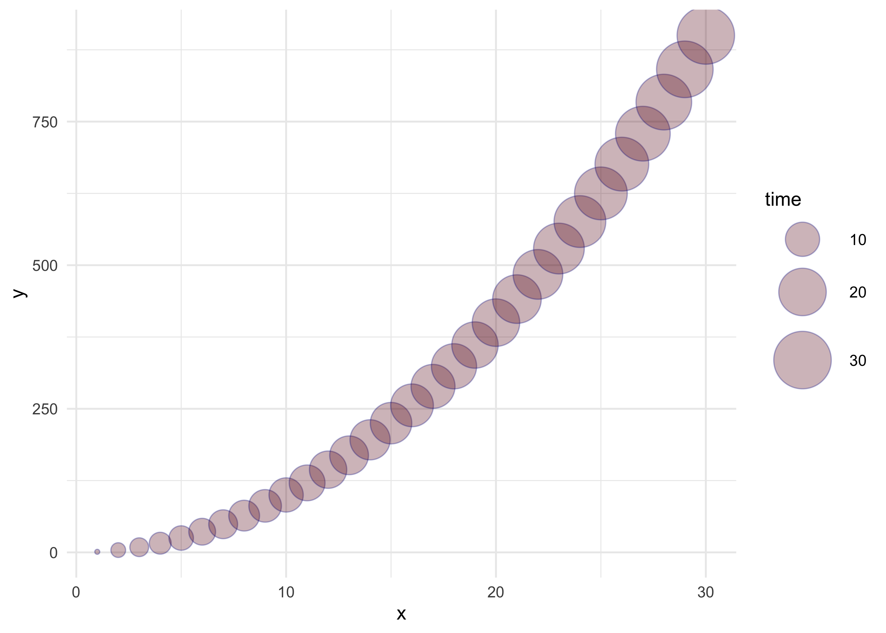
<p class="caption">(\#fig:fgggplot64)Mô tả ba biến liên tục sử dụng thuộc tính thẩm mỹ kích thước</p>
</div>

Một phương pháp là sử dụng đồ thị dạng động, là tập hợp của các nhiều đồ thị tĩnh xuất hiện liên tục mà mỗi đồ thị tương ứng với một giá trị của biến $time$. Bạn đọc có thể thực hiện việc này bằng thư viện $\textbf{plotly}$. Thuộc tính thẩm mỹ để tạo đồ thị dạng động là `frame`. Chúng ta chỉ cần khai báo thêm ánh xạ thẩm mỹ từ tham số `frame` đến biến `time` để tạo một đồ thị động trực quan như Hình \@ref(fig:fgggplot65)

```r
p<-dat%>%ggplot(aes(x=x,y=y,size=time,frame = time))+
  geom_point(alpha=0.5,shape = 21, color = "blue", fill = "grey40")+
  scale_size(range=c(1,15))+
  theme_minimal()
ggplotly(p, tooltip = "size")
```

<div class="figure">

```{=html}
<div class="plotly html-widget html-fill-item" id="htmlwidget-9d615617b1f0128823e9" style="width:672px;height:480px;"></div>
<script type="application/json" data-for="htmlwidget-9d615617b1f0128823e9">{"x":{"data":[{"x":[1],"y":[1],"text":"time:  1","frame":"1","type":"scatter","mode":"markers","marker":{"autocolorscale":false,"color":"rgba(102,102,102,1)","opacity":0.5,"size":3.7795275590551185,"symbol":"circle","line":{"width":1.8897637795275593,"color":"rgba(0,0,255,1)"}},"hoveron":"points","showlegend":false,"xaxis":"x","yaxis":"y","hoverinfo":"text","visible":true}],"layout":{"margin":{"t":26.228310502283108,"r":7.3059360730593621,"b":40.182648401826498,"l":43.105022831050235},"font":{"color":"rgba(0,0,0,1)","family":"","size":14.611872146118724},"xaxis":{"domain":[0,1],"automargin":true,"type":"linear","autorange":false,"range":[-0.45000000000000018,31.449999999999999],"tickmode":"array","ticktext":["0","10","20","30"],"tickvals":[0,10,20,30],"categoryorder":"array","categoryarray":["0","10","20","30"],"nticks":null,"ticks":"","tickcolor":null,"ticklen":3.6529680365296811,"tickwidth":0,"showticklabels":true,"tickfont":{"color":"rgba(77,77,77,1)","family":"","size":11.68949771689498},"tickangle":-0,"showline":false,"linecolor":null,"linewidth":0,"showgrid":true,"gridcolor":"rgba(235,235,235,1)","gridwidth":0.66417600664176002,"zeroline":false,"anchor":"y","title":{"text":"x","font":{"color":"rgba(0,0,0,1)","family":"","size":14.611872146118724}},"hoverformat":".2f"},"yaxis":{"domain":[0,1],"automargin":true,"type":"linear","autorange":false,"range":[-43.950000000000003,944.95000000000005],"tickmode":"array","ticktext":["0","250","500","750"],"tickvals":[0,250,500.00000000000006,750],"categoryorder":"array","categoryarray":["0","250","500","750"],"nticks":null,"ticks":"","tickcolor":null,"ticklen":3.6529680365296811,"tickwidth":0,"showticklabels":true,"tickfont":{"color":"rgba(77,77,77,1)","family":"","size":11.68949771689498},"tickangle":-0,"showline":false,"linecolor":null,"linewidth":0,"showgrid":true,"gridcolor":"rgba(235,235,235,1)","gridwidth":0.66417600664176002,"zeroline":false,"anchor":"x","title":{"text":"y","font":{"color":"rgba(0,0,0,1)","family":"","size":14.611872146118724}},"hoverformat":".2f"},"shapes":[{"type":"rect","fillcolor":null,"line":{"color":null,"width":0,"linetype":[]},"yref":"paper","xref":"paper","x0":0,"x1":1,"y0":0,"y1":1}],"showlegend":false,"legend":{"bgcolor":null,"bordercolor":null,"borderwidth":0,"font":{"color":"rgba(0,0,0,1)","family":"","size":11.68949771689498},"title":{"text":"time","font":{"color":"rgba(0,0,0,1)","family":"","size":14.611872146118724}}},"hovermode":"closest","barmode":"relative","sliders":[{"currentvalue":{"prefix":"~time: ","xanchor":"right","font":{"size":16,"color":"rgba(204,204,204,1)"}},"steps":[{"method":"animate","args":[["1"],{"transition":{"duration":500,"easing":"linear"},"frame":{"duration":500,"redraw":false},"mode":"immediate"}],"label":"1","value":"1"},{"method":"animate","args":[["2"],{"transition":{"duration":500,"easing":"linear"},"frame":{"duration":500,"redraw":false},"mode":"immediate"}],"label":"2","value":"2"},{"method":"animate","args":[["3"],{"transition":{"duration":500,"easing":"linear"},"frame":{"duration":500,"redraw":false},"mode":"immediate"}],"label":"3","value":"3"},{"method":"animate","args":[["4"],{"transition":{"duration":500,"easing":"linear"},"frame":{"duration":500,"redraw":false},"mode":"immediate"}],"label":"4","value":"4"},{"method":"animate","args":[["5"],{"transition":{"duration":500,"easing":"linear"},"frame":{"duration":500,"redraw":false},"mode":"immediate"}],"label":"5","value":"5"},{"method":"animate","args":[["6"],{"transition":{"duration":500,"easing":"linear"},"frame":{"duration":500,"redraw":false},"mode":"immediate"}],"label":"6","value":"6"},{"method":"animate","args":[["7"],{"transition":{"duration":500,"easing":"linear"},"frame":{"duration":500,"redraw":false},"mode":"immediate"}],"label":"7","value":"7"},{"method":"animate","args":[["8"],{"transition":{"duration":500,"easing":"linear"},"frame":{"duration":500,"redraw":false},"mode":"immediate"}],"label":"8","value":"8"},{"method":"animate","args":[["9"],{"transition":{"duration":500,"easing":"linear"},"frame":{"duration":500,"redraw":false},"mode":"immediate"}],"label":"9","value":"9"},{"method":"animate","args":[["10"],{"transition":{"duration":500,"easing":"linear"},"frame":{"duration":500,"redraw":false},"mode":"immediate"}],"label":"10","value":"10"},{"method":"animate","args":[["11"],{"transition":{"duration":500,"easing":"linear"},"frame":{"duration":500,"redraw":false},"mode":"immediate"}],"label":"11","value":"11"},{"method":"animate","args":[["12"],{"transition":{"duration":500,"easing":"linear"},"frame":{"duration":500,"redraw":false},"mode":"immediate"}],"label":"12","value":"12"},{"method":"animate","args":[["13"],{"transition":{"duration":500,"easing":"linear"},"frame":{"duration":500,"redraw":false},"mode":"immediate"}],"label":"13","value":"13"},{"method":"animate","args":[["14"],{"transition":{"duration":500,"easing":"linear"},"frame":{"duration":500,"redraw":false},"mode":"immediate"}],"label":"14","value":"14"},{"method":"animate","args":[["15"],{"transition":{"duration":500,"easing":"linear"},"frame":{"duration":500,"redraw":false},"mode":"immediate"}],"label":"15","value":"15"},{"method":"animate","args":[["16"],{"transition":{"duration":500,"easing":"linear"},"frame":{"duration":500,"redraw":false},"mode":"immediate"}],"label":"16","value":"16"},{"method":"animate","args":[["17"],{"transition":{"duration":500,"easing":"linear"},"frame":{"duration":500,"redraw":false},"mode":"immediate"}],"label":"17","value":"17"},{"method":"animate","args":[["18"],{"transition":{"duration":500,"easing":"linear"},"frame":{"duration":500,"redraw":false},"mode":"immediate"}],"label":"18","value":"18"},{"method":"animate","args":[["19"],{"transition":{"duration":500,"easing":"linear"},"frame":{"duration":500,"redraw":false},"mode":"immediate"}],"label":"19","value":"19"},{"method":"animate","args":[["20"],{"transition":{"duration":500,"easing":"linear"},"frame":{"duration":500,"redraw":false},"mode":"immediate"}],"label":"20","value":"20"},{"method":"animate","args":[["21"],{"transition":{"duration":500,"easing":"linear"},"frame":{"duration":500,"redraw":false},"mode":"immediate"}],"label":"21","value":"21"},{"method":"animate","args":[["22"],{"transition":{"duration":500,"easing":"linear"},"frame":{"duration":500,"redraw":false},"mode":"immediate"}],"label":"22","value":"22"},{"method":"animate","args":[["23"],{"transition":{"duration":500,"easing":"linear"},"frame":{"duration":500,"redraw":false},"mode":"immediate"}],"label":"23","value":"23"},{"method":"animate","args":[["24"],{"transition":{"duration":500,"easing":"linear"},"frame":{"duration":500,"redraw":false},"mode":"immediate"}],"label":"24","value":"24"},{"method":"animate","args":[["25"],{"transition":{"duration":500,"easing":"linear"},"frame":{"duration":500,"redraw":false},"mode":"immediate"}],"label":"25","value":"25"},{"method":"animate","args":[["26"],{"transition":{"duration":500,"easing":"linear"},"frame":{"duration":500,"redraw":false},"mode":"immediate"}],"label":"26","value":"26"},{"method":"animate","args":[["27"],{"transition":{"duration":500,"easing":"linear"},"frame":{"duration":500,"redraw":false},"mode":"immediate"}],"label":"27","value":"27"},{"method":"animate","args":[["28"],{"transition":{"duration":500,"easing":"linear"},"frame":{"duration":500,"redraw":false},"mode":"immediate"}],"label":"28","value":"28"},{"method":"animate","args":[["29"],{"transition":{"duration":500,"easing":"linear"},"frame":{"duration":500,"redraw":false},"mode":"immediate"}],"label":"29","value":"29"},{"method":"animate","args":[["30"],{"transition":{"duration":500,"easing":"linear"},"frame":{"duration":500,"redraw":false},"mode":"immediate"}],"label":"30","value":"30"}],"visible":true,"pad":{"t":40}}],"updatemenus":[{"type":"buttons","direction":"right","showactive":false,"y":0,"x":0,"yanchor":"top","xanchor":"right","pad":{"t":60,"r":5},"buttons":[{"label":"Play","method":"animate","args":[null,{"fromcurrent":true,"mode":"immediate","transition":{"duration":500,"easing":"linear"},"frame":{"duration":500,"redraw":false}}]}]}]},"config":{"doubleClick":"reset","modeBarButtonsToAdd":["hoverclosest","hovercompare"],"showSendToCloud":false},"source":"A","attrs":{"b42b18ec63c1":{"x":{},"y":{},"size":{},"frame":{},"type":"scatter"}},"cur_data":"b42b18ec63c1","visdat":{"b42b18ec63c1":["function (y) ","x"]},"highlight":{"on":"plotly_click","persistent":false,"dynamic":false,"selectize":false,"opacityDim":0.20000000000000001,"selected":{"opacity":1},"debounce":0},"frames":[{"name":"1","data":[{"x":[1],"y":[1],"text":"time:  1","frame":"1","type":"scatter","mode":"markers","marker":{"autocolorscale":false,"color":"rgba(102,102,102,1)","opacity":0.5,"size":3.7795275590551185,"symbol":"circle","line":{"width":1.8897637795275593,"color":"rgba(0,0,255,1)"}},"hoveron":"points","showlegend":false,"xaxis":"x","yaxis":"y","hoverinfo":"text","visible":true}],"traces":[0]},{"name":"2","data":[{"x":[2],"y":[4],"text":"time:  2","frame":"2","type":"scatter","mode":"markers","marker":{"autocolorscale":false,"color":"rgba(102,102,102,1)","opacity":0.5,"size":13.605296634250303,"symbol":"circle","line":{"width":1.8897637795275593,"color":"rgba(0,0,255,1)"}},"hoveron":"points","showlegend":false,"xaxis":"x","yaxis":"y","hoverinfo":"text","visible":true}],"traces":[0]},{"name":"3","data":[{"x":[3],"y":[9],"text":"time:  3","frame":"3","type":"scatter","mode":"markers","marker":{"autocolorscale":false,"color":"rgba(102,102,102,1)","opacity":0.5,"size":17.675263445942292,"symbol":"circle","line":{"width":1.8897637795275593,"color":"rgba(0,0,255,1)"}},"hoveron":"points","showlegend":false,"xaxis":"x","yaxis":"y","hoverinfo":"text","visible":true}],"traces":[0]},{"name":"4","data":[{"x":[4],"y":[16],"text":"time:  4","frame":"4","type":"scatter","mode":"markers","marker":{"autocolorscale":false,"color":"rgba(102,102,102,1)","opacity":0.5,"size":20.79825882073224,"symbol":"circle","line":{"width":1.8897637795275593,"color":"rgba(0,0,255,1)"}},"hoveron":"points","showlegend":false,"xaxis":"x","yaxis":"y","hoverinfo":"text","visible":true}],"traces":[0]},{"name":"5","data":[{"x":[5],"y":[25],"text":"time:  5","frame":"5","type":"scatter","mode":"markers","marker":{"autocolorscale":false,"color":"rgba(102,102,102,1)","opacity":0.5,"size":23.431065709445487,"symbol":"circle","line":{"width":1.8897637795275593,"color":"rgba(0,0,255,1)"}},"hoveron":"points","showlegend":false,"xaxis":"x","yaxis":"y","hoverinfo":"text","visible":true}],"traces":[0]},{"name":"6","data":[{"x":[6],"y":[36],"text":"time:  6","frame":"6","type":"scatter","mode":"markers","marker":{"autocolorscale":false,"color":"rgba(102,102,102,1)","opacity":0.5,"size":25.750615142406797,"symbol":"circle","line":{"width":1.8897637795275593,"color":"rgba(0,0,255,1)"}},"hoveron":"points","showlegend":false,"xaxis":"x","yaxis":"y","hoverinfo":"text","visible":true}],"traces":[0]},{"name":"7","data":[{"x":[7],"y":[49],"text":"time:  7","frame":"7","type":"scatter","mode":"markers","marker":{"autocolorscale":false,"color":"rgba(102,102,102,1)","opacity":0.5,"size":27.84764812370188,"symbol":"circle","line":{"width":1.8897637795275593,"color":"rgba(0,0,255,1)"}},"hoveron":"points","showlegend":false,"xaxis":"x","yaxis":"y","hoverinfo":"text","visible":true}],"traces":[0]},{"name":"8","data":[{"x":[8],"y":[64],"text":"time:  8","frame":"8","type":"scatter","mode":"markers","marker":{"autocolorscale":false,"color":"rgba(102,102,102,1)","opacity":0.5,"size":29.776068971970691,"symbol":"circle","line":{"width":1.8897637795275593,"color":"rgba(0,0,255,1)"}},"hoveron":"points","showlegend":false,"xaxis":"x","yaxis":"y","hoverinfo":"text","visible":true}],"traces":[0]},{"name":"9","data":[{"x":[9],"y":[81],"text":"time:  9","frame":"9","type":"scatter","mode":"markers","marker":{"autocolorscale":false,"color":"rgba(102,102,102,1)","opacity":0.5,"size":31.570999332829462,"symbol":"circle","line":{"width":1.8897637795275593,"color":"rgba(0,0,255,1)"}},"hoveron":"points","showlegend":false,"xaxis":"x","yaxis":"y","hoverinfo":"text","visible":true}],"traces":[0]},{"name":"10","data":[{"x":[10],"y":[100],"text":"time: 10","frame":"10","type":"scatter","mode":"markers","marker":{"autocolorscale":false,"color":"rgba(102,102,102,1)","opacity":0.5,"size":33.256834784640674,"symbol":"circle","line":{"width":1.8897637795275593,"color":"rgba(0,0,255,1)"}},"hoveron":"points","showlegend":false,"xaxis":"x","yaxis":"y","hoverinfo":"text","visible":true}],"traces":[0]},{"name":"11","data":[{"x":[11],"y":[121],"text":"time: 11","frame":"11","type":"scatter","mode":"markers","marker":{"autocolorscale":false,"color":"rgba(102,102,102,1)","opacity":0.5,"size":34.851337599518175,"symbol":"circle","line":{"width":1.8897637795275593,"color":"rgba(0,0,255,1)"}},"hoveron":"points","showlegend":false,"xaxis":"x","yaxis":"y","hoverinfo":"text","visible":true}],"traces":[0]},{"name":"12","data":[{"x":[12],"y":[144],"text":"time: 12","frame":"12","type":"scatter","mode":"markers","marker":{"autocolorscale":false,"color":"rgba(102,102,102,1)","opacity":0.5,"size":36.367916858154928,"symbol":"circle","line":{"width":1.8897637795275593,"color":"rgba(0,0,255,1)"}},"hoveron":"points","showlegend":false,"xaxis":"x","yaxis":"y","hoverinfo":"text","visible":true}],"traces":[0]},{"name":"13","data":[{"x":[13],"y":[169],"text":"time: 13","frame":"13","type":"scatter","mode":"markers","marker":{"autocolorscale":false,"color":"rgba(102,102,102,1)","opacity":0.5,"size":37.816990082409362,"symbol":"circle","line":{"width":1.8897637795275593,"color":"rgba(0,0,255,1)"}},"hoveron":"points","showlegend":false,"xaxis":"x","yaxis":"y","hoverinfo":"text","visible":true}],"traces":[0]},{"name":"14","data":[{"x":[14],"y":[196],"text":"time: 14","frame":"14","type":"scatter","mode":"markers","marker":{"autocolorscale":false,"color":"rgba(102,102,102,1)","opacity":0.5,"size":39.20684178053974,"symbol":"circle","line":{"width":1.8897637795275593,"color":"rgba(0,0,255,1)"}},"hoveron":"points","showlegend":false,"xaxis":"x","yaxis":"y","hoverinfo":"text","visible":true}],"traces":[0]},{"name":"15","data":[{"x":[15],"y":[225],"text":"time: 15","frame":"15","type":"scatter","mode":"markers","marker":{"autocolorscale":false,"color":"rgba(102,102,102,1)","opacity":0.5,"size":40.544188999994148,"symbol":"circle","line":{"width":1.8897637795275593,"color":"rgba(0,0,255,1)"}},"hoveron":"points","showlegend":false,"xaxis":"x","yaxis":"y","hoverinfo":"text","visible":true}],"traces":[0]},{"name":"16","data":[{"x":[16],"y":[256],"text":"time: 16","frame":"16","type":"scatter","mode":"markers","marker":{"autocolorscale":false,"color":"rgba(102,102,102,1)","opacity":0.5,"size":41.834567550965929,"symbol":"circle","line":{"width":1.8897637795275593,"color":"rgba(0,0,255,1)"}},"hoveron":"points","showlegend":false,"xaxis":"x","yaxis":"y","hoverinfo":"text","visible":true}],"traces":[0]},{"name":"17","data":[{"x":[17],"y":[289],"text":"time: 17","frame":"17","type":"scatter","mode":"markers","marker":{"autocolorscale":false,"color":"rgba(102,102,102,1)","opacity":0.5,"size":43.082603859835856,"symbol":"circle","line":{"width":1.8897637795275593,"color":"rgba(0,0,255,1)"}},"hoveron":"points","showlegend":false,"xaxis":"x","yaxis":"y","hoverinfo":"text","visible":true}],"traces":[0]},{"name":"18","data":[{"x":[18],"y":[324],"text":"time: 18","frame":"18","type":"scatter","mode":"markers","marker":{"autocolorscale":false,"color":"rgba(102,102,102,1)","opacity":0.5,"size":44.29221130901243,"symbol":"circle","line":{"width":1.8897637795275593,"color":"rgba(0,0,255,1)"}},"hoveron":"points","showlegend":false,"xaxis":"x","yaxis":"y","hoverinfo":"text","visible":true}],"traces":[0]},{"name":"19","data":[{"x":[19],"y":[361],"text":"time: 19","frame":"19","type":"scatter","mode":"markers","marker":{"autocolorscale":false,"color":"rgba(102,102,102,1)","opacity":0.5,"size":45.466735219716654,"symbol":"circle","line":{"width":1.8897637795275593,"color":"rgba(0,0,255,1)"}},"hoveron":"points","showlegend":false,"xaxis":"x","yaxis":"y","hoverinfo":"text","visible":true}],"traces":[0]},{"name":"20","data":[{"x":[20],"y":[400],"text":"time: 20","frame":"20","type":"scatter","mode":"markers","marker":{"autocolorscale":false,"color":"rgba(102,102,102,1)","opacity":0.5,"size":46.609062000398033,"symbol":"circle","line":{"width":1.8897637795275593,"color":"rgba(0,0,255,1)"}},"hoveron":"points","showlegend":false,"xaxis":"x","yaxis":"y","hoverinfo":"text","visible":true}],"traces":[0]},{"name":"21","data":[{"x":[21],"y":[441],"text":"time: 21","frame":"21","type":"scatter","mode":"markers","marker":{"autocolorscale":false,"color":"rgba(102,102,102,1)","opacity":0.5,"size":47.721702725758476,"symbol":"circle","line":{"width":1.8897637795275593,"color":"rgba(0,0,255,1)"}},"hoveron":"points","showlegend":false,"xaxis":"x","yaxis":"y","hoverinfo":"text","visible":true}],"traces":[0]},{"name":"22","data":[{"x":[22],"y":[484],"text":"time: 22","frame":"22","type":"scatter","mode":"markers","marker":{"autocolorscale":false,"color":"rgba(102,102,102,1)","opacity":0.5,"size":48.806858107293294,"symbol":"circle","line":{"width":1.8897637795275593,"color":"rgba(0,0,255,1)"}},"hoveron":"points","showlegend":false,"xaxis":"x","yaxis":"y","hoverinfo":"text","visible":true}],"traces":[0]},{"name":"23","data":[{"x":[23],"y":[529],"text":"time: 23","frame":"23","type":"scatter","mode":"markers","marker":{"autocolorscale":false,"color":"rgba(102,102,102,1)","opacity":0.5,"size":49.866469681736305,"symbol":"circle","line":{"width":1.8897637795275593,"color":"rgba(0,0,255,1)"}},"hoveron":"points","showlegend":false,"xaxis":"x","yaxis":"y","hoverinfo":"text","visible":true}],"traces":[0]},{"name":"24","data":[{"x":[24],"y":[576],"text":"time: 24","frame":"24","type":"scatter","mode":"markers","marker":{"autocolorscale":false,"color":"rgba(102,102,102,1)","opacity":0.5,"size":50.902260630667463,"symbol":"circle","line":{"width":1.8897637795275593,"color":"rgba(0,0,255,1)"}},"hoveron":"points","showlegend":false,"xaxis":"x","yaxis":"y","hoverinfo":"text","visible":true}],"traces":[0]},{"name":"25","data":[{"x":[25],"y":[625],"text":"time: 25","frame":"25","type":"scatter","mode":"markers","marker":{"autocolorscale":false,"color":"rgba(102,102,102,1)","opacity":0.5,"size":51.915768688348642,"symbol":"circle","line":{"width":1.8897637795275593,"color":"rgba(0,0,255,1)"}},"hoveron":"points","showlegend":false,"xaxis":"x","yaxis":"y","hoverinfo":"text","visible":true}],"traces":[0]},{"name":"26","data":[{"x":[26],"y":[676],"text":"time: 26","frame":"26","type":"scatter","mode":"markers","marker":{"autocolorscale":false,"color":"rgba(102,102,102,1)","opacity":0.5,"size":52.908372935031053,"symbol":"circle","line":{"width":1.8897637795275593,"color":"rgba(0,0,255,1)"}},"hoveron":"points","showlegend":false,"xaxis":"x","yaxis":"y","hoverinfo":"text","visible":true}],"traces":[0]},{"name":"27","data":[{"x":[27],"y":[729],"text":"time: 27","frame":"27","type":"scatter","mode":"markers","marker":{"autocolorscale":false,"color":"rgba(102,102,102,1)","opacity":0.5,"size":53.881315809531905,"symbol":"circle","line":{"width":1.8897637795275593,"color":"rgba(0,0,255,1)"}},"hoveron":"points","showlegend":false,"xaxis":"x","yaxis":"y","hoverinfo":"text","visible":true}],"traces":[0]},{"name":"28","data":[{"x":[28],"y":[784],"text":"time: 28","frame":"28","type":"scatter","mode":"markers","marker":{"autocolorscale":false,"color":"rgba(102,102,102,1)","opacity":0.5,"size":54.835721344086487,"symbol":"circle","line":{"width":1.8897637795275593,"color":"rgba(0,0,255,1)"}},"hoveron":"points","showlegend":false,"xaxis":"x","yaxis":"y","hoverinfo":"text","visible":true}],"traces":[0]},{"name":"29","data":[{"x":[29],"y":[841],"text":"time: 29","frame":"29","type":"scatter","mode":"markers","marker":{"autocolorscale":false,"color":"rgba(102,102,102,1)","opacity":0.5,"size":55.772610384886264,"symbol":"circle","line":{"width":1.8897637795275593,"color":"rgba(0,0,255,1)"}},"hoveron":"points","showlegend":false,"xaxis":"x","yaxis":"y","hoverinfo":"text","visible":true}],"traces":[0]},{"name":"30","data":[{"x":[30],"y":[900],"text":"time: 30","frame":"30","type":"scatter","mode":"markers","marker":{"autocolorscale":false,"color":"rgba(102,102,102,1)","opacity":0.5,"size":56.692913385826778,"symbol":"circle","line":{"width":1.8897637795275593,"color":"rgba(0,0,255,1)"}},"hoveron":"points","showlegend":false,"xaxis":"x","yaxis":"y","hoverinfo":"text","visible":true}],"traces":[0]}],"shinyEvents":["plotly_hover","plotly_click","plotly_selected","plotly_relayout","plotly_brushed","plotly_brushing","plotly_clickannotation","plotly_doubleclick","plotly_deselect","plotly_afterplot","plotly_sunburstclick"],"base_url":"https://plot.ly"},"evals":[],"jsHooks":[]}</script>
```

<p class="caption">(\#fig:fgggplot65)Đồ thị động mô tả sự chuyển động của một điểm theo biến time của dữ liệu</p>
</div>

Đồ thị dạng động sẽ được kích hoạt mỗi khi chúng ta bấm nút play. Bạn đọc có thể thấy rằng cách mô tả sự thay đổi của điểm theo thời gian của đồ thị động trong Hình \@ref(fig:fgggplot65) trực quan và hiệu quả hơn so với Hình \@ref(fig:fgggplot64).

Hàm `ggplotly()` rất hiệu quả khi mô tả các biến liên tục theo thời gian. Quay trở lại với dữ liệu $\textbf{gapminder}$, đồ thị dạng động cho phép chúng ta xây dựng các đồ thị trực quan sinh động. Ví dụ, chúng ta muốn mô tả hai biến tuổi thọ trung bình và tỷ lệ sinh trung bình của một phụ nữ qua các năm, chúng ta có thể ánh xạ hai biến lên hai trục tọa độ, sau đó sử dụng màu sắc để mô tả biến châu lục, sử dụng kích thước để mô tả biến dân số, và sau cùng là sử dụng đồ thị dạng động để mô tả biến thời gian (year).


```r
p<-gapminder%>%filter(year %in% 1960:2011)%>%
  ggplot(aes(x = fertility, y = life_expectancy, size = population,
             fill = continent, frame = year))+
  geom_point(alpha = 0.5,shape=21)+
  scale_fill_brewer(palette = "Set1")+
  scale_size(range=c(1,15))+
  theme_minimal()+
  ggtitle("Tuổi thọ và tỷ lệ sinh trung bình 1960 đến 2011")
ggplotly(p, tooltip = c())
```

<div class="figure">

```{=html}
<div class="plotly html-widget html-fill-item" id="htmlwidget-4a95f5f21346edef85cf" style="width:672px;height:480px;"></div>
<script type="application/json" data-for="htmlwidget-4a95f5f21346edef85cf">{"x":{"data":[{"x":[7.6500000000000004,7.3200000000000003,6.2800000000000002,6.6200000000000001,6.29,6.9500000000000002,5.6500000000000004,6.8899999999999997,5.8399999999999999,6.25,6.79,6,5.8799999999999999,7.3499999999999996,6.46,6.6299999999999999,5.5099999999999998,6.9000000000000004,6.8799999999999999,4.3799999999999999,5.5700000000000003,6.75,6.0999999999999996,5.8300000000000001,7.9500000000000002,5.8399999999999999,6.4100000000000001,7.54,7.2999999999999998,6.9100000000000001,6.7000000000000002,6.7800000000000002,6.1699999999999999,7.0700000000000003,6.5999999999999996,6.1500000000000004,7.0499999999999998,6.3499999999999996,8.1899999999999995,6.9500000000000002,5.2699999999999996,6.0300000000000002,6.1699999999999999,6.6900000000000004,6.7199999999999998,6.8099999999999996,6.5199999999999996,7.04,7,7.0199999999999996,7.1600000000000001],"y":[47.5,35.979999999999997,38.289999999999999,50.340000000000003,35.210000000000001,40.579999999999998,43.460000000000001,50.119999999999997,37.43,40.950000000000003,44.039999999999999,43.899999999999999,48.25,38,45.770000000000003,48.310000000000002,37.689999999999998,39.030000000000001,37.719999999999999,38.829999999999998,35.700000000000003,46.340000000000003,35.710000000000001,43.140000000000001,47.420000000000002,47.020000000000003,35.240000000000002,44.590000000000003,41.960000000000001,38.509999999999998,29.609999999999999,43.909999999999997,58.740000000000002,49.640000000000001,38.170000000000002,47.07,36.82,40.390000000000001,43.07,38.460000000000001,60.420000000000002,36.07,49.009999999999998,49.539999999999999,44.780000000000001,45.57,41.060000000000002,43.200000000000003,45.270000000000003,48.340000000000003,53.109999999999999],"text":"","frame":"1960","type":"scatter","mode":"markers","marker":{"autocolorscale":false,"color":"rgba(228,26,28,1)","opacity":0.5,"size":[8.57945686626074,7.0782581528268214,6.0122653005699274,4.7911743697120874,6.9362038862866839,6.1717298293236,7.1066316851406279,4.3755939228400473,5.528126583737893,6.2636615824071233,4.3514399941847843,9.4011563839859367,5.2078593754665592,6.453744857346611,4.1094067252637139,11.273467079354036,4.4568146224768181,5.4702361542901459,10.557345481672231,4.7653477815613741,4.6157335730618163,7.4877080805667813,6.4933261635100932,4.8819249794566915,7.8744656292998174,5.0846478200206224,5.2834541103165762,5.486705048464068,7.0238315034338834,6.509041876896573,7.0760179900732147,5.0900136988555591,4.9222706897710991,8.833144808967452,7.7161731633480199,4.8687894398757026,6.4226899619967508,13.466151805413489,6.2345765009576253,6.3357527854526792,3.9257843853714913,5.8928390780331563,9.7848528917546389,7.725176692878895,4.5921853038222844,8.3465664813809752,5.5732770439631745,6.7135353802472313,7.5255780326709756,6.283226975073223,6.5594727790301999],"symbol":"circle","line":{"width":1.8897637795275593,"color":"rgba(0,0,0,1)"}},"hoveron":"points","name":"Africa","legendgroup":"Africa","showlegend":true,"xaxis":"x","yaxis":"y","hoverinfo":"text","visible":true},{"x":[4.4299999999999997,3.1099999999999999,4.8200000000000003,4.5,4.3300000000000001,6.5,6.7000000000000002,6.21,3.9100000000000001,5.5800000000000001,6.8099999999999996,7.3099999999999996,4.1799999999999997,7.5599999999999996,6.6900000000000004,6.7300000000000004,7.25,6.7400000000000002,6.5300000000000002,5.6699999999999999,6.3200000000000003,7.46,5.4199999999999999,6.7800000000000002,7.3399999999999999,5.8700000000000001,6.5,6.8799999999999999,4.6600000000000001,6.9699999999999998,7.2199999999999998,6.6100000000000003,5.2599999999999998,3.6699999999999999,2.8799999999999999,6.6200000000000001],"y":[62.969999999999999,65.390000000000001,65.659999999999997,62,61.799999999999997,60.079999999999998,43.770000000000003,55.270000000000003,71,56.850000000000001,58.030000000000001,61.969999999999999,63.850000000000001,53.369999999999997,54.090000000000003,52.020000000000003,61.490000000000002,60.590000000000003,46.509999999999998,59.079999999999998,42.100000000000001,47.710000000000001,65.909999999999997,57.340000000000003,50.689999999999998,61.619999999999997,66.349999999999994,48.950000000000003,68.579999999999998,56.969999999999999,57.850000000000001,60.579999999999998,63.07,69.909999999999997,67.950000000000003,60.079999999999998],"text":"","frame":"1960","type":"scatter","mode":"markers","marker":{"autocolorscale":false,"color":"rgba(55,126,184,1)","opacity":0.5,"size":[4.0001776580807729,10.318400424247608,3.9979403309259403,4.1827504064613557,4.4235221443620096,4.1349594901650208,6.5373692515282134,16.046961587227432,9.8728888105960557,7.7692082965554796,9.6243215798717578,5.4237869605615483,7.622161410029797,6.3826393916309501,6.8414432081821932,6.1613576358931583,3.7795275590551185,4.1284521295987204,6.6962446860673808,4.8316217406793331,6.601649663895012,5.8027857676683317,5.6022206504929697,12.679819472331561,5.6823719646259541,5.2921357512679057,5.7510779416955522,8.343616331307997,5.976611317198091,4.1285711494614921,4.1008339873697714,4.5125618383415675,5.0823137231305946,23.441340236215495,6.0615003904353255,7.8849517491357171],"symbol":"circle","line":{"width":1.8897637795275593,"color":"rgba(0,0,0,1)"}},"hoveron":"points","name":"Americas","legendgroup":"Americas","showlegend":true,"xaxis":"x","yaxis":"y","hoverinfo":"text","visible":true},{"x":[4.5499999999999998,5.5700000000000003,7.0899999999999999,6.7300000000000004,6.6699999999999999,6.4900000000000002,6.9699999999999998,3.9900000000000002,3.5,2.96,5.1600000000000001,5.8700000000000001,5.6699999999999999,6.9299999999999997,6.25,3.8399999999999999,2,7.6900000000000004,4.5599999999999996,6.1600000000000001,7.25,5.1699999999999999,5.96,5.7400000000000002,4.9500000000000002,6.1900000000000004,7.0199999999999996,6.9500000000000002,5.9900000000000002,7.25,6.5999999999999996,7.1500000000000004,6.9699999999999998,7.2199999999999998,5.8200000000000003,5.54,7.4699999999999998,6.2400000000000002,6.1500000000000004,6.3700000000000001,6.2999999999999998,6.4199999999999999,6.9299999999999997,6.71,7.6900000000000004,6.3499999999999996,7.29],"y":[66.859999999999999,61.329999999999998,51.640000000000001,46.200000000000003,35.939999999999998,62.520000000000003,42.289999999999999,30.530000000000001,69.719999999999999,63.5,67.450000000000003,41.259999999999998,45.009999999999998,46,46.960000000000001,68.549999999999997,67.780000000000001,53.299999999999997,58.909999999999997,53.020000000000003,62.149999999999999,56.090000000000003,42.130000000000003,62.899999999999999,64.930000000000007,59.890000000000001,38.07,49.200000000000003,39.799999999999997,44.640000000000001,46.789999999999999,58.82,60.82,47.619999999999997,65.019999999999996,59.759999999999998,52.869999999999997,57.100000000000001,55.460000000000001,37.740000000000002,46.909999999999997,54.909999999999997,51.850000000000001,59.350000000000001,50.82,58.520000000000003,32.640000000000001],"text":"","frame":"1960","type":"scatter","mode":"markers","marker":{"autocolorscale":false,"color":"rgba(77,175,74,1)","opacity":0.5,"size":[5.7323041374197468,6.6133003130188586,4.3016455951800134,13.781449016117206,4.4124199482897737,4.1036558918414912,7.217456233518833,40.362726547339676,4.8401806035872887,6.7076909585931483,6.2940558176867389,34.33756651638997,17.280000803097618,10.519811388189053,7.6621181857309812,5.847235081097554,17.637408479145755,5.1139328427388762,8.32868463580966,10.99124809308994,4.4717472021425992,5.8883132101478166,5.8622729883528946,5.6987984177654534,4.3191616984292942,7.8885241507912225,4.1284937911681912,5.165001529825763,8.3425755567490825,4.8192262152440239,13.433959483451043,11.161870555501249,3.9622193290571079,6.6816055548322639,5.6038174093843258,8.3058409996463229,6.8574185119334334,5.8342091907446791,11.318336173253169,4.7657016392914899,11.339807199833093,5.5807801002814221,4.1365452587128582,8.0444025010430718,5.247878574467129,12.012724735742658,7.045186635042664],"symbol":"circle","line":{"width":1.8897637795275593,"color":"rgba(0,0,0,1)"}},"hoveron":"points","name":"Asia","legendgroup":"Asia","showlegend":true,"xaxis":"x","yaxis":"y","hoverinfo":"text","visible":true},{"x":[6.1900000000000004,2.7000000000000002,2.7400000000000002,2.6000000000000001,4.0499999999999998,2.25,2.3300000000000001,2.2999999999999998,2.54,1.95,2.71,2.77,2.4100000000000001,2.2200000000000002,2.0499999999999998,4.1299999999999999,3.8599999999999999,2.3700000000000001,1.8999999999999999,2.5499999999999998,2.3500000000000001,3.7200000000000002,3.5299999999999998,3.3300000000000001,3.52,3.1200000000000001,2.8799999999999999,2.9700000000000002,3.1600000000000001,2.3199999999999998,2.5600000000000001,2.6299999999999999,3.0899999999999999,2.3199999999999998,2.77,2.2000000000000002,2.52,2.4199999999999999,2.6899999999999999],"y":[62.869999999999997,68.75,71.590000000000003,69.590000000000003,62.560000000000002,69.219999999999999,64.849999999999994,70.579999999999998,72.280000000000001,69.420000000000002,69.030000000000001,70.489999999999995,69.260000000000005,68.409999999999997,68.129999999999995,74.219999999999999,70.760000000000005,69.189999999999998,70.370000000000005,70.329999999999998,68.989999999999995,60.850000000000001,68.319999999999993,62.219999999999999,63.859999999999999,73.349999999999994,73.659999999999997,67.920000000000002,64.230000000000004,65.920000000000002,68.609999999999999,63.329999999999998,70.420000000000002,68.620000000000005,69.230000000000004,73.010000000000005,71.459999999999994,70.879999999999995,71.019999999999996],"text":"","frame":"1960","type":"scatter","mode":"markers","marker":{"autocolorscale":false,"color":"rgba(152,78,163,1)","opacity":0.5,"size":[5.6051465957598356,7.601676219717179,7.8958594502877233,8.1290405409330635,6.3507230018649325,7.8134126107466564,6.7193226178641261,8.2323864430882256,6.8533440461052031,5.348680756648637,6.8020812229144827,13.536017411466485,16.104899353098755,7.9263609095433258,8.3298881035875851,4.3269260676127645,6.1857178801771404,13.937443232579197,5.8684580772086834,6.1647731735733116,4.5466374962850367,5.5192933593284348,4.5441997542064598,6.2640632606642779,4.7528678503746784,8.6425927108931759,6.4950868724456114,11.631286792665501,8.0652465571157474,9.9918034840792664,19.554862642689695,7.7328749819298128,6.6996849856798999,5.5768158401164598,11.7278485198583,7.7125640795373371,7.0862051626793585,13.188882355831245,14.209356938189844],"symbol":"circle","line":{"width":1.8897637795275593,"color":"rgba(0,0,0,1)"}},"hoveron":"points","name":"Europe","legendgroup":"Europe","showlegend":true,"xaxis":"x","yaxis":"y","hoverinfo":"text","visible":true},{"x":[3.4500000000000002,6.46,5.6600000000000001,6.9500000000000002,6.9299999999999997,5.2199999999999998,3.54,6.2800000000000002,7.6500000000000004,6.3899999999999997,7.3600000000000003,7.2000000000000002],"y":[70.870000000000005,55.700000000000003,56.280000000000001,45.840000000000003,56.82,56.380000000000003,71.280000000000001,38.600000000000001,51.450000000000003,50.549999999999997,61.200000000000003,45.969999999999999],"text":"","frame":"1960","type":"scatter","mode":"markers","marker":{"autocolorscale":false,"color":"rgba(255,127,0,1)","opacity":0.5,"size":[8.3958302878024185,4.6467665184073139,4.0914374555371946,3.9236098670466113,3.9457308732552114,4.0913542151907833,5.9843624322805447,5.7845474681397002,4.1804751893316494,4.2036919407023108,4.0306368148129135,4.0391796706441916],"symbol":"circle","line":{"width":1.8897637795275593,"color":"rgba(0,0,0,1)"}},"hoveron":"points","name":"Oceania","legendgroup":"Oceania","showlegend":true,"xaxis":"x","yaxis":"y","hoverinfo":"text","visible":true}],"layout":{"margin":{"t":43.762557077625573,"r":7.3059360730593621,"b":40.182648401826498,"l":37.260273972602747},"font":{"color":"rgba(0,0,0,1)","family":"","size":14.611872146118724},"title":{"text":"Tuổi thọ và tỷ lệ sinh trung bình 1960 đến 2011","font":{"color":"rgba(0,0,0,1)","family":"","size":17.534246575342465},"x":0,"xref":"paper"},"xaxis":{"domain":[0,1],"automargin":true,"type":"linear","autorange":false,"range":[0.42099999999999993,9.6390000000000011],"tickmode":"array","ticktext":["2.5","5.0","7.5"],"tickvals":[2.5,5,7.5000000000000009],"categoryorder":"array","categoryarray":["2.5","5.0","7.5"],"nticks":null,"ticks":"","tickcolor":null,"ticklen":3.6529680365296811,"tickwidth":0,"showticklabels":true,"tickfont":{"color":"rgba(77,77,77,1)","family":"","size":11.68949771689498},"tickangle":-0,"showline":false,"linecolor":null,"linewidth":0,"showgrid":true,"gridcolor":"rgba(235,235,235,1)","gridwidth":0.66417600664176002,"zeroline":false,"anchor":"y","title":{"text":"fertility","font":{"color":"rgba(0,0,0,1)","family":"","size":14.611872146118724}},"hoverformat":".2f"},"yaxis":{"domain":[0,1],"automargin":true,"type":"linear","autorange":false,"range":[9.7089999999999996,86.510999999999996],"tickmode":"array","ticktext":["20","40","60","80"],"tickvals":[20,40,60,80],"categoryorder":"array","categoryarray":["20","40","60","80"],"nticks":null,"ticks":"","tickcolor":null,"ticklen":3.6529680365296811,"tickwidth":0,"showticklabels":true,"tickfont":{"color":"rgba(77,77,77,1)","family":"","size":11.68949771689498},"tickangle":-0,"showline":false,"linecolor":null,"linewidth":0,"showgrid":true,"gridcolor":"rgba(235,235,235,1)","gridwidth":0.66417600664176002,"zeroline":false,"anchor":"x","title":{"text":"life_expectancy","font":{"color":"rgba(0,0,0,1)","family":"","size":14.611872146118724}},"hoverformat":".2f"},"shapes":[{"type":"rect","fillcolor":null,"line":{"color":null,"width":0,"linetype":[]},"yref":"paper","xref":"paper","x0":0,"x1":1,"y0":0,"y1":1}],"showlegend":true,"legend":{"bgcolor":null,"bordercolor":null,"borderwidth":0,"font":{"color":"rgba(0,0,0,1)","family":"","size":11.68949771689498},"title":{"text":"population<br />continent","font":{"color":"rgba(0,0,0,1)","family":"","size":14.611872146118724}}},"hovermode":"closest","barmode":"relative","sliders":[{"currentvalue":{"prefix":"~year: ","xanchor":"right","font":{"size":16,"color":"rgba(204,204,204,1)"}},"steps":[{"method":"animate","args":[["1960"],{"transition":{"duration":500,"easing":"linear"},"frame":{"duration":500,"redraw":false},"mode":"immediate"}],"label":"1960","value":"1960"},{"method":"animate","args":[["1961"],{"transition":{"duration":500,"easing":"linear"},"frame":{"duration":500,"redraw":false},"mode":"immediate"}],"label":"1961","value":"1961"},{"method":"animate","args":[["1962"],{"transition":{"duration":500,"easing":"linear"},"frame":{"duration":500,"redraw":false},"mode":"immediate"}],"label":"1962","value":"1962"},{"method":"animate","args":[["1963"],{"transition":{"duration":500,"easing":"linear"},"frame":{"duration":500,"redraw":false},"mode":"immediate"}],"label":"1963","value":"1963"},{"method":"animate","args":[["1964"],{"transition":{"duration":500,"easing":"linear"},"frame":{"duration":500,"redraw":false},"mode":"immediate"}],"label":"1964","value":"1964"},{"method":"animate","args":[["1965"],{"transition":{"duration":500,"easing":"linear"},"frame":{"duration":500,"redraw":false},"mode":"immediate"}],"label":"1965","value":"1965"},{"method":"animate","args":[["1966"],{"transition":{"duration":500,"easing":"linear"},"frame":{"duration":500,"redraw":false},"mode":"immediate"}],"label":"1966","value":"1966"},{"method":"animate","args":[["1967"],{"transition":{"duration":500,"easing":"linear"},"frame":{"duration":500,"redraw":false},"mode":"immediate"}],"label":"1967","value":"1967"},{"method":"animate","args":[["1968"],{"transition":{"duration":500,"easing":"linear"},"frame":{"duration":500,"redraw":false},"mode":"immediate"}],"label":"1968","value":"1968"},{"method":"animate","args":[["1969"],{"transition":{"duration":500,"easing":"linear"},"frame":{"duration":500,"redraw":false},"mode":"immediate"}],"label":"1969","value":"1969"},{"method":"animate","args":[["1970"],{"transition":{"duration":500,"easing":"linear"},"frame":{"duration":500,"redraw":false},"mode":"immediate"}],"label":"1970","value":"1970"},{"method":"animate","args":[["1971"],{"transition":{"duration":500,"easing":"linear"},"frame":{"duration":500,"redraw":false},"mode":"immediate"}],"label":"1971","value":"1971"},{"method":"animate","args":[["1972"],{"transition":{"duration":500,"easing":"linear"},"frame":{"duration":500,"redraw":false},"mode":"immediate"}],"label":"1972","value":"1972"},{"method":"animate","args":[["1973"],{"transition":{"duration":500,"easing":"linear"},"frame":{"duration":500,"redraw":false},"mode":"immediate"}],"label":"1973","value":"1973"},{"method":"animate","args":[["1974"],{"transition":{"duration":500,"easing":"linear"},"frame":{"duration":500,"redraw":false},"mode":"immediate"}],"label":"1974","value":"1974"},{"method":"animate","args":[["1975"],{"transition":{"duration":500,"easing":"linear"},"frame":{"duration":500,"redraw":false},"mode":"immediate"}],"label":"1975","value":"1975"},{"method":"animate","args":[["1976"],{"transition":{"duration":500,"easing":"linear"},"frame":{"duration":500,"redraw":false},"mode":"immediate"}],"label":"1976","value":"1976"},{"method":"animate","args":[["1977"],{"transition":{"duration":500,"easing":"linear"},"frame":{"duration":500,"redraw":false},"mode":"immediate"}],"label":"1977","value":"1977"},{"method":"animate","args":[["1978"],{"transition":{"duration":500,"easing":"linear"},"frame":{"duration":500,"redraw":false},"mode":"immediate"}],"label":"1978","value":"1978"},{"method":"animate","args":[["1979"],{"transition":{"duration":500,"easing":"linear"},"frame":{"duration":500,"redraw":false},"mode":"immediate"}],"label":"1979","value":"1979"},{"method":"animate","args":[["1980"],{"transition":{"duration":500,"easing":"linear"},"frame":{"duration":500,"redraw":false},"mode":"immediate"}],"label":"1980","value":"1980"},{"method":"animate","args":[["1981"],{"transition":{"duration":500,"easing":"linear"},"frame":{"duration":500,"redraw":false},"mode":"immediate"}],"label":"1981","value":"1981"},{"method":"animate","args":[["1982"],{"transition":{"duration":500,"easing":"linear"},"frame":{"duration":500,"redraw":false},"mode":"immediate"}],"label":"1982","value":"1982"},{"method":"animate","args":[["1983"],{"transition":{"duration":500,"easing":"linear"},"frame":{"duration":500,"redraw":false},"mode":"immediate"}],"label":"1983","value":"1983"},{"method":"animate","args":[["1984"],{"transition":{"duration":500,"easing":"linear"},"frame":{"duration":500,"redraw":false},"mode":"immediate"}],"label":"1984","value":"1984"},{"method":"animate","args":[["1985"],{"transition":{"duration":500,"easing":"linear"},"frame":{"duration":500,"redraw":false},"mode":"immediate"}],"label":"1985","value":"1985"},{"method":"animate","args":[["1986"],{"transition":{"duration":500,"easing":"linear"},"frame":{"duration":500,"redraw":false},"mode":"immediate"}],"label":"1986","value":"1986"},{"method":"animate","args":[["1987"],{"transition":{"duration":500,"easing":"linear"},"frame":{"duration":500,"redraw":false},"mode":"immediate"}],"label":"1987","value":"1987"},{"method":"animate","args":[["1988"],{"transition":{"duration":500,"easing":"linear"},"frame":{"duration":500,"redraw":false},"mode":"immediate"}],"label":"1988","value":"1988"},{"method":"animate","args":[["1989"],{"transition":{"duration":500,"easing":"linear"},"frame":{"duration":500,"redraw":false},"mode":"immediate"}],"label":"1989","value":"1989"},{"method":"animate","args":[["1990"],{"transition":{"duration":500,"easing":"linear"},"frame":{"duration":500,"redraw":false},"mode":"immediate"}],"label":"1990","value":"1990"},{"method":"animate","args":[["1991"],{"transition":{"duration":500,"easing":"linear"},"frame":{"duration":500,"redraw":false},"mode":"immediate"}],"label":"1991","value":"1991"},{"method":"animate","args":[["1992"],{"transition":{"duration":500,"easing":"linear"},"frame":{"duration":500,"redraw":false},"mode":"immediate"}],"label":"1992","value":"1992"},{"method":"animate","args":[["1993"],{"transition":{"duration":500,"easing":"linear"},"frame":{"duration":500,"redraw":false},"mode":"immediate"}],"label":"1993","value":"1993"},{"method":"animate","args":[["1994"],{"transition":{"duration":500,"easing":"linear"},"frame":{"duration":500,"redraw":false},"mode":"immediate"}],"label":"1994","value":"1994"},{"method":"animate","args":[["1995"],{"transition":{"duration":500,"easing":"linear"},"frame":{"duration":500,"redraw":false},"mode":"immediate"}],"label":"1995","value":"1995"},{"method":"animate","args":[["1996"],{"transition":{"duration":500,"easing":"linear"},"frame":{"duration":500,"redraw":false},"mode":"immediate"}],"label":"1996","value":"1996"},{"method":"animate","args":[["1997"],{"transition":{"duration":500,"easing":"linear"},"frame":{"duration":500,"redraw":false},"mode":"immediate"}],"label":"1997","value":"1997"},{"method":"animate","args":[["1998"],{"transition":{"duration":500,"easing":"linear"},"frame":{"duration":500,"redraw":false},"mode":"immediate"}],"label":"1998","value":"1998"},{"method":"animate","args":[["1999"],{"transition":{"duration":500,"easing":"linear"},"frame":{"duration":500,"redraw":false},"mode":"immediate"}],"label":"1999","value":"1999"},{"method":"animate","args":[["2000"],{"transition":{"duration":500,"easing":"linear"},"frame":{"duration":500,"redraw":false},"mode":"immediate"}],"label":"2000","value":"2000"},{"method":"animate","args":[["2001"],{"transition":{"duration":500,"easing":"linear"},"frame":{"duration":500,"redraw":false},"mode":"immediate"}],"label":"2001","value":"2001"},{"method":"animate","args":[["2002"],{"transition":{"duration":500,"easing":"linear"},"frame":{"duration":500,"redraw":false},"mode":"immediate"}],"label":"2002","value":"2002"},{"method":"animate","args":[["2003"],{"transition":{"duration":500,"easing":"linear"},"frame":{"duration":500,"redraw":false},"mode":"immediate"}],"label":"2003","value":"2003"},{"method":"animate","args":[["2004"],{"transition":{"duration":500,"easing":"linear"},"frame":{"duration":500,"redraw":false},"mode":"immediate"}],"label":"2004","value":"2004"},{"method":"animate","args":[["2005"],{"transition":{"duration":500,"easing":"linear"},"frame":{"duration":500,"redraw":false},"mode":"immediate"}],"label":"2005","value":"2005"},{"method":"animate","args":[["2006"],{"transition":{"duration":500,"easing":"linear"},"frame":{"duration":500,"redraw":false},"mode":"immediate"}],"label":"2006","value":"2006"},{"method":"animate","args":[["2007"],{"transition":{"duration":500,"easing":"linear"},"frame":{"duration":500,"redraw":false},"mode":"immediate"}],"label":"2007","value":"2007"},{"method":"animate","args":[["2008"],{"transition":{"duration":500,"easing":"linear"},"frame":{"duration":500,"redraw":false},"mode":"immediate"}],"label":"2008","value":"2008"},{"method":"animate","args":[["2009"],{"transition":{"duration":500,"easing":"linear"},"frame":{"duration":500,"redraw":false},"mode":"immediate"}],"label":"2009","value":"2009"},{"method":"animate","args":[["2010"],{"transition":{"duration":500,"easing":"linear"},"frame":{"duration":500,"redraw":false},"mode":"immediate"}],"label":"2010","value":"2010"},{"method":"animate","args":[["2011"],{"transition":{"duration":500,"easing":"linear"},"frame":{"duration":500,"redraw":false},"mode":"immediate"}],"label":"2011","value":"2011"}],"visible":true,"pad":{"t":40}}],"updatemenus":[{"type":"buttons","direction":"right","showactive":false,"y":0,"x":0,"yanchor":"top","xanchor":"right","pad":{"t":60,"r":5},"buttons":[{"label":"Play","method":"animate","args":[null,{"fromcurrent":true,"mode":"immediate","transition":{"duration":500,"easing":"linear"},"frame":{"duration":500,"redraw":false}}]}]}]},"config":{"doubleClick":"reset","modeBarButtonsToAdd":["hoverclosest","hovercompare"],"showSendToCloud":false},"source":"A","attrs":{"b42b7858c780":{"x":{},"y":{},"size":{},"fill":{},"frame":{},"type":"scatter"}},"cur_data":"b42b7858c780","visdat":{"b42b7858c780":["function (y) ","x"]},"highlight":{"on":"plotly_click","persistent":false,"dynamic":false,"selectize":false,"opacityDim":0.20000000000000001,"selected":{"opacity":1},"debounce":0},"frames":[{"name":"1960","data":[{"x":[7.6500000000000004,7.3200000000000003,6.2800000000000002,6.6200000000000001,6.29,6.9500000000000002,5.6500000000000004,6.8899999999999997,5.8399999999999999,6.25,6.79,6,5.8799999999999999,7.3499999999999996,6.46,6.6299999999999999,5.5099999999999998,6.9000000000000004,6.8799999999999999,4.3799999999999999,5.5700000000000003,6.75,6.0999999999999996,5.8300000000000001,7.9500000000000002,5.8399999999999999,6.4100000000000001,7.54,7.2999999999999998,6.9100000000000001,6.7000000000000002,6.7800000000000002,6.1699999999999999,7.0700000000000003,6.5999999999999996,6.1500000000000004,7.0499999999999998,6.3499999999999996,8.1899999999999995,6.9500000000000002,5.2699999999999996,6.0300000000000002,6.1699999999999999,6.6900000000000004,6.7199999999999998,6.8099999999999996,6.5199999999999996,7.04,7,7.0199999999999996,7.1600000000000001],"y":[47.5,35.979999999999997,38.289999999999999,50.340000000000003,35.210000000000001,40.579999999999998,43.460000000000001,50.119999999999997,37.43,40.950000000000003,44.039999999999999,43.899999999999999,48.25,38,45.770000000000003,48.310000000000002,37.689999999999998,39.030000000000001,37.719999999999999,38.829999999999998,35.700000000000003,46.340000000000003,35.710000000000001,43.140000000000001,47.420000000000002,47.020000000000003,35.240000000000002,44.590000000000003,41.960000000000001,38.509999999999998,29.609999999999999,43.909999999999997,58.740000000000002,49.640000000000001,38.170000000000002,47.07,36.82,40.390000000000001,43.07,38.460000000000001,60.420000000000002,36.07,49.009999999999998,49.539999999999999,44.780000000000001,45.57,41.060000000000002,43.200000000000003,45.270000000000003,48.340000000000003,53.109999999999999],"text":"","frame":"1960","type":"scatter","mode":"markers","marker":{"autocolorscale":false,"color":"rgba(228,26,28,1)","opacity":0.5,"size":[8.57945686626074,7.0782581528268214,6.0122653005699274,4.7911743697120874,6.9362038862866839,6.1717298293236,7.1066316851406279,4.3755939228400473,5.528126583737893,6.2636615824071233,4.3514399941847843,9.4011563839859367,5.2078593754665592,6.453744857346611,4.1094067252637139,11.273467079354036,4.4568146224768181,5.4702361542901459,10.557345481672231,4.7653477815613741,4.6157335730618163,7.4877080805667813,6.4933261635100932,4.8819249794566915,7.8744656292998174,5.0846478200206224,5.2834541103165762,5.486705048464068,7.0238315034338834,6.509041876896573,7.0760179900732147,5.0900136988555591,4.9222706897710991,8.833144808967452,7.7161731633480199,4.8687894398757026,6.4226899619967508,13.466151805413489,6.2345765009576253,6.3357527854526792,3.9257843853714913,5.8928390780331563,9.7848528917546389,7.725176692878895,4.5921853038222844,8.3465664813809752,5.5732770439631745,6.7135353802472313,7.5255780326709756,6.283226975073223,6.5594727790301999],"symbol":"circle","line":{"width":1.8897637795275593,"color":"rgba(0,0,0,1)"}},"hoveron":"points","name":"Africa","legendgroup":"Africa","showlegend":true,"xaxis":"x","yaxis":"y","hoverinfo":"text","visible":true},{"x":[4.4299999999999997,3.1099999999999999,4.8200000000000003,4.5,4.3300000000000001,6.5,6.7000000000000002,6.21,3.9100000000000001,5.5800000000000001,6.8099999999999996,7.3099999999999996,4.1799999999999997,7.5599999999999996,6.6900000000000004,6.7300000000000004,7.25,6.7400000000000002,6.5300000000000002,5.6699999999999999,6.3200000000000003,7.46,5.4199999999999999,6.7800000000000002,7.3399999999999999,5.8700000000000001,6.5,6.8799999999999999,4.6600000000000001,6.9699999999999998,7.2199999999999998,6.6100000000000003,5.2599999999999998,3.6699999999999999,2.8799999999999999,6.6200000000000001],"y":[62.969999999999999,65.390000000000001,65.659999999999997,62,61.799999999999997,60.079999999999998,43.770000000000003,55.270000000000003,71,56.850000000000001,58.030000000000001,61.969999999999999,63.850000000000001,53.369999999999997,54.090000000000003,52.020000000000003,61.490000000000002,60.590000000000003,46.509999999999998,59.079999999999998,42.100000000000001,47.710000000000001,65.909999999999997,57.340000000000003,50.689999999999998,61.619999999999997,66.349999999999994,48.950000000000003,68.579999999999998,56.969999999999999,57.850000000000001,60.579999999999998,63.07,69.909999999999997,67.950000000000003,60.079999999999998],"text":"","frame":"1960","type":"scatter","mode":"markers","marker":{"autocolorscale":false,"color":"rgba(55,126,184,1)","opacity":0.5,"size":[4.0001776580807729,10.318400424247608,3.9979403309259403,4.1827504064613557,4.4235221443620096,4.1349594901650208,6.5373692515282134,16.046961587227432,9.8728888105960557,7.7692082965554796,9.6243215798717578,5.4237869605615483,7.622161410029797,6.3826393916309501,6.8414432081821932,6.1613576358931583,3.7795275590551185,4.1284521295987204,6.6962446860673808,4.8316217406793331,6.601649663895012,5.8027857676683317,5.6022206504929697,12.679819472331561,5.6823719646259541,5.2921357512679057,5.7510779416955522,8.343616331307997,5.976611317198091,4.1285711494614921,4.1008339873697714,4.5125618383415675,5.0823137231305946,23.441340236215495,6.0615003904353255,7.8849517491357171],"symbol":"circle","line":{"width":1.8897637795275593,"color":"rgba(0,0,0,1)"}},"hoveron":"points","name":"Americas","legendgroup":"Americas","showlegend":true,"xaxis":"x","yaxis":"y","hoverinfo":"text","visible":true},{"x":[4.5499999999999998,5.5700000000000003,7.0899999999999999,6.7300000000000004,6.6699999999999999,6.4900000000000002,6.9699999999999998,3.9900000000000002,3.5,2.96,5.1600000000000001,5.8700000000000001,5.6699999999999999,6.9299999999999997,6.25,3.8399999999999999,2,7.6900000000000004,4.5599999999999996,6.1600000000000001,7.25,5.1699999999999999,5.96,5.7400000000000002,4.9500000000000002,6.1900000000000004,7.0199999999999996,6.9500000000000002,5.9900000000000002,7.25,6.5999999999999996,7.1500000000000004,6.9699999999999998,7.2199999999999998,5.8200000000000003,5.54,7.4699999999999998,6.2400000000000002,6.1500000000000004,6.3700000000000001,6.2999999999999998,6.4199999999999999,6.9299999999999997,6.71,7.6900000000000004,6.3499999999999996,7.29],"y":[66.859999999999999,61.329999999999998,51.640000000000001,46.200000000000003,35.939999999999998,62.520000000000003,42.289999999999999,30.530000000000001,69.719999999999999,63.5,67.450000000000003,41.259999999999998,45.009999999999998,46,46.960000000000001,68.549999999999997,67.780000000000001,53.299999999999997,58.909999999999997,53.020000000000003,62.149999999999999,56.090000000000003,42.130000000000003,62.899999999999999,64.930000000000007,59.890000000000001,38.07,49.200000000000003,39.799999999999997,44.640000000000001,46.789999999999999,58.82,60.82,47.619999999999997,65.019999999999996,59.759999999999998,52.869999999999997,57.100000000000001,55.460000000000001,37.740000000000002,46.909999999999997,54.909999999999997,51.850000000000001,59.350000000000001,50.82,58.520000000000003,32.640000000000001],"text":"","frame":"1960","type":"scatter","mode":"markers","marker":{"autocolorscale":false,"color":"rgba(77,175,74,1)","opacity":0.5,"size":[5.7323041374197468,6.6133003130188586,4.3016455951800134,13.781449016117206,4.4124199482897737,4.1036558918414912,7.217456233518833,40.362726547339676,4.8401806035872887,6.7076909585931483,6.2940558176867389,34.33756651638997,17.280000803097618,10.519811388189053,7.6621181857309812,5.847235081097554,17.637408479145755,5.1139328427388762,8.32868463580966,10.99124809308994,4.4717472021425992,5.8883132101478166,5.8622729883528946,5.6987984177654534,4.3191616984292942,7.8885241507912225,4.1284937911681912,5.165001529825763,8.3425755567490825,4.8192262152440239,13.433959483451043,11.161870555501249,3.9622193290571079,6.6816055548322639,5.6038174093843258,8.3058409996463229,6.8574185119334334,5.8342091907446791,11.318336173253169,4.7657016392914899,11.339807199833093,5.5807801002814221,4.1365452587128582,8.0444025010430718,5.247878574467129,12.012724735742658,7.045186635042664],"symbol":"circle","line":{"width":1.8897637795275593,"color":"rgba(0,0,0,1)"}},"hoveron":"points","name":"Asia","legendgroup":"Asia","showlegend":true,"xaxis":"x","yaxis":"y","hoverinfo":"text","visible":true},{"x":[6.1900000000000004,2.7000000000000002,2.7400000000000002,2.6000000000000001,4.0499999999999998,2.25,2.3300000000000001,2.2999999999999998,2.54,1.95,2.71,2.77,2.4100000000000001,2.2200000000000002,2.0499999999999998,4.1299999999999999,3.8599999999999999,2.3700000000000001,1.8999999999999999,2.5499999999999998,2.3500000000000001,3.7200000000000002,3.5299999999999998,3.3300000000000001,3.52,3.1200000000000001,2.8799999999999999,2.9700000000000002,3.1600000000000001,2.3199999999999998,2.5600000000000001,2.6299999999999999,3.0899999999999999,2.3199999999999998,2.77,2.2000000000000002,2.52,2.4199999999999999,2.6899999999999999],"y":[62.869999999999997,68.75,71.590000000000003,69.590000000000003,62.560000000000002,69.219999999999999,64.849999999999994,70.579999999999998,72.280000000000001,69.420000000000002,69.030000000000001,70.489999999999995,69.260000000000005,68.409999999999997,68.129999999999995,74.219999999999999,70.760000000000005,69.189999999999998,70.370000000000005,70.329999999999998,68.989999999999995,60.850000000000001,68.319999999999993,62.219999999999999,63.859999999999999,73.349999999999994,73.659999999999997,67.920000000000002,64.230000000000004,65.920000000000002,68.609999999999999,63.329999999999998,70.420000000000002,68.620000000000005,69.230000000000004,73.010000000000005,71.459999999999994,70.879999999999995,71.019999999999996],"text":"","frame":"1960","type":"scatter","mode":"markers","marker":{"autocolorscale":false,"color":"rgba(152,78,163,1)","opacity":0.5,"size":[5.6051465957598356,7.601676219717179,7.8958594502877233,8.1290405409330635,6.3507230018649325,7.8134126107466564,6.7193226178641261,8.2323864430882256,6.8533440461052031,5.348680756648637,6.8020812229144827,13.536017411466485,16.104899353098755,7.9263609095433258,8.3298881035875851,4.3269260676127645,6.1857178801771404,13.937443232579197,5.8684580772086834,6.1647731735733116,4.5466374962850367,5.5192933593284348,4.5441997542064598,6.2640632606642779,4.7528678503746784,8.6425927108931759,6.4950868724456114,11.631286792665501,8.0652465571157474,9.9918034840792664,19.554862642689695,7.7328749819298128,6.6996849856798999,5.5768158401164598,11.7278485198583,7.7125640795373371,7.0862051626793585,13.188882355831245,14.209356938189844],"symbol":"circle","line":{"width":1.8897637795275593,"color":"rgba(0,0,0,1)"}},"hoveron":"points","name":"Europe","legendgroup":"Europe","showlegend":true,"xaxis":"x","yaxis":"y","hoverinfo":"text","visible":true},{"x":[3.4500000000000002,6.46,5.6600000000000001,6.9500000000000002,6.9299999999999997,5.2199999999999998,3.54,6.2800000000000002,7.6500000000000004,6.3899999999999997,7.3600000000000003,7.2000000000000002],"y":[70.870000000000005,55.700000000000003,56.280000000000001,45.840000000000003,56.82,56.380000000000003,71.280000000000001,38.600000000000001,51.450000000000003,50.549999999999997,61.200000000000003,45.969999999999999],"text":"","frame":"1960","type":"scatter","mode":"markers","marker":{"autocolorscale":false,"color":"rgba(255,127,0,1)","opacity":0.5,"size":[8.3958302878024185,4.6467665184073139,4.0914374555371946,3.9236098670466113,3.9457308732552114,4.0913542151907833,5.9843624322805447,5.7845474681397002,4.1804751893316494,4.2036919407023108,4.0306368148129135,4.0391796706441916],"symbol":"circle","line":{"width":1.8897637795275593,"color":"rgba(0,0,0,1)"}},"hoveron":"points","name":"Oceania","legendgroup":"Oceania","showlegend":true,"xaxis":"x","yaxis":"y","hoverinfo":"text","visible":true}],"traces":[0,1,2,3,4]},{"name":"1961","data":[{"x":[7.6500000000000004,7.3499999999999996,6.3399999999999999,6.6299999999999999,6.3200000000000003,7,5.71,6.9199999999999999,5.8700000000000001,6.2699999999999996,6.8499999999999996,6.0199999999999996,5.9199999999999999,7.4299999999999997,6.4900000000000002,6.6100000000000003,5.5199999999999996,6.8700000000000001,6.8799999999999999,4.46,5.6200000000000001,6.79,6.1100000000000003,5.7699999999999996,8,5.8300000000000001,6.4299999999999997,7.5700000000000003,7.2999999999999998,6.9500000000000002,6.7300000000000004,6.79,6.1799999999999997,7.1100000000000003,6.5999999999999996,6.1699999999999999,7.0800000000000001,6.3499999999999996,8.1899999999999995,6.9900000000000002,5.4000000000000004,6.0899999999999999,6.1399999999999997,6.71,6.7300000000000004,6.8099999999999996,6.5700000000000003,7.0899999999999999,7.0199999999999996,7.0700000000000003,7.2199999999999998],"y":[48.020000000000003,36.530000000000001,38.799999999999997,50.700000000000003,35.719999999999999,40.850000000000001,44,50.270000000000003,37.890000000000001,41.350000000000001,44.469999999999999,44.25,48.880000000000003,38.740000000000002,46.280000000000001,48.890000000000001,38.039999999999999,39.350000000000001,38.350000000000001,39.149999999999999,36.159999999999997,46.799999999999997,35.950000000000003,43.390000000000001,48.130000000000003,47.539999999999999,35.539999999999999,46.280000000000001,42.539999999999999,38.759999999999998,29.829999999999998,44.619999999999997,59.75,50.109999999999999,38.789999999999999,47.700000000000003,36.969999999999999,41,43.409999999999997,38.630000000000003,61.030000000000001,36.57,49.399999999999999,50.039999999999999,45.100000000000001,45.909999999999997,41.740000000000002,43.890000000000001,45.909999999999997,48.890000000000001,53.549999999999997],"text":"","frame":"1961","type":"scatter","mode":"markers","marker":{"autocolorscale":false,"color":"rgba(228,26,28,1)","opacity":0.5,"size":[8.6396466257911797,7.1084788252763493,6.028198816536456,4.8039722391402684,6.9576077340167224,6.1948993668907821,7.1417582743400656,4.3819052001079424,5.5433389173332062,6.288131527298253,4.357033933080892,9.4726427512993858,5.2269142368540962,6.5027464179093482,4.1243749916747161,11.374985866439204,4.4613757971957284,5.4907882538944257,10.636536533960717,4.7705847564035215,4.6265995110849572,7.5472295574135266,6.5148084957875856,4.8885046311345164,7.938876454140023,5.0964029184232853,5.3003322852173165,5.5164212738280067,7.0633592714995457,6.539846061300568,7.0944059750399679,5.1097170342116307,4.9394270322589637,8.9115443476299401,7.7555461475020415,4.8827488759915081,6.461078348321645,13.565609006931025,6.2609409163620624,6.3712532040421541,3.9317951395126909,5.906781180942696,9.8627940886095935,7.7832880956046946,4.6027087182278228,8.4140264347130156,5.5831001243815352,6.734578262901282,7.5856417272536616,6.3216128175814026,6.6055024182148125],"symbol":"circle","line":{"width":1.8897637795275593,"color":"rgba(0,0,0,1)"}},"hoveron":"points","name":"Africa","legendgroup":"Africa","showlegend":true,"xaxis":"x","yaxis":"y","hoverinfo":"text","visible":true},{"x":[4.3899999999999997,3.1000000000000001,4.6600000000000001,4.5,4.3099999999999996,6.4800000000000004,6.6699999999999999,6.1900000000000004,3.8500000000000001,5.54,6.7999999999999998,7.2999999999999998,4.3600000000000003,7.4900000000000002,6.6699999999999999,6.75,7.3099999999999996,6.6299999999999999,6.5099999999999998,5.5800000000000001,6.3200000000000003,7.4500000000000002,5.5300000000000002,6.7800000000000002,7.2599999999999998,5.8499999999999996,6.4900000000000002,6.8700000000000001,4.5499999999999998,6.9299999999999997,7.1600000000000001,6.5899999999999999,5.1799999999999997,3.6299999999999999,2.8900000000000001,6.6399999999999997],"y":[63.460000000000001,65.530000000000001,66.069999999999993,62.289999999999999,62.310000000000002,60.640000000000001,44.140000000000001,55.780000000000001,71.219999999999999,57.229999999999997,58.630000000000003,62.560000000000002,64.469999999999999,54.170000000000002,54.770000000000003,52.770000000000003,61.850000000000001,61.049999999999997,47.119999999999997,59.240000000000002,42.68,48.469999999999999,66.569999999999993,57.950000000000003,51.530000000000001,62.170000000000002,66.700000000000003,49.560000000000002,68.799999999999997,57.75,58.960000000000001,61,63.68,70.319999999999993,68.189999999999998,60.689999999999998],"text":"","frame":"1961","type":"scatter","mode":"markers","marker":{"autocolorscale":false,"color":"rgba(55,126,184,1)","opacity":0.5,"size":[4.0035496944547013,10.371228286363003,4.0036979737149858,4.1968779786063584,4.4247142446641634,4.142570362277981,6.5641100572542133,16.232901778165907,9.9384341061832497,7.8152223791571993,9.7128254810171928,5.4543705072637323,7.662136639773931,6.4270420520539231,6.8856557430977556,6.1961333333284871,3.8301924098818656,4.1325910119115106,6.736035505341019,4.8490574379677209,6.6299149904877597,5.8367597912150435,5.6155865339166597,12.821038343528988,5.7125311811643771,5.3153783957225906,5.7774780923685025,8.4088385830022592,5.9954554325899592,4.1315689649927663,4.1046762572085651,4.5241122838267263,5.095695413409234,23.593935184937557,6.0764858819003784,7.9638275009728163],"symbol":"circle","line":{"width":1.8897637795275593,"color":"rgba(0,0,0,1)"}},"hoveron":"points","name":"Americas","legendgroup":"Americas","showlegend":true,"xaxis":"x","yaxis":"y","hoverinfo":"text","visible":true},{"x":[4.5099999999999998,5.5999999999999996,7.1299999999999999,6.7599999999999998,6.6699999999999999,6.4900000000000002,6.96,3.2799999999999998,3.4700000000000002,2.9700000000000002,5.21,5.8600000000000003,5.6600000000000001,6.9199999999999999,6.3600000000000003,3.8399999999999999,1.98,7.7999999999999998,4.5099999999999998,5.9900000000000002,7.2800000000000002,5.2599999999999998,5.96,5.7199999999999998,4.7599999999999998,6.1399999999999997,7.0800000000000001,7.1699999999999999,5.9900000000000002,7.25,6.5999999999999996,7.0899999999999999,6.9699999999999998,7.2300000000000004,5.5599999999999996,5.4199999999999999,7.5,6.2699999999999996,6.1500000000000004,6.3799999999999999,6.2400000000000002,6.54,6.9100000000000001,6.7599999999999998,7.7999999999999998,6.3899999999999997,7.3099999999999996],"y":[67.329999999999998,61.759999999999998,52.990000000000002,46.729999999999997,36.490000000000002,63.109999999999999,42.469999999999999,32.950000000000003,70.060000000000002,63.899999999999999,68.010000000000005,41.990000000000002,45.829999999999998,46.609999999999999,48.109999999999999,68.849999999999994,68.430000000000007,54.119999999999997,59.380000000000003,53.75,62.979999999999997,56.539999999999999,42.380000000000003,63.189999999999998,65.420000000000002,60.479999999999997,38.82,50.149999999999999,40.259999999999998,45.57,47.729999999999997,59.170000000000002,61.57,48.219999999999999,65.409999999999997,60.18,53.43,57.57,56.009999999999998,38.450000000000003,47.710000000000001,55.359999999999999,52.890000000000001,59.799999999999997,51.43,59.170000000000002,33.579999999999998],"text":"","frame":"1961","type":"scatter","mode":"markers","marker":{"autocolorscale":false,"color":"rgba(77,175,74,1)","opacity":0.5,"size":[5.7675305852843159,6.6613510055870906,4.3123218347179204,13.925030344530887,4.4208771526825608,4.1158009373212119,7.2624312907600954,40.650406193007164,4.8435684775122558,6.7309907644566023,6.3559299364098365,34.642877989021933,17.459234417104717,10.607594863997166,7.7114423619355259,5.8891850995965527,17.701440314839584,5.1441100874485413,8.4224568269674407,11.096244931521968,4.519143465406958,5.9237462557898066,5.8867304818538235,5.7308194416280109,4.3261952446300151,7.9558003173356759,4.1357153597114866,5.1848453602320417,8.3784376146279449,4.8322857718774808,13.54907296894722,11.286234845142692,3.9839267351441046,6.7285783644555686,5.6357746147642711,8.3589739534716045,6.9075552278787891,5.8724534011967604,11.43140398060682,4.7749099467561908,11.43209374005583,5.6130131306029742,4.1601201232398468,8.1060867571666773,5.267201939774548,12.137417935661889,7.0722146674285113],"symbol":"circle","line":{"width":1.8897637795275593,"color":"rgba(0,0,0,1)"}},"hoveron":"points","name":"Asia","legendgroup":"Asia","showlegend":true,"xaxis":"x","yaxis":"y","hoverinfo":"text","visible":true},{"x":[6.0800000000000001,2.79,2.73,2.6299999999999999,3.9500000000000002,2.23,2.2999999999999998,2.27,2.5499999999999998,1.95,2.6499999999999999,2.7999999999999998,2.4399999999999999,2.2200000000000002,1.97,4.0700000000000003,3.9300000000000002,2.4100000000000001,1.8799999999999999,2.5,2.3799999999999999,3.6699999999999999,3.3799999999999999,3.2599999999999998,3.4199999999999999,3.2200000000000002,2.9100000000000001,2.8500000000000001,3.1800000000000002,2.1600000000000001,2.46,2.6000000000000001,3.0099999999999998,2.3300000000000001,2.79,2.23,2.5499999999999998,2.3100000000000001,2.75],"y":[63.920000000000002,69.719999999999999,72.299999999999997,70.459999999999994,63.340000000000003,70.260000000000005,65.260000000000005,70.769999999999996,72.549999999999997,69.739999999999995,69.069999999999993,71.069999999999993,69.849999999999994,68.799999999999997,69.060000000000002,73.599999999999994,70.239999999999995,69.819999999999993,70.599999999999994,70.519999999999996,69.489999999999995,61.490000000000002,68.670000000000002,62.609999999999999,64.540000000000006,73.540000000000006,73.670000000000002,68.040000000000006,62.850000000000001,66.700000000000003,68.849999999999994,63.880000000000003,70.859999999999999,68.819999999999993,69.620000000000005,73.469999999999999,71.790000000000006,71.150000000000006,70.769999999999996],"text":"","frame":"1961","type":"scatter","mode":"markers","marker":{"autocolorscale":false,"color":"rgba(152,78,163,1)","opacity":0.5,"size":[5.6332824538324573,7.6125629575841112,7.9171105307644059,8.1433009531842107,6.3758719042529259,7.8310295204521472,6.7298537962706098,8.2435985131345397,6.8644925414545721,5.3577142321378224,6.8134670410070557,13.600238167890051,16.147525172587368,7.9400192162991727,8.3367805143463798,4.3336868670804227,6.1847566175234494,13.9734143370524,5.8814307987365551,6.1808380986472535,4.5504938371327865,5.5305905020925739,4.5427235752976882,6.2941280847418399,4.7642295567782611,8.6760807482535913,6.5060370744158567,11.686864985480137,8.0710624955569603,10.019534130789424,19.655256921135408,7.7477207031129893,6.7194642565618983,5.5825392598985504,11.770338369956725,7.7250795796670504,7.1166177443640262,13.248451191195382,14.244677811403061],"symbol":"circle","line":{"width":1.8897637795275593,"color":"rgba(0,0,0,1)"}},"hoveron":"points","name":"Europe","legendgroup":"Europe","showlegend":true,"xaxis":"x","yaxis":"y","hoverinfo":"text","visible":true},{"x":[3.5499999999999998,6.2800000000000002,5.5800000000000001,7.0099999999999998,6.9199999999999999,5.2199999999999998,3.6099999999999999,6.2800000000000002,7.6500000000000004,6.3899999999999997,7.3499999999999996,7.1200000000000001],"y":[71.140000000000001,56.119999999999997,56.710000000000001,46.240000000000002,57.18,57.060000000000002,71,39.200000000000003,52.039999999999999,51.119999999999997,61.560000000000002,46.549999999999997],"text":"","frame":"1961","type":"scatter","mode":"markers","marker":{"autocolorscale":false,"color":"rgba(255,127,0,1)","opacity":0.5,"size":[8.4411770135227453,4.6630992299136667,4.1000509354634165,3.9308305233187575,3.9543599642280869,4.0996586912464492,6.0086109695438639,5.8021261569780727,4.1893787094973192,4.2122570825001224,4.039335592659798,4.0470857030210023],"symbol":"circle","line":{"width":1.8897637795275593,"color":"rgba(0,0,0,1)"}},"hoveron":"points","name":"Oceania","legendgroup":"Oceania","showlegend":true,"xaxis":"x","yaxis":"y","hoverinfo":"text","visible":true}],"traces":[0,1,2,3,4]},{"name":"1962","data":[{"x":[7.6500000000000004,7.3899999999999997,6.3899999999999997,6.6500000000000004,6.3399999999999999,7.0499999999999998,5.7699999999999996,6.9500000000000002,5.8899999999999997,6.29,6.9000000000000004,6.0300000000000002,5.9699999999999998,7.5,6.5300000000000002,6.5700000000000003,5.5300000000000002,6.8399999999999999,6.8799999999999999,4.54,5.6699999999999999,6.8300000000000001,6.1200000000000001,5.6699999999999999,8.0399999999999991,5.8200000000000003,6.4500000000000002,7.6100000000000003,7.2999999999999998,6.9800000000000004,6.75,6.79,6.1200000000000001,7.1299999999999999,6.5999999999999996,6.1799999999999997,7.1200000000000001,6.3499999999999996,8.1999999999999993,7.04,5.5300000000000002,6.1600000000000001,6.0999999999999996,6.7400000000000002,6.75,6.7999999999999998,6.6200000000000001,7.1200000000000001,7.04,7.1299999999999999,7.2699999999999996],"y":[48.549999999999997,37.079999999999998,39.32,51.020000000000003,36.229999999999997,41.130000000000003,44.530000000000001,50.43,38.359999999999999,41.759999999999998,44.890000000000001,44.609999999999999,49.469999999999999,39.460000000000001,46.789999999999999,49.43,38.380000000000003,39.689999999999998,38.939999999999998,39.560000000000002,36.68,47.25,36.170000000000002,43.640000000000001,48.82,47.969999999999999,35.880000000000003,48,43.119999999999997,39.020000000000003,30.079999999999998,45.310000000000002,60.640000000000001,50.600000000000001,39.399999999999999,48.310000000000002,37.100000000000001,41.609999999999999,43.740000000000002,38.719999999999999,61.590000000000003,37.060000000000002,49.780000000000001,50.520000000000003,45.420000000000002,46.259999999999998,42.420000000000002,44.649999999999999,46.560000000000002,49.420000000000002,53.990000000000002],"text":"","frame":"1962","type":"scatter","mode":"markers","marker":{"autocolorscale":false,"color":"rgba(228,26,28,1)","opacity":0.5,"size":[8.700224092909064,7.1390999395122119,6.0453258196647974,4.8174799292614718,6.9790176888919389,6.218061675944023,7.1783910009757594,4.3903071969035734,5.5594126543448068,6.3132287479351383,4.3626383165378702,9.5457756116198613,5.2466135765472259,6.5550290420763524,4.1411345269579289,11.476937846539128,4.4656872614288465,5.5119106212961029,10.719356697435195,4.7764683379074491,4.6348814623021655,7.6070891405129801,6.5364311640599748,4.894630229957782,8.0051390073178439,5.1086916568865322,5.3175579733576166,5.5474358106925381,7.1039174620558994,6.5714203279756589,7.1128685342309579,5.1298219608428575,4.9565450379087519,8.9894200802847983,7.7961088227840296,4.8971277468104759,6.5006628848730639,13.668389094524976,6.2836458341484569,6.4074062219786017,3.9385142111358662,5.9210902754811645,9.9428857689928503,7.8429910799605773,4.6129846759674935,8.4830840244349002,5.591847533798342,6.7580965589348398,7.6488288260118544,6.3612599063700825,6.6527378315529955],"symbol":"circle","line":{"width":1.8897637795275593,"color":"rgba(0,0,0,1)"}},"hoveron":"points","name":"Africa","legendgroup":"Africa","showlegend":true,"xaxis":"x","yaxis":"y","hoverinfo":"text","visible":true},{"x":[4.3399999999999999,3.0899999999999999,4.4699999999999998,4.4500000000000002,4.2699999999999996,6.46,6.6500000000000004,6.1399999999999997,3.77,5.46,6.7800000000000002,7.2199999999999998,4.5099999999999998,7.4000000000000004,6.6500000000000004,6.75,7.0899999999999999,6.4400000000000004,6.4900000000000002,5.4900000000000002,6.2999999999999998,7.4400000000000004,5.6299999999999999,6.7699999999999996,7.1799999999999997,5.8099999999999996,6.4699999999999998,6.8600000000000003,4.4100000000000001,6.8799999999999999,7.0700000000000003,6.5599999999999996,5.0499999999999998,3.48,2.8900000000000001,6.6299999999999999],"y":[63.93,65.640000000000001,66.439999999999998,62.579999999999998,62.789999999999999,61.200000000000003,44.5,56.270000000000003,71.25,57.630000000000003,59.18,63.130000000000003,65.090000000000003,54.969999999999999,55.420000000000002,53.5,62.219999999999999,61.490000000000002,47.759999999999998,59.409999999999997,43.259999999999998,49.210000000000001,67.170000000000002,58.490000000000002,52.359999999999999,62.710000000000001,67.030000000000001,50.140000000000001,69,58.469999999999999,59.990000000000002,61.409999999999997,64.200000000000003,70.209999999999994,68.390000000000001,61.299999999999997],"text":"","frame":"1962","type":"scatter","mode":"markers","marker":{"autocolorscale":false,"color":"rgba(55,126,184,1)","opacity":0.5,"size":[4.0077197001236984,10.423729739449024,4.0073325745544519,4.211488510835558,4.4261771929275842,4.1501790400909737,6.5913045429199864,16.42328279650269,9.9994590574446267,7.8614427786721235,9.8027743835424559,5.4854923635634032,7.7048476492508762,6.4717603571350848,6.9308047542673838,6.2322224154004644,3.8514677443201024,4.1359980334532818,6.7766722452700847,4.8668945240205934,6.6586350165330712,5.8718554574622779,5.63065960566035,12.964094469009096,5.7424682601499768,5.3390830339592021,5.8043269297418307,8.4757452256626173,6.0171604788325306,4.1350120736069407,4.1080503733239038,4.535379118272723,5.1072135033321979,23.739282213275359,6.0909951123298605,8.0446698309199398],"symbol":"circle","line":{"width":1.8897637795275593,"color":"rgba(0,0,0,1)"}},"hoveron":"points","name":"Americas","legendgroup":"Americas","showlegend":true,"xaxis":"x","yaxis":"y","hoverinfo":"text","visible":true},{"x":[4.4400000000000004,5.5899999999999999,7.1699999999999999,6.79,6.6699999999999999,6.4500000000000002,6.96,5.9699999999999998,3.4199999999999999,2.9500000000000002,5.1799999999999997,5.8399999999999999,5.6500000000000004,6.9100000000000001,6.5099999999999998,3.8300000000000001,1.97,7.9000000000000004,4.4400000000000004,5.79,7.3099999999999996,5.3099999999999996,5.9699999999999998,5.6900000000000004,4.5300000000000002,6.0499999999999998,7.1200000000000001,7.3499999999999996,6,7.25,6.5999999999999996,7.0199999999999996,6.9800000000000004,7.2400000000000002,5.2699999999999996,5.2999999999999998,7.5199999999999996,6.3099999999999996,6.1600000000000001,6.3799999999999999,6.1799999999999997,6.6299999999999999,6.8899999999999997,6.7800000000000002,7.9100000000000001,6.4299999999999997,7.3300000000000001],"y":[67.819999999999993,62.200000000000003,54.329999999999998,47.280000000000001,37.039999999999999,63.670000000000002,42.700000000000003,43.289999999999999,70.379999999999995,64.310000000000002,68.549999999999997,42.719999999999999,46.649999999999999,47.219999999999999,49.240000000000002,69.129999999999995,68.709999999999994,54.939999999999998,59.850000000000001,54.509999999999998,63.770000000000003,56.990000000000002,42.640000000000001,63.469999999999999,65.900000000000006,61.07,39.640000000000001,51.079999999999998,40.740000000000002,46.469999999999999,48.630000000000003,59.530000000000001,62.310000000000002,48.840000000000003,65.719999999999999,60.609999999999999,53.979999999999997,58.030000000000001,56.509999999999998,39.149999999999999,48.520000000000003,55.82,53.909999999999997,60.25,52.079999999999998,59.82,34.520000000000003],"text":"","frame":"1962","type":"scatter","mode":"markers","marker":{"autocolorscale":false,"color":"rgba(77,175,74,1)","opacity":0.5,"size":[5.8027021091165327,6.7104518337757719,4.3223293684319612,14.071057017504081,4.4295710130998884,4.1276834739079327,7.3081786293780588,40.953371364745976,4.8448324972641306,6.7542490988363308,6.4212803862557193,34.956295314777186,17.641697831273664,10.696890169604911,7.7636158233213521,5.933044598917502,17.76888211867416,5.1704389136942659,8.5129289690766665,11.193043093760011,4.574000877825771,5.9614691050738378,5.9115571662919484,5.7628433829092796,4.3372711573657332,8.0251697022819357,4.1431648120429463,5.2062204983955294,8.4148511223192592,4.8459372855164027,13.668921676329019,11.41197697587876,4.0071547318921628,6.778848631072484,5.6647049959045264,8.4124151707980115,6.9585388021633916,5.9135005765023729,11.546810020686495,4.7843945566289188,11.523908472051277,5.6460159893777666,4.1896800976808484,8.171554499257411,5.2893081734030858,12.262879577039577,7.0997326622013128],"symbol":"circle","line":{"width":1.8897637795275593,"color":"rgba(0,0,0,1)"}},"hoveron":"points","name":"Asia","legendgroup":"Asia","showlegend":true,"xaxis":"x","yaxis":"y","hoverinfo":"text","visible":true},{"x":[5.96,2.7999999999999998,2.7000000000000002,2.6299999999999999,3.8500000000000001,2.21,2.27,2.23,2.54,1.9399999999999999,2.6600000000000001,2.8100000000000001,2.4700000000000002,2.2200000000000002,1.9199999999999999,3.98,3.98,2.4399999999999999,1.8600000000000001,2.46,2.3900000000000001,3.6000000000000001,3.2000000000000002,3.1800000000000002,3.3100000000000001,3.1800000000000002,2.8900000000000001,2.7200000000000002,3.1899999999999999,2.02,2.3399999999999999,2.5699999999999998,2.9399999999999999,2.3300000000000001,2.7999999999999998,2.2599999999999998,2.5800000000000001,2.21,2.79],"y":[64.840000000000003,69.510000000000005,71.010000000000005,70.189999999999998,64.069999999999993,69.549999999999997,65.659999999999997,70.040000000000006,72.430000000000007,69.930000000000007,68.780000000000001,70.609999999999999,70.010000000000005,69.140000000000001,68,73.819999999999993,70.569999999999993,69.209999999999994,69.969999999999999,69.459999999999994,68.590000000000003,62.109999999999999,69.019999999999996,62.990000000000002,65.209999999999994,73.209999999999994,73.549999999999997,67.709999999999994,64.370000000000005,67.319999999999993,68.510000000000005,64.439999999999998,70.400000000000006,68.980000000000004,69.650000000000006,73.340000000000003,71.349999999999994,70.560000000000002,70.840000000000003],"text":"","frame":"1962","type":"scatter","mode":"markers","marker":{"autocolorscale":false,"color":"rgba(152,78,163,1)","opacity":0.5,"size":[5.6620442909296367,7.6248487338912287,7.937756352407229,8.1578955835697098,6.4016259626525116,7.8487546605939764,6.740014670871906,8.2558378808154114,6.8763886306548105,5.367276505183245,6.8241238060512446,13.668779293308733,16.193784198374416,7.9514940871105573,8.344332493911196,4.3402698853279595,6.1868754609741821,14.013147095231375,5.8944673157477032,6.1978407636831152,4.5548749196797171,5.5420880205492464,4.5408477302287142,6.3227146683841777,4.7763662571179459,8.7098678721520386,6.5167109308112288,11.738230424705623,8.0753404808971929,10.043445234333301,19.74997476032275,7.7624141053743561,6.7380164558727111,5.5877674212314865,11.815083704285801,7.7379836424179294,7.1505460319853791,13.308121569837633,14.282391628042909],"symbol":"circle","line":{"width":1.8897637795275593,"color":"rgba(0,0,0,1)"}},"hoveron":"points","name":"Europe","legendgroup":"Europe","showlegend":true,"xaxis":"x","yaxis":"y","hoverinfo":"text","visible":true},{"x":[3.4300000000000002,6.0899999999999999,5.5,7.0800000000000001,6.9100000000000001,5.2199999999999998,3.5099999999999998,6.2800000000000002,7.6299999999999999,6.3799999999999999,7.2999999999999998,7.0300000000000002],"y":[70.909999999999997,56.539999999999999,57.090000000000003,46.640000000000001,57.539999999999999,57.719999999999999,71.260000000000005,39.869999999999997,52.619999999999997,51.689999999999998,61.909999999999997,47.140000000000001],"text":"","frame":"1962","type":"scatter","mode":"markers","marker":{"autocolorscale":false,"color":"rgba(255,127,0,1)","opacity":0.5,"size":[8.4847024266147475,4.6798912009759999,4.1094633811965,3.9378794007198539,3.9626621362714167,4.1080977821781328,6.033422916471646,5.8205843787932583,4.1985615008382942,4.2209642128441871,4.049200269992772,4.0551078390504296],"symbol":"circle","line":{"width":1.8897637795275593,"color":"rgba(0,0,0,1)"}},"hoveron":"points","name":"Oceania","legendgroup":"Oceania","showlegend":true,"xaxis":"x","yaxis":"y","hoverinfo":"text","visible":true}],"traces":[0,1,2,3,4]},{"name":"1963","data":[{"x":[7.6500000000000004,7.4100000000000001,6.4500000000000002,6.6699999999999999,6.3799999999999999,7.0899999999999999,5.8300000000000001,6.9800000000000004,5.9100000000000001,6.2999999999999998,6.9400000000000004,6.0499999999999998,6.0099999999999998,7.5700000000000003,6.5599999999999996,6.5300000000000002,5.5499999999999998,6.8099999999999996,6.8700000000000001,4.6200000000000001,5.7199999999999998,6.8600000000000003,6.1299999999999999,5.5199999999999996,8.0800000000000001,5.8099999999999996,6.4800000000000004,7.6399999999999997,7.2999999999999998,7.0199999999999996,6.7699999999999996,6.7999999999999998,5.9900000000000002,7.1399999999999997,6.5999999999999996,6.2000000000000002,7.1500000000000004,6.3399999999999999,8.1999999999999993,7.0800000000000001,5.6500000000000004,6.2300000000000004,6.0499999999999998,6.7599999999999998,6.7599999999999998,6.7999999999999998,6.6799999999999997,7.1299999999999999,7.0599999999999996,7.1799999999999997,7.3099999999999996],"y":[49.07,37.630000000000003,39.850000000000001,51.350000000000001,36.75,41.409999999999997,45.07,50.590000000000003,38.850000000000001,42.170000000000002,45.32,44.979999999999997,50.039999999999999,40.170000000000002,47.299999999999997,49.939999999999998,38.729999999999997,40.039999999999999,39.490000000000002,40.07,37.259999999999998,47.659999999999997,36.369999999999997,43.890000000000001,49.479999999999997,48.32,36.280000000000001,49.689999999999998,43.700000000000003,39.25,30.399999999999999,45.960000000000001,61.380000000000003,51.090000000000003,39.979999999999997,48.899999999999999,37.240000000000002,42.189999999999998,44.049999999999997,38.759999999999998,62.079999999999998,37.57,50.140000000000001,50.990000000000002,45.729999999999997,46.619999999999997,43.100000000000001,45.469999999999999,47.219999999999999,49.939999999999998,54.420000000000002],"text":"","frame":"1963","type":"scatter","mode":"markers","marker":{"autocolorscale":false,"color":"rgba(228,26,28,1)","opacity":0.5,"size":[8.7620836540537681,7.1698380635052947,6.0636308279790105,4.831714513157455,7.0008482011869519,6.2419584163572539,7.2164789867968135,4.4005027493069351,5.5763148525377266,6.338682015814519,4.3683886441634368,9.621039231153814,5.2669220143021862,6.6103562896752308,4.1591284294894351,11.579052012500817,4.4702875628625982,5.5335637109785729,10.805169220685917,4.7831785760006449,4.6415868181319118,7.6657733163763648,6.5585499996711443,4.9007779303026897,8.0732623607640868,5.1214676498434271,5.3352270985860306,5.5799786032874206,7.1454882624179534,6.6038432675000625,7.1315825638156509,5.150308536180896,4.9732819399995005,9.0661240227811604,7.8377902061158968,4.9119054895992011,6.5410221531618911,13.773946027013356,6.3052699455835501,6.4442901023728192,3.945580858950827,5.9357364209732584,10.024496840182774,7.9043232759760702,4.6232277847200081,8.5536412112231925,5.6027042675399308,6.7839588674808455,7.714625272865657,6.4020556081282205,6.700957747671751],"symbol":"circle","line":{"width":1.8897637795275593,"color":"rgba(0,0,0,1)"}},"hoveron":"points","name":"Africa","legendgroup":"Africa","showlegend":true,"xaxis":"x","yaxis":"y","hoverinfo":"text","visible":true},{"x":[4.2999999999999998,3.0800000000000001,4.2699999999999996,4.3600000000000003,4.2000000000000002,6.4400000000000004,6.6299999999999999,6.0599999999999996,3.6800000000000002,5.3399999999999999,6.7300000000000004,7.0899999999999999,4.6100000000000003,7.2999999999999998,6.6200000000000001,6.7400000000000002,7.04,6.2000000000000002,6.46,5.4000000000000004,6.2699999999999996,7.4400000000000004,5.71,6.7699999999999996,7.1100000000000003,5.7699999999999996,6.4500000000000002,6.8399999999999999,4.25,6.8200000000000003,6.9800000000000004,6.5,4.8700000000000001,3.3500000000000001,2.8700000000000001,6.5800000000000001],"y":[64.379999999999995,65.739999999999995,66.790000000000006,62.850000000000001,63.270000000000003,61.780000000000001,44.880000000000003,56.75,71.260000000000005,58.07,59.710000000000001,63.700000000000003,65.709999999999994,55.75,56.009999999999998,54.18,62.590000000000003,61.93,48.399999999999999,59.579999999999998,43.82,49.939999999999998,67.739999999999995,58.960000000000001,53.189999999999998,63.219999999999999,67.329999999999998,50.700000000000003,69.209999999999994,59.109999999999999,60.93,61.810000000000002,64.629999999999995,70.040000000000006,68.549999999999997,61.909999999999997],"text":"","frame":"1963","type":"scatter","mode":"markers","marker":{"autocolorscale":false,"color":"rgba(55,126,184,1)","opacity":0.5,"size":[4.012479985143198,10.475751342404125,4.0094695055691263,4.2262558007598425,4.4277858264619923,4.1578789819181985,6.6189773410519415,16.615713766130344,10.05722868285668,7.9078316270687781,9.8940374366207706,5.51681341879243,7.7490296774945717,6.5166490930600665,6.9768781758331277,6.2692103633504148,3.8683636277422178,4.1386969130585323,6.8180809836558565,4.8842585403992569,6.6877509253213105,5.9072570657489258,5.646560566143485,13.108833321337297,5.772409463074867,5.3631679415311613,5.8316205050101324,8.5439865565246915,6.0398434947284159,4.1388212096190662,4.1110740054100434,4.5465616879517796,5.1169945618939234,23.876840281173191,6.1049874312119021,8.1266006542348759],"symbol":"circle","line":{"width":1.8897637795275593,"color":"rgba(0,0,0,1)"}},"hoveron":"points","name":"Americas","legendgroup":"Americas","showlegend":true,"xaxis":"x","yaxis":"y","hoverinfo":"text","visible":true},{"x":[4.3200000000000003,5.5499999999999998,7.1900000000000004,6.8300000000000001,6.6699999999999999,6.3600000000000003,6.9400000000000004,7.4100000000000001,3.3500000000000001,2.9199999999999999,5.0499999999999998,5.8300000000000001,5.6299999999999999,6.9000000000000004,6.6900000000000004,3.8199999999999998,1.97,7.9800000000000004,4.3300000000000001,5.5700000000000003,7.3499999999999996,5.3399999999999999,5.9699999999999998,5.6500000000000004,4.2400000000000002,5.9400000000000004,7.1500000000000004,7.4800000000000004,6,7.2599999999999998,6.5999999999999996,6.9500000000000002,6.9800000000000004,7.25,4.9699999999999998,5.1799999999999997,7.54,6.3700000000000001,6.1600000000000001,6.3700000000000001,6.0999999999999996,6.6699999999999999,6.8799999999999999,6.79,7.9900000000000002,6.4500000000000002,7.3499999999999996],"y":[68.299999999999997,62.619999999999997,55.640000000000001,47.810000000000002,37.57,64.209999999999994,42.950000000000003,50.640000000000001,70.709999999999994,64.709999999999994,69.049999999999997,43.460000000000001,47.450000000000003,47.829999999999998,50.359999999999999,69.409999999999997,69.790000000000006,55.75,60.310000000000002,55.270000000000003,64.530000000000001,57.439999999999998,42.890000000000001,63.740000000000002,66.359999999999999,61.630000000000003,40.539999999999999,51.939999999999998,41.210000000000001,47.369999999999997,49.469999999999999,59.869999999999997,63.060000000000002,49.479999999999997,65.969999999999999,61.060000000000002,54.560000000000002,58.509999999999998,56.979999999999997,39.850000000000001,49.350000000000001,56.270000000000003,54.909999999999997,60.700000000000003,52.75,60.420000000000002,35.450000000000003],"text":"","frame":"1963","type":"scatter","mode":"markers","marker":{"autocolorscale":false,"color":"rgba(77,175,74,1)","opacity":0.5,"size":[5.8374370626886121,6.7595551936356397,4.3317007948193629,14.221506122008938,4.4385520407879726,4.1395516668705037,7.3533380931269887,41.284474922284929,4.8450478941897481,6.7769494031740427,6.4843622348614804,35.276917835244049,17.827549335836377,10.787715082322338,7.8191854898445854,5.9767809837119996,17.840256293137465,5.1983219745164844,8.5982513164005177,11.283254215613852,4.6326204310947361,6.0004409651582398,5.9367898747465357,5.793860994587277,4.3513873374988927,8.0951709463955517,4.1506466050580011,5.2286472315410712,8.4522292153936913,4.8601362205588696,13.793089409248241,11.538213466674549,4.0308310966646141,6.8316315907685885,5.6910757762026414,8.4664492240379214,7.0105065551317889,5.9560136273890452,11.66436971061067,4.7941538609730951,11.615491275845821,5.6792654311798438,4.2213122192516987,8.2400786211991992,5.3104022934352519,12.388989346569312,7.1278290216349527],"symbol":"circle","line":{"width":1.8897637795275593,"color":"rgba(0,0,0,1)"}},"hoveron":"points","name":"Asia","legendgroup":"Asia","showlegend":true,"xaxis":"x","yaxis":"y","hoverinfo":"text","visible":true},{"x":[5.8300000000000001,2.8199999999999998,2.6499999999999999,2.6299999999999999,3.7400000000000002,2.2000000000000002,2.2400000000000002,2.1800000000000002,2.6400000000000001,1.95,2.6600000000000001,2.8100000000000001,2.4900000000000002,2.23,1.8899999999999999,3.8599999999999999,4,2.4700000000000002,1.8400000000000001,2.4199999999999999,2.3900000000000001,3.5299999999999998,3.0099999999999998,3.0899999999999999,3.2000000000000002,3.1899999999999999,2.9100000000000001,2.6000000000000001,3.1899999999999999,2,2.2799999999999998,2.54,2.8599999999999999,2.3399999999999999,2.8199999999999998,2.3300000000000001,2.5800000000000001,2.1299999999999999,2.7999999999999998],"y":[65.599999999999994,69.640000000000001,71.659999999999997,70,64.780000000000001,70.379999999999995,66.049999999999997,70.560000000000002,72.519999999999996,69.989999999999995,69.189999999999998,70.459999999999994,70.099999999999994,69.439999999999998,69.019999999999996,73.129999999999995,70.849999999999994,69.319999999999993,70.359999999999999,70.640000000000001,68.799999999999997,62.719999999999999,69.370000000000005,63.380000000000003,65.859999999999999,73.329999999999998,73.200000000000003,68.640000000000001,65,67.739999999999995,68.980000000000004,64.989999999999995,70.790000000000006,69.079999999999998,69.810000000000002,73.530000000000001,71.340000000000003,71.180000000000007,70.739999999999995],"text":"","frame":"1963","type":"scatter","mode":"markers","marker":{"autocolorscale":false,"color":"rgba(152,78,163,1)","opacity":0.5,"size":[5.6909948339519421,7.6380271893489828,7.9580787574349721,8.1724899477463548,6.4271075515295184,7.8663503306719589,6.7496926239074497,8.267787303885834,6.8887622434548295,5.3771481563872445,6.8336940160334159,13.73783595076919,16.242362249849759,7.9615767746182255,8.3523627470866533,4.3465604607955779,6.1912578339974678,14.055140264349948,5.90733173339573,6.2152397712133975,4.5594457742693413,5.5540307375320941,4.5387853757515062,6.3497430527041052,4.7877659590968911,8.743670610644287,6.5272745463055095,11.78548624643409,8.0770807826603139,10.065918160759514,19.837535407360633,7.7769592062600408,6.7551467842994608,5.5925716204101885,11.861103488638397,7.7514782339992054,7.1858349509382604,13.36640184085117,14.320996695001684],"symbol":"circle","line":{"width":1.8897637795275593,"color":"rgba(0,0,0,1)"}},"hoveron":"points","name":"Europe","legendgroup":"Europe","showlegend":true,"xaxis":"x","yaxis":"y","hoverinfo":"text","visible":true},{"x":[3.3399999999999999,5.8799999999999999,5.4299999999999997,7.1399999999999997,6.9000000000000004,5.2199999999999998,3.4100000000000001,6.2800000000000002,7.5999999999999996,6.3899999999999997,7.2300000000000004,6.9400000000000004],"y":[70.969999999999999,56.939999999999998,57.469999999999999,47.030000000000001,57.899999999999999,58.359999999999999,71.329999999999998,40.600000000000001,53.210000000000001,52.270000000000003,62.259999999999998,47.710000000000001],"text":"","frame":"1963","type":"scatter","mode":"markers","marker":{"autocolorscale":false,"color":"rgba(255,127,0,1)","opacity":0.5,"size":[8.5289595855981357,4.6966112262474411,4.1193396551948016,3.9446841990641657,3.9709134377199669,4.1164826868442637,6.0579209273021526,5.8400607728777318,4.2078213855633004,4.2298027886635507,4.0595707559964467,4.0631154211904441],"symbol":"circle","line":{"width":1.8897637795275593,"color":"rgba(0,0,0,1)"}},"hoveron":"points","name":"Oceania","legendgroup":"Oceania","showlegend":true,"xaxis":"x","yaxis":"y","hoverinfo":"text","visible":true}],"traces":[0,1,2,3,4]},{"name":"1964","data":[{"x":[7.6500000000000004,7.4299999999999997,6.5,6.6799999999999997,6.4100000000000001,7.1399999999999997,5.8899999999999997,6.9900000000000002,5.9299999999999997,6.3200000000000003,6.9800000000000004,6.0700000000000003,6.0599999999999996,7.6399999999999997,6.5999999999999996,6.4699999999999998,5.5700000000000003,6.7800000000000002,6.8700000000000001,4.6900000000000004,5.7800000000000002,6.8899999999999997,6.1299999999999999,5.3200000000000003,8.0999999999999996,5.8099999999999996,6.5,7.6799999999999997,7.2999999999999998,7.0599999999999996,6.79,6.7999999999999998,5.79,7.1200000000000001,6.5999999999999996,6.2199999999999998,7.1900000000000004,6.3399999999999999,8.1999999999999993,7.1100000000000003,5.7599999999999998,6.2999999999999998,5.9800000000000004,6.79,6.7800000000000002,6.7999999999999998,6.7300000000000004,7.1100000000000003,7.0800000000000001,7.2400000000000002,7.3499999999999996],"y":[49.579999999999998,38.18,40.380000000000003,51.670000000000002,37.270000000000003,41.689999999999998,45.590000000000003,50.770000000000003,39.359999999999999,42.579999999999998,45.75,45.359999999999999,50.549999999999997,40.840000000000003,47.799999999999997,50.420000000000002,39.079999999999998,40.409999999999997,39.359999999999999,40.700000000000003,37.909999999999997,48.07,36.57,44.149999999999999,50.130000000000003,48.590000000000003,36.729999999999997,51.280000000000001,44.280000000000001,39.490000000000002,30.789999999999999,46.590000000000003,61.969999999999999,51.579999999999998,40.539999999999999,49.479999999999997,37.359999999999999,42.75,44.350000000000001,38.740000000000002,62.469999999999999,38.100000000000001,50.520000000000003,51.469999999999999,46.049999999999997,46.990000000000002,43.770000000000003,46.350000000000001,47.859999999999999,50.439999999999998,54.829999999999998],"text":"","frame":"1964","type":"scatter","mode":"markers","marker":{"autocolorscale":false,"color":"rgba(228,26,28,1)","opacity":0.5,"size":[8.8264498452584377,7.2002969587109282,6.0831087486594395,4.8466527410579028,7.0236781867875413,6.2675715273693378,7.2559278037345516,4.4120030674161823,5.5939988967931153,6.3641276862897618,4.3744587416464178,9.6990861480931265,5.2877894732256809,6.6683850268957459,4.1777178595924784,11.68108250650072,4.4759064934522437,5.5556988822538296,10.893091177778164,4.7909320994203881,4.648165109476694,7.7214473027308843,6.5816520910206222,4.907581790016903,8.1432450323649856,5.134658881131271,5.3534797722712248,5.6143605567747672,7.1880416297795673,6.6372139014570273,7.1507764363459358,5.171157666757356,4.9892218535318653,9.1409168808208552,7.8805035202207918,4.9270531212332802,6.5815813100538438,13.88156185069664,6.3293096653682301,6.4820247759405749,3.9525389613635049,5.9506778829115907,10.106798699657272,7.9673204683381051,4.6337273822961516,8.6255712119275181,5.6198859747420524,6.8118158640709323,7.782327583627068,6.4438411548085677,6.7498684727902791],"symbol":"circle","line":{"width":1.8897637795275593,"color":"rgba(0,0,0,1)"}},"hoveron":"points","name":"Africa","legendgroup":"Africa","showlegend":true,"xaxis":"x","yaxis":"y","hoverinfo":"text","visible":true},{"x":[4.25,3.0699999999999998,4.0599999999999996,4.2199999999999998,4.0899999999999999,6.4199999999999999,6.6100000000000003,5.9500000000000002,3.5099999999999998,5.1900000000000004,6.6600000000000001,6.8899999999999997,4.6399999999999997,7.1900000000000004,6.5899999999999999,6.7000000000000002,7.2699999999999996,5.9100000000000001,6.4299999999999997,5.3300000000000001,6.2300000000000004,7.4400000000000004,5.7800000000000002,6.7699999999999996,7.0499999999999998,5.71,6.4100000000000001,6.7999999999999998,4.0800000000000001,6.7599999999999998,6.8799999999999999,6.4100000000000001,4.6600000000000001,3.2200000000000002,2.8599999999999999,6.5],"y":[64.810000000000002,65.840000000000003,67.109999999999999,63.130000000000003,63.740000000000002,62.359999999999999,45.240000000000002,57.210000000000001,71.640000000000001,58.539999999999999,60.210000000000001,64.260000000000005,66.349999999999994,56.520000000000003,56.530000000000001,54.810000000000002,62.969999999999999,62.350000000000001,49.049999999999997,59.75,44.380000000000003,50.649999999999999,68.25,59.399999999999999,54.039999999999999,63.719999999999999,67.609999999999999,51.25,69.450000000000003,59.659999999999997,61.75,62.229999999999997,64.939999999999998,70.329999999999998,68.670000000000002,62.509999999999998],"text":"","frame":"1964","type":"scatter","mode":"markers","marker":{"autocolorscale":false,"color":"rgba(55,126,184,1)","opacity":0.5,"size":[4.0174724529597983,10.527051504765627,4.0109639368934937,4.2408160182979149,4.4293217657505854,4.1657669042909999,6.6471642137939044,16.807091414161302,10.11355335531109,7.9543691317143574,9.9864752010691049,5.5479285381815258,7.7929413747058653,6.5615533256634757,7.0238631901044988,6.3065926060055784,3.8834775476125598,4.1407495237603449,6.860139581378931,4.9000228966179753,6.7172032270265527,5.9419274766160726,5.6620282943891933,13.255098011655161,5.8026759330309181,5.3875366047321194,5.8593547896521025,8.6131140010530132,6.0610389278768642,4.1428905714561752,4.1139088668295232,4.557937144497096,5.1252771050241908,24.00636935700113,6.1184601285718712,8.2084584630452966],"symbol":"circle","line":{"width":1.8897637795275593,"color":"rgba(0,0,0,1)"}},"hoveron":"points","name":"Americas","legendgroup":"Americas","showlegend":true,"xaxis":"x","yaxis":"y","hoverinfo":"text","visible":true},{"x":[4.1600000000000001,5.4699999999999998,7.1900000000000004,6.8499999999999996,6.6699999999999999,6.2300000000000004,6.9100000000000001,6.1200000000000001,3.25,2.8599999999999999,4.8300000000000001,5.8099999999999996,5.6200000000000001,6.8700000000000001,6.8700000000000001,3.8199999999999998,1.97,8.0299999999999994,4.2000000000000002,5.3600000000000003,7.3799999999999999,5.3200000000000003,5.9699999999999998,5.5800000000000001,3.9300000000000002,5.8099999999999996,7.1799999999999997,7.5599999999999996,6,7.2599999999999998,6.5999999999999996,6.8700000000000001,6.9900000000000002,7.2599999999999998,4.6600000000000001,5.0700000000000003,7.5599999999999996,6.4299999999999997,6.1500000000000004,6.3499999999999996,6.0300000000000002,6.6600000000000001,6.8600000000000003,6.7800000000000002,8.0399999999999991,6.46,7.3899999999999997],"y":[68.780000000000001,63.060000000000002,56.899999999999999,48.289999999999999,38.119999999999997,64.719999999999999,43.200000000000003,52,71.019999999999996,65.109999999999999,69.519999999999996,44.229999999999997,48.240000000000002,48.43,51.460000000000001,69.680000000000007,70.260000000000005,56.549999999999997,60.789999999999999,56.039999999999999,65.239999999999995,57.899999999999999,43.130000000000003,64,66.810000000000002,62.170000000000002,41.479999999999997,52.740000000000002,41.670000000000002,48.259999999999998,50.270000000000003,60.210000000000001,63.789999999999999,50.149999999999999,66.159999999999997,61.549999999999997,55.149999999999999,58.979999999999997,57.399999999999999,40.549999999999997,50.149999999999999,56.719999999999999,55.899999999999999,61.149999999999999,53.469999999999999,60.950000000000003,36.369999999999997],"text":"","frame":"1964","type":"scatter","mode":"markers","marker":{"autocolorscale":false,"color":"rgba(77,175,74,1)","opacity":0.5,"size":[5.871321877922159,6.8073758577202215,4.3405179760180452,14.37910977481153,4.4478770235261393,4.1516999661602965,7.3961637660398223,41.659127381088929,4.8457464162908321,6.7984219088164579,6.5380036259969829,35.603588657547036,18.017152422778082,10.880104354185965,7.8787134536509145,6.0176894472574718,17.915781235828497,5.2346126103052768,8.6764015962217442,11.369634796275582,4.6911122111770736,6.0393656627951975,5.9624682806886957,5.8226422789278987,4.3671847709403488,8.1639661503856029,4.157909170663121,5.2514935153271258,8.4910470560394877,4.8748205226323025,13.921126136224348,11.663821046639375,4.0539031974166289,6.8858399408888369,5.7155838018623601,8.521537623930314,7.0636621926908338,5.9982587452722909,11.783872182968484,4.8041972387907599,11.707176610362522,5.7121534957987121,4.2508877371368046,8.3106630134162298,5.3255720520613519,12.515770524693243,7.1566058485866355],"symbol":"circle","line":{"width":1.8897637795275593,"color":"rgba(0,0,0,1)"}},"hoveron":"points","name":"Asia","legendgroup":"Asia","showlegend":true,"xaxis":"x","yaxis":"y","hoverinfo":"text","visible":true},{"x":[5.71,2.7999999999999998,2.6000000000000001,2.6000000000000001,3.6200000000000001,2.1800000000000002,2.21,2.1200000000000001,2.6000000000000001,1.95,2.5800000000000001,2.7999999999999998,2.4900000000000002,2.2599999999999998,1.8799999999999999,3.7400000000000002,3.9900000000000002,2.5,1.8200000000000001,2.3799999999999999,2.3700000000000001,3.4500000000000002,2.7999999999999998,2.9900000000000002,3.0899999999999999,3.1699999999999999,2.96,2.5,3.1899999999999999,1.95,2.1600000000000001,2.52,2.7799999999999998,2.3399999999999999,2.8300000000000001,2.48,2.5600000000000001,2.0699999999999998,2.79],"y":[66.180000000000007,70.129999999999995,73.170000000000002,70.659999999999997,65.459999999999994,71.180000000000007,66.430000000000007,70.730000000000004,72.609999999999999,70.739999999999995,69.400000000000006,71.430000000000007,70.659999999999997,69.689999999999998,69.519999999999996,73.719999999999999,71.120000000000005,70.370000000000005,71.620000000000005,72,68.980000000000004,63.32,69.700000000000003,63.770000000000003,66.469999999999999,73.709999999999994,73.700000000000003,68.870000000000005,65.219999999999999,67.959999999999994,69.769999999999996,65.530000000000001,71.170000000000002,69.120000000000005,70.540000000000006,73.700000000000003,72.230000000000004,71.969999999999999,71.530000000000001],"text":"","frame":"1964","type":"scatter","mode":"markers","marker":{"autocolorscale":false,"color":"rgba(152,78,163,1)","opacity":0.5,"size":[5.7196070627204785,7.6514311312784908,7.9786289913576622,8.1866441694153149,6.4511649066892724,7.8835163512788311,6.7587428379009467,8.2775562330459334,6.9012082251772497,5.3870179693153997,6.8417128081631189,13.802419258431012,16.291455651348201,7.9714016205468523,8.3604598483145232,4.3524268640576071,6.1966175499236913,14.097186853613616,5.9197627474567103,6.2323583138652943,4.5637397750178792,5.5666828341682315,4.5368325918855366,6.3752163078419182,4.7964437644176261,8.7771381352179816,6.537947535855726,11.828906467864032,8.0749824727864077,10.090190113451859,19.916188467331793,7.7912680609788723,6.7706040321356484,5.5970683448153968,11.907094845585569,7.7658001447580114,7.2195985583160143,13.42131487859762,14.358582140134935],"symbol":"circle","line":{"width":1.8897637795275593,"color":"rgba(0,0,0,1)"}},"hoveron":"points","name":"Europe","legendgroup":"Europe","showlegend":true,"xaxis":"x","yaxis":"y","hoverinfo":"text","visible":true},{"x":[3.1499999999999999,5.6799999999999997,5.3700000000000001,7.2000000000000002,6.8899999999999997,5.2199999999999998,3.2200000000000002,6.2699999999999996,7.5700000000000003,6.3899999999999997,7.1200000000000001,6.8399999999999999],"y":[70.629999999999995,57.350000000000001,57.850000000000001,47.439999999999998,58.259999999999998,58.990000000000002,71.370000000000005,41.390000000000001,53.799999999999997,52.840000000000003,62.600000000000001,48.289999999999999],"text":"","frame":"1964","type":"scatter","mode":"markers","marker":{"autocolorscale":false,"color":"rgba(255,127,0,1)","opacity":0.5,"size":[8.5773153040559595,4.7126001277462573,4.1292576967832879,3.9511711179339648,3.9794476729922694,4.124612793644963,6.0809512221299142,5.8607208503777759,4.2169137510023678,4.2387629594004999,4.0696136409415056,4.0709493475386909],"symbol":"circle","line":{"width":1.8897637795275593,"color":"rgba(0,0,0,1)"}},"hoveron":"points","name":"Oceania","legendgroup":"Oceania","showlegend":true,"xaxis":"x","yaxis":"y","hoverinfo":"text","visible":true}],"traces":[0,1,2,3,4]},{"name":"1965","data":[{"x":[7.6600000000000001,7.4299999999999997,6.54,6.6900000000000004,6.4500000000000002,7.1799999999999997,5.9500000000000002,6.9900000000000002,5.9400000000000004,6.3399999999999999,7,6.0899999999999999,6.0999999999999996,7.7000000000000002,6.6299999999999999,6.4100000000000001,5.5999999999999996,6.75,6.8600000000000003,4.7699999999999996,5.8300000000000001,6.9199999999999999,6.1399999999999997,5.1399999999999997,8.1199999999999992,5.7999999999999998,6.5199999999999996,7.71,7.2999999999999998,7.0999999999999996,6.8200000000000003,6.7999999999999998,5.5099999999999998,7.0800000000000001,6.5999999999999996,6.2400000000000002,7.2199999999999998,6.3399999999999999,8.1999999999999993,7.1500000000000004,5.8399999999999999,6.3799999999999999,5.9100000000000001,6.8099999999999996,6.7999999999999998,6.7999999999999998,6.79,7.0599999999999996,7.0899999999999999,7.29,7.3700000000000001],"y":[50.090000000000003,38.740000000000002,40.93,52,37.799999999999997,41.950000000000003,46.130000000000003,51,39.920000000000002,43.009999999999998,46.18,45.770000000000003,51.020000000000003,41.509999999999998,48.329999999999998,50.880000000000003,39.439999999999998,40.810000000000002,38.130000000000003,41.420000000000002,38.659999999999997,48.439999999999998,36.770000000000003,44.390000000000001,50.75,48.789999999999999,37.229999999999997,52.770000000000003,44.850000000000001,39.75,31.260000000000002,47.18,62.399999999999999,52.060000000000002,41.100000000000001,50.049999999999997,37.490000000000002,43.289999999999999,44.619999999999997,38.710000000000001,62.810000000000002,38.700000000000003,50.909999999999997,51.939999999999998,46.390000000000001,47.369999999999997,44.43,47.310000000000002,48.490000000000002,50.960000000000001,55.25],"text":"","frame":"1965","type":"scatter","mode":"markers","marker":{"autocolorscale":false,"color":"rgba(228,26,28,1)","opacity":0.5,"size":[8.8940954240234262,7.2303158102225016,6.1037510916439732,4.8622837112410364,7.0479067400818973,6.2954107890936157,7.2966757195934786,4.4243165859667881,5.6123991006119347,6.3893650601340664,4.3809632485683352,9.7802675540587387,5.3091890021930483,6.7288811666172617,4.196517051043446,11.782788866970158,4.4828563301312689,5.5782914107082737,10.982534869507226,4.7998445586987284,4.6556793976067299,7.7730727608696615,6.6059308309859253,4.915474367345972,8.215123092359363,5.148213894081378,5.3724152345159437,5.6507633153647276,7.2315776255273247,6.6716200662760015,7.1706578890758923,5.1923533019334194,5.004088116416745,9.2133367755501592,7.9241943129160246,4.9425633318896329,6.6219686949403433,13.990829083655887,6.3581501497293704,6.5206978448760706,3.9591295819262777,5.9659176306857118,10.18926757035662,8.0320185444311569,4.6446997998241004,8.6988224614851859,5.6459720380527401,6.8413726674139088,7.8513079944173656,6.4865350351480773,6.7992985541776632],"symbol":"circle","line":{"width":1.8897637795275593,"color":"rgba(0,0,0,1)"}},"hoveron":"points","name":"Africa","legendgroup":"Africa","showlegend":true,"xaxis":"x","yaxis":"y","hoverinfo":"text","visible":true},{"x":[4.1900000000000004,3.0600000000000001,3.8399999999999999,4.0599999999999996,3.96,6.4000000000000004,6.5899999999999999,5.8200000000000003,3.1499999999999999,5,6.5599999999999996,6.6299999999999999,4.6200000000000001,7.0499999999999998,6.5499999999999998,6.6399999999999997,6.96,5.5999999999999996,6.4000000000000004,5.2699999999999996,6.1799999999999997,7.4400000000000004,5.8200000000000003,6.7699999999999996,7.0099999999999998,5.6399999999999997,6.3600000000000003,6.75,3.8900000000000001,6.6900000000000004,6.7599999999999998,6.2999999999999998,4.4299999999999997,2.9300000000000002,2.8399999999999999,6.3700000000000001],"y":[65.230000000000004,65.950000000000003,67.439999999999998,63.399999999999999,64.200000000000003,62.950000000000003,45.619999999999997,57.659999999999997,71.739999999999995,59.030000000000001,60.700000000000003,64.799999999999997,66.989999999999995,57.280000000000001,57.020000000000003,55.399999999999999,63.340000000000003,62.759999999999998,49.729999999999997,59.920000000000002,44.93,51.350000000000001,68.730000000000004,59.780000000000001,54.880000000000003,64.209999999999994,67.870000000000005,51.789999999999999,69.719999999999999,60.149999999999999,62.460000000000001,62.649999999999999,65.170000000000002,70.409999999999997,68.739999999999995,63.090000000000003],"text":"","frame":"1965","type":"scatter","mode":"markers","marker":{"autocolorscale":false,"color":"rgba(55,126,184,1)","opacity":0.5,"size":[4.0224520845553879,10.577564685453677,4.0124443218811869,4.2548999268873624,4.4306404136343058,4.1738841924576997,6.6758931748873769,16.995298165929317,10.169731106385335,8.0009842077624747,10.079835228334952,5.5785442441451822,7.8353510008142964,6.6063525667494485,7.0717280220229277,6.343987905796391,3.8977074751353915,4.1422212413049939,6.9027735768441589,4.9134734067833366,6.746920667098351,5.9752246648544922,5.6762173182868327,13.402850258833501,5.8335005217260081,5.4121158945017438,5.8875020440945507,8.6827902158788461,6.0791240417010366,4.147123959425187,4.1166798591554947,4.5695944210085981,5.1323166583480866,24.127912081640574,6.1313651779406735,8.2894131139810696],"symbol":"circle","line":{"width":1.8897637795275593,"color":"rgba(0,0,0,1)"}},"hoveron":"points","name":"Americas","legendgroup":"Americas","showlegend":true,"xaxis":"x","yaxis":"y","hoverinfo":"text","visible":true},{"x":[3.98,5.3499999999999996,7.1699999999999999,6.8799999999999999,6.6699999999999999,6.0700000000000003,6.8700000000000001,6.0199999999999996,3.1299999999999999,2.7999999999999998,4.5499999999999998,5.7800000000000002,5.6100000000000003,6.8300000000000001,7.04,3.8100000000000001,1.98,8.0600000000000005,4.0599999999999996,5.1600000000000001,7.4100000000000001,5.2699999999999996,5.9699999999999998,5.5,3.5899999999999999,5.6600000000000001,7.2000000000000002,7.5899999999999999,6,7.2699999999999996,6.5999999999999996,6.7800000000000002,6.9900000000000002,7.2599999999999998,4.3600000000000003,4.96,7.5599999999999996,6.5099999999999998,6.1299999999999999,6.3099999999999996,5.9500000000000002,6.6200000000000001,6.8399999999999999,6.75,8.0600000000000005,6.4800000000000004,7.4199999999999999],"y":[69.260000000000005,63.490000000000002,58.100000000000001,48.600000000000001,38.68,65.209999999999994,43.450000000000003,54.280000000000001,71.329999999999998,65.519999999999996,69.959999999999994,44.979999999999997,43.770000000000003,49.039999999999999,52.520000000000003,69.930000000000007,70.310000000000002,57.350000000000001,61.240000000000002,56.840000000000003,65.920000000000002,58.340000000000003,43.390000000000001,64.25,67.239999999999995,62.710000000000001,42.469999999999999,53.479999999999997,42.140000000000001,49.130000000000003,51.009999999999998,60.560000000000002,64.530000000000001,50.880000000000003,66.310000000000002,62.07,55.770000000000003,59.450000000000003,57.799999999999997,41.289999999999999,50.960000000000001,57.170000000000002,56.869999999999997,61.590000000000003,54.200000000000003,61.32,37.270000000000003],"text":"","frame":"1965","type":"scatter","mode":"markers","marker":{"autocolorscale":false,"color":"rgba(77,175,74,1)","opacity":0.5,"size":[5.904085419486865,6.8530234368932259,4.348921569973859,14.544907195617657,4.4576022175100176,4.1642988869759829,7.4355102722397808,42.085982938809842,4.8480248784250533,6.8182193859618145,6.5778733707096171,35.935660285099623,18.21063380526698,10.974105823084827,7.9424572078785474,6.0541527765882224,17.995534908755666,5.2830977908118886,8.7461924753114584,11.454238169934476,4.7472582294951016,6.0773008313030061,5.9886271381429035,5.8484716278285216,4.3835440636467107,8.2303331214522633,4.1648328685953855,5.2743198963874125,8.5316493692094628,4.8899961847154589,14.052694343800718,11.788100123655974,4.075937921628852,6.940918879487306,5.7387675718551794,8.5778974742561296,7.11814896970969,6.0390917827942907,11.905090383018202,4.8145194301806713,11.799273789977745,5.7442871867047556,4.2768258261792385,8.3825788228073961,5.3318332572367879,12.64309753252976,7.1861428320034415],"symbol":"circle","line":{"width":1.8897637795275593,"color":"rgba(0,0,0,1)"}},"hoveron":"points","name":"Asia","legendgroup":"Asia","showlegend":true,"xaxis":"x","yaxis":"y","hoverinfo":"text","visible":true},{"x":[5.5899999999999999,2.7000000000000002,2.54,2.5600000000000001,3.5,2.1699999999999999,2.1800000000000002,2.0699999999999998,2.6099999999999999,1.97,2.46,2.77,2.48,2.29,1.8899999999999999,3.6000000000000001,3.9500000000000002,2.52,1.8100000000000001,2.3500000000000001,2.3399999999999999,3.3599999999999999,2.5899999999999999,2.8900000000000001,2.9900000000000002,3.04,2.9300000000000002,2.4100000000000001,3.1800000000000002,1.8899999999999999,2.0899999999999999,2.4900000000000002,2.7000000000000002,2.3399999999999999,2.8300000000000001,2.4100000000000001,2.5299999999999998,2.0299999999999998,2.7599999999999998],"y":[66.590000000000003,69.920000000000002,72.700000000000003,70.510000000000005,66.140000000000001,71.349999999999994,66.799999999999997,70.430000000000007,72.489999999999995,70.810000000000002,69.159999999999997,71.260000000000005,70.650000000000006,69.909999999999997,69.219999999999999,74,71.349999999999994,70.239999999999995,71.290000000000006,71.760000000000005,69.310000000000002,63.920000000000002,70.030000000000001,64.140000000000001,67.049999999999997,73.579999999999998,73.829999999999998,69.579999999999998,66.170000000000002,68.019999999999996,69.359999999999999,66.060000000000002,70.390000000000001,69.140000000000001,70.950000000000003,73.849999999999994,72.359999999999999,71.400000000000006,71.519999999999996],"text":"","frame":"1965","type":"scatter","mode":"markers","marker":{"autocolorscale":false,"color":"rgba(152,78,163,1)","opacity":0.5,"size":[5.7475216662326947,7.6645338498134654,7.9997435399136094,8.2000155330578792,6.4730405850604589,7.9000290226242926,6.7670740452590668,8.283938361339013,6.9134142638887415,5.3966567548340709,6.8479280517766075,13.859176246299384,16.339496883982193,7.9817978218911261,8.3683378749178843,4.3577940194613172,6.2020807140020153,14.13768986177914,5.9315758343706326,6.2487148618269739,4.5674425768725513,5.5801648822495116,4.5352169906017146,6.3991758360942406,4.8011697922249379,8.809993726020668,6.5488722492554778,11.868830518323723,8.0684736578574636,10.118503723900321,19.984991782711667,7.8053246171811557,6.7842965222990674,5.6013772890850397,11.952164449091949,7.7810266471651257,7.2498002472041714,13.471545117033603,14.393692692408239],"symbol":"circle","line":{"width":1.8897637795275593,"color":"rgba(0,0,0,1)"}},"hoveron":"points","name":"Europe","legendgroup":"Europe","showlegend":true,"xaxis":"x","yaxis":"y","hoverinfo":"text","visible":true},{"x":[2.9700000000000002,5.4800000000000004,5.3099999999999996,7.2199999999999998,6.8899999999999997,5.2199999999999998,3.0499999999999998,6.2599999999999998,7.5199999999999996,6.4199999999999999,6.9699999999999998,6.7300000000000004],"y":[70.959999999999994,57.75,58.240000000000002,47.840000000000003,58.630000000000003,59.600000000000001,71.299999999999997,42.219999999999999,54.390000000000001,53.420000000000002,62.939999999999998,48.869999999999997],"text":"","frame":"1965","type":"scatter","mode":"markers","marker":{"autocolorscale":false,"color":"rgba(255,127,0,1)","opacity":0.5,"size":[8.6317673869702585,4.727430518824594,4.1389454631944487,3.9572990247937971,3.9883644313636757,4.1324056728921352,6.1018036846912054,5.8826936512505794,4.2256440494981593,4.24785326677992,4.078796803337168,4.0785329831382846],"symbol":"circle","line":{"width":1.8897637795275593,"color":"rgba(0,0,0,1)"}},"hoveron":"points","name":"Oceania","legendgroup":"Oceania","showlegend":true,"xaxis":"x","yaxis":"y","hoverinfo":"text","visible":true}],"traces":[0,1,2,3,4]},{"name":"1966","data":[{"x":[7.6600000000000001,7.4199999999999999,6.5899999999999999,6.7000000000000002,6.4900000000000002,7.2199999999999998,6.0099999999999998,6.9900000000000002,5.9500000000000002,6.3600000000000003,7.0300000000000002,6.1100000000000003,6.1399999999999997,7.7599999999999998,6.6699999999999999,6.3300000000000001,5.6200000000000001,6.7300000000000004,6.8700000000000001,4.8300000000000001,5.8799999999999999,6.9400000000000004,6.1399999999999997,5.0499999999999998,8.1300000000000008,5.7999999999999998,6.5499999999999998,7.7400000000000002,7.2999999999999998,7.1399999999999997,6.8399999999999999,6.7999999999999998,5.1900000000000004,7.0199999999999996,6.5999999999999996,6.2599999999999998,7.2599999999999998,6.3399999999999999,8.1999999999999993,7.1900000000000004,5.8899999999999997,6.4500000000000002,5.8399999999999999,6.8300000000000001,6.8200000000000003,6.7999999999999998,6.8499999999999996,6.9800000000000004,7.1100000000000003,7.3399999999999999,7.3899999999999997],"y":[50.579999999999998,39.280000000000001,41.5,52.359999999999999,38.299999999999997,42.18,46.670000000000002,51.32,40.5,43.479999999999997,46.630000000000003,46.200000000000003,51.450000000000003,42.210000000000001,48.899999999999999,51.289999999999999,39.780000000000001,41.219999999999999,39.090000000000003,42.210000000000001,39.469999999999999,48.799999999999997,36.960000000000001,44.630000000000003,51.350000000000001,48.950000000000003,37.770000000000003,54.149999999999999,45.43,40.030000000000001,31.800000000000001,47.729999999999997,62.670000000000002,52.539999999999999,41.659999999999997,50.609999999999999,37.609999999999999,43.810000000000002,44.850000000000001,38.700000000000003,63.109999999999999,39.380000000000003,51.299999999999997,52.420000000000002,46.759999999999998,47.770000000000003,45.090000000000003,48.329999999999998,49.07,51.490000000000002,55.649999999999999],"text":"","frame":"1966","type":"scatter","mode":"markers","marker":{"autocolorscale":false,"color":"rgba(228,26,28,1)","opacity":0.5,"size":[8.9653323928575812,7.2598427518083444,6.1255505791106986,4.8786638419832693,7.0736965532674132,6.3261148171373085,7.3387376329549827,4.4376075414312037,5.6315860707267689,6.4141711411504261,4.3880418312997111,9.8648105503113541,5.3310651229131114,6.7916970813983886,4.2157584098647458,11.884376121027938,4.4917223876757744,5.6013197211365657,11.072453383925255,4.8100219251429621,4.6643088899319523,7.8197196079647613,6.6316787578378289,4.9246072727902472,8.2889090686681506,5.1621670515564366,5.3920699641141763,5.6891180769803702,7.2760634059069371,6.7071103793585163,7.1912261630155987,5.213880080745219,5.0178087071979585,9.2833351217193787,7.9689586609813698,4.958316106878903,6.6621003898553397,14.101862778287927,6.392608150632114,6.5601741852863418,3.9652744552313739,5.9814414538772738,10.271568879174819,8.0985057605050947,4.6561888784942536,8.7732742287455139,5.6820079413366358,6.872728933361274,7.921690922165852,6.5300689032573374,6.8491562620932624],"symbol":"circle","line":{"width":1.8897637795275593,"color":"rgba(0,0,0,1)"}},"hoveron":"points","name":"Africa","legendgroup":"Africa","showlegend":true,"xaxis":"x","yaxis":"y","hoverinfo":"text","visible":true},{"x":[4.1299999999999999,3.0499999999999998,3.6299999999999999,3.8900000000000001,3.8100000000000001,6.3799999999999999,6.5899999999999999,5.6600000000000001,2.8100000000000001,4.7999999999999998,6.4199999999999999,6.3300000000000001,4.54,6.9000000000000004,6.4900000000000002,6.5700000000000003,7,5.2999999999999998,6.3600000000000003,5.2300000000000004,6.1100000000000003,7.4400000000000004,5.8200000000000003,6.7699999999999996,6.9800000000000004,5.5599999999999996,6.2800000000000002,6.6799999999999997,3.7000000000000002,6.6100000000000003,6.6299999999999999,6.1799999999999997,4.2000000000000002,2.71,2.8300000000000001,6.2000000000000002],"y":[65.629999999999995,66.079999999999998,67.760000000000005,63.649999999999999,64.640000000000001,63.530000000000001,45.990000000000002,58.07,71.859999999999999,59.539999999999999,61.159999999999997,65.329999999999998,67.599999999999994,58.020000000000003,57.469999999999999,55.93,63.710000000000001,63.159999999999997,50.43,60.090000000000003,45.43,52.020000000000003,69.170000000000002,60.149999999999999,55.740000000000002,64.700000000000003,68.109999999999999,52.380000000000003,70.030000000000001,60.579999999999998,63.060000000000002,63.07,65.310000000000002,70.430000000000007,68.780000000000001,63.659999999999997],"text":"","frame":"1966","type":"scatter","mode":"markers","marker":{"autocolorscale":false,"color":"rgba(55,126,184,1)","opacity":0.5,"size":[4.0273819503137247,10.627082807038152,4.0140083741830068,4.2684998403729315,4.4317080606419585,4.1822814376588529,6.705170615533687,17.179828879132213,10.225946996844437,8.0476721239798277,10.174267440026631,5.6086328175465656,7.8757302990154807,6.6509718111450615,7.1204370323318793,6.3811861647318366,3.911434518890998,4.1430762778021579,6.9459223426200412,4.9243669356982389,6.7769850853920213,6.0069636089365668,5.6888282191802322,13.551465467147064,5.8649082744983554,5.4368475693835707,5.9161348872541639,8.7529464120744684,6.0934080622536957,4.1515436873423672,4.1194038211301276,4.5817736697990661,5.138048466346147,24.241188951841803,6.1438445161809634,8.3693947528305177],"symbol":"circle","line":{"width":1.8897637795275593,"color":"rgba(0,0,0,1)"}},"hoveron":"points","name":"Americas","legendgroup":"Americas","showlegend":true,"xaxis":"x","yaxis":"y","hoverinfo":"text","visible":true},{"x":[3.79,5.21,7.0999999999999996,6.9000000000000004,6.6699999999999999,5.9199999999999999,6.8200000000000003,6.21,3.0099999999999998,2.7400000000000002,4.25,5.75,5.5999999999999996,6.7699999999999996,7.1900000000000004,3.7999999999999998,2,8.0500000000000007,3.9199999999999999,4.9900000000000002,7.4199999999999999,5.1900000000000004,5.9699999999999998,5.4000000000000004,3.2599999999999998,5.4900000000000002,7.2199999999999998,7.5999999999999996,6,7.2800000000000002,6.5999999999999996,6.6900000000000004,6.9900000000000002,7.2599999999999998,4.0700000000000003,4.8499999999999996,7.5700000000000003,6.5999999999999996,6.0800000000000001,6.2699999999999996,5.8700000000000001,6.5499999999999998,6.8200000000000003,6.71,8.0500000000000007,6.4900000000000002,7.4500000000000002],"y":[69.739999999999995,63.909999999999997,59.229999999999997,48.630000000000003,39.280000000000001,65.670000000000002,43.729999999999997,55.369999999999997,71.620000000000005,65.900000000000006,70.370000000000005,45.729999999999997,44.18,49.659999999999997,53.509999999999998,70.170000000000002,71.120000000000005,58.130000000000003,61.689999999999998,57.670000000000002,66.579999999999998,58.759999999999998,43.640000000000001,64.5,67.659999999999997,63.210000000000001,43.479999999999997,54.159999999999997,42.600000000000001,49.969999999999999,51.700000000000003,60.909999999999997,65.25,51.68,66.459999999999994,62.619999999999997,56.420000000000002,59.899999999999999,58.18,42.119999999999997,51.740000000000002,57.609999999999999,57.810000000000002,62.020000000000003,54.939999999999998,61.359999999999999,38.149999999999999],"text":"","frame":"1966","type":"scatter","mode":"markers","marker":{"autocolorscale":false,"color":"rgba(77,175,74,1)","opacity":0.5,"size":[5.9355365533403806,6.8962109418187127,4.3569512156145391,14.720997809860268,4.4676970757052867,4.1773682608336973,7.4699418767525341,42.568151909603152,4.8522343417359366,6.8361525494075668,6.6025094329948564,36.272407303373903,18.407774004342116,11.070099954922345,8.0105894414146128,6.0854660067319291,18.079491071978765,5.3447827881236503,8.8068487232267536,11.536796134920483,4.8008709258260183,6.1139993681784599,6.0150108381294825,5.870580596941763,4.4004358573033748,8.2938828136199501,4.171305807156128,5.2969582563507283,8.5742143280651337,4.9057788839086776,14.18784288330159,11.910809339648624,4.0968895924018867,6.9969305247918498,5.7606552318077258,8.6356033985277101,7.1739627435536217,6.0781326584352664,12.027653574991595,4.8247198179171118,11.891720786121841,5.7754469826465131,4.2988057867773763,8.4554424033795144,5.3273535849745484,12.770964851357823,7.216902846927681],"symbol":"circle","line":{"width":1.8897637795275593,"color":"rgba(0,0,0,1)"}},"hoveron":"points","name":"Asia","legendgroup":"Asia","showlegend":true,"xaxis":"x","yaxis":"y","hoverinfo":"text","visible":true},{"x":[5.4800000000000004,2.6600000000000001,2.48,2.5,3.3700000000000001,2.1499999999999999,2.1400000000000001,2.0299999999999998,2.6200000000000001,1.99,2.4100000000000001,2.73,2.4399999999999999,2.3199999999999998,1.9199999999999999,3.46,3.8999999999999999,2.52,1.8100000000000001,2.3300000000000001,2.29,3.27,2.3999999999999999,2.7999999999999998,2.9100000000000001,2.8999999999999999,2.8900000000000001,2.3500000000000001,3.1600000000000001,1.8899999999999999,2.1000000000000001,2.46,2.6400000000000001,2.3399999999999999,2.8399999999999999,2.3599999999999999,2.4700000000000002,2.02,2.7000000000000002],"y":[66.879999999999995,70.219999999999999,73.049999999999997,70.579999999999998,66.810000000000002,71.280000000000001,67.159999999999997,70.650000000000006,72.569999999999993,70.780000000000001,69.680000000000007,71.670000000000002,70.769999999999996,70.120000000000005,69.980000000000004,73.400000000000006,70.890000000000001,70.989999999999995,71.260000000000005,71.920000000000002,69.209999999999994,64.510000000000005,70.359999999999999,64.480000000000004,67.620000000000005,73.519999999999996,74.109999999999999,69.989999999999995,65.670000000000002,67.980000000000004,69.430000000000007,66.560000000000002,70.530000000000001,69.140000000000001,71.200000000000003,74.090000000000003,72.5,71.659999999999997,71.430000000000007],"text":"","frame":"1966","type":"scatter","mode":"markers","marker":{"autocolorscale":false,"color":"rgba(152,78,163,1)","opacity":0.5,"size":[5.7745940910803437,7.6770948798306851,8.0214394350681495,8.2125363997445486,6.4923919847463658,7.9157631151313543,6.7746745644852968,8.2863833884281082,6.9252854457650654,5.4059971165619167,6.852102301709019,13.906357874961168,16.386309683379789,7.9932350684713445,8.3760485574935366,4.3625937949540941,6.207307472669668,14.176076658439882,5.9426236656062699,6.2640691118967426,4.5704115057370194,5.5947324222779891,4.5340412112535171,6.42146080046754,4.8012653297046342,8.8420960794482841,6.5600778364442993,11.905262520170181,8.0566413522629006,10.151636261498696,20.043353940598923,7.8191566999517166,6.7961247091147277,5.6054912523170861,11.995808553220373,7.7973506019869179,7.2757221593273931,13.51647985069013,14.42575836542955],"symbol":"circle","line":{"width":1.8897637795275593,"color":"rgba(0,0,0,1)"}},"hoveron":"points","name":"Europe","legendgroup":"Europe","showlegend":true,"xaxis":"x","yaxis":"y","hoverinfo":"text","visible":true},{"x":[2.8900000000000001,5.2800000000000002,5.2699999999999996,7.1699999999999999,6.9000000000000004,5.2300000000000004,3.1299999999999999,6.2400000000000002,7.46,6.4699999999999998,6.7999999999999998,6.6299999999999999],"y":[70.790000000000006,58.140000000000001,58.649999999999999,48.229999999999997,58.990000000000002,60.189999999999998,71.159999999999997,43.07,54.979999999999997,54,63.270000000000003,49.439999999999998],"text":"","frame":"1966","type":"scatter","mode":"markers","marker":{"autocolorscale":false,"color":"rgba(255,127,0,1)","opacity":0.5,"size":[8.6932825207994764,4.7409670113304587,4.1483281934944083,3.9630812479596216,3.9979070482550361,4.1396439511675185,6.1198817119838163,5.905928226608105,4.2339897346064186,4.2570314860815799,4.0870925900681723,4.0858171181290253],"symbol":"circle","line":{"width":1.8897637795275593,"color":"rgba(0,0,0,1)"}},"hoveron":"points","name":"Oceania","legendgroup":"Oceania","showlegend":true,"xaxis":"x","yaxis":"y","hoverinfo":"text","visible":true}],"traces":[0,1,2,3,4]},{"name":"1967","data":[{"x":[7.6600000000000001,7.4000000000000004,6.6299999999999999,6.7000000000000002,6.5300000000000002,7.25,6.0599999999999996,6.9800000000000004,5.9500000000000002,6.3899999999999997,7.04,6.1399999999999997,6.1699999999999999,7.8099999999999996,6.7000000000000002,6.2400000000000002,5.6399999999999997,6.71,6.8799999999999999,4.9000000000000004,5.9400000000000004,6.9500000000000002,6.1500000000000004,5.0899999999999999,8.1300000000000008,5.7999999999999998,6.5800000000000001,7.7800000000000002,7.3099999999999996,7.1799999999999997,6.8600000000000003,6.7999999999999998,4.8499999999999996,6.9500000000000002,6.5999999999999996,6.2999999999999998,7.2999999999999998,6.3600000000000003,8.1999999999999993,7.2300000000000004,5.9199999999999999,6.5199999999999996,5.7699999999999996,6.8499999999999996,6.8399999999999999,6.79,6.9100000000000001,6.8700000000000001,7.1100000000000003,7.3799999999999999,7.4000000000000004],"y":[51.049999999999997,39.840000000000003,42.090000000000003,52.770000000000003,38.799999999999997,42.369999999999997,47.219999999999999,51.75,41.149999999999999,43.979999999999997,47.100000000000001,46.659999999999997,51.840000000000003,42.93,49.530000000000001,51.649999999999999,40.130000000000003,41.659999999999997,41.090000000000003,43.060000000000002,40.359999999999999,49.140000000000001,37.159999999999997,44.859999999999999,51.960000000000001,49.090000000000003,38.329999999999998,55.450000000000003,46.009999999999998,40.359999999999999,32.409999999999997,48.259999999999998,62.850000000000001,53,42.210000000000001,51.170000000000002,37.729999999999997,38.310000000000002,45.07,38.740000000000002,63.43,40.18,51.68,52.899999999999999,47.200000000000003,48.189999999999998,45.75,49.420000000000002,49.579999999999998,52.049999999999997,56.039999999999999],"text":"","frame":"1967","type":"scatter","mode":"markers","marker":{"autocolorscale":false,"color":"rgba(228,26,28,1)","opacity":0.5,"size":[9.0396745288005622,7.2893343094002478,6.1484849099402332,4.8958429443691127,7.1009005856717256,6.3590310980376827,7.3821632137311806,4.4516094159442829,5.6514862467739668,6.4387544235695184,4.3956763897257094,9.9522888630067285,5.3534448056055401,6.8568992492698015,4.2356227894013356,11.985682547591324,4.5018205515075138,5.6248158936348478,11.16296030934501,4.821313508849812,4.6738343893510867,7.8622760772792928,6.6583767669101279,4.9348054930228509,8.3647196587066155,5.1765391291446896,5.4124287990435072,5.7292521309612132,7.3215646204704852,6.7437275227254183,7.2125681255041458,5.2357254567621316,5.0305076560527899,9.3511828564749369,8.014848336327363,4.9743331396759807,6.7021780829078361,14.215139512170667,6.4317499645643608,6.6004068217525642,3.9711086630804822,5.9973548229070293,10.353988487145759,8.1668316622785131,4.6681687365988473,8.8490454763940853,5.7259387452849611,6.9059072431711979,7.9932429543530112,6.5745502610885787,6.8995831805009331],"symbol":"circle","line":{"width":1.8897637795275593,"color":"rgba(0,0,0,1)"}},"hoveron":"points","name":"Africa","legendgroup":"Africa","showlegend":true,"xaxis":"x","yaxis":"y","hoverinfo":"text","visible":true},{"x":[4.04,3.0499999999999998,3.4199999999999999,3.75,3.6400000000000001,6.3600000000000003,6.5899999999999999,5.4900000000000002,2.6000000000000001,4.5899999999999999,6.25,6,4.4299999999999997,6.7400000000000002,6.4199999999999999,6.4900000000000002,6.4000000000000004,5.04,6.3200000000000003,5.1900000000000004,6.0300000000000002,7.4199999999999999,5.79,6.7800000000000002,6.96,5.4699999999999998,6.1699999999999999,6.6100000000000003,3.5299999999999998,6.5099999999999998,6.4900000000000002,6.0499999999999998,3.9900000000000002,2.5600000000000001,2.8300000000000001,6.0099999999999998],"y":[66.030000000000001,66.260000000000005,68.099999999999994,63.909999999999997,65.079999999999998,64.109999999999999,46.340000000000003,58.490000000000002,72.069999999999993,60.07,61.600000000000001,65.849999999999994,68.200000000000003,58.75,57.890000000000001,56.409999999999997,64.079999999999998,63.539999999999999,51.159999999999997,60.25,45.899999999999999,52.68,69.579999999999998,60.530000000000001,56.600000000000001,65.180000000000007,68.370000000000005,53.030000000000001,70.359999999999999,61,63.579999999999998,63.490000000000002,65.409999999999997,70.760000000000005,68.799999999999997,64.219999999999999],"text":"","frame":"1967","type":"scatter","mode":"markers","marker":{"autocolorscale":false,"color":"rgba(55,126,184,1)","opacity":0.5,"size":[4.0322937211067584,10.675958719134179,4.0154960630819856,4.2815827014063697,4.432626113124952,4.1908405262695121,6.7349963977548359,17.36137616008703,10.28183194551062,8.0942476146237645,10.269351435821278,5.63821091949369,7.9143642803949881,6.6953730261594568,7.1699143275891188,6.4181532142716753,3.9245151051119058,4.1433161271266794,6.9896385508070065,4.9330901466721864,6.8073340175166273,6.037547139777196,5.7002656964813454,13.701065199423812,5.8968541136344079,5.461719969976139,5.9451976189212372,8.823590765580235,6.1046391072510593,4.1561183794248731,4.1220697490971139,4.5941277693262093,5.1426391082640999,24.346657503964749,6.1557689491095422,8.4485539115896024],"symbol":"circle","line":{"width":1.8897637795275593,"color":"rgba(0,0,0,1)"}},"hoveron":"points","name":"Americas","legendgroup":"Americas","showlegend":true,"xaxis":"x","yaxis":"y","hoverinfo":"text","visible":true},{"x":[3.6099999999999999,5.0599999999999996,7,6.9199999999999999,6.6699999999999999,5.7999999999999998,6.75,5.25,2.8900000000000001,2.6800000000000002,3.96,5.7000000000000002,5.5800000000000001,6.7000000000000002,7.2999999999999998,3.7999999999999998,2.02,8.0299999999999994,3.79,4.8499999999999996,7.4100000000000001,5.1100000000000003,5.9699999999999998,5.2999999999999998,2.9399999999999999,5.3300000000000001,7.2300000000000004,7.5899999999999999,5.9900000000000002,7.2800000000000002,6.5999999999999996,6.5899999999999999,6.9800000000000004,7.2599999999999998,3.8199999999999998,4.7300000000000004,7.5700000000000003,6.6900000000000004,6.0099999999999998,6.21,5.7999999999999998,6.4699999999999998,6.7800000000000002,6.6600000000000001,8.0199999999999996,6.4900000000000002,7.4699999999999998],"y":[70.219999999999999,64.349999999999994,60.289999999999999,48.369999999999997,39.939999999999998,66.120000000000005,44,56.899999999999999,71.920000000000002,66.260000000000005,70.769999999999996,46.490000000000002,50.539999999999999,50.299999999999997,54.420000000000002,70.390000000000001,71.409999999999997,58.899999999999999,62.119999999999997,58.539999999999999,67.200000000000003,59.189999999999998,43.890000000000001,64.760000000000005,68.060000000000002,63.700000000000003,44.490000000000002,54.799999999999997,43.049999999999997,50.799999999999997,52.340000000000003,61.259999999999998,65.950000000000003,52.549999999999997,66.629999999999995,63.170000000000002,57.119999999999997,60.340000000000003,58.560000000000002,43.020000000000003,52.479999999999997,58.020000000000003,58.700000000000003,62.43,55.700000000000003,61.060000000000002,39.009999999999998],"text":"","frame":"1967","type":"scatter","mode":"markers","marker":{"autocolorscale":false,"color":"rgba(77,175,74,1)","opacity":0.5,"size":[5.9657395214741777,6.9371271248247659,4.3648476596961983,14.904501574490959,4.4782139430415526,4.1907925560621697,7.4997787200367361,43.096636638644945,4.8580200788282184,6.8524132072551254,6.6146792487076764,36.614446163272483,18.608007497575372,11.168210617884165,8.0826775475431241,6.112819428718387,18.167553353350922,5.4157925514840937,8.8591389854517963,11.616761483953013,4.8527375937552133,6.1495314268102481,6.0415926923736194,5.889470071695003,4.4175672931128762,8.3550689709507822,4.177467431978994,5.3195274746308518,8.6187229740259781,4.92235610357708,14.326573039809823,12.032373930389134,4.1172614617301315,7.0547240684422592,5.7812249727141705,8.6942078273379764,7.2310538807536711,6.1158237187184215,12.151288232517537,4.8346848303727157,11.984649795550437,5.8057680140814414,4.3197867237023511,8.529310703426356,5.3141331762260311,12.898865600454233,7.2489817635379046],"symbol":"circle","line":{"width":1.8897637795275593,"color":"rgba(0,0,0,1)"}},"hoveron":"points","name":"Asia","legendgroup":"Asia","showlegend":true,"xaxis":"x","yaxis":"y","hoverinfo":"text","visible":true},{"x":[5.3799999999999999,2.6200000000000001,2.4300000000000002,2.4300000000000002,3.2400000000000002,2.1400000000000001,2.1000000000000001,2,2.3500000000000001,2.0099999999999998,2.3199999999999998,2.6800000000000002,2.3700000000000001,2.3500000000000001,1.95,3.3399999999999999,3.8599999999999999,2.52,1.8200000000000001,2.3199999999999998,2.2200000000000002,3.1899999999999999,2.2400000000000002,2.7200000000000002,2.8300000000000001,2.8100000000000001,2.7999999999999998,2.2999999999999998,3.1299999999999999,3.6499999999999999,2.0099999999999998,2.4399999999999999,2.5800000000000001,2.3300000000000001,2.8500000000000001,2.27,2.3999999999999999,2.0099999999999998,2.6099999999999999],"y":[67.109999999999999,70.099999999999994,72.780000000000001,70.859999999999999,67.469999999999999,70.469999999999999,67.519999999999996,70.549999999999997,73.060000000000002,71.079999999999998,69.859999999999999,71.670000000000002,70.989999999999995,70.340000000000003,69.549999999999997,73.900000000000006,71.950000000000003,71.030000000000001,70.939999999999998,71.989999999999995,69.590000000000003,65.079999999999998,70.670000000000002,64.780000000000001,68.189999999999998,73.790000000000006,74.180000000000007,69.689999999999998,66.569999999999993,67.950000000000003,69.209999999999994,67.049999999999997,71.069999999999993,69.140000000000001,71.390000000000001,74.120000000000005,72.799999999999997,71.25,72.060000000000002],"text":"","frame":"1967","type":"scatter","mode":"markers","marker":{"autocolorscale":false,"color":"rgba(152,78,163,1)","opacity":0.5,"size":[5.8009177671850694,7.6890623373160247,8.0433422683807816,8.2242043783996888,6.5095717704744374,7.930728732562363,6.7816146281424272,8.2857354437292674,6.9368456100834504,5.415075277508282,6.8545451042903993,13.945292060809683,16.431437652146272,8.0055564986227772,8.3838031608488386,4.3668896047890131,6.2127692535925556,14.212766831968525,5.95292221110385,6.2785068563935544,4.5727844080648685,5.6101961898532773,4.5332811373036268,6.4421194878842396,4.7975235438731376,8.8734056195659878,6.571470538666814,11.938530908391355,8.0407241616284608,10.188729047779663,20.092410367740513,7.8329718107213688,6.8063969198298544,5.6094887236317206,12.038330775340556,7.8144859075454107,7.297859430648602,13.556723779939853,14.454791811948471],"symbol":"circle","line":{"width":1.8897637795275593,"color":"rgba(0,0,0,1)"}},"hoveron":"points","name":"Europe","legendgroup":"Europe","showlegend":true,"xaxis":"x","yaxis":"y","hoverinfo":"text","visible":true},{"x":[2.8500000000000001,5.0800000000000001,5.2199999999999998,7.0099999999999998,6.9100000000000001,5.2599999999999998,3,6.2300000000000004,7.4000000000000004,6.5499999999999998,6.5899999999999999,6.5300000000000002],"y":[71.069999999999993,58.520000000000003,59.060000000000002,48.630000000000003,59.359999999999999,60.770000000000003,71.540000000000006,43.920000000000002,55.57,54.579999999999998,63.609999999999999,50.009999999999998],"text":"","frame":"1967","type":"scatter","mode":"markers","marker":{"autocolorscale":false,"color":"rgba(255,127,0,1)","opacity":0.5,"size":[8.7601377921858976,4.7533957943061127,4.1575082873076159,3.9685385263019382,4.0077788496752413,4.1464595215849123,6.1356308801495789,5.9304261706214669,4.2419334555996686,4.2663502393095403,4.0946337273959319,4.0928822978675345],"symbol":"circle","line":{"width":1.8897637795275593,"color":"rgba(0,0,0,1)"}},"hoveron":"points","name":"Oceania","legendgroup":"Oceania","showlegend":true,"xaxis":"x","yaxis":"y","hoverinfo":"text","visible":true}],"traces":[0,1,2,3,4]},{"name":"1968","data":[{"x":[7.6600000000000001,7.3799999999999999,6.6699999999999999,6.6900000000000004,6.5599999999999996,7.2699999999999996,6.1100000000000003,6.9699999999999998,5.9500000000000002,6.4299999999999997,7.0599999999999996,6.1600000000000001,6.21,7.8499999999999996,6.7400000000000002,6.1399999999999997,5.6600000000000001,6.6900000000000004,6.9000000000000004,4.96,5.9900000000000002,6.96,6.1600000000000001,5.2999999999999998,8.1199999999999992,5.8099999999999996,6.6200000000000001,7.8099999999999996,7.3200000000000003,7.2199999999999998,6.8799999999999999,6.7999999999999998,4.5199999999999996,6.8700000000000001,6.5999999999999996,6.3499999999999996,7.3399999999999999,6.3899999999999997,8.2100000000000009,7.2699999999999996,5.9000000000000004,6.5800000000000001,5.7000000000000002,6.8700000000000001,6.8600000000000003,6.79,6.9699999999999998,6.7400000000000002,7.1200000000000001,7.4100000000000001,7.4100000000000001],"y":[51.490000000000002,40.390000000000001,42.689999999999998,53.229999999999997,39.299999999999997,42.520000000000003,47.789999999999999,52.32,41.840000000000003,44.539999999999999,47.579999999999998,47.140000000000001,52.210000000000001,43.700000000000003,50.229999999999997,51.969999999999999,40.479999999999997,42.100000000000001,41.380000000000003,43.899999999999999,41.299999999999997,49.460000000000001,37.369999999999997,45.090000000000003,52.57,49.240000000000002,38.909999999999997,56.689999999999998,46.600000000000001,40.729999999999997,33.07,48.780000000000001,62.969999999999999,53.460000000000001,42.780000000000001,51.710000000000001,37.880000000000003,33.469999999999999,45.270000000000003,38.899999999999999,63.780000000000001,41.079999999999998,52.039999999999999,53.359999999999999,47.670000000000002,48.619999999999997,46.409999999999997,50.560000000000002,50.049999999999997,52.640000000000001,56.43],"text":"","frame":"1968","type":"scatter","mode":"markers","marker":{"autocolorscale":false,"color":"rgba(228,26,28,1)","opacity":0.5,"size":[9.1161449481070278,7.3197535710635311,6.1725158143671424,4.9137947864031819,7.1292363953563811,6.391907863142622,7.4269683807520694,4.4649877363801176,5.6717358220903282,6.4638425842263043,4.4036402501796221,10.041639518571182,5.3764661952775459,6.9247050841104612,4.255799047250874,12.085760863661527,4.5107591498895916,5.6488706089318246,11.255857170457475,4.8332549198565422,4.6844158115157768,7.9036706986523146,6.6844627155948029,4.9457748952675606,8.4428115183750148,5.1912511345963601,5.4334877124524974,5.7710881508105079,7.3682900442843851,6.7815482159498206,7.2350697328871485,5.2578774136456854,5.0423728510516215,9.4171902663571618,8.0617347731993547,4.9908877182637488,6.7424668246325679,14.3311109991291,6.4740674124322704,6.6416399688541707,3.9768440678074248,6.0139282712524142,10.437351640552309,8.2369568909626132,4.6806866354573948,8.9265865536767386,5.7735502468551072,6.940436330114375,8.0646541090848434,6.6202683518552989,6.9509139827266218],"symbol":"circle","line":{"width":1.8897637795275593,"color":"rgba(0,0,0,1)"}},"hoveron":"points","name":"Africa","legendgroup":"Africa","showlegend":true,"xaxis":"x","yaxis":"y","hoverinfo":"text","visible":true},{"x":[3.9399999999999999,3.0499999999999998,3.23,3.6400000000000001,3.46,6.3399999999999999,6.5899999999999999,5.3300000000000001,2.46,4.3899999999999997,6.0499999999999998,5.6600000000000001,4.3099999999999996,6.5599999999999996,6.3399999999999999,6.4000000000000004,5.8499999999999996,4.8399999999999999,6.29,5.1500000000000004,5.9400000000000004,7.3799999999999999,5.7199999999999998,6.7800000000000002,6.9400000000000004,5.3799999999999999,6.04,6.5199999999999996,3.3799999999999999,6.3899999999999997,6.3499999999999996,5.9199999999999999,3.7999999999999998,2.4700000000000002,2.8399999999999999,5.8099999999999996],"y":[66.409999999999997,66.469999999999999,68.439999999999998,64.140000000000001,65.5,64.670000000000002,46.689999999999998,58.909999999999997,72.230000000000004,60.609999999999999,62.030000000000001,66.349999999999994,68.780000000000001,59.469999999999999,58.32,56.840000000000003,64.450000000000003,63.909999999999997,51.93,60.43,46.329999999999998,53.340000000000003,69.989999999999995,60.909999999999997,57.469999999999999,65.650000000000006,68.629999999999995,53.740000000000002,70.700000000000003,61.450000000000003,64.040000000000006,63.890000000000001,65.5,70.420000000000002,68.819999999999993,64.769999999999996],"text":"","frame":"1968","type":"scatter","mode":"markers","marker":{"autocolorscale":false,"color":"rgba(55,126,184,1)","opacity":0.5,"size":[4.0370715321388895,10.725330614867694,4.0169700580321281,4.2938872258376302,4.4335460523791896,4.1992424204552661,6.7653864323042407,17.54057666053852,10.337422281606859,8.1402537708909435,10.363659590407181,5.6671259652377364,7.9518101776690298,6.7395253294304514,7.2200341067965867,6.4549009674685012,3.9364830424334332,4.1430677088281644,7.0340863087886945,4.9403425125467999,6.8376034948730551,6.0676574923569495,5.7112355685076057,13.853129657204367,5.9294130692435596,5.4867561412026822,5.9744030397078118,8.8945786080489775,6.1144112277036688,4.1606545104491461,4.1247241129212568,4.605495587099548,5.1468589718269406,24.446107820122393,6.1665287028158922,8.526618500963826],"symbol":"circle","line":{"width":1.8897637795275593,"color":"rgba(0,0,0,1)"}},"hoveron":"points","name":"Americas","legendgroup":"Americas","showlegend":true,"xaxis":"x","yaxis":"y","hoverinfo":"text","visible":true},{"x":[3.4500000000000002,4.9000000000000004,6.8600000000000003,6.9400000000000004,6.6699999999999999,5.7400000000000002,6.6699999999999999,6.3700000000000001,2.7799999999999998,2.6400000000000001,3.7200000000000002,5.6399999999999997,5.5599999999999996,6.6200000000000001,7.3600000000000003,3.8100000000000001,2.0499999999999998,8,3.6800000000000002,4.7300000000000004,7.3799999999999999,5.0300000000000002,5.9699999999999998,5.1799999999999997,2.6499999999999999,5.1699999999999999,7.2400000000000002,7.5800000000000001,5.9900000000000002,7.29,6.5999999999999996,6.4900000000000002,6.9699999999999998,7.2699999999999996,3.5800000000000001,4.6100000000000003,7.5700000000000003,6.7800000000000002,5.9000000000000004,6.1299999999999999,5.7199999999999998,6.4000000000000004,6.7400000000000002,6.6100000000000003,7.9800000000000004,6.4900000000000002,7.4900000000000002],"y":[70.670000000000002,64.75,61.289999999999999,47.829999999999998,40.659999999999997,66.540000000000006,44.130000000000003,57.869999999999997,72.189999999999998,66.599999999999994,71.150000000000006,47.210000000000001,51.270000000000003,50.979999999999997,55.240000000000002,70.599999999999994,71.730000000000004,59.659999999999997,62.530000000000001,59.439999999999998,67.799999999999997,59.579999999999998,44.149999999999999,65.010000000000005,68.450000000000003,64.170000000000002,45.479999999999997,55.43,43.509999999999998,51.619999999999997,52.950000000000003,61.600000000000001,66.640000000000001,53.509999999999998,66.840000000000003,63.700000000000003,57.829999999999998,60.770000000000003,58.960000000000001,43.960000000000001,53.210000000000001,58.420000000000002,59.539999999999999,62.829999999999998,56.450000000000003,60.450000000000003,39.869999999999997],"text":"","frame":"1968","type":"scatter","mode":"markers","marker":{"autocolorscale":false,"color":"rgba(77,175,74,1)","opacity":0.5,"size":[5.9949975555306398,6.9759823369391691,4.3732147065403986,15.085988007105879,4.4893827818441663,4.2044428457085088,7.5276018692739353,43.652748127871256,4.8649178530205903,6.8674101618159966,6.6195982402273819,36.964022022524965,18.810693660639174,11.267998262061537,8.1576244942035707,6.1387570941648315,18.259478886869918,5.4893853533129109,8.9053508950918534,11.695531111928632,4.9031619806699016,6.1837163636209258,6.0688566264916739,5.9071697061562318,4.4334349022461108,8.414585876135888,4.1837149727273273,5.3422332296635897,8.6650637355762417,4.9399175259896921,14.468519401064695,12.153587670922795,4.137796647135807,7.115508862933793,5.8008879719986588,8.752801718386527,7.289457679605575,6.1528690418208836,12.275940004396189,4.844962130495805,12.078758841598733,5.8356510475972794,4.3451963411760195,8.6044072498880535,5.2978181969250793,13.025646085572161,7.2817207513190887],"symbol":"circle","line":{"width":1.8897637795275593,"color":"rgba(0,0,0,1)"}},"hoveron":"points","name":"Asia","legendgroup":"Asia","showlegend":true,"xaxis":"x","yaxis":"y","hoverinfo":"text","visible":true},{"x":[5.2699999999999996,2.5899999999999999,2.3799999999999999,2.3599999999999999,3.1099999999999999,2.1299999999999999,2.0699999999999998,1.99,2.1200000000000001,2.04,2.1499999999999999,2.6200000000000001,2.2799999999999998,2.3599999999999999,1.98,3.2200000000000002,3.8300000000000001,2.52,1.8500000000000001,2.3100000000000001,2.1400000000000001,3.1099999999999999,2.1099999999999999,2.6600000000000001,2.77,2.7200000000000002,2.75,2.2599999999999998,3.0899999999999999,3.6099999999999999,1.97,2.4199999999999999,2.54,2.3100000000000001,2.8599999999999999,2.0699999999999998,2.3100000000000001,2.02,2.52],"y":[67.319999999999993,70.25,72.879999999999995,70.549999999999997,68.140000000000001,71.299999999999997,67.870000000000005,70.109999999999999,73.269999999999996,70.700000000000003,69.819999999999993,71.659999999999997,70.640000000000001,70.590000000000003,69.379999999999995,74.120000000000005,71.670000000000002,70.849999999999994,70.560000000000002,71.680000000000007,70.170000000000002,65.620000000000005,70.980000000000004,65.030000000000001,68.780000000000001,73.599999999999994,74.069999999999993,70.329999999999998,66.879999999999995,68.010000000000005,69.170000000000002,67.510000000000005,70.599999999999994,69.170000000000002,71.680000000000007,73.989999999999995,72.75,71.329999999999998,71.680000000000007],"text":"","frame":"1968","type":"scatter","mode":"markers","marker":{"autocolorscale":false,"color":"rgba(152,78,163,1)","opacity":0.5,"size":[5.8266712231359499,7.7003277760759072,8.064945860600389,8.2348390180630897,6.525366194174107,7.9450069504526049,6.7879947629449244,8.2838770399940529,6.9480411373536848,5.423894948832042,6.8562202629785425,13.979466483110816,16.472746010998197,8.0182358106122464,8.391644916873755,4.3709031820096307,6.2193520252194689,14.248332510349551,5.9626518889290061,6.2922848322208544,4.5748761062281531,5.6257047945035588,4.5328801374529997,6.4616583695516425,4.7920105776954962,8.9038766944931549,6.5829099152430812,11.969725234697368,8.0249561782068426,10.228359067901541,20.135128801583178,7.8471295806892982,6.8159303244337508,5.6136813059582611,12.080620295324836,7.8314570067035358,7.3168967047777711,13.593672315971151,14.480674002032243],"symbol":"circle","line":{"width":1.8897637795275593,"color":"rgba(0,0,0,1)"}},"hoveron":"points","name":"Europe","legendgroup":"Europe","showlegend":true,"xaxis":"x","yaxis":"y","hoverinfo":"text","visible":true},{"x":[2.8900000000000001,4.8899999999999997,5.1699999999999999,6.7599999999999998,6.9199999999999999,5.2800000000000002,3.02,6.21,7.3300000000000001,6.6600000000000001,6.3700000000000001,6.4299999999999997],"y":[70.700000000000003,58.890000000000001,59.450000000000003,49.020000000000003,59.729999999999997,61.329999999999998,71.200000000000003,44.740000000000002,56.149999999999999,55.159999999999997,63.93,50.560000000000002],"text":"","frame":"1968","type":"scatter","mode":"markers","marker":{"autocolorscale":false,"color":"rgba(255,127,0,1)","opacity":0.5,"size":[8.8284158088019549,4.7650296224411051,4.1666128524941444,3.9736822157405931,4.0170531356904489,4.1534785946257484,6.1506024447857275,5.9564067220752444,4.2493055391069534,4.2760066222111126,4.1013119395847477,4.0999310439847392],"symbol":"circle","line":{"width":1.8897637795275593,"color":"rgba(0,0,0,1)"}},"hoveron":"points","name":"Oceania","legendgroup":"Oceania","showlegend":true,"xaxis":"x","yaxis":"y","hoverinfo":"text","visible":true}],"traces":[0,1,2,3,4]},{"name":"1969","data":[{"x":[7.6500000000000004,7.3399999999999999,6.71,6.6699999999999999,6.5899999999999999,7.29,6.1600000000000001,6.9500000000000002,5.9500000000000002,6.4800000000000004,7.0599999999999996,6.1900000000000004,6.2400000000000002,7.8799999999999999,6.7699999999999996,6.04,5.6699999999999999,6.6699999999999999,6.9400000000000004,5.0199999999999996,6.04,6.96,6.1699999999999999,5.6399999999999997,8.0999999999999996,5.8099999999999996,6.6600000000000001,7.8399999999999999,7.3200000000000003,7.2599999999999998,6.8899999999999997,6.79,4.21,6.7800000000000002,6.5999999999999996,6.4000000000000004,7.3799999999999999,6.4299999999999997,8.2200000000000006,7.2999999999999998,5.8499999999999996,6.6399999999999997,5.6399999999999997,6.8799999999999999,6.8700000000000001,6.7800000000000002,7.0300000000000002,6.5899999999999999,7.1200000000000001,7.4299999999999997,7.4199999999999999],"y":[51.950000000000003,40.950000000000003,43.310000000000002,53.729999999999997,39.780000000000001,42.649999999999999,48.369999999999997,53,42.57,45.119999999999997,48.090000000000003,47.630000000000003,52.539999999999999,44.530000000000001,50.990000000000002,52.25,40.82,42.560000000000002,41.649999999999999,44.740000000000002,42.299999999999997,49.780000000000001,37.609999999999999,45.289999999999999,53.189999999999998,49.43,39.490000000000002,57.880000000000003,47.18,41.159999999999997,33.770000000000003,49.270000000000003,63.049999999999997,53.909999999999997,43.369999999999997,52.259999999999998,38.049999999999997,31.629999999999999,45.439999999999998,39.170000000000002,64.180000000000007,42.079999999999998,52.409999999999997,53.82,48.210000000000001,49.07,47.07,51.740000000000002,50.43,53.25,56.829999999999998],"text":"","frame":"1969","type":"scatter","mode":"markers","marker":{"autocolorscale":false,"color":"rgba(228,26,28,1)","opacity":0.5,"size":[9.1934280062167826,7.3523401760037199,6.1975964280940126,4.9324769688201044,7.1582910609101233,6.421800763266992,7.4731723690667815,4.476118203650195,5.6918730643502862,6.4904031525261319,4.4116335535340543,10.13148400905335,5.4003127411475367,6.9954100362503793,4.2759334132579694,12.183432136598034,4.5154488075757735,5.6736051317712173,11.353576588460539,4.8452447347461289,4.6961491371715338,7.9478304181724502,6.7079058536622789,4.95708307565154,8.5234942361804134,5.2062059415668944,5.4552289858468388,5.8145298452449419,7.4165042827649108,6.8206542355727624,7.2591991210389324,5.2803272192152297,5.0536737364266484,9.4818064251669494,8.1094503363062529,5.0083375948316009,6.7833370271285425,14.45036707602525,6.517393708811384,6.6841892450817282,3.9827498067404159,6.03150414774466,10.522777910426409,8.3088178181054211,4.6937772649680491,9.006476698707754,5.8194363012258403,6.9757146409259905,8.1343397190708764,6.6675955659752528,7.0035879998209749],"symbol":"circle","line":{"width":1.8897637795275593,"color":"rgba(0,0,0,1)"}},"hoveron":"points","name":"Africa","legendgroup":"Africa","showlegend":true,"xaxis":"x","yaxis":"y","hoverinfo":"text","visible":true},{"x":[3.8199999999999998,3.0600000000000001,3.0499999999999998,3.5699999999999998,3.2799999999999998,6.3200000000000003,6.5899999999999999,5.1699999999999999,2.4100000000000001,4.2000000000000002,5.8300000000000001,5.3200000000000003,4.1799999999999997,6.3799999999999999,6.2400000000000002,6.2999999999999998,4.5800000000000001,4.6900000000000004,6.2599999999999998,5.1100000000000003,5.8499999999999996,7.3300000000000001,5.6200000000000001,6.7599999999999998,6.9199999999999999,5.2800000000000002,5.8899999999999997,6.4199999999999999,3.25,6.25,6.1900000000000004,5.79,3.6600000000000001,2.46,2.8700000000000001,5.6100000000000003],"y":[66.810000000000002,66.719999999999999,68.780000000000001,64.390000000000001,65.909999999999997,65.209999999999994,47.049999999999997,59.310000000000002,72.390000000000001,61.170000000000002,62.43,66.840000000000003,69.319999999999993,60.159999999999997,58.759999999999998,57.240000000000002,64.819999999999993,64.269999999999996,52.719999999999999,60.590000000000003,46.729999999999997,54,70.359999999999999,61.32,58.329999999999998,66.150000000000006,68.900000000000006,54.520000000000003,71.030000000000001,61.939999999999998,64.459999999999994,64.280000000000001,65.599999999999994,70.659999999999997,68.840000000000003,65.299999999999997],"text":"","frame":"1969","type":"scatter","mode":"markers","marker":{"autocolorscale":false,"color":"rgba(55,126,184,1)","opacity":0.5,"size":[4.0415919804955198,10.776676489397783,4.0184479980171766,4.3051125380211124,4.434675536645039,4.2070837004646862,6.7963577433068991,17.718472175064285,10.392641271669401,8.1851269923767891,10.455421942770739,5.6952177258464731,7.9889427121594485,6.7834127333080749,7.2706488333568187,6.4915095582347808,3.9467523692882485,4.1425160130538856,7.0794799337324248,4.9471123664377634,6.8673321432864194,6.0982286682050253,5.7227447566694556,14.009579818234217,5.9626556941177986,5.5120047254941973,6.0033855497512407,8.965767894630849,6.1250229145831598,4.1648975433620983,4.1274298627097359,4.6143863762425896,5.1516956202898729,24.541939644082213,6.175331696415383,8.6033243666344319],"symbol":"circle","line":{"width":1.8897637795275593,"color":"rgba(0,0,0,1)"}},"hoveron":"points","name":"Americas","legendgroup":"Americas","showlegend":true,"xaxis":"x","yaxis":"y","hoverinfo":"text","visible":true},{"x":[3.3100000000000001,4.75,6.6900000000000004,6.9500000000000002,6.6699999999999999,5.7300000000000004,6.5800000000000001,5.6699999999999999,2.6899999999999999,2.6099999999999999,3.5499999999999998,5.5700000000000003,5.5199999999999996,6.5300000000000002,7.3799999999999999,3.8100000000000001,2.0800000000000001,7.9699999999999998,3.6000000000000001,4.6200000000000001,7.3300000000000001,4.96,5.9699999999999998,5.0599999999999996,2.3900000000000001,5.0099999999999998,7.2400000000000002,7.5800000000000001,5.9800000000000004,7.29,6.5999999999999996,6.3799999999999999,6.9500000000000002,7.2699999999999996,3.3799999999999999,4.4800000000000004,7.5700000000000003,6.8399999999999999,5.7599999999999998,6.04,5.6399999999999997,6.3499999999999996,6.6799999999999997,6.5499999999999998,7.9199999999999999,6.4900000000000002,7.5099999999999998],"y":[71.099999999999994,65.140000000000001,62.219999999999999,47.090000000000003,41.450000000000003,66.969999999999999,44.030000000000001,59.380000000000003,72.469999999999999,66.930000000000007,71.530000000000001,47.93,52,51.670000000000002,55.960000000000001,70.780000000000001,71.959999999999994,60.420000000000002,62.920000000000002,60.350000000000001,68.379999999999995,59.950000000000003,44.409999999999997,65.269999999999996,68.829999999999998,64.629999999999995,46.439999999999998,56.020000000000003,43.969999999999999,52.43,53.520000000000003,61.939999999999998,67.290000000000006,54.549999999999997,67.090000000000003,64.209999999999994,58.57,61.170000000000002,59.390000000000001,44.859999999999999,53.909999999999997,58.799999999999997,60.329999999999998,63.200000000000003,57.219999999999999,59.630000000000003,40.710000000000001],"text":"","frame":"1969","type":"scatter","mode":"markers","marker":{"autocolorscale":false,"color":"rgba(77,175,74,1)","opacity":0.5,"size":[6.0237465030591633,7.0131585325138941,4.3827854377397628,15.253464840372818,4.5014826258749112,4.2181489158989605,7.5569953985904146,44.211883031925375,4.8721893462896633,6.881737866597426,6.6246514358484205,37.324117548387861,19.015070235913573,11.368863833985769,8.2340159706878797,6.1666987908367377,18.354887664527347,5.5576201027368688,8.9486368130329232,11.774810755836972,4.9526293604552558,6.2164472459036713,6.0974367565582783,5.92643087299136,4.4462997312130303,8.4734616652037698,4.1905677789812543,5.3653885688982728,8.7130298660787719,4.9586798645916588,14.613262163278266,12.275529714038045,4.1593335371210491,7.1807979059033649,5.8201289909196019,8.8102261522813965,7.3492086147945299,6.190280258697352,12.401609457941563,4.8563000623590904,12.174908727699615,5.8656630196556483,4.3812359795674451,8.6811124388876415,5.286637214060911,13.149901615336885,7.3142161486845065],"symbol":"circle","line":{"width":1.8897637795275593,"color":"rgba(0,0,0,1)"}},"hoveron":"points","name":"Asia","legendgroup":"Asia","showlegend":true,"xaxis":"x","yaxis":"y","hoverinfo":"text","visible":true},{"x":[5.1600000000000001,2.4900000000000002,2.3399999999999999,2.2799999999999998,2.9900000000000002,2.1299999999999999,2.04,2.0099999999999998,2,2.0699999999999998,1.9399999999999999,2.5600000000000001,2.1699999999999999,2.3700000000000001,2.0099999999999998,3.1200000000000001,3.8199999999999998,2.5,1.8799999999999999,2.3100000000000001,2.0499999999999998,3.04,2.02,2.6099999999999999,2.73,2.75,2.6899999999999999,2.2400000000000002,3.0499999999999998,3.1899999999999999,1.98,2.3999999999999999,2.5099999999999998,2.29,2.8700000000000001,1.9199999999999999,2.2200000000000002,2.0299999999999998,2.4100000000000001],"y":[67.549999999999997,70.019999999999996,72.469999999999999,70.629999999999995,68.819999999999993,70.480000000000004,68.219999999999999,69.620000000000005,73.359999999999999,70.400000000000006,69.700000000000003,71.400000000000006,70.480000000000004,70.879999999999995,69.450000000000003,73.900000000000006,71.620000000000005,70.870000000000005,70.290000000000006,71.299999999999997,69.730000000000004,66.140000000000001,71.290000000000006,65.230000000000004,69.359999999999999,73.510000000000005,73.780000000000001,69.829999999999998,66.489999999999995,68.159999999999997,68.650000000000006,67.939999999999998,69.909999999999997,69.230000000000004,71.209999999999994,74.109999999999999,72.760000000000005,70.700000000000003,71.640000000000001],"text":"","frame":"1969","type":"scatter","mode":"markers","marker":{"autocolorscale":false,"color":"rgba(152,78,163,1)","opacity":0.5,"size":[5.8521337550695236,7.7108359519467671,8.0855925721734323,8.2442500146047166,6.5408999411640059,7.9587444557580236,6.793955284839412,8.2834454616525104,6.9588399525030225,5.4324866531793834,6.8584405859968234,14.013949282180445,16.5076520037581,8.0304566848764711,8.3996264248136558,4.3749402809003533,6.2283094589164731,14.283718555334266,5.9720892954807629,6.3058142191117419,4.5771367904021467,5.6401256317128974,4.5327243651872289,6.4807549567209595,4.7876938623940104,8.9335002000171571,6.5941969226629844,12.000235326963011,8.0151209637708725,10.26839485850539,20.175551632873251,7.8620779426274066,6.8258051263880413,5.6184641088804028,12.123971466022761,7.8469713004293116,7.3339873924123804,13.629334273167624,14.503487303037891],"symbol":"circle","line":{"width":1.8897637795275593,"color":"rgba(0,0,0,1)"}},"hoveron":"points","name":"Europe","legendgroup":"Europe","showlegend":true,"xaxis":"x","yaxis":"y","hoverinfo":"text","visible":true},{"x":[2.8900000000000001,4.71,5.1200000000000001,6.4299999999999997,6.9400000000000004,5.2999999999999998,3.0099999999999998,6.1900000000000004,7.2699999999999996,6.7800000000000002,6.1500000000000004,6.3499999999999996],"y":[71.109999999999999,59.259999999999998,59.829999999999998,49.420000000000002,60.100000000000001,61.890000000000001,71.569999999999993,45.530000000000001,56.75,55.740000000000002,64.260000000000005,51.119999999999997],"text":"","frame":"1969","type":"scatter","mode":"markers","marker":{"autocolorscale":false,"color":"rgba(255,127,0,1)","opacity":0.5,"size":[8.8929353930042652,4.7763152128029178,4.1758200738539744,3.9785105422982556,4.0246393728256304,4.1615063438897,6.1669258459819263,5.9841344732433814,4.2559276658754603,4.2862539441986689,4.1070151546738352,4.1072116859211691],"symbol":"circle","line":{"width":1.8897637795275593,"color":"rgba(0,0,0,1)"}},"hoveron":"points","name":"Oceania","legendgroup":"Oceania","showlegend":true,"xaxis":"x","yaxis":"y","hoverinfo":"text","visible":true}],"traces":[0,1,2,3,4]},{"name":"1970","data":[{"x":[7.6399999999999997,7.2999999999999998,6.75,6.6399999999999997,6.6200000000000001,7.3099999999999996,6.21,6.9400000000000004,5.9500000000000002,6.5300000000000002,7.0599999999999996,6.21,6.2599999999999998,7.9100000000000001,6.7999999999999998,5.9400000000000004,5.6799999999999997,6.6500000000000004,6.9800000000000004,5.0800000000000001,6.0899999999999999,6.9500000000000002,6.2000000000000002,6.0700000000000003,8.0800000000000001,5.8099999999999996,6.7000000000000002,7.8700000000000001,7.3300000000000001,7.2999999999999998,6.9000000000000004,6.7800000000000002,3.9500000000000002,6.6900000000000004,6.5899999999999999,6.46,7.4199999999999999,6.4699999999999998,8.2300000000000004,7.3399999999999999,5.7599999999999998,6.7000000000000002,5.5899999999999999,6.8899999999999997,6.8799999999999999,6.7699999999999996,7.0800000000000001,6.4400000000000004,7.1200000000000001,7.4400000000000004,7.4199999999999999],"y":[52.409999999999997,41.5,43.93,54.299999999999997,40.270000000000003,42.759999999999998,48.969999999999999,53.780000000000001,43.359999999999999,45.719999999999999,48.609999999999999,48.130000000000003,52.850000000000001,45.380000000000003,51.75,52.539999999999999,41.170000000000002,43.020000000000003,41.899999999999999,45.549999999999997,43.310000000000002,50.079999999999998,37.890000000000001,45.5,53.829999999999998,49.670000000000002,40.100000000000001,59.009999999999998,47.770000000000003,41.619999999999997,34.509999999999998,49.770000000000003,63.140000000000001,54.340000000000003,43.969999999999999,52.810000000000002,38.240000000000002,41.789999999999999,45.579999999999998,39.590000000000003,64.620000000000005,43.149999999999999,52.770000000000003,54.259999999999998,48.789999999999999,49.530000000000001,47.719999999999999,52.939999999999998,50.740000000000002,53.880000000000003,57.219999999999999],"text":"","frame":"1970","type":"scatter","mode":"markers","marker":{"autocolorscale":false,"color":"rgba(228,26,28,1)","opacity":0.5,"size":[9.2706713909336624,7.3879883188435249,6.2237012343907674,4.9518722911415463,7.1877966830569751,6.446897724738486,7.5207949618826095,4.4839922477813374,5.711623107398931,6.5190316817117226,4.4194929584717615,10.22093475955055,5.4250798279510937,7.0691387294267267,4.2959785123430159,12.278097338819869,4.5138823171606175,5.6990975891732987,11.457251692935268,4.8568785255430686,4.7090667100988162,7.9972689877238867,6.7273679015451044,4.9684138377164118,8.6069769141209971,5.2213607060714393,5.4776496471875316,5.8594391650250639,7.4663688991391783,6.8611145884753775,7.2852526596024001,5.3030692041088887,5.0646312657414638,9.5454790079514318,8.1579548747198292,5.0268574937878352,6.8250554492454647,14.57350010659712,6.5602779992943168,6.7281822100325988,3.9889900050234455,6.0503244142102668,10.610952231821095,8.3824109810137273,4.7074577910415885,9.0890530548461363,5.8600666306894418,7.0113317765606542,8.20136486441098,6.7167585192353041,7.0578809987126458],"symbol":"circle","line":{"width":1.8897637795275593,"color":"rgba(0,0,0,1)"}},"hoveron":"points","name":"Africa","legendgroup":"Africa","showlegend":true,"xaxis":"x","yaxis":"y","hoverinfo":"text","visible":true},{"x":[3.6800000000000002,3.0699999999999998,2.9100000000000001,3.5299999999999998,3.1099999999999999,6.2999999999999998,6.5800000000000001,5.0199999999999996,2.3100000000000001,4.0199999999999996,5.5999999999999996,5.0099999999999998,4.0300000000000002,6.1799999999999997,6.1299999999999999,6.2000000000000002,3.8999999999999999,4.5999999999999996,6.2400000000000002,5.0700000000000003,5.7599999999999998,7.2699999999999996,5.4800000000000004,6.7199999999999998,6.8899999999999997,5.1699999999999999,5.7400000000000002,6.3099999999999996,3.1499999999999999,6.0999999999999996,6.0099999999999998,5.6500000000000004,3.5499999999999998,2.46,2.8999999999999999,5.4000000000000004],"y":[67.189999999999998,67.010000000000005,69.140000000000001,64.609999999999999,66.310000000000002,65.719999999999999,47.439999999999998,59.729999999999997,72.579999999999998,61.740000000000002,62.829999999999998,67.340000000000003,69.840000000000003,60.829999999999998,59.210000000000001,57.57,65.189999999999998,64.620000000000005,53.5,60.75,47.100000000000001,54.68,70.719999999999999,61.770000000000003,59.18,66.659999999999997,69.200000000000003,55.359999999999999,71.349999999999994,62.469999999999999,64.840000000000003,64.659999999999997,65.730000000000004,70.920000000000002,68.879999999999995,65.799999999999997],"text":"","frame":"1970","type":"scatter","mode":"markers","marker":{"autocolorscale":false,"color":"rgba(55,126,184,1)","opacity":0.5,"size":[4.0457667833799613,10.830940524923411,4.0199254908077311,4.3151054903168031,4.43615740842914,4.2141152242169237,6.8279246337251847,17.895889079776005,10.447367950024423,8.2284858855260907,10.543542292687034,5.7224294515864367,8.0262567230881245,6.8270184010244863,7.3216379109367615,6.5279932370466094,3.9550653308334458,4.1417943994719417,7.1259314329599821,4.9541199341352726,6.8962622503438151,6.1299403787057303,5.7354692437020063,14.171391359408441,5.9966186802650219,5.5374796073848609,6.0319361630513919,9.0370826982807682,6.13810118829592,4.1686916625493842,4.1302213426364389,4.6198697151435972,5.1578494095312326,24.636076656073634,6.1817183666639268,8.6785685190566877],"symbol":"circle","line":{"width":1.8897637795275593,"color":"rgba(0,0,0,1)"}},"hoveron":"points","name":"Americas","legendgroup":"Americas","showlegend":true,"xaxis":"x","yaxis":"y","hoverinfo":"text","visible":true},{"x":[3.21,4.6100000000000003,6.5,6.9500000000000002,6.6699999999999999,5.75,6.4800000000000004,5.75,2.6099999999999999,2.6000000000000001,3.4199999999999999,5.4900000000000002,5.4699999999999998,6.4400000000000004,7.3600000000000003,3.8199999999999998,2.1000000000000001,7.9299999999999997,3.54,4.5300000000000002,7.2400000000000002,4.8899999999999997,5.9699999999999998,4.9500000000000002,2.1699999999999999,4.8700000000000001,7.2300000000000004,7.5700000000000003,5.9699999999999998,7.3099999999999996,6.5999999999999996,6.2599999999999998,6.9199999999999999,7.2800000000000002,3.1899999999999999,4.3399999999999999,7.5700000000000003,6.8799999999999999,5.5999999999999996,5.9199999999999999,5.5599999999999996,6.2999999999999998,6.6100000000000003,6.4900000000000002,7.8600000000000003,6.4699999999999998,7.54],"y":[71.469999999999999,65.480000000000004,63.100000000000001,46.310000000000002,42.310000000000002,67.379999999999995,43.280000000000001,61,72.730000000000004,67.239999999999995,71.890000000000001,48.649999999999999,52.710000000000001,52.43,56.609999999999999,70.959999999999994,72.049999999999997,61.149999999999999,63.270000000000003,61.219999999999999,68.930000000000007,60.299999999999997,44.659999999999997,65.519999999999996,69.200000000000003,65.079999999999998,47.369999999999997,56.579999999999998,44.43,53.259999999999998,54.060000000000002,62.259999999999998,67.909999999999997,55.649999999999999,67.400000000000006,64.689999999999998,59.310000000000002,61.549999999999997,59.859999999999999,45.560000000000002,54.590000000000003,59.149999999999999,61.079999999999998,63.539999999999999,57.969999999999999,58.780000000000001,41.549999999999997],"text":"","frame":"1970","type":"scatter","mode":"markers","marker":{"autocolorscale":false,"color":"rgba(77,175,74,1)","opacity":0.5,"size":[6.052270242012459,7.0489521607118162,4.3940969164005264,15.399699185783147,4.514662448298937,4.2317955026647995,7.5898834205496764,44.755760721866068,4.8792956932084257,6.8958251013047605,6.6353139285485483,37.696565336358177,19.220518867811151,11.470631262851867,8.3108417625975743,6.1988719400323173,18.453147816788029,5.6157607180371345,8.9912432787638039,11.855655221990103,5.0014557059001064,6.2476851563725981,6.1276047727994856,5.9489458465272671,4.4550983560775776,8.5324420686716138,4.1983557694365006,5.3891831161682697,8.7624679422479037,4.9788681677441424,14.760663609553552,12.398950805436908,4.1822427620240736,7.2517255411606953,5.8392749686064365,8.8657023158644606,7.4103171115840203,6.2287165111129656,12.528115054922127,4.8689724594367405,12.273628088882184,5.8961767211380547,4.4307376897443058,8.7595537811079449,5.2865779587601178,13.270758665324092,7.3460949755657365],"symbol":"circle","line":{"width":1.8897637795275593,"color":"rgba(0,0,0,1)"}},"hoveron":"points","name":"Asia","legendgroup":"Asia","showlegend":true,"xaxis":"x","yaxis":"y","hoverinfo":"text","visible":true},{"x":[5.0499999999999998,2.29,2.2999999999999998,2.21,2.8799999999999999,2.1400000000000001,2.0099999999999998,2.0499999999999998,1.95,2.1000000000000001,1.8300000000000001,2.4900000000000002,2.04,2.3599999999999999,2.0299999999999998,3.0299999999999998,3.8100000000000001,2.4700000000000002,1.9099999999999999,2.3100000000000001,1.96,2.98,1.98,2.5800000000000001,2.6899999999999999,2.5699999999999998,2.5,2.23,2.9900000000000002,2.8700000000000001,2,2.3799999999999999,2.5,2.27,2.8700000000000001,1.9199999999999999,2.1200000000000001,2.0499999999999998,2.29],"y":[67.829999999999998,70.069999999999993,71.939999999999998,70.890000000000001,69.489999999999995,71.319999999999993,68.540000000000006,69.719999999999999,73.489999999999995,70.510000000000005,70.400000000000006,72.290000000000006,70.719999999999999,71.200000000000003,69.290000000000006,74,71.680000000000007,71.620000000000005,70.310000000000002,71.159999999999997,69.469999999999999,66.629999999999995,71.599999999999994,65.390000000000001,69.939999999999998,73.569999999999993,74.189999999999998,69.959999999999994,67.140000000000001,68.409999999999997,68.760000000000005,68.340000000000003,69.840000000000003,69.319999999999993,72.189999999999998,74.659999999999997,73.180000000000007,70.590000000000003,71.890000000000001],"text":"","frame":"1970","type":"scatter","mode":"markers","marker":{"autocolorscale":false,"color":"rgba(152,78,163,1)","opacity":0.5,"size":[5.8775025624669901,7.720514667251086,8.1048301423413847,8.2523345854863859,6.5569491660577803,7.9720290422438564,6.7996221161081802,8.2863260172833186,6.9691988801923905,5.4408720535686861,6.8621256681666747,14.052194496221981,16.534410410124064,8.0417682352474582,8.4077873468029267,4.3791995950168658,6.2404550275382702,14.319504120651755,5.9814188174330587,6.3193753835098372,4.5798764731347896,5.6527283931119481,4.5327422875302723,6.499862539879425,4.7867179898171806,8.9622499971504421,6.605164712634048,12.031134351288726,8.0152952694235697,10.307265274761455,20.216736573998659,7.8781208981024369,6.836802367380546,5.6241191011107023,12.169222015717935,7.8601408542572644,7.3499136736698603,13.665122728430978,14.523315827739212],"symbol":"circle","line":{"width":1.8897637795275593,"color":"rgba(0,0,0,1)"}},"hoveron":"points","name":"Europe","legendgroup":"Europe","showlegend":true,"xaxis":"x","yaxis":"y","hoverinfo":"text","visible":true},{"x":[2.8599999999999999,4.54,5.0599999999999996,6.0499999999999998,6.9400000000000004,5.2999999999999998,2.9500000000000002,6.1600000000000001,7.1900000000000004,6.9100000000000001,5.9400000000000004,6.2699999999999996],"y":[70.780000000000001,59.609999999999999,60.18,49.82,60.479999999999997,62.420000000000002,71.349999999999994,46.270000000000003,57.329999999999998,56.310000000000002,64.579999999999998,51.670000000000002],"text":"","frame":"1970","type":"scatter","mode":"markers","marker":{"autocolorscale":false,"color":"rgba(255,127,0,1)","opacity":0.5,"size":[8.9501904316480285,4.787575406616507,4.1852407120126065,3.9830408501708616,4.0299452749124782,4.1709876201863816,6.1859289008048535,6.0137228495885955,4.2616799942236412,4.297233642001518,4.1117091914038335,4.1148763642890867],"symbol":"circle","line":{"width":1.8897637795275593,"color":"rgba(0,0,0,1)"}},"hoveron":"points","name":"Oceania","legendgroup":"Oceania","showlegend":true,"xaxis":"x","yaxis":"y","hoverinfo":"text","visible":true}],"traces":[0,1,2,3,4]},{"name":"1971","data":[{"x":[7.6200000000000001,7.2599999999999998,6.79,6.6100000000000003,6.6600000000000001,7.3300000000000001,6.25,6.9100000000000001,5.9500000000000002,6.5800000000000001,7.0599999999999996,6.2400000000000002,6.2800000000000002,7.9299999999999997,6.8300000000000001,5.8499999999999996,5.6799999999999997,6.6399999999999997,7.0199999999999996,5.1399999999999997,6.1399999999999997,6.9400000000000004,6.2199999999999998,6.4900000000000002,8.0500000000000007,5.8099999999999996,6.7400000000000002,7.9000000000000004,7.3300000000000001,7.3499999999999996,6.9100000000000001,6.7699999999999996,3.7400000000000002,6.5899999999999999,6.5899999999999999,6.5199999999999996,7.46,6.5199999999999996,8.25,7.3700000000000001,5.6299999999999999,6.75,5.54,6.9000000000000004,6.8799999999999999,6.7699999999999996,7.1399999999999997,6.29,7.1100000000000003,7.4400000000000004,7.4199999999999999],"y":[52.880000000000003,42.060000000000002,44.549999999999997,54.899999999999999,40.75,42.909999999999997,49.590000000000003,54.649999999999999,44.189999999999998,46.329999999999998,49.119999999999997,48.600000000000001,53.140000000000001,46.270000000000003,52.509999999999998,52.880000000000003,41.520000000000003,43.469999999999999,42.140000000000001,46.350000000000001,44.359999999999999,50.390000000000001,38.200000000000003,45.710000000000001,54.450000000000003,49.960000000000001,40.75,60.109999999999999,48.359999999999999,42.090000000000003,35.270000000000003,50.25,63.270000000000003,54.770000000000003,44.579999999999998,53.359999999999999,38.450000000000003,46.560000000000002,45.710000000000001,40.18,65.109999999999999,44.280000000000001,53.109999999999999,54.68,49.399999999999999,50.030000000000001,48.359999999999999,54.159999999999997,50.990000000000002,54.509999999999998,57.630000000000003],"text":"","frame":"1971","type":"scatter","mode":"markers","marker":{"autocolorscale":false,"color":"rgba(228,26,28,1)","opacity":0.5,"size":[9.3476790780919607,7.4271073082988686,6.2508141641862096,4.9718876076271874,7.2177609810009002,6.4664776068030614,7.5698446032882183,4.4881895686183322,5.7309003283841502,6.5501157213301049,4.4270453571102593,10.309507054228863,5.4508135159327962,7.1457970573652378,4.3151326334156055,12.369548326541734,4.50536284860826,5.7253784947433779,11.568855216927444,4.8680160333595346,4.7233784717757681,8.0535914240652513,6.7427075830131979,4.9797449126803732,8.693324363038494,5.2366087080654342,5.5007213372145749,5.9057831854591694,7.5178475731292043,6.902936485300704,7.3134234565336156,5.3260938361369048,5.075215681989631,9.6082325240373532,8.2067186729847936,5.0466168602399906,6.8676388254611389,14.699928054406033,6.602453521015212,6.7738715124128888,3.9955404854701304,6.0704671870781599,10.70219920632649,8.4576044639346613,4.7217532145569736,9.1744677110315251,5.8947839765241641,7.0472150094245469,8.2653270481546155,6.7677976118983167,7.1141059717797646],"symbol":"circle","line":{"width":1.8897637795275593,"color":"rgba(0,0,0,1)"}},"hoveron":"points","name":"Africa","legendgroup":"Africa","showlegend":true,"xaxis":"x","yaxis":"y","hoverinfo":"text","visible":true},{"x":[3.52,3.1000000000000001,2.79,3.5,2.9500000000000002,6.29,6.5499999999999998,4.9000000000000004,2.1400000000000001,3.8500000000000001,5.3700000000000001,4.7300000000000004,3.8599999999999999,5.9800000000000004,6.0099999999999998,6.1100000000000003,3.25,4.5599999999999996,6.2199999999999998,5.0199999999999996,5.6900000000000004,7.2000000000000002,5.3099999999999996,6.6399999999999997,6.8600000000000003,5.0599999999999996,5.5899999999999999,6.1900000000000004,3.0699999999999998,5.9500000000000002,5.8300000000000001,5.5,3.48,2.27,2.9399999999999999,5.2199999999999998],"y":[67.560000000000002,67.319999999999993,69.5,64.849999999999994,66.709999999999994,66.209999999999994,47.859999999999999,60.140000000000001,72.909999999999997,62.340000000000003,63.229999999999997,67.859999999999999,70.340000000000003,61.469999999999999,59.670000000000002,57.850000000000001,65.010000000000005,64.969999999999999,54.270000000000003,60.920000000000002,47.450000000000003,55.369999999999997,71.060000000000002,62.25,60.009999999999998,67.180000000000007,69.489999999999995,56.200000000000003,71.659999999999997,63.039999999999999,65.159999999999997,65,65.909999999999997,71.239999999999995,68.939999999999998,66.269999999999996],"text":"","frame":"1971","type":"scatter","mode":"markers","marker":{"autocolorscale":false,"color":"rgba(55,126,184,1)","opacity":0.5,"size":[4.0495196803837548,10.888634193097968,4.0215313042489349,4.323781335966892,4.4380381740904209,4.2203144939713217,6.8600553111811911,18.072777632927568,10.501829213540356,8.270235112575028,10.627574272464374,5.7487037621595194,8.0639500919458751,6.8703253639976571,7.3729533283065196,6.5642730145129748,3.9615416887377468,4.14107708982303,7.17351638753341,4.9613908603765671,6.9242950029518431,6.1629035115975164,5.7496933074071652,14.338882673854703,6.0312694323289602,5.563175748048228,6.0600000680319912,9.1083463064233641,6.1539586713999039,4.1719519917055043,4.1331200166658304,4.6215374750439935,5.1656384511813904,24.72907722958778,6.1853769284016895,8.7522105811051052],"symbol":"circle","line":{"width":1.8897637795275593,"color":"rgba(0,0,0,1)"}},"hoveron":"points","name":"Americas","legendgroup":"Americas","showlegend":true,"xaxis":"x","yaxis":"y","hoverinfo":"text","visible":true},{"x":[3.1200000000000001,4.4800000000000004,6.29,6.9400000000000004,6.6699999999999999,5.7699999999999996,6.3399999999999999,5.4000000000000004,2.5499999999999998,2.5899999999999999,3.3300000000000001,5.4100000000000001,5.4100000000000001,6.3600000000000003,7.3099999999999996,3.8100000000000001,2.1099999999999999,7.8799999999999999,3.4900000000000002,4.4100000000000001,7.1200000000000001,4.8200000000000003,5.9800000000000004,4.8399999999999999,1.98,4.7400000000000002,7.2000000000000002,7.5499999999999998,5.96,7.3499999999999996,6.5999999999999996,6.1500000000000004,6.8700000000000001,7.29,3.0099999999999998,4.21,7.5700000000000003,6.8700000000000001,5.4000000000000004,5.75,5.4800000000000004,6.25,6.5099999999999998,6.4199999999999999,7.7999999999999998,6.4199999999999999,7.5899999999999999],"y":[71.790000000000006,65.75,63.920000000000002,45.740000000000002,43.229999999999997,67.790000000000006,41.670000000000002,62.039999999999999,72.989999999999995,67.540000000000006,72.25,49.350000000000001,53.399999999999999,53.280000000000001,57.210000000000001,71.129999999999995,72.870000000000005,61.869999999999997,63.600000000000001,62.020000000000003,69.459999999999994,60.609999999999999,44.909999999999997,65.75,69.560000000000002,65.510000000000005,48.25,57.079999999999998,44.909999999999997,54.140000000000001,54.600000000000001,62.539999999999999,68.489999999999995,56.82,67.75,65.150000000000006,60.079999999999998,61.899999999999999,60.329999999999998,45.799999999999997,55.270000000000003,59.460000000000001,61.780000000000001,63.859999999999999,58.729999999999997,58.170000000000002,42.399999999999999],"text":"","frame":"1971","type":"scatter","mode":"markers","marker":{"autocolorscale":false,"color":"rgba(77,175,74,1)","opacity":0.5,"size":[6.0806425810569849,7.0834254435816479,4.406982202982114,15.521376183319308,4.5289262361511957,4.2453387929286892,7.6293393523679631,45.280945465367978,4.886111523889177,6.9098608825700172,6.6525567604819464,38.082038871805132,19.426755502800091,11.573514366524883,8.3876297120229211,6.2359482177366861,18.554372536525499,5.6632893976128154,9.0339752013302395,11.938896548520406,5.0495563353773152,6.2773672131968841,6.1599346482803687,5.9756653870971235,4.4595168224835344,8.5918123953689083,4.2072172575045883,5.4136556712793569,8.8133638878504019,5.0004244569894611,14.910583135786801,12.524095286414756,4.2070496974653775,7.3285456195578123,5.8587445889126508,8.9188568863686584,7.4728594561429782,6.2684056828690631,12.65537974549294,4.8839022387872619,12.375227057016264,5.927290189401055,4.4912702550730073,8.8398600540708898,5.2999232347915788,13.38804179732627,7.3770263979527142],"symbol":"circle","line":{"width":1.8897637795275593,"color":"rgba(0,0,0,1)"}},"hoveron":"points","name":"Asia","legendgroup":"Asia","showlegend":true,"xaxis":"x","yaxis":"y","hoverinfo":"text","visible":true},{"x":[4.9299999999999997,2.2000000000000002,2.2799999999999998,2.1299999999999999,2.7799999999999998,2.1400000000000001,1.99,2.1000000000000001,2.04,2.1200000000000001,1.7,2.4100000000000001,1.9199999999999999,2.3599999999999999,2.0499999999999998,2.9500000000000002,3.8100000000000001,2.4300000000000002,1.9399999999999999,2.2999999999999998,1.8700000000000001,2.9300000000000002,1.96,2.5600000000000001,2.6600000000000001,2.3599999999999999,2.4900000000000002,2.23,2.9399999999999999,2.6499999999999999,2.02,2.3700000000000001,2.5,2.2599999999999998,2.8700000000000001,1.96,2.02,2.0600000000000001,2.1800000000000002],"y":[68.159999999999997,70.269999999999996,72.560000000000002,71.010000000000005,70.170000000000002,70.930000000000007,68.859999999999999,69.959999999999994,73.549999999999997,70.709999999999994,70.219999999999999,72.269999999999996,70.939999999999998,71.530000000000001,69.189999999999998,73.75,72.5,71.870000000000005,70.659999999999997,72.099999999999994,69.349999999999994,67.079999999999998,71.900000000000006,65.480000000000004,70.480000000000004,73.810000000000002,74.299999999999997,69.760000000000005,66.909999999999997,68.730000000000004,69.019999999999996,68.700000000000003,69.989999999999995,69.469999999999999,71.790000000000006,74.579999999999998,73.299999999999997,70.810000000000002,72.200000000000003],"text":"","frame":"1971","type":"scatter","mode":"markers","marker":{"autocolorscale":false,"color":"rgba(152,78,163,1)","opacity":0.5,"size":[5.902809370178149,7.7293855304181376,8.1225216461506218,8.2589647662375931,6.5738383421468338,7.9848998184132247,6.8050308856040918,8.2930003630553895,6.9790666958692551,5.4490399531169587,6.8677289411875257,14.095583585542576,16.552160048691736,8.0516310645326357,8.4158913502203916,4.3837846980949617,6.255894457903743,14.355822704603394,5.9907404400617672,6.3330406115386344,4.5831794151686358,5.6630810181584268,4.5329242441012667,6.5192606165592659,4.7898946083913669,8.9900923207164638,6.6158133272255393,12.062816737740292,8.0269286048927651,10.344517463863525,20.259771654534049,7.8953465663221047,6.8491407010698717,5.6307740368505579,12.216413260979094,7.870559624142615,7.3650855321893083,13.701510418564641,14.540112675602781],"symbol":"circle","line":{"width":1.8897637795275593,"color":"rgba(0,0,0,1)"}},"hoveron":"points","name":"Europe","legendgroup":"Europe","showlegend":true,"xaxis":"x","yaxis":"y","hoverinfo":"text","visible":true},{"x":[2.9500000000000002,4.4000000000000004,4.9800000000000004,5.6699999999999999,6.9299999999999997,5.2599999999999998,3.02,6.1399999999999997,7.1200000000000001,7.04,5.7599999999999998,6.2000000000000002],"y":[71.379999999999995,59.960000000000001,60.520000000000003,50.210000000000001,60.890000000000001,62.950000000000003,71.799999999999997,46.969999999999999,57.920000000000002,56.909999999999997,64.879999999999995,52.210000000000001],"text":"","frame":"1971","type":"scatter","mode":"markers","marker":{"autocolorscale":false,"color":"rgba(255,127,0,1)","opacity":0.5,"size":[8.9993261013469841,4.7989169906560454,4.1948902458849657,3.987277640711703,4.0327247092651746,4.1820880223276866,6.208376100405383,6.0452534081124689,4.2665272475202896,4.3089786039914273,4.1152848508872903,4.1229386743309444],"symbol":"circle","line":{"width":1.8897637795275593,"color":"rgba(0,0,0,1)"}},"hoveron":"points","name":"Oceania","legendgroup":"Oceania","showlegend":true,"xaxis":"x","yaxis":"y","hoverinfo":"text","visible":true}],"traces":[0,1,2,3,4]},{"name":"1972","data":[{"x":[7.5899999999999999,7.2300000000000004,6.8200000000000003,6.5800000000000001,6.7000000000000002,7.3499999999999996,6.29,6.8899999999999997,5.9500000000000002,6.6399999999999997,7.0599999999999996,6.2699999999999996,6.2999999999999998,7.9400000000000004,6.8399999999999999,5.7599999999999998,5.6799999999999997,6.6299999999999999,7.0599999999999996,5.21,6.1900000000000004,6.9199999999999999,6.25,6.8099999999999996,8.0099999999999998,5.7999999999999998,6.7800000000000002,7.9299999999999997,7.3200000000000003,7.3899999999999997,6.9199999999999999,6.7599999999999998,3.5800000000000001,6.4900000000000002,6.5800000000000001,6.5700000000000003,7.5,6.5800000000000001,8.2799999999999994,7.4100000000000001,5.4699999999999998,6.7999999999999998,5.4800000000000004,6.9100000000000001,6.8700000000000001,6.7599999999999998,7.1799999999999997,6.1600000000000001,7.1100000000000003,7.4500000000000002,7.4199999999999999],"y":[53.380000000000003,42.619999999999997,45.159999999999997,55.539999999999999,41.25,43.100000000000001,50.219999999999999,55.57,45.039999999999999,46.909999999999997,49.630000000000003,49.049999999999997,53.420000000000002,47.149999999999999,53.200000000000003,53.310000000000002,41.869999999999997,43.920000000000002,41.979999999999997,47.130000000000003,45.420000000000002,50.700000000000003,38.57,45.909999999999997,55.079999999999998,50.310000000000002,41.43,61.159999999999997,48.939999999999998,42.549999999999997,36.039999999999999,50.729999999999997,63.450000000000003,55.189999999999998,45.210000000000001,53.909999999999997,38.689999999999998,47.159999999999997,45.810000000000002,40.939999999999998,65.590000000000003,45.390000000000001,53.439999999999998,55.060000000000002,50.030000000000001,50.549999999999997,49,55.369999999999997,51.170000000000002,55.130000000000003,58.049999999999997],"text":"","frame":"1972","type":"scatter","mode":"markers","marker":{"autocolorscale":false,"color":"rgba(228,26,28,1)","opacity":0.5,"size":[9.4249065976343473,7.4695631226982737,6.2789572503549973,4.992559855642889,7.2483675495374413,6.4817926864889808,7.6203355620716327,4.4892657454107772,5.7499352143480937,6.5832432644481429,4.4344948232196488,10.397627650298919,5.477390963164197,7.2250782866312315,4.3338854575910108,12.458669574026034,4.4908995838496342,5.7524126555637665,11.686458929945145,4.8788329379119446,4.7390306951861421,8.1154139038121524,6.75463549977031,4.9911577121573307,8.7824731425062481,5.2520323818150292,5.5244735758821326,5.9533760531615876,7.5708132073821437,6.9461482881406935,7.3435392313312269,5.3493959549207295,5.0854312865262514,9.670357590605148,8.2559160563738416,5.067342574658996,6.9110250108927822,14.829955807632299,6.6445746797577439,6.8209567476246331,4.0022713505178427,6.0918709620740614,10.7960159661439,8.5345177992005254,4.73664574785575,9.2624321596691814,5.9249629047418164,7.0835121880590934,8.3269321570477324,6.8205466760681501,7.1721356469139854],"symbol":"circle","line":{"width":1.8897637795275593,"color":"rgba(0,0,0,1)"}},"hoveron":"points","name":"Africa","legendgroup":"Africa","showlegend":true,"xaxis":"x","yaxis":"y","hoverinfo":"text","visible":true},{"x":[3.3300000000000001,3.1499999999999999,2.6899999999999999,3.4700000000000002,2.79,6.2800000000000002,6.5,4.7800000000000002,1.97,3.6800000000000002,5.1500000000000004,4.4900000000000002,3.6499999999999999,5.7800000000000002,5.8700000000000001,6.0099999999999998,2.77,4.54,6.21,4.9699999999999998,5.6399999999999997,7.1100000000000003,5.1100000000000003,6.5300000000000002,6.8099999999999996,4.9400000000000004,5.46,6.0700000000000003,3.0099999999999998,5.8099999999999996,5.6299999999999999,5.3399999999999999,3.4300000000000002,2.0099999999999998,2.9700000000000002,5.0499999999999998],"y":[67.939999999999998,67.640000000000001,69.849999999999994,65.079999999999998,67.090000000000003,66.659999999999997,48.340000000000003,60.560000000000002,72.810000000000002,62.979999999999997,63.640000000000001,68.400000000000006,70.819999999999993,62.090000000000003,60.159999999999997,58.07,64.840000000000003,65.290000000000006,55,61.079999999999998,47.810000000000002,56.07,71.390000000000001,62.75,60.799999999999997,67.719999999999999,69.780000000000001,57.039999999999999,71.980000000000004,63.630000000000003,65.430000000000007,65.319999999999993,66.109999999999999,71.340000000000003,69.010000000000005,66.719999999999999],"text":"","frame":"1972","type":"scatter","mode":"markers","marker":{"autocolorscale":false,"color":"rgba(55,126,184,1)","opacity":0.5,"size":[4.0528338575544538,10.949213865078567,4.0232884629255512,4.331317024986836,4.4402468512931188,4.2258302222722275,6.8927456614329596,18.249114440025629,10.555932777083587,8.3105154254441942,10.708196159894953,5.7742099366351445,8.1014348566460548,6.9133059118621567,7.4245619309086504,6.6001671703312885,3.9665114071647594,4.1403784982869363,7.22208946545262,4.9687282285225169,6.9517144433379592,6.196998582090198,5.7650829899476701,14.510620332870969,6.0665585283138519,5.5890246149397989,6.0877826194179452,9.1796080503559665,6.1719950359122748,4.174770568529361,4.1361174467331834,4.6199314972853305,5.1748805820559944,24.8211485039031,6.1867438967165818,8.8244868205312113],"symbol":"circle","line":{"width":1.8897637795275593,"color":"rgba(0,0,0,1)"}},"hoveron":"points","name":"Americas","legendgroup":"Americas","showlegend":true,"xaxis":"x","yaxis":"y","hoverinfo":"text","visible":true},{"x":[3.0299999999999998,4.3499999999999996,6.0899999999999999,6.9299999999999997,6.6799999999999997,5.7599999999999998,6.1699999999999999,4.9199999999999999,2.4900000000000002,2.5800000000000001,3.2400000000000002,5.3200000000000003,5.3399999999999999,6.29,7.2300000000000004,3.7999999999999998,2.1099999999999999,7.8200000000000003,3.4399999999999999,4.2699999999999996,6.9800000000000004,4.7199999999999998,5.9900000000000002,4.7300000000000004,1.8200000000000001,4.5999999999999996,7.1600000000000001,7.5,5.9500000000000002,7.4100000000000001,6.6100000000000003,6.04,6.79,7.2999999999999998,2.8399999999999999,4.0800000000000001,7.5599999999999996,6.8099999999999996,5.1799999999999997,5.54,5.3799999999999999,6.1799999999999997,6.4000000000000004,6.3399999999999999,7.75,6.3499999999999996,7.6699999999999999],"y":[72.019999999999996,65.930000000000007,64.670000000000002,45.520000000000003,44.200000000000003,68.189999999999998,39.729999999999997,61.359999999999999,73.230000000000004,67.849999999999994,72.579999999999998,50.079999999999998,54.090000000000003,54.240000000000002,57.770000000000003,71.329999999999998,73.390000000000001,62.590000000000003,63.890000000000001,62.729999999999997,69.969999999999999,60.880000000000003,45.159999999999997,65.980000000000004,69.909999999999997,65.930000000000007,49.119999999999997,57.490000000000002,45.409999999999997,55.07,55.119999999999997,62.770000000000003,69.030000000000001,58.039999999999999,68.120000000000005,65.560000000000002,60.82,62.229999999999997,60.82,45.509999999999998,55.960000000000001,59.740000000000002,62.450000000000003,64.140000000000001,59.479999999999997,58,43.280000000000001],"text":"","frame":"1972","type":"scatter","mode":"markers","marker":{"autocolorscale":false,"color":"rgba(77,175,74,1)","opacity":0.5,"size":[6.1087067787344704,7.1165446187127355,4.4213481341302545,15.623608395032704,4.5440965416169119,4.2587875438621108,7.6731756944298475,45.788769545603536,4.8927914256060694,6.9237412094706725,6.6751100644061347,38.479184051285991,19.633604116557102,11.678422567098458,8.4644933903494053,6.2767206855268682,18.657583344325367,5.7025511846163717,9.0762857447977865,12.023919932018158,5.0967923966007094,6.3055684061640429,6.1938639132502633,6.0053355563875508,4.4601289078101232,8.651430720944143,4.2169564828127353,5.438641050407079,8.8657619306654301,5.0235171976750674,15.063532072301312,12.650754443857807,4.2332808625446123,7.4112619282134808,5.8784927315817228,8.9699608567187017,7.5368027384700076,6.3089973506236978,12.782813479674624,4.9003212651856067,12.479367347995925,5.9588157387670266,4.5593685479205233,8.9215293116125309,5.3242987507901116,13.502304146419821,7.4079703061612152],"symbol":"circle","line":{"width":1.8897637795275593,"color":"rgba(0,0,0,1)"}},"hoveron":"points","name":"Asia","legendgroup":"Asia","showlegend":true,"xaxis":"x","yaxis":"y","hoverinfo":"text","visible":true},{"x":[4.8099999999999996,2.0899999999999999,2.25,2.0499999999999998,2.6800000000000002,2.1600000000000001,1.98,2.1499999999999999,2.0299999999999998,2.1299999999999999,1.5900000000000001,2.3300000000000001,1.8,2.3500000000000001,2.0699999999999998,2.8799999999999999,3.79,2.3799999999999999,1.96,2.29,1.78,2.8799999999999999,1.98,2.54,2.6299999999999999,2.1499999999999999,2.3799999999999999,2.23,2.8799999999999999,2.5299999999999998,2.0299999999999998,2.3700000000000001,2.5,2.2400000000000002,2.8599999999999999,1.9099999999999999,1.9199999999999999,2.0600000000000001,2.0699999999999998],"y":[68.530000000000001,70.590000000000003,72.260000000000005,71.349999999999994,70.840000000000003,70.959999999999994,69.140000000000001,70.489999999999995,73.590000000000003,70.480000000000004,70.909999999999997,72.519999999999996,71.159999999999997,71.849999999999994,69.819999999999993,74.659999999999997,71.859999999999999,72.150000000000006,70.349999999999994,71.340000000000003,70.590000000000003,67.480000000000004,72.200000000000003,65.549999999999997,70.989999999999995,73.719999999999999,74.459999999999994,70.950000000000003,69.230000000000004,69.060000000000002,68.920000000000002,69.030000000000001,70.459999999999994,69.659999999999997,73,74.680000000000007,73.819999999999993,70.569999999999993,71.980000000000004],"text":"","frame":"1972","type":"scatter","mode":"markers","marker":{"autocolorscale":false,"color":"rgba(152,78,163,1)","opacity":0.5,"size":[5.9279940214023501,7.737319380460252,8.1388369309943389,8.2642407831129248,6.591269828114747,7.9972652947471845,6.8102319710518353,8.3028165383989574,6.9883579686547472,5.4569594820171243,6.8749357374858473,14.142491503481565,16.561532405353287,8.0605886026795925,8.4238832846596008,4.3886081101693888,6.2740658807041818,14.392101537563059,5.9999495096412945,6.3466593903293589,4.5868972404421893,5.6715678887856997,4.5333431285457646,6.5387628011574561,4.7964774610613761,9.0169403300157107,6.6261171654797195,12.095311243817884,8.04842382681211,10.380476305845388,20.304390313008913,7.9136306508856959,6.8626396721559795,5.6383606385089848,12.264943189261068,7.8785513263998963,7.3790976972356006,13.737990067778256,14.553823115688353],"symbol":"circle","line":{"width":1.8897637795275593,"color":"rgba(0,0,0,1)"}},"hoveron":"points","name":"Europe","legendgroup":"Europe","showlegend":true,"xaxis":"x","yaxis":"y","hoverinfo":"text","visible":true},{"x":[2.7400000000000002,4.2800000000000002,4.8899999999999997,5.3499999999999996,6.8899999999999997,5.1699999999999999,2.8999999999999999,6.1100000000000003,7.04,7.1500000000000004,5.6200000000000001,6.1299999999999999],"y":[71.900000000000006,60.289999999999999,60.840000000000003,50.609999999999999,61.299999999999997,63.460000000000001,71.920000000000002,47.630000000000003,58.5,57.520000000000003,65.170000000000002,52.770000000000003],"text":"","frame":"1972","type":"scatter","mode":"markers","marker":{"autocolorscale":false,"color":"rgba(255,127,0,1)","opacity":0.5,"size":[9.0416563403452912,4.8102728050805412,4.204694480891912,3.9912532502893496,4.0335068220498584,4.1943448909051844,6.2333263196741724,6.0784750614380343,4.2705321872297475,4.3213566731802695,4.1178389951127059,4.131306347682675],"symbol":"circle","line":{"width":1.8897637795275593,"color":"rgba(0,0,0,1)"}},"hoveron":"points","name":"Oceania","legendgroup":"Oceania","showlegend":true,"xaxis":"x","yaxis":"y","hoverinfo":"text","visible":true}],"traces":[0,1,2,3,4]},{"name":"1973","data":[{"x":[7.5499999999999998,7.21,6.8600000000000003,6.5499999999999998,6.7400000000000002,7.3700000000000001,6.3200000000000003,6.8600000000000003,5.9500000000000002,6.6900000000000004,7.0599999999999996,6.2999999999999998,6.3099999999999996,7.9400000000000004,6.8300000000000001,5.6900000000000004,5.6799999999999997,6.6200000000000001,7.0899999999999999,5.2800000000000002,6.2300000000000004,6.8899999999999997,6.2800000000000002,6.9800000000000004,7.96,5.79,6.8200000000000003,7.96,7.2999999999999998,7.4299999999999997,6.9400000000000004,6.7400000000000002,3.4399999999999999,6.3799999999999999,6.5700000000000003,6.6100000000000003,7.5300000000000002,6.6299999999999999,8.3100000000000005,7.4299999999999997,5.2800000000000002,6.8499999999999996,5.4199999999999999,6.9199999999999999,6.8600000000000003,6.7599999999999998,7.2199999999999998,6.0499999999999998,7.0999999999999996,7.4500000000000002,7.4199999999999999],"y":[53.909999999999997,43.170000000000002,45.770000000000003,56.18,41.780000000000001,43.350000000000001,50.850000000000001,56.5,45.909999999999997,47.469999999999999,50.119999999999997,49.460000000000001,53.689999999999998,48.020000000000003,53.829999999999998,53.840000000000003,42.210000000000001,44.350000000000001,39.850000000000001,47.899999999999999,46.469999999999999,51.020000000000003,38.969999999999999,46.119999999999997,55.689999999999998,50.700000000000003,42.159999999999997,62.159999999999997,49.5,43,36.82,51.200000000000003,63.68,55.619999999999997,45.850000000000001,54.439999999999998,38.950000000000003,47.770000000000003,45.909999999999997,41.850000000000001,66.060000000000002,46.479999999999997,53.770000000000003,55.409999999999997,50.670000000000002,51.090000000000003,49.630000000000003,56.57,51.329999999999998,55.710000000000001,58.469999999999999],"text":"","frame":"1973","type":"scatter","mode":"markers","marker":{"autocolorscale":false,"color":"rgba(228,26,28,1)","opacity":0.5,"size":[9.5029697455406978,7.5150307362840296,6.3081897265229125,5.0141310931762506,7.2797520297338076,6.4954447652840992,7.6722987156431763,4.4884210478765159,5.7691721246422931,6.6172697167150227,4.4424967265242525,10.486405504593986,5.5045408321102869,7.3066212659766858,4.354706126133614,12.547309653616745,4.4724024371482942,5.7801337225766076,11.802971030941736,4.8896389184521158,4.7554717308561107,8.1787835026706404,6.7637987744833206,5.0025837265851347,8.8743344917531672,5.2679904739979762,5.5490127599048176,6.0017674923456221,7.6252035536363048,6.9908536284516432,7.375079825073934,5.3729829368622086,5.0955510262065244,9.7328638200974922,8.3069604029076061,5.0882653381725866,6.9552890057053238,14.965950860930443,6.687252431302908,6.8683973294920042,4.0090536643128027,6.1144579242518819,10.891276917743314,8.6136637205887396,4.7520567119786135,9.3523136474496429,5.9517881471799416,7.1203319755989689,8.3877284109500163,6.8747619617664917,7.2313258408593928],"symbol":"circle","line":{"width":1.8897637795275593,"color":"rgba(0,0,0,1)"}},"hoveron":"points","name":"Africa","legendgroup":"Africa","showlegend":true,"xaxis":"x","yaxis":"y","hoverinfo":"text","visible":true},{"x":[3.1200000000000001,3.2000000000000002,2.6099999999999999,3.4100000000000001,2.6499999999999999,6.29,6.4199999999999999,4.6799999999999997,1.8799999999999999,3.5,4.96,4.2800000000000002,3.3999999999999999,5.5800000000000001,5.7400000000000002,5.9100000000000001,2.6899999999999999,4.5099999999999998,6.2000000000000002,4.9199999999999999,5.6200000000000001,7.0300000000000002,4.9000000000000004,6.3600000000000003,6.75,4.8099999999999996,5.3499999999999996,5.9500000000000002,2.96,5.6900000000000004,5.4199999999999999,5.1500000000000004,3.3900000000000001,1.8700000000000001,2.9900000000000002,4.9100000000000001],"y":[68.299999999999997,67.959999999999994,70.189999999999998,65.299999999999997,67.469999999999999,67.109999999999999,48.890000000000001,60.979999999999997,73.040000000000006,63.630000000000003,64.079999999999998,68.950000000000003,71.290000000000006,62.670000000000002,60.670000000000002,58.219999999999999,64.659999999999997,65.620000000000005,55.670000000000002,61.240000000000002,48.170000000000002,56.799999999999997,71.709999999999994,63.289999999999999,61.560000000000002,68.260000000000005,70.060000000000002,57.850000000000001,72.260000000000005,64.219999999999999,65.640000000000001,65.620000000000005,66.329999999999998,71.540000000000006,69.099999999999994,67.140000000000001],"text":"","frame":"1973","type":"scatter","mode":"markers","marker":{"autocolorscale":false,"color":"rgba(55,126,184,1)","opacity":0.5,"size":[4.0557326274960186,11.011286416303786,4.0249442067878922,4.3381343595180129,4.4426611664155775,4.2307956434619278,6.9260620649193223,18.425753296273573,10.608860646522064,8.3494956403131191,10.786836677383114,5.7994012509502602,8.1375046957814288,6.9559275275853292,7.4763862749779451,6.6354662783149188,3.970179562191952,4.1394910924429169,7.2712847032844374,4.9763277885731387,6.9791247892607879,6.2323617006467611,5.7809635005000812,14.683715562484899,6.1024743097366541,5.6149054737419286,6.1156601500203545,9.2512758445565009,6.1917899507079825,4.1773969708125751,4.1391649691752335,4.6162462794340779,5.185151234964942,24.913397565630543,6.1870229769350988,8.8961289551464464],"symbol":"circle","line":{"width":1.8897637795275593,"color":"rgba(0,0,0,1)"}},"hoveron":"points","name":"Americas","legendgroup":"Americas","showlegend":true,"xaxis":"x","yaxis":"y","hoverinfo":"text","visible":true},{"x":[2.9399999999999999,4.2199999999999998,5.9000000000000004,6.9000000000000004,6.6900000000000004,5.6900000000000004,5.9900000000000002,4.5099999999999998,2.4399999999999999,2.5600000000000001,3.1299999999999999,5.2400000000000002,5.25,6.2400000000000002,7.1500000000000004,3.77,2.0899999999999999,7.75,3.3900000000000001,4.0899999999999999,6.8099999999999996,4.6200000000000001,6.0099999999999998,4.6299999999999999,1.6799999999999999,4.4699999999999998,7.0999999999999996,7.4100000000000001,5.9299999999999997,7.5,6.6100000000000003,5.9299999999999997,6.7000000000000002,7.3099999999999996,2.6499999999999999,3.9700000000000002,7.54,6.71,4.9500000000000002,5.2999999999999998,5.2599999999999998,6.0700000000000003,6.2800000000000002,6.2400000000000002,7.7000000000000002,6.25,7.7800000000000002],"y":[72.189999999999998,66.040000000000006,65.379999999999995,45.770000000000003,45.18,68.579999999999998,37.579999999999998,60.969999999999999,73.469999999999999,68.170000000000002,72.900000000000006,50.810000000000002,54.75,55.240000000000002,58.310000000000002,71.540000000000006,73.450000000000003,63.299999999999997,64.159999999999997,63.340000000000003,70.459999999999994,61.140000000000001,45.390000000000001,66.180000000000007,70.260000000000005,66.340000000000003,49.979999999999997,57.82,45.920000000000002,56.060000000000002,55.640000000000001,62.950000000000003,69.519999999999996,59.259999999999998,68.5,65.969999999999999,61.560000000000002,62.530000000000001,61.289999999999999,44.710000000000001,56.649999999999999,60.009999999999998,63.090000000000003,64.400000000000006,60.259999999999998,58.350000000000001,44.170000000000002],"text":"","frame":"1973","type":"scatter","mode":"markers","marker":{"autocolorscale":false,"color":"rgba(77,175,74,1)","opacity":0.5,"size":[6.1362385658289273,7.1484078799737008,4.4377574272482914,15.717918061621919,4.559895665434694,4.2721031222725481,7.7121799114412823,46.272610075673391,4.8994027400686839,6.9372626112908859,6.7033709175903402,38.885326463537019,19.840715670653118,11.786755943103502,8.5417259067926263,6.3192347373622262,18.759773511435242,5.7355727656144238,9.1174360272034498,12.10860625449617,5.1433237830074239,6.3325867433120333,6.2272584425590187,6.0348497565187014,4.4579329184401209,8.7111215006191465,4.227152142224746,5.4638821826153965,8.9196284569870166,5.0488112650028389,15.220804933261103,12.778670011295743,4.2593830097389667,7.5003441765962693,5.8978563158220041,9.0196717234047181,7.6019340352391813,6.3498852614092032,12.909139134865647,4.914972400093399,12.585140444471243,5.9904952916451792,4.6340288082574626,9.0033543744807325,5.3555012403126083,13.614358868974806,7.441372735369904],"symbol":"circle","line":{"width":1.8897637795275593,"color":"rgba(0,0,0,1)"}},"hoveron":"points","name":"Asia","legendgroup":"Asia","showlegend":true,"xaxis":"x","yaxis":"y","hoverinfo":"text","visible":true},{"x":[4.6799999999999997,1.9399999999999999,2.2200000000000002,1.98,2.5800000000000001,2.1699999999999999,1.97,2.21,1.9199999999999999,2.1299999999999999,1.5,2.2400000000000002,1.7,2.3500000000000001,2.0899999999999999,2.7999999999999998,3.7400000000000002,2.3199999999999998,1.96,2.27,1.7,2.8300000000000001,2,2.52,2.5899999999999999,1.8999999999999999,2.23,2.2400000000000002,2.8300000000000001,2.4199999999999999,1.96,2.3599999999999999,2.5,2.23,2.8399999999999999,1.8700000000000001,1.8300000000000001,2.0600000000000001,1.98],"y":[68.930000000000007,71.159999999999997,72.290000000000006,71.560000000000002,71.489999999999995,71.400000000000006,69.400000000000006,70.329999999999998,73.829999999999998,70.829999999999998,71.420000000000002,72.689999999999998,71.409999999999997,72.129999999999995,69.689999999999998,74.519999999999996,72.109999999999999,72.090000000000003,70.290000000000006,71.700000000000003,70.340000000000003,67.829999999999998,72.489999999999995,65.579999999999998,71.409999999999997,74.170000000000002,74.560000000000002,70.950000000000003,68.629999999999995,69.340000000000003,68.890000000000001,69.319999999999993,70.159999999999997,69.859999999999999,72.780000000000001,74.829999999999998,74.120000000000005,70.75,72.180000000000007],"text":"","frame":"1973","type":"scatter","mode":"markers","marker":{"autocolorscale":false,"color":"rgba(152,78,163,1)","opacity":0.5,"size":[5.9530564626768374,7.7439425853591937,8.1540247430079589,8.2685775579134759,6.6086574092835875,8.0089330011175992,6.8153841269804261,8.3151071929738336,6.9969608626850688,5.4646168877662031,6.8829650764981594,14.189776676783385,16.564195151762988,8.0705289297256222,8.4321670410738641,4.3934697399604428,6.2942709609214784,14.427377258257721,6.0087879825198405,6.360026030638112,4.5908297223392998,5.679258871941907,4.5340976354763676,6.5578044541323646,4.8051757166483444,9.0426602838482761,6.6358622042607447,12.128846060833421,8.0770099856360549,10.41527095958631,20.350623810177975,7.9327889133066751,6.8771644351774599,5.6467185137483034,12.314191715647905,7.8848574037085353,7.3910083353778546,13.773811997585698,14.564580619357335],"symbol":"circle","line":{"width":1.8897637795275593,"color":"rgba(0,0,0,1)"}},"hoveron":"points","name":"Europe","legendgroup":"Europe","showlegend":true,"xaxis":"x","yaxis":"y","hoverinfo":"text","visible":true},{"x":[2.4900000000000002,4.1799999999999997,4.79,5.0999999999999996,6.8399999999999999,5.0300000000000002,2.73,6.0800000000000001,6.9500000000000002,7.2199999999999998,5.5099999999999998,6.0700000000000003],"y":[72.109999999999999,60.600000000000001,61.149999999999999,51.020000000000003,61.710000000000001,63.950000000000003,71.780000000000001,48.270000000000003,59.090000000000003,58.130000000000003,65.439999999999998,53.329999999999998],"text":"","frame":"1973","type":"scatter","mode":"markers","marker":{"autocolorscale":false,"color":"rgba(255,127,0,1)","opacity":0.5,"size":[9.0786160066699484,4.8215925616882425,4.2145355541995997,3.9950544190741719,4.0334700226458615,4.2068261818694115,6.258384412044637,6.1127700291017533,4.273832947064153,4.3341513825016396,4.1197855108440899,4.1398716768309649],"symbol":"circle","line":{"width":1.8897637795275593,"color":"rgba(0,0,0,1)"}},"hoveron":"points","name":"Oceania","legendgroup":"Oceania","showlegend":true,"xaxis":"x","yaxis":"y","hoverinfo":"text","visible":true}],"traces":[0,1,2,3,4]},{"name":"1974","data":[{"x":[7.4900000000000002,7.1900000000000004,6.9000000000000004,6.5099999999999998,6.7999999999999998,7.4000000000000004,6.3600000000000003,6.8200000000000003,5.9500000000000002,6.7400000000000002,7.0499999999999998,6.3300000000000001,6.3200000000000003,7.9299999999999997,6.8200000000000003,5.6299999999999999,5.6799999999999997,6.6200000000000001,7.1200000000000001,5.3399999999999999,6.2599999999999998,6.8600000000000003,6.3200000000000003,6.9900000000000002,7.9100000000000001,5.7800000000000002,6.8499999999999996,7.9800000000000004,7.2699999999999996,7.4800000000000004,6.9500000000000002,6.71,3.3399999999999999,6.2699999999999996,6.5599999999999996,6.6399999999999997,7.5499999999999998,6.6699999999999999,8.3399999999999999,7.4500000000000002,5.0700000000000003,6.8899999999999997,5.3399999999999999,6.9299999999999997,6.8399999999999999,6.7599999999999998,7.25,5.9500000000000002,7.0999999999999996,7.4400000000000004,7.4100000000000001],"y":[54.520000000000003,43.710000000000001,46.359999999999999,56.82,42.359999999999999,43.659999999999997,51.490000000000002,57.409999999999997,46.770000000000003,47.979999999999997,50.590000000000003,49.829999999999998,53.939999999999998,48.850000000000001,54.380000000000003,54.460000000000001,42.560000000000002,44.75,37.710000000000001,48.68,47.509999999999998,51.350000000000001,39.43,46.329999999999998,56.289999999999999,51.140000000000001,42.909999999999997,63.130000000000003,50.060000000000002,43.409999999999997,37.609999999999999,51.689999999999998,63.990000000000002,56.079999999999998,46.460000000000001,54.979999999999997,39.25,48.380000000000003,46.009999999999998,42.850000000000001,66.489999999999995,47.5,54.109999999999999,55.729999999999997,51.299999999999997,51.649999999999999,50.259999999999998,57.75,51.450000000000003,56.240000000000002,58.920000000000002],"text":"","frame":"1974","type":"scatter","mode":"markers","marker":{"autocolorscale":false,"color":"rgba(228,26,28,1)","opacity":0.5,"size":[9.5827300798309576,7.5629624696240541,6.3385895010028914,5.0369126799858375,7.3121044552358851,6.5110380467356146,7.7257698474423391,4.4873919977591559,5.7892088515642977,6.6506586223196242,4.4518998228427016,10.577364579861486,5.5319106416714279,7.3899926445461297,4.3805228203873572,12.63789015644628,4.4529275970378679,5.8084485438557323,11.909242127210954,4.9008788717250011,4.7719856837716934,8.23837399188014,6.771182355272181,5.0139603420308108,8.9687709602441306,5.2849516626364084,5.574475544729717,6.0504259291715101,7.6809310792889942,7.0371723934634876,7.4073269083062252,5.3968609380573653,5.1059114281978211,9.7969858960936502,8.3616971216290281,5.1083947511604917,7.0005019759386222,15.110895781869267,6.7313788028171757,6.9148589309647734,4.0157291792690808,6.1380941440215535,10.986482244690315,8.6956895608359339,4.767879911811681,9.4432815512565895,5.9771089369938366,7.1578595397290599,8.4497931936281532,6.9301186241689248,7.290822154808386],"symbol":"circle","line":{"width":1.8897637795275593,"color":"rgba(0,0,0,1)"}},"hoveron":"points","name":"Africa","legendgroup":"Africa","showlegend":true,"xaxis":"x","yaxis":"y","hoverinfo":"text","visible":true},{"x":[2.9100000000000001,3.2599999999999998,2.5499999999999998,3.3300000000000001,2.5099999999999998,6.29,6.3099999999999996,4.5899999999999999,1.8300000000000001,3.3300000000000001,4.7800000000000002,4.1100000000000003,3.1299999999999999,5.3799999999999999,5.5899999999999999,5.8200000000000003,2.2999999999999998,4.4800000000000004,6.2000000000000002,4.8499999999999996,5.6200000000000001,6.9400000000000004,4.6900000000000004,6.1600000000000001,6.6799999999999997,4.6799999999999997,5.2699999999999996,5.8300000000000001,2.9100000000000001,5.5700000000000003,5.2000000000000002,4.9500000000000002,3.3500000000000001,1.8300000000000001,2.9900000000000002,4.7800000000000002],"y":[68.640000000000001,68.280000000000001,70.519999999999996,65.530000000000001,67.829999999999998,67.519999999999996,49.5,61.409999999999997,73.120000000000005,64.310000000000002,64.530000000000001,69.530000000000001,71.739999999999995,63.229999999999997,61.18,58.329999999999998,64.489999999999995,65.920000000000002,56.280000000000001,61.399999999999999,48.530000000000001,57.560000000000002,72,63.829999999999998,62.280000000000001,68.810000000000002,70.319999999999993,58.600000000000001,72.530000000000001,64.799999999999997,65.819999999999993,65.909999999999997,66.569999999999993,72.079999999999998,69.230000000000004,67.530000000000001],"text":"","frame":"1974","type":"scatter","mode":"markers","marker":{"autocolorscale":false,"color":"rgba(55,126,184,1)","opacity":0.5,"size":[4.0582885597502196,11.072927367133483,4.0261513541738054,4.3448015268481219,4.4450979274788285,4.2354018941117619,6.9600883443057633,18.603726170301744,10.659537645892966,8.3874426740106642,10.865456586515528,5.8248610842098394,8.1705758120955654,6.998156399761891,7.5283473344977869,6.6699241428997578,3.972835334422415,4.1381095358413917,7.3206284212269823,4.9843767866205875,7.007330635612731,6.2690939948592366,5.7963843623641749,14.854471138221744,6.1389965204001022,5.6406691423307231,6.1441295378594543,9.3238934030053553,6.212636102020781,4.180187610990644,4.142201199579068,4.6122180973602225,5.1957917715843474,25.006986274913395,6.1878789949593136,8.9680861508790741],"symbol":"circle","line":{"width":1.8897637795275593,"color":"rgba(0,0,0,1)"}},"hoveron":"points","name":"Americas","legendgroup":"Americas","showlegend":true,"xaxis":"x","yaxis":"y","hoverinfo":"text","visible":true},{"x":[2.8500000000000001,4.0800000000000001,5.7199999999999998,6.8700000000000001,6.6900000000000004,5.5599999999999996,5.7999999999999998,4.1500000000000004,2.3900000000000001,2.54,2.98,5.1600000000000001,5.1500000000000004,6.21,7.0700000000000003,3.7200000000000002,2.0499999999999998,7.6799999999999997,3.3199999999999998,3.8700000000000001,6.6200000000000001,4.4900000000000002,6.0300000000000002,4.5300000000000002,1.5700000000000001,4.3399999999999999,7.04,7.29,5.9100000000000001,7.6200000000000001,6.6100000000000003,5.8200000000000003,6.5999999999999996,7.3099999999999996,2.46,3.8700000000000001,7.5099999999999998,6.5700000000000003,4.7199999999999998,5.04,5.1399999999999997,5.9400000000000004,6.1500000000000004,6.1200000000000001,7.6500000000000004,6.1299999999999999,7.9199999999999999],"y":[72.280000000000001,66.049999999999997,66.030000000000001,46.490000000000002,46.200000000000003,68.950000000000003,34.939999999999998,60.630000000000003,73.700000000000003,68.469999999999999,73.200000000000003,51.530000000000001,55.409999999999997,56.240000000000002,58.810000000000002,71.780000000000001,73.879999999999995,63.979999999999997,64.400000000000006,63.840000000000003,70.930000000000007,61.380000000000003,45.619999999999997,66.370000000000005,70.609999999999999,66.730000000000004,50.82,58.060000000000002,46.469999999999999,57.109999999999999,56.159999999999997,63.100000000000001,69.980000000000004,60.479999999999997,68.879999999999995,66.359999999999999,62.259999999999998,62.810000000000002,61.770000000000003,43.490000000000002,57.359999999999999,60.25,63.700000000000003,64.640000000000001,61.030000000000001,59.229999999999997,45.100000000000001],"text":"","frame":"1974","type":"scatter","mode":"markers","marker":{"autocolorscale":false,"color":"rgba(77,175,74,1)","opacity":0.5,"size":[6.1629257314242825,7.1791217123172029,4.4568514177248328,15.820072840473596,4.5759798714197029,4.2852673021067877,7.734149483514793,46.72613280629588,4.9060831020049349,6.9501021846421365,6.737239261242542,39.296864036513135,20.047752933451225,11.900245277444068,8.6198311596493067,6.3608162296054758,18.857148575320572,5.7652832802510785,9.1561957402192178,12.190060956403942,5.1893359202437823,6.358824174697304,6.2573616584759044,6.0600674580430303,4.4544109351686521,8.7705794277534785,4.2372568236733219,5.4890434078065224,8.9749307822064424,5.0770952705440449,15.384050669241896,12.90743173959566,4.2836179206010838,7.5962256949238505,5.9159030504944505,9.0689425085081581,7.6679778843282858,6.3902493965152827,13.03279792937434,4.9236374530821063,12.691314237793019,6.0219681036066088,4.7142635185853754,9.0838245688133696,5.3875973057871072,13.725339634935017,7.4803985400266528],"symbol":"circle","line":{"width":1.8897637795275593,"color":"rgba(0,0,0,1)"}},"hoveron":"points","name":"Asia","legendgroup":"Asia","showlegend":true,"xaxis":"x","yaxis":"y","hoverinfo":"text","visible":true},{"x":[4.54,1.9099999999999999,2.1899999999999999,1.9099999999999999,2.4900000000000002,2.1800000000000002,1.98,2.2599999999999998,1.8999999999999999,2.1299999999999999,1.6200000000000001,2.1400000000000001,1.6200000000000001,2.3500000000000001,2.1099999999999999,2.73,3.6699999999999999,2.2400000000000002,1.96,2.2400000000000002,1.6299999999999999,2.79,2.0299999999999998,2.5,2.5499999999999998,1.77,2.1299999999999999,2.2400000000000002,2.77,2.71,2,2.3599999999999999,2.5,2.2200000000000002,2.7999999999999998,1.8799999999999999,1.74,2.0499999999999998,1.8899999999999999],"y":[69.349999999999994,71.150000000000006,72.569999999999993,71.909999999999997,72.120000000000005,71.260000000000005,69.629999999999995,70.420000000000002,73.959999999999994,70.939999999999998,71.340000000000003,73.040000000000006,71.709999999999994,72.390000000000001,69.409999999999997,74.590000000000003,72.079999999999998,72.810000000000002,70.219999999999999,71.629999999999995,70.420000000000002,68.140000000000001,72.780000000000001,65.599999999999994,71.780000000000001,74.560000000000002,74.879999999999995,71.459999999999994,69.180000000000007,69.579999999999998,68.879999999999995,69.590000000000003,70.329999999999998,70.090000000000003,73.159999999999997,74.939999999999998,74.469999999999999,70.629999999999995,72.379999999999995],"text":"","frame":"1974","type":"scatter","mode":"markers","marker":{"autocolorscale":false,"color":"rgba(152,78,163,1)","opacity":0.5,"size":[5.9779800910212515,7.7487871717490693,8.1684708602043816,8.2725498546094904,6.6251459348797805,8.0196469084817519,6.8206764299176896,8.3287665812275815,7.0047469524662977,5.4719924136819404,6.8906529585937983,14.232938109535189,16.562655407896262,8.0839956321195707,8.441295294381538,4.3980766499144375,6.3155403956699487,14.460358775250747,6.0168964118392303,6.3728505440946783,4.5946820912675346,5.6876574637349542,4.5353255375512358,6.5755862324905108,4.8140517896197368,9.0670948448601898,6.6447863355249721,12.163546061426604,8.1085468411004236,10.449245199462899,20.398067020553032,7.9525370950908609,6.892433113295791,5.6555916180810266,12.363296803184671,7.8905872952978262,7.3995042754747749,13.80782794401488,14.572592018431559],"symbol":"circle","line":{"width":1.8897637795275593,"color":"rgba(0,0,0,1)"}},"hoveron":"points","name":"Europe","legendgroup":"Europe","showlegend":true,"xaxis":"x","yaxis":"y","hoverinfo":"text","visible":true},{"x":[2.3199999999999998,4.1100000000000003,4.6699999999999999,4.96,6.7699999999999996,4.8300000000000001,2.6099999999999999,6.04,6.8600000000000003,7.25,5.4500000000000002,6],"y":[71.859999999999999,60.909999999999997,61.469999999999999,51.409999999999997,62.119999999999997,64.439999999999998,72.030000000000001,48.899999999999999,59.670000000000002,58.740000000000002,65.689999999999998,53.890000000000001],"text":"","frame":"1974","type":"scatter","mode":"markers","marker":{"autocolorscale":false,"color":"rgba(255,127,0,1)","opacity":0.5,"size":[9.1124499499458853,4.832769964383683,4.2242802925511853,3.9987660192791186,4.0342376168969478,4.2183879601717349,6.2803166653706759,6.1473489071875518,4.2766190628043628,4.3470766492518029,4.1216845378258045,4.1485055346587156],"symbol":"circle","line":{"width":1.8897637795275593,"color":"rgba(0,0,0,1)"}},"hoveron":"points","name":"Oceania","legendgroup":"Oceania","showlegend":true,"xaxis":"x","yaxis":"y","hoverinfo":"text","visible":true}],"traces":[0,1,2,3,4]},{"name":"1975","data":[{"x":[7.4199999999999999,7.1900000000000004,6.9299999999999997,6.4800000000000004,6.8600000000000003,7.4199999999999999,6.3899999999999997,6.7699999999999996,5.9500000000000002,6.7800000000000002,7.0499999999999998,6.3700000000000001,6.3300000000000001,7.9199999999999999,6.7800000000000002,5.5899999999999999,5.6699999999999999,6.6100000000000003,7.1399999999999997,5.4100000000000001,6.29,6.8200000000000003,6.3499999999999996,6.8700000000000001,7.8399999999999999,5.7599999999999998,6.8799999999999999,7.9900000000000002,7.2199999999999998,7.5199999999999996,6.9699999999999998,6.6799999999999997,3.2599999999999998,6.1699999999999999,6.5499999999999998,6.6500000000000004,7.5800000000000001,6.71,8.3699999999999992,7.4699999999999998,4.8499999999999996,6.9400000000000004,5.25,6.9400000000000004,6.8200000000000003,6.75,7.2800000000000002,5.8700000000000001,7.0999999999999996,7.4400000000000004,7.4000000000000004],"y":[55.240000000000002,44.219999999999999,46.93,57.450000000000003,43,44.020000000000003,52.130000000000003,58.299999999999997,47.600000000000001,48.450000000000003,51.030000000000001,50.170000000000002,54.200000000000003,49.630000000000003,54.850000000000001,55.170000000000002,42.909999999999997,45.140000000000001,38.780000000000001,49.450000000000003,48.560000000000002,51.68,39.939999999999998,46.539999999999999,56.890000000000001,51.630000000000003,43.68,64.060000000000002,50.590000000000003,43.789999999999999,38.390000000000001,52.189999999999998,64.370000000000005,56.560000000000002,47.060000000000002,55.509999999999998,39.57,49,46.130000000000003,43.939999999999998,66.900000000000006,48.450000000000003,54.469999999999999,56,51.939999999999998,52.189999999999998,50.880000000000003,58.899999999999999,51.549999999999997,56.700000000000003,59.409999999999997],"text":"","frame":"1975","type":"scatter","mode":"markers","marker":{"autocolorscale":false,"color":"rgba(228,26,28,1)","opacity":0.5,"size":[9.6648152162809478,7.6130180564367373,6.3702116792881478,5.0610564218922214,7.3456040653243218,6.5311646430452308,7.7807746618383309,4.4874888097638665,5.8104931765957346,6.6824352043491659,4.4632145293231673,10.671451265321517,5.559266796125339,7.4748351703886229,4.4125413501287492,12.732201557121302,4.4351967899595852,5.8372947633370247,11.999839445369757,4.9128688564351037,4.788132542576383,8.2909589774716501,6.7777654843711135,5.0252714072530367,9.0656769486607764,5.3031932448776979,5.6009337979146734,6.0989970297701603,7.7378695295143824,7.0851674397646116,7.439790906313072,5.4210343386041897,5.1167127012865139,9.8635739574099404,8.4211057716409989,5.1271084452780293,7.0466865009792423,15.266401701015603,6.7775684121023314,6.9595391514760641,4.0221783570549521,6.162672587408859,11.080661513368307,8.7809527573450268,4.7840369464510397,9.5347833372260737,6.002395890653716,7.1962806573219815,8.5145889255987175,6.9863739661847326,7.3501832695326383],"symbol":"circle","line":{"width":1.8897637795275593,"color":"rgba(0,0,0,1)"}},"hoveron":"points","name":"Africa","legendgroup":"Africa","showlegend":true,"xaxis":"x","yaxis":"y","hoverinfo":"text","visible":true},{"x":[2.7000000000000002,3.3199999999999998,2.5099999999999998,3.23,2.3900000000000001,6.2800000000000002,6.1799999999999997,4.5,1.8300000000000001,3.1600000000000001,4.6299999999999999,3.9700000000000002,2.8399999999999999,5.1900000000000004,5.4500000000000002,5.7199999999999998,2.3500000000000001,4.4400000000000004,6.2000000000000002,4.7599999999999998,5.6399999999999997,6.8399999999999999,4.4800000000000004,5.9299999999999997,6.5999999999999996,4.54,5.2199999999999998,5.7000000000000002,2.8599999999999999,5.46,4.9699999999999998,4.7400000000000002,3.3100000000000001,1.77,2.98,4.6699999999999999],"y":[68.989999999999995,68.599999999999994,70.829999999999998,65.739999999999995,68.170000000000002,67.930000000000007,50.189999999999998,61.840000000000003,73.409999999999997,65.019999999999996,65.040000000000006,70.120000000000005,72.180000000000007,63.75,61.729999999999997,58.359999999999999,64.310000000000002,66.219999999999999,56.82,61.560000000000002,48.899999999999999,58.340000000000003,72.290000000000006,64.390000000000001,62.950000000000003,69.349999999999994,70.569999999999993,59.310000000000002,72.769999999999996,65.379999999999995,65.989999999999995,66.189999999999998,66.829999999999998,72.680000000000007,69.390000000000001,67.900000000000006],"text":"","frame":"1975","type":"scatter","mode":"markers","marker":{"autocolorscale":false,"color":"rgba(55,126,184,1)","opacity":0.5,"size":[4.0605073145995618,11.132830711095352,4.0266981085986089,4.3517122789980744,4.4474247497327015,4.2398334975525342,6.9948600945092192,18.783707578750406,10.707267801694933,8.4245922135760569,10.945449993566827,5.8510076748078825,8.1995846937171191,7.0399749848514075,7.5803900533610955,6.7033457018810152,3.9747117117756936,4.1360825006445383,7.3698114024879269,4.9929133475563008,7.0369234338127971,6.3072290282980408,5.8107237527485704,15.020303192354067,6.1760701384757839,5.6662108980169252,6.1735626701112709,9.397776000972879,6.2339453553459263,4.1833782794039545,4.1451724647733981,4.6091534612542659,5.2063362198996108,25.102732230291281,6.1905089693161797,9.0410149632793484],"symbol":"circle","line":{"width":1.8897637795275593,"color":"rgba(0,0,0,1)"}},"hoveron":"points","name":"Americas","legendgroup":"Americas","showlegend":true,"xaxis":"x","yaxis":"y","hoverinfo":"text","visible":true},{"x":[2.75,3.9500000000000002,5.5599999999999996,6.8200000000000003,6.6900000000000004,5.3700000000000001,5.6200000000000001,3.5800000000000001,2.3500000000000001,2.5,2.8100000000000001,5.0800000000000001,5.04,6.21,6.9900000000000002,3.6600000000000001,2,7.5999999999999996,3.25,3.6200000000000001,6.4299999999999997,4.3700000000000001,6.0599999999999996,4.4400000000000004,1.48,4.21,6.9800000000000004,7.1399999999999997,5.8899999999999997,7.75,6.6100000000000003,5.7199999999999998,6.4699999999999998,7.3099999999999996,2.27,3.7799999999999998,7.4699999999999998,6.4000000000000004,4.4900000000000002,4.79,5.0099999999999998,5.7800000000000002,6.0099999999999998,5.9800000000000004,7.6100000000000003,5.9699999999999998,8.0899999999999999],"y":[72.329999999999998,66.019999999999996,66.629999999999995,47.579999999999998,47.210000000000001,69.319999999999993,21.690000000000001,60.780000000000001,73.930000000000007,68.760000000000005,73.489999999999995,52.25,56.039999999999999,57.100000000000001,59.189999999999998,72.040000000000006,74.379999999999995,64.640000000000001,64.640000000000001,64.260000000000005,71.390000000000001,61.600000000000001,45.850000000000001,66.540000000000006,70.950000000000003,67.129999999999995,51.689999999999998,58.219999999999999,47.049999999999997,58.200000000000003,56.68,63.210000000000001,70.400000000000006,61.670000000000002,69.260000000000005,66.760000000000005,62.950000000000003,63.079999999999998,62.240000000000002,42.119999999999997,58.079999999999998,60.490000000000002,64.299999999999997,64.870000000000005,61.810000000000002,60.539999999999999,46.049999999999997],"text":"","frame":"1975","type":"scatter","mode":"markers","marker":{"autocolorscale":false,"color":"rgba(77,175,74,1)","opacity":0.5,"size":[6.1885605730621238,7.2088148077575704,4.4787977831475683,15.940997261733848,4.5920741290235787,4.2982495721478386,7.731629234302126,47.145946421951024,4.9129018402236166,6.9620766609004079,6.7762294323349481,39.711274080203346,20.254454489567646,12.020280112055993,8.6990491640774081,6.3996256994908229,18.947063843682475,5.7939326486442226,9.1918106757467335,12.266418044401492,5.2349422727483876,6.3846180188601371,6.2825126794567696,6.0782943801932037,4.4508055084829516,8.8297014891007617,4.2469366404220752,5.5139048962453936,9.0316318553597075,5.1087963394055622,15.554408813097069,13.036790973516361,4.3052764959725023,7.6991032104174977,5.9321229396613306,9.1184029646454476,7.7347840862013637,6.4295980748754893,13.152703991166756,4.9237336552670259,12.797062088948866,6.0529984133029346,4.7985746668140736,9.1619884789701,5.4165938760405785,13.836188416269758,7.5271765746453339],"symbol":"circle","line":{"width":1.8897637795275593,"color":"rgba(0,0,0,1)"}},"hoveron":"points","name":"Asia","legendgroup":"Asia","showlegend":true,"xaxis":"x","yaxis":"y","hoverinfo":"text","visible":true},{"x":[4.3899999999999997,1.8300000000000001,2.1600000000000001,1.8400000000000001,2.4100000000000001,2.1899999999999999,1.99,2.29,1.9199999999999999,2.1099999999999999,1.6899999999999999,2.0600000000000001,1.5600000000000001,2.3399999999999999,2.1200000000000001,2.6499999999999999,3.5699999999999998,2.1699999999999999,1.9399999999999999,2.21,1.5700000000000001,2.75,2.0600000000000001,2.48,2.5,1.6599999999999999,1.98,2.25,2.71,2.6200000000000001,1.97,2.3599999999999999,2.5,2.21,2.75,1.77,1.6699999999999999,2.0299999999999998,1.8300000000000001],"y":[69.769999999999996,71.280000000000001,71.629999999999995,71.900000000000006,72.709999999999994,71.109999999999999,69.829999999999998,70.769999999999996,74.239999999999995,70.260000000000005,71.890000000000001,73.129999999999995,71.560000000000002,72.620000000000005,69.459999999999994,75.569999999999993,72.680000000000007,72.719999999999999,69.370000000000005,71.239999999999995,70.370000000000005,68.409999999999997,73.069999999999993,65.599999999999994,72.069999999999993,74.489999999999995,74.930000000000007,70.879999999999995,68.900000000000006,69.75,68.239999999999995,69.819999999999993,70.450000000000003,70.319999999999993,73.489999999999995,74.950000000000003,74.859999999999999,69.959999999999994,72.650000000000006],"text":"","frame":"1975","type":"scatter","mode":"markers","marker":{"autocolorscale":false,"color":"rgba(152,78,163,1)","opacity":0.5,"size":[6.002761634785081,7.7515869888428988,8.1824922541219873,8.2765726751379383,6.6401861856726114,8.0292409925302888,6.8262530036744433,8.3428531805222406,7.0116196547047185,5.479081175796555,6.897201646760764,14.26894611968617,16.558869347893481,8.1025834086483712,8.4515086995876878,4.4022477569455667,6.337070643762412,14.49012748100823,6.0240504766155833,6.3849440569869635,4.598233547677804,5.6977604237280142,4.5371177434813026,6.5916055097020996,4.8217450125640449,9.0901403305573822,6.6527230137902684,12.199475522271314,8.1398451280615216,10.482560995252152,20.446456727512683,7.972624176285569,6.9081812543768262,5.6647898208886884,12.411508234424911,7.8965319302648034,7.4038409021979508,13.839243165746794,14.578124600695439],"symbol":"circle","line":{"width":1.8897637795275593,"color":"rgba(0,0,0,1)"}},"hoveron":"points","name":"Europe","legendgroup":"Europe","showlegend":true,"xaxis":"x","yaxis":"y","hoverinfo":"text","visible":true},{"x":[2.1499999999999999,4.0499999999999998,4.5499999999999998,4.9000000000000004,6.6799999999999997,4.5999999999999996,2.46,6,6.7599999999999998,7.2400000000000002,5.4299999999999997,5.9299999999999997],"y":[72.810000000000002,61.210000000000001,61.82,51.810000000000002,62.5,64.909999999999997,72.299999999999997,49.539999999999999,60.259999999999998,59.329999999999998,65.930000000000007,54.460000000000001],"text":"","frame":"1975","type":"scatter","mode":"markers","marker":{"autocolorscale":false,"color":"rgba(255,127,0,1)","opacity":0.5,"size":[9.1449218766232701,4.8437607130769127,4.2338343347912639,4.0024624049446569,4.0369505456272643,4.22830823108779,6.2969989169021678,6.1816721130652095,4.2790446863635418,4.359937719429035,4.1239169867388616,4.1570904770519697],"symbol":"circle","line":{"width":1.8897637795275593,"color":"rgba(0,0,0,1)"}},"hoveron":"points","name":"Oceania","legendgroup":"Oceania","showlegend":true,"xaxis":"x","yaxis":"y","hoverinfo":"text","visible":true}],"traces":[0,1,2,3,4]},{"name":"1976","data":[{"x":[7.3399999999999999,7.1900000000000004,6.96,6.4400000000000004,6.9199999999999999,7.4400000000000004,6.4299999999999997,6.71,5.9500000000000002,6.8200000000000003,7.0700000000000003,6.4000000000000004,6.3200000000000003,7.8799999999999999,6.7300000000000004,5.5499999999999998,5.6799999999999997,6.6200000000000001,7.1699999999999999,5.4800000000000004,6.3200000000000003,6.7699999999999996,6.3899999999999997,6.6600000000000001,7.7699999999999996,5.7400000000000002,6.9100000000000001,7.9900000000000002,7.1299999999999999,7.5599999999999996,6.9800000000000004,6.6399999999999997,3.1699999999999999,6.0700000000000003,6.54,6.6500000000000004,7.5999999999999996,6.7400000000000002,8.4000000000000004,7.4699999999999998,4.6200000000000001,6.9800000000000004,5.1600000000000001,6.9299999999999997,6.79,6.7400000000000002,7.29,5.79,7.0999999999999996,7.4100000000000001,7.3700000000000001],"y":[56.109999999999999,44.68,47.460000000000001,58.07,43.740000000000002,44.43,52.740000000000002,59.159999999999997,48.359999999999999,48.890000000000001,51.460000000000001,50.490000000000002,54.450000000000003,50.369999999999997,55.289999999999999,55.93,43.280000000000001,45.490000000000002,42.859999999999999,50.229999999999997,49.579999999999998,52,40.469999999999999,46.770000000000003,57.490000000000002,52.170000000000002,44.450000000000003,64.950000000000003,51.119999999999997,44.159999999999997,39.18,52.729999999999997,64.829999999999998,57.109999999999999,47.609999999999999,56.039999999999999,39.969999999999999,49.619999999999997,46.310000000000002,45.07,67.260000000000005,49.310000000000002,54.859999999999999,56.229999999999997,52.579999999999998,52.710000000000001,51.490000000000002,60.030000000000001,51.649999999999999,57.07,59.939999999999998],"text":"","frame":"1976","type":"scatter","mode":"markers","marker":{"autocolorscale":false,"color":"rgba(228,26,28,1)","opacity":0.5,"size":[9.749103683507764,7.6647246860701612,6.4030876575941233,5.0865940862664978,7.3802297998706479,6.5565973299624174,7.8372891753246714,4.4890272239365583,5.8329539416077854,6.7124040371982412,4.4766382604429564,10.76937003847174,5.5865041808892482,7.5609180148263917,4.4514332570117539,12.830733221924527,4.4195708380138035,5.866582682866591,12.072281096382694,4.9256741232460985,4.8038029500719821,8.3349515967839132,6.7836588516298928,5.0364550804750632,9.1648771127976136,5.3227532535408137,5.6277369691172403,6.1471357637553101,7.7961724203040861,7.1356778372838567,7.4721427209808979,5.4454933961850109,5.1280936399362016,9.9327739130346977,8.4852470663489701,5.144397702293233,7.0939680161685459,15.433453543948366,6.82586171117073,7.0021473423612433,4.0283854134913035,6.1882057971429747,11.173271675153082,8.8694864701906262,4.8006096002088876,9.6266397939072892,6.0274852466765019,7.2353579032884046,8.5826748778423205,7.0433606248006004,7.4089308974702535],"symbol":"circle","line":{"width":1.8897637795275593,"color":"rgba(0,0,0,1)"}},"hoveron":"points","name":"Africa","legendgroup":"Africa","showlegend":true,"xaxis":"x","yaxis":"y","hoverinfo":"text","visible":true},{"x":[2.5099999999999998,3.3700000000000001,2.4700000000000002,3.1400000000000001,2.29,6.25,6.04,4.4199999999999999,1.78,3.0099999999999998,4.5,3.8599999999999999,2.5699999999999998,5.0099999999999998,5.2999999999999998,5.6200000000000001,2.2599999999999998,4.3899999999999997,6.2000000000000002,4.6200000000000001,5.7000000000000002,6.75,4.29,5.6799999999999997,6.5099999999999998,4.4000000000000004,5.2000000000000002,5.5700000000000003,2.8199999999999998,5.3499999999999996,4.75,4.5300000000000002,3.29,1.74,2.9500000000000002,4.5700000000000003],"y":[69.319999999999993,68.920000000000002,71.140000000000001,65.959999999999994,68.530000000000001,68.319999999999993,50.93,62.270000000000003,73.840000000000003,65.75,65.579999999999998,70.75,72.590000000000003,64.25,62.299999999999997,58.329999999999998,64.140000000000001,66.519999999999996,57.32,61.719999999999999,49.280000000000001,59.149999999999999,72.579999999999998,64.950000000000003,63.590000000000003,69.879999999999995,70.810000000000002,59.990000000000002,72.980000000000004,65.959999999999994,66.159999999999997,66.469999999999999,67.079999999999998,72.989999999999995,69.579999999999998,68.230000000000004],"text":"","frame":"1976","type":"scatter","mode":"markers","marker":{"autocolorscale":false,"color":"rgba(55,126,184,1)","opacity":0.5,"size":[4.0624555555739832,11.190527874975105,4.026420676898284,4.3589672260202166,4.4496148852681028,4.2440641579749272,7.0303741569957321,18.965642929090674,10.751990255229986,8.4610324495824916,11.027067432568014,5.877943025211402,8.2243760916591508,7.0813677373724211,7.6324892925996837,6.7357267620198629,3.9757834314530123,4.1331053327766014,7.4186663944060944,5.0021557448874088,7.0679794190909382,6.3468280606560787,5.8236000944810744,15.180608145643514,6.2136486391754389,5.6914978155004423,6.2039993999536049,9.473040907651141,6.2557208515384914,4.187066607268398,4.1480718833809744,4.6075460375944806,5.2166103971447733,25.201342255935177,6.1953554620460691,9.1151250549818048],"symbol":"circle","line":{"width":1.8897637795275593,"color":"rgba(0,0,0,1)"}},"hoveron":"points","name":"Americas","legendgroup":"Americas","showlegend":true,"xaxis":"x","yaxis":"y","hoverinfo":"text","visible":true},{"x":[2.6499999999999999,3.8100000000000001,5.4100000000000001,6.7599999999999998,6.6900000000000004,5.1299999999999999,5.5,3.25,2.3199999999999998,2.46,2.6299999999999999,5,4.9299999999999997,6.2400000000000002,6.9199999999999999,3.5899999999999999,1.9399999999999999,7.5199999999999996,3.1800000000000002,3.3599999999999999,6.2300000000000004,4.25,6.0999999999999996,4.3600000000000003,1.4399999999999999,4.0899999999999999,6.9400000000000004,6.9699999999999998,5.8700000000000001,7.8899999999999997,6.6100000000000003,5.6100000000000003,6.3399999999999999,7.3099999999999996,2.1000000000000001,3.71,7.4199999999999999,6.2199999999999998,4.2599999999999998,4.6100000000000003,4.8700000000000001,5.6100000000000003,5.8700000000000001,5.8300000000000001,7.5700000000000003,5.7999999999999998,8.2799999999999994],"y":[72.379999999999995,65.920000000000002,67.200000000000003,48.920000000000002,48.219999999999999,69.670000000000002,19.039999999999999,60.460000000000001,74.150000000000006,69,73.780000000000001,52.93,56.670000000000002,57.640000000000001,59.350000000000001,72.329999999999998,74.780000000000001,65.280000000000001,64.879999999999995,64.620000000000005,71.849999999999994,61.829999999999998,46.049999999999997,66.689999999999998,71.290000000000006,67.5,52.590000000000003,58.310000000000002,47.640000000000001,59.32,57.170000000000002,63.32,70.790000000000006,62.829999999999998,69.620000000000005,67.170000000000002,63.600000000000001,63.340000000000003,62.700000000000003,40.939999999999998,58.810000000000002,60.729999999999997,64.870000000000005,65.109999999999999,62.600000000000001,62.07,47.049999999999997],"text":"","frame":"1976","type":"scatter","mode":"markers","marker":{"autocolorscale":false,"color":"rgba(77,175,74,1)","opacity":0.5,"size":[6.2130833258725824,7.2375377845001312,4.503827590780789,16.083864718940106,4.6081653212441296,4.3110710757886306,7.6998449354908871,47.529943541014227,4.9199994300511802,6.9730705882186701,6.8211175516022111,40.127302914523426,20.460318506124906,12.146416039318449,8.7793650351140933,6.4354077726476966,19.028202963854575,5.8215757044819112,9.2241270340272052,12.336804777933764,5.2801009513707866,6.4099892202978008,6.3019672585736464,6.0885117338642951,4.4472412661890512,8.8885501571617169,4.2560627870228638,5.538407923594959,9.0896722035229214,5.1437972945651778,15.731826669013561,13.166678431995525,4.323575239944347,7.8079588369973711,5.9461765009965006,9.1682766062593899,7.8021058276174973,6.4678132699035036,13.2685215888988,4.9135750495013761,12.901825802298887,6.083584269092869,4.8872285756896092,9.2374199093718854,5.441731881279499,13.946956918317348,7.582424039914879],"symbol":"circle","line":{"width":1.8897637795275593,"color":"rgba(0,0,0,1)"}},"hoveron":"points","name":"Asia","legendgroup":"Asia","showlegend":true,"xaxis":"x","yaxis":"y","hoverinfo":"text","visible":true},{"x":[4.2400000000000002,1.6899999999999999,2.1299999999999999,1.78,2.3399999999999999,2.1899999999999999,2,2.3100000000000001,1.75,2.1000000000000001,1.72,1.98,1.53,2.3399999999999999,2.1200000000000001,2.5699999999999998,3.46,2.0800000000000001,1.9199999999999999,2.1699999999999999,1.53,2.7000000000000002,2.0800000000000001,2.4700000000000002,2.4500000000000002,1.6299999999999999,1.8600000000000001,2.2599999999999998,2.6499999999999999,2.5699999999999998,1.95,2.3700000000000001,2.48,2.2000000000000002,2.6800000000000002,1.6799999999999999,1.6100000000000001,2.0099999999999998,1.78],"y":[70.170000000000002,71.769999999999996,71.459999999999994,72.049999999999997,73.239999999999995,71.439999999999998,70,70.879999999999995,73.909999999999997,69.879999999999995,72.040000000000006,73.379999999999995,72.019999999999996,72.849999999999994,69.75,76.939999999999998,72.810000000000002,73.069999999999993,69.480000000000004,71.379999999999995,70.310000000000002,68.609999999999999,73.359999999999999,65.569999999999993,72.329999999999998,74.609999999999999,75.170000000000002,70.879999999999995,69.120000000000005,69.870000000000005,67.980000000000004,70.030000000000001,70.620000000000005,70.510000000000005,73.810000000000002,74.959999999999994,74.980000000000004,70.010000000000005,72.620000000000005],"text":"","frame":"1976","type":"scatter","mode":"markers","marker":{"autocolorscale":false,"color":"rgba(152,78,163,1)","opacity":0.5,"size":[6.0274302762370127,7.7522138397279807,8.1960537055197999,8.2808585829612547,6.6535143922195354,8.0375160246565631,6.8321214749063666,8.3574580888519634,7.0176133263022695,5.4858721428326298,6.9023080772823269,14.296855600813425,16.553761048831184,8.1271225616879637,8.4631950335724948,4.4059121982175027,6.3586397815470983,14.516327310045313,6.0301656190247339,6.3962488467748333,4.6014980985668199,5.7099261762410674,4.5394866576736135,6.6056159575982329,4.827866470624981,9.1118408460835401,6.6596090151170158,12.236486410628581,8.1703227697806664,10.515287161715749,20.495965974306273,7.9929962671269186,6.9244521740311402,5.6741845282822574,12.458698049077661,7.9030686347107704,7.4035735787877588,13.867817840081736,14.581299168926003],"symbol":"circle","line":{"width":1.8897637795275593,"color":"rgba(0,0,0,1)"}},"hoveron":"points","name":"Europe","legendgroup":"Europe","showlegend":true,"xaxis":"x","yaxis":"y","hoverinfo":"text","visible":true},{"x":[2.0600000000000001,4.0199999999999996,4.4199999999999999,4.9299999999999997,6.5899999999999999,4.3499999999999996,2.3700000000000001,5.9500000000000002,6.6600000000000001,7.1799999999999997,5.4400000000000004,5.8600000000000003],"y":[72.840000000000003,61.5,62.229999999999997,52.200000000000003,62.850000000000001,65.370000000000005,72.5,50.210000000000001,60.840000000000003,59.899999999999999,66.159999999999997,55.049999999999997],"text":"","frame":"1976","type":"scatter","mode":"markers","marker":{"autocolorscale":false,"color":"rgba(255,127,0,1)","opacity":0.5,"size":[9.1762380148600524,4.8543734677053996,4.243164677268167,4.0062084621480665,4.0419048224231418,4.2364303099855949,6.307643910709027,6.2155049298898941,4.2811336793884935,4.3726704960510396,4.1266529606067985,4.1656432139077779],"symbol":"circle","line":{"width":1.8897637795275593,"color":"rgba(0,0,0,1)"}},"hoveron":"points","name":"Oceania","legendgroup":"Oceania","showlegend":true,"xaxis":"x","yaxis":"y","hoverinfo":"text","visible":true}],"traces":[0,1,2,3,4]},{"name":"1977","data":[{"x":[7.2400000000000002,7.1900000000000004,6.9800000000000004,6.4000000000000004,6.9800000000000004,7.4500000000000002,6.4699999999999998,6.6500000000000004,5.9500000000000002,6.8600000000000003,7.0800000000000001,6.4400000000000004,6.2999999999999998,7.8399999999999999,6.6699999999999999,5.5099999999999998,5.6799999999999997,6.6200000000000001,7.2000000000000002,5.54,6.3300000000000001,6.7199999999999998,6.4299999999999997,6.46,7.7000000000000002,5.71,6.9299999999999997,7.9800000000000004,7.0099999999999998,7.5800000000000001,7,6.5899999999999999,3.0699999999999998,5.9699999999999998,6.5300000000000002,6.6200000000000001,7.6299999999999999,6.7599999999999998,8.4199999999999999,7.46,4.4100000000000001,7.0099999999999998,5.0599999999999996,6.9199999999999999,6.7599999999999998,6.7300000000000004,7.2800000000000002,5.71,7.0999999999999996,7.3799999999999999,7.3300000000000001],"y":[57.130000000000003,45.119999999999997,47.960000000000001,58.649999999999999,44.609999999999999,44.840000000000003,53.359999999999999,60,49.07,49.310000000000002,51.890000000000001,50.799999999999997,54.710000000000001,51.060000000000002,55.710000000000001,56.689999999999998,43.649999999999999,45.799999999999997,42.409999999999997,51.009999999999998,50.600000000000001,52.329999999999998,41.039999999999999,47.020000000000003,58.100000000000001,52.75,45.210000000000001,65.810000000000002,51.630000000000003,44.539999999999999,39.969999999999999,53.289999999999999,65.340000000000003,57.719999999999999,48.100000000000001,56.560000000000002,40.399999999999999,50.240000000000002,46.539999999999999,46.210000000000001,67.590000000000003,50.109999999999999,55.299999999999997,56.439999999999998,53.240000000000002,53.189999999999998,52.090000000000003,61.149999999999999,51.75,57.359999999999999,60.530000000000001],"text":"","frame":"1977","type":"scatter","mode":"markers","marker":{"autocolorscale":false,"color":"rgba(228,26,28,1)","opacity":0.5,"size":[9.8354446692969173,7.7182938956666192,6.4372056805640083,5.1132797940506496,7.4160711350861419,6.5866430147904937,7.8953077126945814,4.491735509818672,5.8565179846768061,6.7411891110712254,4.4917602954289686,10.8705282740241,5.6137039517048475,7.6481030878797718,4.4948531852804914,12.933299525068502,4.4062270951436489,5.8963273260430071,12.130878384943832,4.9391951391204802,4.81931210435366,8.3727296422261315,6.7894544333800946,5.047576970145589,9.2663494047954327,5.3433810453448025,5.6546759060608958,6.1949006566309199,7.8556953554490443,7.1887687497581654,7.5045444530713121,5.4702300124699477,5.1398992532894114,10.004318498376922,8.5527769795227506,5.1606626751403768,7.1422823398228372,15.610182411869337,6.8760167522411022,7.0432788582464934,4.0343313659512487,6.2146940162127136,11.26478203109947,8.9608933945938443,4.8176249817895647,9.7190701388721887,6.0523424300094888,7.2751563115707212,8.6537024844699708,7.1010662818350587,7.4676186525131714],"symbol":"circle","line":{"width":1.8897637795275593,"color":"rgba(0,0,0,1)"}},"hoveron":"points","name":"Africa","legendgroup":"Africa","showlegend":true,"xaxis":"x","yaxis":"y","hoverinfo":"text","visible":true},{"x":[2.3599999999999999,3.3900000000000001,2.4500000000000002,3.0600000000000001,2.2000000000000002,6.2000000000000002,5.9000000000000004,4.3399999999999999,1.75,2.8900000000000001,4.3700000000000001,3.7799999999999998,2.3300000000000001,4.8499999999999996,5.1600000000000001,5.5099999999999998,2.3500000000000001,4.3399999999999999,6.2000000000000002,4.4400000000000004,5.7800000000000002,6.6500000000000004,4.1200000000000001,5.4199999999999999,6.4199999999999999,4.2599999999999998,5.2000000000000002,5.4400000000000004,2.77,5.2199999999999998,4.54,4.3399999999999999,3.27,1.78,2.9100000000000001,4.4800000000000004],"y":[69.640000000000001,69.239999999999995,71.439999999999998,66.159999999999997,68.870000000000005,68.700000000000003,51.729999999999997,62.68,74.129999999999995,66.5,66.170000000000002,71.379999999999995,72.959999999999994,64.730000000000004,62.899999999999999,58.219999999999999,63.960000000000001,66.790000000000006,57.780000000000001,61.880000000000003,49.630000000000003,59.969999999999999,72.890000000000001,65.510000000000005,64.170000000000002,70.379999999999995,71.040000000000006,60.630000000000003,73.150000000000006,66.540000000000006,66.359999999999999,66.760000000000005,67.329999999999998,73.379999999999995,69.799999999999997,68.519999999999996],"text":"","frame":"1977","type":"scatter","mode":"markers","marker":{"autocolorscale":false,"color":"rgba(55,126,184,1)","opacity":0.5,"size":[4.0640695082262859,11.246560639720636,4.0254809790794681,4.3664686923249176,4.4516897538092879,4.2481724437865971,7.0665376039506249,19.149182861128899,10.794137961971698,8.4968487195949134,11.109939197333587,5.9055888050382324,8.2454474036010375,7.1223557568791627,7.6846459809449197,6.7670382446656516,3.9761217674393774,4.1294209618767841,7.4673289209131664,5.0118311189623457,7.1003996953083712,6.3877997304915537,5.8353267937410589,15.33598756930895,6.2515972674943816,5.7165489886412617,6.2354015679533354,9.5493905370835748,6.2779179809625187,4.1911610256683076,4.1509067303610054,4.6071509082992694,5.2267642858829984,25.302786201062382,6.2020819999188879,9.1902341239202503],"symbol":"circle","line":{"width":1.8897637795275593,"color":"rgba(0,0,0,1)"}},"hoveron":"points","name":"Americas","legendgroup":"Americas","showlegend":true,"xaxis":"x","yaxis":"y","hoverinfo":"text","visible":true},{"x":[2.5600000000000001,3.6800000000000002,5.2800000000000002,6.6799999999999997,6.6699999999999999,4.8799999999999999,5.4400000000000004,2.8700000000000001,2.3100000000000001,2.4199999999999999,2.4399999999999999,4.9199999999999999,4.8099999999999996,6.29,6.8300000000000001,3.5099999999999998,1.8899999999999999,7.46,3.1099999999999999,3.1099999999999999,6.0499999999999998,4.1500000000000004,6.1399999999999997,4.2699999999999996,1.4399999999999999,3.9900000000000002,6.9299999999999997,6.7800000000000002,5.8499999999999996,8.0199999999999996,6.5999999999999996,5.5099999999999998,6.21,7.2999999999999998,1.95,3.6299999999999999,7.3600000000000003,6.04,4.0300000000000002,4.5099999999999998,4.7400000000000002,5.4400000000000004,5.7400000000000002,5.6600000000000001,7.5199999999999996,5.6100000000000003,8.4700000000000006],"y":[72.439999999999998,65.799999999999997,67.719999999999999,50.270000000000003,49.219999999999999,70.010000000000005,18.100000000000001,61.939999999999998,74.370000000000005,69.189999999999998,74.060000000000002,53.560000000000002,57.270000000000003,57.780000000000001,59.259999999999998,72.620000000000005,75.349999999999994,65.890000000000001,65.129999999999995,64.950000000000003,72.290000000000006,62.049999999999997,46.259999999999998,66.829999999999998,71.620000000000005,67.859999999999999,53.530000000000001,58.359999999999999,48.280000000000001,60.450000000000003,57.630000000000003,63.439999999999998,71.150000000000006,63.950000000000003,69.980000000000004,67.599999999999994,64.239999999999995,63.57,63.149999999999999,40.25,59.549999999999997,61,65.409999999999997,65.370000000000005,63.390000000000001,63.579999999999998,48.060000000000002],"text":"","frame":"1977","type":"scatter","mode":"markers","marker":{"autocolorscale":false,"color":"rgba(77,175,74,1)","opacity":0.5,"size":[6.2365877238912235,7.2654555258502729,4.5311165122675572,16.244701400447475,4.6242241201351071,4.3237031050015782,7.64396694875271,47.881378873508268,4.9272621351152353,6.9833044210131074,6.8710694376613324,40.545560245843127,20.665200906611997,12.278785458992813,8.8602899737425478,6.4687656401031655,19.101232517753655,5.8481513914907381,9.253861676785899,12.402260986989273,5.3247463736113883,6.4350105053860309,6.316969834181692,6.0920447451119673,4.4438329901711819,8.9475699990548119,4.264835574119191,5.5626511284173228,9.1490041424119113,5.1816096504222831,15.915921648908984,13.297311859631508,4.3397696674059816,7.922351940225977,5.9586851776132876,9.2182261624611712,7.8700783460802173,6.5052946897013166,13.380484343983134,4.8947959740058984,13.00590147889362,6.1138601378893371,4.9780011786981735,9.3106350664768964,5.4644924049075669,14.057820698929095,7.6452659275534076],"symbol":"circle","line":{"width":1.8897637795275593,"color":"rgba(0,0,0,1)"}},"hoveron":"points","name":"Asia","legendgroup":"Asia","showlegend":true,"xaxis":"x","yaxis":"y","hoverinfo":"text","visible":true},{"x":[4.0899999999999999,1.6299999999999999,2.1099999999999999,1.73,2.27,2.1800000000000002,2.0099999999999998,2.2999999999999998,1.6599999999999999,2.0800000000000001,1.6899999999999999,1.9199999999999999,1.5,2.3199999999999998,2.1099999999999999,2.4900000000000002,3.3399999999999999,1.99,1.9099999999999999,2.1299999999999999,1.5,2.6699999999999999,2.0899999999999999,2.46,2.3999999999999999,1.5800000000000001,1.75,2.27,2.5699999999999998,2.5800000000000001,1.9199999999999999,2.3700000000000001,2.4700000000000002,2.1699999999999999,2.5899999999999999,1.6499999999999999,1.5700000000000001,2,1.74],"y":[70.540000000000006,72.120000000000005,71.390000000000001,72.700000000000003,73.709999999999994,70.879999999999995,70.159999999999997,70.939999999999998,74.819999999999993,70.010000000000005,72.560000000000002,73.989999999999995,72.629999999999995,73.099999999999994,70.019999999999996,76.349999999999994,72.980000000000004,73.439999999999998,69.560000000000002,71.140000000000001,71.609999999999999,68.760000000000005,73.629999999999995,65.519999999999996,72.549999999999997,75.200000000000003,75.510000000000005,70.780000000000001,70.370000000000005,69.950000000000003,67.849999999999994,70.209999999999994,70.579999999999998,70.659999999999997,74.319999999999993,75.390000000000001,75.430000000000007,69.680000000000007,73.109999999999999],"text":"","frame":"1977","type":"scatter","mode":"markers","marker":{"autocolorscale":false,"color":"rgba(152,78,163,1)","opacity":0.5,"size":[6.0520239631730837,7.7509558555318172,8.2091634239471105,8.2853107267248713,6.6654892810560371,8.044543715634175,6.838270657927608,8.3724922589940096,7.0227382838047694,5.49238280040327,6.9063443110430773,14.31821421484605,16.547276953898439,8.1564536127523954,8.4758122228209878,4.4091860251126702,6.3800775435205752,14.539206402037436,6.0354178462538393,6.4068833891962651,4.6045219461302613,5.7236022346020317,4.5423874342268586,6.6179674500028298,4.8328912241832205,9.1322602784148703,6.6655490090732314,12.274518264289222,8.2002241250232171,10.547029179183255,20.547001758142169,8.0135727363146554,6.9411675164061002,5.6838011876881813,12.504634208381708,7.9099489842501027,7.3995516058991075,13.893916796008849,14.582452793038501],"symbol":"circle","line":{"width":1.8897637795275593,"color":"rgba(0,0,0,1)"}},"hoveron":"points","name":"Europe","legendgroup":"Europe","showlegend":true,"xaxis":"x","yaxis":"y","hoverinfo":"text","visible":true},{"x":[2.0099999999999998,3.9900000000000002,4.2999999999999998,4.9800000000000004,6.4900000000000002,4.0999999999999996,2.3199999999999998,5.9000000000000004,6.5499999999999998,7.0999999999999996,5.4699999999999998,5.79],"y":[73.450000000000003,61.799999999999997,62.719999999999999,52.579999999999998,63.140000000000001,65.810000000000002,72.25,50.909999999999997,61.439999999999998,60.43,66.390000000000001,55.640000000000001],"text":"","frame":"1977","type":"scatter","mode":"markers","marker":{"autocolorscale":false,"color":"rgba(255,127,0,1)","opacity":0.5,"size":[9.2063056707313855,4.8646949172995164,4.2523109220132804,4.0100017688641936,4.0486413542302282,4.2430907617829066,6.3133082547931076,6.2489978714555647,4.2828984846671192,4.3853156386235392,4.1297442987203938,4.1741526825573994],"symbol":"circle","line":{"width":1.8897637795275593,"color":"rgba(0,0,0,1)"}},"hoveron":"points","name":"Oceania","legendgroup":"Oceania","showlegend":true,"xaxis":"x","yaxis":"y","hoverinfo":"text","visible":true}],"traces":[0,1,2,3,4]},{"name":"1978","data":[{"x":[7.1399999999999997,7.1900000000000004,7,6.3499999999999996,7.04,7.46,6.5199999999999996,6.5599999999999996,5.9500000000000002,6.8899999999999997,7.1100000000000003,6.4900000000000002,6.2699999999999996,7.7699999999999996,6.5999999999999996,5.4699999999999998,5.6900000000000004,6.6200000000000001,7.2300000000000004,5.5999999999999996,6.3399999999999999,6.6699999999999999,6.4699999999999998,6.3300000000000001,7.6200000000000001,5.6699999999999999,6.9500000000000002,7.9400000000000004,6.8600000000000003,7.6100000000000003,7.0199999999999996,6.54,2.9500000000000002,5.8799999999999999,6.5199999999999996,6.5800000000000001,7.6500000000000004,6.7699999999999996,8.4399999999999995,7.4500000000000002,4.2000000000000002,7.04,4.9699999999999998,6.8899999999999997,6.7300000000000004,6.71,7.2699999999999996,5.6100000000000003,7.0999999999999996,7.3300000000000001,7.2699999999999996],"y":[58.280000000000001,45.5,48.43,59.210000000000001,45.560000000000002,45.240000000000002,53.950000000000003,60.82,49.700000000000003,49.719999999999999,52.299999999999997,51.109999999999999,54.969999999999999,51.700000000000003,56.149999999999999,57.450000000000003,44.039999999999999,46.090000000000003,42.07,51.810000000000002,51.609999999999999,52.630000000000003,41.630000000000003,47.270000000000003,58.740000000000002,53.380000000000003,45.920000000000002,66.620000000000005,52.119999999999997,44.920000000000002,40.789999999999999,53.890000000000001,65.870000000000005,58.390000000000001,48.520000000000003,57.07,40.899999999999999,50.840000000000003,46.810000000000002,47.329999999999998,67.890000000000001,50.829999999999998,55.770000000000003,56.630000000000003,53.920000000000002,53.609999999999999,52.700000000000003,62.270000000000003,51.829999999999998,57.57,61.170000000000002],"text":"","frame":"1978","type":"scatter","mode":"markers","marker":{"autocolorscale":false,"color":"rgba(228,26,28,1)","opacity":0.5,"size":[9.9243243751654315,7.7747864438900169,6.4725293381081874,5.140647102778181,7.4535368188662323,6.620611206544492,7.954889687435645,4.4956221453528746,5.8815780141917431,6.7696689671467762,4.5077452278033583,10.973095001830963,5.6410412495349442,7.7362429974354594,4.5379616019947875,13.040119288192628,4.3977727180856734,5.926682368648958,12.185320441835589,4.9533885953159293,4.8351748081610131,8.4097920267913757,6.7972146861882248,5.0589008770973738,9.3702892037269869,5.3646982733226682,5.6826469825159478,6.2427907065653239,7.9157088880282238,7.2429747391254313,7.5375668258820658,5.4952527599734164,5.1516759444071418,10.078061872138317,8.6215040071284079,5.1762395464781452,7.1912550775482629,15.791948640240733,6.9279970030154763,7.0841083375864615,4.0398945434965059,6.2419997423653868,11.356431017721066,9.0545560891359518,4.8349111536045699,9.8124178971013425,6.0786444372092667,7.3164727906374081,8.7271196582744111,7.1595748486168356,7.5279985827123301],"symbol":"circle","line":{"width":1.8897637795275593,"color":"rgba(0,0,0,1)"}},"hoveron":"points","name":"Africa","legendgroup":"Africa","showlegend":true,"xaxis":"x","yaxis":"y","hoverinfo":"text","visible":true},{"x":[2.2400000000000002,3.3900000000000001,2.4300000000000002,3.0099999999999998,2.1200000000000001,6.1100000000000003,5.7599999999999998,4.2599999999999998,1.7,2.79,4.25,3.7200000000000002,2.1299999999999999,4.6900000000000004,5.0199999999999996,5.3899999999999997,2.2000000000000002,4.2999999999999998,6.2000000000000002,4.2000000000000002,5.8700000000000001,6.54,3.9700000000000002,5.1600000000000001,6.3300000000000001,4.1299999999999999,5.2000000000000002,5.2999999999999998,2.7200000000000002,5.0599999999999996,4.3399999999999999,4.1799999999999997,3.27,1.75,2.8500000000000001,4.3899999999999997],"y":[69.959999999999994,69.569999999999993,71.739999999999995,66.370000000000005,69.219999999999999,69.060000000000002,52.539999999999999,63.07,74.459999999999994,67.25,66.790000000000006,72,73.299999999999997,65.189999999999998,63.509999999999998,58.090000000000003,63.780000000000001,67.069999999999993,58.219999999999999,62.030000000000001,49.969999999999999,60.799999999999997,73.209999999999994,66.049999999999997,64.730000000000004,70.849999999999994,71.280000000000001,61.280000000000001,73.280000000000001,67.099999999999994,66.609999999999999,67.069999999999993,67.540000000000006,73.579999999999998,70.049999999999997,68.790000000000006],"text":"","frame":"1978","type":"scatter","mode":"markers","marker":{"autocolorscale":false,"color":"rgba(55,126,184,1)","opacity":0.5,"size":[4.0651076868137048,11.30186698330054,4.0243808137524981,4.3741898872143476,4.4536180710727518,4.2525414832541921,7.1031820891733464,19.334247676690993,10.834162751671846,8.5322819225746045,11.194032612564135,5.9339359807876946,8.2632496724384144,7.1630046990020002,7.7368714916432459,6.7970601791316545,3.9762062604951249,4.1260901156753667,7.5161544466425152,5.0208833265547952,7.1343505479535532,6.4298359104652976,5.8467951078436586,15.48667244162325,6.2896605540155051,5.7413845634742398,6.2679371046688326,9.62622279278939,6.2998524706712926,4.1954898098170323,4.1536507188837843,4.607665166569797,5.237025553528599,25.406197388529023,6.2101539665047909,9.2661113185672939],"symbol":"circle","line":{"width":1.8897637795275593,"color":"rgba(0,0,0,1)"}},"hoveron":"points","name":"Americas","legendgroup":"Americas","showlegend":true,"xaxis":"x","yaxis":"y","hoverinfo":"text","visible":true},{"x":[2.48,3.54,5.1600000000000001,6.5899999999999999,6.6399999999999997,4.6500000000000004,5.46,2.7400000000000002,2.3100000000000001,2.3799999999999999,2.2599999999999998,4.8399999999999999,4.6799999999999997,6.3499999999999996,6.75,3.4300000000000002,1.8400000000000001,7.3899999999999997,3.0499999999999998,2.8799999999999999,5.8700000000000001,4.0800000000000001,6.1900000000000004,4.1799999999999997,1.49,3.9100000000000001,6.9500000000000002,6.5899999999999999,5.8200000000000003,8.1400000000000006,6.5800000000000001,5.4000000000000004,6.0800000000000001,7.2800000000000002,1.8300000000000001,3.5600000000000001,7.29,5.8899999999999997,3.8100000000000001,4.5099999999999998,4.6100000000000003,5.2800000000000002,5.6200000000000001,5.4800000000000004,7.46,5.4199999999999999,8.6699999999999999],"y":[72.530000000000001,65.680000000000007,68.209999999999994,51.469999999999999,50.210000000000001,70.329999999999998,19.550000000000001,62.149999999999999,74.579999999999998,69.310000000000002,74.349999999999994,54.140000000000001,57.869999999999997,57.520000000000003,58.939999999999998,72.900000000000006,75.670000000000002,66.459999999999994,65.409999999999997,65.310000000000002,72.719999999999999,62.299999999999997,46.469999999999999,66.959999999999994,71.939999999999998,68.209999999999994,54.509999999999998,58.399999999999999,48.939999999999998,61.57,58.049999999999997,63.600000000000001,71.489999999999995,65.010000000000005,70.340000000000003,68.060000000000002,64.840000000000003,63.810000000000002,63.619999999999997,40.270000000000003,60.289999999999999,61.280000000000001,65.930000000000007,65.640000000000001,64.180000000000007,64.859999999999999,49.079999999999998],"text":"","frame":"1978","type":"scatter","mode":"markers","marker":{"autocolorscale":false,"color":"rgba(77,175,74,1)","opacity":0.5,"size":[6.2592090951584742,7.2929460486160211,4.5586251861032476,16.418422291630826,4.6399724024113276,4.3360260925737659,7.5790590563217313,48.20939139811594,4.934229197884445,6.9933295794504939,6.9221225298244216,40.967605719699002,20.869590275420638,12.419750294472779,8.9410379432098122,6.4998449807929637,19.167961665233495,5.8755515368711393,9.2821526025712835,12.465131853022617,5.3689100315267435,6.4601127877613616,6.330297871687959,6.0914389176689951,4.4418432622024993,9.0074975277252669,4.2736396423346843,5.5867696552664325,9.2096119153852669,5.2217632388520805,16.106956711828037,13.42906106679148,4.3573754667223401,8.0433880532801751,5.9712423320803873,9.267655099463127,7.9393517694997593,6.5427006107518757,13.488833099427687,4.8723584938365043,13.110305217474624,6.1439024894752992,5.0653962414283713,9.3827815372840586,5.4859786362658944,14.169934359265254,7.7142320692379451],"symbol":"circle","line":{"width":1.8897637795275593,"color":"rgba(0,0,0,1)"}},"hoveron":"points","name":"Asia","legendgroup":"Asia","showlegend":true,"xaxis":"x","yaxis":"y","hoverinfo":"text","visible":true},{"x":[3.9500000000000002,1.6000000000000001,2.0899999999999999,1.6899999999999999,2.2000000000000002,2.1699999999999999,2.0099999999999998,2.2799999999999998,1.6699999999999999,2.0699999999999998,1.6499999999999999,1.8700000000000001,1.49,2.2799999999999998,2.0800000000000001,2.4199999999999999,3.2200000000000002,1.8999999999999999,1.8999999999999999,2.1000000000000001,1.48,2.6299999999999999,2.1000000000000001,2.4500000000000002,2.3500000000000001,1.5800000000000001,1.77,2.2799999999999998,2.4900000000000002,2.5099999999999998,1.8999999999999999,2.3599999999999999,2.4399999999999999,2.1400000000000001,2.48,1.6000000000000001,1.54,1.99,1.73],"y":[70.859999999999999,72.200000000000003,71.230000000000004,72.640000000000001,74.120000000000005,71.239999999999995,70.299999999999997,71.019999999999996,74.590000000000003,69.870000000000005,73.129999999999995,74.120000000000005,72.599999999999994,73.379999999999995,69.560000000000002,76.659999999999997,72.980000000000004,73.780000000000001,69.450000000000003,70.930000000000007,71.569999999999993,68.879999999999995,73.920000000000002,65.469999999999999,72.75,75.109999999999999,75.540000000000006,70.709999999999994,70.829999999999998,70.010000000000005,67.890000000000001,70.370000000000005,70.590000000000003,70.769999999999996,74.510000000000005,75.480000000000004,75.390000000000001,69.629999999999995,73.040000000000006],"text":"","frame":"1978","type":"scatter","mode":"markers","marker":{"autocolorscale":false,"color":"rgba(152,78,163,1)","opacity":0.5,"size":[6.0765555006300218,7.748493372017629,8.2222265109767037,8.2896629282604515,6.6769291083704596,8.0507459713949245,6.8447869433162083,8.3866227720324531,7.0268595428836385,5.4986658640245132,6.9099922417895687,14.335532603199701,16.539303148962645,8.1877620403614539,8.487563287906573,4.4122739071163828,6.4007109989982451,14.559200223229691,6.0401632181472769,6.4170530446466687,4.6071822746586815,5.7377687936931769,4.5457801546228032,6.6294697790634523,4.83737002838539,9.1513620108975839,6.6707582219111794,12.31374262490233,8.2282256333901458,10.576968322857262,20.599728043920365,8.0340396842432291,6.9577880885138521,5.6937720735725392,12.548355716147643,7.9166118272887527,7.3939155084384112,13.918066765697445,14.58235955410265],"symbol":"circle","line":{"width":1.8897637795275593,"color":"rgba(0,0,0,1)"}},"hoveron":"points","name":"Europe","legendgroup":"Europe","showlegend":true,"xaxis":"x","yaxis":"y","hoverinfo":"text","visible":true},{"x":[1.95,3.9700000000000002,4.1900000000000004,5.0300000000000002,6.4000000000000004,3.8799999999999999,2.1899999999999999,5.8399999999999999,6.4299999999999997,6.9900000000000002,5.5099999999999998,5.7199999999999998],"y":[73.840000000000003,62.090000000000003,63.280000000000001,52.969999999999999,63.369999999999997,66.25,73.140000000000001,51.649999999999999,62.020000000000003,60.890000000000001,66.609999999999999,56.240000000000002],"text":"","frame":"1978","type":"scatter","mode":"markers","marker":{"autocolorscale":false,"color":"rgba(255,127,0,1)","opacity":0.5,"size":[9.2362428541102481,4.8752555947096186,4.261374074943352,4.0137957092022472,4.0566671691754772,4.2486862166736694,6.3159899451209274,6.2824732669710093,4.2844761890984611,4.3978885992198702,4.1328850012149143,4.1825005294751731],"symbol":"circle","line":{"width":1.8897637795275593,"color":"rgba(0,0,0,1)"}},"hoveron":"points","name":"Oceania","legendgroup":"Oceania","showlegend":true,"xaxis":"x","yaxis":"y","hoverinfo":"text","visible":true}],"traces":[0,1,2,3,4]},{"name":"1979","data":[{"x":[7.0199999999999996,7.2000000000000002,7.0199999999999996,6.29,7.0899999999999999,7.46,6.5599999999999996,6.4699999999999998,5.9500000000000002,6.9299999999999997,7.1299999999999999,6.54,6.2300000000000004,7.7000000000000002,6.5199999999999996,5.4199999999999999,5.71,6.6299999999999999,7.2699999999999996,5.6500000000000004,6.3399999999999999,6.6100000000000003,6.5,6.2800000000000002,7.54,5.6299999999999999,6.96,7.8700000000000001,6.6900000000000004,7.6200000000000001,7.0300000000000002,6.4800000000000004,2.8199999999999998,5.7800000000000002,6.5099999999999998,6.5199999999999996,7.6799999999999997,6.7800000000000002,8.4499999999999993,7.4199999999999999,4.0199999999999996,7.0499999999999998,4.8799999999999999,6.8499999999999996,6.7000000000000002,6.6900000000000004,7.2400000000000002,5.4900000000000002,7.0999999999999996,7.2599999999999998,7.2000000000000002],"y":[59.560000000000002,45.840000000000003,48.880000000000003,59.740000000000002,46.579999999999998,45.600000000000001,54.520000000000003,61.619999999999997,50.210000000000001,50.140000000000001,52.719999999999999,51.43,55.219999999999999,52.310000000000002,56.609999999999999,58.159999999999997,44.439999999999998,46.380000000000003,42.740000000000002,52.609999999999999,52.619999999999997,52.950000000000003,42.25,47.539999999999999,59.359999999999999,54.009999999999998,46.57,67.400000000000006,52.579999999999998,45.310000000000002,41.609999999999999,54.509999999999998,66.409999999999997,59.130000000000003,48.880000000000003,57.57,41.439999999999998,51.420000000000002,47.119999999999997,48.399999999999999,68.159999999999997,51.490000000000002,56.289999999999999,56.799999999999997,54.619999999999997,53.979999999999997,53.289999999999999,63.359999999999999,51.93,57.659999999999997,61.82],"text":"","frame":"1979","type":"scatter","mode":"markers","marker":{"autocolorscale":false,"color":"rgba(228,26,28,1)","opacity":0.5,"size":[10.016314260550187,7.8355952433653391,6.509005735396526,5.1681099314912737,7.4931294143320368,6.6573114226644314,8.0161076205660233,4.5005399121275147,5.9085958054911645,6.7990633396852216,4.5235193409782495,11.074632967728965,5.6687695509152656,7.8252155349687236,4.5754281801634162,13.151239972888812,4.3973190612306166,5.9578549306100506,12.248823723546739,4.9681657596268831,4.8520833200848035,8.4536032657487112,6.8095079138674253,5.0707745702724836,9.4769637122419894,5.3862070643498017,5.7128335985996594,6.2914891969490379,7.9752954188859118,7.2963710192691522,7.5720170433152667,5.5205743514797296,5.1628060287112749,10.15371366706756,8.6886085285608576,5.1916159229564913,7.2403995515297384,15.97272428767069,6.9817113103155375,7.1262153486457498,4.0449229911287077,6.2699547427605005,11.449920562515871,9.1496796098022042,4.8522575739490206,9.9071749651268561,6.1084307981420496,7.3603258757465468,8.802051546967558,7.2190286097932042,7.5923282371908947],"symbol":"circle","line":{"width":1.8897637795275593,"color":"rgba(0,0,0,1)"}},"hoveron":"points","name":"Africa","legendgroup":"Africa","showlegend":true,"xaxis":"x","yaxis":"y","hoverinfo":"text","visible":true},{"x":[2.1600000000000001,3.3700000000000001,2.4100000000000001,2.9900000000000002,2.0600000000000001,5.9900000000000002,5.6299999999999999,4.1699999999999999,1.7,2.7200000000000002,4.1200000000000001,3.6699999999999999,1.99,4.5499999999999998,4.8799999999999999,5.2699999999999996,2.1899999999999999,4.2699999999999996,6.2000000000000002,3.9399999999999999,5.9699999999999998,6.4299999999999997,3.8399999999999999,4.9199999999999999,6.2300000000000004,4,5.21,5.1500000000000004,2.6600000000000001,4.8899999999999997,4.1500000000000004,4.04,3.2799999999999998,1.8,2.79,4.2999999999999998],"y":[70.280000000000001,69.890000000000001,72.019999999999996,66.569999999999993,69.569999999999993,69.430000000000007,53.380000000000003,63.450000000000003,74.810000000000002,67.989999999999995,67.430000000000007,72.620000000000005,73.590000000000003,65.650000000000006,64.159999999999997,57.979999999999997,63.609999999999999,67.329999999999998,58.659999999999997,62.18,50.299999999999997,61.649999999999999,73.519999999999996,66.579999999999998,65.280000000000001,71.299999999999997,71.510000000000005,61.93,73.379999999999995,67.640000000000001,66.879999999999995,67.390000000000001,67.730000000000004,74.030000000000001,70.319999999999993,69.040000000000006],"text":"","frame":"1979","type":"scatter","mode":"markers","marker":{"autocolorscale":false,"color":"rgba(55,126,184,1)","opacity":0.5,"size":[4.0652712649432567,11.357812885696267,4.0238373740375488,4.382043091294606,4.4553734359560559,4.2576421704724048,7.1400944350363904,19.520672966412274,10.872717349581276,8.5676099260140663,11.279161756075128,5.9629277479281892,8.2784844128553701,7.2034006425576385,7.7891887740420689,6.8255334366178495,3.9766439869732433,4.1245917292015557,7.5656355875079813,5.0279317873771703,7.1699780328180136,6.4725343508043123,5.8592474432537163,15.633252571235012,6.3275322103701157,5.7660434674180712,6.3017774737237282,9.7027440753767902,6.3206943798318607,4.1998135403960823,4.1562920538054486,4.6085098637151223,5.2477371299569748,25.51024243311846,6.2187050201788967,9.3423858594207534],"symbol":"circle","line":{"width":1.8897637795275593,"color":"rgba(0,0,0,1)"}},"hoveron":"points","name":"Americas","legendgroup":"Americas","showlegend":true,"xaxis":"x","yaxis":"y","hoverinfo":"text","visible":true},{"x":[2.4199999999999999,3.4100000000000001,5.04,6.4800000000000004,6.5999999999999996,4.4299999999999997,5.5499999999999998,2.7999999999999998,2.3300000000000001,2.3399999999999999,2.1000000000000001,4.7599999999999998,4.5599999999999996,6.4199999999999999,6.6600000000000001,3.3500000000000001,1.8,7.3300000000000001,3,2.6899999999999999,5.7000000000000002,4.04,6.2300000000000004,4.0899999999999999,1.5600000000000001,3.8399999999999999,7,6.4000000000000004,5.7999999999999998,8.2300000000000004,6.5599999999999996,5.29,5.9500000000000002,7.25,1.74,3.4900000000000002,7.2000000000000002,5.7599999999999998,3.5899999999999999,4.6100000000000003,4.4800000000000004,5.1399999999999997,5.5199999999999996,5.2999999999999998,7.3899999999999997,5.2300000000000004,8.8399999999999999],"y":[72.629999999999995,65.599999999999994,68.670000000000002,52.439999999999998,51.18,70.650000000000006,21.91,62.950000000000003,74.790000000000006,69.370000000000005,74.640000000000001,54.649999999999999,58.450000000000003,56.950000000000003,58.439999999999998,73.189999999999998,76.180000000000007,67,65.709999999999994,65.700000000000003,73.140000000000001,62.57,46.689999999999998,67.079999999999998,72.260000000000005,68.560000000000002,55.530000000000001,58.460000000000001,49.630000000000003,62.649999999999999,58.439999999999998,63.810000000000002,71.829999999999998,66.030000000000001,70.680000000000007,68.519999999999996,65.439999999999998,64.040000000000006,64.099999999999994,41.009999999999998,61.030000000000001,61.579999999999998,66.430000000000007,65.939999999999998,64.959999999999994,65.840000000000003,50.109999999999999],"text":"","frame":"1979","type":"scatter","mode":"markers","marker":{"autocolorscale":false,"color":"rgba(77,175,74,1)","opacity":0.5,"size":[6.2811432503207589,7.3204683072538508,4.5839607576272945,16.597377154783448,4.655102022871576,4.3478957293638629,7.5274877232714461,48.526531880817117,4.9402933115423009,7.0038830103387939,6.9692574788479984,41.395771932446131,21.074201191022837,12.572141304990078,9.0206321298324585,6.5290025630676105,19.231173787065963,5.9059965927425031,9.3105179165129659,12.528677288216864,5.4126252877085319,6.4858084042159625,6.3457709579240777,6.0904047371385603,4.4428067791311383,9.0692493427425696,4.2829830562225295,5.6109600824927384,9.271488829571755,5.2636742388740112,16.305159814849411,13.562407994106314,4.3806731203847793,8.1724481085899168,5.9859716047941101,9.3157330045760283,8.0107703144796325,6.5809060216127699,13.594021788829453,4.8537578902933047,13.21645362208424,6.1738276736838609,5.1436937755311725,9.4554359656603584,5.5079554207910562,14.284669308059835,7.7872291513442029],"symbol":"circle","line":{"width":1.8897637795275593,"color":"rgba(0,0,0,1)"}},"hoveron":"points","name":"Asia","legendgroup":"Asia","showlegend":true,"xaxis":"x","yaxis":"y","hoverinfo":"text","visible":true},{"x":[3.8100000000000001,1.6000000000000001,2.0800000000000001,1.6599999999999999,2.1400000000000001,2.1400000000000001,2.0099999999999998,2.23,1.6000000000000001,2.0600000000000001,1.6399999999999999,1.8500000000000001,1.48,2.2400000000000002,2.0299999999999998,2.3599999999999999,3.1099999999999999,1.8100000000000001,1.9099999999999999,2.0699999999999998,1.46,2.6000000000000001,2.1000000000000001,2.46,2.3100000000000001,1.5600000000000001,1.75,2.2999999999999998,2.3900000000000001,2.5,1.8700000000000001,2.3599999999999999,2.4100000000000001,2.0899999999999999,2.3599999999999999,1.6599999999999999,1.52,1.98,1.72],"y":[71.140000000000001,72.510000000000005,70.819999999999993,73.129999999999995,74.480000000000004,71.340000000000003,70.420000000000002,71.129999999999995,74.409999999999997,69.659999999999997,73.420000000000002,74.430000000000007,72.959999999999994,73.680000000000007,69.769999999999996,76.879999999999995,73.280000000000001,74.109999999999999,68.930000000000007,70.799999999999997,72.25,68.980000000000004,74.189999999999998,65.409999999999997,72.950000000000003,75.590000000000003,75.540000000000006,71.049999999999997,71.640000000000001,70.060000000000002,67.609999999999999,70.530000000000001,70.920000000000002,70.849999999999994,75.049999999999997,75.519999999999996,75.689999999999998,69.359999999999999,73.140000000000001],"text":"","frame":"1979","type":"scatter","mode":"markers","marker":{"autocolorscale":false,"color":"rgba(152,78,163,1)","opacity":0.5,"size":[6.1010375939459545,7.7457659876162346,8.2357478996637781,8.2935002708589902,6.6889657358952279,8.0567141858705504,6.8517633112266081,8.3981803348073889,7.0298093649357698,5.5047912321769239,6.9142411944923934,14.352450992845601,16.529395419979164,8.2172042774835869,8.4960487170365901,4.4154709016838298,6.4197851075751462,14.577013983355238,6.0448958994424666,6.4270467586571058,4.6093286736972479,5.7509973560856942,4.5496030332119988,6.6412379479406871,4.8421602932850254,9.1691049511125922,6.6755475423380854,12.354368736794012,8.2529616021074315,10.604051280260508,20.654293286433557,8.0540202163751697,6.9736278576558819,5.704295080420601,12.588714022766538,7.9222135788486021,7.3896020508921474,13.941039716926607,14.581986109679788],"symbol":"circle","line":{"width":1.8897637795275593,"color":"rgba(0,0,0,1)"}},"hoveron":"points","name":"Europe","legendgroup":"Europe","showlegend":true,"xaxis":"x","yaxis":"y","hoverinfo":"text","visible":true},{"x":[1.9099999999999999,3.9399999999999999,4.0800000000000001,5.0599999999999996,6.3099999999999996,3.7000000000000002,2.2400000000000002,5.7699999999999996,6.3200000000000003,6.8700000000000001,5.54,5.6500000000000004],"y":[74.400000000000006,62.369999999999997,63.899999999999999,53.359999999999999,63.530000000000001,66.680000000000007,73.180000000000007,52.399999999999999,62.619999999999997,61.270000000000003,66.840000000000003,56.829999999999998],"text":"","frame":"1979","type":"scatter","mode":"markers","marker":{"autocolorscale":false,"color":"rgba(255,127,0,1)","opacity":0.5,"size":[9.267336084489914,4.8867503791325495,4.2704814282160255,4.017511726074952,4.0652603626480586,4.2537977140899672,6.3185902821480529,6.3164103532427935,4.2860223278232921,4.4104430713889888,4.1356337214338481,4.1905374625544205],"symbol":"circle","line":{"width":1.8897637795275593,"color":"rgba(0,0,0,1)"}},"hoveron":"points","name":"Oceania","legendgroup":"Oceania","showlegend":true,"xaxis":"x","yaxis":"y","hoverinfo":"text","visible":true}],"traces":[0,1,2,3,4]},{"name":"1980","data":[{"x":[6.8899999999999997,7.2000000000000002,7.0300000000000002,6.2199999999999998,7.1299999999999999,7.4500000000000002,6.6100000000000003,6.3799999999999999,5.9500000000000002,6.96,7.1299999999999999,6.5899999999999999,6.1799999999999997,7.5999999999999996,6.4400000000000004,5.3700000000000001,5.7300000000000004,6.6299999999999999,7.3200000000000003,5.6799999999999997,6.3399999999999999,6.54,6.5300000000000002,6.3200000000000003,7.46,5.5899999999999999,6.9699999999999998,7.7699999999999996,6.5099999999999998,7.6200000000000001,7.0499999999999998,6.4299999999999997,2.6699999999999999,5.6799999999999997,6.4900000000000002,6.4500000000000002,7.71,6.7800000000000002,8.4499999999999993,7.3799999999999999,3.8500000000000001,7.0599999999999996,4.79,6.7999999999999998,6.6600000000000001,6.6500000000000004,7.21,5.3499999999999996,7.0999999999999996,7.1799999999999997,7.0999999999999996],"y":[60.920000000000002,46.140000000000001,49.340000000000003,60.240000000000002,47.609999999999999,45.93,55.060000000000002,62.409999999999997,50.609999999999999,50.560000000000002,53.149999999999999,51.759999999999998,55.450000000000003,52.869999999999997,57.100000000000001,58.850000000000001,44.850000000000001,46.659999999999997,42.799999999999997,53.420000000000002,53.609999999999999,53.259999999999998,42.920000000000002,47.829999999999998,59.960000000000001,54.649999999999999,47.140000000000001,68.129999999999995,53.009999999999998,45.719999999999999,42.450000000000003,55.130000000000003,66.920000000000002,59.93,49.170000000000002,58.060000000000002,42,51.950000000000003,47.460000000000001,49.420000000000002,68.400000000000006,52.039999999999999,56.850000000000001,56.950000000000003,55.310000000000002,54.289999999999999,53.869999999999997,64.409999999999997,52.009999999999998,57.619999999999997,62.479999999999997],"text":"","frame":"1980","type":"scatter","mode":"markers","marker":{"autocolorscale":false,"color":"rgba(228,26,28,1)","opacity":0.5,"size":[10.111647592623664,7.9013861163249715,6.5466061725126661,5.1952630377176918,7.5351648848331472,6.6958847306508327,8.0789892049451577,4.5063407400298807,5.9377605418609107,6.8303153181060141,4.5383790742144816,11.173730488785759,5.697045190745393,7.9148670214791048,4.604520687452939,13.266628880686376,4.4066461598048292,5.989940554752506,12.330642615437867,4.9834611525647041,4.870528789677901,8.5090931379786969,6.8281920230989526,5.0834331138908757,9.5864495008748918,5.4075146156189371,5.7456233416575406,6.3413298490357581,8.0339259458663488,7.3481298146135812,7.608353712089821,5.546195455821108,5.1728653619377827,10.230921860943115,8.7519132110257747,5.2072631088825885,7.2894313491583542,16.14849955881418,7.0370601886522293,7.1707087196976689,4.0493427044669215,6.2984516568719853,11.546289417918246,9.24565827829427,4.8695784922485181,10.003669713263742,6.1429501419100818,7.4072748132731849,8.877990446455005,7.2794583171256599,7.661937384960706],"symbol":"circle","line":{"width":1.8897637795275593,"color":"rgba(0,0,0,1)"}},"hoveron":"points","name":"Africa","legendgroup":"Africa","showlegend":true,"xaxis":"x","yaxis":"y","hoverinfo":"text","visible":true},{"x":[2.1200000000000001,3.3300000000000001,2.3900000000000001,2.9900000000000002,2,5.8499999999999996,5.5199999999999996,4.0700000000000003,1.6799999999999999,2.6800000000000002,3.9900000000000002,3.6200000000000001,1.8899999999999999,4.4199999999999999,4.7400000000000002,5.1399999999999997,2.4399999999999999,4.25,6.1799999999999997,3.6499999999999999,6.0599999999999996,6.3099999999999996,3.73,4.71,6.1299999999999999,3.8799999999999999,5.2199999999999998,5.0099999999999998,2.6099999999999999,4.7000000000000002,3.9900000000000002,3.9199999999999999,3.2799999999999998,1.8200000000000001,2.7200000000000002,4.2000000000000002],"y":[70.590000000000003,70.200000000000003,72.290000000000006,66.75,69.909999999999997,69.780000000000001,54.210000000000001,63.810000000000002,75.049999999999997,68.700000000000003,68.069999999999993,73.200000000000003,73.840000000000003,66.120000000000005,64.819999999999993,57.960000000000001,63.090000000000003,67.599999999999994,59.119999999999997,62.340000000000003,50.619999999999997,62.5,73.819999999999993,67.090000000000003,65.829999999999998,71.719999999999999,71.730000000000004,62.590000000000003,73.469999999999999,68.150000000000006,67.189999999999998,67.709999999999994,67.890000000000001,73.930000000000007,70.599999999999994,69.299999999999997],"text":"","frame":"1980","type":"scatter","mode":"markers","marker":{"autocolorscale":false,"color":"rgba(55,126,184,1)","opacity":0.5,"size":[4.0643540174185562,11.415330571864972,4.024338400966208,4.3899568709540526,4.4569403313229543,4.2637774215873225,7.177108821686665,19.708109848432287,10.910415244752082,8.6030763734717421,11.365122973504034,5.9924998269636758,8.2918261786630687,7.2436045977282522,7.8416241912559554,6.8523219664974899,3.9778466801278385,4.125892304270117,7.6160761113109681,5.0320315662808381,7.2073113605278243,6.5155995350721438,5.8734578598263107,15.776269666888188,6.3649760739645371,5.7905554355233155,6.3369987780922754,9.778408584610462,6.3398702092142596,4.2039733799474996,4.1588109779093578,4.60931115411781,5.2590864613585282,25.614003604788934,6.2271001996445419,9.4188005934843968],"symbol":"circle","line":{"width":1.8897637795275593,"color":"rgba(0,0,0,1)"}},"hoveron":"points","name":"Americas","legendgroup":"Americas","showlegend":true,"xaxis":"x","yaxis":"y","hoverinfo":"text","visible":true},{"x":[2.3900000000000001,3.29,4.9199999999999999,6.3600000000000003,6.5499999999999998,4.25,5.6900000000000004,2.3199999999999998,2.3500000000000001,2.3199999999999998,1.97,4.6799999999999997,4.4299999999999997,6.4800000000000004,6.5700000000000003,3.2799999999999998,1.78,7.2599999999999998,2.9700000000000002,2.52,5.5199999999999996,4.04,6.2800000000000002,4,1.6699999999999999,3.79,7.0700000000000003,6.21,5.7599999999999998,8.3000000000000007,6.54,5.1799999999999997,5.8099999999999996,7.21,1.8200000000000001,3.4100000000000001,7.0899999999999999,5.6600000000000001,3.3900000000000001,4.7699999999999996,4.3600000000000003,5.0099999999999998,5.4199999999999999,5.1299999999999999,7.3099999999999996,5.0499999999999998,8.9900000000000002],"y":[72.719999999999999,65.549999999999997,69.090000000000003,53.18,52.119999999999997,70.950000000000003,28.16,63.920000000000002,74.989999999999995,69.400000000000006,74.930000000000007,55.100000000000001,59.009999999999998,56.240000000000002,57.909999999999997,73.469999999999999,76.159999999999997,67.510000000000005,66.049999999999997,66.150000000000006,73.579999999999998,62.890000000000001,46.909999999999997,67.209999999999994,72.569999999999993,68.890000000000001,56.579999999999998,58.560000000000002,50.32,63.700000000000003,58.789999999999999,64.060000000000002,72.140000000000001,66.989999999999995,71.040000000000006,68.969999999999999,66.010000000000005,64.280000000000001,64.620000000000005,42.450000000000003,61.740000000000002,61.899999999999999,66.909999999999997,66.25,65.739999999999995,66.489999999999995,51.130000000000003],"text":"","frame":"1980","type":"scatter","mode":"markers","marker":{"autocolorscale":false,"color":"rgba(77,175,74,1)","opacity":0.5,"size":[6.3025262381360969,7.3483524093113264,4.6057055115953807,16.77615779915363,4.66943335117569,4.3592395578412519,7.5061319550365662,48.842924375904246,4.9451078113857827,7.015457294184003,7.0091754092938592,41.831375897308241,21.279338773395761,12.737281773092647,9.098403781253138,6.5565864862716321,19.292799264801449,5.9409216879347335,9.340005348429445,12.59505977007071,5.4558714722451596,6.5124237451406035,6.3660967882198669,6.0916271049377571,4.4477402857329968,9.1335036390241591,4.2931862166909989,5.6353656418799982,9.3346036906044407,5.3067908042186653,16.510402120578128,13.697654015537132,4.4117748154484415,8.3096809129452858,6.0043000907183259,9.361918168694551,8.08479019650078,6.6205293345584364,13.696435159523062,4.8447242950457614,13.325141817298784,6.2037501166232767,5.2101896988235943,9.5296630800991391,5.5316759702064022,14.402901403236209,7.8627692102293976],"symbol":"circle","line":{"width":1.8897637795275593,"color":"rgba(0,0,0,1)"}},"hoveron":"points","name":"Asia","legendgroup":"Asia","showlegend":true,"xaxis":"x","yaxis":"y","hoverinfo":"text","visible":true},{"x":[3.6800000000000002,1.6499999999999999,2.0800000000000001,1.6299999999999999,2.0899999999999999,2.1099999999999999,2,2.1800000000000002,1.55,2.0600000000000001,1.6299999999999999,1.8300000000000001,1.47,2.1699999999999999,1.98,2.3100000000000001,3,1.72,1.9399999999999999,2.0600000000000001,1.46,2.5699999999999998,2.0899999999999999,2.48,2.27,1.6000000000000001,1.72,2.3100000000000001,2.29,2.4399999999999999,1.8600000000000001,2.3500000000000001,2.3700000000000001,2.04,2.2200000000000002,1.6799999999999999,1.51,1.98,1.73],"y":[71.390000000000001,72.640000000000001,70.569999999999993,73.180000000000007,74.819999999999993,71.170000000000002,70.560000000000002,70.670000000000002,74.299999999999997,69.75,73.709999999999994,74.530000000000001,73.140000000000001,74.010000000000005,69.180000000000007,76.920000000000002,73.659999999999997,74.069999999999993,69.230000000000004,70.780000000000001,72.420000000000002,69.079999999999998,74.469999999999999,65.400000000000006,73.159999999999997,75.719999999999999,75.799999999999997,70.400000000000006,71.709999999999994,70.099999999999994,67.569999999999993,70.680000000000007,70.579999999999998,70.890000000000001,75.530000000000001,75.739999999999995,75.689999999999998,69.329999999999998,73.569999999999993],"text":"","frame":"1980","type":"scatter","mode":"markers","marker":{"autocolorscale":false,"color":"rgba(152,78,163,1)","opacity":0.5,"size":[6.1254899391402597,7.7435088048346108,8.2500437535522959,8.2965574069693453,6.7023514613606139,8.0628045142276594,6.8592225976919083,8.4060536090896818,7.0315245214878788,5.5108109615380485,6.9197670181076543,14.371645451973128,16.517540613185492,8.2420972089988602,8.4996421609046866,4.418980014723326,6.4367430309607911,14.593165299101763,6.049979595274726,6.4370771314492705,4.6108951808701493,5.762276801276319,4.5537947140614712,6.6540317419496109,4.8478149418773482,9.185528025248141,6.6801689382804597,12.39631495242827,8.2734841518920454,10.627598685594045,20.710704422366703,8.0732304376390722,6.988198749914674,5.7154507828554681,12.624902796726516,7.9262429656198421,7.3887476597227595,13.963360084578513,14.582122992737922],"symbol":"circle","line":{"width":1.8897637795275593,"color":"rgba(0,0,0,1)"}},"hoveron":"points","name":"Europe","legendgroup":"Europe","showlegend":true,"xaxis":"x","yaxis":"y","hoverinfo":"text","visible":true},{"x":[1.8899999999999999,3.9100000000000001,3.9900000000000002,5.0700000000000003,6.2199999999999998,3.5499999999999998,2.1499999999999999,5.6900000000000004,6.2000000000000002,6.75,5.5499999999999998,5.5800000000000001],"y":[74.560000000000002,62.649999999999999,64.560000000000002,53.75,63.640000000000001,67.090000000000003,72.980000000000004,53.109999999999999,63.200000000000003,61.530000000000001,67.079999999999998,57.409999999999997],"text":"","frame":"1980","type":"scatter","mode":"markers","marker":{"autocolorscale":false,"color":"rgba(255,127,0,1)","opacity":0.5,"size":[9.3005236240891218,4.899539037087739,4.2797073869875,4.0211104353206633,4.0739131313322172,4.2588525397240273,6.3232147952039028,6.3511118888652822,4.2876414252971262,4.4230059575322693,4.1376922901592676,4.198184662759755],"symbol":"circle","line":{"width":1.8897637795275593,"color":"rgba(0,0,0,1)"}},"hoveron":"points","name":"Oceania","legendgroup":"Oceania","showlegend":true,"xaxis":"x","yaxis":"y","hoverinfo":"text","visible":true}],"traces":[0,1,2,3,4]},{"name":"1981","data":[{"x":[6.7400000000000002,7.2000000000000002,7.0300000000000002,6.1299999999999999,7.1500000000000004,7.4500000000000002,6.6500000000000004,6.2699999999999996,5.96,6.9900000000000002,7.0999999999999996,6.6399999999999997,6.1100000000000003,7.5,6.3700000000000001,5.3099999999999996,5.75,6.6299999999999999,7.3600000000000003,5.71,6.3200000000000003,6.4699999999999998,6.5599999999999996,6.4199999999999999,7.3700000000000001,5.54,6.9699999999999998,7.6200000000000001,6.3600000000000003,7.6200000000000001,7.0599999999999996,6.3700000000000001,2.5299999999999998,5.5700000000000003,6.4699999999999998,6.3600000000000003,7.7300000000000004,6.7800000000000002,8.4399999999999995,7.3399999999999999,3.7000000000000002,7.0499999999999998,4.7000000000000002,6.7400000000000002,6.6200000000000001,6.6200000000000001,7.1600000000000001,5.1900000000000004,7.0999999999999996,7.0999999999999996,6.9699999999999998],"y":[62.310000000000002,46.420000000000002,49.840000000000003,60.729999999999997,48.579999999999998,46.219999999999999,55.560000000000002,63.189999999999998,50.859999999999999,50.969999999999999,53.590000000000003,52.090000000000003,55.649999999999999,53.380000000000003,57.590000000000003,59.520000000000003,45.259999999999998,46.969999999999999,42.869999999999997,54.240000000000002,54.590000000000003,53.600000000000001,43.659999999999997,48.130000000000003,60.520000000000003,55.25,47.600000000000001,68.819999999999993,53.359999999999999,46.130000000000003,43.299999999999997,55.75,67.340000000000003,60.770000000000003,49.399999999999999,58.539999999999999,42.579999999999998,52.409999999999997,47.880000000000003,50.43,68.629999999999995,52.5,57.439999999999998,57.109999999999999,56.020000000000003,54.560000000000002,54.43,65.400000000000006,52.090000000000003,57.450000000000003,63.130000000000003],"text":"","frame":"1981","type":"scatter","mode":"markers","marker":{"autocolorscale":false,"color":"rgba(228,26,28,1)","opacity":0.5,"size":[10.210248339095518,7.9728178304876236,6.5854301634417931,5.221960503698071,7.5797793991896718,6.7358911481428638,8.1434801329399225,4.5132075139816363,5.9693629699682642,6.8635482323629518,4.552131254235726,11.270244463120763,5.7259099363334807,8.0051753766525025,4.6240790481189249,13.385881000611761,4.4267389848205489,6.0225056603342084,12.433647803069171,4.9992518731569149,4.8903757710690368,8.577880810886656,6.8545589495260213,5.0969500473282165,9.6986093410188925,5.4286123559467141,5.7818722807704015,6.3924026941334153,8.0913789000527281,7.3955702446730305,7.6471436377712321,5.5721605779984023,5.1818029372245293,10.30970550886026,8.8125498245459646,5.2229485817496748,7.3383793454401482,16.317886362469466,7.0917864447620591,7.2178099072178874,4.0531869739729425,6.3267219020545991,11.646152382802422,9.3430820830007448,4.886537468349565,10.102099487220013,6.1827002890113283,7.4575494474780104,8.9546562679063531,7.3408023351116372,7.7368746404234541],"symbol":"circle","line":{"width":1.8897637795275593,"color":"rgba(0,0,0,1)"}},"hoveron":"points","name":"Africa","legendgroup":"Africa","showlegend":true,"xaxis":"x","yaxis":"y","hoverinfo":"text","visible":true},{"x":[2.1000000000000001,3.27,2.3799999999999999,2.9900000000000002,1.96,5.6799999999999997,5.4199999999999999,3.9700000000000002,1.6499999999999999,2.6600000000000001,3.8700000000000001,3.5800000000000001,1.8400000000000001,4.2999999999999998,4.6200000000000001,5,2.3300000000000001,4.2400000000000002,6.1500000000000004,3.3599999999999999,6.1200000000000001,6.1900000000000004,3.6400000000000001,4.5099999999999998,6.0199999999999996,3.7799999999999998,5.21,4.8700000000000001,2.5499999999999998,4.5099999999999998,3.8300000000000001,3.8199999999999998,3.2799999999999998,1.8100000000000001,2.6699999999999999,4.0999999999999996],"y":[70.900000000000006,70.510000000000005,72.540000000000006,66.950000000000003,70.25,70.129999999999995,55.039999999999999,64.180000000000007,75.459999999999994,69.359999999999999,68.670000000000002,73.730000000000004,74.049999999999997,66.599999999999994,65.489999999999995,58.130000000000003,62.710000000000001,67.859999999999999,59.600000000000001,62.5,50.939999999999998,63.359999999999999,74.099999999999994,67.579999999999998,66.379999999999995,72.099999999999994,71.969999999999999,63.25,73.560000000000002,68.599999999999994,67.519999999999996,68.019999999999996,68.030000000000001,74.359999999999999,70.890000000000001,69.569999999999993],"text":"","frame":"1981","type":"scatter","mode":"markers","marker":{"autocolorscale":false,"color":"rgba(55,126,184,1)","opacity":0.5,"size":[4.0623380849454955,11.474593556264102,4.0263281303616196,4.3979742365374381,4.4582925258008688,4.2710458270197158,7.2142010895342272,19.896548671742966,10.947124357133887,8.63871285277326,11.451974645603977,6.0227084260464299,8.3030979796127635,7.283637397062618,7.894135371667649,6.8773538307121669,3.9799871294202007,4.130570565627032,7.6676339119357264,5.032954798825279,7.2464218206426825,6.5588948635997957,5.889855879319505,15.915661883203295,6.4019653290220599,5.8149252661988076,6.3736144201103384,9.8529720531604248,6.3571673842783376,4.2078916904657708,4.1611908701644955,4.6099766383062981,5.2711467077730489,25.717319973521626,6.2352582266464207,9.4952305387417173],"symbol":"circle","line":{"width":1.8897637795275593,"color":"rgba(0,0,0,1)"}},"hoveron":"points","name":"Americas","legendgroup":"Americas","showlegend":true,"xaxis":"x","yaxis":"y","hoverinfo":"text","visible":true},{"x":[2.3700000000000001,3.1800000000000002,4.7999999999999998,6.2199999999999998,6.5,4.0999999999999996,5.8499999999999996,2.71,2.3900000000000001,2.2999999999999998,1.8500000000000001,4.5999999999999996,4.2999999999999998,6.5199999999999996,6.4900000000000002,3.2200000000000002,1.76,7.1799999999999997,2.9700000000000002,2.3799999999999999,5.3200000000000003,4.0499999999999998,6.3200000000000003,3.8999999999999999,1.78,3.75,7.1500000000000004,6.0300000000000002,5.7199999999999998,8.3399999999999999,6.5099999999999998,5.0800000000000001,5.6699999999999999,7.1399999999999997,1.78,3.3199999999999998,6.9800000000000004,5.5999999999999996,3.2000000000000002,4.96,4.2400000000000002,4.9199999999999999,5.3399999999999999,4.9699999999999998,7.2000000000000002,4.8700000000000001,9.1099999999999994],"y":[72.730000000000004,65.609999999999999,69.469999999999999,53.719999999999999,53.049999999999997,71.25,38,64.200000000000003,75.189999999999998,69.420000000000002,75.219999999999999,55.509999999999998,59.57,55.619999999999997,57.520000000000003,73.739999999999995,76.569999999999993,68,66.430000000000007,66.659999999999997,74,63.229999999999997,47.170000000000002,67.359999999999999,72.879999999999995,69.219999999999999,57.619999999999997,58.729999999999997,51.060000000000002,64.689999999999998,59.130000000000003,64.370000000000005,72.450000000000003,67.890000000000001,71.390000000000001,69.349999999999994,66.560000000000002,64.530000000000001,65.219999999999999,44.420000000000002,62.450000000000003,62.240000000000002,67.359999999999999,66.590000000000003,66.480000000000004,66.859999999999999,52.130000000000003],"text":"","frame":"1981","type":"scatter","mode":"markers","marker":{"autocolorscale":false,"color":"rgba(77,175,74,1)","opacity":0.5,"size":[6.3228530806686747,7.3767400504734573,4.6233926917850736,16.95355097467089,4.6825525735540632,4.3700280925810358,7.5217779263711932,49.157892112141582,4.9484589673342088,7.0278046469154738,7.0406510566780129,42.274472500380675,21.485127349384157,12.914154595884995,9.1745670281573872,6.5828621319423712,19.353556505590447,5.9813773166809145,9.3703982291950414,12.664889351230116,5.4975021197557652,6.5399513921578718,6.3920092217009543,6.0963196474419705,4.4570338313106346,9.2002626106136809,4.3042900010585887,5.6597449106408106,9.3991344959899141,5.3511385891966956,16.72231706755813,13.834762879386528,4.4505579585819213,8.4549729145505204,6.0269253167899661,9.4059368156295822,8.1615547149419907,6.6613416370505805,13.795578509070049,4.8476214915935278,13.436650827728499,6.2336961519697454,5.2645506565046158,9.605592768605268,5.5573333370239242,14.524895186942343,7.9409395880769855],"symbol":"circle","line":{"width":1.8897637795275593,"color":"rgba(0,0,0,1)"}},"hoveron":"points","name":"Asia","legendgroup":"Asia","showlegend":true,"xaxis":"x","yaxis":"y","hoverinfo":"text","visible":true},{"x":[3.5600000000000001,1.6699999999999999,2.0800000000000001,1.6100000000000001,2.0499999999999998,2.0800000000000001,1.99,2.1200000000000001,1.4399999999999999,2.0800000000000001,1.6499999999999999,1.8400000000000001,1.47,2.0899999999999999,1.9299999999999999,2.27,2.8999999999999999,1.6399999999999999,1.97,2.0499999999999998,1.45,2.54,2.0800000000000001,2.5099999999999998,2.23,1.5600000000000001,1.7,2.3199999999999998,2.1800000000000002,2.3500000000000001,1.8799999999999999,2.3399999999999999,2.3399999999999999,1.98,2.0899999999999999,1.6399999999999999,1.51,1.99,1.74],"y":[71.629999999999995,72.959999999999994,70.840000000000003,73.590000000000003,75.200000000000003,71.560000000000002,70.709999999999994,71.109999999999999,74.439999999999998,69.620000000000005,74.030000000000001,74.689999999999998,73.370000000000005,74.329999999999998,69.239999999999995,76.609999999999999,74.040000000000006,74.459999999999994,69.180000000000007,70.769999999999996,72.219999999999999,69.209999999999994,74.739999999999995,65.480000000000004,73.349999999999994,75.930000000000007,76,71.379999999999995,71.900000000000006,70.120000000000005,67.790000000000006,70.840000000000003,70.819999999999993,70.939999999999998,75.670000000000002,76.040000000000006,75.920000000000002,69.359999999999999,73.900000000000006],"text":"","frame":"1981","type":"scatter","mode":"markers","marker":{"autocolorscale":false,"color":"rgba(152,78,163,1)","opacity":0.5,"size":[6.149308401458752,7.7420281974819973,8.2651578285088476,8.2988016840880956,6.7166510439758724,8.0691055209656231,6.8670661256356187,8.4096260685685333,7.0319625877429015,5.5164702967902377,6.9268503699942201,14.393760098178063,16.503743405886201,8.2617565720796531,8.4977163730643248,4.4228623194562919,6.4514762179125844,14.607864432866874,6.0552084512188333,6.4469958259420075,4.6118127096949859,5.7712909653260214,4.5583412425982788,6.6680047033513716,4.8545338271542384,9.2006215838712269,6.6846946985004223,12.439872044143859,8.2893083490358954,10.646952597724475,20.768482210047292,8.0916450032961063,7.0012962400782719,5.7272235110921779,12.65669744206053,7.9284698116853392,7.3922534034336467,13.985045276058941,14.583036815735888],"symbol":"circle","line":{"width":1.8897637795275593,"color":"rgba(0,0,0,1)"}},"hoveron":"points","name":"Europe","legendgroup":"Europe","showlegend":true,"xaxis":"x","yaxis":"y","hoverinfo":"text","visible":true},{"x":[1.9399999999999999,3.8599999999999999,3.9199999999999999,5.0499999999999998,6.1299999999999999,3.4399999999999999,2.1600000000000001,5.6100000000000003,6.0899999999999999,6.6299999999999999,5.5300000000000002,5.5],"y":[74.920000000000002,62.920000000000002,65.219999999999999,54.170000000000002,63.710000000000001,67.5,73.769999999999996,53.740000000000002,63.789999999999999,61.590000000000003,67.319999999999993,57.969999999999999],"text":"","frame":"1981","type":"scatter","mode":"markers","marker":{"autocolorscale":false,"color":"rgba(255,127,0,1)","opacity":0.5,"size":[9.3360875161996386,4.9140025817241861,4.2890414324178545,4.0245122467272649,4.0825861108672727,4.2639403647327292,6.3306312591306826,6.3866847608859398,4.2894386920120571,4.435589436638482,4.1389801309451091,4.2054241136112864],"symbol":"circle","line":{"width":1.8897637795275593,"color":"rgba(0,0,0,1)"}},"hoveron":"points","name":"Oceania","legendgroup":"Oceania","showlegend":true,"xaxis":"x","yaxis":"y","hoverinfo":"text","visible":true}],"traces":[0,1,2,3,4]},{"name":"1982","data":[{"x":[6.5800000000000001,7.2000000000000002,7.0199999999999996,6.0099999999999998,7.1699999999999999,7.4500000000000002,6.6799999999999997,6.1699999999999999,5.96,7.0199999999999996,7.0300000000000002,6.6900000000000004,6.04,7.3799999999999999,6.3200000000000003,5.25,5.7800000000000002,6.6200000000000001,7.4000000000000004,5.7199999999999998,6.2999999999999998,6.3899999999999997,6.5899999999999999,6.54,7.2699999999999996,5.4900000000000002,6.96,7.4199999999999999,6.2400000000000002,7.6100000000000003,7.0700000000000003,6.3099999999999996,2.4100000000000001,5.4400000000000004,6.46,6.2599999999999998,7.75,6.7699999999999996,8.4199999999999999,7.2800000000000002,3.5600000000000001,7.0300000000000002,4.5999999999999996,6.6699999999999999,6.5700000000000003,6.5800000000000001,7.0999999999999996,5.0199999999999996,7.0999999999999996,7.0199999999999996,6.8099999999999996],"y":[63.689999999999998,46.689999999999998,50.380000000000003,61.210000000000001,49.450000000000003,46.490000000000002,56.030000000000001,63.950000000000003,50.960000000000001,51.380000000000003,54.030000000000001,52.409999999999997,55.810000000000002,53.869999999999997,58.079999999999998,60.210000000000001,45.689999999999998,47.329999999999998,42.93,55.07,55.549999999999997,53.950000000000003,44.469999999999999,48.450000000000003,61.020000000000003,55.82,47.969999999999999,69.459999999999994,53.640000000000001,46.530000000000001,44.170000000000002,56.340000000000003,67.700000000000003,61.630000000000003,49.57,59.009999999999998,43.130000000000003,52.799999999999997,48.32,51.439999999999998,68.829999999999998,52.829999999999998,58.039999999999999,57.270000000000003,56.710000000000001,54.82,54.969999999999999,66.310000000000002,52.140000000000001,57.140000000000001,63.729999999999997],"text":"","frame":"1982","type":"scatter","mode":"markers","marker":{"autocolorscale":false,"color":"rgba(228,26,28,1)","opacity":0.5,"size":[10.311508816140313,8.0487874672432795,6.6255370939010341,5.248276667621103,7.6267868820350424,6.7775531722308724,8.2094859758924912,4.5211512299314931,6.0029783436585875,6.8987380490624624,4.5650548601226095,11.365560875676218,5.755249673448712,8.0959295332676859,4.6363588402742533,13.508810734298343,4.4555654644698537,6.0552823711694899,12.554733488426834,5.0155517018702671,4.9114780826702811,8.6574018223790734,6.8883738084057153,5.111232956598954,9.8130426722933084,5.4494802558848514,5.8201569785799236,6.4441576083553551,8.1481288584685476,7.4401582737953431,7.6879508784275616,5.5984544146588853,5.1897947191497789,10.389723011570196,8.8706755037860958,5.2389116250375833,7.387520377104341,16.482461192051613,7.1454382849479128,7.2672024735854883,4.0564985095419672,6.3546882647751497,11.748751779572283,9.442045694971803,4.9033126061802932,10.202332804998068,6.2268341757646839,7.5105088534484992,9.0325535050762706,7.4028044484089133,7.815971064721424],"symbol":"circle","line":{"width":1.8897637795275593,"color":"rgba(0,0,0,1)"}},"hoveron":"points","name":"Africa","legendgroup":"Africa","showlegend":true,"xaxis":"x","yaxis":"y","hoverinfo":"text","visible":true},{"x":[2.1000000000000001,3.21,2.3599999999999999,2.9900000000000002,1.9199999999999999,5.5099999999999998,5.3399999999999999,3.8500000000000001,1.6399999999999999,2.6499999999999999,3.7400000000000002,3.54,1.8300000000000001,4.1900000000000004,4.5099999999999998,4.8700000000000001,2.2400000000000002,4.2400000000000002,6.1100000000000003,3.1000000000000001,6.1500000000000004,6.0599999999999996,3.5600000000000001,4.3300000000000001,5.8899999999999997,3.6699999999999999,5.1900000000000004,4.7300000000000004,2.4900000000000002,4.3300000000000001,3.6899999999999999,3.71,3.2599999999999998,1.8100000000000001,2.6099999999999999,4.0099999999999998],"y":[71.219999999999999,70.780000000000001,72.75,67.120000000000005,70.579999999999998,70.469999999999999,55.869999999999997,64.549999999999997,75.670000000000002,69.969999999999999,69.239999999999995,74.219999999999999,74.219999999999999,67.109999999999999,66.170000000000002,58.530000000000001,62.799999999999997,68.099999999999994,60.100000000000001,62.670000000000002,51.289999999999999,64.239999999999995,74.340000000000003,68.049999999999997,66.950000000000003,72.469999999999999,72.189999999999998,63.899999999999999,73.650000000000006,68.989999999999995,67.840000000000003,68.310000000000002,68.159999999999997,74.650000000000006,71.170000000000002,69.849999999999994],"text":"","frame":"1982","type":"scatter","mode":"markers","marker":{"autocolorscale":false,"color":"rgba(55,126,184,1)","opacity":0.5,"size":[4.0593852944488376,11.535163921709644,4.0295759484699136,4.4060994980930195,4.4594481002169832,4.2792836922734319,7.2513642560040186,20.085338898991314,10.983104287445435,8.6746195956340628,11.539603643147393,6.0535286347108599,8.3125912989877939,7.3234831583072175,7.9467314120342802,6.9008010452709359,3.9829234617124447,4.1379357425050074,7.7200970173955588,5.031079443545571,7.2870951409888152,6.6024354965225749,5.9078699461728812,16.051566363802181,6.4384810666680714,5.839151450617754,6.411475071887013,9.9265877303165038,6.3727468349842846,4.2116495436708572,4.163426201650406,4.6108314780324644,5.2836584725537463,25.820647482896835,6.2433824987187894,9.5717656273981007],"symbol":"circle","line":{"width":1.8897637795275593,"color":"rgba(0,0,0,1)"}},"hoveron":"points","name":"Americas","legendgroup":"Americas","showlegend":true,"xaxis":"x","yaxis":"y","hoverinfo":"text","visible":true},{"x":[2.3799999999999999,3.0899999999999999,4.6900000000000004,6.0599999999999996,6.46,3.9900000000000002,6.0099999999999998,2.6200000000000001,2.4199999999999999,2.2799999999999998,1.75,4.5199999999999996,4.1699999999999999,6.5199999999999996,6.4100000000000001,3.1699999999999999,1.75,7.0700000000000003,2.9700000000000002,2.2400000000000002,5.0800000000000001,4.0700000000000003,6.3499999999999996,3.7999999999999998,1.8799999999999999,3.73,7.21,5.8600000000000003,5.6799999999999997,8.3499999999999996,6.4800000000000004,4.9800000000000004,5.5,7.0499999999999998,1.74,3.2200000000000002,6.8399999999999999,5.5599999999999996,3.02,5.1299999999999999,4.1100000000000003,4.8399999999999999,5.2699999999999996,4.8300000000000001,7.0800000000000001,4.6900000000000004,9.1899999999999995],"y":[72.640000000000001,65.730000000000004,69.829999999999998,54.149999999999999,53.960000000000001,71.540000000000006,44.240000000000002,65.280000000000001,75.379999999999995,69.459999999999994,75.5,55.859999999999999,60.119999999999997,55.32,57.409999999999997,73.989999999999995,77.079999999999998,68.450000000000003,66.840000000000003,67.209999999999994,74.409999999999997,63.619999999999997,47.450000000000003,67.519999999999996,73.170000000000002,69.530000000000001,58.640000000000001,59,51.810000000000002,65.650000000000006,59.450000000000003,64.739999999999995,72.75,68.739999999999995,71.739999999999995,69.640000000000001,67.079999999999998,64.799999999999997,65.909999999999997,46.609999999999999,63.149999999999999,62.57,67.790000000000006,66.930000000000007,67.209999999999994,67.099999999999994,53.090000000000003],"text":"","frame":"1982","type":"scatter","mode":"markers","marker":{"autocolorscale":false,"color":"rgba(77,175,74,1)","opacity":0.5,"size":[6.3419673695265724,7.4055913402786011,4.6378203670936902,17.131172446732691,4.6945447407653278,4.3803569284807837,7.5688050508093658,49.472014749675814,4.9507113876675373,7.0405851434533817,7.065000656031601,42.723470825497984,21.690809667430546,13.100202391047718,9.2493800436131899,6.6080399823460567,19.412608757763586,6.0267973264293184,9.4011955434961365,12.737020017354387,5.5372208670609249,6.5681900687420498,6.4226510682652371,6.1037157962881139,4.4701838292295033,9.2694519086186524,4.3160837121258568,5.6840252929144244,9.4650312063889359,5.3963806170159483,16.939981898694089,13.973519155664874,4.4943013462246979,8.6058193037461006,6.0532231217093475,9.4480766507596119,8.2405246371055494,6.7031318923384573,13.891402200230674,4.8605522278420654,13.550081923884179,6.2637405856549186,5.3095772514806674,9.6827563563970376,5.5844997972188999,14.650187114120742,8.0221421847340153],"symbol":"circle","line":{"width":1.8897637795275593,"color":"rgba(0,0,0,1)"}},"hoveron":"points","name":"Asia","legendgroup":"Asia","showlegend":true,"xaxis":"x","yaxis":"y","hoverinfo":"text","visible":true},{"x":[3.46,1.6599999999999999,2.0899999999999999,1.5900000000000001,2.02,2.0600000000000001,1.98,2.0699999999999998,1.4299999999999999,2.1000000000000001,1.72,1.8400000000000001,1.46,2.0099999999999998,1.8799999999999999,2.23,2.79,1.5700000000000001,2.02,2.0499999999999998,1.45,2.5099999999999998,2.0600000000000001,2.5499999999999998,2.1899999999999999,1.5,1.71,2.3199999999999998,2.0699999999999998,2.1600000000000001,1.96,2.3300000000000001,2.2999999999999998,1.9199999999999999,1.96,1.6299999999999999,1.52,2.0099999999999998,1.76],"y":[71.879999999999995,73.120000000000005,70.950000000000003,73.810000000000002,75.650000000000006,71.159999999999997,70.890000000000001,71.219999999999999,74.780000000000001,70.030000000000001,74.599999999999994,75.069999999999993,73.689999999999998,74.640000000000001,69.469999999999999,77.260000000000005,74.340000000000003,74.930000000000007,69.75,71.170000000000002,72.310000000000002,69.400000000000006,75.010000000000005,65.680000000000007,73.519999999999996,76.010000000000005,76.129999999999995,71.450000000000003,72.730000000000004,70.109999999999999,68.25,71.010000000000005,70.939999999999998,71.030000000000001,76.219999999999999,76.359999999999999,76.260000000000005,69.510000000000005,74.030000000000001],"text":"","frame":"1982","type":"scatter","mode":"markers","marker":{"autocolorscale":false,"color":"rgba(152,78,163,1)","opacity":0.5,"size":[6.1724134035575995,7.741330802498906,8.2808544305838048,8.3004550479935553,6.7313179443257889,8.0752662709988208,6.8751242630438441,8.409369718704065,7.0313249455022175,5.521703015014948,6.9351655370569709,14.41812824131075,16.489207121158149,8.2770908014650537,8.4909943810562343,4.4270389424227812,6.4640108544347932,14.620973238128828,6.0604485384052609,6.4567199170309735,4.6122106150684106,5.7783401435329234,4.5631993427138973,6.6827936082794617,4.8619115417394196,9.2146026655871687,6.6891513219884366,12.484345088445281,8.3005549609906506,10.662427954816858,20.827210986400182,8.1092783821416567,7.013023014769181,5.7393653228162664,12.68430338773029,7.9293847377169406,7.3995954935578103,14.005793896632202,14.584872878945655],"symbol":"circle","line":{"width":1.8897637795275593,"color":"rgba(0,0,0,1)"}},"hoveron":"points","name":"Europe","legendgroup":"Europe","showlegend":true,"xaxis":"x","yaxis":"y","hoverinfo":"text","visible":true},{"x":[1.9299999999999999,3.8100000000000001,3.8599999999999999,5.0199999999999996,6.0199999999999996,3.3500000000000001,2.1000000000000001,5.5199999999999996,5.9699999999999998,6.5300000000000002,5.4800000000000004,5.4299999999999997],"y":[74.700000000000003,63.200000000000003,65.840000000000003,54.619999999999997,63.770000000000003,67.890000000000001,73.870000000000005,54.259999999999998,64.359999999999999,61.460000000000001,67.560000000000002,58.5],"text":"","frame":"1982","type":"scatter","mode":"markers","marker":{"autocolorscale":false,"color":"rgba(255,127,0,1)","opacity":0.5,"size":[9.3739338109649832,4.9296734473965449,4.298417699859419,4.027800552860346,4.0913508851147355,4.2689837907277086,6.3402595278518463,6.4229201697391698,4.291402108254692,4.4481535213025243,4.1396468346707405,4.2123290661192581],"symbol":"circle","line":{"width":1.8897637795275593,"color":"rgba(0,0,0,1)"}},"hoveron":"points","name":"Oceania","legendgroup":"Oceania","showlegend":true,"xaxis":"x","yaxis":"y","hoverinfo":"text","visible":true}],"traces":[0,1,2,3,4]},{"name":"1983","data":[{"x":[6.3899999999999997,7.21,7.0099999999999998,5.8799999999999999,7.1699999999999999,7.4699999999999998,6.7000000000000002,6.0800000000000001,5.96,7.0599999999999996,6.9199999999999999,6.7400000000000002,5.9500000000000002,7.2599999999999998,6.2699999999999996,5.1900000000000004,5.7999999999999998,6.6100000000000003,7.4199999999999999,5.7199999999999998,6.2800000000000002,6.3099999999999996,6.6100000000000003,6.6399999999999997,7.1699999999999999,5.4400000000000004,6.9500000000000002,7.1799999999999997,6.1699999999999999,7.5999999999999996,7.0800000000000001,6.2599999999999998,2.3300000000000001,5.29,6.4400000000000004,6.1500000000000004,7.7599999999999998,6.75,8.4000000000000004,7.2300000000000004,3.4300000000000002,6.9900000000000002,4.5,6.6100000000000003,6.5199999999999996,6.54,7.0300000000000002,4.8300000000000001,7.0999999999999996,6.9400000000000004,6.6299999999999999],"y":[64.969999999999999,46.960000000000001,50.969999999999999,61.670000000000002,50.170000000000002,46.75,56.450000000000003,64.689999999999998,50.950000000000003,51.780000000000001,54.479999999999997,52.719999999999999,55.93,54.310000000000002,58.549999999999997,60.93,46.109999999999999,47.740000000000002,42.5,55.880000000000003,56.479999999999997,54.340000000000003,45.369999999999997,48.780000000000001,61.420000000000002,56.340000000000003,48.25,70.040000000000006,53.859999999999999,46.909999999999997,45.020000000000003,56.899999999999999,67.959999999999994,62.490000000000002,49.719999999999999,59.450000000000003,43.659999999999997,53.119999999999997,48.689999999999998,52.469999999999999,69.019999999999996,53.060000000000002,58.640000000000001,57.439999999999998,57.380000000000003,55.049999999999997,55.479999999999997,67.129999999999995,52.170000000000002,56.710000000000001,64.230000000000004],"text":"","frame":"1983","type":"scatter","mode":"markers","marker":{"autocolorscale":false,"color":"rgba(228,26,28,1)","opacity":0.5,"size":[10.414440749427815,8.126196700233951,6.6668307047295778,5.2743046133699885,7.6757737315029377,6.8213906598960019,8.2769303364565872,4.5296478100860895,6.0372610810107528,6.9364551970493125,4.5775116471596915,11.461730223932653,5.7848783792906779,8.1866078839215746,4.6461975837651037,13.635715914038538,4.4884034698257924,6.0886304574146664,12.689761474190815,5.0323656328976387,4.9342094135388672,8.7432915614685633,6.9281173818542063,5.1261402657256969,9.9292230934260655,5.4697367514578286,5.8560709771549764,6.4955330841456371,8.2051954730231991,7.4897147909762962,7.7291031702737936,5.6249616352062928,5.1969446215423636,10.469840622156585,8.9224218305292702,5.2565802041287304,7.4371501653247813,16.644872751133018,7.2013744189035043,7.3187526392281974,4.0592219865603747,6.3836328807251919,11.852153579548814,9.5410686724458706,4.9208822744462495,10.303995302086596,6.2735829610076133,7.5647847185780446,9.1128446230080264,7.4650651898365536,7.8977603225667252],"symbol":"circle","line":{"width":1.8897637795275593,"color":"rgba(0,0,0,1)"}},"hoveron":"points","name":"Africa","legendgroup":"Africa","showlegend":true,"xaxis":"x","yaxis":"y","hoverinfo":"text","visible":true},{"x":[2.1000000000000001,3.1600000000000001,2.3500000000000001,2.9700000000000002,1.8899999999999999,5.3399999999999999,5.2599999999999998,3.7200000000000002,1.6200000000000001,2.6499999999999999,3.6299999999999999,3.52,1.8300000000000001,4.0800000000000001,4.4000000000000004,4.7400000000000002,2.0499999999999998,4.25,6.0499999999999998,2.8799999999999999,6.1500000000000004,5.9299999999999997,3.48,4.1699999999999999,5.75,3.5800000000000001,5.1500000000000004,4.5999999999999996,2.4399999999999999,4.1600000000000001,3.5600000000000001,3.5899999999999999,3.2200000000000002,1.78,2.5699999999999998,3.9300000000000002],"y":[71.519999999999996,71.040000000000006,72.930000000000007,67.310000000000002,70.909999999999997,70.799999999999997,56.670000000000002,64.939999999999998,76.040000000000006,70.510000000000005,69.719999999999999,74.659999999999997,74.359999999999999,67.629999999999995,66.849999999999994,59.189999999999998,62.890000000000001,68.349999999999994,60.619999999999997,62.850000000000001,51.640000000000001,65.120000000000005,74.549999999999997,68.519999999999996,67.560000000000002,72.799999999999997,72.409999999999997,64.549999999999997,73.760000000000005,69.290000000000006,68.150000000000006,68.569999999999993,68.280000000000001,74.709999999999994,71.459999999999994,70.170000000000002],"text":"","frame":"1983","type":"scatter","mode":"markers","marker":{"autocolorscale":false,"color":"rgba(55,126,184,1)","opacity":0.5,"size":[4.055679989075724,11.596610253422458,4.0331222093451533,4.4141845466975589,4.4604843056715691,4.2881847425927004,7.2884853929721771,20.272736607847335,11.019791646954721,8.7111652970950519,11.627415255900974,6.084717460076055,8.3219998571665954,7.3631223314093051,7.999542509024721,6.9230779819540134,3.9863458640496283,4.146213232845926,7.7729674514510538,5.0268416762063772,7.3287164869744856,6.6462645905528532,5.9260830833421245,16.184988482571285,6.4743275261582269,5.8632584343253704,6.4502758570796086,9.9995892749961506,6.3868954470307848,4.2154488489174105,4.1655383149278427,4.6123901715193103,5.2960772869211254,25.924430509943836,6.2514527649503666,9.6486036237234796],"symbol":"circle","line":{"width":1.8897637795275593,"color":"rgba(0,0,0,1)"}},"hoveron":"points","name":"Americas","legendgroup":"Americas","showlegend":true,"xaxis":"x","yaxis":"y","hoverinfo":"text","visible":true},{"x":[2.4100000000000001,3.0299999999999998,4.5800000000000001,5.8899999999999997,6.4100000000000001,3.9100000000000001,6.1299999999999999,2.5600000000000001,2.4399999999999999,2.2799999999999998,1.6599999999999999,4.4400000000000004,4.0300000000000002,6.4699999999999998,6.3399999999999999,3.1299999999999999,1.74,6.9400000000000004,2.9900000000000002,2.1099999999999999,4.79,4.0899999999999999,6.3600000000000003,3.6899999999999999,1.97,3.7000000000000002,7.25,5.7000000000000002,5.6299999999999999,8.3399999999999999,6.46,4.8799999999999999,5.3300000000000001,6.9400000000000004,1.6100000000000001,3.1200000000000001,6.7000000000000002,5.5300000000000002,2.8599999999999999,5.2599999999999998,3.98,4.7699999999999996,5.21,4.71,6.9500000000000002,4.5199999999999996,9.2200000000000006],"y":[72.430000000000007,65.920000000000002,70.159999999999997,54.57,54.869999999999997,71.840000000000003,49.43,65.489999999999995,75.579999999999998,69.519999999999996,75.769999999999996,56.189999999999998,60.640000000000001,55.490000000000002,57.68,74.489999999999995,77.109999999999999,68.900000000000006,67.280000000000001,67.780000000000001,74.810000000000002,64.040000000000006,47.759999999999998,67.680000000000007,73.459999999999994,69.840000000000003,59.640000000000001,59.340000000000003,52.57,66.590000000000003,59.770000000000003,65.129999999999995,73.010000000000005,69.540000000000006,72.109999999999999,69.829999999999998,67.579999999999998,65.069999999999993,66.689999999999998,48.759999999999998,63.82,62.890000000000001,68.200000000000003,67.269999999999996,67.920000000000002,67.299999999999997,54.020000000000003],"text":"","frame":"1983","type":"scatter","mode":"markers","marker":{"autocolorscale":false,"color":"rgba(77,175,74,1)","opacity":0.5,"size":[6.3606758300499431,7.4348225761203324,4.6504275151596888,17.309864902319635,4.706276440610063,4.390421094571308,7.6369982048844722,49.797424326617474,4.9528046121070322,7.0540080913659997,7.0846629083466546,43.176032761566191,21.894767322575269,13.29296569698859,9.3224018169004328,6.6324195571019722,19.46851546175855,6.0750799457105327,9.4326922997970666,12.809694909870762,5.5765691197438629,6.5969927208980526,6.45714731496955,6.1121954035664769,4.4861660338225908,9.341496321017388,4.3283242490505902,5.7086675699572105,9.5318020989312089,5.4413001484097423,17.161965712457977,14.113792982466581,4.5394156020429532,8.7573117601077151,6.0817014444225341,9.4890266004974624,8.3206509275716378,6.7464454144608315,13.985187418382639,4.8800130511534938,13.663635749597178,6.2941033076997748,5.3496016546693106,9.760840303781027,5.613069765076296,14.777969238463649,8.1057360939311298],"symbol":"circle","line":{"width":1.8897637795275593,"color":"rgba(0,0,0,1)"}},"hoveron":"points","name":"Asia","legendgroup":"Asia","showlegend":true,"xaxis":"x","yaxis":"y","hoverinfo":"text","visible":true},{"x":[3.3700000000000001,1.5600000000000001,2.1000000000000001,1.5800000000000001,1.99,2.0299999999999998,1.96,2.02,1.3799999999999999,2.1299999999999999,1.74,1.8500000000000001,1.46,1.9099999999999999,1.8500000000000001,2.2000000000000002,2.6800000000000002,1.51,2.0600000000000001,2.0499999999999998,1.45,2.4700000000000002,2.0600000000000001,2.5899999999999999,2.1499999999999999,1.47,1.6599999999999999,2.3100000000000001,1.96,2,2.0899999999999999,2.3199999999999998,2.27,1.8500000000000001,1.8400000000000001,1.6100000000000001,1.53,2.0299999999999998,1.78],"y":[72.150000000000006,73.189999999999998,70.730000000000004,73.810000000000002,76.150000000000006,71.329999999999998,71.079999999999998,71,74.650000000000006,69.950000000000003,74.510000000000005,75.060000000000002,73.969999999999999,74.939999999999998,69.030000000000001,76.909999999999997,74.400000000000006,74.75,69.510000000000005,71.090000000000003,73.189999999999998,69.629999999999995,75.280000000000001,65.980000000000004,73.680000000000007,76.209999999999994,76.189999999999998,71.290000000000006,72.650000000000006,70.099999999999994,68.010000000000005,71.189999999999998,70.640000000000001,70.739999999999995,76,76.599999999999994,76.269999999999996,69.480000000000004,74.280000000000001],"text":"","frame":"1983","type":"scatter","mode":"markers","marker":{"autocolorscale":false,"color":"rgba(152,78,163,1)","opacity":0.5,"size":[6.1958643299299476,7.7414922547222353,8.2967948727391398,8.3018162014255914,6.7467334448444571,8.0806519820572031,6.8832330771366239,8.4066303969494847,7.0300972039207972,5.5269319485895716,6.9440577585582579,14.444511957118982,16.476545484234858,8.2890228234237249,8.4808923783892265,4.4314166231666068,6.4741491101145359,14.632269185131324,6.0661780120939843,6.4665726744843859,4.6124637286088914,5.7837865278216096,4.5682289765875446,6.6979833110125844,4.869188802282407,9.2280195987494675,6.6936912823919474,12.527501150326266,8.3077383169076811,10.675476122938212,20.886931094706025,8.1259635316944028,7.023586961545182,5.7514344803256234,12.707937084458921,7.9300677976736633,7.409741922725086,14.025403164947223,14.588123956057661],"symbol":"circle","line":{"width":1.8897637795275593,"color":"rgba(0,0,0,1)"}},"hoveron":"points","name":"Europe","legendgroup":"Europe","showlegend":true,"xaxis":"x","yaxis":"y","hoverinfo":"text","visible":true},{"x":[1.9199999999999999,3.7599999999999998,3.8100000000000001,4.9699999999999998,5.8899999999999997,3.27,2.1000000000000001,5.4199999999999999,5.8499999999999996,6.4299999999999997,5.3899999999999997,5.3600000000000003],"y":[75.510000000000005,63.460000000000001,66.390000000000001,55.079999999999998,63.810000000000002,68.280000000000001,73.969999999999999,54.649999999999999,64.939999999999998,61.159999999999997,67.799999999999997,58.979999999999997],"text":"","frame":"1983","type":"scatter","mode":"markers","marker":{"autocolorscale":false,"color":"rgba(255,127,0,1)","opacity":0.5,"size":[9.4140730944548796,4.9450926661990531,4.3077946292549623,4.0312975863144649,4.0999602109054898,4.2740408753568442,6.3512503878930238,6.4594382770278802,4.2933903554833082,4.4606169603270871,4.1399120182675127,4.2190310764203742],"symbol":"circle","line":{"width":1.8897637795275593,"color":"rgba(0,0,0,1)"}},"hoveron":"points","name":"Oceania","legendgroup":"Oceania","showlegend":true,"xaxis":"x","yaxis":"y","hoverinfo":"text","visible":true}],"traces":[0,1,2,3,4]},{"name":"1984","data":[{"x":[6.1900000000000004,7.21,6.9900000000000002,5.7300000000000004,7.1600000000000001,7.4900000000000002,6.71,5.9800000000000004,5.9500000000000002,7.0899999999999999,6.7699999999999996,6.79,5.8600000000000003,7.1399999999999997,6.2400000000000002,5.1200000000000001,5.8300000000000001,6.5899999999999999,7.4400000000000004,5.71,6.25,6.2199999999999998,6.6299999999999999,6.71,7.0499999999999998,5.3799999999999999,6.9199999999999999,6.9000000000000004,6.1399999999999997,7.5800000000000001,7.0899999999999999,6.2199999999999998,2.27,5.1200000000000001,6.4199999999999999,6.0199999999999996,7.7699999999999996,6.7300000000000004,8.3599999999999994,7.1600000000000001,3.3100000000000001,6.9500000000000002,4.4000000000000004,6.54,6.46,6.5,6.96,4.6500000000000004,7.0999999999999996,6.8700000000000001,6.4400000000000004],"y":[66.150000000000006,47.229999999999997,51.619999999999997,62.079999999999998,50.710000000000001,46.950000000000003,56.829999999999998,65.430000000000007,50.810000000000002,52.149999999999999,54.93,53,55.979999999999997,54.689999999999998,58.969999999999999,61.649999999999999,46.520000000000003,48.210000000000001,39.460000000000001,56.659999999999997,57.369999999999997,54.759999999999998,46.32,49.130000000000003,61.740000000000002,56.829999999999998,48.460000000000001,70.579999999999998,54.030000000000001,47.259999999999998,45.859999999999999,57.409999999999997,68.140000000000001,63.329999999999998,49.869999999999997,59.869999999999997,44.149999999999999,53.359999999999999,48.880000000000003,53.479999999999997,69.170000000000002,53.159999999999997,59.219999999999999,57.609999999999999,58,55.259999999999998,55.960000000000001,67.870000000000005,52.159999999999997,56.170000000000002,64.629999999999995],"text":"","frame":"1984","type":"scatter","mode":"markers","marker":{"autocolorscale":false,"color":"rgba(228,26,28,1)","opacity":0.5,"size":[10.517800927397042,8.2011051295801867,6.7091796519561449,5.3002093767872083,7.726175057063128,6.8681418258904676,8.3457226388021315,4.5380136274577021,6.0704839577924421,6.9773175583419089,4.5900293782892678,11.561454155291903,5.8145492354184958,8.27659553491109,4.6600819607562016,13.766991370876669,4.519776386525507,6.1230417851793009,12.832444529945301,5.0497100386373672,4.9590038931711096,8.8295748275231833,6.9715133597399195,5.1414654507042323,10.046516457887243,5.4889371053035498,5.8840420954898507,6.5451947982632452,8.2639325896865152,7.5543835582394241,7.7683870548617504,5.6515322874362042,5.2034337975474205,10.548652832870772,8.9629421885046998,5.277733125770788,7.4876590750334211,16.808957483691618,7.264013768734185,7.3721756193711112,4.061282330830454,6.4152776352805487,11.953781613546772,9.6383083832403162,4.9405079915325745,10.40657810200203,6.3205942631301646,7.6185964830548247,9.1970282891390109,7.5271014850435023,7.9803337183116509],"symbol":"circle","line":{"width":1.8897637795275593,"color":"rgba(0,0,0,1)"}},"hoveron":"points","name":"Africa","legendgroup":"Africa","showlegend":true,"xaxis":"x","yaxis":"y","hoverinfo":"text","visible":true},{"x":[2.1000000000000001,3.1200000000000001,2.3399999999999999,2.9199999999999999,1.8600000000000001,5.1699999999999999,5.1900000000000004,3.5899999999999999,1.6200000000000001,2.6600000000000001,3.5299999999999998,3.4900000000000002,1.8300000000000001,3.98,4.3099999999999996,4.6100000000000003,2.1099999999999999,4.2400000000000002,5.9900000000000002,2.71,6.1100000000000003,5.7999999999999998,3.3900000000000001,4.0300000000000002,5.5899999999999999,3.4900000000000002,5.0899999999999999,4.4800000000000004,2.3900000000000001,4.0099999999999998,3.4399999999999999,3.4700000000000002,3.1499999999999999,1.79,2.5499999999999998,3.8599999999999999],"y":[71.819999999999993,71.260000000000005,73.069999999999993,67.5,71.230000000000004,71.090000000000003,57.469999999999999,65.340000000000003,76.329999999999998,71,70.129999999999995,75.040000000000006,74.480000000000004,68.180000000000007,67.530000000000001,60.109999999999999,63.049999999999997,68.590000000000003,61.159999999999997,63.020000000000003,52.020000000000003,66.010000000000005,74.700000000000003,68.969999999999999,68.200000000000003,73.129999999999995,72.640000000000001,65.180000000000007,73.890000000000001,69.530000000000001,68.430000000000007,68.790000000000006,68.390000000000001,74.810000000000002,71.719999999999999,70.530000000000001],"text":"","frame":"1984","type":"scatter","mode":"markers","marker":{"autocolorscale":false,"color":"rgba(55,126,184,1)","opacity":0.5,"size":[4.0515313578529071,11.658291448393872,4.035676737127563,4.4220402218014945,4.4615204593355742,4.2973339209445056,7.3254407780096633,20.456574043618101,11.058994154803022,8.74878557151035,11.714654014619832,6.1159659430608633,8.3334902140997453,7.4025209981711066,8.0527344393729496,6.9447415231752458,3.9898212084716409,4.1531118723737093,7.8255810144993836,5.0209460628824294,7.370495933524194,6.690476490926879,5.9425775800202798,16.317193819804558,6.509288387206956,5.8872739551645301,6.4896262157626152,10.072472649247246,6.4000735043928234,4.21955055639443,4.1675693643593705,4.6153385872587611,5.3076920983979665,26.029324425886038,6.2594997002269794,9.7260195247581276],"symbol":"circle","line":{"width":1.8897637795275593,"color":"rgba(0,0,0,1)"}},"hoveron":"points","name":"Americas","legendgroup":"Americas","showlegend":true,"xaxis":"x","yaxis":"y","hoverinfo":"text","visible":true},{"x":[2.4399999999999999,2.98,4.4699999999999998,5.71,6.3600000000000003,3.8399999999999999,6.2000000000000002,2.6000000000000001,2.4500000000000002,2.2799999999999998,1.5700000000000001,4.3600000000000003,3.8900000000000001,6.3700000000000001,6.2800000000000002,3.1099999999999999,1.73,6.7699999999999996,3.0099999999999998,1.98,4.46,4.0999999999999996,6.3700000000000001,3.5899999999999999,2.02,3.6800000000000002,7.2400000000000002,5.5300000000000002,5.5700000000000003,8.3000000000000007,6.4400000000000004,4.7999999999999998,5.1299999999999999,6.8099999999999996,1.6200000000000001,3.0099999999999998,6.5300000000000002,5.5099999999999998,2.71,5.3200000000000003,3.8399999999999999,4.7199999999999998,5.1399999999999997,4.6200000000000001,6.8200000000000003,4.3600000000000003,9.2200000000000006],"y":[72.099999999999994,66.150000000000006,70.459999999999994,55,55.780000000000001,72.120000000000005,53.219999999999999,65.680000000000007,75.760000000000005,69.620000000000005,76.030000000000001,56.509999999999998,61.159999999999997,56.189999999999998,58.340000000000003,74.780000000000001,77.5,69.329999999999998,67.700000000000003,68.370000000000005,75.219999999999999,64.450000000000003,48.119999999999997,67.870000000000005,73.75,70.140000000000001,60.600000000000001,59.759999999999998,53.359999999999999,67.480000000000004,60.090000000000003,65.530000000000001,73.269999999999996,70.299999999999997,72.489999999999995,69.930000000000007,68.049999999999997,65.340000000000003,67.519999999999996,50.759999999999998,64.489999999999995,63.18,68.599999999999994,67.590000000000003,68.590000000000003,67.510000000000005,54.890000000000001],"text":"","frame":"1984","type":"scatter","mode":"markers","marker":{"autocolorscale":false,"color":"rgba(77,175,74,1)","opacity":0.5,"size":[6.3800647658728744,7.4642716958772031,4.6631826673843921,17.491177595915012,4.7189033536452207,4.4004693042059113,7.7113517761417931,50.148778551089897,4.9560244066601724,7.0683299073039336,7.1032280156922791,43.629136416407739,22.094932647638171,13.489429535920246,9.3931155172169269,6.6563377290540542,19.519187114683387,6.1233953488285469,9.4651970411779232,12.880423677296292,5.6175417637968232,6.6261379583038567,6.4940748816852025,6.1192777666174045,4.5035823931929189,9.416857977855642,4.3406845425208793,5.7342658639710455,9.5988127361622873,5.4844834686097075,17.386543253208657,14.25539999232846,4.5819665073135996,8.9036564194794572,6.1102742097139036,9.5297445243543262,8.4005869376574669,6.7919345946034326,14.078604895648914,4.9008492384882238,13.774957008140621,6.3250474809054769,5.390120184662222,9.8393542680570345,5.6428215369902972,14.907095926962789,8.1910308635664908],"symbol":"circle","line":{"width":1.8897637795275593,"color":"rgba(0,0,0,1)"}},"hoveron":"points","name":"Asia","legendgroup":"Asia","showlegend":true,"xaxis":"x","yaxis":"y","hoverinfo":"text","visible":true},{"x":[3.2999999999999998,1.52,2.1000000000000001,1.5700000000000001,1.97,2.02,1.9399999999999999,1.99,1.3999999999999999,2.1699999999999999,1.7,1.8500000000000001,1.46,1.8200000000000001,1.8300000000000001,2.1699999999999999,2.5600000000000001,1.46,2.1000000000000001,2.0600000000000001,1.45,2.4399999999999999,2.0499999999999998,2.6200000000000001,2.1000000000000001,1.49,1.6599999999999999,2.29,1.8700000000000001,2.1800000000000002,2.0499999999999998,2.3100000000000001,2.25,1.79,1.73,1.6599999999999999,1.54,2.04,1.8],"y":[72.420000000000002,73.730000000000004,70.090000000000003,74.310000000000002,76.629999999999995,71.430000000000007,71.310000000000002,71.260000000000005,74.810000000000002,69.829999999999998,74.819999999999993,75.560000000000002,74.439999999999998,75.209999999999994,69.069999999999993,77.709999999999994,74.870000000000005,75.510000000000005,69.560000000000002,70.599999999999994,72.939999999999998,69.920000000000002,75.540000000000006,66.379999999999995,73.829999999999998,76.280000000000001,76.359999999999999,71.030000000000001,72.939999999999998,70.079999999999998,67.530000000000001,71.379999999999995,70.879999999999995,71.200000000000003,76.379999999999995,76.859999999999999,76.870000000000005,69.170000000000002,74.659999999999997],"text":"","frame":"1984","type":"scatter","mode":"markers","marker":{"autocolorscale":false,"color":"rgba(152,78,163,1)","opacity":0.5,"size":[6.2210746907851524,7.7424943694204584,8.3125017306958391,8.3032974571122313,6.7633808477054522,8.0843951035824997,6.8911916170585297,8.4033810431317306,7.0289284384308406,5.5327352981552513,6.9525863717772207,14.472286088779915,16.469127638762984,8.2990803884685445,8.4695249195267746,4.4358410502430408,6.4817242854635753,14.641398955454513,6.073009042418291,6.4769730941369108,4.6130793586896006,5.7882273999256606,4.5732568290051159,6.712953125818836,4.8753361446566732,9.2415805707092957,6.6984789051957572,12.566442114772093,8.3117383812628081,10.688142532566541,20.947752553126691,8.1415216058806124,7.0333354729724595,5.762863801960787,12.728005062992196,7.9319957722017342,7.4210185684036487,14.043566599323633,14.593299928084374],"symbol":"circle","line":{"width":1.8897637795275593,"color":"rgba(0,0,0,1)"}},"hoveron":"points","name":"Europe","legendgroup":"Europe","showlegend":true,"xaxis":"x","yaxis":"y","hoverinfo":"text","visible":true},{"x":[1.8400000000000001,3.6899999999999999,3.77,4.9100000000000001,5.75,3.21,2.1200000000000001,5.3099999999999996,5.7300000000000004,6.3499999999999996,5.2699999999999996,5.2800000000000002],"y":[75.980000000000004,63.710000000000001,66.870000000000005,55.560000000000002,63.859999999999999,68.650000000000006,74.530000000000001,54.920000000000002,65.510000000000005,60.740000000000002,68.040000000000006,59.439999999999998],"text":"","frame":"1984","type":"scatter","mode":"markers","marker":{"autocolorscale":false,"color":"rgba(255,127,0,1)","opacity":0.5,"size":[9.456363623488059,4.9583601513149036,4.3171200359365489,4.035421214524499,4.1081641430842613,4.279136145607298,6.3622306610168327,6.4957334158526558,4.2952018182835481,4.4728818503741445,4.1400934988768343,4.2257045641705693],"symbol":"circle","line":{"width":1.8897637795275593,"color":"rgba(0,0,0,1)"}},"hoveron":"points","name":"Oceania","legendgroup":"Oceania","showlegend":true,"xaxis":"x","yaxis":"y","hoverinfo":"text","visible":true}],"traces":[0,1,2,3,4]},{"name":"1985","data":[{"x":[5.9800000000000004,7.21,6.9699999999999998,5.5700000000000003,7.1399999999999997,7.5199999999999996,6.7000000000000002,5.8799999999999999,5.9400000000000004,7.1200000000000001,6.5800000000000001,6.8499999999999996,5.7699999999999996,7.0099999999999998,6.2199999999999998,5.0499999999999998,5.8499999999999996,6.5700000000000003,7.4400000000000004,5.6900000000000004,6.2199999999999998,6.1299999999999999,6.6399999999999997,6.7400000000000002,6.9199999999999999,5.3099999999999996,6.8799999999999999,6.5800000000000001,6.1500000000000004,7.5499999999999998,7.0899999999999999,6.1799999999999997,2.25,4.9400000000000004,6.4000000000000004,5.8899999999999997,7.7800000000000002,6.7000000000000002,8.2799999999999994,7.0899999999999999,3.1899999999999999,6.8899999999999997,4.29,6.4699999999999998,6.3799999999999999,6.4699999999999998,6.8700000000000001,4.4500000000000002,7.0999999999999996,6.7999999999999998,6.2199999999999998],"y":[67.180000000000007,47.5,52.329999999999998,62.439999999999998,51.079999999999998,47.079999999999998,57.170000000000002,66.120000000000005,50.57,52.509999999999998,55.359999999999999,53.280000000000001,55.939999999999998,55.020000000000003,59.380000000000003,62.380000000000003,46.920000000000002,48.770000000000003,35.43,57.399999999999999,58.210000000000001,55.229999999999997,47.329999999999998,49.490000000000002,61.960000000000001,57.310000000000002,48.579999999999998,71.090000000000003,54.189999999999998,47.600000000000001,46.68,57.859999999999999,68.260000000000005,64.140000000000001,50.020000000000003,60.270000000000003,44.630000000000003,53.539999999999999,49.149999999999999,54.450000000000003,69.299999999999997,53.140000000000001,59.780000000000001,57.810000000000002,58.600000000000001,55.439999999999998,56.390000000000001,68.560000000000002,52.090000000000003,55.539999999999999,64.859999999999999],"text":"","frame":"1985","type":"scatter","mode":"markers","marker":{"autocolorscale":false,"color":"rgba(228,26,28,1)","opacity":0.5,"size":[10.620583380998189,8.2710744108671896,6.752559794298989,5.326091821865111,7.7775854555068547,6.9180483567689963,8.415755399152534,4.5458113228510033,6.101544771613538,7.0216796064079796,4.6029697967401111,11.666821769323921,5.8440974713241793,8.365522192341114,4.6820729321149512,13.902508217548096,4.5463951540560101,6.1585640606173175,12.978374857341771,5.0675723575568243,4.9859830686573599,8.9121907761562813,7.0172050703693838,5.1570543637049511,10.164394852506303,5.5068291964432605,5.9005595047021329,6.5922420498870586,8.3252859105270947,7.6395536074098578,7.8045009409361183,5.6780882318708166,5.2094448152101638,10.625169683458969,8.9898463940172739,5.3033970042215461,7.5394011068515248,16.977332762868965,7.334935845400965,7.4272152012472512,4.0626720142796779,6.4503722790386799,12.052030679989771,9.7329712639198007,4.9628668877986328,10.509818188276183,6.3662148144091981,7.6706986805504647,9.2859781249477962,7.5885497432493825,8.0621659022485872],"symbol":"circle","line":{"width":1.8897637795275593,"color":"rgba(0,0,0,1)"}},"hoveron":"points","name":"Africa","legendgroup":"Africa","showlegend":true,"xaxis":"x","yaxis":"y","hoverinfo":"text","visible":true},{"x":[2.0899999999999999,3.0899999999999999,2.3300000000000001,2.8599999999999999,1.8300000000000001,5.0199999999999996,5.1299999999999999,3.4500000000000002,1.6100000000000001,2.6600000000000001,3.4300000000000002,3.46,1.8400000000000001,3.8799999999999999,4.2199999999999998,4.4900000000000002,2.2400000000000002,4.2300000000000004,5.9100000000000001,2.6000000000000001,6.0300000000000002,5.6799999999999997,3.3100000000000001,3.8999999999999999,5.4299999999999997,3.4100000000000001,5.0199999999999996,4.3600000000000003,2.3399999999999999,3.8900000000000001,3.3300000000000001,3.3399999999999999,3.0600000000000001,1.8400000000000001,2.5299999999999998,3.79],"y":[72.129999999999995,71.459999999999994,73.180000000000007,67.670000000000002,71.540000000000006,71.340000000000003,58.219999999999999,65.760000000000005,76.310000000000002,71.420000000000002,70.480000000000004,75.370000000000005,74.569999999999993,68.75,68.180000000000007,61.240000000000002,63.420000000000002,68.829999999999998,61.719999999999999,63.210000000000001,52.420000000000002,66.859999999999999,74.790000000000006,69.400000000000006,68.890000000000001,73.450000000000003,72.870000000000005,65.799999999999997,74,69.700000000000003,68.680000000000007,68.980000000000004,68.5,74.790000000000006,71.969999999999999,70.890000000000001],"text":"","frame":"1985","type":"scatter","mode":"markers","marker":{"autocolorscale":false,"color":"rgba(55,126,184,1)","opacity":0.5,"size":[4.0472253836068504,11.71971660096758,4.0364741126324262,4.4295406611622656,4.4626371319673463,4.3064267146428028,7.3621636600097933,20.635306217833836,11.101867270063018,8.7877446193721038,11.800765137454063,6.1470734836568699,8.3484987051579704,7.4416574317351811,8.1064001938808534,6.9662069647881166,3.9930407385369335,4.1571674768321074,7.8775224288505852,5.0140183832470315,7.4118594607445782,6.7351053139288171,5.9560823286671125,16.449134274040109,6.543251854632385,5.9112220508735405,6.5292148067870333,10.145539932613257,6.4126536848388165,4.2241238345984957,4.169531266777275,4.6201180517892286,5.3180089073228123,26.135819741347088,6.2675506594646269,9.8041349741356889],"symbol":"circle","line":{"width":1.8897637795275593,"color":"rgba(0,0,0,1)"}},"hoveron":"points","name":"Americas","legendgroup":"Americas","showlegend":true,"xaxis":"x","yaxis":"y","hoverinfo":"text","visible":true},{"x":[2.48,2.9500000000000002,4.3600000000000003,5.5199999999999996,6.3099999999999996,3.79,6.21,2.6499999999999999,2.46,2.27,1.5,4.2800000000000002,3.75,6.2199999999999998,6.2199999999999998,3.0899999999999999,1.72,6.5800000000000001,3.02,1.8600000000000001,4.0899999999999999,4.0899999999999999,6.3600000000000003,3.48,2.04,3.6600000000000001,7.1799999999999997,5.3499999999999996,5.5099999999999998,8.2200000000000006,6.4100000000000001,4.71,4.9299999999999997,6.6600000000000001,1.6100000000000001,2.8999999999999999,6.3600000000000003,5.4900000000000002,2.5699999999999998,5.3399999999999999,3.7000000000000002,4.6699999999999999,5.0700000000000003,4.54,6.7000000000000002,4.21,9.1899999999999995],"y":[71.700000000000003,66.370000000000005,70.730000000000004,55.469999999999999,56.689999999999998,72.409999999999997,55.5,65.870000000000005,75.950000000000003,69.75,76.280000000000001,56.810000000000002,61.659999999999997,57.390000000000001,59.359999999999999,75.099999999999994,77.799999999999997,69.75,68.069999999999993,68.980000000000004,75.590000000000003,64.859999999999999,48.539999999999999,68.069999999999993,74.030000000000001,70.450000000000003,61.509999999999998,60.219999999999999,54.170000000000002,68.349999999999994,60.43,65.950000000000003,73.510000000000005,71.010000000000005,72.870000000000005,69.969999999999999,68.510000000000005,65.549999999999997,68.359999999999999,52.509999999999998,65.150000000000006,63.439999999999998,68.980000000000004,67.849999999999994,69.230000000000004,67.769999999999996,55.689999999999998],"text":"","frame":"1985","type":"scatter","mode":"markers","marker":{"autocolorscale":false,"color":"rgba(77,175,74,1)","opacity":0.5,"size":[6.4005715479218486,7.4938138633792652,4.6774069979967754,17.675902216747328,4.7330293721194447,4.4106800312617587,7.781519153510482,50.534455776643945,4.9612871794475089,7.0834430440945741,7.1232636210116791,44.080532234319278,22.289869526233829,13.686531754168731,9.4614474087534859,6.6802605823015853,19.563310513847711,6.170055875280454,9.4985364329428155,12.947383456761777,5.6607613779738539,6.6553517901768329,6.5323546286478358,6.1234299048202114,4.5213626258228405,9.4956919748801152,4.3529250949637879,5.7610671680497747,9.6657391607289256,5.5251042579202609,17.612231707305497,14.398123735402047,4.6196262492882161,9.0410733811651252,6.1375820569722732,9.5708478482117698,8.4794083245129777,6.8397945711455721,14.172551317229813,4.9195368016422689,13.882410870908911,6.3567653091108181,5.4347334800012055,9.917867644251638,5.6736709189121042,15.036639557325964,8.2777815437326296],"symbol":"circle","line":{"width":1.8897637795275593,"color":"rgba(0,0,0,1)"}},"hoveron":"points","name":"Asia","legendgroup":"Asia","showlegend":true,"xaxis":"x","yaxis":"y","hoverinfo":"text","visible":true},{"x":[3.23,1.47,2.0899999999999999,1.5600000000000001,1.95,2,1.9199999999999999,1.97,1.45,2.1899999999999999,1.6399999999999999,1.8400000000000001,1.45,1.73,1.8300000000000001,2.1499999999999999,2.4500000000000002,1.4099999999999999,2.1299999999999999,2.0600000000000001,1.45,2.3999999999999999,2.0600000000000001,2.6400000000000001,2.0600000000000001,1.51,1.6799999999999999,2.27,1.78,2.27,2.0499999999999998,2.29,2.2200000000000002,1.74,1.6299999999999999,1.74,1.54,2.0499999999999998,1.8100000000000001],"y":[72.709999999999994,73.950000000000003,70.280000000000001,74.409999999999997,76.950000000000003,71.150000000000006,71.540000000000006,71.480000000000004,74.680000000000007,69.969999999999999,74.489999999999995,75.670000000000002,74.549999999999997,75.469999999999999,69.010000000000005,77.849999999999994,74.840000000000003,75.620000000000005,69.719999999999999,70.780000000000001,73.510000000000005,70.260000000000005,75.810000000000002,66.829999999999998,73.959999999999994,76.340000000000003,76.069999999999993,70.780000000000001,73.219999999999999,70.049999999999997,68.189999999999998,71.579999999999998,70.890000000000001,71.629999999999995,76.340000000000003,76.719999999999999,76.989999999999995,69.469999999999999,74.510000000000005],"text":"","frame":"1985","type":"scatter","mode":"markers","marker":{"autocolorscale":false,"color":"rgba(152,78,163,1)","opacity":0.5,"size":[6.2486526205887039,7.7443587709674713,8.3275361033287769,8.3052277337333376,6.7811549011311092,8.085810564860779,6.898752696850412,8.4010792523138136,7.0283212046007737,5.5393593525443725,6.9601033625158903,14.500919838951841,16.46939219518746,8.3085149508966811,8.4585337673636936,4.4401997009526202,6.4867414026641423,14.6481872460555,6.0811772619197102,6.4880896924383489,4.614434883198661,5.7920817131232605,4.5781555211206388,6.7271808465058953,4.8796657572972508,9.2558175523096455,6.7036404634876092,12.599183888237313,8.3133691629752828,10.701723839919598,21.009368992574668,8.1558965275890927,7.0425298194550807,5.7732143304051213,12.744941870564698,7.9362222773122895,7.4322379429740275,14.059969755387337,14.60072478117868],"symbol":"circle","line":{"width":1.8897637795275593,"color":"rgba(0,0,0,1)"}},"hoveron":"points","name":"Europe","legendgroup":"Europe","showlegend":true,"xaxis":"x","yaxis":"y","hoverinfo":"text","visible":true},{"x":[1.9199999999999999,3.6299999999999999,3.7400000000000002,4.8600000000000003,5.5999999999999996,3.1400000000000001,2.1400000000000001,5.21,5.6200000000000001,6.2800000000000002,5.1299999999999999,5.21],"y":[75.409999999999997,63.960000000000001,67.269999999999996,56.039999999999999,63.920000000000002,69.019999999999996,74.030000000000001,55.079999999999998,66.099999999999994,60.259999999999998,68.269999999999996,59.869999999999997],"text":"","frame":"1985","type":"scatter","mode":"markers","marker":{"autocolorscale":false,"color":"rgba(255,127,0,1)","opacity":0.5,"size":[9.5005407970257139,4.9682697141420906,4.3263338913046692,4.040396575273058,4.1158071131975422,4.2843095892734206,6.37230832784463,6.5314902989921997,4.2967078624602202,4.484893776282429,4.140424537671425,4.2324814822918757],"symbol":"circle","line":{"width":1.8897637795275593,"color":"rgba(0,0,0,1)"}},"hoveron":"points","name":"Oceania","legendgroup":"Oceania","showlegend":true,"xaxis":"x","yaxis":"y","hoverinfo":"text","visible":true}],"traces":[0,1,2,3,4]},{"name":"1986","data":[{"x":[5.75,7.21,6.9400000000000004,5.3899999999999997,7.1200000000000001,7.5499999999999998,6.6699999999999999,5.7800000000000002,5.9299999999999997,7.1600000000000001,6.3600000000000003,6.9000000000000004,5.6799999999999997,6.8799999999999999,6.21,4.9500000000000002,5.8700000000000001,6.5499999999999998,7.4199999999999999,5.6500000000000004,6.1900000000000004,6.04,6.6500000000000004,6.7400000000000002,6.7699999999999996,5.2400000000000002,6.8200000000000003,6.25,6.1799999999999997,7.4900000000000002,7.0999999999999996,6.1399999999999997,2.2599999999999998,4.75,6.3700000000000001,5.7599999999999998,7.7699999999999996,6.6600000000000001,8.1699999999999999,7.0099999999999998,3.0800000000000001,6.8200000000000003,4.1799999999999997,6.4000000000000004,6.29,6.4199999999999999,6.7800000000000002,4.2699999999999996,7.0999999999999996,6.7400000000000002,6],"y":[68.040000000000006,47.75,53.090000000000003,62.700000000000003,51.280000000000001,47.049999999999997,57.479999999999997,66.75,50.210000000000001,52.810000000000002,55.770000000000003,53.549999999999997,55.789999999999999,55.259999999999998,59.740000000000002,63.07,47.329999999999998,49.380000000000003,41.390000000000001,58.039999999999999,58.969999999999999,55.75,48.350000000000001,49.869999999999997,62.090000000000003,57.880000000000003,48.619999999999997,71.560000000000002,54.380000000000003,47.899999999999999,47.450000000000003,58.280000000000001,68.379999999999995,64.909999999999997,50.210000000000001,60.649999999999999,45.090000000000003,53.670000000000002,49.420000000000002,55.359999999999999,69.359999999999999,52.979999999999997,60.32,58.009999999999998,59.149999999999999,55.539999999999999,56.789999999999999,69.200000000000003,51.939999999999998,54.850000000000001,64.900000000000006],"text":"","frame":"1986","type":"scatter","mode":"markers","marker":{"autocolorscale":false,"color":"rgba(228,26,28,1)","opacity":0.5,"size":[10.722340409994835,8.3350037966339272,6.7966558080744797,5.3518784258005896,7.829909846277272,6.9712527717695254,8.4869613431717958,4.552805661903407,6.1299417040907418,7.0698469957703853,4.6163716150304888,11.777093662163491,5.8735029871482363,8.4530207212844548,4.7132854122455434,14.042521977881691,4.5675519557950413,6.1960882150402341,13.126317577062157,5.0859416787822784,5.0153256905957582,8.9900442921840593,7.0633377687244678,5.1728675977203027,10.282515254669587,5.5231311302338719,5.905168726341941,6.6364648952421934,8.3895366157924638,7.7487099958312591,7.8367491801313252,5.7046138950950445,5.2148918074223127,10.698887163432591,9.0002570344116233,5.3340124752566691,7.5924687651264513,17.150587257724922,7.4193982243057413,7.4837578368019617,4.0632947855666277,6.4901441983484371,12.145710577573388,9.8232010789637929,4.9883030171491551,10.613126600849009,6.4101814613724688,7.72051572120104,9.379965432164175,7.649457027100607,8.1429394778717317],"symbol":"circle","line":{"width":1.8897637795275593,"color":"rgba(0,0,0,1)"}},"hoveron":"points","name":"Africa","legendgroup":"Africa","showlegend":true,"xaxis":"x","yaxis":"y","hoverinfo":"text","visible":true},{"x":[2.0800000000000001,3.0699999999999998,2.3199999999999998,2.79,1.8100000000000001,4.8899999999999997,5.0700000000000003,3.3100000000000001,1.5900000000000001,2.6600000000000001,3.3500000000000001,3.4300000000000002,1.8400000000000001,3.7799999999999998,4.1299999999999999,4.3700000000000001,2.04,4.2000000000000002,5.8399999999999999,2.5299999999999998,5.9199999999999999,5.5499999999999998,3.2200000000000002,3.7799999999999998,5.2699999999999996,3.3300000000000001,4.9299999999999997,4.25,2.3100000000000001,3.7799999999999998,3.23,3.2000000000000002,2.9500000000000002,1.8400000000000001,2.52,3.73],"y":[72.420000000000002,71.659999999999997,73.260000000000005,67.859999999999999,71.849999999999994,71.510000000000005,58.960000000000001,66.180000000000007,76.459999999999994,71.799999999999997,70.739999999999995,75.659999999999997,74.620000000000005,69.340000000000003,68.829999999999998,62.539999999999999,63.810000000000002,69.060000000000002,62.280000000000001,63.409999999999997,52.810000000000002,67.670000000000002,74.840000000000003,69.840000000000003,69.670000000000002,73.760000000000005,73.109999999999999,66.409999999999997,74.069999999999993,69.829999999999998,68.920000000000002,69.150000000000006,68.620000000000005,74.870000000000005,72.200000000000003,71.269999999999996],"text":"","frame":"1986","type":"scatter","mode":"markers","marker":{"autocolorscale":false,"color":"rgba(55,126,184,1)","opacity":0.5,"size":[4.0427701238915539,11.780746385044187,4.03491753434351,4.4366079556744626,4.4638657951020546,4.3155202418917176,7.3985982805415276,20.80864697500451,11.148963415691897,8.8281428783632094,11.88551196182063,6.1779057238353046,8.3677779998164112,7.4804928146641165,8.1605218859617015,6.9875106528821327,3.9959870863394014,4.1578240871189509,7.9286420013603403,5.0060479222645284,7.4526110749935892,6.7800732790963361,5.9661208949373279,16.580961206094742,6.5760545037580105,5.9351242377127083,6.5689346997698159,10.218733583363358,6.4245891655511915,4.2292420457518611,4.171443607951117,4.6268899927034619,5.3268375945285413,26.244265969302358,6.2755199035753861,9.8829857213571017],"symbol":"circle","line":{"width":1.8897637795275593,"color":"rgba(0,0,0,1)"}},"hoveron":"points","name":"Americas","legendgroup":"Americas","showlegend":true,"xaxis":"x","yaxis":"y","hoverinfo":"text","visible":true},{"x":[2.52,2.9500000000000002,4.25,5.3300000000000001,6.2300000000000004,3.7599999999999998,6.1600000000000001,2.6800000000000002,2.46,2.27,1.4399999999999999,4.2000000000000002,3.6099999999999999,6.0199999999999996,6.1600000000000001,3.0699999999999998,1.7,6.3700000000000001,3.0299999999999998,1.75,3.7000000000000002,4.0700000000000003,6.3399999999999999,3.3799999999999999,2.02,3.6299999999999999,7.0599999999999996,5.1399999999999997,5.4400000000000004,8.0999999999999996,6.3700000000000001,4.6299999999999999,4.7199999999999998,6.5,1.4299999999999999,2.7999999999999998,6.1699999999999999,5.4500000000000002,2.4500000000000002,5.3099999999999996,3.5600000000000001,4.6200000000000001,4.9699999999999998,4.4699999999999998,6.5999999999999996,4.0599999999999996,9.1199999999999992],"y":[71.239999999999995,66.480000000000004,70.980000000000004,55.960000000000001,57.609999999999999,72.689999999999998,56.490000000000002,66.049999999999997,76.120000000000005,69.859999999999999,76.530000000000001,57.109999999999999,62.149999999999999,59.009999999999998,60.649999999999999,74.920000000000002,78.219999999999999,70.150000000000006,68.340000000000003,69.579999999999998,75.950000000000003,65.230000000000004,49.020000000000003,68.290000000000006,74.310000000000002,70.730000000000004,62.409999999999997,60.710000000000001,54.979999999999997,69.170000000000002,60.770000000000003,66.349999999999994,73.739999999999995,71.659999999999997,73.269999999999996,70,68.939999999999998,65.689999999999998,69.150000000000006,53.990000000000002,65.760000000000005,63.630000000000003,69.340000000000003,68.019999999999996,69.819999999999993,68.069999999999993,56.399999999999999],"text":"","frame":"1986","type":"scatter","mode":"markers","marker":{"autocolorscale":false,"color":"rgba(77,175,74,1)","opacity":0.5,"size":[6.4232002418869376,7.5232929398823432,4.6935250835304876,17.864100703925399,4.7493783540776517,4.4210730323242835,7.8451207514569425,50.959226620409119,4.9688609463547859,7.0999753489183881,7.145603022688972,44.529508227366115,22.479066836078331,13.885236792488968,9.5271279797654618,6.7037857025562646,19.600292769407648,6.2136098180833743,9.5333568885886901,13.010319242525812,5.7086600341426053,6.6849434608174105,6.5717126531023125,6.1237386710041601,4.5393472730547373,9.5781929983595422,4.3649895683810458,5.7893860716132055,9.7319839636344909,5.5622323700296246,17.83874078594339,14.541906468812941,4.6526650306216499,9.1688467693518554,6.1630390057527098,9.6124674625033126,8.5568670483877138,6.8903508819013144,14.268158881189287,4.9350166992688287,13.985592874333797,6.3890220654351335,5.4842532327102305,9.9962687105719557,5.7055004725404617,15.165977819691859,8.3645212681314796],"symbol":"circle","line":{"width":1.8897637795275593,"color":"rgba(0,0,0,1)"}},"hoveron":"points","name":"Asia","legendgroup":"Asia","showlegend":true,"xaxis":"x","yaxis":"y","hoverinfo":"text","visible":true},{"x":[3.1800000000000002,1.45,2.0800000000000001,1.5600000000000001,1.9299999999999999,1.98,1.8899999999999999,1.95,1.48,2.1899999999999999,1.6000000000000001,1.8300000000000001,1.4399999999999999,1.6499999999999999,1.8300000000000001,2.1400000000000001,2.3399999999999999,1.3799999999999999,2.1400000000000001,2.0600000000000001,1.46,2.3700000000000001,2.0600000000000001,2.6499999999999999,2.02,1.55,1.71,2.23,1.71,2.3700000000000001,2.1800000000000002,2.27,2.2000000000000002,1.6799999999999999,1.55,1.8,1.54,2.0499999999999998,1.8200000000000001],"y":[72.959999999999994,74.430000000000007,71.659999999999997,74.609999999999999,76.890000000000001,71.629999999999995,71.780000000000001,71.420000000000002,74.859999999999999,71.109999999999999,74.859999999999999,75.950000000000003,74.75,75.730000000000004,69.219999999999999,78.379999999999995,74.930000000000007,75.939999999999998,71.090000000000003,72.450000000000003,74.439999999999998,70.599999999999994,76.079999999999998,67.290000000000006,74.079999999999998,76.310000000000002,76.209999999999994,71.069999999999993,73.609999999999999,70.019999999999996,69.799999999999997,71.780000000000001,71.069999999999993,72.170000000000002,76.590000000000003,76.980000000000004,77.170000000000002,70.819999999999993,74.780000000000001],"text":"","frame":"1986","type":"scatter","mode":"markers","marker":{"autocolorscale":false,"color":"rgba(152,78,163,1)","opacity":0.5,"size":[6.2796646703618633,7.7469562591441834,8.3418996315312199,8.3076124194907059,6.8014737639380591,8.0849312923278269,6.9060121981736557,8.4001071556619937,7.0284359485312775,5.5473864716527093,6.9663245968969214,14.530582416790319,16.477725231799411,8.3171608278397589,8.4482218535524556,4.4444829375486963,6.4890809244696284,14.652557074645483,6.0912632923424104,6.500185454174793,4.6166433178546287,5.7956227391224484,4.5828614949591628,6.7406252695817601,4.8818778810556278,9.2708665434837751,6.7092498312524844,12.624794205882795,8.3125436516256901,10.716952637907921,21.071954226054849,8.1684261435692189,7.0511737209422805,5.7824400590477945,12.758833339864703,7.942974015360809,7.4429572828170114,14.074423049795305,14.610723788524318],"symbol":"circle","line":{"width":1.8897637795275593,"color":"rgba(0,0,0,1)"}},"hoveron":"points","name":"Europe","legendgroup":"Europe","showlegend":true,"xaxis":"x","yaxis":"y","hoverinfo":"text","visible":true},{"x":[1.8700000000000001,3.5699999999999998,3.7000000000000002,4.7999999999999998,5.4500000000000002,3.0899999999999999,2.1600000000000001,5.1100000000000003,5.5099999999999998,6.21,4.9900000000000002,5.1399999999999997],"y":[76.079999999999998,64.200000000000003,67.590000000000003,56.5,63.990000000000002,69.370000000000005,74.280000000000001,55.189999999999998,66.670000000000002,59.840000000000003,68.480000000000004,60.270000000000003],"text":"","frame":"1986","type":"scatter","mode":"markers","marker":{"autocolorscale":false,"color":"rgba(255,127,0,1)","opacity":0.5,"size":[9.5468162150618525,4.9742688248296361,4.3354884379578671,4.0463511802908485,4.1227118156212654,4.2895751149149701,6.3810803930365099,6.5666309120566622,4.2978330211895095,4.4966278010168672,4.1409822985963798,4.2393346749233691],"symbol":"circle","line":{"width":1.8897637795275593,"color":"rgba(0,0,0,1)"}},"hoveron":"points","name":"Oceania","legendgroup":"Oceania","showlegend":true,"xaxis":"x","yaxis":"y","hoverinfo":"text","visible":true}],"traces":[0,1,2,3,4]},{"name":"1987","data":[{"x":[5.5099999999999998,7.2000000000000002,6.9000000000000004,5.21,7.0899999999999999,7.5700000000000003,6.6299999999999999,5.6799999999999997,5.9000000000000004,7.2000000000000002,6.1399999999999997,6.96,5.5899999999999999,6.75,6.1900000000000004,4.8300000000000001,5.8799999999999999,6.54,7.3899999999999997,5.6100000000000003,6.1600000000000001,5.9400000000000004,6.6399999999999997,6.7300000000000004,6.5999999999999996,5.1699999999999999,6.75,5.9100000000000001,6.2300000000000004,7.4000000000000004,7.0899999999999999,6.0999999999999996,2.27,4.5700000000000003,6.3499999999999996,5.6299999999999999,7.7699999999999996,6.6299999999999999,8,6.9299999999999997,2.9900000000000002,6.75,4.0499999999999998,6.3399999999999999,6.1799999999999997,6.3799999999999999,6.6799999999999997,4.0800000000000001,7.0999999999999996,6.6699999999999999,5.7800000000000002],"y":[68.75,47.990000000000002,53.890000000000001,62.850000000000001,51.380000000000003,46.880000000000003,57.75,67.329999999999998,49.799999999999997,53.090000000000003,56.149999999999999,53.810000000000002,55.539999999999999,55.43,60.090000000000003,63.700000000000003,47.729999999999997,50.060000000000002,43.950000000000003,58.579999999999998,59.649999999999999,56.310000000000002,49.369999999999997,50.259999999999998,62.130000000000003,58.509999999999998,48.590000000000003,72.030000000000001,54.630000000000003,48.170000000000002,48.18,58.640000000000001,68.530000000000001,65.659999999999997,50.450000000000003,61,45.57,53.780000000000001,49.689999999999998,56.170000000000002,69.370000000000005,52.719999999999999,60.829999999999998,58.229999999999997,59.670000000000002,55.579999999999998,57.140000000000001,69.829999999999998,51.719999999999999,54.090000000000003,64.739999999999995],"text":"","frame":"1987","type":"scatter","mode":"markers","marker":{"autocolorscale":false,"color":"rgba(228,26,28,1)","opacity":0.5,"size":[10.822810985535433,8.3943418307543247,6.8416426127178429,5.3774607600114486,7.8832392824406687,7.0267780003853266,8.5592133045941825,4.5592393764167261,6.1562364856607585,7.1215504928071827,4.6300897305899689,11.892139991520143,5.9028416475425489,8.5392870387664406,4.7508911173831558,14.185768631358918,4.5845556185824723,6.2347655592440576,13.27764089279567,5.1047538247020556,5.0464734366877044,9.0645256962619492,7.1109019541351692,5.1889314937210242,10.400662717037495,5.5380412618176402,5.8999533261458064,6.6781502455637165,8.45642853175816,7.8752374589414229,7.8662763912274913,5.7312190534255807,5.219872735732161,10.769970337835813,8.9977194534784388,5.3686414877059629,7.6470375843304783,17.327635769290566,7.5128548970295626,7.5417164373395709,4.0632911262024285,6.5330335275333917,12.235774218558978,9.9104804388602901,5.0160136781237972,10.716790830827071,6.4528652111764533,7.7683112994881647,9.4782145909656474,7.709835276593652,8.2223639432700217],"symbol":"circle","line":{"width":1.8897637795275593,"color":"rgba(0,0,0,1)"}},"hoveron":"points","name":"Africa","legendgroup":"Africa","showlegend":true,"xaxis":"x","yaxis":"y","hoverinfo":"text","visible":true},{"x":[2.0699999999999998,3.0600000000000001,2.3100000000000001,2.73,1.78,4.7699999999999996,5.0300000000000002,3.1699999999999999,1.5800000000000001,2.6499999999999999,3.2799999999999998,3.3799999999999999,1.8300000000000001,3.7000000000000002,4.04,4.2599999999999998,2.0800000000000001,4.1500000000000004,5.7599999999999998,2.5,5.7999999999999998,5.4400000000000004,3.1400000000000001,3.6699999999999999,5.1200000000000001,3.2599999999999998,4.8399999999999999,4.1399999999999997,2.2799999999999998,3.6800000000000002,3.1400000000000001,3.0600000000000001,2.8300000000000001,1.8700000000000001,2.52,3.6699999999999999],"y":[72.700000000000003,71.840000000000003,73.329999999999998,68.019999999999996,72.140000000000001,71.599999999999994,59.649999999999999,66.599999999999994,76.760000000000005,72.140000000000001,70.959999999999994,75.900000000000006,74.650000000000006,69.959999999999994,69.459999999999994,63.909999999999997,64.219999999999999,69.280000000000001,62.859999999999999,63.609999999999999,53.210000000000001,68.420000000000002,74.849999999999994,70.260000000000005,70.510000000000005,74.060000000000002,73.359999999999999,66.989999999999995,74.079999999999998,69.930000000000007,69.140000000000001,69.290000000000006,68.739999999999995,75.010000000000005,72.409999999999997,71.629999999999995],"text":"","frame":"1987","type":"scatter","mode":"markers","marker":{"autocolorscale":false,"color":"rgba(55,126,184,1)","opacity":0.5,"size":[4.0383103889477328,11.841413350782492,4.0316067267114306,4.4433044393234749,4.4651861590472546,4.3246563747861426,7.4348114969331212,20.976897921274336,11.199605765791782,8.8697828876376157,11.968932024192203,6.2085488156056101,8.3906420064279299,7.5190337495041542,8.2149896497513755,7.0085969404699142,3.9987139126924713,4.155718348038385,7.9792105800413049,4.9971694188171831,7.492823776039975,6.8252327428998738,5.9733013807652897,16.712634971615632,6.6078171322737234,5.9589939373529841,6.608732284244673,10.291768229980589,6.4358706548100137,4.234777342856721,4.1732807389543582,4.6353560052582621,5.3343290765433622,26.354626070870353,6.2833829149556735,9.9622980960570917],"symbol":"circle","line":{"width":1.8897637795275593,"color":"rgba(0,0,0,1)"}},"hoveron":"points","name":"Americas","legendgroup":"Americas","showlegend":true,"xaxis":"x","yaxis":"y","hoverinfo":"text","visible":true},{"x":[2.5499999999999998,2.9500000000000002,4.1299999999999999,5.1299999999999999,6.1299999999999999,3.7200000000000002,6.0700000000000003,2.6800000000000002,2.4500000000000002,2.2599999999999998,1.3899999999999999,4.1299999999999999,3.4700000000000002,5.7599999999999998,6.1100000000000003,3.0600000000000001,1.6699999999999999,6.1600000000000001,3.02,1.6699999999999999,3.3100000000000001,4.04,6.3099999999999996,3.2799999999999998,1.97,3.6000000000000001,6.8899999999999997,4.9100000000000001,5.3799999999999999,7.9299999999999997,6.3099999999999996,4.5499999999999998,4.5199999999999996,6.3300000000000001,1.6200000000000001,2.7000000000000002,5.96,5.4100000000000001,2.3500000000000001,5.2699999999999996,3.4300000000000002,4.5700000000000003,4.8600000000000003,4.4100000000000001,6.54,3.9300000000000002,9.0299999999999994],"y":[70.819999999999993,66.459999999999994,71.200000000000003,56.460000000000001,58.539999999999999,72.980000000000004,56.82,66.230000000000004,76.299999999999997,69.939999999999998,76.780000000000001,57.390000000000001,62.630000000000003,60.829999999999998,62.049999999999997,75.290000000000006,78.629999999999995,70.519999999999996,68.480000000000004,70.180000000000007,76.290000000000006,65.540000000000006,49.560000000000002,68.530000000000001,74.579999999999998,71.010000000000005,63.299999999999997,61.18,55.829999999999998,69.950000000000003,61.109999999999999,66.719999999999999,73.939999999999998,72.280000000000001,73.680000000000007,70.049999999999997,69.349999999999994,65.730000000000004,69.840000000000003,55.259999999999998,66.370000000000005,63.770000000000003,69.680000000000007,68.090000000000003,70.379999999999995,68.379999999999995,57.039999999999999],"text":"","frame":"1987","type":"scatter","mode":"markers","marker":{"autocolorscale":false,"color":"rgba(77,175,74,1)","opacity":0.5,"size":[6.4468747560783113,7.5527054504329678,4.7109761305392377,18.054389924881097,4.7672030689247347,4.4316077444099218,7.9054949873107825,51.415080603803688,4.978461168047887,7.1171115339462574,7.1694668258740304,44.976184824644371,22.662908042008105,14.083310718825249,9.5910635801958275,6.7274785085449746,19.631135916566734,6.2551836011066548,9.5685433465261642,13.069626465342967,5.7590040066701649,6.7146740704287646,6.6122656707472043,6.1214749182931012,4.5574834511677169,9.6638274215226669,4.3768868929773221,5.818640002806668,9.7979404483416559,5.5963197589102736,18.065470615639985,14.68651809373211,4.6819083920544324,9.2881020577495779,6.1873438576342181,9.6542005333741905,8.6332140554244479,6.9427636479047043,14.364415727899242,4.9484563023306585,14.084995498649114,6.4217512453959742,5.537301210599165,10.074409077535206,5.738580472249974,15.294905093008527,8.4517880737782178],"symbol":"circle","line":{"width":1.8897637795275593,"color":"rgba(0,0,0,1)"}},"hoveron":"points","name":"Asia","legendgroup":"Asia","showlegend":true,"xaxis":"x","yaxis":"y","hoverinfo":"text","visible":true},{"x":[3.1299999999999999,1.4299999999999999,2.0499999999999998,1.5600000000000001,1.8899999999999999,1.9399999999999999,1.8400000000000001,1.9299999999999999,1.5,2.1699999999999999,1.5900000000000001,1.8100000000000001,1.4299999999999999,1.5800000000000001,1.8400000000000001,2.1299999999999999,2.23,1.3500000000000001,2.1200000000000001,2.0499999999999998,1.47,2.3399999999999999,2.0600000000000001,2.6299999999999999,1.98,1.5600000000000001,1.75,2.1899999999999999,1.6499999999999999,2.4100000000000001,2.23,2.2400000000000002,2.1699999999999999,1.6299999999999999,1.49,1.8400000000000001,1.55,2.0299999999999998,1.8300000000000001],"y":[73.140000000000001,74.859999999999999,71.549999999999997,75.219999999999999,76.370000000000005,71.420000000000002,72,71.870000000000005,74.969999999999999,71.129999999999995,74.890000000000001,76.549999999999997,75.150000000000006,76.010000000000005,69.689999999999998,77.530000000000001,75.760000000000005,76.359999999999999,71.140000000000001,72.260000000000005,73.969999999999999,70.930000000000007,76.329999999999998,67.689999999999998,74.209999999999994,76.780000000000001,76.069999999999993,71.120000000000005,74,70,69.810000000000002,71.989999999999995,71.239999999999995,72.099999999999994,76.819999999999993,77.120000000000005,77.469999999999999,70.609999999999999,75.120000000000005],"text":"","frame":"1987","type":"scatter","mode":"markers","marker":{"autocolorscale":false,"color":"rgba(152,78,163,1)","opacity":0.5,"size":[6.3128102712340075,7.7504266092796694,8.3554164121231889,8.310447359185126,6.8231420667491767,8.0817899111383191,6.9127150457514848,8.4000943458111834,7.0292617296045226,5.5562781549478029,6.9715227938616451,14.561333229912268,16.493457588867141,8.324975688012259,8.4383812810876062,4.4487201397620639,6.4891150323424052,14.654847555106443,6.1026209272852316,6.5128162193050043,4.6196361376009589,5.7986937364261735,4.5873884014882531,6.7532009910293613,4.8822913363142542,9.2866754459316834,6.7153256638760892,12.643972276815633,8.3095183931780365,10.732916910630063,21.134300840596318,8.179214726848981,7.0591920594345963,5.7905378794335745,12.769998166858338,7.95189205864075,7.4536329132621866,14.086679398609325,14.623173288459325],"symbol":"circle","line":{"width":1.8897637795275593,"color":"rgba(0,0,0,1)"}},"hoveron":"points","name":"Europe","legendgroup":"Europe","showlegend":true,"xaxis":"x","yaxis":"y","hoverinfo":"text","visible":true},{"x":[1.8500000000000001,3.5099999999999998,3.6499999999999999,4.75,5.2999999999999998,3.0499999999999998,2.2400000000000002,5.0199999999999996,5.4000000000000004,6.1399999999999997,4.8600000000000003,5.0800000000000001],"y":[76.269999999999996,64.430000000000007,67.879999999999995,56.93,64.069999999999993,69.719999999999999,74.359999999999999,55.299999999999997,67.269999999999996,59.579999999999998,68.670000000000002,60.670000000000002],"text":"","frame":"1987","type":"scatter","mode":"markers","marker":{"autocolorscale":false,"color":"rgba(255,127,0,1)","opacity":0.5,"size":[9.5948251692864179,4.9770269083995284,4.3445461279577193,4.0530503378248302,4.1289368815317529,4.294998396874373,6.3891609399497487,6.6013707437147007,4.2986797903598317,4.5081515098072229,4.1417055302345771,4.2462585573554801],"symbol":"circle","line":{"width":1.8897637795275593,"color":"rgba(0,0,0,1)"}},"hoveron":"points","name":"Oceania","legendgroup":"Oceania","showlegend":true,"xaxis":"x","yaxis":"y","hoverinfo":"text","visible":true}],"traces":[0,1,2,3,4]},{"name":"1988","data":[{"x":[5.2599999999999998,7.1900000000000004,6.8600000000000003,5.04,7.0599999999999996,7.5700000000000003,6.5700000000000003,5.5700000000000003,5.8700000000000001,7.2400000000000002,5.9299999999999997,7.0199999999999996,5.5,6.6200000000000001,6.1699999999999999,4.6799999999999997,5.8899999999999997,6.5199999999999996,7.3499999999999996,5.5499999999999998,6.1399999999999997,5.8300000000000001,6.6299999999999999,6.71,6.4199999999999999,5.0899999999999999,6.6699999999999999,5.5800000000000001,6.2599999999999998,7.29,7.0899999999999999,6.0700000000000003,2.29,4.3899999999999997,6.3099999999999996,5.4900000000000002,7.7699999999999996,6.5800000000000001,7.79,6.8300000000000001,2.8999999999999999,6.6799999999999997,3.9199999999999999,6.2800000000000002,6.0499999999999998,6.3300000000000001,6.5700000000000003,3.8900000000000001,7.0999999999999996,6.6100000000000003,5.5700000000000003],"y":[69.329999999999998,48.200000000000003,54.670000000000002,62.850000000000001,51.420000000000002,46.539999999999999,58.009999999999998,67.849999999999994,49.340000000000003,53.329999999999998,56.5,54.07,55.210000000000001,55.5,60.420000000000002,64.269999999999996,48.140000000000001,50.799999999999997,44.399999999999999,59,60.259999999999998,56.890000000000001,50.329999999999998,50.670000000000002,62.100000000000001,59.210000000000001,48.549999999999997,72.480000000000004,54.979999999999997,48.420000000000002,48.859999999999999,58.960000000000001,68.739999999999995,66.379999999999995,50.740000000000002,61.299999999999997,46.07,53.880000000000003,49.960000000000001,56.859999999999999,69.310000000000002,52.359999999999999,61.289999999999999,58.439999999999998,60.130000000000003,55.509999999999998,57.420000000000002,70.480000000000004,51.420000000000002,53.329999999999998,64.390000000000001],"text":"","frame":"1988","type":"scatter","mode":"markers","marker":{"autocolorscale":false,"color":"rgba(228,26,28,1)","opacity":0.5,"size":[10.921430909806164,8.4522998830768419,6.8885017334761365,5.4028478422676054,7.9375940299822121,7.0824512975614766,8.6322773327873552,4.5657234649639244,6.1816842168967048,7.1758726312510106,4.6440682512231986,12.01500536620177,5.9321726257578584,8.6251524944678959,4.7903908879413013,14.328860178274018,4.5988725437522264,6.271041929194574,13.433625513447021,5.1238882524386984,5.077985662490919,9.1371598900866395,7.1644621766537879,5.2052295671272626,10.518594058632228,5.5523534086726238,5.8872916908259088,6.717554915641581,8.5256913704330586,8.0031650098650449,7.8958486029362023,5.7581067653210152,5.2249715632331322,10.838927583066209,8.9940902897318846,5.4052653012986864,7.7036263464291155,17.507380047324578,7.5969324618127301,7.6008651691889995,4.0632179290058774,6.5738866513597438,12.325252136162977,10.001042017511006,5.0441895852299696,10.822363222227878,6.4941204025991537,7.8146964152468668,9.5792693233937936,7.7693066780399862,8.2990921060833163],"symbol":"circle","line":{"width":1.8897637795275593,"color":"rgba(0,0,0,1)"}},"hoveron":"points","name":"Africa","legendgroup":"Africa","showlegend":true,"xaxis":"x","yaxis":"y","hoverinfo":"text","visible":true},{"x":[2.0600000000000001,3.04,2.29,2.6800000000000002,1.77,4.6699999999999999,4.9900000000000002,3.04,1.6000000000000001,2.6499999999999999,3.21,3.3199999999999998,1.8100000000000001,3.6099999999999999,3.96,4.1500000000000004,2.3199999999999998,4.0700000000000003,5.7000000000000002,2.48,5.6699999999999999,5.3399999999999999,3.0699999999999998,3.5699999999999998,4.9900000000000002,3.2000000000000002,4.7400000000000002,4.04,2.2599999999999998,3.5899999999999999,3.0699999999999998,2.9399999999999999,2.7000000000000002,1.9199999999999999,2.52,3.6000000000000001],"y":[72.969999999999999,72.049999999999997,73.379999999999995,68.200000000000003,72.430000000000007,71.609999999999999,60.329999999999998,67.040000000000006,76.819999999999993,72.469999999999999,71.140000000000001,76.140000000000001,74.670000000000002,70.579999999999998,70.060000000000002,65.280000000000001,64.140000000000001,69.5,63.450000000000003,63.799999999999997,53.590000000000003,69.109999999999999,74.849999999999994,70.670000000000002,71.400000000000006,74.340000000000003,73.620000000000005,67.569999999999993,74.040000000000006,70.030000000000001,69.340000000000003,69.430000000000007,68.870000000000005,75.019999999999996,72.609999999999999,71.950000000000003],"text":"","frame":"1988","type":"scatter","mode":"markers","marker":{"autocolorscale":false,"color":"rgba(55,126,184,1)","opacity":0.5,"size":[4.0344861801679546,11.901603021693742,4.028464681538046,4.449819407877623,4.4665704903576158,4.3335350659715379,7.4710092700425434,21.139939074897242,11.252186331042768,8.9122454001883824,12.051091704239402,6.2392821347684571,8.4153033947835869,7.5573497195507358,8.2696801184629489,7.0296534548208554,4.0011075061847423,4.1520625035279153,8.0297477361441008,4.9883734573579801,7.5325384053271032,6.870452020335593,5.9787791326750099,16.844607835743965,6.6390407113498222,5.9828421027736889,6.6484215474224619,10.364422244629949,6.4469440507564153,4.2404444391130234,4.1749675629474705,4.6449302122495411,5.340758697102217,26.466573190405647,6.291304821596011,10.041515813541094],"symbol":"circle","line":{"width":1.8897637795275593,"color":"rgba(0,0,0,1)"}},"hoveron":"points","name":"Americas","legendgroup":"Americas","showlegend":true,"xaxis":"x","yaxis":"y","hoverinfo":"text","visible":true},{"x":[2.5699999999999998,2.96,4,4.9299999999999997,5.9900000000000002,3.6699999999999999,5.9400000000000004,2.6299999999999999,2.4399999999999999,2.2400000000000002,1.3500000000000001,4.04,3.3500000000000001,5.4699999999999998,6.04,3.04,1.6399999999999999,5.9400000000000004,2.98,1.6299999999999999,2.9399999999999999,3.9900000000000002,6.2699999999999996,3.1800000000000002,1.8899999999999999,3.5800000000000001,6.6600000000000001,4.6399999999999997,5.3099999999999996,7.7199999999999998,6.2300000000000004,4.4800000000000004,4.3300000000000001,6.1699999999999999,1.96,2.6200000000000001,5.75,5.3499999999999996,2.2599999999999998,5.2599999999999998,3.2999999999999998,4.5099999999999998,4.7199999999999998,4.3499999999999996,6.5099999999999998,3.8100000000000001,8.9299999999999997],"y":[70.459999999999994,66.280000000000001,71.409999999999997,56.939999999999998,59.479999999999997,73.260000000000005,56.990000000000002,66.390000000000001,76.469999999999999,69.959999999999994,77.019999999999996,57.649999999999999,63.100000000000001,62.670000000000002,63.409999999999997,75.650000000000006,78.540000000000006,70.870000000000005,68.469999999999999,70.75,76.620000000000005,65.769999999999996,50.159999999999997,68.780000000000001,74.840000000000003,71.280000000000001,64.189999999999998,61.609999999999999,56.68,70.700000000000003,61.450000000000003,67.049999999999997,74.140000000000001,72.849999999999994,74.099999999999994,70.159999999999997,69.75,65.670000000000002,70.379999999999995,56.409999999999997,66.959999999999994,63.850000000000001,70,68.060000000000002,70.879999999999995,68.680000000000007,57.600000000000001],"text":"","frame":"1988","type":"scatter","mode":"markers","marker":{"autocolorscale":false,"color":"rgba(77,175,74,1)","opacity":0.5,"size":[6.4675772492971042,7.5822326233515644,4.7289093476227579,18.244460489173019,4.7840038662454578,4.442300911552918,7.9651735849474568,51.881802973449147,4.9897513701092455,7.1316324380887295,7.1939013937566436,45.420243313373781,22.841987012327635,14.27144168703083,9.6557409622833852,6.7538158652083178,19.658044041700418,6.2985580125122711,9.600095766260889,13.124977539306562,5.8029458897281607,6.7431361335921149,6.6537709110573413,6.1198830430652311,4.5750340672097209,9.751155231681258,4.3885467318882911,5.8471471943807023,9.8653869495096647,5.6294627026706054,18.290420471032597,14.831372116029051,4.7067402021078557,9.3994803968237104,6.2119552934128022,9.6954628196266732,8.7086716475494086,6.994720575833826,14.457600745911577,4.9612898155160243,14.181043372822295,6.4554388658504296,5.5925040359555824,10.151773798532535,5.7736366906151844,15.423356729227022,8.5434294506764417],"symbol":"circle","line":{"width":1.8897637795275593,"color":"rgba(0,0,0,1)"}},"hoveron":"points","name":"Asia","legendgroup":"Asia","showlegend":true,"xaxis":"x","yaxis":"y","hoverinfo":"text","visible":true},{"x":[3.0800000000000001,1.45,2.0099999999999998,1.5700000000000001,1.8400000000000001,1.8999999999999999,1.79,1.9099999999999999,1.5600000000000001,2.1200000000000001,1.7,1.79,1.4099999999999999,1.51,1.8500000000000001,2.1400000000000001,2.1400000000000001,1.3300000000000001,2.0800000000000001,2.0299999999999998,1.5,2.3100000000000001,2.0699999999999998,2.5800000000000001,1.9399999999999999,1.55,1.8400000000000001,2.1400000000000001,1.6000000000000001,2.2999999999999998,2.1400000000000001,2.2000000000000002,2.1299999999999999,1.5800000000000001,1.4299999999999999,1.97,1.55,1.99,1.8300000000000001],"y":[73.25,75.340000000000003,71.280000000000001,75.530000000000001,75.390000000000001,71.489999999999995,72.219999999999999,72.079999999999998,75.060000000000002,71.170000000000002,74.849999999999994,76.780000000000001,75.329999999999998,76.319999999999993,70.090000000000003,77.390000000000001,75.819999999999993,76.540000000000006,71.049999999999997,72.099999999999994,74.569999999999993,71.230000000000004,76.590000000000003,67.980000000000004,74.349999999999994,76.980000000000004,76.170000000000002,71.489999999999995,74.019999999999996,69.980000000000004,69.659999999999997,72.170000000000002,71.319999999999993,72.75,76.819999999999993,77.010000000000005,77.489999999999995,70.489999999999995,75.230000000000004],"text":"","frame":"1988","type":"scatter","mode":"markers","marker":{"autocolorscale":false,"color":"rgba(152,78,163,1)","opacity":0.5,"size":[6.3436635444723928,7.755334336221261,8.3672683047096346,8.3140239220461627,6.8404965377209708,8.075736889910571,6.917858108345337,8.4008354608763245,7.030910107583848,5.5638538566461859,6.9762776212207722,14.592359314653647,16.516514318429369,8.3334845135612117,8.4295369511777274,4.4528905873766389,6.4879735266593084,14.655804627907411,6.1128136432317719,6.5245987747289842,4.6233828474917082,5.8008026936929378,4.5917750316460229,6.7642945733957243,4.8815933639190474,9.3033334209984844,6.7218587191420154,12.658392706021726,8.3058969763842523,10.747291008557141,21.193071443858383,8.1898314148223648,7.0666772334188783,5.797194590850709,12.779424969045085,7.962691739264022,7.4650054583118672,14.096267136223684,14.63736816615368],"symbol":"circle","line":{"width":1.8897637795275593,"color":"rgba(0,0,0,1)"}},"hoveron":"points","name":"Europe","legendgroup":"Europe","showlegend":true,"xaxis":"x","yaxis":"y","hoverinfo":"text","visible":true},{"x":[1.8300000000000001,3.4700000000000002,3.5800000000000001,4.7000000000000002,5.1699999999999999,3.02,2.3199999999999998,4.9299999999999997,5.2999999999999998,6.0599999999999996,4.7599999999999998,5.0199999999999996],"y":[76.299999999999997,64.659999999999997,68.150000000000006,57.329999999999998,64.150000000000006,70.049999999999997,74.640000000000001,55.469999999999999,67.870000000000005,59.520000000000003,68.829999999999998,61.07],"text":"","frame":"1988","type":"scatter","mode":"markers","marker":{"autocolorscale":false,"color":"rgba(255,127,0,1)","opacity":0.5,"size":[9.6430387388624421,4.9780609613052373,4.353270884369663,4.0599561231270203,4.1348192296059949,4.300708017214208,6.3978563196915914,6.6360577837870629,4.2994992198547148,4.5195968098230006,4.1425102916095451,4.2534122104503149],"symbol":"circle","line":{"width":1.8897637795275593,"color":"rgba(0,0,0,1)"}},"hoveron":"points","name":"Oceania","legendgroup":"Oceania","showlegend":true,"xaxis":"x","yaxis":"y","hoverinfo":"text","visible":true}],"traces":[0,1,2,3,4]},{"name":"1989","data":[{"x":[5.0099999999999998,7.1799999999999997,6.8099999999999996,4.8600000000000003,7.04,7.5599999999999996,6.5099999999999998,5.4400000000000004,5.8300000000000001,7.2800000000000002,5.7400000000000002,7.0800000000000001,5.4199999999999999,6.4900000000000002,6.1399999999999997,4.5199999999999996,5.9000000000000004,6.5,7.2999999999999998,5.4900000000000002,6.1200000000000001,5.7300000000000004,6.6100000000000003,6.6799999999999997,6.2300000000000004,5,6.5899999999999999,5.2599999999999998,6.2699999999999996,7.1500000000000004,7.0800000000000001,6.0199999999999996,2.2999999999999998,4.2199999999999998,6.2800000000000002,5.3600000000000003,7.7599999999999998,6.54,7.54,6.7300000000000004,2.8199999999999998,6.5999999999999996,3.79,6.21,5.9100000000000001,6.2699999999999996,6.4500000000000002,3.71,7.0999999999999996,6.54,5.3700000000000001],"y":[69.810000000000002,48.399999999999999,55.420000000000002,62.689999999999998,51.420000000000002,46.100000000000001,58.219999999999999,68.299999999999997,48.859999999999999,53.520000000000003,56.810000000000002,54.310000000000002,54.780000000000001,55.460000000000001,60.719999999999999,64.760000000000005,48.520000000000003,51.579999999999998,44.82,59.32,60.810000000000002,57.469999999999999,51.219999999999999,51.090000000000003,62,59.920000000000002,48.530000000000001,72.939999999999998,55.43,48.640000000000001,49.469999999999999,59.25,68.989999999999995,67.060000000000002,51.079999999999998,61.539999999999999,46.619999999999997,53.979999999999997,50.229999999999997,57.409999999999997,69.219999999999999,51.979999999999997,61.689999999999998,58.670000000000002,60.5,55.390000000000001,57.649999999999999,71.129999999999995,51.079999999999998,52.590000000000003,63.810000000000002],"text":"","frame":"1989","type":"scatter","mode":"markers","marker":{"autocolorscale":false,"color":"rgba(228,26,28,1)","opacity":0.5,"size":[11.017642174514815,8.5132556106415169,6.9384889597511474,5.4280575117381042,7.9930440777675704,7.1355652129223621,8.7058812242721562,4.5731011312921357,6.2080319159207331,7.2315938690688251,4.6582096668688209,12.149372399055258,5.9615871267814251,8.7117213521855099,4.8262665500628792,14.467551775529291,4.6126507089142299,6.3003789654059261,13.59627449504459,5.1431950995322007,5.1080946527077371,9.2102911257276574,7.2299601079664049,5.2217617988635023,10.636098414382928,5.5671435360608728,5.8707683004240323,6.7551028137929858,8.5968741197320782,8.1129016455444205,7.9291995665646864,5.7855379672533713,5.2309420329990353,10.90656488219552,9.0055589941581893,5.4413001484097423,7.76283722443178,17.688194430500147,7.6485448810758241,7.660946308090832,4.0638029788538352,6.6060803560043615,12.418252934939698,10.102935398845995,5.0705485746287495,10.931861384765483,6.5339248938748948,7.8606210142587747,9.6812294890369603,7.8274320308764134,8.3716165478758473],"symbol":"circle","line":{"width":1.8897637795275593,"color":"rgba(0,0,0,1)"}},"hoveron":"points","name":"Africa","legendgroup":"Africa","showlegend":true,"xaxis":"x","yaxis":"y","hoverinfo":"text","visible":true},{"x":[2.0600000000000001,3.02,2.27,2.6499999999999999,1.75,4.5800000000000001,4.9500000000000002,2.9199999999999999,1.6599999999999999,2.6400000000000001,3.1600000000000001,3.25,1.79,3.54,3.8599999999999999,4.0499999999999998,2.2999999999999998,3.9700000000000002,5.6399999999999997,2.4700000000000002,5.5499999999999998,5.2400000000000002,3.0099999999999998,3.4700000000000002,4.8700000000000001,3.1299999999999999,4.6399999999999997,3.9300000000000002,2.2400000000000002,3.5,3.0099999999999998,2.8199999999999998,2.5699999999999998,2,2.52,3.52],"y":[73.239999999999995,72.260000000000005,73.430000000000007,68.349999999999994,72.719999999999999,71.540000000000006,60.979999999999997,67.469999999999999,77.090000000000003,72.790000000000006,71.319999999999993,76.370000000000005,74.670000000000002,71.200000000000003,70.640000000000001,66.549999999999997,64.219999999999999,69.700000000000003,64.019999999999996,64.010000000000005,53.950000000000003,69.730000000000004,74.829999999999998,71.090000000000003,72.349999999999994,74.620000000000005,73.909999999999997,68.140000000000001,73.930000000000007,70.120000000000005,69.530000000000001,69.569999999999993,68.980000000000004,75.099999999999994,72.810000000000002,72.239999999999995],"text":"","frame":"1989","type":"scatter","mode":"markers","marker":{"autocolorscale":false,"color":"rgba(55,126,184,1)","opacity":0.5,"size":[4.0321498949894599,11.961223255820697,4.0282769004934504,4.4564158790848083,4.4679746631889845,4.3418048056378158,7.5074706054448734,21.297809794464619,11.304458280904687,8.9549540271975143,12.132157613804083,6.2704896410900561,8.4392161434022377,7.5955353963117194,8.3244330903728603,7.050876626648213,4.0030531713438995,4.1487249818877565,8.0809605127268131,4.98093307831593,7.5718861624747271,6.9155805182622876,5.9842277320620125,16.977338506494554,6.6703925786534226,6.0066764194505247,6.6878141236885549,10.436404073518462,6.4583670794335095,4.2458690481459866,4.1764039681578087,4.6548114131445946,5.3465577217284448,26.579601147679501,6.2995145992164412,10.119930039114671],"symbol":"circle","line":{"width":1.8897637795275593,"color":"rgba(0,0,0,1)"}},"hoveron":"points","name":"Americas","legendgroup":"Americas","showlegend":true,"xaxis":"x","yaxis":"y","hoverinfo":"text","visible":true},{"x":[2.5699999999999998,2.9700000000000002,3.8700000000000001,4.7400000000000002,5.8300000000000001,3.6099999999999999,5.79,2.5499999999999998,2.4300000000000002,2.2200000000000002,1.3200000000000001,3.96,3.23,5.1500000000000004,5.9699999999999998,3.02,1.6100000000000001,5.7300000000000004,2.9199999999999999,1.6100000000000001,2.6200000000000001,3.9300000000000002,6.2199999999999998,3.0899999999999999,1.8,3.5499999999999998,6.4000000000000004,4.3600000000000003,5.2400000000000002,7.46,6.1399999999999997,4.4000000000000004,4.1600000000000001,6,1.75,2.54,5.5300000000000002,5.2699999999999996,2.1800000000000002,5.2699999999999996,3.1800000000000002,4.4400000000000004,4.5700000000000003,4.2699999999999996,6.5099999999999998,3.6800000000000002,8.8100000000000005],"y":[70.219999999999999,65.980000000000004,71.609999999999999,57.420000000000002,60.439999999999998,73.540000000000006,57.219999999999999,66.560000000000002,76.640000000000001,69.950000000000003,77.269999999999996,57.93,63.549999999999997,64.430000000000007,64.650000000000006,76.239999999999995,78.969999999999999,71.200000000000003,68.310000000000002,71.290000000000006,76.920000000000002,65.930000000000007,50.799999999999997,69.030000000000001,75.099999999999994,71.540000000000006,65.079999999999998,61.979999999999997,57.530000000000001,71.409999999999997,61.780000000000001,67.340000000000003,74.319999999999993,73.390000000000001,74.510000000000005,70.319999999999993,70.140000000000001,65.5,70.760000000000005,57.469999999999999,67.530000000000001,63.890000000000001,70.310000000000002,67.959999999999994,71.359999999999999,69,58.079999999999998],"text":"","frame":"1989","type":"scatter","mode":"markers","marker":{"autocolorscale":false,"color":"rgba(77,175,74,1)","opacity":0.5,"size":[6.4800186955565247,7.612130563619302,4.7461341175648579,18.431408800241375,4.7965540401905224,4.4531604028485985,8.028316775054563,52.332293646946376,5.0021888678665247,7.1393178389457166,7.2173931060347183,45.8615804459074,23.01725694711936,14.438297257464281,9.7243395780342414,6.7859300007963661,19.68406371294601,6.3486810866753043,9.6228039671173171,13.176133287887149,5.8293558260280225,6.7685314256075646,6.6960239471633356,6.1234396512898543,4.591205931256134,9.8383383715543271,4.399900461619108,5.8727475962734319,9.9366655596412983,5.6644257074596522,18.511284245876151,14.975759755568964,4.7265296129092471,9.5041583478383007,6.238890764726607,9.7354415881744245,8.7836247488127981,7.0432985842174576,14.542763119098815,4.9757020510199386,14.274472747575363,6.4907019150739531,5.6479099202681393,10.22775939571644,5.8115701671637137,15.551401665886482,8.6443561330600041],"symbol":"circle","line":{"width":1.8897637795275593,"color":"rgba(0,0,0,1)"}},"hoveron":"points","name":"Asia","legendgroup":"Asia","showlegend":true,"xaxis":"x","yaxis":"y","hoverinfo":"text","visible":true},{"x":[3.02,1.45,1.95,1.5700000000000001,1.78,1.8400000000000001,1.73,1.8700000000000001,1.6200000000000001,2.04,1.71,1.77,1.3799999999999999,1.46,1.8400000000000001,2.1499999999999999,2.0600000000000001,1.3100000000000001,2.0099999999999998,2,1.53,2.2799999999999998,2.0600000000000001,2.5099999999999998,1.8999999999999999,1.55,1.8899999999999999,2.0899999999999999,1.5600000000000001,2.1800000000000002,2.02,2.1600000000000001,2.0899999999999999,1.52,1.3799999999999999,2.02,1.55,1.9399999999999999,1.8200000000000001],"y":[73.299999999999997,75.430000000000007,71.049999999999997,75.590000000000003,74.069999999999993,71.549999999999997,72.400000000000006,72.129999999999995,75.099999999999994,70.730000000000004,75.069999999999993,76.909999999999997,75.510000000000005,76.659999999999997,69.530000000000001,78.459999999999994,75.870000000000005,76.939999999999998,70.549999999999997,71.790000000000006,74.489999999999995,71.480000000000004,76.840000000000003,68.159999999999997,74.469999999999999,76.819999999999993,76.519999999999996,71.25,74.579999999999998,69.989999999999995,69.569999999999993,72.349999999999994,71.120000000000005,73.189999999999998,76.890000000000001,77.670000000000002,77.680000000000007,70.430000000000007,75.359999999999999],"text":"","frame":"1989","type":"scatter","mode":"markers","marker":{"autocolorscale":false,"color":"rgba(152,78,163,1)","opacity":0.5,"size":[6.3664813571450285,7.7624117589326351,8.3764382360542093,8.318688548495377,6.8460885387815607,8.0659823386616889,6.920154876770825,8.4018833358586704,7.0334516356972285,5.5672103366924439,6.9814350126902793,14.62259621588688,16.546468752205342,8.3446036417851186,8.4221915679858732,4.4569740541177918,6.4871655957754539,14.656420226397637,6.118603968356787,6.5336994401375268,4.627790220812483,5.8012480533680693,4.5960999493964767,6.7731605137073911,4.880788404384143,9.3208794720005308,6.7288082856820495,12.670562459434777,8.303735633993135,10.756846921109563,21.243978463303488,8.2024116337021074,7.0737318581596691,5.8020553066180707,12.788360229046649,7.974869223421889,7.4781700412318441,14.102627190251734,14.652292147627632],"symbol":"circle","line":{"width":1.8897637795275593,"color":"rgba(0,0,0,1)"}},"hoveron":"points","name":"Europe","legendgroup":"Europe","showlegend":true,"xaxis":"x","yaxis":"y","hoverinfo":"text","visible":true},{"x":[1.8400000000000001,3.4300000000000002,3.5,4.6699999999999999,5.0499999999999998,3,2.3300000000000001,4.8600000000000003,5.21,5.96,4.6900000000000004,4.9699999999999998],"y":[76.400000000000006,64.879999999999995,68.420000000000002,57.68,64.230000000000004,70.379999999999995,75.049999999999997,55.700000000000003,68.489999999999995,59.700000000000003,68.980000000000004,61.479999999999997],"text":"","frame":"1989","type":"scatter","mode":"markers","marker":{"autocolorscale":false,"color":"rgba(255,127,0,1)","opacity":0.5,"size":[9.6894924467811965,4.9795381174656139,4.3613707934092725,4.066395601949198,4.1408213838462604,4.3068502615445077,6.408958300031065,6.6711626025457171,4.300650234355988,4.5311469070179511,4.1432618893348678,4.2609838537854454],"symbol":"circle","line":{"width":1.8897637795275593,"color":"rgba(0,0,0,1)"}},"hoveron":"points","name":"Oceania","legendgroup":"Oceania","showlegend":true,"xaxis":"x","yaxis":"y","hoverinfo":"text","visible":true}],"traces":[0,1,2,3,4]},{"name":"1990","data":[{"x":[4.7599999999999998,7.1699999999999999,6.7400000000000002,4.7000000000000002,7.0099999999999998,7.54,6.4299999999999997,5.3099999999999996,5.7800000000000002,7.3099999999999996,5.5700000000000003,7.1299999999999999,5.3499999999999996,6.3600000000000003,6.0899999999999999,4.3499999999999996,5.9000000000000004,6.4900000000000002,7.25,5.4199999999999999,6.1100000000000003,5.6200000000000001,6.5800000000000001,6.6500000000000004,6.04,4.9199999999999999,6.5,4.9699999999999998,6.2599999999999998,7,7.0599999999999996,5.9800000000000004,2.29,4.0599999999999996,6.2400000000000002,5.2300000000000004,7.7599999999999998,6.4900000000000002,7.2699999999999996,6.6299999999999999,2.7400000000000002,6.5300000000000002,3.6600000000000001,6.1500000000000004,5.7400000000000002,6.21,6.3300000000000001,3.54,7.0899999999999999,6.4699999999999998,5.1799999999999997],"y":[70.200000000000003,48.600000000000001,56.100000000000001,62.299999999999997,51.399999999999999,45.600000000000001,58.399999999999999,68.700000000000003,48.399999999999999,53.700000000000003,57.100000000000001,54.5,54.299999999999997,55.299999999999997,61,65.200000000000003,48.899999999999999,52.399999999999999,45.200000000000003,59.5,61.299999999999997,58,52,51.5,61.799999999999997,60.5,48.600000000000001,73.400000000000006,56,48.799999999999997,50,59.5,69.299999999999997,67.700000000000003,51.5,61.700000000000003,47.200000000000003,54.100000000000001,50.5,57.799999999999997,69.099999999999994,51.600000000000001,62,58.899999999999999,60.700000000000003,55.200000000000003,57.799999999999997,71.799999999999997,50.700000000000003,51.899999999999999,63],"text":"","frame":"1990","type":"scatter","mode":"markers","marker":{"autocolorscale":false,"color":"rgba(228,26,28,1)","opacity":0.5,"size":[11.110964719130582,8.5801010737651513,6.9922793110934265,5.4530642800234252,8.0496440281743329,7.1843045825062024,8.7798144494491979,4.5819276846945192,6.2364402253443298,7.2879112445409699,4.6724422795495908,12.29690248933748,5.9911658630330669,8.7996179372026067,4.8551779219977416,14.599004755306701,4.6273677837950782,6.3200744101449118,13.766528483783578,5.1625672915357654,5.1356837672301685,9.285444609114462,7.3103514904755125,5.2385202290215949,10.752926805943272,5.5831035788583643,5.8537463868969226,6.7911333865629135,8.6696631903588877,8.1926613083379074,7.9688847974426773,5.8137045710618578,5.238276087066394,10.973385863854382,9.0431821088646362,5.4750297965660941,7.8250856585892885,17.869006101823661,7.6540812700087919,7.7216883294056098,4.0655400566718232,6.6254834586711358,12.517256877294919,10.220757751661413,5.0936203965384754,11.046354844934914,6.5723492655408693,7.9066346638790854,9.7827779188807007,7.8840150280554067,8.4389177407627116],"symbol":"circle","line":{"width":1.8897637795275593,"color":"rgba(0,0,0,1)"}},"hoveron":"points","name":"Africa","legendgroup":"Africa","showlegend":true,"xaxis":"x","yaxis":"y","hoverinfo":"text","visible":true},{"x":[2.0600000000000001,2.9900000000000002,2.25,2.6400000000000001,1.74,4.5099999999999998,4.9100000000000001,2.8100000000000001,1.72,2.6200000000000001,3.1000000000000001,3.1800000000000002,1.75,3.4700000000000002,3.77,3.9500000000000002,2.4399999999999999,3.8399999999999999,5.5800000000000001,2.4700000000000002,5.4299999999999997,5.1399999999999997,2.9500000000000002,3.3799999999999999,4.75,3.0800000000000001,4.54,3.8300000000000001,2.2200000000000002,3.3999999999999999,2.96,2.73,2.4500000000000002,2.0699999999999998,2.52,3.4500000000000002],"y":[73.5,72.5,73.469999999999999,68.5,73,71.400000000000006,61.600000000000001,67.900000000000006,77.400000000000006,73.099999999999994,71.5,76.599999999999994,74.700000000000003,71.799999999999997,71.200000000000003,67.700000000000003,64.599999999999994,69.900000000000006,64.599999999999994,64.200000000000003,54.299999999999997,70.299999999999997,74.799999999999997,71.5,73.299999999999997,74.900000000000006,74.200000000000003,68.700000000000003,73.799999999999997,70.200000000000003,69.700000000000003,69.700000000000003,69.099999999999994,75.400000000000006,73,72.5],"text":"","frame":"1990","type":"scatter","mode":"markers","marker":{"autocolorscale":false,"color":"rgba(55,126,184,1)","opacity":0.5,"size":[4.0318990306975229,12.020177414877637,4.0328928008526015,4.4632585738324844,4.4693609251002808,4.3492934822650602,7.5443900221461231,21.450743850940725,11.354785438408957,8.9974579657748386,12.212224098914273,6.302401116504317,8.4605544263146299,7.6336337197224227,8.3790995915736755,7.0723468030512393,4.004474836261716,4.1470759340117613,8.1333319166630051,4.9757749693278592,7.6109585740302981,6.9604768360630915,5.9908554907711444,17.111027663689612,6.7022939065392357,6.030510244012838,6.7267682971068172,10.507437262503428,6.4704903249266259,4.2507996093683786,4.1775222264841005,4.664419203746041,5.352034275541941,26.693495549839717,6.3081539995204512,10.197040973437918],"symbol":"circle","line":{"width":1.8897637795275593,"color":"rgba(0,0,0,1)"}},"hoveron":"points","name":"Americas","legendgroup":"Americas","showlegend":true,"xaxis":"x","yaxis":"y","hoverinfo":"text","visible":true},{"x":[2.54,2.9700000000000002,3.7400000000000002,4.5499999999999998,5.6399999999999997,3.5299999999999998,5.6200000000000001,2.4300000000000002,2.4100000000000001,2.1800000000000002,1.3,3.8799999999999999,3.1200000000000001,4.8200000000000003,5.8799999999999999,3,1.5700000000000001,5.54,2.8399999999999999,1.6100000000000001,2.3599999999999999,3.8599999999999999,6.1500000000000004,3,1.6899999999999999,3.52,6.0999999999999996,4.0499999999999998,5.1699999999999999,7.1600000000000001,6.0199999999999996,4.3200000000000003,4.0199999999999996,5.8399999999999999,1.8300000000000001,2.48,5.3099999999999996,5.1799999999999997,2.1099999999999999,5.3399999999999999,3.0800000000000001,4.3499999999999996,4.3899999999999997,4.1799999999999997,6.5300000000000002,3.5600000000000001,8.6699999999999999],"y":[70.099999999999994,65.599999999999994,71.799999999999997,57.899999999999999,61.399999999999999,73.799999999999997,57.600000000000001,66.700000000000003,76.799999999999997,69.900000000000006,77.519999999999996,58.200000000000003,64,66,65.700000000000003,76.700000000000003,79,71.5,68,71.799999999999997,77.200000000000003,66,51.5,69.299999999999997,75.359999999999999,71.799999999999997,66,62.299999999999997,58.399999999999999,72.099999999999994,62.100000000000001,67.599999999999994,74.5,73.900000000000006,74.900000000000006,70.5,70.5,65.299999999999997,71,58.5,68.099999999999994,63.899999999999999,70.599999999999994,67.799999999999997,71.799999999999997,69.299999999999997,58.5],"text":"","frame":"1990","type":"scatter","mode":"markers","marker":{"autocolorscale":false,"color":"rgba(77,175,74,1)","opacity":0.5,"size":[6.4807780217136015,7.6424761448743075,4.7619237566451966,18.613309939924616,4.802886072848672,4.4641707204840282,8.0974823800147249,52.747093880572614,5.0153366140242195,7.1373698418722817,7.2390340989816133,46.3001404410455,23.189407870532033,14.577092842973407,9.7990302680280763,6.8256711594294552,19.71134064976339,6.4082090400347047,9.6331346368256359,13.223042913953458,5.831577998854633,6.7897825029694268,6.7387580054618921,6.1351081186319867,4.605495587099548,9.9241158396296516,4.4108938769842911,5.8940396257058492,10.0131378707373,5.7027072335022844,18.726596522184828,15.119169366244057,4.74112792504397,9.6031536650794145,6.2694251511190773,9.7735077049257573,8.8583565896909651,7.0865713031396531,14.616798408474938,4.9929681167489059,14.365897163822956,6.527769563753969,5.7023286985640862,10.301891412717691,5.8528846362991649,15.678811482498952,8.7570728992915647],"symbol":"circle","line":{"width":1.8897637795275593,"color":"rgba(0,0,0,1)"}},"hoveron":"points","name":"Asia","legendgroup":"Asia","showlegend":true,"xaxis":"x","yaxis":"y","hoverinfo":"text","visible":true},{"x":[2.9700000000000002,1.46,1.8899999999999999,1.5800000000000001,1.71,1.77,1.6699999999999999,1.8200000000000001,1.6699999999999999,1.9399999999999999,1.79,1.75,1.3600000000000001,1.4199999999999999,1.8300000000000001,2.1600000000000001,2,1.3,1.9199999999999999,1.96,1.5600000000000001,2.2400000000000002,2.0499999999999998,2.4100000000000001,1.8700000000000001,1.6200000000000001,1.9299999999999999,2.04,1.54,1.8100000000000001,1.8899999999999999,2.1099999999999999,2.04,1.47,1.3400000000000001,2.1400000000000001,1.55,1.8700000000000001,1.8100000000000001],"y":[73.299999999999997,75.700000000000003,70.5,76,72.700000000000003,71.400000000000006,72.599999999999994,71.799999999999997,75.099999999999994,70.099999999999994,75.099999999999994,77.200000000000003,75.400000000000006,77,69.5,78.299999999999997,76.299999999999997,77,69.599999999999994,71.5,75.200000000000003,71.700000000000003,77.099999999999994,68.200000000000003,74.599999999999994,77,76.599999999999994,70.900000000000006,74.200000000000003,70,69.200000000000003,72.5,71,73.700000000000003,76.900000000000006,77.599999999999994,77.5,70,75.700000000000003],"text":"","frame":"1990","type":"scatter","mode":"markers","marker":{"autocolorscale":false,"color":"rgba(152,78,163,1)","opacity":0.5,"size":[6.3776138902960735,7.7720387881823889,8.3822361393036466,8.3246298037808923,6.8351451094215587,8.0520940792011206,6.9187483716829927,8.402882011014853,7.0369154642395211,5.5644601526904856,6.9875679459908318,14.651283379399077,16.582485771416664,8.3595641522056034,8.416642928667855,4.4609644844935596,6.4878462369826453,14.657421072400307,6.117837608754856,6.5388531204392679,4.6327689189016406,5.7996495421325083,4.6004159957052142,6.7792817110123629,4.8805979180592054,9.3392859535654669,6.7361377101902598,12.682286010245328,8.3044980386429206,10.759346587847087,21.283977546656626,8.218157944849537,7.0804184653275026,5.8049335302479514,12.797801114022121,7.9879351287130245,7.4937615835264539,14.10524571966044,14.667205114496376],"symbol":"circle","line":{"width":1.8897637795275593,"color":"rgba(0,0,0,1)"}},"hoveron":"points","name":"Europe","legendgroup":"Europe","showlegend":true,"xaxis":"x","yaxis":"y","hoverinfo":"text","visible":true},{"x":[1.8999999999999999,3.3999999999999999,3.3999999999999999,4.6299999999999999,4.96,2.98,2.3999999999999999,4.7999999999999998,5.1200000000000001,5.8499999999999996,4.6399999999999997,4.9299999999999997],"y":[77,65.099999999999994,68.700000000000003,58,64.299999999999997,70.700000000000003,75.599999999999994,56,69.099999999999994,60.100000000000001,69.099999999999994,61.899999999999999],"text":"","frame":"1990","type":"scatter","mode":"markers","marker":{"autocolorscale":false,"color":"rgba(255,127,0,1)","opacity":0.5,"size":[9.7328404473209158,4.982996171597156,4.368679534239134,4.0719453480593186,4.1472030464313443,4.3135152178304459,6.423602032715519,6.7070291529244956,4.3023690259712399,4.5429235566102397,4.1438580609548987,4.269070766136716],"symbol":"circle","line":{"width":1.8897637795275593,"color":"rgba(0,0,0,1)"}},"hoveron":"points","name":"Oceania","legendgroup":"Oceania","showlegend":true,"xaxis":"x","yaxis":"y","hoverinfo":"text","visible":true}],"traces":[0,1,2,3,4]},{"name":"1991","data":[{"x":[4.5,7.1399999999999997,6.6799999999999997,4.54,6.9800000000000004,7.5099999999999998,6.3499999999999996,5.1600000000000001,5.7300000000000004,7.3499999999999996,5.4500000000000002,7.1799999999999997,5.29,6.2300000000000004,6,4.1799999999999997,5.9000000000000004,6.4699999999999998,7.1900000000000004,5.3399999999999999,6.0999999999999996,5.5099999999999998,6.54,6.6100000000000003,5.8499999999999996,4.8399999999999999,6.4100000000000001,4.6900000000000004,6.2300000000000004,6.8499999999999996,7.04,5.9299999999999997,2.2799999999999998,3.9100000000000001,6.1900000000000004,5.0999999999999996,7.7599999999999998,6.4400000000000004,7.0099999999999998,6.5199999999999996,2.6600000000000001,6.4500000000000002,3.5299999999999998,6.0899999999999999,5.5700000000000003,6.1500000000000004,6.21,3.3599999999999999,7.0800000000000001,6.4000000000000004,5],"y":[70.5,49.299999999999997,56.299999999999997,62,51.399999999999999,45.399999999999999,58.200000000000003,68.599999999999994,48.100000000000001,54.299999999999997,57.399999999999999,54.399999999999999,54.399999999999999,54.899999999999999,60.700000000000003,65.400000000000006,48.700000000000003,53.399999999999999,46.899999999999999,59.799999999999997,61.5,58.399999999999999,52.299999999999997,51.700000000000003,61.100000000000001,60.600000000000001,51.5,73.700000000000003,56.200000000000003,48.600000000000001,50.5,60.200000000000003,69.599999999999994,68.099999999999994,51.700000000000003,61.899999999999999,47.899999999999999,54.299999999999997,49.299999999999997,58,69.099999999999994,51.399999999999999,62.5,59.200000000000003,60.700000000000003,55.100000000000001,57.799999999999997,72,50,50.700000000000003,62.700000000000003],"text":"","frame":"1991","type":"scatter","mode":"markers","marker":{"autocolorscale":false,"color":"rgba(228,26,28,1)","opacity":0.5,"size":[11.201326326864832,8.6540075501740041,7.0503382331959283,5.4778758869591693,8.1073871552167578,7.228631467484016,8.8540145254752556,4.5923041290322644,6.267151214028539,7.3446328189786145,4.6867617972019397,12.459513616256752,6.020855076612226,8.8888168121719549,4.8765162332929437,14.722354773224673,4.6431645507417025,6.3288718331118874,13.944599072884142,5.1819399251464242,5.1604792125274477,9.3630664989502979,7.4069716740358196,5.2554908208691984,10.869275228958816,5.6005027441534843,5.8352323363482759,6.8256878630104234,8.7439477668051229,8.2383551281101361,8.0158416748360271,5.8426554776515269,5.2471966864337602,11.039488303375276,9.11136975545406,5.5058044997978453,7.8905097503060579,18.049746254198677,7.6032701049863087,7.7832038038861766,4.0686778480339694,6.6308387098780761,12.623435240157168,10.356725414143023,5.1128554134620225,11.166715970944932,6.6092552526145756,7.9528951567792667,9.883818976944827,7.9388612251764163,8.5005251376705875],"symbol":"circle","line":{"width":1.8897637795275593,"color":"rgba(0,0,0,1)"}},"hoveron":"points","name":"Africa","legendgroup":"Africa","showlegend":true,"xaxis":"x","yaxis":"y","hoverinfo":"text","visible":true},{"x":[2.0699999999999998,2.96,2.2200000000000002,2.6299999999999999,1.73,4.4400000000000004,4.8700000000000001,2.7200000000000002,1.71,2.6000000000000001,3.0600000000000001,3.0899999999999999,1.72,3.3999999999999999,3.6699999999999999,3.8599999999999999,2.4199999999999999,3.7000000000000002,5.5300000000000002,2.4700000000000002,5.3200000000000003,5.0499999999999998,2.8999999999999999,3.29,4.6399999999999997,3.02,4.4500000000000002,3.7200000000000002,2.2000000000000002,3.2999999999999998,2.9100000000000001,2.6699999999999999,2.3399999999999999,2.0600000000000001,2.5099999999999998,3.3700000000000001],"y":[73.599999999999994,72.700000000000003,73.510000000000005,68.900000000000006,73.200000000000003,71.200000000000003,62.200000000000003,68.099999999999994,77.599999999999994,74.099999999999994,71.099999999999994,76.5,74.799999999999997,72.200000000000003,71.400000000000006,68.099999999999994,65.099999999999994,70.200000000000003,64,64.299999999999997,54.399999999999999,70.299999999999997,74.900000000000006,71.900000000000006,73.700000000000003,75,74.200000000000003,69.200000000000003,73.799999999999997,70.400000000000006,69.700000000000003,69.900000000000006,69.299999999999997,75.5,72.599999999999994,72.400000000000006],"text":"","frame":"1991","type":"scatter","mode":"markers","marker":{"autocolorscale":false,"color":"rgba(55,126,184,1)","opacity":0.5,"size":[4.0339724871718809,12.078462426706771,4.0428411180969857,4.4704784521708252,4.4707248769056758,4.3557721025699996,7.5817907720116882,21.598425639492291,11.402838141560899,9.0396462992220172,12.291303991529915,6.3349784045440627,8.478818814354792,7.6716979458388677,8.4336143960788821,7.0941895090390368,4.0053180200240703,4.1475530845951587,8.1870110131161535,4.9733593551596575,7.6496971710125861,7.0051107500063026,5.9989531718354412,17.245706290748753,6.7348836125832392,6.054322137413938,6.7651555021384375,10.57752512305948,6.4834241910438655,4.2551401496201224,4.1783093909709565,4.6735161848228577,5.3573095281328502,26.807382862355968,6.3171973566131712,10.272691150160139],"symbol":"circle","line":{"width":1.8897637795275593,"color":"rgba(0,0,0,1)"}},"hoveron":"points","name":"Americas","legendgroup":"Americas","showlegend":true,"xaxis":"x","yaxis":"y","hoverinfo":"text","visible":true},{"x":[2.48,2.9399999999999999,3.6000000000000001,4.3700000000000001,5.4299999999999997,3.4399999999999999,5.4400000000000004,2.2799999999999998,2.3799999999999999,2.1299999999999999,1.26,3.79,3.02,4.4800000000000004,5.79,2.9700000000000002,1.54,5.3499999999999996,2.73,1.6299999999999999,2.2000000000000002,3.77,6.0599999999999996,2.9199999999999999,1.5900000000000001,3.4900000000000002,5.7800000000000002,3.75,5.0899999999999999,6.8300000000000001,5.9000000000000004,4.25,3.8900000000000001,5.6900000000000004,1.73,2.4300000000000002,5.1100000000000003,5.0700000000000003,2.0600000000000001,5.4699999999999998,2.9900000000000002,4.2199999999999998,4.1900000000000004,4.0599999999999996,6.5499999999999998,3.4199999999999999,8.5],"y":[69.700000000000003,65.299999999999997,72,56.399999999999999,61.899999999999999,73.799999999999997,57.899999999999999,67,76.400000000000006,69.900000000000006,77.769999999999996,58.5,64.5,67.799999999999997,63.899999999999999,76.5,79.099999999999994,71.900000000000006,67.599999999999994,72.200000000000003,64.400000000000006,65.900000000000006,52,71.900000000000006,75.609999999999999,72,66.700000000000003,62.299999999999997,59.100000000000001,72.5,62.200000000000003,67.900000000000006,74.400000000000006,74.299999999999997,75.599999999999994,71.299999999999997,71,65.299999999999997,71,59.200000000000003,68.5,63.5,70.799999999999997,67.599999999999994,72,69.599999999999994,58.899999999999999],"text":"","frame":"1991","type":"scatter","mode":"markers","marker":{"autocolorscale":false,"color":"rgba(77,175,74,1)","opacity":0.5,"size":[6.4681462130040437,7.6735375773065435,4.7763100040523714,18.789132115667975,4.8020465723788872,4.4753426129062364,8.1725230405822042,53.121474770508485,5.0291464308804672,7.1243997344999608,7.2579825515573102,46.735346583592133,23.35868386933992,14.684161037227694,9.8803274916037189,6.8738462910911817,19.740854640149724,6.4784582349233792,9.6303385778014441,13.265442763285654,5.8052359934666242,6.8060473204465737,6.781854322429818,6.1568087650243424,4.6176623481948322,10.007829506455987,4.4215066686629614,5.9105614074759973,10.095161425511801,5.7455261589588034,18.935412601230698,15.261369175923516,4.7504088725044369,9.6967448987277312,6.3040868560673839,9.8097690266370652,8.9326523199670032,7.1241218741242758,14.67824906351235,5.0138846319951007,14.455261429310744,6.5669185239817862,5.7565054116799965,10.373941681703124,5.8972640736122415,15.805632441735838,8.8827715844642885],"symbol":"circle","line":{"width":1.8897637795275593,"color":"rgba(0,0,0,1)"}},"hoveron":"points","name":"Asia","legendgroup":"Asia","showlegend":true,"xaxis":"x","yaxis":"y","hoverinfo":"text","visible":true},{"x":[2.9199999999999999,1.51,1.8100000000000001,1.5900000000000001,1.6499999999999999,1.6899999999999999,1.6200000000000001,1.76,1.6799999999999999,1.8300000000000001,1.8,1.74,1.3400000000000001,1.3899999999999999,1.8,2.1699999999999999,1.95,1.29,1.8200000000000001,1.9099999999999999,1.6000000000000001,2.21,2.04,2.3100000000000001,1.8400000000000001,1.6100000000000001,1.9199999999999999,1.98,1.52,1.5600000000000001,1.73,2.0499999999999998,1.97,1.4299999999999999,1.3100000000000001,2.1099999999999999,1.54,1.79,1.8],"y":[73.400000000000006,75.799999999999997,70.099999999999994,76.200000000000003,72.700000000000003,71.299999999999997,71.900000000000006,72,75.400000000000006,69.599999999999994,75.400000000000006,77.299999999999997,75.599999999999994,77.099999999999994,69.200000000000003,78.400000000000006,76.700000000000003,77,69.099999999999994,70.5,75.5,71.700000000000003,77.299999999999997,67.400000000000006,74.400000000000006,77.200000000000003,77,70.700000000000003,74.200000000000003,70.5,69.099999999999994,71.400000000000006,71.099999999999994,73.599999999999994,77,77.700000000000003,77.599999999999994,69.400000000000006,76],"text":"","frame":"1991","type":"scatter","mode":"markers","marker":{"autocolorscale":false,"color":"rgba(152,78,163,1)","opacity":0.5,"size":[6.3752087069126304,7.7846518186827112,8.3843008780140877,8.3321574620257532,6.8047151104707337,8.0336554999181864,6.9133284440905793,8.4039462633367794,7.0413680555472045,5.5545233893595318,6.9948994945203831,14.678301656463956,16.625036600074253,8.3790311856827557,8.4133190266306599,4.4648498669719112,6.4905418130849952,14.659524515417306,6.109416420344548,6.5395902410549445,4.6383102143803319,5.7956520970728507,4.6047132427587822,6.7825573844605183,4.881299348523088,9.3586846867691325,6.7438515313099066,12.694209055337272,8.3089145662688306,10.754105171103499,21.311943497639842,8.2382205176569059,7.0868206071493054,5.8056501410218555,12.808731796865297,8.0020813893869853,7.5121886837746681,14.104311533536103,14.681928814479981],"symbol":"circle","line":{"width":1.8897637795275593,"color":"rgba(0,0,0,1)"}},"hoveron":"points","name":"Europe","legendgroup":"Europe","showlegend":true,"xaxis":"x","yaxis":"y","hoverinfo":"text","visible":true},{"x":[1.8500000000000001,3.3700000000000001,3.29,4.5999999999999996,4.8799999999999999,2.96,2.3599999999999999,4.7599999999999998,5.0300000000000002,5.7300000000000004,4.6100000000000003,4.8899999999999997],"y":[77.400000000000006,65.099999999999994,69.010000000000005,58.200000000000003,64.5,71.010000000000005,75.900000000000006,56,69.099999999999994,60,69.299999999999997,62],"text":"","frame":"1991","type":"scatter","mode":"markers","marker":{"autocolorscale":false,"color":"rgba(255,127,0,1)","opacity":0.5,"size":[9.7726416124126434,4.9888861727669758,4.3750780411158345,4.0764804296098376,4.1541111783316875,4.3207334610059647,6.4424104092120267,6.7436994974678592,4.3047627218003255,4.5549552718302246,4.1442910283040781,4.2777875034074295],"symbol":"circle","line":{"width":1.8897637795275593,"color":"rgba(0,0,0,1)"}},"hoveron":"points","name":"Oceania","legendgroup":"Oceania","showlegend":true,"xaxis":"x","yaxis":"y","hoverinfo":"text","visible":true}],"traces":[0,1,2,3,4]},{"name":"1992","data":[{"x":[4.2400000000000002,7.1200000000000001,6.5999999999999996,4.3899999999999997,6.9500000000000002,7.4699999999999998,6.2599999999999998,5.0199999999999996,5.6900000000000004,7.3799999999999999,5.3600000000000003,7.2199999999999998,5.2400000000000002,6.1100000000000003,5.8799999999999999,4.0199999999999996,5.9000000000000004,6.4400000000000004,7.1399999999999997,5.2599999999999998,6.0800000000000001,5.3899999999999997,6.4900000000000002,6.5499999999999998,5.6699999999999999,4.7599999999999998,6.3399999999999999,4.4299999999999997,6.1799999999999997,6.7199999999999998,7.0199999999999996,5.8799999999999999,2.25,3.7599999999999998,6.1399999999999997,4.9699999999999998,7.7699999999999996,6.4000000000000004,6.7699999999999996,6.4000000000000004,2.5899999999999999,6.3899999999999997,3.4100000000000001,6.0300000000000002,5.3899999999999997,6.0800000000000001,6.0800000000000001,3.1899999999999999,7.0700000000000003,6.3399999999999999,4.8399999999999999],"y":[70.900000000000006,49.600000000000001,56.600000000000001,61.200000000000003,51.299999999999997,45.299999999999997,57.899999999999999,68.599999999999994,48,53.899999999999999,57.799999999999997,54.299999999999997,54.399999999999999,54.399999999999999,60.399999999999999,66.099999999999994,48.700000000000003,54.899999999999999,47.799999999999997,60.200000000000003,61.5,58.700000000000003,52.5,51.799999999999997,60.299999999999997,60.399999999999999,51.799999999999997,73.799999999999997,56.399999999999999,48.299999999999997,50.799999999999997,60.399999999999999,69.700000000000003,68.400000000000006,52.100000000000001,62,48.200000000000003,54.399999999999999,48,58,69.200000000000003,51.899999999999999,62.399999999999999,59.399999999999999,61,54.700000000000003,57.899999999999999,72.200000000000003,49.600000000000001,49.600000000000001,61.399999999999999],"text":"","frame":"1992","type":"scatter","mode":"markers","marker":{"autocolorscale":false,"color":"rgba(228,26,28,1)","opacity":0.5,"size":[11.288489696385428,8.7336258598777583,7.1118892843955637,5.50237299097647,8.1662567212467607,7.2692473097342578,8.9284513618889036,4.6039074832367604,6.2995788806897561,7.4021202895266978,4.7011788159774852,12.634168375324924,6.0506700952238619,8.9786588035221158,4.8919170920952846,14.83866323655487,4.6594826937103031,6.3288608354267257,14.128627349507802,5.2013137126625102,5.1830124112972333,9.442249611501536,7.5153584621461667,5.2726399130430925,10.984870350005426,5.6189197449119268,5.816258926499426,6.8587791786125658,8.8198463207853592,8.2566501904826666,8.0690803450590369,5.8723725275130683,5.2574362372198475,11.104458013819997,9.2048378361764431,5.5341662701738601,7.9590217366527076,18.231023314887857,7.5046501031621125,7.8452747619233296,4.0729910489090901,6.6247441381530807,12.734796755894516,10.506500339616442,5.1288795847365423,11.291661911017142,6.6448098921348748,7.998807200650857,9.9847275425518589,7.9923446082230862,8.5566494664033463],"symbol":"circle","line":{"width":1.8897637795275593,"color":"rgba(0,0,0,1)"}},"hoveron":"points","name":"Africa","legendgroup":"Africa","showlegend":true,"xaxis":"x","yaxis":"y","hoverinfo":"text","visible":true},{"x":[2.1000000000000001,2.9199999999999999,2.1899999999999999,2.6200000000000001,1.73,4.3600000000000003,4.8099999999999996,2.6400000000000001,1.71,2.5600000000000001,3.0099999999999998,3,1.6799999999999999,3.3300000000000001,3.5800000000000001,3.7799999999999998,2.6099999999999999,3.5499999999999998,5.4699999999999998,2.4700000000000002,5.21,4.9500000000000002,2.8599999999999999,3.2000000000000002,4.5199999999999996,2.98,4.3600000000000003,3.6200000000000001,2.1800000000000002,3.2000000000000002,2.8599999999999999,2.6400000000000001,2.23,2.04,2.4900000000000002,3.29],"y":[73.5,72.799999999999997,73.540000000000006,69.200000000000003,73.200000000000003,71.099999999999994,62.700000000000003,68.299999999999997,77.700000000000003,75,71.099999999999994,76.599999999999994,74.700000000000003,72.5,71.700000000000003,68.900000000000006,65.5,70.200000000000003,63.799999999999997,64.5,54.899999999999999,70.099999999999994,74.900000000000006,72.099999999999994,73.599999999999994,75,74.099999999999994,69.5,73.700000000000003,70.5,69.700000000000003,69.799999999999997,69.200000000000003,75.799999999999997,73.200000000000003,72.400000000000006],"text":"","frame":"1992","type":"scatter","mode":"markers","marker":{"autocolorscale":false,"color":"rgba(55,126,184,1)","opacity":0.5,"size":[4.0381096793840605,12.135974243290441,4.0567196201315898,4.4779761075317408,4.4720801449942194,4.3614992758062208,7.6196122809118947,21.741335404002417,11.448975973439568,9.0815059970353254,12.369257715128695,6.3680078289739495,8.4945251668551141,7.7096453097083479,8.4878903659459191,7.1162228468082702,4.0056305329223827,4.1496519727903118,8.2418270462735457,4.9734628574748125,7.6880319108480339,7.0493958313450236,6.008151601883772,17.380962360410948,6.7678917808369645,6.0781303996709299,6.8029434126219517,10.646512723237995,6.4969339495623926,4.2589998310587234,4.1788038316047658,4.6821902780273188,5.3622903650715479,26.921683226800447,6.3265119461384689,10.346985598281242],"symbol":"circle","line":{"width":1.8897637795275593,"color":"rgba(0,0,0,1)"}},"hoveron":"points","name":"Americas","legendgroup":"Americas","showlegend":true,"xaxis":"x","yaxis":"y","hoverinfo":"text","visible":true},{"x":[2.3999999999999999,2.8799999999999999,3.4700000000000002,4.2000000000000002,5.2199999999999998,3.3199999999999998,5.2400000000000002,2.1099999999999999,2.3399999999999999,2.0800000000000001,1.22,3.71,2.9300000000000002,4.1399999999999997,5.7000000000000002,2.9500000000000002,1.5,5.1699999999999999,2.6099999999999999,1.6499999999999999,2.1400000000000001,3.6600000000000001,5.9299999999999997,2.8399999999999999,1.49,3.4500000000000002,5.46,3.4500000000000002,5,6.4699999999999998,5.7699999999999996,4.1799999999999997,3.7999999999999998,5.5199999999999996,1.72,2.3900000000000001,4.9299999999999997,4.9500000000000002,2,5.6500000000000004,2.9100000000000001,4.0700000000000003,3.9900000000000002,3.9300000000000002,6.54,3.2599999999999998,8.3100000000000005],"y":[68.799999999999997,63.700000000000003,72.099999999999994,59.700000000000003,62.399999999999999,74,58.200000000000003,67.200000000000003,76.700000000000003,69.400000000000006,78.010000000000005,58.799999999999997,64.900000000000006,68.5,65.400000000000006,76.299999999999997,79.299999999999997,72.200000000000003,67.099999999999994,72.700000000000003,80,65.599999999999994,52.399999999999999,72.200000000000003,75.859999999999999,72.200000000000003,67.299999999999997,62.200000000000003,60,72.900000000000006,62.100000000000001,68.200000000000003,74.5,74.599999999999994,76,72,71.799999999999997,62.600000000000001,70.900000000000006,59.899999999999999,69.200000000000003,63.5,71.099999999999994,67.299999999999997,72.400000000000006,69.799999999999997,59.299999999999997],"text":"","frame":"1992","type":"scatter","mode":"markers","marker":{"autocolorscale":false,"color":"rgba(77,175,74,1)","opacity":0.5,"size":[6.443931184211837,7.7049841490913016,4.7898586366326841,18.95958312809984,4.7953291035954368,4.4866287728924545,8.2511545994731694,53.459611949687385,5.0436229063923008,7.1017146058665386,7.2750285747337546,47.167034594564761,23.524901668465411,14.764054088430694,9.9674661319512108,6.9288570335345234,19.771910759392828,6.5563161281547018,9.6159645778150704,13.303619850814941,5.7543538812718849,6.8181202837169366,6.8249245180753721,6.1869298100114332,4.6279016111699329,10.08979551727883,4.4317239824344137,5.9229925845965736,10.181425525165915,5.7912467138165189,19.138348757684341,15.402397602682019,4.7552674221915998,9.7852256813711911,6.3420342331141848,9.8442875471951048,9.0064025969165105,7.1567648145927096,14.729160870998371,5.0371876551701709,14.542602966664585,6.6074620778462405,5.8113289545381788,10.443816142245465,5.9441405814872219,15.930950529251792,9.0180742888369725],"symbol":"circle","line":{"width":1.8897637795275593,"color":"rgba(0,0,0,1)"}},"hoveron":"points","name":"Asia","legendgroup":"Asia","showlegend":true,"xaxis":"x","yaxis":"y","hoverinfo":"text","visible":true},{"x":[2.8700000000000001,1.51,1.72,1.6000000000000001,1.5900000000000001,1.6000000000000001,1.5700000000000001,1.6799999999999999,1.76,1.71,1.8500000000000001,1.72,1.3200000000000001,1.3700000000000001,1.75,2.1699999999999999,1.9199999999999999,1.28,1.7,1.8500000000000001,1.6399999999999999,2.1600000000000001,2.02,2.1899999999999999,1.8300000000000001,1.5900000000000001,1.8799999999999999,1.9099999999999999,1.5,1.49,1.55,2,1.8999999999999999,1.3799999999999999,1.28,2.0800000000000001,1.54,1.6899999999999999,1.79],"y":[73.599999999999994,76,69.599999999999994,76.299999999999997,68,71.200000000000003,72.299999999999997,72.299999999999997,75.400000000000006,69.299999999999997,75.700000000000003,77.599999999999994,76,77.099999999999994,69.099999999999994,78.599999999999994,76.799999999999997,77.299999999999997,68.400000000000006,70.299999999999997,75.799999999999997,71.599999999999994,77.5,67.599999999999994,74.200000000000003,77.299999999999997,77.099999999999994,71.099999999999994,74.599999999999994,70,68,72.400000000000006,71.400000000000006,73.799999999999997,77.400000000000006,78.099999999999994,77.900000000000006,68.799999999999997,76.200000000000003],"text":"","frame":"1992","type":"scatter","mode":"markers","marker":{"autocolorscale":false,"color":"rgba(152,78,163,1)","opacity":0.5,"size":[6.3612393935318385,7.7997258183315941,8.3828858401445121,8.3410870232120651,6.7574128286013826,8.0111686006328178,6.9043228581336891,8.4051788639815275,7.0467739030439773,5.5384161888409729,7.0031296493653752,14.703875211836554,16.672819871965377,8.4022852128686587,8.4120724528455764,4.4686395128146312,6.4952115285093939,14.662687552603833,6.0943256156689785,6.5363663786757735,4.6443888858083247,5.7897590610098488,4.6089544250913468,6.7831555319416834,4.8826472169078272,9.3789544624772851,6.7519453589804117,12.705765559424639,8.3166163801315101,10.742036936913902,21.328644742259531,8.2612957554573754,7.0929060859092994,5.8044284697920476,12.821414807980632,8.0171175720331629,7.5327713666711817,14.099619713709497,14.696669371949239],"symbol":"circle","line":{"width":1.8897637795275593,"color":"rgba(0,0,0,1)"}},"hoveron":"points","name":"Europe","legendgroup":"Europe","showlegend":true,"xaxis":"x","yaxis":"y","hoverinfo":"text","visible":true},{"x":[1.8899999999999999,3.3500000000000001,3.1800000000000002,4.5700000000000003,4.8200000000000003,2.9300000000000002,2.3100000000000001,4.7199999999999998,4.96,5.5999999999999996,4.5800000000000001,4.8499999999999996],"y":[77.599999999999994,65,69.329999999999998,58.399999999999999,64.700000000000003,71.310000000000002,76.200000000000003,56.200000000000003,69.5,60.399999999999999,69.400000000000006,62.100000000000001],"text":"","frame":"1992","type":"scatter","mode":"markers","marker":{"autocolorscale":false,"color":"rgba(255,127,0,1)","opacity":0.5,"size":[9.8093600403855472,4.9966448358595255,4.380716303089021,4.0802160512512415,4.1612833636088906,4.3284226315845959,6.4646111256638408,6.7811133873255622,4.3077100985025965,4.5672053173839542,4.1446239495017174,4.2870034095982472],"symbol":"circle","line":{"width":1.8897637795275593,"color":"rgba(0,0,0,1)"}},"hoveron":"points","name":"Oceania","legendgroup":"Oceania","showlegend":true,"xaxis":"x","yaxis":"y","hoverinfo":"text","visible":true}],"traces":[0,1,2,3,4]},{"name":"1993","data":[{"x":[3.9700000000000002,7.0899999999999999,6.5300000000000002,4.25,6.9199999999999999,7.4199999999999999,6.1699999999999999,4.8600000000000003,5.6500000000000004,7.4000000000000004,5.29,7.25,5.2000000000000002,6.0099999999999998,5.7300000000000004,3.8799999999999999,5.9000000000000004,6.4000000000000004,7.0899999999999999,5.1699999999999999,6.0700000000000003,5.2800000000000002,6.4400000000000004,6.4900000000000002,5.5099999999999998,4.6900000000000004,6.2699999999999996,4.1799999999999997,6.1299999999999999,6.6100000000000003,7,5.8200000000000003,2.2200000000000002,3.6099999999999999,6.0899999999999999,4.8399999999999999,7.7699999999999996,6.3499999999999996,6.5700000000000003,6.29,2.5099999999999998,6.3200000000000003,3.2999999999999998,5.96,5.21,6.0099999999999998,5.96,3.0099999999999998,7.0599999999999996,6.29,4.6900000000000004],"y":[71.200000000000003,48.399999999999999,56.899999999999999,60.100000000000001,51.299999999999997,45.100000000000001,57.399999999999999,68.400000000000006,47.5,54,58.200000000000003,54.299999999999997,53.5,53.700000000000003,60.700000000000003,66.400000000000006,48.600000000000001,56.200000000000003,48.399999999999999,60.100000000000001,62,59.5,53,52,59.5,60.100000000000001,50.100000000000001,74.200000000000003,56.299999999999997,48,51.200000000000003,60.700000000000003,69.799999999999997,68.599999999999994,52.299999999999997,62,48.600000000000001,54.5,46.700000000000003,58.200000000000003,69.299999999999997,52.100000000000001,63,59.5,61.299999999999997,54.5,57.799999999999997,72.200000000000003,49,48.600000000000001,59.799999999999997],"text":"","frame":"1993","type":"scatter","mode":"markers","marker":{"autocolorscale":false,"color":"rgba(228,26,28,1)","opacity":0.5,"size":[11.371700753281155,8.8163194854182247,7.1749222561739137,5.5262579352853907,8.2262925221628098,7.3061784501124842,9.0030068925926603,4.6163467975910999,6.3330247519125562,7.4608238176842061,4.7156400247106722,12.811941237681612,6.08082849262561,9.0683193623280669,4.9032035664174112,14.949500979519895,4.676231220347927,6.3248634965876134,14.315096783289853,5.2207253541502583,5.2040119850489264,9.5215932956119929,7.6260602246679188,5.2899249884546942,11.098542850610018,5.6375113260541827,5.8048458587364538,6.8906916756956154,8.8975276803683592,8.2600622760211007,8.1268641238147996,5.9028881065238483,5.268384584499743,11.16767978157805,9.3132147406309205,5.5610594394632793,8.0305035856535998,18.413291487658725,7.3878124880748812,7.9069743167021231,4.0779211355649396,6.6118349165355035,12.846889770972787,10.660436376218488,5.1428721952196605,11.41762983449174,6.679765455360978,8.0432813834444694,10.08534431678479,8.0455148045275298,8.6078471441784306],"symbol":"circle","line":{"width":1.8897637795275593,"color":"rgba(0,0,0,1)"}},"hoveron":"points","name":"Africa","legendgroup":"Africa","showlegend":true,"xaxis":"x","yaxis":"y","hoverinfo":"text","visible":true},{"x":[2.1299999999999999,2.8799999999999999,2.1499999999999999,2.6000000000000001,1.73,4.29,4.7400000000000002,2.5800000000000001,1.6799999999999999,2.5099999999999998,2.9700000000000002,2.9199999999999999,1.6499999999999999,3.2599999999999998,3.4900000000000002,3.7000000000000002,2.5800000000000001,3.3999999999999999,5.4000000000000004,2.4700000000000002,5.0999999999999996,4.8499999999999996,2.8199999999999998,3.1200000000000001,4.3799999999999999,2.9500000000000002,4.2699999999999996,3.5099999999999998,2.1499999999999999,3.0899999999999999,2.8100000000000001,2.6299999999999999,2.1299999999999999,2.02,2.46,3.2200000000000002],"y":[73.400000000000006,73.099999999999994,73.569999999999993,69.700000000000003,73.099999999999994,70.799999999999997,63.200000000000003,68.5,77.799999999999997,75.200000000000003,71.400000000000006,76.599999999999994,74.700000000000003,72.5,71.799999999999997,69.299999999999997,65.900000000000006,70,64.200000000000003,64.400000000000006,54.700000000000003,69.900000000000006,74.799999999999997,72.400000000000006,73.900000000000006,75.200000000000003,74.099999999999994,70,73.799999999999997,70.700000000000003,69.700000000000003,69.700000000000003,69.299999999999997,75.700000000000003,73.200000000000003,72.5],"text":"","frame":"1993","type":"scatter","mode":"markers","marker":{"autocolorscale":false,"color":"rgba(55,126,184,1)","opacity":0.5,"size":[4.0438055317146722,12.192418301029495,4.0722541295755494,4.4854176651415427,4.4734387519217131,4.3673473141268682,7.657854019859947,21.881456688563151,11.493133407321189,9.1228135259113738,12.44586020585264,6.4013075439977598,8.5081118437844285,7.7472253099695054,8.5417326663611632,7.1378414096539622,4.0055891957270786,4.1527280956301471,8.2975494850545797,4.9754520116394803,7.7260327121902428,7.0930822100105546,6.0181955622748688,17.51596151124647,6.8008266583314994,6.1020308247252633,6.8402064743870143,10.713801885138281,6.5105814408495872,4.2625772429573487,4.1790534215477777,4.6905823681174041,5.3668264837210256,27.038911847531015,6.3359948837015354,10.420026586334117],"symbol":"circle","line":{"width":1.8897637795275593,"color":"rgba(0,0,0,1)"}},"hoveron":"points","name":"Americas","legendgroup":"Americas","showlegend":true,"xaxis":"x","yaxis":"y","hoverinfo":"text","visible":true},{"x":[2.2999999999999998,2.7999999999999998,3.3399999999999999,4.0300000000000002,5,3.2000000000000002,5.0300000000000002,1.95,2.2799999999999998,2.0099999999999998,1.1699999999999999,3.6299999999999999,2.8399999999999999,3.8100000000000001,5.6100000000000003,2.9399999999999999,1.47,5,2.48,1.6599999999999999,2.1800000000000002,3.5499999999999998,5.7800000000000002,2.77,1.3899999999999999,3.4199999999999999,5.1500000000000004,3.1800000000000002,4.9100000000000001,6.0999999999999996,5.6299999999999999,4.1100000000000003,3.7200000000000002,5.3499999999999996,1.74,2.3500000000000001,4.7599999999999998,4.8300000000000001,1.96,5.8700000000000001,2.8399999999999999,3.8999999999999999,3.7799999999999998,3.7799999999999998,6.4900000000000002,3.0699999999999998,8.0899999999999999],"y":[68.299999999999997,64,72.5,60.5,62.799999999999997,74.200000000000003,58.100000000000001,67.5,76.799999999999997,69.200000000000003,78.25,59.100000000000001,65.299999999999997,69.099999999999994,65.400000000000006,76.900000000000006,79.400000000000006,72.200000000000003,65.299999999999997,73.099999999999994,78.700000000000003,65.299999999999997,52.799999999999997,72.5,76.099999999999994,72.400000000000006,67.900000000000006,62,60.200000000000003,73.299999999999997,62,68.299999999999997,74.5,74.900000000000006,76.200000000000003,72.900000000000006,72,64.200000000000003,70.799999999999997,60.600000000000001,69.700000000000003,63.5,71.299999999999997,67,72.799999999999997,70.099999999999994,59.600000000000001],"text":"","frame":"1993","type":"scatter","mode":"markers","marker":{"autocolorscale":false,"color":"rgba(77,175,74,1)","opacity":0.5,"size":[6.4126375160086946,7.7356125660070063,4.8030758039869994,19.126592998477747,4.7858412687056235,4.4978879501186446,8.3312165011639046,53.762448376229713,5.0584487091960364,7.0725889853674317,7.292749204887345,47.596052372572693,23.687843483063588,14.828314887967238,10.059653470911767,6.9872270854826262,19.802949911662875,6.6349590202463933,9.5917714642967464,13.338776953183157,5.6915260567607904,6.8285346559644129,6.8671559217666704,6.2207650494888105,4.6367199128663241,10.170904890507918,4.4415202096568658,5.9325141263430901,10.269562318307697,5.835335380561558,19.33741515153514,15.542361310582788,4.7578734072574935,9.8697007024424668,6.3815385729713725,9.8763881325106659,9.0800760875725199,7.1854194197945569,14.774218590727687,5.0597933787088527,14.628733579798697,6.6475487492114365,5.8662174539020615,10.511359808513761,5.9933259931097034,16.052496334154029,9.1556416190227932],"symbol":"circle","line":{"width":1.8897637795275593,"color":"rgba(0,0,0,1)"}},"hoveron":"points","name":"Asia","legendgroup":"Asia","showlegend":true,"xaxis":"x","yaxis":"y","hoverinfo":"text","visible":true},{"x":[2.8199999999999998,1.5,1.6399999999999999,1.6000000000000001,1.5600000000000001,1.51,1.54,1.5900000000000001,1.75,1.6000000000000001,1.8100000000000001,1.72,1.3100000000000001,1.3500000000000001,1.6899999999999999,2.1699999999999999,1.8999999999999999,1.26,1.5800000000000001,1.78,1.6699999999999999,2.1099999999999999,2,2.0800000000000001,1.8200000000000001,1.5700000000000001,1.8600000000000001,1.8400000000000001,1.49,1.4299999999999999,1.3700000000000001,1.9399999999999999,1.8100000000000001,1.3400000000000001,1.25,1.98,1.53,1.6000000000000001,1.78],"y":[73.599999999999994,76.200000000000003,68.900000000000006,76.5,68.299999999999997,71.099999999999994,72.900000000000006,72.700000000000003,75.400000000000006,68.200000000000003,76,77.700000000000003,76.099999999999994,77.5,69.200000000000003,78.799999999999997,76.900000000000006,77.599999999999994,66.700000000000003,69.099999999999994,76.200000000000003,71.5,77.900000000000006,67.400000000000006,73.900000000000006,77.200000000000003,77.5,71.700000000000003,74.700000000000003,69.799999999999997,65.200000000000003,72.299999999999997,71.900000000000006,73.900000000000006,77.599999999999994,78.299999999999997,78.299999999999997,68.299999999999997,76.299999999999997],"text":"","frame":"1993","type":"scatter","mode":"markers","marker":{"autocolorscale":false,"color":"rgba(152,78,163,1)","opacity":0.5,"size":[6.340648381860893,7.8155236710436595,8.3786923018922757,8.3505207546032132,6.7010867705103339,7.9862870470074592,6.8925608715556477,8.4061779499841194,7.0529106747350436,5.5189686358335939,7.0116761991843832,14.728051917240133,16.721057233652271,8.4274440507018742,8.4118787802137422,4.4723784577791799,6.5017456666131359,14.665993225501687,6.0750894451123427,6.5300001926629703,4.6508566485589364,5.7834942997040644,4.6131329244134651,6.781197106244834,4.8842247013861382,9.3994966565953959,6.7603533936090265,12.716120717213794,8.3265912173575725,10.724494856868059,21.335349797845211,8.2832252762152088,7.09848360834195,5.8019901015573989,12.835302947811098,8.0317247779123111,7.5537708973703488,14.089845751698631,14.711544978325904],"symbol":"circle","line":{"width":1.8897637795275593,"color":"rgba(0,0,0,1)"}},"hoveron":"points","name":"Europe","legendgroup":"Europe","showlegend":true,"xaxis":"x","yaxis":"y","hoverinfo":"text","visible":true},{"x":[1.8600000000000001,3.3300000000000001,3.0600000000000001,4.5300000000000002,4.7699999999999996,2.8900000000000001,2.2200000000000002,4.7000000000000002,4.8799999999999999,5.46,4.5499999999999998,4.8099999999999996],"y":[77.900000000000006,64.799999999999997,69.680000000000007,58.399999999999999,64.900000000000006,71.599999999999994,76.5,56.399999999999999,69.700000000000003,60.600000000000001,69.5,62.200000000000003],"text":"","frame":"1993","type":"scatter","mode":"markers","marker":{"autocolorscale":false,"color":"rgba(255,127,0,1)","opacity":0.5,"size":[9.8437113685596316,5.0055618640787998,4.3860128892219894,4.0834756702719091,4.1680908345047074,4.3363935642812166,6.488276007343651,6.819367711100802,4.3109206305545174,4.5796390072463042,4.1449395174315837,4.2962739930308427],"symbol":"circle","line":{"width":1.8897637795275593,"color":"rgba(0,0,0,1)"}},"hoveron":"points","name":"Oceania","legendgroup":"Oceania","showlegend":true,"xaxis":"x","yaxis":"y","hoverinfo":"text","visible":true}],"traces":[0,1,2,3,4]},{"name":"1994","data":[{"x":[3.71,7.0499999999999998,6.4500000000000002,4.1200000000000001,6.8799999999999999,7.3700000000000001,6.0800000000000001,4.71,5.6200000000000001,7.4199999999999999,5.2599999999999998,7.2699999999999996,5.1699999999999999,5.9000000000000004,5.5499999999999998,3.7599999999999998,5.9000000000000004,6.3499999999999996,7.0499999999999998,5.0800000000000001,6.0599999999999996,5.1699999999999999,6.3799999999999999,6.4000000000000004,5.3700000000000001,4.6200000000000001,6.21,3.9500000000000002,6.0700000000000003,6.54,6.9699999999999998,5.7599999999999998,2.1800000000000002,3.46,6.0300000000000002,4.7199999999999998,7.7699999999999996,6.2999999999999998,6.4199999999999999,6.1699999999999999,2.4199999999999999,6.2599999999999998,3.2000000000000002,5.8899999999999997,5.04,5.9500000000000002,5.8399999999999999,2.8399999999999999,7.04,6.25,4.5499999999999998],"y":[71.400000000000006,50,56.799999999999997,58.600000000000001,51.299999999999997,45,57,68.299999999999997,47.200000000000003,53.600000000000001,58.5,54.299999999999997,53.200000000000003,53.200000000000003,60,66.700000000000003,48.5,57,48.799999999999997,59.899999999999999,62.299999999999997,59.600000000000001,53.100000000000001,52.200000000000003,58.700000000000003,59.200000000000003,48.899999999999999,74.400000000000006,56.799999999999997,47.399999999999999,51.200000000000003,60.700000000000003,70,69.099999999999994,52.600000000000001,61.5,49.100000000000001,54.899999999999999,13.199999999999999,58.200000000000003,69.599999999999994,51.600000000000001,62.799999999999997,60.200000000000003,60.700000000000003,54,57.600000000000001,72.5,48.5,47.700000000000003,58.200000000000003],"text":"","frame":"1994","type":"scatter","mode":"markers","marker":{"autocolorscale":false,"color":"rgba(228,26,28,1)","opacity":0.5,"size":[11.450082337281554,8.8984647524178495,7.2368602671217337,5.5491612236588397,8.2875458608126724,7.3396276521214139,9.0775641935091897,4.6290807176642854,6.3664970116626822,7.5213880461727554,4.7300833257887227,12.981536641029335,6.1116028257501025,9.1567349347436302,4.9130145275924804,15.057235127206972,4.6931955524779374,6.3236638048960199,14.499621346591764,5.2402394543759394,5.2245167471224532,9.5992101114165482,7.7275285239923877,5.307291135726131,11.208851472575253,5.6551216379491978,5.8113974373045281,6.9217616818830576,8.9772299681420922,8.2665414921523439,8.1866830463985192,5.9342212993203836,5.2791851522589504,11.228333847687642,9.4223253543882635,5.5878725078703386,8.10474659511938,18.597197268114677,7.2991300746121919,7.9671644992238413,4.0826923107733872,6.5988514857482761,12.953789548840618,10.806227104746261,5.1565130178698775,11.540022467290601,6.715100346345575,8.0848948731639236,10.185592112999531,8.0997358526169556,8.6549946221862371],"symbol":"circle","line":{"width":1.8897637795275593,"color":"rgba(0,0,0,1)"}},"hoveron":"points","name":"Africa","legendgroup":"Africa","showlegend":true,"xaxis":"x","yaxis":"y","hoverinfo":"text","visible":true},{"x":[2.1699999999999999,2.8300000000000001,2.1099999999999999,2.5699999999999998,1.72,4.2000000000000002,4.6600000000000001,2.54,1.6899999999999999,2.4500000000000002,2.9199999999999999,2.8399999999999999,1.6299999999999999,3.2000000000000002,3.4100000000000001,3.6099999999999999,2.5299999999999998,3.25,5.3200000000000003,2.48,5,4.7400000000000002,2.7799999999999998,3.04,4.2300000000000004,2.9199999999999999,4.1799999999999997,3.4100000000000001,2.1200000000000001,2.98,2.7599999999999998,2.6499999999999999,2.04,2,2.4300000000000002,3.1499999999999999],"y":[73.400000000000006,73.400000000000006,73.599999999999994,69.5,73,70.599999999999994,63.799999999999997,68.799999999999997,77.900000000000006,75.299999999999997,71.599999999999994,76.700000000000003,74.799999999999997,72.5,72.200000000000003,69.599999999999994,66.299999999999997,70.400000000000006,64.599999999999994,64.5,55.399999999999999,70.099999999999994,74.799999999999997,72.700000000000003,74.099999999999994,75.200000000000003,74,70.5,73.099999999999994,70.900000000000006,69.599999999999994,69.799999999999997,69.200000000000003,75.799999999999997,73.299999999999997,72.400000000000006],"text":"","frame":"1994","type":"scatter","mode":"markers","marker":{"autocolorscale":false,"color":"rgba(55,126,184,1)","opacity":0.5,"size":[4.0503338137384812,12.247436426392664,4.0867987203109601,4.4923534347940723,4.4748200935410773,4.3744814315895955,7.6964951973649205,22.021359904036856,11.535409337908755,9.1633391569004878,12.520827202596106,6.4346374267012543,8.5203670363408932,7.7841096524015292,8.5949182118595555,7.1582418874896137,4.005460542752699,4.1557790698254493,8.3538303588461957,4.9783312454409137,7.7637959194388637,7.1358764677435946,6.0286148456463033,17.649610305303863,6.8330139505745962,6.1261427323484661,6.8770735882541443,10.778659768634249,6.52374940849199,4.2661539622004989,4.179136583553178,4.6989543294409755,5.3706854607355563,27.162423111403992,6.3455014545174588,10.492008494685242],"symbol":"circle","line":{"width":1.8897637795275593,"color":"rgba(0,0,0,1)"}},"hoveron":"points","name":"Americas","legendgroup":"Americas","showlegend":true,"xaxis":"x","yaxis":"y","hoverinfo":"text","visible":true},{"x":[2.1800000000000002,2.6899999999999999,3.21,3.8799999999999999,4.7999999999999998,3.0600000000000001,4.8300000000000001,1.8100000000000001,2.21,1.95,1.1100000000000001,3.5499999999999998,2.7599999999999998,3.4900000000000002,5.5099999999999998,2.9300000000000002,1.4399999999999999,4.8300000000000001,2.3599999999999999,1.6499999999999999,2.2999999999999998,3.4300000000000002,5.5999999999999996,2.6899999999999999,1.3100000000000001,3.3900000000000001,4.8499999999999996,2.9399999999999999,4.8200000000000003,5.7199999999999998,5.5,4.0599999999999996,3.6499999999999999,5.1699999999999999,1.71,2.3199999999999998,4.6200000000000001,4.71,1.9099999999999999,6.1299999999999999,2.77,3.71,3.5800000000000001,3.6299999999999999,6.4000000000000004,2.8799999999999999,7.8399999999999999],"y":[68.599999999999994,63.5,72.900000000000006,61.200000000000003,63.100000000000001,74.400000000000006,58,67.900000000000006,76.400000000000006,70.200000000000003,78.480000000000004,59.5,65.700000000000003,69.599999999999994,65.400000000000006,77.099999999999994,79.799999999999997,72.400000000000006,64.599999999999994,73.599999999999994,77.599999999999994,65,53.200000000000003,73,76.329999999999998,72.400000000000006,68.599999999999994,62,61,73.599999999999994,61.899999999999999,68.599999999999994,74.400000000000006,75.099999999999994,76.299999999999997,72.799999999999997,72.299999999999997,64.099999999999994,70.599999999999994,61.299999999999997,69.799999999999997,63.399999999999999,71.599999999999994,66.700000000000003,73.299999999999997,70.299999999999997,59.700000000000003],"text":"","frame":"1994","type":"scatter","mode":"markers","marker":{"autocolorscale":false,"color":"rgba(77,175,74,1)","opacity":0.5,"size":[6.3810049532377953,7.7638524747165425,4.8166402270181656,19.29290676411906,4.7781085303755368,4.5089420411203891,8.4099631369469527,54.033536257706551,5.0732635352751378,7.0419314831366746,7.3146141905519801,48.023592826554712,23.84716061467407,14.892921246801537,10.155636171055942,7.0444202231525272,19.831613014308566,6.7059329076585046,9.5605590901646291,13.372534075011082,5.6366347861969546,6.8407831814972306,6.9075847727730411,6.2519509270396858,4.6448486148655599,10.252468683533364,4.4508828491076029,5.9408376108589556,10.356457646033705,5.8720197229284627,19.535408508526171,15.681475410216711,4.7611148122375067,9.951485209026254,6.4202951623364548,9.9052429677759815,9.1542714255226034,7.2114829845498676,14.819938651232562,5.0777393258338064,14.71466011227651,6.6848144358951167,5.9204598386840734,10.576457309696165,6.0445837207334492,16.167437495077913,9.286355647161761],"symbol":"circle","line":{"width":1.8897637795275593,"color":"rgba(0,0,0,1)"}},"hoveron":"points","name":"Asia","legendgroup":"Asia","showlegend":true,"xaxis":"x","yaxis":"y","hoverinfo":"text","visible":true},{"x":[2.77,1.47,1.55,1.6100000000000001,1.54,1.4199999999999999,1.52,1.49,1.8100000000000001,1.51,1.8500000000000001,1.72,1.3100000000000001,1.3400000000000001,1.6299999999999999,2.1499999999999999,1.8999999999999999,1.25,1.46,1.71,1.6899999999999999,2.0499999999999998,1.97,1.98,1.8100000000000001,1.5700000000000001,1.8700000000000001,1.76,1.49,1.4199999999999999,1.3999999999999999,1.8899999999999999,1.72,1.3100000000000001,1.23,1.8799999999999999,1.53,1.5,1.77],"y":[73.599999999999994,76.5,68.599999999999994,76.599999999999994,71.099999999999994,70.900000000000006,73.400000000000006,73,75.400000000000006,66.299999999999997,76.400000000000006,78,76.400000000000006,77.700000000000003,69.5,79.099999999999994,77.299999999999997,77.799999999999997,65.700000000000003,68.700000000000003,76.5,71.700000000000003,78.200000000000003,65.799999999999997,73.700000000000003,77.5,77.700000000000003,71.700000000000003,75.5,69.5,63.799999999999997,72.099999999999994,72.299999999999997,74.200000000000003,77.799999999999997,78.5,78.400000000000006,67.5,76.599999999999994],"text":"","frame":"1994","type":"scatter","mode":"markers","marker":{"autocolorscale":false,"color":"rgba(152,78,163,1)","opacity":0.5,"size":[6.3207082732665443,7.8297101282719082,8.3727692049054099,8.3592272290139586,6.6476714855377201,7.9613307025257027,6.8792776342861641,8.4064154003865035,7.05946750555945,5.5003780237125577,7.0197089567336572,14.750988844576129,16.763576609785844,8.4518700826004505,8.4112817961443813,4.4761301290707127,6.5098072034616496,14.668067833167186,6.0554826730417561,6.5217628703881116,4.6575334337070062,5.7789504733136736,4.617238522650136,6.776916145578717,4.8853868539862084,9.4195140806774091,6.7689899677051599,12.723956247288584,8.3372598997747858,10.703566321581295,21.334195239883723,8.298403931911368,7.1032830017101425,5.7993349319917273,12.849431889332918,8.044208688578113,7.5728605413782137,14.073291477170947,14.726798577984086],"symbol":"circle","line":{"width":1.8897637795275593,"color":"rgba(0,0,0,1)"}},"hoveron":"points","name":"Europe","legendgroup":"Europe","showlegend":true,"xaxis":"x","yaxis":"y","hoverinfo":"text","visible":true},{"x":[1.8400000000000001,3.3100000000000001,2.9500000000000002,4.4800000000000004,4.7199999999999998,2.8399999999999999,2.1299999999999999,4.6900000000000004,4.8200000000000003,5.3300000000000001,4.5,4.7800000000000002],"y":[78.099999999999994,64.700000000000003,70.049999999999997,58.700000000000003,65.099999999999994,71.890000000000001,76.700000000000003,56.700000000000003,69.799999999999997,60.899999999999999,69.5,62.200000000000003],"text":"","frame":"1994","type":"scatter","mode":"markers","marker":{"autocolorscale":false,"color":"rgba(255,127,0,1)","opacity":0.5,"size":[9.8768040332130056,5.0145423130471585,4.3915266683287948,4.0867108426024759,4.1737156347106907,4.3444082748390933,6.5107825697513011,6.8585498570056682,4.3139992078725076,4.592207025857264,4.1453541742668936,4.3050315278679925],"symbol":"circle","line":{"width":1.8897637795275593,"color":"rgba(0,0,0,1)"}},"hoveron":"points","name":"Oceania","legendgroup":"Oceania","showlegend":true,"xaxis":"x","yaxis":"y","hoverinfo":"text","visible":true}],"traces":[0,1,2,3,4]},{"name":"1995","data":[{"x":[3.4500000000000002,7.0199999999999996,6.3700000000000001,3.9900000000000002,6.8399999999999999,7.3200000000000003,5.9900000000000002,4.5499999999999998,5.5999999999999996,7.4299999999999997,5.25,7.2699999999999996,5.1500000000000004,5.8099999999999996,5.3499999999999996,3.6600000000000001,5.9000000000000004,6.29,7,4.9900000000000002,6.04,5.0599999999999996,6.3099999999999996,6.3099999999999996,5.25,4.5499999999999998,6.1600000000000001,3.73,6,6.4800000000000004,6.9500000000000002,5.7000000000000002,2.1400000000000001,3.3100000000000001,5.9800000000000004,4.5899999999999999,7.7699999999999996,6.2599999999999998,6.3099999999999996,6.0499999999999998,2.3500000000000001,6.2000000000000002,3.1099999999999999,5.8200000000000003,4.8700000000000001,5.8799999999999999,5.7300000000000004,2.6800000000000002,7.0199999999999996,6.21,4.4299999999999997],"y":[71.599999999999994,50.899999999999999,56.700000000000003,56.799999999999997,51.299999999999997,44.5,56.5,68.299999999999997,46.700000000000003,53.600000000000001,58.899999999999999,54,52.600000000000001,52.5,60.399999999999999,67.400000000000006,48.5,57.799999999999997,49.200000000000003,59.799999999999997,62.600000000000001,60,53.399999999999999,52.299999999999997,58.100000000000001,58.700000000000003,50.899999999999999,74.599999999999994,57.200000000000003,46.899999999999999,51.399999999999999,61.200000000000003,70.299999999999997,69.5,52.700000000000003,60.5,49.5,55,43.799999999999997,58.399999999999999,69.799999999999997,50.899999999999999,62.700000000000003,60.5,59.100000000000001,53.899999999999999,57.600000000000001,72.900000000000006,48.299999999999997,46.899999999999999,56],"text":"","frame":"1995","type":"scatter","mode":"markers","marker":{"autocolorscale":false,"color":"rgba(228,26,28,1)","opacity":0.5,"size":[11.523146164523594,8.9778116971596535,7.2960813523330428,5.5708312622611622,8.3500634348125722,7.3701199926248497,9.1520588292048863,4.6416904039520137,6.3992610584393104,7.5842787251669321,4.7444654028846287,13.135923536863359,6.1431430144896604,9.2430506978155282,4.9232271416230002,15.16369495009384,4.7102378246495995,6.33027710985656,14.679321261687527,5.2598870344248922,5.2452929383830504,9.6739641129294291,7.8125272477031515,5.3247047084923098,11.315009965245107,5.670947613727205,5.8422220788721679,6.9522525536122677,9.0590498853869654,8.2889797627505395,8.2468343828423212,5.9663768480395101,5.2892166955373394,11.285857333765358,9.5226523837027095,5.6154468353600784,8.1815681309132469,18.783260353588279,7.2744875723325375,8.0251863337178513,4.0868088584293538,6.5911978119923749,13.0515500607292,10.936024907115584,5.1709203625686353,11.65597437222578,6.7515198256394466,8.122687576950284,10.285587262721085,8.1559264240790235,8.6987433030913373],"symbol":"circle","line":{"width":1.8897637795275593,"color":"rgba(0,0,0,1)"}},"hoveron":"points","name":"Africa","legendgroup":"Africa","showlegend":true,"xaxis":"x","yaxis":"y","hoverinfo":"text","visible":true},{"x":[2.21,2.77,2.0600000000000001,2.5099999999999998,1.73,4.1100000000000003,4.5800000000000001,2.5,1.6699999999999999,2.3900000000000001,2.8700000000000001,2.7599999999999998,1.6100000000000001,3.1299999999999999,3.3399999999999999,3.5299999999999998,2.5099999999999998,3.1200000000000001,5.2400000000000002,2.4900000000000002,4.8899999999999997,4.6200000000000001,2.7400000000000002,2.9700000000000002,4.0599999999999996,2.8999999999999999,4.0899999999999999,3.3199999999999998,2.0899999999999999,2.8700000000000001,2.7000000000000002,2.6800000000000002,1.96,1.98,2.3999999999999999,3.0800000000000001],"y":[73.5,73.5,73.620000000000005,69.700000000000003,73.299999999999997,70.5,64.400000000000006,69,78,75.400000000000006,72,76.799999999999997,75,72.599999999999994,72.299999999999997,70,66.5,70.700000000000003,66.900000000000006,64.400000000000006,56.200000000000003,70.099999999999994,74.700000000000003,73,74.400000000000006,75.299999999999997,74.099999999999994,71.099999999999994,73.299999999999997,71.099999999999994,69.599999999999994,70.099999999999994,69.299999999999997,75.900000000000006,73.400000000000006,72.700000000000003],"text":"","frame":"1995","type":"scatter","mode":"markers","marker":{"autocolorscale":false,"color":"rgba(55,126,184,1)","opacity":0.5,"size":[4.0571463518930946,12.300820199767287,4.0988174745147168,4.4985150300584813,4.4762329773498584,4.3836334533453494,7.7354970722601255,22.162811408681634,11.575958506334359,9.2029233133360808,12.593987206840795,6.4677649858680963,8.5318770544196418,7.8200866125947046,8.6472718492971303,7.1768554454146463,4.0054237713021248,4.1581176816746401,8.4104342739147402,4.981328872486773,7.8013819291525008,7.1775867925451848,6.0390421499795126,17.780998293939998,6.8639741330378126,6.1505332484298236,6.9136100832776624,10.840608823363372,6.5359373254068762,4.2699333195842533,4.1791183933434093,4.7074421242001581,5.373739993090612,27.294132359326611,6.3548741504765145,10.563081071228924],"symbol":"circle","line":{"width":1.8897637795275593,"color":"rgba(0,0,0,1)"}},"hoveron":"points","name":"Americas","legendgroup":"Americas","showlegend":true,"xaxis":"x","yaxis":"y","hoverinfo":"text","visible":true},{"x":[1.8,2.5600000000000001,3.1000000000000001,3.73,4.5999999999999996,2.9300000000000002,4.6200000000000001,1.6799999999999999,2.1200000000000001,1.8799999999999999,1.04,3.4700000000000002,2.6899999999999999,3.2000000000000002,5.4199999999999999,2.9199999999999999,1.4099999999999999,4.6799999999999997,2.2400000000000002,1.6299999999999999,2.4700000000000002,3.2999999999999998,5.4000000000000004,2.6200000000000001,1.24,3.3399999999999999,4.5599999999999996,2.7400000000000002,4.71,5.3499999999999996,5.3600000000000003,4.0099999999999998,3.5899999999999999,4.9900000000000002,1.6699999999999999,2.29,4.5,4.5899999999999999,1.8700000000000001,6.3799999999999999,2.7200000000000002,3.5099999999999998,3.3900000000000001,3.46,6.2699999999999996,2.6800000000000002,7.5800000000000001],"y":[69.099999999999994,64.599999999999994,73,61.600000000000001,63.799999999999997,74.700000000000003,58.100000000000001,68.400000000000006,76.700000000000003,70.700000000000003,78.719999999999999,59.899999999999999,66.099999999999994,69.900000000000006,65.299999999999997,77.400000000000006,79.700000000000003,72.5,63.600000000000001,74,76.5,65.099999999999994,53.600000000000001,73.400000000000006,76.560000000000002,72.400000000000006,69.299999999999997,61.700000000000003,61.700000000000003,73.900000000000006,61.799999999999997,68.799999999999997,74.400000000000006,75.5,76.400000000000006,71.700000000000003,72.700000000000003,64.099999999999994,70.599999999999994,61.799999999999997,70,63.299999999999997,71.900000000000006,66.599999999999994,73.700000000000003,70.599999999999994,60.299999999999997],"text":"","frame":"1995","type":"scatter","mode":"markers","marker":{"autocolorscale":false,"color":"rgba(77,175,74,1)","opacity":0.5,"size":[6.3542152239366088,7.7887106781857023,4.8311360320564969,19.460284387463716,4.7755210849579468,4.5196641561923068,8.4854171981739963,54.276242217507111,5.0878082386545467,7.0134998707637415,7.3426764178299138,48.450346700234896,24.002720812049674,14.96903034058789,10.254356091807681,7.0973351776853431,19.85628983468834,6.7640270261783684,9.5249684243865964,13.406081783201627,5.6057022228274667,6.8572019100888175,6.9455596155132886,6.2765073570389305,4.6528231899282426,10.335259425822988,4.4598053801922175,5.9492497705847418,10.439842591634969,5.8978269037260826,19.734166779271202,15.819879053097583,4.7672735074251369,10.031764114459389,6.4568149433420707,9.9304225155581829,9.229277124139923,7.236120131873558,14.870922837783462,5.0886413732725551,14.801069573681154,6.7176888643544972,5.9740680576214107,10.639008288121783,6.0974484042779054,16.273866142678113,9.4044620009431839],"symbol":"circle","line":{"width":1.8897637795275593,"color":"rgba(0,0,0,1)"}},"hoveron":"points","name":"Asia","legendgroup":"Asia","showlegend":true,"xaxis":"x","yaxis":"y","hoverinfo":"text","visible":true},{"x":[2.7200000000000002,1.4199999999999999,1.47,1.6100000000000001,1.53,1.3400000000000001,1.52,1.3899999999999999,1.8100000000000001,1.4299999999999999,1.8100000000000001,1.72,1.3100000000000001,1.3200000000000001,1.5600000000000001,2.1299999999999999,1.8999999999999999,1.24,1.3600000000000001,1.6399999999999999,1.71,1.99,1.9299999999999999,1.8799999999999999,1.8200000000000001,1.53,1.8700000000000001,1.6799999999999999,1.48,1.3500000000000001,1.3400000000000001,1.8500000000000001,1.6299999999999999,1.29,1.21,1.73,1.52,1.4099999999999999,1.76],"y":[73.700000000000003,76.799999999999997,68.200000000000003,76.900000000000006,67,71,73,73.400000000000006,75.599999999999994,67.700000000000003,76.700000000000003,78.200000000000003,76.599999999999994,77.799999999999997,70.099999999999994,78.900000000000006,77.099999999999994,78.099999999999994,66.5,69,76.900000000000006,71.799999999999997,78.400000000000006,65.400000000000006,73.5,77.599999999999994,77.900000000000006,71.900000000000006,75.5,69.400000000000006,64.400000000000006,72,72.400000000000006,74.599999999999994,77.900000000000006,78.900000000000006,78.5,66.5,76.700000000000003],"text":"","frame":"1995","type":"scatter","mode":"markers","marker":{"autocolorscale":false,"color":"rgba(152,78,163,1)","opacity":0.5,"size":[6.3068148995309725,7.8406997215940786,8.3659066522069754,8.3664008780578456,6.6064723164805512,7.9380460197607867,6.8654998224792196,8.4055438662686335,7.0661916637664755,5.4857924205411939,7.026648487502742,14.772932071020112,16.796015106229653,8.4736435060680755,8.4092322303832496,4.4799373177943922,6.5191916348937928,14.668160624283207,6.0383287876054599,6.5126441151141981,4.6642689858034414,5.7775887924424225,4.6212562491908447,6.7706040321356484,4.885693864090868,9.4384480746078001,6.7777838401795636,12.72842535793712,8.3474624528777674,10.68091433059773,21.32691638705084,8.3030812221841046,7.1071257083473132,5.797211574369828,12.863449006476211,8.0534570683886741,7.5884815886040364,14.048943427753798,14.742639531507487],"symbol":"circle","line":{"width":1.8897637795275593,"color":"rgba(0,0,0,1)"}},"hoveron":"points","name":"Europe","legendgroup":"Europe","showlegend":true,"xaxis":"x","yaxis":"y","hoverinfo":"text","visible":true},{"x":[1.8200000000000001,3.2799999999999998,2.8399999999999999,4.4100000000000001,4.6600000000000001,2.77,2.1099999999999999,4.6699999999999999,4.75,5.2000000000000002,4.4500000000000002,4.7300000000000004],"y":[78.299999999999997,64.5,70.430000000000007,58.899999999999999,65.400000000000006,72.159999999999997,77,56.899999999999999,70,61.100000000000001,69.599999999999994,62.299999999999997],"text":"","frame":"1995","type":"scatter","mode":"markers","marker":{"autocolorscale":false,"color":"rgba(255,127,0,1)","opacity":0.5,"size":[9.9095097011892808,5.0227815791764145,4.3976316160776987,4.0902500108643212,4.1776448344774728,4.352285468757465,6.5303701525265634,6.8986901103664175,4.3166581907947101,4.6048680095476957,4.1459526094972645,4.3129295672646668],"symbol":"circle","line":{"width":1.8897637795275593,"color":"rgba(0,0,0,1)"}},"hoveron":"points","name":"Oceania","legendgroup":"Oceania","showlegend":true,"xaxis":"x","yaxis":"y","hoverinfo":"text","visible":true}],"traces":[0,1,2,3,4]},{"name":"1996","data":[{"x":[3.21,6.9800000000000004,6.2800000000000002,3.8700000000000001,6.7999999999999998,7.2699999999999996,5.9000000000000004,4.3899999999999997,5.5700000000000003,7.4299999999999997,5.25,7.25,5.1500000000000004,5.7199999999999998,5.1500000000000004,3.5800000000000001,5.8899999999999997,6.2300000000000004,6.9400000000000004,4.9000000000000004,6.0199999999999996,4.96,6.2400000000000002,6.21,5.1699999999999999,4.4800000000000004,6.1100000000000003,3.54,5.9199999999999999,6.4500000000000002,6.9199999999999999,5.6299999999999999,2.1099999999999999,3.1699999999999999,5.9299999999999997,4.4699999999999998,7.7699999999999996,6.2199999999999998,6.2300000000000004,5.9400000000000004,2.2799999999999998,6.1500000000000004,3.04,5.75,4.71,5.8300000000000001,5.6200000000000001,2.52,6.9900000000000002,6.1799999999999997,4.3300000000000001],"y":[72.099999999999994,51.299999999999997,56.600000000000001,54.799999999999997,51.5,44.299999999999997,56.200000000000003,68.200000000000003,46.299999999999997,53,58.399999999999999,51.799999999999997,52.200000000000003,52.299999999999997,60.299999999999997,67.900000000000006,48.899999999999999,58.399999999999999,50,59.600000000000001,62.799999999999997,60.100000000000001,53.799999999999997,52.600000000000001,57.399999999999999,57.899999999999999,50.399999999999999,74.599999999999994,57.600000000000001,46.299999999999997,51.799999999999997,61.5,70.5,70,52.600000000000001,59.299999999999997,50.200000000000003,55,44.600000000000001,58.799999999999997,69.900000000000006,51.899999999999999,61.600000000000001,60.600000000000001,57.100000000000001,53.799999999999997,57.299999999999997,73.400000000000006,48.200000000000003,46.299999999999997,54.399999999999999],"text":"","frame":"1996","type":"scatter","mode":"markers","marker":{"autocolorscale":false,"color":"rgba(228,26,28,1)","opacity":0.5,"size":[11.590909450271587,9.0535963473871863,7.351937617438594,5.5913140222769382,8.4138984952888016,7.397313203389734,9.226461915346226,4.6540696244024646,6.4312996771181723,7.6493287653645288,4.7587847119520212,13.272695616478783,6.1757039793959674,9.3275170178520881,4.9341842329723971,15.269116150042581,4.7273866989408901,6.3459036759271825,14.853150806873137,5.2796967673228492,5.2664590792876407,9.7454458099833321,7.8793717764015545,5.3421654503022546,11.416709124775389,5.684828801438905,5.9007352542905256,6.9822829631611159,9.1429807390368989,8.3311423565866711,8.3069587974044232,5.9992792527288863,5.2983187494467447,11.340303290096905,9.6119419131732151,5.6441446384166873,8.2610112256089057,18.971699219352558,7.3290084639664341,8.0807560351710155,4.090086214975015,6.5894415248501659,13.138874775396504,11.047523497777735,5.1865630111495404,11.764727784909409,6.7892439808536942,8.1565217013484634,10.385137668555529,8.214571503579986,8.7396363935690058],"symbol":"circle","line":{"width":1.8897637795275593,"color":"rgba(0,0,0,1)"}},"hoveron":"points","name":"Africa","legendgroup":"Africa","showlegend":true,"xaxis":"x","yaxis":"y","hoverinfo":"text","visible":true},{"x":[2.25,2.7200000000000002,2.02,2.4399999999999999,1.73,4.0099999999999998,4.4800000000000004,2.4700000000000002,1.6299999999999999,2.3199999999999998,2.8199999999999998,2.6899999999999999,1.6100000000000001,3.0699999999999998,3.27,3.4300000000000002,2.4900000000000002,2.9900000000000002,5.1500000000000004,2.5099999999999998,4.7800000000000002,4.4900000000000002,2.71,2.8999999999999999,3.8799999999999999,2.8799999999999999,4.0099999999999998,3.23,2.0499999999999998,2.7599999999999998,2.6400000000000001,2.7200000000000002,1.8999999999999999,1.98,2.3599999999999999,3.02],"y":[73.5,73.5,73.650000000000006,70,73.700000000000003,70.400000000000006,65.099999999999994,69.299999999999997,78.299999999999997,75.700000000000003,72.200000000000003,76.799999999999997,75.200000000000003,72.599999999999994,72.5,70.299999999999997,66.799999999999997,70.799999999999997,68.099999999999994,64.299999999999997,56.700000000000003,70.099999999999994,74.5,73.299999999999997,74.700000000000003,75.400000000000006,74.099999999999994,71.700000000000003,73.599999999999994,71.200000000000003,69.400000000000006,70.200000000000003,69.299999999999997,76.299999999999997,73.5,73.099999999999994],"text":"","frame":"1996","type":"scatter","mode":"markers","marker":{"autocolorscale":false,"color":"rgba(55,126,184,1)","opacity":0.5,"size":[4.0641497832036046,12.352437723897474,4.1080156024821672,4.5037544703629777,4.4776891106379217,4.3950626317005783,7.7748659750374145,22.306184732261414,11.614683541131843,9.2414691640364097,12.665215052133545,6.5007086771798468,8.542642285937788,7.8550648021354368,8.6988159177729258,7.19350935242867,4.0055294730968294,4.1596041097124647,8.467252948928504,4.9843474833183183,7.8388365928896162,7.2181257967737951,6.0494961203349664,17.910538842525728,6.8936417701259618,6.17524544332713,6.9497946360475078,10.899527359956481,6.5471397546690486,4.2739862763927272,4.179004035915777,4.7161556929612649,5.3759296532402105,27.435359566382424,6.3642245097539059,10.63321639513334],"symbol":"circle","line":{"width":1.8897637795275593,"color":"rgba(0,0,0,1)"}},"hoveron":"points","name":"Americas","legendgroup":"Americas","showlegend":true,"xaxis":"x","yaxis":"y","hoverinfo":"text","visible":true},{"x":[1.8,2.4300000000000002,3.0099999999999998,3.6000000000000001,4.4000000000000004,2.7999999999999998,4.4199999999999999,1.5900000000000001,2.04,1.8100000000000001,0.97999999999999998,3.3999999999999999,2.6299999999999999,2.9500000000000002,5.3200000000000003,2.9199999999999999,1.3899999999999999,4.5300000000000002,2.1299999999999999,1.5900000000000001,2.6400000000000001,3.1699999999999999,5.1699999999999999,2.54,1.1799999999999999,3.2799999999999998,4.29,2.5699999999999998,4.5999999999999996,4.9800000000000004,5.21,3.96,3.5299999999999998,4.7999999999999998,1.6599999999999999,2.27,4.3899999999999997,4.46,1.8200000000000001,6.6299999999999999,2.6600000000000001,3.3300000000000001,3.2200000000000002,3.2999999999999998,6.1100000000000003,2.48,7.3099999999999996],"y":[69.400000000000006,65,73.400000000000006,62.399999999999999,64.700000000000003,74.900000000000006,58.299999999999997,68.799999999999997,77.099999999999994,71.200000000000003,78.989999999999995,60.200000000000003,66.400000000000006,69.799999999999997,65.299999999999997,77.700000000000003,80.200000000000003,72.599999999999994,63.5,74.5,76,65.200000000000003,54,74,76.780000000000001,72.5,70,61.700000000000003,62.5,74.200000000000003,61.899999999999999,68.900000000000006,74.5,75.799999999999997,76.700000000000003,71.299999999999997,73.099999999999994,63.299999999999997,70.599999999999994,62.299999999999997,70.599999999999994,63.200000000000003,72.099999999999994,66.700000000000003,74,70.900000000000006,60.700000000000003],"text":"","frame":"1996","type":"scatter","mode":"markers","marker":{"autocolorscale":false,"color":"rgba(77,175,74,1)","opacity":0.5,"size":[6.3340724955057546,7.8097594600451483,4.8469397618219983,19.628862246488804,4.7791426720572439,4.5300283995080575,8.5571809054412427,54.489522401216966,5.1019056394755777,6.9885446846325694,7.3782849597168347,48.87639356669181,24.154588109411879,15.060345470176289,10.355824021586779,7.1453728812118076,19.876397875077455,6.8082193975103511,9.484842545246881,13.43993091768133,5.6061996982850539,6.8789744489378934,6.9809572728692917,6.2920819174979234,4.6608387192900507,10.419539776444267,4.4682973687812231,5.9581013687368944,10.5191379629522,5.9114617027303487,19.934534253849847,15.957228951148275,4.7786096251456778,10.110596004897427,6.4905188311622544,9.9515050619027843,9.3057659946478246,7.2594417274216108,14.928153056525804,5.0910639717736172,14.888266741275125,6.7457155889732663,6.0289947916779374,10.699253779192386,6.1522853090423357,16.371281747980373,9.5084678640233715],"symbol":"circle","line":{"width":1.8897637795275593,"color":"rgba(0,0,0,1)"}},"hoveron":"points","name":"Asia","legendgroup":"Asia","showlegend":true,"xaxis":"x","yaxis":"y","hoverinfo":"text","visible":true},{"x":[2.6699999999999999,1.45,1.3999999999999999,1.6100000000000001,1.52,1.28,1.51,1.3100000000000001,1.75,1.3799999999999999,1.76,1.74,1.3200000000000001,1.3100000000000001,1.49,2.1000000000000001,1.9099999999999999,1.23,1.28,1.5700000000000001,1.72,1.9199999999999999,1.8799999999999999,1.8,1.8200000000000001,1.53,1.8899999999999999,1.6000000000000001,1.48,1.3200000000000001,1.27,1.8,1.54,1.27,1.2,1.6000000000000001,1.5,1.3300000000000001,1.74],"y":[73.799999999999997,77.099999999999994,68.099999999999994,77.200000000000003,73.799999999999997,70.900000000000006,73.400000000000006,73.799999999999997,75.900000000000006,69.799999999999997,76.799999999999997,78.400000000000006,76.900000000000006,77.900000000000006,70.5,79.400000000000006,77.5,78.299999999999997,68.599999999999994,70.200000000000003,77.099999999999994,72.099999999999994,78.5,66.099999999999994,73.400000000000006,77.599999999999994,78.200000000000003,72.400000000000006,75.5,69.099999999999994,65.700000000000003,71.900000000000006,72.799999999999997,75,78.099999999999994,79.099999999999994,79.099999999999994,66.700000000000003,76.900000000000006],"text":"","frame":"1996","type":"scatter","mode":"markers","marker":{"autocolorscale":false,"color":"rgba(152,78,163,1)","opacity":0.5,"size":[6.300770675352644,7.8477557484989653,8.3584766582302592,8.371641648040276,6.5811499151394033,7.9171547008971048,6.8513654651174889,8.4035514922571846,7.0730723507241624,5.4764616994904003,7.0323501569389135,14.793623839683983,16.816570824962774,8.4922912486339417,8.4053912242894135,4.4838330347262545,6.5298669194188852,14.665468120735333,6.0246416497511595,6.5027803546261831,4.6711108904035221,5.7800605361531545,4.6252180538650487,6.7621249752426209,4.8850187050409604,9.4560080178970569,6.7868313505906794,12.729349542855502,8.3568989247016194,10.656707727348381,21.314194056919835,8.295686285746287,7.1099844845078986,5.7959528626774315,12.876541323596612,8.0589687437384647,7.6000751464556986,14.016321484150392,14.759252933857804],"symbol":"circle","line":{"width":1.8897637795275593,"color":"rgba(0,0,0,1)"}},"hoveron":"points","name":"Europe","legendgroup":"Europe","showlegend":true,"xaxis":"x","yaxis":"y","hoverinfo":"text","visible":true},{"x":[1.8,3.2400000000000002,2.75,4.3300000000000001,4.6100000000000003,2.7000000000000002,2.0699999999999998,4.6500000000000004,4.6900000000000004,5.0800000000000001,4.3899999999999997,4.6799999999999997],"y":[78.5,64.299999999999997,70.819999999999993,59.200000000000003,65.700000000000003,72.430000000000007,77.299999999999997,57,70.200000000000003,61.399999999999999,69.700000000000003,62.399999999999999],"text":"","frame":"1996","type":"scatter","mode":"markers","marker":{"autocolorscale":false,"color":"rgba(255,127,0,1)","opacity":0.5,"size":[9.9422126557108559,5.0302602707595545,4.4044516588739935,4.0941687328753771,4.1796896902697709,4.3599806557908645,6.546311570066365,6.9398268789761799,4.3188152188822295,4.6176053548952947,4.1467593742945015,4.3198270850817115],"symbol":"circle","line":{"width":1.8897637795275593,"color":"rgba(0,0,0,1)"}},"hoveron":"points","name":"Oceania","legendgroup":"Oceania","showlegend":true,"xaxis":"x","yaxis":"y","hoverinfo":"text","visible":true}],"traces":[0,1,2,3,4]},{"name":"1997","data":[{"x":[2.9900000000000002,6.9500000000000002,6.21,3.75,6.75,7.2199999999999998,5.8200000000000003,4.2199999999999998,5.5499999999999998,7.4199999999999999,5.2699999999999996,7.2300000000000004,5.1399999999999997,5.6299999999999999,4.9500000000000002,3.5099999999999998,5.8700000000000001,6.1600000000000001,6.8600000000000003,4.8099999999999996,6,4.8700000000000001,6.1600000000000001,6.1200000000000001,5.0999999999999996,4.3899999999999997,6.0599999999999996,3.3799999999999999,5.8399999999999999,6.4100000000000001,6.9000000000000004,5.5700000000000003,2.0699999999999998,3.0299999999999998,5.8799999999999999,4.3499999999999996,7.7699999999999996,6.1900000000000004,6.1600000000000001,5.8399999999999999,2.2200000000000002,6.0999999999999996,2.98,5.6699999999999999,4.5599999999999996,5.7800000000000002,5.5199999999999996,2.3900000000000001,6.9699999999999998,6.1500000000000004,4.2400000000000002],"y":[72.400000000000006,51.700000000000003,56.899999999999999,52.899999999999999,51.600000000000001,45,55.5,68.200000000000003,45.899999999999999,52.5,59.399999999999999,53.200000000000003,46.299999999999997,52.299999999999997,60.100000000000001,68.200000000000003,50.299999999999997,59,50.600000000000001,59.899999999999999,63.100000000000001,59.799999999999997,54,52.799999999999997,56.700000000000003,56.600000000000001,53.799999999999997,74.799999999999997,58,45.799999999999997,52.200000000000003,62,70.700000000000003,70.400000000000006,52.5,58.100000000000001,50.600000000000001,55,44,58.899999999999999,70.099999999999994,51.299999999999997,60,60.799999999999997,55.799999999999997,53.799999999999997,56.899999999999999,73.900000000000006,48.5,45.899999999999999,52.799999999999997],"text":"","frame":"1997","type":"scatter","mode":"markers","marker":{"autocolorscale":false,"color":"rgba(228,26,28,1)","opacity":0.5,"size":[11.653915876247597,9.1273187023715874,7.4053083943035478,5.6107077552875015,8.4790848543315018,7.422193800761538,9.3008316940925386,4.6662116363343564,6.4627328971910787,7.7164013248005672,4.7730450121522408,13.395866943872921,6.2091574960279647,9.410042295244299,4.9453198233406068,15.373384920479925,4.7447473084095622,6.3692707812380709,15.022230495144409,5.2996097143153369,5.2879161473443652,9.8145578706711749,7.9313610501829999,5.3596862548509137,11.514820259852955,5.6970489814794298,5.9812004581153175,7.0118994759588595,9.2287582561952632,8.3886474713839245,8.3677784524511996,6.0328976414103996,5.3066289771615978,11.391921225262299,9.6936451433384079,5.6732920633162136,8.3430340820069215,19.16259396448935,7.4465485409183945,8.1344377205382461,4.0927364558859551,6.5932892216407266,13.217461057283693,11.144422293027151,5.2028918526318195,11.868071319249673,6.8281600057347838,8.1868109845946613,10.484685628631388,8.2753570143446868,8.7776332491968567],"symbol":"circle","line":{"width":1.8897637795275593,"color":"rgba(0,0,0,1)"}},"hoveron":"points","name":"Africa","legendgroup":"Africa","showlegend":true,"xaxis":"x","yaxis":"y","hoverinfo":"text","visible":true},{"x":[2.2799999999999998,2.6600000000000001,1.98,2.3599999999999999,1.74,3.9100000000000001,4.3899999999999997,2.4500000000000002,1.5700000000000001,2.25,2.7799999999999998,2.6200000000000001,1.6100000000000001,3.0099999999999998,3.21,3.3199999999999998,2.6899999999999999,2.8700000000000001,5.0599999999999996,2.52,4.6699999999999999,4.3700000000000001,2.6800000000000002,2.8300000000000001,3.7000000000000002,2.8700000000000001,3.9199999999999999,3.1400000000000001,2.0099999999999998,2.6400000000000001,2.5800000000000001,2.75,1.8400000000000001,1.97,2.3300000000000001,2.9700000000000002],"y":[73.900000000000006,73.599999999999994,73.670000000000002,70.200000000000003,73.900000000000006,69.700000000000003,65.599999999999994,69.599999999999994,78.599999999999994,76.200000000000003,72.799999999999997,77,75.400000000000006,72.900000000000006,72.700000000000003,70.799999999999997,66.900000000000006,70.799999999999997,67.700000000000003,64.299999999999997,57,70.200000000000003,74.400000000000006,73.599999999999994,75,75.599999999999994,74.200000000000003,72.400000000000006,74.5,71.5,69.700000000000003,70.200000000000003,69.400000000000006,76.599999999999994,73.700000000000003,73.599999999999994],"text":"","frame":"1997","type":"scatter","mode":"markers","marker":{"autocolorscale":false,"color":"rgba(55,126,184,1)","opacity":0.5,"size":[4.0713090111586885,12.402471970686593,4.1150590068839081,4.5082940112168801,4.4791808025867574,4.408304762586102,7.8145420096932838,22.450825186104154,11.651723220932167,9.278992688161301,12.734636853646901,6.5333276650727647,8.552455435823541,7.8891556345344487,8.7495344455942838,7.208361783469905,4.0057315475980371,4.160501904876825,8.5243848109097602,4.9874986768976193,7.8761171267943491,7.2575678775488912,6.0600401380082998,18.038127111052273,6.9221426858593036,6.2002089813797827,6.9855089596764204,10.955650067836981,6.5573218917061169,4.2782353738602064,4.1788038316047658,4.7248911001410177,5.3774328166465075,27.584123097300552,6.3734382841721668,10.702378754030446],"symbol":"circle","line":{"width":1.8897637795275593,"color":"rgba(0,0,0,1)"}},"hoveron":"points","name":"Americas","legendgroup":"Americas","showlegend":true,"xaxis":"x","yaxis":"y","hoverinfo":"text","visible":true},{"x":[1.7,2.2999999999999998,2.9300000000000002,3.4700000000000002,4.21,2.6800000000000002,4.2400000000000002,1.52,1.95,1.75,0.92000000000000004,3.3300000000000001,2.5800000000000001,2.7200000000000002,5.2300000000000004,2.9300000000000002,1.3700000000000001,4.4000000000000004,2.0499999999999998,1.54,2.79,3.04,4.9199999999999999,2.4700000000000002,1.1200000000000001,3.1899999999999999,4.0199999999999996,2.4300000000000002,4.4699999999999998,4.6299999999999999,5.04,3.9199999999999999,3.48,4.5899999999999999,1.6100000000000001,2.25,4.2800000000000002,4.3300000000000001,1.78,6.8300000000000001,2.6099999999999999,3.1600000000000001,3.0499999999999998,3.1400000000000001,5.9299999999999997,2.3100000000000001,7.0499999999999998],"y":[70,65.299999999999997,73.799999999999997,63.200000000000003,65.099999999999994,75.200000000000003,58.700000000000003,69.099999999999994,77.099999999999994,71.299999999999997,79.290000000000006,60.5,66.700000000000003,70.299999999999997,65.200000000000003,77.900000000000006,80.400000000000006,72.799999999999997,63.899999999999999,74.900000000000006,76.200000000000003,65.299999999999997,54.399999999999999,74.400000000000006,77,72.799999999999997,70.799999999999997,61.899999999999999,63.399999999999999,74.5,61.799999999999997,69,74.599999999999994,76,77.200000000000003,71.400000000000006,73.400000000000006,64.799999999999997,70.5,62.399999999999999,71.200000000000003,63.200000000000003,72.400000000000006,66.900000000000006,74.200000000000003,71.099999999999994,61.100000000000001],"text":"","frame":"1997","type":"scatter","mode":"markers","marker":{"autocolorscale":false,"color":"rgba(77,175,74,1)","opacity":0.5,"size":[6.3194894483575226,7.8276272439952832,4.8642891141477298,19.797456924678873,4.7879750103871501,4.5400575944606976,8.625497713988393,54.673979549211488,5.1155667882129157,6.9663226418281035,7.4195919277470557,49.300993418009575,24.303230430316955,15.162924982610992,10.459839199240944,7.1894625219308708,19.892749628593879,6.8413414661710892,9.4411716313967133,13.473901906338558,5.6334813002725781,6.9049531867557397,7.0139862877651611,6.3010383705909518,4.6688146970817002,10.504576228672875,4.4763894564762836,5.9671972156440809,10.594629588759771,5.9152710825133488,20.135630357073524,16.093346763401453,4.7954599428925695,10.188568648736103,6.5221532508781639,9.9690606294967328,9.3833430319449587,7.281618457260862,14.990012077787997,5.0865996474150128,14.97603205325056,6.7695307485585596,6.0870982747751841,10.757174031226556,6.2083021369227485,16.460422185800784,9.6010770728712167],"symbol":"circle","line":{"width":1.8897637795275593,"color":"rgba(0,0,0,1)"}},"hoveron":"points","name":"Asia","legendgroup":"Asia","showlegend":true,"xaxis":"x","yaxis":"y","hoverinfo":"text","visible":true},{"x":[2.6099999999999999,1.3899999999999999,1.3400000000000001,1.6100000000000001,1.5,1.23,1.51,1.23,1.75,1.3400000000000001,1.75,1.75,1.3300000000000001,1.29,1.4299999999999999,2.0699999999999998,1.9199999999999999,1.22,1.22,1.5,1.72,1.8500000000000001,1.8200000000000001,1.73,1.8200000000000001,1.5600000000000001,1.8600000000000001,1.52,1.48,1.3,1.22,1.76,1.46,1.25,1.2,1.53,1.49,1.26,1.73],"y":[74.099999999999994,77.599999999999994,68,77.400000000000006,74.400000000000006,70.599999999999994,73.400000000000006,74.200000000000003,76.200000000000003,70,77.099999999999994,78.700000000000003,77.299999999999997,78.099999999999994,70.900000000000006,79.599999999999994,77.400000000000006,78.700000000000003,69.299999999999997,71.099999999999994,77.400000000000006,72.299999999999997,78.799999999999997,67.900000000000006,73.299999999999997,77.900000000000006,78.299999999999997,72.700000000000003,75.799999999999997,69.099999999999994,67,72.099999999999994,72.799999999999997,75.200000000000003,78.599999999999994,79.400000000000006,79.200000000000003,67.299999999999997,77.099999999999994],"text":"","frame":"1997","type":"scatter","mode":"markers","marker":{"autocolorscale":false,"color":"rgba(152,78,163,1)","opacity":0.5,"size":[6.3009506520512408,7.851532409180292,8.3503599141108324,8.3754121244268536,6.5695265396357287,7.8983550949041152,6.8369463752485204,8.400665810398019,7.0800956883920625,5.4715174643148616,7.0370503067933345,14.813347409813101,16.826368796621669,8.5082510686476969,8.4000795133079809,4.4878158191030595,6.5421022720807667,14.660956040577014,6.0136638222236574,6.4920252670709608,4.678041694224909,5.7857838334844836,4.6291124966283963,6.7517451772389121,4.8836050761901575,9.4723538288444029,6.7961422647547121,12.727409862800799,8.3658910299077665,10.63082000041514,21.296090075155735,8.277958367781455,7.111971548713039,5.7954558542296679,12.889925539576668,8.0613183942152098,7.608367543574948,13.976371356587372,14.776691466884543],"symbol":"circle","line":{"width":1.8897637795275593,"color":"rgba(0,0,0,1)"}},"hoveron":"points","name":"Europe","legendgroup":"Europe","showlegend":true,"xaxis":"x","yaxis":"y","hoverinfo":"text","visible":true},{"x":[1.78,3.21,2.6600000000000001,4.2400000000000002,4.54,2.6200000000000001,2.0499999999999998,4.6299999999999999,4.6399999999999997,4.9699999999999998,4.3399999999999999,4.6100000000000003],"y":[78.799999999999997,64.099999999999994,71.209999999999994,59.399999999999999,65.900000000000006,72.700000000000003,77.599999999999994,57.200000000000003,70.400000000000006,61.5,69.700000000000003,61.200000000000003],"text":"","frame":"1997","type":"scatter","mode":"markers","marker":{"autocolorscale":false,"color":"rgba(255,127,0,1)","opacity":0.5,"size":[9.9749208173547128,5.0371983887177985,4.4118060202194878,4.0983748658652903,4.1801150360993518,4.3675080463356348,6.5593651994802222,6.981869554555912,4.3205741871301431,4.6304192937373516,4.1477533598644536,4.3259463521132071],"symbol":"circle","line":{"width":1.8897637795275593,"color":"rgba(0,0,0,1)"}},"hoveron":"points","name":"Oceania","legendgroup":"Oceania","showlegend":true,"xaxis":"x","yaxis":"y","hoverinfo":"text","visible":true}],"traces":[0,1,2,3,4]},{"name":"1998","data":[{"x":[2.79,6.9100000000000001,6.1299999999999999,3.6299999999999999,6.7000000000000002,7.1699999999999999,5.75,4.0499999999999998,5.5199999999999996,7.4100000000000001,5.29,7.1900000000000004,5.1399999999999997,5.5499999999999998,4.7699999999999996,3.4399999999999999,5.8499999999999996,6.0899999999999999,6.7699999999999996,4.7400000000000002,5.9699999999999998,4.79,6.0899999999999999,6.0199999999999996,5.0599999999999996,4.2999999999999998,6.0099999999999998,3.25,5.75,6.3700000000000001,6.8700000000000001,5.5099999999999998,2.04,2.9100000000000001,5.8399999999999999,4.2400000000000002,7.7599999999999998,6.1500000000000004,6.0899999999999999,5.7400000000000002,2.1800000000000002,6.04,2.9399999999999999,5.5999999999999996,4.4299999999999997,5.7400000000000002,5.4400000000000004,2.2799999999999998,6.9400000000000004,6.1299999999999999,4.1699999999999999],"y":[72.599999999999994,51.799999999999997,57,50.899999999999999,51.799999999999997,45.5,55,68.200000000000003,45.700000000000003,52.100000000000001,60,53.5,49.899999999999999,52.200000000000003,60,68.599999999999994,51.200000000000003,58.799999999999997,51.100000000000001,60,63.399999999999999,60.100000000000001,54,51.700000000000003,56.100000000000001,54.600000000000001,54.399999999999999,74.799999999999997,58.299999999999997,45.299999999999997,50.899999999999999,62.5,71,70.799999999999997,52.600000000000001,56.700000000000003,51.200000000000003,55.100000000000001,45.600000000000001,59.100000000000001,70.400000000000006,49.700000000000003,58.899999999999999,61.200000000000003,53.5,53.700000000000003,56.600000000000001,74.299999999999997,48.700000000000003,45.399999999999999,50.899999999999999],"text":"","frame":"1998","type":"scatter","mode":"markers","marker":{"autocolorscale":false,"color":"rgba(228,26,28,1)","opacity":0.5,"size":[11.712926195675925,9.2017215337324281,7.4579638785882789,5.628913652697114,8.5456326460084444,7.4481911421417095,9.375307743769282,4.6779376763911618,6.4931788440993934,7.7859515780058626,4.787215833831147,13.512814292392937,6.2428471942897028,9.4891742790675,4.9565000432839037,15.477534128869655,4.7623316771583308,6.3998107750428792,15.188571148825901,5.3194789252478119,5.3099328339645249,9.8830667042281917,7.9727267002124922,5.3772683957885059,11.611192162181565,5.7078152980364436,6.0703266708646106,7.0411945511831435,9.3159102511006182,8.456442519473832,8.4300061051355009,6.0673075697710397,5.3141927208467497,11.440638724331185,9.7711787250676014,5.7014979284477993,8.4272890000958753,19.356164752949518,7.5966933509425454,8.1874640476872607,4.0951770001043775,6.6061773409762603,13.290075377031764,11.232431088801052,5.218804629118341,11.968884728363971,6.868212091487873,8.2138786427130448,10.585720162714429,8.3374448962562955,8.8121854545241813],"symbol":"circle","line":{"width":1.8897637795275593,"color":"rgba(0,0,0,1)"}},"hoveron":"points","name":"Africa","legendgroup":"Africa","showlegend":true,"xaxis":"x","yaxis":"y","hoverinfo":"text","visible":true},{"x":[2.2999999999999998,2.6000000000000001,1.9399999999999999,2.2599999999999998,1.75,3.7999999999999998,4.2999999999999998,2.4300000000000002,1.5600000000000001,2.1899999999999999,2.73,2.5499999999999998,1.6200000000000001,2.9700000000000002,3.1600000000000001,3.2000000000000002,2.46,2.7599999999999998,4.9699999999999998,2.54,4.5499999999999998,4.2400000000000002,2.6600000000000001,2.77,3.54,2.8599999999999999,3.8399999999999999,3.0600000000000001,1.97,2.5299999999999998,2.5099999999999998,2.7599999999999998,1.8,2,2.2999999999999998,2.9199999999999999],"y":[74.099999999999994,73.799999999999997,73.700000000000003,70.099999999999994,74.099999999999994,69.5,66.299999999999997,69.900000000000006,78.799999999999997,76.599999999999994,73.099999999999994,77.200000000000003,75.599999999999994,72.900000000000006,72.799999999999997,71,67.200000000000003,70.599999999999994,67.700000000000003,64.299999999999997,57.5,63.899999999999999,74.5,73.700000000000003,73.200000000000003,75.799999999999997,74.200000000000003,73.099999999999994,75.099999999999994,71.700000000000003,69.799999999999997,70.099999999999994,69.599999999999994,76.799999999999997,74,73.599999999999994],"text":"","frame":"1998","type":"scatter","mode":"markers","marker":{"autocolorscale":false,"color":"rgba(55,126,184,1)","opacity":0.5,"size":[4.0782515498556844,12.451419034739963,4.1206724301866071,4.5126779886138886,4.4806708019534929,4.4224812811063261,7.8543368057311893,22.596117932114286,11.687790614348101,9.3156033953243735,12.802636330309955,6.5650623086585966,8.5614674244130242,7.9226003274089711,8.7991996709954137,7.2215932383102004,4.0060618261478629,4.1609840390170891,8.5820353400010347,4.9904710381696198,7.9130925899069506,7.2960863722486522,6.0703973833268128,18.161866366624846,6.949444800098874,6.2252361510905709,7.0206084085105198,11.00932702271264,6.5659378391174954,4.282531155482534,4.1786009248356573,4.7331360919972569,5.3786456289068845,27.73506612043531,6.3818793618168188,10.770699511151486],"symbol":"circle","line":{"width":1.8897637795275593,"color":"rgba(0,0,0,1)"}},"hoveron":"points","name":"Americas","legendgroup":"Americas","showlegend":true,"xaxis":"x","yaxis":"y","hoverinfo":"text","visible":true},{"x":[1.5,2.1899999999999999,2.8599999999999999,3.3500000000000001,4.0099999999999998,2.5699999999999998,4.0599999999999996,1.48,1.8600000000000001,1.6899999999999999,0.89000000000000001,3.27,2.5299999999999998,2.5099999999999998,5.1399999999999997,2.9300000000000002,1.3500000000000001,4.2699999999999996,1.98,1.48,2.8799999999999999,2.8999999999999999,4.6699999999999999,2.3900000000000001,1.0600000000000001,3.0899999999999999,3.7599999999999998,2.3100000000000001,4.3399999999999999,4.2999999999999998,4.8600000000000003,3.8900000000000001,3.4100000000000001,4.3899999999999997,1.48,2.2400000000000002,4.1799999999999997,4.2000000000000002,1.75,6.9900000000000002,2.5600000000000001,3.02,2.8999999999999999,2.9900000000000002,5.75,2.1699999999999999,6.7999999999999998],"y":[70.5,65.599999999999994,74,63.899999999999999,65.599999999999994,75.599999999999994,59,69.400000000000006,77.099999999999994,71.400000000000006,79.629999999999995,60.799999999999997,67,70.799999999999997,65.700000000000003,78.099999999999994,80.5,73,64.200000000000003,75.400000000000006,76.299999999999997,65.599999999999994,54.899999999999999,74.900000000000006,77.209999999999994,73,71.700000000000003,62.100000000000001,63.899999999999999,74.799999999999997,62,69,74.599999999999994,76.299999999999997,77.599999999999994,72,73.799999999999997,64.900000000000006,70.400000000000006,62.799999999999997,72,63.299999999999997,72.799999999999997,67.099999999999994,74.5,71.5,61.5],"text":"","frame":"1998","type":"scatter","mode":"markers","marker":{"autocolorscale":false,"color":"rgba(77,175,74,1)","opacity":0.5,"size":[6.3093737705413586,7.8436896820563016,4.8834752775568777,19.964840363205763,4.8008556751955149,4.5497270797442919,8.6899483663790171,54.837012487496622,5.1289511514768291,6.9462745351480581,7.4616778411394762,49.72299914240751,24.449417823587893,15.27096295734767,10.564942835252465,7.2300666419301178,19.906790955451136,6.867036193011578,9.3993261114218463,13.507651476798898,5.6777556625312071,6.9323583757460625,7.0447926391159896,6.3097850181377675,4.6766954662637641,10.5889715060109,4.4841322665611232,5.9766198244662183,10.666058360478184,5.9139705847172648,20.335534992512521,16.228676873709595,4.8161064275709649,10.26788306854287,6.5531682393458395,9.9848647628434808,9.4600584815128617,7.3039420282697183,15.05522097921704,5.079620856861383,15.063865102789006,6.7900553495992302,6.1486251735299824,10.812173002572191,6.2627066566048049,16.542246597676325,9.6860972332113526],"symbol":"circle","line":{"width":1.8897637795275593,"color":"rgba(0,0,0,1)"}},"hoveron":"points","name":"Asia","legendgroup":"Asia","showlegend":true,"xaxis":"x","yaxis":"y","hoverinfo":"text","visible":true},{"x":[2.54,1.3700000000000001,1.29,1.6100000000000001,1.47,1.2,1.49,1.1799999999999999,1.72,1.3200000000000001,1.71,1.77,1.3400000000000001,1.28,1.3700000000000001,2.0499999999999998,1.9299999999999999,1.22,1.1799999999999999,1.4399999999999999,1.72,1.79,1.75,1.6699999999999999,1.8300000000000001,1.6299999999999999,1.8100000000000001,1.45,1.47,1.29,1.23,1.72,1.3799999999999999,1.23,1.2,1.52,1.47,1.2,1.71],"y":[74.200000000000003,77.799999999999997,67.900000000000006,77.5,74.799999999999997,71,73.5,74.5,76.700000000000003,69.5,77.299999999999997,78.700000000000003,77.599999999999994,78.200000000000003,71.099999999999994,79.900000000000006,77.599999999999994,78.900000000000006,69,71.299999999999997,77.700000000000003,72.400000000000006,78.900000000000006,68.5,73.099999999999994,78.099999999999994,78.299999999999997,73,76.099999999999994,69.799999999999997,67.200000000000003,71.5,72.799999999999997,75.400000000000006,78.799999999999997,79.5,79.5,68.099999999999994,77.299999999999997],"text":"","frame":"1998","type":"scatter","mode":"markers","marker":{"autocolorscale":false,"color":"rgba(152,78,163,1)","opacity":0.5,"size":[6.3052411665283721,7.8535490369344023,8.3412903026782743,8.378824607262727,6.5682399652353931,7.8811301627556452,6.8231410432281896,8.3971008110127041,7.0870089856232488,5.4694725549881893,7.0410242214078353,14.833539779105497,16.827670270537872,8.521653900388694,8.3937173727812482,4.4918652602173577,6.5563176239843317,14.657742098783626,6.0043588997815398,6.4807676424912843,4.6847840988498053,5.7934794840325239,4.6328382854961019,6.7406666496597101,4.8818317226701691,9.4879274391038635,6.8054739449269768,12.723656950095769,8.3746330121845691,10.604296553380628,21.273111583626033,8.2535713558956854,7.1132273854549952,5.7955016974437168,12.90763241206953,8.0618271616495942,7.6146892685329393,13.931329619631473,14.794912656150224],"symbol":"circle","line":{"width":1.8897637795275593,"color":"rgba(0,0,0,1)"}},"hoveron":"points","name":"Europe","legendgroup":"Europe","showlegend":true,"xaxis":"x","yaxis":"y","hoverinfo":"text","visible":true},{"x":[1.76,3.1699999999999999,2.5899999999999999,4.1299999999999999,4.4699999999999998,2.54,1.96,4.5999999999999996,4.5899999999999999,4.8700000000000001,4.2999999999999998,4.54],"y":[79.200000000000003,64.200000000000003,71.590000000000003,59.5,66.099999999999994,72.950000000000003,78,56.5,70.599999999999994,61.600000000000001,69.700000000000003,62.5],"text":"","frame":"1998","type":"scatter","mode":"markers","marker":{"autocolorscale":false,"color":"rgba(255,127,0,1)","opacity":0.5,"size":[10.007719468330581,5.0433386500465911,4.4193907271878032,4.1027929553045217,4.1794145309111741,4.3748391201949852,6.5710751515236705,7.0245554186177843,4.3220844442050756,4.6432943956558512,4.1489105661758758,4.3317496874988572],"symbol":"circle","line":{"width":1.8897637795275593,"color":"rgba(0,0,0,1)"}},"hoveron":"points","name":"Oceania","legendgroup":"Oceania","showlegend":true,"xaxis":"x","yaxis":"y","hoverinfo":"text","visible":true}],"traces":[0,1,2,3,4]},{"name":"1999","data":[{"x":[2.6299999999999999,6.8799999999999999,6.0499999999999998,3.52,6.6500000000000004,7.1100000000000003,5.6799999999999997,3.8799999999999999,5.4900000000000002,7.3799999999999999,5.3099999999999996,7.1399999999999997,5.1399999999999997,5.46,4.6100000000000003,3.3700000000000001,5.8099999999999996,6.0199999999999996,6.6600000000000001,4.6600000000000001,5.9400000000000004,4.7300000000000004,6.0099999999999998,5.9299999999999997,5.0300000000000002,4.2000000000000002,5.9500000000000002,3.1400000000000001,5.6500000000000004,6.3200000000000003,6.8499999999999996,5.4400000000000004,2.02,2.7999999999999998,5.8099999999999996,4.1299999999999999,7.7400000000000002,6.1299999999999999,6,5.6500000000000004,2.1600000000000001,5.9900000000000002,2.8999999999999999,5.5199999999999996,4.3099999999999996,5.71,5.3600000000000003,2.1800000000000002,6.9000000000000004,6.0999999999999996,4.1100000000000003],"y":[73,51.799999999999997,57.100000000000001,49.200000000000003,52.200000000000003,46.299999999999997,54.700000000000003,68.200000000000003,45.5,51.700000000000003,61.399999999999999,54,51.600000000000001,52.200000000000003,59.899999999999999,69,52,52.200000000000003,50.600000000000001,59.700000000000003,63.399999999999999,60.100000000000001,54,52.5,55.799999999999997,52.899999999999999,55.200000000000003,74.900000000000006,58.799999999999997,45.100000000000001,53.5,63.200000000000003,71.200000000000003,71.099999999999994,52.600000000000001,55.399999999999999,51.799999999999997,55.200000000000003,47.200000000000003,59.200000000000003,70.700000000000003,49.200000000000003,57.899999999999999,62,51.399999999999999,53.799999999999997,56.799999999999997,74.700000000000003,48.899999999999999,45,49.299999999999997],"text":"","frame":"1999","type":"scatter","mode":"markers","marker":{"autocolorscale":false,"color":"rgba(228,26,28,1)","opacity":0.5,"size":[11.76896780622627,9.2804866062976306,7.5123266650504199,5.6458251552298142,8.613543857414534,7.4796967357718307,9.4500783411822997,4.6890709074668013,6.5222134501015034,7.8585282023919873,4.8012653297046342,13.633715752866095,6.2759096907117371,9.5631412994208738,4.967386247869535,15.5827166708183,4.7801498014396078,6.4361872760452474,15.355062960545686,5.3391096669859692,5.3327768462088381,9.9533379812186755,8.0096491204759914,5.3949156556985898,11.708259911010783,5.7174836888822034,6.1521225033786058,7.0702433563814289,9.4038472268297859,8.5267383715402314,8.4946940830066016,6.1026097524929686,5.3211388502827486,11.486406504690864,9.849810776536934,5.7269387917904755,8.5133525677348612,19.552620638185768,7.7403310151023605,8.241484490859774,4.0979707747599337,6.6318950110197941,13.360749713451481,11.31966249972422,5.2327745505753169,12.071121998773297,6.9092375145617266,8.2382466016607889,10.690121318091094,8.3996486757325037,8.8424822933574081],"symbol":"circle","line":{"width":1.8897637795275593,"color":"rgba(0,0,0,1)"}},"hoveron":"points","name":"Africa","legendgroup":"Africa","showlegend":true,"xaxis":"x","yaxis":"y","hoverinfo":"text","visible":true},{"x":[2.3199999999999998,2.54,1.9099999999999999,2.1699999999999999,1.76,3.7000000000000002,4.2199999999999998,2.3999999999999999,1.54,2.1400000000000001,2.6800000000000002,2.48,1.6200000000000001,2.9300000000000002,3.1099999999999999,3.0699999999999998,2.4199999999999999,2.6699999999999999,4.8799999999999999,2.5600000000000001,4.4299999999999997,4.1200000000000001,2.6299999999999999,2.71,3.3799999999999999,2.8399999999999999,3.7599999999999998,2.9900000000000002,1.9299999999999999,2.4199999999999999,2.4399999999999999,2.7599999999999998,1.77,2.0099999999999998,2.27,2.8700000000000001],"y":[74,73.900000000000006,73.730000000000004,70.099999999999994,74.200000000000003,69.299999999999997,66.900000000000006,70.299999999999997,79,76.900000000000006,73.200000000000003,77.5,75.799999999999997,73.200000000000003,73.099999999999994,71.599999999999994,67.5,70.599999999999994,68.799999999999997,64.299999999999997,58,70.299999999999997,74.599999999999994,74.099999999999994,75.599999999999994,76.200000000000003,74.299999999999997,73.900000000000006,75.200000000000003,71.799999999999997,69.599999999999994,69.900000000000006,69.299999999999997,76.900000000000006,74.299999999999997,70.200000000000003],"text":"","frame":"1999","type":"scatter","mode":"markers","marker":{"autocolorscale":false,"color":"rgba(55,126,184,1)","opacity":0.5,"size":[4.0845635472733326,12.4999559821488,4.125892304270117,4.5176439058020996,4.4821073920109384,4.4364372583438803,7.8940132230850448,22.74106061534566,11.723826539332658,9.3514771302031257,12.869735361261801,6.5952271406957168,8.5698449208216942,7.955737410186118,8.8475399403827559,7.2335145802039946,4.0065243236927479,4.1613622373711134,8.6404917814129263,4.9929321747450945,7.9495863330411245,7.3339333460474379,6.0802269331502838,18.279380201131776,6.9755547923244174,6.2500795692411941,7.0549098544515774,11.061070955246256,6.5723277004382448,4.286657482613883,4.1784864190810627,4.7402193272610287,5.3800975847353332,27.880991726584107,6.3887271812847048,10.838342857076526],"symbol":"circle","line":{"width":1.8897637795275593,"color":"rgba(0,0,0,1)"}},"hoveron":"points","name":"Americas","legendgroup":"Americas","showlegend":true,"xaxis":"x","yaxis":"y","hoverinfo":"text","visible":true},{"x":[1.3999999999999999,2.1099999999999999,2.8100000000000001,3.23,3.8100000000000001,2.48,3.8999999999999999,1.45,1.78,1.6399999999999999,0.88,3.21,2.5,2.3399999999999999,5.0499999999999998,2.9199999999999999,1.3400000000000001,4.1600000000000001,1.9399999999999999,1.4099999999999999,2.8999999999999999,2.7799999999999998,4.4199999999999999,2.3100000000000001,1,2.96,3.5099999999999998,2.2200000000000002,4.21,3.9900000000000002,4.6699999999999999,3.8500000000000001,3.3300000000000001,4.1900000000000004,1.47,2.2400000000000002,4.0700000000000003,4.0800000000000001,1.71,7.0800000000000001,2.5099999999999998,2.9100000000000001,2.77,2.8599999999999999,5.5700000000000003,2.0600000000000001,6.5700000000000003],"y":[70.799999999999997,65.900000000000006,74.200000000000003,64.599999999999994,66.5,75.799999999999997,59.5,69.599999999999994,77.5,71.400000000000006,79.989999999999995,61.200000000000003,67.200000000000003,71.299999999999997,65.900000000000006,78.5,80.599999999999994,73.200000000000003,65,75.799999999999997,77.299999999999997,65.799999999999997,55.5,75.599999999999994,77.420000000000002,73.099999999999994,72.299999999999997,62.299999999999997,64.599999999999994,75.099999999999994,62.100000000000001,69.200000000000003,74.599999999999994,76.599999999999994,78,72.400000000000006,74.099999999999994,65.5,70.5,62.299999999999997,71.5,63.5,73,67.400000000000006,74.700000000000003,71.700000000000003,62],"text":"","frame":"1999","type":"scatter","mode":"markers","marker":{"autocolorscale":false,"color":"rgba(77,175,74,1)","opacity":0.5,"size":[6.3015061512748378,7.8598731411614944,4.9047633067441652,20.129317318388253,4.8158749956911144,4.5590262632454488,8.7502270118927523,54.988327530030446,5.142313786307624,6.9271129845114032,7.4980128594116602,50.140896342256035,24.594126713333605,15.375695102604167,10.669390555330654,7.2680961578722947,19.920605712244676,6.8905141070937752,9.366275140606481,13.540551204872866,5.7247150562379749,6.9573071204415093,7.0736473779655018,6.3272489578395987,4.6843458084993559,10.670894369296125,4.4915984443995445,5.9863236019133126,10.733366102954156,5.9142425194285613,20.531595667956601,16.363820255576428,4.8379401968312754,10.351171730621131,6.5855830012150856,10.001325248593588,9.5333695215643033,7.3279662475595337,15.121606493301586,5.0763876413488784,15.151017287303352,6.8086698749558368,6.2136622904013334,10.863481043503077,6.3121014492691883,16.618241933364718,9.7689332727946692],"symbol":"circle","line":{"width":1.8897637795275593,"color":"rgba(0,0,0,1)"}},"hoveron":"points","name":"Asia","legendgroup":"Asia","showlegend":true,"xaxis":"x","yaxis":"y","hoverinfo":"text","visible":true},{"x":[2.4700000000000002,1.3400000000000001,1.25,1.6200000000000001,1.4299999999999999,1.1799999999999999,1.47,1.1399999999999999,1.74,1.3100000000000001,1.73,1.8,1.3500000000000001,1.27,1.3300000000000001,2.02,1.9399999999999999,1.21,1.1699999999999999,1.3799999999999999,1.71,1.73,1.6699999999999999,1.6100000000000001,1.8200000000000001,1.6499999999999999,1.8500000000000001,1.3899999999999999,1.47,1.28,1.1599999999999999,1.6799999999999999,1.3200000000000001,1.22,1.21,1.51,1.45,1.1599999999999999,1.6899999999999999],"y":[74.200000000000003,78,67.700000000000003,77.700000000000003,75.299999999999997,71.400000000000006,73.799999999999997,74.700000000000003,76.299999999999997,70.200000000000003,77.5,78.799999999999997,77.799999999999997,78.299999999999997,71.299999999999997,80.200000000000003,77.700000000000003,79.299999999999997,70,71.799999999999997,78.099999999999994,72.599999999999994,79,68.400000000000006,73,78,78.5,73.099999999999994,76.400000000000006,70.599999999999994,65.900000000000006,71,73,75.700000000000003,78.799999999999997,79.5,79.799999999999997,67.700000000000003,77.5],"text":"","frame":"1999","type":"scatter","mode":"markers","marker":{"autocolorscale":false,"color":"rgba(152,78,163,1)","opacity":0.5,"size":[6.3101506522296233,7.8560428186987457,8.3307983099433471,8.3834585385570985,6.5713998715092616,7.8645077980599929,6.8110243635426126,8.3931745320026039,7.0935108857820834,5.4678945034375115,7.0446997776248166,14.85608774605994,16.824140000563339,8.5329023767251559,8.3870000622575311,4.4959468916693819,6.5730459518564421,14.660062313789314,5.9949441225641698,6.4694227565189415,4.6909960139090066,5.8012603802681104,4.6362618821250852,6.7304759984056579,4.880243261666326,9.5033948189433506,6.8145059692944958,12.719544024090489,8.3835016177542894,10.578356495922021,21.245709853251821,8.2280076167430387,7.1139549374370592,5.7956876350724293,12.934991548348231,8.0624069082369338,7.6209949135685786,13.884344643836465,14.813825952540839],"symbol":"circle","line":{"width":1.8897637795275593,"color":"rgba(0,0,0,1)"}},"hoveron":"points","name":"Europe","legendgroup":"Europe","showlegend":true,"xaxis":"x","yaxis":"y","hoverinfo":"text","visible":true},{"x":[1.76,3.1299999999999999,2.52,4.0099999999999998,4.3899999999999997,2.46,2,4.5599999999999996,4.54,4.79,4.2699999999999996,4.46],"y":[79.400000000000006,64.099999999999994,71.959999999999994,59.600000000000001,66.299999999999997,73.209999999999994,78.200000000000003,57.399999999999999,70.700000000000003,61.700000000000003,69.599999999999994,62],"text":"","frame":"1999","type":"scatter","mode":"markers","marker":{"autocolorscale":false,"color":"rgba(255,127,0,1)","opacity":0.5,"size":[10.040604532951356,5.0484062409075401,4.426774281165339,4.1073004033425615,4.17830157909723,4.3819482944942898,6.5836839653368466,7.0675439407047858,4.3235733312830433,4.656217305912925,4.1502042532387273,4.3378684718102347],"symbol":"circle","line":{"width":1.8897637795275593,"color":"rgba(0,0,0,1)"}},"hoveron":"points","name":"Oceania","legendgroup":"Oceania","showlegend":true,"xaxis":"x","yaxis":"y","hoverinfo":"text","visible":true}],"traces":[0,1,2,3,4]},{"name":"2000","data":[{"x":[2.5099999999999998,6.8399999999999999,5.9800000000000004,3.4100000000000001,6.5899999999999999,7.0599999999999996,5.6200000000000001,3.7000000000000002,5.4500000000000002,7.3499999999999996,5.3200000000000003,7.0899999999999999,5.1299999999999999,5.3799999999999999,4.4699999999999998,3.3100000000000001,5.7699999999999996,5.9400000000000004,6.5300000000000002,4.5999999999999996,5.9199999999999999,4.6699999999999999,5.9400000000000004,5.8499999999999996,5.0099999999999998,4.0899999999999999,5.8799999999999999,3.0499999999999998,5.5499999999999998,6.25,6.8399999999999999,5.3799999999999999,1.99,2.7000000000000002,5.7800000000000002,4.0300000000000002,7.7300000000000004,6.0999999999999996,5.9000000000000004,5.5599999999999996,2.1499999999999999,5.9199999999999999,2.8700000000000001,5.4400000000000004,4.21,5.6900000000000004,5.29,2.1099999999999999,6.8700000000000001,6.0700000000000003,4.0700000000000003],"y":[73.299999999999997,52.299999999999997,57.200000000000003,47.600000000000001,52.600000000000001,46.700000000000003,54.299999999999997,68.400000000000006,45.299999999999997,51.5,62.100000000000001,54.299999999999997,52.5,52,60,69.700000000000003,52.899999999999999,37.600000000000001,52.100000000000001,59.299999999999997,63.600000000000001,60,54.200000000000003,52.799999999999997,55.600000000000001,50.700000000000003,55.799999999999997,74.799999999999997,59.100000000000001,45.399999999999999,53.5,63.799999999999997,71.400000000000006,71.5,52.299999999999997,54,52.399999999999999,55.200000000000003,49.200000000000003,59.700000000000003,70.900000000000006,51.5,56.399999999999999,62.399999999999999,48.799999999999997,54.299999999999997,56.700000000000003,75,49.100000000000001,44.799999999999997,47.899999999999999],"text":"","frame":"2000","type":"scatter","mode":"markers","marker":{"autocolorscale":false,"color":"rgba(228,26,28,1)","opacity":0.5,"size":[11.822997212135524,9.36602309710368,7.5699867866387125,5.6614561908038992,8.6828452777317153,7.5197140133624618,9.525293737763052,4.699470320620212,6.5496157004769557,7.9343499986290906,4.8151823950554924,13.76565193394535,6.3078591298106019,9.6309914896589071,4.9777524857045794,15.689740959395039,4.7981985893403936,6.4771085956488959,15.523688819630442,5.3583898236667791,5.3566229390490196,10.026999653779214,8.0467570086241746,5.4126424554979202,11.807770074167706,5.726354827031912,6.2169789757774634,7.0991005301437298,9.4921432265980226,8.594218186733249,8.5625602183313081,6.1388090305956498,5.3275689215236026,11.529346100400131,9.933140103960536,5.7484859638217172,8.6009625322885359,19.752183342234861,7.8532199690205085,8.2976678486847018,4.1014990516770622,6.6723484835705094,13.432350943311958,11.411763373116306,5.2438533980136848,12.177677503171466,6.9511176364469067,8.2604231091038454,10.799144905885464,8.4612504829655357,8.8682512456524467],"symbol":"circle","line":{"width":1.8897637795275593,"color":"rgba(0,0,0,1)"}},"hoveron":"points","name":"Africa","legendgroup":"Africa","showlegend":true,"xaxis":"x","yaxis":"y","hoverinfo":"text","visible":true},{"x":[2.3199999999999998,2.48,1.8700000000000001,2.0699999999999998,1.77,3.5899999999999999,4.1399999999999997,2.3599999999999999,1.51,2.0899999999999999,2.6400000000000001,2.4100000000000001,1.6299999999999999,2.8900000000000001,3.0699999999999998,2.9300000000000002,2.3300000000000001,2.5800000000000001,4.7999999999999998,2.5899999999999999,4.2999999999999998,4,2.6000000000000001,2.6600000000000001,3.25,2.8199999999999998,3.6800000000000002,2.9300000000000002,1.8999999999999999,2.3100000000000001,2.3799999999999999,2.7400000000000002,1.75,2.0499999999999998,2.2400000000000002,2.8199999999999998],"y":[73.799999999999997,74.200000000000003,73.780000000000001,70.200000000000003,74,69,67.599999999999994,70.700000000000003,79.200000000000003,77.299999999999997,73.299999999999997,77.700000000000003,76.200000000000003,73.299999999999997,73.200000000000003,71.900000000000006,67.799999999999997,70.5,68.799999999999997,64.200000000000003,58.700000000000003,70.5,74.400000000000006,74.599999999999994,76,76.5,74.200000000000003,74.599999999999994,75.599999999999994,72,69.099999999999994,69.700000000000003,69.5,76.900000000000006,74.599999999999994,73.799999999999997],"text":"","frame":"2000","type":"scatter","mode":"markers","marker":{"autocolorscale":false,"color":"rgba(55,126,184,1)","opacity":0.5,"size":[4.0899858891265168,12.548570408215229,4.1314066965324558,4.523695180364034,4.4834628726964958,4.4494103002155718,7.9333979188606367,22.884729310538901,11.760560974342408,9.3867561907968433,12.936281481908656,6.6233817672382989,8.5777031368167709,7.9888025925642312,8.8944289882946101,7.2443734036281171,4.0070954201196747,4.1618487186828812,8.6999092302158676,4.9946673009649318,7.9854904155064004,7.3712910634600322,6.0892909705665845,18.389393973878711,7.0005174504872079,6.2745707648617923,7.0882717862521352,11.1113203603846,6.576079381956756,4.2904843475155197,4.1785332663160935,4.7457311805829034,5.3821716543809819,28.016968189698037,6.3934683491499094,10.905417120163905],"symbol":"circle","line":{"width":1.8897637795275593,"color":"rgba(0,0,0,1)"}},"hoveron":"points","name":"Americas","legendgroup":"Americas","showlegend":true,"xaxis":"x","yaxis":"y","hoverinfo":"text","visible":true},{"x":[1.3,2.0499999999999998,2.77,3.1200000000000001,3.6099999999999999,2.3999999999999999,3.75,1.45,1.71,1.6100000000000001,0.88,3.1499999999999999,2.48,2.1899999999999999,4.9699999999999998,2.9199999999999999,1.3200000000000001,4.0499999999999998,1.9199999999999999,1.3500000000000001,2.8700000000000001,2.6699999999999999,4.1900000000000004,2.23,0.93999999999999995,2.8300000000000001,3.27,2.1400000000000001,4.0700000000000003,3.7200000000000002,4.4699999999999998,3.8100000000000001,3.2400000000000002,3.9900000000000002,1.6000000000000001,2.2400000000000002,3.96,3.9500000000000002,1.6799999999999999,7.1100000000000003,2.4500000000000002,2.8399999999999999,2.6400000000000001,2.7400000000000002,5.4000000000000004,1.98,6.3600000000000003],"y":[71.299999999999997,66.5,73.700000000000003,64.900000000000006,65.900000000000006,75.900000000000006,60,69.799999999999997,77.700000000000003,71.400000000000006,80.359999999999999,61.5,67.5,71.400000000000006,65.799999999999997,78.599999999999994,81,73.400000000000006,64.900000000000006,76.299999999999997,77.700000000000003,65.900000000000006,56.100000000000001,75.900000000000006,77.629999999999995,73.299999999999997,73,62.5,65.200000000000003,75.200000000000003,62.299999999999997,69.099999999999994,74.700000000000003,76.799999999999997,78.299999999999997,72.400000000000006,74.400000000000006,65.799999999999997,70.700000000000003,60.700000000000003,73.799999999999997,63.700000000000003,73.299999999999997,67.599999999999994,74.400000000000006,72,62.399999999999999],"text":"","frame":"2000","type":"scatter","mode":"markers","marker":{"autocolorscale":false,"color":"rgba(77,175,74,1)","opacity":0.5,"size":[6.2941986979723783,7.87758400275181,4.9284620972961868,20.2895005723128,4.8315871956452376,4.567956394163847,8.8062319224873971,55.135351851594685,5.15580698825491,6.9078855172794427,7.5242724757189325,50.553522294140301,24.738122000665975,15.471091041183941,10.772038680692752,7.3043553709958013,19.935628410036077,6.9158036832845067,9.3470557958140681,13.572198022525136,5.7650380133681214,6.9772402729639111,7.1008565028474866,6.3591337483987562,4.6917282649280585,10.749131873397369,4.4988514626584539,5.9963109451621763,10.796557012779964,5.9210039651015496,20.722195429461934,16.498999287022215,4.8600872114675342,10.440055871296204,6.6207270659929529,10.020139834632586,9.6018334990187846,7.3547949469315697,15.187276378463455,5.0812803213280064,15.236944417858787,6.8264407925949735,6.2834517576645812,10.910769675388865,6.3544604256030714,16.689691466000784,9.8534281945909736],"symbol":"circle","line":{"width":1.8897637795275593,"color":"rgba(0,0,0,1)"}},"hoveron":"points","name":"Asia","legendgroup":"Asia","showlegend":true,"xaxis":"x","yaxis":"y","hoverinfo":"text","visible":true},{"x":[2.3799999999999999,1.3700000000000001,1.23,1.6299999999999999,1.3799999999999999,1.1799999999999999,1.4399999999999999,1.1299999999999999,1.77,1.3200000000000001,1.73,1.8200000000000001,1.3500000000000001,1.27,1.3100000000000001,2.0099999999999998,1.95,1.22,1.1799999999999999,1.3400000000000001,1.7,1.6799999999999999,1.5900000000000001,1.5700000000000001,1.8200000000000001,1.72,1.8500000000000001,1.3400000000000001,1.47,1.27,1.2,1.6399999999999999,1.27,1.21,1.22,1.5600000000000001,1.4399999999999999,1.1399999999999999,1.6799999999999999],"y":[74.700000000000003,78.200000000000003,68.099999999999994,77.799999999999997,75.700000000000003,71.599999999999994,74.200000000000003,75,77.099999999999994,70.400000000000006,77.799999999999997,79.099999999999994,78.099999999999994,78.599999999999994,71.799999999999997,80.5,77.799999999999997,79.599999999999994,70.5,72.099999999999994,78.5,72.900000000000006,79.200000000000003,68.599999999999994,73.299999999999997,78.099999999999994,78.599999999999994,73.799999999999997,76.799999999999997,71.099999999999994,65.099999999999994,72.099999999999994,73.299999999999997,76.099999999999994,79.200000000000003,79.700000000000003,79.799999999999997,67.299999999999997,77.799999999999997],"text":"","frame":"2000","type":"scatter","mode":"markers","marker":{"autocolorscale":false,"color":"rgba(152,78,163,1)","opacity":0.5,"size":[6.3130680872882134,7.8606077832615693,8.3186432528093892,8.3904402270956009,6.5745554623341862,7.8477702975224348,6.8013394055597738,8.3892307172056615,7.0994192698622536,5.4650161568648663,7.0484191682069026,14.882254137443191,16.818574108344801,8.542350145184372,8.380460273623914,4.500048637057616,6.5925886895480863,14.670729947015849,5.9841184587059288,6.4582643552794154,4.6964968582370572,5.8077672242025828,4.6393071881629639,6.7223072434339874,4.8792371512580823,9.519200632308138,6.823083043143181,12.716168706243479,8.3927281934176126,10.55380872253142,21.214575406140018,8.2054214173537812,7.1143311092451516,5.7957520139111933,12.975417164669691,8.0645130725758172,7.6287634406219658,13.837930384462146,14.833496473221729],"symbol":"circle","line":{"width":1.8897637795275593,"color":"rgba(0,0,0,1)"}},"hoveron":"points","name":"Europe","legendgroup":"Europe","showlegend":true,"xaxis":"x","yaxis":"y","hoverinfo":"text","visible":true},{"x":[1.76,3.0899999999999999,2.46,3.8799999999999999,4.2999999999999998,2.3900000000000001,1.98,4.5099999999999998,4.5,4.7199999999999998,4.25,4.3700000000000001],"y":[79.799999999999997,64.200000000000003,72.310000000000002,59.799999999999997,66.599999999999994,73.459999999999994,78.400000000000006,57.5,70.799999999999997,61.700000000000003,69.599999999999994,62.5],"text":"","frame":"2000","type":"scatter","mode":"markers","marker":{"autocolorscale":false,"color":"rgba(255,127,0,1)","opacity":0.5,"size":[10.073739141081479,5.0522703866896048,4.4336540087091114,4.1118217084726458,4.1773160555633826,4.3888279982365468,6.5987317806427113,7.1105880539596367,4.3252047023169542,4.6691707675546601,4.1516022995913051,4.344729879814313],"symbol":"circle","line":{"width":1.8897637795275593,"color":"rgba(0,0,0,1)"}},"hoveron":"points","name":"Oceania","legendgroup":"Oceania","showlegend":true,"xaxis":"x","yaxis":"y","hoverinfo":"text","visible":true}],"traces":[0,1,2,3,4]},{"name":"2001","data":[{"x":[2.4399999999999999,6.8099999999999996,5.9000000000000004,3.3199999999999998,6.5300000000000002,7,5.5700000000000003,3.5299999999999998,5.3899999999999997,7.3200000000000003,5.3099999999999996,7.0300000000000002,5.1299999999999999,5.29,4.3499999999999996,3.2400000000000002,5.7300000000000004,5.8600000000000003,6.3799999999999999,4.54,5.8899999999999997,4.6200000000000001,5.8700000000000001,5.7699999999999996,5,3.98,5.7999999999999998,2.98,5.4400000000000004,6.1900000000000004,6.8200000000000003,5.3200000000000003,1.97,2.6099999999999999,5.7599999999999998,3.9399999999999999,7.7000000000000002,6.0800000000000001,5.79,5.4800000000000004,2.1600000000000001,5.8499999999999996,2.8300000000000001,5.3700000000000001,4.1200000000000001,5.6799999999999997,5.2199999999999998,2.0699999999999998,6.8200000000000003,6.04,4.04],"y":[73.5,52.5,57.399999999999999,46.5,53.200000000000003,48.399999999999999,54.200000000000003,68.599999999999994,45.200000000000003,51.700000000000003,63,54.5,53.5,52.100000000000001,60.100000000000001,69.700000000000003,54,59.899999999999999,52.700000000000003,59,63.899999999999999,59.899999999999999,54.399999999999999,52.700000000000003,55.600000000000001,48.899999999999999,56.299999999999997,75,59.600000000000001,45.899999999999999,54.100000000000001,64.200000000000003,71.599999999999994,71.799999999999997,52.799999999999997,53.399999999999999,52.899999999999999,55.399999999999999,51,60.200000000000003,71.099999999999994,51.799999999999997,55.899999999999999,62.799999999999997,46.600000000000001,54.799999999999997,56.700000000000003,75.299999999999997,49.700000000000003,44.899999999999999,47],"text":"","frame":"2001","type":"scatter","mode":"markers","marker":{"autocolorscale":false,"color":"rgba(228,26,28,1)","opacity":0.5,"size":[11.875326498098604,9.4589604787203587,7.6312795543649834,5.6757217835699993,8.7534501972227723,7.5692618423828995,9.6009976968279691,4.7091493728381737,6.5752237418814579,8.0136394438761762,4.8289564667799585,13.910220112081326,6.3383200528468535,9.6923246341016398,4.9876998121626199,15.799528419171164,4.8164960381230149,6.5228554929546823,15.69481609424462,5.3772755448733003,5.3816033191377377,10.104441238961231,8.0846937180596967,5.4304701342085986,11.910262107631032,5.7344794037450786,6.262061748553152,7.1274574680699354,9.5806995185078492,8.6581919682283477,8.6334968767484153,6.1759635464573774,5.3334652843092387,11.569496815033425,10.021572655958739,5.7658406398795297,8.6901173270659129,19.954915570254855,7.9307975217823934,8.356466291207596,4.1058716667260207,6.729042765745433,13.505472838895482,11.509837875419812,5.2516684569609957,12.289143415775586,6.9938794599952363,8.280417717502603,10.91316402339077,8.522075843930045,8.889430756813324],"symbol":"circle","line":{"width":1.8897637795275593,"color":"rgba(0,0,0,1)"}},"hoveron":"points","name":"Africa","legendgroup":"Africa","showlegend":true,"xaxis":"x","yaxis":"y","hoverinfo":"text","visible":true},{"x":[2.3100000000000001,2.4199999999999999,1.8500000000000001,1.99,1.78,3.4900000000000002,4.0599999999999996,2.3199999999999998,1.54,2.0499999999999998,2.6000000000000001,2.3500000000000001,1.6299999999999999,2.8599999999999999,3.0299999999999998,2.7999999999999998,2.5099999999999998,2.5099999999999998,4.7199999999999998,2.6099999999999999,4.1799999999999997,3.8799999999999999,2.5800000000000001,2.6099999999999999,3.1400000000000001,2.7999999999999998,3.6000000000000001,2.8700000000000001,1.8600000000000001,2.2200000000000002,2.3199999999999998,2.7000000000000002,1.74,2.0299999999999998,2.2200000000000002,2.7799999999999998],"y":[74.099999999999994,74.299999999999997,73.849999999999994,70.299999999999997,74.400000000000006,68.799999999999997,68.299999999999997,71.099999999999994,79.5,77.400000000000006,73.5,78,76.400000000000006,73.400000000000006,73.400000000000006,71.700000000000003,68,70.299999999999997,69.299999999999997,63.899999999999999,59.200000000000003,70.599999999999994,74.200000000000003,74.900000000000006,76.200000000000003,76.700000000000003,74.200000000000003,75.200000000000003,75.799999999999997,72.099999999999994,69.700000000000003,69.5,69.799999999999997,76.900000000000006,74.799999999999997,73.799999999999997],"text":"","frame":"2001","type":"scatter","mode":"markers","marker":{"autocolorscale":false,"color":"rgba(55,126,184,1)","opacity":0.5,"size":[4.0943831773699806,12.59746829154258,4.1373645275139159,4.5309811025346001,4.4847126792723264,4.4612067320155848,7.972428531884483,23.027303010473251,11.79813130194659,9.4214701377007319,13.002377859075851,6.6493161524377165,8.585203655904813,8.0218540983758988,8.9397355303720509,7.2542200147593148,4.0078243389019548,4.162470187560972,8.7603316828994409,4.9954745850945956,8.0207370586318678,7.4081720600146754,6.0974721475251155,18.49074926423539,7.0242728484866461,6.2986499364439572,7.1207270090690784,11.160230276777337,6.5769648274546295,4.2939296193657785,4.1787726218908654,4.7494415222065278,5.3850219548439222,28.140915098369177,6.3957964182275839,10.971955979764163],"symbol":"circle","line":{"width":1.8897637795275593,"color":"rgba(0,0,0,1)"}},"hoveron":"points","name":"Americas","legendgroup":"Americas","showlegend":true,"xaxis":"x","yaxis":"y","hoverinfo":"text","visible":true},{"x":[1.2,2.0099999999999998,2.7200000000000002,3.0099999999999998,3.4199999999999999,2.3399999999999999,3.6200000000000001,1.46,1.6599999999999999,1.5900000000000001,0.90000000000000002,3.0800000000000001,2.48,2.0800000000000001,4.8799999999999999,2.9199999999999999,1.3100000000000001,3.9700000000000002,1.9399999999999999,1.3,2.7999999999999998,2.5899999999999999,3.9900000000000002,2.1400000000000001,0.89000000000000001,2.6800000000000002,3.0600000000000001,2.1000000000000001,3.9199999999999999,3.4900000000000002,4.29,3.77,3.1299999999999999,3.7999999999999998,1.4099999999999999,2.2400000000000002,3.8399999999999999,3.8500000000000001,1.6399999999999999,7.0899999999999999,2.3999999999999999,2.7799999999999998,2.5299999999999998,2.6499999999999999,5.25,1.9399999999999999,6.1699999999999999],"y":[71.400000000000006,67.200000000000003,74.299999999999997,65.400000000000006,67.5,76.099999999999994,60.799999999999997,70,78.5,71.700000000000003,80.730000000000004,61.899999999999999,67.799999999999997,71.299999999999997,66.400000000000006,78.799999999999997,81.299999999999997,73.599999999999994,65.099999999999994,76.700000000000003,77.599999999999994,66,56.600000000000001,76.299999999999997,77.829999999999998,73.599999999999994,73.700000000000003,62.700000000000003,65.900000000000006,75.400000000000006,62.5,69,75,77.099999999999994,78.599999999999994,73.299999999999997,74.599999999999994,66.099999999999994,71.200000000000003,64.400000000000006,74.400000000000006,64.099999999999994,73.599999999999994,67.799999999999997,74.700000000000003,72.200000000000003,62.799999999999997],"text":"","frame":"2001","type":"scatter","mode":"markers","marker":{"autocolorscale":false,"color":"rgba(77,175,74,1)","opacity":0.5,"size":[6.2875573326610423,7.89727718015651,4.9535292387593577,20.445706020858221,4.8478431302003449,4.5764973051638602,8.8578131145416705,55.281014760464828,5.1694672977608533,6.8886333271423004,7.5389503544812948,50.960397840678283,24.881701784648165,15.556281773119052,10.872893020291876,7.3384429528602633,19.952306612617296,6.9430833683969126,9.3444475854514231,13.602483845783107,5.7964574713027739,6.9913143774240067,7.1263400777579688,6.4087707088421144,4.6987374589927997,10.823264174990983,4.5059105728132014,6.0067281722392885,10.855619434947798,5.9370156166764261,20.906991070708727,16.634798242405441,4.879391053261446,10.535358340213632,6.6588661952184269,10.041919587016141,9.662223798846842,7.384949356072811,15.252795476653565,5.0960835234388391,15.322051705835134,6.8435498646493977,6.35207355619018,10.953800534985714,6.3889898327575256,16.756928895213239,9.9401814129592108],"symbol":"circle","line":{"width":1.8897637795275593,"color":"rgba(0,0,0,1)"}},"hoveron":"points","name":"Asia","legendgroup":"Asia","showlegend":true,"xaxis":"x","yaxis":"y","hoverinfo":"text","visible":true},{"x":[2.29,1.3300000000000001,1.22,1.6499999999999999,1.3300000000000001,1.2,1.4199999999999999,1.1399999999999999,1.75,1.3400000000000001,1.73,1.8400000000000001,1.3500000000000001,1.27,1.29,2,1.96,1.23,1.21,1.3100000000000001,1.6799999999999999,1.6399999999999999,1.52,1.54,1.8,1.71,1.78,1.3,1.46,1.27,1.22,1.6000000000000001,1.24,1.22,1.25,1.5800000000000001,1.4299999999999999,1.1399999999999999,1.6699999999999999],"y":[75.099999999999994,78.599999999999994,68,78,76.200000000000003,71.799999999999997,74.599999999999994,75.299999999999997,77.200000000000003,70,78.099999999999994,79.200000000000003,78.400000000000006,78.900000000000006,72.299999999999997,80.799999999999997,78.400000000000006,79.799999999999997,70,71.599999999999994,78.700000000000003,73,79.400000000000006,69.200000000000003,73.5,78.299999999999997,78.900000000000006,74.200000000000003,76.799999999999997,71.099999999999994,65.099999999999994,72.400000000000006,73.599999999999994,76.299999999999997,79.5,79.799999999999997,80.200000000000003,67.5,78],"text":"","frame":"2001","type":"scatter","mode":"markers","marker":{"autocolorscale":false,"color":"rgba(152,78,163,1)","opacity":0.5,"size":[6.3139401226634009,7.8677241921820116,8.3047770805967751,8.4001028857156701,6.5771062500202833,7.8308580519616209,6.794592844291147,8.3850053027895459,7.1045514890391281,5.4604565197008696,7.0522174633900896,14.91258371726973,16.811684654154689,8.5496881333204158,8.374105997108277,4.504105667695085,6.6146920677574172,14.690933287841739,5.9716786443633305,6.4476022604380185,4.7011179735482846,5.8126425012781278,4.641891517620599,6.7168062454744453,4.8789368387090013,9.5355230385382672,6.8310340978521058,12.713872148060936,8.402154702142278,10.53155831347785,21.179828447177769,8.1869676625934549,7.1143806187651144,5.795564021939092,13.029540622786749,8.0684833422856457,7.6382917256263907,13.792874541666469,14.853507792888321],"symbol":"circle","line":{"width":1.8897637795275593,"color":"rgba(0,0,0,1)"}},"hoveron":"points","name":"Europe","legendgroup":"Europe","showlegend":true,"xaxis":"x","yaxis":"y","hoverinfo":"text","visible":true},{"x":[1.73,3.0499999999999998,2.4100000000000001,3.75,4.2000000000000002,2.3399999999999999,1.96,4.4500000000000002,4.4800000000000004,4.6699999999999999,4.2400000000000002,4.2699999999999996],"y":[80.099999999999994,64.400000000000006,72.670000000000002,60.100000000000001,66.799999999999997,73.700000000000003,78.599999999999994,57.600000000000001,71,61.700000000000003,69.599999999999994,62.5],"text":"","frame":"2001","type":"scatter","mode":"markers","marker":{"autocolorscale":false,"color":"rgba(255,127,0,1)","opacity":0.5,"size":[10.106883218385413,5.0547091525880434,4.4399874827652583,4.1163285656598809,4.1766367625099496,4.3954505169698033,6.6166043869826963,7.1535742231088948,4.3270152181479489,4.6821477131360902,4.1530951946266601,4.3524486140834311],"symbol":"circle","line":{"width":1.8897637795275593,"color":"rgba(0,0,0,1)"}},"hoveron":"points","name":"Oceania","legendgroup":"Oceania","showlegend":true,"xaxis":"x","yaxis":"y","hoverinfo":"text","visible":true}],"traces":[0,1,2,3,4]},{"name":"2002","data":[{"x":[2.4100000000000001,6.7800000000000002,5.8200000000000003,3.23,6.4699999999999998,6.9400000000000004,5.5199999999999996,3.3599999999999999,5.3300000000000001,7.2699999999999996,5.2999999999999998,6.96,5.1299999999999999,5.21,4.25,3.1800000000000002,5.6799999999999997,5.7699999999999996,6.2199999999999998,4.4900000000000002,5.8700000000000001,4.5700000000000003,5.79,5.6900000000000004,4.9900000000000002,3.8599999999999999,5.7199999999999998,2.9300000000000002,5.3399999999999999,6.1200000000000001,6.8099999999999996,5.2599999999999998,1.9299999999999999,2.54,5.7400000000000002,3.8500000000000001,7.6799999999999997,6.0599999999999996,5.6699999999999999,5.4100000000000001,2.1800000000000002,5.7599999999999998,2.7999999999999998,5.29,4.0499999999999998,5.6699999999999999,5.1699999999999999,2.04,6.7699999999999996,6.0199999999999996,4.0199999999999996],"y":[73.799999999999997,53.299999999999997,57.700000000000003,45.600000000000001,53.799999999999997,49.799999999999997,54.200000000000003,68.700000000000003,45.200000000000003,51.899999999999999,63.799999999999997,54.700000000000003,54.299999999999997,52.299999999999997,60.200000000000003,69.799999999999997,54.899999999999999,60,53.600000000000001,59.399999999999999,63.799999999999997,60,54.700000000000003,52.700000000000003,55.700000000000003,47,55.399999999999999,75,59.799999999999997,46.399999999999999,54.600000000000001,64.900000000000006,71.700000000000003,72,52.700000000000003,52.700000000000003,53.700000000000003,55.299999999999997,53.5,60.399999999999999,71.299999999999997,51.600000000000001,54.799999999999997,63.299999999999997,45.100000000000001,55.399999999999999,56.700000000000003,75.5,50.299999999999997,45.100000000000001,45.899999999999999],"text":"","frame":"2002","type":"scatter","mode":"markers","marker":{"autocolorscale":false,"color":"rgba(228,26,28,1)","opacity":0.5,"size":[11.926479157934786,9.5580889383946381,7.6954028195643973,5.688896201038049,8.8254232573880174,7.6272354407635463,9.6772122526029083,4.7180860957916755,6.5993026362400453,8.0958578425284973,4.8426243602658072,14.065082388714107,6.3677687251456199,9.748266061003326,4.9974337570950214,15.912065062580027,4.8350134751328415,6.5729403819634467,15.867688636550977,5.3958571100794668,5.4076874620270763,10.185092025637209,8.1227628892705663,5.4484371470543165,12.015417918191664,5.7419010873141723,6.2919575156444685,7.1552683314337688,9.6695650088012233,8.7209831573240741,8.7071546220222409,6.2138687558576935,5.338789374684346,11.607343054788155,10.113449908252113,5.7797729550557344,8.7809839003990593,20.161042961379618,7.9829780755285764,8.4176272315623812,4.110851559329662,6.799306119251959,13.579188983968756,11.611903343010177,5.2569000446419647,12.405062482657497,7.0375806971025794,8.298501822176604,11.031705522692016,8.5827194131410618,8.9071695586719759],"symbol":"circle","line":{"width":1.8897637795275593,"color":"rgba(0,0,0,1)"}},"hoveron":"points","name":"Africa","legendgroup":"Africa","showlegend":true,"xaxis":"x","yaxis":"y","hoverinfo":"text","visible":true},{"x":[2.29,2.3799999999999999,1.8300000000000001,1.9199999999999999,1.79,3.3999999999999999,3.98,2.2599999999999998,1.51,2.0099999999999998,2.5699999999999998,2.2799999999999998,1.6200000000000001,2.8399999999999999,2.98,2.6800000000000002,2.5699999999999998,2.46,4.6299999999999999,2.6499999999999999,4.0700000000000003,3.7799999999999998,2.5499999999999998,2.5699999999999998,3.0499999999999998,2.7799999999999998,3.5099999999999998,2.8199999999999998,1.8300000000000001,2.1499999999999999,2.27,2.6600000000000001,1.74,2.02,2.21,2.7400000000000002],"y":[74.299999999999997,74.299999999999997,73.939999999999998,70.400000000000006,74.599999999999994,69.299999999999997,68.700000000000003,71.400000000000006,79.599999999999994,77.700000000000003,73.700000000000003,78.200000000000003,76.799999999999997,73.5,73.599999999999994,72.5,68.299999999999997,70.200000000000003,70,63.5,59.600000000000001,70.700000000000003,74.5,74.900000000000006,76.299999999999997,76.900000000000006,74.099999999999994,75.700000000000003,76.200000000000003,72.299999999999997,69.700000000000003,69.400000000000006,69.900000000000006,77.099999999999994,75,73.799999999999997],"text":"","frame":"2002","type":"scatter","mode":"markers","marker":{"autocolorscale":false,"color":"rgba(55,126,184,1)","opacity":0.5,"size":[4.0978533619067914,12.646544581530337,4.1434103103929809,4.5392707372922345,4.4858794243866749,4.4721071333457303,8.0111234486954555,23.168466379622412,11.836530081782964,9.4556251316223765,13.06785119672727,6.6732453803333298,8.5923436195352565,8.0548091790132101,8.9836792850696874,7.2630436212201932,4.0086914498522779,4.1631502043667989,8.8215578412503852,4.9954267609750884,8.0554049339262193,7.4445326453446814,6.1048315850180428,18.584943099708077,7.0469111990208484,6.3223806513766503,7.1522752204326956,11.207925294961722,6.5752530845703401,4.2970851935089494,4.1791911492150513,4.7516455480702229,5.3885475597713661,28.254656136471446,6.3960603443872746,11.037909782419517],"symbol":"circle","line":{"width":1.8897637795275593,"color":"rgba(0,0,0,1)"}},"hoveron":"points","name":"Americas","legendgroup":"Americas","showlegend":true,"xaxis":"x","yaxis":"y","hoverinfo":"text","visible":true},{"x":[1.2,2,2.6699999999999999,2.9100000000000001,3.2400000000000002,2.29,3.5,1.47,1.6100000000000001,1.5900000000000001,0.92000000000000004,3.02,2.4700000000000002,1.99,4.7999999999999998,2.9100000000000001,1.3,3.8900000000000001,2,1.25,2.7200000000000002,2.54,3.8300000000000001,2.04,0.85999999999999999,2.54,2.8700000000000001,2.0899999999999999,3.7799999999999998,3.2999999999999998,4.1299999999999999,3.71,3,3.6299999999999999,1.3700000000000001,2.25,3.7200000000000002,3.7599999999999998,1.6200000000000001,7.04,2.3599999999999999,2.7400000000000002,2.4300000000000002,2.5899999999999999,5.0999999999999996,1.9199999999999999,5.9800000000000004],"y":[71.599999999999994,67.599999999999994,74.799999999999997,65.799999999999997,68.099999999999994,76.299999999999997,61.600000000000001,70.200000000000003,78.700000000000003,71.599999999999994,81.079999999999998,62.299999999999997,68,71.299999999999997,66.099999999999994,78.599999999999994,81.599999999999994,73.799999999999997,65.400000000000006,77.099999999999994,78.200000000000003,65.900000000000006,57.600000000000001,76.599999999999994,78.040000000000006,73.799999999999997,74.400000000000006,62.899999999999999,65.900000000000006,75.400000000000006,62.600000000000001,69,75,77.200000000000003,78.900000000000006,73.700000000000003,74.900000000000006,66.5,71.700000000000003,65.299999999999997,75.099999999999994,64.400000000000006,73.799999999999997,67.900000000000006,74.400000000000006,72.5,63.299999999999997],"text":"","frame":"2002","type":"scatter","mode":"markers","marker":{"autocolorscale":false,"color":"rgba(77,175,74,1)","opacity":0.5,"size":[6.2822575244734873,7.9186444138443068,4.9801791531827098,20.597810372952257,4.8648508814359044,4.5846755697960839,8.905256085712022,55.425199940517999,5.1831470617741111,6.8699016826656578,7.5439787613429017,51.361482336333609,25.024942378944413,15.633965974214023,10.972471377109953,7.3704626788006991,19.969967362665564,6.9720679736715025,9.3571461806785141,13.631749334521903,5.8231519841476551,7.0008807586303146,7.150342720941623,6.4723642995173654,4.7055915760225044,10.893822765790944,4.5128096977547916,6.0177850194439824,10.910587220075429,5.9612601719621967,21.087289523552823,16.770579902150157,4.8987339952870927,10.636077817682018,6.6992859779274001,10.066115055067913,9.7154864734659583,7.4182352163610146,15.317910412514623,5.1187527144029126,15.406583823243421,6.8599123836552414,6.4222373449702923,10.993357784088035,6.4170640682995401,16.820291225084446,10.028180141654607],"symbol":"circle","line":{"width":1.8897637795275593,"color":"rgba(0,0,0,1)"}},"hoveron":"points","name":"Asia","legendgroup":"Asia","showlegend":true,"xaxis":"x","yaxis":"y","hoverinfo":"text","visible":true},{"x":[2.2000000000000002,1.3899999999999999,1.23,1.6799999999999999,1.28,1.22,1.3899999999999999,1.1699999999999999,1.72,1.3799999999999999,1.72,1.8700000000000001,1.3500000000000001,1.28,1.29,2,1.97,1.25,1.25,1.29,1.6699999999999999,1.6000000000000001,1.46,1.51,1.79,1.73,1.75,1.28,1.45,1.27,1.29,1.5700000000000001,1.23,1.23,1.27,1.6699999999999999,1.4199999999999999,1.1499999999999999,1.6699999999999999],"y":[75.5,78.799999999999997,67.900000000000006,78.200000000000003,76.400000000000006,72.099999999999994,74.900000000000006,75.400000000000006,77.200000000000003,70.900000000000006,78.299999999999997,79.400000000000006,78.599999999999994,79.099999999999994,72.599999999999994,81,78.799999999999997,80.099999999999994,70.400000000000006,72.099999999999994,79,73.299999999999997,79.799999999999997,69.599999999999994,74,78.5,79.099999999999994,74.599999999999994,77.299999999999997,71.200000000000003,64.900000000000006,72.5,73.799999999999997,76.599999999999994,79.599999999999994,80,80.400000000000006,67.5,78.200000000000003],"text":"","frame":"2002","type":"scatter","mode":"markers","marker":{"autocolorscale":false,"color":"rgba(152,78,163,1)","opacity":0.5,"size":[6.3135381549174641,7.8768126151424633,8.2896682237129173,8.41206169346734,6.5802965656335424,7.8140952296755204,6.7905630337695291,8.3807051446321594,7.1090312080972389,5.4548757302383022,7.0560817120493748,14.94647088482693,16.802948091901495,8.5548608321047972,8.3678013104499325,4.5081472343343423,6.638953556645891,14.719113592290716,5.9581776302070466,6.4373623536005278,4.7050879727952895,5.8162762608823924,4.6440862675547141,6.7136702202644081,4.8792239316766945,9.5521074410000786,6.8386243820482902,12.712509878370449,8.41148221920289,10.511345617282743,21.142633679618893,8.1717530948208026,7.1141489452498172,5.795341499197062,13.094977323534467,8.0741024340686458,7.6493330587131627,13.749207094022314,14.874212796026146],"symbol":"circle","line":{"width":1.8897637795275593,"color":"rgba(0,0,0,1)"}},"hoveron":"points","name":"Europe","legendgroup":"Europe","showlegend":true,"xaxis":"x","yaxis":"y","hoverinfo":"text","visible":true},{"x":[1.76,3,2.3700000000000001,3.6299999999999999,4.1100000000000003,2.29,1.95,4.3899999999999997,4.46,4.6200000000000001,4.2199999999999998,4.1600000000000001],"y":[80.299999999999997,64.5,73.030000000000001,60.200000000000003,66,73.939999999999998,78.900000000000006,57.600000000000001,71.200000000000003,61.700000000000003,69.700000000000003,62.5],"text":"","frame":"2002","type":"scatter","mode":"markers","marker":{"autocolorscale":false,"color":"rgba(255,127,0,1)","opacity":0.5,"size":[10.140552326432529,5.0559105172784227,4.4458666458906233,4.1208763086126643,4.1761474747415939,4.4018190556871621,6.6365855635625532,7.1965256036583218,4.3289558608143368,4.6951210595639532,4.15467903807839,4.3608494347987898],"symbol":"circle","line":{"width":1.8897637795275593,"color":"rgba(0,0,0,1)"}},"hoveron":"points","name":"Oceania","legendgroup":"Oceania","showlegend":true,"xaxis":"x","yaxis":"y","hoverinfo":"text","visible":true}],"traces":[0,1,2,3,4]},{"name":"2003","data":[{"x":[2.4100000000000001,6.7400000000000002,5.7300000000000004,3.1499999999999999,6.4000000000000004,6.8700000000000001,5.46,3.1899999999999999,5.2599999999999998,7.21,5.2800000000000002,6.8899999999999997,5.1299999999999999,5.1299999999999999,4.1600000000000001,3.1299999999999999,5.6299999999999999,5.6799999999999997,6.0499999999999998,4.4500000000000002,5.8499999999999996,4.5099999999999998,5.7199999999999998,5.6100000000000003,4.9800000000000004,3.75,5.6399999999999997,2.8799999999999999,5.2300000000000004,6.0599999999999996,6.7999999999999998,5.21,1.8799999999999999,2.4700000000000002,5.7199999999999998,3.7599999999999998,7.6600000000000001,6.04,5.5700000000000003,5.3499999999999996,2.21,5.6600000000000001,2.7599999999999998,5.21,3.98,5.6600000000000001,5.1100000000000003,2.0299999999999998,6.7199999999999998,6,4],"y":[73.900000000000006,53.899999999999999,57.899999999999999,45.700000000000003,54.5,51.299999999999997,54.299999999999997,68.900000000000006,45.200000000000003,52.100000000000001,64.799999999999997,54.899999999999999,55,52.600000000000001,60.299999999999997,69.799999999999997,55.299999999999997,59.899999999999999,54.299999999999997,59.399999999999999,64.400000000000006,60.200000000000003,55.100000000000001,52.799999999999997,55.799999999999997,45.399999999999999,55.200000000000003,75.099999999999994,60.100000000000001,47,55.5,65.5,71.900000000000006,72.299999999999997,52.899999999999999,52.399999999999999,54.399999999999999,55.600000000000001,55.5,61.299999999999997,71.5,51.700000000000003,53.700000000000003,63.5,44,55.899999999999999,56.399999999999999,75.700000000000003,51.200000000000003,45.299999999999997,45.299999999999997],"text":"","frame":"2003","type":"scatter","mode":"markers","marker":{"autocolorscale":false,"color":"rgba(228,26,28,1)","opacity":0.5,"size":[11.977874016325567,9.6616908672963184,7.7613896217476466,5.7017777727867376,8.8990962004358085,7.6918135919764747,9.754033967337941,4.7261051669039835,6.6225944194319535,8.1795871459014453,4.8562817392819717,14.228426482752745,6.3975656036615405,9.8012869148396398,5.0069433230666744,16.026124209750339,4.8536476869454344,6.6244616421803837,16.041772054458018,5.4143189427833676,5.4346782718817677,10.26839565864571,8.1625756918253671,5.4665993627879157,12.123032123446929,5.7489210091413199,6.3139929760644966,7.1830920570474328,9.7586699895101656,8.7839903683317289,8.7836564977642873,6.2519673067191555,5.3436107729625038,11.644015131182776,10.207798134388616,5.7915651691376695,8.8737056819424787,20.371109718233328,8.0192445203524656,8.4807503553998185,4.1160417125111408,6.8758930064188739,13.652982102555912,11.716682628849966,5.2609388385854237,12.525896865980613,7.082159846648886,8.315765134864824,11.154093160873703,8.6441627429061807,8.9238961667276193],"symbol":"circle","line":{"width":1.8897637795275593,"color":"rgba(0,0,0,1)"}},"hoveron":"points","name":"Africa","legendgroup":"Africa","showlegend":true,"xaxis":"x","yaxis":"y","hoverinfo":"text","visible":true},{"x":[2.27,2.3399999999999999,1.8100000000000001,1.8799999999999999,1.8,3.2999999999999998,3.8999999999999999,2.2000000000000002,1.54,1.99,2.54,2.2000000000000002,1.6100000000000001,2.8100000000000001,2.9399999999999999,2.5800000000000001,2.3700000000000001,2.4100000000000001,4.5499999999999998,2.6800000000000002,3.9500000000000002,3.6699999999999999,2.5299999999999998,2.52,2.9700000000000002,2.75,3.4300000000000002,2.77,1.8,2.1000000000000001,2.23,2.6099999999999999,1.75,2.0499999999999998,2.1899999999999999,2.7000000000000002],"y":[74.5,74.5,74.049999999999997,71.099999999999994,74.799999999999997,69.599999999999994,69.299999999999997,71.700000000000003,79.799999999999997,77.799999999999997,74.5,78.400000000000006,76.900000000000006,73.5,73.700000000000003,72.599999999999994,68.5,70.200000000000003,70.099999999999994,63.700000000000003,59.700000000000003,70.799999999999997,74.799999999999997,74.900000000000006,76.299999999999997,77,74.099999999999994,76.200000000000003,76.5,72.5,70.099999999999994,69.5,70.400000000000006,77.299999999999997,75,73.5],"text":"","frame":"2003","type":"scatter","mode":"markers","marker":{"autocolorscale":false,"color":"rgba(55,126,184,1)","opacity":0.5,"size":[4.100691756303366,12.695598112793324,4.1491297729220076,4.5482209900045056,4.4870281009053903,4.4824206545343106,8.0494949570919996,23.30624580818602,11.876131059260491,9.4893172253752969,13.132429916523803,6.695680344497835,8.5988759899346867,8.0875878545319804,9.0269069976922314,7.2709721362341462,4.0095598063684417,4.1638830550510226,8.8832000923990382,4.9949398727020773,8.0897074925031784,7.4804254758824076,6.1115409325310885,18.676547095592944,7.06881105731037,6.345868473954928,7.1827204344763764,11.254784570978137,6.5716646781770143,4.3001837518306774,4.1797208284646281,4.7531078603792718,5.3925515687682974,28.361957332872826,6.3952137019883324,11.103197352603194],"symbol":"circle","line":{"width":1.8897637795275593,"color":"rgba(0,0,0,1)"}},"hoveron":"points","name":"Americas","legendgroup":"Americas","showlegend":true,"xaxis":"x","yaxis":"y","hoverinfo":"text","visible":true},{"x":[1.3999999999999999,1.99,2.6000000000000001,2.7999999999999998,3.0699999999999998,2.25,3.3999999999999999,1.49,1.5800000000000001,1.6100000000000001,0.94999999999999996,2.9500000000000002,2.48,1.9299999999999999,4.71,2.9100000000000001,1.3,3.8300000000000001,2.0800000000000001,1.22,2.6600000000000001,2.5299999999999998,3.71,1.95,0.83999999999999997,2.4199999999999999,2.7200000000000002,2.1000000000000001,3.6299999999999999,3.1400000000000001,3.9900000000000002,3.6400000000000001,2.8500000000000001,3.48,1.27,2.2599999999999998,3.6099999999999999,3.7000000000000002,1.5900000000000001,6.9699999999999998,2.3100000000000001,2.7000000000000002,2.3300000000000001,2.54,4.96,1.9099999999999999,5.7800000000000002],"y":[71.5,67.599999999999994,75.299999999999997,66.299999999999997,68.5,76.5,62.399999999999999,70.900000000000006,79,71.700000000000003,81.400000000000006,62.799999999999997,68.200000000000003,70.099999999999994,66.099999999999994,79.099999999999994,81.700000000000003,74,65.299999999999997,77.700000000000003,78.5,66,58.399999999999999,76.900000000000006,78.25,73.900000000000006,75.299999999999997,63.100000000000001,66.799999999999997,75.599999999999994,62.799999999999997,69.099999999999994,75.200000000000003,77.400000000000006,79.299999999999997,74,75.099999999999994,66.900000000000006,72.099999999999994,65.700000000000003,75.099999999999994,64.799999999999997,74.099999999999994,68.099999999999994,74.400000000000006,72.799999999999997,63.700000000000003],"text":"","frame":"2003","type":"scatter","mode":"markers","marker":{"autocolorscale":false,"color":"rgba(77,175,74,1)","opacity":0.5,"size":[6.2777604529964579,7.9413957055853839,5.0111146579530876,20.74361389407056,4.8819880881595505,4.5925992003853313,8.9494788579544746,55.568470387666657,5.1965965934152996,6.8517508053787939,7.5427665080186781,51.756596385875106,25.168094463113245,15.706048265888953,11.07092258792119,7.4022888333270132,19.98755530912285,7.0055897411785422,9.381000689597407,13.660551617010876,5.8502972328024478,7.0082695564418005,7.1738770869084654,6.5403847111211313,4.7129361580127913,10.961727014287694,4.5196445141342867,6.029603587172419,10.961651398656183,5.9905121993051811,21.265161018742251,16.903969530268402,4.9296454589292011,10.739759467967732,6.7411130267877333,10.091824512243042,9.768918882822577,7.4541164560352717,15.378998196656996,5.1453126448392874,15.489732833955925,6.8760053503938598,6.5117773506998198,11.031383779531529,6.441527797791335,16.881108178978721,10.11759581227874],"symbol":"circle","line":{"width":1.8897637795275593,"color":"rgba(0,0,0,1)"}},"hoveron":"points","name":"Asia","legendgroup":"Asia","showlegend":true,"xaxis":"x","yaxis":"y","hoverinfo":"text","visible":true},{"x":[2.1000000000000001,1.3799999999999999,1.25,1.7,1.24,1.25,1.3799999999999999,1.2,1.76,1.4199999999999999,1.76,1.8899999999999999,1.3500000000000001,1.3,1.29,2.02,1.97,1.27,1.29,1.29,1.6499999999999999,1.5700000000000001,1.4199999999999999,1.5,1.78,1.75,1.8,1.27,1.4399999999999999,1.28,1.3300000000000001,1.53,1.22,1.25,1.3,1.73,1.4199999999999999,1.1799999999999999,1.6899999999999999],"y":[75.700000000000003,79,68.200000000000003,78.5,76.700000000000003,72.299999999999997,75.099999999999994,75.599999999999994,77.599999999999994,71.5,78.5,79.599999999999994,78.799999999999997,79.299999999999997,72.700000000000003,81.299999999999997,79.099999999999994,80.099999999999994,70.799999999999997,72.099999999999994,79.099999999999994,73.400000000000006,80.099999999999994,69.900000000000006,74.5,78.700000000000003,79.5,74.900000000000006,77.599999999999994,71.599999999999994,64.700000000000003,72.700000000000003,73.900000000000006,76.799999999999997,79.599999999999994,80.200000000000003,80.599999999999994,67.700000000000003,78.400000000000006],"text":"","frame":"2003","type":"scatter","mode":"markers","marker":{"autocolorscale":false,"color":"rgba(152,78,163,1)","opacity":0.5,"size":[6.3110507651520482,7.887131713474834,8.274219344021871,8.4258392277126699,6.5836187904101235,7.7975679514211569,6.7883295489994309,8.3776908570981732,7.1133619447056269,5.448762527623896,7.0602522418815381,14.982591999248751,16.792550859019936,8.5587944225088766,8.3617705451902005,4.5123521546661598,6.6652600723113897,14.751938099242995,5.9439347732551449,6.4269365435031451,4.7091091594507137,5.8189602906345685,4.6461520528584082,6.7119139834984232,4.8799592655287674,9.5684527617715514,6.8466610928844167,12.71209185704266,8.4206216223454557,10.491367399535173,21.105971934247115,8.1594660536993029,7.1138540364561722,5.7955727781187889,13.16823538145778,8.0815980243854035,7.6621561635209874,13.707784063176842,14.897323961854372],"symbol":"circle","line":{"width":1.8897637795275593,"color":"rgba(0,0,0,1)"}},"hoveron":"points","name":"Europe","legendgroup":"Europe","showlegend":true,"xaxis":"x","yaxis":"y","hoverinfo":"text","visible":true},{"x":[1.75,2.9500000000000002,2.3300000000000001,3.52,4.0099999999999998,2.2599999999999998,1.98,4.3399999999999999,4.4500000000000002,4.5800000000000001,4.2000000000000002,4.0599999999999996],"y":[80.599999999999994,64.599999999999994,73.400000000000006,60.399999999999999,67.299999999999997,74.170000000000002,79.099999999999994,57.700000000000003,71.400000000000006,61.700000000000003,69.599999999999994,62.5],"text":"","frame":"2003","type":"scatter","mode":"markers","marker":{"autocolorscale":false,"color":"rgba(255,127,0,1)","opacity":0.5,"size":[10.176506480378384,5.0566709596917869,4.451304971887315,4.1255563655417955,4.1757100064289645,4.4079743836207053,6.6577689232251265,7.2394954121233894,4.3310026616673696,4.7080260947478747,4.1563389046064891,4.3697237919905429],"symbol":"circle","line":{"width":1.8897637795275593,"color":"rgba(0,0,0,1)"}},"hoveron":"points","name":"Oceania","legendgroup":"Oceania","showlegend":true,"xaxis":"x","yaxis":"y","hoverinfo":"text","visible":true}],"traces":[0,1,2,3,4]},{"name":"2004","data":[{"x":[2.4500000000000002,6.7000000000000002,5.6500000000000004,3.0800000000000001,6.3399999999999999,6.7999999999999998,5.4100000000000001,3.04,5.1799999999999997,7.1500000000000004,5.25,6.8099999999999996,5.1200000000000001,5.0599999999999996,4.0700000000000003,3.0899999999999999,5.5700000000000003,5.5800000000000001,5.8700000000000001,4.4100000000000001,5.8300000000000001,4.46,5.6500000000000004,5.54,4.96,3.6499999999999999,5.5499999999999998,2.8399999999999999,5.1299999999999999,6,6.7999999999999998,5.1500000000000004,1.8200000000000001,2.4199999999999999,5.7000000000000002,3.6699999999999999,7.6399999999999997,6.0300000000000002,5.46,5.29,2.2400000000000002,5.5599999999999996,2.7200000000000002,5.1200000000000001,3.9300000000000002,5.6500000000000004,5.0599999999999996,2.02,6.6500000000000004,5.9699999999999998,3.9900000000000002],"y":[74.400000000000006,54.5,58.200000000000003,46.899999999999999,55.100000000000001,53,54.399999999999999,69.099999999999994,45.399999999999999,52.600000000000001,65.5,55.899999999999999,55.799999999999997,52.799999999999997,60.399999999999999,69.900000000000006,55.899999999999999,60,55.200000000000003,59.399999999999999,64.700000000000003,60.5,55.600000000000001,52.799999999999997,56.200000000000003,44.200000000000003,57.899999999999999,75.200000000000003,60.600000000000001,47.5,56.200000000000003,65.900000000000006,72.099999999999994,72.5,53,52.5,55.200000000000003,56.100000000000001,57.600000000000001,61.700000000000003,71.700000000000003,52,52.799999999999997,63.700000000000003,43,56.5,56.799999999999997,76,52,46.299999999999997,44.700000000000003],"text":"","frame":"2004","type":"scatter","mode":"markers","marker":{"autocolorscale":false,"color":"rgba(228,26,28,1)","opacity":0.5,"size":[12.031194000309357,9.7673862395440327,7.8278855470169173,5.7154030439671137,8.9748890093818119,7.7603286161678042,9.8315668607681719,4.7330021457485705,6.6460925289926518,8.2630423914572795,4.8700508878667996,14.397263532750054,6.4295091259337136,9.8546755698937289,5.0162042980106314,16.139931128105701,4.872269171990002,6.6738732938374641,16.216221157938275,5.4329074984822041,5.4622921007222676,10.353468512793587,8.2057651215525222,5.485025435684685,12.232627944884472,5.7559023365769315,6.3386284550154324,7.2116684539089633,9.8479802973774486,8.8493686914348206,8.863121876897166,6.289562922779675,5.3480215063998555,11.680954636443364,10.303150771591595,5.8029972082197689,8.9684837995819766,20.585757953633337,8.0540002960988133,8.5451801043422577,4.1209158530090688,6.9497199552096287,13.725901322531444,11.822035498927358,5.2657158474873285,12.651917169042179,7.1275346975393203,8.3335764053727956,11.279332337115264,8.707706283389026,8.9427682173440939],"symbol":"circle","line":{"width":1.8897637795275593,"color":"rgba(0,0,0,1)"}},"hoveron":"points","name":"Africa","legendgroup":"Africa","showlegend":true,"xaxis":"x","yaxis":"y","hoverinfo":"text","visible":true},{"x":[2.25,2.3100000000000001,1.79,1.8600000000000001,1.8100000000000001,3.21,3.8100000000000001,2.1400000000000001,1.55,1.96,2.52,2.1299999999999999,1.5900000000000001,2.7799999999999998,2.8999999999999999,2.5,2.4199999999999999,2.3700000000000001,4.46,2.71,3.8500000000000001,3.5800000000000001,2.5,2.48,2.8999999999999999,2.7200000000000002,3.3500000000000001,2.73,1.78,2.0600000000000001,2.2000000000000002,2.5600000000000001,1.76,2.0600000000000001,2.1699999999999999,2.6600000000000001],"y":[74.599999999999994,75,74.180000000000007,71.700000000000003,74.900000000000006,69.900000000000006,69.799999999999997,72,80.099999999999994,78,74.700000000000003,78.700000000000003,77,73.099999999999994,73.900000000000006,72.799999999999997,68.799999999999997,69.299999999999997,70.200000000000003,64.200000000000003,58.600000000000001,71,75,75.200000000000003,76.400000000000006,77.099999999999994,73.799999999999997,76.700000000000003,76.5,72.799999999999997,70.200000000000003,69.700000000000003,70.900000000000006,77.599999999999994,75.299999999999997,74.299999999999997],"text":"","frame":"2004","type":"scatter","mode":"markers","marker":{"autocolorscale":false,"color":"rgba(55,126,184,1)","opacity":0.5,"size":[4.1033129174562637,12.744298798358866,4.1539503592716223,4.5573286011320606,4.4882452477501094,4.4926185119237187,8.0875832748309389,23.438162691600354,11.917321830006562,9.5226556382395877,13.195722859974993,6.7173456748247737,8.6044410389949864,8.1200627841786126,9.0702723875415057,7.2781502550102699,4.0102449374383022,4.1646549569854781,8.9447554464065959,4.9946194450719812,8.1239330510387244,7.5159026626211851,6.1178660298172893,18.771697910866536,7.090467904952054,6.3692703802712849,7.2118251722431079,11.30123831245746,6.5672288284366083,4.3035533697194541,4.1802627639862058,4.7548884866344743,5.3967196819718053,28.468403947628381,6.3946018690229414,11.167700020675079],"symbol":"circle","line":{"width":1.8897637795275593,"color":"rgba(0,0,0,1)"}},"hoveron":"points","name":"Americas","legendgroup":"Americas","showlegend":true,"xaxis":"x","yaxis":"y","hoverinfo":"text","visible":true},{"x":[1.3999999999999999,1.99,2.5299999999999998,2.7000000000000002,2.9199999999999999,2.21,3.3100000000000001,1.5,1.55,1.6399999999999999,0.96999999999999997,2.8799999999999999,2.4900000000000002,1.8999999999999999,4.6299999999999999,2.9100000000000001,1.3,3.7799999999999998,2.1800000000000002,1.2,2.6299999999999999,2.54,3.6200000000000001,1.8500000000000001,0.83999999999999997,2.3100000000000001,2.6000000000000001,2.1400000000000001,3.4900000000000002,3.0299999999999998,3.8700000000000001,3.5699999999999998,2.7000000000000002,3.3500000000000001,1.26,2.27,3.5,3.6499999999999999,1.5600000000000001,6.8799999999999999,2.27,2.6600000000000001,2.2400000000000002,2.5099999999999998,4.8200000000000003,1.8999999999999999,5.5899999999999999],"y":[71.799999999999997,67.799999999999997,75.700000000000003,66.799999999999997,68.900000000000006,76.700000000000003,63.200000000000003,71.400000000000006,79.099999999999994,71.5,81.680000000000007,63.200000000000003,66.700000000000003,71.5,66.299999999999997,79.5,81.900000000000006,74.099999999999994,65.299999999999997,78.200000000000003,78.099999999999994,66.200000000000003,59.299999999999997,77.099999999999994,78.459999999999994,74,74.700000000000003,63.399999999999999,67,75.799999999999997,63.100000000000001,69.099999999999994,75.799999999999997,77.5,79.799999999999997,69.400000000000006,75.299999999999997,67.5,72.200000000000003,66.5,75.799999999999997,65.299999999999997,74.400000000000006,68.299999999999997,74.400000000000006,73,64.200000000000003],"text":"","frame":"2004","type":"scatter","mode":"markers","marker":{"autocolorscale":false,"color":"rgba(77,175,74,1)","opacity":0.5,"size":[6.2734180808039293,7.9649738708078184,5.0496291014731813,20.880397793500471,4.8985920327192671,4.6004071408530578,8.9917098863566416,55.710385647957295,5.2094912910321041,6.8342777314488199,7.5403772755452376,52.145681791907805,25.311359412170027,15.775488811585095,11.16854987215836,7.4363193780718984,20.003512776693725,7.046878464624224,9.4096889281513665,13.689640179112283,5.8852797120761755,7.0168285184774382,7.1982300169042404,6.6005864549359279,4.721601116283038,11.028301509831442,4.5265168823990818,6.0422940120126718,11.009095203561053,6.0199602709549644,21.4433879857447,17.031877269311344,4.9859865114679556,10.843080759405204,6.7831271831317776,10.117639883889991,9.832310951774744,7.491722374702114,15.431452651168346,5.1703276715751469,15.570453794044127,6.8923407104512799,6.6417600562055803,11.07043565622552,6.4662855289072771,16.940951582339391,10.20830227033017],"symbol":"circle","line":{"width":1.8897637795275593,"color":"rgba(0,0,0,1)"}},"hoveron":"points","name":"Asia","legendgroup":"Asia","showlegend":true,"xaxis":"x","yaxis":"y","hoverinfo":"text","visible":true},{"x":[2,1.4199999999999999,1.28,1.73,1.21,1.29,1.3700000000000001,1.25,1.78,1.47,1.8,1.9199999999999999,1.3500000000000001,1.3300000000000001,1.29,2.04,1.98,1.29,1.3400000000000001,1.3,1.6399999999999999,1.54,1.3899999999999999,1.49,1.77,1.73,1.8300000000000001,1.27,1.4299999999999999,1.29,1.3400000000000001,1.5,1.23,1.29,1.3300000000000001,1.77,1.4199999999999999,1.21,1.72],"y":[75.900000000000006,79.400000000000006,68.5,79,76.900000000000006,72.5,75.299999999999997,75.900000000000006,77.799999999999997,72,78.799999999999997,80.200000000000003,79.200000000000003,79.400000000000006,72.900000000000006,81.5,79.299999999999997,80.900000000000006,71.200000000000003,72.200000000000003,79.5,73.599999999999994,80.299999999999997,70.200000000000003,74.799999999999997,79.099999999999994,79.799999999999997,75,78.200000000000003,72,65.099999999999994,72.900000000000006,74.200000000000003,77.200000000000003,80,80.200000000000003,81,67.5,78.700000000000003],"text":"","frame":"2004","type":"scatter","mode":"markers","marker":{"autocolorscale":false,"color":"rgba(152,78,163,1)","opacity":0.5,"size":[6.3055947150472837,7.897523297360852,8.2596348934046162,8.4406717801344087,6.5867865390840992,7.7814348245329388,6.7865184988637877,8.3777455075132305,7.1182460086797725,5.4429415105537915,7.0650098217085677,15.019033384334392,16.780440808900892,8.5627367181471232,8.3562700386208402,4.5169570553619511,6.6934728445515814,14.7846649855798,5.9294884163754737,6.4154312782852081,4.714127978598686,5.8212349746730379,4.6484447965637266,6.7100312598425855,4.8809119199843778,9.5838544037529481,6.8562253255579737,12.712474656527162,8.4294755400883119,10.468998091299405,21.073624661382819,8.1491527347064139,7.11376185264408,5.7969218056525946,13.244463074533954,8.0910870104599617,7.6769440815890073,13.669360467743692,14.925104207865347],"symbol":"circle","line":{"width":1.8897637795275593,"color":"rgba(0,0,0,1)"}},"hoveron":"points","name":"Europe","legendgroup":"Europe","showlegend":true,"xaxis":"x","yaxis":"y","hoverinfo":"text","visible":true},{"x":[1.76,2.9100000000000001,2.29,3.4100000000000001,3.9100000000000001,2.25,2.02,4.2800000000000002,4.46,4.54,4.1799999999999997,3.9500000000000002],"y":[80.900000000000006,64.700000000000003,73.769999999999996,60.600000000000001,67.400000000000006,74.400000000000006,79.400000000000006,57.700000000000003,71.599999999999994,61.700000000000003,69.799999999999997,62.600000000000001],"text":"","frame":"2004","type":"scatter","mode":"markers","marker":{"autocolorscale":false,"color":"rgba(255,127,0,1)","opacity":0.5,"size":[10.216995747975037,5.0580759766835595,4.4563483761924223,4.1304818130640957,4.17507783696787,4.4139799936235677,6.6788275971807689,7.2825873141551254,4.3331019230642864,4.7207873039976151,4.1580436185487937,4.3787700006855106],"symbol":"circle","line":{"width":1.8897637795275593,"color":"rgba(0,0,0,1)"}},"hoveron":"points","name":"Oceania","legendgroup":"Oceania","showlegend":true,"xaxis":"x","yaxis":"y","hoverinfo":"text","visible":true}],"traces":[0,1,2,3,4]},{"name":"2005","data":[{"x":[2.5099999999999998,6.6600000000000001,5.5499999999999998,3.02,6.2699999999999996,6.7300000000000004,5.3600000000000003,2.8999999999999999,5.0899999999999999,7.0700000000000003,5.2199999999999998,6.7300000000000004,5.1200000000000001,5,3.9900000000000002,3.0499999999999998,5.5199999999999996,5.4800000000000004,5.6900000000000004,4.3700000000000001,5.8099999999999996,4.3899999999999997,5.5800000000000001,5.46,4.9199999999999999,3.5600000000000001,5.46,2.79,5.04,5.9500000000000002,6.7999999999999998,5.0999999999999996,1.75,2.3900000000000001,5.6699999999999999,3.5899999999999999,7.6200000000000001,6.0199999999999996,5.3700000000000001,5.2300000000000004,2.2599999999999998,5.4500000000000002,2.6800000000000002,5.04,3.8700000000000001,5.6399999999999997,5.0099999999999998,2.0299999999999998,6.5800000000000001,5.9500000000000002,3.9700000000000002],"y":[74.799999999999997,55.200000000000003,58.600000000000001,49.299999999999997,55.899999999999999,54.700000000000003,54.899999999999999,69.299999999999997,45.5,53,66,56.399999999999999,56.700000000000003,53.399999999999999,60.700000000000003,70.099999999999994,56,59.899999999999999,56.100000000000001,60.100000000000001,64.900000000000006,60.799999999999997,56,52.899999999999999,57.200000000000003,43.100000000000001,58.399999999999999,75.400000000000006,61.200000000000003,48.5,56.899999999999999,66.299999999999997,72.400000000000006,72.700000000000003,52.899999999999999,53.100000000000001,55.899999999999999,56.799999999999997,59.600000000000001,62.200000000000003,72,52.299999999999997,52.700000000000003,64.599999999999994,42.5,57.100000000000001,56.799999999999997,76.200000000000003,53.5,47.100000000000001,45.100000000000001],"text":"","frame":"2005","type":"scatter","mode":"markers","marker":{"autocolorscale":false,"color":"rgba(228,26,28,1)","opacity":0.5,"size":[12.08771236329013,9.8735210179219859,7.8939253950036044,5.7304990545593748,9.0530284917818893,7.830812940958646,9.9098872756009833,4.7386908154711485,6.6705168594475568,8.345075155060071,4.8840188250527952,14.569429227913998,6.4647352629528942,9.9108532114164074,5.0252080551619507,16.2525003127455,4.8907991466433582,6.7188418431110124,16.390461604413758,5.4517998786919337,5.490330055046778,10.439625719128305,8.2534262944848589,5.5037773691022069,12.343876756750795,5.7631407473081957,6.3729466414987748,7.2412872568134317,9.9375020065118047,8.9185814849872518,8.9454938018344787,6.3261996301736554,5.3521016295480601,11.719284760729325,10.398518800349635,5.8154195619020843,9.065518813656686,20.805394343986027,8.0973318341327563,8.6105308354984551,4.12512095981341,7.0148250648512418,13.7972430591527,11.926430213596323,5.2725940119326182,12.783228794211324,7.1736372368017651,8.3529254175329051,11.406693518639312,8.7742524918051252,8.9661631183787946],"symbol":"circle","line":{"width":1.8897637795275593,"color":"rgba(0,0,0,1)"}},"hoveron":"points","name":"Africa","legendgroup":"Africa","showlegend":true,"xaxis":"x","yaxis":"y","hoverinfo":"text","visible":true},{"x":[2.2200000000000002,2.29,1.77,1.8500000000000001,1.8200000000000001,3.1200000000000001,3.7200000000000002,2.0699999999999998,1.5700000000000001,1.9399999999999999,2.5,2.0699999999999998,1.5700000000000001,2.75,2.8500000000000001,2.4300000000000002,2.3799999999999999,2.3399999999999999,4.3700000000000001,2.7400000000000002,3.75,3.4900000000000002,2.4700000000000002,2.4500000000000002,2.8500000000000001,2.7000000000000002,3.27,2.6899999999999999,1.75,2.04,2.1699999999999999,2.52,1.77,2.0600000000000001,2.1600000000000001,2.6299999999999999],"y":[74.900000000000006,75.299999999999997,74.319999999999993,71.700000000000003,75,70,70.200000000000003,72.400000000000006,80.200000000000003,78.200000000000003,75.099999999999994,79,77.099999999999994,73.299999999999997,74.099999999999994,73,69.099999999999994,70.299999999999997,69.799999999999997,64.400000000000006,60,71.200000000000003,75.400000000000006,75.099999999999994,76.599999999999994,77.200000000000003,74,77.200000000000003,76.599999999999994,73.099999999999994,70.400000000000006,69.900000000000006,71.099999999999994,77.599999999999994,75.5,74.599999999999994],"text":"","frame":"2005","type":"scatter","mode":"markers","marker":{"autocolorscale":false,"color":"rgba(55,126,184,1)","opacity":0.5,"size":[4.1060180022498036,12.792437949712443,4.1575082873076159,4.5662278455565808,4.4895948612116117,4.5030185539569567,8.1254202195800111,23.562579968702465,11.960306098055646,9.5557299092391883,13.257439490557333,6.7387594090709806,8.6088234390533334,8.1521374335305126,9.1143640460745488,7.2847084952658392,4.0106226910786029,4.1654468412708532,9.0058697482738417,4.9949039890084812,8.1582705272876321,7.550985847132945,6.1240035484614168,18.874552603517643,7.1122323505677141,6.3926971635191858,7.2394720027883022,11.34764936240197,6.5627403918826923,4.3073934794140483,4.1807444450640157,4.7577449713253932,5.4008226403952078,28.577883797474236,6.3952021892564073,11.231324181994928],"symbol":"circle","line":{"width":1.8897637795275593,"color":"rgba(0,0,0,1)"}},"hoveron":"points","name":"Americas","legendgroup":"Americas","showlegend":true,"xaxis":"x","yaxis":"y","hoverinfo":"text","visible":true},{"x":[1.3999999999999999,1.99,2.4500000000000002,2.6099999999999999,2.79,2.1800000000000002,3.23,1.51,1.53,1.6799999999999999,0.98999999999999999,2.8199999999999998,2.4900000000000002,1.8700000000000001,4.5599999999999996,2.9100000000000001,1.3100000000000001,3.73,2.2799999999999998,1.2,2.6299999999999999,2.5800000000000001,3.5600000000000001,1.77,0.84999999999999998,2.2200000000000002,2.5099999999999998,2.1899999999999999,3.3399999999999999,2.9500000000000002,3.79,3.4900000000000002,2.5600000000000001,3.23,1.26,2.29,3.3999999999999999,3.6400000000000001,1.54,6.79,2.23,2.6200000000000001,2.1499999999999999,2.4900000000000002,4.7000000000000002,1.8999999999999999,5.3899999999999997],"y":[71.799999999999997,68.200000000000003,76.099999999999994,67.099999999999994,69.299999999999997,76.700000000000003,64,71.900000000000006,79,71.799999999999997,81.920000000000002,63.600000000000001,68.700000000000003,71.900000000000006,65.700000000000003,79.700000000000003,82,74.5,65.299999999999997,78.700000000000003,77.700000000000003,66.5,60.100000000000001,77.299999999999997,78.670000000000002,74.299999999999997,76.900000000000006,63.600000000000001,67.400000000000006,76,62.200000000000003,69.099999999999994,76.299999999999997,77.799999999999997,80,73.900000000000006,75.5,68,73.099999999999994,67.5,76.200000000000003,65.799999999999997,75.200000000000003,68.5,74.599999999999994,73.299999999999997,64.599999999999994],"text":"","frame":"2005","type":"scatter","mode":"markers","marker":{"autocolorscale":false,"color":"rgba(77,175,74,1)","opacity":0.5,"size":[6.2688065956026726,7.9889937757114664,5.0970028561035541,21.006610083252436,4.9141911207529754,4.6081991553923274,9.0329308563794477,55.850718755176239,5.2216098719906334,6.8175170572380992,7.5405871118199723,52.528620967880833,25.454889488663738,15.844554053381334,11.265885794120184,7.4740713191019683,20.016671347690721,7.0977608005228934,9.4386222115871021,13.719500903418966,5.9327070405823283,7.0289802078546648,7.2242882936495114,6.645719029307358,4.7320912477963484,11.094482335604104,4.5335056591528424,6.0559402442147974,11.053301845413094,6.0470020960275166,21.624021040322972,17.152398950531996,5.0730692824308354,10.943748714233504,6.8244334760448977,10.142514383373429,9.9108769217619237,7.5304103728296736,15.472326498891507,5.190241591584587,15.648317768553916,6.9092952451817222,6.8198073149318219,11.112363248649251,6.494110074391509,17.001092115949394,10.300161726133355],"symbol":"circle","line":{"width":1.8897637795275593,"color":"rgba(0,0,0,1)"}},"hoveron":"points","name":"Asia","legendgroup":"Asia","showlegend":true,"xaxis":"x","yaxis":"y","hoverinfo":"text","visible":true},{"x":[1.9199999999999999,1.4099999999999999,1.3200000000000001,1.75,1.2,1.3300000000000001,1.3799999999999999,1.3,1.8,1.52,1.8,1.9399999999999999,1.3500000000000001,1.3600000000000001,1.3,2.0600000000000001,1.99,1.3200000000000001,1.3899999999999999,1.3300000000000001,1.6299999999999999,1.52,1.3799999999999999,1.49,1.76,1.71,1.8400000000000001,1.28,1.4099999999999999,1.3,1.29,1.47,1.24,1.3200000000000001,1.3500000000000001,1.79,1.4299999999999999,1.26,1.76],"y":[76.200000000000003,79.5,68.700000000000003,79.099999999999994,77,72.599999999999994,75.700000000000003,76.200000000000003,78.299999999999997,72.5,79,80.400000000000006,79.400000000000006,79.599999999999994,73.099999999999994,81.700000000000003,79.700000000000003,81.099999999999994,71.099999999999994,71.700000000000003,80,73.799999999999997,80.700000000000003,69.5,75,79.599999999999994,80.200000000000003,75.099999999999994,78.400000000000006,72.400000000000006,65.099999999999994,73.200000000000003,74.299999999999997,77.599999999999994,80.299999999999997,80.599999999999994,81.299999999999997,67.099999999999994,79],"text":"","frame":"2005","type":"scatter","mode":"markers","marker":{"autocolorscale":false,"color":"rgba(152,78,163,1)","opacity":0.5,"size":[6.2967056281340357,7.9071531892860341,8.2468281068362117,8.4559722428540365,6.5895612561796577,7.7658030101933075,6.7841040256862204,8.3819866117602029,7.1241647189053117,5.438010672537029,7.070544381825151,15.054366885846242,16.766776420093546,8.5674936812182398,8.3514463861298669,4.5220943463971226,6.7232287798438648,14.813784639641078,5.9152530929954352,6.4022036908094648,4.7207939231946341,5.8234969666792678,4.6511986118908624,6.7069596298197922,4.8819080242641189,9.5978364017926197,6.8680648344770958,12.713520093316509,8.4378732924499644,10.442447939761839,21.048306852077211,8.1400377855420842,7.1140592608580819,5.7998011749457214,13.31958911255906,8.1026033452584443,7.6937753539199676,13.634461264172685,14.958945713815593],"symbol":"circle","line":{"width":1.8897637795275593,"color":"rgba(0,0,0,1)"}},"hoveron":"points","name":"Europe","legendgroup":"Europe","showlegend":true,"xaxis":"x","yaxis":"y","hoverinfo":"text","visible":true},{"x":[1.79,2.8599999999999999,2.25,3.3199999999999998,3.8199999999999998,2.2400000000000002,2.0499999999999998,4.2300000000000004,4.46,4.5,4.1399999999999997,3.8500000000000001],"y":[81.200000000000003,64.799999999999997,74.129999999999995,60.799999999999997,67.599999999999994,74.620000000000005,79.799999999999997,57.899999999999999,71.799999999999997,61.799999999999997,70,62.700000000000003],"text":"","frame":"2005","type":"scatter","mode":"markers","marker":{"autocolorscale":false,"color":"rgba(255,127,0,1)","opacity":0.5,"size":[10.263414633993435,5.0608870615734665,4.4610467668929363,4.1357211903010427,4.1740868930626691,4.4198822614653608,6.6987869636908632,7.3258524933756464,4.335225021535269,4.7333516732763901,4.1597734611703476,4.3877670303364225],"symbol":"circle","line":{"width":1.8897637795275593,"color":"rgba(0,0,0,1)"}},"hoveron":"points","name":"Oceania","legendgroup":"Oceania","showlegend":true,"xaxis":"x","yaxis":"y","hoverinfo":"text","visible":true}],"traces":[0,1,2,3,4]},{"name":"2006","data":[{"x":[2.5800000000000001,6.5999999999999996,5.46,2.96,6.1900000000000004,6.6500000000000004,5.2999999999999998,2.77,5,6.9900000000000002,5.1699999999999999,6.6399999999999997,5.1100000000000003,4.96,3.9100000000000001,3.02,5.46,5.3700000000000001,5.5199999999999996,4.3399999999999999,5.7999999999999998,4.3300000000000001,5.5,5.3899999999999997,4.8799999999999999,3.48,5.3700000000000001,2.7400000000000002,4.9500000000000002,5.9000000000000004,6.7999999999999998,5.04,1.6899999999999999,2.3799999999999999,5.6299999999999999,3.5099999999999998,7.5999999999999996,6.0199999999999996,5.2699999999999996,5.1799999999999997,2.2799999999999998,5.3399999999999999,2.6299999999999999,4.96,3.8199999999999998,5.6200000000000001,4.96,2.0299999999999998,6.5099999999999998,5.9299999999999997,3.9399999999999999],"y":[75,55.700000000000003,58.899999999999999,51.200000000000003,56.600000000000001,56.399999999999999,55.399999999999999,69.599999999999994,45.799999999999997,53.100000000000001,66.299999999999997,56.799999999999997,57.799999999999997,54.100000000000001,60.700000000000003,70.099999999999994,56.799999999999997,60,57.200000000000003,60.899999999999999,65.200000000000003,61.200000000000003,56.399999999999999,53,58.399999999999999,43.100000000000001,58.799999999999997,75.5,61.700000000000003,49.600000000000001,57.399999999999999,67,72.5,72.900000000000006,53,54.899999999999999,56.600000000000001,57.399999999999999,61.600000000000001,62.5,72.299999999999997,52.700000000000003,52.5,64.900000000000006,43.100000000000001,57.899999999999999,57.5,76.400000000000006,54.899999999999999,47.899999999999999,45.5],"text":"","frame":"2006","type":"scatter","mode":"markers","marker":{"autocolorscale":false,"color":"rgba(228,26,28,1)","opacity":0.5,"size":[12.147669067755128,9.9796951512275225,7.9593663244578661,5.7472821011251973,9.1335920792614846,7.9029276116298242,9.9890070525863095,4.7430557157836368,6.6960869662640619,8.4252686244970345,4.8982013107050957,14.74482255753073,6.5037071592150655,9.970464346660437,5.0339593053307636,16.362917502122112,4.9091970735909527,6.758553221497797,16.564421841373193,5.4710276482096898,5.5187363974806445,10.526738323966391,8.3063293962967641,5.5228345217260246,12.456738436444232,5.7707174004576594,6.4185978753745347,7.2728215551473525,10.027188300842948,8.9917196484092585,9.0309309216466627,6.3617014961910154,5.3558662257924912,11.759198751351978,10.493717988693453,5.8290883346103701,9.1647915002157507,21.029983723403042,8.150587849072922,8.6765909566378987,4.1285562741981998,7.0695490627329498,13.866953488843526,12.030165938190319,5.2819965336588988,12.920037781942487,7.2204164867915441,8.3742106365576419,11.536092526067778,8.8440182429825764,8.9948184748713906],"symbol":"circle","line":{"width":1.8897637795275593,"color":"rgba(0,0,0,1)"}},"hoveron":"points","name":"Africa","legendgroup":"Africa","showlegend":true,"xaxis":"x","yaxis":"y","hoverinfo":"text","visible":true},{"x":[2.2000000000000002,2.27,1.75,1.8600000000000001,1.8200000000000001,3.04,3.6299999999999999,2,1.6100000000000001,1.9199999999999999,2.48,2.0099999999999998,1.55,2.7200000000000002,2.8100000000000001,2.3900000000000001,2.2599999999999998,2.3199999999999998,4.2800000000000002,2.75,3.6600000000000001,3.4100000000000001,2.4399999999999999,2.4100000000000001,2.7999999999999998,2.6699999999999999,3.1899999999999999,2.6499999999999999,1.73,2.0299999999999998,2.1499999999999999,2.48,1.78,2.1099999999999999,2.1400000000000001,2.6000000000000001],"y":[74.900000000000006,75.299999999999997,74.469999999999999,72,75,70.299999999999997,70.599999999999994,72.700000000000003,80.5,78.200000000000003,75.299999999999997,79.299999999999997,77.299999999999997,73.5,74.299999999999997,73.299999999999997,69.5,70.5,70.200000000000003,64.799999999999997,60.299999999999997,71.400000000000006,75.5,75.400000000000006,76.700000000000003,77.200000000000003,74,77.700000000000003,76.799999999999997,73.400000000000006,70.599999999999994,70,71.299999999999997,77.799999999999997,75.700000000000003,74.5],"text":"","frame":"2006","type":"scatter","mode":"markers","marker":{"autocolorscale":false,"color":"rgba(55,126,184,1)","opacity":0.5,"size":[4.1088743136811896,12.839925495864327,4.1596969892084514,4.574836937494859,4.4910951588730192,4.5136645239768276,8.1629957183889328,23.678713172178906,12.005256467670627,9.588563140808402,13.317518956803042,6.7600691181714163,8.6118643863674968,8.1837898975956929,9.1593820358580036,7.2907319554974919,4.0106451569447943,4.1662746952583021,9.0664233605938698,4.9959373570865644,8.1927744851581039,7.5857508554618116,6.1300000202914058,18.986606515397543,7.1342474746098077,6.4161556435006544,7.2655752730194134,11.394095823789527,6.5584502314856765,4.3117992540364769,4.1811557467060174,4.7619332696738326,5.4047938531670603,28.691556964592099,6.397358156253774,11.294061611993351],"symbol":"circle","line":{"width":1.8897637795275593,"color":"rgba(0,0,0,1)"}},"hoveron":"points","name":"Americas","legendgroup":"Americas","showlegend":true,"xaxis":"x","yaxis":"y","hoverinfo":"text","visible":true},{"x":[1.3,1.99,2.3700000000000001,2.52,2.6800000000000002,2.1499999999999999,3.1600000000000001,1.52,1.51,1.72,1.01,2.75,2.5,1.8700000000000001,4.4800000000000004,2.9100000000000001,1.3200000000000001,3.6899999999999999,2.3799999999999999,1.2,2.6499999999999999,2.6499999999999999,3.52,1.6899999999999999,0.87,2.1499999999999999,2.4500000000000002,2.25,3.1899999999999999,2.9100000000000001,3.71,3.3999999999999999,2.4199999999999999,3.1400000000000001,1.28,2.2999999999999998,3.3100000000000001,3.6400000000000001,1.52,6.7000000000000002,2.2000000000000002,2.5699999999999998,2.0699999999999998,2.48,4.5800000000000001,1.8899999999999999,5.2000000000000002],"y":[71.700000000000003,68.700000000000003,76.299999999999997,67.5,69.799999999999997,76.799999999999997,64.799999999999997,72.599999999999994,79.5,71.900000000000006,82.120000000000005,63.899999999999999,68.900000000000006,72.400000000000006,65.099999999999994,79.599999999999994,82.200000000000003,75.5,65.299999999999997,79.099999999999994,77.700000000000003,66.700000000000003,60.799999999999997,77.400000000000006,78.890000000000001,74.5,77.5,64,67.799999999999997,76,63.700000000000003,69.200000000000003,76.700000000000003,77.900000000000006,80.200000000000003,73.900000000000006,75.700000000000003,68.700000000000003,73.5,68.5,76.700000000000003,66.299999999999997,75.700000000000003,68.799999999999997,74.400000000000006,73.5,65],"text":"","frame":"2006","type":"scatter","mode":"markers","marker":{"autocolorscale":false,"color":"rgba(77,175,74,1)","opacity":0.5,"size":[6.2634797399882132,8.0132808783749141,5.1539353134740287,21.121313077100641,4.928520842449176,4.6160079659230124,9.0733558318192422,55.99013068362747,5.2328760115013369,6.8017232217088184,7.5442719719989793,52.905511395411004,25.598578566730684,15.913302090034492,11.362258395832757,7.5163150682026458,20.026761275515792,7.158919802949006,9.4663204992839756,13.750352326509825,5.9925885103362768,7.0452925193059315,7.2524560716943363,6.6710315262080133,4.7446311130544139,11.160467337873282,4.5406335603075467,6.0705075272374343,11.094229649751032,6.068191123380168,21.807418534497096,17.264638650987507,5.1894692303364662,11.040892161952394,6.864784696904831,10.16629820789259,10.010890621364195,7.570041576486962,15.499869748001224,5.2040797772881549,15.721940121070681,6.9270796640338617,7.0467583297563587,11.157638850177282,6.525713712801644,17.061886388031706,10.393386296647902],"symbol":"circle","line":{"width":1.8897637795275593,"color":"rgba(0,0,0,1)"}},"hoveron":"points","name":"Asia","legendgroup":"Asia","showlegend":true,"xaxis":"x","yaxis":"y","hoverinfo":"text","visible":true},{"x":[1.8500000000000001,1.4099999999999999,1.3500000000000001,1.78,1.2,1.3700000000000001,1.3999999999999999,1.3500000000000001,1.8500000000000001,1.5700000000000001,1.8400000000000001,1.95,1.3600000000000001,1.3999999999999999,1.3100000000000001,2.0899999999999999,1.99,1.3400000000000001,1.4299999999999999,1.3500000000000001,1.6200000000000001,1.5,1.3700000000000001,1.49,1.75,1.72,1.8999999999999999,1.29,1.3899999999999999,1.3100000000000001,1.3,1.45,1.26,1.3600000000000001,1.3799999999999999,1.8700000000000001,1.4399999999999999,1.3,1.8],"y":[76.400000000000006,80,69.099999999999994,79.5,77.099999999999994,72.700000000000003,75.900000000000006,76.5,78.299999999999997,72.900000000000006,79.200000000000003,80.700000000000003,79.700000000000003,80,73.299999999999997,81.799999999999997,79.799999999999997,81.200000000000003,70.799999999999997,71.5,80.299999999999997,74.099999999999994,81,69.799999999999997,75.200000000000003,79.900000000000006,80.400000000000006,75.200000000000003,79,72.799999999999997,66.700000000000003,73.599999999999994,74.5,77.900000000000006,80.700000000000003,80.799999999999997,81.5,67.900000000000006,79.200000000000003],"text":"","frame":"2006","type":"scatter","mode":"markers","marker":{"autocolorscale":false,"color":"rgba(152,78,163,1)","opacity":0.5,"size":[6.2837059616309716,7.9158268812782859,8.2360335764576487,8.471621844694539,6.5914552149798764,7.7506648311191713,6.7808058213315432,8.391137409300546,7.131299102766083,5.4340658401314563,7.0769219217536525,15.088235234198947,16.751504190713039,8.5736815282475494,8.3474692725907236,4.5278640789458589,6.7548916765167046,14.838330184887667,5.9013735091566453,6.3872188111714019,4.7292494477388267,5.8257493535806955,4.6545254538979881,6.7023248157508677,4.8829182869838812,9.6102196595224374,6.8823935321647953,12.715292313900051,8.4459966999779024,10.410948034134085,21.031211428434258,8.1324286072814544,7.1148507668834604,5.804444367015674,13.393661570657216,8.1162941792825212,7.7127528494221416,13.603582551245902,14.999633167172037],"symbol":"circle","line":{"width":1.8897637795275593,"color":"rgba(0,0,0,1)"}},"hoveron":"points","name":"Europe","legendgroup":"Europe","showlegend":true,"xaxis":"x","yaxis":"y","hoverinfo":"text","visible":true},{"x":[1.8200000000000001,2.8199999999999998,2.2200000000000002,3.25,3.7400000000000002,2.23,2.0899999999999999,4.1699999999999999,4.46,4.46,4.0999999999999996,3.7599999999999998],"y":[81.400000000000006,64.799999999999997,74.480000000000004,61,67.700000000000003,74.840000000000003,79.900000000000006,58,72,61.899999999999999,70.099999999999994,62.899999999999999],"text":"","frame":"2006","type":"scatter","mode":"markers","marker":{"autocolorscale":false,"color":"rgba(255,127,0,1)","opacity":0.5,"size":[10.316359947417832,5.0653930112315315,4.4653708979971212,4.1412981727627001,4.1727212577389476,4.4256936612494515,6.7175383041618515,7.3692893128547023,4.3373586545887797,4.7456935645572864,4.1615416824694131,4.39668169883881],"symbol":"circle","line":{"width":1.8897637795275593,"color":"rgba(0,0,0,1)"}},"hoveron":"points","name":"Oceania","legendgroup":"Oceania","showlegend":true,"xaxis":"x","yaxis":"y","hoverinfo":"text","visible":true}],"traces":[0,1,2,3,4]},{"name":"2007","data":[{"x":[2.6600000000000001,6.5199999999999996,5.3700000000000001,2.9100000000000001,6.1200000000000001,6.5700000000000003,5.2400000000000002,2.6600000000000001,4.9000000000000004,6.9000000000000004,5.1100000000000003,6.5499999999999998,5.1100000000000003,4.9299999999999997,3.8300000000000001,2.9900000000000002,5.3899999999999997,5.2699999999999996,5.3499999999999996,4.2999999999999998,5.7999999999999998,4.2599999999999998,5.4199999999999999,5.3200000000000003,4.8200000000000003,3.4100000000000001,5.2800000000000002,2.6899999999999999,4.8700000000000001,5.8399999999999999,6.8099999999999996,4.9900000000000002,1.6299999999999999,2.3999999999999999,5.5899999999999999,3.4399999999999999,7.5899999999999999,6.0199999999999996,5.1699999999999999,5.1399999999999997,2.2799999999999998,5.2300000000000004,2.5800000000000001,4.8700000000000001,3.7599999999999998,5.5899999999999999,4.9199999999999999,2.04,6.4299999999999997,5.9100000000000001,3.8999999999999999],"y":[75.299999999999997,56.200000000000003,59.200000000000003,52.399999999999999,57.399999999999999,57.899999999999999,55.700000000000003,69.599999999999994,46.200000000000003,54,66.599999999999994,57.100000000000001,58.299999999999997,54.899999999999999,61.5,70.299999999999997,57.100000000000001,60.100000000000001,58.600000000000001,61.600000000000001,65.299999999999997,61.600000000000001,56.799999999999997,53.200000000000003,59.799999999999997,43.299999999999997,59.299999999999997,75.5,62,51,58,67.5,72.700000000000003,73.099999999999994,53.200000000000003,57.5,57.299999999999997,58.299999999999997,63.100000000000001,63,72.599999999999994,53,53,65.299999999999997,44.299999999999997,59.100000000000001,57.5,76.599999999999994,55.299999999999997,49,46.399999999999999],"text":"","frame":"2007","type":"scatter","mode":"markers","marker":{"autocolorscale":false,"color":"rgba(228,26,28,1)","opacity":0.5,"size":[12.211042858799951,10.08637294826009,8.0244258680681746,5.7655405425931718,9.2163125343109993,7.9769334677036543,10.068928054177857,4.7462973935235064,6.7226657313962077,8.5041459468681833,4.9125802073280989,14.924046618058789,6.5457207694883079,10.033176007298612,5.0425126293688383,16.472281908358074,4.9275063888200039,6.7938491840649,16.738374542532746,5.4905485492723347,5.5475697240030204,10.614833148609389,8.3642739473114567,5.5422276420145522,12.571405397876733,5.7786861065223212,6.4721695563952428,7.305558002182214,10.11710739966869,9.0680603836391498,9.119032323287783,6.3962647200401985,5.3593425281328013,11.800718015168179,10.589201615920988,5.8438590534040946,9.2664334327623319,21.259279157722361,8.2095902845410347,8.7437308542052179,4.13135652568526,7.1159010438709593,13.935257205558949,12.133838005713912,5.2934594247456808,13.06220499331984,7.2678434369347293,8.397267219384263,11.667650230102861,8.9167282540353714,9.0285290445519912],"symbol":"circle","line":{"width":1.8897637795275593,"color":"rgba(0,0,0,1)"}},"hoveron":"points","name":"Africa","legendgroup":"Africa","showlegend":true,"xaxis":"x","yaxis":"y","hoverinfo":"text","visible":true},{"x":[2.1800000000000002,2.25,1.74,1.8799999999999999,1.8300000000000001,2.9700000000000002,3.5499999999999998,1.9399999999999999,1.6599999999999999,1.8999999999999999,2.4500000000000002,1.95,1.52,2.6899999999999999,2.77,2.3500000000000001,2.2999999999999998,2.2999999999999998,4.2000000000000002,2.75,3.5800000000000001,3.3399999999999999,2.4100000000000001,2.3799999999999999,2.7599999999999998,2.6400000000000001,3.1200000000000001,2.6099999999999999,1.71,2.02,2.1299999999999999,2.4399999999999999,1.79,2.1200000000000001,2.1200000000000001,2.5600000000000001],"y":[75.299999999999997,75.200000000000003,74.620000000000005,71.799999999999997,75.099999999999994,70.599999999999994,70.900000000000006,73,80.599999999999994,78.299999999999997,75.900000000000006,79.599999999999994,77.5,73.700000000000003,74.5,73.5,70,70.700000000000003,71,64.900000000000006,60.799999999999997,71.599999999999994,75.299999999999997,75.599999999999994,76.799999999999997,77.299999999999997,74,77.900000000000006,76.900000000000006,73.700000000000003,70.799999999999997,70.099999999999994,71.5,78.099999999999994,75.700000000000003,74.400000000000006],"text":"","frame":"2007","type":"scatter","mode":"markers","marker":{"autocolorscale":false,"color":"rgba(55,126,184,1)","opacity":0.5,"size":[4.1117935827775316,12.886925326360526,4.1607553056161928,4.5832246374995371,4.4927189824415503,4.5244092752766747,8.2002981164297797,23.787285511096641,12.051938042468928,9.621179128460442,13.376009969854389,6.7811334524032665,8.6137644635027328,8.2150374086197377,9.2051233965116719,7.2963045840070624,4.0103664256665601,4.1671543620166611,9.1264955362749252,4.997586365007626,8.2273397283695715,7.6201633388766767,6.1358076054888109,19.106079296867634,7.1564302700846048,6.4396020418114377,7.2903190792379986,11.440702293180028,6.5542978939481333,4.3166349914469553,4.1815201338362762,4.7672041202825657,5.4086986603851406,28.807806997650651,6.4008104325926229,11.355911998434399],"symbol":"circle","line":{"width":1.8897637795275593,"color":"rgba(0,0,0,1)"}},"hoveron":"points","name":"Americas","legendgroup":"Americas","showlegend":true,"xaxis":"x","yaxis":"y","hoverinfo":"text","visible":true},{"x":[1.3999999999999999,1.99,2.29,2.4399999999999999,2.5899999999999999,2.1200000000000001,3.1000000000000001,1.53,1.5,1.76,1.02,2.6899999999999999,2.4900000000000002,1.8700000000000001,4.4100000000000001,2.9100000000000001,1.3300000000000001,3.6400000000000001,2.46,1.21,2.6699999999999999,2.73,3.48,1.6200000000000001,0.91000000000000003,2.0899999999999999,2.4100000000000001,2.3199999999999998,3.0499999999999998,2.8900000000000001,3.6499999999999999,3.3300000000000001,2.2999999999999998,3.0499999999999998,1.29,2.3100000000000001,3.2400000000000002,3.6699999999999999,1.5,6.5899999999999999,2.1699999999999999,2.52,2,2.4700000000000002,4.4800000000000004,1.8799999999999999,5.0099999999999998],"y":[72.299999999999997,69.099999999999994,77,67.700000000000003,70.299999999999997,76.799999999999997,65.400000000000006,73.099999999999994,79.799999999999997,72.099999999999994,82.310000000000002,64.299999999999997,69.200000000000003,72.799999999999997,65.299999999999997,80.299999999999997,82.400000000000006,76.299999999999997,65.799999999999997,79.400000000000006,77.700000000000003,67,61.700000000000003,77.5,79.099999999999994,74.5,78.099999999999994,64.400000000000006,68.099999999999994,76,63.799999999999997,69.700000000000003,77.299999999999997,78.200000000000003,80.400000000000006,74.400000000000006,75.900000000000006,69.200000000000003,73.799999999999997,69.200000000000003,77.400000000000006,66.799999999999997,75.599999999999994,69.200000000000003,74.299999999999997,73.799999999999997,65.200000000000003],"text":"","frame":"2007","type":"scatter","mode":"markers","marker":{"autocolorscale":false,"color":"rgba(77,175,74,1)","opacity":0.5,"size":[6.2576017774196506,8.038034951037762,5.2172699572745058,21.225991129451621,4.9415968811143518,4.623803588598407,9.1130924713281178,56.129648853390073,5.243374655366944,6.7868085611666347,7.550541160687116,53.276077412604415,25.742442106583017,15.981377371072451,11.458406493321476,7.5621425692472686,20.034009825938977,7.2286299621638097,9.4940389892077928,13.781901661706199,6.0614730875560285,7.0650398470229963,7.2824645912936115,6.6812072817492689,4.7588303079433709,11.225956194536037,4.5478940111680384,6.0859982188040211,11.132356776351996,6.0864366836853732,21.993284024343257,17.369923362617634,5.3234125320864161,11.135167034064796,6.9042966055281436,10.18924634785035,10.126041642148342,7.6107656017227194,15.51572571541681,5.2134130563224756,15.792230357717941,6.9457108115188895,7.3032914234881323,11.205861457664959,6.5603328921852793,17.123586543474396,10.488031138302528],"symbol":"circle","line":{"width":1.8897637795275593,"color":"rgba(0,0,0,1)"}},"hoveron":"points","name":"Asia","legendgroup":"Asia","showlegend":true,"xaxis":"x","yaxis":"y","hoverinfo":"text","visible":true},{"x":[1.8,1.3799999999999999,1.3899999999999999,1.8,1.21,1.3999999999999999,1.4099999999999999,1.3899999999999999,1.8500000000000001,1.6000000000000001,1.8300000000000001,1.96,1.3600000000000001,1.4299999999999999,1.3200000000000001,2.1099999999999999,2,1.3700000000000001,1.47,1.3899999999999999,1.6200000000000001,1.49,1.3799999999999999,1.49,1.73,1.72,1.8999999999999999,1.3100000000000001,1.3700000000000001,1.3300000000000001,1.4099999999999999,1.4199999999999999,1.29,1.3999999999999999,1.3999999999999999,1.8899999999999999,1.46,1.3500000000000001,1.8400000000000001],"y":[76.599999999999994,80.099999999999994,69.700000000000003,79.5,77.299999999999997,72.900000000000006,76,76.799999999999997,78.400000000000006,73,79.400000000000006,81,79.900000000000006,79.799999999999997,73.599999999999994,82.099999999999994,80.099999999999994,81.299999999999997,71.299999999999997,71.400000000000006,80.599999999999994,74.299999999999997,80.900000000000006,70,75.599999999999994,80.200000000000003,80.599999999999994,75.200000000000003,79.200000000000003,73.299999999999997,67.700000000000003,74,74.599999999999994,78.200000000000003,80.799999999999997,80.900000000000006,81.700000000000003,67.599999999999994,79.5],"text":"","frame":"2007","type":"scatter","mode":"markers","marker":{"autocolorscale":false,"color":"rgba(152,78,163,1)","opacity":0.5,"size":[6.2671090535582872,7.9238320175931545,8.2271303068537378,8.4877051053826982,6.5921619364548096,7.7359333059562969,6.7768575974569929,8.4044058889071174,7.1394346643116879,5.4308393010200122,7.0840731435537752,15.120895653820911,16.735373061406992,8.580843384341728,8.344212155508421,4.5341210296484782,6.7877500349295135,14.858980513005498,5.8877606463958312,6.3707507276263886,4.7392114102046961,5.8278274125058189,4.6582959319090351,6.6965665076973311,4.8839812179247053,9.6212377883417659,6.8989081589060879,12.71780122552296,8.4535866035862277,10.375421860462922,21.021689067958228,8.1266023263496496,7.1160940048704253,5.8105305000102829,13.465929256768213,8.1320841220134916,7.733770826372262,13.57674867150928,15.046085990671546],"symbol":"circle","line":{"width":1.8897637795275593,"color":"rgba(0,0,0,1)"}},"hoveron":"points","name":"Europe","legendgroup":"Europe","showlegend":true,"xaxis":"x","yaxis":"y","hoverinfo":"text","visible":true},{"x":[1.9199999999999999,2.77,2.1800000000000002,3.1899999999999999,3.6600000000000001,2.23,2.1099999999999999,4.1200000000000001,4.4500000000000002,4.4100000000000001,4.0599999999999996,3.6800000000000002],"y":[81.5,64.900000000000006,74.810000000000002,61.200000000000003,67.900000000000006,75.049999999999997,80.099999999999994,58.200000000000003,72.099999999999994,61.899999999999999,70.200000000000003,63.200000000000003],"text":"","frame":"2007","type":"scatter","mode":"markers","marker":{"autocolorscale":false,"color":"rgba(255,127,0,1)","opacity":0.5,"size":[10.374830049246206,5.0713060269097143,4.4693413560213067,4.1471437327718226,4.1711334879730204,4.431407065633552,6.7353108383564333,7.4127953021959936,4.339524953801555,4.7578256437975703,4.1633369301299377,4.4055706046947201],"symbol":"circle","line":{"width":1.8897637795275593,"color":"rgba(0,0,0,1)"}},"hoveron":"points","name":"Oceania","legendgroup":"Oceania","showlegend":true,"xaxis":"x","yaxis":"y","hoverinfo":"text","visible":true}],"traces":[0,1,2,3,4]},{"name":"2008","data":[{"x":[2.73,6.4299999999999997,5.2699999999999996,2.8599999999999999,6.04,6.4800000000000004,5.1699999999999999,2.5699999999999998,4.8099999999999996,6.8099999999999996,5.0499999999999998,6.4500000000000002,5.0999999999999996,4.9100000000000001,3.7599999999999998,2.9500000000000002,5.3099999999999996,5.1600000000000001,5.1900000000000004,4.2800000000000002,5.7999999999999998,4.1900000000000004,5.3399999999999999,5.25,4.7599999999999998,3.3399999999999999,5.1900000000000004,2.6400000000000001,4.79,5.7800000000000002,6.8200000000000003,4.9400000000000004,1.5800000000000001,2.4399999999999999,5.54,3.3599999999999999,7.5899999999999999,6.0199999999999996,5.0599999999999996,5.1100000000000003,2.2799999999999998,5.1299999999999999,2.54,4.79,3.7000000000000002,5.54,4.8799999999999999,2.04,6.3399999999999999,5.8799999999999999,3.8500000000000001],"y":[75.5,56.700000000000003,59.700000000000003,53.200000000000003,58,59.100000000000001,56.600000000000001,70.400000000000006,46.799999999999997,54.299999999999997,67.099999999999994,57.5,58.799999999999997,55.399999999999999,61.799999999999997,70.200000000000003,57.5,60.100000000000001,60,61.700000000000003,65.700000000000003,62,57.100000000000001,53.600000000000001,60.799999999999997,44.5,59.899999999999999,75.599999999999994,62.200000000000003,52.399999999999999,58.5,67.900000000000006,72.900000000000006,73.299999999999997,54,59.100000000000001,58,59.200000000000003,64.099999999999994,63.5,72.900000000000006,53.600000000000001,53.399999999999999,65.5,45.100000000000001,60.399999999999999,57.5,76.799999999999997,56,51.100000000000001,47.299999999999997],"text":"","frame":"2008","type":"scatter","mode":"markers","marker":{"autocolorscale":false,"color":"rgba(228,26,28,1)","opacity":0.5,"size":[12.278397909526813,10.193851281207087,8.0889774484304642,5.7850181844941622,9.3006530231073867,8.0522603147456113,10.149692826163879,4.7490281781342842,6.7501635119422998,8.5826679597006059,4.9271589901648216,15.106519608835914,6.5893373100957797,10.099159616428595,5.0509773815552208,16.583936275934299,4.9458354393978983,6.8261746128605134,16.912501707377064,5.5103634627499414,5.5768834367429587,10.703566021640469,8.4261045019369512,5.5621158689848063,12.688020892011721,5.7872578813868207,6.5295758100728474,7.336412206167414,10.207523839399871,9.1472432347413193,9.2085527743322046,6.4302770448531108,5.362636075453671,11.844513189335501,10.685387940759359,5.8601574652462824,9.3709451817813232,21.493151063481601,8.2722544810436922,8.812796368006147,4.1336892814950863,7.1563438612002743,14.002033593188141,12.236641243070647,5.3063658015876287,13.209011598596508,7.3158923216211837,8.4217972300379511,11.801119969732722,8.9921571289774622,9.067487993783848],"symbol":"circle","line":{"width":1.8897637795275593,"color":"rgba(0,0,0,1)"}},"hoveron":"points","name":"Africa","legendgroup":"Africa","showlegend":true,"xaxis":"x","yaxis":"y","hoverinfo":"text","visible":true},{"x":[2.1600000000000001,2.2400000000000002,1.73,1.8899999999999999,1.8300000000000001,2.9100000000000001,3.48,1.8999999999999999,1.6799999999999999,1.8899999999999999,2.4300000000000002,1.9099999999999999,1.5,2.6499999999999999,2.73,2.3199999999999998,2.25,2.2799999999999998,4.1200000000000001,2.7400000000000002,3.5,3.27,2.3900000000000001,2.3500000000000001,2.7200000000000002,2.6099999999999999,3.0600000000000001,2.5800000000000001,1.6899999999999999,2.0099999999999998,2.1099999999999999,2.4100000000000001,1.8,2.0699999999999998,2.1099999999999999,2.5299999999999998],"y":[75.5,75.400000000000006,74.769999999999996,72.200000000000003,75.299999999999997,70.700000000000003,71.200000000000003,73.200000000000003,80.799999999999997,78.5,76.200000000000003,79.799999999999997,77.599999999999994,74.099999999999994,74.700000000000003,73.700000000000003,70.299999999999997,70.799999999999997,71.200000000000003,65,61,71.799999999999997,75.099999999999994,75.400000000000006,77,77.299999999999997,74,78.200000000000003,77,74.099999999999994,70.900000000000006,70.200000000000003,71.700000000000003,78.299999999999997,76,74.200000000000003],"text":"","frame":"2008","type":"scatter","mode":"markers","marker":{"autocolorscale":false,"color":"rgba(55,126,184,1)","opacity":0.5,"size":[4.1147586773911895,12.933775051842536,4.1610929114912532,4.5913594358147671,4.4944073904681572,4.5351524046388265,8.2373575634589287,23.890052003149265,12.099623547606299,9.6536610403349421,13.432867719011739,6.8018331690093312,8.6150951899232524,8.2458691689746129,9.2512665455744649,7.3015520570475267,4.009880088315537,4.1680828171877407,9.1861826045750909,4.9996800223771753,8.2617989676091348,7.6540089079017504,6.1414145079628701,19.229799217734396,7.1786219618390579,6.4630304838230579,7.314187064901648,11.487898571362171,6.5503945543344564,4.3216057574329287,4.1818196658580167,4.773182965851265,5.4125896798662989,28.924418036286418,6.405196811151856,11.416802805127164],"symbol":"circle","line":{"width":1.8897637795275593,"color":"rgba(0,0,0,1)"}},"hoveron":"points","name":"Americas","legendgroup":"Americas","showlegend":true,"xaxis":"x","yaxis":"y","hoverinfo":"text","visible":true},{"x":[1.3999999999999999,1.99,2.23,2.3799999999999999,2.5099999999999998,2.1000000000000001,3.0499999999999998,1.53,1.49,1.79,1.04,2.6400000000000001,2.48,1.8799999999999999,4.3399999999999999,2.9199999999999999,1.3400000000000001,3.5899999999999999,2.5099999999999998,1.23,2.6800000000000002,2.8199999999999998,3.4300000000000002,1.5700000000000001,0.93999999999999995,2.0499999999999998,2.3799999999999999,2.3700000000000001,2.8999999999999999,2.8900000000000001,3.5800000000000001,3.2599999999999998,2.2000000000000002,2.9700000000000002,1.28,2.3199999999999998,3.1699999999999999,3.7000000000000002,1.48,6.4800000000000004,2.1499999999999999,2.48,1.95,2.46,4.3799999999999999,1.8600000000000001,4.8300000000000001],"y":[72.299999999999997,69.200000000000003,77.599999999999994,68.299999999999997,70.700000000000003,76.900000000000006,66.099999999999994,73.400000000000006,80,71.799999999999997,82.489999999999995,64.700000000000003,69.400000000000006,73.099999999999994,66.599999999999994,80.599999999999994,82.5,76.900000000000006,67.099999999999994,79.799999999999997,77.299999999999997,67.299999999999997,62.5,77.799999999999997,79.319999999999993,74.5,78.5,64.799999999999997,68.400000000000006,76.200000000000003,64.099999999999994,69.799999999999997,77.900000000000006,78.299999999999997,80.599999999999994,74,76.099999999999994,69.599999999999994,73.900000000000006,69.900000000000006,77.799999999999997,67.200000000000003,75.599999999999994,69.599999999999994,74.099999999999994,74.099999999999994,65.700000000000003],"text":"","frame":"2008","type":"scatter","mode":"markers","marker":{"autocolorscale":false,"color":"rgba(77,175,74,1)","opacity":0.5,"size":[6.2521113592264808,8.0636476077477699,5.2803182245086386,21.324502274883436,4.9536150318311485,4.6315498237187311,9.152848318545411,56.26960963603026,5.2532511571160283,6.7720645513206996,7.5592925339630952,53.639456999396323,25.886829550807867,16.050102264393548,11.55780351613674,7.609352433829903,20.038346011183663,7.3032722689003764,9.5231703742758125,13.813492645840334,6.1361090216189575,7.0877492091110446,7.313689959611998,6.68977009469815,4.7738275410565247,11.290770828786464,4.5553060453700871,6.1025471726629004,11.169203742936999,6.1126342860308629,22.18211563887667,17.471289388820299,5.4587308641736909,11.22766216405318,6.942891014765725,10.211198710990717,10.234969479592516,7.6525619180655067,15.524542203832349,5.2204061317875361,15.863666622704715,6.9651017929707546,7.5564777388702193,11.256865456990187,6.5974176368886832,17.187138536002106,10.583566642815477],"symbol":"circle","line":{"width":1.8897637795275593,"color":"rgba(0,0,0,1)"}},"hoveron":"points","name":"Asia","legendgroup":"Asia","showlegend":true,"xaxis":"x","yaxis":"y","hoverinfo":"text","visible":true},{"x":[1.76,1.4099999999999999,1.4199999999999999,1.8200000000000001,1.22,1.4299999999999999,1.4299999999999999,1.4299999999999999,1.8899999999999999,1.6200000000000001,1.8500000000000001,1.97,1.3700000000000001,1.46,1.3300000000000001,2.1200000000000001,2,1.3899999999999999,1.5,1.4199999999999999,1.6299999999999999,1.47,1.3799999999999999,1.49,1.72,1.77,1.96,1.3300000000000001,1.3600000000000001,1.3400000000000001,1.49,1.4099999999999999,1.3100000000000001,1.4299999999999999,1.4199999999999999,1.9199999999999999,1.47,1.3799999999999999,1.8700000000000001],"y":[76.799999999999997,80.400000000000006,70,79.599999999999994,77.5,73.200000000000003,76.200000000000003,77.099999999999994,78.900000000000006,74.200000000000003,79.599999999999994,81.099999999999994,80,80.200000000000003,73.900000000000006,82.400000000000006,80.099999999999994,81.5,72.400000000000006,72.099999999999994,81,74.5,80.700000000000003,70.400000000000006,76,80.299999999999997,80.799999999999997,75.400000000000006,79.400000000000006,73.200000000000003,67.900000000000006,74.299999999999997,74.900000000000006,78.700000000000003,81.099999999999994,81.099999999999994,82,67.799999999999997,79.700000000000003],"text":"","frame":"2008","type":"scatter","mode":"markers","marker":{"autocolorscale":false,"color":"rgba(152,78,163,1)","opacity":0.5,"size":[6.2491685866916669,7.9313858106619932,8.2202122193870508,8.5040692412301482,6.59191493644121,7.7215421346564606,6.7723633007032626,8.4195359062074715,7.1481739228122887,5.4281381363389469,7.0918685813585434,15.152287606961155,16.720247367366451,8.5874250726721559,8.3411539493669231,4.5404493532562258,6.8191818765347794,14.875897274610361,5.874338906505721,6.3528553019970566,4.7503714377192852,5.8297726985491272,4.6622056023550593,6.6904047888244893,4.8850600339898422,9.6313311382888909,6.9171797374805886,12.72075111050049,8.4595285633462574,10.337839978832077,21.018250748074728,8.1216266103381738,7.1176441349476933,5.8172411454876904,13.530834614770702,8.1494692606999219,7.756395368695185,13.553326708717062,15.095544655977196],"symbol":"circle","line":{"width":1.8897637795275593,"color":"rgba(0,0,0,1)"}},"hoveron":"points","name":"Europe","legendgroup":"Europe","showlegend":true,"xaxis":"x","yaxis":"y","hoverinfo":"text","visible":true},{"x":[1.96,2.7400000000000002,2.1600000000000001,3.1299999999999999,3.5899999999999999,2.2200000000000002,2.1200000000000001,4.0700000000000003,4.4299999999999997,4.3600000000000003,4.0099999999999998,3.6099999999999999],"y":[81.599999999999994,64.900000000000006,75.109999999999999,61.5,68,75.260000000000005,80.299999999999997,58.600000000000001,72.299999999999997,62.299999999999997,70.299999999999997,63.399999999999999],"text":"","frame":"2008","type":"scatter","mode":"markers","marker":{"autocolorscale":false,"color":"rgba(255,127,0,1)","opacity":0.5,"size":[10.436636805357242,5.0781024161391759,4.4731184384542866,4.1531035335932538,4.1695179538441289,4.4370187119288351,6.7519020398164233,7.4562058953293473,4.3417493995847867,4.7697839358528862,4.1650834228850941,4.4144299233944171],"symbol":"circle","line":{"width":1.8897637795275593,"color":"rgba(0,0,0,1)"}},"hoveron":"points","name":"Oceania","legendgroup":"Oceania","showlegend":true,"xaxis":"x","yaxis":"y","hoverinfo":"text","visible":true}],"traces":[0,1,2,3,4]},{"name":"2009","data":[{"x":[2.7799999999999998,6.3300000000000001,5.1799999999999997,2.8100000000000001,5.9500000000000002,6.3899999999999997,5.0899999999999999,2.4900000000000002,4.7199999999999998,6.7000000000000002,4.9900000000000002,6.3499999999999996,5.0899999999999999,4.9100000000000001,3.6800000000000002,2.9199999999999999,5.2300000000000004,5.0599999999999996,5.04,4.25,5.7999999999999998,4.1200000000000001,5.2599999999999998,5.1799999999999997,4.6900000000000004,3.27,5.1100000000000003,2.5800000000000001,4.7199999999999998,5.71,6.8300000000000001,4.8899999999999997,1.54,2.5099999999999998,5.4800000000000004,3.2999999999999998,7.5899999999999999,6.0199999999999996,4.9500000000000002,5.0800000000000001,2.27,5.0300000000000002,2.5,4.71,3.6299999999999999,5.4900000000000002,4.8399999999999999,2.0499999999999998,6.25,5.8499999999999996,3.79],"y":[75.700000000000003,57.100000000000001,60.399999999999999,54.299999999999997,58.5,60,57.299999999999997,70.700000000000003,47.600000000000001,55.200000000000003,66.700000000000003,57.899999999999999,59.799999999999997,56,62.100000000000001,70.099999999999994,58,60.100000000000001,61.200000000000003,62.100000000000001,66,62.399999999999999,57.5,53.899999999999999,61.899999999999999,45.5,60.299999999999997,75.700000000000003,62.299999999999997,53.899999999999999,58.899999999999999,68.200000000000003,73.200000000000003,73.5,54.399999999999999,60.299999999999997,58.600000000000001,60.299999999999997,64.299999999999997,63.899999999999999,73,54.200000000000003,53.899999999999999,65.700000000000003,45.899999999999999,60.799999999999997,58,77,57,52.299999999999997,48],"text":"","frame":"2009","type":"scatter","mode":"markers","marker":{"autocolorscale":false,"color":"rgba(228,26,28,1)","opacity":0.5,"size":[12.350270145239046,10.302664313150881,8.1529488223619033,5.8052882791394262,9.3859170335171491,8.1283775105637162,10.231343556069294,4.7520748632608578,6.7783739368620708,8.6621728929998749,4.9419310316798244,15.291640379847227,6.6326179203192028,10.168328749653364,5.0594899979863861,16.702303606844207,4.9643253006373014,6.8576789537809475,17.087069910733444,5.5304570693606063,5.6067640977917304,10.792563147388581,8.4901173331898914,5.5826993601594186,12.806770178605362,5.7966587646165868,6.5851681364600587,7.3613320047644857,10.298779462260928,9.2287233837537084,9.2979353828767692,6.4642870268113137,5.3658736917528991,11.891297334676629,10.782880415932748,5.878371026829698,9.4789281103220446,21.731396920837643,8.3352075754758825,8.8848840689842206,4.1358115522376311,7.1946743953483665,14.067164622349102,12.337600899346013,5.3197587374871471,13.359490594714021,7.3645430581578371,8.4472549030363666,11.936254229494825,9.0699198794789897,9.1115925500916752],"symbol":"circle","line":{"width":1.8897637795275593,"color":"rgba(0,0,0,1)"}},"hoveron":"points","name":"Africa","legendgroup":"Africa","showlegend":true,"xaxis":"x","yaxis":"y","hoverinfo":"text","visible":true},{"x":[2.1499999999999999,2.23,1.71,1.8999999999999999,1.8400000000000001,2.8500000000000001,3.4100000000000001,1.8600000000000001,1.6699999999999999,1.8700000000000001,2.4100000000000001,1.8700000000000001,1.48,2.6200000000000001,2.6899999999999999,2.29,2.3599999999999999,2.2599999999999998,4.04,2.7200000000000002,3.4199999999999999,3.21,2.3599999999999999,2.3100000000000001,2.6800000000000002,2.5800000000000001,3.0099999999999998,2.5499999999999998,1.6799999999999999,2,2.0899999999999999,2.3700000000000001,1.8,2,2.0899999999999999,2.5],"y":[75.700000000000003,75.599999999999994,74.920000000000002,72.700000000000003,75.299999999999997,70.900000000000006,71.599999999999994,73.400000000000006,81.099999999999994,78.5,76.200000000000003,79.799999999999997,77.700000000000003,74.299999999999997,74.900000000000006,73.799999999999997,70.599999999999994,70.900000000000006,70.900000000000006,65.299999999999997,61.700000000000003,71.900000000000006,74.799999999999997,75.299999999999997,77.099999999999994,77.299999999999997,74,78.200000000000003,77.099999999999994,74.299999999999997,71.099999999999994,70.5,71.799999999999997,78.5,76.200000000000003,74.400000000000006],"text":"","frame":"2009","type":"scatter","mode":"markers","marker":{"autocolorscale":false,"color":"rgba(55,126,184,1)","opacity":0.5,"size":[4.1176885628326056,12.980930643297372,4.1612942437173226,4.5992425278667568,4.4960773286535884,4.5457422089815598,8.2742151855108208,23.989543592176947,12.147325456068081,9.6861011009068729,13.488066672336826,6.8219531857116475,8.6166417314266432,8.2762796441175599,9.2973228542735331,7.3066103729023641,4.0093159127702842,4.1690543803429376,9.2456525791908515,5.0019357515618816,8.2959150604247487,7.6870020098919234,6.1467857458764703,19.353159316573674,7.2005683285420723,6.486425324078545,7.3378205433213104,11.536177937090741,6.5467746635062261,4.3263111024850431,4.1820519078392238,4.7792932868199607,5.4165602574791043,29.038091166054436,6.4099102671213677,11.476649958931425],"symbol":"circle","line":{"width":1.8897637795275593,"color":"rgba(0,0,0,1)"}},"hoveron":"points","name":"Americas","legendgroup":"Americas","showlegend":true,"xaxis":"x","yaxis":"y","hoverinfo":"text","visible":true},{"x":[1.6000000000000001,1.98,2.1800000000000002,2.3199999999999998,2.4399999999999999,2.0699999999999998,3.0099999999999998,1.54,1.49,1.8100000000000001,1.0600000000000001,2.6000000000000001,2.46,1.8899999999999999,4.2800000000000002,2.9199999999999999,1.3600000000000001,3.5299999999999998,2.54,1.25,2.6800000000000002,2.8999999999999999,3.3700000000000001,1.54,0.96999999999999997,2.02,2.3599999999999999,2.4100000000000001,2.7599999999999998,2.8900000000000001,3.5099999999999998,3.2000000000000002,2.1299999999999999,2.8999999999999999,1.26,2.3399999999999999,3.1200000000000001,3.7400000000000002,1.46,6.3600000000000003,2.1200000000000001,2.4500000000000002,1.8999999999999999,2.4399999999999999,4.2999999999999998,1.8400000000000001,4.6600000000000001],"y":[72.599999999999994,69.700000000000003,78.200000000000003,68.599999999999994,70.900000000000006,77,66.599999999999994,73.900000000000006,80.299999999999997,72.099999999999994,82.659999999999997,65,69.599999999999994,73.400000000000006,67.099999999999994,81,82.700000000000003,77.5,68.200000000000003,80.099999999999994,77.400000000000006,67.700000000000003,63.299999999999997,77.900000000000006,79.540000000000006,74.299999999999997,78.900000000000006,65,68.700000000000003,76.200000000000003,64.299999999999997,69.900000000000006,78.5,78.5,81,74.099999999999994,76.299999999999997,70,74,70.400000000000006,78.5,67.599999999999994,75.599999999999994,69.900000000000006,73.799999999999997,74.299999999999997,66.200000000000003],"text":"","frame":"2009","type":"scatter","mode":"markers","marker":{"autocolorscale":false,"color":"rgba(77,175,74,1)","opacity":0.5,"size":[6.2483620005278944,8.0906549197864841,5.3353512452240262,21.422085342623152,4.964916748190646,4.6391864044362308,9.1934088259089108,56.41020421570903,5.2627160924046903,6.7565137335886822,7.5699618569956062,53.994574596509601,26.032168415247916,16.121007104249689,11.664842616201309,7.65494522277712,20.03981386260519,7.37816088352902,9.556050793805154,13.844201841777382,6.212405630156006,7.1125386186838764,7.3451978340467363,6.7154728006847453,4.7884773801115639,11.354590373953339,4.5628812671937373,6.1203173788734926,11.206695478039203,6.1609983714294323,22.374317514288844,17.572901132779773,5.5794248430365014,11.320031984019797,6.9805686715455542,10.232043798806652,10.310104944127175,7.6954600974260456,15.532933224181193,5.2282487618222291,15.942205733816527,6.9850600099500042,7.7717401969493558,11.310195571386057,6.6359650851233321,17.253554984533427,10.679274243308104],"symbol":"circle","line":{"width":1.8897637795275593,"color":"rgba(0,0,0,1)"}},"hoveron":"points","name":"Asia","legendgroup":"Asia","showlegend":true,"xaxis":"x","yaxis":"y","hoverinfo":"text","visible":true},{"x":[1.74,1.3899999999999999,1.4399999999999999,1.8300000000000001,1.23,1.46,1.45,1.47,1.8400000000000001,1.6299999999999999,1.8600000000000001,1.98,1.3799999999999999,1.48,1.3500000000000001,2.1200000000000001,2,1.4199999999999999,1.53,1.45,1.6299999999999999,1.46,1.3799999999999999,1.48,1.71,1.79,1.98,1.3500000000000001,1.3400000000000001,1.3600000000000001,1.54,1.3899999999999999,1.3300000000000001,1.46,1.4399999999999999,1.9399999999999999,1.49,1.4099999999999999,1.8899999999999999],"y":[77,80.299999999999997,70.099999999999994,79.799999999999997,77.700000000000003,73.5,76.400000000000006,77.299999999999997,79.099999999999994,74.900000000000006,79.799999999999997,81.200000000000003,80.099999999999994,80.200000000000003,74.299999999999997,82.5,80.299999999999997,81.599999999999994,73.299999999999997,73.599999999999994,81.200000000000003,74.700000000000003,81.200000000000003,70.599999999999994,76.299999999999997,80.599999999999994,80.799999999999997,75.700000000000003,79.599999999999994,73.299999999999997,68.799999999999997,74.599999999999994,75.200000000000003,79.099999999999994,81.5,81.200000000000003,82,69.599999999999994,80],"text":"","frame":"2009","type":"scatter","mode":"markers","marker":{"autocolorscale":false,"color":"rgba(152,78,163,1)","opacity":0.5,"size":[6.2330795927659084,7.938856481717349,8.2152675336051786,8.5205757703235729,6.591170112992609,7.7074004158224723,6.767588066674211,8.4333988610952808,7.1569333042410497,5.4256621701344159,7.100107943445785,15.182503709866401,16.708508845731473,8.5912398936049374,8.3375676914986823,4.5462990082691572,6.8458674115112599,14.889734965865228,5.8609578357480228,6.3336704437226494,4.7622545445522313,5.8316225290908141,4.6658250871369553,6.6849220166290113,4.8861209076916197,9.6411378427633601,6.9365591364901622,12.723739611919667,8.4623682159304785,10.301097721389519,21.018461393946883,8.1162386285506596,7.1192740753106358,5.823451243328889,13.581622438633307,8.1677515532266973,7.7800271763717053,13.532292864158885,15.144216490572333],"symbol":"circle","line":{"width":1.8897637795275593,"color":"rgba(0,0,0,1)"}},"hoveron":"points","name":"Europe","legendgroup":"Europe","showlegend":true,"xaxis":"x","yaxis":"y","hoverinfo":"text","visible":true},{"x":[1.8999999999999999,2.7000000000000002,2.1299999999999999,3.0899999999999999,3.52,2.21,2.1299999999999999,4.0099999999999998,4.3899999999999997,4.2999999999999998,3.96,3.5499999999999998],"y":[81.799999999999997,64.900000000000006,75.379999999999995,61.700000000000003,68.099999999999994,75.469999999999999,80.5,58.799999999999997,70.400000000000006,62.399999999999999,68.599999999999994,63.600000000000001],"text":"","frame":"2009","type":"scatter","mode":"markers","marker":{"autocolorscale":false,"color":"rgba(255,127,0,1)","opacity":0.5,"size":[10.498793481072596,5.0849994438571162,4.4769033549657671,4.1589752101611204,4.1681549670861973,4.4425217866654432,6.7671449500224927,7.4993150708468495,4.3440717719585065,4.7816223303256002,4.1666960046375241,4.4232770072262246],"symbol":"circle","line":{"width":1.8897637795275593,"color":"rgba(0,0,0,1)"}},"hoveron":"points","name":"Oceania","legendgroup":"Oceania","showlegend":true,"xaxis":"x","yaxis":"y","hoverinfo":"text","visible":true}],"traces":[0,1,2,3,4]},{"name":"2010","data":[{"x":[2.8199999999999998,6.2199999999999998,5.0999999999999996,2.7599999999999998,5.8700000000000001,6.2999999999999998,5.0199999999999996,2.4300000000000002,4.6299999999999999,6.5999999999999996,4.9199999999999999,6.25,5.0700000000000003,4.9100000000000001,3.6000000000000001,2.8799999999999999,5.1399999999999997,4.9699999999999998,4.9000000000000004,4.21,5.7999999999999998,4.0499999999999998,5.1699999999999999,5.1200000000000001,4.6200000000000001,3.21,5.0199999999999996,2.5299999999999998,4.6500000000000004,5.6399999999999997,6.8399999999999999,4.8399999999999999,1.52,2.5800000000000001,5.4100000000000001,3.23,7.5800000000000001,6.0199999999999996,4.8399999999999999,5.0499999999999998,2.2599999999999998,4.9400000000000004,2.4700000000000002,4.6399999999999997,3.5600000000000001,5.4299999999999997,4.79,2.04,6.1600000000000001,5.8099999999999996,3.7200000000000002],"y":[76,57.600000000000001,60.799999999999997,55.600000000000001,59,60.399999999999999,57.799999999999997,71.099999999999994,47.899999999999999,55.799999999999997,67.700000000000003,58.399999999999999,60.399999999999999,56.600000000000001,62.299999999999997,70.099999999999994,58.600000000000001,60.100000000000001,62.100000000000001,63,66.5,62.899999999999999,57.899999999999999,54.299999999999997,62.899999999999999,46.399999999999999,60.799999999999997,75.900000000000006,62.399999999999999,55.399999999999999,59.200000000000003,68.599999999999994,73.400000000000006,73.700000000000003,54.399999999999999,61.399999999999999,59.200000000000003,61.200000000000003,65.099999999999994,64.200000000000003,73.099999999999994,55,54.899999999999999,66.099999999999994,46.399999999999999,61.399999999999999,58.700000000000003,77.099999999999994,57.799999999999997,53.100000000000001,49.100000000000001],"text":"","frame":"2010","type":"scatter","mode":"markers","marker":{"autocolorscale":false,"color":"rgba(228,26,28,1)","opacity":0.5,"size":[12.426786500653792,10.413136303698613,8.2163159377576402,5.8260035814232101,9.4716123035409279,8.204907805501291,10.313887396320917,4.7560237887672487,6.8071426426578343,8.7435530499234915,4.9568872936527848,15.478961953173433,6.6742750870004013,10.24054075933341,5.0681454268016832,16.830121970222169,4.9830686479801294,6.8899339345035511,17.26224478429128,5.550804056085461,5.6372558976391502,10.881516031925786,8.5550600130550674,5.6040894706676676,12.927698996537009,5.8070170472005813,6.6352386596739663,7.3778238363830209,10.391118616058826,9.3120787736239574,9.3861818881564218,6.4986728463236298,5.3691412956783955,11.941423001128859,10.882060360960633,5.8986987989876667,9.5907546355498567,21.973722427531925,8.3961319253340001,8.9606290461931142,4.1379067687550757,7.2335873339167271,14.130515324979037,12.436235103320836,5.3329292646256778,13.512875743068992,7.4137614756412429,8.4732065894438957,12.072892137076311,9.149712675162629,9.1606185507729379],"symbol":"circle","line":{"width":1.8897637795275593,"color":"rgba(0,0,0,1)"}},"hoveron":"points","name":"Africa","legendgroup":"Africa","showlegend":true,"xaxis":"x","yaxis":"y","hoverinfo":"text","visible":true},{"x":[2.1299999999999999,2.2200000000000002,1.7,1.8999999999999999,1.8400000000000001,2.7999999999999998,3.3599999999999999,1.8400000000000001,1.6299999999999999,1.8600000000000001,2.3799999999999999,1.8500000000000001,1.47,2.5800000000000001,2.6600000000000001,2.2599999999999998,2.2000000000000002,2.2400000000000002,3.9700000000000002,2.6800000000000002,3.3500000000000001,3.1499999999999999,2.3300000000000001,2.2799999999999998,2.6299999999999999,2.5499999999999998,2.9700000000000002,2.5099999999999998,1.6599999999999999,1.98,2.0699999999999998,2.3500000000000001,1.8,1.9299999999999999,2.0800000000000001,2.4700000000000002],"y":[75.799999999999997,75.799999999999997,75.060000000000002,72.700000000000003,75.200000000000003,71.200000000000003,71.799999999999997,73.599999999999994,81.299999999999997,78.5,76.400000000000006,79.799999999999997,77.799999999999997,74.400000000000006,75.099999999999994,74.099999999999994,70.799999999999997,71,71.200000000000003,65.5,32.200000000000003,72,74.799999999999997,75.400000000000006,77.200000000000003,77.299999999999997,74,78.400000000000006,77.099999999999994,74.5,71.099999999999994,70.700000000000003,71.799999999999997,78.799999999999997,76.200000000000003,74.900000000000006],"text":"","frame":"2010","type":"scatter","mode":"markers","marker":{"autocolorscale":false,"color":"rgba(55,126,184,1)","opacity":0.5,"size":[4.1205415186212626,13.028682584381807,4.1617862445759899,4.60687106776082,4.4976696441377424,4.5560860148833973,8.3109020315653037,24.087592043910679,12.194301751492565,9.7185517499403797,13.541593058308436,6.8413499448011432,8.6189362631564901,8.3062564498393012,9.3429366858640019,7.3115935332100364,4.008786586542648,4.170063411968397,9.3050241008372065,5.0041534090148856,8.3295108702057643,7.7189674282748104,6.1519027855510142,19.472846446704398,7.2220900687247598,6.5097653670958628,7.3616790102279763,11.585830371722743,6.5434697666722945,4.3304751829523918,4.1822092401358919,4.7851124933652427,5.4206598025381014,29.146563918873987,6.4145065272948978,11.535399028710222],"symbol":"circle","line":{"width":1.8897637795275593,"color":"rgba(0,0,0,1)"}},"hoveron":"points","name":"Americas","legendgroup":"Americas","showlegend":true,"xaxis":"x","yaxis":"y","hoverinfo":"text","visible":true},{"x":[1.55,1.97,2.1400000000000001,2.2799999999999998,2.3799999999999999,2.0499999999999998,2.9700000000000002,1.54,1.48,1.8200000000000001,1.0800000000000001,2.5600000000000001,2.4300000000000002,1.8999999999999999,4.21,2.9199999999999999,1.3700000000000001,3.46,2.54,1.27,2.6699999999999999,2.9700000000000002,3.29,1.51,1,2,2.3399999999999999,2.4399999999999999,2.6200000000000001,2.8999999999999999,3.4300000000000002,3.1499999999999999,2.0899999999999999,2.8300000000000001,1.26,2.3399999999999999,3.0800000000000001,3.7799999999999998,1.4399999999999999,6.2400000000000002,2.1000000000000001,2.4100000000000001,1.8700000000000001,2.4100000000000001,4.2199999999999998,1.8200000000000001,4.5],"y":[73,70.099999999999994,78.700000000000003,68.799999999999997,71.400000000000006,77.099999999999994,67,74.299999999999997,80.599999999999994,72.200000000000003,82.840000000000003,65.400000000000006,69.799999999999997,73.700000000000003,67.299999999999997,81.599999999999994,82.700000000000003,77.900000000000006,68.5,80.400000000000006,78.5,67.900000000000006,64.099999999999994,78.099999999999994,79.75,74.400000000000006,79.200000000000003,65.200000000000003,69,76.099999999999994,64.5,70.099999999999994,79.200000000000003,78.700000000000003,81.299999999999997,75,76.5,70.099999999999994,74.200000000000003,70.799999999999997,78.799999999999997,68.099999999999994,75.599999999999994,70.200000000000003,74.299999999999997,74.5,66.599999999999994],"text":"","frame":"2010","type":"scatter","mode":"markers","marker":{"autocolorscale":false,"color":"rgba(77,175,74,1)","opacity":0.5,"size":[6.2472631390802604,8.1193201402205446,5.3778499667806967,21.5225016787453,4.9757437191687401,4.6466695264785285,9.2352994663499164,56.551314560075475,5.2719282871841884,6.7395625152042831,7.5820772439064212,54.340837299766946,26.178583707943051,16.195028702459787,11.782162682372514,7.6968938923939199,20.038467485644098,7.4498867625474654,9.5940833684528304,13.873358037622058,6.2873242226309145,7.1386863553358584,7.376336469659651,6.7699353151006711,4.8019937633432894,11.417181321871706,4.5706136761162561,6.1393529740093165,11.246191135592428,6.2389388977343012,22.570021205295017,17.677674571058834,5.6773540949258363,11.413257514742474,7.0172923061265182,10.251717865915522,10.334503517091877,7.7394272145256373,15.545633325677256,5.2391706003236322,16.03144707862975,7.0054149562704069,7.9308825686967834,11.36537744989673,6.6752441835185072,17.323408726121809,10.774595563813977],"symbol":"circle","line":{"width":1.8897637795275593,"color":"rgba(0,0,0,1)"}},"hoveron":"points","name":"Asia","legendgroup":"Asia","showlegend":true,"xaxis":"x","yaxis":"y","hoverinfo":"text","visible":true},{"x":[1.74,1.4399999999999999,1.46,1.8400000000000001,1.24,1.49,1.47,1.5,1.8799999999999999,1.6299999999999999,1.8700000000000001,1.98,1.3899999999999999,1.5,1.3600000000000001,2.1200000000000001,2,1.4399999999999999,1.55,1.47,1.6399999999999999,1.45,1.3700000000000001,1.48,1.7,1.8,1.95,1.3700000000000001,1.3300000000000001,1.3700000000000001,1.5700000000000001,1.3799999999999999,1.3500000000000001,1.48,1.46,1.99,1.5,1.4399999999999999,1.8999999999999999],"y":[77.200000000000003,80.5,70.200000000000003,80.099999999999994,77.900000000000006,73.700000000000003,76.700000000000003,77.5,79.400000000000006,76.400000000000006,80,81.400000000000006,80.299999999999997,80.400000000000006,74.599999999999994,82.799999999999997,81,81.900000000000006,73.900000000000006,73.900000000000006,81.299999999999997,75.200000000000003,81.299999999999997,70.5,76.5,80.799999999999997,81.099999999999994,76.200000000000003,79.900000000000006,73.700000000000003,68.900000000000006,74.799999999999997,75.700000000000003,79.5,81.799999999999997,81.599999999999994,82.299999999999997,70.5,80.200000000000003],"text":"","frame":"2010","type":"scatter","mode":"markers","marker":{"autocolorscale":false,"color":"rgba(152,78,163,1)","opacity":0.5,"size":[6.2211993018179719,7.946494929615068,8.2121770565413073,8.5371029493985393,6.5902562623080305,7.6934275465809767,6.7627279156997,8.4437838426451819,7.1652869843010816,5.4231850012436453,7.1086054665896476,15.211628404581546,16.701730185665596,8.5908263897326602,8.3329365444862251,4.5513015434922401,6.8656922891516139,14.901020675217939,5.8475504381075245,6.3134246417767326,4.7744696113159719,5.8334044636012594,4.6688532296174641,6.6808697982493399,4.8871357654476659,9.6511204085165101,6.9565204892751291,12.726431856762812,8.4611655332210756,10.267346109787844,21.020355043190431,8.1095354714753061,7.1208112312505687,5.828361169188832,13.614017404356414,8.1863741416322355,7.8041508339362862,13.512766070410189,15.189402728046275],"symbol":"circle","line":{"width":1.8897637795275593,"color":"rgba(0,0,0,1)"}},"hoveron":"points","name":"Europe","legendgroup":"Europe","showlegend":true,"xaxis":"x","yaxis":"y","hoverinfo":"text","visible":true},{"x":[1.8899999999999999,2.6699999999999999,2.1099999999999999,3.0499999999999998,3.46,2.1899999999999999,2.1200000000000001,3.9500000000000002,4.3399999999999999,4.2400000000000002,3.9100000000000001,3.5],"y":[82,65.200000000000003,75.620000000000005,61.899999999999999,68.299999999999997,75.670000000000002,80.799999999999997,59.100000000000001,72.599999999999994,62.700000000000003,70.700000000000003,63.899999999999999],"text":"","frame":"2010","type":"scatter","mode":"markers","marker":{"autocolorscale":false,"color":"rgba(255,127,0,1)","opacity":0.5,"size":[10.55912932832644,5.0914249573064012,4.4808425782004218,4.1646306899431877,4.1672400763072375,4.4479096500015594,6.7809819231532957,7.5419816733909633,4.3465110138452561,4.7933767785772616,4.1681175576999587,4.4321155362109668],"symbol":"circle","line":{"width":1.8897637795275593,"color":"rgba(0,0,0,1)"}},"hoveron":"points","name":"Oceania","legendgroup":"Oceania","showlegend":true,"xaxis":"x","yaxis":"y","hoverinfo":"text","visible":true}],"traces":[0,1,2,3,4]},{"name":"2011","data":[{"x":[2.8300000000000001,6.0999999999999996,5.0099999999999998,2.71,5.7800000000000002,6.21,4.9400000000000004,2.3799999999999999,4.54,6.4900000000000002,4.8499999999999996,6.1500000000000004,5.0499999999999998,4.9100000000000001,3.5299999999999998,2.8500000000000001,5.04,4.8799999999999999,4.7699999999999996,4.1799999999999997,5.79,3.9900000000000002,5.0899999999999999,5.0499999999999998,4.54,3.1499999999999999,4.9500000000000002,2.4700000000000002,4.5899999999999999,5.5499999999999998,6.8499999999999996,4.7800000000000002,1.51,2.6499999999999999,5.3399999999999999,3.1699999999999999,7.5800000000000001,6.0199999999999996,4.7300000000000004,5.0199999999999996,2.23,4.8600000000000003,2.4399999999999999,4.5599999999999996,3.48,5.3600000000000003,4.75,2.04,6.0599999999999996,5.7699999999999996,3.6400000000000001],"y":[76.099999999999994,58.100000000000001,61.100000000000001,56.5,59.5,60.799999999999997,58.100000000000001,71.400000000000006,48.100000000000001,56.100000000000001,67.200000000000003,58.799999999999997,60.899999999999999,57,62.5,70.400000000000006,58.700000000000003,60.200000000000003,62.899999999999999,63.299999999999997,67.099999999999994,63.5,58.200000000000003,54.5,63.700000000000003,46.700000000000003,61.5,60.5,62.600000000000001,56.600000000000001,59.600000000000001,68.799999999999997,73.700000000000003,73.900000000000006,54.5,62.600000000000001,59.600000000000001,62,65.299999999999997,64.400000000000006,73.400000000000006,55.600000000000001,56.600000000000001,66.299999999999997,48,61.700000000000003,59.600000000000001,77.200000000000003,58.600000000000001,53.700000000000003,51.600000000000001],"text":"","frame":"2011","type":"scatter","mode":"markers","marker":{"autocolorscale":false,"color":"rgba(228,26,28,1)","opacity":0.5,"size":[12.508177695345546,10.52526148444883,8.278970009346855,5.8471421721697636,9.5575776724998569,8.2814525641602561,10.397324663327311,4.7610936544214875,6.8364725502198436,8.826972215801689,4.9720278108503102,15.668140369301849,6.713949082320072,10.316033335760777,5.0769792266048945,16.968365252352513,5.0020793038182605,6.9231096932274045,17.437998652288393,5.5714149150574785,5.6683517791422453,10.970263715327714,8.6206992935721196,5.6263278950844873,13.050782205430712,5.8184388424425082,6.6791123170093929,7.3844421331220413,10.48458806234863,9.3971959856221776,9.472898099848873,6.5335146900398495,5.3724941122699263,11.995217942702151,10.983020679529579,5.9213714874191252,9.7065518186157078,22.22009035484518,8.4548603101730819,9.0402284296012461,4.140012852107696,7.2733443884868656,14.192096355995504,12.532064166360332,5.3457842120170813,13.668928711425105,7.4635169290779544,8.4996087215680589,12.210842233504632,9.2314800954358009,9.2147060256240998],"symbol":"circle","line":{"width":1.8897637795275593,"color":"rgba(0,0,0,1)"}},"hoveron":"points","name":"Africa","legendgroup":"Africa","showlegend":true,"xaxis":"x","yaxis":"y","hoverinfo":"text","visible":true},{"x":[2.1200000000000001,2.2000000000000002,1.6899999999999999,1.8999999999999999,1.8400000000000001,2.7599999999999998,3.3100000000000001,1.8200000000000001,1.6100000000000001,1.8400000000000001,2.3500000000000001,1.8300000000000001,1.46,2.5499999999999998,2.6200000000000001,2.2400000000000002,2.1200000000000001,2.2200000000000002,3.9100000000000001,2.6400000000000001,3.2799999999999998,3.1000000000000001,2.3100000000000001,2.25,2.5899999999999999,2.52,2.9300000000000002,2.48,1.6499999999999999,1.96,2.0499999999999998,2.3199999999999998,1.8,1.8999999999999999,2.0699999999999998,2.4399999999999999],"y":[75.900000000000006,76,75.189999999999998,72.599999999999994,75.200000000000003,71.200000000000003,72.099999999999994,73.799999999999997,81.599999999999994,78.900000000000006,77,79.900000000000006,77.900000000000006,74.599999999999994,75.299999999999997,74.299999999999997,71.200000000000003,71,71.599999999999994,65.599999999999994,62.399999999999999,72.200000000000003,74.599999999999994,75.700000000000003,77.400000000000006,77.400000000000006,74,78.5,77.400000000000006,74.599999999999994,71,71,71.900000000000006,78.900000000000006,76.299999999999997,74.799999999999997],"text":"","frame":"2011","type":"scatter","mode":"markers","marker":{"autocolorscale":false,"color":"rgba(55,126,184,1)","opacity":0.5,"size":[4.1233285211480215,13.077139402955851,4.1627060272517529,4.6142196898346679,4.4991660940867293,4.5661618455492077,8.3474185791476465,24.184684210109012,12.240295374423784,9.7510288129707536,13.593401341620167,6.8600185686533068,8.6222474761857839,8.3357878621515447,9.3880325580635695,7.3165591041451528,4.0083105074764331,4.1711069705988928,9.3642833894162223,5.0062891862263568,8.362545273353426,7.7498287690394658,6.1567585322757745,19.588067800394342,7.2431597213797758,6.5330463495682691,7.3859140636701337,11.637041293965929,6.5405851733598057,4.3340090723560065,4.1822737028290176,4.790568585131747,5.4248905065862036,29.249274805233409,6.4189149949546236,11.593008467429424],"symbol":"circle","line":{"width":1.8897637795275593,"color":"rgba(0,0,0,1)"}},"hoveron":"points","name":"Americas","legendgroup":"Americas","showlegend":true,"xaxis":"x","yaxis":"y","hoverinfo":"text","visible":true},{"x":[1.5,1.96,2.1200000000000001,2.2400000000000002,2.3199999999999998,2.0299999999999998,2.9300000000000002,1.54,1.47,1.8200000000000001,1.1000000000000001,2.5299999999999998,2.3999999999999999,1.9099999999999999,4.1500000000000004,2.9199999999999999,1.3899999999999999,3.3900000000000001,2.52,1.29,2.6499999999999999,3.0299999999999998,3.2000000000000002,1.5,1.03,1.99,2.3100000000000001,2.4500000000000002,2.5,2.8999999999999999,3.3500000000000001,3.1099999999999999,2.0600000000000001,2.7599999999999998,1.27,2.3500000000000001,3.04,3.8100000000000001,1.4299999999999999,6.1100000000000003,2.0800000000000001,2.3799999999999999,1.8400000000000001,2.3799999999999999,4.1399999999999997,1.79,4.3499999999999996],"y":[73.5,70.799999999999997,78.799999999999997,69.299999999999997,71.700000000000003,76.900000000000006,67.599999999999994,74.900000000000006,81.099999999999994,72.200000000000003,83.019999999999996,65.700000000000003,70.099999999999994,74.099999999999994,67.700000000000003,81.599999999999994,82.599999999999994,78.099999999999994,69.099999999999994,80.599999999999994,79,68.5,65,76.599999999999994,79.969999999999999,74.599999999999994,79.599999999999994,65.599999999999994,69.299999999999997,76.299999999999997,64.900000000000006,70.200000000000003,79.700000000000003,78.900000000000006,81.5,76.400000000000006,75.099999999999994,70.099999999999994,74.299999999999997,71.299999999999997,78.799999999999997,68.5,75.5,70.599999999999994,74.200000000000003,74.700000000000003,66.599999999999994],"text":"","frame":"2011","type":"scatter","mode":"markers","marker":{"autocolorscale":false,"color":"rgba(77,175,74,1)","opacity":0.5,"size":[6.2491509270420753,8.1497494098513759,5.4066284098151973,21.626885528294949,4.9861156097738935,4.6539924422497254,9.2788093423101543,56.692913385826778,5.2809179842051828,6.7206529049790174,7.5958812414564898,54.677792079467501,26.32622053521224,16.272648276651388,11.910833986571703,7.7346092327362896,20.034194130161154,7.5178528507950402,9.6374398507069134,13.900752535561063,6.3606633586599468,7.1661664759460724,7.4069141348328618,6.857054463664439,4.8141652068509266,11.478587394120233,4.5785065063981536,6.1596903478969969,11.288256815428253,6.3488981222644352,22.769329409194619,17.786506609522526,5.7524289719199029,11.507593726530995,7.0529217776123332,10.270040058595166,10.2996492444576,7.7843360176935334,15.564234302824351,5.2536682274404889,16.133286985775165,7.0261674858028531,8.0310463267975969,11.422467582981534,6.7152581058038407,17.397127197000305,10.869400162628374],"symbol":"circle","line":{"width":1.8897637795275593,"color":"rgba(0,0,0,1)"}},"hoveron":"points","name":"Asia","legendgroup":"Asia","showlegend":true,"xaxis":"x","yaxis":"y","hoverinfo":"text","visible":true},{"x":[1.75,1.4399999999999999,1.47,1.8500000000000001,1.26,1.51,1.48,1.53,1.76,1.6200000000000001,1.8300000000000001,1.98,1.3999999999999999,1.51,1.3799999999999999,2.1099999999999999,2,1.45,1.5700000000000001,1.49,1.6499999999999999,1.4399999999999999,1.3700000000000001,1.47,1.6899999999999999,1.76,1.8799999999999999,1.3899999999999999,1.3300000000000001,1.3899999999999999,1.5800000000000001,1.3700000000000001,1.3700000000000001,1.49,1.47,1.8999999999999999,1.51,1.45,1.8999999999999999],"y":[77.400000000000006,80.700000000000003,70.299999999999997,80.200000000000003,78.200000000000003,74.200000000000003,77.099999999999994,77.799999999999997,79.900000000000006,76.299999999999997,80.299999999999997,81.599999999999994,80.5,80.5,75,82.900000000000006,80.599999999999994,82,74.599999999999994,74.299999999999997,81.5,75.599999999999994,81.299999999999997,72.299999999999997,76.700000000000003,80.900000000000006,81.099999999999994,76.5,80.200000000000003,74.5,69.799999999999997,75.099999999999994,76.099999999999994,79.900000000000006,82,81.700000000000003,82.599999999999994,71.099999999999994,80.5],"text":"","frame":"2011","type":"scatter","mode":"markers","marker":{"autocolorscale":false,"color":"rgba(152,78,163,1)","opacity":0.5,"size":[6.2144394308381736,7.954355451639568,8.2111349370675359,8.5534874316238678,6.5891669365165502,7.6795893978311041,6.7577280404649285,8.4498727917486001,7.1731348427439068,5.4206427186185921,7.1173660232978762,15.239504285714562,16.700874988704072,8.5855439667232396,8.3270520393438456,4.5553113994621084,6.8775737161344885,14.909512690565938,5.8340201688504685,6.291924450992795,4.7870107477730661,5.835145451919586,4.671198236423419,6.6784808816987971,4.8880775690888649,9.6614204112207158,6.9769463766333031,12.728698852355905,8.4554110907857591,10.237318685618654,21.023569596554424,8.101094148142975,7.122203542044204,5.8316746484807869,13.625295514893491,8.2051975847058571,7.8286593314145909,13.494633138721476,15.230126188012591],"symbol":"circle","line":{"width":1.8897637795275593,"color":"rgba(0,0,0,1)"}},"hoveron":"points","name":"Europe","legendgroup":"Europe","showlegend":true,"xaxis":"x","yaxis":"y","hoverinfo":"text","visible":true},{"x":[1.8799999999999999,2.6400000000000001,2.0899999999999999,3.0099999999999998,3.3999999999999999,2.1699999999999999,2.1000000000000001,3.8999999999999999,4.2800000000000002,4.1699999999999999,3.8599999999999999,3.46],"y":[82.200000000000003,65.299999999999997,75.840000000000003,62.100000000000001,68.400000000000006,75.879999999999995,80.799999999999997,59.399999999999999,72.700000000000003,63,70.799999999999997,64.099999999999994],"text":"","frame":"2011","type":"scatter","mode":"markers","marker":{"autocolorscale":false,"color":"rgba(255,127,0,1)","opacity":0.5,"size":[10.617009776462744,5.097249531748016,4.4849717956214041,4.1700235262336243,4.1668568935584567,4.4531866077355717,6.7932235269338737,7.584152633036263,4.3490783861380136,4.8050582675946778,4.1693048850737302,4.4409301535074093],"symbol":"circle","line":{"width":1.8897637795275593,"color":"rgba(0,0,0,1)"}},"hoveron":"points","name":"Oceania","legendgroup":"Oceania","showlegend":true,"xaxis":"x","yaxis":"y","hoverinfo":"text","visible":true}],"traces":[0,1,2,3,4]}],"shinyEvents":["plotly_hover","plotly_click","plotly_selected","plotly_relayout","plotly_brushed","plotly_brushing","plotly_clickannotation","plotly_doubleclick","plotly_deselect","plotly_afterplot","plotly_sunburstclick"],"base_url":"https://plot.ly"},"evals":[],"jsHooks":[]}</script>
```

<p class="caption">(\#fig:fgggplot66)Đồ thị động mô tả sự thay đổi của tuổi thọ trung bình và tỷ lệ sinh trung bình của một phụ nữ từ năm 1960 đến 2011 của tất cả các quốc gia trên thế giới</p>
</div>


<!-- Một trong những công việc khó khăn nhất của những người làm việc liên quan đến xây dựng các mô hình toán học phức tạp là giải thích kết quả của mình cho những người ít có kiến thức chuyên môn về lĩnh vực này. Kinh nghiệm của chúng tôi là hãy trực quan hóa kết quả của mình thay vì các công thức phức tạp. Dưới đây là một vài khái niệm toán học phức tạp được giải thích dưới dạng đồ thị động -->

<!-- 1. Chuyển động Brown: chuyển động Brown là một quá trình ngẫu nhiên có ý nghĩa đặc biệt quan trọng trong tài chính, bảo hiểm, và cả các lĩnh vực công nghệ. Không dễ dàng để giải thích cho những người không có nền tảng về toán các khái niệm về chuyển động Brown. Thay vì các công thức toán, chúng ta có thể giải thích về chuyển động Brown thông qua trực quan hóa: -->

<!-- 2. Markov Chain Monte Carlo là một kỹ thuật mô phỏng biến ngẫu nhiên hoặc một véc-tơ ngẫu nhiên có hàm phân phối $F$ mà không thể mô phỏng được một cách trực tiếp. Quá trình tạo ra biến ngẫu nhiên có hàm phân phối $F$ sẽ bắt đầu từ một phân phối $G$ mà chúng ta có thể mô phỏng ra được đi qua các hàm phân phối trung gian và sẽ hội tụ đến phân phối $F$. Hình vẽ dưới đây mô tả quá trình mô phỏng biến ngẫu nhiên phân phối chuẩn $\mathcal{N}(0,1)$ từ một phân phối có hai đinh (2 mode).  -->

<!-- ```{r, warning=FALSE, message=FALSE, echo = FALSE} -->
<!-- # Input -->
<!-- N<-2*10^4 # number of simulation -->
<!-- n<-300 # length of each tranjectory -->
<!-- dt<-0.025 -->

<!-- # pi(x) -->
<!-- pi_x<-function(x){ -->
<!--   return (exp(-(x^2+sin(5*x+5)))) -->
<!-- } -->

<!-- d_log_pi<-function(x) return (-x) -->

<!-- # simulate process Xt -->
<!-- X<-matrix(0,N,n) -->
<!-- ## initial value: mix nornal -->
<!-- X[,1]<- ifelse(runif(N,0,1)<0.5,rnorm(N,-3,1),rnorm(N,3,1)) -->

<!-- # generate Xt -->
<!-- for (j in 2:n){ -->
<!--   dX <- 1/2*d_log_pi(X[,(j-1)])*dt + sqrt(dt)*rnorm(N,0,1) -->
<!--   X[,j]<-X[,(j-1)]+dX -->
<!-- } -->

<!-- # visualization -->
<!-- dat<-data.frame(t = c(1:(N*n)), value = rep(0,N*n)) -->
<!-- for (i in 1:n){ -->
<!--   ind<-((i-1)*N+1):(i*N) -->
<!--   dat$t[ind]<-i -->
<!--   dat$value[ind]<-X[,i] -->
<!-- } -->

<!-- p<-dat%>%ggplot(aes(value,frame=t))+ -->
<!--   geom_density(fill = "yellow")+#GIOI HAN LAI GIA TRI TREN X,Y -->
<!--   xlim(-5,5)+ylim(0,0.5)+ -->
<!--   theme_dark() -->
<!-- ggplotly(p, width = 800, height = 600) %>% -->
<!--   animation_opts(frame = 2) -->
<!-- ``` -->


## Bài tập


## Phụ lục

### Lập trình trong $\textbf{ggplot2}$

### Tạo dashboard bằng thư viện $\textbf{shiny}$


<!-- # REFERENCE -->

<!-- ### Source from thesis -->

<!-- **1.** Chen, Chun-houh, Wolfgang Karl Härdle, and Antony Unwin, eds (2007). *Handbook of data visualization.* \ -->
<!-- **2.** Aparicio, Manuela, and Carlos J. Costa. (2015). *Data visualization - Communication design quarterly review.* \ -->
<!-- **3.** Hadley Wickham. (2010). *A Layered Grammar of Graphics.* \ -->

<!-- ### Souce from website -->

<!-- **4.** [https://www.tableau.com/learn/articles/data-visualization](https://www.tableau.com/learn/articles/data-visualization) \ -->
<!-- **5.** [https://www.r-graph-gallery.com/ggplot2-package.html](https://www.r-graph-gallery.com/ggplot2-package.html) \ -->
<!-- **6.** [http://r-statistics.co/ggplot2-Tutorial-With-R.html](http://r-statistics.co/ggplot2-Tutorial-With-R.html) \ -->
<!-- **7.** [https://www.maths.usyd.edu.au/u/UG/SM/STAT3022/r/current/Misc/data-visualization-2.1.pdf](https://www.maths.usyd.edu.au/u/UG/SM/STAT3022/r/current/Misc/data-visualization-2.1.pdf) \ -->
<!-- **8.** [https://www.kaggle.com/](https://www.kaggle.com/) \ -->
