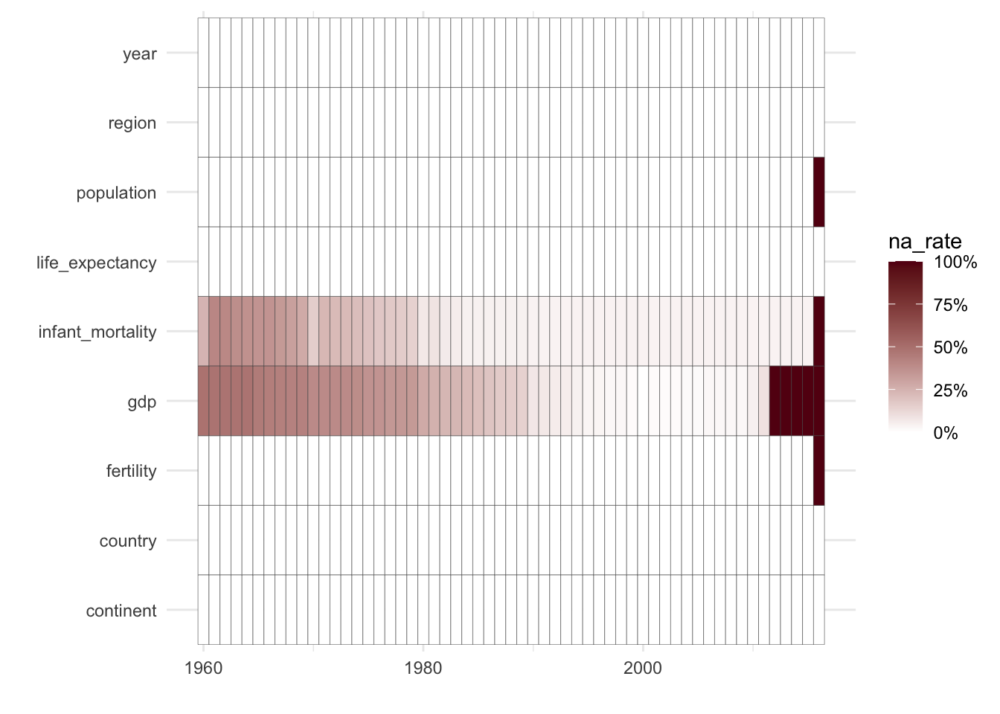
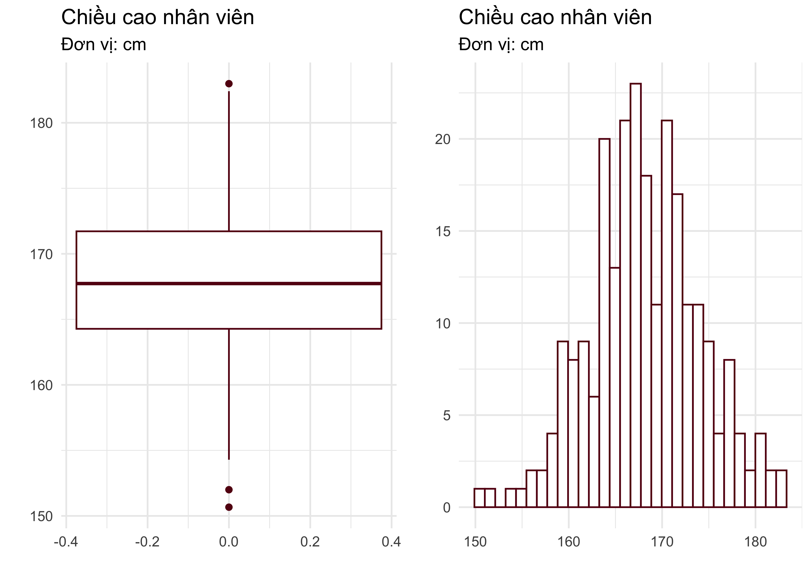
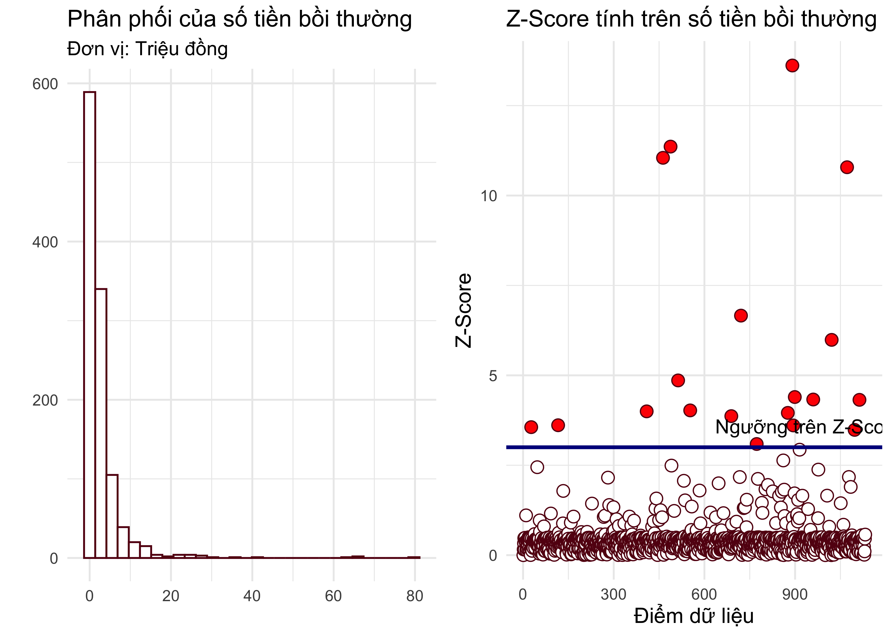
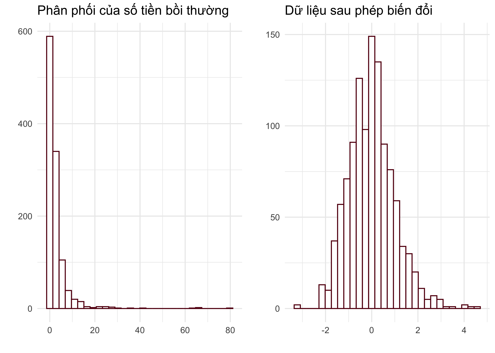
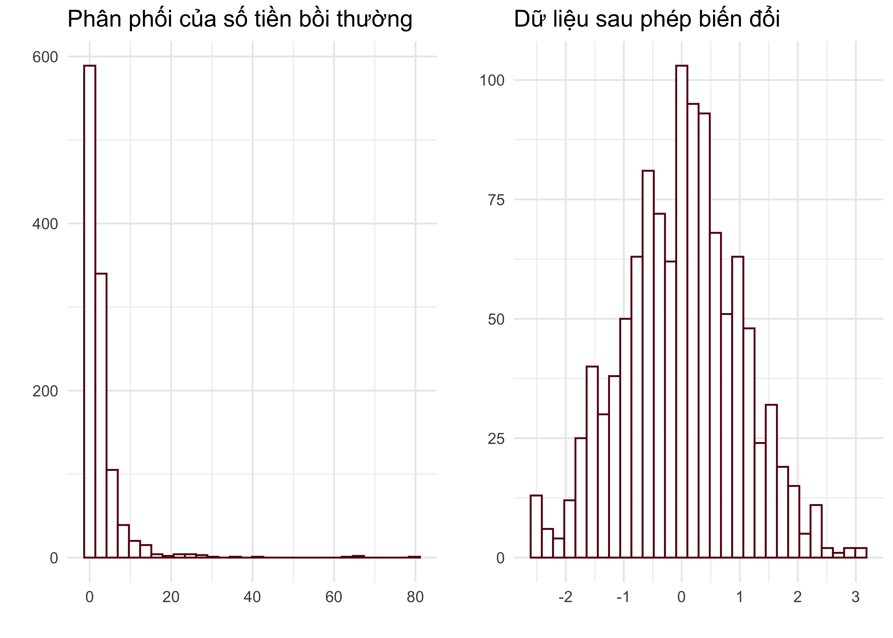

---
output:
  pdf_document: default
  html_document: default
---

```
## 
## Attaching package: 'dplyr'
```

```
## The following object is masked from 'package:pryr':
## 
##     where
```

```
## The following object is masked from 'package:gridExtra':
## 
##     combine
```

```
## The following object is masked from 'package:kableExtra':
## 
##     group_rows
```

```
## The following objects are masked from 'package:stats':
## 
##     filter, lag
```

```
## The following objects are masked from 'package:base':
## 
##     intersect, setdiff, setequal, union
```

```
## 
## Attaching package: 'lubridate'
```

```
## The following objects are masked from 'package:base':
## 
##     date, intersect, setdiff, union
```


# (PART) <span style='color: #640514; font-family: Source Code Pro;'><strong>PHẦN III: PHÂN TÍCH DỮ LIỆU</strong></span> {-}

# Nhập dữ liệu vào R

## Giới thiệu chung

Trong phần này của cuốn sách, bạn đọc sẽ được tìm hiểu về các kỹ thuật phân tích dữ liệu, bao gồm tiền xử lý dữ liệu, sắp xếp dữ liệu và trực quan hóa dữ liệu.

* **Tiền xử lý** dữ liệu bao gồm tất cả các kỹ thuật biến đổi dữ liệu thô thành định dạng để có thể thực hiện phân tích. Dữ liệu thô bao gồm dữ liệu nhận được từ người khác hoặc dữ liệu mà người phân tích tự tìm kiếm từ các nguồn khác nhau.
* **Sắp xếp và tổ chức** dữ liệu bao gồm các bước biến đổi, chuyển hóa dữ liệu thành định dạng để có thể trực quan hóa, thực hiện phân tích tính toán và xây dựng mô hình trên dữ liệu.
* **Trực quan hóa** dữ liệu là một nghệ thuật biến đổi dữ liệu vốn được hiển thị dưới dạng các con số, chuỗi ký tự, thành các biểu đồ, đồ thị, hình ảnh; sử dụng màu sắc, hình dạng, khoảng cách để mô tả giúp con người dễ dàng nhận thức và hiểu về dữ liệu. Trực quan hóa dữ liệu còn có thể giúp người phân tích dữ liệu và người tiếp nhận dữ liệu dễ dàng tìm ra những giá trị ẩn chứa trong dữ liệu.

Trước khi có thể bắt đầu bước tiền xử lý và phân tích dữ liệu, bước đầu tiên là nhập dữ liệu vào R. Trong một vài trường hợp, nhập dữ liệu cần nhập chỉ đơn giản là một bảng Excel có sẵn. Trong một số trường hợp khác, quá trình nhập dữ liệu có thể phức tạp hơn, chẳng hạn như từ một (vài) phần nào đó trong một hoặc nhiều bảng Excel, hoặc từ một cơ sở dữ liệu được lưu trữ trong các máy tính server, hoặc đôi khi cần viết các vòng lặp để lấy dữ liệu từ các trình duyệt web. Đây là chủ đề mà chúng ta sẽ thảo luận trong chương đầu của phần phân tích dữ liệu.

## Đối tượng lưu dữ liệu trong R

Hai kiểu đối tượng thường được dùng để lưu dữ liệu trong R là <span style='color: #640514; font-family: Source Code Pro;'>data.frame</span> và tibble. Chúng ta sẽ thảo luận về <span style='color: #640514; font-family: Source Code Pro;'>data.frame</span> trước vì đây là kiểu lưu dữ liệu phổ biến và xuất hiện trước. Đối tượng kiểu tibble, với một vài ưu điểm hơn <span style='color: #640514; font-family: Source Code Pro;'>data.frame</span>, sẽ được thảo luận trong phần tiếp theo.

### <span style='color: #640514; font-family: Source Code Pro;'>Data.frame</span>

<span style='color: #640514; font-family: Source Code Pro;'>Data.frame</span> là đối tượng phổ biến nhất để lưu trữ dữ liệu trên môi trường làm việc của R. Hiểu một cách đơn giản, một <span style='color: #640514; font-family: Source Code Pro;'>data.frame</span> giống như một bảng excel mà mỗi cột tương ứng với một véc-tơ và mỗi dòng tương ứng với một quan sát. Ngay khi cài đặt R, đã có nhiều đối tượng là dữ liệu kiểu <span style='color: #640514; font-family: Source Code Pro;'>data.frame</span> đã được lưu trữ trong R và đã sẵn sàng được sử dụng. Bạn đọc sử dụng câu lệnh <span style='color: #640514; font-family: Source Code Pro;'>data()</span> để biết trên môi trường đang sử dụng có những dữ liệu nào,

``` r
data()
```

Sau khi thực thi câu lệnh, bạn đọc có thể thấy trên cửa sổ <span style='color: #640514; font-family: Source Code Pro;'>script</span> xuất hiện một cửa sổ mới với danh sách tất cả các dữ liệu sẵn có trong R và những dữ liệu có trong các thư viện đang được gọi lên trên môi trường đang làm việc. Để biết trong một thư viện cụ thể có những dữ liệu nào, bạn đọc có thể sử dụng lệnh <span style='color: #640514; font-family: Source Code Pro;'>data()</span> kèm với tùy chọn <span style='color: #640514; font-family: Source Code Pro;'>package</span> như sau:

``` r
library(dslabs) # Gọi thư viện dslabs
data(package = "dslabs") # Liệt kê những data trong dslabs
```

Trong danh sách dữ liệu của thư viện <span style='color: #640514; font-family: Source Code Pro;'>dslabs</span>, bạn đọc có thể thấy rất nhiều đối tượng kiểu <span style='color: #640514; font-family: Source Code Pro;'>data.frame</span>. Một trong số đó có một dữ liệu có tên là <span style='color: #640514; font-family: Source Code Pro;'>murders</span>. Bạn đọc có thể kiểm tra kiểu của đối tượng này bằng hàm <span style='color: #640514; font-family: Source Code Pro;'>class()</span>:

``` r
class(murders) # Trả lại kết quả là một data frame
```

```
## [1] "data.frame"
```

Thông thường để có hiểu biết ban đầu về một đối tượng kiểu <span style='color: #640514; font-family: Source Code Pro;'>data.frame</span>, chúng ta nên bắt đầu bằng đọc mô tả về dữ liệu (nếu có):

``` r
? murders # Cửa sổ help sẽ hiển thị mô tả về murders
```

Có một nhóm các câu lệnh thường được sử dụng để có cái nhìn tổng thể về cấu trúc của dữ liệu. Các câu lệnh này được liệt kê ở dưới:

``` r
View(murders) # Hiển thị data.frame dưới dạng bảng
head(murders,k = 5) # Hiển thị k dòng đầu tiên của data.frame
str(murders) # Hiển thị cấu trúc của data.frame
glimpse(murders) # Hiển thị cấu trúc của data.frame
```

* Hàm <span style='color: #640514; font-family: Source Code Pro;'>head()</span> cho kết quả là các dòng đầu tiên của dữ liệu và giúp bạn đọc cái nhìn trực quan về tên các cột hoặc kiểu dữ liệu trong các cột. Tuy nhiên hàm <span style='color: #640514; font-family: Source Code Pro;'>head()</span> không hiệu quả khi dữ liệu có nhiều cột. Hàm <span style='color: #640514; font-family: Source Code Pro;'>head()</span> có tham số <span style='color: #640514; font-family: Source Code Pro;'>n</span> đi kèm cho biết số lượng dòng dữ liệu bạn đọc muốn hiển thị. <span style='color: #640514; font-family: Source Code Pro;'>n</span> nhận giá trị mặc định bằng 6.
* Hàm <span style='color: #640514; font-family: Source Code Pro;'>View()</span> hiển thị về dữ liệu một cách trực quan và dễ nhìn nhất. Sau khi thực thi, kết quả của hàm <span style='color: #640514; font-family: Source Code Pro;'>View()</span> sẽ xuất hiện trên cửa sổ <span style='color: #640514; font-family: Source Code Pro;'>Script</span>. Ngoài ý nghĩa hiển thị dữ liệu, kết quả của hàm <span style='color: #640514; font-family: Source Code Pro;'>View()</span> còn là một bảng tương tác mà bạn đọc có thể thực hiện thao tác như sắp xếp dữ liệu trong các cột. Hàm <span style='color: #640514; font-family: Source Code Pro;'>View()</span> có hạn chế khi dữ liệu có quá nhiều dòng hoặc nhiều cột và thời gian hiển thị lâu hơn so với <span style='color: #640514; font-family: Source Code Pro;'>head()</span>.
* Hàm <span style='color: #640514; font-family: Source Code Pro;'>str()</span> là cách hiển thị dữ liệu một cách tổng quát và hiệu quả hơn so với <span style='color: #640514; font-family: Source Code Pro;'>head()</span>. Sau thi thực thi hàm <span style='color: #640514; font-family: Source Code Pro;'>str()</span> trên dữ liệu <span style='color: #640514; font-family: Source Code Pro;'>murders</span>, bạn đọc có thể có cái nhìn tổng thể về dữ liệu này:
  * <span style='color: #640514; font-family: Source Code Pro;'>murders</span> là một <span style='color: #640514; font-family: Source Code Pro;'>data.frame</span> có 5 cột (còn gọi là các *variables*) và 51 dòng (còn gọi là các *observations*).
  * Tên của 5 cột lần lượt là <span style='color: #640514; font-family: Source Code Pro;'>state</span>, <span style='color: #640514; font-family: Source Code Pro;'>abb</span>, <span style='color: #640514; font-family: Source Code Pro;'>region</span>, <span style='color: #640514; font-family: Source Code Pro;'>population</span>, và <span style='color: #640514; font-family: Source Code Pro;'>total</span>.
  * Hàm <span style='color: #640514; font-family: Source Code Pro;'>str()</span> cho chúng ta thấy thấy được kiểu dữ liệu của từng cột: cột <span style='color: #640514; font-family: Source Code Pro;'>state</span> và cột <span style='color: #640514; font-family: Source Code Pro;'>abb</span> chứa dữ liệu kiểu <span style='color: #640514; font-family: Source Code Pro;'>character</span>; cột <span style='color: #640514; font-family: Source Code Pro;'>region</span> chứa dữ liệu kiểu <span style='color: #640514; font-family: Source Code Pro;'>factor</span>, các cột <span style='color: #640514; font-family: Source Code Pro;'>population</span>, và <span style='color: #640514; font-family: Source Code Pro;'>total</span> chứa dữ liệu kiểu <span style='color: #640514; font-family: Source Code Pro;'>numeric</span>.
* Hàm <span style='color: #640514; font-family: Source Code Pro;'>glimpse()</span> là một hàm số trong thư viện <span style='color: #640514; font-family: Source Code Pro;'>dplyr</span> cũng thường được sử dụng để tìm hiểu về dữ liệu. Kết quả của hàm <span style='color: #640514; font-family: Source Code Pro;'>glimpse()</span> tương tự như hàm <span style='color: #640514; font-family: Source Code Pro;'>str()</span>.

Một hàm số khác cũng thường được sử dụng để người phân tích có cái nhìn tổng quan về dữ liệu là hàm <span style='color: #640514; font-family: Source Code Pro;'>summary()</span>. Hàm số này có thể được áp dụng trên các đối tượng kiểu khác nhau, không nhất thiết phải là kiểu <span style='color: #640514; font-family: Source Code Pro;'>data.frame</span>. Khi sử dụng trên <span style='color: #640514; font-family: Source Code Pro;'>data.frame</span>, hàm <span style='color: #640514; font-family: Source Code Pro;'>summary()</span> cho chúng ta nhiều thông tin hữu ích về dữ liệu. Thật vậy, bạn đọc có thể quan sát kết quả của hàm <span style='color: #640514; font-family: Source Code Pro;'>summary()</span> trên dữ liệu <span style='color: #640514; font-family: Source Code Pro;'>murders</span>:


``` r
summary(murders)
```

```
##     state               abb                      region     population      
##  Length:51          Length:51          Northeast    : 9   Min.   :  563626  
##  Class :character   Class :character   South        :17   1st Qu.: 1696962  
##  Mode  :character   Mode  :character   North Central:12   Median : 4339367  
##                                        West         :13   Mean   : 6075769  
##                                                           3rd Qu.: 6636084  
##                                                           Max.   :37253956  
##      total       
##  Min.   :   2.0  
##  1st Qu.:  24.5  
##  Median :  97.0  
##  Mean   : 184.4  
##  3rd Qu.: 268.0  
##  Max.   :1257.0
```

Có thể thấy rằng hàm <span style='color: #640514; font-family: Source Code Pro;'>summary()</span> cho biết thông chi tiết hơn so với <span style='color: #640514; font-family: Source Code Pro;'>str()</span> về giá trị trong các cột dữ liệu:

* Ngoài kiểu dữ liệu của từng biến, <span style='color: #640514; font-family: Source Code Pro;'>summary()</span> còn cung cấp các giá trị thống kê cho phép người phân tích dữ liệu có hình dung ban đầu về phân phối xác suất của các biến liên tục và tần suất xuất hiện của các giá trị trong biến rời rạc.
* Trong trường hợp cột dữ liệu có giá trị không quan sát được, hàm <span style='color: #640514; font-family: Source Code Pro;'>summary()</span> cũng sẽ cho biết có bao nhiêu giá trị không quan sát được trong mỗi cột.

\paragraph{Thực hành:} Bạn đọc hãy sử dụng các hàm liệt kê ở trên để tìm hiểu về dữ liệu có tên <span style='color: #640514; font-family: Source Code Pro;'>gapminder</span> trong thư viện <span style='color: #640514; font-family: Source Code Pro;'>dslabs</span>

Xét về cấu trúc, có thể hiểu một <span style='color: #640514; font-family: Source Code Pro;'>data.frame</span> là một trường hợp đặc biệt của đối tượng kiểu <span style='color: #640514; font-family: Source Code Pro;'>list</span> trong R. Các phần tử con của một <span style='color: #640514; font-family: Source Code Pro;'>data.frame</span> là các véc-tơ (cột) dữ liệu. Để lấy ra một cột dữ liệu của một <span style='color: #640514; font-family: Source Code Pro;'>data.frame</span> chúng ta sử dụng ký tự <span style='color: #640514; font-family: Source Code Pro;'>$</span> để kết nối tên <span style='color: #640514; font-family: Source Code Pro;'>data.frame</span> và tên cột dữ liệu. Ví dụ, để lấy giá trị của cột có tên là <span style='color: #640514; font-family: Source Code Pro;'>population</span> từ dữ liệu <span style='color: #640514; font-family: Source Code Pro;'>murders</span>, chúng ta viết câu lệnh như sau:


``` r
murders$population # in ra màn hình cột population của data.frame murders
```

Hoặc lấy ra cột có tên là <span style='color: #640514; font-family: Source Code Pro;'>region</span>:

``` r
murders$region # in ra màn hình cột region của data.frame murders
```

Kiểu dữ liệu của cột <span style='color: #640514; font-family: Source Code Pro;'>region</span> là kiểu <span style='color: #640514; font-family: Source Code Pro;'>factor</span>. Về bản chất, một véc-tơ kiểu <span style='color: #640514; font-family: Source Code Pro;'>factor</span> là một véc-tơ kiểu chuỗi ký tự nhưng được lưu trong R theo một cách hiệu quả hơn, tiết kiệm bộ nhớ, và thuận lợi cho người sử dụng khi phân tích dữ liệu. Trước hết, mỗi giá trị trong véc-tơ chuỗi ký tự sẽ được cho tương ứng với một số tự nhiên, bắt đầu từ 1 đến số lượng chuỗi ký tự khác nhau trong véc-tơ đó. Thay vì lưu chính xác giá trị của các chuỗi ký tự, véc-tơ kiểu <span style='color: #640514; font-family: Source Code Pro;'>factor</span> lưu dữ liệu dưới dạng các số tự nhiên. Mỗi khi cần hiển thị giá trị của một chuỗi ký tự, véc-tơ kiểu <span style='color: #640514; font-family: Source Code Pro;'>factor</span> sẽ tìm kiếm số tự nhiên tương ứng với giá trị của chuỗi ký tự đó. Cách lưu dữ liệu như vậy hiệu quả hơn về mặt bộ nhớ đặc biệt là khi trong véc-tơ chuỗi ký tự có nhiều giá trị bị lặp lại.

Các hàm số <span style='color: #640514; font-family: Source Code Pro;'>summary()</span> và <span style='color: #640514; font-family: Source Code Pro;'>table()</span> có thể được sử dụng để tổng hợp thông tin về một véc-tơ kiểu <span style='color: #640514; font-family: Source Code Pro;'>factor</span>:


``` r
summary(murders$region) # Tổng hợp thông tin của vec-tơ dạng factor
```

```
##     Northeast         South North Central          West 
##             9            17            12            13
```

``` r
table(murders$region) # cho kết quả tương tự như summary
```

```
## 
##     Northeast         South North Central          West 
##             9            17            12            13
```

Từ kết quả của hàm <span style='color: #640514; font-family: Source Code Pro;'>table()</span> trên véc-tơ <span style='color: #640514; font-family: Source Code Pro;'>region</span> có thể thấy rằng:

* Biến <span style='color: #640514; font-family: Source Code Pro;'>region</span> có 4 giá trị riêng biệt và quy tắc cho tương ứng mỗi giá trị đến các số tự nhiên là: <span style='color: #640514; font-family: Source Code Pro;'>Northeast:1</span>; <span style='color: #640514; font-family: Source Code Pro;'>South:2</span>; <span style='color: #640514; font-family: Source Code Pro;'>North Central:3</span>, và <span style='color: #640514; font-family: Source Code Pro;'>West:4</span>.
* Tần suất xuất hiện của các giá trị trong véc-tơ <span style='color: #640514; font-family: Source Code Pro;'>region</span>
  * <span style='color: #640514; font-family: Source Code Pro;'>Northeast</span> xuất hiện 9 lần;
  * <span style='color: #640514; font-family: Source Code Pro;'>South</span> xuất hiện 17 lần;
  * <span style='color: #640514; font-family: Source Code Pro;'>North Central</span> xuất hiện có 12 lần;
  * <span style='color: #640514; font-family: Source Code Pro;'>West</span> xuất hiện 13 lần.

Trong hầu hết các trường hợp, dữ liệu cần xử lý và phân tích là dữ liệu được nhập từ các nguồn bên ngoài. Dữ liệu sau khi được nhập vào R sẽ được lưu dưới dạng <span style='color: #640514; font-family: Source Code Pro;'>data.frame</span> để dễ dàng xử lý. Trong một vài trường hợp, bạn đọc sẽ cần tự tạo <span style='color: #640514; font-family: Source Code Pro;'>data.frame</span> trực tiếp từ các câu lệnh R. Hàm số để tạo một <span style='color: #640514; font-family: Source Code Pro;'>data.frame</span> là <span style='color: #640514; font-family: Source Code Pro;'>data.frame()</span>. Các véc-tơ khai báo cho giá trị của các cột cần có độ dài bằng nhau nếu không R sẽ báo lỗi. Ví dụ, để tạo một <span style='color: #640514; font-family: Source Code Pro;'>data.frame</span> có tên <span style='color: #640514; font-family: Source Code Pro;'>df</span> với các cột lần lượt là <span style='color: #640514; font-family: Source Code Pro;'>id</span>, <span style='color: #640514; font-family: Source Code Pro;'>names</span>, <span style='color: #640514; font-family: Source Code Pro;'>grades</span>, và <span style='color: #640514; font-family: Source Code Pro;'>result</span>, chúng ta viết câu lệnh như sau:


``` r
df<-data.frame( # Hàm data.frame() dùng để tạo data.frame tên df
      id = paste("SV",1:5), # Cột có tên là ID nhận giá trị "SV1",...,"SV5"
      names = c("You", "Me", "Him", "Her", "John"), # Cột names
      grades = c(5.5, 1.5, 10.0, 9.0, 7.6), # Cột grades
      result = c(TRUE, FALSE,TRUE, TRUE, TRUE)) # Cột result
df # hiển thị data.frame có tên df
```

```
##     id names grades result
## 1 SV 1   You    5.5   TRUE
## 2 SV 2    Me    1.5  FALSE
## 3 SV 3   Him   10.0   TRUE
## 4 SV 4   Her    9.0   TRUE
## 5 SV 5  John    7.6   TRUE
```

Khi lưu dữ liệu kiểu <span style='color: #640514; font-family: Source Code Pro;'>data.frame</span> sẽ có một số nhược điểm khiến cho việc lấy dữ liệu từ nguồn bên ngoài vào bị hạn chế, chẳng hạn như tên cột dữ liệu bị tự động thay đổi nếu không phù hợp, hoặc kiểu dữ liệu bị tự động thay đổi. Để khắc phục các nhược điểm này, một kiểu đối tượng mới được phát triển để lưu dữ liệu trên môi trường làm việc của R, đó là kiểu <span style='color: #640514; font-family: Source Code Pro;'>tibble</span>. Trong phần tiếp theo chúng ta sẽ thảo luận về đối tượng lưu dữ liệu này.

### <span style='color: #640514; font-family: Source Code Pro;'>Tibble</span>
Về cơ bản một <span style='color: #640514; font-family: Source Code Pro;'>tibble</span> là cũng có thể hiểu là một <span style='color: #640514; font-family: Source Code Pro;'>data.frame</span> với một vài điều chỉnh để giúp việc lấy dữ liệu từ nguồn bên ngoài vào và thực hiện phân tích trở nên dễ dàng hơn. Theo kinh nghiệm của chúng tôi, ở mức độ phân tích dữ liệu thông thường, sự khác khác nhau giữa <span style='color: #640514; font-family: Source Code Pro;'>tibble</span> và <span style='color: #640514; font-family: Source Code Pro;'>data.frame</span> là không đáng kể. Sự khác nhau cơ bản giữu hai đối tượng này có thể liệt kê như sau:

* *Thứ nhất*, khi in một <span style='color: #640514; font-family: Source Code Pro;'>tibble</span> ra màn hình sẽ chỉ có 10 dòng đầu được hiển thị và số lượng cột được in sẽ luôn khớp với kích thước cửa sổ <span style='color: #640514; font-family: Source Code Pro;'>Console</span> hiện tại. Việc này giúp cho cửa sổ <span style='color: #640514; font-family: Source Code Pro;'>Console</span> không bị tràn dòng giống như khi chúng ta in <span style='color: #640514; font-family: Source Code Pro;'>data.frame</span> có kích thước lớn. Ngoài ra, khi hiển thị trên cửa sổ <span style='color: #640514; font-family: Source Code Pro;'>Console</span>, thông tin về kiểu dữ liệu của cột cũng sẽ xuất hiện ngay dưới tên cột. Thư viện để làm việc trên đối tượng <span style='color: #640514; font-family: Source Code Pro;'>tibble</span> là thư viện có cùng tên. Bạn đọc có thể sử dụng hàm <span style='color: #640514; font-family: Source Code Pro;'>as_tibble()</span> để đổi một <span style='color: #640514; font-family: Source Code Pro;'>data.frame</span> sang kiểu tibble và dùng hàm <span style='color: #640514; font-family: Source Code Pro;'>as.data.frame()</span> để thực hiện phép đổi ngược lại. Bạn đọc có thể thực hiện in một <span style='color: #640514; font-family: Source Code Pro;'>tibble</span> trực tiếp lên màn hình <span style='color: #640514; font-family: Source Code Pro;'>Console</span> mà không gặp phải vấn đề về tràn dòng như ví dụ dưới đây:

``` r
library(tibble)
trump_tweets # in một data.frame sẽ bị tràn dòng
as_tibble(trump_tweets) # Hiển thị 1 tibble hiệu quả hơn.
```

* *Thứ hai*, khi lấy dữ liệu từ nguồn ngoài, <span style='color: #640514; font-family: Source Code Pro;'>tibble</span> không đổi tên cột dù tên cột không phải là kiểu tên cho phép trong R. Đồng thời, khi tạo một <span style='color: #640514; font-family: Source Code Pro;'>tibble</span>, bạn đọc có thể đặt tên biến (cột) là một tên không được phép sử dụng với tên biến thông thường trong R.
* *Thứ ba*, khi dữ liệu từ nguồn bên ngoài được lưu vào một <span style='color: #640514; font-family: Source Code Pro;'>tibble</span>, kiểu dữ liệu sẽ không thay đổi.

Hàm <span style='color: #640514; font-family: Source Code Pro;'>tibble()</span> được sử dụng để tạo ra một <span style='color: #640514; font-family: Source Code Pro;'>tibble</span> trong R. Trong ví dụ dưới đây, chúng tôi tạo ra một dữ liệu có 3 cột với tên biến đều không được sử dụng làm tên biến trong R, tuy nhiên R vẫn không báo lỗi và dữ liệu được tạo ra có các cột có tên không thay đổi:

``` r
tib<-tibble( # hàm tibble dùng để tạo tibble
  ":D" = c(1,2,3), # có thể dùng tên cột là ":D"
  ":p" = c("X","Y","Z"), # có thể dùng tên cột là ":p"
  "1" = 2 # có thể dùng tên cột là "1"
)
tib
```

```
## # A tibble: 3 × 3
##    `:D` `:p`    `1`
##   <dbl> <chr> <dbl>
## 1     1 X         2
## 2     2 Y         2
## 3     3 Z         2
```

Nếu thay thế hàm <span style='color: #640514; font-family: Source Code Pro;'>tibble()</span> trong đoạn câu lệnh trên bằng hàm <span style='color: #640514; font-family: Source Code Pro;'>data.frame()</span> thì <span style='color: #640514; font-family: Source Code Pro;'>data.frame</span> được tạo thành sẽ tự động thay đổi tên cột

``` r
df<-data.frame( # tạo data.frame thay vì tibble
  ":D" = c(1,2,3), # data.frame sẽ đổi tên cột cho phù hợp
  ":p" = c("X","Y","Z"), # data.frame sẽ đổi tên cột cho phù hợp
  "1" = 2 # data.frame sẽ đổi tên cột cho phù hợp
)
df # hãy quan sát xem tên cột của df thay đổi như thế nào
```

```
##   X.D X.p X1
## 1   1   X  2
## 2   2   Y  2
## 3   3   Z  2
```

Bạn đọc có thể thấy rằng dữ liệu có tên <span style='color: #640514; font-family: Source Code Pro;'>df</span> khi được lưu dưới dạng <span style='color: #640514; font-family: Source Code Pro;'>data.frame</span> có tên các cột đã tự động thay đổi. Việc tự động thay đổi tên cột sẽ khiến cho người phân tích dữ liệu gặp khó khăn khi kiểm soát tên biến mỗi khi lấy dữ liệu từ nguồn ngoài, đặc biệt đối với những dữ liệu lớn và phức tạp.

Những điểm khác nhau giữa <span style='color: #640514; font-family: Source Code Pro;'>tibble</span> và <span style='color: #640514; font-family: Source Code Pro;'>data.frame</span> sẽ được tiếp tục đề cập ở các phần tiếp theo của chương khi chúng tôi thảo luận về các hàm dùng để nhập dữ liệu vào R.

## Nhập dữ liệu bằng hàm có sẵn
Dữ liệu từ các nguồn ngoài tồn tại ở nhiều định dạng khác nhau do được lưu và trích xuất từ các phần mềm/hệ thống khác nhau. Một trong những điểm mạnh của phần mềm R là khả năng đọc được hầu hết các định dạng khác nhau của dữ liệu. Ngay trong các thư viện sẵn có khi chúng ta cài đặt R, đã có một danh sách các hàm cho phép chúng ta đọc dữ liệu từ nhiều định dạng. Một số hàm điển hình và định dạng dữ liệu tương ứng được liệt kê trong các Bảng \@ref(tab:tbptdl001)

<table class="table table-striped table-bordered table-hover" style="width: auto !important; margin-left: auto; margin-right: auto;">
<caption>(\#tab:tbptdl001)Danh sách hàm có sẵn để lấy dữ liệu từ nguồn bên ngoài</caption>
 <thead>
  <tr>
   <th style="text-align:left;"> Hàm số </th>
   <th style="text-align:left;"> Định dạng dữ liệu </th>
  </tr>
 </thead>
<tbody>
  <tr>
   <td style="text-align:left;"> read.table() </td>
   <td style="text-align:left;"> Đọc các file có đuôi dạng .txt </td>
  </tr>
  <tr>
   <td style="text-align:left;"> read.csv() </td>
   <td style="text-align:left;"> file dạng csv mà giá trị được ngăn cách bằng dấu ',' </td>
  </tr>
  <tr>
   <td style="text-align:left;"> read.csv2() </td>
   <td style="text-align:left;"> file dạng csv mà giá trị được ngăn cách bằng dấu ; </td>
  </tr>
  <tr>
   <td style="text-align:left;"> read.delim() </td>
   <td style="text-align:left;"> Các file dạng text, các giá trị cách nhau bởi ký tự mà bạn đọc định nghĩa </td>
  </tr>
  <tr>
   <td style="text-align:left;"> readRDS() </td>
   <td style="text-align:left;"> Dữ liệu được lưu dưới dạng .rds </td>
  </tr>
  <tr>
   <td style="text-align:left;"> load() </td>
   <td style="text-align:left;"> Dữ liệu kiểu data có sẵn trong R </td>
  </tr>
</tbody>
</table>

Để đọc dữ liệu từ nguồn ngoài bằng một trong các hàm được liệt kê trong Bảng \@ref(tab:tbptdl001), cấu trúc câu lệnh sẽ như sau:

``` r
TenHamSo(Duong_dan/Ten_file)
```

trong đó <span style='color: #640514; font-family: Source Code Pro;'>TenHamSo</span> là tên của hàm đọc dữ liệu; <span style='color: #640514; font-family: Source Code Pro;'>Duong_dan</span> là đường dẫn đến folder chứa dữ liệu; và <span style='color: #640514; font-family: Source Code Pro;'>Ten_file</span> là tên file chứa dữ liệu bao gồm cả phần định dạng.

Khi lấy dữ liệu từ các nguồn bên ngoài vào bằng các câu lệnh có sẵn, tên của các cột dữ liệu có thể bị thay đổi do một số tên cột không thể được dùng để đặt tên của <span style='color: #640514; font-family: Source Code Pro;'>data.frame</span>. Do đó, bạn đọc hãy luôn kiểm tra lại tên các cột dữ liệu sau khi đọc. Hàm <span style='color: #640514; font-family: Source Code Pro;'>names()</span> cho biết tên các cột của một <span style='color: #640514; font-family: Source Code Pro;'>data.frame</span>.

``` r
df<-read.csv(header = TRUE,
              text = "@1,@2
                      1,2
                      3,4") # sử dụng read.csv để đọc đoạn text
names(df) # hiển thị tên của các cột
```

```
## [1] "X.1" "X.2"
```

Để đổi tên của các biến trong <span style='color: #640514; font-family: Source Code Pro;'>data.frame</span> có tên <span style='color: #640514; font-family: Source Code Pro;'>df</span> ở trên, bạn đọc sử dụng hàm cần gán <span style='color: #640514; font-family: Source Code Pro;'>names()</span> để gọi tên các biến sau đó gán giá trị của hàm này bằng một véc-tơ kiểu chuỗi ký tự chứa tên các cột. Hãy đảm bảo rằng độ dài của vec-tơ chứa tên cột bằng số cột của <span style='color: #640514; font-family: Source Code Pro;'>df</span> nếu không sẽ có cảnh báo từ R.

``` r
names(df)<-c("c1","c2") # đổi tên 2 cột của data.frame df
df # in data.frame df
```

```
##   c1 c2
## 1  1  2
## 2  3  4
```

:::: {.blackbox data-latex=""}
*Thực hành:Bạn đọc hãy tìm trên máy tính của mình các file dữ liệu có định dạng như trong Bảng \@ref(tab:tbptdl001) sau đó hãy sử dụng hàm số tương ứng để đọc dữ liệu vào R.*
::::

Mặc dù R đã hỗ trợ việc đọc dữ liệu từ hầu hết các định dạng khác nhau, tuy nhiên khi dữ liệu ngày càng lớn và phức tạp thì các hàm đọc dữ liệu sẵn có sẽ không còn đáp ứng được nhu cầu. Chính vì thế có các thư viện được thiết kế riêng cho việc đọc dữ liệu. Trong các phần tiếp theo chúng ta sẽ thảo luận về các thư viện như vậy và các ưu thế khi sử dụng các thư viện này so với việc sử dụng các hàm sẵn có.

## Nhập dữ liệu bằng thư viện <span style='color: #640514; font-family: Source Code Pro;'>readr</span>.

Thư viện <span style='color: #640514; font-family: Source Code Pro;'>readr</span> là một (1) trong tám (8) thư viện được tích hợp sẵn trong thư viện tổng hợp <span style='color: #640514; font-family: Source Code Pro;'>tidyverse</span> chuyên dành cho việc phân tích dữ liệu. Thư viện <span style='color: #640514; font-family: Source Code Pro;'>readr</span> có các câu lệnh để đọc dữ liệu tương tự như các câu lệnh sẵn có trong R nhưng đặc biệt hiệu quả hơn về tốc độ (thời gian) đọc dữ liệu. Chẳng hạn như hàm số dùng để đọc các file định dạng *.csv* trong thư viện <span style='color: #640514; font-family: Source Code Pro;'>readr</span> là hàm <span style='color: #640514; font-family: Source Code Pro;'>read_csv()</span> thường được dùng thay thế cho hàm có sẵn <span style='color: #640514; font-family: Source Code Pro;'>read.csv()</span> khi chúng ta cần đọc các file có dung lượng lớn.

Chúng ta thực hiện một ví dụ như sau để so sánh thời gian đọc dữ liệu của hàm <span style='color: #640514; font-family: Source Code Pro;'>read_csv()</span> và hàm <span style='color: #640514; font-family: Source Code Pro;'>read.csv()</span>: chúng ta sẽ tạo hai file dữ liệu bao gồm <span style='color: #640514; font-family: Source Code Pro;'>test1.csv</span> và <span style='color: #640514; font-family: Source Code Pro;'>test2.csv</span> là các file chứa các số được sinh ngẫu nhiên.  Dữ liệu <span style='color: #640514; font-family: Source Code Pro;'>test1.csv</span> có $10^2$ hàng và $10^4$ cột, trong khi dữ liệu `test2.csv` có $10^2$ hàng và $10^5$ cột. Chúng ta sẽ dùng hàm sẵn có và hàm <span style='color: #640514; font-family: Source Code Pro;'>read_csv()</span> cùng đọc hai dữ liệu này sau đó so sánh thời gian đọc dữ liệu. Các câu lệnh dưới đây dùng để tạo và lưu các dữ liệu:

``` r
x<-matrix(rnorm(10^6),10^2,10^4) # Ma trận 100 hàng, 10^4 cột
write.csv(x,"test1.csv") # Ma tran thanh file .csv
x<-matrix(rnorm(10^7),10^2,10^5) # Ma trận 100 hàng, 10^5 cột
write.csv(x,"test2.csv") # Ma tran thanh file .csv
```

Bạn đọc có thể kiểm tra kích thước của các file <span style='color: #640514; font-family: Source Code Pro;'>test1.csv</span> và <span style='color: #640514; font-family: Source Code Pro;'>test2.csv</span> trên máy tính để thấy rằng dung lượng của các file lần lượt là 18 Mega byte và 180 Mega byte. Chúng ta sẽ kiểm tra thời gian mà các hàm <span style='color: #640514; font-family: Source Code Pro;'>read.csv()</span> và <span style='color: #640514; font-family: Source Code Pro;'>read_csv()</span> nhập dữ liệu đối với dữ liệu test1.csv trước:

``` r
start<-proc.time() # lưu lại thời điểm trước khi chạy read.csv
dat<-read.csv("test1.csv") # dùng hàm read.csv để load dữ liệu
proc.time() - start # tính thời gian hàm read.csv chạy

start<-proc.time() # lưu lại thời điểm trước khi chạy read_csv
dat<-read_csv("test1.csv") # dùng hàm read_csv để load dữ liệu
proc.time() - start # tính thời gian hàm read_csv chạy
```

Đối với dữ liệu <span style='color: #640514; font-family: Source Code Pro;'>test1.csv</span> thì thời gian nhập dữ liệu của <span style='color: #640514; font-family: Source Code Pro;'>read_csv()</span> có nhanh hơn nhưng không có sự khác biệt đáng kể. Tuy nhiên sự khác biệt sẽ rõ ràng khi nhập dữ liệu <span style='color: #640514; font-family: Source Code Pro;'>test2.csv</span>. Bạn đọc cân nhắc khi dùng hàm <span style='color: #640514; font-family: Source Code Pro;'>read.csv()</span> đọc dữ liệu bởi thời gian nhập dữ liệu với những file có dung lượng hơn 100 Mega bytes có thể lên đến hơn 20 phút.


``` r
start<-proc.time() # lưu lại thời điểm trước khi chạy read.csv
dat<-read.csv("test2.csv") # !!! THỜI GIAN CHẠY CÓ THỂ LÊN ĐẾN 20-25 phút
proc.time() - start # tính thời gian hàm read.csv chạy

start<-proc.time() # lưu lại thời điểm trước khi chạy read_csv
dat<-read_csv("test2.csv") # dùng hàm read_csv để load dữ liệu
proc.time() - start # tính thời gian hàm read_csv chạy
```

Trên máy tính của chúng tôi, hàm <span style='color: #640514; font-family: Source Code Pro;'>read_csv()</span> sẽ mất khoảng 2 phút để đọc dữ liệu <span style='color: #640514; font-family: Source Code Pro;'>test2.csv</span>, nghĩa là thời gian có thể nhanh hơn đến 10 lần. Điều này đặc biệt quan trọng mỗi khi chúng ta cần đọc các dữ liệu có kích thước lớn. Một lưu ý khác đối với <span style='color: #640514; font-family: Source Code Pro;'>read_csv()</span> là dữ liệu sẽ được lưu dưới dạng một <span style='color: #640514; font-family: Source Code Pro;'>tibble</span>, nghĩa là dữ liệu sẽ không bị thay đổi tên biến và kiểu giá trị của biến.

Ngoài hàm <span style='color: #640514; font-family: Source Code Pro;'>read_csv()</span>, thư viện <span style='color: #640514; font-family: Source Code Pro;'>readr</span> còn có các hàm số khác để đọc các kiểu định dạng file khác nhau. Danh sách các hàm thường hay dùng được liệt kê trong bảng \@ref(tab:tbptdl002)

<table class="table table-striped table-bordered table-hover" style="width: auto !important; margin-left: auto; margin-right: auto;">
<caption>(\#tab:tbptdl002)Danh sách hàm đọc dữ liệu của thư viện readr</caption>
 <thead>
  <tr>
   <th style="text-align:left;"> Hàm số </th>
   <th style="text-align:left;"> Định dạng dữ liệu </th>
  </tr>
 </thead>
<tbody>
  <tr>
   <td style="text-align:left;"> read_csv() </td>
   <td style="text-align:left;"> file dạng csv mà giá trị được ngăn cách bằng dấu ',' </td>
  </tr>
  <tr>
   <td style="text-align:left;"> read_csv2() </td>
   <td style="text-align:left;"> file dạng csv mà giá trị được ngăn cách bằng dấu ';' </td>
  </tr>
  <tr>
   <td style="text-align:left;"> read_tsv() </td>
   <td style="text-align:left;"> Các file dạng text mà các giá trị cách nhau bởi khoảng trống </td>
  </tr>
  <tr>
   <td style="text-align:left;"> read_delim() </td>
   <td style="text-align:left;"> Các file dạng text mà các giá trị cách nhau bởi ký tự bất kỳ </td>
  </tr>
</tbody>
</table>
Ngoài việc các hàm trong thư viện <span style='color: #640514; font-family: Source Code Pro;'>readr</span> luôn lưu dữ liệu vào một <span style='color: #640514; font-family: Source Code Pro;'>tibble</span>, một số lưu ý khác khi bạn đọc sử dụng các hàm số này là:

* *Thứ nhất*: các hàm số đọc dữ liệu của <span style='color: #640514; font-family: Source Code Pro;'>readr</span> luôn hiểu hàng đầu tiên của dữ liệu là tên của các biến. Do đó, nếu thực sự hàng đầu tiên không phải là tên của biên, bạn đọc cần sử dụng tham số <span style='color: #640514; font-family: Source Code Pro;'>col_names</span> và gán giá trị cho tham số này bằng <span style='color: #640514; font-family: Source Code Pro;'>FALSE</span>. Thật vậy, hãy quan sát sự khác nhau giữa việc có sử dụng và không sử dụng <span style='color: #640514; font-family: Source Code Pro;'>col_names = FALSE</span> trong ví dụ dưới đây:

``` r
library(readr)
# Kết quả sẽ là một Tibble 1 hàng và 3 cột
read_csv("1,2,3
         4,5,6") # Tên các cột là "1", "2", và "3"
```

```
## # A tibble: 1 × 3
##     `1`   `2`   `3`
##   <dbl> <dbl> <dbl>
## 1     4     5     6
```


``` r
# Kết quả sẽ là một Tibble 2 hàng và 3 cột
read_csv("1,2,3
         4,5,6", col_names = FALSE)
```

```
## # A tibble: 2 × 3
##      X1    X2    X3
##   <dbl> <dbl> <dbl>
## 1     1     2     3
## 2     4     5     6
```

``` r
# readr tự động đặt tên các cột X1, X2, X3
```
Bạn đọc có thể thấy rằng khi không sử dụng <span style='color: #640514; font-family: Source Code Pro;'>col_names = FALSE</span> như trong đoạn câu lệnh thứ nhất, hàm <span style='color: #640514; font-family: Source Code Pro;'>read_csv()</span> sẽ hiểu hàng đầu tiên, tương ứng với các số 1, 2, và 3, là tên các cột và dữ liệu chỉ được tính bắt đầu từ hàng thứ hai. Điều này giải thích tại sao kết quả nhận được là một <span style='color: #640514; font-family: Source Code Pro;'>tibble</span> chỉ có 1 quan sát. Trong đoạn câu lệnh thứ hai, Khi chúng ta sử dụng <span style='color: #640514; font-family: Source Code Pro;'>col_names = FALSE</span>, hàm <span style='color: #640514; font-family: Source Code Pro;'>read_csv()</span> sẽ tự động đặt tên các cột là <span style='color: #640514; font-family: Source Code Pro;'>X1, X2, X3</span> và kết quả nhận được là một <span style='color: #640514; font-family: Source Code Pro;'>tibble</span> có 2 quan sát.

* Khi dữ liệu được trích xuất từ nhiều nguồn khác nhau, trong một số trường hợp các dòng đầu tiên của dữ liệu là các đoạn văn bản được viết để mô tả về dữ liệu. Do đó khi sử dụng các hàm đọc dữ liệu, bạn đọc cần có thể sử dụng tham số <span style='color: #640514; font-family: Source Code Pro;'>skip = k</span> để loại bỏ <span style='color: #640514; font-family: Source Code Pro;'>k</span> dòng đầu tiên của file dữ liệu. Ví dụ, dữ liệu dưới đây có hai dòng đầu tiên là các đoạn văn bản không thuộc về dữ liệu, chúng ta loại bỏ đi hai dòng đó trong câu lệnh đọc dữ liệu như sau:

``` r
# Kết quả sẽ là một Tibble 2 hàng và 3 cột
read_csv("Trường Công nghệ
        Khoa toán Kinh tế
         1,2,3
         4,5,6", col_names = FALSE, skip = 2) # readr sẽ không đọc 2 dòng đầu
```

```
## Rows: 2 Columns: 3
## ── Column specification ────────────────────────────────────────────────────────
## Delimiter: ","
## dbl (3): X1, X2, X3
## 
## ℹ Use `spec()` to retrieve the full column specification for this data.
## ℹ Specify the column types or set `show_col_types = FALSE` to quiet this message.
```

```
## # A tibble: 2 × 3
##      X1    X2    X3
##   <dbl> <dbl> <dbl>
## 1     1     2     3
## 2     4     5     6
```

Bạn đọc cũng có thể gán một véc-tơ chuỗi ký tự cho tham số <span style='color: #640514; font-family: Source Code Pro;'>col_names</span> tạo tên cho các biến ngay khi gọi hàm <span style='color: #640514; font-family: Source Code Pro;'>read_csv()</span>. Tuy nhiên để tránh sự phức tạp, chúng tôi khuyên bạn đọc hãy đặt tên cho các cột bằng các gọi hàm <span style='color: #640514; font-family: Source Code Pro;'>names()</span> như chúng tôi đã đề cập ở trên.

Cách sử dụng các hàm khác ngoài <span style='color: #640514; font-family: Source Code Pro;'>read_csv()</span> được liệt kê trong Bảng \@ref(tab:tbptdl002) hoàn toàn tương tự và bạn đọc có thể tham khảo trong hướng dẫn của thư viện <span style='color: #640514; font-family: Source Code Pro;'>readr</span>.

\paragraph{Thực hành:} Bạn đọc hãy thử kiểm tra xem các câu lệnh đọc dữ liệu dưới đây có vấn đề gì không và nếu có thể, bạn đọc hãy thử lựa chọn hàm hoặc thêm tham số phù hợp để đọc dữ liệu.


``` r
read_csv("x,y\n1,2,3\n4,5,6") # \n thay cho xuống dòng
read_csv("x,y,z\n1,2\n1,2,3,4")
read_csv("x,y\n\",1,\n,a,b",col_names = FALSE)
read_csv("x;y\n1;2\nx;y") # Thử hàm số khác
read_csv("x|y\n1|2") # Thử hàm số khác
```

## Tương tác giữa R với Microsoft Excel
Speardsheet trong Microsoft Excel là công cụ rất phổ biến trong các môi trường làm việc liên quan đến lĩnh vực kinh tế và kinh doanh. Ngoài chức năng tính toán, phân tích, vẽ đồ thị rất phong phú và trực quan, Speardsheet cũng là một công cụ có thể dùng để lưu trữ dữ liệu khi cần. Thực tế là người phân tích dữ liệu trong môi trường kinh doanh sẽ thường xuyên nhận được dữ liệu từ các phòng ban, đơn vị khác trong các file có định dạng của Microsoft Excel như .xls, .xlsx, .xlsb, hoặc .xlsm.

Bạn đọc có thể sử dụng trực tiếp Speardsheet để thực hiện những phân tích và tính toán đơn giản. Tuy nhiên để thực hiện các yêu cầu phức tạp hơn, chẳng hạn như khi làm việc trên các bảng có kích thước lớn, khi làm việc với nhiều bảng cùng lúc, hoặc khi thực hiện xây dựng các mô hình phức tạp trên dữ liệu, bạn cần phải sử dụng các công cụ phân tích dữ liệu cao cấp hơn, như R là một ví dụ.

Ngoài hỗ trợ việc đọc dữ liệu từ các file được lưu dưới các định dạng của Microsoft Excel, R còn có thể truy cập và làm việc trực tiếp trên các Speardsheet mà không cần sử dụng Microsoft Excel. Các thư viện bổ sung mà chúng thôi thường sử dụng để có thể thực thi câu lệnh từ R, đọc dữ liệu và kết nối với Microsoft Excel là các thư viện <span style='color: #640514; font-family: Source Code Pro;'>readxl</span> và <span style='color: #640514; font-family: Source Code Pro;'>openxlsx</span>. Thư viện <span style='color: #640514; font-family: Source Code Pro;'>readxl</span> bao gồm các hàm đọc dữ liệu từ nhiều định dạng khác nhau từ Excel trong khi thư viện <span style='color: #640514; font-family: Source Code Pro;'>openxlsx</span> có tính năng cho phép sử dụng các câu lệnh của R để điều khiển, tính toán, và định dạng các Spreadsheet mà không cần mở Microsoft Excel. Cách sử dụng các hàm cơ bản trong hai thư viện này được trình bày trong các phần dưới đây.

### Đọc dữ liệu được lưu bằng Microsoft Excel
Hàm <span style='color: #640514; font-family: Source Code Pro;'>read_excel()</span> được sử dụng để đọc các file được lưu bằng Microsoft Excel. Hàm số sẽ hỗ trợ đọc các file có định dạng .xlsx, .xlsm, và .xls. Hai biến thể khác của hàm <span style='color: #640514; font-family: Source Code Pro;'>read_excel()</span> là <span style='color: #640514; font-family: Source Code Pro;'>read_xlsx()</span> và <span style='color: #640514; font-family: Source Code Pro;'>read_xls()</span> được sử dụng khi chúng ta biết chính xác định dạng của file cần đọc. Các tham số thường được sử dụng trong các hàm này được liệt kê như sau:

* Tham số <span style='color: #640514; font-family: Source Code Pro;'>sheet</span> cho biết tên của sheet của trong file mà bạn muốn đọc dữ liệu từ đó. Tham số này có ý nghĩa khi file chúng ta cần lấy dữ liệu có nhiều sheet. Nếu không sử dụng tham số này trong hàm <span style='color: #640514; font-family: Source Code Pro;'>read_excel()</span>, giá trị mặc định sẽ là sheet thứ nhất của file.
* Tham số <span style='color: #640514; font-family: Source Code Pro;'>range</span> được sử dụng nếu bạn đọc chỉ muốn lấy dữ liệu từ một phần chứ không phải toàn bộ sheet. Chẳng hạn như khi khai báo <span style='color: #640514; font-family: Source Code Pro;'>range = 'A1:E100'</span>, hàm <span style='color: #640514; font-family: Source Code Pro;'>read_excel()</span> sẽ chỉ lấy dữ liệu từ cell A1 đến cell E100 của sheet tương ứng.
* Tham số <span style='color: #640514; font-family: Source Code Pro;'>col_names</span> nhận một trong hai giá trị là <span style='color: #640514; font-family: Source Code Pro;'>TRUE</span> hoặc <span style='color: #640514; font-family: Source Code Pro;'>FALSE</span>. Giá trị <span style='color: #640514; font-family: Source Code Pro;'>TRUE</span> cho biết có sử dụng hàng đầu tiên làm tên các biến, trong khi giá trị <span style='color: #640514; font-family: Source Code Pro;'>FALSE</span> cho biết không lấy hàng đầu tiên làm tên cột.
* Tham số <span style='color: #640514; font-family: Source Code Pro;'>skip</span> cho biết số lượng dòng sẽ bỏ qua trước khi bắt đầu đọc dữ liệu. Nếu bạn sử dụng đồng thời hai tham số <span style='color: #640514; font-family: Source Code Pro;'>range</span> và <span style='color: #640514; font-family: Source Code Pro;'>skip</span> thì hàm <span style='color: #640514; font-family: Source Code Pro;'>read_excel()</span> sẽ ưu tiên tham số <span style='color: #640514; font-family: Source Code Pro;'>range</span> và bỏ qua tham số <span style='color: #640514; font-family: Source Code Pro;'>skip</span>

Ngoài ra hàm <span style='color: #640514; font-family: Source Code Pro;'>read_excel()</span> còn có các tham số khác có thể hữu ích trong nhiều trường hợp như <span style='color: #640514; font-family: Source Code Pro;'>col_types</span> hay <span style='color: #640514; font-family: Source Code Pro;'>n_max</span>. Bạn đọc cần đọc mô tả của hàm số <span style='color: #640514; font-family: Source Code Pro;'>read_excel()</span> để hiểu chính xác hơn về các tham số này.

Tóm lại, để đọc dữ liệu được lưu bằng Microsoft Excel, bạn đọc cần lựa chọn hàm tương ứng với định dạng của file, sau đó sử dụng các tham số được liệt kê ở trên để điều chỉnh việc đọc dữ liệu. Các câu lệnh dưới đây được sử dụng để đọc dữ liệu nằm trong <span style='color: #640514; font-family: Source Code Pro;'>range</span> được giới hạn từ cell A1 đến cell E100, trong sheet có tên <span style='color: #640514; font-family: Source Code Pro;'>'ws1'</span>, và file có tên <span style='color: #640514; font-family: Source Code Pro;'>'wb1.xlsx'</span>

``` r
setwd(path) # Đặt đường dẫn đến folder chứa file
dat<-read_xlsx("wb1.xlsx",
               sheet = "ws1",
               range = "A1:E100",
               col_names = TRUE)
```

*Thực hành: bạn đọc hãy tìm các file dữ liệu có định dạng khác nhau được lưu bằng Microsoft Excel trên máy tính của mình và sử dụng các hàm tương ứng trong thư viện <span style='color: #640514; font-family: Source Code Pro;'>readxl</span> để đọc dữ liệu.*


### Tương tác R với Spreadsheet
Ngoài việc lấy dữ liệu từ các file được lưu bằng Microsoft Excel, bạn đọc cũng có thể sử dụng R để thực hiện tính toán trên các spreardsheet và lưu lại kết quả dưới định dạng của Microsoft Excel mà không cần phải mở file trực tiếp .  Các hàm số: <span style='color: #640514; font-family: Source Code Pro;'>loadWorkbook()</span>, <span style='color: #640514; font-family: Source Code Pro;'>addWorksheet()</span>, <span style='color: #640514; font-family: Source Code Pro;'>writeData()</span>, và <span style='color: #640514; font-family: Source Code Pro;'>saveWorkbook()</span> trong thư viện <span style='color: #640514; font-family: Source Code Pro;'>openxlsx</span> có thể giúp chúng ta thực hiện được các yêu cầu này.

Hàm <span style='color: #640514; font-family: Source Code Pro;'>loadWorkbook()</span> đượpc sử dụng để mở một excel workbook và lưu thành một đối tượng kiểu <span style='color: #640514; font-family: Source Code Pro;'>workbook</span> trên R. Câu lệnh dưới đây dùng để lấy thông tin từ file có tên là <span style='color: #640514; font-family: Source Code Pro;'>'mau bd.xlsx'</span> trong đường dẫn tương ứng và sau đó lưu thông tin vào một đối tượng kiểu <span style='color: #640514; font-family: Source Code Pro;'>workbook</span> với tên <span style='color: #640514; font-family: Source Code Pro;'>wb1</span>:

``` r
wb1<-loadWorkbook("../KHDL_KTKD Final/Dataset/mau bd.xlsx")
```

Hàm <span style='color: #640514; font-family: Source Code Pro;'>str()</span> có thể sử dụng để xem cấu trúc của đối tượng <span style='color: #640514; font-family: Source Code Pro;'>wb1</span>. Bạn đọc cần lưu ý là các workbook lớn có thể khiến cho kết quả của hàm <span style='color: #640514; font-family: Source Code Pro;'>str()</span> khi hiển thị trở nên khó hiểu.


``` r
str(wb1)
```

Bạn đọc có thể hiểu đối tượng kiểu <span style='color: #640514; font-family: Source Code Pro;'>workbook</span> sẽ hoạt động giống như một đối tượng kiểu <span style='color: #640514; font-family: Source Code Pro;'>list</span> mà mỗi <span style='color: #640514; font-family: Source Code Pro;'>list</span> con tương ứng với một sheet của workbook đó. Bạn đọc có thể sử dụng hàm <span style='color: #640514; font-family: Source Code Pro;'>names()</span> để biết <span style='color: #640514; font-family: Source Code Pro;'>wb1</span> có những đối tượng con nào:

``` r
class(wb1)
```

```
## [1] "Workbook"
## attr(,"package")
## [1] "openxlsx"
```

``` r
names(wb1)
```

```
## [1] "Sheet"  "Sheet1"
```

Hàm <span style='color: #640514; font-family: Source Code Pro;'>addWorksheet()</span> được sử dụng để thêm một <span style='color: #640514; font-family: Source Code Pro;'>worksheet</span> vào trong một đối tượng <span style='color: #640514; font-family: Source Code Pro;'>workbook</span>. Cấu trúc câu lệnh của hàm `addWworksheet()` khá đơn giản và các tham số được sử dụng chủ yếu là để thiết kế định dạng cho worksheet mới. Ví dụ, câu lệnh sau được sử dụng để thêm vào workbook <span style='color: #640514; font-family: Source Code Pro;'>wb1</span> một worksheet có tên là <span style='color: #640514; font-family: Source Code Pro;'>Sheet 2</span>


``` r
addWorksheet(wb1, "Sheet 2")
```

Hàm <span style='color: #640514; font-family: Source Code Pro;'>writeData()</span> có thể được sử dụng để thay đổi và sửa thông tin trên đối tượng kiểu <span style='color: #640514; font-family: Source Code Pro;'>workbook</span>. Các tham số thường được sử dụng với hàm <span style='color: #640514; font-family: Source Code Pro;'>writeData()</span> bao gồm có:

* Tham số <span style='color: #640514; font-family: Source Code Pro;'>startCol</span>: chỉ số của cột trên cùng của worksheet mà chúng ta bắt đầu ghi thông tin lên. Nếu không sử dụng tham số này, chỉ số cột đầu tiên sẽ luôn là 1, nghĩa là cột A của workssheet mà chúng ta muốn thay đổi thông tin.
* Tham số <span style='color: #640514; font-family: Source Code Pro;'>statRow</span>: chỉ số của hàng trên worksheet mà chúng ta bắt đầu ghi thông tin lên. Nếu không sử dụng tham số này, chỉ số hàng đầu tiên sẽ luôn là hàng 1 của workssheet mà chúng ta muốn thay đổi thông tin.
* Tham số <span style='color: #640514; font-family: Source Code Pro;'>colNames</span>: nhận giá trị bằng <span style='color: #640514; font-family: Source Code Pro;'>TRUE</span> hoặc <span style='color: #640514; font-family: Source Code Pro;'>FALSE</span>. Giá trị <span style='color: #640514; font-family: Source Code Pro;'>colNames = TRUE</span> cho biết có ghi nhận thông tin tên cột của dữ liệu (hoặc véc-tơ) vào hàng đầu tiên. Giá trị <span style='color: #640514; font-family: Source Code Pro;'>colNames = FALSE</span> nghĩa là không ghi nhận tên cột của dữ liệu hay véc-tơ vào hàng đầu tiên.
* Tham số <span style='color: #640514; font-family: Source Code Pro;'>rowNames</span>: : nhận giá trị bằng <span style='color: #640514; font-family: Source Code Pro;'>TRUE</span> hoặc <span style='color: #640514; font-family: Source Code Pro;'>FALSE</span>. Giá trị <span style='color: #640514; font-family: Source Code Pro;'>TRUE</span> cho biết có ghi nhận thông tin tên hàng của dữ liệu (hoặc véc-tơ) vào cột đầu tiên của worksheet. Giá trị <span style='color: #640514; font-family: Source Code Pro;'>FALSE</span> nghĩa là không ghi nhận tên hàng của dữ liệu hay véc-tơ vào hàng đầu tiên của worksheet.

Đoạn câu lệnh dưới đây sẽ lưu thông tin của một đối tượng kiểu <span style='color: #640514; font-family: Source Code Pro;'>data.frame</span> có tên là <span style='color: #640514; font-family: Source Code Pro;'>women</span> là một <span style='color: #640514; font-family: Source Code Pro;'>data.frame</span> có sẵn vào <span style='color: #640514; font-family: Source Code Pro;'>worksheet</span> có tên <span style='color: #640514; font-family: Source Code Pro;'>Sheet 2</span> của <span style='color: #640514; font-family: Source Code Pro;'>wb1</span>. Dữ liệu sẽ được ghi vào bắt đầu từ hàng thứ nhất và cột thứ nhất, với tên của các biến trong dữ liệu ở trên hàng thứ nhất:


``` r
writeData(wb1, "Sheet 2", women,
          startCol = 1, startRow = 1,
          colNames = TRUE, rowNames = FALSE)
```

Hàm số <span style='color: #640514; font-family: Source Code Pro;'>saveWorkbook()</span> được sử dụng để lưu một đối tượng <span style='color: #640514; font-family: Source Code Pro;'>workbook</span> thành một excel workbook có định dạng phù hợp:


``` r
saveWorkbook(wb1, "mau bd1.xlsx", overwrite = TRUE)
```

Bạn đọc có thể sử dụng Microsoft Excel để mở Workbook có tên *'mau bd1.xlsx'* và xem thông tin về dữ liệu <span style='color: #640514; font-family: Source Code Pro;'>women</span> ở trong worksheet có tên là "Sheet 2" của Workbook này. Trong hàm <span style='color: #640514; font-family: Source Code Pro;'>saveWorkbook()</span>, tham số <span style='color: #640514; font-family: Source Code Pro;'>overwrite</span> nhận giá trị <span style='color: #640514; font-family: Source Code Pro;'>TRUE</span> có nghĩa là nếu trong đường dẫn tương ứng đã có file có tên trùng với tên Workbook mới thì sẽ lưu Workbook mới thay thế cho Workbook cũ có trùng tên.


## Kết nối R với cơ sở dữ liệu

Có thể sử dụng R như một công cụ để kết nối vào các cơ sở dữ liệu (*database*) và viết các câu lệnh truy vấn từ R vào các cơ sở dữ liệu. Để thực hiện được việc này, trước tiên, bạn đọc cần phải cài đặt một *Open Database Connectivity (ODBC)*, được gọi là kết nối cơ sở dữ liệu mở. Kết nối này giúp cho hệ điều hành máy tính mà chúng ta cài đặt phần mềm R tương thích với hệ quản lý cơ sở dữ liệu mà chúng ta cần sử dụng. Chúng tôi sử dụng hệ điều hành Windows và hệ quản trị cơ sở dữ liệu MySQL nên chúng tôi sẽ lựa chọn ODBC cho Windows và MySQL. Bạn đọc tham khảo các ODBC cho MySQL với các hệ điều hành khác (Linux, MacOS) tại địa chỉ

https://dev.mysql.com/downloads/connector/odbc/

Tại thời điểm nhóm tác giả viết cuốn sách này, ODBC cho hệ điều hành Windows đang là phiên bản 8.0. Sau khi cài đặt ODBC lên hệ điều hành, bạn đọc đã có thể sử dụng R để truy cập vào một cơ sở dữ liệu và thực hiện các câu lệnh truy vấn dữ liệu trên cơ sở dữ liệu đó trên R với sự trợ giúp của thư viện <span style='color: #640514; font-family: Source Code Pro;'>DBI</span>. Sau khi cài đặt thư viện <span style='color: #640514; font-family: Source Code Pro;'>DBI</span>, bạn đọc cần tạo một kết nối giữa R và cơ sở dữ liệu bằng hàm <span style='color: #640514; font-family: Source Code Pro;'>dbConnect()</span>


``` r
library(DBI)
con <- dbConnect(odbc::odbc(), .connection_string = "Driver={MySQL ODBC 8.0 Unicode Driver};",
    Server = "ten_serve", Database = "db_name", UID = "ID", PWD = "password")
```

Trong câu lệnh ở trên,

* Biến <span style='color: #640514; font-family: Source Code Pro;'>con</span> là biến lưu kết nối mà chúng ta sẽ gọi ra mỗi khi truy cập vào cơ sở dữ liệu.
* Giá trị gán cho tham số <span style='color: #640514; font-family: Source Code Pro;'>Server</span> của hàm <span style='color: #640514; font-family: Source Code Pro;'>dbConnect()</span> là <span style='color: #640514; font-family: Source Code Pro;'>ten_server</span> là địa chỉ của máy tính lưu trữ cơ sở dữ liệu. Nếu cơ sở dữ liệu nằm trên máy tính cá nhân, <span style='color: #640514; font-family: Source Code Pro;'>ten_server</span> thường được gán bằng <span style='color: #640514; font-family: Source Code Pro;'>'localhost'</span>. Nếu cơ sở dữ liệu được lưu trên một máy tính server, <span style='color: #640514; font-family: Source Code Pro;'>ten_server</span> được gán bằng địa chỉ của máy tính server đó.
* Tham số <span style='color: #640514; font-family: Source Code Pro;'>Database</span> cần được gán cho giá trị là tên của cơ sở dữ liệu.
* Các tham số <span style='color: #640514; font-family: Source Code Pro;'>UID</span> và <span style='color: #640514; font-family: Source Code Pro;'>PWD</span> lần lượt là tên người sử dụng và mật mã được cấp để truy cập vào cơ sở dữ liệu.

Sau khi đã tạo được kết nối, bạn đọc có thể thực hiện các câu lệnh truy vấn dữ liệu từ R với hàm <span style='color: #640514; font-family: Source Code Pro;'>DBI::dbGetQuery()</span>. Quy tắc viết câu lệnh truy vấn từ R như sau


``` r
DBI::dbGetQuery("Cau_lenh_truy_van")
```
trong đó <span style='color: #640514; font-family: Source Code Pro;'>Cau_lenh_truy_van</span> là câu lệnh truy vấn được lưu dưới dạng biến chuỗi ký tự. Ví dụ, bạn đọc muốn lấy ra thông tin của tất cả những khách hàng có ngày sinh là ngày 01 tháng 01 năm 2000 từ một bảng có tên <span style='color: #640514; font-family: Source Code Pro;'>Life_Insured</span> từ một cơ sở dữ liệu có tên <span style='color: #640514; font-family: Source Code Pro;'>tktdb</span>, bạn đọc viết câu lệnh như sau


``` r
sql <- "select * from tktdb.Life_Insured
      where DOB = '2000-01-01'" # Viết chính xác câu lệnh truy vấn trên MySQL
df <- DBI::dbGetQuery(sql) # df sẽ lưu kết quả của câu lệnh truy vấn
```

Các hệ quản trị cơ sở dữ liệu cho phép tìm kiếm, truy vấn, và sắp xếp dữ liệu hiệu quả và tiết kiệm thời gian hơn so với các phần mềm phân tích dữ liệu như R hay Python. Do đó, nếu cần thiết có các phép tìm kiếm, lọc, sắp xếp dữ liệu trước khi phân tích bạn đọc nên thực hiện các phép biến đổi trên các câu lệnh SQL trước khi nhập liệu vào R.

<!-- ## Thu thập dữ liệu từ các website -->


<!-- ## Phụ lục -->


<!-- ## Bài tập -->


# Tiền xử lý dữ liệu


## Tiền xử lý dữ liệu là gì?
Tiền xử lý dữ liệu là một công việc đòi hỏi sự tỉ mỉ cẩn thận và là một trong những bước quan trọng nhất trong một quy trình làm việc trên dữ liệu. Tiền xử lý dữ liệu là tập hợp tất cả các bước kỹ thuật nhằm đảm bảo cho dữ liệu bạn sử dụng phân tích hoặc xây dựng mô hình được đảm bảo về định dạng, giá trị, và ý nghĩa. Hiểu một cách đơn giản, tiền xử lý dữ liệu là quá trình biến dữ liệu thô thành dữ liệu có thể sử dụng được để phân tích và đưa ra kết quả.

Khi làm việc với dữ liệu, thực tế là đến hơn 50\% các trường hợp bạn đọc sẽ nhận được những dữ liệu ở dạng thô chưa qua tiền xử lý. Thông thường thì đối với những dữ liệu được nhập và xuất ra qua một hệ thống được phát triển đầy đủ, công việc tiền xử lý chỉ cần một vài bước cơ bản để đi đến kết quả. Tuy nhiên, trong trường hợp dữ liệu bạn nhận được là dữ liệu được nhập một cách thủ công, qua tay nhiều người nhập, hoặc là dữ liệu thu thập tự động từ các website, thì đây thực sự sẽ là một vấn đề lớn. Tiền xử lý dữ liệu trong tình huống như vậy có thể chiếm từ 80\% đến 90\% thời gian công việc của bạn!

Các vấn đề thường gặp phải khi làm việc với một dữ liệu thô thường xuất phát từ hai nguyên nhân:

- Thứ nhất là dữ liệu sai định dạng, nghĩa là trong cùng một cột dữ liệu có các biến kiểu khác nhau hoặc kiểu của biến không đúng như quy ước.

- Thứ hai là dữ liệu chứa giá trị không quan sát được hoặc chứa các giá trị ngoại lai. Các giá trị ngoại lai thường được gọi là các outliers.

Hãy quan sát một ví dụ như sau: bạn nhận được dữ liệu về 3 ứng cử viên từ bộ phận nhân sự và bạn muốn xem xét độ tuổi trung bình của những ứng cử viên và tỷ lệ Nam/Nữ trong danh sách ứng tuyển

<table class="table table-striped table-bordered table-hover" style="width: auto !important; margin-left: auto; margin-right: auto;">
<caption>(\#tab:unnamed-chunk-34)Dữ liệu thô từ nguồn ngoài</caption>
 <thead>
  <tr>
   <th style="text-align:left;"> Họ và tên </th>
   <th style="text-align:left;"> Ngày sinh </th>
   <th style="text-align:left;"> Giới tính </th>
  </tr>
 </thead>
<tbody>
  <tr>
   <td style="text-align:left;"> Nguyễn Văn An </td>
   <td style="text-align:left;"> 01/02/98 </td>
   <td style="text-align:left;"> Nam </td>
  </tr>
  <tr>
   <td style="text-align:left;"> Trần Văn Cường </td>
   <td style="text-align:left;"> 12/17/1999 </td>
   <td style="text-align:left;"> NA </td>
  </tr>
  <tr>
   <td style="text-align:left;"> Lê Thị Loan </td>
   <td style="text-align:left;"> 1-1-1992 </td>
   <td style="text-align:left;"> NA </td>
  </tr>
</tbody>
</table>

Đây là một dữ liệu không thể sử dụng để phân tích bởi vì giá trị trong các cột ngày sinh là không đúng định dạng ngày tháng và có các giá trị không quan sát được ở cột giới tính. Nếu sử dụng dữ liệu này để phân tích mà bỏ qua việc tiền xử lý dữ liệu thì kết quả sẽ sai lệch hoàn toàn so với bản chất của dữ liệu:

* Giả sử bộ phận nhân sự muốn biết độ tuổi trung bình của các ứng cử viên. Không thể trả lời câu hỏi này nếu bỏ qua việc tiền xử lý vì cột ngày sinh đang có dạng chuỗi ký tự và định dạng ngày tháng là không thống nhất.
* Bộ phận nhân sự muốn biết tỷ lệ Nam/Nữ tham gia ứng tuyển. Cũng không thể trả lời câu hỏi này vì có nhiều giá trị không quan sát được trong cột giới tính. Nếu bỏ qua những giá trị không có quan sát, tỷ lệ giới tính <span style='color: #640514; font-family: Source Code Pro;'>Nam</span> là 100\%. Nhưng con số này rõ ràng không chính xác!

Tiền xử lý dữ liệu không chỉ bao gồm các công cụ kỹ thuật mà còn yêu cầu cả kiến thức phổ thông và kiến thức chuyên môn nghiệp vụ của người xử lý dữ liệu. Khi có vấn đề gây khó hiểu về dữ liệu nhận được, điều trước hết cần làm đó là liên hệ với người chủ dữ liệu để kiểm tra lại thông tin. Khi việc này là không thể thực hiện được, người xử lý dữ liệu sẽ phải đưa ra các phán đoán về dữ liệu đó dựa trên hiểu biết của mình.

Giả sử không thể có thêm thông tin nào từ nơi cung cấp dữ liệu, chúng ta cần phải đưa ra phán đoán với dữ liệu kể trên. Trước hết, với cột ngày sinh của các nhân viên:

* Giá trị <span style='color: #640514; font-family: Source Code Pro;'>01/02/98</span> có khả năng cao là ngày 01 tháng 02 năm 1998 do quy ước phổ biến ở Việt Nam là viết theo thứ tự ngày -> tháng -> năm.
* Giá trị <span style='color: #640514; font-family: Source Code Pro;'>12/17/1999</span> có khả năng cao là ngày 17 tháng 12 năm 1999. Khi gặp các trường hợp này nhiều khả năng người nhập dữ liệu sử dụng format ngày tháng của Microsoft Excel.
* Giá trị <span style='color: #640514; font-family: Source Code Pro;'>1-1-1992</span> có khả năng cao là ngày 01 tháng 01 năm 1992.

Như vậy với mỗi giá trị trong cột ngày sinh, bạn đọc cần một phép biến đổi khác nhau để đưa dữ liệu về đúng với định dạng. Chúng ta sẽ sử dụng hàm <span style='color: #640514; font-family: Source Code Pro;'>as.Date()</span> với tham số <span style='color: #640514; font-family: Source Code Pro;'>format</span> để chỉnh định dạng của các biến ngày tháng và lưu vào một véc-tơ có tên là <span style='color: #640514; font-family: Source Code Pro;'>DOB</span> như sau


``` r
DOB<-rep(as.Date("1900-01-01"),3)
DOB[1]<-as.Date("01/02/98", format = "%d/%m/%y")
DOB[2]<-as.Date("12/17/1999", format = "%m/%d/%Y")
DOB[3]<-as.Date("1-1-1992", format = "%d-%m-%Y")
```

Véc-tơ <span style='color: #640514; font-family: Source Code Pro;'>DOB</span> được tính toán trong các câu lệnh ở trên chứa giá trị ngày sinh kiểu dạng ngày tháng đúng định dạng của các ứng cử viên và bạn đọc có thể sử dụng làm đầu vào để tính tuổi của các ứng cử viên.

Đối với cột giới tính của nhân viên:

* Giới tính của ứng cử viên có tên <span style='color: #640514; font-family: Source Code Pro;'>Trần Văn Cường</span> là không quan sát được tuy nhiên theo tên của ứng cử viên thì nhiều khả năng đây là Nam.
* Giới tính của ứng cử viên <span style='color: #640514; font-family: Source Code Pro;'>Lê Thị Loan</span> là không quan sát được tuy nhiên theo tên của ứng cử viên thì nhiều khả năng đây là Nữ.

Sau những bước xử lý như trên, chúng ta đã có một dữ liệu được định dạng chính xác như ở dưới. Đây là một dữ liệu đã được làm sạch và sẵn sàng để trả lời cho các câu hỏi như độ tuổi trung bình hay tỷ lệ Nam/Nữ của các ứng cử viên.

<table class="table table-striped table-bordered table-hover" style="width: auto !important; margin-left: auto; margin-right: auto;">
<caption>(\#tab:unnamed-chunk-36)Dữ liệu thô sau tiền xử lý</caption>
 <thead>
  <tr>
   <th style="text-align:left;"> Họ và tên </th>
   <th style="text-align:left;"> Ngày sinh </th>
   <th style="text-align:left;"> Giới tính </th>
  </tr>
 </thead>
<tbody>
  <tr>
   <td style="text-align:left;"> Nguyễn Văn An </td>
   <td style="text-align:left;"> 1998-02-01 </td>
   <td style="text-align:left;"> Nam </td>
  </tr>
  <tr>
   <td style="text-align:left;"> Trần Văn Cường </td>
   <td style="text-align:left;"> 1999-12-17 </td>
   <td style="text-align:left;"> Nam </td>
  </tr>
  <tr>
   <td style="text-align:left;"> Lê Thị Loan </td>
   <td style="text-align:left;"> 1992-01-01 </td>
   <td style="text-align:left;"> Nữ </td>
  </tr>
</tbody>
</table>

Các bước xử lý dữ liệu như trên mặc dù đơn giản nhưng lại là điển hình của tiền xử lý dữ liệu. Dữ liệu chúng ta nhận được sẽ ít khi được định dạng chuẩn và sẵn sàng cho mục đích phân tích. Để xử lý những giá trị sai định dạng, hoặc thay thế cho các giá trị không quan sát, hoặc loại bỏ đi các giá trị ngoại lai, người làm dữ liệu phải sử dụng kiến thức phổ thông, kiến thức nghiệp vụ để làm sạch và đưa ra những dự đoán tốt nhất có thể.

## Định dạng cột dữ liệu sử dụng thư viện <span style='color: #640514; font-family: Source Code Pro;'>readr</span>

### Quy tắc định dạng tự động của <span style='color: #640514; font-family: Source Code Pro;'>readr</span>
Trong phần trước, chúng tôi đã giới thiệu đến bạn đọc các hàm số trong thư viện <span style='color: #640514; font-family: Source Code Pro;'>readr</span> dùng để đọc dữ liệu từ nguồn ngoài. Bên cạnh hỗ trợ đọc dữ liệu, <span style='color: #640514; font-family: Source Code Pro;'>readr</span> còn có các hàm số để hỗ trợ tiền xử lý dữ liệu. Trước hết, mỗi khi đọc dữ liệu từ các nguồn ngoài vào R, thư viện <span style='color: #640514; font-family: Source Code Pro;'>readr</span> có các quy tắc chung về định dạng kiểu dữ liệu cho các biến. Các quy tắc chung đó được tổng hợp trong Bảng \@ref(tab:tbimport01). Để đảm bảo thời gian đọc dữ liệu không bị kéo dài, mỗi khi đọc dữ liệu <span style='color: #640514; font-family: Source Code Pro;'>readr</span> sử dụng 1000 hàng dữ đầu tiên của dữ liệu để dự đoán kiểu dữ liệu của từng biến bằng:

<table class="table table-striped table-bordered table-hover" style="width: auto !important; margin-left: auto; margin-right: auto;">
<caption>(\#tab:tbimport01)Nguyên tắc định tự động định dạng kiểu dữ liệu của readr</caption>
 <thead>
  <tr>
   <th style="text-align:left;"> Giá trị trong cột dữ liệu </th>
   <th style="text-align:left;"> readr dự đoán </th>
  </tr>
 </thead>
<tbody>
  <tr>
   <td style="text-align:left;"> Cột dữ liệu chỉ bao gồm TRUE, FALSE, True, False, true, false, F, T, t, f </td>
   <td style="text-align:left;"> Kiểu logic </td>
  </tr>
  <tr>
   <td style="text-align:left;"> Cột dữ liệu chỉ bao gồm số, số thập phân sử dụng dấu '.' , </td>
   <td style="text-align:left;"> Kiểu số </td>
  </tr>
  <tr>
   <td style="text-align:left;"> Chuỗi ký tự có kiểu yyyy-mm-dd hoặc yyyy/mm/dd </td>
   <td style="text-align:left;"> Kiểu ngày tháng </td>
  </tr>
  <tr>
   <td style="text-align:left;"> Xuất hiện dưới định dạng khác </td>
   <td style="text-align:left;"> Kiểu chuỗi ký tự </td>
  </tr>
</tbody>
</table>

Lưu ý rằng các giá trị không quan sát được không ảnh hưởng đến việc <span style='color: #640514; font-family: Source Code Pro;'>readr</span> dự đoán kiểu dữ liệu của một cột, nghĩa là các hàm đọc dữ liệu sẽ bỏ qua các giá trị NA trong 1000 hàng đầu tiên để đưa ra phán đoán về kiểu dữ liệu của biến. Từ Bảng \@ref(tab:tbimport01) có thể thấy rằng trong nhiều trường hợp, nhất là khi dữ liệu không được định dạng trước khi đưa vào R, <span style='color: #640514; font-family: Source Code Pro;'>readr</span> sẽ lưu dữ liệu dưới dạng chuỗi ký tự.

Khi đọc dữ liệu kiểu số, sự khác nhau trong cách sử dụng dấu thập phân là <span style='color: #640514; font-family: Source Code Pro;'>'.'</span> và <span style='color: #640514; font-family: Source Code Pro;'>','</span> có thể làm cho giá trị của biến kiểu số thay đổi về giá trị thật. Nếu bạn đọc không sử dụng thêm tham số trong hàm đọc dữ liệu, <span style='color: #640514; font-family: Source Code Pro;'>read_csv()</span> luôn mặc định dấu thập phân là <span style='color: #640514; font-family: Source Code Pro;'>'.'</span> và trong khi hàm <span style='color: #640514; font-family: Source Code Pro;'>read_csv2()</span> mặc định dấu thập phân là <span style='color: #640514; font-family: Source Code Pro;'>','</span>. Hãy quan sát ví dụ dưới đây khi sử dụng hàm <span style='color: #640514; font-family: Source Code Pro;'>read_csv2()</span> để đọc một dữ liệu kiểu số được định dạng không thống nhất:


``` r
file<-"C1;C2;C3;C4;C5
       1e-10;2.2;1.0;TRUE; 1.0.0.0
       Inf;3,2;1,000.0;1;10%"
# Dữ liệu có 5 cột và 2 hàng
read_csv2(file)
```

```
## # A tibble: 2 × 5
##        C1    C2    C3 C4    C5     
##     <dbl> <dbl> <dbl> <chr> <chr>  
## 1   1e-10  22      10 TRUE  1.0.0.0
## 2 Inf       3.2     1 1     10%
```

Lưu ý rằng hàm <span style='color: #640514; font-family: Source Code Pro;'>read_csv2()</span> là hàm dùng để đọc dữ liệu mà các cột được phân tách bằng dấu `;` và cho đầu ra là một <span style='color: #640514; font-family: Source Code Pro;'>tibble</span> giống như các hàm đọc dữ liệu khác từ <span style='color: #640514; font-family: Source Code Pro;'>readr</span>. Từ kết quả ở trên, có thể đưa ra nhận xét như sau:

* Trong cột <span style='color: #640514; font-family: Source Code Pro;'>C1</span> có các số đặc biệt như <span style='color: #640514; font-family: Source Code Pro;'>1e-10</span> hay <span style='color: #640514; font-family: Source Code Pro;'>Inf</span> và <span style='color: #640514; font-family: Source Code Pro;'>read_csv2()</span> vẫn hiểu đây là các kiểu số thông thường.
* Trong cột <span style='color: #640514; font-family: Source Code Pro;'>C2</span> chứa các giá trị Trong cột <span style='color: #640514; font-family: Source Code Pro;'>2.2</span> và Trong cột <span style='color: #640514; font-family: Source Code Pro;'>3,2</span> và khi được đọc bằng hàm <span style='color: #640514; font-family: Source Code Pro;'>read_csv2()</span> đã cho kết quả là véc-tơ kiểu số có hai phần tử lần lượt là 22 và 3.2. Điều này có nghĩa là <span style='color: #640514; font-family: Source Code Pro;'>read_csv2()</span> bỏ qua dấu <span style='color: #640514; font-family: Source Code Pro;'>'.'</span> trong <span style='color: #640514; font-family: Source Code Pro;'>2.2</span> và cho kết quả đầu ra là <span style='color: #640514; font-family: Source Code Pro;'>22</span>, trong khi giá trị <span style='color: #640514; font-family: Source Code Pro;'>3,2</span> có dấu <span style='color: #640514; font-family: Source Code Pro;'>','</span> được hiểu là số thập phân.
* Tương tự, trong cột thứ ba (<span style='color: #640514; font-family: Source Code Pro;'>C3</span>) giá trị <span style='color: #640514; font-family: Source Code Pro;'>1.0</span> được hiểu là giá trị <span style='color: #640514; font-family: Source Code Pro;'>10</span>, trong khi <span style='color: #640514; font-family: Source Code Pro;'>1.000</span> được hiểu là giá trị <span style='color: #640514; font-family: Source Code Pro;'>1</span> vì <span style='color: #640514; font-family: Source Code Pro;'>','</span> được hiểu là dấu của số thập phân.
* Hàm <span style='color: #640514; font-family: Source Code Pro;'>read_csv2()</span> không phân tích được kiểu dữ liệu trong các cột <span style='color: #640514; font-family: Source Code Pro;'>C4</span> và <span style='color: #640514; font-family: Source Code Pro;'>C5</span> nên kiểu dữ liệu của hai cột này trong <span style='color: #640514; font-family: Source Code Pro;'>tibble</span> kết quả là kiểu chuỗi ký tự.

Chúng ta tiếp tục xem xét quy tắc tự động định dạng véc-tơ kiểu <span style='color: #640514; font-family: Source Code Pro;'>logical</span> qua ví dụ dưới đây:

``` r
file<-"C1,C2,C3,C4,C5,C6
        TRUE,t,True,false,F,true
        F,F,FALSE,T,f,True"
read_csv(file)
```

```
## # A tibble: 2 × 6
##   C1    C2    C3    C4    C5    C6   
##   <lgl> <lgl> <lgl> <lgl> <lgl> <lgl>
## 1 TRUE  TRUE  TRUE  FALSE FALSE TRUE 
## 2 FALSE FALSE FALSE TRUE  FALSE TRUE
```

Như chúng tôi đã đề cập ở trên, hàm <span style='color: #640514; font-family: Source Code Pro;'>read_csv()</span> được sử dụng để đọc dữ liệu từ nguồn ngoài có các cột ngăn cách nhau bằng dấu <span style='color: #640514; font-family: Source Code Pro;'>','</span>. Có thể thấy rằng các giá trị tương ứng với biến logic được liệt kê trong Bảng \@ref(tab:tbimport01) đều được hàm <span style='color: #640514; font-family: Source Code Pro;'>read_csv()</span> hiểu đúng là kiểu <span style='color: #640514; font-family: Source Code Pro;'>logical</span>.

Chúng ta sẽ thảo luận về biến kiểu ngày tháng khi được định dạng tự động bằng <span style='color: #640514; font-family: Source Code Pro;'>readr</span>. Như chúng tôi đã trình bày trong Bảng \@ref(tab:tbimport01), <span style='color: #640514; font-family: Source Code Pro;'>readr</span> chỉ có thể tự động định dạng đúng véc-tơ kiểu ngày tháng nếu giá trị từ nguồn bên ngoài vào được viết theo định dạng *"yyyy-mm-dd"* hoặc *"yyyy/mm/dd"*. Bạn đọc hãy quan sát ví dụ dưới đây:


``` r
file<-"C1,C2,C3,C4,C5
        2020/01/12,2020-01-12,2020/01/12,2020/1/1,2020|1|1
        2021-12-31,2021/12/31,2021/31/12,2021-12-31,2021-12-31"
read_csv(file)
```

```
## # A tibble: 2 × 5
##   C1         C2         C3         C4         C5        
##   <date>     <date>     <date>     <chr>      <chr>     
## 1 2020-01-12 2020-01-12 2020-01-12 2020/1/1   2020|1|1  
## 2 2021-12-31 2021-12-31 NA         2021-12-31 2021-12-31
```
Từ kết quả có thể phân tích cách thức thư viện <span style='color: #640514; font-family: Source Code Pro;'>readr</span> tự động định dạng dữ liệu kiểu ngày tháng như sau:

* Giá trị trong các cột được viết theo một trong hai kiểu định dạng là *"yyyy-mm-dd"* hoặc *"yyyy/mm/dd"* đều được hiểu là kiểu ngày tháng. Có thể thấy rằng các cột  <span style='color: #640514; font-family: Source Code Pro;'>C1</span> và <span style='color: #640514; font-family: Source Code Pro;'>C2</span> đều được định nghĩa đúng kiểu ngày tháng.
* Cột <span style='color: #640514; font-family: Source Code Pro;'>C3</span> mặc dù giá trị hàng thứ hai bị viết ngược giá trị ngày với giá trị tháng nhưng <span style='color: #640514; font-family: Source Code Pro;'>readr</span> vẫn ghi nhận đúng cột này là kiểu ngày tháng và ghi nhận đúng giá trị.
* Cột <span style='color: #640514; font-family: Source Code Pro;'>C4</span> và cột <span style='color: #640514; font-family: Source Code Pro;'>C5</span> không được hiểu là kiểu ngày tháng do dữ liệu không được viết theo một trong hai định dạng trong Bảng \@ref(tab:tbimport01)

Để tìm hiểu chi tiết hơn cách thư viện <span style='color: #640514; font-family: Source Code Pro;'>readr</span> tự động định dạng kiểu giá trị của dữ liệu đọc từ nguồn bên ngoài, bạn đọc tham khảo hướng dẫn của hàm <span style='color: #640514; font-family: Source Code Pro;'>guess_parse()</span>. Đây là hàm được mặc định sử dụng trong các hàm đọc dữ liệu với mục đích dự đoán kiểu giá trị của các biến.

Khi thư viện <span style='color: #640514; font-family: Source Code Pro;'>readr</span> không thể phân tích được định dạng của các biến, kiểu biến mặc định sẽ là kiểu chuỗi ký tự. Trong các phần tiếp theo, chúng ta sẽ thảo luận về các hàm được sử dụng để chuyển đổi các véc-tơ kiểu chuỗi ký tự như vậy thành kiểu dữ liệu đúng của véc-tơ đó.

### Định dạng véc-tơ bằng các hàm <span style='color: #640514; font-family: Source Code Pro;'>parse_()</span>
Với các cột dữ liệu mà không thể xác định được kiểu biến, thư viện <span style='color: #640514; font-family: Source Code Pro;'>readr</span> sẽ lưu dưới dạng véc-tơ kiểu chuỗi ký tự. Để đưa biến về đúng với giá trị thật, bạn đọc cần định dạng lại các cột cho đúng với mong muốn. Các hàm <span style='color: #640514; font-family: Source Code Pro;'>parse_()</span> trong thư viện <span style='color: #640514; font-family: Source Code Pro;'>readr</span> hỗ trợ bạn đọc thực hiện các yêu cầu như vậy. Nhóm hàm <span style='color: #640514; font-family: Source Code Pro;'>parse_()</span> có đầu vào là một véc-tơ kiểu chuỗi ký tự và đầu ra sẽ là kiểu dữ liệu mà bạn đọc mong muốn, bao gồm dữ liệu kiểu số, kiểu logic, kiểu thời gian, và kiểu chuỗi ký tự. Với mỗi định dạng khác nhau, nhóm hàm <span style='color: #640514; font-family: Source Code Pro;'>parse_()</span> sẽ có hàm số tương ứng và có các tham số phù hợp để đáp ứng được yêu cầu về định dạng.

#### Định dạng véc-tơ kiểu logic
Định dạng lại một véc-tơ kiểu chuỗi ký tự thành kiểu logical là đơn giản nhất bởi các giá trị có thể nhận của biến logic chỉ bao gồm <span style='color: #640514; font-family: Source Code Pro;'>TRUE</span> hoặc <span style='color: #640514; font-family: Source Code Pro;'>FALSE</span>. Hàm số sử dụng trong trường hợp này là <span style='color: #640514; font-family: Source Code Pro;'>parse_logical()</span>. Bạn đọc hãy quan sát ví dụ sau:

``` r
x<-c("TRUE","True","1","0","2",".","@",
     "FALSE","false","f","F","T","t","true","false")
parse_logical(x, na = c(".", "@"))
```

```
##  [1]  TRUE  TRUE  TRUE FALSE    NA    NA    NA FALSE FALSE FALSE FALSE  TRUE
## [13]  TRUE  TRUE FALSE
## attr(,"problems")
## # A tibble: 1 × 4
##     row   col expected           actual
##   <int> <int> <chr>              <chr> 
## 1     5    NA 1/0/T/F/TRUE/FALSE 2
```

Bạn đọc có thể thấy rằng tất cả các giá trị nằm trong véc-tơ <span style='color: #640514; font-family: Source Code Pro;'>x</span>, ngoại trừ các giá trị <span style='color: #640514; font-family: Source Code Pro;'>'.'</span>, <span style='color: #640514; font-family: Source Code Pro;'>'@'</span>, <span style='color: #640514; font-family: Source Code Pro;'>'2'</span>, đều được chuyển sang đúng với định dạng của biến logic. Có thể thấy rằng <span style='color: #640514; font-family: Source Code Pro;'>parse_logical()</span> tự động đổi giá trị `"1"` thành <span style='color: #640514; font-family: Source Code Pro;'>TRUE</span> và giá trị `"0"` thành <span style='color: #640514; font-family: Source Code Pro;'>FALSE</span>. Tham số <span style='color: #640514; font-family: Source Code Pro;'>na</span> trong hàm <span style='color: #640514; font-family: Source Code Pro;'>parse_logical()</span> được sử dụng để khai báo các giá trị mà người phân tích dữ liệu cho rằng tương đương với giá trị không quan sát được khi chuyển đổi định dạng sang kiểu logic. Trong câu lệnh ở trên, sử dụng hay không sử dụng tham số <span style='color: #640514; font-family: Source Code Pro;'>na</span> không làm thay đổi véc-tơ kết quả đầu ra. Tuy nhiên, trong một số trường hợp, giá trị <span style='color: #640514; font-family: Source Code Pro;'>NA</span> lại được lưu bằng một chuỗi ký tự có ý nghĩa trong chuyển đổi định đạng, chẳng hạn như khi người lưu trữ dữ liệu ngầm định ký tự <span style='color: #640514; font-family: Source Code Pro;'>'0'</span> tương đương với không quan sát được. Ngoài ra, việc sử dụng tham số <span style='color: #640514; font-family: Source Code Pro;'>na</span> sẽ ảnh hưởng đến kết quả của hàm <span style='color: #640514; font-family: Source Code Pro;'>problem()</span> được sử dụng để liệt kê các giá trị mà không thể chuyển đổi sang dạng logic.

Khi véc-tơ <span style='color: #640514; font-family: Source Code Pro;'>x</span> có kích thước lớn, các phần tử không thể đổi sang kiểu logic sẽ được lưu vào một <span style='color: #640514; font-family: Source Code Pro;'>tibble</span> để người phân tích dữ liệu có thể dễ dàng truy cập. Bạn đọc hãy quan sát ví dụ sau:

. Bạn đọc sử dụng hàm `problems()` để xem danh sách các các giá trị này:

``` r
x1<-sample(x, 10^3, replace = TRUE)
y<-parse_logical(x1)
problems(y)
```

```
## # A tibble: 184 × 4
##      row   col expected           actual
##    <int> <int> <chr>              <chr> 
##  1     5    NA 1/0/T/F/TRUE/FALSE .     
##  2    12    NA 1/0/T/F/TRUE/FALSE @     
##  3    23    NA 1/0/T/F/TRUE/FALSE .     
##  4    30    NA 1/0/T/F/TRUE/FALSE 2     
##  5    34    NA 1/0/T/F/TRUE/FALSE 2     
##  6    53    NA 1/0/T/F/TRUE/FALSE .     
##  7    62    NA 1/0/T/F/TRUE/FALSE .     
##  8    63    NA 1/0/T/F/TRUE/FALSE @     
##  9    71    NA 1/0/T/F/TRUE/FALSE 2     
## 10    76    NA 1/0/T/F/TRUE/FALSE .     
## # ℹ 174 more rows
```

Trong kết quả của hàm <span style='color: #640514; font-family: Source Code Pro;'>problem()</span>, cột <span style='color: #640514; font-family: Source Code Pro;'>row</span> cho biết vị trí của các phần tử trong véc-tơ <span style='color: #640514; font-family: Source Code Pro;'>x1</span> không thể đổi sang biến kiểu logic. Giá trị thực của các phần tử này nằm trong cột <span style='color: #640514; font-family: Source Code Pro;'>actual</span>. Bạn đọc có thể quan sát các giá trị trong cột <span style='color: #640514; font-family: Source Code Pro;'>actual</span> để tìm hiểu nguyên nhân tại sao hàm <span style='color: #640514; font-family: Source Code Pro;'>parse_logical()</span> không thể hoạt động trên các giá trị này.

#### Định dạng véc-tơ kiểu số
Các nguyên nhân thường dẫn đến việc các hàm đọc dữ liệu trong thư viện <span style='color: #640514; font-family: Source Code Pro;'>readr</span> không thể tự động định dạng một véc-tơ có kiểu số là:

* Cách đánh số thập phân của các số trong véc-tơ. Chẳng hạn như tại Việt Nam số thập phân được sử dụng là dấu phẩy (,) trong khi R hiểu số thập phân là dấu chấm (.). Một số quốc gia khác trên thế giới như Pháp cũng sử dụng dấu thập phân là dấu phẩy.
* Cách viết các số sử dụng cùng với các ký tự chấm hoặc phẩy để người đọc dễ dàng đọc số đó. Chẳng hạn như tại Việt Nam, chúng ta viết số 1 tỷ với dấu chấm phân tách các số không như sau: 1.000.000.000. Tại Thụy Sỹ cách phân tách số lại được viết theo cách khác; số 1 tỷ được viết thành 1'000'000'000. Khi gặp các trường hợp này, chúng ta cần cung cấp cho R định dạng đúng của các số đó.
* Khi các con số đi kèm theo đơn vị, chẳng hạn như đi kèm với ký hiệu tiền tệ: "100.000 đồng", "100.000 vnd", hoặc đi kèm với ký hiệu % như 50\%, các hàm đọc dữ liệu của thư viện <span style='color: #640514; font-family: Source Code Pro;'>readr</span> cũng sẽ không thể tự động chuyển đổi các giá trị này sang kiểu số nếu không có gợi ý thích hợp.

Bạn đọc có thể sử dụng <span style='color: #640514; font-family: Source Code Pro;'>parse_double()</span> hoặc <span style='color: #640514; font-family: Source Code Pro;'>parse_number()</span> khi gặp phải các vấn đề ở trên. Chẳng hạn như khi gặp vấn đề về dấu phẩy (,) đối với dấu thập phân, nghĩa là dữ liệu từ nguồn bên ngoài viết số thập phân sử dụng dấu phẩy (,), bạn đọc sử dụng <span style='color: #640514; font-family: Source Code Pro;'>parse_number()</span> với tham số <span style='color: #640514; font-family: Source Code Pro;'>locale = locale(decimal_mark = ',')</span> để hàm đọc dữ liệu hiểu rằng phần thập phân được ngăn cách với phần nguyên bằng dấu phẩy (,) và có thể đổi định dạng véc-tơ kiểu chuỗi ký tự sang véc-tơ kiểu số thành công:


``` r
x<-c("0,5","1,5") # Dấu thập phân là dấu phẩy
parse_number(x, locale = locale(decimal_mark = ","))
```

```
## [1] 0.5 1.5
```

Khi gặp phải vấn đề về việc sử dụng các ký tự không đúng định dạng để phân tách các giá trị đơn vị hàng nghìn, hàng triệu, hàng tỷ; chúng ta sử tham số <span style='color: #640514; font-family: Source Code Pro;'>grouping_mark</span> trong hàm <span style='color: #640514; font-family: Source Code Pro;'>locate()</span>. Ví dụ dưới đây sử dụng đồng thời hai tham số <span style='color: #640514; font-family: Source Code Pro;'>decimal_mark</span> và <span style='color: #640514; font-family: Source Code Pro;'>grouping_mark</span> của hàm <span style='color: #640514; font-family: Source Code Pro;'>locate()</span> để biến đổi cách viết số thập phân theo kiểu viết của Việt Nam sang kiểu số và giữ đúng giá trị :

``` r
x<-c("1.000,5","1.000.000,5")
# véc-tơ chứa các số
# 1000,5: một nghìn phẩy năm
# 1000000,5: một triệu phẩy năm
# dấu thập phân là dấu ","
# phân tách hàng nghìn, hàng triệu là dấu .
parse_number(x, locale = locale(decimal_mark = ",",
                                grouping_mark = "."))
```

```
## [1]    1000.5 1000000.5
```

Khi gặp phải chuỗi ký tự chứa biến kiểu số đi kèm với đơn vị tiền tệ, hoặc đơn vị <span style='color: #640514; font-family: Source Code Pro;'>%</span>, hàm <span style='color: #640514; font-family: Source Code Pro;'>parse_number()</span> vẫn cho phép chuyển đổi chuỗi ký tự sang kiểu số mà không cần sử dụng thêm tham số nào cả. Bạn đọc hãy quan sát ví dụ dưới đây:

``` r
x<-c("1.000,5 đồng","1.000.000,5 vnd", "2.000,5 %")
# số kiểu Việt Nam
# có đơn vị tiền phía sau
# có ký hiệu % phía sau
parse_number(x, locale = locale(decimal_mark = ",",
                                grouping_mark = "."))
```

```
## [1]    1000.5 1000000.5    2000.5
```
Bạn đọc cần thận trọng khi véc-tơ kiểu số có <span style='color: #640514; font-family: Source Code Pro;'>%</span> ở phía sau. Hàm <span style='color: #640514; font-family: Source Code Pro;'>parse_number()</span> loại bỏ ký tự <span style='color: #640514; font-family: Source Code Pro;'>%</span> theo sau và giữa nguyên giá trị số đó. Áp dụng <span style='color: #640514; font-family: Source Code Pro;'>parse_number()</span> trên giá trị <span style='color: #640514; font-family: Source Code Pro;'>2.000,5 %</span> cho kết quả là số 2000.5 chứ không phải là 20.005. Để có giá trị đúng kiểu số, chúng ta cần chia kết quả cho 100.

#### Định dạng véc-tơ kiểu thời gian
Hàm số <span style='color: #640514; font-family: Source Code Pro;'>parse_datetime()</span> có thể sử dụng để chuyển đổi các véc-tơ kiểu chuỗi ký tự sang véc-tơ kiểu thời gian và véc-tơ kiểu ngày tháng.

``` r
x<-c("1/2/2023", "23/10/2023 ", "01/01/1900")
parse_datetime(x, format = "%d/%m/%Y",
               na = c("01/01/1900"))
```

```
## [1] "2023-02-01 UTC" "2023-10-23 UTC" NA
```

Hai tham số của hàm <span style='color: #640514; font-family: Source Code Pro;'>parse_datetime()</span> mà bạn đọc cần lưu ý là tham số <span style='color: #640514; font-family: Source Code Pro;'>na</span> và tham số <span style='color: #640514; font-family: Source Code Pro;'>format</span>.

* Tham số <span style='color: #640514; font-family: Source Code Pro;'>na</span> là một véc-tơ chứa các giá trị mà bạn đọc mặc định là các giá trị không quan sát được. Trong véc-tơ <span style='color: #640514; font-family: Source Code Pro;'>x</span> ở trên, giá trị <span style='color: #640514; font-family: Source Code Pro;'>01/01/1900</span> được gán cho tham số <span style='color: #640514; font-family: Source Code Pro;'>na</span> mặc dù giá trị này là ngày tháng có ý nghĩa. Điều này khiến cho giá trị thứ ba trong véc-tơ kết quả có giá trị là <span style='color: #640514; font-family: Source Code Pro;'>NA</span>. Nếu không sử dụng tham số <span style='color: #640514; font-family: Source Code Pro;'>na</span>, giá trị thứ ba của véc-tơ kết quả sẽ là ngày 01 tháng 01 năm 1990. Đối với một vài hệ thống lưu dữ liệu, có thể xảy ra trường hợp các giá trị không được ghi nhận nhưng vẫn được gán một giá trị mặc định nào đó. Các giá trị mặc định này nếu giữ nguyên giá trị sẽ làm sai lệch phân tích. Giả sử với véc-tơ ở trên, nếu chúng ta biết giá trị mặc định gán cho các giá trị không quan sát được của hệ thống là <span style='color: #640514; font-family: Source Code Pro;'>01/01/1900</span>, việc gán giá trị này cho tham số <span style='color: #640514; font-family: Source Code Pro;'>na</span> là cần thiết.
* Tham số <span style='color: #640514; font-family: Source Code Pro;'>format</span> sử dụng trong hàm <span style='color: #640514; font-family: Source Code Pro;'>parse_datetime()</span> là gợi ý cho R về định dạng của biến kiểu ngày tháng. Khi gán giá trị cho tham số <span style='color: #640514; font-family: Source Code Pro;'>format</span>, bạn đọc cần lưu ý:

  * Mỗi thành phần của biến thời gian (ngày, tháng, năm, giờ, phút, giây,...) được định nghĩa bắt đầu bằng <span style='color: #640514; font-family: Source Code Pro;'>%</span> và theo sau 1 chữ cái, chẳng hạn như bạn đọc sử dụng <span style='color: #640514; font-family: Source Code Pro;'>%Y</span> khi muốn gợi ý rằng biến kiểu thời gian nằm trong chuỗi ký tự được sử dụng 4 chữ số để chỉ định giá trị năm. -->
  * Các ký tự không liên quan đến các thành phần của thời gian, ngoại trừ các khoảng trắng phía trước và sau biến thời gian, cần phải được khai báo chính xác. Hãy quan sát ví dụ dưới đây

``` r
x<-c(" 1@2@2023-23#25#01  ", "  23@10@2023-01#06#59 ", "01@01@2023-00:00:00")
parse_datetime(x, format = "%d@%m@%Y-%H#%M#%S")
```

```
## [1] "2023-02-01 23:25:01 UTC" "2023-10-23 01:06:59 UTC"
## [3] NA
```

``` r
# Gợi ý cho R là ngày, tháng, năm cách nhau bởi @
# và giờ phút, giây cách nhau bởi #
```
Từ ví dụ trên bạn đọc có thể thấy rằng

  * Cần khai báo chính xác các ký tự nằm giữa các biến thời gian. Ký tự <span style='color: #640514; font-family: Source Code Pro;'>@</span> nằm giữa các giá trị ngày, tháng, năm; phân tách giữa ngày tháng với giờ, phút, giây là ký tự <span style='color: #640514; font-family: Source Code Pro;'>_%_</span>; phân tách giữa các thành phần của thời gian trong ngày là ký tự <span style='color: #640514; font-family: Source Code Pro;'>#</span>. Tất cả đều cần phải được khai báo chính xác trong tham số <span style='color: #640514; font-family: Source Code Pro;'>format</span>. Điều này giải thích tại sao hai giá trị đầu trong véc-tơ <span style='color: #640514; font-family: Source Code Pro;'>x</span> được chuyển đổi sang dạng biến thời gian. Giá trị thứ ba trong véc-tơ <span style='color: #640514; font-family: Source Code Pro;'>x</span> gặp vấn đề vì phân tách giữa các thành phần của thời gian trong ngày sử dụng dấu <span style='color: #640514; font-family: Source Code Pro;'>:</span>.
  * Các khoảng trắng nằm trước và sau các chuỗi ký tự được bỏ qua và không ảnh hưởng đến kết quả. Các giá trị thứ nhất và thứ hai trong véc-tơ <span style='color: #640514; font-family: Source Code Pro;'>x</span> có khoảng trắng phía trước và phía sau nhưng hàm <span style='color: #640514; font-family: Source Code Pro;'>parse_datetime()</span> bỏ qua các khoảng trắng đo khi chuyển đổi ký tự sang ngày tháng.

Để biết một cách chính xác cách gán giá trị cho tham số <span style='color: #640514; font-family: Source Code Pro;'>format</span>, bạn đọc nên tham khảo hướng dẫn sử dụng hàm <span style='color: #640514; font-family: Source Code Pro;'>parse_datetime()</span>. Chúng tôi tóm tắt cách định dạng các thành phần của một biến thời gian trong bảng \@ref(tab:tbimport02)

<table class="table table-striped table-bordered table-hover" style="width: auto !important; margin-left: auto; margin-right: auto;">
<caption>(\#tab:tbimport02)Định nghĩa các thành phần của biến thời gian của thư viện readr</caption>
 <thead>
  <tr>
   <th style="text-align:left;"> Thành phần </th>
   <th style="text-align:left;"> Định dạng chi tiết </th>
  </tr>
 </thead>
<tbody>
  <tr>
   <td style="text-align:left;"> Năm </td>
   <td style="text-align:left;"> %Y (4 chữ số) và %y (1 đến 2 chữ số) </td>
  </tr>
  <tr>
   <td style="text-align:left;"> Tháng </td>
   <td style="text-align:left;"> %m (1-2 chữ số), %b (tên tháng viết tắt), %B (tên tháng đầy đủ) </td>
  </tr>
  <tr>
   <td style="text-align:left;"> Ngày </td>
   <td style="text-align:left;"> %d (1-2 chữ số) </td>
  </tr>
  <tr>
   <td style="text-align:left;"> Giờ </td>
   <td style="text-align:left;"> %H (1-2 chữ số) </td>
  </tr>
  <tr>
   <td style="text-align:left;"> Phút </td>
   <td style="text-align:left;"> %M (1-2 chữ số) </td>
  </tr>
  <tr>
   <td style="text-align:left;"> Giây </td>
   <td style="text-align:left;"> %S (1-2 chữ số) </td>
  </tr>
</tbody>
</table>

Lưu ý rằng khi bạn đọc sử dụng <span style='color: #640514; font-family: Source Code Pro;'>%y</span> để định nghĩa cho giá trị năm, các ký tự từ <span style='color: #640514; font-family: Source Code Pro;'>00</span> đến <span style='color: #640514; font-family: Source Code Pro;'>69</span> sẽ được chuyển thành năm 2000 đến năm 2069. Trong khi đó, các ký tự từ <span style='color: #640514; font-family: Source Code Pro;'>70</span> đến <span style='color: #640514; font-family: Source Code Pro;'>99</span> sẽ được chuyển thành năm 1970 đến 1999. Ngoài ra, thành phần tháng của biến thời gian trong nhiều dữ liệu thường được viết dưới dạng chuỗi ký tự thay vì sử dụng số. Do đó bạn đọc cần các lựa chọn <span style='color: #640514; font-family: Source Code Pro;'>%b</span> hoặc <span style='color: #640514; font-family: Source Code Pro;'>%B</span> để gợi ý cho R. Hãy quan sát ví dụ sau:


``` r
x<-c("sep 21, 23 ", "  JAN 1, 69 ", "Dec 25, 70", "april 3, 99")
parse_datetime(x, format = "%b %d, %y")
```

```
## [1] "2023-09-21 UTC" "1969-01-01 UTC" "1970-12-25 UTC" NA
```

``` r
parse_datetime(x, format = "%B %d, %y")
```

```
## [1] NA               NA               NA               "1999-04-03 UTC"
```

Khi ngày tháng được viết bằng chuỗi ký tự viết tắt, bằng chữ in hoa hoặc chữ thường, như <span style='color: #640514; font-family: Source Code Pro;'>sep</span> hay <span style='color: #640514; font-family: Source Code Pro;'>JAN</span>, gợi ý cần sử dụng là <span style='color: #640514; font-family: Source Code Pro;'>%b</span>. Điều này giải thích tại sao kết quả của hàm <span style='color: #640514; font-family: Source Code Pro;'>parse_datetime()</span> sử dụng <span style='color: #640514; font-family: Source Code Pro;'>%b</span> cho kết quả đúng định dạng ngày tháng đối với ba giá trị đầu của véc-tơ, và cho kết quả là <span style='color: #640514; font-family: Source Code Pro;'>NA</span> với phân tử thứ tư do tháng của phần tử này được viết đầy đủ là <span style='color: #640514; font-family: Source Code Pro;'>april</span>. Ngược lại, hàm <span style='color: #640514; font-family: Source Code Pro;'>parse_datetime()</span> thứ hai cho kết quả ba giá trị đầu của véc-tơ là <span style='color: #640514; font-family: Source Code Pro;'>NA</span> và phần tử thứ tư là giá trị ngày tháng được định dạng đúng là do chúng ta sử dụng tham số <span style='color: #640514; font-family: Source Code Pro;'>format</span> với gợi ý cho cách viết tháng là <span style='color: #640514; font-family: Source Code Pro;'>%B</span>.

### Định dạng cột kiểu chuỗi ký tự
Khi bạn đọc dùng thư viện <span style='color: #640514; font-family: Source Code Pro;'>readr</span> để đọc dữ liệu từ nguồn bên ngoài, các biến trong dữ liệu không phân tích được định dạng sẽ lưu dưới dạng các véc-tơ chuỗi ký tự. Vậy tại sao cần định dạng lại các véc-tơ đó thành véc-tơ kiểu chuỗi ký tự? Nghe có vẻ vô lý nhưng đây lại là vấn đề phức tạp nhất trong định dạng cột dữ liệu! Để hiểu vấn đề này bạn đọc cần tìm hiểu một chút về cách máy tính điện tử lưu và mở một chuỗi ký tự.

Giả sử một người muốn gửi một dữ liệu chứa ký tự "a" đến một người nhận dữ liệu khác. Sau khi viết ký tự "a" lên một phần mềm soạn thảo văn bản, người gửi dữ liệu sẽ cần lưu ký tự đó lên máy tính của mình. Tất nhiên máy tính điện tử  sẽ không thể ghi nhớ chữ "a" một cách tượng hình mà sẽ mã hóa, hay thuật ngữ chuyên ngành gọi là *encode*, chữ "a" thành một đoạn mã nhị phân bao gồm 0 và 1 mà máy tính điện tử có thể lưu được. Khi dữ liệu được gửi sang một máy tính khác, đoạn mã bao gồm các chữ số 0 và 1 đó sẽ được gửi đi. Khi máy tính điện tử khác mở dữ liệu, đoạn mã nhị phân sẽ được giải mã, hay thuật ngữ chuyên ngành gọi là *decode*, để hiển thị. Sẽ không có vấn đề gì xảy ra nếu quy tắc mã hóa và giải mã được thống nhất và chữ *"a"* sẽ được hiển thị chính xác trên máy tính thứ hai.

Thực tế là trước khi có bộ mã hóa và quy tắc mã hóa chung được công nhận rộng rãi như Unicode và UTF-8, rất khó để có sự thống nhất quy tắc mã hóa ký tự. May mắn là đến thời điểm chúng tôi viết cuốn sách này đa số các hệ điều hành, hệ soạn thảo văn bản, đều sử dụng bảng mã Unicode và bộ mã hóa UTF-8. Giải thích chi tiết về bộ mã hóa hay quy tắc mã hóa là rất phức tạp và vượt quá nội dung của cuốn sách này. Chúng tôi chỉ cần bạn đọc hiểu về Unicode và UTF-8 như sau:

* Unicode là một bảng mã chuẩn được công nhận rộng rãi cho biết quy tắc cho tương ứng hầu hết các ký tự từ đơn giản đến phức tạp, kể cả các ngôn ngữ sử dụng ký tự tượng hình phức tạp như chữ Hán của tiếng Trung Quốc, tiếng Nhật, chữ Nôm của tiếng Việt, với một số nằm giữa số 0 đến số 10FFFF khi viết theo hệ 16. Một số khi viết trong hệ 16 có thể sử dụng, bao gồm 0, 1, ..., 9, A, B, C, D, E, F, để biểu diễn, do đó số các ký tự mà bảng mã Unicode có thể đưa vào là $16^4 + 16^5 = 1.114.112$ ký tự, bao gồm $16^5$ số từ 0 đến FFFFF và $16^4$ số từ 100000 đến 10FFFF. Ví dụ, bạn đọc có thể dễ dàng tìm thấy được qua các công cụ tìm kiếm rằng ký tự *"A"* có mã Unicode là *"0041"* và *"a"* có mã Unicode là *"0061"*.
* UTF-8 là quy tắc lưu các số viết trong hệ 16 của bảng mã Unicode thành các chuỗi nhị phân 0 và 1 để máy tính có thể nhận biết được. Số 8 ở đây có nghĩa là 8-bits hay là một byte - là 8 giá trị 0 và 1 đứng liền nhau. Một ký tự bất kỳ trong bảng mã Unicode đều có thể được mã hóa thành 1, 2, 3 hoặc nhiều byte theo quy tắc mã hóa UTF-8. Chữ "A" với mã Unicode "0041" sẽ được lưu trong máy tính điện tử dưới dạng một byte là "01000001", hay "a" có mã Unicode "0061" được máy tính điện tử lưu bằng 1 byte có giá trị "01100001".

Quay trở lại vấn đề định dạng lại dữ liệu kiểu chuỗi ký tự, sẽ không có vấn đề xảy ra nếu người nhập liệu sử dụng bộ mã hóa UTF-8 bởi <span style='color: #640514; font-family: Source Code Pro;'>readr</span> luôn sử dụng UTF-8 để giải mã. Trong thực tế thì vẫn còn một số hệ thống, hoặc hệ soạn thảo văn bản sử dụng cách mã hóa khác với UTF-8. Điều này làm cho dữ liệu khi được nhập vào R sẽ hiển thị không đúng như mong muốn. Ví dụ, khi đọc một dữ liệu từ nguồn ngoài vào bằng <span style='color: #640514; font-family: Source Code Pro;'>read_csv()</span> và cho kết quả như sau

``` r
x<-read_csv("../KHDL_KTKD Final/Dataset/Book1.csv")
x
```

```
## # A tibble: 5 × 2
##   A              B         
##   <chr>          <chr>     
## 1 "l\xea"        20.000 vnd
## 2 "t\xe1o"       35.000 vnd
## 3 "qu\xfdt"      30.000 vnd
## 4 "c\xe0 t\xedm" 5.500 vnd 
## 5 "m\xedt"       10.000 vnd
```

Cột <span style='color: #640514; font-family: Source Code Pro;'>A</span> của dữ liệu đã không được lưu bằng bộ mã hóa UTF-8 nên thư viện <span style='color: #640514; font-family: Source Code Pro;'>readr</span> không hiển thị được các chuỗi ký tự có ý nghĩa. Để định dạng lại cột dữ liệu, bạn đọc sử dụng hàm <span style='color: #640514; font-family: Source Code Pro;'>parse_character()</span> với tham số <span style='color: #640514; font-family: Source Code Pro;'>encoding</span>. Không dễ để biết được hay dự đoán dữ liệu đã được mã hóa bằng bộ mã hóa nào. Thư viện <span style='color: #640514; font-family: Source Code Pro;'>readr</span> cung cấp hàm <span style='color: #640514; font-family: Source Code Pro;'>guess_encoding()</span> hỗ trợ bạn đọc dự đoán một biến kiểu chuỗi ký tự đã được mã hóa bẳng bộ mã hóa nào. Tuy nhiên trải nghiệm của chúng tôi với hàm số này là không tốt! Lời khuyên của chúng tôi là bạn đọc khi có thể hãy tìm hiểu nguồn gốc của dữ liệu: dữ liệu được sinh ra từ đâu, hoặc từ hệ thống nào,..., để đưa ra phán đoán. Nếu không thể tìm kiếm nguồn gốc của dữ liệu, giải pháp duy nhất là thử giải mã đoạn văn bản bằng một số bộ mã hóa thường gặp cho đến khi gặp được kết quả mong muốn! Trong trường hợp dữ liệu ở trên do nguồn là tiếng Việt nên chúng ta có thể thử các bộ mã hóa như <span style='color: #640514; font-family: Source Code Pro;'>Latin1</span> hay <span style='color: #640514; font-family: Source Code Pro;'>Latin2</span>. Cách sử dụng hàm  <span style='color: #640514; font-family: Source Code Pro;'>parse_character()</span> để giải mã các chuỗi ký tự như sau:


``` r
parse_character(x$A, locale = locale(encoding = "Latin2"))
```

```
## [1] "lę"     "táo"    "quýt"   "cŕ tím" "mít"
```

Kết quả khi sử dụng bộ mã <span style='color: #640514; font-family: Source Code Pro;'>Latin2</span> đã cho một vài giá trị có ý nghĩa, chúng ta tiếp tục thử với <span style='color: #640514; font-family: Source Code Pro;'>Latin1</span>:

``` r
parse_character(x$A, locale = locale(encoding = "Latin1"))
```

```
## [1] "lê"     "táo"    "quýt"   "cà tím" "mít"
```

May mắn là cột dữ liệu đều đã có thể đọc được với người Việt. Chúng ta có thể suy đoán đây là một dữ liệu về giá của các loại quả, do đó cột <span style='color: #640514; font-family: Source Code Pro;'>B</span> của dữ liệu cần được định dạng lại kiểu số. Bạn đọc có thể sử dụng <span style='color: #640514; font-family: Source Code Pro;'>parse_numbder()</span> như đã trình bày ở trên. Dữ liệu sau khi được định dạng lại các cột đã dễ hiểu hơn rất nhiều:


``` r
tibble(Name = parse_character(x$A, locale = locale(encoding = "Latin1")),
      Price = parse_number(x$B, locale = locale(grouping_mark = ".")))
```

```
## # A tibble: 5 × 2
##   Name   Price
##   <chr>  <dbl>
## 1 lê     20000
## 2 táo    35000
## 3 quýt   30000
## 4 cà tím  5500
## 5 mít    10000
```

## Giá trị không quan sát được

Giá trị không quan sát được là các giá trị <span style='color: #640514; font-family: Source Code Pro;'>NA</span> xuất hiện trong dữ liệu khi nhập vào R. Có nhiều lý do khác nhau dẫn đến việc dữ liệu không quan sát được. Chẳng hạn như thông tin do người làm dữ liệu cung cấp không đầy đủ, hoặc do người cung cấp dữ liệu từ chối chia sẻ thông tin, hoặc hệ thống quản lý dữ liệu bị lỗi, hoặc cũng có thể do người quản lý dữ liệu chủ động xóa dữ liệu vì lý do bảo mật. Giá trị không quan sát được ngoài các giá trị <span style='color: #640514; font-family: Source Code Pro;'>NA</span> xuất hiện trong dữ liệu còn có thể là các giá trị không phù hợp với kiểu dữ liệu hoặc miền giá trị của cột dữ liệu. Đối với một vài hệ thống, khi dữ liệu được xuất ra giá trị không quan sát được vẫn được ghi nhận bằng một giá trị nào đó. Bạn đọc cần cẩn trọng khi làm việc với những dữ liệu như vậy.

### Xác định giá trị không quan sát được

Khi không được xử lý một cách thích hợp, giá trị không quan sát được sẽ làm sai lệch kết quả của các phân tích về dữ liệu, khiến người ra quyết định dựa trên dữ liệu mắc phải sai lầm. Ví dụ, một yêu cầu về phân tích độ tuổi và giới tính của sinh viên được gửi kèm với dữ liệu như sau:


```
## # A tibble: 4 × 6
##   MSV      Name            Age                Gender `Height (cm)` `Weight (kg)`
##   <chr>    <chr>           <chr>              <chr>          <dbl>         <dbl>
## 1 MSV00001 12345           30                 Nam             1.76            68
## 2 MSV43241 Nguyễn Văn An   Nhập sai ngày sinh N             169               72
## 3 MSV65432 Lê Thị Loan     -1                 Nữ            155               48
## 4 MSV34    Trần Mạnh Cường 15                 <NA>          175              150
```

Trong dữ liệu ở trên, mặc dù chỉ có một giá trị là <span style='color: #640514; font-family: Source Code Pro;'>NA</span> trong cột <span style='color: #640514; font-family: Source Code Pro;'>Gender</span>, nhưng nếu quan sát kỹ trong dữ liệu ở trên, bạn đọc sẽ nhận ra rằng:

* Trong cột <span style='color: #640514; font-family: Source Code Pro;'>Name</span>, giá trị <span style='color: #640514; font-family: Source Code Pro;'>12345</span> không thể là tên của một sinh viên, do đó đây cũng là một giá trị không quan sát được.
* Trong cột <span style='color: #640514; font-family: Source Code Pro;'>Age</span>, giá trị ở hàng thứ hai là kiểu chuỗi ký tự <span style='color: #640514; font-family: Source Code Pro;'>Nhập sai ngày sinh</span> không phù hợp với giá trị trong dữ liệu. Thứ hai, tuổi của một sinh viên không thể là số âm, nên giá trị <span style='color: #640514; font-family: Source Code Pro;'>-1</span> ở hàng thứ ba cũng không phù hợp với miền giá trị của cột này. Như vậy, cột <span style='color: #640514; font-family: Source Code Pro;'>Age</span> có hai giá trị không quan sát được.
* Cột <span style='color: #640514; font-family: Source Code Pro;'>Gender</span>: có giá trị là ký tự <span style='color: #640514; font-family: Source Code Pro;'>N</span> không rõ là thể hiện cho giới tính Nam hay Nữ, giá trị này cũng là không quan sát được.
* Cột <span style='color: #640514; font-family: Source Code Pro;'>MSV</span>: giả sử từ thông tin bên ngoài, bạn đọc biết rằng mã sinh viên phải là một đoạn ký tự có độ dài là 8, bắt đầu bằng đoạn ký tự "MSV" và theo sau là 5 chữ số. Như vậy giá trị <span style='color: #640514; font-family: Source Code Pro;'>MS34</span> ở hàng thứ tư cũng là một giá trị không quan sát được trong cột <span style='color: #640514; font-family: Source Code Pro;'>MSV</span>.

Để xác định dữ liệu có giá trị ngoại lai hay không cần sử dụng các kiến thức tổng hợp, kiến thức chuyên môn và kiến thức về xác suất - thống kê toán:

* Cột <span style='color: #640514; font-family: Source Code Pro;'>Height</span> có giá trị chiều cao ở hàng thứ nhất là <span style='color: #640514; font-family: Source Code Pro;'>1.76 cm</span>. Giá trị đo lường này quá nhỏ để làm chiều cao của một người bình thường. Nhiều khả năng khi đo chiều cao của sinh viên, người nhập dữ liệu đã ghi lại theo đơn vị mét.
* Cột <span style='color: #640514; font-family: Source Code Pro;'>Weight</span> có giá trị cân nặng của hàng thứ tư là 150 kg. Mặc dù dữ liệu có rất ít quan sát để đưa ra kết luận phân phối xác suất của cân nặng của sinh viên, tuy nhiên với kiến thức thực tế chúng ta có thể kết luận rằng 150 kg là một cân nặng lớn bất thường với các giá trị cân nặng còn lại. Đây nhiều khả năng là một giá trị ngoại lai.

Để xác định các giá trị không quan sát được và giá trị ngoại lai tùy thuộc vào từng dữ liệu cụ thể và kiến thức tổng hợp và kiến thức chuyên môn của người xử lý dữ liệu và nằm ngoài phạm vi thảo luận của cuốn sách này. Dữ liệu ở trên chỉ là một dữ liệu nhỏ và không yêu cầu kiến thức chuyên môn hoặc các kiến thức về xác suất thống kê nên việc xác định các giá trị không quan sát được và giá trị ngoại lai là không quá khó khăn.

Nguyên tắc xử lý giá trị không quan sát được là luôn cố gắng tìm cách thay thế các giá trị đó bằng một giá trị dự đoán dựa trên kinh nghiệm và kiến thức của người phân tích. Nếu việc tìm kiếm giá trị thay thế là không thể thực hiện được, hoặc không mang lại giá trị cho phân tích dữ liệu, thì giải pháp mới là xóa quan sát hoặc biến có chứa <span style='color: #640514; font-family: Source Code Pro;'>NA</span>.

Đối với dữ liệu trong ví dụ ở trên, chúng ta biến đổi các giá trị không quan sát được thành <span style='color: #640514; font-family: Source Code Pro;'>NA</span> bằng các câu lệnh như sau:


``` r
df$MSV[(nchar(df$MSV)!=8)]<-NA # mã sinh viên không có 8 ký tự là không quan sát được
df$Name[df$Name=="12345"]<-NA
df$Age<-parse_number(df$Age, na = c("-1")) # tuổi có giá trị (-1) là không quan sát được
df$Gender[df$Gender == "N"]<-NA
df$Gender<-as.factor(df$Gender)
```

Đối với các giá trị ngoại lai về chiều cao, chúng ta sẽ đổi giá trị bị ghi nhận sai đơn vị về đúng đơn vị. Với giá trị cân nặng 150 kg, do dữ liệu nhỏ, nên các phân tích thống kê sẽ không có ý nghĩa. Có hai cách để xử lý giá trị ngoại lai, đó là giữ nguyên giá trị ban đầu hoặc thay thế giá trị này bằng giá trị lớn nhất của những giá trị thông thường.


``` r
df$`Height (cm)`[1]<-df$`Height (cm)`[1] * 100 # đổi đơn vị đo từ mét sang cm
```

Dữ liệu sau khi xử lý giá trị ngoại lai và định nghĩa lại các giá trị không quan sát được sẽ có dạng như sau:

``` r
df
```

```
## # A tibble: 4 × 6
##   MSV      Name              Age Gender `Height (cm)` `Weight (kg)`
##   <chr>    <chr>           <dbl> <fct>          <dbl>         <dbl>
## 1 MSV00001 <NA>               30 Nam              176            68
## 2 MSV43241 Nguyễn Văn An      NA <NA>             169            72
## 3 MSV65432 Lê Thị Loan        NA Nữ               155            48
## 4 <NA>     Trần Mạnh Cường    15 <NA>             175           150
```

Với những dữ liệu nhỏ thì hiển thị trực tiếp dữ liệu cũng cho phép người phân tích xác định vị trí của giá trị không quan sát được trong từng biến. Khi dữ liệu có kích thước lớn thì hiển thị dữ liệu không phải là cách xác định vị trí của <span style='color: #640514; font-family: Source Code Pro;'>NA</span> hiệu quả. Hàm số <span style='color: #640514; font-family: Source Code Pro;'>is.na()</span> thường được sử dụng để xác định vị trí của giá trị không quan sát được trong các trường họp như vậy. Ngoài ra, hàm <span style='color: #640514; font-family: Source Code Pro;'>summary()</span> cũng có thể được sử dụng cùng với <span style='color: #640514; font-family: Source Code Pro;'>is.na()</span> để quản lý giá trị các giá trị không quan sát được:


``` r
summary(df)
```

```
##      MSV                Name                Age         Gender   Height (cm)   
##  Length:4           Length:4           Min.   :15.00   Nam :1   Min.   :155.0  
##  Class :character   Class :character   1st Qu.:18.75   Nữ  :1   1st Qu.:165.5  
##  Mode  :character   Mode  :character   Median :22.50   NA's:2   Median :172.0  
##                                        Mean   :22.50            Mean   :168.8  
##                                        3rd Qu.:26.25            3rd Qu.:175.2  
##                                        Max.   :30.00            Max.   :176.0  
##                                        NA's   :2                               
##   Weight (kg)   
##  Min.   : 48.0  
##  1st Qu.: 63.0  
##  Median : 70.0  
##  Mean   : 84.5  
##  3rd Qu.: 91.5  
##  Max.   :150.0  
## 
```

Hàm <span style='color: #640514; font-family: Source Code Pro;'>summary()</span> cho kết quả là các giá trị thống kê mô tả của các biến trong dữ liệu, bao gồm cả số lượng giá trị không quan sát được của các biến dạng số và dạng factor. Bạn đọc có thể thấy rằng sử dụng hàm số <span style='color: #640514; font-family: Source Code Pro;'>summary()</span> trên dữ liệu <span style='color: #640514; font-family: Source Code Pro;'>summary()</span> cho chúng ta biết trong mỗi cột <span style='color: #640514; font-family: Source Code Pro;'>Age</span> và <span style='color: #640514; font-family: Source Code Pro;'>Gender</span> có hai giá trị không quan sát được, trong khi trong các cột <span style='color: #640514; font-family: Source Code Pro;'>Height</span> và <span style='color: #640514; font-family: Source Code Pro;'>Weight</span> không có giá trị không quan sát được. Hạn chế của hàm <span style='color: #640514; font-family: Source Code Pro;'>summary()</span> là không cho chúng ta biết số lượng giá trị không quan sát được trong các biến kiểu chuỗi ký tự.

Hàm số <span style='color: #640514; font-family: Source Code Pro;'>is.na()</span> thường được sử dụng để xác định vị trí của giá trị không quan sát được trong dữ liệu. Hàm <span style='color: #640514; font-family: Source Code Pro;'>is.na()</span> có thể áp dụng trên một véc-tơ, một ma trận, một dữ liệu, hay một mảng nhiều chiều và trả lại kết quả tương ứng là một véc-tơ, một ma trận, hay một mảng nhiều chiều chứa các biến kiểu <span style='color: #640514; font-family: Source Code Pro;'>logical</span> có kích thước bằng với kích thước dữ liệu đầu vào, đồng thời tại vị trí tương ứng của giá trị không quan sát được sẽ có giá trị <span style='color: #640514; font-family: Source Code Pro;'>TRUE</span>, và có giá trị <span style='color: #640514; font-family: Source Code Pro;'>FALSE</span> tại các vị trí còn lại. Ví dụ, chúng ta áp dụng hàm <span style='color: #640514; font-family: Source Code Pro;'>is.na()</span> trên dữ liệu <span style='color: #640514; font-family: Source Code Pro;'>df</span> sẽ cho kết quả là một ma trận kiểu <span style='color: #640514; font-family: Source Code Pro;'>logical</span> kích thước $4 \times 6$ tương ứng với 4 hàng và 6 cột của dữ liệu:

``` r
is.na(df)
```

```
##        MSV  Name   Age Gender Height (cm) Weight (kg)
## [1,] FALSE  TRUE FALSE  FALSE       FALSE       FALSE
## [2,] FALSE FALSE  TRUE   TRUE       FALSE       FALSE
## [3,] FALSE FALSE  TRUE  FALSE       FALSE       FALSE
## [4,]  TRUE FALSE FALSE   TRUE       FALSE       FALSE
```
Bạn đọc có thể nhận thấy các vị trí nhận giá trị <span style='color: #640514; font-family: Source Code Pro;'>TRUE</span> trong ma trận kết quả tương ứng với giá trị không quan sát được trong các cột <span style='color: #640514; font-family: Source Code Pro;'>MSV</span>, <span style='color: #640514; font-family: Source Code Pro;'>Name</span>, <span style='color: #640514; font-family: Source Code Pro;'>Age</span> và <span style='color: #640514; font-family: Source Code Pro;'>Gender</span> của dữ liệu <span style='color: #640514; font-family: Source Code Pro;'>df</span>.

Khi dữ liệu lớn thì việc hiển thị trực tiếp kết quả của hàm <span style='color: #640514; font-family: Source Code Pro;'>is.na()</span> là không hiệu quả. Chúng ta cần kết hợp <span style='color: #640514; font-family: Source Code Pro;'>is.na()</span> với các hàm số khác hoặc với các kỹ thuật trực quan hóa để đánh giá được tỷ lệ không quan sát được của các biến trong dữ liệu. Thật vậy, khi thực hiện phân tích trên dữ liệu có tên <span style='color: #640514; font-family: Source Code Pro;'>gapminder</span> là một dữ liệu trong thư viện <span style='color: #640514; font-family: Source Code Pro;'>dslabs</span> có kích thước $\text{10545 (dòng) } \times \text{ 9 (cột) }$, chúng ta có thể kết hợp <span style='color: #640514; font-family: Source Code Pro;'>is.na()</span> với đồ thị dạng cột để mô tả tỷ lệ số giá trị không quan sát được trong mỗi cột như sau:


``` r
# Véc-tơ y chứa tỷ lệ giá trị NA trong mỗi cột
y<-sapply(gapminder,
          function(x) sum(is.na(x))/length(x))

# Dùng đồ thị dạng cột để mô tả tỷ lệ NA
df<-data.frame(variable = names(y), NA_rate = y, row.names = NULL)
df%>%ggplot(aes(y = variable, x = NA_rate))+
  geom_bar(stat = "identity",alpha = 0.5, color = "darkblue", fill = "#640514")+
  theme_minimal()+scale_x_continuous(labels = scales::percent)+
  ylab("")+
  xlab("Tỷ lệ NA")
```

<div class="figure" style="text-align: center">

<p class="caption">(\#fig:tbprepro01)Mô tả tỷ lệ giá trị không quan sát được của các biến trong dữ liệu gapminder bằng đồ thị dạng cột</p>
</div>

Có thể dễ dàng nhận thấy rằng biến <span style='color: #640514; font-family: Source Code Pro;'>gdp</span> có tỷ lệ giá trị không quan sát được cao nhất, lên đến khoảng 28\%, sau đó là biến <span style='color: #640514; font-family: Source Code Pro;'>infant_mortality</span> với tỷ lệ giá trị không quan sát được khoảng 14\%. Các biến <span style='color: #640514; font-family: Source Code Pro;'>population</span> và <span style='color: #640514; font-family: Source Code Pro;'>fertility</span> có tỷ lệ giá trị không quan sát được là khoảng 2\%. Các biến còn lại gần như không có giá trị không quan sát được.

Chúng ta có thể sử dụng các kỹ thuật trực quan hóa dữ liệu để mô tả tỷ lệ giá trị không quan sát được của các biến một cách chi tiết hơn. Do các hàm số phục vụ cho trực quan hóa dữ liệu được giới thiệu trong phần sau của cuốn sách nên chúng tôi không giới thiệu chi tiết ở phần này. Chúng tôi sẽ mô tả cách xác định giá trị không quan sát được bằng một hàm số <span style='color: #640514; font-family: Source Code Pro;'>Visual_Na()</span> mà chúng tôi tự phát triển. Hàm số <span style='color: #640514; font-family: Source Code Pro;'>Visual_Na()</span> có đầu vào là một dữ liệu và tên một biến rời rạc. Kết quả của hàm <span style='color: #640514; font-family: Source Code Pro;'>Visual_Na()</span> sẽ cho bạn đọc thông tin về tỷ lệ giá trị không quan sát được của từng phần khi chia dữ liệu thành các nhóm nhỏ theo từng giá trị của biến rời rạc. Ví dụ, bạn đọc muốn tìm hiểu về tỷ lệ giá trị không quan sát được của các biến trong dữ liệu <span style='color: #640514; font-family: Source Code Pro;'>gapminder</span> theo từ năm, nghĩa là theo biến <span style='color: #640514; font-family: Source Code Pro;'>year</span>, bạn đọc chỉ cần thực thi câu lệnh của hàm <span style='color: #640514; font-family: Source Code Pro;'>Visual_Na()</span> như dưới đây sau đó hàm số thêm tham số cho hàm số này:


``` r
Visual_Na<-function(df,variable){
  # Tìm chỉ số của biến variable
  ind<-names(df)==variable

  # Tính tỷ lệ NA của từng biến theo từng nhóm
  # Nhóm đươc xác định theo giá trị của variable
  df1<-df%>%group_by(df[,ind])%>%
    group_modify(~summarize(.x, across(everything(), function(x) sum(is.na(x))/length(x) ))) %>%
    as.data.frame()%>%gather(variables,na_rate,-1)

  # Đặt lại tên biến nhóm theo
  names(df1)[1]<-"variable"

  # Biểu diễn đồ thị
  p<-df1%>%ggplot(aes(x = variable, y = variables, fill = na_rate))+
    geom_tile(color = "grey30", height = 1, width = 1)+
    scale_fill_gradient(low="white", high = "#640514",
                        labels = scales::label_percent())+
    theme_minimal()+ylab("")+xlab("")
  return(p)
}
```


``` r
Visual_Na(gapminder,"year")
```

<div class="figure" style="text-align: center">

<p class="caption">(\#fig:tbprepro02)Tỷ lệ giá trị không quan sát được của các biến trong dữ liệu gapminder theo năm bắt đầu từ 1960 đến 2016</p>
</div>

Hình \@ref(fig:tbprepro02) cho biết chi tiết hơn về tỷ lệ giá trị <span style='color: #640514; font-family: Source Code Pro;'>NA</span> xuất hiện trong các biến so với hình \@ref(fig:tbprepro01). Có thể thấy rằng biến <span style='color: #640514; font-family: Source Code Pro;'>gdp</span> có tỷ lệ <span style='color: #640514; font-family: Source Code Pro;'>NA</span> cao nhất là do trong giai đoạn 2012 đến 2016 tỷ lệ giá trị <span style='color: #640514; font-family: Source Code Pro;'>NA</span> là gần 100%. Biến <span style='color: #640514; font-family: Source Code Pro;'>infant_mortality</span> ngoài năm 2016 có tỷ lệ giá trị <span style='color: #640514; font-family: Source Code Pro;'>NA</span> là 100% còn có tỷ lệ giá trị không quan sát được khá cao trong các năm trước năm 1980. Hai biến <span style='color: #640514; font-family: Source Code Pro;'>population</span> và <span style='color: #640514; font-family: Source Code Pro;'>fertility</span> có tỷ lệ giá trị <span style='color: #640514; font-family: Source Code Pro;'>NA</span> là 100% vào 2016, trong khi các năm khác tỷ lệ giá trị <span style='color: #640514; font-family: Source Code Pro;'>NA</span> là bằng 0%.

### Xử lý giá trị không quan sát được.
Khi dữ liệu có giá trị không quan sát được, cách tiếp cận hợp lý nhất là tìm các giá trị thay thế cho các giá trị này dựa trên kinh nghiệm và suy đoán của người xử lý dữ liệu. Chỉ khi việc tìm kiếm dữ liệu thay thế là không thể thực hiện được, hoặc không đem lại giá trị cho các bước phân tích tiếp theo, chúng ta mới áp dụng cách đơn giản hơn là xóa các quan sát hoặc xóa các biến chứa các giá trị đó. Sự xuất hiện của giá trị không quan sát được trong dữ liệu thường được chia làm hai trường hợp, đó là dữ liệu không quan sát được xuất hiện một cách không ngẫu nhiên và dữ liệu không quan sát được xuất hiện một cách ngẫu nhiên.

*Giá trị không quan sát được xuất hiện một cách không ngẫu nhiên* là trường hợp mà có một số quan sát (hoặc biến) có tỷ lệ giá trị <span style='color: #640514; font-family: Source Code Pro;'>NA</span> rất cao, trong khi tất cả các quan sát (hoặc biến) còn lại có tỷ lệ <span style='color: #640514; font-family: Source Code Pro;'>NA</span> nhỏ. Nguyên nhân dẫn đến việc giá trị không quan sát được xuất hiện một cách không ngẫu nhiên thường đến từ nguyên nhân chủ quan, khi người cung cấp dữ liệu không muốn cung cấp thông tin, hoặc do lỗi của hệ thống cung cấp dữ liệu. Khi gặp vấn đề như vậy thì xóa quan sát (hoặc biến) có tỷ lệ giá trị <span style='color: #640514; font-family: Source Code Pro;'>NA</span> cao là giải pháp hợp lý.

Ví dụ, chúng ta có dữ liệu về thông tin sinh viên của một lớp như trong Bảng \@ref(tab:tbimport02a)


<table class="table table-striped table-bordered table-hover" style="width: auto !important; margin-left: auto; margin-right: auto;">
<caption>(\#tab:tbimport02a)Dữ liệu có giá trị không quan sát được tập trung vào một quan sát</caption>
 <thead>
  <tr>
   <th style="text-align:left;"> MSV </th>
   <th style="text-align:left;"> Name </th>
   <th style="text-align:right;"> Age </th>
   <th style="text-align:left;"> Gender </th>
   <th style="text-align:right;"> Height (cm) </th>
   <th style="text-align:right;"> Weight (kg) </th>
  </tr>
 </thead>
<tbody>
  <tr>
   <td style="text-align:left;"> MSV00001 </td>
   <td style="text-align:left;"> Lý Văn Thắng </td>
   <td style="text-align:right;"> 30 </td>
   <td style="text-align:left;"> Nam </td>
   <td style="text-align:right;"> 176 </td>
   <td style="text-align:right;"> 68 </td>
  </tr>
  <tr>
   <td style="text-align:left;"> MSV43241 </td>
   <td style="text-align:left;"> Nguyễn Văn An </td>
   <td style="text-align:right;"> 19 </td>
   <td style="text-align:left;"> Nam </td>
   <td style="text-align:right;"> 169 </td>
   <td style="text-align:right;"> 72 </td>
  </tr>
  <tr>
   <td style="text-align:left;"> MSV65432 </td>
   <td style="text-align:left;"> Lê Thị Loan </td>
   <td style="text-align:right;"> 25 </td>
   <td style="text-align:left;"> Nữ </td>
   <td style="text-align:right;"> 155 </td>
   <td style="text-align:right;"> 48 </td>
  </tr>
  <tr>
   <td style="text-align:left;"> MSV34001 </td>
   <td style="text-align:left;"> Trần Mạnh Cường </td>
   <td style="text-align:right;"> 15 </td>
   <td style="text-align:left;"> Nam </td>
   <td style="text-align:right;"> 175 </td>
   <td style="text-align:right;"> 150 </td>
  </tr>
  <tr>
   <td style="text-align:left;background-color: rgba(240, 153, 149, 255) !important;"> MSV33789 </td>
   <td style="text-align:left;background-color: rgba(240, 153, 149, 255) !important;"> Nguyễn Thị Thu Thủy </td>
   <td style="text-align:right;background-color: rgba(240, 153, 149, 255) !important;"> NA </td>
   <td style="text-align:left;background-color: rgba(240, 153, 149, 255) !important;"> NA </td>
   <td style="text-align:right;background-color: rgba(240, 153, 149, 255) !important;"> NA </td>
   <td style="text-align:right;background-color: rgba(240, 153, 149, 255) !important;"> NA </td>
  </tr>
</tbody>
</table>
  Có thể thấy rằng, quan sát tương ứng với mã sinh viên <span style='color: #640514; font-family: Source Code Pro;'>MSV33789</span> ngoài thông tin về mã sinh viên và tên sinh viên, các thông tin khác đều không quan sát được. Ngoài sinh viên này, các sinh viên còn lại đều có đầy đủ thông tin. Trong trường hợp này phương pháp xử lý hiệu quả nhất là xóa sinh viên có mã <span style='color: #640514; font-family: Source Code Pro;'>MSV33789</span> khỏi dữ liệu trước khi tiến hành phân tích.

  Dữ liệu không quan sát được xuất hiện một cách không ngẫu nhiên có thể tập trung ở một số biến như ví dụ dưới đây


<table class="table table-striped table-bordered table-hover" style="width: auto !important; margin-left: auto; margin-right: auto;">
<caption>(\#tab:tbimport02b)Dữ liệu có giá trị không quan sát được tập trung vào một quan sát</caption>
 <thead>
  <tr>
   <th style="text-align:left;"> MSV </th>
   <th style="text-align:left;"> Name </th>
   <th style="text-align:right;"> Age </th>
   <th style="text-align:left;"> Gender </th>
   <th style="text-align:right;"> Height (cm) </th>
   <th style="text-align:right;"> Weight (kg) </th>
   <th style="text-align:right;"> GPA </th>
  </tr>
 </thead>
<tbody>
  <tr>
   <td style="text-align:left;"> MSV00001 </td>
   <td style="text-align:left;"> Lý Văn Thắng </td>
   <td style="text-align:right;"> 30 </td>
   <td style="text-align:left;"> Nam </td>
   <td style="text-align:right;"> 176 </td>
   <td style="text-align:right;"> 68 </td>
   <td style="text-align:right;background-color: rgba(240, 153, 149, 255) !important;"> 3.25 </td>
  </tr>
  <tr>
   <td style="text-align:left;"> MSV43241 </td>
   <td style="text-align:left;"> Nguyễn Văn An </td>
   <td style="text-align:right;"> 19 </td>
   <td style="text-align:left;"> Nam </td>
   <td style="text-align:right;"> 169 </td>
   <td style="text-align:right;"> 72 </td>
   <td style="text-align:right;background-color: rgba(240, 153, 149, 255) !important;"> NA </td>
  </tr>
  <tr>
   <td style="text-align:left;"> MSV65432 </td>
   <td style="text-align:left;"> Lê Thị Loan </td>
   <td style="text-align:right;"> 25 </td>
   <td style="text-align:left;"> Nữ </td>
   <td style="text-align:right;"> 155 </td>
   <td style="text-align:right;"> 48 </td>
   <td style="text-align:right;background-color: rgba(240, 153, 149, 255) !important;"> NA </td>
  </tr>
  <tr>
   <td style="text-align:left;"> MSV34001 </td>
   <td style="text-align:left;"> Trần Mạnh Cường </td>
   <td style="text-align:right;"> 15 </td>
   <td style="text-align:left;"> Nam </td>
   <td style="text-align:right;"> 175 </td>
   <td style="text-align:right;"> 150 </td>
   <td style="text-align:right;background-color: rgba(240, 153, 149, 255) !important;"> NA </td>
  </tr>
</tbody>
</table>

  Có thể thấy rằng trong Bảng \@ref(tab:tbimport02a) có biến <span style='color: #640514; font-family: Source Code Pro;'>GPA</span> có đa số các giá trị là không quan sát được. Ngoài ra, không thể đưa ra phán đoán cho các giá trị của biến này dựa trên các biến còn lại. Nếu không có thêm thông tin,  mọi phân tích liên quan đến giá trị của biến <span style='color: #640514; font-family: Source Code Pro;'>GPA</span> sẽ không có ý nghĩa, do đó cách xử lý tốt nhất là xóa biến này ra khỏi dữ liệu.

  Có nhiều cách để xóa quan sát và biến khỏi dữ liệu, hai cách phổ biến thường được sử dụng là:

  * Để xóa các quan sát có chứa giá trị không quan sát được ra khỏi dữ liệu, bạn đọc có thể sử dụng hàm <span style='color: #640514; font-family: Source Code Pro;'>drop_na()</span> của thư viện <span style='color: #640514; font-family: Source Code Pro;'>tidyr</span>. Cấu trúc câu lệnh của <span style='color: #640514; font-family: Source Code Pro;'>drop_na()</span> như sau:

``` r
# Dữ liệu có tên là dat
dat<-drop_na(dat) # Xóa các quan sát có giá trị NA ra khỏi dữ liệu
```
  * Để xóa một biến khỏi dữ liệu, bạn đọc có thể coi dữ liệu như là một <span style='color: #640514; font-family: Source Code Pro;'>list</span> và gán giá trị của biến đó bằng giá trị <span style='color: #640514; font-family: Source Code Pro;'>NULL</span>:

``` r
dat$ten_cot<-NULL # Xóa cột có tên là ten_cot ra khoi du lieu
```

Dữ liệu không quan sát được xuất hiện một cách ngẫu nhiên là trường hợp mà các giá trị không quan sát được nằm rải rác ở các cột và các quan sát không theo một quy tắc nào. Khi gặp trường hợp, này nếu xóa đi các quan sát hoặc biến có chứa giá trị <span style='color: #640514; font-family: Source Code Pro;'>NA</span> thì tỷ lệ dữ liệu bị xóa đi sẽ là rất đáng kể. Thật vậy, chúng tôi sẽ sử dụng dữ liệu cự thể để để minh họa cho vấn đề này. Dữ liệu được sử dụng là <span style='color: #640514; font-family: Source Code Pro;'>mpg</span> của thư viện <span style='color: #640514; font-family: Source Code Pro;'>ggplot2</span>. Đây là một <span style='color: #640514; font-family: Source Code Pro;'>data.frame</span> có kích thước 234 (quan sát) $\times$ 11 (biến) mô tả mức độ tiêu hao nhiên liệu của các loại xe ô tô thương mại đang bán trên thị trường trong hai năm 1999 và 2008. Dữ liệu không có giá trị <span style='color: #640514; font-family: Source Code Pro;'>NA</span> nhưng chúng tôi sẽ thêm các giá trị không quan sát được vào dữ liệu một các ngẫu nhiên. Sau đó dữ liệu chính xác sẽ được sử dụng để minh họa và đánh giá phương pháp xử lý giá trị không quan sát được trong phần sau.

Bạn đọc sử dụng đoạn câu lệnh dưới đây để thêm giá trị không quan sát được vào trong dữ liệu một cách ngẫu nhiên. Dữ liệu mới sau khi thêm NA vào sẽ được gọi tên là <span style='color: #640514; font-family: Source Code Pro;'>na.mpg</span> để phân biệt với dữ liệu ban đầu.


``` r
# Tạo dữ liệu mới giống như dữ liệu mpg
na.mpg<-mpg

# Định dạng các cột kiểu biến rời rạc thành kiểu factor
chiso<- !(names(na.mpg) %in% c("displ", "cty", "hwy"))
na.mpg[,chiso]<-lapply(na.mpg[,chiso], as.factor)%>%
  as.data.frame()

# Viết hàm số để thêm giá trị NA vào một véc-tơ
## Hàm số thêm vào véc-tơ x các giá trị NA một cách ngẫu nhiên
## Tỷ lệ giá trị NA được thêm vào là na.rate
rd.add<-function(x, na.rate){
  n<-length(x)
  k<-round(n*na.rate)
  ind<-sample(1:n,k,replace=FALSE)
  x[ind]<-NA
  return(x)
}

# Thêm giá trị NA vào các cột NGOẠI TRỪ ba cột
## Cột nhà sản xuất: manufacturer
## Cột loại xe: model
## Cột năm sản xuất
## tỷ lệ thêm NA một cách ngẫu nhiên vào các cột là 2%
chiso<- !(names(na.mpg) %in% c("manufacturer", "model", "year"))
set.seed(12)
na.mpg[,chiso]<-as.data.frame(lapply(na.mpg[,chiso],
                                     rd.add,
                                      na.rate = 0.02))

# Xem mỗi cột có bao nhiêu giá trị NA
sapply(na.mpg, f<-function(x) sum(is.na(x)))
```

```
## manufacturer        model        displ         year          cyl        trans 
##            0            0            5            0            5            5 
##          drv          cty          hwy           fl        class 
##            5            5            5            5            5
```

Chúng ta thấy rằng có 8 trên tổng số 11 biến có giá trị <span style='color: #640514; font-family: Source Code Pro;'>NA</span>, mỗi cột có 5 giá trị <span style='color: #640514; font-family: Source Code Pro;'>NA</span> xuất hiện một cách ngẫu nhiên trên tổng số 234 giá trị (tỷ lệ khoảng 2%). Tuy nhiên số quan sát có chứa <span style='color: #640514; font-family: Source Code Pro;'>NA</span> lại lớn hơn 2% rất nhiều. Nếu sử dụng hàm <span style='color: #640514; font-family: Source Code Pro;'>drop_na()</span> của thư viện <span style='color: #640514; font-family: Source Code Pro;'>tidyr</span> để xóa các quan sát có giá trị không quan sát được ra khỏi dữ liệu, chúng ta có thể tính được tỷ lệ dữ liệu còn giữ lại là bao nhiêu như sau:

``` r
nrow(drop_na(na.mpg))/nrow(na.mpg)
```

```
## [1] 0.8461538
```

Có thể thấy nếu 2% dữ liệu không quan sát được xuất hiện ngẫn nhiên ở mỗi biến thì tỷ lệ dữ liệu còn lại là khoảng 85% nếu chúng ta áp dụng phương pháp xóa các quan sát có chứa <span style='color: #640514; font-family: Source Code Pro;'>NA</span>, nghĩa là 15% dữ liệu đã bị xóa. Chúng tôi thử tăng tỷ lệ giá trị không quan sát được trên mỗi cột lên thành 3%, 5%, 10%, 20%, 30% và quan sát tỷ lệ dữ liệu còn lại sau khi xóa và cho kết quả như Bảng \@ref(tab:tbptdl003)


<table class="table table-striped table-bordered table-hover" style="width: auto !important; margin-left: auto; margin-right: auto;">
<caption>(\#tab:tbptdl003)Tỷ lệ dữ liệu mpg bị xóa nếu loại bỏ quan sát có giá trị không quan sát được</caption>
 <thead>
  <tr>
   <th style="text-align:center;"> Tỷ lệ NA </th>
   <th style="text-align:center;"> Tỷ lệ xóa </th>
   <th style="text-align:center;"> Tỷ lệ còn lại </th>
  </tr>
 </thead>
<tbody>
  <tr>
   <td style="text-align:center;"> 2% </td>
   <td style="text-align:center;"> 15% </td>
   <td style="text-align:center;"> 85% </td>
  </tr>
  <tr>
   <td style="text-align:center;"> 3% </td>
   <td style="text-align:center;"> 21% </td>
   <td style="text-align:center;"> 79% </td>
  </tr>
  <tr>
   <td style="text-align:center;"> 5% </td>
   <td style="text-align:center;"> 34% </td>
   <td style="text-align:center;"> 66% </td>
  </tr>
  <tr>
   <td style="text-align:center;"> 10% </td>
   <td style="text-align:center;"> 57% </td>
   <td style="text-align:center;"> 43% </td>
  </tr>
  <tr>
   <td style="text-align:center;"> 20% </td>
   <td style="text-align:center;"> 84% </td>
   <td style="text-align:center;"> 16% </td>
  </tr>
  <tr>
   <td style="text-align:center;"> 30% </td>
   <td style="text-align:center;"> 94% </td>
   <td style="text-align:center;"> 6% </td>
  </tr>
</tbody>
</table>

Bảng \@ref(tab:tbptdl003) cho thấy nếu xử lý giá trị không quan sát được bằng cách xóa quan sát thì tỷ lệ dữ liệu còn lại giảm đi rất nhanh. Khi tỷ lệ <span style='color: #640514; font-family: Source Code Pro;'>NA</span> xuất hiện một cách ngẫu nhiên trong mỗi biến từ 5% trở lên chúng ta phải xóa đi hơn 35% số quan sát. Tỷ lệ dữ liệu xóa như vậy sẽ ảnh hưởng lớn đến kết quả của phân tích dữ liệu. Rõ ràng đây không phải là một giải pháp hiệu quả khi giá trị <span style='color: #640514; font-family: Source Code Pro;'>NA</span> xuất hiện một cách ngẫu nhiên.

Phương pháp xử lý giá trị không quan sát được thường được áp dụng trong trường hợp này là thay thế giá trị không quan sát được bằng các giá trị thích hợp. Cách tiếp cận đơn giản nhất đó là giả thiết các biến chứa giá trị không quan sát được độc lập với các biến còn lại và sử dụng các giá trị đặc trưng của biến đó để thay thế cho giá trị không quan sát được. Cách tiếp cận phức tạp hơn nhưng cũng cho hiệu quả cao hơn là cân nhắc mối liên hệ giữa các biến trong dữ liệu và xây dựng các thuật toán để dự đoán giá trị thích hợp thay thế cho các giá trị không quan sát được. Mỗi phương pháp đều có ưu nhược điểm riêng và chúng tôi thường thử cả hai hướng tiếp cận sau đó đánh giá hiệu quả của kết quả phân tích. Các phương pháp thay thế giá trị không quan sát được bằng một giá trị thích hợp được trình bày trong các phần tiếp theo.

#### Thay thế giá trị không quan sát được bằng các đại lượng đặc trưng của biến
Phương pháp thay thế này dựa trên giả thiết rằng biến chứa giá trị không quan sát được không có mối liên hệ đến các biến còn lại, và chúng ta sẽ sử dụng một trong các giá trị đặc trưng của các giá trị quan sát được của cột đó như trung bình (mean), trung vị (median), hoặc mode để thay thế cho các giá trị không quan sát được.

* Giá trị trung bình thường được sử dụng để thay thế cho các giá trị không quan sát được cho véc-tơ kiểu số liên tục và phân phối của các giá trị không có đuôi dài và không có giá trị bất thường.
* Giá trị trung vị, là giá trị tại ngưỡng xác suất 50%, thường được sử dụng để thay thế cho các giá trị không quan sát được trong véc-tơ kiểu số liên tục và véc-tơ có đuôi dài. Giá trị trung vị có ưu điểm là ít bị ảnh hưởng bởi các giá trị ngoại lai và không bị thay đổi sau các bước biến đổi dữ liệu bằng các hàm đơn điệu.
* Giá trị mode, là giá trị mà hàm mật độ có xác suất cao nhất, có thể dùng cho cả véc-tơ kiểu số liên tục hoặc véc-tơ kiểu biến rời rạc. Trong trường hợp véc-tơ kiểu số liên tục, bạn đọc cần phải ước lượng hàm mật độ nên giá trị mode sẽ còn phụ thuộc vào phương pháp tiếp cận của người phân tích.

Để thay thế giá trị không quan sát được bằng một giá trị khác, bạn đọc có thể sử dụng một trong các hàm có sẵn như sau:

* Hàm số <span style='color: #640514; font-family: Source Code Pro;'>na_if()</span> của thư viện <span style='color: #640514; font-family: Source Code Pro;'>dplyr</span>
* Hàm số <span style='color: #640514; font-family: Source Code Pro;'>replace_na()</span> của thư viện <span style='color: #640514; font-family: Source Code Pro;'>tidyr</span>
* Các hàm số người dùng tự định nghĩa

Để đơn giản hóa, chúng ta giả sử rằng sẽ luôn luôn sử dụng giá trị thay thế là giá trị trung vị khi đối với véc-tơ kiểu số liên tục và giá trị mode đối với véc-tơ kiểu biến rời rạc.


``` r
my_mode<-function(x){ # Tự định nghĩa hàm mode
  names(which.max(table(x)))
}
my_fillna_1<-function(x){ # Tự định nghĩa cách thay thế giá trị NA
  if(is.numeric(x)){
    # Nếu x là biến liên tục thì dùng median
    x[is.na(x)]<-median(x,na.rm=TRUE)
  } else {
    # Nếu x là biến rời rạc thì dùng mode
    x[is.na(x)]<-my_mode(x)
  }
  return(x)
}
# Áp dụng hàm my_fill_na1 vò dữ liệu na.m
mpg_1<-lapply(na.mpg, my_fillna_1)%>%as.data.frame()
```

Giá trị thực tế của các biến kiểu số liên tục, bao gồm các biến có tên là <span style='color: #640514; font-family: Source Code Pro;'>displ</span>, <span style='color: #640514; font-family: Source Code Pro;'>hwy</span>, và <span style='color: #640514; font-family: Source Code Pro;'>cty</span>, và giá trị được dùng để thay thế bằng giá trị trung vị được tổng kết lại trong Bảng \@ref(tab:tbptdl004)


<table class="table table-striped table-bordered table-hover" style="width: auto !important; margin-left: auto; margin-right: auto;">
<caption>(\#tab:tbptdl004)So sánh giá trị đúng và giá trị thay thế bằng trung vị của các biến liên tục trong dữ liệu mpg</caption>
 <thead>
  <tr>
   <th style="text-align:center;"> displ đúng </th>
   <th style="text-align:center;"> displ thay thế </th>
   <th style="text-align:center;"> hwy đúng </th>
   <th style="text-align:center;"> hwy thay thế </th>
   <th style="text-align:center;"> cty đúng </th>
   <th style="text-align:center;"> cty thay thế </th>
  </tr>
 </thead>
<tbody>
  <tr>
   <td style="text-align:center;"> 4.0 </td>
   <td style="text-align:center;"> 3.3 </td>
   <td style="text-align:center;"> 16 </td>
   <td style="text-align:center;"> 25 </td>
   <td style="text-align:center;"> 17 </td>
   <td style="text-align:center;"> 17 </td>
  </tr>
  <tr>
   <td style="text-align:center;"> 5.4 </td>
   <td style="text-align:center;"> 3.3 </td>
   <td style="text-align:center;"> 24 </td>
   <td style="text-align:center;"> 25 </td>
   <td style="text-align:center;"> 11 </td>
   <td style="text-align:center;"> 17 </td>
  </tr>
  <tr>
   <td style="text-align:center;"> 3.8 </td>
   <td style="text-align:center;"> 3.3 </td>
   <td style="text-align:center;"> 12 </td>
   <td style="text-align:center;"> 25 </td>
   <td style="text-align:center;"> 15 </td>
   <td style="text-align:center;"> 17 </td>
  </tr>
  <tr>
   <td style="text-align:center;"> 2.7 </td>
   <td style="text-align:center;"> 3.3 </td>
   <td style="text-align:center;"> 27 </td>
   <td style="text-align:center;"> 25 </td>
   <td style="text-align:center;"> 18 </td>
   <td style="text-align:center;"> 17 </td>
  </tr>
  <tr>
   <td style="text-align:center;"> 1.8 </td>
   <td style="text-align:center;"> 3.3 </td>
   <td style="text-align:center;"> 20 </td>
   <td style="text-align:center;"> 25 </td>
   <td style="text-align:center;"> 26 </td>
   <td style="text-align:center;"> 17 </td>
  </tr>
</tbody>
</table>

Giá trị thực tế của các biến rời rạc và giá trị dùng để thay thế bằng giá trị mode được tổng kết trong Bảng \@ref(tab:tbptdl005).


<table class="table table-striped table-bordered table-hover" style="width: auto !important; margin-left: auto; margin-right: auto;">
<caption>(\#tab:tbptdl005)So sánh giá trị đúng và giá trị thay thế của các biến rời rạc trong dữ liệu mpg</caption>
 <thead>
  <tr>
   <th style="text-align:center;"> cyl đúng </th>
   <th style="text-align:center;"> cyl thay thế </th>
   <th style="text-align:center;"> trans đúng </th>
   <th style="text-align:center;"> trans thay thế </th>
   <th style="text-align:center;"> drv đúng </th>
   <th style="text-align:center;"> drv thay thế </th>
   <th style="text-align:center;"> fl đúng </th>
   <th style="text-align:center;"> fl thay thế </th>
   <th style="text-align:center;"> class đúng </th>
   <th style="text-align:center;"> class thay thế </th>
  </tr>
 </thead>
<tbody>
  <tr>
   <td style="text-align:center;"> 4 </td>
   <td style="text-align:center;"> 4 </td>
   <td style="text-align:center;"> auto(l6) </td>
   <td style="text-align:center;"> auto(l4) </td>
   <td style="text-align:center;"> f </td>
   <td style="text-align:center;"> 4 </td>
   <td style="text-align:center;"> e </td>
   <td style="text-align:center;"> r </td>
   <td style="text-align:center;"> suv </td>
   <td style="text-align:center;"> suv </td>
  </tr>
  <tr>
   <td style="text-align:center;"> 8 </td>
   <td style="text-align:center;"> 4 </td>
   <td style="text-align:center;"> manual(m5) </td>
   <td style="text-align:center;"> auto(l4) </td>
   <td style="text-align:center;"> f </td>
   <td style="text-align:center;"> 4 </td>
   <td style="text-align:center;"> r </td>
   <td style="text-align:center;"> r </td>
   <td style="text-align:center;"> pickup </td>
   <td style="text-align:center;"> suv </td>
  </tr>
  <tr>
   <td style="text-align:center;"> 8 </td>
   <td style="text-align:center;"> 4 </td>
   <td style="text-align:center;"> manual(m6) </td>
   <td style="text-align:center;"> auto(l4) </td>
   <td style="text-align:center;"> f </td>
   <td style="text-align:center;"> 4 </td>
   <td style="text-align:center;"> p </td>
   <td style="text-align:center;"> r </td>
   <td style="text-align:center;"> suv </td>
   <td style="text-align:center;"> suv </td>
  </tr>
  <tr>
   <td style="text-align:center;"> 4 </td>
   <td style="text-align:center;"> 4 </td>
   <td style="text-align:center;"> auto(l4) </td>
   <td style="text-align:center;"> auto(l4) </td>
   <td style="text-align:center;"> 4 </td>
   <td style="text-align:center;"> 4 </td>
   <td style="text-align:center;"> r </td>
   <td style="text-align:center;"> r </td>
   <td style="text-align:center;"> subcompact </td>
   <td style="text-align:center;"> suv </td>
  </tr>
  <tr>
   <td style="text-align:center;"> 6 </td>
   <td style="text-align:center;"> 4 </td>
   <td style="text-align:center;"> manual(m6) </td>
   <td style="text-align:center;"> auto(l4) </td>
   <td style="text-align:center;"> f </td>
   <td style="text-align:center;"> 4 </td>
   <td style="text-align:center;"> p </td>
   <td style="text-align:center;"> r </td>
   <td style="text-align:center;"> pickup </td>
   <td style="text-align:center;"> suv </td>
  </tr>
</tbody>
</table>

Không dễ dàng để đưa ra kết luận là thay thế các giá trị không quan sát được của véc-tơ kiểu số liên tục bằng giá trị trung vị như trong Bảng \@ref(tab:tbptdl004) là hiệu quả hay không. Chúng ta chỉ có thể thấy rằng giá trị thay thế là giá trị trung vị nên luôn nằm giữa các giá trị thực và khoảng cách từ giá trị thay thế đến các giá trị thực không quá lớn. Về lý thuyết, khi thay thế giá trị không quan sát được bằng giá trị trung vị, chúng ta đang cố gắng đưa ra các dự đoán cho giá trị không quan sát được sao cho giá trị trung bình của sai số tuyệt đối, còn gọi là *Mean Absoluted Error hay MAE* là nhỏ nhất. Trong trường hợp chúng ta sử dụng giá trung bình để thay thế cho các giá trị không quan sát được, chúng ta tối thiểu hóa trung bình của bình phương sai số dự đoán, còn gọi là *Mean Squared Error hay MSE*.

Thay thế các giá trị không quan sát được trong các véc-tơ kiểu biến rời rạc bằng giá trị mode là nguyên tắc làm giảm thiểu tối đa xác suất dự đoán sai đối với giá trị không quan sát được. Tuy nhiên, giá trị thay thế cho giá trị rời rạc trong bảng \@ref(tab:tbptdl005) chỉ cho một vài lần dự đoán đúng cho mỗi biến. Nguyên nhân là do giá trị mode trong các biến rời rạc không chiếm ưu thế so với các giá trị khác. Chẳng hạn như biến <span style='color: #640514; font-family: Source Code Pro;'>drv</span> bị dự đoán sai 4 trên 5 kết quả do thực sự biến này có đến 2 giá trị mode.

#### Thay thế giá trị không quan sát được bằng một mẫu ngẫu nhiên.
Phương pháp thay thế giá trị <span style='color: #640514; font-family: Source Code Pro;'>NA</span> bằng mẫu ngẫu nhiên vẫn giữ nguyên giả thiết rằng biến chứa giá trị không quan sát được không có mối liên hệ đến các cột còn lại. Cácgiá trị được sử dụng để thay thế cho các giá trị không quan sát được là một mẫu được lấy ngẫu nhiên từ phân phối xác suất của các giá trị quan sát được. Hàm <span style='color: #640514; font-family: Source Code Pro;'>sample()</span> là hàm số được sử dụng để lấy mẫu ngẫu nhiên từ một dữ liệu cho trước. Để lấy ra <span style='color: #640514; font-family: Source Code Pro;'>k</span> giá trị ngẫu nhiên từ một véc-tơ <span style='color: #640514; font-family: Source Code Pro;'>x</span>, chúng ta sử dụng câu lệnh như sau:

``` r
sample(x, size = k, replace = TRUE)
```

Tham số <span style='color: #640514; font-family: Source Code Pro;'>replace</span> trong hàm <span style='color: #640514; font-family: Source Code Pro;'>sample()</span> nhận giá trị bằng <span style='color: #640514; font-family: Source Code Pro;'>TRUE</span> có ý nghĩa là giá trị ngẫu nhiên được lấy ra từ véc-tơ <span style='color: #640514; font-family: Source Code Pro;'>x</span> có thể được lấy lặp lại. Chúng ta định nghĩa hàm <span style='color: #640514; font-family: Source Code Pro;'>fill_na_2()</span> dùng để thay thế giá trị không quan sát được trong một véc-tơ <span style='color: #640514; font-family: Source Code Pro;'>x</span> bằng phương pháp lấy mẫu ngẫu nhiên như sau

``` r
my_fillna_2<-function(x){ # Hàm thay thế giá trị NA, phương pháp thứ 2
  ind<-is.na(x) # véc-tơ kiểu logic, nhận giá trị TRUE tại các vị trí NA
  k<-sum(ind)
  x[ind]<-sample(x[!ind],k,replace = TRUE)
  return(x)
}
set.seed(12)
mpg_1<-lapply(na.mpg, my_fillna_2)%>%as.data.frame()
```

Giá trị thực tế của các biến kiểu số liên tục và giá trị dùng để thay thế bằng phương pháp lấy mẫu ngẫu nhiên được tổng kết trong Bảng \@ref(tab:tbptdl006)


<table class="table table-striped table-bordered table-hover" style="width: auto !important; margin-left: auto; margin-right: auto;">
<caption>(\#tab:tbptdl006)Biến liên tục, thay thế NA bằng lấy mẫu ngẫu nhiên</caption>
 <thead>
  <tr>
   <th style="text-align:center;"> displ đúng </th>
   <th style="text-align:center;"> displ thay thế </th>
   <th style="text-align:center;"> hwy đúng </th>
   <th style="text-align:center;"> hwy thay thế </th>
   <th style="text-align:center;"> cty đúng </th>
   <th style="text-align:center;"> cty thay thế </th>
  </tr>
 </thead>
<tbody>
  <tr>
   <td style="text-align:center;"> 4.0 </td>
   <td style="text-align:center;"> 4.7 </td>
   <td style="text-align:center;"> 16 </td>
   <td style="text-align:center;"> 17 </td>
   <td style="text-align:center;"> 17 </td>
   <td style="text-align:center;"> 17 </td>
  </tr>
  <tr>
   <td style="text-align:center;"> 5.4 </td>
   <td style="text-align:center;"> 4.0 </td>
   <td style="text-align:center;"> 24 </td>
   <td style="text-align:center;"> 14 </td>
   <td style="text-align:center;"> 11 </td>
   <td style="text-align:center;"> 21 </td>
  </tr>
  <tr>
   <td style="text-align:center;"> 3.8 </td>
   <td style="text-align:center;"> 4.0 </td>
   <td style="text-align:center;"> 12 </td>
   <td style="text-align:center;"> 19 </td>
   <td style="text-align:center;"> 15 </td>
   <td style="text-align:center;"> 15 </td>
  </tr>
  <tr>
   <td style="text-align:center;"> 2.7 </td>
   <td style="text-align:center;"> 4.0 </td>
   <td style="text-align:center;"> 27 </td>
   <td style="text-align:center;"> 19 </td>
   <td style="text-align:center;"> 18 </td>
   <td style="text-align:center;"> 18 </td>
  </tr>
  <tr>
   <td style="text-align:center;"> 1.8 </td>
   <td style="text-align:center;"> 4.0 </td>
   <td style="text-align:center;"> 20 </td>
   <td style="text-align:center;"> 17 </td>
   <td style="text-align:center;"> 26 </td>
   <td style="text-align:center;"> 13 </td>
  </tr>
</tbody>
</table>

Giá trị thực tế của các biến rời rạc và giá trị dùng để thay thế bằng phương pháp lấy mẫu ngẫu nhiên được tổng kết trong Bảng \@ref(tab:tbptdl007)


<table class="table table-striped table-bordered table-hover" style="width: auto !important; margin-left: auto; margin-right: auto;">
<caption>(\#tab:tbptdl007)Biến rời rạc, thay thế giá trị không quán sát được bằng lấy mẫu ngẫu nhiên</caption>
 <thead>
  <tr>
   <th style="text-align:center;"> cyl đúng </th>
   <th style="text-align:center;"> cyl thay thế </th>
   <th style="text-align:center;"> trans đúng </th>
   <th style="text-align:center;"> trans thay thế </th>
   <th style="text-align:center;"> drv đúng </th>
   <th style="text-align:center;"> drv thay thế </th>
   <th style="text-align:center;"> fl đúng </th>
   <th style="text-align:center;"> fl thay thế </th>
   <th style="text-align:center;"> class đúng </th>
   <th style="text-align:center;"> class thay thế </th>
  </tr>
 </thead>
<tbody>
  <tr>
   <td style="text-align:center;"> 4 </td>
   <td style="text-align:center;"> 4 </td>
   <td style="text-align:center;"> auto(l6) </td>
   <td style="text-align:center;"> manual(m5) </td>
   <td style="text-align:center;"> f </td>
   <td style="text-align:center;"> f </td>
   <td style="text-align:center;"> e </td>
   <td style="text-align:center;"> r </td>
   <td style="text-align:center;"> suv </td>
   <td style="text-align:center;"> compact </td>
  </tr>
  <tr>
   <td style="text-align:center;"> 8 </td>
   <td style="text-align:center;"> 8 </td>
   <td style="text-align:center;"> manual(m5) </td>
   <td style="text-align:center;"> auto(l4) </td>
   <td style="text-align:center;"> f </td>
   <td style="text-align:center;"> f </td>
   <td style="text-align:center;"> r </td>
   <td style="text-align:center;"> r </td>
   <td style="text-align:center;"> pickup </td>
   <td style="text-align:center;"> compact </td>
  </tr>
  <tr>
   <td style="text-align:center;"> 8 </td>
   <td style="text-align:center;"> 4 </td>
   <td style="text-align:center;"> manual(m6) </td>
   <td style="text-align:center;"> auto(l5) </td>
   <td style="text-align:center;"> f </td>
   <td style="text-align:center;"> f </td>
   <td style="text-align:center;"> p </td>
   <td style="text-align:center;"> p </td>
   <td style="text-align:center;"> suv </td>
   <td style="text-align:center;"> pickup </td>
  </tr>
  <tr>
   <td style="text-align:center;"> 4 </td>
   <td style="text-align:center;"> 6 </td>
   <td style="text-align:center;"> auto(l4) </td>
   <td style="text-align:center;"> auto(l4) </td>
   <td style="text-align:center;"> 4 </td>
   <td style="text-align:center;"> f </td>
   <td style="text-align:center;"> r </td>
   <td style="text-align:center;"> r </td>
   <td style="text-align:center;"> subcompact </td>
   <td style="text-align:center;"> midsize </td>
  </tr>
  <tr>
   <td style="text-align:center;"> 6 </td>
   <td style="text-align:center;"> 6 </td>
   <td style="text-align:center;"> manual(m6) </td>
   <td style="text-align:center;"> auto(l5) </td>
   <td style="text-align:center;"> f </td>
   <td style="text-align:center;"> f </td>
   <td style="text-align:center;"> p </td>
   <td style="text-align:center;"> r </td>
   <td style="text-align:center;"> pickup </td>
   <td style="text-align:center;"> midsize </td>
  </tr>
</tbody>
</table>

Hiệu quả của phương pháp lấy mẫu ngẫu nhiên so với phương pháp sử dụng các giá trị trung vị hoặc mode là không rõ ràng. Phương pháp thay thế giá trị không quan sát được bằng một mẫu ngẫu nhiên chỉ cho hiệu quả khi dữ liệu đủ lớn và phân phối xác suất của các biến quan sát được ổn định. Nhược điểm lớn nhất của phương pháp này đó là giá trị được sử dụng để thay thế được sinh ngẫu nhiên nên có khả năng sẽ làm cho dữ liệu bị sai lệch, đồng thời mỗi lần thực hiện phương pháp sẽ cho các kết quả khác nhau tùy theo hàm sinh ngẫu nhiên.

#### Thay thế giá trị không quan sát được bằng mô hình dự đoán {#replaceNAbymodel}
Giả thiết rằng cột chứa giá trị không quan sát được không có mối liên hệ đến các cột còn lại là một giả thiết không thực tế. Bởi vì các biến trong dữ liệu thực tế luôn luôn có mối liên hệ với nhau dù ít hay nhiều. Nói theo nguyên lý của xác suất - thống kê thì các biến trong dữ liệu thực tế thường hiếm khi độc lập với nhau. Làm thế nào để biết hai biến dữ liệu bất kỳ là độc lập hay phụ thuộc ? Đây là một câu hỏi không dễ. Bạn đọc cần có kiến thức về xác suất và thống kê toán để có được câu trả lời chính xác. Có rất nhiều lý thuyết khác nhau nghiên cứu về sự phụ thuộc giữa các biến và đa số các lý thuyết đó vượt quá phạm vi của cuốn sách này. Chúng tôi chỉ trình bày các phương pháp được công nhận rộng rãi và có mức độ phức tạp vừa đủ để bạn đọc không cần có nền tảng nâng cao về toán học, xác suất, thống kê có thể hiểu được. Nhìn chung, để đưa ra kết luận hai cột dữ liệu có độc lập hay không, bạn đọc có thể sử dụng các kiểm định như sau:

* Kiểm định Khi-bình phương khi cả hai biến đều là biến rời rạc.
* Kiểm định hệ số tương quan Person, hoặc hệ số tương quan Spearman, hoặc hệ số tương quan Kendall khi cả hai biến đều là biến liên tục.
* Sử dụng phân tích phương sai (hay còn gọi là anova test) trong trường hợp một biến là rời rạc và một biến là liên tục.

Chi tiết của các kiểm định này được trình bày ở phần Phụ lục \@ref(appenptdl01). Chúng ta sẽ sử dụng các phương pháp này để kiểm tra mối liên hệ giữa các biến trong dữ liệu <span style='color: #640514; font-family: Source Code Pro;'>na.mpg</span>.

Để thực hiện kiểm định Khi-bình phương trong R, chúng ta sử dụng hàm <span style='color: #640514; font-family: Source Code Pro;'>chisq.test()</span>. Ví dụ, để kiểm ra hai biến rời rạc là <span style='color: #640514; font-family: Source Code Pro;'>year</span> và <span style='color: #640514; font-family: Source Code Pro;'>drv</span> có mối liên hệ hay không, chúng ta thực hiện như sau:


``` r
chisq.test(na.mpg$year,na.mpg$drv)
```

```
## 
## 	Pearson's Chi-squared test
## 
## data:  na.mpg$year and na.mpg$drv
## X-squared = 1.689, df = 2, p-value = 0.4298
```

Giá trị <span style='color: #640514; font-family: Source Code Pro;'>p-value</span> bằng 43% nghĩa là xác suất bác bỏ giả thiết hai biến <span style='color: #640514; font-family: Source Code Pro;'>year</span> và <span style='color: #640514; font-family: Source Code Pro;'>drv</span> độc lập là 1 - 43% = 57%. Thông thường, mức xác suất bác bỏ giả thiết độc lập thường được chọn ở mức 95% hoặc  99%. Do xác suất bác bỏ giả thiết độc lập là thấp nên trong trường hợp này có thể đưa ra kết luận rằng hai biến <span style='color: #640514; font-family: Source Code Pro;'>year</span> và <span style='color: #640514; font-family: Source Code Pro;'>drv</span> là không có mối liên hệ.

Tương tự, để kiểm ra hai biến <span style='color: #640514; font-family: Source Code Pro;'>drv</span> và <span style='color: #640514; font-family: Source Code Pro;'>cyl</span> có mối liên hệ hay không, chúng ta cũng thực hiện kiểm định Khi-bình phương

``` r
chisq.test(na.mpg$drv, na.mpg$cyl)
```

```
## 
## 	Pearson's Chi-squared test
## 
## data:  na.mpg$drv and na.mpg$cyl
## X-squared = 90.288, df = 6, p-value < 2.2e-16
```

Trong trường hợp này, xác suất bác bỏ giả thiết độc lập là xấp xỉ 100% nên chúng ta có thể đưa ra kết luận rằng hai biến <span style='color: #640514; font-family: Source Code Pro;'>drv</span> và <span style='color: #640514; font-family: Source Code Pro;'>cyl</span> là có mối liên hệ.

Để kiểm định hệ số tương quan giữa hai biến liên tục chúng ta sử dụng hàm <span style='color: #640514; font-family: Source Code Pro;'>cor.test()</span>. Tham số <span style='color: #640514; font-family: Source Code Pro;'>method</span> nhận giá trị <span style='color: #640514; font-family: Source Code Pro;'>pearson</span>, <span style='color: #640514; font-family: Source Code Pro;'>kendall</span>, hoặc <span style='color: #640514; font-family: Source Code Pro;'>spearman</span> tương ứng với kiểm định hệ số tương quan Pearson, hệ số tương quan Kendall, hoặc hệ số tương quan Spearman. Chúng ta kiểm định sự độc lập giữa hai biến <span style='color: #640514; font-family: Source Code Pro;'>displ</span> và <span style='color: #640514; font-family: Source Code Pro;'>hwy</span> như sau


``` r
cor.test(na.mpg$displ, na.mpg$hwy, method = "pearson")
```

```
## 
## 	Pearson's product-moment correlation
## 
## data:  na.mpg$displ and na.mpg$hwy
## t = -17.743, df = 223, p-value < 2.2e-16
## alternative hypothesis: true correlation is not equal to 0
## 95 percent confidence interval:
##  -0.8143893 -0.7048317
## sample estimates:
##       cor 
## -0.765092
```

``` r
cor.test(na.mpg$displ, na.mpg$hwy, method = "kendall")
```

```
## 
## 	Kendall's rank correlation tau
## 
## data:  na.mpg$displ and na.mpg$hwy
## z = -13.857, p-value < 2.2e-16
## alternative hypothesis: true tau is not equal to 0
## sample estimates:
##        tau 
## -0.6534741
```

``` r
cor.test(na.mpg$displ, na.mpg$hwy, method = "spearman")
```

```
## 
## 	Spearman's rank correlation rho
## 
## data:  na.mpg$displ and na.mpg$hwy
## S = 3467012, p-value < 2.2e-16
## alternative hypothesis: true rho is not equal to 0
## sample estimates:
##        rho 
## -0.8262809
```

Kiểm định đối với ba hệ số tương quan đều cho xác suất bác bỏ giả thiết độc lập là xấp xỉ 100%. Nói một cách khác có thể khẳng định rằng hai biến <span style='color: #640514; font-family: Source Code Pro;'>displ</span> và <span style='color: #640514; font-family: Source Code Pro;'>hwy</span> là có sự phụ thuộc.

Sau cùng, để kiểm định sự phụ thuộc giữa một biến rời rạc và một biến liên tục, chúng ta sử dụng phân tích phương sai. Hàm số để thực hiện phân tích phương sai trong R là hàm <span style='color: #640514; font-family: Source Code Pro;'>aov()</span>. Chúng ta kiểm định sự phụ thuộc giữa biến liên tục <span style='color: #640514; font-family: Source Code Pro;'>hwy</span> và biến rời rạc <span style='color: #640514; font-family: Source Code Pro;'>cyl</span> như sau:

``` r
summary(aov(hwy~cyl,data=na.mpg))
```

```
##              Df Sum Sq Mean Sq F value Pr(>F)    
## cyl           3   4479  1492.9   101.6 <2e-16 ***
## Residuals   220   3233    14.7                   
## ---
## Signif. codes:  0 '***' 0.001 '**' 0.01 '*' 0.05 '.' 0.1 ' ' 1
## 10 observations deleted due to missingness
```

Xác suất bác bỏ giả thiết giá trị trung bình của biến <span style='color: #640514; font-family: Source Code Pro;'>hwy</span> bằng nhau theo các nhóm của biến <span style='color: #640514; font-family: Source Code Pro;'>cyl</span> là xấp xỉ 100\% hay nói một cách khác <span style='color: #640514; font-family: Source Code Pro;'>hwy</span> và <span style='color: #640514; font-family: Source Code Pro;'>cyl</span> là có mối liên hệ.

Để xem xét một cách tổng thể mối liên hệ giữa các biến trong dữ liệu <span style='color: #640514; font-family: Source Code Pro;'>na.mpg</span>, bạn đọc có thể sử dụng kiểm định phù hợp với từng cặp biến và lưu xác suất bác bỏ giả thiết độc lập vào một ma trận. Hàm số <span style='color: #640514; font-family: Source Code Pro;'>ind_check()</span> được chúng tôi tự xây dựng với tham số đầu vào là một dữ liệu, dưới dạng một <span style='color: #640514; font-family: Source Code Pro;'>tibble</span> hoặc một <span style='color: #640514; font-family: Source Code Pro;'>data.frame</span>, cho đầu ra là một ma trận cho biết xác suất bác bỏ giả thiết độc lập của từng cặp biến như thế nào.


``` r
### Hàm số ind_check()
ind_check<-function(dat){
  dat<-as.data.frame(dat)
  dat.name<-names(dat)
  p<-dim(dat)[2]
  M<-matrix(0,p,p)
  for (i in 1:(p-1)){
    for (j in (i+1):p){
      x<-dat[,i]
      y<-dat[,j]
      if(is.character(x)|is.character(y)){
        return(NA)
      } else {
        if (is.numeric(x)){
          if (is.numeric(y)){
            test<-cor.test(x, y, method = "spearman")
            M[i,j]<-1 - test$p.value
          } else {
            test<-summary(aov(x ~ y))
            M[i,j]<-1 - test[[1]][[5]][1]
          }
        } else {
          if (is.numeric(y)){
            test<-summary(aov(y ~ x))
            M[i,j]<-1 - test[[1]][[5]][1]
          } else {
            test<-chisq.test(x,y)
            M[i,j]<-1 - test$p.value
          }
        }
      }
      M[j,i]<-M[i,j]
    }
  }
  colnames(M)<-dat.name
  rownames(M)<-dat.name
  diag(M)<-1
  return((round(M,3)))
}
```

Ma trận thể hiện xác suất bác bỏ giả thiết độc lập giữa từng cặp biến trong dữ liệu <span style='color: #640514; font-family: Source Code Pro;'>na.mpg</span> ở trong Hình \@ref(fig:fgna01)

<div class="figure" style="text-align: center">

<p class="caption">(\#fig:fgna01)Ma trận mức xác suất bác bỏ giả thuyết độc lập giữa các cặp biến trong dữ liệu na.mpg</p>
</div>

Có thể thấy rằng ngoại trừ biến <span style='color: #640514; font-family: Source Code Pro;'>year</span> ít có mối liên hệ đến các biến khác, còn lại đa số các biến là có mối liên hệ với nhau. Điều này được thể hiện qua xác suất bác bỏ giả thiết độc lập giữa các biến trong ma trận của hình đều xấp xỉ 100%. Khi xây dựng mô hình trên dữ liệu, sự xuất hiện của các biến ít có mối liên hệ đến các biến khác sẽ khiến mô hình bị nhiễu và làm giảm chất lượng dự đoán. Do đó, chúng tôi sẽ loại bỏ biến <span style='color: #640514; font-family: Source Code Pro;'>year</span> khi dự đoán giá trị không quan sát được của các biến khác.

Phương pháp để xây dựng mô hình dự đoán cho các giá trị không quan sát được là thuật toán *rừng ngẫu nhiên*. Đây là một thuật toán mở rộng của mô hình dạng cây quyết định sẽ được trình bày trong chương \@ref(sec:randomforest). Còn quá sớm để nói về mô hình này, bạn đọc cần hiểu rằng chúng ta sẽ dựa vào các giá trị quan sát được để xây dựng mô hình, hay tổng quát hơn là xây dựng một hàm số với giá trị của hàm là biến có chứa giá trị <span style='color: #640514; font-family: Source Code Pro;'>NA</span> và biến số là các biến là các giá trị quan sát được. Thư viện <span style='color: #640514; font-family: Source Code Pro;'>missForest</span> hỗ trợ chúng ta thực hiện việc này. Bạn đọc có thể cài thư viện sau đó sử dụng hàm <span style='color: #640514; font-family: Source Code Pro;'>missForest()</span>. Quá trình thay thế giá trị không quan sát được của dữ liệu <span style='color: #640514; font-family: Source Code Pro;'>na.mpg</span> bằng cách dự đoán dựa trên thuật toán *rừng ngẫu nhiên* được thực hiện mà chỉ cần một dòng lệnh:


``` r
library(missForest)
na.mpg<-as.data.frame(na.mpg)

### Thời gian chạy mất khoảng 1-2 phút
model<-missForest(select(na.mpg,-year), maxiter = 200, ntree = 100)
mpg_1<-model$ximp # Dữ liệu mpg_1 là dữ liệu sau khi thay thế NA
```

Sau khi có giá trị dự đoán cho các giá trị không quan sát được, chúng ta sẽ hiển thị giá trị thực của các biến kiểu số và các giá trị thay thế hàm <span style='color: #640514; font-family: Source Code Pro;'>missForest()</span> như trong Bảng \@ref(tab:tbptdl008)


<table class="table table-striped table-bordered table-hover" style="width: auto !important; margin-left: auto; margin-right: auto;">
<caption>(\#tab:tbptdl008)Các giá trị không quan sát được trong các biến liên tục trong na.mpg được thay thế bằng giá trị dự đoán bằng thuật toán rừng ngẫu nhiên</caption>
 <thead>
  <tr>
   <th style="text-align:center;"> displ đúng </th>
   <th style="text-align:center;"> displ thay thế </th>
   <th style="text-align:center;"> hwy đúng </th>
   <th style="text-align:center;"> hwy thay thế </th>
   <th style="text-align:center;"> cty đúng </th>
   <th style="text-align:center;"> cty thay thế </th>
  </tr>
 </thead>
<tbody>
  <tr>
   <td style="text-align:center;"> 4.0 </td>
   <td style="text-align:center;"> 4.0 </td>
   <td style="text-align:center;"> 16 </td>
   <td style="text-align:center;"> 15.9 </td>
   <td style="text-align:center;"> 17 </td>
   <td style="text-align:center;"> 16.4 </td>
  </tr>
  <tr>
   <td style="text-align:center;"> 5.4 </td>
   <td style="text-align:center;"> 4.7 </td>
   <td style="text-align:center;"> 24 </td>
   <td style="text-align:center;"> 24.4 </td>
   <td style="text-align:center;"> 11 </td>
   <td style="text-align:center;"> 11.0 </td>
  </tr>
  <tr>
   <td style="text-align:center;"> 3.8 </td>
   <td style="text-align:center;"> 3.8 </td>
   <td style="text-align:center;"> 12 </td>
   <td style="text-align:center;"> 13.6 </td>
   <td style="text-align:center;"> 15 </td>
   <td style="text-align:center;"> 14.2 </td>
  </tr>
  <tr>
   <td style="text-align:center;"> 2.7 </td>
   <td style="text-align:center;"> 2.9 </td>
   <td style="text-align:center;"> 27 </td>
   <td style="text-align:center;"> 25.9 </td>
   <td style="text-align:center;"> 18 </td>
   <td style="text-align:center;"> 18.0 </td>
  </tr>
  <tr>
   <td style="text-align:center;"> 1.8 </td>
   <td style="text-align:center;"> 1.9 </td>
   <td style="text-align:center;"> 20 </td>
   <td style="text-align:center;"> 19.3 </td>
   <td style="text-align:center;"> 26 </td>
   <td style="text-align:center;"> 25.9 </td>
  </tr>
</tbody>
</table>

Tương tự, giá trị thực tế tại các vị trí không quan sát được của các biến rời rạc và giá trị dự đoán bằng thuật toán rừng ngẫu nhiên ở trong Bảng \@ref(tab:tbptdl009)


<table class="table table-striped table-bordered table-hover" style="width: auto !important; margin-left: auto; margin-right: auto;">
<caption>(\#tab:tbptdl009)Các giá trị không quan sát được trong các biến rời rạc trong na.mpg được thay thế bằng giá trị dự đoán bằng thuật toán rừng ngẫu nhiên</caption>
 <thead>
  <tr>
   <th style="text-align:center;"> cyl đúng </th>
   <th style="text-align:center;"> cyl thay thế </th>
   <th style="text-align:center;"> trans đúng </th>
   <th style="text-align:center;"> trans thay thế </th>
   <th style="text-align:center;"> drv đúng </th>
   <th style="text-align:center;"> drv thay thế </th>
   <th style="text-align:center;"> fl đúng </th>
   <th style="text-align:center;"> fl thay thế </th>
   <th style="text-align:center;"> class đúng </th>
   <th style="text-align:center;"> class thay thế </th>
  </tr>
 </thead>
<tbody>
  <tr>
   <td style="text-align:center;"> 4 </td>
   <td style="text-align:center;"> 4 </td>
   <td style="text-align:center;"> auto(l6) </td>
   <td style="text-align:center;"> auto(l5) </td>
   <td style="text-align:center;"> f </td>
   <td style="text-align:center;"> f </td>
   <td style="text-align:center;"> e </td>
   <td style="text-align:center;"> r </td>
   <td style="text-align:center;"> suv </td>
   <td style="text-align:center;"> suv </td>
  </tr>
  <tr>
   <td style="text-align:center;"> 8 </td>
   <td style="text-align:center;"> 8 </td>
   <td style="text-align:center;"> manual(m5) </td>
   <td style="text-align:center;"> manual(m5) </td>
   <td style="text-align:center;"> f </td>
   <td style="text-align:center;"> f </td>
   <td style="text-align:center;"> r </td>
   <td style="text-align:center;"> r </td>
   <td style="text-align:center;"> pickup </td>
   <td style="text-align:center;"> pickup </td>
  </tr>
  <tr>
   <td style="text-align:center;"> 8 </td>
   <td style="text-align:center;"> 8 </td>
   <td style="text-align:center;"> manual(m6) </td>
   <td style="text-align:center;"> auto(l4) </td>
   <td style="text-align:center;"> f </td>
   <td style="text-align:center;"> f </td>
   <td style="text-align:center;"> p </td>
   <td style="text-align:center;"> r </td>
   <td style="text-align:center;"> suv </td>
   <td style="text-align:center;"> suv </td>
  </tr>
  <tr>
   <td style="text-align:center;"> 4 </td>
   <td style="text-align:center;"> 4 </td>
   <td style="text-align:center;"> auto(l4) </td>
   <td style="text-align:center;"> auto(l5) </td>
   <td style="text-align:center;"> 4 </td>
   <td style="text-align:center;"> 4 </td>
   <td style="text-align:center;"> r </td>
   <td style="text-align:center;"> r </td>
   <td style="text-align:center;"> subcompact </td>
   <td style="text-align:center;"> subcompact </td>
  </tr>
  <tr>
   <td style="text-align:center;"> 6 </td>
   <td style="text-align:center;"> 6 </td>
   <td style="text-align:center;"> manual(m6) </td>
   <td style="text-align:center;"> auto(s6) </td>
   <td style="text-align:center;"> f </td>
   <td style="text-align:center;"> f </td>
   <td style="text-align:center;"> p </td>
   <td style="text-align:center;"> r </td>
   <td style="text-align:center;"> pickup </td>
   <td style="text-align:center;"> pickup </td>
  </tr>
</tbody>
</table>

Có thể nhận thấy rằng

* Đối với các biến kiểu số, giá trị dùng để thay thế cho các giá trị không quan sát được không khác nhiều so với giá trị thực tế. Phương pháp thay thế giá trị <span style='color: #640514; font-family: Source Code Pro;'>NA</span> bằng cách sử dụng thuật toán *rừng ngẫu nhiên* là hiệu quả hơn hẳn so với hai phương pháp trước đó.
* Đối với các biến kiểu rời rạc, ngoại trừ biến <span style='color: #640514; font-family: Source Code Pro;'>trans</span> và biến <span style='color: #640514; font-family: Source Code Pro;'>fl</span>, các biến còn lại đều được dự đoán chính xác 100% bằng thuật toán rừng ngẫu nhiên. Hiệu quả của việc sử dụng thuật toán *rừng ngẫu nhiên* rõ ràng là vượt trội hơn hai phương pháp còn lại.

Nhìn chung, xây dựng mô hình để dự đoán giá trị không quan sát được của một biến dựa trên các biến khác là phương pháp cho hiệu quả tốt hơn, đặc biệt đối với dữ liệu có các biến có mối liên hệ chặt chẽ với nhau. Điểm bất lợi duy nhất của phương pháp này là sự phức tạp trong kỹ thuật xây dựng mô hình. Bạn đọc cần có các hiểu biết cơ bản về xây dựng mô hình, trong trường hợp này là mô hình cây quyết định, và các kỹ thuật thống kê hiện đại như kỹ thuật lấy mẫu lặp, để hiểu được nguyên tắc dự đoán giá trị không quan sát được. Tất nhiên, thực thi hàm <span style='color: #640514; font-family: Source Code Pro;'>missForest()</span> của thư viện cùng tên không cần bạn phải có các kiến thức này. Để hiểu được chính xác cách xây dựng mô hình, bạn đọc tham khảo chương \@ref(sec:randomForest).

## Xử lý giá trị ngoại lai

### Ảnh hưởng của giá trị ngoại lai lên kết quả phân tích
Giá trị ngoại lai hay còn được gọi là giá trị bất thường là một, hoặc một số điểm dữ liệu có giá trị sai khác đáng kể so với đa số các quan sát khác. Một giá trị ngoại lai xuất hiện trong dữ liệu có thể là do lỗi trong quản lý dữ liệu, do sai số trong đo lường hoặc cũng có thể do bản chất phân phối của dữ liệu. Tùy theo nguồn gốc của giá trị ngoại lai mà chúng ta có cách xử lý dữ liệu khác nhau. Khi không được xử lý thích hợp, các giá trị ngoại lai có thể làm sai lệch kết luận của các phân tích dựa trên dữ liệu.

Giá trị ngoại lai được hiểu là những điểm dữ liệu khác xa tập hợp các điểm còn lại. Không có một định nghĩa chính xác nào cho khái niệm *khác xa các giá trị còn lại*. Do đó, tùy theo bản chất của dữ liệu, và tùy theo quan điểm của người phân tích dữ liệu, mà một (hay một số) giá trị có khả năng là giá trị ngoại lai hay không. Giá trị ngoại lai thường chỉ được nhắc đến với các dữ liệu có số quan sát đủ lớn để đưa ra kết luận có ý nghĩa thống kê.

<div class="figure" style="text-align: center">

<p class="caption">(\#fig:fgoutlier01)Giá trị ngoại lai xuất hiện trong dữ liệu có ít (10) và có nhiều (100) quan sát. Hình bên trái: Các điểm A và B nằm cách xa 8 điểm còn lại nhưng dữ liệu chưa đủ lớn để đưa ra kết luận. Hình bên phải: điểm A và B nằm cách xa 98 điểm còn lại, có thể kết luận A và B là các điểm ngoại lai.</p>
</div>

Hình \@ref(fig:fgoutlier01) mô tả trực quan các điểm A và B có khả năng là giá trị ngoại lai trong hai trường hợp là có ít quan sát và có nhiều quan sát. Khi dữ liệu có 10 quan sát như hình bên trái, có 8 quan sát nằm gần nhau, điểm B nằm xa hơn tập hợp các điểm còn lại một chút, còn điểm A nằm cách xa hơn. Khi gặp dữ liệu như vậy, chúng ta có thể khá chắc chắn với kết luận rằng điểm A là giá trị ngoại lai vì điểm này nằm cách rất xa các điểm còn lại. Tuy nhiên, kết luận điểm B có phải ngoại lai hay không thì còn tùy thuộc vào cách tiếp cận của người phân tích dữ liệu. Hình bên phải với dữ liệu có 100 quan sát. Các điểm nằm gần nhau định hình khá rõ miền giá trị của trung tâm của dữ liệu. Chúng ta có thể kết luận một cách khá chắc chắn rằng điểm A là một giá trị ngoại lai. Điểm B mặc dù nằm khá xa trung tâm của dữ liệu, và cũng có thể kết luận khá chắc chắn rằng đây là điểm ngoại lai.

Nguồn gốc của giá trị ngoại lai là có thể đến từ nhiều nguyên nhân khác nhau, bao gồm cả nguyên nhân khách quan hoặc nguyên nhân chủ quan. Các nguyên nhân khách quan có thể do nguồn sinh dữ liệu, hay hệ thống quản lý dữ liệu gặp sự cố, do lỗi trong quá trình truyền hoặc sao chép dữ liệu. Nguyên nhân chủ quan bao gồm có các hành vi gian lận, lỗi nhập và sao chép dữ liệu của con người, hoặc các giá trị được cố tình đưa vào trong dữ liệu với mục đích lấy phản hồi từ người dùng dữ liệu.

Nếu không xử lý giá trị ngoại lai, kết quả phân tích sẽ bị sai lệch đáng kể. Và dữ liệu có kích thước càng nhỏ thì ảnh hưởng của giá trị ngoại lai lại càng lớn. Trong ví dụ trong đồ thị bên trái của Hình \@ref(fig:fgoutlier01), giả sử chúng ta cần phân tích sự tác động của biến <span style='color: #640514; font-family: Source Code Pro;'>X</span> lên biến <span style='color: #640514; font-family: Source Code Pro;'>Y</span> bằng một mối quan hệ tuyến tính. Chúng ta xây dựng mô hình tuyến tính trong ba trường hợp

* Trường hợp 1: Giữ nguyên 10 quan sát và xây dựng mô hình mô tả mối liên hệ tuyến tính.
* Trường hợp 2: Loại bỏ điểm A trước khi xây dựng mô hình.
* Trường hợp 3: Loại bỏ điểm A và điểm B trước khi xây dựng mô hình.

Các đường tuyến tính mô tả mối liên hệ giữa biến <span style='color: #640514; font-family: Source Code Pro;'>X</span> và <span style='color: #640514; font-family: Source Code Pro;'>Y</span> được mô tả trong Hình \@ref(fig:fgoutlier02)

<div class="figure" style="text-align: center">

<p class="caption">(\#fig:fgoutlier02)Xây dựng mô hình trên dữ liệu có chứa và không chứa giá trị ngoại lai. Hình bên trái: bao gồm cả hai điểm A và B trong xây dựng mô hình. Hình ở giữa: loại điểm A và giữ lại điểm B trong xây dựng mô hình. Hình bên phải: loại bỏ cả điểm A và điểm B trước khi xây dựng mô hình.</p>
</div>

* Khi giữ nguyên 10 điểm dữ liệu để xây dựng mối quan hệ tuyến tính, đường thẳng mô tả mối quan hệ giữa <span style='color: #640514; font-family: Source Code Pro;'>X</span> và <span style='color: #640514; font-family: Source Code Pro;'>Y</span> là nằm trong đồ thị phía bên trái của Hình \@ref(fig:fgoutlier02). Đường thẳng này có hệ số góc dương, nghĩa là một đường dốc lên khi đi từ trái sang phải. Điều này có nghĩa là biến <span style='color: #640514; font-family: Source Code Pro;'>X</span> có tác động cùng chiều lên biến <span style='color: #640514; font-family: Source Code Pro;'>Y</span>, nghĩa là khi <span style='color: #640514; font-family: Source Code Pro;'>X</span> tăng hoặc giảm thì nhiều khả năng <span style='color: #640514; font-family: Source Code Pro;'>Y</span> cũng sẽ tăng hoặc giảm.

* Sau khi loại bỏ điểm <span style='color: #640514; font-family: Source Code Pro;'>A</span> và tính toán lại, đường thẳng mô tả mối quan hệ tuyến tính giữa <span style='color: #640514; font-family: Source Code Pro;'>X</span> và <span style='color: #640514; font-family: Source Code Pro;'>Y</span> ở là đường thẳng trong đồ thị ở giữa của Hình \@ref(fig:fgoutlier02). Đường thẳng gần như nằm ngang, cho thấy <span style='color: #640514; font-family: Source Code Pro;'>X</span> không có tác động lên biến <span style='color: #640514; font-family: Source Code Pro;'>Y</span>. Nghĩa là <span style='color: #640514; font-family: Source Code Pro;'>X</span> có tăng hay giảm cũng không làm thay đổi <span style='color: #640514; font-family: Source Code Pro;'>Y</span>.

* Sau cùng, trong đồ thị phía bên phải của Hình \@ref(fig:fgoutlier02), sau khi loại bỏ các điểm <span style='color: #640514; font-family: Source Code Pro;'>X</span> và điểm <span style='color: #640514; font-family: Source Code Pro;'>B</span>, đường thẳng mô tả mối quan hệ tuyến tính giữa <span style='color: #640514; font-family: Source Code Pro;'>X</span> và <span style='color: #640514; font-family: Source Code Pro;'>Y</span> là đường dốc xuống, nghĩa là mối tác động của <span style='color: #640514; font-family: Source Code Pro;'>X</span> lên <span style='color: #640514; font-family: Source Code Pro;'>Y</span> là ngược chiều.

Bạn đọc có thể thấy rằng kết luận từ kết quả ước lượng mô hình thay đổi hoàn toàn khi chúng ta có các lựa chọn khác nhau về việc có loại bỏ hay không các giá trị được cho là ngoại lai ra khỏi dữ liệu. Sự tác động của <span style='color: #640514; font-family: Source Code Pro;'>X</span> lên <span style='color: #640514; font-family: Source Code Pro;'>Y</span> từ thuận chiều trong đồ thị bên trái đến không có mối liên hệ trong đồ thị ở giữa, và sau cùng là sự tác động ngược chiều của <span style='color: #640514; font-family: Source Code Pro;'>X</span> lên <span style='color: #640514; font-family: Source Code Pro;'>Y</span> trong đồ thị bên phải. Điều này cho thấy việc xác định và xử lý giá trị ngoại lai là vô cùng quan trọng trước khi xây dựng mô hình.

Trong phần tiếp theo chúng ta sẽ thảo luận về các phương pháp dùng để xác định các giá trị ngoại lai trong dữ liệu.

### Phương pháp phát hiện giá trị ngoại lai
Không có một định nghĩa chính xác như thế nào là giá trị ngoại lai, chính vì thế không có phương pháp chung để phát hiện giá trị ngoại lai. Với mỗi dữ liệu, với mỗi cách nhìn nhận giá trị ngoại lại khác nhau, mà có phương pháp tiếp cận cụ thể để xác định các giá trị đó. Trong phần này, chúng tôi chỉ trình bày các phương pháp chung được chấp nhận rộng rãi. Đây là các phương pháp đơn giản, dễ hiểu và có thể thực hiện được mà không cần bổ sung thêm kiến thức. Các phương pháp phức tạp hơn, đòi hỏi kiến thức nâng cao về dữ liệu như phân nhóm, phân cụm, sẽ được thảo luận trong chương sách học máy không có giám sát.

#### Phát hiện giá trị ngoại lai trong một véc-tơ
Để xác định một giá trị là giá trị ngoại lai hay không thường bao gồm hai bước, bước thứ nhất là sử dụng các phương pháp xác suất thống kê để xác định các giá trị có khả năng cao là ngoại lai, sau đó bước thứ hai là sử dụng kiến thức chuyên môn hoặc hỏi ý kiến chuyên gia để khẳng định lại kết quả từ bước thứ nhất.

*Nếu véc-tơ là một véc-tơ kiểu chuỗi ký tự* mà không phải kiểu <span style='color: #640514; font-family: Source Code Pro;'>factor</span> thì không có quy tắc rõ ràng nào để xác định giá trị ngoại lai. Trước hết, việc một biến kiểu chuỗi ký tự có phải là một giá trị ngoại lai hay không phụ thuộc vào bản chất của véc-tơ chuỗi ký tự. Việc này hoàn toàn phụ thuộc vào hiểu biết của người phân tích dữ liệu với véc-tơ đó. Ví dụ, véc-tơ chuỗi ký tự là tên của người bằng tiếng Việt, một giá trị ngoại lai có thể là một tên người với nhiều hơn 6 hay 7 từ, bởi vì theo kiến thức chung, tên người bình thường bao gồm 2,3 hoặc 4 từ. Ngoài ra, một chuỗi ký tự có thể là ngoại lai nếu chuỗi ký tự có độ dài bất thường, có chứa nhiều ký tự bất thường, hay một chuỗi ký tự không có ý nghĩa trong một véc-tơ bao gồm các chuỗi ký tự có ý nghĩa. Nói một cách khác một giá trị có phải là ngoại lai hay không hoàn toàn phụ thuộc vào cách tiếp cận của người phân tích dữ liệu. Các phương pháp xử lý dữ liệu kiểu chuỗi ký tự hiện nay có khả năng biến đổi một chuỗi ký tự thành một véc-tơ kiểu số. Việc xác định chuỗi ký tự có phải là một giá trị bất thường hay không sẽ liên quan đến việc xác định một véc-tơ kiểu số có phải là một véc-tơ có giá trị bất thường trong một tập hợp các véc-tơ. Các kỹ thuật này vượt quá phạm vi của cuốn sách nên chúng tôi không đề cập ở đây.

Đối với véc-tơ có giá trị kiểu <span style='color: #640514; font-family: Source Code Pro;'>factor</span> thì giá trị có khả năng là ngoại lai là các giá trị xuất hiện với tần xuất rất nhỏ. Chẳng hạn như khi mô tả một véc-tơ chứa tên các loại đồ uống được bán trong một siêu thị trong tháng, chúng ta gặp trường hợp sau:
<div class="figure" style="text-align: center">

<p class="caption">(\#fig:fgoutlier03)Tần suất xuất hiện của các loại đồ uống được bán tại một siêu thị. Loại đồ uống có tần suất xuất hiện thấp có khả năng là giá trị ngoại lai</p>
</div>

Khi gặp trường hợp như đồ thị trong Hình \@ref(fig:fgoutlier03), có khả năng đồ uống có tên <span style='color: #640514; font-family: Source Code Pro;'>Collagen</span> là giá trị ngoại lai. Chúng ta chưa thể khẳng định bởi vì nếu siêu thị thực sự có bán loại đồ uống này và việc sản phẩm không được khách hàng ưa chuộng, thì sản phẩm xuất hiện với tần xuất thấp là bình thường. Tuy nhiên cũng có thể tên sản phẩm xuất hiện trong danh sách bán hàng dù siêu thị bán cũng có thể là do lỗi gặp phải trong quản lý hệ thống bán hàng, hoặc do người bán hàng đã ghi nhận tên Collagen cho một đồ uống khác.

Đối với véc-tơ kiểu số, các giá trị có khả năng là ngoại lai thường là các giá trị nằm ở đuôi của phân phối xác suất. Các giá trị nằm ở đuôi là các giá trị nằm cách xa các giá trị trung bình, hoặc trung vị, về phía bên phải hoặc bên trái. Để biết một véc-tơ kiểu số có giá trị ngoại lai hay không, bạn đọc nên sử dụng đồ thị Boxplot. Các điểm nằm phía dưới điểm nhỏ nhất ($Q_0$) và nằm phía trên điểm lớn nhất ($Q_4$) của đồ thị boxplot có nhiều khả năng là các giá trị ngoại lai. Điểm nhỏ nhất và điểm lớn nhất của đồ thị Boxplot được xác định dựa trên mức tứ phân vị thứ nhất ($Q_1$) và mức tứ phân vị thứ ba ($Q_3$):
\begin{align}
&\text{Inter Quartile Range (IQR)} = Q_3 - Q_1 \\
&\text{Điểm nhỏ nhất } (Q_0) = Q_1 - 1.5 \times IQR \\
&\text{Điểm lớn nhất } (Q_4) = Q_3 + 1.5 \times IQR
\end{align}

Các giá trị trong véc-tơ kiểu số nằm ngoài khoảng $(Q_0, Q_4)$ có nhiều khả năng là giá trị ngoại lai. Giá trị càng nhỏ hơn $Q_0$ và càng cao hơn $Q_4$ thì khả năng là giá trị ngoại lai lại càng cao.

Chúng tôi sẽ lấy một ví dụ mô tả việc sử dụng đồ thị Boxplot để phát hiện giá trị ngoại lai trên một dữ liệu thực tế. Hình \@ref(fig:fgoutlier04) mô tả phân phối xác suất của véc-tơ chứa khối lượng giao dịch, tính bằng triệu cổ phiếu/ngày, của cổ phiếu tập đoàn FLC. Cổ phiếu được niêm yết trên sàn giao dịch chứng khoán Thành phố Hồ Chí Minh từ ngày 6 tháng 10 năm 2011 đến ngày 8 tháng 9 năm 2022. Dữ liệu có 2719 quan sát.

<div class="figure" style="text-align: center">

<p class="caption">(\#fig:fgoutlier04)Sử dụng đồ thị boxplot để mô tả lịch sử khối lượng giao dịch cổ phiếu FLC. Các giá trị có khả năng là giá trị ngoại lai nằm trên điểm Q4 của phân phối xác suất.</p>
</div>

Chúng ta có thể thấy trên đồ thị Boxplot không có điểm nằm dưới $\text{Q_0}$ trong khi có 8 quan sát có giá trị lớn hơn $\text{Q_4}$. Và các giá trị này có khả năng là các giá trị ngoại lai. Có 3 quan sát với giá trị lớn hơn 100 triệu, nghĩa là có ba ngày mà có hơn 100 triệu cổ phiếu FLC được giao dịch. Nếu có một chút kinh nghiệm về giao dịch thị trường chứng khoán Việt Nam, bạn đọc có thể kiểm chứng được đây là số lượng cổ phiếu giao dịch lớn bất thường.

Ba phiên giao dịch có khối lượng giao dịch lớn hơn 100 triệu cổ phiếu là các phiên giao dịch ngày 10 tháng 1 năm 2022, ngày 11 tháng 1 năm 2022 và phiên giao dịch ngày 1 tháng 4 năm 2022. Thực tế cho thấy đây là ba phiên giao dịch mà cổ phiếu FLC đã bị thao túng giá và dẫn đến việc cố phiếu FLC bị cấm giao dịch trên sàn giao dịch HOSE kể từ tháng 09 năm 2022.

* Từ khoảng tháng 10 năm 2021 giá cổ phiếu FCL bắt đầu tăng nhanh. Đến đầu tháng 01 năm 2022, giá cổ phiếu đã tăng lên gấp 2 lần. Ngày 10 và ngày 11 tháng 01 năm 2022, các cổ đông chính của FLC bán ra khối lượng rất lớn các cổ phiếu mà không đăng ký với Ủy ban chứng khoán theo quy định. Sau hai phiên giao dịch này giá cổ phiếu FLC giảm mạnh về đến mức trước đó vài tháng.
* Ngày 31 tháng 03 năm 2022 các thông tin giả mạo về nhu cầu mua cổ phiếu FLC với khối lượng lớn được đưa ra sau nhiều ngày giá cổ phiếu FLC giảm hết biên độ làm cho nhu cầu mua FLC trong ngày 01 tháng 04 năm 2022 cao đột biến.

Việc thao túng giá và đưa thông tin giả mạo khiến cho số lượng cố phiếu FLC tăng lên đột biến đã bị các cơ quan chức năng phát hiện và đưa ra lệnh cấm giao dịch với cổ phiếu này. Đây là ví dụ điển hình về dữ liệu có giá trị ngoại lai có nguyên nhân chủ quan từ con người.

Ngoài đồ thị Boxplot, bạn đọc có thể sử dụng các đồ thị mô tả phân phối của biến liên tục như đồ thị histogram hay đồ thị density để xác định giá trị ngoại lai trong véc-tơ kiểu số. Ví dụ, Hình \@ref(fig:fgoutlier05) mô tả phân phối của chiều cao của 245 nam giới là nhân viên của một công ty. Đơn vị đo chiều cao là cm.

<div class="figure" style="text-align: center">

<p class="caption">(\#fig:fgoutlier05)Kết hợp Boxplot và Histogram để xác định giá trị ngoại lai trong dữ liệu. Hình bên trái: đồ thị boxplot cho có điểm nằm phía dưới điểm Q0. Hình bên phải: đồ thị histogram cho thấy có giá trị bất thường nằm ở đuôi bên trái</p>
</div>

Cả hai đồ thị Boxplot và Histogram trong Hình \@ref(fig:fgoutlier05) đều cho thấy trong dữ liệu có các giá trị là chiều cao của nam giới xấp xỉ giá trị 0 và nhiều khả năng đây là các giá trị ngoại lai. Đồ thị Histogram còn cho thấy có nhiều hơn 1 giá trị có giá trị như vậy. Lọc các giá trị đó ra khỏi véc-tơ chúng ta sẽ thu được 5 giá trị là 1,52; 1,74; 1,70; 1,62; và 1,80. Đây không thể là chiều cao của nam giới đo bằng đơn vị cm. Có nhiều khả năng là khi ghi lại chiều cao của các nhân viên này, người nhập dữ liệu đã sử dụng đơn vị là mét thay vì cm. Chúng ta có thể sửa các giá trị ngoại lai này bằng cách đổi từ đơn vị mét sang cm. Phân phối xác suất của chiều cao sau khi sửa lại dữ liệu được mô tả như hình dưới đây:

<div class="figure" style="text-align: center">

<p class="caption">(\#fig:fgoutlier06)Kết hợp Boxplot và Histogram để xác định giá trị ngoại lai trong dữ liệu. Hình bên trái: đồ thị Boxplot sau khi điều chỉnh lại chiều cao từ đơn vị mét sang cm. Hình bên phải: đồ thị Histogram sau khi điều chỉnh lại chiều cao từ đơn vị mét sang cm</p>
</div>

Véc-tơ kiểu số là đơn vị đo lường hay đơn vị tiền tệ rất thường xuyên gặp vấn đề như kể trên. Ngay khi gặp giá trị ngoại lai trong véc-tơ kiểu số như trên bạn đọc hãy nghĩ đến sai đơn vị đo lường là nguyên nhân đầu tiên.

Ngoài việc sử dụng các tứ phân vị để phát hiện giá trị ngoại lai, một phương pháp định lượng khác cũng thường được đề cập đến trong nhiều tài liệu là sử dụng $\text{Z-Score}$. Đây là thước đo được tính bằng khoảng cách từ 1 điểm đến giá trị trung bình của dữ liệu sau đó chia cho độ lệch chuẩn của dữ liệu
\begin{align}
\text{Z-Score}(x_i) = \cfrac{|x_i - \bar{x}|}{\sigma(x)}
\end{align}
với $x_i$ là giá trị thứ $i$ trong véc-tơ $x$, $\bar{x}$ là giá trị trung bình của véc-tơ $x$, và $\sigma(x)$ là độ lệch chuẩn của các số trong véc-tơ $x$. Z-Score được tính toán dựa trên giả thiết là dữ liệu có phân phối chuẩn, do đó các điểm dữ liệu có Z-Score lớn, thường được lấy ngưỡng lớn hơn 3, được coi là các giá trị ngoại lai. Chẳng hạn như khi vẽ Z-Score của tất cả các điểm dữ liệu trong dữ liệu về chiều cao của nhân viên trong ví dụ được mô tả trong Hình \@ref(fig:fgoutlier05), chúng ta sẽ có giá trị Z-Score của chiều cao của tất cả các nhân viên như trong Hình \@ref(fig:fgoutlier07)

<div class="figure" style="text-align: center">

<p class="caption">(\#fig:fgoutlier07)Giá trị Z-Score chiều cao của tất cả các nhân viên. Các quan sát có Z-Score lớn hơn 3 có nhiều khả năng là giá trị ngoại lai</p>
</div>

Các điểm có Z-score lớn hơn ngưỡng 3 trong Hình \@ref(fig:fgoutlier07) là các điểm bị ghi nhận sai đơn vị đo lường từ cm sang mét và có Z-Score lên đến hơn 6. Trong trường hợp này Z-Score cũng là phương pháp định lượng hiệu quả để xác định giá trị ngoại lai. Tuy nhiên, Z-Score có điểm bất lợi là giá trị này được tính toán dựa trên giá trị trung bình và độ lệch tiêu chuẩn của dữ liệu trong khi chính các giá trị đó lại bị tác động rất mạnh bởi các giá trị ngoại lai. Một cách để giảm thiểu tác động của giá trị ngoại lai đến tính toán $\text{Z-Score}(x_i)$ là không tính đến $x_i$ khi tính toán trung bình $\bar{x}$ và $\sigma(x)$.

Đa số các phương pháp xác định giá trị ngoại lai ở trên đều dựa trên giả thiết là véc-tơ dữ liệu có phân phối chuẩn. Tuy nhiên, không phải lúc nào phân phối chuẩn cũng phù hợp với véc-tơ kiểu số. Dữ liệu về bồi thường bảo hiểm là một điển hình của dữ liệu không có phân phối chuẩn. Hình \@ref(fig:fgoutlier08) mô tả số liệu về tiền bồi thường bảo hiểm sức khỏe của hơn 1.000 khách hàng tại một công ty bảo hiểm:

<div class="figure" style="text-align: center">

<p class="caption">(\#fig:fgoutlier08)Phân phối xác suất của tiền bồi thường bảo hiểm y tế tại của hơn 1.000 khách hàng tại một công ty bảo hiểm. Hình bên trái: đồ thị histogram cho thấy phân phối của số tiền bồi thường không phải là phân phối chuẩn. Hình bên phải: có nhiều điểm có Z-Score lớn hơn ngưỡng 3</p>
</div>

Nhiều điểm dữ liệu được xác định là ngoại lai mặc dù thực tế thì đây vẫn là các giá trị thông thường. Nguyên nhân là do phân phối của số tiền bảo hiểm y tế không phải là phân phối chuẩn. Trong trường hợp này, tính toán Z-score trên dữ liệu ban đầu sẽ không cho kết quả chính xác. Khi gặp dữ liệu không có phân phối chuẩn, trước hết cần biến đổi dữ liệu về phân phối chuẩn hoặc biến đổi về gần phân phối chuẩn nhất có thể trước khi thực hiện tính Z-Score. Phép biến đổi về dữ liệu phân phối chuẩn thường được sử dụng nhất là biến đổi Box-Cox được trình bày trong Phụ lục \@ref(appenptdl02).

<div class="figure" style="text-align: center">

<p class="caption">(\#fig:fgoutlier09)Dữ liệu bồi thường bảo hiểm sau khi đã được biến đổi về gần với phân phối chuẩn. Hình bên trái: đồ thị Histogram cho thấy phân phối của các điểm dữ liệu đã gần với phân phối chuẩn hơn so với dữ liệu ban đầu. Hình bên phải: các điểm có nhiều khả năng là giá trị ngoại lai là các giá trị có Z-score trên ngưỡng 3</p>
</div>

Hình \@ref(fig:fgoutlier09) mô tả dữ liệu bồi thường bảo hiểm sau khi đã được biến đổi về phân phối chuẩn. Có thể thấy rằng sau phép biến đổi, các giá trị có Z-Score lớn hơn ngưỡng 3 đã giảm đi rất nhiều. Các điểm này nhiều khả năng là những khoản tiền bồi thường lớn bất thường và cần được kiểm tra lại. Ngoài biến đổi Box-Cox, một phương pháp khác để biến đổi véc-tơ về phân phối chuẩn là sử dụng hàm ngược của hàm phân phối chuẩn. Phương pháp này được trình bày trong Phụ lục \@ref(appenptdl03).

Trong thực tế trong rất nhiều trường hợp, chúng ta chỉ quan sát trên các biến dữ liệu riêng lẻ thì không thể xác định được giá trị ngoại lai. Giống như điểm <span style='color: #640514; font-family: Source Code Pro;'>B</span> trong đồ thị bên phải của Hình \@ref(fig:fgoutlier01), nếu chúng ta chỉ quan sát vị trí của điểm này trên trục $\overrightarrow{Ox}$ hoặc trục $\overrightarrow{Oy}$ một cách riêng biệt thì không thể xác định được đây là giá trị ngoại lai. Điều này có nghĩa là một quan sát có thể không phải là ngoại lai nếu như chỉ quan sát trên từng biến dữ liệu, nhưng lại là giá trị ngoại lai khi quan sát đồng thời các thành phần của quan sát đó. Các kỹ thuật xác định giá trị ngoại lai trong không gian nhiều chiều sẽ được thảo luận trong phần tiếp theo.

#### Giá trị ngoại lai trong không gian nhiều chiều
Xác định giá trị ngoại lai trong không gian nhiều chiều phức tạp hơn trong không gian một chiều. Thật vậy, trong không gian một chiều, chúng ta cần xác định những số nào là giá trị ngoại lai của một véc-tơ. Trong khi trong không gian nhiều chiều, chúng ta cần phải xác định các quan sát nào là giá trị ngoại lai trong một dữ liệu. Ngoài việc xem xét giá trị trong từng biến dữ liệu, chúng ta cần phải xem xét cả mối liên hệ giữa các biến.

Các phương pháp để xác định giá giá trị ngoại lai trong không gian nhiều chiều về cơ bản vẫn dựa trên nguyên tắc cơ bản áp dụng trong không gian một chiều, đó là các quan sát càng xa điểm trung tâm của dữ liệu thì quan sát đó càng có khả năng cao là giá trị ngoại lai. Khái niệm xa hay gần trong một không gian nhiều chiều luôn gắn liền với một khái niệm về khoảng cách. Khoảng cách thường được sử dụng nhiều nhất trong không gian nhiều chiều là khoảng cách Euclid. Tuy nhiên khoảng cách Euclid có nhược điểm là không tính đến mối liên hệ giữa các biến dữ liệu. Khoảng cách thường được sử dụng hơn để xác định giá trị ngoại lai là khoảng cách Mahalanobis.

Cho $\textbf{x}_i = x_{i1}, x_{i2}, \cdots, x_{ip}$ là quan sát thứ $i$ và $\boldsymbol{\mu} = \mu_{1}, \mu_{2}, \cdots, \mu_{p}$ là véc-tơ giá trị trung bình của các véc-tơ cột. Khoảng cách Euclid và khoảng cách Mahalanobis từ điểm $\textbf{x}_i$ đến $\boldsymbol{\mu}$ được định nghĩa như sau:
\begin{align}
D^{Euc}(\textbf{x}_i,\boldsymbol{\mu}) & = \sqrt{(\textbf{x}_i - \boldsymbol{\mu})^T (\textbf{x}_i - \boldsymbol{\mu}}) \\
D^{Mah}(\textbf{x}_i,\boldsymbol{\mu})& = \sqrt{(\textbf{x}_i - \boldsymbol{\mu})^T \ \Sigma^{-1} \  (\textbf{x}_i - \boldsymbol{\mu})} \\
\end{align}
trong đó $D^{Euc}(\textbf{x}_i,\boldsymbol{\mu})$ và $D^{Mah}(\textbf{x}_i,\boldsymbol{\mu})$ lần lượt là khoảng cách Euclid và khoảng cách Mahalanobis từ quan sát $\textbf{x}_i$ đến điểm trung bình $\boldsymbol{\mu}$. Trong công thức tính khoảng cách Mahalanobis, $\Sigma^{-1}$ là ma trận nghịch đảo của ma trận hiệp phương sai của các biến trong dữ liệu. Có thể thấy rằng khoảng cách Euclid là trường hợp riêng của khoảng cách Mahalanobis khi các cột dữ liệu có phương sai bằng 1 và đôi một độc lập với nhau.

Bạn đọc có thể tự viết các hàm số tính khoảng cách Euclid và hàm số tính khoảng cách Mahalanobis giữa 2 véc-tơ bất kỳ. Ví dụ, trong các câu lệnh dưới đây,  các hàm có tên là <span style='color: #640514; font-family: Source Code Pro;'>Dis.Euc()</span> và hàm <span style='color: #640514; font-family: Source Code Pro;'>Dis.Mah()</span> được định nghĩa như sau

``` r
Dis.Euc<-function(x,y) sum((x-y)^2)^0.5
Dis.Mah<-function(x,y,Sigma) (t(x-y)%*% solve(Sigma) %*%(x-y))^0.5
```

Chúng ta quay lại ví dụ về dữ liệu bao gồm 10 quan sát với hai giá trị ngoại lai là điểm <span style='color: #640514; font-family: Source Code Pro;'>A</span> và điểm <span style='color: #640514; font-family: Source Code Pro;'>B</span> trong Hình \@ref(fig:fgoutlier01). Chúng ta tính toán khoảng cách Euclid của mỗi điểm đến trung tâm của dữ liệu và sắp xếp các điểm theo thứ tự khoảng cách Euclid đến điểm trung tâm giảm dần. Kết quả được cho trong Bảng \@ref(tag:tbptdl010)


<table class="table table-striped table-bordered table-hover" style="width: auto !important; margin-left: auto; margin-right: auto;">
<caption>(\#tab:tbptdl010)Khoảng cách Euclid của 10 điểm dữ liệu đến trung tâm được sắp xếp theo thứ tự giảm dần</caption>
 <thead>
  <tr>
   <th style="text-align:left;"> Điểm dữ liệu </th>
   <th style="text-align:right;"> Tọa độ Ox </th>
   <th style="text-align:right;"> Tọa độ Oy </th>
   <th style="text-align:right;"> Khoảng cách Euclid </th>
   <th style="text-align:right;"> Khoảng cách Mahalanobis </th>
  </tr>
 </thead>
<tbody>
  <tr>
   <td style="text-align:left;background-color: rgba(240, 153, 149, 255) !important;"> Điểm A </td>
   <td style="text-align:right;background-color: rgba(240, 153, 149, 255) !important;"> 7.500 </td>
   <td style="text-align:right;background-color: rgba(240, 153, 149, 255) !important;"> 12.000 </td>
   <td style="text-align:right;background-color: rgba(240, 153, 149, 255) !important;"> 7.925 </td>
   <td style="text-align:right;background-color: rgba(240, 153, 149, 255) !important;"> 2.593 </td>
  </tr>
  <tr>
   <td style="text-align:left;background-color: rgba(240, 153, 149, 255) !important;"> Điểm B </td>
   <td style="text-align:right;background-color: rgba(240, 153, 149, 255) !important;"> 10.000 </td>
   <td style="text-align:right;background-color: rgba(240, 153, 149, 255) !important;"> 6.000 </td>
   <td style="text-align:right;background-color: rgba(240, 153, 149, 255) !important;"> 5.046 </td>
   <td style="text-align:right;background-color: rgba(240, 153, 149, 255) !important;"> 1.747 </td>
  </tr>
  <tr>
   <td style="text-align:left;"> Điểm khác </td>
   <td style="text-align:right;"> 1.046 </td>
   <td style="text-align:right;"> 5.069 </td>
   <td style="text-align:right;"> 4.216 </td>
   <td style="text-align:right;"> 1.647 </td>
  </tr>
  <tr>
   <td style="text-align:left;"> Điểm khác </td>
   <td style="text-align:right;"> 1.916 </td>
   <td style="text-align:right;"> 4.193 </td>
   <td style="text-align:right;"> 3.302 </td>
   <td style="text-align:right;"> 1.225 </td>
  </tr>
  <tr>
   <td style="text-align:left;"> Điểm khác </td>
   <td style="text-align:right;"> 7.101 </td>
   <td style="text-align:right;"> 2.411 </td>
   <td style="text-align:right;"> 2.753 </td>
   <td style="text-align:right;"> 1.128 </td>
  </tr>
  <tr>
   <td style="text-align:left;"> Điểm khác </td>
   <td style="text-align:right;"> 6.693 </td>
   <td style="text-align:right;"> 2.403 </td>
   <td style="text-align:right;"> 2.497 </td>
   <td style="text-align:right;"> 1.012 </td>
  </tr>
  <tr>
   <td style="text-align:left;"> Điểm khác </td>
   <td style="text-align:right;"> 2.973 </td>
   <td style="text-align:right;"> 3.773 </td>
   <td style="text-align:right;"> 2.327 </td>
   <td style="text-align:right;"> 0.815 </td>
  </tr>
  <tr>
   <td style="text-align:left;"> Điểm khác </td>
   <td style="text-align:right;"> 4.388 </td>
   <td style="text-align:right;"> 2.662 </td>
   <td style="text-align:right;"> 1.935 </td>
   <td style="text-align:right;"> 0.615 </td>
  </tr>
  <tr>
   <td style="text-align:left;"> Điểm khác </td>
   <td style="text-align:right;"> 5.357 </td>
   <td style="text-align:right;"> 2.560 </td>
   <td style="text-align:right;"> 1.858 </td>
   <td style="text-align:right;"> 0.671 </td>
  </tr>
  <tr>
   <td style="text-align:left;"> Điểm khác </td>
   <td style="text-align:right;"> 5.129 </td>
   <td style="text-align:right;"> 3.055 </td>
   <td style="text-align:right;"> 1.360 </td>
   <td style="text-align:right;"> 0.473 </td>
  </tr>
</tbody>
</table>

Có thế thấy rằng khi chỉ có 10 quan sát, khoảng cách Euclid có thể sử dụng để phát hiện được giá trị ngoại lai là điểm <span style='color: #640514; font-family: Source Code Pro;'>A</span> và điểm <span style='color: #640514; font-family: Source Code Pro;'>B</span> vì hai điểm này có khoảng cách đến trung tâm xa hơn so với các điểm còn lại. Khoảng cách Mahalanobis cho kết quả là điểm <span style='color: #640514; font-family: Source Code Pro;'>A</span> là giá trị ngoại lai, trong khi điểm <span style='color: #640514; font-family: Source Code Pro;'>B</span> lại không cho kết quả rõ ràng.

Sử dụng khoảng cách Euclid có thể gặp vấn đề khi số lượng quan sát nhiều hơn và mối liên hệ giữa <span style='color: #640514; font-family: Source Code Pro;'>X</span> và <span style='color: #640514; font-family: Source Code Pro;'>Y</span> rõ ràng hơn. Thật vậy, chúng ta thực hiện tính toán các khoảng cách Euclid và Mahalanobis từ 100 điểm trong đồ thị bên phải của Hình \@ref(fig:fgoutlier01) đến trung tâm của dữ liệu đó, sau đó sắp xếp các điểm theo thứ tự khoảng cách Euclid giảm dần giống như khi có 10 quan sát. 10 điểm có khoảng cách Euclid đến trung tâm lớn nhất được liệt kê trong Bảng \@ref(tab:tbptdl011).


<table class="table table-striped table-bordered table-hover" style="width: auto !important; margin-left: auto; margin-right: auto;">
<caption>(\#tab:tbptdl011)10 điểm dữ liệu có khoảng cách Euclid lớn nhất đến trung tâm của dữ liệu</caption>
 <thead>
  <tr>
   <th style="text-align:left;"> Điểm dữ liệu </th>
   <th style="text-align:right;"> Tọa độ x </th>
   <th style="text-align:right;"> Tọa độ y </th>
   <th style="text-align:right;"> Khoảng cách Euclid </th>
   <th style="text-align:right;"> Khoảng cách Mahalanobis </th>
  </tr>
 </thead>
<tbody>
  <tr>
   <td style="text-align:left;background-color: rgba(240, 153, 149, 255) !important;"> Điểm A </td>
   <td style="text-align:right;background-color: rgba(240, 153, 149, 255) !important;"> 7.500 </td>
   <td style="text-align:right;background-color: rgba(240, 153, 149, 255) !important;"> 12.000 </td>
   <td style="text-align:right;background-color: rgba(240, 153, 149, 255) !important;"> 9.501 </td>
   <td style="text-align:right;background-color: rgba(240, 153, 149, 255) !important;"> 8.010 </td>
  </tr>
  <tr>
   <td style="text-align:left;"> Điểm khác </td>
   <td style="text-align:right;"> -1.993 </td>
   <td style="text-align:right;"> 6.897 </td>
   <td style="text-align:right;"> 7.100 </td>
   <td style="text-align:right;"> 2.441 </td>
  </tr>
  <tr>
   <td style="text-align:left;"> Điểm khác </td>
   <td style="text-align:right;"> -2.448 </td>
   <td style="text-align:right;"> 5.970 </td>
   <td style="text-align:right;"> 7.072 </td>
   <td style="text-align:right;"> 2.430 </td>
  </tr>
  <tr>
   <td style="text-align:left;"> Điểm khác </td>
   <td style="text-align:right;"> 10.216 </td>
   <td style="text-align:right;"> -0.163 </td>
   <td style="text-align:right;"> 7.011 </td>
   <td style="text-align:right;"> 2.377 </td>
  </tr>
  <tr>
   <td style="text-align:left;"> Điểm khác </td>
   <td style="text-align:right;"> 9.862 </td>
   <td style="text-align:right;"> -0.211 </td>
   <td style="text-align:right;"> 6.725 </td>
   <td style="text-align:right;"> 2.290 </td>
  </tr>
  <tr>
   <td style="text-align:left;"> Điểm khác </td>
   <td style="text-align:right;"> 10.061 </td>
   <td style="text-align:right;"> 0.291 </td>
   <td style="text-align:right;"> 6.667 </td>
   <td style="text-align:right;"> 2.269 </td>
  </tr>
  <tr>
   <td style="text-align:left;background-color: rgba(240, 153, 149, 255) !important;"> Điểm B </td>
   <td style="text-align:right;background-color: rgba(240, 153, 149, 255) !important;"> 10.000 </td>
   <td style="text-align:right;background-color: rgba(240, 153, 149, 255) !important;"> 6.000 </td>
   <td style="text-align:right;background-color: rgba(240, 153, 149, 255) !important;"> 6.606 </td>
   <td style="text-align:right;background-color: rgba(240, 153, 149, 255) !important;"> 4.675 </td>
  </tr>
  <tr>
   <td style="text-align:left;"> Điểm khác </td>
   <td style="text-align:right;"> 10.022 </td>
   <td style="text-align:right;"> 0.591 </td>
   <td style="text-align:right;"> 6.508 </td>
   <td style="text-align:right;"> 2.240 </td>
  </tr>
  <tr>
   <td style="text-align:left;"> Điểm khác </td>
   <td style="text-align:right;"> 8.732 </td>
   <td style="text-align:right;"> 0.131 </td>
   <td style="text-align:right;"> 5.581 </td>
   <td style="text-align:right;"> 1.932 </td>
  </tr>
  <tr>
   <td style="text-align:left;"> Điểm khác </td>
   <td style="text-align:right;"> -0.787 </td>
   <td style="text-align:right;"> 5.044 </td>
   <td style="text-align:right;"> 5.183 </td>
   <td style="text-align:right;"> 1.810 </td>
  </tr>
</tbody>
</table>

Bạn đọc có thể thấy khoảng cách Euclid không cho kết quả tốt như khoảng cách Malahanobis khi dữ liệu nhiều quan sát và mối liên hệ giữa các biến là rõ ràng hơn.
* Khi đo bằng khoảng cách Euclid, điểm <span style='color: #640514; font-family: Source Code Pro;'>A</span> vẫn là điểm xa trung tâm dữ liệu nhất. Tuy nhiên khoảng cách từ điểm <span style='color: #640514; font-family: Source Code Pro;'>B</span> đến trung tâm dữ liệu là nhỏ hơn một số điểm khác, mặc dù các điểm đó không phải là các giá trị ngoại lai.
* Khi tính bằng khoảng cách Mahalanobis, chúng ta có thể thấy rằng điểm <span style='color: #640514; font-family: Source Code Pro;'>A</span> là điểm có khoảng cách xa nhất, sau đó đến điểm <span style='color: #640514; font-family: Source Code Pro;'>B</span> với khoảng cách Malahanobis là 4.675. Các điểm khác đều có khoảng cách Mahalanobis nhỏ hơn 2.5. Như vậy khoảng cách Mahalanobis xác định giá trị ngoại lai tốt hơn khoảng cách Euclid trong trường hợp này.

Các kỹ thuật phát hiện giá trị ngoại lai phức tạp hơn dựa trên nguyên lý phân nhóm và phân cụm sẽ được trình bày trong chương học máy không có giám sát. Nguyên tắc xác định một quan sát ngoại lai là phân chia dữ liệu thành các cụm sao cho các quan sát trong cùng một cụm có tính chất tương tự nhau. Các quan sát không nằm trong cụm nào, hoặc trong các cụm có rất ít quan sát, là các điểm dữ liệu có nhiều khả năng là giá trị ngoại lai.

### Xử lý giá trị ngoại lai.

Có nhiều phương pháp để xử lý giá trị ngoại lai trong dữ liệu. Tùy thuộc vào tình huống và dữ liệu cụ thể, phương pháp nào cũng có thể đúng hoặc sai. Điều quan trọng là bạn đọc phải phân tích các tình huống có thể liên quan đến giá trị ngoại lai. Đôi khi việc phân tích các giá trị ngoại lai này còn giúp bạn có những hiểu biết hơn về dữ liệu và tối ưu công việc phân tích của bạn.

* Phương pháp đơn giản nhất và nhưng kém hiệu quả nhất là loại bỏ các quan sát, hoặc biến có chứa giá trị ngoại lai. Phương pháp này chỉ có ý nghĩa khi bạn có số lượng quan sát đủ lớn và các giá trị bị coi là ngoại lai không có có ý nghĩa trong xác định phân phối xác suất của từng biến.
* Phương pháp thứ hai là thay thế giá trị ngoại lai bằng một giá trị khác: bạn đọc có thể thay thế giá trị ngoại lai bằng giá trị có ý nghĩa hơn, chẳng hạn như thay thế các giá trị nhỏ hơn  giá trị $Q_0$ bằng chính $Q_0$ và thay thế các giá trị lớn hơn $Q_4$ bằng chính $Q_4$. Một cách tiếp cận khác cũng có thể sử dụng là thay thế giá trị ngoại lai bằng giá trị trung bình, trung vị, hoặc mode của phân phối. Đây là phương pháp đơn giản, dễ sử dụng và có thể cho hiệu quả tốt hơn so với phương pháp xóa quan sát.
* Phương pháp sau cùng, và cũng là phương pháp đòi hỏi kỹ thuật phức tạp nhất, là coi giá trị ngoại lai như một giá trị không quan sát được, sau đó xây dựng mô hình để dự đoán cho giá trị ngoại lai. Các phương pháp thay thế giá trị ngoại lai bằng giá trị dự đoán dựa trên các mô hình tương tự như các phương pháp xử lý dữ liệu không quan sát được. Bạn đọc có thể tham khảo phần \@ref(replaceNAbymodel) của cuốn sách.

## Phụ lục

### Kiểm định sự độc lập của hai biến {#appenptdl01}

#### Pearson's Chi-squared tests


### Box-Cox transformation {#appenptdl02}
Biến đổi Box-Cox là một phương pháp biến đổi để đưa một véc-tơ có phân phối khác với phân phối chuẩn thành một véc-tơ có phân phối gần với phân phối chuẩn. Phép biến đổi Box-Cox chỉ có duy nhất một tham số $\lambda$.
\begin{align}
x(\lambda) = \begin{cases}
\cfrac{y^\lambda-1}{\lambda} \text{ nếu } \lambda \neq 0 \\
log(y) \text{ nếu } \lambda = 0
\end{cases}
\end{align}

giá trị $\lambda$ thường được lựa chọn trong khoảng (-5,5) sao cho khoảng cách giữa dữ liệu sau khi biến đổi đến phân phối chuẩn là nhỏ nhất. Khoảng cách giữa hai phân phối được đo bằng khoảng cách *Kolmogorov-Smirnov*. Dữ liệu nào có khoảng cách *Kolmogorov-Smirnov* đến phân phối chuẩn nhỏ nhất là dữ liệu có phân phối gần với phân phối chuẩn nhất. Hình \ref(@fig::fgoutlier11) mô tả quá trình tìm tham số $\lambda$ của biến đổi Box-Cox sao cho dữ liệu về bồi thường bảo hiểm y tế được mô tả trong Hình ... được biến đổi về gần phân phối chuẩn.

<div class="figure" style="text-align: center">

<p class="caption">(\#fig:fgoutlier11)Lựa chọn tham số để thực hiện biến đổi Box-Cox. Giá trị tham số lambda tối thiểu hóa khoảng cách của phân phối của dữ liệu đến phân phối chuẩn được lựa chọn</p>
</div>

Tham số $\lambda$ tối thiểu hóa khoảng cách từ phân phối của dữ liệu đến phân phối chuẩn là 0.21, chúng ta có phân phối của dữ liệu sau khi biến đổi trong Hình \@ref(fig:fgoutlier12)

<div class="figure" style="text-align: center">

<p class="caption">(\#fig:fgoutlier12)Biến đổi số tiền bồi thường thành phân phối chuẩn bằng cách sử dụng biến đổi Box-Cox với tham số 0.21</p>
</div>

### Phương pháp chuẩn hóa véc-tơ bằng hàm ngược
Phương pháp biến đổi này dựa trên hai kết quả cơ bản như sau:

1. Nếu $X$ là một biến ngẫu nhiên liên tục có hàm phân phối $F$ thì biến ngẫu nhiên $F(X)$ sẽ có phân phối $\text{Uniform}(0,1)$

2. Nếu $U$ là một biến ngẫu nhiên phân phối $\text{Uniform}(0,1)$ thì biến ngẫu nhiên $\Phi^{-1}(U)$ sẽ có phân phối chuẩn với trung bình bằng 0 và phương sai bằng 1, trong đó $\Phi^{-1}$ là hàm ngược của hàm phân phối của biến ngẫu nhiên phân phối chuẩn với trung bình bằng 0 và phương sai bằng 1.

Cả hai kết quả này đều có thể được chứng minh bằng kiến thức xác suất cơ bản. Thứ nhất, $F(X)$ có phân phối $\text{Uniform}(0,1)$ vì $F(X)$ nhận giá trị trên $[0,1]$, đồng thời
\begin{align}
\mathbb{P}\left(F(X) < x\right) &= \mathbb{P}\left(X < F^{-1}(x)\right) \\
& = F(F^{-1}(x)) \\
& = x
\end{align}
là hàm phân phối xác suất của biến ngẫu nhiên $\text{Uniform}(0,1)$

Thứ hai, biến ngẫu nhiên $\Phi^{-1}(U)$ có phân phối chuẩn với trung bình bằng 0 và phương sai bằng 1 vì
\begin{align}
\mathbb{P}\left(\Phi^{-1}(U) < x\right) & = \mathbb{P}\left(U < \Phi(x)\right) \\
& = \Phi(x)
\end{align}

Như vậy, biến ngẫu nhiên $X$ bất kỳ có thể được biến đổi thành biến ngẫu nhiên phân phối chuẩn với trung bình bằng 0 và phương sai bằng 1 bằng phép biến đổi $N = \Phi^{-1}(F(X))$ với $F$ là hàm phân phối của $X$.

Khó khăn lớn nhất trong phép biến đổi này là tìm ra phân phối $F$ của biến ngẫu nhiên $X$ vì chúng ta chỉ có một véc-tơ quan sát được của $X$. Việc này đòi hỏi các kiến thức liên quan đến thống kê toán.

Quay trở lại với ví dụ về dữ liệu về số tiền bồi thường bảo hiểm trong hình \@ref(fig:fgoutlier08), chúng ta có thể sử dụng phân phối $\text{Pareto}(\alpha,\beta)$ cho số tiền bảo hiểm. Các tham số của phân phối $\text{Pareto}$ ước lượng cho dữ liệu là $\alpha = 2.17$, và $\beta = 3.34$. Chúng ta biến đổi số tiền bồi thường thành phân phối chuẩn như sau:
\begin{align}
& N = \Phi^{-1}(F(X))
\end{align}
với $F(x)$ được xác định bởi
\begin{align}
F(x) = 1 - \left(\cfrac{\beta}{x+\beta} \right)^\alpha
\end{align}

Hình \@ref(fig:fgoutlier10) mô tả dữ liệu trước và sau khi biến đổi

<div class="figure" style="text-align: center">

<p class="caption">(\#fig:fgoutlier10)Biến đổi số tiền bồi thường có phân phối Pareto thành phân phối chuẩn bằng cách sử dụng hàm ngược</p>
</div>

Có thể thấy dữ liệu sau khi biến đổi đã gần với phân phối chuẩn hơn so với dữ liệu gốc.

<!-- ## Bài tập -->

# Biến đổi và sắp xếp dữ liệu

## Biến đổi dữ liệu bằng thư viện <span style='color: #640514; font-family: Source Code Pro;'>dplyr</span>
Dữ liệu trước khi được đưa vào các bước phân tích, trực quan hóa, hoặc xây dựng mô hình, thường không có cấu trúc đúng như mong muốn. Thông thường, chúng ta sẽ cần thay đổi tên các biến, tạo thêm một số biến mới, sắp xếp lại các quan sát theo một trật tự, lọc dữ liệu theo một số tiêu chí, hoặc tổng hợp và nhóm dữ liệu vào các nhóm để dễ dàng hơn cho các bước tiếp theo. Các bước biến đổi dữ liệu như vậy sẽ được trình bày chi tiết trong phần này của cuốn sách. Đa số các hàm số được sử dụng để thực hiện các phép biến đổi dữ liệu như vậy sẽ nằm trong thư viện <span style='color: #640514; font-family: Source Code Pro;'>dplyr</span> và thư viện <span style='color: #640514; font-family: Source Code Pro;'>tidyr</span>. Đây là hai thư viện con của thư viện tổng hợp <span style='color: #640514; font-family: Source Code Pro;'>tidyverse</span>. Để sử dụng hai thư viện này, bạn đọc có thể gọi thư viện <span style='color: #640514; font-family: Source Code Pro;'>tidyverse</span> hoặc gọi tên hai thư viện <span style='color: #640514; font-family: Source Code Pro;'>dplyr</span> và thư viện <span style='color: #640514; font-family: Source Code Pro;'>tidyr</span> lên cửa sổ làm việc. Bạn đọc cũng cần lưu ý rằng trong thư viện <span style='color: #640514; font-family: Source Code Pro;'>dplyr</span> có một số hàm trùng tên với các hàm có sẵn trong R, chẳng hạn như hàm <span style='color: #640514; font-family: Source Code Pro;'>filter()</span>, hàm <span style='color: #640514; font-family: Source Code Pro;'>select()</span>, hoặc hàm <span style='color: #640514; font-family: Source Code Pro;'>lag()</span>. Bạn đọc cần kiểm tra thứ tự ưu tiên của các thư viện khi sử dụng các hàm kể trên, hoặc gọi tên thư viện đi kèm với tên hàm để tránh gặp lỗi khi thực thi các câu lệnh.

Dữ liệu để minh họa cho các phép biến đổi trong chương này là dữ liệu <span style='color: #640514; font-family: Source Code Pro;'>gapminder</span> nằm trong thư viện <span style='color: #640514; font-family: Source Code Pro;'>dslabs</span>. Đây là dữ liệu mô tả sức khỏe và thu nhập của người dân thuộc tất cả các quốc gia trên thế giới được quan sát từ năm 1960 đến năm 2016. Chúng tôi lựa chọn dữ liệu này vì đây là dữ liệu dễ hiểu với đa số bạn đọc và có nhiều ý tưởng để phân tích. Mặc dù dữ liệu <span style='color: #640514; font-family: Source Code Pro;'>gapminder</span> đã được đề cập trong phần tiền xử lý dữ liệu nhưng chúng tôi khuyên bạn đọc nên tham khảo mô tả về các biến trong dữ liệu một lần nữa trước khi đi đến các phần tiếp theo của cuốn sách. 

Để tránh việc hiển thị dữ liệu bị tràn dòng, chúng ta sẽ đổi dữ liệu về dạng <span style='color: #640514; font-family: Source Code Pro;'>tibble</span> trước khi thực thi các hàm số


``` r
mytib<-as.tibble(gapminder) # mytib là dữ liệu kiểu tibble
```

Trong các phần tiếp theo, chúng tôi sẽ lần lượt giới thiệu các hàm quan trọng trong thư viện <span style='color: #640514; font-family: Source Code Pro;'>dplyr</span> dùng để thực hiện các biến đổi dữ liệu và các tham số quan trọng của các hàm số đó. Chúng tôi cũng sẽ giới thiệu với bạn đọc về cách kết hợp các hàm số đó với nhau thành một câu lệnh duy nhất bằng cách sử dụng toán tử pipe (<span style='color: #640514; font-family: Source Code Pro;'>%>%</span>).

### Thêm biến bằng hàm <span style='color: #640514; font-family: Source Code Pro;'>mutate()</span>

Khi muốn tính toán giá trị cho một biến mới dựa trên các biến hiện có và thêm biến đó vào dữ liệu, bạn đọc sử dụng hàm <span style='color: #640514; font-family: Source Code Pro;'>mutate()</span>. Hàm <span style='color: #640514; font-family: Source Code Pro;'>mutate()</span> luôn thêm biến vào vị trí phía sau biến cuối cùng theo thứ tự từ trái sang phải trong dữ liệu hiện có. Khi bạn muốn thêm biến vào một vị trí cụ thể trong dữ liệu, bạn có thể sử dụng các tham số sau trong hàm <span style='color: #640514; font-family: Source Code Pro;'>mutate()</span>.

* Tham số <span style='color: #640514; font-family: Source Code Pro;'>.after</span> sử dụng để gán giá trị cho tên biến hiện có sẽ nằm phía trước biến mà bạn đọc muốn thêm vào.
* Tham số <span style='color: #640514; font-family: Source Code Pro;'>.before</span> sử dụng để gán giá trị cho tên biến hiện có sẽ nằm phía sau biến mà bạn đọc muốn thêm vào.

Ví dụ, chúng ta muốn thêm biến thu nhập bình quân đầu người của mỗi quốc gia, được tính bằng thu nhập quốc nội (biến <span style='color: #640514; font-family: Source Code Pro;'>gdp</span>) chia cho dân số của quốc gia đó (biến <span style='color: #640514; font-family: Source Code Pro;'>population</span>), chúng ta sử dụng <span style='color: #640514; font-family: Source Code Pro;'>mutate()</span> như sau:


``` r
mutate(mytib, gdp_per_capita = gdp/population) # Thêm cột có tên là gdp_per_capita
```

```
## # A tibble: 10,545 × 10
##    country   year infant_mortality life_expectancy fertility population      gdp
##    <fct>    <int>            <dbl>           <dbl>     <dbl>      <dbl>    <dbl>
##  1 Albania   1960            115.             62.9      6.19    1636054 NA      
##  2 Algeria   1960            148.             47.5      7.65   11124892  1.38e10
##  3 Angola    1960            208              36.0      7.32    5270844 NA      
##  4 Antigua…  1960             NA              63.0      4.43      54681 NA      
##  5 Argenti…  1960             59.9            65.4      3.11   20619075  1.08e11
##  6 Armenia   1960             NA              66.9      4.55    1867396 NA      
##  7 Aruba     1960             NA              65.7      4.82      54208 NA      
##  8 Austral…  1960             20.3            70.9      3.45   10292328  9.67e10
##  9 Austria   1960             37.3            68.8      2.7     7065525  5.24e10
## 10 Azerbai…  1960             NA              61.3      5.57    3897889 NA      
## # ℹ 10,535 more rows
## # ℹ 3 more variables: continent <fct>, region <fct>, gdp_per_capita <dbl>
```

Câu lệnh trên có ý nghĩa là thêm biến có tên là <span style='color: #640514; font-family: Source Code Pro;'>gdp_per_capita</span>, được tính bằng tổng thu nhập quốc nội (<span style='color: #640514; font-family: Source Code Pro;'>gdp</span>) chia cho dân số (<span style='color: #640514; font-family: Source Code Pro;'>population</span>) của quốc gia đó. Do chúng ta không chỉ định vị trí cụ thể cho biến <span style='color: #640514; font-family: Source Code Pro;'>gdp_per_capita</span>, biến này sẽ nằm ở vị trí cuối cùng theo thứ tự từ trái sang phải trong dữ liệu mới.

Nếu bạn đọc muốn biến mới được thêm vào ngay sau biến <span style='color: #640514; font-family: Source Code Pro;'>infant_mortality</span>, hãy sử dụng tham số <span style='color: #640514; font-family: Source Code Pro;'>.after</span> trong hàm <span style='color: #640514; font-family: Source Code Pro;'>mutate()</span> như sau:


``` r
mutate(mytib, gdp_per_capita = gdp/population, .after = infant_mortality)
```

```
## # A tibble: 10,545 × 10
##    country        year infant_mortality gdp_per_capita life_expectancy fertility
##    <fct>         <int>            <dbl>          <dbl>           <dbl>     <dbl>
##  1 Albania        1960            115.             NA             62.9      6.19
##  2 Algeria        1960            148.           1243.            47.5      7.65
##  3 Angola         1960            208              NA             36.0      7.32
##  4 Antigua and …  1960             NA              NA             63.0      4.43
##  5 Argentina      1960             59.9          5254.            65.4      3.11
##  6 Armenia        1960             NA              NA             66.9      4.55
##  7 Aruba          1960             NA              NA             65.7      4.82
##  8 Australia      1960             20.3          9393.            70.9      3.45
##  9 Austria        1960             37.3          7415.            68.8      2.7 
## 10 Azerbaijan     1960             NA              NA             61.3      5.57
## # ℹ 10,535 more rows
## # ℹ 4 more variables: population <dbl>, gdp <dbl>, continent <fct>,
## #   region <fct>
```

Tương tự như tham số <span style='color: #640514; font-family: Source Code Pro;'>.after</span>, chúng ta sử dụng tham số <span style='color: #640514; font-family: Source Code Pro;'>.before</span> trong hàm <span style='color: #640514; font-family: Source Code Pro;'>mutate()</span> để cho biết biến mới thêm vào sẽ nằm phía trước biến mà chúng ta chỉ định. Để thêm biến thu nhập bình quân đầu người vào phía trước biến <span style='color: #640514; font-family: Source Code Pro;'>infant_mortality</span>, chúng ta sử dụng tham số <span style='color: #640514; font-family: Source Code Pro;'>.before</span> như sau


``` r
mutate(mytib, gdp_per_capita = gdp/population, .before = infant_mortality)
```

```
## # A tibble: 10,545 × 10
##    country        year gdp_per_capita infant_mortality life_expectancy fertility
##    <fct>         <int>          <dbl>            <dbl>           <dbl>     <dbl>
##  1 Albania        1960            NA             115.             62.9      6.19
##  2 Algeria        1960          1243.            148.             47.5      7.65
##  3 Angola         1960            NA             208              36.0      7.32
##  4 Antigua and …  1960            NA              NA              63.0      4.43
##  5 Argentina      1960          5254.             59.9            65.4      3.11
##  6 Armenia        1960            NA              NA              66.9      4.55
##  7 Aruba          1960            NA              NA              65.7      4.82
##  8 Australia      1960          9393.             20.3            70.9      3.45
##  9 Austria        1960          7415.             37.3            68.8      2.7 
## 10 Azerbaijan     1960            NA              NA              61.3      5.57
## # ℹ 10,535 more rows
## # ℹ 4 more variables: population <dbl>, gdp <dbl>, continent <fct>,
## #   region <fct>
```

Một hàm số khác được sử dụng với mục đích tương tự là thêm biến mới vào dữ liệu giống như hàm <span style='color: #640514; font-family: Source Code Pro;'>mutate()</span> là hàm <span style='color: #640514; font-family: Source Code Pro;'>transmute()</span>. Hàm <span style='color: #640514; font-family: Source Code Pro;'>transmute()</span> khác hàm <span style='color: #640514; font-family: Source Code Pro;'>mutate()</span> ở chỗ là trong dữ liệu mới được tạo thành chỉ bao gồm các biến mới được khai báo trong hàm số đó. Ví dụ, chúng ta có thể thêm biến thu nhập bình quân đầu người của các quốc gia vào dữ liệu ban đầu bằng hàm <span style='color: #640514; font-family: Source Code Pro;'>transmute()</span>:

``` r
transmute(mytib, gdp_per_capita = gdp/population)
```

```
## # A tibble: 10,545 × 1
##    gdp_per_capita
##             <dbl>
##  1            NA 
##  2          1243.
##  3            NA 
##  4            NA 
##  5          5254.
##  6            NA 
##  7            NA 
##  8          9393.
##  9          7415.
## 10            NA 
## # ℹ 10,535 more rows
```

Có thể thấy rằng trong dữ liệu mới được tạo thành, chỉ có một biến duy nhất là biến thu nhập bình quân đầu người (<span style='color: #640514; font-family: Source Code Pro;'>gdp_per_capita</span>) còn các biến khác đã không được giữ lại.

### Lựa chọn biến bằng hàm <span style='color: #640514; font-family: Source Code Pro;'>select()</span>

Khi dữ liệu có quá nhiều biến trong khi chúng ta chỉ muốn sử dụng một số biến nhất định trong việc phân tích, chúng ta sử dụng hàm <span style='color: #640514; font-family: Source Code Pro;'>select()</span> để lựa chọn các biến cần sử dụng trong các bước tiếp theo. Để biết chính xác tên các biến trong dữ liệu hiện có, chúng ta sử dụng hàm <span style='color: #640514; font-family: Source Code Pro;'>names()</span>:


``` r
names(mytib) # Cho biết tên các biến trong mytib
```

```
## [1] "country"          "year"             "infant_mortality" "life_expectancy" 
## [5] "fertility"        "population"       "gdp"              "continent"       
## [9] "region"
```

Lưu ý duy nhất khi sử dụng hàm <span style='color: #640514; font-family: Source Code Pro;'>select()</span> là cần gọi đúng tên các biến mà chúng ta muốn lựa chọn. Ví dụ, trong số 9 biến hiện có trong <span style='color: #640514; font-family: Source Code Pro;'>mytib</span>, chúng ta chỉ sử dụng ba biến có tên là <span style='color: #640514; font-family: Source Code Pro;'>year</span>, <span style='color: #640514; font-family: Source Code Pro;'>gdp</span>, và <span style='color: #640514; font-family: Source Code Pro;'>population</span>, chúng ta sử dụng hàm <span style='color: #640514; font-family: Source Code Pro;'>select()</span> như sau:


``` r
select(mytib, year, gdp, population) # lựa chọn các cột year, gdp, population
```

```
## # A tibble: 10,545 × 3
##     year          gdp population
##    <int>        <dbl>      <dbl>
##  1  1960           NA    1636054
##  2  1960  13828152297   11124892
##  3  1960           NA    5270844
##  4  1960           NA      54681
##  5  1960 108322326649   20619075
##  6  1960           NA    1867396
##  7  1960           NA      54208
##  8  1960  96677859364   10292328
##  9  1960  52392699681    7065525
## 10  1960           NA    3897889
## # ℹ 10,535 more rows
```

Khi sử dụng hàm <span style='color: #640514; font-family: Source Code Pro;'>select()</span> để lựa chọn biến, chúng ta cũng có thể thực hiện đổi tên biến trong cùng một câu lệnh. Ví dụ, bạn đọc muốn tên các biến mới tương ứng với các biến <span style='color: #640514; font-family: Source Code Pro;'>year</span>, <span style='color: #640514; font-family: Source Code Pro;'>gdp</span>, và <span style='color: #640514; font-family: Source Code Pro;'>population</span> lần lượt là <span style='color: #640514; font-family: Source Code Pro;'>Year</span>, <span style='color: #640514; font-family: Source Code Pro;'>Gdp</span> và <span style='color: #640514; font-family: Source Code Pro;'>Population</span>, chúng ta viết câu lệnh với hàm <span style='color: #640514; font-family: Source Code Pro;'>select()</span> như sau:


``` r
select(mytib, Year = year, Gdp =  gdp,  Population = population)
```

```
## # A tibble: 10,545 × 3
##     Year          Gdp Population
##    <int>        <dbl>      <dbl>
##  1  1960           NA    1636054
##  2  1960  13828152297   11124892
##  3  1960           NA    5270844
##  4  1960           NA      54681
##  5  1960 108322326649   20619075
##  6  1960           NA    1867396
##  7  1960           NA      54208
##  8  1960  96677859364   10292328
##  9  1960  52392699681    7065525
## 10  1960           NA    3897889
## # ℹ 10,535 more rows
```

Dữ liệu <span style='color: #640514; font-family: Source Code Pro;'>mytib</span> chỉ có 9 biến nên việc hiển thị và gọi đúng tên biến không gặp vấn đề. Tuy nhiên, khi dữ liệu có quá nhiều biến đồng thời tên các biến dài và khó nhớ thì việc gọi tên chính xác tất cả các biến trở nên khó khăn và câu lệnh <span style='color: #640514; font-family: Source Code Pro;'>select()</span> sẽ trở nên phức tạp. Để hỗ trợ cho người dùng khi gặp những khó khăn như vậy, thư viện <span style='color: #640514; font-family: Source Code Pro;'>dplyr</span> có các phương pháp lựa chọn biến mà không cần gọi chính xác tên biến. Ví dụ, chúng ta có thể sử dụng dấu <span style='color: #640514; font-family: Source Code Pro;'>:</span> đứng giữa hai tên biến cụ thể để lựa chọn tất cả các biến nằm giữa hai biến mà chúng ta chỉ định.


``` r
select(mytib, year, gdp:population)
```

```
## # A tibble: 10,545 × 3
##     year          gdp population
##    <int>        <dbl>      <dbl>
##  1  1960           NA    1636054
##  2  1960  13828152297   11124892
##  3  1960           NA    5270844
##  4  1960           NA      54681
##  5  1960 108322326649   20619075
##  6  1960           NA    1867396
##  7  1960           NA      54208
##  8  1960  96677859364   10292328
##  9  1960  52392699681    7065525
## 10  1960           NA    3897889
## # ℹ 10,535 more rows
```

Câu lệnh trên có ý nghĩa là lựa chọn từ dữ liệu <span style='color: #640514; font-family: Source Code Pro;'>mytib</span> biến <span style='color: #640514; font-family: Source Code Pro;'>year</span> và tất cả các biến nằm giữa biến <span style='color: #640514; font-family: Source Code Pro;'>gdp</span> và biến <span style='color: #640514; font-family: Source Code Pro;'>population</span>.

Ngoài ra, hàm <span style='color: #640514; font-family: Source Code Pro;'>select()</span> còn cho phép bạn đọc lựa chọn các biến mà chúng ta không nhớ chính xác tên bằng cách sử dụng một trong các tham số được liệt kê dưới đây:

* Tham số <span style='color: #640514; font-family: Source Code Pro;'>starts_with()</span> được sử dụng để lựa chọn các biến có tên bắt đầu bằng một chuỗi ký tự nào đó. Chúng ta chỉ cần viết đoạn ký tự đó trong hàm <span style='color: #640514; font-family: Source Code Pro;'>starts_with()</span> đặt trong hàm <span style='color: #640514; font-family: Source Code Pro;'>select()</span>. Ví dụ, chúng ta không nhớ chính xác tên của biến tỷ lệ tử vong của trẻ sơ sinh trong dữ liệu <span style='color: #640514; font-family: Source Code Pro;'>gapminder</span>; chúng ta chỉ chắc chắn rằng tên biến được bắt đầu bằng <span style='color: #640514; font-family: Source Code Pro;'>infant</span>. Tham số <span style='color: #640514; font-family: Source Code Pro;'>starts_with()</span> được sử dụng trong trường hợp này như sau:


``` r
# Lựa chọn tất cả các biến có tên bắt đầu bằng infant
select(mytib, starts_with("infant"))
```

```
## # A tibble: 10,545 × 1
##    infant_mortality
##               <dbl>
##  1            115. 
##  2            148. 
##  3            208  
##  4             NA  
##  5             59.9
##  6             NA  
##  7             NA  
##  8             20.3
##  9             37.3
## 10             NA  
## # ℹ 10,535 more rows
```

* Tương tự như tham số <span style='color: #640514; font-family: Source Code Pro;'>starts_with()</span>, các tham số <span style='color: #640514; font-family: Source Code Pro;'>ends_with()</span> hoặc <span style='color: #640514; font-family: Source Code Pro;'>contains()</span> được sử dụng để lựa chọn các biến có tên kết thúc bằng một chuỗi ký tự hoặc có tên chứa một chuỗi ký tự nào đó.

* Tham số <span style='color: #640514; font-family: Source Code Pro;'>matches()</span> có thể được sử dụng trong trường hợp tổng quát hơn <span style='color: #640514; font-family: Source Code Pro;'>contains()</span>khi các biến được lựa chọn có tên được biểu diễn qua các biểu thức chính quy.


``` r
mytib1<-mutate(mytib, gdp_per_capita = gdp/population)

# Lựa chọn các biến có tên chứa "gdp"
select(mytib1, contains("gdp")) 
```

```
## # A tibble: 10,545 × 2
##             gdp gdp_per_capita
##           <dbl>          <dbl>
##  1           NA            NA 
##  2  13828152297          1243.
##  3           NA            NA 
##  4           NA            NA 
##  5 108322326649          5254.
##  6           NA            NA 
##  7           NA            NA 
##  8  96677859364          9393.
##  9  52392699681          7415.
## 10           NA            NA 
## # ℹ 10,535 more rows
```

Khi số lượng biến được lựa chọn nhiều hơn số biến không được lựa chọn, hoặc khi chúng ta muốn loại một số biến không sử dụng ra khỏi dữ liệu, hàm <span style='color: #640514; font-family: Source Code Pro;'>select()</span> cũng cho phép chúng ta thực thi yêu cầu loại bỏ biến bằng cách thêm dấu <span style='color: #640514; font-family: Source Code Pro;'>-</span> vào trước tên các biến mà chúng ta muốn loại ra khỏi dữ liệu. Ví dụ, khi chúng ta muốn lựa chọn tất cả các biến, ngoại trừ các biến có tên bắt đầu bằng chuỗi ký tự <span style='color: #640514; font-family: Source Code Pro;'>gdp</span>, hàm <span style='color: #640514; font-family: Source Code Pro;'>select()</span> được sử dụng như sau:


``` r
select(mytib1, - starts_with("gdp"))
```

```
## # A tibble: 10,545 × 8
##    country  year infant_mortality life_expectancy fertility population continent
##    <fct>   <int>            <dbl>           <dbl>     <dbl>      <dbl> <fct>    
##  1 Albania  1960            115.             62.9      6.19    1636054 Europe   
##  2 Algeria  1960            148.             47.5      7.65   11124892 Africa   
##  3 Angola   1960            208              36.0      7.32    5270844 Africa   
##  4 Antigu…  1960             NA              63.0      4.43      54681 Americas 
##  5 Argent…  1960             59.9            65.4      3.11   20619075 Americas 
##  6 Armenia  1960             NA              66.9      4.55    1867396 Asia     
##  7 Aruba    1960             NA              65.7      4.82      54208 Americas 
##  8 Austra…  1960             20.3            70.9      3.45   10292328 Oceania  
##  9 Austria  1960             37.3            68.8      2.7     7065525 Europe   
## 10 Azerba…  1960             NA              61.3      5.57    3897889 Asia     
## # ℹ 10,535 more rows
## # ℹ 1 more variable: region <fct>
```

### Lọc dữ liệu bằng hàm <span style='color: #640514; font-family: Source Code Pro;'>filter()</span>

Hàm <span style='color: #640514; font-family: Source Code Pro;'>filter()</span> trong thư viện <span style='color: #640514; font-family: Source Code Pro;'>dplyr</span> cho phép chúng ta lọc ra các quan sát có giá trị của một hoặc một vài biến thỏa mãn các điều kiện nào đó. Như chúng tôi đã đề cập ở trên, có một số thư viện khác trong R sử dụng hàm <span style='color: #640514; font-family: Source Code Pro;'>filter()</span> với mục đích khác và chúng ta có thể không chắc chắn về thứ tự ưu tiên của các thư viện đang sẵn sàng trên môi trường làm việc hiện tại. Để đảm bảo gọi đúng hàm <span style='color: #640514; font-family: Source Code Pro;'>filter()</span> trong thư viện <span style='color: #640514; font-family: Source Code Pro;'>dplyr</span>, chúng ta định nghĩa lại hàm <span style='color: #640514; font-family: Source Code Pro;'>filter()</span> như sau

``` r
filter<-function(...) dplyr::filter(...)
```

Cách hoạt động của hàm <span style='color: #640514; font-family: Source Code Pro;'>filter()</span> khá đơn giản. Ví dụ như chúng ta muốn lấy ra dữ liệu của năm 2010 từ dữ liệu <span style='color: #640514; font-family: Source Code Pro;'>gapminder</span>, hàm <span style='color: #640514; font-family: Source Code Pro;'>filter()</span> được sử dụng để lọc ra giá trị 2010 trong biến <span style='color: #640514; font-family: Source Code Pro;'>year</span> như sau:


``` r
filter(mytib, year == 2010) # Chỉ lọc ra các quan sát có year bằng 2010
```

```
## # A tibble: 185 × 9
##    country   year infant_mortality life_expectancy fertility population      gdp
##    <fct>    <int>            <dbl>           <dbl>     <dbl>      <dbl>    <dbl>
##  1 Albania   2010             14.8            77.2      1.74    2901883  6.14e 9
##  2 Algeria   2010             23.5            76        2.82   36036159  7.92e10
##  3 Angola    2010            110.             57.6      6.22   21219954  2.61e10
##  4 Antigua…  2010              7.7            75.8      2.13      87233  8.37e 8
##  5 Argenti…  2010             13              75.8      2.22   41222875  4.34e11
##  6 Armenia   2010             16.1            73        1.55    2963496  4.10e 9
##  7 Aruba     2010             NA              75.1      1.7      101597 NA      
##  8 Austral…  2010              4.1            82        1.89   22162863  5.63e11
##  9 Austria   2010              3.6            80.5      1.44    8391986  2.24e11
## 10 Azerbai…  2010             33.9            70.1      1.97    9099893  2.12e10
## # ℹ 175 more rows
## # ℹ 2 more variables: continent <fct>, region <fct>
```

Sau khi thực thi câu lệnh như trên, một <span style='color: #640514; font-family: Source Code Pro;'>tibble</span> mới được tạo thành bao gồm các quan sát với giá trị cột <span style='color: #640514; font-family: Source Code Pro;'>year</span> bằng <span style='color: #640514; font-family: Source Code Pro;'>2010</span>. Lưu ý rằng nếu chúng ta muốn lưu lại giá trị sau mỗi lần thực hiện biến đổi dữ liệu, hãy gán kết quả vào một dữ liệu mới.

Hàm <span style='color: #640514; font-family: Source Code Pro;'>filter()</span> có thể thực hiện việc lọc dữ liệu trên nhiều biến trong cùng một câu lệnh. Ví dụ, chúng ta muốn lọc ra các quan sát của năm 2010 của các quốc gia thuộc lục địa Châu Âu, có thể sử dụng hai phép so sánh trong hàm <span style='color: #640514; font-family: Source Code Pro;'>filter()</span> cùng lúc:


``` r
filter(mytib, year == 2010, continent == "Europe")
```

```
## # A tibble: 39 × 9
##    country    year infant_mortality life_expectancy fertility population     gdp
##    <fct>     <int>            <dbl>           <dbl>     <dbl>      <dbl>   <dbl>
##  1 Albania    2010             14.8            77.2      1.74    2901883 6.14e 9
##  2 Austria    2010              3.6            80.5      1.44    8391986 2.24e11
##  3 Belarus    2010              4.7            70.2      1.46    9492122 2.60e10
##  4 Belgium    2010              3.6            80.1      1.84   10929978 2.67e11
##  5 Bosnia a…  2010              6.4            77.9      1.24    3835258 8.21e 9
##  6 Bulgaria   2010             11.2            73.7      1.49    7407297 1.92e10
##  7 Croatia    2010              4.6            76.7      1.47    4316425 2.80e10
##  8 Czech Re…  2010              3.4            77.5      1.5    10506617 8.21e10
##  9 Denmark    2010              3.3            79.4      1.88    5550959 1.69e11
## 10 Estonia    2010              3.6            76.4      1.63    1332089 8.01e 9
## # ℹ 29 more rows
## # ℹ 2 more variables: continent <fct>, region <fct>
```

### Sắp xếp dữ liệu bằng hàm <span style='color: #640514; font-family: Source Code Pro;'>arrange()</span>
Hàm <span style='color: #640514; font-family: Source Code Pro;'>arrange()</span> tạo thành dữ liệu mới thu được bằng cách sắp xếp các quan sát của dữ liệu ban đầu theo thứ tự tăng dần hoặc giảm dần dựa trên giá trị của một hoặc nhiều biến. Nguyên tắc sắp xếp cũng tương tự như quy tắc sắp xếp của hàm <span style='color: #640514; font-family: Source Code Pro;'>sort</span> khi sắp xếp trên véc-tơ, nghĩa là hàm bạn đọc có thể sắp xếp dữ liệu không chỉ theo biến kiểu <span style='color: #640514; font-family: Source Code Pro;'>numeric</span> hay kiểu thời gian, mà còn có thể sắp xếp theo biến kiểu chuỗi ký tự. Lưu ý rằng khi véc-tơ kiểu chuỗi ký tự được định nghĩa dưới dạng <span style='color: #640514; font-family: Source Code Pro;'>factor</span> thì thứ tự tăng dần sẽ được hiểu theo nghĩa là các <span style='color: #640514; font-family: Source Code Pro;'>level</span> của biến kiểu <span style='color: #640514; font-family: Source Code Pro;'>factor</span> tăng dần.

Chúng ta sắp xếp dữ liệu <span style='color: #640514; font-family: Source Code Pro;'>gapmider</span> theo thứ tự tăng dần cuả biến <span style='color: #640514; font-family: Source Code Pro;'>year</span> như sau:


``` r
arrange(mytib, year)
```

```
## # A tibble: 10,545 × 9
##    country   year infant_mortality life_expectancy fertility population      gdp
##    <fct>    <int>            <dbl>           <dbl>     <dbl>      <dbl>    <dbl>
##  1 Albania   1960            115.             62.9      6.19    1636054 NA      
##  2 Algeria   1960            148.             47.5      7.65   11124892  1.38e10
##  3 Angola    1960            208              36.0      7.32    5270844 NA      
##  4 Antigua…  1960             NA              63.0      4.43      54681 NA      
##  5 Argenti…  1960             59.9            65.4      3.11   20619075  1.08e11
##  6 Armenia   1960             NA              66.9      4.55    1867396 NA      
##  7 Aruba     1960             NA              65.7      4.82      54208 NA      
##  8 Austral…  1960             20.3            70.9      3.45   10292328  9.67e10
##  9 Austria   1960             37.3            68.8      2.7     7065525  5.24e10
## 10 Azerbai…  1960             NA              61.3      5.57    3897889 NA      
## # ℹ 10,535 more rows
## # ℹ 2 more variables: continent <fct>, region <fct>
```

Để sắp xếp dữ liệu theo thứ tự giảm dần của một biến kiểu số hoặc kiểu thời gian, bạn đọc chỉ cần thêm dấu <span style='color: #640514; font-family: Source Code Pro;'>-</span> vào phía trước tên biến. Tuy nhiên, R sẽ báo lỗi nếu chúng ta thêm dấu <span style='color: #640514; font-family: Source Code Pro;'>-</span> vào trước tên một biến kiểu chuỗi ký tự. Để không xảy ra lỗi này khi sắp xếp dữ liệu theo thứ tự giảm dần của một biến kiểu chuỗi ký tự, chúng ta sử dụng hàm <span style='color: #640514; font-family: Source Code Pro;'>desc()</span> cho tên biến:


``` r
# Sắp xếp dữ liệu theo thứ tự giảm dần theo biến region
arrange(mytib, desc(region))
```

```
## # A tibble: 10,545 × 9
##    country   year infant_mortality life_expectancy fertility population      gdp
##    <fct>    <int>            <dbl>           <dbl>     <dbl>      <dbl>    <dbl>
##  1 Austria   1960             37.3            68.8      2.7     7065525  5.24e10
##  2 Belgium   1960             29.5            69.6      2.6     9140563  6.82e10
##  3 France    1960             23.7            70.5      2.77   45865699  3.50e11
##  4 Germany   1960             34              69.3      2.41   73179665 NA      
##  5 Luxembo…  1960             33              69.0      2.35     314586  4.30e 9
##  6 Netherl…  1960             16.4            73.4      3.12   11418652  9.84e10
##  7 Switzer…  1960             21.6            71.5      2.52    5296120 NA      
##  8 Austria   1961             35              69.7      2.79    7105654  5.53e10
##  9 Belgium   1961             28.1            70.5      2.63    9200393  7.16e10
## 10 France    1961             22.4            71.1      2.8    46471083  3.69e11
## # ℹ 10,535 more rows
## # ℹ 2 more variables: continent <fct>, region <fct>
```

Hàm <span style='color: #640514; font-family: Source Code Pro;'>desc()</span> có thể sử dụng trên tất cả các kiểu biến khi chúng ta muốn sắp xếp dữ liệu theo thứ tự giá trị trong biến giảm dần. Thêm vào đó, việc sắp xếp dữ liệu sử dụng hàm <span style='color: #640514; font-family: Source Code Pro;'>arrange()</span> có thể được thực hiện dựa trên nhiều biến cùng lúc. Ví dụ, để sắp xếp dữ liệu <span style='color: #640514; font-family: Source Code Pro;'>gapminder</span> theo thứ tự tăng dần theo năm (<span style='color: #640514; font-family: Source Code Pro;'>year</span>), theo Châu lục (<span style='color: #640514; font-family: Source Code Pro;'>continent</span>), và theo vùng (<span style='color: #640514; font-family: Source Code Pro;'>region</span>), bạn đọc viết câu lệnh như sau:


``` r
# Sắp xếp dữ liệu theo thứ tự tăng dần theo 3 biến
arrange(mytib, year, continent, region)
```

```
## # A tibble: 10,545 × 9
##    country    year infant_mortality life_expectancy fertility population     gdp
##    <fct>     <int>            <dbl>           <dbl>     <dbl>      <dbl>   <dbl>
##  1 Burundi    1960            145.             40.6      6.95    2786740  3.41e8
##  2 Comoros    1960            200              44.0      6.79     188732 NA     
##  3 Djibouti   1960             NA              45.8      6.46      83636 NA     
##  4 Eritrea    1960             NA              39.0      6.9     1407631 NA     
##  5 Ethiopia   1960            162              37.7      6.88   22151218 NA     
##  6 Kenya      1960            119.             47.4      7.95    8105440  2.12e9
##  7 Madagasc…  1960            112              42.0      7.3     5099371  2.09e9
##  8 Malawi     1960            218.             38.5      6.91    3618604  3.48e8
##  9 Mauritius  1960             67.8            58.7      6.17     660023 NA     
## 10 Mozambiq…  1960            183              38.2      6.6     7493278 NA     
## # ℹ 10,535 more rows
## # ℹ 2 more variables: continent <fct>, region <fct>
```

Lưu ý rằng thứ tự sắp xếp cũng có thể là tăng theo một biến và giảm theo các biến khác:

``` r
# Sắp xếp tăng dần theo năm, giảm dần theo continent, region, và gdp
arrange(mytib, year, desc(continent), desc(region), -gdp) 
```

```
## # A tibble: 10,545 × 9
##    country    year infant_mortality life_expectancy fertility population     gdp
##    <fct>     <int>            <dbl>           <dbl>     <dbl>      <dbl>   <dbl>
##  1 French P…  1960              NA             56.3      5.66      78083 NA     
##  2 Samoa      1960              92             51.4      7.65     108645 NA     
##  3 Tonga      1960              NA             61.2      7.36      61600 NA     
##  4 Kiribati   1960              NA             45.8      6.95      41234 NA     
##  5 Micrones…  1960              NA             56.8      6.93      44539 NA     
##  6 Papua Ne…  1960             135.            38.6      6.28    1966957  8.37e8
##  7 Fiji       1960              54             55.7      6.46     393383  4.37e8
##  8 New Cale…  1960              NA             56.4      5.22      78058 NA     
##  9 Solomon …  1960             132.            50.6      6.39     117869 NA     
## 10 Vanuatu    1960             107.            46.0      7.2       63701 NA     
## # ℹ 10,535 more rows
## # ℹ 2 more variables: continent <fct>, region <fct>
```

Khi trong biến dữ liệu sử dụng để sắp xếp có chứa giá trị không quan sát được thì các giá trị này luôn được sắp xếp xuống phía dưới của dữ liệu, bất kể chúng ta sắp xếp dữ liệu theo thứ tự tăng dần hay giảm dần. Thật vậy, cột <span style='color: #640514; font-family: Source Code Pro;'>gdp</span> của dữ liệu <span style='color: #640514; font-family: Source Code Pro;'>gapminder</span> có tỷ lệ giá trị <span style='color: #640514; font-family: Source Code Pro;'>NA</span> khá cao. Khi quan sát phần đuôi của dữ liệu sau khi được sắp xếp theo biến <span style='color: #640514; font-family: Source Code Pro;'>gdp</span>, chúng ta sẽ luôn thấy các giá trị <span style='color: #640514; font-family: Source Code Pro;'>NA</span> được sắp xếp xuống phía dưới:


``` r
tail(arrange(mytib, gdp))
```

```
## # A tibble: 6 × 9
##   country       year infant_mortality life_expectancy fertility population   gdp
##   <fct>        <int>            <dbl>           <dbl>     <dbl>      <dbl> <dbl>
## 1 Venezuela     2016               NA            74.8        NA         NA    NA
## 2 West Bank a…  2016               NA            74.7        NA         NA    NA
## 3 Vietnam       2016               NA            75.6        NA         NA    NA
## 4 Yemen         2016               NA            64.9        NA         NA    NA
## 5 Zambia        2016               NA            57.1        NA         NA    NA
## 6 Zimbabwe      2016               NA            61.7        NA         NA    NA
## # ℹ 2 more variables: continent <fct>, region <fct>
```


``` r
tail(arrange(mytib, desc(gdp)))
```

```
## # A tibble: 6 × 9
##   country       year infant_mortality life_expectancy fertility population   gdp
##   <fct>        <int>            <dbl>           <dbl>     <dbl>      <dbl> <dbl>
## 1 Venezuela     2016               NA            74.8        NA         NA    NA
## 2 West Bank a…  2016               NA            74.7        NA         NA    NA
## 3 Vietnam       2016               NA            75.6        NA         NA    NA
## 4 Yemen         2016               NA            64.9        NA         NA    NA
## 5 Zambia        2016               NA            57.1        NA         NA    NA
## 6 Zimbabwe      2016               NA            61.7        NA         NA    NA
## # ℹ 2 more variables: continent <fct>, region <fct>
```

Bạn đọc có thể thấy rằng phía đuôi của kết quả từ phép sắp xếp dữ liệu không thay đổi dù chúng ta có thực hiện sắp xếp theo thứ tự biến <span style='color: #640514; font-family: Source Code Pro;'>gdp</span> tăng dần hay giảm dần. Nguyên nhân là do hàm sắp xếp luôn chuyển các giá trị không quan sát được xuống đuôi của kết quả.

### Kết hợp các phép biến đổi bằng toán tử pipe (<span style='color: #640514; font-family: Source Code Pro;'>%>%</span>)
Trước khi giới thiệu về các hàm số khác sử dụng để biến đổi dữ liệu trong thư viện <span style='color: #640514; font-family: Source Code Pro;'>dplyr</span>, chúng tôi giới thiệu đến bạn đọc một công cụ hiệu quả để kết nối các phép biến đổi, đó là toán tử *pipe* (<span style='color: #640514; font-family: Source Code Pro;'>%>%</span>). Toán tử pipe có thể sử dụng khi chúng ta thực hiện một chuỗi các phép biến đổi trên một dữ liệu mà không cần phải lặp lại việc gọi tên dữ liệu đó. Thuật ngữ *toán tử pipe* được mượn từ toán học khi nói đến việc sử dụng các hàm số nối tiếp nhau. Sử dụng toán tử pipe trong biến đổi dữ liệu giúp cho việc kết nối các câu lệnh gọi các hàm số trở nên đơn giản và không bị nhầm lẫn.

Thật vậy, khi chúng ta muốn thực hiện một phân tích trên dữ liệu <span style='color: #640514; font-family: Source Code Pro;'>gapminder</span> để trả lời câu hỏi: *Ba quốc gia có thu nhập bình quân đầu người cao nhất năm 2000 là ba quốc gia nào?*. Để trả lời câu hỏi này, bạn đọc sẽ cần thực hiện các phép biến đổi dữ liệu theo thứ tự như sau:

* Thứ nhất: tính toán thêm cột thu nhập bình quân đầu người, sử dụng hàm <span style='color: #640514; font-family: Source Code Pro;'>mutate()</span>.
* Thứ hai: lọc dữ liệu theo năm, chỉ lấy dữ liệu của năm 2000, sử dụng hàm <span style='color: #640514; font-family: Source Code Pro;'>filter()</span>.
* Thứ ba: lựa chọn cột tên quốc gia (biến <span style='color: #640514; font-family: Source Code Pro;'>country</span>) và biến thu nhập bình quân đầu người vừa tính toán, sử dụng hàm <span style='color: #640514; font-family: Source Code Pro;'>select()</span>.
* Thứ tư: sắp xếp dữ liệu theo cột thu nhập bình quân đầu người, thứ tự sắp xếp là giảm dần, sử dụng hàm <span style='color: #640514; font-family: Source Code Pro;'>arrange()</span>.
* Thứ năm: lấy ra ba hàng đầu tiên của dữ liệu sau khi sắp xếp, sử dụng hàm <span style='color: #640514; font-family: Source Code Pro;'>head()</span>.

Nếu viết các câu lệnh một cách thông thường, sau mỗi bước ở trên, bạn đọc sẽ phải lưu kết quả và gọi lại kết quả vào bước kế tiếp như sau:

``` r
# Bước thứ nhất
mytib1<-mutate(mytib,gdp_per_capita = gdp/population)

# Bước thứ hai
mytib1<-filter(mytib1, year == 2010) 

# Bước thứ ba
mytib1<-select(mytib1, country, gdp_per_capita) 

# Bước thứ tư
mytib1<-arrange(mytib1, desc(gdp_per_capita)) 

# Bước thứ năm
head(mytib1,3) 
```

```
## # A tibble: 3 × 2
##   country    gdp_per_capita
##   <fct>               <dbl>
## 1 Luxembourg         52210.
## 2 Japan              40013.
## 3 Norway             39954.
```

Khi viết các câu lệnh như trên sẽ gặp khó khăn và dễ bị nhầm lần do chúng ta phải liên tục lưu kết quả của từng câu lệnh và gọi lại kết quả đó trong câu lệnh tiếp theo. Để tránh gặp phải vấn đề này, toán tử pipe, ký hiệu <span style='color: #640514; font-family: Source Code Pro;'>%>%</span>, có thể giúp chúng ta kết nối các câu lệnh lại với nhau trong một câu lệnh duy nhất. Cùng với một yêu cầu như ở trên, cách viết các câu lệnh biến đổi dữ liệu sử dụng toán tử pipe như sau:


``` r
mytib%>%
  
  # Bước thứ nhất
  mutate(gdp_per_capita = gdp/population)%>%
  
  # Bước thứ hai
  filter(year == 2010)%>%
  
  # Bước thứ ba
  select(country, gdp_per_capita)%>%
  
  # Bước thứ tư
  arrange(desc(gdp_per_capita)) %>%
  
  # Bước thứ năm
  head(3)
```

```
## # A tibble: 3 × 2
##   country    gdp_per_capita
##   <fct>               <dbl>
## 1 Luxembourg         52210.
## 2 Japan              40013.
## 3 Norway             39954.
```

Bạn đọc có thể thấy rằng kết quả thu được từ hai đoạn câu lệnh là hoàn toàn giống nhau. Cách viết câu lệnh sử dụng toán tử pipe có ưu điểm là rõ ràng, ngắn gọn, và không gây nhầm lẫn. Để bạn đọc làm quen với cách viết câu lệnh sử dụng <span style='color: #640514; font-family: Source Code Pro;'>%>%</span>, từ phần này của cuốn sách, mọi phép biến đổi trên dữ liệu đều được ưu tiên sử dụng cách viết này.

Chúng ta sẽ tiếp tục làm quen với các hàm số sử dụng để biến đổi dữ liệu của thư viện <span style='color: #640514; font-family: Source Code Pro;'>dplyr</span> trong các phần tiếp theo.

### Tổng hợp dữ liệu bằng <span style='color: #640514; font-family: Source Code Pro;'>summarise()</span> và <span style='color: #640514; font-family: Source Code Pro;'>group_by()</span>
Để biết thông tin về thu nhập quốc nội của một quốc gia, chúng ta có thể sử dụng hàm <span style='color: #640514; font-family: Source Code Pro;'>filter()</span> để lọc ra một quan sát và không cần thực hiện thêm tính toán. Câu lệnh dưới đây cho biết thu nhập bình quân đầu người của Việt Nam năm 2000.


``` r
mytib %>% 
  filter(country == "Vietnam", year == 2000) %>%
  mutate(gdp_per_capita = gdp/population) %>%
  select(country, gdp_per_capita)
```

```
## # A tibble: 1 × 2
##   country gdp_per_capita
##   <fct>            <dbl>
## 1 Vietnam           388.
```

Khi muốn so sánh thu nhập bình quân đầu người của Việt Nam với thu nhập bình quân đầu người của vùng Đông Nam Á trong năm 2000, chúng ta cần lọc dữ liệu theo vùng <span style='color: #640514; font-family: Source Code Pro;'>South-Eastern Asia</span> và năm <span style='color: #640514; font-family: Source Code Pro;'>2000</span>, loại bỏ các quan sát có giá trị <span style='color: #640514; font-family: Source Code Pro;'>NA</span>, sau đó tính tổng giá trị của biến <span style='color: #640514; font-family: Source Code Pro;'>gdp</span> chia cho tổng giá trị của biến <span style='color: #640514; font-family: Source Code Pro;'>population</span>. Các phép tính toán được thực hiện trên nhiều quan sát cùng một lúc như vậy, với mục tiêu trả lại kết quả là một giá trị đặc trưng của các biến như tổng, giá trị trung bình, trung vị, phương sai,..., được gọi là các phép toán tổng hợp dữ liệu.  

Hàm <span style='color: #640514; font-family: Source Code Pro;'>summarise()</span> trong thư viện <span style='color: #640514; font-family: Source Code Pro;'>dplyr</span> là một công cụ hiệu quả để thực hiện các phép tính toán tổng hợp dữ liệu như vậy. Để thực hiện phép việc tính thu nhập bình quân đầu người của các quốc gia Đông Nam Á trong năm 2000, chúng ta viết câu lệnh với <span style='color: #640514; font-family: Source Code Pro;'>summarise()</span> như sau:


``` r
mytib %>% 
  filter(region == "South-Eastern Asia", year == 2000) %>%
  drop_na() %>%
  summarise(region = "South-Eastern Asia",
            region_gdp = sum(gdp),
            region_population = sum(population),
            region_gdp_per_capita = region_gdp/region_population
            )
```

```
## # A tibble: 1 × 4
##   region               region_gdp region_population region_gdp_per_capita
##   <chr>                     <dbl>             <dbl>                 <dbl>
## 1 South-Eastern Asia 601360044405         478509017                 1257.
```

Bạn đọc có thể thấy trong dữ liệu kết quả từ hàm <span style='color: #640514; font-family: Source Code Pro;'>summarise()</span> có bốn biến được tạo thành cũng là bốn biến được khai báo trong hàm số đó. Cách tính toán giá trị của các biến cũng được khai báo ngay bên trong hàm <span style='color: #640514; font-family: Source Code Pro;'>summarise()</span>. Thu nhập bình quân đầu người của các quốc gia Đông Nam Á trong năm 2000 là \$ 1257 trong khi thu nhập bình quân đầu người của Việt Nam trong năm 2000 chỉ là \$388. 

Bên trong hàm <span style='color: #640514; font-family: Source Code Pro;'>summarise()</span> chúng ta có thể sử dụng bất kỳ hàm số nào có thể thực thi trên các véc-tơ để tổng hợp giá trị của véc-tơ đó. Ngoài hàm <span style='color: #640514; font-family: Source Code Pro;'>sum()</span> thực hiện để tính tổng, các hàm thông dụng khác có thể sử dụng như:

* Hàm <span style='color: #640514; font-family: Source Code Pro;'>length()</span> cho biết có bao nhiêu giá trị trong véc-tơ.
* Hàm <span style='color: #640514; font-family: Source Code Pro;'>mean()</span> cho biết giá trị trung bình của véc-tơ kiểu số.
* Hàm <span style='color: #640514; font-family: Source Code Pro;'>var()</span> hàm <span style='color: #640514; font-family: Source Code Pro;'>sd()</span> cho biết phương sai và độ lệch chuẩn của véc-tơ kiểu số.
* Hàm <span style='color: #640514; font-family: Source Code Pro;'>min()</span>, <span style='color: #640514; font-family: Source Code Pro;'>max()</span>, <span style='color: #640514; font-family: Source Code Pro;'>quantile()</span> cho biết các giá trị nhỏ nhất, lớn nhất, các giá trị quantile của véc-tơ kiểu số.
* Tất cả các hàm có đầu vào là véc-tơ mà bạn đọc tự định nghĩa.

Hàm <span style='color: #640514; font-family: Source Code Pro;'>summarise()</span> kết hợp với hàm <span style='color: #640514; font-family: Source Code Pro;'>filter()</span> có thể được sử dụng để tính toán thu nhập bình quân đầu người của các vùng, các Châu lục giống như cách chúng ta tính toán với vùng Đông Nam Á. Tuy nhiên, có thể thấy rằng, để có được giá trị là thu nhập bình quân đầu người của nhiều vùng, hoặc tất cả các châu lục, chúng ta cần thực hiện nhiều lần các câu lệnh như trên và tập hợp kết quả lại trong một dữ liệu duy nhất.

Một phương pháp hiệu quả hơn để thực hiện việc này đó là sử dụng hàm <span style='color: #640514; font-family: Source Code Pro;'>group_by()</span> thay thế cho hàm <span style='color: #640514; font-family: Source Code Pro;'>filter()</span>. Hàm số này cho phép chúng ta thực hiện các tính toán theo nhóm được định nghĩa theo các giá trị của một hoặc một vài biến rời rạc. Ví dụ để tính thu nhập bình quân đầu người của tất cả các vùng trên thế giới trong năm 2000 sử dụng dữ liệu <span style='color: #640514; font-family: Source Code Pro;'>gapminder</span>, chúng ta sẽ dùng hàm <span style='color: #640514; font-family: Source Code Pro;'>group_by()</span> để nhóm dữ liệu theo biến <span style='color: #640514; font-family: Source Code Pro;'>gapminder</span> này, sau đó gọi hàm <span style='color: #640514; font-family: Source Code Pro;'>summarise()</span> để tổng hợp dữ liệu cho từng nhóm. Câu lệnh được viết như sau:


``` r
mytib%>% 
  # Lọc dữ liệu theo năm 2000
  filter(year == 2000) %>% 
  
  # Lấy ra 3 cột region, gdp, và population 
  select(region, gdp, population) %>% drop_na() %>%
  
  # Nhóm dữ liệu theo biến region
  group_by(region) %>% 
  
  # Tổng hợp dữ liệu theo các nhóm
  summarise(region_gdp = sum(gdp),
            region_population = sum(population),
            region_gdp_per_capita = region_gdp/region_population
            )
```

```
## # A tibble: 22 × 4
##    region                    region_gdp region_population region_gdp_per_capita
##    <fct>                          <dbl>             <dbl>                 <dbl>
##  1 Australia and New Zealand    4.68e11          22965485                20400.
##  2 Caribbean                    1.50e11          36996369                 4062.
##  3 Central America              6.53e11         138780471                 4707.
##  4 Central Asia                 3.72e10          55117412                  675.
##  5 Eastern Africa               6.62e10         244407086                  271.
##  6 Eastern Asia                 6.64e12        1451508364                 4574.
##  7 Eastern Europe               6.60e11         303788505                 2173.
##  8 Melanesia                    8.59e 9           6992665                 1229.
##  9 Micronesia                   3.02e 8            191836                 1573.
## 10 Middle Africa                3.54e10          95976097                  369.
## # ℹ 12 more rows
```

Có thể thấy trong dữ liệu kết quả từ hàm <span style='color: #640514; font-family: Source Code Pro;'>summarise()</span> có 22 quan sát tương ứng với 22 giá trị khác nhau của <span style='color: #640514; font-family: Source Code Pro;'>region</span> và có 4 biến. Biến đầu tiên là biến <span style='color: #640514; font-family: Source Code Pro;'>region</span> chứa tên 22 vùng; ba biến còn lại được khai báo và tính toán trong hàm <span style='color: #640514; font-family: Source Code Pro;'>summarise()</span>. Quan trọng là khi được gọi bên trong hàm <span style='color: #640514; font-family: Source Code Pro;'>summarise()</span>, các hàm số thực hiện tính toán véc-tơ như hàm <span style='color: #640514; font-family: Source Code Pro;'>sum()</span> chỉ thực thi trên véc-tơ tương ứng với từng vùng, chứ không tính toán trên toàn bộ các quan sát. Bạn đọc có thể thấy trong kết quả các vùng có thu nhập bình quân đầu người ở mức cao hơn 20 nghìn USD là vùng Australia và New Zealand trong khi có những vùng chỉ có thu nhập bình quân đầu người khoảng 271 USD là vùng Đông Phi.

Hàm <span style='color: #640514; font-family: Source Code Pro;'>group_by()</span> được sử dụng với một hoặc một vài biến rời rạc và các hàm số được gọi sau hàm số này đều được tính toán theo nhóm thay vì tính toán theo từng quan sát riêng lẻ. Nếu bạn đọc muốn giữ nguyên mỗi quan sát tương ứng với một quốc gia và tính toán thu nhập bình quân đầu người theo vùng tương ứng với quốc gia đó, chúng ta sử dụng hàm <span style='color: #640514; font-family: Source Code Pro;'>transmute()</span> thay thế cho <span style='color: #640514; font-family: Source Code Pro;'>summarise()</span>


``` r
mytib%>% 
  # Lọc dữ liệu theo năm 2000
  filter(year == 2000) %>% 
  
  # Loại bỏ các quan sát có NA
  drop_na() %>%
  
  # Nhóm dữ liệu theo biến region
  group_by(region) %>% 
  
  # Tạo thành các cột mới
  transmute(country = country,
            gdp = gdp,
            population = population,
            gdp_per_capita = gdp/population,
            region_gdp_per_capita = sum(gdp)/sum(population)
            )
```

```
## # A tibble: 178 × 6
## # Groups:   region [22]
##    region        country     gdp population gdp_per_capita region_gdp_per_capita
##    <fct>         <fct>     <dbl>      <dbl>          <dbl>                 <dbl>
##  1 Southern Eur… Albania 3.69e 9    3121965          1181.                13740.
##  2 Northern Afr… Algeria 5.48e10   31183658          1757.                 1512.
##  3 Middle Africa Angola  9.13e 9   15058638           606.                  369.
##  4 Caribbean     Antigu… 8.03e 8      77648         10335.                 2619.
##  5 South America Argent… 2.84e11   37057453          7669.                 3806.
##  6 Western Asia  Armenia 1.91e 9    3076098           621.                 4713.
##  7 Australia an… Austra… 4.17e11   19107251         21818.                20400.
##  8 Western Euro… Austria 1.92e11    8050884         23857.                23445.
##  9 Western Asia  Azerba… 5.27e 9    8117742           650.                 4713.
## 10 Caribbean     Bahamas 6.33e 9     297891         21241.                 2619.
## # ℹ 168 more rows
```

Dữ liệu mới được tạo thành có 178 quan sát, mỗi mỗi quan sát tương ứng với một quốc gia trong năm 2000. Dữ liệu có 6 biến, trong đó biến <span style='color: #640514; font-family: Source Code Pro;'>region</span> được gọi trong hàm <span style='color: #640514; font-family: Source Code Pro;'>group_by()</span>, năm biến còn lại được khai báo và tính toán trong hàm <span style='color: #640514; font-family: Source Code Pro;'>transmute()</span>. Khi tính toán 5 biến, các biến giữ nguyên giá trị khi chúng ta gán giá trị cho chính biến đó. Với các biến được tính toán dựa trên nhiều quan sát, như biến <span style='color: #640514; font-family: Source Code Pro;'>region_gdp_per_capita</span> trong câu lệnh ở trên, chúng ta sử dụng các hàm số tính toán trên véc-tơ. Nếu bạn đọc muốn giữ nguyên các biến của dữ liệu ban đầu, có thể sử dụng <span style='color: #640514; font-family: Source Code Pro;'>mutate()</span> thay thế cho <span style='color: #640514; font-family: Source Code Pro;'>transmute()</span>.

Hàm <span style='color: #640514; font-family: Source Code Pro;'>group_by()</span> có thể được sử dụng trên nhiều biến rời rạc cùng một lúc, hoặc có thể được gọi nhiều lần trong một câu lệnh nếu chúng ta muốn nhóm dữ liệu theo các cách khác nhau. Ví dụ, chúng ta muốn thêm vào dữ liệu của năm 2000 các cột chứa giá trị là thu nhập bình quân đầu người theo vùng, theo châu lục, và trên toàn thế giới, chúng ta nhóm dữ liệu lần lượt theo các biến <span style='color: #640514; font-family: Source Code Pro;'>region</span>, <span style='color: #640514; font-family: Source Code Pro;'>continent</span>, và nhóm tất cả dữ liệu, để tính toán trung bình theo nhóm:


``` r
mytib%>% 
  # Lọc dữ liệu theo năm 2000
  filter(year == 2000) %>% 
  
  # Lấy ra 5 cột, và loại bỏ quan sát có NA, thêm biến gdp_per_capita
  select(country, continent, region, gdp, population) %>%
  drop_na() %>%
  mutate(gdp_per_capita = gdp/population) %>%
  
  # Nhóm dữ liệu theo biến region và thêm cột region_gdp_per_capita
  group_by(region) %>%  
  mutate(region_gdp_per_capita = sum(gdp)/sum(population)) %>% 
  ungroup() %>% # Bỏ nhóm theo reigon
  
  # Nhóm dữ liệu theo biến continent và thêm cột continent_gdp_per_capita
  group_by(continent) %>%  
  mutate(continent_gdp_per_capita = sum(gdp)/sum(population)) %>% 
  ungroup() %>% # Bỏ nhóm theo continent
  
  # Nhóm dữ liệu lại thành một nhóm duy nhất và thêm cột global_gdp_per_capita
  group_by() %>%  
  mutate(global_gdp_per_capita = sum(gdp)/sum(population)) %>% 
  ungroup() %>% # Bỏ nhóm
  
  # Sắp xếp lại theo biến continent
  select(-gdp,-population) %>%
  arrange(desc(continent)) 
```

```
## # A tibble: 185 × 7
##    country               continent region   gdp_per_capita region_gdp_per_capita
##    <fct>                 <fct>     <fct>             <dbl>                 <dbl>
##  1 Australia             Oceania   Austral…         21818.                20400.
##  2 Fiji                  Oceania   Melanes…          2076.                 1229.
##  3 French Polynesia      Oceania   Polynes…         14530.                 7615.
##  4 Kiribati              Oceania   Microne…           808.                 1573.
##  5 Micronesia, Fed. Sts. Oceania   Microne…          2175.                 1573.
##  6 New Caledonia         Oceania   Melanes…         12773.                 1229.
##  7 New Zealand           Oceania   Austral…         13374.                20400.
##  8 Papua New Guinea      Oceania   Melanes…           655.                 1229.
##  9 Samoa                 Oceania   Polynes…          1407.                 7615.
## 10 Solomon Islands       Oceania   Melanes…          1055.                 1229.
## # ℹ 175 more rows
## # ℹ 2 more variables: continent_gdp_per_capita <dbl>,
## #   global_gdp_per_capita <dbl>
```

Bạn đọc có thể thấy trong dữ liệu được tạo thành có các biến <span style='color: #640514; font-family: Source Code Pro;'>region_gdp_per_capita</span>, <span style='color: #640514; font-family: Source Code Pro;'>continent_gdp_per_capita</span>, và <span style='color: #640514; font-family: Source Code Pro;'>global_gdp_per_capita</span> là các biến được tính toán theo các nhóm được quy định bằng các hàm <span style='color: #640514; font-family: Source Code Pro;'>group_by()</span>. Sau khi gọi hàm <span style='color: #640514; font-family: Source Code Pro;'>group_by()</span> và thực hiện tính toán, chúng tôi đã sử dụng hàm <span style='color: #640514; font-family: Source Code Pro;'>ungroup()</span> để trả lại dữ liệu về trạng thái ban đầu. Dữ liệu kết quả đã cho chúng ta một cái nhìn tổng quan hơn về thu nhập bình quân đầu người của tất cả các quốc gia, các vùng lãnh thổ, và các châu lục trên toàn thế giới trong năm 2000. Quan sát đầu tiên tương ứng với Australia, là một quốc gia phát triển, có thu nhập bình quân đầu người khoảng 21 nghìn USD, cao hơn một chút so với vùng Australia and New Zealand, cao hơn so với thu nhập bình quân của Châu đại dương là khoảng 15.5 nghìn USD, và gấp khoảng 4 lần thu nhập bình quân đầu người trên thế giới. 

Có thể sử dụng nhiều biến rời rạc cùng một lúc trong hàm <span style='color: #640514; font-family: Source Code Pro;'>group_by()</span>. Ví dụ, bạn đọc quan tâm đến sự thay đổi của thu nhập bình quân đầu người của các Châu lục trên thế giới trong các năm 1990, 2000, và 2010. Để thực hiện được tính toán, chúng ta cần nhóm dữ liệu đồng thời theo các biến <span style='color: #640514; font-family: Source Code Pro;'>continent</span> và <span style='color: #640514; font-family: Source Code Pro;'>year</span> như sau:


``` r
mytib%>% 
  # Lọc dữ liệu theo các năm 1990, 2000, 2010 và loại bỏ NA
  filter(year %in% c(1990, 2000, 2010)) %>% 
  drop_na() %>%
  
  # Lấy ra 4 biến 
  select(continent, year, population, gdp) %>%
  
  # Nhóm dữ liệu theo biến region và biến year
  group_by(continent, year) %>%  
  
  # Tạo thành dữ liệu mới, mỗi quan sát là 1 Châu lục trong 1 năm
  summarise(continent_gdp_per_capita = sum(gdp)/sum(population))
```

```
## # A tibble: 15 × 3
## # Groups:   continent [5]
##    continent  year continent_gdp_per_capita
##    <fct>     <int>                    <dbl>
##  1 Africa     1990                     699.
##  2 Africa     2000                     738.
##  3 Africa     2010                     867.
##  4 Americas   1990                   12740.
##  5 Americas   2000                   15201.
##  6 Americas   2010                   16302.
##  7 Asia       1990                    2074.
##  8 Asia       2000                    2418.
##  9 Asia       2010                    3215.
## 10 Europe     1990                   10695.
## 11 Europe     2000                   12742.
## 12 Europe     2010                   14643.
## 13 Oceania    1990                   13027.
## 14 Oceania    2000                   15726.
## 15 Oceania    2010                   17942.
```

Dữ liệu mới được tạo thành có ba biến, trong đó hai biến đầu tiên được gọi trong hàm <span style='color: #640514; font-family: Source Code Pro;'>group_by()</span> và biến thứ ba có tên <span style='color: #640514; font-family: Source Code Pro;'>continent_gdp_per_capita</span> được tính toán trong hàm <span style='color: #640514; font-family: Source Code Pro;'>summarise()</span>. 


## Sắp xếp dữ liệu bằng thư viện <span style='color: #640514; font-family: Source Code Pro;'>tidyr</span>
Dữ liệu trước khi được đưa vào bước trực quan hóa hoặc xây dựng mô hình cần phải được sắp xếp và trình bày một cách nhất quán. Hầu hết các dữ liệu có sẵn trong R, hoặc trong thư viện của R, nhìn chung đều đã được sắp xếp hoàn chỉnh nên chúng ta không gặp phải vấn đề này trong các ví dụ ở trên. Tuy nhiên, dữ liệu lấy từ các nguồn bên ngoài thường gặp phải các vấn đề về sự thiếu nhất quán. Hãy quan sát các ví dụ sau, các dữ liệu cùng thể hiện thông tin về tổng thu nhập quốc dân và dân số của các quốc gia trên thế giới từ năm 2000 đến 2010 nhưng lại được trình bày khác nhau:


``` r
mytib1
```

```
## # A tibble: 2,035 × 4
##    country              year           gdp population
##    <fct>               <int>         <dbl>      <dbl>
##  1 Albania              2000   3686649387     3121965
##  2 Algeria              2000  54790058957    31183658
##  3 Angola               2000   9129180361    15058638
##  4 Antigua and Barbuda  2000    802526701.      77648
##  5 Argentina            2000 284203745280    37057453
##  6 Armenia              2000   1911563665     3076098
##  7 Aruba                2000   1858659293       90858
##  8 Australia            2000 416887521196    19107251
##  9 Austria              2000 192070749954     8050884
## 10 Azerbaijan           2000   5272617196     8117742
## # ℹ 2,025 more rows
```

``` r
mytib2
```

```
## # A tibble: 2,035 × 3
##    country              year gdp_per_capita       
##    <fct>               <int> <chr>                
##  1 Albania              2000 3686649387/3121965   
##  2 Algeria              2000 54790058957/31183658 
##  3 Angola               2000 9129180361/15058638  
##  4 Antigua and Barbuda  2000 802526700.6/77648    
##  5 Argentina            2000 284203745280/37057453
##  6 Armenia              2000 1911563665/3076098   
##  7 Aruba                2000 1858659293/90858     
##  8 Australia            2000 416887521196/19107251
##  9 Austria              2000 192070749954/8050884 
## 10 Azerbaijan           2000 5272617196/8117742   
## # ℹ 2,025 more rows
```

``` r
mytib3
```

```
## # A tibble: 4,070 × 4
##    country              year type               value
##    <fct>               <int> <chr>              <dbl>
##  1 Albania              2000 gdp          3686649387 
##  2 Albania              2000 population      3121965 
##  3 Algeria              2000 gdp         54790058957 
##  4 Algeria              2000 population     31183658 
##  5 Angola               2000 gdp          9129180361 
##  6 Angola               2000 population     15058638 
##  7 Antigua and Barbuda  2000 gdp           802526701.
##  8 Antigua and Barbuda  2000 population        77648 
##  9 Argentina            2000 gdp        284203745280 
## 10 Argentina            2000 population     37057453 
## # ℹ 4,060 more rows
```

``` r
mytib4
```

```
## # A tibble: 370 × 13
##    country type   `2000`  `2001`  `2002`  `2003`  `2004`  `2005`  `2006`  `2007`
##    <fct>   <chr>   <dbl>   <dbl>   <dbl>   <dbl>   <dbl>   <dbl>   <dbl>   <dbl>
##  1 Albania gdp   3.69e 9 3.94e 9 4.06e 9 4.29e 9 4.54e 9 4.79e 9 5.03e 9 5.33e 9
##  2 Albania popu… 3.12e 6 3.12e 6 3.12e 6 3.12e 6 3.10e 6 3.08e 6 3.05e 6 3.01e 6
##  3 Algeria gdp   5.48e10 5.62e10 5.89e10 6.29e10 6.62e10 6.96e10 7.10e10 7.31e10
##  4 Algeria popu… 3.12e 7 3.16e 7 3.20e 7 3.24e 7 3.28e 7 3.33e 7 3.37e 7 3.43e 7
##  5 Angola  gdp   9.13e 9 9.42e 9 1.08e10 1.11e10 1.24e10 1.46e10 1.77e10 2.17e10
##  6 Angola  popu… 1.51e 7 1.56e 7 1.61e 7 1.67e 7 1.73e 7 1.79e 7 1.85e 7 1.92e 7
##  7 Antigu… gdp   8.03e 8 8.20e 8 8.41e 8 8.84e 8 9.46e 8 9.85e 8 1.12e 9 1.01e 9
##  8 Antigu… popu… 7.76e 4 7.90e 4 8.00e 4 8.09e 4 8.17e 4 8.26e 4 8.35e 4 8.44e 4
##  9 Argent… gdp   2.84e11 2.72e11 2.42e11 2.63e11 2.87e11 3.14e11 3.40e11 3.70e11
## 10 Argent… popu… 3.71e 7 3.75e 7 3.79e 7 3.83e 7 3.87e 7 3.91e 7 3.96e 7 4.00e 7
## # ℹ 360 more rows
## # ℹ 3 more variables: `2008` <dbl>, `2009` <dbl>, `2010` <dbl>
```

Tất cả dữ liệu kể trên đều trình bày chung một nguồn thông tin nhưng chỉ có <span style='color: #640514; font-family: Source Code Pro;'>mytib1</span> là được sắp xếp một cách nhất quán. Trong khi các dữ liệu khác chưa sẵn sàng để thực hiện các bước tiếp theo. Thật vậy:

* Dữ liệu lưu trong <span style='color: #640514; font-family: Source Code Pro;'>mytib2</span> có biến <span style='color: #640514; font-family: Source Code Pro;'>gdp_per_capita</span> trình bày dưới dạng chuỗi ký tự, với số tổng thu nhập quốc dân và dân số được lưu trong cùng một cột và cách nhau bởi dấu <span style='color: #640514; font-family: Source Code Pro;'>/</span>. Không thể thực hiện các phân tích hay tính toán với cột dữ liệu như vậy.
* Dữ liệu lưu trong <span style='color: #640514; font-family: Source Code Pro;'>mytib3</span> có biến <span style='color: #640514; font-family: Source Code Pro;'>type</span> cho biết số tương ứng trong cột <span style='color: #640514; font-family: Source Code Pro;'>value</span> là giá trị của tổng thu nhập quốc dân hay dân số của nước đó. Giá trị trong cột <span style='color: #640514; font-family: Source Code Pro;'>value</span> không nhất quán vì vừa có thể là số tiền, vừa là số người.
* Dữ liệu lưu trong <span style='color: #640514; font-family: Source Code Pro;'>mytib4</span> cũng là một điển hình cho dữ liệu chưa được sắp xếp một cách nhất quán. Giá trị của biến <span style='color: #640514; font-family: Source Code Pro;'>year</span> không được lưu dưới dạng véc-tơ cột mà được lưu dưới dạng tên các cột nên rất khó khăn trong thực hiện tính toán.

Một dữ liệu được sắp xếp nhất quán cần phải đảm bảo hai yêu cầu:

* Thứ nhất: mỗi quan sát là một dòng dữ liệu.
* Thứ hai: mỗi biến nằm ở một cột. Một biến mô tả một thuộc tính, một tính chất của quan sát tương ứng.  Giá trị trong cột phải đồng nhất và đúng định dạng.

Lý do chính khiến dữ liệu không được sắp xếp nhất quán là do dữ liệu thường được tổ chức để thuận lợi cho một số mục tiêu khác với mục tiêu phân tích, chẳng hạn như mục tiêu nhập dữ liệu hoặc mục tiêu để hiển thị trực quan hơn với người quan sát dữ liệu.

Quá trình sắp xếp dữ liệu là quá trình biến đổi, chuyển hóa dữ liệu từ các định dạng như dữ liệu trong <span style='color: #640514; font-family: Source Code Pro;'>mytib2</span>, <span style='color: #640514; font-family: Source Code Pro;'>mytib3</span>, hoặc <span style='color: #640514; font-family: Source Code Pro;'>mytib4</span> về dữ liệu có định dạng như <span style='color: #640514; font-family: Source Code Pro;'>mytib1</span>. Nhìn chung, sắp xếp dữ liệu là công việc tương đối đơn giản so với các quy trình khác. Trong phần này, bạn đọc chỉ cần nắm vững nguyên tắc của hai phép biến đổi là kéo dài dữ liệu bằng hàm <span style='color: #640514; font-family: Source Code Pro;'>gather()</span> và mở rộng dữ liệu bằng hàm <span style='color: #640514; font-family: Source Code Pro;'>spread()</span>. Trong các phiên bản mới của thư viện <span style='color: #640514; font-family: Source Code Pro;'>tidyr</span>), các hàm <span style='color: #640514; font-family: Source Code Pro;'>gather()</span> và <span style='color: #640514; font-family: Source Code Pro;'>spread()</span> đã được bổ sung thêm các tham số mới và có thể được gọi bằng tên mới là <span style='color: #640514; font-family: Source Code Pro;'>pivot_longer()</span> và <span style='color: #640514; font-family: Source Code Pro;'>pivot_wider()</span>. Tuy nhiên, các nguyên tắc hoạt động của các hàm này là tương đồng nhau và không có sự khác biệt đáng kể. 

### Kéo dài dữ liệu bằng <span style='color: #640514; font-family: Source Code Pro;'>gather()</span>
Dữ liệu được lưu dưới dạng của <span style='color: #640514; font-family: Source Code Pro;'>mytib4</span> có thông tin về năm quan sát được lưu dưới dạng cột. Đây là trường hợp rất hay gặp phải khi lấy dữ liệu từ các nguồn bên ngoài vào. Các dữ liệu này được lưu dưới dạng các ma trận với ít dòng và nhiều cột để thuận lợi cho người sử dụng dữ liệu có quan sát trực quan. Để đưa dữ liệu như <span style='color: #640514; font-family: Source Code Pro;'>mytib4</span> về định dạng có thể phân tích được, mà mỗi dòng là một quốc gia, được quan sát trong 1 năm, chúng ta cần thêm vào dữ liệu một cột có tên <span style='color: #640514; font-family: Source Code Pro;'>year</span>. Giá trị của biến <span style='color: #640514; font-family: Source Code Pro;'>year</span> là tên tất cả các cột, từ cột <span style='color: #640514; font-family: Source Code Pro;'>2000</span> đến cột <span style='color: #640514; font-family: Source Code Pro;'>2010</span>. Thêm cột <span style='color: #640514; font-family: Source Code Pro;'>year</span> và kéo dài dữ liệu <span style='color: #640514; font-family: Source Code Pro;'>mytib4</span>, chúng ta sử dụng hàm <span style='color: #640514; font-family: Source Code Pro;'>gather()</span> như sau:


``` r
mytib4%>%gather(key = "year", value = "gdp_population", -country, -type)
```

```
## # A tibble: 4,070 × 4
##    country             type       year  gdp_population
##    <fct>               <chr>      <chr>          <dbl>
##  1 Albania             gdp        2000     3686649387 
##  2 Albania             population 2000        3121965 
##  3 Algeria             gdp        2000    54790058957 
##  4 Algeria             population 2000       31183658 
##  5 Angola              gdp        2000     9129180361 
##  6 Angola              population 2000       15058638 
##  7 Antigua and Barbuda gdp        2000      802526701.
##  8 Antigua and Barbuda population 2000          77648 
##  9 Argentina           gdp        2000   284203745280 
## 10 Argentina           population 2000       37057453 
## # ℹ 4,060 more rows
```

Bạn đọc có thể thấy rằng kết quả thu được đã có thêm cột <span style='color: #640514; font-family: Source Code Pro;'>year</span> cho biết thông tin mỗi quốc gia được quan sát trong năm bao nhiêu và cột <span style='color: #640514; font-family: Source Code Pro;'>gdp_population</span> cho biết giá trị của tổng thu nhập quốc dân hoặc dân số của quốc gia đó. Qua cách sử dụng hàm <span style='color: #640514; font-family: Source Code Pro;'>gather()</span>, có thể thấy rằng

* Tham số <span style='color: #640514; font-family: Source Code Pro;'>key</span> trong hàm <span style='color: #640514; font-family: Source Code Pro;'>gather()</span> cho biết tên của cột trong dữ liệu mới được tạo thành. Biến này sẽ chứa giá trị là tên các cột của dữ liệu ban đầu được tập hợp lại. Tham số <span style='color: #640514; font-family: Source Code Pro;'>value</span> cho biết tên cột trong dữ liệu mới được tạo thành. Biến này chứa tất cả giá trị trong các cột được tập hợp của dữ liệu ban đầu. Trong câu lệnh ở trên, biến <span style='color: #640514; font-family: Source Code Pro;'>year</span> chứa giá trị là các năm là tên của các cột trong dữ liệu <span style='color: #640514; font-family: Source Code Pro;'>mytib4</span> trong khi biến <span style='color: #640514; font-family: Source Code Pro;'>value</span> chứa tất cả các giá trị là dân số hoặc thu nhập quốc nội.
* Sau khi khai báo hai tham số <span style='color: #640514; font-family: Source Code Pro;'>key</span> và <span style='color: #640514; font-family: Source Code Pro;'>value</span>, bạn đọc cần khai báo chính xác thông tin các biến không bị tác động bởi hàm <span style='color: #640514; font-family: Source Code Pro;'>gather()</span>. Trong ví dụ ở trên, tất các các giá trị chúng ta muốn tập hợp lại giá trị nằm trong các cột bắt đầu từ cột có tên <span style='color: #640514; font-family: Source Code Pro;'>2000</span>, tương ứng với các quan sát trong năm 2000, đến cột có tên <span style='color: #640514; font-family: Source Code Pro;'>2010</span>, tương ứng với các quan sát của năm 2010. Khai báo <span style='color: #640514; font-family: Source Code Pro;'>-country</span> và <span style='color: #640514; font-family: Source Code Pro;'>-type</span> trong hàm <span style='color: #640514; font-family: Source Code Pro;'>gather()</span> có ý nghĩa là các biến được tập hợp thông tin lại thành một cột duy nhất là tất cả các cột của <span style='color: #640514; font-family: Source Code Pro;'>mytib4</span>, ngoại trừ hai cột <span style='color: #640514; font-family: Source Code Pro;'>country</span> và <span style='color: #640514; font-family: Source Code Pro;'>type</span>.

Trong các phiên bản mới của thư viện <span style='color: #640514; font-family: Source Code Pro;'>tidyr</span>, hàm <span style='color: #640514; font-family: Source Code Pro;'>pivot_longer()</span> thường được sử dụng thay thế cho <span style='color: #640514; font-family: Source Code Pro;'>gather()</span>. Ưu điểm của <span style='color: #640514; font-family: Source Code Pro;'>pivot_longer()</span> là câu lệnh dễ hiểu hơn và cho phép chúng ta quản lý tên cột bằng các hàm sử dụng cùng với các biểu thức chính quy, hay *regular expression*. Ví dụ, chúng ta có thể sử dụng <span style='color: #640514; font-family: Source Code Pro;'>pivot_longer()</span> để tập hợp thông tin của tất cả các cột có tên cột bắt đầu bằng ký tự <span style='color: #640514; font-family: Source Code Pro;'>'2'</span> như sau


``` r
mytib4 %>% pivot_longer(cols = starts_with("2"),
                      names_to = "year",
                      values_to = "gdp_population")
```

```
## # A tibble: 4,070 × 4
##    country type  year  gdp_population
##    <fct>   <chr> <chr>          <dbl>
##  1 Albania gdp   2000      3686649387
##  2 Albania gdp   2001      3944714844
##  3 Albania gdp   2002      4059111575
##  4 Albania gdp   2003      4290480934
##  5 Albania gdp   2004      4543619309
##  6 Albania gdp   2005      4793518372
##  7 Albania gdp   2006      5033194290
##  8 Albania gdp   2007      5330152753
##  9 Albania gdp   2008      5740574515
## 10 Albania gdp   2009      5930013474
## # ℹ 4,060 more rows
```

Bạn đọc có thể thấy rằng các tham số <span style='color: #640514; font-family: Source Code Pro;'>names_to</span> và <span style='color: #640514; font-family: Source Code Pro;'>values_to</span> trong hàm <span style='color: #640514; font-family: Source Code Pro;'>pivot_longer()</span> được sử dụng tương tự như tham số <span style='color: #640514; font-family: Source Code Pro;'>key</span> và <span style='color: #640514; font-family: Source Code Pro;'>value</span> trong hàm  <span style='color: #640514; font-family: Source Code Pro;'>gather()</span>.

Hàm <span style='color: #640514; font-family: Source Code Pro;'>pivot_longer()</span> cho phép kéo dài các bảng mà giá trị của nhiều biến được tích hợp trong tên của các cột. Ví dụ, dữ liệu trong <span style='color: #640514; font-family: Source Code Pro;'>mytib5</span> dưới đây lưu điểm của hai sinh viên theo hai kỳ học của các năm 2023 và năm 2024:


``` r
mytib5
```

```
## # A tibble: 2 × 5
##   Name  `2023 S1` `2023 S2` `2024 S1` `2024 S2`
##   <chr>     <dbl>     <dbl>     <dbl>     <dbl>
## 1 SV1         8.5       6.9       8.1       8.5
## 2 SV2         8         8.2       8.8       8
```

Bạn đọc có thể thấy rằng tên các cột có bao gồm hai thông tin là năm học 2023 hoặc 2024 và thông tin về kỳ học S1 hoặc S2. Chúng ta có thể sử dụng <span style='color: #640514; font-family: Source Code Pro;'>pivot_longer()</span> để tạo thành dữ liệu mới, với hai biến mới tương ứng với hai thông tin: <span style='color: #640514; font-family: Source Code Pro;'>year</span> tương ứng với năm học và <span style='color: #640514; font-family: Source Code Pro;'>semester</span> tương ứng với kỳ học của hai sinh viên:


``` r
mytib5 %>% pivot_longer(cols = !Name, # Không tập hợp cột Names
                      names_to = c("year", "semester"),
                      names_sep = " ",
                      values_to = "GPA")
```

```
## # A tibble: 8 × 4
##   Name  year  semester   GPA
##   <chr> <chr> <chr>    <dbl>
## 1 SV1   2023  S1         8.5
## 2 SV1   2023  S2         6.9
## 3 SV1   2024  S1         8.1
## 4 SV1   2024  S2         8.5
## 5 SV2   2023  S1         8  
## 6 SV2   2023  S2         8.2
## 7 SV2   2024  S1         8.8
## 8 SV2   2024  S2         8
```

Trong các trường hợp phức tạp hơn, trong tên biến của dữ liệu ban đầu vừa chứa tên biến trong dữ liệu mới vừa chứa giá trị của biến trong dữ liệu mới như dữ liệu trong <span style='color: #640514; font-family: Source Code Pro;'>mytib6</span> dưới đây:


``` r
mytib6
```

```
## # A tibble: 4 × 5
##   Lop   Ten_LopTruong Ten_BiThu Diem_LopTruong Diem_BiThu
##   <chr> <chr>         <chr>              <int>      <int>
## 1 Act61 LT1           BT1                    6          7
## 2 Act62 LT2           BT2                    7          8
## 3 Act63 LT3           BT3                    8          9
## 4 Act64 LT4           BT4                    9         10
```

Bạn đọc có thể thấy rằng dữ liệu chứa thông tin về 8 người, giữ các chức chức vụ lớp trưởng và bí thư tại 4 lớp với thông tin tương ứng với từng người là tên và điểm. Các cột dữ liệu <span style='color: #640514; font-family: Source Code Pro;'>Ten_LopTruong</span> và <span style='color: #640514; font-family: Source Code Pro;'>Ten_BiThu</span> vừa chứa tên của một biến là tên của người, vừa chứa giá trị của biến chức vụ của người đó. Tương tự, các cột dữ liệu `'Diem_LopTruong'` và `'Diem_BiThu'` vừa chứa tên của biến là điểm của bạn sinh viên tương ứng, vừa chứa giá trị của biến là chức vụ của người đó. Dữ liệu có thể được sắp xếp lại bằng <span style='color: #640514; font-family: Source Code Pro;'>pivot_longer()</span> như sau:


``` r
mytib6%>%pivot_longer(cols = !Lop,
                      names_to = c(".value", "Chuc_vu"),
                      names_sep = "_")
```

```
## # A tibble: 8 × 4
##   Lop   Chuc_vu   Ten    Diem
##   <chr> <chr>     <chr> <int>
## 1 Act61 LopTruong LT1       6
## 2 Act61 BiThu     BT1       7
## 3 Act62 LopTruong LT2       7
## 4 Act62 BiThu     BT2       8
## 5 Act63 LopTruong LT3       8
## 6 Act63 BiThu     BT3       9
## 7 Act64 LopTruong LT4       9
## 8 Act64 BiThu     BT4      10
```

Trong câu lệnh ở trên, chúng tôi sử dụng tham số <span style='color: #640514; font-family: Source Code Pro;'>names_to</span> với phần tử đầu tiên là <span style='color: #640514; font-family: Source Code Pro;'>.value</span> thay vì sử dụng tham số <span style='color: #640514; font-family: Source Code Pro;'>values_to</span> như trên. Mục đích là để khai báo rằng thành phần thứ nhất trong tên của các cột là tên biến, bao gồm các biến <span style='color: #640514; font-family: Source Code Pro;'>Ten</span> và biến <span style='color: #640514; font-family: Source Code Pro;'>Diem</span>. Phần tử thứ hai của tham số <span style='color: #640514; font-family: Source Code Pro;'>names_to</span> là <span style='color: #640514; font-family: Source Code Pro;'>Chuc_vu</span> tương ứng với biến <span style='color: #640514; font-family: Source Code Pro;'>Chuc_vu</span> trong dữ liệu mới. Chúng ta sẽ tiếp tục thực hành với hàm <span style='color: #640514; font-family: Source Code Pro;'>gather()</span> và <span style='color: #640514; font-family: Source Code Pro;'>pivot_longer()</span> trong phần thực hành của chương.

### Mở rộng dữ liệu với <span style='color: #640514; font-family: Source Code Pro;'>speard()</span>
Ngược lại với <span style='color: #640514; font-family: Source Code Pro;'>gather()</span>, chúng ta sử dụng <span style='color: #640514; font-family: Source Code Pro;'>speard()</span> để mở rộng dữ liệu, nghĩa là biến đổi tên biến thành tên các cột. Dữ liệu cần được mở rộng khi giá trị trong các cột dữ liệu không được đồng nhất, giống như thông tin về tổng thu nhập quốc dân và dân số của các quốc gia trên thế giới trong dữ liệu được lưu trong <span style='color: #640514; font-family: Source Code Pro;'>mytib3</span>


``` r
mytib3
```

```
## # A tibble: 4,070 × 4
##    country              year type               value
##    <fct>               <int> <chr>              <dbl>
##  1 Albania              2000 gdp          3686649387 
##  2 Albania              2000 population      3121965 
##  3 Algeria              2000 gdp         54790058957 
##  4 Algeria              2000 population     31183658 
##  5 Angola               2000 gdp          9129180361 
##  6 Angola               2000 population     15058638 
##  7 Antigua and Barbuda  2000 gdp           802526701.
##  8 Antigua and Barbuda  2000 population        77648 
##  9 Argentina            2000 gdp        284203745280 
## 10 Argentina            2000 population     37057453 
## # ℹ 4,060 more rows
```

Bạn đọc có thể thấy rằng trong cột <span style='color: #640514; font-family: Source Code Pro;'>gdp_population</span> vừa có cả thông tin về tổng thu nhập quốc dân (biến <span style='color: #640514; font-family: Source Code Pro;'>gdp</span>) và thông tin về dân số (biến <span style='color: #640514; font-family: Source Code Pro;'>population</span>) của quốc gia đó. Đồng thời cột <span style='color: #640514; font-family: Source Code Pro;'>type</span> cho biết giá trị đó là <span style='color: #640514; font-family: Source Code Pro;'>gdp</span> hay <span style='color: #640514; font-family: Source Code Pro;'>population</span>. Dữ liệu như trên có thể được sắp xếp lại bằng cách sử dụng hàm <span style='color: #640514; font-family: Source Code Pro;'>speard()</span> như sau:


``` r
mytib3%>%spread(key = type, value = value)
```

```
## # A tibble: 2,035 × 4
##    country  year        gdp population
##    <fct>   <int>      <dbl>      <dbl>
##  1 Albania  2000 3686649387    3121965
##  2 Albania  2001 3944714844    3124093
##  3 Albania  2002 4059111575    3123112
##  4 Albania  2003 4290480934    3117045
##  5 Albania  2004 4543619309    3103758
##  6 Albania  2005 4793518372    3082172
##  7 Albania  2006 5033194290    3050741
##  8 Albania  2007 5330152753    3010849
##  9 Albania  2008 5740574515    2968026
## 10 Albania  2009 5930013474    2929886
## # ℹ 2,025 more rows
```

Có thể thấy rằng dữ liệu mới đã được sắp xếp nhất quán và đã có thể được sử dụng trong phân tích và xây dựng mô hình. Trong hàm <span style='color: #640514; font-family: Source Code Pro;'>spread()</span> ở trên, 

* Tham số <span style='color: #640514; font-family: Source Code Pro;'>key</span> cho biết cột nào trong dữ liệu ban đầu là cột chứa giá trị là tên các biến mới. Do cột <span style='color: #640514; font-family: Source Code Pro;'>type</span> của dữ liệu <span style='color: #640514; font-family: Source Code Pro;'>mytib3</span> chỉ có chứa hai giá trị là <span style='color: #640514; font-family: Source Code Pro;'>gdp</span> và <span style='color: #640514; font-family: Source Code Pro;'>population</span> nên trong dữ liệu mới có hai cột mới được hình thành tương ứng với hai giá trị trong cột <span style='color: #640514; font-family: Source Code Pro;'>type</span>. 
* Tham số <span style='color: #640514; font-family: Source Code Pro;'>value</span> được sử dụng để cho biết giá trị của biến nào trong dữ liệu ban đầu sẽ được lấy vào các cột mới được hình thành. Trong câu lệnh ở trên, cột <span style='color: #640514; font-family: Source Code Pro;'>value</span> của <span style='color: #640514; font-family: Source Code Pro;'>mytib3</span> chứa giá trị tương ứng với tổng thu nhập quốc dân và dân số của mỗi nước được sử dụng để gán cho tham số <span style='color: #640514; font-family: Source Code Pro;'>value</span> trong hàm <span style='color: #640514; font-family: Source Code Pro;'>spread()</span>.

Trong các phiên bản mới của thư viện <span style='color: #640514; font-family: Source Code Pro;'>tidyr</span>, hàm <span style='color: #640514; font-family: Source Code Pro;'>pivot_wider()</span> được sử dụng để thay thế cho hàm <span style='color: #640514; font-family: Source Code Pro;'>spread()</span> do có nhiều ưu điểm hơn. Do cách sử dụng <span style='color: #640514; font-family: Source Code Pro;'>pivot_wider()</span> tương tự như <span style='color: #640514; font-family: Source Code Pro;'>pivot_longer()</span> nên chúng tôi không đi vào thảo luận chi tiết về hàm số này. Bạn đọc tự tham khảo cách sử dụng hàm <span style='color: #640514; font-family: Source Code Pro;'>pivot_wider()</span> và thực hành trong phần bài tập của chương.

### Phân tách và kết hợp các cột
Đối với dữ liệu như <span style='color: #640514; font-family: Source Code Pro;'>mytib2</span> với biến <span style='color: #640514; font-family: Source Code Pro;'>gdp_per_capita</span> trình bày dưới dạng chuỗi ký tự, với số tổng thu nhập quốc dân và dân số được lưu trong cùng một cột và cách nhau bởi dấu <span style='color: #640514; font-family: Source Code Pro;'>/</span>,


``` r
mytib2
```

```
## # A tibble: 2,035 × 3
##    country              year gdp_per_capita       
##    <fct>               <int> <chr>                
##  1 Albania              2000 3686649387/3121965   
##  2 Algeria              2000 54790058957/31183658 
##  3 Angola               2000 9129180361/15058638  
##  4 Antigua and Barbuda  2000 802526700.6/77648    
##  5 Argentina            2000 284203745280/37057453
##  6 Armenia              2000 1911563665/3076098   
##  7 Aruba                2000 1858659293/90858     
##  8 Australia            2000 416887521196/19107251
##  9 Austria              2000 192070749954/8050884 
## 10 Azerbaijan           2000 5272617196/8117742   
## # ℹ 2,025 more rows
```

Việc biến đổi dữ liệu về nhất quán như <span style='color: #640514; font-family: Source Code Pro;'>mytib1</span> có thể được thực hiện một cách đơn giản bằng hàm <span style='color: #640514; font-family: Source Code Pro;'>seperate()</span> 

``` r
mytib2 %>% 
  
  # Phân tách cột gdp_per_capita thành hai cột gdp và population
  separate(gdp_per_capita, c("gdp","population"), sep = "/") %>%
  
  # Đổi giá trị cột gdp và population thành kiểu số
  mutate(gdp = as.numeric(gdp), population = as.numeric(population))
```

```
## # A tibble: 2,035 × 4
##    country              year           gdp population
##    <fct>               <int>         <dbl>      <dbl>
##  1 Albania              2000   3686649387     3121965
##  2 Algeria              2000  54790058957    31183658
##  3 Angola               2000   9129180361    15058638
##  4 Antigua and Barbuda  2000    802526701.      77648
##  5 Argentina            2000 284203745280    37057453
##  6 Armenia              2000   1911563665     3076098
##  7 Aruba                2000   1858659293       90858
##  8 Australia            2000 416887521196    19107251
##  9 Austria              2000 192070749954     8050884
## 10 Azerbaijan           2000   5272617196     8117742
## # ℹ 2,025 more rows
```

Bạn đọc có thể thấy rằng dữ liệu mới đã nhất quán với hai cột mới được tạo thành là cột <span style='color: #640514; font-family: Source Code Pro;'>gdp</span> là thu nhập quốc nội của các quốc gia và cột <span style='color: #640514; font-family: Source Code Pro;'>population</span> là dân số của quốc gia đó. 

<!-- ## Phụ lục -->


<!-- ## Bài tập -->


<!-- # REFERENCE -->

<!-- ### Source from thesis -->

<!-- **1.** Chen, Chun-houh, Wolfgang Karl Härdle, and Antony Unwin, eds (2007). *Handbook of data visualization.* \ -->
<!-- **2.** Aparicio, Manuela, and Carlos J. Costa. (2015). *Data visualization - Communication design quarterly review.* \ -->
<!-- **3.** Hadley Wickham. (2010). *A Layered Grammar of Graphics.* \ -->

<!-- ### Souce from website -->

<!-- **4.** [https://www.tableau.com/learn/articles/data-visualization](https://www.tableau.com/learn/articles/data-visualization) \ -->
<!-- **5.** [https://www.r-graph-gallery.com/ggplot2-package.html](https://www.r-graph-gallery.com/ggplot2-package.html) \ -->
<!-- **6.** [http://r-statistics.co/ggplot2-Tutorial-With-R.html](http://r-statistics.co/ggplot2-Tutorial-With-R.html) \ -->
<!-- **7.** [https://www.maths.usyd.edu.au/u/UG/SM/STAT3022/r/current/Misc/data-visualization-2.1.pdf](https://www.maths.usyd.edu.au/u/UG/SM/STAT3022/r/current/Misc/data-visualization-2.1.pdf) \ -->
<!-- **8.** [https://www.kaggle.com/](https://www.kaggle.com/) \ -->
