---
output:
  pdf_document: default
  html_document: default
---


# (PART) PHẦN IV: MÔ HÌNH TUYẾN TÍNH {-}


# Mô hình hồi quy tuyến tính

## Giới thiệu chung

Chương sách này thảo luận về mô hình hồi quy tuyến tính - phương pháp cơ bản nhất trong các phương pháp xây dựng mô hình học máy có giám sát. Mặc dù đơn giản nhưng mô hình hồi quy tuyến tính lại là một công cụ hữu ích để đưa ra các dự đoán hoặc mô tả sự tác động của một biến giải thích lên các biến khác. Hồi quy tuyến tính là một chủ đề đã được nghiên cứu từ rất lâu, từ trước khi có máy tính điện tử, đồng thời cũng là chủ đề của vô số sách tham khảo. Trong thời đại ngày nay, mặc dù mô hình này có vẻ hơi nhàm chán so với một số phương pháp học thống kê/học máy hiện đại, hồi quy tuyến tính vẫn là một phương pháp học thống kê hữu ích và được sử dụng rộng rãi. Hơn nữa, đây còn là điểm khởi đầu tốt cho các phương pháp tiếp cận mới hơn như chúng ta sẽ thấy trong các chương sau. Nhiều phương pháp học máy tiên tiến nhất hiện nay có thể được coi là sự khái quát hóa hoặc mở rộng của hồi quy tuyến tính. Do đó, tầm quan trọng của việc hiểu rõ về hồi quy tuyến tính trước khi nghiên cứu các phương pháp phức tạp hơn là không thể phủ nhận.

Trong phần đầu của chương này, chúng ta xem xét một số ý tưởng chính làm cơ sở cho mô hình hồi quy tuyến tính, cũng như phương pháp bình phương nhỏ nhất được sử dụng phổ biến nhất để ước lượng tham số cho mô hình này. Trong phần sau của chương, chúng ta sẽ thảo luận về các phương pháp lựa chọn mô hình và các phương pháp rút gọn tham số (*shrinkage methods*).

## Những nội dung cơ bản của mô hình quy tuyến tính

Trước khi đi vào các nội dung cơ bản, hãy lấy một ví dụ đơn giản về một yêu cầu phân tích dữ liệu mà có thể tìm được lời giải được bằng mô hình hồi quy tuyến tính. Một công ty thực hiện một chiến dịch quảng cáo sản phẩm cho 55 cửa hàng trên phạm vi toàn quốc trong một năm thông qua ba phương thức quảng cáo là 

1. Quảng cáo qua truyền hình: biến <span style='color: #640514; font-family: Source Code Pro;'>TV</span>;

2. Quảng cáo qua các nền tảng mạng xã hội: biến <span style='color: #640514; font-family: Source Code Pro;'>Social_Media</span>; và, 

3. Quảng cáo qua phát tờ rơi: biến <span style='color: #640514; font-family: Source Code Pro;'>Flyer</span>. 

Hình \@ref(fig:fglm001) mô tả mối liên hệ giữa doanh thu bán hàng, biến <span style='color: #640514; font-family: Source Code Pro;'>Sales</span>, với chi phí thực hiện các phương thức quảng cáo ở 55 cửa hàng. Lưu ý rằng doanh thu bán hàng được tính bằng đơn vị tỷ đồng trong khi các chi phí quảng cáo được tính bằng đơn vị triệu đồng.

<div class="figure" style="text-align: center">
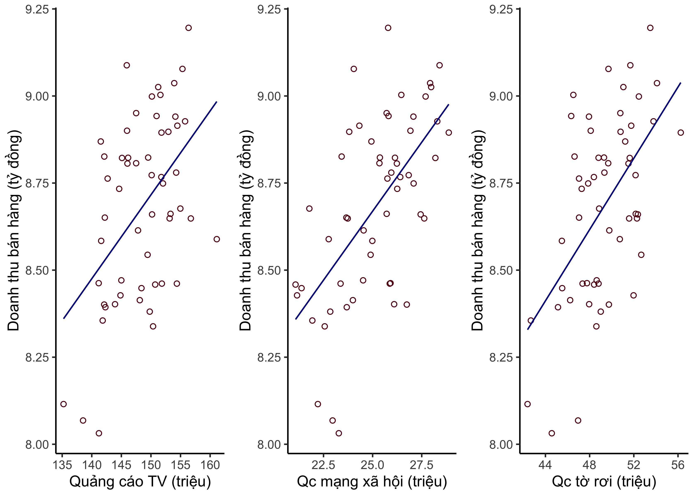
<p class="caption">(\#fig:fglm001)Doanh thu bán hàng (tỷ đồng) và mối liên hệ với chi phí quảng cáo. Hình bên trái: Chi phí quảng cáo trên Tivi. Hình ở giữa: chi phí quảng cáo qua các nền tảng mạng xã hội. Hình bên phải: quảng cáo theo hình thức phát tờ rơi</p>
</div>

Giả sử với vai trò là một chuyên gia tư vấn, chúng ta được yêu cầu đưa ra đề xuất trên cơ sở dữ liệu quan sát được, một kế hoạch quảng cáo cho năm tới nhằm mang lại doanh thu bán sản phẩm cao. Thông tin nào từ dữ liệu sẽ hữu ích để đưa ra khuyến nghị cho chiến dịch quảng cáo? Dưới đây là một số câu hỏi quan trọng mà chúng ta cần tìm cách giải quyết nhằm đưa ra khuyến nghị:

1. Có mối quan hệ giữa ngân sách chi cho từng hình thức quảng cáo và doanh thu bán hàng không? Để trả lời câu hỏi này chúng ta cần xác định xem dữ liệu có cung cấp minh chứng về mối liên hệ tuyến tính giữa chi phí cho từng hình thức quảng cáo với doanh thu bán hàng. Nếu mối liên hệ là yếu, hoặc thậm chí là mối liên hệ âm thì chúng ta có thể lập luận rằng không nên chi tiền cho quảng cáo.

2. Mối liên hệ giữa ngân sách chi cho quảng cáo và doanh thu nếu tồn tại thì mạnh đến mức nào? Nếu mối liên hệ là mạnh, thì với một ngân sách quảng cáo nhất định, liệu chúng ta có thể dự đoán doanh số bán hàng với độ chính xác cao không, hay dự đoán về doanh số bán hàng dựa trên chi tiêu quảng cáo chỉ tốt hơn một chút so với dự đoán một cách ngẫu nhiên?

3. Phương tiện truyền thông nào góp phần tăng doanh số bán hàng? Cả ba phương tiện truyền thông qua Tivi, mạng xã hội và phát tờ rơi có đóng góp vào doanh số bán hàng hay chỉ một hoặc hai phương tiện quảng cáo có đóng góp? Để trả lời câu hỏi này, chúng ta phải tìm cách tách biệt những tác động riêng lẻ của từng phương tiện quảng cáo đến doanh thu khi chúng ta đã chi tiền cho cả ba phương tiện. 

4. Chúng ta có thể ước tính chính xác tác động của chi phí từng phương tiện quảng cáo đến doanh thu bán hàng như thế nào? Với cùng một mức chi cho quảng cáo trên một phương tiện cụ thể, doanh thu bán hàng sẽ tăng bao nhiêu? Chúng ta có thể dự đoán mức tăng này chính xác đến mức nào? 

5. Mối liên hệ hay sự tác động của chi phí cho từng hình thức quảng cáo đến doanh số bán hàng có tuyến tính không? Nếu không, liệu có phương pháp biến đổi như thế nào để mối liên hệ vẫn là tuyến tính?

6. Có sự tác động qua lại giữa các chi phí cho các phương tiện quảng cáo không? Chẳng hạn như nên chi đồng thời 10 triệu đồng cho quảng cáo trên mạng xã hội và 10 triệu đồng cho quảng cáo tờ rơi liệu có mang lại doanh thu cao hơn việc phân bổ 20 triệu cho riêng từng hình thức? Trong tiếp thị quảng cáo, đây được gọi là hiệu ứng tổng hợp. 

Những cơ sở của mô hình hồi quy tuyến tính được thảo luận trong chương này sẽ giúp bạn đọc lần lượt trả lời các câu hỏi đặt ra ở trên. 

### Mô hình hồi quy tuyến tính đơn biến 

Hồi quy tuyến tính đơn biến, đúng như tên gọi, đó là một cách tiếp cận tuyến tính đơn giản để dự đoán phản ứng định lượng của một biến mục tiêu $Y$ trên cơ sở biến độc lập $X$. Mô hình giả định rằng có mối quan hệ tuyến tính giữa $Y$ và $X$. Về mặt toán học, chúng ta có thể viết mối quan hệ tuyến tính này như sau
\begin{align}
Y \sim \beta_0 + \beta_1 \cdot X
(\#eq:lm01)
\end{align}
Bạn có thể hiểu '$\sim$' theo nghĩa xấp xỉ hoặc gần đúng. Đôi khi chúng ta sẽ mô tả phương trình \@ref(eq:lm01) bằng cách nói rằng chúng ta đang hồi quy $Y$ theo $X$. Trong ví dụ trình bày ở trên, $X$ có thể đại diện cho chi phí quảng cáo trên truyền hình (<span style='color: #640514; font-family: Source Code Pro;'>TV</span>) và $Y$ có thể đại diện cho doanh số bán hàng (<span style='color: #640514; font-family: Source Code Pro;'>Sales</span>) tại các cửa hàng. Sau đó, chúng ta có thể hồi quy doanh số bán hàng theo chi phí quảng cáo trên truyền hình theo một mô hình hồi quy tuyến tính đơn biến như sau
\begin{align}
\text{Sales} \sim \beta_0 + \beta_1 \cdot \text{TV}
(\#eq:lm02)
\end{align}

Trong phương trình \@ref(eq:lm02), $\beta_0$ và $\beta_1$ là hai hằng số chưa biết biểu thị hệ số chặn và hệ số góc của đường thẳng trong mô hình tuyến tính. Cùng với nhau, $(\beta_0, \beta_1)$ được gọi là các hệ số tuyến tính hoặc tham số của mô hình. Các hệ số này sẽ được ước lượng dựa trên dữ liệu thu thập được dựa trên phương pháp do người xây dựng mô hình lựa chọn. Các ước lượng cho hệ số tuyến tính thường được thêm dấu mũ ở trên để phân biệt với tham số của mô hình tuyến tính. Nói cách khác chúng ta có $\hat{\beta}_0$ và $\hat{\beta}_1$ là các ước lượng của $\beta_0$ và $\beta_1$. Với $Y$ là biến doanh thu bán hàng và $X$ là biến chi phí quảng cáo trên truyền hình chúng ta sẽ có một dự đoán cho doanh thu bán hàng $\hat{y}$ dựa trên một quan sát của chi phí quảng cáo $X = x$
\begin{align}
\hat{y} = \hat{\beta}_0 + \hat{\beta}_1 \cdot x
(\#eq:lm03)
\end{align}

Lưu ý rằng chúng tôi luôn sử dụng dấu mũ để mô tả một ước lượng cho một tham số, hoặc là giá trị dự đoán cho một giá trị không biết. 

#### Ước lượng hệ số trong mô hình đơn biến
Trong mô hình hồi quy tuyến tính đơn biến, $\beta_0$ và $\beta_1$ là các tham số không biết và cần được ước lượng từ dữ liệu. Giả sử dữ liệu chúng ta quan sát được bao gồm $n$ cặp $(x_i, y_i)$ như sau
\begin{align}
(x_1, y_1), (x_2, y_2), \cdots, (x_n, y_n)
\end{align}
trong đó $x_i$ là các giá trị quan sát được của biến $X$ và $y_i$ là các giá trị quan sát được tương ứng của biến ngẫu nhiên $Y$, với $i$ = $1$, $2$, ..., $n$. Trong ví dụ về chi phí cho quảng cáo, tập dữ liệu bao gồm ngân sách quảng cáo qua truyền hình và doanh số bán sản phẩm với $n = 55$ cửa hàng khác nhau. Mục tiêu của chúng ta là thu được các ước lượng cho hệ số $\beta_0$ và $\beta_1$ sao cho mô hình tuyến tính \@ref(eq:lm02) phù hợp tốt với dữ liệu có sẵn. Nói cách khác, chúng ta muốn tìm hệ số chặn $\beta_0$ và hệ số góc $\beta_1$ sao cho đường thẳng ước lượng được càng gần $n = 55$ điểm dữ liệu càng tốt. 

Có nhiều phương pháp khác nhau để định nghĩa thế nào là một đường thẳng gần nhất với một tập hợp điểm. Tuy nhiên, cho đến nay cách tiếp cận phổ biến nhất là tối thiểu hóa tổng bình phương các khoảng cách từ các điểm đến đường thẳng đó. Phương pháp này được gọi là phương pháp *bình phương nhỏ nhất* và chúng ta áp dụng cách tiếp cận này để ước lượng các tham số. Chi tiết về phương pháp bình phương nhỏ nhất sẽ được trình bày trong các phần sau của chương.

<div class="figure" style="text-align: center">
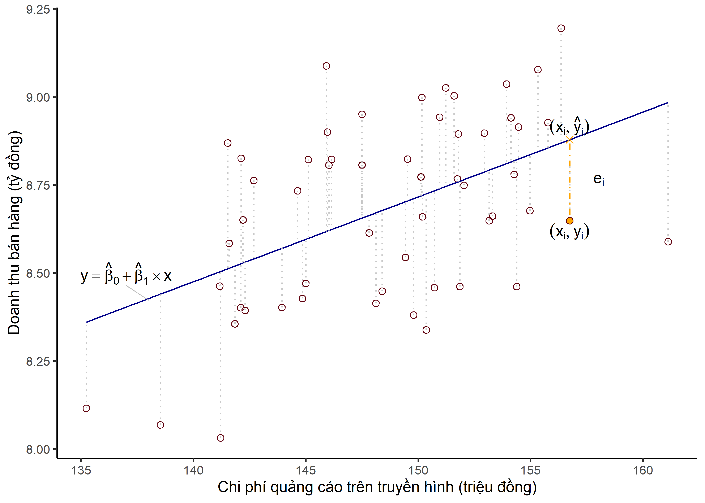
<p class="caption">(\#fig:fglm01)Phương pháp bình phương nhỏ nhất được sử dụng để ước lượng hệ số cho mô hình hồi quy đơn biến doanh thu bán hàng theo chi phí quảng cáo trên truyền hình. Đường hồi quy tuyến tính được ước lượng bằng phương pháp bình phương nhỏ nhất là đường thẳng có tổng bình phương khoảng cách các điểm dữ liệu đến đường thẳng này là nhỏ nhất</p>
</div>

Hình \@ref(fig:fglm01) mô tả đường hồi quy tuyến tính đơn được xây dựng trên dữ liệu về quảng cáo với biến phụ thuộc là doanh số bán hàng và biến độc lập là chi phí quảng cáo trên truyền hình, với $\hat{\beta}_0$ = 5.103 và $\hat{\beta}_1$ = 0.024. 

Điểm $(x_i,y_i)$ trên hình vẽ mô tả chi phí quảng cáo trên truyền hình, $x_i$, của cửa hàng thứ $i$ và doanh thu bán hàng $y_i$ tương ứng. Với $\hat{y}_i = \hat{\beta}_0 + \hat{\beta}_1 \cdot x_i$ là dự đoán cho $Y$ dựa trên giá trị thứ $i$ của $X$. Khi đó ta ký hiệu $e_i = y_i − \hat{y}_i$ đại diện cho sai số, hay còn gọi là phần dư, của quan sát thứ $i$. Nói một cách khác phần dư là sự khác biệt giữa giá trị quan sát được của biến mục tiêu và giá trị ước lượng được cho biến mục tiêu được tính toán bởi mô hình. Chúng ta xác định tổng bình phương của phần dư, được gọi là *Residual Sum of Squares* hay *RSS*, bằng công thức như sau
\begin{align}
RSS & = e_1^2 + e_2^2 + \cdots + e_n^2 \\
& = (y_1 - \hat{\beta}_0 - \hat{\beta}_1 \cdot x_1)^2 + (y_2 - \hat{\beta}_0 - \hat{\beta}_1 \cdot x_2)^2 + \cdots + (y_n - \hat{\beta}_0 - \hat{\beta}_1 \cdot x_n)^2
\end{align}

Phương pháp bình phương nhỏ nhất lựa chọn $\hat{\beta}_0$ và $\hat{\beta}_1$ sao cho giá trị của *RSS* là nhỏ nhất trong công thức phía trên là nhỏ nhất. Bạn đọc có thể giải bài toán tối ưu bằng cách cho đạo hàm của *RSS* theo $\hat{\beta}_0$ và $\hat{\beta}_1$ bằng 0 và cho kết quả như sau
\begin{align}
\hat{\beta}_1 & = \cfrac{\sum\limits_{i=1}^n (x_i - \bar{x}) (y_i - \bar{y})}{\sum\limits_{i=1}^n (x_i - \bar{x})^2} \\
\hat{\beta}_0 & = \bar{y} - \hat{\beta}_1 \bar{x}
(\#eq:lm031)
\end{align}
trong đó $\bar{y} = \sum\limits_{i=1}^n y_i$ và $\bar{x} = \sum\limits_{i=1}^n x_i$ là các giá trị trung bình của các quan sát. Chúng ta sẽ quay trở lại với phương pháp ước lượng bình phương nhỏ nhất trong phần sau của chương.

Để thực hiện ước lượng mô hình tuyến tính trong R, chúng ta sử dụng hàm <span style='color: #640514; font-family: Source Code Pro;'>lm()</span> của thư viện <span style='color: #640514; font-family: Source Code Pro;'>stat</span>. Câu lệnh thực hiện ước lượng mô hình tuyến tính như sau

``` r
# Lấy dữ liệu advertising vào R
Advertising<-read.csv(".../advertise.csv")
# Thực hiện ước lượng mô hình
# Doanh thu bán hàng (Sales) hồi quy theo TV
lm(Sales~TV, data = Advertising)
```

Từ kết quả của mô hình, chúng ta có một ước lượng cho mô hình tuyến tính đơn giản mà biến <span style='color: #640514; font-family: Source Code Pro;'>Sales</span> phụ thuộc vào biến <span style='color: #640514; font-family: Source Code Pro;'>TV</span> như sau:
\begin{align}
\text{Sales} = 5.10303  + 0.02409  \cdot \text{TV}
(\#eq:lm02a)
\end{align}

Theo như mô hình ước lượng được, khi thêm 1 triệu đồng chi cho quảng cáo trên truyền hình dẫn đến việc doanh thu bán hàng trung bình tăng thêm khoảng 24.1 triệu đồng. Doanh thu bán hàng trung bình tăng thêm 24.1 triệu có thể hiểu là có cửa hàng có doanh thu tăng nhiều hơn, có cửa hàng có doanh thu tăng ít hơn, nhưng khi lấy giá trị trung bình phần doanh thu tăng thêm của các cửa hàng sẽ có kết quả là khoảng 24.1 triệu đồng.

Bạn đọc có thể thực hiện tương tự các bước như trên để đưa ra đánh giá về mối liên hệ giữa chi phí quảng cáo trên mạng xã hội, hoặc chi phí quảng cáo bằng hình thức phát tờ rơi, đến doanh thu bán sản phẩm trung bình của các cửa hàng.

#### Đánh giá sự chính xác của các hệ số ước lượng
Trong mô hình tuyến tính đơn biến mà <span style='color: #640514; font-family: Source Code Pro;'>Sales</span> phụ thuộc vào biến <span style='color: #640514; font-family: Source Code Pro;'>TV</span> chúng ta ước lượng được hệ số $\beta_2$ bằng 0.02409 và dẫn đến kết luận là khi chi phí quảng cáo trên truyền hình tăng thêm 1 triệu đồng sẽ dẫn đến doanh thu bán hàng trung bình tăng thêm khoảng 24.1 triệu đồng. Chúng tôi dùng từ "khoảng" vì không có gì đảm bảo là doanh thu bán hàng trung bình sẽ tăng thêm đúng 24.1 triệu đồng. Để đưa ra được mối liên hệ giữa doanh thu trung bình thực tế tăng thêm, một giá trị mà chúng ta không biết, với giá trị ước lượng được là 24.1 triệu đồng, chúng ta cần đánh giá sự chính xác khi ước lượng hệ số $\beta_0$ và $\beta_1$.

Nhắc lại rằng trong các mô hình học máy có giám sát, mối liên hệ thực tế giữa biến mục tiêu $Y$ và biến phụ thuộc $X$ được mô tả thông qua một hàm $f$,
\begin{align}
Y = f(X) + \epsilon
\end{align}
trong đó $\epsilon$ là thành phần hoàn toàn độc lập với biến $X$, nghĩa là không thể đưa ra được thêm bất kỳ thông tin nào về $\epsilon$ dựa trên dữ liệu $X$. Trong trường hợp hàm $f$ thực sự là một hàm tuyến tính, mối liên hệ giữa $X$ và $Y$ sẽ được mô tả thông qua hệ số chặn $\beta_0$ và hệ số góc $\beta_1$
\begin{align}
Y = \beta_0 + \beta_1 X + \epsilon
(\#eq:lm04)
\end{align}

Mô hình tuyến tính trong phương trình \@ref(eq:lm04) được gọi là đường hồi quy tuyến tính thực. Trong thực tế, không thể biết được đường hồi quy tuyến tính thực, mà chúng ta chỉ có thể dựa trên các giá trị quan sát được của biến mục tiêu và biến phụ thuộc để ước lượng ra các tham số $\hat{\beta}_0$ và $\hat{\beta}_1$. Đường thẳng có hệ số chặn $\hat{\beta}_0$ và hệ số góc $\hat{\beta}_1$ được gọi là đường hồi quy tuyến tính ước lượng được. 

Để bạn đọc hiểu được chính xác khái niệm về đường hồi quy tuyến tính thực và đường hồi quy tuyến tính ước lượng được, chúng ta hãy quan sát ví dụ sau. Chúng tôi tạo ra $n = 100$ giá trị cho biến phụ thuộc $X$ và biến mục tiêu $Y$ dựa trên phương trình
\begin{align}
Y = 1 + 2 \cdot X + \epsilon
(\#eq:lm05)
\end{align}
trong đó $X$ và $\epsilon$ là các biến ngẫu nhiên phân phối chuẩn có trung bình bằng 0 và độc lập với nhau. Đường thẳng có hệ số góc $\beta_1 =  2$ và hệ số chặn $\beta_0 = 1$ là đường hồi quy thực trong trường hợp này.
<div class="figure" style="text-align: center">
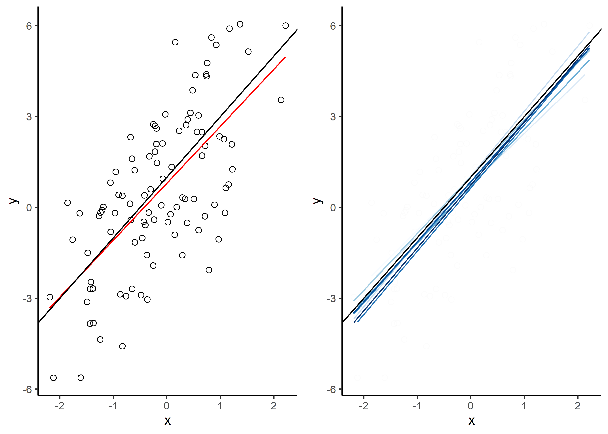
<p class="caption">(\#fig:fglm02)Hình bên trái: Đường hồi quy tuyến tính thật màu đen và đường hồi quy tuyến tính ước lượng màu đỏ. Hình bên phải: Đường hồi quy tuyến tính thật màu đen và các đường hồi quy tuyến tính ước lượng màu xanh</p>
</div>

Đường màu đen ở phần bên trái của Hình \@ref(fig:fglm02) hiển thị đường hồi quy tuyến tính thực, $f(x) = 1 + 2 \cdot x$, trong khi đường màu đỏ là ước lượng bình phương nhỏ nhất dựa trên dữ liệu quan sát được. Mối quan hệ thực sự thường không thể biết được, nhưng đường bình phương nhỏ nhất luôn có thể được ước lượng bằng cách sử dụng phương trình \@ref(eq:lm031). Nói cách khác, trong các ứng dụng thực tế, mỗi khi chúng ta có một tập hợp các quan sát là từ đó chúng ta có thể tính toán đường bình phương nhỏ nhất; đồng thời, đường hồi quy tuyến tính thực là không thể tính toán được. Trong phần bên phải của Hình \@ref(fig:fglm02), chúng tôi đã tạo ra mười bộ dữ liệu khác nhau từ mô hình hồi quy thực và vẽ mười đường bình phương nhỏ nhất tương ứng. Lưu ý rằng các tập dữ liệu khác nhau được tạo ra từ cùng một mô hình thực sẽ dẫn đến các đường bình phương nhỏ nhất hơi khác nhau một chút, nhưng đường hồi quy tổng thể không quan sát được không thay đổi.

Quan sát trên hình vẽ, sự khác biệt giữa đường hồi quy tổng thể và đường bình phương nhỏ nhất có vẻ khó nhận thấy và khó hiểu. Về cơ bản, khái niệm hai đường này là sự mở rộng của phương pháp thống kê tiêu chuẩn về việc sử dụng thông tin từ một mẫu để ước tính các đặc điểm của một tổng thể. Ví dụ, giả sử chúng ta muốn biết trung bình tổng thể $\mu$ của một biến ngẫu nhiên $Y$ nào đó. $\mu$ là một giá trị không biết, nhưng chúng ta có $n$ quan sát từ của $Y$, mà chúng ta có thể viết là $y_1, y_2, \cdots , y_n$ và chúng ta có thể sử dụng để ước lượng $\mu$. Một ước lượng hợp lý cho $\mu$ là $\hat{\mu} = \bar{y}$, trong đó 
\begin{align}
\bar{y} = \cfrac{\sum\limits_{i=1}^n y_i}{n}
\end{align}
là giá trị trung bình mẫu. Trung bình mẫu và trung bình tổng thể là khác nhau, nhưng nói chung trung bình mẫu sẽ cung cấp ước tính tốt về trung bình tổng thể. Theo cách tương tự, các hệ số chưa biết $\beta_0$ và $\beta_1$ trong hồi quy tuyến tính là hệ số đường hồi quy tổng thể hay đường hồi quy thực. Chúng ta ước lượng các hệ số chưa biết này bằng cách sử dụng $\hat{\beta_0}$ và $\hat{\beta_1}$. 

Sự tương tự giữa ước lượng các hệ số của hồi quy tuyến tính và ước lượng giá trị trung bình của một biến ngẫu nhiên còn được thể hiện qua các tính chất của các ước lượng. Chẳng hạn như chúng ta luôn mong muốn các ước lượng là các ước lượng không chệch. Đối với trung bình tổng thể, chúng ta luôn tìm các ước lượng $\hat{\mu}$ sao cho $\mathbb{E}(\hat{\mu}) = \mu$. Tính chất không chệch của ước lượng đảm bảo rằng nếu chúng ta có thể có một số lượng đủ lớn các quan sát thì giá trị trung bình mẫu sẽ xấp xỉ giá trị trung bình tổng thể. Các hệ số của mô hình hồi quy tuyến tính bằng phương pháp bình phương nhỏ nhất cũng là các ước lượng không chệch, nghĩa là nếu chúng ta ước lượng $\beta_0$ và $\beta_1$ trên cơ sở một tập dữ liệu cụ thể và nhỏ thì các ước lượng sẽ không chính xác bằng $\beta_0$ và $\beta_1$. Nhưng nếu chúng ta có thể lặp lại việc ước lượng nhiều lần và tính trung bình các ước lượng thu được từ một số lượng lớn tập dữ liệu cùng lấy ra từ tổng thể thì giá trị trung bình của các ước lượng này sẽ xấp xỉ $\beta_0$ và $\beta_1$. Trên thực tế, chúng ta có thể thấy từ hình bên phải của Hình \@ref(fig:fglm02) rằng giá trị trung bình của nhiều đường bình phương tối thiểu, mỗi đường được ước tính từ một tập dữ liệu riêng biệt, khá gần với đường hồi quy tổng thể thực.

Một câu hỏi khác cần được đặt ra với ước lượng trung bình tổng thể $\mu$ của biến ngẫu nhiên $Y$ là: giá trị trung bình mẫu $\hat{\mu}$ ước tính của $\mu$ chính xác như thế nào? Chúng ta đã biết rằng giá trị trung bình của các $\hat{\mu}$ trên nhiều tập dữ liệu sẽ rất gần với $\mu$, nhưng một ước tính duy nhất của $\hat{\mu}$ trên một dự liệu cụ thể sẽ chênh lệch với $\mu$ như thế nào? Nhìn chung, để trả lời câu hỏi này chúng ta cần tính độ lệch chuẩn của $\hat{\mu}$, được ký hiệu là $SE(\hat{\mu})$. Chúng ta đã biết rằng
\begin{align}
SE(\hat{\mu}) = \cfrac{\sigma}{\sqrt{n}}
\end{align}
với $\sigma$ là độ lệch chuẩn của biến $Y$. 

$SE(\hat{\mu})$ cho chúng ta biết một ước lượng cụ thể $\hat{\mu}$ sẽ chênh lệch với $\mu$ như thế nào. Có thể dễ dàng thấy rằng khi số lượng quan sát $n$ đủ lớn, $SE(\hat{\mu})$ sẽ càng gần đến 0 và chênh lệch giữa $\hat{\mu}$ với $\mu$ sẽ càng nhỏ. Lập luận hoàn toàn tương tự, để biết các ước lượng cho các hệ số chặn và hệ số góc trong mô hình tuyến tính chênh lệch với các giá trị thật $\beta_0$ và $\beta_1$ như thế nào, chúng ta cần tính toán độ lệch chuẩn của các ước lượng đó. Tính toán độ lệch chuẩn của các ước lượng cho hệ số sẽ được trình bày chi tiết trong các phần sau. Bạn đọc cần biết là độ lệch chuẩn của $\hat{\beta_0}$ và $\hat{\beta_1}$ có thể tính toán được như sau
\begin{align}
 SE(\hat{\beta}_0) = \sigma \cdot \sqrt{\cfrac{1}{n} + \cfrac{\bar{x}^2}{\sum\limits_{i=1}^n (x_i - \bar{x})^2} } ; SE(\hat{\beta}_1) = \cfrac{\sigma}{\sqrt{\sum\limits_{i=1}^n (x_i - \bar{x})^2} }
 (\#eq:lm06)
\end{align}
trong đó $\sigma = \sqrt{Var(\epsilon)}$. 

Các công thức cho độ lệch tiêu chuẩn của $\hat{\beta_0}$ và $\hat{\beta_1}$ ở trên đi kèm với giả định là các sai số $\epsilon_i$ là độc lập với nhau và có cùng phương sai là $\sigma^2$. Giả thiết này thường không đạt được trong thực tế tuy nhiên công thức \@ref(eq:lm06) vẫn là một xấp xỉ tốt cho phương sai của các ước lượng. Lưu ý trong công thức ở trên rằng $SE(\hat{\beta}_1)$ nhỏ hơn khi $x_i$ trải rộng hơn quanh giá trị trung bình của nó. Chúng ta cũng thấy rằng $SE(\hat{\beta}_0)$ sẽ giống như độ lệch chuẩn của trung bình mẫu nếu $\bar{x}$ bằng 0. Điểm đáng lưu ý là $\sigma^2$ cũng là một đại lượng chưa biết chưa nhưng có thể ước lượng được từ dữ liệu. Ước lượng cho $\sigma$ được gọi là độ lệch chuẩn của phần dư, ký hiệu *RSE* (hay *Residual Standard Error*), và được tính theo công thức 
\begin{align}
RSE = \sqrt{RSS/(n - 2)}
 (\#eq:lm06a)
\end{align}

*RSE* có thể được sử dụng để tính toán các khoảng tin cậy cho các hệ số ước lượng. Khoảng tin cậy ở một mức xác suất, chẳng hạn như mức $\alpha$, được định nghĩa là một khoảng giá trị sao cho với xác suất $\alpha$, khoảng giá trị đó sẽ chứa giá trị thực chưa biết của tham số. Với giả thiết phần dư $\epsilon$ có phân phối chuẩn, có thể chứng minh được rằng $\hat{\beta_0}$ và $\hat{\beta_1}$ cũng có phân phối chuẩn. Khoảng tin cậy ở mức xác suất $\alpha$ được sử dụng là làm các khoảng tin cậy cho tham số $\beta_i$; với i = 1, 2; có dạng
\begin{align}
\left[\hat{\beta_i} - z_{1 + \alpha/2} \cdot SE(\hat{\beta_i}); \hat{\beta_i} + z_{1 + \alpha/2} \cdot SE(\hat{\beta_i}) \right]
\end{align}
trong đó $z_{1+\alpha/2}$ là giá trị tại mức xác suất $(1 + \alpha/2)$ của biến ngẫu nhiên phân phối chuẩn $\mathcal{N}(0,1)$.


Quay trở lại với ví dụ về doanh thu bán hàng phụ thuộc vào chi phí quảng cáo trên truyền hình. Với mức độ tin cậy $\alpha = 95\%$, giá trị tại mức xác suất $(1 + \alpha/2)$ của phân phối chuẩn $\mathcal{N}(0,1)$ xấp xỉ bằng 1.96. Ta có các khoảng tin cậy tại mức xác suất 95% cho hệ số chặn là
\begin{align}
(3.372; 6.834)
\end{align}
và khoảng tin cậy cho hệ số góc là 
\begin{align}
(0.012; 0.036)
\end{align}

Điều này có nghĩa là, không tính đến quảng cáo trên truyền hình, doanh thu trung bình của các cửa hàng rơi vào khoảng 3.372 tỷ đồng đến 6.834 tỷ đồng. Đồng thời, mỗi triệu đồng tăng thêm cho quảng cáo trên truyền hình, sẽ làm cho doanh thu trung bình tăng thêm khoảng 12.4 triệu đồng đến 35.7 triệu đồng.

Độ lệch tiêu chuẩn còn được sử dụng để trả lời câu hỏi là liệu mối liên hệ giữa biến $X$ và $Y$ có thực sự có ý nghĩa. Theo thống kê toán, chúng ta cần phải kiểm đinh cặp giả thuyết:
\begin{align}
H_0: \beta_1 = 0 \\
H_1: \beta_1 \neq 0
\end{align}
vì nếu $\beta_1 = 0$ thì mô hình hồi quy tuyến tính đơn trở thành $Y = \beta_0 + \epsilon$ và $X$ không có liên hệ với $Y$ . Để kiểm định giả thuyết $H_0$, chúng ta cần xác định xem liệu ước lượng của $\beta_1$, là $\hat{\beta}_1$, có đủ xa giá trị 0 để chúng ta có thể tin tưởng rằng $\beta_1$ khác 0 hay không. Nhưng như thế nào là đủ xa thì lại phụ thuộc vào độ chính xác của $\hat{\beta}_1$, nghĩa là cũng phụ thuộc vào $SE(\hat{\beta}_1)$. Nếu $\hat{\beta}_1$ tương đối nhỏ, nhưng $SE(\hat{\beta}_1)$ lại rất nhỏ, thì chúng ta vẫn có thể khá chắc chắn rằng $\beta \neq 0$, và do đó có mối liên hệ giữa $X$ và $Y$. Ngược lại, nếu $\hat{\beta}_1$ tương đối xa giá trị 0, nhưng $SE(\hat{\beta}_1)$ lại rất lớn, thì cũng rất khó để khẳng định rằng $\beta \neq 0$. Trong thực tế, chúng ta tính toán một thống kê *t*
\begin{align}
t = \cfrac{\hat{\beta}_1 - 0}{SE(\hat{\beta}_1)}
(\#eq:lm07)
\end{align}
dùng để đo độ lệch tương đối giữa $\hat{\beta}$ với giá trị 0. Với giả thiết $\epsilon$ có phân phối chuẩn, và dưới giả thuyết $H_0$, có thể chứng minh được rằng thống kê $t$ sẽ có phân phối *student* với bậc tự do là $n-2$. Phân phối *student* cũng có hình dạng quả chuông giống như phân phối chuẩn và sẽ tiệm cận phân phối chuẩn nếu tham số bậc tự do đủ lớn. Do đó, chúng ta có thể tính toán được xác suất mà một biến ngẫu nhiên phân phối *student* bất kỳ có giá trị tuyệt đối lớn hơn hoặc bằng giá trị thống kê $t$ tính toán được trong phương trình \@ref(eq:lm07). Xác suất này còn thường được gọi là *p-value*. 

Nhìn chung, chúng ta có thể suy diễn *p-value* như sau: nếu *p-value* nhận giá trị nhỏ thì rất khó có thể có được giá trị thống kê $t$ có giá trị tuyệt đối lớn như vậy dưới giả thuyết $H_0$, nghĩa là có cơ sở để bác bỏ giả thuyết $H_0$. Hay nói một cách khác, có mối liên hệ giữa biến độc lập và biến mục tiêu. Giá trị *p-value* thường được coi là nhỏ nếu nằm dưới các ngưỡng như 5\% hoặc thậm chí 1\%.


<table class="table table-bordered table-hover" style="width: auto !important; margin-left: auto; margin-right: auto;">
<caption>(\#tab:tblm01)Các hệ số ước lượng trong mô hình hồi quy đơn cho dữ liệu Quảng cáo</caption>
 <thead>
  <tr>
   <th style="text-align:left;"> Hệ số </th>
   <th style="text-align:right;"> Ước lượng </th>
   <th style="text-align:right;"> Độ lệch chuẩn </th>
   <th style="text-align:right;"> Thống kê t </th>
   <th style="text-align:right;"> p-value </th>
  </tr>
 </thead>
<tbody>
  <tr>
   <td style="text-align:left;"> Hệ số chặn </td>
   <td style="text-align:right;"> 5.1030 </td>
   <td style="text-align:right;"> 0.8830 </td>
   <td style="text-align:right;"> 5.7794 </td>
   <td style="text-align:right;"> 0.0000004 </td>
  </tr>
  <tr>
   <td style="text-align:left;"> Hệ số góc </td>
   <td style="text-align:right;"> 0.0241 </td>
   <td style="text-align:right;"> 0.0059 </td>
   <td style="text-align:right;"> 4.0558 </td>
   <td style="text-align:right;"> 0.0001648 </td>
  </tr>
</tbody>
</table>

Bảng \@ref(tab:tblm01) cung cấp thông tin chi tiết về tham số ước lượng được trong mô hình hồi quy tuyến tính đơn bằng phương pháp bình phương nhỏ nhất để hồi quy doanh thu bán hàng đơn theo ngân sách quảng cáo trên truyền hình trong dữ liệu về quảng cáo. Lưu ý rằng các hệ số $\hat{\beta_0}$ và $\hat{\beta_1}$ rất lớn so với độ lệch chuẩn của các ước lượng này, do đó giá trị thống kê t cũng lớn. Xác suất để một biến ngẫu nhiên phân phối *Student* có tham số bậc tự do bằng 55 - 2 = 53 có giá trị lớn hơn các giá trị tuyệt đối của thống kê $t$ dưới giả thuyết $H_0$ đúng là gần như bằng 0. Do đó chúng ta có thể kết luận rằng $\beta_0 \neq 0$ và $\beta_1 \neq 0$.

#### Đánh giá mô hình hồi quy tuyến tính đơn
Sau khi chúng ta đã bác bỏ giả thuyết về các hệ số bằng 0, công việc tiếp theo sẽ là đưa ra các đánh giá định lượng về mức độ phù hợp của mô hình với dữ liệu. Chất lượng của mô hình hồi quy tuyến tính thường được đánh giá bằng cách sử dụng hai đại lượng: thứ nhất: độ lệch chuẩn của phần dư và hệ số $R^2$. 

Độ lệch chuẩn của phần dư được gọi là *Residual Standard Error* hay viết tắt là *RSE*. Phần dư trong mô hình tuyến tính là phần độc lập với biến giải thích $X$, nghĩa là trong các mô hình có sự hiện diện của phần dư, ngay cả khi chúng ta biết được đường hồi quy thực cũng không thể đưa ra dự đoán chính xác được về $Y$ từ $X$. Phần dư luôn có giá trị trung bình bằng 0 vì nếu không phần giá trị trung bình sẽ được giải thích bằng hệ số chặn. Do đó, người xây dựng mô hình thường quan tâm đến độ lệch chuẩn của phần dư, hay còn gọi là *RSE*
\begin{align}
RSE = \sqrt{\cfrac{RSS}{n-2}} = \sqrt{\cfrac{\sum\limits_{i=1}^n (y_i - \hat{y}_i)^2 }{n-2}} 
(\#eq:lm08)
\end{align}


Trong mô hình hồi quy tuyến tính trên dữ liệu Quảng cáo, *RSE* bằng 0.235. Điều này có nghĩa là sai số giữa doanh thu bán hàng thực tế và doanh thu bán hàng được ước lượng từ mô hình hồi quy tuyến tính sẽ có độ lệch chuẩn khoảng 0.235 tỷ đồng. Tuy nhiên, độ lệch chuẩn là 0.235 có phải là con số có thể chấp nhận được hay không còn tùy thuộc vào bối cảnh. Trong dữ liệu quảng cáo, giá trị trung bình của doanh số bán hàng trên tất cả các cửa hàng là khoảng 8.7 tỷ đồng và do đó sai số phần trăm là khoảng 0.235/8.7 $\approx$ 2.7 \%. *RSE* có thể coi là thước đo mức độ phù hợp của các mô hình tuyến tính trên dữ liệu. Nếu các dự đoán thu được bằng cách sử dụng mô hình rất gần với giá trị kết quả thực, tức là, nếu các $\hat{y}_i$ rất gần với các $y_i$, với $i = 1, 2, \cdots, n$, khi đó *RSE* sẽ nhỏ và chúng ta có thể kết luận rằng mô hình rất phù hợp với dữ liệu. Mặt khác, $\hat{y}_i$ rất xa các $y_i$ đối với một hoặc nhiều quan sát thì *RSE* có thể khá lớn, cho thấy mô hình không phù hợp với dữ liệu.

*RSE* là một thước đo tuyệt đối về sự phù hợp của mô hình hồi quy tuyến tính trên dữ liệu. Nhưng vì *RSE* được đo bằng độ lệch chuẩn nên khi tính toán *RSE* tương đối trên giá trị trung bình của $Y$ sẽ không cho chúng ta một cái nhìn chính xác thế nào là một *RSE* tốt. Thay vào đó, hệ số $R^2$ cung cấp một thước đo tương đối về mức độ phù hợp của mô hình. $R^2$ có dạng tỷ lệ giữa phương sai được giải thích trên tổng phương sai nên hệ số này luôn nhận giá trị từ 0 đến 1 và không phụ thuộc vào đơn vị của biến $Y$. Hệ số $R^2$, hay còn được gọi là *R-squared*, được tính bằng công thức sau
\begin{align}
R^2 = \cfrac{TSS - RSS}{TSS} = 1 - \cfrac{RSS}{TSS}
(\#eq:lm08)
\end{align}
với $TSS = \sum (y_i - \bar{y})^2$. 

*TSS* là viết tắt của Total Sum of Squares, là tổng phương sai của biến mục tiêu $Y$ và có thể được coi là mức độ biến thiên của biến mục tiêu xung quanh giá trị trung bình của nó. Giá trị này không phụ thuộc vào mô hình hồi quy tuyến tính. *RSS* đo lường mức độ biến thiên mà không giải thích được bởi mô hình hồi quy tuyến tính. Do đó, *TSS − RSS* đo lường mức độ biến thiên được giải thích bằng cách thực hiện hồi quy và hệ số $R^2$ đo lường tỷ lệ biến thiên của biến mục tiêu $Y$ có thể được giải thích bằng biến giải thích $X$ trong mô hình tuyến tính. Hệ số $R^2$ gần bằng 1 cho biết rằng phần lớn sự biến thiên trong biến mục tiêu đã được giải thích bằng mô hình hồi quy. Giá trị $R^2$ càng gần 0 cho thấy mô hình hồi quy không giải thích được nhiều về sự biến thiên của biến mục tiêu. Mô hình có $R^2$ nhỏ thông thường là do dạng của mô hình tuyến tính là sai, mô hình tuyến tính bị thiếu biến giải thích, hoặc do phần dư $\epsilon$ có phương sai lớn. 

Các đại lượng *RSS*, *RSE*, *TSS*, và *R-squared* trong mô hình tuyến tính đơn mà biến mục tiêu doanh thu được hồi quy theo chi phí quảng cáo trên truyền hình được cho trong bảng \@ref(tab:tblm02)


<table class="table table-bordered table-hover" style="width: auto !important; margin-left: auto; margin-right: auto;">
<caption>(\#tab:tblm02)Đo lường mức độ phù hợp của mô hình tuyến tính đơn trên dữ liệu Quảng cáo</caption>
 <thead>
  <tr>
   <th style="text-align:left;"> Đại lượng </th>
   <th style="text-align:left;"> Ký hiệu </th>
   <th style="text-align:right;"> Giá trị </th>
  </tr>
 </thead>
<tbody>
  <tr>
   <td style="text-align:left;"> Residual sum of squares </td>
   <td style="text-align:left;"> RSS </td>
   <td style="text-align:right;"> 2.925 </td>
  </tr>
  <tr>
   <td style="text-align:left;"> Residual standard error </td>
   <td style="text-align:left;"> RSE </td>
   <td style="text-align:right;"> 0.235 </td>
  </tr>
  <tr>
   <td style="text-align:left;"> Total sum of squares </td>
   <td style="text-align:left;"> TSS </td>
   <td style="text-align:right;"> 3.833 </td>
  </tr>
  <tr>
   <td style="text-align:left;"> R-squared </td>
   <td style="text-align:left;"> $R^2$ </td>
   <td style="text-align:right;"> 0.237 </td>
  </tr>
</tbody>
</table>

Trong Bảng \@ref(tab:tblm02), *R-squared* bằng 0.237 có nghĩa là chỉ 23.7\% sự biến thiên trong doanh số được giải thích bằng hồi quy tuyến tính theo chi phí quảng cáo trên truyền hình. Rõ ràng, hệ số *R-squared* dễ dàng diễn giải hơn so với *RSE*, vì đại lượng này luôn nằm trong khoảng từ 0 đến 1. Tuy nhiên, vẫn có thể gặp khó khăn khi xác định thế nào là giá trị *R-squared* tốt. Điều này lại tùy thuộc vào từng ngữ cảnh thực tế. Ví dụ, trong một số dữ liệu thu thập được từ vật lý hay khoa học máy tính, chúng ta có thể đã biết rằng dữ liệu thực sự đến từ một mô hình tuyến tính có phần dư nhỏ. Hệ số *R-squared* thu được sẽ xấp xỉ bằng 1 và giá trị *R-squared* nhỏ hơn 0.9 có thể cho thấy có vấn đề với thử nghiệm mà dữ liệu được tạo ra. Mặt khác, trong các ứng dụng điển hình về kinh tế hay xã hội học, các mô hình tuyến tính thường có phần dư có phương sai rất lớn do có rất nhiều các yếu tố khác không được đo lường được từ dữ liệu. Trong trường hợp này, chúng ta chỉ cần một tỷ lệ phương sai được giải thích rất nhỏ. Hệ số *R-squared* bằng 0.05 hoặc 0.1 trong các dữ liệu như vậy lại có thể là bằng chứng cho một mô hình tốt!

Trong mô hình hồi quy tuyến tính đơn biến, giá trị *R-squared* chính là bình phương của hệ số tương quan giữa biến mục tiêu $Y$ và biến độc lập $X$. Hệ số tương quan giữa $Y$ và $X$, ký hiệu $\rho(X,Y)$, và được ước lượng bằng công thức như sau
\begin{align}
\hat{\rho}(X,Y) = \cfrac{ \sum\limits_{i=1}^n (x_i - \bar{x})(y_i - \bar{y}) }{ \sqrt{\sum\limits_{i=1}^n (x_i - \bar{x})^2}\sqrt{\sum\limits_{i=1}^n (y_i - \bar{y})^2} }
\end{align}

Hệ số tương quan $\rho(X,Y)$ đo lường mối liên hệ tuyến tính giữa hai biến $X$ và $Y$. Hệ số $\rho(X,Y)$ nằm trong khoảng $[-1,1]$, và

* Khi $\rho(X,Y) = 0$, chúng ta nói rằng giữa $X$ và $Y$ không có mối liên hệ tuyến tính.
* Khi $\rho(X,Y) > 0$, chúng ta nói rằng giữa $X$ và $Y$ có mối liên hệ tuyến tính cùng chiều, nghĩa là khi $X$ tăng thì nhiều khả năng $Y$ cũng sẽ tăng theo một tỷ lệ cố định.
* Khi $\rho(X,Y) < 0$, chúng ta nói rằng giữa $X$ và $Y$ có mối liên hệ tuyến tính ngược chiều, nghĩa là khi $X$ tăng thì nhiều khả năng $Y$ sẽ giảm theo một tỷ lệ cố định.

Bạn đọc hãy lưu ý rằng đẳng thức $R^2 = \left(\hat{\rho}(X,Y)\right)^2$ chỉ đúng trong mô hình hồi quy đơn biến. Trong phần tiếp theo, chúng ta sẽ thảo luận về mô hình hồi quy tuyến tính đa biến, trong đó chúng ta sẽ sử dụng đồng thời nhiều biến độc lập để giải thích một biến mục tiêu. Chúng ta sẽ thấy nhiều hơn ý nghĩa của hệ số *R-squared* trong các mô hình như vậy.

### Mô hình hồi quy tuyến tính đa biến
Hồi quy tuyến tính đơn là một phương pháp hữu ích để dự đoán biến mục tiêu dựa trên một biến giải thích duy nhất. Tuy nhiên, trong thực tế chúng ta thường có nhiều hơn một yếu tố để giải thích biến mục tiêu. Ví dụ: trong dữ liệu Quảng cáo, chúng ta đã kiểm tra mối quan hệ giữa doanh thu bán hàng và ngân sách quảng cáo trên truyền hình. Chúng ta cũng có dữ liệu về số tiền chi cho quảng cáo trên các mạng xã hội và quảng cáo thông qua tờ rơi, do đó chúng ta sẽ muốn biết rằng liệu các phương thức quảng cáo này có liên quan đến doanh thu bán hàng hay không; nghĩa là làm cách nào chúng ta có thể mở rộng phân tích dữ liệu Quảng cáo để phù hợp khi bổ sung thêm hai biến giải thích. 

Bạn đọc có thể sử dụng ba mô hình hồi quy tuyến tính đơn riêng biệt, mỗi mô hình sử dụng một biến giải thích tương ứng với một phương thức quảng cáo khác nhau làm biến giải thích. Kết quả ước lượng ba mô hình tuyến tính đơn được cho trong các Bảng \@ref(tab:tblm03a), \@ref(tab:tblm03b), và \@ref(tab:tblm03c)


<table class="table table-bordered table-hover" style="width: auto !important; margin-left: auto; margin-right: auto;">
<caption>(\#tab:tblm03a)Doanh thu bán sản phẩm phụ thuộc vào chi phí quảng cáo trên truyền hình</caption>
 <thead>
  <tr>
   <th style="text-align:left;">   </th>
   <th style="text-align:right;"> Ước lượng </th>
   <th style="text-align:right;"> Độ lệch chuẩn </th>
   <th style="text-align:right;"> Thống kê t </th>
   <th style="text-align:right;"> p-value </th>
  </tr>
 </thead>
<tbody>
  <tr>
   <td style="text-align:left;"> (Intercept) </td>
   <td style="text-align:right;"> 5.1030 </td>
   <td style="text-align:right;"> 0.8830 </td>
   <td style="text-align:right;"> 5.7794 </td>
   <td style="text-align:right;"> 0.0000004 </td>
  </tr>
  <tr>
   <td style="text-align:left;"> TV </td>
   <td style="text-align:right;"> 0.0241 </td>
   <td style="text-align:right;"> 0.0059 </td>
   <td style="text-align:right;"> 4.0558 </td>
   <td style="text-align:right;"> 0.0001648 </td>
  </tr>
</tbody>
</table>


<table class="table table-bordered table-hover" style="width: auto !important; margin-left: auto; margin-right: auto;">
<caption>(\#tab:tblm03b)Doanh thu bán sản phẩm phụ thuộc vào chi phí quảng cáo trên mạng xã hội</caption>
 <thead>
  <tr>
   <th style="text-align:left;">   </th>
   <th style="text-align:right;"> Ước lượng </th>
   <th style="text-align:right;"> Độ lệch chuẩn </th>
   <th style="text-align:right;"> Thống kê t </th>
   <th style="text-align:right;"> p-value </th>
  </tr>
 </thead>
<tbody>
  <tr>
   <td style="text-align:left;"> (Intercept) </td>
   <td style="text-align:right;"> 6.6896 </td>
   <td style="text-align:right;"> 0.3583 </td>
   <td style="text-align:right;"> 18.6689 </td>
   <td style="text-align:right;"> 0e+00 </td>
  </tr>
  <tr>
   <td style="text-align:left;"> Social_Media </td>
   <td style="text-align:right;"> 0.0792 </td>
   <td style="text-align:right;"> 0.0142 </td>
   <td style="text-align:right;"> 5.5779 </td>
   <td style="text-align:right;"> 8e-07 </td>
  </tr>
</tbody>
</table>


<table class="table table-bordered table-hover" style="width: auto !important; margin-left: auto; margin-right: auto;">
<caption>(\#tab:tblm03c)Doanh thu bán sản phẩm phụ thuộc vào chi phí quảng cáo tờ rơi</caption>
 <thead>
  <tr>
   <th style="text-align:left;">   </th>
   <th style="text-align:right;"> Ước lượng </th>
   <th style="text-align:right;"> Độ lệch chuẩn </th>
   <th style="text-align:right;"> Thống kê t </th>
   <th style="text-align:right;"> p-value </th>
  </tr>
 </thead>
<tbody>
  <tr>
   <td style="text-align:left;"> (Intercept) </td>
   <td style="text-align:right;"> 6.1608 </td>
   <td style="text-align:right;"> 0.5266 </td>
   <td style="text-align:right;"> 11.6981 </td>
   <td style="text-align:right;"> 0.00e+00 </td>
  </tr>
  <tr>
   <td style="text-align:left;"> Flyer </td>
   <td style="text-align:right;"> 0.0512 </td>
   <td style="text-align:right;"> 0.0107 </td>
   <td style="text-align:right;"> 4.7951 </td>
   <td style="text-align:right;"> 1.36e-05 </td>
  </tr>
</tbody>
</table>

Bạn đọc có thể nhận thấy rằng nếu sử dụng ba mô hình hồi quy đơn, các biến giải thích đều có tác động lên biến mục tiêu một cách có ý nghĩa do các giá trị *p-value* đều rất nhỏ. Chúng ta sẽ thảo luận chi tiết về các hệ số tuyến tính trong các Bảng \@ref(tab:tblm03a), \@ref(tab:tblm03b), và \@ref(tab:tblm03c) trong phần sau của cuốn sách. Tuy nhiên cách tiếp cận như trên sẽ gặp phải hai vấn đề. Thứ nhất: chúng ta sẽ không biết làm thế nào để đưa ra một dự đoán duy nhất về doanh thu bán hàng tương ứng với một phân bổ ngân sách quảng cáo cho ba hình thức quảng cáo, vì khi phân bổ ngân sách đến từng phương tiện quảng cáo sẽ có ba giá trị dự đoán riêng biệt. Thứ hai, mỗi phương trình hồi quy đơn đều bỏ qua hai phương tiện còn lại trong việc hình thành ước tính cho các hệ số hồi quy. Chúng ta sẽ sớm thấy rằng nếu ngân sách truyền thông có tương quan với nhau tại các cửa hàng, điều mà rất có thể xảy ra, thì điều này có thể dẫn đến những ước lượng có sai lệch rất lớn về tác động của từng phương tiện quảng cáo lên doanh thu bán hàng. 

Thay vì điều chỉnh một mô hình hồi quy tuyến tính đơn giản riêng biệt cho từng yếu tố dự đoán, cách tiếp cận tốt hơn là mở rộng mô hình hồi quy tuyến tính đơn bằng cách cho tương ứng với mỗi biến giải thích một hệ số góc riêng. Nói chung, giả sử rằng chúng ta có $p$ biến giải thích riêng biệt. Khi đó mô hình hồi quy tuyến tính đa biến có dạng
\begin{align}
Y = \beta_0 + \beta_1 \cdot X_1 + \beta_2 \cdot X_2 + \cdots + \beta_p \cdot X_p + \epsilon
(\#eq:lm100)
\end{align}
trong đó $X_j$ đại diện cho biến giải thích thứ $j$ và hệ số $\beta_j$ định lượng mối liên hệ tuyến tính giữa biến giải thích đó và biến mục tiêu. Có thể coi $\beta_j$ là đại lượng phản ánh sự thay đổi của biến mục tiêu $Y$ khi biến giải thích $X_j$ tăng thêm một đơn vị trong khi tất cả các biến giải thích khác không thay đổi. Trong ví dụ về dữ liệu quảng cáo, ta có mô hình hồi quy tuyến tính như sau
\begin{align}
\text{Sales} = \beta_0 + \beta_1 \times \text{TV} + \beta_2 \times \text{Social_Media} + \beta_3 \times \text{Flyer} + \epsilon
(\#eq:lm101)
\end{align}
trong đó <span style='color: #640514; font-family: Source Code Pro;'>Sales</span> là doanh thu từ bán hàng của 55 cửa hàng, <span style='color: #640514; font-family: Source Code Pro;'>TV</span> là chi phí quảng cáo trên truyền hình, <span style='color: #640514; font-family: Source Code Pro;'>Social_Media</span> là chi phí quảng cáo qua mạng xã hội, và <span style='color: #640514; font-family: Source Code Pro;'>Flyer</span> là chi phí quảng cáo qua tờ rơi.

#### Ước lượng tham số cho mô hình đa biến
Tương tự như trong mô hình hồi quy tuyến tính đơn, các hệ số hồi quy $\beta_0$, $\beta_1$, $\cdots$, $\beta_p$ trong phương trình \@ref(eq:lm100) là chưa biết và cần được ước lượng. Các tham số này cũng được ước lượng bằng cách sử dụng phương pháp bình phương nhỏ nhất. Tuy nhiên, không giống như các ước lượng hồi quy tuyến tính đơn, các ước lượng hệ số hồi quy đa biến khá phức tạp cần được biểu diễn dưới dạng véc-tơ và ma trận. Chính vì lý do này, chúng tôi không đi sâu vào vấn đề này ở đây. Chi tiết của phương pháp bình phương nhỏ nhất trong hồi quy đa biến bạn đọc có thể tham khảo trong phần \@ref(leastsquared). Với các ước lượng $\hat{\beta}_0$, $\hat{\beta}_1$, $\cdots$, $\hat{\beta}_p$ chúng ta có thể đưa ra dự đoán cho biến mục tiêu $y$ như sau
\begin{align}
\hat{y} = \hat{\beta}_0 + \hat{\beta}_1 \cdot x_1 + \hat{\beta}_2 \cdot x_2 + \cdots + \hat{\beta}_p \cdot x_p
(\#eq:lm102)
\end{align}

Bạn đọc có thể sử dụng hàm <span style='color: #640514; font-family: Source Code Pro;'>lm()</span> để thực hiện ước lượng các hệ số tuyến tính. Chúng ta thực hiện ước lượng mô hình đa biến cho dữ liệu Quảng cáo như sau

``` r
# Doanh thu bán hàng (Sales) hồi quy theo 3 biến
lm(Sales ~ TV + Social_Media + Flyer, data = Advertising)
```


<table class="table table-bordered table-hover" style="width: auto !important; margin-left: auto; margin-right: auto;">
<caption>(\#tab:tblm04)Các hệ số ước lượng trong mô hình hồi quy đa biến cho dữ liệu Quảng cáo</caption>
 <thead>
  <tr>
   <th style="text-align:left;">   </th>
   <th style="text-align:right;"> Ước lượng </th>
   <th style="text-align:right;"> Độ lệch chuẩn </th>
   <th style="text-align:right;"> Thống kê t </th>
   <th style="text-align:right;"> p-value </th>
  </tr>
 </thead>
<tbody>
  <tr>
   <td style="text-align:left;"> (Intercept) </td>
   <td style="text-align:right;"> 4.0915 </td>
   <td style="text-align:right;"> 0.7361 </td>
   <td style="text-align:right;"> 5.5586 </td>
   <td style="text-align:right;"> 0.0000010 </td>
  </tr>
  <tr>
   <td style="text-align:left;"> TV </td>
   <td style="text-align:right;"> 0.0163 </td>
   <td style="text-align:right;"> 0.0057 </td>
   <td style="text-align:right;"> 2.8480 </td>
   <td style="text-align:right;"> 0.0063263 </td>
  </tr>
  <tr>
   <td style="text-align:left;"> Social_Media </td>
   <td style="text-align:right;"> 0.0630 </td>
   <td style="text-align:right;"> 0.0147 </td>
   <td style="text-align:right;"> 4.2884 </td>
   <td style="text-align:right;"> 0.0000802 </td>
  </tr>
  <tr>
   <td style="text-align:left;"> Flyer </td>
   <td style="text-align:right;"> 0.0117 </td>
   <td style="text-align:right;"> 0.0123 </td>
   <td style="text-align:right;"> 0.9566 </td>
   <td style="text-align:right;"> 0.3432658 </td>
  </tr>
</tbody>
</table>

Bảng \@ref(tab:tblm04) hiển thị ước tính hệ số hồi quy đa biến khi ngân sách quảng cáo trên truyền hình, mạng xã hội, và tờ rơi được sử dụng để dự đoán doanh thu bán sản phẩm trên dữ liệu Quảng cáo. Chúng ta có thể giải thích những kết quả này như sau: 

* Đối với một ngân sách cố định cho quảng cáo trên truyền hình và một ngân sách cố định cho quảng cáo qua mạng xã hội, việc chi thêm 1 triệu đồng cho quảng cáo bằng hình thức tờ rơi sẽ dẫn đến doanh thu bán hàng trung bình tăng khoảng 11.7 triệu đồng. Con số tương tự với quảng cáo trên truyền hình và qua mạng xã hội lần lượt là 63 triệu đồng và 16.3 triệu đồng. So sánh các con số này với các Bảng \@ref(tab:tblm03a), \@ref(tab:tblm03b), và \@ref(tab:tblm03c), chúng ta có thể nhận thấy rằng các hệ số ước lượng đã thay đổi đáng kể so với việc sử dụng ba mô hình hồi quy đơn biến.
* Trong mô hình hồi quy đơn, hệ số tuyến tính của biến chi phí quảng cáo qua tờ rơi (<span style='color: #640514; font-family: Source Code Pro;'>Flyer</span>) là có ý nghĩa, trong khi trong mô hình hồi quy đa biến, hệ số của biến này lại không khác 0 một cách có ý nghĩa. Điều này thể hiện qua giá trị của thống kê $t$ khá nhỏ và *p-value* khá lớn (khoảng 0.343)

Sự khác biệt này xuất phát từ thực tế là trong trường hợp hồi quy đơn, hệ số góc thể hiện tác động trung bình của việc tăng 1 triệu đồng trong quảng cáo qua tờ rơi và bỏ qua các yếu tố dự đoán khác là quảng cáo qua truyền hình và qua mạng xã hội. Ngược lại, trong mô hình hồi quy đa biến, hệ số tuyến tính của biến <span style='color: #640514; font-family: Source Code Pro;'>Flyer</span> thể hiện tác động trung bình của việc tăng chi phí quảng cáo qua tờ rơi thêm 1 triệu đồng trong khi giữ nguyên chi phí quảng cáo trên truyền hình và qua mạng xã hội. Vậy liệu có hợp lý không khi mô hình hồi quy đa biến cho thấy không có mối quan hệ giữa doanh thu bán hàng và chi phí quảng cáo qua tờ rơi trong khi hồi quy tuyến tính đơn lại hàm ý ngược lại? Câu trả lời là có! Hãy quan sát ma trận hệ số tương quan của ba biến giải thích và biến mục tiêu trong Bảng \@ref(tab:tblm05).

<div class="figure" style="text-align: center">
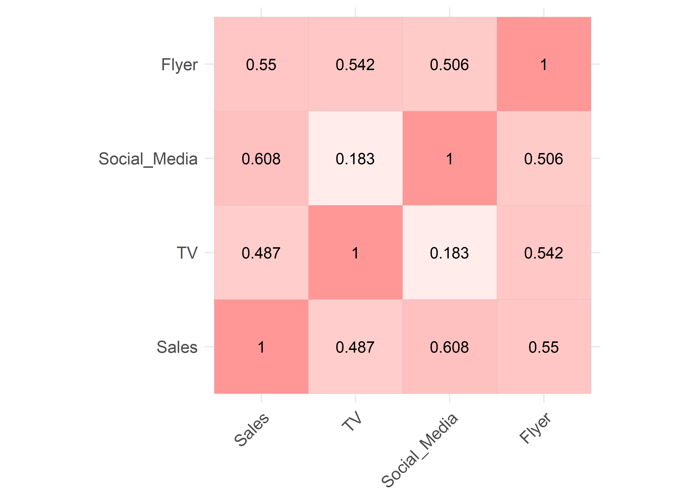
<p class="caption">(\#fig:tblm05)Ma trận hệ số tương quan của các biến trong dữ liệu Quảng cáo</p>
</div>

Bạn đọc có thể thấy rằng hệ số tương quan giữa chi phí quảng cáo qua tờ rơi,biến <span style='color: #640514; font-family: Source Code Pro;'>Flyer</span>, với hai biến giải thích còn lại bao gồm <span style='color: #640514; font-family: Source Code Pro;'>TV</span> và <span style='color: #640514; font-family: Source Code Pro;'>Social_Media</span> là khá cao, lần lượt là 0.54 và 0.51. Điều này cho thấy xu hướng chi tiêu nhiều hơn cho quảng cáo qua hình thức tờ rơi ở các cửa hàng nơi chi tiêu nhiều hơn cho quảng cáo trên qua truyền hình hoặc qua mạng xã hội. Các mô hình hồi quy đơn và mô hình hồi quy đa biến đều cho kết luận là tăng chi tiêu quảng cáo qua truyền hình và quảng cáo qua mạng xã hội thực sự có ý nghĩa làm tăng doanh thu. Giả sử rằng kết luận này là đúng, khi đó việc sử dụng mô hình hồi quy tuyến tính đơn để kiểm tra mối liên hệ giữa doanh thu bán hàng theo quảng cáo trên tờ rơi cho hệ số ước lượng có ý nghĩa là do cả hai biến này đều có tương quan cao với chi phí quảng cáo qua truyền hình và mạng xã hội, chứ thực sự thì chi tiêu cho quảng cáo qua tờ rơi không có tác động đến doanh thu bán hàng. 

Đây là kết quả rất thường gặp khi xây dựng mô hình trên dữ liệu thực tế. Một ví dụ thường được nhắc đến để mô tả tình huống này trong nhiều sách tham khảo là khi hồi quy số các cuộc tấn công của cá mập theo doanh số bán kem trên các bãi biển trong một khoảng thời gian nhất định. Đây là hai biến về bản chất không có mối liên hệ nhưng sẽ cho hệ số góc là một số dương có ý nghĩa thống kê. Cũng giống như chi phí quảng cáo qua hình thức tờ rơi và doanh thu bán hàng, việc không tính đến các biến giải thích có tác động thực sự lên biến mục tiêu sẽ khiến cho chúng ta lầm tưởng rằng doanh số bán kem có tác động đến số cuộc tấn công của cá mập! Trên thực tế, nhiệt độ cao hơn khiến nhiều người đến bãi biển hơn, từ đó dẫn đến doanh số bán kem nhiều hơn và nhiều vụ cá mập tấn công hơn. Nếu chúng ta xây dựng mô hình hồi quy bội mà số các cuộc tấn công của cá mập phụ thuộc vào doanh số bán kem và nhiệt độ của vùng đó sẽ cho kết quả là doanh số bán kem không còn có ý nghĩa giải thích số các cuộc tấn công!

#### Kiểm định mô hình tuyến tính đa biến
Mục đích của kiểm định mô hình đa biến là để trả lời hai câu hỏi

* Thứ nhất: mô hình hồi quy có ý nghĩa giải thích biến mục tiêu $Y$ hay không? Hay nói một cách khác là có ít nhất một biến trong số các biến giải thích $X_1$, $X_2$, $\cdots$, $X_p$ có tác động lên biến mục tiêu?
* Thứ hai: nếu mô hình hồi quy đa biến có ý nghĩa, thì tất cả các biến đều có ý nghĩa tác động lên biến mục tiêu, hay chỉ một tập hợp con các biến có tác động?

Để trả lời cho câu hỏi thứ nhất, nhắc lại với bạn đọc rằng trong kiểm định mô hình hồi quy tuyến tính đơn, để xác định liệu có mối quan hệ giữa biến mục tiêu và biến giải thích hay không, chúng ta chỉ cần kiểm định giả thuyết $H_0: \beta_1 = 0$. Trong mô hình hồi quy đa biến với $p$ biến giải thích dự đoán, chúng ta cần kiểm định giả thuyết liệu hệ số hồi quy của tất cả các biến giải thích đều bằng 0, tức là liệu có xảy ra trường hợp $\beta_1 = \beta_2 = \cdots = \beta_p = 0$. Cặp giả thuyết $H_0$ - $H_1$ trong mô hình hồi quy đa biến được viết như sau
\begin{align}
& H_0: \beta_1 = \beta_2 = \cdots = \beta_p = 0 \\
& H_1: \text{ít nhất có một } \beta_j \text{ khác 0}
(\#eq:lm103)
\end{align}

Để kiểm định cặp giả thuyết trong \@ref(eq:lm103), chúng ta sử dụng thống kê $F$
\begin{align}
F = \cfrac{(TSS - RSS)/p}{RSS/(n-p-1)}
(\#eq:lm104)
\end{align}

Nếu giả thuyết $H_0$ là đúng thì thống kê $F$ sẽ có phân phối $\mathcal{F}(p, n - p - 1)$. Do giá trị trung bình của biến ngẫu nhiên phân phối $\mathcal{F}(p, n - p - 1)$ là 1 nên khi giá trị thống kê $F$ lớn thì khả năng bác bỏ giả thuyết $H_0$ là lớn. Để hiểu được tại sao lại sử dụng phân phối $\mathcal{F}$ để kiểm định giả thuyết, bạn đọc tham khảo phần \@ref(leastsquared). Chúng tôi không giải thích chi tiết vấn đề này tại đây để tránh sự phức tạp không cần thiết.

Thống kê $F$ cho mô hình hồi quy tuyến tính đa biến thu được bằng cách hồi quy doanh thu bán hàng theo chi phí quảng cáo qua truyền hình, mạng xã hội, và tờ rơi được trình bày là 18.75. Vì giá trị này lớn hơn 1 rất nhiều nên đây có cơ sở để bác bỏ giả thuyết $H_0$. Nói cách khác, giá trị thống kê $F$ lớn cho thấy rằng ít nhất một trong các phương tiện quảng cáo phải liên quan đến doanh thu bán hàng. Tuy nhiên, thống kê $F$ cần phải lớn đến mức nào để chúng ta có thể bác bỏ $H_0$ và kết luận rằng có mối quan hệ và điều gì sẽ xảy ra nếu thống kê $F$ gần với 1 hơn? Để trả lời câu hỏi này còn phụ thuộc vào giá trị của $n$ và $p$. Khi $n$ lớn, ngay cả khi thống kê $F$ chỉ lớn hơn 1 một chút chúng ta vẫn có thể có cơ sở để bác bỏ $H_0$. Ngược lại, thống kê $F$ cần lớn hơn để có cơ sở bác bỏ $H_0$ nếu $n$ nhỏ.

Bạn đọc có thể quan sát hàm mật độ của biến ngẫu nhiên phân phối $\mathcal{F}$ với các tham số $(p = 3,n - p - 1 = 51)$ trong Hình \@ref(fig:fglm03). Khả năng một biến ngẫu nhiên có phân phối $\mathcal{F}$ lớn hơn giá trị thống kê $F$ tính toán từ dữ liệu là khoảng $2.5 \times 10^{-8}$. Nói cách khác, với *p-value* rất nhỏ, chúng ta có cơ sở để bác bỏ giả thuyết $H_0$. Điều này đồng nghĩa với việc có ít nhất một ngân sách chi cho quảng cáo có tác động đến doanh thu bán hàng.

<div class="figure" style="text-align: center">
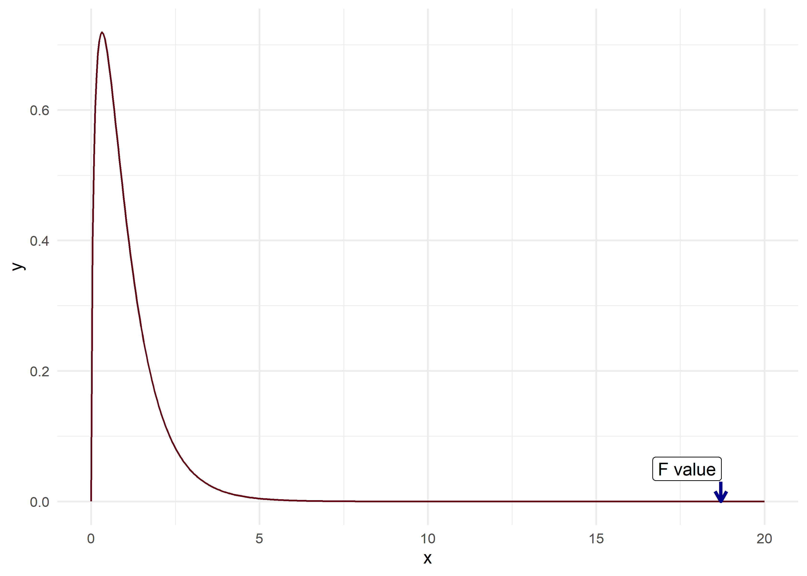
<p class="caption">(\#fig:fglm03)Hàm mật độ của phân phối F(3,51) cho dữ liệu quảng cáo. Giá trị thống kê F (F - value) đủ lớn để bác bỏ giả thuyết $H_0$</p>
</div>

Để trả lời cho câu hỏi thứ hai, chúng ta cần thực hiện các kiểm định liệu một nhóm biến giải thích có tác động lên biến mục tiêu hay không. Giả sử các biến giải thích có số thứ tự lần lượt là $1 \leq i_1 < i_2 < \cdots < i_h \leq p$. Khi đó, giả thuyết $H_0$ - $H_1$ để thực hiện kiểm định giả thuyết được viết như sau
\begin{align}
& H_0: \beta_{i_j} = 0 \ \ \forall j = 1,2, \cdots, h \\
& H_1: \text{Tồn tại ít nhất $j$ sao cho} \ \beta_{i_j} > 0
(\#eq:lm105)
\end{align}

Tương tự như trong trường hợp kiểm định giả thuyết trong phương trình \@ref(eq:lm103), chúng ta có thể sử dụng phân phối $\mathcal{F}$ để thực hiện kiểm định giả thuyết. Thống kê $F$ được tính toán như sau
\begin{align}
F = \cfrac{(RSS_1 - RSS)/h}{RSS/(n-p-1)}
(\#eq:lm106)
\end{align}
trong đó $RSS_1$ là tổng bình phương sai số của mô hình hồi quy tuyến tính không bao gồm các biến độc lập có hệ số tuyến tính được liệt kê trong phương trình \@ref(eq:lm105).

Nếu giả thuyết $H_0$ trong \@ref(eq:lm105) là đúng, thì có thể chứng minh được rằng (tham khảo phần \@ref(leastsquared)) thống kê $F$ sẽ có phân phối $\mathcal{F}(h,n-p-1)$. Giá trị của thống kê $F$ lớn cho thấy rằng ít nhất một trong các biến độc lập có hệ số tuyến tính được liệt kê trong phương trình \@ref(eq:lm105) có tác động tuyến tính lên biến phụ thuộc. Trong trường hợp đặc biệt khi $h=1$, nghĩa là khi chúng ta cần kiểm định từng biến có ý nghĩa ở trong mô hình hồi quy tuyến tính, giá trị thống kê $F$ trong phương trình \@ref(eq:lm106) chính là bình phương của thống kê $t$ khi kiểm định từng biến độc lập riêng lẻ. Giá trị của thống kê $t$ và giá trị *p-value* tương ứng khi kiểm định từng chi phí quảng cáo có tác động đến doanh thu bán hàng hay không được cho trong Bảng \@ref(tab:tblm04). Các giá trị *p-value* này chỉ ra rằng truyền hình và mạng xã hội có liên quan đến doanh thu bán hàng, nhưng không có bằng chứng nào cho thấy quảng cáo qua hình thức tờ rơi có liên quan đến doanh thu bán hàng khi tính đến cả quảng cáo trên truyền hình và quảng cáo qua mạng xã hội. 

Khi đã có các *p-value* riêng lẻ cho từng biến, tại sao chúng ta cần xem xét thống kê $F$ trong kiểm định đồng thời? Liệu có phải rằng *p-value* của một biến riêng lẻ là nhỏ thì ít nhất một trong các yếu tố dự đoán có liên quan đến phản hồi? Điều này không phải lúc nào cũng đúng, đặc biệt khi số lượng biến giải thích $p$ khá lớn. Chẳng hạn như khi số lượng biến giải thích $p = 20$ và chúng ta kiểm định giả thuyết $H_0: \beta_1 = \beta_2 = \cdots = \beta_{20} = 0$. Ngay cả khi $H_0$ là thực sự đúng, thì với mức ý nghĩa 5\%, vẫn sẽ có trung bình $5\% \times 20 = 1$ (biến) không có *p-value* lớn hơn 0.05! Điều này cũng giống như khi chúng ta tạo ra 20 biến ngẫu nhiên phân phối *Student* thì sẽ có trung bình một biến rơi vào miền giá trị có xác suất 0.05. Do đó, nếu chúng ta sử dụng thống kê $t$ riêng lẻ và các *p-value* liên quan để quyết định xem có bất kỳ mối liên hệ nào giữa các biến giải thích và biến mục tiêu hay không, thì có khả năng cao là chúng ta sẽ kết luận sai rằng có một mối quan hệ. Sử dụng thống kê $F$ không gặp phải vấn đề này vì thống kê $F$ có tính toán đến số lượng biến giải thích đưa vào trong kiểm định. Nếu giả thuyết $H_0$ thực sự đúng thì chỉ có 5\% khả năng thống kê $F$ có *p-value* nhỏ hơn 0.05, bất kể số lượng biến giải thích là bao nhiêu.

Bước đầu tiên trong xây dựng một mô hình tuyến tính thường là ước lượng mô hình và tính toán giá trị thống kê $F$. Nếu chúng ta kết luận dựa trên p-value của thống kê $F$ rằng ít nhất một trong các biến giải thích có liên quan đến biến mục tiêu, thì câu hỏi tiếp theo cần trả lời sẽ là các biến nào sẽ thực sự có ý nghĩa trong mô hình. Chúng ta có thể xem xét các *p-value* riêng lẻ cho từng biến như trong bảng \@ref(tab:tblm04), nhưng như đã thảo luận, nếu $p$ khá lớn thì chúng ta có thể thực hiện một số nhận định sai. Quá trình xác định những biến giải thích có liên quan đến biến mục tiêu để tìm ra một mô hình duy nhất chỉ bao gồm các biến có liên quan được gọi là quá trình lựa chọn biến. Vấn đề lựa chọn biến được thảo luận kỹ hơn trong phần \@ref(linearmodelselection).

#### Kiểm tra sự phù hợp của mô hình
Như đã đề cập trong mô hình tuyến tính đơn, hai thước đo định lượng phổ biến nhất về mức độ phù hợp của mô hình hồi quy tuyến tính là sai số của phần dư *RSE* và hệ số *R-squared*. Hãy nhớ lại rằng trong hồi quy đơn, *R-squared* là bình phương hệ số tương quan giữa biến mục tiêu và biến giải thích. Trong hồi quy tuyến tính đa biến, có thể chứng minh được rằng hệ số *R-squared* chính là bình phương hệ số tương quan giữa $Y$ và $\hat{Y}$. Giá trị *R-squared* gần bằng 1 cho thấy mô hình giải thích được phần lớn phương sai của biến mục tiêu. Hệ số *R-squared* trong hồi quy đa biến được tính toán dựa trên phương trình \@ref(#eq:lm08) tương tự như hồi quy đơn. Hệ số *R-squared* được tính toán bằng hàm <span style='color: #640514; font-family: Source Code Pro;'>lm()</span> như sau

``` r
# Hệ số R-squared trong mô hình hồi quy 3 biến
summary(lm(Sales ~ TV + Social_Media + Flyer,data = Advertising))$r.squared

# Hệ số R-squared trong mô hình hồi quy 2 biến: TV, Social_Media
summary(lm(Sales ~ TV + Social_Media,data = Advertising))$r.squared
```


Đối với Dữ liệu quảng cáo, mô hình sử dụng cả ba phương tiện quảng cáo để dự đoán doanh thu bán hàng có hệ số *R-squared* là 0.524. Mặt khác, mô hình chỉ sử dụng <span style='color: #640514; font-family: Source Code Pro;'>TV</span> và <span style='color: #640514; font-family: Source Code Pro;'>Social_Media</span> để dự đoán doanh thu bán hàng có giá trị *R-squared* là 0.516. Nói cách khác, có một sự gia tăng nhỏ trong *R-squared* nếu chúng ta đưa quảng cáo bằng tờ rơi vào mô hình đã có sẵn quảng cáo trên truyền hình và mạng xã hội, mặc dù trước đó chúng ta đã thấy rằng giá trị *p-value* cho quảng cáo trên tờ rơi trong Bảng \@ref(tab:tblm04) là không đáng kể. 

Thực ra thì hệ số *R-squared* sẽ luôn tăng khi có nhiều biến hơn được thêm vào mô hình, ngay cả khi những biến đó không có liên quan hoặc liên quan yếu đến biến mục tiêu. Bạn đọc cần lưu ý vấn đề này khi lựa chọn mô hình. Hệ số *R-squared* mà chúng ta thảo luận ở đây chỉ là hệ số *R-squared* tính trên dữ liệu huấn luyện mô hình chứ không phải là trên dữ liệu kiểm tra mô hình. Theo kinh nghiệm thực tế thì khi thêm các biến như quảng cáo tờ rơi vào mô hình chỉ làm cho *R-squared* tăng thêm một chút là bằng chứng cho thấy biến <span style='color: #640514; font-family: Source Code Pro;'>Flyer</span> nên bị loại khỏi mô hình. Ngược lại, khi chúng ta sử dụng mô hình chỉ chứa biến <span style='color: #640514; font-family: Source Code Pro;'>TV</span> là biến giải thích có hệ số *R-squared* là 0.237. Việc thêm biến <span style='color: #640514; font-family: Source Code Pro;'>Social_Media</span> vào mô hình sẽ dẫn đến sự cải thiện đáng kể về *R-squared*. Điều này ngụ ý rằng mô hình sử dụng hai biến chi phí quảng cáo qua truyền hình và qua mạng xã hội để dự đoán doanh thu bán hàng sẽ tốt hơn đáng kể so với mô hình chỉ sử dụng quảng cáo trên truyền hình. 

*RSE* cũng có thể là một thước đo định lượng để đánh giá sự phù hợp của mô hình. Bạn đọc có thể quan sát *RSE* của các mô hình với tổ hợp các biến giải thích khác nhau trong bảng \@ref(tab:tblm06)


<table class="table table-bordered table-hover" style="width: auto !important; margin-left: auto; margin-right: auto;">
<caption>(\#tab:tblm06)Sai số phần dư của các mô hình tuyến tính trên dữ liệu Quảng cáo</caption>
 <thead>
  <tr>
   <th style="text-align:left;"> Tổ hợp biến </th>
   <th style="text-align:right;"> RSE </th>
  </tr>
 </thead>
<tbody>
  <tr>
   <td style="text-align:left;"> TV </td>
   <td style="text-align:right;"> 0.2349 </td>
  </tr>
  <tr>
   <td style="text-align:left;"> Social_Media </td>
   <td style="text-align:right;"> 0.2135 </td>
  </tr>
  <tr>
   <td style="text-align:left;"> Flyer </td>
   <td style="text-align:right;"> 0.2246 </td>
  </tr>
  <tr>
   <td style="text-align:left;"> TV + Social_Media </td>
   <td style="text-align:right;"> 0.1889 </td>
  </tr>
  <tr>
   <td style="text-align:left;"> TV + Flyer </td>
   <td style="text-align:right;"> 0.2184 </td>
  </tr>
  <tr>
   <td style="text-align:left;"> Social_Media + Flyer </td>
   <td style="text-align:right;"> 0.2016 </td>
  </tr>
  <tr>
   <td style="text-align:left;"> TV + Social_Media + Flyer </td>
   <td style="text-align:right;"> 0.1891 </td>
  </tr>
</tbody>
</table>

Trong các mô hình đơn biến, có thể thấy rằng mô hình sử dụng biến <span style='color: #640514; font-family: Source Code Pro;'>Flyer</span> làm biến giải thích có *RSE* thậm chí còn nhỏ hơn so với mô hình chỉ sử dụng biến <span style='color: #640514; font-family: Source Code Pro;'>TV</span>. Khi sử dụng hai biến để giải thích biến doanh thu, bạn đọc có thể nhận thấy rằng mô hình sử dụng <span style='color: #640514; font-family: Source Code Pro;'>TV</span> và <span style='color: #640514; font-family: Source Code Pro;'>Social_Media</span> có *RSE* nhỏ hơn hẳn so với các mô hình còn lại. Khi thêm biến <span style='color: #640514; font-family: Source Code Pro;'>Flyer</span> vào mô hình đã bao gồm <span style='color: #640514; font-family: Source Code Pro;'>TV</span> và <span style='color: #640514; font-family: Source Code Pro;'>Social_Media</span>, *RSE* gần như không thay đổi. Không giống như hệ số *R-squared* luôn tăng khi thêm biến vào mô hình, các mô hình có nhiều biến hơn có thể có *RSE* cao hơn nếu mức giảm *RSS* nhỏ hơn so với sự gia tăng số lượng biến. 

Sau khi chúng ta đã tìm ra mô hình phù hợp, có thể sử dụng các hệ số tuyến tính để đưa ra dự đoán cho biến mục tiêu $Y$ trên giá trị các biến giải thích $X_1, X_2, \cdots , X_p$. Tuy nhiên, trước khi đưa ra dự đoán cho biến mục tiêu dựa trên mô hình tuyến tính, có những vấn đề mà bạn đọc cần lưu ý:

* *Thứ nhất*: kể cả khi mối quan hệ giữa biến mục tiêu với các biến giải thích là mối quan hệ tuyến tính, thì chúng ta cũng không biết được giá trị thực của các hệ số tuyến tính. Các hệ số $\hat{\beta}_0, \hat{\beta}_1, \cdots, \hat{\beta}_p$ chỉ là các ước lượng cho các hệ số tuyến tính thực $\beta_0, \beta_1, \cdots, \beta_p$ dựa trên dữ liệu quan sát được. Sai số giữa ước lượng và các giá trị thực có thể giảm bớt được dựa trên độ lớn của dữ liệu và kỹ năng của người xây dựng mô hình.
* *Thứ hai*: đó là sai số về mặt mô hình, nghĩa là mối quan hệ giữa các biến giải thích và các biến mục tiêu không phải là mối liên hệ tuyến tính nhưng chúng ta sử dụng mô hình tuyến tính để đưa ra dự đoán. Sai số này có thể được giảm bớt tùy theo kỹ năng của người xây dựng mô hình, chẳng hạn như sử dụng các phép biến đổi dữ liệu, hoặc thay đổi kiểu mô hình. Các mô hình phi tuyến sẽ được trình bày trong các Chương tiếp theo của cuốn sách.
* *Thứ ba*: đó là ngay cả khi chúng ta biết được mối quan hệ thực giữa biến mục tiêu và các biến giải thích, vẫn có những sai số mà hoàn toàn không thể được giải thích dựa trên dữ liệu. Các sai số này là không thể giảm bớt được.

Với các ước lượng cho hệ số tuyến tính và sai số của phần dư, chúng ta có thể xây dựng được khoảng tin cậy với mức xác suất $\alpha$ cho giá trị trung bình của biến mục tiêu
\begin{align}
\left(\hat{\beta}_0 + \hat{\beta}_1 \cdot x_1 + \cdots + \hat{\beta}_p \cdot x_p - z_{1 - \alpha/2} \cdot \hat{\sigma} ; \hat{\beta}_0 + \hat{\beta}_1 \cdot x_1 + \cdots + \hat{\beta}_p \cdot x_p + z_{1 - \alpha/2} \cdot \hat{\sigma}\right)
(\#eq:lm107)
\end{align}


Đối với dữ liệu về chi phí quảng cáo và doanh thu bán sản phẩm, giả sử mô hình được lựa chọn là mô hình với hai biến giải thích là <span style='color: #640514; font-family: Source Code Pro;'>TV</span> và <span style='color: #640514; font-family: Source Code Pro;'>Social_Media</span>. Với ngân sách cho quảng cáo trên trền hình là 150 triệu đồng và ngân sách cho quảng cáo trên mạng xã hội 30 triệu, chúng ta có khoảng tin cậy 95\% cho doanh thu bán sản phẩm là $\left(8.64 , 9.38 \right)$ tỷ đồng. Khoảng tin cậy này được tính bởi các tham số được ước lượng từ dữ liệu quan sát như sau:
\begin{align}
& 8.64 = 4.06 + 0.019 \times 150 + 0.07 \times 30 - 1.96 \times 0.189 \\
& 9.38 = 4.06 + 0.019 \times 150 + 0.07 \times 30 + 1.96 \times 0.189
\end{align}

### Những cân nhắc khi xây dựng mô hình hồi quy tuyến tính
Trong phần này chúng ta sẽ thảo luận thêm về các vấn đề thường gặp phải khi xây dựng mô hình tuyến tính trên dữ liệu thực tế bao gồm có vấn đề biến giải thích có kiểu định tính và vấn đề về tồn tại mối liên hệ phi tuyến tính giữa biến mục tiêu và biến giải thích

#### Biến giải thích là biến định tính
Khi ước lượng hệ số tuyến tính bằng phương pháp bình phương nhỏ nhất, chúng ta luôn giả định rằng tất cả các biến trong mô hình đều là biến định lượng. Trong thực tế chúng ta lại rất hay thường gặp các biến giải thích là kiểu biến định tính. Ví dụ: dữ liệu có tên <span style='color: #640514; font-family: Source Code Pro;'>exposure.csv</span> là dữ liệu về yêu cầu bồi thường viện phí và tổng số tiền bồi thường của khác hàng tham gia bảo hiểm sức khỏe tự nguyện tại một công ty bảo hiểm. Chúng tôi để mô hình ở dạng đơn giản nhất khi chỉ có hai biến phụ thuộc là giới tính, biến <span style='color: #640514; font-family: Source Code Pro;'>Gender</span>, và độ tuổi, biến <span style='color: #640514; font-family: Source Code Pro;'>Age</span>, của người được thanh toán bảo hiểm sức khỏe. Biến mục tiêu trong mô hình sẽ là số tiền bồi thường trung bình của những khách hàng, biến <span style='color: #640514; font-family: Source Code Pro;'>Ave_Claim</span>, được tính bằng tổng số tiền của tất cả các lần bồi thường chia cho tổng số lần khách hàng gửi yêu cầu.


``` r
# Load dữ liệu exposure
dat<-read.csv("../KHDL_KTKD Final/Dataset/exposure.csv")

# Chỉ giữ lại những khác hàng có yêu cầu bồi thường
dat<-filter(dat,Claim_Count>0)
dat$Gender <- ifelse(dat$Gender == 0, "Nam", "Nữ")
```

Giả sử chúng ta muốn xây dựng mô hình tuyến tính mà biến mục tiêu là số tiền bồi thường trung bình của khách hàng và các biến giải thích là độ tuổi và giới tính của khách hàng. Biến <span style='color: #640514; font-family: Source Code Pro;'>Age</span> có thể coi là biến định lượng và có thể nhận giá trị là mọi số tự nhiên từ 18 tuổi đến 65 tuổi. Biến <span style='color: #640514; font-family: Source Code Pro;'>Gender</span> không thể được sử dụng như một biến định lượng bởi vì chúng ta không thể đưa ra các so sánh định lượng giữa hai giá trị mà biến giới tính nhận.

<div class="figure" style="text-align: center">
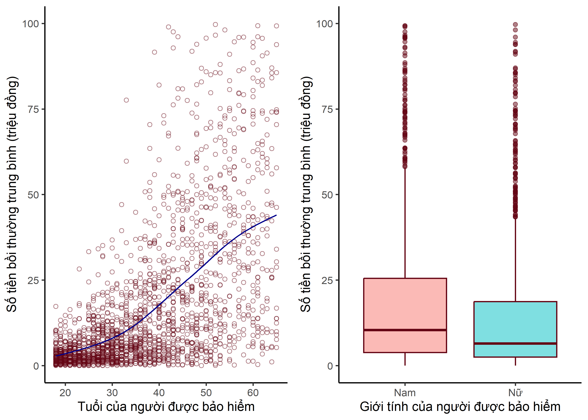
<p class="caption">(\#fig:fglm04)Hình bên trái: Mối liên hệ giữa số tiền bồi thường trung bình với độ tuổi của người được bảo hiểm; Hình bên phải: Mối liên hệ giữa số tiền bồi thường trung bình với giới tính của người được bảo hiểm</p>
</div>

Hình \@ref(fig:fglm04) mô tả mối liên hệ giữa số tiền yêu cầu bồi thường trung bình với độ tuổi và giới tính của người được bảo hiểm. Bạn đọc có thể thấy rằng có mối liên hệ giữa các biến giải thích đến các biến mục tiêu, số tiền yêu cầu bồi thường trung bình có xu hướng tăng khi tuổi của người được bảo hiểm tăng, và số tiền yêu cầu bồi thường trung bình của nam giới cao hơn so với nữ giới. Như vậy tuổi và giới tính có nhiều khả năng là các biến có liên hệ đến biến mục tiêu. Ước lượng hệ số tuyến tính của biến <span style='color: #640514; font-family: Source Code Pro;'>Age</span> có thể được thực hiện giống như các biến định lượng thông thường. Để sử dụng biến giới tính như một biến giải thích, chúng ta tạo một biến mới có dạng như sau
\begin{align}
\text{Gender}_i = \begin{cases}
1 \text{ nếu giới tính là nữ} \\
0 \text{ nếu giới tính là nam}
\end{cases}
(\#eq:lm109)
\end{align}

Mô hình tuyến tính với biến mục tiêu là số tiền yêu cầu bồi thường trung bình, biến $Y_i$, và hai biến giải thích là độ tuổi, biến Age$_i$, và giới tính, biến Gender$_i$, được viết như sau
\begin{align}
Y_i = & \beta_0 + \beta_1 \cdot Gender_i + \beta_2 \cdot Age_i + \epsilon_i \\
= & 
\begin{cases}
(\beta_0 + \beta_1) + \beta_2 \cdot Age_i + \epsilon_i  \ \ \text{ nếu giới tính là nữ} \\
\beta_0 + \beta_2 \cdot Age_i + \epsilon_i \ \ \text{ nếu giới tính là nam}
\end{cases}
(\#eq:lm108)
\end{align}

Hệ số $\beta_0$ trong phương trình \@ref(eq:lm107) là hệ số chặn trong mô hình hồi quy tuyến tính đơn mà số tiền yêu cầu bồi thường trung bình phụ thuộc vào độ tuổi nếu người được bảo hiểm là nam giới, trong khi $(\beta_0 + \beta_1)$ là hệ số chặn trong mô hình hồi quy tuyến tính đơn mà số tiền yêu cầu bồi thường trung bình phụ thuộc vào độ tuổi nếu người được bảo hiểm là nữ giới. Để ước lượng mô hình hồi quy tuyến tính với biến định tính <span style='color: #640514; font-family: Source Code Pro;'>Gender</span> bằng hàm <span style='color: #640514; font-family: Source Code Pro;'>lm()</span>, bạn đọc hãy đảm bảo biến định tính có kiểu <span style='color: #640514; font-family: Source Code Pro;'>factor</span> trước khi đưa vào trong hàm ước lượng.

``` r
# Đổi dữ liệu cột Gender thành factor
dat$Gender<-as.factor(dat$Gender)
```


<table class="table table-bordered table-hover" style="width: auto !important; margin-left: auto; margin-right: auto;">
<caption>(\#tab:tblm07)Các hệ số ước lượng trong mô hình hồi quy tuyến tính với biến định tính Gender nhận một trong hai giá trị là Male hoặc Female</caption>
 <thead>
  <tr>
   <th style="text-align:left;">   </th>
   <th style="text-align:right;"> Ước lượng </th>
   <th style="text-align:right;"> Độ lệch chuẩn </th>
   <th style="text-align:right;"> Thống kê t </th>
   <th style="text-align:right;"> p-value </th>
  </tr>
 </thead>
<tbody>
  <tr>
   <td style="text-align:left;"> (Intercept) </td>
   <td style="text-align:right;"> -40.5721 </td>
   <td style="text-align:right;"> 2.8796 </td>
   <td style="text-align:right;"> -14.089709 </td>
   <td style="text-align:right;"> 0 </td>
  </tr>
  <tr>
   <td style="text-align:left;"> Age </td>
   <td style="text-align:right;"> 1.9532 </td>
   <td style="text-align:right;"> 0.0674 </td>
   <td style="text-align:right;"> 28.973745 </td>
   <td style="text-align:right;"> 0 </td>
  </tr>
  <tr>
   <td style="text-align:left;"> GenderNữ </td>
   <td style="text-align:right;"> -14.3197 </td>
   <td style="text-align:right;"> 1.8438 </td>
   <td style="text-align:right;"> -7.766469 </td>
   <td style="text-align:right;"> 0 </td>
  </tr>
</tbody>
</table>

Hệ số ước lượng của mô hình tuyến tính với biến phụ thuộc định tính được trình bày trong bảng \@ref(tab:tblm07). Bạn đọc thấy rằng các hệ số ước lượng được đều có ý nghĩa thống kê vì giá trị *p-value* đều rất nhỏ. Hệ số tuyến tính của biến độ tuổi bằng 1.95 cho thấy rằng nếu tuổi của người được bảo hiểm tăng thêm 1 tuổi, thì số tiền bồi thường trung bình sẽ tăng khoảng 1.95 triệu đồng. Hệ số tuyến tính của biến <span style='color: #640514; font-family: Source Code Pro;'>Gender-Nữ</span> là số âm cho biết cùng một độ tuổi, trung bình mỗi lần yêu cầu bồi thường nữ giới sẽ có số tiền yêu cầu ít hơn nữ giới khoảng 14.32 triệu đồng. Việc lựa chọn mã hóa giới tính trong phương trình \@ref(eq:lm109) là hoàn toàn tự do và không ảnh hưởng đến kết quả của mô hình hồi quy. Nếu bạn đọc sử dụng cách mã hóa nữ giới là 0 và nam giới là 1, kết quả thu được sẽ có hệ số của biến <span style='color: #640514; font-family: Source Code Pro;'>Gender-Nam</span> là số dương, có giá trị bằng với giá trị tuyệt đối của hệ số của biến <span style='color: #640514; font-family: Source Code Pro;'>Gender-Nữ</span> trong bảng \@ref(tab:tblm07).

Bạn đọc có thể đặt ra câu hỏi về việc biến định tính nhận nhiều hơn hai giá trị. Cách ước lượng của mô hình tuyến tính là hoàn toàn tương tự như trường hợp hai biến. Giả sử mô hình hồi quy tuyến tính có biến $Y$ là biến mục tiêu và hai biến giải thích: $X_1$ là biến định lượng và $X_2$ là biến định tính. $X_2$ có thể nhận $J$ giá trị khác nhau lần lượt là $1, 2, \cdots, J$. Khi đó, ước lượng mô hình tuyến tính có $J + 1$ hệ số tuyến tính cần được ước lượng như sau
\begin{align}
Y = \begin{cases}
\beta_0 + \beta_1 \cdot X_1 + \epsilon \ \ \text{ nếu } X_2 = 1 \\
(\beta_0 + \beta_2) + \beta_1 \cdot X_1 + \epsilon \ \ \text{ nếu } X_2 = 2 \\
(\beta_0 + \beta_3) + \beta_1 \cdot X_1 + \epsilon \ \ \text{ nếu } X_2 = 3 \\
\cdots \\
(\beta_0 + \beta_J) + \beta_1 \cdot X_1 + \epsilon \ \ \text{ nếu } X_2 = J
\end{cases}
(\#eq:lm110)
\end{align}
Có thể thấy rằng, nếu biến định tính nhận quá nhiều giá trị, số lượng tham số của mô hình tuyến tính tăng lên tương ứng. Khi mô hình sử dụng quá nhiều hệ số sẽ dễ dẫn đến hiện tượng overfitting. Giải pháp khi gặp biến định tính nhận nhiều giá trị là nhóm các giá trị có hệ số tuyến tính $\beta$ không khác nhau vào cùng một nhóm để giảm số lượng biến. Chúng ta sẽ thảo luận kỹ hơn về giải pháp này trong phần thực hành trên mô hình tuyến tính.

#### Mối quan hệ phi tuyến giữa biến mục tiêu và biến giải thích {#basiclmconsideration2}
Mối liên hệ giữa số tiền yêu cầu bồi thường trung bình và biến độ tuổi trong Hình \@ref(fig:fglm04) không phải là một mối liên hệ tuyến tính. Bạn đọc có thể thấy rằng khi độ tuổi tăng thì số tiền yêu cầu bồi thường tăng lên nhanh hơn, điều này giải thích tại sao đường thẳng mô tả mối liên hệ giữa hai biến có độ dốc tăng dần khi độ tuổi tăng. Điều này gợi ý cho người xây dựng mô hình rằng mối liên hệ giữa số tiền bồi thường trung bình và độ tuổi là mối liên hệ phi tuyến hơn là tuyến tính. Đa số các phương pháp xây dựng mô hình hiện đại đều được xây dựng để mô tả mối quan hệ phi tuyến giữa biến giải thích và biến mục tiêu. Trong khuôn khổ mô hình hồi quy tuyến tính, chúng tôi giới thiệu một phương pháp tiếp cận đơn giản nhất, đó là hồi quy theo đa thức. Mối liên hệ giữa biến mục tiêu và biến giải thích trong Hình \@ref(fig:fglm04) có dạng parabol, do đó chúng ta có thể thêm vào mô hình biến giải thích là bình phương của độ tuổi với hi vọng là sẽ có một mô hình giải thích tốt hơn biến mục tiêu. Mô hình có dạng như sau
\begin{align}
Y = \begin{cases}
(\beta_0 + \beta_1) + \beta_2 \cdot \text{Age} + \beta_3 \cdot \text{Age}^2 + \epsilon  \ \ \text{ nếu giới tính là nam} \\
\beta_0 + \beta_2 \cdot \text{Age}_i + \beta_3 \cdot \text{Age}^2 + \epsilon \ \ \text{ nếu giới tính là nữ}
\end{cases}
(\#eq:lm111)
\end{align}


<table class="table table-bordered table-hover" style="width: auto !important; margin-left: auto; margin-right: auto;">
<caption>(\#tab:tblm08)Các hệ số ước lượng trong mô hình hồi quy quy đa thức với bình phương của biến Age là biến giải thích</caption>
 <thead>
  <tr>
   <th style="text-align:left;">   </th>
   <th style="text-align:right;"> Ước lượng </th>
   <th style="text-align:right;"> Độ lệch chuẩn </th>
   <th style="text-align:right;"> Thống kê t </th>
   <th style="text-align:right;"> p-value </th>
  </tr>
 </thead>
<tbody>
  <tr>
   <td style="text-align:left;"> (Intercept) </td>
   <td style="text-align:right;"> 49.6910 </td>
   <td style="text-align:right;"> 7.9509 </td>
   <td style="text-align:right;"> 6.249704 </td>
   <td style="text-align:right;"> 0 </td>
  </tr>
  <tr>
   <td style="text-align:left;"> Age </td>
   <td style="text-align:right;"> -3.1197 </td>
   <td style="text-align:right;"> 0.4236 </td>
   <td style="text-align:right;"> -7.364718 </td>
   <td style="text-align:right;"> 0 </td>
  </tr>
  <tr>
   <td style="text-align:left;"> Age^2 </td>
   <td style="text-align:right;"> 0.0628 </td>
   <td style="text-align:right;"> 0.0052 </td>
   <td style="text-align:right;"> 12.120244 </td>
   <td style="text-align:right;"> 0 </td>
  </tr>
  <tr>
   <td style="text-align:left;"> GenderNữ </td>
   <td style="text-align:right;"> -13.7760 </td>
   <td style="text-align:right;"> 1.7837 </td>
   <td style="text-align:right;"> -7.723394 </td>
   <td style="text-align:right;"> 0 </td>
  </tr>
</tbody>
</table>

Kết quả ước lượng trong Bảng \@ref(tab:tblm08) cho thấy tất cả các hệ số tuyến tính đều có ý nghĩa, điều này cho thấy mối liên hệ giữa số tiền bồi thường trung bình và độ tuổi là mối liên hệ phi tuyến hơn là tuyến tính. Mô hình có biến giải thích độ tuổi bình phương có hệ số *R-squared* lớn hơn nhiều so với mô hình không có biến độ tuổi bình phương, điều này cho thấy mô hình có biến độ tuổi bình phương phù hợp hơn để giải thích biến mục tiêu. Tuy nhiên, bạn đọc cũng có thể nhận thấy rằng, mô hình đã trở nên khó giải thích hơn một chút. Chúng ta không thể đưa ra đánh giá ngay lập tức cho biến mục tiêu khi tuổi của người yêu cầu bồi thường tăng 1 hay giảm 1 tuổi. Đó là sự đánh đổi giữa khả năng giải thích và khả năng dự đoán mà bạn đọc sẽ thường xuyên gặp phải khi xây dựng mô hình trên dữ liệu. Chúng ta sẽ thảo luận về các kỹ thuật mô tả mối liên hệ phi tuyến giữa biến mục tiêu và biến giải thích trong Chương mô hình cộng tính tổng quát.

#### Sự kết hợp giữa các biến giải thích không chỉ là cộng tính
Trong nhiều trường hợp, biến mục tiêu không chỉ phụ thuộc vào từng biến giải thích một cách riêng lẻ, mà còn phụ thuộc vào sự tương tác giữa các biến giải thích. Một ví dụ điển hình cho trường hợp này là khi sử dụng mô hình tuyến tính để mô tả mối liên hệ giữa số lượng thành phẩm của một nhà máy sản xuất, biến <span style='color: #640514; font-family: Source Code Pro;'>products</span>, với số lượng công nhân, biến <span style='color: #640514; font-family: Source Code Pro;'>workers</span>, và số lượng máy chế tạo, biến <span style='color: #640514; font-family: Source Code Pro;'>machines</span>. Nhìn chung khi tăng số lượng công nhân hoặc tăng số lượng máy thì số lượng thành phẩm sẽ tăng lên. Tuy nhiên mô hình hồi quy tuyến tính chỉ bao gồm hai biến giải thích <span style='color: #640514; font-family: Source Code Pro;'>workers</span> và <span style='color: #640514; font-family: Source Code Pro;'>machines</span> sẽ không mô tả được thực tế là khi tăng số lượng công nhân lên quá nhiều sẽ dẫn đến việc công nhân không có máy để sản xuất nên số lượng thành phẩm cũng sẽ không tăng theo tương ứng. Chính vì thế, để mô tả được thực tế đó, mô hình tuyến tính cần có biến giải thích mô tả sự tương tác giữa <span style='color: #640514; font-family: Source Code Pro;'>workers</span> và <span style='color: #640514; font-family: Source Code Pro;'>machines</span>:
\begin{align}
\text{products} = \beta_0 + \beta_1 \cdot \text{workers}  + \beta_2 \cdot \text{machines} + \beta_3 \cdot \text{workers} \times \text{machines} + \epsilon
(\#eq:lm112)
\end{align}
hoặc chúng ta cũng có thể viết mô hình \@ref(eq:lm112) dưới dạng mô hình tuyến tính mà hệ số tuyến tính của biến <span style='color: #640514; font-family: Source Code Pro;'>machines</span> phụ thuộc vào biến <span style='color: #640514; font-family: Source Code Pro;'>workers</span>
\begin{align}
\text{products} = & \beta_0 + \beta_1 \cdot \text{workers}  + \left(\beta_2 + \beta_3 \cdot \text{workers}\right) \cdot \text{machines} + \epsilon \\
= & \beta_0 + \left(\beta_1 + \beta_3 \cdot \text{machines} \right)  \cdot \text{workers}  + \beta_2 \cdot \text{machines} + \epsilon
(\#eq:lm113)
\end{align}

Có thể giải thích mô hình \@ref(eq:lm113) rằng mỗi khi tăng thêm 1 máy sản xuất, số lượng thành phẩm sẽ tăng lên tương ứng là bằng $(\beta_2 + \beta_3 \cdot \text{workers})$, hoặc tăng thêm 1 công nhân, số lượng thành phẩm sẽ tăng lên là $(\beta_1 + \beta_3 \cdot \text{machines})$. Hay nói một cách khác, số lượng thành phẩm tăng khi số lượng máy móc tăng nhưng tốc độ tăng còn phụ thuộc vào số lượng công nhân hiện tại; hoặc số lượng thành phẩm tăng khi tăng số lượng công nhân nhưng tốc độ tăng còn phụ thuôc vào số máy móc hiện có. Mô hình \@ref(eq:lm113) sẽ phù hợp hơn mô hình tuyến tính chỉ bao gồm hai biến giải thích <span style='color: #640514; font-family: Source Code Pro;'>workers</span> và <span style='color: #640514; font-family: Source Code Pro;'>machines</span> khi giải thích biến mục tiêu <span style='color: #640514; font-family: Source Code Pro;'>products</span>.

### Những khiếm khuyết của mô hình hồi quy tuyến tính
Khi chúng ta ước lượng mô hình hồi quy tuyến tính cho dữ liệu cụ thể những vấn đề dưới đây có thể xảy ra làm cho kết quả ước lượng của mô hình trở nên kém hiệu quả:

1. Tồn tại mối liên hệ phi tuyến giữa biến mục tiêu và biến giải thích;

2. Các sai số $\epsilon_i$ có tương quan với nhau.

3. Phương sai của các $\epsilon_i$ không phải là hằng số.

4. Trong dữ liệu có điểm ngoại lai.

5. Các biến giải thích có tương quan cao với nhau, hay còn gọi là đa cộng tuyến.

Trong thực tế, việc xác định và khắc phục những vấn đề này là những chủ đề khoa học được nghiên cứu xuyên suốt cho đến thời điểm hiện tại. Có nhiều cuốn sách có chủ đề tập trung vào mô hình hồi quy tuyến tính có thể giải quyết một hoặc một vài vấn đề được nêu ở trên. Vì mô hình hồi quy tuyến tính không phải là trọng tâm của cuốn sách này nên chúng tôi sẽ chỉ tóm tắt ngắn gọn về các vấn đề và một số hướng giải quyết ngắn gọn.

#### Dữ liệu quan sát được có dạng phi tuyến tính
Như chúng tôi đã trình bày ở phần \@ref(sec:basiclmconsideration2), khi tồn tại mối liên hệ phi tuyến giữa biến mục tiêu và biến giải thích, sử dụng mô hình tuyến tính thông thường sẽ không phù hợp và làm cho kết quả dự đoán không được chính xác. Mối liên hệ phi tuyến có thể được phát hiện khi vẽ đồ thị biến mục tiêu theo biến giải thích giống như Hình \@ref(fig:fglm04) hoặc chúng ta vẽ đồ thị phần dư của mô hình theo biến mục tiêu

<div class="figure" style="text-align: center">
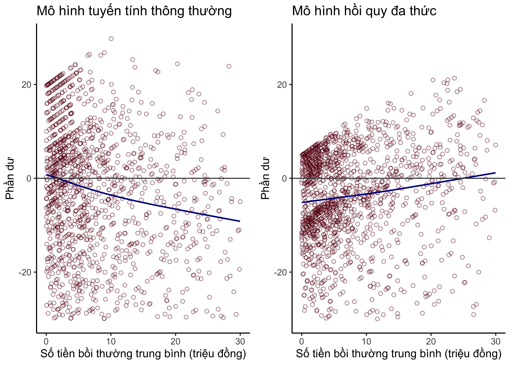
<p class="caption">(\#fig:fglm05)Đồ thị mô tả phần dư của mô hình tuyến tính theo biến mục tiêu trên dữ liệu về số tiền yêu cầu bồi thường bảo hiểm y tế. Hình bên trái: Phần dư của mô hình tuyến tính thông thường theo biến mục tiêu. Hình bên phải: Phần dư của mô hình hồi quy đa thức bậc hai theo biến mục tiêu</p>
</div>

Hình \@ref(fig:fglm05) mô tả mối liên hệ giữa phần dư của mô hình tuyến tính thông thường và mô hình hồi quy đa thức với biến mục tiêu là số tiền yêu cầu bồi thường trung bình. Đường mô tả mối liên hệ trong mô hình hồi quy đa thức gần với đường trung bình của phần dư hơn cho thấy mối liên hệ phi tuyến giữa biến mục tiêu và phần dư tuy đã giảm bớt so với hồi quy tuyến tính thông thường nhưng vẫn còn tồn tại trong mô hình hồi quy đa thức. Như vậy, có thể thấy rằng thêm các biến giải thích là các hàm phi tuyến của các biến giải thích ban đầu vào trong mô hình hồi quy tuyến tính là một phương pháp để mô tả mối quan hệ phi tuyến trong dữ liệu. 

Các biến đổi phi tuyến thường được dùng có dạng hàm mũ, hàm $\log$ của biến giải thích. Nghĩa là từ biến giải thích $X$ ban đầu, nếu đồ thị mô tả mối liên hệ giữa $X$ và $Y$ cho thấy có mối liên hệ phi tuyến, tùy theo hình dạng của đồ thị mà chúng ta có thể thêm vào mô hình các biến giải thích như $\sqrt{X}$, $X^2$, $X^3$, $\log(X)$, $\cdots$, để có được mô hình phù hợp hơn. Trong phần sau của cuốn sách chúng ta sẽ thảo luận về các kỹ thuật hiện đại hơn để mô tả tốt hơn mối liên hệ phi tuyến như vậy.

#### Tồn tại tương quan giữa các phần dư
Một giả thiết quan trọng của mô hình hồi quy tuyến tính là các sai số $\epsilon_1$, $\epsilon_2$, $\cdots$, $\epsilon_n$ không tương quan với nhau. Điều này có nghĩa là kể cả khi đã biết $\epsilon_i$, chúng ta cũng không có thông tin gì về các $\epsilon_j$ khi $j \neq i$. Giả thiết các sai số có phân phối chuẩn và không tương quan có ý nghĩa quan trọng trong xây dựng các khoảng tin cậy cho hệ số tuyến tính. Trên thực tế, nếu có mối tương quan giữa các sai số thì phương sai của các hệ số tuyến tính ước lượng bằng phương pháp bình phương nhỏ nhất sẽ nhỏ hơn nhiều cho so với phương sai thực. Kết quả là khoảng tin cậy ước lượng được sẽ nhỏ hơn các khoảng tin cậy thực sự. 

Bạn đọc có thể hình dung việc phần dư có tương quan với nhau cũng giống như việc chúng ta trong quá trình thu thập dữ liệu có sai sót dẫn đến dữ liệu bị trùng lặp. Chẳng hạn như mỗi dòng dữ liệu bị lặp lại một lần, nghĩa là dữ liệu đúng để ước lượng mô hình chỉ có $n$ dòng nhưng chúng ta đã nhân đôi dữ liệu lên trước khi thực hiện ước lượng. Khi tính toán độ lệch chuẩn của sai số, chúng ta sử dụng $2 n$ quan sát để tính toán thay vì $n$ làm cho độ lệch chuẩn bị giảm xuống một tỷ lệ là $\sqrt{2}$. Các khoảng tin cậy khi tính toán với dữ liệu bị trùng lặp sẽ bị thu hẹp lại so với khoảng tin cậy được tính toán với dữ liệu chính xác.

Khi nào thì chúng ta sẽ gặp phải hiện tượng phần dư có tương quan với nhau? Ngoài việc sai sót trong quá trình thu thập dữ liệu làm cho dữ liệu vị trùng lặp, chúng ta cũng thường gặp phải hiện tượng phần dư có tương quan khi sử dụng mô hình hồi quy tuyến tính trong dữ liệu dạng chuỗi thời gian. Trong trường hợp mà mỗi dòng dữ liệu là một quan sát thu được tại các thời điểm liền kề nhau thì rất có nhiều khả năng các biến mục tiêu sẽ có tương quan với nhau, dẫn đến tương quan giữa các phần dư trong mô hình tuyến tính.

Để xác định xem phần dư từ một mô hình hồi quy tuyến tính có tương quan hay không, chúng ta có thể quan sát đồ thị phần dư. Nếu phần dư không có tương quan thì sẽ không có mối liên hệ rõ ràng nào. Mặt khác, nếu có tồn tại tương quan dương thì chúng ta có thể thấy có sự liên kết giữa các giá trị phần dư.

<div class="figure" style="text-align: center">
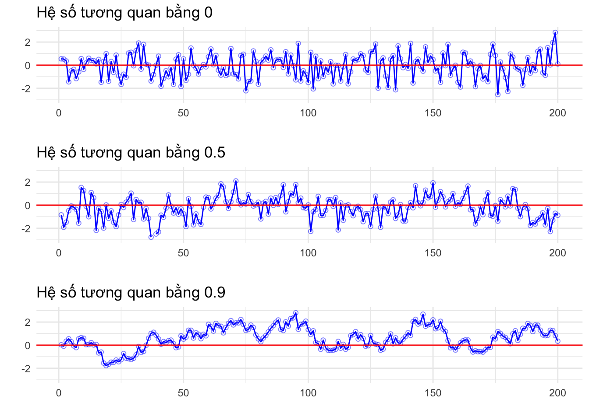
<p class="caption">(\#fig:fglm06)Đồ thị mô tả phần dư có tương quan và không có tương quan. Hình trên: các phần dư có tương quan bằng 0. Hình ở giữa: hai giá trị phần dư cạnh nhau có tương quan 0.5. Hình dưới: hai giá trị phần dư cạnh nhau có tương quan 0.9</p>
</div>

Hình \@ref(fig:film06) minh họa đồ thị phần dư của ba mô hình khác nhau. Trong hình trên cùng, chúng ta thấy phần dư từ mô hình hồi quy tuyến tính tương ứng với dữ liệu mà biến mục tiêu không có tương quan với nhau. Bạn đọc có thể thấy rằng không có mối liên hệ nào rõ ràng về xu hướng của các giá trị phần dư. Ngược lại, phần dư ở hình dưới cùng là từ tập dữ liệu trong đó các sai số liền kề có hệ số tương quan là 0.9. Bạn đọc có thể nhận thấy có một sự liên kết rõ ràng trong phần dư mà trong đó các giá trị liền kề nhau có xu hướng nhận các giá trị tương tự hay cùng dấu. Cuối cùng, hình ở giữa minh họa một trường hợp ít rõ ràng hơn mà trong đó phần dư có hệ số tương quan là 0,5. Vẫn có bằng chứng về sự liên hệ nhưng không rõ ràng như trường hợp có hệ số tương quan 0.9. 

Nhìn chung giả định về phần dư không tương quan là vô cùng quan trọng đối với mô hình hồi quy tuyến tính nói riêng cũng như đối với các mô hình học máy hiện đại. Ngoài nguyên nhân từ xây dựng mô hình hay cách lựa chọn biến, sự tương quan giữa các phần dư cũng có thể tồn tại ngay trong chính cách dữ liệu được thu thập, đặc biệt là những dữ liệu mà biến mục tiêu và biến giải thích cùng chịu sự tác động từ các yếu tố bên ngoài. Có nhiều phương pháp đã được phát triển để xác định các mối tương quan của phần dư trong mô hình hồi quy tuyến tính, đặc biệt là đối với mô hình tuyến tính có các biến mục tiêu và biến giải thích có dạng dữ liệu chuỗi thời gian. Nội dung của các phương pháp này bạn đọc có thể tham khảo trong các sách tham khảo dành riêng cho mô hình hồi quy tuyến tính.

#### Phương sai của phần dư thay đổi
Một giả thiết quan trọng khác của mô hình hồi quy tuyến tính là các phần dư có phương sai không thay đổi: $\mathbb{V}(\epsilon_i) = \sigma^2$ $\forall i = 1, 2, \cdots, n$. Ước lượng các hệ số tuyến tính, xây dựng các khoảng tin cậy cho hệ số, hay kiểm định các giả thuyết của mô hình tuyến tính đều dựa trên giả định này. Thực tế là chúng ta rất hay gặp phải trường hợp phương sai của phần dư là không cố định. Một nguyên nhân hiện tượng phần dư có phương sai thay đổi đến từ việc mối liên hệ giữa biến mục tiêu và biến giải thích là phi tuyến. Nếu xuất phát từ nguyên nhân này, chúng ta có thể biến đổi biến mục tiêu trước khi thực hiện ước lượng. 

Một ví dụ điển hình thường gặp phải là khi phương sai của phần dư tăng theo giá trị của biến mục tiêu. Chúng ta có thể xác định được hiện tượng phương sai của phần dư thay đổi bằng cách sử dụng đồ thị của phần dư theo giá trị ước lượng được của biến mục tiêu.

<div class="figure" style="text-align: center">
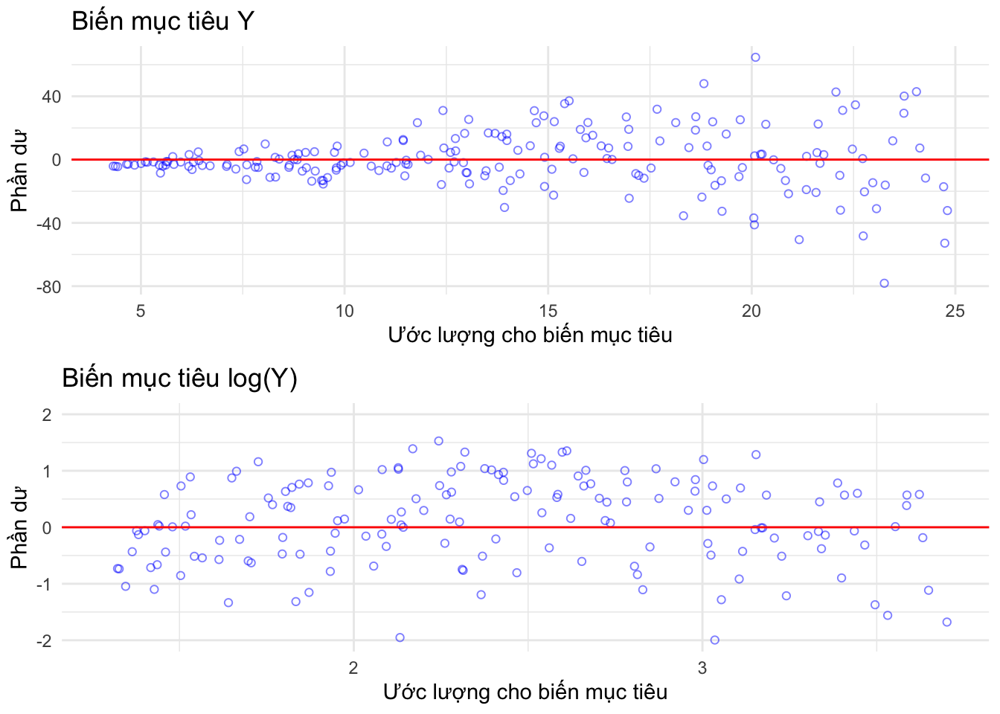
<p class="caption">(\#fig:fglm07)Đồ thị mô tả phần dư có phương sai thay đổi. Hình ở trên: cho thấy phần dư có phương sai thay đổi. Hình ở dưới: Phần dư có phương sai ổn định</p>
</div>

Một ví dụ cho phần dư có phương sai thay đổi được thể hiện trong hình \@ref(fig:fglm07). Khi chúng ta sử dụng biến mục tiêu $Y$, độ lớn của phần dư có xu hướng tăng theo các giá trị của biến mục tiêu. Khi gặp vấn đề này, một giải pháp đơn giản là biến đổi biến mục tiêu $Y$ bằng cách sử dụng $\log(Y)$ hoặc $\sqrt{Y}$ làm biến mục tiêu. Các phép biến đổi này có thể làm giảm hiện tượng phương sai thay đổi. Hình phía dưới của Hình \@ref(fig:fglm07) mô tả phần dư theo giá trị của biến mục tiêu sau khi sử dụng phép biến đổi $\log$. Phần dư đã trở nên ổn định hơn mặc dù có một số dấu hiệu về mối quan hệ phi tuyến trong giữa biến mục tiêu và biến giải thích. 

Hiện tượng phương sai của sai số thay đổi có thể là kết quả của quá trình dữ liệu được thu thập, khi mà biến mục tiêu thứ $i$ là giá trị trung bình của $n_i$ quan sát độc lập. Ví dụ, dữ liệu về yêu cầu bồi thường của các khách hàng của một công ty bảo hiểm, mỗi khách hàng có thể yêu cầu bồi thường nhiều lần trong khoảng thời gian một năm nhưng dữ liệu chỉ được lưu trữ dưới dạng tổng số tiền khách hàng yêu cầu bồi thường và tổng số lần khách hàng yêu cầu bồi thường. Khi xây dựng mô hình với biến mục tiêu là số tiền yêu cầu bồi thường trung bình thì độ lệch chuẩn của biến mục tiêu sẽ tỷ lệ nghịch với số lần khách hàng yêu cầu bồi thường. Trong trường hợp như vậy, một phương pháp khắc phục đơn giản là ước lượng mô hình sử dụng phương pháp bình phương nhỏ nhất có trọng số. Trọng số được sử dụng tỷ lệ nghịch với phương sai của biến mục tiêu. Chẳng hạn như trong ví dụ về yêu cầu bồi thường, trọng số được sử dụng đối với quan sát thứ $i$ chính là số lần khách hàng yêu cầu bồi thường.

#### Dữ liệu có giá trị ngoại lai
Điểm ngoại lai là điểm dữ liệu mà giá trị biến mục tiêu $y_i$ khác xa giá trị được dự đoán bởi mô hình $\hat{y}_i$. Các ngoại lai có thể phát sinh vì nhiều lý do, chẳng hạn như sự không chính xác trong quá trình thu thập dữ liệu. Bạn đọc có thể tham khảo thêm về giá trị ngoại lai trong phần \@ref(#ourlier) 

<div class="figure" style="text-align: center">
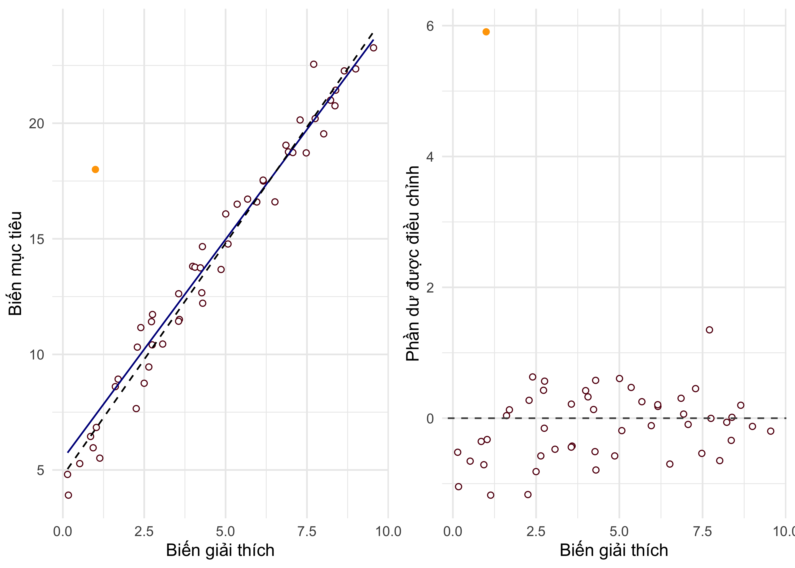
<p class="caption">(\#fig:fglm08)Dữ liệu chứa giá trị ngoại lai là điểm màu đỏ. Hình bên trái: đồ thị mô tả biến mục tiêu theo biến giải thích và các đường hồi quy tuyến tính được xây dụng cho hai trường hợp là có chứa điểm ngoại lai (nét liền màu xanh) và không chứa điểm ngoại lai (nét đứt màu đen). Hình bên phải: Đồ thị phần dư được điều chỉnh theo biến giải thích, điểm ngoại lai có phần dư có giá trị tuyệt đối lớn hơn hẳn các phần dư khác</p>
</div>

Điểm màu đỏ ở hình bên trái của Hình \@ref(fig:fglm08) minh họa một ngoại giá trị ngoại lai điển hình. Đường liền màu xanh dương là đường hồi quy tuyến tính sử dụng đầy đủ dữ liệu, trong khi đường nét đứt màu đen là đường hồi quy tuyến tính sau khi loại bỏ đi điểm ngoại lai. Trong trường hợp này, việc loại bỏ giá trị ngoại lai ít ảnh hưởng đến đường hồi quy tuyến tính vì bạn đọc có thể thấy hai đường hồi quy khá gần nhau. Thông thường, một giá trị ngoại lai duy nhất sẽ ít ảnh hưởng đến sự hình dạng của đường hồi quy tuyến tính, tuy nhiên, điểm ngoại lai này lại có thể gây ra các vấn đề khác. Trong ví dụ ở trên, *RSE* là 1.8 khi giá trị ngoại lai được đưa vào hồi quy, và *RSE* chỉ bằng 0.9 khi giá trị ngoại lai bị loại bỏ. Vì chúng ta sẽ sử dụng *RSE* để tính toán các khoảng tin cậy và các *p-value*, nên sự thay đổi đáng kể của *RSE* như vậy sẽ có tác động đến việc giải thích sự phù hợp của mô hình. Tương tự, việc đưa giá trị ngoại lai vào làm cho *R-squared* giảm từ 0.973 xuống 0.89. 

Chúng ta có thể xác định một quan sát là ngoại lai hay không bằng cách vẽ đồ thị phần dư. Trong ví dụ ở trên, giá trị ngoại lai có thể được xác định rõ ràng trong Hình \@ref(fig:fglm08). Nhưng trong thực tế, có thể khó đưa ra được quyết định là phần dư cần phải lớn đến mức nào để chúng ta coi điểm đó là điểm bất thường. Để giải quyết vấn đề này, thay vì vẽ đồ thị phần dư, chúng ta có thể vẽ đồ thị phần dư sau khi chia phần dư cho *RSE*. Nếu các giả thiết của mô hình hồi quy tuyến tính là đúng, phần dư được điều chỉnh (sau khi chia cho *RSE*) sẽ có phân phối Student. Nếu một giá trị quan sát của phần dư vượt quá các ngưỡng xác suất của phân phối Student, nhiều khả năng đó là giá trị ngoại lai. Trong Hình \@ref(fig:fglm08), tất cả các quan sát có phần dư nằm trong khoảng -2 đến 2 trong khi giá trị ngoại lai có giá trị là gần 6. Nói một cách khác khả năng điểm có phần dư được điểu chỉnh gần bằng 6 có khả năng rất cao là giá trị ngoại lai.

#### Đa cộng tuyến
Đa cộng tuyến là sự kiện mà trong đó hai hoặc nhiều biến giải thích có tương quan cao với nhau với nhau. Để giải thích rõ ràng khái niệm này, chúng ta hãy lấy một ví dụ khi xây dựng mô hình hồi quy tuyến tính trên dữ liệu có tên là <span style='color: #640514; font-family: Source Code Pro;'>Credit_Card</span>. Đây là dữ liệu về thông tin thẻ tín dụng của các khách hàng tại một ngân hàng với biến mục tiêu là số dư tài khoản, có tên là <span style='color: #640514; font-family: Source Code Pro;'>Balance</span>, và 10 biến giải thích. Để giải thích về đa cộng tuyến, chúng tôi chỉ sử dụng ba biến giải thích là 1. Độ tuổi của chủ thẻ tín dụng, ký hiệu <span style='color: #640514; font-family: Source Code Pro;'>Age</span>, 2. Hạn mức thẻ tín dụng, ký hiệu <span style='color: #640514; font-family: Source Code Pro;'>Limit</span>, và 3. Điểm tín dụng của khách hàng, ký hiệu <span style='color: #640514; font-family: Source Code Pro;'>Rating</span>. Hiện tượng đa cộng tuyến là hiện tượng mà mô hình có các biến giải thích có mối liên hệ rất chặt chẽ với nhau như được minh họa trên Hình \@ref(fig:fglm09)

<div class="figure" style="text-align: center">
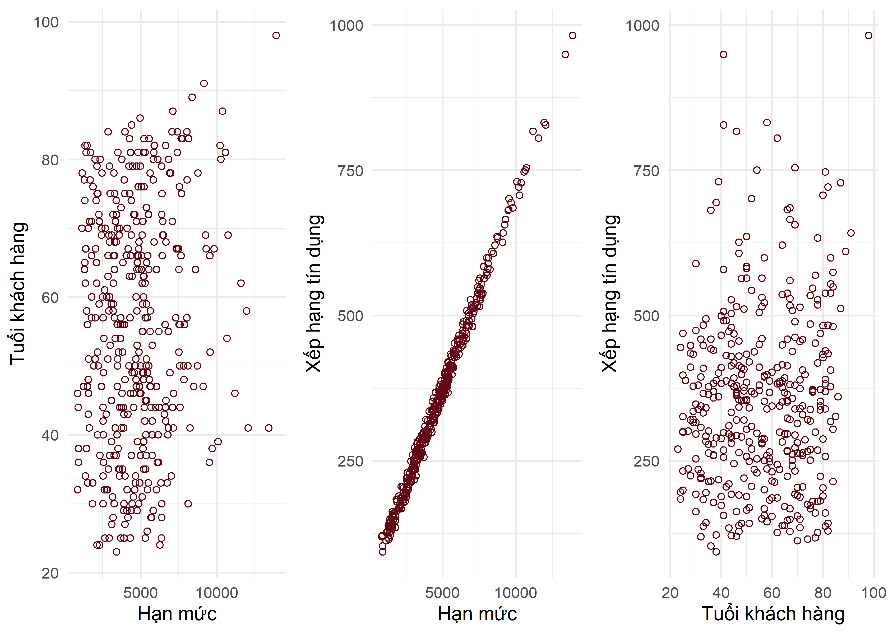
<p class="caption">(\#fig:fglm09)Mối liên hệ giữa các biến giải thích trong dữ liệu Credit. Hình bên trái: Không cho thấy có mối tương quan giữa hạn mức tín dụng với tuổi của khách hàng. Hình ở giữa: Tương quan giữa hạn mức tín dụng và điểm tính dụng là rất cao. Hình bên phải: Không có tương quan giữa tuổi của khách hàng với xếp hạng tín dụng</p>
</div>
Trong hình bên trái của Hình \@ref(fig:fglm09), hai biến giải thích là hạn mức tín dụng và độ tuổi không có mối tương quan rõ ràng. Tương tự, trong hình bên phải, cũng không có mối tương quan rõ ràng giữa độ tuổi với xếp hạng tín dụng. Ngược lại, trong hình ở giữa của Hình \@ref(fig:fglm09), hạn mức tín dụng và điểm tín dụng có mối tương quan rất cao với nhau bởi các điểm gần như nằm trên một đường thẳng. 

Hiện tượng đa cộng tuyến gây ra các vấn đề khi ước lượng và giải thích mô hình hồi quy bởi khó có thể tách biệt các tác động riêng lẻ của các biến có tương quan cao lên biến mục tiêu. Trong ví dụ ở trên. hạn mức tín dụng và điểm tín dụng có xu hướng tăng hoặc giảm cùng nhau nên khó có thể xác định xem từng biến riêng biệt có liên quan như thế nào đến biến mục tiêu là số dư tài khoản. Một vấn đề đáng kể khác khi gặp hiện tượng đa cộng tuyến đó là phương sai của các hệ số ước lượng sẽ rất lớn dẫn đến các ước lượng trở nên ít tin cậy hơn và chúng ta sẽ rất khó bác bỏ được giả thuyết hệ số tuyến tính bằng 0.


<table class="table table-bordered table-hover" style="width: auto !important; margin-left: auto; margin-right: auto;">
<caption>(\#tab:tblm09)Các hệ số ước lượng trong mô hình hồi quy tuyến tính số dư tài khoản phụ thuộc vào độ tuổi và hạn mức tín dụng</caption>
 <thead>
  <tr>
   <th style="text-align:left;">   </th>
   <th style="text-align:right;"> Ước lượng </th>
   <th style="text-align:right;"> Độ lệch chuẩn </th>
   <th style="text-align:right;"> Thống kê t </th>
   <th style="text-align:right;"> p-value </th>
  </tr>
 </thead>
<tbody>
  <tr>
   <td style="text-align:left;"> (Intercept) </td>
   <td style="text-align:right;"> -173.4109 </td>
   <td style="text-align:right;"> 43.8284 </td>
   <td style="text-align:right;"> -3.9566 </td>
   <td style="text-align:right;"> 1e-04 </td>
  </tr>
  <tr>
   <td style="text-align:left;"> Age </td>
   <td style="text-align:right;"> -2.2915 </td>
   <td style="text-align:right;"> 0.6725 </td>
   <td style="text-align:right;"> -3.4075 </td>
   <td style="text-align:right;"> 7e-04 </td>
  </tr>
  <tr>
   <td style="text-align:left;"> Limit </td>
   <td style="text-align:right;"> 0.1734 </td>
   <td style="text-align:right;"> 0.0050 </td>
   <td style="text-align:right;"> 34.4959 </td>
   <td style="text-align:right;"> 0e+00 </td>
  </tr>
</tbody>
</table>


<table class="table table-bordered table-hover" style="width: auto !important; margin-left: auto; margin-right: auto;">
<caption>(\#tab:tblm10)Các hệ số ước lượng trong mô hình hồi quy tuyến tính số dư tài khoản phụ thuộc vào hạn mức tín dụng và điểm tín dụng</caption>
 <thead>
  <tr>
   <th style="text-align:left;">   </th>
   <th style="text-align:right;"> Ước lượng </th>
   <th style="text-align:right;"> Độ lệch chuẩn </th>
   <th style="text-align:right;"> Thống kê t </th>
   <th style="text-align:right;"> p-value </th>
  </tr>
 </thead>
<tbody>
  <tr>
   <td style="text-align:left;"> (Intercept) </td>
   <td style="text-align:right;"> -377.5368 </td>
   <td style="text-align:right;"> 45.2542 </td>
   <td style="text-align:right;"> -8.3426 </td>
   <td style="text-align:right;"> 0.0000 </td>
  </tr>
  <tr>
   <td style="text-align:left;"> Limit </td>
   <td style="text-align:right;"> 0.0245 </td>
   <td style="text-align:right;"> 0.0638 </td>
   <td style="text-align:right;"> 0.3840 </td>
   <td style="text-align:right;"> 0.7012 </td>
  </tr>
  <tr>
   <td style="text-align:left;"> Rating </td>
   <td style="text-align:right;"> 2.2017 </td>
   <td style="text-align:right;"> 0.9523 </td>
   <td style="text-align:right;"> 2.3120 </td>
   <td style="text-align:right;"> 0.0213 </td>
  </tr>
</tbody>
</table>

Bảng \@ref(tab:tblm09) và \@ref(tab:tblm10) so sánh các hệ số tuyến tính ước lượng được được từ hai mô hình hồi quy riêng biệt. Trước tiên là hồi quy số dư tài khoản thẻ tín dụng theo độ tuổi và hạn mức tín dụng, sau đó là hồi quy số dư tài khoản theo hạn mức tín dụng và điểm tín dụng. Trong mô hình hồi quy đầu tiên, độ tuổi và hạn mức tín dụng đều có ý nghĩa do giá trị *p-value* rất nhỏ. Trong mô hình thứ hai, hiện tượng đa cộng tuyến giữa hạn mức tín dụng và điểm tín dụng đã khiến độ lệch chuẩn của hệ số ước lượng của biến hạn mức tín dụng tăng lên gấp 13 lần và *p-value* tăng lên thành 0.701. Nói cách khác, sự quan trọng của biến hạn mức tín dụng đã bị che khuất do hiện tượng đa cộng tuyến. Để tránh rơi vào tình trạng như vậy, cần xác định và giải quyết vấn đề đa cộng tuyến trước khi ước lượng mô hình. 

Một cách đơn giản để phát hiện hiện tượng đa cộng tuyến là xem xét ma trận tương quan của các biến giải thích. Một phần tử của ma trận này có giá trị tuyệt đối lớn là dấu hiệu cho thấy một cặp biến có tương quan cao và do đó có hiện tượng đa cộng tuyến trong dữ liệu. Tuy nhiên, bạn đọc cần lưu ý là vấn đề về đa cộng tuyến không phải lúc nào cũng có thể được phát hiện bằng cách kiểm tra ma trận tương quan bởi vì có thể tồn tại sự đa cộng tuyến giữa ba hoặc nhiều biến ngay cả khi không có cặp biến nào có tương quan cao. Thay vì kiểm tra ma trận tương quan, cách tốt hơn để đánh giá hiện tượng đa cộng tuyến là tính hệ số lạm phát phương sai, *Variance Inflation Factor* hay viết tắt là *VIF*. Hệ số này là tỷ lệ giữa phương sai của hệ số $\hat{\beta}_j$ khi ước lượng mô hình đầy đủ biến và hệ số $\hat{\beta}_j$ khi ước lượng mô hình với riêng biến đó. Một cách đơn giản hơn để tính *VIF* là sử dụng hệ số *R-squared* trong mô hình hồi quy tuyến tính biến $X_j$ theo các biến giải thích còn lại:
\begin{align}
VIF_j = \cfrac{1}{1 - R^2_{X_j|X_{-j}}}
(\#eq:lm112)
\end{align}
trong đó $R^2_{X_j|X_{-j}}$ là hệ số *R-squared* trong mô hình hồi quy biến $X_j$ theo các biến giải thích còn lại. Nếu không tồn tại đa cộng tuyến, hệ số $R^2_{X_j|X_{-j}}$ sẽ gần bằng 0 và $VIF_j$ sẽ lớn hơn 1 một chút. Ngược lại, nếu biến $X_j$ có thể được xấp xỉ bằng tổ hợp tuyến tính của các biến giải thích còn lại, hệ số $R^2_{X_j|X_{-j}}$ sẽ xấp xỉ 1 và dẫn đến $VIF_j$ có giá trị rất lớn.


<table class="table table-bordered table-hover" style="width: auto !important; margin-left: auto; margin-right: auto;">
<caption>(\#tab:tblm11)Hệ số lạm phát phương sai (VIF) của các biến giải thích trong dữ liệu về thẻ tín dụng</caption>
 <thead>
  <tr>
   <th style="text-align:left;"> Biến giải thích </th>
   <th style="text-align:right;"> Hệ số $R^2$ </th>
   <th style="text-align:right;"> $VIF_j$ </th>
  </tr>
 </thead>
<tbody>
  <tr>
   <td style="text-align:left;"> Độ tuổi </td>
   <td style="text-align:right;"> 0.0113 </td>
   <td style="text-align:right;"> 1.01 </td>
  </tr>
  <tr>
   <td style="text-align:left;"> Hạn mức tín dụng </td>
   <td style="text-align:right;"> 0.9938 </td>
   <td style="text-align:right;"> 161.29 </td>
  </tr>
  <tr>
   <td style="text-align:left;"> Điểm tín dụng </td>
   <td style="text-align:right;"> 0.9938 </td>
   <td style="text-align:right;"> 161.29 </td>
  </tr>
</tbody>
</table>

Từ Bảng \@ref(tab:tblm11) được tính toán từ dữ liệu về thẻ tín dụng, có thể thấy rằng các biến giải thích độ tuổi, hạn mức tín dụng, và điểm tín dụng có giá trị *VIF* lần lượt là $1.01$, $160.67$ và $160.59$. Có thể kết luận là có hiện tượng đa cộng tuyến trong dữ liệu thẻ tín dụng! Khi gặp hiện tượng đa cộng tuyến như vậy, có hai giải pháp đơn giản thường được sử dụng:

* Giải pháp trước tiên là loại bỏ một trong các biến có hệ số *VIF* cao ra khỏi mô hình hồi quy. Giải pháp này thường được thực hiện mà không ảnh hưởng nhiều đến sự phù hợp của mô hình hồi quy. Trong ví dụ về dữ liệu thẻ tín dụng, chúng ta có thể hồi quy số dư tài khoản theo độ tuổi và hạn mức tín dụng và bỏ qua biến điểm tín dụng mà không làm cho hệ số *R-squared* giảm một cách đáng kể. 
* Giải pháp thứ hai là kết hợp các biến có đa cộng tuyến lại với nhau thành một biến giải thích duy nhất. Chẳng hạn như chúng ta có thể lấy giá trị trung bình biến hạn mức tín dụng và biến điểm tín dụng để tạo ra một biến giải thích mới trong mô hình hồi quy tuyến tính.

Trong phần tiếp theo, chúng tôi sẽ đi sâu vào giải thích phương pháp bình phương nhỏ nhất được sử dụng để ước lượng mô hình hồi quy tuyến tính và tính chất của các ước lượng. Mục tiêu là để bạn đọc hiểu rõ hơn những kết quả đã được sử dụng hoặc công nhận ở phần trên. Những bạn đọc cảm thấy không cần thiết có thể bỏ qua và chuyển sang các phần tiếp theo mà không gặp bất kỳ khó khăn nào khi sử dụng các kết quả của mô hình hồi quy tuyến tính. 

## Mô hình hồi quy tuyến tính và phương pháp bình phương nhỏ nhất {#leastsquared}
Mô hình hồi quy tuyến tính, đúng như tên gọi của nó, cho rằng hàm $f$ được sử dụng để mô tả tác động của các biến giải thích $X_1, X_2, \cdot ,X_p$ lên biến mục tiêu $Y$ là có dạng hàm tuyến tính
\begin{align}
f(\textbf{X}) = \beta_0 + \beta_1 \cdot X_1 + \beta_2 \cdot X_2 + \cdots + \beta_p \cdot X_p
(\#eq:lm1)
\end{align}
Các hệ số $\beta_i$ trong phương trình \@ref(eq:lm1) được gọi là các tham số của mô hình hồi quy tuyến tính hoặc còn được gọi là các hệ số hồi quy. Các biến $X_i$ có thể được đưa vào mô hình từ những cách như sau:

- Biến $X_i$ là một biến kiểu số.

- Biến $X_i$ là một biến đổi của một biến kiểu số để mối liên hệ giữa $Y$ và $X_i$ trở nên tuyến tính. Các phép biến đổi thường gặp có thể là phép biến đổi $\log$, phép lấy căn, lấy bình phương, ...

- Biến $X_i$ có thể là một đa thức của một biến trong dữ liệu ban đầu. Trong trường hợp này chúng ta thường gọi là mô hình hồi quy đa thức.

- Trong trường hợp $X_i$ là một biến kiểu <span style='color: #640514; font-family: Source Code Pro;'>factor</span> và nhận $J$ giá trị khác nhau. Giả sử $J$ giá trị được mã hóa thành $1, 2, \cdots, J$ thì để mô tả tác động của biến $X_i$ lên biến mục tiêu trong mô hình tuyến tính, chúng ta cần $J$ giá trị hệ số tuyến tính: $\beta_{i,1}$, $\beta_{i,2}$, $\cdots$, $\beta_{i,J}$; trong đó hệ số tuyến tính $\beta_{i,j}$ mô tả tác động của giá trị $X_i = j$ lên biến mục tiêu.

- Biến giải thích được tính toán từ tác động qua lại giữa các biến giải thích khác, chẳng hạn như $X_i \cdot X_j$.

### Ước lượng các hệ số tuyến tính

Dù biến giải thích được tính toán như thế nào, biến mục tiêu $Y$ vẫn là một hàm số tuyến tính của các hệ số $(\beta_0, \beta_1, \beta_2,\cdots, \beta_p)$. Để dễ dàng triển khai các công thức, chúng tôi sẽ sử dụng ký hiệu $\boldsymbol{\beta}$ tương đương như véc-tơ hệ số $(\beta_0, \beta_1, \beta_2,\cdots, \beta_p)$. Phương pháp thông dụng nhất để ước lượng các hệ số của mô hình hồi quy tuyến tính là phương pháp bình phương nhỏ nhất, nghĩa là tham số $\boldsymbol{\beta}$ được tính toán từ bài toán tối ưu
\begin{align}
\hat{\boldsymbol{\beta}} = \underset{\boldsymbol{\beta}}{\operatorname{argmin}} \sum\limits_{i=1}^n \left( y_i - \beta_0 - \sum\limits_{j = 1}^p \beta_j \cdot x_{i,j} \right)^2
(\#eq:lm2)
\end{align}
 
Sai số giữa $y_i$ và $\beta_0 + \sum\limits_{j = 1}^p \beta_j \cdot x_{i,j}$ được gọi là phần dư, hay *residuals*, trong mô hình hồi quy tuyến tính. Vế bên phải của công thức \@ref(eq:lm2) là tổng bình phương của các phần dư và được viết tắt là *RSS*. Nếu coi tổng bình phương sai số là hàm số của các hệ số hồi quy $\boldsymbol{\beta}$ và viết công thức tổng bình phương sai số dưới dạng ma trận ta sẽ có
\begin{align}
RSS(\boldsymbol{\beta}) = (\textbf{y} - \textbf{x} \boldsymbol{\beta})^T \ (\textbf{y} - \textbf{x} \boldsymbol{\beta})
(\#eq:lm200)
\end{align}
với 

* $\textbf{x}$ là dữ liệu huấn luyện mô hình có kích thước $n \times (p+1)$ với cột đầu tiên bao gồm toàn các giá trị 1;
* $\textbf{y}$ là véc-tơ biến mục tiêu có kích thước $n \times 1$; và 
* véc-tơ tham số $\boldsymbol{\beta}$ có kích thước $(p+1) \times 1$. 

Véc-tơ gradient của $RSS(\boldsymbol{\beta})$ là véc-tơ có độ dài $(p+1)$ mà phần tử thứ $(j+1)$ là giá trị đạo hàm của *RSS* theo $\beta_j$ với $j = 0, 1, \cdots, p$; và được xác định như sau
\begin{align}
\cfrac{\nabla RSS(\boldsymbol{\beta})}{\nabla \boldsymbol{\beta}} &= \cfrac{\nabla (\textbf{y} - \textbf{x} \boldsymbol{\beta})^T (\textbf{y} - \textbf{x} \boldsymbol{\beta}) }  {\nabla \boldsymbol{\beta}} \\
& = - 2 \textbf{x}^T \  (\textbf{y} - \textbf{x} \boldsymbol{\beta})
(\#eq:lm201)
\end{align}

Ma trận Hessian là ma trận kích thước $(p+1) \times (p+1)$ mà phần tử hàng $i+1$ cột $j+1$ là đạo hàm cấp hai của *RSS* lần lượt theo $\beta_i$ rồi theo $\beta_j$
\begin{align}
\cfrac{\nabla RSS(\boldsymbol{\beta})}{\nabla \boldsymbol{\beta} \ \nabla \boldsymbol{\beta}^T} = 2 \textbf{x}^T \ \textbf{x}
(\#eq:lm202)
\end{align}

Giả sử rằng ma trận biến giải thích không có cột nào là tổ hợp tuyến tính của các cột còn lại, hay nói cách khác, hạng của ma trận $\textbf{x}$ là $(p+1)$. Khi đó ta có $(\textbf{x}^T \ \textbf{x})$ là ma trận xác định dương. Giá trị $\hat{\boldsymbol{\beta}}$ làm tối thiểu hóa $RSS(\boldsymbol{\beta})$ là nghiệm của
\begin{align}
\cfrac{\nabla RSS(\boldsymbol{\beta})}{\nabla \boldsymbol{\beta}} = \textbf{0}
(\#eq:lm203)
\end{align}
nghĩa là $\hat{\beta}$ được tính toán như sau
\begin{align}
\textbf{x}^T \  (\textbf{y} - \textbf{x} \hat{\boldsymbol{\beta}}) = \textbf{0} \\
\rightarrow \textbf{x}^T \ \textbf{y} = \textbf{x}^T \ \textbf{x} \hat{\boldsymbol{\beta}} \\
\rightarrow \hat{\boldsymbol{\beta}} = (\textbf{x}^T \ \textbf{x} )^{-1} \textbf{x}^T \ \textbf{y} 
(\#eq:lm3)
\end{align}

Với ma trận dữ liệu $\textbf{x}$, giá trị dự báo $\hat{\textbf{y}}$ được tính toán từ công thức dưới đây
\begin{align}
\hat{\textbf{y}} = \textbf{x} \hat{\boldsymbol{\beta}} =   \textbf{x} \ (\textbf{x}^T \ \textbf{x} )^{-1} \textbf{x}^T \ \textbf{y} 
(\#eq:lm30)
\end{align}

Điều gì xảy ra nếu hạng của ma trận $\textbf{x}$ nhỏ hơn $(p+1)$, nghĩa là một (hoặc một vài cột dữ liệu) là tổ hợp tuyến tính của các cột dữ liệu khác, hoặc trong trường hợp ma trận $\textbf{x}$ có số hàng ít hơn số cột. Khi đó ma trận $\textbf{x}^T \ \textbf{x}$ sẽ không khả nghịch và phương trình tuyến tính \@ref(eq:lm203) sẽ có vô số nghiệm $\boldsymbol{\beta}$. Đa số các hàm có sẵn khi xây dựng và ước lượng mô hình tuyến tính đều tính toán đến vấn đề này, mỗi khi thêm một biến vào trong mô hình, luôn có bước kiểm tra nếu biến được thêm vào có phải là tổ hợp tuyển tính (hoặc xấp xỉ bằng tổ hợp tuyến tính) của các biến sẵn có để loại bỏ biến đó khỏi mô hình.

Để có thể đưa ra các suy diễn về véc-tơ hệ số, chúng ta cần có giả thiết về phân phối của biến phụ thuộc $Y$. Mô hình hồi quy tuyến tính có giả thiết quan trọng là biến mục tiêu $Y$ có phân phối chuẩn. Nói một cách khác, biến ngẫu nhiên $Y|X = x_i$, được viết tắt là $Y_i$, là các biến ngẫu nhiên phân phối chuẩn độc lập có giá trị trung bình $\textbf{x}_i^T \boldsymbol{\beta}$ và phương sai cố định là $\sigma^2$ (không phụ thuộc vào $i$). Mô hình hồi quy tuyến tính được viết như sau
\begin{align}
& Y_i = \beta_0 + \beta_1 \cdot x_{i,1} + \beta_2 \cdot x_{i,2} + \cdots + \beta_p \cdot x_{i,p} + \epsilon_i \\
& \epsilon_i \sim \mathcal{N}(0, \sigma^2) \\
& Cov(\epsilon_i, \epsilon_j) = 0 \ \ \forall i \neq j
(\#eq:lm31)
\end{align}

Hoặc chúng ta có thể viết mô hình hồi quy tuyến tính dưới dạng ma trận
\begin{align}
Y \sim \mathcal{N}(\textbf{x} \boldsymbol{\beta}, \sigma^2 \ \textbf{I}_n)
(\#eq:lm310)
\end{align}
trong đó $\textbf{I}_n$ là ma trận đơn vị kích thước $n \times n$. Với giả thiết phân phối chuẩn của $Y$ trong phương trình \@ref(eq:lm310) và kết hợp với \@ref(eq:lm3) chúng ta thấy rằng $\hat{\boldsymbol{\beta}}$ là một phép biến đổi tuyến tính của một véc-tơ phân phối chuẩn nên cũng là một véc-tơ phân phối chuẩn. Véc-tơ trung bình của $\hat{\boldsymbol{\beta}}$ được xác định như sau
\begin{align}
\mathbb{E}(\hat{\boldsymbol{\beta}}) &= \mathbb{E}\left((\textbf{x}^T \ \textbf{x} )^{-1} \textbf{x}^T \ \textbf{y}\right) \\
& = (\textbf{x}^T \ \textbf{x} )^{-1} (\textbf{x}^T \textbf{x}) \ \boldsymbol{\beta} \\
& = \boldsymbol{\beta} 
(\#eq:lm4)
\end{align}
Ma trận hiệp phương sai của véc-tơ $\hat{\boldsymbol{\beta}}$
\begin{align}
\mathbb{V}ar(\hat{\boldsymbol{\beta}}) &= \mathbb{V}ar\left((\textbf{x}^T \ \textbf{x} )^{-1} \textbf{x}^T \ \textbf{y}\right) \\
&= \sigma^2 \ (\textbf{x}^T \ \textbf{x} )^{-1}
(\#eq:lm40)
\end{align}

Có thể thấy rằng véc-tơ trung bình của $\hat{\boldsymbol{\beta}}$ hoàn toàn phụ thuộc vào dữ liệu trong khi ma trận hiệu phương sai lại phụ thuộc vào một tham số không biết là $\sigma$. Để xây dựng được các khoảng tin cậy hoặc kiểm định được các hệ số có khác không hay không, chúng ta cần ước lượng tham số $\sigma^2$.

### Ước lượng phương sai của biến phụ thuộc.
Tham số thứ hai của mô hình hồi quy tuyến tính là phương sai của biến phụ thuộc, ký hiệu $\sigma^2$, được ước lượng như sau
\begin{align}
\hat{\sigma}^2 = RSS(\hat{\boldsymbol{\beta}}) = \cfrac{\sum \hat{\epsilon}_i^2}{n - (p+1)} = \cfrac{\hat{\boldsymbol{\epsilon}}^{T} \ \hat{\boldsymbol{\epsilon}}}{n - (p+1)}
(\#eq:lm40)
\end{align}
với $\hat{\epsilon}_i = y_i - \hat{y}_i$.

Với giả thiết phân phối chuẩn của các $\epsilon_i$ như \@ref(eq:lm31), $\hat{\boldsymbol{\beta}}$ được ước lượng từ phương trình \@ref(eq:lm3), và $\hat{y}$ được tính toán từ \@ref(eq:lm30), ta có thể chứng minh được rằng $\cfrac{\sum \hat{\epsilon}_i^2}{\sigma^2}$ là một biến ngẫu nhiên phân phối $\chi^2$ với bậc tự do là $n-(p+1)$. Thật vậy, ta có
\begin{align}
\hat{\boldsymbol{\epsilon}} &= \textbf{y} - \hat{\textbf{y}} = y - \textbf{x} \hat{\beta} \\
& = \textbf{y} - \textbf{x} (\textbf{x}^T \ \textbf{x} )^{-1} \textbf{x}^T \ \textbf{y} \\
& = Q \textbf{y}
\end{align}
với ma trận $Q = I_n - \textbf{x} (\textbf{x}^T \ \textbf{x} )^{-1} \textbf{x}^T$. Ma trận $Q$ có các tính chất sau:

- Thứ nhất là Q có vết ($Trace$) bằng $n - (p+1)$, thật vậy
\begin{align}
Trace(Q) = Trace(\textbf{I}_n) - Trace(\textbf{x} (\textbf{x}^T \ \textbf{x} )^{-1} \textbf{x}^T)
\end{align}
đồng thời 
\begin{align}
Trace(\textbf{x} (\textbf{x}^T \ \textbf{x} )^{-1} \textbf{x}^T) &= Trace( \textbf{x}^T \textbf{x} (\textbf{x}^T \ \textbf{x} )^{-1} ) \\
& = Trace(I_{p+1}) = (p+1)
\end{align}
do đó $Trace(Q) = n - (p+1)$

- Thứ hai, có thể thấy rằng $Q = Q^{'}$ và $Q = Q^2$ do đó các giá trị riêng của Q chỉ có thể nhận giá trị là 0 hoặc 1. Như vậy, nếu gọi $V$ là ma trận có các cột là các véc-tơ riêng của Q thì chúng ta có'
\begin{align}
V Q V^{'} = \Delta = diag(1,1,\cdots,1,0,0,\cdots,0)
(\#eq:lm5)
\end{align}
trong đó $\Delta$ là ma trận đường chéo chỉ chứa 0 và 1 trên đường chéo chính. Kết hợp với kết quả $Trace(Q)$ $=$ $n - (p+1)$ có thể kết luận rằng $Q$ có $n - (p+1)$ giá trị riêng bằng 1 và $(p+1)$ giá trị riêng bằng 0.

Ta có $\boldsymbol{\epsilon} \sim \mathcal{N}(\textbf{0}, \sigma^2 I)$ và $\hat{\boldsymbol{\epsilon}} \sim \mathcal{N}(\textbf{0}, \sigma^2 Q)$. Từ \@ref(eq:lm5) ta có $V \hat{\boldsymbol{\epsilon}} ~ \sim \mathcal{N}(\textbf{0}, \sigma^2 \Delta)$. Nói cách khác, nếu cho $\textbf{z} = V \hat{\epsilon}$ thì $\textbf{z}$ là véc-tơ phân phối chuẩn với trung bình là $\textbf{0}$ và ma trận hiệp phương sai $\sigma^2 \Delta$. Ma trận đường chéo $\Delta$ có $n-(p+1)$ phần tử nằm trên đường chéo chính bằng 1 và (p+1) phần tử nằm trên đường chéo chính bằng 0. Nói một cách khác, các phần tử từ vị trí thứ $1$ đến $n-(p+1)$ trong $\textbf{z}$ có phương sai bằng $\sigma^2$ và $p+1$ phần tử còn lại trong $\textbf{z}$ có phương sai bằng 0.  

Do $V$ là ma trận các giá trị riêng thỏa mãn $V V' = I_n$ nên
\begin{align}
\hat{\boldsymbol{\epsilon}}^{T} \ \hat{\boldsymbol{\epsilon}} = (V \hat{\boldsymbol{\epsilon}})^T V \hat{\boldsymbol{\epsilon}} = \textbf{z}^T \textbf{z} = z_1^2 + z_2^2 + \cdots + z_{n-(p+1)}^2 \sim \sigma^2 \cdot \chi^2_{n-(p+1)}
(\#eq:lm50)
\end{align}

Như vậy, từ phương trình \@ref(eq:lm50) chúng ta có
\begin{align}
\left(n-(p+1)\right) \times \hat{\sigma}^2 = \hat{\boldsymbol{\epsilon}}^{T} \ \hat{\boldsymbol{\epsilon}} \sim \sigma^2 \times \chi^2_{n-(p+1)}
(\#eq:lm501)
\end{align}

$\hat{\sigma}^2$ là ước lượng không chệch của $\sigma^2$ vì
\begin{align}
\mathbb{E}\left(\hat{\sigma}^2\right) & = \cfrac{1}{(n-(p+1))} \mathbb{E}\left(\sigma^2 \cdot \chi^2_{n-(p+1)} \right) \\
& = \sigma^2 \times \cfrac{\mathbb{E}\left(\chi^2_{n-(p+1)} \right)}{(n-(p+1))} \\
& = \sigma^2 
\end{align}
vì giá trị trung bình của biến ngẫu nhiên $\chi^2_{n-(p+1)}$ là $n-(p+1)$.

Có thể tóm tắt các ước lượng tham số của mô hình hồi quy tuyến tính, bao gồm các hệ số tuyến tính va phương sai của biến mục tiêu, sử dụng phương pháp bình phương nhỏ nhất như sau

\begin{align}
\hat{\boldsymbol{\beta}} & = P \cdot \textbf{y} \\
\hat{\sigma}^2 & = \cfrac{1}{n-(p+1)} \ (Q \cdot \textbf{y})^T (Q \cdot \textbf{y}) \\
P & = (\textbf{x}^T \ \textbf{x} )^{-1} \textbf{x}^T \\
Q & = \textbf{I}_n - \textbf{x} \ (\textbf{x}^T \ \textbf{x} )^{-1} \textbf{x}^T 
(\#eq:lm6)
\end{align}

Lưu ý rằng $P \cdot Q^T$ là một ma trận kích thước $(p+1) \times n$ có tất cả các phần tử bằng 0, do đó $\hat{\boldsymbol{\beta}}$ và $\hat{\sigma}^2$ là các biến ngẫu nhiên độc lập.

### Kiểm định các hệ số ước lượng
Từ các phương trình \@ref(eq:lm4), \@ref(eq:lm40), và \@ref(eq:lm501), chúng ta có phân phối xác suất của các tham số của mô hình hồi quy tuyến tính:
\begin{align}
& \hat{\beta}_j \sim \mathcal{N}(\beta_j, \sigma^2 a_{jj}) \ \ \forall 1 \leq j \leq (p+1) \\
& \hat{\sigma}^2 \sim \cfrac{\sigma^2}{n-(p+1)} \ \chi^2_{n-(p+1)}
(\#eq:lm60)
\end{align}
với $a_{jj}$ là phần tử nằm ở hàng $j$ cột $j$ của ma trận $(\textbf{x}^T \ \textbf{x} )^{-1}$.

Sau khi ước lượng hệ số tuyến tính từ phương trình \@ref(eq:lm6), chúng ta thường quan tâm đến sự kiện $\beta_j \neq 0$ ở một mức độ tin cậy nào đó, nghĩa là biến độc lập $X_j$ có tác động tuyến tính lên biến mục tiêu $Y$ một cách có ý nghĩa. Để trả lời câu hỏi này, chúng ta cần kiểm định giả thuyết $H_0: \beta_j = 0$. Dưới giả thuyết $H_0$, $\hat{\beta}_j$ là biến ngẫu nhiên phân phối chuẩn có giá trị trung bình bằng 0, tuy nhiên phương sai của $\hat{\beta}_j$ phụ thuộc vào giá trị không biết là $\sigma^2$. Cho biến ngẫu nhiên $T_j = \hat{\beta}_j/\left(\sqrt{a_{jj}} \cdot \hat{\sigma}\right)$ thì cùng chia cả tử và mẫu của $T_j$ cho $\sqrt{a_{jj}} \cdot \sigma$ ta có
\begin{align}
T_j = \hat{\beta}_j/(\hat{\sigma} \cdot  \sqrt{a_{jj}})  = \cfrac{\hat{\beta}_j/(\sigma \cdot  \sqrt{a_{jj}})}{\hat{\sigma}/\sigma}
(\#eq:lm7)
\end{align}

Dưới giả thuyết $H_0$ ta có 
\begin{align}
& \hat{\beta}_j/(\sigma \cdot  \sqrt{a_{jj}}) \sim \mathcal{N}(0,1) \\
& \hat{\sigma}/\sigma \sim \sqrt{\cfrac{\chi^2_{n-(p+1)}}{n-(p+1)}}
(\#eq:lm70)
\end{align}
do đó $T_j$ là biến ngẫu nhiên phân phối Student với bậc tự do $n-(p+1)$. Lưu ý rằng khi bậc tự do đủ lớn, biến ngẫu nhiên phân phối Student sẽ hội tụ đến phân phối chuẩn với trung bình bằng 0 và phương sai bằng 1. Do đó trong nhiều trường hợp, người xây dựng mô hình sử dụng phân phối $\mathcal{N}(0,1)$ để kiểm định giả thuyết $H_0: \beta_j = 0$. 

Giá trị của $T_j$ tính từ công thức \@ref(eq:lm7) là cơ sở để bác bỏ hoặc không bác bỏ giả thuyết $H_0$. Một cách tự nhiên, nếu giá trị tuyệt đối của $T_j$ lớn, nghĩa là $T_j$ nằm xa giá trị 0, xác suất để bác bỏ giả thuyết $H_0$ là lớn hơn so với khi $T_j$ gần 0. 

Giá trị *p-value* được tính bởi công thức dưới đây
\begin{align}
p-value = 2 \mathbb{P}(T_{n-(p+1)} > |T_j|)
\end{align}
Khi *p-value* nhỏ hơn một mức ý nghĩa $\alpha$ thì có thể kết luận rằng với độ tin cậy $(1-\alpha)$, hệ số $\beta_j$ là khác 0 một cách có ý nghĩa thống kê. 

Trong nhiều trường hợp chúng ta cần phải thực hiện kiểm định giả thuyết mà nhiều hệ số tuyến tính đồng thời bằng 0. Chẳng hạn như các hệ số tuyến tính của một nhóm các biến liên tục, hoặc hệ số tuyến tính của 1 biến rời rạc nhận từ ba giá trị trở lên. Giả sử các hệ số cần được kiểm định đồng thời là $\beta_{j_1}, \beta_{j_2}, \cdots, \beta_{j_h}$, khi đó cặp giả thuyết $H_0$ - $H_1$ sẽ là
\begin{align}
& H_0: \beta_{j_i} = 0 \ \ \forall i = 1,2, \cdots, h \\
& H_1: \text{Tồn tại ít nhất } i { sao cho} \ \beta_{j_i} \neq 0
\end{align}

Dưới giả thuyết $H_0$ ta có 
\begin{align}
\cfrac{1}{h} \sum\limits_{i = 1}^h T^2_{j_i} & =  \cfrac{ \cfrac{1}{h}  \sum\limits_{i = 1}^h \left( \hat{\beta}_{j_i}/(\sigma \cdot  \sqrt{a_{jj}}) \right)^2}{{\hat{\sigma}^2/\sigma^2}}
= \cfrac{\chi^2_{h}/h}{\chi^2_{n-(p+1)}/(n-(p+1))} \sim \mathcal{F}(h,n-(p+1))
(\#eq:lm71)
\end{align}

Trong đó $\mathcal{F}(h,n-(p+1))$ là phân phối $\mathcal{F}$ với các tham số $h$ và $n - (p+1)$. Một cách tự nhiên, nếu giá trị của $\sum\limits_{i = 1}^h T^2_{j_i}/h$ đủ lớn, chúng ta sẽ bác bỏ giả thuyết $H_0$, nghĩa là tồn tại ít nhất một $i$ sao cho $\beta_{j_i} \neq 0$. Nhắc lại rằng chúng tôi đã đề cập đến phân phối $\mathcal{F}$ khi kiểm định mô hình tuyến tính đa biến. Chúng tôi đã sử dụng thống kê $F$ được tính toán bằng công thức \@ref(eq:lm104). Trong trường hợp tổng quát, nếu $RSS_0$ là tổng bình phương sai số của mô hình tuyến tính bao gồm đầy đủ $p+1$ biến giải thích  trong khi $RSS_1$ là tổng bình phương sai số của mô hình tuyến tính không bao gồm các biến $X_{j_1}, X_{j_2}, \cdots, X_{j_h}$, thống kê $F$ được tính toán bằng công thức sau
\begin{align}
F = \cfrac{(RSS_1 - RSS_0)/h}{RSS_0/\left(n-(p+1)\right)}
(\#eq:lm72)
\end{align}

Nếu giả thuyết $H_0$ là đúng, nghĩa là các hệ số $\beta_{j_i}$ đều nhận giá trị bằng 0, có thể chứng minh được rằng thống kê $F$ sẽ có phân phối $\mathcal{F}$ với tham số $h$ và $n - (p+1)$.
xxxxxxxxxxxxxxx

## Các phương pháp chọn biến trong mô hình hồi quy tuyến tính. {#linearmodelselection}
Có hai lý do khiến những người xây dựng mô hình thường không hài lòng với kết quả từ phương pháp bình phương nhỏ nhất

* Thứ nhất là khả năng dự đoán của mô hình: ước lượng tham số bằng phương pháp bình phương nhỏ nhất thường có sai lệch thấp nhưng phương sai lớn. Độ chính xác của dự đoán đôi khi có thể được cải thiện bằng các phương pháp như thu nhỏ số lượng biến giải thích hoặc các phương pháp shinkage. Bằng cách tiếp cận như vậy, người xây dựng mô hình chấp nhận tăng sai lệch để giảm phương sai của các giá trị dự đoán để có thể cải thiện độ chính xác trong dự đoán. 
* Lý do thứ hai là khả năng diễn giải của mô hình. Khi số lượng biến giải thích là quá nhiều, chúng ta thường muốn xác định một tập hợp nhỏ hơn những biến có tác động mạnh đáng kể nhất nhằm diễn giải mô hình một cách tốt nhất.

Trong phần này, trước tiên chúng ta sẽ thảo luận một số cách tiếp cận để lựa chọn biến giải thích để đưa vào trong mô hình hồi quy tuyến tính bao gồm các phương pháp như lựa chọn tập hợp con tốt nhất hay *best subset selection*, *forward stepwise selection*, *backward stepwise selection*. Trong phần tiếp theo, chúng ta thảo luận về các phương pháp rút gọn tham số với mục tiêu kiểm soát phương sai của dự đoán. Do không tìm được từ Tiếng Việt có ý nghĩa hợp lý nên chúng tôi sẽ giữ nguyên tên gọi của hai phương pháp *forward stepwise selection* và *backward stepwise selection*. 

Nhìn chung, khi lựa chọn biến giải thích đưa vào mô hình, chúng ta chỉ giữ lại một tập hợp con của các biến và loại bỏ phần còn lại khỏi mô hình. Phương pháp bình phương nhỏ nhất được sử dụng để ước tính các hệ số tuyến tính. Các tiêu chí đánh giá mô hình sẽ được đưa ra nhằm so sánh các tập hợp biến khác nhau.

### Phương pháp lựa chọn tập hợp con tốt nhất
Đúng như tên gọi, lựa chọn biến bằng phương pháp lựa chọn tập hợp con tốt nhất có nghĩa là với mỗi giá trị của $k \in \{0,1,2,... ,p\}$ người xây dựng mô hình cố gắng tìm tập hợp con có bao gồm đúng $k$ biến giải thích sao cho tổng bình phương phần dư đạt giá trị nhỏ nhất. Điểm bất lợi của phương pháp này là khối lượng tính toán quá lớn bởi vì số lượng mô hình cần ước lượng là $2^p$. Phương pháp tiếp cận của Furnival và Wilson (1974) giúp cho thuật toán này có thể thực hiện được với $p$ lên đến 40. Tuy nhiên, thời gian tính toán chậm vẫn là điểm bất lợi nhất của phương pháp này.

Dữ liệu được sử dụng để xây dựng mô hình tuyến tính là dữ liệu <span style='color: #640514; font-family: Source Code Pro;'>Boston</span> trong thư viện <span style='color: #640514; font-family: Source Code Pro;'>MASS</span>. Đây là dữ liệu về giá nhà tại 506 vùng ngoại ô tại Boston. Biến mục tiêu trong xây dựng mô hình là biến <span style='color: #640514; font-family: Source Code Pro;'>medv</span> là giá trị trung vị của giá nhà tại vùng đó, đơn vị là nghìn USD. Mô hình có 13 biến phụ thuộc trong đó có 11 biến kiểu số và 2 biến kiểu rời rạc là  <span style='color: #640514; font-family: Source Code Pro;'>rad</span> và <span style='color: #640514; font-family: Source Code Pro;'>chas</span>. Mục tiêu của chúng ta là lựa chọn được $k$ biến trong số 13 biến phụ thuộc sao cho *RSE* là nhỏ nhất. 

<div class="figure" style="text-align: center">
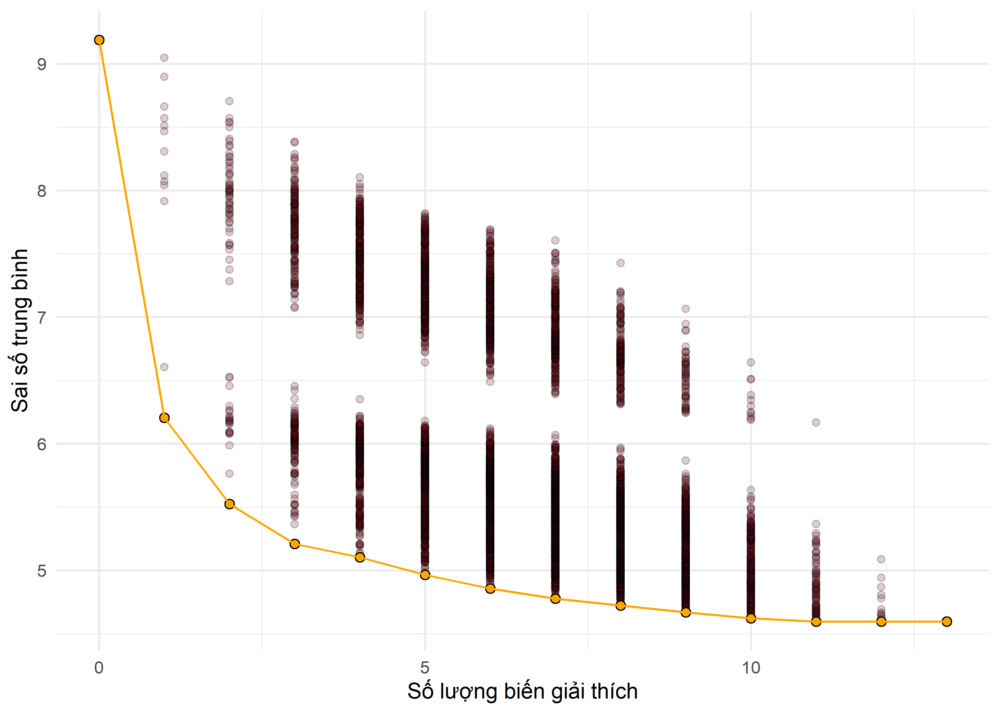
<p class="caption">(\#fig:fglm10)Phương pháp lựa chọn tập hợp con tốt nhất được thực hiện trên dữ liệu Boston. Đường ranh giới dưới là các mô hình có tổng bình phương phần dư nhỏ nhất</p>
</div>

Hình \@ref(fig:fglm10) hiển thị tất cả các mô hình có tập hợp con $k$ biến, $k = 0, 1, \cdots, 13$ cho ví dụ về giá nhà ở Boston. Đường ranh giới dưới biểu thị các mô hình đủ điều kiện để lựa chọn theo cách tiếp cận tập hợp con tốt nhất. Lưu ý rằng tập hợp con tốt nhất có kích thước bằng 2 không nhất thiết bao gồm biến nằm trong tập con tốt nhất có kích thước 1. Đường cong tập hợp con tốt nhất tính theo tiêu chí *RSE* thường giảm theo $k$, do đó thường không tối ưu khi sử dụng để chọn kích thước tập hợp con tối ưu. 

Có một số tiêu chí mà chúng ta có thể cân nhắc khi so sánh các mô hình tuyến tính có số lượng biến khác nhau ngoài *RSE*. Nếu khối lượng tính toán cho phép thì chúng tôi thường sử dụng sai số tính bằng *RSE* trung bình tính trên xác thực chéo để làm tiêu chí lựa chọn mô hình. Khi khối lượng tính toán cho xác thực chéo quá lớn thì bạn đọc cũng có thể sử dụng tiêu chí AIC là một lựa chọn thay thế. Cách sử dụng sai số xác thực chéo làm tiêu chí lựa chọn sẽ được trình bày trong phần thực hành của chương.

### Forward- and Backward-Stepwise Selection
Thay vì tìm kiếm qua tất cả các tập hợp con, điều mà này trở nên không khả thi khi số lượng biến $p$ lớn, chúng ta có thể tìm kiếm tập hợp con một cách tuần tự theo từng bước, mà ở đó, kết quả của bước tiếp theo phụ thuộc vào bước trước đó.

- *Forward stepwise selection* bắt đầu bằng cách lựa chọn mô hình có 1 biến tốt nhất. Sau đó, phương pháp này tìm kiểm mô hình có $k$ biến bằng cách lấy $(k-1)$ biến đã được lựa chọn ở bước trước đó để thêm vào một biến. Như vậy, tại bước thứ $k$, sẽ có $(p-k+1)$ mô hình tuyến tính cần được ước lượng. Số mô hình cần được ước lượng trong phương pháp forward stepwise selection là
\begin{align}
p + (p-1) + \cdots + 1 = \cfrac{p(p+1)}{2}
\end{align}

- Bước thứ nhất của phương pháp *backward stepwise selection* bắt đầu bằng ước lượng mô hình có đầy đủ $p$ biến. Sau đó, tại bước thứ $k$, mô hình tìm cách loại bỏ đi 1 biến trong $(p+2-k)$ biến trong mô hình được ước lượng tại bước thứ $(k-1)$. Như vậy, tại bước thứ $k$ với $k >1$ sẽ có $(p+2-k)$ mô hình cần được ước lượng. Tổng số mô hình cần được ước lượng trong phương pháp là
\begin{align}
1 + p + (p-1) + \cdots + 2 = \cfrac{p(p+1)}{2}
\end{align}

Hai phương pháp mô tả ở trên có bất lợi so với phương pháp lựa chọn tập hợp con tốt nhất là không chắc chắn tìm thấy được mô hình có $k$ biến tốt nhất do kết quả của các bước phụ thuộc vào các bước trước đó. Tuy nhiên, lợi thế của các phương pháp này có thể kể đến là

* Nguồn lực tính toán: với $p$ lớn thì thời gian tính toán của hai phương pháp kể trên nhanh hơn nhiều so với phương pháp tập hợp con tốt nhất.
* Về mặt ý nghĩa thống kê: phương pháp lựa chọn tập hợp con tốt nhất tìm kiếm mô hình có $k$ biến tốt nhất trong tất cả các lựa chọn có thể, do đó kết quả thường thu được mô hình có phương sai cao hơn. Ngược lại, các phương pháp forward và backward stepwise selection chỉ tìm kiếm mô hình $k$ biến trong một không gian nhỏ hơn (phụ thuộc vào các biến đã được lựa chọn trong các bước trước đó) nên thường có phương sai nhỏ hơn.

Hình vẽ \@ref(fig:fglm11) mô tả các mô hình có $k$ biến tốt nhất với $k = 0, 1, \cdots, 13$ sử dụng phương pháp *forward stepwise selection*. Trong trường hợp dữ liệu <span style='color: #640514; font-family: Source Code Pro;'>Boston</span>, ba phương pháp lựa chọn biến chúng tôi mô tả ở trên cho cùng một kết quả!

<div class="figure" style="text-align: center">
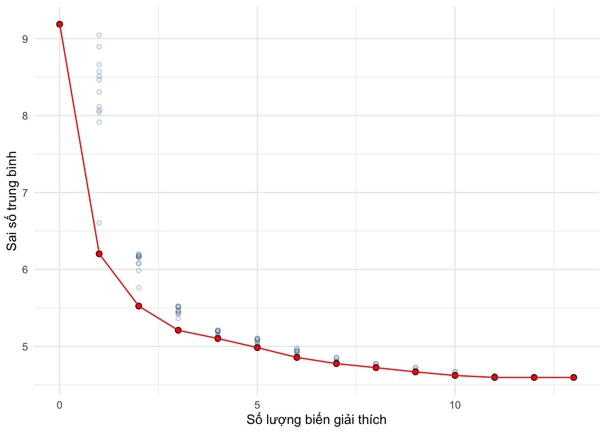
<p class="caption">(\#fig:fglm11)Phương pháp forward stepwise selection được thực hiện trên dữ liệu Boston. Đường ranh giới dưới là các mô hình có sai số trung bình nhỏ nhất.</p>
</div>

## Hồi quy tuyến tính có ràng buộc tham số
Bằng cách tìm kiếm một tập hợp con các biến giải thích, các phương pháp lựa chọn biến trình bày ở phần trên có thể giúp bạn đọc tìm ra các mô hình có khả năng giải thích tốt và có khả năng có sai lệch thấp hơn so với mô hình gồm đầy đủ tất cả các biến. Hạn chế của các mô hình này ở chỗ, do mỗi biến giải thích chỉ có một trong hai khả năng là có xuất hiện hoặc không xuất hiện, nên các mô hình kết quả vẫn sẽ có phương sai lớn. Các phương pháp ràng buộc tham số được trình bày trong phần này là các phương pháp thường được sử dụng để cải thiện các mô hình có phương sai lớn với mục đích giảm phương sai của các mô hình và chấp nhận đánh đổi khả năng sai lệch có thể tăng.

### Hồi quy *ridge*
Hồi quy *ridge* hạn chế ảnh hưởng của biến giải thích lên biến mục tiêu bằng cách thêm vào một hàm phạt vào *RSS* nếu giá trị tuyệt đối của các hệ số tuyến tính tăng lên. Thay vì tìm các hệ số $\hat{\boldsymbol{\beta}}$ để tối thiểu hóa $RSS(\beta)$, hồi quy *ridge* tìm các hệ số $\hat{\boldsymbol{\beta}}^{ridge}$ để tối thiểu hóa tổng của $RSS(\beta)$ với một hàm phạt như sau
\begin{align}
\hat{\boldsymbol{\beta}}^{ridge} = \underset{\boldsymbol{\beta}}{\operatorname{argmin}} \sum\limits_{i=1}^n \left( y_i - \beta_0 - \sum\limits_{j = 1}^p \beta_j \cdot x_{i,j} \right)^2 + \lambda \cdot \sum\limits_{j=1}^p \beta_j^2
(\#eq:ridge1)
\end{align}

hồi quy *ridge* sử dụng hàm phạt là $PF(\boldsymbol{\beta}) = \sum\limits_{j=1}^p \beta_j^2$. Lưu ý rằng hệ số chặn $\beta_0$ không có trong hàm phạt bởi vì hệ số này không bị tác động bởi các biến giải thích. Hệ số $\lambda \geq 0$ điều khiển mức độ ảnh hưởng của hàm phạt lên giá trị tối ưu. Khi $\lambda$ nhỏ thì ảnh hưởng của hàm phạt lên giá trị tối ưu không đáng kể và nếu $\lambda$ lớn thì hàm phạt sẽ chiếm ưu thế trong bài toán tối ưu và làm cho tất cả các hệ số $\hat{\boldsymbol{\beta}}^{ridge}$ gần tới 0.

Bài toán tối ưu trong phương trình \@ref(eq:ridge1) có thể phát biểu dưới dạng bài toán có ràng buộc như sau:
\begin{align}
& \hat{\boldsymbol{\beta}}^{ridge} = \underset{\boldsymbol{\beta}}{\operatorname{argmin}} \sum\limits_{i=1}^n \left( y_i - \beta_0 - \sum\limits_{j = 1}^p \beta_j \cdot x_{i,j} \right)^2, \\
& \text{ với ràng buộc: }  \sum\limits_{j=1}^p \beta_j^2 \leq c
(\#eq:ridge2)
\end{align}

Trong trường hợp mô hình tuyến tính có các biến độc lập có tương quan cao với nhau ước lượng của các hệ số tuyến tính có độ biến động lớn khiến mô hình tuyến tính kém hiệu quả. Bằng cách sử dụng ràng buộc trên cho tổng bình phương các hệ số, hồi quy *ridge* kiểm soát được vấn đề các biến giải thích tương quan cao. Ngoài ra, khi thực hiện hồi quy *ridge* các hệ số tuyến tính sẽ phụ thuộc vào việc có hay không thực hiện biến đổi tuyến tính các biến giải thích, do đó trước khi thực hiện hồi quy người xây dựng mô hình thường chuẩn hóa các biến giải thích. Sau khi các biến giải thích được chuẩn hóa, ước lượng cho hệ số chặn là giá trị trung bình của biến mục tiêu, và phương pháp bình phương nhỏ nhất được thực hiện để ước lượng $\beta_1, \beta_2, \cdots, \beta_p$.

Tổng bình phương sai số dưới trong hồi quy *ridge* được viết như sau
\begin{align}
RSS(\boldsymbol{\beta}) = (\textbf{y} - \textbf{x} \boldsymbol{\beta})^T \ (\textbf{y} - \textbf{x} \boldsymbol{\beta}) + \lambda \boldsymbol{\beta}^T \boldsymbol{\beta}
\end{align}

Lưu ý rằng ma trận biến giải thích $\textbf{x}$ sau khi chuẩn hóa có kích thước $n \times p$. Tương tự như mô hình tuyến tính, hệ số hồi quy được ước lượng bằng phương pháp bình phương nhỏ nhất
\begin{align}
\hat{\boldsymbol{\beta}}^{ridge} = (\textbf{x}^T \ \textbf{x} + \lambda I_{p} )^{-1} \textbf{x}^T \ \textbf{y} 
\end{align}
với $I_p$ là ma trận đơn vị có kích thước $p \times p$. Như vậy, tương tự như hồi quy tuyến tính thông thường, véc-tơ hệ số $\hat{\boldsymbol{\beta}}^{ridge}$ vẫn là tổ hợp tuyến tính của véc-tơ biến mục tiêu $\textbf{y}$. Sự khác nhau của các hệ số đến ở chỗ hồi quy *ridge* thêm vào đường chéo chính của ma trận $\textbf{x}^T \ \textbf{x}$ giá trị $\lambda$ trước khi lấy nghịch đảo.

Trong trường hợp các biến giải thích đôi một độc lập, có thể chứng minh được rằng 
\begin{align}
\hat{\boldsymbol{\beta}} = \cfrac{\hat{\boldsymbol{\beta}}^{ridge}}{1 + \lambda}
\end{align}
trong đó $\hat{\boldsymbol{\beta}}$ là ước lượng của các hệ số tuyến tính khi không sử dụng hàm phạt. Khi $\lambda$ đủ lớn sẽ làm cho các giá trị hệ số tuyến tính giảm dần về 0. Điều đó có nghĩa là khi $\lambda$ càng lớn, bậc tự do của mô hình càng nhỏ. Trong mô hình tuyến tính thông thường, bậc tự do của mô hình có thể hiểu một cách đơn giản là số lượng tham số và bằng $(p+1)$. Với $\lambda > 0$, vẫn có $(p+1)$ hệ số tuyến tính trong hồi quy *ridge* được ước lượng, tuy nhiên các hệ số bị ràng buộc với nhau làm cho bậc tự do của mô hình giảm. Điều này cũng đồng nghĩa với việc mô hình ít bị phụ thuộc vào dữ liệu hơn (phương sai giảm) nhưng đánh đổi lại là sai lệch sẽ tăng. 

Khái niệm bậc tự do trong các mô hình có ràng buộc về tham số thường được gọi là bậc tự do hiệu quả thay vì bậc tự do thông thường. Bậc tự do hiệu quả được định nghĩa bằng tổng độ nhạy (đạo hàm) của các giá trị dự báo $\hat{y}_i = \hat{f}(x_i)$ theo các giá trị quan sát của biến mục tiêu
\begin{align}
\text{Bậc tự do hiệu quả} = \sum\limits_{i=1}^n \cfrac{\partial \hat{y}_i }{\partial y_i}
(\#eq:ridge3)
\end{align}

Bậc tự do hiệu quả lớn có nghĩa là giá trị dự đoán $\hat{y}_i$ sẽ thay đổi lớn khi các giá trị quan sát $y_i$ thay đổi, ngược lại, bậc tự do hiệu quả nhỏ có nghĩa là các giá trị dự đoán $\hat{y}_i$ sẽ thay đổi nhỏ khi các giá trị quan sát được $y_i$ thay đổi. Tương tự như khái niệm bậc tự do trong mô hình tuyến tính thông thường, mô hình có bậc tự do hiệu quả lớn nghĩa là mô hình có phương sai lớn.

Trong hồi quy tuyến tính thông thường hoặc hồi quy tuyến tính ridge, giá trị dự báo của mô hình có dạng 
\begin{align}
\hat{\textbf{y}} = A \textbf{y} 
\end{align}
với $A = \textbf{x} (\textbf{x}^T \ \textbf{x} )^{-1} \textbf{x}^T$ trong mô hình tuyến tính thông thường, và $A = \textbf{x} (\textbf{x}^T \ \textbf{x} + \lambda I_{p} )^{-1} \textbf{x}^T$ trong hồi quy tuyến tính ridge. 

Bậc tự do hiệu quả của các mô hình trên chính là vết (trace) của ma trận $A$
\begin{align}
\sum\limits_{i=1}^n \cfrac{\partial \hat{y}_i }{\partial y_i} = Trace(A) = \sum\limits_{i=1}^n A_{i,i}
(\#eq:ridge4)
\end{align}
trong đó $A_{i,i}$ là các phần tử thứ $i$ nằm trên đường chéo chính của ma trận $A$. Trong ước lượng mô hình tuyến tính thông thường ma trận $\textbf{x}^T \ \textbf{x}$ có hạng bằng $(p+1)$, chúng ta đã có $trace(A) = (p+1)$, nghĩa là bậc tự do hiệu quả của mô hình tuyến tính thông thường bằng số tham số trong mô hình. 

Để trả lời câu hỏi bậc tự do hiệu quả của hồi quy *ridge* phụ thuộc vào $\lambda$ như thế nào, chúng ta giả sử ma trận $\textbf{x}^T \ \textbf{x}$ có hạng bằng $p$. Khi đó, ma trận $\textbf{x}^T \ \textbf{x}$ có thể được viêt dưới dạng sau
\begin{align}
\textbf{x}^T \ \textbf{x} = U D U^{T}
\end{align}
với $U$ là ma trận các véc-tơ riêng chuẩn hóa của $\textbf{x}^T \ \textbf{x}$ và $D$ là ma trận đường chéo có các phần tử nằm trên đường chéo chính là các giá trị riêng của ma trận $\textbf{x}^T \ \textbf{x}$.
\begin{align}
D = Diag(\lambda_1, \lambda_2, \cdots, \lambda_p)
\end{align}
với $\lambda_i$ là các giá trị riêng của ma trận $\textbf{x}^T \ \textbf{x}$. Lưu ý rằng ma trận $U$ là ma trận unitary. Hơn thế nữa, ma trận $\textbf{x}^T \ \textbf{x}$ xác định dương nên tất cả các giá trị riêng $\lambda_i$ đều là các số dương. Chúng ta có bậc tự do hiệu quả của hồi quy *ridge* được xác định như sau:
\begin{align}
Trace\left(\textbf{x} (\textbf{x}^T \ \textbf{x} + \lambda \textbf{I}_p )^{-1}\right) & = Trace(\textbf{x}^T \textbf{x} (\textbf{x}^T \ \textbf{x} + \lambda \textbf{I}_p )^{-1}) \\
& = Trace\left[ Diag \left( \cfrac{\lambda_1}{\lambda_1 + \lambda}, \cfrac{\lambda_2}{\lambda_2 + \lambda}, \cdots, \cfrac{\lambda_{p}}{\lambda_{p} + \lambda} \right) \right] \\
& = \sum\limits_{i = 1}^{p} \cfrac{\lambda_i}{\lambda_i + \lambda}
(\#eq:ridge40)
\end{align}

Có thể thấy rằng bậc tự do hiệu quả của hồi quy *ridge* là hàm số giảm theo $\lambda$. Trong mô hình tuyến tính với $p$ biến giải thích và không có hệ số chặn, bậc tự do là $p$. Khi sử dụng ràng buộc trên các hệ số tuyến tính, kể cả khi các hệ số khác 0 một cách có ý nghĩa, các hệ số vẫn bị ràng buộc bởi $\lambda$. Bậc tự do hiệu quả nhận giá trị bằng $p$ khi $\lambda = 0$, tương đương với bài toán tối ưu không có ràng buộc, trong khi bậc tự do hiệu quả sẽ xấp xỉ 0 nếu chúng ta chọn $\lambda$ đủ lớn.

<div class="figure" style="text-align: center">
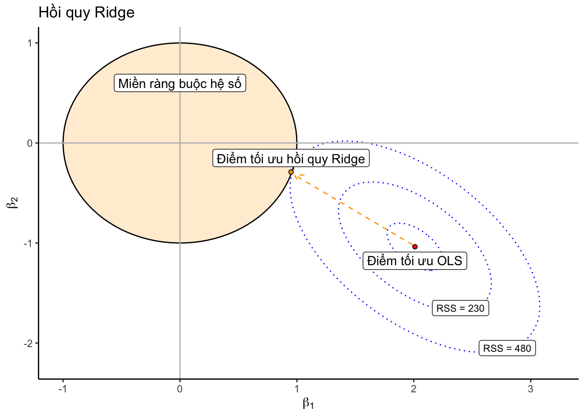
<p class="caption">(\#fig:fglm111)hồi quy *ridge* tương đương với bài toán tìm RSS nhỏ nhất với ràng buộc các hệ số tuyến tính.</p>
</div>

Hình \@ref(fig:fglm111) mô tả quá trình ước lượng tham số của hồi quy *ridge* trên một dữ liệu được mô phỏng. Dữ liệu có 500 quan sát và các hệ số $\beta_1$ và $\beta_2$ được lựa chọn để sinh dữ liệu là $\beta_1 = 2$ và $\beta_2 = -1$. Bạn đọc có thể thấy rằng lời giải của bài toán tối ưu không có ràng buộc là điểm xấp xỉ $(2,-1)$. Giá trị $RSS(\boldsymbol{\beta})$ tương ứng với điểm tối ưu này là 80. Khi chúng ta thêm ràng buộc với hệ số $\beta_1$ và $\beta_2$ như phương trình \@ref(eq:ridge2) với $c = 1$ thì miền giá trị của các hệ số phải nằm trong hình tròn có tâm tại (0,0) và bán kính bằng 1 giống như trong hình vẽ. Để thỏa mãn được ràng buộc này, chúng ta phải chấp nhận giá trị của $RSS(\boldsymbol{\beta})$ tăng lên. Tại mỗi giá trị của $RSS(\boldsymbol{\beta})$ lớn hơn giá trị tối thiểu là 80, tập hợp các điểm ($\beta_1$, $\beta_2$) sao cho giá trị của *RSS* không thay đổi là một hình ellipse do khai triển công thức của RSS sẽ thu được phương trình của một ellipse trên các biến ($\beta_1$, $\beta_2$). Hình \@ref(fig:fglm111) mô tả ba ellipse đồng tâm, có độ lớn tăng dần tương ứng với giá trị của RSS là 100, 230 và 480. Tại giá trị 480, ellipse tiếp xúc với hình tròn mô tả miền ràng buộc tham số tại điểm chính là lời giải của bài toán tối ưu có ràng buộc hay chính là giá trị ước lượng tham số của hồi quy *ridge*. Bạn đọc có thể thấy rằng nếu hình tròn ràng buộc tham số không chứa điểm $(2,-1)$, hồi quy *ridge* luôn luôn đẩy các hệ số tuyến tính về gần 0 hơn và làm cho mô hình ít bị phụ thuộc hơn vào các tham số tuyến tính.

### Phương pháp Lasso
*Lasso* cũng là một phương pháp để tạo ràng buộc cho các hệ số của mô hình hồi quy tuyến tính. *Lasso* sử dụng hàm phạt dưới dạng tổng giá trị tuyệt đối của các hệ số thay vì tổng bình phương các hệ số tuyến tính. *Lasso* có thể được phát biểu dưới dạng bài toán tối ưu với ràng buộc như sau
\begin{align}
& \hat{\boldsymbol{\beta}}^{ridge} = \underset{\boldsymbol{\beta}}{\operatorname{argmin}} \sum\limits_{i=1}^n \left( y_i - \beta_0 - \sum\limits_{j = 1}^p \beta_j \cdot x_{i,j} \right)^2, \\
& \text{ với ràng buộc: }  \sum\limits_{j=1}^p |\beta_j| \leq c
(\#eq:lasso1)
\end{align}

Tương tự như hồi quy *ridge*, các biến độc lập cũng sẽ được chuẩn hóa để có giá trị trung bình bằng 0. Khi đó, ước lượng cho $\beta_0$ là giá trị trung bình của biến phụ thuộc. Ước lượng tham số cho *Lasso* là quá trình tìm hệ số tuyến tính $\hat{\boldsymbol{\beta}}^{Lasso}$ để tối thiểu hóa tổng bình phương sai số cộng thêm một hàm phạt

\begin{align}
\hat{\boldsymbol{\beta}}^{Lasso} = \underset{\boldsymbol{\beta}}{\operatorname{argmin}} \sum\limits_{i=1}^n \left( y_i - \beta_0 - \sum\limits_{j = 1}^p \beta_j \cdot x_{i,j} \right)^2 + \lambda \cdot \sum\limits_{j=1}^p |\beta_j|
(\#eq:lasso2)
\end{align}

Không giống như hồi quy *ridge*, sử dụng hàm phạt là tổng giá trị tuyệt đối của các hệ số sẽ dẫn đến bài toán tìm $\hat{\boldsymbol{\beta}}^{Lasso}$ không có lời giải chính xác. Các phương pháp giải số thường được áp dụng để ước lượng tham số. Khi hằng số $c$ trong ràng buộc của bài toán tối ưu \@ref(eq:lasso1) xấp xỉ 0, các hệ số tuyến tính cũng sẽ xấp xỉ 0. Ngược lại khi $c$ đủ lớn, lời giải của bài toán tối ưu sẽ là hệ số của mô hình tuyến tính thông thường.

<div class="figure" style="text-align: center">
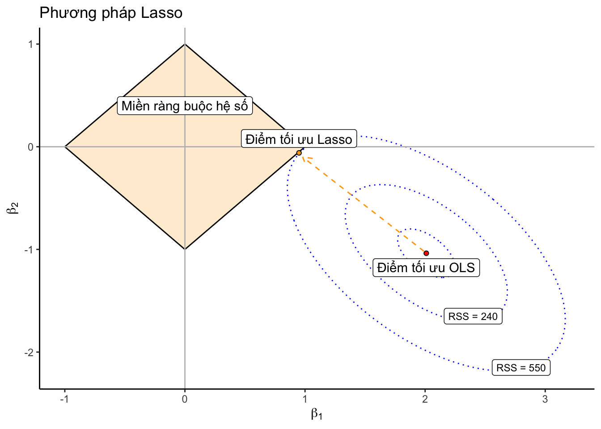
<p class="caption">(\#fig:fglm112)Hồi quy ridge tương đương với bài toán tìm RSS nhỏ nhất với ràng buộc các hệ số tuyến tính.</p>
</div>

Hình \@ref(fig:fglm112) mô tả quá trình ước lượng tham số của hồi quy lasso trên một dữ liệu mô phỏng mà chúng tôi đã sử dụng trong mô tả hồi quy *ridge*. Các hệ số $\beta_1$ và $\beta_2$ được lựa chọn để sinh dữ liệu là $\beta_1 = 2$ và $\beta_2 = -1$ và lời giải của bài toán tối ưu không có ràng buộc là điểm xấp xỉ $(2,-1)$. Giá trị $RSS(\boldsymbol{\beta})$ tương ứng với điểm tối ưu này là 80. Khi chúng ta thêm ràng buộc với hệ số $\beta_1$ và $\beta_2$ như phương trình \@ref(eq:lasso1) với $c = 1$ thì miền giá trị của các hệ số phải nằm trong hình kim cương 4 cạnh được mô tả như trong hình vẽ. Cũng giống như trong hồi quy *ridge*, để thỏa mãn được ràng buộc chúng ta phải chấp nhận giá trị của $RSS(\boldsymbol{\beta})$ tăng lên. Hình \@ref(fig:fglm111) mô tả ba ellipse đồng tâm, có độ lớn tăng dần tương ứng với giá trị của RSS là 100, 240 và 550. Tại giá trị 550, ellipse tiếp xúc với miền ràng buộc tham số tại một điểm và điểm đó chính là lời giải của phương pháp lasso. Tương tự như hồi quy *ridge*, phương pháp lasso luôn kéo các hệ số tuyến tính về gần 0 và làm cho mô hình ít bị phụ thuộc hơn vào các tham số tuyến tính. Do đặc điểm của miền ràng buộc, phương pháp lasso nhiều khi còn hiệu quả hơn hồi quy *ridge* trong ràng buộc tham số bởi vì điểm tiếp xúc của ellipse với hình kim cương sẽ luôn khiến cho một trong hai hệ số nhận giá trị gần 0 hơn.  


## Thực hành xây dựng mô hình tuyến tính
Chúng ta sẽ thực hành xây dựng mô hình tuyến tính trên dữ liệu <span style='color: #640514; font-family: Source Code Pro;'>Boston</span> trong thư viện <span style='color: #640514; font-family: Source Code Pro;'>MASS</span> là dữ liệu về giá nhà tại các vùng ngoại ô của thành phố Boston. Biến mục tiêu có tên là <span style='color: #640514; font-family: Source Code Pro;'>medv</span> là giá trị trung vị của giá nhà tại mỗi vùng. Có 13 biến giải thích bao gồm 11 biến giải thích là các biến liên tục và hai biến giải thích rời rạc bao gồm

* <span style='color: #640514; font-family: Source Code Pro;'>chas</span> nhận hai giá trị là 1 nếu vùng ngoại ô nằm trên đường bờ sông và nhận giá trị bằng 0 nếu vùng đó không nằm trên đường bờ sông. 
* <span style='color: #640514; font-family: Source Code Pro;'>rad</span> là chỉ số cho biết khả năng tiếp cận đường cao tốc của mỗi vùng. Chỉ số này càng cao thì vùng càng có khả năng tiếp cận đường cao tốc.

Về nguyên tắc, dữ liệu trước khi sử dụng để xây dựng mô hình cần được làm sạch, xử lý giá trị không quan sát được, loại bỏ các giá trị ngoại lai, loại bỏ các biến không cần thiết,... Tuy nhiên, để không lặp lại các kiến thức đã trình bày trong các chương trước, chúng tôi sẽ bỏ qua phần này và trực tiếp đi vào phần xây dựng mô hình.

Một lưu ý khác là đa số các hàm số dùng để xây dựng mô hình trên dữ liệu đều đã được phát triển dưới dạng các hàm số có sẵn trên R. Người xây dựng mô hình chỉ cần gọi đúng tên hàm số, khai báo chính xác tham số, và đọc được kết quả trả ra mà không cần phải hiểu chính xác cách viết các hàm số đó như thế nào. Đây là ưu điểm lớn nhất đồng thời cũng là nhược điểm lớn nhất khi sử dụng R để xây dựng mô hình. Là ưu điểm vì bạn đọc chỉ cần một dòng lệnh là đã có thể xây dựng được mô hình phức tạp trên dữ liệu mà không cần hiểu một cách chính xác về mô hình đó. Là nhược điểm bởi vì khi người xây dựng mô hình không hiểu rõ về bản chất có thể dẫn tới sử dụng mô hình không đúng mục đích và dẫn đến các nhận định sai lầm. Để hạn chế được nhược điểm này, trong một số trường hợp, chúng tôi sẽ yêu cầu bạn đọc tự viết các câu lệnh tính toán tham số trước khi gọi các hàm có sẵn.

### Xây dựng mô hình hồi quy đa biến
Trước hết chúng ta sẽ xây dựng mô hình tuyến tính đơn biến mà giá nhà phụ thuộc vào một biến có tên là <span style='color: #640514; font-family: Source Code Pro;'>lstat</span>. Các hệ số tuyến tính trong mô hình hồi quy đơn $Y \sim \beta_0 + \beta_1 \cdot X$ được ước lượng bằng phương pháp bình phương nhỏ nhất được tính toán như sau:
\begin{align}
\hat{\beta}_1 = \cfrac{cov(X,Y)}{var(X)} \ \ \ ; \ \ \ \hat{\beta}_0 = \bar{Y} - \hat{\beta}_1 \cdot \bar{X}
\end{align}


``` r
dat <- Boston
y <- Boston$medv
x <- Boston$lstat
beta1 <- cov(x,y)/var(x); beta0 <- mean(y) - beta1 * mean(x)
print(c(beta0,beta1))
```

```
## [1] 34.5538409 -0.9500494
```

Như vậy, chúng ta có mô hình tuyến tính đơn biến mà <span style='color: #640514; font-family: Source Code Pro;'>medv</span> phụ thuộc vào <span style='color: #640514; font-family: Source Code Pro;'>lstat</span>
\begin{align}
\hat{medv} = 34.5538409 - 0.9500494 \times \text{lstat}
\end{align}

Kết quả mô hình cho thấy khi <span style='color: #640514; font-family: Source Code Pro;'>lstat</span> tăng thêm 1 (%) thì giá nhà trung bình sẽ giảm đi khoảng 0.950 (nghìn USD). Sai số (phần dư) của mô hình là hiệu số giữa giá trị của biến <span style='color: #640514; font-family: Source Code Pro;'>medv</span> được ước lượng từ mô hình và giá trị của <span style='color: #640514; font-family: Source Code Pro;'>medv</span> trong dữ liệu. Chúng ta có đồ thị phần dư như sau


``` r
phandu <- (y -  beta0 - beta1 * x)
data.frame(x = 1:length(phandu), phandu = phandu)%>%
  ggplot(aes(x,phandu))+
  geom_line(color = "#640514",alpha = 0.3)+
  geom_hline(yintercept = 0, col = "grey30")+
  theme_minimal()+
  xlab("Số quan sát")+ ylab("Phần dư")
```

<div class="figure" style="text-align: center">
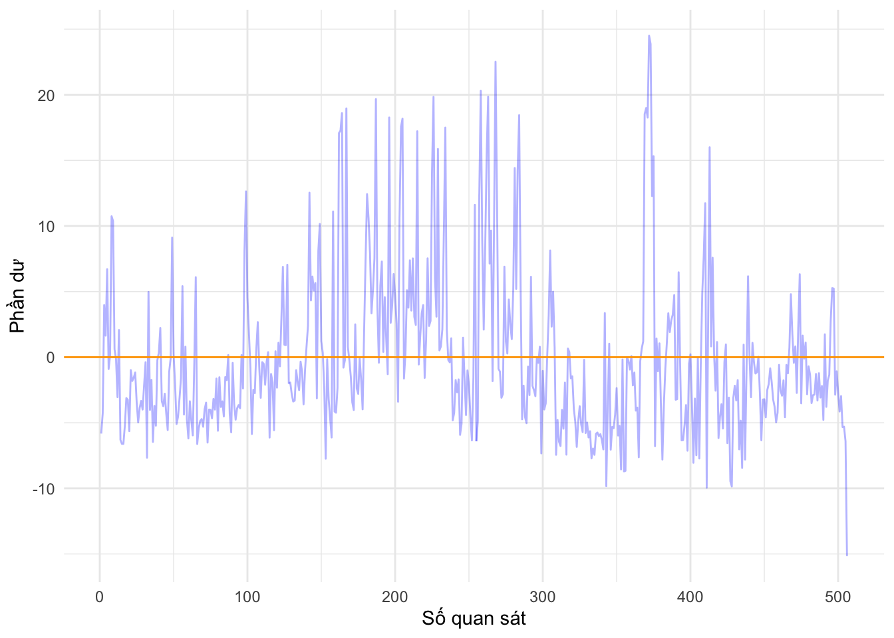
<p class="caption">(\#fig:lmthuchanh2)Đồ thị phần dư trong mô hình hồi quy đơn medv phụ thuộc vào lstat</p>
</div>

Nhìn vào đồ thị phần dư, bạn đọc có thể dễ dàng nhận thấy rằng giả thiết phân phối chuẩn của phần dư và giả thiết các phần dư không tương quan với nhau là không đúng. Điều này có thể cải thiện bằng cách thêm các biến giải thích khác vào mô hình. Chúng ta ước lượng được phương sai (RSE) của phần dư như sau
\begin{align}
\hat{\sigma} = RSE = \sqrt{\cfrac{RSS}{n-2}}
\end{align}
trong đó *RSS* là tổng sai số bình phương và $n$ là số quan sát


``` r
RSS <- sum(phandu^2)
RSE <- sqrt(RSS/(nrow(Boston)-2))
print(paste("RSE =", RSE))
```

```
## [1] "RSE = 6.21576040539807"
```

Hệ số *R-squared* của mô hình được tính toán như sau

``` r
TSS <- sum((y - mean(y))^2)
R_squared <- 1 - RSS/TSS
print(paste("Hệ số R-squared: ", R_squared))
```

```
## [1] "Hệ số R-squared:  0.54414629758648"
```

Phương sai của các hệ số $\beta_0$, $\beta_1$, các giá trị của phân phối *Student*, và *p-value* được tính toán như sau

``` r
n<-nrow(Boston)
SE_beta0 <- RSE * sqrt(1/n+ mean(x)^2/sum(((x-mean(x))^2)))
SE_beta1 <- RSE * sqrt(1/sum(((x-mean(x))^2)))
t_beta0 <- beta0/SE_beta0
t_beta1 <- beta1/SE_beta1
p_value_beta0 <- 2 * (1-pt(abs(t_beta0), df = n-2))
p_value_beta1 <- 2 * (1-pt(abs(t_beta1), df = n-2))
print(paste("Các giá trị phân phối student: ", t_beta0, " - ", t_beta1))
```

```
## [1] "Các giá trị phân phối student:  61.4151455186417  -  -24.5278998511877"
```

``` r
print(paste("Các giá trị p-value: ", p_value_beta0, " - ",p_value_beta1))
```

```
## [1] "Các giá trị p-value:  0  -  0"
```

Có thể thấy rằng các giá trị *p-value* đều nhỏ, cho thấy các hệ số tuyến tính đều khác không một cách có ý nghĩa.

Tất cả các tính toán ở trên đều có thể được thực hiện thông qua hàm có sẵn là <span style='color: #640514; font-family: Source Code Pro;'>lm()</span>. Cách sử dụng hàm <span style='color: #640514; font-family: Source Code Pro;'>lm()</span> xây dựng mô hình tuyến tính mà biến <span style='color: #640514; font-family: Source Code Pro;'>medv</span> phụ thuộc vào biến <span style='color: #640514; font-family: Source Code Pro;'>lstat</span> như sau

``` r
lm1<-lm(medv~lstat, data = Boston)
summary(lm1)
```

```
## 
## Call:
## lm(formula = medv ~ lstat, data = Boston)
## 
## Residuals:
##     Min      1Q  Median      3Q     Max 
## -15.168  -3.990  -1.318   2.034  24.500 
## 
## Coefficients:
##             Estimate Std. Error t value Pr(>|t|)    
## (Intercept) 34.55384    0.56263   61.41   <2e-16 ***
## lstat       -0.95005    0.03873  -24.53   <2e-16 ***
## ---
## Signif. codes:  0 '***' 0.001 '**' 0.01 '*' 0.05 '.' 0.1 ' ' 1
## 
## Residual standard error: 6.216 on 504 degrees of freedom
## Multiple R-squared:  0.5441,	Adjusted R-squared:  0.5432 
## F-statistic: 601.6 on 1 and 504 DF,  p-value: < 2.2e-16
```

Bạn đọc có thể kiểm tra các tính toán ở trên so với kết quả ước lượng từ hàm <span style='color: #640514; font-family: Source Code Pro;'>lm()</span> là hoàn toàn tương tự nhau. Đối tượng <span style='color: #640514; font-family: Source Code Pro;'>lm1</span> là một list có 12 phần tử trong đó có các phần tử như <span style='color: #640514; font-family: Source Code Pro;'>coefficient</span> chứa giá trị các hệ số ước lượng hay <span style='color: #640514; font-family: Source Code Pro;'>residuals</span> là véc-tơ phần dư.

Mô hình tuyến tính đa biến cũng có thể được ước lượng bằng hàm <span style='color: #640514; font-family: Source Code Pro;'>lm()</span> giống như mô hình đơn biến. Chúng ta xây dựng mô hình tuyến tính đa biến mà trong đó biến <span style='color: #640514; font-family: Source Code Pro;'>medv</span> phụ thuộc vào tất cả các biến còn lại như sau

``` r
Boston$chas<-as.factor(Boston$chas)
lm.all<-lm(medv~., data = Boston)
summary(lm.all)
```

```
## 
## Call:
## lm(formula = medv ~ ., data = Boston)
## 
## Residuals:
##     Min      1Q  Median      3Q     Max 
## -15.595  -2.730  -0.518   1.777  26.199 
## 
## Coefficients:
##               Estimate Std. Error t value Pr(>|t|)    
## (Intercept)  3.646e+01  5.103e+00   7.144 3.28e-12 ***
## crim        -1.080e-01  3.286e-02  -3.287 0.001087 ** 
## zn           4.642e-02  1.373e-02   3.382 0.000778 ***
## indus        2.056e-02  6.150e-02   0.334 0.738288    
## chas1        2.687e+00  8.616e-01   3.118 0.001925 ** 
## nox         -1.777e+01  3.820e+00  -4.651 4.25e-06 ***
## rm           3.810e+00  4.179e-01   9.116  < 2e-16 ***
## age          6.922e-04  1.321e-02   0.052 0.958229    
## dis         -1.476e+00  1.995e-01  -7.398 6.01e-13 ***
## rad          3.060e-01  6.635e-02   4.613 5.07e-06 ***
## tax         -1.233e-02  3.760e-03  -3.280 0.001112 ** 
## ptratio     -9.527e-01  1.308e-01  -7.283 1.31e-12 ***
## black        9.312e-03  2.686e-03   3.467 0.000573 ***
## lstat       -5.248e-01  5.072e-02 -10.347  < 2e-16 ***
## ---
## Signif. codes:  0 '***' 0.001 '**' 0.01 '*' 0.05 '.' 0.1 ' ' 1
## 
## Residual standard error: 4.745 on 492 degrees of freedom
## Multiple R-squared:  0.7406,	Adjusted R-squared:  0.7338 
## F-statistic: 108.1 on 13 and 492 DF,  p-value: < 2.2e-16
```

Từ giá trị *p-value* của từng hệ số tuyến tính, có thể nhận thấy rằng hầu hết các biến trong mô hình đều có ý nghĩa ngoại trừ hai biến là <span style='color: #640514; font-family: Source Code Pro;'>indus</span> và <span style='color: #640514; font-family: Source Code Pro;'>age</span>. 

### Lựa chọn biến trong mô hình hồi quy tuyến tính
Chúng ta sẽ sử dụng *RSE* trung bình khi thực hiện xác thực chéo làm tiêu chí để lựa chọn biến trong mô hình hồi quy tuyến tính. Hàm số dùng để tạo chỉ số tập xác thực trong xác thực chéo là hàm <span style='color: #640514; font-family: Source Code Pro;'>createFolds()</span> của thư viện <span style='color: #640514; font-family: Source Code Pro;'>caret</span>. Dữ liệu sẽ được chia ngẫu nhiên thành $k = 5$ phần theo biến mục tiêu để đảm bảo phân phối của biến mục tiêu trong từng tập xác thực tương tự nhau.


``` r
# Chia dữ liệu ngẫu nhiên thành 5 phần theo biến medv
set.seed(10)
fold_number = 5
index <- createFolds(Boston$medv, k = fold_number)
```

Để tính sai số xác thực chéo, với mỗi $i \in \{1, 2, 3, 4, 5\}$ chúng ta xây dựng mô hình trên dữ liệu <span style='color: #640514; font-family: Source Code Pro;'>Boston</span> loại trừ đi các quan sát thuộc tập xác thực $i$. Sau đó tính toán sai số của mô hình trên tập xác thực thứ $i$. Sai số trong bài toán hồi quy được tính bằng RMSE. Sai số xác thực chéo là giá trị trung bình của sai số trên các tập xác thực $i$, $1 \leq i \leq 5$. Ví dụ, chúng ta xác định sai số của mô hình đơn biến gồm một biến giải thích <span style='color: #640514; font-family: Source Code Pro;'>lstat</span> và mô hình tuyến tính đa biến bao gồm tất cả các biến như sau:


``` r
# Sai số giữa hai véc-tơ số tính bằng RMSE
RMSE <- function(y,y.hat) sqrt(mean((y - y.hat)^2))

# Hàm số tính sai số xác thực chéo hồi quy tuyến tính
cv.lm<-function(seed = 10, fold_number = 5, dat, target){
  # seed: khởi tạo ngẫu nhiên
  # fold_number: số lượng folds
  # dat: dữ liệu xây dựng mô hình (X)
  # target: biến mục tiêu (Y)
  set.seed(seed)
  n <- nrow(dat) ; p <- ncol(dat)
  
  # Tạo dữ liệu xác thực chéo
  y <- target
  x <- dat
  index <- createFolds(y, k = fold_number)
  
  # Véc-tơ sai số xác thực chéo
  error_reg <- rep(0, fold_number) 
  
  for (i in 1:fold_number){
    test.index <- index[[i]] # chỉ số tập xác thực
    test.index <- (1:n) %in% test.index
    
    # Dữ liệu huấn luyện
    x.train <- x %>% filter(!test.index)
    y.train <- y[!test.index]
    
    # Dữ liệu xác thực
    x.test <- x %>% filter(test.index)
    y.test <- y[test.index]
    
    # Mô hình tuyến tính
    lm.model <- lm(y.train~., data = x.train) # ước lượng
    lm.pred <- predict(lm.model, x.test) # dự đoán
    error_reg[i] <- RMSE(y.test,lm.pred)                
  }
  return(mean(error_reg))
}

# Sai số xác thực chéo hồi quy đơn
mydat <- dplyr::select(Boston, lstat)
y <- Boston$medv
cv.lm(seed = 10, fold_number = 5, dat = mydat, target = y)
```

```
## [1] 6.200729
```

``` r
# Sai số xác thực chéo hồi quy bội
mydat <- dplyr::select(Boston, -medv) # X
cv.lm(seed = 10, fold_number = 5, dat = mydat, target = y)
```

```
## [1] 4.857492
```

Dữ liệu Boston bao gồm 13 biến độc lập do đó thực hiện lựa chọn biến bằng phương pháp lựa chọn tập con tốt nhất là có thể thực hiện được. Nguyên tắc lựa chọn mô hình là dựa trên sai số xác thực chéo, mô hình có sai số xác thực chéo nhỏ nhất sẽ được lựa chọn. Có $(2^{13} - 1)$ mô hình cần được xây dựng và tính toán.


``` r
p <- ncol(Boston)-1
number_model <- 2^p - 1
var_name <- select(Boston, - medv) %>% names() 
cv.error <- rep(0, number_model)

for (i in 1:1){
#for (i in 1:number_model){
  # Véc-tơ chứa tên các biến được lựa chọn
  selected_variable <- var_name[as.logical(intToBits(i))[1:p]]
  y <- Boston$medv
  mydat <- select(Boston, selected_variable)
  cv.error[i] <- cv.lm(seed = 10, fold_number = 5, dat = mydat, target = y)
}

# Mô hình có sai số xác thực chéo nhỏ nhất
best_model <- which.min(cv.error)
# Danh sách các biến trong mô hình
var_name[as.logical(intToBits(best_model))[1:p]]
```

```
## [1] "zn"
```

Như vậy mô hình tuyến tính có sai số xác thực chéo nhỏ nhất là mô hình có 11 biến liệt kê như trên. Lưu ý rằng, do dữ liệu có kích thước không lớn nên kết quả của mô hình sẽ phụ thuộc vào việc chia dữ liệu thành các tập xác thực.

Lựa chọn biến cho mô hình tuyến tính bằng phương pháp forward stepwise selection được thực hiện như sau


``` r
# Thứ tự chạy mô hình từ ít đến nhiều biến
M <- matrix(FALSE,number_model,p)
for (i in 1:number_model){ 
  M[i,] <- as.logical(intToBits(i))[1:p]
}
M <- M[order(apply(M,1,sum)),]

# Kết quả của quá trình forward stepwise được lưu
fws_result <- data.frame(Model_number = rep(0, p*(p-1)/2), 
                        Number_variable = rep(0, p*(p-1)/2), 
                        CV_error = rep(0, p*(p-1)/2))
current_best_model <- c()
j <- 0
# Lựa chọn mô hình
for (i in 1:number_model){
  number_selected_variable <- sum(M[i,])
  current_select <- var_name[M[i,]]
  
  if ( (i == 1) | all(current_best_model %in% current_select) ){
    j <- j+1
    mydat <- select(Boston, current_select)
    cv.error <- cv.lm(seed = 10, fold_number = 5, dat = mydat, target = y)
    fws_result[j,] <- c(i, number_selected_variable, cv.error)
  }  
  
  # Lưu lại mô hình có các biến tốt nhất
  if (i < number_model){
    if (sum(M[i+1,])-sum(M[i,]) ==  1){
      dat <- filter(fws_result, Number_variable == number_selected_variable)
      ind_best_model <- dat$Model_number[which.min(dat$CV_error)]
      current_best_model <- var_name[M[ind_best_model,]]
    }
  } 
}
```

Bạn đọc có thể dễ dàng nhận thấy rằng thời gian để thực hiện lựa chọn biến bằng phương pháp forward stepwise selection là nhanh hơn rất nhiều so với phương pháp lựa chọn tập hợp con tốt nhất.

Tương tự, chúng ta có thể thực hiện lựa chọn biến bằng phương pháp backward stepwise selection được thực hiện như sau


``` r
# Thứ tự chạy mô hình từ ít đến nhiều biến
M <- matrix(FALSE,number_model,p)
for (i in 1:number_model){ 
  M[i,] <- as.logical(intToBits(i))[1:p]
}
M <- M[order(apply(M,1,sum),decreasing = TRUE),]

# Kết quả của quá trình forward stepwise được lưu
bws_result <- data.frame(Model_number = rep(0, p*(p-1)/2), 
                         Number_variable = rep(0, p*(p-1)/2), 
                         CV_error = rep(0, p*(p-1)/2))
current_best_model <- var_name
j <- 0
# Lựa chọn mô hình
for (i in 1:number_model){
  number_selected_variable <- sum(M[i,])
  current_select <- var_name[M[i,]]
  
  if ( (i == p) | all(current_select %in% current_best_model) ){
    j <- j+1
    mydat <- select(Boston, current_select)
    cv.error <- cv.lm(seed = 10, fold_number = 5, dat = mydat, target = y)
    bws_result[j,] <- c(i, number_selected_variable, cv.error)
  }  
  
  # Lưu lại mô hình có các biến tốt nhất
  if (number_selected_variable > 1){
    if (sum(M[i,])-sum(M[i+1,]) ==  1){
      dat <- filter(bws_result, Number_variable == number_selected_variable)
      ind_best_model <- dat$Model_number[which.min(dat$CV_error)]
      current_best_model <- var_name[M[ind_best_model,]]
    }
  } 
}
```


### Hồi quy *ridge* và lasso
Hồi quy *ridge* và lasso được thực hiện bằng hàm số <span style='color: #640514; font-family: Source Code Pro;'>glmnet()</span> của thư viện cùng tên <span style='color: #640514; font-family: Source Code Pro;'>glmnet</span>. Tham số $\lambda$ của các phương pháp này được tìm kiếm bằng phương pháp xác thực chéo. Hàm số thực hiện tính toán sai số xác thực chéo của hồi quy *ridge* và lasso là hàm <span style='color: #640514; font-family: Source Code Pro;'>cv.glmnet()</span>.


``` r
library(glmnet)

# Chuẩn hóa dữ liệu về dạng số
y <- Boston$medv
x <- model.matrix(medv~.,Boston)

# Các giá trị lambda
r.lambda<-seq(0,0.3,length=100)
l.lambda<-seq(0,0.1,length=100)
set.seed(50)

# Xác thực chéo với ridge (tham số alpha = 0)
cv.ridge <- cv.glmnet(x, y, alpha = 0, 
                  nfolds = 5, lambda=r.lambda)


# Xác thực chéo với lasso (tham số alpha = 1)
cv.lasso <- cv.glmnet(x, y, alpha = 1, 
                  nfolds = 5, lambda=l.lambda)
```

Sai số xác thực chéo tính bằng MSE được lưu trong véc-tơ con có tên là <span style='color: #640514; font-family: Source Code Pro;'>cvm</span>. Chúng ta có sai số xác thực chéo cho mỗi giá trị của $\lambda$ của hồi quy *ridge* và lasso như hình \@ref(eq:fglmthuchanh01)

<div class="figure" style="text-align: center">
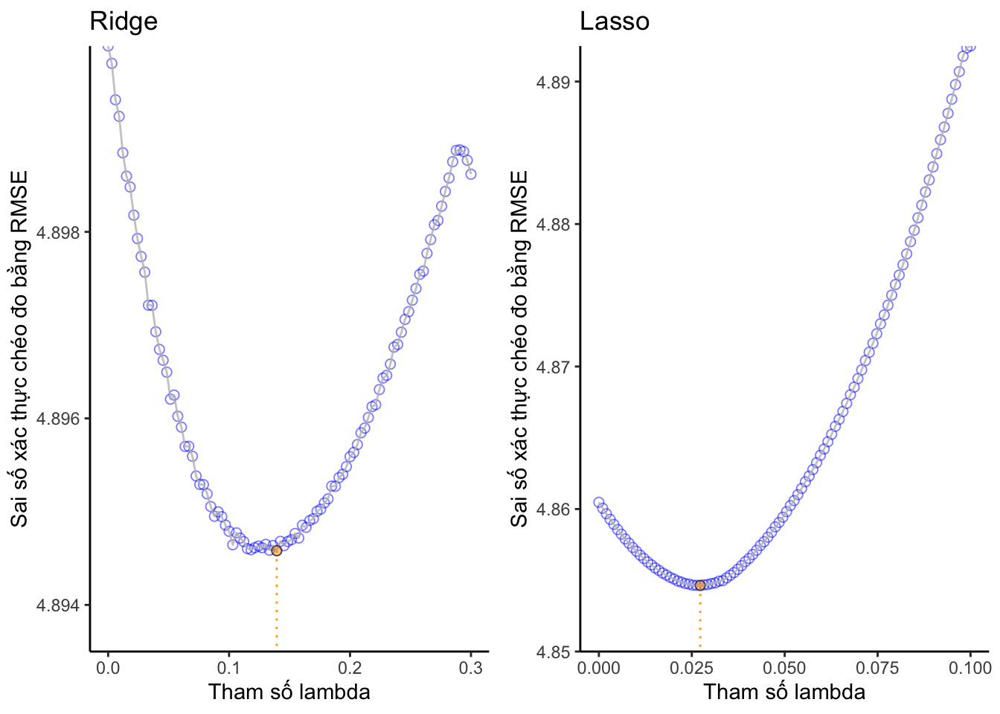
<p class="caption">(\#fig:fglmthuchanh01)Sai số xác thực chéo tương ứng với mỗi giá trị của siêu tham số lambda trong hồi quy ridge và lasso.</p>
</div>

Có thể thấy rằng trong hồi quy *ridge* và lasso, tham số $\lambda$ cho sai số xác thực chéo nhỏ nhất lần lượt là 0.14 và 0.027. Sai số xác thực chéo trong hồi quy *ridge* và lasso không tốt hơn so với mô hình hồi quy tuyến tính bội. 

Do các phương pháp ràng buộc tham số sẽ tránh được hiện tượng khớp dữ liệu quá mức, chúng ta có thể tạo thêm các biến giải thích cho biến giá nhà bằng cách nhân chéo các biến giải thích hiện có. Tổng số biến mới được tạo thành là $p\times(p+1)/2$.


``` r
dat <- select(Boston, -medv)
p <- ncol(dat)

dat <- sapply(dat,  
             function(x){
               x <- as.numeric(x)
               return ((x - mean(x))/sd(x))
             })

dat<-as.data.frame(dat)

for (i in 1:p){
  for (j in i:p){
    dat <- mutate(dat, newcol = dat[,i]*dat[,j])
    names(dat)[length(dat)] <- paste0("X",i,"_",j)
  }
}
dat<-mutate(dat, "medv" = Boston$medv)
# Chuẩn hóa dữ liệu về dạng số
y <- dat$medv
x <- model.matrix(medv~.,dat)

# Các giá trị lambda
r.lambda<-seq(0,0.5,length=100)
l.lambda<-seq(0,0.2,length=100)
set.seed(50)

# Xác thực chéo với ridge (tham số alpha = 0)
cv.ridge <- cv.glmnet(x, y, alpha = 0, 
                  nfolds = 5, lambda=r.lambda)


# Xác thực chéo với lasso (tham số alpha = 1)
cv.lasso <- cv.glmnet(x, y, alpha = 1, 
                  nfolds = 5, lambda=l.lambda)
```

Chúng ta có sai số xác thực chéo cho mỗi giá trị của $\lambda$ của hồi quy *ridge* và *lasso* với dữ liệu sau khi biến đổi như hình \@ref(eq:fglmthuchanh02)

<div class="figure" style="text-align: center">
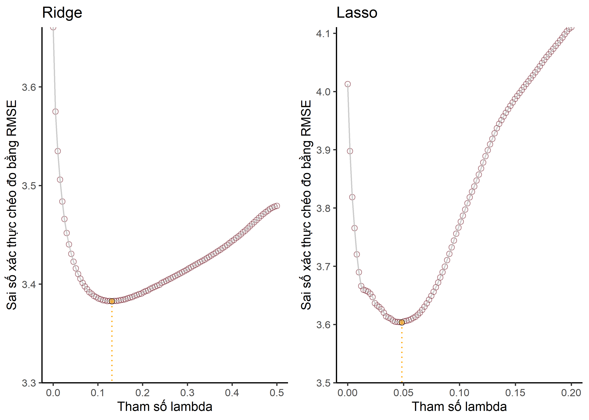
<p class="caption">(\#fig:fglmthuchanh02)Sai số xác thực chéo tương ứng với mỗi giá trị của siêu tham số lambda trong hồi quy ridge và lasso.</p>
</div>

Có thể thấy rằng việc áp dụng hồi quy *ridge* và lasso trên dữ liệu có số lượng lớn biến giải thích mới được tạo thành bằng cách nhân chéo các biến hiện có không chỉ tránh được hiện tương mô hình bị khớp quá mức mà còn cải thiện khả năng dự đoán của mô hình. Sai số xác thực chéo đã giảm đáng kể so với mô hình chỉ sử dụng các biến ban đầu.

## Bài tập

### Bài tập lý thuyết


### Bài tập thực hành


<!-- # REFERENCE -->

<!-- ### Source from thesis -->

<!-- **1.** Chen, Chun-houh, Wolfgang Karl Härdle, and Antony Unwin, eds (2007). *Handbook of data visualization.* \ -->
<!-- **2.** Aparicio, Manuela, and Carlos J. Costa. (2015). *Data visualization - Communication design quarterly review.* \ -->
<!-- **3.** Hadley Wickham. (2010). *A Layered Grammar of Graphics.* \ -->

<!-- ### Souce from website -->

<!-- **4.** [https://www.tableau.com/learn/articles/data-visualization](https://www.tableau.com/learn/articles/data-visualization) \ -->
<!-- **5.** [https://www.r-graph-gallery.com/ggplot2-package.html](https://www.r-graph-gallery.com/ggplot2-package.html) \ -->
<!-- **6.** [http://r-statistics.co/ggplot2-Tutorial-With-R.html](http://r-statistics.co/ggplot2-Tutorial-With-R.html) \ -->
<!-- **7.** [https://www.maths.usyd.edu.au/u/UG/SM/STAT3022/r/current/Misc/data-visualization-2.1.pdf](https://www.maths.usyd.edu.au/u/UG/SM/STAT3022/r/current/Misc/data-visualization-2.1.pdf) \ -->
<!-- **8.** [https://www.kaggle.com/](https://www.kaggle.com/) \ -->
